# 使用 plt.scatter()在 Python 中可视化数据

> 原文：<https://realpython.com/visualizing-python-plt-scatter/>

*立即观看**本教程有真实 Python 团队创建的相关视频课程。配合文字教程一起看，加深理解: [**使用 plt.scatter()在 Python 中可视化数据**](/courses/using-pltscatter-visualize-data-python/)

处理数据的一个重要部分是能够**可视化**它。Python 有几个第三方模块可以用于数据可视化。最受欢迎的模块之一是 **Matplotlib** 及其子模块 **pyplot** ，通常使用别名 **`plt`** 。Matplotlib 提供了一个名为 **`plt.scatter()`** 的非常通用的工具，允许您创建基本的和更复杂的散点图。

下面，您将通过几个例子来展示如何有效地使用该函数。

在本教程中，你将学习如何:

*   使用 **`plt.scatter()`** 创建**散点图**
*   使用必需和可选的**输入参数**
*   为**基本图和更高级图**定制散点图
*   在散点图上表示两个以上的维度

为了从本教程中获得最大收益，你应该熟悉 Python 编程的[基础和](https://realpython.com/products/python-basics-book/) [NumPy](https://realpython.com/numpy-tutorial/) 及其`ndarray`对象的基础。你不需要熟悉 Matplotlib 来学习本教程，但如果你想了解更多关于该模块的知识，那么请查看 [Python 使用 Matplotlib 绘图(指南)](https://realpython.com/python-matplotlib-guide/)。

**免费奖励:** [点击此处获取免费的 NumPy 资源指南](#)，它会为您指出提高 NumPy 技能的最佳教程、视频和书籍。

## 创建散点图

一个[散点图](https://en.wikipedia.org/wiki/Scatter_plot)是两个[变量](https://realpython.com/python-variables/)如何相互关联的可视化表示。您可以使用散点图来探索两个变量之间的关系，例如通过寻找它们之间的任何相关性。

在本节教程中，您将熟悉如何使用 Matplotlib 创建基本散点图。在后面的章节中，您将学习如何进一步定制您的绘图，以使用两个以上的维度来表示更复杂的数据。

[*Remove ads*](/account/join/)

### `plt.scatter()` 入门

在你开始使用 [`plt.scatter()`](https://matplotlib.org/stable/api/_as_gen/matplotlib.pyplot.scatter.html) 之前，你需要安装 Matplotlib。您可以使用 Python 的标准包管理器 [`pip`](https://realpython.com/what-is-pip/) ，通过在控制台中运行以下命令来实现:

```py
$ python -m pip install matplotlib
```

现在您已经安装了 Matplotlib，考虑下面的用例。一家咖啡馆出售六种不同类型的瓶装橙汁饮料。店主希望了解饮料价格和他销售的每种饮料数量之间的关系，所以他记录了他每天销售的每种饮料的数量。您可以将这种关系形象化，如下所示:

```py
import matplotlib.pyplot as plt

price = [2.50, 1.23, 4.02, 3.25, 5.00, 4.40]
sales_per_day = [34, 62, 49, 22, 13, 19]

plt.scatter(price, sales_per_day)
plt.show()
```

在这个 Python 脚本中，您[使用别名`plt`从 Matplotlib 导入](https://realpython.com/python-import/)子模块`pyplot`。这个别名通常用于缩短模块和子模块的名称。然后创建[列表](https://realpython.com/python-lists-tuples/),列出六种橙汁饮料的价格和每天的平均销售额。

最后，使用`plt.scatter()`创建散点图，将两个想要比较的变量作为输入参数。由于您使用的是 Python 脚本，您还需要通过使用`plt.show()`显式地显示图形。

当你在使用一个交互环境时，比如一个控制台或者一个 [Jupyter 笔记本](https://realpython.com/jupyter-notebook-introduction/)，你不需要调用`plt.show()`。在本教程中，所有的例子都是脚本的形式，并且包括对`plt.show()`的调用。

下面是这段代码的输出:

[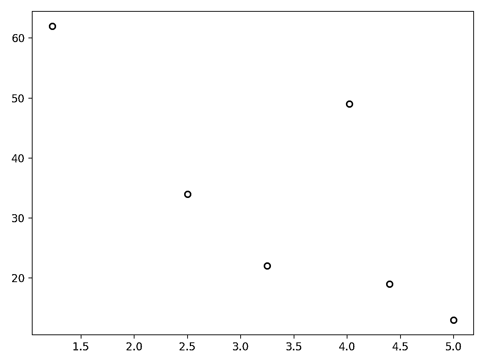](https://files.realpython.com/media/scatter_plot_drinks_1.db41b7631bc5.png)

该图显示，一般来说，饮料越贵，售出的商品越少。然而，售价 4.02 美元的饮料是一个异常值，这可能表明它是一种特别受欢迎的产品。以这种方式使用散点图时，仔细检查可以帮助您探索变量之间的关系。然后你可以进行进一步的分析，无论是使用[线性回归](https://realpython.com/linear-regression-in-python/)还是其他技术。

### 比较`plt.scatter()`和`plt.plot()`T2

您也可以使用`matplotlib.pyplot`中的另一个函数生成如上所示的散点图。Matplotlib 的 [`plt.plot()`](https://matplotlib.org/stable/api/_as_gen/matplotlib.pyplot.plot.html) 是一个通用绘图功能，允许您创建各种不同的线条或标记图。

使用相同的数据，通过调用`plt.plot()`，您可以获得与上一节相同的散点图:

```py
plt.plot(price, sales_per_day, "o")
plt.show()
```

在这种情况下，您必须包含标记`"o"`作为第三个参数，否则`plt.plot()`将绘制一个线图。你用这段代码创建的图和你之前用`plt.scatter()`创建的图是一样的。

在某些情况下，对于本例中绘制的基本散点图，使用`plt.plot()`可能更好。您可以使用 [`timeit`模块](https://realpython.com/python-timer/#estimating-running-time-with-timeit)来比较这两个功能的效率:

```py
import timeit
import matplotlib.pyplot as plt

price = [2.50, 1.23, 4.02, 3.25, 5.00, 4.40]
sales_per_day = [34, 62, 49, 22, 13, 19]

print(
    "plt.scatter()",
    timeit.timeit(
        "plt.scatter(price, sales_per_day)",
        number=1000,
        globals=globals(),
    ),
)
print(
    "plt.plot()",
    timeit.timeit(
        "plt.plot(price, sales_per_day, 'o')",
        number=1000,
        globals=globals(),
    ),
)
```

在不同的计算机上，性能会有所不同，但是当您运行这段代码时，您会发现`plt.plot()`比`plt.scatter()`要高效得多。在我的系统上运行上面的例子时，`plt.plot()`快了 7 倍多。

如果您可以使用`plt.plot()`创建散点图，而且速度也快得多，那么您为什么还要使用`plt.scatter()`？你将在本教程的剩余部分找到答案。你将在本教程中学到的大多数定制和高级用法只有在使用`plt.scatter()`时才有可能。这里有一个你可以使用的经验法则:

*   如果你需要一个基本的散点图，使用`plt.plot()`，特别是如果你想优先考虑性能。
*   如果您想通过使用更高级的绘图功能自定义散点图，请使用`plt.scatter()`。

在下一节中，您将开始探索`plt.scatter()`更高级的用法。

[*Remove ads*](/account/join/)

## 自定义散点图中的标记

通过自定义标记，可以在二维散点图上显示两个以上的变量。散点图中使用的标记有四个主要特征，您可以使用`plt.scatter()`进行定制:

1.  大小
2.  颜色
3.  形状
4.  透明度

在本节教程中，您将学习如何修改所有这些属性。

### 改变尺寸

让我们回到你在本教程前面遇到的咖啡馆老板。他卖的不同的橙汁饮料来自不同的供应商，利润率也不同。通过调整标记的大小，可以在散点图中显示这些附加信息。在本例中，利润率以百分比形式给出:

```py
import matplotlib.pyplot as plt
import numpy as np

price = np.asarray([2.50, 1.23, 4.02, 3.25, 5.00, 4.40])
sales_per_day = np.asarray([34, 62, 49, 22, 13, 19])
profit_margin = np.asarray([20, 35, 40, 20, 27.5, 15])

plt.scatter(x=price, y=sales_per_day, s=profit_margin * 10)
plt.show()
```

您可以注意到第一个示例中的一些变化。您现在使用的是 [NumPy 数组](https://realpython.com/numpy-array-programming/)，而不是列表。您可以为数据使用任何类似数组的数据结构，NumPy 数组通常用在这些类型的应用程序中，因为它们支持有效执行的**元素操作**。NumPy 模块是 Matplotlib 的一个依赖项，这就是为什么你不需要手动安装它。

您还使用了**命名参数**作为函数调用中的输入参数。参数`x`和`y`是必需的，但所有其他参数都是可选的。

参数`s`表示标记的大小。在本例中，您使用利润率作为变量来确定标记的大小，并将其乘以`10`以更清楚地显示大小差异。

您可以在下面看到这段代码创建的散点图:

[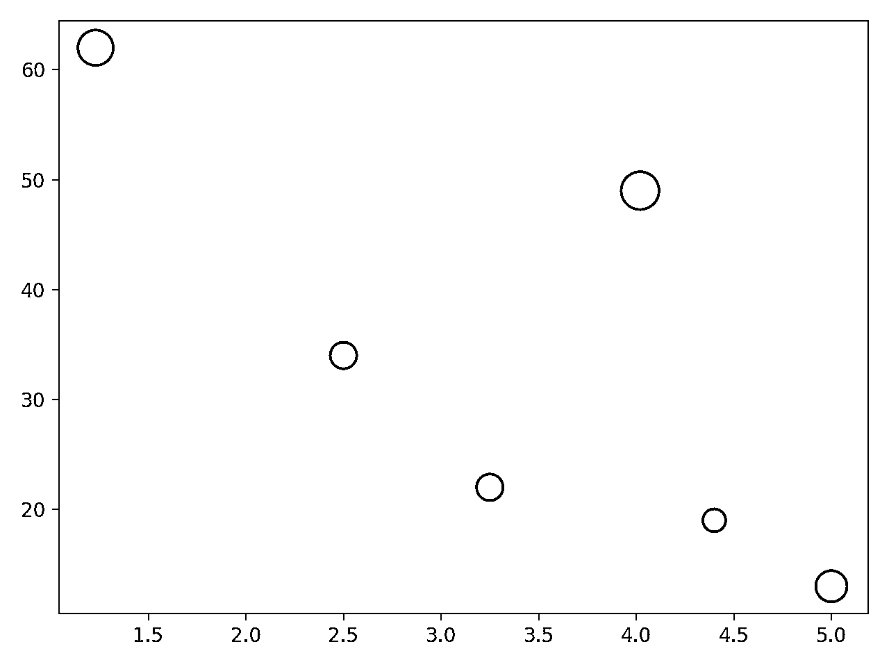](https://files.realpython.com/media/scatter_plot_drinks_2.715371f88408.png)

标记的大小表明每种产品的利润率。销量最大的两种橙汁饮料也是利润率最高的。这对咖啡馆老板来说是个好消息！

### 改变颜色

咖啡馆的许多顾客都喜欢仔细阅读标签，尤其是为了弄清他们所购买的饮料的含糖量。咖啡馆老板希望在下一次营销活动中强调他对健康食品的选择，因此他根据饮料的含糖量对其进行分类，并使用交通灯系统来指示饮料的低、中或高含糖量。

您可以给散点图中的标记添加颜色，以显示每种饮料的含糖量:

```py
# ...

low = (0, 1, 0)
medium = (1, 1, 0)
high = (1, 0, 0)

sugar_content = [low, high, medium, medium, high, low]

plt.scatter(
    x=price,
    y=sales_per_day,
    s=profit_margin * 10,
    c=sugar_content,
)
plt.show()
```

您将变量`low`、`medium`和`high`定义为[元组](https://realpython.com/python-lists-tuples/#python-tuples)，每个元组包含三个值，依次代表红色、绿色和蓝色分量。这些是 [RGB 颜色值](https://en.wikipedia.org/wiki/RGB_color_model)。`low`、`medium`和`high`的元组分别代表绿色、黄色和红色。

然后您定义了变量`sugar_content`来对每种饮料进行分类。您在函数调用中使用可选参数`c`来定义每个标记的颜色。下面是这段代码生成的散点图:

[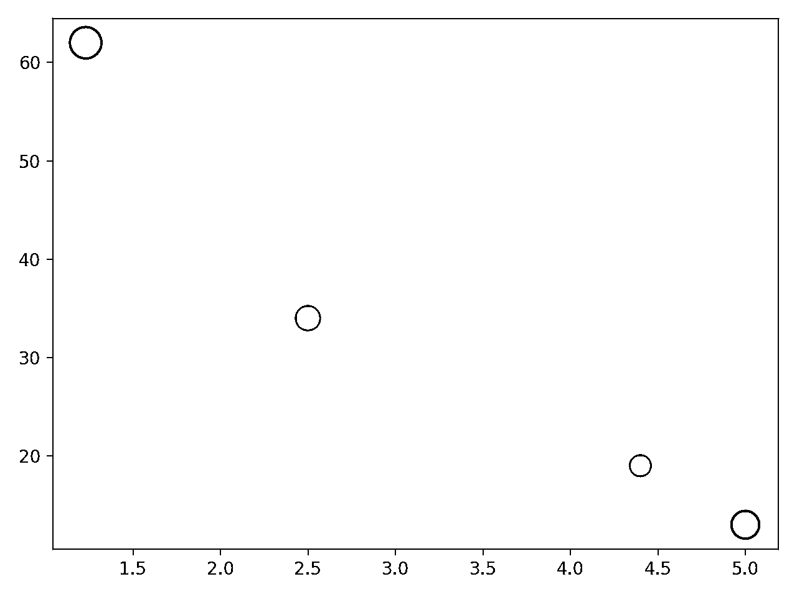](https://files.realpython.com/media/scatter_plot_drinks_3.fe5d87ad562c.png)

咖啡馆老板已经决定从菜单上去掉最贵的饮料，因为这种饮料卖得不好，而且含糖量很高。他是否也应该停止储存最便宜的饮料，以提升企业的健康信誉，即使它卖得很好，利润率也很高？

[*Remove ads*](/account/join/)

### 改变形状

咖啡馆老板发现这个练习非常有用，他想调查另一种产品。除了橙汁饮料之外，您现在还将绘制咖啡馆中各种谷物棒的类似数据:

```py
import matplotlib.pyplot as plt
import numpy as np

low = (0, 1, 0)
medium = (1, 1, 0)
high = (1, 0, 0)

price_orange = np.asarray([2.50, 1.23, 4.02, 3.25, 5.00, 4.40])
sales_per_day_orange = np.asarray([34, 62, 49, 22, 13, 19])
profit_margin_orange = np.asarray([20, 35, 40, 20, 27.5, 15])
sugar_content_orange = [low, high, medium, medium, high, low]

price_cereal = np.asarray([1.50, 2.50, 1.15, 1.95])
sales_per_day_cereal = np.asarray([67, 34, 36, 12])
profit_margin_cereal = np.asarray([20, 42.5, 33.3, 18])
sugar_content_cereal = [low, high, medium, low]

plt.scatter(
    x=price_orange,
    y=sales_per_day_orange,
    s=profit_margin_orange * 10,
    c=sugar_content_orange,
)
plt.scatter(
    x=price_cereal,
    y=sales_per_day_cereal,
    s=profit_margin_cereal * 10,
    c=sugar_content_cereal,
)
plt.show()
```

在这段代码中，您重构了变量名，以考虑到您现在拥有两种不同产品的数据。然后在一个图形中绘制两个散点图。这将产生以下输出:

[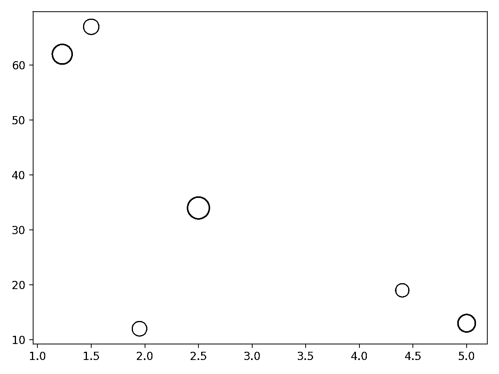](https://files.realpython.com/media/scatter_plot_drinks_cereal_1.89a54d89ce26.png)

不幸的是，您再也无法确定哪些数据点属于橙汁饮料，哪些属于谷物棒。您可以更改其中一个散点图的标记形状:

```py
import matplotlib.pyplot as plt
import numpy as np

low = (0, 1, 0)
medium = (1, 1, 0)
high = (1, 0, 0)

price_orange = np.asarray([2.50, 1.23, 4.02, 3.25, 5.00, 4.40])
sales_per_day_orange = np.asarray([34, 62, 49, 22, 13, 19])
profit_margin_orange = np.asarray([20, 35, 40, 20, 27.5, 15])
sugar_content_orange = [low, high, medium, medium, high, low]

price_cereal = np.asarray([1.50, 2.50, 1.15, 1.95])
sales_per_day_cereal = np.asarray([67, 34, 36, 12])
profit_margin_cereal = np.asarray([20, 42.5, 33.3, 18])
sugar_content_cereal = [low, high, medium, low]

plt.scatter(
    x=price_orange,
    y=sales_per_day_orange,
    s=profit_margin_orange * 10,
    c=sugar_content_orange,
)
plt.scatter(
    x=price_cereal,
    y=sales_per_day_cereal,
    s=profit_margin_cereal * 10,
    c=sugar_content_cereal,
 marker="d", )
plt.show()
```

您保留橙汁饮料数据的默认标记形状。默认标记为`"o"`，代表一个点。对于谷物条数据，您将标记形状设置为`"d"`，它代表一个菱形标记。您可以在标记器的[文档页面中找到所有可用标记器的列表。这是叠加在同一个图上的两个散点图:](https://matplotlib.org/stable/api/markers_api.html#module-matplotlib.markers)

[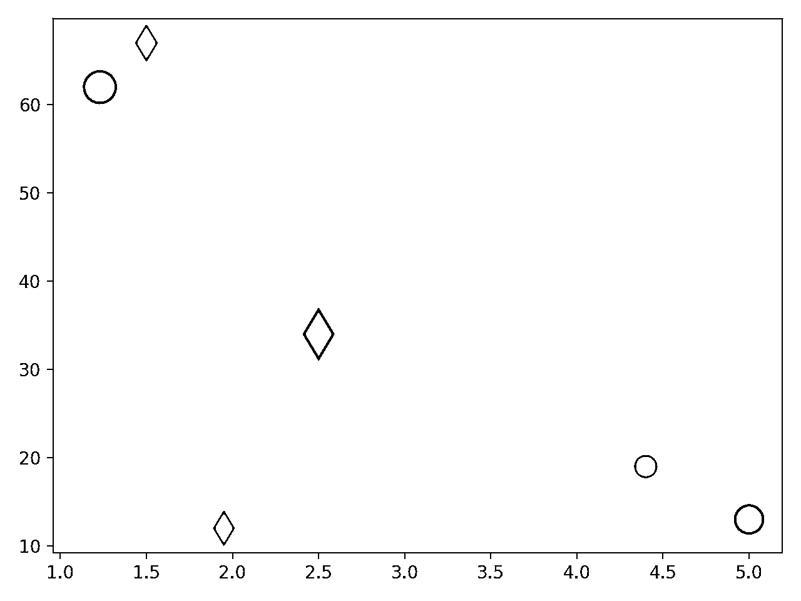](https://files.realpython.com/media/scatter_plot_drinks_cereal_2.9ff11bc07f63.png)

现在，您可以将橙汁饮料的数据点与谷物棒的数据点区分开来。但是，您创建的最后一个图有一个问题，您将在下一节中探索这个问题。

### 改变透明度

橙汁饮料的一个数据点消失了。应该有六种橙色饮料，但在图中只能看到五个圆形标记。其中一个谷物条数据点隐藏了一个橙汁饮料数据点。

您可以通过使用 [alpha 值](https://en.wikipedia.org/wiki/RGBA_color_model)使数据点部分透明来解决这个可视化问题:

```py
# ...

plt.scatter(
    x=price_orange,
    y=sales_per_day_orange,
    s=profit_margin_orange * 10,
    c=sugar_content_orange,
 alpha=0.5, )
plt.scatter(
    x=price_cereal,
    y=sales_per_day_cereal,
    s=profit_margin_cereal * 10,
    c=sugar_content_cereal,
    marker="d",
 alpha=0.5, )

plt.title("Sales vs Prices for Orange Drinks and Cereal Bars")
plt.legend(["Orange Drinks", "Cereal Bars"])
plt.xlabel("Price (Currency Unit)")
plt.ylabel("Average weekly sales")
plt.text(
    3.2,
    55,
    "Size of marker = profit margin\n" "Color of marker = sugar content",
)

plt.show()
```

您已经将两组标记的`alpha`值设置为`0.5`，这意味着它们是半透明的。现在，您可以看到该图中的所有数据点，包括那些重合的数据点:

[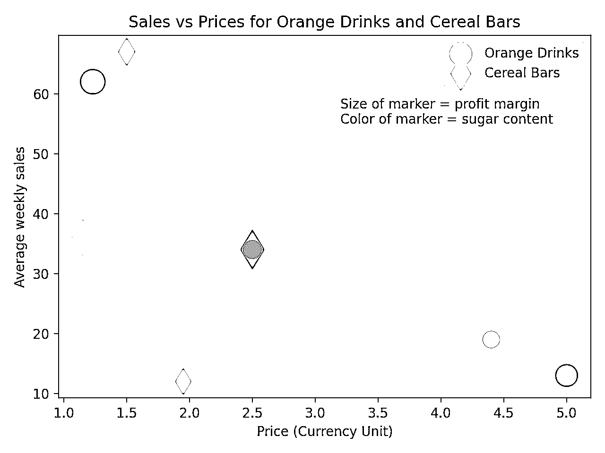](https://files.realpython.com/media/scatter_plot_drinks_cereal_3.7d8af3417ff5.png)

您还向图中添加了一个标题和其他标签，以便用更多关于正在显示的内容的信息来完成该图。

## 定制颜色图和样式

在您到目前为止创建的散点图中，您使用了三种颜色来表示饮料和谷物棒的低、中、高含糖量。现在，您将对此进行更改，使颜色直接代表项目的实际含糖量。

首先需要重构变量`sugar_content_orange`和`sugar_content_cereal`，使它们表示含糖量值，而不仅仅是 RGB 颜色值:

```py
sugar_content_orange = [15, 35, 22, 27, 38, 14]
sugar_content_cereal = [21, 49, 29, 24]
```

现在这些列表包含了每一项中每日推荐糖量的百分比。代码的其余部分保持不变，但是您现在可以选择要使用的[颜色图](https://matplotlib.org/stable/tutorials/colors/colormaps.html)。这会将值映射到颜色:

```py
# ...

plt.scatter(
    x=price_orange,
    y=sales_per_day_orange,
    s=profit_margin_orange * 10,
    c=sugar_content_orange,
 cmap="jet",    alpha=0.5,
)
plt.scatter(
    x=price_cereal,
    y=sales_per_day_cereal,
    s=profit_margin_cereal * 10,
    c=sugar_content_cereal,
 cmap="jet",    marker="d",
    alpha=0.5,
)

plt.title("Sales vs Prices for Orange Drinks and Cereal Bars")
plt.legend(["Orange Drinks", "Cereal Bars"])
plt.xlabel("Price (Currency Unit)")
plt.ylabel("Average weekly sales")
plt.text(
    2.7,
    55,
    "Size of marker = profit margin\n" "Color of marker = sugar content",
)
plt.colorbar() 
plt.show()
```

标记的颜色现在基于连续的刻度，并且您还显示了作为标记颜色图例的**颜色条**。这是最终的散点图:

[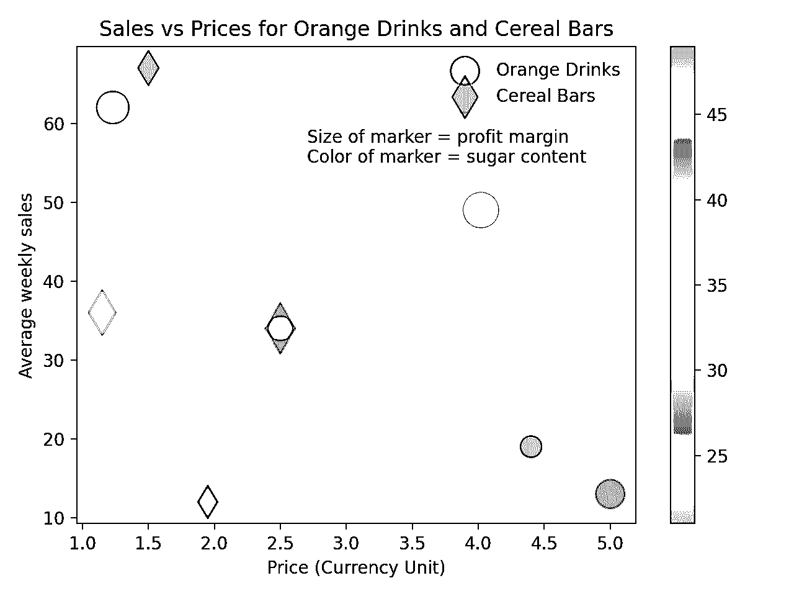](https://files.realpython.com/media/scatter_plot_drinks_cereal_4.9349c88c5e7d.png)

到目前为止，您绘制的所有图都以本机 Matplotlib 样式显示。您可以使用几个选项中的一个来更改此样式。您可以使用以下命令显示可用的样式:

>>>

```py
>>> plt.style.available
[
 "Solarize_Light2",
 "_classic_test_patch",
 "bmh",
 "classic",
 "dark_background",
 "fast",
 "fivethirtyeight",
 "ggplot",
 "grayscale",
 "seaborn",
 "seaborn-bright",
 "seaborn-colorblind",
 "seaborn-dark",
 "seaborn-dark-palette",
 "seaborn-darkgrid",
 "seaborn-deep",
 "seaborn-muted",
 "seaborn-notebook",
 "seaborn-paper",
 "seaborn-pastel",
 "seaborn-poster",
 "seaborn-talk",
 "seaborn-ticks",
 "seaborn-white",
 "seaborn-whitegrid",
 "tableau-colorblind10",
]
```

现在，使用 Matplotlib 时，您可以在调用`plt.scatter()`之前使用以下函数调用来更改绘图样式:

```py
import matplotlib.pyplot as plt
import numpy as np

plt.style.use("seaborn")

# ...
```

这将样式更改为另一个第三方可视化包 [Seaborn](https://seaborn.pydata.org/) 的样式。通过使用 Seaborn 样式绘制上面显示的最终散点图，您可以看到不同的样式:

[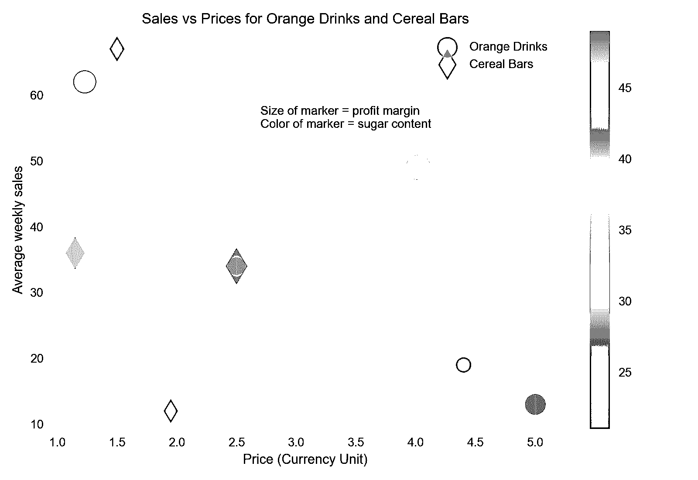](https://files.realpython.com/media/scatter_plot_drinks_cereal_4_seaborn.b26b6596d7ba.png)

你可以在 Matplotlib 中阅读更多关于[定制图的内容，在](https://realpython.com/python-matplotlib-guide/#appendix-a-configuration-and-styling) [Matplotlib 文档页面](https://matplotlib.org/stable/tutorials/index.html)上也有进一步的教程。

使用`plt.scatter()`创建散点图可以显示两个以上的变量。以下是本例中的变量:

| 可变的 | 由...代表 |
| --- | --- |
| 价格 | x 轴 |
| 平均售出数量 | y 轴 |
| 利润率 | 标记大小 |
| 产品类型 | 标记形状 |
| 含糖量 | 标记颜色 |

表示两个以上变量的能力使`plt.scatter()`成为一个非常强大和通用的工具。

[*Remove ads*](/account/join/)

## 进一步探索`plt.scatter`(

`plt.scatter()`在定制散点图方面提供了更大的灵活性。在这一节中，您将通过一个示例探索如何使用 NumPy 数组和散点图来屏蔽数据。在本例中，您将生成随机数据点，然后在同一散点图中将它们分成两个不同的区域。

一位热衷于收集数据的通勤者整理了六个月来她所在的当地公交车站的公交车到站时间。时间表上的到达时间是整点后的 15 分钟和 45 分钟，但她注意到真正的到达时间在这些时间附近遵循[正态分布](https://en.wikipedia.org/wiki/Normal_distribution):

[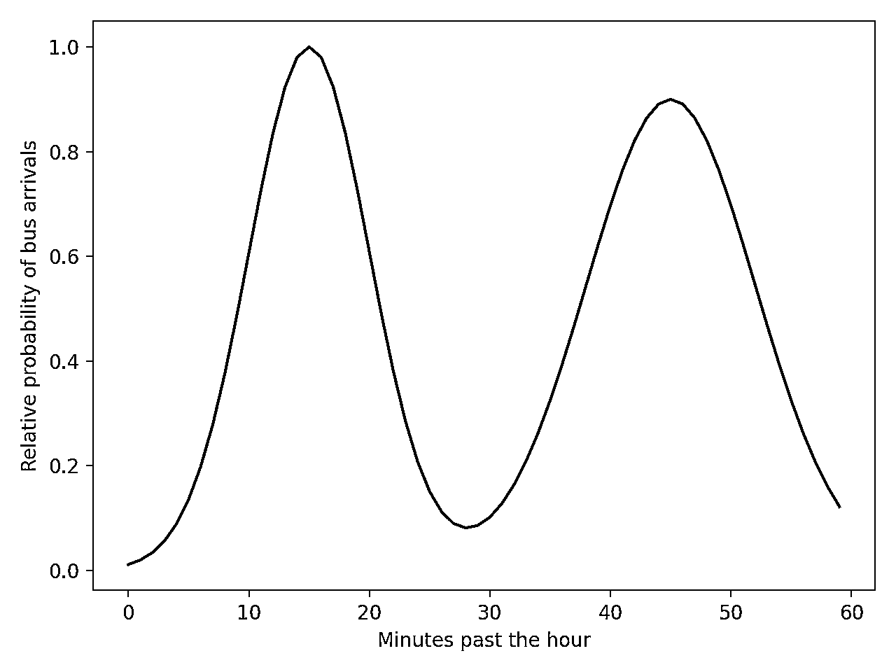](https://files.realpython.com/media/buses_1.c73d6d08a904.png)

这张图显示了一小时内每分钟有一辆公共汽车到达的相对可能性。这个概率分布可以用 NumPy 和 [`np.linspace()`](https://realpython.com/np-linspace-numpy/) 来表示:

```py
import matplotlib.pyplot as plt
import numpy as np

mean = 15, 45
sd = 5, 7

x = np.linspace(0, 59, 60)  # Represents each minute within the hour
first_distribution = np.exp(-0.5 * ((x - mean[0]) / sd[0]) ** 2)
second_distribution = 0.9 * np.exp(-0.5 * ((x - mean[1]) / sd[1]) ** 2)
y = first_distribution + second_distribution
y = y / max(y)

plt.plot(x, y)
plt.ylabel("Relative probability of bus arrivals")
plt.xlabel("Minutes past the hour")
plt.show()
```

您已经创建了两个正态分布，分别以过去一小时的`15`和`45`分钟为中心，并将它们相加。通过除以最大值，将最可能的到达时间设置为值`1`。

现在，您可以使用此分布来模拟公交车到达时间。为此，您可以使用内置的 [`random`](https://realpython.com/python-random/) 模块创建随机时间和随机相对概率。在下面的代码中，您还将使用[列表理解](https://realpython.com/list-comprehension-python/):

```py
import random
import matplotlib.pyplot as plt
import numpy as np

n_buses = 40
bus_times = np.asarray([random.randint(0, 59) for _ in range(n_buses)])
bus_likelihood = np.asarray([random.random() for _ in range(n_buses)])

plt.scatter(x=bus_times, y=bus_likelihood)
plt.title("Randomly chosen bus arrival times and relative probabilities")
plt.ylabel("Relative probability of bus arrivals")
plt.xlabel("Minutes past the hour")
plt.show()
```

您已经模拟了`40`辆公交车的到达，您可以用下面的散点图对其进行可视化:

[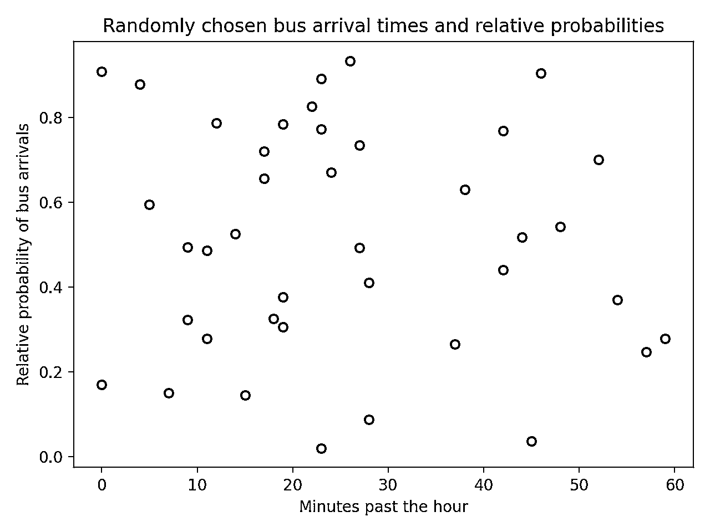](https://files.realpython.com/media/buses_2.38f2b4085940.png)

由于生成的数据是随机的，所以您的绘图看起来会有所不同。然而，并非所有这些点都可能接近通勤者从她收集和分析的数据中观察到的现实。您可以绘制她从模拟公交车到站数据中获得的分布图:

```py
import random
import matplotlib.pyplot as plt
import numpy as np

mean = 15, 45
sd = 5, 7

x = np.linspace(0, 59, 60)
first_distribution = np.exp(-0.5 * ((x - mean[0]) / sd[0]) ** 2)
second_distribution = 0.9 * np.exp(-0.5 * ((x - mean[1]) / sd[1]) ** 2)
y = first_distribution + second_distribution
y = y / max(y)

n_buses = 40
bus_times = np.asarray([random.randint(0, 59) for _ in range(n_buses)])
bus_likelihood = np.asarray([random.random() for _ in range(n_buses)])

plt.scatter(x=bus_times, y=bus_likelihood)
plt.plot(x, y) plt.title("Randomly chosen bus arrival times and relative probabilities")
plt.ylabel("Relative probability of bus arrivals")
plt.xlabel("Minutes past the hour")
plt.show()
```

这将产生以下输出:

[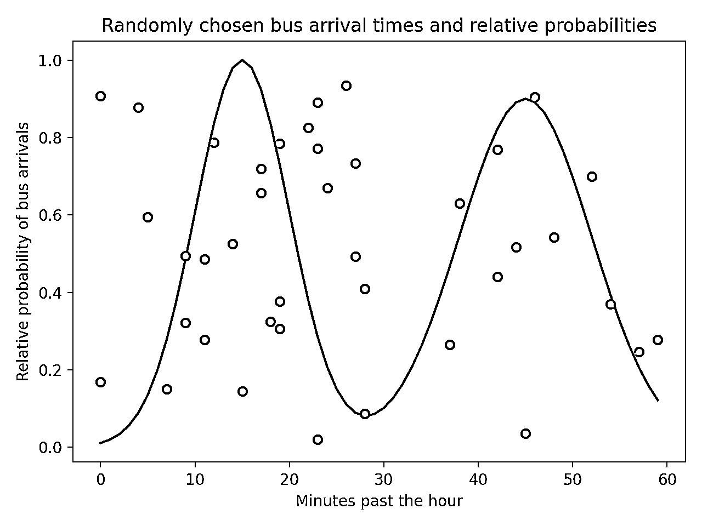](https://files.realpython.com/media/buses_3.0bf21953a520.png)

为了保持模拟的真实性，您需要确保随机到达的公交车与数据以及从这些数据中获得的分布相匹配。您可以通过仅保留落在概率分布内的点来过滤随机生成的点。您可以通过为散点图创建一个**遮罩**来实现这一点:

```py
# ...

in_region = bus_likelihood < y[bus_times]
out_region = bus_likelihood >= y[bus_times]

plt.scatter(
    x=bus_times[in_region],
    y=bus_likelihood[in_region],
    color="green",
)
plt.scatter(
    x=bus_times[out_region],
    y=bus_likelihood[out_region],
    color="red",
    marker="x",
)

plt.plot(x, y)
plt.title("Randomly chosen bus arrival times and relative probabilities")
plt.ylabel("Relative probability of bus arrivals")
plt.xlabel("Minutes past the hour")
plt.show()
```

变量`in_region`和`out_region`是包含[布尔值](https://realpython.com/python-boolean/)的 NumPy 数组，这些布尔值基于随机生成的可能性是高于还是低于分布`y`。然后绘制两个独立的散点图，一个包含分布范围内的点，另一个包含分布范围外的点。高于分布的数据点不代表真实数据:

[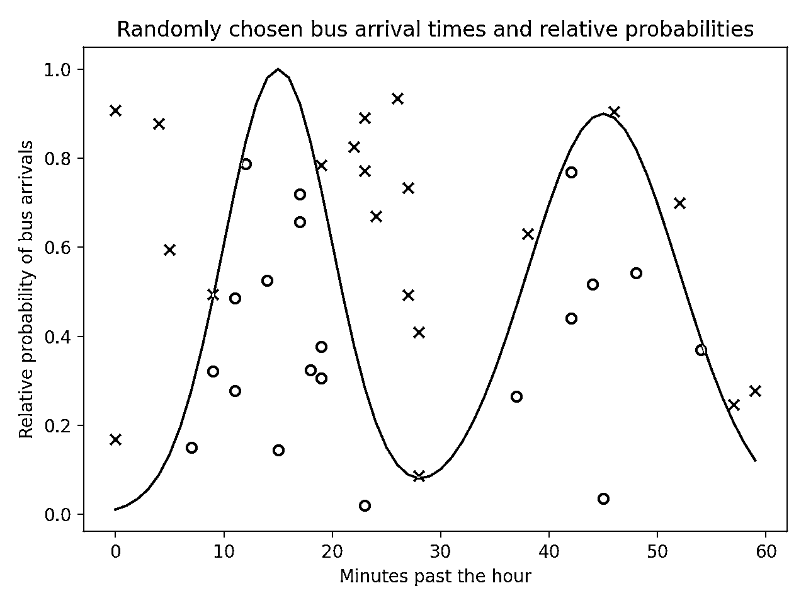](https://files.realpython.com/media/buses_4.5e89a7a8f2aa.png)

您已经根据原始散点图中的数据点是否在分布范围内对其进行了分割，并使用不同的颜色和标记来标识两组数据。

[*Remove ads*](/account/join/)

## 查看关键输入参数

在上述章节中，您已经了解了创建散点图的主要输入参数。以下是关于主要输入参数需要记住的要点的简要总结:

| 参数 | 描述 |
| --- | --- |
| `x`和`y` | 这些参数代表两个主要变量，可以是任何类似数组的数据类型，比如 lists 或 NumPy 数组。这些是必需的参数。 |
| `s` | 此参数定义标记的大小。如果所有标记具有相同的大小，它可以是一个 [float](https://realpython.com/python-numbers/#floating-point-numbers) ，如果标记具有不同的大小，它可以是一个类似数组的数据结构。 |
| `c` | 此参数表示标记的颜色。它通常是一个颜色数组，比如 RGB 值，或者是一个使用参数`cmap`映射到颜色图上的值序列。 |
| `marker` | 此参数用于自定义标记的形状。 |
| `cmap` | 如果参数`c`使用一系列值，则该参数可用于选择值和颜色之间的映射，通常使用标准色图或自定义色图。 |
| `alpha` | 这个参数是一个浮点数，可以取`0`和`1`之间的任何值，表示标记的透明度，其中`1`表示不透明的标记。 |

这些并不是`plt.scatter()`唯一可用的输入参数。您可以从[文档](https://matplotlib.org/stable/api/_as_gen/matplotlib.pyplot.scatter.html?highlight=scatter#matplotlib.pyplot.scatter)中获得输入参数的完整列表。

## 结论

现在您已经知道如何使用`plt.scatter()`创建和定制散点图，您已经准备好开始使用您自己的数据集和示例进行实践了。这种多功能的功能使您能够探索您的数据，并以一种清晰的方式呈现您的发现。

**在本教程中，你已经学会了如何:**

*   使用`plt.scatter`()创建一个**散点图**
*   使用必需和可选的**输入参数**
*   为**基本图和更高级图**定制散点图
*   用`plt.scatter()`表示**两个维度以上的**

通过了解 Matplotlib 中的所有特性以及使用 NumPy 处理数据，您可以充分利用`plt.scatter()`的可视化功能。

*立即观看**本教程有真实 Python 团队创建的相关视频课程。配合文字教程一起看，加深理解: [**使用 plt.scatter()在 Python 中可视化数据**](/courses/using-pltscatter-visualize-data-python/)*******