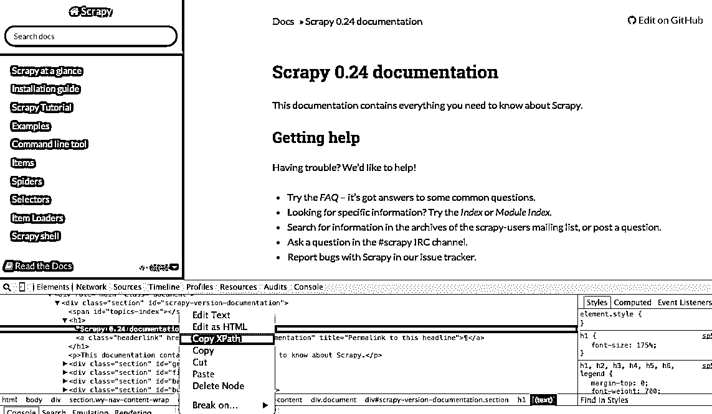
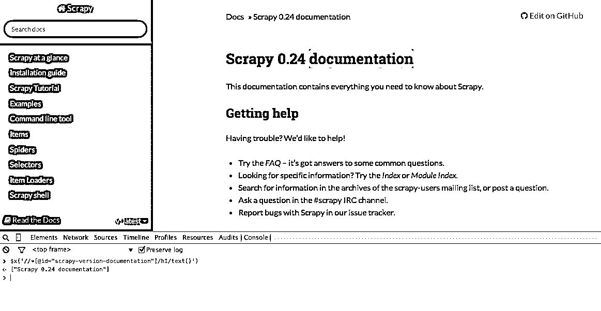
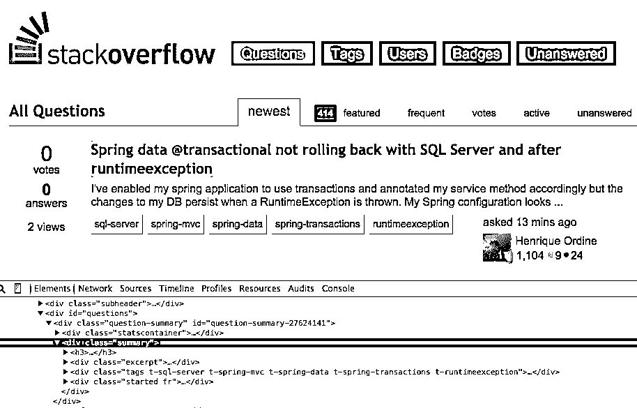
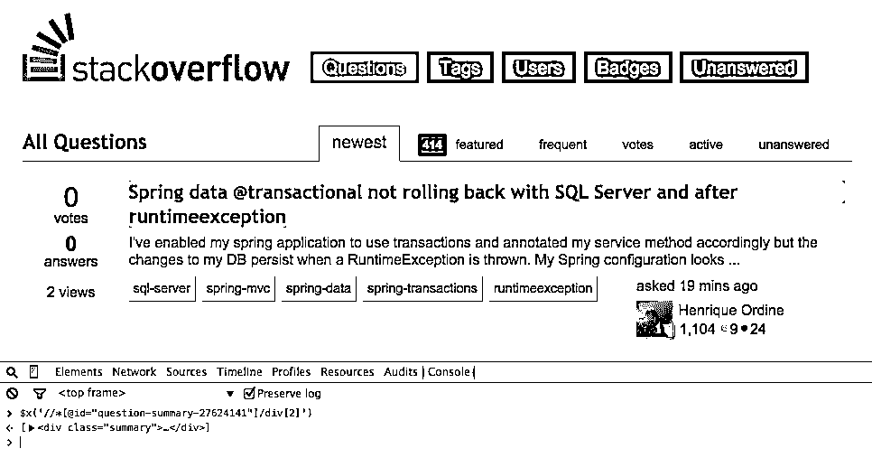
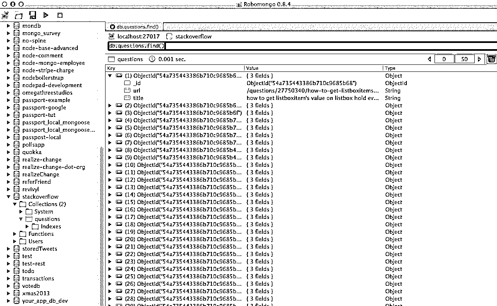

# 使用 Scrapy 和 MongoDB 进行网页抓取

> 原文：<https://realpython.com/web-scraping-with-scrapy-and-mongodb/>

**在本文中，我们将为*实际的*自由职业者构建一个[抓取器](https://realpython.com/python-web-scraping-practical-introduction/)，其中客户希望 Python 程序从[堆栈溢出](http://stackoverflow.com/questions?pagesize=50&sort=newest)中抓取数据以获取新问题(问题标题和 URL)。抓取的数据应该存储在 [MongoDB](http://www.mongodb.org/) 中。**值得注意的是，堆栈溢出有一个 [API](https://api.stackexchange.com/) ，可以用来访问*完全相同的*数据。然而，客户想要一个刮刀，所以他得到了一个刮刀。

**免费奖励:** ，向您展示如何从 Python 访问 MongoDB。

**更新:**

*   2014 年 1 月 3 日-重构了蜘蛛。谢谢， [@kissgyorgy](https://twitter.com/kissgyorgy) 。
*   2015 年 2 月 18 日-增加了第二部分的[。](https://realpython.com/web-scraping-and-crawling-with-scrapy-and-mongodb/)
*   09/06/2015 -更新至 Scrapy 和 PyMongo 的最新版本-干杯！

> 一如既往，在开始任何刮擦工作之前，请务必查看网站的使用/服务条款，并尊重 *robots.txt* 文件。确保遵守道德规范，不要在短时间内让大量请求涌入网站。*像对待自己的地盘一样对待你刮的任何地盘*。

## 安装

我们需要 [Scrapy](http://doc.scrapy.org/en/1.0/) 库(v1.0.3)和 [PyMongo](http://api.mongodb.org/python/3.0.3/) (v3.0.3)来存储 [MongoDB](https://realpython.com/introduction-to-mongodb-and-python/) 中的数据。您还需要安装 [MongoDB](http://docs.mongodb.org/manual/installation/) (未涵盖)。

[*Remove ads*](/account/join/)

### 刺儿头

如果你运行的是 OSX 或者 Linux，安装 Scrapy with [pip](https://realpython.com/what-is-pip/) (激活你的 virtualenv):

```py
$ pip install Scrapy==1.0.3
$ pip freeze > requirements.txt
```

如果您在 Windows 机器上，您将需要手动安装一些依赖项。请参考[官方文档](http://doc.scrapy.org/en/latest/intro/install.html)获取详细说明，以及[我创建的这个 Youtube 视频](https://www.youtube.com/watch?v=eEK2kmmvIdw)。

设置 Scrapy 后，通过在 Python shell 中运行以下命令来验证您的安装:

>>>

```py
>>> import scrapy
>>>
```

如果你没有得到一个错误，那么你就可以走了！

### PyMongo

接下来，用 pip 安装 PyMongo:

```py
$ pip install pymongo
$ pip freeze > requirements.txt
```

现在我们可以开始构建爬虫了。

## 零散项目

让我们开始一个新的 Scrapy 项目:

```py
$ scrapy startproject stack
2015-09-05 20:56:40 [scrapy] INFO: Scrapy 1.0.3 started (bot: scrapybot)
2015-09-05 20:56:40 [scrapy] INFO: Optional features available: ssl, http11
2015-09-05 20:56:40 [scrapy] INFO: Overridden settings: {}
New Scrapy project 'stack' created in:
 /stack-spider/stack

You can start your first spider with:
 cd stack
 scrapy genspider example example.com
```

这将创建许多文件和文件夹，其中包括一个基本的样板文件，便于您快速入门:

```py
├── scrapy.cfg
└── stack
    ├── __init__.py
    ├── items.py
    ├── pipelines.py
    ├── settings.py
    └── spiders
        └── __init__.py
```

### 指定数据

*items.py* 文件用于为我们计划抓取的数据定义存储“容器”。

`StackItem()`类继承自`Item` ( [文档](http://doc.scrapy.org/en/1.0/topics/items.html))，它基本上有许多 Scrapy 已经为我们构建的预定义对象:

```py
import scrapy

class StackItem(scrapy.Item):
    # define the fields for your item here like:
    # name = scrapy.Field()
    pass
```

让我们添加一些我们实际上想要收集的物品。对于每个问题，客户需要标题和网址。所以，把 *items.py* 更新成这样:

```py
from scrapy.item import Item, Field

class StackItem(Item):
    title = Field()
    url = Field()
```

[*Remove ads*](/account/join/)

### 创建蜘蛛

在“spiders”目录下创建一个名为 *stack_spider.py* 的文件。这就是神奇的地方——例如，我们将告诉 Scrapy 如何找到我们正在寻找的*确切的*数据。你可以想象，这是*特定的*给你想要抓取的每一个网页。

首先定义一个继承自 Scrapy 的`Spider`的类，然后根据需要添加属性:

```py
from scrapy import Spider

class StackSpider(Spider):
    name = "stack"
    allowed_domains = ["stackoverflow.com"]
    start_urls = [
        "http://stackoverflow.com/questions?pagesize=50&sort=newest",
    ]
```

前几个[变量](https://realpython.com/python-variables/)是自明的([文档](http://doc.scrapy.org/en/1.0/topics/spiders.html#spider)):

*   `name`定义了蜘蛛的名称。
*   包含允许蜘蛛抓取的域的基本 URL。
*   是蜘蛛开始爬行的 URL 列表。所有后续的 URL 都将从蜘蛛从`start_urls`中的 URL 下载的数据开始。

### XPath 选择器

接下来，Scrapy 使用 XPath 选择器从网站中提取数据。换句话说，我们可以根据给定的 XPath 选择 HTML 数据的某些部分。正如 Scrapy 的[文档](http://doc.scrapy.org/en/1.0/topics/selectors.html)中所述，“XPath 是一种在 XML 文档中选择节点的语言，也可以和 HTML 一起使用。”

使用 Chrome 的开发工具可以很容易地找到特定的 Xpath。只需检查特定的 HTML 元素，复制 XPath，然后进行调整(根据需要):

[](https://files.realpython.com/media/chrome_copy_xpath.0a639d0c4c00.png)

Developer Tools 还让您能够在 JavaScript 控制台中使用`$x` -即`$x("//img")`来测试 XPath 选择器:

[](https://files.realpython.com/media/chrome_text_xpath.9091b82fcda9.png)

同样，我们基本上告诉 Scrapy 从哪里开始根据定义的 XPath 查找信息。让我们导航到 Chrome 中的[堆栈溢出](http://stackoverflow.com/questions?pagesize=50&sort=newest)站点，找到 XPath 选择器。

右键单击第一个问题，选择“检查元素”:

[](https://files.realpython.com/media/stack_source_inspect_element.5d2576edf37e.png)

现在获取`<div class="summary">`、`//*[@id="question-summary-27624141"]/div[2]`的 XPath，然后在 JavaScript 控制台中测试它:

[](https://files.realpython.com/media/stack_source_test_xpath.df43d07118a9.png)

如你所见，它只选择了那个*的一个*问题。所以我们需要修改 XPath 来获取所有的问题。有什么想法吗？很简单:`//div[@class="summary"]/h3`。这是什么意思？本质上，这个 XPath 声明:*获取所有`<h3>`元素，这些元素是拥有`summary`* 类的`<div>`的子元素。在 JavaScript 控制台中测试这个 XPath。

> 请注意，我们并没有使用 Chrome 开发工具的实际 XPath 输出。在大多数情况下，输出只是一个有用的提示，它通常为您指出找到工作 XPath 的正确方向。

现在让我们更新一下 *stack_spider.py* 脚本:

```py
from scrapy import Spider
from scrapy.selector import Selector

class StackSpider(Spider):
    name = "stack"
    allowed_domains = ["stackoverflow.com"]
    start_urls = [
        "http://stackoverflow.com/questions?pagesize=50&sort=newest",
    ]

    def parse(self, response):
        questions = Selector(response).xpath('//div[@class="summary"]/h3')
```

[*Remove ads*](/account/join/)

### 提取数据

我们仍然需要解析和抓取我们想要的数据，这属于`<div class="summary"><h3>`。再次更新 *stack_spider.py* 像这样:

```py
from scrapy import Spider
from scrapy.selector import Selector

from stack.items import StackItem

class StackSpider(Spider):
    name = "stack"
    allowed_domains = ["stackoverflow.com"]
    start_urls = [
        "http://stackoverflow.com/questions?pagesize=50&sort=newest",
    ]

    def parse(self, response):
        questions = Selector(response).xpath('//div[@class="summary"]/h3')

        for question in questions:
            item = StackItem()
            item['title'] = question.xpath(
                'a[@class="question-hyperlink"]/text()').extract()[0]
            item['url'] = question.xpath(
                'a[@class="question-hyperlink"]/@href').extract()[0]
            yield item
```
`

We are iterating through the `questions` and assigning the `title` and `url` values from the scraped data. Be sure to test out the XPath selectors in the JavaScript Console within Chrome Developer Tools - e.g., `$x('//div[@class="summary"]/h3/a[@class="question-hyperlink"]/text()')` and `$x('//div[@class="summary"]/h3/a[@class="question-hyperlink"]/@href')`.

## Test

Ready for the first test? Simply run the following command within the "stack" directory:

```py
console
$ scrapy crawl stack
```

随着 Scrapy 堆栈跟踪，你应该看到 50 个问题的标题和输出的网址。您可以使用这个小命令将输出呈现到 JSON 文件中:

```py
$ scrapy crawl stack -o items.json -t json
```

我们现在已经根据我们正在寻找的数据实现了我们的蜘蛛。现在我们需要将抓取的数据存储在 MongoDB 中。

## 将数据存储在 MongoDB

每次返回一个项目时，我们都希望验证数据，然后将其添加到 Mongo 集合中。

第一步是创建数据库，我们计划用它来保存我们所有的抓取数据。打开 *settings.py* ，指定[管道](http://doc.scrapy.org/en/1.0/topics/item-pipeline.html)，添加数据库设置:

```py
ITEM_PIPELINES = ['stack.pipelines.MongoDBPipeline', ]

MONGODB_SERVER = "localhost"
MONGODB_PORT = 27017
MONGODB_DB = "stackoverflow"
MONGODB_COLLECTION = "questions"
```

### 管道管理

我们已经设置了爬行和解析 HTML 的蜘蛛，并且设置了数据库设置。现在我们必须通过 *pipelines.py* 中的管道将两者连接在一起。

**连接到数据库**

首先，让我们定义一个实际连接到数据库的方法:

```py
import pymongo

from scrapy.conf import settings

class MongoDBPipeline(object):

    def __init__(self):
        connection = pymongo.MongoClient(
            settings['MONGODB_SERVER'],
            settings['MONGODB_PORT']
        )
        db = connection[settings['MONGODB_DB']]
        self.collection = db[settings['MONGODB_COLLECTION']]
```

在这里，我们创建了一个类`MongoDBPipeline()`，我们有一个构造函数，通过定义 Mongo 设置来初始化这个类，然后连接到数据库。

**处理数据**

接下来，我们需要定义一个方法来处理解析后的数据:

```py
import pymongo

from scrapy.conf import settings
from scrapy.exceptions import DropItem
from scrapy import log

class MongoDBPipeline(object):

    def __init__(self):
        connection = pymongo.MongoClient(
            settings['MONGODB_SERVER'],
            settings['MONGODB_PORT']
        )
        db = connection[settings['MONGODB_DB']]
        self.collection = db[settings['MONGODB_COLLECTION']]

    def process_item(self, item, spider):
        valid = True
        for data in item:
            if not data:
                valid = False
                raise DropItem("Missing {0}!".format(data))
        if valid:
            self.collection.insert(dict(item))
            log.msg("Question added to MongoDB database!",
                    level=log.DEBUG, spider=spider)
        return item
```

我们建立到数据库的连接，解包数据，然后保存到数据库。现在我们可以再次测试了！

[*Remove ads*](/account/join/)

## 测试

同样，在“stack”目录中运行以下命令:

```py
$ scrapy crawl stack
```

> **注意**:确保你有 [Mongo 守护进程](http://docs.mongodb.org/v3.0/reference/program/mongod/) - `mongod` -运行在不同的终端窗口。

万岁！我们已成功将爬网数据存储到数据库中:

[](https://files.realpython.com/media/robomongo.dc6ae8f642c4.png)

## 结论

这是一个非常简单的使用 Scrapy 抓取网页的例子。实际的自由职业项目要求脚本遵循分页链接，并使用`CrawlSpider` ( [docs](http://doc.scrapy.org/en/1.0/topics/spiders.html#crawlspider) )抓取每一页，这非常容易实现。尝试自己实现它，并在下面留下评论和 Github 库的链接，以便快速查看代码。

需要帮助吗？从[这个脚本](https://github.com/realpython/stack-spider/blob/part1/stack/stack/spiders/stack_crawl.py)开始，差不多完成了。**然后查看 [Part 2](https://realpython.com/web-scraping-and-crawling-with-scrapy-and-mongodb/) 获取完整解决方案！**

**免费奖励:** ，向您展示如何从 Python 访问 MongoDB。

您可以从 [Github 资源库](https://github.com/realpython/stack-spider/releases/tag/v1)下载完整的源代码。带着问题在下面评论。感谢阅读！****