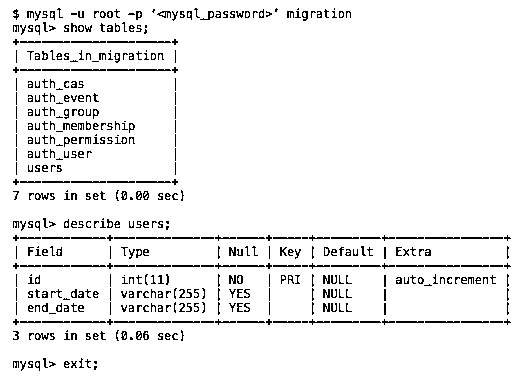

# web2py–从 SQLite 迁移到 MySQL

> 原文：<https://realpython.com/web2py-migrating-from-sqlite-to-mysql/>

我最近需要将一个基于 web2py 的 CRM 应用程序转换成 T2 MySQL T3，该应用程序托管在一个 Apache 服务器上，并带有一个 SQLite T1 后端。以下是对我有效的步骤。我创建了一个示例应用程序，如果你想继续，你可以在这里下载所有文件。

> 请注意:我在 Unix 环境下使用 web2py 版本 2.4.7。在开始之前，确保您的系统上安装了 SQLite。你可以用 pip、`pip install sqlite`安装它，或者你可以在[http://sqlite.org/download.html](http://sqlite.org/download.html)下载二进制文件。你还需要安装 MySQL。如果你需要帮助，请点击这里的教程[。](http://dev.mysql.com/doc/refman/5.5/en/installing.html)

当前数据库有所有默认的 web2py 表以及一个带有字段 *id* 、 *start_date* 和 *end_date* 的 *users* 表:

```py
db.define_table(
    'users',
    Field('start_date','string'), 
    Field('end_date','string')
)
```

这段代码遵循 web2py DAL 语法。表格中有 30，000 行数据。

## 数据清理

下载应用程序的最新 SQLite 数据库。默认情况下，它是“/web 2py/applications/<your_application>/databases/”文件夹下名为 *storage.sqlite* 的文件。要下载，通过在终端中运行以下命令创建一个数据库转储:</your_application>

```py
$ sqlite3 storage.sqlite .dump > output_before.sql
```

使用文本编辑器编辑 *output_before.sql* 文件:

*   删除所有以`PRAGMA`、`BEGIN TRANSACTION`、`CREATE TABLE`和`COMMIT`开头的行。
*   删除所有与`sqlite_sequence`表相关的行(即`DELETE FROM sqlite_sequence;`)。
*   对于所有的`INSERT INTO "<table_name>" VALUES(...)`语句，将`<table_name>`前后的双引号(`" "`)替换为反斜线(`` ``)——例如`INSERT INTO `table_name` VALUES(...)`。

最后，在桌面上将文件保存为 *output_after.sql* 。

[*Remove ads*](/account/join/)

## MySQL 设置

在远程服务器上创建 MySQL 数据库。记下数据库名称、用户名和密码。您还可以在本地设置数据库进行测试，我将在本教程中使用它:

```py
$ mysql.server start
$ mysql -u root -p
Enter password:
mysql> create database migration;
Query OK, 1 row affected (0.03 sec)
mysql> exit;
```

配置您的应用程序以使用 MySQL。启动你的 web2py 管理。编辑 *db.py* :

```py
db = DAL('mysql://<mysql_user>:<mysql_password>@localhost/<mysql_database>')
```

保存文件。

允许 web2py 初始化 MySQL 数据库:

*   备份`/web2py/applications/<your_application>/databases/`文件夹的内容。然后删除文件夹的内容。
*   回到 web2py 管理。单击“数据库管理”按钮，在本地 MySQL 数据库中创建表。

在终端中启动 MySQL 数据库，检查以确保空表已添加到数据库中:

[](https://files.realpython.com/media/web2py-to-mysql.402545072b49.png)

## 添加数据

导航到保存 *output.sql* 的位置(应该是您的桌面)，然后运行以下命令将数据添加到 MySQL:

```py
$ mysql -u root migration < output_after.sql
```

这将需要几分钟才能完全执行。

在 web2py admin 中，检查您的数据库和应用程序，确保新数据是可访问的。*