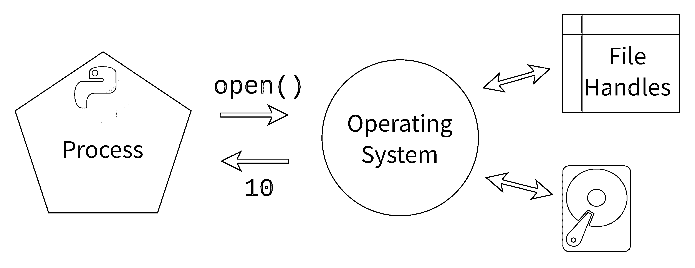

# 为什么在 Python 中关闭文件很重要？

> 原文：<https://realpython.com/why-close-file-python/>

在 Python 编码之旅的某个时候，您了解到应该使用**上下文管理器**来打开文件。Python 上下文管理器可以让你轻松地**关闭你的文件**:

```py
with open("hello.txt", mode="w") as file:
    file.write("Hello, World!")
```

[`with`语句](https://realpython.com/python-with-statement/)启动上下文管理器。在这个例子中，只要**上下文**是活动的，上下文管理器[就打开](https://realpython.com/read-write-files-python/#opening-and-closing-a-file-in-python)文件`hello.txt`，并且**管理**文件资源。通常，缩进块中的所有代码都依赖于打开的文件对象。一旦缩进块结束或引发异常，文件就会关闭。

如果您没有使用上下文管理器或者您正在使用不同的语言，那么您可以使用 [`try` … `finally`方法](https://realpython.com/python-with-statement/#the-try-finally-approach)显式关闭文件:

```py
try:
    file = open("hello.txt", mode="w")
    file.write("Hello, World!")
finally:
    file.close()
```

关闭文件的`finally`块无条件运行，不管`try`块成功还是失败。虽然这种语法有效地关闭了文件，但是 Python 上下文管理器提供了更简洁、更直观的语法。此外，它比简单地用`try` … `finally`包装你的代码更加[灵活](https://docs.python.org/3/reference/compound_stmts.html#the-with-statement)。

您可能已经使用了上下文管理器来管理文件，但是您有没有想过为什么大多数教程和五分之四的牙医建议这样做？总之，**为什么在 Python 中关闭文件很重要？**

在本教程中，您将深入探讨这个问题。首先，您将了解文件句柄是如何成为**有限资源**的。然后你将体验不关闭文件的**后果**。

**免费下载:** [从 CPython Internals:您的 Python 3 解释器指南](https://realpython.com/bonus/cpython-internals-sample/)获得一个示例章节，向您展示如何解锁 Python 语言的内部工作机制，从源代码编译 Python 解释器，并参与 CPython 的开发。

## 简而言之:文件是受操作系统限制的资源

Python 将文件操作委托给 [**操作系统**](https://en.wikipedia.org/wiki/Operating_system) 。操作系统是 [**进程**](https://en.wikipedia.org/wiki/Process_(computing)) 之间的中介，比如 Python，以及所有的**系统资源**，比如硬盘、RAM、CPU 时间。

当你用`open()`打开一个文件时，你向操作系统发出一个 [**系统调用**](https://en.wikipedia.org/wiki/System_call) 来定位硬盘上的那个文件，并准备读或写。然后，操作系统将返回一个[无符号整数](https://realpython.com/python-bitwise-operators/#unsigned-integers)，在 Windows 上称为**文件句柄**，在类似 UNIX 的系统上称为**文件描述符**，包括 Linux 和 macOS:

[](https://files.realpython.com/media/open_file.b4d0477f04f1.png)

<figcaption class="figure-caption text-center">A Python process making a system call and getting the integer 10 as the file handle</figcaption>

一旦你有了与文件相关的编号，你就准备好进行[读或写操作](https://realpython.com/read-write-files-python/)。每当 Python 想读、写或关闭文件时，它会发出另一个系统调用，提供文件句柄号。Python 文件对象有一个`.fileno()`方法，您可以使用它来查找文件句柄:

>>>

```py
>>> with open("test_file.txt", mode="w") as file:
...     file.fileno()
...
4
```

打开的文件对象上的`.fileno()`方法将返回操作系统使用的整数作为文件描述符。就像使用 ID 字段从数据库中获取记录一样，Python 会在每次操作系统读取或写入文件时向操作系统提供这个数字。

操作系统限制任何单个进程可以打开的文件数量。这个数字通常以千计。操作系统设置这个限制是因为如果一个进程试图打开数千个文件描述符，那么这个进程可能有问题。尽管数千个文件看起来很多，但仍有可能达到极限。

除了运行到极限的风险之外，**保持文件打开会使你容易丢失数据**。总的来说，Python 和操作系统努力保护你不丢失数据。但是如果你的程序或者电脑崩溃了，通常的程序可能无法运行，打开的文件可能会被破坏。

**注意**:有些库有特定的方法和函数，似乎不用上下文管理器就能打开文件。比如 pathlib 库有 [`.write_text()`](https://realpython.com/python-pathlib/#reading-and-writing-files) ，pandas 有 [`read_csv()`](https://realpython.com/pandas-read-write-files/#using-the-pandas-read_csv-and-to_csv-functions) 。

但是，它们确实在幕后正确地管理资源，所以在这些情况下，您不需要使用上下文管理器。最好参考您正在使用的库的文档，看看您是否需要上下文管理器。

简而言之，让上下文管理器管理您的文件是一种防御技术，易于实践，并能使您的代码更好——所以您不妨这样做。就像系安全带一样。你可能不需要它，但是没有它的代价会很高。

在本教程的其余部分，您将更深入地了解不关闭文件的限制、后果和危险。在下一节中，您将探索`Too many open files`错误。

[*Remove ads*](/account/join/)

## 打开太多文件会怎么样？

在本节中，您将探索当您遇到文件限制时会发生什么。您将通过尝试一个代码片段来实现这一点，该代码片段将创建一个打开文件的负载并引发一个`OSError`。

**注意**:正如`OSError`中的`OS`所暗示的，这个限制是由操作系统而不是 Python 强制执行的。然而，理论上，操作系统可以处理更多的文件描述符。稍后，你会学到更多关于[为什么操作系统限制文件句柄](#why-does-the-operating-system-limit-file-handles)。

您可以通过尝试一次打开数千个文件来测试操作系统上每个进程的文件限制。您将把文件对象存储在一个列表中，这样它们就不会被自动清除。但是首先，您需要做一些整理工作，以确保不会在不需要的地方创建大量文件:

```py
$ mkdir file_experiment
$ cd file_experiment
```

创建一个可以转储文件的文件夹，然后导航到该文件夹就足够了。然后，您可以打开一个 Python REPL，尝试创建数千个文件:

>>>

```py
>>> files = [open(f"file-{n}.txt", mode="w") for n in range(10_000)]
Traceback (most recent call last):
    ...
OSError: [Errno 24] Too many open files: 'file-1021.txt'
```

这个代码片段试图打开一万个文件，并将它们保存在一个列表中。操作系统开始创建文件，但一旦达到极限，就会往回推。如果您在新创建的目录中列出文件，您会注意到，即使列表理解最终失败，操作系统也创建了许多文件——只是不是您要求的一万个文件。

您遇到的限制因操作系统而异，在 Windows 中默认情况下似乎更大。根据操作系统的不同，有一些方法可以提高每个进程的文件数限制。但是，你应该问问自己是否真的需要。选择这种解决方案只有几个合理的用例。

一个合理的场景是服务器。服务器与[套接字](https://realpython.com/python-sockets/)一起工作，它们被视为很像文件。操作系统使用文件句柄跟踪文件表中的套接字。服务器可能需要为它们所连接的每个客户机打开许多套接字。另外，一台服务器可能会与几台客户机通信。这种情况会导致需要数千个文件句柄。

有趣的是，尽管某些应用程序可能会要求提高操作系统对打开文件的限制，但通常正是这些应用程序需要特别注意关闭文件！

也许你认为你不会马上面临极限。尽管如此，请继续读下去，因为在下一节中，您将更仔细地了解意外达到该限制的一些后果。

## 遇到文件限制的现实后果是什么？

如果您在 Python 中打开文件而从不关闭它们，您可能不会注意到任何区别，尤其是如果您正在处理一个文件脚本或小项目。然而，随着你从事的项目变得越来越复杂，你会越来越多地暴露在有问题的情况下。

想象一下，你在一个大型团队中处理一个巨大的代码库。然后，有一天你达到了打开文件的极限。有趣的是，限制的错误信息不会告诉你*问题在哪里*。它将是你之前看到的通用 [`OSError`](https://docs.python.org/3/library/exceptions.html#OSError) ，它只告诉你`Too many open files`。

你的代码库中可能有成千上万个打开文件的地方。想象一下寻找代码不能正确处理文件的地方。想象一下，代码在函数之间传递文件对象，您不能立即判断任何给定的文件对象最终是否关闭。那可不是好玩的时候。

如果您感兴趣，有一些方法可以探索您系统的打开文件句柄。展开以下模块进行探索:


*   [*视窗*](#windows-1)
**   [**Linux + macOS**](#linux-macos-1)

**安装[进程黑客](https://processhacker.sourceforge.io/):

```py
PS> choco install processhacker
```

打开应用程序并点击*查找句柄或 dll*按钮。勾选 *regex* 复选框，键入`.*`查看所有文件句柄及附带信息。

微软官方版本的 process hacker 是 [Sysinternals](https://docs.microsoft.com/en-us/sysinternals/) 工具的一部分，即[进程监视器](https://docs.microsoft.com/en-us/sysinternals/downloads/procmon)和[进程浏览器](https://docs.microsoft.com/en-us/sysinternals/downloads/process-explorer)。

您可能需要安装 [`lsof`](https://en.wikipedia.org/wiki/Lsof) ，这是一个 Linux 实用程序，用于**l**I**s**t**o**pen**f**files。使用此实用程序，您可以获得信息并计算有多少个打开的文件:

```py
$ lsof | head
$ lsof | wc -l
```

`lsof`命令为每个打开的文件打印一个新行，其中包含该文件的基本信息。通过管道将其输入到`head`命令中，将会显示输出的开始，包括列名。

`lsof`的输出可以通过管道进入`wc`或字数统计命令。`-l`开关意味着它只会计算换行符。这个数字很可能是几十万。

您可以将`lsof`的输出通过管道传输到`grep`中，以查找包含类似于`python`的字符串的行。您还可以传入一个进程 ID，如果您想寻找文件描述符，这可能会很有帮助:

```py
$ lsof | grep python
```

该命令将过滤掉所有不包含`grep`之后的术语的行，在本例中为`python`。

如果您对系统上文件的理论限制感到好奇，可以通过研究一个特殊文件的内容，在基于 UNIX 的系统上探索这个问题:

```py
$ cat /proc/sys/fs/file-max
```

这个数字非常依赖于平台，但它可能是巨大的。系统几乎肯定会在达到这个限制之前耗尽其他资源。***  ***不过，你可能想知道*为什么*操作系统会限制文件。据推测，它可以处理比它允许的更多的文件句柄，对吗？在下一节中，您将发现操作系统为什么关心这个问题。

## 为什么操作系统会限制文件句柄？

一个操作系统可以同时打开的文件数量的实际限制是巨大的。你说的是数百万份文件。但实际上达到这个极限并给它设定一个固定的数字并不明确。通常，系统会在用完文件句柄之前用完其他资源。

从操作系统的角度来看，这个限制是保守的，但从大多数程序的角度来看，这个限制已经足够了。从操作系统的角度来看，任何达到限制的进程都可能会泄漏文件句柄和其他资源。

资源泄漏可能是由于编程不当或恶意程序试图攻击系统造成的。这就是操作系统设置限制的原因——保护你免受他人和你自己的伤害！

另外，对于大多数应用程序来说，打开这么多文件是没有意义的。一个硬盘上最多只能同时发生一个读写操作，所以如果你只是处理文件，它不会让事情变得更快。

好了，你知道打开很多文件是有问题的，但是在 Python 中不关闭文件还有其他的缺点，即使你只打开了一小部分。

[*Remove ads*](/account/join/)

## 如果不关闭文件，Python 崩溃了会怎么样？

在本节中，您将进行模拟崩溃的实验，并了解它如何影响打开的文件。您可以在`os`模块中使用一个特殊的函数，它将在不执行 Python 通常执行的任何清理的情况下退出，但是首先，您将看到事情通常是如何被清理的。

对每个命令执行写操作可能是昂贵的。出于这个原因，Python 默认使用一个收集写操作的[缓冲区](https://docs.python.org/3/library/io.html#io.BufferedIOBase)。当缓冲区变满时，或者当文件被显式关闭时，缓冲区被刷新，写操作完成。

Python 努力清理自身。在大多数情况下，它会主动刷新和关闭文件:

```py
# write_hello.py

file = open("hello.txt", mode="w")
file.write("Hello, world!")
```

运行这段代码时，操作系统会创建文件。即使您从未在代码中实际刷新或关闭文件，操作系统也会写入内容。这种刷新和关闭由 Python 将在执行结束时执行的清理例程负责。

不过，有时候出口并没有受到如此严格的控制，崩溃最终可能会绕过这种清理:

```py
# crash_hello.py

import os

file = open("crash.txt", mode="w")
file.write("Hello, world!")
os._exit(1)
```

运行上面的代码片段后，您可以使用`cat`来检查您刚刚创建的文件的内容:

```py
$ cat crash.txt
$ # No output!
```

您将会看到，尽管操作系统已经创建了该文件，但它没有任何内容。输出不足是因为 [`os._exit()`](https://docs.python.org/3/library/os.html#os._exit) 绕过了通常的 Python 退出例程，模拟了一次崩溃。也就是说，即使这种类型的模拟也是相对可控的，因为它假设 Python 而不是您的操作系统崩溃了。

在幕后，一旦 Python 完成，操作系统也将执行自己的清理，关闭进程打开的所有文件描述符。崩溃可能发生在许多级别，并干扰操作系统的清理，使文件句柄悬空。

例如，在 Windows 上，悬挂文件句柄可能会有问题，因为任何打开文件的进程都会锁定它。在该文件关闭之前，另一个进程无法打开它。Windows 用户可能很熟悉不让你打开或删除文件的流氓程序。

什么可能比被锁定在文件之外更糟糕？泄漏的文件句柄会带来安全风险，因为与文件相关的权限有时会混淆。

**注意**:Python 最常见的实现 [CPython](https://github.com/python/cpython) ，在清理悬空文件句柄方面比你想象的更进一步。它使用[引用计数](https://realpython.com/python-memory-management/)进行垃圾收集，这样文件一旦不再被引用就会被关闭。也就是说，其他实现，如 [PyPy](https://www.pypy.org/) ，使用不同的策略，在清理未使用的文件句柄时可能不那么激进。

事实上，有些实现可能不会像 CPython 那样有效地清理，这是始终使用上下文管理器的另一个理由！

文件句柄泄漏和内容在缓冲区中丢失已经够糟了，但是中断文件操作的崩溃也会导致文件损坏。这大大增加了数据丢失的可能性。同样，这些都是不太可能的情况，但它们可能代价高昂。

您永远无法完全避免崩溃，但是您可以通过使用上下文管理器来减少风险。上下文管理器的语法自然会引导您以这样一种方式编码，即只在需要的时候才打开文件。

## 结论

你已经学习了**为什么在 Python** 中关闭文件很重要。因为文件是由操作系统管理的有限资源，所以确保文件在使用后关闭将防止难以调试的问题，如用完文件句柄或遇到损坏的数据。最好的防御是始终用上下文管理器打开文件。

深入了解一下，您已经看到了当您打开太多文件时会发生什么，并且您已经引起了导致文件内容丢失的崩溃。要了解更多关于打开文件的信息，请参见[用 Python 读取和写入文件](https://realpython.com/read-write-files-python/)。要深入了解上下文管理器，请查看[上下文管理器和 Python 的`with`语句](https://realpython.com/python-with-statement/)。

**免费下载:** [从 CPython Internals:您的 Python 3 解释器指南](https://realpython.com/bonus/cpython-internals-sample/)获得一个示例章节，向您展示如何解锁 Python 语言的内部工作机制，从源代码编译 Python 解释器，并参与 CPython 的开发。*****