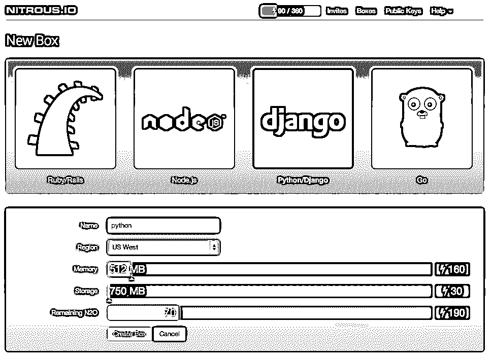
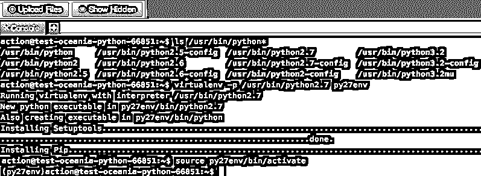

# 和姜戈还有弗拉斯克一起研究氮气。超正析象管(Image Orthicon)

> 原文：<https://realpython.com/working-with-django-and-flask-on-nitrous-io/>

这是我们来自 Nitrous 的朋友 Greg McKeever 的客座博文。IO 。

* * *

氮气。IO 是一个平台，允许您在云中快速启动自己的开发环境。这里有几个在氮气上编码的主要优点。IO :

*   为开发而设置 Windows 或 Mac OS 节省无数小时(或数天)的时间。您的 Nitrous box 预装了许多[工具和解释器](http://help.nitrous.io/box-interpreters-and-tools/?utm_source=realpython.com&utm_medium=blog&utm_content=nitrous_io_python_dev_environment)，因此您可以立即开始编码。

*   您的代码可以从任何计算机或移动设备上访问。通过 Web IDE、SSH 或[本地同步](http://www.nitrous.io/mac?utm_source=realpython.com&utm_medium=blog&utm_content=nitrous_io_python_dev_environment)编辑代码，并使用您最喜欢的文本编辑器。

*   协作:Nitrous 提供了一种与其他用户共享开发环境的方式。如果您在项目中遇到任何问题，需要帮助，您可以邀请一位朋友到您的 Nitrous box 来编辑和运行您的代码。

## 开始使用

要开始，请在 [Nitrous 注册。IO](http://www.nitrous.io?utm_source=realpython.com&utm_medium=blog&utm_content=nitrous_io_python_dev_environment) 。一旦你的账户被确认，导航到[框页面](https://www.nitrous.io/app#/boxes)并创建一个新的 Python/Django 框。

[](https://files.realpython.com/media/nitrous-create-python-box.81a29a41034a.png)

Nitrous box 中包含了许多工具和解释器，在撰写本文时，您的开发环境中将包含 Python 2.7.3 和 Django 1.5.1。如果这是你想要开始工作的，那么一切都准备好了！

如果您想使用不同版本的 Python、Django，或者利用另一个框架，比如 Flask，请继续阅读。

[*Remove ads*](/account/join/)

## 用 Virtualenv 设置 Python 2.7

Virtualenv 允许您创建一个隔离的环境，以便安装特定版本的 Python、Django，还可以安装其他框架，如 Flask，而不需要 root 访问权限。由于氮盒不提供根在这个时候，这是最好的路线。

要查看可用的 Python 版本，请在控制台中运行`ls /usr/bin/python*`。通过运行以下命令，使用 Python 2.7 创建一个新环境:

```py
$ virtualenv -p /usr/bin/python2.7 py27env
```

您现在想要连接到此环境:

```py
$ source py27env/bin/activate
```

[](https://files.realpython.com/media/nitrous-virtual-env-python27.1e7605d5cbb0.png)

> 如果您决定在任何时候从这个环境断开连接，请在控制台中键入`deactivate`。

因为您是在一个隔离的环境中，所以您需要安装 Django 和任何其他在您的环境之外可用的依赖项。可以用`pip freeze`查看安装了哪些模块。

## 安装 Django

要安装 Django 的最新官方版本，您需要使用 pip:

```py
$ pip install Django
```

## 安装砂箱

安装 Flask 就像用 pip 安装 Django 一样简单。运行以下命令安装最新的官方版本:

```py
$ pip install Flask
```

就是这样！您可以通过运行命令`pip freeze`来验证安装，并在列表中找到 Flask。你现在已经准备好在 [RealPython](https://realpython.com/) 开始你的课程了。

需要记住的一点是，你总是可以通过在控制台中运行`deactivate`来断开与 Virtualenv 的连接。如果您将 Virtualenv 会话命名为‘py 27 env ’,那么您总是可以通过运行`source py27env/bin/activate`来重新连接。*