# 使用Python进行研究软件工程

构建使研究成为可能的软件

Damien Irving
Kate Hertweck
Luke Johnston
Joel Ostblom
Charlotte Wickham
Greg Wilson

# Taylor & Francis

Taylor & Francis Group

http://taylorandfrancis.com

第一版于2022年出版
由CRC Press出版
地址：6000 Broken Sound Parkway NW, Suite 300, Boca Raton, FL 33487-2742

并由CRC Press出版
地址：2 Park Square, Milton Park, Abingdon, Oxon, OX14 4RN

© 2022 Damien Irving, Kate Hertweck, Luke Johnston, Joel Ostblom, Charlotte Wickham, and Greg Wilson

CRC Press是Taylor & Francis Group, LLC的商标

我们已尽合理努力发布可靠的数据和信息，但作者和出版商无法对所有材料的有效性或其使用后果承担责任。作者和出版商已尝试追溯本出版物中所有复制材料的版权持有者，如果未获得以本形式出版的许可，我们向版权持有者致歉。如有任何版权材料未被确认，请写信告知我们，以便我们在任何未来的重印中予以更正。

除美国版权法允许的情况外，本书的任何部分不得以任何形式（无论是电子、机械或其他方式，无论是现在已知或未来发明的，包括影印、缩微拍摄和录制）或任何信息存储或检索系统进行重印、复制、传输或利用，除非获得出版商的书面许可。

如需影印或以电子方式使用本作品中的材料，请访问 [www.copyright.com](http://www.copyright.com) 或联系版权结算中心 (CCC)，地址：222 Rosewood Drive, Danvers, MA 01923, 978-750-8400。对于CCC上不可用的作品，请联系 [mpkbookspermissions@tandf.co.uk](mailto:mpkbookspermissions@tandf.co.uk)

*商标声明：* 产品或公司名称可能是商标或注册商标，仅用于识别和解释，无意侵权。

*美国国会图书馆编目出版数据*

名称：Irving, Damien, 作者。
标题：使用Python进行研究软件工程：构建使研究成为可能的软件 / Damien Irving, Kate Hertweck, Luke William Johnston, Joel Ostblom, Charlotte Wickham, and Greg Wilson.
描述：第一版。 | Boca Raton, FL : CRC Press, 2021。 | 包含参考文献和索引。
标识符：LCCN 2021006032 | ISBN 9780367698348 (精装) | ISBN 9780367698324 (平装) | ISBN 9781003143482 (电子书)
主题：LCSH: 研究--数据处理。 | 计算机软件--开发。 | Python (计算机程序语言)
分类：LCC Q180.55.E4 I76 2021 | DDC 001.40285/5133--dc23
LC记录可在 [https://lccn.loc.gov/2021006032](https://lccn.loc.gov/2021006032) 获取

ISBN: 978-0-367-69834-8 (精装)
ISBN: 978-0-367-69832-4 (平装)
ISBN: 978-1-003-14348-2 (电子书)

DOI: [10.1201/9781003143482](https://doi.org/10.1201/9781003143482)

*出版商注：* 本书由作者提供的最终校样稿编制而成。

献给David Flanders
他教会了我许多关于发展和维护编程社区的知识。
— Damien

献给多伦多大学编程小组
他们教会我们的远比我们教给他们的多。
— Luke and Joel

献给我的父母Judy和John
他们教会我热爱书籍以及我能从中学到的一切。
— Kate

献给Joshua。
— Charlotte

献给Brent Gorda
没有他，这一切都不会发生。
— Greg

本书的所有版税都将捐赠给The Carpentries，
这是一个向全球研究人员教授基础编程和数据科学技能的组织。

# 目录

- 欢迎
  - 0.1 全景概览

# 目录

- 2.9 总结

# 目录

- 5.6 位置参数与可选参数

七

目录

## 7.9 拉取请求

# 目录

- 9.8 编写 Makefile 文档

## 12 处理错误

### 12.1 异常

# 目录

ix

## A 解答

371

## B 学习目标

419

- B.1 入门

# 目录

D 项目树 433

E 远程工作 437

- E.1 登录 437

# 欢迎

> 即使你知道它是如何运作的，它依然神奇。
— 特里·普拉切特

软件如今对研究的重要性，已如同望远镜、试管和参考文献库。这意味着研究人员*需要*了解如何构建、检查、使用和共享程序。然而，大多数编程入门教程侧重于开发商业应用，而非探索那些答案尚未可知的问题。我们的目标是向你展示如何做到这一点，无论是独立完成还是作为团队一员。

我们相信每位研究人员都应该知道如何编写简短的程序，以可复现的方式清理和分析数据，以及如何使用版本控制来跟踪自己的工作。但正如一些天文学家毕生致力于设计望远镜，一些研究人员则专注于构建使研究成为可能的软件。从事这项工作的人被称为**研究软件工程师**；本书的目标是帮助你从为自己编写代码，转变为创建能推动整个领域进步的工具，从而为承担这一角色做好准备。

## 0.1 全景概览

我们对研究软件工程的方法基于三个相互关联的概念：

- **开放科学**：通过**开放许可**发布数据、方法和结果，使其对所有人自由可用。
- **可复现研究**：确保任何能访问数据和软件的人都能可行地复现结果，既用于验证，也用于在此基础上构建。
- **可持续软件**：易于维护和扩展，而非被取代。可持续性不仅是软件的属性：它也取决于用户的技能和文化。

人们常常混淆这三个概念，但它们是不同的。例如，如果你共享了数据和分析程序，但没有按顺序记录应采取的步骤，那么你的工作是开放的，但不可复现。相反，如果你完全自动化了分析，但数据仅对实验室内部人员可用，那么你的工作是可复现的，但不开放。最后，如果一个软件包仅由几位博士后维护，他们获得的报酬远低于在工业界可能赚到的收入，并且由于其领域不重视工具构建而晋升无望，那么它迟早会成为**废弃软件**，届时开放性和可复现性就变得不那么重要了。

没有人主张研究应该是不可复现或不可持续的，但“不反对”与积极支持是两回事。学术界尚未学会如何奖励编写有用软件的人，因此，尽管你可能会得到感谢，但你付出的努力可能无法转化为学术职位的保障或体面的报酬。

有些人担心，如果他们公开数据和代码，别人可能会使用它并发表一个他们自己本可以得出的结果。这在实践中几乎闻所未闻，但这并不能阻止它被用作恐吓手段。另一些人则害怕因分享可能包含错误的代码而显得愚蠢或无能。这不仅仅是**冒名顶替综合症**：边缘化群体的成员经常受到比他人更严苛的评判，因此在公开场合犯错对他们来说风险更大。

通过本课程，我们希望为研究人员提供工具和知识，使他们成为更好的研究软件开发者，提高工作效率，减少错误，并以更开放、更可复现的方式工作。我们希望通过让更多研究人员具备这些技能和知识，研究文化能够改善，以解决上述问题。

## 0.2 目标读者

本书面向那些已经在使用 Python 进行数据分析，但希望将编码和软件开发提升到新水平的研究人员。你不必精通 Python，但应该已经能够熟练地完成诸如从文件读取数据、编写循环、条件语句和函数等操作。以下人物是我们目标读者的典型代表。

**阿米拉·汗**五年前完成了图书馆学硕士学位，此后一直在一家小型援助组织工作。她在学位期间学过一些统计学，并通过在线数据科学课程学习了一些 R 和 Python，但没有接受过正式的编程培训。阿米拉希望整理她创建的脚本、数据集和报告，以便与同事分享。本课程将向她展示如何做到这一点。

**许俊**在完成地质学博士学位后，去年完成了 Insight Data Science<sup>1</sup> 研究员项目，现在一家从事法务审计的公司工作。他使用各种机器学习和可视化包，现在希望将自己的部分工作转化为一个开源项目。本书将向他展示如何组织这样的项目，以及如何鼓励人们为其做出贡献。

**萨米·维尔塔宁**在应用数学本科学习期间成为了一名熟练的程序员，随后被大学的研究计算中心聘用。他们被要求支持的应用类型已从流体动力学转向数据分析；本指南将教他们如何构建和运行数据管道，以便将这些技能传授给用户。

## 0.3 你将学到什么

本书并非简单地提供关于良好编码实践的参考材料，而是跟随阿米拉和萨米一起编写一个实际的软件包，以解决一个真实的研究问题。我们关注的数据分析任务与定量语言学领域一个引人入胜的结果有关。齐普夫定律<sup>2</sup>指出，在一个文本语料库中，第二常见的词出现的频率是最常见词的一半，第三常见的词出现的频率是最常见词的三分之一，依此类推。为了验证齐普夫定律是否适用于从古腾堡计划<sup>3</sup>免费获取的经典小说合集，我们编写了一个软件包，用于计算和分析任意文本中的词频分布。

在编写和发布一个验证齐普夫定律的 Python 包的过程中，我们将向你展示如何完成以下事项：

- 组织中小型数据科学项目。
- 使用 Unix shell 高效管理数据和代码。
- 编写可在命令行使用的 Python 程序。
- 使用 Git 和 GitHub 跟踪和共享你的工作。
- 在欢迎每个人的团队中高效协作。
- 使用 Make 自动化复杂的工作流程。
- 允许用户配置你的软件，而无需直接修改它。
- 测试你的软件，并了解哪些部分尚未测试。
- 查找、处理和修复代码中的错误。
- 以开放和可复现的方式发布你的代码和研究。
- 创建可以标准方式安装的 Python 包。

<sup>1</sup>https://www.insightdatascience.com/
<sup>2</sup>https://en.wikipedia.org/wiki/Zipf%27s_law
<sup>3</sup>https://www.gutenberg.org/

## 0.4 使用本书

本书旨在用作大学水平（可能为一学期）课程的教材，尽管也可用于独立自学。预期的教学风格是参与式实时编码，而非仅仅讲解所呈现的代码（N. C. C. Brown and Wilson 2018; Wilson 2019a）。各章节及其内容通常设计为按给定顺序使用。

章节结构以引言开头，内容居中，练习在末尾。内容中穿插了提示框，作为正文的补充，但并非课程整体的必需部分。早期章节有许多小练习；后期章节练习较少但规模更大。为了在教学中穿插长时间的实时编码，可能更倾向于在章节的关键点停下来完成一些练习，而不是等到最后。书中提供了可能的练习解答（附录 A），以及每章的学习目标（附录 B）和要点（附录 C）。

## 0.5 贡献与复用

本书的源代码可在 `py-rse` GitHub 仓库[^1]找到，欢迎任何更正、补充或贡献。所有被收录其作品的人都将在致谢中得到认可。请查看我们的

[^1]: https://github.com/merely-useful/py-rse

贡献指南⁵以及我们的行为准则⁶，其中包含更多关于如何贡献的信息。

本书的内容和代码可以自由重用，因为它在知识共享署名 4.0 国际许可协议⁸ (CC-BY 4.0) 和 MIT 许可证⁹ 下获得许可，因此只要注明出处，该材料就可以被使用、重用和修改。

## 0.6 致谢

本书的存在归功于我们通过 The Carpentries¹⁰ 遇到的每一个人。我们还要感谢 Insight Data Science¹¹ 赞助了这项工作的早期阶段，感谢 Noble (2009)、Haddock and Dunn (2010)、Wilson et al. (2014)、Scopatz and Huff (2015)、Taschuk and Wilson (2017)、Wilson et al. (2017)、N. C. C. Brown and Wilson (2018)、Devenyi et al. (2018)、Sholler et al. (2019)、Wilson (2019b) 的作者，以及所有贡献者，包括 Madeleine Bonsma-Fisher、Jonathan Dursi、Christina Koch、Sara Mahallati、Brandeis Marshall 和 Elizabeth Wickes。

-   第 2-4 章的许多解释和练习改编自 Software Carpentry 的课程 *The Unix Shell*¹²。
-   第 6 和 7 章的许多解释和练习改编自 Software Carpentry 的课程 *Version Control with Git*¹³ 以及由威斯康星大学麦迪逊分校数据科学中心维护的该课程的改编/扩展版本¹⁴。
-   第 9 章基于 Software Carpentry 的课程 *Automation and Make*¹⁵ 和 Jonathan Dursi 的 *Introduction to Pattern Rules*¹⁶。
-   第 14 章部分基于 Ashwin Srinath 的 *Python 102*¹⁷。

⁵https://github.com/merely-useful/py-rse/blob/book/CONTRIBUTING.md
⁶https://github.com/merely-useful/py-rse/blob/book/CONDUCT.md
⁷https://github.com/merely-useful/py-rse/blob/book/LICENSE.md
⁸https://creativecommons.org/licenses/by/4.0/
⁹https://github.com/merely-useful/py-rse/blob/book/LICENSE-MIT.md
¹⁰https://carpentries.org/
¹¹https://www.insightdatascience.com/
¹²http://swcarpentry.github.io/shell-novice/
¹³http://swcarpentry.github.io/git-novice/
¹⁴https://uw-madison-datascience.github.io/git-novice-custom/
¹⁵http://swcarpentry.github.io/make-novice/
¹⁶https://github.com/ljdursi/make_pattern_rules
¹⁷https://python-102.readthedocs.io/


# Taylor & Francis

Taylor & Francis Group

http://taylorandfrancis.com

# 1
## 入门

> 万事皆有始，尽管许多物理学家不同意。
> —— 特里·普拉切特

与许多研究项目一样，我们齐夫定律分析的第一步是下载研究数据并安装所需的软件。在此之前，值得花点时间思考一下我们将如何组织所有内容。我们很快就会从古腾堡项目[^1]获得一系列文本文件形式的书籍，以及我们制作的显示每本书中单词频率分布的图表，还有我们编写的用于生成这些图表以及记录和发布我们软件包的代码。如果我们从一开始就没有条理，以后事情可能会变得一团糟。

### 1.1 项目结构

项目组织就像节食：每个人都有一个，问题只是它是否健康。对于项目而言，“健康”意味着人们可以找到他们需要的东西并做他们想做的事情，而不会感到沮丧。这取决于项目的组织程度以及人们对这种组织风格的熟悉程度。

就像良好的编码风格一样，位于可预测位置、具有可读名称的小片段比那些因项目而异、名称类似“stuff”的大块内容更容易找到和使用。我们可以在工作时保持凌乱，然后再整理，但经验告诉我们，如果我们将整洁变成一种习惯，我们将更有效率。

在构建齐夫定律项目时，我们将遵循一个广泛使用的模板来组织中小型数据分析项目 (Noble 2009)。该项目将位于名为 `zipf` 的目录中，该目录也将是一个 Git 仓库。

[^1]: https://www.gutenberg.org/

存储在 GitHub 上（第 6 章）。以下是项目目录树在本书接近尾声时的简化版本：

```
zipf/
├── .gitignore
├── CITATION.md
├── CONDUCT.md
├── CONTRIBUTING.md
├── LICENSE.md
├── README.md
├── Makefile
├── bin
│   ├── book_summary.sh
│   ├── collate.py
│   ├── countwords.py
│   └── ...
├── data
│   ├── README.md
│   ├── dracula.txt
│   ├── frankenstein.txt
│   └── ...
├── docs
│   └── ...
├── results
│   ├── collated.csv
│   ├── dracula.csv
│   ├── dracula.png
│   └── ...
└── ...
```

完整的最终目录树记录在附录 D 中。

#### 1.1.1 标准信息

我们的项目将包含一些标准文件，这些文件应该出现在每个研究软件项目中，无论是开源的还是其他的：

-   README 包含关于我们项目的基本信息。我们将在第 7 章创建它，并在第 14 章扩展它。
-   LICENSE 是项目的许可证。我们将在第 8.4 节添加它。
-   CONTRIBUTING 解释了如何为项目做贡献。我们将在第 8.11 节添加它。
-   CONDUCT 是项目的行为准则。我们将在第 8.3 节添加它。
-   CITATION 解释了如何引用该软件。我们将在第 14.7 节添加它。

一些项目还包括一个 CONTRIBUTORS 或 AUTHORS 文件，列出了所有对项目有贡献的人，而其他项目则将该信息包含在 README 中（我们在第 7 章这样做）或将其作为 CITATION 中的一个部分。这些文件通常被称为样板文件，意味着它们在每次使用时都被原样复制。

#### 1.1.2 组织项目内容

遵循 Noble (2009)，仓库根目录中的目录根据用途进行组织：

-   可运行的程序放在 bin/ 中（这是“binary”的旧 Unix 缩写，意为“非文本”）。这将包括 shell 脚本，例如第 4 章开发的 book_summary.sh，以及 Python 程序，例如第 5 章开发的 countwords.py。
-   原始数据放在 data/ 中，存储后永不修改。你将在第 1.2 节设置此目录及其内容。
-   结果放在 results/ 中。这包括清理后的数据、图表以及使用 bin 和 data 中的内容创建的所有其他内容。在本项目中，我们将通过第 9 章创建的 Makefile 详细描述 bin 和 data 的使用方式。
-   最后，文档和手稿放在 docs/ 中。在本项目中，docs 将包含在第 14.6.2 节创建的 Python 包的自动生成文档。

这种结构适用于许多计算研究项目，我们鼓励在本书之外也使用它。当我们讨论测试（第 11 章）、来源（第 13 章）和打包（第 14 章）时，我们将添加一些 Noble (2009) 未直接涉及的文件夹和文件。

## 1.2 下载数据

本书中使用的数据文件存储在一个名为 Figshare 的在线仓库中（我们将在第 13.1.2 节详细讨论），可以通过以下网址访问：

https://doi.org/10.6084/m9.figshare.13040516

我们可以通过点击此 URL 上的“download all”来下载包含数据文件的 zip 文件，然后将内容解压缩到一个新的 **zipf/data** 目录（也称为**文件夹**）中，该目录遵循上述项目结构。完成后，情况如下所示：

```
zipf/
└── data
    ├── README.md
    ├── dracula.txt
    ├── frankenstein.txt
    ├── jane_eyre.txt
    ├── moby_dick.txt
    ├── sense_and_sensibility.txt
    ├── sherlock_holmes.txt
    └── time_machine.txt
```

## 1.3 安装软件

为了进行分析，我们需要安装以下软件：

1.  **Bash shell**
2.  **Git** 版本控制
3.  文本编辑器
4.  Python 3²（通过 Anaconda 发行版）
5.  GNU Make³

Windows、Mac 和 Linux 操作系统的综合软件安装说明（附视频教程）由 The Carpentries⁴ 作为其研讨会网站模板的一部分维护，网址为：

https://carpentries.github.io/workshop-template/#setup

我们可以按照这些说明安装 Bash shell、Git、文本编辑器和 Anaconda。我们推荐使用 Anaconda 作为安装 Python 的方法，因为它包含 Conda 以及我们将在本书中使用的许多软件包。

你可以通过在 Bash shell 中输入 `make -v` 来检查 Make 是否已在你的计算机上。如果没有，你可以按如下方式安装：

² https://www.python.org/
³ https://www.gnu.org/software/make/
⁴ https://carpentries.org/

## 1.4 总结

- *Linux (Debian/Ubuntu)*：在 Bash shell 中使用 `sudo apt-get install make` 进行安装。
- *Mac*：安装 Xcode[^5]（通过 App Store）。
- *Windows*：请遵循不列颠哥伦比亚大学数据科学硕士项目维护的安装说明[^6]。

> **Windows 中的 Shell 内 conda**

如果你使用 Windows 且 `conda` 命令在 Bash shell 中不可用，你需要打开 Anaconda Prompt 程序（通过 Windows 开始菜单）并运行命令 `conda init bash`（此操作只需执行一次）。之后，你的 shell 将被配置为使用 conda。

> **软件版本**

在整本书中，我们将向你展示你可以预期看到的输出示例。此输出源自运行以下配置的 Mac：Git 版本 2.29.2，Python 版本 3.7.6，GNU bash 版本 3.2.57(1)-release (x86_64-apple-darwin19)，GNU Make 3.81，以及 conda 4.9.2。在某些情况下，你看到的屏幕输出可能会因软件版本不同而略有差异。我们将帮助你理解如何解释输出，以便无论软件版本如何，你都能继续工作并进行故障排除。

现在我们的项目结构已设置好，数据已下载，软件已安装，我们准备好开始分析了。

[^5]: https://developer.apple.com/xcode/
[^6]: https://ubc-mds.github.io/resources_pages/install_ds_stack_windows/#make

## 1.5 练习

### 1.5.1 准备工作

在进入下一章之前，请确保你已下载所需的数据文件（遵循[第 1.2 节](#section-1.2)）并安装了所需的软件（遵循[第 1.3 节](#section-1.3)）。

## 1.6 关键点

- 养成整洁的习惯，而不是稍后清理项目文件。
- 在所有项目中包含一些标准文件，例如 README、LICENSE、CONTRIBUTING、CONDUCT 和 CITATION。
- 将可运行代码放在 `bin/` 目录中。
- 将原始/初始数据放在 `data/` 目录中，且永不修改它。
- 将结果放在 `results/` 目录中。这包括清理后的数据和图表（即，使用 `bin` 和 `data` 中的内容创建的所有内容）。
- 将文档和手稿放在 `docs/` 目录中。
- 如果遇到问题，请参考 The Carpentries 软件安装指南<sup>7</sup>。

<sup>7</sup>https://carpentries.github.io/workshop-template/#setup

# 2 Unix Shell 基础

> 大多数魔法的百分之九十，仅仅在于知道一个额外的事实。
— 特里·普拉切特

计算机做四件基本的事情：存储数据、运行程序、相互通信以及与人交互。它们以多种不同的方式进行交互，其中**图形用户界面**（GUI）是使用最广泛的。计算机显示图标来展示我们的文件和程序，我们通过鼠标点击来告诉它复制或运行这些文件。GUI 易于学习但难以自动化，并且不会记录我们做了什么。

相比之下，当我们使用**命令行界面**（CLI）时，我们通过输入命令与计算机通信，计算机则通过显示文本来响应。CLI 在 GUI 出现之前就已存在；它们之所以能延续下来，是因为它们高效、易于自动化，并且能自动记录我们所做的操作。

每个 CLI 的核心都是一个**读取-求值-打印循环**（REPL）。当我们输入一个命令并按回车键（也称为 Enter）时，CLI **读取**该命令，**求值**它（即执行它），**打印**命令的输出，然后**循环**等待另一个命令。如果你使用过 Python 的交互式控制台，那么你已经使用过一个简单的 CLI。

本课介绍另一个 CLI，它让我们能够与计算机的操作系统进行交互。它被称为“命令 shell”，或简称 **shell**，本质上是一个代表我们运行其他程序的程序（图 2.1）。这些“其他程序”可以做简单如告诉我们时间，或复杂如模拟全球气候变化的事情；只要它们遵守一些简单的规则，shell 就可以运行它们，而无需知道它们是用什么语言编写的或它们是如何完成工作的。

```
amiras-computer$ ls
Applications     Downloads        Music            todo.txt
Desktop           Library          Pictures         zipf
Documents         Movies           Public
amiras-computer$ cd Documents/
amiras-computer$ ls
personal_writing  work_files
amiras-computer$ █
```

**图 2.1：** Bash shell。

> ### 名字里有什么？
在过去的四十年里，程序员编写了许多不同的 shell，就像他们创建了许多不同的文本编辑器和绘图包一样。当今最受欢迎的 shell 叫做 Bash（**B**ourne **A**gain **SH**ell 的首字母缩写，也是对其前身 Bourne shell 名字的一个弱双关）。其他 shell 可能在细节上与 Bash 有所不同，但核心命令和思想保持不变。特别是，最新版本的 MacOS 使用一个叫做 Z Shell 或 `zsh` 的 shell；我们将在学习过程中指出一些差异。

请参阅[第 1.3 节](Section 1.3)了解如何在你的计算机上安装和启动 shell 的说明。

## 2.1 探索文件和目录

我们的第一个 shell 命令将让我们探索文件夹和文件，并向我们介绍大多数 Unix 工具遵循的几个约定。首先，当 Bash 运行时，它会向我们展示一个**提示符**，表示它正在等待我们输入内容。默认情况下，这个提示符是一个简单的美元符号：

```
$
```

然而，不同的 shell 可能使用不同的符号：特别是，在较新版本的 MacOS 上作为默认 shell 的 `zsh`，使用 `%`。正如我们将在[第 4.6 节](Section 4.6)中看到的，我们可以自定义提示符以提供更多信息。

> **不要输入美元符号**
我们显示 $ 提示符是为了清楚地表明你应该输入什么，特别是当多个命令连续出现时，但你*不应该*自己输入它。

让我们运行一个命令来找出 shell 认为我们是谁：

```
$ whoami
```

amira

> **边做边学**
Amira 是[第 0.2 节](#)中描述的学习者之一。在本书的其余部分，我们将从她的视角展示代码和示例。你应该在自己的计算机上跟着操作，尽管由于操作系统差异（以及你的名字可能不是 Amira），你看到的内容可能会有细微差别。

现在我们知道我们是谁了，我们可以探索我们在哪里以及我们有什么。操作系统中管理文件和目录（也称为**文件夹**）的部分称为**文件系统**。shell 中一些最常用的命令用于创建、检查、重命名和删除文件和目录。让我们通过运行命令 `pwd` 开始探索它们，它代表**打印工作目录**。其名称中的“打印”部分很直接；“工作目录”部分指的是 shell 始终跟踪我们的**当前工作目录**这一事实。大多数命令在当前工作目录中读写文件，除非我们告诉它们做其他事情，因此在运行命令之前知道我们在哪里很重要。

```
$ pwd
```

/Users/amira

这里，计算机的响应是 `/Users/amira`，这告诉我们我们在一个名为 `amira` 的目录中，该目录包含在一个名为 `Users` 的顶级目录中。这个目录是 Amira 的**主目录**；要理解这意味着什么，我们必须首先了解文件系统的组织方式。在 Amira 的计算机上，它看起来像[图 2.2](#)。

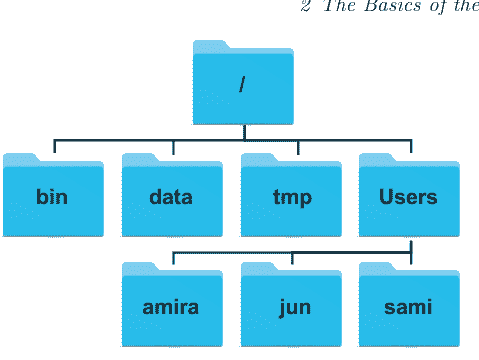

**图 2.2：** 一个示例文件系统。

顶部是**根目录**，它包含所有其他内容，我们可以使用斜杠字符 / 单独引用它。在该目录内有几个其他目录，包括 **bin**（存储一些内置程序）、**data**（用于杂项数据文件）、**tmp**（用于不需要长期存储的临时文件）和 **Users**（用户个人目录所在的位置）。我们知道 **/Users** 存储在根目录 / 内，因为它的名称以 / 开头，而我们当前的工作目录 **/Users/amira** 存储在 **/Users** 内，因为 **/Users** 是其名称的第一部分。像这样的名称被称为**路径**，因为它告诉我们如何从文件系统中的一个地方（例如，根目录）到达另一个地方（例如，Amira 的主目录）。

> **斜杠**
/ 字符在路径中有两种不同的含义。在路径的开头或单独使用时，它指的是根目录。当它出现在名称内部时，它是一个分隔符。Windows 使用反斜杠 (\) 而不是正斜杠作为分隔符。

在 **/Users** 下，我们为这台机器上拥有账户的每个用户找到一个目录。Jun 的文件存储在 **/Users/jun**，Sami 的在 **/Users/sami**，Amira 的在 **/Users/amira**。这就是“主目录”名称的由来：当我们第一次登录时，shell 会将我们放入保存我们文件的目录中。

## 2.1 探索文件和目录

> **主目录的差异**

我们的主目录在不同操作系统上会位于不同位置。在Linux上可能是`/home/amira`，在Windows上可能是`C:\Documents and Settings\amira`或`C:\Users\amira`（取决于Windows版本）。我们的示例展示的是在MacOS上看到的情况。

现在我们知道当前所在位置了，让我们使用`ls`命令（"listing"的缩写）查看当前目录中有哪些文件和目录：

```
$ ls
```

```
Applications    Downloads    Music    todo.txt
Desktop          Library      Pictures zipf
Documents        Movies       Public
```

同样，我们的结果可能因操作系统和已有文件/目录的不同而有所差异。

我们可以使用**-F选项**（有时也称为**开关**或**标志**）使`ls`的输出更具信息性。选项就像Python函数的参数一样；在这个例子中，`-F`告诉`ls`在输出中添加标记以显示各项类型。末尾的`/`表示目录，末尾的`*`表示可执行程序。根据我们的配置，shell可能还会使用颜色来区分文件和目录。

```
$ ls -F
```

```
Applications/    Downloads/    Music/    todo.txt
Desktop/         Library/      Pictures/ zipf/
Documents/       Movies/       Public/
```

这里我们可以看到，主目录中几乎都是**子目录**：唯一不是目录的是名为`todo.txt`的文件。

## 空格很重要

在数学中1+2和1 + 2含义相同，但在shell中`ls -F`和`ls-F`是完全不同的。shell会根据空格将我们输入的内容分割成多个部分，因此如果忘记在`ls`和`-F`之间至少留一个空格，shell会尝试查找名为`ls-F`的程序，并（很合理地）给出类似`ls-F: command not found`的错误信息。

有些选项告诉命令如何执行，而另一些选项则指定命令要操作的对象。例如，如果想查看`/Users`目录的内容，可以输入：

```
$ ls /Users
```

```
amira   jun     sami
```

我们通常将提供给命令的文件和目录名称称为**参数**，以区别于内置选项。我们可以组合使用选项和参数：

```
$ ls -F /Users
```

```
amira/  jun/    sami/
```

但必须将选项（如`-F`）放在要操作的文件或目录名称之前，因为一旦命令遇到*非选项*内容，就会假定后续没有更多选项：

```
$ ls /Users -F
```

```
ls: -F: No such file or directory
amira   jun     sami
```

## 命令行差异

代码在不同计算机上有时会表现出意想不到的行为，命令行也是如此。例如，以下代码实际上在某些Linux操作系统上*确实*有效：

```
$ ls /Users -F
```

有些人认为这很方便；而另一些人（包括我们）认为这容易造成混淆，因此最好避免这样做。

## 2.2 移动位置

让我们再次运行`ls`。不带任何参数时，它会显示当前工作目录的内容：

```
$ ls -F
```

```
Applications/    Downloads/    Music/    todo.txt
Desktop/         Library/      Pictures/ zipf/
Documents/       Movies/       Public/
```

如果想查看`zipf`目录的内容，可以要求`ls`列出其内容：

```
$ ls -F zipf
```

```
data/
```

注意`zipf`名称前没有斜杠。这种缺失表明shell这是一个**相对路径**，即从当前工作目录开始定位。相比之下，像`/Users/amira`这样的路径是**绝对路径**：它总是从根目录开始解释，因此始终指向相同位置。使用相对路径就像告诉某人"向北走两公里再向东走半公里"；使用绝对路径则像提供目的地的经纬度坐标。

## 2 Unix Shell基础

我们可以使用最容易输入的路径类型，但如果要对`zipf`目录中的数据进行大量操作，最简单的方法是更改当前工作目录，这样就不必反复输入`zipf`。执行此操作的命令是`cd`（change directory的缩写）。这个名称有点误导性，因为该命令并不改变目录本身；而是改变shell对我们当前所在目录的认知。让我们试试看：

```
$ cd zipf
```

`cd`不会输出任何内容。这是正常的：许多shell命令在正常情况下会静默运行，只有在出错时才会提示，基于的理论是它们只在需要时才请求我们的注意。为了确认`cd`已执行我们的请求，可以使用`pwd`：

```
$ pwd
```

/Users/amira/zipf

```
$ ls -F
```

data/

## 缺失目录和未知选项

如果给命令提供它不理解的选项，通常会打印错误信息，并（如果幸运的话）简洁地提醒我们应该怎么做：

```
$ cd -j

-bash: cd: -j: invalid option
cd: usage: cd [-L|-P] [dir]
```

另一方面，如果语法正确但文件或目录名称有误，它会告诉我们：

```
$ cd whoops

-bash: cd: whoops: No such file or directory
```

现在我们知道如何向下浏览目录树了，但如何向上返回呢？这样做不行：

```
$ cd amira

cd: amira: No such file or directory
```

因为单独的`amira`是相对路径，表示"当前工作目录*下方*名为`amira`的文件或目录"。要返回主目录，可以使用绝对路径：

```
$ cd /Users/amira
```

或使用特殊的相对路径`..`（两个连续句点，无空格），它始终表示"包含当前目录的目录"。包含我们当前目录的目录称为**父目录**，`..`确实能带我们回到那里：

```
$ cd ..
$ pwd
```

/Users/amira

ls通常不会显示这个特殊目录——因为它始终存在，每次显示都会造成干扰。我们可以使用`-a`选项（代表"all"）要求ls包含它。记住我们现在位于`/Users/amira`：

```
$ ls -F -a
```

```
./              Documents/      Music/          zipf/
../              Downloads/      Pictures/
Applications/    Library/        Public/
Desktop/         Movies/         todo.txt
```

输出还显示了另一个特殊目录`.`（单个句点），它指当前工作目录。为它命名可能显得多余，但很快我们会看到它的用途。

> ### 组合选项

有时需要在同一个命令中使用多个选项。在大多数命令行工具中，多个选项可以用单个`-`组合，且选项之间无需空格：

$ ls -Fa

此命令与前一个示例等效。虽然你可能会看到这样的命令写法，但我们不建议在自己的工作中使用这种方法。这是因为某些命令采用**长选项**（多字母名称），很容易将`--no`（表示"对所有问题回答'否'"）与`-no`（表示`-n -o`）混淆。

特殊名称`.`和`..`不属于`cd`：它们对每个程序含义相同。例如，如果我们在`/Users/amira/zipf`中，那么`ls ..`将显示`/Users/amira`的列表。当各部分的含义无论组合方式如何都相同时，程序员称它们是**正交的**。正交系统通常更容易学习，因为需要记忆的特殊情况更少。

> **其他隐藏文件**

除了隐藏目录`..`和`.`，我们还可能遇到名为`.jupyter`的文件。这些文件通常包含特定程序的设置或其他数据；前缀`.`用于防止`ls`在运行时使输出变得杂乱。我们始终可以使用`-a`选项来显示它们。

`cd`是一个简单的命令，但它让我们探索了几个新概念。首先，多个`..`可以通过路径分隔符连接，一步移动到比父目录更高的位置。例如，`cd ../../..`会将我们向上移动两级目录（例如从`/Users/amira/zipf`到`/Users`），而`cd ../Movies`会将我们从`zipf`向上移动再向下进入`Movies`。

如果只输入`cd`而不指定目录会怎样？

```
$ pwd

/Users/amira/Movies

$ cd
$ pwd

/Users/amira
```

无论我们在哪里，单独的`cd`总是将我们返回主目录。我们可以使用特殊目录名`~`（主目录的快捷方式）实现相同效果：

```
$ ls ~

Applications  Downloads  Music       todo.txt
Desktop       Library    Pictures    zipf
Documents     Movies     Public
```

## 2.3 创建新文件和目录

我们现在知道了如何探索文件和目录，但如何创建它们呢？为了找出答案，让我们回到我们的 `zipf` 目录：

```
$ cd ~/zipf
$ ls -F
```

data/

要创建一个新目录，我们使用 `mkdir` 命令（`make directory` 的缩写）：

```
$ mkdir docs
```

由于 `docs` 是一个相对路径（即没有前导斜杠），新目录是在当前工作目录下创建的：

```
$ ls -F
```

data/  docs/

使用 shell 创建目录与使用图形化工具并无不同。如果我们用计算机的文件浏览器查看当前目录，也会看到 `docs` 目录。shell 和文件浏览器是与文件交互的两种不同方式；文件和目录本身是相同的。

## 命名文件和目录

复杂的文件和目录名称会让我们的生活变得痛苦。遵循一些简单的规则可以省去很多麻烦：

- 1. **不要使用空格。** 空格可以使名称更易读，但由于它们在命令行中用于分隔参数，大多数 shell 命令会将 `My Thesis` 这样的名称解释为两个名称 `My` 和 `Thesis`。请改用 `-` 或 `_`，例如 `My-Thesis` 或 `My_Thesis`。
- 2. **不要以 `-`（短横线）开头**，以避免与 `-F` 等命令选项混淆。
- 3. **坚持使用字母、数字、`.`（句点或“全角句号”）、`-`（短横线）和 `_`（下划线）。** 许多其他字符在 shell 中具有特殊含义。我们将在本课中学习其中一些特殊字符，但这里列出的字符始终是安全的。

如果我们需要引用名称中包含空格或其他特殊字符的文件或目录，可以将名称用引号（`""`）括起来。例如，`ls "My Thesis"` 可以工作，而 `ls My Thesis` 则不行。

由于我们刚刚创建了 `docs` 目录，当我们要求列出其内容时，`ls` 不会显示任何内容：

```
$ ls -F docs
```

让我们使用 `cd` 将工作目录更改为 `docs`，然后使用一个名为 **Nano** 的非常简单的文本编辑器创建一个名为 `draft.txt` 的文件（[图 2.3](#fig:nano)）：

```
$ cd docs
$ nano draft.txt
```

当我们说“Nano 是一个文本编辑器”时，我们确实是指“文本”：它只能处理纯字符数据，不能处理电子表格、图像、Microsoft Word 文件或 1970 年之后发明的任何其他东西。我们在本课中使用它，因为它可以在任何地方运行，而且它简单到足以被称为编辑器。然而，最后一个特点意味着我们*不应该*用它来完成编写程序或论文等较大的任务。


**图 2.3：** Nano 编辑器。

> ### 回收像素
> 与大多数现代编辑器不同，Nano 在 shell 窗口*内部*运行，而不是打开自己的新窗口。这是图形终端稀缺、不同应用程序必须共享单个屏幕的时代的遗留产物。

一旦 Nano 打开，我们就可以输入几行文本，然后按 Ctrl+O（同时按下 Control 键和字母‘O’）来保存我们的工作。Nano 会询问我们要将其保存到哪个文件；按 Return 键接受建议的默认值 `draft.txt`。文件保存后，我们可以使用 Ctrl+X 退出编辑器并返回 shell。

## Control、Ctrl 或 ^ 键

Control 键，也称为“Ctrl”键，可以用多种令人困惑的方式描述。例如，Control 加 X 可以写成：

- Control-X
- Control+X
- Ctrl-X
- Ctrl+X
- C-x
- ^X

当 Nano 运行时，它在屏幕底部两行使用最后一种表示法显示一些帮助信息：例如，`^G Get Help` 表示“使用 Ctrl+G 获取帮助”，`^O WriteOut` 表示“使用 Ctrl+O 写出当前文件。”

Nano 退出后不会在屏幕上留下任何输出，但 `ls` 会显示我们确实创建了一个新文件 `draft.txt`：

```
$ ls
```

```
draft.txt
```

## 点什么

Amira 的所有文件都命名为“something dot something”。这只是一个约定：我们可以将文件命名为 `mythesis` 或几乎任何其他名称。然而，人和程序都使用两部分名称来帮助区分不同类型的文件。文件名中点之后的部分称为**文件扩展名**，表示文件包含的数据类型：`.txt` 表示纯文本，`.pdf` 表示 PDF 文档，`.png` 表示 PNG 图像，等等。这只是一个约定：将鲸鱼的 PNG 图像保存为 `whale.mp3` 并不会神奇地将其变成鲸鱼歌声的录音，尽管它*可能*导致操作系统在有人双击它时尝试用音乐播放器打开它。

## 2.4 移动文件和目录

让我们回到我们的 `zipf` 目录：

```
cd ~/zipf
```

`docs` 目录包含一个名为 `draft.txt` 的文件。这不是一个特别有信息量的名称，所以让我们使用 `mv`（`move` 的缩写）来更改它：

```
$ mv docs/draft.txt docs/prior-work.txt
```

第一个参数告诉 `mv` 我们正在“移动”什么，第二个参数是它要去的地方。将 `docs/draft.txt` “移动”到 `docs/prior-work.txt` 与重命名文件效果相同：

```
$ ls docs
```

```
prior-work.txt
```

指定目标时必须小心，因为 `mv` 会在没有警告的情况下覆盖现有文件。选项 `-i`（代表“交互式”）使 `mv` 在覆盖前询问我们确认。`mv` 也适用于目录，因此 `mv analysis first-paper` 会重命名目录而不更改其内容。

现在假设我们想将 `prior-work.txt` 移动到当前工作目录。如果我们不想更改文件名，只想更改位置，我们可以为 `mv` 提供一个目录作为目标，它会将文件移动到那里。在这种情况下，我们想要的目录是我们之前提到的特殊名称 `.`：

```
$ mv docs/prior-work.txt .
```

## 2.5 复制文件和目录

现在 `ls` 显示 `docs` 是空的：

```
$ ls docs
```

并且我们当前的目录现在包含我们的文件：

```
$ ls
```

```
data/ docs/ prior-work.txt
```

如果我们只想检查文件是否存在，我们可以像提供目录名一样将文件名提供给 `ls`：

```
$ ls prior-work.txt
```

```
prior-work.txt
```

`cp` 命令复制文件。它的工作方式类似于 `mv`，但它创建一个文件而不是移动现有文件：

```
$ cp prior-work.txt docs/section-1.txt
```

我们可以通过给 `ls` 两个参数来检查 `cp` 是否做了正确的事情，要求它一次列出两个内容：

```
$ ls prior-work.txt docs/section-1.txt
```

```
docs/section-1.txt prior-work.txt
```

请注意，`ls` 按字母顺序显示输出。如果我们省略第二个文件名，要求它显示一个文件和一个目录（或多个目录），它会逐一列出它们：

```
$ ls prior-work.txt docs
```

```
prior-work.txt

docs:
section-1.txt
```

复制目录及其包含的所有内容稍微复杂一些。如果我们单独使用 `cp`，会得到一条错误消息：

```
$ cp docs backup
```

```
cp: analysis is a directory (not copied).
```

如果我们确实想复制所有内容，必须给 `cp` `-r` 选项（表示**递归**）：

```
$ cp -r docs backup
```

我们再次可以用 `ls` 检查结果：

```
$ ls docs backup
```

```
docs/:
section-1.txt

backup/:
section-1.txt
```

## 将文件复制到远程计算机和从远程计算机复制

对于许多研究人员来说，学习如何使用 shell 的一个动机是，它通常是连接远程计算机（例如，位于超级计算设施或大学部门）的唯一方式。

类似于 `cp` 命令，存在一个安全的 `copy`（`scp`）命令用于在计算机之间复制文件。有关详细信息，包括如何通过 shell 设置与远程计算机的安全连接，请参见附录 E。

## 2.6 删除文件和目录

让我们通过删除我们在 `zipf` 目录中创建的 `prior-work.txt` 文件来整理一下。执行此操作的命令是 `rm`（`remove` 的缩写）：

```
$ rm prior-work.txt
```

我们可以使用 `ls` 确认文件已消失：

```
$ ls prior-work.txt
```

```
ls: prior-work.txt: No such file or directory
```

删除是永久的：与大多数 GUI 不同，Unix shell 没有我们可以从中恢复已删除文件的回收站。确实存在用于查找和恢复已删除文件的工具，但无法保证它们会起作用，因为计算机可能会随时回收文件的磁盘空间。在大多数情况下，当我们删除文件时，它确实消失了。

为了半心半意地阻止我们意外删除东西，`rm` 拒绝删除目录：

```
$ rm docs
```

```
rm: docs: is a directory
```

我们可以通过给 `rm` 命令加上递归选项 `-r` 来明确表示确实要执行此操作：

```
$ rm -r docs
```

使用 `rm -r` 时必须格外小心：在大多数情况下，最安全的做法是加上 `-i` 选项（代表交互模式），让 `rm` 在每次删除前都向我们确认。作为折中方案，我们可以使用 `-v` 选项（代表详细模式），让 `rm` 在删除每个文件时都打印一条消息。此选项对 `mv` 和 `cp` 命令同样适用。

## 2.7 通配符

`zipf/data` 目录包含了来自古腾堡计划[^1]的几本电子书的文本文件：

```
$ ls data

README.md          moby_dick.txt
dracula.txt        sense_and_sensibility.txt
frankenstein.txt   sherlock_holmes.txt
jane_eyre.txt      time_machine.txt
```

`wc` 命令（word count 的缩写）可以告诉我们一个文件中有多少行、多少词和多少个字符：

```
$ wc data/moby_dick.txt

22331  215832 1276222 data/moby_dick.txt
```

> **什么是“词”？**

`wc` 只将空格视为词的分隔符：如果两个词由一个长破折号连接——就像本句中的“dash”和“like”——那么 `wc` 会将它们计为一个词。

[^1]: https://www.gutenberg.org/

我们可以多次运行 `wc` 来找出其他文件有多少行，但这会非常繁琐且容易出错。我们不能像使用 `ls` 那样直接将目录名传给 `wc`：

```
$ wc data
```

```
wc: data: read: Is a directory
```

相反，我们可以使用**通配符**来一次性指定一组文件。最常用的通配符是 `*`（星号）。它匹配零个或多个字符，因此 `data/*.txt` 会匹配 `data` 目录下的所有文本文件：

```
$ ls data/*.txt
```

```
data/dracula.txt          data/sense_and_sensibility.txt
data/frankenstein.txt     data/sherlock_holmes.txt
data/jane_eyre.txt        data/time_machine.txt
data/moby_dick.txt
```

而 `data/s*.txt` 只匹配文件名以 's' 开头的两个文件：

```
$ ls data/s*.txt
```

```
data/sense_and_sensibility.txt  data/sherlock_holmes.txt
```

通配符在命令运行*之前*会被展开以匹配文件名，因此它们对每个命令的工作方式都完全相同。这意味着我们可以将它们与 `wc` 一起使用，例如，统计文件名中包含下划线的书籍的单词数：

```
$ wc data/*_*.txt
```

```
  21054  188460 1049294 data/jane_eyre.txt
  22331  215832 1253891 data/moby_dick.txt
  13028  121593  693116 data/sense_and_sensibility.txt
  13053  107536  581903 data/sherlock_holmes.txt
   3582   35527  200928 data/time_machine.txt
  73048  668948 3779132 total
```

或者统计《科学怪人》的单词数：

```
$ wc data/frank*.txt
```

```
7832 78100 442967 data/frankenstein.txt
```

练习将介绍和探索其他通配符。目前，我们只需要知道通配符表达式有可能*不*匹配任何内容。在这种情况下，命令通常会打印一条错误消息：

```
$ wc data/*.csv
```

```
wc: data/*.csv: open: No such file or directory
```

## 2.8 阅读手册

`wc` 默认显示行数、词数和字符数，但我们可以让它只显示行数：

```
$ wc -l data/s*.txt
```

```
13028 sense_and_sensibility.txt
13053 sherlock_holmes.txt
26081 total
```

`wc` 还有其他选项。我们可以使用 `man` 命令（**manual** 的缩写）来查看它们是什么：

```
$ man wc
```

35

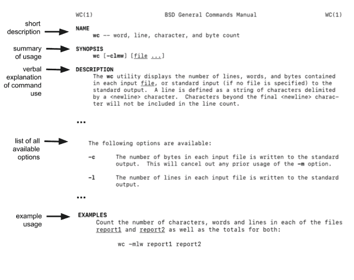

图 2.4：Unix 手册页的关键特征。

> ### 翻阅手册

如果我们的屏幕太小，无法一次显示整个手册页，shell 会使用一个名为 `less` 的**分页程序**来逐段显示。我们可以使用 ↑ 和 ↓ 键逐行移动，或使用 Ctrl+空格键 和 空格键 来一次向上或向下翻一页。（B 和 F 键也有效。）

要搜索字符或单词，请使用 `/` 后跟要搜索的字符或单词。如果搜索产生多个匹配项，我们可以使用 `N`（代表“下一个”）在它们之间移动。要退出，按 `Q` 键。

手册页包含大量信息——通常比我们真正需要的还要多。图 2.3 包含了你屏幕上手册的摘录，并突出显示了一些对初学者有用的特性。

有些命令有一个 `--help` 选项，它提供了功能的简明摘要，但如今寻求帮助的最佳去处可能是 TLDR² 网站。这个缩写代表“太长，没读”，它对 `wc` 的帮助显示如下：

²https://tldr.sh/

wc
统计单词、字节或行数。

统计文件中的行数：
wc -l {{file}}

统计文件中的单词数：
wc -w {{file}}

统计文件中的字符（字节）数：
wc -c {{file}}

统计文件中的字符数（考虑多字节字符集）：
wc -m {{file}}

在 github 上编辑此页面

正如最后一行所示，它的所有示例都在一个公共的 GitHub 仓库中，这样像你这样的用户就可以添加你希望它有的示例。要获取更多信息，我们可以在 Stack Overflow³ 上搜索或浏览 GNU 手册⁴（特别是核心 GNU 工具⁵的手册，其中包含本课介绍的许多命令）。然而，在所有情况下，我们首先需要对我们寻找的内容有一些概念：想知道数据文件有多少行的人不太可能想到去查找 `wc`。

## 2.9 总结

最初的 Unix shell 正在庆祝其五十周年。它的命令可能很晦涩，但很少有程序能像它这样在日常使用中保持如此长的时间。下一章将探讨我们如何组合和重复命令，以创建强大、高效的工作流程。

³https://stackoverflow.com/questions/tagged/bash
⁴https://www.gnu.org/manual/manual.html
⁵https://www.gnu.org/software/coreutils/manual/coreutils.html

## 2.10 练习

以下练习涉及创建和移动新文件，以及考虑假设的文件。请注意，如果你在 Zipf 定律项目中创建或移动了任何文件或目录，你可能需要按照下一章开头的大纲重新组织你的文件。如果不小心删除了必要的文件，你可以按照[第 1.2 节](#)中的说明，从数据文件的新副本开始。

### 2.10.1 探索更多 ls 标志

当 `ls` 命令与 `-l` 选项一起使用时，它会做什么？
如果同时使用两个选项，例如 `ls -l -h`，会发生什么？

### 2.10.2 递归和按时间列出

命令 `ls -R` 递归地列出目录的内容，这意味着每一级的子目录、子子目录等都会被列出。命令 `ls -t` 按最后修改时间列出内容，最近修改的文件或目录排在最前面。

`ls -R -t` 按什么顺序显示内容？提示：`ls -l` 使用长列表格式来查看时间戳。

### 2.10.3 绝对路径和相对路径

从 `/Users/amira/data` 开始，Amira 可以使用以下哪个命令导航到她的主目录 `/Users/amira`？

1. `cd .`
2. `cd /`
3. `cd /home/amira`
4. `cd ../..`
5. `cd ~`
6. `cd home`
7. `cd ~/data/..`
8. `cd`
9. `cd ..`
10. `cd ../.`

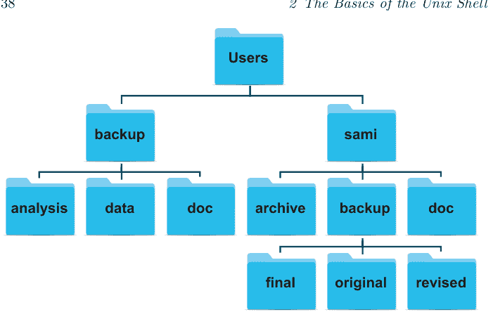

图 2.5：练习用的文件系统。

### 2.10.4 相对路径解析

使用图 2.5 所示的文件系统，如果 `pwd` 显示 `/Users/sami`，那么 `ls -F ../backup` 会显示什么？

1. ../backup: No such file or directory
2. final original revised
3. final/ original/ revised/
4. data/ analysis/ doc/

### 2.10.5 ls 阅读理解

使用图 2.5 所示的文件系统，如果 `pwd` 显示 `/Users/backup`，并且 `-r` 告诉 `ls` 以相反顺序显示内容，那么哪个命令会产生以下输出：

```
doc/ data/ analysis/
```

1. ls pwd
2. ls -r -F
3. ls -r -F /Users/backup

### 2.10.6 以不同方式创建文件

执行 `touch my_file.txt` 时会发生什么？（提示：使用 `ls -l` 查找文件信息）

你可能在什么时候想以这种方式创建文件？

### 2.10.7 安全地使用 rm

如果你在上一个练习中创建的文件上执行 `rm -i my_file.txt`，会发生什么？为什么我们使用 `rm` 时想要这种保护？

### 2.10.8 移动到当前文件夹

运行以下命令后，Amira 意识到她把（假设的）文件 `chapter1.txt` 和 `chapter2.txt` 放错了文件夹：

```
$ ls -F

data/  docs/
```

```
$ ls -F data

README.md          frankenstein.txt   sherlock_holmes.txt
chapter1.txt       jane_eyre.txt      time_machine.txt
chapter2.txt       moby_dick.txt
dracula.txt        sense_and_sensibility.txt
```

```
$ cd docs
```

填空以将这些文件移动到当前文件夹（即她当前所在的文件夹）：

```
$ mv ___/chapter1.txt  ___/chapter2.txt  ___
```

## 2.10.9 重命名文件

假设你在当前目录下创建了一个纯文本文件，用于记录分析数据所需的统计测试列表，并将其命名为：`statstics.txt`

创建并保存此文件后，你发现文件名拼写错误！你想要纠正这个错误，以下哪个命令可以用来完成此操作？

- 1. cp statstics.txt statistics.txt
- 2. mv statstics.txt statistics.txt
- 3. mv statstics.txt .
- 4. cp statstics.txt .

## 2.10.10 移动和复制

假设存在以下假设文件，下面序列中最后一条 `ls` 命令的输出是什么？

```
$ pwd

/Users/amira/data

$ ls

books.dat

$ mkdir doc
$ mv books.dat doc/
$ cp doc/books.dat ../books-saved.dat
$ ls
```

- 1. books-saved.dat doc
- 2. doc
- 3. books.dat doc
- 4. books-saved.dat

## 2.10.11 使用多个文件名进行复制

本练习探讨当尝试复制多个项目时，`cp` 命令如何响应。

当给定多个文件名后跟一个目录名时，`cp` 会做什么？

```
$ mkdir backup
$ cp dracula.txt frankenstein.txt backup/
```

当给定三个或更多文件名时，`cp` 会做什么？

```
$ cp dracula.txt frankenstein.txt jane_eyre.txt
```

## 2.10.12 列出匹配模式的文件名

在项目目录的数据目录中运行时，哪些 `ls` 命令会产生以下输出？

jane_eyre.txt sense_and_sensibility.txt

- 1. ls ??n*.txt
- 2. ls *e_*.txt
- 3. ls *n*.txt
- 4. ls *n?e*.txt

## 2.10.13 组织目录和文件

Amira 正在处理一个项目，她发现她的文件组织得不太好：

```
$ ls -F
```

books.txt data/ results/ titles.txt

books.txt 和 titles.txt 文件包含她数据分析的输出。她需要运行什么命令才能产生以下输出？

```
$ ls -F
```

data/    results/

```
$ ls results
```

books.txt    titles.txt

## 2.10.14 复制目录结构

你正在开始一个新的分析，并希望复制之前实验的目录结构，以便添加新数据。

假设之前的实验在一个名为 `2016-05-18` 的文件夹中，该文件夹包含一个 `data` 文件夹，而 `data` 文件夹又包含名为 `raw` 和 `processed` 的文件夹，其中包含数据文件。目标是将 `2016-05-18/data` 的文件夹结构复制到名为 `2016-05-20` 的文件夹中，使你的最终目录结构如下所示：

```
2016-05-20/
└── data
    ├── processed
    └── raw
```

以下哪个命令可以实现此目标？其他命令会做什么？

```
# Set 1
$ mkdir 2016-05-20
$ mkdir 2016-05-20/data
$ mkdir 2016-05-20/data/processed
$ mkdir 2016-05-20/data/raw
```

```
# Set 2
$ mkdir 2016-05-20
$ cd 2016-05-20
$ mkdir data
$ cd data
$ mkdir raw processed
```

```
# Set 3
$ mkdir 2016-05-20/data/raw
$ mkdir 2016-05-20/data/processed
```

```
# Set 4
$ mkdir 2016-05-20
$ cd 2016-05-20
$ mkdir data
$ mkdir raw processed
```

## 2.10.15 通配符表达式

通配符表达式可能非常复杂，但有时你可以用只使用简单语法的方式来编写它们，代价是会稍微冗长一些。在你的 `data/` 目录中，通配符表达式 `[st]*.txt` 匹配所有以 `s` 或 `t` 开头并以 `.txt` 结尾的文件。假设你忘记了这一点。

- 1. 你能使用不使用 `[]` 语法的基本通配符表达式来匹配相同的文件集吗？*提示：* 你可能需要不止一个表达式。
- 2. 在什么情况下，你的新表达式会产生错误信息，而原始表达式不会？

## 2.10.16 删除不需要的文件

假设你想删除已处理的数据文件，只保留原始文件和处理脚本以节省存储空间。原始文件以 `.txt` 结尾，已处理的文件以 `.csv` 结尾。以下哪个命令会删除所有已处理的数据文件，并且*只*删除已处理的数据文件？

- 1. `rm ?.csv`
- 2. `rm *.csv`
- 3. `rm * .csv`
- 4. `rm *.*`

## 2.10.17 其他通配符

除了广泛使用的 `*` 之外，shell 还提供了几种通配符。为了探索它们，请用通俗的语言解释表达式 `novel-????-[ab]*.{txt,pdf}` 匹配哪些（假设的）文件以及为什么。

## 2.11 关键点

- **shell** 是一个读取命令并运行其他程序的程序。
- **文件系统** 管理存储在磁盘上的信息。
- 信息存储在文件中，文件位于目录（文件夹）中。
- 目录也可以存储其他目录，从而形成目录树。
- `pwd` 打印用户的 **当前工作目录**。
- 单独的 `/` 是整个文件系统的 **根目录**。
- `ls` 打印文件和目录的列表。
- **绝对路径** 指定从文件系统根目录开始的位置。
- **相对路径** 指定从当前目录开始的文件系统中的位置。
- `cd` 更改当前工作目录。
- `..` 表示 **父目录**。
- 单独的 `.` 表示当前目录。
- `mkdir` 创建一个新目录。
- `cp` 复制一个文件。
- `rm` 移除（删除）一个文件。
- `mv` 移动（重命名）一个文件或目录。
- `*` 匹配文件名中的零个或多个字符。
- `?` 匹配文件名中的任何单个字符。
- `wc` 计算其输入中的行数、单词数和字符数。
- `man` 显示给定命令的手册页；一些命令也有 `--help` 选项。

# 3 使用 Unix Shell 构建工具

> 智慧源于经验。经验往往是缺乏智慧的结果。
— Terry Pratchett

shell 最大的优势在于它允许我们组合程序来创建可以处理大量数据的管道。本课将展示如何做到这一点，以及如何重复命令以自动处理我们想要的任意数量的文件。

我们将继续在 `zipf` 项目中工作，在上一章之后，该项目应包含以下文件：

```
zipf/
└── data
    ├── README.md
    ├── dracula.txt
    ├── frankenstein.txt
    ├── jane_eyre.txt
    ├── moby_dick.txt
    ├── sense_and_sensibility.txt
    ├── sherlock_holmes.txt
    └── time_machine.txt
```

## 3.1 组合命令

为了了解 shell 如何让我们组合命令，让我们进入 `zipf/data` 目录并再次计算每个文件的行数：

```
$ cd ~/zipf/data
$ wc -l *.txt
```

```
15975 dracula.txt
 7832 frankenstein.txt
21054 jane_eyre.txt
22331 moby_dick.txt
13028 sense_and_sensibility.txt
13053 sherlock_holmes.txt
 3582 time_machine.txt
96855 total
```

这些书中哪一本最短？当只有 16 个文件时，我们可以用眼睛检查，但如果有八千个文件呢？

我们解决问题的第一步是运行这个命令：

```
$ wc -l *.txt > lengths.txt
```

大于号 `>` 告诉 shell 将命令的输出 **重定向** 到一个文件，而不是打印出来。屏幕上不会出现任何内容；相反，所有本应出现的内容都进入了文件 **lengths.txt**。如果该文件不存在，shell 会创建它；如果已存在，则会覆盖它。

我们可以使用 `cat`（concatenate 的缩写，因为如果我们给它几个文件名，它会按顺序打印所有文件）来打印 **lengths.txt** 的内容：

```
$ cat lengths.txt
```

```
15975 dracula.txt
 7832 frankenstein.txt
21054 jane_eyre.txt
22331 moby_dick.txt
13028 sense_and_sensibility.txt
13053 sherlock_holmes.txt
 3582 time_machine.txt
96855 total
```

我们现在可以使用 `sort` 来对这个文件中的行进行排序：

```
$ sort lengths.txt -n
```

```
3582 time_machine.txt
7832 frankenstein.txt
13028 sense_and_sensibility.txt
13053 sherlock_holmes.txt
15975 dracula.txt
21054 jane_eyre.txt
22331 moby_dick.txt
96855 total
```

为了安全起见，我们使用 `sort` 的 `-n` 选项来指定我们希望按数字排序。没有它，`sort` 会按字母顺序排序，这样 10 就会排在 2 之前。

`sort` 不会更改 `lengths.txt`。相反，它像 `wc` 一样将其输出发送到屏幕。因此，我们可以使用 `>` 再次将排序后的行列表放入另一个名为 `sorted-lengths.txt` 的临时文件中：

```
$ sort lengths.txt > sorted-lengths.txt
```

### 重定向到同一个文件

将 `sort` 的输出发送回它读取的文件是很诱人的：

```
$ sort -n lengths.txt > lengths.txt
```

然而，这只会擦除 `lengths.txt` 的内容。原因是当 shell 看到重定向时，它会打开 `>` 右侧的文件进行写入，这会擦除该文件包含的任何内容。然后它运行 `sort`，而 `sort` 发现自己正在从一个新清空的文件中读取。

创建像 `lengths.txt` 和 `sorted-lengths.txt` 这样的中间文件是可行的，但跟踪这些文件并在它们不再需要时清理它们是一种负担。让我们删除我们刚刚创建的两个文件：

## 3.1 管道命令

我们可以使用**管道**更安全、更少地输入来产生相同的结果：

```
$ wc -l *.txt | sort -n
```

```
3582 time_machine.txt
7832 frankenstein.txt
13028 sense_and_sensibility.txt
13053 sherlock_holmes.txt
15975 dracula.txt
21054 jane_eyre.txt
22331 moby_dick.txt
96855 total
```

`wc` 和 `sort` 命令之间的竖线 `|` 告诉 shell，我们希望将左侧命令的输出用作右侧命令的输入。

以文件作为输入运行命令时，信息流是清晰的：命令对该文件执行任务，并将输出打印到屏幕（图 3.1a）。然而，当使用管道时，信息在第一个（上游）命令之后的流动方式不同。下游命令不是从文件读取，而是读取上游命令的输出（图 3.1b）。

我们可以使用 `|` 构建任意长度的管道。例如，我们可以使用 `head` 命令仅获取排序后数据的前三行，这将向我们展示三本最短的书：

```
$ wc -l *.txt | sort -n | head -n 3
```

```
3582 time_machine.txt
7832 frankenstein.txt
13028 sense_and_sensibility.txt
```

> **选项可以有值**

当我们写 `head -n 3` 时，值 3 并不是输入到 `head` 中，而是与选项 `-n` 相关联。许多选项都像这样接受值，例如输入文件的名称或绘图中要使用的背景颜色。某些版本的 `head` 可能允许你使用 `head -3` 作为快捷方式，但如果包含其他选项，这可能会引起混淆。

我们总是可以通过在管道末尾添加 `> shortest.txt` 将输出重定向到文件，从而保留我们的答案以供日后参考。

实际上，大多数 Unix 用户会像我们一样逐步创建这个管道：从单个命令开始，然后一个接一个地添加其他命令，并在每次更改后检查输出。shell 通过让我们使用 ↑ 和 ↓ 键在**命令历史**中上下移动，使这变得容易。我们还可以编辑旧命令以创建新命令，因此一个非常常见的序列是：

- 运行一个命令并检查其输出。
- 使用 ↑ 再次调出它。
- 在行尾添加管道符号 `|` 和另一个命令。
- 运行管道并检查其输出。
- 使用 ↑ 再次调出它。
- 依此类推。

## 3.2 管道如何工作

为了有效地使用管道和重定向，我们需要了解一点它们的工作原理。当计算机运行一个程序——任何程序——它会在内存中创建一个**进程**来保存程序的指令和数据。Unix 中的每个进程都有一个称为**标准输入**的输入通道和一个称为**标准输出**的输出通道。（到现在你可能会惊讶于它们的名字如此容易记住，但别担心：大多数 Unix 程序员称它们为“stdin”和“stdout”，发音为“stuh-Din”和“stuh-Dout”）。

shell 是一个像其他任何程序一样的程序，并且像其他任何程序一样，它在一个进程中运行。在正常情况下，它的标准输入连接到我们的键盘，标准输出连接到我们的屏幕，因此它读取我们输入的内容并显示其输出供我们查看（图 3.2a）。当我们告诉 shell 运行一个程序时，它会创建一个新进程，并暂时将键盘和流重新连接到该进程的标准输入和输出（图 3.2b）。

如果我们为命令提供一个或多个文件来读取，就像 `sort lengths.txt` 一样，程序会从这些文件中读取数据。但是，如果我们没有提供任何文件名，Unix 的约定是程序从标准输入读取。我们可以通过单独运行 `sort`，输入几行文本，然后按 Ctrl+D 来表示输入结束来测试这一点。`sort` 将会排序并打印我们输入的任何内容：

```
$ sort
one
two
three
four
^D
```

```
four
one
three
two
```

使用 `>` 进行重定向告诉 shell 将程序的标准输出连接到文件而不是屏幕（图 3.2c）。

当我们创建像 `wc *.txt | sort` 这样的管道时，shell 为每个命令创建一个进程，以便 `wc` 和 `sort` 将同时运行，然后将 `wc` 的标准输出直接连接到 `sort` 的标准输入（图 3.2d）。

`wc` 不知道它的输出是去往屏幕、另一个程序，还是通过 `>` 去往文件。同样，`sort` 也不知道它的输入是来自键盘还是另一个进程；它只知道它必须读取、排序和打印。

> ### 为什么它没有任何反应？

如果一个命令应该处理一个文件但我们没有给它文件名会怎样？例如，如果我们输入：

```
$ wc -l
```

但在命令后没有输入 `*.txt`（或其他任何内容）会怎样？由于 `wc` 没有任何文件名，它假设它应该从键盘读取，因此它等待我们输入一些数据。它不会告诉我们这一点；它只是坐着等待。

这个错误可能很难发现，特别是如果我们把文件名放在管道末尾：

```
$ wc -l | sort moby_dick.txt
```

在这种情况下，`sort` 忽略标准输入并读取文件中的数据，但 `wc` 仍然只是坐在那里等待输入。

如果我们犯了这个错误，我们可以通过输入 Ctrl+C 来结束程序。我们也可以用它来中断运行时间过长或尝试连接到无响应网站的程序。

正如我们可以使用 `>` 重定向标准输出一样，我们可以使用 `<` 将标准输入连接到文件。对于单个文件，这与向命令提供文件名具有相同的效果：

```
$ wc < moby_dick.txt
```

```
22331  215832 1276222
```

但是，如果我们尝试对通配符使用重定向，shell *不会*连接所有匹配的文件：

```
$ wc < *.txt
```

```
-bash: *.txt: ambiguous redirect
```

它也不会将错误消息打印到标准输出，我们可以通过重定向来证明：

```
$ wc < *.txt > all.txt
```

```
-bash: *.txt: ambiguous redirect
```

```
$ cat all.txt
```

```
cat: all.txt: No such file or directory
```

相反，每个进程都有第二个输出通道，称为**标准错误**（或 **stderr**）。程序使用它来输出错误消息，这样它们试图告诉我们出错的信息就不会无声无息地消失在输出文件中。有方法可以重定向标准错误，但这样做几乎总是一个坏主意。

## 3.3 在多个文件上重复命令

循环是一种对列表中的每个项目重复一组命令的方法。我们可以使用它们从简单的部分构建复杂的工作流程，并且（像通配符一样）它们减少了我们必须输入的量和可能犯的错误数量。

假设我们想要从 `data` 目录中每个以字母“s”开头的书中提取一部分。更具体地说，假设我们想要获取每本书的前 8 行，*在*文件开头出现的 9 行许可信息*之后*。如果我们只关心一个文件，我们可以编写一个管道来获取前 17 行，然后获取其中的最后 8 行：

```
$ head -n 17 sense_and_sensibility.txt | tail -n 8
```

```
Title: Sense and Sensibility

Author: Jane Austen
Editor:
Release Date: May 25, 2008 [EBook #161]
Posting Date:
Last updated: February 11, 2015
Language: English
```

如果我们尝试使用通配符来选择文件，我们只会得到 8 行输出，而不是我们预期的 16 行：

```
$ head -n 17 s*.txt | tail -n 8
```

```
Title: The Adventures of Sherlock Holmes

Author: Arthur Conan Doyle
Editor:
Release Date: April 18, 2011 [EBook #1661]
Posting Date: November 29, 2002
Latest Update:
Language: English
```

问题在于 `head` 为每个文件生成一个包含 17 行的单一输出流（以及一个告诉我们文件名的标题）：

```
$ head -n 17 s*.txt
```

```
==> sense_and_sensibility.txt <==
The Project Gutenberg EBook of Sense and Sensibility, by ...

This eBook is for the use of anyone anywhere at no cost and with
almost no restrictions whatsoever.  You may copy it, give it ...
re-use it under the terms of the Project Gutenberg License ...
with this eBook or online at www.gutenberg.net
```

```
Title: Sense and Sensibility

Author: Jane Austen
Editor:
Release Date: May 25, 2008 [EBook #161]
Posting Date:
Last updated: February 11, 2015
Language: English
```

```
==> sherlock_holmes.txt <==
Project Gutenberg's The Adventures of Sherlock Holmes, by Arthur
Conan Doyle

This eBook is for the use of anyone anywhere at no cost and ...
almost no restrictions whatsoever.  You may copy it, give ...
re-use it under the terms of the Project Gutenberg License ...
with this eBook or online at www.gutenberg.net
```

```
Title: The Adventures of Sherlock Holmes

Author: Arthur Conan Doyle
Editor:
Release Date: April 18, 2011 [EBook #1661]
Posting Date: November 29, 2002
Latest Update:
Language: English
```

## 3.3 在多个文件上重复命令

让我们尝试这样做：

```
$ for filename in sense_and_sensibility.txt sherlock_holmes.txt
> do
>     head -n 17 $filename | tail -n 8
> done
```

标题：理智与情感

作者：简·奥斯汀
编辑：
发布日期：2008年5月25日 [电子书 #161]
发布日期：
最后更新：2015年2月11日
语言：英语

标题：福尔摩斯探案集

作者：阿瑟·柯南·道尔
编辑：
发布日期：2011年4月18日 [电子书 #1661]
发布日期：2002年11月29日
最新更新：
语言：英语

正如输出所示，循环为每个文件运行一次我们的管道。这里有很多内容，所以我们将其分解为几个部分：

1.  关键字 `for`、`in`、`do` 和 `done` 构成了循环，并且必须始终按此顺序出现。
2.  `filename` 是一个变量，就像 Python 中的变量一样。在任何时刻它都包含一个值，但这个值可以随时间改变。
3.  循环为列表中的每个项目运行一次。每次运行时，它将下一个项目赋值给变量。在这种情况下，`filename` 在第一次循环时将是 `sense_and_sensibility.txt`，在第二次循环时将是 `sherlock_holmes.txt`。
4.  循环执行的命令称为循环的**主体**，出现在关键字 `do` 和 `done` 之间。这些命令使用变量 `filename` 的当前值，但要获取它，我们必须在变量名前加上美元符号 `$`。如果我们忘记使用 `$filename` 而使用了 `filename`，shell 会认为我们指的是一个实际名为 `filename` 的文件。
5.  当我们输入循环时，shell 提示符从 $ 变为**续行提示符** >，以提醒我们尚未输入完整的命令。我们不需要输入 >，就像我们不需要输入 $ 一样。续行提示符 > 与重定向无关；它之所以被使用，是因为可用的标点符号有限。

> **续行提示符也可能不同**

如第2章所述，不同的 shell 在外观和操作上存在差异。如果你注意到 for 循环的第二、第三和第四行代码前都有 for，那并不是因为你做错了什么！这种差异是 **zsh** 与 **bash** 不同的方式之一。

使用通配符选择一组文件，然后循环该组以运行命令是非常常见的：

```
$ for filename in s*.txt
> do
>   head -n 17 $filename | tail -n 8
> done
```

标题：理智与情感

作者：简·奥斯汀
编辑：
发布日期：2008年5月25日 [电子书 #161]
发布日期：
最后更新：2015年2月11日
语言：英语

标题：福尔摩斯探案集

作者：阿瑟·柯南·道尔
编辑：
发布日期：2011年4月18日 [电子书 #1661]
发布日期：2002年11月29日
最新更新：
语言：英语

## 3.4 变量名

我们应该始终为变量选择有意义的名称，但我们要记住，这些名称对计算机来说没有任何意义。例如，我们将循环变量命名为 `filename` 是为了让人类读者清楚其目的，但我们同样可以将循环写成：

```
$ for x in s*.txt
> do
>   head -n 17 $x | tail -n 8
> done
```

或者：

```
$ for username in s*.txt
> do
>   head -n 17 $username | tail -n 8
> done
```

*不要这样做。* 程序只有在人们能理解它们时才有用，因此像 `x` 这样无意义的名称和像 `username` 这样误导性的名称会增加误解的可能性。

## 3.5 重新执行操作

如果我们事先知道要重复什么，循环很有用，但我们也可以重复最近运行过的命令。一种方法是使用 ↑ 和 ↓ 在命令历史记录中上下移动，如前所述。另一种方法是使用 `history` 获取最近运行的几百条命令的列表：

```
$ history

551  wc -l *.txt | sort -n
552  wc -l *.txt | sort -n | head -n 3
553  wc -l *.txt | sort -n | head -n 1 > shortest.txt
```

我们可以使用感叹号 ! 后跟一个数字来重复最近的命令：

```
$ !552
```

```
wc -l *.txt | sort -n | head -n 3
```

```
3582 time_machine.txt
7832 frankenstein.txt
13028 sense_and_sensibility.txt
```

shell 在执行命令之前会将其要重新运行的命令打印到标准错误，因此（例如）!572 > **results.txt** 会将命令的输出放入文件中，而*不会*将命令本身也写入文件。

拥有我们所做事情的准确记录以及重复它们的简单方法是人们使用 Unix shell 的两个主要原因。事实上，能够重复历史记录是一个如此强大的想法，以至于 shell 给了我们几种方法来做到这一点：

-   !head 重新运行最近以 **head** 开头的命令，而 !wc 重新运行最近以 **wc** 开头的命令。
-   如果我们输入 Ctrl+R（用于**反向搜索**），shell 会向后搜索其历史记录以查找我们接下来输入的任何内容。如果我们不喜欢它找到的第一个结果，可以再次输入 Ctrl+R 以进一步回溯。

如果我们使用 **history**、↑ 或 Ctrl+R，我们会很快注意到循环不必跨行。相反，它们的部分可以用分号分隔：

```
$ for filename in s*.txt; do head -n 17 $filename | tail -n 8; done
```

这相当易读，尽管如果我们的 for 循环包含多个命令，它会变得更具挑战性。例如，我们可能选择包含 **echo** 命令，该命令将其参数打印到屏幕，以便我们可以跟踪进度或进行调试。比较这个：

```
$ for filename in s*.txt
> do
>   echo $filename
>   head -n 17 $filename | tail -n 8
> done
```

与这个：

```
$ for filename in s*.txt; do echo $filename; head -n 17 $filename | tail -n 8; done
```

即使是经验丰富的用户也倾向于（错误地）将分号放在 do 之后而不是之前。但是，如果我们的循环包含多个命令，多行格式更容易阅读和调试。请注意（取决于你的 shell 窗口大小），用分号分隔的格式可能会打印到多行，如前面的代码示例所示。你可以根据提示符判断输入到 shell 的代码是否打算作为单行运行：原始命令提示符 ($) 和续行提示符 (>) 都表示代码在单独的行上；shell 命令中缺少任一提示符则表示它是一行代码。

## 3.6 自动创建新文件名

假设我们想为每个名称以“e”结尾的书籍创建一个备份副本。如果我们不想更改文件名，可以使用 cp 来完成：

```
$ cd ~/zipf
$ mkdir backup
$ cp data/*e.txt backup
$ ls backup
```

jane_eyre.txt time_machine.txt

### 警告

如果你尝试重新执行上面的代码块，你会在第二行之后得到一个错误：

```
mkdir: backup: File exists
```

这个警告不一定是需要警惕的原因。它让你知道命令无法完成，但不会阻止你继续操作。

但如果我们想在文件名后附加扩展名 `.bak` 呢？`cp` 可以对单个文件执行此操作：

```
$ cp data/time_machine.txt backup/time_machine.txt.bak
```

但不能对所有文件一次性执行：

```
$ cp data/*e.txt backup/*e.txt.bak
```

```
cp: target 'backup/*e.txt.bak' is not a directory
```

`backup/*e.txt.bak` 不匹配任何内容——这些文件尚不存在——因此在 shell 展开 `*` 通配符后，我们实际上要求 `cp` 执行的操作是：

```
$ cp data/jane_eyre.txt data/time_machine.txt backup/*e.bak
```

这行不通，因为 `cp` 只理解如何做两件事：复制单个文件以创建另一个文件，或者将一堆文件复制到一个目录中。如果我们给它超过两个名称作为参数，它期望最后一个是一个目录。由于 `backup/*e.bak` 不是，`cp` 报告错误。

相反，让我们使用一个循环将文件复制到备份目录并附加 `.bak` 后缀：

```
$ cd data
$ for filename in *e.txt
> do
>   cp $filename ../backup/$filename.bak
> done
$ ls ../backup

jane_eyre.txt.bak  time_machine.txt.bak
```

## 3.7 总结

shell 最大的优势在于它将几个强大的想法与管道和循环结合在一起。下一章将展示我们如何通过将命令保存在可以反复运行的文件中，使我们的工作更具可重复性。

## 3.8 练习

以下练习涉及创建和移动新文件，以及考虑假设的文件。请注意，如果你在 Zipf 定律项目中创建或移动了任何文件或目录，你可能需要按照下一章开头的大纲重新组织你的文件。如果你意外删除了必要的文件，你可以按照 [第1.2节](#section-1.2) 中的说明，从数据文件的新副本开始。

### 3.8.1 >> 是什么意思？

我们已经见过 > 的用法，但有一个类似的运算符 >>，其工作方式略有不同。我们将通过打印一些字符串来了解这两个运算符之间的区别。我们可以使用 `echo` 命令打印字符串，如下所示：

## 3.8.2 追加数据

给定以下命令，文件 `extracted.txt` 中将包含什么内容：

```
$ head -n 3 dracula.txt > extracted.txt
$ tail -n 2 dracula.txt >> extracted.txt
```

1. `dracula.txt` 的前三行
2. `dracula.txt` 的后两行
3. `dracula.txt` 的前三行和后两行
4. `dracula.txt` 的第二行和第三行

## 3.8.3 管道命令

在当前目录中，我们想找出行数最少的 3 个文件。下面列出的哪个命令可以实现？

1. `wc -l * > sort -n > head -n 3`
2. `wc -l * | sort -n | head -n 1-3`
3. `wc -l * | head -n 3 | sort -n`
4. `wc -l * | sort -n | head -n 3`

## 3.8.4 为什么 uniq 只移除相邻的重复行？

命令 `uniq` 会从其输入中移除相邻的重复行。考虑一个假设的文件 `genres.txt`，其中包含以下数据：

```
science fiction
fantasy
science fiction
fantasy
science fiction
science fiction
```

运行命令 `uniq genres.txt` 会产生：

```
science fiction
fantasy
science fiction
fantasy
science fiction
```

你认为为什么 `uniq` 只移除*相邻的*重复行？（提示：想想非常大的数据集。）你可以在管道中与它组合使用什么其他命令来移除所有重复行？

## 3.8.5 管道阅读理解

一个名为 `titles.txt` 的文件包含书名和出版年份的列表：

```
Dracula,1897
Frankenstein,1818
Jane Eyre,1847
Moby Dick,1851
Sense and Sensibility,1811
The Adventures of Sherlock Holmes,1892
The Invisible Man,1897
The Time Machine,1895
Wuthering Heights,1847
```

在下面的管道中，什么文本通过了每个管道和最终的重定向？

```
$ cat titles.txt | head -n 5 | tail -n 3 | sort -r > final.txt
```

提示：一次构建管道的一个命令来测试你的理解。

## 3.8.6 管道构建

对于上一个练习中的文件 `titles.txt`，考虑以下命令：

```
$ cut -d , -f 2 titles.txt
```

`cut` 命令（及其选项）完成了什么？

## 3.8.7 哪个管道？

考虑与前面练习相同的 `titles.txt`。
`uniq` 命令有一个 `-c` 选项，它给出输入中某行出现的次数。如果 `titles.txt` 在你的工作目录中，你会使用什么命令来生成一个显示文件中每个出版年份总计数的表格？

1. `sort titles.txt | uniq -c`
2. `sort -t, -k2,2 titles.txt | uniq -c`
3. `cut -d, -f 2 titles.txt | uniq -c`
4. `cut -d, -f 2 titles.txt | sort | uniq -c`
5. `cut -d, -f 2 titles.txt | sort | uniq -c | wc -l`

## 3.8.8 试运行

循环是一种一次做很多事情的方式——或者如果做错了，就是一次犯很多错误的方式。检查循环*会*做什么的一种方法是回显它将运行的命令，而不是实际运行它们。
假设我们想预览以下循环将执行的命令，而不实际运行这些命令（`analyze` 是一个假设的命令）：

```
$ for file in *.txt
> do
>   analyze $file > analyzed-$file
> done
```

下面两个循环有什么区别，我们想运行哪一个？

```
$ for file in *.txt
> do
>   echo analyze $file > analyzed-$file
> done
```

或者：

```
$ for file in *.txt
> do
>   echo "analyze $file > analyzed-$file"
> done
```

## 3.8.9 循环中的变量

给定 `data/` 中的文件，以下代码的输出是什么？

```
$ for datafile in *.txt
> do
>   ls *.txt
> done
```

现在，以下代码的输出是什么？

```
$ for datafile in *.txt
> do
>   ls $datafile
> done
```

为什么这两个循环给出不同的输出？

## 3.8.10 限制文件集

在你的 `data/` 目录中运行以下循环，输出会是什么？

```
$ for filename in d*
> do
>     ls $filename
> done
```

如果改用这个命令，输出会有什么不同？

```
$ for filename in *d*
> do
>     ls $filename
> done
```

## 3.8.11 在循环中保存到文件

考虑在 `data/` 目录中运行以下循环：

```
for book in *.txt
> do
>     echo $book
>     head -n 16 $book > headers.txt
> done
```

为什么以下循环更可取？

```
for book in *.txt
> do
>     head -n 16 $book >> headers.txt
> done
```

## 3.8.12 为什么 history 在运行命令之前就记录它们？

如果你运行命令：

```
$ history | tail -n 5 > recent.sh
```

文件中的最后一个命令是 `history` 命令本身，即 shell 在实际运行 `history` 之前已将其添加到命令日志中。事实上，shell 总是在运行命令之前将它们添加到日志中。你认为它为什么这样做？

## 3.9 关键点

- `cat` 显示其输入的内容。
- `head` 显示其输入的前几行。
- `tail` 显示其输入的后几行。
- `sort` 对其输入进行排序。
- 使用上箭头键向上滚动查看以前的命令以编辑和重复它们。
- 使用 `history` 显示最近的命令，并使用 `!number` 按编号重复命令。
- Unix 中的每个进程都有一个称为标准输入的输入通道和一个称为标准输出的输出通道。
- `>` 将命令的输出重定向到文件，覆盖任何现有内容。
- `>>` 将命令的输出追加到文件。
- `<` 运算符将输入重定向到命令。
- 管道 `|` 将左侧命令的输出发送到右侧命令的输入。
- `for` 循环对列表中的每个项目重复执行命令。
- 每个 `for` 循环必须有一个变量来引用当前正在操作的项目，以及一个包含要执行的命令的主体。
- 使用 `$name` 或 `${name}` 获取变量的值。

# 深入了解 Unix Shell

> 事情本无定数。只有发生了什么，以及我们做了什么。
>
> —— 特里·普拉切特

前面的章节解释了我们如何使用命令行来完成所有可以通过 GUI 完成的事情，以及如何使用管道和重定向以新的方式组合命令。本章扩展了这些想法，展示了我们如何通过将命令保存在文件中来创建新工具，以及如何使用更强大的**通配符**版本从文件中提取数据。

我们将继续在 `zipf` 项目中工作，该项目在上一章之后应包含以下文件：

```
zipf/
└── data
    ├── README.md
    ├── dracula.txt
    ├── frankenstein.txt
    ├── jane_eyre.txt
    ├── moby_dick.txt
    ├── sense_and_sensibility.txt
    ├── sherlock_holmes.txt
    └── time_machine.txt
```

### 删除额外文件

如果你完成了上一章的所有练习，可能会有额外的文件。请随意删除它们或将它们移动到单独的目录中。如果你意外删除了需要的文件，可以按照 [第 1.2 节](#) 中的说明再次下载它们。

## 4.1 创建新命令

循环让我们可以多次运行相同的命令，但我们可以更进一步，将命令保存在文件中，以便只需几次按键就能重复复杂的操作。由于历史原因，一个充满 shell 命令的文件通常被称为 **shell 脚本**，但它实际上只是另一种程序。

让我们首先为我们的可运行程序创建一个新目录，名为 `bin/`，与第 1.1.2 节描述的项目结构保持一致。

```
$ cd ~/zipf
$ mkdir bin
$ cd bin
```

编辑一个名为 `book_summary.sh` 的新文件来保存我们的 shell 脚本：

```
$ nano book_summary.sh
```

并插入这一行：

```
head -n 17 ../data/moby_dick.txt | tail -n 8
```

注意我们*没有*在行首放置 `$` 提示符。我们之前显示它是为了突出交互式命令，但在这种情况下，我们将命令放在文件中而不是立即运行它。

> **文件末尾的空行？**
>
> 你经常会看到许多语言的脚本以空行结尾。然而，你看到的是最后一行代码以换行符结尾。这向计算机表明代码已经结束。虽然这个换行符对于 shell 脚本的工作不是*必需的*，并且有时编程工具不会显示它，但它确实使查看和修改脚本变得更容易。当你从本书中复制代码时，记得在末尾添加一个空行！

一旦我们添加了这一行，我们可以用 Ctrl+O 保存文件，用 Ctrl+X 退出。`ls` 显示我们的文件现在存在了：

## 4.1 创建新命令

```
$ ls
```

book_summary.sh

我们可以使用 `cat book_summary.sh` 来查看文件内容。更重要的是，我们现在可以要求 shell 运行这个文件：

```
$ bash book_summary.sh
```

```
Title: Moby Dick
        or The Whale
Author: Herman Melville
Editor:
Release Date: December 25, 2008 [EBook #2701]
Posting Date:
Last Updated: December 3, 2017
Language: English
```

果然，我们脚本的输出与直接运行命令得到的文本完全相同。如果愿意，我们可以将 shell 脚本的输出通过管道传递给另一个命令，以统计它包含多少行：

```
$ bash book_summary.sh | wc -l
```

8

如果我们想让脚本打印出书籍作者的名字呢？`grep` 命令可以查找并打印匹配模式的行。我们将在[第 4.4 节](#section-4.4)中更详细地了解 `grep`，但现在我们可以编辑脚本：

```
$ nano book_summary.sh
```

并添加对 "Author" 一词的搜索：

```
head -n 17 ../data/moby_dick.txt | tail -n 8 | grep Author
```

果然，当我们运行修改后的脚本时：

```
$ bash book_summary.sh
```

我们得到了想要的那行：

Author: Herman Melville

同样，我们可以像处理任何其他程序的输出一样，将脚本的输出通过管道传递给其他命令。这里，我们统计作者行中的单词数：

```
$ bash book_summary.sh | wc -w
```

3

## 4.2 使脚本更通用

只获取一本书的作者名字并不是特别有用。我们真正想要的是一个能从任何文件中获取作者名字的方法。让我们再次编辑 `book_summary.sh`，将 `../data/moby_dick.txt` 替换为一个特殊变量 `$1`。修改后，`book_summary.sh` 应该包含：

```
head -n 17 $1 | tail -n 8 | grep Author
```

在 shell 脚本中，`$1` 表示“命令行上的第一个参数”。如果我们现在这样运行脚本：

```
$ bash book_summary.sh ../data/moby_dick.txt
```

那么 `$1` 就被赋值为 `../data/moby_dick.txt`，我们得到的输出与之前完全相同。如果我们给脚本一个不同的文件名：

```
$ bash book_summary.sh ../data/frankenstein.txt
```

我们就会得到那本书的作者名字：

Author: Mary Wollstonecraft (Godwin) Shelley

我们的小脚本现在能做一些有用的事情了，但下一个阅读它的人可能需要花点时间才能弄清楚它到底在做什么。我们可以通过在顶部添加**注释**来改进脚本：

```
# 从古腾堡计划电子书中获取作者信息。
# 用法：bash book_summary.sh /path/to/file.txt
head -n 17 $1 | tail -n 8 | grep Author
```

与 Python 一样，注释以 # 字符开头，一直延续到行尾。计算机会忽略注释，但它们能帮助人们（包括未来的我们自己）理解和使用我们创建的内容。

让我们对脚本再做一处修改。与其总是提取作者名字，不如让它选择用户指定的任何信息：

```
# 从古腾堡计划电子书中获取所需信息。
# 用法：bash book_summary.sh /path/to/file.txt what_to_look_for
head -n 17 $1 | tail -n 8 | grep $2
```

这个改动非常小：我们将固定的字符串 'Author' 替换为对特殊变量 $2 的引用，该变量在运行脚本时被赋值为我们提供的第二个命令行参数的值。

> **更新你的注释**

当你更新脚本中的代码时，不要忘记更新描述代码的注释。一个将读者引向错误方向的描述比没有描述更糟糕，所以请尽力避免这种常见的疏忽。

让我们通过请求 *Frankenstein* 的发布日期来检查它是否有效：

```
$ bash book_summary.sh ../data/frankenstein.txt Release
```

Release Date: June 17, 2008 [EBook #84]

## 4.3 将交互式工作转化为脚本

假设我们刚刚运行了一系列执行了有用操作的命令，例如总结给定目录中的所有书籍：

```
$ for x in ../data/*.txt
> do
>   echo $x
>   bash book_summary.sh $x Author
> done > authors.txt
$ for x in ../data/*.txt
> do
>   echo $x
>   bash book_summary.sh $x Release
> done > releases.txt
$ ls
```

authors.txt          book_summary.sh      releases.txt

```
$ mkdir ../results
$ mv authors.txt releases.txt ../results
```

我们不必在编辑器中将这些命令输入到文件中（并且可能出错），而是可以使用 `history` 和重定向将最近的命令保存到文件中。例如，我们可以将最后六条命令保存到 `summarize_all_books.sh`：

```
$ history 6 > summarize_all_books.sh
$ cat summarize_all_books.sh
```

```
297 for x in ../data/*.txt; do echo $x;
    bash book_summary.sh $x Author; done > authors.txt
298 for x in ../data/*.txt; do echo $x;
    bash book_summary.sh $x Release; done > releases.txt
299 ls
300 mkdir ../results
301 mv authors.txt releases.txt ../results
302 history 6 > summarize_all_books.sh
```

现在我们可以在编辑器中打开该文件，删除每行开头的序号，并删除不需要的行，从而创建一个精确捕捉我们实际操作的脚本。这就是我们通常开发 shell 脚本的方式：交互式地运行命令几次以确保它们执行正确的操作，然后将最近的历史记录保存到文件中，并将其转化为可重用的脚本。

## 4.4 在文件中查找内容

我们可以使用 `head` 和 `tail` 按位置从文件中选择行，但我们通常也想选择包含某些值的行。这称为**过滤**，我们通常在 shell 中使用我们在[第 4.1 节](#section-4.1)中简要介绍过的 `grep` 命令来完成。它的名字是“全局正则表达式打印”的缩写，这是早期 Unix 文本编辑器中常见的操作序列。

为了展示 `grep` 的工作原理，我们将运用我们的侦探技巧来探索 `data/sherlock_holmes.txt`。首先，让我们找到包含 "Sherlock" 一词的行。由于可能有数百个匹配项，我们将 `grep` 的输出通过管道传递给 `head`，只显示前几行：

```
$ cd ~/zipf
$ grep Sherlock data/sherlock_holmes.txt | head -n 5
```

这里，`Sherlock` 是我们（非常简单的）模式。`grep` 逐行搜索文件并显示包含匹配项的行，因此输出是：

```
Project Gutenberg's The Adventures of Sherlock Holmes, by Arthur
Conan Doyle
Title: The Adventures of Sherlock Holmes
To Sherlock Holmes she is always THE woman.  I have seldom heard
as I had pictured it from Sherlock Holmes' succinct description,
"Good-night, Mister Sherlock Holmes."
```

如果我们运行 `grep sherlock`，则不会有任何输出，因为 `grep` 模式区分大小写。如果我们想进行不区分大小写的搜索，可以添加选项 `-i`：

```
$ grep -i sherlock data/sherlock_holmes.txt | head -n 5
```

Project Gutenberg's The Adventures of Sherlock Holmes, by Arthur Conan Doyle
Title: The Adventures of Sherlock Holmes
*** START OF THIS PROJECT GUTENBERG EBOOK THE ADVENTURES OF SHERLOCK HOLMES ***
THE ADVENTURES OF SHERLOCK HOLMES
To Sherlock Holmes she is always THE woman. I have seldom heard

这个输出与我们之前的输出不同，因为文件顶部附近有包含 "SHERLOCK" 的行。

接下来，让我们搜索模式 on：

```
$ grep on data/sherlock_holmes.txt | head -n 5
```

Project Gutenberg's The Adventures of Sherlock Holmes, by Arthur Conan Doyle
This eBook is for the use of anyone anywhere at no cost and with almost no restrictions whatsoever. You may copy it, give it away or with this eBook or online at www.gutenberg.net
Author: Arthur Conan Doyle

在这些行中，我们的模式（"on"）是更大单词的一部分，例如 "Conan"。为了将匹配限制在仅包含独立单词 on 的行，我们可以给 grep 添加 -w 选项（表示“匹配单词”）：

```
$ grep -w on data/sherlock_holmes.txt | head -n 5
```

One night--it was on the twentieth of March, 1888--I was put on seven and a half pounds since I saw you."
that I had a country walk on Thursday and came home in a dreadful
"It is simplicity itself," said he; "my eyes tell me that on the on the right side of his top-hat to show where he has secreted

## 4.4 在文件中查找内容

如果我们想搜索一个短语，而不是单个单词，该怎么办？

```
$ grep on the data/sherlock_holmes.txt | head -n 5
```

```
grep: the: No such file or directory
data/sherlock_holmes.txt:Project Gutenberg's The Adventures of Sherlock Holmes, by Arthur Conan Doyle
data/sherlock_holmes.txt:This eBook is for the use of anyone anywhere at no cost and with
data/sherlock_holmes.txt:almost no restrictions whatsoever. You may copy it, give it away or
data/sherlock_holmes.txt:with this eBook or online at www.gutenberg.net
data/sherlock_holmes.txt:Author: Arthur Conan Doyle
```

在这种情况下，`grep` 将 `on` 作为模式，并尝试在名为 `the` 和 `data/sherlock_holmes.txt` 的文件中查找它。然后它告诉我们找不到文件 `the`，但在其他每一行输出前都打印了 `data/sherlock_holmes.txt` 作为前缀，以告诉我们这些行来自哪个文件。如果我们想将这两个单词作为单个参数传递给 `grep`，必须像之前一样将它们用引号括起来：

```
$ grep "on the" data/sherlock_holmes.txt | head -n 5
```

One night--it was on the twentieth of March, 1888--I was drug-created dreams and was hot upon the scent of some new "It is simplicity itself," said he; "my eyes tell me that on the on the right side of his top-hat to show where he has secreted pink-tinted note-paper which had been lying open upon the table.

## 引号

引号并非 `grep` 特有：shell 在运行命令之前就会解释它们，就像它扩展通配符来创建文件名一样，无论这些文件名被传递给哪个命令。这使我们能够执行诸如 `head -n 5 "My Thesis.txt"` 这样的操作，从文件名中包含空格的文件中获取行。这也是为什么许多程序员在创建循环或 shell 脚本时写 `"$variable"` 而不是仅仅 `$variable`：如果变量的值有可能包含空格，最安全的做法是将其放在引号中。

`grep` 最有用的选项之一是 `-n`，它为匹配搜索的行编号：

```
$ grep -n "on the" data/sherlock_holmes.txt | head -n 5
```

```
105:One night--it was on the twentieth of March, 1888--I was
118:drug-created dreams and was hot upon the scent of some new
155:"It is simplicity itself," said he; "my eyes tell me ...
165:on the right side of his top-hat to show where he has ...
198:pink-tinted note-paper which had been lying open upon ...
```

`grep` 有很多选项——事实上，字母表中几乎每个字母对它都有意义：

```
$ man grep
```

```
GREP(1)                    BSD General Commands Manual                   GREP(1)

NAME
       grep, egrep, fgrep, zgrep, zegrep, zfgrep -- file pattern searcher

SYNOPSIS
       grep [-abcdDEFGHhIiJLlmnOopqRSsUVvwxZ] [-A num] [-B num]
            [-C[num]] [-e pattern] [-f file] [--binary-files=value]
            [--color[=when]] [--colour[=when]] [--context[=num]]
            [--label] [--line-buffered]
            [--null] [pattern] [file ...]
...more...
```

## 4.4 在文件中查找内容

我们可以像组合其他 Unix 命令一样组合 **grep** 的选项。例如，我们可以将之前介绍的两个选项与 `-v` 组合，以反转匹配——即打印*不*匹配模式的行：

```
$ grep -i -n -v the data/sherlock_holmes.txt | head -n 5
```

```
2:
4:almost no restrictions whatsoever. You may copy it, give ...
6:with this eBook or online at www.gutenberg.net
7:
8:
```

正如我们在第 2.2 节中学到的，我们可以将此命令写为 `grep -inv`，但为了可读性，可能不应该这样做。
如果我们想一次搜索多个文件，只需将所有文件名传递给 **grep** 即可。最简单的方法通常是使用通配符。例如，此命令统计所有书籍中包含 "pain" 的行数：

```
$ grep -w pain data/*.txt | wc -l
```

122
或者，`-r` 选项（代表 "recursive"）告诉 **grep** 搜索目录中或其下的所有文件：

```
$ grep -w -r pain data | wc -l
```

122
当我们开始使用**正则表达式**时，**grep** 变得更加强大，正则表达式是定义复杂模式的字母、数字和符号的集合。例如，此命令查找以字母 'T' 开头的行：

```
$ grep -E "^T" data/sherlock_holmes.txt | head -n 5
```

This eBook is for the use of anyone anywhere at no cost and with
Title: The Adventures of Sherlock Holmes
THE ADVENTURES OF SHERLOCK HOLMES
To Sherlock Holmes she is always THE woman. I have seldom heard
The distinction is clear. For example, you have frequently seen

`-E` 选项告诉 `grep` 将模式解释为正则表达式，而不是搜索实际的脱字符后跟大写 'T'。引号防止 shell 将模式中的特殊字符视为通配符，而 `^` 表示只有当行以搜索词（在本例中为 T）开头时才匹配。

许多工具支持正则表达式：我们可以在编程语言、数据库查询、在线搜索引擎和大多数文本编辑器（尽管不是 Nano——其创建者希望它尽可能小）中使用它们。正则表达式的详细指南超出了本书的范围，但网上有大量教程，如果您需要进一步了解，Goyvaerts 和 Levithan (2012) 是一本有用的参考书。

## 4.5 查找文件

虽然 `grep` 在文件中查找内容，但 `find` 命令查找文件本身。它也有很多选项，但与大多数 Unix 命令不同，它们是以完整的单词而不是单字母缩写编写的。为了展示其工作原理，我们将使用整个 zipf 目录的内容，包括我们在本章前面创建的文件：

```
zipf/
├── bin
│   ├── book_summary.sh
│   └── summarize_all_books.sh
├── data
│   ├── README.md
│   ├── dracula.txt
│   ├── frankenstein.txt
│   ├── jane_eyre.txt
│   ├── moby_dick.txt
│   ├── sense_and_sensibility.txt
│   ├── sherlock_holmes.txt
│   └── time_machine.txt
└── results
```

## 4.5 查找文件

- authors.txt
- releases.txt

对于我们的第一个命令，让我们运行 `find .` 来查找并列出此目录中的所有内容。像往常一样，单独的 `.` 表示当前工作目录，这是我们希望搜索开始的地方。

```
$ cd ~/zipf
$ find .
```

```
.
./bin
./bin/summarize_all_books.sh
./bin/book_summary.sh
./results
./results/releases.txt
./results/authors.txt
./data
./data/moby_dick.txt
./data/sense_and_sensibility.txt
./data/sherlock_holmes.txt
./data/time_machine.txt
./data/frankenstein.txt
./data/README.md
./data/dracula.txt
./data/jane_eyre.txt
```

如果我们只想查找目录，可以告诉 `find` 显示类型为 `d` 的内容：

```
$ find . -type d
```

```
.
./bin
./results
./data
```

如果我们将 `-type d` 改为 `-type f`，则会得到所有文件的列表：

```
$ find . -type f
```

./bin/summarize_all_books.sh
./bin/book_summary.sh
./results/releases.txt
./results/authors.txt
./data/moby_dick.txt
./data/sense_and_sensibility.txt
./data/sherlock_holmes.txt
./data/time_machine.txt
./data/frankenstein.txt
./data/README.md
./data/dracula.txt
./data/jane_eyre.txt

现在让我们尝试按名称匹配：

```
$ find . -name "*.txt"
```

./results/releases.txt
./results/authors.txt
./data/moby_dick.txt
./data/sense_and_sensibility.txt
./data/sherlock_holmes.txt
./data/time_machine.txt
./data/frankenstein.txt
./data/dracula.txt
./data/jane_eyre.txt

注意 `"*.txt"` 周围的引号。如果我们省略它们并输入：

```
$ find . -name *.txt
```

那么 shell 会在运行 `find` *之前*尝试扩展 `*.txt` 中的 `*` 通配符。由于当前目录中没有任何文本文件，扩展后的列表为空，因此 shell 尝试运行等效的命令

## 4.5 查找文件

```
$ find . -name
```

并给出错误消息：

```
find: -name: requires additional arguments
```

我们之前已经见过如何使用管道组合命令。让我们使用另一种技术来查看我们的书籍有多大：

```
$ wc -l $(find . -name "*.txt")
```

```
14 ./results/releases.txt
14 ./results/authors.txt
22331 ./data/moby_dick.txt
13028 ./data/sense_and_sensibility.txt
13053 ./data/sherlock_holmes.txt
3582 ./data/time_machine.txt
7832 ./data/frankenstein.txt
15975 ./data/dracula.txt
21054 ./data/jane_eyre.txt
96883 total
```

当 shell 执行我们的命令时，它会运行 `$(...)$` 内部的任何内容，然后用该命令的输出替换 `$(...)$`。由于 `find` 的输出是我们文本文件的路径，shell 构造了命令：

```
$ wc -l ./results/releases.txt ... ./data/jane_eyre.txt
```

（我们使用 ... 代替了七个文件的名称，以便在打印页面上整齐地排版。）这导致了上面看到的输出。它与扩展 `*.txt` 中的通配符完全相同，但更灵活。

我们将经常一起使用 `find` 和 `grep`。第一个命令查找名称匹配模式的文件，而第二个命令在这些文件中查找匹配另一个模式的行。例如，我们可以在所有文本文件中查找 "Authors"：

## 4.6 配置 Shell

正如第 3.3 节所解释的，shell 是一个程序，它和其他程序一样拥有变量。其中一些变量控制着 shell 的操作；通过改变它们的值，我们可以改变 shell 和其他程序的行为。让我们运行 `set` 命令，看看 shell 定义的一些变量：

```
$ set

COMPUTERNAME=TURING
HOME=/Users/amira
HOMEDRIVE=C:
HOSTNAME=TURING
HOSTTYPE=i686
NUMBER_OF_PROCESSORS=4
OS=Windows_NT
PATH=/Users/amira/anaconda3/bin:/usr/bin:/bin:/usr/sbin:/sbin:/usr/local/bin
PWD=/Users/amira
UID=1000
USERNAME=amira
...
```

这里显示的只是其中一部分——在我们当前的 shell 会话中大约有一百个变量。是的，使用 `set` 来*显示*内容可能看起来有点奇怪，即使对于 Unix 来说也是如此，但如果我们不给它任何参数，这个命令不妨显示我们*可以*设置的内容。

按照惯例，始终存在的**shell 变量**使用大写字母命名。所有 shell 变量的值都是字符串，即使是那些看起来像数字的变量（如 UID）。程序需要在必要时将这些字符串转换为其他类型。例如，如果一个程序想知道计算机有多少个处理器，它会将 `NUMBER_OF_PROCESSORS` 的值从字符串转换为整数。

同样，一些变量（如 PATH）存储值的列表。在这种情况下，惯例是使用冒号 `:` 作为分隔符。如果一个程序需要这样的列表中的各个元素，它必须将变量的值分割成多个部分。

让我们仔细看看 PATH。它的值定义了 shell 的**搜索路径**，即当我们输入一个命令名而没有指定确切位置时，shell 查找程序的目录列表。例如，当我们输入像 `analyze` 这样的命令时，shell 需要决定是运行 `./analyze`（在我们当前目录中）还是 `/bin/analyze`（在系统目录中）。为此，shell 会依次检查 `PATH` 变量中的每个目录。一旦找到具有正确名称的程序，它就会停止搜索并运行找到的程序。

为了展示这是如何工作的，以下是 `PATH` 的组成部分，每行一个：

```
/Users/amira/anaconda3/bin
/usr/bin
/bin
/usr/sbin
/sbin
/usr/local/bin
```

假设我们的计算机有三个名为 `analyze` 的程序：`/bin/analyze`、`/usr/local/bin/analyze` 和 `/Users/amira/analyze`。由于 shell 按照 `PATH` 中列出的顺序搜索目录，它首先找到 `/bin/analyze` 并运行它。由于 `/Users/amira` 不在我们的路径中，Bash *永远不会*找到程序 `/Users/amira/analyze`，除非我们明确输入路径（例如，如果我们在 `/Users/amira` 中，则输入 `./analyze`）。

如果我们想查看变量的值，可以使用 [第 3.5 节](#section-3.5) 末尾介绍的 `echo` 命令来打印它。让我们看看变量 `HOME` 的值，它跟踪我们的主目录：

```
$ echo HOME
```

```
HOME
```

哎呀：这只会打印 "HOME"，这不是我们想要的。相反，我们需要运行这个：

```
$ echo $HOME
```

```
/Users/amira
```

与循环变量（第 3.3 节）一样，变量名前的美元符号告诉 shell 我们想要变量的值。这就像通配符扩展一样工作——shell 在运行我们请求的命令*之前*，用变量的值替换变量的名称。因此，`echo $HOME` 变成了 `echo /Users/amira`，显示了正确的内容。

创建变量很容易：我们使用 "=" 将值赋给一个名称，如果值包含空格或特殊字符，则用引号括起来：

```
$ DEPARTMENT="Library Science"
$ echo $DEPARTMENT
```

```
Library Science
```

要更改值，我们只需分配一个新值：

```
$ DEPARTMENT="Information Science"
$ echo $DEPARTMENT
```

```
Information Science
```

如果我们想在每次运行 shell 时自动设置一些变量，可以将执行此操作的命令放在主目录中名为 `.bashrc` 的文件中。例如，以下是 `/Users/amira/.bashrc` 中的两行：

```
export DEPARTMENT="Library Science"
export TEMP_DIR=/tmp
export BACKUP_DIR=$TEMP_DIR/backup
```

这三行创建了变量 `DEPARTMENT`、`TEMP_DIR` 和 `BACKUP_DIR`，并**导出**它们，以便 shell 运行的任何程序也能看到它们。请注意，`BACKUP_DIR` 的定义依赖于 `TEMP_DIR` 的值，因此如果我们更改临时文件的存放位置，我们的备份将自动重新定位。然而，这只有在我们重新启动 shell 后才会发生，因为 `.bashrc` 只在 shell 启动时执行。

### 名称中有什么？

名称 `.bashrc` 开头的 `.` 字符会阻止 `ls` 列出此文件，除非我们使用 `-a` 明确要求它这样做。末尾的 "rc" 是 "run commands" 的缩写，这在几十年前意味着一些非常重要的事情，现在只是每个人都遵循而不理解为什么的惯例。

既然说到这里，使用 `alias` 命令为我们经常输入的内容创建快捷方式也很常见。例如，我们可以定义别名 `backup` 来使用一组特定的参数运行 `/bin/zback`：

```
alias backup=/bin/zback -v --nostir -R 20000 $HOME $BACKUP_DIR
```

别名可以节省我们大量的输入，从而减少大量的输入错误。别名的名称可以与现有命令相同，因此我们可以使用它们来更改熟悉命令的行为：

```
# 长列表格式，包括隐藏文件
alias ls='ls -la'

# 打印复制/移动的文件路径
alias mv='mv -v'
alias cp='cp -v'

# 请求确认删除文件并
# 打印被删除的文件路径
alias rm='rm -iv'
```

我们可以通过在线搜索 "sample bashrc" 来找到其他别名的有趣建议。

在搜索其他别名时，你可能会遇到其他常见 shell 功能的引用，例如 shell 背景和文本的颜色。如第 2 章所述，另一个需要考虑自定义的重要功能是你的 shell 提示符。除了标准符号（如 $）外，你的计算机可能还包括其他信息，例如工作目录、用户名和/或日期/时间。如果你的 shell 不包含这些信息而你希望看到它，或者如果你当前的提示符太长而你想缩短它，你可以在 `.bashrc` 文件中包含一行定义 `$PS1`：

```
PS1="\u \w $ "
```

这会将提示符更改为包含你的用户名和当前工作目录：

```
amira ~/Desktop $
```

## 4.7 总结

尽管 Unix shell 功能强大，但它确实有其缺点：美元符号、引号和其他标点符号可能使复杂的 shell 脚本看起来像是由一只在键盘上跳舞的猫创建的。然而，它是将数据科学粘合在一起的粘合剂：shell 脚本用于从各种程序集中创建管道，而 shell 变量用于完成从指定包安装目录到管理数据库登录凭据的所有事情。虽然 `grep` 和 `find` 可能需要一些时间来适应，但它们及其同类可以非常高效地处理海量数据集。如果你想进一步了解，Ray 和 Ray (2014) 是一本优秀的通用入门书，而 Janssens (2014) 则专门探讨了如何在命令行上处理数据。

## 4.8 练习

与上一章一样，在这些练习期间创建的额外文件和目录可能需要在完成后删除。

### 4.8.1 清理

在我们学习本章的过程中，我们创建了几个不再需要的文件。我们可以使用以下命令清理它们；简要解释每一行的作用。

## 4.8.2 Shell 脚本中的变量

假设你有一个名为 `script.sh` 的 shell 脚本，其内容如下：

```
head -n $2 $1
tail -n $3 $1
```

将此脚本放在你的 `data` 目录中，然后输入以下命令：

```
$ bash script.sh '*.txt' 1 1
```

你期望看到以下哪个输出？

1.  `data` 目录中所有以 `.txt` 结尾的文件中，从第一行到最后一行之间的所有行
2.  `data` 目录中每个以 `.txt` 结尾的文件的第一行和最后一行
3.  `data` 目录中每个文件的第一行和最后一行
4.  因为 `*.txt` 周围的引号而产生错误

## 4.8.3 查找具有给定扩展名的最长文件

编写一个名为 `longest.sh` 的 shell 脚本，该脚本接受一个目录名和一个文件扩展名作为其参数，并打印出该目录中具有该扩展名且行数最多的文件的名称。例如：

```
$ bash longest.sh data/ txt
```

将打印出 `data` 目录中行数最多的 `.txt` 文件的名称。

## 4.8.4 脚本阅读理解

对于这个问题，请再次考虑你的数据目录。解释当分别作为 `bash script1.sh *.txt`、`bash script2.sh *.txt` 和 `bash script3.sh *.txt` 运行时，以下三个脚本各自会做什么。

```
# script1.sh
echo *.*
```

```
# script2.sh
for filename in $1 $2 $3
  do
    cat $filename
  done
```

```
# script3.sh
echo $@.txt
```

（你可能需要在线搜索以了解 `$@` 的含义。）

## 4.8.5 使用 grep

假设以下来自《福尔摩斯探案集》的文本包含在一个名为 `excerpt.txt` 的文件中：

> To Sherlock Holmes she is always THE woman. I have seldom heard him mention her under any other name. In his eyes she eclipses and predominates the whole of her sex. It was not that he felt any emotion akin to love for Irene Adler.

以下哪个命令会产生以下输出：

> and predominates the whole of her sex. It was not that he felt

1.  `grep "he" excerpt.txt`
2.  `grep -E "he" excerpt.txt`
3.  `grep -w "he" excerpt.txt`
4.  `grep -i "he" excerpt.txt`

## 4.8.6 追踪出版年份

在练习 3.8.6 中，你研究了从书籍标题列表中提取出版年份的代码。编写一个名为 `year.sh` 的 shell 脚本，该脚本接受任意数量的文件名作为命令行参数，并使用你之前使用的代码的变体，分别打印出每个文件中出现的唯一出版年份列表。

## 4.8.7 统计姓名

你和你的朋友刚刚读完《理智与情感》，现在正在争论。你的朋友认为达什伍德姐妹中年长的埃莉诺在书中被提及的次数更多，但你确信是妹妹玛丽安。幸运的是，`sense_and_sensibility.txt` 包含了小说的全文。使用 `for` 循环，你将如何统计每位姐妹被提及的次数？

提示：一种解决方案可能使用 `grep` 和 `wc` 命令以及 `|`，而另一种可能利用 `grep` 选项。使用 shell 解决问题的方法通常不止一种；人们会根据可读性、速度以及他们最熟悉的命令来选择解决方案。

## 4.8.8 匹配与排除

假设你位于 `zipf` 项目的根目录中。以下哪个命令会找到 `data` 目录中所有文件名以 `e.txt` 结尾，但*不*包含单词 `machine` 的文件？

1.  `find data -name '*e.txt' | grep -v machine`
2.  `find data -name *e.txt | grep -v machine`
3.  `grep -v "machine" $(find data -name '*e.txt')`
4.  以上都不是。

## 4.8.9 `find` 管道阅读理解

为以下 shell 脚本编写一个简短的解释性注释：

```
wc -l $(find . -name '*.dat') | sort -n
```

## 4.8.10 查找具有不同属性的文件

`find` 命令可以被赋予称为“测试”的条件，以定位具有特定属性的文件，例如创建时间、大小或所有权。使用 `man find` 来探索这些，然后编写一个使用 `-type`、`-mtime` 和 `-user` 的单个命令，以在你的桌面目录或其下找到所有由你拥有且在过去 24 小时内修改过的文件。解释为什么 `-mtime` 的值需要是负数。

## 4.9 关键点

-   将命令保存在文件中（通常称为 **shell 脚本**）以便重用。
-   `bash filename` 运行保存在文件中的命令。
-   `$@` 指代 shell 脚本的所有命令行参数。
-   `$1`、`$2` 等指代第一个命令行参数、第二个命令行参数等。
-   如果值可能包含空格或其他特殊字符，请将变量放在引号中。
-   `find` 打印具有特定属性或名称匹配模式的文件列表。
-   `$(command)` 将命令的输出插入到原位。
-   `grep` 选择文件中匹配模式的行。
-   使用主目录中的 `.bashrc` 文件在每次 shell 运行时设置 shell 变量。
-   使用 `alias` 为你经常输入的内容创建快捷方式。

# 5 使用 Python 构建命令行工具

> 多个感叹号绝对是心智不健全的标志。
> —— 特里·普拉切特

Jupyter Notebook[^1]、PyCharm 和其他图形界面非常适合原型设计和数据探索，但最终我们可能需要将代码应用于数千个数据文件，使用许多不同的参数运行它，或者将其与其他程序结合作为数据分析管道的一部分。最简单的方法通常是将我们的代码转换成一个独立的程序，可以像其他命令行工具一样在 Unix shell 中运行（Taschuk 和 Wilson 2017）。

在本章中，我们将开发一些命令行 Python 程序，它们以与其他 shell 命令相同的方式处理输入和输出，可以通过多个选项标志进行控制，并在出错时提供有用的信息。结果将包含比有用的应用代码更多的脚手架，但随着程序变大，这些脚手架或多或少保持不变。

在前面的章节之后，我们的齐普夫定律项目应该具有以下文件和目录：

```
zipf/
├── bin
│   └── book_summary.sh
└── data
    ├── README.md
    ├── dracula.txt
    ├── frankenstein.txt
    ├── jane_eyre.txt
    ├── moby_dick.txt
    ├── sense_and_sensibility.txt
    ├── sherlock_holmes.txt
    └── time_machine.txt
```

[^1]: https://jupyter.org/

## Python 风格

编写 Python 代码时，有许多风格选择需要做出。函数之间应该放多少空格？变量名中应该使用大写字母吗？应该如何排列 Python 脚本的所有不同元素？幸运的是，对于良好的 Python 风格，有成熟的惯例和指南。我们在整本书中都遵循这些指南，并在附录 F 中详细讨论它们。

## 5.1 程序和模块

要创建一个可以从命令行运行的 Python 程序，我们首先要做的是在文件底部添加以下内容：

```
if __name__ == '__main__':
```

这个看起来奇怪的检查告诉我们文件是作为独立程序运行，还是作为模块被其他程序导入。当我们在另一个程序中将 Python 文件作为模块导入时，`__name__` 变量会自动设置为文件的名称。另一方面，当我们作为独立程序运行 Python 文件时，`__name__` 总是被设置为特殊字符串 `"__main__"`。为了说明这一点，让我们考虑一个名为 `print_name.py` 的脚本，它打印 `__name__` 变量的值：

```
print(__name__)
```

当我们直接运行此文件时，它将打印 `__main__`：

```
$ python print_name.py
```

```
__main__
```

但如果我们从另一个文件或从 Python 解释器导入 `print_name.py`，它将打印文件的名称，即 `print_name`。

## 5.1 程序与模块

```python
$ python
```

Python 3.7.6 (default, Jan  8 2020, 13:42:34)
[Clang 4.0.1 (tags/RELEASE_401/final)] ::
Anaconda, Inc. on darwin
Type "help", "copyright", "credits" or "license" for more information.

```python
>>> import print_name
```

print_name

因此，检查变量 `__name__` 的值可以告诉我们当前文件是否是顶层程序。如果是，我们可以处理命令行选项、打印帮助信息或执行其他适当的操作；如果不是，我们应该假设其他代码正在执行这些操作。

我们可以像这样将主程序代码直接放在 `if` 语句下：

```python
if __name__ == "__main__":
    # code goes here
```

但这被认为是不良实践，因为它会使测试变得更困难（第11章）。相反，我们将高级逻辑放在一个函数中，然后在文件被直接运行时调用该函数：

```python
def main():
    # code goes here

if __name__ == "__main__":
    main()
```

这个顶层函数通常被称为 `main`，但我们可以使用任何我们想要的名称。

## 5.2 处理命令行选项

程序中的主函数通常从解析用户在命令行上给出的任何选项开始。在Python中最常用的库是 `argparse`<sup>2</sup>，它可以处理带参数或不带参数的选项，将参数从字符串转换为数字或其他类型，显示帮助信息以及许多其他功能。

解释 `argparse` 工作原理最简单的方法是通过示例。让我们创建一个名为 `script_template.py` 的简短Python程序：

```python
import argparse

def main(args):
    print('Input file:', args.infile)
    print('Output file:', args.outfile)

if __name__ == '__main__':
    USAGE = 'Brief description of what the script does.'
    parser = argparse.ArgumentParser(description=USAGE)
    parser.add_argument('infile', type=str,
                        help='Input file name')
    parser.add_argument('outfile', type=str,
                        help='Output file name')
    args = parser.parse_args()
    main(args)
```

> **再次强调空行**

正如我们在上一章讨论shell脚本时提到的，请记住在Python脚本末尾添加一个换行符（我们将其视为空行）。

如果 `script_template.py` 在命令行上作为独立程序运行，那么 `__name__ == '__main__'` 为真，因此程序使用 `argparse` 创建一个参数解析器。然后它指定期望两个命令行参数：一个输入文件名（`infile`）和一个输出文件名（`outfile`）。

<sup>2</sup>https://docs.python.org/3/library/argparse.html

程序使用 `parser.parse_args()` 解析用户给出的实际命令行参数，并将结果存储在一个名为 `args` 的变量中，然后将其传递给 `main`。该函数随后可以使用在 `parser.add_argument` 调用中指定的名称来获取值。

> **指定类型**

我们已经向 `add_argument` 传递了 `type=str`，以告诉 `argparse` 我们希望 `infile` 和 `outfile` 被视为字符串。`str` 没有被引号括起来，因为它本身不是一个字符串：相反，它是Python的内置函数，用于将事物转换为字符串。正如我们将在下面看到的，如果我们希望参数被转换为数字，我们可以传入其他函数，如 `int`。

如果我们在命令行上运行 `script_template.py`，输出显示 `argparse` 已成功处理了参数：

```bash
$ cd ~/zipf
$ python script_template.py in.csv out.png
```

```
Input file: in.csv
Output file: out.png
```

如果我们给程序无效的参数，它还会显示错误消息：

```bash
$ python script_template.py in.csv
```

```
usage: script_template.py [-h] infile outfile
script_template.py: error: the following arguments are
  required: outfile
```

最后，它会自动生成帮助信息（我们可以使用 `-h` 选项获取）：

```bash
$ python script_template.py -h
```

```
usage: script_template.py [-h] infile outfile

Brief description of what the script does.

positional arguments:
  infile        Input file name
  outfile       Output file name

optional arguments:
  -h, --help    show this help message and exit
```

## 5.3 文档

我们的程序模板是一个很好的起点，但我们立即通过添加一些文档来改进它。为了演示，让我们编写一个将数字加倍的函数：

```python
def double(num):
    'Double the input.'
    return 2 * num
```

这个函数的第一行是一个没有赋值给变量的字符串。这样的字符串被称为文档字符串，简称 **docstring**。如果我们调用我们的函数，它会按预期工作：

```python
>>> double(3)
6
```

然而，我们也可以请求函数的文档，它存储在 `double.__doc__` 中：

```python
>>> double.__doc__
'Double the input.'
```

Python为每个函数自动创建 `__doc__` 变量，就像它为每个文件创建 `__name__` 变量一样。如果我们没有为函数编写文档字符串，`__doc__` 的值是一个空字符串。我们可以在函数的文档字符串中放入任何我们想要的文本，但它通常用于提供在线文档。

我们也可以在文件的开头放置一个文档字符串，在这种情况下，它被分配给一个名为 `__doc__` 的变量，该变量在文件内部可见。如果我们为模板添加文档，它会变成：

```python
"""Brief description of what the script does."""

import argparse

def main(args):
    """Run the program."""
    print('Input file:', args.infile)
    print('Output file:', args.outfile)

if __name__ == '__main__':
    parser = argparse.ArgumentParser(description=__doc__)
    parser.add_argument('infile', type=str,
                        help='Input file name')
    parser.add_argument('outfile', type=str,
                        help='Output file name')
    args = parser.parse_args()
    main(args)
```

请注意，文档字符串通常使用三引号字符串编写，因为它们可以跨越多行。还要注意我们如何将 `description=__doc__` 传递给 `argparse.ArgumentParser`。这使我们不必输入两次相同的信息，但更重要的是确保响应 `-h` 选项提供的帮助消息与交互式帮助相同。

让我们在交互式Python会话中尝试一下。（记住，不要输入 `>>>` 提示符：Python会为我们提供。）

```python
$ python
```

```
Python 3.7.6 (default, Jan  8 2020, 13:42:34) 
[Clang 4.0.1 (tags/RELEASE_401/final)] :: 
Anaconda, Inc. on darwin
Type "help", "copyright", "credits" or "license" 
for more information.
```

```python
>>> import script_template
>>> script_template.__doc__
```

```
'Brief description of what the script does.'
```

```python
>>> help(script_template)
```

```
Help on module script_template:

NAME
    script_template - Brief description of what the script does.

FUNCTIONS
    main(args)
        Run the program.

FILE
    /Users/amira/script_template.py
```

如本例所示，如果我们请求模块的帮助，Python会格式化并显示文件中所有内容的所有文档字符串。我们将在附录G中更详细地讨论在文档字符串中放入什么内容。

## 5.4 统计单词

现在我们有了命令行Python程序的模板，我们可以用它来检查我们经典小说集的齐普夫定律。我们首先将模板移动到存储可运行程序的目录（第1.1.2节）：

```bash
$ mv script_template.py bin
```

接下来，让我们编写一个函数来统计单词在文件中出现的频率。我们的函数在 **空白字符** 上分割文本（这是字符串对象 **split** 方法的默认行为），然后去除前导和尾随标点符号。这并不完全正确——例如，如果两个单词由长破折号连接，如本句中的“correct”和“if”，它们将被视为一个单词——但考虑到长破折号使用相对较少，对于我们的目的来说已经足够接近正确了。（我们将在第8.6节提交关于长破折号问题的错误报告。）我们还使用collections库中的Counter类来统计每个单词出现的次数。如果我们给Counter一个单词列表，结果是一个对象，其中包含列表中每个单词出现的次数：

```python
import string
from collections import Counter

def count_words(reader):
    """Count the occurrence of each word in a string."""
    text = reader.read()
    chunks = text.split()
    npunc = [word.strip(string.punctuation) for word in chunks]
    word_list = [word.lower() for word in npunc if word]
    word_counts = Counter(word_list)
    return word_counts
```

让我们在 *德古拉* 上尝试我们的函数：

```python
with open('data/dracula.txt', 'r') as reader:
    word_counts = count_words(reader)
print(word_counts)
```

```
Counter({'the': 8036, 'and': 5896, 'i': 4712, 'to': 4540,
         'of': 3738, 'a': 2961, 'in': 2558, 'he': 2543,
         'that': 2455, 'it': 2141, 'was': 1877, 'as': 1581,
         'we': 1535, 'for': 1534, ...})
```

如果我们想要以CSV等格式获取单词计数以便于处理，我们可以编写另一个小函数，该函数接受我们的Counter对象，将其内容从最频繁到最不频繁排序，然后将其作为CSV写入 **标准输出**：

## 5.4 统计单词

为了使我们的 `count_words` 和 `collection_to_csv` 函数能在命令行中使用，我们需要将它们插入到我们的脚本模板中，并在 `main` 函数内调用它们。我们将程序命名为 `countwords.py`，并将其放在 `zipf` 项目的 `bin` 子目录中：

```python
"""
统计文本中所有单词的出现次数，
并以 CSV 格式输出。
"""

import sys
import argparse
import string
import csv
from collections import Counter


def collection_to_csv(collection, num=None):
    """将项目集合及其计数以 CSV 格式写入。"""
    collection = collection.most_common()
    if num is None:
        num = len(collection)
    writer = csv.writer(sys.stdout)
    writer.writerows(collection[0:num])


def count_words(reader):
    """统计字符串中每个单词的出现次数。"""
    text = reader.read()
    chunks = text.split()
    npunc = [word.strip(string.punctuation) for word in chunks]
    word_list = [word.lower() for word in npunc if word]
    word_counts = Counter(word_list)
    return word_counts


def main(args):
    """运行命令行程序。"""
    with open(args.infile, 'r') as reader:
        word_counts = count_words(reader)
    collection_to_csv(word_counts, num=args.num)


if __name__ == '__main__':
    parser = argparse.ArgumentParser(description=__doc__)
    parser.add_argument('infile', type=str,
                        help='输入文件名')
    parser.add_argument('-n', '--num',
                        type=int, default=None,
                        help='输出出现频率最高的 n 个单词')
    args = parser.parse_args()
    main(args)
```

请注意，我们已将模板脚本中的 'outfile' 参数替换为一个可选的 `-n`（或 `--num`）标志，以控制输出的行数，并修改了 `collection_to_csv`，使其始终打印到标准输出。如果我们希望将输出保存到文件中，可以使用 `>` 进行重定向。

让我们试运行一下我们的程序：

```
$ python bin/countwords.py data/dracula.txt -n 10
```

```
the,8036
and,5896
i,4712
to,4540
of,3738
a,2961
in,2558
he,2543
that,2455
it,2141
```

## 5.5 管道

正如第 3.2 节所讨论的，大多数 Unix 命令遵循一个有用的惯例：如果用户没有指定任何输入文件的名称，它们会从**标准输入**读取。类似地，如果没有指定输出文件，命令会将其结果发送到**标准输出**。这使得在管道中使用命令变得非常容易。

我们的程序总是将其输出发送到标准输出；如上所述，我们总是可以使用 `>` 将其重定向到文件。如果我们希望 `countwords.py` 从标准输入读取，我们只需要更改参数解析器中对 `infile` 的处理，并简化 `main` 函数以匹配：

```python
def main(args):
    """运行命令行程序。"""
    word_counts = count_words(args.infile)
    collection_to_csv(word_counts, num=args.num)

if __name__ == '__main__':
    parser = argparse.ArgumentParser(description=__doc__)
    parser.add_argument('infile', type=argparse.FileType('r'),
                        nargs='?', default='-',
                        help='输入文件名')
    parser.add_argument('-n', '--num',
                        type=int, default=None,
                        help='输出出现频率最高的 n 个单词')
    args = parser.parse_args()
    main(args)
```

`add_argument` 处理 `infile` 的方式有两个变化：

1.  设置 `type=argparse.FileType('r')` 告诉 `argparse` 将该参数视为文件名并打开该文件进行读取。这就是为什么我们不再需要自己调用 `open`，以及为什么 `main` 可以直接将 `args.infile` 传递给 `count_words`。
2.  期望的参数数量（`nargs`）被设置为 `?`。这意味着如果提供了参数，它将被使用；但如果没有提供，则将使用默认值 `'-'`。`argparse.FileType('r')` 将 `'-'` 理解为“从标准输入读取”；这是许多程序遵循的另一个 Unix 惯例。

经过这些更改，我们可以创建一个管道来统计一本书前 500 行的单词：

```
$ head -n 500 data/dracula.txt | python bin/countwords.py --n 10
```

```
the,227
and,121
of,116
i,98
to,80
in,58
a,49
it,45
was,42
that,41
```

## 5.6 位置参数和可选参数

在编写 `countwords.py` 时，我们遇到了两种命令行参数。**可选参数**使用前导 `-` 或 `--`（或两者）定义，这意味着以下三种定义都是有效的：

```python
parser.add_argument('-n', type=int, help='限制输出')
parser.add_argument('--num', type=int, help='限制输出')
parser.add_argument('-n', '--num',
                    type=int, help='限制输出')
```

惯例是 `-` 用于**短**（单字母）选项，`--` 用于**长**（多字母）选项。用户可以在命令行中按任意顺序提供可选参数。

**位置参数**没有前导破折号，并且不是可选的：用户必须在命令行中按照它们在 `add_argument` 中指定的顺序提供它们（除非提供了 `nargs='?'` 表示该值是可选的）。

## 5.7 汇总结果

最终，我们希望将单词计数保存到 CSV 文件中，以便进行进一步的分析和绘图。让我们创建一个子目录来保存我们的结果（遵循[第 1.1 节](#section-1-1)中描述的结构）：

```
$ mkdir results
```

然后保存各个文件的计数：

```
$ python bin/countwords.py data/dracula.txt > results/dracula.csv
```

```
$ python bin/countwords.py data/moby_dick.txt > results/moby_dick.csv
```

```
$ python bin/countwords.py data/jane_eyre.txt > results/jane_eyre.csv
```

与上一章一样，为了格式化目的，我们将长行代码拆分到了单独的行上；上面的三个代码块中的每一个都应该作为单行代码运行。

现在我们可以获取单本书的单词计数，我们可以汇总几本书的计数。这可以通过一个循环来完成，该循环将 `countwords.py` 创建的每个 CSV 文件中某个单词的计数相加。使用与之前相同的模板，我们可以编写一个名为 `collate.py` 的程序：

```python
"""
将多个单词计数 CSV 文件
合并为一个累计计数。
"""

import sys
import csv
import argparse
from collections import Counter

def collection_to_csv(collection, num=None):
    """将项目集合及其计数以 CSV 格式写入。"""
    collection = collection.most_common()
    if num is None:
        num = len(collection)
    writer = csv.writer(sys.stdout)
    writer.writerows(collection[0:num])

def update_counts(reader, word_counts):
    """使用来自另一个读取器/文件的数据更新单词计数。"""
    for word, count in csv.reader(reader):
        word_counts[word] += int(count)

def main(args):
    """运行命令行程序。"""
    word_counts = Counter()
    for fname in args.infiles:
        with open(fname, 'r') as reader:
            update_counts(reader, word_counts)
    collection_to_csv(word_counts, num=args.num)

if __name__ == '__main__':
    parser = argparse.ArgumentParser(description=__doc__)
    parser.add_argument('infiles', type=str, nargs='*',
                        help='输入文件名')
    parser.add_argument('-n', '--num',
                        type=int, default=None,
                        help='输出出现频率最高的 n 个单词')
    args = parser.parse_args()
    main(args)
```

main 函数中的循环遍历 `infiles` 中的每个文件名，打开 CSV 文件，并使用输入流作为一个参数、计数器作为另一个参数调用 `update_counts`。然后 `update_counts` 遍历 CSV 文件中的所有单词，并使用 `+=` 运算符增加计数。

请注意，我们这里没有使用 `type=argparse.FileType('r')`。相反，我们将选项命名为 `infiles`（复数），并指定 `nargs='*'` 来告诉 `argparse` 我们将接受零个或多个文件名。然后我们必须自己打开文件。

让我们试运行一下 `collate.py`（使用 `-n 10` 来限制输出的行数）：

```
$ python bin/collate.py results/dracula.csv results/moby_dick.csv results/jane_eyre.csv -n 10
```

the,30505
and,18916
of,14908
to,14369
i,13572
a,12059
in,9547
that,6984
it,6821
he,6142

## 5.8 编写我们自己的模块

`countwords.py` 和 `collate.py` 现在都包含了 `collection_to_csv` 函数。在两个或更多地方拥有相同的函数是个坏主意：如果我们想改进它或修复一个错误，我们就必须找到并修改每一个包含该函数副本的脚本。

解决方案是将共享函数放在一个单独的文件中，并将该文件作为模块加载。让我们在 `bin` 目录中创建一个名为 `utilities.py` 的文件，内容如下：

```python
"""Collection of commonly used functions."""

import sys
import csv

def collection_to_csv(collection, num=None):
    """
    Write out collection of items and counts in csv format.

    Parameters
    ----------
    collection : collections.Counter
        Collection of items and counts
    num : int
        Limit output to N most frequent items
    """
    collection = collection.most_common()
    if num is None:
        num = len(collection)
    writer = csv.writer(sys.stdout)
    writer.writerows(collection[0:num])
```

请注意，我们为 `collection_to_csv` 编写了更详细的文档字符串：通常，代码使用得越广泛，就越值得详细解释它的功能。

我们现在可以像导入任何其他 Python 模块一样，将我们的工具模块导入到程序中，可以使用 `import utilities`（导入整个模块）或者类似 `from utilities import collection_to_csv`（导入单个函数）的方式。做出这个更改后，`countwords.py` 看起来像这样：

```python
"""
Count the occurrences of all words in a text
and write them to a CSV-file.
"""

import argparse
import string
from collections import Counter

import utilities as util


def count_words(reader):
    """Count the occurrence of each word in a string."""
    text = reader.read()
    chunks = text.split()
    npunc = [word.strip(string.punctuation) for word in chunks]
    word_list = [word.lower() for word in npunc if word]
    word_counts = Counter(word_list)
    return word_counts


def main(args):
    """Run the command line program."""
    word_counts = count_words(args.infile)
    util.collection_to_csv(word_counts, num=args.num)


if __name__ == '__main__':
    parser = argparse.ArgumentParser(description=__doc__)
    parser.add_argument('infile', type=argparse.FileType('r'),
                        nargs='?', default='-',
                        help='Input file name')
    parser.add_argument('-n', '--num',
                        type=int, default=None,
                        help='Output n most frequent words')
    args = parser.parse_args()
    main(args)
```

`collate.py` 现在是：

```python
"""
Combine multiple word count CSV-files
into a single cumulative count.
"""

import csv
import argparse
from collections import Counter

import utilities as util


def update_counts(reader, word_counts):
    """Update word counts with data from another reader/file."""
    for word, count in csv.reader(reader):
        word_counts[word] += int(count)


def main(args):
    """Run the command line program."""
    word_counts = Counter()
    for fname in args.infiles:
        with open(fname, 'r') as reader:
            update_counts(reader, word_counts)
    util.collection_to_csv(word_counts, num=args.num)


if __name__ == '__main__':
    parser = argparse.ArgumentParser(description=__doc__)
    parser.add_argument('infiles', type=str, nargs='*',
                        help='Input file names')
    parser.add_argument('-n', '--num',
                        type=int, default=None,
                        help='Output n most frequent words')
    args = parser.parse_args()
    main(args)
```

任何 Python 源文件都可以被任何其他文件导入。这就是为什么 Python 文件应该使用**蛇形命名法**（例如 `some_thing`）而不是**短横线命名法**（例如 `some-thing`）来命名：像 `import some-thing` 这样的表达式是不允许的，因为 `some-thing` 不是一个合法的变量名。当一个文件被导入时，其中的语句会在加载时执行。文件中定义的变量、函数和项目随后就可以作为 `module.thing` 来使用，其中 `module` 是文件名（不带 `.py` 扩展名），`thing` 是项目的名称。

## `__pycache__` 目录

当我们导入一个文件时，Python 会将源代码翻译成称为**字节码**的指令，以便高效执行。由于字节码只在源代码更改时才会改变，Python 会将字节码保存在一个单独的文件中，并在下次需要导入该文件时重新加载该文件，而不是重新翻译源代码（除非文件已更改，这种情况下 Python 会从头开始）。

Python 会创建一个名为 `__pycache__` 的子目录，用于存放从该目录导入的文件的字节码。我们通常不希望将 `__pycache__` 中的文件纳入版本控制，因此我们通常会告诉 Git 忽略它，如[第 6.9 节](https://example.com)所述。

## 5.9 绘图

我们要做的最后一件事是绘制词频分布图。回想一下，齐普夫定律³指出，在一个文本中，第二常见的词出现的频率是最常见词的一半，第三常见的词出现的频率是最常见词的三分之一，以此类推。用数学表达式可以写成“词频与排名成反比”。

³https://en.wikipedia.org/wiki/Zipf%27s_law

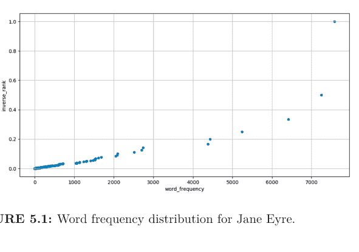

图 5.1：《简·爱》的词频分布。

以下代码使用 pandas⁴ 库绘制词频与排名倒数的关系图：

```python
import pandas as pd

input_csv = 'results/jane_eyre.csv'
df = pd.read_csv(input_csv, header=None,
                 names=('word', 'word_frequency'))
df['rank'] = df['word_frequency'].rank(ascending=False,
                                       method='max')
df['inverse_rank'] = 1 / df['rank']
scatplot = df.plot.scatter(x='word_frequency',
                           y='inverse_rank',
                           figsize=[12, 6],
                           grid=True)
fig = scatplot.get_figure()
fig.savefig('results/jane_eyre.png')
```

你将在练习 5.11.4 中基于此代码为你的项目创建一个绘图脚本。

⁴https://pandas.pydata.org/

## 5.10 总结

为什么构建一个简单的命令行工具如此复杂？一个答案是，命令行程序的惯例已经发展了几十年，因此像 **argparse** 这样的库现在必须支持几代不同的选项处理方式。另一个原因是，我们想做的事情本身就*很*复杂：从标准输入或文件列表中读取数据、在需要时显示帮助、处理可能不存在的参数等等。就像编程（和生活）中的许多其他事情一样，每个人都希望它更简单，但没有人能就该舍弃什么达成一致。

好消息是，这种复杂性是一次性成本：我们的命令行工具模板可以重用于比本章示例大得多的程序。制作符合人们预期行为的工具，会大大增加其他人发现其有用性的机会。

## 5.11 练习

### 5.11.1 从命令行运行 Python 语句

我们不需要打开交互式解释器来运行 Python 代码。相反，我们可以使用命令标志 `-c` 和要运行的语句来调用 Python：

```
$ python -c "print(2+3)"
5
```

这在什么时候以及为什么有用？

### 5.11.2 列出文件

一个名为 glob⁵ 的 Python 库可用于创建匹配模式的文件列表，类似于 `ls` shell 命令。

⁵https://docs.python.org/3/library/glob.html

```
>>> import glob
>>> glob.glob('data/*.txt')
['data/moby_dick.txt', 'data/sense_and_sensibility.txt',
'data/sherlock_holmes.txt', 'data/time_machine.txt',
'data/frankenstein.txt', 'data/dracula.txt',
'data/jane_eyre.txt']
```

以 `script_template.py` 为指导，编写一个名为 `my_ls.py` 的新脚本，该脚本接受一个目录和一个后缀（例如 py、txt、md、sh）作为输入，并输出该目录中以该后缀结尾的文件列表（按字母顺序排序）。
新脚本的帮助信息应如下所示：

```
$ python bin/my_ls.py -h
usage: my_ls.py [-h] dir suffix

List the files in a given directory with a given suffix.

positional arguments:
  dir        Directory
  suffix     File suffix (e.g. py, sh)

optional arguments:
  -h, --help show this help message and exit
```

一个输出示例如下：

```
$ python bin/my_ls.py data/ txt
```

```
data/dracula.txt
data/frankenstein.txt
data/jane_eyre.txt
data/moby_dick.txt
data/sense_and_sensibility.txt
data/sherlock_holmes.txt
data/time_machine.txt
```

注意：我们不会在后续章节中包含此脚本。

## 5.11.3 句子结束标点

我们的 `countwords.py` 脚本会去除文本中的标点，这意味着它不提供关于句子结尾的信息。以 `script_template.py` 和 `countwords.py` 为指南，编写一个名为 `sentence_endings.py` 的新脚本，用于统计句号、问号和感叹号的出现次数，并将该信息打印到屏幕。

提示：字符串对象有一个 `count` 方法：

```
$ python
```

```
Python 3.7.6 (default, Jan  8 2020, 13:42:34)
[Clang 4.0.1 (tags/RELEASE_401/final)] ::
Anaconda, Inc. on darwin
Type "help", "copyright", "credits" or "license"
for more information.
```

```
>>> "Hello! Are you ok?".count('!')
```

1

完成后，该脚本应能接受输入文件：

```
$ python bin/sentence_endings.py data/dracula.txt
```

Number of . is 8505
Number of ? is 492
Number of ! is 752

或标准输入：

```
$ head -n 500 data/dracula.txt | python bin/sentence_endings.py
```

Number of . is 148
Number of ? is 8
Number of ! is 8

注意：我们不会在后续章节中包含此脚本。

## 5.11.4 一个更好的绘图程序

以 `script_template.py` 为指南，从[第 5.9 节](#section-5-9)中获取绘图代码，并编写一个名为 `plotcounts.py` 的新 Python 程序。该脚本应执行以下操作：

- 1. 为输入文件参数使用 `type=argparse.FileType('r')`、`nargs='?'` 和 `default='-'` 选项（即类似于 `countwords.py` 脚本），以便在未给出 CSV 文件时 `plotcounts.py` 使用标准输入。
- 2. 包含一个可选的 `--outfile` 参数，用于指定输出图像文件的名称。默认值应为 `plotcounts.png`。
- 3. 包含一个可选的 `--xlim` 参数，以便用户可以更改 x 轴范围。

完成后，通过 CSV 文件将词频统计传递给 `plotcounts.py`，为《*简·爱*》生成一个图表：

```
$ python bin/plotcounts.py results/jane_eyre.csv --outfile results/jane_eyre.png
```

以及通过标准输入：

```
$ python bin/countwords.py data/jane_eyre.txt | python bin/plotcounts.py --outfile results/jane_eyre.png
```

注意：此练习的解决方案将在后续章节中使用。

## 5.12 关键点

- 编写可以在 **Unix shell** 中像其他命令行工具一样运行的命令行 Python 程序。
- 如果用户未指定任何输入文件，则从**标准输入**读取。
- 如果用户未指定任何输出文件，则写入**标准输出**。
- 将所有 `import` 语句放在模块的开头。
- 使用 `__name__` 的值来确定文件是直接运行还是作为模块加载。
- 使用 `argparse` 以标准方式处理命令行参数。
- 对常用控件使用**短选项**，对不常用或更复杂的控件使用**长选项**。
- 使用 **docstrings** 为函数和脚本文档。
- 将在多个脚本中使用的函数放在这些脚本可以导入的单独文件中。

6https://docs.python.org/3/library/argparse.html

# 6
## 在命令行中使用 Git

> > +++ 除以黄瓜错误。请重新安装宇宙并重启 +++
> — 特里·普拉切特

**版本控制系统**跟踪文件的更改，并帮助人们相互共享这些更改。这些事情可以通过将文件通过电子邮件发送给同事，或使用 Microsoft Word 和 Google Docs 来完成，但版本控制做得更准确、更高效。最初是为了支持软件开发而开发的，在过去的十五年里，它已成为**可重复研究**的基石。

版本控制的工作原理是将代码的主副本存储在仓库中，您不能直接编辑它。相反，您检出代码的工作副本，编辑该代码，然后将更改提交回仓库。通过这种方式，版本控制记录了完整的修订历史（即每次提交），以便您可以随时检索和比较以前的版本。从个人角度来看，这很有用，因为您不需要存储同一脚本的多个（但略有不同的）副本（图 6.1）。从协作角度来看也很有用，因为系统会记录谁在何时做了什么更改。

有许多不同的版本控制系统，如 CVS、Subversion 和 Mercurial，但当今使用最广泛的版本控制系统是 **Git**。许多人最初是通过 GitKraken¹ 或 RStudio IDE² 等 GUI 接触到它的。然而，这些工具实际上是 Git 原始命令行接口的包装器，该接口使我们能够访问 Git 的所有功能。本课描述了如何使用该接口执行基本操作；第 7 章随后介绍了可用于实现更流畅研究工作流程的更高级操作。

为了展示 Git 的工作原理，我们将把它应用于齐普夫定律项目。我们的项目目录当前应包括：

¹https://www.gitkraken.com/
²https://www.rstudio.com/products/rstudio/

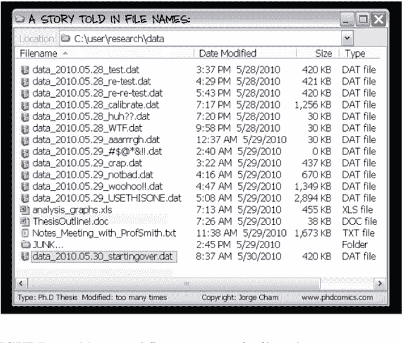

图 6.1：在没有版本控制的情况下管理文件的不同版本。

```
zipf/
├── bin
│   ├── book_summary.sh
│   ├── collate.py
│   ├── countwords.py
│   ├── plotcounts.py
│   ├── script_template.py
│   └── utilities.py
├── data
│   ├── README.md
│   ├── dracula.txt
│   ├── frankenstein.txt
│   └── ...
└── results
    ├── dracula.csv
    ├── jane_eyre.csv
    ├── jane_eyre.png
    └── moby_dick.csv
```

bin/plotcounts.py 是练习 5.11.4 的解决方案；在本章中，我们将编辑它以生成更具信息性的图表。最初，它看起来像这样：

```
"""Plot counts."""

import argparse

import pandas as pd

def main(args):
    """Run the command line program."""
    df = pd.read_csv(args.infile, header=None,
                     names=('word', 'word_frequency'))
    df['rank'] = df['word_frequency'].rank(ascending=False,
                                           method='max')
    df['inverse_rank'] = 1 / df['rank']
    ax = df.plot.scatter(x='word_frequency',
                         y='inverse_rank',
                         figsize=[12, 6],
                         grid=True,
                         xlim=args.xlim)
    ax.figure.savefig(args.outfile)

if __name__ == '__main__':
    parser = argparse.ArgumentParser(description=__doc__)
    parser.add_argument('infile', type=argparse.FileType('r'),
                        nargs='?', default='-',
                        help='Word count csv file name')
    parser.add_argument('--outfile', type=str,
                        default='plotcounts.png',
                        help='Output image file name')
    parser.add_argument('--xlim', type=float, nargs=2,
                        metavar=('XMIN', 'XMAX'),
                        default=None, help='X-axis limits')
    args = parser.parse_args()
    main(args)
```

## 6.1 设置

我们将 Git 命令写为 `git verb options`，其中**子命令**动词告诉 Git 我们想要做什么，选项提供该子命令所需的任何附加信息。使用此语法，我们需要做的第一件事是配置 Git。

```
$ git config --global user.name "Amira Khan"
$ git config --global user.email "amira@zipf.org"
```

（请使用您自己的姓名和电子邮件地址，而不是图中所示的。）
这里，`config` 是动词，命令的其余部分是选项。我们将名称放在引号中，因为它包含空格；实际上我们不需要给电子邮件地址加引号，但为了保持一致性而这样做。由于我们将使用 GitHub，电子邮件地址应与您设置 GitHub 帐户时使用或打算使用的相同。

`--global` 选项告诉 Git 将设置用于我们在此计算机上的所有项目，因此这两个命令只需运行一次。但是，如果我们想更改详细信息，可以随时重新运行它们。我们也可以使用 `--list` 选项检查我们的设置：

```
$ git config --list
```

```
user.name=Amira Khan
user.email=amira@zipf.org
core.autocrlf=input
core.editor=nano
core.repositoryformatversion=0
core.filemode=true
core.bare=false
core.ignorecase=true
...
```

根据您的操作系统和 Git 版本，您的配置列表可能看起来有些不同。只要您的用户名和电子邮件准确，大多数这些差异现在应该无关紧要。

## Git 帮助与手册

如果我们忘记了某个 Git 命令，可以使用 `--help` 来列出可用的命令：

```
$ git --help
```

此选项还能为我们提供关于特定命令的更多信息：

```
$ git config --help
```

## 6.2 创建新仓库

配置好 Git 后，我们就可以用它来跟踪我们 Zipf 定律项目的工作了。首先，确保我们位于项目的顶层目录：

```
$ cd ~/zipf
$ ls
```

bin data results

我们希望将这个目录变成一个**仓库**，即 Git 可以存储我们文件版本的地方。我们使用 **init** 命令，并用 `.` 表示“当前目录”来实现这一点：

```
$ git init .
```

Initialized empty Git repository in /Users/amira/zipf/.git/

`ls` 命令似乎显示没有任何变化：

```
$ ls
```

bin     data    results

但如果我们加上 `-a` 标志来显示所有内容，就能看到 Git 在 zipf 目录内创建了一个名为 `.git` 的隐藏目录：

```
$ ls -a
```

.       ..      .git    bin     data    results

Git 将项目信息存储在这个特殊的子目录中。如果我们删除了它，就会丢失所有的历史记录。
我们可以通过让 Git 告诉我们项目的状态来检查一切是否设置正确：

```
$ git status
```

```
On branch master

No commits yet

Untracked files:
  (use "git add <file>..." to include in what will be committed)

        bin/
        data/
        results/

nothing added to commit but untracked files present (use "git add" to track)
```

“No commits yet” 意味着 Git 尚未记录任何历史，而 “Untracked files” 则表示 Git 注意到 `bin/`、`data/` 和 `results/` 中有一些它尚未跟踪的内容。

## 6.3 添加现有工作

现在我们的项目是一个仓库了，我们可以告诉 Git 开始记录其历史。为此，我们使用 `git add` 将内容添加到 Git 跟踪的列表中。我们可以为单个文件执行此操作：

```
$ git add bin/countwords.py
```

或者整个目录：

```
$ git add bin
```

对于现有项目，最简单的方法是告诉 Git 使用 `.` 添加当前目录中的所有内容：

```
$ git add .
```

然后我们可以检查仓库的状态，看看哪些文件已被添加：

```
$ git status
On branch master
No commits yet
Changes to be committed:
  (use "git rm --cached <file>..." to unstage)
        new file:   bin/book_summary.sh
        new file:   bin/collate.py
        new file:   bin/countwords.py
        new file:   bin/plotcounts.py
        new file:   bin/script_template.py
        new file:   bin/utilities.py
        new file:   data/README.md
        new file:   data/dracula.txt
        new file:   data/frankenstein.txt
        new file:   data/jane_eyre.txt
        new file:   data/moby_dick.txt
        new file:   data/sense_and_sensibility.txt
        new file:   data/sherlock_holmes.txt
        new file:   data/time_machine.txt
        new file:   results/dracula.csv
        new file:   results/jane_eyre.csv
        new file:   results/jane_eyre.png
        new file:   results/moby_dick.csv
```

以这种方式添加所有现有文件很容易，但我们可能会意外地添加一些绝不应纳入版本控制的内容，例如包含密码或其他敏感信息的文件。`git status` 的输出告诉我们，可以使用 `git rm --cached` 将此类文件从待保存列表中移除；我们将在练习 6.11.2 中进行实践。

> **保存什么**

我们总是希望将程序、手稿以及我们手动创建的所有其他内容保存在版本控制中。在这个项目中，我们还选择保存我们的数据文件和生成的结果（包括我们的图表）。这是一个特定于项目的决定：例如，如果这些文件非常大，我们可能会决定将它们保存在其他地方；而如果它们很容易重新创建，我们可能根本不会保存它们。我们将在[第 13 章](Chapter 13)中进一步探讨这个问题。

我们不再有任何未跟踪的文件，但已跟踪的文件尚未被**提交**（即永久保存在我们项目的历史记录中）。我们可以使用 `git commit` 来完成此操作：

```
$ git commit -m "Add scripts, novels, word counts, and plots"
```

```
[master (root-commit) 173222b] Add scripts, novels, word counts, and plots
 18 files changed, 145296 insertions(+)
 create mode 100644 bin/book_summary.sh
 create mode 100644 bin/collate.py
 create mode 100644 bin/countwords.py
 create mode 100644 bin/plotcounts.py
 create mode 100644 bin/script_template.py
 create mode 100644 bin/utilities.py
 create mode 100644 data/README.md
 create mode 100644 data/dracula.txt
 create mode 100644 data/frankenstein.txt
 create mode 100644 data/jane_eyre.txt
 create mode 100644 data/moby_dick.txt
 create mode 100644 data/sense_and_sensibility.txt
 create mode 100644 data/sherlock_holmes.txt
 create mode 100644 data/time_machine.txt
 create mode 100644 results/dracula.csv
 create mode 100644 results/jane_eyre.csv
 create mode 100644 results/jane_eyre.png
 create mode 100644 results/moby_dick.csv
```

`git commit` 会获取我们通过 `git add` 告诉 Git 保存的所有内容，并将其永久存储在仓库的 `.git` 目录中。这个永久副本被称为**提交**或**修订版**。Git 会给我们一个唯一标识符，`git commit` 输出的第一行显示了它的**短标识符** `2dc78f0`，这是该唯一标签的前几个字符。

我们使用 `-m` 选项（**message** 的缩写）来记录一个**简短的**提交注释，以便日后提醒我们做了什么以及为什么这样做。（同样，我们将其放在双引号中，因为它包含空格。）如果我们现在运行 `git status`：

```
$ git status
```

输出告诉我们，我们所有现有的工作都已被跟踪且是最新的：

```
On branch master
nothing to commit, working tree clean
```

这第一次提交成为了我们项目历史的起点：我们将无法看到在此点之前所做的更改。这意味着我们应该在创建项目后立即将其设为 Git 仓库，而不是在完成一些工作之后。

## 6.4 描述提交

如果我们运行 `git commit` *不带* `-m` 选项，Git 会打开一个文本编辑器，以便我们可以编写更长的**提交信息**。在此信息中，第一行被称为“主题”，其余部分被称为“正文”，就像电子邮件一样。

当我们使用 `-m` 时，我们只编写主题行；这在短期内让事情变得更容易，但如果我们的项目历史充满了像“Fixed problem”或“Updated”这样的一行式提交，未来的我们会希望当时能多花几秒钟来更详细地解释一下。遵循这些准则³会有所帮助：

1.  用空行将主题与正文分开，以便于识别。
2.  将主题行限制在 50 个字符以内，以便于快速浏览。
3.  主题行使用标题大小写（就像章节标题一样）。
4.  主题行末尾不要加句号。
5.  像下达命令一样书写（例如，“Make each plot half the width of the page”）。
6.  对正文进行换行（即插入换行符将文本格式化为段落，而不是依赖编辑器自动换行）。
7.  使用正文来解释做了什么以及为什么，而不是如何做。

> **使用哪个编辑器？**

Unix shell 中的默认编辑器叫做 Vim。它有很多有用的功能，但从未有人声称其界面是直观的。（“如何退出 Vim 编辑器？”是 Stack Overflow 上阅读量最高的问题之一。）

要配置 Git 使用第 2 章介绍的 nano 编辑器，请执行以下命令：

`$ git config --global core.editor "nano -w"`

## 6.5 保存和跟踪更改

我们的初始提交给了我们一个起点。在此基础上构建的过程类似：首先添加文件，然后提交更改。让我们检查一下是否在正确的目录中：

³https://chris.beams.io/posts/git-commit/

```
$ pwd
```

```
/Users/amira/zipf
```

让我们使用 `plotcounts.py` 来绘制 `results/dracula.csv` 中的词频统计：

```
$ python bin/plotcounts.py results/dracula.csv --outfile results/dracula.png
```

如果我们再次检查仓库的状态，Git 告诉我们有一个新文件：

```
$ git status
```

```
On branch master
Untracked files:
  (use "git add <file>..." to include in what will be committed)
        results/dracula.png

nothing added to commit but untracked files present (use "git add" to track)
```

Git 还没有跟踪这个文件，因为我们还没有告诉它。让我们用 `git add` 来做这件事，然后提交我们的更改：

```
$ git add results/dracula.png
$ git commit -m "Add plot of word counts for 'Dracula'"
```

```
[master 851d590] Add plot of word counts for 'Dracula'
 1 file changed, 0 insertions(+), 0 deletions(-)
 create mode 100644 results/dracula.png
```

如果我们想知道最近做了什么，可以使用 `git log` 来显示项目的历史记录：

## 6.5 保存与跟踪变更

`git log` 以逆时间顺序列出仓库的所有提交记录。每个提交的列表包括提交的**完整标识符**（其开头字符与 `git commit` 打印的短标识符相同）、提交作者、创建时间以及我们编写的提交信息。

### 滚动查看日志

我们这次的日志不长，所以你很可能无需滚动就能在屏幕上看到全部内容。当你开始处理更长的日志时（比如本章后面部分），你会注意到提交记录是在分页程序中显示的，就像你在[第 2.8 节](#)查看手册页时看到的那样。你可以使用相同的按键来滚动查看日志并退出分页程序。

我们绘制的图表如[图 6.2](#)所示。它本可以更好：大部分视觉空间被几个非常常见的单词占据，这使得我们很难看清其他大约一万个单词的情况。

另一种直观评估齐普夫定律的方法是在对数-对数坐标轴上绘制词频与排名的关系图。让我们修改这一节：

```
ax = df.plot.scatter(x='word_frequency',
                    y='inverse_rank',
                    figsize=[12, 6],
                    grid=True,
                    xlim=args.xlim)
```

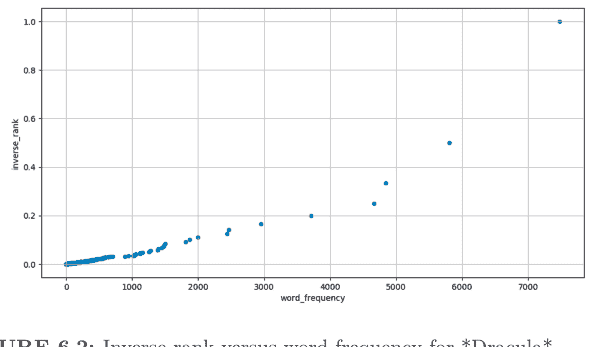

**图 6.2：** 《德古拉》中逆排名与词频的关系图。

将“排名”放在 y 轴上，并添加 `loglog=True`：

```
python
ax = df.plot.scatter(x='word_frequency',
                    y='rank', loglog=True,
                    figsize=[12, 6],
                    grid=True,
                    xlim=args.xlim)
```

当我们再次检查状态时，它会打印：

```
bash
$ git status
```

```
On branch master
Changes not staged for commit:
  (use "git add <file>..." to update what will be committed)
  (use "git restore <file>..." to discard changes in working directory)
        modified:   bin/plotcounts.py

no changes added to commit (use "git add" or "git commit -a")
```

最后一行告诉我们，Git 已经知道的一个文件已被修改。

### Git 的提示

执行 Git 命令后，你可能会看到与这里显示的略有不同的输出。例如，在执行上面的代码后，你可能会看到建议使用 `git checkout` 而不是 `git restore`，这意味着你正在运行不同版本的 Git。与编码中的大多数任务一样，通常有多个命令可以完成相同的 Git 操作。本章将展示 Git 版本 2.29 的输出。如果你在 Git 输出中看到不同的内容，可以尝试我们这里介绍的命令，或者遵循你看到的输出中包含的建议。如有疑问，请查阅文档（例如 `git checkout --help`）以解决困惑。

要将这些变更保存到仓库历史中，我们必须先 `git add` 然后 `git commit`。不过在此之前，让我们使用 `git diff` 来查看变更。这个命令会显示我们仓库的当前状态与最近保存版本之间的差异：

```
$ git diff
```

```
diff --git a/bin/plotcounts.py b/bin/plotcounts.py
index f274473..c4c5b5a 100644
--- a/bin/plotcounts.py
+++ b/bin/plotcounts.py
@@ -13,7 +13,7 @@ def main(args):
         method='max')
     df['inverse_rank'] = 1 / df['rank']
     ax = df.plot.scatter(x='word_frequency',
-                          y='inverse_rank',
+                          y='rank', loglog=True,
                           figsize=[12, 6],
                           grid=True,
                           xlim=args.xlim)
```

这个输出即使按照 Unix 命令行的标准来看也显得晦涩难懂，因为它实际上是一系列命令，告诉编辑器和其他工具如何将我们*之前*的文件转换成我们*现在*的文件。如果我们将其分解：

1.  第一行告诉我们 Git 正以 Unix `diff` 命令的格式生成输出。
2.  第二行确切地告诉了 Git 正在比较文件的哪个版本：f274473 和 c4c5b5a 是这些版本的短标识符。
3.  第三行和第四行再次显示了被修改文件的名称；名称出现两次，以防我们同时重命名和修改文件。
4.  剩余的行向我们展示了变更及其发生的行号。第一列中的减号 `-` 表示被删除的行，而加号 `+` 表示被添加的行。没有加号或减号的行没有被更改，但会提供在已更改行的周围以增加上下文。

Git 默认是逐行比较，但使用 `--word-diff` 或 `--color-words` 选项进行逐词比较可能更具启发性。当对散文而非代码运行 `git diff` 时，这些选项特别有用。

在查看我们的变更后，我们可以像之前一样提交它：

```
$ git commit -m "Plot frequency against rank on log-log axes"
```

```
On branch master
Changes not staged for commit:
  (use "git add <file>..." to update what will be committed)
  (use "git restore <file>..." to discard changes in working directory)
        modified:   bin/plotcounts.py

no changes added to commit (use "git add" or "git commit -a")
```

哎呀：我们忘记将文件添加到要提交的集合中了。让我们添加它，然后再次尝试提交：

```
$ git add bin/plotcounts.py
$ git status
```

```
On branch master
Changes to be committed:
  (use "git restore --staged <file>..." to unstage)
        modified:   bin/plotcounts.py
```

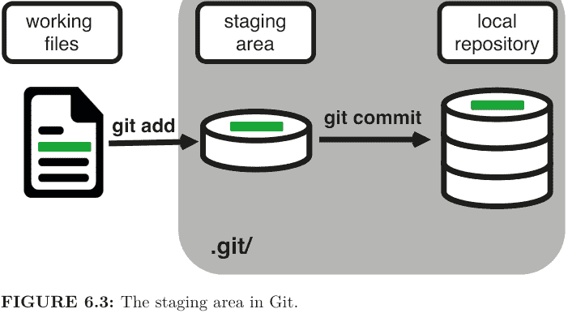

**图 6.3：** Git 中的暂存区。

```
$ git commit -m "Plot frequency against rank on log-log axes"
```

```
[master 582f7f6] Plot frequency against rank on log-log axes
1 file changed, 1 insertion(+), 1 deletion(-)
```

### 暂存区

Git 坚持要求我们在实际提交任何内容之前，先将文件添加到我们想要提交的集合中。这允许我们分阶段提交变更，并以逻辑部分而非仅大批量的方式捕获变更。例如，假设我们在论文的引言部分（位于 `introduction.tex` 文件中）添加了一些引用。我们可能希望提交这些添加内容，但不提交对 `conclusion.tex` 的更改（因为我们尚未完成写作）。为了实现这一点，Git 有一个特殊的**暂存区**，用于跟踪已添加到当前变更集但尚未提交的内容（图 6.3）。

让我们看看我们的新图表（图 6.4）：

```
$ python bin/plotcounts.py results/dracula.csv --outfile results/dracula.png
```

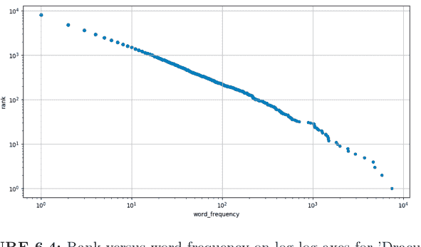

**图 6.4：** 《德古拉》在对数-对数坐标轴上的排名与词频关系图。

### 解读我们的图表

如果齐普夫定律成立，我们仍然应该看到线性关系，尽管现在它将是负的，而不是正的（因为我们绘制的是排名而不是逆排名）。低频词（低于大约 120 次出现）似乎非常接近一条直线，但我们目前只能通过肉眼进行这种评估。在下一章中，我们将编写代码来拟合并在图表中添加一条线。

再次运行 `git status` 显示我们的图表已被修改：

```
On branch master
Changes not staged for commit:
  (use "git add <file>..." to update what will be committed)
  (use "git restore <file>..." to discard changes in working directory)
        modified:   results/dracula.png

no changes added to commit (use "git add" or "git commit -a")
```

由于 `results/dracula.png` 是二进制文件而非文本文件，`git diff` 无法显示具体更改了什么。因此，它只是简单地告诉我们新文件与旧文件不同。

diff --git a/results/dracula.png b/results/dracula.png
index c1f62fd..57a7b70 100644
Binary files a/results/dracula.png and
b/results/dracula.png differ

这是 Git（以及其他版本控制系统）最大的弱点之一：它们是为处理文本而构建的。它们可以跟踪图像、PDF 和其他格式的更改，但在显示或合并差异方面做得不够。在一个比我们这里更好的世界里，程序员们多年前就解决了这个问题。

如果我们确定要保存所有更改，可以通过给 `git commit` 命令加上 `-a` 选项，在一条命令中完成添加和提交：

```
$ git commit -a -m "Update dracula plot"
```

```
[master ee8684c] Update dracula plot
 1 file changed, 0 insertions(+), 0 deletions(-)
 rewrite results/dracula.png (99%)
```

到目前为止，我们介绍的 Git 命令（`git add`、`git commit`、`git diff`）代表了在本地仓库中执行基本 Git 工作流的任务（图 6.5a）。

## 6.6 与其他仓库同步

我们的计算机迟早会遇到硬件故障、被盗，或者被某个认为我们不该把整个假期都花在写论文上的人扔进湖里。即使在那发生之前，我们可能也想与他人协作，这可以通过将我们的本地仓库链接到托管服务（如 GitHub[^4]）上的仓库来实现。

[^4]: https://github.com

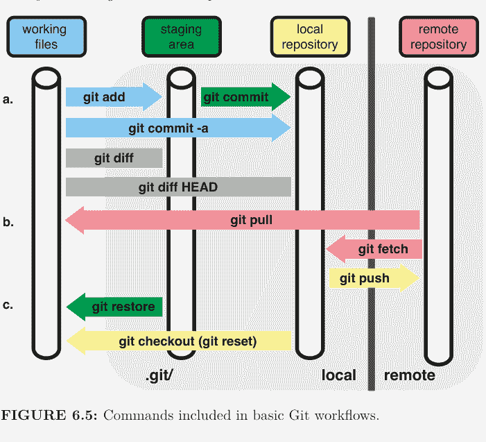

**图 6.5：** 基本 Git 工作流中包含的命令。

> **我的仓库在哪里？**

到目前为止，我们一直在使用位于你自己计算机上的仓库，我们也将其称为本地或桌面仓库。另一种选择是将仓库托管在 GitHub 或其他服务器上，我们将其称为远程或 GitHub 仓库。

第一步是在 GitHub 上创建一个账户，然后选择创建新的远程仓库的选项，以便与我们的本地仓库同步。在 GitHub 上选择创建新仓库的选项，然后为你的 Zipf 定律项目添加所需信息。远程仓库不必与本地仓库同名，但如果它们不同，我们可能会感到困惑，因此我们在 GitHub 上创建的仓库也将命名为 zipf。其他默认选项可能适合你的远程仓库。因为我们正在与现有仓库同步，所以不要添加 README、.gitignore 或许可证；我们将在其他章节中讨论这些添加项。

140

6 在命令行中使用 Git

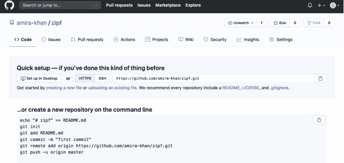

**图 6.6：** 查找 GitHub 仓库的链接。

接下来，我们需要将我们的桌面仓库与 GitHub 上的仓库连接起来。我们通过将 GitHub 仓库设为本地仓库的**远程**来实现这一点。我们在 GitHub 上新仓库的主页包含了我们需要用来标识它的字符串（[图 6.6](#figure-6-6)）。

我们可以点击“HTTPS”将 URL 从 SSH 更改为 HTTPS，然后复制该 URL。

> ### HTTPS 与 SSH

我们在这里使用 HTTPS，因为它不需要额外的配置。如果我们想设置 SSH 访问，以便不必经常输入密码，GitHub[^5]、BitBucket[^6] 或 GitLab[^7] 的教程会解释所需的步骤。

[^5]: https://help.github.com/articles/generating-ssh-keys
[^6]: https://confluence.atlassian.com/bitbucket/set-up-ssh-for-git-728138079.html
[^7]: https://about.gitlab.com/2014/03/04/add-ssh-key-screencast/

接下来，让我们进入本地 **zipf** 仓库并运行此命令：

```
$ cd ~/zipf
$ git remote add origin https://github.com/amira-khan/zipf.git
```

请确保使用你仓库的 URL，而不是显示的 URL：唯一的区别应该是它包含你的用户名而不是 amira-khan。

Git 远程就像一个书签：它给一个 URL 起一个简短的名字。在这个例子中，远程的名字是 `origin`；我们可以使用任何我们想要的名字，但 `origin` 是 Git 的默认值，所以我们坚持使用它。我们可以通过运行 `git remote -v`（其中 `-v` 选项是 `verbose` 的缩写）来检查命令是否成功：

```
$ git remote -v
```

```
origin  https://github.com/amira-khan/zipf.git (fetch)
origin  https://github.com/amira-khan/zipf.git (push)
```

Git 显示两行，因为实际上可以设置一个远程从一个 URL 下载但上传到另一个 URL。明智的人不会这样做，所以我们不会进一步探讨这种可能性。

现在我们已经配置了一个远程，我们可以将到目前为止完成的工作**推送**到 GitHub 上的仓库：

```
$ git push origin master
```

这可能会提示我们输入用户名和密码；一旦我们这样做，Git 会打印几行管理信息：

```
Enumerating objects: 35, done.
Counting objects: 100% (35/35), done.
Delta compression using up to 4 threads
Compressing objects: 100% (35/35), done.
Writing objects: 100% (35/35), 2.17 MiB | 602.00 KiB/s, done.
Total 35 (delta 7), reused 0 (delta 0), pack-reused 0
remote: Resolving deltas: 100% (7/7), done.
To https://github.com/amira-khan/zipf.git
 * [new branch]      master -> master
```

如果我们在浏览器中查看我们的 GitHub 仓库，它现在包含了我们所有的项目文件，以及我们到目前为止所做的所有提交（图 6.7）。

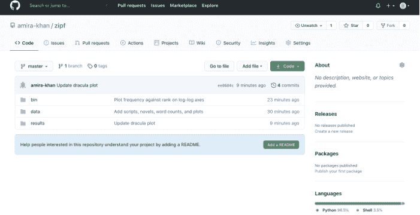

**图 6.7：** 在 GitHub 上查看仓库的历史记录。

我们也可以从远程仓库**拉取**更改到本地仓库：

```
$ git pull origin master
```

```
From https://github.com/amira-khan/zipf
 * branch            master     -> FETCH_HEAD
Already up-to-date.
```

在这种情况下，拉取没有效果，因为两个仓库已经同步。

> **获取**

我们之前查看的远程配置中的第二行标记为 **push**，这很合理，因为我们使用了 `git push` 命令将更改从本地仓库上传到远程仓库。为什么另一行标记为 **fetch** 而不是 **pull**？获取和拉取都是从远程仓库下载新数据，但只有拉取会将这些更改集成到本地仓库的版本历史中。因为 `git fetch` 不会更改你的本地文件，所以它用于查看本地版本和远程版本之间的差异。

我们在本节中介绍的 Git 命令（`git pull`、`git push`）是将远程仓库纳入工作流的主要任务（图 6.5b）。

## Amira 的仓库

本节中引用的 Amira 的仓库存在于 GitHub 上的 amira-khan/zipf⁸；当你继续阅读本书的其余部分时，你可能会发现它是一个有用的参考点。

## 6.7 探索历史

Git 让我们查看文件的先前版本，并在需要时将特定文件恢复到早期状态。为了做到这些，我们需要识别我们想要的版本。

有两种方法类似于**绝对**路径和**相对**路径。“绝对”版本是 Git 赋予每个提交的唯一标识符。这些标识符有 40 个字符长，但在大多数情况下，Git 会让我们只使用前六个左右的字符。例如，如果我们现在运行 `git log`，它会显示类似这样的内容：

```
commit ee8684ca123e1e829fc995d672e3d7e4b00f2610
(HEAD -> master, origin/master)
Author: Amira Khan <amira@zipf.org>
Date:   Sat Dec 19 09:52:04 2020 -0800

    Update dracula plot

commit 582f7f6f536d520b1328c04c9d41e24b54170656
Author: Amira Khan <amira@zipf.org>
Date:   Sat Dec 19 09:37:25 2020 -0800

    Plot frequency against rank on log-log axes

commit 851d590a214c7859eafa0998c6c951f8e0eb359b
Author: Amira Khan <amira@zipf.org>
Date:   Sat Dec 19 09:32:41 2020 -0800

    Add plot of word counts for 'Dracula'

commit 173222bf90216b408c8997f4e143572b99637750
```

⁸https://github.com/amira-khan/zipf

Author: Amira Khan <amira@zipf.org>
Date:   Sat Dec 19 09:30:23 2020 -0800

Add scripts, novels, word counts, and plots

我们更改 `plotcounts.py` 的提交具有绝对标识符 582f7f6f536d520b1328c04c9d41e24b54170656，但我们几乎在所有情况下都可以使用 `582f7f6` 来引用它。

虽然 `git log` 包含提交消息，但它没有告诉我们每个提交中具体做了哪些更改。如果我们添加 `-p` 选项（`patch` 的缩写），我们会得到与 `git diff` 提供的相同类型的详细信息，以描述每个提交中的更改：

```
$ git log -p
```

输出的第一部分如下所示；我们截断了其余部分，因为它非常长：

```
commit ee8684ca123e1e829fc995d672e3d7e4b00f2610
(HEAD -> master, origin/master)
Author: Amira Khan <amira@zipf.org>
Date:   Sat Dec 19 09:52:04 2020 -0800

    Update dracula plot

diff --git a/results/dracula.png b/results/dracula.png
index c1f62fd..57a7b70 100644
Binary files a/results/dracula.png and
b/results/dracula.png differ
...
```

或者，我们可以直接使用 `git diff` 来检查仓库历史中任何阶段文件之间的差异。让我们用 `plotcounts.py` 文件来探索这一点。我们不再需要 `plotcounts.py` 中计算逆排名的代码行：

```
df['inverse_rank'] = 1 / df['rank']
```

如果我们从 `bin/plotcounts.py` 中删除该行，单独的 `git diff` 将显示文件当前状态与最新版本之间的差异：

## 6.7 探索历史

```diff
diff --git a/bin/plotcounts.py b/bin/plotcounts.py
index c4c5b5a..c511da1 100644
--- a/bin/plotcounts.py
+++ b/bin/plotcounts.py
@@ -11,7 +11,6 @@ def main(args):
                 names=('word', 'word_frequency'))
     df['rank'] = df['word_frequency'].rank(ascending=False,
                                            method='max')
-    df['inverse_rank'] = 1 / df['rank']
     ax = df.plot.scatter(x='word_frequency',
                          y='rank', loglog=True,
                          figsize=[12, 6],
```

`git diff 582f7f6`，另一方面，显示了当前状态与由短标识符引用的提交之间的差异：

```diff
diff --git a/bin/plotcounts.py b/bin/plotcounts.py
index c4c5b5a..c511da1 100644
--- a/bin/plotcounts.py
+++ b/bin/plotcounts.py
@@ -11,7 +11,6 @@ def main(args):
                 names=('word', 'word_frequency'))
     df['rank'] = df['word_frequency'].rank(ascending=False,
                                            method='max')
-    df['inverse_rank'] = 1 / df['rank']
     ax = df.plot.scatter(x='word_frequency',
                          y='rank', loglog=True,
                          figsize=[12, 6],
diff --git a/results/dracula.png b/results/dracula.png
index c1f62fd..57a7b70 100644
Binary files a/results/dracula.png and
b/results/dracula.png differ
```

请注意，你需要参考你的 git 日志来替换上面代码中的 582f7f6，因为 Git 为你的提交分配了不同的唯一标识符。另请注意，我们尚未提交对 plotcounts.py 的最后一次更改；我们将在下一节中研究撤销它的方法。

“相对”版本的历史依赖于一个名为 HEAD 的特殊标识符，它总是指代仓库中的最新版本。`git diff HEAD` 因此显示的内容与 `git diff` 相同，但无需输入版本标识符来回退一个提交，我们可以使用 `HEAD~1`（其中 `~` 是波浪符号）。这个简写被读作“HEAD 减一”，并给出了与上一个保存版本的差异。`git diff HEAD~2` 回退两个修订版本，依此类推。我们也可以通过用两个点 `..` 分隔它们的标识符来查看两个保存版本之间的差异，如下所示：

```
$ git diff HEAD~1..HEAD~2
```

```diff
diff --git a/bin/plotcounts.py b/bin/plotcounts.py
index c4c5b5a..f274473 100644
--- a/bin/plotcounts.py
+++ b/bin/plotcounts.py
@@ -13,7 +13,7 @@ def main(args):
             method='max')
     df['inverse_rank'] = 1 / df['rank']
     ax = df.plot.scatter(x='word_frequency',
-                          y='rank', loglog=True,
+                          y='inverse_rank',
                          figsize=[12, 6],
                          grid=True,
                          xlim=args.xlim)
```

如果我们想查看特定提交中所做的更改，可以使用 `git show` 加上标识符和文件名：

```
$ git show HEAD~1 bin/plotcounts.py
```

```
commit 582f7f6f536d520b1328c04c9d41e24b54170656
Author: Amira Khan <amira@zipf.org>
Date:   Sat Dec 19 09:37:25 2020 -0800

    Plot frequency against rank on log-log axes

diff --git a/bin/plotcounts.py b/bin/plotcounts.py
index f274473..c4c5b5a 100644
--- a/bin/plotcounts.py
+++ b/bin/plotcounts.py
@@ -13,7 +13,7 @@ def main(args):
```

```diff
method='max')
df['inverse_rank'] = 1 / df['rank']
ax = df.plot.scatter(x='word_frequency',
-                     y='inverse_rank',
+                     y='rank', loglog=True,
                     figsize=[12, 6],
                     grid=True,
                     xlim=args.xlim)
```

如果我们想查看版本历史中某个时间点的文件内容，可以使用相同的命令，但用冒号分隔标识符和文件：

```
$ git show HEAD~1:bin/plotcounts.py
```

这允许我们使用分页程序查看文件。

## 6.8 恢复文件的旧版本

我们可以看到我们更改了什么，但如何恢复它呢？假设我们改变了对 `bin/plotcounts.py` 最后一次更新（移除 `df['inverse_rank'] = 1 / df['rank']`）的想法，在我们添加或提交它之前。`git status` 告诉我们文件已被更改，但这些更改尚未暂存：

```
$ git status
```

```
On branch master
Changes not staged for commit:
  (use "git add <file>..." to update what will be committed)
  (use "git restore <file>..." to discard changes in working directory)
        modified:   bin/plotcounts.py

no changes added to commit (use "git add" or "git commit -a")
```

我们可以使用 `git restore` 将文件恢复到上次保存修订时的状态，正如屏幕输出所建议的那样：

```
$ git restore bin/plotcounts.py
$ git status
```

```
On branch master
nothing to commit, working tree clean
```

顾名思义，`git restore` 恢复文件的早期版本。在本例中，我们用它来恢复文件在最近一次提交中的版本。

> **使用 Git 检出**

如果你运行的是不同版本的 Git，你可能会看到建议使用 `git checkout` 而不是 `git restore`。截至 Git 版本 2.29，`git restore` 仍是一个实验性命令，并作为 `git checkout` 的一种专门形式运行。`git checkout HEAD bin/plotcounts.py` 等效于最后运行的命令。

我们可以通过打印文件的相关行来确认文件已恢复：

```
$ head -n 19 bin/plotcounts.py | tail -n 8
```

```
    df['rank'] = df['word_frequency'].rank(ascending=False,
                                        method='max')
    df['inverse_rank'] = 1 / df['rank']
    ax = df.plot.scatter(x='word_frequency',
                         y='rank', loglog=True,
                         figsize=[12, 6],
                         grid=True,
                         xlim=args.xlim)
```

因为 `git restore` 旨在恢复工作文件，我们需要使用 `git checkout` 来恢复文件的早期版本。我们可以使用特定的提交标识符而不是 `HEAD` 来回退到任意远的版本：

```
$ git checkout 851d590 bin/plotcounts.py
```

```
Updated 1 path from c8d6a33
```

这样做不会更改历史记录：`git log` 仍然显示我们的四次提交。相反，它用旧内容替换了文件的内容：

```
$ git status
```

```
On branch master
Changes to be committed:
  (use "git restore --staged <file>..." to unstage)
	modified:   bin/plotcounts.py
```

```
$ head -n 19 bin/plotcounts.py | tail -n 8
```

```
    df['rank'] = df['word_frequency'].rank(ascending=False,
                                        method='max')
    df['inverse_rank'] = 1 / df['rank']
    ax = df.plot.scatter(x='word_frequency',
                         y='inverse_rank',
                         figsize=[12, 6],
                         grid=True,
                         xlim=args.xlim)
```

如果我们再次改变主意，可以使用输出中的建议来恢复早期版本。因为检出更改将它们添加到了暂存区，我们需要先将它们从暂存区移除：

```
$ git restore --staged bin/plotcounts.py
```

然而，更改已被取消暂存但仍然存在于文件中。我们可以将文件恢复到最近一次提交的状态：

```
$ git restore bin/plotcounts.py
$ git status
```

```
On branch master
nothing to commit, working tree clean
```

```
$ head -n 19 bin/plotcounts.py | tail -n 8
```

```
df['rank'] = df['word_frequency'].rank(ascending=False,
                                    method='max')
df['inverse_rank'] = 1 / df['rank']
ax = df.plot.scatter(x='word_frequency',
                     y='rank', loglog=True,
                     figsize=[12, 6],
                     grid=True,
                     xlim=args.xlim)
```

我们已经恢复了最近一次提交。由于我们没有提交移除计算逆排名那一行的更改，那项工作现在丢失了：Git 只能在文件的已提交版本之间来回切换。

本节演示了几种查看版本间差异以及处理这些更改的不同方法（图 6.5c）。这些命令可以对单个文件或整个提交进行操作，并且它们的行为有时会因你的 Git 版本而异。请记住参考文档，并经常使用 `git status` 和 `git log` 来了解你的工作流程。

## 6.9 忽略文件

我们并不总是希望 Git 跟踪每个文件的历史记录。例如，我们可能希望跟踪以 `.txt` 结尾的文本文件，但不跟踪以 `.dat` 结尾的数据文件。

为了阻止 Git 在每次调用 `git status` 时都告诉我们这些文件，我们可以在项目根目录中创建一个名为 `.gitignore` 的文件。此文件可以包含像 `thesis.pdf` 这样的文件名，或像 `*.dat` 这样的通配符模式。每个条目必须单独占一行，Git 将忽略任何匹配这些行的内容。目前，我们的 `.gitignore` 文件只需要一个条目：

这告诉 Git 忽略 Python 创建的任何 `__pycache__` 目录（第 5.8 节）。

> **记得忽略**

别忘了将 `.gitignore` 提交到你的仓库，这样 Git 才知道要使用它。

## 6.10 总结

版本控制对个人研究的最大好处在于，我们总能回溯到用于产生特定结果的精确文件集。虽然 Git 很复杂（Perez De Rosso 和 Jackson 2013），但只需几次按键就能在 GitHub 等网站上备份我们的更改，这能为我们省去很多麻烦，而 Git 的一些高级功能使其更加强大。我们将在下一章中探索这些功能。

## 6.11 练习

### 6.11.1 创建 Git 仓库的位置

除了关于齐夫定律项目的信息外，Amira 还想记录一些关于希普斯定律[^9]的笔记。尽管同事们有所顾虑，Amira 还是在她的 `zipf` 项目内创建了一个 `heaps-law` 项目，如下所示：

```
$ cd ~/zipf
$ mkdir heaps-law
$ cd heaps-law
$ git init heaps-law
```

她在 `heaps-law` 子目录内运行的 `git init` 命令对于跟踪存储在那里的文件是否是必需的？

[^9]: https://en.wikipedia.org/wiki/Heaps%27_law

### 6.11.2 保存前删除

如果你使用的是较旧版本的 Git，你可能会看到 `git status` 的输出建议你可以使用 `git rm --cached` 将文件从暂存区移除。试试看：

1.  在一个已初始化的 Git 仓库中创建一个名为 `example.txt` 的新文件。
2.  使用 `git add example.txt` 添加此文件。
3.  使用 `git status` 检查 Git 是否已注意到它。
4.  使用 `git rm --cached example.txt` 将其从待保存列表中移除。

现在 `git status` 显示什么？文件发生了什么变化（如果有的话）？

### 6.11.3 查看更改

在 Git 仓库中对一个文件进行一些更改，然后使用 `git diff` 和 `git diff --word-diff` 查看这些差异。你觉得哪种输出最容易理解？

注意：如果你在齐夫定律项目中执行此练习，我们建议丢弃（而不是提交）你对文件所做的更改。

### 6.11.4 提交更改

以下哪个命令会将对 `myfile.txt` 的更改保存到本地 Git 仓库？

```
# 选项 1
$ git commit -m "Add recent changes"
```

```
# 选项 2
$ git init myfile.txt
$ git commit -m "Add recent changes"
```

```
# 选项 3
$ git add myfile.txt
$ git commit -m "Add recent changes"
```

```
# 选项 4
$ git commit -m myfile.txt "Add recent changes"
```

### 6.11.5 撰写你的简介

1.  在你的计算机上创建一个新的 Git 仓库，名为 bio。确保包含此仓库的目录位于你的 zipf 项目目录之外！
2.  在一个名为 me.txt 的文件中为自己写一个三行简介，并提交你的更改。
3.  修改一行并添加第四行。
4.  显示文件原始状态与更新状态之间的差异。

### 6.11.6 提交多个文件

暂存区可以容纳你希望作为单个快照提交的任何数量文件的更改。从你的新 bio 目录开始，按照上一个练习（该练习使你对 me.txt 有未提交的更改）：

1.  创建另一个新文件 employment.txt 并添加你最近工作的详细信息。
2.  将 me.txt 和 employment.txt 的新更改添加到暂存区并提交这些更改。

### 6.11.7 GitHub 时间戳

1.  在 GitHub 上为你的新 bio 仓库创建一个远程仓库。
2.  将本地仓库的内容推送到远程。
3.  对本地仓库进行更改（例如，编辑 me.txt 或 employment.txt）并推送这些更改。
4.  转到你刚刚在 GitHub 上创建的仓库并检查文件的时间戳。

GitHub 如何记录时间，为什么？

### 6.11.8 工作流和历史记录

假设你在 `bio` 仓库中进行了以下更改。下面序列中最后一个命令的输出是什么？

```
$ echo "Sharing information about myself." > motivation.txt
$ git add motivation.txt
$ echo "Documenting major milestones." > motivation.txt
$ git commit -m "Motivate project"
$ git restore motivation.txt
$ cat motivation.txt
```

1.  Sharing information about myself.
2.  Documenting major milestones.
3.  Sharing information about myself.
    Documenting major milestones.
4.  一条错误消息，因为我们更改了 `motivation.txt` 但没有先提交。

### 6.11.9 忽略嵌套文件

假设我们的项目有一个目录 `results`，其中有两个子目录，分别名为 `data` 和 `plots`。我们如何忽略 `results/plots` 中的所有文件，但不忽略 `results/data` 中的文件？

### 6.11.10 包含特定文件

你如何忽略根目录中除 `final.dat` 之外的所有 `.dat` 文件？（提示：找出 `.gitignore` 文件中感叹号 `!` 的含义。）

### 6.11.11 探索 GitHub 界面

浏览到 GitHub 上的 `zipf` 仓库。在 Code 选项卡下，找到并点击显示“NN commits”的文本（其中“NN”是某个数字）。将鼠标悬停在每个提交右侧的三个按钮上并点击。你可以从这些按钮中收集/探索到哪些信息？你如何在 shell 中获取相同的信息？

### 6.11.12 推送与提交

用一两句话解释 `git push` 与 `git commit` 有何不同。

### 6.11.13 许可证和 README 文件

当我们初始化远程 `zipf` GitHub 仓库时，我们没有添加 `README.md` 或许可证文件。如果我们添加了，当我们尝试链接本地和远程仓库时会发生什么？

### 6.11.14 恢复文件的旧版本

Amira 今天早上对她一直在处理数周的名为 `data_cruncher.sh` 的 shell 脚本进行了更改。她的更改破坏了脚本，她现在已经花了一个小时试图让它恢复正常。幸运的是，她一直在使用 Git 跟踪项目的版本。她可以使用以下哪个命令来恢复脚本的最后提交版本？

1.  `$ git checkout HEAD`
2.  `$ git checkout HEAD data_cruncher.sh`
3.  `$ git checkout HEAD~1 data_cruncher.sh`
4.  `$ git checkout <unique ID of last commit> data_cruncher.sh`
5.  `$ git restore data_cruncher.sh`
6.  `$ git restore HEAD`

### 6.11.15 理解 git diff

使用你的 `zipf` 项目目录：

1.  如果我们运行命令 `git diff HEAD~9 bin/plotcounts.py`，它会做什么？
2.  它实际上做了什么？
3.  `git diff HEAD bin/plotcounts.py` 做什么？

### 6.11.16 摆脱已暂存的更改

`git checkout` 可用于在未暂存的更改发生时恢复到先前的提交，但它是否也适用于已暂存但未提交的更改？要找出答案，请使用你的 `zipf` 项目目录：

1.  更改 `bin/plotcounts.py`。
2.  对 `bin/plotcounts.py` 的这些更改使用 `git add`。
3.  使用 `git checkout` 查看是否可以移除你的更改。

它有效吗？

### 6.11.17 弄清楚谁做了什么

我们从未提交最后那次删除逆排名计算的编辑。从 `plotcounts.py` 中删除此行，然后提交更改：

```
df['inverse_rank'] = 1 / df['rank']
```

运行命令 `git blame bin/plotcounts.py`。输出的每一行显示什么？

## 6.12 关键点

-   使用带有 `--global` 选项的 `git config` 为每台机器配置一次你的用户名、电子邮件地址和其他首选项。
-   `git init` 初始化一个**仓库**。
-   Git 将所有仓库管理数据存储在仓库根目录的 `.git` 子目录中。
-   `git status` 显示仓库的状态。
-   `git add` 将文件放入仓库的暂存区。
-   `git commit` 将暂存的内容作为新提交保存在本地仓库中。
-   `git log` 列出先前的提交。
-   `git diff` 显示仓库两个版本之间的差异。
-   将你的本地仓库与 **forge**（如 GitHub<sup>10</sup>）上的**远程仓库**同步。
-   `git remote` 管理指向远程仓库的书签。
-   `git push` 将更改从本地仓库复制到远程仓库。
-   `git pull` 将更改从远程仓库复制到本地仓库。
-   `git restore` 和 `git checkout` 恢复文件的旧版本。
-   `.gitignore` 文件告诉 Git 要忽略哪些文件。

## 7 深入探索 Git

> 它有三个键盘和上百个额外的旋钮，其中十二个上面标着问号。
— 特里·普拉切特

Git 的两项高级功能让我们能做的远不止跟踪工作。**分支**让我们能在单个仓库中同时处理多项任务；**拉取请求**（PR）则让我们提交工作以供审查、获取反馈并进行更新。将两者结合使用，我们就能在数小时而非数周内完成任何曾撰写过期刊论文的人都熟悉的“撰写-审查-修订”循环。

你的 **zipf** 项目目录现在应包含：

```
zipf/
├── .gitignore
├── bin
│   ├── book_summary.sh
│   ├── collate.py
│   ├── countwords.py
│   ├── plotcounts.py
│   ├── script_template.py
│   └── utilities.py
├── data
│   ├── README.md
│   ├── dracula.txt
│   ├── frankenstein.txt
│   └── ...
└── results
    ├── dracula.csv
    ├── dracula.png
    ├── jane_eyre.csv
    ├── jane_eyre.png
    └── moby_dick.csv
```

所有这些文件也应被纳入你的版本历史记录。我们将使用它们以及一些额外的分析，借助 Git 的高级功能来探索齐普夫定律。

### 7.1 什么是分支？

到目前为止，我们只使用了 Git 的顺序时间线：每次更改都建立在前一次更改的基础上，*并且仅*基于前一次更改。然而，有时我们希望在不干扰主要工作的情况下尝试一些事情。为此，我们可以使用**分支**来并行处理独立的任务。每个分支都是一个并行的时间线；在分支上进行的更改仅影响该分支，除非我们明确将其与在另一个分支上完成的工作合并。

我们可以使用以下命令查看仓库中存在哪些分支：

```
$ git branch
```

* master

当我们初始化一个仓库时，Git 会自动创建一个名为 **master** 的分支。它通常被视为仓库的“官方”版本。星号 * 表示它是当前活动的分支，即我们进行的所有更改默认都将在此分支中进行。（活动分支类似于 shell 中的**当前工作目录**。）

> **默认分支**
>
> 2020 年中期，GitHub 将默认分支（仓库初始化时创建的第一个分支）的名称从“master”更改为“main”。仓库所有者也可以更改默认分支的名称。这意味着默认分支的名称可能因仓库的创建时间、地点以及管理者而异。

在上一章中，我们预示了一些可以尝试对 **plotcounts.py** 进行的实验性更改。

确保我们的项目目录是当前工作目录，我们可以检查当前的 **plotcounts.py**：

```
$ cd ~/zipf
$ cat bin/plotcounts.py
```

```
"""Plot word counts."""

import argparse

import pandas as pd

def main(args):
    """Run the command line program."""
    df = pd.read_csv(args.infile, header=None,
                     names=('word', 'word_frequency'))
    df['rank'] = df['word_frequency'].rank(ascending=False,
                                          method='max')
    ax = df.plot.scatter(x='word_frequency',
                         y='rank', loglog=True,
                         figsize=[12, 6],
                         grid=True,
                         xlim=args.xlim)
    ax.figure.savefig(args.outfile)

if __name__ == '__main__':
    parser = argparse.ArgumentParser(description=__doc__)
    parser.add_argument('infile', type=argparse.FileType('r'),
                        nargs='?', default='-',
                        help='Word count csv file name')
    parser.add_argument('--outfile', type=str,
                        default='plotcounts.png',
                        help='Output image file name')
    parser.add_argument('--xlim', type=float, nargs=2,
                        metavar=('XMIN', 'XMAX'),
                        default=None, help='X-axis limits')
    args = parser.parse_args()
    main(args)
```

我们使用这个版本的 `plotcounts.py` 在双对数图上显示了《德古拉》的词频统计（图 6.4）。词频与排名之间的关系看起来是线性的，但由于眼睛容易被欺骗，我们应该为数据拟合一条曲线。这样做需要对脚本进行不止微小的更改，因此为了确保在尝试构建新版本时，这个版本的 `plotcounts.py` 仍然能正常工作，我们将在一个单独的分支中进行工作。一旦我们成功地为 `plotcounts.py` 添加了曲线拟合功能，我们就可以决定是否要将更改合并回 `master` 分支。

### 7.2 创建分支

要创建一个名为 `fit` 的新分支，我们运行：

```
$ git branch fit
```

我们可以通过再次运行 `git branch` 来检查该分支是否存在：

```
$ git branch
```

```
* master
  fit
```

我们的分支已经存在，但星号 `*` 表明我们仍在 `master` 分支中。（类比来说，创建一个新目录并不会自动将我们移动到该目录中。）作为进一步检查，让我们看看仓库的状态：

```
$ git status
```

```
On branch master
nothing to commit, working directory clean
```

要切换到我们的新分支，我们可以使用在[第 6 章](#chapter-6)中首次看到的 `checkout` 命令：

```
$ git checkout fit
$ git branch
```

```
master
* fit
```

在这种情况下，我们使用 `git checkout` 来检出整个仓库，即将其从一个保存的状态切换到另一个状态。

我们应该选择一个能表明分支用途的名称，就像我们选择文件和变量的名称来指示它们的用途一样。自从切换到 `fit` 分支以来，我们还没有进行任何更改，因此此时 `master` 和 `fit` 在仓库历史中的位置是相同的。因此，像 `ls` 和 `git log` 这样的命令显示文件和历史记录没有变化。

> **分支保存在哪里？**
>
> Git 将每个文件的每个版本都保存在它在项目根目录中创建的 `.git` 目录中。当我们从一个分支切换到另一个分支时，它会用我们切换到的分支中的对应文件替换我们看到的文件。它还会根据需要重新排列目录，以确保这些文件位于正确的位置。

### 7.3 我们应该拟合什么曲线？

在对新分支进行任何更改之前，我们需要弄清楚如何为词频数据拟合一条直线。齐普夫定律指出：

> 在一个文本中，第二常见的词出现的频率大约是最常见词的一半，第三常见的词出现的频率大约是最常见词的三分之一，依此类推。

换句话说，一个词的频率 $f$ 与其排名的倒数 $r$ 成正比：
$$f \propto \frac{1}{r^\alpha}$$
其中 $\alpha$ 的值接近 1。如果我们将 $\alpha$ 包含在早期定义的修改版本中，齐普夫定律成立的原因就变得清晰了：

最频繁的词出现的频率大约是第二频繁词的 $2^{\alpha}$ 倍，是第三频繁词的 $3^{\alpha}$ 倍，依此类推。

齐普夫定律的这个数学表达式是**幂律**的一个例子。通常，当两个变量 $x$ 和 $y$ 通过幂律相关联，即
$$y = ax^b$$
对两边取对数会得到线性关系：
$$\log(y) = \log(a) + b\log(x)$$

因此，在双对数尺度上绘制变量可以揭示这种线性关系。如果齐普夫定律成立，我们应该有
$$r = cf^{-\frac{1}{\alpha}}$$
其中 $c$ 是比例常数。那么对数词频和对数排名之间的线性关系是
$$\log(r) = \log(c) - \frac{1}{\alpha}\log(f)$$

这表明我们双对数图上的点应该落在一条斜率为 $-\frac{1}{\alpha}$、截距为 $\log(c)$ 的直线上。因此，为了将一条直线拟合到我们的词频数据，我们需要估计 $\alpha$ 的值；我们稍后会看到 $c$ 是完全确定的。

为了确定估计 $\alpha$ 的最佳方法，我们参考了 Moreno-S\'anchez, Font-Clos, and Corral (2016)，该研究建议使用一种称为**最大似然估计**的方法。似然函数是我们观察到的数据作为统计模型中参数的函数的概率，我们假设该模型生成了数据。我们通过选择使该似然最大化的参数来估计模型中的参数；在计算上，最小化负对数似然函数通常更容易。Moreno-S\'anchez, Font-Clos, and Corral (2016) 使用参数 $\beta$ 定义似然，该参数与我们齐普夫定律定义中的 $\alpha$ 参数通过 $\alpha = \frac{1}{\beta-1}$ 相关联。在他们的模型中，$c$ 的值是唯一词的总数，或者等价地，是排名的最大值。

### 7.3 我们应该拟合什么曲线？

用 Python 函数表示，负对数似然函数为：

```python
import numpy as np

def nlog_likelihood(beta, counts):
    """Log-likelihood function."""
    likelihood = - np.sum(np.log((1/counts)**(beta - 1)
                                - (1/(counts + 1))**(beta - 1)))
    return likelihood
```

获得 $\beta$（从而得到 $\alpha$）的估计值就变成了一个数值优化问题，我们可以使用 `scipy.optimize` 库来解决。同样遵循 Moreno-Sánchez, Font-Clos, 和 Corral (2016) 的方法，我们使用布伦特方法，其中 $1 < \beta \le 4$。

```python
from scipy.optimize import minimize_scalar

def get_power_law_params(word_counts):
    """Get the power law parameters."""
    mle = minimize_scalar(nlog_likelihood,
                          bracket=(1 + 1e-10, 4),
                          args=word_counts,
                          method='brent')
    beta = mle.x
    alpha = 1 / (beta - 1)
    return alpha
```

然后，我们可以在 `plotcounts.py` 脚本中定义的绘图坐标轴（ax）上绘制拟合曲线：

```python
def plot_fit(curve_xmin, curve_xmax, max_rank, alpha, ax):
    """
    Plot the power law curve that was fitted to the data.

    Parameters
    ----------
    curve_xmin : float
        Minimum x-bound for fitted curve
    curve_xmax : float
        Maximum x-bound for fitted curve
    max_rank : int
        Maximum word frequency rank.
    alpha : float
        Estimated alpha parameter for the power law.
    ax : matplotlib axes
        Scatter plot to which the power curve will be added.
    """
    xvals = np.arange(curve_xmin, curve_xmax)
    yvals = max_rank * (xvals**(-1 / alpha))
    ax.loglog(xvals, yvals, color='grey')
```

其中，最大词频秩对应于 $c$，而 $-1/\alpha$ 是幂律中的指数。我们遵循了 numpydoc 格式来编写 `plot_fit` 中的详细文档字符串——有关文档字符串格式的更多信息，请参见附录 G。

## 7.4 验证齐普夫定律

既然我们可以为词频图拟合一条曲线，我们就可以更新 `plotcounts.py`，使整个脚本内容如下：

```python
"""Plot word counts."""

import argparse

import numpy as np
import pandas as pd
from scipy.optimize import minimize_scalar


def nlog_likelihood(beta, counts):
    """Log-likelihood function."""
    likelihood = - np.sum(np.log((1/counts)**(beta - 1)
                                - (1/(counts + 1))**(beta - 1)))
    return likelihood

def get_power_law_params(word_counts):
    """Get the power law parameters."""
    mle = minimize_scalar(nlog_likelihood,
                          bracket=(1 + 1e-10, 4),
                          args=word_counts,
                          method='brent')
    beta = mle.x
    alpha = 1 / (beta - 1)
    return alpha

def plot_fit(curve_xmin, curve_xmax, max_rank, alpha, ax):
    """
    Plot the power law curve that was fitted to the data.

    Parameters
    ----------
    curve_xmin : float
        Minimum x-bound for fitted curve
    curve_xmax : float
        Maximum x-bound for fitted curve
    max_rank : int
        Maximum word frequency rank.
    alpha : float
        Estimated alpha parameter for the power law.
    ax : matplotlib axes
        Scatter plot to which the power curve will be added.
    """
    xvals = np.arange(curve_xmin, curve_xmax)
    yvals = max_rank * (xvals**(-1 / alpha))
    ax.loglog(xvals, yvals, color='grey')

def main(args):
    """Run the command line program."""
    df = pd.read_csv(args.infile, header=None,
                     names=('word', 'word_frequency'))
    df['rank'] = df['word_frequency'].rank(ascending=False,
                                           method='max')
    ax = df.plot.scatter(x='word_frequency',
                         y='rank', loglog=True,
                         figsize=[12, 6],
                         grid=True,
                         xlim=args.xlim)

    word_counts = df['word_frequency'].to_numpy()
    alpha = get_power_law_params(word_counts)
    print('alpha:', alpha)

    # Since the ranks are already sorted, we can take the last
    # one instead of computing which row has the highest rank
    max_rank = df['rank'].to_numpy()[-1]

    # Use the range of the data as the boundaries
    # when drawing the power law curve
    curve_xmin = df['word_frequency'].min()
    curve_xmax = df['word_frequency'].max()

    plot_fit(curve_xmin, curve_xmax, max_rank, alpha, ax)
    ax.figure.savefig(args.outfile)

if __name__ == '__main__':
    parser = argparse.ArgumentParser(description=__doc__)
    parser.add_argument('infile', type=argparse.FileType('r'),
                        nargs='?', default='-',
                        help='Word count csv file name')
    parser.add_argument('--outfile', type=str,
                        default='plotcounts.png',
                        help='Output image file name')
    parser.add_argument('--xlim', type=float, nargs=2,
                        metavar=('XMIN', 'XMAX'),
                        default=None, help='X-axis limits')
    args = parser.parse_args()
    main(args)
```

然后我们可以运行该脚本，以获得《德古拉》的 α 值以及一条拟合了曲线的新图表。

```
$ python bin/plotcounts.py results/dracula.csv --outfile results/dracula.png
```

```
alpha: 1.0866646252515038
```

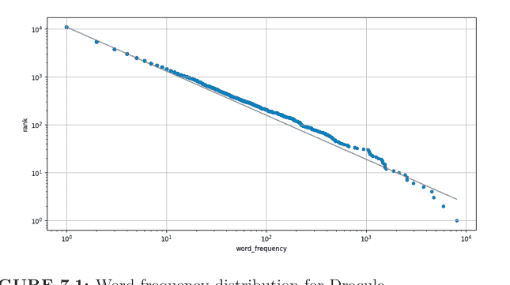

**图 7.1：** 《德古拉》的词频分布。

因此，根据我们的拟合结果，出现频率最高的词大约比第二高的词出现频率高 $2^{1.1} = 2.1$ 倍，比第三高的词出现频率高 $3^{1.1} = 3.3$ 倍，依此类推。图 7.1 展示了该图表。

脚本似乎按预期工作，因此我们可以继续将更改提交到 `fit` 开发分支：

```
$ git add bin/plotcounts.py results/dracula.png
$ git commit -m "Added fit to word count data"
```

```
[fit 38c209b] Added fit to word count data
 2 files changed, 57 insertions(+)
 rewrite results/dracula.png (99%)
```

如果我们使用 `git log` 查看最近的几次提交，会看到我们最近的更改：

```
$ git log --oneline -n 2
```

```
38c209b (HEAD -> fit) Added fit to word count data
ddb00fb (origin/master, master) removing inverse rank calculation
```

（我们使用 `--oneline` 和 `-n 2` 来缩短日志显示。）但如果我们切换回 `master` 分支：

```
$ git checkout master
$ git branch
```

```
fit
* master
```

并查看日志，我们的更改并不在那里：

```
$ git log --oneline -n 2
```

```
ddb00fb (HEAD -> master, origin/master) removing inverse rank calculation
7de9877 ignoring __pycache__
```

我们并没有丢失我们的工作：它只是没有包含在这个分支中。我们可以通过切换回 fit 分支并再次检查日志来证明这一点：

```
$ git checkout fit
$ git log --oneline -n 2
```

```
38c209b (HEAD -> fit) Added fit to word count data
ddb00fb (origin/master, master) removing inverse rank calculation
```

我们也可以查看 plotcounts.py 的内部内容，看到我们的更改。如果我们进行另一次更改并提交，该更改也将进入 fit 分支。例如，我们可以向其中一个文档字符串添加一些额外信息，以明确在估计 α 时使用了哪些方程。

```python
def get_power_law_params(word_counts):
    """
    Get the power law parameters.

    References
    ----------
    Moreno-Sanchez et al (2016) define alpha (Eq. 1),
    beta (Eq. 2) and the maximum likelihood estimation (mle)
    of beta (Eq. 6).

    > Moreno-Sanchez I, Font-Clos F, Corral A (2016)
    > Large-Scale Analysis of Zipf's Law in English Texts.
    > PLoS ONE 11(1): e0147073.
    > https://doi.org/10.1371/journal.pone.0147073
    """
    mle = minimize_scalar(nlog_likelihood,
                          bracket=(1 + 1e-10, 4),
                          args=word_counts,
                          method='brent')

    beta = mle.x
    alpha = 1 / (beta - 1)
    return alpha
```

```
$ git add bin/plotcounts.py
$ git commit -m "Adding Moreno-Sanchez et al (2016) reference"
```

```
[fit 1577404] Adding Moreno-Sanchez et al (2016) reference
 1 file changed, 14 insertions(+), 1 deletion(-)
```

最后，如果我们想查看两个分支之间的差异，可以使用 `git diff`，其语法与查看两个修订版之间差异所用的双点 `..` 语法相同：

```
$ git diff master..fit
```

```
diff --git a/bin/plotcounts.py b/bin/plotcounts.py
index c511da1..6905b6e 100644
--- a/bin/plotcounts.py
+++ b/bin/plotcounts.py
@@ -2,7 +2,62 @@
 import argparse
 
+import numpy as np
 import pandas as pd
```

## 7.4 验证齐普夫定律

```python
from scipy.optimize import minimize_scalar


def nlog_likelihood(beta, counts):
    """Log-likelihood function."""
    likelihood = - np.sum(np.log((1/counts)**(beta - 1)
                                - (1/(counts + 1))**(beta - 1)))
    return likelihood


def get_power_law_params(word_counts):
    """
    Get the power law parameters.

    References
    ----------
    Moreno-Sanchez et al (2016) define alpha (Eq. 1),
        beta (Eq. 2) and the maximum likelihood estimation (mle)
        of beta (Eq. 6).

    Moreno-Sanchez I, Font-Clos F, Corral A (2016)
        Large-Scale Analysis of Zipf's Law in English Texts.
        PLoS ONE 11(1): e0147073.
        https://doi.org/10.1371/journal.pone.0147073
    """
    mle = minimize_scalar(nlog_likelihood,
                          bracket=(1 + 1e-10, 4),
                          args=word_counts,
                          method='brent')
    beta = mle.x
    alpha = 1 / (beta - 1)
    return alpha


def plot_fit(curve_xmin, curve_xmax, max_rank, alpha, ax):
    """
    Plot the power law curve that was fitted to the data.

    Parameters
    ----------
    curve_xmin : float
        Minimum x-bound for fitted curve
    curve_xmax : float
        Maximum x-bound for fitted curve
    max_rank : int
        Maximum word frequency rank.
    alpha : float
        Estimated alpha parameter for the power law.
    ax : matplotlib axes
        Scatter plot to which the power curve will be added.
    """
    xvals = np.arange(curve_xmin, curve_xmax)
    yvals = max_rank * (xvals**(-1 / alpha))
    ax.loglog(xvals, yvals, color='grey')


def main(args):
    word_counts = df['word_frequency'].to_numpy()
    alpha = get_power_law_params(word_counts)
    print('alpha:', alpha)

    # Since the ranks are already sorted, we can take the last
    # one instead of computing which row has the highest rank
    max_rank = df['rank'].to_numpy()[-1]

    # Use the range of the data as the boundaries
    # when drawing the power law curve
    curve_xmin = df['word_frequency'].min()
    curve_xmax = df['word_frequency'].max()

    plot_fit(curve_xmin, curve_xmax, max_rank, alpha, ax)
    ax.figure.savefig(args.outfile)
```

```diff
diff --git a/results/dracula.png b/results/dracula.png
index 57a7b70..5f10271 100644
Binary files a/results/dracula.png and b/results/dracula.png
differ
```

# 为什么要使用分支？

为什么要费这么大周折？想象一下，我们正在调试像这样的更改，这时被要求对使用旧代码创建的论文进行最终修订。如果我们把 `plotcount.py` 恢复到之前的状态，可能会丢失我们的更改。相反，如果我们一直在分支上进行工作，就可以安全地切换分支、创建图表，然后再切换回来。

# 7.5 合并

此时，我们可以采取三种方式：

1.  再次在 `master` 分支中添加我们对 `plotcounts.py` 的更改。
2.  停止在 `master` 中工作，开始使用 `fit` 分支进行未来的开发。
3.  合并 `fit` 和 `master` 分支。

第一种选择繁琐且容易出错；第二种会导致分支数量激增，令人困惑；但第三种选择简单、快速且可靠。首先，让我们确保我们在 `master` 分支中：

```bash
$ git checkout master
$ git branch
```

```
  fit
* master
```

现在，我们可以用一条命令将 `fit` 分支中的更改合并到当前分支：

```bash
$ git merge fit
```

```
Updating ddb00fb..1577404
Fast-forward
 bin/plotcounts.py | 70 ++++++++++++++++++++++++++++++++++++++++++++++++++++++++++
 results/dracula.png | Bin 23291 -> 38757 bytes
 2 files changed, 70 insertions(+)
```

合并不会更改源分支 `fit`，但一旦合并完成，`fit` 中所做的所有更改也会出现在 `master` 的历史记录中：

```bash
$ git log --oneline -n 4
```

```
1577404 (HEAD -> master, fit) Adding Moreno-Sanchez et al
(2016) reference
38c209b Added fit to word count data
ddb00fb (origin/master) removing inverse rank calculation
7de9877 ignoring __pycache__
```

请注意，Git 会自动创建一个新的提交（在本例中为 1577404）来表示合并。如果我们现在运行 `git diff master..fit`，Git 不会打印任何内容，因为没有任何差异可以显示。

既然我们已经将 `fit` 中的所有更改合并到 `master` 中，就没有必要保留 `fit` 分支了，因此我们可以删除它：

```bash
$ git branch -d fit
```

```
Deleted branch fit (was 1577404).
```

> **不仅仅是命令行**

我们一直在命令行上创建、合并和删除分支，但我们可以使用 GitKraken³、RStudio IDE⁴ 和其他 GUI 来完成所有这些操作。操作保持不变；改变的只是我们告诉计算机我们想要做什么的方式。

³https://www.gitkraken.com/
⁴https://www.rstudio.com/products/rstudio/

# 7.6 处理冲突

当一行在两个不同的分支中以不同的方式被更改，或者一个文件在一个分支中被删除但在另一个分支中被编辑时，就会发生**冲突**。将 `fit` 合并到 `master` 进行得很顺利，因为两个分支之间没有冲突，但如果我们打算使用分支，就必须学习如何合并冲突。

首先，使用 `nano` 在 `master` 分支中将项目标题添加到一个名为 `README.md` 的新文件中，然后我们可以查看它：

```bash
$ cat README.md
```

```
# Zipf's Law
```

```bash
$ git add README.md
$ git commit -m "Initial commit of README file"
```

```
[master 232b564] Initial commit of README file
 1 file changed, 1 insertion(+)
 create mode 100644 README.md
```

现在，让我们创建一个名为 `docs` 的新开发分支，用于改进我们代码的文档。我们将使用 `git checkout -b` 在一步中创建一个新分支并切换到它：

```bash
$ git checkout -b docs
```

```
Switched to a new branch 'docs'
```

```bash
$ git branch
```

```
* docs
  master
```

在这个新分支上，让我们向 README 文件添加一些信息：

```
# Zipf's Law

These Zipf's Law scripts tally the occurrences of words in text files and plot each word's rank versus its frequency.
```

```bash
$ git add README.md
$ git commit -m "Added repository overview"
```

```
[docs a0b88e5] Added repository overview
 1 file changed, 3 insertions(+)
```

为了制造冲突，让我们切换回 `master` 分支。我们在 `docs` 分支中所做的更改不存在：

```bash
$ git checkout master
```

```
Switched to branch 'master'
```

```bash
$ cat README.md
```

```
# Zipf's Law
```

让我们添加一些关于我们工作贡献者的信息：

```
# Zipf's Law

## Contributors

- Amira Khan <amira@zipf.org>
```

```bash
$ git add README.md
$ git commit -m "Added contributor list"
```

```
[master 45a576b] Added contributor list
 1 file changed, 4 insertions(+)
```

我们现在有两个分支，`master` 和 `docs`，我们在其中以不同的方式更改了 `README.md`：

```bash
$ git diff docs..master
```

```diff
diff --git a/README.md b/README.md
index f40e895..71f67db 100644
--- a/README.md
+++ b/README.md
@@ -1,4 +1,5 @@
 # Zipf's Law
 
-These Zipf's Law scripts tally occurrences of words in text
-files and plot each word's rank versus its frequency.
+## Contributors
+
+- Amira Khan <amira@zipf.org>
```

当我们尝试将 `docs` 合并到 `master` 时，Git 不知道应该保留这些更改中的哪一个：

```bash
$ git merge docs master
```

```
Auto-merging README.md
CONFLICT (content): Merge conflict in README.md
Automatic merge failed; fix conflicts and then commit the result.
```

如果我们查看 `README.md`，会看到 Git 保留了两组更改，但标记了它们来自哪里：

```bash
$ cat README.md
```

```
# Zipf's Law

<<<<<<< HEAD
## Contributors

- Amira Khan <amira@zipf.org>
=======
These Zipf's Law scripts tally the occurrences of words in text files and plot each word's rank versus its frequency.
>>>>>>> docs
```

从 <<<<<<< HEAD 到 ======= 的行是 master 中的内容，而从那里到 >>>>>>> docs 的行显示的是 docs 中的内容。如果同一个文件中有多个冲突区域，Git 会以这种方式标记每一个。

我们必须决定下一步做什么：保留 master 的更改，保留 docs 的更改，编辑文件的这一部分以组合它们，或者写一些新的内容。无论我们做什么，都必须移除 >>>、=== 和 <<< 标记。让我们组合这两组更改，使最终文件内容如下：

```
# Zipf's Law

These Zipf's Law scripts tally the occurrences of words in text files and plot each word's rank versus its frequency.

## Contributors

- Amira Khan <amira@zipf.org>
```

现在我们可以添加文件并提交更改，就像在任何其他编辑之后所做的那样：

```bash
$ git add README.md
$ git commit -m "Merging README additions"
```

```
[master 55c63d0] Merging README additions
```

我们分支的历史记录现在显示了一个单一的提交序列，master 的更改位于早期 docs 更改的顶部：

```bash
$ git log --oneline -n 4
```

```
55c63d0 (HEAD -> master) Merging README additions
45a576b Added contributor list
a0b88e5 (docs) Added repository overview
232b564 Initial commit of README file
```

如果我们想查看实际发生了什么，可以在 `git log` 命令中添加 `--graph` 选项：

```
$ git log --oneline --graph -n 4
```

```
*   55c63d0 (HEAD -> master) Merging README additions
|\n| * a0b88e5 (docs) Added repository overview
* | 45a576b Added contributor list
|/
* 232b564 Initial commit of README file
```

此时，我们可以删除 `docs` 分支：

```
$ git branch -d docs
```

Deleted branch docs (was a0b88e5).

或者，我们也可以继续使用 `docs` 分支进行文档更新。每次切换到该分支时，我们先将 *master 分支的更改合并到 docs 分支*，进行编辑（根据需要切换回 `master` 或其他分支处理代码），然后在文档更新完成后，再将 *docs 分支的更改合并回 master 分支*。

> **记得推送**

如果你使用的是远程仓库，别忘了使用 `git push` 来保持 GitHub 上的版本与本地版本同步。

## 7.7 基于分支的工作流

将分支融入我们日常编码实践的最佳方式是什么？如果我们在自己的电脑上工作，以下工作流将帮助我们跟踪进展：

1.  `git checkout master` 确保我们处于 `master` 分支。
2.  `git checkout -b name-of-feature` 创建一个新分支。我们*总是*在进行更改时创建分支，因为我们永远不知道还会发生什么。分支名称应像变量名或文件名一样具有描述性。
3.  进行更改。如果在过程中想到其他事情——例如，在编写新函数时意识到其他函数的文档需要更新——我们*不会*因为恰好在这个分支上就处理那项工作。相反，我们提交更改，切换回 `master`，并为其他工作创建一个新分支。
4.  当新功能完成后，我们执行 `git merge master name-of-feature` 来获取在创建 `name-of-feature` 之后合并到 `master` 的所有更改，并解决任何冲突。这是一个重要步骤：我们希望在功能分支中进行合并和测试，确保一切仍然正常，而不是在 `master` 分支中进行。
5.  最后，我们切换回 `master` 并执行 `git merge name-of-feature master` 将我们的更改合并到 `master`。此时应该没有任何冲突，并且所有测试都应该通过。

大多数经验丰富的开发者都使用这种**每个功能一个分支的工作流**，但“功能”到底是什么？以下规则对于小型项目是合理的：

1.  任何只有一两行的纯外观修改可以在 `master` 分支中完成并立即提交。这里的“外观”指的是对注释或文档的更改：不影响代码运行方式的内容，甚至不包括简单的变量重命名。
2.  不改变其他任何内容的纯添加是一个功能，应放入分支。例如，如果我们运行一个新分析并保存结果，这应该在自己的分支上完成，因为可能需要多次尝试才能让分析运行起来，并且我们可能会中断自己去修复发现的问题。
3.  任何可能希望以后一步撤销的代码更改都是一个功能。例如，如果向函数添加了一个新参数，那么对该函数的每次调用都必须更新。由于这两个更改缺一不可，因此这些更改被视为一个单一功能，应在同一个分支中完成。

使用每个功能一个分支工作流最困难的地方在于，对于小更改也要坚持这样做。正如上面列表中的第一点所示，大多数人在小型项目上对此持务实态度；但在大型项目中，可能有数十人提交代码，即使是最小、最无害的更改也需要放在自己的分支中，以便进行审查（我们将在下文讨论）。

## 7.8 使用他人的工作

到目前为止，我们使用 Git 来管理个人工作，但当与他人协作时，Git 才真正发挥其价值。我们可以通过两种方式实现：

1.  每个人对单个共享仓库都有读写权限。
2.  每个人都可以从项目的主仓库读取，但只有少数人可以向其提交更改。项目的其他贡献者**fork**主仓库以创建他们自己的仓库，在其中进行工作，然后将他们的更改提交到主仓库。

第一种方法适用于最多六人且都熟悉 Git 的团队，但如果项目更大，或者贡献者担心他们可能会在 **master** 分支中造成混乱，第二种方法更安全。

Git 本身没有“主仓库”的概念，但像 GitHub⁵、GitLab⁶ 和 BitBucket⁷ 这样的**代码托管平台**都鼓励人们以有效创建主仓库的方式使用 Git。例如，假设 Sami 想要为 Amira 托管在 GitHub 上的 Zipf 定律代码 [https://github.com/amira-khan/zipf](https://github.com/amira-khan/zipf) 做出贡献。Sami 可以访问该 URL 并点击右上角的“Fork”按钮（图 7.2）。GitHub 立即在 Sami 的账户中创建了 Amira 仓库的副本，存储在 GitHub 自己的服务器上。

命令完成后，GitHub 上的设置现在如图 7.3 所示。Sami 自己的机器上还没有发生任何变化：新仓库仅存在于 GitHub 上。当 Sami 浏览其历史记录时，他们看到它包含了 Amira 所做的所有更改。

仓库的副本称为**克隆**。为了开始处理项目，Sami 需要在自己的计算机上克隆*他们自己的*仓库（而不是 Amira 的）。我们将修改 Sami 的提示符以包含其桌面用户 ID (sami) 和工作目录（最初为 ~），以便更容易跟踪发生的情况：

⁵ [https://github.com](https://github.com)
⁶ [https://gitlab.com/](https://gitlab.com/)
⁷ [https://bitbucket.org/](https://bitbucket.org/)

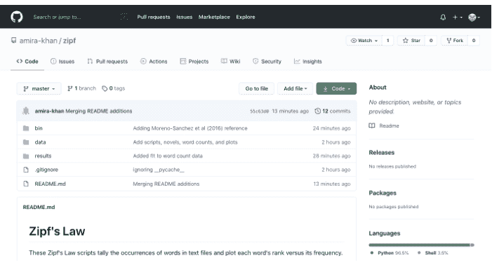

图 7.2：Fork 一个仓库。

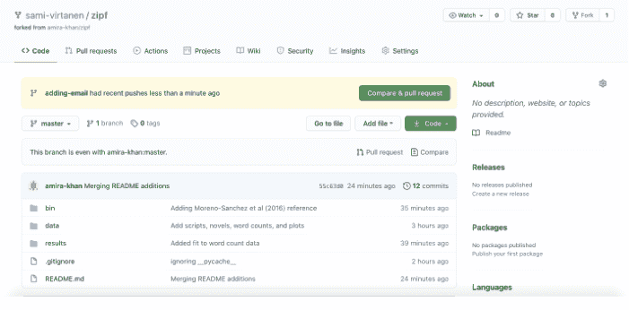

图 7.3：Fork 后 GitHub 上的仓库。

```
sami:~ $ git clone https://github.com/sami-virtanen/zipf.git
```

```
Cloning into 'zipf'...
remote: Enumerating objects: 64, done.
remote: Counting objects: 100% (64/64), done.
remote: Compressing objects: 100% (43/43), done.
remote: Total 64 (delta 20), reused 63 (delta 19), pack-reused 0
Receiving objects: 100% (64/64), 2.20 MiB | 2.66 MiB/s, done.
Resolving deltas: 100% (20/20), done.
```

此命令创建一个与项目同名的新目录，即 zipf。当 Sami 进入此目录并运行 `ls` 和 `git log` 时，他们看到项目的所有文件和历史记录都在那里：

```
sami:~ $ cd zipf
sami:~/zipf $ ls
```

```
README.md    bin    data    results
```

```
sami:~/zipf $ git log --oneline -n 4
```

```
55c63d0 (HEAD -> master, origin/master, origin/HEAD)
    Merging README additions
45a576b Added contributor list
a0b88e5 Added repository overview
232b564 Initial commit of README file
```

Sami 还看到 Git 已自动为其仓库创建了一个**远程仓库**，该远程仓库指向他们在 GitHub 上的仓库：

```
sami:~/zipf $ git remote -v
```

```
origin  https://github.com/sami-virtanen/zipf.git (fetch)
origin  https://github.com/sami-virtanen/zipf.git (push)
```

Sami 可以从他们的 fork 拉取更改并将工作推送回去，但在从 Amira 的仓库获取更改之前，还需要做一件事：

```
sami:~/zipf $ git remote add upstream
    https://github.com/amira-khan/zipf.git
sami:~/zipf $ git remote -v
```

```
origin    https://github.com/sami-virtanen/zipf.git (fetch)
origin    https://github.com/sami-virtanen/zipf.git (push)
upstream  https://github.com/amira-khan/zipf.git (fetch)
upstream  https://github.com/amira-khan/zipf.git (push)
```

Sami 将他们的新远程仓库命名为 upstream，因为它指向其仓库的源仓库。他们可以使用任何名称，但 upstream 是一个几乎通用的约定。

有了这个远程仓库，Sami 终于设置好了。例如，假设 Amira 修改了项目的 README.md 文件，将 Sami 添加为贡献者。（同样，我们在她的提示符中显示 Amira 的用户 ID 和工作目录，以明确是谁在做什么）：

```
# Zipf's Law

These Zipf's Law scripts tally the occurrences of words in text files and plot each word's rank versus its frequency.

## Contributors

- Amira Khan <amira@zipf.org>
- Sami Virtanen
```

Amira 提交她的更改并将其推送到她在 GitHub 上的仓库：

```
amira:~/zipf $ git commit -a -m "Adding Sami as a contributor"

[master 35fca86] Adding Sami as a contributor
 1 file changed, 1 insertion(+)

amira:~/zipf $ git push origin master

Enumerating objects: 5, done.
Counting objects: 100% (5/5), done.
Delta compression using up to 4 threads
Compressing objects: 100% (3/3), done.
Writing objects: 100% (3/3), 315 bytes | 315.00 KiB/s, done.
Total 3 (delta 2), reused 0 (delta 0), pack-reused 0
remote: Resolving deltas: 100% (2/2), completed with 2 local objects.
To https://github.com/amira-khan/zipf.git
   55c63d0..35fca86  master -> master
```

Amira的更改现在位于她的桌面和GitHub仓库中，但不在Sami的任何一个仓库（本地或远程）中。不过，由于Sami已经创建了一个指向Amira GitHub仓库的远程仓库，他们可以轻松地将这些更改拉取到他们的桌面：

```
sami:~/zipf $ git pull upstream master
```

```
From https://github.com/amira-khan/zipf
 * branch            master     -> FETCH_HEAD
 * [new branch]      master     -> upstream/master
Updating 55c63d0..35fca86
Fast-forward
 README.md | 1 +
 1 file changed, 1 insertion(+)
```

从他人拥有的仓库拉取与从我们自己拥有的仓库拉取并无不同。在这两种情况下，Git都会合并更改，并要求我们解决出现的任何冲突。唯一显著的区别是，就像`git push`和`git pull`一样，我们必须同时指定一个远程仓库和一个分支：在本例中，是`upstream`和`master`。

## 7.9 拉取请求

Sami现在可以获取Amira的工作成果，但Amira如何获取Sami的呢？她可以创建一个指向Sami在GitHub上仓库的远程仓库，并定期拉取Sami的更改，但这会导致混乱，因为我们永远无法确保每个人的工作在同一时间都存在于任何一处。相反，几乎所有人都使用**拉取请求**。它们不是Git本身的一部分，但所有主要的在线**代码托管平台**都支持它们。

拉取请求本质上是一个说明，内容是：“有人希望将仓库B的分支A合并到仓库Y的分支X中。”拉取请求不包含更改内容，而是指向两个特定的分支。这样，如果任一分支发生更改，显示的差异总是最新的。

但拉取请求可以存储的不仅仅是源分支和目标分支：它还可以存储人们对拟议合并所做的评论。用户可以对整个拉取请求发表评论，也可以对特定行发表评论，如果拉取请求的作者更新了评论所附着的代码，还可以将评论标记为过时。复杂的更改可能需要经过几轮审查和修订才能合并，这使得拉取请求成为我们都希望期刊实际拥有的审查系统。

为了实际演示这一点，假设Sami想将他们的电子邮件地址添加到README.md中。他们创建一个新分支并切换到该分支：

```
sami:~/zipf $ git checkout -b adding-email
```

Switched to a new branch 'adding-email'

然后进行更改并提交：

```
sami:~/zipf $ git commit -a -m "Adding my email address"
```

```
[adding-email 3e73dc0] Adding my email address
 1 file changed, 1 insertion(+), 1 deletion(-)
```

```
sami:~/zipf $ git diff HEAD~1
```

```
diff --git a/README.md b/README.md
index e8281ee..e1bf630 100644
--- a/README.md
+++ b/README.md
@@ -6,4 +6,4 @@ and plot each word's rank versus its frequency.
 ## Contributors
 
 - Amira Khan <amira@zipf.org>
 -- Sami Virtanen
 +- Sami Virtanen <sami@zipf.org>
```

Sami的更改仅存在于他们的本地仓库中。在这些更改出现在GitHub上之前，他们无法创建拉取请求，因此他们将新分支推送到他们在GitHub上的仓库：

```
sami:~/zipf $ git push origin adding-email
```

```
Enumerating objects: 5, done.
Counting objects: 100% (5/5), done.
Delta compression using up to 4 threads
Compressing objects: 100% (3/3), done.
Writing objects: 100% (3/3), 315 bytes | 315.00 KiB/s, done.
Total 3 (delta 2), reused 0 (delta 0), pack-reused 0
remote: Resolving deltas: 100% (2/2), completed with 2 local objects.
remote:
remote: Create a pull request for 'adding-email' on GitHub by visiting:
remote:   https://github.com/sami-virtanen/zipf/pull/new/adding-email
remote:
To https://github.com/sami-virtanen/zipf.git
 * [new branch]      adding-email -> adding-email
```

当Sami在浏览器中访问他们的GitHub仓库时，GitHub注意到他们刚刚推送了一个新分支，并询问他们是否要创建一个拉取请求（图7.4）。

当Sami点击该按钮时，GitHub会显示一个页面，显示拉取请求的默认源和目标，以及一对用于填写拉取请求标题和更长说明的可编辑框（图7.5）。

如果向下滚动，Sami可以看到将包含在拉取请求中的更改摘要（图7.6）。

顶部的（标题）框会自动填充上一次的提交消息，因此Sami添加了扩展说明以提供额外背景，然后点击“Create Pull Request”（图7.7）。当他们这样做时，GitHub会显示一个页面，显示新的拉取请求，该请求有一个唯一的序列号（图7.8）。请注意，此拉取请求显示在Amira的仓库中，而不是Sami的仓库中，因为如果拉取请求被合并，受影响的是Amira的仓库。

Amira的仓库现在显示一个新的拉取请求（图7.9）。点击“Pull requests”标签页会显示PR列表（图7.10），点击拉取请求链接本身会显示其详细信息（图7.11）。Sami和Amira都可以查看和与这些页面交互，但只有Amira有权限合并。

由于没有冲突，GitHub将允许Amira立即使用“Merge pull request”按钮合并PR。她也可以使用“Close pull request”按钮丢弃或拒绝它而不合并。相反，她点击“Files changed”标签页查看Sami更改了什么（图7.12）。

如果她将鼠标悬停在特定行上，数字附近会出现一个白底蓝字的十字，表示她可以添加评论（图7.13）。她点击自己名字旁边的标记并写了一条评论：她只想发表一条评论，而不是写更长的多条评论审查，因此她选择了“Add single comment”（图7.14）。GitHub重新显示页面，其中插入了她的评论（图7.15）。

在Amira工作期间，GitHub一直在向Sami和Amira发送电子邮件通知。当Sami点击他们电子邮件通知中的链接时，它会带他们到PR并显示Amira的评论。Sami更改README.md，提交并推送，但*没有*创建新的拉取请求或对现有拉取请求做任何操作。如上所述，PR是一个要求合并两个分支的说明，因此如果合并的任一端发生更改，PR会自动更新。

果然，当Amira片刻后再次查看PR时，她看到了Sami的更改（图7.16）。满意后，她回到“Conversation”标签页并点击“Merge”。PR页面顶部的图标更改了文本和颜色，显示合并成功（图7.17）。

为了将这些更改从GitHub获取到她的桌面仓库，Amira使用`git pull`：

## 7 深入使用 Git


图 7.17：成功合并后。

```
amira:~/zipf $ git pull origin master

From https://github.com/amira-khan/zipf
 * branch            master     -> FETCH_HEAD
Updating 35fca86..a04e3b9
Fast-forward
 README.md | 4 ++--
 1 file changed, 2 insertions(+), 2 deletions(-)
```

为了将他们刚刚在 `adding-email` 分支上所做的更改合并到 `master` 分支，Sami 可以在命令行上使用 `git merge`。不过，如果他们同时使用 `git pull` 从上游仓库（即 Amira 的仓库）拉取更新，以确保获取 Amira 可能已合并的任何其他更改，这样会更清晰一些：

```
sami:~/zipf $ git checkout master

Switched to branch 'master'
Your branch is up to date with 'origin/master'.
```

```
sami:~/zipf $ git pull upstream master
```

```
From https://github.com/amira-khan/zipf
 * branch            master     -> FETCH_HEAD
Updating 35fca86..a04e3b9
Fast-forward
 README.md | 4 ++--
 1 file changed, 2 insertions(+), 2 deletions(-)
```

最后，Sami 可以将他们的更改推送回其自身远程仓库的 `master` 分支：

```
sami:~/zipf $ git push origin master
```

```
Total 0 (delta 0), reused 0 (delta 0), pack-reused 0
To https://github.com/sami-virtanen/zipf.git
   35fca86..a04e3b9  master -> master
```

现在所有四个仓库都已同步。

## 7.10 处理拉取请求中的冲突

最后，假设 Amira 和 Sami 决定在这个项目上进行更广泛的合作。Amira 已将 Sami 添加为 GitHub 仓库的协作者。现在 Sami 可以直接向仓库做出贡献，而不是通过分叉仓库的拉取请求。

Sami 在 GitHub 上的 `master` 分支中修改了 `README.md`。与此同时，Amira 在另一个分支中对同一文件进行了冲突性更改。当 Amira 创建她的拉取请求时，GitHub 会检测到冲突并报告该 PR 无法自动合并（图 7.18）。

Amira 可以用她已有的工具来解决这个问题。如果她在名为 `editing-readme` 的分支中进行了更改，步骤如下：

1.  从 GitHub 仓库的 `master` 分支拉取 Sami 的更改到她桌面仓库的 `master` 分支。
2.  将更改从她桌面仓库的 `master` 分支合并*到*同一仓库的 `editing-readme` 分支。
3.  将她更新后的 `editing-readme` 分支推送到她在 GitHub 上的仓库。从那里返回主仓库 `master` 分支的拉取请求将自动更新。

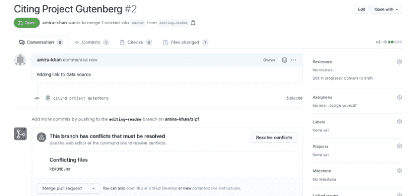

图 7.18：显示拉取请求中的冲突。

GitHub 和其他代码托管平台确实允许人们通过其基于浏览器的界面合并冲突，但在我们的桌面端操作意味着我们可以使用我们喜欢的编辑器来解决冲突。这也意味着，如果更改影响了项目的代码，我们可以运行所有内容以确保它仍然有效。

但是，如果 Sami 或其他人在 Amira 解决这个冲突时合并了另一个更改，以至于当她推送到她的仓库时又出现了另一个不同的冲突，该怎么办？理论上这个循环可能永远持续下去；实际上，它揭示了一个需要 Amira（或某人）解决的沟通问题。如果两个或更多的人不断对同一文件进行不兼容的更改，他们应该讨论谁应该做什么，或者重新安排项目内容，以免互相干扰。

## 7.11 总结

分支和拉取请求起初看起来很复杂，但它们很快就会成为第二天性。参与项目的每个人都可以按照自己的节奏处理他们想做的事情，随时获取他人的更改并提交自己的更改。更重要的是，这种工作流程让每个人都有机会审查彼此的工作。正如我们在 F.5 节中讨论的，进行审查不仅可以防止错误悄然出现：它也是传播理解和技能的有效方式。

## 7.12 练习

### 7.12.1 解释选项

1.  `git log` 的 `--oneline` 和 `-n` 选项有什么作用？
2.  `git log` 还有哪些你觉得有用的其他选项？

### 7.12.2 修改提示符

修改你的 shell 提示符，使其在仓库中时显示你所在的分支。

### 7.12.3 忽略文件

GitHub 为各种类型的项目维护了一系列 `.gitignore` 文件。查看 Python 的示例 `.gitignore` 文件：你认识其中多少被忽略的文件？你可以在哪里找到关于它们的更多信息？

### 7.12.4 两次创建相同的文件

创建一个名为 `same` 的分支。在其中，创建一个名为 `same.txt` 的文件，内容包含你的名字和日期。

切换回 `master`。检查 `same.txt` 是否不存在，然后创建一个内容完全相同的文件。

1.  `git diff master..same` 会显示什么？（尝试在运行命令*之前*回答问题。）
2.  `git merge same master` 会做什么？（尝试在运行命令*之前*回答问题。）

### 7.12.5 不合并就删除分支

创建一个名为 `experiment` 的分支。在其中，创建一个名为 `experiment.txt` 的文件，内容包含你的名字和日期，然后切换回 `master`。

[^8]: https://github.com/github/gitignore

1.  当你尝试使用 `git branch -d experiment` 删除 `experiment` 分支时会发生什么？为什么？
2.  你可以给 Git 什么选项来删除 `experiment` 分支？为什么使用它时要非常小心？
3.  如果你尝试使用此标志删除你当前所在的分支，你认为会发生什么？

### 7.12.6 追踪更改

Chartreuse 和 Fuchsia 正在一个项目上合作。描述在以下每个步骤之后，涉及的四个仓库中各有什么内容。

1.  Chartreuse 在 GitHub 上创建一个包含 `README.md` 文件的仓库，并将其克隆到他们的桌面。
2.  Fuchsia 在 GitHub 上分叉该仓库，并将他们的副本克隆到他们的桌面。
3.  Fuchsia 在他们桌面仓库的 `master` 分支中添加一个文件 `fuchsia.txt`，并将该更改推送到他们在 GitHub 上的仓库。
4.  Fuchsia 从他们在 GitHub 上的仓库的 `master` 分支向 Chartreuse 在 GitHub 上的仓库的 `master` 分支创建一个拉取请求。
5.  Chartreuse *没有*合并 Fuchsia 的 PR。相反，他们在他们桌面仓库的 `master` 分支中添加一个文件 `chartreuse.txt`，并将该更改推送到他们在 GitHub 上的仓库。
6.  Fuchsia 在他们的桌面仓库中添加一个名为 `upstream` 的远程，指向 Chartreuse 在 GitHub 上的仓库，并运行 `git pull upstream master`，然后合并任何更改或冲突。
7.  Fuchsia 从他们桌面仓库的 `master` 分支推送到他们 GitHub 仓库的 `master` 分支。
8.  Chartreuse 合并 Fuchsia 的拉取请求。
9.  Chartreuse 在桌面上运行 `git pull origin master`。

## 7.13 关键点

-   使用 `branch-per-feature` 工作流来开发新功能，同时保持主分支处于可工作状态。
-   `git branch` 创建一个新分支。
-   `git checkout` 在分支之间切换。
-   `git merge` 将另一个分支的更改合并到当前分支。
-   **冲突**发生在文件或文件的不同部分在不同分支上以不同方式被更改时。
-   版本控制系统不允许人们默默地覆盖更改；相反，它们会突出显示需要解决的冲突。
-   **分叉**一个仓库会在服务器上创建一个副本。
-   使用 `git clone` **克隆**一个仓库会创建远程仓库的本地副本。
-   创建一个名为 `upstream` 的远程，指向分叉所源自的仓库。
-   创建**拉取请求**以将更改从你的分叉提交到上游仓库。


# Taylor & Francis

Taylor & Francis Group

http://taylorandfrancis.com

## 8 团队协作

> 当你开始把人当作物品对待时，邪恶便开始了。
— 特里·普拉切特

项目可能因代码质量低下而运行多年，但如果团队成员感到困惑、方向不一或彼此敌对，项目将无法长久。因此，本章探讨如何建立协作文化，以帮助那些希望为项目做出贡献的人，并介绍项目发展过程中管理项目和团队的一些方法。我们的建议借鉴了Fogel（2005）关于优秀开源软件项目运作方式的描述，以及Bollier（2014）关于**公共资源**及其适用场景的解释。

此时，Zipf定律项目应包含以下结构：

```
zipf/
├── .gitignore
├── README.md
├── bin
│   ├── book_summary.sh
│   ├── collate.py
│   ├── countwords.py
│   ├── plotcounts.py
│   ├── script_template.py
│   └── utilities.py
├── data
│   ├── README.md
│   ├── dracula.txt
│   └── ...
└── results
    ├── dracula.csv
    ├── dracula.png
    └── ...
```

## 8.1 什么是项目？

我们首先需要明确“项目”的定义（Wilson等人，2017）。以下是一些示例：

- 一个被多个研究项目使用的数据集。该项目包括原始数据、用于整理数据的程序、整理后的数据、将数据集打包所需的额外文件，以及描述数据作者、许可证和**来源**的几个文本文件。
- 为**非政府组织**编写的年度报告集。该项目包括多个Jupyter笔记本、这些笔记本使用的支持性Python库、报告的HTML和PDF版本副本、包含报告中使用的数据集链接的文本文件（由于包含个人身份信息，无法存储在GitHub上），以及解释作者未在报告中包含的分析细节的文本文件。
- 一个提供数据科学术语交互式词汇表的软件库，支持Python和R。该项目包含创建两种语言包所需的文件、一个充满术语和定义的Markdown文件，以及一个包含检查交叉引用、编译包等目标的Makefile。

创建项目的常见标准包括：每个出版物一个项目、每个可交付软件一个项目，或每个团队一个项目。第一种标准往往过于狭隘：一个好的数据集会产生多份报告，而一些项目的目标是持续产出报告（如月度预测）。第二种标准适用于主要目标是产出工具而非结果的软件工程项目，但对于数据分析工作可能不太合适。第三种标准往往过于宽泛：一个六人团队可能同时处理许多不同的事务，将所有内容放在一个仓库中很快就会变得像某人的地下室一样杂乱。

决定项目构成的一种方法是询问人们开会讨论的内容。如果同一个小组需要定期聚在一起讨论某件事，那么这个“某件事”可能值得拥有自己的仓库。如果人员名单随时间变化缓慢但会议仍在继续，那就更是一个明确的信号。

## 8.2 包容所有人

大多数研究软件项目最初由一个人完成，这个人可能在整个项目存续期间承担大部分编码和数据分析工作（Majumder等人，2019）。然而，随着项目规模扩大，最终需要更多贡献者来维持项目。吸引更多人参与也能提高代码的功能性和健壮性，因为新成员会带来他们的专业知识，或以新的视角看待旧问题。

为了利用团队的专业知识，项目不能仅仅*允许*人们贡献：项目负责人必须传达出项目*欢迎*贡献，并且新人受到欢迎和重视的信息（Sholler等人，2019）。仅仅说“大门敞开”是不够的：许多潜在贡献者都有过不受欢迎的痛苦经历。为了创造一个真正包容所有人的环境，项目必须明确承认有些人受到了不公平对待，并积极采取措施纠正这一点。这样做可以增加团队的多样性，从而提高生产力（Zhang 2020）。更重要的是，这是正确的事情。

> **术语**

**特权**是指给予某些人而非所有人的非应得优势，而**压迫**是指使特权者受益、使无特权者受害的系统性不平等（Aurora和Gardiner 2018）。在欧洲、美洲、澳大利亚和新西兰，一个异性恋、白人、富裕、身体健全的男性在说话时被打断的可能性更小，在课堂上被点名的可能性更大，并且基于相同的简历获得工作面试的机会也比不符合这些条件的人更大。享有特权的人通常意识不到这一点，因为他们一生都生活在一个提供非应得优势的系统中。用约翰·斯卡尔齐令人难忘的话来说，他们一生都在最低难度设置下玩游戏，因此没有意识到其他人面临的困难要大得多（Scalzi 2012）。

压迫的对象通常被称为“边缘化群体的成员”，但对象并非选择被边缘化：是拥有特权的人将他们边缘化。最后，**盟友**是指来自特权群体、努力理解自身特权并致力于终结压迫的人。

鼓励包容性是共同的责任。如果我们享有特权，我们应该自我教育，并指出那些边缘化他人的同伴，即使（或特别是）他们没有意识到自己在这样做。作为项目负责人，我们工作的一部分是教导贡献者如何成为盟友，并确保包容性文化（Lee 1962）。

## 8.3 建立行为准则

使项目更具包容性的起点是建立行为准则。这有四个作用：

1.  促进群体内部的公平。
2.  让那些曾遭受骚扰或不受欢迎行为的边缘化群体成员放心，该项目重视包容性。
3.  确保每个人都知道规则是什么。（当人们来自不同文化背景时，这一点尤为重要。）
4.  防止任何行为不端的人假装不知道自己的行为是不可接受的。

更广泛地说，行为准则通过减少对可接受行为的不确定性，使人们更容易做出贡献。有些人可能会反对，声称这是不必要的，或者侵犯了言论自由，但他们通常的意思是，思考自己可能从过去的不平等中受益让他们感到不舒服。如果行为准则导致他们离开，这可能会使项目运行得更顺利。

按照惯例，我们通过在项目根目录下创建一个名为CONDUCT.md的文件来添加行为准则。编写一份既全面又易读的行为准则很困难。因此，我们建议使用其他团体起草、完善和测试过的准则。贡献者公约¹适用于在线开发的项目，例如基于GitHub的项目：

```
# 贡献者公约行为准则

## 我们的承诺

我们作为成员、贡献者和领导者，承诺使我们社区的参与对每个人都免受骚扰，无论年龄、体型、可见或不可见的残疾、种族、性特征、性别认同和表达、经验水平、教育程度、社会经济地位、国籍、个人外貌、种族、宗教或性取向如何。

我们承诺以有助于开放、欢迎、多样、包容和健康社区的方式行事和互动。

## 我们的标准

有助于为社区创造积极环境的行为示例包括：

* 对他人表现出同理心和善意
* 尊重不同的意见、观点和经验
* 给予和优雅地接受建设性反馈
* 为我们的错误向受影响的人道歉，并从经验中学习
* 关注的不仅是对我们个人最有利的事情，也是对整个社区最有利的事情

不可接受的行为示例包括：

* 使用性暗示的语言或图像，以及任何形式的性关注或性挑逗
* 挑衅、侮辱性或贬损性评论，以及人身或政治攻击
* 公开或私下骚扰
* 未经明确许可发布他人的私人信息，如物理地址或电子邮件地址
* 在专业环境中可能被合理认为不适当的其他行为

## 执行责任

社区领导者有责任阐明和执行我们可接受行为的标准，并将对任何他们认为不当、威胁、冒犯或有害的行为采取适当和公正的纠正措施。

社区领导者有权利和责任删除、编辑或拒绝不符合本行为准则的评论、提交、代码、维基编辑、议题和其他贡献，并将沟通审核原因
```

¹https://www.contributor-covenant.org

## 适用范围

本行为准则适用于所有社区空间，并且当个人在公共空间正式代表社区时也适用。代表我们社区的例子包括使用官方电子邮件地址、通过官方社交媒体账户发帖，或在在线或线下活动中担任指定代表。

## 执行

任何滥用、骚扰或其他不可接受的行为实例，可向负责执行的社区领导者报告，联系方式为 [插入联系方式]。所有投诉都将得到及时、公正的审查和调查。

所有社区领导者都有义务尊重任何事件举报人的隐私和安全。

## 执行指南

社区领导者将遵循这些社区影响指南，来确定他们认为违反本行为准则的任何行为的后果：

### 1. 纠正

**社区影响**：使用不当语言或其他在社区中被视为不专业或不受欢迎的行为。

**后果**：社区领导者发出私下书面警告，明确违规行为的性质，并解释为何该行为不当。可能会要求公开道歉。

### 2. 警告

**社区影响**：通过单个事件或一系列行为造成的违规。

**后果**：发出警告，并说明持续行为的后果。在指定时间内，不得与相关人员互动，包括不得主动与执行行为准则的人员互动。这包括避免在社区空间以及社交媒体等外部渠道进行互动。违反这些条款可能导致临时或永久封禁。

### 3. 临时封禁

**社区影响**：严重违反社区标准，包括持续的不当行为。

**后果**：在指定时间内，暂时禁止与社区进行任何形式的互动或公开沟通。在此期间，不允许与相关人员进行任何公开或私下的互动，包括不得主动与执行行为准则的人员互动。违反这些条款可能导致永久封禁。

### 4. 永久封禁

**社区影响**：表现出违反社区标准的模式，包括持续的不当行为、对个人的骚扰，或对某类个人的攻击或贬低。

**后果**：永久禁止在社区内进行任何形式的公开互动。

## 来源说明

本行为准则改编自 [贡献者公约][covenant] 2.0 版，可访问 www.contributor-covenant.org/version/2/0/code_of_conduct.html

社区影响指南的灵感来源于 [Mozilla 的行为准则执行阶梯](https://github.com/mozilla/diversity)。

[homepage]: https://www.contributor-covenant.org

有关本行为准则的常见问题解答，请参阅 https://www.contributor-covenant.org/faq。翻译版本可在 https://www.contributor-covenant.org/translations 获取。

如您所见，贡献者公约定义了行为期望、不遵守的后果，以及报告和处理违规行为的机制。第三部分与前两部分同样重要，因为没有执行方法的规则是毫无意义的；Aurora 和 Gardiner (2018) 是一本简短实用的指南，每位项目负责人都应阅读。

> **线下活动**

贡献者公约适用于主要在线的互动，这对许多研究软件项目来说是常见情况。对于线下活动，最佳选择是极客女性主义维基³上的示范行为准则²，该准则被许多开源组织和会议采用。如果您的项目位于大学或公司内，可能已有行为准则：人力资源部门通常是最有帮助的咨询处。

## 8.4 包含许可证

行为准则描述了贡献者应如何相互互动，而许可证则规定了项目材料如何被使用和再分发。如果许可证或出版协议使得人们难以贡献，项目就不太可能吸引新成员，因此许可证的选择对项目的长期可持续性至关重要。

> **开放但有例外...**

仅开发软件的项目可能在开放所有内容方面没有问题。另一方面，处理敏感数据的团队必须小心确保本应私密的内容不会被无意中共享。特别是，Git 新手（甚至非新手）偶尔会将包含个人身份信息的原始数据文件添加到代码库中。发生这种情况时，可以重写项目历史以删除这些内容，但这并不能自动删除人们可能在分叉代码库中保留的副本。

每项创作作品都有某种许可证；唯一的问题是作者和用户是否知道它是什么并选择执行它。为项目选择许可证可能很复杂，尤其是因为法律尚未跟上日常实践。Morin、Urban 和 Sliz (2012) 以及 VanderPlas (2014) 是从研究者角度理解许可和知识产权的良好起点，而 Lindberg (2008) 则为那些想要细节的人提供了更深入的探讨。根据国家、机构和工作角色的不同，大多数创作作品自动有资格获得知识产权保护。然而，团队成员可能拥有不同级别的版权保护。例如，学生和教职员工可能对他们创作的研究作品拥有版权，但大学工作人员可能没有，因为他们的雇佣协议可能规定他们在工作中创作的内容属于雇主。

为避免法律上的混乱，每个项目都应包含明确的许可证。该许可证应尽早选择，因为更改许可证可能很复杂。例如，每个协作者可能对其作品拥有版权，因此在更改许可证时需要征得他们的同意。同样，更改许可证不会追溯更改，因此不同的用户最终可能在不同的许可结构下运作。

> **交给专业人士**

不要自己编写许可证。法律术语是一种高度技术性的语言，其含义并非你想象的那样。

为了使代码许可证的选择尽可能简单，GitHub 允许我们在创建代码库时选择几种常见软件许可证之一。开源倡议组织维护着一份**开放许可证**⁴列表，choosealicense.com⁵将帮助我们找到适合我们需求的许可证。我们需要考虑的一些事情包括：

1. 我们是否想为作品设置许可证？
2. 我们许可的内容是源代码吗？
3. 我们是否要求分发衍生作品的人也分发他们的代码？
4. 我们是否想处理专利权？
5. 我们的许可证是否与我们所依赖软件的许可证兼容？
6. 我们的机构是否有任何可能推翻我们选择的政策？
7. 我们的机构内是否有任何版权专家可以协助我们？

不幸的是，GitHub 的列表不包括数据或书面作品（如论文和报告）的常见许可证。这些可以手动添加，但通常很难理解不同材料上多个许可证之间的相互作用 (Almeida et al. 2017)。

正如项目的行为准则通常放在名为 `CONDUCT.md` 的根目录文件中一样，其许可证通常放在名为 `LICENSE.md` 的文件中，该文件也位于项目的根目录中。

### 8.4.1 软件

为了为我们软件选择合适的许可证，我们需要理解两种许可证之间的区别。**MIT 许可证**（及其近亲 BSD 许可证）规定，只要引用原始来源，人们可以对软件做任何他们想做的事情，并且作者对出现的问题不承担任何责任。**GNU 通用公共许可证** (GPL) 赋予人们类似的权利，但要求他们以相同的条款分享自己的作品：

> 您可以复制、分发和修改软件，只要您跟踪源文件中的更改/日期。任何对 GPL 许可代码的修改或包含（通过编译器）GPL 许可代码的软件，也必须在 GPL 下提供，并附带构建和安装说明。

— tl;dr⁶

换句话说，如果有人修改了 GPL 许可的软件或将其整合到自己的项目中，然后分发他们创建的内容，他们也必须分发自己作品的源代码。

GPL 的创建是为了防止公司利用开放软件而不做任何回馈。过去三十年表明，这种限制并非必要：许多项目在没有这种保障的情况下生存并蓬勃发展。因此，我们建议项目选择 MIT 许可证，因为它对未来行动的限制最少。

```
MIT License

Copyright (c) 2020 Amira Khan

Permission is hereby granted, free of charge, to any person obtaining a copy of this software and associated documentation files (the "Software"), to deal in the Software without restriction, including without limitation the rights to use, copy, modify, merge, publish, distribute, sublicense, and/or
```

² https://geekfeminism.wikia.com/wiki/Conference_anti-harassment/Policy
³ https://geekfeminism.wikia.com/
⁴ https://opensource.org/licenses
⁵ https://choosealicense.com/
⁶ https://tldrlegal.com/license/gnu-general-public-license-v3-(gpl-3)

出售软件副本，并允许获得软件的人员这样做，但须遵守以下条件：

上述版权声明和本许可声明应包含在软件的所有副本或实质性部分中。

软件按“原样”提供，不附带任何明示或暗示的保证，包括但不限于对适销性、特定用途适用性和不侵权的保证。在任何情况下，作者或版权持有者均不对任何索赔、损害赔偿或其他责任负责，无论是在合同诉讼、侵权诉讼或其他诉讼中，因软件或使用软件或其他交易而引起或与之相关。

> 首先，不造成伤害

希波克拉底许可证<sup>7</sup>是一种较新的许可证，正迅速流行起来。GPL要求人们共享他们的工作，而希波克拉底许可证则要求他们不造成伤害。更准确地说，它禁止人们以违反《世界人权宣言》<sup>8</sup>的方式使用软件。我们已经痛苦地认识到，软件和科学可能被滥用；采用希波克拉底许可证是防止这种情况的一小步。

## 8.4.2 数据和报告

MIT许可证、GPL和希波克拉底许可证旨在用于软件。当涉及数据和报告时，最广泛使用的许可证系列是知识共享<sup>9</sup>制作的许可证。这些许可证由律师撰写和审查，并且被社区广泛理解。

最自由的选项被称为**CC-0**，其中“0”代表“零限制”。这将作品置于公共领域，即允许任何想要使用它的人以任何方式使用它，没有任何限制。CC-0通常是数据的最佳选择，因为它简化了涉及来自不同来源的数据集的聚合分析。它并不否定引用来源的学术传统和要求；它只是不将其作为法律要求。

CC-0的下一步是知识共享-署名许可证，通常称为**CC-BY**。这允许人们只要引用原始来源，就可以对作品做任何他们想做的事情。这是手稿的最佳许可证：我们希望人们广泛分享它们，但也希望为我们的工作获得认可。

其他知识共享许可证包含各种限制，通常使用两个字母的缩写来表示：

- ND（禁止演绎）阻止人们创建我们作品的修改版本。不幸的是，这也阻碍了翻译和重新格式化。
- SA（相同方式共享）要求人们以我们使用的相同条款共享包含我们作品的作品。同样，原则上没问题，但在实践中它使聚合和重组变得困难。
- NC（非商业性使用）*并不*意味着人们不能为包含我们作品的东西收费，尽管一些出版商仍然试图暗示这一点，以吓唬人们远离开放许可。相反，NC条款意味着人们不能在未经我们明确许可的情况下为使用我们作品的东西收费，我们可以根据我们想要的任何条款给予许可。

要将这些概念应用于我们的齐普夫定律项目，我们需要考虑我们的数据（其他人创建的）和我们的结果（我们创建的）。我们可以通过查看**data/README.md**来查看小说的许可证，其中告诉我们古腾堡计划的书籍处于公共领域（即CC-0）。这对我们的结果也是一个好的选择，但经过反思，我们决定为我们的论文选择CC-BY，以便每个人都可以阅读它们（并引用它们）。

## 8.5 规划

行为准则和许可证是一个项目的宪法，但贡献者如何知道他们在任何给定的一天应该实际做什么？无论我们是独自工作还是与一群人一起工作，管理这一点的最佳方法是使用**问题跟踪系统**来跟踪我们需要完成的任务或需要解决的问题。**问题**有时被称为**工单**，因此问题跟踪系统有时被称为**工单系统**。它们也经常被称为**错误跟踪器**，但它们可用于管理任何类型的工作，并且通常是管理讨论的便捷方式。

像其他**代码托管平台**一样，GitHub允许参与者为项目创建问题、评论现有问题并搜索所有可用问题。每个问题可以包含：

- 一个唯一的ID，例如#123，这也是其URL的一部分。这使得问题易于查找和引用：GitHub会自动将**提交消息**中的表达式#123转换为指向该问题的链接。
- 一个单行标题，以辅助浏览和搜索。
- 问题的当前状态。在简单的系统（如GitHub的系统）中，每个问题要么是打开的，要么是关闭的，默认情况下只显示打开的问题。已关闭的项目通常会从默认界面中移除，因此问题应仅在不再需要任何关注时才关闭。
- 问题创建者的用户ID。就像#123引用一个特定的问题一样，@name会自动转换为指向该人的链接。评论或修改过该问题的人的ID嵌入在问题的历史记录中，这有助于确定与谁谈论什么。
- 被指派审查问题的人的用户ID（如果指派了某人）。
- 一个完整的描述，可能包括屏幕截图、错误消息以及任何可以放入网页的内容。
- 对该问题感兴趣的人的回复、反驳等。

广义上讲，人们创建三种类型的问题：

1. **错误报告**，描述他们遇到的问题。
2. **功能请求**，描述接下来可以做什么，例如“将此功能添加到此包中”或“向网站添加菜单”。
3. 关于如何使用软件、项目的某些部分如何工作或其未来方向的问题。这些问题最终可能变成错误报告或功能请求，并且通常可以回收为文档。

## 帮助用户查找信息

许多项目鼓励人们在邮件列表或聊天频道中提问。然而，那里给出的答案以后可能很难找到，这导致相同的问题反复出现。如果能说服人们通过提交问题来提问，并对这类问题做出回应，那么项目的旧问题就会成为项目的定制版Stack Overflow<sup>10</sup>。一些项目甚至创建了一个链接页面，链接到特别有用的旧问题和答案。

## 8.6 错误报告

任何活跃项目中稳定的工作来源之一是**错误报告**。毫不奇怪，一个写得好的错误报告更有可能得到快速响应并实际解决问题（Bettenburg等人，2008年）。要写一个好的错误报告：

1. 确保问题确实*是*一个错误。我们总是可能以错误的方式调用函数或使用错误的配置文件进行分析。如果我们花一分钟仔细检查，或者请团队中的其他人检查我们的逻辑，我们很可能自己就能解决问题。
2. 尝试提出一个**可重现的示例**或“reprex”，其中仅包含使问题发生所需的步骤，并且（如果可能）使用简化的数据而不是完整的数据集。同样，我们通常可以在缩减步骤以创建示例时自己解决问题。
3. 为问题写一个单行标题和一个更长（但仍然简短）的描述，其中包含相关细节。
4. 附加任何显示问题、导致的错误或（简化的）重新创建问题所需的输入文件的屏幕截图。
5. 描述我们使用的软件版本、我们运行的操作系统、我们运行它的编程语言版本以及任何可能影响行为的其他内容。如果相关软件使用日志记录框架（第12.4节），请打开调试输出并将其包含在问题中。

<sup>7</sup> https://firstdonoharm.dev/
<sup>8</sup> https://en.wikipedia.org/wiki/Universal_Declaration_of_Human_Rights
<sup>9</sup> https://creativecommons.org/
<sup>10</sup> https://stackoverflow.com/

## 8.6 错误报告

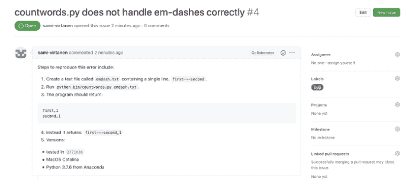

图 8.1：错误报告示例。

- 6. 分别描述每个问题，以便每个问题都能独立处理。这与第 7 节讨论的为每个错误修复或功能创建版本控制分支的规则类似。

图 8.1 展示了一个包含上述所有组件的、编写良好的错误报告示例。

撰写一份好的错误报告需要投入时间和精力。如果报告是由开发团队成员提交的，那么详细记录错误的动机在于，后续解决问题会更容易。你可以通过为项目包含一个议题模板，来鼓励项目外部的用户撰写详尽的错误报告。议题模板是包含在你的 GitHub 仓库中的一个文件，它会为每个新议题自动填充描述预期提交内容的文本。你无法强制新议题达到你期望的完整度，但你可以使用议题模板，让贡献者更容易记住并完成关于错误报告的文档。

有时，创建议题的人可能不知道或无法正确回答其中一些问题，并且只能在有限的错误信息下尽力而为。以善意和鼓励的态度回应对于维护一个健康的社区至关重要，并且应由项目的《行为准则》（第 8.3 节）来强制执行。

## 8.7 为议题添加标签

项目越大或越久，就越难找到所需内容——除非项目成员投入一些精力使内容易于查找（Lin, Ali, and Wilson in press）。议题跟踪器允许项目成员为议题添加**标签**，使搜索和组织更加容易。标签也常被称为**标签**；无论使用哪个术语，每个标签都只是一个或两个描述性词语。

GitHub 允许项目所有者定义任何他们想要的标签。小型项目应始终使用以下三种标签的某种变体：

- *Bug*：某些东西应该工作但没有工作。
- *Enhancement*：有人希望添加到软件中的功能。
- *Task*：需要完成某项工作，但不会在代码中体现（例如，组织下一次团队会议）。

项目也经常使用：

- *Question*：某物在哪里或应该如何工作？如上所述，带有此标签的议题通常可以回收用作文档。
- *Discussion* 或 *Proposal*：团队需要做出决定的事情，或解决此类讨论的具体提案。所有议题都可以进行讨论：此类别适用于一开始就以讨论形式出现的议题。（最初标记为 *Question* 的议题在经过一些来回讨论后，通常会被重新标记为 *Discussion* 或 *Proposal*。）
- *Suitable for Newcomer* 或 *Beginner-Friendly*：为刚加入项目的人标识一个简单的起点。如果我们帮助潜在的新贡献者找到开始的地方，他们更有可能这样做（Steinmacher et al. 2014）。

上面列出的标签标识了议题所描述的工作类型。另一组标签可用于指示议题的状态：

- *Urgent*：需要立即完成的工作。（此标签通常保留给安全修复）。
- *Current*：此议题包含在当前工作轮次中。
- *Next*：此议题（可能）将包含在下一轮工作中。

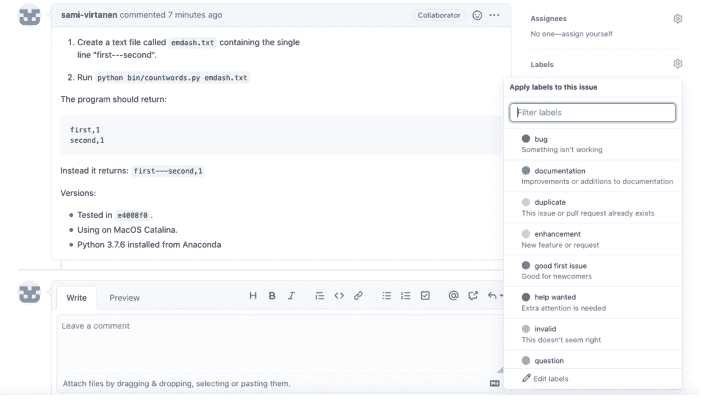

图 8.2：GitHub 议题的标签。

- *Eventually*：有人已查看该议题并认为需要处理，但目前没有立即处理的计划。
- *Won’t Fix*：有人已决定不处理该议题，要么因为它超出范围，要么因为它实际上不是错误。一旦议题被标记为此方式，通常随后会被关闭。当这种情况发生时，向议题创建者发送一条消息，解释为什么该议题不会被处理，并鼓励他们继续参与项目。
- *Duplicate*：此议题是系统中已有议题的重复项。标记为此方式的议题通常也会被关闭；这是鼓励人们保持参与的另一个机会。

GitHub 为仓库默认创建的一些标签如图 8.2 所示。这些标签可以针对每个仓库进行修改或自定义。

一些项目使用与即将发布的软件版本、期刊期号或会议相对应的标签，而不是 *Current*、*Next* 和 *Eventually*。这种方法在短期内效果很好，但随着诸如 sprint-2020-08-01 和 sprint-2020-08-16 这样名称的标签堆积起来，就会变得难以管理。

相反，项目团队通常会创建一个**里程碑**，它是在单个项目仓库中的一组议题和拉取请求。GitHub 里程碑可以有截止日期，并显示完成的总体进度，因此团队可以轻松了解工作何时到期以及还剩多少工作要做。团队还可以创建项目，这些项目可以包含来自多个仓库的议题和拉取请求，以及用于杂项任务的笔记和提醒。

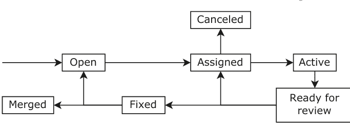

**图 8.3：** 议题生命周期示例。

### 8.7.1 标准化工作流程

为议题添加标签也有助于我们标准化项目的工作流程。关于谁可以对带有各种标签的议题执行什么操作，以及谁可以更改这些标签的约定，使我们能够定义如图 8.3 所示的工作流程。

- 当某人被指定负责一个 *Open* 议题时，它会变为 *Assigned*。
- 然后，如果他们认为该议题是错误提交的或不需要修复，可以将其移至 *Canceled*。（这与处理后关闭议题不同。）
- 当某人开始处理一个 *Assigned* 议题时，它会变为 *Active*。
- 工作完成后，它会变为 *Ready for Review*。
- 从那里，它要么因为需要更多工作而再次被 *Assigned*，要么被移至 *Fixed*，这意味着更改已准备好被纳入项目。
- 当更改实际合并时，议题的状态会相应更改。

小型项目不需要如此正式的流程，但当团队分散时，贡献者需要能够了解情况，而不必等待某人回复邮件（或猜测他们*应该*给谁发邮件）。

## 8.8 确定优先级

在错误报告、功能请求和一般清理工作之间，总有做不完的工作，因此每个项目都需要某种方式来确定关注重点。为议题添加标签有助于**分诊**，即决定什么是优先事项、什么不是的过程。对于需要在修复错误和创建新功能之间取得平衡的软件项目来说，这从来都不是一项容易的工作，而对于那些“完成”难以定义、团队成员分布广泛或不都隶属于同一机构的研究项目来说，这更具挑战性。

许多商业和开源团队已经采用了**敏捷开发**作为解决这些问题的方案。敏捷开发不是精心制定可能因情况变化而受阻的长期计划，而是使用一系列短期的开发**冲刺**，每个冲刺通常持续一到两周。每个冲刺都以一个持续一到两小时的规划会议开始，会议回顾上一个冲刺的成功与失败，并选择当前冲刺要解决的议题。如果团队成员认为某个议题可能需要超过一个冲刺才能完成，它应该被分解成更小的、*可以*完成的部分，以便团队能够更准确地跟踪进度。（一个大任务可能“完成 90%”持续数周；对于较小的任务，更容易看出取得了多少进展。）

为了决定下一个冲刺要处理哪些议题，团队可以构建一个**影响/工作量矩阵**（图 8.4）。影响衡量议题对实现团队目标的重要性，通常按低-中-高尺度衡量。（有些团队使用 1 到 10 的评分，但这只会导致争论某事是 4 分还是 5 分。）工作量衡量议题所需的工作量。由于这并不总是能准确估计，通常将事情分类为“一小时”、“一天”或“多天”。同样，任何可能需要超过多天时间的事情都应该被分解，以便规划和进度跟踪更加准确。

影响/工作量矩阵明确了即将到来的冲刺的优先事项：任何重要性高且所需工作量少的事情都应该被纳入，而重要性低且需要大量工作量的事情则不应纳入。然而，团队仍然必须做出艰难的决定：

- 应该完成一个大型的高优先级项目，还是应该处理几个较小的低优先级项目？
- 对于一直被推迟的中优先级项目该怎么办？

每个团队都必须在每个冲刺中回答这些问题，但这引出了一个关键问题：究竟谁有最终决定权？在一个大型项目中，**产品经理**决定项目的重要性，而**项目经理**负责估算工作量和跟踪进度。在典型的科研软件项目中，首席研究员要么自己做决定，要么将该责任（和权力）委托给首席开发人员。

无论最终由谁负责，让项目参与者参与规划和决策至关重要。这可能就像


**图 8.4：** 影响/努力矩阵。

可以简单到让参与者为议题添加**赞成票**和**反对票**以表达他们对重要性的看法，也可以复杂到要求他们为一个特别复杂的功能提出跨多个冲刺周期的分解方案。这样做能让人们感到自己的贡献受到重视，从而增强他们完成工作的投入度。这也能产生更好的计划，因为每个人都知道一些别人不知道的事情。

## 8.9 会议

拉取请求和 GitHub 议题是异步工作的好工具，但团队会议通常是做出决策、建立社区感的更有效方式。懂得如何开好会议与懂得如何使用版本控制同样重要；开会的规则很简单，但很少有人遵守：

**决定是否真的需要开会。** 如果唯一目的是分享信息，那就让每个人发一封简短的邮件代替。记住，人们阅读的速度比说话快：如果有人有事实需要团队其他成员了解，最礼貌的沟通方式是把它们打出来。

**写议程。** 如果没有人足够重视会议，以至于不愿准备一份要点式的讨论清单，那么会议本身可能就不需要开。注意，“议程就是我们 GitHub 仓库里所有未解决的议题”不算数。

**在议程中包含时间安排。** 时间安排有助于防止前面的议题占用后面议题的时间。与任何新团队合作时，最初的估计不可避免地会过于乐观，因此我们应在后续会议中向上修正这些估计。然而，我们不应该仅仅因为第一次会议超时就开第二次或第三次会议：相反，我们应该尝试找出超时的*原因*并解决根本问题。

**确定优先级。** 先处理影响大但耗时少的议题，后处理耗时多但影响小的议题。这样，即使前面的议题超时，会议仍然能取得一些成果。

**指定一人负责推进会议进程。** 应指定一人担任主持人，负责控制每个议题的时间，提醒那些进行私下交谈或查看邮件的人，并请那些说话太多的人切入正题。主持人*不*应该包揽所有发言：事实上，在一个运行良好的会议中，负责人说的话会比大多数其他参与者都少。这应该在成员中轮流担任。

**要求礼貌。** 任何人都不能粗鲁，不能漫无边际地闲谈，如果有人跑题，主持人的工作就是说：“我们稍后再讨论那个问题。”

**不要打断。** 参与者应举起一根手指、一只手、举起一张便利贴，或做出其他易于理解的手势来表示他们想发言。主持人应记录谁想发言，并按顺序给他们时间。

**不要分心。** 私下交谈会降低会议效率，因为没有人能同时真正关注两件事。同样，如果有人在会议期间查看邮件或给朋友发短信，这清楚地表明他们认为发言者或其工作不重要。这并不意味着完全禁止使用技术——人们可能需要辅助工具，或者可能在等一个依赖方的电话——但默认情况下，在面对面会议期间，手机应屏幕朝下放置，笔记本电脑应合上。

**做会议记录。** 应由主持人以外的人以要点形式记录分享的最重要信息，以及做出的每个决定或分配给某人的每项任务。这应该在成员中轮流担任。

**提前结束。** 如果会议安排在 10:00–11:00，目标应在 10:50 结束，以便人们在进行下一项活动前休息一下。

会议一结束，就通过电子邮件将会议记录发送给每个人，或在项目仓库中添加一个文本文件：

**没参加会议的人可以了解情况。** 我们都必须同时处理来自多个项目或课程的任务，这意味着有时我们无法参加会议。查看书面记录是比询问同事“那么，我错过了什么？”更准确、更高效的跟进方式。

**每个人都可以核实实际说了什么或承诺了什么。** 不止一次，我们中有人在查看会议记录时会想：“我说过那个吗？”或者，“我没承诺那时准备好！”无论有意无意，人们常常对事情的记忆不同；把它们写下来给了每个人纠正错误、误解或曲解的机会。

**人们可以在后续会议中被问责。** 如果我们不跟进，列出问题和行动项清单就没有意义。如果我们使用问题跟踪系统，我们应该在会议结束后立即为每个新问题或任务创建一个工单，并更新那些被推迟的工单。这在为下次会议制定议程时非常有帮助。

### 8.9.1 发言时间

同步会议的一个问题是有些人倾向于比其他人发言多得多。其他会议成员可能已经习惯了这一点，即使他们有有价值的观点要表达，也不会说出来。

解决这个问题的一种方法是在会议开始时给每个人**三张便利贴**。每次他们发言，就必须交出一张便利贴。当他们用完便利贴后，就不允许发言，直到每个人都至少用过一张，这时每个人都会拿回他们所有的便利贴。这确保了没有人说话的次数超过会议中最安静的人的三倍，并彻底改变了群体动态。那些已经放弃尝试被听到的人突然有了贡献的空间，而那些发言过于频繁的人也意识到了自己的不公平。

另一种有用的技术叫做**打断宾果**。画一个网格，用参与者的名字标记行和列。每次一个人打断另一个人，就在相应的单元格中添加一个计数标记；会议进行到一半时，花点时间看看结果。在大多数情况下，很明显是一两个人在进行所有的打断。之后，说一句“好吧，我在宾果卡上再加一个标记”通常就足以让他们收敛一些。

### 8.9.2 在线会议

在线会议带来了特殊的挑战，既涉及规范个人发言频率，也涉及会议的整体运行。Troy (2018) 讨论了为什么在线会议常常令人沮丧且效率低下，并指出在大多数在线会议中，暂停时第一个发言的人获得了发言权。结果，“如果你有话想说，你必须停止听当前发言的人说话，转而关注他们何时会暂停或结束，以便你能跳进那纳秒级的沉默，成为第一个说出话的人。这种形式……鼓励想参与的参与者多说少听。”

解决方案是在视频会议旁边运行一个文字聊天，人们可以在其中示意他们想发言。然后主持人可以从等待名单中选择人员。可以通过让每个人都静音，只允许主持人解除静音来强化这种做法。Brookfield 和 Preskill (2016) 提出了许多其他管理会议的有用建议。

## 8.10 做出决策

一个运行良好的会议的目的是做出决策，因此，一个项目的成员迟早必须决定谁对什么有发言权。第一步是承认每个团队都有一个权力结构：问题是它是正式的还是非正式的——换句话说，它是可问责的还是不可问责的（Freeman 1972）。后者适用于最多六个人、彼此都认识的小团体。超过这个规模，团队需要明确谁有权做出哪些决定以及如何达成共识。简而言之，他们需要明确的**治理**。

**玛莎规则**是在最多几十名成员的团体中实践这一点的实用方法（Minahan 1986）：

1.  在每次会议之前，任何希望提出提案的人都可以提交提案。提案必须在会议前至少 24 小时提交，以便在该次会议上审议，并且必须包括：• 一行摘要
• 提案全文
• 任何必要的背景信息
• 优缺点
• 可能的替代方案

2. 会议中，若半数或以上有投票权的成员出席，即构成法定人数。

3. 一旦某人发起了一项提案，他们就对其负责。除非发起人或其代表在场，否则小组不得讨论或投票表决该事项。发起人也有责任向小组陈述该事项。

4. 发起人陈述提案后，在进行任何讨论之前，需对提案进行**意向投票**：

• 谁喜欢该提案？
• 谁可以接受该提案？
• 谁对该提案感到不满？

5. 如果小组全体成员都喜欢或可以接受该提案，则无需进一步讨论即获通过。

6. 如果小组大多数成员对该提案感到不满，则将其退回发起人以作进一步完善。（如果明确多数人不会支持，发起人可以决定放弃该提案。）

7. 如果部分成员对该提案感到不满，则设定一个计时器，由会议主持人主持进行简短讨论。10分钟后或当无人再有补充时，主持人就以下问题进行明确的是非投票：“我们是否应在存在明确反对意见的情况下实施此决定？”如果多数票投“是”，则实施该提案。否则，将其退回发起人以作进一步完善。

每个使用玛莎规则的小组必须做出两项程序性决定：

**如何提出提案？** 在软件开发项目中，最简单的方法是在项目的GitHub仓库中提交一个标记为*Proposal*的议题，或创建一个包含提案文本的单一文件的拉取请求。然后团队成员可以对该提案发表评论，发起人可以在将其付诸表决前进行修订。

**谁有投票权？** 通常的答案是“参与项目工作的人”，但随着项目吸引更多志愿者贡献者，需要更明确的规则。一种常见的方法是由现有成员提名新成员，然后使用上述流程进行投票表决（通过或不通过）。

## 8.11 让这一切对新人显而易见

人们不知道的规则无法帮助他们。一旦你的团队就项目结构、工作流程、如何将事项列入会议议程或如何做出决策达成一致，你就应该花时间为新人记录这些信息。这些信息可以作为现有README文件中的章节，也可以放入独立文件中：

- CONTRIBUTING 解释如何贡献，即使用什么命名约定来命名函数，在议题上打什么标签（第8.5节），或如何安装和配置开始项目工作所需的软件。这些说明也可以作为README中的一个章节；无论放在哪里，请记住，人们设置和贡献起来越容易，他们就越有可能这样做（Steinmacher等人，2014年）。
- GOVERNANCE 解释项目如何运作（第8.10节）。将其放在独立文件中仍然不常见——更常见的是包含在README或CONTRIBUTING中——但开放社区已经痛苦地认识到，不明确说明谁在决策中有发言权以及贡献者如何了解已做出的决定，迟早会带来麻烦。

拥有这些文件有助于新贡献者定位自己，也表明项目运作良好。

## 8.12 处理冲突

你刚刚错过了一个重要的截止日期，人们很不满。你胃里的那种难受感觉变成了愤怒：你完成了*你的*部分，但西尔维直到最后一刻才完成她的工作，这意味着没有其他人有时间发现她犯的两个大错误。至于赵，他根本没有交付——又一次。如果情况不改变，贡献者们将开始寻找新的项目。

这样的冲突经常发生。广义上讲，我们有四种处理方式：

1. 祈祷并希望事情会自行好转，尽管过去三次都没有。
2. 做额外的工作来弥补他人的不足。这在短期内省去了我们与他人对峙的精神痛苦，但那些“额外”工作的时间必须从某处来。迟早，我们的个人生活或项目的其他部分会受到影响。
3. 发脾气。人们常常将愤怒转移到生活的其他方面：他们可能因为别人多花了三十秒修改而对某人大喊大叫，而他们真正需要做的是告诉老板，他们不会再为了弥补管理层项目人手不足的决定而牺牲又一个假期周末。
4. 采取建设性措施来解决根本问题。

我们大多数人发现前三个选项最容易，尽管它们实际上并没有解决问题。第四个选项更难，因为我们不喜欢对抗。然而，如果我们处理得当，它造成的伤害会小得多，这意味着我们不必那么害怕发起对抗。此外，如果人们相信当他们欺负、撒谎、拖延或敷衍了事时我们会采取行动，他们通常会避免让这种情况发生。

**确保我们自己没有犯同样的错误。** 如果我们自己也经常在会议上打断别人，那么抱怨别人打断会议是行不通的。

**检查期望。** 我们确定违规者知道他们应该达到什么标准吗？这就是职位描述或事先讨论谁负责什么派上用场的地方。

**检查情况。** 是否有人在照顾生病的父母或面临移民困境？他们是否被安排在我们不知道的另外三个项目上工作？在检查时使用开放式问题，例如“你能帮我理解一下吗？”这给了他们解释你可能意想不到的事情的自由，也避免了直接询问他们不想解释的事情所带来的压力。

**记录违规行为。** 写下违规者实际做了什么以及为什么这不够好。这样做有助于我们澄清我们为何不满，并且如果我们必须升级问题，这绝对是必要的。

**与其他团队成员核实。** 是否只有我们觉得违规者让团队失望？如果是这样，我们不一定错了，但如果有团队其他成员的支持，解决问题会容易得多。找出团队中还有谁不满可能是整个过程中最难的部分，因为我们甚至无法在不透露自己不满的情况下提出这个问题，而且消息几乎肯定会传回我们询问的对象那里，对方可能会指责我们挑起事端。

**与违规者交谈。** 这应该是团队的努力：将其列入团队会议的议程，提出投诉，并确保违规者理解。这样做一次通常就足够了：如果有人意识到他们会被指出搭便车或不礼貌的行为，他们通常会改变自己的方式。

**一旦出现第二次违规，立即升级。** 那些不怀好意的人指望我们一次又一次地给他们最后的机会，直到项目结束，他们可以去榨干下一个受害者的精力。*不要落入这个陷阱。* 如果有人偷了一台笔记本电脑，我们会立即报告。如果有人偷时间，如果我们一次又一次地给他们机会，那就是愚蠢。

在学术研究项目中，“升级”意味着“将问题提交给项目的主要研究者”。当然，这位主要研究者多年来可能已经听过几十个学生向她抱怨队友没有尽到自己的责任，而且双方都向主管声称自己做了所有工作的情况并不少见。（这是使用版本控制的又一个原因：它使得检查谁实际写了什么变得容易。）为了让她认真对待我们并帮助我们解决问题，我们应该给她发一封由多人签署的电子邮件，描述问题以及我们为解决它已经采取的步骤。确保违规者也收到一份副本，并要求主管安排一次会议来解决问题。

> **搭便车者**

**搭便车者**出现但从不真正做任何事情，尤其难以管理，部分原因是他们通常非常善于表现得通情达理。当我们陈述情况时，他们会点头，然后说，“嗯，是的，但是……”并列举一堆小的例外情况或团队中其他人也未达到期望的情况。拥有协作指南（第8.3节）和跟踪进度（第8.7.1节）对于处理他们至关重要。如果我们无法支持我们的投诉，我们的主管很可能会留下整个团队功能失调的印象。

如果冲突变得更加个人化和激烈，特别是如果它涉及违反我们的行为准则，我们该怎么办？一些简单的准则会大有帮助：

1. 简短、简单、坚定。
2. 不要试图幽默。这几乎总是适得其反，或者以后会被用来对付我们。
3. 为观众而表演。我们可能无法改变我们指出的人，但我们可能会改变观察者的想法或加强他们的决心。

## 8.13 总结

本章是本书中最难写的部分，但可能也是最重要的。一个项目可以承受糟糕的代码或Git操作上的失误，但无法承受混乱和人际冲突。协作与管理能力会随着实践而提升，你在参与研究型软件项目中学到的一切，都将有助于你处理其他事务。

## 8.14 练习

### 8.14.1 查找信息

查看本书的GitHub仓库[^13]。关于许可和贡献的信息位于何处？

### 8.14.2 为你的项目添加行为准则

在你的Zipf定律项目仓库中添加一个`CONDUCT.md`文件。使用贡献者公约[^14]的行为准则模板，并修改需要更新的部分（例如，联系人信息）。请务必在提交文件前编辑好两处的联系信息。

### 8.14.3 为你的项目添加许可证

在你的Zipf定律项目仓库中添加MIT或GPL许可证的`LICENSE.md`文件。修改内容以包含你的全名和年份。

### 8.14.4 添加贡献指南

1. 在Zipf定律项目的`README.md`文件中添加一个章节，告知人们在哪里可以了解更多关于贡献的信息。
2. 在Zipf定律项目中添加一个`CONTRIBUTING.md`文件，描述其他人如何为项目做出贡献。

请务必将此文件添加到Git仓库的根目录，这样当有人在GitHub上发起拉取请求或创建议题时，系统会向他们展示指向`CONTRIBUTING`文件的链接（详情请参阅GitHub贡献者指南[^15]）。

### 8.14.5 提交议题

在你的Zipf定律项目仓库中创建一个功能请求议题，要求为`countwords.py`编写单元测试（我们将在第11章进行此项工作）。

### 8.14.6 标记议题

1. 创建*当前*和*讨论*标签，以帮助组织和确定议题的优先级。
2. 删除至少一个GitHub自动为你创建的标签。
3. 为仓库中的每个议题至少应用一个标签。

### 8.14.7 平衡个人与团队需求

你团队的一名新成员患有经医学诊断的注意力障碍。为了帮助自己集中注意力，他们在编码时需要自言自语。团队的其他几名成员私下向你反映，他们觉得这很分散注意力。你会采取哪些步骤来处理？

### 8.14.8 认可无形的贡献

你的团队有一项规定：如果某人的名字出现在项目的Git历史记录中，他们就会被列为该项目论文的合著者。你团队的一名新成员抱怨这不公平：那些超过两年没有贡献的人仍然被列为作者，而他们因为花费大量时间进行代码审查却未被包含在内，因为这些工作不会出现在Git历史记录中。你将如何解决这个问题？

### 8.14.9 你是谁？

以下哪种（如果有的话）人物描述最符合你？如果他们是你团队的一员，你会如何帮助他们？

- *安娜*认为她对每个主题的了解都比团队其他所有人加起来还多。无论你说什么，她都会纠正你；无论你知道什么，她都更懂。如果你在团队会议中记录人们互相打断的次数，她的得分通常比其他所有人加起来还高。
- *包*是个唱反调的人：无论别人说什么，他都会站在对立面。少量如此是健康的，但当包这样做时，第一个反对意见背后总是还藏着另外半打。
- *弗兰克*相信知识就是力量。他喜欢知道别人不知道的事情——或者更准确地说，他喜欢别人知道他知道他们不知道的事情。弗兰克确实能把事情搞定，但当被问及他是如何做到的时，他会咧嘴一笑说：“哦，我相信你自己能弄明白。”
- *赫迪耶*很安静。非常安静。她从不在会议上发言，即使她知道别人说的是错的。她可能会在邮件列表上发表意见，但她对批评非常敏感，总是会退缩而不是捍卫自己的观点。
- *肯尼*是个搭便车的人。他发现大多数人宁愿多承担一些工作也不愿打小报告，于是他处处利用这一点。令人沮丧的是，当终于有人当面对质时，他总是显得那么*有道理*。“各方都有错，”他说，或者，“嗯，我觉得你在吹毛求疵。”
- *梅丽莎*如果当初费心去参加选拔，很容易就能入选校队级别的拖延症团队。她是好意——她确实因为让人失望而感到难过——但不知何故，她的任务总是拖到最后一刻才完成。当然，这意味着所有依赖她工作的人都得等到*最后一刻之后*才能开始他们的工作。
- *佩特拉*最喜欢的口头禅是“我们为什么不”。我们为什么不写一个图形用户界面来帮助人们编辑程序的配置文件？嘿，我们为什么不发明自己的小语言来设计图形用户界面呢？
- *拉杰*很粗鲁。“我就是这么说话的，”他说。“如果你受不了，也许你应该另找一个团队。”他最喜欢的口头禅是“那太蠢了”，而且他每隔一句就会用脏话。

## 8.15 关键要点

- 主动欢迎并培养社区成员。
- 为你的项目创建明确的行为准则，以贡献者公约<sup>16</sup>为模板。
- 在你的项目中包含许可证，以便明确谁可以对材料做什么。
- 为错误、功能请求和讨论创建**议题**。
- **标记**议题以识别其目的。
- 定期**分类**议题，并将它们分组到**里程碑**中以跟踪进度。
- 在你的项目中包含贡献指南，明确其工作流程和对参与者的期望。
- 使**治理**规则明确化。
- 使用常识性规则使项目会议公平且富有成效。
- 管理参与者之间的冲突，而不是寄希望于它自行解决。

<sup>16</sup> https://www.contributor-covenant.org

# 9
## 使用Make自动化分析

> 时间与空间图书馆员的三条规则是：1) 保持安静；2) 书籍必须在显示的最后日期之前归还；3) 不要干涉因果关系的本质。
> 
> —— 特里·普拉切特

运行一个程序来处理单个数据文件很容易，但当我们的分析依赖于多个文件，或者每次有新数据到来时都需要重新进行分析，该怎么办？如果分析有几个步骤，且必须按特定顺序执行，我们又该怎么做？

如果我们试图自己跟踪这些步骤，我们不可避免地会忘记一些关键步骤，其他人也很难接手我们的工作。相反，我们应该使用**构建管理器**来跟踪依赖关系，并自动运行我们的分析程序。这些工具最初是为帮助程序员编译复杂软件而发明的，但可以用于自动化任何工作流程。

我们的Zipf定律项目目前包含以下文件：

```
zipf/
├── .gitignore
├── CONDUCT.md
├── CONTRIBUTING.md
├── LICENSE.md
├── README.md
├── bin
│   ├── book_summary.sh
│   ├── collate.py
│   ├── countwords.py
│   ├── plotcounts.py
│   ├── script_template.py
│   └── utilities.py
└── data
    ├── README.md
    └── dracula.txt
```

## 9.1 更新单个文件

为了开始自动化我们的分析，让我们在项目根目录下创建一个名为 `Makefile` 的文件，并添加以下内容：

```
# 为《白鲸记》重新生成结果
results/moby_dick.csv : data/moby_dick.txt
	python bin/countwords.py \
		data/moby_dick.txt > results/moby_dick.csv
```

与 shell 和许多其他编程语言一样，`#` 表示第一行是注释。第二行和第三行构成一个**构建规则**：该规则的**目标**是 `results/moby_dick.csv`，其唯一的**前置条件**是文件 `data/moby_dick.txt`，两者由单个冒号 `:` 分隔。Makefile 中的语句行长度没有限制，但为了提高可读性，我们在本例中使用了反斜杠（`\`）字符来分割冗长的第三行。

目标和前置条件告诉 Make 什么依赖于什么。它们下方的行描述了当目标过时时将更新它的**配方**。配方由一个或多个 shell 命令组成，每个命令*必须*以单个制表符字符为前缀。此处不能用空格代替制表符，这可能会令人困惑，因为在大多数其他编程语言中它们是可以互换的。在上面的规则中，配方是“在原始数据文件上运行 `bin/countwords.py`，并将输出放入 `results` 目录中的 CSV 文件。”

要测试我们的规则，请在 shell 中运行此命令：

```
$ make
```

Make 会自动查找名为 `Makefile` 的文件，遵循其中包含的规则，并打印出已执行的命令。在这种情况下，它会显示：

```
python bin/countwords.py \
	data/moby_dick.txt > results/moby_dick.csv
```

## 缩进错误

如果 Makefile 使用空格而非制表符来缩进规则，Make 会产生如下错误消息：

```
Makefile:3: *** missing separator.  Stop.
```

当 Make 遵循我们 Makefile 中的规则时，会发生以下三种情况之一：

1. 如果 `results/moby_dick.csv` 不存在，Make 运行配方来创建它。
2. 如果 `data/moby_dick.txt` 比 `results/moby_dick.csv` 更新，Make 运行配方来更新结果。
3. 如果 `results/moby_dick.csv` 比其前置条件更新，Make 什么都不做。

在前两种情况下，Make 会打印它运行的命令，以及这些命令通过**标准输出**或**标准错误**打印到屏幕上的任何内容。在这种情况下没有屏幕输出，因此我们只看到命令。

无论我们第一次运行 make 时发生了什么，如果我们立即再次运行它，它什么也不做，因为我们规则的目标现在是最新的。它通过显示以下消息告诉我们这一点：

```
make: `results/moby_dick.csv' is up to date.
```

我们可以通过按更新时间顺序列出文件及其时间戳来检查它是否在说实话：

```
$ ls -l -t data/moby_dick.txt results/moby_dick.csv
```

```
-rw-r--r-- 1 amira staff  274967 Nov 29 12:58
    results/moby_dick.csv
-rw-r--r-- 1 amira staff 1253891 Nov 27 20:56
    data/moby_dick.txt
```

作为进一步的测试：

1. 删除 `results/moby_dick.csv` 并再次运行 `make`。这是情况 #1，因此 Make 运行配方。
2. 使用 `touch data/moby_dick.txt` 更新数据文件的时间戳，然后运行 `make`。这是情况 #2，因此 Make 再次运行配方。

> **管理 Makefile**
> 我们不必将文件命名为 `Makefile`：如果我们更喜欢像 `workflows.mk` 这样的名称，我们可以告诉 Make 使用 `make -f workflows.mk` 从该文件读取配方。

## 9.2 管理多个文件

我们的 Makefile 精确地记录了如何重现一个特定结果。让我们添加另一个规则来重现另一个结果：

```
# 为《白鲸记》重新生成结果
results/moby_dick.csv : data/moby_dick.txt
	python bin/countwords.py \
		data/moby_dick.txt > results/moby_dick.csv

# 为《简·爱》重新生成结果
results/jane_eyre.csv : data/jane_eyre.txt
	python bin/countwords.py \
		data/jane_eyre.txt > results/jane_eyre.csv
```

当我们运行 `make` 时，它告诉我们：

```
make: `results/moby_dick.csv' is up to date.
```

默认情况下，Make 只尝试更新它在 Makefile 中找到的第一个目标，这被称为**默认目标**。在这种情况下，第一个目标是 `results/moby_dick.csv`，它已经是最新的。要更新其他内容，我们需要明确告诉 Make 我们想要什么：

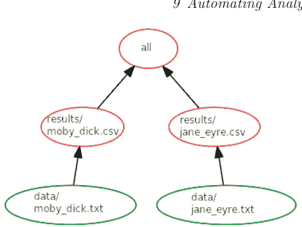

**图 9.1：** 构建所有内容时的依赖关系图。

```
$ make results/jane_eyre.csv
```

```
python bin/countwords.py \
    data/jane_eyre.txt > results/jane_eyre.csv
```

如果我们必须为每个结果运行一次 `make`，我们就又回到了起点。但是，我们可以向 Makefile 添加一个规则来一次更新所有结果。我们通过创建一个**伪目标**来实现这一点，该目标不对应于实际文件。让我们将此行添加到 Makefile 的顶部：

```
# 重新生成所有结果。
all : results/moby_dick.csv results/jane_eyre.csv
```

没有名为 `all` 的文件，此规则本身也没有任何配方，但当我们运行 `make all` 时，Make 会找到 `all` 依赖的所有内容，然后将每个前置条件更新到最新状态（图 9.1）。

规则在 Makefile 中出现的顺序并不一定决定配方运行的顺序。只要没有任何内容在其前置条件更新之前被更新，Make 可以自由地以任何顺序运行命令。

我们可以使用伪目标来自动化和记录工作流中的其他步骤。例如，让我们向 Makefile 添加另一个目标，以删除我们生成的所有结果文件，以便我们可以重新开始。按照惯例，此目标称为 `clean`，我们将把它放在两个现有目标的下方：

```
# 删除所有生成的文件。
clean :
	rm -f results/*.csv
```

`rm` 的 `-f` 标志表示“强制删除”：如果存在该标志，`rm` 不会抱怨我们告诉它删除的文件已经不存在。如果我们现在运行：

```
$ make clean
```

Make 将删除我们拥有的任何结果文件。这比每次在命令行输入 `rm -f results/*.csv` 安全得多，因为如果我们错误地在 `*` 前面放了一个空格，我们将删除项目根目录中的所有 CSV 文件。

伪目标非常有用，但有一个陷阱。尝试这样做：

```
$ mkdir clean
$ make clean
```

```
make: `clean' is up to date.
```

由于存在一个名为 `clean` 的目录，Make 认为 Makefile 中的目标 `clean` 指的是此目录。由于该规则没有前置条件，它不可能过时，因此不会执行任何配方。

我们可以通过在 Makefile 顶部添加此行来明确说明哪些目标是伪目标，从而消除 Make 的困惑：

```
.PHONY : all clean
```

## 9.3 当程序更改时更新文件

我们当前的 Makefile 表明每个结果文件都依赖于相应的数据文件。这并不完全正确：每个结果也依赖于用于生成它的程序。如果我们更改了程序，我们应该重新生成结果。为了让 Make 执行此操作，我们可以更改前置条件以包含程序：

## 9.4 减少 Makefile 中的重复

我们的 Makefile 现在提到了 `bin/countwords.py` 四次。如果我们更改了程序的名称或将其移动到其他位置，就必须找到并替换所有这些出现的地方。更重要的是，这种冗余使得我们的 Makefile 更难理解，就像在程序中散布**魔法数字**会使它们更难理解一样。

解决方案与我们在程序中使用的相同：定义和使用变量。让我们通过为单词计数脚本及其运行命令创建目标来修改结果重新生成代码。整个文件现在应该如下所示：

```
.PHONY : all clean

COUNT=bin/countwords.py
RUN_COUNT=python $(COUNT)

# Regenerate all results.
all : results/moby_dick.csv results/jane_eyre.csv

# Regenerate results for "Moby Dick"
results/moby_dick.csv : data/moby_dick.txt $(COUNT)
	$(RUN_COUNT) data/moby_dick.txt > results/moby_dick.csv

# Regenerate results for "Jane Eyre"
results/jane_eyre.csv : data/jane_eyre.txt $(COUNT)
	$(RUN_COUNT) data/jane_eyre.txt > results/jane_eyre.csv

# Remove all generated files.
clean :
	rm -f results/*.csv
```

每个定义都采用 `NAME=value` 的形式。按照惯例，变量用大写字母书写，以便与文件名（通常是小写）区分开来，但 Make 并不要求这样做。*必须*使用括号来引用变量，即使用 `$(NAME)` 而不是 `$NAME`。

> **为什么用括号？**

由于历史原因，Make 将 `$NAME` 解释为一个名为 N 的变量，后跟三个字符 "AME"。如果不存在名为 N 的变量，`$NAME` 就会变成 AME，这几乎肯定不是我们想要的。

与程序中一样，变量不仅减少了输入量。它们还告诉读者，多个事物始终且完全相同，这减少了**认知负荷**。

## 9.5 自动变量

我们可以添加第三条规则来分析第三部小说，添加第四条规则来分析第四部小说，但这无法扩展到数百或数千部小说。相反，我们可以编写一个通用规则，为我们的每个数据文件执行我们想要的操作。

为此，我们需要理解 Make 的**自动变量**。第一步是在规则的配方中使用非常晦涩的表达式 `$@`，它表示“规则的目标”。它让我们将这个：

```
# Regenerate results for "Moby Dick"
results/moby_dick.csv : data/moby_dick.txt $(COUNT)
	$(RUN_COUNT) data/moby_dick.txt > results/moby_dick.csv
```

变成这个：

```
# Regenerate results for "Moby Dick"
results/moby_dick.csv : data/moby_dick.txt $(COUNT)
	$(RUN_COUNT) data/moby_dick.txt > $@
```

Make 为每个规则单独定义 `$@` 的值，因此它始终引用该规则的目标。是的，`$@` 是一个不幸的名字：像 `$TARGET` 这样的名字会更容易理解，但我们现在只能接受它了。

下一步是用自动变量 `$^` 替换配方中显式的先决条件列表，它表示“规则中的所有先决条件”：

```
# Regenerate results for "Moby Dick"
results/moby_dick.csv : data/moby_dick.txt $(COUNT)
	$(RUN_COUNT) $^ > $@
```

然而，这行不通。规则的先决条件是小说和单词计数程序。当 Make 展开配方时，生成的命令会尝试将程序 `bin/countwords.py` 当作数据文件来处理：

```
python bin/countwords.py data/moby_dick.txt bin/countwords.py > results/moby_dick.csv
```

Make 用另一个自动变量 $< 解决了这个问题，它表示“仅第一个先决条件”。使用它让我们可以将规则重写为：

```
# Regenerate results for "Moby Dick"
results/moby_dick.csv : data/moby_dick.txt $(COUNT)
	$(RUN_COUNT) $< > $@
```

如果你使用这种方法，*Jane Eyre* 的规则也应该更新。然而，下一节将包含泛化规则的说明。

## 9.6 通用规则

$< > $@ 比单独的 $@ 更难阅读，但我们现在可以用一个使用**通配符** % 的**模式规则**替换所有生成结果文件的规则，% 匹配文件名中的零个或多个字符。在目标中匹配 % 的内容也会在先决条件中匹配，因此规则：

```
results/%.csv : data/%.txt $(COUNT)
	$(RUN_COUNT) $< > $@
```

将处理 *Jane Eyre*、*Moby Dick*、*The Time Machine* 以及 *data/* 目录中的所有其他小说。% 不能在配方中使用，这就是为什么需要 $< 和 $@。

有了这个规则，我们的整个 Makefile 就缩减为：

```
.PHONY: all clean

COUNT=bin/countwords.py
RUN_COUNT=python $(COUNT)

# Regenerate all results.
all : results/moby_dick.csv results/jane_eyre.csv \
      results/time_machine.csv

# Regenerate result for any book.
results/%.csv : data/%.txt $(COUNT)
	$(RUN_COUNT) $< > $@

# Remove all generated files.
clean :
	rm -f results/*.csv
```

我们现在有了更少的文本行，但也包含了第三本书。为了测试我们缩短后的 Makefile，让我们删除所有结果文件：

```
$ make clean
```

```
rm -f results/*.csv
```

然后重新创建它们：

```
$ make  # Same as `make all` as "all" is the first target
```

```
python bin/countwords.py data/moby_dick.txt > \
    results/moby_dick.csv
python bin/countwords.py data/jane_eyre.txt > \
    results/jane_eyre.csv
python bin/countwords.py data/time_machine.txt > \
    results/time_machine.csv
```

如果我们愿意，我们仍然可以重建单个文件，因为 Make 会获取我们在命令行上给出的目标文件名，并查看是否有模式规则与之匹配：

```
$ touch data/jane_eyre.txt
$ make results/jane_eyre.csv
```

```
python bin/countwords.py data/jane_eyre.txt > \
    results/jane_eyre.csv
```

## 9.7 定义文件集

我们的分析仍然没有完全自动化：如果我们向 `data` 添加另一本书，我们必须记住也要将其名称添加到 Makefile 中的 `all` 目标。我们将再次分步解决这个问题。

首先，想象所有结果文件已经存在，我们只想更新它们。我们可以定义一个名为 `RESULTS` 的变量，使用与 shell 中相同的通配符作为所有结果文件的列表：

```
RESULTS=results/*.csv
```

然后我们可以重写 `all` 以依赖于该列表：

```
# Regenerate all results.
all : $(RESULTS)
```

然而，这仅在结果文件已存在时才有效。如果某个文件不存在，其名称将不会包含在 `RESULTS` 中，Make 也不会意识到我们想要生成它。

我们真正想要的是根据 `data/` 目录中的书籍列表生成结果文件列表。我们可以使用 Make 的 `wildcard` 函数创建该列表：

```
DATA=$(wildcard data/*.txt)
```

这使用参数 `data/*.txt` 调用函数 `wildcard`。结果是 `data` 目录中所有文本文件的列表，就像我们在 shell 中使用 `data/*.txt` 一样。语法很奇怪，因为函数是在 Make 首次编写后很久才添加的，但至少它们有可读的名称。

为了检查这行代码是否正确，我们可以添加另一个名为 `settings` 的伪目标，该目标使用 shell 命令 `echo` 打印变量的名称和值：

## 9.7 定义文件集

我们现在有了输入文件的名称。为了创建对应的输出文件列表，我们使用 Make 的 `patsubst` 函数（**模式替换**的缩写）：

```
RESULTS=$(patsubst data/%.txt,results/%.csv,$(DATA))
```

`patsubst` 的第一个参数是要查找的模式，在本例中是 `data` 目录下的文本文件。我们使用 `%` 来匹配文件名的**词干**，即我们想要保留的部分。

第二个参数是我们想要的替换内容。与模式规则一样，Make 会将此参数中的 `%` 替换为模式中与 `%` 匹配的任何内容，从而创建我们想要的结果文件名。最后，第三个参数是要在其中进行替换的内容，即我们的书籍名称列表。

让我们通过向 `settings` 目标添加另一个命令来检查 `RESULTS` 变量：

```
settings :
	@echo COUNT: $(COUNT)
	@echo DATA: $(DATA)
	@echo RESULTS: $(RESULTS)
```

```
$ make settings
```

```
COUNT: bin/countwords.py
DATA: data/dracula.txt data/frankenstein.txt data/jane_eyre.txt
    data/moby_dick.txt data/sense_and_sensibility.txt
    data/sherlock_holmes.txt data/time_machine.txt
RESULTS: results/dracula.csv results/frankenstein.csv
    results/jane_eyre.csv results/moby_dick.csv
    results/sense_and_sensibility.csv
    results/sherlock_holmes.csv results/time_machine.csv
```

很好：`DATA` 包含了我们想要处理的文件名，而 `RESULTS` 自动包含了对应的结果文件名。

为什么在评估变量值时没有包含 `RUN_COUNT`？这是我们可以通过从变量列表中移除 `RUN_COUNT` 并更改我们的重新生成规则来简化脚本的另一个地方：

```
# 为任何书籍重新生成结果。
results/%.csv : data/%.txt $(COUNT)
	python $(COUNT) $< > $@
```

由于伪目标 `all` 依赖于 `$(RESULTS)`（即变量 `RESULTS` 中出现的所有文件名），我们可以一步重新生成所有结果：

```
$ make clean
```

```
rm -f results/*.csv
```

```
$ make  # 与 `make all` 相同，因为 "all" 是第一个目标
```

```
python bin/countwords.py data/dracula.txt > results/dracula.csv
python bin/countwords.py data/frankenstein.txt > results/frankenstein.csv
python bin/countwords.py data/jane_eyre.txt > results/jane_eyre.csv
python bin/countwords.py data/moby_dick.txt > results/moby_dick.csv
python bin/countwords.py data/sense_and_sensibility.txt > results/sense_and_sensibility.csv
python bin/countwords.py data/sherlock_holmes.txt > results/sherlock_holmes.csv
python bin/countwords.py data/time_machine.txt > results/time_machine.csv
```

现在我们的工作流程只有两步：添加数据文件并运行 Make。与手动运行相比，这是一个巨大的改进，特别是当我们开始添加更多步骤（如合并数据文件和生成图表）时。

## 9.8 记录 Makefile

每个行为良好的程序都应该告诉人们如何使用它（Taschuk 和 Wilson 2017）。如果我们运行 `make --help`，我们会得到一个（非常）长的 Make 理解的选项列表，但没有关于我们特定工作流程的信息。我们可以创建另一个名为 `help` 的伪目标来打印可用命令列表：

```
.PHONY: all clean help settings

# ...其他定义...

# 显示帮助。
help :
	@echo "all : 重新生成所有结果。"
	@echo "results/*.csv : 为任何书籍重新生成结果。"
	@echo "clean : 删除所有生成的文件。"
	@echo "settings : 显示变量的值。"
	@echo "help : 显示此消息。"
```

但迟早我们会添加一个目标或规则，然后忘记更新此列表。更好的方法是以特殊方式格式化一些注释，然后在需要时提取并显示这些注释。我们将使用 `##`（双注释标记）来表示我们想要显示的行，并使用 `grep`（第 4.5 节）从文件中提取这些行：

```
.PHONY: all clean help settings

COUNT=bin/countwords.py
DATA=$(wildcard data/*.txt)
RESULTS=$(patsubst data/%.txt,results/%.csv,$(DATA))

## all : 重新生成所有结果。
all : $(RESULTS)

## results/%.csv : 为任何书籍重新生成结果。
results/%.csv : data/%.txt $(COUNT)
	python $(COUNT) $< > $@

## clean : 删除所有生成的文件。
clean :
	rm -f results/*.csv

## settings : 显示变量的值。
settings :
	@echo COUNT: $(COUNT)
	@echo DATA: $(DATA)
	@echo RESULTS: $(RESULTS)

## help : 显示此消息。
help :
	@grep '^##' ./Makefile
```

让我们测试一下：

```
$ make help
```

```
## all : 重新生成所有结果。
## results/%.csv : 为任何书籍重新生成结果。
## clean : 删除所有生成的文件。
## settings : 显示变量的值。
## help : 显示此消息。
```

练习将探讨如何使其更具可读性。

## 9.9 自动化整个分析

为了结束我们对 Make 的讨论，让我们自动生成一个整理好的词频列表。目标是一个名为 `results/collated.csv` 的文件，它依赖于 `countwords.py` 生成的结果。要创建它，我们在 Makefile 中添加或更改这些行：

```
# ...伪目标和先前的变量定义...

COLLATE=bin/collate.py

## all : 重新生成所有结果。
all : results/collated.csv

## results/collated.csv : 整理所有结果。
results/collated.csv : $(RESULTS) $(COLLATE)
	mkdir -p results
	python $(COLLATE) $(RESULTS) > $@
```

```
# ...其他规则...

## settings : 显示变量的值。
settings :
	@echo COUNT: $(COUNT)
	@echo DATA: $(DATA)
	@echo RESULTS: $(RESULTS)
	@echo COLLATE: $(COLLATE)

# ...帮助规则...
```

前两行告诉 Make 关于整理程序的信息，而对 `all` 的更改告诉它我们管道的最终目标是什么。由于此目标依赖于单本小说的结果文件，`make all` 将自动重新生成所有这些文件。

重新生成 `results/collated.csv` 的规则现在应该看起来很熟悉了：它告诉 Make 所有单个结果都必须是最新的，并且如果用于创建它的程序发生了更改，则应重新生成最终结果。此规则中的配方与我们之前见过的配方之间的一个区别是，此配方直接使用 `$(RESULTS)` 而不是自动变量。我们这样编写规则是因为没有一个自动变量表示“除最后一个先决条件之外的所有内容”，因此无法使用自动变量而不导致我们尝试处理我们的程序。

同样，我们也可以将 `plotcounts.py` 脚本添加到此工作流程中，并相应地更新 `all` 和 `settings` 规则。请注意，在 `$@` 之前不需要 `>`，因为 `plotcounts.py` 的默认操作是写入文件而不是标准输出。

```
# ...伪目标和先前的变量定义...

PLOT=bin/plotcounts.py

## all : 重新生成所有结果。
all : results/collated.png

## results/collated.png: 绘制整理后的结果。
results/collated.png : results/collated.csv
	python $(PLOT) $< --outfile $@

# ...其他规则...
```

## settings : 显示变量的值。
settings :
    @echo COUNT: $(COUNT)
    @echo DATA: $(DATA)
    @echo RESULTS: $(RESULTS)
    @echo COLLATE: $(COLLATE)
    @echo PLOT: $(PLOT)

# ...帮助信息...

现在运行 `make all` 应该会生成新的 `collated.png` 图表（图 9.2）：

```
$ make all
```

```
python bin/collate.py results/time_machine.csv
    results/moby_dick.csv results/jane_eyre.csv
    results/dracula.csv results/sense_and_sensibility.csv
    results/sherlock_holmes.csv results/frankenstein.csv >
    results/collated.csv
python bin/plotcounts.py results/collated.csv --outfile
    results/collated.png
alpha: 1.1712445413685917
```

最后，我们可以更新 `clean` 目标，使其只删除由 Makefile 创建的文件。这样做是一个好习惯，而不是使用星号通配符删除所有文件，因为你可能会在 results 目录中手动放置文件，并且忘记这些文件会在运行 `make clean` 时被清理掉。

```
# ...伪目标和之前的变量定义...

## clean : 删除所有生成的文件。
clean :
	rm $(RESULTS) results/collated.csv results/collated.png
```

## 9.10 总结

Make 依赖于 shell 命令，而不是直接调用 Python 中的函数，这有时使其使用起来有些笨拙。然而，这也使其非常灵活：单个 Makefile 可以运行 shell 命令和用各种语言编写的程序，这使其成为将各种现有工具组装成流水线的好方法。

自 Make 首次创建以来的 45 年里，程序员们已经创建了许多替代品——事实上，如此之多，以至于没有一个能吸引足够的用户来取代它。如果你想探索它们，请查看 Snakemake<sup>3</sup>（适用于 Python）。如果你想深入了解，Smith (2011) 描述了几个构建管理器的设计和实现。

## 9.11 练习

我们的 `Makefile` 目前如下所示：

```
.PHONY: all clean help settings

COUNT=bin/countwords.py
COLLATE=bin/collate.py
PLOT=bin/plotcounts.py
DATA=$(wildcard data/*.txt)
RESULTS=$(patsubst data/%.txt,results/%.csv,$(DATA))

## all : 重新生成所有结果。
all : results/collated.png

## results/collated.png: 绘制汇总结果。
results/collated.png : results/collated.csv
	python $(PLOT) $< --outfile $@

## results/collated.csv : 汇总所有结果。
results/collated.csv : $(RESULTS) $(COLLATE)
	@mkdir -p results
	python $(COLLATE) $(RESULTS) > $@

## results/%.csv : 为任何书籍重新生成结果。
results/%.csv : data/%.txt $(COUNT)
	python $(COUNT) $< > $@

## clean : 删除所有生成的文件。
clean :
	rm $(RESULTS) results/collated.csv results/collated.png

## settings : 显示变量的值。
settings :
	@echo COUNT: $(COUNT)
	@echo DATA: $(DATA)
	@echo RESULTS: $(RESULTS)
	@echo COLLATE: $(COLLATE)
	@echo PLOT: $(PLOT)

## help : 显示此消息。
help :
	@grep '^##' ./Makefile
```

下面的许多练习要求你对 Makefile 进行进一步的编辑。

### 9.11.1 报告将要更改的结果

如何让 make 显示它将要运行的命令，而不实际运行它们？（提示：查看手册页。）

### 9.11.2 有用的选项

1. Make 的 `-B` 选项做什么，它在什么时候有用？
2. `-C` 选项呢？
3. `-f` 选项呢？

### 9.11.3 确保输出目录存在

我们的一个**构建规则**包含了 `mkdir -p`。这是做什么的，为什么它有用？

### 9.11.4 打印标题和作者

为任何书籍重新生成结果的构建规则目前是：

```
## results/%.csv : 为任何书籍重新生成结果。
results/%.csv : data/%.txt $(COUNT)
	python $(COUNT) $< > $@
```

在规则中添加一行，使用 `book_summary.sh` 脚本将书籍的标题和作者打印到屏幕上。使用 `@bash` 以便命令本身不会打印到屏幕上，并且不要忘记更新 settings 构建规则以包含 `book_summary.sh` 脚本。

如果你成功进行了这些更改，你应该会得到 *Dracula* 的以下输出：

```
$ make -B results/dracula.csv
```

```
Title: Dracula
Author: Bram Stoker
python bin/countwords.py data/dracula.txt > results/dracula.csv
```

### 9.11.5 创建所有结果

我们最终 `Makefile` 的默认目标会重新创建 `results/collated.csv`。向 `Makefile` 添加一个目标，使得 `make results` 创建或更新任何缺失或过时的结果文件，但*不*重新生成 `results/collated.csv`。

### 9.11.6 Shell 通配符的危险

像这样编写 `results/collated.csv` 的规则有什么问题：

```
results/collated.csv : results/*.csv
	python $(COLLATE) $^ > $@
```

（结果不再依赖于用于创建它的程序，这还不是最大的问题。）

### 9.11.7 使文档更易读

我们可以使用以下命令更易读地格式化 Makefile 中的文档：

```
## help : 显示所有命令。
help :
	@grep -h -E '^##' ${MAKEFILE_LIST} | sed -e 's/## //g' \
	| column -t -s ':'
```

使用 `man` 和在线搜索，解释此规则的每个部分的作用。

### 9.11.8 配置

自动化此分析的下一步可能包括将 `COUNT`、`COLLATE` 和 `PLOT` 变量的定义移动到一个单独的文件 `config.mk` 中：

```
COUNT=bin/countwords.py
COLLATE=bin/collate.py
PLOT=bin/plotcounts.py
```

并在现有的 Makefile 中使用 `include` 命令来访问这些定义：

```
makefile
.PHONY: results all clean help settings

include config.mk

# ... Makefile 的其余部分 ...
```

在什么情况下这种策略会有用？

## 9.12 关键点

- Make<sup>4</sup> 是一个广泛使用的构建管理器。
- **构建管理器**会重新运行命令以更新过时的文件。
- 一个**构建规则**包含**目标**、**前置条件**和一个**规则**。
- 目标可以是一个文件或一个**伪目标**，后者只是触发一个操作。
- 当目标相对于其前置条件过时时，Make 会执行与其规则关联的规则。
- Make 在更新文件时会执行所需的所有规则，但始终遵守前置条件顺序。
- Make 定义了**自动变量**，例如 `$@`（目标）、`$^`（所有前置条件）和 `$<`（第一个前置条件）。
- **模式规则**可以使用 `%` 作为文件名部分的占位符。
- Makefile 可以使用 `NAME=value` 定义变量。
- Make 还有诸如 `$(wildcard ...)` 和 `$(patsubst ...)` 之类的函数。
- 使用特殊格式的注释来创建自文档化的 Makefile。

## 10 配置程序

> 永远要警惕任何比其操作手册更轻的有用物品。
>
> —— 特里·普拉切特

在前面的章节中，我们使用命令行选项来控制我们的脚本和程序。如果它们更复杂，我们可能需要使用多达四层的配置：

1. 用于通用设置的系统级配置文件。
2. 用于个人偏好的用户特定配置文件。
3. 包含特定运行设置的作业特定文件。
4. 用于更改常见更改项的命令行选项。

这有时被称为**覆盖配置**，因为每一层都会覆盖其上面的层：用户的配置文件覆盖系统设置，作业配置覆盖用户的默认设置，而命令行选项又覆盖了这些。这比大多数研究软件最初需要的要复杂（Xu 等人，2015），但能够从文件中读取一整套选项对可重复性是一个巨大的提升。

在本章中，我们将探索多种配置 Zipf 定律项目的方法，并最终决定应用其中一种。该项目现在应包含：

```
zipf/
├── .gitignore
├── CONDUCT.md
├── CONTRIBUTING.md
├── LICENSE.md
├── Makefile
├── README.md
└── bin
    ├── book_summary.sh
    └── collate.py
```

## 10 配置程序

```
├── countwords.py
├── plotcounts.py
├── script_template.py
├── utilities.py
├── data
│   ├── README.md
│   ├── dracula.txt
│   └── ...
└── results
    ├── collate.csv
    ├── collate.png
    ├── dracula.csv
    ├── dracula.png
    └── ...
```

> **在项目外应用设置时请小心**
> 本章的示例会修改齐普夫定律项目之外的文件，以说明一些概念。如果你在跟随操作时修改了这些文件，请记得稍后将它们改回来。

## 10.1 配置文件格式

程序员们为配置文件发明了太多格式；与其自己创建一种，不如采用一些广泛使用的方法。一种方法是将配置写成一个 Python 模块，然后像加载库一样加载它。这很巧妙，但意味着其他语言的工具无法处理它。

第二种选择是 Windows INI 格式<sup>1</sup>，其布局如下：

```
[section1]
key1=value1
key2=value2

[section2]
key3=value3
key4=value4
```

<sup>1</sup>https://en.wikipedia.org/wiki/INI_file

INI 文件易于读写，但该格式正逐渐被 **YAML** 取代。一个简单的 YAML 配置文件如下所示：

```
# Standard settings for thesis.
logfile: "/tmp/log.txt"
quiet: false
overwrite: false
fonts:
- Verdana
- Serif
```

这里，键 `logfile`、`quiet` 和 `overwrite` 的值分别为 `/tmp/log.txt`、`false` 和 `false`，而与键 `fonts` 关联的值是一个包含 `Verdana` 和 `Serif` 的列表。关于 YAML 的更多讨论，请参见附录 H。

## 10.2 Matplotlib 配置

为了了解叠加配置的实际应用，让我们考虑数据科学中的一个常见任务：更改绘图中标签的大小。我们的 *简·爱* 词频图上的标签在屏幕上查看时没问题（图 10.1），但如果我们想将该图包含在幻灯片或报告中，则需要将它们放大。

我们可以使用上述任何叠加选项来更改标签的大小：

- 编辑系统范围的 Matplotlib 配置文件（这会影响使用此计算机的所有人）。
- 创建一个用户特定的 Matplotlib 样式表。
- 创建一个任务特定的配置文件，以在 `plotcounts.py` 中设置绘图选项。
- 向 `plotcounts.py` 添加一些新的命令行选项。

让我们逐一考虑这些选项。


**图 10.1：** 使用默认标签大小的简·爱词频分布图。

## 10.3 全局配置文件

我们的第一个配置可能性是编辑系统范围的 Matplotlib 运行时配置文件，该文件名为 `matplotlibrc`。当我们导入 Matplotlib 时，它会使用此文件来设置绘图的默认特征。我们可以通过运行以下命令在系统上找到它：

```
python
import matplotlib as mpl
mpl.matplotlib_fname()
```

```
/Users/amira/anaconda3/lib/python3.7/site-packages/matplotlib/mpl-data/matplotlibrc
```

在这种情况下，该文件位于 Python 安装目录（anaconda3）中。所有使用 Anaconda 安装的不同 Python 包都位于 `python3.7/site-packages` 目录中，包括 Matplotlib。

`matplotlibrc` 将所有默认设置列为注释。X 和 Y 轴标签的默认大小为“medium”，刻度标签的大小也是如此：

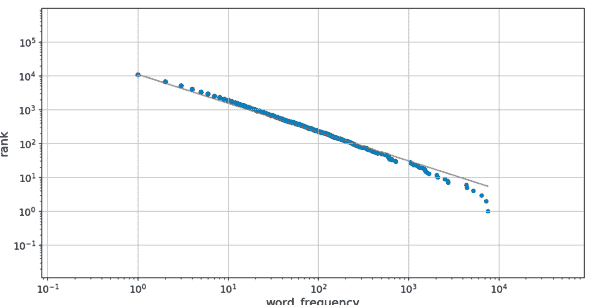

**图 10.2：** 使用更大标签的简·爱词频分布图。

```
python
#axes.labelsize    : medium  ## fontsize of the x and y labels
#xtick.labelsize   : medium  ## fontsize of the tick labels
#ytick.labelsize   : medium  ## fontsize of the tick labels
```

我们可以取消注释这些行，并将大小更改为“large”和“extra large”：

```
python
axes.labelsize    : x-large  ## fontsize of the x and y labels
xtick.labelsize   : large    ## fontsize of the tick labels
ytick.labelsize   : large    ## fontsize of the tick labels
```

然后重新生成带有更大标签的 *简·爱* 图（图 10.2）：

```
bash
$ python bin/plotcounts.py results/jane_eyre.csv --outfile results/jane_eyre.png
```

这达到了我们的目的，但通常是错误的方法。由于 `matplotlibrc` 文件设置了系统范围的默认值，我们现在将默认为所有未来的绘图使用大标签，这可能不是我们想要的。其次，我们希望打包我们的齐普夫定律代码并使其可供其他人使用（第 14 章）。该包不会包含我们的 `matplotlibrc` 文件，而且我们也无法访问他们计算机上的文件，因此这个解决方案不如其他方案具有可重复性。

然而，全局选项文件 *确实* 有用。如果我们使用 Matplotlib 和 **LaTeX** 来生成报告，并且后者安装在我们计算集群的不寻常位置，那么在 `matplotlibrc` 中进行一行更改就可以防止许多作业失败。

## 10.4 用户配置文件

如果我们不想为所有人更改配置，我们可以只为自己更改。Matplotlib 为绘图定义了几种精心设计的样式：

```
import matplotlib.pyplot as plt
print(plt.style.available)
```

```
['seaborn-dark', 'seaborn-darkgrid', 'seaborn-ticks',
'fivethirtyeight', 'seaborn-whitegrid', 'classic',
'_classic_test', 'fast', 'seaborn-talk', 'seaborn-dark-palette',
'seaborn-bright', 'seaborn-pastel', 'grayscale',
'seaborn-notebook', 'ggplot', 'seaborn-colorblind',
'seaborn-muted', 'seaborn', 'Solarize_Light2', 'seaborn-paper',
'bmh', 'tableau-colorblind10', 'seaborn-white',
'dark_background', 'seaborn-poster', 'seaborn-deep']
```

为了在我们所有的齐普夫定律图中使标签变大，我们可以创建一个自定义的 Matplotlib 样式表。惯例是将自定义样式表存储在 Matplotlib 配置目录中的 `stylelib` 子目录中。可以通过运行以下命令找到该目录：

```
mpl.get_configdir()
```

```
/Users/amira/.matplotlib
```

创建新的子目录后：

```
$ mkdir /Users/amira/.matplotlib/stylelib
```

我们可以添加一个名为 `big-labels.mplstyle` 的新文件，该文件具有与 `matplotlibrc` 文件相同的 YAML 格式：

```
axes.labelsize   : x-large  ## fontsize of the x and y labels
xtick.labelsize  : large    ## fontsize of the tick labels
ytick.labelsize  : large    ## fontsize of the tick labels
```

要使用这个新样式，我们只需在 `plotcounts.py` 中添加一行：

```
plt.style.use('big-labels')
```

使用自定义样式表可以保持系统范围的默认值不变，并且这是在我们的个人数据可视化项目中实现一致外观的好方法。然而，由于每个用户都有自己的 `stylelib` 目录，它无法解决确保其他人能够重现我们绘图的问题。

## 10.5 添加命令行选项

更改绘图属性的第三种方法是向 `plotcounts.py` 添加一些新的命令行参数。`add_argument` 的 `choices` 参数允许我们告诉 `argparse` 用户只能从预定义列表中指定一个值：

```
mpl_sizes = ['xx-small', 'x-small', 'small', 'medium',
             'large', 'x-large', 'xx-large']
parser.add_argument('--labelsize', type=str, default='x-large',
                    choices=mpl_sizes,
                    help='fontsize of the x and y labels')
parser.add_argument('--xticksize', type=str, default='large',
                    choices=mpl_sizes,
                    help='fontsize of the x tick labels')
parser.add_argument('--yticksize', type=str, default='large',
                    choices=mpl_sizes,
                    help='fontsize of the y tick labels')
```

然后，我们可以在 `plotcounts.py` 中定义 `ax` 变量之后添加几行代码，以根据用户输入更新标签大小：

```
ax.xaxis.label.set_fontsize(args.labelsize)
ax.yaxis.label.set_fontsize(args.labelsize)
ax.xaxis.set_tick_params(labelsize=args.xticksize)
ax.yaxis.set_tick_params(labelsize=args.yticksize)
```

或者，我们可以在创建绘图之前更改默认的运行时配置设置。这些设置存储在一个名为 `matplotlib.rcParams` 的变量中：

```
mpl.rcParams['axes.labelsize'] = args.labelsize
mpl.rcParams['xtick.labelsize'] = args.xticksize
mpl.rcParams['ytick.labelsize'] = args.yticksize
```

如果我们只想更改少量的绘图特征，添加额外的命令行参数是一个很好的解决方案。它也使我们的工作更具可重复性：如果我们使用 Makefile 来重新生成我们的绘图（第 9 章），所有设置都将保存在一个地方。然而，`matplotlibrc` 有数百个我们可以更改的参数，因此如果我们想调整绘图的其他方面，新参数的数量可能会很快失控。

## 10.6 任务控制文件

配置我们绘图的最后一个选项——我们实际上将在此案例中采用的选项——是将一个充满 Matplotlib 参数的 YAML 文件传递给 `plotcounts.py`。首先，我们将要更改的参数保存在项目目录内的一个文件中。我们可以将其命名为任何名称，但 `plotparams.yml` 似乎很容易记住。我们将它与使用它的脚本一起存储在 `bin` 中：

```
# Plot characteristics
axes.labelsize   : x-large  ## fontsize of the x and y labels
xtick.labelsize  : large    ## fontsize of the tick labels
ytick.labelsize  : large    ## fontsize of the tick labels
```

因为此文件位于我们的项目目录中，而不是用户特定的样式表目录中，所以我们需要向 `plotcounts.py` 添加一个新选项来加载它：

## 10.7 总结

程序只有在可控时才有用，而工作只有在控制明确且可共享时才是可复现的。如果所需的控制项数量较少，通常最佳方案是为程序添加命令行选项，并在 Makefile 中设置这些选项。随着选项数量的增加，将选项放入独立文件中的价值也随之提升。而如果我们将软件安装在供多人使用的大型系统上（例如研究集群），系统级配置文件可以让我们对那些只想完成科研工作的用户隐藏细节。

更广泛地说，配置程序的问题体现了“在我的机器上能用”与“在任何地方对任何人都能用”之间的差异。从可复现工作流（第 9 章）到日志记录（第 12.4 节），这种差异影响着研究软件工程师工作的方方面面。我们并非总是需要为大规模重用而设计，但了解其内涵能让我们做出有意识、深思熟虑的选择。

## 10.8 练习

### 10.8.1 使用绘图参数进行构建

在第 9 章创建的 Makefile 中，涉及 `plotcounts.py` 的构建规则定义如下：

```
## results/collated.png: plot the collated results.
results/collated.png : results/collated.csv
	python $(PLOT) $< --outfile $@
```

请更新该构建规则以包含新的 `--plotparams` 选项。确保在更新后的构建规则中将 `plotparams.yml` 添加为第二个先决条件，以便在绘图参数更改时重新运行相应的命令。

提示：我们使用自动变量 `$<` 来访问第一个先决条件，但你需要使用 `$(word 2,$^)` 来访问第二个。请阅读关于自动变量（第 9.5 节）以及用于字符串替换和分析的函数² 的内容，以理解该命令的作用。

### 10.8.2 使用不同的绘图样式

有许多预定义的 matplotlib 样式（第 10.4 节），如 Python 图形库³ 所示。

1.  向 `plotcounts.py` 添加一个新选项 `--style`，允许用户从预定义的 matplotlib 样式列表中选择一种样式。

    提示：使用第 10.5 节讨论的 `choices` 参数来定义新 `--style` 选项的有效选择。

2.  使用多种不同的样式重新生成《简·爱》词频分布图，以决定你最喜欢哪种样式。
3.  Matplotlib 样式表旨在组合使用。（详见样式表教程⁴。）使用 `nargs` 参数，允许用户在使用 `--style` 选项时传递任意数量的样式。

### 10.8.3 保存配置

1.  向 `plotcounts.py` 添加一个选项 `--saveconfig filename`，将其所有配置写入文件。确保此选项保存*所有*配置，包括用户未更改的任何默认值。
2.  在第 9 章创建的 `Makefile` 中添加一个新目标 `test-saveconfig`，以测试新选项是否正常工作。
3.  这个新的 `--saveconfig` 选项将如何使你的工作更具可复现性？

### 10.8.4 使用 INI 语法

如果我们使用 Windows INI 格式[^5] 而不是 YAML 作为绘图参数配置文件（即 `plotparams.ini` 而不是 `plotparams.yml`），该文件内容如下：

```
[AXES]
axes.labelsize=x-large

[TICKS]
xtick.labelsize=large
ytick.labelsize=large
```

`configparser`[^6] 库可用于读写 INI 文件。通过在命令行运行 `pip install configparser` 来安装该库。使用 `configparser`，重写 `plotcounts.py` 中的 `set_plot_params` 函数，以处理 INI 格式而非 YAML 格式的配置文件。

1.  你发现哪种文件格式更容易使用？
2.  还有哪些其他因素应影响你对配置文件语法的选择？

注意：本练习中修改的代码在本书后续部分并非必需。

[^5]: https://en.wikipedia.org/wiki/INI_file
[^6]: https://docs.python.org/3/library/configparser.html

### 10.8.5 配置一致性

为了使数据处理管道正常工作，程序 A 和程序 B 的某些配置参数必须相同。然而，这些程序是由不同的团队编写的，每个程序都有自己的配置文件。你可以采取哪些步骤来确保所需的一致性？

## 10.9 关键点

- **覆盖配置**以分层方式指定程序的设置，每一层都会覆盖之前的层。
- 使用系统级配置文件进行通用设置。
- 使用用户特定的配置文件存储个人偏好。
- 使用作业特定的配置文件，其中包含特定运行的设置。
- 使用命令行选项更改经常变化的内容。
- 使用 **YAML** 或其他标准语法编写配置文件。
- 保存配置信息，使你的研究具有**可复现性**。

## 11 测试软件

> 歌剧之所以能上演，是因为大量环节惊人地没有出错。
> —— 特里·普拉切特

我们编写了软件来统计和分析经典文本中的词汇，但如何确保它产生可靠的结果呢？简短的回答是：我们无法完全确保——但我们可以根据预期测试其行为，以判断是否足够可靠。本章将探讨实现这一目标的方法，包括断言、单元测试、集成测试和回归测试。

### 科学家的噩梦

为什么测试研究软件如此重要？蛋白质晶体学领域的早期成功研究员杰弗里·张不得不撤回五篇已发表的论文——其中三篇来自《科学》杂志——因为他的代码无意中颠倒了两列数据（G. Miller 2006）。更近的例子是，莱因哈特和罗格夫论文中的一个简单计算错误，加剧了2008年金融危机对数百万人的影响（Borwein and Bailey 2013）。测试有助于发现这类错误。

以下是我们Zipf定律项目文件的当前结构：

```
zipf/
├── .gitignore
├── CONDUCT.md
├── CONTRIBUTING.md
├── LICENSE.md
├── Makefile
├── README.md
└── bin
    ├── book_summary.sh
    ├── collate.py
    ├── countwords.py
    ├── plotcounts.py
    ├── plotparams.yml
    ├── script_template.py
    └── utilities.py
├── data
│   ├── README.md
│   ├── dracula.txt
│   └── ...
└── results
    ├── collated.csv
    ├── collated.png
    ├── dracula.csv
    ├── dracula.png
    └── ...
```

## 11.1 断言

建立对程序信心的第一步是假设错误会发生并加以防范。这被称为**防御性编程**，最常见的方法是在代码中添加**断言**，使其在运行时进行自我检查。断言是一个声明，表示在程序的某个特定点某事必须为真。当Python遇到断言时，它会检查断言的条件。如果为真，Python不做任何事；如果为假，Python会立即停止程序并打印用户定义的错误消息。例如，以下代码在循环遇到不可能的词频时会立即停止：

```
frequencies = [13, 10, 2, -4, 5, 6, 25]
total = 0.0
for freq in frequencies[:5]:
    assert freq >= 0.0, 'Word frequencies must be non-negative'
    total += freq
print('total frequency of first 5 words:', total)
```

```
---------------------------------------------------------------------------
AssertionError                            Traceback (most recent call last)
<ipython-input-19-33d87ea29ae4> in <module>()
      2 total = 0.0
      3 for freq in frequencies[:5]:
----> 4    assert freq >= 0.0, 'Word frequencies must be non-negative'
      5    total += freq
      6 print('total frequency of first 5 words:', total)

AssertionError: Word frequencies must be non-negative
```

旨在广泛使用的程序充满了断言：它们包含的代码中有10%–20%是用来检查另外80%–90%是否正常工作的。广义上讲，断言分为三类：

- **前置条件**是函数开始时必须为真才能正确工作的事情。例如，一个函数可能检查它接收的列表是否至少有两个元素，并且所有元素都是整数。
- **后置条件**是函数保证在结束时为真的事情。例如，一个函数可以检查返回的值是否是一个大于零但小于输入列表长度的整数。
- **不变量**是循环中每次迭代都为真的事情。不变量可能是数据的属性（如上面的例子），也可能是类似“`highest`的值小于或等于当前循环索引”这样的事情。

我们`plotcounts.py`脚本中的`get_power_law_params`函数是需要前置条件的一个好例子。它的文档字符串没有说明其`word_counts`参数必须是数字词频列表；即使我们添加了这一点，用户也可能轻易地传入单词本身的列表。添加断言使要求更清晰，并保证函数在调用时立即失败，而不是返回来自`scipy.optimize.minimize_scalar`的更难解释/调试的错误。

```
def get_power_law_params(word_counts):
    """
    Get the power law parameters.

    References
    ----------
    Moreno-Sanchez et al (2016) define alpha (Eq. 1),
    beta (Eq. 2) and the maximum likelihood estimation (mle)
    of beta (Eq. 6).

    > Moreno-Sanchez I, Font-Clos F, Corral A (2016)
    Large-Scale Analysis of Zipf's Law in English Texts.
    PLoS ONE 11(1): e0147073.
    https://doi.org/10.1371/journal.pone.0147073
    """
    assert type(word_counts) == np.ndarray, \
        'Input must be a numerical (numpy) array of word counts'
    mle = minimize_scalar(nlog_likelihood,
                          bracket=(1 + 1e-10, 4),
                          args=word_counts,
                          method='brent')
    beta = mle.x
    alpha = 1 / (beta - 1)
    return alpha
```

使用上述描述的断言更新`plotcounts.py`。你将在本章中看到更多断言的例子。

## 11.2 单元测试

发现错误是好的，但防止错误更好，因此负责任的程序员会测试他们的代码。顾名思义，**单元测试**检查单个软件单元的正确性。什么构成一个“单元”是主观的，但它通常指单个函数在一种情况下的行为。在我们的Zipf定律软件中，`countwords.py`中的`count_words`函数是单元测试的一个好候选：

```
def count_words(reader):
    """Count the occurrence of each word in a string."""
    text = reader.read()
    chunks = text.split()
    npunc = [word.strip(string.punctuation) for word in chunks]
    word_list = [word.lower() for word in npunc if word]
    word_counts = Counter(word_list)
    return word_counts
```

单个单元测试通常包含：

- **测试夹具**，即被测试的对象（例如，一个数字数组）；
- **实际结果**，即代码在给定测试夹具时产生的结果；以及
- **预期结果**，实际结果将与之比较。

测试夹具通常是函数通常处理的数据的子集或较小版本。例如，为了编写`count_words`函数的单元测试，我们可以使用一段足够小的文本，以便我们手动计算词频。让我们将安娜伊斯·宁的诗《风险》添加到我们的数据中：

```
$ cd ~/zipf
$ mkdir test_data
$ cat test_data/risk.txt
```

然后那一天来临，
当风险
要保持紧绷
在一个花蕾中
比风险
它所采取的
开花。

然后我们可以手动计算单词以构建预期结果：

```
from collections import Counter

risk_poem_counts = {'the': 3, 'risk': 2, 'to': 2, 'and': 1,
    'then': 1, 'day': 1, 'came': 1, 'when': 1, 'remain': 1,
    'tight': 1, 'in': 1, 'a': 1, 'bud': 1, 'was': 1,
    'more': 1, 'painful': 1, 'than': 1, 'it': 1, 'took': 1,
    'blossom': 1}
expected_result = Counter(risk_poem_counts)
```

然后我们通过调用`count_words`生成实际结果，并使用断言检查它是否符合预期：

```
import sys
sys.path.append('/Users/amira/zipf/bin')
import countwords

with open('test_data/risk.txt', 'r') as reader:
    actual_result = countwords.count_words(reader)
assert actual_result == expected_result
```

没有输出，这意味着断言（和测试）通过了。（记住，断言只有在条件为假时才会执行操作。）

### 添加导入路径

最后一个代码块包含了`sys.path.append`，这允许我们从当前工作目录以外的地方导入脚本。这不是一个完美的解决方案，但在开发代码时进行快速测试效果足够好，特别是因为我们将在本章其余部分使用的工具会为我们处理这个问题。导入语句¹以棘手著称，但我们将在[第14章](https://chrisyeh96.github.io/2017/08/08/definitive-guide-python-imports.html)学习更好的方法来组织我们的代码以进行函数导入。

## 11.3 测试框架

编写一个单元测试很容易，但我们还应该检查其他情况。为了管理它们，我们可以使用**测试框架**（也称为**测试运行器**）。Python最广泛使用的测试框架叫做`pytest`²，它按以下方式组织测试：

1. 测试放在以`test_`开头的文件中。
2. 每个测试是一个名称也以`test_`开头的函数。
3. 这些函数使用`assert`来检查结果。

遵循这些规则，我们可以在你的`bin`目录中创建一个`test_zipfs.py`脚本，其中包含我们刚刚开发的测试：

¹https://chrisyeh96.github.io/2017/08/08/definitive-guide-python-imports.html
²https://pytest.org/

from collections import Counter

import countwords

def test_word_count():
    """测试单词计数功能。

    示例诗歌是阿奈斯·宁的《风险》。
    """
    risk_poem_counts = {'the': 3, 'risk': 2, 'to': 2, 'and': 1,
      'then': 1, 'day': 1, 'came': 1, 'when': 1, 'remain': 1,
      'tight': 1, 'in': 1, 'a': 1, 'bud': 1, 'was': 1,
      'more': 1, 'painful': 1, 'than': 1, 'it': 1, 'took': 1,
      'blossom': 1}
    expected_result = Counter(risk_poem_counts)
    with open('test_data/risk.txt', 'r') as reader:
        actual_result = countwords.count_words(reader)
    assert actual_result == expected_result

pytest 库自带一个同样名为 pytest 的命令行工具。当我们不带任何选项运行它时，它会搜索当前工作目录及其子目录下所有名称匹配 `test_*.py` 模式的文件。然后，它会运行这些文件中的测试并总结结果。（如果我们只想运行特定文件中的测试，可以使用命令 `pytest path/to/test_file.py`。）

```
$ pytest
```

```
============================= test session starts =============================
platform darwin -- Python 3.7.6, pytest-6.2.0, py-1.10.0,
pluggy-0.13.1
rootdir: /Users/amira
collected 1 item

bin/test_zipfs.py .                                                [100%]

============================== 1 passed in 0.02s ===============================
```

要添加更多测试，我们只需在 `test_zipfs.py` 中编写更多的 `test_` 函数。例如，除了单词计数，我们代码的另一个关键部分是 α 参数的计算。之前我们定义了一个幂律，将 α 与单词频率 $f$、单词排名 $r$ 和比例常数 $c$ 联系起来（第 7.3 节）：

$$r = cf^{-\frac{1}{\alpha}}$$

我们还注意到，当 $\alpha$ 等于 1 时，齐普夫定律精确成立。将 $\alpha$ 设为 1 并重新整理幂律公式，我们得到：

$$c = f/r$$

我们可以使用这个公式生成合成的单词计数数据（即我们的测试夹具），其中比例常数设置为假设的最大单词频率 600（因此 $r$ 的范围是从 1 到 600）：

```
import numpy as np

max_freq = 600
counts = np.floor(max_freq / np.arange(1, max_freq + 1))
print(counts)
```

```
[600. 300. 200. 150. 120. 100. 85. 75. 66. 60. 54. 50.
 46. 42. 40. 37. 35. 33. 31. 30. 28. 27. 26. 25.
 ...
  1.  1.  1.  1.  1.  1.  1.  1.  1.  1.  1.  1.]
```

（我们使用 `np.floor` 向下取整到最接近的整数，因为我们不能有小数的单词计数。）将这个测试夹具传递给 `plotcounts.py` 中的 `get_power_law_params` 应该会给我们一个 1.0 的值。为了测试这一点，我们可以在 `test_zipfs.py` 中添加第二个测试：

```
from collections import Counter

import numpy as np

import plotcounts
import countwords

def test_alpha():
    """测试 alpha 参数的计算。

    测试单词计数满足以下关系：
        r = cf**(-1/alpha)，其中
        r 是排名，
        f 是单词计数，
        c 是比例常数。

    为了生成预期 alpha 为 1.0 的测试单词计数，
        使用了最大单词频率 600
        （即 c = 600，r 的范围从 1 到 600）
    """
    max_freq = 600
    counts = np.floor(max_freq / np.arange(1, max_freq + 1))
    actual_alpha = plotcounts.get_power_law_params(counts)
    expected_alpha = 1.0
    assert actual_alpha == expected_alpha
```

```
def test_word_count():
    #...如前所述...
```

让我们重新运行这两个测试：

```
$ pytest
```

```
============================= test session starts =============================
platform darwin -- Python 3.7.6, pytest-6.2.1, py-1.10.0,
pluggy-0.13.1
rootdir: /Users/amira
collected 2 items

bin/test_zipfs.py F.                                               [100%]

============================== FAILURES ===============================
______________________________ test_alpha _______________________________

def test_alpha():
    """Test the calculation of the alpha parameter.

    The test word counts satisfy the relationship,
        r = cf**(-1/alpha), where
        r is the rank,
        f the word count, and
        c is a constant of proportionality.

    To generate test word counts for an expected alpha of
        1.0, a maximum word frequency of 600 is used
        (i.e. c = 600 and r ranges from 1 to 600)

    """
    max_freq = 600
    counts = np.floor(max_freq / np.arange(1, max_freq + 1))
    actual_alpha = plotcounts.get_power_law_params(counts)
    expected_alpha = 1.0
>    assert actual_alpha == expected_alpha
E    assert 0.9951524579316625 == 1.0

bin/test_zipfs.py:26: AssertionError
================ short test summary info ==================
FAILED bin/test_zipfs.py::test_alpha - assert 0.99515246 == 1.0
================= 1 failed, 1 passed in 3.98s =================
```

输出告诉我们一个测试失败了，但另一个测试通过了。这是像 pytest 这样的测试运行器一个非常有用的功能：它们会继续运行并完成所有测试，而不是像普通 Python 脚本那样在第一个断言失败时就停止。

## 11.4 测试浮点值

上面的输出显示，虽然 `test_alpha` 失败了，但实际值 `actual_alpha` 0.9951524579316625 与预期值 1.0 非常接近。稍加思考后，我们决定这实际上并不是失败：`get_power_law_params` 产生的值是一个估计值，偏差半个百分点是可以接受的。

这个例子表明，测试科学软件几乎总是需要我们做出与科学家在进行任何其他类型的实验工作时必须做出的相同类型的判断。如果我们测量的是质子的质量，我们可能期望小数点后十位的精度。另一方面，如果我们测量的是一只小企鹅的体重，如果误差在五克以内，我们可能就满意了。最重要的是，我们要明确说明我们使用的界限，以便其他人能够知道我们实际做了什么。

> **难度等级**

有一个古老的笑话：物理学家担心小数点后的位数，天文学家担心十的幂次，而经济学家只要符号正确就高兴了。

那么，当我们不知道确切的正确答案时，应该如何编写测试呢？最好的方法是编写测试，检查实际值是否在预期值的某个**容差**范围内。容差可以表示为**绝对误差**，即两个值之差的绝对值，或者**相对误差**，即绝对误差与我们近似值的比值（Goldberg 1991）。例如，如果我们计算 9+1 得到 11，绝对误差是 1（即 11 − 10），相对误差是 10%。另一方面，如果我们计算 99 + 1 得到 101，绝对误差仍然是 1，但相对误差只有 1%。

对于 **test_alpha**，我们可能决定 α 估计值的绝对误差为 0.01 是可接受的。如果我们使用 **pytest**，我们可以使用 **pytest.approx** 来检查值是否在此容差范围内：

```
from collections import Counter

import pytest
import numpy as np

import plotcounts
import countwords


def test_alpha():
    """测试 alpha 参数的计算。

    测试单词计数满足以下关系：
        r = cf**(-1/alpha)，其中
        r 是排名，
        f 是单词计数，
        c 是比例常数。

    为了生成预期 alpha 为 1.0 的测试单词计数，
        使用了最大单词频率 600
        （即 c = 600，r 的范围从 1 到 600）
    """
    max_freq = 600
    counts = np.floor(max_freq / np.arange(1, max_freq + 1))
    actual_alpha = plotcounts.get_power_law_params(counts)
    expected_alpha = pytest.approx(1.0, abs=0.01)
    assert actual_alpha == expected_alpha
```

```
def test_word_count():
    #...如前所述...
```

当我们重新运行 `pytest` 时，两个测试现在都通过了：

```
$ pytest
```

```
============================= test session starts ==============================
platform darwin -- Python 3.7.6, pytest-6.2.0, py-1.10.0,
pluggy-0.13.1
rootdir: /Users/amira
collected 2 items

bin/test_zipfs.py ..                                              [100%]

============================== 2 passed in 0.69s ================================
```

## 测试可视化

测试可视化很难：对图表尺寸的任何微小更改都可能改变**光栅图像**中的许多像素，而诸如将图例上移几个像素之类的外观更改将导致我们所有的测试失败。

因此，最简单的解决方案是测试用于生成图像的数据，而不是图像本身。除非我们怀疑绘图库存在错误，否则正确的数据应该总是产生正确的图表。

## 11.5 集成测试

我们的齐普夫定律分析包含两个步骤：统计文本中的单词数量，以及根据词频估算 $\alpha$ 参数。单元测试让我们对这些组件独立运行时的正确性有了一定信心，但它们协同工作时是否正确呢？检查这一点被称为**集成测试**。

集成测试的结构与单元测试相同：使用一个测试夹具来产生一个实际结果，并与预期结果进行比较。然而，创建测试夹具和运行代码的过程可能要复杂得多。例如，对于我们的齐普夫定律软件，一个合适的集成测试夹具可能是一个具有已知 $\alpha$ 值的词频分布的文本文件。为了创建这个文本夹具，我们需要一种生成随机单词的方法。

幸运的是，一个名为 `RandomWordGenerator`[^3] 的 Python 库正是为此而生。我们可以使用 Python 包安装器 `pip`[^4] 来安装它：

```
$ pip install Random-Word-Generator
```

借鉴我们为 `test_alpha` 创建的词频分布，我们可以使用以下代码创建一个充满随机单词的文本文件，其词频分布对应于大约 1.0 的 $\alpha$ 值：

```
import numpy as np
from RandomWordGenerator import RandomWord

max_freq = 600
word_counts = np.floor(max_freq / np.arange(1, max_freq + 1))
rw = RandomWord()
random_words = rw.getList(num_of_words=max_freq)
writer = open('test_data/random_words.txt', 'w')
for index in range(max_freq):
    count = int(word_counts[index])
    word_sequence = f'{random_words[index]} ' * count
    writer.write(word_sequence + '\n')
writer.close()
```

[^3]: https://github.com/AbhishekSalian/Random-Word-Generator
[^4]: https://pypi.org/project/pip/

我们可以通过检查生成的文件来确认此代码是否有效：

```
tail -n 5 test_data/random_words.txt
```

```
lZnkzoBHRb
djiroplqrJ
HmAUG0ncHg
DGLpfTIitu
KALSfPkrga
```

然后，我们可以将此集成测试添加到 `test_zipfs.py` 中：

```
def test_integration():
    """Test the full word count to alpha parameter workflow."""
    with open('test_data/random_words.txt', 'r') as reader:
        word_counts_dict = countwords.count_words(reader)
    counts_array = np.array(list(word_counts_dict.values()))
    actual_alpha = plotcounts.get_power_law_params(counts_array)
    expected_alpha = pytest.approx(1.0, abs=0.01)
    assert actual_alpha == expected_alpha
```

最后，我们重新运行 `pytest` 以检查集成测试是否通过：

```
$ pytest
```

```
============================= test session starts ==============================
platform darwin -- Python 3.7.6, pytest-6.2.0, py-1.10.0,
pluggy-0.13.1
rootdir: /Users/amira
collected 3 items

bin/test_zipfs.py ...                                                [100%]

============================== 3 passed in 0.48s ================================
```

## 11.6 回归测试

到目前为止，我们已经测试了两个简化的文本：一首短诗和一个具有已知频率分布的随机单词集合。下一步是使用真实数据进行测试，即一本实际的书籍。问题在于，我们不知道预期结果是什么：手动统计《德古拉》中的单词是不切实际的，即使我们尝试，也很可能会出错。

对于这种情况，我们可以使用**回归测试**。回归测试不是假设测试的作者知道预期结果应该是什么，而是将今天的答案与之前的答案进行比较。这并不能保证答案是正确的——如果原始答案是错误的，我们可能会将这个错误无限期地延续下去——但它确实能引起人们对任何变化（或“回归”）的注意。

在第 7.4 节中，我们计算出《德古拉》的 α 值为 1.0866646252515038。让我们使用这个值为 `test_zipfs.py` 添加一个回归测试：

```
def test_regression():
    """Regression test for Dracula."""
    with open('data/dracula.txt', 'r') as reader:
        word_counts_dict = countwords.count_words(reader)
    counts_array = np.array(list(word_counts_dict.values()))
    actual_alpha = plotcounts.get_power_law_params(counts_array)
    expected_alpha = pytest.approx(1.087, abs=0.001)
    assert actual_alpha == expected_alpha
```

```
$ pytest

============================= test session starts =============================
platform darwin -- Python 3.7.6, pytest-6.2.0, py-1.10.0,
pluggy-0.13.1
rootdir: /Users/amira
collected 4 items

bin/test_zipfs.py ....                                                  [100%]

============================== 4 passed in 0.56s ===============================
```

## 11.7 测试覆盖率

我们编写的测试检查了我们代码的多少部分？更重要的是，我们代码的哪些部分*尚未*被测试？为了找出答案，我们可以使用一个工具来检查它们的**代码覆盖率**。大多数 Python 程序员使用 **coverage** 库，我们可以再次使用 **pip** 来安装它：

```
$ pip install coverage
```

安装后，我们可以使用它来代替我们运行 **pytest**：

```
$ coverage run -m pytest
```

```
========================= test session starts ==========================
platform darwin -- Python 3.7.6, pytest-6.2.0, py-1.10.0,
pluggy-0.13.1
rootdir: /Users/amira
collected 4 items

bin/test_zipfs.py ....                                              [100%]

========================= 4 passed in 0.72s ============================
```

**coverage** 命令本身不显示任何信息，因为将其与程序的输出混合会令人困惑。相反，它将覆盖率数据放入当前目录下一个名为 **.coverage**（带前导点）的文件中。要显示这些数据，我们运行：

```
$ coverage report -m
```

```
bin/countwords.py       20      7    65%   25-26, 30-38
bin/plotcounts.py       58     37    36%   48-55, 75-77, 82-83,
                                            88-118, 122-140
bin/test_zipfs.py       31      0   100%
bin/utilities.py         8      5    38%   18-22
-----------------------------------------------------------
TOTAL                  117     49    58%
```

这个摘要告诉我们，当运行测试时，`countwords.py` 或 `plotcounts.py` 中的一些行没有被执行：实际上，分别只有 65% 和 36% 的行被运行了。这是有道理的，因为这些脚本中的大部分代码都用于处理命令行参数或文件 I/O，而不是我们的单元、集成和回归测试所关注的单词计数和参数估算功能。

为了确保情况确实如此，我们可以通过在命令行运行 `coverage html` 并打开 `htmlcov/index.html` 来获得更完整的报告。例如，点击我们的 `countwords.py` 脚本的名称，会产生如图 11.1 所示的彩色逐行显示。

此输出确认所有与单词计数相关的行都已测试，但与参数处理或 I/O 相关的行则没有。

> **提交我们的覆盖率报告吗？**

此时，你可能想知道是否应该使用版本控制来跟踪报告代码覆盖率的文件。虽然这不一定会损害你的代码，但除非你在代码更改时持续更新覆盖率报告，否则报告将变得不准确。因此，我们建议将 `.coverage` 和 `htmlcov/` 添加到你的 `.gitignore` 文件[^5]中。在下一节中，我们将探讨一种可以帮助你自动化评估覆盖率等任务的方法。

这足够了吗？答案取决于软件的用途和使用者。如果它是用于医疗设备等安全关键型应用，我们应该以 100% 的代码覆盖率为目标，即应用程序中的每一行都应该被测试。事实上，我们可能应该更进一步，以 100% 的**路径覆盖率**为目标，以确保代码中的每条可能路径都已被检查。同样，如果软件已经流行起来，并被全世界成千上万的研究人员使用，我们可能应该检查它不会让我们难堪。

但我们大多数人编写的软件并非人们生命所系，也不在“百强”榜单上，因此要求 100% 的代码覆盖率就像在检查家用电源插座的电压时要求十位小数的精度一样。我们总是需要在创建测试所需的努力与这些测试可能揭示有用信息的可能性之间取得平衡。我们也必须接受，再多的测试也无法证明一段软件是完全正确的。一个只有两个数字参数的函数有 $2^{128}$ 种可能的输入。即使我们能编写测试，我们又如何能确保正确地检查了每个测试的结果呢？

[^5]: https://github.com/github/gitignore

**bin/countwords.py** 的代码覆盖率：65%
20 条语句，13 条已运行，7 条缺失，0 条排除

```python
"""
统计文本中所有单词的出现次数，
并将其写入 CSV 文件。
"""

import argparse
import string
from collections import Counter

import utilities as util


def count_words(reader):
    """统计字符串中每个单词的出现次数。"""
    text = reader.read()
    chunks = text.split()
    stripped = [word.strip(string.punctuation) for word in chunks]
    word_list = [word.lower() for word in stripped if word]
    word_counts = Counter(word_list)
    return word_counts


def main(args):
    """运行命令行程序。"""
    word_counts = count_words(args.infile)
    util.collection_to_csv(word_counts, num=args.num)


if __name__ == '__main__':
    parser = argparse.ArgumentParser(description=__doc__)
    parser.add_argument('infile', type=argparse.FileType('r'),
                        nargs='?', default='-',
                        help='输入文件名')
    parser.add_argument('-n', '--num',
                        type=int, default=None,
                        help='仅输出出现频率最高的 n 个单词')
    args = parser.parse_args()
    main(args)
```

**图 11.1：** Python 代码覆盖率报告示例。

幸运的是，我们通常可以将测试用例分组。例如，在测试一个汇总数据表格的函数时，检查它是否能处理以下情况可能就足够了：

-   没有行
-   只有一行
-   许多相同的行
-   行的键本应唯一但实际不唯一
-   行只包含缺失值

一些项目会开发像这样的**检查清单**，以提醒程序员他们应该测试什么。这些清单对新手来说可能有点令人生畏，但它们是传递来之不易经验的好方法。

## 11.8 持续集成

现在我们有了一套测试，我们可以时不时地运行 **pytest** 来检查我们的代码。对于短期项目来说，这可能就足够了，但如果涉及多人协作，或者我们在数周或数月内进行更改，我们可能会忘记运行测试，或者可能难以确定是哪个更改导致了测试失败。

解决方案是**持续集成**（CI），它在每次更改时自动运行测试。CI 会立即告知开发者更改是否引起了问题，这使得问题更容易修复。CI 还可以设置为在多种不同的软件配置或多种不同的操作系统上运行测试，这样使用 Windows 的程序员就能收到某个更改会破坏 Mac 用户体验的警告，反之亦然。

一个流行的 CI 工具是 Travis CI<sup>6</sup>，它与 GitHub<sup>7</sup> 集成良好。如果 Travis CI 已经设置好，那么每次向 GitHub 仓库提交更改时，Travis CI 都会创建一个全新的环境，克隆仓库的新副本（第 7.8 节），并运行项目管理者设置的任何命令。

然而，在设置我们的 Travis CI 账户之前，我们需要准备好我们的仓库以便该工具识别。我们将首先在仓库中添加一个名为 **.travis.yml** 的文件，其中包含给 Travis CI 的指令。（名称开头的 . 在 Mac 或 Linux 上会隐藏该文件，使其不在常规列表中显示，但在 Windows 上不会。）此文件必须位于仓库的根目录中，并使用 **YAML** 编写（第 10.1 节和附录 H）。对于我们的项目，我们添加以下几行：

```yaml
language: python

python:
- "3.6"

install:
- pip install -r requirements.txt

script:
- pytest
```

> **Python 3.6？**
>
> 本书的早期草稿使用了 Python 3.6，我们后来更新到了 3.7。在一个真实项目的生命周期中，软件版本会变化，重新完成项目的所有部分并不总是可行或可能的。在这种情况下，我们在 Travis CI 中的第一次构建使用了 Python 3.6，所以我们在这里展示了它，后来检查了更新到 3.7 是否会破坏任何东西。我们不能期望我们的软件第一次就完美，但我们可以尽力记录更改的内容并确认我们的结果仍然准确。

`language` 键告诉 Travis CI 使用哪种编程语言，以便它知道使用其哪个标准**虚拟机**作为项目的起点。`python` 键指定要使用的 Python 版本，而 `install` 键指定了列出需要安装的库的文件名（`requirements.txt`）。`script` 键列出了要运行的命令——在本例中是 `pytest`——它又会执行我们的项目脚本（即 `test_zipfs.py`、`plotcounts.py`、`countwords.py` 和 `utilities.py`）。这些脚本导入了许多不属于 Python 标准库<sup>8</sup> 的包，因此这些包构成了 `requirements.txt`：

```
numpy
pandas
matplotlib
scipy
pytest
pyyaml
```

<sup>8</sup>https://docs.python.org/3/library/

## 11.8 持续集成

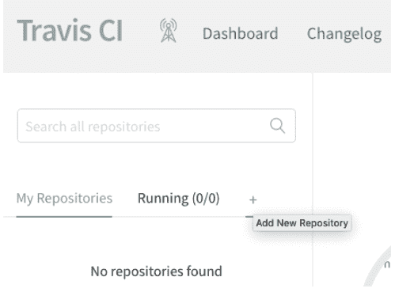

图 11.2：点击将新的 GitHub 仓库添加到 Travis CI。

请务必将 **requirements.txt** 和 **.travis.yml** 都保存到项目的根目录，提交到你的仓库，并推送到 GitHub，否则 Travis CI 将无法识别你的项目。

我们现在准备为我们的项目设置 CI。基本步骤如下：

1.  在 Travis CI<sup>9</sup> 上创建一个账户（如果我们还没有的话）。
2.  将我们的 Travis CI 账户链接到我们的 GitHub 账户（如果我们还没有这样做的话）。
3.  告诉 Travis CI 监视包含我们项目的仓库。

在线服务创建账户可能是一个熟悉的过程，但将我们的 Travis CI 账户链接到我们的 GitHub 账户可能是新的。我们只需要做一次就可以允许 Travis CI 访问我们所有的 GitHub 仓库，但在授予网站访问其他网站的权限时，我们应该始终小心，只信任成熟且广泛使用的服务。

我们可以通过点击 Travis CI 主页左侧“My Repositories”链接旁边的“+”来告诉 Travis CI 我们想要它监视哪个仓库（图 11.2）。

要添加我们在本书中一直使用的 GitHub 仓库，请在仓库列表中找到它（图 11.3）。如果仓库没有显示，请使用左侧边栏上的绿色“Sync account”按钮重新同步列表。如果它仍然没有出现，该仓库可能属于其他人或是私有的，或者你所需的文件可能不正确。点击“Trigger a build”按钮以使用 Travis CI 启动你的第一次测试。

<sup>9</sup>https://travis-ci.com/


图 11.3：找到 Zipf's Law 仓库并触发构建。

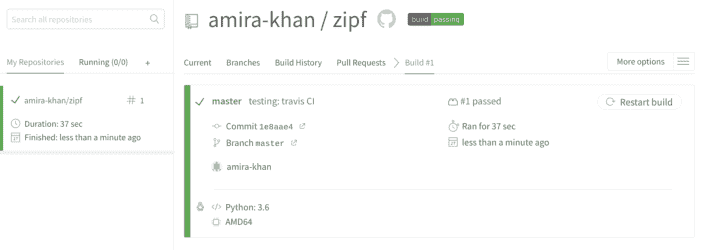

图 11.4：Travis 构建概览（构建成功）。

一旦你的仓库被激活，Travis CI 就会按照 `.travis.yml` 中的指令操作，并报告构建是通过（显示为绿色）还是产生了警告或错误（显示为红色）。为了生成此报告，Travis CI 执行了以下操作：

1.  创建了一个新的 Linux 虚拟机。
2.  安装了所需版本的 Python。
3.  运行了 `script` 键下方的命令。
4.  在 https://travis-ci.com/USER/REPO 报告了结果，其中 USER/REPO 标识给定用户的仓库。

我们的测试通过了，构建成功完成。我们可以通过点击仓库名称来查看有关测试的更多详细信息（图 11.4）。

这个例子展示了 CI 的另一个好处：它迫使我们明确我们正在做什么以及如何做，就像编写 Makefile 迫使我们明确我们究竟如何产生结果一样（Zampetti 等人，2020）。

## 11.9 何时编写测试

我们现在已经了解了三种主要的测试类型：单元测试、集成测试和回归测试。在代码开发过程的哪个阶段我们应该编写这些测试？答案取决于你问谁。

许多程序员是**测试驱动开发（TDD）**这一实践的热情倡导者。他们不是先写代码再写测试，而是先写测试，然后编写刚好足以让这些测试通过的代码。一旦代码运行正常，他们就清理它（附录 F.4），然后继续下一个任务。TDD 的倡导者声称这会导致更好的代码，因为：

1.  编写测试可以澄清代码实际应该做什么。
2.  它消除了**确认偏误**。如果有人刚刚编写了一个一个函数，他们倾向于希望它是正确的，因此他们的测试会偏向于证明它是正确的，而不是试图发现错误。
3.  先写测试确保了测试确实会被编写。

这些论点似乎有道理。然而，像 Fucci 等人（2016）和 Fucci 等人（2017）这样的研究并不支持它们：在实践中，先写测试还是后写测试似乎并不影响生产力。*真正*有影响的是以小的、交错的增量进行工作，即编写几行代码并测试它，然后再继续，而不是编写几页代码然后花几个小时进行测试。

那么大多数数据科学家如何判断他们的软件是否在做正确的事情呢？答案是抽查：每次他们产生一个中间或最终结果时，他们会扫描一个表格、创建一个图表或检查一些摘要统计信息，以查看一切是否正常。他们的启发式方法通常很容易陈述，比如“此时不应该有 NA”或“年龄范围应该是合理的”，但将这些启发式方法应用于特定分析总是取决于他们对相关数据不断发展的洞察力。

类比测试驱动开发，我们可以称这个过程为“检查驱动开发”。每次我们向管道添加一个步骤并查看其输出时，我们也可以向管道添加某种检查，以确保我们正在检查的内容在管道演变或在其他数据上运行时仍然成立。这样做有助于提高可重用性——令人惊讶的是，一次性的分析最终被多次使用的情况经常发生——但真正的目标是可理解性。如果有人能拿到我们的代码和数据，然后在数据上运行代码，并得到与我们相同的结果，那么我们的计算就是可重现的，但那并不意味着他们就能理解它。注释有所帮助（无论是在代码中还是作为**计算笔记本**中的散文块），但它们无法检查假设和不变量是否成立。而且与注释不同，可运行的断言不会与代码的实际执行情况脱节。

## 11.10 总结

测试数据分析管道通常比测试主流软件应用更难，因为数据分析师往往不知道正确答案是什么（Braiek 和 Khomh 2018）。（如果我们知道，我们早就提交报告并继续处理下一个问题了。）关键区别在于**验证**（询问规范是否正确）和**确认**（询问我们是否满足了该规范）之间的差异。它们之间的区别在于构建正确的东西与正确地构建东西之间的区别；本章介绍的实践将对两者都有帮助。

## 11.11 练习

### 11.11.1 解释断言

给定一个数字列表，函数 `total` 返回总和：

```
total([1, 2, 3, 4])
```

10

该函数仅适用于数字：

```
total(['a', 'b', 'c'])
```

ValueError: invalid literal for int() with base 10: 'a'

用文字解释此函数中的断言检查了什么，并为每个断言提供一个会导致该断言失败的输入示例。

```
def total(values):
    assert len(values) > 0
    for element in values:
        assert int(element)
    values = [int(element) for element in values]
    total = sum(values)
    assert total > 0
    return total
```

### 11.11.2 矩形规范化

一个矩形可以用四个笛卡尔坐标 (x0, y0, x1, y1) 的元组来描述，其中 (x0, y0) 表示左下角，(x1, y1) 表示右上角。为了进行一些计算，假设我们需要能够规范化矩形，使左下角位于原点（即 (x0, y0) = (0, 0)），且最长边长为 1.0 单位。此函数实现了这一点：

```
def normalize_rectangle(rect):
    """Normalizes a rectangle so that it is at the origin
    and 1.0 units long on its longest axis.  Input should be
    (x0, y0, x1, y1), where (x0, y0) and (x1, y1) define the
    lower left and upper right corners of the rectangle."""

    # insert preconditions
    x0, y0, x1, y1 = rect
    # insert preconditions

    dx = x1 - x0
    dy = y1 - y0
    if dx > dy:
        scaled = float(dx) / dy
        upper_x, upper_y = 1.0, scaled
    else:
        scaled = float(dx) / dy
        upper_x, upper_y = scaled, 1.0

    # insert postconditions here

    return (0, 0, upper_x, upper_y)
```

为了回答以下问题，请将 `normalize_rectangle` 函数剪切并粘贴到一个名为 `geometry.py` 的新文件中（在你的 `zipf` 项目之外），并将该文件保存在一个名为 `exercises` 的新目录中。

1.  为了确保 `normalize_rectangle` 的输入有效，请添加**前置条件**来检查：
    (a) `rect` 包含 4 个坐标，
    (b) 矩形的宽度为正且非零值（即 x0 < x1），以及
    (c) 矩形的高度为正且非零值（即 y0 < y1）。
2.  如果规范化计算正确，新的 x1 坐标将介于 0 和 1 之间（即 0 < `upper_x` <= 1.0）。添加一个**后置条件**来检查这一点是否成立。对新的 y1 坐标 `upper_y` 执行相同操作。

对一个短而宽的矩形运行 `normalize_rectangle` 应该通过你新的前置条件和后置条件：

```
import geometry

geometry.normalize_rectangle([2, 5, 3, 10])
```

(0, 0, 0.2, 1.0)

但对于一个高而窄的矩形会失败：

```
geometry.normalize_rectangle([20, 15, 30, 20])
```

```
AssertionError Traceback (most recent call last)
<ipython-input-3-f4e8cdf7f69d> in <module>
----> 1 geometry.normalize_rectangle([20, 15, 30, 20])

~/Desktop/exercises/geometry.py in normalize_rectangle(rect)
     19
     20    assert 0 < upper_x <= 1.0, \
     21        'Calculated upper X coordinate invalid'
---> 22    assert 0 < upper_y <= 1.0, \
     23        'Calculated upper Y coordinate invalid'
     24
     25    return (0, 0, upper_x, upper_y)

AssertionError: Calculated upper Y coordinate invalid
```

3.  找到并纠正 `normalize_rectangle` 中的错误源。修复后，你应该能够成功运行 `geometry.normalize_rectangle([20, 15, 30, 20])`。
4.  为高而窄的矩形编写一个单元测试，并将其保存在一个名为 `test_geometry.py` 的新文件中。运行 `pytest` 以确保测试通过。
5.  向 `test_geometry.py` 添加更多单元测试。解释每个测试背后的基本原理。

### 11.11.3 使用随机性进行测试

依赖随机数的程序无法测试，因为（故意）无法预测其输出。幸运的是，计算机程序实际上并不使用随机数：它们使用**伪随机数生成器**（PRNG），以可重复但不可预测的方式产生值。给定相同的初始**种子**，PRNG 将始终产生相同的值序列。在测试依赖伪随机数的程序时，我们如何利用这一事实？

### 11.11.4 使用相对误差进行测试

如果 E 是函数的预期结果，A 是其产生的实际值，则**相对误差**为 `abs((A-E)/E)`。这意味着，如果我们期望测试结果为 2、1 和 0，而我们实际得到 2.1、1.1 和 0.1，则相对误差分别为 5%、10% 和无穷大。为什么这看起来违反直觉，在这种情况下，测量误差的更好方法是什么？

## 11.12 关键点

-   测试软件以说服人们（包括你自己）软件足够正确，并使“足够”的容差明确化。
-   向代码添加**断言**，使其在运行时进行自我检查。
-   编写**单元测试**以检查各个代码片段。
-   编写**集成测试**以检查这些片段是否正确协同工作。
-   编写**回归测试**以检查以前正常工作的功能是否不再正常。
-   **测试框架**查找并运行以规定方式编写的测试，并报告其结果。
-   测试**覆盖率**是一组测试执行的代码行数比例。
-   **持续集成**在每次发生更改时重新构建和/或重新测试软件。

## 12 处理错误

> “当安全卡榫未打开时，弩就不是你的朋友。”
> —— 特里·普拉切特

我们是生活在不完美世界中的不完美的人。人们会误解如何使用我们的程序，即使我们像前一章描述的那样进行了彻底测试，这些程序可能仍然包含错误。因此，我们应该从一开始就计划检测和处理错误。

程序运行期间出现的问题有时被称为正常行为的**异常**。一般来说，我们区分两种类型的错误/异常。**内部错误**是程序本身的错误，例如使用 `None` 而不是列表调用函数。**外部错误**通常由程序与外部世界的交互引起：用户可能输错文件名，网络可能中断，等等。

当发生内部错误时，在大多数情况下我们唯一能做的就是报告它并停止程序。例如，如果一个函数被传递了 `None` 而不是有效的列表，那么很可能我们的某个数据结构已损坏。我们可以尝试猜测问题所在并采取纠正措施，但我们的猜测通常是错误的，我们试图纠正问题实际上可能会使事情变得更糟。另一方面，当发生外部错误时，我们并不总是希望程序停止。如果用户输错了密码，通过提示她重试来处理错误会比停止并要求她重新启动程序更友好。

本章探讨了我们如何引发、捕获和处理错误。我们考虑如何编写有用的错误消息，以及如何让我们的程序在运行时记录这些消息以及其他有用的信息，以便在出现问题时更容易弄清楚发生了什么。

Zipf 定律项目现在应包括：

```
zipf/
├── .gitignore
```

## 12 处理错误

```
├── .travis.yml
├── CONDUCT.md
├── CONTRIBUTING.md
├── LICENSE.md
├── Makefile
├── README.md
├── requirements.txt
├── bin
│   ├── book_summary.sh
│   ├── collate.py
│   ├── countwords.py
│   ├── plotcounts.py
│   ├── plotparams.yml
│   ├── script_template.py
│   ├── test_zipfs.py
│   └── utilities.py
├── data
│   ├── README.md
│   ├── dracula.txt
│   └── ...
├── results
│   ├── dracula.csv
│   ├── dracula.png
│   └── ...
└── test_data
    ├── random_words.txt
    └── risk.txt
```

### 12.1 异常

大多数现代编程语言都使用异常进行错误处理。顾名思义，异常是一种表示特殊或不寻常事件的方式，这些事件无法整齐地融入程序的预期操作中。下面的代码使用异常来报告除零尝试：

```
for denom in [-5, 0, 5]:
    try:
        result = 1/denom
        print(f'1/{denom} == {result}')
    except:
        print(f'Cannot divide by {denom}')
```

```
1/-5 == -0.2
Cannot divide by 0
1/5 == 0.2
```

`try/except` 看起来像 `if/else`，工作方式也类似。如果 `try` 块内没有发生意外情况，则不会运行 `except` 块（图 12.1）。另一方面，如果 `try` 内部出现问题，程序会立即跳转到 `except`。这就是为什么当 `denom` 为 0 时，`try` 内部的 `print` 语句不会运行：一旦 Python 尝试计算 `1/denom`，它就会直接跳到 `except` 下面的代码。

我们通常想知道具体出了什么问题，因此 Python 和其他语言会将错误信息存储在一个对象中（该对象也称为异常）。我们可以捕获异常并检查它，如下所示：

```
for denom in [-5, 0, 5]:
    try:
        result = 1/denom
        print(f'1/{denom} == {result}')
    except Exception as error:
        print(f'{denom} has no reciprocal: {error}')
```

```
1/-5 == -0.2
0 has no reciprocal: division by zero
1/5 == 0.2
```

我们可以使用任何喜欢的变量名来代替 `error`；Python 会将异常对象赋值给该变量，以便我们可以在 `except` 块中对其进行操作。

Python 还允许我们指定要捕获哪种类型的异常。例如，我们可以编写代码分别处理索引越界和除零错误：

```
numbers = [-5, 0, 5]
for i in [0, 1, 2, 3]:
    try:
        denom = numbers[i]
        result = 1/denom
        print(f'1/{denom} == {result}')
    except IndexError as error:
        print(f'index {i} out of range')
    except ZeroDivisionError as error:
        print(f'{denom} has no reciprocal: {error}')
```

```
1/-5 == -0.2
0 has no reciprocal: division by zero
1/5 == 0.2
index 3 out of range
```

异常被组织成一个层次结构：例如，`FloatingPointError`、`OverflowError` 和 `ZeroDivisionError` 都是 `ArithmeticError` 的特例，因此捕获后者的 `except` 也会捕获前三种异常，但捕获 `OverflowError` 的 `except` 不会捕获 `ZeroDivisionError`。Python 文档描述了所有内置异常类型[^1]；实际上，人们最常处理的是：

[^1]: https://docs.python.org/3/library/exceptions.html#exception-hierarchy

- `ArithmeticError`：计算中出现了错误。
- `IndexError` 和 `KeyError`：索引列表或在字典中查找内容时出现错误。
- `OSError`：当文件未找到、程序没有读取权限等情况时抛出。

那么异常从何而来？答案是程序员可以**显式地引发**它们：

```
for number in [1, 0, -1]:
    try:
        if number < 0:
            raise ValueError(f'no negatives: {number}')
        print(number)
    except ValueError as error:
        print(f'exception: {error}')
```

```
1
0
exception: no negatives: -1
```

我们可以定义自己的异常类型，许多库也这样做，但内置类型足以覆盖常见情况。

最后需要注意的是，异常不必在引发的地方处理。事实上，它们最大的优势在于允许进行长距离错误处理。如果函数内部发生异常且没有对应的 `except`，Python 会检查调用该函数的代码是否愿意处理该错误。它会沿着**调用栈**向上查找，直到找到匹配的 `except`。如果没有找到，Python 会自行处理该异常。下面的例子就依赖于此：第二次调用 `sum_reciprocals` 试图除以零，但异常是在调用代码中捕获的，而不是在函数内部。

```
def sum_reciprocals(values):
    result = 0
    for v in values:
        result += 1/v
    return result

numbers = [-1, 0, 1]
try:
    one_over = sum_reciprocals(numbers)
except ArithmeticError as error:
    print(f'Error trying to sum reciprocals: {error}')
```

```
Error trying to sum reciprocals: division by zero
```

这种行为旨在支持一种称为“低处抛出，高处捕获”的模式：编写大部分代码时不使用异常处理程序，因为在小型实用函数中间做不了什么有用的事情，但在程序的最顶层函数中放置一些处理程序来捕获和报告所有错误。

我们现在可以继续为我们的齐普夫定律代码添加错误处理。其中一些已经内置：例如，如果我们尝试读取一个不存在的文件，`open` 函数会抛出 `FileNotFoundError`：

```
$ python bin/collate.py results/none.csv results/dracula.csv
```

```
Traceback (most recent call last):
  File "bin/collate.py", line 35, in <module>
    main(args)
  File "bin/collate.py", line 23, in main
    with open(fname, 'r') as reader:
FileNotFoundError: [Errno 2] No such file or directory: 'results/none.csv'
```

但是，如果我们尝试读取一个存在但不是由 `countwords.py` 创建的文件，会发生什么？

```
$ python bin/collate.py Makefile
```

```
Traceback (most recent call last):
  File "bin/collate.py", line 35, in <module>
    main(args)
  File "bin/collate.py", line 24, in main
    update_counts(reader, word_counts)
  File "bin/collate.py", line 15, in update_counts
    for word, count in csv.reader(reader):
ValueError: not enough values to unpack (expected 2, got 1)
```

这个错误很难理解，即使我们熟悉代码的内部结构。因此，我们的程序应该检查输入文件是否为 CSV 文件，如果不是，则引发一个带有有用解释的错误。我们可以通过将 `open` 调用包装在 `try/except` 子句中来实现这一点：

```
for fname in args.infiles:
    try:
        with open(fname, 'r') as reader:
            update_counts(reader, word_counts)
    except ValueError as e:
        print(f'{fname} is not a CSV file.')
        print(f'ValueError: {e}')
```

```
$ python bin/collate.py Makefile
```

```
Makefile is not a CSV file.
ValueError: not enough values to unpack (expected 2, got 1)
```

这绝对比以前更具信息性。然而，所有在尝试打开文件时引发的 `ValueError` 都会导致此错误消息，包括我们实际使用 CSV 文件作为输入时引发的错误。在这种情况下，更精确的方法是仅在指定其他类型的文件作为输入时才引发异常：

```
for fname in args.infiles:
    if fname[-4:] != '.csv':
        raise OSError(f'{fname} is not a CSV file.')
    with open(fname, 'r') as reader:
        update_counts(reader, word_counts)
```

```
$ python bin/collate.py Makefile
```

```
Traceback (most recent call last):
  File "bin/collate.py", line 37, in <module>
    main(args)
  File "bin/collate.py", line 24, in main
    raise OSError(f'{fname} is not a CSV file.')
OSError: Makefile is not a CSV file.
```

这种方法仍然不完美：我们检查的是文件的后缀是否为 `.csv`，而不是检查文件的内容并确认它是否符合我们的要求。我们*应该*做的是检查是否有两列由逗号分隔，第一列包含字符串，第二列是数字。

> **错误的种类**

“如果……那么**引发**”的方法有时被称为“三思而后行”，而 `try/except` 方法则遵循一句古老的格言：“请求原谅比请求许可更容易。”第一种方法更精确，但缺点是程序员无法预见程序运行时可能出现的所有问题，因此应该始终在某处放置一个 `except` 来处理意外情况。

我们*应该*始终遵循的一条规则是尽早检查错误，以免浪费用户的时间。没有什么比在一小时的计算结束时被告知程序没有写入输出目录的权限更令人沮丧的了。提前检查这些事情需要额外的工作，但你的程序越大或运行时间越长，这些检查就越有用。

## 12.2 编写有用的错误信息

图12.2所示的错误信息并无帮助。让`collate.py`打印以下信息也同样不友好：

```
OSError: Something went wrong, try again.
```

此信息未提供任何关于错误原因的说明，因此难以知道下次该如何改进。一个稍好一些的信息可能是：

```
OSError: Unsupported file type.
```

这告诉我们问题出在尝试处理的文件类型上，但仍未说明支持哪些文件类型，这意味着我们只能靠猜测或阅读源代码。告知用户“文件名不是CSV文件”（如我们在上一节所做的）能明确程序仅适用于CSV文件，但由于我们并未实际检查文件内容，此信息可能会让将逗号分隔值保存在`.txt`文件中的人感到困惑。因此，一个更好的信息应该是：

```
OSError: File must end in .csv
```

此信息明确指出了避免错误的标准。

错误信息通常是人们阅读软件时首先接触到的内容，因此它们应该是该软件文档中编写最精心的部分。网络搜索“编写良好的错误信息”会返回数百条结果，但建议往往更像是抱怨而非指导，且通常缺乏证据支持。现有研究为我们提供了以下规则（Becker等人，2016年）：

1.  告诉用户他们做了什么，而不是程序做了什么。换句话说，信息不应陈述错误的结果，而应陈述其原因。
2.  空间上要正确，即指向错误的实际位置。没有什么比问题实际在第35行却指向第28行更令人沮丧的了。
3.  尽可能具体，同时避免从用户角度看是错误或看似错误。例如，“文件未找到”与“没有权限打开文件”或“文件为空”有很大不同。
4.  根据受众的理解水平编写。例如，错误信息绝不应使用比向用户描述代码时更高级的编程术语。
5.  不要责备用户，也不要使用“致命”、“非法”等词语。前者可能令人沮丧——在许多情况下，“用户错误”实际上并非如此——后者则可能让用户担心程序损坏了他们的数据、计算机或声誉。
6.  不要试图让计算机听起来像人。尤其要避免幽默：很少有笑话在重复十几次后仍然有趣，而大多数用户看到错误信息的次数至少会达到这个频率。
7.  使用一致的词汇。当错误信息由不同人编写时，此规则可能难以执行，但将它们全部放在一个模块中可以使审查更容易。

最后一点建议值得稍作阐述。大多数人直接在代码中编写错误信息：

```python
if fname[-4:] != '.csv':
    raise OSError(f'{fname}: File must end in .csv')
```

更好的方法是将所有错误信息放在一个字典中：

```python
ERRORS = {
    'not_csv_suffix' : '{fname}: File must end in .csv',
    'config_corrupted' : '{config_name} corrupted',
    # ...更多错误信息...
    }
```

然后只使用该字典中的信息：

```python
if fname[-4:] != '.csv':
    raise OSError(ERRORS['not_csv_suffix'].format(fname=fname))
```

这样做可以更容易地确保信息的一致性。它也使得用用户首选语言提供信息变得更加容易：

```python
ERRORS = {
    'en' : {
        'not_csv_suffix' : '{fname}: File must end in .csv',
        'config_corrupted' : '{config_name} corrupted',
        # ...更多英文错误信息...
    },
    'fr' : {
        'not_csv_suffix' : '{fname}: Doit se terminer par .csv',
        'config_corrupted' : f'{config_name} corrompu',
        # ...更多法文错误信息...
    }
    # ...其他语言...
}
```

然后错误报告通过以下方式查找和格式化：

```python
ERRORS[user_language]['not_csv_suffix'].format(fname=fname)
```

其中`user_language`是用户首选语言的双字母代码。

## 12.3 测试错误处理

如果警报在应该响起时没有响起，那就没什么用。同样，如果一个函数在应该抛出异常时没有抛出，那么错误很容易溜走。如果我们想检查一个名为`func`的函数是否抛出了`ExpectedError`异常，可以使用以下单元测试模板：

```python
#...设置测试夹具...
try:
    actual = func(fixture)
    assert False, 'Expected function to raise exception'
except ExpectedError as error:
    pass
except Exception as error:
    assert False, 'Function raised the wrong exception'
```

此模板有三种情况：

1.  如果对`func`的调用返回了一个值而没有抛出异常，那么就出了问题，因此我们`assert False`（这总是会失败）。
2.  如果`func`抛出了它应该抛出的错误，那么我们会进入第一个`except`分支，*而不会*触发函数调用正下方的`assert`。此`except`分支中的代码可以检查异常是否包含正确的错误信息，但在本例中它什么也不做（在Python中写作`pass`）。
3.  最后，如果函数抛出了错误类型的异常，我们同样`assert False`。检查这种情况可能显得过于谨慎，但如果函数抛出了错误类型的异常，用户很容易无法捕获它。

这种模式非常常见，以至于`pytest`提供了对它的支持。我们可以用以下代码替代原始示例中的八行：

```python
import pytest

#...设置测试夹具...
with pytest.raises(ExpectedError):
    actual = func(fixture)
```

`pytest.raises`的参数是我们期望的异常类型；然后函数调用放在`with`语句的主体中。我们将在练习中进一步探讨`pytest.raises`。

## 12.4 报告错误

程序应该报告出错的事情；有时也应该报告顺利的事情，以便人们可以监控其进展。添加`print`语句是一种常见方法，但在代码投入生产时删除或注释掉它们既繁琐又容易出错。

更好的方法是使用**日志框架**，例如Python的`logging`库。这使我们可以在代码中保留调试语句，并随意开启或关闭它们。它还允许我们将输出发送到多个目标之一，这在我们的数据分析管道有多个阶段且我们试图找出哪个阶段存在错误时非常有用。

要理解日志框架的工作原理，假设我们想在不编辑程序源代码的情况下开启或关闭`collate.py`程序中的`print`语句。我们最终可能会得到这样的代码：

```python
if LOG_LEVEL >= 0:
    print('Processing files...')
for fname in args.infiles:
    if LOG_LEVEL >= 1:
        print(f'Reading in {fname}...')
    if fname[-4:] != '.csv':
        msg = ERRORS['not_csv_suffix'].format(fname=fname)
        raise OSError(msg)
    with open(fname, 'r') as reader:
        if LOG_LEVEL >= 1:
            print(f'Computing word counts...')
        update_counts(reader, word_counts)
```

`LOG_LEVEL`充当阈值：任何低于其值的调试输出都不会打印。因此，第一条日志消息将始终被打印，但其他两条仅在用户通过将`LOG_LEVEL`设置为高于零来请求更多详细信息时才会打印。

日志框架将`if`和`print`语句组合在一个函数调用中，并为**日志级别**定义了标准名称。按严重程度递增的顺序，通常的级别是：

-   DEBUG：用于定位错误的非常详细的信息。
-   INFO：确认事情按预期进行。
-   WARNING：发生了意外情况，但程序将继续运行。
-   ERROR：发生了严重错误，但程序未造成任何损害。
-   CRITICAL：潜在的数据丢失、安全漏洞等。

每个级别都有一个对应的函数：我们可以使用`logging.debug`、`logging.info`等来编写这些级别的消息。默认情况下，仅显示WARNING及以上级别；消息出现在**标准错误**上，这样管道中的数据流就不会受到影响。日志框架还显示消息的来源，默认称为`root`。因此，如果我们运行下面显示的小程序，只会显示警告消息：

import logging

logging.warning('这是一个警告。')
logging.info('这仅用于提供信息。')

WARNING:root:This is a warning.

使用 `logging` 重写上面的 `collate.py` 示例，可以得到更简洁的代码：

```python
import logging

logging.info('正在处理文件...')
for fname in args.infiles:
    logging.debug(f'正在读取 {fname}...')
    if fname[-4:] != '.csv':
        msg = ERRORS['not_csv_suffix'].format(fname=fname)
        raise OSError(msg)
    with open(fname, 'r') as reader:
        logging.debug('正在计算词频...')
        update_counts(reader, word_counts)
```

我们也可以使用 `logging.basicConfig` 将日志消息发送到文件，而不是标准错误输出。（这必须在我们进行任何 `logging` 调用之前完成——它不是追溯性的。）我们还可以使用该函数设置日志级别：所有等于或高于指定级别的消息都会被显示。

```python
import logging

logging.basicConfig(level=logging.DEBUG, filename='logging.log')

logging.debug('这是用于调试的信息。')
logging.info('这仅用于提供信息。')
logging.warning('这是一个警告。')
logging.error('出现了问题。')
logging.critical('出现了严重问题。')
```

DEBUG:root:This is for debugging.
INFO:root:This is just for information.
WARNING:root:This is a warning.
ERROR:root:Something went wrong.
CRITICAL:root:Something went seriously wrong.

默认情况下，`basicConfig` 以**追加模式**重新打开我们指定的文件；我们可以使用 `filemode='w'` 来覆盖现有的日志数据。覆盖在调试期间很有用，但在生产环境中我们应该三思而后行，因为我们丢弃的信息往往正是我们查找错误所需要的。

许多程序允许用户通过命令行参数指定日志级别和日志文件名。最简单的情况是，一个单独的标志 `-v` 或 `--verbose` 将日志级别从 `WARNING`（默认值）更改为 `DEBUG`（最详细的级别）。也可能有一个对应的标志 `-q` 或 `--quiet` 将级别更改为 `ERROR`，以及一个标志 `-l` 或 `--logfile` 来指定日志文件的名称。要将消息记录到文件的同时也打印它们，我们可以告诉 `logging` 同时使用两个处理器：

```python
import logging

logging.basicConfig(
    level=logging.DEBUG,
    handlers=[
        logging.FileHandler("logging.log"),
        logging.StreamHandler()])

logging.debug('这是用于调试的信息。')
```

字符串 `'This is for debugging'` 既被打印到标准错误输出，也被追加到 `logging.log` 文件中。

像 `logging` 这样的库可以将消息发送到多个目的地；在生产环境中，我们可能会将它们发送到一个集中的日志服务器，该服务器汇总来自许多不同系统的日志。我们还可能使用**轮转文件**，这样系统总是保留最近几小时的消息，而不会填满磁盘。当我们刚开始时，我们不需要这些，但最终必须安装和维护你的程序的数据工程师和系统管理员会非常感激我们使用 `logging` 而不是 `print` 语句，因为这允许他们以最少的工作量按照自己的方式设置一切。

## 日志配置

第10章解释了为什么以及如何保存产生特定结果的配置。我们显然也希望这些信息出现在日志中，因此我们有三个选择：

1.  将配置值逐个写入日志。
2.  将配置作为单条记录保存在日志中（例如，作为包含 **JSON** 的单个条目）。
3.  将配置写入单独的文件，并将文件名保存在日志中。

选项1通常意味着编写大量额外的代码来重新组装配置。选项2也经常需要我们编写额外的代码（因为我们需要能够以 JSON 以及我们通常使用的任何格式保存和恢复配置），因此综合考虑，我们推荐选项3。

## 12.5 总结

大多数程序员花在调试上的时间与编写新代码的时间一样多，但大多数课程和教科书只展示能正常工作的代码，从不讨论如何预防、诊断、报告和处理错误。抛出我们自己的异常而不是使用系统的异常，编写有用的错误消息，以及系统地记录问题，可以为我们和我们的用户节省大量不必要的工作。

## 12.6 练习

本章建议对 `collate.py` 进行几处修改。假设我们的脚本现在如下所示：

```python
"""
将多个词频 CSV 文件合并为一个累计计数。
"""

import csv
import argparse
from collections import Counter
import logging

import utilities as util

ERRORS = {
    'not_csv_suffix' : '{fname}: File must end in .csv',
    }

def update_counts(reader, word_counts):
    """使用另一个读取器/文件的数据更新词频。"""
    for word, count in csv.reader(reader):
        word_counts[word] += int(count)

def main(args):
    """运行命令行程序。"""
    word_counts = Counter()
    logging.info('正在处理文件...')
    for fname in args.infiles:
        logging.debug(f'正在读取 {fname}...')
        if fname[-4:] != '.csv':
            msg = ERRORS['not_csv_suffix'].format(fname=fname)
            raise OSError(msg)
        with open(fname, 'r') as reader:
            logging.debug('正在计算词频...')
            update_counts(reader, word_counts)
    util.collection_to_csv(word_counts, num=args.num)

if __name__ == '__main__':
    parser = argparse.ArgumentParser(description=__doc__)
    parser.add_argument('infiles', type=str, nargs='*',
                        help='输入文件名')
    parser.add_argument('-n', '--num',
                        type=int, default=None,
                        help='输出前 n 个最频繁的词')
    args = parser.parse_args()
    main(args)
```

以下练习将要求你对 `collate.py` 进行进一步的修改。

### 12.6.1 设置日志级别

为 `collate.py` 定义一个新的命令行标志 `--verbose`（或 `-v`），将日志级别从 `WARNING`（默认值）更改为 `DEBUG`（最详细的级别）。

提示：以下命令将日志级别更改为 `DEBUG`：

```python
logging.basicConfig(level=logging.DEBUG)
```

完成后，使用和不使用 `-v` 标志运行 `collate.py` 应产生以下输出：

```
$ python bin/collate.py results/dracula.csv results/moby_dick.csv -n 5
the,22559
and,12306
of,10446
to,9192
a,7629
```

```
$ python bin/collate.py results/dracula.csv results/moby_dick.csv -n 5 -v
INFO:root:Processing files...
DEBUG:root:Reading in results/dracula.csv...
DEBUG:root:Computing word counts...
DEBUG:root:Reading in results/moby_dick.csv...
DEBUG:root:Computing word counts...
the,22559
and,12306
of,10446
to,9192
a,7629
```

### 12.6.2 将日志输出发送到文件

在练习 12.6.1 中，当启用详细标志时，日志信息会打印到屏幕上。如果我们想将 `collate.py` 的输出重定向到 CSV 文件，这就会有问题，因为日志信息会和单词及其计数一起出现在 CSV 文件中。

1.  编辑 `collate.py`，使日志信息被发送到一个名为 `collate.log` 的日志文件中。（提示：`logging.basicConfig` 有一个名为 `filename` 的参数。）
2.  创建一个新的命令行选项 `-l` 或 `--logfile`，以便用户可以在不喜欢默认名称 `collate.log` 时指定不同的日志文件名。

### 12.6.3 处理异常

1.  修改脚本 `collate.py`，使其在尝试打开文件时捕获任何引发的异常，并将它们记录到日志文件中。完成后，程序应该合并所有它能处理的文件，而不是一遇到问题就停止。
2.  修改你的第一个解决方案，以分别处理不存在的文件和权限问题。

### 12.6.4 测试错误处理

在我们对上一个练习的建议解决方案中，我们修改了 `collate.py` 以处理与读取输入文件相关的不同类型错误。如果 `collate.py` 中的主函数现在如下所示：

```python
def main(args):
    """运行命令行程序。"""
    log_lev = logging.DEBUG if args.verbose else logging.WARNING
    logging.basicConfig(level=log_lev, filename=args.logfile)
    word_counts = Counter()
    logging.info('正在处理文件...')
    for fname in args.infiles:
        try:
            logging.debug(f'正在读取 {fname}...')
            if fname[-4:] != '.csv':
                msg = ERRORS['not_csv_suffix'].format(fname=fname)
```

```python
raise OSError(msg)
with open(fname, 'r') as reader:
    logging.debug('Computing word counts...')
    update_counts(reader, word_counts)
except FileNotFoundError:
    msg = f'{fname} not processed: File does not exist'
    logging.warning(msg)
except PermissionError:
    msg = f'{fname} not processed: No read permission'
    logging.warning(msg)
except Exception as error:
    msg = f'{fname} not processed: {error}'
    logging.warning(msg)
util.collection_to_csv(word_counts, num=args.num)
```

1.  为专门用于读取输入文件的代码行编写简单的单元测试很困难，因为 `main` 是一个需要命令行参数作为输入的长函数。请编辑 `collate.py`，使负责处理输入文件的六行代码出现在它们自己的函数中，该函数如下所示（即，完成后，`main` 应调用 `process_file` 来替代现有代码）：

```
def process_file(fname, word_counts):
    """Read file and update word counts"""
    logging.debug(f'Reading in {fname}...')
    if fname[-4:] != '.csv':
        msg = ERRORS['not_csv_suffix'].format(
            fname=fname)
        raise OSError(msg)
    with open(fname, 'r') as reader:
        logging.debug('Computing word counts...')
        update_counts(reader, word_counts)
```

2.  在 `test_zipfs.py` 中添加一个单元测试，使用 `pytest.raises` 来检查新的 `collate.process_file` 函数在输入文件不以 `.csv` 结尾时是否引发 `OSError`。运行 `pytest` 以检查新测试是否通过。

3.  在 `test_zipfs.py` 中添加一个单元测试，使用 `pytest.raises` 来检查新的 `collate.process_file` 函数在输入文件不存在时是否引发 `FileNotFoundError`。运行 `pytest` 以检查新测试是否通过。

4.  使用 `coverage` 库（第 11.7 节）来检查 `process_file` 中的相关命令（特别是 `raise OSError` 和 `open(fname, 'r')`）是否确实被测试过。

## 12.6.5 错误目录

在第 12.2 节中，我们开始定义一个名为 `ERRORS` 的错误目录。

1.  阅读附录 F.1 并解释为什么我们使用大写字母作为目录的名称。
2.  Python 有三种格式化字符串的方式：`%` 运算符、`str.format` 方法和 f-strings（其中的“f”代表“format”）。查阅每种方式的文档，并解释为什么我们必须使用 `str.format` 而不是 f-strings 来格式化我们目录/查找表中的错误消息。
3.  我们很可能最终希望在 `collate.py` 之外的其他脚本中使用我们定义的错误消息。为避免重复，请将 `ERRORS` 移至第 5.8 节首次创建的 `utilities` 模块中。

## 12.6.6 回溯

运行以下代码：

```
try:
    1/0
except Exception as e:
    help(e.__traceback__)
```

1.  `e.__traceback__` 是什么类型的对象？
2.  你能从中获得哪些有用的信息？

## 12.7 关键点

-   通过**引发异常**来发出错误信号。
-   使用 `try/except` 块来**捕获**和处理异常。
-   Python 将其标准异常组织成层次结构，以便程序可以有选择地捕获和处理它们。
-   “低处抛出，高处捕获”，即立即引发异常，但在更高层级处理它们。
-   编写能帮助用户弄清楚如何修复问题的错误消息。
-   将错误消息存储在查找表中以确保一致性。
-   使用**日志框架**而不是 `print` 语句来报告程序活动。
-   将日志消息分为 `DEBUG`、`INFO`、`WARNING`、`ERROR` 和 `CRITICAL` 级别。
-   使用 `logging.basicConfig` 定义基本日志参数。

# 13 追踪来源

> 最重要的问题是，我们试图通过一种为告诉彼此何时有最好的水果而发明的语言来理解宇宙的基本运作方式。

— 特里·普拉切特

我们现在已经开发、自动化并测试了一个用于绘制经典小说词频分布的工作流程。在正常情况下，我们会将该工作流程的输出（例如，我们的图表和 α 值）包含在研究论文或给咨询客户的报告中。

但现代出版不仅仅是生成 PDF 并将其发布在预印本服务器（如 arXiv¹ 或 bioRxiv²）上。它还涉及提供支撑报告的数据和用于进行分析的代码：

> 科学出版物中关于计算科学的文章*不是*学术本身，它仅仅是学术的*广告*。真正的学术是完整的软件开发环境和生成图表的完整指令集。

— 乔纳森·巴克希特和大卫·多诺霍，转述自乔恩·克莱伯特，见巴克希特和多诺霍（1995）

虽然一些报告、数据集、软件包和分析脚本在不违反个人或商业机密的情况下无法发布，但每位研究人员的默认做法应该是尽可能广泛地提供所有这些内容。在开放许可（第 8.4 节）下发布是第一步；以下部分描述了我们还可以做些什么来捕获我们数据分析的**来源**。

我们的齐普夫定律项目文件结构如下，与上一章结束时相同：

¹https://arxiv.org/
²https://www.biorxiv.org/

```
zipf/
├── .gitignore
├── .travis.yml
├── CONDUCT.md
├── CONTRIBUTING.md
├── LICENSE.md
├── Makefile
├── README.md
├── requirements.txt
├── bin
│   ├── book_summary.sh
│   ├── collate.py
│   ├── countwords.py
│   ├── plotcounts.py
│   ├── plotparams.yml
│   ├── script_template.py
│   ├── test_zipfs.py
│   └── utilities.py
├── data
│   ├── README.md
│   ├── dracula.txt
│   └── ...
├── results
│   ├── dracula.csv
│   ├── dracula.png
│   └── ...
└── test_data
    ├── random_words.txt
    └── risk.txt
```

**识别报告和作者**

在发布任何内容之前，我们需要了解作者及其作品是如何被识别的。**数字对象标识符**（DOI）是特定版本的特定数字制品（如报告、数据集或软件）的唯一标识符。DOI 写作 doi:前缀/后缀，但也经常表示为像 http://dx.doi.org/前缀/后缀 这样的 URL。为了被允许颁发 DOI，学术期刊、数据存档库或其他组织必须保证一定级别的安全性、持久性和可访问性。

**ORCID** 是开放研究者和贡献者标识符。任何人都可以免费获得 ORCID，并应将其包含在出版物中，因为人们的姓名和所属机构会随时间变化。

## 13.1 数据来源

记录与报告相关的数据的第一步是确定需要发布什么（如果有的话）。如果报告涉及分析由第三方维护和记录的公开可用数据集，则无需发布数据集的副本：报告只需记录在哪里可以访问数据以及分析的是哪个版本。我们的齐普夫定律分析就是这种情况，因为我们分析的文本可在古腾堡计划³上获取。

严格来说，也不必发布在分析公开可用数据集期间产生的中间数据（例如，由 `countwords.py` 生成的 CSV 文件），只要读者可以访问原始数据和用于处理它的代码/软件即可。然而，提供中间数据可以节省人们的时间和精力，特别是如果重现它需要大量计算能力（或者安装所需软件很复杂）。例如，NASA 已发布了戈达德空间研究所地表温度分析⁴，该分析基于数千个陆地和海洋天气观测来估计全球平均地表温度，因为一个简单的全球变暖指标生产成本高昂，并且在许多研究背景下都很有用。

如果报告涉及一个新数据集，例如在实地实验中收集的观测数据，那么该数据需要以其原始（未处理）形式发布。数据集的发布，无论是原始的还是中间的，都应遵循 FAIR 原则。

### 13.1.1 FAIR 原则

FAIR 原则⁵描述了研究数据应该是什么样子的。对于大多数研究人员来说，它们仍然是理想化的目标，但告诉了我们目标是什么（Goodman 等人，2014；Michener，2015；Hart 等人，2016；Brock，2019；Tierney 和 Ram，2020）。FAIR 原则中最重要的要素概述如下。

#### 13.1.1.1 数据应该是*可发现的*

使用或重用数据的第一步是找到它。我们可以通过以下方式判断是否做到了这一点：

³ https://www.gutenberg.org/
⁴ https://data.giss.nasa.gov/gistemp/
⁵ https://www.go-fair.org/fair-principles/

## 13.1.1.1 数据应是*可发现的*

1.  （元）数据被分配一个全局唯一且持久的标识符（即**DOI**）。
2.  数据用丰富的元数据进行描述。
3.  元数据清晰且明确地包含其所描述数据的标识符。
4.  （元）数据在可搜索的资源中注册或索引，例如第13.1.2节描述的数据共享平台。

## 13.1.1.2 数据应是*可访问的*

如果人们无法访问数据，就无法使用它。在实践中，此规则意味着数据应可公开访问（首选方案），或者为了查看或下载数据而进行身份验证应是免费的。我们可以通过以下方式判断是否做到了这一点：

1.  （元）数据可通过其标识符，使用HTTP等标准通信协议进行检索。
2.  即使数据不再可用，元数据仍然可访问。

## 13.1.1.3 数据应是*可互操作的*

数据通常需要与其他数据集成，这意味着工具需要能够处理它。我们可以通过以下方式判断是否做到了这一点：

1.  （元）数据使用一种正式的、可访问的、共享的、广泛适用的知识表示语言。
2.  （元）数据使用遵循FAIR原则的词汇表。
3.  （元）数据包含对其他（元）数据的合格引用。

## 13.1.1.4 数据应是*可重用的*

这是FAIR原则和许多其他工作的最终目的。我们可以通过以下方式判断是否做到了这一点：

1.  （元）数据用准确且相关的属性进行描述。
2.  （元）数据发布时附带清晰且可访问的数据使用许可。
3.  （元）数据具有详细的**来源信息**。
4.  （元）数据符合相关领域的社区标准。

## 13.1.2 数据归档位置

小型数据集（即小于500 MB的任何数据）可以存储在版本控制系统中。如果数据在多个项目中使用，创建一个仅存放数据的仓库可能是有意义的；这些有时被称为**数据包**，它们通常附带用于清理和查询数据的小型脚本。

对于中型数据集（介于500 MB和5 GB之间），最好将数据放在诸如开放科学框架<sup>6</sup>、Dryad<sup>7</sup>、Zenodo<sup>8</sup>和Figshare<sup>9</sup>等平台上，这些平台会为数据集分配一个DOI。大型数据集（即大于5 GB的任何数据）可能最初就不属于我们，并且可能需要专业档案管理员的关注。

> **数据期刊**
>
> 虽然在Dryad或Figshare等网站上归档数据（遵循FAIR原则）通常是数据发布过程的终点，但也可以选择发表期刊论文来详细描述数据集。一些研究领域有专门描述特定类型数据的期刊（例如《地球科学数据期刊》<sup>10</sup>），也有通用的数据期刊（例如《科学数据》<sup>11</sup>）。

## 13.2 代码来源

我们的齐普夫定律分析代表了一个典型的数据科学项目，因为我们编写了一些代码，利用其他预先存在的软件包来生成报告的关键结果。为了使这样的计算工作流程开放、透明和可重现，我们必须归档三个关键项目：

1.  用于生成报告中呈现的关键结果的任何**分析脚本或笔记本**的副本。
2.  这些分析脚本或笔记本运行的**软件环境**的详细描述。
3.  生成每个关键结果所采取的**数据处理步骤**的描述，即针对每个关键结果，按顺序执行了哪些脚本的逐步说明。

<sup>6</sup> https://osf.io/
<sup>7</sup> https://datadryad.org/
<sup>8</sup> https://zenodo.org/
<sup>9</sup> https://figshare.com/
<sup>10</sup> https://rmets.onlinelibrary.wiley.com/journal/20496060
<sup>11</sup> https://www.nature.com/sdata/

不幸的是，图书馆员、出版商和监管机构仍在努力确定记录和归档此类材料的最佳方式，因此一套广泛接受的、针对研究软件的FAIR原则仍在制定中（Lamprecht等人，2020）。与此同时，我们能给出的最佳建议如下。它涉及在包含分析脚本/笔记本的GitHub仓库中添加有关软件环境和数据处理步骤的信息，然后创建该仓库的新版本，并将其（附带DOI）与Zenodo<sup>12</sup>一起归档。

### 13.2.1 软件环境

为了记录我们分析中使用的软件包，我们应该归档每个软件包的名称和版本号列表。我们可以通过运行以下命令获取所用Python包的版本信息：

```
$ pip freeze

alabaster==0.7.12
anaconda-client==1.7.2
anaconda-navigator==1.9.12
anaconda-project==0.8.3
appnope==0.1.0
appscript==1.0.1
asn1crypto==1.0.1
...
```

其他命令行工具通常也有类似`--version`或`--status`的选项来获取版本信息。

归档包名和版本号列表意味着我们的软件环境在技术上是可重现的，但这将留给报告的读者去弄清楚如何安装所有这些包并使它们协同工作。对于依赖项很少的少量包来说，这可能没问题，但在更复杂的情况下，我们可能希望让读者（以及未来希望重新运行分析的我们自己）的生活更轻松。让事情变得更容易的一种方法是导出完整的conda环境描述（第14.2节；附录I.2），可以使用以下命令将其保存为YAML格式：

```
$ conda env export > environment.yml
$ cat environment.yml
```

```
name: base
channels:
  - conda-forge
  - defaults
dependencies:
  - _ipyw_jlab_nb_ext_conf=0.1.0=py37_0
  - alabaster=0.7.12=py37_0
  - anaconda=2019.10=py37_0
  - anaconda-client=1.7.2=py37_0
  - anaconda-navigator=1.9.12=py37_0
  - anaconda-project=0.8.3=py_0
  - appnope=0.1.0=py37_0
  - appscript=1.1.0=py37h1de35cc_0
  - asn1crypto=1.0.1=py37_0
...
```

该软件环境可以在另一台计算机上用一行代码重新创建：

```
$ conda env create -f environment.yml
```

由于这个**environment.yml**文件是重现分析的重要组成部分，请记得将其添加到您的GitHub仓库中。

> **容器镜像**
>
> 更复杂的工具，如Docker<sup>13</sup>，可以在不同的计算机上安装我们的整个环境（精确到操作系统的具体版本）（Nüst等人，2020）。然而，它们的复杂性可能令人望而生畏，并且关于它们在实践中是否真正（以及在多大程度上）使研究更具可重现性，存在很多争论。

### 13.2.2 数据处理步骤

需要添加到我们GitHub仓库的第二个项目是描述每个关键结果所涉及的数据处理步骤。假设我们报告的作者列表是Amira Khan和Sami Virtanen（第0.2节），我们可以向仓库添加一个名为KhanVirtanen2020.md的新Markdown文件来描述这些步骤：

```
本仓库中的代码用于生成以下论文的结果：

Khan A & Virtanen S, 2020. Zipf's Law in classic english texts. *Journal of Important Research*, 27, 134-139.

代码在`environment.yml`描述的软件环境中执行。可以使用[conda](https://docs.conda.io/en/latest/)安装：
$ conda env create -f environment.yml

论文中的图1是通过在命令行运行以下命令创建的：
$ make all
```

我们还应将此信息作为附录添加到报告本身中。

### 13.2.3 分析脚本

在本书的后面部分，我们将打包并发布我们的齐普夫定律代码，以便更广泛的研究社区可以像任何其他Python包一样下载和安装它（第14章）。如果其他人可能有兴趣使用和/或扩展它，这样做尤其有帮助，但我们为生成特定图表或表格而编写的脚本和笔记本通常过于特定于案例，无法引起广泛兴趣。为了充分捕捉报告中呈现结果的来源，这些分析脚本和/或笔记本（以及相关的软件环境和数据处理步骤的详细信息）可以简单地与Figshare<sup>14</sup>或Zenodo<sup>15</sup>等专门存储研究项目长尾（即补充图表、数据和代码）的仓库一起归档。将分析脚本的zip文件上传到仓库是一个有效的选项，但最近通过GitHub和Zenodo之间的直接集成，该过程已得到简化。如本教程<sup>16</sup>所述，该过程包括在GitHub中创建我们仓库的新版本，Zenodo会复制该版本，然后为其颁发DOI（图13.1）。

<sup>12</sup> https://zenodo.org/
<sup>13</sup> https://en.wikipedia.org/wiki/Docker_(software)
<sup>14</sup> https://figshare.com/
<sup>15</sup> https://zenodo.org/
<sup>16</sup> https://guides.github.com/activities/citable-code/

## 13.2 代码溯源

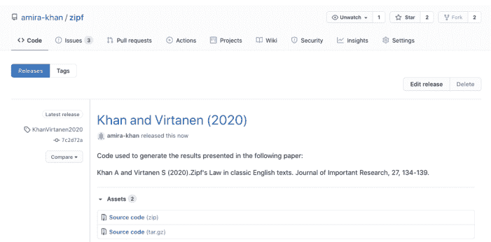

**图 13.1：** GitHub上的新代码发布。

### 13.2.4 可复现性与可检查性

在大多数情况下，记录我们的软件环境、分析脚本和数据处理步骤，将确保我们的计算分析在报告发布时是可复现/可重复的。但五年或十年后呢？正如我们所讨论的，数据分析工作流通常依赖于一个软件包层级结构。我们的齐夫定律分析依赖于一系列Python库，而这些库又依赖于Python语言本身。一些工作流还关键性地依赖于特定的操作系统。随着时间的推移，其中一些依赖项将不可避免地被更新或不再被支持，这意味着我们的工作流虽然被记录下来，但将无法复现。

幸运的是，大多数读者并不想完全重新运行一个十年前的分析：他们只想弄清楚当时运行了什么以及做出了哪些重要决策，这有时被称为**可检查性**（Gil et al. 2016; T. Brown 2017）。虽然精确的可重复性保质期很短，但可检查性是一份记录良好的计算分析的持久遗产。

## 未来的你会感谢现在的你

数据和代码溯源通常是为了那些试图复现你工作的人的利益而被提倡的，而这些人最初并未参与这项工作。优先考虑他们的需求可能很困难：当我们的当前项目需要为参与其中的人的利益而工作时，我们如何证明为他人花费时间是合理的？

与其考虑那些陌生且无关的人，我们可以考虑我们团队的新成员，以及我们将在他们入职过程中节省的时间。我们也可以考虑五个月或五年后我们回到这个项目时将节省的时间。为这两类人提供良好服务的文档，几乎肯定也能满足陌生人的需求。

## 13.3 总结

互联网在科学出版领域引发了一场革命，且没有结束的迹象。过去，馆际互借需要数周才能到达，数据必须从已发表的论文中转录（如果能找到的话），而现在我们可以在几分钟内下载彼此的工作：*如果*我们能找到并理解它。像Our Research<sup>17</sup>这样的组织正在构建工具来帮助实现这两点；通过使用DOI和ORCID、在预印本服务器上发布、遵循FAIR原则以及记录我们的工作流，我们有助于确保每个人都能像我们一样追求他们的想法。

## 13.4 练习

### 13.4.1 ORCID

如果你还没有**ORCID**，请立即访问网站并注册。如果你已经有ORCID，请登录并确保你的详细信息和出版记录是最新的。

<sup>17</sup> http://ourresearch.org/

### 13.4.2 FAIR测试

澳大利亚研究数据共享组织创建了一个在线问卷<sup>18</sup>，用于衡量数据集在多大程度上符合FAIR原则。为你已发布或经常使用的数据集填写该问卷。

### 13.4.3 评估一个项目的数据溯源

*本练习改编自Wickes和Stein (2016)，并探讨了Meili (2016)的数据集。请访问数据集页面 http://doi.org/10.3886/E17507V2 并下载文件。你需要创建一个ICPSER账户并同意其数据协议才能下载。*

查看数据集的主页以了解研究概况，然后查看电子表格文件和编码响应文件。

1.  这项研究的参与者是谁？
2.  收集并用于分析的数据类型有哪些？
3.  你能找到关于受访者人口统计信息的内容吗？
4.  这个数据集显然是为支持一篇文章而存在的。你能找到关于它的什么信息？你能找到指向它的链接吗？

### 13.4.4 评估一个项目的代码溯源

GitHub仓库 `borstlab/reversephi_paper`<sup>19</sup> 提供了Leonhardt等人 (2017) 论文的代码和数据。浏览该仓库并回答以下问题：

1.  软件环境在哪里描述？你需要哪些文件来重新创建该软件环境？
2.  数据处理步骤在哪里描述？你如何重新创建手稿中包含的结果？
3.  脚本和数据是如何归档的？也就是说，在哪里可以下载到手稿发布时的代码和数据版本？

为了感受不同的代码溯源方法，请对以下内容重复步骤1-3：

-   伴随Irving, Wijffels, and Church (2019) 论文的figshare页面<sup>20</sup>。
-   伴随Potter等人 (2019) 论文的GitHub仓库 `blab/h3n2-reassortment`<sup>21</sup>。

### 13.4.5 创建永久链接

指向英国内政部无障碍指南海报<sup>22</sup>的链接将来可能会改变。使用Wayback Machine<sup>23</sup>找到一个更可能长期可用的链接。

### 13.4.6 创建你的齐夫分析的存档

为你的分析代码提供DOI的一个稍欠永久性的替代方案是提供指向GitHub发布版本的链接。按照GitHub上的说明<sup>24</sup>，为你的 `zipf/` 项目的当前状态创建一个发布版本。

创建发布版本后，请阅读如何链接到它<sup>25</sup>。允许直接下载你发布版本的zip存档的URL是什么？

> **关于获取DOI？**
>
> 创建GitHub发布版本也是通过Zenodo/GitHub集成获取DOI的必要步骤（第13.2.3节）。我们在此止步于获取DOI，因为阅读本书的任何人都不需要正式引用或归档我们一直在开发的示例齐夫定律软件。此外，如果本书的每位读者都生成一个DOI，我们将会有许多DOI指向相同的代码！

<sup>20</sup> https://doi.org/10.6084/m9.figshare.7575830
<sup>21</sup> https://github.com/blab/h3n2-reassortment
<sup>22</sup> https://ukhomeoffice.github.io/accessibility-posters/posters/accessibility-posters.pdf
<sup>23</sup> https://web.archive.org/
<sup>24</sup> https://docs.github.com/en/github/administering-a-repository/managing-releases-in-a-repository
<sup>25</sup> https://docs.github.com/en/github/administering-a-repository/linking-to-releases

### 13.4.7 发布你的代码

思考一个你当前正在参与的项目。你将如何发布与该项目相关的代码（即软件描述、分析脚本和数据处理步骤）？

## 13.5 关键要点

-   除了论文，也要发布数据和代码。
-   使用**DOI**来标识报告、数据集和软件发布版本。
-   使用**ORCID**来标识你自己作为报告、数据集或软件发布版本的作者。
-   数据应该是**FAIR**<sup>26</sup>的：可发现、可访问、可互操作、可重用。
-   将小型数据集放在版本控制仓库中；将大型数据集存储在数据共享网站上。
-   以**可复现**的方式描述你的软件环境、分析脚本和数据处理步骤。
-   使你的分析既可复现又**可检查**。

<sup>26</sup> https://www.go-fair.org/fair-principles/


**Taylor & Francis**

Taylor & Francis Group

http://taylorandfrancis.com

## 14 使用Python创建软件包

> 巫师们面对新的、独特情况时的另一个反应是，翻阅他们的图书馆，看看以前是否发生过。这是……一个很好的生存特质。它意味着在危险时期，你会整天非常安静地坐在一堵非常厚的墙的建筑里。
>
> — 特里·普拉切特

我们编写的软件越多，就越倾向于将编程语言视为构建和组合库的一种方式。每种广泛使用的语言现在都有一个在线仓库，人们可以从那里下载和安装这些库。本课将向你展示如何使用Python的工具来创建和分享你自己的库。

我们将继续我们的齐夫定律项目，该项目应包含以下文件：

```
zipf/
├── .gitignore
├── .travis.yml
├── CONDUCT.md
├── CONTRIBUTING.md
├── KhanVirtanen2020.md
├── LICENSE.md
├── Makefile
├── README.md
├── environment.yml
├── requirements.txt
└── bin
    ├── book_summary.sh
    ├── collate.py
    ├── countwords.py
    ├── plotcounts.py
    ├── plotparams.yml
    ├── script_template.py
    └── test_zipfs.py
```

## 14.1 创建 Python 包

一个包由特定目录结构中的一个或多个 Python 源文件以及计算机的安装说明组成。Python 包可以来自多种来源：有些作为语言标准库¹的一部分随 Python 本身分发，但任何人都可以创建包，并且有成千上万的包可以从在线仓库下载和安装。

> **术语**

人们有时将包称为模块。严格来说，模块是单个源文件，而包是包含一个或多个模块的目录结构。

一个通用的包文件夹层次结构如下所示：

```
pkg_name
    pkg_name
        module1.py
        module2.py
    README.md
    setup.py
```

¹https://docs.python.org/3/library/

顶级目录以包名命名。它包含一个同样以包名命名的目录，该目录包含包的源文件。最初有两个同名目录可能会有点令人困惑，但大多数 Python 项目都遵循此约定，因为它使项目更容易设置为可安装。

```
__init__.py
```

Python 包通常包含一个具有特殊名称的文件：`__init__.py`（init 前后各有两个下划线）。正如导入模块文件会执行模块中的代码一样，导入包会执行 `__init__.py` 中的代码。在 Python 3.3 之前，包*必须*包含此文件，即使它是空的，但自 Python 3.3 以来，只有在我们希望在导入包时运行一些代码时才需要它。

如果我们想将我们的齐普夫定律软件作为 Python 包提供，我们需要遵循通用的文件夹层次结构。快速搜索 Python 包索引 (PyPI)² 发现包名 `zipf` 已被占用，因此我们需要使用不同的名称。让我们使用 `pyzipf` 并相应地更新我们的目录名称：

```
$ mv ~/zipf ~/pyzipf
$ cd ~/pyzipf
$ mv bin pyzipf
```

> 更新 GitHub 仓库名称

在这种情况下我们不会这样做（因为这会破坏本书前面部分的链接/引用），但既然我们已决定将包命名为 `pyzipf`，我们通常会更新 GitHub 仓库的名称以匹配。在 GitHub 网站上更改名称后，我们需要更新我们的 `git remote`，以便我们的本地仓库仍然可以与 GitHub 同步：

```
$ git remote set-url origin https://github.com/amira-khan/pyzipf.git
```

Python 有几种构建可安装包的方法。我们将展示如何使用 setuptools³，这是最低共同标准，它将允许每个人，无论他们使用什么 Python 发行版，都能使用我们的包。要使用 setuptools，我们必须在包根目录的上一级目录中创建一个名为 `setup.py` 的文件。（这就是为什么我们需要前面描述的两级目录结构。）`setup.py` 必须恰好是这个名称，并且必须包含类似这样的行：

```
from setuptools import setup

setup(
    name='pyzipf',
    version='0.1.0',
    author='Amira Khan',
    packages=['pyzipf'])
```

`name` 和 `author` 参数不言自明。大多数软件项目使用语义版本控制进行软件发布。版本号由三个整数 X.Y.Z 组成，其中 X 是主版本号，Y 是次版本号，Z 是补丁版本号。主版本号零 (0.Y.Z) 用于初始开发，因此我们从 0.1.0 开始。第一个稳定的公开发布版本将是 1.0.0，通常，版本号按以下方式递增：

- 每当有不兼容的外部可见更改时，递增主版本号。
- 以向后兼容的方式（即不破坏任何现有代码）添加新功能时，递增次版本号。
- 对于不添加任何新功能的向后兼容错误修复，递增补丁版本号。

最后，我们使用 `packages` 参数指定包含要打包代码的目录的名称。在我们的情况下这很简单，因为我们只有一个包目录。对于更复杂的项目，setuptools 中的 `find_packages`⁴ 函数可以通过递归搜索当前目录来自动查找所有包。

³https://setuptools.readthedocs.io/
⁴https://setuptools.readthedocs.io/en/latest/setuptools.html#using-find-packages

## 14.2 虚拟环境

我们稍后可以向包中添加更多信息，但这足以构建它以进行测试。不过，在我们这样做之前，我们应该创建一个**虚拟环境**来测试我们的包如何安装，而不会破坏我们主 Python 安装中的任何内容。我们在[第 13 章](#)中导出了环境的详细信息，作为记录我们正在使用的软件的一种方式；在本节中，我们将使用环境来使我们正在创建的软件更加健壮。

虚拟环境是现有 Python 安装之上的一个层。每当 Python 需要查找包时，它会在检查主 Python 安装之前先在虚拟环境中查找。这为我们提供了一个安装仅某些项目需要的包的地方，而不影响其他项目。

虚拟环境也有助于包开发：

- 我们希望能够轻松地测试安装和卸载我们的包，而不影响整个 Python 环境。
- 我们希望用比“我不知道，它在我这里有效”更有帮助的方式来回答人们使用我们包时遇到的问题。通过在一个完全空的环境中安装和运行我们的包，我们可以确保我们没有意外地依赖于其他已安装的包。

我们可以使用 conda<sup>5</sup>（[附录 I](#)）来管理虚拟环境。要创建一个名为 `pyzipf` 的新虚拟环境，我们运行 `conda create`，使用 `-n` 或 `--name` 标志指定环境名称，并在新环境中包含 `pip` 和我们当前版本的 Python：

```
$ conda create -n pyzipf pip python=3.7.6

Collecting package metadata (current_repodata.json): done
Solving environment: done

## Package Plan ##

  environment location: /Users/amira/anaconda3/envs/pyzipf

  added / updated specs:
    - pip
    - python=3.7.6
```

<sup>5</sup>https://conda.io/

The following packages will be downloaded:
...list of packages...

The following NEW packages will be INSTALLED:
...list of packages...

Proceed ([y]/n)? y

...

```
Preparing transaction: done
Verifying transaction: done
Executing transaction: done
#
# To activate this environment, use
#
# $ conda activate pyzipf
#
# To deactivate an active environment, use
#
# $ conda deactivate
```

conda 创建目录 `/Users/amira/anaconda3/envs/pyzipf`，其中包含最小 Python 安装所需的子目录，例如 `bin` 和 `lib`。它还创建 `/Users/amira/anaconda3/envs/pyzipf/bin/python`，该文件在检查主安装之前先在这些目录中查找包。

### conda 的差异

与本书中我们探索的许多其他工具一样，某些 `conda` 命令的行为因操作系统而异。完成本章中我们介绍的一些任务有多种方法。我们在此处介绍的选项代表了最有可能在多个平台上工作的方法。

此外，Anaconda 的路径在不同操作系统之间有所不同。我们的示例显示了通过 Unix shell 在 MacOS 上安装的 Anaconda 的默认路径（`/Users/amira/anaconda3`），但对于 MacOS 图形安装程序，它是 `/Users/amira/opt/anaconda3`，对于 Linux，它是 `/home/amira/anaconda3`，在 Windows 上，它是 `C:\Users\amira\Anaconda3`。在安装过程中，用户也可以选择自定义位置（第 1.3 节）。

我们可以通过运行以下命令切换到 `pyzipf` 环境：

```
$ conda activate pyzipf
```

一旦我们这样做，`python` 命令就会运行 `pyzipf/bin` 中的解释器：

```
(pyzipf)$ which python
/Users/amira/anaconda3/envs/pyzipf/bin/python
```

请注意，当该虚拟环境处于活动状态时，每个 shell 命令都会显示 `(pyzipf)`。在 Git 分支和虚拟环境之间，很容易忘记我们到底在处理什么以及使用什么。这样的提示可以减少一些混淆；使用与项目名称（以及分支名称，如果您在不同分支上测试不同环境）匹配的虚拟环境名称很快就会变得至关重要。

我们现在可以安全地安装包了。我们安装的所有内容都将进入 `pyzipf` 虚拟环境，而不会影响底层的 Python 安装。完成后，我们可以使用 `conda deactivate` 切换回默认环境。

## 14.3 安装开发包

让我们在这个虚拟环境中安装我们的包。首先，我们重新激活它：

```
$ conda activate pyzipf
```

接下来，我们进入包含 `setup.py` 文件的上级 `pyzipf` 目录，并安装我们的包：

```
(pyzipf)$ cd ~/pyzipf
(pyzipf)$ pip install -e .
```

```
Obtaining file:///Users/amira/pyzipf
Installing collected packages: pyzipf
  Running setup.py develop for pyzipf
Successfully installed pyzipf
```

`-e` 选项表示我们希望以“可编辑”模式安装该包，这意味着我们对包代码所做的任何更改都可以直接使用，而无需重新安装该包；`.` 表示“从当前目录安装”。

如果我们查看包含包安装的位置（例如，`/Users/amira/anaconda3/envs/pyzipf/lib/python3.7/site-packages/`），我们可以看到 `pyzipf` 包与其他所有本地安装的包并列。但是，如果我们此时尝试使用该包，Python 会抱怨它依赖的一些包（如 pandas）尚未安装。

我们可以手动安装这些依赖，但更可靠的方法是通过在 `setup.py` 中使用 `install_requires` 参数列出我们包的所有依赖来自动化此过程：

```python
from setuptools import setup

setup(
    name='pyzipf',
    version='0.1',
    author='Amira Khan',
    packages=['pyzipf'],
    install_requires=[
        'matplotlib',
        'pandas',
        'scipy',
        'pyyaml',
        'pytest'])
```

我们不必显式列出 numpy，因为它将作为 `pandas` 和 `scipy` 的依赖项被安装。

> **依赖版本控制**
>
> 指定依赖项的版本是一个好习惯，而指定版本范围则更好。例如，如果我们只在 pandas 版本 1.1.2 上测试过我们的包，我们可以在传递给 `install_requires` 参数的列表参数中放入 `pandas==1.1.2` 或 `pandas>=1.1.2`，而不是仅仅 `pandas`。

接下来，我们可以使用修改后的 `setup.py` 文件安装我们的包：

```
(pyzipf)$ cd ~/pyzipf
(pyzipf)$ pip install -e .
```

```
Obtaining file:///Users/amira/pyzipf
Collecting matplotlib
  Downloading matplotlib-3.3.3-cp37-cp37m-macosx_10_9_x86_64.whl
    |████████████████████████████| 8.5 MB 3.1 MB/s
Collecting cycler>=0.10
  Using cached cycler-0.10.0-py2.py3-none-any.whl
Collecting kiwisolver>=1.0.1
  Downloading kiwisolver-1.3.1-cp37-cp37m-macosx_10_9_x86_64.whl
    | | 61 kB 2.0 MB/s
Collecting numpy>=1.15
  Downloading numpy-1.19.4-cp37-cp37m-macosx_10_9_x86_64.whl
    | | 15.3 MB 8.9 MB/s
Collecting pillow>=6.2.0
  Downloading Pillow-8.0.1-cp37-cp37m-macosx_10_10_x86_64.whl
    | | 2.2 MB 6.3 MB/s
Collecting pyparsing!=2.0.4,!=2.1.2,!=2.1.6,>=2.0.3
  Using cached pyparsing-2.4.7-py2.py3-none-any.whl
Collecting python-dateutil>=2.1
  Using cached python_dateutil-2.8.1-py2.py3-none-any.whl
Collecting six
  Using cached six-1.15.0-py2.py3-none-any.whl
Collecting pandas
  Downloading pandas-1.1.5-cp37-cp37m-macosx_10_9_x86_64.whl
    | | 10.0 MB 1.4 MB/s
Collecting pytz>=2017.2
  Using cached pytz-2020.4-py2.py3-none-any.whl
Collecting pytest
  Using cached pytest-6.2.1-py3-none-any.whl
Collecting attrs>=19.2.0
  Using cached attrs-20.3.0-py2.py3-none-any.whl
Collecting importlib-metadata>=0.12
  Downloading importlib_metadata-3.3.0-py3-none-any.whl
Collecting pluggy<1.0.0a1,>=0.12
  Using cached pluggy-0.13.1-py2.py3-none-any.whl
Collecting py>=1.8.2
  Using cached py-1.10.0-py2.py3-none-any.whl
Collecting typing-extensions>=3.6.4
  Downloading typing_extensions-3.7.4.3-py3-none-any.whl
Collecting zipp>=0.5
  Downloading zipp-3.4.0-py3-none-any.whl
Collecting iniconfig
  Using cached iniconfig-1.1.1-py2.py3-none-any.whl
Collecting packaging
  Using cached packaging-20.8-py2.py3-none-any.whl
Collecting pyyaml
  Using cached PyYAML-5.3.1.tar.gz
Collecting scipy
  Downloading scipy-1.5.4-cp37-cp37m-macosx_10_9_x86_64.whl
    | | 28.7 MB 10.7 MB/s
Collecting toml
  Using cached toml-0.10.2-py2.py3-none-any.whl
Building wheels for collected packages: pyyaml
  Building wheel for pyyaml (setup.py) ... done
  Created wheel for pyyaml:
    filename=PyYAML-5.3.1-cp37-cp37m-macosx_10_9_x86_64.whl
    size=44626
    sha256=5a59ccf08237931e7946ec6b526922e4f0c8ee903d43671f50289431d8ee689d
  Stored in directory: /Users/amira/Library/Caches/pip/wheels/
    5e/03/1e/e1e954795d6f35dfc7b637fe2277bff021303bd9570ecea653
Successfully built pyyaml
Installing collected packages: zipp, typing-extensions, six,
  pyparsing, importlib-metadata, toml, pytz, python-dateutil, py,
  pluggy, pillow, packaging, numpy, kiwisolver, iniconfig, cycler,
  attrs, scipy, pyyaml, pytest, pandas, matplotlib, pyzipf
  Attempting uninstall: pyzipf
    Found existing installation: pyzipf 0.1.0
    Uninstalling pyzipf-0.1.0:
      Successfully uninstalled pyzipf-0.1.0
  Running setup.py develop for pyzipf
Successfully installed attrs-20.3.0 cycler-0.10.0
  importlib-metadata-3.3.0 iniconfig-1.1.1 kiwisolver-1.3.1
  matplotlib-3.3.3 numpy-1.19.4 packaging-20.8 pandas-1.1.5
  pillow-8.0.1 pluggy-0.13.1 py-1.10.0 pyparsing-2.4.7
  pytest-6.2.1 python-dateutil-2.8.1 pytz-2020.4 pyyaml-5.3.1
  pyzipf scipy-1.5.4 six-1.15.0 toml-0.10.2
  typing-extensions-3.7.4.3 zipp-3.4.0
```

（此命令的确切输出将根据安装的依赖项版本而变化。）

我们现在可以在脚本或 Jupyter notebook<sup>6</sup> 中导入我们的包，就像导入任何其他包一样。例如，要使用 `utilities` 中的函数，我们会这样写：

```python
from pyzipf import utilities as util

util.collection_to_csv(...)
```

为了允许我们的函数继续访问 `utilities.py`，我们需要在 `countwords.py` 和 `collate.py` 中都更改那一行。

然而，我们过去用于统计和绘制词频的有用命令行脚本不再能直接从 Unix shell 访问。幸运的是，除了上述更改函数导入的方式外，还有另一种选择。**setuptools** 包允许我们随包一起安装程序。这些程序被放置在其他包的程序旁边。我们通过在 **setup.py** 中定义 **入口点** 来告诉 **setuptools** 这样做：

```python
from setuptools import setup

setup(
    name='pyzipf',
    version='0.1',
    author='Amira Khan',
    packages=['pyzipf'],
    install_requires=[
        'matplotlib',
        'pandas',
        'scipy',
        'pyyaml',
        'pytest'],
    entry_points={
        'console_scripts': [
            'countwords = pyzipf.countwords:main',
            'collate = pyzipf.collate:main',
            'plotcounts = pyzipf.plotcounts:main']})
```

`=` 运算符的右侧是一个函数的位置，写作 **包.模块:函数**；左侧是我们希望从命令行调用此函数时使用的名称。在这种情况下，我们希望调用每个模块的 **main** 函数；目前，它需要一个包含用户给出的命令行参数的输入参数 **args**（第 5.2 节）。例如，我们 **countwords.py** 程序的相关部分是：

```python
def main(args):
    """Run the command line program."""
    word_counts = count_words(args.infile)
    util.collection_to_csv(word_counts, num=args.num)

if __name__ == '__main__':
    parser = argparse.ArgumentParser(description=__doc__)
    parser.add_argument('infile', type=argparse.FileType('r'),
                        nargs='?', default='-',
                        help='Input file name')
    parser.add_argument('-n', '--num',
                        type=int, default=None,
                        help='Output n most frequent words')
    args = parser.parse_args()
    main(args)
```

当我们在 `setup.py` 文件中定义入口点时，我们无法向 `main` 传递任何参数，因此我们需要稍微修改我们的脚本：

```python
def parse_command_line():
    """Parse the command line for input arguments."""
    parser = argparse.ArgumentParser(description=__doc__)
    parser.add_argument('infile', type=argparse.FileType('r'),
                        nargs='?', default='-',
                        help='Input file name')
    parser.add_argument('-n', '--num',
                        type=int, default=None,
                        help='Output n most frequent words')
    args = parser.parse_args()
    return args

def main():
    """Run the command line program."""
    args = parse_command_line()
    word_counts = count_words(args.infile)
    util.collection_to_csv(word_counts, num=args.num)

if __name__ == '__main__':
    main()
```

新的 `parse_command_line` 函数处理命令行参数，因此 `main()` 不再需要任何输入参数。一旦我们在 `collate.py` 和 `plotcounts.py` 中进行了相应的更改，我们就可以重新安装我们的包：

<sup>6</sup> https://jupyter.org/

## 14 使用Python创建包

```
(pyzipf)$ pip install -e .
```

```
Defaulting to user installation because normal site-packages is
not writeable
Obtaining file:///Users/amira/pyzipf
Requirement already satisfied: matplotlib in
    /usr/lib/python3.7/site-packages (from pyzipf==0.1) (3.2.1)
Requirement already satisfied: pandas in
    /Users/amira/.local/lib/python3.7/site-packages
    (from pyzipf==0.1) (1.0.3)
Requirement already satisfied: scipy in
    /usr/lib/python3.7/site-packages (from pyzipf==0.1) (1.4.1)
Requirement already satisfied: pyyaml in
    /usr/lib/python3.7/site-packages (from pyzipf==0.1) (5.3.1)
Requirement already satisfied: cycler>=0.10 in
    /usr/lib/python3.7/site-packages
    (from matplotlib->pyzipf==0.1) (0.10.0)
Requirement already satisfied: kiwisolver>=1.0.1 in
    /usr/lib/python3.7/site-packages
    (from matplotlib->pyzipf==0.1) (1.1.0)
Requirement already satisfied: numpy>=1.11 in
    /usr/lib/python3.7/site-packages
    (from matplotlib->pyzipf==0.1) (1.18.2)
Requirement already satisfied: pyparsing!=2.0.4,!=2.1.2,
    !=2.1.6,>=2.0.1 in
    /usr/lib/python3.7/site-packages
    (from matplotlib->pyzipf==0.1) (2.4.6)
Requirement already satisfied: python-dateutil>=2.1 in
    /usr/lib/python3.7/site-packages
    (from matplotlib->pyzipf==0.1) (2.8.1)
Requirement already satisfied: pytz>=2017.2 in
    /usr/lib/python3.7/site-packages
    (from pandas->pyzipf==0.1) (2019.3)
Requirement already satisfied: six in
    /usr/lib/python3.7/site-packages
    (from cycler>=0.10->matplotlib->pyzipf==0.1) (1.14.0)
Requirement already satisfied: setuptools in
    /usr/lib/python3.7/site-packages
    (from kiwisolver>=1.0.1->matplotlib->pyzipf==0.1) (46.1.3)
Installing collected packages: pyzipf
  Running setup.py develop for pyzipf
Successfully installed pyzipf
```

输出结果与第一次运行时略有不同，因为`pip`可以重用之前安装时保存在本地的一些包，而不是从在线仓库重新获取。（如果我们没有使用`-e`选项使包立即可编辑，那么在开发过程中，我们就必须在重新安装之前先卸载它。）

现在我们可以直接从Unix shell使用我们的命令，而无需写出文件的完整路径，也无需在前面加上`python`前缀。

```
(pyzipf)$ countwords data/dracula.txt -n 5
```

```
the,8036
and,5896
i,4712
to,4540
of,3738
```

> **跟踪pyzipf.egg-info？**

使用`setuptools`会自动在你的项目目录中创建一个名为`pyzipf.egg-info`的新文件夹。这个文件夹是另一个例子<sup>7</sup>，说明由脚本生成的信息也被包含在仓库中，因此它应该被包含在`.gitignore`文件中，以避免被Git跟踪。

## 14.4 安装做了什么

既然我们已经创建并安装了一个Python包，让我们来探索一下安装过程中实际发生了什么。简而言之，包的内容被复制到一个目录中，当Python导入东西时，它会搜索这个目录。理论上，我们可以通过手动将源代码复制到正确的位置来“安装”包，但使用专门为此目的设计的工具（如`conda`或`pip`）要高效和安全得多。

大多数时候，这些工具会将包复制到Python安装目录的`site-packages`目录中，但这并不是Python搜索的唯一位置。就像shell中的`PATH`环境变量包含一个shell搜索可执行程序的目录列表（第4.6节）一样，Python变量`sys.path`包含一个它搜索的目录列表（第11.2节）。我们可以在解释器内部查看这个列表：

```
import sys
sys.path
```

```
['',
'/Users/amira/anaconda3/envs/pyzipf/lib/python37.zip',
'/Users/amira/anaconda3/envs/pyzipf/lib/python3.7',
'/Users/amira/anaconda3/envs/pyzipf/lib/python3.7/lib-dynload',
'/Users/amira/.local/lib/python3.7/site-packages',
'/Users/amira/anaconda3/envs/pyzipf/lib/python3.7/site-packages',
'/Users/amira/pyzipf']
```

列表开头的空字符串表示“当前目录”。其余的是我们Python安装的系统路径，会因计算机而异。

## 14.5 分发包

> **只看不执行**

在本节中，我们将pyzipf包上传到TestPyPI和PyPI：

https://test.pypi.org/project/pyzipf
https://pypi.org/project/pyzipf/

你将无法完全按照所示执行下面的twine上传命令（因为Amira已经上传了pyzipf包），但本节中的通用命令序列是上传你自己的包时极好的参考资源。如果你想尝试通过twine上传你自己的pyzipf包，你可以编辑项目名称以包含你的名字（例如，pyzipf-yourname），并使用TestPyPI仓库进行上传。

一个可安装的包在分发后最有用，这样任何想要它的人都可以运行`pip install pyzipf`并获取它。为了实现这一点，我们需要使用setuptools创建一个**源代码分发包**（在Python打包术语中称为sdist）：

```
(pyzipf)$ python setup.py sdist
```

```
running sdist
running egg_info
creating pyzipf.egg-info
writing pyzipf.egg-info/PKG-INFO
writing dependency_links to pyzipf.egg-info/dependency_links.txt
writing entry points to pyzipf.egg-info/entry_points.txt
writing requirements to pyzipf.egg-info/requires.txt
writing top-level names to pyzipf.egg-info/top_level.txt
writing manifest file 'pyzipf.egg-info/SOURCES.txt'
package init file 'pyzipf/__init__.py' not found
(or not a regular file)
reading manifest file 'pyzipf.egg-info/SOURCES.txt'
writing manifest file 'pyzipf.egg-info/SOURCES.txt'
running check
warning: check: missing required meta-data: url

warning: check: missing meta-data: if 'author' supplied,
                 'author_email' must be supplied too

creating pyzipf-0.1
creating pyzipf-0.1/pyzipf
creating pyzipf-0.1/pyzipf.egg-info
copying files to pyzipf-0.1...
copying README.md -> pyzipf-0.1
copying setup.py -> pyzipf-0.1
copying pyzipf/collate.py -> pyzipf-0.1/pyzipf
copying pyzipf/countwords.py -> pyzipf-0.1/pyzipf
copying pyzipf/plotcounts.py -> pyzipf-0.1/pyzipf
copying pyzipf/script_template.py -> pyzipf-0.1/pyzipf
copying pyzipf/test_zipfs.py -> pyzipf-0.1/pyzipf
copying pyzipf/utilities.py -> pyzipf-0.1/pyzipf
copying pyzipf.egg-info/PKG-INFO -> pyzipf-0.1/pyzipf.egg-info
copying pyzipf.egg-info/SOURCES.txt -> pyzipf-0.1/pyzipf.egg-info
copying pyzipf.egg-info/dependency_links.txt -> pyzipf-0.1/pyzipf.egg-info
copying pyzipf.egg-info/entry_points.txt -> pyzipf-0.1/pyzipf.egg-info
copying pyzipf.egg-info/requires.txt -> pyzipf-0.1/pyzipf.egg-info
copying pyzipf.egg-info/top_level.txt -> pyzipf-0.1/pyzipf.egg-info
Writing pyzipf-0.1/setup.cfg
creating dist
Creating tar archive
removing 'pyzipf-0.1' (and everything under it)
```

这会创建一个名为`pyzipf-0.1.tar.gz`的文件，位于我们项目中的一个新目录`dist/`（另一个需要添加到`.gitignore`<sup>8</sup>的目录）。这些分发文件现在可以通过PyPI<sup>9</sup>（Python包的标准仓库）进行分发。不过在此之前，我们可以将`pyzipf`放在TestPyPI<sup>10</sup>上，这让我们可以在不将内容发布到主PyPI仓库的情况下测试我们包的分发。我们必须有一个账户，但创建账户是免费的。

上传包到PyPI的首选工具叫做twine<sup>11</sup>，我们可以通过以下方式安装：

```
(pyzipf)$ pip install twine
```

遵循Python打包用户指南<sup>12</sup>，我们使用`--repository`选项指定TestPyPI仓库，从`dist/`文件夹上传我们的分发包：

```
$ twine upload --repository testpypi dist/*
```

正在上传分发包到 https://test.pypi.org/legacy/

<sup>7</sup> https://github.com/github/gitignore
<sup>8</sup> https://github.com/github/gitignore
<sup>9</sup> https://pypi.org/
<sup>10</sup> https://test.pypi.org
<sup>11</sup> https://twine.readthedocs.io/en/latest/
<sup>12</sup> https://packaging.python.org/guides/using-testpypi/

## 14.5 分发软件包

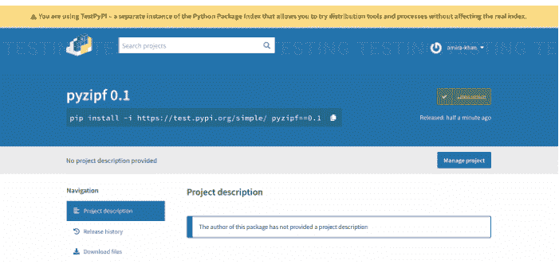

图 14.1：我们在 TestPyPI 上的新项目。

```
Enter your username: amira-khan
Enter your password: *********
```

```
Uploading pyzipf-0.1.0.tar.gz
100%|          | 5.59k/5.59k [00:01<00:00, 3.27kB/s]

View at:
https://test.pypi.org/project/pyzipf/0.1/
```

然后在新的测试项目网页（图 14.1）上查看结果。在练习中，我们将探索可以添加到 `setup.py` 的其他元数据，以便它们出现在项目网页上。

我们可以通过创建一个虚拟环境并从 TestPyPI 安装我们的软件包来测试一切是否按预期工作（下面的 `--extra-index-url` 引用 PyPI 是考虑到并非我们所有的软件包依赖项都在 TestPyPI 上可用）：

```
(pyzipf)$ conda create -n pyzipf-test pip python=3.7.6
(pyzipf)$ conda activate pyzipf-test
(pyzipf-test)$ pip install --index-url
  https://test.pypi.org/simple
  --extra-index-url https://pypi.org/simple pyzipf
```

Looking in indexes: https://test.pypi.org/simple, https://pypi.org/simple
Collecting pyzipf
  Downloading pyzipf-0.1.tar.gz (5.5 kB)
Collecting matplotlib
  Using cached matplotlib-3.3.3-cp37-cp37m-macosx_10_9_x86_64.whl
...collecting other packages...
Building wheels for collected packages: pyzipf
  Building wheel for pyzipf (setup.py) ... done
  Created wheel for pyzipf:
    filename=pyzipf-0.1-py3-none-any.whl
    size=6836
    sha256=62a23715379b71ad5a6b124444fab194596d094c7df293c4019d33bdd648aff1
  Stored in directory: /Users/amira/Library/Caches/pip/wheels/c6/d6/08/f16cf80ec82a9c70ab8a5d9c8acc7ab35c9a01009539aeb2be
Successfully built pyzipf
Installing collected packages: zipp, typing-extensions, six, pyparsing, importlib-metadata, toml, pytz, python-dateutil, py, pluggy, pillow, packaging, numpy, kiwisolver, iniconfig, cycler, attrs, scipy, pyyaml, pytest, pandas, matplotlib, pyzipf
Successfully installed attrs-20.3.0 cycler-0.10.0 importlib-metadata-3.3.0 iniconfig-1.1.1 kiwisolver-1.3.1 matplotlib-3.3.3 numpy-1.19.4 packaging-20.8 pandas-1.1.5 pillow-8.0.1 pluggy-0.13.1 py-1.10.0 pyparsing-2.4.7 pytest-6.2.1 python-dateutil-2.8.1 pytz-2020.4 pyyaml-5.3.1 pyzipf-0.1 scipy-1.5.4 six-1.15.0 toml-0.10.2 typing-extensions-3.7.4.3 zipp-3.4.0

pip 再次利用了我们系统上已存在一些软件包（例如，它们是从我们之前的安装中缓存的）这一事实，而没有再次下载它们。一旦我们对 TestPyPI 上的软件包感到满意，我们就可以通过相同的过程将其放到主 PyPI<sup>13</sup> 仓库上。

## Python Wheels

当我们从 TestPyPI 安装我们的软件包时，输出显示它收集了我们的源代码分发包，然后用它为 pyzipf 构建了一个 **wheel**。这个构建过程需要时间（特别是对于大型、复杂的软件包），因此软件包作者将 wheel 文件（.whl）与源代码分发包一起创建并上传到 PyPI 可能是个好主意。如果 PyPI 上有合适的 wheel 文件，pip 将使用它，而不是从源代码分发包构建，这使得安装过程更快、更高效。有关详细信息，请查看 Real Python 的 wheel 指南<sup>14</sup>。

## conda 安装包

鉴于 conda<sup>15</sup> 在软件包管理中的广泛使用，将 conda 安装包发布到 Anaconda Cloud<sup>16</sup> 可能是个好主意。conda 文档提供了说明<sup>17</sup>，用于为已在 PyPI 上可用的 Python 模块快速构建 conda 包。有关 conda 和 Anaconda Cloud 的更多信息，请参见附录 I。

## 14.6 编写软件包文档

既然我们的软件包已经分发，我们需要考虑是否提供了足够的文档。文档字符串（第 5.3 节）和 README 文件足以描述大多数简单的软件包，但随着我们的代码库变得更大，我们希望用自动生成的内容、函数之间的引用和搜索功能来补充这些手动编写的部分。对于大多数大型 Python 软件包，此类文档是使用名为 Sphinx<sup>18</sup> 的 **文档生成器** 生成的，它通常与名为 Read the Docs<sup>19</sup> 的免费在线托管服务结合使用。在本节中，我们将使用 Sphinx 和 Read the Docs 将该信息与更详细的函数级文档一起在线托管之前，先用一些基本的软件包级文档更新我们的 README 文件。有关为更大和更复杂的软件包编写文档的进一步建议，请参见附录 G。

<sup>14</sup>https://realpython.com/python-wheels/
<sup>15</sup>https://conda.io/
<sup>16</sup>https://anaconda.org/
<sup>17</sup>https://docs.conda.io/projects/conda-build/en/latest/user-guide/tutorials/build-pkgs-skeleton.html
<sup>18</sup>https://www.sphinx-doc.org/en/master/
<sup>19</sup>https://docs.readthedocs.io/en/latest/

### 14.6.1 在 README 中包含软件包级文档

当用户第一次接触一个软件包时，他们通常想知道该软件包的用途、安装说明以及使用示例。我们可以将这些元素包含在我们在第 7 章开始的 `README.md` 文件中。目前它的内容如下：

```
$ cat README.md

# Zipf's Law

These Zipf's Law scripts tally the occurrences of words in text files and plot each word's rank versus its frequency.

...
```

此文件目前以 Markdown<sup>20</sup> 格式编写，但 Sphinx 使用一种名为 **reStructuredText** (reST) 的格式，因此我们将切换到该格式。与 Markdown 类似，reST 是一种纯文本标记格式，可以渲染成具有复杂索引和交叉链接的 HTML 或 PDF 文档。GitHub 识别以 .rst 结尾的文件为 reST 文件并很好地显示它们，因此我们的第一项任务是重命名现有文件：

```
$ git mv README.md README.rst
```

然后我们对文件格式进行一些编辑：标题带下划线和上划线，章节标题带下划线，代码块用两个冒号（::）分隔并缩进。我们还可以添加一些关于为何使用该软件包的背景信息，以及有关软件包安装的更新信息：

```
The ``pyzipf`` package tallies the occurrences of words in text files and plots each word's rank versus its frequency together with a line for the theoretical distribution for Zipf's Law.
```

<sup>20</sup>https://en.wikipedia.org/wiki/Markdown

## 动机

Zipf 定律通常被表述为文本中单词频率和排名之间关系的一种观察模式：

> “……最频繁的单词出现的频率大约是第二频繁单词的两倍，是第三频繁单词的三倍，等等。”

- `wikipedia <https://en.wikipedia.org/wiki/Zipf%27s_law>`_

许多书籍可以从 `Project Gutenberg <https://www.gutenberg.org/>`_ 等网站以纯文本格式下载，因此我们创建了这个软件包，以定性地探索不同书籍与 Zipf 定律预测的单词频率的吻合程度。

## 安装

```
pip install pyzipf
```

## 用法

安装此软件包后，以下三个命令将可从命令行使用：

- ``countwords`` 用于计算文本中单词的出现次数
- ``collate`` 用于将多个单词计数文件整理在一起
- ``plotcounts`` 用于可视化单词计数

一个典型的使用场景包括从终端运行以下命令：

```
countwords dracula.txt > dracula.csv
countwords moby_dick.txt > moby_dick.csv
collate dracula.csv moby_dick.csv > collated.csv
plotcounts collated.csv --outfile zipf-drac-moby.jpg
```

有关每个函数的更多信息可以在它们的文档字符串中找到，并附加 ``-h`` 标志，例如 `countwords -h`。

# 贡献

有兴趣贡献吗？
请查看 CONTRIBUTING.md
文件以获取有关如何贡献的指南。
请注意，此项目发布时附带了
贡献者行为准则（CONDUCT.md）。
通过为此项目做出贡献，
您同意遵守其条款。
这两个文件都可以在我们的
`GitHub 仓库中找到。 <https://github.com/amira-khan/zipf>`_

### 14.6.2 创建文档网页

既然我们已经在 README 文件中添加了软件包级文档，
我们需要考虑函数级文档。我们希望向用户提供
我们软件包中所有可用函数的列表，以及它们
功能和使用方法的简短描述。我们可以通过手动
从我们的 Python 模块（即 `countwords.py`、`plotcounts.py` 等）
剪切和粘贴函数名和文档字符串来实现这一点，但随着
更多函数随时间添加，这将是一个耗时且容易出错的过程。
相反，我们可以使用名为 Sphinx<sup>21</sup> 的 **文档生成器**，
它能够扫描 Python 代码以获取函数名和文档字符串，
并将该信息导出为 HTML 格式以托管在网络上。

首先，让我们安装 Sphinx 并在我们的仓库顶部创建一个 `docs/` 目录：

```
$ pip install sphinx
$ mkdir docs
$ cd docs
```

然后我们可以运行 Sphinx 的 `quickstart` 工具来创建一组最小的文档，
其中包括我们刚刚创建的 `README.rst` 文件中的软件包级信息
以及我们一路编写的文档字符串中的函数级信息。它要求我们指定项目的名称、
文档的名称

<sup>21</sup>https://www.sphinx-doc.org/en/master/

## 14.6 为包编写文档

项目作者和版本；其他所有设置我们可以使用默认值。

```
$ sphinx-quickstart
```

欢迎使用 Sphinx 3.1.1 快速启动工具。

请输入以下设置的值（如果括号内有默认值，直接按回车键即可接受）。

选定的根路径：.

你有两个选项来放置 Sphinx 输出的构建目录。要么在根路径内使用一个名为 "_build" 的目录，要么在根路径内分离 "source" 和 "build" 目录。

```
> Separate source and build directories (y/n) [n]: n
```

项目名称将出现在构建文档的多个位置。

```
> Project name: pyzipf
> Author name(s): Amira Khan
> Project release []: 0.1
```

如果文档要用英语以外的语言编写，你可以在此处通过语言代码选择一种语言。Sphinx 随后会将其生成的文本翻译成该语言。

有关支持的代码列表，请参阅
https://www.sphinx-doc.org/en/master/usage/configuration.html

```
> Project language [en]:
```

正在创建文件 /Users/amira/pyzipf/docs/conf.py。
正在创建文件 /Users/amira/pyzipf/docs/index.rst。
正在创建文件 /Users/amira/pyzipf/docs/Makefile。
正在创建文件 /Users/amira/pyzipf/docs/make.bat。

完成：已创建初始目录结构。

你现在应该填充你的主文件
/Users/amira/pyzipf/docs/index.rst 并创建其他文档源文件。使用 Makefile 来构建文档，如下所示：
    make builder
其中 "builder" 是支持的构建器之一，例如 HTML、LaTeX 或 linkcheck。

快速启动会在 docs 目录中创建一个名为 conf.py 的文件来配置 Sphinx。我们将对该文件进行两处修改，以便另一个名为 autodoc 的工具能够找到我们的模块（及其文档字符串）。第一处修改涉及文件头部附近的 "路径设置" 部分：

```
# -- Path setup --------------------------------------------------------------

# If extensions (or modules to document with autodoc) are in
# another directory, add these directories to sys.path here. If
# the directory is relative to the documentation root, use
# os.path.abspath to make it absolute, like shown here.
```

相对于 docs/ 目录，我们的模块（即 countwords.py、utilities.py 等）位于 ../pyzipf 目录中。因此，我们需要取消 conf.py 中路径设置部分的相关行注释，以告诉 Sphinx 这些模块的位置：

```
import os
import sys
sys.path.insert(0, os.path.abspath('../pyzipf'))
```

我们还将修改 "常规配置" 部分，将 autodoc 添加到我们想要的 Sphinx 扩展列表中：

```
extensions = ['sphinx.ext.autodoc']
```

完成这些编辑后，我们现在可以生成一个 Sphinx autodoc 脚本，该脚本将生成关于我们每个模块的信息，并将其放入 docs/source 目录中对应的 .rst 文件：

```
sphinx-apidoc -o source/ ../pyzipf
```

```
Creating file source/collate.rst.
Creating file source/countwords.rst.
Creating file source/plotcounts.rst.
Creating file source/test_zipfs.rst.
Creating file source/utilities.rst.
Creating file source/modules.rst.
```

此时，我们已准备好生成我们的网页。docs 子目录包含一个由 sphinx-quickstart 生成的 Makefile。如果我们运行 make html 并在网页浏览器中打开 docs/_build/index.html，我们将看到一个包含最少文档的着陆页（图 14.2）。如果我们点击 Module Index 链接，就可以访问各个模块的文档（图 14.3 和 14.4）。

网站的着陆页是放置我们 README 文件内容的绝佳位置，因此我们可以在 docs/index.rst 文件中添加 .. include:: ../README.rst 这一行来插入它：

```
Welcome to pyzipf's documentation!
=================================

.. include:: ../README.rst
```

```
.. toctree::
   :maxdepth: 2
   :caption: Contents:

Indices and tables
==================

* :ref:`genindex`
* :ref:`modindex`
* :ref:`search`
```

**图 14.2：** 默认的网站着陆页。

**图 14.3：** 模块索引。

**图 14.4：** countwords 文档。

**图 14.5：** 显示 README.rst 内容的新着陆页。

如果我们重新运行 `make html`，现在会得到一组更新的网页，这些网页将我们的 README 用作文档的介绍（图 14.5）。

在继续之前，请注意 Sphinx 并未包含在 `requirements.txt`（第 11.8 节）的安装要求中。运行、开发甚至测试我们的包都不需要 Sphinx，但构建文档需要它。为了注明这一要求，但又不要求每个安装该包的人都安装 Sphinx，让我们创建一个 `requirements_docs.txt` 文件，其中包含以下行（版本号可通过运行 `pip freeze` 找到）：

```
Sphinx>=1.7.4
```

任何想要构建文档的人（包括我们在另一台电脑上）现在只需运行 `pip install -r requirements_docs.txt`

### 14.6.3 在线托管文档

既然我们已经生成了包文档，我们需要将其在线托管。Python 项目的一个常见选择是 Read the Docs<sup>22</sup>，这是一个由社区支持的网站，免费托管软件文档。

就像持续集成系统会自动重新测试（第 11.8 节）一样，Read the Docs 与 GitHub 集成，使得每次更新推送到项目的 GitHub 仓库时，文档都会自动重新构建。如果我们使用 GitHub 账户注册 Read the Docs，就可以在 Read the Docs 网站上登录，并从我们的 GitHub 仓库导入一个项目。Read the Docs 随后会构建文档（使用我们之前所做的 `make html`）并托管生成的文件。

为此，Sphinx 生成的所有源文件都需要检入你的 GitHub 仓库：在我们的例子中，这意味着 `docs/source/*.rst`、`docs/Makefile`、`docs/conf.py` 和 `docs/index.rst`。我们还需要在 `pyzipf` 包的根目录中创建并保存一个 Read the Docs 配置文件<sup>23</sup>：

```
$ cd ~/pyzipf
$ cat .readthedocs.yml
```

```
# .readthedocs.yml
# Read the Docs configuration file
# See https://docs.readthedocs.io/en/stable/config-file/v2.html
# for details

# Required
version: 2

# Build documentation in the docs/ directory with Sphinx
sphinx:
  configuration: docs/conf.py

# Optionally set the version of Python and requirements required
# to build your docs
python:
  version: 3.7
  install:
    - requirements: requirements.txt
```

该配置文件使用现在熟悉的 **YAML** 格式（第 10.1 节和附录 H）来指定 Sphinx 配置脚本（`docs/conf.py`）的位置和我们包的依赖项（`requirements.txt`）。

Amira 已经完成了这个过程，文档现在可以在以下地址访问：

https://pyzipf.readthedocs.io/

<sup>22</sup>https://docs.readthedocs.io/en/latest/
<sup>23</sup>https://docs.readthedocs.io/en/stable/config-file/v2.html

## 14.7 软件期刊

作为发布新软件包的最后一步，我们可能希望为其分配一个**DOI**，以便研究人员能够引用它。正如我们在第13.2.3节中所看到的，GitHub与Zenodo<sup>24</sup>的集成正是为了实现这一目的。

虽然使用Zenodo等网站创建DOI通常是软件发布流程的终点，但也可以选择在期刊上发表论文来详细描述该软件。一些研究领域有专门的期刊用于描述特定类型的软件（例如*《地球科学模型开发》*<sup>25</sup>），此外还有一些通用的软件期刊，如*《开放研究软件期刊》*<sup>26</sup>和*《开源软件期刊》*<sup>27</sup>。提交给这些期刊的软件包通常会根据一系列标准进行评估，这些标准涉及软件的安装便捷性和文档完善程度，因此同行评审过程可以成为从那些多年来见证过众多研究软件包兴衰的人那里获得宝贵反馈的好方法。

一旦你获得了DOI，并可能在软件期刊上发表了文章，最后一步就是告诉用户如何引用你的新软件包。传统做法是在关联的GitHub仓库中添加一个`CITATION`文件（与第1.1.1节讨论的`README`、`LICENSE`、`CONDUCT`等文件并列），其中包含一个纯文本引用，可以复制粘贴到电子邮件中，以及为BibTeX<sup>28</sup>等各种文献系统格式化的条目。

```
$ cat CITATION.md
```

```
# Citation

If you use the pyzipf package for work/research presented in a
publication, we ask that you please cite:

Khan A and Virtanen S, 2020. pyzipf: A Python package for word
count analysis. *Journal of Important Software*, 5(51), 2317,
https://doi.org/10.21105/jois.02317
```

<sup>24</sup>https://guides.github.com/activities/citable-code/
<sup>25</sup>https://www.geoscientific-model-development.net/
<sup>26</sup>https://openresearchsoftware.metajnl.com/
<sup>27</sup>https://joss.theoj.org/
<sup>28</sup>http://www.bibtex.org/

### BibTeX 条目

```
@article{Khan2020,
    title={pyzipf: A Python package for word count analysis.},
    author={Khan, Amira and Virtanen, Sami},
    journal={Journal of Important Software},
    volume={5},
    number={51},
    eid={2317},
    year={2020},
    doi={10.21105/jois.02317},
    url={https://doi.org/10.21105/jois.02317},
}
```

## 14.8 总结

成千上万的人帮助编写了我们的齐夫定律示例所依赖的软件，但他们的工作之所以有用，是因为他们将其打包并记录了使用方法。大学、政府实验室和其他组织越来越认识到，这样做是一项值得肯定的工作，特别是对于研究软件工程师而言。让陌生人的生活变得更好，哪怕只是微小的改善，也是一件非常令人满足的事情。

## 14.9 练习

### 14.9.1 软件包元数据

在我们的TestPyPI网页的多个地方，都显示“未提供项目描述”（图14.1）。我们如何编辑`setup.py`文件来包含描述？你还会添加哪些其他元数据？

提示：`setup()`参数文档<sup>29</sup>可能有用。

<sup>29</sup>https://packaging.python.org/guides/distributing-packages-using-setuptools/#setup-args

### 14.9.2 分离依赖项

除了`requirements_docs.txt`，开发者通常还会创建一个`requirements_dev.txt`文件，列出软件包用户不需要但开发和测试所需的包。将`pytest`从`requirements.txt`中移出，放入新的`requirements_dev.txt`文件中。

### 14.9.3 软件评审

*《开源软件期刊》*<sup>30</sup>有一个检查清单<sup>31</sup>，评审员在评估提交的软件论文时必须遵循。浏览该检查清单（跳过与软件论文相关的标准），看看齐夫定律软件包在每个标准上的评分如何。

### 14.9.4 打包引言

本书每一章都以英国作家特里·普拉切特的一句引言开头。这个脚本`quotes.py`包含一个函数`random_quote`，它会打印一句随机的普拉切特引言：

```
import random

quote_list = ["It's still magic even if you know how it's done.",
              "Everything starts somewhere, "
              "though many physicists disagree.",
              "Ninety percent of most magic merely consists "
              "of knowing one extra fact.",
              "Wisdom comes from experience. "
              "Experience is often a result of lack of wisdom.",
              "There isn't a way things should be. "
              "There's just what happens, and what we do.",
              "Multiple exclamation marks are a sure sign "
              "of a diseased mind.",
              "+++ Divide By Cucumber Error. "
              "Please Reinstall Universe And Reboot +++",
              "It's got three keyboards and a hundred extra "
              "knobs, including twelve with '?' on them.",
              ]
```

```
def random_quote():
    """Print a random Pratchett quote."""
    print(random.choice(quote_list))
```

创建一个名为pratchett的新conda开发环境，并使用pip在该环境中安装一个名为pratchett的新软件包。该软件包应包含quotes.py，安装后用户应能运行：

```
from pratchett import quotes

quotes.random_quote()
```

## 14.10 关键要点

- 使用setuptools<sup>32</sup>来构建和分发Python软件包。
- 创建一个名为mypackage的目录，其中包含一个setup.py脚本，以及一个同样名为mypackage的子目录，用于存放软件包的源文件。
- 对软件发布使用语义化版本控制。
- 使用虚拟环境来测试软件包的安装，而不会干扰你的主Python安装。
- 使用pip<sup>33</sup>安装Python软件包。
- Python软件包的默认仓库是PyPI<sup>34</sup>。
- 使用TestPyPI<sup>35</sup>来测试你的软件包分发。
- 使用README文件进行软件包级别的文档编写。
- 使用Sphinx<sup>36</sup>为软件包生成文档。
- 使用Read the Docs<sup>37</sup>在线托管软件包文档。
- 使用GitHub的Zenodo集成<sup>38</sup>为你的软件包创建DOI。
- 在软件期刊上发布你的软件包详情，以便他人可以引用它。

<sup>32</sup>https://setuptools.readthedocs.io/
<sup>33</sup>https://pypi.org/project/pip/
<sup>34</sup>https://pypi.org/
<sup>35</sup>https://test.pypi.org
<sup>36</sup>https://www.sphinx-doc.org/en/master/
<sup>37</sup>https://docs.readthedocs.io/en/latest/
<sup>38</sup>https://guides.github.com/activities/citable-code/

# 15

## 终章

自从我们在[第0.2节](https://example.com)初次遇见Amira、Jun和Sami以来，我们已经走了很长一段路。Amira现在将她的脚本、数据集和报告组织起来，置于版本控制之下，并托管在GitHub上。她的工作已经得到了回报：一位同事在分析步骤中发现了一个问题，这影响了她报告中的五张图表。由于Amira使用了GitHub，这位同事可以通过拉取请求轻松地提出修复建议。Amira花了一些时间重新生成所有受影响的图表，因为她需要回忆哪些代码需要重新运行。她认识到这是采用Make的一个绝佳理由，并已将其添加到她的待办事项清单中。

她曾经对Unix shell感到畏惧，但现在Amira发现它是她日常工作的重要组成部分：她使用shell脚本来自动化数据处理任务，运行自己用Python编写的命令行工具，并向Git发出无数命令。她对shell的熟练掌握也帮助她向Sami学习如何在远程计算集群上运行分析。

Sami在本科阶段的软件项目中就有使用Git和Make的经验，但现在他们对这些工具在研究项目中的重要性有了新的认识。他们重新设计了Git和Make研讨会，使用数据管道的示例，并获得了参与者的一致好评。Sami也认识到研究中数据和代码溯源的重要性。他们一直在帮助用户，建议他们如何使研究更易于访问、检查和重现。

Jun现在正在开发他的第一个Python软件包。他添加了更好的错误处理，以便他和用户在出现问题时能获得更好的信息；他实施了一些测试策略，以给他和用户信心，确保他的代码有效；他还改进了文档。Jun还为他的项目仓库添加了许可证、行为准则和贡献指南，并且已经收到了一个修复文档中一些拼写错误的贡献。

## 15.1 我们为何撰写本书

Shell脚本、分支、自动化工作流、健康的团队协作——这些都需要时间学习，但它们能让研究者在更短时间内、以更少痛苦完成更多工作，这正是我们撰写本书的原因。气候危机是我们这个物种自文明诞生以来面临的最大威胁。新冠疫情充分暴露了我们应对如此规模问题的准备不足，以及如今毒害所有在线公共讨论的猜疑与虚假信息。

研究者每*不*浪费一小时与软件搏斗，就多一小时用于解决新问题；每次会议提前结束并达成明确决策，就能腾出时间向公众解释我们真正了解什么及其重要性。我们不指望本书能改变世界，但希望掌握编写、测试、文档化、打包和分享工作的知识，能让你有稍大一点的机会做到这一点。希望你喜欢阅读我们的文字；如果是这样，我们很乐意收到你的来信。

- 达米恩·欧文 (https://damienirving.github.io/)
- 凯特·赫特韦克 (https://katehertweck.com/)
- 卢克·约翰斯顿 (https://lukewjohnston.com/)
- 乔尔·奥斯特布洛姆 (https://joelostblom.com/)
- 夏洛特·威克姆 (https://www.cwick.co.nz/)
- 格雷格·威尔逊 (https://third-bit.com)

> 宇宙如此浩瀚，而时间如此短暂。
> —— 特里·普拉切特

## A

## 解答

本书包含的练习涵盖了从选择题到较大编码任务的多种问题类型。对于前者，指出正确答案相对直接，尽管可能存在因所用软件版本不同而导致更优答案的意外情况。对于后者，识别“正确”答案则更为困难，因为用代码完成同一任务通常有多种方法。此处我们提供了作者们普遍认为代表“良好”代码的可能解答，但我们鼓励你探索其他方法。

解答中提到的提交记录引用了GitHub上的Amira的`zipf`仓库<sup>1</sup>，你可以查看为得到答案而修改的文件具体行。

## 第2章

### 练习 2.10.1

`-l`选项使`ls`使用长列表格式，不仅显示文件/目录名，还显示文件大小和最后修改时间等附加信息。如果同时使用`-h`和`-l`选项，文件大小会以“人类可读”格式显示，例如显示为5.3K而非5369。

### 练习 2.10.2

命令`ls -R -t`会按最后修改时间排序显示每个目录的内容。

<sup>1</sup>https://github.com/amira-khan/zipf

### 练习 2.10.3

1. 否：.代表当前目录。
2. 否：/代表根目录。
3. 否：Amira的主目录是/Users/Amira。
4. 否：这会向上两级，即最终路径为/Users。
5. 是：~代表用户的主目录，此处为/Users/amira。
6. 否：如果当前目录下存在名为home的目录，这将进入该目录。
7. 是：从主目录~开始，此命令进入data目录然后返回（使用..）主目录。
8. 是：返回用户主目录的快捷方式。
9. 是：向上一级。
10. 是：与前一个答案相同，但包含多余的.（表示当前目录）。

### 练习 2.10.4

1. 否：/Users中存在一个名为backup的目录。
2. 否：这是Users/sami/backup的内容，但..表示请求上一级目录。
3. 否：与前一个解释相同，但结果显示为目录（这是-F选项指定的格式）。
4. 是：../backup/指的是/Users/backup/。

### 练习 2.10.5

1. 否：pwd不是目录名称。
2. 是：不带目录参数的ls会列出当前目录中的文件和目录。
3. 是：显式使用了绝对路径。

### 练习 2.10.6

touch命令会更新文件的时间戳。如果给定名称的文件不存在，touch会创建一个。假设你的工作目录中还没有my_file.txt，touch my_file.txt将创建该文件。当你用ls -l检查文件时，注意my_file.txt的大小为0字节。换句话说，它不包含任何数据。如果你用文本编辑器打开my_file.txt，它是空白的。

有些程序本身不生成输出文件，而是要求预先生成空文件。运行程序时，它会搜索现有文件来填充其输出。touch命令允许你高效生成供此类程序使用的空白文本文件。

### 练习 2.10.7

```
$ remove my_file.txt? y
```

-i选项会在（每次）删除前提示（使用y确认删除或n保留文件）。Unix shell没有回收站，因此所有被删除的文件将永久消失。使用-i选项，我们有机会检查是否只删除了想要移除的文件。

### 练习 2.10.8

```
$ mv ../data/chapter1.txt ../data/chapter2.txt .
```

回顾一下，..表示父目录（即当前目录的上一级），.表示当前目录。

### 练习 2.10.9

1. 否：虽然这会创建一个名称正确的文件，但错误命名的文件仍然存在于目录中，需要被删除。
2. 是：这可以重命名文件。
3. 否：句点（.）表示文件移动的位置，但未提供新文件名；无法创建同名文件。
4. 否：句点（.）表示文件复制的位置，但未提供新文件名；无法创建同名文件。

### 练习 2.10.10

我们从/Users/amira/data目录开始，其中包含一个文件books.dat。我们创建一个名为doc的新文件夹，并将文件books.dat移动（mv）到该新文件夹。然后我们复制（cp）刚刚移动的文件，命名为books-saved.dat。

这里棘手的部分是复制文件的位置。回顾一下，..表示“向上一级”，因此复制的文件现在位于/Users/amira。注意，..是相对于当前工作目录解释的，**而不是**相对于被复制文件的位置。因此，在/Users/amira/data中使用ls只会显示doc文件夹。

1. 否：books-saved.dat位于/Users/amira
2. 是。
3. 否：books.dat位于/Users/amira/data/doc
4. 否：books-saved.dat位于/Users/amira

### 练习 2.10.11

如果给定多个文件名后跟一个目录名（即目标目录必须是最后一个参数），cp会将文件复制到指定目录。

如果给定三个文件名，cp会报错，因为它期望最后一个参数是目录名。

### 练习 2.10.12

1. 是：显示所有名称包含两个不同字符（?）后跟字母n，然后零个或多个字符（*）后跟txt的文件。
2. 否：显示所有名称以零个或多个字符（*）后跟e_，零个或多个字符（*），然后txt开头的文件。输出包含所需的两本书，但也包含time_machine.txt。
3. 否：显示所有名称以零个或多个字符（*）后跟n，零个或多个字符（*），然后txt开头的文件。输出包含所需的两本书，但也包含frankenstein.txt和time_machine.txt。
4. 否：显示所有名称以零个或多个字符（*）后跟n，单个字符?，e，零个或多个字符（*），然后txt开头的文件。输出显示frankenstein.txt和sense_and_sensibility.txt。

### 练习 2.10.13

```
$ mv *.txt data
```

Amira需要将她的文件`books.txt`和`titles.txt`移动到`data`目录。shell会将`*.txt`扩展为匹配当前目录中所有`.txt`文件。然后`mv`命令将`.txt`文件列表移动到`data`目录。

### 练习 2.10.14

1. 是：这准确地重建了目录结构。
2. 是：这准确地重建了目录结构。
3. 否：此代码集的第一行会出错：

   `mkdir: 2016-05-20/data: No such file or directory`

   `mkdir`不会为尚不存在的目录创建子目录（除非你使用像`-p`这样明确创建父目录的选项）。
4. 否：这会在与`data`同级的位置创建`raw`和`processed`目录：

   ```
   2016-05-20/
   ├── data
   ├── processed
   └── raw
   ```

### 练习 2.10.15

1. 使用两个通配符表达式的解决方案：

   ```
   $ ls s*.txt
   $ ls t*.txt
   ```

2. 当没有以`s`开头且以`.txt`结尾的文件，或没有以`t`开头且以`.txt`结尾的文件时。

## 练习 2.10.16

1.  否：这只会删除文件名只有一个字符的 .csv 文件。
2.  是：这只会删除以 .csv 结尾的文件。
3.  否：Shell 会将 `*` 展开以匹配当前目录中的所有内容，因此该命令会尝试删除所有匹配的文件以及一个名为 .csv 的额外文件。
4.  否：Shell 会将 `*.*` 展开以匹配所有带扩展名的文件，因此此命令会删除当前目录中的所有文件。

## 练习 2.10.17

`novel-????-[ab]*.{txt,pdf}` 匹配：

-   文件名以 `novel-` 开头，
-   后面紧跟恰好四个字符（因为每个 `?` 匹配一个字符），
-   后面是另一个字面量 `-`，
-   后面是字母 `a` 或字母 `b`，
-   后面是零个或多个其他字符（`*`），
-   最后是 `.txt` 或 `.pdf`。

## 第 3 章

## 练习 3.8.1

`echo hello > testfile01.txt` 将字符串 “hello” 写入 `testfile01.txt`，但每次运行该命令时文件都会被覆盖。

`echo hello >> testfile02.txt` 将 “hello” 写入 `testfile02.txt`，但如果文件已存在（即我们第二次运行时），则会将字符串追加到文件中。

## 练习 3.8.2

1.  否：这仅运行了第一行代码（`head`）的结果。
2.  否：这仅运行了第二行代码（`tail`）的结果。
3.  是：第一行写入 `dracula.txt` 的前三行，第二行将 `dracula.txt` 的最后两行追加到同一文件中。
4.  否：我们需要通过管道连接命令才能得到此答案（`head -n 3 dracula.txt | tail -n 2 > extracted.txt`）。

## 练习 3.8.3

尝试在数据目录中运行每一行代码。

1.  否：这错误地使用了重定向（`>`），将导致错误。
2.  否：`head` 所需的行数报告不正确；这将导致错误。
3.  否：这将从 `wc` 的结果中提取前三个文件，而这些结果尚未按行数排序。
4.  是：此输出正确地排序并连接了每个命令。

## 练习 3.8.4

要从这些数据中获取唯一结果列表，我们需要运行：

```
$ sort genres.txt | uniq
```

`uniq` 几乎总是在使用 `sort` 之后运行是有道理的，因为这允许计算机只比较相邻的行。如果 `uniq` 不只比较相邻的行，它就需要将每一行与所有其他行进行比较。对于少量的比较，这影响不大，但对于大文件来说，这并不总是可行的。

## 练习 3.8.5

当用于单个文件时，`cat` 会将该文件的内容打印到屏幕上。在这种情况下，`titles.txt` 的内容作为输入发送给 `head -n 5`，因此输出 `titles.txt` 的前五行。这五行用作 `tail -n 3` 的输入，结果输出第 3-5 行。这用作最终命令的输入，该命令将其按逆序排序。这些结果被写入文件 `final.txt`，其内容为：

Sense and Sensibility,1811
Moby Dick,1851
Jane Eyre,1847

## 练习 3.8.6

`cut` 通过以下方式从一行中选择子字符串：

-   在找到分隔符（`-d ,`，此处为逗号）的地方将字符串分割成片段，并且
-   保留一个或多个结果字段/列（`-f 2`）。

在这种情况下，输出仅为 `titles.txt` 中的日期，因为它们位于第二列。

```
$ cut -d , -f 2 titles.txt
```

1897
1818
1847
1851
1811
1892
1897
1895
1847

## 练习 3.8.7

1.  否：这按书名排序。
2.  否：这会导致错误，因为 `sort` 使用不正确。
3.  否：输出中有重复的日期，因为它们没有先排序。
4.  是：这会产生下面所示的输出。
5.  否：这提取了所需的数据（如下），但随后计算了行数，导致答案不正确。

1 1811
1 1818
2 1847
1 1851
1 1892
1 1895
2 1897

如果您难以理解上述答案，请尝试运行命令或管道的子部分（例如，管道之间的代码）。

## 练习 3.8.8

版本之间的区别在于 `echo` 之后的代码是否在引号内。

第一个版本将 `echo analyze $file` 的输出重定向到一个文件（`analyzed-$file`）。这不允许我们预览命令，而是创建包含文本 `analyze $file` 的文件（`analyzed-$file`）。

第二个版本将允许我们预览命令。这会将引号内的所有内容打印到屏幕上，并展开循环变量名（以 `$` 为前缀）。

尝试两个版本以查看输出。务必打开 `analyzed-*` 文件以查看其内容。

## 练习 3.8.9

第一个版本在循环的每次迭代中给出相同的输出。Bash 将通配符 `*.txt` 展开以匹配所有以 `.txt` 结尾的文件，然后使用 `ls` 列出它们。展开后的循环将如下所示（我们只显示前两个数据文件）：

```
$ for datafile in dracula.txt  frankenstein.txt ...
> do
>   ls dracula.txt  frankenstein.txt ...
> done
```

```
dracula.txt  frankenstein.txt ...
dracula.txt  frankenstein.txt ...
...
```

第二个版本在每次循环迭代中列出不同的文件。`datafile` 变量的值使用 `$datafile` 求值，然后使用 `ls` 列出。

```
dracula.txt
frankenstein.txt
jane_eyre.txt
moby_dick.txt
sense_and_sensibility.txt
sherlock_holmes.txt
time_machine.txt
```

## 练习 3.8.10

第一个版本仅输出 `dracula.txt`，因为它是唯一以 “d” 开头的文件。

第二个版本输出以下内容，因为这些文件都包含一个 “d”，其前后有零个或多个字符：

```
README.md
dracula.txt
moby_dick.txt
sense_and_sensibility.txt
```

## 练习 3.8.11

两个版本都将每本书的前 16 行（`head -n 16`）写入一个文件（`headers.txt`）。

第一个版本导致每个文件的文本在每次迭代中被覆盖，因为使用了 `>` 作为重定向。

第二个版本使用 `>>`，将行追加到现有文件中。这是更可取的，因为最终的 `headers.txt` 包含了所有文件的前 16 行。

## 练习 3.8.12

如果一个命令导致崩溃或挂起，了解该命令是什么可能很有用，以便调查问题。如果命令仅在运行后才被记录，那么在崩溃事件中，我们将没有最后运行的命令记录。

## 第 4 章

## 练习 4.8.1

```
$ cd ~/zipf
```

切换到位于主目录（由 `~` 指定）中的 **zipf** 目录。

```
$ for file in $(find . -name "*.bak")
> do
>   rm $file
> done
```

查找所有以 **.bak** 结尾的文件并逐一删除。

```
$ rm bin/summarize_all_books.sh
```

删除 `summarize_all_books.sh` 脚本。

```
$ rm -r results
```

递归删除 **results** 目录中的每个文件，然后删除目录本身。（必须先删除所有文件，因为无法删除非空目录。）

## 练习 4.8.2

使用给定参数运行此脚本将打印目录中每个以 **.txt** 结尾的文件的第一行和最后一行。

1.  否：此答案误解了打印的行。
2.  是。
3.  否：此答案包含了错误的文件。
4.  否：省略引号将导致错误。

## 练习 4.8.3

一个可能的脚本（`longest.sh`）来完成此任务：

```
# 接受两个参数的 Shell 脚本：
# 1. 目录名
# 2. 文件扩展名
# 并打印该目录中匹配该文件扩展名且行数最多的文件名。
#
# 用法：bash longest.sh directory/ txt

wc -l $1/*.$2 | sort -n | tail -n 2 | head -n 1
```

## 练习 4.8.4

1.  `script1.sh` 将在单行上打印目录中所有文件的名称，例如 `README.md dracula.txt frankenstein.txt jane_eyre.txt moby_dick.txt script1.sh sense_and_sensibility.txt sherlock_holmes.txt time_machine.txt`。虽然运行脚本时包含了 `*.txt`，但脚本运行的命令并未引用 `$1`。
2.  `script2.sh` 将打印前三个以 `.txt` 结尾的文件的内容；三个变量（`$1`、`$2`、`$3`）分别指代脚本后输入的第一、第二和第三个参数。
3.  `script3.sh` 将打印每个以 `.txt` 结尾的文件的名称，因为 `$@` 指代传递给 shell 脚本的*所有*参数（例如，文件名）。文件列表后会跟上 `.txt`：`dracula.txt frankenstein.txt jane_eyre.txt moby_dick.txt sense_and_sensibility.txt sherlock_holmes.txt time_machine.txt.txt`。

## 练习 4.8.5

1.  否：此命令提取任何包含 “he” 的行，无论是作为单词还是在单词内部。
2.  否：这与答案 #1 的输出相同。`-E` 允许搜索词表示扩展正则表达式，但搜索词足够简单，不会对结果产生影响。
3.  是：`-w` 表示仅返回单词 “he” 的匹配项。
4.  否：`-i` 表示反转搜索结果；这将返回除我们所需行之外的所有行。

## 练习 4.8.6

```bash
# 从多个以逗号分隔的标题和出版年份列表中
# 获取唯一的年份
#
# 用法：bash year.sh file1.txt file2.txt ...

for filename in $*
do
    cut -d , -f 2 $filename | sort -n | uniq
done
```

## 练习 4.8.7

一种可能的解决方案：

```bash
for sister in Elinor Marianne
do
    echo $sister:
    grep -o -w $sister sense_and_sensibility.txt | wc -l
done
```

`-o` 选项仅打印行中匹配的部分。
另一种（但可能不太准确的）解决方案是：

```bash
for sister in Elinor Marianne
do
    echo $sister:
    grep -o -c -w $sister sense_and_sensibility.txt
done
```

此解决方案可能不太准确，因为 `grep -c` 仅报告匹配的行数。如果一行中存在多个匹配项，此方法报告的总匹配数将会偏低。

## 练习 4.8.8

1.  是：这将返回 `data/jane_eyre.txt`。
2.  也许：此选项可能在你的计算机上有效，但可能在所有 shell 中行为不一致，因为通配符（`*e.txt`）的展开可能会阻止管道正常工作。我们建议将 `*e.txt` 用引号括起来，如答案 1 所示。
3.  否：这搜索的是文件内容中匹配 "machine" 的行，而不是文件名。
4.  见上文。

## 练习 4.8.9

1.  从当前目录递归查找所有扩展名为 `.dat` 的文件。
2.  统计这些文件中每个文件包含的行数。
3.  对步骤 2 的输出进行数值排序。

## 练习 4.8.10

如果你的工作目录是 `Desktop/` 并且将 "username" 替换为你当前计算机的用户名，则以下命令有效。`-mtime` 需要为负数，因为它指的是当前日期之前的一天。

```bash
$ find . -type f -mtime -1 -user username
```

## 第 5 章

## 练习 5.11.1

直接从命令行运行 Python 语句对于基本计算器和简单的字符串操作很有用，因为这些命令在一行代码中完成。更复杂的命令将需要多个语句；当使用 `python -c` 运行时，语句必须用分号分隔：

```bash
$ python -c "import math; print(math.log(123))"
```

因此，多个语句以这种方式运行很快就会变得更加麻烦。

## 练习 5.11.2

`my_ls.py` 脚本可以如下所示：

```python
"""列出给定目录中具有给定后缀的文件。"""

import argparse
import glob

def main(args):
    """运行程序。"""
    dir = args.dir if args.dir[-1] == '/' else args.dir + '/'
    glob_input = dir + '*.' + args.suffix
    glob_output = sorted(glob.glob(glob_input))
    for item in glob_output:
        print(item)

if __name__ == '__main__':
    parser = argparse.ArgumentParser(description=__doc__)
    parser.add_argument('dir', type=str, help='目录')
    parser.add_argument('suffix', type=str,
                        help='文件后缀（例如 py, sh）')
    args = parser.parse_args()
    main(args)
```

## 练习 5.11.3

`sentence_endings.py` 脚本可以如下所示：

```python
"""统计不同句子结尾的出现次数。"""

import argparse

def main(args):
    """运行命令行程序。"""
    text = args.infile.read()
    for ending in ['.', '?', '!']:
        count = text.count(ending)
        print(f'{ending} 的数量是 {count}')

if __name__ == '__main__':
    parser = argparse.ArgumentParser(description=__doc__)
    parser.add_argument('infile', type=argparse.FileType('r'),
                        nargs='?', default='-',
                        help='输入文件名')
    args = parser.parse_args()
    main(args)
```

## 练习 5.11.4

虽然 `plotcounts.py` 可能还有其他方法来满足练习的要求，但我们将在后续章节中使用此脚本，因此我们建议脚本如下所示：

```python
"""绘制词频图。"""

import argparse

import pandas as pd


def main(args):
    """运行命令行程序。"""
    df = pd.read_csv(args.infile, header=None,
                     names=('word', 'word_frequency'))
    df['rank'] = df['word_frequency'].rank(ascending=False,
                                          method='max')
    df['inverse_rank'] = 1 / df['rank']
    ax = df.plot.scatter(x='word_frequency',
                         y='inverse_rank',
                         figsize=[12, 6],
                         grid=True,
                         xlim=args.xlim)
    ax.figure.savefig(args.outfile)


if __name__ == '__main__':
    parser = argparse.ArgumentParser(description=__doc__)
    parser.add_argument('infile', type=argparse.FileType('r'),
                        nargs='?', default='-',
                        help='词频 csv 文件名')
    parser.add_argument('--outfile', type=str,
                        default='plotcounts.png',
                        help='输出图像文件名')
    parser.add_argument('--xlim', type=float, nargs=2,
                        metavar=('XMIN', 'XMAX'),
                        default=None, help='X 轴限制')
    args = parser.parse_args()
    main(args)
```

## 第 6 章

## 练习 6.11.1

Amira 不需要将 `heaps-law` 子目录设为 Git 仓库，因为 `zipf` 仓库会跟踪其内部的所有内容，无论嵌套多深。

Amira *不应该*在 `heaps-law` 中运行 `git init`，因为嵌套的 Git 仓库可能会相互干扰。如果有人在内部仓库中提交了某些内容，Git 将不知道是将更改记录在该仓库、外部仓库还是两者中。

## 练习 6.11.2

`git status` 现在显示：

```
On branch master
Untracked files:
  (use "git add <file>..." to include in what will be committed)
        example.txt

nothing added to commit but untracked files present
  (use "git add" to track)
```

文件没有发生任何变化；它仍然存在，但 Git 不再将其包含在暂存区中。`git rm --cached` 等同于 `git restore --staged`。在较新版本的 Git 中，旧命令仍然有效，并且在阅读帮助文档时你可能会遇到对它们的引用。如果你在 zipf 项目中创建了此文件，我们建议在继续之前将其删除。

## 练习 6.11.3

如果我们对 `.gitignore` 进行一些更改，使其现在读取：

```
__pycache__ this is a change

this is another change
```

那么 `git diff` 将显示：

```
diff --git a/.gitignore b/.gitignore
index bee8a64..5c83419 100644
--- a/.gitignore
+++ b/.gitignore
@@ -1,3 +1,3 @@
-__pycache__
+__pycache__ this is a change
+
+this is another change
```

而 `git diff --word-diff` 显示：

```
diff --git a/.gitignore b/.gitignore
index bee8a64..5c83419 100644
--- a/.gitignore
+++ b/.gitignore
@@ -1,3 +1,3 @@
__pycache__ {+this is a change+}

{+this is another change+}
```

根据你正在查看的更改的性质，后者可能更容易解释，因为它准确地显示了更改的内容。

## 练习 6.11.4

1.  也许：仅当文件已暂存时才会创建提交。
2.  否：将尝试创建一个新仓库，如果仓库已存在则会导致错误。
3.  是：首先将文件添加到暂存区，然后提交。
4.  否：将导致错误，因为它将尝试提交名为 "my recent changes" 的文件，消息为 "myfile.txt"。

## 练习 6.11.5

1.  使用 `cd ~` 进入你的主目录。
2.  使用 `mkdir bio` 创建一个名为 bio 的新文件夹。
3.  使用 `cd bio` 将仓库设为你的工作目录。
4.  使用 `git init` 将其转换为仓库。
5.  使用 `nano` 或其他文本编辑器创建你的个人简介。
6.  使用 `git commit -a -m "Some message"` 一步完成添加和提交。
7.  修改文件。
8.  使用 `git diff` 查看差异。

## 练习 6.11.6

1.  使用 Nano 等编辑器创建 `employment.txt`。
2.  使用 `git add *.txt` 将 `me.txt` 和 `employment.txt` 都添加到暂存区。
3.  使用 `git status` 检查两个文件是否都在其中。
4.  使用 `git commit` 一次提交两个文件。

## 练习 6.11.7

GitHub 以人类可读的相对格式显示时间戳（即 "22 小时前" 或 "三周前"），因为这使得任何时区的任何人都能轻松了解最近进行了哪些更改。但是，如果我们悬停在时间戳上，我们可以看到文件最后一次更改的确切时间。

## 练习 6.11.8

答案是 1。

命令 `git add motivation.txt` 会将 `motivation.txt` 的当前版本添加到暂存区。第二次 `echo` 命令对文件所做的更改仅应用于工作副本，而不会影响暂存区中的版本。

因此，当执行 `git commit -m "Motivate project"` 时，提交到仓库的 `motivation.txt` 版本是第一次 `echo` 的内容。

然而，工作副本中仍然保留着第二次 `echo` 的输出；`git status` 会显示该文件已被修改。因此，`git restore HEAD motivation.txt` 会将工作副本替换为 `motivation.txt` 最近提交的版本（即第一次 `echo` 的内容），所以 `cat motivation.txt` 会打印：

Zipf 定律描述了单词频率与稀有度之间的关系。

## 练习 6.11.9

将此行添加到 `.gitignore`：`results/plots/`

## 练习 6.11.10

将以下两行添加到 `.gitignore`：`*.dat # ignore all data files` `!final.dat # except final.data`

感叹号 `!` 会包含之前被排除的条目。另请注意，如果我们之前已在此仓库中提交过 `.dat` 文件，一旦这些规则被添加到 `.gitignore`，它们将不会被忽略。只有未来的 `.dat` 文件才会被忽略。

## 练习 6.11.11

左侧按钮（带有剪贴板图片）会将提交的完整标识符复制到剪贴板。在 shell 中，`git log` 会显示每次提交的完整提交标识符。

中间按钮（带有七个字母和数字）会显示该特定提交中所做的所有更改；绿色阴影行表示添加，红色行表示删除。我们可以在 shell 中使用 `git diff` 或 `git diff FROM..TO`（其中 FROM 和 TO 是提交标识符）来显示相同的内容。

右侧按钮允许我们查看该提交时仓库中的所有文件。要在 shell 中执行此操作，我们需要使用 `git checkout ID`（其中 ID 是标签、分支名称或提交标识符）来检出该提交时的仓库状态。如果我们这样做，需要记住之后将仓库恢复到正确的状态。

## 练习 6.11.12

提交会更新我们的本地仓库。推送会将我们本地进行的、尚未存在于远程仓库中的任何提交发送到远程仓库。

## 练习 6.11.13

当 GitHub 在设置新仓库时创建 `README.md` 文件时，它实际上会创建仓库，然后提交 `README.md` 文件。当我们尝试从远程仓库拉取到本地仓库时，Git 检测到它们的历史记录没有共同的起源，并拒绝合并它们。

```
$ git pull origin master

warning: no common commits
remote: Enumerating objects: 3, done.
remote: Counting objects: 100% (3/3), done.
remote: Total 3 (delta 0), reused 0 (delta 0), pack-reused 0
Unpacking objects: 100% (3/3), done.
From https://github.com/frances/eniac
 * branch            master     -> FETCH_HEAD
 * [new branch]      master     -> origin/master
fatal: refusing to merge unrelated histories
```

我们可以使用 `--allow-unrelated-histories` 选项强制 Git 合并这两个仓库。在执行此操作之前，请仔细检查本地和远程仓库的内容。

## 练习 6.11.14

`checkout` 命令从仓库中恢复文件，覆盖我们工作目录中的文件。`HEAD` 表示最新版本。

1.  否：这可能很危险；没有文件名时，`git checkout` 会将当前目录（及其所有子目录）中的所有文件恢复到指定提交时的状态。此命令会将 `data_cruncher.sh` 恢复到最新提交版本，但也会将我们更改过的任何其他文件重置为该版本，这将删除您可能对这些文件进行的任何未保存更改。
2.  是：这仅恢复所需文件的最新版本。
3.  否：这会获取 `data_cruncher.sh` 在 `HEAD` 之前提交的版本，这不是我们想要的。
4.  是：最后一次提交的唯一 ID（标识符）就是 `HEAD` 的含义。
5.  是：这等同于第 2 题的答案。
6.  否：`git restore` 默认使用 `HEAD`，因此 Git 会假设您试图恢复一个名为 `HEAD` 的文件，从而导致错误。

## 练习 6.11.15

1.  比较当前 `bin/plotcounts.py` 与九次提交前同一文件之间的更改。
2.  它返回一个错误：`fatal: ambiguous argument 'HEAD-9': unknown revision or path not in the working tree.` 我们的历史记录中没有足够的提交来使该命令正确执行。
3.  它比较与最近一次提交之间的更改（无论是已暂存还是未暂存）。

## 练习 6.11.16

否，对已暂存的文件使用 `git checkout` 不会取消暂存。更改在暂存区中，而 checkout 会影响工作目录。

## 练习 6.11.17

输出的每一行对应文件中的一行，并包括提交标识符、最后修改该行的人、更改发生的时间以及该行包含的内容。请注意，您刚刚提交的编辑不在此处；`git blame` 仅显示文件中的当前行，不会报告已删除的行。

# 第 7 章

## 练习 7.12.1

1.  `--oneline` 将每次提交显示在单行上，开头是**短标识符**，旁边是提交标题。`-n NUMBER` 限制显示的提交数量。
2.  `--since` 和 `--after` 可用于显示特定日期或时间范围内的提交；`--author` 可用于显示特定人员的提交；`-w` 告诉 Git 在比较提交时忽略空白字符。

## 练习 7.12.2

在线搜索“在 Bash 提示符中显示 Git 分支”会找到几种方法，其中最简单的方法之一是将此行添加到我们的 `~/.bashrc` 文件中：

```
export PS1="\w + \$(git branch 2>/dev/null | grep '^\*' | colrm 1 2) \$ "
```

分解如下：

1.  设置 PS1 变量定义了主 shell **提示符**。
2.  shell 提示符字符串中的 `\w` 表示“当前目录”。
3.  `+` 是当前目录和 Git 分支名称之间的字面 `+` 号。
4.  获取当前 Git 分支名称的命令在 `$(...)` 中。（我们需要将 `$` 转义为 `\$`，这样 Bash 在定义字符串时就不会只运行它一次。）
5.  `git branch` 命令显示*所有*分支，因此我们将其通过管道传递给 `grep` 并选择标有 `*` 的那个。
6.  最后，我们删除第一列（即包含 `*` 的列），只留下分支名称。

那么 `2>/dev/null` 是什么？它将任何错误消息重定向到 `/dev/null`，这是一个特殊的“文件”，它会消耗输入而不保存。我们需要这样做，因为有时我们会在一个不在 Git 仓库内的目录中，我们不希望错误消息出现在我们的 shell 提示符中。

*这些都不明显*，我们自己也没有弄明白。相反，我们进行了搜索，并将各种答案粘贴到 explainshell.com² 中，直到我们得到了一些我们理解并信任的东西。

## 练习 7.12.3

[https://github.com/github/gitignore/blob/master/Python.gitignore](https://github.com/github/gitignore/blob/master/Python.gitignore) 忽略了 76 个文件或模式。其中，我们认识不到一半。在线搜索其中一些，如“*.pot file”，会找到有用的解释。搜索其他一些，如 `var/`，则不会；在这种情况下，我们必须查看类别（在这种情况下是“Python distribution”）并留出时间做更多阅读。

## 练习 7.12.4

1.  `git diff master..same` 不打印任何内容，因为两个分支之间没有差异。
2.  `git merge same master` 打印 `merging`，因为即使文件本身没有差异，Git 也会合并历史记录。运行此命令后，`git history` 会显示一个合并提交。

## 练习 7.12.5

1.  Git 拒绝删除包含未合并提交的分支，因为它不想破坏我们的工作。
2.  使用 `-D`（大写 D）选项的 `git branch` 无论如何都会删除该分支。这是危险的，因为仅存在于该分支中的任何内容都将丢失。
3.  即使使用 `-D`，`git branch` 也不会删除我们当前所在的分支。

²http://explainshell.com

## 练习 7.12.6

1.  Chartreuse 在 GitHub 和其桌面端都有仓库，其中包含完全相同的 README.md 文件，且没有其他内容。
2.  Fuchsia 在 GitHub 和其桌面端也有仓库，其内容与 Chartreuse 的仓库完全相同。
3.  `fuchsia.txt` 文件存在于 Fuchsia 的两个仓库中，但不在 Chartreuse 的仓库中。
4.  `fuchsia.txt` 文件仍然存在于 Fuchsia 的两个仓库中，但仍然不在 Chartreuse 的仓库中。
5.  `chartreuse.txt` 文件存在于 Chartreuse 的两个仓库中，但尚未出现在 Fuchsia 的任一仓库中。
6.  `chartreuse.txt` 文件存在于 Fuchsia 的桌面端仓库中，但尚未出现在其 GitHub 仓库中。
7.  `chartreuse.txt` 文件存在于 Fuchsia 的两个仓库中。
8.  `fuchsia.txt` 文件存在于 Chartreuse 的 GitHub 仓库中，但不在其桌面端仓库中。
9.  所有四个仓库都包含 `fuchsia.txt` 和 `chartreuse.txt`。

## 第 8 章

## 练习 8.14.1

- 我们的许可证位于 https://github.com/merely-useful/py-rse/blob/book/LICENSE.md。
- 我们的贡献指南位于 https://github.com/merely-useful/py-rse/blob/book/CONTRIBUTING.md。

## 练习 8.14.2

`CONDUCT.md` 文件的内容应模仿第 8.3 节中给出的内容。

## 练习 8.14.3

新创建的 `LICENSE.md` 应该看起来类似于第 8.4.1 节中所示的 MIT 许可证示例。

## 练习 8.14.4

`README.md` 中的文本可能如下所示：

```
# 贡献

有兴趣贡献吗？
请查看 [CONTRIBUTING.md](CONTRIBUTING.md)
文件，了解如何贡献的指南。
请注意，本项目发布时附带了
[贡献者行为准则](CONDUCT.md)。
贡献本项目即表示您同意遵守其条款。
```

您的 `CONTRIBUTING.md` 文件可能如下所示：

```
# 贡献

感谢您有兴趣
为 Zipf's Law 包做出贡献！

如果您是该包的新手和/或
不熟悉 GitHub 上的协作代码开发，
请随时通过 issue 或电子邮件讨论任何建议的更改。
如果需要，我们可以引导您完成拉取请求流程。
随着项目的发展，
我们打算制定更详细的指南，用于提交
错误报告和功能请求。

我们还有一份行为准则
（参见 [`CONDUCT.md`](CONDUCT.md)）。
请在您与项目的所有互动中遵循它。
```

## 练习 8.14.5

请务必将新 issue 标记为功能请求，以帮助进行**分类**。

## 练习 8.14.6

我们经常删除 `duplicate` 标签：当我们这样标记一个 issue 时，我们（几乎）总是会添加一条评论，说明它是哪个 issue 的*重复*，在这种情况下，将 issue 标记为 `wontfix` 同样合理。

## 练习 8.14.7

一些解决方案可以是：

- 给团队成员一个独立的办公空间，这样他们就不会打扰其他人。
- 为觉得受干扰的员工购买降噪耳机。
- 重新安排工作空间，设立一个“安静办公室”和一个普通办公区，让有注意力障碍的团队成员在普通办公区工作。

## 练习 8.14.8

可能的解决方案：

- 修改规则，使任何以任何方式为项目做出贡献的人都被列为共同作者。
- 更新规则，在所有项目中包含贡献者列表，并描述贡献者为项目提供的职责、角色和任务。

## 练习 8.14.9

我们显然无法说哪种描述最适合您，但是：

- 使用**三张便利贴**和**中断宾果游戏**来阻止 *Anna* 打断别人。
- 告诉 *Bao*，魔鬼不需要更多的辩护者，并且他一次只能允许一个“但是那什么”。
- *Hediyeh* 缺乏自信需要很长时间才能补救。记录她正确的时候并经常提醒她是一个开始，但真正的解决方法是创造并维持一个支持性的环境。
- 揭露 *Kenny* 的搭便车行为会显得吹毛求疵，但要查明其他形式的欺诈所需的会计工作也是如此。最重要的是公开讨论，让每个人都意识到他不仅窃取了他们的功劳，还窃取了其他人的功劳。
- *Melissa* 需要一个跑步伙伴——一个在她身边工作的人，这样她就能在应该开始的时候开始，并且不会分心。如果这不起作用，项目可能需要将所有关键任务分配给其他人（这可能会导致她离开）。
- *Petra* 可以用“一对一”规则来管理：每次她构建或修复了别人需要的东西后，她就可以做一些她认为很酷的事情。但是，只有在其他人公开承诺维护它的情况下，她才被允许将其添加到项目中。
- 尽快让 *Frank* 和 *Raj* 离开你的项目。

## 第 9 章

## 练习 9.11.1

`make -n target` 将显示命令而不运行它们。

## 练习 9.11.2

1.  `-B` 选项会重新构建所有内容，即使文件没有过期。
2.  `-C` 选项告诉 Make 在执行前更改目录，因此 `make -C ~/myproject` 无论从哪个目录调用，都会在 `~/myproject` 中运行 Make。
3.  默认情况下，Make 查找（并运行）名为 `Makefile` 或 `makefile` 的文件。如果您为 Makefile 使用其他名称（如果在同一目录中有多个 Makefile，则需要这样做），那么您需要使用 `-f` 选项指定该 Makefile 的名称。

## 练习 9.11.3

`mkdir -p some/path` 会创建一个或多个嵌套目录（如果它们不存在），如果它们已存在则不做任何操作（且不报错）。它对于为构建规则创建输出目录很有用。

## 练习 9.11.4

为任何书籍生成结果的构建规则现在应为：

```
## results/%.csv : 为任何书籍重新生成结果。
results/%.csv : data/%.txt $(COUNT)
	@bash $(SUMMARY) $< Title
	@bash $(SUMMARY) $< Author
	python $(COUNT) $< > $@
```

其中 `SUMMARY` 在 Makefile 的前面定义为

```
SUMMARY=bin/book_summary.sh
```

并且 settings 构建规则现在包括：

```
@echo SUMMARY: $(SUMMARY)
```

## 练习 9.11.5

由于我们已经有了一个包含所有结果文件的变量 `RESULTS`，我们只需要一个依赖于它们的伪目标：

```
.PHONY: results # 以及所有其他伪目标

## results : 为所有书籍重新生成结果。
results : ${RESULTS}
```

## 练习 9.11.6

如果我们在这样的规则中使用 shell 通配符：

```
results/collated.csv : results/*.csv
	python $(COLLATE) $^ > $@
```

那么如果 `results/collated.csv` 已经存在，该规则会告诉 Make 该文件依赖于自身。

## 练习 9.11.7

我们的规则是：

```
help :
	@grep -h -E '^##' ${MAKEFILE_LIST} | sed -e 's/## //g' \
	| column -t -s ':'
```

- `grep` 的 `-h` 选项告诉它*不*打印文件名，而 `-E` 选项告诉它将 `^##` 解释为模式。
- `MAKEFILE_LIST` 是一个自动定义的变量，包含所有正在使用的 Makefile 的名称。（可能不止一个，因为 Makefile 可以包含其他 Makefile。）
- `sed` 可用于进行字符串替换。
- `column` 可以将文本格式化为漂亮的列。

## 练习 9.11.8

如果我们打算编写多个不同的 Makefile，且它们都使用 `countwords.py`、`collate.py` 和 `plotcounts.py` 脚本，那么这种策略将是有利的。

我们在 [第 10 章](第 10 章) 中更详细地讨论配置策略。

## 第 10 章

## 练习 10.8.1

涉及 `plotcounts.py` 的构建规则现在应为：

```
## results/collated.png: 绘制整理后的结果。
results/collated.png : results/collated.csv $(PARAMS)
	python $(PLOT) $< --outfile $@ --plotparams $(word 2,$^)
```

其中 `PARAMS` 在 `Makefile` 的前面与其他所有变量一起定义，并且也包含在后面的 settings 构建规则中：

```
COUNT=bin/countwords.py
COLLATE=bin/collate.py
PARAMS=bin/plotparams.yml
PLOT=bin/plotcounts.py
SUMMARY=bin/book_summary.sh
DATA=$(wildcard data/*.txt)
RESULTS=$(patsubst data/%.txt,results/%.csv,$(DATA))
```

```
## settings : 显示变量的值。
settings :
    @echo COUNT: $(COUNT)
    @echo DATA: $(DATA)
    @echo RESULTS: $(RESULTS)
    @echo COLLATE: $(COLLATE)
    @echo PARAMS: $(PARAMS)
    @echo PLOT: $(PLOT)
    @echo SUMMARY: $(SUMMARY)
```

## 练习 10.8.2

1.  对 `plotcounts.py` 进行以下添加：

```
import matplotlib.pyplot as plt
```

```
parser.add_argument('--style', type=str,
                    choices=plt.style.available,
                    default=None, help='matplotlib style')
```

```
def main(args):
    """运行命令行程序。"""
    if args.style:
        plt.style.use(args.style)
```

3.  在 `--style` 选项的定义中添加 `nargs='*'`：

## 练习 10.8.3

第一步是添加一个新的命令行参数，以告诉 `plotcount.py` 我们想要做什么：

```python
if __name__ == '__main__':
    parser = argparse.ArgumentParser(description=__doc__)
    # ...other options as before...
    parser.add_argument('--saveconfig', type=str, default=None,
                        help='Save configuration to file')
    args = parser.parse_args()
    main(args)
```

接下来，我们在 `main` 函数中添加三行代码，以便在所有绘图参数设置完成后处理此选项。目前，我们使用 `return` 在参数保存后立即退出 `main`；这使我们可以在不覆盖任何实际绘图的情况下测试我们的更改。

```python
def save_configuration(fname, params):
    """Save configuration to a file."""
    with open(fname, 'w') as reader:
        yaml.dump(params, reader)

def main(args):
    """Run the command line program."""
    if args.style:
        plt.style.use(args.style)
    set_plot_params(args.plotparams)
    if args.saveconfig:
        save_configuration(args.saveconfig, mpl.rcParams)
        return
    df = pd.read_csv(args.infile, header=None,
                     names=('word', 'word_frequency'))
    # ...carry on producing plot...
```

最后，我们在 `Makefile` 中添加一个目标来尝试我们的更改。我们这样进行测试，是为了确保我们使用与真实程序相同的选项进行测试；如果我们自己输入整个命令，可能会使用不同的选项。我们还将配置保存到 `/tmp` 而不是我们的项目目录，以避免其干扰版本控制：

```makefile
## test-saveconfig : save plot configuration.
test-saveconfig :
	python $(PLOT) --saveconfig /tmp/test-saveconfig.yml \
		--plotparams $(PARAMS)
```

输出超过 400 行，包含了从动画比特率到 y 轴刻度大小的所有设置：

```yaml
!!python/object/new:matplotlib.RcParams
dictitems:
  _internal.classic_mode: false
  agg.path.chunksize: 0
  animation.avconv_args: []
  animation.avconv_path: avconv
  animation.bitrate: -1
  ...
  ytick.minor.size: 2.0
  ytick.minor.visible: false
  ytick.minor.width: 0.6
  ytick.right: false
```

这个文件的妙处在于，条目是按字母顺序自动排序的，这使得人类和 `diff` 命令都能轻松发现差异。这有助于可重现性，因为这些设置中的任何一个都可能在 `matplotlib` 的新版本中发生变化，而其中任何变化都可能影响我们的绘图。保存设置使我们能够将工作时的设置与尝试重现时的设置进行比较，这反过来又为我们调试提供了起点（如果需要的话）。

## 练习 10.8.4

```python
import configparser

def set_plot_params(param_file):
    """Set the matplotlib parameters."""
    if param_file:
        config = configparser.ConfigParser()
        config.read(param_file)
        for section in config.sections():
            for param in config[section]:
                value = config[section][param]
                mpl.rcParams[param] = value
```

1. 大多数人似乎觉得 Windows INI 文件更容易编写和阅读，因为更容易看出什么是标题，什么是值。
2. 然而，Windows INI 文件只提供一级分节，因此复杂的配置更难表达。因此，虽然 YAML 可能入门稍难，但它能带我们走得更远。

## 练习 10.8.5

答案取决于我们是否能够修改程序 A 和程序 B。如果可以，我们可以修改它们以使用覆盖配置，并将共享参数放在两个程序都加载的单个文件中。如果不能这样做，次优方案是创建一个小型辅助程序，读取它们的配置文件并检查公共参数是否具有一致的值。第一种方案预防了问题；第二种方案检测问题，这比什么都不做好得多。

## 第 11 章

## 练习 11.11.1

- 第一个断言检查输入序列 **values** 是否非空。空序列如 [] 将使其失败。
- 第二个断言检查列表中的每个值是否可以转换为整数。像 [1, 2, 'c', 3] 这样的输入将使其失败。
- 第三个断言检查列表的总和是否大于 0。像 [-10, 2, 3] 这样的输入将使其失败。

## 练习 11.11.2

1. 删除关于插入前置条件的注释，并添加以下内容：

```python
assert len(rect) == 4, 'Rectangles must contain 4 coordinates'
x0, y0, x1, y1 = rect
assert x0 < x1, 'Invalid X coordinates'
assert y0 < y1, 'Invalid Y coordinates'
```

2. 删除关于插入后置条件的注释，并添加以下内容：

```python
assert 0 < upper_x <= 1.0, \
    'Calculated upper X coordinate invalid'
assert 0 < upper_y <= 1.0, \
    'Calculated upper Y coordinate invalid'
```

3. 问题在于 `normalize_rectangle` 的以下部分应为 `float(dy) / dx`，而不是 `float(dx) / dy`。

```python
if dx > dy:
    scaled = float(dx) / dy
```

4. `test_geometry.py` 应如下所示：

```python
import geometry

def test_tall_skinny():
    """Test normalization of a tall, skinny rectangle."""
    rect = [20, 15, 30, 20]
    expected_result = (0, 0, 1.0, 0.5)
    actual_result = geometry.normalize_rectangle(rect)
    assert actual_result == expected_result
```

5. 其他测试可能包括（但不限于）：

```python
def test_short_wide():
    """Test normalization of a short, wide rectangle."""
    rect = [2, 5, 3, 10]
    expected_result = (0, 0, 0.2, 1.0)
    actual_result = geometry.normalize_rectangle(rect)
    assert actual_result == expected_result
```

```python
def test_negative_coordinates():
    """Test rectangle normalization with negative coords."""
    rect = [-2, 5, -1, 10]
    expected_result = (0, 0, 0.2, 1.0)
    actual_result = geometry.normalize_rectangle(rect)
    assert actual_result == expected_result
```

## 练习 11.11.3

当涉及伪随机数时，有三种测试方法：

1. 使用已知的 **种子** 运行函数一次，检查并记录其输出，然后将后续运行的输出与该保存的输出进行比较。（基本上，如果函数做了与第一次相同的事情，我们就信任它。）
2. 将 **伪随机数生成器** 替换为我们自己的函数，该函数生成可预测的值序列。例如，如果我们正在将一个列表随机分成两个相等的部分，我们可以使用一个函数，将奇数值放入一个分区，偶数值放入另一个分区（这是真正随机分区的一种合法但不太可能的结果）。
3. 不检查精确结果，而是检查结果是否在某些界限内，就像我们对物理实验结果所做的那样。

## 练习 11.11.4

这个结果对许多人来说似乎违反直觉，因为相对误差是单个值的度量，但在这种情况下，我们观察的是值的分布：每个结果与 0-2 的范围相比偏差了 0.1，这并不“感觉”是无限的。在这种情况下，更好的度量可能是最大的 **绝对误差** 除以数据的标准差。

## 第 12 章

## 练习 12.6.1

向 `collate.py` 添加一个新的命令行参数：

```python
parser.add_argument('-v', '--verbose',
                    action="store_true", default=False,
                    help="Set logging level to DEBUG")
```

并在 `main` 函数的开头添加两行新代码：

```python
log_level = logging.DEBUG if args.verbose else logging.WARNING
logging.basicConfig(level=log_level)
```

使得完整的 `collate.py` 脚本现在如下所示：

```python
"""
Combine multiple word count CSV-files
into a single cumulative count.
"""

import csv
```

import argparse
from collections import Counter
import logging

import utilities as util


ERRORS = {
    'not_csv_suffix' : '{fname}: File must end in .csv',
    }


def update_counts(reader, word_counts):
    """Update word counts with data from another reader/file."""
    for word, count in csv.reader(reader):
        word_counts[word] += int(count)


def main(args):
    """Run the command line program."""
    log_lev = logging.DEBUG if args.verbose else logging.WARNING
    logging.basicConfig(level=log_lev)
    word_counts = Counter()
    logging.info('Processing files...')
    for fname in args.infiles:
        logging.debug(f'Reading in {fname}...')
        if fname[-4:] != '.csv':
            msg = ERRORS['not_csv_suffix'].format(fname=fname)
            raise OSError(msg)
        with open(fname, 'r') as reader:
            logging.debug('Computing word counts...')
            update_counts(reader, word_counts)
    util.collection_to_csv(word_counts, num=args.num)


if __name__ == '__main__':
    parser = argparse.ArgumentParser(description=__doc__)
    parser.add_argument('infiles', type=str, nargs='*',
                        help='Input file names')
    parser.add_argument('-n', '--num',
                        type=int, default=None,
                        help='Output n most frequent words')
    parser.add_argument('-v', '--verbose',
                        action="store_true", default=False,
                        help="Set logging level to DEBUG")
    args = parser.parse_args()
    main(args)

## 练习 12.6.2

向 collate.py 添加一个新的命令行参数：

```
parser.add_argument('-l', '--logfile',
                    type=str, default='collate.log',
                    help='Name of the log file')
```

并通过 `filename` 参数将日志文件名传递给 `logging.basicConfig`：

```
logging.basicConfig(level=log_lev, filename=args.logfile)
```

使得 `collate.py` 脚本现在如下所示：

```
"""
Combine multiple word count CSV-files
into a single cumulative count.
"""

import csv
import argparse
from collections import Counter
import logging

import utilities as util

ERRORS = {
    'not_csv_suffix' : '{fname}: File must end in .csv',
    }

def update_counts(reader, word_counts):
    """Update word counts with data from another reader/file."""
    for word, count in csv.reader(reader):
        word_counts[word] += int(count)

def main(args):
    """Run the command line program."""
    log_lev = logging.DEBUG if args.verbose else logging.WARNING
    logging.basicConfig(level=log_lev, filename=args.logfile)
    word_counts = Counter()
    logging.info('Processing files...')
    for fname in args.infiles:
        logging.debug(f'Reading in {fname}...')
        if fname[-4:] != '.csv':
            msg = ERRORS['not_csv_suffix'].format(fname=fname)
            raise OSError(msg)
        with open(fname, 'r') as reader:
            logging.debug('Computing word counts...')
            update_counts(reader, word_counts)
    util.collection_to_csv(word_counts, num=args.num)

if __name__ == '__main__':
    parser = argparse.ArgumentParser(description=__doc__)
    parser.add_argument('infiles', type=str, nargs='*',
                        help='Input file names')
    parser.add_argument('-n', '--num',
                        type=int, default=None,
                        help='Output n most frequent words')
    parser.add_argument('-v', '--verbose',
                        action="store_true", default=False,
                        help="Set logging level to DEBUG")
    parser.add_argument('-l', '--logfile',
                        type=str, default='collate.log',
                        help='Name of the log file')
    args = parser.parse_args()
    main(args)
```

## 练习 12.6.3

1.  collate.py 中读取/处理每个输入文件的循环现在应如下所示：

```
for fname in args.infiles:
    try:
        logging.debug(f'Reading in {fname}...')
        if fname[-4:] != '.csv':
            msg = ERRORS['not_csv_suffix'].format(fname=fname)
            raise OSError(msg)
        with open(fname, 'r') as reader:
            logging.debug('Computing word counts...')
            update_counts(reader, word_counts)
    except Exception as error:
        logging.warning(f'{fname} not processed: {error}')
```

2.  collate.py 中读取/处理每个输入文件的循环现在应如下所示：

```
for fname in args.infiles:
    try:
        logging.debug(f'Reading in {fname}...')
        if fname[-4:] != '.csv':
            msg = ERRORS['not_csv_suffix'].format(
                fname=fname)
            raise OSError(msg)
        with open(fname, 'r') as reader:
            logging.debug('Computing word counts...')
            update_counts(reader, word_counts)
    except FileNotFoundError:
        msg = f'{fname} not processed: File does not exist'
        logging.warning(msg)
    except PermissionError:
        msg = f'{fname} not processed: No read permission'
        logging.warning(msg)
    except Exception as error:
        msg = f'{fname} not processed: {error}'
        logging.warning(msg)
```

## 练习 12.6.4

1.  collate.py 中的 try/except 块应如下开始：

```
try:
    process_file(fname, word_counts)
except FileNotFoundError:
# ... the other exceptions
```

2.  需要向 test_zipfs.py 添加以下内容。

```
import collate
```

```
def test_not_csv_error():
    """Error handling test for csv check"""
    fname = 'data/dracula.txt'
    word_counts = Counter()
    with pytest.raises(OSError):
        collate.process_file(fname, word_counts)
```

3.  需要向 test_zipfs.py 添加以下单元测试。

```
def test_missing_file_error():
    """Error handling test for missing file"""
    fname = 'fake_file.csv'
    word_counts = Counter()
    with pytest.raises(FileNotFoundError):
        collate.process_file(fname, word_counts)
```

4.  测试代码覆盖率需要以下命令序列。

```
$ coverage run -m pytest
$ coverage html
```

打开 htmlcov/index.html 并点击 bin/collate.py 以查看覆盖率摘要。点击页面左上角的绿色“run”框后，包含 `raise OSError` 和 `open(fname, 'r')` 命令的 `process_files` 行应显示为绿色。

## 练习 12.6.5

1.  定义全局变量时，惯例是使用 `ALL_CAPS_WITH_UNDERSCORES`。
2.  Python 的 f-string 可以插值作用域内的变量：没有简单的方法可以插值来自查找表的值。相比之下，`str.format` 可以接受任意数量的命名关键字参数（[附录 F](https://example.com)），因此我们可以查找一个字符串，然后插值我们想要的任何值。
3.  一旦 `ERRORS` 被移动到 `utilities` 模块，`collate.py` 中所有对它的引用都必须更新为 `util.ERRORS`。

## 练习 12.6.6

**回溯**是一个对象，它记录了异常是在哪里引发的、错误发生时调用栈上有哪些**栈帧**以及其他有助于调试的细节。Python 的 traceback[^3] 库可用于获取和打印这些对象的信息。

# 第 13 章

## 练习 13.4.1

你可以通过在此处注册[^4]来获取 ORCID。请将此 16 位标识符添加到你所有已发表的作品和你的在线个人资料中。

## 练习 13.4.2

如果可能，请将你的答案与处理相同数据的同事的答案进行比较。你们在哪些方面达成一致，哪些方面存在分歧，为什么？

[^3]: https://docs.python.org/3/library/traceback.html
[^4]: https://orcid.org/register

## 练习 13.4.3

1.  51 名律师作为参与者接受了访谈。
2.  访谈数据，以及来自法院判决数据库的数据。
3.  此信息在文档中不可用。有关他们工作和意见的信息在文档中，但参与者的人口统计信息仅在相关文章中描述。困难在于，该文章在文档或元数据中没有链接。
4.  我们可以搜索数据集名称和作者名称来尝试找到它。使用“National Science Foundation (1228602)”搜索资助信息会找到资助页面[^5]。那里链接了两篇文章，但两个 DOI 链接都已失效。我们可以使用每篇论文的引用来搜索它们。《强制迁移》文章[^6]使用了不同的访谈子集，没有提及人口统计信息，也没有链接到已存档的数据集。《波士顿学院法律评论》文章[^7]存在同样的两个问题：数据不同且没有数据集引用。
通过更广泛地搜索 Meili 的作品，我们可以找到 Meili (2015)。该文将数据集列为脚注，并报告了 51 次访谈以及受访者报告性别的统计数据。该论文列出数据收集时间为 2010–2014 年，而另外两篇说是 2010–2013 年。我们可能会得出结论，这额外的一年是额外的 9 次访谈的来源，但这种差异在任何地方都没有解释。

## 练习 13.4.4

对于 borstlab/reversephi_paper[^8]：

1.  软件需求记录在 README.md 中。除了 zipf/ 项目中使用的工具（Python、Make 和 Git）外，该项目还需要 ImageMagick。未提供有关安装 ImageMagick 或所需 ImageMagick 版本的信息。
要重新创建 conda 环境，你需要 my_environment.yml 文件。有关创建和使用环境的说明在 README.md 中提供。

[^5] https://www.nsf.gov/awardsearch/showAward?AWD_ID=1228602
[^6] https://www.fmreview.org/fragilestates/meili
[^7] https://lawdigitalcommons.bc.edu/cgi/viewcontent.cgi?article=3318&context=bclr
[^8] https://github.com/borstlab/reversephi_paper/

2. 与zipf类似，数据处理和分析步骤记录在Makefile中。README包含使用`make all`重新创建结果的说明。

3. 归档的代码和数据似乎没有DOI，但GitHub仓库确实有一个发布版本v1.0，旁边有描述“Published manuscript (1.0)”。可以从GitHub下载此发布的zip文件。

对于伴随论文Irving, Wijffels, and Church (2019)的figshare页面⁹：

1.  figshare页面包含一个“Software environment”部分。要重新创建conda环境，你需要`environment.yml`文件。
2.  `figure*_log.txt`是论文中每个图形的日志文件。这些文件以在命令行执行的命令列表形式，显示了生成图形时执行的计算步骤。
    `code.zip`是一个版本控制（使用git）的文件目录，包含执行分析所编写的代码（即，它包含日志文件中引用的脚本）。这些代码也可以在GitHub上找到。
3.  figshare页面本身就是归档，并包含内容的版本历史。

对于GitHub仓库blab/h3n2-reassortment¹⁰：

1.  `README.md`包含一个“Install requirements”部分，描述了使用`h3n2_reassortment.yml`文件设置conda环境。
    分析还依赖于Nextstrain的组件。提供了从GitHub克隆它们的说明。
2.  代码似乎分布在`jupyter_notebooks`、`hyphy`、`flu_epidemiology`和`src`目录中，但不清楚代码应该以什么顺序运行，或者各组件之间如何相互依赖。
3.  数据本身没有归档，但在`README.md`的“Install requirements”部分提供了链接到描述如何获取数据的文档。一些中间数据也提供在`data/`目录中。
    GitHub仓库有一个发布版本，包含“与2019年1月31日提交给Virus Evolution的稿件版本同步的文件”。

## 练习 13.4.5

https://web.archive.org/web/20191105173924/https://ukhomeoffice.github.io/accessibility-posters/posters/accessibility-posters.pdf

## 练习 13.4.6

当你有一个指向GitHub上特定版本仓库的zip存档的URL时，你就完成了这个练习，例如：

https://github.com/amira-khan/zipf/archive/KhanVirtanen2020.zip

## 练习 13.4.7

发布项目代码的一些步骤包括：

1.  在GitHub上上传代码。
2.  使用本书教授的标准文件夹和文件结构。
3.  包含README、CONTRIBUTING、CONDUCT和LICENSE文件。
4.  确保这些文件解释了如何安装和配置所需的软件，并告诉人们如何运行项目中的代码。
5.  包含一个用于Python包依赖的`requirements.txt`文件。

# 第14章

## 练习 14.9.1

在`setup.py`中调用`setup`函数时，需要提供`description`和`long_description`参数。在TestPyPI网页上，用户界面在灰色横幅中显示`description`，在名为“Project Description”的部分显示`long_description`。

可能添加的其他元数据包括作者电子邮件地址、软件许可证详情以及指向Read the Docs文档的链接。

## 练习 14.9.2

新的`requirements_dev.txt`文件将包含以下内容：

```
pytest
```

## 练习 14.9.3

清单中相关问题的答案如下所示。

- *仓库*：此软件的源代码是否在仓库URL中可用？
  - 是。源代码在PyPI上可用。
- *许可证*：仓库是否包含一个包含OSI批准软件许可证内容的纯文本LICENSE文件？
  - 是。我们的GitHub仓库包含`LICENSE.md`（第8.4.1节）。
- *安装*：安装是否按照文档中概述的步骤进行？
  - 是。我们的README说明该软件包可以通过pip安装。
- *功能*：软件的功能声明是否已得到确认？
  - 是。命令行程序`countwords`、`collate`和`plotcounts`按照README中的描述执行。
- *需求声明*：作者是否清楚地说明了软件旨在解决的问题以及目标受众是谁？
  - 是。README的“Motivation”部分解释了这一点。
- *安装说明*：是否有明确列出的依赖项？理想情况下，这些应该通过自动化的包管理解决方案来处理。
  - 是。在我们的`setup.py`文件中，`install_requires`参数列出了依赖项。
- *使用示例*：作者是否包含如何使用软件的示例（最好是解决实际分析问题的示例）？
  - 是。README中有示例。
- *功能文档*：软件的核心功能是否得到了令人满意的文档记录（例如，API方法文档）？
  - 是。此信息在Read the Docs上可用。
- *自动化测试*：是否有自动化测试或手动步骤描述，以便可以验证软件的功能？
  - 我们有编写好的单元测试可用（`test_zipfs.py`），但我们的文档需要更新，以告诉人们运行`pytest`来手动运行这些测试。
- *社区指南*：是否有明确的指南供第三方：1) 贡献软件 2) 报告软件的问题或缺陷 3) 寻求支持？
  - 是。我们的CONTRIBUTING文件解释了这一点（[第8.11节](#)）。

## 练习 14.9.4

`pratchett`软件包的目录树如下：

```
pratchett
├── pratchett
│   └── quotes.py
├── README.md
└── setup.py
```

`README.md`应包含软件包的基本描述以及如何安装/使用它，而`setup.py`应包含：

```
from setuptools import setup

setup(
    name='pratchett',
    version='0.1',
    author='Amira Khan',
    packages=['pratchett'],
)
```

以下命令序列将创建开发环境、激活它，然后安装软件包：

```
$ conda create -n pratchett python
$ conda activate pratchett
(pratchett)$ cd pratchett
(pratchett)$ pip install -e .
```

# 附录 B

## 学习目标

本附录列出了每章的学习目标，旨在帮助希望使用本课程的教师。

### B.1 入门

-   识别每个研究软件项目中应存在的少数标准文件。
-   解释中小型数据分析项目中使用的典型目录结构。
-   下载所需的数据。
-   安装所需的软件。

### B.2 Unix Shell 基础

-   解释shell如何与键盘、屏幕、操作系统和用户的程序相关联。
-   解释何时以及为何应使用**命令行界面**而不是**图形用户界面**。
-   解释shell的**读取-求值-打印循环**的步骤。
-   识别命令行调用中的命令、选项和文件名。
-   解释文件和目录之间的异同。
-   将**绝对路径**转换为**相对路径**，反之亦然。
-   构造标识文件和目录的绝对路径和相对路径。
-   删除、复制和移动文件和目录。

### B.3 使用 Unix Shell 构建工具

-   将命令的输出**重定向**到文件。
-   使用重定向来处理文件而不是键盘输入。
-   构造包含两个或多个阶段的**管道**。
-   解释Unix的“小部件，松散连接”哲学。
-   编写一个循环，将一个或多个命令分别应用于一组文件中的每个文件。
-   跟踪循环变量在循环执行期间取的值。
-   解释变量名和变量值之间的区别。
-   演示如何查看最近执行的命令。
-   无需重新输入即可重新运行最近执行的命令。

### B.4 深入使用 Unix Shell

-   编写一个使用命令行参数的**shell脚本**。
-   创建包含shell脚本和内置命令的管道。
-   在shell脚本中创建和使用带有正确引号的变量。
-   使用`grep`从文本文件中选择匹配简单模式的行。
-   使用`find`查找名称匹配简单模式的文件。
-   编辑`.bashrc`文件以更改默认的shell变量。
-   为常用命令创建别名。

### B.5 使用 Python 构建命令行工具

-   解释编写可在命令行执行的Python程序的好处。
-   创建一个尊重**Unix shell**输入输出约定的命令行Python程序。
-   使用`argparse`库处理程序中的命令行参数。
-   解释如何判断模块是直接运行还是被另一个程序加载。
-   为程序和函数编写**文档字符串**。

¹ https://docs.python.org/3/library/argparse.html

## B.6 在命令行中使用 Git

- 阐述在命令行中使用 **Git** 的优缺点。
- 演示如何在新计算机上配置 Git。
- 在命令行中创建一个本地 Git 仓库。
- 演示针对一个或多个文件的修改-添加-提交循环。
- 将本地仓库与**远程仓库**同步。
- 解释仓库的 **HEAD** 是什么，并演示如何在命令中使用它。
- 识别并使用 Git 提交标识符。
- 演示如何比较仓库中文件的不同版本。
- 恢复仓库中文件的旧版本。
- 解释如何使用 `.gitignore` 来忽略文件，并识别哪些文件被忽略了。

## B.7 深入使用 Git

- 解释为什么**分支**很有用。
- 演示如何创建分支、在该分支上进行更改，以及如何将这些更改**合并**回原始分支。
- 解释什么是**冲突**，并演示如何解决它们。
- 解释**每个功能一个分支**的工作流程是什么意思。
- 定义**复刻**、**克隆**、**远程**和**拉取请求**这些术语。
- 演示如何复刻一个仓库并向原始仓库提交拉取请求。

## B.8 团队协作

- 解释项目负责人如何成为一个好的**盟友**。
- 解释行为准则的目的，并为项目添加一份行为准则。
- 解释为什么每个项目都应该包含一个许可证，并为项目添加一个许可证。
- 描述软件和书面材料的不同许可证类型。
- 解释**问题跟踪系统**的作用及其应如何使用。
- 描述一个写得好的问题应该包含哪些内容。
- 解释如何通过**标签**来管理问题。
- 向项目提交一个问题。
- 描述确定任务优先级的常用方法。
- 描述一些召开会议的常识性规则。
- 解释为什么每个项目都应该包含贡献指南，并为项目添加一些贡献指南。
- 解释如何处理项目参与者之间的冲突。

## B.9 使用 Make 自动化分析

- 解释什么是**构建管理器**以及它们如何帮助实现可重复研究。
- 命名并描述**构建规则**的三个部分。
- 编写一个 Makefile，用于重新运行多阶段数据分析。
- 解释并追踪 Make 如何选择执行规则的顺序。
- 解释什么是**伪目标**，并定义一个伪目标。
- 解释什么是**自动变量**，并列出三个常用的自动变量。
- 编写使用自动变量的 Make 规则。
- 解释为什么以及如何在 Makefile 中编写**模式规则**。
- 编写使用模式的 Make 规则。
- 在 Makefile 中显式定义变量以及使用函数定义变量。
- 创建一个自文档化的 Makefile。

## B.10 配置程序

- 解释什么是**覆盖配置**。
- 描述健壮软件通常使用的四个配置级别。
- 使用 **YAML** 创建一个配置文件。

## B.11 测试软件

- 解释测试软件的三个不同目标。
- 向程序添加**断言**以检查其是否正常运行。
- 使用 **pytest** 编写并运行单元测试。
- 确定这些测试的**覆盖率**，并找出未测试的代码部分。
- 解释**持续集成**，并使用 Travis CI² 实现它。
- 描述并对比**测试驱动开发**和检查驱动开发。

## B.12 处理错误

- 解释如何使用异常来发出和处理程序中的错误信号。
- 编写 **try/except** 代码块来**引发**和**捕获**异常。
- 解释“低处抛出，高处捕获”的含义。
- 描述 Python 中最常见的内置异常类型及其相互关系。
- 解释什么构成了一个有用的错误消息。
- 创建并使用常见错误消息的查找表。
- 解释使用**日志框架**而不是 **print** 语句的优点。
- 描述五个标准日志级别，并解释每个级别应如何使用。
- 创建、配置并使用一个简单的日志记录器。

## B.13 追踪来源

- 解释什么是 **DOI** 以及如何获取它。
- 解释什么是 **ORCID** 并获取一个。
- 描述 FAIR 原则³，并判断一个数据集是否符合这些原则。
- 解释在哪里归档小型、中型和大型数据集。
- 描述归档分析代码的良好实践，并判断一份报告是否符合这些实践。
- 解释**可重复性**和**可检查性**之间的区别。

## B.14 使用 Python 创建包

- 使用 setuptools⁴ 创建一个 Python 包。
- 创建并使用**虚拟环境**来管理 Python 包的安装。
- 使用 pip⁵ 安装一个 Python 包。
- 通过 TestPyPI⁶ 分发该包。
- 为 Python 包编写一个 README 文件。
- 使用 Sphinx⁷ 创建并预览包的文档。
- 解释在哪里以及如何为软件发布获取 **DOI**。
- 描述一些发表软件论文的学术期刊。

² https://travis-ci.com/
³ https://www.go-fair.org/fair-principles/
⁴ https://setuptools.readthedocs.io/
⁵ https://pypi.org/project/pip/
⁶ https://test.pypi.org
⁷ https://www.sphinx-doc.org/en/master/

# C 关键点

本附录列出了每章的关键点。

## C.1 入门

- 将整洁作为一种习惯，而不是以后再清理项目文件。
- 在所有项目中包含一些标准文件，例如 README、LICENSE、CONTRIBUTING、CONDUCT 和 CITATION。
- 将可运行的代码放在 `bin/` 目录中。
- 将原始/初始数据放在 `data/` 目录中，并且永远不要修改它。
- 将结果放在 `results/` 目录中。这包括清理后的数据和图表（即，使用 `bin` 和 `data` 中的内容创建的所有内容）。
- 将文档和手稿放在 `docs/` 目录中。
- 如果遇到问题，请参考 Carpentries 软件安装指南¹。

¹ https://carpentries.github.io/workshop-template/#setup

## C.2 Unix Shell 基础

- **Shell** 是一个读取命令并运行其他程序的程序。
- **文件系统**管理存储在磁盘上的信息。
- 信息存储在文件中，文件位于目录（文件夹）中。
- 目录也可以存储其他目录，从而形成目录树。
- `pwd` 打印用户的**当前工作目录**。
- 单独的 `/` 是整个文件系统的**根目录**。
- `ls` 打印文件和目录的列表。
- **绝对路径**指定从文件系统根目录开始的位置。
- **相对路径**指定从当前目录开始的文件系统中的位置。
- `cd` 更改当前工作目录。
- `..` 表示**父目录**。
- 单独的 `.` 表示当前目录。
- `mkdir` 创建一个新目录。
- `cp` 复制一个文件。
- `rm` 移除（删除）一个文件。
- `mv` 移动（重命名）一个文件或目录。
- `*` 匹配文件名中的零个或多个字符。
- `?` 匹配文件名中的任何单个字符。
- `wc` 计算其输入中的行数、单词数和字符数。
- `man` 显示给定命令的手册页；一些命令也有 `--help` 选项。

## C.3 使用 Unix Shell 构建工具

- `cat` 显示其输入的内容。
- `head` 显示其输入的前几行。
- `tail` 显示其输入的最后几行。
- `sort` 对其输入进行排序。
- 使用向上箭头键向上滚动查看以前的命令，以编辑和重复它们。
- 使用 **history** 显示最近的命令，并使用 **!number** 按编号重复一个命令。
- Unix 中的每个进程都有一个称为**标准输入**的输入通道和一个称为**标准输出**的输出通道。
- `>` 将命令的输出重定向到文件，覆盖任何现有内容。
- `>>` 将命令的输出追加到文件。
- `<` 运算符将输入重定向到命令。
- **管道** `|` 将左侧命令的输出发送到右侧命令的输入。
- **for** 循环对列表中的每个项目重复执行命令。
- 每个 **for** 循环都必须有一个变量来引用当前正在操作的项目，以及一个包含要执行命令的**主体**。
- 使用 `$name` 或 `${name}` 获取变量的值。

## C.4 深入探索Unix Shell

- 将命令保存在文件中（通常称为**shell脚本**）以便重复使用。
- `bash filename` 运行保存在文件中的命令。
- `$@` 指代shell脚本的所有命令行参数。
- `$1`、`2`等分别指代第一个、第二个命令行参数。
- 如果变量值可能包含空格或其他特殊字符，请将其放在引号中。
- `find` 打印具有特定属性或名称匹配模式的文件列表。
- `$(command)` 将命令的输出插入到当前位置。
- `grep` 从文件中选择匹配模式的行。
- 使用主目录中的`.bashrc`文件在每次shell运行时设置shell变量。
- 使用`alias`为常用输入创建快捷方式。

## C.5 在Python中构建命令行程序

- 编写可在**Unix shell**中像其他命令行工具一样运行的Python命令行程序。
- 如果用户未指定任何输入文件，则从**标准输入**读取。
- 如果用户未指定任何输出文件，则写入**标准输出**。
- 将所有`import`语句放在模块的开头。
- 使用`__name__`的值来判断文件是直接运行还是作为模块加载。
- 使用`argparse`[^2]以标准方式处理命令行参数。
- 对常用控制使用**短选项**，对不常用或更复杂的控制使用**长选项**。
- 使用**文档字符串**为函数和脚本编写文档。
- 将跨多个脚本使用的函数放在单独的文件中，以便这些脚本可以导入。

[^2]: https://docs.python.org/3/library/argparse.html

## C.6 在命令行中使用Git

- 使用`git config`配合`--global`选项，为每台机器配置一次用户名、电子邮件地址和其他偏好设置。
- `git init` 初始化一个**仓库**。
- Git将所有仓库管理数据存储在仓库根目录的`.git`子目录中。
- `git status` 显示仓库的状态。
- `git add` 将文件放入仓库的暂存区。
- `git commit` 将暂存的内容作为新的提交保存到本地仓库。
- `git log` 列出之前的提交。
- `git diff` 显示仓库两个版本之间的差异。
- 将本地仓库与**远程仓库**（如GitHub<sup>3</sup>等**代码托管平台**）同步。
- `git remote` 管理指向远程仓库的书签。
- `git push` 将更改从本地仓库复制到远程仓库。
- `git pull` 将更改从远程仓库复制到本地仓库。
- `git restore` 和 `git checkout` 恢复文件的旧版本。
- `.gitignore` 文件告诉Git要忽略哪些文件。

## C.7 深入探索Git

- 使用**每个功能一个分支**的工作流来开发新功能，同时保持主分支处于可工作状态。
- `git branch` 创建一个新分支。
- `git checkout` 在分支之间切换。
- `git merge` 将另一个分支的更改合并到当前分支。
- 当文件或文件部分在不同分支上以不同方式更改时，会发生**冲突**。
- 版本控制系统不允许人们静默地覆盖更改；相反，它们会突出显示需要解决的冲突。
- **Fork** 一个仓库会在服务器上创建一个副本。
- 使用`git clone`**克隆**一个仓库会创建远程仓库的本地副本。
- 创建一个名为`upstream`的远程仓库，指向fork来源的仓库。
- 创建**拉取请求**以将更改从你的fork提交到上游仓库。

<sup>3</sup>https://github.com

## C.8 团队协作

- 主动欢迎和培养社区成员。
- 为你的项目创建明确的**行为准则**，以贡献者公约⁴为模板。
- 在你的项目中包含许可证，以便明确谁可以对材料做什么。
- 为错误、功能增强请求和讨论创建**议题**。
- **标记议题**以识别其目的。
- 定期**分类议题**，并将它们分组到**里程碑**中以跟踪进度。
- 在你的项目中包含贡献指南，说明其工作流程和对参与者的期望。
- 明确**治理**规则。
- 使用常识性规则使项目会议公平且富有成效。
- 管理参与者之间的冲突，而不是希望它自行解决。

## C.9 使用Make自动化分析

- Make⁵是一个广泛使用的构建管理器。
- **构建管理器**重新运行命令以更新过时的文件。
- **构建规则**包含**目标**、**前置条件**和一个**配方**。
- 目标可以是一个文件或一个**伪目标**，后者仅触发一个动作。
- 当目标相对于其前置条件过时时，Make会执行与其规则关联的配方。
- Make在更新文件时会执行所需数量的规则，但始终遵守前置条件顺序。
- Make定义了**自动变量**，例如$@（目标）、$^（所有前置条件）和$<（第一个前置条件）。
- **模式规则**可以使用%作为文件名部分的占位符。
- Makefile可以使用NAME=value定义变量。
- Make还具有函数，例如$(wildcard…)和$(patsubst…)。
- 使用特殊格式的注释创建自文档化的Makefile。

⁴ https://www.contributor-covenant.org
⁵ https://www.gnu.org/software/make/

## C.10 配置程序

- **覆盖配置**以分层方式指定程序的设置，每一层都会覆盖前一层。
- 使用系统范围的配置文件进行通用设置。
- 使用用户特定的配置文件进行个人偏好设置。
- 使用作业特定的配置文件，其中包含特定运行的设置。
- 使用命令行选项更改经常变化的内容。
- 使用**YAML**或其他标准语法编写配置文件。
- 保存配置信息以使你的研究**可重现**。

## C.11 测试软件

- 测试软件以说服人们（包括你自己）软件足够正确，并明确“足够”的容忍度。
- 在代码中添加**断言**，以便在运行时进行自我检查。
- 编写**单元测试**以检查单个代码片段。
- 编写**集成测试**以检查这些片段是否能正确协同工作。
- 编写**回归测试**以检查以前正常工作的功能是否不再正常。
- **测试框架**查找并运行以规定方式编写的测试，并报告其结果。
- 测试**覆盖率**是一组测试执行的代码行数比例。
- **持续集成**在每次更改时重新构建和/或重新测试软件。

## C.12 处理错误

- 通过**引发异常**来发出错误信号。
- 使用**try/except**块来**捕获**和处理异常。
- Python将其标准异常组织成层次结构，以便程序可以有选择地捕获和处理它们。
- “低处抛出，高处捕获”，即立即引发异常但在更高层次处理它们。
- 编写帮助用户弄清楚如何修复问题的错误消息。
- 将错误消息存储在查找表中以确保一致性。
- 使用**日志框架**而不是`print`语句来报告程序活动。
- 将日志消息分为`DEBUG`、`INFO`、`WARNING`、`ERROR`和`CRITICAL`级别。
- 使用`logging.basicConfig`定义基本日志参数。

## C.13 追踪来源

- 发布数据、代码以及论文。
- 使用**DOI**来标识报告、数据集和软件版本。
- 使用**ORCID**来标识自己作为报告、数据集或软件版本的作者。
- 数据应该是**FAIR**⁶：可发现、可访问、可互操作和可重用。
- 将小型数据集放在版本控制仓库中；将大型数据集存储在数据共享网站上。
- 以**可重现**的方式描述你的软件环境、分析脚本和数据处理步骤。
- 使你的分析**可检查**且可重现。

## C.14 使用Python创建包

- 使用`setuptools`⁷来构建和分发Python包。
- 创建一个名为`mypackage`的目录，其中包含一个`setup.py`脚本，以及一个同样名为`mypackage`的子目录，其中包含包的源文件。
- 对软件版本使用**语义版本控制**。
- 使用**虚拟环境**测试你的包如何安装，而不会干扰你的主要Python安装。
- 使用`pip`⁸安装Python包。
- Python包的默认仓库是PyPI⁹。

⁶ https://www.go-fair.org/fair-principles/
⁷ https://setuptools.readthedocs.io/
⁸ https://pypi.org/project/pip/
⁹ https://pypi.org/

## C 关键要点

- 使用 TestPyPI<sup>10</sup> 测试你的包分发。
- 使用 README 文件作为包级别的文档。
- 使用 Sphinx<sup>11</sup> 为包生成文档。
- 使用 Read the Docs<sup>12</sup> 在线托管包文档。
- 使用 GitHub 的 Zenodo 集成<sup>13</sup> 为你的包创建 **DOI**。
- 在软件期刊上发布你的包的详细信息，以便他人引用。

<sup>10</sup>https://test.pypi.org
<sup>11</sup>https://www.sphinx-doc.org/en/master/
<sup>12</sup>https://docs.readthedocs.io/en/latest/
<sup>13</sup>https://guides.github.com/activities/citable-code/

## D 项目目录树

Zipf 定律项目的最终目录树如下所示：

```
pyzipf/
├── .gitignore
├── CITATION.md
├── CONDUCT.md
├── CONTRIBUTING.md
├── KhanVirtanen2020.md
├── LICENSE.md
├── Makefile
├── README.rst
├── environment.yml
├── requirements.txt
├── requirements_docs.txt
├── setup.py
├── data
│   ├── README.md
│   ├── dracula.txt
│   ├── frankenstein.txt
│   ├── jane_eyre.txt
│   ├── moby_dick.txt
│   ├── sense_and_sensibility.txt
│   ├── sherlock_holmes.txt
│   └── time_machine.txt
├── docs
│   ├── Makefile
│   ├── conf.py
│   ├── index.rst
│   └── source
│       ├── collate.rst
│       ├── countwords.rst
│       ├── modules.rst
│       ├── plotcounts.rst
│       ├── test_zipfs.rst
│       └── utilities.rst
└── results
    ├── collated.csv
    ├── collated.png
    ├── dracula.csv
    ├── dracula.png
    ├── frankenstein.csv
    ├── jane_eyre.csv
    ├── jane_eyre.png
    ├── moby_dick.csv
    ├── sense_and_sensibility.csv
    ├── sherlock_holmes.csv
    ├── time_machine.csv
    ├── test_data
    │   ├── random_words.txt
    │   └── risk.txt
    └── pyzipf
        ├── book_summary.sh
        ├── collate.py
        ├── countwords.py
        ├── plotcounts.py
        ├── plotparams.yml
        ├── script_template.py
        ├── test_zipfs.py
        └── utilities.py
```

你可以在 GitHub 上的 Amira 的 zipf 仓库[^1]中查看完整的项目，包括版本历史。

每个文件在以下章节、小节和练习中被介绍和后续修改：

- pyzipf/：在第 1.2 节中作为 zipf/ 引入，并在第 14.1 节中更名为 pyzipf/。
- pyzipf/.gitignore：在第 6.9 节中引入，并在后续多个章节中根据 GitHub 的 .gitignore 模板[^2]进行了更新。
- pyzipf/CITATION.md：在第 14.7 节中引入。
- pyzipf/CONDUCT.md：在第 8.3 节中引入，并在练习 8.14.2 中提交到仓库。
- pyzipf/CONTRIBUTING.md：在第 8.11 节中引入，并在练习 8.14.4 中提交到仓库。
- pyzipf/KhanVirtanen2020.md：在第 13.2.2 节中引入。
- pyzipf/LICENSE.md：在第 8.4.1 节中引入，并在练习 8.14.3 中提交到仓库。
- pyzipf/Makefile：在第 9 章中引入和更新。在练习 10.8.1 中再次更新。
- pyzipf/README.rst：在第 7.6 节中作为 .md 文件引入，在第 7.8 节中更新，然后在第 14.6.1 节中转换为 .rst 文件并进一步更新。
- pyzipf/environment.yml：在第 13.2.1 节中引入。
- pyzipf/requirements.txt：在第 11.8 节中引入。
- pyzipf/requirements_docs.txt：在第 14.6.2 节中引入。
- pyzipf/setup.py：在第 14 章中引入和更新。
- pyzipf/data/*：作为设置说明（第 1.2 节）的一部分下载。
- pyzipf/docs/*：在第 14.6.2 节中引入。
- pyzipf/results/collated.*：在第 9.9 节中生成。
- pyzipf/results/dracula.csv：在第 5.7 节中生成。
- pyzipf/results/dracula.png：在第 6.5 节中生成，并在第 7.4 节中更新。
- pyzipf/results/jane_eyre.csv：在第 5.7 节中生成。
- pyzipf/results/jane_eyre.png：在第 5.9 节中生成。
- pyzipf/results/moby_dick.csv：在第 5.7 节中生成。
- pyzipf/results/frankenstein.csv：在第 9.7 节中生成。
- pyzipf/results/sense_and_sensibility.csv：在第 9.7 节中生成。
- pyzipf/results/sherlock_holmes.csv：在第 9.7 节中生成。
- pyzipf/results/time_machine.csv：在第 9.7 节中生成。
- pyzipf/test_data/random_words.txt：在第 11.5 节中生成。
- pyzipf/test_data/risk.txt：在第 11.2 节中引入。
- pyzipf/pyzipf/：在第 1.1.2 节中作为 bin/ 引入，并在第 14.1 节中更名为 pyzipf/。
- pyzipf/pyzipf/book_summary.sh：在第 4 章中引入和更新。
- pyzipf/pyzipf/collate.py：在第 5.7 节中引入，在第 5.8 节、第 12 章和第 14.1 节中更新。
- pyzipf/pyzipf/countwords.py：在第 5.4 节中引入，在第 5.8 节和第 14.1 节中更新。
- pyzipf/pyzipf/plotcounts.py：在练习 5.11.4 中引入，并在第 6、7 和 10 章中更新。
- pyzipf/pyzipf/plotparams.yml：在第 10.6 节中引入。
- pyzipf/pyzipf/script_template.py：在第 5.2 节中引入，在第 5.3 节中更新。
- pyzipf/pyzipf/test_zipfs.py：在第 11 章中引入和更新。
- pyzipf/pyzipf/utilities.py：在第 5.8 节中引入。

[^1]: https://github.com/amira-khan/zipf
[^2]: https://github.com/github/gitignore

## E 远程操作

在互联网早期，人们通过网络发送信息时，除了最敏感的信息外，其他都不加密。然而，这意味着坏人可以窃取用户名和密码。**SSH 协议**的发明就是为了防止这种情况（或至少减缓它）。它使用几个复杂（且经过大量测试）的加密协议来确保外部人员无法看到不同计算机之间来回传递的消息内容。

为了理解它的工作原理，让我们仔细看看在台式机或笔记本电脑上使用 shell 时会发生什么。第一步是登录，以便操作系统知道我们是谁以及我们被允许做什么。我们通过输入用户名和密码来完成此操作；操作系统根据其记录检查这些值，如果匹配，就为我们运行一个 shell。

当我们输入命令时，字符从键盘发送到 shell。它在屏幕上显示这些字符以代表我们输入的内容，然后执行命令并显示其输出（如果有）。如果我们想在另一台机器上运行命令，例如地下室管理我们实验结果数据库的服务器，我们必须登录到该机器，以便我们的命令会发送到那里而不是我们的笔记本电脑。我们称之为**远程登录**。

### E.1 登录

为了能够登录，远程计算机必须运行**远程登录服务器**，而我们必须运行一个可以与该服务器通信的程序。客户端程序将我们的登录凭据传递给远程登录服务器；如果我们被允许登录，该服务器随后会在远程计算机上为我们运行一个 shell（图 E.1）。

一旦我们的本地客户端连接到远程服务器，我们输入到客户端的所有内容都会由服务器传递到远程计算机上运行的 shell。该远程 shell 代表我们运行这些命令，就像本地 shell 一样，然后通过服务器将输出发送回我们的客户端，由我们的计算机显示。

接受来自客户端程序连接的远程登录服务器被称为 **SSH 守护进程**，或 `sshd`。我们用于远程登录的客户端程序是**安全 shell**，或 `ssh`。它有一个配套程序 `scp`，允许我们使用相同类型的加密连接将文件复制到远程计算机或从远程计算机复制文件。

我们发出命令 `ssh username@computer` 进行远程登录。此命令尝试连接到我们指定的远程计算机上运行的 SSH 守护进程。登录后，我们可以使用远程 shell 来使用远程计算机的文件和目录。输入 `exit` 或 Control-D 将终止远程 shell 和本地客户端程序，并返回到我们之前的 shell。

在下面的示例中，远程机器的命令提示符是 `moon>` 而不是 `$`，以便更清楚地显示哪台机器在做什么。

```
$ pwd

/Users/amira

$ ssh amira@moon.euphoric.edu
Password: ********
```

**图 E.1：** 本地客户端连接到远程登录服务器，后者启动一个远程 shell（实线）。来自本地客户端的命令被传递到远程 shell，输出被传回（虚线）。

## E.2 复制文件

要复制文件，我们需要指定源路径和目标路径，这两个路径都可以包含计算机名称。如果省略计算机名称，`scp` 会默认指代我们当前运行命令的机器。例如，以下命令会将我们最新的结果文件复制到地下室的备份服务器，并在过程中显示进度：

```
$ scp results.dat amira@backup:backups/results-2019-11-11.dat
Password: ********

results.dat                     100%    9   1.0 MB/s   00:00
```

请注意冒号 `:`，它分隔了服务器的主机名和我们要复制到的文件路径名。正是这个字符告知 `scp`，复制的源或目标位于远程机器上。其必要性可以解释如下：

与在远程机器上运行 shell 时默认进入该机器上的主目录类似，远程复制的默认目标也是主目录。

这意味着：

```
$ scp results.dat amira@backup:
```

会将 `results.dat` 复制到 `backup` 服务器上我们的主目录中。然而，如果我们没有冒号来告知 `scp` 这是远程机器，命令仍然是有效的：

```
$ scp results.dat amira@backup
```

但现在，我们只是在本地机器上创建了一个名为 `amira@backup` 的文件，就像使用 `cp` 命令一样。

```
$ cp results.dat amira@backup
```

在远程机器之间复制整个目录使用与 `cp` 命令相同的语法：我们只需使用 `-r` 选项来表示需要递归复制。例如，以下命令将我们所有的结果文件从备份服务器复制到我们的笔记本电脑：

```
$ scp -r amira@backup:backups ./backups
Password: ********

results-2019-09-18.dat         100%    7   1.0 MB/s   00:00
results-2019-10-04.dat         100%    9   1.0 MB/s   00:00
results-2019-10-28.dat         100%    8   1.0 MB/s   00:00
results-2019-11-11.dat         100%    9   1.0 MB/s   00:00
```

## E.3 运行命令

**ssh** 客户端程序还能为我们做一件事。假设我们想检查是否已经在备份服务器上创建了文件 `backups/results-2019-11-12.dat`。我们不必登录后再输入 `ls`，而是可以这样做：

```
$ ssh amira@backup "ls results*"
Password: ********
```

```
results-2019-09-18.dat  results-2019-10-28.dat
results-2019-10-04.dat  results-2019-11-11.dat
```

这里，**ssh** 接收我们远程用户名之后的参数，并将其传递给远程计算机上的 shell。（`ls results*` 包含多个单词，因此我们必须用引号将其括起来，使其看起来像一个值。）由于这些参数是一个合法的命令，远程 shell 会为我们执行 **ls results**，并将输出发送回我们的本地 shell 进行显示。

## E.4 创建密钥

反复输入密码很烦人，尤其是当我们想要远程运行的命令在一个循环中时。为了消除这种需要，我们可以创建一个 **SSH 密钥**，告诉远程机器它应该始终信任我们。

SSH 密钥成对出现：一个公钥，用于与 GitHub 等服务共享；一个私钥，仅存储在我们自己的计算机上。如果密钥匹配，我们就会被授予访问权限。SSH 密钥背后的密码学确保没有人能从公钥反向推导出我们的私钥。

我们的机器上可能已经有一对 SSH 密钥。我们可以通过进入 `.ssh` 目录并列出内容来检查。

```
$ cd ~/.ssh
$ ls
```

如果我们看到 `id_rsa.pub`，说明我们已经有一对密钥，不需要再创建新的。

如果我们没有看到 `id_rsa.pub`，以下命令将生成一对新的密钥。（请务必将 `your@email.com` 替换为您自己的电子邮件地址。）

```
$ ssh-keygen -t rsa -C "your@email.com"
```

当被问及将新密钥保存在何处时，按回车键接受默认位置。

```
Generating public/private rsa key pair.
Enter file in which to save the key
(/Users/username/.ssh/id_rsa):
```

然后，系统会要求我们提供一个可选的密码短语。这可以用来使您的密钥更加安全，但如果我们想避免每次输入密码，可以按两次回车键跳过它：

```
Enter passphrase (empty for no passphrase):
Enter same passphrase again:
```

密钥生成完成后，我们应该会看到以下确认信息：

```
Your identification has been saved in
/Users/username/.ssh/id_rsa.
Your public key has been saved in
/Users/username/.ssh/id_rsa.pub.
The key fingerprint is:
01:0f:f4:3b:ca:85:d6:17:a1:7d:f0:68:9d:f0:a2:db your@email.com
The key's randomart image is:
+--[ RSA 2048]----+
|                 |
|                 |
|       . E +     |
|      . o = .    |
|     . S =   o   |
|      o.O . o    |
|       o .+ .    |
|        . o+..   |
|         .+=o    |
+-----------------+
```

（随机艺术图像是匹配密钥的另一种方式。）现在，我们需要将公钥的副本放置到我们想要连接的任何服务器上。使用 `cat` 显示公钥文件的内容：

```
$ cat ~/.ssh/id_rsa.pub
```

```
ssh-rsa AAAAB3NzaC1yc2EAAAABIwAAAQE879BJGY1PTLIuc9/R5MYiN4yc/YiCLcdBpSdzgK9Dt0Bkfe3rSz5cPm4wmehdE7GkVFXrBJ2YHqPLuM1yx1AUxIebpw1I19f/aUH0ts9eVnVh4NztPy0iSU/Sv0b20DQQvcy2vYcujlorsc18JjAgfWs03W4iGEe6QwBpVomcME8IU35v5VbylM9ORQa6wvZMVrPECBvwItTY8cPWH3MGZiK/74eHbSLKA4PY3gM4GHI450Nie16yggEg2aTQfWA1rry9JYWEoHS9pJ1dnLqZU3k/80WgqJri1wSoC5rGjgp93iu0H8T6+mEHGRQe84Nk1y5lESSWlbn6P636Bl3uQ== your@email.com
```

复制输出的内容，然后照常登录到远程服务器：

```
$ ssh amira@moon.euphoric.edu
Password: ********
```

将复制的内容粘贴到 `~/.ssh/authorized_keys` 文件的末尾。

```
moon> nano ~/.ssh/authorized_keys
```

追加内容后，从远程机器注销并尝试再次登录。如果我们正确设置了 SSH 密钥，就不需要输入密码了：

```
moon> exit
```

```
$ ssh amira@moon.euphoric.edu
```

## E.5 依赖项

将公钥复制到远程机器的示例（以便下次 SSH 登录该远程机器时使用）假设我们已经有一个 `~/.ssh/` 目录。

虽然远程服务器可能支持使用 SSH 登录，但其上的主目录默认可能不包含 `.ssh` 目录。

我们已经看到可以使用 SSH 在远程机器上运行命令，因此我们可以在将公钥副本放置到远程机器之前，确保所有设置都符合要求。

梳理这个过程有助于我们强调 SSH 协议本身的一些典型要求，这些要求在 `ssh` 命令的手册页中有记载。

首先，我们检查在另一台远程机器 `comet` 上是否有 `.ssh/` 目录。

```
$ ssh amira@comet "ls -ld ~/.ssh"
Password: ********

ls: cannot access /Users/amira/.ssh: No such file or directory
```

哎呀：我们应该创建该目录并检查它是否存在：

```
$ ssh amira@comet "mkdir ~/.ssh"
Password: ********
```

```
$ ssh amira@comet "ls -ld ~/.ssh"
Password: ********
```

```
drwxr-xr-x 2 amira amira 512 Jan 01 09:09 /Users/amira/.ssh
```

现在我们有了一个 `.ssh` 目录，可以用来存放 SSH 相关文件，但我们可以看到默认权限允许任何人检查该目录中的文件。对于一个本应安全的协议来说，这并不被认为是好事，因此推荐的权限是用户可读/写/执行，而其他人不可访问。

让我们更改目录的权限：

```
$ ssh amira@comet "chmod 700 ~/.ssh; ls -ld ~/.ssh"
Password: ********
```

```
drwx------ 2 amira amira 512 Jan 01 09:09 /Users/amira/.ssh
```

这样看起来好多了。

在上面的示例中，建议我们将公钥内容粘贴到 `~/.ssh/authorized_keys` 的末尾，但由于我们在这台远程机器上没有 `~/.ssh/` 目录，我们可以简单地将公钥复制过去作为初始的 `~/.ssh/authorized_keys`。当然，我们将使用 `scp` 来完成此操作，即使我们尚未设置无密码 SSH 访问。

```
$ scp ~/.ssh/id_rsa.pub amira@comet:.ssh/authorized_keys
Password: ********
```

请注意，`scp` 命令在远程机器上的默认目标是主目录，因此我们不需要使用简写 `~/.ssh/` 甚至完整的路径 `/Users/amira/.ssh/`。

检查我们在远程机器上刚刚创建的文件的权限，也表明我们不再需要使用密码，因为我们现在拥有了无密码使用 SSH 所需的一切。

```
$ ssh amira@comet "ls -l ~/.ssh"
```

```
-rw-r--r-- 2 amira amira 512 Jan 01 09:11
/Users/amira/.ssh/authorized_keys
```

虽然授权密钥文件不被认为高度敏感（毕竟它包含的是公钥），但我们还是更改其权限以符合手册页的建议。

```
$ ssh amira@comet "chmod go-r ~/.ssh/authorized_keys; ls -l ~/.ssh"
```

```
-rw------- 2 amira amira 512 Jan 01 09:11
/Users/amira/.ssh/authorized_keys
```

## F

## 编写可读的代码

生物学中的一切，若不从进化的角度审视，便毫无意义（Dobzhansky 1973）。同样，软件开发中的一切，若不从人类心理学的角度理解，也难以理清。这一点在审视编程风格时尤为明显。计算机执行程序无需理解程序，但人类若要创建、调试和扩展程序，则必须理解。

在本书中，我们始终使用良好的 Python 风格编写代码来分析经典小说中的词频。本附录将讨论我们所做的风格选择，介绍良好 Python 编程风格的准则，并引入一些能使程序更灵活、更易读的语言特性。

## F.1 Python 风格

风格最重要的规则是保持一致性，无论是内部一致还是与其他程序一致（Kernighan and Pike 1999）。Python 的标准风格被称为 PEP-8¹；“PEP”是“Python Enhancement Proposal”（Python 增强提案）的缩写，PEP-8 规定了 Python 自身库所遵循的规则。以下列出其中一些规则，以及借鉴自“Code Smells and Feels²”的其他规则。

### F.1.1 空格

**始终使用 4 个空格缩进代码块，并使用空格而非制表符。**

Python 实际上并不要求缩进一致，只要每个代码块缩进量相同即可，这意味着以下代码是合法的：

¹https://www.python.org/dev/peps/pep-0008/
²https://github.com/jennybc/code-smells-and-feels

```python
def transpose(original):
    result = Matrix(original.numRow, original.numCol)
    for row in range(original.numRow):
        for col in range(original.numCol):
            result[row, col] = original[col, row]
    return result
```

而同样的代码块，写成这样则可读性更高：

```python
def transpose(original):
    result = Matrix(original.numRow, original.numCol)
    for row in range(original.numRow):
        for col in range(original.numCol):
            result[row, col] = original[col, row]
    return result
```

使用 4 个空格是在 2 个空格（我们觉得完全可读，但有些人觉得太拥挤）和 8 个空格（大多数人认为占用过多水平空间）之间的一种折中。至于使用空格而非制表符，最初的原因是 1980 年代的编辑器对制表符最常见的解释是 8 个空格，这同样超出了大多数人认为必要的范围。如今，几乎所有编辑器在按下制表符键时都会自动缩进或自动补全（或在配置为插入空格时插入空格），但那个古老时代的遗留影响依然存在。

**不要在括号内放置空格。**

写 (1+2) 而不是 ( 1+2 )。这也适用于函数调用：写 max(a, b) 而不是 max( a, b )。（我们将在 [F.6 节](#section-f-6) 讨论默认参数值时看到一个相关规则。）

**始终在比较运算符（如 > 和 <=）周围使用空格。**

Python 会自动将 a+b<c+d 解释为 (a+b)<(c+d)，但这样很多标点符号挤在一起。在比较运算符周围使用空格可以更容易地看出什么在与什么比较。然而，对于算术运算符（如 + 和 /）周围的空格，我们应该运用自己的判断。例如，a+b+c 完全可读，但

```python
substrate[i, j] + overlay[i, j]
```

比没有空格的写法更容易让眼睛跟踪：

substrate[i, j]+overlay[i, j]

大多数程序员也会写：

a*b + c*d

而不是：

a*b+c*d

或：

(a*b)+(c*d)

添加空格使简单表达式更易读，但不会改变 Python 解释它们的方式——例如，当遇到 a * b+c 时，Python 仍然先执行乘法再执行加法。

**在每个函数定义之间放置两个空行。**

这有助于眼睛看到一个函数在哪里结束，下一个函数在哪里开始，尽管函数总是从第一列开始这一事实也有帮助。

**在脚本末尾添加一个空行。**

以换行符结束文件是某些其他编程语言的要求。虽然 Python 代码运行并非必须如此，但它确实使查看和编辑代码更容易。

### F.1.2 命名

**全局变量使用 `ALL_CAPS_WITH_UNDERSCORES`（全大写加下划线）。**

这一约定继承自 C 语言，Python 的第一个版本就是用 C 语言编写的。在 C 语言中，大写用于表示值不能修改的常量；Python 并不强制执行此规则，但 `SHOUTING_AT_PROGRAMMERS`（对程序员大喊大叫）有助于提醒他们有些东西不应随意修改。

**函数和变量名使用 `lower_case_with_underscores`（小写加下划线）。**

关于命名约定的研究结果不一（Binkley et al. 2012; Schankin et al. 2018），但 Python（大部分）已确定对大多数事物使用下划线命名。这种风格被称为 **蛇形命名法** 或 **坑洼命名法**；我们只应将 **驼峰命名法** 用于类，这超出了本课的范围。

**避免在函数和变量名中使用缩写。**

缩写和首字母缩略词可能产生歧义（`xcl` 是指“Excel”、“exclude”还是“excellent”？），并且可能对非母语者来说难以理解。遵循此规则不一定需要更多输入：一个好的编程编辑器会为我们**自动补全**名称。

**对生命周期短的局部变量使用短名称，对作用域更广的事物使用更长的名称。**

只要循环只有几行长，使用 `i` 和 `j` 作为循环索引是完全可读的（Beniamini et al. 2017）。任何在更远距离使用或其目的不立即明确的事物（如函数）都应该有更长的名称。

**不要通过注释和取消注释代码段来改变行为。**

如果我们需要在程序的某些运行中执行某些操作，而在其他运行中不执行，请使用 `if` 语句来启用或禁用该代码块：这消除了意外注释掉多余行的风险。如果我们正在移除或注释掉的行是打印调试信息，我们应该用日志调用（第 12.4 节）替换它们。如果它们是我们想要执行的操作，我们可以添加一个配置选项（第 10 章），如果我们确定不需要该代码，我们应该完全删除它：我们总是可以从版本控制中恢复它（第 6.11.14 节）。

## F.2 顺序

每个文件中项目的顺序应该是：

- **Shebang** 行（因为它必须放在第一位才能生效）。
- 文件的文档字符串（第 5.3 节）。
- 所有 `import` 语句，每行一个。
- 全局变量定义（尤其是在支持常量的语言中会是常量的东西）。
- 函数定义。
- 如果文件可以作为程序运行，则是 [5.1 节](Section 5.1) 中讨论的 `if __name__ == '__main__'` 语句。

这一点很清楚，但程序员们（强烈）不同意高级函数应该放在前面还是后面，即 `main` 应该是文件中的第一个函数还是最后一个函数。我们的脚本将其放在最后，这样它就紧接在 `__name__` 检查之前。无论放在哪里，`main` 往往遵循以下三种模式之一：

1. 弄清楚用户要求它做什么（[第 10 章](Chapter 10)）。
2. 读取所有输入数据。
3. 处理数据。
4. 写入输出。

或：

1. 弄清楚用户要求什么。
2. 对于每个输入文件：
    1. 读取。
    2. 处理。
    3. 写入特定于文件的输出（如果有）。
3. 写入摘要输出（如果有）。

或：

1. 弄清楚用户要求什么。
2. 重复：
    1. 等待用户输入。
    2. 执行用户要求的操作。
3. 收到某种“停止”命令时退出。

上述每个大纲中的每个步骤通常都会成为一个函数。这些函数依赖于其他函数，其中一些是为了将代码分解成易于理解的块而编写的，然后只被调用一次；另一些是实用程序，可能从许多不同的地方被多次调用。

我们将所有一次性使用的函数放在文件的前半部分，按照它们可能被调用的顺序排列，然后将所有多次使用的实用程序函数按字母顺序放在文件的底部。如果这些实用程序函数中的任何一个被其他脚本或程序使用，它们应该放在自己的文件中（[5.8 节](Section 5.8)）。

事实上，即使这些函数只被一个程序使用，这也是一个好做法，因为它更清楚地表明了哪些是特定于此程序的，哪些是可能在其他地方重用的。这就是为什么我们创建了 `collate.py`

## F.3 检查代码风格

如果手动检查代码是否符合 PEP-8 等规范，将会非常耗时，但大多数语言都有工具可以帮我们检查代码风格。这些工具通常被称为 **linters**（代码检查工具），其名称源于一个早期工具 **lint**³，该工具用于查找 C 代码中的 "lint"（即瑕疵或问题）。

Python 的代码检查工具以前叫 **pep8**，现在称为 **pycodestyle**。为了了解其工作原理，我们来看一个程序，该程序旨在统计文档中的 **停用词** 数量：

```
stops = ['a', 'A', 'the', 'The', 'and']

def count(ln):
    n = 0
    for i in range(len(ln)):
        line = ln[i]
        stuff = line.split()
        for word in stuff:
            # print(word)
            j = stops.count(word)
            if (j > 0) == True:
                n = n + 1
    return n

import sys

lines = sys.stdin.readlines()
# print('number of lines', len(lines))
n = count(lines)
print('number', n)
```

当我们运行：

³https://en.wikipedia.org/wiki/Lint_(software)

$ pycodestyle count_stops.py

它会输出：

```
src/style/count_stops_before.py:3:1:
E302 expected 2 blank lines, found 1
src/style/count_stops_before.py:11:24:
E712 comparison to True should be
'if cond is True:' or 'if cond:'
src/style/count_stops_before.py:12:13:
E101 indentation contains mixed spaces and tabs
src/style/count_stops_before.py:12:13:
W191 indentation contains tabs
src/style/count_stops_before.py:15:1:
E305 expected 2 blank lines after class or function definition,
  found 1
src/style/count_stops_before.py:15:1:
E402 module level import not at top of file
```

这告诉我们：

-   在第 3 行的函数定义之前和第 15 行之后，我们应该使用两个空行。
-   使用 `== True` 或 `== False` 是多余的（因为 `x == True` 等同于 `x`，而 `x == False` 等同于 `not x`）。
-   第 12 行使用了制表符（tab）而不仅仅是空格。
-   第 15 行的 `import` 语句应该放在文件的顶部。

修复这些问题后，我们得到：

```
import sys

stops = ['a', 'A', 'the', 'The', 'and']

def count(ln):
    n = 0
    for i in range(len(ln)):
        line = ln[i]
        stuff = line.split()
        for word in stuff:
            # print(word)
            j = stops.count(word)
            if j > 0:
                n = n + 1
    return n

lines = sys.stdin.readlines()
# print('number of lines', len(lines))
n = count(lines)
print('number', n)
```

## F.4 重构

一旦程序通过了 pycodestyle 的检查，就值得让人类审查并提出改进建议。重构代码意味着在不改变其功能的前提下改变其结构，就像简化一个方程式一样。它与编写代码本身一样，是编程的重要组成部分：没有人能一次就把事情做对（Brand 1995），而且需求或见解会随时间而变化。

大多数关于重构的讨论都集中在面向对象编程上，但许多模式可以并且应该用于清理过程式代码。了解其中一些模式有助于我们创建更好的软件，并使我们更容易与同行沟通。

### F.4.1 不要重复使用值

第一个也是最简单的重构是“用名称替换值”。它告诉我们用名称替换魔法数字，即定义常量。在简单情况下，这可能看起来很荒谬（为什么要定义并使用 `inches_per_foot` 而不是直接写 `12`？）。然而，我们在编写代码时认为显而易见的东西，对下一个人来说可能并不明显，特别是如果他们在不同的上下文中工作（世界上大多数地方使用公制系统，不知道一英尺有多少英寸）。这也是一个习惯问题：如果我们在简单情况下不加解释地在代码中写数字，那么在复杂情况下我们更有可能这样做，并且事后更有可能后悔。

使用名称而不是原始值也使我们在大声朗读代码时更容易理解代码，这始终是检验其风格的好方法。最后，在一个地方定义的单个值比散布在程序中的一堆数字更容易更改。我们可能认为我们不需要更改它，但后来人们想在火星上使用我们的软件，我们发现常量并非如此（Mak 2006）。

```
# ...之前...
seconds_elapsed = num_days * 24 * 60 * 60
```

```
# ...之后...
SECONDS_PER_DAY = 24 * 60 * 60
# ...其他代码...
seconds_elapsed = num_days * SECONDS_PER_DAY
```

### F.4.2 不要在循环中重复计算

反复计算相同的值是低效的。它也使代码可读性降低：如果一个计算在循环或函数内部，读者会假设它可能在每次代码执行时都会改变。

我们的第二个重构，“将重复计算移出循环”，告诉我们把重复的计算移出循环或函数。这样做表明其值始终相同。而为这个共同值命名有助于读者理解其目的。

```
# ...之前...
for sample in signals:
    output.append(2 * pi * sample / weight)
```

```
# ...之后...
scaling = 2 * pi / weight
for sample in signals:
    output.append(sample * scaling)
```

### F.4.3 用标志替换测试以澄清重复测试

新手程序员经常这样写条件测试：

```
if (a > b) == True:
    # ...做一些事情...
```

与 `True` 的比较是不必要的，因为 `a > b` 本身就是一个布尔值，它要么是 `True` 要么是 `False`。像任何其他值一样，布尔值可以赋值给变量，然后这些变量可以直接在测试中使用：

```
was_greater = estimate > 0.0
# ...其他可能改变 estimate 的代码...
if was_greater:
    # ...做一些事情...
```

这种重构是“用标志替换重复测试”。同样，没有必要写 `if was_greater == True:`，它总是产生与 `if was_greater:` 相同的结果。类似地，`if was_greater == False` 中的相等测试是多余的：该表达式可以简单地写成 `if not was_greater`。因此，创建和使用一个 `flag` 而不是重复测试，就像将计算移出循环一样：即使该值只使用一次，它也能使我们的意图更清晰。

```
# ...之前...
def process_data(data, scaling):
    if len(data) > THRESHOLD:
        scaling = sqrt(scaling)
    # ...处理数据以创建分数...
    if len(data) > THRESHOLD:
        score = score ** 2
```

```
# ...之后...
def process_data(data, scaling):
    is_large_data = len(data) > THRESHOLD
    if is_large_data:
        scaling = sqrt(scaling)
    # ...处理数据以创建分数...
    if is_large_data:
        score = score ** 2
```

如果处理数据和创建分数需要很多行代码，并且测试需要从 `>` 改为 `>=`，我们更有可能在第一次就正确完成重构版本，因为测试只出现在一个地方，并且其结果被赋予了一个名称。

### F.4.4 使用就地运算符以避免重复表达式

**就地运算符**，有时称为 **更新运算符**，对两个值进行计算并覆盖其中一个值。例如，与其写：

```
step = step + 1
```

我们可以写：

```
step += 1
```

就地运算符节省了我们一些输入。它们也使意图更清晰，最重要的是，它们使复杂的赋值更不容易出错。例如：

```
samples[least_factor,
            max(current_offset, offset_limit)] *= scaling_factor
```

比等效的表达式更容易阅读：

```
samples[least_factor, max(current_offset, offset_limit)] = \
    scaling_factor * samples[least_factor,
                            max(current_limit,
                                offset_limit)]
```

（这个说法的证明是，你可能没有注意到长形式在赋值号左右使用了不同的表达式来索引 **samples**。）重构“使用就地运算符”正如其名所示：将普通赋值转换为其更简洁的等效形式。

## F.4.5 先处理特殊情况

**短路测试**是一种快速检查，用于处理特殊情况，例如检查值列表的长度，如果列表为空则返回平均值的 `math.nan`。“尽早放置短路测试”告诉我们，应将短路测试放在函数的开头附近，这样读者在阅读处理常规情况的代码时，就能在心理上排除特殊情况。

```python
# ...before...
def rescale_by_average(values, factors, weights):
    a = 0.0
    for (f, w) in zip(factors, weights):
        a += f * w
    if a == 0.0:
        return
    a /= len(f)
    if not values:
        return
    else:
        for (i, v) in enumerate(values):
            values[i] = v / a
```

```python
# ...after...
def rescale_by_average(values, factors, weights):
    if (not values) or (not factors) or (not weights):
        return
    a = 0.0
    for (f, w) in zip(factors, weights):
        a += f * w
    a /= len(f)
    for (i, v) in enumerate(values):
        values[i] = v / a
```

> **保持返回一致性**

PEP-8 规定：“在 `return` 语句中保持一致”，并进一步说明，一个函数中的所有 `return` 语句要么都应该返回值，要么都不应该返回值。如果一个函数包含任何显式的 `return` 语句，那么它也应该以一个 `return` 语句结束。

一个相关的重构模式是“默认值与覆盖”。要使用它，可以无条件地为一个变量赋一个默认值或最常见值，然后在特殊情况下覆盖它。这样做的结果是代码行数更少，控制流更清晰；然而，这确实意味着要执行两次赋值而不是一次，因此如果常见情况开销很大（例如，涉及数据库查询或网络请求），就不应该使用它。

```python
# ...before...
if configuration['threshold'] > UPPER_BOUND:
    scale = 0.8
else:
    scale = 1.0
```

```python
# ...after...
scale = 1.0
if configuration['threshold'] > UPPER_BOUND:
    scale = 0.8
```

在简单情况下，人们有时会将测试和赋值放在一行：

```python
scale = 1.0
if configuration['threshold'] > UPPER_BOUND: scale = 0.8
```

有些程序员更进一步，使用**条件表达式**：

```python
scale = 0.8 if configuration['threshold'] > UPPER_BOUND else 1.0
```

然而，这将默认值放在了最后而不是最前面，这就不那么清晰了。

> **一点术语**

`X if test else Y` 被称为**三元表达式**。就像二元表达式 `A + B` 有两部分一样，三元表达式有三部分。条件表达式是大多数编程语言中唯一的三元表达式。

## F.4.6 使用函数使代码更易于理解

函数的创建是为了让程序员能够重用常见操作，但将代码移入函数也能通过减少需要同时理解的事物数量来降低**认知负荷**。

一个常见的经验法则是，任何函数都不应超过一页打印纸的长度（约80行），也不应因嵌套循环和条件语句而超过四层缩进。任何更长或嵌套更深的内容都难以让读者理解，因此我们应该将长函数的部分内容提取到小函数中。

```python
# ...before...
def check_neighbors(grid, point):
    if (0 < point.x) and (point.x < grid.width-1) and \
       (0 < point.y) and (point.y < grid.height-1):
        # ...look at all four neighbors
```

```python
# ...after...
def check_neighbors(grid, point):
    if in_interior(grid, point):
        # ...look at all four neighbors...

def in_interior(grid, point):
    return \
        (0 < point.x) and (point.x < grid.width-1) and \
        (0 < point.y) and (point.y < grid.height-1)
```

当代码可以重用时，我们应该*总是*提取函数。即使它们只使用一次，多部分条件语句、长方程式和循环体都是提取的好候选。如果我们想不出一个合理的名字，或者提取后需要向函数传递大量数据，那么代码可能就应该留在原处。最后，在重构过程中，继续使用原始变量名作为参数名通常很有帮助，可以减少输入量。

## F.4.7 在函数中组合操作

“组合函数”与“提取函数”相反。如果操作总是一起执行，那么将它们组合在一起有时会更高效，也可能更容易理解。然而，组合函数通常会降低它们的可重用性和可读性。（一个表明函数不应该被组合的迹象是，人们使用组合后的函数，然后丢弃部分结果。）

下面的片段展示了如何组合两个函数：

```python
# ...before...
def count_vowels(text):
    num = 0
    for char in text:
        if char in VOWELS:
            num += 1
    return num

def count_consonants(text):
    num = 0
    for char in text:
        if char in CONSONANTS:
            num += 1
    return num
```

```python
# ...after...
def count_vowels_and_consonants(text):
    num_vowels = 0
    num_consonants = 0
    for char in text:
        if char in VOWELS:
            num_vowels += 1
        elif char in CONSONANTS:
            num_consonants += 1
    return num_vowels, num_consonants
```

## F.4.8 用数据替换代码

查找表比复杂的条件语句更容易理解和维护，因此“创建查找表”重构告诉我们，将后者转换为前者：

```python
# ...before...
def count_vowels_and_consonants(text):
    num_vowels = 0
    num_consonants = 0
    for char in text:
        if char in VOWELS:
            num_vowels += 1
        elif char in CONSONANTS:
            num_consonants += 1
    return num_vowels, num_consonants
```

```python
# ...after...
IS_VOWEL = {'a' : 1, 'b' : 0, 'c' : 0, ... }
IS_CONSONANT = {'a' : 0, 'b' : 1, 'c' : 1, ... }

def count_vowels_and_consonants(text):
    num_vowels = num_consonants = 0
    for char in text:
        num_vowels += IS_VOWEL[char]
        num_consonants += IS_CONSONANT[char]
    return num_vowels, num_consonants
```

情况越多，查找表相对于多部分条件语句的优势就越大。当项目可以属于多个类别时，这些优势会倍增，此时表格最好写成一个字典，其中项目作为键，类别集合作为值：

```python
LETTERS = {
    'A' : {'vowel', 'upper_case'},
    'B' : {'consonant', 'upper_case'},
    # ...other upper-case letters...
    'a' : {'vowel', 'lower_case'},
    'b' : {'consonant', 'lower_case'},
    # ...other lower-case letters...
    '+' : {'punctuation'},
    '@' : {'punctuation'},
    # ...other punctuation...
}

def count_vowels_and_consonants(text):
    num_vowels = num_consonants = 0
    for char in text:
        num_vowels += int('vowel' in LETTERS[char])
        num_consonants += int('consonant' in LETTERS[char])
    return num_vowels, num_consonants
```

用于更新 `num_vowels` 和 `num_consonants` 的表达式利用了 `in` 产生 `True` 或 `False` 的事实，而 `int` 函数将其转换为 1 或 0。我们将在练习中探讨使这段代码更具可读性的方法。

## F.5 代码审查

在 [F.3 节](Section F.3) 结束时，我们的停用词程序看起来像这样：

```python
import sys

stops = ['a', 'A', 'the', 'The', 'and']

def count(ln):
    n = 0
    for i in range(len(ln)):
        line = ln[i]
        stuff = line.split()
        for word in stuff:
            # print(word)
            j = stops.count(word)
            if j > 0:
                n = n + 1
    return n

lines = sys.stdin.readlines()
# print('number of lines', len(lines))
n = count(lines)
print('number', n)
```

这通过了 PEP-8 风格检查，但根据我们的编码指南和关于重构的讨论，以下事项应该更改：

- 被注释掉的 `print` 语句应该被移除或转换为日志语句（第 12.4 节）。
- 变量 `n`、`i` 和 `j` 应该被赋予更清晰的名称。
- `count` 中的外层循环遍历的是行列表的索引，而不是行本身。它应该遍历行本身（这将使我们能够去掉变量 `i`）。
- 与其用 `stops.count` 来计算一个词在停用词列表中出现的次数，我们可以将停用词转换为一个集合，并使用 `in` 来检查单词。这将更具可读性*并且*更高效。
- 没有理由将 `line.split` 的结果存储在一个临时变量中：`count` 的内层循环可以直接使用它。
- 由于停用词集合是一个全局变量，它应该用大写字母书写。
- 我们应该使用 `+=` 来递增计数器 `n`。
- 与其将输入读入行列表然后循环遍历它，我们可以给 `count` 一个流，让它逐行处理。
- 由于我们可能希望将来在其他程序中使用 `count`，我们应该将底部处理输入的两行代码放入一个条件语句中，这样当这个脚本被导入时，它们就不会被执行。

在完成所有这些更改后，我们的程序如下所示：

```python
import sys

STOPS = {'a', 'A', 'the', 'The', 'and'}

def count(reader):
    n = 0
    for line in reader:
        for word in line.split():
            if word in STOPS:
                n += 1
    return n

if __name__ == '__main__':
    n = count(sys.stdin)
    print('number', n)
```

阅读代码以查找错误并提出此类改进建议的过程被称为**代码审查**。超过40年的多项研究表明，代码审查是发现软件缺陷最有效的方法（Fagan 1976, 1986; Cohen 2010; Bacchelli and Bird 2013）。它也是在程序员之间传递知识的好方法：批判性地阅读他人的代码会让我们对如何做得更好产生许多想法，并突出我们可能应该停止做的事情。

尽管如此，代码审查在研究软件开发中仍然不常见。这部分是一个鸡生蛋、蛋生鸡的问题：人们不做是因为其他人也不做（Segal 2005）。在专业科学领域，代码审查也更难实施：为了使审查有用，审查者需要充分理解问题领域，以便对算法和设计选择进行评论，而不是关注缩进和变量命名，而能够为研究项目做到这一点的人通常非常少（Petre and Wilson 2014）。

第7.9节解释了如何创建和合并拉取请求。我们如何审查这些请求与我们寻找什么同样重要：轻蔑或好斗是确保人们不关注我们的审查，或避免让我们审查他们工作的有效方法（Bernhardt 2018）。同样，当有人礼貌而真诚地提出建议时，我们本能地会进行辩护，这是人之常情，但这可能会阻碍我们作为程序员的成长。

许多人已经撰写了避免这些陷阱的审查指南（Quenneville 2018; Sankarram 2018）。一些常见的要点是：

**以小增量进行工作。** 正如Cohen（2010）等人所发现的，代码审查在短时间集中进行时最为有效。这意味着变更请求也应该是简短的：任何超过几屏长的内容都应该分解成更小的部分。

**首先寻找算法问题。** 代码审查不仅仅是（甚至主要不是）关于风格：其真正目的是在缺陷影响任何人之前发现它们。因此，对任何变更的首次审查都应寻找算法问题。计算正确吗？是否有任何罕见的情况会被遗漏？错误是否被捕获和处理（[第12章](https://example.com/ch12)）？使用一致的风格有助于审查者专注于这些问题。

**使用检查清单。** 代码检查工具很棒，但无法判断何时应该使用查找表而不是条件语句。一份需要检查的事项清单可以使审查更快、更易于理解，特别是当我们能够将特定评论复制粘贴或拖放到特定行时（GitHub目前不幸还不支持此功能）。

**请求澄清。** 如果我们不理解某事，或者不理解作者为什么这样做，我们应该询问。（当作者解释时，我们可能会建议将解释记录在某个地方。）

**提供替代方案。** 告诉作者某事是错误的很有帮助；告诉他们可以做什么替代方案则更有帮助。

**不要讽刺或贬低。** “你也许考虑过*测试这个垃圾吗？*”在任何管理良好的项目中都是违反行为准则的。

**不要将观点当作事实陈述。** “现在没人用X了”可能是真的。如果是这样，提出主张的人应该能够指出下载统计数据或Google Trends搜索结果；如果他们不能，他们应该说，“我认为我们不再使用X了”，并解释他们为什么这么认为。

**不要假装惊讶或妄加评判。** “天哪，你不知道[某个冷僻事实]吗？”这没有帮助；“哎呀，你为什么不在这里[某个聪明技巧]呢？”同样没有帮助。

**不要用细节淹没别人。** 如果有人在多个地方使用了字母x作为变量名，而他们不应该这样做，评论前两三个，然后在其他地方简单地打个勾——读者不需要重复的评论。

**不要试图偷偷加入功能请求。** 没人喜欢修复缺陷和风格违规。要求他们在做这些的同时添加全新的功能是粗鲁的。

我们如何回应审查同样重要：

**在回复审查者时要具体。** 如果有人建议了一个更好的变量名，我们可能只需直接修改。如果有人建议对算法进行重大修改，我们应该回复他们的评论，指出包含修复的提交。

**感谢我们的审查者。** 如果有人花时间仔细阅读我们的代码，感谢他们这样做。

最后：

**不要让任何人仅仅因为他们是频繁贡献者或处于权力地位就违反这些规则。** 正如Gruenert和Whitaker（2015）所说，任何组织的文化都是由其愿意容忍的最差行为塑造的。项目中的主要人物应该比其他人*更*尊重他人，以表明期望其他人达到的标准。

## F.6 Python特性

**工作记忆**一次只能容纳少量项目：1950年代的初步估计认为这个数字是7±2（G. A. Miller 1956），而更近期的估计则低至4或5。从Fortran到Python的高级语言本质上是一种减少程序员一次需要思考的事情数量的方法，以便他们能将计算机正在做的事情纳入这个有限的空间。以下部分描述了其中一些特性；随着我们对Python越来越熟悉，我们将发现并使用其他特性。

但要小心：那些让程序对经验丰富的程序员来说更紧凑、更易懂的东西，可能会让新手更难理解。例如，假设我们想将这个矩阵创建为一个列表的列表：

```python
[[0, 1, 2, 3, 4],
 [1, 2, 3, 4, 5],
 [2, 3, 4, 5, 6],
 [3, 4, 5, 6, 7],
 [4, 5, 6, 7, 8]]
```

一种方法是使用循环：

```python
matrix = []
for i in range(5):
    row = []
    for j in range(5):
        row.append(i+j)
    matrix.append(row)
```

另一种是使用嵌套的**列表推导式**：

```python
[[i+j for j in range(5)] for i in range(5)]
```

经验丰富的程序员可能认出后者在做什么；而我们其他人可能最好阅读和编写更冗长的解决方案。

### F.6.1 为参数提供默认值

如果我们的函数需要二十多个参数，用户很有可能经常忘记它们或放错顺序。一个解决方案是将参数捆绑在一起，这样（例如）人们传递三个**点**对象而不是九个独立的x、y和z值。

第二种方法（可以与前一种结合使用）是为某些参数指定**默认值**。这样做让用户可以控制所有内容，同时也允许他们忽略细节；它还表明了我们认为函数的“正常”状态是什么。

例如，假设我们正在比较图像以查看它们是相同还是不同。我们可以指定两种容差：注意颜色值差异的大小，以及在该阈值之上允许多少差异（占总像素数的百分比）。默认情况下，任何颜色差异都被认为是显著的，并且只允许1%的像素有差异：

```python
def image_diff(left, right, per_pixel=0, fraction=0.01):
    # ...实现...
```

当使用`image_diff(old, new)`调用此函数时，这些默认值适用。然而，它也可以这样调用：

- `image_diff(old, new, per_pixel=2)` 允许像素略有差异，而这些差异不被视为显著。
- `image_diff(old, new, fraction=0.05)` 允许更多像素有差异。
- `image_diff(old, new, per_pixel=1, fraction=0.005)` 提高了每像素阈值，但减少了允许的差异数量。

请注意，在定义默认参数值时，我们不在 `=` 周围添加空格。这与 PEP-8 关于函数定义和调用中空格的规则（F.1 节）保持一致。

默认参数值使代码更易于理解和使用，但这里有一个微妙的陷阱。当 Python 执行如下函数定义时：

```
def collect(new_value, accumulator=set()):
    accumulator.add(new_value)
    return accumulator
```

它会在*读取函数定义时*调用 `set()` 来创建一个新的空集，然后在每次调用该函数时，都使用该集合作为 `accumulator` 的默认值。它*不会*在每次调用时都调用一次 `set()`，因此所有使用默认值的调用都将共享同一个集合：

```
>>> collect('first')
{'first'}
>>> collect('second')
{'first', 'second'}
```

避免这种情况的一种常见方法是向函数传递 `None`，以表示用户没有提供值：

```
def collect(new_value, accumulator=None):
    if accumulator is None:
        accumulator = set()
    accumulator.add(new_value)
    return accumulator
```

## F.6.2 处理可变数量的参数

我们通常可以通过编写接受**可变数量参数**的函数来简化程序，就像 `print` 和 `max` 一样。一种方法是要求用户将这些参数放入一个列表中，例如，编写 `find_limits([a, b, c, d])`。然而，Python 可以替我们完成这项工作。如果我们声明一个以单个 `*` 开头的参数，Python 会将所有“额外”的参数放入一个 `tuple` 中，并将其作为参数传递。按照惯例，这个参数被称为 `args`：

```
def find_limits(*args):
    print(args)

find_limits(1, 3, 5, 2, 4)
```

(1, 3, 5, 2, 4)

这个通配参数可以与常规参数一起使用，但必须放在参数列表的最后以避免歧义：

```
def select_outside(low, high, *values):
    result = []
    for v in values:
        if (v < low) or (v > high):
            result.add(v)
    return result

print(select_outside(0, 1.0, 0.3, -0.2, -0.5, 0.4, 1.7))
```

[-0.2, -0.5, 1.7]

对于**关键字参数**，存在一种等效的特殊形式：通配变量的名称以 **（即两个星号而不是一个）为前缀，按照惯例称为 **kwargs**（代表“关键字参数”）。当使用此形式时，函数接收的是一个包含名称和值的**字典**，而不是一个列表：

```
def set_options(tag, **kwargs):
    result = f'<{tag}'
    for key in kwargs:
        result += f' {key}="{kwargs[key]}"'
    result += '/>'
    return result

print(set_options('h1', color='blue'))
print(set_options('p', align='center', size='150%'))
```

<h1 color="blue"/>
<p align="center" size="150%"/>

请注意，参数名称没有加引号：我们向函数传递的是 color='blue'，而不是 'color'='blue'。

## F.6.3 解包可变参数

我们可以使用 `*args` 和 `**kwargs` 的逆操作，将值列表匹配给参数。在这种情况下，我们在*调用*函数时将 `*` 放在列表前面，将 `**` 放在字典前面，而不是在*定义*函数时放在参数前面：

```
def trim_value(data, low, high):
    print(data, "with", low, "and", high)

parameters = ['some matrix', 'lower bound']
named_parameters = {'high': 'upper bound'}
trim_value(*parameters, **named_parameters)
```

some matrix with lower bound and upper bound

## F.6.4 使用解构一次性赋值多个值

Python 的最后一个特性是**解构赋值**。假设我们有一个嵌套列表，如 `[1, [2, 3]]`，我们想将其数字分配给三个名为 `first`、`second` 和 `third` 的变量。与其这样写：

```
first = values[0]
second = values[1][0]
third = values[1][1]
```

我们可以这样写：

```
[first, [second, third]] = [1, [2, 3]]
```

通常，如果左侧的变量排列方式与右侧的值相同，Python 会自动解包值并正确分配。这在遍历结构化值列表时特别有用：

```
people = [
    [['Kay', 'McNulty'], 'mcnulty@eniac.org'],
    [['Betty', 'Jennings'], 'jennings@eniac.org'],
    [['Marlyn', 'Wescoff'], 'mwescoff@eniac.org']
]
for [[first, last], email] in people:
    print('{first} {last} <{email}>')
```

Kay McNulty <mcnulty@eniac.org>
Betty Jennings <jennings@eniac.org>
Marlyn Wescoff <mwescoff@eniac.org>

## F.7 总结

乔治·奥威尔为好的写作提出了六条规则⁴，其中最后也是最重要的一条是：“宁可打破这些规则，也不要说任何彻头彻尾野蛮的话。” PEP-8 传达了同样的信息⁵：总会有一些情况，如果你*不*做本课中描述的事情，你的代码会更容易理解，但这种情况可能比你想象的要少。

⁴https://en.wikipedia.org/wiki/Politics_and_the_English_Language#Remedy_of_Six_Rules
⁵https://www.python.org/dev/peps/pep-0008/#a-foolish-consistency-is-the-hobgoblin-of-little-minds

# G 编写程序文档

一句古老的谚语说：“信任，但要核实。” 在编程中，等价的说法是：“要清晰，但要记录文档。” 无论软件编写得多么好，它总是体现了最终代码中不明确的决策，或者适应了对下一个读者来说不明显的复杂情况。换句话说，世界上最好的函数名也无法回答“为什么软件要这样做？”和“为什么它不以更简单的方式做这件事？”这两个问题。

在本附录中，我们讨论人们在开始考虑为软件编写文档时经常出现的一些问题。我们从编写良好文档字符串的技巧开始，然后考虑更详细的文档，如教程、食谱和常见问题解答（**FAQ**）列表。明确定义你的受众可以更容易地确定你需要提供哪些类型的文档，并且你可以做很多事情来减少提供 FAQ 支持所涉及的工作。

## G.1 编写良好的文档字符串

如果我们正在进行**探索性编程**，一个简短的**文档字符串**来提醒我们每个函数的目的可能就是我们需要的所有文档。（事实上，它可能比大多数人做的要好。）那一两行的描述应该以主动动词开头，并描述输入如何转换为输出，或者函数有什么副作用；正如我们下面将要讨论的，如果我们需要同时描述两者，我们可能应该重写我们的函数。

主动动词类似于“提取”、“规范化”或“绘图”。例如，这里有一个根据生日计算某人年龄的函数，它使用了一个以主动动词“查找”开头的单行文档字符串：

```
import re
from datetime import date

def calculate_age(birthday):
    """Find current age from birth date."""
    valid_date = '([0-9]{4})-([0-9]{2})-([0-9]{2})$'
    if not bool(re.search(valid_date, birthday)):
        message = 'Birthday must be in YYYY-MM-DD format'
        raise ValueError(message)
    today = date.today()
    born = date.fromisoformat(birthday)
    no_bday_this_year_yet = (today.month,
                             today.day) < (born.month,
                                           born.day)
    age = today.year - born.year - no_bday_this_year_yet
    return age
```

其他良好的单行文档字符串示例包括：

- “根据国家列表创建首都列表。”
- “将信号裁剪到 [0..1] 范围内。”
- “减少每个像素的红色分量。”

如果我们能按照函数被调用的顺序大声朗读这些单行描述，以代替函数的名称和参数，那么我们就能知道我们的单行描述是有用的。

一旦我们开始为其他人（或未来的自己）编写代码，我们的文档字符串应该包括：

1. 代码中每个公共类、函数和常量的名称和用途。
2. 每个函数的每个参数的名称、用途和默认值（如果有）。
3. 函数的任何副作用。
4. 每个函数返回的值的类型。
5. 这些函数可以引发哪些异常以及何时引发。

第一条规则中的“公共”一词很重要。我们不必为仅在包内部使用且不打算由用户调用的辅助函数编写完整的文档，但这些函数仍应至少有一个注释来解释其用途。

以下是带有更完整文档字符串的先前函数：

## G.1 编写优秀的文档字符串

```python
def calculate_age(birthday):
    """Find current age from birth date.

    :param birthday str: birth date
    :returns: age in years
    :rtype: int
    :raises ValueError: if birthday not in YYYY-MM-DD format
    """
```

我们可以按照任何喜欢的方式格式化和组织文档字符串中的信息，但这里我们决定使用 **reStructuredText**，这是 Sphinx¹（第 14.6 节）默认支持的纯文本标记格式。Sphinx 文档² 描述了文档字符串中通常包含的参数、返回值、异常和其他项目的精确语法。

虽然 Sphinx 文档中建议的 reStructuredText 文档字符串格式在 Sphinx 解析并将其转换为 HTML 用于网页时看起来不错，但代码本身有些密集且难以阅读。为了解决这个问题，人们提出了许多不同的格式。其中最突出的两种是 Google 风格³：

```python
def calculate_age(birthday):
    """Find current age from birth date.

    Args:
        birthday (str): birth date.

    Returns:
        Age in years.

    Raises:
        ValueError: If birthday not in YYYY-MM-DD format.
    """
```

和 numpydoc 风格⁴：

```python
def calculate_age(birthday):
    """Find current age from birth date.

    Parameters
    ----------
    birthday : string
        birth date

    Returns
    -------
    integer
        age in years

    Raises
    ------
    ValueError
        if birthday not in YYYY-MM-DD format
    """
```

这两种格式已经变得非常流行，以至于发布了一个名为 Napoleon[^5] 的 Sphinx 扩展。它解析 `numpydoc` 和 Google 风格的文档字符串，并在 Sphinx 尝试解析它们之前将其转换为 reStructuredText。这发生在 Sphinx 处理文档的中间步骤中，因此它不会修改实际源代码文件中的任何文档字符串。在 `numpydoc` 和 Google 风格之间做出选择主要取决于审美，但不应混合使用这两种风格。为你的项目选择一种风格并保持一致。

## G.2 定义你的受众

考虑文档是为谁编写的非常重要。任何领域都有三类人：**新手**、**胜任的从业者**和**专家**（Wilson 2019a）。新手尚未建立该领域的**心智模型**：他们不知道关键术语是什么，它们之间如何关联，他们问题的原因是什么，或者如何判断针对他们问题的解决方案是否合适。

胜任的从业者知道足够的知识，能够以常规的努力完成常规任务：他们可能需要每隔几分钟检查一次 Stack Overflow⁶，但他们知道要搜索什么以及“完成”是什么样子。

最后，专家对该领域有着深刻而广泛的理解，他们能够一目了然地解决常规问题，并且能够处理那些会让仅仅胜任的人感到困惑的千分之一的情况。

这三组人中的每一组都需要不同类型的文档：

- 新手需要一个教程，向她逐一介绍关键概念，并展示它们如何结合在一起。
- 胜任的从业者需要参考指南、食谱和问答网站；这些给她提供接近她所需解决方案的东西，她可以在此基础上进行调整。
- 专家也需要这些材料——没有人的记忆是完美的——但他们也可能矛盾地想要教程。他们与新手的区别在于，专家想要了解事物如何工作以及为什么这样设计的教程。

因此，编写文档时要决定的第一件事就是我们要满足这些需求中的哪一个。像本书这样的教程应该是包含代码示例和图表的长篇散文。它们应该使用**真实任务**来激发想法，即向人们展示他们真正想做的事情，而不是打印从 1 到 10 的数字，并且应该包括定期的检查点，以便学习者和讲师都能判断他们是否在取得进展。

教程帮助新手建立心智模型，但胜任的从业者和专家会因其缓慢的节奏和低信息密度而感到沮丧。他们需要针对特定问题的单点解决方案，例如如何在电子表格中查找包含特定字符串的单元格，或者如何配置 Web 服务器以加载访问控制模块。他们可以利用库中按字母顺序排列的函数列表，但如果他们能按关键字搜索以找到所需内容，他们会更高兴；某人不再是新手的标志之一是他们能够构建有用的查询，并判断结果是否在正确的轨道上。

### 假性初学者

**假性初学者**是指那些看起来什么都不知道，但在其他领域有足够的先前经验，能够比真正的新手更快地拼凑出东西的人。例如，精通 MATLAB 的人学习 Python 数值库的教程会比从未编程过的人快得多。为假性初学者创建文档尤其具有挑战性；如果资源允许，最好的选择通常是一个转换指南，向他们展示如何使用他们熟悉的系统完成一项任务，然后如何使用新系统完成等效任务。

在理想的世界里，我们会用一系列解释（Caulfield 2016）来满足这些需求，有些长而详细，有些简短而切中要害。然而，在我们的世界里，时间和资源是有限的，因此除了最受欢迎的软件包外，其他都必须满足于单一的解释。

## G.3 创建常见问题解答

随着项目的增长，仅函数内的文档可能不足以让用户将代码应用于他们自己的问题。帮助其他人理解项目的一个策略是使用 **FAQ**：一个常见问题列表及相应的答案。一个好的 FAQ 使用人们带到软件中的术语和概念，而不是其作者的词汇；换句话说，问题应该是人们可能在网上搜索的内容，答案应该给他们足够的信息来解决问题。

创建和维护 FAQ 需要大量的工作，除非社区庞大且活跃，否则很多努力可能会白费，因为软件的作者或维护者很难预测新手会对什么感到困惑。更好的方法是利用像 Stack Overflow⁷ 这样的网站，因为大多数程序员无论如何都会去那里寻找答案：

1. 发布有人实际问我们的每一个问题，无论是在线、通过电子邮件还是当面。确保在问题中包含软件包的名称，以便可以找到它。
2. 回答问题，确保提到我们讨论的是哪个版本的软件（以便人们将来可以轻松识别并丢弃过时的答案）。

Stack Overflow⁸ 关于如何提出好问题的指南⁹ 经过多年的完善，对任何项目都是一个很好的指南：

**写出尽可能具体的标题。** “为什么在 Python 2.7 和 Python 3.5 中除法有时会给出不同的结果？”比“救命！Python 中的数学！！”要好得多。

**在提供示例代码之前提供上下文。** 几句话来解释我们试图做什么以及为什么，这将帮助人们确定他们的问题是否与我们的问题密切相关。

**提供一个最小的可重现示例。** 第 8.6 节解释了**可重现示例**的价值，以及为什么可重现示例应该尽可能短。如果读者能够看到*并理解*几行代码，他们将更容易弄清楚这个问题及其答案是否适用于他们。

**打标签，打标签，打标签。** 关键字使一切更容易被找到，从科学论文到左手乐器。

**使用“我”和疑问词（如何/什么/何时/何地/为什么）。** 这样写迫使我们更清楚地思考当某人需要帮助时他们可能真正在想什么。

**保持每个项目简短。** “最小手册”教学设计方法（Carroll 2014）将所有内容分解为单页步骤，其中一半页面用于故障排除。这对编写者来说可能感觉微不足道，但对于搜索和阅读的人来说，这通常就是他们能处理的全部。它还帮助编写者意识到他们假设了多少隐性知识。

**允许多种解释。** 正如前面讨论的，用户彼此各不相同，因此最好通过多种解释来提供服务。不要害怕为单个问题提供多种解释，这些解释建议不同的方法或为不同的先前理解水平而编写。

[^5]: https://sphinxcontrib-napoleon.readthedocs.io/en/latest/
¹: https://www.sphinx-doc.org/en/master/
²: https://www.sphinx-doc.org/en/master/usage/restructuredtext/domains.html#info-field-lists
³: https://github.com/google/styleguide/blob/gh-pages/pyguide.md#38-comments-and-docstrings
⁴: https://numpydoc.readthedocs.io/en/latest/
⁶: Stack Overflow
⁷: https://stackoverflow.com/
⁸: https://stackoverflow.com/
⁹: https://stackoverflow.com/help/how-to-ask

## YAML

**YAML** 是一种用纯文本编写嵌套数据结构的方式，常用于指定软件的配置选项。该缩写代表“YAML Ain’t Markup Language”（YAML不是标记语言），但这具有误导性：YAML不像HTML那样使用标签，但它对允许出现的位置可能相当挑剔。

在本书中，我们使用YAML来配置我们的绘图脚本（第10章）、与Travis CI的持续集成（第11.8节）、使用conda的软件环境（第13.2.1节）以及使用Read the Docs的文档网站（第14.6.3节）。虽然完成此类任务不需要成为YAML专家，但本附录概述了一些基础知识，可以帮助事情变得更简单。

一个简单的YAML文件每行有一个键值对，用冒号将键与值分开：

```yaml
project-name: planet earth
purpose: science fair
moons: 1
```

这里，键是“project-name”、“purpose”和“moons”，值是“planet earth”、“science fair”和（希望是）数字1，因为大多数YAML实现会尝试猜测数据类型。

如果我们想创建一个没有键的值列表，可以使用方括号（像Python数组）或破折号项（像Markdown列表）来编写，因此：

```yaml
rotation-time: ["1 year", "12 months", "365.25 days"]
```

和：

```yaml
rotation-time:
    - 1 year
    - 12 months
    - 365.25 days
```

是等效的。（在这种情况下，缩进不是绝对必需的，但有助于使意图清晰。）如果我们想编写整个段落，可以使用标记来表示一个值跨越多行：

```yaml
feedback: |
    Neat molten core concept.
    Too much water.
    Could have used more imaginative ending.
```

我们还可以使用#添加注释，就像在许多编程语言中一样。

YAML在这种用法下很容易理解，但一旦出现子列表和子键，它就开始变得棘手。例如，这是格式化本书的YAML配置文件的一部分：

```yaml
bookdown::gitbook:
  highlight: tango
  config:
    download: ["pdf", "epub"]
    toc:
      collapse: section
      before: |
        <li><a href="./">Merely Useful</a></li>
    sharing: no
```

它对应于以下Python数据结构：

```python
{
    'bookdown::gitbook': {
        'highlight': 'tango',
        'config': {
            'download': [
                'pdf',
                'epub'
            ],
            'toc': {
                'collapse': 'section',
                'before': '<li><a href="./">Merely Useful</a></li>\n'
            },
            'sharing': False
        }
    }
}
```

## Anaconda

当人们最初开始使用Python进行数据科学时，安装相关库可能很困难。主要问题是Python包安装程序（pip¹）只适用于用纯Python编写的库。许多科学Python库有C和/或Fortran依赖项，因此需要数据科学家（通常没有系统管理背景）自己想办法安装这些依赖项。为了克服这个问题，多年来已经发布了多个科学Python**发行版**。这些发行版预装了最受欢迎的数据科学库及其依赖项，有些还附带包管理器，以帮助安装未预装的额外库。如今，最受欢迎的数据科学发行版是Anaconda²，它附带一个名为**conda**³的包（和环境）管理器。在本附录中，我们探讨**conda**对研究软件工程师最重要的一些特性。

### I.1 使用conda进行包管理

根据最新文档⁴，Anaconda预装了超过250个最广泛使用的数据科学库（及其依赖项）。此外，还有数千个库可通过**conda install**命令获得，该命令可以在命令行执行，也可以使用Anaconda Navigator图形用户界面执行。像conda这样的包管理器通过识别和安装兼容版本的软件及所有必需的依赖项，大大简化了软件安装过程。它还处理随着更新版本可用而更新软件的过程。如果你不想安装整个Anaconda发行版，可以改为安装Miniconda⁵。它本质上只包含`conda`，没有其他东西。

#### I.1.1 Anaconda Cloud

如果我们想安装一个不在数千个最受欢迎的数据科学包列表中的Python包（即那些通过`conda install`命令自动可用的包），会发生什么？答案是Anaconda Cloud⁶网站，社区可以在那里发布`conda`安装包。

Anaconda Cloud对研究软件工程师的实用性最好通过一个例子来说明。几年前，一位名叫Andrew Dawson的大气科学家编写了一个名为`windspharm`⁷的Python包，用于在球面几何中对全球风场进行计算。虽然Andrew的许多同事经常处理全球风场，但大气科学是一个相对较小的领域，因此`windspharm`包永远不会拥有足够大的用户群，从而进入Anaconda支持的流行数据科学包列表。因此，Andrew在Anaconda Cloud上发布了一个`conda`安装包（图I.1），以便用户可以使用`conda`安装`windspharm`：

```
$ conda install -c ajdawson windspharm
```

`conda`文档提供了说明⁸，用于为已在PyPI⁹上可用的Python模块（第14.5节）快速构建`conda`包。

#### I.1.2 conda-forge

事实证明，Anaconda Cloud上经常有多个相同库的安装包（例如，图I.2）。为了解决这种重复问题，启动了`conda-forge`¹⁰。它旨在成为一个中央仓库，只包含Anaconda Cloud上每个安装包的单一、最新（且可用）版本。因此，你可以通过将`conda-forge`通道添加到你的`conda`配置中，将通过`conda install`可用的包选择扩展到数千个之外：

```
$ conda config --add channels conda-forge
```

conda-forge网站提供了说明¹¹，用于将conda安装包添加到conda-forge仓库。

### I.2 使用conda进行环境管理

如果你同时处理多个数据科学项目，将所有需要的库安装在同一位置（即系统默认位置）可能会变得有问题。如果项目依赖于同一包的不同版本，或者你正在开发一个新包并需要尝试新事物，尤其如此。避免这些问题的方法是为不同的项目/任务创建不同的**虚拟环境**。Python开发的原始环境管理器是virtualenv¹²，它已被更广

---
¹ https://pypi.org/project/pip/
² https://www.anaconda.com/
³ https://conda.io/
⁴ https://docs.anaconda.com/anaconda/
⁵ https://docs.conda.io/en/latest/miniconda.html
⁶ https://anaconda.org/
⁷ https://ajdawson.github.io/windspharm/latest/
⁸ https://docs.conda.io/projects/conda-build/en/latest/user-guide/tutorials/build-pkgs-skeleton.html
⁹ https://pypi.org/
¹⁰ https://conda-forge.org/
¹¹ https://conda-forge.org/#add_recipe
¹² https://virtualenv.pypa.io/

## J

## 术语表

**废弃软件** 不再维护的软件。

**绝对误差** 观测值与正确值之差的绝对值。绝对误差通常不如**相对误差**有用。

**绝对导入** 在Python中，指定被导入文件完整位置的导入方式。

**绝对路径** 无论在何处评估，都指向**文件系统**中相同位置的路径。绝对路径相当于地理中的经纬度。另见：相对路径

**测试实际结果** 在测试中运行代码生成的值。如果该值与**预期结果**匹配，则测试**通过**；如果两者不同，则测试**失败**。

**敏捷开发** 一种强调大量小步骤和持续反馈，而非预先规划和长期调度的软件开发方法。**探索式编程**通常是敏捷的。

**盟友** 积极促进和支持包容性的人。

**追加模式** 将数据添加到现有文件的末尾，而不是覆盖该文件之前的内容。覆盖是默认行为，因此大多数编程语言要求程序明确表示希望追加。

**断言** 在程序的某个点必须为**真**的**布尔**表达式。断言可以内置于语言中（例如，**Python**的**assert**语句），也可以作为函数提供（例如，**R**的**stopifnot**）。它们通常用于测试，但也被放入**生产代码**中以检查其行为是否正确。在许多语言中，断言不应用于执行数据验证，因为它们在优化条件下可能被编译器和解释器静默丢弃。因此，使用断言进行数据验证可能会引入安全风险。与许多语言不同，**R**没有可以禁用的**assert**语句，因此使用**assertr**等**包**进行数据验证不会产生安全漏洞。

**真实任务** 包含学习者在现实生活中（非课堂环境）会做的事情的重要元素的任务。

**自动补全** 一种允许用户通过按TAB键列出可能的单词或代码，从而快速完成单词或代码的功能。

**自动变量** 在**构建**规则中自动赋予值的变量。例如，Make会自动将规则的**目标**名称分配给自动变量$@。在编写**模式规则**时经常使用自动变量。另见：Makefile

**样板文件** 包含在法律合同、许可证等中的标准文本。

**功能分支工作流** 使用**Git**和其他**版本控制系统**管理工作的常见策略，其中为每个新功能或每个**错误**修复创建一个单独的**分支**，并在该工作完成时合并。这将更改彼此隔离，直到它们完成。

**错误报告** 描述某些代码或程序的意外输出，或意外错误或警告的文件、**日志**或相关信息的集合。此信息用于帮助查找和修复程序或代码中的**错误**。

**错误跟踪器** 跟踪和管理软件程序**已报告错误**的系统，以便更容易处理和修复**错误**。

**构建管理器** 一个跟踪文件之间依赖关系并运行命令以更新任何过时文件的程序。构建管理器最初是为了仅**编译**程序中已更改的部分而发明的，但现在通常用于实现工作流，其中绘图依赖于结果文件，而结果文件又依赖于原始数据文件或配置文件。另见：构建规则，Makefile

**构建配方** **构建规则**中描述如何更新已过时内容的部分。

**构建规则** 描述某些文件如何依赖于其他文件以及如果这些文件过时该怎么办的**构建管理器**规范。

**构建目标** 如果与**依赖项**相比已过时，**构建规则**将更新的文件。另见：Makefile，默认目标

**字节码** 旨在由**解释器**高效执行的一组指令。

**调用栈** 存储有关已执行的活动子程序信息的数据结构。

**驼峰命名法** 一种编写代码的风格，涉及用无空格、下划线(_)、点(.)或破折号(-)字符的方式命名变量和对象，每个单词首字母大写。示例包括`CalculateSum`和`findPattern`。另见：短横线命名法，蛇形命名法

**捕获（异常）** 承担处理错误或其他意外事件的责任。**R**更倾向于“处理条件”而不是“捕获异常”。另一方面，**Python**鼓励引发和捕获异常，并且在某些情况下要求这样做。

**知识共享许可证** 可应用于已发布作品的一组**许可证**。每个许可证由以下一项或多项组合而成：-BY（署名）：用户必须引用原始来源；-SA（相同方式共享）：用户必须以类似的许可证共享自己的作品；-NC（非商业性）：未经创作者许可，不得将作品用于商业目的；-ND（禁止演绎）：未经创作者许可，不得创建演绎作品（例如，翻译）。因此，CC-BY-NC意味着“用户必须署名，并且未经许可不得用于商业用途”。术语CC-0（零，不是字母‘O’）有时用于表示“无限制”，即作品属于公共领域。

**检查清单** 执行任务时需要检查或完成的事项列表。

**命令行界面** 完全依赖文本进行命令和输出的用户界面，通常在**shell**中运行。

**代码覆盖率（在测试中）** 测试运行时**库**或程序被执行的程度。通常报告为代码行的百分比：例如，如果测试期间运行了文件中50行中的40行，则这些测试具有80%的代码覆盖率。

**代码审查** 通过检查其源代码来检查程序或对程序的更改。

**认知负荷** 完成一组同时任务所需的工作记忆量。

**命令历史** 自动创建的先前执行命令列表。大多数读取-求值-打印循环（**REPL**），包括**Unix shell**，都记录历史并允许用户回放最近的命令。

**命令行参数** 在运行时传递给命令行程序的文件名或控制标志。

**命令行标志** 参见**命令行参数**

**命令行选项** 参见**命令行参数**

**命令行开关** 参见**命令行参数**

**注释** 在脚本中编写的文本，不被视为要运行的代码，而是描述代码正在做什么的文本。这些通常是简短的注释，通常以#开头（在许多编程语言中）。

**提交** 作为动词，指将一组更改保存到数据库或**版本控制仓库**的行为。作为名词，指保存的更改。

**提交消息** 附加到**提交**的注释，解释做了什么以及为什么这样做。

**公共资源** 由社区根据他们自己制定和采用的规则共同管理的东西。

**胜任的实践者** 能够在正常情况下以正常努力完成正常任务的人。另见：新手，专家

**计算笔记本** 允许用户在单个文件中混合散文和代码的文档格式，以及交互式地在适当位置执行该代码的应用程序的组合。**Jupyter Notebook**和**R Markdown**文件都是计算笔记本的示例。

**条件表达式** 充当if/else语句角色的**三元表达式**。例如，C和类似语言使用语法`test : ifTrue ? ifFalse`来表示“如果`test`为真，则选择值`ifTrue`，否则选择值`ifFalse`”。

**确认偏差** 以强化现有信念的方式分析信息或做出决策的倾向。

## 续行提示符
一个提示符，表示当前正在输入的命令尚未完成，在完成之前不会执行。

## 持续集成
一种软件开发实践，当变更可用时，会自动将其合并。

## 当前工作目录
程序运行所在的文件夹或目录位置。程序执行的任何操作都是相对于此目录进行的。

## 数据包
一个主要只包含数据的软件包。用于简化数据的分发，以便于使用。

## 默认目标
当未明确指定任何目标时使用的构建目标。

## 默认值
当调用者未指定值时，分配给函数参数的值。默认值是函数定义的一部分。

## 防御性编程
一组编程实践，假设错误会发生，并报告或纠正它们，例如插入断言来报告本不应发生的情况。

## 解构赋值
从数据结构中解包值，并在单个语句中将它们分配给多个变量。

## 字典
一种允许按键值查找项目的数据结构，有时也称为关联数组。字典通常使用哈希表实现。

## 文档字符串
“documentation string”的缩写，出现在Python模块、类或函数开头的字符串，它会自动成为该对象的文档。

## 文档生成器
一种软件工具，从代码中提取特殊格式的注释或文档字符串，并生成交叉引用的开发者文档。

## 数字对象标识符
用于书籍、论文、报告、数据集、软件版本或其他数字制品的唯一持久标识符。另见：ORCID

## 反对票
对某事投反对票。另见：赞成票

## 入口点
程序或函数开始执行的地方，或文件中首先运行的命令。

## 异常
一个存储程序中错误或其他异常事件信息的对象。程序的一部分会创建并引发异常以发出信号，表示发生了意外情况；另一部分会捕获它。

## 预期结果（测试）
软件在以特定方式测试时应产生的值，或其应使系统处于的状态。另见：实际结果（测试）

## 专家
能够诊断和处理异常情况，知道通常规则何时不适用，并倾向于识别解决方案而非推理得出解决方案的人。另见：胜任的实践者、新手

## 显式相对导入
在Python中，指定相对于当前位置路径的导入。

## 探索式编程
一种软件开发方法，其中需求在编写软件时出现或改变，通常是对早期运行结果的响应。

## 导出变量
使在**shell脚本**内部定义的变量在该脚本外部可用。

## 外部错误
由程序外部原因引起的错误，例如尝试打开一个不存在的文件。

## 假初学者
先前的知识允许他们更快地学习（或重新学习）某些内容的人。假初学者与真正的初学者从同一点开始（即，前测会显示相同的熟练程度），但可以更快地推进。

## 常见问题解答
针对某个主题常见问题的精选列表及其答案。

## 功能请求
向软件程序的维护者或开发人员提出的添加特定功能（特性）的请求。

## 文件名扩展名
文件名的最后一部分，通常跟在“.”符号之后。文件名扩展名通常用于指示文件中的内容类型，但不能保证其正确性。

## 文件名主体
不包括**扩展名**的文件名部分。例如，**glossary.yml**的主体是**glossary**。

## 文件系统
**操作系统**中管理文件存储和检索方式的部分。也用于指代所有这些文件和**目录**或它们的特定存储方式（如“Unix文件系统”）。

## 过滤
作为动词，指根据**记录**（即表的行）包含的值选择一组记录。作为名词，指从文件或**标准输入**读取文本行，对其执行某些操作（如过滤），并写入文件或**标准输出**的命令行程序。

## 测试夹具
运行测试所依据的对象，例如被测函数的**参数**或正在处理的文件。

## 标志变量
一个状态恰好改变一次的变量，用于表示发生了需要稍后处理的事情。

## 文件夹
**目录**的另一个术语。

## 代码托管平台
一个集成了**版本控制**、**问题跟踪**和其他软件开发工具的网站。

## 完整标识符（提交）
**Git仓库**中**提交**的唯一160位标识符，通常写为20个字符的**十六进制**字符串。

## Git
一个记录和管理项目变更的版本**控制工具**。

## Git分支
**Git仓库**版本的快照。多个分支可以捕获同一仓库的多个版本。

## Git克隆
在本地计算机上复制（并通常下载）**Git远程仓库**。

## Git冲突
在不同的**分支**上进行了不兼容或重叠的变更，现在正在**合并**时发生的情况。

## Git复刻
在**服务器**上创建**Git仓库**的新副本，或创建的副本。另见：Git克隆

## Git合并
在**Git**中合并分支会将两个**分支**的开发历史合并到一个中。如果在两个分支的相似部分都进行了变更，则会发生**冲突**，必须在合并完成之前解决此冲突。

## Git拉取
在**远程仓库**和本地**仓库**之间下载并同步变更。

## Git推送
在本地**仓库**和**远程仓库**之间上传并同步变更。

## Git远程
**远程仓库**的简称（类似于书签）。

## Git暂存
将变更放入“暂存区”，以便可以从中进行**提交**。

## 治理
组织自我管理的过程，或用于此目的的规则。

## GNU公共许可证
一种**许可证**，允许人们在分发其变更源代码的前提下重新使用软件。

## 图形用户界面
依赖于窗口、菜单、指针和其他图形元素的用户界面，与**命令行界面**或语音驱动界面相对。

## 搭便车者
参与项目但实际不做任何工作的人。

## 主目录
包含用户文件的目录。多用户计算机上的每个用户都有自己的主目录；个人计算机通常只有一个主目录。

## 影响/努力矩阵
一种用于确定工作优先级的工具，其中每项任务根据其重要性和完成所需的工作量进行放置。

## 隐式相对导入
在Python中，不指定路径（因此可能不明确）的导入。

## 冒名顶替综合症
一种**错误**的信念，认为自己的成功是偶然或运气的结果，而非能力所致。

## 就地运算符
更新其操作数之一的运算符。例如，表达式`x += 2`使用就地运算符`+=`将2加到`x`的当前值，并将结果赋回`x`。

## 可检查性
第三方能够弄清楚做了什么以及为什么的程度。工作可以**可重现**但不可检查。

## 集成测试
检查系统各部分组合在一起时是否正常工作的测试。另见：单元测试

## 内部错误
由程序故障引起的错误，例如尝试访问数组末尾之外的元素。

## 中断宾果
一种管理会议中断的技术。每个人的名字被放置在网格的每一行和每一列；每当A打断B时，就在相应的网格单元中添加一个标记。

## 不变量
在程序内部或**对象**的**生命周期**内必须始终为**真**的事物。不变量通常使用**断言。** 如果一个不变量表达式不为真，这表明存在问题，并可能导致程序失败或提前终止。

**议题** 与项目相关的**错误报告**、功能请求或其他待办事项。也称为**工单**。

**标签（议题）** 与**议题**相关联的简短文本标签，用于对其进行分类。常见标签包括**错误**和**功能请求**。

**议题跟踪系统** 类似于**错误跟踪系统**，因为它跟踪提交到**代码仓库**的**议题**，通常以**功能请求**、**错误报告**或其他待办事项的形式出现。

**JavaScript对象表示法** 一种通过将数字和字符串等基本值组合在**列表**和**键/值**结构中来表示数据的方式。该缩写代表“JavaScript Object Notation”；与**XML**等定义更明确的标准不同，它不受注释语法或定义**模式**方式的限制。

**短横线命名法** 一种命名约定，其中名称的各部分用短横线分隔，如**first-second-third**。另见：驼峰命名法、下划线命名法

**LaTeX** 一种用于文档准备的排版系统，它使用专门的**标记语言**来定义文档结构（例如标题）、设置文本样式、插入数学方程式以及管理引用和交叉引用。LaTeX在学术界被广泛使用，特别是在数学、物理、工程和计算机科学领域的科学论文和学位论文中。

**代码检查工具** 一个检查软件中常见问题的程序，例如违反缩进规则或变量命名约定。该名称源自其第一个同类工具，称为**lint**。

**列表推导式** 在**Python**中，一种就地创建新列表的表达式。例如，`[2*x for x in values]`创建一个新列表，其元素是`values`中元素的两倍。

**日志框架** 一个管理程序内部报告的软件**库**。

**日志级别** 控制**日志框架**生成多少信息的设置。典型的日志级别包括**调试**、**警告**和**错误**。

**长选项** **命令行参数**的完整单词标识符。虽然最常见的标志是单个字母前加一个短横线，如`-v`，但长选项通常使用两个短横线和一个可读的名称，如`--verbose`。另见：短选项

**循环体** 由循环执行的语句。

**魔术数字** 在程序中出现而未解释的未命名数值常量。

**Makefile** 包含**Make**命令的文件，通常实际称为Makefile。

**玛莎规则** 一套用于小组决策的简单规则。

**最大似然估计** 为**概率分布**选择**参数**，以最大化获得观测数据的可能性。

**心智模型** 对某个问题领域的关键元素和关系的简化表示，足以支持问题解决。

**里程碑** 项目试图达到的目标，通常表示为一组必须在特定时间前解决的**议题**。

**MIT许可证** 一种允许人们无限制地重用软件的**许可证**。

**Nano（编辑器）** 一个非常简单的文本编辑器，可在大多数Unix系统上找到。

**非政府组织** 一个不隶属于政府，但从事政府通常做的那种公共服务工作的组织。

**新手** 尚未建立可用领域心智模型的人。另见：胜任的实践者、专家

**面向对象编程** 一种编程风格，其中函数和数据被绑定在**对象**中，这些对象仅通过定义良好的接口相互交互。

**开放许可证** 一种允许普遍重用的**许可证**，例如软件的**MIT许可证**或**GPL**，以及数据、散文或其他创意产出的**CC-BY**或**CC-0**。

**开放科学** 一个通用术语，指使科学软件、数据和出版物普遍可用。

**操作系统** 一个为其运行的任何硬件提供标准接口的程序。理论上，任何只与操作系统交互的程序都应在该操作系统运行的任何计算机上运行。

**压迫** 一种不公正的形式，其中一个社会群体被边缘化或剥夺，而另一个群体则享有**特权**。

**可选参数** 可以省略的函数或命令的参数。

**ORCID** 开放研究者和贡献者ID，唯一且持久地标识学术著作的作者。ORCID之于人，如同**DOI**之于文档。

**正交性** 以任何顺序或组合使用软件各种功能的能力。正交系统往往更容易理解，因为功能可以组合而无需担心意外的交互。

**覆盖配置** 一种配置程序的技术，其中使用多层配置，每一层覆盖前一层的设置。

**分页器** 一个一次显示几行文本的程序。

**父目录** 包含另一个相关目录的**目录**。从一个目录到其父目录，再到其父目录，如此继续，最终会到达**文件系统**的**根目录**。另见：子目录

**补丁** 一个包含对一组文件更改的单个文件，由标记分隔，这些标记指示每个单独更改应应用的位置。

**路径（在文件系统中）** 指定**文件系统**中位置的**字符串**。在Unix中，路径中的**目录**使用/连接。另见：绝对路径、相对路径

**路径覆盖率** 一段软件中已被测试执行的可能执行路径的比例。软件可以具有完整的**代码覆盖率**而没有完整的路径覆盖率。

**模式规则** 一种通用的**构建规则**，描述如何更新名称与模式匹配的任何文件。模式规则通常使用**自动变量**来表示实际文件名。

**伪目标** 一个不对应于实际文件的**构建目标**。伪目标通常用于在**Makefile**中存储常用命令。

**管道（在Unix shell中）** 用于将一个命令的输出作为下一个命令输入的|。

**位置参数** 根据其在函数定义中的位置获取值的函数参数，与通过名称显式匹配的命名参数相对。

**后置条件** 一段软件执行完毕后保证为真的条件。另见：不变量、前置条件

**下划线命名法** 一种命名风格，用下划线分隔名称的各部分，如**first_second_third**。另见：驼峰命名法、短横线命名法

**幂律** 一种数学关系，其中一个量与一个常数的另一个量的幂成比例变化。

**前置条件** 一段软件运行前必须为真的条件，以便该软件能正确运行。另见：不变量、后置条件

**先决条件** **构建目标**所依赖的东西。

**特权** 一种非应得的优势，通常是由于属于主导社会阶层或群体而产生的。

**伪随机数生成器** 一个可以生成**伪随机数**的函数。另见：种子

**过程式编程** 一种编程风格，其中函数对传入的数据进行操作。该术语用于与其他编程风格（如**面向对象编程**和**函数式编程**）形成对比。

**进程** **操作系统**对正在运行的程序的表示。一个进程通常具有一些内存、运行它的用户身份以及一组到打开文件的连接。

**产品经理** 负责定义产品应具有哪些功能的人。

**项目经理** 负责确保项目向前推进的人。

**提示符** 由**REPL**或**shell**打印的文本，表示它已准备好

## 来源记录
记录数据最初来源以及对其进行处理操作的记录。

## 拉取请求
将用户**Git仓库**的**分支**上创建的新功能或修正合并到**上游仓库**的请求。开发者会收到变更通知，进行审查，提出修改建议或进行修改，并可能**合并**该请求。

## 抛出（异常）
通过创建**异常**并将其交给**错误处理**系统来表明程序中发生了意外或异常情况，该系统随后会尝试在程序中找到能够**捕获**该异常的位置。

## 光栅图像
以像素矩阵形式存储的图像。

## 递归
在函数调用内部调用该函数，或使用同一术语的更简单版本来定义该术语。

## 重定向
将网页或网络服务的请求发送到不同的页面或服务。

## 重构
在不改变软件行为的情况下重新组织软件结构。

## 回归测试
测试软件以确保以前正常工作的功能没有被破坏。

## 正则表达式
用于匹配文本的模式，以文本形式编写。正则表达式有时被称为“regexp”、“regex”或“RE”，是处理文本的强大工具。

## 相对误差
实际值与正确值之差的绝对值除以正确值。例如，如果实际值为9，正确值为10，则相对误差为0.1。相对误差通常比**绝对误差**更有用。

## 相对路径
其目标位置相对于其他位置（如**当前工作目录**）进行解释的路径。相对路径相当于使用“直走”和“左转”等术语来指路。另见：绝对路径

## 远程登录
从一台计算机启动另一台计算机上的交互式会话，例如通过使用**SSH**。

## 远程登录服务器
处理从其他计算机登录到本计算机请求的进程。另见：ssh守护进程

## 远程仓库
位于另一台计算机上的**仓库**。诸如**Git**之类的工具旨在同步本地和远程仓库之间的更改，以便共享工作。

## 读取-求值-打印循环
一种交互式程序，它读取用户输入的命令，执行该命令，打印结果，然后耐心等待下一个命令。REPL通常用于探索新想法或进行调试。

## 仓库
**版本控制系统**存储构成项目的文件及其历史描述元数据的地方。另见：Git

## 可复现示例
一个可复现的示例。当在线询问编码问题或在**GitHub**上提交问题时，应始终包含一个可复现示例，以便其他人可以重现您的问题并提供帮助。reprex<sup>1</sup>包可以提供帮助！

## 可复现研究
以其他研究人员或人员可以在相同数据上重新运行分析代码以获得相同结果的方式描述和记录研究结果的实践。

## reStructured Text
主要用于**Python**文档的纯文本**标记**格式。

## 修订版
参见**提交**。

## 根目录
包含所有其他内容（直接或间接）的**目录**。根目录写作 /（一个单独的正斜杠）。

## 轮转文件
用于存储近期信息的一组文件。例如，可能有一个文件存储每周每天的结果，这样上周二的结果就会被本周二的结果覆盖。

## 研究软件工程师
主要职责是构建其他研究人员所依赖的专用软件的人员。

## 脚本
最初指用一种对“真正的”程序员来说过于友好、以至于他们不屑一顾的语言编写的程序；现在该术语与程序同义。

## 搜索路径
程序为查找某物而搜索的目录列表。例如，Unix **shell**在尝试查找给定名称的程序时，会使用存储在PATH变量中的搜索路径。

## 种子值
用于初始化**伪随机数生成器**的值。

## 语义化版本
用于标识软件版本的标准。在版本标识符`major.minor.patch`中，**主版本号**在软件新版本与旧版本不兼容时更改，**次版本号**在现有版本添加新功能时更改，**补丁版本号**在修复小**错误**时更改。

## 感知投票
用于确定会议是否需要进一步讨论的初步投票。另见：玛莎规则

## shebang
在Unix中，可执行文件第一行中的字符序列，如`#!/usr/bin/python`，它告诉**shell**使用哪个程序来运行该文件。

## shell
允许用户与**操作系统**交互的**命令行界面**，例如Bash（用于Unix和MacOS）或PowerShell（用于Windows）。

## shell脚本
存储在文件中以便可以重新执行的一组**shell**命令。shell脚本实际上就是一个程序。

## shell变量
在**Unix shell**中设置和使用的变量。常用的shell变量包括HOME（用户的主目录）和PATH（其**搜索路径**）。

## 短路测试
只评估所需参数数量的逻辑测试。例如，如果A为**假**，则大多数语言在表达式A and B中永远不会评估B。

<sup>1</sup>https://github.com/tidyverse/reprex

## 短标识符（提交的）
**完整标识符**的前几个字符。短标识符易于人们输入和口头表达，并且通常在**仓库**的近期历史中是唯一的。

## 短选项
**命令行参数**的单字母标识符。最常见的标志是一个字母前加一个破折号，例如`-v`。另见：长选项

## 蛇形命名法
参见**下划线命名法**。另见：驼峰命名法，短横线命名法

## 软件发行版
作为集合构建、测试和分发的一组程序，以便它们可以一起运行。

## 源码发行版
包含源代码的**软件发行版**，通常以便程序在安装时可以在目标计算机上重新编译。

## 冲刺
项目中一段短暂而紧张的工作时期。

## ssh守护进程
处理**SSH**连接的**远程登录服务器**。

## SSH密钥
存储在文件中的一串随机位，用于通过**SSH**标识用户。每个SSH密钥都有独立的公共部分和私有部分；公共部分可以安全共享，但如果私有部分被泄露，则密钥将被泄露。

## SSH协议
用于计算机之间交换加密消息和管理**远程登录**的正式标准。

## 栈帧
**调用栈**的一部分，记录对特定函数单次调用的详细信息。

## 标准错误
**进程**的预定义通信通道，通常用于错误消息。另见：标准输入，标准输出

## 标准输入
**进程**的预定义通信通道，通常用于从键盘或**管道**中的前一个进程读取输入。另见：标准错误，标准输出

## 标准输出
**进程**的预定义通信通道，通常用于将输出发送到屏幕或**管道**中的下一个进程。另见：标准错误，标准输入

## 停用词
在处理文本之前过滤掉的常见词，如“the”和“an”。

## 子命令
作为更大命令家族一部分的命令。例如，`git commit`是**Git**的一个子命令。

## 子目录
位于另一个目录下的目录。另见：父目录

## 可持续软件
用户能够负担得起保持更新的软件。可持续性取决于软件的质量、潜在维护者的技能以及社区愿意投入的程度。

## 标签（版本控制中）
附加到特定**提交**的可读标签，以便以后可以轻松引用。

## 测试驱动开发
一种编程实践，在添加新功能或修复**错误**之前编写测试，以明确目标。

**三元表达式** 一个包含三个部分的表达式。在大多数语言中，**条件表达式**是唯一的三元表达式。

**测试框架** 参见 **测试运行器**。

**测试运行器** 一个查找并运行软件测试，然后报告其结果的程序。

**三张便签** 一种确保会议中每个人都有机会发言的技巧。每个人会得到三张便签（或其他标记物）。每次有人发言，就消耗一张便签；当他们的便签用完时，就不能再发言，直到每个人都至少用过一张，此时所有人的便签都会恢复。

**工单** 参见 **议题**。

**工单系统** 参见 **议题跟踪系统**。

**时间戳** 一个显示某物被创建或访问时间的数字标识符。为了可移植性，时间戳应使用 **ISO 日期格式**。

**容差** 测试的**实际结果**必须与**预期结果**接近到何种程度才能使测试通过。容差通常以**相对误差**表示。

**回溯** 在 Python 中，一个记录**异常**在何处被引发、**调用栈**上有哪些**栈帧**以及其他细节的对象。

**传递性依赖** 如果 A 依赖于 B，而 B 依赖于 C，那么 C 就是 A 的传递性依赖。

**分类** 审查与项目相关的**议题**，并决定哪些是当前优先事项。分类是**项目经理**的关键职责之一。

**元组** 一种具有固定数量部分的数据类型，例如红-绿-蓝颜色规范中的三个颜色分量。元组是不可变的（其值无法重置）。

**单元测试** 一种测试，它测试软件的一个功能或特性，并产生**通过**、**失败**或**错误**的结果。另见：集成测试

**赞成票** 对某事表示支持的投票。另见：反对票

**更新运算符** 参见 **原地运算符**。

**验证** 检查软件是否做了用户想要的事情，即“我们是否在构建正确的东西？”另见：确认

**可变参数** 在函数中，接受任意数量参数的能力。**R** 使用 `...` 来捕获“额外”的参数。**Python** 分别使用 `*args` 和 `**kwargs` 来捕获未命名的和命名的“额外”参数。

**确认** 检查软件是否按预期工作，即“我们是否正确地构建了东西？”另见：验证

**版本控制系统** 一个用于管理软件在开发过程中所做更改的系统。另见：Git

**虚拟环境** 在 **Python** 中，**virtualenv 包**允许你创建虚拟的、一次性的 **Python** 软件环境，其中仅包含你希望用于特定项目或任务的包和包版本，并且可以将新包安装到该环境中，而不会影响其他虚拟环境或系统范围的默认环境。

**虚拟机** 一个伪装成计算机的程序。这听起来可能有点多余，但虚拟机创建和启动很快，并且在虚拟机内部所做的更改都包含在该虚拟机中，因此我们可以安装新的**包**或运行一个完全不同的操作系统，而不会影响底层计算机。

**空白字符** 占用空间但不产生可见标记的空格、换行符、回车符以及水平和垂直制表符。这个名字来源于它们在打字机时代打印页面上的外观。

**通配符** 一个可以匹配文本的字符表达式，例如 `*.csv` 中的 `*`（它匹配任何以 `.csv` 结尾的文件名）。

**工作记忆** 记忆中短暂存储可被意识直接访问的信息的部分。

## K

## 参考文献

Almeida, Daniel A., Gail C. Murphy, Greg Wilson, and Mike Hoye. 2017. “Do Software Developers Understand Open Source Licenses?” In *Proceedings of the 25th International Conference on Program Comprehension*, 1–11. IEEE Press. https://doi.org/10.1109/ICPC.2017.7.

Aurora, Valerie, and Mary Gardiner. 2018. *How to Respond to Code of Conduct Reports*. Frame Shift Consulting LLC.

Bacchelli, Alberto, and Christian Bird. 2013. “Expectations, Outcomes, and Challenges of Modern Code Review.” In *Proc. International Conference on Software Engineering*. http://research.microsoft.com/apps/pubs/default.aspx?id=180283.

Becker, Brett A., Graham Glanville, Ricardo Iwashima, Claire McDonnell, Kyle Goslin, and Catherine Mooney. 2016. “Effective Compiler Error Message Enhancement for Novice Programming Students.” *Computer Science Education* 26 (2-3): 148–75. https://doi.org/10.1080/08993408.2016.1225464.

Beniamini, Gal, Sarah Gingichashvili, Alon Klein Orbach, and Dror G. Feitelson. 2017. “Meaningful Identifier Names: The Case of Single-Letter Variables.” In *Proc. 2017 International Conference on Program Comprehension (ICPC’17)*. Institute of Electrical and Electronics Engineers (IEEE). https://doi.org/10.1109/icpc.2017.18.

Bernhardt, Gary. 2018. “A Case Study in Not Being a Jerk in Open Source.” https://www.destroyallsoftware.com/blog/2018/a-case-study-in-not-being-a-jerk-in-open-source.

Bettenburg, Nicolas, Sascha Just, Adrian Schröter, Cathrin Weiss, Rahul Premraj, and Thomas Zimmermann. 2008. “What Makes a Good Bug Report?” In *Proc. 16th ACM SIGSOFT International Symposium on Foundations of Software Engineering - (SIGSOFT’08/FSE’16)*. ACM Press. https://doi.org/10.1145/1453101.1453146.

Binkley, Dave, Marcia Davis, Dawn Lawrie, Jonathan I. Maletic, Christopher Morrell, and Bonita Sharif. 2012. “The Impact of Identifier Style on Effort and Comprehension.” *Empirical Software Engineering* 18 (2): 219–76. https://doi.org/10.1007/s10664-012-9201-4.

Bollier, David. 2014. *Think Like a Commoner: A Short Introduction to the Life of the Commons*. New Society Publishers.

Borwein, Jonathan, and David H. Bailey. 2013. “The Reinhart-Rogoff Error—Or, How not to Excel at Economics.” https://theconversation.com/the-reinhart-rogoff-error-or-how-not-to-excel-at-economics-13646.

Braiek, Houssem Ben, and Foutse Khomh. 2018. “On Testing Machine Learning Programs.” https://arxiv.org/abs/1812.02257.

Brand, Stewart. 1995. *How Buildings Learn: What Happens after They’re Built*. Penguin USA.

Brock, Jon. 2019. “‘A Love Letter to Your Future Self’: What Scientists Need to Know about FAIR Data.” https://www.natureindex.com/news-blog/what-scientists-need-to-know-about-fair-data.

Brookfield, Stephen D., and Stephen Preskill. 2016. *The Discussion Book: 50 Great Ways to Get People Talking*. Jossey-Bass.

Brown, Neil C. C., and Greg Wilson. 2018. “Ten Quick Tips for Teaching Programming.” *PLOS Computational Biology* 14 (4): e1006023. https://doi.org/10.1371/journal.pcbi.1006023.

Brown, Titus. 2017. “How I Learned to Stop Worrying and Love the Coming Archivability Crisis in Scientific Software.” http://ivory.idyll.org/blog/tag/futurepaper.html.

Buckheit, Jonathan B., and David L. Donoho. 1995. “WaveLab and Reproducible Research.” In *Wavelets and Statistics*, 55–81. Springer New York. https://doi.org/10.1007/978-1-4612-2544-7_5.

Carroll, John. 2014. “Creating Minimalist Instruction.” *International Journal of Designs for Learning* 5 (2): 56-65. https://doi.org/10.14434/ijdl.v5i2.12887.

Caulfield, Mike. 2016. “Choral Explanations.” https://hapgood.us/2016/05/13/choral-explanations/.

Cohen, Jason. 2010. “Modern Code Review.” In *Making Software*, edited by Andy Oram and Greg Wilson. O’Reilly.

Devenyi, Gabriel A., Rémi Emonet, Rayna M. Harris, Kate L. Hertweck, Damien Irving, Ian Milligan, and Greg Wilson. 2018. “Ten Simple Rules for Collaborative Lesson Development.” *PLOS Computational Biology* 14 (3): e1005963. https://doi.org/10.1371/journal.pcbi.1005963.

Fagan, Michael E. 1976. “Design and Code Inspections to Reduce Errors in Program Development.” *IBM Systems Journal* 15 (3): 182–211. https://doi.org/10.1147/sj.153.0182.

———. 1986. “Advances in Software Inspections.” *IEEE Transactions on Software Engineering* 12 (7): 744–51. https://doi.org/10.1109/TSE.1986.6312976.

Fogel, Karl. 2005. *Producing Open Source Software: How to Run a Successful Free Software Project*. O’Reilly Media.

Freeman, Jo. 1972. “The Tyranny of Structurelessness.” *The Second Wave* 2 (1): 20–33.

Fucci, Davide, Hakan Erdogmus, Burak Turhan, Markku Oivo, and Natalia Juristo. 2017. “A Dissection of the Test-Driven Development Process: Does It Really Matter to Test-First or to Test-Last?” *IEEE Transactions on Software Engineering* 43 (7): 597–614. https://doi.org/10.1109/tse.2016.2616877.

Fucci, Davide, Giuseppe Scanniello, Simone Romano, Martin Shepperd, Boyce Sigweni, Fernando Uyaguari, Burak Turhan, Natalia Juristo, and Markku Oivo. 2016. “An External Replication on the Effects of Test-driven Development Using a Multi-site Blind Analysis Approach.” In *Proc. 10th ACM/IEEE International Symposium on Empirical Software Engineering and Measurement (ESEM’16)*. ACM Press. https://doi.org/10.1145/2961111.2962592.

Gil, Yolanda, Cédric H. David, Ibrahim Demir, Bakinam T. Essawy, Robinson W. Fulweiler, Jonathan L. Goodall, Leif Karlstrom, et al. 2016. “Toward the Geoscience Paper of the Future: Best Practices for Documenting and Sharing Research from Data to Software to Provenance.” *Earth and Space Science* 3 (10): 388–415. https://doi.org/10.1002/2015EA000136.

Goldberg, David. 1991. “What Every Computer Scientist Should Know about Floating-Point Arithmetic.” *ACM Computing Surveys* 23 (1): 5–48. https://doi.org/10.1145/103162.103163.

Goodman, Alyssa, Alberto Pepe, Alexander W. Blocker, Christine L. Borgman, Kyle Cranmer, Merce Crosas, Rosanne Di Stefano, et al. 2014. “Ten Simple Rules for the Care and Feeding of Scientific Data.” *PLoS Computational Biology* 10 (4): e1003542. https://doi.org/10.1371/journal.pcbi.1003542.

Goyvaerts, Jan, and Steven Levithan. 2012. *Regular Expressions Cookbook*. 2nd ed. O’Reilly Media.

Gruenert, Steve, and Todd Whitaker. 2015. *School Culture Rewired: How to Define, Assess, and Transform It*. ASCD.

Haddock, Steven, and Casey Dunn. 2010. *Practical Computing for Biologists.* Sinauer Associates.

Hart, Edmund M., Pauline Barmby, David LeBauer, François Michonneau, Sarah Mount, Patrick Mulrooney, Timothée Poisot, Kara H. Woo, Naupaka B. Zimmerman, and Jeffrey W. Hollister. 2016. “数字数据存储的十条简单规则。” *PLOS Computational Biology* 12 (10): e1005097. https://doi.org/10.1371/journal.pcbi.1005097.

Irving, D. B., S. Wijffels, and J. A. Church. 2019. “人为气溶胶、温室气体以及气候系统中过量热量的吸收、输送和储存。” *Geophysical Research Letters* 46 (9): 4894–4903. https://doi.org/10.1029/2019GL082015.

Janssens, Jeroen. 2014. *Data Science at the Command Line.* O’Reilly Media.

Kernighan, Brian W., and Rob Pike. 1999. *The Practice of Programming.* Addison-Wesley.

Lamprecht, Anna-Lena, Leyla Garcia, Mateusz Kuzak, Carlos Martinez, Ricardo Arcila, Eva Martin Del Pico, Victoria Dominguez Del Angel, et al. 2020. “迈向研究软件的FAIR原则。” *Data Science* 3 (1): 37–59. https://doi.org/10.3233/DS-190026.

Lee, Stan. 1962. *Amazing Fantasy #15.* Marvel.

Leonhardt, Aljoscha, Matthias Meier, Etienne Serbe, Hubert Eichner, and Alexander Borst. 2017. “果蝇对反向φ运动敏感性的神经机制。” *PLoS ONE* 12 (12): 1–25. https://doi.org/10.1371/journal.pone.0189019.

Lin, Sarah, Ibraheem Ali, and Greg Wilson. in press. “让事物易于发现的十条快速提示。” *PLOS Computational Biology*, in press.

Lindberg, Van. 2008. *Intellectual Property and Open Source: A Practical Guide to Protecting Code.* O’Reilly Media.

Majumder, Suvodeep, Joymallya Chakraborty, Amritanshu Agrawal, and Tim Menzies. 2019. “为什么软件项目需要英雄（来自1000多个项目的教训）。” https://arxiv.org/abs/1904.09954.

Mak, Ronald. 2006. *The Martian Principles.* Wiley.

Meili, Stephen. 2015. “人权条约对寻求庇护者有帮助吗？：来自英国的教训。” *Minnesota Legal Studies Research Paper*, no. 15-41. https://doi.org/10.2139/ssrn.2668259.

———. 2016. “人权条约对寻求庇护者有帮助吗：来自英国的发现。” ICPSR - Interuniversity Consortium for Political and Social Research. https://doi.org/10.3886/E17507V2.

Management Plan.” *PLOS Computational Biology* 11 (10): e1004525. https://doi.org/10.1371/journal.pcbi.1004525.

Miller, George A. 1956. “神奇的数字七，加减二：我们信息处理能力的一些限制。” *Psychological Review* 63 (2): 81–97. https://doi.org/10.1037/h0043158.

Miller, Greg. 2006. “科学家的噩梦：软件问题导致五篇论文撤稿。” *Science* 314 (5807): 1856–57. https://doi.org/10.1126/science.314.5807.1856.

Minahan, Anne. 1986. “玛莎的规则。” *Affilia* 1 (2): 53–56. https://doi.org/10.1177/088610998600100206.

Moreno-Sánchez, Isabel, Francesc Font-Clos, and Álvaro Corral. 2016. “英语文本中齐普夫定律的大规模分析。” *PLoS ONE* 11 (1): e0147073. https://doi.org/10.1371/journal.pone.0147073.

Morin, Andrew, Jennifer Urban, and Piotr Sliz. 2012. “给科学家-程序员的软件许可快速指南。” *PLoS Computational Biology* 8 (7): e1002598. https://doi.org/10.1371/journal.pcbi.1002598.

Noble, William Stafford. 2009. “组织计算生物学项目的快速指南。” *PLoS Computational Biology* 5 (7): e1000424. https://doi.org/10.1371/journal.pcbi.1000424.

Nüst, Daniel, Vanessa Sochat, Ben Marwick, Stephen Eglen, Tim Head, Tony Hirst, and Benjamin Evans. 2020. “为可重现数据科学编写Dockerfile的十条简单规则。” OSF Preprints. https://doi.org/10.31219/osf.io/fsd7t.

Perez De Rosso, Santiago, and Daniel Jackson. 2013. “Git有什么问题？” In *Proc. 2013 ACM International Symposium on New Ideas, New Paradigms, and Reflections on Programming and Software (Onward!’13)*. https://doi.org/10.1145/2509578.2509584.

Petre, Marian, and Greg Wilson. 2014. “为科学家和由科学家进行的代码审查。” In *Proc. Second Workshop on Sustainable Software for Science: Practice and Experiences*. https://doi.org/arXiv:1407.5648.

Potter, Barney I., Rebecca Garten, James Hadfield, John Huddleston, John Barnes, Thomas Rowe, Lizheng Guo, et al. 2019. “一种在2017-2018流感季节占主导地位的重配A(H3N2)病毒的进化和快速传播。” *Virus Evolution* 5 (2): vez046. https://doi.org/10.1093/ve/vez046.

Quenneville, Joël. 2018. “代码审查。” https://github.com/thoughtbot/guides/tree/master/code-review.

Ray, Eric J., and Deborah S. Ray. 2014. *Unix and Linux: Visual QuickStart Guide*. Peachpit Press.

Sankarram, Sandya. 2018. “在代码审查文化中摒弃有害行为。” https://medium.freecodecamp.org/unlearning-toxic-behaviors-in-a-code-review-culture-b7c295452a3c.

Scalzi, John. 2012. “直白男性：最低难度设置。” https://whatever.scalzi.com/2012/05/15/straight-white-male-the-lowest-difficulty-setting-there-is/.

Schankin, Andrea, Annika Berger, Daniel V. Holt, Johannes C. Hofmeister, Till Riedel, and Michael Beigl. 2018. “描述性复合标识符名称可提高源代码理解度。” In *Proc. 26th Conference on Program Comprehension (ICPC’18)*. ACM Press. https://doi.org/10.1145/3196321.3196332.

Scopatz, Anthony, and Kathryn D. Huff. 2015. *Effective Computation in Physics*. O’Reilly Media.

Segal, Judith. 2005. “当软件工程师遇到研究科学家：一个案例研究。” *Empirical Software Engineering* 10 (4): 517–36. https://doi.org/10.1007/s10664-005-3865-y.

Sholler, Dan, Igor Steinmacher, Denae Ford, Mara Averick, Mike Hoye, and Greg Wilson. 2019. “帮助新手成为开源项目贡献者的十条简单规则。” Edited by Scott Markel. *PLOS Computational Biology* 15 (9): e1007296. https://doi.org/10.1371/journal.pcbi.1007296.

Smith, Peter. 2011. *Software Build Systems: Principles and Experience*. Addison-Wesley Professional.

Steinmacher, Igor, Igor Scaliante Wiese, Tayana Conte, Marco Aurélio Gerosa, and David Redmiles. 2014. “开源软件项目新手的艰难生活。” In *Proc. 7th International Workshop on Cooperative and Human Aspects of Software Engineering (CHASE/14)*. https://doi.org/10.1145/2593702.2593704.

Taschuk, Morgan, and Greg Wilson. 2017. “让研究软件更健壮的十条简单规则。” *PLoS Computational Biology* 13 (4): e1005412. https://doi.org/10.1371/journal.pcbi.1005412.

Tierney, Nicholas J, and Karthik Ram. 2020. “让数据与代码一起可用以提高可重现性的实用指南。” https://arxiv.org/abs/2002.11626.

Troy, Chelsea. 2018. “为什么远程会议这么糟糕？” https://chelseatroy.com/2018/03/29/why-do-remote-meetings-suck-so-much/.

VanderPlas, Jake. 2014. “许可科学代码的原因和方法。” https://www.astrobetter.com/blog/2014/03/10/the-whys-and-hows-of-licensing-scientific-code/.

Wickes, Elizabeth, and Ayla Stein. 2016. “数据文档材料。” http://hdl.handle.net/2142/91611.

Wilson, Greg. 2019a. *Teaching Tech Together*. Taylor & Francis.

———. 2019b. “创建有效课程的十条快速提示。” Edited by Francis Ouellette. *PLOS Computational Biology* 15 (4): e1006915. https://doi.org/10.1371/journal.pcbi.1006915.

Wilson, Greg, D. A. Aruliah, C. Titus Brown, Neil P. Chue Hong, Matt Davis, Richard T. Guy, Steven H. D. Haddock, et al. 2014. “科学计算的最佳实践。” *PLoS Biology* 12 (1): e1001745. https://doi.org/10.1371/journal.pbio.1001745.

Wilson, Greg, Jennifer Bryan, Karen Cranston, Justin Kitzes, Lex Nederbragt, and Tracy K. Teal. 2017. “科学计算中的足够好的实践。” *PLOS Computational Biology* 13 (6): e1005510. https://doi.org/10.1371/journal.pcbi.1005510.

Xu, Tianyin, Long Jin, Xuepeng Fan, Yuanyuan Zhou, Shankar Pasupathy, and Rukma Talwadker. 2015. “嘿，你给了我太多旋钮了！：理解并处理系统软件中过度设计的配置。” In *Proc. 10th Joint Meeting on Foundations of Software Engineering (FSE’2015)*. ACM Press. https://doi.org/10.1145/2786805.2786852.

Zampetti, Fiorella, Carmine Vassallo, Sebastiano Panichella, Gerardo Canfora, Harald Gall, and Massimiliano Di Penta. 2020. “持续集成中不良实践的实证特征。” *Empirical Software Engineering* 25 (2): 1095–135. https://doi.org/10.1007/s10664-019-09785-8.

Zhang, Letian. 2020. “性别多样性与公司绩效的制度化方法。” *Organization Science* 31 (2): 439–57. https://doi.org/10.1287/orsc.2019.1297.

## 索引

. （当前工作目录），22
.. （父目录），21
.bashrc 文件（在 Unix shell 中），87
.gitignore 文件（在 Git 中），150
$(...) 在 Unix shell 中，83
$1, $2 等（在 shell 脚本中），72
__doc__ 变量（在 Python 中），100
__init__.py 文件（在 Python 包中），337
__name__ 变量（在 Python 中），96
__pycache__ 目录，114
- 在 Git 中忽略，151
~ （主目录），23
绝对误差，281
绝对路径，19
（测试的）实际结果，275
敏捷开发，217
- 冲刺周期，217
别名（Unix 命令），88
盟友，201
Anaconda，485
追加模式，313
（shell 命令的）参数，18
（shell 脚本的）参数，72
断言，272
- 不变量，273
- 后置条件，273
- 前置条件，273
（Make 中的）自动变量，240
Bash，14
（Git 中的）分支，158
（Git 中的）按功能分支工作流，179
BSD 许可证，208
错误报告，211
- 格式，212
构建依赖项，232
构建管理器，231
构建配方，233
构建规则，232, 233
构建目标，233
- 清理，236
- 默认，235
- 伪目标，236
字节码，114
调用栈，303
捕获异常，301
CC-BY 许可证，210
CI（持续集成），289
CITATION 文件，365
CLI（命令行界面），13
（Git 中的）克隆，180
（测试的）代码覆盖率，286
（项目的）行为准则，202, 213
代码审查，465
- 拉取请求，188
（Unix shell 中的）命令展开，83
命令行界面，13
命令行选项，17
注释
- 在 shell 脚本中，73
提交
- 提交信息，129
- 文件集，129
- 提交到版本控制，128
公共领域，199
conda，485
配置
- 命令行选项，263
- 文件，264
- Git，124
- 全局，260
- 日志，312
- 覆盖层，257
- 用户，262
捕获，301
- 层次结构，302
- 抛出，303
- 测试，309
（测试的）预期结果，275
外部错误，299
冲突
- 在 Git 中，174
- 在团队中，223
FAIR 原则，323
FAQ（常见问题解答），473
续行提示符，56
功能请求，211
持续集成，289
- 用于文档，364
- 使用虚拟机，290
- 与版本控制结合使用，289
文件名扩展名，27
文件名主干，245
文件系统，15
- 命名约定，25
知识共享，209
- CC-0 许可证，209
- CC-BY 许可证，210
（Unix shell 中的）过滤器，75
查找，80
当前工作目录，15
（测试的）夹具，275
（Git 中的）分叉，180
（Git 中的）完整标识符，132
（Make 中的）函数，243
数据包，325
（参数的）默认值，468
防御性编程，272
依赖项
- 在构建中，232
- 包，343
Git
- .git 目录，126, 161
- 分支，158
- 按功能分支工作流，179
- 克隆仓库，180
- 提交信息，129
- 配置，124
- 冲突，174
- 分叉仓库，180
- 完整标识符，132
- HEAD，145
- 忽略文件，150
- 主分支，158
- 拉取请求，184
  - 冲突，193
  - 审查，188
  - 更新，191
- 相对修订，146
- 远程仓库，140, 141, 182
- 解决冲突，177
- 恢复旧版本，147
- 短标识符，129
- 暂存区，136, 147
- 上游仓库，183
（Python 中的）解构赋值，471
（Git 中的）差异，134
数字对象标识符（DOI），322, 365
文档字符串（在 Python 中），100, 473
DOI（数字对象标识符），322, 365
反对票，218
（Python 包的）入口点，346
错误
- 绝对，281
- 内部，299
- 相对，281
错误消息
- 查找表，308
- 报告，310
- 编写有帮助的，307
异常，299

Git 命令
- add，127
- branch，158
- checkout，134, 148, 160
- clone，180
- commit，128
- config，124
- diff，134, 144, 169
- fetch，142
- init，125
- log，131, 143
- merge，172
- pull，142
- push，141
- remote，141
- restore，148
- rm，128
- show，146
- status，128

GNU 公共许可证（GPL），208
治理
- 玛莎规则，221
- 项目，221
GPL（GNU 公共许可证），208
grep，71, 75
HEAD（在 Git 中），145
希波克拉底许可证，209
（Unix shell 中的）历史记录，57
主目录，15
- ~ （别名），23
HOME 变量（在 Unix shell 中），86
影响/努力矩阵，217
包容性，201
可检查性，329
集成测试，283
内部错误，299
（程序中的）不变量，273
（项目中的）议题，210
- 标签，214
议题跟踪系统，210
短横线命名法，114
（Python 中的）关键字参数，470
lint（风格检查工具），452
（Python 中的）列表推导式，468
日志配置，312
日志框架，310
- 轮转文件，313
日志级别，311
（Unix shell 中的）循环，53
- 循环体，55
- 使用命令展开，84
Make，232
- 自动变量，240
Markdown，356, 481
玛莎规则，221
Matplotlib
- 配置，259
最大似然估计，162
会议
- 如何主持，219, 220
- 会议记录，220
- 在线，221
（Git 中的）合并，172
（项目中的）里程碑，215
miniconda，486
MIT 许可证，208
（Python 中的）模块，111
命名约定
- 文件系统，25
- 短横线命名法，114
- 蛇形命名法，114
Nano 编辑器，25
开源许可证，208
- BSD 许可证，208
- GPL，208
- 希波克拉底许可证，209
- MIT 许可证，208
压迫，201
（Python 程序的）选项，98
（shell 命令的）选项，17
- 长选项，108
- 可选，108
- 短选项，108
ORCID（开放研究者与贡献者标识符），322
覆盖层配置，257
GOVERNANCE，223
LICENSE，208
README，223
包安装，485
项目经理，217
（Unix shell 中的）分页程序，35, 132
（Python 包的）项目页面，353
父目录，21
（Unix shell 中的）提示符，14, 88
（软件版本的）补丁，338
- 续行符，56
路径，16
来源，321
..，22
公共领域，209
...，21
发布
- 数据，323
- 归档，324
- 包，325
- 数据期刊，325
- 工作流描述，327
- FAIR 原则，323
- 软件，325
绝对，19
相对，19
PATH 变量（在 Unix shell 中），85
模式规则，241
PEP-8（Python 风格），447
pip，485
（Unix shell 中的）管道，48
（程序的）位置参数，108
（Git 中的）拉取，142
（程序中的）后置条件，273
（Git 中的）拉取请求，184
幂律，162
（Git 中的）推送，141
普拉切特，特里，1, 7, 13, 45, 69, 95, 121, 157, 199, 231, 257, 271, 299, 321, 335, 370
Python
- __name__ 变量，96
- 断言，272
- 命令行，95
- 配置程序，257
- 参数的默认值，468
- 解构赋值，471
- 文档字符串，100, 473
- 可变参数，469
- 虚拟环境，339
Python 发行版，485
Python 包
- __init__.py 文件，337
- 构建，338
- 发行版，350
- 文档，356
  - Sphinx，355, 358
- 入口点，346
- FAQ，473
- 安装，342, 349
- 安装程序，346
- 项目页面，353
- 语义化版本，338
- 源码发行版，351
- 结构，336
- 测试发行版，352
Python 包 vs. 模块，336
抛出异常，303
Read the Docs（用于 Python 文档），355, 363
读取-求值-打印循环，13
（Unix shell 中的）重定向，46, 52
（软件）重构，454
回归测试，285
正则表达式，79
- 与通配符的关系，69
相对误差，281
相对路径，19
（Git 中的）远程仓库，140, 141, 182
REPL（读取-求值-打印循环），13
（版本控制的）仓库，125
reprex（可复现示例），212
可复现示例（reprex），212
可复现研究，321, 329
- 版本控制，121
（Git 中的）解决冲突，177
reST（reStructured Text），356
reStructured Text（reST），356
审查（Git 拉取请求），188
根目录，16
语义化版本，338
（Unix shell 中的）集合，85
（Python 中的）setuptools，338
（shell 脚本中的）shebang，450
shell 脚本，70
- 参数，72
- 配置，257
- 使用历史记录创建，74
shell 变量，55, 85
- 创建，87
- 导出，87
（Git 中的）短标识符，129
蛇形命名法，114
软件版本号，338
（Python 包的）源码发行版，351
（敏捷开发的）冲刺周期，217
（Git 中的）暂存区，136
标准错误，52, 311
标准输入，49
- 在 Python 中，106
标准输出，49
- 在 Python 中，106
stderr，52
stdin，49
stdout，49
（文件名的）主干，245
子目录，17
（文档的）标签，479
（项目议题的）标签，214
TDD（测试驱动开发），293
测试框架，276
测试驱动开发，293
测试
- 实际结果，275
- 检查清单，289
- 代码覆盖率，286
- 持续集成，289
- 错误处理，309
- 预期结果，275
- 夹具，275
- 浮点数计算，280
- 框架，276
- 集成测试，283
- 回归测试，285

## 索引

- 测试驱动开发，293
- 容差，281
- 单元测试，274
- 创建，339
- 切换，341
- 时间戳，232
- （测试的）容差，281
- 分诊（项目问题），217
- 元组（Python中），469
- 单元测试，274

### Unix 命令

- alias，88
- cat，46
- cd，20
- cp，29
- find，80
- grep，71，75
- head，48
- history，57
- ls，17
- man，34
- mkdir，24
- mv，28
- pwd，15
- rm，31
- set，85
- wc，32

### Unix shell，13

- .bashrc 文件，87
- Bash，14
- 命令扩展，83
- HOME 变量，86
- 手册，34
- 分页程序，35，132
- PATH 变量，85
- 管道，48
- 提示符，88
- 重定向，46

- 赞同，218
- 上游仓库（Git中），183
- 变量（Unix shell中），55，85
- 版本控制，121
- 与持续集成，289
- 虚拟环境，326
- 虚拟环境（Python中），339，487
- 空白字符，70，98，447，449

### 通配符

- 在 .gitignore 中，150
- 在 Make 中，241
- 在 Unix shell 中，33

- Windows INI 格式，258
- YAML，364，481
- 配置文件，259