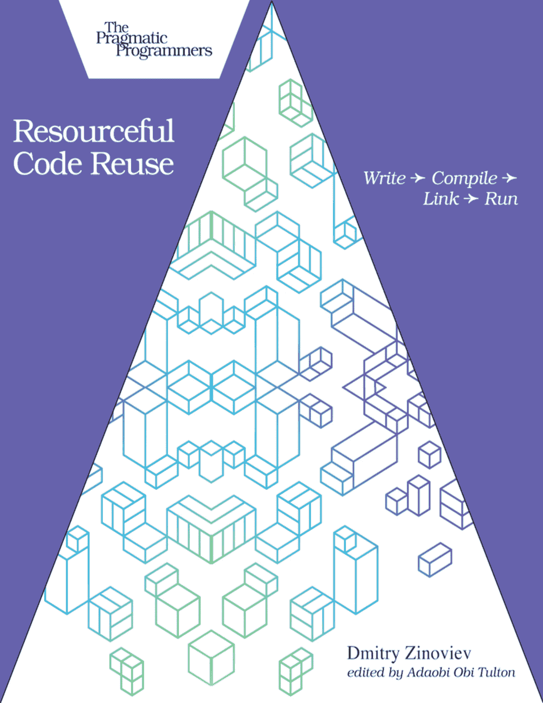

# 务实的程序员

# 代码复用之道

编写 → 编译 → 链接 → 运行



德米特里·齐诺维耶夫 著
阿达奥比·奥比·图尔顿 编辑

# 代码复用之道

德米特里·齐诺维耶夫 著

版本：P1.0（2021年4月）

版权所有 © 2021 务实的程序员有限责任公司。本书授权给购买者个人使用。我们未对本书进行版权保护，因为这会限制您将其用于自身目的的能力。请不要辜负这份信任——您可以在所有设备上使用本书，但请不要与团队其他成员、朋友或通过文件共享服务分享此副本。谢谢。

制造商和销售商用于区分其产品的许多名称被声明为商标。当这些名称出现在本书中，并且务实的程序员有限责任公司知晓商标声明时，这些名称已以首字母大写或全大写形式印刷。《务实入门套件》、《务实程序员》、《务实编程》、《务实书架》以及链接设备是务实的程序员有限责任公司的商标。

在本书的编写过程中，我们已采取一切预防措施。但是，对于因使用本书所含信息（包括程序清单）而可能导致的错误、遗漏或损害，出版商不承担任何责任。

## 关于务实书架

务实书架是一家敏捷出版公司。我们在此是因为我们希望改善开发者的生活。我们通过创建及时、实用的书籍来实现这一目标，这些书籍由程序员为程序员而写。

我们的务实课程、研讨会和其他产品可以帮助您和您的团队创建更好的软件并获得更多乐趣。有关更多信息以及最新的务实书籍，请访问我们的网站 [http://pragprog.com](http://pragprog.com)。

我们的电子书不包含任何数字版权管理，并且始终是无DRM的。我们开创了测试版书籍的概念，您可以在书籍仍在撰写时购买和阅读，并向作者提供反馈，以帮助为每个人制作更好的书籍。所有购买者均可获得的免费资源包括源代码下载（如适用）、勘误和讨论论坛，所有这些都可在书籍主页 pragprog.com 上找到。我们在此是为了让您的生活更轻松。

## 新书公告

想了解我们的最新书籍和公告，以及偶尔的特别优惠吗？只需在 [pragprog.com](pragprog.com) 上创建一个账户（只需一个电子邮件地址和密码），并选择复选框以接收新闻通讯。您也可以在 Twitter 上关注我们，账号为 @pragprog。

## 关于电子书格式

如果您直接从 [pragprog.com](pragprog.com) 购买，您将获得所有可用格式的电子书，只需支付一次费用。您可以通过 Dropbox 在所有设备（包括 iPhone/iPad、Android、笔记本电脑等）之间同步您的电子书。在版本有效期内，您可以获得免费更新。当然，您也可以随时返回并重新下载您的书籍。从 Amazon Kindle 商店购买的电子书受 Amazon 政策的约束。Amazon 文件格式的限制可能导致电子书在不同设备上显示不同。有关更多信息，请参阅我们的常见问题解答 [pragprog.com/#about-ebooks](pragprog.com/#about-ebooks)。要了解有关本书的更多信息并访问免费资源，请访问本书主页 [https://pragprog.com/book/dzreuse](https://pragprog.com/book/dzreuse)。

感谢您持续的支持，

安迪·亨特
务实的程序员

本书的制作团队包括：戴夫·兰金（CEO）、珍妮特·弗洛（COO）、塔米·科伦（执行编辑）、阿达奥比·奥比·图尔顿（开发编辑）、科琳娜·莱贝吉奥阿拉（文字编辑）、安迪·亨特和戴夫·托马斯（创始人）。

如需客户支持，请联系 [support@pragprog.com](mailto:support@pragprog.com)。

如需国际版权事宜，请联系 [rights@pragprog.com](mailto:rights@pragprog.com)。

## 目录

致谢

前言

- 关于读者
- 关于本书
- 关于软件

引言：为何要复用代码？

- C 与 Python
- 运行示例

1. 在编译时复用代码（C 和 Python）

- 安排源文件和头文件（C 方式）
- 模块化代码（Python 方式）

2. 在链接时复用代码（仅限 C）

- 编译目标文件
- 构建静态库
- 构建动态库

3. 在运行时复用代码（C 和 Python）

- 利用动态加载
- 初探远程过程调用

## 参考文献

## 对《代码复用之道》的早期赞誉

《代码复用之道》为读者提供了一种快速理解在现代 JSON 消费和处理背景下，如何使用 C 语言编译和链接代码的方法。

→ 迈克·莱利
Ingenious Solutions, Inc. 总裁

每位开发者都应该了解本书中描述的概念。即使您在日常工作中不使用 C 和 Python，您也会学到一些关于软件开发以及如何复用代码的知识。

→ 多米尼克·豪瑟
《为 iOS 构建基于位置的项目》作者

每个人都可以编码，但编写优美的代码需要代码复用技能。无论您是刚开始编码还是拥有丰富经验，本书都提供了一份实用指南，允许您通过应用代码复用技术来优化代码。

→ 何塞·阿图罗·莫拉·索托
2U Inc. 高级课程工程师

## 致谢

这是阿达奥比·奥比·图尔顿编辑的我的第二本书，就像第一本书一样，如果没有她的热情、奉献和最高的专业精神，这是不可能的。谢谢你，阿达奥比。

我感谢我的审稿人（按字母顺序排列）：卢多维科·费舍尔、多米尼克·豪瑟、安迪·莱斯特、迈克·莱利、何塞·阿图罗·莫拉·索托和伊利亚·乌斯维亚茨基。他们的批评令人耳目一新，充满活力。他们的审阅极大地改善了本书的结构、可用性和风格。谢谢你们，审稿人。

我的妻子安娜；我的孩子叶夫根尼亚和罗曼；我在萨福克大学的同事（特别是佩林·比森）和我的朋友（特别是德米特里和坦尼娅·切列维克）提供了急需的情感支持。谢谢你们，我的支持者们。

最后但同样重要的是，我感谢 Desbenoit [https://thenounproject.com/term/reuse/6786/](https://thenounproject.com/term/reuse/6786/) 提供的免版税图片 [此处](https://thenounproject.com/term/reuse/6786/)。

## 前言

我在1994年秋季参加了我的第一门也是唯一一门软件工程学术课程。这门课程由彼得·亨德森教授讲授，他在石溪大学工作了四分之一个世纪，并在我毕业后不久退休。这门课程使用面向对象语言之母 Smalltalk 讲授，无疑是优秀的。遗憾的是，我再也没有机会用 Smalltalk 写过一行代码，也几乎不记得它是什么样子了。

我确实记得的是亨德森教授一遍又一遍重复的箴言，直到它深深印在我的脑海里，从头顶到指尖：“汝当使用 make 文件并复用汝之代码。”从那时起，我开始每个新的非平凡项目时，都会先编写一个 makefile，并花费大量时间将任务分解为潜在可复用的单元。在本书中，我想与您分享我对代码复用和代码组织的热情，以及支持这种热情的技能。

## 关于读者

本书主要面向 C 语言的初级到中级软件开发者，以及在较小程度上使用 Python 的开发者，他们希望通过复用和组织先前编写的代码来实现更高的生产力、更好的代码质量以及更灵活、更适应性强的产品。使用命令行软件开发工具的经验会有所帮助，但并非必需。

## 关于本书

在设定了故事背景的必要引言之后，本书回顾了小型项目开发的三个阶段：编辑（用编程语言生成项目的文本）、编译（将文本转换为包含机器码的目标文件）和链接（将预编译的目标文件组合成一个可执行程序文件）。在任何阶段产生的任何单元都可以在后续阶段复用和共享，包括没有更多开发工作的运行时阶段。本书的其余部分分为三个章节，重点讨论这些主题：编译时复用、链接时复用和运行时复用。

我试图让各章节尽可能独立，但最终还是有一些前后引用。前向引用对于理解材料并非至关重要，但如果您从书中间开始阅读，并遇到一个您不熟悉的后向引用，我强烈建议您去查看它。

## 关于软件

要编译和运行本书中提到的C语言示例，你需要一个不错的C编译器（gcc是最佳选择，但Intel和Microsoft的编译器可能也能用）以及一套C开发工具：make（构建工具）、ld（链接器）、file、strip、ldd和ranlib。GNU开发工具集效果极佳；其他工具集可能有效也可能无效。书中的所有示例都在Linux计算机上测试过，但很可能也能在macOS上运行。

对于Python示例，你只需要一个Python-3.x解释器（python）。无需任何第三方模块。

我们开始吧？

德米特里·齐诺维耶夫
mailto:dzinoviev@gmail.com
2021年2月

## 引言：为何要重用代码？

尽管名为“现代计算机科学”，但它不仅仅是一门科学——如果我们接受查尔斯·巴贝奇是第一位理论计算机科学家，那么它也是一门拥有200年历史的深奥技艺。它充满了传说、轶事、伪经、不成文的规则以及其他智慧箴言。一个例子是*自豪地在别处发现（PFE）*或*在别处发明（IE）*的倾向：如果轮子已经被发明出来，除非有充分理由，否则你不应该重新设计它，而应重用现有设计。PFE/IE是更普遍的哲学原则——奥卡姆剃刀原理——的一个特例：如无必要，勿增实体。

就本书而言，奥卡姆剃刀原理和PFE/IE都适用于一个简单的概念：只有当你或他人之前没有编写过该代码片段时，你才应该编写大量的代码片段。如果该片段已被编写过，就再次使用它——*重用*它。

代码重用有几个原因：

1.  代码重用实践了威廉·奥卡姆（或奥坎，取决于你问谁）的建议。如果我们是哲学家，仅此一点就足够了。
2.  代码重用提高了你的生产力。你为处理频繁出现的任务（例如，读写JSON文件或支持异构数组和映射）而开发的代码片段，会成为你编程技能库的一部分。你可以轻松地将它们整合到你的新项目中，很可能跳过单元测试阶段。第三方库（例如libjson）通常更强大、更可靠。理想情况下，你希望用现有的组件构建你的新程序，尽可能少地编写自己的新代码。
3.  代码重用提高了软件质量。一个曾作为其他项目一部分的可重用代码单元，过去一定经过了彻底的调试和测试。再次测试它总没有坏处，但至少你可以期望有一个良好的基线。
4.  代码重用提高了软件的可配置性。第3章[在运行时重用代码（C和Python）](Reuse Code at Runtime (C and Python))中的运行时代码重用技术，允许你的程序推迟决定使用什么代码，直到程序运行时。你可以开发一个骨架程序（一个*框架*），其中包含用于未来代码片段的插槽，可根据需要填充。从某种意义上说，你得到的是一个可以自行配置或由用户动态配置的程序。

你可以通过多种方式在多个阶段重用代码。本书将在第1章[在编译时重用代码（C和Python）](Reuse Code at Compile Time (C and Python))中解释如何重用你的*源代码*（用人类可读的编程语言编写的程序文本，如C或Python）。你将在第2章[在链接时重用代码（仅C）](Reuse Code at Link Time (Only C))中学习如何通过创建目标文件和库来加速程序构建时间并避免泄露源代码（如果需要的话）。最后，在第3章[在运行时重用代码（C和Python）](Reuse Code at Runtime (C and Python))中，你将学习如何将程序代码和可重用片段物理分离，并在程序运行时将它们绑定（[利用动态加载](Harnessing Dynamic Loading)），或者根本不绑定它们，而是使用网络通信协议来请求服务和获取结果（[体验远程过程调用](https://example.com)）。顺便说一句，后一种形式的重用使你的代码不仅可供你自己的程序使用，也可供你授权的任何其他程序使用。

## C语言与Python

你会看到，C语言和Python软件各自需要不同的代码重用技术。

C程序通常是编译型的——它们被转换成包含原生CPU指令的文件，这些文件对原始开发语言几乎没有或完全没有“记忆”。这些转换后的文件相对语言无关，可以与其他用其他编译型编程语言（如C++或Rust）开发的文件组合。因此，将它们组织成库以供进一步重用是有意义的。

Python程序通常由解释器解释执行或字节编译——它们被转换成包含虚拟机指令的文件。这些转换后的文件重用性更有限，只能与其他Python文件配合使用，并且在重用前通常需要再次进行字节编译。这种限制使得构建复杂的共享Python库变得不切实际。

## 运行示例

在整本书中，我将向你展示如何重用主要用C语言编写、偶尔用Python编写的代码。为此，我们需要一个运行示例。我们将从一个C程序开始，这个程序不一定是结构混乱、杂乱无章或难以维护的，但它也不是为了将来重用而设计的。我们将对这个程序进行切片、分割，甚至拆解，并将其放在不同的计算机上，以使代码更具可重用性。

有趣的是，你甚至不需要了解程序解决的问题就能理解重用机制。一个微分方程求解器和一个网页浏览器一样好，而网页浏览器又和一个控制独角兽喂食器的程序一样好。所以，让我们选择一个被反复自动化处理的常见问题：一个程序，它将JSON文件的内容读入C或Python数据结构，以某种方式修改它，然后将修改后的数据结构写入另一个JSON文件。

> **关于JSON的说明**

“JavaScript对象表示法”（JSON）这个名字几乎在所有方面都具有误导性。首先，JavaScript本身可能与Java咖啡的共同点比与Java语言的共同点更多，但这不是JSON的错。其次，JSON最初是为与JavaScript配合使用而设计的，但现在它被用作与编程语言无关的*数据交换语言*，不再与JavaScript绑定。第三，JSON并不像我们在面向对象编程（OOP）中所知的那样描述对象。JSON支持以下数据类型（括号中显示了C和Python中的等效类型）：

-   null (NULL, None)
-   布尔值：true (1, True) 和 false (0, False)
-   数字（与C和Python中相同）
-   字符串 (char*, str)。JSON字符串必须使用单引号。例如：'JSON or Jason?'
-   数组（与C中的数组有些相似；Python中的列表）。JSON数组是异构的。它们与C数组不同。例如：[1, -3.14, "hello", null]
-   对象（在C中不存在；Python中的字典）。例如：{"name": "Dmitry", "smart": true, "children": ["Roman", "Eugenia"]}

要在C中支持JSON数组和对象，你必须实现异构线性数组和键值关联数组。这没什么大不了的。让我们假设所有必要的数组及其访问函数已经在别处实现，我们可以直接*重用*它们——这使得本书出人意料地具有递归性。

该程序将依赖两个函数：`read_json(char *fname)` 和 `write_json(char *fname, JSON_Object *object)`。当然，它还有`main`函数——但通常，`main`函数对特定程序来说过于具体，无法重用。

`read_json(char *fname)` 函数尝试打开名为 `fname` 的文件，从文件中读取有效的JSON，并构造并返回一个JSON对象。将对象的串行、通常是人类可读的表示形式转换为实际的二进制对象称为*反序列化*。`write_json(char *fname, JSON_Object *object)` 函数尝试创建一个名为 `fname` 的新文件，将JSON对象转换为字符串，并将字符串写入文件。将复杂的二进制对象转换为串行、通常是人类可读的表示形式称为*序列化*。

JSON对象的内部组织不是我们关心的问题，函数的内部组织也不是。我们只需要知道对象定义和函数存在，并且我们计划使它们可重用。以下是对象和函数在C中可能的声明方式：

```c
jsontool.c

typedef struct JSON_Object {
```

# 第一章

## 在编译时重用代码（C 语言与 Python）

编译时重用是指将程序的源代码组织成可能被重用且相对独立的文件，这些文件被称为*编译单元*。编译时重用是特定于编程语言的。在本章中，你将看到两种方法：C 语言的方式（将代码拆分为源文件和头文件）和 Python 的方式（创建模块）。出于对这门语言悠久历史的尊重，我们先从 C 语言的方式开始。

### 安排源文件和头文件（C 语言方式）

正确的代码重用可能具有挑战性，因为它需要一种特定的思维方式。即使是专业程序员也常犯的一个错误是将所有代码都放在同一个文件中，就像这样：

```c
// jsontool.c

#include <stdio.h>  // 用于输入/输出
#include <stdlib.h> // 用于 EXIT_SUCCESS 或 EXIT_FAILURE
#include <stdbool.h> // 用于 bool, false 和 true

typedef struct JSON_Object {
    // 这里有很多行代码
    // ...
} JSON_Object;

// 大量的辅助函数、数据类型和全局变量

int json_errno = 0;
bool read_boolean(FILE* infile) { /* ... */; return false; }
char *read_string(FILE* infile) { /* ... */; return NULL; }
void *obscure_helper() { /* ... */; return NULL; }
// ...

// JSON 解析器和写入器
JSON_Object *read_json(char *fname) {
    JSON_Object *object = NULL;
    // 这里有很多行代码
    // ...
    return object;
}

int write_json(char *fname, JSON_Object *object) {
    int status = 0;
    // 这里有很多行代码
    // ...
    return status;
}

// 业务逻辑
static JSON_Object *do_stuff(JSON_Object *json) {
    // 这里有很多行代码
    // ...

    return json;
}

int main() {
    JSON_Object *json = read_json("their_file.json");

    if(!json) return EXIT_FAILURE;

    // 进行一些处理
    json = do_stuff(json);

    if(!write_json("my_json.json", json))
        return EXIT_FAILURE;

    puts("Success!");
    return EXIT_SUCCESS;
}
```

然后，这些程序员会用他们喜欢的 C 编译器编译程序，得到一个可执行文件并运行它：

```
/home/dzreuse/> cc jsontool.c -o jsontool
/home/dzreuse/> ./jsontool
Success!
```

抛开代码重用不谈，这是一个优秀的 C 程序！它（希望）是正确的、简洁的、易于编写的，并且遵循了自然的人类逻辑。该程序定义了一个数据结构，实现了辅助函数，使用它们来实现解析器和写入器，并使用解析器和写入器来解决问题。

遗憾的是，它有两个问题：从 C 编译器的角度来看，它效率低下，而且实际上不可重用。

C 编译器一次只翻译一个编译单元，通常是整个 C 文件以及所有头文件（如 `stdio.h`）被原封不动地包含进来。如果你只更改了 C 文件或头文件中的一行或一个字符，整个单元都必须重新编译。随着程序的增长，编译时间会变长。如果你想让程序编译得更快，就必须让编译单元更小。我将在[编译目标文件](Compiling Object Files)中向你展示如何利用这种拆分，使用所谓的*分离编译*。

但让我们回到可重用性的问题上。为什么[这里](here)的代码不适合重用？因为它解决了一个特定的问题：它解析一个 JSON 文件，以特定的方式转换它，并将其写入另一个文件。由于代码是一个不可分割的编译单元，除了通过复制粘贴到文本编辑器中，该文件中的任何函数都无法在任何其他项目中使用——但复制粘贴代码会损害其可维护性和一致性，并削弱奥卡姆剃刀原则。而且由于代码已经有了 `main` 函数，它无法作为整体成为任何其他项目的组成部分。

关键在于：用 C 语言编写的单体程序文件编译缓慢，且难以（坦率地说，不可能）重用。让我们将编译单元拆分成几个更小的单元，看看是否有帮助。

[这里](here)有一个冗长而乏味的列表，不遗余力地列举了将*组件*（函数、数据类型和全局变量）分解成相对连贯集合的方法。目前，如果你的文件还不是大得离谱，你可以将其拆分为更可重用的输入/输出部分（JSON 支持）和不可重用的业务逻辑部分（JSON 处理）。运用你最好的判断力来评估每个函数未来被包含在另一个项目中的可能性。问问自己：“我或我认识或能想到的其他人需要此函数实现的操作的可能性有多大？”如果答案是“很可能”，那么该函数就属于可重用部分。如果答案是“不太可能”，它就属于不可重用部分。犯错也没关系！拆分编译单元是一个*棘手的问题*：它没有一个正确的答案。

哦，还要将*所有*从任何潜在可重用函数调用的函数放入同一个可重用部分，或者提供一种组合各部分的方法。没有依赖项，函数将无法工作！

仔细观察，不可重用部分可能由 [main](https://example.com/main) 函数和实现 [jsontool](https://example.com/jsontool) 业务逻辑的函数组成。我们称这部分为“业务逻辑”。辅助函数、解析器和写入器很可能在可重用部分。你可以进一步将可重用部分细分为两个更小的部分。

程序员可以在任何需要读取字符串、数字、布尔值等元素的项目中使用读写这些元素的辅助函数——这就是我们的“JSON 令牌”部分。正如“JSON”中的“J”不再代表 JavaScript 一样，“JSON 令牌”中的“JSON”也不仅仅指 JSON 令牌，而是指任何类似 JSON 的令牌。

相比之下，解析器和写入器是特定于 JSON 的。它们的适用领域是 JSON 处理；在非 JSON 项目中它们毫无用处，属于“JSON 语法”部分。

别忘了“JSON 语法”部分依赖于“JSON 令牌”部分。后者可以独立存在，但前者不行。

请注意，这些函数不是任何 Python 类的成员。与 C++ 类和 C 程序不同，Python 和 Java 类是单体的。它们不能被拆分成独立的编译单元。在面向对象语言中设计代码重用是另一本书的主题。

示例程序中可能有各种辅助函数和全局变量，例如用于读取带引号字符串的 `read_string`、用于读取布尔值的 `read_boolean`、用于读取方括号中数组的 `read_array`，甚至是虚构且可疑命名的 `obscure_helper`，其作用是优化 `read_json` 的内部机制。变量 `json_errno` 保存任何 JSON 相关函数中最近一次错误的代码（类似于标准 C 库文件 `errno.h` 中的变量 `errno`）。

最后，请记住，本书不解释如何解析、处理或生成 JSON。本书将前面提到的函数视为“黑盒子”，你可以并且将会独立开发它们。这种方法使你能够专注于重用实践，而不是特定领域的细节。

舞台已经搭好。我们准备好了查看第一轮代码重用技术，我们将从编译时重用开始。

以下是如何在 Python 中声明相同的对象和函数：

```python
### jsontool.py

def read_json(fname):
    object = None
    # 这里有很多行代码 - 但比 C 语言少！
    # ...
    return object

def write_json(fname, object):
    status = 0
    # 这里代码行数更少 - 我们爱 Python 的简洁！
    # ...
    return status
```

如果你计划重用“JSON语法”组件，那么也应该重用“JSON令牌”。

你需要对数据类型应用相同的分类过程。一旦组件被妥善分类，我们将使用一些技术技巧，按照以下步骤将编译单元拆分为三个单元：

1.  将内容物理移动到三个文件中。
2.  隐藏那些不再是全局的全局变量。
3.  创建一个头文件：作为新源文件的接口。

### 拆分文件

第一步很直接。使用你最喜欢的文本编辑器，比如emacs或vi，将可重用的组件从jsontool.c中剪切出来，粘贴到一个或两个其他文件中。为了保持一致性，我们假设这些文件是json_syntax.c和json_tokens.c。剩余的不可重用组件放入一个名为myjsontool.c的文件中。但要注意：除了json_tokens.c，你无法再单独或一起编译任何文件！编译器会报错，提示未知的类型名JSON_Object、函数read_json的隐式声明、从整数创建指针以及其他问题。

新安排的问题在于，典型的C编译器（与Java编译器不同）不够智能，无法找到在其他文件中定义的数据类型、变量和函数。当你将JSON_Object的定义移动到文件json_syntax.c中时，它在其他两个文件中就变得不可用了。文件json_tokens.c不使用JSON_Object，因此不受拆分影响，但myjsontool.c使用了，所以受到了影响。当你移动read_json的声明时，它在其他两个文件中也变得不可用了。典型的C编译器会假设一个声明（原型）不可用的函数接受整数参数并返回整数值。jsontool.c第40行的赋值语句试图将一个整数（假设由read_json返回）转换为JSON_Object*，这通常有效但会导致警告，并且当函数返回浮点数时，这是错误的。

让我们假设全局变量json_errno漂移到了json_tokens.c中（如果你将json_tokens.c放入任何其他文件，情况也不会改变）。在处理其他两个文件时，编译器不知道json_errno的数据类型，不做任何假设，并以错误中止。

在你了解如何解决全局可见性问题之前，让我们先简要地做相反的事情：隐藏一个本不应可见的可见函数。

### 隐藏函数

myjsontool.c第14行的函数obscure_helper仅被json_syntax.c中的函数使用。它不应该在该文件之外的任何地方使用。然而，默认情况下，C中的函数名具有全局作用域：它在项目中的任何地方都可见（这与数据类型和变量相反）。大多数情况下，全局可见性不是问题，除非你尝试在另一个文件中定义一个同名的流行函数。

将局部函数保持为局部函数被认为是良好的实践，C程序员称之为静态：

```
static void *obscure_helper() { /* ... */; return NULL; }
```

根据经验法则，你可以将所有函数标记为static并尝试编译你的代码。如果编译器抱怨函数xxx的隐式声明，然后链接器抱怨对xxx的未定义引用，那么xxx在定义它的文件之外被使用了。你可以通过移除static关键字使其再次全局化。另一方面，如果你确切知道你计划重用哪些函数，你可以省去一步，从一开始就保持它们全局化。

你不仅可以将`static`关键字应用于函数，也可以应用于全局变量，效果相同。静态全局变量的作用域仅限于定义它的文件。静态全局变量和静态函数都对项目的其余部分隐藏。它们不会污染全局命名空间，也不能被编译单元之外的代码意外或恶意调用或更改。静态是C语言中最接近私有的东西。

### 一切皆静态


当应用于*局部*变量时，`static`关键字意味着完全不同的东西。函数中的静态变量在离开作用域后（当包含函数退出、调用另一个函数或递归调用自身时）会保留其值。下面的小函数实现了一个自包含的向上计数器。每次调用它时，它都会递增内置的静态计数器`count`并返回其新值。

```
unsigned counter() {
    static unsigned count = 0;
    return ++count;
}
```

> **一切皆静态**

与全局变量的情况一样，`static`关键字保护`count`免受任何外部访问。但在此上下文中，`static`的主要好处是`count`不会在每次调用函数时都被初始化。这就是计数成为可能的原因。

既然你知道了如何隐藏代码组件，让我们找出如何跨文件边界暴露它们。

### 创建头文件

当编译器编译`myjsontool.c`或`json_syntax.c`时，它需要知道前者依赖于后者，并且两者都隐式或显式地依赖于`json_tokens.c`。编译器需要知道这些文件中数据结构的定义。它还需要知道全局函数的原型和全局变量的数据类型。

函数原型，也称为函数签名或声明，是函数定义的第一行：函数名、其参数的类型以及返回值的类型。函数原型必须与完整的函数定义匹配，只是原型中不需要参数名称（因为它们是可以轻松更改的名称）。

原型是对编译器的承诺：“听着，这个函数现在不可用。也许它在另一个C文件或库（[构建静态库](Building Static Libraries)和[构建动态库](Building Dynamic Libraries)）中定义，或者甚至根本没有定义，但会在我们需要它的时候定义（[利用动态加载](Harnessing Dynamic Loading)）。请放心，该函数接受这么多这种和那种数据类型的参数，并返回这种和那种数据类型。”这足以让编译器编译函数调用。

这是`read_boolean`的原型。注意末尾的分号和参数名的缺失：

```
bool read_boolean(FILE*);
```

像任何其他承诺一样，这个承诺可能会被打破——当声明的函数从未被定义时。仅靠编译器无法检查你的诚实。那将是链接器的责任。最终，将所有编译代码放在一起是链接器的工作。如果缺少一部分，链接就会失败。

你需要一个特定的“承诺词”来声明在其他编译单元中定义的全局变量：`extern`。带有`extern`的声明看起来像任何其他变量声明，只是它不创建变量的实例。它指示编译器一个将在链接时变得可用的变量。这是`json_errno`的外部声明：

```
extern int json_errno;
```

在编译时，编译器无法确定`json_errno`在内存中的位置。它为该变量生成一个占位符（一个*存根*），该存根稍后由链接器解析并替换为（*绑定到*）`json_errno`的实际地址。

就数据结构而言，没有特定的共享机制。你可以在每个编译单元中重新声明它们。

总结一下，你应该在每个编译单元中通知编译器所有在其他编译单元和库中定义的代码组件。你可能最终会在每个文件的开头添加类似以下的代码片段：

```
typedef struct JSON_Object {
    ...
} JSON_Object;
...
extern int json_errno;
bool read_boolean(FILE*);
char *read_string(FILE*);
void *obscure_helper();
JSON_Object *read_json(char*);
int write_json(char*, JSON_Object*);
...
```

问题解决了！准备出发！（剧透警告：还没。）

从技术上讲，此时你已准备就绪。你将项目拆分为三个编译单元，其中两个可能可重用。将这三个文件一起编译，得到一个可执行文件，然后享受：

```
/home/dzreuse/> cc myjsontool.c json_syntax.c json_tokens.c -o jsontool
```

但是等等：数据结构以及函数和变量声明的重复不可避免地会导致不一致。如果你在定义它们的单元中更改了全局变量、函数或数据类型的声明，会发生什么？你必须更新每个外部声明以匹配更改。这没问题，但让我们假装你忘记了。（毕竟，你只是凡人。）由于编译器没有经过训练来检测其他文件中发生的变化，它将使用过时的定义编译你的项目，因为你承诺它们是准确的。这种不匹配很可能不会被链接器检测到：链接器盲目地将编译器生成的代码块拼接在一起。突然间，你拥有了一个软件编译过程毫无差错，但程序却无法正常运行。如果你还不相信，这里有一个极简的双文件示例：

```
bar.c

float x = 33.3; // 正确的声明
```

```
foo.c

#include <stdio.h> // 用于 printf

extern int x; // 错误的声明

int main () {
    printf("%d\n", x);
    return 0;
}

/home/dzreuse/> cc -o foobar foo.c bar.c
/home/dzreuse/> ./foobar
1107637043 # 哎呀，出错了
```

为了保护自己免受这种不一致性的影响，你应该编写一个*头文件*。头文件本质上是一个C文件，传统上只包含声明：函数原型、外部变量定义和数据类型。C预处理器（通常是`cpp`）使用`#include`指令将头文件原封不动地粘贴到源文件或另一个头文件中，如下所示：

```
#include <stdio.h>
#include "json.h"
```

第一条指令指示预处理器沿着标准搜索路径查找`stdio.h`。第二条指令则尝试在当前目录或通过编译器选项`-I`指定的路径中查找`json.h`。

为了防止头文件被意外地递归包含，请在文件的顶部和底部分别添加条件包含指令`#ifndef`和`#endif`。结合宏定义`#define`，这些指令确保只有在宏`JSON_H`尚未定义的情况下，该文件才会被包含。宏名称可以是任何内容，只要它与文件唯一关联即可，但传统上我们使用全大写字母的文件名，并用下划线代替点号。

你的项目头文件将如下所示：

```
json.h

#ifndef JSON_H
#define JSON_H

#include <stdbool.h> // 用于 bool, false, 和 true

// 数据类型
typedef struct JSON_Object {
    // ...
} JSON_Object;
// ...

// 全局变量
extern int json_errno;
// ...

// 函数原型
bool read_boolean(FILE*);
char *read_string(FILE*);
void *obscure_helper();
JSON_Object *read_json(char*);
int write_json(char*, JSON_Object*);
// ...

#endif
```

在每个源文件中包含这个头文件——如果你想的话，包含多次也没关系。有了所有这些内置的安全特性，它不会造成任何问题。

现在，你已经准备好在自己的项目之间，甚至与其他人（比如在 GitHub (https://github.com) 上）共享你的编译单元了。

### 模块化代码（Python 的方式）

C 语言于 1972 年发布。它最初是为代码重用而设计的，但没有*模块*的概念：一个具有声明的或易于发现的外部接口的、可轻松重用的代码单元。这就是为什么我们不得不费尽周折（通过使用“头文件”）来构建类似模块的单元。

> **模块化语言**
>
> 以下语言官方支持模块化（按发布年份排序；列表并不完整）：IBM RPG (1959), COBOL (1960), PL/I (1964), ALGOL (1965), ML (1973), Modula (1975), Ada (1980), Common Lisp, MATLAB, Objective-C (1984), C++ (1985), Erlang, Object Pascal (1986), Oberon, Perl (1987), Fortran-90, Haskell (1990), Python (1991), Java, Ruby, JavaScript (1995), OCaml (1996), C# (2000), D (2001), BlitzMax, eC (2004), F# (2005), Closure (2007), Go (2009), Rust (2010), Dart, Elixir (2011), Elm (2012), F (2014), NEWP (2015)。除了四种语言外，其他所有语言都是在 C 之后开发的。指责 C 不模块化是不公平的。

一种日益流行的语言是 Python，它从设计上就支持模块化。在 Python 中创建模块极其简单：任何 Python 文件本身就是一个模块。模块的名称就是文件名，去掉 `py` 扩展名。例如，文件 `jsontool.py` [这里](here) 包含一个名为 `jsontool` 的模块。如果你曾经用 Python 写过任何文件，你就已经写过一个 Python 模块了。

要在你的 Python 程序中（重）使用一个模块，你必须使用以下语句之一来导入它：

```
import jsontool
from jsontool import json_read # 只导入 json_read
from jsontool import * # 导入所有内容
```

C 文件和 Python 模块之间的三个关键区别是：

1.  要从模块外部引用 Python 模块的对象，你通常使用其完全限定名，该名称由模块名和对象名组成。模块 `jsontool` 中的函数 `read_json` 被称为 `jsontool.json_read`，除非你使用 `import` 的 `from` 形式，这也是可能的但不建议这样做。你可能在不同的模块中定义了多个同名函数。例如，你可能有一系列输入/输出模块（如 `json`、`xml` 和 `csv`），每个模块都有 `read` 和 `write` 函数，并提供一致且易于记忆的接口。限定名是一个福音。在 C 中，所有名称都是扁平的，它们最终都在同一个命名空间中。

2.  第二个区别既是福音也是诅咒。与 C 不同，Python 是一种*动态类型语言*：变量或函数返回值的类型在运行时确定，并且可以更改。好消息是，你不需要头文件来确保调用者对函数的期望与其实际实现相匹配。Python 中甚至不存在这样的机制！坏消息是，调用者不会知道模块的实现是否发生了更改，这可能导致不一致性。正如你从[这里](here)的例子中已经知道的，这种不一致性很可能在运行时显现出来，而那时修复它已经太晚了。

3.  最后说个好消息：第三个区别也对 Python 模块有利。任何 C 程序都必须有 `main` 函数。任何可重用的 C 文件都必须与另一个代码片段（通常称为*驱动程序*）结合使用。驱动程序提供 `main` 函数来调用该文件中的函数——例如，用于测试目的。并不是说编写驱动程序是什么大事，但它既繁琐又不灵活。Python 模块可能具有双重性质：当从另一个单元导入时，它是一个模块（函数和变量的集合），但当单独调用时，它是一个完整的程序。

这种二元性是通过变量 `__name__` 实现的。这个变量的值由 Python 解释器（`python` 本身）自动设置。当另一个模块导入该模块时，`__name__` 的值为被导入模块的名称。否则，它的值为 `"__main__"`，这是对 C 的 `main` 函数一个不那么微妙的引用。`jsontool.py` 的底部可能如下所示：

```
### 所有函数和变量都在上面的某个地方 ^^^^^
def main():
    # 在这里执行所有业务逻辑——或者测试！
    pass

if __name__ == "__main__":
    main()
```

当然，被调用的函数名称不必是 `main`。

Python 的解释性质支持了这种二元性以及 Python 模块的其他友好和不那么友好的特性。解释器在运行时根据需要发现导入的模块并将其集成到执行环境中。另一方面，C 传统上是一种编译型语言。C 程序在执行前会被翻译成机器码。（C 解释器存在，但它们不是主流。）CPU 执行代码时，对文件、模块、接口，甚至 C 语言本身都一无所知。如果它对这些东西有任何概念，本书的其余部分就毫无意义了。

在下一章中，你将学习如何预编译旨在重用的 C 代码，以减少开发时间并保护你的知识产权。你还将看到如何将生成的*目标文件*组织成静态库和动态库。

# 第 2 章

## 在链接时重用代码（仅限 C）

将项目分成几个编译单元是迈向代码重用的第一小步。但编译时的代码重用有一些局限性。出于公司和法律原因，完全向其他程序员暴露共享源代码可能是不可取的。此外，你不想为每个项目构建重新编译所有单元，特别是如果项目很大。（例如，在 2015 年，Linux 由 40,000 个文件组成。）你可以通过将模块预编译成目标文件，然后将它们组织成库来提高构建性能和代码安全性。

### 编译目标文件

编译器（例如C编译器）将源文件翻译成*目标*文件：这是未来程序的一个片段，必须在后续步骤中与其他目标文件（在所有非简单情况下）以及系统和特定于应用程序的库（几乎总是）进行链接。目标文件的名称通常与源文件的名称相同，只是扩展名改为`o`或`obj`。

目标文件包含可执行代码、所有全局对象（变量和函数）的名称，以及所有未解析的外部引用（变量和函数，统称为*符号*）。它还可能包含调试编号，但调试超出了本书的范围。

举个例子，以下是通过编译[此处](https://example.com)介绍的`jsontool.c`所获得的`jsontool.o`的前2560字节（即所谓的十六进制转储）。转储显示了左侧列的偏移量、中间八列的十六进制字符代码，以及右侧列中可打印的字符本身。请注意来自C文件的字符串`their_file.json`、`my_json.json`和`Success!`。可执行代码无法识别，符号则位于转储的其他位置。

```
00000000: 7f45 4c46 0201 0100 0000 0000 0000 0000 .ELF...........
00000010: 0100 3e00 0100 0000 0000 0000 0000 0000 ..>.............
00000020: 0000 0000 0000 0000 7006 0000 0000 0000 ........p.......
00000030: 0000 0000 4000 0000 0000 4000 0d00 0c00 ....@.....@.....
00000040: 5548 89e5 4889 7df8 b800 0000 005d c355 UH..H.}......].U
00000050: 4889 e548 897d f8b8 0000 0000 5dc3 5548 H..H.}......].UH
00000060: 89e5 b800 0000 005d c355 4889 e548 897d .....].UH..H.}
00000070: e848 c745 f800 0000 0048 8b45 f85d c355 .H.E.....H.E.].U
00000080: 4889 e548 897d e848 8975 e0c7 45fc 0000 H..H.}.H.u..E...
00000090: 0000 8b45 fc5d c355 4889 e548 897d f848 ...E.].UH..H.}.H
000000a0: 8b45 f85d c355 4889 e548 83ec 1048 8d3d .E.].UH..H...H.=
000000b0: 0000 0000 e800 0000 0048 8945 f848 837d .........H.E.H.}
000000c0: f800 7507 b801 0000 00eb 4448 8b45 f848 ..u.......DH.E.H
000000d0: 89c7 e800 0000 0048 8945 f848 8b45 f848 .......H.E.H.E.H
000000e0: 89c6 488d 3d00 0000 00b8 0000 0000 e800 ..H.=...........
000000f0: 0000 0085 c075 07b8 0100 0000 eb11 488d .....u........H.
00000100: 3d00 0000 00e8 0000 0000 b800 0000 00c9 =...............
00000110: c300 0000 7468 6569 725f 6669 6c65 2e6a ....their_file.j
00000120: 736f 6e00 6d79 5f6a 736f 6e2e 6a73 6f6e son.my_json.json
00000130: 0053 7563 6365 7373 2100 0047 4343 3a20 .Success!..GCC:
00000140: 2855 6275 6e74 7520 372e 352e 302d 3375 (Ubuntu 7.5.0-3u
00000150: 6275 6e74 7531 7e31 382e 3034 2920 372e buntu1~18.04) 7.
00000160: 352e 3000 0000 0000 1400 0000 0000 0000 5.0.............
```

### 理解链接

编译目标文件后会发生什么？在项目构建的下一步中，你应该将它们与任何必要的静态库（本质上是目标文件的归档）链接在一起，形成一个可执行文件。执行链接的程序被称为*链接器*或*链接编辑器*。在GNU世界中，链接器被称为`ld`（因为它也是一个*加载器*，参见[构建动态库](构建动态库)）；微软则称其为[LINK.exe](LINK.exe)。有趣的是，当在目标文件上调用时，你的默认C编译器`cc`很可能充当链接器：`cc`是一个包装器，根据你提供给它的文件来调用编译器或链接器。

链接器不仅仅是机械地连接归档和目标文件。最重要的是，它会重定位数据并解析符号引用。

让我们看看文件`json_syntax.c`中的函数`write_json`。编译器会将该函数的实现存储在编译模块内的某个地址——例如，在地址`0x00000200`（参见[此处](here)的代码清单）。该函数的潜在调用者通常会执行`call X`指令，其中`X`是函数的地址。但在项目组件连接之后，地址会发生变化——全局变量和函数会发生位移。位移受组件大小及其在最终可执行文件中的顺序影响。`write_json`的新地址仍然是`0x00000200`而不是，比如说，`0x00012345`的可能性不大（尽管可能，如微软DOS COM可执行文件的情况：[https://en.wikipedia.org/wiki/COM_file](https://en.wikipedia.org/wiki/COM_file)）。链接器的责任是在可执行文件中将每个对`0x00000200`的引用替换为对`0x00012345`的引用。对每个全局函数和变量也必须这样做。

让我们回到`json_syntax.c`。该文件中的函数很可能引用全局变量`json_errno`，该变量保存最近的错误代码。在发生错误时，它们可能会更新该变量：

```
...
#define JSON_UNBALANCED_BRACES -99 // 或其他值
...
json_errno = JSON_UNBALANCED_BRACES;
```

当翻译成机器代码时，这条语句变成一条`MOV`指令，需要知道变量的地址。你可能认为这种情况与重定位情况类似，但事实并非如此。该变量未在`json_syntax.c`中定义，也没有可以调整的地址。编译器不是放入地址，而是在目标文件中放入一个占位符（一个存根），大致意思是：“如果变量`json_errno`存在，这将是它的地址。”对在其他地方定义的函数的调用也会被替换为占位符。

直到链接阶段，缺失的变量和函数才会（希望）被发现。此时，链接器通过将项目中所有目标文件中的所有占位符与可用的全局变量和函数进行匹配来解析缺失的引用。如果存在匹配，链接器会将占位符替换为调整后的地址。如果不存在匹配，链接器希望该引用将在稍后运行时解析（例如，通过动态加载——参见[利用动态加载](利用动态加载)）。

链接器可能会在动态（共享）库（[构建动态库](构建动态库)）中找到一些已解析的引用——这些是可重用组件，在程序加载到RAM中执行时与其余代码组合。虽然严格来说，链接时存在动态库并不能保证运行时它们的存在，但链接器无法确保这些引用。对动态库的链接是一个承诺。保持它是你的责任。

目标文件中明显缺少的是原始编程语言中的原始代码。编译是一个不可逆的过程（“无法将绞肉还原”）。你可以对目标文件应用*反汇编器*（如Linux `objdump -d`），希望使其在某种程度上可读，但你能得到的最好结果是相当难以理解的汇编代码，没有数据结构。你可以进一步尝试*逆向工程*的运气：将汇编语言命令追溯到可能生成它们的C语句和运算符。但你极不可能成功使用它。

这并不是坏消息！如果你无法从目标文件重建源文件，那么你的竞争对手也不能。如果你想共享可执行代码而不共享源代码（*闭源共享*），目标文件正是你所需要的。任何打算重用你文件的人都将获得预期的功能，但无法访问实现细节，这些细节大概构成了你的知识产权（IP）。

> **代码混淆**

编译文件并不是保护你IP的唯一方式。你可以选择通过违反格式、命名和编码约定来*混淆*你的代码。我曾听过一个都市传说，一家软件公司被法官命令与竞争对手共享其产品的源代码。不情愿的开发人员删除了所有注释，将每个函数和变量名替换为0（零）和O（O），搞乱了格式，随意添加了*三字母组*，并顺从地共享了代码。它编译通过了，但除此之外几乎毫无用处。请欣赏一段[混淆的 jsontool.c 示例](https://example.com)：

```
O0000000 *O0000000(char
*O0000000) ??< O0000000 *O0000000
= O0000000; //...
return O0000000; ??>
```

请记住，代码混淆并不能完全保护你的代码免受逆向工程的影响。它只是让逆向工程更具挑战性。

### 依赖与分离编译

希望你已经确信，将 C 文件编译成目标文件可以使你的代码在一定程度上免受逆向工程和可能的知识产权盗窃。这是本书的承诺之一。现在让我们来谈谈另一个承诺：提升速度。

一旦源文件被编译成目标文件，只要你不修改它，就不需要重新编译。我们说目标文件*依赖*于源文件。它也依赖于源文件中包含的所有头文件。经过预处理后，它们成为源文件不可分割的一部分。任何包含的头文件的更改都可能导致重新编译。反之，如果源文件和任何包含的文件没有更改，目标文件也不应该更改。

你可以将你的项目想象成一个文件间的依赖关系图。每个目标文件至少依赖于一个源文件，并且可能依赖于一堆你的头文件。几乎每个 C 文件也依赖于一些系统头文件（如 `stdio.h` 和 `string.h`），但系统头文件要稳定得多。你可以将它们视为相对不变量。

对于一个大型项目，你可能希望使用统一建模语言（UML）的*组件图*或其他图表工具来可视化这个依赖关系图。遗憾的是，UML 在程序员的工具箱中已经变得罕见，几乎绝迹了。如果你感兴趣，可以参考 [Fowler](https://martinfowler.com/) [Fow03] 和 [Larman](https://www.craiglarman.com/) [Lar04] 的优秀 UML 书籍。

理解依赖关系有助于更好的打包，正如你将在[构建静态库](https://www.example.com/)中看到的。理解依赖关系还可以显著减少项目的构建时间。如果一个源文件发生更改，你只需要重新编译那些依赖于它的目标文件。你不需要修改项目中的任何其他目标文件。你只需要将构建过程分为编译阶段（使用“编译但不链接”选项 -c）和链接阶段，如下所示：

```
/home/dzreuse/> cc -c myjsontool.c -o myjsontool.o
/home/dzreuse/> cc -c json_syntax.c -o json_syntax.o
/home/dzreuse/> cc -c json_tokens.c -o json_tokens.o
/home/dzreuse/> cc myjsontool.o json_syntax.o json_tokens.o -o jsontool
```

欢迎来到*分离编译*！

将这四个命令与[这里](https://www.example.com/)的单个命令进行比较。乍一看，执行一个命令可能比执行四个命令更快。但这种表象具有欺骗性。原始命令总是花费同样长的时间。在之前显示的四个命令中，只有最后一个命令是不可避免的。其他三个命令只有在最坏的情况下，即在原始构建或最终构建时才会一起执行。在最好的情况下，你只需要编译一个文件。通常，构建时间取决于依赖关系：源文件的更改激活的依赖关系越多，构建时间就越长。

### 不要把所有鸡蛋放在一个头文件里


根据需要将几个小的头文件包含在源文件中，比将一个全面的头文件包含在所有源文件中要好。如果你更改了全面的头文件，你将不得不重新编译所有源文件，即使它们没有受到更改的影响。拥有许多小的头文件可以最大限度地降低重新编译的风险。但拥有太多的头文件会使依赖关系难以管理。试着找到合适的平衡点。

### 混合语言

分离编译的一个额外好处是能够用不同的语言编写项目的不同部分，只要这些语言实现具有相同的调用约定和相同的运行时概念。“没有一种单一的编程语言适合所有的需求和目标，”Michael Scott [Sco15] 说。例如，将 C 与 C++ 或 Fortran 混合使用并不少见。C++ 甚至对外部 C 函数和变量有一个特殊的指定：`extern "C"`。

当我还是博士生的时候，我参与了一个结合了基于 Prolog 的用户界面和 Fortran 数值库的项目。后来我们用 Tcl/Tk（现在谁还在乎 Tcl/Tk？）替换了 Prolog，并使用 C 作为粘合剂。最终，我们摆脱了 Fortran，并用 Python 替换了 Tcl/Tk。它仍然像魔法一样工作。

### 创建 Make 文件

我们关于目标文件和分离编译的讨论即将结束。你可能想知道，在一个拥有 40,000 个文件的真实项目中，人类如何可能跟踪所有这些依赖关系。这就需要 make，一个根据依赖关系描述来确定哪些项目单元需要重新编译，然后发出重新编译命令的程序。

make 是一个极其方便且被低估的工具。它能做的远不止我在上一段中所说的。只需将“重新编译”这个词替换为“更新”，我们突然就在谈论一个强制执行依赖关系并在需要时更新组件的工具。组件甚至不必是程序文件。它们可以是文档、图像、电子表格等等。这样一个宏大的工具值得单独写一本书。我将向你展示 make 的一些功能，并推荐你参考 [Small, Sharp Software Tools [Hog19]](https://example.com) 了解更多细节。

你通过编写一个 make 文件来开始一个 make 项目。make 文件的名称可以是任何东西，但如果它是 makefile 或 Makefile，那么 make 无需额外提示就能找到它。

一个 make 文件由定义和规则组成。定义类似于 Python 中的赋值语句。在我们下面的 Makefile 示例中，定义在第 1 到 5 行。变量 EXE 包含可执行文件的名称；变量 SRCS 和 OBJS 分别包含源文件和目标文件的列表（顺序不一定相同）。变量 CFLAGS 是预定义的，包含传递给 C 编译器的标志列表。变量 X 的值是 $(X)。

规则从第 6 行之后开始。一条规则表示目标与其先决条件之间的依赖关系，并描述更新目标所需的操作。第一条规则定义了一个伪目标 all，它象征的不是特定的文件，而是整个项目。当你在命令行输入 make 时，make 会尝试构建这个目标。该目标依赖于文件 jsontool，即变量 EXE 的值。目标显示在冒号之前。先决条件显示在同一行的冒号之后。

```
Makefile
1:  EXE = jsontool
-   SRCS = myjsontool.c json_syntax.c json_tokens.c
-   REUSABLE_OBJS = json_syntax.o json_tokens.o
-   OBJS = myjsontool.o $(REUSABLE_OBJS)
5:  CFLAGS = -Wall -g # 显示所有警告；包含调试信息
-
-   all: $(EXE)
-
-   jsontool: $(OBJS)
-       $(CC) $(OBJS) -o $(EXE)
10:
-
-   clean:
-       rm -f $(OBJS) $(EXE) depend
-
-   depend: $(SRCS)
15:
-
-       $(CC) -MM $(SRCS) > depend
-
-   include depend
```

如果依赖关系被违反，make 会更新目标。如果任何先决条件比目标更新，即先决条件已更改但目标尚未更新，则依赖关系被违反。make 期望执行规则第二行的操作会更新目标。第一条规则有一个空操作。它只是说：“要更新 all，请以任何应该更新的方式更新 jsontool”，这把我们带到了第二条规则。

> **Making 与 Raking**
> Ruby 编程语言使用了一个类似 make 的构建系统。作为 Ruby，它非常自豪地以“r”开头。因此，Ruby 的 make 被称为 rake，Ruby 的 Makefile 被称为 Rakefile。在 2020 年深秋撰写本书期间，我做了很多“raking”：字面意思是在我的后院耙树叶，比喻意思是在构建手稿。

第二条规则的目标是 jsontool。它依赖于每个目标文件。如果任何目标文件发生更改（因为它被重新编译了），目标也必须通过重新链接目标文件来更改。目标文件又依赖于同名的 C 文件。make 是一个智能程序，无需特殊规则就能识别简单的依赖关系。

目标 clean 不依赖于任何东西。你通过删除所有可重现的文件（目标文件和可执行文件）来无条件地更新它。

事实上，目标文件对源文件的依赖并非真正简单。目标文件也可能依赖于包含的头文件，这是 make 未能理解的细微之处。你应该通过手动编写所有依赖关系或自动提取它们，将它们存储到一个文件（如 depend）中，并将该文件包含到我们的 Makefile 中（见第 18 行）来帮助它。GNU C 编译器有一个选项 -MM，它运行预处理器并提取所有直接和间接包含的头文件的信息：

```
/home/dzreuse> cc -MM json_*.c myjsontool.c > depend
/home/dzreuse> cat depend
json_syntax.o: json_syntax.c json.h
json_tokens.o: json_tokens.c json.h
myjsontool.o: myjsontool.c json.h
```

以下是你构建项目的方式。第一次运行 make 会导致一个警告：包含依赖关系的文件 depend 尚不存在（见下面列表的第 1 行）。别担心——make 有一个规则解释了如何获取缺失的文件。建议你在更新依赖关系后进行一次干净的构建（见第 5 行）。下一次运行 make它会忠实地编译并链接文件（第7行）。之后无需再运行（第12行）。

> 设计良好的make文件能大幅缩短构建时间。

但如果你只编辑了一个文件——比如`json_tokens.c`（第14行）并尝试重新构建项目呢？`make`只会重新编译该文件并重新链接可执行文件（第15行）。在一个拥有40,000个源文件的项目中，这意味着只需重新编译40,000个文件中的一个。

```
1:  /home/dzreuse> make
-   makefile:17: depend: No such file or directory
-   cc -MM myjsontool.c json_syntax.c json_tokens.c > depend
-   make: Nothing to be done for 'all'.
5:  /home/dzreuse> make clean
-   rm -f myjsontool.o json_syntax.o json_tokens.o jsontool
-   /home/dzreuse> make
-   cc -Wall -g   -c -o myjsontool.o myjsontool.c
-   cc -Wall -g   -c -o json_syntax.o json_syntax.c
    cc -Wall -g   -c -o json_tokens.o json_tokens.c
10:
-   cc myjsontool.o json_syntax.o json_tokens.o -o jsontool
-   /home/dzreuse> make
-   make: Nothing to be done for 'all'.
-   /home/dzreuse> touch json_tokens.c
    /home/dzreuse> make
15:
-   cc -Wall -g   -c -o json_tokens.o json_tokens.c
-   cc myjsontool.o json_syntax.o json_tokens.o -o jsontool
```

你已经学会了如何提炼可复用的目标文件并缩短构建时间——但代价是项目复杂度的增加。现在让我们通过将各个目标文件组织成库来进行一些打包工作。

### 构建静态库

一个经过良好调试、测试和文档化，包含多个函数和全局变量的目标文件，是一个极佳的可复用代码单元。你可以将其链接到你的程序中，以使用先前实现的功能。然而，关于目标文件有两个实际的考虑因素：

1.  你应该将相关文件收集到一个归档文件中，并为其赋予一个描述性的名称。

有些人认为一个文件中包含多个公共函数是不优雅的。事实上，在Java中，明确禁止一个文件中包含多个公共类。如果你试图避免在一个文件中拥有多个公共类或函数，你最终可能会编译出多个目标文件，它们共同实现所需的功能。你将不得不告诉链接器链接所有这些文件。文件越多，你需要告诉链接器的就越多，直到你忘记为什么所有这些目标文件都在链接器的命令行上。文件名可能与公共函数的名称匹配，但与它们共同解决的问题名称不匹配的情况也是如此。

链接一个具有描述性名称的归档文件，而不是单个目标文件，将减轻你的负担。

2.  你应该将该归档文件存储在链接器无需你协助就能找到的地方。通知链接器归档文件的位置是一件麻烦事，如果归档文件四处移动，情况会变得更糟。

将你的目标文件组织成集合的最简单方法是构建一个静态*库*——实际上，是多个库，因为没有人会把所有鸡蛋放在一个篮子里，你也不应该。属于一个库的文件除了都是目标文件外，至少应该有一些共同点，库的名称应该反映这种共同性。

在软件工程中，拥有共同点的属性被称为*内聚性*。以下是几种内聚性类型：

-   功能内聚：库中的所有例程都朝着单一目标工作。例如：flex/bison词法/语法分析器生成器和支持库`libfl.a`。它们可以生成解析器，然后进行解析——仅此而已。
-   顺序内聚：某些库例程的输出是同一库中其他例程的输入。例如：Python的`pycrawl`模块包含从HTML文档中提取URL、验证URL和下载URL的工具。
-   通信内聚：库中的例程处理相同的数据。例如：在某种意义上，SQL和底层的数据库管理系统。
-   过程内聚：库中的例程通常一个接一个地执行。例如：一个包含所有直接从程序`main`函数调用的函数的库。
-   时间内聚：调用时间是绑定因素。例如：`libini.a`，一个用于读取初始化文件的例程库。
-   逻辑内聚：例程似乎大致相关，但这是它们唯一的共同点。例如：标准数学库`libm.a`，以及`libcrypt.a`，一个加密工具集。
-   偶然内聚：例程之所以存在，就是因为它们存在，为什么不呢，谁在乎呢。例如：最著名的C编程库，标准C库libc.a，具有偶然内聚性。

内聚性类型的可取性从列表顶部到底部递减。唉，与此同时，库的可复用性却在增加！考虑这个极端情况：一个偶然组装的标准C库是如此可复用，以至于链接器会自动将每个C程序链接到它。如果你认为没有printf、malloc、exit和其他好东西也能生存，你必须向链接器传递一个特定的选项，`--nostdlib`或`--nolibc`。另一方面，flex/bison组合只属于那些处理文本文件解析（编译器、解释器、翻译器）的项目。你上次编写这些是什么时候？

把偶然内聚的库想象成一个急救箱，把功能内聚的库想象成一台价值百万美元的核磁共振成像机。当你去徒步旅行时，你需要前者；当你有无法解释的头痛时，你需要后者。在不了解项目背景和视角的情况下，没有单一的最佳规则可以帮助你在两者之间做出选择。

一旦你选择了内聚性类型，库的构建过程就很简单了。让我们从选择库名开始。

在POSIX编程环境中，静态库是一个文件，其名称以`lib-`为前缀，后跟库名，再后跟扩展名`.a`（来自“archive”——因为静态库是一个带索引的函数归档文件）。在Microsoft Windows世界中，标准扩展名是`.lib`。标准POSIX数学库称为`libm.a`或`libm.lib`，其中“m”代表“math”。如果你的静态库名为foobar（经验丰富的程序员必备），库文件将称为`libfoobar.a`或`libfoobar.lib`。

我们示例中的目标文件（[Arranging Source and Header Files (the C Way)](https://example.com)）提供了处理JSON文件的工具。此类文件的库的自然名称是`libjson.a`。这个名字简短且具有描述性，但不幸的是它已被一个开源项目占用。当我遇到一个想要但不可用的名字时，我会应用从Perl程序员那里学到的东西，在名字前加上“my”：`libmyjson.a`。令人难以置信的是，似乎除了我（现在还有你）之外，没有人使用这个技巧。

一旦你有了库文件名，你就可以考虑`ar`：用于构建静态库的POSIX工具。实际上，`ar`不仅仅是构建静态库的工具。它也是处理文件归档的工具：创建和修改归档文件，以及提取归档成员。名字`ar`是对一个时代的致敬，那时为了将一个完全简短的单词从七个字符缩短到两个字符而牺牲其可理解性被认为是情有可原的：ar[chive]。

> **磁带归档**

早期的软件开发者深刻认识到归档和归档文件的价值。除了将多个文件打包成一个的`ar`之外，他们还有另一个工具，该工具也将新归档保存在磁带上。该工具的名称是`tar`（t[ape] ar[chiver]），归档文件将有一个同名的扩展名`.tar`。`tar`和`.tar`文件在POSIX世界中仍在使用。可悲的是，`tar`和`ar`生成的归档文件互不兼容。

像任何其他自尊的POSIX实用程序一样，`ar`接受大量的命令行选项。每个选项由一个单字母表示。出于兼容性原因，`ar`允许你省略选项前的破折号。（又一个与`tar`的相似之处！）最有用的单字母是：

-   `d`—从归档中删除一个成员。
-   `m`—将文件移动到现有归档中。
-   `t`—打印归档成员列表。
-   `p`—打印归档成员。注意：如果部分或全部归档成员是二进制文件（对于静态库来说确实如此），你会希望自己没看到打印输出！
-   `r`—将文件插入归档；替换同名成员。
-   `x`—从归档中提取一个成员。

每个单字母可以接受额外的修饰字母，这些字母必须紧跟在单字母之后。两个最广为人知的修饰字母是：

-   `c`—如果归档文件尚不存在，则创建它。
-   `s`—向归档添加索引。此选项不再需要，因为`ar`会自动添加索引。但过去有一个特殊的实用程序`ranlib`，其唯一目的就是向库添加索引。

你终于准备好创建你的第一个静态库，用目标文件填充它，并打印出库内容了：

```
/home/dzreuse/> ar rc libmyjson.a json_syntax.o json_tokens.o
/home/dzreuse/> ar t libmyjson.a
json_syntax.o
```

### json_tokens.o

或者，也可以采用 POSIX 风格逐个传递选项，使用熟悉的短横线：

```
/home/dzreuse/> ar -r -c libmyjson.a json_syntax.o json_tokens.o
```

让我们从链接器的角度来审视这个新库。链接器需要了解两件事：所需函数是否存在于库中，以及在哪里可以找到它们的定义。请注意，如果某个函数不在库中，那么搜索其定义就毫无意义，尤其是当归档文件很大时。Wolfram Mathematica 运行时库 `libWolframRTL_Static_Minimal.a` 和 LAPACK 线性代数库 `liblapack.a` 的大小分别为 55MB 和 11MB。为了快速检查，归档文件的开头包含一个库索引，其中列出了所有库成员的名称。链接器可以快速读取索引，然后决定是否需要读取库文件的其余部分。

为了在不反汇编的情况下检查库，让我们使用另一个名为 `nm` 的二进制工具，其名称来源于 "name"。

当你仅使用归档文件名作为参数调用 `nm` 时，它会列出归档文件的所有成员（目标文件）及其符号（函数和变量）。对于每个符号，`nm` 会报告该符号是在成员文件的代码段（T）、BSS 段（B）、数据段的只读部分（R）中定义，还是从文件中引用但在其他地方定义（U）。对于每个本地定义的符号，`nm` 还会报告该符号在成员文件中的地址。如果添加 `-s` 选项，该工具还会打印出归档索引，而 `-S` 则会添加符号的字节大小：

```
/home/dzreuse/> nm -s -S libmyjson.a
Archive index:
json_syntax in json_syntax.o
json_tokens in json_tokens.o

json_syntax.o:
0000000000000000 0000000000000014 T json_syntax
json_tokens.o:
                 U fprintf
                 U _GLOBAL_OFFSET_TABLE_
0000000000000000 0000000000000035 T json_tokens
```

根据输出，`ar` 似乎没有欺骗我们，忠实地将两个函数都放入了归档文件中。现在是时候通过链接新创建的库和 `main` 函数来重用你的代码了。（这就是本练习的目标！）我们无需在链接器的命令行上列出所有目标文件及其位置，而是直接指示它使用该库：

```
/home/dzreuse/> cc myjsontool.c -lmyjson -L. -o jsontool -static
/home/dzreuse/> ./jsontool
Success!
/home/dzreuse/> ldd ./jsontool
    not a dynamic executable
```

它成功了。请注意，对 `fprintf` 的“未定义”引用是从隐式链接的标准 C 库 `libc.a` 中解析的。选项 `-static` 提醒链接器，即使是标准 C 库也必须以静态形式链接。`ldd` 是一个用于跟踪动态（共享）库及其依赖项的工具（你将在[构建动态库](Building Dynamic Libraries)中再次见到它），它以其独特的方式确认了可执行文件中没有任何共享内容。

命令行中还有两个你可能见过（也可能没见过）的选项。第一个选项 `-lmyjson` 告诉链接器将 `myjsontool.c` 中的代码与库 `myjson` 链接。`myjson` 是库的名称，而不是库文件的名称！文件的名称是库名加上前缀 `lib` 和后缀 `.a`——即 `libmyjson.a`。还记得友好的 StackOverflow 导师让你在命令行中添加 `-lm` 吗？你曾以为那是黑魔法，但它实际上是对 `libm.a` 的引用，这是一个包含 `sin`、`sqrt` 和 `fabs` 的标准数学库。而 `-lc` 则是对 `libc.a`（标准 C 库）的冗余引用。链接器总是会链接这个库，除非你明确告诉它停止。

一方面，`libc.a` 和 `libm.a`，另一方面，`libmyjson.a`，在许多方面都不同。`libc.a` 和 `libm.a` 是成千上万程序员协作的成果，已有半个世纪的历史。`libmyjson.a` 则是你几分钟前刚刚创建的。`libc.a` 和 `libm.a` 的大小分别为 5MB 和 65kB。`libmyjson.a` 目前仅有 8kB。`libc.a` 和 `libm.a` 大概是无 bug 的。`libmyjson.a` 呢，谁知道呢？但最重要的是，`libc.a` 和 `libm.a` 位于标准位置（可能在 `/usr/lib/x86_64-linux-gnu/`），而 `libmyjson.a` 位于你当前的工作目录中。你可能觉得这很奇怪，但链接器在 `/usr/lib/x86_64-linux-gnu/` 中搜索库比在当前工作目录中搜索要熟练得多。这正是出于前面讨论过的原因：避免意外链接到原始的、未经测试的、不可信的库。仅使用 `-l` 选项，链接器将找不到你的库。

你和你的库有四个选择：

1.  你可以将新库移动到链接器能够轻松找到的受信任目录之一。这些目录的列表——加载路径——是平台相关的。例如，Linux 将路径存储在文件 `/etc/ld.so.conf.d/x86_64-linux-gnu.conf` 中。供你参考，`ld.so` 是 Linux 程序加载器，你将在*构建动态库*中遇到它。该文件仅由超级用户拥有和可写，安全目录也是如此。如果你不是超级用户，你将无法更新加载路径或将你的静态库复制到任何预定义位置。即使你是超级用户，也不应随意更改这些目录，因为你可能会破坏其他程序。

2.  相反，你可以通过修改 `LIBRARY_PATH` 环境变量，将你拥有的目录包含在其中。`LIBRARY_PATH` 是链接器用于搜索静态和共享变量（除了预定义的加载路径之外）的环境变量。其值是一个以冒号分隔的目录列表。如何更新该变量取决于你使用的 shell。如果你像我一样钟情于 `bash`，那么 `export` 命令会创建一个新变量并使其对 shell 的子进程（包括链接器）可用（“导出”）：

    ```
    /home/dzreuse/> export LIBRARY_PATH=$HOME/lib:$HOME/lib/untested
    ```

    如果路径变量已经存在，你可以扩展它：

    ```
    /home/dzreuse/> export LIBRARY_PATH=/tmp:$LIBRARY_PATH
    ```

    请记住，链接器会按照库路径中列出的顺序扫描目录。如果你有多个同名的静态库，将链接第一个遇到的库。

3.  如果你经常使用相同的目录进行库开发，修改 `LIBRARY_PATH` 会非常有效。在这种情况下，你可以将路径设置命令永久存储到 `$HOME/.profile` 中，从而免去提醒链接器搜索位置的麻烦。

4.  但如果你只想链接一两次库呢？在这种情况下，你可以使用 `-Ldir` 选项，它会临时将 `dir` 添加到搜索路径中——仅在编译期间有效。具体来说，`-L.` 会添加当前目录。你可以在命令行上放置任意多个 `-L`，可能为每个链接的静态库都添加一个。

无论你选择哪条路径，你只需要在程序开发阶段找到静态库。一旦程序开发完成（我听到你笑了），所有静态库都将成为程序不可分割的组成部分。这种刻入石头的集成既是福，也是祸。

将你的程序与静态库链接有什么影响？静态库以多种方式实现并促进了代码重用。

首先，与一堆目标文件不同，库有一个单一且希望是有意义的名称。作为开发者，你可能难以记住许多目标文件的名称和用途。记住单个库的名称和用途要容易得多。你构建的那个用于处理 JSON 文件的库叫什么？它一定是 `libjson.a` 或 `libmyjson.a`，就在这里，直接链接它。很简单。

其次，与一次性的目标文件不同，库是一种资产。它值得投资：调试、测试、维护和文档。因此，库比目标文件具有更高的“社会地位”，更有可能作为另一个项目的一部分被重用。反过来，这又增加了进一步调试、测试、维护和文档的需求，特别是如果该库被第三方开发者采用的话。

第三，将项目分离为核心（`main` 函数和依赖项）和库，允许你和你的同事将库视为一个独立的项目。这种分离通常能带来良好的氛围，并有助于控制软件开发的复杂性。

这些考量对几乎任何库都适用，无论是静态库还是共享库。静态库有其独特的优势，但也有其致命的弱点。

从积极的一面来看，当你将程序与静态库链接时，可以消除许多外部依赖。（如果同时存在同名的静态库和共享库，别忘了向链接器传递`-static`选项！）如果你使用`--nostdlib`选项禁用标准C运行时和标准C库，那么你的程序将只依赖于系统调用。只要系统提供相同的API（例如Ubuntu、Debian和Red Hat等Linux发行版），它在所有系统上的行为都应完全一致。静态链接的工具通常包含在“救援套件”中，用于在升级失败或系统入侵后恢复系统，此时共享库可能已损坏、被篡改或丢失。因此，静态链接的程序对升级相关的意外也具有免疫力。

但这种对升级的免疫力，总体而言，并不一定是可取的。要升级一个静态链接的程序，你必须重新链接它——而要重新链接，你必须维护那些不属于任何库的目标文件。如果任何组成目标文件缺失，你就无法再升级该程序了。真糟糕。

从大小方面来看，一个并非专门为某个项目设计的静态库，就像寄生虫一样依附在你的程序上。考虑最糟糕的情况：具有偶然内聚性的`libc.a`。当然，你希望你的任何程序至少调用一些输入或输出函数，比如`printf`或`scanf`。它们都定义在`libc.a`中，因此链接一个5MB的`libc.a`是必须的。与静态`libc.a`链接后，即使是像`puts("Hello, world!")`这样简单的程序，在磁盘上也会变成一个5MB的程序（问题不大），在内存中也会变成一个5MB的进程（可能是个大问题）。链接器不够智能，无法从库中静态链接选定的成员。

更糟糕的是，静态库无法在多个进程之间物理共享。（如果可以，我们就不需要共享库了！）它是程序代码的一个组成部分。一旦附加到程序的其余部分，它就无法被识别和分离。它位于运行进程的地址空间中。操作系统保护它免受其他进程的有意或无意访问，即使这些进程执行的是相同的程序。不共享代码的决定导致了内存的浪费。就这样，你面临着可靠性和内存占用之间的权衡，这是现代计算中典型的“斯库拉与卡律布狄斯”困境之一。

为了重新获得一些平衡感，你需要共享库。

### 构建动态库

顾名思义，动态库（也称为共享库）首先是一个库：一组具有共同点的目标文件的集合。但与静态库不同，它是动态的。区别在哪里？

### 理解动态链接

静态库和动态库的第一个区别在于名称。动态库在Linux/macOS上的扩展名是`so`（“共享对象”，例如`libmyjson.so`）。微软称它们为“动态链接库”，扩展名为`dll`，如`libmyjson.dll`。

第二个区别在于库与程序其余部分的链接方式。静态库永久链接到可执行文件，每个进程都有自己的库副本。从好的方面看，静态链接程序的功能不受库升级的影响，特别是库消失的影响。（想想如果你不小心删除了标准C库`libc`会发生什么！）从坏的方面看，静态链接程序会污染内存（你好，奥卡姆剃刀！），并且不受库升级的影响。说“不受库升级的影响”既是好的一面又是坏的一面，听起来可能矛盾，但确实如此。有时，你想用更好、更快、更安全的版本替换库。这种情况在静态库中行不通。动态库的引入使坏的一面变好，但好的一面变坏。

从某种意义上说，动态库与可执行文件链接了两次：在适当的链接时和在运行时。

在链接时，链接器根据动态库检查未解析的全局引用，并确保它们是有效的：像`json_syntax`这样的函数和像`json_errno`这样的变量确实存在。但链接器不会用实际地址替换它们的地址占位符，因为动态库尚未集成到可执行文件中。链接器用包含这些符号的动态库的名称来注释占位符。链接器对系统环境非常信任：它假设如果一个符号在链接时存在于某个动态库中，那么在运行时它也会在该库中，坦率地说，这可能成立也可能不成立。

当你运行程序时，必须再次检查未解析符号的可用性（因为谁知道它们的“宿主”库是否还在？）并解析为实际地址。负责运行时链接的程序称为加载器（在Linux上是ld.so）。

其余的情况取决于你的程序是否已经使用了请求的库。

如果一个动态库最近被使用过或当前正被任何程序使用，那么该库代码可能已经在内存中了。还记得你学过的动态库也称为共享库吗？这就是原因！共享库不附加到任何特定进程。任何运行的程序都可以随时使用任何共享函数。当加载器加载程序代码时，它会解析未解析的符号。幸运的是，包含这些符号的库的名称已经知道，因为它们在链接阶段已存储在程序中。

如果一个程序所需的库尚未被使用过呢？加载器将找到库文件（so或dll）并加载它——如果该库仍然存在并且可以在某个预定义位置找到（关于预定义位置的更多信息[在这里](https://example.com)）。

在构建动态库之前，让我们先看看一个典型程序使用了哪些库。在Linux上，你可以通过运行ldd（共享对象依赖关系显示器）来检查程序需要哪些动态库。在macOS上，最接近ldd的是`otool -L`，但它显示的是预期的共享库，而不是它们是否存在。让我们看看两个备受好评的COVID时代应用程序：用于文件共享的[Dropbox](https://www.dropbox.com/)和用于电话会议的[Zoom](https://zoom.us/)。

[Dropbox](https://www.dropbox.com/)是静态链接的。它不依赖任何外部库，甚至不依赖`libc`。在众多Linux发行版中，一个封闭的、自包含的程序有更好的生存机会：

```
/home/dzreuse> ldd `which dropbox`
    not a dynamic executable
```

而我的[Zoom](https://zoom.us/)有七个依赖项。（你的[Zoom](https://zoom.us/)结构可能不同。）

```
/home/dzreuse> ldd `which zoom`
linux-vdso.so.1 (0x00007fff925d9000)
libpthread.so.0 => /lib/x86_64-linux-gnu/libpthread.so.0 (0x00007f33ae527000)
libstdc++.so.6 => /usr/lib/x86_64-linux-gnu/libstdc++.so.6 (0x00007f33ae19e000)
libm.so.6 => /lib/x86_64-linux-gnu/libm.so.6 (0x00007f33ade00000)
libgcc_s.so.1 => /lib/x86_64-linux-gnu/libgcc_s.so.1 (0x00007f33adbe8000)
libc.so.6 => /lib/x86_64-linux-gnu/libc.so.6 (0x00007f33ad7f7000)
/lib64/ld-linux-x86-64.so.2 (0x00007f33ae97c000)
```

你可以从输出中看到，[Zoom](https://zoom.us/)是一个多线程应用程序，依赖于`libpthread.so.0`（顺便说一下，扩展名0代表库版本）。它通过`linux-vdso.so.1`直接访问一组精心选择的内核空间例程。而`libstdc++.so.6`的存在表明它是用C++编写的。运行这样一个简单的命令就能提供如此多令人兴奋的信息！

让我们重新审视静态库的坏的一面和好的的一面，以及动态库如何扭转它们。从坏的一面看，静态链接程序会污染内存，并且不受库升级的影响。动态链接程序则没有与库紧密绑定的问题。动态库是共享的：所有依赖于它的程序都可以使用它。

库集体“拥有”该库。内存中最多只需要一个动态库的副本。

升级动态库会使其立即对依赖程序可用。当你最终将 `libm.so.6` 替换为 `libm.so.7` 并启动 Zoom 时，加载器会将程序绑定到提供更好数学支持的新库上。

所以，黑暗面变得稍微明亮了一些。那么光明面呢？静态链接程序不可否认的优势在于其自包含性，以及不受未经测试、性能不佳或恶意库更新的影响。这个优势肯定不复存在了。作为动态链接程序的用户，你甚至不知道涉及哪些库，更不用说这些库的版本和来源了。动态链接程序安全性更低，可靠性也更差。它们加载时间也更长，既因为加载时的引用解析，也因为需要加载缺失的库。所以光明面也变得稍微暗淡了一些。

无论是黑暗还是光明，知道如何以动态库的形式共享你的代码都是一项很棒的技能。让我们来看看动态库创建背后的一些机制。

### 构建你自己的动态库

之前你选择了两个目标文件 `json_syntax.o` 和 `json_tokens.o` 来创建你的第一个静态库 `libmyjson.a`（或 `libmyjson.lib`）。你将再次需要链接器 `ld`，不同的是，你将通过提供 `-shared` 选项来指示它生成一个共享库：

```
/home/dzreuse> ld -shared json_syntax.o json_tokens.o -o libmyjson.so
```

或者你可以输入 `make libmyjson.so` 来自动构建库：

```
Makefile
libmyjson.so: $(REUSABLE_OBJS)
	$(LD) -shared $(REUSABLE_OBJS) -o libmyjson.so
```

你的第一个动态库就绪了！

尽管是由链接器准备的，`libmyjson.so` 并不是可执行文件，尽管它具有可执行权限 `x`，但 `ldd` 并不认为它是一个动态可执行文件。尝试运行它会导致段错误：

```
/home/dzreuse> ldd libmyjson.so
	statically linked
/home/dzreuse> ./libmyjson.so
Segmentation fault (core dumped)
```

那么它到底是什么？通用文件类型判定工具 `file` 表明 `libmyjson.so` 是一个共享对象（共享库的另一个名称），并且它没有被剥离（not stripped），这意味着它仍然包含全局符号的名称和地址，可用于后续的加载时链接。相信 `file`，它很少出错！（参见“关于魔法”部分。）

```
/home/dzreuse> file libmyjson.so
libmyjson.so: ELF 64-bit LSB shared object, x86-64, version 1 (SYSV), dynamically linked, with debug_info, not stripped
```

### 还不到剥离的时候

> 你可以使用 `strip` 工具从动态库中移除全局符号——*链接信息*，但请不要这样做。如果一个动态库没有链接信息，它就无法链接到程序。`strip` 的预期用途是从一个*就绪*的程序中移除所有符号，以保护知识产权并抑制逆向工程。

### 关于魔法

`file` 工具试图根据三个特征对文件进行分类：文件扩展名、文件魔法（magic）和文件语言。例如，一个 `.c` 文件会被归类为 C 文件。一个具有可执行权限 `x` 的文件会被报告为可执行文件。一个明显用 Python 编写的文件一定是 Python 脚本。就“魔法”而言，并没有什么魔法：一些文件格式以固定或规则的前缀开头，这被称为“魔数”。例如，GIF 图像文件以 `GIF89a` 开头，而 JPEG 图像文件以字符串 `"ÿd8ÿe0\x0010JFIF"` 开头。

好吧，最后一个例子*确实*是魔法。这就是为什么 `file` 并不总是报告正确的文件类型。

你可能刚刚创建了你人生中的第一个动态库。现在没有什么能阻止你将它链接到你的程序——就像你在[这里](https://example.com)的示例中将代码与静态库链接一样。只是结果不同：程序固执地拒绝运行，并抱怨缺少库——那个你刚刚全心全意创建的库。

```
1:  /home/dzreuse> cc myjsontool.o -lmyjson -L. -o jsontool-dynamic
2:  /home/dzreuse> ./jsontool-dynamic
3:  ./jsontool-dynamic: error while loading shared libraries: libmyjson.so: 
4:  cannot open shared object file: No such file or directory
5:  /home/dzreuse> ldd jsontool-dynamic
6:  linux-vdso.so.1 (0x00007ffd626a7000)
7:  libmyjson.so => not found
8:  libc.so.6 => /lib/x86_64-linux-gnu/libc.so.6 (0x00007f1fc1fa2000)
9:  /lib64/ld-linux-x86-64.so.2 (0x00007f1fc2595000)
```

第 2 行的加载器和第 5 行的共享对象依赖显示工具 `ldd` 确认该库无处可寻。也就是说，在加载器和 `ldd` 期望找到它的任何位置都找不到它。这些位置的列表构成了加载器搜索路径。该路径在不同的系统上不同，并且很可能不包括你的当前目录，无论是显式地（如 `/home/dzreuse`）还是隐式地（如 `.`）。

仅沿加载器搜索路径搜索可以最大限度地减少将新的共享库加载到内存所需的时间。既然你在加载器的罗马，你就应该像罗马人那样做：要么将你的库移动到一个可搜索的目录中，要么将包含你的库的目录添加到路径中。

通常，将你的库移动到可搜索目录需要超级用户权限，并且不安全：如果路径中已经存在一个同名的系统库，而你新创建的库会遮蔽它怎么办？（参见[这里](https://example.com)关于 `libjson.a` 与 `libmyjson.a` 的讨论。）

将包含你的库的目录添加到路径中是一种更经济的补救方法。除了默认搜索路径外，加载器还会扫描以冒号分隔的环境变量 `LD_LIBRARY_PATH` 中提到的所有目录。为了立即生效，请在运行动态链接程序之前修改该变量：

```
/home/dzreuse> LD_LIBRARY_PATH=".:"$LD_LIBRARY_PATH ./jsontool-dynamic
Success!
```

为了产生永久影响，请将变量定义存储在 `$HOME/.profile` 中（如之前[这里](#)所述）。

你已经成功掌握了创建各种大小和各种属性的可共享代码单元的艺术，包括独立的目标文件以及静态和动态链接库（目标文件的集合）。在下一章中，你将发现代码共享并不会在你的程序启动并成为进程的那一刻结束。存在多种机会与正在运行的程序共享代码：动态加载（不要与动态链接混淆）和远程过程调用，它们是云服务的先驱。

# 第 3 章

## 在运行时重用代码（C 和 Python）

有时，你的产品的功能在开发时只是部分已知。与其用更新轰炸你的客户，你可以“教”产品在运行时识别和集成缺失的部分。

在本章中，你将学习如何通过在运行时加载目标文件和库以及调用任意远程过程来动态重用代码和功能。

### 利用动态加载

*动态加载*是一种在进程（一个正在运行的程序）运行时动态更改其执行代码的技术。可以根据需要向进程中添加或移除外部代码。

乍一看，动态加载看起来像是*自修改代码（SMC）*的一个例子。自修改代码在 20 世纪 80 年代被大肆宣传，作为实现自适应机器学习系统的一种手段，这些系统将通过重新配置其数据和算法来学习。SMC 的另一个花哨应用是在计算机病毒中，这些病毒会伪装自己，以躲避基于签名的防病毒软件的检测。

很快人们就得出结论，SMC 与其说是一个解决方案，不如说是一个问题。首先，它使内存中的程序与磁盘文件中的同一程序不同，本质上抑制了符号调试。其次，SMC 允许通常只修改数据缓冲区的恶意利用也修改程序代码，从而可能禁用安全机制。

此时，你可能感到困惑。动态加载是一种自修改代码吗？如果是，它是邪恶的吗？如果是邪恶的，你是否最好不知道如何使用它？

> 共享代码是有风险的，但这种风险通常是值得的。

不，不，不。动态加载不会在指令级别修改代码。它添加和移除完整的模块，这些模块至少在理论上可以追溯到其源代码及其开发者。虽然将来源不明的第三方代码引入你的程序地址空间确实是一项有风险的业务，但从长远来看，它并不比将你的程序链接到第三方库风险更大。

早在1966年的OS/360链接编辑器（我们现在称之为链接器）中，就实现了将编译单元传输到内存并替换或增强其他单元的机制。从OS/360时代直到1990年代后期，这种机制被称为*覆盖*，传输的单元被称为覆盖文件，并存储在OVL文件中。最后一个严重依赖覆盖的系统可能是AutoDesk的AutoCAD，直到1997年的第14版之后。随着虚拟内存的大规模引入（这超出了本书的范围），覆盖技术迅速失宠，主要以动态加载的形式得以保留。

只有共享（动态链接）库才能被覆盖。让我们看看在C和Python中如何动态加载和卸载代码。在这两种情况下，我们都假设动态库`libmyjson.so`已经创建（如[构建自己的动态库](构建自己的动态库)中所述），并通过库文件的完整路径引用，或者存在于`LD_LIBRARY_PATH`（定义[此处](此处)）的某个位置。

### 使用dlopen进行动态加载（C语言方式）

C语言中的动态加载机制在`libdl`库中实现，通过函数`void *dlopen(const char *filename, int flags)`进行加载，`int dlclose(void *handle)`进行卸载，以及其他一些函数。该库是对几乎灭绝的SunOS操作系统的致敬。要在C程序中使用动态加载，必须包含头文件`dlfcn.h`并链接库`libdl.so`，如下两个代码清单所示。别忘了：你只能卸载之前加载过的内容。

```c
// dlopen-test.c
#include <stdio.h>
#include <stdlib.h> // For EXIT_SUCCESS or EXIT_FAILURE
#include <dlfcn.h> // for the dl* functions
#include "json.h"

int main() {
    // Open the handle
    void *json_lib = dlopen("./libmyjson.so", RTLD_LAZY);
    if (!json_lib) {
        fprintf(stderr, "%s\n", dlerror()); // perror() does not work!
        return EXIT_FAILURE;
    }

    // Find a symbol
    dlerror();
    void *json_reader = dlsym(json_lib, "read_json");
    char *possible_error = dlerror();

    if (possible_error) {
        fprintf(stderr, "%s\n", possible_error);
        return EXIT_FAILURE;
    }

    // Call the function
    typedef JSON_Object* (*Reader_Func)(char *);
    JSON_Object *retval = ((Reader_Func)json_reader)("somefile.json");
    puts((char *)retval);

    // Close the handle
    if(dlclose(json_lib))
        fprintf(stderr, "%s, but who cares?\n", dlerror());

    return EXIT_SUCCESS;
}
```

```makefile
### Makefile
dlopen-test: dlopen-test.c
	$(CC) dlopen-test.c -o dlopen-test -ldl
```

使用动态加载的库（当然，这是之前编写的共享代码！）至少包括四个步骤。对于更复杂的任务，你可能需要更多步骤。

1.  首先打开包含覆盖库的文件并将其加载到内存中（dlopen-test.c:8）。注意：此时，库代码及其所有低效性、错误和恶意软件几乎会成为你程序代码中不可区分的一部分！

    函数`dlopen`需要两个参数：文件路径和标志。标志是可选的。如果你不知道使用什么标志，可以传递0来不使用任何标志。在示例中，标志`RTLD_LAZY`指示`dlopen`执行“延迟绑定”。加载器只会在主程序尝试使用导入的函数时才解析它们的名称。如果你从未使用某个函数，其名称永远不会被解析，从而使加载速度稍快。

    > 实现动态加载的函数中的错误报告与标准C库不同。

    函数`dlopen`返回一个不透明的句柄，一个不应由调用者解释的void指针（可以想象`FILE*`）。如果函数失败，可能由于多种原因，但最可能是因为库未找到或已损坏，句柄为`NULL`。在这种情况下，不要继续！使用`char *dlerror`报告错误消息并采取替代措施。哦，`perror`不会报告与`libdl`相关的错误。

2.  你的下一个任务是找到你想要调用的函数或你想要访问的全局变量。两者都是绑定到某些内存地址的符号，这些地址要么是预先绑定的，要么是在延迟绑定的情况下，就在当前时刻绑定。你提供符号名称——比如"read_json"——给函数`dlsym`，让函数为你解析符号（dlopen-test.c:15）。你从`dlsym`得到的是函数在内存中的地址，表示为`void*`。

    顺便说一句，地址可能是NULL；没有法律禁止将符号存储在地址空间的开头。验证返回值的技巧很奇特。调用dlerror两次：在调用dlsym之前（以重置错误状态）和调用之后（以检查最新的错误状态）。如果有错误，错误状态会改变。

3.  你几乎完成了。你拥有的void指针不可调用。C不能调用指针。你必须首先说服编译器该指针确实指向一个函数——也就是说，你必须将void*转换为函数指针。转换最好通过定义一个新的数据类型Reader_Func来完成，该类型对应于一个接受char*作为参数并返回JSON_Object*的函数（dlopen-test.c:25）。注意，编译器此时无法验证函数原型，因为它在库头文件json.h中定义不同。你可以选择忽略这种潜在的不一致性。如果你不忽略，并且你完全控制库源代码（因为你正在重用你的代码），请将read_json的经典原型：

    ```c
    JSON_Object *read_json(char*);
    ```

    替换为更适合动态加载的等效原型：

    ```c
    typedef JSON_Object* (*Reader_Func)(char *);
    Reader_Func read_json;
    ```

    无论哪种方式，你现在都可以调用read_json，它已经神奇地成为你程序的一部分。你在运行时重用了代码。

4.  有礼貌的程序员总是归还他们借的东西，并关闭他们打开的东西。调用dlclose关闭句柄，并通知操作系统你不再需要该库（dlopen-test.c:30）。该函数可能失败，但你几乎无法恢复。

我听到你问：“为什么我必须费尽周折，而我本可以直接调用read_json？”你可以——如果你知道你将读取一个JSON文件。想象一下，文件格式直到你尝试读取时才知道。然后你可以选择一个合适的库（JSON、XML、HTML、HDF5——随你选），动态加载它，并从库中调用读取器。在这种情况下，返回值的数据类型必须调整以适应各种格式，但这是可行的。在另一种情况下，你可能需要从软件即服务（SaaS）服务器下载一个共享库来解决特定问题，然后将其从内存和磁盘中丢弃。

我是否提到过主程序和加载的库甚至不必用同一种编程语言编写？而且，与[混合语言](混合语言)中提到的单独编译情况不同，其中一种语言甚至不必是编译的。让我们将一个用C编写的共享库动态加载到Python程序中。

### 使用ctypes进行动态加载（Python方式）

在Python中一切都很简单。你在C中需要34行代码才能完成的事情，在Python中只需六行。如果你在阅读本节其余部分后感到被欺骗，请告诉我。

Python在ctypes模块（[https://docs.python.org/3/library/ctypes.html](https://docs.python.org/3/library/ctypes.html)）中提供动态加载。该模块可以在所有主要平台（Linux、Windows和macOS）上加载符合C语言标准的共享库。这实际上意味着，即使库是用C++、Fortran或Rust编写的，只要其函数定义和数据类型可以转换为C，ctypes就支持它。

模块`ctypes`导出三个库加载器：`cdll`用于标准C库，`windll`用于使用`stdcall`调用约定的Windows函数，`oledll`用于Windows OLE函数。`windll`和`oledll`加载器仅在Windows上工作。在本节中，你将看到`cdll`加载器的实际应用。

导入模块后，调用加载器并传递你想要使用的库的名称（`dlopen-test.py:2`）。加载器返回一个`ctypes.cdll`对象，对于任何实际目的，其行为类似于Python字典。字典键是库符号的名称，值是表示符号的Python对象（包括它们的内存地址）。在`dlopen-test.py`的下一行，表示`read_json`的对象——一个*包装函数*——存储在一个同名变量中。

最后但同样重要的是，`ctypes`假设函数总是返回一个整数。你必须向它保证`read_json`返回一个C风格的字符串：一个指向以`NULL`结尾的字符数组的指针（`dlopen-test.py:4`）。包装函数已准备好被调用，当你调用它时，它会返回预期的值。

```python
### dlopen-test.py
import ctypes
so = ctypes.cdll.LoadLibrary("./libmyjson.so")
read_json = so["read_json"]
read_json.restype = ctypes.c_char_p
result = read_json("somefile.json".encode()).decode()
print(result)
```

请注意，所有`ctypes`字符串都是Python字节对象。在将Python字符串作为参数传递之前，必须使用`.encode`进行编码，并对返回值使用`.decode`进行解码。

通过`dlopen`和`ctypes`进行动态加载是一种令人兴奋、不安全（遗憾地）且很少使用（幸运地！）的重用共享代码的机制。

运行时库。在本书的下一节中，你将学习如何执行远程过程调用（RPC），并重用部署在与访问它的程序不同计算机上的代码。你尚未进入云端，但天空已开始变得朦胧。

### 初探远程过程调用

还记得你反复直接调用或以不同伪装调用的函数 `read_json` 吗？在本节中，`read_json` 是另一台计算机上另一个程序的一部分，而你仍然能够调用它。欢迎来到奇妙的远程过程调用世界。（顺便说一句，在本书的其余部分，请假设“过程”是“函数”的同义词。）

> 远程过程调用最多接受一个参数。

远程过程调用与本地过程调用在两个方面有根本性的不同。首先，调用者和被调用者通过网络（通常是 UDP/IP 网络）进行通信。其次，它们不共享地址空间。第一个区别限制了参数和返回值的大小（通常为 8 kB）。第二个区别阻止了指针的使用，这意味着你应该重新考虑 `read_json` 的行为方式。

假设 `read_json` 接受两个参数。第一个是文件名。第二个是文件内元素的路径（例如，由冒号分隔的数组索引和对象键组成的字符串）。正如你稍后将在 *RPC 基础* 中看到的，远程过程只能接受一个参数。它可以是一个 `struct` 或一个数组，但通过连接文件名和路径（例如，用另一个冒号）来创建一个参数要容易得多。例如，字符串 `"somefile.json:2:bar:11"` 指的是文件 `somefile.json` 中顶级数组的第 2 个对象中，键为 `"bar"` 的数组的第 11 项。该函数读取文件，找到并返回请求的项，同样以字符串形式返回。这个新函数并不完美，但它并不荒谬，并且反映了 RPC 的精神。我们将这个新函数称为 `char *read_json_item(char *fullpath)`，并看看它是如何工作的。

### RPC 基础

远程过程调用需要两个程序：一个发起调用的客户端和一个执行调用的服务器程序。只要两者之间存在可靠的网络连接，这些程序可以在同一台计算机上运行，也可以在不同计算机上运行。准备一次调用涉及以下步骤：

1.  服务发现。客户端必须找到提供所需服务的服务器，例如 `read_json_item`。服务发现使用基于网络的、可能是分布式的服务注册表和与编程语言无关的协议，例如 JSON-RPC（[https://spec.open-rpc.org](https://spec.open-rpc.org)）。（请记住，“JSON-RPC”是一个协议。不要将其与通用的 JSON 混淆。）服务发现是一个庞大的主题，远远超出了本书的范围。让我们假设服务器程序运行在 `localhost` 上。

    服务器程序有一个唯一的数字 ID 和一个版本号。服务器程序提供的每个服务也有一个唯一的数字 ID。例如，`read_json_item` 可能被称为服务器程序编号 `0x1234567`、版本 1 提供的服务编号 1（参见此处的文件 `rpc/json.x` [here](here)）。假设你知道要调用的服务的 ID。

2.  端口映射。在远程端，RPC 子系统使用端口映射器实用程序（如 `rpcbind`）将服务器程序与 UDP/IP 或 TCP/IP 端口号关联起来。稍后，端口映射器会将来自服务器程序编号 `0x1234567` 的服务请求重定向到与该服务器程序关联的端口。确保远程计算机上运行着端口映射器！如果没有，请安装并启动一个。

3.  服务初始化。通常，服务器程序不会自行启动，但它必须在第一个服务请求到达之前启动并运行。要么手动启动服务器程序（如 [RPC 示例](RPC Example)），要么配置你的操作系统在启动序列中启动它。

你应该只执行这些步骤一次，服务器端现在就准备好了。以下是每次远程调用的客户端序列：

1.  调用者和被调用的函数可能用不同的编程语言编写，具有不同的数据结构。例如，服务器程序可能是一个 C 程序，期望将一个 `struct` 传递给被调用函数，但调用者是一个不知道 `struct` 的 Python 脚本。即使数据结构表面上看起来相似，它们也可能有不同的实现：C 字符串以 `NULL` 结尾，但 Pascal 字符串将长度存储在第一个字节中，并且没有终止符。在硬件级别，整数和浮点数的字节顺序也可能不同。调用者必须将参数转换为某种相互可接受的、广泛认可的、与编程语言无关的表示形式。标准 RPC 使用的表示形式称为外部数据表示（XDR，参见 [关于 XDR 的说明](A Note on XDR)）。简而言之，XDR 提供了将任何 C 数据结构转换为不透明的块以及反向转换的例程。此操作称为 *编组* 或序列化。你第一次遇到序列化是在 [这里](here) 的 JSON 上下文中。实际上，JSON 也可以用于序列化，但 XDR 历史悠久且更紧凑。

    请记住，RPC 只允许传递一个参数。如果你的远程函数需要多个参数，调用者必须在此步骤中将它们组合成一个块。

2.  调用者将包含参数和函数 ID 号的块组装起来，并将它们发送给服务器程序——例如，作为 UDP 数据报。

3.  服务器程序接收数据报并解组（提取）参数和函数 ID 号。

4.  服务器程序调用请求的函数并收集返回值。

5.  服务器程序对返回值进行编组，并将其发送回客户端程序——例如，作为 UDP 数据报。

6.  调用者接收数据报并解组返回值。远程过程调用到此结束。

> **关于 XDR 的说明**
> 作为标准 C 库 libc 的一部分，外部数据表示（XDR）格式及其附带的函数并非专门用于远程过程调用。XDR 允许跨不同语言、操作系统和硬件架构的数据传输。你可以使用 XDR 函数来序列化数组（xdr_array）、布尔值（xdr_bool）、字符、Pascal 风格的计数字节字符串、C 风格的 NULL 结尾字符串、整数和浮点数、枚举、结构体、联合体，甚至是指向它们的内存片段。

作为应用程序开发人员，你可能希望省去发送、接收和其他杂项工作的枯燥。你可以编写一个所谓的 *存根函数* `read_json_item_1`，它看起来几乎像你原来的本地函数 `read_json_item`，但有一些关键区别。你的存根函数将服务器的位置作为额外参数，并悄悄地执行函数名到 ID 号的转换、编组、解组和网络通信。一旦存根完成，你就可以像调用本地函数一样从代码中调用它，从而重用远程代码。此外，你可以将远程代码和存根打包，提供对远程库的便捷且一致的访问。

最初，RPC 背后的想法是你将以相同的方式调用远程函数或本地函数，甚至可能不知道函数代码是在本地主机还是其他地方运行。这个想法在极其友好和极其可靠的网络世界中会奏效，但在现实世界中行不通。现实网络并不友好：所需的函数可能不可用，或者你可能没有被授权调用它。现实网络不可靠（尤其是 UDP/IP 网络），因为当拥塞时，它们被允许丢弃 UDP 数据报，包括你的函数调用请求和返回值。无论你多么努力，调用者仍然能区分本地调用和远程调用。

这并不是说通过 RPC 进行代码重用是个笑话。在许多情况下，RPC 或类似 RPC 的服务是一种福音。RPC 服务提供了对用不同语言编写、为其他操作系统编译、在不兼容硬件上运行并受限制性许可证约束的代码的访问。如果实现正确，RPC 可以用于并行化和负载平衡，将计算密集型作业转移到其他计算机。毫不奇怪，[Joe Armstrong](Arm13) 在构建整个 Erlang 编程语言时就考虑到了 RPC。你可以在任何 Erlang *节点* 上启动一个新的 Erlang 线程来执行 Erlang 函数，其中“节点”是对联网计算机的谦称。那么，事不宜迟，让我们继续看一个 C 语言的 RPC 示例。

### RPC 示例

RPC 子系统的主要工具之一是名为 `enum clnt_stat clnt_call(CLIENT *client, unsigned long proc_id, xdrproc_t inproc, char *in, xdrproc_t outproc, char *out, struct timeval timeout)` 的庞然大物。此函数尝试调用与客户端句柄 `client` 关联的远程函数编号 `proc_id`。你可以通过调用 `clnt_create(char *hostname, unsigned long prog_id, unsigned long prog_vers, char *protocol)` 来创建客户端句柄，如 [此处](rpc/json_rpctest.c:14) 的第 `rpc/json_rpctest.c:14` 行所示。客户端封装了服务器 `hostname`、服务器程序的唯一 ID 和版本 `prog_id` 和 `prog_vers`，以及建议的网络 `protocol`。`in` 和 `out` 分别是指向参数和未来返回值的指针。`inproc` 和 `outproc` 是用于

### RPC编程与代码重用

#### RPC调用与rpcgen工具

使用`clnt_call`进行RPC调用既繁琐又具有挑战性。这就是为什么需要`rpcgen`——一个将用RPC接口定义语言（IDL）编写的远程服务描述编译成一堆C源文件和头文件的工具。不同的分布式系统使用不同的IDL。RPC IDL，也称为RPCL，是一种C风格的语言，用于描述服务器程序以及该程序提供的所有函数的名称、版本、参数和返回值。

以下文件是`read_json_item`函数的RPCL文件示例。如果计划重用多个函数，请将它们的RPCL定义添加到文件中，但需更改ID编号。注意扩展名为`.x`，函数名全部大写（RPCL不区分大小写）。

```
rpc/json.x

program JSONPROG {  /* server program name */
    version JSONVERS { /* server program version name */
        string READ_JSON_ITEM(string fullpath) = 1; /* function ID */
    } = 1;
} = 0x1234567;     /* unique server program ID */
```

RPCL使用自己的类型名称。C字符串在它看来是`string`，而不是`char*`。

在shell命令行（或从`rpc/Makefile:4`）执行`rpcgen json.x`时，几乎神奇地会得到三个文件：`json_svc.c`、`json_clnt.c`和`json.h`。第一个文件包含服务器端代码，本质上实现了一个骨架UDP/IP或TCP/IP服务器程序。第二个文件包含客户端存根。头文件供你在双方代码中包含，以保证调用者和被调用者之间的一致性。

#### 客户端调用示例

以下调用方程序展示了在第23行对远程函数`read_json_item`的存根`read_json_item_1`的调用。第一个参数是JSON路径的地址（不是路径本身）。第二个参数是对先前构建的RPC客户端的引用。存根返回的值不是像本地函数调用者期望的那样是解引用的JSON路径，而是它的地址。返回值的内存由存根分配，并在第32行销毁客户端对象时释放。函数`clnt_perror`是`perror`和`dlerror`的RPC等价物。

```
rpc/json_rpctest.c

1:  // client program to test remote JSON service
-   #include <stdio.h>
-   #include <stdlib.h>
-   #include <rpc/rpc.h>
5:  #include "json.h"
-   
-   int main(int argc, char *argv[])
-   {
-     if (argc != 2) {
-       fprintf(stderr, "USAGE: %s hostname\n", argv[0]);
10: 
-       return EXIT_FAILURE;
-     }
-     
-     CLIENT *cl = clnt_create(argv[1], JSONPROG, JSONVERS, "udp");
-     if (!cl) {
15: 
-       // couldn't establish connection with server
-       fprintf(stderr, "can't establish connection with host %s\n", argv[1]);
-       return EXIT_FAILURE;
-     }
20: 
```

```
c
// first call the remote procedure read_json()
char *fullpath = "somefile.json:2:bar:11";
char **result = read_json_item_1(&fullpath, cl);
if (!result) {
    clnt_perror(cl, "read_json");
    return EXIT_FAILURE;
}

printf("%s\n", *result);
// prints 2:bar:11

clnt_destroy(cl); // done with the handle
return EXIT_SUCCESS;
}
```

如果直接调用感兴趣的函数，大约需要第23到30行。远程调用是有代价的！

#### 服务器端实现

要完成RPC项目，你需要用远程函数定义改造服务器程序的骨架。与本地函数`read_json_item_1`匹配的远程函数名为`read_json_item_1_svc`。它接受两个参数：一个指向原始函数参数的指针（可能是多个调用方参数的组合，见上文），以及一个指向`struct svc_req`的指针，其中包含关于调用的一些附加信息（包括可能的认证信息）。

执行结果必须声明为`static`。（我并非无缘无故在侧边栏[这里](https://example.com)解释局部静态变量！）函数必须返回结果的地址。如果结果不是静态的，其地址在函数返回后将失效。

```
c
rpc/json_remote.c

// remote function(s); called by server program
#include <stdlib.h>
#include <rpc/rpc.h>
#include "json.h"

char **read_json_item_1_svc(char **arg1, struct svc_req *arg2) {
    static char *retval; // Required, MUST be static

    // Let's simply return the path after the first ":"
    retval = *arg1;
    strtok(retval, ":");
    retval = strtok(NULL, "");

    return &retval; // Required
}
```

#### 项目构建与测试

以下是项目的Makefile，它运行RPC编译器并编译和链接RPC客户端与RPC服务器。

```
rpc/Makefile

1:  all: client server
2:
3:  json_svc.c json_clnt.c json.h: json.x
4:          rpcgen json.x
5:
6:  client: json_clnt.o json_rpctest.o
7:          $(CC) -o client json_clnt.o json_rpctest.o
8:
9:  server: json_svc.o json_remote.o
10:         $(CC) -o server json_svc.o json_remote.o
```

现在你可以构建整个项目，初始化服务器程序，并测试客户端。（由于没有另一台计算机，我在localhost上启动两个程序，但你可以尝试分别运行它们。）

```
/home/dzreuse> make
...copious output...
/home/dzreuse> ./server & ./client localhost
2:bar:11
```

不要忘记在不再需要时终止服务器！它会在后台持续运行，等待与其他客户端共享更多代码。


恭喜！你已经完成了代码重用之旅。你从一个整体的、看似不可分割且不可重用的C文件开始，最终到达了一个精心设计的、灵活的、分布式的RPC客户端-服务器系统。

整体编码风格不被推崇，但基于RPC的方法也并非适用于每个项目。最佳解决方案，一如既往，介于两者之间。如果编译速度和知识产权不是问题，重用和共享文档完善的C文件是完全可以的。如果是，那么预编译的目标文件（希望仍然是文档完善的！）效果更好。当涉及多个目标文件时（特别是当源文件用不同语言编写时），静态库、动态库或两者都是更好的容器。特别是，你可以在需要时在运行时重用共享库。

选择最适合你项目的选项。祝你代码重用愉快！

## 参考文献

- [Arm13] Joe Armstrong. *Programming Erlang (2nd edition)*. The Pragmatic Bookshelf, Raleigh, NC, 2nd, 2013.
- [Fow03] Martin Fowler. *UML Distilled: A Brief Guide to the Standard Object Modeling Language*. Addison-Wesley Professional, Boston, MA, Third, 2003.
- [Hog19] Brian P. Hogan. *Small, Sharp Software Tools*. The Pragmatic Bookshelf, Raleigh, NC, 2019.
- [Lar04] Craig Larman. *Applying UML and Patterns: an Introduction to Object-Oriented Analysis and Design and Iterative Development*. Prentice Hall, Englewood Cliffs, NJ, Third, 2004.
- [Sco15] Michael Scott. *Programming Language Pragmatics*. Morgan Kaufmann Publishers, San Francisco, CA, Fourth, 2015.

谢谢！
你喜欢这本书吗？请告诉我们。花点时间给我们发邮件至support@pragprog.com，分享你的反馈。告诉我们你的故事，你就有机会赢得免费电子书。请使用主题行“Book Feedback”。

准备好阅读你的下一本精彩的Pragmatic Bookshelf图书了吗？请访问[https://pragprog.com](https://pragprog.com)，使用优惠券代码BUYANOTHER2021，下一本电子书可享受30%的折扣。

在禁止、限制或不受欢迎的地方无效。请勿在水边使用电子书。如果出现皮疹，请咨询医生。不适用于*The Pragmatic Programmer*电子书，因为它比Pragmatic Bookshelf本身还要古老。副作用可能包括知识和技能的提升、市场竞争力的增强以及深深的满足感。请定期增加剂量。