第二版

# 风险评估

评估运营风险的实用指南

Georgi Popov • Bruce K. Lyon Bruce D. Holcroft

> "强烈推荐" Fred Manuele

WILEY

# 风险评估

评估运营风险的实用指南

*第二版*

*Georgi Popov*
中密苏里大学
沃伦斯堡，密苏里州
美国

*Bruce K. Lyon*
Brown & Brown
堪萨斯城，密苏里州
美国

*Bruce Holcroft*
PayneWest Insurance, A Marsh & McLennan Agency LLC Company
斯波坎，华盛顿州
美国

本版首次出版于2022年
© 2022 by John Wiley & Sons, Inc. 保留所有权利。

版本历史
第一版 2016年

保留所有权利。未经法律许可，不得以任何形式或任何方式（电子、机械、影印、录制或其他方式）复制、存储于检索系统或传播本出版物的任何部分。有关如何获得重用本标题材料许可的建议，请访问 http://www.wiley.com/go/permissions。

Georgi Popov、Bruce K. Lyon 和 Bruce Holcroft 作为本作品作者的权利已依法确认。

注册办公室
John Wiley & Sons, Inc., 111 River Street, Hoboken, NJ 07030, USA

编辑办公室
John Wiley & Sons, Inc., 111 River Street, Hoboken, NJ 07030, USA

有关我们全球编辑办公室、客户服务以及更多关于Wiley产品的信息，请访问 www.wiley.com。

Wiley还以多种电子格式和按需印刷方式出版其书籍。本书标准印刷版本中出现的某些内容可能在其他格式中不可用。

责任限制/免责声明
鉴于持续的研究、设备修改、政府法规的变化以及有关实验试剂、设备和装置使用信息的不断流动，建议读者查阅并评估每个化学品、设备、试剂或装置的包装说明书或使用说明中的信息，特别是关于使用说明或指示的任何变更以及附加的警告和注意事项。虽然出版商和作者在准备本书时已尽最大努力，但他们对本作品内容的准确性或完整性不作任何陈述或保证，并明确否认所有保证，包括但不限于任何适销性或特定用途适用性的默示保证。本作品的销售代表、书面销售材料或促销声明不得创建或扩展任何保证。本作品的销售基于出版商不提供专业服务的理解。本文包含的建议和策略可能不适合您的情况。您应在适当情况下咨询专业人士。出版商和作者均不对任何利润损失或任何其他商业损害负责，包括但不限于特殊、附带、后果性或其他损害。本作品中提及的任何组织、网站或产品作为引用和/或进一步信息的潜在来源，并不意味着出版商和作者认可该组织、网站或产品可能提供的信息或服务或其可能做出的建议。此外，读者应注意，本作品中列出的网站在撰写和阅读之间可能已更改或消失。出版商和作者均不对任何利润损失或任何其他商业损害负责，包括但不限于特殊、附带、后果性或其他损害。

有关我们其他产品和服务的一般信息或技术支持，请在美国境内致电 (800) 762-2974，美国境外致电 (317) 572-3993 或传真 (317) 572-4002 联系我们的客户服务部。

Wiley还以多种电子格式出版其书籍。印刷版中出现的某些内容可能在电子格式中不可用。有关Wiley产品的更多信息，请访问我们的网站 www.wiley.com。

美国国会图书馆编目出版数据已申请：

ISBN: 9781119755920

封面设计：Wiley
封面图片：由Bruce Lyon提供

由印度本地治里的Straive以9.5/12.5pt STIXTwoText字体排版

10 9 8 7 6 5 4 3 2 1

## 目录

- 前言 *vii*
- 1 风险评估：其重要性 *1*
  Fred A. Manuele
- 2 风险评估标准与定义 *21*
  Bruce Lyon 和 Bruce Holcroft
- 3 风险评估基础 *47*
  Bruce Lyon 和 Bruce Holcroft
- 4 定义风险评估标准 *65*
  Bruce Lyon
- 5 基本技术 *93*
  Bruce Lyon 和 Georgi Popov
- 6 初步危害与风险分析 *123*
  Bruce Lyon 和 Georgi Popov
- 7 “假设”分析方法 *137*
  Bruce Lyon 和 Georgi Popov
- 8 故障模式与影响分析 *153*
  Georgi Popov 和 Bruce Lyon
- 9 领结分析方法 *171*
  Georgi Popov 和 Bruce Lyon
- 10 控制层级分析 *201*
  Georgi Popov 和 Bruce Lyon
- 11 通过设计预防（PtD）与设计安全审查 *227*
  Bruce Lyon 和 Georgi Popov
- 12 工业卫生风险评估 *249*
  Tsvetan Popov, Georgi Popov 和 Bruce Lyon
- 13 机器风险评估 *283*
  Bruce Lyon
- 14 面向项目的风险评估 *307*
  Bruce Lyon
- 15 食品加工风险评估 *337*
  Georgi Popov 和 Bruce Lyon
- 16 人体工程学风险评估 *361*
  Bruce Lyon 和 Georgi Popov
- 17 在组织层面评估运营风险 *387*
  Bruce Lyon
- 18 风险评估在精益六西格玛和环境管理体系中的应用 *409*
  Georgi Popov, Tsvetan Popov 和 Bruce Lyon
- 19 业务连续性计划 *431*
  Bruce Holcroft 和 Bruce Lyon
- 20 沟通风险 *445*
  Bruce Lyon
- 索引 *461*

## 前言

> "想象力就是一切。它是生活即将到来的精彩片段的预览。"
Albert Einstein <http://www.goodreads.com/author/show/9810.Albert_Einstein>

尽管已有许多关于风险评估的书籍问世，Fred Manuele 认识到，仍需要一本评估运营风险的基础指南。作为中密苏里大学（UCM）安全科学项目顾问委员会成员，Manuele 先生向 UCM 的 Georgi Popov 博士、以及曾为 Manuele 工作的 Bruce Lyon 和 Bruce Holcroft 提出了撰写这样一本教材的挑战。Popov 博士教授职业风险评估课程，并且与 Lyon 和 Holcroft 一样，为众多行业执行从简单到复杂的各种风险评估。这一挑战被接受了。

**《风险评估：评估运营风险的实用指南》** 第二版提供了风险评估的基础知识，并包含许多实际应用，适用于本科生、研究生以及认识到自身需要具备风险评估能力的在职安全、健康和环境专业人员。

本书填补了一项空白。近年来，风险评估作为运营风险管理体系中的一个要素，其重要性日益凸显。本教材满足了大学教授的需求，他们认识到学生需要具备风险评估的知识和能力，同时满足了安全专业项目ABET认证的七项标准。此外，本书还为需要各种风险评估技术实用指南的在职安全专业人员提供了入门读物。

作者们为本书设想了一种新的格式；其中包括互动练习、链接、视频和补充风险评估工具。本书的内容受到了一些重大事件的显著影响，这些事件提升了风险评估的重要性。其中一些包括：

- 1) 1995年，美国国家安全委员会创建了一个名为“通过设计实现安全研究所”的实体。通过设计实现安全的核心是危害识别与分析以及风险评估。
- 2) 2006年，美国国家职业安全卫生研究所（NIOSH）开始考虑一项后来成为“通过设计预防（PtD）”的重大倡议。该倡议的目的是鼓励组织建立流程，在设计和重新设计过程中解决职业危害和风险。这需要随着设计过程的推进，将风险评估作为一个连续的过程来进行。
- 3) 由欧洲主导的推动将风险评估确立为职业风险管理体系基石的运动，正在对美国产生影响。2011年，美国

## 八 | 前言

美国国家标准学会批准了美国安全工程师学会提交的请愿书，采纳了由国际标准化组织制定的三项风险管理标准。其中一项标准被称为*ANSI/ASSE Z690.3，风险评估技术*。该标准正受到广泛关注，并于2018年进行了更新。

- 4) 一项关于预防性设计的美国新国家标准于2011年9月1日获得采纳。该标准的很大一部分内容致力于风险评估。
- 5) 教育工作者正在开发与预防性设计相关的新课程和新的风险评估工具。本书中有一章专门讨论预防性设计。
- 6) 许多行业已应用精益概念来减少浪费、提高效率和降低生产成本。精益六西格玛概念和风险评估工具可应用于环境、安全和服务领域。
- 7) 与人因工程相关的损失至少占所有损失时间事件的1/3，并占保险成本的近一半。书中包含了一章专门讨论人因工程风险评估的内容。
- 8) 多年来，企业一直在预算紧张的情况下运营，并不断寻求降低成本的方法，其中包括事故成本。其中一章将讨论风险评估和业务连续性计划。
- 9) 2013年6月，美国安全专业人员学会通过成立其风险评估研究所，认识到风险评估的重要性。该风险评估研究所转变为一个永久性的风险评估委员会。
- 10) 风险评估流程使安全专业人员能够在适用法规、标准或指南很少或没有的情况下，妥善处理危害。它还使组织能够通过优先处理危害及其产生的风险来做出更好的商业决策。这使得风险评估成为安全、健康和环境专业人员的一项“必备”技能。

本书从第1章到第4章开始奠定基础。第1章，*风险评估：其重要性*，简要概述了风险评估，随后评论了预防性设计标准的重要性。第2章，*风险评估标准与定义*，第3章，*风险评估基础*，以及第4章，*定义风险评估标准*，提供了风险评估流程的基础。

第5、6、7和8章向读者介绍了基本的风险评估方法，从危害识别和分析方法开始，如工作危害分析、假设分析、初步危害分析（PHA），以及基本的风险评估技术，如失效模式与影响分析（FMEA）。

更专业的方法，包括领结分析、控制层分析、预防性设计工具和设计安全审查，以及工业卫生（IH）方法，在第9至12章中介绍。

第13章针对机械风险，而第14章提供了评估项目相关风险的方法，如施工、维护和其他高风险活动。第15章提供了关于HACCP和食品安全风险的入门知识，而第16章介绍了评估人因工程风险因素的更高级方法。第17章提供了在组织层面评估风险的广泛方法。

最后三章向读者介绍了将风险评估纳入环境管理体系的概念和方法（第18章），在风险评估过程中纳入业务连续性方面的内容（第19章），以及风险沟通（第20章）。此外，ABET认证标准规定，毕业生必须展示对商业和风险管理概念的应用。因此，第19章，业务连续性，致力于支持这一标准要求。

对于寻求就业的安全学生来说，能够表明他们已经接受了当前对管理层重要的主题的灌输是一个优势。对于在职的安全专业人员来说，能够证明他们主动获取了新兴机会所需的新知识和技能，会给人留下满足管理需求的印象。

这本实用指南为学生和安全专业人员在风险评估方面奠定基础。作者希望本书能挑战职业安全与健康专业人员，使其在评估、定义和管理运营风险的应用中变得更加胜任和富有创造力。

# 风险评估：其重要性

弗雷德·A·曼努埃尔

Hazards Limited，美国伊利诺伊州阿灵顿高地

### 目标

- 介绍一项相对较新的国际标准，该标准要求进行风险评估，以及一项包含类似要求的更新后的美国标准。
- 确立安全专业人员将被期望具备进行风险评估和提供建议的知识和技能，并在设计和重新设计过程中提供咨询。
- 提高对风险评估如何被纳入选定标准和指南的认识。
- 阐明美国安全专业人员学会在风险评估方面发起的活动。
- 讨论风险评估系统。
- 就如何采用风险评估系统提供建议。
- 总体而言，确立风险评估在安全与健康管理体系中已变得更加重要。

## 1.1 引言

在本书的第一版中，第一章的目的是鼓励安全专业人员认识到全球范围内将风险评估要求纳入安全与健康相关标准和指南的趋势。此外，书中认为，具备进行风险评估的能力最终将成为安全与健康职位的要求，这是合乎逻辑的。

为了支持所提出的观点，附录A中包含了35个主题，标题为“要求或促进进行风险评估的标准、指南和倡议列表——始于2005年”。

自该列表编制以来，第一个职业健康与安全管理体系国际标准由一个具有重要资质的实体——国际标准化组织（ISO）采纳。

*风险评估：运营风险评估实用指南*，第二版。
乔治·波波夫，布鲁斯·K·里昂，布鲁斯·霍尔克罗夫特。
© 2022 John Wiley & Sons, Inc. 由John Wiley & Sons, Inc.于2022年出版。

# 1 风险评估：其重要性

该标准于2018年采纳，被确定为ISO 45001：*职业健康与安全管理体系——要求及使用指南*。通常被称为45001。

同年，美国国家标准学会（ANSI）批准了该国际标准成为美国标准。其编号为ANSI/ASSP/ISO 45001 – 2018，在美国的秘书处是美国安全专业人员学会（ASSP）。

对于安全专业人员来说，现在有一个国际健康与安全管理体系标准，它要求进行风险评估。

45001中的第6.1.2节（第13页）标题为“OH&S风险及对OH&S管理体系的其他风险的评估”。其开头句子和(a)项的开头如下：

组织应建立、实施并保持一个或多个过程，以：
a) “评估已识别危害带来的OH&S风险。”

在前面提到的附录A中，第34项是“ANSI/AIHA Z10-2012：*职业健康与安全管理体系*标准”。该标准现在被称为Z10。这个Z10的第二版也包含了要求进行风险评估的规定。

Z10的第三个版本于2019年8月获得ANSI批准。由于ASSP现在是秘书处，该标准的名称已更改，现在被称为“ANSI/ASSP Z10.0 – 2019：职业健康与安全管理体系”。

Z10最新版本中的第8.2节（第17页）标题为“危害识别”。危害识别是进行风险评估的首要步骤。第8.3节（第18页）标题为“风险评估”。它要求组织建立并实施风险评估流程。

因此，对于安全专业人员来说，还有一个美国国家标准要求将风险评估程序作为安全与健康管理体系的一个要素建立起来。

采纳45001是一个重大的发展。它具有相当重大的国际影响。美国的安全专业人员应该认识到，有两个ANSI标准要求进行风险评估，并获得必要的知识和能力。

与设计和运营人员合作评估风险，并在决策过程中提供建议以达到可接受的风险水平，能增加易于认可的价值。

富有想象力的安全专业人员将认识到这个机会，从而被进一步视为管理团队的一员，并增加他们对组织的价值。

## 1.2 什么是风险评估？

这里引用标准中的两个定义作为说明。还有其他几个定义。“ANSI/ASSP Z690.3 – 2011 – *风险评估技术*”，这是对“IEC/ISO 31010:2009”的采纳，其引言中给出了如下陈述：

风险评估是风险管理的一部分，它提供了一个结构化的过程，用于识别目标可能如何受到影响，并在决定是否需要进一步处理之前，分析风险的后果及其概率。风险评估试图回答以下基本问题：

- 可能会发生什么以及为什么（通过风险识别）？
- 后果是什么？
- 其未来发生的概率是多少？
- 是否有任何因素可以减轻风险的后果或降低风险的概率？
- 风险水平是否可容忍或可接受，是否需要进一步处理？

## 成功安装风险评估系统——可能需要文化变革

当安全专业人员就改进运营风险管理体系提出建议时，他们的首要角色是文化变革推动者。如果在一个之前没有风险评估体系的地方安装了风险评估体系，那么做事方式将会有所不同。这意味着文化变革是必要的。

关于变革推动者的定义有很多。这个定义是一个复合定义，非常符合安全专业人员的立场。它摘自《*高级安全管理：聚焦Z10、45001和严重伤害预防*》第三版第三章——作为文化变革推动者的安全专业人员。

> 变革推动者是作为催化剂以促成组织变革的人。变革推动者评估现状，对其有可控的不满，思考应有的未来，并采取行动实现文化变革，以达到期望的未来。

不幸的是，尝试进行文化变革并不总是成功的。在互联网搜索引擎中输入“为什么文化变革不成功”，会找到许多关于这个主题的文章。

根据作者的经验，这里记录了一些关于如何在尝试进行文化变革时取得成功的建议。根据特定组织的文化，可能还有许多其他建议。

- 1) 必须承认现有的文化。安全专业人员必须认识到现有的权力结构，并确定如何在其内部开展工作。
- 2) 使要安装的风险评估体系符合组织的需求。如果可以做到，避免复杂性。一个能运作的简单体系比一个不能运作的复杂体系要好。
- 3) 必须获得足够高层级的领导力和承诺以实现变革。
- 4) 确定如何让从事工作的人员参与以及参与方式。
- 5) 将风险评估流程与其他既定的组织价值观保持一致。
- 6) 安全专业人员，即变革推动者，必须认识到他们所提议的文化变革的规模，并在推进过程中保持耐心。
- 7) 首先选择那些结果将是有益且明显的风险评估进行。
- 8) 团队建设——对成功至关重要——必须足够。
- 9) 为获取相关方的意见，考虑举办开放日或建立焦点小组。这些活动也可能带来其他回报。
- 10) 为各级典型的变革阻力做好准备。准备工作必须充分。
- 11) 应尽可能彻底地向所有可能受变革影响的人员层级进行沟通。
- 12) 在介绍风险评估体系以及向从事工作的人员介绍时，尝试使用符合他们内部习惯用语的措辞。
- 13) 最好从有限数量的明确目标（比如三到五个）开始，然后随着时间的推移扩展列表。最初保持目标简单，取得一些早期成功，然后在此基础上发展。
- 14) 可衡量的目标应与组织的总体使命及其政策保持一致。
- 15) 定期向安全专业人员的汇报对象、在员工会议上以及在整个组织内（如果合适）沟通实现目标的进展。
- 16) 被指派负责变革的管理人员应对其汇报对象负责进展。
- 17) 随着时间的推移，变革的紧迫性和重要性可能会减弱，这应该被预见并加以应对。
- 18) 注意，通常会做出假设，认为流程或系统已经发生了变化，而实际上并没有。（这被称为过早宣布胜利。）
- 19) 保留一个适合组织的跟踪文件。

在文献中，一些作者认为，系统或流程的变革只有在实施至少一年后，才能被视为文化变革的成功。如果监管允许这种倒退，操作者恢复到以前的方法或忽视新系统的情况太常见了。

## ASSP的活动（由Tim Fisher在ASSP进行评审和批准）

在20世纪80年代末和90年代初，美国和世界各地的组织开始转向更多基于风险的决策，以提高整体安全绩效并减少严重伤害、疾病和死亡事件的发生。

这与某些地区的监管机构开始采用更多基于风险的方法这一事实相结合。在2010年之后，随着ASSP志愿者将其集体资源和专业知识投入到高质量的技术报告和标准中，这一概念真正开始加速发展并向前推进。

在职业安全与健康领域几十年来，世界各地的企业和行业可以说更关注法规遵从性和以任务为中心的管理，而不是风险管理。随着时间的推移，疾病、伤害和死亡指标趋于平稳，很明显，为了取得真正的进展，需要做出一些改变。

例如，来自*劳工统计局*的数据显示，从2003年到2016年，致命职业伤害的水平保持相对稳定。这表明，在教育安全专业人员和企业高管认识危害识别以及关注风险评估、规避和控制的重要性方面，仍有更多工作要做。

基于风险的策略服务于多个目的，其中最重要的是识别与运营相关的潜在危害和风险，以便可以实施适当的控制措施。一旦理解了风险，组织就可以制定多种选择来减轻或消除危害和风险。如果安全专业人员能够促进分析并确定切实可行的解决方案，他们可以在这一过程中发挥关键作用。

一个设计得当的风险评估还将有效地向决策者传达这些风险可能对组织产生的影响，无论是从安全角度还是从利润角度。尽管在安全专业人员和企业领导者利用基于风险的决策方面取得了进展，但许多人仍处于从合规到通过风险评估提高绩效的成熟度连续体上。时至今日，关于风险评估的专业知识水平以及风险的看法因地区而异。

### 1.2.1 ASSP采取的方法

几位活跃在ASSP的职业安全与健康专业人员认识到，风险评估的要求更频繁地出现在安全相关的标准和指南中，ASSP应为其成员提供教育机会，使他们能够获得必要的技能。2013年2月ASSP董事会会议上就此主题进行了演示，其结果是成立了风险评估研究所和ASSP风险评估委员会。

导致该委员会成立的关键问题之一是，其成员致力于开发文献、视频、网络研讨会和其他材料，这些材料可以在分会会议和会议上展示。这些活动的重要性在于，ASSP的领导层——一个具有国际范围的专业和技术组织——已经认识到，如果为其成员提供获取风险评估技能的途径，他们将受益匪浅。这是安全实践向前迈出的重要一步。

风险评估是一个正式的过程，用于识别危害，评估和分析与这些危害相关的风险，然后消除危害或控制那些无法消除的风险，以最大限度地减少伤害和疾病的可能性。在伤害或灾难发生之前主动优先处理和减轻风险至关重要。

### 1.2.2 ASSP风险评估委员会

一直以来，我们的风险评估委员会（ASSP）旨在将风险评估纳入组织的风险流程，使企业能够在伤害或灾难发生之前主动优先处理和减轻风险。通过理解和实施基于风险的安全管理、伤害/疾病预防和员工福祉方法，职业安全专业人员帮助其组织提高整体绩效，并将自己定位为帮助组织实现目标的高知名度贡献者。

### 1.2.3 目标

通过其工作和倡议，风险评估委员会追求四个不同的目标：

- 1) **教育高管、商业界和职业安全与健康专业人员**，使其了解风险评估方法的价值以及成功实施风险评估的方法。
- 2) **改进职业安全与健康专业人员的风险相关培训和教育**，使他们能够更好地理解基于风险的决策过程，并提高核心风险评估能力。
- 3) **为职业安全界提供一个平台**，以促进新的基于证据的风险相关政策、流程和解决方案的发展。我们寻求利用职业安全与健康界的专业知识来识别和

## 1.2.4 核心风险相关能力

在 ASSP 关于风险管理研究所的原始论文中，有一个关于风险管理核心能力的部分，其中最重要的观点在此进行了转述。该论文引用了几项包含相关定义和描述的标准。本章提到了它们——Z10、45001、690 系列和 Z590.3。

建议安全与健康专业人员了解如何有效实施和维护风险管理体系，本章为此提供了指导。然而，我们从会员和利益相关者的反馈中得知，为了有效实施风险评估系统，培训和开发的需求持续存在。

显然，安全从业人员应了解相关原则、基本准则和常见的风险评估技术。此处需注意。本章其他地方建议，掌握五种风险评估技术的知识对于安全专业人员需要考虑的大多数（但非全部）情况就足够了。在撰写本章时，一项研究正在进行中，该研究详细提到了 49 种风险评估技术。其中一些异常复杂。无论安全与健康专业人员选择应用哪种风险评估技术，都应满足组织的需求，并且如果可以避免，不应过于复杂。

希望安全与健康专业人员能参与工程师的设计评审，在那里可以实施最有效和最经济的风险规避或控制措施。

总体而言，安全与健康专业人员需要变得更加熟练，以便他们能够就分析风险评估、建立可接受的风险水平、利用控制层级系统、识别严重伤害、疾病和死亡可能性、监控风险控制措施的有效性以及确定风险优先级提供建议。

在整个过程中，沟通对于运营环境四个阶段的所有相关人员都至关重要：(i) 运营前，(ii) 运营中，(iii) 事件后，以及 (iv) 运营后。

## 1.2.5 风险评估教育

ASSP 是安全与健康专业人员首选的教育来源，提供关于各种安全主题的宝贵培训和教育。例如，我们的风险评估委员会为安全与健康专业人员设立了一个项目，以获得风险评估证书，他们将学习：

- 1) 实施风险评估流程的步骤。
- 2) 进行风险评估，以识别和确定组织危害和控制措施的优先级。
- 3) 影响管理层支持风险降低计划和工作。
- 4) 衡量风险评估流程和结果的有效性，以支持组织的目标。

风险评估委员会网站可通过 https://www.assp.org/advocacy/risk-assessment-committee 访问。

截至 2020 年 5 月 5 日，ASSP 提供的与风险评估相关的项目。

- 1) 通过设计预防
- 2) 风险评估
- 3) 管理风险而非安全
- 4) 安全专业人员的基本风险评估工具
- 5) 改进风险管理的三个关键
- 6) 设定风险评估的范围和限制

## 一份给予风险评估应有认可的指南示例

在互联网上输入 https://corporate.exxonmobil.com/en/energy-and-environment/tools-and-processes/risk-management-and-safety/operations-integrity-management-system 将引导至埃克森美孚“运营完整性管理系统”的手册。

在该手册的第 1 页，有其运营完整性管理系统的描述。以下是其改编版本（图 1.1）。

这个 11 点大纲中的第 1 点是预期的——“管理领导力、承诺和问责制”，这是绝对必要的。但请注意，“风险评估与管理”紧随第 1 点之后。这表明了风险评估在埃克森美孚运营中的重要性。

而“设施设计与建设”紧随风险评估之后。这是“通过设计预防”的另一个术语。在设计和重新设计过程中，将根据需要持续进行风险评估。

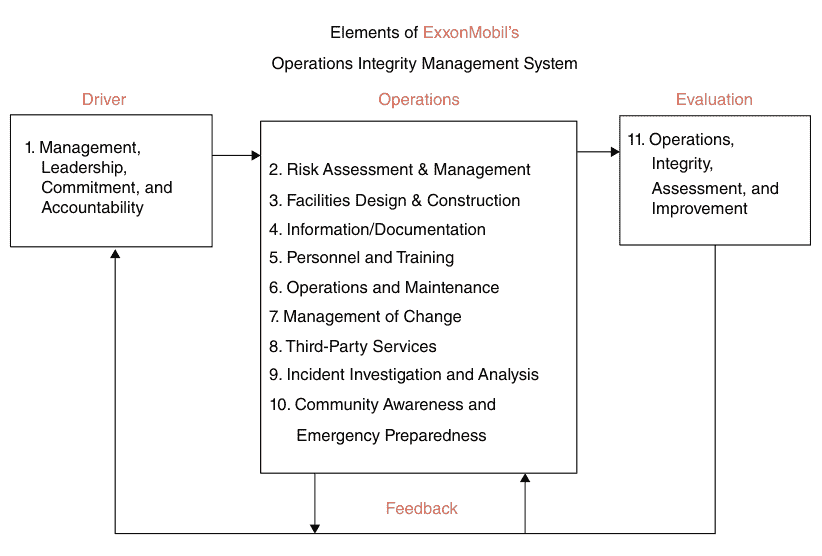

如果其他公司制定类似的大纲，安全专业人员不应感到惊讶，因为人们越来越认识到，处理危害和风险最有效和最经济的方法是在设计和重新设计过程中解决它们。

埃克森美孚的 OIMS 倡议涉及所有运营风险，包括职业、环境、产品和公共安全。

## ANSI/ASSP Z590.3 – 通过设计预防：在设计和重新设计过程中处理职业危害和风险的指南。

本章前面已经提到过这项标准。它于 2011 年 9 月 1 日获得 ANSI 批准。已开始更新此标准的工作。Georgi Popov 是委员会主席，Bruce Lyon 是副主席——两人都是本书的主要作者。

通过设计预防的核心是风险评估。在设计和重新设计过程的早期进行风险评估，并在整个系统或产品的生命周期内根据需要持续进行，可以减少事故发生的可能性。支持该前提的逻辑如下：

- 1) 危害和风险在设计和重新设计过程中最有效和最经济地被避免、消除或控制。
- 2) 危害分析是最重要的安全流程，因为如果它失败，所有其他流程都可能无效（Johnson – 第 245 页）。
- 3) 风险评估应成为运营风险管理系统的基石。
- 4) 如果通过危害识别、分析和风险评估流程制定规范，并在采购过程中应用这些规范，以避免将危害及其伴随的风险带入工作场所，那么发生伤害的可能性将大大降低。
- 5) 负责安全的人员，无论其头衔如何，其全部目的都是管理其在危害方面的努力，从而使这些危害产生的风险是可接受的。

安全实践是基于危害的。因此，Johnson 恰当地写道，危害分析是最重要的安全流程。由于运营环境中的所有风险都源于危害，并且运营风险管理系统的目的是实现可接受的风险水平并避免事故和疾病，因此风险评估应成为运营风险管理系统的基石。

图 1.2 描绘了理论上的理想状态。通过设计预防被移到设计过程的上游。目的是在概念和设计步骤中分析和处理危害和风险。然而，这要求相关人员达到无法企及的完美。危害和风险也将在构建、运营和维护步骤中被识别出来，为此需要在改造过程中进行重新设计。

危害分析和风险评估流程是通过设计预防标准中最长的部分。首先，给出了危害分析和风险评估流程的概述。然后是其每个要素的“如何做”。概述如下：

- 选择风险评估矩阵
- 建立分析参数
- 识别危害
- 考虑失效模式
- 评估后果的严重性
- 确定发生概率
- 定义初始风险
- 选择并实施危害规避、消除、减少和控制方法

## 1.3 风险评估方法

本书的目的之一是介绍多种风险评估方法，这些方法将在全文中进行描述。对于许多危害，无需组建复杂的团队即可达到适当的可接受风险水平。拥有经验和教育背景的安全健康专业人员和设计工程师，能够就何为可接受风险得出正确结论。正如Z590.3中所定义的，可接受风险是：

> **可接受风险。** 在所考虑的环境中，事件或暴露发生的概率以及可能造成的伤害或损害都低至合理可行（ALARP）的风险。

**ALARP – 低至合理可行** – 被定义为这样一种风险水平：只有通过增加与风险降低不成比例的资源支出，才能进一步降低该风险。（第12页）

对于更复杂的风险情况，管理层应建立相应流程，就所考虑情况的类别，寻求在风险评估方面特别熟练的经验丰富人员的建议。在这种情况下，可能需要更复杂的风险评估方法。

有时，即使对个人而言显而易见的事情，就可接受风险水平达成共识仍然是可取的，以便获得对将要采取行动的支持。

建议选择的风险评估方法应符合需求。有时，方法无需复杂。以下介绍一种相当简单的方法。其目的是作为说明。

2020年3月，NIOSH发布了第17卷第11期电子通讯，由NIOSH主任John Howard博士签署。其标题为**《运用科学评估工作场所危害：NIOSH的职业风险评估实践》**。该电子通讯内容如下：

什么是*风险评估*？你在决定带伞前会查看是否会下雨吗？这样做就是风险评估的一个例子，它描述了一个回答关于特定危害的三个基本问题的过程。

**可能发生什么？**（今天可能会下雨。）
**发生的可能性有多大？**（天气频道说有70%的阵雨几率。）
**如果发生，后果是什么？**（如果没带伞，我会被淋湿。）

这些答案为预防或减轻危害所构成的威胁（例如，带伞以避免被雨淋湿）提供了基础，这被称为*风险管理*。

有人可能会认为NIOSH过于简单化。然而，如果一个人遵循上述概述的程序，那么这个人就进行了一次风险评估。

## 1.4 ANSI/ASSP Z690 – 2011 系列标准

ANSI/ASSP Z690风险管理标准是美国在职业安全健康领域应用风险管理的国家标准。它们是美国对ISO 31000风险管理标准的采纳。

构成一套的三个ANSI标准，对于希望熟悉风险评估技术的安全通才来说应该具有吸引力。ASSP是秘书处。以下是对这三个标准的评述：

ANSI/ASSP Z690.1 – 2011：风险管理词汇（国家采纳ISO指南73:2009）。本标准提供了术语定义，制定者希望这些术语能在其他标准中使用。

ANSI/ASSP Z690.2 – 2011：风险管理原则与指南（国家采纳ISO 31000:2009）。本标准的目的是提供一个关于风险管理体系的广泛入门指南，该体系可应用于任何类型的组织。风险评估的要求在第5.4节：风险评估中引入。

ANSI/ASSP Z690.3 – 2011：风险评估技术（国家采纳IEC/ISO 31010:2009）。对于希望获得风险评估概念和方法现成参考的安全通才来说，本标准值得获取。它以15页的篇幅开始论述风险评估的概念和方法。附录A用5页简要比较了31种风险评估技术。附录B（共79页）对这31种技术进行了评述，涵盖概述、用途、输入、过程、优点和局限性。

特别是ANSI/ASSP Z690.3 – 2011，是一项宝贵的资源。以下是31种风险评估技术的列表。有些技术只能由具备系统安全概念和知识的经验丰富的安全专业人员应用。其他技术则由概率专家使用。然而，了解其中几种技术将能满足安全通才绝大部分的需求。

| 编号 | 技术名称 | 编号 | 技术名称 |
|---|---|---|---|
| B01 | 头脑风暴 | B02 | 结构化或半结构化访谈 |
| B03 | 德尔菲法 | B04 | 检查表 |
| B05 | 初步危害分析 | B06 | 危害与可操作性研究 |
| B07 | 危害分析与关键控制点 | B08 | 环境风险评估 |
| B09 | 结构化 – 假设分析 | B10 | 情景分析 |
| B11 | 业务影响分析 | B12 | 根本原因分析 |
| B13 | 失效模式与影响分析 | B14 | 故障树分析 |
| B15 | 事件树分析 | B16 | 原因与后果分析 |
| B17 | 因果分析 | B18 | 保护层分析 |
| B19 | 决策树 | B20 | 人因可靠性分析 |
| B21 | 领结分析 | B22 | 以可靠性为中心的维护 |
| B23 | 潜在电路分析 | B24 | 马尔可夫分析 |
| B25 | 蒙特卡洛模拟 | B26 | 贝叶斯统计与贝叶斯网络 |
| B27 | FN曲线 | B28 | 风险指数 |
| B29 | 后果/概率矩阵 | B30 | 成本效益分析 |
| B31 | 多准则决策分析 | | |

在Z590.3标准中，有这样一段陈述（第23页）。“实际上，掌握三种风险评估概念的知识，将足以应对大多数（但非全部）风险评估情况”（安全专业人员将面临的）。它们是初步危害分析与风险评估；假设/检查表分析方法；以及失效模式与影响分析。

## 1.5 ANSI B11.0 – 2020：机械安全

**这是一项极其重要的标准**
由于其涵盖范围广泛，ANSI B11.0 – 2020对于机械安全尤为重要。经B11 Standards Inc.许可，本标准的部分内容在此转载。正如前言所述：

本标准规定了机械和机械系统的设计、制造、操作和维护（包括安装、拆卸和运输）的一般安全要求。本标准也适用于这些机器的组成部分。（第8页）

本书作者认为，每一位涉及机械安全的安全专业人员都应拥有一份本标准。它得到了名为ANSI B11.19-2019的标准支持，其标题为“风险降低措施的性能要求：防护及其他降低风险的方法”。这是一份231页的文件，专门论述风险降低的方法。以下是B11.0-2020的既定目的：

本标准描述了在机械生命周期内识别危害、评估风险并将风险降低至可接受水平的程序。（第9页）

B11系列标准的目标是：

通过为机械或机械系统的设计、制造、改造、修改、安装、设置、操作和维护制定要求，消除机械或机械系统对人员造成的伤害。供应商、用户以及相应的管辖机构都应使用本标准。（第9页）

该标准明确要求机械供应商、改造者、修改者和用户达到可接受的风险水平。

ANSI B11.0是目前适用于上述所有操作类别的机械风险评估流程的最全面标准。前言中认可了“通过设计预防”的概念。

“通过设计预防”或PtD是行业内的一个新术语；风险评估、风险降低以及尽早消除危害的目标是本标准固有的，并非新内容。标准中使用了“通过设计预防”这一短语，以及其他等效术语，如“通过设计消除”、“设计排除”和“替代”，以全面解决风险评估并将其应用于机器的生命周期和操作。（第8页）

由于许多美国机械制造商将其产品销往其他国家，因此需要与其他适用标准协调一致。以下句子紧随“协调”标题之后。

本标准已通过引入危害识别和风险评估作为分析人员危害以达到可接受风险水平的主要方法，与国际（ISO）和欧洲（EN）标准相协调。

这一陈述提出了一个有趣且重要的概念。如果所有安全专业人员都接受危害识别、分析和风险评估是预防人员伤害的第一步，那么安全实践中的一个重大概念变革就将实现。

以下是本标准中对可接受风险的定义 – 定义（第18页）：

**可接受风险：** 应用风险降低措施后达到的风险水平。它是针对给定任务（危险情况）或危害而被接受的风险水平。就本标准而言，“可接受风险”和“可容忍风险”被视为同义词。
*资料性注1：* “可接受风险”一词通常（但不总是）指在技术上、功能上和经济上可行的风险降低措施或额外的资源支出不会显著降低风险的水平。接受（容忍）风险的决定受多种因素影响，包括文化、安装额外风险降低措施的技术和经济可行性、通过使用额外风险降低措施所达到的保护程度，以及法规要求或最佳行业实践。
*资料性注2：* 用户和供应商可能具有不同水平的可接受风险。
*资料性注3：* 某些ISO标准中使用的类似表述如下：“风险已得到充分降低。”

B11.0-2020中包含一个特别概述的风险评估流程。此处转载以强调几个目的：它具有说明性，尽管与其他概述不同；它表明参与流程的人员应具备资格；风险评估活动的范围应被定义；危害应被识别和分析；初始风险应被评估；如有必要，风险应被降低；并应达到可接受的风险水平。

# 6 风险评估流程

### 6.1 概述
- 6.1.1 质量人员
- 6.1.2 目标
- 6.1.3 风险评估流程的基本步骤

### 6.2 准备并确定评估范围（界限）

### 6.3 识别任务和危害
- 6.3.1 识别受影响人员
- 6.3.2 识别任务
- 6.3.3 识别危害和危险情况
- 6.3.4 类似机器

### 6.4 评估初始风险
- 6.4.1 选择风险评分系统
- 6.4.2 评估风险
- 6.4.3 检查新的危害

### 6.6 评估剩余风险

### 6.7 达到可接受风险

### 6.8 验证和确认风险降低措施

### 6.9 记录流程
- 6.9.1 内容
- 6.9.2 文档保存

标准的下一节概述了“通用风险评估要求”。（第4页）
ANSI B11.0-2020 可在 www.b11standards.org 或 www.ansi.org 购买。

## 1.6 风险评分系统

请注意，风险评估流程中的 6.4.1 是“选择风险评分系统”。为何要这样做？在风险管理中，有必要确定行动的优先级。这可以通过风险评分系统来实现——风险等级分为低、中、高或极高，或其变体。重要的是，参与风险评估流程的人员需要理解这些术语的含义以及所用术语隐含的行动级别。

图 1.3 所示的风险评估矩阵是多个矩阵的组合，这些矩阵包含可能性和严重性等级的数值，并被转换为定性的风险等级。它最初是为那些更喜欢处理数字而非定性指标的人员开发的。为了提供一个单页工具，供希望让车间人员参与风险评估的安全专业人员使用，该矩阵进行了扩展，包含了严重性和可能性的描述以及行动级别。

在两种情况下，车间人员对安全专业人员表示，首先将数字相互关联——例如 6–12——对于理解风险类别是中等还是高风险非常有帮助。如果使用从数字开始建立风险等级的风险评估矩阵能使流程对操作人员更易理解和接受，那么就应该鼓励这样做。

重要的是要理解，图 1.3 中的数字是凭直觉得出的：它们是半定量的。因此，这些数字仅在相互比较时才有价值。对于所有不基于硬性概率和严重性数字的风险评分系统（这些数字很少可用）来说，情况都是如此。

| 严重性等级 | 健康影响（人员） | 财产损失 | 环境影响 | 1 极不可能 | 2 不太可能 | 3 可能 | 4 很可能 | 5 极有可能 |
| :--- | :--- | :--- | :--- | :--- | :--- | :--- | :--- | :--- |
| 5 | 死亡或永久完全残疾 | 灾难性损失 | 重大影响 | 5 | 10 | 15 | 20 | 25 |
| 4 | 永久部分残疾；三人或以上住院 | 严重损失 | 重大但可逆影响 | 4 | 8 | 12 | 16 | 20 |
| 3 | 导致一天或以上无法工作的伤害或职业病 | 显著损失 | 中等可逆影响 | 3 | 6 | 9 | 12 | 15 |
| 2 | 未导致工作日损失的伤害或职业病 | 中等损失 | 最小影响 | 2 | 4 | 6 | 8 | 10 |
| 1 | 仅需急救或无伤害或疾病 | 轻微损失 | 无影响 | 1 | 2 | 3 | 4 | 5 |
| | 极高风险：15 或更高 | 高风险：10 –14 | 中等风险：5 –9 | 低风险：1 –4 | | | | |

图 1.3 风险矩阵示例。

请注意，此风险评估矩阵涉及人身伤害和疾病、系统损失或停机时间（任何来源）以及环境释放。其他矩阵可能不那么全面。

## 1.7 欧盟——风险评估

2008年8月，欧盟启动了一项为期两年的健康与安全运动，重点关注风险评估。其公报指出：

> 风险评估是欧洲预防职业事故和疾病方法的基石。如果风险评估流程——健康与安全管理方法的起点——做得不好或根本没有做，那么相应的预防措施就不太可能被识别或实施。

这份公报虽然极其重要，但作为欧盟公报已不再在互联网上提供。可通过“预防与控制策略 - OSHWIKI”在 https://oshwiki.eu/wiki/Prevention_and_control_strategies 获取。

本文作者认为欧盟的这一声明具有开创性。思考其意义和巨大影响。它明确指出，风险评估应成为安全与健康体系的基石，如果风险评估做得不好或根本没有做，所需的预防措施就不太可能被识别或采取。

欧洲人一直是认识风险评估重要性并推动其应用的领导者。例如，自1999年以来，英国的雇主就被法律要求进行风险评估。其他欧洲参与情况如下：

**EN ISO 12100-2010：机械安全。设计通则。风险评估与风险降低。**

该标准由ISO于2010年发布，有着有趣的历史。它合并了之前发布的三个ISO标准并取代了它们。请注意，“风险评估与风险降低”包含在标题中。这很重要，因为它将风险评估过程与风险降低过程分开，就像B11.0-2020中的情况一样。在其他地方并非总是如此。

ISO 12100-1的标题是*机械安全——基本概念、设计通则——第1部分*。它提出了通用设计指南，并要求对进入工作场所的机械进行风险评估。ISO 12100-2的标题是*机械安全——基本概念、设计通则——第2部分：技术原则*。第2部分详细介绍了“机械安全”的设计规范。ISO 14121的标题是*机械安全——风险评估原则*。它阐述了要应用的风险评估概念。EN ISO 12100-2010合并了这三个标准并保留了它们的内容。

EN ISO 12100-2010是一个真正的国际标准，在全球范围内具有相当大的影响力。它的存在意味着绝大多数国家同意这样一个原则：在机械的设计和再设计过程中，应识别和分析危害，并评估其伴随的风险。

标题中ISO之前的EN表示该标准起源于欧洲共同体。几个适用于欧洲共同体、标题以EN开头的标准已成为ISO标准。

欧洲共同体的标准对世界各地的制造商产生了相当大的影响。举例如下：产品供应商若要将产品销往欧洲共同体成员国，必须在产品上放置“CE”标志，以表明已满足所有适用的欧洲共同体指令。EN ISO 12100-2010中的风险评估规定就是这些要求之一。

**STD-882E – 2012。美国国防部系统安全标准实践。** 系统安全标准实践的基础文件MIL-STD-882于1969年发布。在当时它是一份开创性文件，并且一直是重要的参考文献。

MIL-STD 882对危害识别与分析、风险评估、风险消除和风险控制概念与方法的发展产生了相当大的影响。世界各地发布的安全标准和指南中，关于风险评估和控制层级的许多措辞都与882的几个版本中的内容有关。这就是为什么本章用大量篇幅介绍该标准的原因。

在50年的时间里，882已经发布了四个修订版。正如882E的前言中所说：“本系统安全标准实践确定了国防部在国防系统的开发、测试、生产、使用和处置过程中识别危害、评估和缓解相关风险的方法。”（第ii页）

882的最后一个版本于2012年5月11日批准。可免费获取，网址为 https://www.dau.edu/cop/esoh/DAU%20Sponsored%20Documents/MIL%20STD%20882E%20Final%202012%2005%202011.pdf。本文作者强烈建议安全专业人员获取一份本标准以供参考。

MIL-STD-882E在882D的基础上进行了大幅扩展。例如，882D版本（包括附录）有26个编号页：而882E版本有98个编号页。它取代了882C中未包含在882D中的部分内容。在882E中：

- 实现和保持可接受的风险水平占据主导地位。
- 对系统安全流程进行了修订，更加重视危害分析和风险评估。
- 要求使用风险评估矩阵。
- 在设计优先顺序方面进行了值得注意的修订。
- 对管理高风险和严重风险级别给予了适当重视。
- 有一个主要部分专门介绍软件和软件评估。

摘录如下，其中一些经过修改以避免政府术语。882E中的第4节标题为通用要求。它规定了“可接受的系统安全工作的要求”。第4.3节概述了系统安全流程的八个要素，如下：

- 要素1：记录系统安全方法。
- 要素2：识别并记录危害。
- 要素3：评估并记录风险。
- 要素4：识别并记录风险缓解措施。
- 要素5：降低风险。
- 要素6：验证、确认并记录风险降低。
- 要素7：接受风险并记录。
- 要素8：管理生命周期风险。

由于其内涵，4.3.4节概述的概念——识别并记录风险缓解措施——在此重复。

潜在的风险缓解措施应被识别，备选方案的预期风险降低效果应进行估算，并记录在HTS中。*目标应始终是尽可能消除危险。*（此处为强调）。当危险无法消除时，应在成本、进度和性能的约束条件下，通过应用系统安全设计优先顺序，将相关风险降低到可接受的最低水平。系统安全设计优先顺序识别了备选的缓解方法，并按有效性递减的顺序列出。

- a) 通过设计选择消除危险。理想情况下，应通过选择能完全消除危险的设计或材料替代方案来消除危险。
- b) 通过设计变更降低风险。如果采用替代设计变更或材料来消除危险不可行，则考虑通过设计变更来降低由危险引起的潜在事故的严重性和/或概率。
- c) 采用工程特性或装置。如果通过设计变更缓解风险不可行，则使用工程特性或装置来降低由危险引起的潜在事故的严重性或概率。通常，工程特性主动中断事故序列，而装置则降低事故风险。
- d) 提供警示装置。如果工程特性和装置不可行，或不能充分降低由危险引起的潜在事故的严重性或概率，则应包括检测和警示系统，以提醒人员注意危险状况的存在或危险事件的发生。
- e) 采用标识、程序、培训和个人防护装备。当设计替代方案、设计变更以及工程特性和装置均不可行，且警示装置无法充分缓解由危险引起的潜在事故的严重性或概率时，应采用标识、程序、培训和个人防护装备。标识包括标牌、标签、标志和其他视觉图形。程序和培训应包括适当的警告和注意事项。程序可规定使用个人防护装备。对于被指定为灾难性或严重事故严重性类别的危险，应避免仅将标识、程序、培训和个人防护装备作为唯一的风险降低方法。

4.3.5 降低风险。选择缓解措施。

再次强调，MIL-STD 882E是一份优秀的教育和资源文件。其基础是危险识别与分析以及风险评估。

## 1.8 OSHA要求

*OSHA关于高危化学品工艺安全管理的规定*（1910.119）于1992年发布，适用于约50,000个场所的雇主，其中许多不被视为化学公司。就标准中要求包含危险分析而言，该OSHA标准值得安全从业人员审阅。该标准要求：

雇主应对此标准涵盖的工艺进行初始危险分析（危险评估）。工艺危险分析应与工艺的复杂性相适应，并应识别、评估和控制工艺中涉及的危险。雇主应使用以下一种或多种适当的方法来确定和评估所分析工艺的危险：

- 假设分析（What-If）；
- 检查表法；
- 假设分析/检查表法；
- 危险与可操作性研究（HAZOP）；
- 失效模式与影响分析（FMEA）；
- 故障树分析；或
- 适当的等效方法。

尽管受影响的雇主需要进行危险分析，但前面列出的方法是风险评估技术。据作者回忆，在该标准颁布前，评论者表达了对必须使用概率数据的担忧——而这类数据在统计上可靠者甚少。OSHA对此作出了积极回应。这出现在该标准的序言中。

OSHA已修改了该段落（编者注——关于后果分析的段落），以表明其并不打算要求雇主进行概率风险评估来满足执行后果分析的要求。

然而，并非所有风险都是平等的。有些风险需要优先关注。管理层在决策中确实会评估和确定风险的优先级，以决定为各个项目分配哪些资源。

## 1.9 EPA要求

美国环境保护署（EPA）和OSHA在有害物质意外释放方面拥有不同的法律权限。EPA的关注点集中在场外后果：即对公众和环境的危害。而OSHA的法律权限则涉及场内后果。

1996年8月19日，EPA发布了40 CFR Part 68规则，*《化学意外释放预防风险管理计划》*。该规则要求场所管理层提交的风险管理计划于1999年6月21日到期。尽管该规则的条款内容广泛，但此处仅将讨论危险分析的规范。

受此规则约束的工艺分为三组，EPA将其标记为计划1、计划2和计划3。计划级别与有毒和易燃化学品的数量及暴露程度相关。对于符合计划1和2级别的场所（暴露程度较低），EPA将接受由合格人员使用适当检查表完成的危险审查。

危险审查必须有文件记录，并表明问题已得到解决。在其文献中，EPA评论了使用“假设分析”危险识别与分析过程的可取性。如果分析结果表明有必要，EPA还建议使用更复杂的分析技术。

计划3级别场所的危险审查要求更为具体和广泛。但那些符合OSHA《高危化学品工艺安全管理规定》的场所，需要做的新增工作很少，尽管它们确实需要扩展其危险分析，以考虑对公众或环境造成危害的可能性。与OSHA一样，必须由一个团队完成EPA要求的工艺危险分析。团队中至少有一名成员应具有该工艺的经验。

对于美国工业界，EPA显然扩展了关于危险分析技术的知识和技能要求。

## 1.10 化学工业——广泛的信息体系

在OSHA和EPA制定危险分析要求之前的许多年，进行危险分析在化学工业中已是普遍做法。尽管化学工业在危险分析方面的知识体系非常广泛，但由于其特殊重要性，此处仅参考一份出版物。

化学工艺安全中心是美国化学工程师学会的一部分。其出版的一本书名为*《危险评估程序指南，第二版及实例》*。由一个化学领域的团体出版该书，不应阻碍那些希望学习以下评估技术的人。这些技术的描述是通用的。

- 安全审查
- 检查表分析
- 相对排序
- 初步危险分析
- 假设分析
- 假设分析/检查表分析
- 危险与可操作性分析
- 故障树分析
- 事件树分析
- 因果分析
- 人因可靠性分析

这些技术在《指南》中得到了广泛讨论，相关章节题为“危险评估技术概述”和“使用危险评估技术”。

## 1.11 结论

信息很明确。在安全标准和指南中包含要求进行危险分析和风险评估的条款已成为常态。可以合理地假设，这一趋势将持续下去，并且安全专业人员将被期望具备必要的知识和技能，就如何应用这些条款提供建议。强调风险评估的实际应用是关键。

## 参考文献

ANSI B11.0-2020: Safety of Machinery. B11Standards, POB 690905, Houston, TX 77269, USA, 2020.
ANSI/ASSP Z10 – 2019 (2019). *Occupational Health and Safety Management Systems*. Park Ridge, IL: American Society of Safety Professionals.
ANSI/ASSP Z590.3 – 2011 (2011). *American National Standard: Prevention through Design: Guidelines Addressing Occupational Hazards and Risks in Design and Redesign Processes*. Park Ridge, IL: American Society of Safety Professionals (R2016).
ANSI/ASSP Z690 Series (2011). *Risk Assessment Techniques*. Park Ridge, IL: American Society of Safety Professionals.
ANSI/ASSP/ISO 45001 – 2018 (2018). *Occupational Health and Safety Management Systems – Requirements with Guidance for Use*. Park Ridge, IL: American Society of Safety Professionals.
ASSP Risk Assessment Institute and Committee. https://www.assp.org/advocacy/risk-assessment-committee
Bureau of Labor Statistics Reports on Occupational Fatalities, 2003 through 2016. Washington, DC: Bureau of Labor Statistics.
En ISO 12100-2010 (2010). *Safety of Machinery. General Principles for Design. Risk Assessment and Risk Reduction*. Geneva, Switzerland: International Organization for Standardization.

# 2 风险评估标准与定义

布鲁斯·莱昂¹ 与 布鲁斯·霍尔克罗夫特²

¹ Brown & Brown
² PayneWest Insurance, A Marsh & McLennan Agency LLC Company

### 目标

-   介绍风险评估的必要性
-   回顾要求进行危害识别与分析的合规标准
-   回顾规定风险评估的共识标准
-   定义关键风险评估术语

## 2.1 引言

在运营风险管理流程中，最重要的一环是风险的识别、分析和评估。没有这一要素，理解和管理风险便无从谈起。风险评估的目的在于识别和分析风险源（危害），并评估其风险，以便管理层能够妥善地规避、降低和管理运营风险。

风险评估是一门必须学习、实践并持续执行的学科，以便有效地预见和识别、分析和评估风险，从而进行管理。正如本文将进一步阐述的，风险评估是有效运营风险管理体系的核心组成部分，用于识别、分析和评估工作场所中的风险。

随着要求或倡导正式风险评估的标准、指南和实践的发展，人们对风险评估重要性的认识日益增强。本章旨在让读者理解为组织规定运营风险评估的关键标准和指南，以及它们在塑造安全、健康与环境专业人员在职业安全与健康领域角色中的重要性。本文将结合安全、健康与环境专业人员的职责，回顾和解释风险评估与管理的关键术语和定义。

## 2.2 风险评估与安全专业人员

从根本上说，安全专业领域长期以来一直认识到通过适当的识别、评估和控制来管理危害和风险的重要性。这体现在各种行业和业务领域（如环境、金融、医疗和核能等）的标准、指南和最佳实践中，这些领域都要求或建议进行风险评估。其中一些业务领域受到其行业特定的法规合规要求的约束。

在第一章中，可以找到一份附录，列出了自2005年以来制定的、要求或促进使用正式风险评估的标准、指南和倡议。对这些标准和指南的回顾显示，其制定者所采用的方法存在异同。有些是特定行业的，而另一些则适用于所有行业。它们传达的信息很明确：风险评估很重要，安全专业人员应具备应用这些评估的知识和技能。

为避免专业责任风险，安全专业人员了解当前适用的标准和最佳实践至关重要。除了法规标准外，安全专业人员还应使用和推荐被视为最佳管理实践（BMPs）的共识标准，如ANSI/ASSP Z590.3、ANSI/ASSP/ISO 45001和ANSI/ASSP/ISO 31000。一旦发生事故，仅仅合规并不能保护组织或个人免受法律诉讼，特别是当存在已知的、本可以预防或降低风险的共识标准时。在这种情况下，“可预见性”原则就会发挥作用。

可预见性是一项法律理论，它规定如果某人意识到其行为可能产生有害影响，却未改变这些行为或做出必要调整，且其行为与伤害之间存在因果关系，则该人需对造成他人伤害负责。例如，安全专业人员可能会被要求在法律案件中就其对与事件相关的当前共识标准的了解作证。问题可能是“您是否了解与此问题相关的任何标准？”如果答案是“否”，该安全专业人员的信誉就会受损。然而，如果答案是“是”，紧接着的问题可能是“为什么您没有应用标准推荐的最佳管理实践？”

很明显，仅仅依赖基于合规的方法已不再足够。虽然合规是必要的且是法律要求的，但它只确立了最低可接受水平。基于风险的方法则更深入地探究伤害/损失的真正原因，并鼓励组织主动评估其风险。

## 2.3 要求风险评估的关键标准

在欧洲、澳大利亚、新西兰、加拿大和世界其他地区，职业风险评估已成为一种普遍做法。这主要是因为这些国家都有要求在工作场所进行风险评估的国家标准。例如，在英国，自1999年以来，健康与安全执行局（H&SE）已从法律上要求所有拥有五名或以上员工的雇主进行风险评估。澳大利亚和新西兰等其他国家也有类似的要求。

然而，在美国，很少有风险评估是强制性的，除了职业安全与健康管理局（OSHA）的*29 CFR 1910.119 高危化学品过程安全管理*标准，以及环境保护署（EPA）的*40 CFR Part 68, 风险管理计划*标准。其他OSHA标准包含危害识别的要求，以及一些解释，这些解释建议进行分析，在某些情况下甚至进行“评估”，例如*1910.132, 个人防护装备*和危害评估；*1910.178, 危险能源控制*；以及*1910.146, 需要许可证的受限空间进入*。

---

EPA: 化学品意外释放预防风险管理计划。http://www.epa.gov/emergencies/content/lawsregs/rmpover.htm

埃克森美孚的OIMS。https://corporate.exxonmobil.com/en/energy-and-environment/tools-and-processes/risk-management-and-safety/operations-integrity-management-system (访问于2020年5月)。

危害评估程序指南，第二版及实例。纽约：美国化学工程师学会化学过程安全中心，1992年。

ISO 12100-1 (2003)。*机械安全 - 基本概念，设计通用原则；第1部分。基本术语，方法论*。瑞士日内瓦：国际标准化组织。

ISO 12100-2 (2003)。*机械安全 - 基本概念，设计通用原则；第2部分。技术原则和规范*。瑞士日内瓦：国际标准化组织。

ISO 14121 (1999)。*机械安全 - 风险评估原则*。瑞士日内瓦：国际标准化组织。

Manuele, F.A. (2020)。*高级安全管理：聚焦Z10、45001和严重伤害预防*，第三版。新泽西州霍博肯：Wiley出版社。

MIL-STD-882E (2012)。*系统安全标准实践*。华盛顿特区：国防部。https://www.dau.edu/cop/esoh/DAU%20Sponsored%20Documents/MIL%20STD%20882E%20Final%202012%2005%2011.pdf

NIOSH: Howard, John, M.D. 电子新闻 第17卷，第11期。评估工作场所危害的科学：NIOSH在职业风险评估中的实践，2020年3月。

*OSHA的高危化学品过程安全管理规则*，1910.119。华盛顿特区：劳工部，职业安全与健康管理局，1992年。

预防和控制策略。OSHAWIKI，网址为 https://oshwiki.eu/wiki/Prevention_and_control_strategies。

*化学品意外释放预防风险管理计划*，40 CFR Part 68。华盛顿特区：环境保护署，1996年。

*风险评估：评估运营风险的实用指南*，第二版。Georgi Popov, Bruce K. Lyon, 与 Bruce Holcroft。© 2022 John Wiley & Sons, Inc. 由John Wiley & Sons, Inc.于2022年出版。

## 2.4 OSHA 合规性与风险评估

在美国，职业安全与健康管理局（OSHA）是雇主必须遵守的最低安全合规标准。1970年，《职业安全与健康法案》（OSH Act）成立，规定雇主有责任提供安全健康的工作场所。OSHA的既定使命是通过制定和执行标准，以及提供培训、外展、教育和援助，来确保工作场所的安全与健康。以下是OSHA网站提供的描述：

《职业安全与健康法案》覆盖了大多数私营部门雇主及其员工，此外还包括50个州以及联邦管辖下的某些地区和司法管辖区的部分公共部门雇主和员工。OSHA通过联邦OSHA或经OSHA批准的州计划，直接覆盖了所有50个州、哥伦比亚特区以及其他美国司法管辖区的大多数私营部门雇主及其员工。州和地方政府机构的员工不受联邦OSHA的覆盖，但如果他们在拥有经OSHA批准的州计划的州工作，则受到《职业安全与健康法案》的保护。另有四个州和一个美国领地拥有仅覆盖公共部门员工的经OSHA批准的计划。州运营的健康和安全计划必须至少与联邦OSHA计划一样有效。OSHA标准是描述雇主必须采用的方法以保护其员工免受危害的规则。

OSHA标准涵盖建筑工作、海事作业、农业和通用工业，其中通用工业标准适用于大多数工作场所。

雇主还必须遵守《职业安全与健康法案》的一般责任条款，该条款要求雇主使其工作场所免受公认的严重危害。当没有适用的OSHA标准时，通常会引用此条款。

在OSHA发布标准之前，必须经过一个广泛而漫长的过程，包括大量的公众参与、通知和评论期。这被称为OSHA的“规则制定过程”。根据“OSHA规则制定过程”流程图，该过程始于识别出的健康或安全危害，并包括危害分析和风险评估。事实上，许多标准都是直接针对严重事故或重大损失而制定的，例如*1910.119，高危化学品过程安全管理*标准和1984年联合碳化物公司博帕尔异氰酸甲酯（MIC）气体泄漏悲剧。

### 2.4.1 1910.132，个人防护装备标准

危害的确定、分析和评估在一些OSHA法规中有所涉及，但并未正式称为“风险评估”。最基本的是OSHA *29 CFR 1910.132，个人防护装备（PPE）通用要求*。该标准要求雇主评估工作场所，以确定是否存在或可能存在危害，从而需要使用个人防护装备。它适用于其他特定OSHA法规（如涵盖噪音或呼吸污染物危害的法规）未要求的个人防护装备类型。该法规要求雇主对需要个人防护装备的工作场所危害进行并记录危害评估。通常，它要求雇主识别危害类型，并按照下面1910.132 (d)的规定选择适当的个人防护装备：

**危害评估和装备选择** – 雇主应评估工作场所，以确定是否存在或可能存在危害，从而需要使用个人防护装备（PPE）。如果存在或可能存在此类危害，雇主应：

- 选择并让每位受影响的员工使用能够保护其免受危害评估中识别的危害的个人防护装备类型；
- 将选择决定传达给每位受影响的员工；以及，
- 选择适合每位受影响员工的个人防护装备。注：非强制性附录B包含了一个符合危害评估要求的程序示例。

雇主应通过书面认证来验证已进行所需的工作场所危害评估，该认证应注明被评估的工作场所；证明评估已进行的人员；危害评估的日期；并注明该文件是危害评估的认证。

个人防护装备危害评估的示例可在第5章“基本风险评估”中找到。

### 2.4.2 1910.119，过程安全管理标准

如前所述，OSHA 29 CFR 1910.119，高危化学品过程安全管理（PSM）是包含风险评估要求的最突出标准。过程安全管理标准于1992年制定，要求对含有10,000磅或更多危险化学品的受监管工业过程进行过程危害分析（PHA），以保护在这些过程内部及周围工作的员工。1910.119(e)要求进行初始过程危害分析（PHA），并每五年进行一次后续PHA以重新确认其有效性。虽然此要求被称为过程危害分析，但PHA类似于风险评估，因为它识别和分析危害及现有控制措施，以确定是否需要额外的控制措施。

PHA必须按优先顺序进行，并考虑危害的范围、可能受影响的人数、过程的年限以及过程的运行历史。OSHA PSM法规引用了本书和各种评估标准中提到的一些相同的风险评估技术，包括以下内容。

- 假设分析
- 检查表分析
- 假设/检查表分析
- 危害与可操作性研究（HAZOP）
- 失效模式与影响分析（FMEA）
- 故障树分析（FTA）

PHA必须处理过去事件的潜在后果以及工程和管理控制失效的潜在后果。它还必须考虑人为因素，并包括对控制失效对工作场所员工安全与健康影响的定性评估。过程安全管理标准的其他重要部分包括启动前安全审查（PSSR）和变更管理（MOC）程序的要求。

PSM法规中对优先级和后果的引用与风险评估是一致的。所有这些PHA活动都必须是正式的并有文件记录。关于PHA的进一步讨论可在第7章“假设危害分析”中找到。

### 2.4.3 其他OSHA标准

其他OSHA标准要求进行危害或暴露确定，并控制现有危害。例如，*1910.146，需要许可的受限空间*标准要求对工作场所进行初步评估，以识别受限空间并确定它们是否为“需要许可”的空间，在进入许可空间前识别和评估危害；以及*1910.1200，危害沟通*标准要求建立危险化学品清单并进行危害确定。因此，风险评估虽然没有被特别要求，但却是应使用的一种技术，以满足这些要求。

同时考虑OSHA一般责任条款的要求，即所有雇主必须为其员工提供一个没有公认危害的工作场所。一般责任条款旨在适用于雇主应意识到但未被特定OSHA法规涵盖的所有危害。满足此要求的合理方法是进行危害识别和分析以及风险评估。同样，一般责任条款并未特别要求进行风险评估，但彻底的风险评估将使雇主能够遵守此OSHA要求。

作者认为，美国在使用正式风险评估方面已落后于世界其他地区，部分原因是大多数OSHA标准并未包含具体要求。然而，在共识标准和行业实践中，对使用风险评估的兴趣日益增长。

## 2.5 要求风险评估的共识标准

尽管合规性标准目前不是风险评估的驱动力，但在一些关键的共识标准和技术报告中，正朝着正式风险评估的方向发展。这些包括：

- ANSI/ASSP Z10.0-2019，职业健康安全管理体系；
- ANSI/ASSP/ISO 45001-2018 职业健康安全管理体系 - 要求及使用指南；
- ANSI/ASSP Z590.3-2011(R2016) 通过设计预防；
- ANSI/ASSP/ISO 31000-2018 风险管理；
- ANSI/ASSP/ISO 31010-2019 风险管理 – 风险评估；
- ANSI B11.0-2020，机械安全；
- ASSP TR-31010-2020 技术报告：风险管理 – 风险评估技术。

## 2.6 ANSI Z10.0

正如标准所述，风险评估对于组织的职业健康安全管理体系至关重要。首先，需要清晰理解职业健康安全管理体系（OHSMS）。美国国家标准*ANSI/ASSP Z10.0-2019，职业健康安全管理体系*将此类系统定义为“一组相互关联的要素，用于建立和/或支持职业健康安全方针和目标，以及实现这些目标的机制，以持续改进职业健康安全”。本质上，它是组织为有效管理运营风险以实现其业务目标而采用的业务系统。

## 2.7 ISO 45001

2018年，由各国标准机构组成的全球性联盟——国际标准化组织（ISO）发布了ISO 45001《职业健康安全管理体系——要求及使用指南》。该标准于同年被美国国家标准协会（ANSI）采纳为ANSI/ASSP/ISO 45001。

与ANSI Z10类似，ISO 45001是一项基于“计划-实施-检查-改进”持续改进过程的管理体系共识标准。在该标准的“策划”部分，包含了危险源辨识和风险评估的要求（6.1.2）。第6.1.2.1节“危险源辨识”要求组织“建立、实施并保持一个持续性和主动性的危险源辨识过程”。在随后的章节（6.1.2.2）中，标准规定了风险评估的要求，包括“应针对其范围、性质和时机，定义职业健康安全风险评估的方法和准则，以确保其是主动的而非被动的，并以系统的方式加以运用。”（ANSI/ASSP/ISO 45001 2018）

该标准涉及的其他相关要素包括：运用控制层级消除危险源和降低职业健康安全风险；变更管理；采购；承包商；外包；以及应急准备和响应。

## 2.8 ISO 31000 和 ISO 31010

美国国家标准ANSI/ASSP/ISO 31000-2018《风险管理》和ANSI/ASSP/ISO 31010-2019《风险管理——风险评估》是风险管理实践的基础性共识标准。具体而言，ANSI/ASSP/ISO 31000提供了风险管理原则、框架和过程的指南（如图2.1所示），而ANSI/ASSP/ISO 31010则是一项关于风险管理过程中风险评估当前良好实践的标准（如图2.2所示）。

ISO风险管理标准最初于2009年发布。这些标准于2011年被ANSI在全国范围内采纳，包括：

- ANSI/ASSP Z690.1-2011，风险管理词汇
- ANSI/ASSP Z690.2-2011，风险管理原则与指南
- ANSI/ASSP Z690.3-2011，风险评估技术

ISO 31010风险评估标准最初于2011年被美国安全专业人员协会（ASSP）采纳为ANSI/ASSP Z690.3。此后，该标准于2019年由ISO修订，并在美国被采纳为*ANSI/ASSP/ISO 31010 风险管理——风险评估*。

ISO 31010专门针对在ISO 31000建立的框架和过程内进行的风险评估。从风险管理视角看待的风险评估，通常比职业健康安全视角的范围更广、层次更高。然而，其过程本质上是相同的。ISO 31010为整体风险管理过程中的风险评估阶段提供了指南。其目的是提供基于证据的信息和分析，以便就如何处理特定风险做出明智决策。

ISO 31010指出，风险评估过程使决策者和利益相关方能更好地理解可能影响组织业务目标的风险，以及现有控制措施的有效性，从而使组织能更好地管理其运营风险。本质上，风险评估过程为制定关于最适当的风险控制措施以达到可接受风险水平的决策提供了基础。没有适当的风险评估，风险仍然是未知的，无法得到充分管理。ISO风险管理标准应成为安全专业人员，特别是从事风险管理和保险业务人员的重要参考。

## 2.9 ANSI/ASSP Z590.3，通过设计预防

*ANSI/ASSP Z590.3，通过设计预防——在设计和再设计过程中解决职业危害和风险的指南*于2011年首次发布，并于2016年重新确认。该标准是美国安全专业人员协会（ASSP）、美国国家安全委员会（NSC）和美国国家职业安全卫生研究所（NIOSH）多年努力的成果。制定该标准旨在为在设计和再设计过程中进行危险源分析和风险评估提供一致的程序。

风险评估是ANSI Z590.3中概述的通过设计预防（PtD）过程的一个主要组成部分。该标准的很大一部分致力于在整个系统生命周期中应用风险评估。第7节“危险源分析和风险评估过程”涵盖了风险评估的以下步骤：

- 沟通与指导
- 建立风险准则
- 确定背景
- 预测/识别风险源
- 考虑失效模式
- 评估后果的严重性
- 确定发生可能性
- 分析风险
- 评价风险
- 选择并实施风险降低和控制方法
- 监测与评审

PtD标准还介绍了几种风险评估技术，并在附录中提供了示例和模板。ANSI Z590.3强调在工作场所设计和现有系统中使用风险评估，这是PtD的一个主要方面。PtD标准提供了关于控制层级的指南，从“更高层级”的控制开始，包括避免、消除、替代、最小化和简化。这些“更高层级”的控制在系统设计和再设计的概念阶段更容易应用，并且在降低风险方面更有效。

ANSI Z590.3的独特之处在于，它旨在应用于产品、过程和运营的整个生命周期，包括运行前、运行中、事件后和/或运行后阶段。在设计或再设计过程中识别危险源、评估风险和确定控制措施，是执行这些活动最可靠且最具成本效益的时间点。因此，该标准应成为安全专业人员的主要参考。

## 2.10 ANSI B11.0 机械安全

ANSI B11.0-2020《机械安全》被认为是机械安全和风险评估的核心标准。它是美国国家标准协会（ANSI）和B11标准公司（B11 Standards, Inc.）发布的30多项金属加工机械标准和技术报告（统称为B11系列）之一。在缺乏特定机械标准的情况下，ANSI B11.0与ANSI B11.19-2019《风险降低措施的性能要求：防护及其他降低风险的方法》共同构成了B11系列特定机械（C类）标准的基础，也适用于其他缺乏特定机械安全标准的工业机械。B11标准和技术报告按照以下简要概述的ISO A-B-C层级结构组织：

- **A类标准**（基础标准）提供基本概念、设计原则和可应用于机械的通用方面。
- **B类标准**（通用安全标准）涉及一个或多个安全方面或一种或多种可用于一系列机械的防护装置。
- **C类标准**（特定机械安全标准）针对特定机械或机械组规定了详细的安全要求。

由于ANSI B11.0适用于一系列机器并包含通用要求，因此被视为A类标准。它适用于通过切割、冲击、压力、电气及其他加工方法对材料进行成型或塑形的新型、现有、改装和重建的动力驱动固定式机器。ANSI B11.0还规定，机械供应商和用户有责任定义和实现可接受的风险，并且与机械操作、维护、拆卸和处置相关的任何风险都应降低到可接受的水平。该标准包含一种正式的方法来执行和记录风险评估过程，并确定了在风险评估开始前必须进行的一些准备工作。该标准以分步方式呈现基本的风险评估过程，以协助实现这一目标。

*ANSI B11.TR3-2000 (R2015)，风险评估和风险降低——机床相关风险的估算、评估和降低指南*是一份ANSI技术报告。作为ANSI B11系列技术报告和标准的一部分，TR3涉及机床的设计、制造、维护和使用。该报告定义了一种方法，用于识别特定机器或系统在按预期使用时相关的危害，并提供了一种程序，用于估算、评估和降低在该机器或系统的各种使用条件下与这些危害相关的对个人造成伤害的风险。技术报告中包含了任务和机器危害的示例，以及风险降低方法。

此外，ANSI还采纳了*ISO 12100，机械安全——设计原则——风险评估和风险降低*。该标准规定了在机械设计中实现安全的基本术语、原则和方法。它规定了风险评估和风险降低的原则，以帮助设计者实现这一目标。虽然这是一项国际标准，但它是ISO标准，美国的安全专业人员即使没有国际职责或参与，也应该了解它。

## 2.11 NFPA 70E

随着2015年和2018年版NFPA 70E的发布，利益相关者评估电气风险的方式发生了重大转变。美国消防协会的2018年版*NFPA 70E：工作场所电气安全标准*，作为最新的自愿性共识标准，涉及工作场所电气安全，并包括执行电弧闪光、电击和电气危害暴露风险评估的指导。

2018年版相对于之前的版本进行了几项重大更改。以前需要进行电弧闪光、电击或电气“危害分析”的地方，现在需要进行“风险评估”。此外，该标准扩展了“风险评估程序”，包括危害识别、风险评估以及根据ANSI/ASSP Z10.0中指定的风险控制方法层级实施风险控制的要求。新增的信息性附录F“风险评估程序”提供了与ANSI/ASSP/ISO 31000一致的流程步骤、风险估算、风险降低和风险评估信息。这种从“危害分析”到“风险评估”的转变反映了对潜在故障认识的变化，从基于危害的关注转向基于风险的关注。为了支持这一转变，现在包含了*hazard*（危害）、*hazardous*（危险的）、*risk*（风险）和*risk assessment*（风险评估）的新定义。

## 2.12 MIL-STD-882E，2012年5月11日，国防部标准实践，系统安全

这份美国国防部（DoD）的官方标准最初发布于1969年，提供了关于系统安全的详细指导，包括风险评估过程。自那时起已多次更新，MIL-STD 882E，2012年5月11日是撰写本文时的当前版本。该标准经批准供国防部内所有部门和机构使用，并被国防部外的许多承包商和其他人使用。

MIL-STD-882是美国最早公开可用的风险评估标准之一。该标准的一般要求包括危害的识别和记录，以及风险的评估和记录。该标准定义了严重性类别和概率级别，用于风险矩阵的应用。以下是MIL-STD-882E的所有八个系统安全要素。

- 1) 记录系统安全方法
- 2) 识别并记录危害
- 3) 评估并记录风险
- 4) 识别并记录风险缓解措施
- 5) 降低风险
- 6) 验证、确认并记录风险降低
- 7) 接受风险并记录
- 8) 管理生命周期风险

该标准明确包含了重要的风险评估规定，如前所述，它是美国最早这样做的标准之一。几十年来，安全专业人员一直参考它。

## 2.13 关键术语和定义

在上述标准和其他相关著作中，包含了许多与危害分析、风险评估和风险管理实践相关的重要术语和定义。以下是选定的风险相关术语及其在上下文中的定义。许多定义取自引用的标准，这些标准在某些情况下有多种变体。提供这些变体是为了说明标准中使用的某些术语的细微差别和相似之处。

**可接受风险：**

- 组织认为在当前背景下尽可能合理可行（ALARP）且可接受的风险水平。随着组织的成熟和控制技术的改进，该风险水平通常会降低。（作者）
- 在所考虑的环境中，事件或暴露发生的可能性以及可能造成的伤害或损害的严重性均为ALARP的风险。（ANSI/ASSP Z590.3-2011(R2016)）
- 应用风险降低措施后达到的风险水平。这是针对给定任务（危险情况）或危害所接受的风险水平。就本标准而言，术语“可接受风险”和“可容忍风险”被视为同义词。（ANSI B11.0-2020）
- 适当的接受机构（如DoDI 5000.02中所定义）愿意接受而无需额外缓解的风险。（MIL-STD-882E-2012）

**合理可行尽可能低（ALARA）：**

ALARA是“as low as (is) reasonably achievable”的缩写，意思是尽一切合理努力，将电离辐射的暴露保持在剂量限值以下尽可能低的水平，同时考虑到许可活动的目的、技术的现状、技术改进相对于公共健康和安全的经济效益、其他社会和经济社会经济考虑，以及核能和许可材料在公共利益中的利用。（《联邦法规》第10篇第20.1003条）

**合理可行尽可能低（ALARP）：**

只有通过增加与风险降低不成比例的资源支出才能进一步降低的风险水平。（ANSI/ASSP Z590.3-2011(R2016)）

**资产：**

实体拥有、受益或使用以产生收入或为社会提供服务的有价值的东西。示例包括员工和管理层、客户和供应商、财产和建筑物、负债、收入、技术和信息，以及声誉。（改编自Businessdictionary.com）

**审核：**

一个系统的、独立的、文件化的过程，用于获取信息和数据并客观地评估，以确定满足既定审核标准的程度。（ANSI/ASSP Z10.0-2019）

一个系统的、独立的、文件化的过程，用于获取审核证据并客观地评估，以确定满足审核标准的程度。（ANSI/ASSP/ISO 45001-2018）

**屏障：**

为防止或降低风险暴露的可能性（主动）和/或降低危害事件影响/后果的严重性（被动）而设置的物理或程序控制措施。固定的机器防护罩是“主动屏障”的一个例子。“被动屏障”的一个例子可能是汽车碰撞中展开的安全气囊。（作者）

**因果因素：**

触发可能导致事故的一个或多个机制。（MIL-STD-882E-2012）

**合规：**

满足地方、州或联邦法规、标准或规章的要求。（ANSI/ASSP Z10.0-2019）

**符合：**

满足组织的职业健康安全管理体系（OHSMS）和本标准的要求。（ANSI/ASSP Z10.0-2019）

**符合性：**

满足要求。（ANSI/ASSP/ISO 45001-2018）

## 后果：
- 影响目标的事件结果。（ANSI/ASSP/ISO 31000-2018）

## 协商：
- 在做出决定前征求意见。（ANSI/ASSP/ISO 45001-2018）

## 持续改进：
- 增强职业健康安全管理体系（OHSMS）以实现整体健康和安全绩效持续改进的过程，该过程需符合组织的健康安全方针和绩效目标。（ANSI/ASSP Z10.0-2019）
- 为提升绩效而进行的重复性活动。（ANSI/ASSP/ISO 45001-2018）

## 承包商：
- 根据商定的规格、条款和条件向另一组织提供服务的个人或组织。（ANSI/ASSP Z10.0-2019）
- 根据商定的规格、条款和条件向组织提供服务的外部组织。（ANSI/ASSP/ISO 45001-2018）
- 与政府签订合同以提供商品或服务的私营行业实体。（MIL-STD-882E-2012）

## 控制：
- 维持和/或修改风险的措施。（ANSI/ASSP/ISO 31000-2018）

## 纠正措施：
- 为消除或减轻系统缺陷、危害或风险的原因而采取的行动（例如，修复现有问题）。（ANSI/ASSP Z10.0-2019）
- 为消除不符合项或事件的原因并防止其再次发生而采取的行动。（ANSI/ASSP/ISO 45001-2018）

## 关键控制点（CCP）决策树：
- 一种决策流程图工具，用于识别需要采取额外控制措施以降低严重性的“高严重性、低概率”风险。（作者）

## 当前状态风险：
- 针对当前条件，考虑现有控制措施及其对风险影响的风险评估，被称为“当前状态”风险等级。（作者）

## 设计：
- 将想法或市场需求转化为可用于生产产品、流程或技术系统的详细信息的过程。（ANSI/ASSP Z590.3-2011(R2016)）
- 规划和开发机器，以在其生命周期内满足预期用途和功能。（ANSI B11.0-2020）

## 设计安全审查：
- 一个重要的管理过程工具，用于将安全和健康融入新设施、流程或运营的设计过程，以及现有运营的变更中。（ANSI/ASSP Z590.3-2011(R2016)）

## 人因工程学：
- 一门关注理解人与系统中其他元素之间相互作用的科学学科，以及应用理论、原则、数据和其他方法进行设计以优化人类福祉和整体系统性能的专业。（人因工程学会）
- 职业人因工程学是应用科学，旨在设计工作场所的需求和环境，以适应人类的能力和局限性，从而实现福祉和最佳绩效。（作者）

## 事件：
- 特定情况的发生或变化。（ANSI/ASSP/ISO 31000-2018）

## 暴露：
- 组织和/或利益相关者受事件影响的程度。（ISO指南73/ANSI/ASSP 690.1-2011）
- 与危害接触或接近，需考虑持续时间和强度。（ANSI/ASSP Z10.0-2019）
- 暴露包括危害接触风险人群或资产的频率和持续时间。暴露频率描述在特定时间段内事件可能发生的次数。暴露持续时间是指单次暴露发生的时间长度。（作者）
- 未受保护并易受损害、危险、交易损失风险或不确定性的状态或条件。暴露于危害的例子包括自然灾害、火灾和爆炸、泄漏或释放、流程故障、公用设施故障、运输或配送中断、人为错误、故意行为、监管和责任。（改编自Businessdictionary.com）

## 暴露评估：
- 就职业健康和环境目的而言，暴露评估是一个多学科领域，它识别和表征工作场所暴露，开发暴露-反应估计并进行风险评估研究，评估暴露的重要性和干预策略的有效性。（ANSI/ASSP Z590.3-2011(R2016)）
- 测量或估计工人暴露概况的过程，包括暴露的相关特征，如持续时间和强度。（ANSI/ASSP Z10.0-2019）

## 故障模式：
- 故障模式是指项目或操作未能满足或提供预期功能及相关要求的方式。故障模式可能包括未能在定义限制内执行的功能、不充分或性能不佳、间歇性性能，或执行非预期或不期望的功能。（Carlson 2012）

## 财务风险：
- 由市场力量对金融资产或负债的影响而产生的风险，包括市场风险、信用风险、流动性风险和价格风险。（The Institutes）

## 频率：
- 每定义单位时间内的事件或结果数量。（ISO指南73/ANSI/ASSP Z690.1-2011）
- “频率”是一个速率度量，需要一个分母，例如时间单位[例如每小时/每年]、执行的任务数量[例如每行驶1000英里/每完成100个钻孔]、生产的单位[例如每百万吨煤]，或设备、流程或产品的生命周期。注意：“可能性”是一个通用术语，可以具体表达为所选后果情景未来发生的“频率”或“概率”。（Whiting 2013）

## 未来状态风险：
- 当提出额外的控制措施时，需考虑其降低风险的效果来估计“未来状态”风险等级。进行未来状态残余风险评估也是为了验证和支持所提出的风险降低措施。（作者）

## 伤害：
- 对人员身体的伤害或健康损害。（ANSI B11.0-2020）

## 危害：
- 造成伤害的可能性。（ANSI/ASSP Z590.3-2011(R2016)）
- 潜在伤害的来源。（ISO指南73/ANSI/ASSP Z690.1-2011）
- 可能导致伤害、疾病或死亡的状况、环境或固有属性。（ANSI/ASSP Z10.0-2019）
- 具有导致伤害和疾病潜力的来源。（ANSI/ASSP/ISO 45001-2018）
- 潜在的伤害来源。（ANSI B11.0-2020）
- 可能造成伤害或健康损害的来源。（NFPA 70E-2018）
- 任何可能导致人员伤害、疾病或死亡；系统、设备或财产损坏或损失；或环境破坏的真实或潜在状况。（MIL-STD-882E-2012）

## 危害 – 保险背景：
- 增加被保险风险损失机会的状况或情况，分为两类。（1）物理危害：可能增加或减少损失概率或严重性的物理环境。可通过风险改进、保险条款和保费费率进行管理。（2）道德危害：被保险人的态度和道德行为。无法管理，但可通过拒绝承保该风险来避免。（改编自Businessdictionary.com）

## 危害分析：
- 一个从识别一个或多个危害开始，进而估计如果事件或暴露的潜在性发生可能导致的伤害或损害严重程度的过程。（ANSI/ASSP Z590.3-2011(R2016)）
- 它包括严重性水平分析，但不考虑发生概率。例子可能包括保险承保实践中使用的最大可预见损失或最大可能损失。（Manuele 2013）

## 危害识别：
- 识别危害存在并定义其特征的过程。（BS OHSAS 18001-2007）
- 预测、检测和识别现有及潜在危害及其特征的行为。（作者）

## 危害风险：
- 源自财产、责任或人员损失暴露的风险，通常是保险的主题。（The Institutes）

## 危害/风险规避：
- 在设计过程中通过选择和纳入适当的技术和工作方法标准，防止危害进入工作场所。（ANSI/ASSP Z590.3-2011(R2016)）

## 危害/风险消除：
- 消除已发现的工作场所和工作方法风险。（ANSI/ASSP Z590.3-2011(R2016)）

作者警示说明：在风险管理中，使用“消除”、“停止”或“预防”等绝对术语时必须谨慎，因为它们暗示了零风险可实现的错误信心。风险管理永远无法将风险降至零。通常，只有构成风险情景部分的一些风险因素可以被绝对移除或消除。更常见的是，风险处理通常是用较低的风险因素替代，而不是完全消除风险。对于

## 危险：
- 涉及暴露于至少一种危险源。（NFPA 70E-2018）

## 危险事件：
- 可能导致伤害的事件。（ANSI B11.0-2020）

## 危险情况：
- 人员暴露于一种或多种危险源的环境。（ANSI B11.0-2020）

## 控制层级：
- 一种系统性的方法，用于避免、消除、控制和降低风险，考虑按等级和顺序排列的步骤，从避免、消除和替代开始。（ANSI/ASSP Z590.3-2011(R2016)）

## 人因工程：
- 人因工程关注的是将我们对人的了解——他们的能力、特性和局限性——应用于他们所使用设备的设计、他们工作的环境以及他们执行的任务。（人因工程与工效学学会）
- 应用人因工程是“以用户为中心设计系统。”（作者）

## 事件：
- 发生与工作相关的伤害或疾病（无论严重程度）或死亡的事件，或可能发生此类事件的事件（通常称为“未遂事件”或“险肇事件”）。（ANSI/ASSP Z10.0-2019）
- 在工作中产生或在工作过程中发生的、可能导致或已经导致伤害和健康损害的事件。（ANSI/ASSP/ISO 45001-2018）

## 初始风险：
- 对已识别危险源潜在风险的首次评估。初始风险为危险源建立了一个固定的基线。（MIL-STD-882E-2012）

## 伤害和健康损害：
- 对人的身体、精神或认知状况的不利影响。（ANSI/ASSP/ISO 45001-2018）

## 风险等级：
- 风险或风险组合的大小，以后果及其可能性的组合来表示。（ISO指南73/ANSI/ASSP Z690.1-2011）

## 生命周期：
- 设施、设备、工艺和材料的设计、建造、运行、维护和处置的各个阶段。（ANSI/ASSP Z590.3-2011(R2016)）
- 机器的各个阶段，包括但不限于：规划和规范；采购和合同；设计和制造；运输和调试、重新组装、安装、初始调整、搬迁；运行和维护（例如设置、示教/编程、工艺转换、清洁、计划内或计划外维护、故障排除）；改造；退役、拆卸，以及就安全而言的处置。（ANSI B11.0-2020）
- 系统生命周期的所有阶段，包括设计、研究、开发、测试和评估、生产、部署（库存）、运行和支持以及处置。（MIL-STD-882E-2012）

## 可能性：
- 某事发生的机会。（ANSI/ASSP/ISO 31000-2018；ANSI/ASSP/ISO 31010-2019）
- “可能性”是一个通用术语，可以具体表达为所选后果情景未来发生的“频率”或“概率”。完整情景的可能性需要包括对每个情景事件和情况的可能性的估计，以获得总体可能性。这种贡献可能性的复合可以是定性的或定量的。（Whiting 2013）
- *作者提示：对于新手风险评估者来说，清晰区分“可能性”、“概率”和“频率”这些术语非常有用。避免术语混淆的有效方法是使用“可能性”作为通用术语，而“概率”和“频率”作为表达可能性的替代方式或子集。这可以通过改进可能性量表的方式得到更好的说明，该量表能更好地指导如何更可靠、更一致地估计可能性。*

## 管理体系：
- 组织内相互关联或相互作用的要素集合，用于制定方针和目标以及实现这些目标的过程。（ANSI/ASSP/ISO 45001-2018）

## 测量：
- 确定数值的过程。（ANSI/ASSP/ISO 45001-2018）

## 事故：
- 导致非故意死亡、伤害、职业病、设备或财产损坏或损失，或环境破坏的一系列事件。就本标准而言，“事故”一词包括计划事件对环境的负面影响。（MIL-STD-882E-2012）

## 缓解措施：
- 为消除危险源所需采取的行动，或在危险源无法消除时，通过减轻事故严重性或降低事故发生可能性来降低相关风险的行动。（MIL-STD-882E-2012）

## 监视：
- 确定系统、过程或活动的状态。（ANSI/ASSP/ISO 45001-2018）

## 目标：
- 要实现的结果。（ANSI/ASSP/ISO 45001-2018）

## 职业健康安全风险：
- 与工作相关的危险事件或暴露发生的可能性，以及由该事件或暴露可能导致的伤害和健康损害的严重性的组合。（ANSI/ASSP/ISO 45001-2018）
- 用于实现职业健康安全方针的管理体系或管理体系的一部分。（ANSI/ASSP/ISO 45001-2018）

## 职业健康安全管理体系问题：
- 危险源、风险、管理体系缺陷和改进机会。（ANSI/ASSP Z10.0-2019）

## 运营风险：
- 由与工作相关的操作和危险源产生的风险。（作者）
- 由于流程、人员和系统不足或失败，或外部事件导致的损失风险。此定义包括法律风险，但不包括战略和声誉风险。（国际清算银行）
- 源于人员或流程、系统或控制措施的失败，包括涉及信息技术的那些。（The Institutes）

## 运营风险管理体系：
- 一个涵盖所有运营风险的管理体系，例如职业安全、健康、环境、责任和其他必须通过持续改进过程来管理和维持组织业务目标的风险。（作者）

## 组织：
- 公共或私营公司、法人团体、商行、企业、权力机构或机构，或其部分或组合，无论是否注册成立，都具有自身的管理职能。这可以由一个或多个场所或设施组成。（ANSI/ASSP Z10.0-2019）
- 具有自身职能、职责、权限和关系以实现其目标的个人或群体。（ANSI/ASSP/ISO 45001-2018）

## 绩效：
- 可测量的结果。（ANSI/ASSP/ISO 45001-2018）

## 预防措施：
- 为降低潜在系统缺陷或危险源发生或在其他类似过程中再次发生而采取的行动。（ANSI/ASSP Z10.0-2019）

## 通过设计预防：
- 在设计和再设计过程中解决职业安全和健康需求，以预防或最小化与设施、工艺、材料和设备的建造、制造、使用、维护、改造和处置相关的与工作相关的危险和风险。（ANSI/ASSP Z590.3-2011(R2016)）

## 概率：
- 对在所选的时间单位、事件、人群、物品或活动范围内，可能导致伤害或损害的事件或暴露发生可能性的估计。（ANSI/ASSP Z590.3-2011(R2016)）
- 以0到1之间的数字表示的发生机会的度量，其中0表示不可能，1表示绝对确定。（ANSI/ASSP/ISO 31010-2019）
- 事故发生的可能性的表达。（MIL-STD-882E-2012）
- “概率”是机会或几率的表达，是一个没有单位的纯数字，通常以多种方式表示，例如100次中有1次机会，或1%的发生率，或0.01，甚至1E-02。其中第一种表达方式被推荐为描述概率的最佳、最易理解的方式。（Whiting 2013）

## 流程：

- 为实现目标而采取的一系列循序渐进、相互关联的步骤；持续的行动、操作或一系列以特定方式发生的变化；向前推进的动作。（ANSI/ASSP Z590.3-2011(R2016)）
- 将输入转化为输出的一组相互关联或相互作用的活动。（ANSI/ASSP/ISO 45001-2018）

## 程序：

- 执行活动或流程的指定方式。（ANSI/ASSP/ISO 45001-2018）

## 防护措施（风险降低措施）：

- 用于消除或控制对危险源的接触和/或降低风险的任何行动或手段。（ANSI B11.0-2020）

## 定性风险评估：

- 基于主观评级的风险评估。（作者）

## 定量风险评估：

- 基于数据支持的数值评级的风险评估。（作者）

## 原始风险：

- 假设未采取任何风险降低方法时评估的初始风险。原始风险作为衡量进一步风险降低的基准。原始风险评估也可能适用于现有控制措施被认为在控制层级中非常低和/或不可靠的情况，例如警告、管理级别或个人防护设备类型的控制措施。（作者）

## 合理可预见的误用：

- 以非原始设计意图的方式使用设施、设备或材料的可预见行为。（ANSI/ASSP Z590.3-2011(R2016)）

## 重新设计：

- 包括所有影响现有设施、设备、技术、材料和流程以及工作方法的改造和变更活动的设计活动。（ANSI/ASSP Z590.3-2011(R2016)）

## 残余风险：

- 采取风险降低措施后剩余的风险。（ANSI/ASSP Z590.3-2011(R2016)）
- 风险处理后剩余的风险。（ISO Guide 73/ANSI/ASSP Z690.1-2011）
- 采取风险降低措施（防护措施）后剩余的风险。（ANSI B11.0-2020）

## 风险：

- 对危险相关事件或接触发生的概率以及可能导致的伤害或损害严重程度的估计。（ANSI/ASSP Z590.3-2011(R2016)）
- 不确定性对目标的影响。（ANSI/ASSP/ISO 31000-2018）
- 不确定性的影响。*注4：风险通常以事件后果（包括环境变化）的组合及其发生的关联“可能性”（如ISO Guide 73:3009, 3.6.1.1所定义）来表示。*（ANSI/ASSP/ISO 45001-2018）
- 对危险事件或接触发生的可能性与该事件或接触可能导致的伤害或疾病严重程度的组合估计。（ANSI/ASSP Z10.0-2019）
- 伤害发生概率与该伤害严重程度的组合。（ANSI B11.0-2020）
- 由危险导致的伤害或健康损害发生可能性与伤害或健康损害严重程度的组合。（NFPA 70E-2018）
- 事故严重程度与事故发生概率的组合。（MIL-STD-882E-2012）

## 风险接受：

- 知情后决定承担特定风险。（ISO Guide 73/ANSI/ASSP Z690.1-2011）

## 风险分析：

- 理解风险性质并确定风险水平的过程。（ISO Guide 73/ANSI/ASSP Z690.1-2011）

## 风险评估：

- 一个从危险识别和分析开始的过程，通过该过程确定可能的伤害或损害严重程度，然后估计事件或接触发生的概率，最后得出风险陈述。（ANSI/ASSP Z590.3-2011(R2016)）
- 风险识别、风险分析和风险评价的总体过程。（ISO Guide 73/ANSI/ASSP Z690.1-2011）
- 用于评估与危险和系统问题相关的风险水平的过程。（ANSI/ASSP Z10.0-2019）
- 确定机器预期用途、任务和危险以及风险水平的过程。（ANSI B11.0-2020）
- 一个识别危险、估计伤害或健康损害发生可能性、估计伤害或健康损害潜在严重程度并确定是否需要防护措施的总体过程。（NFPA 70E-2018）
- 一个科学过程，用于表征环境中可能存在的化学污染物和其他压力源对人类和生态受体健康风险的性质和程度。（环境保护署）

## 风险规避：

- 知情后决定不参与或退出某项活动，以避免接触特定风险。（ISO Guide 73/ANSI/ASSP Z690.1-2011）

## 风险中心：

- 组织对致命或严重伤害/疾病级别风险产生紧迫感，将其视为实际灾难性事件的状态；将伤害风险视为实际伤害本身，从而在事故发生前采取缓解风险的行动。（Walline 2014）
- 基于风险而非危险采取行动的思维模式。（作者）

## 风险准则：

- 评估风险重要性时的参考条款。（ISO Guide 73/ANSI/ASSP Z690.1-2011）

## 风险描述：

- 风险的结构化陈述，通常包含四个要素：来源、事件、原因和后果。（ANSI/ASSP/ISO 31010-2019）

## 风险驱动因素：

- 对风险有重大影响的因素。（ANSI/ASSP/ISO 31010-2019）

## 风险评价：

- 将风险分析结果与风险准则进行比较，以确定风险和/或其严重程度是否可接受或可容忍的过程。（ISO Guide 73/ANSI/ASSP Z690.1-2011）

## 风险因素：

- 源于已识别危险的风险组成部分，用于估计和衡量风险水平。风险评估中使用的主要风险因素是后果严重性（S）和发生可能性（L）或概率（P）。其他使用的风险因素包括暴露（E）、暴露频率（F）、故障检测（D）、控制可靠性（CR）和预防有效性（PE）。（作者）

## 风险识别：

- 发现、识别和描述风险的过程。（ISO Guide 73/ANSI/ASSP Z690.1-2011）

## 风险水平：

- 将风险表征为高、严重、中或低。（MIL-STD-882E-2012）

## 风险管理：

- 指导和控制组织应对风险的协调活动。（ANSI/ASSP/ISO 31000-2018）

## 风险管理计划：

- 在风险管理框架内指定应用于风险管理的方法、管理组件和资源的方案。（ANSI/ASSP/ISO 31000-2018）

## 风险管理过程：

- 将管理政策、程序和实践系统地应用于沟通、咨询、建立背景以及识别、分析、评价、处理、监测和审查风险的活动。（ANSI/ASSP/ISO 31000-2018）

## 风险矩阵：

- 通过定义后果和可能性的范围来对风险进行排序和显示的工具。（ISO Guide 73/ANSI/ASSP Z690.1-2011）

## 风险概况：

- 任何一组风险的描述。（ISO Guide 73/ANSI/ASSP Z690.1-2011）

## 风险优先数：

- 三个或更多风险因素（如严重性、概率和暴露或预防有效性）的组合风险分数，用于产生风险排序的优先数。（作者）

## 风险专业人员：

- 在风险评估和管理过程中具备技能、知识和经验的人员。（作者）

## 风险降低：

- 风险评估过程中涉及消除危险或选择其他适当的风险降低措施（防护措施）以降低伤害概率或其严重程度的部分。（ANSI B11.0-2020）

## 风险降低措施（防护措施）：

- 用于消除危险和/或降低风险的任何行动或手段。（ANSI B11.0-2020）

## 风险登记册：

- 关于已识别风险的信息记录。（ISO Guide 73/ANSI/ASSP Z690.1-2011）

## 风险自留：

- 接受特定风险带来的潜在收益或损失负担。（ISO Guide 73/ANSI/ASSP Z690.1-2011）

## 风险源：

- 单独或组合起来具有产生风险潜力的要素。（ANSI/ASSP/ISO 31000-2018）

## 风险容忍度：

- 组织或利益相关方在风险处理后为实现其目标而承担风险的准备程度。（ISO Guide 73/ANSI/ASSP Z690.1-2011）

## 风险处理：

- 修改风险的过程。（ANSI/ASSP/ISO 31000-2018）

## 安全：

- “安全”被视为达到了可接受或最小残余风险的水平。（ANSI/ASSP Z10.0-2019）
- 判断某物是否安全需要评估不期望事件发生的概率及其后果的严重程度是否可接受。（Manuele 2013）
- 免受可能导致身体伤害的公认危险的状态。不存在绝对安全，即完全没有风险的情况。（Whiting 2013）

## 安全工作程序：

- 由用户制定的正式书面文件，描述在可能存在危险情况或可能发生危险事件时安全完成任务所需的步骤。（ANSI B11.0-2020）

## 安全：

- 免于不可接受的风险。（ANSI/ASSP Z590.3-2011(R2016)）

## 安全专业人员：

- 经过培训，致力于保护人员、资产和环境的个人。（作者）

## 严重性（后果）：

- 对危险相关事件或接触可能导致的伤害或损害严重程度的估计。（ANSI/ASSP Z590.3-2011(R2016)）
- 事故潜在后果的严重程度，包括：死亡、伤害、职业病、设备或财产损坏或损失、环境损害或经济损失。（MIL-STD-882E-2012）
- *作者警示说明：作者建议不要使用带有情感色彩的主观和评判性描述词来描述后果严重性。在决定风险处理优先级时，使用此类术语来描述风险的大小或水平是合适的，例如，如果需要，可以在矩阵的A1单元格中使用“灾难性”一词代替“高”。但如果用于后果严重性，则会期望仅基于后果来考虑可容忍性。将它们与严重性一起使用，会鼓励仅基于后果严重性而非风险[可能性和后果 R = L * C]进行决策的限制性和不恰当的做法。（Whiting 2013）*

**利益相关方：**
-   能够影响、被影响，或认为自己受到某项决策或活动影响的个人或组织。（ANSI/ASSP/ISO 31000-2018）
-   能够影响、被影响，或认为自己受到某项决策或活动影响的个人或组织。（ANSI/ASSP/ISO 45001-2018）

**标准：**
-   由可信机构认可的、要求或推荐的实践。（作者）

**战略风险：**
-   源于经济和社会趋势的风险，包括经济、政治和竞争环境的变化，以及人口结构的变化。（The Institutes）

**供应商：**
-   提供或提供设备、材料或专业服务的任何实体。（ANSI/ASSP Z590.3-2011(R2016)）
-   提供设备或服务的个人、公司、合伙企业或其他法律实体或商业形式。（ANSI B11.0-2020）

**系统：**
-   人员、产品和流程的集成组合，提供满足既定需求或目标的能力。（ANSI/ASSP Z590.3-2011(R2016)）
-   在指定环境中执行指定功能并产生规定结果所需的硬件、软件、材料、设施、人员、数据和服务的组织。（MIL-STD-882E-2012）

**系统安全：**
-   应用工程和管理原则、准则和技术，在运行有效性、适用性、时间和成本的约束下，在系统生命周期的所有阶段内实现可接受的风险。（MIL-STD-882E-2012）

**任务：**
-   在其生命周期内，在机器上或其周围进行的任何特定活动。（ANSI B11.0-2020）

**威胁：**
-   危险、伤害或其他不良后果的潜在来源。（ANSI/ASSP/ISO 31010-2019）
-   常用于安全相关问题，威胁是接近或迫近危险的迹象。威胁是一个负面事件，可能导致风险变为损失，表现为风险、风险后果和事件发生可能性的总和。威胁可能是自然现象，如地震、洪水、风暴，也可能是人为事件，如火灾、停电、蓄意破坏等。（改编自 Businessdictionary.com）。任何可能利用资产漏洞的东西。示例包括纵火、盗窃、网络攻击、蓄意破坏和恐怖主义（Rausand, 2011）。

**触发因素：**
-   启动暴露于危险、允许通往事故路径的事件或行动。（作者）

**用户：**
-   使用机器、机器生产系统或相关设备的个人、公司、合伙企业、其他法律实体或商业形式。（ANSI B11.0-2020）

**验证：**
-   对制造完成的机器进行最终测试，以确认安全功能按设计运行，满足风险评估的要求。（ANSI B11.0-2020）

**确认：**
-   在设计阶段，检查设计和开发输出是否满足风险评估要求的过程。（ANSI B11.0-2020）

**漏洞：**
-   资产因暴露于危险而易受伤害、退化或破坏的程度（改编自 Businessdictionary.com）。资产的一个弱点，可能被一个或多个威胁主体利用。漏洞指的是系统中允许攻击成功的安全缺陷（Rausand 2011）。

**警告：**
-   用于引起对危险注意的手段。（ANSI B11.0-2020）

**工作场所：**
-   组织控制下的、人员因工作目的需要或前往的场所。（ANSI/ASSP/ISO 45001-2018）

**最坏可设想风险：**
-   在系统生命周期内可能发生但可能不会发生的事件所导致的最坏可设想后果。（ANSI/ASSP Z590.3-2011(R2016)）

**最坏可信后果：**
-   在系统生命周期内有潜在可能发生事件所导致的最坏可信后果。（ANSI/ASSP Z590.3-2011(R2016)）

## 2.14 总结

安全、健康和环境专业人员应理解规定组织运营风险评估的标准和指南，以及它们在塑造SH&E专业人员在职业安全与健康中的角色方面的重要性。本章回顾的运营风险评估和管理的关键术语和定义是基础性的，应成为每位SH&E专业人员词汇的一部分。随着运营风险专业的发展，将需要参考这些标准以及关于风险评估实践的标准制定的未来趋势。

## 复习题

1.  解释共识标准和合规标准之间的区别。并提供每种标准的示例。
2.  提供五个OSHA标准要求进行危险识别和分析的示例。
3.  总结运营风险管理系统的主要要求，并列出三个此类系统的标准。
4.  列出ANSI风险管理标准系列的名称和目的。
5.  列出ANSI Z590.3“通过设计预防”标准中概述的危险分析和风险评估步骤。
6.  哪个ANSI标准系列涉及机器安全，并提供机器风险评估的主要标准。
7.  提供可在工作场所找到的可接受风险水平的示例。

## 参考文献

ANSI/ASSP Z10.0-2019 (2019). *职业健康与安全管理体系*. Park Ridge, IL: American Society of Safety Professionals.
ANSI/ASSP Z590.3-2011(R2016) (2016). *通过设计预防：在设计和再设计过程中解决职业危害和风险的指南*. Park Ridge, IL: American Society of Safety Professionals.
ANSI/ASSP Z690.1-2011 (2011). *风险管理词汇*. Park Ridge, IL: American Society of Safety Professionals.
ANSI/ASSP/ISO 31000-2018 (2018). *风险管理*. Park Ridge, IL: American Society of Safety Professionals.
ANSI/ASSP/ISO 31010-2019 (2019). *风险管理 – 风险评估*. Park Ridge, IL: American Society of Safety Professionals.
ANSI/ASSP/ISO 45001-2018 (2018). *职业健康与安全管理体系 – 要求及使用指南*. Park Ridge, IL: American Society of Safety Professionals.
ANSI B11.0-2020 (2020). *机械安全*. Houston, TX: B11 Standards, Inc.
ANSI B11.TR3-2000 (2000). *风险评估和风险降低 – 估算、评估和降低机床相关风险的指南*. The Association for Manufacturing Technology: McLean, VA.
Bank for International Settlement (2011). *稳健操作风险管理原则*. Basel, Switzerland: https://www.bis.org/publ/bcbs195.pdf (accessed 6 June 2021).
BS OHSAS 18001-2007 (2007). *职业健康与安全管理体系 – 要求*. London, UK: British Standards Institution (BSI).
BusinessDictionary.com, 2015. (accessed 6 June 2021) http://www.businessdictionary.com/
Carlson, C.S. (2012). *有效的FMEA – 使用失效模式与影响分析实现安全、可靠和经济的产品与流程*. Hoboken, NJ: Wiley.
EPA. 化学品意外释放预防风险管理计划. https://www.epa.gov/rmp (accessed 6 June 2021)
Manuele, F.A. (2013). *论安全实践*. Hoboken, NJ: Wiley.
MIL-STD-882E (2012). *系统安全标准实践*. Washington, DC: Department of Defense http://www.system-safety.org/. Scroll down and click on MIL-STD-882E in the right hand column for a free copy.
NFPA 70E (2015). *工作场所电气安全标准*, 2015e. National Fire Protection Association: Quincy, MA.
(1992). *OSHA高危化学品过程安全管理规则*, 1910.119. Washington, DC: Department of Labor, Occupational Safety and Health Administration.
OSHA 29 CFR 1910.134. *个人防护设备，通用要求*. Washington, DC: Department of Labor, Occupational Safety and Health Administration.
OSH Act of 1970. *第5节，职责，一般责任条款*. Washington, DC: Department of Labor, Occupational Safety and Health Administration.
OSHA Law & Regulations. https://www.osha.gov/laws-regs/oshact/completeoshact 1970 (accessed 6 June 2021).
Rausand, M. (2011). *风险评估：理论、方法与应用*. Hoboken, NJ: Wiley.
(1996). *化学品意外释放预防风险管理计划, 40 CFR Part 68*. Washington, DC: Environmental Protection Agency.
Stephans, R.A. (2004). *21世纪的系统安全：系统安全2000的更新与修订版*. Hoboken, NJ: Wiley.
The Institutes. *风险管理原则与实践*, 风险象限：危害、运营、财务和战略. http://www.theinstitutes.org/comet/programs/arm/assets/arm54-chapter.pdf (accessed 18 March 2015).
U.S.NRC. ALARA. United States Nuclear Regulatory Commission Library. On-line glossary last updated 9 March 2021. http://www.nrc.gov/reading-rm/basic-ref/glossary/alara.html (accessed 6 June 2021).
Walline, D.L. (2014). 通过设计预防：来自现场的成熟解决方案. *Professional Safety* 59 (11): 43–49.
Whiting, J.F. (2013). *在TA、JHA、JSA、JSEA、WMS、TAKE 5和事件调查中进行有效的风险评估*. Las Vegas, NV: ASSP Professional Development Conference.

# 2 风险评估标准与定义

# 3 风险评估基础

布鲁斯·莱昂¹ 与 布鲁斯·霍尔克罗夫特²

¹ Brown & Brown
² PayneWest Insurance, A Marsh & McLennan Agency LLC Company

### 学习目标
- 描述风险评估流程的基本原理
- 介绍流程中的各个步骤
- 说明如何成功完成这些步骤

## 3.1 引言

无论组织是否意识到，它们每天都面临着危害及其风险，其中一些可能严重影响其实现重要业务目标甚至维持运营的能力。风险评估是一种重要且复杂的工具，用于评估组织的运营风险，以便做出适当决策，避免或有效降低风险，并将其管理至可接受水平。它被视为风险管理的基石，也是安全实践的基础。

在欧洲，运营风险评估的重要性广为人知并得到宣传，正如欧洲职业安全与健康局（EU-OSHA）网站上的以下声明所示：

> 如果风险评估流程——健康与安全管理方法的起点——执行不力或完全未执行，相应的预防措施就不太可能被识别或落实到位。（EU-OSHA 2015）

事实上，风险评估在欧洲、澳大利亚、新西兰、加拿大和世界其他地区是普遍做法。在英国，自1999年起，健康与安全执行局（HS&E）就已依法要求进行风险评估。如前所述，美国在风险评估的使用上落后于世界其他地区；然而，近期的标准、以风险为中心的组织及其领导者正在推动这一趋势。

## 3.2 风险管理流程中的风险评估

本文的一个核心主题是在风险管理的原则、框架和流程内评估风险的概念。根据美国国家标准协会（ANSI）的ANSI/ASSP/ISO 31000风险管理标准，风险管理被定义为“针对风险，指导和控制组织的协调活动”。在某种程度上，它是基于已知风险和组织对这些风险的接受程度来做出管理决策的过程。

“风险评估”一词常被误用。根据作者的经验，一些组织（甚至一些安全专业人员）将危害检查、分析、调查和合规审计称为“风险评估”。因此，有必要清晰理解该术语。ANSI/ASSP/ISO 31000指出，“风险评估”行为包含三个不同的顺序组成部分：

1.  **风险识别**——发现、识别并记录危害。
2.  **风险分析**——理解后果、概率以及现有控制措施。
3.  **风险评估**——比较风险水平并考虑额外的控制措施。

后果是不良事件的潜在结果，通过严重性来衡量。概率或可能性是对不良事件在单位时间内或特定活动中发生机会的估计。风险评估试图“预测”危害或操作可能导致的最坏合理事件，以及其发生的可能性。这种估计通常是定性的；然而，有些是基于半定量或定量的。

重要的是要记住，风险水平与不确定性及其对组织实现目标能力的影响有关。

在风险管理流程中，风险评估是主要组成部分。这一点在图3.1中有所说明，该图改编自ANSI/ASSP/ISO 31000风险管理共识标准。

不幸的是，风险评估在美国并非普遍做法。一个例子是2010年4月20日的深水地平线事故。据估计，这起海上钻井平台事故导致11人丧生，损失400亿美元，并在87天的事故期间向墨西哥湾泄漏了490万桶石油。BP公司对深水地平线事故的内部调查团队（即“深水地平线事故调查报告”，2010年9月8日；第36页）得出结论，事故的八个关键原因之一是未对水泥浆屏障应用进行风险评估。报告指出，“调查团队未看到有关环空屏障的书面风险评估证据”。报告将水泥浆屏障的准确性描述为“关键”，但并未进行正式的风险评估。

其他例子表明风险评估的执行不一致。在美国安全专业人员协会（ASSP）主办的网络研讨会“通过设计预防：在设计和再设计过程中解决职业危害和风险的指南”（2011年11月30日）上，其中一位研讨会主持人布鲁斯·梅恩引用了一项由一家财富500强公司进行的研究，该研究表明65%的严重事故之前没有进行过风险评估。这个数字可能代表了其他财富500强公司的情况，并支持了作者的经验，即许多较小的公司即使进行风险评估，也做得非常少。

这里的关键信息是，组织应制定一项战略，以确定何时以及如何评估风险。制定书面风险评估政策以及何时需要评估的基本标准可能包括以下一些内容：

-   尚未进行正式风险评估的项目或任务。
-   新设施、新流程或新设备。
-   当存在或引入大量风险，需要以有组织的方式应用风险优先级时。
-   当存在可能产生严重后果的风险，且控制措施不明确时。
-   当对设备、机械或特定流程有计划变更时（如ANSI Z10.0 8.5 – 设计评审和变更管理中所述）。

## 3.3 风险评估与运营风险管理体系

与风险管理框架一样，风险评估是运营风险管理体系的核心。运营风险管理体系的最终目标是通过一个涉及员工的“管理主导”的持续改进流程，有效管理风险及相关的职业事故成本。这在ANSI/ASSP Z10.0-2019 *职业健康与安全管理标准*以及其他管理体系标准和指南中得到了证明。例如，危害分析和风险评估过程是以下标准和指南中的“必需”核心要素：

-   职业安全与健康管理局（OSHA）的*自愿保护计划*（VPP）
-   ANSI/ASSP/ISO 45001-2018, *职业健康与安全管理标准 – 要求与使用指南*
-   ANSI/ASSP Z10.0-2019, *职业健康与安全管理标准*
-   BS OHSAS 18001-2007, *职业健康与安全管理*
-   国际劳工组织 ILO-OSH 2001 “*职业安全与健康管理指南*”
-   ISO 14001-2015, *环境管理体系 – 要求与使用指南*

运营风险管理体系基于爱德华兹·戴明博士（以其在持续改进和质量倡议方面的努力而闻名）倡导的计划、执行、检查、处理（PDCA）模型的持续改进过程。OHSMS持续改进过程如图3.2所示。

运营风险管理体系的有效性需要持续识别、分析和评估风险，以了解其损失规模、发生可能性，以及现有控制措施的充分性和组织内部所需的改进。因此，风险评估过程对于在运营风险管理体系内理解和管理风险至可接受水平至关重要。

## 3.4 评估风险的目的

风险评估可以出于多种原因并具有多种目的。根据ANSI/ASSP/ISO 31010, *风险管理 – 风险评估*标准，风险评估的目的是“帮助人们理解不确定性及相关的风险，在这个广泛、复杂且多样化的背景，以支持更明智的决策和行动。”使用一致的风险评估流程使组织能够理解风险水平、比较这些风险，并优先处理风险最大的事项。

通常，运营风险评估由安全专业人员执行，以确定风险源（危害或操作）导致的风险水平，并根据控制层级应用适当的风险控制措施，将风险降低到可接受或可容忍的水平。通过保险或其他风险融资机制，风险管理还可以采用其他形式的风险处理方式，以覆盖未能预防的事件。

通过风险评估，组织能够就风险做出更好的决策并实现其业务目标。通过评估风险来消除不确定性，使组织能够在一定程度上自信地进行管理。

## 3.5 风险评估流程

识别、分析和评估风险的基本流程对于让负责业务决策的人员理解风险是必要的。这种理解使得能够就已识别的风险是否可容忍以及何种控制措施最为合适做出决策。最终，风险评估的“输出”是决策过程的“输入”。

以下部分描述了风险评估流程中发生的组件序列。这在图3.3中进行了说明。

## 3.6 风险标准

在ANSI/ASSP Z590.3-2011(R2016)标准《通过设计预防：在设计和再设计过程中解决职业危害和风险的指南》中，（第7节）“危害分析和风险评估流程”中概述的初始步骤是（7.1）“沟通和指导”，随后是（7.2）“建立风险标准”。在ANSI/ASSP/ISO 31000风险管理标准中，流程从建立背景开始，ANSI/ASSP/ISO 31010在第6.1节“规划评估”中对此进行了概述。这包括“定义评估的目的和范围”、“理解背景”、“与利益相关者沟通”、“定义目标”、“考虑人为、组织和社会因素”以及“审查决策标准”。作为建立风险标准的一部分，选择风险评估矩阵非常重要，应在流程开始时包含。

组织应选择或开发一个利益相关者普遍同意在风险评估流程中使用的风险评估矩阵。这个关键组件用于定义和确定组织内的风险水平。表3.1提供了一个改编的风险评估矩阵示例。

风险评估矩阵的目的是提供“一种对发生可能性和伤害严重性组合进行分类的方法，从而建立风险水平”（ANSI/ASSP Z590.3, 2016）。本质上，它是一个风险“测量尺”和沟通工具，用于帮助对组织内的风险进行分类和优先排序，以便决策者能够就风险及其处理采取最适当的行动。有多种来源可以选择风险评估矩阵。显著的例子包括ANSI Z590.3通过设计预防标准、美国军用标准MIL-STD-882E和ANSI B11.TR3-2000技术报告等。

重要的是，组织使用的风险评级标准和矩阵应保持一致。在开发或选择表示数值的风险评估矩阵时，评级标准应标准化，以便较低的风险分数或风险优先级数（RPN）值表示较低的风险水平。因此，在10分制的风险量表上，风险分数1被认为是最低水平，而10被认为是最高风险。例如，表3.2提供了经ANSI/ASSP Z590.3许可转载的风险标准示例。该示例使用后果严重性和发生概率因素相乘来确定风险水平。风险水平定义为：极高（15或更高）；高（10-14）；中等（6-9）；和低（1-5）。表3.3中显示的相应*风险评分等级和所需行动*经ANSI/ASSP Z590.3许可转载。该标准指出，这些数字是通过判断确定的，是定性的，并且仅在相互关系中具有价值。

请注意，两个矩阵示例都位于笛卡尔坐标系的右上象限，即第一象限。作者认为，风险评估矩阵应位于第一象限（第一象限）。这允许用户从左到右/从下到上阅读矩阵，风险水平相应地从低到高递进，如图3.4所示。

在此阶段，组织应考虑其在计划的风险评估活动中的可接受风险水平。管理层和其他相关利益相关者应就需要“停止工作”、“需要立即行动”、“补救行动”直至“可接受水平-无需进一步行动”的水平达成一致。正如ANSI/ASSP Z590.3所述，“制定风险评估矩阵的人员可能对可接受的风险水平以及在给定风险情况下应采取的管理行动有不同的看法，这些分歧必须得到解决，以便所有人员理解该流程。”

表3.1 风险评估矩阵示例。

| 选择单位时间或活动的发生或暴露可能性 | 可忽略 | 边缘 | 严重 | 灾难性 |
|---|---|---|---|---|
| 频繁 | 中等 | 严重 | 高 | 高 |
| 可能 | 中等 | 严重 | 高 | 高 |
| 偶尔 | 低 | 中等 | 严重 | 高 |
| 极少 | 低 | 中等 | 中等 | 严重 |
| 不太可能 | 低 | 低 | 低 | 中等 |

表3.2 5点风险评估矩阵示例。

| 严重性等级和数值 | 不太可能 (1) | 很少 (2) | 偶尔 (3) | 可能 (4) | 频繁 (5) |
|---|---|---|---|---|---|
| **灾难性 (5)** | 5 | 10 | 15 | 20 | 25 |
| **严重 (4)** | 4 | 8 | 12 | 16 | 20 |
| **边缘 (3)** | 3 | 6 | 9 | 12 | 15 |
| **可忽略 (2)** | 2 | 4 | 6 | 8 | 10 |
| **微不足道 (1)** | 1 | 2 | 3 | 4 | 5 |
| 极高风险：15或更高 高风险：10-14 中等风险：6-9 低风险：1-5 | | | | | |

来源：改编自ANSI/ASSP Z590.3-2011(R2016)

表3.3 风险评分等级和所需行动。

| 类别 | 风险分数 | 行动 |
|---|---|---|
| 极高风险 | 15或更高 | 不允许操作。需要立即行动。 |
| 高风险 | 10-14 | 补救行动应给予高优先级。 |
| 中等风险 | 6-9 | 应在适当时间采取补救行动。 |
| 低风险 | 1-5 | 补救行动可自行决定。 |

来源：改编自ANSI/ASSP Z590.3-2011(R2016)。

## 3.7 建立背景

必须建立被称为风险评估背景的目的和范围。此步骤被认为是关键的，因为它为项目设定了方向、基调和期望。在组织的风险管理流程中，背景应定义评估的目的和范围；利益相关者/团队成员的职责和问责制；评估的程度、范围或严谨性；风险评估方法；风险标准；以及可用资源。最终，背景定义了在整个流程中管理风险的参数，如ANSI/ASSP/ISO 31010所述。

风险评估的背景应清晰、简洁，并为所有利益相关者所理解。每一次成功的风险评估都需要一个严格定义的开始和结束，这样评估团队才不会倾向于使其比需要的更复杂或超出预期。背景应为评估设定边界，同时考虑内部（资源、知识、文化和价值观等）和外部（法律、法规、经济、外部利益相关者的看法等）参数。

为确保风险评估团队专注于正确的要素，背景应“清楚地解释”期望是什么。例如：

- 如果要评估与清洁窗户工作相关的危害，是仅涵盖实际清洁，还是包括相关危害，如架设梯子、转移清洁化学品，甚至往返工作地点的驾驶？
- 如果要评估一个设施，是仅包括现场的工厂运营，还是包括运输、公用设施、废物以及进出设施的排放等项目？
- 对于潜在紧急情况/灾难的风险评估，评估应限于设施现场的紧急情况/灾难，还是包括现场外的事件？应包括自然、人为或技术紧急情况/灾难，还是全部包括？

设定范围过窄可能会阻止危害及其导致的风险被识别和评估，而范围过宽则可能使风险评估无法达到真正的目的。从将使用风险评估进行决策的人员那里获取意见非常重要。

一个编写良好且被理解的背景作为指南非常重要，可以经常对照检查，以防止风险评估团队偏离方向。作者建议在每次风险评估开始时编写一份简洁的“目的和范围”声明。下面提供了两个简单的例子。

## 3.8 风险评估团队

风险评估任务的背景将决定所需团队的规模和构成。风险评估团队应包括一个跨职能小组，其成员应熟悉并了解所评估的危害和操作。在许多情况下，团队将由几名固定成员组成，而其他成员则可能根据其对特定风险评估的贡献能力而流动。例如，针对生产操作的风险评估可能包括工程、维护、质量、生产、安全和操作人员。针对运输操作的风险评估可能包括司机、机械师和调度员，以及安全专业人员。针对产品的风险评估可能包括产品设计师、工程师、法律顾问、生产员工、市场营销、客户服务代表、保险代表和安全人员。

重要的是要包括来自组织内部和外部的成员，他们了解危害或操作，并能为风险评估做出积极贡献。在某些情况下，外部成员对评估至关重要。2011年“占领运动”期间，加利福尼亚州奥克兰港附近的一家公司正在进行应急规划目的的风险评估。该公司没有安全人员，因此建议邀请该园区的安保公司参与。结果，外部安全专业人员在风险评估期间识别出该港口可能面临民众骚乱。评估提出的建议得到了处理。不久之后，“占领奥克兰”事件扰乱了运营，但由于外部安全人员的投入，该公司已做好准备。

协调员也是风险评估团队的重要成员。协调员可以是额外的成员，也可以是了解危害或操作的成员之一。协调员必须了解风险评估流程和技术。他们还必须理解目的和范围，并能够将其传达给其他成员，以保持他们的专注和正轨。协调员应自信但不控制。自信对于保持风险评估朝着正确方向发展、保持客观和在合理的时间表内进行非常重要。然而，协调员必须避免控制或主导，并应防止其他团队成员主导风险评估。每个成员都应感到舒适地贡献他们的想法，并确信他们的贡献会受到重视。协调员是良好风险评估成功的关键。

一个由大约3到10名成员组成的风险评估团队似乎效果良好。少于3名成员可能无法提供足够的视角或见解。超过10名成员的风险评估团队可能难以控制和保持专注。在某些时候，大型风险评估团队可能会被一些强势个性所主导。协调员必须发挥作用以避免这种情况。

一个投入的团队能执行最好、最彻底的风险评估。要投入，团队必须理解风险评估的目的、范围和价值。他们必须被告知并理解风险评估将如何有助于组织的目标和目的。他们应该得到经理的支持，并理解成为团队成员与一定的声望相关联。一个好的协调员可以通过在这些问题上进行良好的沟通，从团队成员那里获得大量的投入。

风险评估团队应具备执行成功风险评估的适当技能。他们应了解基本的风险评估概念和方法。他们可以通过随时间积累的经验来学习这些概念和方法，也可以在风险评估之前立即提供基本指导。他们应清楚每次风险评估的目的和范围。这包括了解为什么进行风险评估以及信息将如何应用和使用。这种沟通应清晰简洁，协调员应提供或确保已提前提供。良好的沟通和技能至关重要。

## 3.9 风险识别

对于运营风险，危害是风险的来源。因此，如果要评估风险，必须首先识别和描述危害。风险识别被定义为发现、识别和记录风险的过程。其目的是识别可能发生什么和/或可能影响系统或组织的情况。风险识别应包括识别和描述风险来源（在身体伤害背景下的危害）及其原因；可能对目标产生重大影响的事件、情况或环境；影响的性质；以及针对已识别风险的任何现有控制措施（ANSI/ASSP/ISO 31010, 2019）。

识别工作场所现有和潜在风险的方法有很多。一个可能的起点可能是从收集有关待评估操作的可用信息开始。一些危害（风险源）可以通过直觉或近期/过去的经验轻松识别，而另一些则需要更系统的识别方法。根据操作或评估主题，所需的工作量会相应变化。简单的工作或任务可能只需要工作危害分析，而更复杂的系统可能需要一系列方法来识别现有和潜在的危害。

有许多方法可以识别危害和操作以进行评估，但系统化的方法可能更彻底、更可靠。安全专业人员用于识别危害的一些更常见的方法和来源如下所列。

- 头脑风暴
- 检查表
- 法规（OSHA、EPA、DOT等）
- 共识行业标准（ANSI、ASTM、NFPA等）
- 专家（外部或内部）
- 工作危害分析/工作安全分析
- 事故/事件调查
- OSHA伤害和疾病记录
- 保险索赔
- 正式危害/风险识别技术
  - ANSI/ASSP/ISO 31010-2019中列出的42种，以及
  - ANSI/ASSP TR 31010-2020风险评估技术报告中列出的50种方法

每种风险识别方法都有其优势、局限性、复杂程度、资源要求和输出。在某些情况下，可能需要使用多种技术来识别所需的风险相关信息。这些技术与下一章讨论的既定风险标准和背景结合使用。

## 3.10 风险分析

识别风险源后，团队将分析潜在风险。正如ANSI/ASSP/ISO 31010所述，风险分析涉及对风险形成“理解”。对每种危害/风险的分析包括：

- 确定后果的严重程度
- 估计发生的可能性
- 评估现有控制措施的有效性
- 估计风险水平

风险水平考虑了可能后果和可能性的组合。单个事件或任务可能有许多可能的后果，并影响多个资产。

风险分析可以是定性的、半定量的或定量的，具体取决于评估的背景和可用数据。定性分析最为常见，使用诸如“高”、“严重”、“中”和“低”等描述词来表示后果严重程度、发生可能性和风险水平的程度。半定量方法使用数字评级来表示后果和可能性，从而产生风险水平，这些评级基于定性描述标准而非定量数据。定量分析不那么常见，使用估计的后果值及其可能性，产生特定单位定义的风险数值。正如ANSI/ASSP/ISO 31010所述，由于信息不足或评估需求，完全定量分析可能并不总是可行或可取的。在许多情况下，评估需要由合格评估员对风险进行比较性的半定量或定性排序。

### 3.10.1 后果分析

评估团队确定暴露于特定危害或风险源可能导致的后果性质和类型。单一风险源可能产生多种不同量级（严重程度等级）的影响，并可能影响多个资产或利益相关方。评估的背景决定了所分析的后果类型和受影响的利益相关方。

应考虑并指导如何处理某些影响。一些风险源可能呈现低严重程度但高发生可能性，而另一些则可能呈现高严重程度但低发生可能性。组织的风险可接受水平（ALOR）将有助于确定此类风险的优先级。如ANSI/ASSP/ISO 31010中所述，重点关注可能产生非常严重后果（如致命和严重事故（FSI）型后果）的风险可能是合适的，因为这些通常是管理者最关心的问题。在其他情况下，分别分析高后果和低后果风险可能很重要。应在制定背景时为此类决策建立指导原则。

### 3.10.2 可能性分析

确定概率或可能性通常涉及：（i）审查相关历史数据以识别已发生的事件或情况；（ii）预测型技术，如故障树分析和事件树分析；以及（iii）由合格、知识渊博的专家指导的结构化系统过程。使用的任何可用数据应与评估的重点相关。当历史数据显示发生频率非常低时，可能难以正确估计概率。因此，在可能性分析中可能需要考虑对特定危害或事件的暴露频率、时间和持续时间。

### 3.10.3 控制措施评估

现有控制措施的充分性和有效性极大地影响风险水平，必须进行评估。对控制措施的评估应包括确定每种特定风险的控制类型，并根据控制层级判断其有效性。例如，永久或固定防护装置（工程控制）等控制措施被认为比员工培训、警告（管理控制）或个人防护设备更有效。评估应确保现有控制措施按预期应用/运行，并且其有效性可以得到证明和验证。单一控制措施或相关控制措施组合的有效性可以用定性、半定量或定量术语来表达。控制评估的主要重点应是确定现有控制措施是否足以将风险降低到可接受水平，或者是否需要改进控制措施。

## 3.11 风险评估

风险评估涉及将估计的风险水平与定义的风险标准进行比较，以确定风险水平和类型的重要性。它基于估计的后果和可能性的组合，并利用危害/风险识别和风险分析阶段的信息为决策者提供建议。这些决策可能包括实施进一步的控制措施、其他形式的风险处理，或完全避免危害或操作。决策过程的其他输入包括法律、财务、道德和其他考虑因素。此过程也可用于在多个可行行动中确定优先顺序。

定义风险标准的方法范围可以从单一级别（将需要处理的风险与不需要处理的风险分开）到多个风险级别（需要不同程度的行动）。处理风险的决策可能取决于风险的成本和效益，以及实施改进控制措施的成本和效益。“合理可行尽可能低”或ALARP标准用于确定何时进一步降低风险的成本与风险降低和安全所获得的收益不成比例。图3.5提供了ALARP原则的说明。

已建立的风险标准和矩阵用于考虑每个风险的后果和可能性风险水平。表3.1中提供的风险评估矩阵示例本质上是定性的，风险范围从“高”到“低”。在示例矩阵中，属于“低”类别的风险很可能被组织认为是可接受的，而属于“中”类别的风险可能在采取一些额外控制措施后被认为是可接受的。属于“严重”类别的风险需要立即采取行动，而属于“高”类别的风险被认为是最高风险，对组织来说是不可接受的，需要立即采取行动以避免或将风险降低到可接受水平。在每种情况下，后果严重程度和发生可能性的标准都需要由组织的利益相关方定制和定义。

在弗雷德·曼纽尔（Fred Manuele）发表于2010年5月《专业安全》杂志的文章《可接受风险；安全与健康专业人士是时候接受这个概念了》中，他建议安全专业人士尚未完全接受“可接受风险”的概念。事实是，总会存在一定程度的残余风险。

最终目标是将危害或操作的风险降低到可接受水平，以便在从事该活动时感到有信心。这可以通过实施额外的或更好的控制措施来实现，如本书中提到的控制层级概念，或者可能涉及其他形式的风险处理。如果从事该危害的风险无法降低到可接受水平，通过决定不从事该危害来避免风险始终是一个选择。一个个人例子可能包括房主决定不清理他们的排水沟，因为在高处工作太危险或风险太大。相反，他们雇佣一个拥有更好设备且训练更有素的承包商来执行工作。房主认为风险不可接受，因此他们通过让承包商执行工作来避免了风险。

还应提到，风险评估是一个持续改进的过程。今天估计为可接受的风险在未来可能不可接受。例如，随着组织运营风险管理体系的成熟，通过持续改进纳入新技术和更有效的控制措施，降低了组织的ALOR。“可接受”一词指的是某个时间点，随着期望的提高和风险可接受标准的降低，未来可能不再成立。随着最高风险得到处理和降低，次高风险将得到解决，直到所有风险都降低到ALOR。

## 3.12 风险处理

风险处理是修改风险的过程。如前所述，被判定为组织不可接受的风险必须通过使用风险控制措施进行“处理”以降低风险。风险处理通常涉及选择和实施一项或多项风险控制措施或对现有控制措施的增强。风险处理过程包括：（i）风险处理评估；（ii）确定残余风险水平是否可容忍；（iii）为那些不可接受的残余风险选择新的风险处理措施；以及（iv）评估任何新控制措施的有效性。控制选项的选择应使用控制层级模型。图3.6说明了控制层级模型，经ANSI/ASSP Z590许可转载。

如ANSI/ASSP/ISO 31000所述，风险处理选项并非总是互斥或适用于所有情况。处理选项包括：（i）通过决定不开始或继续导致风险的活动来避免风险；（ii）消除风险源；（iii）

| 最优先 | **风险避免：** 在设计过程中通过选择和纳入适当的技术和工作方法标准，防止危害进入工作场所。 |
| --- | --- |
| | **消除：** 消除已发现的工作场所和工作方法风险。 |
| | **替代：** 通过替代危害较小的方法或材料来降低风险。 |
| | **工程控制：** 纳入工程控制/安全装置。 |
| | **警告：** 提供警告系统。 |
| | **管理控制：** 应用管理控制（工作组织、培训、调度、监督等）。 |
| 最不优先 | **个人防护设备：** 提供个人防护设备（PPE）。 |

图3.6 风险降低控制层级。*来源：* 经ANSI/ASSP Z590.3-2011(R2016)许可转载。由美国安全工程师协会提供。

## 3.13 沟通

成功的风险评估过程依赖于利益相关者在过程之前、期间和之后的有效沟通。缺乏适当的沟通可能导致严重后果。例如，2003年2月1日发生的美国国家航空航天局（NASA）哥伦比亚号航天飞机爆炸事件，导致七人丧生。随后的调查确定，该事件的一个重要根本原因是未能有效沟通关键安全信息。《哥伦比亚号事故调查委员会报告概要》总结道，包括沟通不畅在内的组织原因导致了该事件的发生。“对安全有害的文化特征和组织行为得以滋生，包括：依赖过往成功经验而非健全的工程实践……阻碍关键安全信息有效沟通并压制专业意见分歧的组织壁垒；项目各组成部分之间缺乏整合管理；以及在组织规则之外运作的非正式指挥链和决策流程的演变。（第9页）”

沟通是ANSI/ASSP/ISO 31010和ANSI Z590.3的一项规定，也几乎是所有国家和国际风险管理、安全管理标准（如ANSI/ASIS/RIMS RA.1《风险评估》、ANSI/ASSP/ISO 45001、ANSI/ASSP Z10.0以及OSHA VPP）的要求。尽管有相关指导，但沟通不畅仍然是导致不良后果（如严重伤害事故）的主要原因。

与组织中的许多其他职能一样，在进行风险评估时，应将有效沟通作为优先事项。参与风险评估的人员应思考谁能帮助他们更有效地完成风险评估。例如，他们可以向本部门的其他人员征求意见。或者，他们应考虑谁可能对正在进行的风险评估感兴趣并从中受益，并告知他们结果。一个有效的流程将在整个过程中让利益相关者参与进来，并征求他们的意见。内部人员（如评估团队、管理层、受影响的操作员和系统用户）以及外部利益相关者（如客户、投资者、合作伙伴、供应商和卖方）都应被纳入沟通过程。在极少数情况下，可能存在例外，例如涉及法律或公平贸易委员会的影响，或其他需要限制风险评估沟通的原因。

## 3.14 文件化

文件化是验证和沟通的重要形式。实际上，本章讨论的风险评估过程的所有方面都应予以文件化，包括以下细节：

-   选择风险评估矩阵
-   确定目的和范围（背景）
-   选择团队
-   识别待评估的危险源或操作
-   危险源/风险识别
-   风险分析
-   风险评价
-   沟通和文件化
-   监测和持续改进

对风险评估进行文件化，旨在记录评估过程的努力以及由此产生的风险发现和建议。它也使未直接参与的人员能够对风险和风险降低措施有所了解，并使组织能够证明和展示其努力和行动。文件化使未来的审查者能够重现并理解先前风险评估背后的思考过程。它使进行未来风险评估的团队能够在已完成工作的基础上进一步改进。可能最重要的是，一份文件化良好的优质风险评估，可以通过展示其决策和行动是由合格团队在当时尽其所能深思熟虑后做出的，从而在未来某个时刻限制组织的潜在责任。

沟通、文件化和员工参与是几乎所有与风险评估相关的标准（包括ANSI/ASSP Z10.0、ANSI/ASSP Z590.3和ANSI/ASSP/ISO 31010等）的组成部分。此外，如果执行风险评估的人员能花点时间思考谁可能能够贡献、谁可能从风险评估中受益，并尽可能让这些相关方参与进来，风险评估将会更加成功。

## 3.15 监测和持续改进

人们常说，唯一确定的事情就是变化总会发生。考虑到这一点，监测风险评估及其涵盖的危险源和操作非常重要。危险源和操作不断变化，随之而来的是新的和不同的风险。这些变化的例子可能包括不同的设备、流程、操作环境、生产速率等。这些变化中的任何一个都可能影响现有控制措施及其有效性。因此，可能需要更新风险评估以考虑这些可能的变化。

新技术和控制措施也在不断涌现，监测这些可能为改进控制措施和进一步降低风险提供机会。新引入的控制措施可能在控制层级中处于更高位置，也更可靠。一个例子可能是当今车辆可用的全球定位系统（GPS）/远程信息处理技术。过去，驾驶员培训、指导以及可能的日志是手动使用的，以监控其位置、速度和驾驶表现——这些被认为是控制层级中较低的控制措施。而今天的GPS/远程信息处理技术则更加准确、客观和可靠，可能被认为处于更高的层级。

监测、更新和进一步降低风险就是持续改进。事实上，正确执行的风险评估是持续改进过程的完美范例。今天被接受的某些风险在未来可能不会被接受。造成这种情况的原因多种多样。个人期望总是在不断提高。人们越来越期望工作环境更加舒适、便捷和安全。这种期望伴随着技术的进步、工作条件的改善以及对风险认识的加深。当更多的人为他人工作而非自雇并愿意承担更多风险时，这一点尤其正确。不久前，许多人可能满足于在室内办公桌前工作。如今，人们期望房间有适当的空调，越来越多的人期望良好的人体工程学设计，如坐/站工作站。随着技术的进步，期望将持续上升，从而推动持续改进。

法规和标准也不断提高要求，以跟上技术和期望的步伐。改善危险源和操作安全性并降低相关风险的方法正在显著改进。因此，法规和标准正在修订和发展，以要求这些改进。这就是持续改进，而风险评估可以引领潮流。本书中使用的术语ALARP（合理可行最低风险）所指的“合理可行”正在不断提高，使得未来风险能够进一步降低。想想火灾、烟雾和二氧化碳（CO₂）探测器。它们曾经尚未被发明。后来，它们被发明了，但价格昂贵，仅用于重大危险源和操作。现在，它们简单、便宜，并且安装在大多数家庭中。

## 3.16 总结

安全专业人员必须理解风险评估过程，并能够胜任地完成风险评估过程中的各个步骤，才能成功履行其职责。随着未来更多法规和标准要求并引用风险评估，它将成为常态。正如过去期望安全专业人员精通OSHA法规及其合规性一样，未来将期望他们领导危险源分析和风险评估。这是安全专业的进步。

## 复习题

1.  描述风险评估在风险管理框架中的作用。
2.  列举三个将危险源分析和风险评估过程作为“必需”核心要素的标准或指南。
3.  阐述操作风险评估的主要目的。
4.  解释危险源与风险之间的区别。
5.  在风险评估过程中，解释“确定背景”如何影响该过程。背景何时确定？它应包含哪些内容？
6.  简要描述所使用的三种风险分析值类型。
7.  解释ALARP的概念。

## 参考文献

ANSI/ASSP Z10.0-2019 (2019). *美国国家标准 – 职业健康安全管理体系*. Park Ridge, IL: 美国安全专业人员协会.
ANSI/ASSP Z590.3-2011(R2016) (2016). *通过设计预防：在设计和再设计过程中解决职业危险源和风险的指南*. Park Ridge, IL: 美国安全专业人员协会.

# 4 定义风险评估标准

布鲁斯·莱昂
布朗与布朗公司

**目标**
- 介绍风险评估标准
- 讨论风险评分系统及其组成部分
- 描述如何选择、制定和应用风险标准
- 讨论风险降低及风险评估中的控制层级
- 审查可接受风险水平标准

## 4.1 引言

在评估运营风险之前，组织必须首先建立并定义用于衡量和评分的风险标准。此类标准必须由组织明确定义并传达，以便一致地评估运营风险并做出适当的风险决策。现有的风险标准衡量方法有很多；然而，组织必须仔细选择和/或制定自己的风险标准，以反映其价值观、目标、行业背景和整体文化。

在*风险评估*阶段，将已建立的*风险标准*与*风险分析*的结果进行比较，以确定风险是否可接受。以下术语及其定义摘自*ISO指南73/ANSI Z690.1-2011，风险管理词汇*标准，旨在帮助理解其用法：

**3.3.1.3 风险标准：** 评估风险（1.1）重要性的参考依据。

**3.6.1 风险分析：** 理解风险（1.1）性质并确定风险水平（3.6.1.8）的过程。

**3.7.1 风险评估：** 将风险分析（3.6.1）的结果与风险标准（3.3.1.3）进行比较，以确定风险（1.1）及其严重程度是否可接受或可容忍的过程。

注：风险评估有助于做出关于风险处理（3.8.1）的决策。

布鲁斯·梅恩在其著作《风险评估：挑战与机遇》中指出，“评估风险可能是风险评估过程中最具争议的部分”（梅恩 2012）。这部分是由于存在“意见分歧很大”的情况，这从现有的众多风险评分方法的多样性中可见一斑，这些方法从非常基础到复杂不等。安全专业人员面临的挑战是选择“合适”的风险标准，以满足工作需求和背景并产生有效结果。可以肯定的是，没有单一的风险评分系统适用于所有行业、应用或情况。

在获取有效的风险标准系统时，应进行深思熟虑的考量。然而，建议谨慎对待过分强调寻找“完美”风险评分系统的做法。相反，应主要关注选择一种能让用户有效评估、衡量并达到可接受风险水平的方法。建议安全专业人员学习风险标准的基础知识，以便在其组织内恰当地选择和制定特定的风险评分方法。本章将概述运营风险评估中使用的风险标准的概念和应用。

## 4.2 定义风险标准

风险标准是用于评估和衡量风险重要性的既定参考点。此类标准源于组织的文化和行业、外部和内部环境、适用的法律、标准和其他要求。一般来说，风险标准应包括一个风险评分系统，该系统包含风险因素、定义的风险等级量表以及一个风险矩阵，以便组织衡量风险，从而确定优先级并做出适当决策。

风险被定义为危害发生的估计可能性（或概率）以及由此产生的后果严重程度。因此，风险标准必须从这两个*风险因素：可能性*和*严重程度*开始。可以添加其他几个风险因素来进一步定义风险，例如暴露或暴露频率、暴露持续时间、脆弱性、故障可检测性、控制可靠性和预防有效性。

在ANSI/ASSP/ISO 31010《风险管理——风险评估》中，第6.1.6节“决策审查标准”提供了关于选择和定义风险标准的以下指导：

*在进行评估之前，应审查决策所需考虑的标准，包括风险标准。标准可以是定性的、半定量的或定量的。在某些情况下，可能没有明确的标准，利益相关者使用他们的判断来应对分析结果。*

*需要审查的相关标准包括：*

- *如何决定风险是否可接受；*
- *如何确定风险的相对重要性；*
- *在关于选项的决策中如何考虑风险，其中每个选项都与可能具有正面或负面后果或两者兼有的多个风险相关联；*
- *如何考虑风险之间的关系。*（ANSI/ASSP/ISO 31010, 2019）

如本指导所述，负责确定风险标准的利益相关者必须考虑评估的整体背景，以及任何适用的因素，如运营、技术、财务、法律、社会或环境因素。评估背景，包括外部和内部环境及利益相关者的环境、情况和视角，在风险标准的制定中起着重要作用。内部风险标准可能源于组织标准、政策、程序、文化以及组织的整体风险容忍度。影响风险标准的外部影响可能包括法律、法规、合同要求、政治、利益相关者和社会期望。为了有效，风险标准必须与风险类型以及风险水平的表达方式相对应。对于在过程中识别出的特定风险，可能还需要进一步制定或完善标准。

---

ANSI/ASSP Z690.1-2011 (2011). *美国国家标准——风险管理词汇*. Park Ridge, IL: 美国安全专业人员协会.

ANSI/ASSP/ISO 31000-2018 (2018). *风险管理——指南*. Park Ridge, IL: 美国安全专业人员协会.

ANSI/ASSP/ISO 31010-2019 (2019). *风险管理——风险评估*. Park Ridge, IL: 美国安全专业人员协会.

ANSI B11.TR3–2000 (2000). *风险评估与风险降低——机床相关风险的估算、评估和降低指南*. New York: ANSI.

ASSP. (2011). 通过设计预防：解决设计和重新设计过程中职业危害和风险的指南 [网络研讨会]. http://eo2.commpartners.com/users/asse/session.php?id=7823

BP. (2010). 深水地平线事故调查报告. www.bp.com/liveassets/bp_internet/globalbp/globalbp_uk_english/incident_response/STAGING/local_assets/downloads_pdfs/Deepwater_Horizon_Accident_Investigation_Report.pdf

BS OHSAS 18001:2007 (2007). *职业健康安全管理体系——要求*. London, UK: 英国标准协会 (BSI).

哥伦比亚号事故调查委员会 (CAIB). (2003). 哥伦比亚号事故调查委员会报告 (第1卷). Washington, DC: NASA. 检索自 www.nasa.gov/columbia/home/CAIB_Vol1.html

欧盟职业安全与健康局 (EU-OSHA). (2015). 风险评估——工作中的安全与健康. 欧洲职业安全与健康局. https://osha.europa.eu/en/topics/riskassessment/index_html (检索于2015年4月2日)

健康与安全执行局. 工作中的风险管理和风险评估. London: 作者. https://www.hse.gov.uk/simple-health-safety/risk/index.htm (访问于2021年6月6日)

ILO-OSH (2001). *职业安全与健康管理体系指南*. Geneva, Switzerland: 国际劳工组织.

ISO 14001:2004(E) (2004). *环境管理体系——要求及使用指南*. Geneva, Switzerland: 国际标准化组织.

Lyon, B.K. and Hollcroft, B. (2012). 风险评估——十大陷阱与改进建议. *Professional Safety* 57 (12): 28–34.

Manuele, F.A. (2010). 可接受风险：安全、健康与环境专业人员是时候采纳这一概念了. *Professional Safety* 55 (5): 30–38.

Manuele, F.A. (2008). *高级安全管理：聚焦Z10与严重伤害预防*. Hoboken, NJ: Wiley.

MIL-STD-882E (2012). *系统安全标准实践*. Washington, DC: 美国国防部.

OSHA (2003). *自愿保护计划：政策与程序手册*. Washington, DC: 美国劳工部, 作者 www.osha.gov/OshDoc/Directive_pdf/CSP_03-01-003.pdf.

Elliott, M.W. (2012). *风险评估与处理*, 第1版. Malvern, PA: The Institutes.

Elliott, M.W. (2012). *风险管理原则与实践*, 第1版. Malvern, PA: The Institutes.

Wikipedia. (2015). 象限（平面几何）. http://en.wikipedia.org/wiki/Quadrant_%28plane_geometry%29 (检索于2015年4月18日)

大部分风险评估标准都与定义风险的评分或等级相关，包括后果的严重性和发生的可能性，作为整体风险评估过程的一部分。在定义风险评估过程的背景和标准时，应考虑以下要素：

-   风险评估的目的、目标和宗旨。
-   风险评估过程中的职责。
-   具体的包含和排除范围。
-   资源、时间和地点。
-   将要使用的风险评估方法。
-   评估中将要使用的风险评分系统。

## 4.3 风险评分系统

风险评估的主要目的是识别危害，并评估和将其风险降低到可接受的水平。为此，必须建立一个包含基线（组织可接受的风险水平）和评分方法（风险评分系统）的测量系统。

关于风险评分系统的两个较好的参考文献可以在弗雷德·曼纽尔（Fred Manuele）的《安全管理创新》（2001年）和布鲁斯·梅恩（Bruce Main）的《风险评估：挑战与机遇》（2012年）中找到。曼纽尔在其2001年的著作中首次将“风险评分系统”一词用于操作风险评估。他指出，使用事件发生可能性（L）和后果严重性（S）的二维风险评估矩阵在风险评估实践中已被普遍使用。然而，包含三个或四个风险因素的风险评分系统正变得越来越普遍，增加了第三个或第四个因素，如故障可检测性、控制有效性、脆弱性或其他因素。

术语*风险评分系统*是什么意思？简而言之，是一种一致地衡量和比较风险的手段或方法。在美国国家标准*ANSI B11.0-2020，机械安全——通用要求和风险评估*中，有一节专门讨论风险评分系统。*第6.4.1节，选择风险评分系统*指出，“应使用评分系统对风险进行评估。”所选系统可由组织、利益相关者或行业指定，并应允许对风险降低进行优先排序。对标准风险评分系统的回顾揭示了其构成中几个常见的组成部分，包括：

1.  **风险因素：** 用于衡量风险的特定*风险因素*，如严重性、可能性或概率、频率、持续时间、故障可检测性、控制有效性、脆弱性或其他风险度量。
2.  **风险等级：** 为每个风险因素指定的*风险等级或类别*（通常为三到六个等级）。
3.  **风险值：** 为风险等级定义的*定性、定量或半定量值*。
4.  **风险行动：** 每个风险等级的决策指南或*所需行动*。
5.  **风险筛选和沟通工具：** 用于衡量、筛选、比较、优先排序以及在组织内沟通风险的风险评估*矩阵、图表或风险优先级数*（RPNs）。

在表4.1中，重点介绍了来自关键标准的五个风险评分系统，包括用于推导风险的具体变量值、风险因素、风险等级数量和相关所需行动，以及可用的矩阵类型。

表4.1 选定风险评分系统中的变量。

| 标准 | 值 | 风险因素 | 矩阵类型 | 风险等级/类别 |
| :--- | :--- | :--- | :--- | :--- |
| ANSI B11.0 -2020, 表2 | 定性 | 危害发生概率（P）× 危害严重性（S） | 4×4 | 4个风险等级<br>• 高<br>• 中<br>• 低<br>• 可忽略 |
| ANSI/ASSP Z10.0 -2012(R2017) | 定性 | 可能性（L）或暴露 × 伤害或疾病的严重性（S） | 5×4 | 4个风险等级及所需行动<br>• 高<br>• 严重<br>• 中<br>• 低 |
| ANSI/ASSP/ISO 31010-2019, 图B.17 | 半定量 | 可能性（L）× 后果（C） | 5×5 | 5个风险等级<br>• I（最高）<br>• II<br>• III<br>• IV<br>• V（最低） |
| MIL-STD 882E-2012, 表III. | 定性 | 概率（P）× 严重性（S） | 6×4 | 5个风险等级<br>• 高<br>• 严重<br>• 中<br>• 低<br>• 消除 |
| ANSI Z590.3 PtD-2011(R2016), 表2. | 半定量 | 严重性（S）× 概率（P） | 5×5 | 4个描述性风险等级<br>• 极高风险<br>• 高风险<br>• 中等风险<br>• 低风险 |

对于大多数风险评估，使用的标准类别要么是：(i) 采用自本书中提到的各种标准；(ii) 由组织或行业团体先前建立；或 (iii) 为满足特定风险评估的需求而创建。安全专业人员应具备选择或开发风险评分系统以满足风险评估需求的能力。

## 4.4 风险评估矩阵

风险评分系统的一个关键部分是风险评估矩阵。矩阵通过提供一种对可能性和严重性组合及其风险等级进行分类的方法，帮助可视化和向决策者传达风险等级。当需要评估许多风险时，它们通常被用作筛选工具。矩阵的选择通常在风险评估背景开发之前或期间进行。

如第3章所述，在选择或开发风险评分系统时，提供了一些最佳实践。首先，组织内使用的风险评级标准和矩阵应保持一致。其次，作者认为风险评分的数值应直观地对应风险等级。换句话说，较高的风险分数表示较高的风险等级，而较低的风险分数代表较低的风险。（大多数风险评估模型遵循这一准则；然而，在ANSI/ASSP/ISO 31010和MIL-STD 882D标准中发现了少数例外。）第三，风险矩阵应定位在笛卡尔坐标系的第一象限——从左到右、从下到上呈现从低到高的风险等级（参见第3章）。

有许多示例可供参考，范围从三个到六个等级或严重性后果（S）和发生可能性（L）的量级。以下是几个推荐的风险评估矩阵参考文献供考虑。

-   ANSI Z10.0-2019，职业健康安全管理体系
-   ANSI Z590.3-2011(R2016)，通过设计预防
-   ANSI/ASSP/ISO 31010-2019，风险管理——风险评估
-   ASSP TR 31010-2020，技术报告：风险管理——安全从业人员技术
-   ANSI B11.0-2020，机械安全，通用要求和风险评估
-   MIL-STD 882E，2012年5月11日，国防部标准实践，系统安全
-   《高级安全管理：聚焦Z10.0、45001和严重伤害预防》（2020年），以及《安全管理创新》（2001年），弗雷德·A·曼纽尔。

## 4.5 定义风险值

风险评估模型及其矩阵可分为定性、半定量或定量。在定义要使用的风险标准和风险评分系统时，利益相关者必须考虑所需的详细程度，以及可用的数据和资源。大多数矩阵使用描述性或主观度量的定性或半定量值。

1.  **定性风险模型**基于定性或主观描述，而非数值或统计数据，开发和使用所需的信息精确度较低。定性风险模型使用“高”、“中”、“低”等描述性词语来定义后果的严重性、可能性和风险等级，并根据定性标准进行评估。表4.2中展示了一个定性风险评估矩阵的示例，经ANSI/ASSP Z10.0-2012(R2017)许可转载。

表4.2 定性风险评估（5 × 4）矩阵。

| ← 伤害或疾病后果的严重性 → | | | | |
| :--- | :--- | :--- | :--- | :--- |
| **特定时间单位或活动的发生或暴露可能性** | **可忽略** | **边缘** | **严重** | **灾难性** |
| 频繁 | 中 | 严重 | 高 | 高 |
| 可能 | 中 | 严重 | 高 | 高 |
| 偶尔 | 低 | 中 | 严重 | 高 |
| 罕见 | 低 | 中 | 中 | 严重 |
| 不可能 | 低 | 低 | 低 | 中 |

来源：经ANSI/ASSP Z10-2012(R2017)许可转载。由美国安全工程师协会提供。

2.  **半定量风险模型**使用定性数据；然而，其值通过公式表示为数值风险评级，以产生风险等级或分数。根据所选公式，产生的风险等级分数可以是线性的或对数的。半定量模型的一个优点是，通过添加包括后果严重性和发生可能性的一些数值范围的定义，可以提供更高的精确度。添加数值范围通常有助于比较和沟通风险等级。在表4.3–4.6中，提供了一个半定量模型的示例，包括风险矩阵、风险因素描述和风险评分。需要注意的是，半定量模型中使用的数字通常由“合格”的判断和经验确定，基本上没有定量数据，并且仅在相互关系上具有价值。

表4.3 半定量风险评估（5 × 4）矩阵示例。

| ← 伤害或疾病后果的严重性 → | | | | |
| :--- | :--- | :--- | :--- | :--- |
| **特定时间单位或活动的发生或暴露可能性** | **可忽略 (1)** | **边缘 (2)** | **严重 (3)** | **灾难性 (4)** |
| 频繁 (5) | 5 | 10 | 15 | 20 |
| 可能 (4) | 4 | 8 | 12 | 16 |
| 偶尔 (3) | 3 | 6 | 9 | 12 |
| 罕见 (2) | 2 | 4 | 6 | 8 |
| 不可能 (1) | 1 | 2 | 3 | 4 |

3.  **定量风险模型**使用数据来定义后果严重性和发生可能性的值，并以特定的数值单位产生风险等级值。如

## 4.6 风险因素

风险因素是从已识别的危害中得出的风险组成部分，通过估算和测量以产生风险评分。风险因素可以通过简单的风险评估代码（RAC）来识别，通常使用括号内的大写首字母来表示其身份，例如 (S) 表示后果严重性，或 (L) 表示发生可能性。

风险评估通常采用二维风险评分系统，使用两个风险因素，如后果严重性（S）和发生可能性（L）或概率（P）。例如，*ANSI Z590.3 通过设计预防*标准提出了一个双因素评分系统，包含后果严重性（S）和发生概率（O）的风险代码。后果严重性评级（S）被描述为对危害相关事件或暴露可能合理造成的伤害或损害程度的估计。发生概率（O）评级基于潜在故障或危险事件发生的可能性。ANSI Z590.3 标准将概率定义为“对可能对所考虑的选定时间单位、事件、人群、物品或活动造成伤害或损害的事件或暴露发生可能性的估计”。

以下是各种三维和四维模型中使用的风险因素及其风险评估代码。

- **暴露（E）** 用作暴露事件/单位的通用度量。
- **暴露频率（F）** 用作单位时间内的暴露事件数量。
- **暴露持续时间（T）** 用作单次暴露发生的时间段。
- **脆弱性（V）** 有时用于安全威胁分析，通常指系统中被纳入风险估计的弱点。
- **故障检测（D）** 在许多 FMEA 模型中用作风险等级评分系统中的第三个风险因素。检测评级基于对潜在故障在发生前被检测到的难易程度的估计。
- **控制可靠性（CR）** 用于机器风险评估，并将所选控制的可靠性纳入风险估计。
- **预防有效性（PE）** 是一种有时在 FMEA 和其他方法中使用的风险因素，用于评估控制在防止故障发生方面的有效性。

> 注意：在制定风险评分系统时，建议将不同风险因素的数量保持在为应用最佳估计风险所需的最低限度。

## 4.7 风险等级

风险等级或类别是为每个风险因素以及风险评估矩阵中组合风险因素产生的风险评分所定义的递增等级。对于每个风险因素，定义了从低到高的风险等级，如表 4.4 和 4.5 所示。组合的风险因素产生风险评分或评级，有时会附带所需行动，例如立即停止工作或要求采取控制措施将风险降低到可接受水平，如表 4.6 所示。在低端，定义了可接受的风险等级。这些风险等级被纳入风险评估矩阵，用于确定、排序和比较风险。

选择或创建风险评分系统及其矩阵的决策将包括确定所需的后果严重性（S）和发生可能性（L）的量级和类别数量。矩阵配置通常具有三到六级结构；然而，一些模型使用严重性和可能性或概率等级的不同组合，例如 ANSI Z10 中的 4×5 矩阵或 MIL-STD 882E 中的 4×6 矩阵。

应考虑在风险评估矩阵中使用的分级风险等级数量。等级太少可能导致风险无法充分区分，而等级太多则可能导致排序混乱和资源浪费。评估团队应就创建有用量表以区分风险重要差异的风险等级数量达成一致，以便做出决策。一些利益相关者倾向于每个风险因素使用四个等级（4×4），这样就没有中间值；风险在矩阵中要么低于中间值，要么高于中间值。其他人使用五个类别（5×5），这样就有一个中间风险选项。无论哪种情况，安全专业人员都应能够修改或创建自定义风险评分系统和矩阵，以满足组织风险评估和决策者的需求。

## 4.8 风险评分

在许多风险评估模型中，如失效模式与影响分析（FMEA），使用第三个因素“故障检测”（D）来对风险进行评分。检测评级基于对潜在故障在发生前被检测到的难易程度的估计。在其他分析危害控制措施的应用中，使用“预防有效性”（PE）因素。预防有效性是对控制在防止故障及其影响方面的有效性的估计。

风险评分通过组合风险因素产生。当使用三个或更多风险因素时，会产生风险优先级数（RPN）。如 ANSI Z560.3 所述，风险优先级数（RPN）是通过将故障后果、故障可能性和问题检测能力的评级量表（通常在 1 到 10 之间）的数字相乘而获得的临界度半定量度量。（如果故障难以检测，则其优先级更高。）例如，使用“故障检测”的三维风险评分公式表示如下：

风险优先级数 = 严重性 × 可能性 × 检测性

还有其他模型建议使用四变量评分系统，包括严重性、概率、暴露频率和检测性或其他风险因素。应仔细审查使用三个和四个风险因素的系统。正如 Manuele 所指出的，如果四个因素被赋予相等的权重，四因素风险评分系统可能会扭曲或稀释特定风险的严重性水平。例如，Manuele 提出了一个假设的死亡场景，这显然是不可接受的风险；然而，当应用四因素风险评分时，它被评为可接受。这是由于通过数学评分将每个风险因素的权重设为 25%，其他三个因素稀释了严重性。在通过严重性、概率和暴露频率的结果相乘来估计风险的三因素风险评分系统中，严重性在最终评分中也被折扣。在方程中有三个因素时，每个因素在最终风险评分中的权重为 33%，如下所示。

严重性 × 概率 × 暴露频率 = 风险

为了更准确地对风险水平进行评分，Manuele 建议严重性应获得 50% 的权重，以反映严重性对事件结果的影响。在以下方程中，发生概率评级和暴露频率评级被*相加*，然后与严重性相乘。

严重性 × (概率 + 暴露频率) = 风险

表 4.4 发生可能性半定量描述示例。

| 风险等级 | 发生可能性 (L) | 描述 |
|---|---|---|
| 5 | 频繁 | 几乎肯定会发生。在过去 12 个月内已发生不止一次。存在发生的条件。 |
| 4 | 可能 | 很可能发生。在过去 12 个月内已发生一次。经常存在发生的条件。 |
| 3 | 偶尔 | 如果条件存在则可能发生。在过去 24 个月内已发生。可能存在发生的条件。 |
| 2 | 中等 | 如果条件存在则可能发生。在过去 36 个月内已发生。有时存在发生的条件。 |
| 1 | 不太可能 | 不太可能发生。在过去 5 年内未发生。很少存在发生的条件。 |

表 4.5 后果严重性半定量描述示例。

| 风险等级 | 后果严重性 (S) | 描述 |
|---|---|---|
| 4 | 灾难性 | 一人或多人死亡；多人严重住院；事件导致超过 25 万美元损失 |
| 3 | 严重 | 致残伤害或疾病；永久性损伤；事件导致超过 5 万美元损失 |
| 2 | 边际 | 需要医疗处理或限制工作；可记录事件；事件导致超过 1 万美元损失 |
| 1 | 低 | 急救或无需处理事件；事件导致低于 1 万美元损失 |

表 4.6 风险评分等级和行动示例。

| 风险等级 | 风险评分 | 行动 |
|---|---|---|
| 极高 | 12 或更高 | 不允许操作；需要立即行动 |
| 高 | 8–10 | 需要补救行动；高优先级 |
| 中等 | 4–6 | 建议采取补救行动 |
| 低 | 1–3 | 补救行动可酌情决定 |

ISO 31010，如果关于待分析系统或活动的信息或数据不足，或者所需工作超出评估需求，则可能无法或不需要进行完全定量分析。应该认识到，即使使用完全定量的值，计算出的风险水平仍然是“估计值”。然而，利益相关者对数值风险评级的比较排序通常在评估的背景下是有用且必要的。

最后需要指出的是，对于那些具有高严重性但低概率风险的危害，特别是那些可能导致死亡和严重事故的潜在风险，应予以非常仔细的审查。

## 4.9 后果严重性

后果是指由危害导致的事件的结果、产出或损失。后果通常指对人员、资产/财产或环境造成的损害或伤害。作为主要的风险因素，评估中要使用的后果“严重性等级”必须在制定背景时预先确定。这包括后果的类型和严重性等级。

不同类型的风险评估可能需要不同类型的后果。例如，在进行产品安全风险评估时，可能会使用产品故障类型或等级的描述。对于机动车风险评估，使用不同程度的车辆事故严重性可能是合适的，而健康风险评估则可能使用疾病的传播和严重性作为风险等级。此类数据可能存在于政府机构中，例如劳工部或劳工统计局提供的工伤和死亡数据，或交通部提供的机动车事故和每英里行驶死亡率数据。其他来源可能包括保险或行业组织。

危害事件可能产生一系列具有不同影响程度或严重性等级的影响，并可能影响多个不同的资产、目标或利益相关者。一个特定的危害或风险可能导致多个后果，这是可能的，有时也很常见。例如，大型易燃化学品储罐爆炸可能会摧毁工厂或厂房的大部分区域，但也可能导致有毒物质释放，从而危害员工或其他人员的健康。

风险应根据*最可信的后果*而非最*可想象的*风险进行评估（Clemens and Simmons 1998）。最可信的后果是指在系统生命周期内有合理可能发生的情况，而最可想象的风险虽然可能发生，但在系统生命周期内不太可能发生（ISO Guide 73/ANSI Z690.3-2011）。根据作者的经验，有时过于雄心勃勃的团队成员会倾向于发挥创意，提出不切实际的后果，例如“被陨石击中”。虽然最*可想象的*事件是可能的，但它们极不可能发生，因此不值得考虑。

历史事件数据在确定严重性等级时，对于建立基线具有重要价值。正如Fred Manuele所述，“通过知情推测来确定事件或暴露的后果”。在制定评估中要使用的严重性等级范围时，可以使用某些数值，例如伤害和疾病的数量及严重程度、财产或资产损失的价值、环境影响的范围，或生产和业务损失。

后果严重性等级的范围可以从结果的基本描述到非常详细的定量模型，具体取决于风险评估的背景。如ISO 31010所建议，评估团队应回答一些关于如何评估严重性的关键问题，例如：

- 分析是否会考虑现有控制措施对后果的影响，还是会首先确定“原始风险”？
- 除了直接/即时后果外，分析是否会包括可能在以后出现的延迟或长期后果？
- 是否会考虑可能影响外部或相邻元素、系统或活动的次级后果？

表4.7 后果严重性类别示例。

| 严重性类别 | 伤害/疾病等级 | 财务损失等级 |
| :--- | :--- | :--- |
| **灾难性 (4)** | 死亡或永久完全残疾 | 超过100万美元 |
| **严重 (3)** | 住院治疗，永久部分残疾或临时残疾超过三个月 | 10万–100万美元 |
| **边际 (2)** | 可记录的伤害/疾病，轻微伤害，损失工作日事件 | 1万–10万美元 |
| **可忽略 (1)** | 急救或轻微医疗处理 | 0–1万美元 |

- 如何处理那些估计严重性低但发生可能性高的事件？
- 是否会对具有*死亡或严重事故*（FSI）潜在可能性的高严重性、低可能性事件给予更多权重？此类情况受到管理层的更大关注，可能需要更多关注。
- 如何处理那些频繁发生、影响较小但长期影响较大的慢性问题？
- 什么类型的严重性数值最能向管理层传达严重性等级：金额、生产率、伤害或疾病指标，还是其他数值？

尽管安全专业人员通常促进这一过程，但风险标准的决定由风险评估团队做出。应征求最终用户、管理层和其他受影响利益相关者的意见。例如，当使用美元数字描述具有货币价值的后果时，可以咨询组织的首席财务官（CFO）、财务主管、风险经理等关于财务影响的问题。常见的问题包括：多少财务损失会被认为是可接受的或“低”等级后果，多少财务损失会被认为是毁灭性的或“高”等级后果。从所有受影响的利益相关者那里获得意见可以改善沟通，并提高风险评估的整体可信度。

完成的严重性类别及其描述将用于风险矩阵。例如，ANSI Z10中提供的风险评估矩阵使用了四个严重性类别：(i) 可忽略；(ii) 边际；(iii) 严重；(iv) 灾难性。重要的是要明确定义严重性类别，以便风险评估团队能够一致地对后果进行排序或评分。表4.7提供了一些使用伤害/疾病严重性和美元损失（与本章前面的表格类似）的严重性类别和简单定义的基本示例。

需要注意的是，在风险评估中，首先估计后果的严重性，然后估计其发生的可能性。

## 4.10 发生可能性

风险是危害的后果严重性与其发生可能性的乘积。在风险管理术语中，可能性有时也被称为概率。尽管这些术语经常互换使用，但需要考虑它们之间的区别。*可能性*是指事件或某事发生的机会，通常以定性方式表达。

概率是某事发生机会的定量或数值度量，以百分比表示。两者都可以成功使用。必须选择或制定可能性或概率的定义，并为每个等级提供清晰的含义理解。

风险评估中使用三种方法来估计可能性或概率。这些方法包括：(i) 历史数据；(ii) 预测技术；(iii) 专家意见。如果存在足够的过去事件和损失数据，此类信息可用于帮助预测未来的发生概率。这种方法需要与所考虑的系统或活动类型相关的足够数据。当此类数据不可用时，可以使用故障树分析或事件树分析等方法进行概率预测，以得出概率估计值。在许多情况下，经验丰富的安全专业人员或风险专家被用于进一步分析和估计概率。根据背景和可用资源，这三种方法可以单独或联合使用。

发生可能性等级类别可以从三个到六个不同的等级不等，但最常见的是四个或五个，例如以下描述性类别：

1.  不可能/极不可能
2.  罕见/很少/罕见
3.  偶尔/可能
4.  可能/很可能
5.  频繁/极有可能。

这些可能性类别通常会被进一步定义。这应由风险评估团队在组织和风险评估信息使用者的意见下完成。表4.8提供了一套简单的定义。

一些风险评估的可能性标准可以相当定量。例如，自然灾害风险评估可以考虑天气事件（如洪水）和其他自然灾害（如地震）的统计数据。有关于这些类型事件的频率和规模的信息。如前所述，存在工伤、疾病和死亡率数据，以及机动车相关事故和死亡率数据。国际SEMATECH是由来自七个国家的13家半导体制造商组成的联盟，他们制定了风险评估的行业指南。表4.9摘自SEMATECH发布的《失效模式与影响分析（FMEA）：半导体设备行业持续改进指南》文件，为可能性提供了更定量的描述。

一旦确定了可信的后果和可能性标准，风险评估团队就可以进行估计，将其绘制在风险评估矩阵上，并对所考虑风险的评估具有高度的信心。

表4.8 可能性类别示例。

| 类别描述 | 时间段 | 频率 |
| --- | --- | --- |
| 不可能 | 世纪 | 每100年或更长时间一次 |
| 罕见 | 十年 | 每10–100年一次 |
| 偶尔 | 每年 | 每1–10年一次 |
| 可能 | 每月 | 每1–12个月一次 |
| 频繁 | 每周 | 每1–4周一次 |

## 4.12 风险降低与控制层级

表 4.9 发生等级评分表。

| 等级 | 描述 |
|---|---|
| 1 | 在项目运行时间间隔内发生概率极低。极低定义为单一故障模式（FM）概率小于运行时间间隔内总故障概率的0.001。 |
| 2–3 | 在项目运行时间间隔内发生概率很低（即每两个月一次），定义为单一FM概率大于0.001但小于0.01。 |
| 4–6 | 在项目运行时间间隔内偶尔发生（即每月一次），定义为单一FM概率大于0.01但小于0.10。 |
| 7–9 | 在项目运行时间间隔内发生概率中等（即每两周一次），定义为单一FM概率大于0.10但小于0.20。 |
| 10 | 在项目运行时间间隔内发生概率高（即每周一次），定义为单一FM概率大于0.20。 |

来源：国际SEMATECH。《失效模式与影响分析（FMEA）：半导体设备行业持续改进指南》。技术转让编号 #92020963B-ENG。纽约州奥尔巴尼：SEMATECH，1992年。也可在 http://www.sematech.org/docubase/document/0963beng.pdf 获取。经SEMATECH许可转载。

## 4.11 暴露

暴露是表明组织基于暴露数量而承受后果程度的指标。根据“大数定律”，暴露数量越大，事件发生的可能性或概率就越大。一些风险评估将暴露作为严重性和可能性之外的第三个风险因素。暴露可以通过事件或暴露的频率、持续时间以及/或暴露于风险的资产来衡量。暴露频率描述了在特定时间段内事件可能发生的次数。暴露持续时间是指单次暴露发生的时间长度。暴露的一些变量可能包括：

- 暴露的员工或人员数量
- 活动执行的频率
- 运输中行驶的里程数或使用的车辆数量
- 产品风险评估中的客户或产品数量
- 财产风险评估中的地点或设施数量。

用于评分的风险因素存在多种变体。在风险评估中考虑“暴露”可以带来更深入、更彻底的风险评估过程；然而，它也增加了复杂性和耗时。风险评估团队应评估是否需要额外的风险因素以适应具体情境的需求。在许多情况下，单独的“暴露”风险因素可能不是必需的，因为“暴露水平”通常已在可能性和概率评级中予以考虑。

## 4.12 风险降低与控制层级

戴夫·沃林（Dave Walline）正确地指出，目前许多运营风险从业者持有的一个主要误解是认为低级控制措施能减轻风险的严重性（Walline 2014）。它们并不能。低级控制措施只能降低事件发生的“可能性”。太多的安全专业人员“接受”了诸如书面安全程序、培训、警告系统和个人防护装备等低级控制措施，而没有进一步寻求更高级的控制措施，误以为风险严重性已经降低。更糟糕的是，许多时候组织将机器防护罩、培训和PPE等多层保护或控制措施视为具有相同的缓解权重。这些误解凸显了控制层级概念及其在选择风险降低措施中应用的重要性。

评估风险需要对现有控制措施进行评价。在风险评估过程中，风险在控制措施应用前后都会被评估，从而提供初始风险水平和残余风险水平。在许多情况下，被评估的系统或流程中已存在缓解措施。在制定风险评估背景时，应就现有风险控制措施及其在风险评估中的考量做出决定。初始风险估算是否包含现有控制措施的效果？还是首先测量原始风险？以下是风险估算中使用的几个术语及其用途：

**初始风险（原始风险）：** 初始风险是通过假设没有采取任何风险降低方法来评估的。这有时被称为“原始风险”。初始风险作为进一步风险降低测量的基准。原始风险估算也可能适用于现有控制措施在控制层级中被认为非常低和/或不可靠的情况，例如警告、行政级别或个人防护装备类型的控制措施。

**残余风险：** 风险无法完全消除。因此，在实施风险降低措施后仍然存在的风险称为残余风险。在初始风险估算之后，会进行残余风险评估，以纳入现有控制措施及其对风险水平的影响。残余风险评估既针对“当前状态”（现有条件），也针对“未来状态”（预期的额外控制措施下的风险水平）。应进行残余风险评估以验证所选风险降低措施的有效性。

**当前状态风险：** 对于现有条件，考虑现有控制措施及其对风险影响的风险评估被称为“当前状态”风险水平。

**未来状态风险：** 当提出额外的控制措施时，会估算考虑其降低风险效果的“未来状态”风险水平。进行未来状态残余风险评估也是为了验证和支持所提出的风险降低措施。

在ISO 31010中，标准在第6.3.4节提供了关于控制措施评估的指导，将现有控制措施的有效性调查作为风险分析的一部分。对特定风险的控制措施评估应确定和评估几个关键要素。这些要素包括：

- 针对特定危害的控制措施类型
- 现有控制措施的已证实有效性
- 现有控制措施的可靠性
- 控制措施是否到位、能否按预期运行并达到预期结果
- 控制措施的设计或应用方式是否存在缺陷
- 控制措施是否存在差距
- 控制措施是独立运行，还是需要协同运行才能有效
- 是否存在可能降低或消除控制措施有效性的因素、条件、漏洞或情况，包括共因失效
- 控制措施本身是否引入了额外的风险。

控制层级是识别控制类型风险降低有效性的模型。它由ANSI Z590.3《通过设计预防》定义为：

> 一种系统性的方法，按等级和顺序考虑步骤，从避免、消除和替代开始，以避免、消除、控制和降低风险。残余风险通过工程控制、警告系统、行政控制和个人防护装备进行控制。

如定义所示，最有效的风险降低是通过避免风险或通过设计或重新设计来消除风险实现的。这需要在设计阶段进行风险降低工作，第10章和第11章将进一步讨论。系统中剩余的“残余”风险则通过替代危害性较小的组件、控制现有危害的工程应用、管理危害的警告和行政类型控制，以及最终在危害与个人之间建立最后屏障的个人防护装备来控制。图4.1展示了控制层级模型，经ANSI/ASSP Z590.3-2011(R2016)《通过设计预防》许可转载。

控制层级用于评估现有控制措施和选择新的风险降低措施。如果在初始或初步风险评估后认为风险不可接受或无法容忍，则应用控制层级来考虑额外的或改进的控制措施。

在某些风险评估技术中，如失效模式与影响分析（FMEA），“预防有效性”是风险估算中考虑的一个风险因素。预防有效性是控制措施在控制失效及其影响方面的功效估算，并根据控制层级模型确定。预防有效性（PE）风险因素可能优于其他因素，如“失效检测”，因为PE与ANSI Z590.3标准中的“通过设计预防”概念紧密契合。

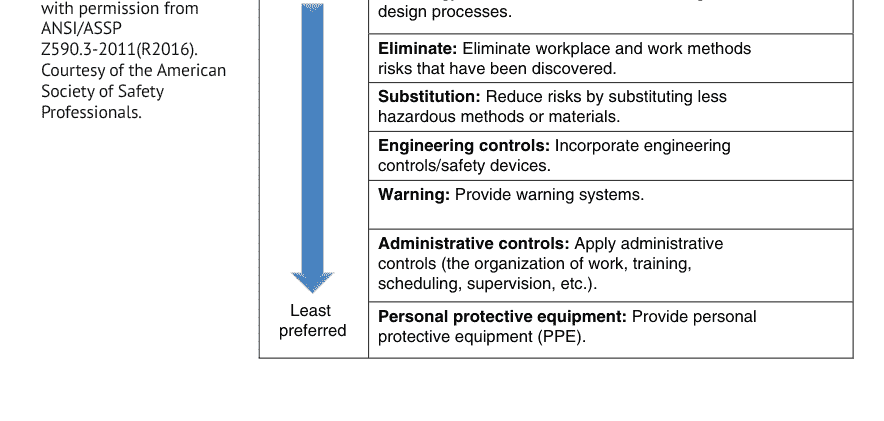

# 4 定义风险评估标准

在风险控制过程中，应考虑并应用以下控制措施的递进顺序：

1.  **风险规避或消除**应作为设计或重新设计阶段的首选，因为它们具有最大的风险降低和可靠性系数，并且通常最具成本效益。如果在设计中规避或消除了某个危害，那么该危害及其风险将不会存在于系统中。在所有可能的情况下，这都应该是安全专业人员的目标。
2.  用危害性较小的组分或元素**替代**危害性较大的组分或元素，例如用不易燃化学品替代高度易燃化学品，被认为是非常有效的。通过改变危害的性质，风险得以降低。
3.  **工程控制**和对现有系统的设计变更可用于遏制或防止接触危害。当应用按预期运行时，工程控制被认为是有效且可靠的。这些类型的控制通常需要持续的维护和测试以验证其有效性。一个例子可能是带有联锁装置的防护良好的机器，可防止接触可能造成伤害的运动部件。
4.  此线以下的控制措施被认为可靠性较低，因为它们在很大程度上依赖于人的行为。**警告系统**要求个人识别并遵守警告。如果发出虚假警报或警告，警告可能会被破坏、阻碍和忽视；或者可能由于其他因素而无法运行。
5.  **管理控制**，如政策、程序和培训，只有在被知晓、强化和遵守的情况下才有效。这些措施依赖于个人理解其意图，并遵守这些协议。需要沟通、培训、再培训、监督、强化和纪律来“管理员工”实践，以确保其符合管理控制。
6.  **个人防护装备（PPE）**通常被用作工作场所中抵御危害接触的最后一道防线。其有效性有限，并取决于设备的正确选择、使用和维护。

如ANSI Z590.3中所述，通常需要结合多种风险降低措施才能达到可接受的风险水平。只有在考虑了更高级别控制措施的实际应用后，才应选择控制层次结构中较低级别的措施。因此，在初始或初步风险评估期间，不应给予层次结构中较低级别的控制措施太多（如果有的话）的信用。ANSI Z590.3，附录I – 支持控制层次结构的逻辑（信息性）提供了有关层次结构模型的更多信息。

在ANSI B11.0-2020 机械安全 – 通用要求和风险评估标准中可以找到另外两个层次结构模型。图4.2说明了供应商在设计期间和用户在部署期间采取的风险降低措施。该图包含一个比例尺，用于从概率和严重性角度估算每个控制级别所实现的风险降低程度。B11中的图4.3是控制层次结构的两阶段迭代方法，第一阶段使用设计级别控制，第二阶段使用工程和管理类型控制。

两阶段方法强调了更高级别控制的重要性。首先，完全消除危害，或在可能的情况下用危害性较小的元素替代有害元素。其次，以平衡的方式应用剩余的危害控制选项（工程控制、意识系统、程序、培训和PPE），将风险降低到可接受的水平。

这种两阶段迭代方法的重要意义在于，它要求风险专业人员首先寻找消除危害或替代危害性较小的组分或材料的方法。在选择控制措施并追求“高级别”控制时，应用危害控制层次结构概念的重要性怎么强调都不为过，SH&E专业人员应充分理解这一点。

4.12 风险降低与控制层次结构 | 81

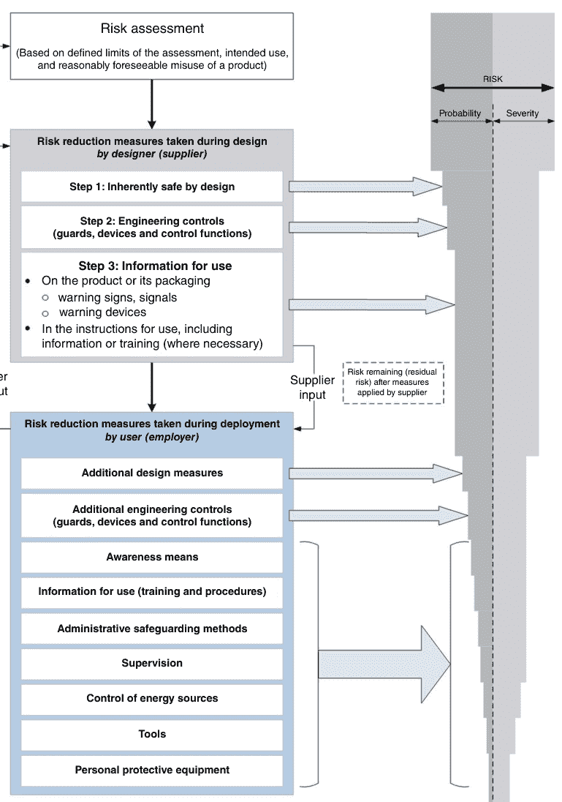

图4.2 来自ANSI B11.0-2020 – 机械安全的风险降低比例尺。

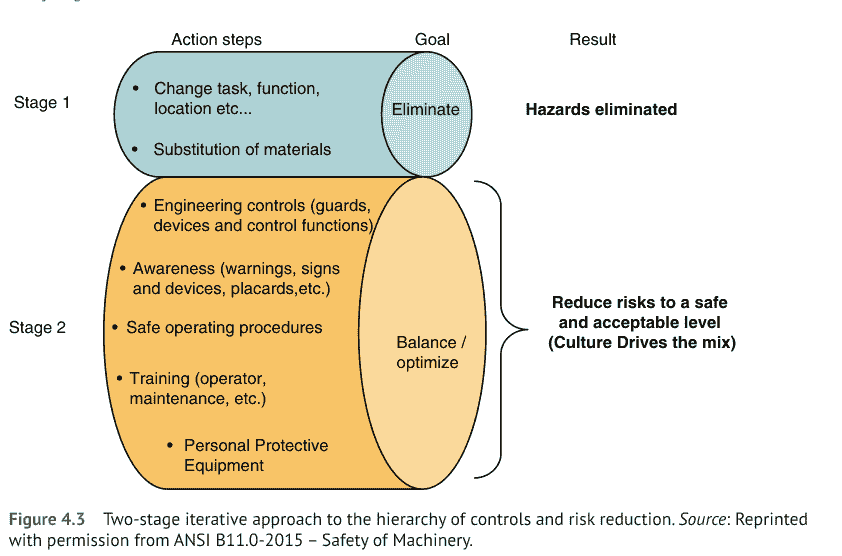

图4.3 控制层次结构和风险降低的两阶段迭代方法。*来源：* 经ANSI B11.0-2015 – 机械安全许可转载。

### 4.12.1 使用保护系数

现有控制措施和拟议控制措施提供的保护系数可以在风险评估中选择和使用。在纳入控制或保护系数时，风险估计值会进行调整以反映所提供的保护水平。表4.10提供了一个保护系数公式和比例尺的示例。

使用上述公式，风险降低有效性水平被纳入风险等级估算。高端风险降低控制措施，如消除、替代和多重工程控制，具有更大的风险降低效果，因为它们同时影响伤害的严重性和发生的可能性。较低级别的控制措施，如警告系统、管理和PPE，由于其对严重性缺乏影响，风险降低效果较低。以下示例演示了其使用方法。本示例中使用的风险标准定义和矩阵见附录A。

表4.10 带有保护系数乘数的风险公式。

| 风险公式 | |
| :--- | :--- |
| **严重性 × (可能性 × 保护系数) = 风险** | |
| **保护系数 (PF)** | **乘数** |
| 消除 | 0.1 |
| 替代 | 0.4 |
| 工程控制 – 多重 | 0.6 |
| 工程控制 – 单一 | 0.7 |
| 警告 | 0.8 |
| 管理 | 0.9 |
| PPE | 0.95 |
| 无控制措施 | 1 |

**示例**
一家金属加工商有一台零件清洗机，用于清洗带有热苛性溶液的零件。零件随后必须转移到干燥炉中。

**任务：** 操作员手动将零件装入清洗机，然后取出并转移清洗后的零件到炉中。操作员每小时处理的零件数量为240个，即每分钟4个。每个零件重约20磅，长5英尺。

**危害：** 主要危害是重复性动作、接触热苛性残留物和高温零件，以及锋利边缘造成的割伤。

**现有控制措施：** 操作员接受过正确的提升和搬运培训，并提供耐热和防割手套。未识别其他控制措施。

**评估的危害/风险：** 重复性搬运风险代表了团队面临的最大潜在风险。

**严重性等级 (S)：** 风险评估团队确定严重性等级为*边缘*（3），因为接触可能导致工时损失或限制性伤害（见附录A）。此外，之前在类似操作中报告过一个案例。

**可能性等级 (L)：** 可能性被确定为*频繁*（5）或非常高，因为它在整个工作日每天都会发生；并且接触时间和持续时间都很显著。

**风险等级 (RL)：** 用于计算风险等级的公式如下：
$$\text{严重性} \times (\text{可能性} \times \text{保护系数}) = \text{风险等级}$$

**当前保护系数 (P)：** 由于针对已识别的危害仅实施了培训（一种管理级别控制），因此分配乘数为0.9。

**当前状态风险等级：** 使用 $S \times (L \times P) = RL$ 公式计算，重复性搬运接触的风险等级为*高*（13.5），如下所示：
$$3 \times (5 \times 0.9) = 13.5$$

**拟议的额外控制措施：** 计算为*高*的风险等级需要采取进一步行动来降低风险。使用控制层次结构，团队建议采用传送带系统将零件从清洗机转移到炉中，从而消除手动搬运步骤。

**未来保护系数：** 消除控制措施的保护系数乘数为0.1。

**未来状态风险等级：** 通过消除危害，新的风险等级估计将大幅降低至1.5，使用以下公式：
$$3 \times (5 \times 0.1) = 1.5$$

### 4.13 可接受和不可接受的风险水平

可接受风险的概念可能难以接受，直到人们意识到所有操作、系统和活动中总是存在某种程度的风险。残余风险——系统中仍然存在的风险——在被认定为不可接受之前是“被接受的”。组织通常知道他们在损失和接触方面不会接受或容忍什么。那些拥有更成熟的运营风险管理体系的组织往往有明确的不可接受和可接受风险的标准。

可接受风险水平可定义为组织在其当前环境下愿意容忍的风险水平。随着组织在风险管理工作中变得更加高效，降低风险并改进控制技术，可接受风险水平以及不可接受的风险水平往往会随之降低。

ANSI Z590.3 对可接受风险的定义如下：

> 可接受风险。指在所考虑的环境中，事件或暴露发生的可能性以及可能造成的伤害或损害的严重程度均低至合理可行（ALARP）的风险。

风险接受是多种因素的函数，在不同行业、组织甚至同一组织内的不同运营中差异很大。组织的文化在很大程度上最终决定了可接受的风险水平。

合理可行（ALARP）的概念是使用成本/效益分析类型方法进行风险降低的实际应用。ALARP 是被认为可接受的风险水平，若不进行超出效益的支出则无法进一步降低。图 4.4 提供了运营风险水平如何在组织内从“不可接受”到“可接受”进行分层和优先排序的视觉说明。

## 4.14 记录风险

风险评估结果应妥善记录，以展示方法、传达结果，并供不同人员在不同时间参考和理解。ANSI Z590.3-2011(R2016) 第 7.12 节“记录结果”建议记录风险评估团队的姓名、头衔和资质；方法、已识别的危害、风险、控制措施和后续行动。ANSI Z590.3 指出，活动应可追溯，并为改进提供基础；风险管理过程和结果应清晰表达。

风险登记册是记录风险评估及其结果的一种广为接受的方法。根据评估及其复杂性，风险登记册可能需要通过引言和/或结论进行扩展。表 4.11 提供了一个风险登记册的示例。

表 4.11 风险登记册示例。

| 案例编号 | 位置 | 任务 | 危害编号 | 危害 | 当前状态风险水平 | 附加控制措施 | 完成日期 | 未来状态风险水平 |
|---|---|---|---|---|---|---|---|---|
| 1 | QC 实验室 | 等离子切割机 | 1.1 | 电击 | 14.00 | 管理措施 | 2/20/15 | 12.00 |
| 1 | QC 实验室 | 等离子切割机 | 1.2 | 烧伤 | 15.20 | 管理措施、个人防护装备 | 3/15/15 | 12.00 |
| 1 | QC 实验室 | 等离子切割机 | 1.3 | 电弧闪光 | 11.20 | 管理措施 | 2/20/15 | 9.80 |
| 1 | QC 实验室 | 等离子切割机 | 1.4 | 噪声 | 19.00 | 工程控制 | 3/15/15 | 8.40 |
| 1 | QC 实验室 | 等离子切割机 | 1.5 | 火灾 | 14.00 | 管理措施 | 3/15/15 | 12.00 |
| 1 | QC 实验室 | 等离子切割机 | 1.6 | 粉尘 | 11.20 | 管理措施 | 3/15/15 | 9.60 |
| 2 | QC 实验室 | 焊接破坏性测试 | 2.1 | 人体工学劳损 | 14.00 | 管理措施 | 4/15/15 | 12.00 |
| 2 | QC 实验室 | 焊接破坏性测试 | 2.2 | 振动 | 19.00 | 消除 | 4/15/15 | 4.80 |
| 2 | QC 实验室 | 焊接破坏性测试 | 2.3 | 噪声 | 11.20 | 个人防护装备 | 4/15/15 | 10.80 |
| 2 | QC 实验室 | 焊接破坏性测试 | 2.4 | 被击中 | 15.20 | 个人防护装备 | 2/20/15 | 14.40 |
| 2 | QC 实验室 | 焊接破坏性测试 | 2.5 | 粉尘 | 16.00 | 多重工程控制 | 4/15/15 | 8.40 |
| 2 | QC 实验室 | 焊接破坏性测试 | 2.6 | 撞击 | 11.40 | 多重工程控制 | 3/15/15 | 6.30 |
| 2 | QC 实验室 | 焊接破坏性测试 | 2.7 | 同一平面跌倒 | 16.00 | 工程控制 | 3/15/15 | 11.20 |
| 3 | 精加工 | 清洗站 | 3.1 | 热液体 | 9.00 | 替代 | 4/15/15 | 6.30 |
| 3 | 精加工 | 清洗站 | 3.2 | 撞击 | 14.25 | 消除 | 4/15/15 | 0.20 |
| 3 | 精加工 | 清洗站 | 3.3 | 化学腐蚀性 | 11.20 | 替代 | 4/15/15 | 4.20 |
| 3 | 精加工 | 清洗站 | 3.4 | 热表面 | 14.25 | 消除 | 4/15/15 | 2.10 |
| 3 | 精加工 | 清洗站 | 3.5 | 机械性 | 9.60 | 多重工程控制 | 3/15/15 | 4.80 |
| 3 | 精加工 | 清洗站 | 3.6 | 人体工学劳损 | 11.20 | 消除 | 4/15/15 | 0.20 |

风险登记册有许多不同的示例，从非常简单到非常复杂，但都用于记录风险评估过程。它们通常采用电子表格的形式，涵盖以下项目：

-   运营或流程
-   危害
-   暴露
-   现有控制措施
-   后果
-   可能性
-   风险等级或分数
-   期望的附加控制措施
-   责任方
-   时间表
-   残余风险等级或分数。

带有适当标题并辅以简要介绍或摘要的风险登记册，是一种常见且有效的方法，可以非常一致地记录风险评估。有时，叙述性风险评估报告用于记录风险评估。两者都可以满足文档记录的要求和需求。

## 4.15 沟通风险标准

如果风险标准不能有效地传达给所有受影响的利益相关者，那么定义风险标准的价值就很小。沟通必须从一开始就进行，在整个过程的背景阶段持续进行，并包括监控和验证风险降低结果。

首先，组织必须定义何时、何地以及如何进行风险评估。在 ASSP 的风险评估委员会网站上可以找到一个极好的资源，该网站在 https://www.assp.org/education/free-learning-resources 提供了一系列视频。题为“风险评估触发因素”的视频解释说，“通用触发因素”是指 ISO 31000 中定义的任何引起风险的风险源或事件。表 4.12 列出了进行风险评估的“触发因素”。

组织和管理层应制定有关风险评估的政策和程序，并将其传达给整个组织并使其广为人知。应理解，目标是实现组织所从事活动的可接受或可容忍的风险水平。

与内部和外部利益相关者进行沟通非常重要，以确保他们的利益得到理解和考虑。这也使他们能够为风险管理过程贡献自己的观点和专业知识。ISO 31000 标准指出，“应在风险管理过程的所有步骤内和整个过程中与适当的外部和内部利益相关者进行沟通和协商。”《高效能人士的七个习惯》的作者史蒂芬·柯维说，“*沟通是最重要的技能*”，这在风险管理和风险评估过程中非常适用。

表 4.12 风险评估触发因素。

| 类别 | 触发因素 |
| :--- | :--- |
| 组织性 | • 合并与收购<br>• 剥离<br>• 扩张 |
| 设计与再设计 | • 新设施、流程、系统<br>• 新方法<br>• 新产品或服务<br>• 重大资本项目或支出 |
| 变更管理 | • 对现有设施、流程或系统的修改<br>• 对现有运营的增加或扩展<br>• 方法、材料的变更<br>• 环境或设置的变更 |
| 采购 | • 新化学品、物质或材料<br>• 新设备、机械和工具<br>• 其他实物资产 |
| 第三方互动 | • 承包商、供应商<br>• 临时工<br>• 客户和访客<br>• 租赁<br>• 多雇主工作场所 |
| 非常规活动 | • 建设<br>• 维护和修理<br>• 安装<br>• 调试和调整<br>• 退役<br>• 拆除和处置 |
| 高风险活动 | • 高处作业<br>• 受限空间进入<br>• 电气或其他高能作业<br>• 断开管线和能量隔离<br>• 动火作业<br>• 在移动物体周围作业<br>• 危险化学过程 |
| 事件 | • 死亡<br>• 严重事故<br>• 严重未遂事件<br>• 风险观察<br>• 投诉和关注<br>• 事件趋势<br>• 环境释放<br>• 紧急情况<br>• 故障和停机 |
| 外部要求 | • 现有法规<br>• 新法规<br>• 客户 |

## 4.16 总结

从根本上说，风险评估由其利益相关者制定的具体风险标准所决定。在风险评分系统中，明确的风险标准的重要性再怎么强调也不为过。然而，SH&E专业人员应始终牢记风险评估的最终目的，即“将风险降低到可接受的水平”。

“完美”可能是“良好”的敌人。为了获得“完美”的风险评估标准或评分系统而拖延和延长过程，可能会损害降低风险的最终目标。请记住，执行一个“良好”的风险评估，胜过规划一个“完美”的风险评估。

## 复习题

1.  描述风险标准的概念，并总结构成风险标准的要素。
2.  描述一个风险评分系统。列出风险评分系统中常见的组成部分。
3.  解释控制层级的概念及其应用方式。在ANSI Z590.3《通过设计预防》标准中，从“最优先”到“最不优先”的渐进级别是什么？
4.  解释高级风险降低措施（如替代和工程控制）如何影响后果的严重性和发生的可能性；以及低级措施（如警告系统、管理控制和个人防护设备）如何影响严重性和可能性。
5.  风险评估通常有一个二维评分系统。这两个风险因素是什么？列出在三维和四维评分系统中使用的额外风险因素。
6.  大多数风险评估矩阵使用描述性或主观度量的定性或半定量值。解释什么是定性和半定量矩阵。在哪里可以找到每种矩阵的示例？
7.  列出进行风险评估的八个“触发因素”。
8.  描述在风险评估过程中应如何进行“沟通”，以及为什么它很重要。

## 参考文献

ANSI/ASSP Z10-2019 (2019). *美国国家标准 – 职业健康与安全管理体系*. Park Ridge, IL: 美国安全专业人员协会.

ANSI/ASSP Z590.3-2011(R2016) (2016). *通过设计预防：在设计和再设计过程中解决职业危害和风险的指南*. Park Ridge, IL: 美国安全专业人员协会.

ANSI/ASSP Z690.1-2011 (2011). *美国国家标准 – 风险管理词汇*. Park Ridge, IL: 美国安全专业人员协会.

ANSI/ASSP/ISO 31000-2018 (2011). *风险管理 – 指南*. Park Ridge, IL: 美国安全专业人员协会.

ANSI/ASSP/ISO 31010-2019 (2011). *风险管理 – 风险评估*. Park Ridge, IL: 美国安全专业人员协会.

ANSI B11.0-2015 (2015). *机械安全 – 通用安全要求和风险评估*. Houston, TX: B11 Standards, Inc.

ANSI B11.TR3–2000 (2000). *风险评估与风险降低 – 估算、评估和降低与机床相关风险的指南*. New York: ANSI.

Clemens, P.L. and Simmons, R.J. (1998). *系统安全与风险管理 – 工程教育者指南*. U.S. Department of Health and Human Services, National Institute for Occupational Safety and Health.

International SEMATECH. (1992). *失效模式与影响分析 (FMEA)：半导体设备行业持续改进指南*. Technology Transfer #92020963B-ENG. Albany, NY: SEMATECH. http://www.sematech.org/docubase/document/0963beng.pdf.

Main, B.W. (2012). *风险评估：挑战与机遇*. Ann Harbor, MI: Design Safety Engineering, Inc.

Manuele, F.A. (2020). *高级安全管理：聚焦于Z10.0、45001和严重伤害预防*, 第3版. Hoboken, NJ: Wiley.

Manuele, F.A. (2001). *安全管理创新 – 满足职业知识需求*. Hoboken, NJ: Wiley.

MIL-STD-882E (2012). *系统安全标准实践*. Washington, DC: Department of Defense.

Walline, D.L. (2014). 通过设计预防：来自现场的已验证解决方案. *Professional Safety* 59 (11): 43–49.

## 附录 A

### A. 风险矩阵（改编/修改自ANSI Z10）

| | 微不足道 (1) | 可忽略 (2) | 边际 (3) | 严重 (4) | 灾难性 (5) |
|---|---|---|---|---|---|
| | 对伤害或疾病、系统损失或停机时间、或环境释放无影响。 | 仅需急救或轻微医疗处理，非严重的设备或设施损坏，无需报告的常规清理化学物质释放。 | 需要医疗处理或限制工作，子系统轻微损失或损坏，触发外部报告要求的化学物质释放。 | 致残性伤害或疾病，重大财产损失和业务停机，对环境或公共卫生产生临时影响的化学物质释放。 | 一人或多人死亡，系统完全损失，对环境或公共卫生产生持久影响的化学物质释放。 |
| | 1 | 2 | 3 | 4 | 5 |
| 频繁 (5) 可能反复发生。 | 5 | 10 | 15 | 20 | 25 |
| 可能 (4) 可能会发生数次。 | 4 | 8 | 12 | 16 | 20 |
| 偶尔 (3) 可能间歇性发生。 | 3 | 6 | 9 | 12 | 15 |
| 罕见 (2) 可能发生，但极少。 | 2 | 4 | 6 | 8 | 10 |
| 不太可能 (1) 不太可能发生，可假设事件或暴露不会发生。 | 1 | 2 | 3 | 4 | 5 |

### 半定量风险矩阵模型

风险标准

| 风险等级 (RL) | 风险分数 | 行动 |
| :--- | :--- | :--- |
| **极高** | 15–20 | 不允许操作。需要立即采取行动。 |
| **高** | 9–14 | 补救行动应给予高优先级。 |
| **中等** | 5–8 | 应在适当时间采取补救行动。 |
| **低** | 1–4 | 补救行动可自行决定。 |

| 保护因子 (PF) | 乘数 |
| :--- | :--- |
| 消除 | 0.1 |
| 替代 | 0.4 |
| 工程控制 – 多重 | 0.6 |
| 工程控制 – 单一 | 0.7 |
| 警告 | 0.8 |
| 管理控制 | 0.9 |
| 个人防护设备 | 0.95 |
| 无控制措施 | 1 |

| 风险公式 |
| :--- |
| *严重性 × (可能性 × 保护因子) = 风险* |

# 5 基本技术

Bruce Lyon¹ 和 Georgi Popov²

¹ Brown & Brown
² University of Central Missouri

- 目标
- 介绍基本危害分析和风险评估
- 回顾危害分析和风险评估过程
- 回顾非正式技术
- 回顾正式技术
- 审查技术的使用、其优势和局限性
- 提供使用基本风险评估技术的指导

### 5.1 基本危害分析和风险评估简介

识别操作危害、评估其风险暴露并应用适当控制措施的行为是风险管理的关键，也是运营风险管理系统（ORMS）中执行的最重要职能之一。*ANSI/ASSP/ISO 31010-2019 风险管理 – 风险评估* (ISO 31010) 是关于当前风险评估技术选择和使用良好实践的共识标准。该标准指出，风险评估过程为决策者和利益相关者提供了更好的理解，了解可能影响组织业务目标的风险以及现有控制措施的有效性，以便组织能够更好地管理其运营风险。本质上，风险评估过程为决策提供了基础，以确定采取最适当的风险控制措施，以实现组织内“可接受”的风险水平（ALOR）。没有适当的风险评估，风险就无法得到充分管理。

在风险管理过程中，风险评估是核心组成部分，如图5.1所示，该图改编自*ANSI/ASSP/ISO 31000-2018 风险管理 – 指南* (ISO 31000) 共识标准。该标准将风险评估定义为三个阶段的过程：(i) 风险识别，(ii) 风险分析，和 (iii) 风险评估。ISO 31010在其引言中关于风险评估及其在风险管理中的重要性有如下论述：

> 那些因合规或符合性目的而需要进行风险评估的组织，将受益于使用适当、正式和标准化的风险评估技术。

*风险评估：评估运营风险的实用指南*，第二版。
Georgi Popov, Bruce K. Lyon, and Bruce Holcroft.
© 2022 John Wiley & Sons, Inc. 由John Wiley & Sons, Inc.于2022年出版。

## 5.1 风险评估技术

这些技术用于以下情况：

-   需要更深入地了解存在何种风险或特定风险时；
-   在决策过程中，需要比较或优化一系列涉及风险的选项时；
-   在风险管理过程中，需要采取行动处理风险时。

这些技术用于ISO 31000所述的风险评估步骤中，包括风险识别、分析和评估，更广泛地说，也适用于任何需要理解不确定性及其影响的情况。

风险评估技术种类繁多，且有多种变体可供选择。ISO 31010描述了42种具体技术；ASSP TR 31010-2020技术报告《风险管理——安全从业人员技术》描述了50种方法；而ANSI/ASSP Z590.3则涵盖了10种不同的方法。附录A中包含了一个列出这些标准中具体技术的表格。每种风险评估技术都旨在为其选定的应用提供一般或特定层面的信息、分析和评估，以便为风险处理或降低的决策提供充分信息。由于组织中存在多种不同类型的风险暴露和复杂程度，单一的风险评估方法很少能充分应对工作场所中的所有类型风险。然而，作为一般原则，在选择风险评估工具时，建议使用能提供足够信息以做出适当风险管理决策的最简单方法。

尽管评估运营风险的方法和技术变体众多，但它们都基于相同的基本流程。ISO 31010和ASSP TR 31010概述并描述了风险评估流程，包括：审查目标活动/主题；识别危害和风险；分析危害产生的风险；以及根据既定的风险可接受性标准，将风险与其他风险进行比较评估（参见第4章）。

为了管理运营风险，组织必须根据风险水平评估和确定运营中任务、工作和流程的优先级，以便应用必要的控制措施将风险降低到可接受水平。这项工作需要实用的方法，能够由所有利益相关者——从熟练的安全从业人员到管理者、主管和基层工人——一致且便捷地应用。

本章概述并介绍了组织、一线工人、主管以及安全、健康和环境专业人员常用的基本分析和评估方法。本章包含了重点方法的示例和案例研究，以提供对这些工具和技术的实用视角和实际应用。这些方法包括：

-   非正式的作业前危害分析
-   任务/工作危害分析
-   工作风险评估

随着越来越多包含风险评估要求的安全法规、共识标准和指南的出台，组织正在寻求精通执行和促进危害分析与风险评估的安全专业人员，其最终目标是实现工作场所的可接受风险水平。精通基本风险评估技术的安全专业人员将更有优势把握未来的机遇。

## 5.2 运营风险管理体系内的评估

危害分析和风险评估是职业健康、安全和环境管理体系标准与指南的核心要素，也是公认的风险管理最佳实践。此类模型应扩展到涵盖组织的所有运营风险，例如责任、业务中断、雇佣实践、业务实践和合规性等——统称为运营风险管理体系（ORMS）。以下列出了一些包含危害分析和风险评估要求的著名管理体系标准和指南：

-   职业安全与健康管理局（OSHA）的自愿保护计划（VPP）
-   ANSI/ASSP Z10.0-2019《职业健康与安全管理体系》
-   ANSI/ASSP/ISO 45001-2019《职业健康与安全管理体系——要求及使用指南》
-   国际劳工组织 ILO-OSH 2001《职业安全与健康管理体系指南》
-   ISO 14001-2014《环境管理体系》

运营风险管理体系旨在持续改进风险管理绩效，并与爱德华兹·戴明博士倡导的持续改进和质量倡议所推广的计划、执行、检查、处理（PDCA）模型保持一致。运营风险管理体系需要多层次的实施，从面向绩效的战略政策和程序开始，接着是各级管理层和员工执行的具体行动和职责，然后是监控和测量绩效，必要时进行修改和调整，并强化该流程。利益相关者有责任制定必要的流程、工作指导和文件（包括基本的任务/工作分析和风险评估）来支持ORMS。

运营风险管理体系中常见的几个关键组成部分包括：（i）管理层承诺和员工参与，（ii）危害分析和风险评估，以及（iii）风险管理和控制。基本的风险评估方法和实践在这些组成部分中扮演着重要角色。

## 5.3 危害分析与风险评估

危害和风险之间存在细微但显著的差异。危害可定义为具有“造成伤害的潜力”，包括技术和活动的某些方面，如果未加控制，可能产生风险。危害由设备、技术、能源、物质和化学品、材料的使用以及人类的行为和不作为产生。基本的工作场所危害分类包括物理和机械危害、化学危害、生物危害、人体工学危害和社会心理危害。附录B提供了一份常见危害清单。

风险源于或产生于危害，当其对人员和/或资产的暴露造成损失的可能性时。这种损失的可能性或“风险”通过事件发生的可能性以及损失的严重程度或后果来衡量。如果风险水平超过组织的可接受风险水平，则需要应用风险控制和管理工作。

危害的存在并不一定意味着产生了风险。风险的存在，必须是危害的暴露造成了一定的损失或伤害的严重程度，以及发生的可能性。如果没有人员或资产暴露于该危害，则不存在风险。危害要产生风险，需要有暴露——这是风险沟通中被遗忘的术语（Whiting 2013）。以下示例说明了危害何时产生风险：

> 一个制造工厂设有内部维护部门，负责执行预防性维护、设备保养和一般维修。有时维护工作涉及在工厂的不同区域进行焊接、切割或热作业。焊接和切割作业中产生的明火和火花（点火源）构成一种“危害”。如果没有人员或资产暴露于明火和火花，则不存在风险。同样，危害可能存在，但通过使用行政控制措施（可能包括热作业许可证系统），可以将其产生的风险水平控制在较低水平。在受控环境（如无可燃材料、有消防监视和消防设备的“热作业许可证”区域）中正确执行的焊接、切割和其他热作业活动（产生点火源危害），可以充分控制危害并降低火灾风险。然而，如果将同样的“热作业”危害引入易燃液体储存室，则会产生重大的火灾或爆炸风险。

认识到危害与风险之间的区别至关重要。同样重要的是理解基于危害的控制措施与基于风险的控制措施之间的差异。以下内容为这些区别提供了一些指导：

*基于危害的措施* – 基于已识别危害的存在而制定的控制措施，属于基于危害的措施。在基于危害的分析中，识别操作中存在或可能存在的危害分类，然后使用危害控制层级来规定危害控制措施。基于危害的决策仅基于危害分类的存在而做出，没有详细描述和考虑危害*如何*产生不期望伤害的情景，也没有对该情景的风险进行评估。美国的一些监管标准，如职业安全与健康管理局的1910.1200《危害沟通标准》，本质上是基于危害且具有“规定性”的。《危害沟通标准》的范围（其标题本身表明它是一个基于危害的标准）适用于任何在其工作场所拥有化学品（一种危害分类）的雇主。无需进行风险评估来确定标准要求的适用性，只需确定存在化学危害即可。如果工作场所存在化学品，则必须遵守《危害沟通标准》。

*基于风险的措施* – 基于风险的措施采取更全面的方法。它们通常从识别危害分类开始，接着估计伤害的后果或严重程度，以及估计危害造成伤害的可能性。根据得出的风险水平，然后实施控制措施以将风险降低到可接受的水平。基于风险的标准的一个例子是职业安全与健康管理局的1910.119《高危化学品过程安全管理》。该标准适用于使用清单中列出的高危化学品且达到或超过标准规定阈值量的操作，并要求涵盖的操作进行过程危害分析以评估风险。

当一个人在操作风险管理领域工作时，他们很可能会听到“分析”和“评估”这两个术语被用来描述同一个过程。这就引出了一个问题：“*分析和评估之间有区别吗*”？根据作者的经验，这些术语经常被负责操作风险管理职责的利益相关者（包括安全从业人员、风险管理人员、保险专业人士等）互换使用。根据《韦氏词典》，这些术语定义如下：

*分析* – *对某事物进行仔细研究以了解其组成部分、它们的功能以及它们如何相互关联：对某事物的性质和意义的解释。*
*评估* – *对某事物做出判断的行为：评估某事物的行为。*

审视这些定义可以发现它们存在差异。分析要求对主题进行“研究”以“理解”其性质及其与周围环境的关系，而评估不仅要求“研究”，还要求对主题与其周围环境进行“判断”或评级。

为了将这些术语置于操作风险管理的背景下，*ANSI/ASSP Z690.1-2011，风险管理词汇*标准（从ISO指南73:2009国家采纳）提供了以下定义：

*风险分析* – *理解风险性质并确定风险水平的过程。*
*风险评估* – *风险识别、风险分析和风险评估的总体过程。*

为了进一步澄清，*ANSI Z590.3-2011(R2016)，通过设计预防*标准在危害分析和风险评估过程的背景下提供了以下定义：

> *危害分析* – 一个从识别一个或多个危害开始，并进而估计如果事件或暴露的可能性发生可能导致的伤害或损害严重程度的过程。

*风险评估* – 一个从危害识别和分析开始的过程，通过该过程确定可能的伤害或损害严重程度，接着估计事件或暴露发生的概率，最后以风险陈述结束。

因此，“风险评估”和“危害分析”之间的显著区别在于，风险评估：(i) 包括风险识别、风险分析和风险评估；以及 (ii) 包括对风险水平进行判断或估计的行为。图5.2提供了危害分析、风险分析和风险评估所包含的基本要素的比较。如果安全专业人员要保持其工作的一致性和有效性，理解危害与风险、分析与评估之间的这些差异非常重要。

风险是对*危害*暴露发生的可能性以及可能导致的伤害严重程度的估计。如前所述，在*ANSI/ASSP/ISO 31000 风险管理 – 指南*中，“风险评估”被定义为具有三个基本组成部分：(i) 识别；(ii) 分析；和 (iii) 评估。在许多安全活动中，危害通过各种手段（如检查表、检查和审核）进行识别和分析。然而，如果不评估由此产生的风险的概率和严重程度，并与既定的风险标准进行比较，则只能实现“基于危害”的分析。

应该注意的是，对同一危害的不同暴露可能通过略微不同的事件和情况情景产生不同严重程度的后果。不同的后果需要不同的危害暴露情景。每个选定的关注或关切的后果及其相应的危害暴露情景都需要单独评估。无需争论哪些后果可能源自不同的危害暴露情景。相反，风险评估工作组可以选择并商定哪些后果是关注或关切的，并分别进行评估。

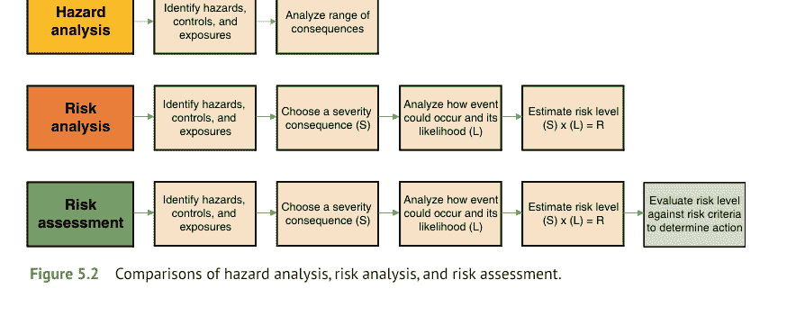

## 5.4 危害分析和风险评估过程

对于所使用的任何分析和评估方法，基本原理保持不变。ANSI/ASSP/ISO 31010《风险管理 – 风险评估》和ANSI/ASSP Z590.3《通过设计预防》标准提供了风险评估过程的指导。以下是对这些标准中描述的执行风险评估的基本过程的总结。

-   1) *确定目的和范围*
    与任何风险管理措施一样，应建立明确且定义清晰的目的和范围，以提供方向和边界。此目的和范围应有效地传达给所有利益相关者。有效的目的和范围声明定义了管理风险的基本参数，并设定了风险评估过程的范围和标准。这包括考虑内部和外部参数，以及正在评估的特定风险的背景。一旦定义了背景，就选择要分析的任务、工作、过程、情景或系统。选择标准应基于评估的目的、范围和参数，并将包括感知风险较高和/或损失经验较高的任务。确定分析/评估的范围，涉及受影响的暴露对象，如员工、承包商、公众、环境、财产、资产、生产力、质量或其他要素。为参与过程的利益相关者建立责任和问责制。应确定并提供所需的培训和资源。需要考虑的其他参数包括操作阶段，例如任务是标准操作、维护和服务活动、新设备启动、拆卸还是其他，以及与其他操作的任何接口。

-   2) *识别危害/风险源*
    选择正式的分析和评估方法或技术；审查并识别与任务相关的危害/风险源（即技术、活动、材料等）；确定危害的特征及其影响。考虑整个系统的风险和组合风险，以及个体风险。

-   3) *分析潜在失效模式*
    确定任务中如何以及为何可能发生故障；确定可能导致失效模式的条件和因果因素；识别受潜在故障影响的相关方、财产或资产。

-   4) *分析现有控制措施*
    风险水平将取决于现有控制措施的有效性；识别并列出针对每个现有或潜在危害的现有控制措施；测试和验证现有控制措施，以确定它们是否缺失、不足或无效。

-   5) *分析暴露频率和持续时间*
    确定任务、活动或过程的频率；确定任务、活动或过程的暴露期；确定暴露的人员、财产或资产的数量。

-   6) *分析和选择后果*
    考虑与已识别的危害暴露相关的“可信”情景范围和不同后果。确定并选择最令人关注的可信最坏情况情景。其他情景可以稍后单独分析。（危害分析和风险分析无法同时针对多个情景完成。）不同风险领域的严重程度可包括伤害、疾病的数量及其严重程度；死亡人数；财产或资产损失的成本估计；业务中断或生产力损失估计；环境影响的程度。

在完成危害相关事件的后果严重性评估后，危害分析即告完成。

## 7) 分析与评估可能性

完成危害分析后，需按以下步骤评估风险。可能性的评估应尽可能基于知识渊博专家的输入，但除非有经验数据可用，否则通常可能是一个主观过程。评估危害事件或暴露发生的概率；复杂事件或事故可能需要在知识丰富的团队中进行头脑风暴。“可能性”是一个通用术语，可以具体表述为所选后果情景未来发生的“频率”或“概率”。“频率”是一种速率度量，需要一个分母，例如时间单位（例如每小时/每年）、执行的任务数量（例如每行驶1000英里/每完成100个钻孔）、生产的单位（例如每百万吨煤），或设备、工艺或产品的生命周期。“概率”是机会或几率的表达，是一个没有单位的纯数字，例如100次中有1次机会，或1%的发生率，或0.01。完整情景的可能性需要包括每个情景事件和情况的可能性估计，以获得总体可能性。这种贡献可能性的复合可以是定性的，也可以是定量的。

## 8) 定义风险

为所选的危害相关情景和后果制定风险陈述。风险陈述需要包括所选危害相关情景的后果严重性、估计的可能性，以及通过风险评估矩阵可获得的风险等级或类别评级（高、中、低等）。将个体风险置于风险等级类别中有助于与决策者沟通风险水平。

## 9) 评估与优先排序风险

建立风险排名或风险评分系统——在第8部分中选择——用于比较和排序风险。根据法律和公司风险可接受性标准（例如合理可行最低风险原则，ALARP）评估和比较风险等级。使用风险排名来优先处理风险，以便进行控制和管理。

## 10) 制定额外控制措施

当风险等级评估表明存在降低风险的道德、法律和商业需求时，就需要开发和选择风险控制方案。任何修改或新控制措施的制定都应包括使用“控制层级”来选择和实施最佳方案，以将风险等级降低到可接受水平。

图5.3中的流程图说明了进行危害分析和风险评估所采取的顺序步骤，以及两个组成部分之间的分界点。

## 5.5 基本方法

基本的危害分析和风险评估技术包括非正式的工前危害分析技术，以及更正式的方法，如工作危害/安全分析和工作风险评估。这些基本方法被认为是运营中管理风险的重要组成部分，因为它们易于使用和适应性强，特别是在非常规任务发生以及任务存在潜在变化或变量的情况下。由于这些原因，这些分析和评估技术已成为工作场所中使用最广泛的方法之一。

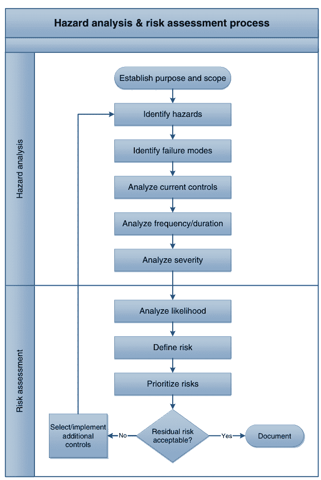

图5.3 危害分析和风险评估过程。

然而，需要提醒的是，传统的任务/工作危害分析并非风险评估。在其使用中，不估计伤害的严重性和发生的可能性。这可能导致组织和执行工作的人员相信工作是“安全的”或具有可接受的风险水平。工作危害分析/工作安全分析和安全工作方法并不等同于低风险，除非有文件证明如此。本章提供了一个包含风险评估组件的改进型JHA。

## 表5.1 基本方法类型。

| 方法 | 应用 | 描述 | 类型 |
|---|---|---|---|
| **工前危害分析** | 通常用于采矿、建筑、现场作业和石油天然气行业的非常规、偏远或特殊任务之前 | 需要培训在执行工作前分析任务和危害的步骤的简单方法 | 涉及结构化思维练习、工前卡和检查表的非正式方法 |
| **任务/工作危害分析** | 新的、现有的或修改的任务/工作 | 识别步骤、相关危害和控制措施 | 使用任务卡和三栏电子表格的正式方法 |
| **个人防护装备（PPE）危害评估** | 需要个人防护装备的工作区域或活动 | 识别危害和适当的个人防护装备 | 使用表格或电子表格列出危害类型、受影响身体部位和所需特定PPE的正式方法 |
| **任务/工作风险评估** | 新的、现有的或修改的任务/工作 | 识别步骤、相关危害、控制措施和风险等级 | 使用任务卡和包含风险估计与评级的多栏电子表格的正式方法 |

表5.1总结了本教科书中涵盖的常用基本危害分析和风险评估技术。

一线工人和主管、现场人员、服务和安装工人、建筑工人和其他远程操作员使用基本技术来帮助就工作及其安全执行做出适当决策。除了评估和管理风险的好处外，基本的危害分析和风险评估为员工贡献和参与安全过程提供了一种有意义且有效的方式。员工参与安全和健康过程是ORMS模型（如ANSI/ASSP Z10.0、ANSI/ASSP/ISO 45001和OSHA VPP中概述的模型）中的必要要素，对于有效和可持续的过程至关重要。

通常，任务和工作层面的危害分析和风险评估是作为涵盖整个流程或运营的更大、更全面的风险评估的结果而进行的。对运营或流程进行有效的“微观评估”对于充分理解活动的特定步骤、与每个步骤相关的潜在危害以及确保风险保持可接受和ALARP（如定义）所需的控制措施是必要的。组织基于已识别的、感知到的运营风险做出许多工作场所决策，并依赖安全从业人员的专业知识来提供准确可靠的信息。这些基本方法对于提供可用于在管理运营风险时做出适当决策的基于风险的信息至关重要。关于安全风险和选择控制方案的每一次讨论都极大地受益于风险评估。关于“安全”和“有风险”的主观分歧被考虑现实的ALARP标准所取代。

在美国，只有少数分析/评估是监管标准要求的。其中一个是职业安全与健康管理局的1910.132个人防护装备标准，要求雇主进行“个人防护装备（PPE）危害评估”，以识别工作中现有和潜在的危害，以及要使用的适当个人防护装备。以下是OSHA 1910.132关于这些要求评估的内容：

> 1910.132 (d)(1)：雇主应评估工作场所，以确定是否存在或可能存在需要使用个人防护装备（PPE）的危害。
> 1910.132(d)(2)：雇主应通过书面认证来验证已进行所需的工作场所危害评估，该认证应识别被评估的工作场所；证明评估已进行的人员；危害评估的日期；以及将该文件标识为危害评估认证。

通常，PPE危害评估被纳入工作危害/安全分析或工作风险评估中，作为为执行工作的操作员提供更完整安全相关信息的一种手段。请注意，OSHA要求PPE危害评估包括评估员姓名、评估日期、被评估工作场所以及文件中的危害评估认证。附录C中包含了一个PPE危害评估的示例。（注意：大多数PPE是“防护性”而非“预防性”的，只能减少暴露的“后果”影响。风险应始终通过预防性（降低“可能性”）和防护性（降低“后果”）控制的组合来管理。）

## 5.6 非正式方法

最基本的危害分析和评估方法是非正式技术。基本上，当要求员工“思考”任务的步骤和潜在危害，并为工作做好适当准备时，就会使用非正式方法。利益相关者在许多情况下每天都有意识和潜意识地进行危害的非正式分析和评估。例如，一个人穿过繁忙的十字路口时，会对交通、条件、距离、车辆速度以及其他变量进行心理评估，以便安全过马路。同样的思维练习也用于工作场所。非正式方法一直是危害和风险管理的重要组成部分。Fred Manuele在他2008年的著作《高级安全管理：关注Z10和严重伤害预防》中，关于非正式方法指出：

> 当安全专业人员识别出危害及其造成伤害或损害的潜力，并决定伤害性或损害性事件发生的可能性时，就进行了主观的风险评估。在这样做时，对于更简单和不太复杂的危害和风险，评估可能完全基于先前的知识和经验，而无需记录。进行非正式的风险评估自古以来一直是安全和健康专业人员实践的一个组成部分。Manuele (2008)

非正式的工前危害分析，有时被称为“现场级”分析，通常由一线工人、主管、远程操作员以及执行高风险、非常规活动的工人使用。这些简短但有效的方法由利益相关者在启动任务或工作之前应用，通常在现场远离监督的情况下，以及当预期的变化或偏差可能增加常规任务或工作的风险水平时。

现场级分析实践被认为是非正式的，因为它们是由个人或团队在工作前作为思维练习（而非书面形式）进行的，旨在提高受影响利益相关者的情境意识以及对危害和风险的理解。尽管现场级分析不记录预期的任务、危害和控制措施，但它们有时，这是帮助利益相关者做好心理准备并安全执行任务的最实用方法。要正确执行这些步骤，需要对工人进行培训。与正式方法一样，执行非正式技术的最终目的是通过让利益相关者在控制任务危害时做出正确决策，从而使其能够安全工作。

任务前分析在帮助工人从心理上准备应对可能发生变化或变动的活动，以及非日常性工作（如维护、服务、安装、设置和拆卸）方面特别有用。在采矿、建筑、石油和天然气开采以及其他个人在现场执行特定任务的行业中，使用了许多变体。澳大利亚、加拿大、英国和其他国家已广泛使用这些非正式技术。在美国，采矿和石化等行业已将非正式方法纳入其运营风险管理体系。例如，美国矿山安全与健康管理局（MSHA）安全与健康外展网站提供了有关使用SLAM（停止、观察、分析和管理）等技术的信息和培训材料。

尽管实际评估被视为非正式的，但需要一个结构化的过程来定义范围和背景、程序、涉及的利益相关者、培训和指导要求、监督和管理。一旦经过培训，利益相关者就具备了识别和处理工作中涉及不可接受风险的危害的能力。

该概念基于利益相关者为识别危害并确定其可能造成伤害的重要性而采取的一系列连续步骤。最终，该过程必须导致在开始任务之前采取适当行动以减轻已识别的风险。这些步骤通常包括对工作步骤的清单或心理回顾、对危害和潜在危害的目视检查、考虑工作步骤中危害的发展、检查所需的安全设备和安全程序。这些过程步骤通常包括以下内容：

-   在开始任务前暂停。
-   寻找危害及其可能造成的伤害。
-   考虑风险。
-   采取行动降低不可接受的风险（或不继续执行任务）。
-   报告任何需要进一步行动的不可接受风险。

应记录来自这些过程的信息，以确保采取所需行动并向发起者提供反馈。一些非正式方法的例子包括：

**停止、观察、分析和管理（SLAM）**：一个心理过程，要求工人在开始前和任务期间停下来思考工作流程；检查工作环境；分析工作流程；并管理风险。矿工经常使用，美国矿山安全与健康管理局2004年的一次网络直播提供了以下关于SLAM风险概念的描述：

1)  该计划的第一步是停止。每个利益相关者停下来思考所涉及的工作非常重要。花时间考虑手头的任务，确保工作可以安全完成。利益相关者需要考虑他们是否接受过适当培训，并拥有安全执行工作的知识和技能。估算成功完成工作所需的人力，以及是否需要协助。考虑利益相关者行动对同事的影响。确保任何工作表现不会对同事和其他人造成严重后果。

2)  第二步是观察。开始工作时，花点时间；寻找并识别与此工作相关的危害。这种寻找危害的过程不仅应在开始工作前进行，而且应贯穿整个任务。在许多情况下，新的危害可能在工作过程中出现。保持警惕并准备好应对它们。询问是否应该识别这些新的危害；是否可能发生任何新的危害。

3)  第三步是分析。花时间思考以最小风险完成此任务所需的程序。质疑遵循正常程序是否确实比使用批准的变体涉及更高的风险。思考错误执行任务的最坏情况。
    a)  利益相关者是否拥有安全完成任务所需的一切？
    b)  工具是否适合在特定情况下使用？
    c)  个人防护装备是否适合所执行任务涉及的危害？
    d)  每个人是否都理解任务及其安全完成任务的角色？
    e)  是否需要通知或告知即将执行任务的人员？
    f)  事故发生的可能性是否很小，或者如果发生，是否会导致任何伤害？
    g)  如果无法消除此任务的危害，请在开始任务前与主管沟通。采取措施减轻伤害的潜在严重性和发生的可能性。判断这些措施是否足以允许执行任务。

4)  最后一步是管理。可以通过制定和实施控制措施来管理安全。尽可能消除危害或减少对风险的暴露，并采取必要行动确保工作安全完成。利益相关者可以控制危害的一些项目包括：
    a)  遵循程序或批准的变体
    b)  消除危害
    c)  使用适当的个人防护装备
    d)  确保适当的防护措施到位
    e)  从安全角度重新评估任务
    f)  寻求额外帮助

**安全五分钟（Take 5 for Safety）**：一个简短（五分钟）的心理过程，有时辅以任务前清单，要求利益相关者在开始前和工作期间停下来，思考工作步骤，识别危害，并确保安全程序到位。建筑、现场作业和其他类似行业使用该方法的变体，其基本要素如下：

1)  停下来思考工作及其各个步骤，注意任务可能需要的任何更改或可能的变体。
2)  检查工作区域、设备、材料和条件，寻找可能导致任务发生的潜在危害。一些方法提供人为因素、环境因素、设备使用、能源等的危害类别示例，以帮助利益相关者分析常见危害。
3)  规划安全工作并执行以下操作：
    a)  确保程序到位（即应急行动计划、标准操作程序、批准的变体、角色和职责等）。
    b)  进行工作前安全简报。
    c)  提供适当的沟通。
    d)  确保工作区域没有已知危害。
    e)  确保控制措施、防护装置和个人防护装备正在使用。
4)  监控、监督和管理任务，确保其安全执行。

**后退5x5（Step Back 5 X 5）**：一种简单的心理练习方法，要求工人/工作组从工作中“后退”五步，花五分钟审查和规划要执行的任务。在此练习中，工人/工作组识别与任务相关的现有和潜在危害，并采取措施防止危害产生风险。基本步骤如下：

1)  从工作中后退五步，思考任务并观察周围环境。
2)  花五分钟与同事讨论每个任务相关的已知危害是什么，以及需要哪些风险控制措施。
3)  审查要执行的任务步骤、所需的任何更改、已知或潜在的危害以及必要的控制措施。
4)  验证必要的设备、工具、个人防护装备是否可用以安全执行工作。
5)  监控和审查正在执行的工作。如果出现问题，停止工作以确定需要采取哪些措施才能安全继续。

为了有效降低风险，后退5x5方法旨在让工人在一天中每个任务之前和期间使用，作为其日常工作的一部分。

## 5.7 正式方法

为了有效管理风险，许多类型的工作和活动需要更正式的危害分析和风险评估技术。本节回顾了工作场所常用的危害分析和风险评估的基本方法。

### 5.7.1 基本危害分析

本文定义的正式危害分析是指根据既定方法进行的危害分析，以识别和分析危害及现有控制措施，并记录在规定的文件格式中，用于决策、培训和管理运营风险。工作场所常见的基本危害分析方法包括任务和工作危害分析（JHA），以及个人防护装备（PPE）危害分析或评估。正式分析方法涉及标准化的、系统化的危害识别和分析过程，记录在文档或交互式电子表格中。它们在许多行业中很常见，在新员工入职、工作培训、个人防护装备选择以及事故调查和分析中最为有用。

当存在未知危害、众多潜在危害或更复杂的危害以及更高风险的危害，以及工作环境、工作方法、材料或设备发生变化时，对任务进行正式分析变得必要。通过将危害分析和风险评估过程正式化和文档化，评估者能更好地理解危害和风险、必要的控制措施，并能够将此信息传达给决策者和其他受影响的利益相关者。

建议组织制定指南，从运营风险的角度定义何时、何地以及如何分析和评估工作和任务。ISO 31010提供了关于如何将风险评估纳入整体风险管理过程的指导。

### 5.7.2 任务前危害分析

与非正式分析类似，任务前危害分析由个人在现场执行任务前进行。然而，与非正式技术不同，该分析记录在一张小卡片上，由个人全天保存。这种方法用于高危害在小型团队或个人在现场执行各种任务的环境中，例如建筑、维修、维护和服务工作。该技术的变体包括班前安全任务分析、每日危险分析、安全任务分析卡（STAC）和TASK评估卡。作为危险识别和安全准备工具，作业前危险分析用于：

-   识别新任务中预期的任务步骤、危险和所需的控制措施。
-   在常规任务中，强化工人对特定任务步骤、危险以及安全执行任务所需控制措施的认识。
-   当任务或条件发生变化时，识别任务范围的变化、新的危险和所需的控制措施。

作业前危险分析在现场进行并记录，通常记录在可折叠并放在个人衬衫口袋里的预印卡片上。与JHA类似，作业前危险分析要求工人填写三个部分，包括：（i）任务步骤描述；（ii）潜在危险；（iii）必要的控制措施。然而，作业前危险分析与JHA的不同之处在于，它是：

-   对特定任务的更精确分析，而非既定的、标准化的工作分析；
-   由工人在任务开始前在现场执行；
-   本质上是动态的，以应对日常任务中发生的各种变化；
-   是一种日常意识和分析工具；
-   由工人全天保管，以便根据需要进行审查和更新。

作业前危险分析的一个关键好处是，它直接让工人参与到日常任务的危险识别和控制工作中。工人需要在执行任务前填写卡片，并在任务、危险或条件发生变化时更新分析卡片。为了有效，个人必须简要但足够详细地列出步骤、潜在危险和控制措施，以提供足够的信息来控制危险并做出正确的决策。图5.4和图5.5展示了从OSHA网站上发布的案例研究中摘取的作业前危险分析卡示例。

## 5.7.3 工作危害分析

在操作风险管理中，最常用的基于危险的分析技术可能是JHA，有时也称为工作安全分析（JSA）。JHA是一种简单的危险分析工具，用于帮助利益相关者识别、分析和管理他们所执行任务中的现有和潜在危险。这些方法通常用于审查工作任务，并识别在机械、设备、工具、工作站或流程的设计或重新设计阶段可能被忽视的危险。

该技术的核心是定义顺序工作任务以及每个步骤相关的危险和所需的控制措施。通常，工作危害分析记录在电子表格上，包含三列：（i）任务或步骤，（ii）现有或潜在危险，（iii）控制措施。附录C中提供了一个示例。美国职业安全与健康管理局（OSHA）题为“工作危害分析”（OSHA 3071 2002）的小册子对JHA的定义如下：

> 工作危害分析是一种以工作任务为中心的技术，旨在危害发生前识别它们。它关注工作、任务、工具和工作环境之间的关系。理想情况下，在识别出未受控的危害后，你将采取措施消除或将其降低到可接受的风险水平。

108 | 5 基本技术

| 危险类型 | 许可要求 | 作业前危险分析卡 |
| :--- | :--- | :--- |
| **进入**<br>拥挤区域、不平地面、受限空间、头顶障碍物、通道上的物体、未固定的甲板、杂乱 | **Y N/A**<br>( ) ( ) 分析卡<br>( ) ( ) 安全工作<br>( ) ( ) 动火作业<br>( ) ( ) 挖掘作业<br>( ) ( ) 受限空间进入<br>( ) ( ) 管线进入<br>( ) ( ) 关键吊装<br>( ) ( ) 脚手架检查<br>() ( ) 其他 __________ | **个人工作许可证**<br>今日日期 ______ 时间 _____<br>姓名 ________________________<br>公司 _____________________<br>工头 _____________________<br>工作地点 _________________<br>工作描述 ______________<br>____________________________<br>____________________________ |
| **夹入/撞击**<br>尖锐物体、夹点、热/冷表面、开放孔洞、头顶作业人员、被物体撞击、撞击物体、火灾/火花 | **Y N/A 流程要求**<br>( ) ( ) 理解工作范围<br>( ) ( ) 入职培训<br>( ) ( ) LO/TO 已验证<br>( ) ( ) SDS 已审查<br>( ) ( ) 管线已排空/吹扫<br>( ) ( ) 低点已检查<br>( ) ( ) 氧气/可燃性检查<br>( ) ( ) 管线标识已确认<br>( ) ( ) 关闭排水/通风口<br>( ) ( ) 初始进入程序审查<br>( ) ( ) 受限空间程序<br>( ) ( ) CSE 救援计划已审查<br>( ) ( ) 合适的工具/设备<br>( ) ( ) 沟通<br>( ) ( ) 其他 | 我受雇时间少于90天，被视为高风险员工 是 ___ 否 ___<br><br>我指定的“伙伴”姓名是 ______________________________<br><br>列出班组 ______________________________<br>______________________________<br>______________________________ |
| **环境**<br>噪音、粉尘、天气、闪电、高温、潮湿区域、风、工厂流程、铅、石棉、热/冷表面、热应激 | **PPE 危险评估**<br>( ) 安全帽<br>( ) 护目镜<br>( ) 手套：______________<br>( ) 安全眼镜<br>( ) 面罩<br>( ) 服装：______________<br>( ) 安全鞋<br>( ) 听力保护<br>( ) 空气监测器<br>( ) 呼吸防护<br>( ) 焊接面罩<br>( ) 其他：______________ | **紧急信息**<br>( ) 风向？______________<br>( ) 已审查紧急警报/电话号码<br>( ) 我的逃生路线：______________<br>( ) 我的疏散集合点是：______________<br>( ) 洗眼/淋浴站位置：______________ |
| **工效学**<br>不良身体姿势、不正确或静态的身体姿势（别扭的物体或工作姿势）、过度用力（重物、扭矩）、过度重复、过度持续时间、过度伸展 | **Y N/A 工作完成审查**<br>( ) ( ) 工作区域已清理<br>( ) ( ) 所有红色标签已签署<br>( ) ( ) 许可证已上交<br>( ) ( ) 工作状态已沟通<br>( ) ( ) 客户：__________ | 工头/教练签名：<br>______________________________ |
| **坠落**<br>坠落到较低高度、在同一高度坠落、地面湿滑、地板或墙壁开口、无防护的周边、攀爬、重新定位腐蚀 | | |
| **危险物质**<br>烧伤、暴露、吸入、飞溅、烟雾、泄漏、空气传播颗粒、被困物质、铅、石棉、辐射 | | |
| **储存能量**<br>压力、张力、电能、可燃物、易燃/爆炸、静电 | | |
| **工具/设备**<br>空气传播颗粒、烟雾、电弧闪光、锋利边缘、火力线、错误的工具、损坏的工具、旋转部件、振动、冲击 | | |

图5.4 作业前危险分析卡 – 正面。

在美国，OSHA、国家安全委员会、美国安全专业人士协会（ASSP）等认为JHA和JSA是相同的技术。在ASSP出版的《安全专业术语词典》中，JHA和JSA被定义为相同的方法（Lack 2001, p. 58）。美国的大多数安全从业者可以互换使用这些术语。

5.7 正式方法 | 109

| 任务列表 | 每项任务的危险列表 | 如何消除或控制危险？ |
| :--- | :--- | :--- |
| 1. ________________ | 1a. ________________ | E1a. ________________ |
| | 1b. ________________ | C1a. ________________ |
| | 1c. ________________ | E1b. ________________ |
| | | C1b. ________________ |
| 2. ________________ | 2a. ________________ | E1c. ________________ |
| | 2b. ________________ | C1c. ________________ |
| | 2c. ________________ | E2a. ________________ |
| | | C2a. ________________ |
| 3. ________________ | 3a. ________________ | E2b. ________________ |
| | 3b. ________________ | C2b. ________________ |
| | 3c. ________________ | E2c. ________________ |
| | | C2c. ________________ |
| 4. ________________ | 4a. ________________ | E3a. ________________ |
| | 4b. ________________ | C3a. ________________ |
| | 4c. ________________ | E3b. ________________ |
| | | C3b. ________________ |
| | | E3c. ________________ |
| | | C3c. ________________ |
| | | E4a. ________________ |
| | | C4a. ________________ |
| | | E4b. ________________ |
| | | C4b. ________________ |
| | | E4c. ________________ |
| | | C4c. ________________ |
| | | E = 已消除 |
| | | C = 已控制 |

图5.5 作业前危险分析卡 – 背面。

然而，一些人认为JHA和JSA之间存在差异。例如，在澳大利亚，JHA和JSA被视为两种独立的技术。澳大利亚风险工程师、风险评估领域领军人物吉姆·惠廷指出，*JHA*通常不包含风险分析，仅包含危害分析；而*JSA*通常包含某种形式的风险分析，例如确定用于决策和风险控制资源优先级的风险等级或分数（Whiting 2013）。

就本文而言，*JHA*和*JSA*被视为“危害分析”；而*工作风险评估*则被视为“危害分析和风险评估”，本章将涵盖此内容。由于JHA关注的是工作的具体危害而非风险，因此它被认为是一种基于危害的方法。

JHA流程源于工作分析的科学管理实践。工作分析在20世纪初被用于为特定工作制定标准化工作指令或“标准操作程序”（SOPs）。随着工作分析应用的深入，与工作相关的危害和预防措施开始在不同程度上被识别并加入其中。后来，这被称为JHA或JSA。最近，一些人使用“工作安全分析”一词来表示对该流程更积极的看法。进行有效JHA所带来的一些好处包括：

-   明确并改进工作方法，可用于员工入职培训和事后分析
-   减少接触危害，从而减少员工伤害和疾病
-   降低因员工缺勤和受伤导致的成本
-   提高生产力和质量。

### 5.7.3.1 进行工作危害分析

JHA涉及仔细研究和记录每个工作步骤，识别与每个步骤相关的现有或潜在工作危害（包括安全和健康），并确定执行工作的最佳方式，以及减少或消除危害。在进行JHA时，有一个很好的机会让员工参与该流程，并利用他们独特且关键的工作知识。重要的是要清楚地传达分析的目的，并且这不是对员工绩效的评估。以下步骤提供了进行JHA的指导。

### 1) 选择分析的工作

JHA是一种“二级分析”，通常在对工作场所进行更广泛、更全面的评估之后进行。美国国家安全委员会将工作定义为“一系列独立的步骤或活动，共同完成一个工作目标”，并指出适合分析的工作既不太宽泛也不太狭窄。通常，会收集和评估每个部门或分部的工作清单，以生成可能受益于JHA的工作优先级列表。分析的一部分应包括审查与工作相关的文件，如事故历史、事件报告、未遂事件、危害报告、安全检查、SOPs和其他可用信息。对工作场所和所执行工作的总体观察是必要的，以便更好地了解活动类型和潜在危害，并与其他工作进行比较。表明某项工作适合进行JHA的迹象包括那些具有以下特点的工作：

-   高伤害或疾病发生率经验。
-   高风险可能性。
-   高风险严重性。
-   人为错误历史或可能导致严重后果的人为错误可能性。
-   方法、材料和设备的变化。
-   多项任务或步骤。
-   复杂任务。
-   新工作或现有工作新增任务。

除了这些指标外，构成工作场所很大一部分或对员工有较大暴露水平的工作也应考虑进行分析。

### 2) 选择团队

大多数危害分析和风险评估都受益于一群知识渊博的利益相关者。工作危害分析也不例外。需要一名团队协调员，通常是一名精通操作风险、危害识别、风险控制和JHA流程的安全专业人员，来领导和指导团队。其他团队成员应包括来自一线管理（主管或部门经理）、工程、维护、质量、生产、采购、物流、人力资源的代表，以及最重要的，执行工作的操作员或员工。“操作员”拥有执行工作的第一手知识和经验，知道什么可能出错以及如何出错。操作员对其工作的独特理解有助于确保工作的顺序任务得到正确安排，没有遗漏，并且识别和解决不太明显的危害。让受影响的利益相关者参与的另一个好处是，他们可能会对推荐的控制措施产生认同感或主人翁意识，从而有助于确保更安全、更高效地执行工作。

### 3) 准备分析

在进行工作观察之前，建议审查与工作相关的可用文件，并与工作操作员进行非正式访谈。与工作相关的文件，如书面工作指令、安全程序、工作培训、设备或工具的制造商规格、化学品的安全数据表以及其他可用文件，对分析很有用。此外，损失历史和事件信息，包括危害报告、未遂事件报告、事故调查和分析报告，以及与工作相关的其他损失信息，可以深入了解事故情景类型和涉及的因果因素。文件审查后，应与操作员进行非正式访谈，以收集有关工作及其潜在问题的进一步信息、验证和见解。这是一个关键步骤，既让员工参与安全流程，也使团队能够更好地理解工作、其步骤顺序、潜在危害和现有控制措施。应提出有助于识别产生风险的具体工作步骤和活动的问题，例如：

-   “工作的最关键部分是什么，”
-   “工作的哪个部分最难执行，”
-   “哪里可能出错，”
-   “什么可能出错”以及
-   “它可能如何出错。”

因此，团队将更好地理解工作预期如何执行、正确的步骤顺序，以及对相关危害和现有控制措施的一些见解。

### 4) 观察工作

JHA涉及三个基本步骤：(i) 将工作分解为一系列步骤，(ii) 识别危害和危害情景，以及 (iii) 制定推荐的控制措施。开始工作观察时，建议选择一名经验丰富的操作员进行观察，以确保更准确地记录工作。向操作员保证，观察的目的是识别和定义正确的工作步骤顺序、相关危害和必要的控制措施；而不是评估操作员的绩效。应观察足够数量的工作周期，以清晰地了解整个工作及其各个步骤。数字视频和照片有助于捕捉细节，这些细节有时在现场操作中由于周围活动和工作场所通常遇到的干扰而难以识别。建议操作员以及其他执行相同工作的工人参与分析的所有阶段，从审查工作步骤和程序到讨论潜在危害和推荐的解决方案。

### 5) 分解工作步骤

将工作分解为一系列执行的独立基本步骤或任务。通常，JHA包含3-10个可管理的步骤，以避免步骤分解过于宽泛而未包含基本步骤，或过于详细而变得不必要地冗长。每个步骤应使用动作词（例如“从料箱中取出零件”、“将零件放入夹具”或“将零件切割成段”）进行描述，提供足够的信息来传达活动，而不使其过于复杂。应与操作员和团队一起审查步骤描述，以确保描述清晰，所有步骤都已包含且顺序正确。确认无误后，将步骤按顺序记录在JHA工作表的第一列中。

### 6) 识别每个步骤的危害

对于每个步骤，团队根据分析前的研究和工作观察，识别相关的危害（现有和潜在）。危害检查表和一般问题有助于涵盖危害分类和类型。（附录B提供了常见危害和描述列表。）团队应根据收集的信息制定潜在的危害情景，以确定某些危害可能发生的内容、方式和原因。危害情景将包括工作步骤活动和由此产生的危害。以下摘自OSHA 3071文件，提供了一个危害情景示例：

> 在金属车间（环境）中，当清理一个卡住的物体（触发因素）时，一名工人的手（暴露）接触到一个旋转的滑轮。它将他的手拉入机器并迅速切断了他的手指（后果）。

制定与特定任务相关的可信危害情景对于识别特定危害可能如何以及为何发生、潜在因果因素以及所需的可能控制措施是必要的。危害描述列在JHA文件的第2列中。

### 7) 识别每个步骤的控制措施

使用控制层级，团队将制定必要的控制措施，以将每个已识别的危害消除或降低到可接受的水平。基于团队的解决方案可能导致重新定义方法、更改特定任务、消除某些任务、重新设计工作站或其他更改。对于未消除的危害，制定将危害降低到可接受水平的控制措施，并在JHA文件的第3列中描述。控制措施的示例可能包括安全防护装置、存在感应装置、人体工程学工具和辅助设备、特定设备、工作设置、照明、通风、防护服和设备、工作程序培训以及其他工程和管理控制措施。

## 5.7.4 基本风险评估

操作风险的正式评估被定义为系统地识别、分析和评估风险，用于操作风险管理工作中。例如，在建造新设施或重大维修项目之前；在新设备运行之前或程序发生重大变化时；应考虑进行正式的风险评估。

## 5.7.5 作业风险评估

在操作和维护任务中，针对风险等级未知且暴露水平较高的作业和任务；以及在发生事故后，特别是那些对运营产生重大影响或具有潜在重大影响的事故后，进行此类评估是合适的。在这种情况下，投入更多时间来评估潜在危害和发生可能性是恰当的，可以通过一个小型团队规划项目或执行现场勘查来完成。此类风险评估被认为是“正式的”，因为它们涉及一个正式化或结构化的评估过程，该过程记录了用于制定风险管理决策的危险分析和风险评估信息。

通常，作业或任务风险评估是在对工作场所进行更大范围的评估之后进行的，该评估已识别出危害和风险，并确定了需要更“具体作业”评估的任务、作业和操作的优先级。基础风险评估用于确定风险等级或分数，以表达与特定任务或作业相关的风险水平。单个风险等级用于判断相关风险是否被认为“合理可行地尽可能低”（ALARP），从而对组织而言是可接受的。重要的是要牢记评估的目的是“将风险控制在可接受的水平”。利益相关者应避免过分强调风险等级的“精确性”，而应专注于开发更好的风险控制措施，将风险水平降低到ALARP（Whiting 2013）。

在确定风险等级时，有三种用于分析、评估和评分风险的方法，即第3章中讨论过的定性、半定量和定量方法。如ISO 31010所述，所选方法的类型取决于具体应用、所需详细程度、可靠数据的可用性以及组织的需求。

定性风险评估方法通过重要性等级（如“高”、“中”、“低”）来定义严重性、可能性和风险水平。这些定性或主观评估方法使用描述性定义来划分风险类别、严重性和可能性的范围或等级，这些定义基于判断、知情意见和信念。其易于使用和应用的特点使得定性方法成为基础评估中最常用的方法。

半定量风险评估方法使用数值评分系统对严重性和可能性进行评分，并使用公式将两者结合以产生风险水平。评分等级或量表可能具有线性、对数或其他数值关系。尽管此方法使用数值，但所得分数主要基于定性定义以辅助估算，而非可量化或经验数据。

定量风险评估方法使用定量值（如统计数据或历史数据）为结果的严重性和可能性分配固定的数值。需要注意的是，只有当概率和严重性结果是客观的时，该方法才是客观的。真正的定量分析通常仅限于具有足够数据和所分析系统信息的更复杂系统。

与工作危害分析（JHA）流程类似，作业风险评估遵循前面描述的步骤，并包含一个额外组成部分：风险估算。在确定风险时，对作业风险评估中识别出的危害进行分析和评估，以估算风险的严重性和可能性。风险估算和排序要求组织/利益相关者根据组织可接受的风险水平或ALARP，为风险严重性和风险可能性建立一套定义。由此产生的风险水平通常包含在风险矩阵和风险优先行动中，如表5.2和表5.3所示。一些组织使用数字表示可能性和严重性，并将严重性×可能性相乘以获得风险分数或排名。其他组织则仅使用文字描述。

表5.2 风险矩阵示例。

| 风险矩阵 | 极不可能 (L1) 发生机会很小或没有 | 不太可能 (L2) 可能发生但不太可能 | 可能 (L3) 可能发生且很可能 | 极有可能 (L4) 可能发生且非常可能 |
|---|---|---|---|---|
| **危险 (S4)** 死亡；永久性伤害/疾病 | 中等风险 4 | 高风险 8 | 极高风险 12 | 极高风险 16 |
| **警告 (S3)** 长期伤害/疾病 | 中等风险 3 | 重大风险 6 | 高风险 9 | 极高风险 12 |
| **注意 (S2)** 需要医疗救治 | 低风险 2 | 中等风险 4 | 重大风险 6 | 高风险 8 |
| **提示 (S1)** 急救 | 极低风险 1 | 低风险 2 | 中等风险 3 | 中等风险 4 |

表5.3 风险优先级水平示例。

| 风险优先级水平 | 行动与响应 |
|---|---|
| **极高风险** 12–16 | • 操作开始前需要立即采取行动。<br>• 立即将此级别的风险暴露情况报告给管理层。 |
| **高风险** 9–11 | • 操作开始前需要立即采取行动。<br>• 立即将此级别的风险暴露情况报告给管理层。 |
| **重大风险** 6–8 | • 尽快采取行动以防止伤害。<br>• 在班次期间尽快将风险报告给管理层。<br>• 确保现有风险控制措施的持续有效性。 |
| **中等风险** 4–5 | • 尽快采取行动以防止伤害。<br>• 在班次期间尽快将风险报告给管理层。<br>• 确保现有风险控制措施的持续有效性。 |
| **低风险** 2–3 | • 在必要时采取行动，并通过验证现有控制措施的持续有效性来确保风险保持在低水平。<br>• 记录风险，监控变化，并根据需要控制风险。 |
| **极低风险** 1 | • 在必要时采取行动，并通过验证现有控制措施的持续有效性来确保风险保持在低水平。<br>• 记录风险，监控变化，并根据需要控制风险。 |

风险估算的增加为流程提供了一个测量组件，允许建立基线和基准，以辅助运营风险管理中的决策。图5.6提供了一个作业风险评估示例及其完成方式。

通常，作业风险评估包括按顺序简要描述作业步骤、描述每个步骤中的危害及其影响、推荐的控制措施以及作业风险等级。

| 部门： | 作业： | 评估人： | 日期： |
|---|---|---|---|
| # | 作业步骤 | 危害 | 初始风险 | 控制措施 | 残余风险 |
| | | 危害与影响 | 暴露人群 | 严重性代码 | 可能性代码 | 风险等级代码 | | 严重性代码 | 可能性代码 | 风险等级代码 |
| | 按顺序记录任务的基本描述。 | 基于观察和经验描述现有和潜在危害及其影响。 | 暴露的人群或群体。 | S 代码 | L 代码 | 优先风险代码 | 使用控制层级方法描述每个危害的必要控制措施。 | S 代码 | L 代码 | 优先风险代码 |
| 1 | 工人将手伸入机器旁边的料箱，单手抓起一个15磅的铸件，每2分钟将其搬运到10英尺外的砂轮机。 | 1) 因弯腰进入料箱和搬运导致的背部和手部肌肉骨骼损伤；2) 因铸件锋利的毛刺/边缘导致的手部割伤；3) 搬运零件时绊倒或滑倒 | 金属车间的金属工人 | 3 | 3 | 9 | 1) 使用开口式、倾斜式和自调节料箱以减少伸入动作 | 2 | 1 | 2 |
| | | | | 2 | 3 | 6 | 2) 防切割手套和袖套 | 1 | 2 | 2 |
| | | | | 3 | 2 | 6 | 3) 5S系统、软管卷盘、预检查和内务管理 | 2 | 1 | 2 |
| 2 | 工人双手在砂轮机上固定零件以去除毛刺，约1分钟 | 4) 因静态肌肉负荷导致的手部肌肉骨骼损伤 | 同上 | 3 | 3 | 9 | 4) 使用夹具在打磨时固定零件 | 2 | 2 | 4 |
| | | 5) 因砂轮机导致的擦伤 | | 2 | 3 | 6 | 5) 使用夹具在打磨时固定零件 | 2 | 2 | 4 |
| | | 6) 因打磨产生的飞溅颗粒导致的眼部和面部伤害 | | 3 | 4 | 12 | 6) 使用ANSI Z87眼部防护和面罩 | 2 | 2 | 4 |
| 3 | 将零件放入砂轮机旁边的成品箱 | 7) 因扭转和抛掷零件导致的背部肌肉骨骼损伤 | 同上 | 3 | 3 | 9 | 7) 将料箱放置在无需扭转的位置 | 2 | 2 | 4 |

图5.6 作业风险评估示例。

一些风险评估包括控制前风险等级和控制后风险等级，如图5.6所示。定义和验证潜在的可信危害情景以及这些情景如何发生，是有效风险评估的重要组成部分。在定义危害情景时，需要投入足够的时间并征求经验丰富的利益相关者的意见，以正确地制定和描述这些情景。仅仅说明某事是“可能的”是不够的。需要一个关于其如何发生的可信情景，然后才能估算该情景的可能性。同样，严重性和可能性的风险等级应明确定义并经利益相关者同意，以实现对作业一致且可信的风险评分。

## 5.8 结论

总而言之，基础危害分析和风险评估方法被视为所有运营风险评估方法的基础。其结果通常表明需要更详细和量化的评估技术。它们的有效性优势在于其简单性和易用性，可作为对众多需要评估的风险进行快速筛选的工具。

作为风险管理过程的关键组成部分，有效应用基础危害分析和风险评估方法是一项必备技能。牢固掌握这些任务和工作层面的方法，为通向更高级、更专业的运营风险评估技术打开了大门。熟练掌握诸如任务前分析、任务分析、工作危害分析（JHA）和风险评估等方法，已成为运营风险管理体系（ORMS）中的一项预期职能。具备此技能并能推动该流程的安全专业人员，将为组织带来更大价值，并更有可能在职业生涯中取得进步。

## 复习题

1.  基础危害分析和风险评估是工作场所常用且依赖的技术。以下复习题旨在强化关于这些工具及其应用的一些要点。
2.  在选择危害分析和风险评估方法时，利益相关者应考虑哪些因素和要素？
3.  定义风险评估的性质和用途，并解释危害分析与风险评估之间的异同。
4.  提供三个工作环境中可能不构成重大风险的危害示例。使用相同的例子，描述在不同情况下这些危害如何可能带来重大风险。
5.  工作危害分析和工作风险评估有何相似之处？又有何不同？使用工作危害分析而非风险评估有哪些局限性和注意事项？
6.  何时最适合使用正式的危害分析和风险评估技术？
7.  为什么使用非正式方法？它们在哪些方面最有益？
8.  在评估风险时，评估者必须考虑哪些要素？风险如何衡量？

## 参考文献

(1992). *Accident Prevention Manual for Business & Industry: Engineering & Technology*, 10e. Itasca, IL: National Safety Council.

ANSI/ASSP Z10.0-2019 (2019). *American National Standard – Occupational Health and Safety Management Systems*. Park Ridge, IL: American Society of Safety Professionals.

ANSI/ASSP Z590.3-2011(R2016) (2016). *Prevention through Design: Guidelines for Addressing Occupational Hazards and Risks in Design and Redesign Processes*. Park Ridge, IL: American Society of Safety Professionals.

ANSI/ASSP Z690.1–2011 (2011). *Vocabulary for Risk Management*. Park Ridge, IL: American Society of Safety Professionals.

ANSI/ASSP/ISO 31000–2018 (2018). *Risk Management*. Park Ridge, IL: American Society of Safety Professionals.

ANSI/ASSP/ISO 31010–2019 (2019). *Risk Management – Risk Assessment*. Park Ridge, IL: American Society of Safety Professionals.

EU-OSHA (2007). *Risk Assessment Tool*. Bilbao, Spain: European Agency for Safety and Health https://osha.europa.eu/en/publications/promotional_material/rat-essentials.

HSE (2007). *Task Assessment Card*. London: The Health and Safety Executive http://www.hse.gov.uk/construction/engagement/taskcard.pdf.

Hudson, E. and Smith, D. (1998). *Field Level Risk Assessment: Manager’s Handbook*. Alberta, Canada: Construction Owners Association of Alberta www.coaa.ab.ca/portals/Library/Managers%20Handbook2_%20(1).pdf.

Iannacchione, A., Varley, A.F., and Brady, T. (2008). NIOSH Information Circular 9508. *The Application of Major Hazard Risk Assessment (MHRA) to Eliminate Multiple Fatality Occurrences in the U.S. Minerals Industry*. Spokane, WA: Department of Health and Human Services. http://www.oshrisk.org/assets/docs/Research/The%20Application%20of%20Major%20Hazard%20Risk%20to%20eliminate.pdf

ILO-OSH 2001 (2001). *Guidelines on Occupational Safety and Health Management Systems*. Geneva, Switzerland: International Labour Office.

ISO 14001:2004(E) (2004). *Environmental Management Systems – Requirements with Guidance for Use*. Geneva, Switzerland: International Organization for Standardization.

Lack, R. (2001). *The Dictionary of Terms Used in the Safety Professional*, 4e. Des Plaines, IL: American Society of Safety Engineers.

Manuele, F.A. (2008). *Advanced Safety Management: Focusing on Z10 and Serious Injury Prevention*. Hoboken, NJ: Wiley.

MSHA. OT 10-08-2 (2008). *SLAM Risks: Coal and Metal/Nonmetal Fatalities; January – June 2008*. Washington, DC: MSHA, National Mine Health and Safety Academy.

MSHA 2005. *The SLAM Risk Process*. https://archive.org/details/gov.msha.dvd012.1 (accessed 6 June 2021)

OSHA. Publication 3071-2002 (2002). *Job Hazard Analysis*. Washington D.C.: Occupational Safety and Health Administration https://www.osha.gov/Publications/osha3071.pdf?utm_source=rss&utm_medium=rss&utm_campaign=job-hazard-analysis-13.

OSHA. (2008). *Case Study: Texas Operations Contractor Alliance for Safety at Dow Facility in Freeport, Texas*. https://www.osha.gov/dcsp/success_stories/compliance_assistance/tocas_case_study.html

Whiting, J.F. (2013). *Effective Risk Assessment in TA, JHA, JSEA, WMS, TAKE 5, and Incident Investigation*. ASSE Professional Development Conference, June, Las Vegas, NV.

## 附录 A

| ANSI Z360.3-2011 风险评估技术 | ANSI Z560.3-2011, 通过设计预防 |
| :--- | :--- |
| 附录 B（资料性） – 风险评估技术 | 附录 G – 关于选定危害分析和风险评估技术的评论（资料性） |
| 1) 头脑风暴 | 1) 初步危害分析 (PHA) |
| 2) 结构化/半结构化访谈 | 2) 假设分析 |
| 3) 德尔菲法 | 3) 检查表分析 |
| 4) 检查表 | 4) 假设/检查表分析 |
| 5) 初步危害分析 (PHA) | 5) 危害与可操作性分析 (HAZOP) |
| 6) 危害与可操作性研究 (HAZOP) | 6) 失效模式与影响分析 (FMEA) |
| 7) 危害分析与关键控制点 (HACCP) | 7) 故障树分析 (FTA) |
| 8) 毒性评估 | 8) 管理疏忽与风险树 (MORT) |
| 9) 结构化“假设”技术 (SWIFT) | |
| 10) 情景分析 | |
| 11) 业务影响分析 (BIA) | |
| 12) 根本原因分析 (RCA) | |
| 13) 失效模式与影响分析 (FMEA) 及失效模式、影响与危害度分析 (FMECA) | |
| 14) 故障树分析 (FTA) | |
| 15) 事件树分析 (ETA) | |
| 16) 原因-后果分析 | |
| 17) 因果分析 | |
| 18) 保护层分析 (LOPA) | |
| 19) 决策树分析 | |
| 20) 人因可靠性评估 (HRA) | |
| 21) 领结分析 | |
| 22) 以可靠性为中心的维护 | |
| 23) 潜在通路分析 (SA) 和潜在电路分析 (SCI) | |
| 24) 马尔可夫分析 | |
| 25) 蒙特卡洛模拟 | |
| 26) 贝叶斯统计与贝叶斯网络 | |
| 27) FN 曲线 | |
| 28) 风险指数 | |
| 29) 后果/概率矩阵 | |
| 30) 成本/效益分析 (CBA) | |
| 31) 多准则决策分析 (MCDA) | |

## 附录 B 常见危害及描述

| 危害类型 | 危害描述 |
| :--- | :--- |
| 商业压力 | 真实的、感知的或自我驱动的压力，以及要求以无法容忍的速度或数量完成活动的过度生产力需求。此类危害通常是所列其他危害的根本原因。 |
| 生物性 | 也称为生物危害，生物危害由生物体产生，例如人类（如血液传播病原体和医疗废物）、野生动物和家畜（疾病携带者、动物粪便等）、动物群（携带疾病的昆虫，如蜱虫或蚊子）、植物群（如毒藤等植物）、细菌、病毒和真菌。这些来源可导致多种健康影响，从皮肤刺激和过敏到感染（例如结核病、艾滋病）、癌症和其他严重疾病。 |

## 附录 B 常见危害及描述

| 危害类型 | 危害描述 |
| :--- | :--- |
| 化学危害 – 有毒 | 通过皮肤吸收、吸入、摄入或注射进入血液而使人暴露的化学品，可能导致疾病或死亡。可能产生急性（立即）效应，或因化学物质或物质在体内或体表的积累而产生慢性（中长期）效应。化学暴露的量或剂量决定了危害效应。安全数据表（SDS）提供有关毒性效应和毒性水平以及其他化学危害信息。 |
| 化学危害 – 易燃 | 闪点和沸点较低的化学品，在存在点火源和氧气时会带来火灾隐患。通常，易燃液体在正常工作温度下能够且容易点燃和燃烧。 |
| 化学危害 – 腐蚀性 | 具有腐蚀性的化学品，如酸和碱，接触或暴露时会对皮肤、金属或其他材料造成损害。 |
| 坍塌 | 土壤（沟渠或挖掘）、谷物（筒仓或密闭空间）或其他松散物料的坍塌，导致被困、挤压或撞击危害。 |
| 商业压力 | 真实的、感知的或自我驱动的压力，以及要求以无法忍受的速度或数量完成活动的过度生产力需求。此类危害通常是所列其他危害的根本原因。 |
| 爆炸 | 爆炸危害源于化学反应（密闭空间中的反应性化学品）或显著的压力差（如压缩气瓶或锅炉破裂）导致大量能量突然剧烈释放。非常细小的物料，如谷物、金属、塑料、橡胶、纤维、煤或其他可燃粉尘，在空气中分散并点燃时，会带来火灾或爆炸危害。 |
| 电气危害 – 触电 | 因接触裸露导体或未正确接地的设备（例如设备或工具接触电线）而导致电流通过身体。来自普通家用60Hz交流电的相对较小的电流就可能使心脏停止跳动。此外，触电还可能导致次生危害，如在高处作业时坠落。 |
| 电气危害 – 火灾 | 电气过载、过热或电弧可能成为火灾、电弧灼伤和电弧爆炸的点火源。 |
| 电气危害 – 静电放电 | 静电能由材料摩擦产生，例如液体分配、衣物移动、转子叶片、车轮和其他物体。这会在材料表面产生电子过剩或不足，从而向地面释放高压/低电流火花，导致点火源或损坏电子设备或人体神经系统。 |
| 电气危害 – 断电 | 安全关键设备故障（例如医院的生命支持系统，或为密闭空间工人提供的呼吸空气）由断电引起。 |
| 人体工程学危害 – 肌肉骨骼 | 因长期暴露于重复性动作、用力、不良姿势、静态肌肉负荷、压迫和极端环境条件而导致的软组织（如肌肉、神经和血管）损伤。 |
| 人体工程学危害 – 人为因素 | 系统设计、程序、设备或产品可能导致误解、人为错误、疏忽或虚假的安全感，从而造成伤害。人为因素相关危害的例子包括设计不良的控制装置和显示器（无法轻松区分不同的控制装置）、不符合人们预期工作方式的设备或产品（违反直觉）、难以看清的事物（太小、被遮挡、缺乏对比度）、不良的警告或说明。 |
| 极端温度 | 导致热应激或热衰竭（过热）或新陈代谢减慢和体温过低（过冷）的温度。 |
| 坠落 | 可能导致从高处（梯子、升降机、裸露的平台边缘）或同一水平面（如湿滑的地板、整理不善、不平的行走表面、地面开口等）坠落的条件。 |
| 疲劳 | 因休息或睡眠不足而导致的生理和心理损伤。 |
| 能力不足 | 因缺乏知识和/或技能而无法完成活动，从而导致其他危害。 |
| 缺乏监督/支持 | 监督、支持或资源不足，导致其他危害的产生。 |
| 机械危害 | 暴露于机械运动或操作点，如旋转、往复、切屑、振动、切割/剪切、冲压或挤压动作，导致暴露身体部位的物理损伤。伤害可能由飞射物、挤压、夹在中间、锋利边缘、撞击、穿刺、扭转或剪切引起。 |
| 噪声 | 暴露于过高的噪声水平（根据OSHA 1910.95，8小时时间加权平均值大于85 dBA）可能导致听力损伤，并干扰交流或口头警告。 |
| 心理社会危害 | 由员工、管理层、公众或工作条件引起的职业压力，如暴力、冲突或攻击、骚扰、过快的工作节奏或生产要求、情感或认知需求、工作角色定义不清、缺乏工作控制、管理不善的变化以及奖励或认可不足。 |
| 辐射危害 – 电离辐射 | α、β、中子（粒子）和γ/X射线，通过电离细胞成分造成组织损伤。例子包括天然存在的放射性物质，如采矿中的氡；工业和医用放射性同位素，如示踪元素；高压设备，如X光机、雷达发生器、VDT和电视；核反应堆。 |
| 辐射危害 – 非电离辐射 | 紫外线（UV）、可见光、红外线（IR）、射频（RF）、微波（MW）和极低频辐射（ELF），通过热或光化学方式对组织造成损伤。紫外线辐射源包括太阳、黑光灯、焊接电弧和紫外线激光器。红外线辐射源包括熔炉、热灯和红外线激光器。射频和微波辐射源包括无线电发射器和手机。强烈暴露的常见来源包括ELF感应炉和高压输电线。电磁辐射源包括MRI和高电流电解精炼产生的强电场和磁场。 |
| 撞击危害 | 加速的质量撞击身体造成伤害或死亡，如坠落物体、车辆和抛射物。 |
| 碰撞危害 | 因创伤或突然用力接触物体或表面而造成的伤害，由人员自身发起，例如锤子意外击中手部。 |
| 振动危害 | 因频繁、长时间暴露于振动（如电动工具、重型设备驾驶室和机械）而导致的软组织损伤。 |
| 可见性危害 | 缺乏足够的照明或视线受阻，导致错误、疏忽或未能识别现有危害。 |
| 天气危害 | 极端天气条件，如雨、雪、风、冰。 |

## 附录 C 个人防护装备危害评估表示例

个人防护装备危害评估表

| 部门： | 工作职能/活动： |
| 工作地点： | |

| 1. 存在的危害（勾选所有适用项）（如果不存在明显危害，请勾选“其他”并写“无”） | 2. 描述危害来源（例如便携式磨光机、焊接电弧、蒸汽管道作业等） | 需考虑的个人防护装备（在相应方框中填写所需的具体PPE，例如防溅护目镜、面罩、丁腈手套等） | | | | |
| | | 眼睛 | 手/臂 | 头部 | 身体/腿部 | 脚部 |
| ☐ 撞击 | | | | | | |
| ☐ 切割/穿刺 | | | | | | |
| ☐ 夹伤/挤压/碾压 | | | | | | |
| ☐ 热危害（热/冷） | | | | | | |
| ☐ 光（光学）辐射 | | | | | | |
| ☐ 化学危害 | | | | | | |
| ☐ 生物危害 | | | | | | |
| ☐ 粉尘 | | | | | | |
| ☐ 电气危害 | | | | | | |
| ☐ 其他 | | | | | | |

评估完成人：______________________
签名：______________________ 日期：______________________

## 附录 D – 工作危害分析表示例

工作危害分析

| 工作： | |
| 工作描述： | |
| 分析人： | |
| 分析日期： | |
| 批准人： | |
| 任务 | 危害 | 控制措施 |
| | | |
| | | |
| | | |
| | | |

# 6 初步危害与风险分析

*布鲁斯·莱昂*¹ 和 *乔治·波波夫*²

¹ 布朗与布朗公司
² 中密苏里大学

### 目标
- 介绍初步危害与风险分析
- 回顾流程
- 实际应用
- 示例
- 练习/问题

## 6.1 引言

顾名思义，初步危害分析（PHA）是对系统设计、设施或流程的“初步”或初始分析，广泛应用于众多行业和领域。安全专业人员使用PHA来识别危害和必要的控制措施，并据此对风险等级进行优先排序，以便进行进一步的风险评估和管理。它是美国国家标准*ANSI/ASSP Z590.3，通过设计预防，在设计和再设计过程中解决职业危害和风险的指南*中列出的八种风险分析与评估技术之一。ANSI Z590.3标准指出，PHA与失效模式与影响分析（FMEA）以及假设分析方法相结合，足以应对大多数风险情况。本章将仔细回顾初步危害分析流程，并评估预防措施。

初步危害分析（PHA）是一种系统性方法，最初由美国陆军在20世纪60年代开发，并在MIL-STD-882标准中发布，作为一种在设计阶段早期识别危害、评估初始风险并确定潜在缓解措施的方法。它被称为“初步”分析，是因为在更复杂的系统中，通常随后会进行更精细的危害分析和风险评估研究。根据劳桑德（Rausand）的研究，PHA已衍生出多种变体，包括危害识别（HAZID）和快速风险排序（RRR）方法。尽管被称为“分析”，但初步危害分析方法通常被视为一种*风险评估工具*，因为它用于分析、估算和评估风险。就本章而言，该方法也被称为PHRA或初步危害与风险分析，以同时反映*初步危害分析*和*初步风险分析*这两个术语。

在*ASSP TR 31010-2020，技术报告：风险管理——安全从业人员技术*中，PHA被定义为“对系统设计、设施或流程的‘初始’系统性分析，用于识别危害和必要的控制措施，并据此对风险等级进行优先排序，以便进行进一步的风险评估和管理”（ASSP TR 31010-2020）。PHA用于识别和描述系统或子系统设计与运行中可能出现的、由失效模式、缺陷和不安全条件导致的重大危害。PHA模型还分析了“当前状态”风险水平，以及在提出风险降低措施后的“未来状态”风险水平。

> 注意：在职业安全健康管理局（OSHA）的《高危化学品过程安全管理》（29 CFR 1910.119）和环境保护署（EPA）的《化学品意外释放预防风险管理计划》法规中，PHA也代表过程危害分析。

克莱门斯（Clemens）指出，PHA“生成一份系统危害的逐项清单，并评估每项危害的风险。PHA也是一种筛选或优先排序操作。它有助于将那些风险明显较低、可接受的危害，与那些必须制定对策的不可接受危害区分开来。”克莱门斯在其后续陈述中指出了PHA的一个局限性：“PHA不容易识别由系统中分散点的共存故障/失效所引发的灾难。”由于危害是单独识别和分析的，因此可能会忽略组合危害产生的协同效应。例如，PHA可能无法识别低温和振动共同作用的情况，而这会增加手、臂、脚或其他暴露部位软组织损伤的风险。

PHA的范围应考虑系统及其功能可能导致的最坏可信危害。以下PHA应包含的要素改编自MIL-STD-882E标准：

- 系统组件。
- 能源。
- 危险物质。
- 材料相容性。
- 系统元素之间的安全相关接口，包括软件。
- 与其他系统的接口考虑。
- 影响系统的环境因素和约束。
- 系统生命周期模式的程序，包括操作、测试、维护、内置测试、诊断、紧急情况、爆炸物安全处置和紧急处置。
- 健康危害。
- 环境影响。
- 人因工程以及对操作员功能、任务和要求的人为错误分析。
- 无意激活。
- 载人系统中的生命支持要求和安全影响，包括碰撞安全、逃生、救援、生存和打捞。
- 事件特有危害。
- 设施、设备和培训。
- 安全相关设备、防护装置和替代控制。
- 系统故障。

在2019年版的ANSI/ASSP/ISO 31010风险评估标准中，未包含初步危害分析方法。然而，ANSI采纳的ISO 31010先前版本（即ANSI/ASSP Z690.3-2011）将PHA描述为“一种简单的归纳分析方法，其目标是识别可能对给定活动、设施或系统造成伤害的危害、危险情况和事件”（ANSI/ASSP Z690.3, 2011）。虽然Z690.3指出该方法是一种“定性”工具，但它常被用作“半定量”工具。马努埃莱（Manuele）在其著作《安全管理创新》中告诫，不要过分相信基于主观判断的数字分数或数值。很少有所谓的“定量”分数是真正基于定量数据的。使用数字分数（无论基于定性还是定量数据）的一个优点是，易于识别、进行数学计算，并在风险矩阵或概况中比较风险水平。

## 6.2 初步危害清单

如前所述，初步危害分析（PHA）被认为是一种基础的系统安全方法，用于识别危害，最好在设计过程的早期进行。在PHA之前，通常使用初步危害清单（PHL）来识别和汇编与系统设计相关的潜在重大危害清单。PHL的目的是初步识别在设计系统中可能出现的最明显或最坏可信危害。这些危害可能是设计固有的，也可能是由系统中潜在的能量释放造成的。PHL仅是一份危害清单；然而，它可以作为分析的基础，进而形成PHA或其他风险评估。

PHL通常通过从可用来源（如历史损失数据和类似系统）收集信息来编制。具体而言，收集有关系统规格和要求的信息，包括潜在能源和控制措施；潜在危险物质及其遏制；通用和特定清单；从类似系统中吸取的经验教训；事件报告和分析；与系统用户或其他知情方的访谈和讨论。PHL列出了可能需要特别安全设计重点或需要深入分析的领域。PHL用于为确定危害分析范围提供输入，通常记录在电子表格或表格中。

信息收集完成后，由合格成员组成的团队审查信息并进行头脑风暴，以完成潜在重大危害清单、危害的简要描述及其因果因素。

## 6.3 PHA及其应用

初步危害分析方法旨在设计阶段早期信息有限时用作探索性或初始分析。在系统概念设计和开发的早期，PHA用于识别潜在危害和必要的设计规范，以避免、消除和减少已识别的危害。通过PHA确定的具体控制措施和设计规范可以随后纳入系统设计中。

尽早花时间执行PHA实际上可能会加快设计过程并避免代价高昂的错误。任何在项目设计阶段无法避免或消除的危害都必须加以控制，以将风险降低到可接受的水平。控制层级概念应作为选择风险降低措施的基础，正如ANSI/ASSP Z590.3《通过设计预防》标准和其他风险相关标准所要求的那样。

PHA通常会导致需要更精细的分析和评估，例如失效模式与影响分析（FMEA）、失效模式、影响与危害度分析（FMECA）、故障树分析（FTA），甚至领结分析。这些方法通常用于在更复杂或安全敏感的设计中进一步识别、评估和避免危害。PHA应进行更新

## 6.4 危险能量的控制

工艺危害分析通常包括对潜在能量或危险物质及其潜在失控释放的基本审查（Rausand）。由小威廉·哈顿博士在20世纪70年代提出的哈顿能量释放理论为这一审查过程奠定了基础。哈顿基于系统安全方法的“能量释放理论”建立了因果关系与所选风险控制方法之间的联系。在进行工艺危害分析或设计安全审查时应考虑哈顿模型，因为工程师理解系统思维，并能将能量控制策略与之关联。

哈顿的“能量释放理论”包括按控制层级顺序列出的控制策略，这些策略应在设计早期予以考虑。哈顿的策略以简略形式列于下方：

- 1) *防止能量储存*：首先防止能量形式的积聚，例如防止可能释放的热能、动能、电能或电离辐射的产生。
- 2) *减少能量储存*：通过减少数量和浓度来减少积聚的能量，例如限制储存的化学品数量、减小处理物料的尺寸或降低车辆速度。
- 3) *防止能量释放*：通过设置物理屏障来防止能量释放。
- 4) *降低释放速率*：改变能量从源头释放的速率或空间分布，例如将压缩空气压力降低至30磅/平方英寸（psi），或降低仓库叉车坡道的坡度。
- 5) *通过空间或时间将能量释放与人员和资产隔离*：在空间或时间上，将释放的能量与可能受到伤害或损坏的对象隔离。此策略消除了能量与人员或资产的交叉（暴露）。示例包括增加冲压机操作点与操作员之间的距离，或在机器功能中性化时安排人员与机器的交互。
- 6) *通过物理屏障将能量释放与人员和资产隔离*：通过设置材料“屏障”进行隔离，例如在电线、机器防护罩或焊接帘上使用绝缘材料。
- 7) *修改接触表面*：适当修改接触表面、地下结构或基本结构，例如消除、倒圆和软化人们可能接触到的角落、边缘和尖点。
- 8) *加强易损结构*：加强可能因能量传递而受损的结构（有生命或无生命），例如加固暴露于叉车损坏的货架。
- 9) *提高可检测性并预防伤害*：迅速检测和评估已发生或正在发生的损害，并阻止其继续或扩大。示例包括火灾报警器和喷淋系统、接近限位开关或存在感应装置。
- 10) *防止进一步损害*：在损害能量交换后的紧急期之后，稳定过程。示例包括灾难恢复计划、应急行动和疏散计划。

哈顿的控制策略验证了这样一种思想：当适当的能量控制措施融入设计时，潜在的能量释放可以被避免、消除或有效控制。使用工艺危害分析或其他风险评估方法的安全专业人员应密切关注产品和系统中隐藏能量的可能性。

## 6.5 基本系统安全原则

初步危害分析是一种系统安全分析方法。因此，有必要列出适用于系统安全方法的基本原则。以下列出的原则摘自罗杰·斯蒂芬斯的著作《21世纪系统安全：系统安全2000的更新与修订版》。这些原则与许多安全和风险管理文本以及相关标准中的原则一致。它们被认为对安全专业人员很重要，值得重申。

- 1) 系统地识别、评估和控制危害，以防止事故或减轻后果的严重性。（*如风险管理实践*）
- 2) 对危害应用控制优先顺序，从消除危害、设计排除危害或降低风险开始。（最低优先级的控制是那些依赖于人的控制。）（*风险控制层级*）
- 3) 主动执行，而非对事件做出反应。这始于一个项目计划。
- 4) 在设计和建造时将安全融入系统，而不是在采购过程后期修改系统，因为任何变更的成本都会越来越高。（*通过设计预防*）
- 5) 制定并提供安全相关的设计指导，并在项目启动时将其提供给设计人员。（*设计安全审查；初步危害分析*）
- 6) 从可用的多种技术中选择适当的评估/分析技术。（*本文所述的风险评估方法、ANSI Z560.3、ASSP TR 31010和ISO 31010*）
- 7) 依靠事实信息、工程和科学作为结论和建议的基础。
- 8) 通过将事件不良后果的等级乘以其发生可能性来量化风险。这个“公式”有多种变体。
- 9) 在允许的情况下，设计以最小化或消除具有不良后果的单点故障。至少实现2级容错，即能够容忍多个故障或会导致不良安全后果的系统故障。（*控制中的冗余、保护层/控制层*）
- 10) 在系统的整个生命周期以及正常和异常环境下的各个操作阶段，识别、评估和控制危害。（*通过设计预防*）
- 11) 在应用控制措施减轻危害后，管理层必须认识并接受残余风险。（*可接受风险水平*）
- 12) 认识到质量保证接口：（1）通过使用规格正确且具有充分质量保证的材料来降低风险，以及（2）实施以持续改进系统。
- 13) 记录并传播经验教训，并将这些教训纳入未来的安全改进。
- 14) 将系统安全应用于包括流程、产品、设施和服务在内的系统。
- 15) 认识到未遂事件（*可能导致伤害的不良事件*）如果不加以纠正，很可能会发展成事故（*导致伤害的事件*）。

在MIL-STD-882E中，该标准确定了系统安全中使用的风险评估步骤序列，如图6.1所示。这些基本步骤在其他涉及风险评估过程的标准中也可以找到。

## 6.6 进行初步危害和风险分析（PHRA）

初步危害和风险分析（PHRA）对于安全管理体系的预防和主动方面至关重要。初步分析的主要目的是识别、描述和评估系统或子系统设计和运行中可能出现的缺陷和不安全状况所导致的重大危害。进行PHRA的过程步骤与其他危害识别方法和风险评估类似。图6.2提供了进行PHRA的过程步骤。

PHRA过程描述如下：

- 1) **建立风险标准**：组织应创建并获得对其所处理的危害和风险适用的风险标准的广泛共识。
- 2) **建立背景**：建立背景的目的是定制风险管理过程，以实现有效的风险评估和适当的风险处理。PHRA的目的和范围由其目标和限制定义。范围应包括待评估系统的明确定义，包括物理边界、操作阶段等。
- 3) **建立PHRA团队**：建议在进行PHRA时使用团队而非个人。团队应包括一名经验丰富的引导者来领导团队，一名记录员来记录分析，以及几名在系统和相关危害方面具有必要知识和经验的团队成员。
- 4) **识别危害/风险**：识别系统的潜在危害及其目标，包括危险事件或活动。建议采用团队方法，通过头脑风暴来识别危害。有助于识别危害的资源可能包括检查表、初步危害清单、类似设计/研究、规范和标准、历史损失数据、与系统用户的访谈，以及对能源及其潜在释放的审查。

## 6.6 进行初步危害与风险分析（PHRA）

图6.2 初步危害与风险分析流程。

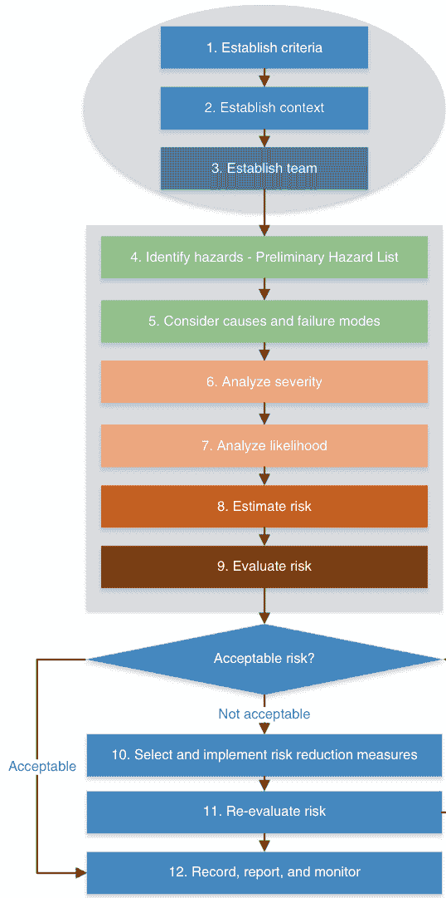

5)  **考虑原因和失效模式：** 应考虑可能导致危险情况的各种可能的失效模式，包括对设施、材料和设备的合理可预见的使用和误用。

6)  **分析后果严重性：** 对于每个已识别的危害，分析其可能导致的最坏可信情况的严重性，并根据严重性风险等级进行评分。

7)  **分析可能性：** 对于每个已识别的危害，确定其发生的可能性，并根据可能性风险等级进行评分。

8)  **评估风险：** 使用既定的风险标准评估每个已识别的风险，以确定其发生可能性、后果严重性和风险等级。

9)  **评价风险：** 将评估的风险等级与既定的风险标准进行比较，以确定风险等级和类型的重要性，以及风险对组织是否可接受。对于被归类为不可接受的风险，需要采取进一步行动来降低风险。

10) **选择并实施风险降低方法：** 当初步风险评估表明需要时，应选择并实施风险规避、消除、降低或控制方法，以使每个已识别的危害达到可接受的风险水平。

11) **重新评估风险：** 对于已采取选定风险降低措施的风险，需重新评估其产生的风险水平。如果处理后的风险水平仍被认为不可接受，则应在继续操作前采取进一步措施降低风险。

12) **监控、记录和报告：** 记录PHRA过程、已采取的风险降低行动以及由此产生的剩余风险水平，并向管理层和关键利益相关者报告。持续监控风险降低措施和风险水平，以发现任何变化。

所需的输入是有关待评估系统的信息，以及可获得且相关的系统设计细节。输出包括危害清单；后果严重性估计；发生可能性估计；当前状态和未来状态的风险等级估计（附带建议的风险降低措施）；以及根据风险等级应采取的行动。

PHA或PHRA的一些局限性在于，它仅提供初步信息，不够全面，并未提供关于风险及其最佳预防方法的详细信息。

## 6.7 评分系统

进行PHRA或任何其他风险评估的第一步是选择要使用的适当风险评估矩阵。ANSI Z590.3对风险评估矩阵的定义和解释如下：

> 风险评估矩阵提供了一种对发生概率和伤害严重性组合进行分类的方法，从而建立风险等级。该矩阵有助于与决策者沟通需要采取的风险降低行动。此外，风险评估矩阵有助于比较和确定风险的优先级，并有效分配缓解资源。

ANSI Z590.3 PtD标准的指导进一步指出，组织“应”创建并商定一个适合所评估危害和风险的风险评估矩阵或其他经过验证的流程。选定的风险评估矩阵或经过验证的方法用于确定和记录风险。参与风险评估的利益相关者应了解，各种可用的风险评估矩阵中，用于事件概率和严重性以及风险等级的术语定义差异很大。

为了建立初始评分系统，可以使用一个成熟的系统，例如ANSI Z590.3中概述的系统。ANSI Z590.3的附录F提供了几个风险评估矩阵和术语定义的示例。图6.3显示了一个带有行动等级的风险评估矩阵示例。

### 伤害或损害的严重性

| | 可忽略 (N) | 边际 (M) | 严重 (C) | 灾难性 (CAT) |
|---|---|---|---|---|
| | 急救或轻微医疗处理；损失低于1千美元 | 轻微伤害，损失工作日事件；损失超过1千美元 | 残疾3个月；3人或以上住院；损失超过5万美元 | 死亡；永久完全残疾；损失超过25万美元 |
| | 1 | 2 | 3 | 4 |
| 频繁 (F) | 中等 5 | 严重 10 | | |
| 可能 (P) | 中等 4 | 严重 8 | | |
| 偶尔 (O) | 低 3 | 中等 6 | 严重 9 | |
| 极少 (R) | 低 2 | 中等 4 | 中等 6 | 严重 8 |
| 不太可能 (I) | 低 1 | 低 2 | 低 3 | 中等 4 |

图6.3 风险评估矩阵。来源：改编自ANSI/ASSP Z10.0-2012。

可以使用包含可能性和严重性等级数值的复合矩阵。出于实际原因，这些组合以数值风险评分的形式表达，适用于那些更喜欢处理数字而非定性指标的人。本书中描述的更详细的FMEA和蝴蝶结风险评估方法也使用了数值风险评分。

图6.4显示了第二个后果/可能性矩阵示例，其中包含健康影响、财产损失和环境影响的类别。应注意，图6.4中的数字是通过判断确定的，是定性描述的半定量表达。

| 严重性等级 | 健康影响（人员） | 财产损失 | 环境影响 | 1 极不可能 | 2 不太可能 | 3 可能 | 4 很可能 | 5 非常可能 |
|---|---|---|---|---|---|---|---|---|
| 5 | 死亡或永久完全残疾 | 灾难性损失 | 重大影响 | 5 | 10 | 15 | 20 | 25 |
| 4 | 永久部分残疾；三人或以上住院 | 严重损失 | 重大但可逆影响 | 4 | 8 | 12 | 16 | 20 |
| 3 | 导致一天或以上无法工作的伤害或职业病 | 显著损失 | 中等可逆影响 | 3 | 6 | 9 | 12 | 15 |
| 2 | 未导致工作日损失的伤害或职业病 | 中等损失 | 最小影响 | 2 | 4 | 6 | 8 | 10 |
| 1 | 仅急救或无伤害或疾病 | 轻微损失 | 无影响 | 1 | 2 | 3 | 4 | 5 |
| | 极高风险：15或更高 | 高风险：9 – 14 | 中等风险：5 – 8 | 低风险：1-4 | | | | |

图6.4 风险评估矩阵示例：数值分级和评分。

对于每个严重性和可能性等级，都需要清晰的描述。图6.4提供了本章实践示例中使用的ASSP TR中的描述。本章使用以下来自ASSP TR和PtD标准的风险排序标准：

- 1) 极高风险：15或更高
- 2) 高风险：9–14
- 3) 中等风险：5–8
- 4) 低风险：1–4。

## 6.8 实际应用

如前所述，PHRA主要用于识别危害、评估初始风险、识别潜在控制措施并估计风险降低。传统的PHA用于单独分析危害，通常不处理叠加或协同效应。该方法有许多变体。大多数方法都包含一个风险估计和评分机制，可称为初步危害与风险分析（PHRA）。

以下PHRA示例基于美国化学安全委员会（CSB）对美国包装公司热作业爆炸事件的2017年调查。2017年2月8日，在路易斯安那州德里德的美国包装公司设施发生爆炸，造成三名承包商死亡，七名承包商受伤。死亡的承包商当时在一个含有易燃气氛并最终爆炸的储罐附近进行热作业活动。CSB美国包装公司热作业爆炸最终报告（2018年）可在以下网址获取：https://www.csb.gov/packaging-corporation-of-america-hot-work-explosion-

以下步骤概述了使用CSB调查进行PHRA的基本应用。

- a) 制定危害清单：为识别与系统相关的危害，需考虑潜在的失效模式、原因和促成因素，制定初步危害清单（PHL）。其他选项包括从现有的工作危害分析、工作安全分析、任务分析、工作风险分析或“假设/检查表分析”中转移已识别的危害。
- b) 选择/开发PHRA工作表：建议参与评估的人员选择或开发满足系统特定需求和所需信息的PHRA模型。PHRA工作表通常包含两个部分：(i) 当前状态和 (ii) 未来状态，用于比较风险水平前后的变化，以帮助确定风险降低选项。当前状态的列包括：(i) 工艺步骤或任务；(ii) 危害或危险事件；(iii) 危害类别；(iv) 系统影响/暴露；(v) 潜在后果；(vi) 当前控制措施；(vii) 估计的严重性；(viii) 估计的可能性；以及 (ix) 估计的当前风险。未来状态的列包括：(x) 建议的控制措施；(xi) 估计的严重性；(xii) 估计的可能性；(xiii) 估计的未来风险；以及 (xiv) 风险降低百分比。可以使用过程图或流程图来指导PHRA的执行。
- c) 完成工作表：工作表要求PHRA团队识别工艺步骤；危害；危害类别（化学、物理、生物、人体工程学等）；系统影响/员工暴露；以及如图6.5示例中所示的潜在后果。在填写工作表时，团队将确定是否存在当前控制措施，估计风险水平，并决定是否需要额外的控制措施。也可以添加实施潜在控制措施后的风险降低估计。目标是建立一个逻辑系统，从

## 6.9 总结

初步危害与风险分析方法依赖于团队头脑风暴、知情判断以及定性或半定量风险评估的结合，以评估危害的重要性并为每项任务或流程分配等级。运用PHRA可能有助于优先处理降低风险的建议。这是一种灵活的方法，可应用于几乎任何活动或系统，因此对安全专业人员来说是一个宝贵的工具。PHRA可在项目设计阶段早期用作高层级分析，也可用于评估现有流程或系统内的风险。尽管PHRA是一种简单高效的方法，但它确实存在一些局限性，包括：

- 1) 不易识别组合危害产生的叠加或协同效应。
- 2) 仅提供初步信息。
- 3) 不够全面，通常不提供关于风险或控制措施的详细信息。
- 4) 不要求列出屏障或控制层级。
- 5) 可能无法处理所列危害的后果，通常需要额外的后续分析或使用更复杂的风险评估技术。

PHRA的质量主要取决于信息的质量和可用性，以及评估人员对所分析系统的知识和专业水平。

## 复习题

- 1. 阐述PHRA的主要目的。
- 2. 描述安全专业人员如何使用PHRA来识别危害和必要的控制措施。
- 3. 解释为何早期花时间进行PHRA实际上可能加速设计过程并避免代价高昂的错误。
- 4. 总结适用于系统安全方法的基本原则。
- 5. 识别并描述ANSI Z590.3中概述的初始风险评分系统。
- 6. 简要说明PHRA的优点。
- 7. 列举三个在不使用任何其他风险评估方法的情况下使用PHRA所面临的困难。

## 参考文献

ASSP TR 31010-2020 (2020). *风险管理——安全从业人员技术*. Park Ridge, IL: 美国安全专业人员协会.
ANSI/ASSP Z590.3-2011(R2016) (2016). *通过设计预防：在设计和再设计过程中解决职业危害和风险的指南*. Park Ridge, IL: 美国安全专业人员协会.
ANSI/ASSP/ISO 31010-2019 (2019). *风险管理——风险评估*. Park Ridge, IL: 美国安全专业人员协会.
CSB Packaging Corporation of America Hot Work Explosion, Final Report 2018. 可访问：https://www.csb.gov/packaging-corporation-of-america-hot-work-explosion/
MIL-STD-882E (2012). *系统安全标准实践*. Washington, DC: 国防部.
OSHA, 1910.119 高度危险化学品的工艺安全管理. https://www.osha.gov/pls/osha web/owadisp.show_document?p_table=STANDARDS&p_id=9763 (访问于2021年6月7日).

## 实践案例

XYZ制造公司是一家为汽车行业生产高质量铝制部件的公司。该公司在储藏室中将油性涂料储存在55加仑的桶中。储藏室中还存放着易燃溶剂。这些溶剂含有高达5%的苯。
涂料和溶剂由叉车运送到传统的喷漆房。传统空气喷枪是汽车修补漆行业用于涂覆涂层的标准喷涂设备。员工们正在使用这种类型的喷枪。一股低流量（每分钟2至10立方英尺）的空气被加压并通过喷嘴强制喷出；涂料在喷嘴喉部被雾化到空气中。喷枪在30-90磅/平方英寸的空气压力和10-20磅/平方英寸的液体压力下操作。喷涂作业期间，空气由空气压缩机供应。传统喷枪有两种基本类型：虹吸式和重力式。该公司使用的是虹吸式喷枪，涂料杯连接在喷枪下方，空气快速流过喷枪产生真空，将涂料从杯中吸出。
涂覆操作员仅使用N95呼吸器和安全眼镜。然而，仅使用10分钟后，眼镜上就“覆盖”了一层油漆。喷漆操作员抱怨他们看不清部件，质量控制经理确定只有70%的部件被正确涂覆。图6.6展示了该流程的顺序。
图6.7展示了一个已完成的PHA示例。

## 流程当前状态

图6.6 流程顺序。

| 潜在影响编号及简称 | 危害 | 潜在影响 | 流程 | 严重性 | 可能性 | 风险等级 | 业务单元/部门 | 当前控制措施描述 | ANSI/ASSE Z590.3-2021: PID, 风险控制层级 |
| :--- | :--- | :--- | :--- | :--- | :--- | :--- | :--- | :--- | :--- |
| 1 爆炸 | 化学/物理 | 爆炸 | 内务管理和易燃液体 | 5 | 3 | 15 | 喷漆部门 | 无 | 无 |
| 2 健康 | 化学 | 健康/苯暴露 | 喷漆房内油性易燃液体应用 | 4 | 3 | 12 | 喷漆部门 | 标准操作程序和个人防护装备 | 管理和PPE |
| 3 环境 | 化学 | 环境 | 喷漆房内油性易燃液体应用 | 3 | 4 | 12 | 喷漆部门 | 无 | 无 |

图6.7 已完成的PHA示例。

# 7 “假设”分析方法

Bruce Lyon¹ 和 Georgi Popov²

¹ Brown & Brown
² 中密苏里大学

### 目标

- 介绍“假设”分析
- 回顾其应用和流程步骤
- 介绍结构化假设风险评估模型
- 呈现案例研究

## 7.1 引言

评估风险的“假设”方法可以是更好地理解风险及其影响的一种简单而有效的手段。对于组织内经历的死亡和严重事故，在事故发生前使用“假设”问题可能有助于预防或减轻结果的影响。不幸的是，这种分析通常在事件发生后才被考虑。

例如，在化工过程中可能提出的问题包括“假设压力容器内发生失控化学反应会怎样”，或“如果容器剧烈爆炸会发生什么”，或“假设高易燃溶剂从容器中喷出并立即被点燃会怎样”？“假设爆炸容器的碎片击中附近的管道，释放有毒化学物质会怎样”？“假设释放的化学物质影响到现场工人和周围社区的公众会怎样”？这些问题对于理解影响以及预防或降低运营风险至关重要。

“假设”是安全专业人员识别和分析风险源、潜在原因、条件、后果和控制措施的重要工具。当在设计过程早期以及整个系统生命周期中应用时，它特别有用。

## 7.2 传统假设方法

由英国化学工业在20世纪60年代开发和使用，它被认为是危害与可操作性研究（HAZOP）的一种更简单的替代方法。假设方法已成为过程安全管理中常用的过程危害分析方法，其主要目标是识别和分析系统的危害、暴露场景、

风险评估：评估运营风险的实用指南，第二版。
Georgi Popov, Bruce K. Lyon, 和 Bruce Hollcroft.
© 2022 John Wiley & Sons, Inc. 由John Wiley & Sons, Inc.于2022年出版.

后果、原因、偏差或可能导致危害的薄弱环节，现有控制措施，以及为达到可接受风险水平所需的控制措施（Lyon and Popov 2018, 2020）。

“假设”类方法，如 HAZOP 和其他“过程危害分析”方法，用于分解一系列操作或步骤，以理解与过程相关的危害及其原因和影响。过程危害分析（PHA）是对已识别的危害及相关控制措施进行的一系列系统性分析，旨在协助做出决策，以改善安全并降低与过程相关的操作风险。PHA 通常侧重于分析火灾、爆炸、有毒或易燃化学品释放的潜在原因和后果，并关注可能影响过程的设备、仪表、公用设施、人为操作和外部因素。在许多情况下，进行此类分析的另一个好处是能更透彻地理解工业过程，从而为提高过程效率和降低成本创造机会（Lyon and Popov 2020）。

自 1999 年以来，英国的企业被健康与安全执行局（HSE）依法要求进行风险评估。在美国，法律要求的危害分析和风险评估非常少。有两个例外适用于涉及高危化学品的操作，它们是：

-   OSHA 29 CFR 1910.119 高危化学品过程安全管理（PSM）标准，于 1992 年制定，要求对受监管的、含有 10,000 磅或更多危险化学品的工业过程进行过程危害分析，以保护在这些过程内部及周围工作的员工。
-   EPA 40 CFR PART 68 化学事故预防条款，风险管理计划（RMP）规则于 1994 年发布，源于 1990 年《清洁空气法》修正案，它借鉴了 OSHA 过程安全管理的要求，对受监管设施进行过程危害分析，旨在保护公众和环境免受爆炸或释放带来的不良后果。

OSHA 的 PSM 标准要求操作对涵盖的过程执行“初始过程危害分析（危害评估）”。“假设危害分析”是 OSHA 过程安全管理标准和 EPA 风险管理计划规则中提到的几种可接受的 PHA 方法之一。OSHA 1910.119(e)(2) 中列出的用于确定和评估过程危害的可接受方法在下表 7.1 中描述。

除了这些美国的法规合规标准外，“假设分析”也被列为几种共识标准中的危害分析方法，包括 ANSI/ASSP/ISO 31010-2019《风险管理 – 风险评估技术》（ISO 31010）、ANSI/ASIS/RIMS RA.1-2015《风险评估》、ANSI/ASSP Z590.3-2011(R2016)《通过设计预防》以及 ASSP TR-31010-2020《技术报告：风险管理 – 安全从业人员技术》。ASSP TR-31010 还包含一个附录，提供了“假设分析”方法及其应用的描述。

需要指出的是，传统的假设方法及其变体被认为是“危害分析”而非风险评估。这是因为传统方法不包括风险估计，仅识别危害、潜在后果、原因和现有控制措施。

## 7.3 假设分析的应用

传统的假设分析方法通常是一种基于团队的定性方法，它结合了对系统进行“假设”问题的头脑风暴，以确定在给定场景下可能出现的问题。传统方法的两种常见变体是“假设/检查表分析”和“结构化假设技术（SWIFT）”。假设分析最初由化学和石化行业使用；然而，现在它已广泛应用于其他行业，如能源、制造、高科技、食品加工、运输和医疗保健。

“假设”方法可以轻松应用于系统生命周期的任何阶段，并在设计阶段使用时最为有益。它通常用于识别可能发生的潜在故障或偏差及其产生的影响，以便设计和实施适当的控制措施。它可以广泛用于分析系统、过程或操作，也可以更精确地聚焦于某个程序、设备或活动。假设分析可用于：

-   1) 新设施、系统和设备的安全审查设计。
-   2) 新技术、设备或材料的采购。
-   3) 包含危险化学品过程的过程安全管理操作（例如化学制造、含氨的制冷和冷却系统、食品加工等）。
-   4) 变更管理程序。
-   5) 非常规活动，如设备安装、维修或退役。
-   6) 业务连续性威胁评估和“桌面演练”，以制定应急情景以及为准备、灾难恢复和业务连续性制定必要措施。

这种方法虽然相对容易应用，但严重依赖分析团队的经验和知识。因此，一位经验丰富的引导者和熟悉该过程的团队对其成功至关重要。

## 7.4 假设分析的过程步骤

假设分析使用跨职能团队，对潜在危害及其对系统的影响进行提问和讨论。提问过程，无论是采用结构化的、预定的假设提问方式，还是更自发的头脑风暴方式，都用于揭示被分析系统中的潜在薄弱环节、故障模式、偏差或危害。这需要被分析系统或组件的“主题专家”以及一位经验丰富的引导者。因此，假设分析团队会识别具体的危害、暴露、原因或触发因素、现有控制措施和产生的后果，以及任何建议的额外控制措施。会生成一个带有列的工作表或电子表格，列出各项任务和/或系统元素。针对每个任务/元素，会提出“假设”问题，并列出相应的后果、现有防护措施和建议的额外控制措施。需要一名记录员或文员来收集和记录发现。假设分析过程如图 7.1 所示。

-   1) 定义背景 – 作为背景的一部分，需要明确定义目的和范围，包括要分析的活动或系统、分析的边界、期望的详细程度以及要使用的标准。
-   2) 组建团队 – 选择一个由经过培训、经验丰富且知识渊博的成员组成的跨职能团队来执行“假设分析”。还需要一位经验丰富的引导者和文员。通常包括来自工程、设计、生产、运营、维护以及安全、健康和环境部门的成员。对设计标准、
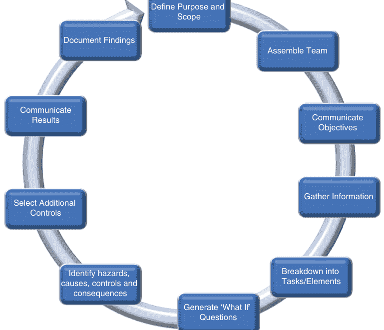

**表 7.1 OSHA 1910.119(e)(2) 中列出的方法。**

| 过程危害分析方法 | 描述 |
|---|---|
| 假设（What-If） | 使用多技能团队创建并回答一系列“假设”类型的问题。此方法结构相对宽松，其有效性仅取决于所提问题和给出答案的质量。 |
| 检查表（Checklist） | 使用既定的法规、标准和充分理解的危险操作作为检查表，将过程与之进行比较。一个好的检查表取决于制定者的经验水平和知识。 |
| 假设/检查表（What-If/Checklist） | 一种基于团队的结构化分析，将假设法的创造性、头脑风暴方面与检查表的系统性方法相结合。这种技术组合可以弥补各自的弱点。 |
| 危害与可操作性研究（HAZOP） | 一种基于团队的、结构化的、系统性的系统或产品审查，使用“引导词”来识别风险，这些引导词质疑设计如何因操作的某些限制和偏差而失效。 |
| 失效模式与影响分析（FMEA） | 用于识别系统及其组件可能失效的方式及其产生影响的技术。 |
| 故障树分析 | 用于识别和分析可能导致特定不良事件的因素的技术。因果因素通过演绎方式识别，以逻辑方式组织，并以树状图形式进行图示表示。 |

法规代码、操作失误可能性、事故历史、维护需求以及其他实践经验是必需的。

3) 沟通目标 – 分析的目的、范围、边界以及团队职责应由协调员清晰地传达给团队。分析中使用的方法、标准、角色/职责和定义也应清晰地传达给团队。

4) 收集信息 – 协调员收集有关系统的适用信息、历史信息、规格说明和操作指南，并提供给团队审阅。团队应观察在位的活动或系统。具体而言，在分析之前，团队应收集并研究参考材料，如管道和仪表图（P&IDs）、示意图、图纸、操作手册、维护和服务指南、组件规格说明以及安全防护要素。

5) 分解为任务/要素 – 利用收集到的信息，将活动或系统分解为顺序的任务或要素以供分析。

6) 生成“如果-那么”问题 – 针对每个任务/要素，团队生成“如果-那么”问题，以识别潜在的危险和危险场景。提问过程应用于每个单独的任务，调查潜在的场景，如程序中断、沟通不畅、操作员错误、设备故障和软件错误。可以使用非结构化或结构化的头脑风暴方法。当团队成员提出具体的“如果-那么”问题时，记录员在团队可见的挂图或笔记本电脑投影上记录每个问题。在此过程中会产生额外的问题，并由记录员记录下来。协调员完成并完善用于分析的“如果-那么”问题列表。

7) 识别危险、原因、控制措施和后果 – 回答每个“如果-那么”问题，从而识别危险、其原因、现有控制措施以及由此产生的后果。

8) 选择额外的控制措施 – 对于危险或后果未得到充分控制的情况，应考虑并建议额外的措施。控制措施的选择应根据控制层级概念进行，优先选择更有效和可靠的高级控制措施。

9) 沟通结果 – 分析完成后，最终确定电子表格，并将建议传达给决策者以采取进一步行动，如图7.2所示。

10) 记录发现 – “如果-那么”分析电子表格可用作文档记录、分配责任和完成建议的风险降低措施的“行动计划”。

传统的“如果-那么”危险分析表示例如图7.2所示。

“如果-那么”分析的一些优点是它易于应用于大多数情况或系统；它允许可能没有先前危险分析或风险评估经验的利益相关者参与并提供意见；并且它通常能带来对系统更深入的见解，特别是对于进行分析的人员。虽然使用“如果-那么”分析有其优点，但必须认识到它存在一些局限性。“如果-那么”分析只有在提出并正确回答了正确的问题时才有用。该方法依赖于团队成员的直觉和经验，可能过于主观，增加了个人偏见的可能性，并且可能更难将结果转化为令人信服的变革论据。也许“如果-那么”分析最大的缺点是它是一种“危险分析”方法，而不是“风险评估”方法（如第5章所讨论的）。

| 如果-那么分析 |
| --- |
| 设施/操作/流程： | |
| 日期： | 团队： |
| A. 流程 | | | | | |
| ID# | 如果-那么... | 原因 | 后果 | 控制措施 | 建议 |
| A.1. | | | | | |
| A.2 | | | | | |
| A.3 | | | | | |

图7.2 传统的“如果-那么”危险分析示例。

## 7.5 结构化“如果-那么”风险评估（SWIFRA）简介

传统的“如果-那么”方法缺乏风险估算功能，因此产生的分析无法区分危险或风险等级的优先级。本质上，每个危险都被视为同等重要，这使得难以优先安排风险降低工作和资源。危险分析在识别和分析危险方面很有用；然而，它们不提供用于优先处理、处置和管理风险所需的风险信息。

结构化“如果-那么”风险评估或SWIFRA是“如果-那么”分析的改进版本，它包括对每个“如果-那么”场景的风险估算。纳入定性或半定量风险评估允许对风险进行排序以采取必要行动。此外，该评估方法扩展了“如果-那么”问题，包括（i）“如何”和（ii）“为什么”该场景可能发生。使用这三个问题步骤：（i）“如果-那么”；（ii）“如何”；和（iii）“为什么”，是为了揭示表面原因背后的系统性根本原因，类似于五个为什么方法。这些额外的问题步骤有助于更好地理解风险和场景。

该方法使用与系统要素或任务相关的特定“如果-那么”问题来识别作为结果会发生什么，并进一步分析原因，提出“如何可能”和“为什么”的问题。评估人员利用这些信息来估算每个系统要素或任务的最终严重性（S）、可能性（L）和风险等级（R）。然后，将估算的风险等级（R）与既定的风险标准（如表7.2所示的风险矩阵）进行比较和评估，以确定可接受性和任何所需行动。对于需要降低的风险，考虑建议的额外控制措施，并进行风险（R2）的预测估算，以确定风险降低百分比（% RR）。

应用SWIFRA的步骤如下：

1) **制定“如果-那么”问题：** 团队通过文件审查、访谈、过往事故、历史数据分析、观察等研究和收集信息，并制定一份有效且相关的“如果-那么”问题列表，以揭示可能的系统安全问题。

表7.2 定性/半定量风险矩阵（5 × 4）示例，包含风险描述和行动级别。

| | 可忽略（N） 急救或轻微医疗处理；损失低于$1K | 边际（M） 轻微伤害，损失工作日事件；损失超过$1K | 严重（C） 残疾3个月；3人或以上住院；损失超过$50K | 灾难性（CAT） 死亡；永久完全残疾；损失超过$250K |
|---|---|---|---|---|
| | 1 | 2 | 3 | 4 |
| 频繁（F） 在暴露情况下几乎必然发生。过去12个月内发生过不止一次。 | 5 | 中等 5 建议采取补救措施 | 严重 10 高优先级-需要行动 | 高 15 不允许-需要立即行动 | 高 20 不允许-需要立即行动 |
| 可能（P） 在暴露情况下非常可能发生。过去12个月内发生过。 | 4 | 中等 4 建议采取补救措施 | 严重 8 高优先级-需要行动 | 高 12 不允许-需要立即行动 | 高 16 不允许-需要立即行动 |
| 偶尔（O） 可能发生。过去24个月内发生过。 | 3 | 低 3 可接受-持续改进 | 中等 6 建议采取补救措施 | 严重 9 高优先级-需要行动 | 高 12 不允许-需要立即行动 |
| 罕见（R） 如果条件存在则可能发生。过去36个月内发生过。 | 2 | 低 2 可接受-持续改进 | 中等 4 建议采取补救措施 | 中等 6 建议采取补救措施 | 严重 8 高优先级-需要行动 |
| 不太可能（I） 不太可能发生。过去5年内未发生过。 | 1 | 低 1 可接受-持续改进 | 低 2 可接受-持续改进 | 低 3 可接受-持续改进 | 中等 4 建议采取补救措施 |

## 7.6 伤害或危害的严重程度

## 7.7 案例研究——化学品泄漏事件的SWIFRA分析

为演示改良的结构化假设分析风险评估（SWIFRA）方法的应用，以下呈现一个案例研究。该案例基于美国化学品安全委员会对2008年8月发生的农药废料罐爆炸事件的调查。

最终报告可在此处查阅：https://www.csb.gov/bayer-cropscience-pesticide-waste-tank-explosion/

也鼓励读者熟悉CSB发布的相关视频，可在此处观看：https://www.youtube.com/watch?v=bcfvzGtuamM

或 https://www.youtube.com/watch?v=h4ZgvD4FjJ8

| # | 假设情景 | 可能后果 | 如何发生？ | 为何发生？ | 现有控制措施 | L | S | 风险等级 | 风险是否可接受 (Y/N) | 额外控制措施 | L2 | S2 | 风险等级2 | 风险降低率% |
|---|---|---|---|---|---|---|---|---|---|---|---|---|---|---|
| 1 | | | | | | | | | | | | | | |
| 2 | | | | | | | | | | | | | | |
| 3 | | | | | | | | | | | | | | |

图7.3 SWIFRA工作表。

## 7.8 CSB调查摘要

2008年8月28日晚上10点35分左右，西弗吉尼亚州因斯蒂特市一家工厂的灭多威生产单元内，一个容积为4500加仑、被称为残渣处理罐的压力容器内部发生了失控的化学反应，导致该容器剧烈爆炸。高度易燃的溶剂从罐中喷出并立即被点燃，引发了一场持续超过四小时的猛烈大火。在消防队以及当地志愿消防部门和市政消防部门的互助协助下，火势被控制在灭多威-拉维因杀虫剂生产单元内部。

该事故发生在灭多威单元因控制系统升级改造和更换原始残渣处理罐而长期停工后的重启过程中。两名被控制室人员派去调查残渣处理罐压力为何升高的公司员工，在罐体破裂时正处于其附近。其中一人因现场遭受的钝器创伤和烧伤死亡；另一人于41天后在宾夕法尼亚州匹兹堡的西宾夕法尼亚烧伤中心去世。六名协助单元灭火活动的志愿消防员和两名在该设施工作的承包商因可能接触有毒化学品而接受了治疗（CSB 2011）。

正如CSB报告所述，调查小组确定，这场失控的化学反应以及易燃有毒化学品的泄漏是由一系列原因和促成因素共同导致的。这些因素包括：

-   偏离书面启动程序；
-   绕过旨在防止此类情况发生的关键安全装置；
-   不充分的启动前安全审查；
-   操作员对新安装的控制系统培训不足；
-   未经评估的临时变更；
-   设备故障或缺失；
-   阀门错位；以及
-   重启期间控制室缺乏足够的技术专长。

本案例中的风险源是残渣和溶剂化学品。导致此事故的风险驱动因素可能包括：不充分的启动前安全审查；操作员对新安装的控制系统培训不足；未经评估的临时变更；设备故障或缺失；以及CSB调查人员识别出的其他问题。一旦发生事故，工厂操作员、应急响应人员和当地居民都可能暴露于风险之中。

残渣处理罐控制系统配备了集成到自动进料控制阀操作中的运行限值控制器。一个最低温度联锁和一个最高压力联锁分别防止进料控制阀在残渣处理罐内物料温度低于设定值或压力高于设定值时打开。两者均被指定为安全联锁；因此，旁路控制受密码保护。第三个被指定为“运行”的联锁也防止进料控制阀在残渣处理罐循环流建立之前打开。新的分布式控制系统（DCS）缺乏密码访问控制，使得工作人员能够绕过安全联锁，这直接导致了失控反应和灾难性的残渣处理罐失效。因此，密码旁路可被视为一个风险触发因素，它增加了爆炸的可能性。这些事件要素可以在图7.4所示的风险路径中可视化。

事件发生前，大约晚上10点25分，两名员工被要求调查为何残渣处理罐（一个位于灭多威-拉维因单元南侧、靠近一条相邻道路中点的压力容器）的压力意外升高。大约10分钟后，当他们接近新安装的残渣处理罐时，它突然剧烈破裂。

结果，大约2200加仑的易燃溶剂和有毒杀虫剂残渣喷洒到道路上并进入单元内，由于被切断的电缆或钢碎片撞击混凝土产生的火花点燃了溶剂蒸气，立即燃起火焰。碎片被抛向四面八方，有些飞出数百英尺远。重达5700磅的残渣处理罐在解体时撕裂了管道、电缆导管和一个结构钢支撑柱，并向东北方向冲入灭多威-拉维因生产单元结构（图7.5）。

爆炸超压对单元控制大楼和其他附近结构造成了中等程度的损坏。请注意，飞散的碎片击中了位于残渣处理罐西南约70英尺处、一个6700加仑MIC“日用罐”周围的防护钢屏蔽罩（图7.6），但并未损坏该日用罐。

钢屏蔽罩也保护了MIC日用罐免受附近持续燃烧超过四小时的大火产生的辐射热影响。一名员工因钝器创伤和热烧伤在现场死亡。响应的单元人员帮助第二名员工撤离了单元。

他被送往宾夕法尼亚州匹兹堡的西宾夕法尼亚烧伤中心，并于41天后去世。五名泰勒山消防员和一名因斯蒂特消防员在协助消防队灭火时报告了可能的化学暴露症状。事件当晚在该设施工作的两名诺福克南方铁路员工也报告了化学暴露症状。

应当指出的是，灭多威单元使用剧毒化学品异氰酸甲酯（MIC）进行一系列复杂的化学反应来生产灭多威，这是一种用于制造杀虫剂拉维因的干粉化学品。MIC正是1984年在博帕尔泄漏并导致数千人死亡的同一种化学品（在第10章讨论）。据报道，2008年的事故并未导致MIC泄漏。邻近灭多威单元的MIC储罐以及生产单元与制造单元之间的MIC输送管道均未损坏，在火灾期间MIC储罐也未过热或压力超过运行限值。在本章中，我们将提出一系列假设性问题。

## 7.9 案例研究分析

如果该公司进行了传统的“假设分析”并提出了一系列假设性问题，他们本可能识别出其中一些危害并防止该事件的发生。然而，传统的“假设分析”存在某些局限性。例如，一个经验不足的团队可能会判断这种类型的事件被归类为“未遂事故”型事件，或者未能识别其连锁效应。因此，他们的建议可能仅仅是增加程序和培训。而经验更丰富的引导员和团队，使用更稳健的“假设分析”方法（如SWIFRA），则可能通过“为什么”和“如何”的问题深入挖掘，揭示可能引发其他次生效应的因果因素。通过考虑关于后果影响的连锁型“假设分析”问题，类似于“5个为什么”方法，团队可能会发现这确实可能导致灾难性事件。这类连锁的“假设分析”问题可能包括：“假设”一个4500加仑的压力容器内发生失控化学反应会怎样？如果容器爆炸了呢？如果高度易燃的溶剂从容器中喷出并立即被点燃呢？如果爆炸的容器碎片击中附近的管道和/或储罐，导致异氰酸甲酯等有毒化学物质释放呢？这种类型的分析和评估能够制定基于风险的信息和指导，以确定所需的额外控制措施。因此，团队可能会建议采用更高级别的控制措施来预防和减轻事件，如图7.7所示。*需要注意的是，该公司已有广泛的控制措施。此处讨论的内容仅用于教育目的。*

对于偏好数字的人，图7.8展示了一个半定量的结构化假设风险评估。半定量模型的一个优点是，可以进行基本的数学计算并估算风险降低百分比，有助于沟通风险水平。

该公司生产异氰酸甲酯，在事故发生时，其在大型地下压力容器和较小的地上容器中储存了多达200,000磅。液态异氰酸甲酯通过一个约2500英尺长的保温管道系统，从异氰酸甲酯生产单元输送到位于灭多威-拉维生产单元旁边的一个名为“日用罐”的地上压力容器。在重新装满日用罐后，操作员清空了输送管道中的所有异氰酸甲酯，并用氮气吹扫管道。这是“最小化”作为处理策略的一个例子。

另一层控制是机械完整性计划（一种管理级控制）。原有的已有25年历史的碳钢残渣处理装置显示出严重的服务性能退化。公司通过变更管理程序，将其更换为耐腐蚀的不锈钢容器（一种设计级控制），以应对计划中的灭多威产量增加。为了进一步降低风险，在结构框架的侧面和顶部安装了钢丝网防弹盾或防爆毯（一种被动工程控制），以保护异氰酸甲酯日用罐，防止单元内或附近设备发生爆炸（见图7.7）。残渣处理装置爆炸产生的飞散碎片击中了防爆毯。火灾在防爆毯上辐射出强烈的热量。

事故发生后，公司拆除了防爆毯、异氰酸甲酯日用罐的保温层及相关管道。图7.9显示了事故后的异氰酸甲酯储罐防爆罩。他们目视检查了日用罐是否有撞击或热损伤。他们还对日用罐进行了压力测试。日用罐没有显示出热损伤的迹象——防爆毯对来自外部火灾的辐射热提供了*高效防护*。检查和测试证实，日用罐及相关管道未因爆炸而损坏。

此外，还安装了围栏线空气监测器（一种预警型控制）。这些空气监测器通常用于确定工厂释放的化学物质是否进入社区。监测器的位置及其有限的化学敏感性，常常使得释放判定变得困难。事故发生当晚，有两个厂区围栏线监测设备在运行，一个在设施东侧，一个在西侧。最近的监测器距离灭多威单元超过800英尺，只有在释放源处于下风向时才有效。这些监测器被配置为检测氯气、一氧化碳、甲烷和氧气。此外，每个监测器都包含一个10.6电子伏特灯和一个挥发性有机化合物传感器，该传感器只能检测特定电离能范围内的化合物。由于挥发性有机化合物传感器可以检测多种不同的化合物，因此只有在已知释放物质且其电离能在可检测范围内时，它才有助于估算浓度。有关此类仪器的更多信息在第12章中介绍。事故当晚使用的AreaRAE监测器无法检测特定化合物，如灭多威或其某些中间体。空气或擦拭样本的实验室分析是确定是否释放了灭多威的唯一可用采样方法，但这些测试是在数天后才进行的。

围栏线监测器也不可靠，因为它们无法检测浮力气体释放，除非强风将气体吹回检测器位置。爆炸当晚的天气条件，包括风向和风速，都不利于任何围栏线监测器对有毒或易燃气体进行有效检测（CSB 2011）。因此，美国化学安全委员会建议公司修订公司工艺危害分析政策和程序，要求：（i）验证所有工艺危害分析假设，确保对每个工艺危害分析场景的风险分析都特别检查了故意绕过或以其他方式使安全措施失效的风险；（ii）涵盖所有操作阶段和专题，包括《工艺危害评估指南》（CCPS 2008）第9章中引用的内容；（iii）在将引导员分配到工艺危害分析团队之前，对所有工艺危害分析引导员进行修订后政策和程序的培训。确保所有工艺危害分析更新以符合修订后的程序。

此外，要求该运营单位：（i）确保所有设施消防队成员接受国家事件管理系统培训，与市政和州应急响应机构保持一致；（ii）根据联邦、州和地方法规以及公司政策评估围栏线空气监测计划，并在必要时升级和安装空气监测设备，以确保对设施周边潜在的高危化学品释放进行有效监测；（iii）委托对研究所所有受过程安全管理/风险管理计划覆盖的工艺控制室进行独立的人因工程和人机工程学研究，以评估人机界面、操作员疲劳以及对控制系统的熟悉程度和培训情况。制定并实施一项计划，以解决研究中确定的所有建议，包括分配的责任、所需的纠正措施和完成日期（CSB 2011）。

增加了额外的控制措施，最终公司决定在设施中停止使用异氰酸甲酯，以进一步降低风险。需要注意的是，这只是对可用控制措施层的一个简要总结，并且控制措施的有效性应始终作为选择标准的一部分进行评估。

## 7.10 结论

对于美国化学安全委员会调查的化学释放事故，假设该组织在事故发生前对化工过程进行了有效的风险评估，情况会如何？这样的评估是否能够帮助识别系统中的此类问题，以及设计淘汰异氰酸甲酯并用危害较小的替代品取代灭多威-拉维杀虫剂的必要性？答案很可能是肯定的。然而，除非对关键系统和剧毒化学品提出此类问题，否则不确定性和风险将持续存在。

通过主动的风险评估和管理流程，组织可以减少不确定性和严重事故的可能性。诸如假设分析和结构化假设风险评估等方法，可以成为组织内识别、评估和沟通风险的强大工具。职业健康安全专业人员应掌握此类工具，并准备好提出“假设”问题。

### 结构化假设风险评估 (SWIFRA)
**任务：灭多威单元启动**

| # | 假设分析？ | 可能后果 | 如何发生？ | 为何发生？ | 现有控制措施 | L | S | R | 可接受？ | 额外控制措施 | L2 | S2 | R2 |
|---|---|---|---|---|---|---|---|---|---|---|---|---|---|
| 1 | ...一个4,500加仑的压力容器内发生失控化学反应？ | 容器爆炸导致死亡和重伤、设备损坏、生产损失 | 未遵循启动程序；故意绕过安全装置；安全装置失效 | 缺乏监督和执行；缺乏培训；设备未维护；未执行预启动安全审查和变更管理程序 | 三个安全联锁，密码保护 | 偶发 | 灾难性 | 高 | 否 | 执行程序；对操作员进行新系统培训；遵循预启动安全审查和变更管理；消除绕过保护的可能性；建立并训练消防队 | 极少 | 严重 | 中等 |
| 2 | ...容器爆炸击中附近管道和异氰酸甲酯储罐？ | 储罐或管道被刺穿，导致有毒化学品释放 | 储罐和管道靠近容器，管道和储罐的防护罩不足 | 系统设计时未考虑位置和防护罩 | 无 | 偶发 | 灾难性 | 高 | 否 | 重新设计异氰酸甲酯日用罐和管道，采用带防护毯的结构；建立并训练消防队 | 极少 | 严重 | 中等 |

图7.7 定性SWIFRA示例。

### 结构化假设风险评估 (SWIFRA)
**任务：灭多威单元启动**

| # | 假设分析？ | 可能后果 | 如何发生？ | 为何发生？ | 现有控制措施 | L | S | R | 可接受？ | 额外控制措施 | L2 | S2 | R2 | %RR |
|---|---|---|---|---|---|---|---|---|---|---|---|---|---|---|
| 1 | ...一个4,500加仑的压力容器内发生失控化学反应？ | 容器爆炸导致死亡和重伤、设备损坏、生产损失 | 未遵循启动程序；故意绕过安全装置；安全装置失效 | 缺乏监督和执行；缺乏培训；设备未维护；未执行预启动安全审查和变更管理程序 | 三个安全联锁，密码保护 | 3 | 4 | 12 | 否 | 执行程序；对操作员进行新系统培训；遵循预启动安全审查和变更管理；消除绕过保护的可能性；建立并训练消防队 | 2 | 3 | 6 | 50% |
| 2 | ...容器爆炸击中附近管道和异氰酸甲酯储罐？ | 储罐或管道被刺穿，导致有毒化学品释放 | 储罐和管道靠近容器，管道和储罐的防护罩不足 | 系统设计时未考虑位置和防护罩 | 无 | 3 | 4 | 12 | 否 | 重新设计异氰酸甲酯日用罐和管道，采用带防护毯的结构；建立并训练消防队 | 2 | 3 | 6 | 50% |

图7.8 半定量SWIFRA示例。

**图7.9** 事故后的异氰酸甲酯储罐防爆罩。

## 复习题

1.  从历史角度总结假设分析。
2.  讨论传统假设分析方法的用途。
3.  确定假设分析方法可能扩展的范围，以纳入风险评估组成部分。
4.  描述假设分析如何定性或半定量地使用。
5.  比较SWIFRA与传统假设分析方法的一些优势。

## 参考文献

ANSI/ASSP (2016). *通过设计预防：在设计和再设计过程中解决职业危害和风险的指南* [ANSI/ASSP Z590.3-2011 (R2016)]. Park Ridge, IL: ASSP.
ANSI/ASIS/RIMS RA.1 (2015). *风险评估*. Alexandria, VA: ASIS.
ANSI/ASSP/ISO 31000 (2018). *风险管理 – 指南*. Park Ridge, IL: ASSP.
ANSI/ASSP/ISO 31010 (2019). *风险管理 – 风险评估*. Park Ridge, IL: ASSP.
ASSP技术报告 (2020). *风险管理：安全从业人员技术*. Park Ridge, IL: ASSP.
化学过程安全中心 (CCPS) (2008). *危害评估程序指南*. New York: American Institute of Chemical Engineers, Center for Chemical Process Safety.
CSB. (2011). 拜耳作物科学农药废料罐爆炸. 最终报告发布于：01/20/2011. https://www.csb.gov/bayer-cropscience-pesticide-waste-tank-explosion/ (访问于 2020年6月11日)
CSB. 视频可在以下地址获取. https://www.youtube.com/watch?v=bcfvzGtuamM (访问于 2020年6月11日).
Lyon, B.K. and Popov, G. (2018). *安全专业人员风险管理工具*. Park Ridge, IL: American Society of Safety Professionals.
Lyon, B.K. and Popov, G. (2020). 假设分析的力量：评估与理解风险. *Professional Safety* 65 (6): 36–43.

# 8 故障模式与影响分析

Georgi Popov¹ and Bruce Lyon²

¹ 中密苏里大学
² Brown & Brown

**目标**

- 引言、概述与背景
- 目的与用途
- 实际应用
- 示例
- 练习/问题

## 8.1 引言

故障模式与影响分析（FMEA）是最常用的危害分析和风险评估技术之一。顾名思义，FMEA用于识别和分析系统组件未能实现其设计意图的方式，以及由此对系统产生的影响。简而言之，FMEA关注故障及其影响，以理解*如何*预防每种故障并减轻其影响。它通常被认为是一种定性或半定量的方法，系统地列出故障模式、其影响、现有安全措施以及将风险降低到可接受水平所需的任何额外控制措施。

传统上，FMEA方法被用作系统、子系统、流程和硬件的“可靠性”分析形式。然而，FMEA也可用于分析工作和单个任务，以识别可能导致故障（暴露于危害）的、偏离期望性能标准的潜在偏差，这些故障如何发生，以及它们对工人和工作环境产生的影响。本章将介绍FMEA技术在识别故障模式及其影响、现有控制措施以及根据重要性或关键性对系统进行排序方面的实际应用。本文将为结分析（Bow-Tie analysis）等其他分析技术提供定性和半定量信息。

FMEA是最早的故障分析方法之一，由美国国防部（DoD）于1949年开发。它最初发布在军事程序《MIL-P-1629 – 执行故障模式影响和关键性分析的程序》中，其目的是对与人员和设备相关的可能故障进行分类。后来，美国国家航空航天局（NASA）也采用了该方法。在20世纪60年代，核工业和太空探索计划成功地使用了FMEA。

*风险评估：评估运营风险的实用指南*，第二版。
Georgi Popov, Bruce K. Lyon, and Bruce Holcroft.
© 2022 John Wiley & Sons, Inc. 由John Wiley & Sons, Inc.于2022年出版。

美国汽车工业在20世纪70年代末采用了FMEA方法。自最初的MIL-P-1629标准发布以来，已发布了众多涉及FMEA的标准和出版物。美国国防部在20世纪70年代和80年代更新了该标准。FMEA方法现已广泛应用于制造业、汽车、半导体、食品加工和医疗保健等多个行业。在某些应用中，会从FMEA中生成关键项目清单（CIL）。

一种类似的方法，增加了执行正式关键性计算的额外步骤，称为故障模式影响与危害度分析（FMECA）。它由NASA开发，用于改进和验证太空计划硬件的可靠性（Carlson 2012）。FMECA需要客观数据来支持其关键性分析和计算，以及更详细的风险排序信息，本文未具体涵盖。

FMEA包含在许多美国和国际标准中。例如，国际标准化组织（ISO）31010:2019和美国国家标准协会ANSI/ASSP Z690.3-2019风险评估技术标准建议将FMEA作为风险评估技术之一。此外，FMEA是美国国家标准ANSI/ASSP Z590.3-2011《通过设计预防：在设计和再设计过程中解决职业危害和风险的指南》中列出的八种风险评估技术之一。ANSI Z590.3标准指出，FMEA与初步危害分析（PHA）和假设分析方法足以应对大多数风险情况。

## 8.2 目的与用途

执行FMEA是为了单独审查已定义系统的组件，以识别故障模式、原因以及此类故障对系统的影响。换句话说，其目的是识别系统、组件或流程可能故障的方式，以及故障可能对系统和用户产生的影响。FMEA通常作为系统可靠性研究或产品开发的第一步，也用于许多不同的应用。根据ISO 31010/ANSI Z690.3风险评估技术标准，FMEA有不同的应用：

- 设计或产品FMEA – 用于组件或产品设计
- 系统FMEA – 用于整个系统
- 过程FMEA – 用于制造、装配或其他过程
- 服务FMEA – 用于设备运行期间的安装或服务
- 软件FMEA – 用于软件系统和控制

其他类型的FMEA存在，并在Carlson的著作《有效的FMEA – 使用故障模式与影响分析实现安全、可靠和经济的产品与流程》（Carlson 2012）中进行了描述。安全专业感兴趣的几种包括：（i）人因FMEA – 用于用户与设备之间的交互；（ii）概念FMEA – 用于分析替代概念的精简版本；（iii）危害分析 – 用于系统整个生命周期以分析安全相关风险；（iv）故障模式影响与诊断分析（FMEDA） – 作为FMEA的扩展，用于系统地诊断故障和影响；以及（v）故障模式影响与危害度分析（FMECA） – 作为FMEA的扩展，以便根据重要性或关键性对识别的每个故障模式进行排序。

与任何工具一样，使用FMEA时应认识到某些局限性。其中一些包括：

- FMEA仅用于识别单一故障模式或危害，不处理多重危害的叠加或协同效应。
- 它可能耗时且成本高昂。
- FMEA可能难以用于复杂的多层系统。
- 通常，不处理所列危害的后果。因此，FMEA通常需要额外的后续分析或使用更复杂的风险评估技术。

传统上，FMEA旨在识别系统和子系统部件或流程各个步骤的所有潜在故障模式。此外，FMEA试图识别故障机制、如何避免故障和/或减轻故障对系统或流程的影响。对于每个部件、系统/子系统或流程，故障模式及其对系统其余部分的潜在影响记录在特定的FMEA工作表中。

如ISO 31010/ANSI Z690.3所示，FMEA可用于多种方式：

- 协助选择具有高可靠性的设计替代方案；
- 确保已考虑系统和流程的所有故障模式及其对运行成功的影响；
- 识别人为错误模式和影响；
- 为物理系统的测试和维护规划提供基础；
- 改进程序和流程的设计；以及
- 为故障树分析等分析技术提供定性或定量信息。

FMEA格式和工作表有许多不同的变体。图8.1展示了一个经ANSI/ASSP Z590.3许可转载的FMEA工作表示例。

上述示例中的FMEA过程需要输入概率、严重性和检测代码或等级。应注意，现有标准和文本中描述了各种严重性、概率和检测等级量表。本章以及第4章将对这些进行进一步讨论。

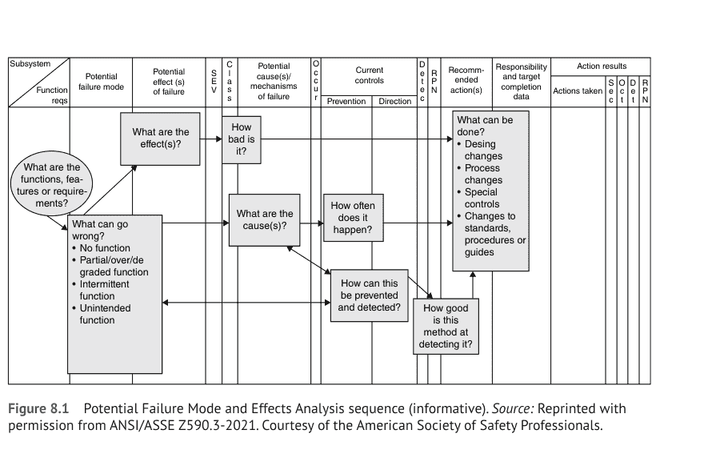

## 8.3 定义失效模式

对于使用FMEA及其他失效分析技术的人员而言，明确“失效模式”的含义至关重要。卡尔森将失效模式定义为“项目或操作未能满足或实现预期功能及相关要求的方式”（Carlson 2012）。对于每一次FMEA工作，其范围应包括在待分析系统的背景下对失效模式的清晰定义。根据所建立的定义，失效的示例可能包括：未能在规定限值内执行；性能不足或不佳；性能间歇或不稳定；以及非预期或不期望的功能。

ANSI Z590.3将失效模式定义为“观察到的失效或执行不正确的情况”。该标准进一步描述了失效模式的考虑因素如下：

> 应考虑可能导致危险情况的各种可能的失效模式，包括对设施、材料和设备的合理可预见的使用和误用。应识别可能发生的、会导致不良事件或暴露发生的可信情况。需确定这种情况在何种方式及何种条件下可能造成危害。

针对每一项功能，需识别所有潜在的失效模式。每个失效模式应独立于其他失效模式进行考虑，并进行充分描述，以便FMEA团队能够确定其原因。

## 8.4 风险描述考量

FMEA技术旨在识别失效及其导致的风险暴露，这使得风险描述符和评分系统对于有效的分析至关重要。许多风险等级评分模型可供选择，从基础的双因素系统到更复杂的、包含四个或更多变量的风险因素系统。FMEA及其他风险评估中常用的风险描述符包括：

-   后果严重性 (S)
-   发生概率 (O)
-   暴露频率 (E)
-   失效可检测性 (D)
-   预防有效性 (PE)
-   风险优先数 (RPN)

ANSI Z590.3 *通过设计预防* 标准提出了一个双因素评分系统，包含后果严重性和发生概率的风险代码。后果严重性评级 (S) 被描述为对与危险相关的事件或暴露可能合理造成的伤害或损害程度的估计。发生概率 (O) 评级基于潜在失效或危险事件发生的可能性。ANSI Z590.3标准将概率定义为“对在选定的时间单位、事件、人群、物品或活动范围内，可能导致伤害或损害的事件或暴露发生可能性的估计”。在某些FMEA表格中，发生和概率可互换使用。

在许多FMEA模型中，第三个因素“失效可检测性”(D) 被用于风险等级评分系统。可检测性评级基于对潜在失效在发生前被检测到的难易程度的估计。在其他分析危险控制措施的应用中，则使用“预防有效性”(PE) 来替代可检测性。PE是对控制措施在控制失效及其影响方面的有效性的估计，并根据ANSI Z590.3及其他安全标准中的控制层级模型确定。PE代码可能更受青睐，因为它与ANSI Z590.3标准中的“通过设计预防”概念紧密契合。

如ANSI Z560.3所述，风险优先数 (RPN) 是通过将失效后果、失效可能性以及问题检测能力的评级量表（通常在1到10之间）的数字相乘得到的临界性半定量度量。（如果失效难以检测，则其优先级更高。）

还有其他模型建议采用包含严重性、概率、暴露频率和可检测性的四变量评分系统。使用三因素和四因素风险系统应仔细考量。正如Manuele所指出的，四因素风险评分系统可能存在问题。Manuele提出了一个假设场景：一个显然不可接受的致命风险；然而，当应用四因素风险评分时，它却被评定为可接受。这是由于通过数学评分，其他三个因素稀释了严重性，使每个风险因素的权重为25%。在严重性、概率和暴露频率的三因素风险评分系统中，严重性因素在最终分数中也被“折扣”了。在包含三个因素的公式中，每个因素对最终风险分数的权重为33%，如下所示：

严重性 × 概率 × 暴露频率 = 风险

为了更准确地评估风险等级，Manuele建议严重性应获得50%的权重，以反映其对事件结果的影响，如下所示：

严重性 × (概率 + 暴露频率) = 风险

呈现高严重性、低概率风险的危险应受到非常仔细的审查。传统的安全绩效衡量指标侧重于事故/事件的数量以及事件率，如总案例率 (TCR)、离岗、限制和调岗 (DART) 案例率以及离岗工作 (DAFWII) 案例率。应特别关注潜在的低概率-高严重性后果案例，如死亡、重伤、财产损失或环境影响。

为了系统性地降低*高严重性/低概率事件*的可能性，有必要专注于预防措施，特别是风险控制措施或屏障的强度。风险专业人员本质上可以“借鉴”其他行业（如食品加工业，参见第15章）的理念和方法，并将其应用于自己的行业。例如，关键控制点 (CCP) 食品安全方法可用于评估非食品相关暴露中的高严重性/低概率风险。图8.2展示了一个改进的CCP决策模型示例。

可以建议使用CCP决策树方法或类似方法来评估所有高严重性危险。对于每个可能导致或具有潜在严重后果的程序/过程，首要考虑的是 (Q1) 是否存在针对已识别严重危险的控制措施。如果存在针对该严重危险的控制措施，则需评估其有效性 (Q2)。这涉及确定控制措施是否能够避免/消除危险或将发生风险降低到可接受水平。如果风险降低到可接受水平，则该步骤被视为“关键控制点”(CCP)，并纳入健康安全计划。如果控制措施未能充分降低发生风险，则需评估危险的严重性。如果已识别的危险不存在安全/健康/环境威胁，则它不是CCP，流程停止。然而，如果该程序/过程存在严重危险，则考虑后续步骤。如果不存在有效的后续步骤，则被评估的步骤被视为CCP，并在FMEA中通过注释或颜色编码加以标记。图8.3说明了所采取的CCP决策树流程步骤。

在制定FMEA风险等级评分系统时，应考虑使用如表8.1所示的、经ANSI/ASSP Z590.3标准许可转载的、带有数字分级的评级量表。结合严重性和概率值可产生一种简单而有效的风险等级评分方法。

> 作者提示：一些出版物和早期的军用标准建议，用于分配严重性、可检测性和发生概率评级的标准应基于10分制，而非5分制，以便更好地区分相对风险。当使用10分制时，风险优先数 (RPN) 计算 (RPN = S × O × D) 的结果将在0到1000之间。10分制创造了较大的范围，可能不适用于所有应用。对于大多数应用，5分制可能更为合适。

不同组织可能会根据客户或项目要求使用不同的评级量表；然而，重要的是要应用一致的评估评级标准。评级标准应标准化，以便较低的RPN值表示较低的风险水平。表8.1中使用了后果严重性和发生概率因素（风险等级 = 严重性 × 概率）的风险标准如下：极高风险（15或更高）；高风险（10–14）；中等风险（5–9）；低风险（1–4）。表8.2展示了经ANSI/ASSP Z590.3许可转载的、针对双变量和1-5评分矩阵（5×5模型）的风险评分行动。

如前所述，FMEA通常会添加第三个变量，如PE。对三个变量使用5分制风险评估量表将导致RPN在1到125之间。此计算如下所示：

风险优先数 = 严重性 × 概率 × 预防有效性

如图8.4所示，严重性、概率和预防有效性的评级量表和描述从1到5排列。数字越高，风险暴露越高。

可以使用简单的数学推导来得出表8.3中提供的、针对三变量和1-5评分矩阵（5×5×5）的风险评分行动。

### CCP决策树表格

| 产品或过程名称： | | | | | | |
| :--- | :--- | :--- | :--- | :--- | :--- | :--- |
| 制定者： | | | | | | |
| 日期： | | | | | | |
| 过程/步骤 | 高严重性 - 低概率危险 | Q1a. 是否存在针对已识别危险的预防措施？ | Q1b. 此步骤的控制对于安全是否必要？ | Q2. 此步骤是否消除或将危险的可能发生降低到可接受水平？ | Q3. 是否可能发生超出可接受水平的额外危险，或这些危险是否会增加到不可接受水平？ | Q4. 后续步骤是否消除或将可能的发生降低到可接受水平？ | CCP编号 |
| | | 如果否--转到Q1b。 | 如果否--不是CCP。 | 如果否--转到Q3。 | 如果否--不是CCP。 | 如果否--是CCP。 | |
| | | 如果是--转到Q2 | 如果是--修改步骤、过程或产品并返回Q1a。 | 如果是--转到Q4。 | 如果是--不是CCP。 | | |

图8.2 改进的CCP决策模型。

## 8.5 FMEA 流程步骤

FMEA 方法在军用和民用标准中均有详细描述，可应用于军用和民用项目及产品。顾名思义，FMEA 将一个系统分解为各个组成部分，然后系统地分析每个组件可能发生的各种故障方式，以及每种故障对系统的影响。

在 SEMATECH 文档《失效模式与影响分析（FMEA）：半导体设备行业持续改进指南》中，提供了一个很好的 FMEA 流程示例。该文档包含在半导体制造设备设计阶段使用 FMEA 的指南，以确保其可靠性。文档中列出的基本流程步骤包括：(i) FMEA 前提条件；(ii) 功能框图；(iii) 失效模式分析及工作表准备；(iv) 团队评审；以及 (v) 纠正措施。图 8.5 中的流程图展示了 FMEA 的流程步骤示例，该示例摘自《失效模式与影响分析（FMEA）：半导体设备行业持续改进指南》，SEMATECH 技术转让 #92020963B-ENG。经许可转载。

以下步骤总结了 FMEA 流程。需要注意的是，FMEA 工作表可以*按列*完成，依次输入所有功能、失效模式，然后是所有影响；或者*按行*完成，依次完成每一行，列出一个功能、一个失效模式、一个影响、一个原因和一个控制措施。

1)  **建立背景** – 与所有风险评估工作一样，需要为 FMEA 确定具体的目的、范围和限制。FMEA 背景将包括项目目的、待分析的系统或功能、项目时间框架、所需资源，以及要使用的风险矩阵、风险标准和定义。

2)  **选择 FMEA 团队** – 选择一个经验丰富、合格的团队和协调员来执行 FMEA。团队应是跨学科的，包括来自安全与风险管理、业务管理、会计、采购、工程、生产、质量保证、人力资源、员工等领域的人员。正如 ISO 45001、ANSI Z10 和 OSHA 的过程安全管理标准所建议的，团队还应包括参与运营的员工，因为他们更熟悉运营的变异性及局限性。这有助于增强必须执行计划的人员的主人翁意识。风险评估团队可能需要外部专家的协助，这些专家需了解与产品和过程相关的潜在化学、物理、生物或人机工程学危害。然而，完全由外部资源开发的 FMEA 可能不准确、不完整，并且在本地层面缺乏支持。此外，团队成员应至少对 FMEA 有所了解。团队负责人或协调员应是一位具有系统安全知识和各种风险评估技术经验的专业人士。

3)  **收集数据** – 团队收集相关文件和参考资源，包括系统或类似系统的描述、操作程序、设计规范、图表和图纸、损失历史、经验教训以及其他可能有助于识别失效模式和影响的可用数据。应收集并审查先前进行的初步危险清单（PHL）、初步危险分析（PHA）或其他危险分析。

4)  **输入过程功能** – 在审查数据并确定主要功能后，按顺序将待分析的过程步骤或功能输入到第 1 列（参见图 8.6 FMEA 示例）。这可能包括对研究系统各部分的简要描述，这些部分可分解为过程、层级或任务。

5)  **识别失效模式** – 从列出的第一个功能开始，将所有已识别的失效模式及其原因列在“潜在失效模式”第 2 列中。评估现状涉及识别与该功能相关的潜在失效或安全问题。

图 8.3 CCP 决策树流程图。

表 8.1 5 点风险评估矩阵示例。

| 严重性等级及分值 | 不太可能 (1) | 很少 (2) | 偶尔 (3) | 可能 (4) | 频繁 (5) |
|---|---|---|---|---|---|
| 灾难性 (5) | 5 | 10 | 15 | 20 | 25 |
| 严重 (4) | 4 | 8 | 12 | 16 | 20 |
| 边缘 (3) | 3 | 6 | 9 | 12 | 15 |
| 可忽略 (2) | 2 | 4 | 6 | 8 | 10 |
| 不显著 (1) | 1 | 2 | 3 | 4 | 5 |

极高风险：15 分或以上；高风险：10–14 分；中等风险：6–9 分；低风险：1–5 分。
来源：经 ANSI/ASSP Z590.3-2011 许可转载。由美国安全专业人员协会提供。

表 8.2 5 × 5 矩阵风险评分表。

| 风险等级 5 × 5 | 最小值 | 最大值 | 类别 | 风险分值行动 |
|---|---|---|---|---|
| 极高风险 | 15 | 25 | 极高风险： | 15 分或以上 – 不允许操作。需立即采取行动 |
| 高风险 | 9 | 14 | 高风险： | 10–14 分 – 补救措施应给予高优先级。 |
| 中等风险 | 5 | 8 | 中等风险： | 6–9 分 – 应在适当时间采取补救措施。 |
| 低风险 | 1 | 4 | 低风险： | 1–5 分 – 补救措施可酌情决定。 |

来源：经 ANSI/Z590.3-2011 许可转载。由美国安全专业人员协会提供。

图 8.4 严重性、发生概率和预防有效性评级量表示例。

| 严重性： | 发生概率/发生频率， | 预防有效性： |
| :--- | :--- | :--- |
| 1-5 分制。其中： | 1-5 分制。其中： | 1-5 分制。其中： |
| 1-不显著 | 1-不太可能 | 1.避免、消除、替代； |
| 2-可忽略 | 2-很少 | 2.工程控制； |
| 3-边缘 | 3-偶尔 | 3.警告、管理控制； |
| 4-严重 | 4-可能 | 4.个人防护装备（PPE）； |
| 5-灾难性 | 5-频繁 | 5.无 |

| 建议评分方法 | | |
| :--- | :--- | :--- |
| **事件或暴露严重性描述** | | |
| **灾难性 (5)** | 一人或多人死亡，系统完全损失，化学品泄漏造成持久的环境或公共卫生影响。 | |
| **严重 (4)** | 致残性伤害或疾病，重大财产损失和业务停机，化学品泄漏造成临时性环境或公共卫生影响。 | |
| **边缘 (3)** | 需要医疗处理或限制工作，子系统轻微损失或损坏，化学品泄漏触发外部报告要求。 | |
| **可忽略 (2)** | 仅需急救或轻微医疗处理，设备或设施非严重损坏，化学品泄漏需要常规清理但无需报告。 | |
| **不显著 (1)** | 在伤害或疾病、系统损失或停机、或环境化学品泄漏方面无关紧要。 | |
| **事件或暴露发生概率描述** | | |
| **频繁 (5)** | 可能反复发生。 | |
| **可能 (4)** | 可能会发生数次。 | |
| **偶尔 (3)** | 可能间歇性发生。 | |
| **很少 (2)** | 可能发生，但极少。 | |
| **不太可能 (1)** | 不太可能，可假设事件或暴露不会发生。 | |
| **预防有效性** | | |
| **差 (5)** | 无 | |
| **低 (4)** | 个人防护装备（PPE） | |
| **中等 (3)** | 警告、管理控制 | |
| **较好 (2)** | 工程控制 | |
| **最佳 (1)** | 避免、消除、替代、最小化、简化 | |

表 8.3 5 × 5 × 5 模型风险评分表。

| 风险等级 5 × 5 × 5 | 最小值 | 最大值 | 类别 | 风险分值行动 |
| :--- | :--- | :--- | :--- | :--- |
| 极高风险 | 75 | 125 | 极高风险： | 75 分或以上 – 不允许操作。需立即采取行动 |
| 高风险 | 45 | 74 | 高风险： | 45–74 分 – 补救措施应给予高优先级。 |
| 中等风险 | 20 | 44 | 中等风险： | 20–44 分 – 应在适当时间采取补救措施。 |
| 低风险 | 1 | 19 | 低风险： | 1–19 分 – 补救措施可酌情决定。 |

162 | 8 失效模式与影响分析

图 8.5 FMEA 流程。来源：《失效模式与影响分析（FMEA）：半导体设备行业持续改进指南》，SEMATECH 技术转让 #92020963B-ENG。经许可转载。

3.4.1 FMEA 前提条件

3.4.2 功能框图

3.4.3 失效模式分析及工作表准备

3.4.4 团队评审

3.4.5 纠正措施

图 8.6 失效模式与影响分析示例。

| 过程： | 操作： | 编制人： |
|---|---|---|
| | | 日期： |
| 1 | 2 | 3 | 4 | 5 | 6 | 7 | 8 | 9 | 10 | 11 | 12 | 13 | 14 | 15 | 16 | 17 |
| 过程功能 | 潜在失效模式 | 失效的潜在影响 | 严重性 | 失效的潜在原因 | 发生频率 | 现有控制措施 | PE | 严重性 + 发生频率 | RPN | 所需行动 | 责任方 | 结果 | 严重性 2 | 发生频率 2 | PE 2 | RPN 2 |

6) **识别影响** – 对于每种失效模式，所有潜在影响均列在“潜在失效影响”栏（第3列）。这涉及对失效或暴露可能导致的潜在危害和风险进行深入审查。

7) **确定严重性** – 使用所选的后果严重性风险标准，对每种失效影响的估计严重性等级进行评级，并输入到“严重性”栏（第4列）。

8) **识别失效原因** – 对于每种潜在失效模式，识别可能导致失效的原因或失效条件，并列在“潜在失效原因”栏（第5列）。

9) **确定发生概率** – 对于每个原因，评估其发生概率并记录在“发生概率”栏（第6列）。发生可能性根据既定的发生概率风险标准确定。

10) **识别现有控制措施** – 对于每个原因，团队识别现有控制措施并记录在“现有控制措施”栏（第7列）。

11) **确定PE** – 团队根据控制层级评估现有控制措施的有效性，并在第8列分配PE评级。

12) **输入严重性和发生概率评级** – 将第4列的严重性评级和第6列的发生概率评级相结合（或相乘，具体取决于所选的风险矩阵和标准），产生风险评级，输入到“严重性 + 发生概率”栏（第9列）。

13) **计算RPN** – 将第8列的PE评级和第9列的风险评级相结合（或相乘），产生初始RPN，输入到第10列。

14) **附加控制措施** – 对于RPN高于可接受风险水平的情况，需要采取附加控制措施。使用控制层级模型，选择适当的控制措施并输入到“所需行动”栏（第11列）。对于每项选定的附加控制措施，确定其实施的适当责任方并记录在“责任方”栏（第12列）。

15) **验证结果** – 在实施附加控制措施后，对过程功能进行审查，以确保没有产生额外的危害，并且控制措施按预期有效。这些结果输入到“结果”栏（第13列）。

16) **重新评估严重性** – 在附加控制措施实施并验证后，重新评估严重性等级并输入到“严重性2”栏（第14列）。

17) **重新评估发生概率** – 在附加控制措施实施并验证后，重新评估发生概率等级并输入到“发生概率2”栏（第15列）。

18) **重新评估PE** – 在附加控制措施实施并验证后，重新评估预防有效性并输入到“PE 2”栏（第16列）。

19) **重新计算RPN** – 在附加控制措施实施并验证后，将调整后的严重性、发生概率和PE等级相结合，产生第二个RPN，输入到“RPN 2”栏（第17列）。

## 8.6 实际应用

具体而言，危害被识别并记录在“过程操作、功能或目的”栏中，以便评估这些危害产生的风险，并确定其是否可接受。危害包括产生风险的技术、人为因素和活动的所有方面。危害可以是物理的、生物的、化学的、机械的、心理社会的等；风险可以集中在工人的健康与安全、财产或环境上。

图8.7中的示例是一个FMEA，用于评估混凝土施工中进行钢筋作业时的潜在危害。美国国家职业安全卫生研究所评估了钢筋工（钢筋绑扎工）在高速公路桥梁上绑扎钢筋（rebar）时，患腰背部和手部疾病的风险水平（美国国家职业安全卫生研究所，2009年）。

| 过程操作、功能或目的 | 潜在暴露模式 | 潜在暴露影响 | 严重性 | 潜在暴露原因 | 发生概率 | 当前控制措施评估方法 | PE | S x O | RPN |
| :--- | :--- | :--- | :--- | :--- | :--- | :--- | :--- | :--- | :--- |
| 混凝土加固。使用钳子进行钢筋绑扎。 | 腰背部肌肉骨骼疾患 | 腰背部损伤 | 4 | 缺乏控制措施 | 4 | 培训 | 3 | 16 | 48 |
| 混凝土加固。使用钳子进行钢筋绑扎。 | 肩部、颈部肌肉骨骼疾患 | 肩部/颈部损伤 | 3 | 缺乏控制措施 | 3 | 培训 | 3 | 9 | 27 |
| 混凝土加固。使用钳子和扎线轮拉、缠、拧和剪断围绕两根或多根混凝土钢筋的“扎线”。 | 手部/手腕/手指肌肉骨骼疾患：握钳时手、腕和前臂的快速重复性动作。 | 手部/手腕/手指损伤。 | 4 | 缺乏控制措施 | 3 | 培训。 | 3 | 12 | 36 |

图8.7 FMEA危害分析示例。

危害的三个主要潜在影响是腰背部、肩部/颈部和手部/手腕/手指损伤。潜在影响记录在FMEA表格中。潜在损伤的严重性评级已正确输入表格。潜在暴露原因也已记录，发生概率/可能性等级输入到OCC栏。识别了当前控制措施，PE评级输入到PE栏。在此案例中，培训在PE量表上被评为五分之三。风险等级（S×O）在FMEA工具中自动计算。RPN也是自动计算的。在此案例中，腰背部损伤的RPN最高，建议实施潜在的预防措施。

下一步从识别当前状态初始风险评估中识别的危害的解决方案开始。考虑安全设计概念来评估和选择可能的解决方案以进行持续分析。一个可能的解决方案，如美国国家职业安全卫生研究所研究人员所建议的，是使用电动工具。建议输入在图8.8所示的扩展FMEA表格的右侧。

应注意，严重性评级保持不变。由于暴露（弯腰姿势）时间减少，概率/发生概率略有降低。对于潜在的腰背部、肩部/颈部损伤，PE保持不变。然而，由于实施了新的控制措施（新工具），潜在的手部/手腕/手指损伤的PE从三降至二。在采取初步纠正和预防措施后，应重新计算初始RPN。这应在FMEA表格的右侧记录。

不幸的是，我们腰背部损伤的最高RPN没有降低到足够低的水平。研究人员建议使用带有可调节延长杆的MAX-USA RB-392电动工具进行钢筋绑扎。因此，我们将使用建议的新控制措施（可调节延长杆）重新计算RPN。改进后的未来状态FMEA如图8.9所示。

| 过程操作、功能或目的 | 潜在暴露模式 | 潜在暴露影响 | 后果 | 潜在暴露原因 | 可能性 | 当前控制措施/执行方法 | PE | S x O | RPN | 建议行动 | 负责区域/个人及完成日期 | 行动结果已采取行动 | 严重性2 | 发生概率2 | PE 2 | RPN 2 |
| :--- | :--- | :--- | :--- | :--- | :--- | :--- | :--- | :--- | :--- | :--- | :--- | :--- | :--- | :--- | :--- | :--- |
| 混凝土加固。使用钳子进行钢筋绑扎。 | 腰背部肌肉骨骼疾患 | 腰背部损伤 | 4 | 缺乏控制措施 | 4 | 培训 | 4 | 16 | 64 | 工具设计变更 | 管理层 | 暴露略有减少 | 4 | 3 | 4 | 48 |
| | 肩部、颈部肌肉骨骼疾患 | 肩部/颈部损伤 | 3 | 缺乏控制措施 | 3 | 培训 | 4 | 9 | 36 | | | 暴露略有减少 | 3 | 2 | 4 | 24 |
| 混凝土加固。钳子是一种坚韧的钢制工具，用于拉、缠、拧和剪断围绕两根或多根混凝土钢筋的“扎线”。 | 手部/手腕/手指肌肉骨骼疾患。握钳时手、腕和前臂的重复性动作。 | 手部/手腕/手指损伤。 | 4 | 缺乏控制措施 | 3 | 培训。 | 4 | 12 | 48 | MAX-USA RB-392电动工具。 | 管理层 | 暴露/概率降低 | 4 | 2 | 2 | 16 |

图8.8 FMEA当前状态风险示例。

## 8.7 总结

FMEA适用于人、设备和系统故障模式，以及软件、硬件或流程。它还以系统化且易于阅读的格式呈现故障模式、原因和影响，并突出显示最高的风险优先级数。
FMEA依赖专业判断和半定量方法来评估危害的重要性，并为每项任务或流程分配等级。利用FMEA有助于优先考虑降低风险的建议。
FMEA足够灵活，可适用于任何流程、新产品设计或系统。FMEA可在项目设计阶段早期用作高层级分析，或用于对低层级流程或系统进行详细的风险评估。
分析的质量主要取决于团队成员的知识、文档的质量和可用性、安全负责人的专业知识以及组织的管理。

## 复习题

1.  描述FMEA的目的。
2.  总结FMEA方法的历史发展。
3.  列举你最喜欢的将FMEA作为安全风险评估方法的应用场景。
4.  解释FMEA如何用于质量风险评估。
5.  对FMEA风险评估中使用的评分系统进行分类。
6.  区分完成FMEA的两种方式（按列和按行）。
7.  简要说明FMEA的优点。

## 参考文献

ANSI/ASSP Z590.3-2021 (2021). *通过设计预防：在设计和再设计过程中处理职业危害和风险的指南*. Des Plaines, IL: 美国安全专业人员协会.
ANSI/ASSP/ISO/IEC 31010-2019 (2019). *风险管理 – 风险评估技术*. Des Plaines, IL: 美国安全专业人员协会.
Carlson, C.S. (2012). *有效的FMEA – 使用失效模式与影响分析实现安全、可靠和经济的产品与流程*. Hoboken, N.J.: Wiley.
Ford Motor Company (2004). *失效模式与影响分析：FMEA手册（含稳健性链接）*. Dearborn, MI: 福特汽车公司，福特设计学院.
International Organization for Standardization. (2018). *ISO 31000 – 风险管理*. http://www.iso.org/iso/home/standards/iso31000.htm (访问于 2021年6月7日).
*失效模式与影响分析 (FMEA)：半导体设备行业持续改进指南*. (1992). Technology Transfer #92020963B-ENG. Albany, NY: SEMATECH. http://www.sematech.org/docubase/document/0963beng.pdf.
National Institute for Occupational Safety and Health. (2009). 减少钢筋工中与工作相关的肌肉骨骼疾病. http://www.cdc.gov/niosh/docs/wp-solutions/2010-103/pdfs/2010-103.pdf
U.S. Department of Defense. (1949). *MIL-P-1629 – 执行失效模式影响及危害性分析的程序*. http://www.assistdocs.com/search/document_details.cfm?ident_number=86479
U.S. Department of Defense. (1980). *MIL-STD-1629A – 执行失效模式、影响及危害性分析的程序*. https://src.alionscience.com/pdf/MIL-STD-1629RevA.pdf (参考: http://www.fda.gov/Food/GuidanceRegulation/HACCP/ucm2006801.htm )

# 9 领结分析方法论

Georgi Popov¹ 和 Bruce Lyon²

¹ 中密苏里大学
² Brown & Brown

### 目标

-   引言、历史与概述
-   回顾故障树分析、事件树分析和领结分析方法论
-   提供领结方法论的使用指南
-   探讨领结方法论的应用、优势与局限性

## 9.1 引言

领结分析是一种相对较新且简单的工具，用于分析和沟通特定危害情景中的风险路径和控制措施。它是众多可用于协助风险识别和管理的“屏障型”风险模型之一。“领结”之名源于分析中创建的图表形状。
领结图的一个好处是，它能在一张图中概述多个合理的情景及相关控制措施和后果，而这些内容若用其他方式解释则会很困难。它有助于利益相关者识别、评估和沟通特定情景下选定危害的现有控制措施。美国国家标准协会采用的国际标准化组织（ISO）31010国家标准ANSI/ASSP/ISO 31010-2019《风险管理 – 风险评估技术》将领结分析描述为“从事件原因到其后果的路径的图形化描述”。
本章将演示领结方法的使用及其在职业安全健康风险评估和风险降低干预措施中的应用。将介绍简单的案例研究、该方法更具创新性的实际应用，以及这一多功能工具的实际示例和益处。

## 9.2 历史

领结分析的起源尚不清楚；然而，最早有记录的应用之一可在1979年澳大利亚昆士兰大学关于HAZAN（危害分析）的讲座课程笔记中找到（Gill 1979; Gower-Jones et al. 1996）。

风险评估：评估运营风险的实用指南，第二版。
Georgi Popov, Bruce K. Lyon, and Bruce Hollcroft.
© 2022 John Wiley & Sons, Inc. 由John Wiley & Sons, Inc.于2022年出版。

在1988年Piper Alpha平台灾难之后，石油和天然气行业面临着巨大压力，需要在其运营的系统性危害分析和风险评估方面付出更多努力。因此，领结方法论开始出现。荷兰皇家壳牌集团是最早将领结分析有效融入其业务实践的全球公司之一。领结方法成为荷兰皇家壳牌集团分析和管理风险的公司标准，并很快被业内其他公司采用。此后，领结方法已扩展到石油和天然气行业之外，被航空、医疗保健、军事/国防、采矿、化工、海事、金融分析等行业使用。

包括英国、法国、澳大利亚、新西兰、欧洲航空业和美国联邦航空管理局在内的多个政府和行业协会已发布了领结分析的示例。

人们很快认识到领结图的一个好处是，它提供了流程或系统的“全景”视图，以有效解释风险暴露和控制措施。它能够提供易于理解的可视化，展示危害、主动和被动控制措施以及危害事件后果之间的关系，这使其成为重要的风险评估工具。

## 9.3 概述

领结分析方法论通过提供清晰的风险及其控制路线图来沟通风险。作为一种基于屏障的风险方法，领结方法遵循詹姆斯·里森的“瑞士奶酪”防御模型。在他的模型中，他阐述了屏障如何存在弱点和缺口，在特定情况下这些弱点和缺口可能对齐，从而允许危害暴露发生，就像瑞士奶酪中的孔洞一样。如果升级因素导致屏障减弱并对齐形成孔洞，危害就可能穿透防御并造成伤害。

领结方法的独特之处在于它结合了简化的故障树分析（FTA；领结图的左侧）来分析危害情景或事件（中心结）的成因；以及简化的事件树分析（ETA）来分析由此产生的后果（右侧）。分析的重点是原因与风险之间的屏障或控制措施，以及风险与由此产生的后果之间的屏障或控制措施。图9.1提供了领结分析路径的视觉布局。

领结分析清晰易懂地展示了防止危害原因的现有“屏障”，以及在危害事件发生时减轻或降低后果严重性的“应对”措施。此类图表展示了危害、预防屏障、风险、缓解控制措施和后果之间的关键联系。此外，预防和缓解措施可以与任务、程序、责任人和系统相关联。

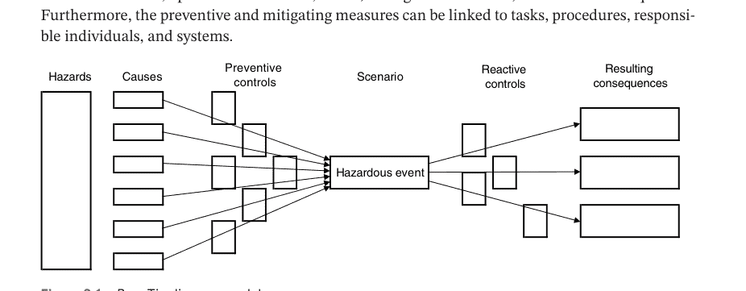

### 9.3.1 故障树分析

如前所述，领结图通常由左侧（顶事件之前）的简化故障树分析和右侧的简化事件树分析组成。

简要描述一下，故障树分析是一种用于识别和分析可能导致特定不良事件或“顶事件”的因素的方法。事件的因果因素通过演绎方式识别，以逻辑方式组织，并以树状图的形式直观呈现，该图展示了因果因素及其与顶事件的逻辑关系，如图9.2所示。故障树分析中识别的因素可以是与部件硬件故障、人为错误或任何其他导致不良事件的相关事件有关的事件。它使用表示故障、原因、“与门”和“或门”的基本符号。对于由多种原因组合导致的故障，使用“与门”。对于“单点故障”，使用“或门”。故障树分析主要用于操作层面和短期至中期问题。它可用于定性地识别导致顶事件的潜在原因和路径，或定量地计算顶事件的概率（ASSP TR 31010 2020）。

#### 9.3.1.1 故障树分析案例研究

图9.9展示了一个基于CSB关于PCA DeRidder造纸厂不可冷凝气体系统爆炸事件的改进故障树分析。最终报告及相关视频可在以下网址获取：https://www.csb.gov/packaging-corporation-of-america-hot-work-explosion-/

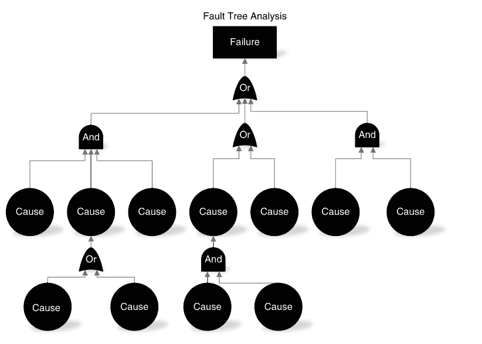

图9.2 简单的故障树分析图。

174 | 9 领结分析方法


图9.3 水面上不互溶油层的照片。

2017年2月8日星期三，大约上午11:05，位于路易斯安那州德里德的美国包装公司箱板纸厂的一个不可冷凝气体系统中的污冷凝液罐发生爆炸。爆炸造成3人死亡，7人受伤。所有10人当时均作为承包商在该厂工作。爆炸还严重损坏了周围的工艺设备。污冷凝液罐飞行了约375英尺，越过一栋六层楼的建筑，最终落在工艺设备上。事故发生时，该厂正在进行年度计划性维护停机，也称为停工。污冷凝液罐内可能含有水、水面上的一层易燃液体松节油，以及包含空气和易燃松节油蒸气的爆炸性蒸气空间。由于在爆炸前约三个月内未清除这层松节油，罐内可能积累了大量的松节油。图9.3展示了水面上不互溶油层的照片。该照片显示了油如何在水面上形成不互溶的液体层，类似于污冷凝液罐内松节油层可能呈现的样子（CSB 2018）。

尽管污冷凝液罐蒸气空间中存在一些氧气是正常的，但根据设计，罐内的可燃蒸气应保持在其爆炸极限之上，也称为其上限爆炸极限。存在的氧气应不足以支持燃烧。空气可能通过罐顶的真空泄放装置进入污冷凝液罐。在正常运行期间，自动控制系统持续循环罐内的液位，造成常规的低压期。这些低压条件通过真空泄放装置得到缓解，该装置将空气吸入罐内。在年度停机期间，随着罐内物料冷却，空气也可能进入罐内。这种冷却在罐内造成了另一种低压条件。这些空气进入的来源使得空气与松节油蒸气混合，从而在罐的蒸气空间中形成爆炸性混合物。

事故发生当天，支持年度停机工作的承包商在污冷凝液罐上方且已脱开（断开）的水管上进行了焊接（一种动火作业）维修。尽管不能完全排除其他可能的点火源，但这次动火作业似乎是可能的点火源。应当注意的是，在火灾和爆炸发生时，燃料（松节油）、蒸气空间中的氧气和点火源（可能是动火作业）同时存在。因此，可以使用“与门”故障树分析。为了实现顶事件（火灾和爆炸），火灾三角的所有三个组成部分都必须同时发生，如图9.4所示。

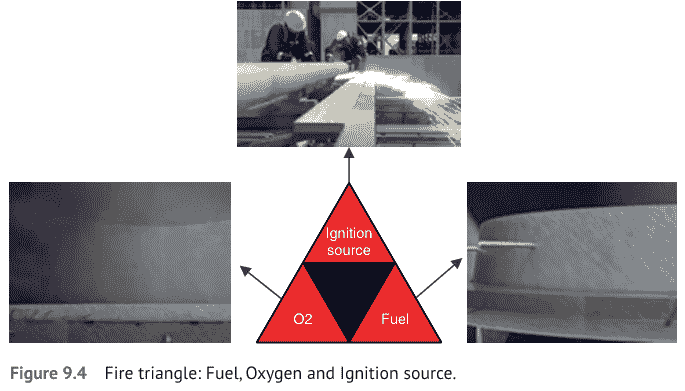

基于上述情景，可以将危害转移到故障树分析中。对于故障树的定量分析，可以使用所有基本事件的故障率数据、发生概率/可能性或故障频率，以及相关的修复/恢复率等。在这种情况下，可以添加概率评级的百分比估计值用于演示目的。例如，过量松节油的概率可估计为1%（$P = 0.01$）。由于动火作业，可以估计火花到达罐内可燃混合物的概率为10%（$P = 0.1$）。如果所有控制措施都有效，罐内不应有足够量的氧气。然而，由于蒸气冷却，泄放阀更可能添加了空气以避免罐内因低压产生的真空损坏。罐内足够氧气含量的概率可估计为1.5%（$P = 0.015$）。使用以下公式将概率相乘以估算火灾和/或爆炸的总概率：

总概率 = 0.01 * 0.1 * 0.015 = 0.000015

爆炸前可用的预防性屏障也可以添加到故障树分析中，包括：

- 1) 污冷凝液罐的松节油撇除系统（移除燃料源），如图9.5所示。
- 2) 压力真空破坏器，如图9.6所示，用于通过不允许足够量的新鲜空气进入罐内来维持低氧含量。
- 3) 动火作业许可证，如图9.7所示，用于避免产生点火源。

使用“与门”时，所有关联的控制措施必须同时失效才会导致系统故障。图9.8提供了带有概率计算的故障树分析“与门”示例。

不可冷凝气体在空气中可能具有可燃性，当与空气混合时，如果被限制在管道或容器内，可能具有爆炸性。造纸厂采用多种安全措施来防止不可冷凝气体爆炸，包括防止空气进入的密封件和阻止火焰传播并保护设备的阻火器。

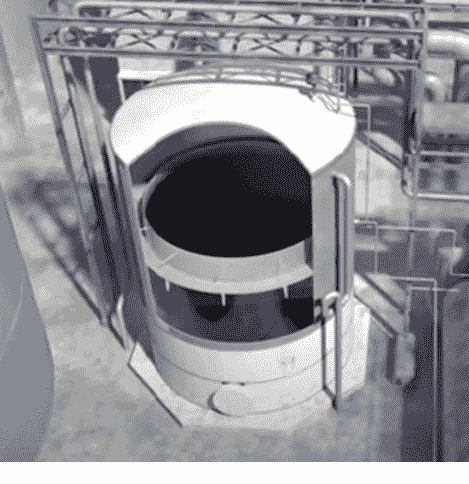

**图9.5** 污冷凝液罐的松节油撇除系统。

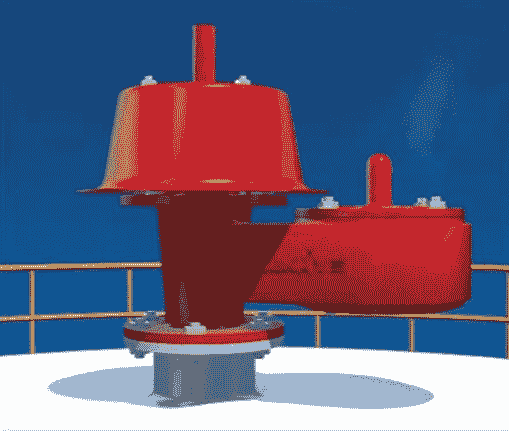

**图9.6** 压力真空破坏器。

德里德工厂应用了许多此类安全措施，包括压力真空破坏器和爆破片。为了防止爆炸，工厂必须将不可冷凝气体系统保持在爆炸范围之外。虽然以前的设计将不可冷凝气体保持在下限爆炸极限以下，但当前的做法是在收集浓缩不可冷凝气体的系统中将其保持在上限爆炸极限以上。浓缩不可冷凝气体是指浓度足够高、超过其上限爆炸极限的不可冷凝气体，这种浓度的可燃气体过于富集而无法燃烧。

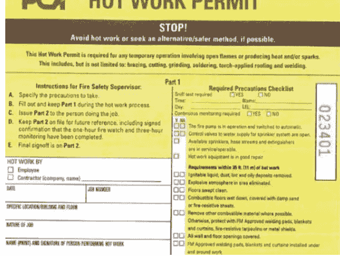

图9.7 动火作业许可证示例。

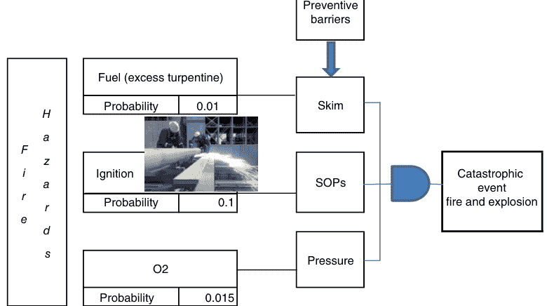

图9.8 火灾危害示例的故障树分析“与门”。

德里德工厂污冷凝液罐中的不可冷凝气体是浓缩不可冷凝气体，旨在过于富集而无法燃烧的条件下运行。为了将不可冷凝气体保持在其上限爆炸极限以上，公司必须设计这些系统以防止空气进入。为确保这一点，浓缩不可冷凝气体系统的所有部分都需要与大气密封。污冷凝液罐上安装了压力真空破坏器。如果容器经历超压事件，压力真空泄压阀向大气释放压力。如果容器经历负压事件，向右延伸的压力真空泄压器部分会将空气吸入容器。

空气很可能是通过储罐的压力真空泄压器进入的，这是设计如此，目的是在污冷凝液储罐液位波动期间缓解其经历的低压状况。内部压力降至真空泄压器设定压力（负六英寸水柱）以下。在工厂年度停工期间，额外的空气进入了污冷凝液储罐。由于储罐已被隔离，并且正在从其185°F的操作温度冷却，部分蒸汽发生了冷凝。空气的进入和液体的环境冷却使储罐内的气氛降至爆炸下限以下，形成了爆炸性气氛。

显然，PCA公司未对污冷凝液储罐进行风险评估；未有效分配或明确传达该储罐的任何运营组归属（风险沟通失败）；并且未在储罐上安装能够检测罐内蒸汽何时进入爆炸范围的仪表。因此，PCA公司既不了解松节油的积聚，也不了解罐内的空气侵入。由于缺乏了解罐内实际状况的能力，PCA公司既无法充分控制该工艺的危害，也无法向PCA DeRidder工厂的员工和承包商传达该储罐带来的风险。由于工厂无法监测储罐内的气氛，PCA公司本应将该单元作为易燃液体储罐来管理。此时，火三角中唯一缺失的部分是点火源。

在进行任何可能提供点火源的工作（如焊接或钎焊）之前，PCA公司要求其人员签发动火作业许可证。PCA工人在签发动火作业许可证之前，使用可燃气体探测器对周围工作区域进行了大气监测。PCA工人发现焊接现场周围的平台没有可燃蒸汽；然而，没有人检查污冷凝液储罐内部是否存在可燃气氛。工厂人员未意识到污冷凝液储罐内潜在的爆炸危险。因此，一旦大气监测完成，PCA安全协调员就为该工作签发了动火作业许可证。

DeRidder工厂工作人员采取的行动表明，人员试图使水管上的工作安全进行，但他们未能识别污冷凝液储罐内的爆炸危险。由于缺乏对污冷凝液储罐内工艺危害的适当了解，安全协调员和承包商无法实施确保此次维修工作安全所需的保障措施。（CSB视频和报告可在以下网址获取：https://www.csb.gov/packaging-corporation-of-america-hot-work-explosion-/）

不幸的是，所有预防屏障都失效了，后果是灾难性的。

### 9.3.2 事件树分析

事件树分析用于分析顶事件及其导致的后果。事件树分析是一种图形技术，它根据旨在改变后果的各种系统是否发挥作用，来表示在初始事件之后可能出现的互斥事件序列。该树可以量化，以提供不同可能结果的概率（见图9.9）。

该树从初始事件开始，然后为每个控制措施绘制线条，表示其成功或失败。可以通过专家判断、数据或单独的故障树分析为每个控制措施分配失败或成功的概率。这些概率是条件概率。例如，一个项目运行的概率不是在正常条件下测试获得的概率，而是在初始事件条件下运行的概率。不同结果的频率由各个条件概率与初始事件的概率或频率的乘积表示，前提是各种事件是独立的。在图9.10中，假设初始事件的概率为1。（ASSP TR 31010 2020）。

事件树分析可用于定性地帮助分析初始事件之后的潜在情景和事件序列，并探讨各种控制措施如何影响结果。它可以应用于组织的任何层级和任何类型的初始事件。定量事件树分析可用于考虑控制措施的可接受性以及不同控制措施对整体风险水平的相对重要性。定量分析要求控制措施要么工作，要么不工作（即，它不能考虑性能下降的控制措施），并且控制措施是独立的。

在一个假设情景中，有以下缓解措施可用：

- 1) 雨淋消防喷淋系统
- 2) 应急响应消防队

对于本案例，雨淋消防喷淋系统扑灭火灾的概率估计为70%（$P = 0.7$），财产损失相对较小。相反的情况是，雨淋消防喷淋系统未能扑灭火灾（$P = 0.3$），需要组织依靠消防队来扑灭火灾。如果他们能够扑灭火灾（$P = 0.2$），后果可能是重大的财产损失和/或人员住院。然而，如果消防队无法扑灭火灾（$P = 0.8$），并且该区域有员工在场——后果将是多人死亡、重伤等。在此案例中，概率计算是通过将所有概率估计值相乘得出的。死亡概率可计算如下：

$P_{fatalities} = 0.3 * 0.8 * 0.3 = 0.072$

### 9.3.3 领结图方法

领结图方法提供了危害情景及其与危害和原因、防止发生的屏障以及事件发生时减轻影响的缓解控制措施之间关系的全局概览。领结图分析的美妙之处在于它能够清晰、直观地展示危害如何被管理以及风险如何被降低。在绘制领结图时需要考虑的一些重要问题包括：

- 危害及其原因是什么
- 失去控制时会发生什么
- 潜在后果是什么
- 如何避免顶事件
- 如果事件发生，组织如何恢复
- 如何限制可能性和/或严重性
- 控制措施可能如何失效或有效性如何降低
- 如何防止控制措施失效

领结图分析可用于定性、半定量和定量地展示控制措施、对策和风险降低措施，并可应用于许多行业、服务和业务领域。该方法可作为运营风险管理体系的重要组成部分，并纳入制定有效的职业安全健康干预措施商业案例中。领结图分析的一些优势总结如下：

- 该方法直观地展示了危害、其原因和后果，以及最小化风险的控制措施。
- 它易于理解，并清晰地呈现了问题的图形表示。领结图可以被各级人员轻松理解，从高级管理人员、工程师和运营人员，到监管机构、一线主管和受过培训的工人。
- 领结图展示了全局情况，可以捕捉过去的事件以及职业安全健康干预后危害、控制措施和后果的未来状态。
- 修改后的领结图可以增加另一层复杂性，并更好地可视化危害和后果的严重性和可能性。
- 修改后的领结图方法可以确定应将资源集中在何处以降低风险。
- 该方法有可能减少职业安全健康危害分析的时间和范围，并可能导致不必要的/不太重要的屏障减少。
- 该方法可以说明当前到位的控制措施层次（当前状态）以及对额外“保护层”的需求。
- 领结图可以将组织管理体系的要素与具体控制措施之间的联系可视化，并为持续改进和未来的职业安全健康干预提供平台。
- 领结图方法提供了一种逻辑化和结构化的方法，以考虑风险管理的各个方面和潜在的风险降低领域。
- 该方法也可用于识别其他风险评估技术遗漏的差距和问题。
- 领结图也可用于期望的结果。

尽管领结图分析有诸多优势，但在选择适当的危害分析和风险评估技术时，也存在一些需要考虑的局限性。其中一些局限性包括：

- 执行领结图方法可能非常耗时。特别是，如果必须计算概率。
- 传统的领结图分析通常仅限于定性措施。
- 一个常见的误解是领结图通常无法描绘多个危害或暴露同时发生的情况；因此，它在应对此类危害和暴露的潜在协同效应方面效果不佳。然而，这一说法可能存在争议。ISO 31010甚至指出，领结图分析不能用于与门故障树分析的情况。例如，多种化学品暴露，观察到对呼吸系统的协同效应。作者将在第12章演示这一概念。
- 该方法有时可能过度简化复杂情况，特别是在尝试量化时。
- 如果目的是对预防控制措施之间的复杂关系进行建模，则需要额外的风险评估方法。

#### 9.3.3.1 构建蝴蝶结图

要构建蝴蝶结图，需将故障树分析（FTA）和事件树分析（ETA）以水平布局结合，将顶事件置于蝴蝶结的中心或结点处。FTA位于蝴蝶结左侧，包含预防措施；ETA位于右侧，包含缓解措施。一些经验不足的风险评估人员会在事件两侧都包含缓解措施；然而，重要的是要理解，左侧（FTA）的措施旨在防止事件发生，而右侧（ETA）的措施旨在减轻后果的影响。上述场景的蝴蝶结图示例如图9.11所示。

以下是进行常规蝴蝶结分析的步骤。

1.  **选择危险场景** – 选择一个单一的危险场景或“顶事件”，即对危险的控制失效的情况，进行分析并置于蝴蝶结图的中心结点。选择基于对组织而言重大且合理的最坏情况场景。出于分析目的，所选顶事件应明确定义，包括事件描述、涉及的系统和过程、发生的时间地点以及相关要素。
2.  **识别危险** – 识别可能导致所选危险场景的危险，并列在蝴蝶结图的最左侧。常规的蝴蝶结分析不包含量化危险带来的风险或业务风险/后果的选项。因此，识别纳入分析的重大且合理的危险非常重要。有多种危险识别方法可用，包括头脑风暴、检查表、初步危险分析（PHA）、失效模式与影响分析（FMEA）、危险与可操作性研究（HAZOP）、假设分析与检查表方法以及风险评估矩阵（RAM）等。可以使用类似的工具和方法来识别和记录危险，进行半定量风险评估，并将结果纳入蝴蝶结图。
3.  **识别原因** – 对于每个危险，识别可能导致该危险场景的潜在原因（也称为触发因素或威胁）。触发机制可以是单一的或多重的，需要经验丰富的团队成员进行一定程度的研究、审查和头脑风暴，以充分识别相关原因。原因列在图表左侧的第二列。
4.  **将原因与危险场景关联** – 为了将危险原因与场景连接起来，从每个原因向危险场景画一条线，形成蝴蝶结的左侧。
5.  **识别升级因素** – 将可能升级危险和/或降低现有控制措施有效性的条件、因素或失效模式添加到图表中的危险关联中。识别仅那些真正存在弱点并可能升级危险的潜在失效模式需要进行判断。
6.  **识别预防性控制措施** – 识别为每个危险设计的、旨在*防止*危险发生的现有预防性控制措施，并将其添加到图表中原因与场景之间。预防性控制屏障被认为是“主动”控制，旨在防止导致危险场景的危险暴露或释放。预防性控制措施的示例可能包括：冲压机上的机器防护罩以防止接触操作点；氧气还原系统以防止火灾；动火作业许可系统以防止焊接时引发火灾；以及化学储罐周围的混凝土护柱以防止叉车损坏。
7.  **识别后果** – 识别场景可能导致的潜在后果，并列在蝴蝶结图的右侧。画线从事件场景辐射到每个潜在后果。潜在后果被定义为在没有任何缓解控制措施的情况下可信的最坏情况影响。后果应定义为代表特定有害结果，该结果本应由现有的一系列安全措施所防止。

危险：火灾
燃料（过量松节油）
概率 0.01

点火源
概率 0.1

氧气
概率 0.015

预防屏障
撇除
标准操作程序
压力

灾难性事件 火灾与爆炸

缓解措施
自动喷水灭火系统扑灭火灾
否 0.3
是 0.7

消防队扑灭火灾
否 0.8
是 0.2

区域内有员工
是 0.3
否 0.7

后果
死亡 0.072
重大财产损失 0.06
轻微财产损失

图9.11 蝴蝶结分析示例。

8.  **识别缓解性控制措施** – 识别针对特定危险暴露的现有缓解性控制措施，并将其放置在场景与后果之间的辐射线上。这些控制措施本质上被认为是“被动”的，用于防护或响应已暴露的危险，以减轻后果的严重性。缓解性控制措施的几个示例可能包括：消防抑制/喷淋系统以减缓火灾蔓延；二次围堵以控制液体化学品泄漏或释放；应急响应计划；以及防坠落系统以减轻个人坠落时的伤害严重程度。
9.  **识别控制影响因素** – 识别管理、工程、运营或维护活动对现有“主动”和“被动”控制措施的影响，并在蝴蝶结图下方显示，链接到相应的控制措施。例如，机器联锁控制会链接到工程；能量隔离和锁定程序链接到维护；操作员培训链接到运营或管理活动。

常规的蝴蝶结分析是一种定性工具；然而，如果路径独立、控制可靠且后果概率已知，则可以进行一些量化。对于路径和控制不独立，或控制有效性未知的情况，量化效果较差。

## 9.4 实际应用

蝴蝶结分析主要关注控制因素：用于防止事件发生的预防性控制或屏障；以及在事件发生时减轻影响的缓解性控制。通常需要使用多种风险评估工具来识别、分析、评估、控制和沟通风险。蝴蝶结图是此类过程中的一个有用组成部分，它清晰地可视化了危险、控制措施和后果之间的路径。在简单系统中，蝴蝶结分析本身可能就足够了。在更复杂的事件中，可能需要多种危险分析和风险评估工具，如下案例研究所示。

### 9.4.1 案例研究 #1 – 喷漆操作

制造工厂的喷漆操作在油漆稀释和清洁过程中使用易燃液体溶剂。溶剂储存在55加仑的桶中，放置在喷漆房附近，并定期分装到较小的敞口容器中。该溶剂是100%苯，闪点为-11°C（12°F），爆炸下限为1.2%，爆炸上限为7.8%，使其具有高度挥发性和易燃性。处理该材料时，静电积聚产生的潜在点火源可能造成危险状况。为最小化此危险，需要进行搭接和接地，但这本身可能不足。健康危害也是一个重大关切，其允许暴露限值较低，包括美国政府工业卫生学家会议（ACGIH）短期暴露限值2.5 ppm，ACGIH时间加权平均值（TWA）0.5 ppm，以及OSHA TWA 1 ppm。

喷漆房案例研究中使用的危险分析和风险评估工具序列如图9.12所示。

步骤1. 识别危险、原因和控制措施 – 为初步识别危险、其原因和现有控制策略，使用了PHA（第6章）。使用头脑风暴会议、检查表或其他危险识别技术来识别特定危险、其潜在影响、受影响的工艺步骤和业务单元以及现有控制措施。图9.13中的以下PHA展示了喷漆房案例研究。

## 9.4 实际应用

图9.12 风险评估序列示例。

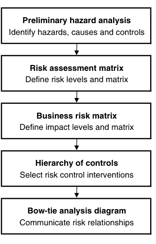

步骤2. 定义风险等级 – 为定义评估中使用的操作风险因素和等级，需选择一个具有特定风险描述的风险评估矩阵。图9.14展示了来自ANSI Z590.3-2011 (R2016) PtD标准的一个传统双因素风险评估矩阵（严重性等级 × 发生概率）。（注：也存在其他选项，包括三个或更多风险因素系统，这些系统通常用于失效模式与影响分析中，以产生风险优先数 [RPN]。）以下风险描述改编自ANSI Z590.3。

### 后果严重性等级描述

- 5. *灾难性*：一人或多人死亡，系统完全损失，化学品泄漏造成持久的环境或公共卫生影响。
- 4. *严重*：致残性伤害或疾病，重大财产损失和业务停顿，化学品泄漏造成临时性环境或公共卫生影响。
- 3. *中等*：需要医疗处理或限制工作，子系统轻微损失或损坏，化学品泄漏触发外部报告要求。
- 2. *轻微*：仅需急救或轻微医疗处理，设备或设施非严重损坏，化学品泄漏需要常规清理但无需报告。
- 1. *微不足道*：在伤害或疾病、系统损失或停顿、或环境化学品泄漏方面后果不严重。

### 发生概率描述

- 1. *不太可能*：不太可能发生，可假设事件或暴露不会发生。
- 2. *很少*：可能发生，但极少发生。
- 3. *偶尔*：可能间歇性发生。
- 4. *很可能*：可能会发生数次。
- 5. *频繁*：很可能反复发生。

步骤3. 应用风险评分 – 以PHA（图9.13）中列出的三个危害为例，在图9.14中应用风险评估矩阵的严重性和概率评级。爆炸危害（1 EXP）的风险评估矩阵评级为15，即极高风险；苯暴露导致的健康危害（2 Health）评级为16，即极高风险；环境危害（3 Env）评级为12，即高风险。

| 潜在影响编号及简称 | 危害 | 潜在影响 | 工艺 | 业务单元/部门 | 现有控制措施描述 | ANSI/ASSP Z590.3: PtD，控制层级 |
| :--- | :--- | :--- | :--- | :--- | :--- | :--- |
| 1 EXP | 化学/物理 | 爆炸 | 内务管理和易燃液体储存。 | 喷漆部门 | 无 | 无 |
| 2 Health | 化学 | 健康/苯暴露 | 喷漆房内使用油性易燃液体。 | 喷漆部门 | 标准操作程序和个人防护装备 | 管理控制和个人防护装备 |
| 3 Env | 化学 | 环境 | 喷漆房内使用油性易燃液体。 | 喷漆部门 | 无 | 无 |

图9.13 喷漆房示例的初步危害分析。

| QAP BC |
| :--- |
| 评估与危害相关的风险 |
| **风险评估矩阵：数值分级与评分** |
| 危害编号 | 1 EXP | 2 Health | 3 Env | 0 | 0 |
| 严重性等级： | 5 | 5 | 4 | 3 | |
| 概率等级： | 5 | 3 | 4 | 4 | |
| 总计 | 15 | 16 | 12 | 0 | 0 |

| 概率等级/暴露代码 | 1 | 2 | 3 | 4 | 5 |
| :--- | :--- | :--- | :--- | :--- | :--- |
| **严重性等级** | **5** | 5 | 10 | 15 | 20 | 25 |
| | **4** | 4 | 8 | 12 | 16 | 20 |
| | **3** | 3 | 6 | 9 | 12 | 15 |
| | **2** | 2 | 4 | 6 | 8 | 10 |
| | **1** | 1 | 2 | 3 | 4 | 5 |

极高风险：15或更高 高风险：9 – 14 中等风险：4 – 8 低风险：<4

图9.14 风险评估矩阵示例。*来源*：改编自ANSI Z590.3。

*步骤4. 将风险等级转移到PHA* – 这些风险因素（严重性 × 概率）被转移到图9.15所示PHA工作表中的风险等级列。

*步骤5. 评估业务风险* – 使用类似于风险评估矩阵的业务风险评估矩阵来定义业务影响风险等级。然而，“严重性”评级被替换为对业务的“影响程度”，“概率”评级被替换为“业务损失可能性”，如图9.16所示。

### 业务损失影响程度描述

- 1) 微不足道：在业务损失方面后果不严重。
- 2) 轻微：轻微的业务损失。
- 3) 中等：业务损失触发外部报告要求。
- 4) 严重：业务停顿，重大业务损失，或企业形象影响。
- 5) 灾难性：不可持续的损失，业务完全损失，无法继续业务运营。

### 业务损失可能性描述

- 1) 不太可能：不太可能发生，可假设业务损失不会发生。
- 2) 很少：可能发生，但极少发生。
- 3) 偶尔：可能间歇性发生。
- 4) 很可能：可能会发生数次。
- 5) 频繁：很可能反复发生。

*步骤6. 将结果应用于领结图* – 如前所述，领结图用于沟通危害、控制措施和后果之间的关系。一旦使用简化的风险评估矩阵（图9.16）识别并确定了危害的优先级，结果就会转移到领结分析图中。在“传统”领结分析中，仅使用“定性”风险描述。然而，通过结合如图9.17示例所示的严重性和概率的半定量风险因素，可以使用改进的领结图。

| 潜在影响编号及简称 | 危害 | 潜在影响 | 工艺 | 风险等级 | 业务单元/部门 | 现有控制措施描述 | ANSI/ASSP Z590.3: PtD，控制层级 |
| :--- | :--- | :--- | :--- | :--- | :--- | :--- | :--- |
| 1. EXP | 化学/物理 | 爆炸 | 内务管理和易燃液体储存。 | 15 | 喷漆部门 | 无 | 无 |
| 2 Health | 化学 | 健康/苯暴露 | 喷漆房内使用油性易燃液体。 | 16 | 喷漆部门 | 标准操作程序和个人防护装备 | 管理控制和个人防护装备 |
| 3 Env | 化学 | 环境 | 喷漆房内使用油性易燃液体。 | 12 | 喷漆部门 | 无 | 无 |

图9.15 带有风险等级列的初步危害分析。

### QAP BC

评估与危害相关的业务风险

### 业务风险评估矩阵：数值评级

来自有害工作环境的业务连续性损失风险

| 结果 | 企业形象 | 道德问题 | 法律问题 |
| :--- | :---: | :---: | :---: |
| **强度评级：** | 5 | 4 | 3 | 5 |
| **可能性评级：** | 5 | 4 | 4 | 4 |
| **总计** | **16** | **12** | **20** |

| 风险评估矩阵 | 1 | 2 | 3 | 4 | 5 |
| :--- | :---: | :---: | :---: | :---: | :---: |
| **影响程度** | 5 | 5 | 10 | 15 | 20 | 25 |
| | 4 | 4 | 8 | 12 | 16 | 20 |
| | 3 | 3 | 6 | 9 | 12 | 15 |
| | 2 | 2 | 4 | 6 | 8 | 10 |
| | 1 | 1 | 2 | 3 | 4 | 5 |

图9.16 业务风险评估矩阵。

步骤7. 选择控制措施 – 使用风险处理层级来评估和选择针对每种危害最有效的风险控制干预措施。图9.18中提出的模型基于ANSI Z590.3 PtD标准中描述的概念。

在本练习中，提出的解决方案将包括对工艺的轻微修改。

- (1 EXP) 爆炸危害干预 – 为降低易燃液体带来的爆炸危害风险，选择了一种软管/管道系统，以确保易燃液体的准时交付。该控制措施旨在将精确数量的溶剂从储存室输送到喷漆房，而不是在喷漆房内储存55加仑的易燃溶剂桶。通过采用此措施，喷漆房系统中存在的易燃液体数量显著减少。
- (2 Health) 健康危害干预 – 为解决苯溶剂带来的健康危害，使用危害性较低的混合物进行替代。可替代的毒性较低的化学选项包括甲苯和甲基丙酮的混合物，或乙酸甲酯。乙酸甲酯是一种快速蒸发的活性溶剂，可与多种涂料和油墨树脂配合使用。
- (3 Env) 环境危害干预 – 为解决环境污染危害，公司可以安装颗粒活性炭系统来捕获挥发性有机化合物和有害空气污染物。

步骤8. 应用控制措施 – 通过解决危害并应用通过设计预防原则，风险可以大幅降低，如图9.19中调整后的风险等级所示。三个主要危害事件的新风险等级估计值已输入风险评估矩阵。风险评估矩阵中找到的调整后风险等级如下所列：

- 1 EXP – 爆炸危害评级从15（极高）降至10（高）。
- 2 Health – 健康危害暴露评级从16（极高）降至8（中等）。
- 3 Env – 环境危害评级从12（高）降至6（中等）。

## QAP BC

## 使用控制层级选择解决方案

### 当前状态

### 主要

### 拟议解决方案

易燃液体 - 爆炸

健康/苯暴露

环境污染

### 风险降低控制层级

最优先

风险规避：在设计过程中通过选择和纳入适当的技术和工作方法标准，防止危害进入工作场所。

消除：消除已发现的工作场所和工作方法风险。

替代：通过替代危害较小的方法或材料来降低风险。

工程控制：纳入工程控制/安全装置。

警告：提供警告系统。

行政控制：应用行政控制（工作组织、培训、排班、监督等）。

个人防护设备：提供个人防护设备（PPE）。

最不优先

精益JIT - 减少数量

甲苯甲基丙酮混合物

替代与工程控制探测器

颗粒状活性炭再生系统

图9.18 控制层级。来源：改编自ANSI/ASSP Z590.3。

192 | 9 领结分析方法

| QAP BC |
| :--- |
| 评估拟议EHS干预措施的风险 |
| **风险评估矩阵（RAM）：数值分级与评分** |
| 危害# | 1 爆炸 | 2 健康 | 3 环境 | 0 | 0 |
| 严重性等级： | 5 | 5 | 4 | 3 | | |
| 可能性等级： | 2 | 2 | 2 | 2 | | |
| 总计 | 10 | 8 | 6 | 0 | 0 |

| RAM | 发生概率与数值 |
| :--- | :---: | :---: | :---: | :---: | :---: |
| 严重性等级 | 1 | 2 | 3 | 4 | 5 |
| 5 | 25 | 20 | 15 | 10 | 5 |
| 4 | 20 | 16 | 12 | 8 | 4 |
| 3 | 15 | 12 | 9 | 6 | 3 |
| 2 | 10 | 8 | 6 | 4 | 2 |
| 1 | 5 | 4 | 3 | 2 | 1 |

极高风险：15或更高 高风险：9 – 14 中等风险：4 – 8 低风险：低于4

图9.19 带拟议干预措施的风险评估矩阵。

在选择控制措施并估算相应的风险水平后，新的风险水平（RL）被转移到图9.20所示的更新PHA中。请注意，RL列排名反映了拟议干预后的新风险水平。

步骤9. 重新评估业务风险 – 类似地，使用更新的BRAM评估组织（i）企业形象、（ii）伦理问题和（iii）法律问题的业务风险影响水平。逻辑上，拟议的干预措施将降低业务风险。图9.21展示了拟议变更后的三个业务连续性风险评级示例。

步骤10. 将结果转移到修改后的领结图 – 带有拟议干预措施的危害已使用简化的RAM重新评估和优先排序。然后，结果被转移到一个新的“修改后”领结图，如图9.22所示，以更好地沟通风险路径。

总体而言，拟议的OSH干预将导致风险降低。然而，对流程的微小修改可能不够。风险评估团队可能会建议更彻底的更改。例如，一个建议可能是彻底检修操作并引入粉末涂层（替代危害较小的工艺）。粉末涂层不需要溶剂来保持粘合剂和填料部分处于液体悬浮状态。因此，消除溶剂将导致显著的风险降低。然而，经验丰富的安全专业人员会建议进行新的风险评估，因为粉末涂层操作代表不同的危害。（鼓励读者和讲师为粉末涂层操作开发风险评估方法。交互式领结Excel工具中包含一个示例。）（Excel工具链接。...）

### 9.4.2 案例研究 #2 – 博帕尔灾难

领结法可以与其他技术相结合，以处理更复杂的风险。为了演示，在以下博帕尔灾难案例研究中，将FMEA和领结法结合使用。在此示例中，使用带有数值分级的FMEA评级量表来评估严重性（S）、发生概率（O）和预防有效性（PE），如第8章所述。关于PE量表，应认识到较高的有效性转化为较低的风险，因此PE数值较低。同样，控制措施的有效性较低将导致较高的风险，以及较高的PE数值。因此，不足的预防措施将导致较高的PE分数，从而导致较高的风险优先级数（RPN）和较高的风险。为保持一致性，建议使用与前几章相同的1到5评级量表。图9.23提供了严重性、概率和PE评级量表的示例，图9.24提供了风险因素描述。

此处结合了博帕尔灾难的风险水平（S×O）和RPN（S×O×PE）。仅选择了三个危害进行评估，如图9.25所示。

1) 西维因（杀虫剂化学品）危害 – 工人暴露于西维因导致的严重性（S）被评为四（严重），因为暴露可能导致致残伤害或严重疾病。发生概率（O）被评为四，因为暴露“可能发生数次”。PE被评为三（中等），因为有一些行政控制措施以及个人防护设备（PPE）可用。

2) 异氰酸甲酯危害 – 类似地，异氰酸甲酯（MIC）储存的严重性被评为五（灾难性），因为存在爆炸危险、系统完全损失的可能性，或具有持久环境和公共卫生影响的化学品泄漏。然而，发生概率被评为二（很少）。PE被评为三（中等），因为设置了警告标志。

3) MIC反应/泄漏危害 – 本案例考虑了导致西维因泄漏到社区的MIC反应。由于到人口稠密区的距离，严重性被评为四（严重）。发生概率被评为一（不太可能）。然而，PE被评为五（无），因为未考虑社区暴露的预防措施。（参考：http://www.lakareformiljon.org/images/stories/dokument/2009/bhopal_gas_disaster.pdf）

一旦使用FMEA识别并优先排序了危害，就可以应用领结法来进一步评估风险，并提供一个框架来展示其后果。领结图可以修改以包含风险水平分数和RPN分数，为风险沟通工具提供半定量方面。此外，可以将修改后的保护层分析（LOPA）添加到领结图中。图9.26提供了博帕尔灾难示例的修改后领结风险评估示例。

| 潜在影响编号和简称 | 危害 | 潜在影响 | 工艺 | RL | 业务单元/部门 | 当前控制措施描述 | ANSI/ASSP Z590.3：PID，控制层级 |
| :--- | :--- | :--- | :--- | :--- | :--- | :--- | :--- |
| 1 爆炸 | 化学/物理 | 爆炸 | 内务管理和易燃液体储存。 | 10 | 喷漆部门 | 管道/软管 | 工程 |
| 2 健康 | 化学 | 健康/苯暴露 | 喷漆房内油性易燃液体的应用。 | 8 | 喷漆部门 | 工业卫生监测、SOP和更好的PPE | 行政和PPE |
| 3 环境 | 化学 | 环境 | 喷漆房内油性易燃液体的应用。 | 6 | 喷漆部门 | 颗粒状活性炭再生系统 | 工程 |

图9.20 带更新RL分数的初步危害分析。

## 9.4 修正的蝴蝶结分析

图 9.22 带有建议的OSH干预措施的修正蝴蝶结图。

196 | 9 蝴蝶结分析方法论

图 9.23 风险因素评级量表示例。

| 建议的评分方法 |
| :--- |
| **事件或暴露严重性描述** |
| **灾难性 (5)** | 一人或多人死亡，系统完全损失，化学品泄漏造成持久的环境或公共卫生影响。 |
| **严重 (4)** | 致残性伤害或疾病，重大财产损失和业务停顿，化学品泄漏造成临时性环境或公共卫生影响。 |
| **中等 (3)** | 需要医疗处理或限制工作，子系统轻微损失或损坏，化学品泄漏触发外部报告要求。 |
| **轻微 (2)** | 仅需急救或轻微医疗处理，设备或设施损坏不严重，化学品泄漏需要常规清理但无需报告。 |
| **微不足道 (1)** | 在伤害或疾病、系统损失或停顿、或环境化学品泄漏方面后果不严重。 |
| **事件或暴露概率描述** |
| **频繁 (5)** | 可能反复发生。 |
| **很可能 (4)** | 可能会发生数次。 |
| **偶尔 (3)** | 可能间歇性发生。 |
| **很少 (2)** | 可能发生，但极少。 |
| **不太可能 (1)** | 不太可能，可假设事件或暴露不会发生。 |
| **预防有效性** |
| **差 (5)** | 无 |
| **低 (4)** | 个人防护装备 (PPE) |
| **中等 (3)** | 警告、管理控制 |
| **较好 (2)** | 工程控制 |
| **最佳 (1)** | 避免、消除、替代、最小化、简化 |

图 9.24 风险因素描述示例。

请注意，在修正的蝴蝶结分析中，预防性屏障或控制措施下方，增加了原本 (i) 存在但未运行或 (ii) 不存在的保护层。例如，以下控制措施存在但未运行：

- 按照培训程序（管理控制）要求，应插入一个滑动盲板以防止水进入储罐。然而，由于腐蚀堆积（升级因素）导致难以插入，且为了节省时间，滑动盲板未被插入。
- 制冷系统（工程控制）在事故发生时未运行，这表明缺乏适当的维护（升级因素）。
- 气体洗涤塔（工程控制）因维修而关闭，且其设计尺寸对于该系统来说过小。

## FMEA & RPN 工作表

| 零件或工艺名称 | 西维因生产 | 供应商 & | | | 编制人 | | |
|---|---|---|---|---|---|---|---|
| 设计/制造责任 | | 型号日期 | | | FMEA日期 | | |
| 涉及其他领域 | | 工程变更等级 | | | | | |
| 工艺操作、功能或目的 | 潜在失效模式 | 潜在失效影响 | SEV | 潜在失效原因 | OCC | 当前控制措施评估方法 | PE | S x O | RPN |
| 西维因 | 工人暴露 | 呼吸系统问题 | 4 | 个人防护装备不当 | 4 | 个人防护装备与培训 | 3 | 16 | 48 |
| MIC储存 | MIC泄漏 | 爆炸 | 5 | 超压 | 2 | 清洁管线使用个人防护装备 | 3 | 10 | 30 |
| MIC反应生产西维因 | 社区MIC暴露 | 健康问题 | 4 | MIC泄漏 | 1 | 培训 | 5 | 4 | 20 |

图 9.25 博帕尔灾难FMEA和RPN示例。

## 图 9.26 带有RPN和LOPA的修正蝴蝶结示例。

此外，未识别出反应性或缓解性控制措施来降低事件的危害，从而导致后果是灾难性的。
更复杂的分层蝴蝶结分析将在第10章讨论。

## 9.5 总结

蝴蝶结分析方法能够可视化危险与其原因、现有预防措施、事件情景以及限制其后果的缓解措施之间的关系。简而言之，它提供了对所评估系统及其控制措施的“3万英尺高空”概览。
蝴蝶结方法的结构强制评估预防性屏障和控制措施在防止危险发生方面的有效性，以及组织在不良事件发生时恢复的准备程度。该方法相对简单，并且经常能识别出其他技术遗漏的差距和问题。
蝴蝶结方法极其通用，几乎在所有行业中都有各种应用。然而，强烈建议组建一个多学科团队，以便在设计阶段早期成功应用风险评估过程。这样的多学科团队将识别潜在危险，并可能根据控制层级评估所提出的屏障。正如博帕尔示例所示，每个危险可能提出不止一个屏障。此外，可能提出多种缓解措施来限制不良事件的后果。

## 复习题

1.  从历史角度总结蝴蝶结分析。
2.  讨论蝴蝶结评估方法的用途。
3.  解释现有“屏障”在降低风险和最小化后果方面的重要性。
4.  描述如何使用蝴蝶结分析来定性或半定量地展示控制措施、对策和风险降低措施。
5.  比较蝴蝶结分析、初步危险评估和失效模式与影响分析。
6.  确定多学科风险评估团队的可能成员。
7.  检视蝴蝶结分析相较于其他风险评估方法的一些优势。

## 参考文献

ANSI/ASSP Z590.3-2011 (R2016) (2016). *预防性设计：在设计和再设计过程中解决职业危害和风险的指南*. Park Ridge, IL: 美国安全专业人员协会.

ANSI/ASSP/ISO 31010-2019 (2019). *风险管理 – 风险评估*. Park Ridge, IL: 美国安全专业人员协会.

ASSP TR-31010 (2020) (2020). *技术报告：风险管理 – 安全从业人员技术*. Park Ridge, IL: 美国安全专业人员协会.

CSB. (2018). 美国包装公司热作业爆炸，最终报告 2018. https://www.csb.gov/packaging-corporation-of-america-hot-work-explosion/

Gill, D. (1979). ICI plc HAZAN 课程笔记，于澳大利亚昆士兰大学讲授.

Gower-Jones, A.D., van der Graaf, G.C., Milne, D.J., Shell International Exploration and Production B.V (1996). 危害与影响管理工具的应用及与HSE案例的联系. SPE 36031.

美国国防部. (1980). *MIL-STD-1629A – 执行失效模式、影响及危害性分析的程序*. https://src.alionscience.com/pdf/MIL-STD-1629RevA.pdf

# 10

## 控制层级分析

Georgi Popov$^1$ 和 Bruce Lyon$^2$

$^1$ 中密苏里大学
$^2$ Brown & Brown

### 10.1 引言

使用保护层或防御层的概念作为一种生存手段，在整个历史中都有实践。早在公元前四世纪，罗马军队就将其结构从僵硬的方阵（密集排列的部队）转变为更灵活的三线阵型，称为 *acies triplex*。三线阵型允许这种分层方法为强大且数量众多的罗马步兵提供多重优势。当时，罗马步兵组成了由三排组成的分层战线：

- 第一排，最接近敌人 – hastati（通常是较年轻且经验较少的军团士兵），
- 第二排 – principes（通常是经验更丰富的士兵），以及
- 第三排，最后一排 – triarii，通常是老兵，也是强大的预备队。

罗马步兵的一个独特之处是其间距的深度。深达三层的罗马阵型允许战斗力量持续向前输送或调节，以及纵深防御。通常，甚至还有第四层，用于第一重装阵列的前方。这第四层是 velites 或轻装步兵（标枪兵、弓箭手）。他们以松散的线性阵型部署（Warry 2015）。图 10.1 说明了这种分层方法。

在拜占庭帝国时期，城市通过壕沟、护城河、高30英尺宽30英尺的石墙、配备弓箭手的高塔、吊桥和城门来设防，所有这些都提供了抵御外部入侵者的保护层。君士坦丁堡的城墙以其建造、防御层次和整体设计而闻名。像任何中世纪堡垒一样，其防线不断受到外部力量的考验，需要持续的维护和改进，从失败和突破中学习。然而，即使是最好的防御也可能因新的和新兴的风险而变得脆弱，君士坦丁堡的城墙就是如此。当土耳其人在1453年获得火药和大炮时，君士坦丁堡的城墙被攻破，城市被占领（Livius.org 2020）。在当今时代，组织面临着来自新的、新兴的和发展中的风险的类似挑战。

如今，控制层用于军事战略、信息技术的网络安全，以及核电和化工加工等高可靠性类型组织。这种使用是为了在单一控制措施失效或失效时，防止和降低其运营中的操作风险。

*风险评估：评估操作风险的实用指南*，第二版。
Georgi Popov, Bruce K. Lyon, 和 Bruce Hollcroft.
© 2022 John Wiley & Sons, Inc. 由 John Wiley & Sons, Inc. 于 2022 年出版.

## 10.2 降低运营风险的策略

在职业安全健康领域，有几个术语常被用于描述降低风险，有时可以互换使用。这些术语实际上是风险降低策略，包括“预防”、“保护”、“缓解”和“控制”。每个术语在风险处理计划中都有其特定的含义和位置。作者在表10.1中提供了这些风险处理术语的描述和示例。

对于更关键或更复杂的运营，需要采用综合方法，通过运用预防、保护、缓解和控制措施的多层防线来降低并维持可接受的风险水平（Lyon and Popov, 2016, 2019）。这些防线或控制层级如同罗马军团的阵型，构成分层防御，旨在阻止事故发生，并在事故发生并突破防线时减轻其影响。

预防措施与缓解措施的区别可以通过图10.2所示的蝴蝶结分析图来说明。“预防”措施在蝴蝶结图的左侧，即事件发生前起作用（设置在危害原因与事件之间的屏障），而“缓解”措施则在蝴蝶结图的右侧对事件做出反应（在危险事件与后果之间的应对措施）。

预防型和缓解型措施都是风险降低处理策略，应纳入风险处理计划（Lyon and Popov 2019, 2020）。在设计和制定风险降低计划时，应考虑图10.3所示的三个基本实践：

-   使用风险处理层级（HoRT）和高级控制措施。
-   控制措施的层级与冗余。
-   效益/成本分析与投资回报论证。
-   测试与验证有效性和可靠性。

### 表10.1 预防、保护、缓解和控制的定义。

**预防** – 阻止其发生或存在；阻止或抑制；阻碍，停止（Merriam-Webster.com）。它是指为降低或消除特定不良事件发生的可能性而采取的行动，通常被认为比在负面事件发生后缓解其影响成本更低（BusinessDictionary.com 2018）。风险处理层级（HoRT）指出，层级中的前七个控制级别更为有效，因为它们是通过设计、消除、替代、最小化、简化和工程措施来消除或降低风险的预防性行动。预防措施的一个例子是安装在密闭储罐上的泄压阀，旨在防止超压和爆炸。

**保护** – 通过屏蔽、覆盖或隔离某物免受伤害，以降低后果的严重性（Merriam-Webster.com）。保护措施通常在事故发生前设置，以便在事件发生期间通过限制损害或影响来“保护”资产。保护措施包括建筑物内的自动消防系统；地下储罐的阴极保护；以及个人防护装备（PPE）。保险（或风险转移）也可以被视为对被保险方或财产的一种保护措施形式。

**缓解** – 降低某事的严重性，使状况或后果不那么严重。其定义为“使其不那么严重或痛苦”（Merriam-Webster.com）。美国联邦紧急事务管理局（FEMA 2017）将缓解定义为“通过减轻灾害影响来减少生命和财产损失的努力”。缓解措施通常是事后立即采取的应对性努力、程序或行动，例如应急行动计划。

**控制** – 降低其发生率或严重性，特别是将其降至无害水平（Merriam-Webster.com）；ISO指南73将控制定义为“一种修改风险的措施，可包括流程、政策、设备、实践或其他行动”（ANSI/ASSP 2011）。

## 10.3 风险处理层级

如前所述，职业风险管理的目标是实现并维持一个“合理可行尽可能低”的风险水平（ALARP）。使用层级系统来选择风险降低策略是安全管理中的一个基本概念（Lyon and Popov 2020）。有许多可用的模型，包括来自美国国家职业安全卫生研究所（NIOSH）、ANSI/ASSP Z590.3、ANSI/ASSP Z10.0、ANSI B.11以及美国化学工程师学会（AIChE）的模型。在这些模型中，首选是风险规避或风险消除。对于无法规避或消除的风险，下一个选择是用危害性较小的元素进行替代。接下来的选择是使用工程控制措施。随后是较低级别的控制措施，如警告、管理措施和个人防护装备（PPE）。

本质更安全设计控制措施的概念可以在AIChE管理化学和工艺危害与风险的步骤中找到。AIChE将其定义如下：

> 本质更安全技术（IST），也称为本质更安全设计（ISD），通过永久消除或减少危害来避免或减少事故后果。IST是一种应用于设计和运营生命周期的哲学，包括制造、运输、储存、使用和处置。IST是一个迭代过程，考虑了诸如消除危害、减少危害、替代危害性较小的材料、使用危害性较小的工艺条件，以及设计工艺以减少人为错误、设备故障或故意伤害的可能性或后果等选项。总体安全设计和运营选项涵盖了一个从本质安全到被动、主动和程序化风险管理策略的谱系。AIChE (2010)

### 表10.2 AIChE层级的解读。

| 化学工艺控制层级 | | |
| :--- | :--- | :--- |
| **第一层级** | **本质安全措施** | 规避或消除危害 |
| **第二层级** | **本质安全措施** | 降低危害的潜在严重性<br>降低暴露的可能性 |
| **保护层** | **被动安全防护** | 通过无需激活的控制措施降低危害的可能性或严重性 |
| | **主动安全防护** | 通过检测并响应外部输入或激活的控制措施降低危害的可能性或严重性 |
| | **程序化安全防护** | 通过依赖人员响应或执行的操作程序和管理措施降低暴露的可能性 |

来源：改编自《本质更安全的化学工艺：生命周期方法》（第2版），化学工艺安全中心，2008年，新泽西州霍博肯：威利出版社。

表10.2展示了AIChE层级的解读。

AIChE采用的方法得到了*ISO/IEC指南51:2014 (E) 安全方面——标准制定指南*的支持，该指南是制定安全标准的指南。在第6.3节“风险降低”中，它指出在系统设计期间应采取风险降低的“三步法”。这三个步骤是：(i) 本质安全设计；(ii) 防护装置和保护装置；以及 (iii) 终端用户信息。“本质安全设计措施是风险降低过程中的第一步，也是最重要的一步。这是因为产品或系统固有的保护措施可能持续有效，而经验表明，即使是设计良好的防护装置和保护装置也可能失效或被违反，使用信息也可能未被遵循。”（ISO指南51 2014）。

2012年，美国化学安全委员会（CSB）发布了一段题为“本质更安全：风险降低的未来”的视频。在该视频中，Paul Amyotte教授指出，预防和缓解之间存在显著重叠。他强调，在管理风险时，应同时考虑事件发生的可能性和后果的严重性。该视频可在以下网址观看：https://www.csb.gov/bayer-cropscience-pesticide-waste-tank-explosion/

为了协调各种模型并整合最小化、简化、被动工程和主动工程控制等本质更安全设计策略，作者开发了图10.4所示的风险处理层级（HoRT）（Lyon and Popov 2019）。

## 10.4 制定风险处理计划

风险处理应被视为一个持续的过程，涉及处理策略的选择、实施以及对由此产生的残余风险水平的评估，以确定风险水平是否可接受。风险处理计划可以涉及单一控制措施；然而，更可能需要多种风险降低措施来实现并维持所期望的降低后的风险水平。

一旦处理或控制措施得到实施，必须测试、验证并记录其有效性和可靠性。此外，作为控制措施测试的一部分，应

## 10.5 防护层概念

“防护层”概念，有时也称为“防御线”或“纵深防御”，源于军事战略，该战略采用多层防御来抵御攻击、维持防御、抵抗快速渗透、减缓攻击速度、在关键要素周围加固防御，并在必要时主动退让而非耗尽力量（Lyon and Popov 2020）。

美国石油学会（API）标准将防护层概念定义为：

> 一种提供多个独立且重叠的纵深防护层的概念。出于安全目的，这可能包括各种防护层，例如反监视、反情报、物理安全和网络安全。第二个考虑因素是安全措施的平衡，使得无论威胁的路径或方法如何，都存在等效的风险。（API RP 781 石油和天然气工业安全计划方法学。第一版，2016年9月。）

> 一种提供若干独立装置、系统或行动以降低不良事件发生可能性和严重性的概念。（API RP 780，石油和石化工业安全风险评估方法学，第一版，2013年5月。）

防护层由“独立防护层”构成。独立防护层（IPL）被定义为能够防止事件或暴露发生、独立于其他控制措施且其有效性可验证或可审计的装置、系统或行动（Rausand 2011）。通过将这些独立控制措施分层布置，可以更有效地保护过程或系统（Franks, 2017）。

防护层概念在第9章简要讨论过的、由詹姆斯·里森（James Reason）提出的著名的“瑞士奶酪模型”中得到了阐释。里森认为，所有工作场所事故都有三个共同特征：（i）危害，（ii）失效的防御，以及（iii）损失。其中，“失效的防御”在降低风险方面具有最大的改进潜力，正如本章包含的博帕尔案例研究所示。里森指出，控制措施可以存在于多个层面并采取多种形式；然而，每项控制措施都服务于以下一个或多个功能：

1.  建立对危害的理解和认识；
2.  提供安全操作指导；
3.  在危险迫近时提供警报和警告；在危害与潜在损失之间设置屏障；
4.  在事件发生后将系统恢复到安全状态；
5.  在危害突破屏障和控制措施时，对其进行遏制和消除；
6.  在防御发生灾难性失效时，提供逃生和救援手段（Reason 2016）。

“纵深防御”概念在保护复杂技术系统（如核电站）免受单点故障方面可能非常有效。但是，正如里森所指出的，没有单一的控制措施是完美的，都可能存在弱点、缺陷和漏洞，就像“瑞士奶酪片上的孔洞”（Reason 2016）。如果这些孔洞或弱点“对齐”，就可能发生事故，如图10.5所示的瑞士奶酪模型所示。

## 10.6 分析控制层

风险管理的一个关键部分是分析和理解现有控制措施的有效性。ISO 31010:2019通过指出“风险受任何已实施控制措施的整体有效性影响”来强化这一点，并指出一个风险可能有多个控制措施，而一个控制措施也可能影响多个风险。ISO 31010概述了分析控制措施及其层次时需要考虑的几个重要方面。这些包括：

-   控制措施旨在改变风险的机制；
-   控制措施是否已到位、是否能够按预期运行并达到预期结果；
-   控制措施的设计或应用方式是否存在缺陷；
-   控制措施是否存在缺口；
-   控制措施是独立运行，还是需要协同运行才能有效；
-   是否存在可能降低或消除控制措施有效性的因素、条件、漏洞或情况，包括共因失效；
-   控制措施本身是否引入了额外的风险（ISO 31010:2019）。

有多种方法可用于分析控制措施及其有效性。其中一些在*ASSP TR-31010 技术报告：风险管理——安全从业人员技术*中有所描述，包括领结分析、危害分析与关键控制点（HACCP）、事件树分析和防护层分析（LOPA）。屏障分析、领结分析、传统LOPA、一种称为缓解层分析（LOMA）的新方法以及一种称为控制层分析（LOCA）的新方法将在此简要介绍。

## 10.7 防护层分析（LOPA）

化学加工行业用于分析控制措施的一种方法称为防护层分析或LOPA。LOPA用于分析称为独立防护层（IPL）的现有控制措施的有效性。根据化学加工中心（CCPS）的定义，IPL是“一种能够防止场景进展到不良后果、且不受初始事件或与该场景相关的任何其他防护层行动不利影响的装置、系统或行动。被指定为‘独立’的防护层有特定的功能标准。当防护层的设计和管理旨在实现以下七个核心属性时，它就满足成为IPL的要求：独立性；功能性；完整性；可靠性；经过验证、维护和审计；访问安全；以及变更管理”（CCPS 2020）。

IPL包括安全仪表系统（SIS），即安全联锁系统、安全停车和紧急停车系统。每个SIS有一个或多个安全仪表功能（SIF），例如泄压、控制温度、检测过度振动并关闭系统等。例如，一个SIS的功能可能是一个紧急关断阀系统，由（i）连接到（ii）逻辑控制器的压力传感器、（iii）电动执行器、（iv）电磁阀和（v）阀门本身组成。在此类系统中，组件具有必须在LOPA中分析的失效模式。

与其他风险评估方法不同，传统的LOPA仅考虑作为物理屏障、装置和SIS（通常是工程控制）的IPL。管理型措施，如检查、培训、标准操作程序（SOP）和个人防护装备（PPE）不属于IPL，不包含在LOPA中。

在LOPA中，每个IPL都根据其有效性、独立性和需求失效概率（PFD）进行评估，以确定整体防护是否提供了可接受的风险水平。IPL应可审计（能够观察、收集证据并测量控制措施的状态），以确保其有效性和可靠性（Rausand 2011; Mulhausen 2017）。

在化学加工和传统LOPA中，IPL是*电气型控制*，具有估计的安全完整性等级或SIL。SIL是其安全功能和防护有效性预期的风险降低可靠性的估计或相对水平。根据国际电工委员会（IEC）发布的国际标准IEC 61508《电气/电子/可编程电子安全相关系统的功能安全》，SIL是通过对特定危害风险（无任何风险降低措施，称为固有风险）进行风险分析来确定的。然后将固有风险与组织设定的可接受风险水平进行比较。对于超过可接受风险水平的固有风险，必须通过安全仪表功能（SIF）来解决风险降低问题。

安全完整性等级（SIL）是安全系统性能的度量，以需求失效概率或PFD表示。根据IEC 61508，有四个SIL等级，其中4为最高完整性等级。表10.3提供了四个等级及其相关的“需求失效概率”和“风险降低因子”。

设备或系统必须同时满足硬件和系统安全完整性的要求，才能达到给定的SIL。硬件安全完整性基于设备满足最大危险失效概率和最小安全失效分数目标的概率分析。必须为系统明确定义“危险失效”，通常以需求约束的形式表述，其完整性在整个系统开发过程中得到验证。目标将根据需求的可能性、设备的复杂性和所使用的冗余类型而变化。所需的风险降低量与SIL目标相关。每增加一个数量级的风险降低要求，都对应于所需SIL编号的增加。

为每个危害/后果对识别IPL。每个IPL都根据其有效性、独立性和“需求失效概率”（PFD）进行评估，以确定整体防护是否提供了可接受的风险水平。IPL应可审计或可观察，允许收集证据和测量其控制状态，以验证有效性和可靠性（Mulhausen 2017）。图10.6提供了一个传统LOPA的示例，展示了防护层和风险水平估计。

表10.3 取自IEC 61508的安全完整性等级。

| 安全完整性等级 | 危险失效概率 | 风险降低因子 |
| :--- | :--- | :--- |
| SIL 1 | 0.1–0.01 | 10–100 |
| SIL 2 | 0.01–0.001 | 100–1000 |
| SIL 3 | 0.001–0.0001 | 1000–10 000 |
| SIL 4 | 0.0001–0.00001 | 100 000–10 000 |

图10.6 防护层分析。

| 事件 | 原因 | 防护层 | 当前状态（CS）- 现有LOP |
| :--- | :--- | :--- | :--- |
| | | 第1层 | 第2层 | 第3层 | 第4层 | 第5层 | 第6层 | 第7层 | 严重性 | 可能性 | 风险等级 |
| MIC释放 | MIC储罐进水 | 过程设计、培训、操作员行动 | 基本控制和过程报警 | 关键报警、操作员监督、手动干预 | 自动动作 - SIS或ESD | 物理防护 - 泄压装置 | 防液堤 | 应急响应 | 5 | 1 | 5 |

## 10.8 LOMA

与其他屏障分析方法类似，LOPA的概念可以进行调整，以纳入较低层级的控制措施，例如检查、培训、标准操作程序（SOP）和个人防护装备（PPE），以及反应性或缓解性措施。然而，应注意不要高估其有效性或可靠性。并且，如果待分析的额外层级本质上是反应性或缓解性的（在不良事件发生之后），它们将不被视为预防层。因此，引入了一种称为LOMA的改进方法。

虽然LOPA分析预防措施，但LOMA侧重于事件的缓解或反应方面。如前所述，缓解是一种用于降低后果严重性的反应性措施。例如，应急行动和响应计划就是缓解性措施，旨在限制紧急事件造成的损害和伤害（Lyon and Popov 2020）。

旨在限制或减少后果影响的缓解措施可以分层，包括工程控制、警告警报、管理行动、财务和合同措施。在某些情况下，各种保护层也可能是预防性或缓解性控制措施。这取决于风险和顶事件。以下是一些缓解措施的示例：

-   工程类缓解措施可能包括自动消防灭火系统；二次围堵；自动防火门；以及放空气体洗涤器（VGS）。
-   旨在减少损害影响的管理类缓解措施包括：当地社区早期预警系统和警报；疏散计划；应急响应计划；业务连续性计划；与当地应急响应者的协调计划；以及用于社区疏散或就地避难的《应急计划和社区知情权法》（EPCRA）计划。
-   风险融资措施可能包括：为大部分风险购买保险；通过合同协议将选定风险转移给第三方（风险转移）；以及通过自留资金承担剩余风险。

### 10.8.1 案例研究 #1 – 博帕尔悲剧

瑞士奶酪模型展示保护层的一个例子可以用博帕尔灾难来说明。博帕尔悲剧是化学工业历史上的一个关键时刻。1984年12月3日，联合碳化物印度有限公司农药厂的一个异氰酸甲酯（MIC）储罐内发生失控反应，释放出致命的毒气云，导致数千人死亡，数十万人受伤。博帕尔事件后，LOPA技术不断发展，以识别和评估能够防止此类灾难并减轻爆炸、火灾或泄漏损害的主要保护层的有效性。

化工行业采用的传统保护层如图10.7所示，该图描绘了七层传统保护层和一个额外的第八层。

1.  第一层是工艺设计，应考虑本质更安全的设计理念。在工厂投入运行前后，这一层将包括操作员培训和行动。
2.  第二层包括基本报警和工艺报警。
3.  第三层通常包括关键报警和可能的手动干预。

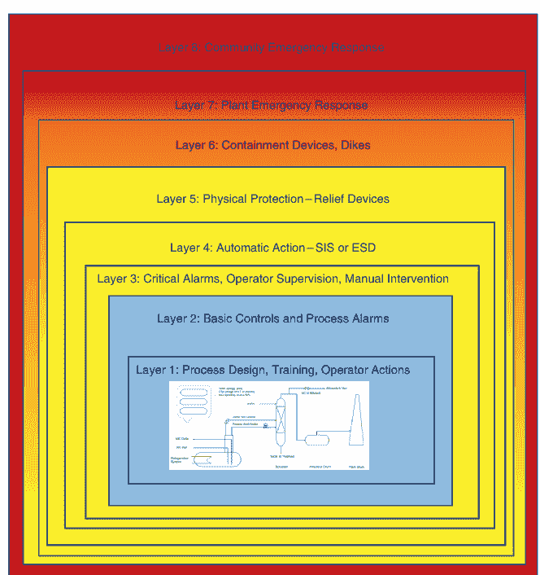

图10.7 七层传统保护层和额外的第八层。

4.  第四层可能包括安全仪表系统（SIS）和紧急停车装置（ESD）。SIS是一系列安全仪表功能（SIF）的集合，旨在检测到任何危险情况时将工业过程置于安全状态。ESD系统为人员在观察到异常情况时手动启动工厂/过程停车提供了选项。
5.  第五层通常包括泄压装置。
6.  第六层可能包括围堵系统，如VGS、火炬和防液堤。
7.  第七层通常被视为缓解层，因为它涉及工厂应急响应单位。
8.  这里显示的额外第八层被认为是灾难性的，在博帕尔灾难中达到了这一层。

瑞士奶酪模型展示传统七层保护层和社区应急响应的示例如图10.8所示。

2014年，Ronald Willey发表了一篇关于安全层在博帕尔灾难中作用的非常全面的分析。作者建议我们看看哪些安全层起作用了，哪些没有（Willey 2014）。对于本章，使用LOPA半定量分析来评估针对这一特定事件是否存在足够的控制措施。在这种情况下，待分析的事件是MIC泄漏。原因被认为是水侵入MIC储罐。

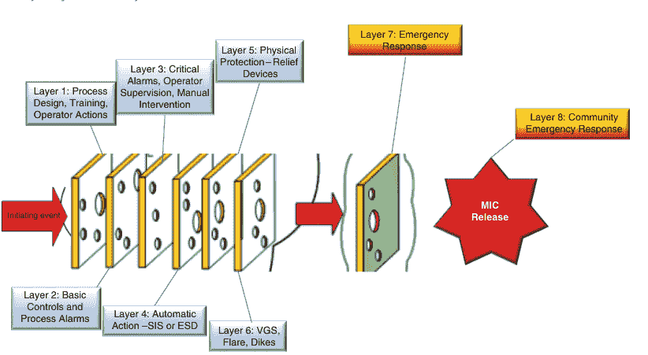

七层保护层总结如下。社区应急响应将单独讨论。

#### 10.8.1.1 第一层 – 工艺设计

《重新思考博帕尔》一书的作者Kenneth Bloch提供了涉及博帕尔毒气悲剧的MIC存储系统的工艺流程图（PFD）。该图纸是“竣工”状态，意味着它显示了系统投入运行时的状况。作者提供了以下细节：

> PFD揭示了该工艺既高效又脆弱。在审查PFD时，请密切关注：(1) 在MIC蒸汽服务中所有设备均使用碳钢，(2) E-210 MRS与E-408 VGS大气放空口之间需要清晰、开放、无障碍的通道，以及 (3) 向E-610、E-611和E-619储罐顶部集管注入氮气。这三者之间形成了不可分割的依赖关系，使得改变其中一个而不影响其他部分变得不可能。这种依赖关系源于偏离了禁止在MIC服务设备中使用碳钢的设计标准。

遵守设计标准本应导致在MIC蒸汽服务中使用不锈钢，而不是碳钢。MIC接触铁锈会发生聚合；因此，需要使用不锈钢等耐腐蚀材料以避免不相容性问题。为什么使用接触空气会生锈的碳钢呢？为了通过降低建设成本来省钱。（Bloch 2020）

本例的设计考量可以与HoRT层级相关联，如下所示：

-   替代 – 原始设计依赖于碳钢、VGS和氮气注入。这增加了维护和维修的需求，以及因材料不相容而导致故障的可能性。通过用不锈钢等更安全的材料替代所有组件，可以改进该系统。
-   简化 – 该系统本可以精简和简化，以减少人为错误的可能性。
-   最小化 – 现场存储的MIC量本可以减少和最小化。通过减少MIC的数量，相应的后果也会减少。
-   管理 – 最初的操作说明规定MIC储罐的填充量不得超过容量的50%。后来，管理层决定将610号储罐填充至容量的85%（Willey 2014）。似乎管理层对其控制危险物质的能力充满信心，没有寻求额外的控制措施。

竣工PFD由Kenneth Bloch绘制，如图10.9所示。

在“理想”操作条件下，有足够（七层）的保护层。培训和适当的操作程序也是这第一层的一部分。

#### 10.8.1.2 第二层 – 工艺警告和报警

MIC储罐配备了温度和液位指示器，以提醒操作员注意异常过程或状况。制冷系统（PFD中的#4）设计并安装用于移除储罐内的放热。然而，该系统被工厂管理层禁用以降低运行成本。MIC储罐上升高的温度和压力起初被忽视，因为仪器维护不当且已知不可靠。同样，应考虑仪器的简化性和可靠性。

#### 10.8.1.3 第三层 – 关键报警和手动干预

第三层通常包括关键报警和可能的手动干预。根据联合碳化物公司的记录，工厂有高温和高液位指示器和报警器。它们被安装用于提醒操作员。操作员知道610号储罐的压力和温度在上升。然而，没有手动干预将MIC转移到溢流储罐619的记录。这一层依赖于人的因素，要求操作员在紧急情况下采取果断行动。因此，自动化本可以成为一个额外的保护层。

#### 10.8.1.4 第四层 – 自动动作和安全仪表系统

第四层可能包括SIS和ESD。然而，在设计PFD中没有明显的SIS或ESD。没有自动触发装置可以阻止或减缓MIC储罐内的失控反应。Ronald Willey指出，SIS或ESD必须完全独立，并在没有任何人为干预的情况下工作。增加这样的保护层本可以挽救成千上万的生命。

#### 10.8.1.5 第五层 – 物理保护和泄压装置

Trevor Kletz在其著作《从事故中学习》中指出，泄压阀对于失控反应的排放来说太小了。设计用于40 psi（2.7 bar）表压的储罐压力达到了200–250 psi（14–17 bar）。MIC储罐变形并几乎爆裂。如果它爆裂了，由于蒸汽扩散减少，生命损失可能会更低。泄压阀设计仅处理蒸汽，但实际流量是蒸汽和液体的两相混合物（Kletz 2001）。

#### 10.8.1.6 第六层 – 围堵系统

一旦发生异氰酸甲酯蒸气泄漏，VGS系统本应吸收（围堵）通过安全阀排放的异氰酸甲酯。然而，该系统并未完全正常运行，且其容量过小，无法处理如此大量的异氰酸甲酯蒸气。本应燃烧掉任何逃逸出VGS系统的异氰酸甲酯的火炬系统，因维修而与工厂断开连接（Kletz 2001）。在此案例中，堤坝的存在与否并不相关，因为这是有毒气体泄漏。不过，堤坝的存在对于减轻液体溢流后果的严重性很重要。需要注意的是，有时很难界定哪些层是预防性的，哪些是缓解性的。根据事件的不同，其中一些层可能兼具两种功能。

#### 10.8.1.7 第七层 – 应急响应

据报道，一些操作员试图向离开尾气洗涤器的气体羽流喷水。不幸的是，水带压力不足，无法形成所谓的“水幕”来减少异氰酸甲酯蒸气的释放。水柱能达到100英尺高的蒸汽；然而，羽流在120英尺处逸出（Willey 2014）。

本案例研究中描述的保护层总结于图10.10。可以使用表10.4中给出的风险评估矩阵进行风险等级估算。

异氰酸甲酯是一种剧毒物质。因此，暴露的潜在后果可被评定为灾难性（5级）。根据现有的保护层，考虑到系统“按设计建成”且控制措施正常运行，可以估计异氰酸甲酯泄漏的可能性非常低。然而，一些现有的控制措施要么未被使用、被忽视，要么不够充分（LTA）。控制措施的有效性将在第10.9节进一步讨论。

有必要花点时间审视另一个缓解层：社区应急响应。如果允许在工厂附近发展棚户区，博帕尔事件的死亡人数本可以少得多。社区规划控制和分区要求通常会阻止此类发展。普遍认为，如果发生有毒气体泄漏，生活在羽流路径上的人们应待在室内，关闭窗户。只有当泄漏可能持续较长时间，例如超过半小时时，才应考虑疏散（Kletz 2001）。

另一个考虑因素是，当地居民没有做好准备，也没有得到关于化学品泄漏风险的适当通知。灾难发生前两年，警报器警告系统与警报器断开连接，这样只有工厂员工会收到警告，而邻近居民则不会。据报道，在异氰酸甲酯泄漏后，许多人开始逃离工厂。当然，这导致吸入了更多空气中的异氰酸甲酯气体。异氰酸甲酯可溶于水并与水反应。湿毛巾和关闭窗户（如果可能）会是比奔跑更好的防护措施。

| 事件 | 原因 | 保护层 | 当前状态 (CS) - | | | | | | | | |
|---|---|---|---|---|---|---|---|---|---|---|---|
| | | 第1层 | 第2层 | 第3层 | 第4层 | 第5层 | 第6层 | 第7层 | 严重性 | 可能性 | 风险等级 |
| 按设计建成 | 异氰酸甲酯泄漏 | 水侵入异氰酸甲酯储罐 | 工艺设计、培训、操作员行动 | 基本控制和工艺报警 | 关键报警、操作员监督、手动干预 | 自动动作 – SIS 或 ESD | 物理保护 – 泄压装置 | VGS、火炬、堤坝 | 应急响应 | 5 | 1 | 5 |
| 实际案例 | 异氰酸甲酯泄漏 | 水侵入异氰酸甲酯储罐 | 工艺设计、培训、操作员行动 | 基本控制和工艺报警 | 关键报警、操作员监督、手动干预 | 自动动作 – SIS 或 ESD | 物理保护 – 泄压装置 | VGS、火炬、堤坝 | 应急响应 | 5 | 3 | 15 |

图10.10 异氰酸甲酯泄漏的保护层和风险等级。

表10.4 风险评估矩阵示例：数值评级和评分。

| 严重性评级 | 健康影响（人员） | 财产损失 | 环境影响 | 1 极不可能 | 2 不太可能 | 3 可能 | 4 很可能 | 5 极有可能 |
| :--- | :--- | :--- | :--- | :--- | :--- | :--- | :--- | :--- |
| 5 | 死亡或永久完全残疾 | 灾难性损失 | 重大影响 | 5 | 10 | 15 | 20 | 25 |
| 4 | 永久部分残疾；三人或以上住院 | 严重损失 | 重大但可逆影响 | 4 | 8 | 12 | 16 | 20 |
| 3 | 导致一天或以上无法工作的伤害或职业病 | 显著损失 | 中等可逆影响 | 3 | 6 | 9 | 12 | 15 |
| 2 | 未导致工作日损失的伤害或职业病 | 中等损失 | 最小影响 | 2 | 4 | 6 | 8 | 10 |
| 1 | 仅需急救或无伤害或疾病 | 轻微损失 | 无影响 | 1 | 2 | 3 | 4 | 5 |
| 极高风险：**15或更高** 高风险：**9–14** 中等风险：**5–8** 低风险：**1–4** | | | | | | | | |

## 10.9 障碍分析

障碍分析常用于事故调查和分析中，以识别和分析与事故危害、事件和条件相关的现有障碍或控制措施。具体而言，该方法用于分析危害的路径以及障碍的有效性。在这些风险路径中，旨在阻断路径并防止危害影响目标的控制措施被识别并描述其功能。然后，按照事件顺序单独审查控制措施，并综合评估以确定弱点或失效点以及整体有效性。每项控制措施都根据其在事故中的表现进行评估。控制措施的表现水平通过图10.11中相应的彩色八边形来识别。

每项控制措施在其彩色八边形内标注其功能，并放置在事故地图中。图10.12提供了一个障碍分析示例，使用叉车撞击事故来说明事件序列、条件和控制措施的有效性（Lyon et al. 2018）。

在此场景中，异氰酸甲酯失控释放是顶层事件。为了演示障碍概念，可以结合使用泄漏后果分析（LOCA）和领结方法论。第9章简要介绍了领结方法论中包含的预防和缓解层。本章将障碍和控制层概念添加到传统的领结图中。LOCA是一种简化的逻辑方法，用于总结保护层并将其分为预防和缓解控制。为了可视化此概念，此处展示了博帕尔案例研究。请注意，不良事件是异氰酸甲酯失控释放。灾难很少由单一威胁或原因引起；它们通常是由一系列事件和控制失效造成的。

博帕尔事件中的各种威胁如下：

- 异氰酸甲酯接触铁锈和杂质会发生聚合 – 由于工业级异氰酸甲酯和钢材中的杂质可能形成催化金属盐，因此该产品在技术上不应储存在碳钢储罐中。
- H2O与异氰酸甲酯的化学反应 – 异氰酸甲酯很容易与许多含有O-H基团的物质反应。与水反应时，会生成1,3-二甲基脲和二氧化碳并释放热量。如果热量不能从混合物中有效移除，反应速率将增加，并迅速导致异氰酸甲酯沸腾。
- 三聚反应 – 由于异氰酸甲酯三聚体的形成是放热的，该反应可能导致异氰酸甲酯剧烈沸腾。

表面上看，似乎有足够多的预防和缓解层来防止因失控反应和异氰酸甲酯储罐失控而导致的有毒气体释放。然而，制冷系统已停用。异氰酸甲酯储罐温度计的量程上限为25°C。此外，当异氰酸甲酯循环泵故障时，温度计指针超过最大量程是常见现象。由于没有提供高压报警，这将使污染事件无法被察觉。一个常见的管理程序是插入盲板以防止水进入异氰酸甲酯储罐。然而，该程序冗长且被忽视。

保护层的“独立性”重要性不容忽视。警报由员工控制，其个人判断可能受到对设计规范中设定的参数和程序偏差的常态化影响。如果这些警报和警告装置没有被愿意接受与待控制过程相关风险的员工禁用，则应将其视为一个控制层。因此，很难将它们“标记”为“独立”的保护层。因此，控制层上方是黄色八边形。

如果顶层事件是失控释放，则有许多缓解措施来减轻后果的严重性。例如，VGS本应用碱液喷雾中和异氰酸甲酯蒸气。然而，VGS被关闭，碱液不可用，且洗涤器尺寸过小，无法处理此次异氰酸甲酯泄漏的规模。任何多余的有毒释放本应被引导至火炬塔。然而，火炬塔因腐蚀问题而停用。此外，警报器本应是另一个缓解层，在有毒气体释放时向当地居民发出警报。不幸的是，那些将程序偏差“常态化”并禁用异氰酸甲酯储罐高温警报的同一员工或管理人员，负责管理公共应急警报器。有必要再次强调这些控制层的“独立性”。

在此案例中，这些预防和缓解措施将被标记为黄色八边形，以表示每一项都是“未被使用或被忽视的现有控制措施”。

在发生泄漏事件时，本应部署水幕。然而，水压不足，且水幕的尺寸对于泄漏高度而言过小。因此，水幕缓解控制措施应被“标记”为橙色八边形：“现有控制措施效果不足（LTA）。”

## 10.10 控制层分析（LOCA）

控制层分析（LOCA）是由Lyon和Popov开发的一种新方法，它结合了LOPA和LOMA，用于分析危险场景的控制措施，如图10.13所示。该方法能够更全面地分析和理解场景、现有预防性和缓解性控制措施的有效性，以及整个系统的风险。

以MIC泄漏案例研究的预防和缓解层分析为例，得到的LOCA结果如图10.14所示。为了可视化预防和缓解层，可以使用条纹领结模型（一种由作者开发的、带有控制层和风险估计的改进型领结图），如图10.15所示。

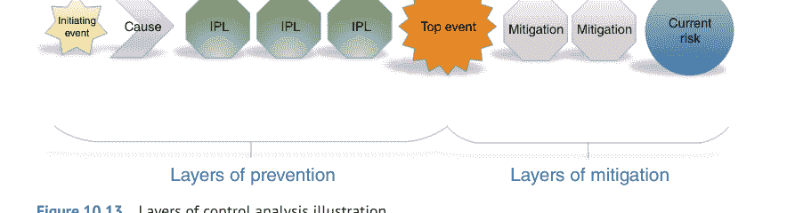

图10.14 简化的控制层分析示例。

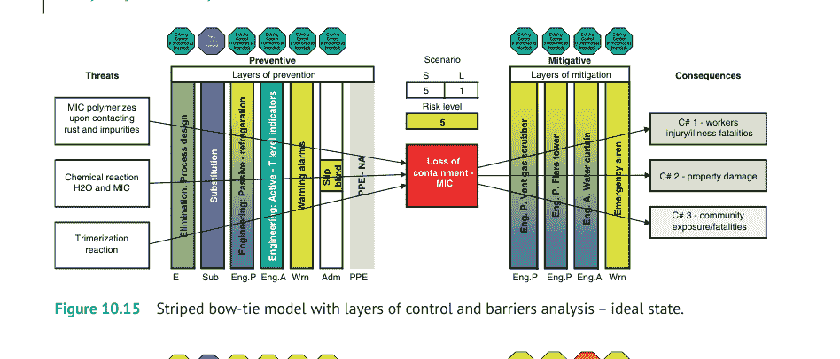

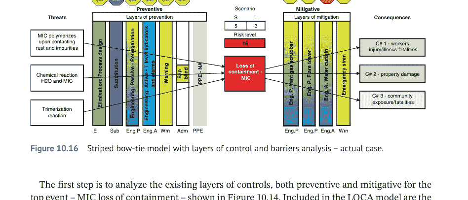

第一步是分析针对顶事件——MIC失控释放——的现有控制层，包括预防性和缓解性控制，如图10.14所示。LOCA模型中包含了来自图10.11的彩色编码八边形，放置在每个相应的控制措施上方，以对其性能进行分类。LOCA模型有助于传达各个控制措施的有效性，在本例中，它强调了偏离“按图施工”和“按设计运行”控制措施的重要性。

下一步是将控制层纳入条纹领结模型，并在控制层上方放置屏障分析八边形。图10.15展示了“理想状态”按预期运行的条纹领结分析，其中包含多个威胁/原因，因为导致灾难的故障和反应是多重的。“传统”LOPA的一个局限性在于它有些线性，可能无法“捕捉”导致顶事件的多重威胁或叠加风险。条纹领结分析解决了这一局限性，因为它可以结合多个威胁。

不幸的是，这些控制措施大多被忽视或未被使用。“实际案例”分析可以如图10.16所示进行可视化。请注意，风险水平是基于多重威胁以及控制措施未被使用或被忽视的事实进行估算的。

这个条纹领结模型呈现了泄漏发生前实际状况的全景概览。它可以用作风险沟通工具，教育操作员、管理者和决策者遵守程序，避免偏离设计规范。任何偏离都应通过变更管理（MOC）程序进行适当记录和沟通。

此外，在系统的整个生命周期中，应强调独立保护层（IPL）的概念。《重新思考博帕尔》一书的作者Kenneth Bloch总结了IPL概念的重要性：

> 表面上看，似乎有足够的安全措施来防止储罐内失控反应导致的有毒气体泄漏。然而，使用一种2001年引入的方法——为每个安全措施分配一个信用（点）值——会得出一个截然不同的结论。这种“保护层分析”（LOPA）方法基于两个基本前提：（1）没有安全措施是100%完美或始终“可用”的；（2）安全措施必须是独立的（一个独立保护层或IPL），才能获得任何额外的信用。关于IPL的更多信息和讨论可在2014年化学过程安全中心（CCPS）出版物《初始事件与独立保护层指南》中找到。

为了演示如何将信用（点）系统应用于本案例研究，计算了一个假设示例。现有（按图施工）主要保护层与实际案例的有效性估计基于以下公式：

$$f^c = IEF * PFD_1 * PFD_2 * PFD_3 * PFD_4 * PFD_5 * PFD_6 * PFD_7...$$

其中

$f^c$ – 后果频率
$IEF$ – 初始事件频率
$PFD$ – 按需失效概率

对于每个IPL，分配按需工作概率（PWD）和PFD。两者之和应为1。PFD可以通过单独测试或工厂历史记录来确定，即该保护层在10次需求中有9次能成功运行。这意味着控制措施仅在10次中有1次会失效。因此，风险降低因子（RRF）为10（RRF = 1/ PFD）。该系统的PFD将为0.1。一个简单的例子是，MIC储罐中的水侵入，其初始事件频率为0.1年（或10年）。Ronald Willey和Kenneth Bloch在其分析中也使用了类似的估计（Willey 2014）。

表10.5展示了MIC泄漏计算的后果频率（Fc）示例。该示例结合了屏障效率分析。“按图施工”计算假设所有预防和缓解措施均按规范建造、维护得当，且操作员行动完美。因此，控制性能分类用绿色八边形标识：“现有控制按预期运行。”屏障分析，如黄色八边形所示（现有控制未被使用或被忽视），则描绘了一幅截然不同的图景。

根据设计规范和“按图施工”案例，保护层应能将MIC泄漏的后果频率预防和/或缓解至$10^{-7}$。理论上，基于所述的保护层，一次重大的MIC泄漏可能每1000万年发生一次。0.1或每10年一次的频率后果估计大致对应于高风险操作（风险等级15）。在实际案例中，一次重大的MIC泄漏在运行不到五年后就发生了。安全专业人员在估计IEF和PFD时应非常谨慎。

表10.5 MIC泄漏计算的后果频率示例。

| 第1层 | 第2层 | 第3层 | 第4层 | 第5层 | 第6层 | 第7层 |
|---|---|---|---|---|---|---|
| 工艺设计、培训、操作员行动 | 基本控制和工艺报警 | 关键报警、操作员监督、手动干预 | 自动动作 – SIS或ESD | 物理保护 – 泄压装置 | VGS、火炬 | 应急响应 |
| Fc | IEF | PFD L1 | PFD L2 | PFD L3 | PFD L4 | PFD L5 | PFD L6 | PFD L7 |
| 按图施工 | 0.0000001 | 0.1 | 0.1 | 0.1 | 0.1 | 1 | 0.1 | 0.1 | 0.1 |
| 实际案例 | 0.1 | 0.1 | 1 | 1 | 1 | 1 | 1 | 1 | 1 |

一个更安全的替代方案是使用更高级别的风险降低策略，例如最小化。Trevor Kletz在其著作《从事故中学习》中指出：“你没有的东西，就不会泄漏。”从博帕尔事件中可以吸取许多教训，但最重要的是，泄漏的物质本可以根本不存在。它是一种中间体，而非产品或原材料，虽然储存它很方便，但并非必不可少（Kletz 2001）。据报道，悲剧发生后，杜邦公司打算从其运营的类似工厂中取消中间体储存。相反，他们一生产出MIC就立即使用，管道中只有5-10公斤，而不是储罐中储存40吨MIC。即使减少了数量，也需要昂贵的附加防护设备，如果被忽视或绕过，这些设备也可能失效。

以下简要回顾了近年来类似操作面临的困难。在美国，拜耳作物科学公司在西弗吉尼亚州的研究所制造设施有类似的生产。由于操作相似，拜耳作物科学公司（WV）在美国实施了保护层概念。然而，在2008年爆炸之后，他们不得不考虑不同的替代方案。以下是CSB案例研究的回顾，其中两名工人在西弗吉尼亚州研究所拜耳作物科学公司化工厂的一个装有杀虫剂灭多威的废料罐剧烈爆炸时不幸身亡，爆炸损坏了一个工艺装置。事故描述可在以下网址获取：https://www.csb.gov/bayer-cropscience-pesticide-waste-tank-explosion/

事实上，直到2012年，拜耳作物科学公司（WV）是美国唯一一家制造、储存和消耗大量MIC的设施。它将液态MIC储存在MIC生产单元的地下压力容器中。每个压力容器都是隔热的双层壁结构，内外壁之间的环隙设有泄漏检测装置。MIC被冷却至-10°C至0°C（14至32°F）之间。容量为6700加仑的不锈钢日用储罐中，MIC的最大库存量约为37,000磅（约75%满）。压力容器额定压力为100 psig，但通常使用专用的氮气供应系统在10 psig下运行。MIC通过冷却器循环，冷却盘管连接在隔热的日用储罐外部，以将MIC温度维持在-10°C至0°C（14至32°F）之间。这与博帕尔MIC储罐温度计的刻度（最高25°C）形成鲜明对比。

设计的复杂性和所需保护层的数量，从与该操作相关的众多附加控制措施中可见一斑。

日用储罐配备了额外的保护层：

- 制冷系统将MIC冷却至约0°C（32°F）。多级冷却系统首先使用乙二醇冷却甲基异丁基酮（MIBK）。然后，MIBK在单独的换热器中用于冷却MIC。这种两步冷却过程防止了乙二醇冷却系统泄漏时可能发生的MIC-水反应。

## 10.10 控制层分析（LOCA）

-   MIBK系统压力也维持在高于MIC系统压力的水平，且MIBK-乙二醇换热器中的MIBK压力高于乙二醇压力。这确保了水无法进入MIC系统。最后，在工厂正常电力中断的情况下，应急发电机为制冷系统提供电力。
-   日用罐控制系统包含冗余的压力、温度和流量仪表，包括高压、高温和制冷系统故障报警。
-   MIC系统排放口将气体排放至工艺和应急排放气洗涤器（VGS）系统。
-   罐区周围配备了空气监测器以检测MIC。
-   附近设有消防水炮，以缓解MIC泄漏并扑灭可能威胁储罐的火灾。
-   监控摄像头在甲萘威-拉维温控制室内的视频显示面板上提供全天候视觉显示。
-   防爆屏障结构完全包围了日用罐，以保护其在爆炸和火灾事件中免受飞散碎片和热辐射的伤害。

即使是设计和维护最佳的保护层也面临内部和外部风险。2008年8月28日晚上约10:25，西弗吉尼亚州研究所制造设施的两名拜耳作物科学员工被要求调查残渣处理器（一个位于甲萘威-拉维温装置南侧、紧邻道路中点的压力容器）压力为何意外升高。大约10分钟后，当他们靠近新安装的残渣处理器时，它突然剧烈破裂。约2200加仑的易燃溶剂和有毒杀虫剂残留物喷洒到道路上并进入装置，由于被切断的电缆或钢碎片撞击混凝土产生的火花点燃了溶剂蒸气，立即燃起大火。MIC储罐可能受损的事实引起了公司管理层和当地居民的严重关切。

拜耳作物科学已采取具体行动降低涉及MIC的事故风险。该公司未重建受损的灭多威装置，并停产了两种基于MIC的杀虫剂。公司还投资超过2500万美元重新设计和改造MIC生产装置，以显著减少MIC的现场库存（最小化），并进行其他工艺升级以降低处理大量MIC相关的风险。改进措施包括消除地上MIC储罐并更换地下储罐，计划于2010年底完成。2011年1月，拜耳宣布将在2012年期间*淘汰*剩余的两种氨基甲酸酯类杀虫剂——涕灭威和西维因的生产，并终止所有MIC的生产、使用和储存（CSB 2008）。

观察图10.16中的条纹领结模型，一个紫色八边形表示“需要额外控制”，放置在风险处理的替代层之上。这是由于当时未考虑替代方案。化学工程师使用市售化学品制造所需产品是常见的做法。在博帕尔，产品（西维因）由光气、甲胺和α-萘酚制成。光气和甲胺一起加入制成MIC（CH₃NCO），然后与α-萘酚反应。以色列公司Makhteshim使用的替代工艺中，α-萘酚和光气反应生成氯甲酸酯，然后与甲胺反应生成西维因（Kletz 2001）。该工艺使用毒性较低的材料，甚至不产生MIC作为中间产物。图10.17展示了博帕尔使用的化学反应与更安全的替代方案的对比。

为何要区分预防层和缓解层控制？对于诸如死亡、严重伤害/疾病、重大财产和环境破坏等后果，缓解措施对残余风险的有效性有限，不能单独依赖。

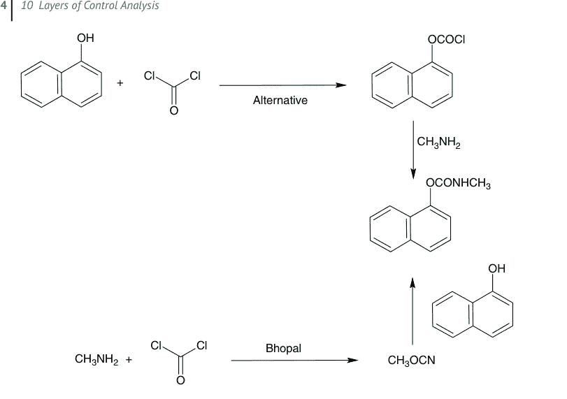

图10.17 更安全的替代（替代）反应。

作为一般原则，从降低风险的角度来看，将更多资源投入“预防”层比投入缓解层更有益。使用条纹领结方法分析和估计风险水平，并增加屏障有效性分析，可能提供机会来展示通过有效的独立保护层（IPL）可以实现可接受的风险降低。这当然需要确保所有控制措施（按设计和按运行）都是有效、可靠且始终如预期般运行。

## 10.11 结论

纵观历史，防御层一直被用来保护人们免受伤害。职业安全与健康专业人员在分析和设计风险降低措施时，应在工作场所应用这一概念，包括预防措施和缓解措施。单一控制措施很少是足够的。使用诸如LOPA、LOMA和LOCA等方法来分析现有控制措施及其有效性，并估计风险水平，可以帮助职业安全与健康专业人员识别弱点和建立额外控制层的需求。

## 参考文献

ANSI/ASSP (2011). *Vocabulary for Risk Management.* (ISO Guide 73/ANSI/ASSP Z690.1-2011). Des Plaines, IL: Author.
ANSI/ASSP (2016). *Prevention Through Design: Guidelines for Addressing Occupational Hazards and Risks in Design and Redesign Processes* [ANSI/ASSP Z590.3-2011 (R2016)]. Park Ridge, IL: ASSP.
ANSI/ASSP/ISO 31000 (2018). *Risk Management – Guidelines*. Park Ridge, IL: ASSP.
ANSI/ASSP/ISO 31010 (2019). *Risk Management – Risk Assessment*. Park Ridge, IL: ASSP.
ASSP TR-31010 (2020). *Risk Management – Techniques for Safety Practitioners*. Park Ridge, IL: ASSP.
Bloch, K. (2020). “Rethinking Bhopal” comprehensive examination of the important technical elements of the Bhopal Gas Tragedy. https://www.bhopal.org/rethinking-bhopal-a-process-saefety-analysis-of-the-union-carbide-bhopal-plant/ (Retrieved 7 June 2020)
BusinessDictionary. (2019). Prevention. www.businessdictionary.com/definition/prevention.html
Center for Chemical Process Safety (CCPS) (2014). *Guidelines for Initiating Events and Independent Protection Layers*,” AIChE. Hoboken, NJ: Wiley.
Center for Chemical Process Safety (CCPS). (2020). Glossary https://www.aiche.org/ccps/resources/glossary/process-safety-glossary/independent-protection-layer-ipl
CSB (2008). Bayer CropScience Pesticide Waste Tank Explosion, Accident Occurred On: 08/28/2008 | Final Report Released On: 01/20/2011. Final report https://www.csb.gov/bayer-cropscience-pesticide-waste-tank-explosion/
EPA AL Solutions, Inc. (2019). Settlement. https://www.epa.gov/enforcement/al-solutions-inc-settlement (Retrieved 23 June 2019)
Federal Emergency Management Agency (FEMA). (2017). What is mitigation?. www.fema.gov/what-mitigation
Franks, A. (2017). *Lines of Defence/Layers of Protection Analysis in the COMAH Context*. London, England: Health and Safety Executive http://www.hse.gov.uk/research/misc/vectra300-2017-r02.pdf.
ISO/IEC (2014). *Safety aspects – Guidelines for Their Inclusion in Standards*. (ISO/IEC Guide 51:2014 (E)). Geneva, Switzerland: ISO.
Kletz, T. (2001). *Learning from Accidents*, 3e. Taylor & Francis.
Lyon, B.K. and Popov, G. (2016). The art of assessing risk: selecting, modifying and combining risk assessment methods to assess risk. *Professional Safety* 61 (3): 40–51.
Lyon, B.K. and Popov, G. (2019). Risk treatment strategies: Harmonizing the hierarchy of controls & inherently safer design concepts. *Professional Safety* 64 (5): 34–43.
Lyon, B.K. and Popov, G. (2020). Managing risk through layers of control. *Professional Safety* 65 (4): 25–35.
Lyon, B.K., Popov, G., and Roberts, A. (2018). Causal factor analysis: uncovering & correcting management system deficiencies. *Professional Safety* 63 (10): 49–59.
Merriam-Webster. (2019). Control. https://www.merriam-webster.com/dictionary/control
Merriam-Webster. (2019). Mitigate. https://www.merriam-webster.com/dictionary/mitigate
Merriam-Webster. (2019). Prevent. https://www.merriam-webster.com/dictionary/prevent
Merriam-Webster. (2019). Protect. https://www.merriam-webster.com/dictionary/protect
Mulhausen, J. (2017). Improving General Industry Qualitative Risk Assessment Using LOPA Concepts. ASSP Professional Development Conference, June 2017, Denver, CO.
Rausand, M. (2011). *Risk Assessment: Theory, Methods, and Applications*. Hoboken, NJ: Wiley.
Reason, J. (2016). *Organizational Accidents Revisited*. Boca Raton, FL: CRC Press.
The Review (2019). AL Solutions settlement ends civil claims. https://www.reviewonline.com/news/local-news/2016/10/al-solutions-settlement-ends-civil-claims/ (Retrieved 23 June 2019)
U.S. Chemical Safety and Hazard Investigation Board (CSB). (2014). *Final Report on AL Solutions Metal Dust Explosion and Fire that Killed Three in West Virginia Leads CSB to Reemphasize Call for OSHA Combustible Dust Standard*. Washington, D.C.: U.S. Government. https://www.csb.gov/al-solutions-fatal-dust-explosion/

# 11 通过设计预防（PtD）与设计安全评审

*布鲁斯·里昂¹ 与 乔治·波波夫²*

¹ 布朗与布朗公司
² 中密苏里大学

### 目标
- 介绍通过设计预防（PtD）与设计安全评审的概念
- 比较PtD与风险评估流程模型
- 审视挑战与障碍
- 提供进行设计安全评审的指导

### 11.1 引言

可以说，组织在降低风险方面最大的错失良机，就是在设计和再设计阶段未能充分识别、评估和控制风险。乍一看，安全设计评审似乎是一个相当简单的过程，会在组织和工程界普遍实施。然而，现实中存在必须克服的障碍，才能成功将这一理念付诸实践。

为了有效且持续地减少职业严重伤害和致命事故（SIFs），必须将安全设计融入工作场所设施、系统和方法中。风险规避和消除——最有效的风险处理选项——通常只能通过设计和再设计工作来实现（Lyon et al. 2019）。

在设计和再设计阶段使用风险评估技术，是避免和消除风险被引入系统或产品的最有效方法之一。尽管在过去十年中其使用有所增加，但设计阶段的风险评估仍然是运营风险管理中最未被充分利用的方面之一。这为那些希望提升组织风险管理流程以及自身在公司内价值的安全、健康与环境（SH&E）专业人员提供了重要机遇。

事实上，全球范围内有大量关于运营风险评估实践的标准、指南和倡议。正如本书其他章节所述，要求雇主进行运营风险评估的规定主要出现在美国以外。然而，在2011年，美国国家标准协会（ANSI）发布了两项重要的共识标准，为工作场所的风险管理和风险评估实践提供了要求。

*《风险评估：运营风险评估实用指南》*，第二版。
乔治·波波夫、布鲁斯·K·里昂与布鲁斯·霍尔克罗夫特。
© 2022 John Wiley & Sons, Inc. 由John Wiley & Sons, Inc.于2022年出版。

### 11.2 通过设计预防（PtD）的概念

作为控制层级阶梯的最高一级，避免危害和风险应是绝对的首选。本书讨论的通过设计预防原则和倡议也呼应了这一点。从根本上和实践上看，避免问题比允许其存在并试图管理它更有意义。这就是PtD的概念。

尽管更早就有建立通过设计预防的努力，但在1994年，美国安全工程师协会（ASSE）发布了一份经董事会批准的立场文件，旨在促进“为安全而设计”知识的收集和应用。随后，美国国家安全委员会于1995年成立了通过设计安全研究所。该研究所的成立是为了满足将危害分析和风险评估整合到设计早期阶段的需求，以便能够避免和最小化危害和风险至可接受水平。1999年，该研究所出版了《通过设计安全》，这是一部由弗雷德·曼努埃尔和韦恩·克里斯滕森编辑的重要著作，有20位撰稿人参与（Christensen and Manuele 1999）。该书提供了来自不同行业的多个案例，展示了如何将安全融入设计过程以及由此带来的益处。通过该研究所和美国国家安全委员会发展起来的研究和工作，对当前的通过设计预防概念起到了重要作用。

2007年，美国国家职业安全与健康研究所（NIOSH）启动了通过设计预防（PtD）倡议。与通过设计安全类似，PtD的目的是“设计消除”或最小化危害和风险。经验丰富的安全专业人员深知，消除或避免危害是降低风险和控制职业伤害、疾病和致命事故的最有效方式。

2011年，安全行业发布了一项重要标准。ANSI/ASSE Z590.3-2011《通过设计预防——在设计和再设计过程中应对职业危害和风险的指南》标准是首个针对设计和再设计阶段此类需求的标准。其目的是提供一个框架，以有效预防或最小化与设施、材料、设备和服务的建造、制造、使用、维护和处置相关的、与工作相关的危害和风险。该标准的一个既定目标是教育设计师、工程师、机械和设备制造商、SH&E专业人员、企业领导者和工人了解PtD原则，以便将其应用于新旧设施、流程、设备、工具和工作组织的设计和再设计中。

曼努埃尔指出，“随着时间的推移，所达到的安全水平将直接关系到在设计和再设计过程中是否达到可接受的风险水平”（Manuele 2014）。根据*控制层级*的前提，避免、消除或控制危害最有效和经济的方式是在设计和再设计阶段“上游”解决它们。大多数人会同意这一概念；然而，在实践中，很少有组织充分利用将安全融入运营前阶段的机会。这为具备技能和意愿、能够指导和引导组织在设计和再设计过程中识别危害和降低风险的安全专业人员提供了重大机遇。

在医学领域，致命事故、严重可预防事件、医疗差错以及其他社会完全无法接受的事件被称为“永不事件”（Morgenthaler and Harper 2015）。然而，当系统中嵌入了有害的“恒常条件”，允许此类不可接受的事件发生时，就很难避免“永不事件”。当系统内的“恒常条件”包含危害、弱点、故障模式或不必要的复杂性时，就存在巨大的伤害风险。“永不事件”和恶化的“恒常条件”是不相容的对立力量，就像物质和反物质一样。从安全的角度来看，致命事故和严重事件（FSIs）被视为“永不事件”，而工作场所系统则是“恒常条件”。

人类工作可以通过系统元素（如人、工具、机械、软件、材料、程序和环境）之间的交互模式来表征。工作是在系统元素、条件和环境中，为实现某个目标或目的而在一段时间内执行的。大多数交互是按预期进行且无关紧要的；然而，有些事情并不总是按计划进行。人为错误代表了非预期的系统交互，但正如Shorrock（2016）指出的，这几乎总是不仅仅是一个人为错误那么简单。有意（或无意）设计到系统元素中的恒常条件包括人为、组织和社会因素。恶化的条件可能包括令人困惑和不兼容的界面、难以阅读或区分的标签或控制装置、无法使用的设备、缺失的工具和设备、时间压力、人员配备不足、导致疲劳和压力的长时间工作、不同水平的能力或不同的文化。为了完全避免永不事件，必须将那些呈现危害和风险、使其成为可能的恒常条件从系统中设计消除。这一概念被称为通过设计预防（Lyon et al. 2019）。

### 11.3 PtD定义

首先，需要与设计安全评审相关的正确定义。在美国国家标准ANSI/ASSP Z590.3-2011(R2016)《通过设计预防；在设计和再设计过程中应对职业危害和风险的指南》标准的前言中，它引用了“美国安全工程师协会（现为美国安全专业人员协会）在1994年经董事会批准的立场文件中所述的意图”，该文件将*为安全而设计*定义如下：

> *为安全而设计（DFS）* 是一种设计规划原则，适用于新设施、设备和运营（公共和私人），旨在节约人力和自然资源，从而保护人员、财产和环境。DFS倡导系统化流程，确保采用最先进的工程和管理原则，并将其纳入设施和整体运营的设计中，以保障工人的安全与健康，同时保护环境并遵守现行规范和标准。

此定义仍然有效且切中要点。本章中使用的其他关键术语定义取自ANSI Z590.3，提供如下：

**设计：** 将想法或市场需求转化为详细信息的过程，据此可以生产产品、流程或技术系统。

**设计安全评审：** 一种重要的管理流程工具，用于将安全与健康融入新设施、流程或运营的设计过程，以及现有运营的变更中。设计安全评审在设计目标正在讨论的早期阶段进行时最为有效。

**危害：** 造成伤害的可能性。危害包括产生风险的技术和活动的所有方面。危害包括事物的特性（例如设备、技术、流程、粉尘、纤维、气体、材料和化学品）以及人的行为或不作为。

美国化学安全与危害调查委员会（CSB）。（2015）。加勒比石油公司（CAPECO）油罐终端爆炸及多罐火灾最终调查报告。华盛顿特区：美国政府。https://www.csb.gov/assets/1/20/capeco_final_report__10.21.2015.pdf

Warry, J.（2015）。古典世界的战争：战争与古希腊和古罗马文明。https://books.google.com/books?id=NoABCgAAQBAJ

Willey, R.（2014）。思考博帕尔灾难中安全层的作用。https://www.aiche.org/sites/default/files/cep/20141222_1.pdf

**危害分析：** 一个从识别危害开始，进而估算潜在事故或暴露发生时可能导致的伤害或损害严重程度的过程。

**生命周期：** 设施、设备、工艺和材料的设计、建造、运行、维护和处置等阶段。

**通过设计预防：** 在设计和再设计过程中解决职业安全与健康需求，以预防或最小化与设施、工艺、材料和设备的建造、制造、使用、维护、改造和处置相关的工作危害和风险。

**再设计：** 一项设计活动，包括影响现有设施、设备、技术、材料和工艺以及工作方法的所有改造和变更活动。

**风险评估：** 一个从危害识别和分析开始的过程，通过该过程确定可能的伤害或损害严重程度，随后估算事故或暴露发生的概率，最终得出风险陈述。

**安全：** 免于不可接受的风险。

在 ANSI Z590.3 *通过设计预防* 和 ANSI Z10 *职业健康与安全管理体系* 标准之外，关于进行设计阶段风险评估的指导相对较少。“通过设计实现安全”的先驱者，如 Bruce Main、Fred Manuele、Wayne Christ预见、Dave Walline 和 Paul Adams 等人，也为此领域奠定了重要基础。本章提供了一种实用方法，用于建立一种在工作场所引入危害和风险之前，预见、识别、消除或最小化操作危害和风险的方法。

## 11.4 风险评估过程与 PtD 模型

对 ISO 31000 风险管理标准和 ANSI Z590.3 通过设计预防标准的回顾揭示了它们的异同。ANSI/ASSP/ISO 31000 风险管理——指南提供了管理风险的 (i) 原则、(ii) 框架和 (iii) 过程。风险管理过程是一个集成过程，包括 (i) 沟通和咨询、(ii) 建立环境、(iii) 风险评估、(iv) 风险处理、(v) 监督和审查以及 (vi) 记录和报告。风险评估过程在 ANSI/ASSP/ISO 31010 *风险管理——风险评估* 标准中进一步定义。其中，风险评估过程步骤如下所列：

- 6.1 规划评估
- 6.2 管理信息并建立模型
- 6.3 应用风险评估技术
- 6.4 审查分析
- 6.5 应用结果以支持决策
- 6.6 记录和报告风险评估过程及结果。

在 ANSI/ASSP Z590.3-2011(R2016) 通过设计预防标准中，有六个主要部分：

- 角色与职责（第 4 部分）
- 与供应商的关系（第 5 部分）
- 设计安全审查（第 6 部分）
- 危害分析与风险评估过程（第 7 部分）
- 危害分析与风险评估技术（第 8 部分）
- 控制层级（第 9 部分）。

尽管 ISO 31000 和 ISO 31010 于 2009 年发布并于 2011 年被 ANSI 采纳，但 ANSI Z590.3 2011 标准中均未引用它们。然而，其基本原则与风险管理过程是一致的。作者坚信，PtD 是风险管理的关键概念，应融入组织的风险管理过程。SH&E 专业人员应领导这项工作并促进其整合。

风险管理过程的核心是*风险评估*。ISO 31000 将风险评估定义为“风险*识别*、风险*分析*和风险*评价*的总体过程”（ANSI/ASSP/ISO 31000, 2018）。类似地，ANSI Z590.3 标准的第 7 部分将该过程称为*危害分析与风险评估过程*，并将风险评估定义为“一个从危害识别和分析开始的过程，通过该过程确定可能的伤害或损害严重程度，随后估算事故或暴露发生的概率，最终得出风险陈述”（ANSI/ASSP Z590.3-2011(R2016)）。图 11.1 所示的流程图改编自该标准，并说明了该过程。

如图 11.2 和 11.3 所示，两个标准在过程步骤上相似，但也有一些差异。在 ANSI Z590.3 第 7.8 节中，风险评估矩阵的选择被列为过程的第二步。

## 11.5 需要克服的挑战与障碍

通过设计预防的概念对大多数人来说似乎是合乎逻辑且可取的。然而，在实践中，组织主动在其设计和再设计过程中执行风险评估的情况却非常罕见。更令人担忧的是，一些组织在设计或再设计中排除了安全、健康和环境（SH&E）方面。这显然会导致“嵌入危害”的可能性进入产品和系统，而这些危害只能通过昂贵的改造来消除或减少。

不久前，作者之一曾被一家大型全球组织邀请参与一个新制造工厂的规划会议。该规划会议的目的是确定在 18 个月的目标日期内成功启动新工厂运营所需的具体项目任务、资源和时间表。参与会议的有管理、生产、维护、质量、工程、人力资源以及安全、健康和环境部门的成员。当团队进行规划步骤时，作者明显感觉到，新工厂设计的安全审查尚未被讨论。当作者建议进行此类风险评估时，团队成员有些犹豫。有些人认为这不是进行评估的合适时机，并表示将在工厂完全投入运营后进行全面的安全分析。其他人，包括两名安全代表，则表示在没有实体结构、设备和员工到位的情况下，很难识别危害和评估风险。此外，该团队普遍认为，他们的公司设计和工程部门正在处理所有必要的要求，包括安全和规范合规问题。因此，没有安排正式的设计安全审查。然而，作者利用这个机会，在接下来的 18 个月里与当地团队成员合作，在工厂建造过程中识别潜在危害和风险降低措施，这被证明是有益的。

## 11 通过设计预防（PtD）与设计安全审查

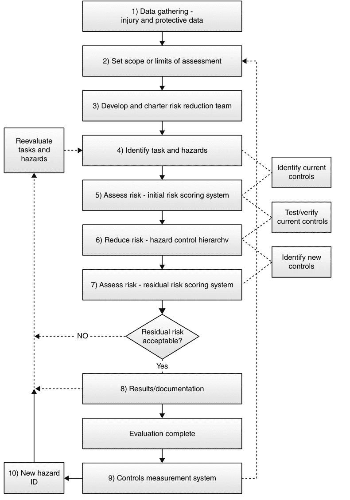

图 11.1 危害分析与风险评估过程，经 ANSI/ASSP Z590.3-2011(R2016) 许可转载。来源：美国安全专业人员协会提供。

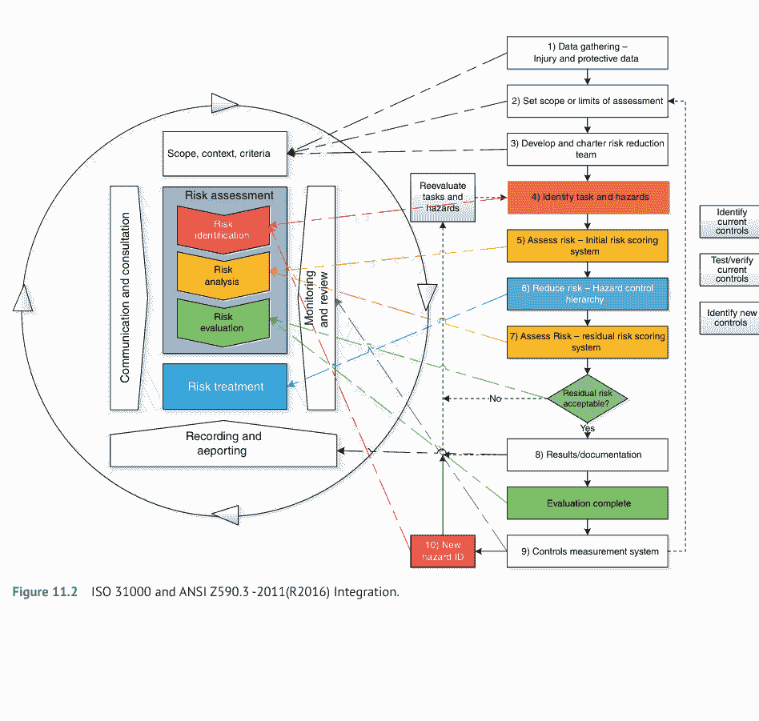

图 11.2 ISO 31000 与 ANSI Z590.3-2011(R2016) 的整合。

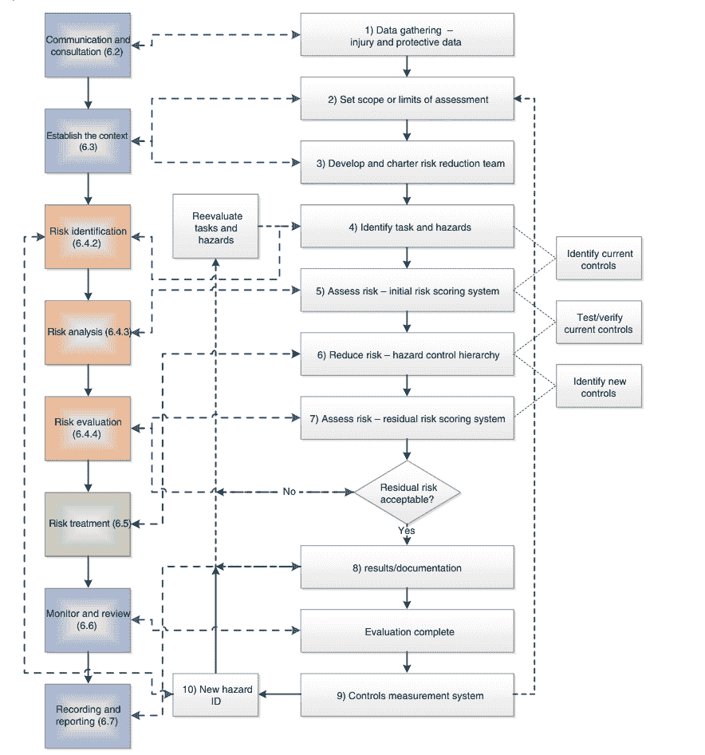

如前所述，缺乏设计安全审查可能导致设施、工艺、设备、工作站和产品中存在潜在问题。以下是作者在过去几年中观察到的一些例子：

- 紧急淋浴和洗眼站直接放置在配电盘前方或附近。具体来说，这些站点位于该组织每个类似设计工厂的叉车充电区。
- 缺乏通风和局部排风系统。在一个金属加工作业中，质量部门的破坏性测试实验室进行包括化学反应、研磨、切割、钎焊和焊接在内的测试，这些测试会产生空气污染物；然而，这些健康危害在设计阶段并未被考虑。
- 新设施中为计划占用人数提供的紧急/龙卷风避难空间不足。此外，输送系统和设备在设施的某些区域阻碍了紧急疏散路线。
- 室内化学品储罐储存没有围堵设施，以防止泄漏物进入地漏。
- 叉车和行人交通存在多个盲角和瓶颈。
- 需要固定梯子和楼梯以及物料和设备升降的高架工作平台。
- 人体工程学工作站设计不佳，例如不可调节的工作台面或座椅、过宽的输送机、过多的手动物料搬运要求、存储位置不当、高噪音区域和照明不良。

不幸的是，这类“设计问题”并不少见。造成这种差距的部分原因是，大多数 SH&E 从业者将大部分（如果不是全部）时间和精力花在“运行阶段”。美国安全专业人员协会（ASSP）风险评估研究所的首任主席 David Walline 估计，传统安全角色中只有 10% 用于“运行前”或设计阶段（Walline 2014）。为了验证这一假设，作者之一对美国安全工程师协会招聘网站上列出的 SH&E 职位描述进行了审查。审查显示，大多数列出的工作职责描述了诸如 SH&E 计划管理、法规遵从性、工作场所审计和检查、事件调查、员工培训、损失分析以及其他与正常运营相关的活动。在审查的职位发布中，只有不到 12% 提到了“运行前活动”，例如新系统/设备的审查、建设或扩建的预规划以及工艺变更分析。在任何职位描述中均未发现关于通过设计预防、设计安全或设计安全审查的提及。这些轶事证据支持了 Walline 的假设。

然而，有理由乐观地认为这种情况正在开始改变。在 2012 年 ASSP 专业发展会议上，作者之一向大量听众进行了关于风险评估的演讲。在演讲过程中，要求听众举手示意他们是否在设计阶段积极进行风险评估。令作者高兴的是，超过一半的听众给出了肯定的回应。

对于那些在设计过程中未纳入安全审查或风险评估的组织，问题是“为什么”。答案可能属于以下一个或多个常见障碍类别：传统、培训、地盘和时间。

1) *传统：* 组织的文化和传统根深蒂固，难以改变。在这些文化和传统中，存在着组织结构和运营系统。许多组织在高度部门化（或孤岛式）的部门中运作，有着严格的指挥链，使得信息难以“横向”（部门之间）或“纵向”（围绕特定经理）流动。书面程序通常省略了与其他部门沟通这一关键步骤。这些部门间的障碍在许多情况下会阻碍部门之间的开放共享和协作。以下场景可能适用于此类组织：
a) *工程部门：* 设计师和工程师根据设计标准开发他们的设计，这些标准包括组织期望的部门内的项目目标、成本、质量和性能。他们的主要目标是设计出一个可行的方案。存在

## 11.6 要求设计安全的标准

美国最早将设计安全审查、风险评估、采购和变更管理要求纳入其中的标准之一，是ANSI Z10.0《职业健康与安全管理体系》，该标准最初发布于2005年。这项共识标准于2019年更新，被视为开发运营风险管理体系的“最先进”蓝图。ANSI Z10为实施持续改进体系提供了指导，该体系要求管理层领导与员工参与、策划、实施与运行、评价与纠正措施以及管理评审。

在ANSI Z10的实施与运行部分，规定了设计审查和变更管理的要求。该标准指出，“组织应建立一个流程，以在设计和重新设计阶段，以及在需要变更管理的情况下，识别并采取适当步骤预防或以其他方式控制危害，将潜在风险降低到可接受水平。”此类设计审查应考虑到预期引入的新技术、设备或设施；新的程序和工作实践；新的原材料；或新的设计。该运营风险管理体系标准中特别纳入设计安全和风险评估要求，表明了它们的重要性。

第二个重要的美国标准于2011年发布，并于2016年重新确认。ANSI Z590.3《通过设计预防：解决设计和重新设计过程中的职业危害和风险指南》的发布，凸显了设计安全的必要性。该标准阐述了在设计和重新设计过程中解决危害和风险的原则和方法，包括：供应商关系；设计安全审查；风险评估；以及使用控制层级将风险降低到可接受水平。它最初由美国国家安全委员会下属的*安全设计咨询委员会*的努力推动，随后是美国国家职业安全卫生研究所（NIOSH）的“通过设计预防”（PtD）倡议。根据NIOSH的说法，ANSI Z590.3的关键要素之一是，它为“生命周期”评估和设计模型提供了指导，该模型在设施、过程或产品的整个生命周期内平衡环境与职业安全健康目标。所有设施、设备和产品都有一个明确的生命周期，其中的风险会发生变化。正如ANSI Z590.3所规定的，这要求将风险评估和风险降低纳入产品或系统生命周期的每个阶段。图11.4描绘了该标准中从设计到退役的生命周期阶段演进。

通过设计预防概念的重要性是巨大的。与*控制层级*的前提一致，降低风险最有效的控制是通过设计避免或消除危害。当危害通过设计避免或通过重新设计消除时，它们就不会被引入工作场所，从而避免了其风险。即使所有风险

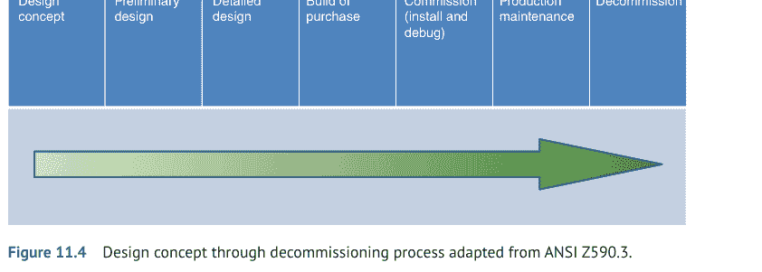

没有要求，也没有意愿寻求其他部门对设计的同行评审。

- b) *采购部门：* 工程部门指定的组件和材料提供给采购部门。通常，除了符合规范或法规要求外，对安全、健康、环境或人体工程学要求的规格非常少。采购部门的目标是在规定的时间内，以尽可能低的成本（通常在指定预算内）获取必要的材料。同样，对于其他部门考虑或选择的材料，没有同行评审的要求或协议。

- c) *供应商/承包商：* 设计完成后，移交给负责建造和安装单元的外部供应商/承包商。在安装过程中，设施工程/维护和/或生产部门的监督有限。供应商/承包商的目标是按照设计规范，在所需时间框架内和指定预算内完成并安装单元。

- d) *生产部门：* 安装后，设计由生产部门投入运行。生产操作可能包括启动前检查和程序、编程、调整、上油、润滑、清除卡塞、重置机器等。生产部门的主要目标是以尽可能低的成本，实现并保持最大产量（以生产单位数量衡量），并达到质量标准。同样，在问题出现之前，没有要求生产部门让安全、健康和环境（SH&E）部门参与。

- e) *维护部门：* 运营需要由维护部门执行定期的预防性维护和偶尔的故障维修服务。维护的主要目标是尽快将系统恢复正常，以减少停机时间并防止业务中断。除了OSHA的上锁挂牌要求外，在事件发生之前，组织不要求SH&E部门参与。

- f) *维护/退役承包商：* 在某个时间点，系统/产品完成其使用寿命或效用。它由维护部门或外部承包商从服务中移除，为新的单元或技术让路。同样，除了响应过程中可能发生的事件外，SH&E部门在设备退役过程中参与甚少。

- g) *安全、健康和环境部门：* 在设计的整个生命周期内，暴露于危害可能对人员、资产和/或环境造成伤害。SH&E部门负责识别和控制现有危害，以及响应发生的事件。对于那些在设计中未充分考虑安全性的系统/产品，需要更多的控制措施来实现组织可接受的风险水平。通常，SH&E部门的主要目标是满足合规要求并减少损失。

这个场景说明了，如果没有正式的机制或具体要求，每个部门的目标如何可能相互冲突并阻碍跨部门沟通与合作。无论组织是否意识到，他们的传统和文化决定了在整个运营过程中对安全标准的重视程度。

- 2) *培训：* 提供给工程师的正规教育和培训通常不包括职业安全与健康原则。许多工程师在预见或识别危害方面经验很少或没有经验，并且不熟悉控制层级的概念。关于NIOSH的“通过设计预防”倡议，主任约翰·霍华德医学博士表示，“一个重要的重点领域将是研究如何让商业、建筑和工程学院的毕业生对职业健康与安全原则和概念有基本知识的需求。”然而，这并非单向道。安全专业人员也需要更好地了解其组织的成本驱动因素以及工程和设计的内部协议。

- 3) *领域：* 设计工程师负责根据既定的设计标准，在设定的时间和预算限制内设计系统/产品。他们的主要目标是设计出能正常工作的东西。可以理解的是，工程师的本性是不偏离其正规教育和培训或既定协议。因此，他们往往不愿意寻求非工程部门的意见。这为安全专业人员提供了一个机会，通过促进操作前风险评估来向工程师（和管理层）证明自己的价值，使组织能够创建更安全、更具成本效益的设计。财务措施，如成本效益分析和投资回报率（ROI），将有助于传达设计安全审查的价值。

- 4) *时间：* 从设计概念到生产的关键路径在时间上是有限的。工程师时间紧迫，需要按时完成任务。在设计阶段缺乏前瞻性或为安全审查分配时间是很常见的。风险评估需要时间来有效进行，通常比设计审查会议所能提供的时间更长。正如布鲁斯·梅恩（Main 2012）指出的，风险评估可能需要与工程设计审查分开进行，并应尽早纳入设计过程。

为了克服障碍，组织必须建立强大的安全文化，要求达到并保持可接受的风险水平，并理解将安全纳入设计和重新设计过程在实现该目标方面具有特殊作用（Manuele 2008）。工程和非工程部门之间的沟通与合作必须改善。设计和重新设计工作中安全的期望和责任必须明确定义并传达给所有相关方。并且应为工程师和设计师提供更多关于危害识别和控制的培训和教育。保罗·亚当斯（Adams 1999）在《通过设计实现安全》一书中很好地总结了这些需求，并提出了以下建议：

- 1) 安全需要在项目中尽可能早的阶段得到解决，最好是在范围界定和规范阶段。
- 2) 需要以安全为重点的活动，以给予危害识别和消除适当的关注。
- 3) 工程师需要一个模型来理解他们在预防事故中的作用。
- 4) 工程师需要接受关于设计安全系统流程的培训。

安全从业人员在很大程度上未能很好地参与设计过程。可以列举许多原因，包括工作描述、日常工作要求、缺乏参与设计审查的通知或邀请、在组织中的职位和地位，以及对设计和工程流程普遍缺乏了解。在设计过程中更具影响力的安全专业人员将对安全产生更大的影响，并提高他们的整体价值。

无法完全消除，对于组织而言，应用风险管理努力最“风险有效”且最具成本效益的地方是在其设计和再设计阶段。

其他安全标准也开始纳入通过设计预防的要求。例如，ANSI B11.0-2020 *机械安全 – 通用要求和风险评估* 标准列出了机器供应商和用户的设计安全要求和责任。具体而言，B11.0要求供应商在机器的设计、制造和安装过程中识别危害，并将风险评估和降低到可接受水平，同时为机器的操作和维护制定安全相关信息。B11.0的一个重要方面是要求供应商和最终用户在机器的概念设计和制造中进行“协作努力”，这与Z590.3对供应商关系的要求相呼应。这种努力需要用户和供应商从始至终进行有意义且有效的沟通。用户提供的采购要求和机器安全规范应提前传达给供应商，以便纳入机器的设计。供应商设计安全审查和风险评估中识别出的任何残余风险应传达给用户，以便对机器采取适当的风险降低措施。B11.0指出，供应商和用户之间转移的任何风险都必须记录在案并进行沟通。供应商和用户之间的协作努力应是互动性的，并根据需要持续进行。

## 11.7 设计审查

正如Main所述，*设计审查*通常是对设计进行的正式评估，以确保设计符合规定的标准。运行风险只是设计审查中需要考虑的一个因素，设计的复杂性和关键性将决定所需危害分析和风险评估的水平。设计审查中考虑的其他因素包括成本、法律、产品责任、质量、合规性和市场营销。例如，从消费品的角度来看，产品设计审查被制造商用来识别和消除潜在的产品缺陷或误用，以避免产品责任风险。

许多设计审查包括合规性审查方面。如果要建造一栋办公楼，它必须符合某些（州和市）建筑规范要求以及消防和生命安全标准。此外，许多组织有超出合规标准的内部要求或保险承运人要求。合规性审查用于验证外部和内部合规规范是否已纳入设计。应将由共识组织（如美国国家标准协会（ANSI）、美国材料与试验协会（ASTM）和国家消防协会（NFPA））、非共识机构（包括保险商实验室（UL）、工厂互助（FM））以及联邦和州职业安全与健康管理局（OSHA）发布的监管标准纳入拟议设计的合规性审查。

合规性审查很常见，尤其是在消防领域。这些审查有时由第三方顾问和保险经纪人及承运人进行。然而，符合合规性设计并不能确保所有危害都得到充分控制或避免“错误陷阱”。

在他的著作《风险评估：挑战与机遇》中，Bruce Main建议在工程设计审查之前单独进行正式的安全分析和风险评估（Main 2012）。通过这样做，可以向设计团队提供具体的安全指导，以纳入设计过程。显然，整个过程中识别出的任何危害都应由设计安全和工程团队解决。在许多设计审查中，团队在设计阶段进行的危害识别形式不太正式，这对于相对简单的设计可能是合适的。然而，正如Main指出的，对于更复杂的设计，应进行单独的风险评估。在潜在风险较高的情况下，可能需要在每个阶段或步骤（即概念、初步、最终设计和测试）进行设计安全审查，作为来自SH&E、人体工程学和合规利益相关者的签署或批准过程。

## 11.8 危险能量控制

关于危险能量控制的一个经得起时间考验的著名理论是由William Haddon Jr.博士在1970年代提出的。Haddon的“能量释放理论”基于一种工程方法，建立了事件因果关系与风险控制方法之间的联系（Haddon 1970）。在设计安全审查中应考虑使用Haddon的模型，因为它与工程师关系密切，并且可以系统地应用。Haddon的“能量释放理论”包括10个连续的控制策略，类似于控制层级，在新产品和系统的设计中应予以考虑。以下是他的10个策略的简要描述。

1.  *防止储存能量* – 首先防止能量形式的积聚，例如防止产生可能释放的热能、动能或电能，或电离辐射。
2.  *减少储存能量* – 通过数量和浓度减少积聚的能量量，例如限制储存的化学品量、减小处理材料的尺寸或降低车辆速度。
3.  *防止能量释放* – 通过纳入物理遏制来防止能量释放。
4.  *降低释放速率* – 修改能量从其源释放的速率或空间分布，例如将压缩空气压力降低到每平方英寸30磅（psi）或降低仓库叉车坡道的坡度。
5.  *通过空间或时间将能量释放与人类和资产分离* – 在空间或时间上将释放的能量与易受伤害或损坏的事物分离。此策略消除了能量与人类或资产的交叉（暴露）。示例包括增加冲压机操作点与操作员之间的距离，或在机器功能中立化时安排人类与机器的互动。
6.  *通过物理屏障将能量释放与人类和资产分离* – 通过材料“屏障”的介入进行分离，例如在电线、机器防护罩或焊接帘上使用绝缘材料。
7.  *修改接触表面* – 适当地修改接触表面、地下层或基本结构，例如消除、倒圆和软化人们可能接触的角落、边缘和点。
8.  *加强易损结构* – 加强可能因能量传递而损坏的结构（有生命或无生命），例如加固暴露于叉车损坏的存储架。
9.  *提高可检测性并预防伤害* – 快速检测和评估已发生或正在发生的损害，并阻止其继续或扩大。示例包括火灾报警器和喷水灭火系统、接近限位开关或存在感应装置。
10. *防止进一步损害* – 在损害能量交换后的紧急期之后，稳定过程。示例包括灾难恢复计划以及紧急行动和疏散计划。

表11.1 能量类型和危害。

| 能量 | 危害 |
|---|---|
| 机械 | 对组织的急性力，对组织的慢性应力 |
| 物理 | 噪声、振动、重力、惯性、构型 |
| 化学 | 毒性、腐蚀性、急性、慢性 |
| 电 | 触电、爆炸、火灾、电弧闪光 |
| 生物 | 细菌、血液传播病原体、微生物、动物、昆虫 |
| 热 | 极端温度 |
| 辐射 | 电离、非电离 |

如Haddon的控制策略所示，当这些措施纳入设计时，对潜在能量释放的最有效控制得以实现。应特别注意产品和系统中隐藏能量的可能性。表11.1提供了一个简单的能量类型和危害列表，应在设计审查期间进行调查。

## 11.9 设计的人体工程学审查

如第16章所述，将人体工程学原则融入工作场所的设计理念得到了近期标准的支持，例如ANSI/ASSE Z590.3-2011(R2016) *通过设计预防解决设计和再设计过程中职业危害和风险的指南* 标准，以及ANSI/ASSP Z10.0-2019 *职业健康与安全管理体系* 标准。某些行业，如汽车、航空和科技，在一定程度上已将人体工程学标准和指南纳入其产品和系统设计规范及采购要求中。

然而，仍有很大的改进空间。根据著名人体工程学专家和研究员Walt Rostykus的说法，只有5%的组织在新流程、设备和产品的设计过程中持续关注人体工程学（Rostykus 2012）。他的研究表明，这一小部分先进的组织通过使用三个关键要素成功地在设计阶段融入了人体工程学：

1.  使用正式的人体工程学设计审查流程，该流程在设计期间纳入了阶段门审查和批准流程。
2.  遵守人体工程学设计标准和指南（即伸展、力量、工作高度、重量限制等）。
3.  一个让工程师对其设计的风险水平（肌肉骨骼疾病风险因素水平）负责的系统。

根据Rostykus的说法，“良好上游设计的最大价值在于降低了变更成本。一旦设备和布局到位，变更的成本是在设计阶段进行变更成本的1000倍以上。”

阶段门或阶段门审查是项目各阶段之间的评估和批准流程步骤。它们需要关键部门或个人进行特定审查，以评估拟议设计，确定其是否符合他们的批准，以便设计进入下一阶段。图11.5提供了使用阶段门类型审查的示例。SH&E专业人员以及人体工程学专家应在新设计的“阶段门审查”中发挥积极作用。

## 11.10 设计评审流程

“正式的设计安全评审是交付本质更安全设计的有效流程。”这句话摘自ANSI Z590.3标准《附录E – 设计安全评审指南（资料性）》的开篇句。ANSI Z590.3进一步定义，设计安全评审是一种重要的管理工具，用于将安全融入新设施、现有建筑扩建、新或改造的流程与系统、设备与机器以及产品的设计过程中。

为使设计安全评审取得成功，必须在潜在危害引入工作场所之前，对其进行预测、识别、消除并控制在可接受的风险水平。这需要最高管理层的承诺，并在组织的运营风险管理体系内建立设计安全评审的既定流程。如ANSI Z590.3所述，正式设计评审流程的关键要素和步骤如图11.6所示，并在下文进行描述。

1.  *管理方针*：应制定并传达书面的管理方针，为组织内何时、何地以及如何进行危害分析和风险评估（包括设计阶段）提供指导。该方针应概述角色与职责，以及对设计安全的问责制，包括工程师、设计师、生产、维护、质量、法律、安全健康环境、人力资源、采购及其他相关方。
2.  *指定项目设计负责人和团队*：管理层应指定一名合格的负责人和跨职能团队来执行设计安全评审。应为项目设计评审明确并传达所有成员的角色与职责。设计安全评审团队应包括在相关领域具有专业知识的成员，例如安全与健康、人因工程与工效学、环境安全、消防以及产品责任预防等，具体视项目情况而定。在某些情况下，可能需要纳入外部专家协助设计安全评审。安全评审团队与工程/设计团队之间的有效沟通是设计成功的关键因素。
3.  *建立设计安全评审流程*：组织应建立文件化的流程以进行设计安全评审。该流程应遵循ANSI Z590.3、ANSI Z10及其他可用标准和资源的指导。对于每个项目，应根据设计的复杂性和关键性确定适当的方法和频率。
4.  *在流程早期进行危害分析和风险评估*：危害分析和风险评估越早引入设计流程，其效果就越好。

ANSI Z590.3建议在设计目标讨论和确定阶段就尽早进行安全评审。根据复杂性和具体情况，危害分析和风险评估可与设计评审分开进行，其结果和风险降低建议纳入设计过程。分析和评估可包括：审查现有类似设计和文献；平面图和规格说明；危害检查清单；适用标准；与零部件和材料制造商的讨论；安全数据表；与类似设计相关的损失经验；类似设计上现有的控制措施和技术等。设计安全评审不仅应解决操作危害和风险，还应考虑由非常规事件（如紧急故障、异常工况和维修、计划性和非计划性服务与维护、测试、调整、润滑及其他维护相关活动）导致的危害和风险。

5.  *未经批准不得偏离标准*：设计团队应遵循既定的安全标准和规范。任何偏离这些规范的请求都应由适当的安全和管理人员进行审查，以批准或否决。
6.  *设计完成签字确认*：应由项目负责人签署书面证明，确认设计安全评审已完成，这标志着安全团队和工程小组达成共识。为实现这一点，设计安全评审团队与工程/设计小组在整个过程中需要保持沟通。
7.  *设计安全评审交付成果*：根据设计的规模和复杂性，评审产生的具体交付成果可能包括：图纸和规范的修改与批注；按风险优先级排序的具体危害清单及其消除或控制方法；批准前所需的设计修改清单；带有指定责任的行动项清单；为满足或完成评审并批准设计所需的后续问题、关注点或额外信息请求。

## 11.11 设计中的危害分析与风险评估

在作为设计评审一部分进行危害分析和风险评估时，遵循商定的流程至关重要。对于相对简单的项目，安全专业人员与工程师非正式地审查拟议设计以识别危害和必要的控制措施可能是合适的。然而，对于更复杂的情况，管理层应建立正式的危害分析和风险评估方法，并将其纳入设计和重新设计流程。以下是根据ANSI Z590.3改编的简要大纲，用于在设计安全评审中进行危害分析和风险评估。

1.  *选择风险评估矩阵*：组织应就选定的风险评估矩阵以及与所涉危害和风险相适应的风险概率和严重性定义达成一致。参与风险评估过程的所有人员都需要清晰理解所选矩阵和定义。如ANSI Z590.3所述，矩阵提供了一种方法，用于对伤害的概率和严重性组合进行分类，以确定每个危害的风险等级；作为风险管理工作中决策者的沟通工具；并有助于比较和确定风险的优先级，从而有效分配资源。
2.  *选择风险评估技术*：选择适合被评审设计的方法，应考虑设计的复杂性和关键性、评估的范围和参数以及团队的经验。团队成员应经过充分培训并熟悉所使用的方法。ANSI Z590.3列出了八种技术，包括：初步危害分析（PHA）；检查表分析；假设分析/检查表分析；危害与可操作性分析（HAZOP）；失效模式与影响分析（FMEA）；故障树分析（FTA）；以及管理疏忽与风险树（MORT）。该标准指出，PHA、FMEA和假设分析方法足以应对大多数风险情况。对于存在潜在人因和工效学风险的设计，可能需要进行专门的工效学风险评估。
3.  *确定参数*：确定分析的目的和范围，以及在人员（员工、公众）、流程、财产、设备或环境方面存在何种风险。定义范围、参数和设计的边界，包括设计的应用、用途、潜在误用、操作阶段、潜在接口和其他潜在边界。
4.  *识别潜在危害*：负责进行设计安全评审的人员应在危害识别和控制方面接受过充分培训并具备经验。根据设计的复杂程度，由受过培训的个人或团队对设计进行系统的危害分析，以创建危害清单。危害识别过程应涉及头脑风暴，并包括：
    - a) 审查可用的设计文件和计划
    - b) 与设计师、工程师、操作员或用户进行讨论
    - c) 使用针对设计技术、设备、与其他系统的交互、物质和任务的通用和特定危害的检查表
    - d) 审查其生命周期内潜在的危险能量释放
    - e) 考虑隐藏的危害和可能导致人为错误、疏忽和误用的潜在“错误敏感”情况
    - f) 调查类似设计、分析、控制措施和经验教训
    - g) 分析类似设计的可用历史损失数据
    - h) 审查适用的行业标准、合规标准、规范和法规要求、内部及客户要求
    - i) 考虑组合危害的协同效应（例如噪音与甲苯、冷应激与手部振动、热应激与搬运）
    - j) 分析产生的危险大气或环境。
5.  *识别失效模式*：在建立危害清单后，需识别每个危害对应的失效模式以及设计的可预见用途/误用。对于每种失效模式，需确定可能导致此类“可信”情景发生的条件。
6.  *评估现有控制措施*：针对每个危害，评估现有/计划的控制措施，以确定其是否充分有效。评估控制措施的可维护性、维持充分控制所需的维护工作，以及规避或绕过控制措施的可能性。
7.  *确定发生可能性*：针对每个危害，估计危险事件或暴露发生的可能性或概率。这包括估计暴露于已识别危害造成的伤害或损害的频率和持续时间。可能性估计通常与基于区间的单位相关，例如时间单位；活动、任务或事件；生产单位；或设施、设备、材料、流程或产品的生命周期。估计中考虑的因素包括：
    - a) 执行任务或流程的频率
    - b) 暴露的持续时间以及暴露是连续的还是间歇的

c) 暴露人数
d) 职业健康与环境暴露（可能需要进行剂量反应分析和暴露评估）
e) 潜在的生产损失或业务中断

8) *评估危害严重性：* 对于每种危害，在确定危害严重性时，会估算最坏的“可信”后果。此判定基于历史和客观信息，例如：
a) 可能的伤害或疾病数量及其严重程度
b) 美元损失价值
c) 财产或设备损坏价值
d) 业务中断影响
e) 环境影响
f) 市场份额损失潜力

9) *定义初始风险等级：* 使用选定的风险评估矩阵来识别初始风险，并帮助向决策者传达风险水平。要定义特定危害的风险，需将其可能性和严重性的估算值绘制在矩阵中，以得出风险类别。

10) *选择并实施风险降低措施：* 运用控制层级，选择风险降低措施以避免、消除或将风险降低到可接受水平。根据风险优先级，制定并提出控制措施及其行动计划。在某些情况下，可能需要替代控制策略。提出的控制措施应包括估算成本，以协助决策者。为确保风险控制措施得到正确实施并有效，需要一种记录在案的方法来跟踪完成情况和测试有效性。

11) *评估剩余风险：* 在实施风险降低措施后，需对剩余风险进行记录在案的评估，以确定剩余风险水平是否可接受。如果不可行，则应在可行的情况下实施进一步的风险降低措施。如果无法将风险降低到可接受水平，则设计应进行修改以允许可接受的风险水平，或予以终止。完成的风险评估应与所有利益相关者共享和沟通，以协助进一步的风险评估和控制工作。

12) *记录在案的风险接受与后续行动：* 管理层将签署完成的设计安全审查和风险评估，表明其接受。执行后续活动以确保所有问题得到解决，并且所采取的行动没有产生新的危害。至此，设计安全审查完成。

SH&E 在设计过程中的参与程度将取决于设计的关键性和复杂性。对于简单设计，一次非正式的安全审查可能就足够了。其他情况可能需要在设计的关键阶段或阶段之间进行一系列危害分析和风险评估。

正如托马斯·亨特在其著作《通过设计实现安全》中的章节《将概念融入设计过程》所述，可能需要进行一系列设计审查（Christensen and Manuele 1999; Hunter 1999）。亨特建议，对危害及其控制的彻底研究和识别应从初步设计阶段开始，并贯穿最终设计和测试。在初步阶段，会对现有数据和文献、预期的能源和控制以及材料的完整性进行初步设计安全审查。

作为第一次设计审查的结果，会产生问题和建议供设计团队进一步研究。任何已识别的危害都会被消除或缓解。随着项目进入最终设计阶段，SH&E 利益相关者会进行第二次设计审查。对设计中纳入的任何新元素或变更进行审查，以确定是否在设计中产生或引入了新的危害。一旦设计获得批准，便进入测试阶段。进行最终设计审查以确定所有参数是否已满足。批准后，设计进入实施阶段，然后进入运营阶段。

## 11.12 结论

降低风险和提高系统及产品安全性的最大机会在于设计阶段。如果要取得进展，SH&E 专业人员必须找到积极参与设计和重新设计过程的方法。为总结设计安全的一些要点，提出以下建议：

- 组织应在运营风险管理体系内建立进行设计安全审查的正式流程。
- 设计安全审查、危害分析和风险评估应尽早纳入设计过程。
- 设计安全审查、危害分析和风险评估可能需要与工程审查分开进行。
- 根据设计的复杂性和关键性，可能需要在设计的关键阶段进行一系列危害分析和风险评估。
- 应从人体工程学和人类因素的角度审查设计，以消除或降低肌肉骨骼疾病风险因素和易引发错误的条件。
- 设计工程师应对其设计的风险水平或安全质量负责。
- 组织应确保设计符合其可接受的风险水平。
- 安全和人体工程学规范应纳入新设计和材料的选择和采购过程。
- ANSI Z590.3 “通过设计预防”标准应作为组织制定设计安全审查协议的范本。

与任何流程一样，设计安全审查流程需要后续跟进和持续改进。在许多情况下，决策者需要成本论证来支持设计安全审查结果。成本效益分析和投资回报率计算可用于展示安全设计建议的价值。将安全融入设计所带来的益处很多。这些包括降低对人员和环境的风险、减少改造、降低持续风险控制的成本、降低能源使用成本、减少浪费、提高运营效率、降低项目成本、降低工人事故频率和严重性从而节省风险融资成本、符合法规要求以及减少责任。

随着决策者对这些益处的认识加深，设计安全审查的使用将会增加。SH&E 专业人员有责任找到方法扩大其影响力，并在这一最关键阶段应用其技能。毫无疑问，填补当前存在的空白仍有重大机会。

## 参考文献

Laing, P.M. (1992). *Accident Prevention Manual for Business & Industry: Engineering & Technology*, 10e. Itasca, IL: National Safety Council.

Adams, P.S. (1999). Application in general industry. In: *Safety Through Design* (eds. W.C. Christensen and F.A. Manuele), 155–169. NSC Press in Itasca, IL: National Safety Council.

ASSP. (2020). The American Society of Safety Professionals. Job Search. Search performed 14 July 2020 at https://jobs.assp.org/jobs/

ANSI/ASSP Z10.0-2019 (2020). *American National Standard – Occupational Health and Safety Management Systems*. Park Ridge, IL: American Society of Safety Professionals.

ANSI/ASSP Z590.3-2011(R2016) (2016). *Prevention Through Design: Guidelines for Addressing Occupational Hazards and Risks in Design and Redesign Processes*. Park Ridge, IL: American Society of Safety Professionals.

ANSI/ASSP Z690.3-2011 (2011). *American National Standard – Risk Assessment Techniques*. Park Ridge, IL: American Society of Safety Professionals.

Christensen, W. and Manuele, F. (1999). *Safety Through Design*. Itasca, IL: National Safety Council.

Haddon, W.J., Jr. (1970). On the escape of tigers: an ecological note. *MIT Technology Review*, May 1970. http://www.technologyreview.com/article/409370/on-the-escape-of-tigers/

Hunter, T.A. (1999). Integrating concepts into the design process. In: *Safety Through Design* (eds. W.C. Christensen and F.A. Manuele), 73–87. NSC Press in Itasca, IL: National Safety Council.

Lyon, B.K., Walline, D.L., and Popov, G. (2019). Moving risk assessment upstream to the design phase. *Professional Safety* 64 (11): 24–35.

Main, B.W. (2012). *Risk Assessment: Challenges and Opportunities*. Ann Arbor, MI: Design Safety Engineering.

Manuele, F.A. (2014). *Advanced Safety Management: Focusing on Z10 and Serious Injury Prevention*, 2e. Hoboken, NJ: Wiley.

Manuele, F.A. (2008). Prevention through design: addressing occupational risks in the design and redesign processes. *Professional Safety* 53 (10): 28–40.

Rostykus, W. (2012). Five changing trends in managing workplace ergonomics. *Occupational Health & Safety* http://ohsonline.com/articles/2012/10/01/five-changing-trends-in-managing-workplace-ergonomics.aspx.

SFPE (2009). *Guidelines for Peer Review in the Fire Protection Design Process*. Bethesda, MD: Society of Fire Protection Engineers http://www.sfpe.org/Portals/sfpepub/docs/pdfs/About-Us/peer_review_guidelines_2009.pdf.

Walline, D.L. (2014). Prevention through design: proven solutions from the field. *Professional Safety* 59 (11): 43–49.

# 12 工业卫生风险评估

*Tsvetan Popov¹, Georgi Popov¹, and Bruce Lyon²*

¹中密苏里大学
²Brown & Brown

**目标**

-   介绍工业卫生风险评估
-   基本概念
-   健康风险评估与优先级排序
-   实际应用
-   职业健康风险与PtD RA流程的对接
-   总结
-   练习/问题

“工业卫生风险评估”这一术语指的是什么？目前尚不存在适用于所有情况和所有工作场所健康危害的、普遍适用的工业卫生风险评估方法论。工业卫生风险评估的难题让读者想起唐纳德·拉姆斯菲尔德的一句名言。

> 报告说某事没有发生，这总是让我很感兴趣，因为众所周知，有已知的已知；有些事情我们知道我们知道。我们也知道有已知的未知；也就是说，我们知道有些事情我们不知道。但还有未知的未知——那些我们不知道我们不知道的事情。纵观我国和其他自由国家的历史，正是后一类往往是最棘手的。(Rumsfeld, 2002)

这个轶事强调，工业卫生风险评估最常用于评估已知或合理预期的暴露；然而，它也能揭示先前未发现的健康相关风险。换句话说，工业卫生风险评估同时处理“已知的未知”和“未知的未知”。

## 12.1 引言

工业卫生，有时也称为职业健康，是一门预测、识别、评估和控制可能导致工人受伤或患病的工作场所条件的科学 (OSHA, 1998)。美国工业卫生协会将工业卫生实践描述为致力于预测、识别、评估、预防、控制和确认那些产生于或来自工作场所、可能导致工人或社区居民患病、健康受损或严重不适的环境因素或压力的科学与艺术 (AIHA, 2020)。

作为一个非常动态和复杂的学科，很难界定工业卫生在职业安全、健康和环境领域的起点和终点。由于该领域存在大量重叠，工业卫生实践没有明确的专业界限。例如，职业工效学被认为属于工业卫生领域，但许多安全和工程专业人员也在此领域工作。环境问题通常也由工业卫生师处理。还有一些专业人员负责协调所有的职业安全、健康和环境风险工作。

此外，在专业的工业卫生界，关于工业卫生风险评估的实践也存在相当大的争论。健康风险评估、暴露评估、暴露风险管理，都是工业卫生专业人员用来指代工业卫生风险及其评估的术语。需要注意的是，暴露评估不等于真正的风险评估。暴露评估可以定义为在考虑暴露人群的情况下，估计或测量暴露于某种因素的强度、频率和持续时间（剂量）的过程。它还应描述暴露评估中的来源、途径、路线和不确定性。事实上，暴露评估恰当地被视为风险评估过程的一部分 (Korchevskiy, Rasmuson, & Rasmuson, 2014)。

新的标准和快速变化的职业要求将传统的工业卫生风险评估模型与标准中描述的方法论进行适当对接。美国国家标准 *ANSI Z 10-2019, 职业健康安全管理体系* 定义了几个与风险和风险评估相关的重要术语如下：

-   **风险。** 对危险事件或暴露发生的可能性，以及该事件或暴露可能导致的伤害或疾病严重程度的组合估计。注：风险包括其他因素（例如资源），这些因素与对管理体系及其过程绩效的影响有关。
-   **风险评估。** 用于评估与危害和系统问题相关的风险水平的过程。
-   **暴露评估。** 测量或估计工人暴露特征的过程，包括暴露的相关特征，如持续时间和强度。
-   **职业健康评估。** 收集、分析、记录和报告生物及其他数据，以识别、评估和跟踪与工作或工作相关活动相关的潜在或实际健康影响。
-   **健康风险评估。** 一种使用健康问卷或类似工具收集和分析健康相关数据的过程，供医疗服务提供者用于评估个人或群体的健康状况或健康风险。其他术语包括“健康评估”或“健康档案” (ANSI/ASSP Z10.0, 2019)。

就本章而言，作者将主要使用 ANSI Z10、国际标准化组织 ISO 31000/ANSI Z690 系列以及 ANSI Z590.3-2011 (R2016)《通过设计预防》标准中描述的定义和风险评估流程。标准的最新发展强调了风险评估在运营风险管理系统中的重要性，它是当今工业卫生工具箱中的必备工具。遗憾的是，没有一种普遍适用的工业卫生风险评估工具可以不加区分地应用于所有情况 (Jayjock, Lynch, & Nelson, 2000)。本章将讨论一些常用的健康风险评估方法。此外，还将介绍新的方法论和对现有方法的改进。

## 12.2 基本概念

工业卫生师和职业健康专业人员定期使用各种工具进行风险评估，这些工具从简单的定性工具到复杂的定量分析不等。最新的自愿性标准版本中描述了各种风险评估方法和工具。例如，ANSI Z10 包含一项关于风险评估的“应”条款。它规定：“组织应建立并实施适合于第 8.2 节（识别职业健康安全管理体系问题）中确定的职业健康安全管理体系问题的风险评估过程，以确定风险水平并为采取适当行动确定优先顺序” (ANSI/ASSP, 2019)。

一些与工作相关的疾病或病症比其他疾病更容易观察或诊断。例如，由于二氧化硅粉尘暴露导致的肺功能用力肺活量平均减少 18.7 毫升，这是一种不良健康影响，可能不会被诊断为疾病，但它是可观察到的健康和生活质量损害 (Ehrlich, Myers, Water Naude, Thompson, & Churchyard, 2011)。肺功能下降可能导致工作调动或残疾。

2002 年，美国工业卫生协会发布了一份关于风险评估和风险管理的白皮书。该文件概述了美国工业卫生协会关于在监管决策、公共卫生政策制定以及政府和私营部门资源分配到职业和环境问题中使用人类健康风险评估技术的政策 (AIHA, 2002)。在同一份文件中，美国工业卫生协会“支持在评估过程中采用迭代方法，即最初使用相对简单的技术来识别健康风险的潜在严重程度，然后根据需要进行更复杂的分析。”

**健康风险评级：** 用于识别健康风险潜在严重程度的技术之一是美国工业卫生协会《暴露评估策略》第 7 章中描述的“健康风险评级”方法 (Jahn, Bullock & Ignacio, 2015)。Mulhausen, Damiano, and Pullen (2015b) 将健康风险评级定义为由因素引起的潜在健康影响和潜在暴露的函数。健康风险评级根据公式 (12.1) 计算，其中健康影响评级是基于表 12.1 所示方案的半定量数值评级。

公式 12.1 健康风险评级公式

$$HRR = Health Effect Rating \times Exposure Rating$$

(12.1)

**暴露评级：** Mulhausen 等人 (2015b) 将暴露评级定义为相对于职业暴露限值的暴露水平估计值。两种不同的暴露评级

表 12.1 健康影响评级方案：改编并总结自美国工业卫生协会健康影响评级。

| 类别 | 健康影响 |
| :--- | :--- |
| 4 | 危及生命或致残的伤害或疾病<br>显著的生殖影响、不可逆的神经毒性、对重要身体系统的不可逆毒性、已知的人类致癌物或单次暴露导致死亡 |
| 3 | 功能障碍影响、癌症风险或严重的短期健康影响、皮肤或吸入致敏 |
| 2 | 持续的皮肤或吸入或可逆的健康影响，值得关注 |
| 1 | 可逆的健康影响，值得关注 |
| 0 | 滋扰性健康影响 |

来源：改编自 AIHA (2015). *A Strategy for Assessing and Managing Occupational Exposures*, 4e (ed. S.D. Jahn, W.H. Bullock and J.S. Ignacio).

## 12.3 美国海军工业卫生现场操作手册

本章可能会提出分类方案。第一种方案基于暴露概况的第95百分位数相对于职业接触限值（OEL）的估算值（如表12.2所示）。

第二种暴露评级方案包含在ANSI/ASSP Z590.3-2011 (R2016) *《通过设计预防：在设计和再设计过程中解决职业危害和风险的指南》*标准（ANSI/ASSP, 2016）中。表12.3描绘了更详细的暴露评级分类方案。

表12.2 暴露评级分类：基于暴露概况算术平均值的估算。

| 数值评级 | LTA-OEL |
|---|---|
| 4 | 100% OEL（第95百分位数大于 1.0 × OEL） |
| 3 | 50–100% OEL（第95百分位数在 0.5 × OEL 和 1.0 × OEL 之间） |
| 2 | 10–50% LTA-OEL（第95百分位数在 0.1 × OEL 和 0.5 × OEL 之间） |
| 1 | <10% OEL（第95百分位数小于 0.1 × OEL） |
| 0 | <1% OEL（第95百分位数小于 0.01 × OEL） |

来源：改编自AIHA (2015). *《评估和管理职业暴露的策略》*, 第4版 (ed. S.D. Jahn, W.H. Bullock and J.S. Ignacio).

表12.3 暴露评级分类方案。

| 暴露类别 | 经验法则描述 | 定性描述 | 推荐的统计解释 | 备注 |
|---|---|---|---|---|
| 0 | 暴露微不足道或不存在——员工几乎没有或没有暴露，几乎没有或没有吸入接触 | 如果发生暴露，很少超过OEL的1% | X<sub>0.95</sub> ≤ 0.01 × OEL | 1 |
| 1 | 暴露高度受控——员工暴露极小，几乎没有或没有吸入接触 | 暴露很少超过OEL的10% | 0.01 × OEL < X<sub>0.95</sub> ≤ 0.1 × OEL | 2 |
| 2 | 暴露控制良好——员工在低浓度下频繁接触，在高浓度下罕见接触 | 暴露很少超过OEL的50%，且极少超过OEL | 0.1 × OEL < X<sub>0.95</sub> ≤ 0.5 × OEL | 2, 3, 4 |
| 3 | 暴露受控——员工在低浓度下频繁接触，在高浓度下不频繁接触 | 暴露很少超过OEL | 0.5 × OEL < X<sub>0.95</sub> ≤ OEL | 2, 4 |
| 4 | 暴露控制不佳——员工经常在高浓度或极高浓度下接触 | 暴露经常超过OEL | X<sub>0.95</sub> > OEL | 4 |

备注：1 – 类别0是为了区分高度受控的暴露与暴露不存在或微不足道的情况而添加的。它包含在1991年AIHA评级方案中。2 – “很少”指发生频率不超过5%的事件。3 – “极少”指发生频率不超过1%的事件。4 – “高浓度”定义为超过时间加权平均职业接触限值（TWA OEL）的浓度。改编自“ANSI/ASSP Z590.3-2011 (R2016) 通过设计预防：在设计和再设计过程中解决职业危害和风险的指南”，2016年。版权所有 © 2016 美国安全专业人士协会。

图12.1 健康风险评级矩阵。

健康风险评级矩阵：数值评级
| | 因素1 | 因素2 | 因素3 |
|---|---|---|---|
| 健康影响评级： | 4 | 4 | 3 | 2 |
| 暴露评级： | 4 | 4 | 4 | 3 |
| 总计 | 16 | 12 | 6 |

风险评估矩阵
| 健康影响评级 | 暴露评级1 | 暴露评级2 | 暴露评级3 | 暴露评级4 |
|---|---|---|---|---|
| 4 | 4 | 8 | 12 | 16 |
| 3 | 3 | 6 | 9 | 12 |
| 2 | 2 | 4 | 6 | 8 |
| 1 | 1 | 2 | 3 | 4 |

**健康影响与暴露：** 基于公式（12.1）的健康风险评级矩阵如图12.1所示。它也包含在与本章相关的补充材料中。该矩阵是一个4 × 4的简单乘法矩阵，即健康影响评级 × 暴露评级。该矩阵可用于单一因素的暴露评估。该矩阵不包括加和效应和协同效应的计算。

一个重大进展是海军工业卫生现场操作手册（IH FOM）的最新发布。它提供了海军在工业卫生技术方面的标准实践。然而，它提出了最佳管理实践，其大部分内容适用于民用工业卫生操作。该手册处于持续维护状态，并随着技术发展和科学知识体系的变化而更新。海军IH FOM可在以下网址获取：https://www.med.navy.m/sites/nmcphc/industrial-hygiene/industrial-hygiene-field-operations-manual/Pages/default.aspx

应特别注意第4章“暴露评估策略”。第4章概述了评估职业暴露的程序。暴露评估是工业卫生（IH）调查的一部分，其中对工作过程和使用的材料进行定性评估，以确定暴露潜力。有时，最初也可能使用半定量方法。基于这些定性或半定量评估，确定被认为具有显著暴露潜力并需要定量评估的过程和危害。当暴露和过程稳定时，可以获得足够的暴露监测数据，以进行统计分析来辅助暴露评估。海军IH FOM中提出的策略基于AIHA的《评估和管理职业暴露的策略》中提出的策略，但并非完全相同。该策略的主要优势之一是减少了决策所需的样本数量。

AIHA暴露评估策略代表了从传统的合规评估策略向一种确定暴露是明显可接受、明显不可接受，还是信息不足无法做出此类确定（即不确定暴露）的策略的转变。海军IH FOM第4章“暴露评估策略”提出了一个非常有趣的暴露评估优先级模型，该模型包括两个主要组成部分：健康风险评级（HRR）和不确定性。如图12.2所示的模型将产生暴露评估优先级（EAP）数值。EAP数值越高，安排额外暴露监测/信息收集的优先级就越高。EAP是一个数值评级，范围从1到125，通过将健康风险评级（HRR）乘以不确定性评级得出，其中1为最低优先级，125为最高优先级。

暴露评估优先级（EAP）数值根据HRR和不确定性条目自动计算。

作者基于海军IH手册开发了一个交互式EAP工具。它包含在补充材料中。让我们简要回顾一下EAP工具中包含的逻辑步骤。

第一步是确定健康影响评级（HER），其基于表12.4中呈现的类别。除了海军建议的健康影响评级（HER）外，作者还添加了基于NIOSH职业暴露分级（OEB）工具（可在以下网址获取：https://wwwn.cdc.gov/Niosh-oeb/）的职业暴露分级（OEB）评级。HER是一个数值评级，范围从1到5，其中1表示健康影响最小，5表示影响最大。

下一步是估算暴露影响评级（EER）。EER考察暴露频率和超过OEL的可能性。EER是相对于OEL的第95百分位暴露水平的估算值。它是一个数值评级，范围从1到5，其中1表示暴露影响最低，5表示影响最高。EER类别如表12.5所示。

第三步是计算健康风险评级（HRR）。HRR是一个数值评级，范围从1到25，通过将EER乘以HER得出。图12.3展示了不同暴露的HRR示例。读者可以选择EER和HER，并从下拉菜单中选择适当的数值评级。

第四步是确定一个同源暴露组（SEG）的不确定性。与之前使用的评级系统不同，国防职业与环境健康准备系统-工业卫生（DOEHRS-IH）增加了一个额外的不确定性评级矩阵，该矩阵考虑了对现有控制措施和暴露表征的信心。

它是一个数值评级，值范围从1到5，其中1表示信心最高，5表示信心最低。该矩阵和选项如表12.6所示。这与AIHA的《评估和管理职业暴露的策略》中的不确定性评级不同，后者范围仅从0到2。

## 表 12.4 健康影响评级与职业暴露带。

| 健康影响评级 |
| --- |
| 根据以下代码选择健康影响评级。从下拉菜单中选择一个类别。 |
| 主菜单 | 暴露影响评级(EER) 1-5 | 5 | 描述危害并选择HER评级 | 急性光气暴露 |
| 职业暴露带 | 健康影响评级/类别 | 健康影响 | 健康影响代码 (OSHA) |
| E | 5/极高 | 急性危及生命或致残的伤害或疾病 | **健康危害**：HE1 – 受管制的致癌物；HE2 – 慢性（累积）毒性 – 已知或疑似人类致癌物（IARC 1类和2A类，ACGIH A1和A2类）、致突变物；HE17 – 化学窒息剂、缺氧剂；HE11 – 呼吸系统影响 – 急性肺损伤、水肿<br>**安全**：死亡、设施或资产损失<br>噪声：即时听力损失、脉冲噪声 |
| D | 4/高 | 需关注的慢性不可逆健康影响 | **健康危害**：HE3 – 慢性毒性 – 长期器官毒性（非神经、呼吸、血液或生殖系统）；HE5 – 生殖危害 – 致畸物或其他损害；HE7 – 神经系统紊乱 – 非麻醉性；HE10 – 呼吸系统影响（非刺激性） – 累积性肺损伤；HE9 – 呼吸系统影响（非刺激性） – 呼吸致敏 – 哮喘或其他<br>**安全**：重大财产损失<br>噪声：噪声性听力损失、永久性和暂时性阈移，最终将导致永久性听力损失 |
| C | 3/中等 | 需关注的严重可逆健康影响 | **健康危害**：HE14 – 眼睛、鼻子、喉咙、皮肤刺激 – 显著；HE6 – 神经系统紊乱 – 胆碱酯酶抑制；HE12 – 血液系统紊乱 – 贫血；HE13 – 血液系统紊乱 – 高铁血红蛋白血症、贫血；HE4 – 急性毒性 – 短期高风险影响（非IDLH）<br>**安全**：轻微财产损失 |
| B | 2/低 | 需关注的可逆健康影响 | **健康危害**：HE15 – 眼睛、鼻子、喉咙、皮肤刺激 – 中度；HE16 – 眼睛、鼻子、喉咙、皮肤刺激 – 轻度；HE8 – 神经系统紊乱 – 麻醉<br>**安全**：对人员、财产威胁极小，需急救、轻微支持性医疗处理，但仍违反标准。 |
| A | 1/可忽略 | 干扰性健康影响（可逆健康影响，极少或无需关注） | **健康危害**：HE19 – 通常低风险健康影响 – 干扰性颗粒物、蒸气或气体；HE 20 – 通常低风险健康影响 – 气味<br>**安全**：未违反标准 |

## 表 12.5 EER 类别。

| 暴露影响评级/类别 | IH 暴露假设 | 暴露概况 | 措施 |
|---|---|---|---|
| **5/极高** | 预期达到或超过OEL | 大量**频繁**接触极高浓度的有害物质<br>材料具有高蒸气压或高粉尘性 | 控制<br>监测：<br>• 法规要求时<br>• 验证呼吸防护时<br>• 控制措施变更时 |
| **4/高** | 可能发生暴露，但在OEL的50%至OEL之间 | **可能**接触高浓度有害物质，或偶尔接触极高浓度有害物质；<br>材料具有显著蒸气压或粉尘性 | 监测：<br>• 常规<br>• 法规要求时<br>收集信息；验证控制措施。根据要求实施医学监测或其他计划。 |
| **3/中等** | 暴露频率<50% OEL，或通常在OEL的10%至50%之间 | **偶尔**接触中等浓度有害物质，或偶尔接触高浓度有害物质<br>材料具有低蒸气压或低粉尘性 | 监测：<br>• 常规<br>收集信息；根据要求进行特定危害沟通。 |
| **2/低** | 暴露不频繁，<10% OEL | **不频繁**接触有害物质 | 工作场所程序和培训<br>一般危害沟通<br>监测：<br>• 验证评估时<br>• 控制措施变更时 |
| **1/可忽略** | 无可检测暴露 | 当前科学无法确定存在有害物质暴露 | 一般危害沟通<br>监测：<br>• 验证评估时<br>• 控制措施变更时 |

最后一步是确定SEG的评估优先级(EAP)。与之前使用的评级系统不同，DOEHRS-IH增加了从HRR和不确定性评级计算EAP的额外步骤。EAP是一个数值评级，范围从1到125，通过将HRR乘以不确定性评级得出，其中1表示安排额外暴露监测/信息收集的最低优先级，125表示最高优先级。整个过程如表12.7所示。DOEHSRS-IH EAP类似于AIHA：《评估和管理职业暴露策略》中的信息收集优先级评级（本质上是HRR乘以不确定性评级），但由于范围差异，DOEHSRS-IH EAP范围是1到125，而AIHA信息收集优先级评级范围仅为0到32。表12.7以矩阵形式说明了DOEHSRS-IH执行的计算。此表类似于AIHA的优先级排序方案，并说明了可能需要的额外常规暴露监测/信息收集，甚至控制措施实施的优先级排序潜在计划。

## 12.3 美国海军工业卫生现场操作手册 | 257

### 健康风险评级 (5×5) 矩阵示例 – 当前状态

| HER | 5 | HRR = | 25 |
|---|---|---|---|
| EER | 5 | | |
| 危害编号 | 1. 急性光气暴露 | 2. 轻微光气暴露 | 3. MMA化学灼伤 | 4. 化学溶剂暴露（皮肤） | 9. 噪声 |
| 暴露影响评级 | 3 | 2 | 2 | 3 | 3 |
| 健康影响评级 | 5 | 5 | 4 | 3 | 4 |
| 风险等级 CS | 15 | 10 | 8 | 9 | 12 |

### 健康风险评级（改编/修改自IHFOM）

| | | 暴露影响评级 | | | | |
|---|---|---|---|---|---|---|
| | | 可忽略 – 1 | 低 – (2) | 中等 (3) | 高 (4) | 极高 (5) |
| | | 1 | 2 | 3 | 4 | 5 |
| 健康影响评级 | 极高 (5) | 5 | 5 | 10 | 15 | 20 | 25 |
| | 高 (4) | 4 | 4 | 8 | 12 | 16 | 20 |
| | 中等 (3) | 3 | 3 | 6 | 9 | 12 | 15 |
| | 低 (2) | 2 | 2 | 4 | 6 | 8 | 10 |
| | 可忽略 (1) | 1 | 1 | 2 | 3 | 4 | 5 |

图 12.3 健康风险评级示例。

### 表 12.6 SEG的不确定性评级。

不确定性评级
| 5 | 根据当前条件选择不确定性评级 |
|---|---|
| | 对危害和暴露特征描述的信心 |
| | 高 | 中 | 低 |
| 对现有控制措施的信心 | 低 | 3 | 4 | 5 |
| | 中 | 2 | 3 | 4 |
| | 高 | 1 | 2 | 3 |

## 表 12.7 暴露评估优先级示例。

| 为SEG优先安排额外暴露监测/信息收集并实施控制措施 | | | | | |
| :--- | :--- | :--- | :--- | :--- | :--- |
| **125** | **暴露评估优先级 (EAP) 编号** | | | | |
| 健康风险评级 | 25 | 50 | 75 | 100 | **125** |
| | 24 | 48 | 72 | 96 | 120 |
| | 23 | 46 | 69 | 92 | 115 |
| | 22 | 44 | 66 | 88 | 110 |
| | 21 | 42 | 63 | 84 | 105 |
| | 20 | 40 | 60 | 80 | 100 |
| | 19 | 38 | 57 | 76 | 95 |
| | 18 | 36 | 54 | 72 | 90 |
| | 17 | 34 | 51 | 68 | 85 |
| | 16 | 32 | 48 | 64 | 80 |
| | 15 | 30 | 45 | 60 | 75 |
| | 14 | 28 | 42 | 56 | 70 |
| | 13 | 26 | 39 | 52 | 65 |
| | 12 | 24 | 36 | 48 | 60 |
| | 11 | 22 | 33 | 44 | 55 |
| | 10 | 20 | 30 | 40 | 50 |
| | 9 | 18 | 27 | 36 | 45 |
| | 8 | 16 | 24 | 32 | 40 |
| | 7 | 14 | 21 | 28 | 35 |
| | 6 | 12 | 18 | 24 | 30 |
| | 5 | 10 | 15 | 20 | 25 |
| | 4 | 8 | 12 | 16 | 20 |
| | 3 | 6 | 9 | 12 | 15 |
| | 2 | 4 | 6 | 8 | 10 |
| 控制优先级 | 1 | 2 | 3 | 4 | 5 |
| 不确定性评级 | | | | | |

此工具可用于文档记录和记录保存。暴露评估和HRR需要由工业卫生师详细记录并保存在其文件中，但由于涉及的材料量很大，评估的详细信息不应报告给客户。相反，提供显示SEG和最终分配的暴露评估类别的摘要图表/列表是合适的。

此外，此DOEHRS-IH程序提供了一个记录保存系统，用于定义SEG、暴露概况和暴露评估；记录暴露监测；执行定性或定量暴露评估；以及记录决策和建议。

## 12.4 其他健康风险排序系统

存在其他可供选择的系统。

**COSHH Essentials：** 用于识别健康风险潜在规模的一种技术是《有害健康物质控制条例》的 COSHH Essentials 在线工具。COSHH Essentials 由英国（UK）健康与安全执行局（HSE）与英国工业联合会（CBI）和工会大会（TUC）合作开发，旨在帮助公司和小型企业遵守 COSHH 法规（Health and Safety Executive, n.d.）。

COSHH Essentials 提供了针对一系列常见任务（例如混合或干燥）中化学品使用的控制指南。COSHH Essentials 在线工具包含两个方面：

- 1) 针对常见操作的良好控制实践建议的简单通用风险评估——控制指南表。
- 2) 针对特定行业任务或流程的控制指南表。

该工具具有为中小企业（SMEs）开发的指南地位。在英国被称为职业卫生师（OH）的人员可能不会被此类公司聘为全职员工。因此，负担不起全职职业卫生师的雇主不太可能具备化学风险评估技能。COSHH Essentials 指南旨在为中小企业管理层提供信息，而非限制职业卫生专业人员（Health and Safety Executive, 2009）。

该工具主要基于欧盟（EU）风险短语（R-Phrases）（Canadian Centre for Occupational Health and Safety, 2012）。这些短语用于描述与化学品相关的风险。未来，风险短语（R-phrases）将被停用，并由危险说明（H Statements）取代。根据欧盟职业安全与健康局（EU OSHA），许多危险说明将与风险短语相同或相似（European Agency for Safety and Health at Work, n.d.）。COSHH Essentials 在线工具基于图 12.4 所示的方法。

例如，对于苯（CAS 号 71-43-2），即图 12.5 所示的 QAP 案例研究中使用的物质之一，COSHH Essentials 工具将产生以下结果。此处同时展示了危险说明（H Statements）和风险短语（R-phrases）的结果。

根据该示例，苯属于危险组“E”（特殊情况），并且从控制角度来看，建议用毒性较低的材料替代该化学品。然而，COSHH Essentials 工具的局限性之一是它没有充分考虑联合化学暴露的叠加或协同效应。

**OSHA 的混合物计算：** 美国联邦职业安全与健康管理局（OSHA）建议，在空气污染物混合物的情况下，雇主应按公式 12.2（OSHA, n.d.a）计算等效暴露，其中：$E_m$ 是混合物的等效暴露；$C$ 是特定污染物的浓度；$L$ 是 29 CFR Part 1910 Subpart Z 中规定的该物质的暴露限值；且 $E_m$ 的值不得超过 1。

$$E_m = \left( \frac{C_1}{L_1} + \frac{C_2}{L_2} + \frac{C_3}{L_3} \right) + \dots \left( \frac{C_n}{L_n} \right)$$

表 12.8 展示了苯、甲苯、乙苯和二甲苯（BTEX）混合物暴露的示例。BTEX 化合物用作评估石油燃料泄漏和羽流的规模、年龄和毒性的指标。工业和炼油厂工人可能遭受 BTEX 化合物的职业暴露（参考：https://www.sciencedirect.com/topics/earth-and-planetary-sciences/btex 和 https://environment.des.qld.gov.au/__data/assets/pdf_file/0020/87140/btex-report.pdf）。

### 表 12.8 BTEX 混合物暴露示例。

| 时间 (h) | (PEL = 1) 苯 | (PEL = 100) 甲苯 | (PEL = 100) 乙苯 | (PEL = 100) 二甲苯 | | | |
| :--- | :--- | :--- | :--- | :--- | :--- | :--- | :--- |
| 2 | 0.5 | 75 | 75 | 75 | | | |
| 3 | 0.75 | 50 | 50 | 50 | | | |
| 3 | 0.75 | 77 | 25 | 55 | | | |
| 总和 | 5.5 | 531 | 375 | 465 | | | |
| TWA | 0.6875 | 66.375 | 46.875 | 58.125 | | | |
| PEL | 1 | 100 | 100 | 100 | | | |
| TWA/PEL | 0.6875 | 0.66375 | 0.46875 | 0.58125 | Σ= | 2.40125 | |

来源：基于 Frederic Leusch, A short primer on benzene, toluene, ethylbenzene and xylenes (BTEX) in the environment and in hydraulic fracturing fluids, Griffith University, Smart Water Research Centre, 2010。

在上面提供的示例中，没有一种单一物质超过允许暴露限值（PEL），然而，*Em* 大于 1。因此，似乎发生了对化学品混合物的过度暴露。此外，致癌化合物苯由于其较低的 PEL，对该因子的贡献最大。以下提供了一个涉及潜在 BTEX 暴露的假设情景的审查。

叠加效应过度暴露可以用第 9 章介绍的领结风险评估工具来演示。遵循风险路径模型，我们必须识别风险源。在此情景中，工业卫生师（IH）担心管道系统和截止阀可能发生的汽油泄漏。管道系统腐蚀可被视为影响风险的一个因素。由于有员工在管道系统附近，风险管理人员担心在年度预算维护进行之前，操作员可能暴露于 BTEX。因此，风险管理人员与公司工业卫生师讨论了使用苯专用光离子化检测器（PID）和总挥发性有机化合物（VOCs）监测系统进行日常监测。图 12.6 展示了一名员工进行空气监测的假设情景。

光离子化检测器（PID）广泛用于挥发性有机化合物的空气监测，已成为工业卫生领域的标准。基于光离子化原理的手持式检测器因其体积小、灵敏度相对较高且价格实惠而受益。这些设备的工作原理是在采样过程中，对气相中具有特定电离能的通过分子进行电离（Sferopoulos, 2009）。图中展示了 PID 传感器的一般示意图（"The PID Handbook," 2013）。

光离子化检测器通常具有 10.6 eV 电位的紫外灯。在电离过程中，所有电位低于 10.6 eV 的分子吸收电离能，结果释放一个电子。因此，分子结构转变为带正电的离子（图 12.7）：

```
VOC + hv → VOC^+ + e^-
```

光离子化仪器可以测定空气中的多种有机化合物（苯、甲苯等），以及一些无机化学品（氨、硫化氢等）。其他化合物，例如甲烷和一氧化碳，无法使用光离子化检测，因为它们的电离能高于 10.6 eV。

PID 可以检测气态介质中浓度在中低 ppm 范围内的化合物。通过使用标准品（例如异丁烯）对仪器进行校准，该仪器能够测量空气中的浓度，同时考虑单个化合物的独特响应因子。这需要预先了解空气污染物的结构。当需要选择性采样苯时，另一种方法是使用 PID 的预过滤管（Draeger, Lubeck, Germany）或特定监测器（MultiRAE Benzene, Rae Systems, Sunnyvale, CA）。借助此类预过滤系统，苯可以成功地从与其他碳氢化合物（例如甲苯和二甲苯，比例为 1:400）的空气混合物中分离出来。

PID 传感器的检测能力范围为 0 至 5000 ppm 的挥发性有机化合物。一些制造商提供结合了 PID 和电化学传感器的组合仪器，从而扩展了可能的应用（MultiRAE Datasheet, n.d.）。

该技术的主要缺点是筛查的特异性有限，以及在未知或混合环境中可能出现的假阳性。尽管光离子化存在某些缺点，但在快速检测低浓度空气污染物（主要是有机结构）方面，该方法是不可替代的。

他们主要担心的是，如果发生更大的泄漏（失控），对神经系统的叠加联合神经毒性作用可能导致操作员过度暴露（图 12.8）。

评估从识别风险源开始：汽油泄漏。从工业卫生师的角度来看，汽油泄漏导致的 BTEX 暴露是一个严重问题。苯（PEL 1 ppm）是此情景的主要关注点，因为其他三种化合物的 PEL 为 100 ppm。然而，多种化学品暴露的叠加效应对公司来说是一个严重的风险。该示例可被视为一个定量的“与门”暴露评估，顶层事件为“对神经系统的叠加联合神经毒性作用”（ATSDR 2004）。预防性屏障可被视为来自苯专用 PID（针对苯暴露）和总挥发性有机化合物（VOCs）（针对甲苯、乙苯和二甲苯）的“警告”。

需要指出的是，借助光离子化，可以在空气中检测到不同的化合物，但无法用此方法识别其结构。为了确定污染物的类型，有必要将此技术与其他替代分析方法相结合。

## 12.4 替代性健康风险排序系统

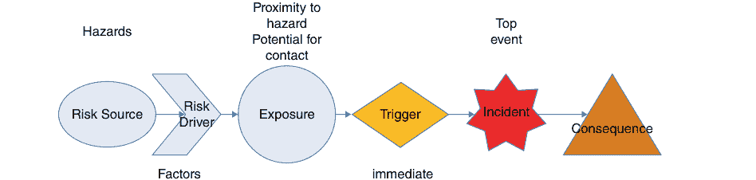

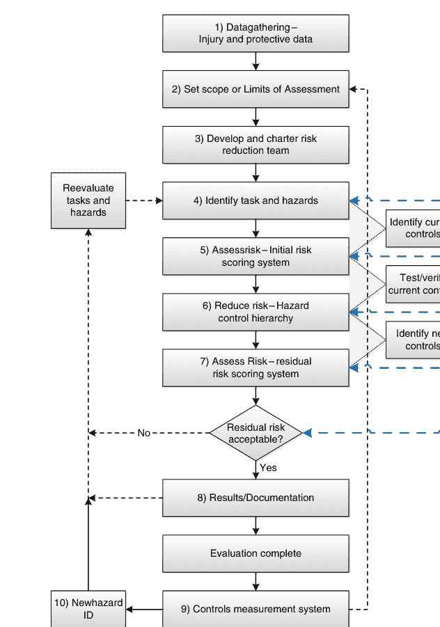

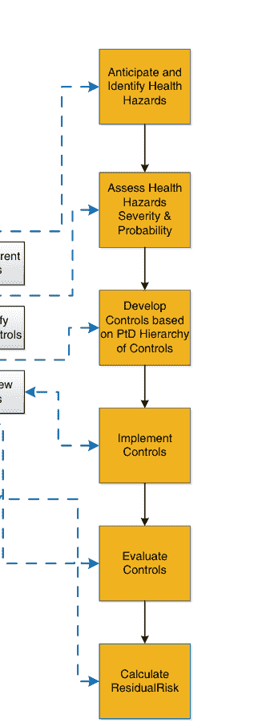

图 12.8 风险路径模型。

气相色谱（GC）作为一种分离分析技术，一直是分析环境和职业健康样本中复杂混合物的首选方法。在气相色谱仪中，多组分样品通过一根细长的色谱柱（涂有固定相），以分离化合物进行进一步检测。通常使用氦气或氮气（流动相）等惰性气体作为载气，将样品输送到色谱柱内（Fatah 等人，2007）。色谱柱在分析过程中会按照设定的温度速率加热。样品中的化合物在色谱柱内移动时，根据其与固定相的亲和力相互作用，从而被分离，并在特定时间（称为保留时间）离开色谱柱。离开色谱柱后，分离后的化合物通过检测器（例如火焰光度检测器或质谱检测器），产生与分析物浓度成比例的信号（Fatah 等人，2007）。气相色谱系统主要部件的示意图如图所示（图 12.9）。

尽管气相色谱仪具有出色的灵敏度和选择性，但由于其体积较大且需要使用多种高纯度气体，因此通常仅作为台式仪器在实验室环境中使用。近年来，配备光电离检测器的便携式气相色谱仪应运而生，使得在现场近乎实时地分析空气样本成为可能，其检测限可达低 ppb 范围。此类仪器具有体积小、使用环境空气作为载气（无需单独使用压缩气瓶）以及配备紧凑型光电离检测器等优点。例如，Dräger X-pid® 8500（Dräger，德国吕贝克）等仪器可以在 50 ppb 的浓度下分离并识别混合烃类中的苯（Dräger，2020，图 12.10）。

表 12.8 中展示的加和效应模型显示，BTEX 的混合物暴露水平（$\bar{E}_m$）超过了 1，这意味着这四种化学物质的加和效应超过了暴露限值。补充的交互式 Excel 文件允许读者通过输入单个化学物质的暴露值来计算 $\bar{E}_m$。后果展示在领结图的右侧。缓解控制措施可以输入到相应的控制单元格中。这些后果是基于俄勒冈州人类服务部技术公报提供的示例，该公报可在以下网址获取：https://www.oregon.gov/oha/PH/HealthyEnvironments/DrinkingWater/Monitoring/Documents/health/btex.pdf

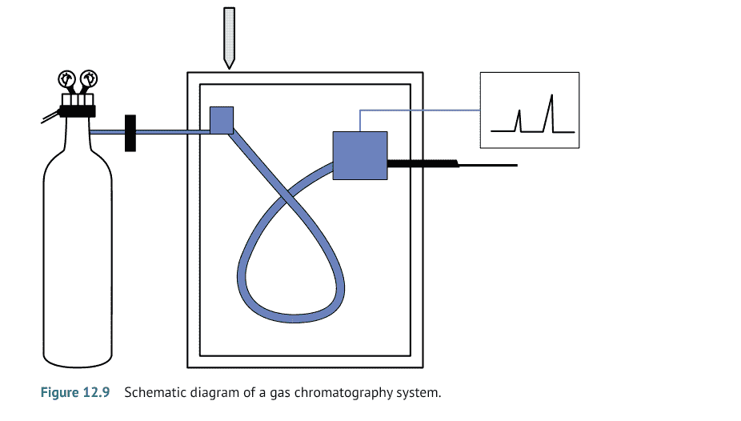

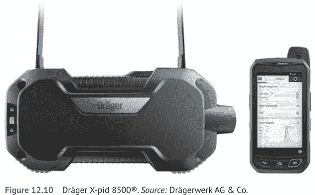

化学物质加和暴露的可视化表示如图 12.11 所示。此概念可应用于任何其他化学化合物混合物。它清晰地展示了从风险源到顶事件及其导致后果的逻辑演进过程。

## 12.5 更复杂的职业卫生风险评估工具

ART：“高级 REACH 工具（ART）1.5 版结合了吸入暴露的机理模型和统计功能，可使用内置暴露数据库或用户自己的数据中的测量值来更新估算值（欢迎使用高级 REACH 工具 1.5，无日期）。这种模型估算与数据的结合产生了更精确的暴露估算并降低了不确定性。”ART 可用于评估吸入性粉尘、蒸气和雾的暴露。目前，ART 不能用于评估热冶金过程中排放产生的烟雾、纤维、气体和粉尘。

Stoffenmanager：另一个在国际上广泛接受的工具是 Stoffenmanager。Stoffenmanager 是一个通用工具，最初是为中小企业开发的，以支持它们评估、优先排序和控制工作场所的化学物质风险。它为公司和 EHS 专业人员提供支持，帮助他们进行风险评估并通过采取适当的风险管理措施来控制暴露。Stoffenmanager 是一个免费的基于互联网的工具，可在设计者的网站上获取（https://stoffenmanager.nl/）。该在线工具为健康风险评估提供了不同的选项。用户可以在“控制分级”和“定量风险评估”模块之间切换。

## 12.6 健康风险评估与优先排序

健康风险评估应侧重于造成伤害的可能性，而非实际的健康结果，因为健康结果可能在暴露多年后才被诊断出来。有多种简单的健康风险评估工具可用。例如，定性风险评估矩阵可用于初步风险评估。数值风险评估方法也可使用。

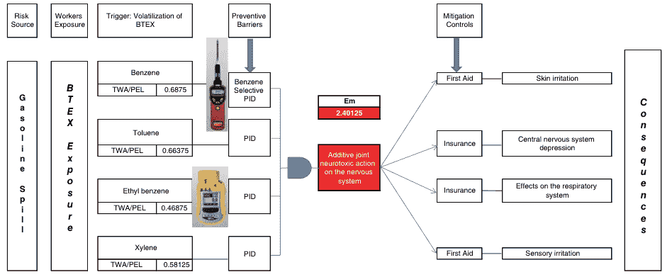

图 12.11 BTEX 加和效应领结图示例。

ANSI Z 590.3 – 2011(R2016) 中提供了一个带有数值分级和评分的风险评估矩阵示例。将矩阵中的严重性和发生概率值相结合可得出风险分数。该矩阵并非专门为健康风险评估设计。但是，经过轻微修改后，可成功用于化学、物理和生物暴露评估。表 12.9 展示了一个二维的严重性 × 概率/频率风险评估模型示例。

该示例基于 QAP 案例研究中使用含 5% 苯的溶剂。概率/频率和严重性评级量表示例见表 12.10 和表 12.11。

风险等级就是严重性和概率/频率各自数值的乘积。在此示例中，喷涂作业的风险最高。喷涂作业是连续操作，操作员定期暴露于含苯混合物中。溶剂的混合和喷漆室的清洁每周进行一次。因此，暴露的频率/概率评级为 3。随着矩阵的完成，可以轻松识别出评级最高的工艺/操作或工作站。SH&E 专业人员将根据 ANSI/ASSP Z590.3-2011(R2016)“通过设计预防：在设计和再设计过程中解决职业危害和风险的指南”的控制层级来确定适当的控制措施。有时，建议采取多种控制措施来应对危害并降低健康风险。

## 12.7 修正的 HRR/IH FMEA 方法

先前描述的健康风险评级（HRR）方法不包括 AIHA 的暴露分类方案。因此，本示例介绍了一种修正的 HRR，该方法使用包含*暴露*变量的失效模式与影响分析（FMEA）模型。修正的 HRR/IH FMEA 方法为严重性、概率和暴露分配风险评级数字。以下示例说明了 OSH 专业人员如何在风险评估过程中使用工作表并应用 HRR 概念。

表 12.9 HRR 示例。

| 工艺/操作 | OSH 方面/危害描述 | 潜在影响/ OSH 风险描述 | 参考资料 | 频率 | 严重性 | 风险等级 (RL) |
|---|---|---|---|---|---|---|
| 喷涂混合 | 溶剂暴露。皮肤暴露。 | 皮炎 | http://www.cdc.gov/niosh/topics/skin/ | 3 | 3 | 9 |
| 喷涂作业 | 苯：化学物质暴露。产生 VOCs。 | 白血病、癌症、贫血。 | https://emergency.cdc.gov/agent/benzene/basics/facts.asp | 4 | 4 | 16 |
| 清洁喷漆室 | 处理受污染的容器和废物。溶剂暴露。 | 白血病、癌症、贫血。皮炎。 | https://www.epa.gov/saferchoice/automotive-refinishing-safety-information | 3 | 4 | 12 |

## 12.8 案例研究

一家生产泡沫床垫的小型公司进口了生产过程中使用的多种化学品。我们选择了三种化学品来演示改进后的FMEA方法的适用性。例如，聚合多元醇通常用于生产其他聚合物。它们与异氰酸酯反应生成用于制造床垫的聚氨酯。此外，混合物中还添加了硼酸。

工艺流程如图12.12所示。

-   工序：泡沫床垫的制造、切割、成型、包裹布料
-   化学品：TDI-80：甲苯二异氰酸酯（NIOSH SEQ 0621）、多元醇（与TDI反应生成泡沫的聚合物）和硼酸
-   TDI-80：化学式：CH₃C₆H₃(NCO)₂
-   OSHA PEL：C 0.02 ppm
-   三种化学品的靶器官：眼睛、皮肤、呼吸系统

生产设施位于南美洲。由于该国没有AIHA认可实验室的替代方案，潜在的工人健康风险评估必须利用现场检测方法进行。使用直接读数擦拭法进行表面化学检测，用于表面污染评估。实验性Microteq® TDI/MDI直接读数擦拭纸于2008年首次在美国以外地区进行测试。使用Dräger甲苯二异氰酸酯0.02/a检测管进行空气中TDI污染测量。

### 12.8.1 采样

在工作区域的关键位置采集区域样本，以评估可能需要在特定位置长时间工作的员工的暴露风险。此外，区域采样用于识别任何潜在的“热点”和可能需要特殊控制措施的区域。采集了九（9）个TDI比色采样管样本。每个检测管样本的采集位置距离TDI桶越来越远。此外，对20个DRW（直接读数擦拭纸）表面进行了采样，以评估潜在的皮肤暴露。DRW在员工最可能接触的表面采集。比色擦拭样本可能是确定皮肤暴露概率的非常有用的筛查工具。

### 12.8.2 结果

将疑似污染区域与对照区域进行了比较。新开发的擦拭样本在半定量水平上测量了表面检测和评估的浓度。Dräger TDI检测管在确定存在表面污染的相同位置显示了异氰酸酯的存在。

确认空气中TDI浓度为0.1 ppm。

来源：AIHA (2015). *A Strategy for Assessing and Managing Occupational Exposures*, 4e (ed. S.D. Jahn, W.H. Bullock and J.S. Ignacio).

确认在50%的采样表面存在TDI。

毫不奇怪，在检测到高水平表面污染的地方，TDI的空气浓度最高。

开发了以下改进的FMEA工作表来演示健康风险评估过程。该模型用于使用公式（12.3）计算健康风险优先级数（HRPN）。

HRPN = 严重性 × 概率 × 暴露 (12.3)

可以使用表12.12中给出的评级来建议以下严重性评级。关于概率或频率评级，可以提出两种选择，如表12.13所示。

AIHA的暴露分类方案可用于对暴露进行分级。该方案在ANSI/ASSP Z590.3-2011(R2016) PtD标准中有详细描述。但是，作者建议为多种化学物质暴露增加一个第5类。AIHA方案未涉及多种化学物质暴露及其叠加效应。因此，在本案例中增加了第5类，如表12.14所示。

可以使用改进的FMEA和HRPN工作表对选定的三种化学品进行排序，如表12.15所示。本示例中使用了1-5的严重性、概率和暴露评级。

表12.12 严重性评级。

| 严重性评级 | |
| :--- | :--- |
| 5 | 死亡或多种致残性疾病 |
| 4 | 永久性疾病或残疾 |
| 3 | 离岗、限制工作和调岗（DART）疾病 |
| 2 | 急救 |
| 1 | 新鲜空气/不适 |

表12.13 概率或频率评级。

| 与化学物质/试剂暴露相关的职业病发生概率 | 频率（更适用于常规操作） |
| :--- | :--- |
| 5 极有可能 | 5 频繁。暴露 ≥ 每天8小时或更长时间 |
| 4 可能 | 4 暴露定期发生（每周超过一次） |
| 3 有点可能 | 3 暴露可能每周发生一次 |
| 2 不太可能 | 2 暴露可能每周发生少于一次 |
| 1 极不可能 | 1 暴露极不可能发生 |

表12.14 暴露评级。

| | 数值评级 | 暴露评级 | 建议的后续行动/暴露控制 |
| :--- | :--- | :--- | :--- |
| 可接受的健康风险 | 0 | < OEL的1% | 无需采取行动 |
| | 1 | < OEL的10% | 一般危险沟通（与GHS一致） |
| 不确定的健康风险 | 2 | OEL的10–50% | 特定化学品的危险沟通（与GHS一致） |
| | 3 | OEL的50–100% | 考虑工程控制、暴露监测、医疗监测、工作实践 |
| 不可接受的健康风险 | 4 | > OEL的100% | 考虑PtD控制层级。从避免、消除、替代开始。如果不可能，考虑工程控制、警告、工作实践控制，最后是PPE |
| | 5 | 多种化学物质暴露。协同效应。Em > 1 | 立即实施PtD控制或停止生产以验证控制措施和PPE选择。必要时使用多种控制措施 |

注意：强烈建议用户不要使用“0”类暴露，因为它将产生“0” HRPN。

甲苯二异氰酸酯（TDI）的严重性等级被评为5，因为过度暴露可能导致死亡或多种致残性疾病。与化学物质/试剂暴露相关的职业病发生概率被评为4，因为工人暴露是“可能的”。最后，暴露被评为5，因为暴露超过了OEL且存在多种化学物质暴露。

聚四氢呋喃和硼酸的严重性等级均被评为3，因为这些化学品的毒性较低。此外，操作员使用P 100呼吸器，可提供一定的硼酸颗粒防护。硼酸被OSHA、CAL OSHA或ACGIH列为/监管为“未另行分类的颗粒物”或“有害粉尘”。允许暴露限值为15 mg/m³，总粉尘5 mg/m³，可吸入粉尘。然而，P 100型呼吸器无法保护工人免受TDI和聚四氢呋喃的伤害。可以认为所有三种物质的暴露评级都应为5。使用这种方法可以让SH&E专业人员快速确定危害的优先级，并紧急处理排名最高的化学危害。例如，这个实际案例表明需要根据PtD控制层级应用风险降低措施。

表12.15 改进的FMEA和HRPN工作表。

| 部件或工序名称 | 泡沫床垫。 | 供应商和 | 各种 | | 编制人 | GP | |
| :--- | :--- | :--- | :--- | :--- | :--- | :--- | :--- |
| 设计/制造责任 | | 型号日期 | 2015年1月27日 | | FMEA日期 | | |
| 涉及其他领域 | 工程部 | 工程变更 | | | | | |
| **基准案例 – 当前状态** | | | | | | | |
| 工序操作、功能或目的 | 潜在暴露模式 | 失效的潜在影响 | SEV | 失效的潜在原因 | PROB | 暴露控制评级理由 | EXP | S x P | HRPN |
| 泡沫床垫生产 | TDI暴露 | 眼睛、皮肤、呼吸系统受影响 | 5 | 操作员未受保护或保护不足。 | 4 | 多种化学物质暴露 – PPE不足 | 5 | 20 | 100 |
| 泡沫床垫生产 | 聚四氢呋喃暴露 | 眼睛、皮肤、呼吸系统受影响 | 3 | 操作员未受保护或保护不足。 | 4 | 多种化学物质暴露 – PPE不足 | 5 | 12 | 60 |
| 泡沫床垫生产 | 硼酸暴露 | 眼睛、皮肤、呼吸系统受影响 | 3 | 操作员受到一定保护。 | 3 | 多种化学物质暴露 – PPE基本足够 | 5 | 9 | 45 |

一种可能的选项是用毒性较低的材料替代TDI和聚四氢呋喃。为鼓励向更安全的化学品过渡，美国职业安全与健康管理局（OSHA）开发了这个分步工具包，为雇主和工人提供关于在工作场所使用知情替代的信息、方法、工具和指导（OSHA, n.d.b）。

工艺改造可能被建议用于通过非异氰酸酯路线生产大豆基聚氨酯（Javni, Hong, & Petrović, 2008）。其他研究建议使用碳纳米管增强的大豆基聚氨酯（PU）泡沫产品（Liang & Shi, 2010）。

用毒性较低的材料替代已识别的剧毒化学品，将显著降低严重性评级。与化学品暴露相关的职业病发生概率也将显著降低。然而，新的化学危害应仔细评估，因为它们可能带来不同的危害和/或对靶器官产生不同的影响。

## 12.9 控制分组纳米工具

添加纳米材料将给工作场所带来新的挑战和风险。Paik、Zalk和Swuste（2008）提出了一种出色的纳米材料风险评估工具，即用于风险优先级排序和管理的控制分组（CB）纳米工具。次年，Zalk、Paik和Swuste（2009）发布了一个略有修改的版本。CB纳米工具2.0可在 https://controlbanding.llnl.gov/ 获取。

根据作者的说法，CB纳米工具是一种新颖的CB方法，正在劳伦斯利弗莫尔国家实验室（LLNL）由专家和非专家使用，用于评估与纳米技术操作相关的风险并规定适当的工程控制措施。2019年，作者发表了控制分组纳米工具的定量验证（Zalk, D.M., Paik, S.Y., & Chase, W., 2019）。定量验证的所有结果表明，CB纳米工具定性评估的控制结果足以防止工人暴露于超过既定暴露限值或背景水平的工程纳米颗粒（ENPs）。结果还表明，CB纳米工具产生的控制建议通常与专家实施的现有控制措施相当，在某些情况下甚至更为保守。该研究可在以下网址获取：https://academic.oup.com/annweh/article/63/8/898/5552738

Brouwer（2012）总结了其他用于纳米材料的控制分组方法。

## 12.10 皮肤风险评估

Sahmel和Boeniger（2015）在AIHA的《暴露评估策略》第13章中提出了一种有趣的皮肤暴露风险评估方法。作者使用评级方案对暴露概况和进一步信息收集的优先级进行排序。使用评级数字，皮肤风险评估方法可被描述为一种半定量方法，因为它分配的是近似评级值，而非精确测量。该方法可在本章的补充材料中找到。该模型基于皮肤暴露潜力评级（DER）和皮肤危害评级（DHR）1024 × 4皮肤风险矩阵。

皮肤暴露潜力评级（DER）是五个评级因子的乘积，使用公式（12.4）相乘以估算相似暴露组（SEGs）的DER，其中：

### 皮肤风险评级矩阵：数值分级

| | 物质 1 | 物质 2 | 物质 3 |
|---|---|---|---|
| 皮肤危害评级（DHR）： | 4 | 1 | 3 | 2 |
| 皮肤暴露评级（DER）： | 1024 | 256 | 1024 | 256 |
| 总计 | 256 | 3072 | 512 | 注意 |

| 风险评估矩阵 | 皮肤暴露评级 | | | |
|---|---|---|---|---|
| | 16 | 64 | 256 | 1024 |
| 皮肤危害评级 | 4 | 64 | 256 | 1024 | 4096 |
| | 3 | 48 | 192 | 768 | 3072 |
| | 2 | 32 | 128 | 512 | 2048 |
| | 1 | 16 | 64 | 256 | 1024 |

| 皮肤危害评级 | DER= | DCA | DC | DCF | DRT | DPP |
|---|---|---|---|---|---|---|
| 注 | 暴露 PR= | 2 | 2 | 4 | 4 | 4 |
| | DER= | 256 | | | | |

图 12.13 皮肤风险。

DCA = 皮肤接触面积；DC = 皮肤浓度；DCF = 皮肤接触频率；DRT = 皮肤滞留时间；DPP = 皮肤渗透潜力。

DER = DCA × DC × DCF × DRT × DPP (12.4)

所有五个因子均基于1-4的量表进行评级。皮肤危害评级（DHR）也是1-4的评级。皮肤风险水平通过在垂直和水平轴上找到最接近的DHR和DER值来确定。两个评级的交汇点决定了风险。矩阵的一个示例如图12.13所示。实际的评级量表包含在补充材料中。

## 12.11 职业健康风险与产品设计过程的协调

多年来，工业卫生（IH）专业人员一直使用美国国家科学院（NAS）风险评估范式（也改编自EPA）作为估算暴露于环境化学品风险的框架（NRC 1983）。EPA的四步风险评估过程如图12.14所示。

在此框架内，定量健康风险评估是基于健康的暴露限值的基石。暴露评估是风险评估范式的关键步骤。AIHA的暴露评估策略委员会开发了优秀的暴露评估工具。工具用户手册可在以下网址获取：https://www.aiha.org/public-resources/consumer-resources/topics-of-interest/ih-apps-tools

然而，暴露评估只是健康风险评估过程的一个步骤。例如，Korchevskiy、A. Rasmuson和Rasmuson（2014年2月）指出，评估健康风险始于暴露评估。文章《新信息和新模型正在改变石棉风险评估》的作者也指出，“采样和测量技术涉及各种不确定性和随机特征，包括确定相似暴露组（SEGs）、每日测量与长期暴露的外推、与剂量-反应关系相关的个体结果变异性，以及与分析方法相关的高变异性。”

### 四步风险评估过程

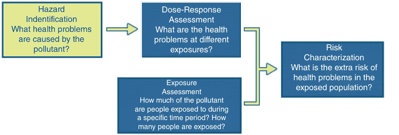

图 12.14 EPA的四步风险评估过程。来源：美国环境保护局，《进行人体健康风险评估》，2021年。公共领域。

NAS风险评估范式可用于处理职业危害、环境危害、自然灾害以及环境中可能存在的其他压力源。如前所述，NAS风险评估范式已被EPA采用，并被IH专业人员广泛接受。IH专业人员预测、识别、评估和控制危害。预测、识别和评估可以与EPA的风险评估过程相关联，如表12.16所示（Jayjock, Lynch, & Nelson, 2000）。

在AIHA的《The Synergist》杂志上发表的一系列题为“风险评估的新时代”的文章中，作者描述了改进IH专业人员使用的风险评估过程的必要性（*The Synergist*，2012年4月、5月、6月/7月和8月）。在NAS风险评估范式发布时，没有要求进行风险评估的自愿性职业安全与健康（OSH）标准。此后，全球发布了大量要求进行风险评估的OSH实践标准、指南和倡议。自2005年以来，已颁布了50多项此类要求或促进使用风险评估的标准和倡议。如本教材其他章节所述，要求雇主进行风险

表 12.16 EPA风险评估过程与IH原则的比较。

| EPA的风险评估过程 | IH原则 |
| :--- | :--- |
| 1) 危害识别 | 预测/识别 |
| 2) 剂量-反应评估 | 评估 |
| 3) 暴露评估 | |
| 4) 风险表征 | |
| 风险管理 | 控制 |
| 风险沟通 | 危害沟通 |

来源：Jayjock, M.A., Lynch, J.R., and Nelson, D.I. (2000). *Risk Assessment Principles for the Industrial Hygienist*. Fairfax, VA: AIHA Press.

评估主要发生在美国境外。自2011年以来，美国国家标准协会（ANSI）发布了四项重要的自愿性标准，为健康风险评估与管理实践提供了适用要求。这些标准包括：

- ANSI/ASSP Z10-2019 – 职业健康安全管理体系
- ANSI/ASSP/ISO 45001-2018 – 职业健康安全管理体系
- ANSI/ASSP/ISO 31000 – 2018 风险管理
- ANSI/ASSP/ISO 31010 – 2019 风险评估
- ANSI/ASSP Z590.3 – 2011(2016) *通过设计预防——在设计和再设计过程中处理职业危害和风险的指南*

显然，需要将NAS风险评估范式与新的自愿性标准对齐。本书前面的章节已对ANSI/ASSP/ISO 31010和ANSI Z590.3中的风险评估进行了比较。在图12.15中，作者提供了以下NAS风险评估范式与ANSI/ASSP/ISO 31000的对齐方式。

显然，NAS风险评估范式中增加了额外的风险管理或风险处理步骤。2018年，AIHA发布了职业暴露风险评估/管理的*知识体系*（BoK）。它呈现了显著扩展的风险评估和管理流程。该模型包括七个步骤。需要注意的是，第三步被分为子步骤，可被视为工业卫生风险评估过程。后续步骤包括控制解决方案以及为工业卫生/职业安全健康干预制定商业案例。下面的图12.16尝试将AIHA的职业暴露风险评估/管理流程与ISO 31000风险管理流程对齐。

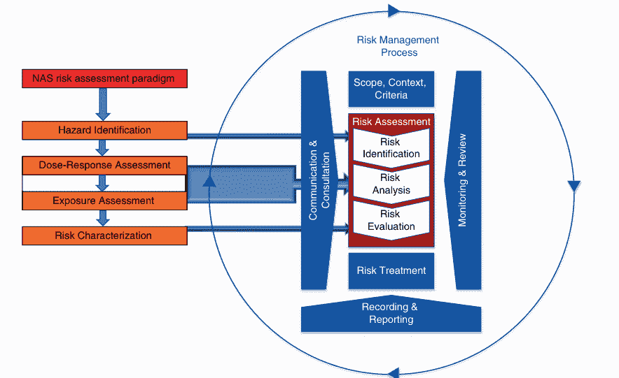

**图12.15** NAS风险评估范式与ANSI/ASSP /ISO 31000的对齐。

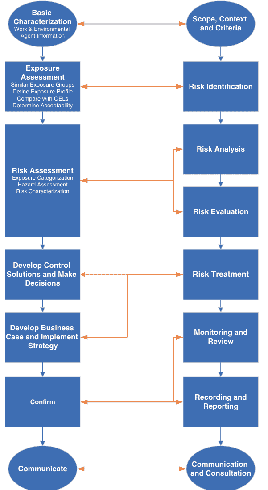

AIHA暴露风险评估/管理流程 ISO 31000风险管理流程

**图12.16** AIHA的职业暴露风险评估/管理流程与ISO 31000风险管理流程的建议对齐。

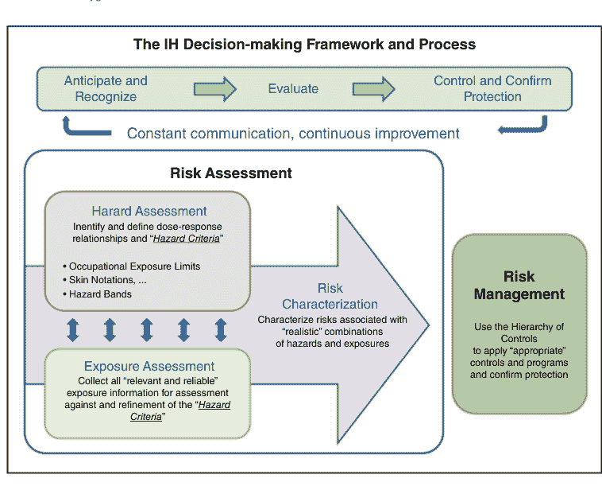

图12.17 工业卫生风险评估与通过设计风险评估的对齐。

可以开发更详细的健康风险评估与管理模型，并与通过设计标准对齐，如图12.17所示。

## 12.12 总结

本章讨论的工具和方法总结了工业卫生风险评估与管理过程中使用的一些方法。这些方法以系统且易于阅读的格式呈现工业卫生风险评估过程，并突出了优先事项。提出的将FMEA用于工业卫生干预措施依赖于专业判断和半定量决策，以评估危害的重要性并为每项任务或流程分配HRPN。利用改进的FMEA进行工业卫生风险评估有助于优先处理降低风险的建议。

## 复习题

1.  比较工业卫生师使用的一些风险评估术语。
2.  阐述工业卫生风险评估的主要目的。
3.  描述工业卫生在风险评估过程中的作用。
4.  列出三种在工业卫生风险评估过程中最具应用潜力的工具。
5.  总结与工业卫生风险评估相关的一些难点。
6.  表达你对将工业卫生原则整合到通过设计风险评估模型中的必要性的看法。
7.  解释所介绍的工业卫生风险评估方法的好处。

## 参考文献

Advanced REACH Tool (ART). https://www.advancedreachtool.com/ (accessed 1 April 2015).
AIHA (2006). *A Strategy for Assessing and Managing Occupational Exposures*, 3ee. AIHA https://www.aiha.org/marketplace/Pages/Product-Detail.aspx?productid={96E7072A-4778-DE11-96B0-0050568361FD} (accessed 6 July 2021).
AIHA (2006). *A Strategy for Assessing and Managing Occupational Exposures*, 3e. – May 1, 2006 by Ignacio, J.S. and Bullock, W.H.
American Industrial Hygiene Association (2002). AIHA white paper on risk assessment and risk management. https://www.aiha.org/get-involved/VolunteerGroups/Documents/RISKVG-whitepaper02_Risk.pdf (accessed 6 July 2021).
American Industrial Hygiene Association (2020). About AIHA. https://www.aiha.org/about-aiha (accessed 6 July 2021).
ANSI Z10-2012 (2012). Occupational health and safety management systems. https://webstore.ansi.org/Standards/ASSE/ANSIASEZ102012R2017?gclid=Cj0KCQjw8IaGBhCHARIsAGIRRYo78nMF4uZqJTB5SzsUd3nVF0FTCtr8y2kSkaYccZHr7nQfsiwwIAkaAkIEEALw_wcB (accessed 6 July 2021)
ANSI/ASSP (2016). ANSI/ASSP Z590.3-2011(R2106) *Prevention through Design: Guidelines for Addressing Occupational Hazards and Risks in Design and Redesign Processes*. Park Ridge, IL: American Society of Safety Professionals.
ANSI/ASSP (2019). ANSI/ASSP Z10-2019 *Occupational Health & Safety Management Systems*. Park Ridge, IL: American Society of Safety Professionals.
ANSI/ASSP Z590.3-2011(R2016) (2016). *Prevention through Design: Guidelines for Addressing Occupational Hazards and Risks in Design and Redesign Processes*. Des Plaines, IL: American Society of Safety Engineers.
ATSDR (2004). Interaction profile for: benzene, toluene, ethylbenzene, and xylenes (BTEX). https://www.atsdr.cdc.gov/interactionprofiles/IP-btex/ip05.pdf (accessed 6 July 2021)
Brouwer, D.H. (2012). Control banding approaches for nanomaterials. *The Annals of Occupational Hygiene* 56 (5): 506–514. https://academic.oup.com/annweh/article/56/5/506/160390.
Canadian Centre for Occupational Health and Safety (2012). Risk phrases used in the countries of European Union. http://www.ccohs.ca/oshanswers/chemicals/risk_phrases.html (accessed 6 July 2021)
Dräger (2020). Dräger X-pid® 8500/9000/9500 product specification. https://www.draeger.com/Products/Content/X-pid-9x00-Product-specs-en.pdf (accessed 6 July 2021)
Ehrlich, R.I., Myers, J.E., te Water Naude, J.M. et al. (2011). Lung function loss in relation to silica dust exposure in South African gold miners. *Occupational and Environmental Medicine* 68 (2): 96–101. https://doi.org/10.1136/oem.2009.048827.
European Agency for Safety and Health at Work (n.d.). What are the H codes and how can I compare them to the familiar R-phrases? https://osha.europa.eu/en/faq/dangerous-substances-clp-reach/what-are-the-h-codes-and-how-can-i-compare-them-to-the-familiar-r-phrases (accessed 6 July 2021)
Fatah, A.A., Arcilesi, R.D., Peterson, J.C. et al. (2007). *Guide for the Selection of Chemical Detection Equipment for Emergency First Responders*. Washington, DC: U.S. Department of Homeland Security.
Health and Safety Executive (2009). The technical basis for COSHH essentials: easy steps to control chemicals. http://coshh-essentials.org.uk/assets/live/CETB.pdf (accessed 6 July 2021)
Health and Safety Executive (n.d.). COSHH essentials. http://www.hse.gov.uk/coshh/essentials/ (accessed 6 July 2021)
Jahn, S.D., Bullock, W.H., and Ignacio, J.S. (eds.) (2015). *A Strategy for Assessing and Managing Occupational Exposures*, 4e. Fairfax, VA: AIHA Press.
Javni, I., Hong, D.P., and Petrović, Z.S. (2008). Soy-based polyurethanes by nonisocyanate route. *Journal of Applied Polymer Science* 108 (6): 3867–3875.
Jayjock, M.A., Lynch, J.R., and Nelson, D.I. (2000). *Risk Assessment Principles for the Industrial Hygienist*. Fairfax, VA: AIHA Press.
Korchevskiy, A., Rasmuson, J., and Rasmuson, E. (2014). “Miracle Mineral” risk assessment. *The Synergist* February: 26–30.
Liang, K. and Shi, S.Q. (2010). Soy-based polyurethane foam reinforced with carbon nanotubes. *Key Engineering Materials* 419–420 (2010): 477–480.
Mulhausen, J., Damiano, J., and Pullen, E.L. (2015a). Defining and judging exposure profiles. In: *A Strategy for Assessing and Managing Occupational Exposures*, 4e (eds. S.D. Jahn, J.S. Ignacio and W.H. Bullock). Fairfax, VA: AIHA Press.
Mulhausen, J., Damiano, J., and Pullen, E.L. (2015b). Further information gathering. In: *A Strategy for Assessing and Managing Occupational Exposures*, 4e (eds. S.D. Jahn, J.S. Ignacio and W.H. Bullock). Fairfax, VA: AIHA Press.
National Academy Press (1983). Risk assessment in the federal government: managing the process. Washington, DC: National Academy Press. http://www.nap.edu/openbook.php?isbn=0309033497 (accessed 6 July 2021)
National Research Council (1983). *Risk Assessment in the Federal Government. Managing the Process*. Washington, DC: National Academy Press.
Occupational Safety and Health Administration (1998). Industrial Hygiene. https://www.osha.gov/Publications/OSHA3143/OSHA3143.htm (accessed 6 July 2021)
Occupational Safety and Health Administration (n.d.a). Occupational safety and health standards: toxic and hazardous substances. https://www.osha.gov/pls/oshaweb/owadisp.show_document?p_table=Standards&p_id=9991 (accessed 6 July 2021)
Occupational Safety and Health Administration (n.d.b). Transitioning to safer chemicals: a toolkit for employers and workers. https://www.osha.gov/dsg/safer_chemicals/index.html (accessed 6 July 2021)
Paik, S.Y., Zalk, D.M., and Swuste, P. (2008). Application of a pilot control banding tool for risk level assessment and control of nanoparticle exposures. *The Annals of Occupational Hygiene* 52 (6): 419–428.
Rae Systems (2013). The PID Handbook. https://www.raesystems.com/sites/default/files/content/resources/pid_handbook_1002-02.pdf (accessed 6 July 2021)
Rumsfeld, D.H. (2002). DoD news briefing – secretary Rumsfeld and Gen. Myers. http://www.defense.gov/transcripts/transcript.aspx?transcriptid=2636 (accessed 6 July 2021)
Sahmel, J. and Boeniger, M. (2015). Dermal exposure assessments. In: *A Strategy for Assessing and Managing Occupational Exposures*, e4e (eds. S.D. Jahn, W.H. Bullock and J.S. Ignacio). Fairfax, VA: AIHA Press.

Sferopoulos, R. (2009). *化学战剂（CWA）探测技术与商用现货项目综述*。澳大利亚：国防科技组织。

欢迎使用高级风险评估工具 1.5 (n.d.)。https://www.advancedreachtool.com（访问于 2021 年 7 月 6 日）

Zalk, D.M., Paik, S.Y., and Swuste, P. (2009). 评估控制带纳米工具：一种用于控制纳米颗粒暴露的定性风险评估方法。*纳米颗粒研究杂志* **11**: 1685–1704.

Zalk, D.M., Paik, S.Y., and Chase, W. (2019). 控制带纳米工具的定量验证。*工作暴露与健康年鉴* **63** (8): 898–917. https://doi.org/10.1093/annweh/wxz057. https://academic.oup.com/annweh/article/63/8/898/5552738（访问于 2021 年 7 月 6 日）。

# 13 机械风险评估
*布鲁斯·里昂*
*布朗与布朗公司*

### 目标
- 介绍机械危害与防护
- 回顾机械风险评估与风险降低中使用的技术
- 审视这些技术的应用、优势与局限性
- 提供机械风险评估技术使用指南

## 13.1 引言

机器在工作场所执行着许多曾经由人完成的功能。机器相对于人类提供的机械优势，使得工业得以增长和扩张，并最终降低了生产和服务成本。机器被设计得强大、快速且不知疲倦，能够完成人类无法实现的重复性任务。在几乎所有行业中，无数的机器每天执行着切割、冲压、弯曲、成型、回火、组装、熔接、精加工、包装以及产品和物料搬运等功能。这些机械进步消除了工人此前面临的许多危险，并使许多人免于工伤和死亡。

然而，尽管机器带来了诸多益处，它们也带来了一定的危害和风险。与机械相关的伤害在永久性、部分残疾中占比最高，在所有工业事故中排名第三。许多此类事故源于危害识别与控制的缺乏，以及现有安全防护装置的绕过。在其网站上，*职业安全与健康管理局（OSHA）机械防护电子工具*指出，“员工暴露于无防护或防护不足的机器的情况在许多工作场所普遍存在。因此，操作和维护机械的工人每年遭受约18,000例截肢、割伤、挤压伤、擦伤，以及超过800例死亡。截肢是职业工作场所中最严重和致残的伤害类型之一，通常导致永久性残疾。”因此，对于安全、健康与环境（SH&E）专业人员来说，熟练识别和控制与机械相关的危害和风险变得越来越重要。

*风险评估：评估操作风险的实用指南*，第二版。
Georgi Popov, Bruce K. Lyon, and Bruce Hollcroft.
© 2022 John Wiley & Sons, Inc. 由 John Wiley & Sons, Inc. 于 2022 年出版。

## 13.2 机械安全标准

存在许多与机械相关的安全合规性和共识标准。在美国，雇主必须至少遵守职业安全与健康管理局（OSHA）的标准。OSHA规定，雇主必须为员工提供安全健康的工作场所，并为一般工业（29 CFR 1910）和建筑业（29 CFR 1926）提供了具体标准。具体而言，机械安全标准属于一般工业标准中的*1910 O子部分，机械和机械防护*，包括：

1910.211，定义
1910.212，所有机器的一般要求
1910.213，木工机械要求
1910.214，制桶机械 [保留]
1910.215，砂轮机械
1910.216，橡胶和塑料工业中的压延机和研磨机
1910.217，机械动力压力机。包括一般要求以及关于结构、防护、模具、检查、维护、改装、操作、伤害报告和存在感应装置启动（PSDI）的具体要求。
- 附录A，机械动力压力机存在感应装置启动安全系统认证/验证的强制性要求
- 附录B，机械动力压力机存在感应装置启动安全系统认证/验证的非强制性指南
- 附录C，OSHA认可第三方验证组织执行PSDI标准的强制性要求
- 附录D，非强制性补充信息

1910.218，锻造机械
1910.219，机械动力传输装置

此外，*1910 R子部分，特殊行业*在以下标准中涉及机械安全：

1910.262，纺织品。段落(c)(3) [保留] 包含关于机械防护要求的简短说明和对29 CFR 1910.219的引用。[相关主题页面]
1910.263，烘焙设备。段落(c)涉及机械防护的一般要求。
1910.268，电信。段落(b)(1)(v)涉及一些机械防护的一般要求。

列出的OSHA标准涉及正常生产操作期间的机械安全。然而，机器需要定期维护、服务和维修，这使维护人员和承包商面临潜在危险能量释放的风险。对于此类机械维护和服务活动，*OSHA 1901.147，危险能量控制（上锁/挂牌）*标准已就位，以保护工人在执行这些操作时免受意外通电、启动或储存能量释放的伤害。

关于机械安全的共识标准，已制定了许多国家和国际标准与指南。尽管它们是自愿性的，但由美国国家标准协会（ANSI）等发布的共识标准被用来支持合规标准，并且经常被OSHA在其自身标准和引用中提及。其中一些标准包括：

- ANSI B11.0-2020. 机械安全
- ANSI B11.TR3-2000. 风险评估与风险降低 – 机床相关风险的估算、评估和降低指南
- ANSI B11.TR6-2010. 机械技术报告 – 机床安全控制系统
- ANSI B11.19-2019. 风险降低措施的性能要求：防护及其他降低风险的方法
- ANSI/RIA R15.06-2012. 工业机器人和机器人系统 – 安全要求
- NFPA 79-2018. 工业机械电气标准
- ANSI/ASSP Z244.1-2016. 危险能量控制 上锁、挂牌及其他方法
- ANSI/PMMI B155.1-2016. 包装机械及相关转换机械的安全要求
- SEMI S10-1119. 风险评估与风险评价过程安全指南
- MIL-STD-882E-2012. 系统安全标准实践
- CSA Z432-16. 机械防护
- CSA Z434-14 (R2019). 工业机器人和机器人系统 – 通用安全要求
- CSA Z460-2020. 危险能量控制 – 上锁及其他方法
- ISO 12100:2010. 机械安全 – 设计通则 – 风险评估与风险降低
- EN 954-1:2000/ISO 13849-1:1999. 机械安全 – 控制系统的安全相关部分 – 第1部分：设计通则
- ISO 13849-1:2015. 机械安全 – 控制系统的安全相关部分 – 第1部分：设计通则
- 2006/42/EC. 欧盟机械指令

### 13.2.1 B11 标准

在这些标准中，ANSI B11.0 被视为机械安全和风险评估的核心。它是 ANSI 和 B11 Standards, Inc.（称为 B11 系列）发布的 30 多项金属加工机械标准和技术报告之一。在缺乏特定机械标准的情况下，ANSI B11.0 与 *ANSI B11.19 风险降低措施的性能要求：防护及其他降低风险的方法* 共同构成了 B11 系列特定机械（C型）标准的基础，也适用于其他缺乏特定机械安全标准的工业机械。B11 标准和技术报告按照 ANSI B11.0-2020 中描述的 ISO A-B-C 层级结构组织：

- **A型标准**（*基础标准*）提供基本概念、设计原则和可应用于机械的通用方面。
- **B型标准**（*通用安全标准*）处理一种或多种安全方面或一种或多种可广泛应用于各类机械的防护类型。
- **C型标准**（*机械安全标准*）处理特定机械或机械组的详细安全要求。

由于它适用于一系列机械并包含一般要求，ANSI B11.0 被视为 A 型标准。其范围明确指出，它特别适用于“新的、现有的、改装的或重建的动力驱动的机器，在工作时无法用手搬运，用于通过切割、成型、压力、电气、热力或光学技术、层压或这些工艺的组合来加工材料。”此外，该标准规定，机械*供应商*和*用户*有责任定义和实现可接受的风险，并且与机械操作、维护、拆卸和处置相关的任何风险*应*降低到可接受的水平。B11.0标准提供了以下图表和关于图13.1所示机器使用中各方的定义。

- **个人**可能进入工业环境（工作场所）。当他们靠近机器或设备时，他们成为**受影响人员**。
- 某些个人如果受雇或签约在工业环境（工作场所）工作，则被视为**人员**。人员可能受也可能不受机械供应商或用户的直接控制。人员可能包括**操作员**、**维护人员**和**其他人员**。虽然B11标准中没有明确定义，但图（13.1）中使用的“其他”可能包括服务人员、承包商、分包商等。
- 经过适当培训，人员可以成为**合格人员**。
- 获得机械供应商或用户的许可后，**合格人员**可以成为**授权人员**。
- **主管**监督各类人员的工作。（ANSI B11.0, 2020）。

此外，B11.0标准包含一种正式的方法来执行和记录风险评估过程，并确定了在风险评估开始前必须进行的一些准备工作。该标准以逐步方法呈现了基本风险评估过程（如图13.3所示），以协助实现这一目标。

**图13.1** B11系列机械安全标准中使用的人员术语，经ANSI B11.0-2020 – 机械安全许可转载。*来源*：美国国家标准协会（ANSI）（2020）。ANSI B11.0-2020：*机械安全*。德克萨斯州休斯顿：B11标准公司。

## 13.3 机械危害

机器需要人类控制和交互来执行其任务。从生产角度来看，操作员每天通过执行设置、调整、启动、装卸、监控、排除故障或清理以及关闭机器等活动与机器互动。定期地，机器需要持续的维护、服务、修理或更换。这些与生产无关的互动对工人构成一定的危害和风险。其中许多危害源于为机器和设备提供动力的能源。与机器相关的危险能源包括电能、重力、极端温度、化学能、机械能、气动能、液压能和储存能量。

OSHA在其网站摘录中描述了与机器相关的危害及其存在位置：

> **机械防护基础知识**
> 压碎的手和手臂、切断的手指、失明——可能的机械相关伤害清单既长又可怕。似乎由运动机器部件产生的危害与机器类型一样多。防护对于保护工人免受不必要和可预防的伤害至关重要。
> 一个需要记住的好规则是：任何可能造成伤害的机器部件、功能或过程都必须加以防护。当机器的操作或意外接触可能伤害操作员或附近的其他人时，必须控制或消除危害。
> 本手册描述了机械运动的各种危害，并介绍了一些保护工人免受这些危害的技术。本章涵盖的一般信息包括——机械危害发生的位置、不同运动产生的危害以及有效防护的要求，以及对非机械危害的简要讨论。
> **机械危害发生的位置**
> 三个基本区域中的危险运动部件需要防护：
> <u>操作点</u>：对材料进行加工的点，例如切割、成型、钻孔或对材料进行成型。
> <u>动力传输装置</u>：机械系统中将能量传输到执行工作的机器部件的所有组件。这些组件包括飞轮、滑轮、皮带、连杆、联轴器、凸轮、主轴、链条、曲柄和齿轮。
> <u>其他运动部件</u>：机器工作时运动的所有部件。这些可以包括往复运动、旋转运动和横向运动部件，以及进给机构和机器的辅助部件。

在ANSI B11.0标准的附录D中，可以找到机械危害清单。通过机器生命周期的所有阶段使用风险评估过程，应评估这些潜在危害类别并将其控制在可容忍的水平。*供应商*（机器制造商）和*用户*在评估和控制机器风险方面都有责任。以下是改编自ANSI B11.0附录D的与机器相关的危害组：

- 化学、材料或物质危害（即油雾、金属粉尘、易燃液体等）
- 控制系统故障或非预期的机器行为（即意外启动、未能停止等）
- 电气或电子危害
- 环境危害（即排放、释放）
- 与人体工程学和人类因素相关的危害（即过度伸展、别扭的姿势、不清晰的控制或显示等）
- 火灾和爆炸
- 流体
- 容器、产品或材料的搬运
- 极端温度
- 激光
- 辐射（即紫外线、红外线、电磁、电离辐射等）
- 物料搬运危害
- 机械危害（即运动或旋转部件、操作点等）
- 自然危害
- 噪声和振动
- 滑倒和跌倒
- 通风和密闭空间

## 13.4 机械防护

防护对于保护员工免受机械相关伤害至关重要。为了安全使用机器，需要适当的防护方法，如外壳、固定防护罩、屏障和存在感应装置，以将机械相关风险降低到可接受的水平。

术语“防护”被认为是“风险降低措施”或“保护措施”的同义词，ANSI B11.0-2020将其定义为“用于消除危害和/或降低风险的任何行动或手段”。此外，*ANSI B11.TR3 – 2000 机床技术报告*将防护定义为包括“防护罩、防护装置、警示装置、防护方法和安全工作程序”。

正如OSHA所述，“任何可能造成伤害的机器部件、功能或过程都必须加以防护。”防护的主要目的是检测或防止无意中接触危害，并将风险降低到可容忍的水平。与运营风险管理的其他领域一样，在选择机器防护方法时应使用控制层级。*ANSI B11.19-2019 风险降低措施的性能要求：防护和其他降低风险的方法*标准为用于保护员工免受机械危害的防护的设计、制造、安装、操作和维护提供了宝贵的指导。

图13.2展示了机器防护方法的层级和类型，经*ANSI B11.0 – 2020*许可转载。与其他控制层级模型类似，它从设计相关的风险降低措施开始，认为这是最有效的，而管理和个人防护设备则是最不有效的措施。然而，B11模型将模型分为两部分：（i）供应商或制造商；以及（ii）用户。

为了有效保护人员免受机械危害，在机器防护的设计和使用中必须满足某些要求。OSHA定义了以下机器防护的最低要求：

## 13.4 机器安全防护

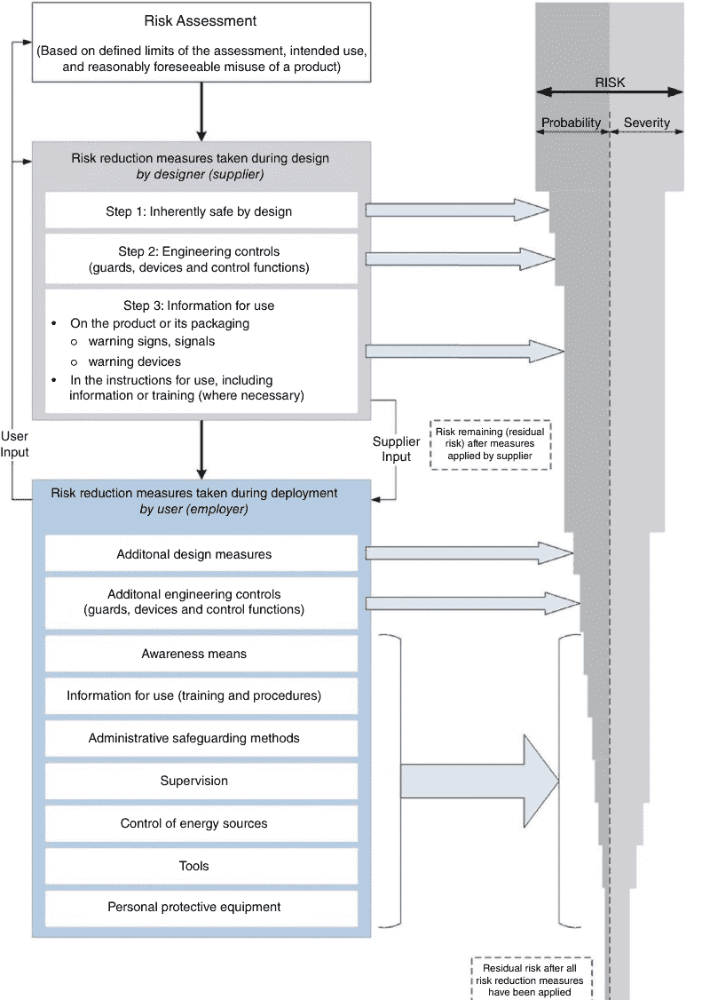

图 13.2 供应商和用户风险降低工作流程示意图，经ANSI B11.0-2020 – 机械安全标准许可转载。来源：美国国家标准协会 (ANSI) (2020)。ANSI B11.0-2020：机械安全。休斯顿，德克萨斯州：B11 Standards, Inc.

1)  *防止接触：防护装置必须防止工人的手、手臂以及身体的任何其他部分接触到危险的运动部件。一个良好的防护系统应能消除操作员或其他工人将身体部位靠近危险运动部件的可能性。*

2)  *牢固：工人不应能轻易拆除或篡改防护装置，因为一个可以轻易失效的防护装置根本算不上防护。防护罩和安全装置应采用耐用材料制成，能够承受正常使用条件。它们必须牢固地固定在机器上。*

3)  *防止物体坠落：防护装置应确保没有物体能掉入运动部件中。一个小工具掉入循环运行的机器中，很容易变成一个可能击伤并伤害他人的抛射物。*

4)  *不产生新的危险：如果防护装置本身产生了危险，例如剪切点、锯齿状边缘或可能导致割伤的未加工表面，那么它就违背了自身的初衷。例如，防护罩的边缘应通过卷边或螺栓固定等方式消除锋利边缘。*

5)  *不造成干扰：任何妨碍工人快速舒适地完成工作的防护装置，都可能很快被绕过或忽视。适当的防护实际上可以提高效率，因为它可以减轻工人对受伤的担忧。*

6)  *允许安全润滑：如果可能，应在不拆除防护装置的情况下对机器进行润滑。将油箱置于防护罩外部，并通过管线连接到润滑点，将减少操作员或维护人员进入危险区域的需要。*

ANSI B11.0 标准中明确定义了风险降低方法的概念和特性。该标准涉及为操作员安全使用和操作机器，以及维护和维修人员安全接近机器而进行设计的需求。标准中包含的防护装置和控制措施涵盖了一系列项目，参与评估机器、机器系统和机器人的人员应参考这些内容。

### 13.4.1 机器安全控制系统

正如 ANSI B11.0 所述，机器上的某些控制系统被设计用于执行安全功能以降低伤害风险。这些控制元件在标准中被称为“控制系统的安全相关部分”(SRP/CS)。根据 ANSI B11.0，机器安全控制系统包括传感器、手动输入和模式选择元件、联锁和决策电路，以及输出到机器执行器、操作装置和机构的元件。此类机器安全控制措施降低了与机器功能相关的某些风险，并且正变得日益复杂。

对于配备安全控制系统的机器，进行两项独立的风险评估非常重要：(i) 与机器或工艺相关的风险，以及 (ii) 与机器安全控制系统相关的风险。正如 Bruce Main 和 Fred Hayes 发表在 ASSP Professional Safety 上的一篇文章中所指出的，这两项评估应分开进行。他们指出，许多机器危险超出了现有机器安全控制系统的范围，因此这两个方面必须分别进行评估。Main 和 Hayes 指出：

> ISO 13849-1 *[控制系统安全相关部分标准]* 仅涉及控制系统的安全相关部分，并且仅在机器的风险评估确定需要将控制系统作为风险降低措施后才适用。机器上的许多危险与控制系统无关（例如，高处作业的坠落危险；滑倒和绊倒；举升/弯腰/扭转导致的人体工学危险）。性能等级 (PLs) 和类别对于这些危险没有意义，因此试图将机械风险评估和控制系统规范合并是不合理的。(Main & Hayes, 2014)

对于从事复杂机械和机器人系统工作的人员，建议进一步研究上述文章、Bruce Main 的其他出版物以及所引用的标准。

## 13.5 选择待评估的机器

为了正确选择待评估的机器，需要对操作中使用的各种机器进行清点。由于大多数组织资源有限，遵循某种优先排序和选择机器进行风险评估的方法是明智的。此类选择方法应包括诸如对劳动力的暴露程度（机器使用程度和暴露人群规模）、以往的损失经验、维护需求以及已知或感知的机器风险水平等因素。

使用频率较高或对劳动力暴露程度较高、且感知风险较大的机器应优先考虑。组织常犯的一个错误是等到事故发生后才进行风险评估。应制定一个主动计划，将所有机器纳入正式的风险评估流程。

## 13.6 机器风险评估

风险评估旨在对已识别的危险进行优先排序，以便消除或降低与每种危险相关的风险。当识别出危险时，应评估与该危险相关的风险。应在每台机器的初始阶段、发生变更或修改时以及识别出新的危险时进行风险评估。

机器制造商和使用机器的组织都有责任评估风险并保护机器安全，如 ANSI B11.0 标准所述。本文将主要关注用户执行的风险评估方法。

有多种方法可用于评估与机器相关的风险。需要注意的是，风险评估的真正价值在于执行该过程的规范性和结构性。正如 ANSI B11.0 所述，研究表明，各种风险评估方法在风险等级确定和控制方法策略方面得出的结果非常相似。

风险评估过程被认为是“可扩展的”，这意味着它可以应用于单个危险、多个危险、简单机器或复杂的自动化机器。这种“可扩展”的过程可应用于新的、现有的或修改过的机器；然而，为了有效，它必须包含 ANSI B11.0 中描述的基本要素。该过程步骤如下图 13.3 所示，经 *ANSI B11.0-2020 – 机械安全* 许可转载。

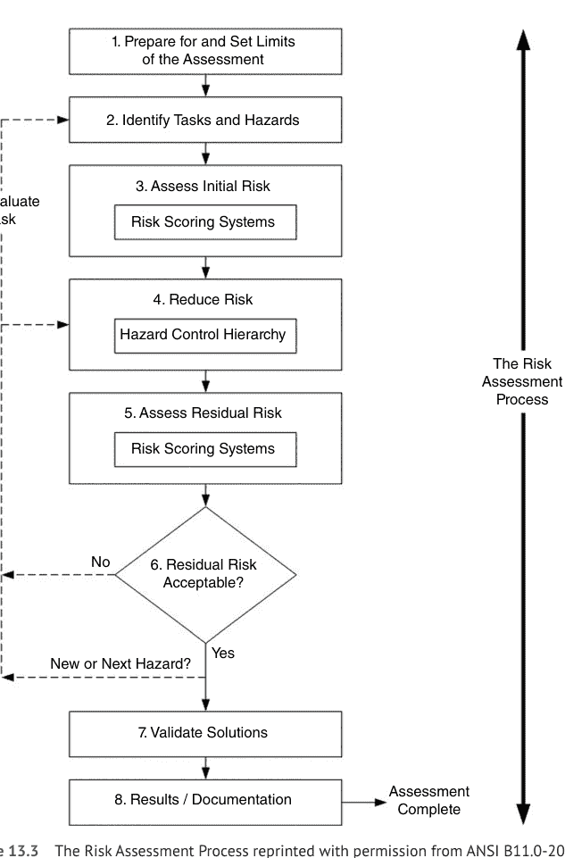

图 13.3 风险评估流程，经 ANSI B11.0-2020 – 机械安全标准许可转载。来源：美国国家标准协会 (ANSI) (2020)。ANSI B11.0-2020：机械安全。休斯顿，德克萨斯州：B11 Standards, Inc.

使用 ANSI B11.0 模型，执行机器风险评估的步骤简述如下：

1)  *为风险评估做准备*
对于任何进行的风险评估，首要步骤是明确定义目的、范围和背景。评估的“目的”通常决定了所需的范围和复杂程度（或简单程度）。范围应明确定义评估的界限，并包括关键因素，例如：评估团队（具备技术能力和相关技能的人员）；要使用的评估方法；完成时间表；待评估的机器；机器生命周期的阶段（即设计/重新设计、建造、安装、操作、维护、退役、拆解）；待评估的部件；运行状态；可接受的风险水平；以及其他评估限制。应确定并考虑机器的限制，例如：

- 预期用途。
- 生产率。
- 周期时间。
- 施加的力。

## 2) 识别任务与危害

为妥善管理风险，必须识别机器的预期任务及相关危害。这要求评估团队识别：

- 暴露于机器的人员（即操作员、维护人员、工程师、承包商、安装人员、调试人员、物料搬运人员等）。
- 执行的任务（即操作模式、维护/服务、故障排除、清洁等）。
- 任务的可预见危害（即机械危害、能源、意外启动、滑倒与跌倒、高温表面、易燃环境、锋利边缘、操作危害等）。

为正确识别这些要素，评估团队需具备技术资质，并了解机器的用途和能力。团队应审查相关信息，如机器规格和操作说明；事故历史；适用的规范、法规和共识标准；与操作员和维护人员的访谈；相关检查表；以及先前的风险评估。通过头脑风暴，可以进一步识别和澄清机器及周边操作中的危害和潜在事故。

## 3) 评估初始风险

针对识别出的每项危害，需评估风险。与识别危害相关的风险是伤害“严重性”和伤害发生“可能性”的综合结果。如同任何风险评估工作，必须选择并使用风险评分系统或风险矩阵。有许多定性和定量风险评分系统可供选择。选择哪种系统主要基于个人、组织或行业偏好（Main, 2012）。例如，表13.1所示的MIL-STD-882双因素风险评分系统（4 × 5）模型是一个可用的定性系统。

表13.1 MIL-STD-882双因素风险评分系统（4 × 5）示例。

| 可能性 | 灾难性 | 严重 | 边缘 | 可忽略 |
| :--- | :--- | :--- | :--- | :--- |
| 频繁 | 高 | 高 | 严重 | 中等 |
| 可能 | 高 | 高 | 严重 | 中等 |
| 偶尔 | 高 | 严重 | 中等 | 低 |
| 极少 | 严重 | 中等 | 中等 | 低 |
| 不可能 | 中等 | 中等 | 中等 | 低 |

使用选定的评分系统，在实施任何风险降低措施之前（初始风险水平）和之后（剩余风险水平）对每项风险进行评估。评估风险时，首先根据危害造成的最高“可信”伤害水平来估计严重性。例如，在表13.1的示例评分模型中，能够导致死亡或永久性致残伤害的危害，其严重性等级将被视为“灾难性”。然后评估发生的可能性。在确定可能性时，需考虑暴露的频率、持续时间和范围；危害特征；人为错误可能性；以及操作员的意识和培训等因素。应注意，由于难以准确预测定量概率，最常使用定性描述。根据风险评分系统中的严重性和可能性估计，得出风险等级。然后将此初始风险评估等级与组织建立的可接受风险水平进行比较，以确定是否需要进一步降低风险。

## 4) 降低风险

对于风险水平超过可接受水平的危害，需要采取额外的风险降低措施。采用控制层级方法，按有效性顺序选择可行的风险降低措施，从“通过设计预防”措施开始，然后是工程控制、管理控制，最后是个人防护装备（参考ANSI B11.0-2020的图13.2）。在选择和实施安全防护措施时，必须确保不引入新的危害。这通过重复受影响要素的风险评估过程来实现。

## 5) 评估剩余风险

在选择风险降低措施后，团队评估剩余或残留风险。考虑到所选风险降低措施的效果，估计严重性和可能性风险因素，以验证措施的有效性和适当性。（*注：ANSI B11.0强调评估安全防护措施的重要性，以防止有意或无意地破坏或绕过所选安全防护措施，或任何为满足生产需求而绕过控制措施的动机。*）使用风险评分系统，将估计的严重性和可能性因素结合起来，确定剩余风险水平。

## 6) 达到可接受风险

根据确定的机器剩余风险水平，对每项危害做出接受或进一步降低风险的决定。应注意，可接受风险并非普遍特征，相同的暴露可能被不同组织做出不同判断。相反，可接受风险由每个组织根据其文化、行业等因素确定。

## 7) 验证解决方案

一旦完全实施并到位，需对风险降低措施进行评估、测试和验证其有效性。此验证过程应包括对机器和安全防护装置的物理测试，以及对程序的审查。此类机器测试必须安全进行，避免任何暴露于伤害的风险。

## 8) 记录过程

过程的最后一步是记录风险评估。这包括评估步骤、采取的风险降低措施和取得的结果，以及以下内容的记录：

- 机器信息（标识、位置、操作、限制）。
- 风险评估期间的观察（包括照片、数字视频、尺寸、距离、停止时间和其他相关因素）。
- 危害类型（机械危害，如运动部件或操作点、暴露于危险能源等——参考ANSI B11.0-2020，附录D——机械危害部分清单）。
- 危害造成的伤害严重性。
- 危害造成的伤害可能性。
- 当前安全防护措施。
- 初始风险水平。
- 所需的额外安全防护措施（建议参考ANSI B11.19）。
- 剩余风险水平。

图13.4提供了一个风险评估电子表格示例，其中包含为收集的每项数据设置的列。

## 13.7 估计风险

在确定机器危害的风险水平时，应采用标准化方法，以便对风险进行一致的比较和优先级排序。*ANSI B11.TR3-2000 风险评估与风险降低——机床相关风险的估计、评估和降低指南*技术报告就是专门为此类机械安全防护风险评估而制定的。这种定性方法使用伤害的严重性和可能性作为估计风险水平的主要风险因素。与所有风险评估一样，最终目的是确定风险水平是否可接受，或者是否需要进一步降低风险。遵循TR3技术报告指南，简要描述风险估计过程。

1) *估计伤害严重性*——首先，使用以下四个类别确定危害可能造成的伤害或疾病程度。
    a) 灾难性——死亡或永久性致残伤害或疾病
    b) 严重——严重削弱性伤害或疾病
    c) 中等——超出急救范围的重大伤害或疾病
    d) 轻微——无伤害或需要急救的轻微伤害

严重性估计不考虑现有安全防护措施。在做出此判断时，选择可能发生的最坏可信伤害严重性。例如，一个

| 位置： | | | | | | | | | |
| 日期： | 评估员 | | | | | | | | |
| 机器标识： | | | | | | | | | |
| 机器模式/生命周期： | | | | | | | | | |
| 观察： | | | | | | | | | |
| 暴露 | | 初始评估 | | | | 后续评估 | | | |
| 活动 | 危害 | 严重性 | 可能性 | 当前防护措施 | 风险等级 | 额外防护措施 | 严重性 | 可能性 | 风险等级 |
| | | | | | | | | | |
| | | | | | | | | | |
| | | | | | | | | | |
| | | | | | | | | | |
| | | | | | | | | | |

图13.4 用于记录数据的风险评估电子表格示例。

## 13.8 案例研究

一家金属制造公司认识到需要评估其设施内机器相关的风险。该公司将范围界定为涵盖正常生产操作中使用的所有制造机械。其目的是识别并优先处理需要额外风险降低措施以达到可接受风险水平的机器。一个由经验丰富的协调员、生产、维护、工程、质量和管理人员组成的风险评估团队被组建起来。该团队确定了一种纳入现有安全防护保护的风险评估方法，并接受了该方法的培训。以下数据被收集并用于风险评估。

**机器风险评估方法：** 用于确定风险的风险评估方法包含三个因素：严重等级（S）、可能性等级（L）和现有保护因子（P）。每个机器危害的初始风险优先数（RPN）通过将严重等级（S）与可能性（L）和保护因子（P）的乘积相乘来确定，如公式所示：S × (L × P) = RPN。该组织确定，在表13.6所示的风险优先数等级上，风险分数为15或更高是不可接受的，需要进一步降低风险。高于9的风险被视为需要补救行动的高优先级。对于初始RPN分数高于9的危害，选择了额外的风险降低措施并在第二次风险评估中进行了计算。计算了第二次RPN以指示所添加控制措施的风险水平。有了这些信息，公司可以适当地优先安排降低机器风险的工作。

**机器：** 本案例研究中使用的机器是一台手动进料和操作的螺母焊接机。该机器使用两个点焊枪和一个夹具，是最近添加到操作中的。被评估的机器处于常规生产模式。

**任务：** 评估的任务是机器的装载和启动。对于每个零件，两名操作员一起将普通钢零件放入夹具中，并将两个螺母放置在焊接操作点的位置。然后，主操作员使用双手控制启动焊接机。

**受影响人员：** 观察到两名员工一起装载零件并启动机器。（其他潜在受影响人员包括焊接技术人员和维护人员。）

**活动或任务：** 该任务涉及将金属件放入焊接枪夹具中，并放入两个待焊接的螺母；然后主操作员使用双手控制启动焊接机；焊接完成后，将焊接件从夹具中取出并放入料箱。

**危害：** 危害包括在操作点被夹住和手部刺伤；处理零件时的割伤；手部焊接烧伤；焊接火花对身体的烧伤；眼睛闪光灼伤；被坠落材料击中。（对物料搬运和人体工程学风险因素的进一步评估在单独的人体工程学风险评估中考虑。）

**现有控制措施：** 用于启动焊接机的双手控制系统；机器侧面和背面的部分屏障保护；使用防割/防烧手套和臂套；ANSI Z87.1，遮光号2的防护眼镜和侧挡板；阻燃服装；防护鞋；以及一套工作程序。

**严重（S）等级：** 对于评估的每个危害，分配的风险评级与最可信的严重后果最接近一致。使用了以下表13.3：

**可能性（L）等级：** 对于评估的每个危害，使用表13.4确定发生可能性。

**保护因子（P）等级：** 对于现有安全防护和控制措施，使用表13.5确定保护等级，该等级被纳入风险优先数（RPN）的计算。

**风险计算：** 对于每个危害，将严重等级（S）的得分乘以可能性（L）和保护因子（P）的乘积，使用公式计算风险优先数：S × (L × P) = RPN。

**风险优先数：** 如果RPN高于15，则需要进一步的风险降低措施。对于RPN分数在9到14之间，如表13.6所述，进一步降低风险被赋予高优先级。

**风险评估工作表：** 部分风险评估结果如下图13.5所示。
**风险评估矩阵：** 得出的RPN根据图13.6中的矩阵进行比较和优先排序。

## 13.9 机器维护和服务评估

机器上的非常规工作对生命和肢体构成重大风险。所有操作的共同点是需要对设施、系统和设备进行定期维护和服务。随着公司的发展和扩张，通常需要新的操作和机器来替代旧的或效率低下的设备。此外，可能发生意外情况，如设备故障、停电、系统故障以及其他需要内部或外部资源立即处理的紧急情况。这些非生产和非常规情况由于危险能量的突然释放，对工人构成不寻常且通常重大的风险。在这种情况下，需要隔离和控制危险能量才能安全地执行这些任务。

机器系统中的危险能量控制通常被称为上锁挂牌。OSHA 1910.147《危险能量控制》标准涵盖了机器和设备的维护和服务，其中机器或设备的意外通电或启动，或储存能量的释放，可能伤害员工。它要求雇主建立能源控制程序，制定针对特定机器的上锁挂牌程序，以便在维护和服务活动中隔离系统中的特定能源。

然而，在某些情况下，需要保持系统通电以执行所需功能。诸如换模、清除卡料、润滑、工具更换、轻微清洁、调整和设置等活动被视为生产过程的一部分，可能会阻碍使用传统的上锁挂牌控制措施。这给安全执行这些任务带来了挑战。ANSI/ASSE Z244.1-2016《危险能量控制：上锁、挂牌和替代方法》为这种情况提供了指导。该标准包含在使用上锁/挂牌不切实际且需要替代方法时进行风险评估的要求。选择适当的替代方法基于对设备或工艺的风险评估，并考虑到可能需要移除或修改现有安全防护才能执行任务。

虽然没有规定具体的方法，但ANSI Z244.1附录A提供了关于风险评估和风险降低过程的指导。机器危害的风险评估和风险降低以及使用替代方法的过程步骤概述如下。

**风险评估过程**

1) *评估潜在伤害的严重性* – 伤害的潜在严重性根据其后果进行评估。例如，一台防护得当的台锯，如果发生接触，可能因手指或手部潜在的截肢而被评估为“*灾难性*”。当危害的潜在严重性介于两个风险评级之间时，应选择较高的类别。

2) *估计伤害概率* – 然后使用下面列出的类别确定导致伤害的发生可能性。
    - a) 非常可能 – 几乎肯定会发生
    - b) 可能 – 可能会发生
    - c) 不太可能 – 不太可能发生
    - d) 极不可能 – 不太可能发生，概率接近零

在估计概率时，考虑了暴露的频率、持续时间和范围；培训；意识和危害的呈现。ANSI B11.TR3在确定概率时包括以下评估因素：
    - 暴露于危害（频率和持续时间；身体暴露的范围；以及暴露人数）。
    - 执行任务的人员（他们的培训水平、技能和经验）。
    - 机器/任务历史（机器可靠性、事故和故障历史、与其他机器相比的感知风险）。
    - 工作场所环境（内务管理、布局/工作流程、工作表面、照明、噪音、振动、通风、温度和湿度）。
    - 人为因素（错误和遗漏的可能性、人体工程学风险因素、绕过安全防护的动机、降低沟通或任务清晰度的要素）。
    - 安全功能的可靠性（机器固有的控制系统）。
    - 击败或规避保护措施的可能性（绕过安全防护的能力程度）。
    - 维护保护措施的能力（可持续性和持续有效性、所需的维护水平）。

以防护得当的台锯为例，考虑到移除防护罩相对容易、台锯的事故历史、为获得更好视野而移除防护罩的可能动机、操作员的培训和经验等因素，伤害发生的概率可能被评为“*可能*”。

表13.2中提供的定性4×4风险模型用于估计每个危害的风险水平。对于评估为“高”的风险，需要最大程度的风险降低。

### 表13.2 定性4×4风险模型。

| 发生可能性 | 轻微 | 中等 | 严重 | 灾难性 |
|---|---|---|---|---|
| 非常可能 | 中等 | 高 | 高 | 高 |
| 可能 | 低 | 中等 | 高 | 高 |
| 不太可能 | 可忽略 | 低 | 中等 | 中等 |
| 极不可能 | 可忽略 | 可忽略 | 低 | 低 |

### 表13.3 严重等级。

| 分数 | 评级 | 描述 |
|---|---|---|
| 5 | 灾难性 | 死亡或永久性残疾 |
| 4 | 严重 | 工时损失、永久性损伤或多次工时损失 |
| 3 | 重大 | 工时损失，完全康复 |
| 2 | 边缘 | 需要医疗处理，OSHA可记录 |
| 1 | 最小 | 急救伤害 |

### 表13.4 暴露等级。

| 分数 | 评级 | 描述 |
|---|---|---|
| 5 | 非常可能 | 危害持续发生 |
| 4 | 可能 | 危害每天发生 |
| 3 | 可能 | 危害发生频率低于每周一次 |
| 2 | 不太可能 | 危害发生频率低于每月一次 |
| 1 | 非常不可能 | 危害很少发生 |

### 表13.5 保护因子等级。

| 风险公式 | |
|---|---|
| 严重性 × (可能性 × 保护因子) = 风险 | |
| **保护因子 (P)** | **乘数** |
| 消除 | 0.1 |
| 替代 | 0.4 |
| 工程控制 – 多重 | 0.6 |
| 工程控制 – 单一 | 0.7 |
| 警告 | 0.8 |
| 管理控制 | 0.9 |
| 个人防护装备 | 0.95 |
| 无控制措施 | 1 |

### 表13.6 风险优先数等级及行动要求。

| 风险等级 (RL) | 风险分数 | 行动 |
| :--- | :--- | :--- |
| **极高** | **15–20** | **不允许操作。需要立即行动。** |
| **高** | **9–14** | **补救行动应给予高优先级。** |
| **中等** | **5–8** | **应在适当时间采取补救行动。** |
| **低** | **1–4** | **补救行动可酌情决定。** |

## 13 机器风险评估

| 机器模式/生命周期：螺母焊接机 – 运行模式 |
| :--- |
| 观察：两名操作员装载/启动机器；需要协调与沟通。机器侧面和后部部分暴露。 |
| | 暴露情况 | | | 初始评估 | | | | 后续评估 | | | | |
| 人员 | 活动 | 危险源 | 控制措施 | S | L | P | RPN | 附加控制措施 | S | L | P | RPN |
| 操作员 | 将零件和螺母放入焊接夹具并启动焊接 | 在焊接操作点被夹住 | 双手控制 | 5 | 4 | 0.7 | 14 | 存在感应装置光幕；启动前验证测试；个人防护装备 | 4 | 2 | 0.6 | 4.8 |
| 助手；区域内其他工人 | 将零件和螺母放入焊接夹具 | 在焊接操作点被夹住；从机器侧面和后部进入 | 侧面和后部部分屏障；工作程序 | 5 | 4 | 0.7 | 14 | 带联锁屏障的完全封闭；存在感应装置光幕；启动前验证测试；个人防护装备 | 4 | 2 | 0.6 | 4.8 |
| 操作员和助手 | 将零件和螺母放入焊接夹具并启动焊接 | 焊枪灼伤 | 个人防护装备 – 防灼伤手套和服装 | 3 | 5 | 0.95 | | 存在感应装置光幕；启动前验证测试 | 3 | 2 | 0.6 | 3.6 |
| 操作员和助手 | 将零件和螺母放入焊接夹具并启动焊接 | 焊接闪光和物体进入眼睛 | 个人防护装备 – ANSI Z87.1 眼部防护 -遮光号 #2 | 4 | 4 | 0.95 | 15.2 | 焊接防护帘 | 4 | 3 | 0.7 | 8.4 |

图 13.5 螺母焊接机风险评估。

风险评估过程是一个分析过程，旨在识别、评估和评定危险源及相关风险，以便将风险控制在可接受水平。该过程包括以下步骤：

1)  *识别所有任务*：应考虑所有任务和活动，包括设置、安装、拆卸、维护、操作、调整、清洁、故障排除和编程。
2)  *识别危险源*：应考虑与每项任务相关的危险能量释放，如电气、重力、机械、化学、热能、气动、液压、辐射，以及其他类型的危险源，如人为因素。
3)  *评估潜在后果*：评估每项任务可能发生的最严重伤害。

## 风险矩阵

| 严重性 (S) | 微不足道 (1) 对伤害或疾病、系统损失或停机时间、或环境释放无影响。 | 可忽略 (2) 仅需急救或轻微医疗处理，非严重的设备或设施损坏，无需报告的常规清理化学物质泄漏。 | 边际 (3) 需要医疗处理或限制工作，轻微的子系统损失或损坏，触发外部报告要求的化学物质泄漏。 | 严重 (4) 导致残疾的伤害或疾病，重大财产损失，业务停机，对环境或公共卫生产生临时影响的化学物质泄漏。 | 灾难性 (5) 一人或多人死亡，系统完全损失，对环境或公共卫生产生持久影响的化学物质泄漏。 |
|---|---|---|---|---|---|
| | 1 | 2 | 3 | 4 | 5 |
| 频繁 (5) 可能反复发生。 | 5 | 10 | 15 | 20 | 25 |
| 可能 (4) 可能会发生数次。 | 4 | 8 | 12 | 16 | 20 |
| 偶尔 (3) 可能间歇性发生。 | 3 | 6 | 9 | 12 | 15 |
| 罕见 (2) 可能发生，但极少。 | 2 | 4 | 6 | 8 | 10 |
| 不太可能 (1) 不太可能发生，可假设事件或暴露不会发生。 | 1 | 2 | 3 | 4 | 5 |

图 13.6 风险评估矩阵。来源：改编自 ANSI/ASSE/AIHA Z10-2012 (2012)。美国国家标准 – 职业健康与安全管理体系。弗吉尼亚州费尔法克斯：美国工业卫生协会。

4) 评估潜在暴露：评估所有人员对已识别危险源的潜在暴露。评估中应考虑暴露人数、暴露频率、持续时间和性质。

5) 评估发生概率：通过考虑以下因素估算危险事件发生的概率：

-   现有安全防护措施、安全装置和安全系统
-   可靠性、历史记录和故障模式
-   任务的操作/维护要求
-   安全防护措施被破坏或失效的可能性
-   任务、活动、机器、设备或流程的事故历史
-   执行任务人员的能力
-   工作环境

6) 评估风险：应对每项已识别的危险源和任务进行评估，以确定风险水平。这将决定该任务的风险是否可接受。

7)  *达到可接受的风险水平*：如果风险水平被认定为可接受，则流程完成。如果风险被认定为不可接受，则应实施风险降低流程。

### 风险降低流程

对于不可接受的风险，应使用控制层级选择并实施风险降低措施。该流程应由合格且适当的人员执行并记录。ANSI Z244.1, 8.1.2 危险控制层级按从最有效到最无效的顺序列出了控制选择：

1)  通过设计消除危险源。
2)  替代。
3)  护罩和安全防护装置。
4)  警示装置。
5)  程序和培训。
6)  使用个人防护装备 (PPE)。

风险降低措施完成后，应进行第二次风险评估。该评估应考虑已实施的风险控制措施以及产生的任何新任务或危险源。如果风险被判定为可接受，则流程完成。如果残余风险仍不可接受，则应进一步实施风险降低措施，然后进行风险评估，直到风险被认为可接受。

应定期或在发生变更或事件时对这些流程进行进一步审查，以确保控制措施有效且可持续。

## 13.10 总结

机器危险在许多行业和工作场所中大量存在。可以预见，机器和自动化的使用将继续增加，解决机器安全的法规和共识标准数量也将随之增加。机器数量之多及其可能带来的风险之大，表明需要提高机器风险评估和安全防护实践的技能。可以预期，使用机器的组织将寻求那些能帮助他们更好地管理机器相关风险的专业人士。

## 复习题

1.  列出机器产生的五种危险类型及其控制的安全防护方法。
2.  哪个标准被认为是机器安全和风险评估的核心标准？
3.  关于危险控制层级，解释以下每种方法如何影响伤害的严重性和发生的概率：
    A. 消除和替代
    B. 护罩和安全防护
    C. 警示装置
    D. 培训和程序
    E. 个人防护装备
4.  列出 OSHA 定义的机器安全防护设计和使用的六项最低要求。
5.  解释为什么对机器进行非常规工作会对生命和肢体构成重大风险，以及使用哪些方法来防止暴露于这些风险。
6.  风险评估应在每台机器初始使用时、发生变更或修改时以及识别出新危险时进行。描述执行机器风险评估的基本步骤。

## 附录 A 机器安全防护方法（改编自 OSHA）

### 机器护罩

| 方法 | 功能 | 优点 | 局限性 |
| :--- | :--- | :--- | :--- |
| **固定护罩** – 机器的永久部分 | 防止接触机械危险源 | • 可针对特定应用进行设计<br>• 通常可在工厂内制造<br>• 通常需要最少的维护<br>• 适用于高产量/重复性操作 | • 可能影响视野<br>• 可能仅限于特定用途<br>• 机器维修和修理需要移除护罩，需要其他保护人员的手段，如上锁挂牌 |
| **联锁护罩** – 当护罩被移除时断开机器 | 当护罩打开时关闭/断开电源，停止运动并防止启动；应要求机器停止后工人才能进入危险区域 | • 允许进入机器清除卡塞，无需耗时地移除固定护罩 | • 需要仔细调整和维护<br>• 可能容易被脱离或绕过 |
| **可调式护罩** – 以适应各种尺寸的物料 | 提供可调节的屏障，以方便各种生产操作 | • 可针对特定应用进行设计<br>• 可调节以容纳不同尺寸的物料 | • 保护可能有时不完整<br>• 可能需要频繁维护<br>• 护罩可能被操作员弄失效<br>• 可能影响视野 |
| **自调式护罩** – 这些屏障的开口由物料的运动决定 | 提供根据进入危险区域的物料尺寸移动的屏障 | • 现成的护罩通常可从市场上买到 | • 并非总能提供最大保护<br>• 可能影响视野<br>• 需要维护和调整 |

## 防护装置

| 方法 | 功能 | 优点 | 局限性 |
| :--- | :--- | :--- | :--- |
| **光电（光学）存在感应装置** – 使用光源和控制系统，可中断机器的运行周期 | 当光场被中断时，机器不会启动循环；在循环过程中，如果操作员身体的任何部分打断光场，机器会立即启动制动 | • 可为操作员提供更大的活动自由度<br>• 使用简便<br>• 可供多名操作员使用<br>• 为旁观者提供保护<br>• 无需调整 | • 不能防止机械故障<br>• 仅限于可停止的机器 |
| **射频（电容）存在感应装置** – 使用作为机器控制电路一部分的射频波束 | 当电容场被中断时，机器循环不会启动；在循环过程中，如果操作员身体的任何部分干扰电容场，机器会立即启动制动 | • 可为操作员提供更大的活动自由度 | • 不能防止机械故障<br>• 天线灵敏度必须正确调整和维护<br>• 仅限于可停止的机器 |
| **机电感应装置** – 使用探头或接触杆，行程为预定距离 | 接触杆或探头在操作员和危险区域之间移动预定距离；此移动的中断可防止机器循环的启动 | • 允许在操作点进行操作 | • 接触杆或探头必须针对每个应用进行正确调整和维护 |

## 防护装置的类型

| 方法 | 功能 | 优点 | 局限性 |
| :--- | :--- | :--- | :--- |
| **回拉装置** – 使用一系列连接到操作员手部、手腕和/或手臂的缆绳 | 当机器开始循环时，操作员的手被拉出危险区域 | • 消除了在危险区域设置辅助屏障或其他干扰物的需要 | • 限制操作员的活动<br>• 可能造成阻碍<br>• 必须针对特定操作和每个个体进行调整<br>• 需要频繁检查和维护<br>• 需要密切监督操作员使用设备 |
| **约束（固定）装置** – 使用连接到操作员手部和固定点的缆绳或带子 | 防止操作员伸入危险区域 | • 机械故障风险小 | • 限制操作员的活动<br>• 可能妨碍工作空间<br>• 必须针对特定操作和每个个体进行调整<br>• 需要密切监督操作员使用 |
| **安全踏板控制** – 使用压力敏感的踏板控制装置，使机器停机 | 踏板被踩下时停止机器 | • 使用简便 | • 手动激活<br>• 由于位置原因，可能难以激活控制装置<br>• 仅保护操作员<br>• 可能需要特殊夹具<br>• 可能需要机器制动器 |
| **双手控制** – 要求操作员同时持续按压两个手控装置才能启动机器 | 需要双手同时使用，防止操作员进入危险区域 | • 操作员的手位于预定位置<br>• 在循环的前半部分完成后，操作员的手可以自由拾取新零件 | • 需要带有制动器的部分循环机器<br>• 一些双手控制装置可能因用手臂或物体阻挡而变得不安全，从而允许单手操作<br>• 仅保护操作员 |
| **双手踏板** – 要求操作员同时按下两个控制按钮才能启动机器循环，之后双手即可自由活动 | 在两个独立的控制装置上同时使用双手，可防止在机器循环开始时双手处于危险区域 | • 操作员的手远离危险区域<br>• 可适应多种操作<br>• 不妨碍手动进料<br>• 无需针对每次操作进行调整 | • 操作员可能在启动机器后试图伸入危险区域<br>• 一些踏板可能因用手臂或物体阻挡而变得不安全，从而允许单手操作<br>• 仅保护操作员<br>• 可能需要特殊夹具 |
| **防护门** – 一种可移动的屏障，在机器循环可以启动之前，在操作点保护操作员 | 在危险区域与操作员或其他人员之间提供屏障 | • 可防止伸入或走入危险区域 | • 可能需要频繁检查和定期维护<br>• 可能干扰操作员观察工作的能力 |

来源：改编自职业安全与健康管理局。

## 参考文献

美国国家标准协会 (ANSI)：ANSI B11.0-2020 (2020)。*机械安全*。休斯顿，德克萨斯州：B11 Standards, Inc.
ANSI B11.19-2019 (2019)。*风险降低措施的性能要求：防护及其他降低风险的方法*。休斯顿，德克萨斯州：B11 Standards, Inc.
ANSI B11.TR3–2000 (2000)。*风险评估与风险降低 – 机床相关风险的评估、评价和降低指南*。纽约：ANSI。
ANSI/ASSP Z244.1-2016 (2016)。*危险能量控制：上锁、挂牌及替代方法*。帕克里奇，伊利诺伊州：美国安全专业人员协会。
Main, B.W. 和 Hayes, C.F. (2014)。控制系统：对 ISO 13849-1 的见解。*专业安全*。
Main, B.W. (2012)。*风险评估：挑战与机遇*。安娜堡，密歇根州：Design Safety Engineering, Inc.
MIL-STD-882E (2012)。*系统安全标准实践*。华盛顿特区：国防部。
OSHA。29 CFR 1910.147。危险能量控制。劳工部，职业安全与健康管理局。https://www.osha.gov/pls/oshaweb/owadisp.show_document?p_table=STANDARDS&p_id=9804
OSHA。机械防护基础。劳工部，职业安全与健康管理局。https://www.osha.gov/Publications/Mach_SafeGuard/chapt1.html
OSHA。防护设备及保护员工免受截肢伤害。劳工部，职业安全与健康管理局。OSHA 3170-02R 2007。https://www.osha.gov/Publications/osha3170.pdf

# 14

## 面向项目的风险评估

Bruce Lyon

Brown & Brown

### 目标

- 介绍面向项目的风险
- 回顾建筑项目和工地使用的技术
- 回顾维护和服务中使用的技术
- 回顾针对特定危害使用的技术
- 提供使用面向项目技术的指导

## 14.1 引言

有变化，就有风险。而所有项目在其生命周期中往往共享的一件事就是“变化”。面向项目的任务，如运输、安装、建筑、维护、服务、维修、拆除、拆卸、改造和其他独特活动，都有一个开始和结束。这些任务通常涉及项目期间快速且持续的变化，从运营风险的角度来看，这带来了一定的挑战。

韦氏词典将“项目”定义为一项需要协同努力的重要工作的计划、提议或任务。请注意“计划”和“协同努力”这两个词。该定义意味着需要进行预先规划，以充分了解目标和范围以及风险；将计划传达给所有相关方；并与利益相关者协调计划的执行。项目可以描述为：

- 具有特定开始和结束的临时或短期活动。
- 不属于正常生产或常规工作的一部分。
- 本质上是动态的，条件和/或工作需求可能波动。
- 通常在其他操作、活动或恶劣环境中执行。

在面向项目的活动中，如设备维护、维修、安装、拆除或建筑，暴露于高能量源的风险更大。能量源包括电能、重力、热能、化学能、机械能、气动能、液压能和储存能量。

职业安全与健康管理局 (OSHA) 的标准 1910.147 *危险能量控制（上锁/挂牌）* 涵盖了“对机器和设备进行服务和维护时，机器或设备的意外通电或启动，或储存能量的释放可能导致员工受伤的情况”。

*风险评估：评估运营风险的实用指南*，第二版。
Georgi Popov, Bruce K. Lyon, 和 Bruce Hollcroft。
© 2022 John Wiley & Sons, Inc. 由 John Wiley & Sons, Inc. 于 2022 年出版。

## 表 14.1 项目导向型任务示例

| 项目 | 任务 |
| :--- | :--- |
| **设置** | • 装载、运输和卸载（交付）<br>• 索具、吊装和竖立<br>• 搭建和准备 |
| **安装** | • 系统、结构和设备的组装<br>• 公用设施和电力系统 |
| **施工** | • 新设施、扩建和增建<br>• 现有设施或区域的改造、修改和维修 |
| **维护和服务** | • 停机<br>• 预防性维护<br>• 设备服务和调整<br>• 设备的拆卸和重新组装<br>• 设备故障维修<br>• 恢复运行 |
| **退役** | • 停机<br>• 拆卸<br>• 拆除和拆解<br>• 移除、处置和清理 |

来源：《建筑健康与安全》，英国健康与安全执行局，2006年。根据皇冠版权许可（OGL）。

“储存能量的释放可能会伤害员工。”（OSHA，2011）雇主需要制定并实施能源控制程序，以使用锁定和挂牌措施安全地对机器和流程进行维护和服务。第13章提供了一个锁定挂牌风险评估方法的示例。

表14.1提供了项目的基本类型以及项目中可能执行的任务示例。为了安全地执行项目，需要一个计划，其中包括针对工作范围和类型的适当项目前危害分析和风险评估。这样的项目计划需要利益相关者之间就项目范围、目标和目的、时间表、参与人员及其职责、必要的设备和工具、材料以及预算进行有效沟通。

许多危害分析和风险评估工具可用于项目相关任务。其中一些包括检查表、工作危害分析（JHA）、初步危害分析（PHA）、假设危害分析以及失效模式与影响分析（FMEA），这些内容在本教材的章节中有所涵盖。本章重点介绍用于非常规活动的几种方法，包括：

1. *施工项目风险评估。*
2. *任务前危害分析。*
3. *维护任务危害分析。*
4. *操作危害分析。*
5. *具体危害分析示例。*
   a) *受限空间进入前危害分析*
   b) *坠落危害分析*

这些只是可用于项目导向型任务的众多方法和变体中的一部分。没有单一工具能够充分解决所有类型的任务及其危害。用户需要根据项目的范围、复杂性以及预期的风险水平，确定哪种方法最合适。

## 14.2 致命事故和严重事件

根据弗雷德·曼纽尔引用的研究，项目导向型任务发生致命事故和严重事件（FSI）的风险更高。他自己的研究涉及审查了1700多份事故调查报告（主要是严重伤害事故），发现很大比例的事故涉及：

- 异常和非常规工作。
- 非生产任务。
- 设施改造或施工活动。
- 用于维修和维护任务的停机和启动。
- 暴露于高能量源（例如，电力、蒸汽、气动、化学）。
- 失控：从正常情况转变为异常情况。

考虑到这些因素，很明显，此类任务风险更大，并有可能导致严重事故和致命事故。需要澄清的是，严重事故可以定义为导致以下结果的未计划事件或一系列事件：死亡；永久性伤害或疾病；设备或财产的重大损坏或损失；以及对环境的有害释放。以下是一个组织如何定义严重事故的示例：

- 一人或多人死亡。
- 三人或更多人员因直接参与或支持运营而住院（非观察性）。
- 财产或设备损失达到25万美元或以上。

从监管角度来看，OSHA对涉及死亡或三人或更多员工住院的*严重事故*有报告要求，如29 CFR 1904.39 – *向OSHA报告因工作相关事故导致的死亡、住院、截肢和失明*中所述：

**1904.39(a). 基本要求。**

1904.39(a)(1). 在任何员工因工作相关事故死亡后的八（8）小时内，您必须向美国劳工部职业安全与健康管理局（OSHA）报告该死亡事件。

1904.39(a)(2). 在一名或多名员工因工作相关事故住院治疗，或员工截肢或失明后的二十四（24）小时内，您必须向OSHA报告该住院治疗、截肢或失明事件。

1904.39(a)(3). 您必须使用以下方法之一报告死亡、住院治疗、截肢或失明：

1904.39(a)(3)(i). 通过电话或亲自前往离事故现场最近的OSHA地区办公室。

1904.39(a)(3)(ii). 通过电话拨打OSHA免费中央电话号码，1-800-321-OSHA (1-800-321-6742)。

1904.39(a)(3)(iii). 通过OSHA公共网站 http://www.osha.gov 上的报告应用程序进行电子提交。（OSHA，2014）

一些州机构对严重事故有进一步的定义，还包括因非观察性原因住院超过24小时（无论员工人数多少）、身体部位缺失以及严重毁容。

如果要控制严重事故和致命事故的可能性，必须认识到风险评估并将其确立为运营风险管理体系的核心（曼纽尔）。如果执行工作的个人具备足够的知识，并且能够正确地预测和识别危害和风险，他们安全执行工作的能力就会提高，严重伤害和致命事故的风险就会降低。正如曼纽尔所说，将所需的知识植入工人的头脑中需要一项重大、持续的努力。必须制定有针对性的沟通和培训，以实现所需的意识和知识——并实现必要的文化变革。赋予员工评估风险的能力，并鼓励他们采用一种将识别和分析危害及其风险作为其处理和思考工作方式的固有组成部分的思维方式，将是预防伤害和致命事故的重大进步。将危害识别、分析和风险评估的知识根植于组织文化之中，是进一步降低严重伤害和致命事故可能性所需的创新行动。

## 14.3 非常规任务中的错误陷阱

项目相关活动，如设备安装或拆除、维护、服务和维修，可能是“错误陷阱”的高发环境。错误陷阱可以描述为具有很高产生人为错误可能性的任务或情况。这些容易引发错误的任务是由某些条件和工作要求造成的，这些条件和要求导致工人无论谁执行工作都会犯同样类型的错误。那些涉及频繁拆卸和更换大量不同部件、在狭窄、光线不足的空间中使用不够充分的工具、并且通常在严重时间压力下执行的任务，更容易产生错误（里森和霍布斯）。这些类型的条件和活动经常出现在维护、维修和其他非生产相关活动中。

应该注意的是，人为错误不是事故的原因，而是工作系统中固有因素和条件的结果。错误是由上游工作场所和组织因素塑造和引发的（里森）。识别错误只是寻找原因的开始，而不是结束，并且需要进一步的解释。只有理解引发错误的背景，才能防止其再次发生。关于人为错误的进一步研究可以在许多资源中找到，包括《理解人为错误的现场指南》（德克尔，2006年）。以下是德克尔的一段简短陈述，支持这一观点：

> 人为错误不是失败的原因。人为错误是更深层次问题的效应或症状。人为错误……与人们的工具、任务和操作系统的特征系统性地相关。（第15页）

错误陷阱可能代价高昂。它们肯定会影响运营的质量和绩效；这些错误陷阱也可能对任务涉及或影响的人员造成伤害。通过对具有人为错误历史或错误可能性较高的任务进行危害分析和风险评估，可以识别出引发错误的原因，并予以消除或控制。

## 14.4 变更管理

当变更未经适当评估或管理就实施时，可能会导致意外且往往严重的后果。因此，运营风险管理体系的标准和指南都包含了识别和评估风险以及管理变更的要求。以下是一些示例：

- ANSI/ASSP Z10.0-2019，职业健康与安全管理体系标准
    - 风险评估 – 第8.3节和附录E8.3
    - 设计评审与变更管理 – 第8.5节和附录E8.5
- ANSI/ASSP/ISO 45001-2018，职业健康与安全管理体系 – 要求及使用指南
    - 危害识别以及风险和机遇评估 – 第6.1.2节
    - 变更管理 – 第8.1.3节
- ILO OHSMS-2001
    - 初始评审 – 第3.7节
    - 持续改进 – 第3.16节
    - 变更管理 – 第3.10.2节
- OSHA VPP – 2008
    - 常规工作、任务和流程的危害分析
    - 工作场所分析
    - 重大变更的危害分析
    - 使用前分析

变更管理（MOC）是一个用于最小化因运营变更而向工作场所引入新危害和风险的过程。这些变更可能涉及结构、工作流程、工具和设备、技术、物质和材料、工作实践和程序、设计和规格、组织和人员配置以及法规和标准。该过程在变更实施前和实施期间应用，以确保：

- 识别并分析危害，并评估其风险。
- 在变更过程中，就避免、消除和控制做出适当决策，以达到可接受的风险水平。
- 变更不会故意造成新的危害。
- 变更不会重新引入先前已控制的危害。
- 变更不会增加现有危害的可能性或严重性。

MOC过程遵循计划、执行、检查和处理（Plan–Do–Check–Act）的持续改进循环，用于理解和控制危害暴露，并降低计划变更带来的风险。为便于说明，提供以下示例：

一家钣金制造企业考虑在其制造和装配流程中安装一台新的机器人焊接机。根据MOC过程的要求，生产部门使用既定表格发起正式的“变更请求”，该表格包含规格、潜在危害和建议控制措施的信息。表格提交给MOC委员会进行审查。MOC委员会由工程、维护、质量、安全和管理部门组成，根据MOC标准和程序对正式请求进行审查。委员会对拟议变更进行分析和风险评估。根据风险评估以及为达到可接受风险水平所需的必要控制措施，管理层做出决定，可以是“接受”所请求的变更、“附修改接受”或“拒绝”所请求的变更。

变更管理过程中应考虑的基本要素包括：

- 明确界定的目的和范围。
- 明确的角色、职责和问责制。
- 明确的变更幅度触发条件和所需分析程度。
- 建立的变更请求程序。
- 建立的变更分析和审查程序。
- 接受、修改和拒绝的标准。
- 实施、跟踪和验证所需行动的程序。
- 项目完成和收尾的程序。

识别运营危害并评估其风险的过程，是管理因工作环境引入变更而产生风险的基础。管理变更和评估风险对于正确告知决策者做出决策是必要的，尤其是在对工作场所进行修改之前。

## 14.5 建筑项目工作

任何参与过建筑工作的人都可能知道，与建筑相关的活动、工作场所环境和条件可能带来巨大风险。根据劳工统计局（Bureau of Labor Statistics）的《致命职业伤害普查》（CFOI），2018年建筑行业工人的工伤死亡人数超过其他任何行业。根据OSHA的数据，“在2018日历年私营行业的4779名工人死亡事件中，有1008人（占21.1%）发生在建筑行业——也就是说，去年每五名工人死亡中就有一名发生在建筑行业。建筑行业私营部门工人死亡（不包括公路交通事故）的主要原因是坠落，其次是被物体击中、触电和被夹住/困住。BLS报告称，这‘四大致命原因’导致了2018年超过一半（58.6%）的建筑工人死亡”（OSHA, 2020a）。

由于该行业的高危险性，OSHA在其29 CFR 1926《建筑安全与健康法规》中制定了标准。在其建筑行业资源网页上，OSHA对建筑工作的描述如下：

> 建筑是一个高危行业，涉及广泛的活动，包括建造、改建和/或维修。例如住宅建筑、桥梁架设、道路铺设、开挖、拆除和大规模油漆工作。建筑工人从事许多可能使他们暴露于严重危害的活动，例如从屋顶坠落、无防护的机械、被重型建筑设备击中、触电、硅尘和石棉。（OSHA, 2020b）

为了管理与建筑相关的危害和风险，有必要进行适当的工前规划、危害分析和风险评估。在英国（UK），健康与安全执行局（HSE）要求拥有五名或以上员工的雇主进行风险评估。HSE指出，建筑行业的风险评估尤为重要，因为建筑活动往往是“固有危险且劳动密集型的”。关于建筑工作，HSE在其网站上说明了英国法律要求的风险评估如下：

**一般评估** – 雇主必须评估建筑工地员工及其他人面临的健康与安全风险。如果雇用五人或以上，则必须记录重大发现。

**特定评估** – 某些法规要求对特定危害进行风险评估，并更详细地说明要求。这些包括：高处作业；有害物质（COSHH）；人工搬运；噪音；振动和铅。

在建筑相关活动中使用的危害检查表、危害分析和风险评估有许多变体。本节提供建筑项目中使用的两种基本工具：（i）用于项目层面的*建筑项目风险评估*；以及（ii）用于日常任务的*工前危害分析*。

## 14.6 建筑项目风险评估

在进行建筑工作的地点，需要进行能够充分识别和评估预期危害和风险的风险评估，以妥善管理运营风险。有多种可用于识别、分析和评估建筑相关危害和风险的技术，每种技术在特定情况下都可能有用。建筑项目中使用的一些技术包括检查表、头脑风暴、假设分析技术、任务分析、故障树和事件树分析、危害与可操作性研究（HAZOP）以及失效模式与影响分析（FMEA）。虽然没有适用于任何特定情况的单一方法，但评估风险的利益相关方应考虑建筑活动的性质和范围，并选择最合适的技术组合，以确保风险得到充分评估。

评估应考虑项目中计划建筑活动的具体任务和相关风险，以及其进行的工作环境。这对于任务和条件在项目过程中会发生变化的项目尤为重要。此类评估应与所涉风险相称，并考虑以下因素：

- **工作场所环境和条件** – 场地位置；进出场地的通道；场地的天气和地面条件；以及与现场或周边地区其他活动相关的风险。
- **任务** – 任务的范围和复杂性；持续时间；频率；以及人为错误的可能性。
- **人员** – 涉及的工人数量；风险暴露程度；所涉工人的能力水平与任务所需能力水平的比较；以及所需的监督水平。利益相关方还应考虑对未直接参与工作的人员造成的风险或由其产生的风险。
- **设备和结构** – 现有结构对高处作业的适用性（包括是否存在不稳定的表面）；所用设备的选择；以及设备使用前后产生的任何风险（例如安装和拆除脚手架，或在繁忙道路上使用移动式高空作业平台或梯子）。

作为项目前期规划流程的一部分，利益相关者应执行涵盖各项预期项目任务的风险评估。在识别施工活动后，需进行风险评估。英国健康与安全执行局（HSE）手册《建筑健康与安全》（2006年）中描述了进行施工项目风险评估的步骤，该手册可从以下网址免费下载：http://www.hse.gov.uk/pubns/priced/hsg150.pdf。根据《皇家开放政府许可证》（可在 http://www.nationalarchives.gov.uk/doc/open-government-licence/ 查阅），现转载该手册中列出的基本步骤和表格。

1) **识别危害**
    a) 考虑工作内容、执行方式、执行地点以及将使用的设备、材料和化学品。
    b) 哪些危害可能造成伤害？以下是一些导致严重和致命事故或职业病的常见原因示例：
        i) 从敞开边缘坠落或穿过脆弱表面坠落；
        ii) 被现场车辆撞击；
        iii) 基坑或部分结构坍塌；
        iv) 使用振动手动工具；
        v) 处理可能引发健康问题的材料（如铅、石棉或溶剂）；
        vi) 切割、研磨或钻孔产生的粉尘。

2) **确定谁可能受到伤害以及如何受到伤害**
    a) 考虑员工、个体经营者、在项目上工作的其他公司员工、现场访客以及可能在现场区域内或外部的公众成员。
    b) 安全作业通常依赖于公司间的合作。考虑如何在评估中将他们纳入考量。识别工作可能给现场其他人带来的问题，或他们可能给从事工作的人带来的问题，并商定必要的预防措施。将商定的内容告知总承包商或现场控制方。

3) **评估风险并决定行动**
    a) 在存在人员可能受到伤害的风险时，考虑：
        i) 能否完全消除该危害？能否以不同方式或使用不同、危害较小的材料完成工作？如果可以，则改变工作或流程以消除风险。
        ii) 如果风险无法消除，能否加以控制？例如，虽然可能需要使用溶剂基材料，但通过刷涂或滚涂而非喷涂，可以减少工人接触有害蒸汽。如果第3节中描述的预防措施尚未采取，是否存在同等或更好的保护标准？如果没有，则需要采取更多措施。
        iii) 能否采取保护全体员工的措施？例如，为防止坠落，边缘护栏可为区域内所有人提供安全保障。
        iv) 能否减少处于风险中的人数？例如，在使用起重机安装结构框架等期间，减少现场工作人员数量，或在仅关键人员在场的正常现场工作时间之外进行更高风险的任务。

4) **记录发现**
    a) 拥有五名或以上员工的雇主应记录其评估的重要发现，以帮助控制危害和风险。只要信息可检索，无需特定表格。
    b) 雇主应传递有关重大风险以及他们为控制风险所采取措施的信息，即使他们雇佣的人数少于五人。

5) **审查发现**
    a) 审查很重要。它们考虑了某些现场的异常情况以及工作方式的变化。审查允许将从经验中吸取的教训纳入考量。并非每项工作都需要进行新的评估，但如果发生重大变化，则需要新的评估。在其他情况下，只有总承包商才能进行全面评估。例如，可能是两个或多个承包商之间的潜在相互作用导致风险增加；在这种情况下，总承包商应牵头处理。

对于评估和评分施工项目风险，可以使用简单的系统，例如表14.2和14.3所示的HSE风险评分系统。

表14.1所示的HSE风险评分提供了一种使用以下风险等级和建议行动（表14.4）对危害/风险进行优先级排序的简单方法：

1) 低风险无需采取行动。
2) 中风险需要采取行动降低风险等级。
3) 高风险需要立即采取行动（表14.4）。

图14.1和14.2提供了两个用于评估施工项目风险的示例表格。这两个示例展示了如何应用格式和风险类别的变化，以满足利益相关者和特定项目的需求。

表14.2 HSE严重程度等级。

| 严重程度等级 | 描述 |
| :--- | :--- |
| 高 | 死亡；导致长期残疾的重大伤害或疾病 |
| 中 | 导致短期残疾的伤害或疾病 |
| 低 | 其他伤害或疾病 |

*来源：工厂维护工作风险评估示例，健康与安全执行局，2009年。根据皇家版权（OGL）许可。*

表14.3 HSE可能性等级。

| 可能性等级 | 描述 |
| :--- | :--- |
| 高 | 必然或几乎必然发生 |
| 中 | 相当可能发生 |
| 低 | 极少或从不发生 |

表14.4 HSE风险评估矩阵。

| 风险评估矩阵 | | 可能性 | | |
| :--- | :--- | :--- | :--- | :--- |
| | | 高 | 中 | 低 |
| 严重程度 | 高 | 3 | 3 | 2 |
| | 中 | 3 | 2 | 1 |
| | 低 | 2 | 1 | 1 |

| 施工项目风险评估 |
| :--- |
| 日期： | 评估员： |
| 公司： | |
| 项目描述： | |
| # | 危害 | 现有控制措施 | 风险等级 | 需要的额外控制措施 |
| | | | | |
| | | | | |
| | | | | |
| | | | | |
| | | | | |
| | | | | |
| | | | | |
| | | | | |

图14.1 施工项目风险评估示例。

## 14.7 安全工作方法

风险评估后，利益相关者可能需要为某些危害制定安全工作方法，作为整体风险降低策略的一部分。此类方法说明包括安全工作说明、程序、许可系统以及其他为安全开展工作而准备的书面步骤。HSE关于安全工作方法的说明如下：

> 安全方法说明以逻辑顺序准确描述如何以安全方式执行工作以避免风险。它包括风险评估中识别的所有风险以及控制这些风险所需的措施。这使得工作能够得到妥善规划和资源配置。
拆除或拆解工作的安排必须在工作开始前以书面形式记录。这通常通过方法说明来实现，该说明可从风险评估中生成。此类说明为许多高风险施工活动（如屋顶作业）而准备。

安全工作方法说明最常见于建筑行业，对于高风险、复杂或不寻常的工作（如钢结构和模板安装、拆除或使用危险物质）特别有帮助。这些方法为员工提供了关于应如何执行工作以及应采取预防措施的书面指导，并应纳入施工项目安全与健康计划中。与任何风险降低工作一样，在选择最有效的控制措施来管理风险时，应使用控制层级。安全工作方法被视为管理层面的控制，应与适当的设计和工程类型控制结合使用。

## 14.8 任务前危害分析

某些施工任务在项目生命周期内需要更具体的关注，以妥善管理其危害和风险。建筑工人使用的一种简单技术是任务危害分析或逐任务危害分析。（任务前危害分析也在第5章“基本技术”中有所涉及。）

## 项目风险评估

| 操作/地点：Carondelet 街路灯工程 – Canal 街与 Common 街之间 | 可能性 | 严重性 | | | |
| :--- | :--- | :--- | :--- | :--- | :--- |
| | | 低 | 中 | 高 | 极高 |
| 评估员：Bruce Lyon, CSP, PE Hays Companies | 极有可能 | 4 | 5 | 6 | 6 |
| | 可能 | 3 | 4 | 5 | 6 |
| 日期：2013年11月12日 | 不太可能 | 2 | 3 | 4 | 5 |
| | 极不可能 | 1 | 2 | 3 | 4 |
| # | 危险源 | 可能性 | 严重性 | 风险等级 | 现有控制措施 | 所需额外控制措施 |
| 1 | 电气危险 – 在架空电力线和有轨电车电缆附近操作 JLG 臂式升降机 | 无控制措施时极有可能 | 接触电力线可能导致死亡 | 6 | 设备放置在路缘侧 | 经过培训的观察员，确保在移动/升降臂架时与电力线保持安全距离。（50 kV 为 10 英寸；>50 kV <200 kV 为 15 英寸... ANSI/SIA A92.5） |
| 2 | 倾覆 – 在臂架/操作员升高时移动 JLG 升降机 | 无控制措施时可能 | 致残 | 5 | 缓慢移动；防坠落系统 | 确保操作员接受过 JLG 升降机培训；移动时保持臂架降低 |
| 3 | 被行驶车辆撞击 – 工作人员在有汽车、有轨电车行驶的街道上穿行 | 无控制措施时可能 | 致残 | 5 | | 在街道附近工作的工作人员穿着高能见度背心；交通管制 – 当地警察 |
| 4 | 被剪叉式升降机撞击/夹住 – 升降机位于有行人通行的门口前方 | 无控制措施时可能 | 需医疗救治 | 4 | | 剪叉式升降机移动（升降）期间安排观察员，确保与剪叉机构及潜在坠落物保持安全距离 |
| 5 | 跌落 – 翻越剪叉式升降机护栏进入升降机 | 无控制措施时可能 | 需医疗救治 | 4 | | 确保操作员接受过剪叉式升降机培训；遵循登机说明（通过打开的门）。 |
| 6 | 人工物料搬运 – 安装与拆卸、装载 | 无控制措施时可能 | 致残 | 4 | 手推车、搬运车、绑带及其他搬运辅助工具 | 确保所有工作人员都接受过安全搬运、团队搬运和使用物料搬运辅助工具的适当培训。（观察到工作人员携带过多箱子遮挡视线 – 绊倒危险） |
| 7 | 跌落 – 从拖车倾斜的尾板升降机上踏上/踏下 | 无控制措施时可能 | 需医疗救治 | 4 | | 带扶手的楼梯平台，用于上下拖车 |

图 14.2 项目风险评估示例。

基于任务的方法始于一项工作，将其分解为具体步骤，识别与每个步骤相关的危险，并确定消除或减轻危险所需的必要控制措施。在本章中，该工具应用于建筑项目，并作为预规划、分析和简报流程的一部分。

*ANSI/ASSP A10.1-2011 (R2017)，建筑与拆除 – 项目前及任务前安全与健康规划* 标准为执行建筑和拆除作业中任务的危险分析提供了指导。ANSI A10.1 的既定目的是帮助建筑业主、项目建造者和承包商将项目前和任务前的安全与健康规划作为其规划流程的标准组成部分。该标准纳入了执行任务危险分析的要求。ANSI A10.1 第 3.21 节将任务危险分析定义为：

> 分析工作任务以识别潜在危险并确定如何处理这些危险，从而安全完成任务的过程。该过程包括评估任务、受影响的工人、工具、材料、设备，并识别适当的危险控制措施。该过程通常也称为活动危险分析或工作危险分析。

对于任何规模较大的建筑项目，都应制定项目前安全与健康计划，其中应包括管理操作风险的政策和程序，包括危险分析、风险评估和控制。至少应在需要特定专业知识或潜在危险活动的复杂任务之前进行危险分析和风险评估，例如：

- 高处作业（工人可能从 6 英尺或更高处跌落至较低层面的任务）。
- 在维护和非常规工作中接触高能量源，如电能、机械能和储存能量。
- 使用起重机或直升机的关键吊装作业。
- 隧道挖掘、开挖和沟槽作业。
- 受限空间进入。
- 涉及危险物质的工作。
- 因设备故障、天气变化和其他紧急情况而变得非常规的常规工作。

对于性质一般的工作，进行更通用的危险分析和风险评估并定期审查可能是合理的。但是，如果工作环境、任务或危险发生变化，应规定添加特定现场信息。

每当要执行新的、修订的或复杂的任务，以及没有书面工作安全程序的任务时，都应进行任务前危险分析（或任务危险分析），以确保所有危险都被正确识别和控制。作为项目安全管理的一部分，ANSI A10.1 要求进行任务危险分析，如下所述：

> 第 8.1.1 节。作为规划流程的一部分，每个承包商在开始任何复杂任务或潜在危险任务之前，都应进行任务危险分析。所有任务危险分析应在任务开始前尽可能接近的时间进行。

任务前危险分析的目的是分析工作任务以识别潜在危险，并确定适当的控制措施以确保安全完成工作。该过程涉及识别和分析预期的任务及相关危险、受影响的工人、工具、设备、材料、工作场所条件和环境。

该过程始于审查可用的项目文件、规范、进度表、现场评估、图纸、计划和其他相关文件，以识别项目中预期的复杂或危险任务。具有较高风险可能性的任务包括：高处作业；接触高能量源；在开挖、沟槽或受限空间中工作；在悬挂物体下方或移动设备周围工作；以及处理或接触危险物质。此外，设备故障、天气条件或其他紧急情况等意外事件或中断的可能性会使任务复杂化，产生新的风险或增加现有风险。

任务前危险分析类似于工作危险分析，采用三列格式，列出顺序任务步骤、相关危险和控制措施。然而，它的不同之处在于：它由工作班组在任务开始前立即执行；通常包含针对性的检查表以协助识别危险；并包括与班组的任务前简报。为确保完整性以及利益相关者的责任感，所有受影响的工人参与分析和制定安全工作程序至关重要。以下是执行任务前危险分析的基本步骤：

1.  **任务步骤：** 使用如图 14.3 所示的三列式分析工作表，利益相关者（执行任务的工作班组）讨论并按发生顺序记录任务的基本步骤。每个步骤在第一列中简要清晰地描述为一个“可观察的动作”，例如“进入受限空间”或“攀爬脚手架”。步骤数量应保持可控，并准确识别任务的潜在危险。任何预期的偏离标准程序的情况都应包含在分析中，因为这些往往会创造新的危险。
2.  **危险：** 对于每个任务，利益相关者进行“头脑风暴”并识别潜在危险，记录在第二列中。使用危险检查表来协助识别危险类别，如高处坠落、能量源释放、被撞击或被夹住。
3.  **控制措施：** 对于每种危险，使用风险控制层级来确定控制措施或安全工作程序，以消除或减轻风险，并记录在第三列中。利益相关者应首先考虑消除危险、用危险性较小的元素替代或采用工程方法的可能性，然后再考虑行政程序和防护设备。
4.  **任务前简报：** 分析完成后，应与班组成员举行有记录的任务前简报，以审查任务步骤、危险和安全工作程序。简报应核实所有必要的安全系统（如安全工作许可证、防护设备和应急资源）是否到位。在任务开始前，应向受影响的工人提供执行工作所需的任何特定培训。

在各个行业中，有许多任务前/任务危险分析的例子。在互联网上快速搜索可以找到许多遵循此处介绍的基本步骤和概念的例子。

## 14.9 检查表的使用

在危险识别和分析中，最常用且最简单的工具可能是*检查表*。如第 6 章所述，检查表通常由特定的危险、安全要素以及源自已发布标准、规范和行业实践的“是/否”问题组成，适用于特定应用。它们相对快速且易于使用，但依赖于检查表的质量和完整性。正如 Main 指出的（2004），检查表仅引导用户考虑列表上的项目，使其成为一种有些“静态”的评估工具。它不会提示用户识别新的或未列出的危险。如果检查表中遗漏了相关项目或问题，分析可能会遗漏现有的危险或危险场景。识别任务或工作场所中现有或预期的危险取决于用户的技能和经验。

## 14.9 项目导向的风险评估

### 任务前危害分析

| 项目 | 内容 |
| :--- | :--- |
| 项目： | |
| 任务： | |
| 执行人： | |
| 开始日期/时间： | 结束日期/时间： |

| 序号 | 步骤 | 危险源 | 控制措施 |
| :--- | :--- | :--- | :--- |
| | | | |
| | | | |
| | | | |
| | | | |
| | | | |

**危险源**
- [ ] 高处坠落
- [ ] 起重与索具
- [ ] 爆炸物
- [ ] 受限空间
- [ ] 运转机械
- [ ] 电动工具
- [ ] 挖掘与沟槽
- [ ] 危险物质
- [ ] 不平地面
- [ ] 高能量源
- [ ] 有毒气体
- [ ] 滑倒、绊倒与跌倒
- [ ] 重型/移动设备
- [ ] 粉尘/烟雾
- [ ] 拥挤作业
- [ ] 火灾隐患
- [ ] 热应力
- [ ] 单独作业
- [ ] 架空设施
- [ ] 低温天气
- [ ] 照明不良
- [ ] 地下设施
- [ ] 物料搬运
- [ ] 悬吊载荷
- [ ] 车辆交通
- [ ] 噪声/振动
- [ ] 其他 __________

**控制措施**
| 许可 | 检查 | 系统 | 个人防护装备 |
| :--- | :--- | :--- | :--- |
| [ ] 受限空间 | [ ] 工具/设备 | [ ] 培训 | [ ] 防坠系统 |
| [ ] 脚手架 | [ ] 起重机/索具 | [ ] 程序 | [ ] 安全帽 [ ] 面罩 |
| [ ] 挖掘 | [ ] 电气 | [ ] 会议 | [ ] 手套 [ ] 臂套 [ ] 身体防护 |
| [ ] 上锁/挂牌 | [ ] 脚手架/梯子 | [ ] 观察 | [ ] 护目镜 [ ] 听力防护 |
| [ ] 动火作业 | [ ] 现场管理 | [ ] 工作方法 | [ ] 足部防护 [ ] 呼吸防护 |
| [ ] 其他 | [ ] 其他 | [ ] 其他 | [ ] 其他 |

**作业前安全简报**
- 任务分配与讨论：
- 危险源审查：
- 所需控制措施：
- 安全工作方法：
- 应急程序：
- 工作组签名与日期：

图14.3 作业前危险源分析示例。

检查表由个人或团队使用，以识别与任务、流程或系统相关的偏差及由此产生的危险源。为使检查表有效，它必须针对被分析流程或系统的具体关注点、标准或实践。检查表应由熟悉操作、潜在偏差、危险源类型和控制措施的人员选择和/或制定。在进行项目前期规划时，应制定并使用针对预期任务和活动的特定检查表。有许多资源提供现成的检查表，包括政府和监管机构、行业实践和协会、保险业、安全与健康专业协会、大学和咨询公司等。

## 14.10 维护与服务工作

所有运营的共同点是需要对设施、系统和设备进行定期维护和服务。随着公司的发展和壮大，新的建筑和扩建项目以及设备被安装，而过时的资产则被退役、拆除或拆毁。此外，偶尔会发生意外和突发情况，如设备故障、停电、系统故障、自然和人为紧急事件以及其他不希望发生的事件，这些都需要内部或外部资源立即处理。此类活动被视为非生产性和非常规活动，并且常常给组织带来重大的危险源和风险。不幸的是，从正式的危险源分析和风险评估的角度来看，这些活动经常被忽视。

HSE网站上提供了几个与维护相关活动的危险源分析和风险评估示例。以下HSE示例说明了如何在作业前分析和评估维护相关活动。该示例根据英国皇家开放政府许可证转载，网址为 http://www.nationalarchives.gov.uk/doc/open-government-licence/。

ABC工程公司为汽车行业制造零部件。该公司在建于1970年代的场地上雇佣了40名员工。董事总经理审查了公司的健康和安全安排，发现虽然对产品的生产、储存和分销进行了风险评估并实施了必要的风险控制措施，但未对工厂内的维护工作进行风险评估和记录。董事总经理告诉维护经理（“装配工”）进行这项风险评估，并将其结果付诸实践。在可能的情况下，工厂的维护工作由装配工在内部完成。他的主要工作是支持生产，例如维护工厂、机械和工具，并对建筑结构进行小型作业。公司还使用外部承包商，例如进行大部分建筑维修、机械的详细维修、大部分电气工作以及LEV系统的工作。装配工的工作包括选择承包商，并与工程经理一起监督他们的工作。装配工在一个小车间工作，车间里有一些基本的工程机械、一套焊接设备以及用于存放溶剂和易燃物的安全储藏室。然而，他的工作涉及工厂的所有区域。根据进行风险评估的指南，装配工通过以下方式识别危险源：

- 走遍他和承包商可能去的所有区域，记录可能构成风险的事物
- 与安全代表、主管和其他员工交谈，从他们对特定工作的知识和经验中学习，并听取他们对健康和安全问题的关注和意见
- 查阅事故记录簿，了解以前导致事故或未遂事故的原因。

### 维护任务危险源分析

| 项目 | 内容 |
| :--- | :--- |
| 公司/地点： | |
| 日期： | 涉及人员： | 批准人： |
| 维护任务描述： | |

| 危险源 | 暴露人员 | 现有控制措施 | 需要的额外控制措施 | 行动负责人 | 目标日期 | 完成日期 |
| :--- | :--- | :--- | :--- | :--- | :--- | :--- |
| | | | | | | |
| | | | | | | |
| | | | | | | |
| | | | | | | |
| | | | | | | |
| | | | | | | |
| | | | | | | |
| | | | | | | |

图14.4 维护任务危险源分析表。

在识别危险源的同时，他也考虑了谁可能因此受到伤害以及事故可能如何发生。他记录了已经采取的控制风险措施。在他认为现有控制措施不够好的地方，他记录了需要采取的进一步行动。为了将风险评估付诸实践，他列出了需要采取的行动、由谁执行以及何时完成。装配工与安全代表、主管和董事总经理讨论了评估结果，并将风险评估副本张贴在公告板上。装配工决定在工作场所发生任何重大变化或需要完成一次性工作时，对风险评估进行审查。

对于希望进一步了解的读者，HSE网站在其《工厂维护工作风险评估示例》中提供了详细场景，网址为：http://www.hse.gov.uk/risk/casestudies/pdf/factory.pdf

尽管HSE将此示例称为“风险评估”，但作者认为“危险源分析”一词更准确，因为未进行风险估计。图14.4是一个可用于维护任务危险源分析的表格示例。

## 14.11 运行危险源分析

如美国国防部标准实践系统安全MIL-STD 882E-2012所述，运行与支持危险源分析（O&SHA），也称为运行危险源分析（OHA），是一种用于识别由运行和支持活动（如安装、维护、维修、服务和其他支持任务）引入的危险源并评估其风险的方法。尽管它被称为“分析”，但该技术包含了“风险评估”的要素。

OHA用于评估运行和支持程序、设施、流程和设备在缓解与已识别危险源相关的风险方面的充分性。根据MIL-STD-882E标准，运行危险源分析用于确定消除或控制风险所需的措施，并应考虑以下方面：

- 计划的系统配置。
- 设施/安装与系统的接口。
- 计划的运行和支持环境。
- 支持工具或其他设备。
- 运行和支持程序。
- 任务顺序、并发任务影响和限制。
- 人为因素、法规或合同规定的人员要求。
- 潜在的意外事件，包括人为错误引入的危险源。
- 对相关遗留系统及其支持运行的过去评估。

操作危害分析（OHA）的一个示例可在联邦交通管理局（FTA）安全与安保办公室2001年出版的*《交通项目危害分析指南》*中找到。FTA指南指出，操作危害分析用于识别和分析与生产、安装、测试、培训、运营、维护和紧急情况期间人员和程序相关的危害。该程序描述如下：

> OHA将对所有任务和人员操作进行，包括与系统、子系统和组件在任何层级交互的人员的遗漏和错误行为。当OHA表明存在潜在安全危害时，将通知负责工程师以启动设计审查或系统安全工作组行动项。OHA将进行持续审查，以提供设计修改、程序、测试等，避免产生危险条件。

图14.5是根据FTA指南改编的操作危害分析（OHA）表示例。OHA使用的严重性类别（表14.5）、概率等级（表14.6）和风险评估矩阵（表14.7）均取自MIL-STD-882E标准。填写各列的步骤如下所述：

| 系统：预防性维护程序<br>子系统：泵<br>OHA编号：1 | 操作危害分析（OHA） | 编制：<br>审核：<br>批准： | 日期：<br>日期：<br>日期： |
|---|---|---|---|
| 总体描述 | 危害原因/影响 | | 纠正措施 |
| 任务描述 | 危害描述 | 发生概率 | 潜在原因 | 对人员或系统的影响 | 危害风险指数 | 可能的控制措施 | 解决方案 |
| 对服务于隧道的泵送系统进行预防性维护 | 未能执行电源插头反转；反转后未能测试泵 | 偶尔 | 1) 注意力不集中或分心；2) 未意识到潜在危害 | 泵故障；因泵故障导致隧道淹水 | 1C | 1) 设计变更：安装自动转换开关，设置为每月或指定小时数。2) 程序：增加插头反转后测试泵的步骤。 | 1D 安装转换开关（2013年10月6日）修订预防性维护测试程序，经批准并培训（2013年9月5日） |

**图14.5** 根据联邦交通管理局改编的操作危害分析。*来源*：改编自联邦交通管理局（2000年）。*《交通项目危害分析指南》*。马萨诸塞州剑桥市：交通部。

表14.5 来自MIL-STD-882E的严重性类别。

| 描述 | 严重性类别 | 事故结果标准 |
|---|---|---|
| **灾难性** | 1 | 可能导致以下一项或多项：死亡、永久完全残疾、不可逆的重大环境影响，或等于或超过1000万美元的经济损失。 |
| **严重** | 2 | 可能导致以下一项或多项：永久部分残疾、可能导致至少三名人员住院的伤害或职业病、可逆的重大环境影响，或等于或超过100万美元但低于1000万美元的经济损失。 |
| **边际** | 3 | 可能导致以下一项或多项：导致一个或多个工作日损失的伤害或职业病、可逆的中等环境影响，或等于或超过10万美元但低于100万美元的经济损失。 |
| **可忽略** | 4 | 可能导致以下一项或多项：未导致工作日损失的伤害或职业病、最小环境影响，或低于10万美元的经济损失。 |

来源：MIL-STD-882E（2012年）。*《系统安全标准实践》*。华盛顿特区：国防部。公共领域。

表14.6 来自MIL-STD-882E的概率等级。

| 描述 | 等级 | 事故结果标准 | 机队或库存 |
|---|---|---|---|
| **频繁** | A | 在项目生命周期内可能发生多次。 | 持续经历。 |
| **可能** | B | 在项目生命周期内会发生数次。 | 会频繁发生。 |
| **偶尔** | C | 在项目生命周期内可能发生一次。 | 会发生数次。 |
| **罕见** | D | 不太可能，但在项目生命周期内可能发生。 | 不太可能，但可以合理预期会发生。 |
| **极不可能** | E | 极不可能，可以假设在项目生命周期内可能不会经历。 | 不太可能发生，但有可能。 |
| **消除** | F | 不可能发生。当潜在危害被识别并随后消除时使用此等级。 | 不可能发生。当潜在危害被识别并随后消除时使用此等级。 |

来源：MIL-STD-882E（2012年）。*《系统安全标准实践》*。华盛顿特区：国防部。公共领域。

表14.7 来自MIL-STD-882E的风险评估矩阵。

风险评估矩阵

| 严重性概率 | 灾难性 1 | 严重 2 | 边际 3 | 可忽略 4 |
| :--- | :--- | :--- | :--- | :--- |
| 频繁 A | 高 | 高 | 严重 | 中等 |
| 可能 B | 高 | 高 | 严重 | 中等 |
| 偶尔 C | 高 | 严重 | 中等 | 低 |
| 罕见 D | 严重 | 中等 | 中等 | 低 |
| 极不可能 E | 中等 | 中等 | 中等 | 低 |
| 消除 F | | 消除 | | |

来源：MIL-STD-882E（2012年）。*《系统安全标准实践》*。华盛顿特区：国防部。公共领域。

- 1) **任务描述**：简要描述正在执行的任务。
- 2) **危害描述**：描述可能导致事故的人员操作或状况。
- 3) **发生概率**：使用表14.6中的概率等级输入此类事件发生的概率等级。
- 4) **潜在原因**：输入最可能的主要和次要原因，包括由硬件、软件、程序和环境引起的原因。
- 5) **对人员或系统的影响**：从系统安全和运营影响（即延误、伤害、损坏、死亡等）的角度描述该操作或状况可能对人员、设备、设施和整个系统产生的影响。
- 6) **危害风险指数**：使用表14.7中的风险评估矩阵，根据表14.5的危害严重性类别和表14.6的概率等级确定危害风险指数评级。
- 7) **可能的控制措施**：描述可以采取的行动或程序变更，以防止预期的危害发生。
- 8) **解决方案** – 描述为消除或控制危害所做的更改或采取的步骤。

## 14.12 分析特定危害

项目相关工作可能涉及需要特定分析和评估的特定类型危害。其中一些项目相关危害可能包括起重机的关键吊装；危险能量释放；高处坠落；挖掘和沟槽坍塌；暴露于危险大气或物质；接触架空电力线；电弧闪光；以及重型设备使用。为说明目的，本节介绍了两个特定危害的示例，包括（i）受限空间进入前危害分析和（ii）坠落危害评估。

## 14.13 进入前危害分析

有时需要在受限空间内进行维护和维修工作，例如储罐、容器、筒仓、料仓、漏斗、保险库、坑、人孔、隧道、设备外壳、管道和管线。受限空间存在独特且严重的风险，每年导致许多死亡和重伤。此类事故通常涉及多人死亡，原因是准备不足的监护人或救援人员试图救援在受限空间内丧失能力或被困的进入者。

在OSHA 1910.146《需要许可证的受限空间》标准中，OSHA将受限空间定义为满足以下条件的空间：

- 1) 足够大且配置得当，员工可以身体进入并执行分配的工作。
- 2) 进入或退出的手段有限或受限（例如，储罐、容器、筒仓、料仓、漏斗、保险库和坑可能是进入手段有限的空间）；以及
- 3) 不是为员工持续占用而设计的。

OSHA对“需要许可证的受限空间（许可证空间）”的定义是具有以下一个或多个特征（风险）的受限空间：

- 1) 包含或可能包含危险大气。
- 2) 包含可能吞没进入者的物质。
- 3) 内部配置使得进入者可能被向内收敛的墙壁或向下倾斜并逐渐变细的地板困住或窒息。
- 4) 包含任何其他公认的严重安全或健康危害。

OSHA受限空间进入标准要求对工作场所进行初步评估，以识别受限空间并确定它们是否为“需要许可证”的空间。图14.6展示了初步评估后产生的受限空间和危害清单示例。

如果必须进入“需要许可证”的受限空间，则需要进行进入前危害分析，作为进入许可证系统的一部分来识别和控制危害。具体而言，OSHA 1910.146规定雇主必须：

> (d)(2) 在员工进入许可证空间之前，识别和评估其危害。
> (d)(3) 制定并实施安全许可证空间进入操作所需的手段、程序和实践...

根据OSHA 1910.146(c)，唯一危害为实际或潜在危险大气的许可证空间可以使用“替代进入程序”。替代进入程序不需要使用进入许可证；但是，为了使用替代进入程序，雇主必须证明：

- 许可证空间造成的唯一危害是实际或潜在的危险大气。
- 仅靠持续强制通风就足以维持该许可证空间安全进入。
- 已满足1910.146(c)中的所有其他要求。

表14.8提供了受限空间危害清单，而图14.7提供了一个替代进入危害分析表的示例。

建议进一步审查1910.146标准，以制定受限空间进入计划并遵守《需要许可证的受限空间》标准。

## 14.14 坠落危害评估

从高处坠落是导致工作场所死亡的主要原因之一。建筑和维护项目可能涉及存在此类暴露的工作。针对高处作业进行坠落危害分析或评估应成为一项标准实践。

以下进行坠落危害评估的指导说明改编自美国海军部指导文件，即2013年8月的《海军部岸上设施坠落防护指南》和2010年7月的《OPNAV指令3500.39C，作战风险管理（ORM）基础》。

1) **进行危害调查。**

   a) 评估员应确定员工将要工作的行走或工作表面是否具有足够的强度和结构完整性，以安全地支撑工作人员。在确定这些表面具有支撑工作人员及其任务相关设备所需的强度和结构完整性之前，不得允许员工在这些表面上工作。

   b) 一旦确定该表面可供员工安全工作，则应确定工作地点是否存在坠落危害。坠落危害调查将有助于识别工作场所中潜在的坠落危害。收集到的信息将提供文件记录，以协助制定可行的解决方案，保护暴露于坠落危害的人员。了解工作程序以及人员如何执行所需任务，对于选择和制定最合适的坠落防护方法非常重要。坠落危害调查将有助于确定消除坠落危害和/或选择其他控制措施的选项。

   c) 用于识别现有建筑物或设施中坠落危害的调查信息应包括：
    * 与工人及其主管进行访谈
    * 工人的工作路径和移动路线
    * 每个坠落危害区域内的活动范围
    * 障碍物的位置和距离
    * 潜在的锚固点位置（如果坠落危害无法消除或预防）
    * 可用的净空和总坠落距离
    * 暴露于坠落危害的人员数量
    * 暴露的频率和持续时间
    * 上锁/挂牌危害
    * 坠落的潜在严重程度
    * 进入或离开坠落危害区域的通道
    * 地板和其他表面的状况
    * 审查设施内任何坠落事故报告
    * 识别是否存在以下任何情况：
        - 热物体、火花、火焰和产热物体
        - 电气和化学危害
        - 尖锐物体
        - 磨蚀性表面
        - 移动设备和材料
        - 天气因素的影响
        - 任何其他维护或工作环境问题或状况

2) **评估风险**

   a) 对于识别出的每种危害，根据概率和严重程度确定相关的风险等级。风险评估的结果是一个按优先级排序的危害清单，这确保了首先为对任务或工作完成构成最严重威胁的危害确定控制措施。该危害清单旨在作为相关风险相对优先级的指南，而非必须遵循的绝对顺序。

   * **严重程度：** 这是对危害可能造成的潜在后果的评估，由伤害、疾病、财产损失、资产损失（时间、金钱、人员）或对任务或工作的影响程度来定义。必须考虑暴露的可能性。例如，暴露于危害的资源越多，潜在的严重程度就越大。严重程度类别根据表14.9中的标准分配罗马数字。
   * **概率：** 这是对危害可能导致潜在后果发生可能性的评估，通过评估位置、暴露（周期或运行小时数）、受影响人群、经验或先前建立的统计信息等因素来定义。概率类别根据表14.10中的标准分配字母。

表14.9 来自OPNAV指令3500.39C的严重程度类别。

| 类别 | 描述 |
| :--- | :--- |
| I | 丧失完成任务的能力。死亡或永久完全残疾。任务关键系统或设备损失。重大设施损坏。严重环境破坏。任务关键安全故障。不可接受的附带损害。 |
| II | 任务能力或单位战备状态显著下降。永久部分残疾或严重伤害或疾病。设备或系统广泛损坏。财产或环境重大损坏。安全故障。重大附带损害。 |
| III | 任务能力或单位战备状态下降。设备、系统、财产或环境轻微损坏。轻微伤害或疾病。 |
| IV | 对任务能力或单位战备状态几乎没有或没有不利影响。对人员、安全或健康威胁极小。设备或系统轻微损坏，但功能完全正常且可用。几乎没有或没有财产或环境损坏。 |

来源：OPNAV指令3500.39C（2010）。《作战风险管理基础》。华盛顿特区：国防部。公共领域。

表14.10 来自OPNAV指令3500.39C的概率类别。

| 类别 | 描述 |
| :--- | :--- |
| A | 可能发生，立即或在短时间内。预计会频繁发生于单个项目或个人；或在物品库存或群体的服务寿命内持续发生。 |
| B | 可能会随时间发生。预计会发生几次于单个项目或个人；或在物品库存或群体的服务寿命内频繁发生。 |
| C | 可能会随时间发生。可以合理预期会发生一次于单个项目或个人；或在物品库存或群体的服务寿命内发生几次。 |
| D | 不太可能发生，但并非不可能。 |

来源：OPNAV指令3500.39C（2010）。《作战风险管理基础》。华盛顿特区：国防部。公共领域。

3) **完成风险评估**

   a) 将严重程度与概率相结合，以确定每种危害的风险评估代码（RAC）或风险等级，用单个阿拉伯数字表示。虽然不是必需的，但使用如图14.8所示的矩阵有助于识别RAC。在某些情况下，危害最坏的可信后果可能并不对应于该危害的最高RAC。例如，一种危害可能有两种潜在后果。最坏后果的严重程度（I）可能不太可能（D），导致RAC为3。较轻后果的严重程度（II）可能很可能（B），导致RAC为2。因此，

# 表14.8 受限空间危害。

* 大气危害
    - 氧气低于19.5%
    - 氧气高于23.5%
    - 有毒
    - 易燃或爆炸性
* 物理危害
    - 机械
    - 电气
    - 热（热应激；极端寒冷）
    - 淹没或困住
    - 被撞击或撞击
    - 坠落
    - 生物（动物、昆虫等）
    - 噪声或振动
    - 化学残留物
    - 能见度差
    - 拥挤的布局
* 由工作或条件造成的危害
    - 热工作产生的烟雾
    - 暴露于使用的化学品或物质
    - 物质从管道或开口进入/泄漏到空间
    - 手动处理或累积创伤
    - 噪声或振动
    - 强制通风故障或电源故障

| 受限空间标识 | 危害 | 危害消除方法 | 潜在危险大气 | 所需通风设备 |
| :--- | :--- | :--- | :--- | :--- |
| CS #1 电气室 | 电能释放（440 v） | 电气室上锁/挂牌程序 | 工作可能导致潜在缺氧或CO2积聚 | 入口处强制通风 |
| CS #4 粉末涂装炉 | 机械架空输送机；天然气；温度 | 粉末涂装上锁/挂牌程序；双阻断和排放燃气管线；冷却至85华氏度 | 焊接工作产生的焊接烟雾 | 焊接烟雾抽排器；入口处强制通风 |
| CS #8 机械空间地下室 | 潜在大气危害 | 强制通风 | 缺氧或CO2积聚 | 入口处强制通风 |

图14.7 替代进入程序表格的危害分析示例。

| 受限空间 | 建筑/位置 | 空间类型 | 潜在危害 | 进入类型 |
| :--- | :--- | :--- | :--- | :--- |
| 电气室 | 机械楼#1 – 西北角 | 带有单一入口的部分封闭室 | 潜在电能 | 许可重新分类为非许可，需上锁/挂牌和空气监测许可 |
| 氮气储罐 | 主生产楼–南端。 | 带有底部人孔和通风口的封闭1000加仑罐 | 大气危害 – 缺氧 | 许可 – 替代进入，需空气监测和持续强制通风 |
| 爬行空间 | 主生产楼下方 | 带有两个入口的封闭隧道 | 布局 | 许可 |
| 空气处理静压箱 | 主生产楼上方 | 带有三个入口的封闭隧道 | 坠落；机械能 | 许可 |
| 粉末涂装炉 | 主生产楼 – 精加工部 | 带有通往步入式入口（2个）台阶的部分封闭天然气炉 | 大气危害 – 天然气；高温 | 许可重新分类为非许可，需隔离燃气管线和上锁/挂牌，温度冷却和空气监测许可 |

图14.6 受限空间和危害清单示例。

## 风险评估矩阵

| 概率 | | | | |
| --- | --- | --- | --- | --- |
| | **随时间推移的发生频率** | | | |
| | **A 可能** | **B 很可能** | **C 也许** | **D 不太可能** |
| **严重性** | | | | |
| **危害影响** | | | | |
| **I** | 任务能力、单位战备状态或资产丧失；人员死亡 | 1 | 1 | 2 | 3 |
| **II** | 任务能力或单位战备状态显著下降；严重伤害或损坏 | 1 | 2 | 3 | 4 |
| **III** | 任务能力或单位战备状态下降；轻微伤害或损坏 | 2 | 3 | 4 | 5 |
| **IV** | 对任务能力或单位战备状态影响甚微或无影响；极小伤害或损坏 | 3 | 4 | 5 | 5 |
| **风险评估代码 (RAC)** | | | | |
| | 1–严重 | 2–重大 | 3–中等 | 4–轻微 | 5–可忽略 |

图 14.8 摘自 OPNAV 指令 3500.39C 的风险评估矩阵。*来源*：OPNAV INSTRUCTION 3500.39C (2010). *Operational Risk Management Fundamentals*. Washington, DC: Department of Defense. 公共领域。

需要考虑的是，如果危害的较轻后果比最坏可信后果更可能发生，那么这种组合实际上可能带来更大的总体风险。

### 4) 选择风险控制措施

- a) 针对坠落危害，控制措施的优先顺序为：

1) 消除：从工作场所移除危害。这是最有效的控制措施（例如，将安装在高处的各种设备或仪器，如仪表或阀门，降低到人员可及的高度；而不是在高处维修此类设备或仪器）。

2) 预防 – （传统）：将危害与一般工作区域隔离或分离（例如，同层屏障，如护栏、墙壁、盖板或女儿墙）。

3) 工程控制：当危害无法被消除、隔离或分离时，工程控制是控制风险的次优选措施（例如，设计变更或使用各种设备或技术，如高空作业车设备或移动式和固定式工作平台）。

4) 管理控制：这包括引入新的工作实践以降低人员坠落的风险（例如，设置警戒线或指定区域、限制进入某些区域，或张贴警示标志）。

5) 个人防护系统和设备：当确定其他控制措施（如消除或隔离坠落危害）不切实际，或需要辅助系统时（例如，需要通过使用备份系统来增加防护），应使用这些措施。

控制措施并非相互排斥。可能存在需要使用多种控制措施来降低坠落风险的情况。

图 14.9 摘自海军部文件的现场特定坠落调查报告检查清单，以及图 14.10 和 14.11 中的坠落危害分析表示例，可用于执行坠落危害评估。

## 现场特定坠落调查报告检查清单

| | |
| :--- | :--- |
| **基本信息** | |
| 活动 | 日期 |
| 地点 | 区域 |
| 执行人 | 批准人 |
| 坠落危害编号 | |
| **调查信息** | |
| 主要坠落危害区域或类型： | 工作地点： |
| 受访人员： | 指导文件： |
| | 工作类型： |
| 人员距坠落危害的距离（英尺）： | |
| 距下方地面的距离（英尺）： | |
| 暴露于坠落危害的人员数量： | |
| 障碍物位置或距离（英尺）： | |
| 建议锚固点： | |
| 坠落暴露频率/持续时间： | 暴露风险： |
| 坠落潜在严重性： | 坠落路径中的障碍物： |
| 进入坠落危害区域的通道： | 工作表面状况： |
| 以往发生过坠落事故吗？ | 上锁挂牌危害？ |
| **其他危害** | **建议的坠落防护解决方案** |
| 动火作业 | 护栏： |
| 化学品 | 水平救生索 |
| 电气 | 便携式系统 |
| 尖锐物体 | 顶梁吊带 |
| 磨蚀性表面 | 自缩式系索 |
| 天气 | 吸能系索 |
| 其他危害 | 维修架或工作平台 |
| | 约束系统 |
| 锚固点位置 | 定位系统 |
| | 高空作业车/工作平台 |
| 如有需要，能否执行救援？ | 水平或单锚点垂直救生索系统 |
| 是否已制定救援计划？ | 救援类型 | 自救 | 协助 |
| 终端用户是否接受过坠落制动系统培训？ | 其他： | |
| 是否存在摆动坠落危害？ | 附加信息： | |

图 14.9 现场特定坠落调查报告检查清单。

## 坠落危害分析

| | |
| :--- | :--- |
| 第 1 页 | |
| 公司： | 地点： |
| 评估日期： | 评估员： |
| 审查的程序： | 现场标记 / 入口控制： |
| **坠落危害检查清单** | |
| 1. 是否限制区域以防止未经授权进入？ | __是 | __否 |
| 2. 是否已安装坠落预防系统？ | __是 | __否 |
| 3. 所有滑倒和绊倒危害是否已移除或控制？ | __是 | __否 |
| 4. 是否安装了坠落危害的视觉警示？ | __是 | __否 |
| 5. 能否减少工人可能坠落的距离？ | __是 | __否 |
| 6. 所有地板开口是否已覆盖或保护？ | __是 | __否 |
| 7. 现场是否包含其他危害？ | __是 | __否 |
| 8. 该空间是否为指定的需要许可证的受限空间？ | __是 | __否 |
| 9. 锚固点是否已指定并经过负载测试？ | __是 | __否 |
| **分析信息** | |
| 首字母 | 危害因素 | 建议 |
| | 总潜在坠落距离： | |
| | 涉及的工人数量： | |
| | 任务频率： | |
| | 可获得的锚固点强度： | |
| | 所需的锚固点强度： | |
| **附加要求** | |
| 首字母 | 环境条件 | 建议 |
| | | |
| | | |
| 首字母 | 所需的结构改造 | 备注 |
| | | |
| | | |
| | | |
| 首字母 | 所需的任务修改 | 备注 |
| | | |
| | | |
| | | |

图 14.10 坠落危害分析表示例 – 第 1 页。

## 14.15 总结

本章提供了与项目相关任务的危害识别、分析和风险评估入门知识。在不同行业、军事部门和政府机构中，还使用了许多其他特定的危害分析和评估方法。然而，这些概念始终遵循风险管理过程：识别危害，分析和评估其风险，并将风险降低到可接受的水平。为了减少工作场所中的严重伤害和死亡，至关重要的是将非常规任务纳入运营风险的评估和控制中。

## 坠落危害分析

| | |
| :--- | :--- |
| 第 2 页 | |
| **工作任务示意图（包含垂直和水平移动分解）** | |
|  | |
| **培训要求** | |
| 首字母 | 培训要素 | 备注 |
| --- | --- | --- |
|  |  |  |
|  |  |  |
|  |  |  |
|  |  |  |
| **个人防护装备 (PPE) 要求** | |
| 首字母 | PPE | 备注 |
| --- | --- | --- |
|  |  |  |
|  |  |  |
|  |  |  |
| **授权** | |
| 我证明我已对上述指定地点进行了坠落危害分析，并已在此表格上详细说明了分析结果。 | |
| 姓名： | 签名： |
| 职务： | 日期： |
| **分析表格留存** | **附件** |
| 永久留存： | 地点： | __是 | __否 |
| 归档日期： | 归档人： |  |  |

图 14.11 坠落危害分析表示例 – 第 2 页。

## 复习题

- 1. 描述所有“项目”共有的四个主要特征。
- 2. 列出工作场所中发生的五种不同项目类别。提供每种项目类型中的示例任务。
- 3. 描述变更管理 (MOC) 的概念，并列出四个在其指南中包含 MOC 要求的标准和/或指南。
- 4. 解释任务前危害分析和/或风险评估的目的。
- 5. 对于建筑项目，列出七项应进行任务前危害分析和风险评估的高风险活动。
- 6. 解释维护和服务工作活动如何给工人带来风险。
- 7. 列出本章中提到的几种用于项目相关任务的危害分析和风险评估方法。

## 参考文献

American National Standards Institute (ANSI): ANSI/ASSP A10.1-2011 (R2017) (2017). *Construction and Demolition Operations, Pre-Project & Pre-Task Safety and Health Planning*. Park Ridge, IL: American Society of Safety Professionals.

ANSI/ASSP Z10.0-2017 (2017). *American National Standard – Occupational Health and Safety Management Systems*. Park Ridge, IL: American Society of Safety Professionals.

BLS (2018). *Census of fatal occupational injuries summary*. Washington, DC. USDL-13-1699. https://www.bls.gov/iif/oshwc/cfoi/cftb0322.htm: Bureau of Labor Statistics, US Department of Labor (accessed 17 December 2019).

Dekker, S. (2006). *The Field Guide to Understanding Human Error*. Burlington, VT: Ashgate.

Federal Transit Administration (2000). *Hazard Analysis Guidelines for Transit Projects*. Cambridge, MA: Department of Transportation http://www.fta.dot.gov/documents/HAGuidelines.pdf.

HSE (2006). *Health and Safety in Construction*. The Health and Safety Executive http://www.hse.gov.uk/pubns/priced/hsg150.pdf.

HSE (2014). *Risk Assessments*. The Health and Safety Executive http://www.hse.gov.uk/construction/safetytopics/admin.htm.

HSE (2013). *Example Risk Assessment for Maintenance Work in a Factory*. The Health and Safety Executive http://www.hse.gov.uk/risk/casestudies/factory.htm.

ILO-OHS:2001 (2001). *Guidelines on Occupational Health and Safety Management Systems*. Geneva, Switzerland: International Labour Organization http://www.ilo.org/wcmsp5/groups/public/@ed_protect/@protrav/@safework/documents/normativeinstrument/wcms:107727.pdf.

Main, B.W. (2004). *Risk Assessment: Basics and Benchmarks*. Ann Arbor, MI: Design Safety Engineering, Inc.

Manuele, F.A. (2014). *Advanced Safety Management: Focusing on Z10 and Serious Injury Prevention*, 2e. Hoboken, NJ: Wiley.

Manuele, F.A. (2012). *On the Practice of Safety*, 4e. Hoboken, NJ: Wiley.

MIL-STD-882E (2012). *Standard Practice for System Safety*. Washington, DC: Department of Defense.

OPNAV INSTRUCTION 3500.39C (2010). *Operational Risk Management Fundamentals*. Washington, DC: Department of Defense http://doni.daps.dla.mil/Directives/03000%20Naval%20Operations%20and%20Readiness/03-500%20Training%20and%20Readiness%20Services/3500.39C.pdf.

OSHA (2020a). *Commonly Used Statistics*. Department of Labor, Occupational Safety and Health Administration https://www.osha.gov/data/commonstats.

OSHA (2020b). *Construction Industry*. Department of Labor, Occupational Safety and Health Administration https://www.osha.gov/construction.

# 15 食品加工风险评估

Georgi Popov$^1$ 与 Bruce Lyon$^2$

$^1$ 中密苏里大学
$^2$ Brown & Brown

**目标**

-   介绍食品加工中的潜在风险
-   回顾食品行业使用的风险评估技术与工具
-   ANSI/ASSP/ISO 31000 与食品安全管理体系的整合

## 15.1 概述

食品行业与其他行业不同，因为它必须同时考虑对员工和公众的健康与安全风险。高度的暴露可能性、食源性疾病的潜在严重程度以及可能产生的法律后果，都要求组织准确评估和管理食品安全。因此，需要清晰理解食品加工步骤以及所处理产品的特性，才能有效预防食品链中的潜在危害。本章将解释如何将危害分析与关键控制点（HACCP）等基本风险评估原则应用于食品危害识别，以及如何在食品行业成功实施通过设计预防（PtD）原则。此外，本章还将总结成功整合食品安全评估与美国国家标准 ANSI/ASSP/ISO 31000-2018 风险管理标准（从 ISO 31000 国家采用）的机会。

## 15.2 食品风险简介

数千年前，古人就认识到腐败或受污染的食物会使人生病。纵观历史，人们采用了各种方法来保存食物，并减少由生物、化学和物理污染引起的食源性疾病的威胁。冷藏、过滤和巴氏杀菌技术的使用，促进了当今现代食品工业中食品保存实践的发展，这些实践始于农业和畜牧业、原材料生产、采购和处理、制造和加工、分销，最终到食品的消费。

几乎每个人都依赖国家和国际食品供应系统（Roberts, A. C., 2001）。然而，这些发展也增加了食源性疾病的风险。食品制造过程中的一个简单错误或交叉污染，可能导致大量人群在不同地点同时生病，这使得食品安全成为二十一世纪最重要的风险话题之一。尽管有科学进步和控制方法，但食源性疾病每年仍影响数千万人，并导致数千人死亡。世界卫生组织（WHO）声称“食品安全是一个日益重要的公共卫生问题”。食源性疾病广泛存在，不仅威胁公共卫生，还显著降低了经济生产力。

根据世界卫生组织的估计，食源性和水源性腹泻疾病每年导致约220万人死亡（World Health Organization, 2011）。每年约有1300万五岁以下儿童死于感染和营养不良，其中大部分归因于受污染的食物（World Health Organization, 2007）。根据美国疾病控制与预防中心（CDC）基于多个监测系统和其他来源信息的研究和分析，食源性疾病在美国每年导致约7600万例疾病；32.5万例住院；以及5000例死亡（Mead, P. V., 2000）。此外，CDC估计每年有六分之一的美国人（或4800万人）因食物中毒而生病；其中12.8万人住院，3000人死于食源性疾病（U.S. CDC, 2011）。

由于食品风险的特殊性和严重性，食品加工风险评估是食品安全和风险管理的必要且基本组成部分。

## 15.3 食品行业的风险评估技术

目前存在大量国家和国际食品安全标准。这些标准强制要求进行风险评估，以控制某些参数并帮助保证食品供应的安全。鉴于有众多可用的风险评估方法，了解不同方法论、其应用、优点和缺点以做出最佳选择非常重要。本章提供了一种简化的风险评估方法，可应用于食品行业。

危害分析与关键控制点（HACCP）是一种广泛应用于食品行业等领域的管理体系，用于在整个生产过程中识别、分析和控制生物、化学和物理危害（U.S.FDA, 2011）。HACCP也应用于农业和谷物加工业以及食品包装行业，还应用于建筑水系统以预防军团病。HACCP为危害识别和在过程关键点设置控制提供了结构，以有效防止危害发生。

HACCP概念最初源于二战期间使用的生产过程监控，因为当时无法对炮弹的发射机构进行传统的“末端”测试，而且当时制造的大部分炮弹要么是哑弹，要么是误射（MIL-STD-105）。HACCP方法在20世纪60年代由Pillsbury公司与美国国家航空航天局（NASA）进一步开发，以确保太空飞行中食品和饮料的安全。在20世纪70年代，HACCP在工业中得到广泛应用。1994年，为美国肉类和家禽行业成立了国际HACCP联盟组织。国家食品微生物标准咨询委员会（NACMCF）为HACCP原则的制定和实施的国际标准提供了信息。总审计署（GAO）认可HACCP是一个基于科学的、基于风险的系统，用以保护公众健康。随后在1996年，美国食品安全检验局（FSIS）发布了HACCP的最终规则。2005年，ISO发布了ISO 22000“食品安全管理体系-食品链中组织的要求”，这是一个完整的食品安全和质量管理体系。该标准包含了所有HACCP原则，并纳入了前提方案，例如良好生产规范（GMP）和卫生标准操作程序（SSOP）（Standard Kalite, n.d.）。

HACCP系统是一种基于科学的方法论，用于识别特定危害并衡量控制有效性以确保食品安全。HACCP是一种风险评估方法，用于评估食品安全危害并确定控制措施，其重点在于*预防*而非最终产品测试。HACCP原则依靠预防来实现主要的食品安全目标——即在消费时食品中危害的最大频率或浓度，以提供或有助于*适当的保护水平*（ALOP）。

其他关键风险评估工具包括：失效模式与影响分析（FMEA）和故障树分析（FTA）。FMEA在第8章中讨论，是一种分析产品或过程中可能出现的潜在失效模式的方法；评估每种失效模式的严重性、可能性和可检测性水平；根据风险水平对所有失效模式进行优先级排序；并提供控制措施以消除或减少危害（Crow, K., 2002）。FTA是一种系统性方法论，广泛应用于系统可靠性、可维护性和安全性分析。它通过自上而下的演绎分析来识别系统故障的潜在原因（Pilot, S., 2002）。

本章展示了简化风险评估方法的理论应用，包括适用于食品行业的控制和预防措施。利用失效模式与影响分析（FMEA）、故障树分析（FTA）方法以及实施HACCP原则，可以降低物理、化学和生物危害污染的可能性。其他已识别的数据表明，风险评估工具有助于在食品行业实施食品安全系统，以最小化风险、提高生产效率和产品质量，并减少不必要的浪费。

## 15.4 食品安全相关危害

食品行业与其他行业不同，因为它需要清晰理解所处理产品的特性以及过程本身，以有效预防潜在危害的发展并控制现有危害。与食品安全相关的危害有三类：生物危害、化学危害和物理危害。

**生物性食品危害**包括细菌病原体、病毒和寄生虫。表15.1列出了CDC估计的导致美国国内获得的食源性疾病的前五种病原体。

表15.2列出了CDC估计的导致美国国内获得的食源性疾病死亡的前五种病原体。

下面将更详细地讨论经常导致食源性疾病和死亡的生物微生物。

-   *单核细胞增生李斯特菌*是毒性最强的食源性病原体之一。它在食源性细菌病原体中导致的死亡率最高。*单核细胞增生李斯特菌*常导致败血症、脑膜炎、脑炎和许多其他疾病。*单核细胞增生李斯特菌*的主要来源是生牛奶、冰淇淋、生肉和海鲜。它能在低至0°C的温度下存活。

OSHA (1993). *Permit-required Confined Space Entry, 29 CFR 1910.146*. Washington, DC: Department of Labor, Occupational Safety and Health Administration.

OSHA (2011). *The Control of Hazardous Energy (Lockout/Tagout), 29 CFR 1910.147*. Washington, DC: Department of Labor, Occupational Safety and Health Administration https://www.osha.gov/pls/oshaweb/owadisp.show_document?p_id=9804&p_table=STANDARDS.

OSHA (2014). *Reporting Fatalities, Hospitalizations, Amputations, and Losses of an Eye as a Result of Work-Related Incidents to OSHA, 29 CFR 1904.39*. Washington, DC: Department of Labor, Occupational Safety and Health Administration https://www.osha.gov/laws-regs/regulations/standardnumber/1904/1904.39.

Reason, J. and Hobbs, A. (2003). *Managing Maintenance Error: A Practical Guide*. Burlington, VT: Ashgate.

*Risk Assessment: A Practical Guide to Assessing Operational Risks*, Second Edition.
Georgi Popov, Bruce K. Lyon, and Bruce Hollcroft.
© 2022 John Wiley & Sons, Inc. Published 2022 by John Wiley & Sons, Inc.

## 15.5 食品风险评估技术

表 15.1 导致国内食源性疾病的主要五种病原体及估计发病人数（CDC，2011）。

| 病原体 | 估计发病人数 |
| :--- | :--- |
| *诺如病毒* | 5 461 731 |
| *沙门氏菌*，非伤寒型 | 1 027 561 |
| *产气荚膜梭菌* | 965 958 |
| *弯曲杆菌属* | 845 024 |
| *金黄色葡萄球菌* | 241 148 |

来源：美国疾病控制与预防中心（2011）。CDC 2011：估算：发现。公共领域。

表 15.2 导致国内食源性疾病死亡的主要五种病原体及估计死亡人数（CDC，2011）。

| 病原体 | 估计死亡人数 |
| :--- | :--- |
| *沙门氏菌*，非伤寒型 | 378 |
| *刚地弓形虫* | 327 |
| *单核细胞增生李斯特菌* | 255 |
| *诺如病毒* | 149 |
| *弯曲杆菌属* | 76 |

来源：美国疾病控制与预防中心（2011）。CDC 2011：估算：发现。公共领域。

- *大肠杆菌 O157:H7* 感染会导致出血性腹泻、腹部绞痛，甚至肾衰竭，尤其对幼儿和老年人危害更大。它通过粪-口途径传播，主要感染源是未煮熟的食物，如碎牛肉、未经巴氏消毒的牛奶、蔬菜和水。
- *伤寒沙门氏菌* 通常引起腹泻，对幼儿和老年人的感染可能非常严重。主要食物来源是肉类、家禽、蛋类和牛奶。甲型肝炎病毒和诺瓦克病毒是与食物相关的肠道病毒的代表。未煮熟的肉类或受污染的即食食品可能被寄生虫感染（Roberts, A. C., 2001）。

**化学性食品危害**是指存在于食品中的化学物质或化合物，通过食用会对敏感人群甚至普通公众造成健康问题。与生物性危害通常引起快速反应不同，化学性危害可能引起急性食源性疾病，也可能导致慢性疾病。食品中的有害化学物质可能是产品的成分，有意或无意地添加到食品中。天然存在的化学物质包括贝类毒素、霉菌毒素、鲭鱼毒素（组胺）、雪卡毒素、有毒蘑菇种类以及许多其他化学物质或霉菌毒素。麻痹性贝类毒素（PSP）和腹泻性贝类毒素（DSP）是两种贝类毒素。PSP毒素是神经毒性生物碱，可以阻断钠离子进入神经细胞，人们可能因呼吸肌肉失控而死亡。DSP引起胃肠道（GI）系统的轻微不适。霉菌毒素是真菌的代谢产物。常见的霉菌毒素包括黄曲霉毒素、单端孢霉烯族霉菌毒素、赭曲霉毒素、石房蛤毒素和木藜芦毒素。它们存在于不同种类的食品中，症状各异，但都威胁着人类和动物的安全与健康。此外，在加工过程中还会添加化学物质。农业化学品，如杀虫剂、杀菌剂、肥料和生长激素，被添加以促进原料的生长。食品添加剂作为防腐剂、增味剂、营养强化剂或色素增强剂被添加。添加剂的使用应遵循良好生产规范（GMPs）规定的允许限量。无意中添加到食品中的化学物质也对消费者构成威胁，例如清洁剂和消毒剂（U.S. FDA, 1999, p. 366）。

**物理性食品危害**是指食品中可能造成伤害或疾病的物体（外来或天然存在的）。被视为物理性危害的主要材料包括玻璃碎片、木头、石头、金属碎片、绝缘材料、骨头、塑料、珠宝等许多其他物品。物理性食品危害通常不如其他危害严重。然而，它们可能对幼儿和老年人构成生命威胁。

如本文前面所述，ANSI/ASSP/ISO 31000系列（ANSI/ASSP/ISO Guide 73:2009；ANSI/ASSP/ISO 31000:2018；以及ANSI/ASSP/ISO 31010:2019）是由国际标准化组织制定并被美国国家标准协会采纳的一套风险管理标准。该系列的主要目标是提供风险管理的原则和通用指南。ANSI/ASSP/ISO 31000-2018《风险管理指南》标准为采用风险管理流程的实践者和公司提供了一个普遍认可的范式。“这些指南的应用可以根据任何组织及其背景进行定制。本文档提供了管理任何类型风险的通用方法，并非特定于某个行业或部门。本文档可在组织的整个生命周期内使用，并可应用于任何活动，包括各级决策。”（ANSI/ASSP/ISO 31000 2018）。图15.1展示了ISO 31000风险管理流程。

2011年，ANSI发布了其《通过设计预防》标准，即ANSI/ASSP Z590.3-2011 (R2016)。作者认为，ANSI/ASSP/ISO 31010-2019《风险管理——风险评估》和ANSI Z590.3中列出的多种风险评估技术适用于食品行业。ISO 31010的附录A.3列出了用于评估风险的41种工具，其中包括HACCP。根据表A.3，HACCP对于*风险识别*、*后果*和*风险评估*是“强适用”的；然而，对于确定*可能性*和*风险等级*，HACCP是“不适用”的（ANSI/ASSP/ISO 31010-2019）。

## 15.6 HACCP

一段时间以来，美国食品药品监督管理局（FDA）一直推荐在食品加工中应用HACCP。其在食品安全中应用的原因在于，HACCP方法使组织能够实施一个有效的管理系统，用于识别、预防和控制过程中的食品危害。HACCP提供了一种科学的安全保障理论，它*防止危害进入过程*，而不是通过最终检验来检查和评估产品（U.S. FDA, 1997, p. 363）。

1) **初步任务**：与其他风险评估方法类似，制定HACCP计划的第一步是确定评估的范围和背景，并组建一个HACCP团队。背景的建立和风险评估团队在本文其他章节中均有讨论。

2) **背景**：首要且最重要的步骤是确定评估工作的既定目的和范围。这通常与管理层共同制定，以确保其与组织的业务目标保持一致，并获得管理层的支持。背景的关键要素包括目的陈述、评估的界限、目标流程、涉及的人员、可用资源以及要使用的风险标准。

3) **团队**：团队通常由知识渊博、经验丰富的人员以及参与运营的员工组成。团队成员应具备与产品和流程以及HACCP方法相适应的特定知识和专业知识。需要一位经验丰富的协调员或领导者，并且组建一个跨学科团队，包括来自财务、风险管理、工程、生产、卫生、质量保证和食品微生物学等领域的人员，这被认为是一种非常好的管理实践。如前所述，团队应包括熟悉运营的变异性和局限性的本地运营人员。此外，这种做法能增强那些必须实施计划的人员的主人翁意识。根据FDA的说法，HACCP团队可能需要外部专家的协助，这些专家需了解与产品和过程相关的潜在生物、化学和/或物理危害。然而，

## 15.7 风险评估方法的整合

以下展示了一个冷冻三文鱼加工操作在缺乏足够控制措施时的情景，旨在演示如何整合多种风险评估方法，包括HACCP、ANSI Z590.3“通过设计预防”原则以及ANSI/ASSP/ISO 31000原则。

**鱼骨图：** 为帮助理解该流程，图15.2展示了一个使用鱼骨图绘制的三文鱼加工简化流程图。

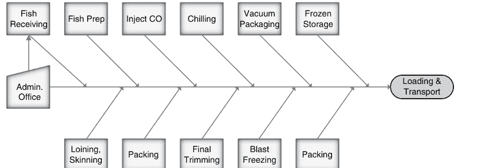

图15.2 三文鱼加工简化流程图。

使用流程图或图表有助于沟通流程步骤、潜在危害和必要的控制点：本质上是为被评估的流程提供一张“路线图”。除了流程图，图15.3还展示了一系列风险评估技术。

下文将详细介绍这些工具。

A) **危害/风险识别：** ISO 31000指出，风险识别的目标是生成一份全面的风险清单。在此阶段可以使用多种风险评估工具和技术。

1) *初步危害分析：* 在完成上述初步任务后，HACCP团队开始识别危害/风险，并进行初步危害分析。风险识别涉及识别危害/风险源，并可以成功地与HACCP原则的危害分析步骤对齐。FDA指出，食品安全危害分析过程的目的是制定一份危害清单，这些危害如果不加以有效控制，很可能导致伤害或疾病。此外，不太可能发生的危害无需在HACCP计划中进一步考虑。

2) *简单危害评估：* FDA建议使用表15.3所示的简单危害评估表。该简单表格允许简要描述每个步骤、与每个步骤相关的潜在危害、纳入危害暴露的理由，以及确定该危害是否将被纳入HACCP计划。

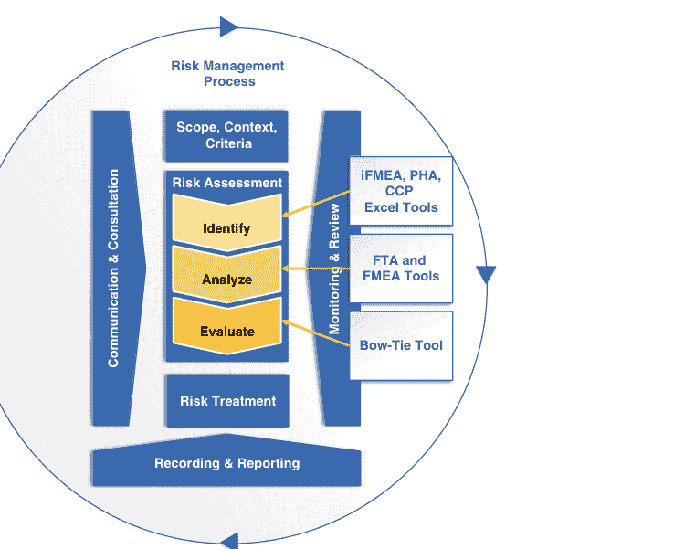

表15.3 危害分析表示例。

| 步骤 | 潜在危害 | 理由 | 是否在计划中解决危害？是/否 | 控制措施 |
|---|---|---|---|---|
| 鱼接收 | 肠道病原体：例如*沙门氏菌*，产志贺毒素*大肠杆菌* | 肠道病原体与加工不当的鱼类引起的食源性疾病暴发有关 | 是 | 待定 |

表15.4 iFMEA表示例。

| iFMEA工作表 | | |
|---|---|---|
| **流程：冷冻三文鱼加工** | 日期： | 评估员： |
| 涉及领域： | | |
| **操作、功能或目的** | **潜在失效模式** | **潜在影响** |
| *三文鱼接收* | *化学、生物污染* | *产品污染* |
| *去骨、去皮和修整* | *物理污染* | *对消费者的物理危害* |
| *注入一氧化碳（CO）* | *化学污染* | *产品污染* |
| *冷却* | *生物污染* | *产品污染* |
| *金属检测1* | *物理污染* | *产品污染* |
| *金属检测2* | *物理污染* | *产品污染* |

3) *iFMEA*：为协助识别危害和潜在故障，可以使用*初始失效模式与影响分析*。使用iFMEA有一些优势，例如在风险分析步骤中分配/估计可能性和风险水平，这是HACCP无法提供的。表15.4所示的iFMEA表可以描述为失效模式与影响分析的初步步骤。

B) **风险分析**：风险分析步骤涉及“理解”风险。作为*风险评估*的第二步，风险分析为风险评估步骤提供必要的输入，并协助做出关于风险处理的适当决策。在此步骤中可以使用关键控制点、故障树分析和FMEA等工具。

1) *关键控制点*：CCP识别是HACCP过程的基础，用作决策工具来确定流程中的关键步骤或点。关键控制点定义为食品加工线上潜在危害存在发生可能性且严重程度需要采取控制措施以消除或将其风险降低到可接受水平的点。CCP可用于预防、消除或降低食品危害的可能性或严重程度。识别过程基于对生产过程、食品特性以及潜在食品安全危害的了解。

2) *关键控制点决策树*：为帮助识别流程中的关键控制点，Georgi Popov博士开发了一个基于Excel的CCP决策树，包含步骤说明。图15.4展示了描述这些步骤的流程图。

346 | 15 食品加工风险评估

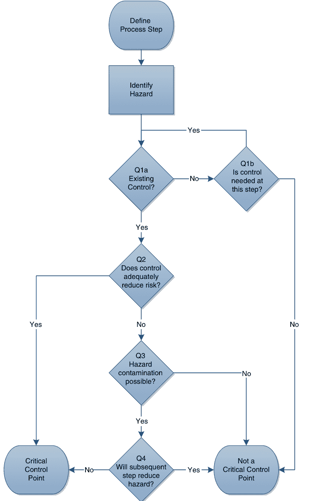

图15.4 CCP决策树流程图。

对于每个可能导致或存在潜在危害的程序，首先考虑的是（Q1）是否对已识别的危害存在任何控制措施。如果存在任何控制措施，则评估其有效性（Q2）。这涉及确定控制措施是否能消除可能性或将发生风险降低到可接受水平。如果风险降低到可接受水平，则该步骤被视为CCP，并纳入HACCP计划。如果控制措施不能充分降低可能性风险，则评估危害的严重性。如果已识别的危害不存在健康威胁，则不是CCP，流程停止。然而，如果污染对消费者健康构成风险，则考虑后续步骤。如果不存在有效的后续步骤，则被评估的步骤被视为CCP，并纳入HACCP。

对于此流程，如果（Q1）对已识别的危害不存在预防措施，团队需要确定是否需要控制措施。如果不需要控制，则该步骤不是CCP。如果需要控制，则该步骤需要修改并加入预防措施，然后重新进入评估循环。基于Excel的工具如图15.5所示。

3) *FMEA和RPN*：在确定最危险的流程和可能后果后，可以对流程或操作进行详细分析。风险分析步骤将涉及分析后果的严重性和发生的可能性。如ISO 31010所述，HACCP对于可能性评估“不适用”。因此，其他更专业的工具可能适用于食品安全管理领域。例如，可以使用FMEA或FTA方法评估食品污染的严重性和可能性。

FMEA通常用于协助食品加工中的危害分析。其在食品安全中的应用可以基于危害的发生、严重性和检测情况，对每个流程/操作进行详细分析。基于食品安全风险评估团队成员的经验，FMEA方法可以作为CCP危害分析的延续，以促进风险评估和关键控制点的优先级排序。评估系统得出风险优先数，可用于对危害进行排序并快速选择最高级别的危害。建议措施的分析包括评估与危害相关的控制措施的有效性。这也可以作为关键控制行动的建议。HACCP团队可以比较不同操作的RPN，并对危害进行优先级排序。需要关键控制的操作将按RPN从高到低列出。组织可以根据RPN明智地分配资金。根据FMEA能为危害分析带来的信息，它是食品加工中使用的有效工具。图15.6展示了一个FMEA和RPN工作表示例。

4) *FTA*：如ANSI Z590.3所述，故障树分析是一种自上而下的演绎逻辑模型，用于追溯为预定的、不期望的条件或事件（称为顶事件）的故障路径。FTA生成一个故障树，输入可能导致事件或暴露的设备故障和人为错误组合的故障概率。检查每个直接因果因素以确定其从属因果因素，直到识别出根本因果因素。下面是一个FTA示例：

*FTA示例*：细菌物种*副溶血性弧菌*相关疾病与食用生的或未煮熟的鱼类或牡蛎有关。如果员工没有正确洗手（污染可能性25%）；使用了受污染的砧板（污染可能性12%）；并使用了受污染的刀具，那么弧菌感染的可能性是多少？

## 15.7 风险评估方法的整合

| 产品或过程： | | | | | | |
|---|---|---|---|---|---|---|
| 评估人员： | | | | | | |
| 日期： | | | | | | |
| 步骤 | 危害 | Q1a | Q1b | Q2 | Q3 | Q4 | CCP编号 |
| | | 针对已识别的危害，是否存在预防措施？ | 此步骤的控制对于安全是否必要？ | 此步骤是否能将危害发生的可能性降低到可接受水平，或消除危害？ | 已识别的危害的污染是否可能超过可接受水平，或可能增加到不可接受水平？ | 后续步骤是否会消除危害或将发生的可能性降低到可接受水平？ | 关键控制点编号 |
| 三文鱼去皮 | 生物性 | 否 - 转至Q1b | 否 - 非CCP | 否 - 转至Q3 | 否 - 非CCP | 否 - CCP | |
| | | 是 - 转至Q2 | 是 - 修改步骤并返回Q1a | 是 - CCP | 是 - 转至Q4 | 是 - 非CCP | |

图15.5 CCP决策树识别工具。

| FMEA与RPN工作表 | | | | | |
|---|---|---|---|---|---|
| 部件或过程名称 | | 供应商与部门 | | 编制人： | G. Popov 博士 |
| 设计责任 | | 型号日期 | | FMEA日期 | |
| 其他相关领域 | | 工程变更等级 | | | |
| 评估风险 - 初始评分系统：当前状态 | | | | | |
| 过程操作、功能或目的 | 潜在暴露模式 | 暴露的潜在影响 | 严重性 | 暴露的潜在原因 | 可能性 | 当前控制措施评估方法 | PE | SxO | RPN |

图15.6 FMEA与RPN工作表示例。

（污染可能性17%）？这些事件是互斥的。因此，对于图15.7中的*副溶血性弧菌*污染示例，“或”门故障树分析是适用的。此示例仅用于教学目的，并非代表实际情况。事实上，美国疾病控制与预防中心食源性疾病主动监测网络（CDC, 2014a）的报告表明，*副溶血性弧菌*相关疾病的 likelihood 远低于所示水平。（2013年美国仅确认了242例*副溶血性弧菌*感染。2013年的数据为初步数据。[CDC, 2014b]）

**C) 风险评估：** 风险评估的目的是支持决策过程。它通常基于风险分析的结果，以及环境、健康和安全干预的优先级。风险评估涉及确定在风险评估过程中发现的风险水平，并与考虑关键控制点时建立的风险标准进行比较。决策应根据法律、法规和其他要求做出。在某些情况下，风险评估可能导致进一步分析。例如，为某个过程执行的FMEA可能需要对该过程的每个步骤进行更详细的FMEA。对特定过程步骤执行详细的FMEA可能非常耗时；然而，此类决策将受到组织风险接受度以及已建立的风险标准或“合理可行最低”（ALARP）原则的影响。

图15.7 FTA“或”门可能性示例。

1) *领结分析*：传统的领结方法（第9章已介绍）可用于风险评估。ISO 31010将领结分析定义为一种简单的图示方法，用于描述和分析从原因到后果的风险路径。领结分析的重点在于（i）原因与风险之间的预防屏障，以及（ii）风险与后果之间的保护屏障。然而，“传统”领结分析并非定量工具。图15.8展示了一个传统的领结分析示例。

2) *改进的领结分析*：Popov博士开发了一种改进的领结分析，其中危害和后果根据风险和发生概率进行了定量定义。来自ANSI Z590.3《通过设计预防》标准的传统风险评估矩阵可用于产生风险因子（即严重性 × 发生可能性）或来自FMEA的风险优先数（RPN）。图15.9展示了两者的结合。

3) *过程图*：如前所述，使用一个缺乏足够控制措施的三文鱼加工场景来演示食品风险评估过程。该过程结合了多种方法来最小化和控制食品相关危害。图15.10展示的简化三文鱼加工过程图显示了关键步骤。

图15.8 “传统”领结分析示例。

4) *CCP决策树（CCP DT）*：冷冻三文鱼加工根据HACCP管理体系进行评估，确定了六个关键控制点。这些已识别的CCP代表了可能导致产品质量缺陷或食品安全问题的关键点。图15.11展示了一个部分填写的CCP决策树（CCP DT）表格示例。

5) *详细的FMEA与RPN*：在CCP DT中识别的危害被转移到FMEA工具中进行进一步的风险分析和评估。FMEA表格根据危害的发生可能性、严重性和可检测性对每个操作进行详细分析，这与CCP的危害分析理论相似。对CCP及相关风险（包括严重性和可能性评级以及可检测性评级）的评估得出风险优先数（RPN），以对危害进行优先级排序。对于所呈现的示例，严重性、可能性/发生可能性和可检测性按1-5的等级进行评估，如下所示：

- 严重性（SEV）
  1- 不显著
  2- 可忽略
  3- 边缘
  4- 关键
  5- 灾难性

| 关键控制点（CCP）决策树表格 |
|---|
| 产品或过程：三文鱼加工 |
| 评估人员： |
| 日期： |
| 步骤 | 危害 | Q1a<br>针对已识别的危害，是否存在预防措施？ | Q1b<br>此步骤的控制对于安全是否必要？ | Q2<br>此步骤是否能将危害发生的可能性降低到可接受水平，或消除危害？ | Q3<br>已识别的危害的污染是否可能超过可接受水平，或可能增加到不可接受水平？ | Q4<br>后续步骤是否会消除危害或将发生的可能性降低到可接受水平？ | CCP编号<br>关键控制点编号 |
| | | 否 - 转至Q1b<br>是 - 转至Q2 | 否 - 非CCP<br>是 - 修改步骤并返回Q1a | 否 - 转至Q3<br>是 - CCP | 否 - 非CCP<br>是 - 转至Q4 | 否 - CCP<br>是 - 非CCP | |
| 三文鱼接收 | 化学、生物污染 | 是，BBT控制，饮用水 | — | 是 - CCP | — | — | CCP1 |
| 切条、去皮、修整 | 物理性危害 | 是，X射线检测 | — | 是 - CCP | — | — | CCP2 |
| 注入CO | 化学污染 | 是，针头检查与消毒 | — | 是 - CCP | — | — | CCP3 |
| 冷却 | 生物污染 | 是，温度<3.3°C，腌制时间24小时 | — | 是 - CCP | — | — | CCP4 |
| 单袋金属检测 | 物理性危害 | 是，金属检测 | — | 是 - CCP | — | — | CCP5 |
| 单箱金属检测 | 物理性危害 | 是，金属检测 | — | 是 - CCP | — | — | CCP6 |

图15.11 CCP决策树表格。

- 可能性
  1- 不太可能
  2- 很少
  3- 偶尔
  4- 可能
  5- 频繁
- 可检测性（DET）
  1) 可检测
  2) 可能被检测到
  3) 偶尔检测到
  4) 很少检测到
  5) 不太可能检测到

RPN = SEV × OCC × DET

RPN越高，风险越大。因此，如果化学、物理和生物污染不太可能被检测到，则“可检测性”等级估计为“不太可能”，评分为5。相反，如果污染可检测，则“可检测性”等级评分为1，如图15.12的FMEA示例所示。

该分析包括评估每项控制措施的有效性，并为关键控制行动提供指导。比较RPN使组织能够优先考虑并分配资源给需求最大的操作。考虑到FMEA可以为危害分析带来的额外信息和可视化效果，它可能是一种有效的

## 风险评估 – 食品安全

| 部件或过程名称 | 冷冻三文鱼加工 | 受影响的供应商和工厂 | 编制人 |
|---|---|---|---|
| 设计/制造责任 | 型号日期 | 工程变更等级 | FMEA日期 |
| 涉及其他领域 | | | 12 29 20 |
| CCP编号 | 过程操作、功能或目的 | 潜在失效模式 | 失效的潜在影响 | 严重度 | 失效的潜在原因 | 发生可能性 | 当前控制评估方法 | 探测度 | S x O | RPN |
| 1 | 三文鱼接收 | 化学、生物污染 | 产品污染 | 4 | 化学、生物交叉污染 | 4 | 无 | 5 | 16 | 80 |
| 2 | 去腰肉、去皮和修整 | 物理污染 | 对客户的物理危害 | 2 | 鱼骨未完全去除 | 4 | 目视检测 | 4 | 8 | 32 |
| 3 | 注入CO | 化学污染 | 产品污染 | 4 | 针头到鱼的交叉污染 | 3 | 无 | 5 | 12 | 60 |
| 4 | 冷却 | 生物污染 | 产品污染 | 5 | 细菌生长和组胺形成 | 5 | 无 | 5 | 25 | 125 |
| 5 | 金属检测1 | 物理污染 | 产品污染 | 4 | 金属碎片意外落入产品 | 3 | 目视检测 | 3 | 12 | 36 |
| 6 | 金属检测2 | 物理污染 | 产品污染 | 2 | 金属碎片意外落入产品 | 3 | 目视检测 | 3 | 6 | 18 |

图15.12 基于已识别CCP的FMEA详细分析。

食品安全加工中的工具。分析之后，排名前三的危害被转移到蝴蝶结分析表中，如图15.13所示的当前状态（适当控制前）蝴蝶结分析。

6) 当前状态蝴蝶结/FMEA：然后为每个关键控制点确定预防性控制和保护措施。使用FMEA，在实施推荐的CCP控制后，所识别过程操作的估计RPN得到了显著改善（见图15.14中的推荐措施列）。

尽管潜在失效的严重度没有下降，但识别出的控制措施降低了失效发生的可能性并提高了失效的可探测性，这最终降低了RPN或优先级分数。FMEA工具不仅显示了控制的必要性，还对控制行动进行了优先级排序。根据FMEA RPN，冷却过程中的细菌生长是最需要紧急处理的潜在失效。如图15.14所示，将温度维持在3.3°C以下被视为一项关键控制措施。

适当的温度控制可以将细菌生长的可能性从5降低到1。鱼的化学污染是食品安全中毒的第二大关注点。鱼的抽样无法降低严重度和发生可能性，但探测能力得到了明显提高，这使得威胁从5降低到1。

在确定控制措施后，HACCP团队可以将控制措施添加到过程图中。图15.15展示了一个带有建议改进的简单过程图。

根据分析，所有CCP都应通过控制限值的措施进行严格监督（如果可用）。相同的排名前三的危害和推荐措施被转移到图15.16所示的未来状态（控制措施实施后）蝴蝶结分析表中。

7) 未来状态蝴蝶结/FMEA：由于实施了适当的控制，与危害相关的风险已降低。为了保持安全和效率改进的成果，应同时应用工程控制和管理控制。负责实施控制的人员应确保所有CCP控制都经过验证有效，并得到一致的应用和执行（例如，特定操作的温度控制以及为获得准确结果而进行的必要设备改造或更新）。利益相关者应与工厂管理层合作，确保操作保持有效，并包括适当的文件记录、培训和监督。

灾难性事件 受污染食品

| 部件或过程名称 | 冷冻三文鱼加工 | 受影响的供应商和工厂 | 编制人 |
|---|---|---|---|
| 设计/制造责任 | 型号日期 | 工程变更等级 | FMEA日期 |
| 涉及其他领域 | | | |
| 编号 | 过程操作、功能或目的 | 潜在失效模式 | 失效的潜在影响 | 严重度 | 失效的潜在原因 | 发生可能性 | 当前控制评估方法 | 探测度 | S | O | D | RPN |
| 1 | 三文鱼接收 | 化学、生物污染 | 产品污染 | 4 | 化学、生物交叉污染 | 4 | 无 | 5 | 16 | 80 |
| 2 | 去腰肉、去皮和修整 | 物理污染 | 对客户的物理危害 | 2 | 鱼骨未完全去除 | 4 | 目视检测 | 4 | 8 | 32 |
| 3 | 注入CO | 化学污染 | 产品污染 | 4 | 针头到鱼的交叉污染 | 3 | 无 | 5 | 12 | 60 |
| 4 | 冷却 | 生物污染 | 产品污染 | 5 | 细菌生长和组胺形成 | 5 | 无 | 5 | 25 | 125 |
| 5 | 金属检测1 | 物理污染 | 产品污染 | 4 | 金属碎片意外落入产品 | 3 | 目视检测 | 3 | 12 | 36 |
| 6 | 金属检测2 | 物理污染 | 产品污染 | 2 | 金属碎片意外落入产品 | 3 | 目视检测 | 3 | 6 | 18 |

图15.13 基于FMEA详细分析的蝴蝶结图。来源：Chris Bjornberg/Science Source。

| 部件或过程名称 | 冷冻三文鱼加工 | 受影响的供应商和工厂 | | | 编制人 | | | | 未来状态 | | | | | | | | | | | |
|---|---|---|---|---|---|---|---|---|---|---|---|---|---|---|---|---|---|---|---|---|
| 设计/制造责任 | | 型号日期 | | | FMEA日期 | 12 | 25 | 25 | | | | | | | | | | | |
| 涉及其他领域 | | 工程变更等级 | | | | | | | | | | | | | | | | | |
| CCP编号 | 过程操作、功能或目的 | 潜在失效模式 | 失效的潜在影响 | 严重度 | 失效的潜在原因 | 发生可能性 | 当前控制评估方法 | 探测度 | S | O | D | RPN | 推荐措施 | 负责区域/个人及完成日期 | 行动结果 已采取的行动 | | 可能性1 | 可能性2 | D x F 2 | S x O | RPN 2 |
| 1 | 三文鱼接收 | 化学、生物污染 | 产品污染 | 2 | 化学、生物交叉污染 | 4 | 无 | 0 | 10 | 4 | 40 | 80 | 路径抽样 | 工厂经理 | | | 4 | 2 | 2 | 8 | 16 |
| 2 | 去腰肉、去皮和修整 | 物理污染 | 对客户的物理危害 | 2 | 鱼骨未完全去除 | 4 | 目视检测 | 4 | 8 | 32 | X射线骨头检测 | 工厂经理 | | | 3 | 2 | 2 | 6 | 12 |
| 3 | 注入CO | 化学污染 | 产品污染 | 2 | 针头到鱼的交叉污染 | 3 | 无 | 6 | 12 | 60 | | | | | 4 | 2 | 1 | 8 | 8 |
| 4 | 滚揉 | 生物污染 | 产品污染 | 2 | 细菌生长和腐败 | 4 | 无 | 8 | 32 | 128 | 温度控制 | 工厂经理 | 温度<=3.9°C | | 4 | 1 | 1 | 4 | 4 |
| 5 | 金属检测1 | 物理污染 | 产品污染 | 2 | 金属碎片意外落入产品 | 3 | 目视检测 | 3 | 12 | 36 | 金属检测 | 工厂经理 | | | 4 | 1 | 1 | 4 | 4 |
| 6 | 金属检测2 | 物理污染 | 产品污染 | 2 | 金属碎片意外落入产品 | 3 | 目视检测 | 3 | 6 | 18 | 金属检测 | 工厂经理 | | | 2 | 1 | 1 | 2 | 2 |

图15.14 CCP的FMEA评估。

## 15.8 PtD与HACCP整合

在分析过程中应同时考虑工人安全和消费者安全。至关重要的是，HACCP团队以及旨在使工人和公众受益的工作场所设计解决方案的开发，都应包括安全、健康和环境专业人员。整合HACCP和PtD原则将有助于修改生产过程，以消除和控制食品中的生物、化学或物理危害，同时保护工人免受伤害和疾病。HACCP和PtD原则的整合有助于确保最终产品可安全食用，并使工人的风险保持在可接受水平，如图15.17所示。

PtD原则应用于食品行业，以预测和识别潜在的食品安全危害，并将风险消除或降低到可接受水平。图15.18展示了一种HACCP和PtD整合方法。

例如，在本章介绍的示例中，加工三文鱼的*工人*所识别出的一些健康和安全危害包括：

-   割伤、撕裂或针刺伤。
-   极低的温度。
-   由于长时间站立、不良姿势、重复性动作和搬运导致的人因工程伤害。

从消费者食品安全的角度来看，产品温度被识别出来。例如，三文鱼加工中确定的一项关键控制措施是将温度维持在3.3°C以下。应该认识到，一些食品安全控制措施可能会增加工人安全和健康的风险（例如，降低温度以减少食品腐败会增加工人的职业健康风险）。其他例子包括切割危害以及由于长时间站立、不良姿势和搬运导致的人因工程伤害。对于人因工程相关风险，可以使用第16章中描述的一种或多种人因工程风险评估工具。

经验丰富且知识渊博的SH&E专业人员和HACCP团队应在设计阶段同时解决食品安全和工人安全危害。例如，一个自动化的三文鱼

## 风险评估 – 食品安全

FMEA 与 RPN 工作表

| 项目 | 过程操作、功能或目的 | 潜在失效模式 | 潜在失效影响 | 严重度 | 潜在失效原因 | 发生度 | 当前控制评估方法 | 探测度 | RPN | 建议措施 | 负责区域/个人及完成日期 | 措施结果 | 已采取措施 | S | O | D | RPN |
|---|---|---|---|---|---|---|---|---|---|---|---|---|---|---|---|---|---|
| 1 | 三文鱼接收 | 化学、生物污染 | 产品污染 | 4 | 化学、生物交叉污染 | 4 | 无 | 5 | 80 | 鱼类抽样 | 工厂经理 | | | | | | |
| 2 | 清洗、去皮和修整 | 物理污染 | 对客户造成物理危害 | 2 | 鱼骨未完全去除 | 4 | 目视检测 | 4 | 32 | X光骨头检测 | 工厂经理 | | | | | | |
| 3 | 注入二氧化碳 | 化学污染 | 产品污染 | 4 | 针头到鱼的交叉污染 | 5 | 无 | 5 | 100 | 针头检查与消毒 | 工厂经理 | | | | | | |
| 4 | 冷却 | 生物污染 | 产品污染 | 5 | 细菌生长和组胺形成 | 5 | 无 | 5 | 125 | 温度控制 | 工厂经理 | | | | | | |
| 5 | 金属检测 1 | 物理污染 | 产品污染 | 4 | 金属碎片意外落入产品 | 3 | 目视检测 | 3 | 36 | 金属检测 | 工厂经理 | | | | | | |
| 6 | 金属检测 2 | 物理污染 | 产品污染 | 2 | 金属碎片意外落入产品 | 3 | 目视检测 | 6 | 36 | 金属检测 | 工厂经理 | | | | | | |

图 15.16 基于 FMEA 建议措施的领结图。来源：Chris Bjornberg/Science Source。

图 15.17 HACCP 与 PtD 原则整合。

图 15.18 HACCP 与 PtD 整合。

去皮机可能是应用 PtD 控制层级的一个良好范例。它几乎可以消除切割危害，并显著减少人体工学损伤。可以使用不同的风险评估和业务工具来评估此类控制措施的价值。例如，可以选择人体工学风险评估工具从操作员角度评估该过程，并应使用业务工具评估财务和非财务效益。在设计和重新设计过程中，应充分考虑在运用 HACCP 和 PtD 概念解决食品安全问题的同时保护工人。

## 15.9 结论

总之，结合 ANSI Z590.3 PtD 和 ANSI/ASSP/ISO 31010 中建议的风险评估方法，并实施旨在最小化食品相关风险的 CCP 控制措施，将提高食品质量和工人安全，并减少财务损失。通过实施适当的控制措施，可以显著降低风险及其相应的风险因素分数或风险优先级数，如示例所示。

风险评估过程应用于运营风险管理体系内的持续改进。此类过程应包括适当的方法组合和有效的 HACCP 计划。这种整合可以带来更高的食品安全、工人安全与健康，以及组织的财务和非财务效益。

## 参考文献

ANSI/ASSE Z590.3-2011(R2016) (2016). *Prevention through Design: Guidelines for Addressing Occupational Hazards and Risks in Design and Redesign Processes*. Park Ridge, IL: American Society of Safety Professionals.

ANSI/ASSP/ISO 31000-2018 (2018). *Risk Management Guidelines*. Park Ridge, IL: American Society of Safety Professionals.

ANSI/ASSP/ISO 31010-2019 (2019). *Risk Management – Risk Assessment*. Park Ridge, IL: American Society of Safety Professionals.

Crow, K. (2002). Failure modes and effects analysis (FMEA). http://www.npd-solutions.com/fmea.html (accessed 20 March 2011).

ISO 22000 Food Safety Management Systems – Requirements for any organization in the food chain (2005). http://www.iso.org/iso/home/store/catalogue_tc/catalogue_detail.htm?csnumber=35466 (accessed 4 January 2015).

Mead, P.V. (2000). Food-related illness and death in the United States. *Journal of Environmental Health* 62 (7): 9. Retrieved from EBSCOhost.

Pilot, S. (2002). What is a Fault Tree Analysis? – use a general conclusion to determine specific causes of a system failure. http://asq.org/quality-progress/2002/03/problem-solving/what-is-a-fault-tree-analysis.html

Roberts, A.C. (2001). *The Food Safety Information Handbook*, 1e. Westport State: An imprint of Greenwood Publishing Group. Inc.

Standard Kalite (n.d.). HACCP history [Web log message]. http://www.standardkalite.com/haccp_iso22000_history.htm (accessed 15 March 2015).

United States. Centers for Disease Control and Prevention (2011). CDC 2011: estimates: findings. http://www.cdc.gov/foodborneburden/2011-foodborne-estimates.html (accessed 9 November 2020).

United States. Centers for Disease Control and Prevention (2014a). Foodborne diseases active surveillance network (FoodNet). http://www.cdc.gov/foodnet/index.html (accessed 15 March 2015).

United States. Centers for Disease Control and Prevention (2014b). Incidence and trends of infection with pathogens transmitted commonly through food – foodborne diseases active surveillance network, 10 U.S. Sites, 2006–2013. *Morbidity and Mortality Weekly Report (MMWR)* 63 (15): 328–332. Retrieved from http://www.cdc.gov/mmwr/preview/mmwrhtml/mm6315a3.htm?s_cid=mm6315a3_w.

United States. Food and Drug Administration (1997). Hazard analysis and critical control point principles and application guidelines. http://www.fda.gov/Food/GuidanceRegulation/HACCP/ucm2006801.htm (accessed 9 November 2020).

United States. Food and Drug Administration (2011). Hazard analysis & critical control points (HACCP). https://www.fda.gov/food/guidance-regulation-food-and-dietary-supplements/hazard-analysis-critical-control-point-haccp (accessed 10 June 2021).

United States. Food and Drug Administration (1999). Annex 5: HACCP Guidelines. http://www.hospitalityguild.com/downloads/HACCP_Guidelines_FDA.pdf (accessed 15 March 2015).

World Health Organization (2011). Food safety. http://www.who.int/foodsafety/en/

World Health Organization (2007). Food safety and foodborne illness. http://www.who.int/mediacentre/factsheets/fs237/en/

# 16
## 人体工学风险评估
*Bruce Lyon¹ and Georgi Popov²*

¹ Brown & Brown
² University of Central Missouri

### 目标
- 介绍实用的人体工学风险评估方法
- 回顾基本的人体工学风险评估技术
- 提出一个实用的人体工学风险评估模型
- 探讨技术的应用、优势和局限性

## 16.1 引言

人体工学风险因素几乎存在于所有工业和办公工作环境中。凡是存在手工任务的地方，通常都能发现人体工学风险；然而，在许多情况下，这些风险并未被识别或评估。此类风险可能对员工安全与健康、产品和服务质量、生产效率、员工士气以及整体安全文化产生负面影响。

人体工学风险的成本可能相当高昂。工作相关肌肉骨骼疾病（WMSDs）或软组织损伤，如神经、肌腱、肌肉和支撑结构的损伤，是工作场所常见的健康问题。这些疾病可能导致疲劳、不适、疼痛、肿胀、麻木或刺痛，以及永久性组织损伤。根据美国劳工统计局的数据，WMSDs 占美国所有工作场所致残事件的三分之一。此外，WMSDs 占所有工人赔偿成本的 40% 以上（Liberty Mutual），并使美国企业每年损失 200 亿美元（美国劳工部）。这些数字表明，需要在工作场所和任务设计中更好地应用人体工学原则。工作场所需要精通实用人体工学风险评估和人体工学原则应用的安全专业人员，并且在职业机会方面将具有优势。

本章介绍了一个实用的风险评估模型和简化的人体工学风险评估工具（ERAT），可用于帮助管理人体工学风险并减少 WMSDs。

## 16.2 人体工学与设计

根据人因工程学会和国际人体工学协会的定义，“人体工学（或人因工程）是研究对人与系统中其他元素之间相互作用的理解，以及应用理论、原则、数据和其他方法进行设计以优化人类福祉和整体系统性能的专业”（HFES，2020）。请注意定义中“设计”一词的使用。从职业角度出发，提供了以下定义：

> **工效学**——一门应用科学，旨在设计工作场所的需求和环境，以适应人类的能力和局限性，从而实现福祉和最佳性能。

一些人认为“人因工程”更侧重于用户界面的认知方面，例如显示器和控件的设计，以及产品和系统的可用性。应用人因工程的一个简单定义是“以用户为中心设计系统”。人因工程与工效学学会将其定义如下：

人因工程关注的是将我们对人的了解——他们的能力、特征和局限性——应用于他们所使用设备的设计、他们所处环境的设计以及他们所执行工作的设计。

将安全和工效学原则融入工作场所的设计理念，持续受到近期标准的强调和强化。*ANSI/ASSP Z590.3-2011(R2016)，通过设计预防：在设计和再设计过程中解决职业危害和风险的指南*标准是安全（和工效学）通过设计的蓝图。在ANSI Z590.3的范围中，它指出“本标准为生命周期评估和设计模型提供了指导，该模型在设施、过程或产品的整个生命周期内平衡环境和职业安全与健康目标。”在Z590.3的前言中，对标准制定起到重要作用的美国国家职业安全卫生研究所（NIOSH）指出，“预防和控制职业伤害、疾病和死亡的最佳方法之一是在设计过程的早期阶段通过设计消除和最小化危害和风险。”这一理念在整个通过设计预防标准中得到强调。其既定目标包括：

-   达到可接受的风险水平。
-   预防或减少与职业相关的伤害、疾病和死亡。
-   降低为缓解在设计或再设计过程中未充分解决的危害和风险而进行改造的成本。

*ANSI/ASSP Z10.0-2019，职业健康与安全管理体系*标准建立了识别、预防和控制“在设计阶段与新工艺或操作相关的危害和风险”的要求。为防止或限制新的危害和风险引入工作环境，ANSI Z10标准提供了以下规定：(i) 风险评估；(ii) 设计审查；(iii) 变更管理；以及 (iv) 采购。该标准指出，危害识别应包括“工效学和社会心理压力源”以及“人因因素，例如需要过度用力、频率/持续时间和有害姿势的任务，这些是肌肉骨骼疾病（MSDs）的前兆。”关于设计审查，该标准指出“组织应建立一个流程，以识别并采取适当步骤，在设计和再设计阶段预防或以其他方式控制危害，以及在需要变更管理的情况下，将潜在风险降低到可接受水平。”

不幸的是，在许多组织中，工效学原则未被考虑或纳入其工作系统的设计或再设计中。因此，固有的危害深深嵌入其运营、工作站和方法中，难以且昂贵地消除。在美国职业安全与健康管理局出版物《工效学：工作研究》（OSHA出版物3125，2000年修订版）中，关于工作场所需要工效学原则和风险评估，有如下陈述：

> 如果工作任务和设备在设计中未包含工效学原则，工人可能会暴露于过度的身体压力、紧张和过度劳累，包括振动、不良姿势、用力过度、重复性动作和重物搬运。认识工作场所的工效学风险因素是纠正危害和改善工人保护的第一步，也是至关重要的一步。

## 16.3 工效学危害

工作场所的工效学危害可能导致多种负面影响。最常见且公认的影响是对工人的生物力学和肌肉骨骼压力。暴露于工效学危害（如长时间重复性动作、过度用力、不良或静态姿势、压迫、振动和极端温度）的工人，有患上工作相关肌肉骨骼疾病（WMSDs）的风险。随着时间的推移，软组织（如肌肉、神经和血管）承受的压力（也称为累积性创伤）积累，可能对个体造成严重甚至永久性的损害。如本章前面所述，WMSDs的总体成本相当可观。

工效学危害也会导致“单一事件”事故，例如软组织拉伤、滑倒和跌落，以及“被物体撞击”。这些隐藏的危害可能在工作区域、设备、工具或方法的设计中未被识别，最终导致工人因暴露而受伤。为说明目的，请考虑以下示例：

**示例 #1：** 一家快餐连锁店为其厨房环境选择了一种低成本的地板砖，尽管该砖的摩擦系数相对较低，不建议用于有油脂或水暴露的环境。此外，公司未提供或强制使用防滑鞋底的鞋类，结果许多员工穿着与环境不兼容的鞋子。厨房设计有些紧凑和拥挤，工人经常来回走动以执行职责。这些物理条件加上工人的活动，构成了工效学危害，带来了高滑倒和跌落事故风险。

**示例 #2：** 一家汽车修理厂每天对各种品牌和型号的汽车执行多项维修任务。由于成本原因，公司提供的手动工具和尺寸数量有限。所服务的车辆型号种类繁多，使得工人难以找到适合每项工作的正确类型和尺寸的工具。因此，可能会发生工效学不匹配，例如不合适的工具打滑，导致“被物体撞击”或肌肉拉伤事故。

工效学危害还包括社会心理压力或工作压力。社会心理压力指的是工人与其工作条件之间的相互作用。“工作组织”一词通常与这种暴露相关。在美国国家职业安全卫生研究所（NIOSH）出版物《工作中的压力...》中，工作压力被定义为当工作要求与工人的能力、资源或需求不匹配时发生的有害身体和情感反应。根据NIOSH出版物，可能导致工作压力的工作条件包括：

-   任务设计——工作量大、休息间隔少、工作时间长和轮班工作；繁忙且常规的任务，本身意义不大，未利用工人的技能，并且提供很少的控制感。
-   管理风格——工人缺乏参与决策、组织内沟通不畅、缺乏家庭友好政策。
-   人际关系——社会环境差，缺乏同事和主管的支持或帮助。
-   工作角色——工作期望冲突或不明确、责任过重、“身兼数职”。
-   职业发展顾虑——工作缺乏安全感，缺乏成长、晋升或提拔的机会；工人未准备好应对的快速变化。
-   环境条件——令人不快或危险的物理条件，如拥挤、噪音、空气污染或工效学问题。

与系统或产品可用性相关的工效学危害（不良的“人因工程”）可能导致人为错误。当工人与包含工效学危害或工作站、控件和显示器、设备或方法中潜在条件的工作系统交互时，可能会引发人为错误或疏忽。不幸的是，这些潜在条件隐藏在工作系统中，导致工人犯错、疏忽、走捷径和变通，直到发生伤害或损坏。

## 16.4 工效学风险因素

工效学危害的指标被称为工效学风险因素或压力源。这些风险因素是工作流程、工作站或工作方法的条件，它们增加了患上WMSDs或其他工效学危害的风险。这些风险因素包括用力过度、高重复性和持续时间、静态或不良姿势、接触应力、振动、照明不良和低温。表16.1回顾了与工作场所相关的工效学风险因素。

工效学风险因素往往具有协同效应。单独来看，一个工效学风险因素可能不会造成显著风险；然而，当两个或更多风险因素结合时，导致WMSDs的生物力学压力风险可能会显著增加。例如，重复性动作的任务，如在计算机上打字，在办公工作环境中很常见。单独的重复性打字通常不会造成高生物力学压力风险。然而，当引入第二个风险因素，如手腕偏斜或低温时，其综合效应可能会限制血流并导致软组织内部接触应力，从而增加WMSDs的风险。这有时被称为“多重因果关系”，即几个风险因素在WMSDs发展中的综合效应。

## 16.5 建立工效学评估流程

应建立评估工效学风险的标准化方法，包括适当的工效学风险评估工具和用户培训。此标准化方法的目的是为利益相关者提供一个明确且系统的过程，以：

-   识别存在工效学风险的现有工作/任务。
-   评估、优先排序和跟踪工效学风险因素。
-   选择和实施有效的控制措施。
-   防止新的工效学风险引入工作场所。
-   通过基于团队的解决问题支持持续改进。

## 16.6 评估人体工程学风险

标准的风险评估技术通常不足以检测到必要程度的人体工程学风险因素。本文讨论的工具，如工作危害分析（JHA）、初步危害分析（PHA）和失效模式与影响分析（FMEA），用于在更广泛的层面上识别和评估多种类型的危害和风险。人体工程学危害有时会在JHA、PHA和FMEA中被识别出来；然而，这些危害分析和风险评估方法无法精确地定位、分析和评估详细的人体工程学风险因素。为此，需要一种更具针对性的风险评估工具。

美国工业卫生协会（AIHA）人体工程学委员会在其《人体工程学参考文件》（AIHA 2014）中对人体工程学评估有如下论述：

> 一些人体工程学风险（如力量、频率和姿势）非常容易发现和解决，而另一些则可能需要经过培训的专业人士进行更详细的审查。美国职业安全与健康管理局（OSHA）或州咨询项目、保险公司、行业协会以及其他可能有类似问题的当地公司提供了许多优质资源。此外，参与式人体工程学计划，即员工可以参与识别危害并提出解决方案，已被证明非常成功。OSHA网站上有免费资源，包括人体工程学电子工具，这些工具可能会有所帮助。欲了解更多信息，请访问 https://www.osha.gov/ergonomics#etools。

一旦认识到存在人体工程学危害的可能性，就需要一种专门设计用于检测和评估人体工程学风险因素的工具。人体工程学风险评估工具（ERATs）种类繁多，用于在微观层面检测和评估现有的风险因素。系统性地先应用标准风险评估，再进行人体工程学评估，这一序列对于在必要程度上识别、评估和控制人体工程学风险非常有用。

如表16.2所示，有许多人体工程学风险评估工具可供选择。它们在应用范围、身体部位、易用性、技能水平、时间要求、软件或专用设备以及其他变量方面各不相同。

许多来源都提供了人体工程学评估工具的摘要。其中一些包括：

- 美国工业卫生协会。AIHA人体工程学委员会的人体工程学评估工具包。可访问：https://aiha-assets.sfo2.digitaloceanspaces.com/AIHA/resources/ERGOVG-Toolkit_rev2011.pdf
- 康奈尔大学人体工程学网站“工作场所人体工程学工具”。可访问：http://ergo.human.cornell.edu/cutools.html。
- 加拿大安大略省劳工部，“第3C部分：肌肉骨骼损伤预防工具箱；深入风险评估方法详解”。可访问：https://www.labour.gov.on.ca/english/hs/topics/pains.php

那些认识到需求并拥有足够内部资源的组织，更有可能制定出明确的、在某些情况下是成熟的人体工程学风险评估流程，并配备特定的工具和支持。然而，对于那些缺乏人体工程学评估方法经验、知识和技能的组织来说，这可能会令人不知所措。此类组织面临的挑战是选择一种工具，该工具可供人体工程学培训和经验有限的利益相关者使用，并能及时提供可靠且有用的结果。

表16.1 工作相关的人体工程学风险因素。

| 风险因素 | 描述 |
|---|---|
| **用力过度** | 施加力量以完成一个需要肌肉施加相当大收缩力的动作，导致快速疲劳。动作包括抬起、放下、推、拉、搬运、抓握、捏、抛掷。 |
| **重复性动作** | 执行重复的相同动作或多个任务，其中每个任务的动作非常相似，并涉及相同的肌肉群和组织。重复性动作包括装配类任务、键入、分拣、切割以及精加工工作（如打磨和抛光）和其他类似活动。 |
| **不良姿势** | 在执行工作任务时，身体（肢体、关节、背部）位置显著偏离中立位置。在不良姿势下，肌肉工作效率降低，必须付出更多的体力来完成任务。不良姿势包括高处伸手、肩部外展、头部倾斜、手腕偏斜和弯腰。 |
| **静态姿势** | 在整个用力过程中保持同一姿势或位置的身体用力，导致肌肉疲劳。也称为静态肌肉负荷，例如抓握工具、将手臂伸出或抬起以执行任务，或长时间站在一个地方。 |
| **接触应力** | 内部和外部接触应力源于软组织和血管受压，导致血流受限和损伤。接触应力可能发生在倚靠桌边、抓握手柄、接触坚硬表面、坐在无软垫椅子上，以及软组织与肌腱和骨骼内部摩擦时。也可能在使用身体部位作为锤子或敲击工具时发生。 |
| **振动** | 振动会抑制受影响身体部位的血液供应，并可能导致麻木、刺痛和软组织损伤。当特定身体部位接触振动的物体（如电动手动工具或设备）时，会发生局部振动。当站在或坐在振动环境中（卡车或重型设备操作员）以及使用重型振动设备（如风镐）时，会发生全身振动。 |
| **低温** | 在执行工作任务时暴露于过度寒冷中，导致血流受限、灵活性和敏感性丧失。当暴露于寒冷与其他风险因素（如振动或接触应力）相结合时，软组织损伤的风险会增加。 |
| **持续时间和节奏** | 暴露时间过长或工作节奏/周期时间过快，且任务之间没有足够的恢复时间，导致疲劳和压力。 |
| **照明不足** | 照明过少或过多，间接或直接眩光导致眼睛疲劳或不良姿势。也可能导致人为错误相关事故。 |

与其他职业安全和健康计划一样，人体工程学风险评估过程应作为一项协作努力来应用，需要管理层的全力支持和员工的积极参与，才能有效并取得成功。

在组织内，人体工程学风险评估的最佳实施方式是制定一个明确的计划以确保一致的应用。应制定一份书面的人体工程学流程或管理体系，概述组织的人体工程学风险评估流程，并传达给利益相关者，以提供明确的指导。诸如*ANSI/ASSP Z10.0-2019 职业健康与安全管理体系*等管理体系标准提供了一个可供考虑的框架。人体工程学管理体系应包括以下考虑因素：

### 范围和背景

首先，应确定并建立一个清晰简洁的范围。根据需要，组织应考虑流程的背景，包括谁将参与和受影响；将包含什么内容；所需的时间周期和时间要求；以及流程将如何应用。范围应涵盖设计、重新设计和管理变更工作，以及对新设备、工作站、工具和工作方法的风险评估。ANSI/ASSP Z590.1 通过设计预防提供了此类指导，强烈推荐使用。

### 目标和目的

目标设定决定了组织正在朝着的“目标”，并且需要具有具体、可衡量的要素。例如，一个组织可能希望为每个运营部门设定具体目标，以组建并培训一个跨职能的人体工程学工作组，每季度评估和改进三个（3）高风险工作。这样的目标是具体的、可衡量的、可操作的、现实的和有时间导向的，即“SMART”目标。

目标和目的必须是现实的，并且可以由责任方实现。一些目标起初可能看起来可以实现；然而，随着流程的展开，可能会出现障碍。随着流程的推进，组织应重新审视目标和目的并进行调整。与任何计划一样，组织必须在整个过程中与利益相关者进行有效沟通。

### 职责

目标设定后，组织必须明确界定并传达所有利益相关者的角色、职责和问责制。这些职责应具体且可衡量，以便进行问责，并旨在实现既定目标。

### 培训

对利益相关者进行有效的人体工程学培训至关重要。培训应概述和描述整个流程、步骤顺序、具体的人体工程学风险因素、控制层级和问题解决方法。最终，培训旨在通过提供必要的知识、技能和工具，使利益相关者能够有效地执行其分配的任务。培训内容必须针对每个群体进行定制和调整，并包括利益相关者的参与和互动。根据作者的经验，通常情况下，科学和医学术语不受不熟悉人体工程学的人的欢迎。保持术语简单、清晰和易于理解有助于提高理解力和参与度。可参考*ANSI Z490.1-2016，美国国家标准：安全、健康和环境培训中公认实践的标准*以获取更多指导（ANSI Z490.1 2016）。

组织应确定每个级别所需的人体工程学培训类型、谁将参与、具体的学习目标、培训的时间框架和频率。

### 人体工程学团队

建立一支训练有素的人体工程学团队对于人体工程学风险评估流程的成功至关重要。人体工程学团队与协调员或负责人一起执行推动改进过程的基本职能。为了提高参与度和主人翁意识，并利用必要的技能，应考虑组建一个跨职能的人体工程学团队。人体工程学团队的成员可能包括操作员（被评估系统的用户）、维护、工程、质量、安全健康与环境（SH&E）、部门经理、人力资源和工厂管理人员。

人体工程学协调员的角色是促进流程，领导和指导团队的工作。该职位需要具备与他人合作、指导团队成员以及在需要时提供技术资源的能力。

表 16.2 人体工程学风险评估工具部分列表。

| 评估工具 | 应用场景 | 身体部位 | 类型 | 复杂度 |
|---|---|---|---|---|
| OSHA 筛查工具 | 通用工业 重复性任务 | 全身 | 定性检查表 | 低 |
| WISHA 检查表 | 通用工业 重复性任务 | 全身 | 定性检查表 | 低 |
| ACGIH 搬举阈限值 | 通用工业 搬举任务 | 躯干 | 定性表格 | 中等 |
| ERAT | 通用工业 重复性任务 | 上肢 | 定性电子表格 | 中等 |
| RULA | 通用工业 重复性任务 | 上肢 躯干 | 半定量工作表 | 中等 |
| REBA | 通用工业 重复性任务 | 全身 | 半定量工作表 | 中等 |
| Snook 表格 | 通用工业 手工搬运 | 躯干 | 半定量表格 | 中等 |
| ACGIH 手工操作阈限值 | 办公环境 手工作业 | 上肢 | 半定量工作表 | 中等 |
| NIOSH 修订版搬举公式 | 通用工业 手工搬运 | 躯干 | 定量公式 | 中等 |
| 应变指数 | 通用工业 手工作业 | 上肢 | 定量工作表 | 中等 |
| 能量消耗预测程序 密歇根大学 | 通用工业 手工搬运 | 上肢 躯干 | 定量软件 | 高 |
| 三维静态力量预测模型 密歇根大学 | 通用工业 手工搬运 | 躯干 下肢 | 定量软件 | 高 |

## 16.7 人体工程学改进流程

与涉及质量、*精益*和运营风险管理系统的举措类似，人体工程学流程应作为一个持续、集成且可持续的持续改进过程来管理（Rostykus 2005）。一旦基础设施到位，运营部门就可以启动人体工程学改进流程，并开始进行人体工程学风险评估。

使用人体工程学风险评估对工作系统进行持续改进的流程步骤，通常遵循图 16.1 所述的人体工程学改进流程模型。每个步骤简要描述如下：

### 16.7.1 识别工作

首先，最明显的起点是损失历史。应优先处理那些在频率和严重程度上都有肌肉骨骼损伤事故历史的工作或任务。这些信息可以从工人赔偿保险索赔数据、事故调查报告、事故分析数据、急救日志和 OSHA 事故数据中获取。尽管 OSHA 300 日志不再包含肌肉骨骼损伤列，但 SH&E 专业人员跟踪和衡量与人体工程学相关的事故仍然很重要。

图 16.1 人体工程学改进流程模型。

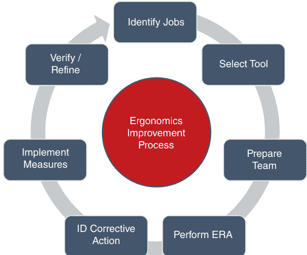

通常，来自员工的信息对于识别高风险工作最有帮助。员工反馈、报告的担忧和不适调查应用于选择问题区域。当被询问时，员工很可能会报告大量他们认为有压力的情况。对于每份报告，应尽快进行某种形式的沟通，否则员工可能会认为这项努力不过是另一种昙花一现的活动。

人体工程学团队或其他受过培训的人员进行的工作场所观察是信息的良好来源。对椅子、工具和其他工作场所物品所做的修改是一个“危险信号”，表明需要进一步调查。作者使用的一种特定方法涉及一系列连续的技术，通过感知风险来识别和优先排序工作。

1) 首先，团队使用“头脑风暴”来收集一批被认为存在人体工程学风险的工作和任务。头脑风暴技术是一种用于快速收集想法和数据的常用工具。为头脑风暴会议与团队制定基本规则非常重要。头脑风暴可以以结构化或非结构化的方式进行。结构化的头脑风暴会议要求每个人在轮到他们时提出一个想法。“非结构化”的头脑风暴方法依赖于团队在想到时提供想法，这可能会创造更轻松的氛围，但存在被团队中更健谈的成员主导的风险。无论哪种方式，头脑风暴都应促进：

-   一个不对想法/项目进行评判的环境——不批评或偏袒
-   创造性思维
-   数量优先于质量（在此阶段）

2) 一旦列表填充完毕，团队成员各自选出他们认为最重要的三到五项工作，并写在索引卡上。收集卡片并统计数量，以确定团队对工作的排名。使用白板、挂图或投影的 Excel 电子表格按优先级列出工作。这种技术有时被称为“优先级路径”或名义小组技术（GOAL/QPC 1995）。

3) 从那里，选择列表顶部的工作（5-15 项）放置在风险评估矩阵上。团队必须清楚地理解风险评估矩阵中使用的严重程度和可能性类别，这一点至关重要。团队对每项工作进行评估，就其严重程度和可能性达成共识，并相应地绘制在矩阵上。这提供了人体工程学团队可以开始处理的工作的人体工程学风险排名。

### 16.7.2 评估工具

有许多人体工程学风险评估工具可用（部分列表见表 16.2），这些工具有通用或特定的应用。选择合适的工具时，应考虑评估的范围和目的，以及应用和目标身体部位。此外，还应考虑使用所选工具的复杂性或“困难程度”以及使用工具的人员的技能水平。所有人体工程学风险评估工具都需要一定程度的培训和经验才能正确有效地使用。在选择工具时应考虑最终用户的技能水平。

人体工程学风险评估工具有三种类型：定性、半定量和定量。每种类型简要描述如下：

1)  **定性工具：** 定性工具最常用于工作筛选。大多数是手动或基于 Excel 的。其中一些包括 OSHA 基本筛查工具、国家职业安全与健康研究所检查表、华盛顿工业安全与健康法案检查表以及美国政府工业卫生学家会议搬举阈限值。还有许多由保险公司和咨询公司开发的工具，可用于基本筛查和姿势评估。本章讨论的人体工程学风险评估工具就是一个例子。

2)  **半定量工具：** 半定量工具通常需要更多的专业知识才能应用。通常，半定量工具针对特定的应用和风险因素，如搬举、手工作业或身体区域。这些类型的工具包括快速上肢评估、快速全身评估、Snook 表格、ACGIH 手工操作阈限值和犹他州背部压缩等。

3)  **定量工具：** 第三组工具称为定量评估工具，通常用于执行更深入的分析。因此，定量工具需要更高程度的用户培训、知识和技能。定量工具包括 NIOSH 修订版搬举公式、密歇根大学的三维静态力量预测模型、密歇根大学的能量消耗预测程序、应变指数、动态工作分析和静态工作分析等。

### 16.7.3 评估团队

人体工程学风险评估最好由经过培训和具备资格的跨职能团队成员执行。这样的团队应包括用户/操作员、生产、质量、技术工种、维护和 SH&E 专业人员。拥有多样化且经验丰富的小组的安全委员会可用于此过程。一名精通工作场所人体工程学和风险评估的合格人体工程学协调员来指导团队至关重要。

评估团队应接受适当的培训，并了解所执行的工作和任务，以及识别人体工程学危害和风险因素的能力。此外，团队成员应接受一些关于解决问题技能、人体工程学原理和控制层级的培训和经验。

### 16.7.4 执行评估

确保有足够的资源和时间分配来进行评估。数码相机和卷尺等设备可用于收集和记录分析数据。其他仪器如照度计、声级计、红外温度计、力计、并且可能需要使用角度计。在评估过程中，建议评估者核实所选工作是否在其典型产能或速率下进行，并且代表其正常操作。

某些工作场所，如制造业，涉及多样化或长周期任务的工作，给观察和分析完整工作带来了独特挑战。在这种情况下，应在评估前审查包含工作流程图的观察计划。然后，可以将工作分解为类似工作危害分析的环节或任务，并对每个任务进行单独评估。

人因工程风险评估过程涉及三个基本步骤：

1) 识别并收集数据
    a) 获取操作员的输入和参与
    b) 观察任务周期并识别任务细节
    c) 收集任务、操作员交互的数字视频和照片以供进一步分析
    d) 收集有关工作区域、材料、工具和环境的数据
2) 分析数据
    a) 分析收集的数据以了解人因工程风险的性质和类型
    b) 使用选定的人因工程风险评估工具输入来确定风险水平
3) 评估
    a) 评估每项风险的严重性、可能性和暴露/持续时间
    b) 在评估工具中输入最终的风险因素

评估完成后，根据其定义的风险标准，将风险因素输入人因工程风险评估工具。由此产生的风险优先级数（RPN）或行动水平值用于确定所评估工作的人因工程风险水平是否处于可接受水平，或者是否需要额外的控制措施。例如，图16.3中介绍的ERAT工具指定了三个不同的水平（*行动水平3* – 高风险；*行动水平2* – 中等风险；*行动水平1* – 低风险），并指示是否需要或期望采取额外行动。

### 16.7.5 识别纠正措施

人因工程风险评估的最终目标是帮助组织理解人因工程风险水平，并将风险降至可容忍水平。具有高风险分数的工作需要立即采取纠正措施以降低已识别的风险因素。人因工程团队应参与识别和开发有效的人因工程解决方案。同样，可以使用头脑风暴来识别潜在的改进和控制措施，以降低人因工程风险。团队必须理解并使用*控制层级*概念来选择最有效的控制措施。这通常需要进行一些成本效益分析和投资回报计算，以选择可行的控制措施并帮助说服决策者。

### 16.7.6 实施措施

在启动任何变更之前，应让受影响的员工了解将发生什么、为什么有必要以及何时发生。员工有效使用控制措施所需的任何特殊培训，应在实施变更之前提供。如果在没有用户输入或知情的情况下进行人因工程变更，变更不被接受的可能性会急剧增加。应让员工参与选择人因工程干预措施的过程，以创造认同感和主人翁意识。

许多人因工程改进需要工程、维护和生产级别的员工来完成。确保任务分配、目标日期、所需资源和其他项目得到沟通和跟踪非常重要。

### 16.7.7 验证和完善

实施后不久，人因工程团队和工程人员应与受影响的操作员会面，以验证措施是否正常工作。可能需要对某些应用进行微调，或者在极少数情况下进行彻底检修。应收集操作员关于操作简便性、舒适度、速度等方面的反馈或顾虑，以确定任何需要的调整或纠正。

在足够的磨合期后，应对新的控制措施及其有效性进行更深入的审查。此步骤将涉及人因工程团队成员和工程人员使用选定的人因工程风险评估工具，在控制措施成功实施后测量风险水平。

### 16.7.8 沟通结果

评估结果必须被跟踪、测量和沟通，流程才能有效（Lyon 1997）。组织的人因工程团队应建立短期和长期指标，以展示人因工程风险评估流程的有效性。其中许多指标已被组织的各个部门（如生产、质量或人力资源）测量和跟踪。一些最常见的措施包括基于结果的指标，这些指标提供了长期的绩效衡量。这些可能包括：

- 与人因工程相关的事件数量。
- 与人因工程相关的损失时间事件数量。
- 与人因工程相关的损失天数、受限天数或调岗天数。
- 减少部件返工、拒收率和其他与质量相关的措施。
- 减少非增值任务。
- 减少浪费和废品。
- 提高生产率值。

此外，重要的是在流程中包含基于行动或活动的指标。基于行动的指标通常是“短期”衡量标准，有助于沟通工作场所改进和风险降低所带来的影响。基于行动的指标示例可能包括：

- 已进行人因工程风险评估的工作/任务百分比。
- 风险降低的工作/任务百分比。
- 人因工程风险降低或风险水平（RPN）降低的百分比。
- 接受培训的员工数量。
- 员工提出的改进建数量。

与任何成功的风险评估模型一样，人因工程风险评估过程应从始至终涉及利益相关者。随着目标的实现，组织应庆祝、认可并强化参与的利益相关者。

## 16.8 人因工程风险评估工具（ERAT）——一个实用的评估工具

众多快速筛选和评估工具之一是人因工程风险评估工具（ERAT）。ERAT由作者（Lyon等人，2013年）开发，基于ANSI Z365人因工程检查表草案，该草案是2003年撤回的*工作相关肌肉骨骼疾病管理认可标准委员会Z365工作草案*的一部分。

这个相对简单的工具提供了一种标准化的方法，可以在大多数工作环境中快速识别、评估和评分上肢的人因工程风险。它基于Excel，包含一个*初始评估工作表*、一个*控制措施后评估工作表*（在初始评估和实施控制措施后使用，以建立当前的风险因素分数）和一个*人因工程风险控制层级*。像ERAT这样的简化工具的优点之一是学习使用该工具所需的培训时间相对较短。作者在不到四小时内就培训了主管、领班和操作员使用ERAT，用户展示了执行人因工程风险评估的足够能力水平。强烈建议对检查表进行审查，解释风险因素及其评分示例，进行工具使用的现场演示，然后进行实际应用。

ERAT仅限于评估影响上肢的人因工程风险因素，适用于办公室工作和装配型工作环境。初始评估（IA工作表）用于建立基线风险分数和行动水平，并提供可能的控制措施以降低风险因素分数。控制措施后评估（PCA工作表）在初始评估和实施控制措施后使用，以建立当前的风险因素分数。

评估工作表包括六类风险因素：

1) 重复性（R）
    a) 每隔几分钟
    b) 每隔几秒钟
2) 提举（L）
    a) 5–15磅。
    b) 15–30磅。
    c) 30–50磅。
    d) 超过50磅。
3) 推/拉力（F）
    a) 轻松
    b) 中等
    c) 重
4) 搬运超过10英尺的负载（C）
    a) 5–15磅。
    b) 15–30磅。
    c) 超过30磅。
5) 姿势（P）
    a) 头部倾斜（向前、向后或向侧面）
    b) 肩部伸展（手臂伸展）
    c) 飞肘（肩部外展；肘部抬起）
    d) 手腕弯曲（手腕偏斜，包括尺侧、桡侧、屈曲或伸展）或捏握
    e) 弯腰或扭腰（背部屈曲或伸展，或向侧面弯曲，腰部扭转）

### 16.8.1 ERAT 示例 – 猪肉加工腹部肉分级

**任务描述：** 两名操作员站在一条约齐腰高的进料输送带末端，每人用一只手手动抓取每块猪腹肉，将其放置在相邻的称重秤上，目视对腹肉进行分级，然后（用一只手臂）将其抛入约6-8英尺外的几个料箱之一。每位工人的工作节奏约为每分钟10块腹肉，相当于每小时约60块，或每个八小时班次480块。猪腹肉每块重11至14磅，平均约13磅。

### 16.8.2 ERAT 初始评估得分

- 重复得分 = 3（每几分钟一个周期，持续时间超过四小时）
- 提举得分 = 1（平均重量为每块13磅，持续时间超过四小时）
- **推/拉得分** = 3（重复的“单臂”抛掷动作被认为对体力要求高，持续时间超过四小时）
- **姿势**
    - **头部倾斜得分** = 1（周期性头部前倾约45°）
    - **肩部伸展得分** = 2（重复的肩部伸展姿势，持续时间超过四小时）
    - **肘部外展得分** = 2（重复的肘部抬高/肩部外展姿势，持续时间超过四小时）
    - **手腕弯曲/捏握得分** = 2（抓取腹肉时重复的手腕弯曲和捏握动作，持续时间超过四小时）
    - **弯腰/扭转得分** = 1（将腹肉抛入料箱时周期性腰部扭转）
- **环境**
    - **噪音得分** = 2（听力保护区，需使用防护设备）
    - **照明得分** = 2（光照水平和质量不足以满足检查任务需求）
    - **节奏过快得分** = 2（以每分钟10块的节奏进行体力消耗，持续时间超过四小时）
    - **极端温度得分** = 2（环境温度低，需要使用防护手套和衣物）

该任务的初始评估得分为23分，被归类为*行动等级3*或极高风险，需要立即干预，如图16.2所示。

### 16.8.3 人体工程学风险控制措施的选择与实施

初始评估后，猪肉加工厂的人体工程学团队共同合作，运用人体工程学风险控制层级原则（图16.3）制定了适当的风险控制措施。
最终的干预措施包括工程控制，例如在新输送带系统中设置在线称重秤，并在输送带系统下方设置滑槽和料箱，从而消除了过度搬运和抛掷任务的需求。工程控制措施还有助于消除或减少许多极端、重复的姿势。

### 16.8.4 控制后评估

实施控制措施后，使用控制后评估（PCA）工作表进行了第二次评估，所得风险评分如图16.4所示。PCA评分从23分（行动等级3 – 高风险）降至9分（行动等级1 – 低风险）。

## 16.9 结论

人体工程学危害和潜在条件在某种程度上存在于几乎所有工作系统中，并且可能在标准风险评估工作中被忽视。许多不确定其运营中人体工程学风险水平或其对业务影响的组织，有显著的改进机会。为了提高组织管理人体工程学危害的能力，需要一个有效的人体工程学风险评估流程，将风险降低到可接受的水平。

对于尚未实施人体工程学流程的组织，这是安全、健康与环境（SH&E）专业人员帮助业务决策者理解和认识降低人体工程学风险的价值，并指导他们建立流程的机会。保持简单而有效是成功的关键。

---

**人体工程学风险评估工具（ERAT） – 初始评估**

| 工作任务：腹部肉分级 | 评估员：Bruce Lyon; Georgi Popov | 部门：猪肉加工生产线 | 日期：2019年1月9日 |
| :--- | :--- | :--- | :--- |
| **风险因素** | **任务持续时间** | | | | **得分** | **备注** |
| | <1小时 | 1 – 4小时 | >4小时 | 不适用 | | |
| **重复** | | | | | 仅输入一个得分 | |
| 每几分钟一次 | 0 | 0 | 1 | | 0 | |
| 每几秒钟一次 | 0 | 1 | 3 | | 3 | 每分钟10块腹肉 |
| **提举** | | | | | 仅输入一个得分 | |
| 5至15磅 | 0 | 0 | 1 | | 1 | 8小时班次；12 – 14磅 @ |
| 15至30磅 | 1 | 1 | 2 | 不适用 | | |
| 30至50磅 | 2 | 2 | 3 | 不适用 | | |
| 超过50磅 | 3 | 3 | 3 | 不适用 | | |
| **推/拉力** | | | | | 仅输入一个得分 | |
| 轻松 | 0 | 0 | 1 | 不适用 | | |
| 中等 | 0 | 1 | 2 | 不适用 | | |
| 重 | 1 | 2 | 3 | | 3 | 将腹肉抛掷约8英尺至料箱 |
| **搬运 > 10英尺** | | | | | 仅输入一个得分 | |
| 5至15磅 | 0 | 0 | 1 | 不适用 | | |
| 15至30磅 | 0 | 1 | 2 | 不适用 | | |
| 超过30磅 | 1 | 2 | 3 | 不适用 | | |
| **姿势** | | | | | 每项评分 | |
| 头部倾斜 | 0 | 1 | 2 | | 1 | |
| 肩部伸展 | 0 | 1 | 2 | | 2 | 极度伸展 |
| 肘部外展 | 0 | 1 | 2 | | 2 | 极度肘部抬高 |
| 手腕弯曲/捏握 | 0 | 1 | 2 | | 2 | 捏握 |
| 弯腰或扭转腰部 | 0 | 1 | 2 | | 1 | |
| **环境** | | | | | 每项评分 | |
| 噪音 | 0 | 1 | 2 | | 2 | >85分贝 |
| 照明/眩光 | 0 | 1 | 2 | | 2 | 阴影和眩光 |
| 冲击/压迫 | 0 | 1 | 2 | 不适用 | | |
| 振动/电动工具 | 0 | 1 | 2 | 不适用 | | |
| 节奏过快 | 0 | 1 | 2 | | 2 | 体力消耗大 |
| 极端温度 | 0 | 1 | 2 | | 2 | 40华氏度 |
| **行动等级总分** | | | | | **23** | |
| 行动等级1 | 总分10分或以下 – 可能需要进一步分析 | | | | | |
| 行动等级2 | 总分11–22分 – 需要在近期进行干预 | | | | | |
| 行动等级3 | 总分23–36分需要立即干预 | | | | | |

图16.2 人体工程学风险评估工具 – 初始评估。

## 16 人体工程学风险评估

| 方法 | 阶段/应用 | 控制示例 | 有效性 |
| :--- | :--- | :--- | :--- |
| 避免 | 概念设计/重新设计阶段 | 通过选择技术和工作方法，在设计上防止危害进入工作场所。 | 高 |
| 消除 | 现有流程重新设计 | 通过改变设计、设备和方法来消除危害 | 高 |
| 替代 | 现有流程 | 替代材料、尺寸、重量和其他方面，以降低危害的严重性或可能性 | 中高 |
| 工程控制 | 现有工作站重新设计 | 通过改变工作场所、工具、设备、固定装置、可调节性、布局、照明、工作环境来减少危害 | 中等 |
| 管理控制 | 实践和程序 | 通过改变工作实践、培训、工作扩大化、工作轮换、休息时间、工作节奏来减少危害暴露 | 中低 |
| 个人防护装备 | 工人 | 通过使用防护装备和材料（如减振手套）来减少危害对员工的影响 | 低 |

图 16.3 人体工程学风险控制层级。

| 人体工程学风险评估工具（ERAT） – 控制后评估 |
| :--- |
| 工作任务：腹部修整工 | 评估员：布鲁斯·里昂；乔治·波波夫 | 部门：猪肉加工线 | 日期：2019年1月9日 |
| 风险因素 | 任务持续时间 | | | 得分 | 评论 |
| | <1 小时 | 1–4 小时 | >4 小时 | 不适用 | | |
| 重复性 | 仅输入一个分数 | | | | |
| 每隔几分钟 | 0 | 0 | 1 | 不适用 | | |
| 每隔几秒 | 0 | 1 | 3 | | 3 | 未做更改 |
| 提举 | 仅输入一个分数 | | | | |
| 5 至 15 磅 | 0 | 0 | 1 | | 0 | 工程控制使搬运量减少约 50% |
| 15 至 30 磅 | 1 | 1 | 2 | 不适用 | | |
| 30 至 50 磅 | 2 | 2 | 3 | 不适用 | | |
| 超过 50 磅 | 3 | 3 | 3 | 不适用 | | |
| 推/拉力 | 仅输入一个分数 | | | | |
| 轻松 | 0 | 0 | 1 | | 1 | 工程控制使搬运量减少约 50% |
| 中等 | 0 | 1 | 2 | 不适用 | | |
| 重 | 1 | 2 | 3 | 不适用 | | |
| 搬运 > 10 英尺 | 仅输入一个分数 | | | | |
| 5 至 15 磅 | 0 | 0 | 1 | 不适用 | | |
| 15 至 30 磅 | 0 | 1 | 2 | 不适用 | | |
| 超过 30 磅 | 1 | 2 | 3 | 不适用 | | |
| 姿势 | 每项评分 | | | | |
| 头部倾斜 | 0 | 1 | 2 | | 0 | 工程控制显著减少了极端姿势 |
| 肩部伸展 | 0 | 1 | 2 | | 0 | |
| 肘部外展 | 0 | 1 | 2 | | 0 | |
| 弯曲手腕/捏握 | 0 | 1 | 2 | | 1 | |
| 弯腰或扭腰 | 0 | 1 | 2 | | 0 | |
| 环境 | 每项评分 | | | | |
| 噪音 | 0 | 1 | 2 | | 2 | 未做更改 |
| 照明/眩光 | 0 | 1 | 2 | | 0 | 改善了照明质量 |
| 冲击/压迫 | 0 | 1 | 2 | 不适用 | | |
| 振动/电动工具 | 0 | 1 | 2 | 不适用 | | |
| 节奏过快 | 0 | 1 | 2 | | 0 | 减少了搬运量 |
| 极端温度 | 0 | 1 | 2 | | 2 | 未做更改 |
| 行动等级总计 | | | | | 9 | |
| 行动等级 1 | 总分 10 分或以下 – 可能需要进一步分析 | | | | | |
| 行动等级 2 | 总分 11–22 分 – 需要近期干预 | | | | | |
| 行动等级 3 | 总分 23–36 分需要立即干预 | | | | | |

图 16.4 人体工程学风险评估工具 – 控制后评估。

## 复习题

1.  简要总结非人体工程学设计的系统和产品所产生的危害类型。
2.  简要描述人体工程学风险评估中通常包含的人体工程学风险因素。
3.  描述人体工程学改进过程，以及它如何融入运营风险管理体系。
4.  解释通用危害分析和风险评估工具（如失效模式与影响分析、初步危害分析和基本风险评估）在人体工程学风险方面的局限性。
5.  列出六种常用的人体工程学风险评估工具。
6.  编制一份应纳入人体工程学风险评估的部门/职位清单。

## 参考文献

AIHA (2014). *AIHA Ergonomics Committee Ergonomics Reference Document*. Falls Church, VA: American Industrial Hygiene Association https://www.aiha.org/get-involved/volunteer-groups/ergonomics-committee.

ANSI/ASSP Z10.0-2019 (2019). *Occupational Health and Safety Management Systems Standard*. Park Ridge, IL: American Society of Safety Professionals.

ANSI/ASSP Z490.1-2016 (2016). *Criteria for Accepted Practices in Safety, Health, and Environmental Training Standard*. Park Ridge, IL: American Society of Safety Professionals.

ANSI/ASSP Z590.3-2011(R2016) (2016). *Prevention through Design: Guidelines for Addressing Occupational Hazards and Risks in Design and Redesign Processes Standard*. Park Ridge, IL: American Society of Safety Professionals.

BLS (2014). Nonfatal occupational injuries and illnesses requiring days away from work. Bureau of Labor Statistics, US Department of Labor, Washington, DC, USDL 15-2205: released 19 November 2015. https://www.bls.gov/news.release/archives/osh2_11192015.pdf

Cornell University (2012). CUErgo: research & tools. http://ergo.human.cornell.edu/cuergoresearchtools.html

GOAL/QPC (1995). *Coach's Guide to the Memory Jogger*. Lawrence, MA: GOAL QPC.

HFES (2020). *What is Human Factors/Ergonomics?* Washington, DC: The Human Factors and Ergonomics Society https://www.hfes.org/about-hfes/what-is-human-factors-ergonomics.

Liberty Mutual Insurance (2020). *2020 Liberty Mutual Workplace Safety Index*. Berkeley Street, MA: Liberty Mutual Insurance Company https://viewpoint.libertymutualgroup.com/article/2020-workplace-safety-index-the-top-10-causes-of-disabling-injuries/.

Liberty Mutual Insurance Company (2020). *Liberty Mutual Manual Material Handling Tables*. Berkeley Street, MA: http://libertymmhtables.libertymutual.com/CM_LMTablesWeb/taskSelection.do?action=initTaskSelection.

Lyon, B.K. (1997). Ergonomic benefit/cost analysis: communicating the value of enhancements. *Professional Safety* (March 1997).

Lyon, B.K., Popov, G., and Hanes, K. (2013). Improving Ergo IQ: a practical risk assessment model. *Professional Safety* (December 2013).

National Safety Council (2002). *Management of Work-related Musculoskeletal Disorders. (ANSI Accredited Standards Committee Z365 Working Draft)*. Itasca, IL: National Safety Council http://www.humanics-es.com/z365_finldft.pdf.

OSHA (1993). *Ergonomics Program Management Guidelines For Meatpacking Plants*, OSHA 3123. Washington, DC: Occupational Safety and Health Administration https://www.osha.gov/Publications/OSHA3123/3123.html.

OSHA (2000). *Ergonomics: The Study of Work*. OSHA 3125. Washington, DC: Department of Labor, OSHA.

Rostykus, W.G. (2005). Managing Ergonomics as a process. ASSE Professional Development Conference Proceedings, New Orleans, LA (June 2005).

University of Michigan (2013). Center for Ergonomics: tools and services. https://c4e.engin.umich.edu/tools-services/

## 附录 A 相关利益相关者人体工程学职责示例

| 角色 | 职责 |
| :--- | :--- |
| 高级管理层 | ☑ 确立人体工程学风险评估流程的目标、目的和范围<br>☑ 每月与利益相关者沟通<br>☑ 使运营部门能够实现目标<br>☑ 参加指定的人体工程学培训<br>☑ 审查和跟踪进展<br>☑ 提供可见的支持并强化流程 |
| 运营经理 | ☑ 参加指定的人体工程学培训<br>☑ 使能并支持利益相关者<br>☑ 要求利益相关者负责并确保目标达成<br>☑ 确定人体工程学协调员<br>☑ 审查和跟踪进展<br>☑ 提供可见的支持并强化流程 |
| 人体工程学协调员 | ☑ 参加指定的人体工程学培训<br>☑ 制定和协调计划<br>☑ 验证流程要素得到实施和维护<br>☑ 确保每季度成功完成 3 项优先工作的评估<br>☑ 审查和跟踪进展<br>☑ 为人体工程学团队提供领导和指导<br>☑ 每月向运营管理层报告进展<br>☑ 参加每月的人体工程学团队会议 |
| 人体工程学团队 | ☑ 参加指定的人体工程学培训<br>☑ 每季度评估 3 项优先工作<br>☑ 确定风险降低措施并使用成本/效益分析<br>☑ 制定选定的措施并分配实施<br>☑ 确认实施并跟进<br>☑ 审查和跟踪进展<br>☑ 协助事件分析和纠正措施 |
| 工程师 | ☑ 参加指定的人体工程学培训<br>☑ 参加所有人体工程学团队会议<br>☑ 与团队合作确定工程解决方案<br>☑ 与团队合作制定成本/效益分析<br>☑ 在新设计、设备和工作场所变更中应用人体工程学指南 |
| 维护人员 | ☑ 参加指定的人体工程学培训<br>☑ 参加所有人体工程学团队会议<br>☑ 参与解决方案开发和成本/效益分析<br>☑ 提供关于维护和服务需求的见解<br>☑ 帮助实施选定的解决方案 |
| 主管 | ☑ 参加指定的人体工程学培训<br>☑ 使能并确保员工接受指定培训<br>☑ 协助人体工程学团队确定优先工作<br>☑ 协助定义优先工作的任务要求<br>☑ 参与事件分析<br>☑ 强化并认可安全工作实践<br>☑ 指导和辅导员工<br>☑ 与员工沟通 |

## 382 | 16 人体工程学风险评估

| 角色 | 职责 |
|---|---|
| 员工 | ☑ 参加指定的人体工程学培训<br>☑ 使用规定的评估工具帮助识别人体工程学风险因素<br>☑ 遵循人体工程学指南和安全工作说明<br>☑ 立即报告不适、症状<br>☑ 参与事故分析<br>☑ 就控制措施提供意见和反馈 |
| 医疗护理与工伤赔偿 | ☑ 参加指定的人体工程学培训<br>☑ 评估和治疗报告症状的员工<br>☑ 将症状、担忧、疾病告知管理层/人体工程学协调员<br>☑ 参与事故分析<br>☑ 管理和跟踪事故<br>☑ 向管理层和人体工程学协调员报告趋势<br>☑ 帮助为有限制的员工确定适当的调整后职责 |

## 附录B 相关利益相关者人体工程学培训示例

| 角色 | 培训 | 目标 | 频率 |
|---|---|---|---|
| 高级管理层 | *人体工程学管理体系*<br>2 小时 | ☑ 理解流程的目的、范围和目标<br>☑ 人体工程学流程概述<br>☑ 高级管理层的职责和问责<br>☑ 所需和可用的资源<br>☑ 时间和预算要求<br>☑ 管理和强化流程步骤<br>☑ 流程指标和方法——与目标挂钩 | • 初始<br>• 2 年<br>• 变更时 |
| 运营管理层 | *工厂人体工程学流程*<br>3 小时 | ☑ 理解流程的目的、范围和目标<br>☑ 理解基本人体工程学原理和风险因素<br>☑ 理解工厂人体工程学流程步骤<br>☑ 运营管理层的职责和问责<br>☑ 所需和可用的资源<br>☑ 时间和预算要求<br>☑ 管理和强化流程步骤<br>☑ 流程指标和方法——与目标挂钩 | • 初始<br>• 2 年<br>• 变更时 |
| 人体工程学协调员<br>人体工程学团队成员 | *人体工程学团队与风险评估*<br>16 小时 初始<br>4 小时 复训 | ☑ 理解流程的目的、范围和目标<br>☑ 团队的职责和问责<br>☑ 理解人体工程学原理、风险因素和控制措施<br>☑ 理解人体工程学流程步骤<br>☑ 理解如何使用人体工程学风险评估工具<br>☑ 人体工程学事故分析和根本原因<br>☑ 问题解决和解决方案构建<br>☑ 所需和可用的资源<br>☑ 时间和预算要求<br>☑ 流程指标和方法——与目标挂钩 | • 初始<br>• 2 年<br>• 变更时 |
| 工程师<br>维护人员 | *人体工程学设计指南*<br>16 小时 初始<br>4 小时 复训 | ☑ 理解流程的目的、范围和目标<br>☑ 设计师和工程师的职责和问责<br>☑ 理解工程人体工程学原理、风险因素和控制措施<br>☑ 理解人体工程学流程步骤<br>☑ 新工作站设计指南<br>☑ 问题解决和解决方案构建<br>☑ 所需和可用的资源<br>☑ 时间和预算要求<br>☑ 流程指标和方法——与目标挂钩 | • 初始<br>• 2 年<br>• 变更时 |
| 主管 | *主管人体工程学流程*<br>2 小时 | ☑ 理解流程的目的、范围和目标<br>☑ 理解基本人体工程学原理和风险因素<br>☑ 理解人体工程学流程步骤<br>☑ 主管的职责和问责<br>☑ 强化流程步骤<br>☑ 流程指标和方法——与目标挂钩 | • 初始<br>• 2 年<br>• 变更时 |
| 员工 | *员工人体工程学流程*<br>2 小时 | ☑ 理解流程的目的、范围和目标<br>☑ 理解基本人体工程学原理和风险因素<br>☑ 员工的职责和问责 | • 初始<br>• 2 年<br>• 变更时 |

## 附录C 人体工程学风险评估工具（ERAT）——初始评估

| 人体工程学风险评估工具（ERAT）——初始评估 |
|---|
| 工作任务： | 评估员： | 部门： | 日期： |
| 风险因素 | 任务持续时间 | 评分 | 备注 |
| | <1 小时 | 1–4 小时 | >4 小时 | 不适用 | | |
| **重复性** | 仅输入一项 | | | | | |
| 每隔几分钟 | 0 | 0 | 1 | | | |
| 每隔几秒钟 | 0 | 1 | 3 | | | |
| **提举** | 仅输入一项 | | | | | |
| 5–15 磅 | 0 | 0 | 1 | | | |
| 15–30 磅 | 1 | 1 | 2 | | | |
| 30–50 磅 | 2 | 2 | 3 | | | |
| 超过 50 磅 | 3 | 3 | 3 | | | |
| **推/拉力** | 仅输入一项 | | | | | |
| 轻松 | 0 | 0 | 1 | | | |
| 中等 | 0 | 1 | 2 | | | |
| 重 | 1 | 2 | 3 | | | |
| **搬运 > 10 英尺** | 仅输入一项 | | | | | |
| 5–15 磅 | 0 | 0 | 1 | | | |
| 15–30 磅 | 0 | 1 | 2 | | | |
| 超过 30 磅 | 1 | 2 | 3 | | | |
| **姿势** | 每项评分 | | | | | |
| 头部倾斜 | 0 | 1 | 2 | | | |
| 肩部伸展 | 0 | 1 | 2 | | | |
| 肘部外展 | 0 | 1 | 2 | | | |
| 手腕弯曲/捏握 | 0 | 1 | 2 | | | |
| 弯腰或扭腰 | 0 | 1 | 2 | | | |
| **环境** | 每项评分 | | | | | |
| 噪音 | 0 | 1 | 2 | | | |
| 照明/眩光 | 0 | 1 | 2 | | | |
| 冲击/压迫 | 0 | 1 | 2 | | | |
| 振动/电动工具 | 0 | 1 | 2 | | | |
| 节奏过快 | 0 | 1 | 2 | | | |
| 极端温度 | 0 | 1 | 2 | | | |
| | **行动等级总计** | | | | 0 | |
| 行动等级 1 | 总分 10 分或以下——可能需要进一步分析 |
| 行动等级 2 | 总分 11–22 分——需要在近期进行干预 |
| 行动等级 3 | 总分 23–36 分需要立即干预 |

## 附录D 人体工程学风险评估工具（ERAT）——控制后评估

| 人体工程学风险评估工具（ERAT）——控制后评估 |
| :--- |
| 工作任务： | 评估员： | 部门： | 日期： |
| 风险因素 | 任务持续时间 | 评分 | 备注 |
| | <1 小时 | 1–4 小时 | >4 小时 | 不适用 | | |
| **重复性** | 仅输入一项 | | | | | |
| 每隔几分钟 | 0 | 0 | 1 | | | |
| 每隔几秒钟 | 0 | 1 | 3 | | | |
| **提举** | 仅输入一项 | | | | | |
| 5–15 磅 | 0 | 0 | 1 | | | |
| 15–30 磅 | 1 | 1 | 2 | | | |
| 30–50 磅 | 2 | 2 | 3 | | | |
| 超过 50 磅 | 3 | 3 | 3 | | | |
| **推/拉力** | 仅输入一项 | | | | | |
| 轻松 | 0 | 0 | 1 | | | |
| 中等 | 0 | 1 | 2 | | | |
| 重 | 1 | 2 | 3 | | | |
| **搬运 > 10 英尺** | 仅输入一项 | | | | | |
| 5–15 磅 | 0 | 0 | 1 | | | |
| 15–30 磅 | 0 | 1 | 2 | | | |
| 超过 30 磅 | 1 | 2 | 3 | | | |
| **姿势** | 每项评分 | | | | | |
| 头部倾斜 | 0 | 1 | 2 | | | |
| 肩部伸展 | 0 | 1 | 2 | | | |
| 肘部外展 | 0 | 1 | 2 | | | |
| 手腕弯曲/捏握 | 0 | 1 | 2 | | | |
| 弯腰或扭腰 | 0 | 1 | 2 | | | |
| **环境** | 每项评分 | | | | | |
| 噪音 | 0 | 1 | 2 | | | |
| 照明/眩光 | 0 | 1 | 2 | | | |
| 冲击/压迫 | 0 | 1 | 2 | | | |
| 振动/电动工具 | 0 | 1 | 2 | | | |
| 节奏过快 | 0 | 1 | 2 | | | |
| 极端温度 | 0 | 1 | 2 | | | |
| | **行动等级总计** | | | | 0 | |
| **行动等级 1** | 总分 10 分或以下——可能需要进一步分析 | | | | | |
| **行动等级 2** | 总分 11–22 分——需要在近期进行干预 | | | | | |
| **行动等级 3** | 总分 23–36 分需要立即干预 | | | | | |

## 附录E 人体工程学风险控制层级

| 控制方法 | 阶段/应用 | 控制示例 | 有效性 |
| :--- | :--- | :--- | :--- |
| **避免** | 概念阶段设计/重新设计 | 通过选择技术和工作方法，在设计上防止危害进入工作场所。 | **高** |
| **消除** | 现有流程重新设计 | 通过改变设计、设备和方法来消除危害 | **高** |
| **替代** | 现有流程 | 替代材料、尺寸、重量和其他方面，以降低危害严重性或可能性 | **较高** |
| **工程控制** | 现有工作站重新设计 | 通过改变工作场所、工具、设备、夹具、可调节性、布局、照明、工作环境来减少危害 | **中等** |
| **管理控制** | 实践和程序 | 通过改变工作实践、培训、工作扩大化、工作轮换、休息、工作节奏来减少危害暴露 | **较低** |
| **个人防护装备** | 工人 | 通过使用防护设备和材料（如减振手套）来减少危害对员工的影响 | **低** |

# 17 在组织层面评估运营风险

布鲁斯·莱昂
布朗&布朗公司

**目标**

-   介绍组织风险
-   审视组织风险中的要素
-   提供进行组织风险评估的指导

## 17.1 引言

世界在不断变化，每天都在给企业带来新的、往往是复杂的风险。在全球互联和相互依存的市场中，风险不再局限于单一地点或实体。威胁组织市场、供应或分销链的风险会影响所有相关方。一些风险是已知的，并在组织的风险管理计划中有所考虑。但许多风险仍然隐藏且未被量化，给组织带来不确定性，并可能导致业务中断和损失。其中一些未经处理的风险可能会摧毁组织的关键资产、损害其声誉，或阻碍业务目标和目的的顺利实现。

本书前面的章节已经讨论了针对组织内职能（如流程、系统、机器、工作站和任务）的风险评估方法。本章从更战略性的层面，以更广阔的视角审视风险；具体而言，是那些能够影响组织持续经营能力的风险。如果做得好，组织风险评估能让管理层清晰地了解组织面临的内外部风险敞口，并使决策者能够做出更好的决策。

组织风险评估是一种更广泛、更全面的方法。通常需要使用本书中介绍的其他针对性方法（如领结分析）进行进一步分析和评估，以帮助向管理层说明和传达风险（第9章）。关键在于，管理层需要充分的信息来做出关于风险的最佳决策，并且可能需要针对组织的某些方面获取更多细节。

## 17.2 组织面临的风险

组织风险评估的目的是识别可能导致业务中断、损害组织声誉或其他灾难性后果的合理风险情景。本质上，这是对组织本身所面临风险的管理。这有时被称为总风险或企业风险管理（ERM）。企业风险管理（ERM）的概念在20世纪90年代发展起来，通常指对来自内部和外部来源的所有风险（包括负面和正面风险）的管理。根据其网站，*RIMS，风险管理协会™* 在以下声明中定义了企业风险管理。

> 企业风险管理（“ERM”）是一门战略性的商业学科，它通过应对组织的全部风险并将其综合影响作为一个相互关联的风险组合来管理，从而支持组织目标的实现。ERM代表了相较于以往风险管理方法的重大演进，因为它：
>
> 1) 涵盖了组织面临风险的所有领域（财务、运营、报告、合规、治理、战略、声誉等）；
> 2) 将这些风险敞口作为一个相互关联的风险组合进行优先排序和管理，而非作为独立的“筒仓”；
> 3) 在所有重要的内部和外部环境、系统、情况和利益相关者的背景下评估风险组合；
> 4) 认识到整个组织的各个风险是相互关联的，并可能产生与单个风险总和不同的综合敞口；
> 5) 为管理所有风险提供了一个结构化流程，无论这些风险本质上主要是定量的还是定性的；
> 6) 将风险的有效管理视为一种竞争优势；以及
> 7) 旨在将风险管理作为整个组织所有关键决策的一个组成部分加以嵌入。(https://www.rims.org/resources/strategic-enterprise-risk-center/about-serm)

风险既来自内部来源，也来自组织外部。例如，美国国土安全部于2011年4月发布的题为《风险管理基础》的文件（可在 https://www.dhs.gov/publication/risk-management-fundamentals 获取）在以下陈述中描述了风险的来源。

### 风险的内部来源

影响组织有效性的风险源于内部和外部来源。内部来源的例子包括财务监管、人员可靠性和系统可靠性等问题。政府和私营部门的各类组织都面临这些类型的内部风险。这些内部风险有可能破坏有效运营并阻碍任务完成。全面的风险管理方法有助于识别弱点，并协助创建内部系统和流程，以最大限度地降低任务失败的可能性。

### 风险的外部来源

许多组织需要管理由外部因素引起的额外风险。例子包括全球、政治和社会趋势，以及来自自然灾害、恐怖主义、网络空间恶意活动、大流行病、跨国犯罪和人为事故的危害。正是这些危害和威胁促使国家在国土安全方面做出了重大承诺，外部威胁的风险对于国土安全组织而言保持在考虑的前沿至关重要。

在本书中，“运营风险”一词用于描述由工作场所危害导致的不良风险。然而，组织面临的风险也源自工作场所危害以外的来源。为风险管理和财产意外险行业提供专业教育的组织 The Institutes，将风险分为四组或“风险象限”。这些风险象限描述如下。

-   **危害风险** – 源于财产、责任或人员损失敞口，通常是保险的主题。
-   **运营风险** – 源于人员或流程、系统、控制以及信息技术的故障，通常不属于危害风险范畴。
-   **财务风险** – 源于市场力量对金融资产或负债的影响，包括市场风险、信用风险、流动性风险和价格风险。
-   **战略风险** – 源于经济和社会的趋势，包括政治、经济和竞争环境的变化，以及人口结构的变化。

The Institutes 指出，这些风险分类是概括性的，并非旨在涵盖组织面临的所有风险。许多风险存在重叠，建议组织根据其特定需求或情况制定自己的风险分类。

需要明确的是，并非所有风险都是负面的。有些风险是可取的，并且对组织的成功至关重要。投资、通过并购实现增长的机会、新产品线和服务、向全球市场扩张以及技术开发都带来了具有潜在“上行”空间和下行风险的风险。所有事情都涉及风险。承担特定风险的决定基于组织实现目标的意愿、对风险可能性和后果的感知，以及管理层的风险容忍水平。

## 17.3 组织风险管理

风险大小不一，从可能影响整个组织、个别部门、设施、系统或流程、运营和项目的风险，到影响个别工人的风险。运营风险管理系统（ORMS）应涵盖所有层面，尤其是在组织层面，并需要高级管理层的领导、承诺和参与。ANSI/ASSP/ISO 31000-2018《风险管理——指南》标准在其引言中总结了组织内部管理风险的重要性如下：

> 本文件供那些通过管理风险、做出决策、设定和实现目标以及改进绩效来在组织中创造和保护价值的人员使用。所有类型和规模的组织都面临外部和内部因素及影响，这些因素使得他们能否实现目标具有不确定性。管理风险是一个迭代过程，有助于组织设定战略、实现目标并做出明智决策。管理风险是治理和领导力的一部分，也是组织在所有层面管理方式的基础。它有助于改进管理体系。管理风险是与组织相关的所有活动的一部分，包括与利益相关者的互动。(ANSI/ASSP/ISO 31000, 2018)

风险评估是风险管理过程的核心。图17.1（经ANSI/ASSP/ISO 31000-2018标准许可转载）说明了这一点。在考虑风险管理的各种流程要素时，“风险评估”组成部分对整个过程的重要性显而易见。

该请求被拒绝，因为其被视为高风险。

## 17.5 评估组织风险

表17.1 商业资产与风险示例。

| 受风险影响的资产 | 资产面临的风险 |
| :--- | :--- |
| • 声誉与商誉 | • 内部<br>  – 欺诈与不道德行为<br>  – 受托责任风险<br>  – 法律责任<br>  – 雇主行为<br>  – 产品故障/责任<br>  – 业务中断<br>  – 关键员工流失<br>  – 灾难性或高关注度事件<br>  – 工作场所暴力与安全<br>  – 火灾与爆炸<br>  – 破坏与故意损毁<br>  – 不合规 |
| • 市场份额 | • 外部<br>  – 公用事业供应中断<br>  – IT/电信中断<br>  – 交通网络中断<br>  – 自然灾害<br>  – 恐怖主义<br>  – 绑架与勒索<br>  – 网络攻击<br>  – 数据泄露<br>  – 供应链中断<br>  – 承包商与供应商<br>  – 市场条件<br>  – 大客户流失<br>  – 大流行病<br>  – 社会/公民骚乱<br>  – 战争/冲突 |
| • 产品与服务质量 | |
| • 增长机会 | |
| • 客户 | |
| • 财务管理与信用 | |
| • 运营稳定性 | |
| • 实物资产 | |
| • 人员 | |
| • 关键员工 | |
| • 道德与商业行为 | |
| • 法律与法规合规性 | |
| • 供应链 | |
| • 分销 | |
| • 环境 | |
| • 安全 | |
| • 信息 | |
| • 技术 | |

来源：RIMS——风险管理协会，关于战略与企业风险管理（SERM）。

时间。索尼的估计损失约为1亿美元。第二个例子是2014年开始并持续到2015年的埃博拉疫情爆发。根据美国疾病控制与预防中心（2015）的数据，埃博拉疫情是迄今为止规模最大的一次，在10个月内造成超过8000人死亡和20000人感染。世界银行2014年的一份报告估计，此次疫情爆发的经济成本可能超过5000亿美元。它也极有可能抑制受影响最严重国家的经济增长（McKenna 2015）。

此类风险可能威胁到一个组织的生存。然而，如果得到妥善评估，组织风险是可以避免和管理的。例如，制定有效的业务连续性和灾难恢复计划，是组织可以采取的主动风险缓解措施，以最小化此类事件中的中断和损害。为了确定组织面临哪些风险或威胁以及所需的措施，需要一个组织风险评估（ORA）流程来梳理出主要风险。

与更集中、局部或具体的任务和运营一样，评估和管理更广泛的组织风险也需要一种手段。组织级别的风险评估是一项协调一致的工作，旨在识别组织中的关键流程和资产、潜在的暴露和后果，以及所需的控制措施。

有多种方法用于分析组织级别的风险，其中大多数基于情景分析。其中一种方法列于ANSI/ASSP/ISO 31010-2019《风险管理——风险评估附录B》中，即业务影响分析或评估（BIA）。如该标准所述，BIA方法“分析事件和事故如何影响组织的运营，并识别和量化管理这些事件所需的能力”（ANSI/ASSP/ISO 31010 2019）。BIA的流程步骤与其他组织风险评估方法类似，包括以下内容。

1)  确定组织的关键流程和产出，以确定其关键性。
2)  确定中断对已识别关键流程的后果，以财务和/或运营术语表示，并定义时间单位。
3)  识别供应链、生产和分销中与关键内部和外部利益相关者的相互依赖关系。
4)  确定当前控制措施和资源的状态，以及将风险控制在可接受水平所需的额外控制措施和资源。
5)  识别关键流程/资产中断时现有和/或所需的替代方案和备用资源。
6)  根据已识别的后果和必要的关键功能，确定每个流程的最大可接受中断时间（MAO）。MAO代表组织能够容忍能力丧失的最长时间段。
7)  确定任何专用设备或技术的恢复时间目标（RTO）。RTO代表组织期望恢复关键专用设备或技术的时间段。
8)  验证关键流程管理中断的准备水平。

组织风险评估（ORA）方法的BIA步骤将在下一节中描述。图17.2说明了本章描述的ORA方法中使用的步骤顺序。

1)  **规划组织风险评估（ORA）** – 流程从建立范围和背景、风险评估团队以及组织的关键参与者开始。
    a)  **组建团队** – 选择一名合格的协调员和团队来进行组织风险评估。团队应熟悉风险管理流程、风险评估技术、数据收集、人员访谈和实地调查。根据ORA的复杂性和背景，经验丰富的顾问、保险专业人士和其他外部团队成员可以协助或参与该过程。团队成员需要能够接触到组织中的相关人员。这可能包括了解运营、财务、供应商关系、客户需求、保险计划、法律状况、人力资源和雇佣实践、质量保证计划和产品责任、环境法规、设施维护和消防保护、职业安全与健康、安全、IT技术和网络安全、运输和分销以及其他相关领域的人员。组织的风险经理以及安全、健康和环境经理是ORA的关键组成部分。

## 组织风险评估流程

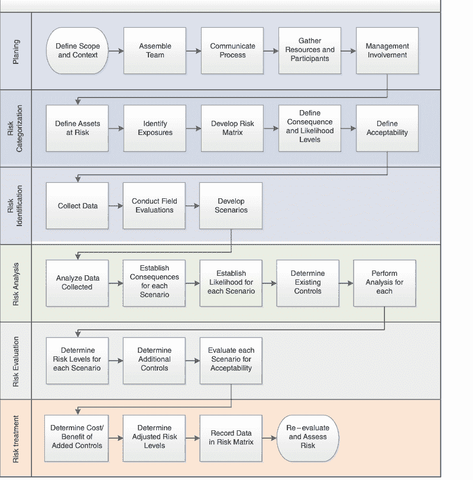

b)  **建立ORA边界** – 团队为ORA设定边界，包括目的和范围、团队成员的职责以及ORA的总体方法。这些边界与管理层和ORA团队共同设定，并应包括待分析组织资产的概述。还应包括支持性文件和数据，如年度报告、主要设施清单、损失预防报告、损失经验等。需要协调以标准化数据收集、报告撰写、情景开发和其他风险评估方面的工作。开发用于从部门、设施或运营中收集数据的ORA工作表。表17.2列出了在确定组织风险评估边界时可能需要考虑的问题。

表17.2 需要向管理层提出的问题。

-   管理层如何看待风险管理职能？
-   管理层最担心哪些风险潜力或问题？
-   首席执行官、首席财务官或组织的风险承受能力如何？
-   什么是重大或重要事件，如何衡量？
-   组织的关键流程、职能或资产是什么？
-   正在发生哪些将改变组织风险状况的业务动态？
-   管理层预计在未来两年内有哪些关键的风险管理业务决策？
-   管理层需要哪些信息来做出这些决策？
-   组织的风险在历史上变化有多大？
-   高级管理层中谁将倡导风险评估流程并启动与运营部门的沟通？
-   公司内部进行风险识别和分析的最佳信息来源是什么？
-   管理层如何衡量风险（每股收益变化、债务/权益比率增加、未达到分析师盈利预期等）？

c)  **沟通流程** – ORA团队、风险经理和高级管理层会面审查拟议计划，并就方法达成一致。高级管理层代表可能包括首席运营官、首席财务官、公司法务、行政、人力资源和其他管理代表。

d)  **召集参与者和资源** – ORA的关键参与者通常包括风险管理部门，以及每个受影响部门或主要资产类别的主要联系人，以提供评估所需的信息和资源。与关键参与者举行情况介绍会，审查ORA的目标、使用的方法、资源要求以及时间表和承诺。就ORA的范围、所需数据和格式达成一致。用于从部门、设施或运营中收集数据的ORA工作表与小组共享。

e)  **获得管理层同意** – ORA是一项重大任务，需要高级管理层的全力支持。了解管理层对ORA的期望非常重要。如果期望与既定目的和范围不符，则需要共同修订流程。例如，如果管理层期望ORA提供信息以协助确定保险免赔额水平，而ORA的范围仅寻求识别和评估灾难性事件，则可能需要修订项目范围或调整管理层期望。无论哪种方式，与管理层就ORA达成明确协议都很重要。

2)  **风险分类** – 在规划阶段之后，ORA团队定义对资产构成风险的具体“暴露”以及后果的潜在严重程度。

a)  **定义“受风险影响的资产”** – 在规划阶段讨论过的、要包含在ORA中的具体资产被正式确定。定义了受风险影响资产的广泛类别，可能包括员工、客户/公众、承包商、建筑物、计算机、电信、运输设备、环境和金融资产等类别。

b)  **定义危险暴露** – 与定义受风险影响的资产类似，定义要评估的具体危险暴露。它们应在广泛类别内定义，如自然灾害、火灾和爆炸、机械故障、泄漏和溢出、运输事故、人为错误、蓄意行为以及错误和疏忽。在每个广泛类别内，还应识别具体的暴露。例如，在自然灾害

# 17 在组织层面评估运营风险

在暴露类别下，将包含更具体的暴露，如飓风、龙卷风、暴雨、洪水、地震、地面沉降/滑坡、雷电、冰冻和结冰。

c) **定义后果** – 团队考虑面临风险的资产，定义可能因暴露而发生的后果类型。后果包括可保和不可保两类。每种后果类型都分配了代码，如表17.3所示。

d) **准备风险概况矩阵** – 为了帮助向利益相关者和决策者传达风险，准备了一份风险概况矩阵，列出了已识别的资产及其暴露情况，如图17.3所示。

e) **定义风险等级** – 团队定义后果严重程度等级以及需要为每种危险暴露衡量的可能性或概率等级。如果需要，可以根据公司结构或要衡量的后果类型，将矩阵扩展为子矩阵。表17.4和表17.5提供了一套简单的风险等级定义。

f) **准备组织风险矩阵** – 使用定义的风险等级，制定组织风险矩阵，如图17.4所示。

g) **定义可接受风险水平** – 组织的可接受风险水平由管理层定义并纳入风险矩阵。例如，管理层可能决定财产损失低于100万美元、业务中断损失少于一周是可接受的风险水平。应为每种后果类型建立可接受的风险水平。随着后果截止水平的降低，情景数量和评估工作量会显著增加。关键功能的最大可接受中断时间（MAO）以及所需专业设备和技术的恢复时间目标（RTO）由团队在管理层和其他利益相关者的帮助下定义。

表17.3 后果代码表示例。

| 代码 | 后果 |
| :--- | :--- |
| AL | 飞机责任 |
| BI | 业务中断 |
| BM | 锅炉和机械故障 |
| CP | 民事和刑事处罚 |
| DO | 董事和高级职员责任 |
| EE | 额外费用 |
| EN | 环境责任（场外） |
| FL | 受托责任 |
| OC | 现场污染 |
| PD | 财产损失 |
| PI | 公众形象/商誉损害 |
| PL | 产品责任 |
| PR | 政治风险 |
| RC | 监管后果 |
| RD | 研究数据丢失 |
| TP | 第三方责任 |
| WC | 伤亡和严重事故 |
| $ | 财务影响 |

图17.3 风险概况矩阵。

| 暴露 | 危险暴露 | 面临风险的资产 |
| :--- | :--- | :--- |
| | | 声誉/商誉 | 管理层与员工 | 客户 | 供应商 | 分销商 | 库存 | 财产 | 关键设备 | IT与通信 | 技术、研发 | 现金与财务 | 社区 |
| 自然 | 飓风 | | | | | | | | | | | | |
| | 龙卷风 | | | | | | | | | | | | |
| | 地震 | | | | | | | | | | | | |
| | 极端天气 | | | | | | | | | | | | |
| 释放 | 化学品泄漏 | | | | | | | | | | | | |
| | 大气释放 | | | | | | | | | | | | |
| | 放射性释放 | | | | | | | | | | | | |
| 火灾 | 消防喷淋损坏 | | | | | | | | | | | | |
| | 爆炸/内爆 | | | | | | | | | | | | |
| 运营 | 人为错误 | | | | | | | | | | | | |
| | 机械故障 | | | | | | | | | | | | |
| | 流程故障 | | | | | | | | | | | | |
| | 结构失效 | | | | | | | | | | | | |
| 管理 | 法律/责任 | | | | | | | | | | | | |
| | 不合规 | | | | | | | | | | | | |
| | 雇佣实践 | | | | | | | | | | | | |
| | 错误与疏忽 | | | | | | | | | | | | |
| 供应商 | 关键供应失败 | | | | | | | | | | | | |
| | 供应质量不合格 | | | | | | | | | | | | |
| | 交付延迟 | | | | | | | | | | | | |
| 分销 | 内部中断 | | | | | | | | | | | | |
| | 外部中断 | | | | | | | | | | | | |
| | 分销商丢失 | | | | | | | | | | | | |
| | 分销延迟 | | | | | | | | | | | | |
| 产品 | 设计缺陷 | | | | | | | | | | | | |
| | 误用 | | | | | | | | | | | | |
| | 性能不达标 | | | | | | | | | | | | |
| 蓄意 | 网络攻击 | | | | | | | | | | | | |
| | 破坏/故意损毁 | | | | | | | | | | | | |
| | 恐怖主义/威胁 | | | | | | | | | | | | |
| | 盗窃/欺诈 | | | | | | | | | | | | |
| | 绑架/勒索 | | | | | | | | | | | | |
| | 罢工/内乱 | | | | | | | | | | | | |
| 变化 | 监管 | | | | | | | | | | | | |
| | 社会 | | | | | | | | | | | | |
| | 技术 | | | | | | | | | | | | |

表17.4 后果严重程度等级示例。

| 后果严重程度等级 | |
| :--- | :--- |
| **灾难性** | 业务、通信或运营完全中断；设施或建筑物损失；大部分或全部关键员工流失；或其他导致超过2500万美元的损失。 |
| **关键** | 业务、通信或运营部分中断；业务中断超过1周；组织声誉受损；重要或敏感信息丢失；或其他导致超过1000万美元的损失。 |
| **边缘** | 设施、运营、分销或服务轻微中断；业务部分中断1天；组织声誉受损；有限数量的资产损坏；或其他导致超过100万美元的损失。 |
| **轻微** | 对运营、分销或服务影响很小或无影响；组织声誉受到最小损害；或损失低于100万美元。 |
| **可忽略** | 对运营、分销或服务无影响；组织声誉无损害；有限损失低于10万美元。 |

表17.5 发生可能性等级示例。

| 发生可能性等级 | |
| :--- | :--- |
| **极有可能** | 预计在目标所考虑的时间范围内发生；或可能在不到1年内发生一次。 |
| **可能** | 可能在目标所考虑的时间范围内发生；或可能在1-9年内发生一次。 |
| **中等** | 威胁发生的可能性中等；或可能在10年或更长时间内发生一次。 |
| **不太可能** | 不太可能在目标所考虑的时间范围内发生；可能在100年或更长时间内发生一次。 |
| **极不可能** | 事件发生的可能性极小；不太可能在1000年或更长时间内发生超过一次。 |

3) **风险识别与数据收集** – 目的是识别情景并收集有助于量化概率和严重程度的数据。

a) **收集数据** – ORA团队根据定义的方法论收集数据，通过文件审查、实地观察和关键人员访谈收集可用数据。数据被收集并记录在收集表上。

b) **情景开发** – 使用收集的数据，团队进行头脑风暴以开发合理的最坏情况情景。对于每种情景，描述危险暴露、受影响的资产以及由此产生的后果，并输入到ORA工作表中。尽可能量化发生可能性和后果严重程度。每种情景将包括现有的控制策略，以及建议的预防和缓解替代方案清单。最好估算所需预防和缓解替代方案的成本，以便进行成本/效益计算。有许多计算机模型和计算机化数据库可用于特定情景，例如自然灾害信息系统、CAMEO/ALOHA气体扩散模型、蒸气云爆炸模型、自然灾害模型等。

图17.4 组织风险矩阵示例。

| | 可忽略 1 | 轻微 2 | 边缘 3 | 关键 4 | 灾难性 5 |
|---|---|---|---|---|---|
| 极有可能 5 | 6 | 7 | 8 | 9 | 10 |
| 可能 4 | 5 | 6 | 7 | 8 | 9 |
| 中等 3 | 4 | 5 | 6 | 7 | 8 |
| 不太可能 2 | 3 | 4 | 5 | 6 | 7 |
| 极不可能 1 | 2 | 3 | 4 | 5 | 6 |

4) **风险分析** – 团队分析危险，使用收集的信息确定每种情景的风险。

a) **分析数据** – 使用ORA风险评估工作表（如图17.5、17.6和17.8所示）来记录和分析数据。分析后的数据也记录到组织风险登记册或概况中。例如，资产类别“计算机和电信”可能被细分为子类别。可以应用财产损失、伤亡和业务中断的单独矩阵，以及计算机和数据库程序等自动化技术。决策将取决于要分析的数据量和组织的需求。

b) **建立后果衡量标准** – 团队根据风险容忍度定义组织的后果严重程度等级。表17.4提供了后果严重程度等级表示例。之前定义的每种情景的后果被转换为估计的美元金额，这些金额可以汇总和比较。例如，一周的停机时间可能转换为500万美元，然后加上200万美元的财产损失和100万美元的额外费用损失，得出总损失800万美元。

c) **建立可能性衡量标准** – 团队根据历史数据、暴露频率、暴露持续时间和其他可用数据确定发生可能性。表17.5提供了发生可能性表示例。对于每种情景，使用定义的可能性等级建立发生可能性衡量标准。

## 组织风险评估工作表

| 公司：ABC Products | 情景名称： | 强飓风 |
|---|---|---|
| 部门：小型电机事业部 | 强风暴进入港口，导致重大洪水（造成围堵失效）、断电，并可能对生产流程造成约1个月的损害。波士顿地区平均每1.75年发生一次热带风暴事件。根据美国国家海洋和大气管理局的数据，该地区每年有6-30%的概率受到热带风暴或飓风影响。 | |
| 地点：马萨诸塞州波士顿 – 2号工厂 | | |
| 危害：飓风 | | |
| 类别：自然灾害 | | |
| 情景编号：2 | | |
| 日期：8月14日 | | |
| 编制人：J. Smith; K. Boyd; G. Murry | | |

| 受影响资产 | 后果 | 预估损失（美元） |
|---|---|---|
| 自有财产 | 财产损失 | $ 22,000,000 |
| | 原材料及成品损失 | $ 4,000,000 |
| 生产与分销 | 业务中断 | $ 5,000,000 |
| | 销售损失 | $ 1,000,000 |
| 环境 | 环境责任 | $ 1,500,000 |
| | 额外费用 | $ 1,000,000 |
| | 监管不合规 | $ 500,000 |
| | | |
| | | |
| | 预估总损失 | $ 35,000,000 |

| 现有控制策略 | 所需控制策略 | 进一步控制策略 |
|---|---|---|
| 工艺设计可抵御强风；应急响应计划；$2M业务中断险和$10M财产险保额 | 提高保险保额；在业务连续性计划和灾难恢复计划中纳入备用生产安排；环境管理计划 | 将关键设施迁至内陆远离洪水区。进一步评估所有设施的自然灾害风险、业务连续性及灾难恢复计划。 |
| 现有控制下的情况 | 实施所需控制后的情况 | 进一步控制策略 |
| 总损失 | $35M | 预估总损失 | $10M | 预估总损失 |
| 严重性 | 非常高 | 严重性 | 中等 | 严重性 |
| 可能性 | 高 | 可能性 | 高 | 可能性 |
| 风险等级（当前状态） | 9 | 风险等级（未来状态） | 7 | 风险等级（未来状态2） |
| 控制成本 | $500K | 控制成本 | $1.5M | 控制成本 |
| | | 效益/成本比 | 25 | 效益/成本比 |

注：所选控制措施增加成本$1M，但预期损失减少$25M，产生25的效益/成本比。目前认为搬迁工厂不可行，但需要在6个月内提出正式提案以进一步降低风险。

图17.5 飓风情景。

## 组织风险评估工作表

| 公司：ABC Products | 情景名称： | 网络攻击 |
|---|---|---|
| 部门：公司总部 | 重大网络攻击导致敏感数据泄露，并通过内网和网站使所有内部和外部通信系统瘫痪。由于个人数据泄露，客户、潜在客户以及公众对组织安全的信心受损。引发多起诉讼。 | |
| 地点：公司总部 – 网络 | | |
| 危害：网络攻击 | | |
| 类别：蓄意行为 | | |
| 情景编号：5 | | |
| 日期：8月14日 | | |
| 编制人：J. Smith; K. Boyd; G. Murry | | |

| 受影响资产 | 后果 | 预估损失（美元） |
|---|---|---|
| IT与通信 | 业务中断 | $ 25,000,000 |
| | 敏感数据丢失 | $ 5,000,000 |
| | 责任 | $ 4,000,000 |
| | | |
| | | |
| | | |
| | | |
| | | |
| | | |
| | 预估总损失 | $ 34,000,000 |

| 现有控制策略 | 所需控制策略 | 进一步控制策略 |
|---|---|---|
| 名义上的IT安全系统和人员。保险覆盖范围有限。控制措施未能跟上对IT通信依赖度的增加。 | 基于漏洞评估，实施强大的网络安全系统并增加人员。提高保险覆盖范围。 | 持续评估和更新IT安全及网络攻击漏洞。 |
| 现有控制下的情况 | 实施所需控制后的情况 | 进一步控制策略 |
| 总损失 | $34M | 预估总损失 | $5M | 预估总损失 |
| 严重性 | 非常高 | 严重性 | 中等 | 严重性 |
| 可能性 | 高 | 可能性 | 中等 | 可能性 |
| 风险等级（当前状态） | 9 | 风险等级（未来状态） | 6 | 风险等级（未来状态2） |
| 控制成本 | $1M | 控制成本 | $3M | 控制成本 |
| | | 效益/成本比 | 14.5 | 效益/成本比 |

注：安装成本为$2M的强大IT安全系统，可将网络攻击的可能性和严重性降低$29M。

图17.6 网络攻击情景。

## 组织风险评估工作表

| 公司：ABC Products | 情景名称： | 危险废物释放 |
| --- | --- | --- |
| 部门：化工事业部 | 化学废物被送往危险废物处置场，但处理和储存不当。发生重大泄漏，污染土壤和城市供水系统。处理、储存和处置设施不符合规定。 | |
| 地点：加利福尼亚州莫德斯托 – 工艺工厂 | | |
| 危害：危险废物 | | |
| 类别：环境释放 | | |
| 情景编号：15 | | |
| 日期：8月14日 | | |
| 编制人：J. Smith; K. Boyd; G. Murry | | |

| 受影响资产 | 后果 | 预估损失（美元） |
| --- | --- | --- |
| 社区环境 | 场外环境责任 | $ 15,000,000 |
| | 声誉与商誉 | $ 5,000,000 |
| 责任/合规 | 环境修复（第三方） | $ 5,000,000 |
| | | |
| | | |
| | | |
| | 预估总损失 | $ 25,000,000 |

| 现有控制策略 | 所需控制策略 | 进一步控制策略 |
| --- | --- | --- |
| 第三方责任保险$25,000,000至$75,000,000，不提供现场/场外清理和业务中断保障。 | 减少危险废物产生。对废物处理商和处理、储存和处置设施进行尽职调查，确保其持有适当执照、保险并合规。 | 通过替代使用非危险化学品，逐步消除所有危险废物。 |
| 现有控制下的情况 | 实施所需控制后的情况 | 进一步控制策略 |
| 总损失 | $25M | 预估总损失 | $8M | 预估总损失 |
| 严重性 | 非常高 | 严重性 | 中等 | 严重性 |
| 可能性 | 可能 | 可能性 | 中等 | 可能性 |
| 风险等级（当前状态） | 9 | 风险等级（未来状态） | 6 | 风险等级（未来状态2） |
| 控制成本 | $500K | 控制成本 | $1M | 控制成本 |
| | | 效益/成本比 | 15 | 效益/成本比 |

注：减少危险化学品使用、对处理、储存和处置设施/废物处理公司进行尽职调查、以及增加环境责任保险覆盖范围，显著降低了风险。效益（节省$17M）除以增加的成本（$1M尽职调查费用）等于每花费$1获得$17的回报。

图17.7 危险废物释放情景。

404 | 17 在组织层面评估运营风险

## 组织风险登记表

| 重大事件编号 | 部门或地点 | 情景名称 | 后果代码 | 风险等级（当前状态） | 现有控制措施 | 所需控制措施 | 风险等级（未来状态） |
|---|---|---|---|---|---|---|---|
| 1 | 消费品事业部 | 火灾 | BI, PD, RC, PI, SFI, EL, OC | 6 | 灭火系统；应急响应计划团队；防止事件发生的工艺控制 | 部分区域的次级控制；工厂多个区域的隔离围堤 | 4 |
| 2 | 小型电机事业部波士顿2号工厂 | 强飓风 | BI, RC, OC EL | 9 | 设计可抵御强风；应急响应；$2M业务中断险和$10M财产险保额 | 提高保险保额；在业务连续性计划和灾难恢复计划中纳入备用生产安排；环境管理计划 | 7 |
| 3 | 产品集团应收账款 | 龙卷风 | AR | 6 | 评估经销商的财务支付能力，以防他们无法从当前作物中获得收入 | 应收账款灾难性损失保险。了解按农业区域划分的销售收入/风险敞口。 | 5 |
| 4 | 公司总部 | 雇佣实践 | $, PI, DO | 6 | 寻求多元化的内部和外部候选人名单。确保同工同酬。创造促进工作场所多元化的环境。 | 雇主责任险；奖励招聘和留住员工的薪酬。 | 3 |
| 5 | 全公司范围 | 网络攻击 | BI, PI, L | 9 | 名义上的IT安全系统和人员。保险覆盖范围有限。控制措施未能跟上对IT通信依赖度的增加。 | 基于漏洞评估，实施强大的网络安全系统并增加人员。提高保险覆盖范围。 | 6 |
| 6 | 海外集团 | 错误与疏忽货币控制 | AR, $ | 6 | 无 | 政治风险保险。按国家对集团预算风险敞口进行风险分析审查，以预先确定每个国家可接受的风险限额。 | 4 |
| 7 | 公共事务部 | 美国环保署不合规 | RC, PI | 7 | 继续与美国环保署就风险缓解策略进行对话 | 增加政治压力以确保有利结果； | 5 |
| 8 | 农产品事业部 | 喷洒过量 | TP, EE, EN, PL | 4 | 产品管理计划 | 商品集团合作 | 3 |
| 9 | 产品集团 | 车队事故 | TP, PI, FSI | 5 | 关于滥用酒精和公司车辆的严格政策。对所有公司车辆驾驶员进行机动车记录检查。 | 整合ANSI Z15车队安全管理系统和互动式驾驶员培训 | 3 |
| 10 | 农产品事业部 | 美国环保署不合规 | EL, $ | 6 | 跟踪立法进展，尝试围绕监管要求规划产品。 | 增加额外的筛选参数，以查看与监管机构要求的分子特性相似的分子。 | 5 |

图17.8 组织风险登记表。

d) 确定现有控制措施 – 已识别的危害风险敞口的现有控制策略被输入到ORA风险评估工作表中。旨在防止或减轻情景中危害风险敞口的风险控制和风险融资策略，在确定“当前状态”的严重性和可能性风险等级时予以考虑。

e) **分析情景** – 针对每个情景，团队使用选定的ORA风险评估工作表进行分析。分析内容包括：

- 每个“风险资产”的累计损失。
- 按引发损失的危险类型分组的情景。
- 导致特定类型后果（如业务中断）的损失情景摘要。
- 根据严重程度从高到低排序的各个情景。
- 根据发生可能性排序的各个情景。
- 使用编码系统结合发生概率、严重程度和预防措施成本，对概率、严重程度和预防措施成本进行加权组合。

将概率乘以严重程度可得出年化风险。首先应使用风险决策矩阵对损失进行分类，然后运用年化风险概念。若省略此步骤，过多精力将耗费在高频、低严重性的损失上。应首先评估风险决策矩阵高端的风险。

5) **风险评估** – 团队评估每个情景的风险等级，以制定消除、降低或转移不可接受风险的策略。

a) **评估风险等级** – 针对每个情景，团队评估每种危险暴露的风险等级，以确定是否需要额外的控制策略。

b) **评估额外控制措施** – 针对每个情景，团队评估当前控制措施，以确定是否需要额外措施。考虑的控制策略包括规避、消除、替代、缓解、风险转移和风险融资选项（即商业保险、免赔额水平、自保和自留），以及其可行性、预估成本、有效性和可靠性。提出将风险消除或降低至可接受水平的建议控制策略，并录入工作表。进行成本效益分析以帮助选择适当的控制措施。为每个风险类别建立优先推荐清单。同时识别每种风险的替代策略。例如，通过完成少量主要建议，可能显著降低整体火灾风险，从而使组织有资格以更低费率获得高度防护风险保险。

c) **评估可接受风险** – 团队评估情景及其当前风险控制策略和建议的额外策略，以确定可接受的风险水平。仍不可接受的风险将由管理层进一步评估和审查，以确定所需行动。

6) **风险处理** – 团队制定实施额外控制策略的行动计划。

a) **确定成本效益分析** – 根据风险和拟议控制策略的复杂性，在最终选择策略时使用成本效益分析。计算每种风险控制策略（安装、硬件、软件、管理、维护或保险）的预估总美元成本及其预估的美元节省效益，通过简单的“效益除以成本”公式。然后根据成本效益分析对策略进行排序以实施。

b) **确定未来状态风险水平** – 使用选定的控制策略，调整每种危险暴露的风险水平以反映预估的“未来状态”，并录入工作表。

c) **制定风险登记册** – 创建风险登记册或概况，列出风险资产、危险暴露、后果和风险水平。

d) **完成风险矩阵** – 团队使用颜色编码将风险水平录入矩阵，以突出显示不同的风险水平。

e) **向管理层汇报发现** – 准备一份简洁的执行摘要，随后是更详细的面向管理层的发现、结论和建议摘要，并向管理层汇报。对于更复杂的风险，可能需要支持性数据。汇报的目标是为管理层提供信息，以便其就组织的风险管理做出最佳决策。

7) **重新评估风险** – ORA团队在条件变化、新风险出现和控制措施改变时持续重新评估风险，以确保风险对组织保持可接受。

### 17.5.1 案例研究

为展示如何应用组织风险评估流程，以下呈现一个“精简版”案例研究。本例中使用了前述的风险矩阵（图17.4）、风险等级定义（表17.4和17.5）以及危险/资产矩阵（图17.3）。

一家大型国际制造公司的精明风险经理对其组织面临的潜在重大运营风险表示担忧。公司的SH&E负责人建议进行一次广泛的全公司风险评估，以识别、评估和优先排序需要进一步控制的风险，从而妥善管理其风险。

为识别和理解其运营风险，公司组建了一个由经验丰富且知识渊博的利益相关者组成的团队，进行组织风险评估（ORA），以识别潜在的重大风险和所需的控制策略。团队成员包括风险经理、SH&E负责人、公司法务、运营总监、公司实体和IT安全、人力资源总监、主要保险代表以及一位经验丰富的风险管理顾问。

该组织将*重大事件*定义为可能导致1000万美元未投保损失；导致公司或主要供应商业务中断超过一天；或严重损害公司形象和声誉的事件。使用了图17.4中的风险矩阵。该组织确定“红色”（8至10）区域的风险不可接受，需要立即行动。“橙色”（7）区域的风险被视为高优先级，需在六个月内处理，“黄色”（6）区域的风险需要在六个月内向管理层提交正式的行动计划提案。

团队审查了组织的关键“风险资产”和将要使用的风险评估方法。采用结构化的头脑风暴流程来识别潜在的危险暴露或威胁。制定了资产和危险暴露矩阵（如图17.3所示），以帮助确定重大事件情景。

潜在威胁列表仅限于可能导致*重大事件*的合理最坏情况情景。选择了十五个重大事件情景。团队使用数据收集工作表来识别关键风险资产、产生的后果及其潜在规模（美元损失估计）、现有控制、所需控制以及每个情景可能的未来控制策略。最终确定并评估了主要暴露事件清单。每个重大事件情景都记录在组织风险评估工作表中，如图17.5、17.6和17.7所示。

团队完成了每个重大事件情景的风险评估，并将结果汇编到风险登记册中（部分登记册见图17.8）。

当前风险等级（风险等级CS）为8或更高的情景被视为不可接受的红色区域，需要制定风险控制和融资策略以降低未来状态风险等级（风险等级FS）。

ORA完成后，编制并向高级管理层提交了执行摘要和管理报告。汇报后制定了针对即时、短期和长期风险管理策略的行动计划。组织更好地了解了公司面临的真实风险，从而能够自信地做出商业决策。

## 17.6 总结

组织需要理解威胁其生存的更广泛风险，这一需求是真实存在的。这需要关键利益相关者协调努力，识别其关键运营和资产以及面临的潜在风险类型。组织风险评估应作为对这些关键功能进行更深入、更详细分析和评估的起点。

成功识别、评估和管理可能造成重大中断或严重损害的合理风险的组织将会成功。能够指导其组织在此类努力中发挥作用的安全和风险专业人员无疑将提升自身价值。

## 复习题

1. 描述组织风险评估与运营风险评估之间的区别。
2. 列出组织内部的风险来源。
3. 列出组织外部的风险来源。
4. 识别风险的四个象限，并列出每个象限内的三种风险类型。
5. 提供组织内常见风险资产的10个示例。
6. 列出组织层面资产面临的十种常见风险。
7. 简要描述组织风险评估流程中的步骤。
8. 提供一份建议的团队成员职位和头衔列表，这些成员对组织风险评估有价值。

## 参考文献

ANSI/ASSP/AIHA Z10.0-2019 (2019). *美国国家标准 – 职业健康与安全管理体系*. Park Ridge, IL: 美国安全专业人员协会.
ANSI/ASSE/ISO 31000-2018 (2018). *风险管理指南*. Park Ridge, IL: 美国安全专业人员协会.
ANSI/ASSE/ISO 31010-2019 (2019). *风险管理 – 风险评估*. Park Ridge, IL: 美国安全专业人员协会.

# 18 风险评估在精益六西格玛与环境管理体系中的应用

Georgi Popov¹, Tsvetan Popov¹, and Bruce Lyon²

¹ 中密苏里大学
² Brown & Brown

### 目标

- 引言
- 概述与背景
- ISO 14001 实施程序与实际应用
- 环境管理体系与精益六西格玛实践的实施
- 实践练习/问题

## 18.1 引言

安全、健康与环境专业人员可以在开发新的环境管理体系模型以及实施旨在减少变异、提高组织生产力和可持续发展努力的精益六西格玛实践中发挥重要作用。在本章中，读者将了解如何将精益六西格玛原则与风险评估工具、变异减少及可持续发展方法相结合。此外，还将提供用于实施 ISO 14001 的新工具。

职业健康与安全专业人员持续面临一项挑战，即说服管理层认识到优化安全、健康与环境（运营和危害风险）管理体系并使其与组织业务目标保持一致的必要性。这在一定程度上需要培养在组织内促进和沟通有效风险评估的技能。具体而言，专业人员应熟悉环境管理体系精益六西格玛原则，并将其纳入组织内的标准业务实践中。

采用环境管理体系的一个主要障碍是认为其成本效益比不佳。因此，职业健康与安全专业人员应学会识别业务成本驱动因素，并在环境因素采纳和产品开发阶段的早期就证明环境管理体系实施支出的合理性。本章介绍了一个结合了精益六西格玛、风险评估、环境因素评分变异减少和残余风险降低的环境管理体系模型，并附有一个案例研究，对这些概念进行了实际演示。

风险评估：评估运营风险的实用指南，第二版。
Georgi Popov, Bruce K. Lyon, and Bruce Hollcroft.
© 2022 John Wiley & Sons, Inc. 由 John Wiley & Sons, Inc. 于 2022 年出版。

## 18.2 环境管理体系

国际标准化组织的 ISO 14000 是一系列解决环境管理各方面的标准。例如，ISO 14001:2015 和 ISO 14004:2016 侧重于环境管理体系。在撰写本文时，ISO 14001:2015 正在修订中，更不用说与之前的 2004 版本相比已有重大变化。该标准为环境管理体系定义了一套环境管理要求（国际标准化组织，无日期）。该标准为组织提供了通过实施污染预防策略来保护环境并改善其环境绩效的要求。

本章介绍了一个用于实施环境管理体系的增值项目。由于该标准范围广泛，本章将探讨风险评估方法、计划-执行-检查-处理循环、重要环境因素评价决策树、精益六西格玛工具的实施以及残余风险降低（Tague, 2004, p. 390）。

环境管理体系相关的一个难点在于，由于环境因素存在显著差异，需要建立适当的程序来确定和评价环境因素。美国环境保护署将“环境因素”定义为设施活动、产品或服务中可能与环境“相互作用”的要素。本章提供了一些方法，用于结合精益六西格玛原则、风险评估工具、变异减少和可持续发展方法来测量和降低环境因素评分。

所提出的环境管理体系实施旨在解决风险评估过程中的环境、安全和健康需求，以预防或最小化与环境因素的使用、储存、维护和处置相关的工伤危害和风险。其目标之一是教育业务经理、工程师、化学品和设备制造商、安全、健康与环境专业人员、管理人员和工人，使其理解并实施环境管理体系方法，并将这些知识和技能应用于降低环境风险和预防污染。

## 18.3 ISO 14001 实施

随着全球化的发展，越来越多的公司正在实施 ISO 14001 环境管理体系标准。管理层设想的一些好处和激励措施包括：

- 竞争优势
- 新的商业机会
- 改善环境绩效
- 与健康安全管理体系（ISO 45001 和 ANSI Z10-2019）整合
- 与 ISO 31000 风险管理标准保持一致
- 可能获得 ISO 14001 认证。

公司成功实施环境管理体系要求所需要素和步骤的总结包括以下内容：

- 在流程早期获得高层管理者的承诺。
- 成立环境管理体系委员会。委员会成员应透彻理解 ISO 14001 标准。
- 让受影响的职能部门和员工层级参与规划过程。
- 制定自我评估流程。
- 识别环境因素和影响。
- 设定环境风险降低目标。
- 基于现有业务实践。
- 使业务目标、健康安全管理体系和环境管理体系保持一致。

必须认识到，实施环境管理体系需要在人员和时间上进行大量投入。如前所述，一个挑战是建立适当的程序来确定和评价环境因素及其变异。

为了演示应用，以下部分使用了一个虚构公司 *ABC 环境公司*（环境与生态服务行业，主要 SIC 代码：8731-11）的案例研究。该方法包括开发用于实施 ISO 14001 的新工具，旨在解决风险和机遇（标准第 6.1 节）。目标是降低因素显著性评分。目标是实现显著性评分的统计显著降低。可以使用典型的六西格玛工具来评估因素显著性评分。可以绘制控制图和图表来证明所提出控制措施的有效性。

有效的环境管理体系实施需要所有管理者和员工的参与，从高层管理者到现场或生产员工，具体取决于组织类型。环境管理体系是一个持续的业务循环，包括规划、实施、审查和改进任何组织为履行其环境义务并持续改善其环境绩效而进行的流程和活动。与其他管理体系一样，环境管理体系基于“计划-执行-检查-处理”模型，该模型强调持续改进的概念（如图 18.1 所示）。

ISO 14001:2015 标准中概述的计划-执行-检查-处理循环步骤和要求如下表 18.1 所示。

如表 18.1 所示，ISO 14001 中概述的必要步骤包括：(5.2) 环境方针；(6) 策划；(7) 支持；(9) 绩效评价；(9.3) 管理评审；以及 (10.3) 持续改进。与任何管理体系工作一样，策划方面对于成功实施至关重要。由于一些限制，本章将仅关注策划过程步骤。然而，支持性交互工具将包括文件控制和统计工具的建议。

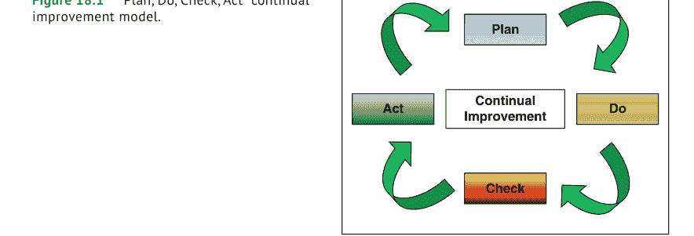

## 18.4 环境政策与规划

在组织开始实施环境管理体系之前，需要选拔并组建一个由可能参与此过程的合格人员组成的跨职能团队。管理层应选拔一位有效的领导者担任环境管理体系管理代表，并选拔其他具备相关知识的人员加入团队或委员会。所选领导者和团队成员的质量直接反映了管理层对环境管理体系的承诺，并决定了其最终的成功。参与环境管理体系实施的团队成员必须对组织的运营和环境因素有广泛的了解，同时具备学习的意愿和持续改进的承诺。

在规划过程中，组织应制定环境政策。以下是一个环境政策示例。

> ABC环境公司致力于建立一个环境管理体系，以确保在我们业务的所有方面实现持续的质量改进和污染预防。我们承诺在我们开展业务的所有地方遵守所有适用的环境法律和/或法规。我们将持续寻找并实施能够提高我们经济且节约地合理利用自然资源能力的活动。

规划过程对于实现环境政策以及环境管理体系的应用和维护至关重要。通常，规划将涉及以下要素：

-   识别环境因素并确定其中重要的因素。
-   识别适用的法律法规要求和其他要求。
-   设定内部绩效准则。
-   设定目标和指标，并建立实现它们的方案。

风险评估（风险*识别、分析*和*评价*）是环境管理体系规划过程的关键组成部分，对于协助管理层决策和最佳利用可用资源至关重要。环境风险评估过程产生的信息应用于建立和改进环境管理体系的其他组成部分。

## 18.5 环境因素

环境风险评估过程中最关键的部分是环境因素的*识别*和*评价*。如果重要的环境危害未被识别，由此产生的风险将得不到管理，从而对组织构成威胁。根据ISO 14001标准，每个环境因素都需要作为环境管理体系的一部分进行评估（国际标准化组织，无日期）。美国环保局提供了以下定义：

*环境因素* – 设施的活动、产品或服务中能够或确实与环境发生相互作用的要素。这些相互作用及其影响可能是持续性的、周期性的，或仅与事件（如紧急情况）相关。
*环境影响* – 由设施的活动、产品或服务引起的对环境的任何变化，无论是不利的还是有利的。
*重要环境因素* – 可能产生重大环境影响的环境因素。

下面描述的方法定义了在识别新因素并将其纳入环境因素与影响清单时，用于确定该清单上每个因素重要程度的评估标准。以下*环境因素重要性判定系统*被认为是一个良好的实践示例。

### 18.5.1 目的

成功注册符合ISO 14001的关键在于精确确定组织的环境因素和环境影响。环境管理体系团队应评估哪些因素最为重要，因此需要最多的关注。出于实际目的，在进行初步评估之前，应引入两个定义。

“环境因素：组织的活动、产品或服务中能够与环境发生相互作用的要素。
重要环境因素是指具有或可能具有重大环境影响的环境因素。”

“环境影响：由组织的环境因素全部或部分引起的对环境的任何变化，无论是不利的还是有利的”（国际标准化组织，无日期）。

ISO 14001还建议“组织可以利用机会来预防或减轻不利的环境影响，并增强有利的环境影响，特别是那些具有战略和竞争意义的影响。”

ISO 14001第6节包含三个不同的要求。这些要求包括：

1.  组织应识别其活动、产品和/或服务的环境因素及其相关的环境影响。换句话说，组织必须了解其如何与环境相互作用。
2.  用于确定其重要环境因素的准则。组织应识别那些可以控制以及预期能够施加影响的重要环境因素。
3.  根据每个环境因素的个体环境影响，得出重要环境因素清单。这第三步的重要性不容低估。最终的重要环境因素清单将为环境政策声明以及环境目标和指标提供基础。换句话说，重要环境因素清单驱动着环境管理体系运行部分的全部内容和范围。

图18.2展示了一个重要环境因素决策树的示例。

本程序定义了在识别新因素并将其纳入环境因素与影响清单时，或更新现有因素时，用于确定该清单上每个因素重要程度的评估标准。本程序适用于清单上的所有环境因素。根据过程审查团队收到的反馈修改环境因素清单是过程审查团队负责人的职责。

组织的所有活动、产品和/或服务都必须纳入环境因素审查框架。组织必须汇编一份所有潜在环境因素的清单。此活动的目的不是确定每个因素的重要性。目标是创建一份完整的清单，说明组织如何与环境相互作用。组织必须在清单中包括常规和非常规活动/情况的影响。非常规活动/情况的例子包括：

-   紧急情况
-   启动和
-   停止活动。

为生成环境因素清单而制定的程序必须认识到持续改进的概念。该程序和因素清单可能会受到未来行动的影响，例如新法规和运营变更。管理评审部分（第9.3节）强制要求持续改进，因为环境管理体系

表18.1 基于ISO 14001:2015标准的详细PDCA循环步骤。

| PDCA循环 | ISO 14001:2015标准 |
| :--- | :--- |
| | 5.2. 环境方针 |
| 策划 | 6 策划<br>6.1. 应对风险和机遇的措施<br>6.1.2. 环境因素<br>6.1.3. 合规义务<br>6.2. 环境目标及其实现的策划<br>6.2.1. 环境目标<br>6.2.2. 实现环境目标的行动方案 |
| 实施 | 7 支持<br>7.1. 资源<br>7.2. 能力<br>7.3. 意识<br>7.4. 沟通<br>7.4.1. 总则<br>7.4.2. 内部沟通<br>7.4.3. 外部沟通<br>7.5. 文件化信息的控制<br>8.1. 运行策划和控制<br>8.2. 应急准备和响应 |
| 检查 | 9. 绩效评价<br>9.1. 监视、测量、分析和评价<br>9.1.2. 合规性评价<br>9.2. 内部审核<br>9.2.1. 总则<br>9.2.2. 内部审核方案<br>9.3. 管理评审 |
| 改进 | 10.3 持续改进 |

来源：基于ISO 14001《环境管理体系 要求及使用指南》，ISO，2015年。

## 18.6 识别环境因素

环境因素可基于以下方面进行识别：

-   ABC环境公司能够控制的因素。
-   ABC环境公司通过其管理活动能够施加影响的因素。
-   对ABC环境公司在正常条件和非常规运营/活动下所开展的活动和服务进行审查。
-   对ABC环境公司在正常条件和非常规运营/活动下所生产和使用的产品进行审查。

环境因素的内容要求：

-   理解其与环境的相互作用。
-   控制与影响。
-   根据影响确定*重要环境因素*清单。
-   制定程序以支持决策过程。

确定重要环境因素清单的过程必须是一个合理且易于理解的程序。因此，制定了以下评分程序。该程序旨在帮助环境管理体系团队简化评分过程并评估风险。

## 18.7 识别过程

通常，此过程将由一个由公司不同部门和学科的代表组成的流程审查团队完成。

1) 流程审查团队负责人根据流程变化、正式年度审查的时间安排或任何可能影响组织当前环境因素和影响重要性的运营触发因素，协调并安排团队会议。

2) 流程审查团队负责人收集所有相关的流程活动表、因素清单以及团队可能需要参考的其他数据。他或她可以作为协调员，协助流程所有者和操作员识别关键信息。

3) 在正式的年度审查中，该团队识别与所有流程、活动和服务相关的因素。在更频繁的非正式会议上，仅审查正在修订的流程、活动或服务。

4) 团队积累并考虑关于每个讨论因素的所有相关定量和定性数据（例如，使用的危险物质和数量、空气排放、流程活动和服务执行的地点、泄漏的可能性、与流程相关的法律风险等）。

5) 团队识别与每个已识别因素相关的潜在环境影响，包括正面和负面影响（例如，化学品泄漏导致的地下水或地表水污染、对物种栖息地的影响、以及因回收工作而减少的材料消耗）。

6) 团队使用《环境因素重要性判定清单》中提供的评估标准评估每个因素的重要性程度。

清单中评级极端的因素将被管理层视为潜在的重要环境因素，用于制定或修改现有目标和计划。最终的环境因素清单、其影响以及被选为重要的因素，将在《环境因素和影响清单》中更新。为方便起见和数据处理，可以开发一个Excel环境风险评估矩阵。该文件可用于制定环境目标，并在必要时修订或重新调整环境管理计划和环境政策。

《环境因素和影响评分清单》由三个主要部分组成：

-   无控制措施的重要性评分
-   有控制措施的重要性评分
-   总体重要性评级图表

这三个部分的共同点如下：

-   位置
-   部门
-   索引
-   因素
-   对环境属性的影响
-   极性调整
-   影响小计
-   频率

## 18.8 位置、部门、索引、因素

位置和部门列作为可选项提供，以便在必要时进一步定义因素。在某些情况下，该因素可能在多个位置和/或部门都足够重要，需要在多个行项中对该因素进行额外评分。在大多数情况下，该因素只需要单行项列出，但可能需要指明更具体的位置和/或部门，以便在其生命周期内所有权或位置发生变化时跟踪该因素。任一字段中缺少指示符表示“不适用”或“以上所有”。位置和部门图例如下：

**示例位置**
-   l：实验室
-   w：仓库建筑
-   f：现场（一般）
-   t：T建筑
-   a：治理建筑

**示例部门**
-   a：治理
-   r：修复
-   k：ABC供应
-   it：信息技术/证券
-   o：一般管理费用
-   ac：会计
-   hr：人力资源

索引列是一个序列化的字母数字标识符，用于在向清单添加新因素时区分每个行项。字母标识符用于定义该因素是在哪个流程中发现的。一个因素可能在多个流程中被发现，需要多个行项列表和索引标识符。数字标识符将在向清单添加新因素时，根据每个字母内分配的最后一个数字递增。该图例定义了这些字母及其流程：

-   f：现场流程
-   a：行政流程

## 18.9 对环境属性的影响

10项对环境属性的影响（见图18.3）中的每一项都将使用+1、−1或0进行评级，定义如下：

-   +1：表示该因素对该属性的环境有正面影响。
-   −1：表示该因素对该属性的环境有负面影响。
-   0：用于该因素对该属性的环境没有影响，或该属性不适用于该因素的情况。

在对“无控制措施的重要性评分”部分的影响进行评级时，请考虑该因素在无监管环境中、其本身以及在最坏情况下组织可能对其施加的任何控制之外，对该属性的影响。在对“有控制措施的重要性评分”部分的影响进行评级时，请考虑该因素在组织当前法规和操作标准内完全控制下对该属性的影响。

## 18.10 影响小计和极性调整

这10项影响将被汇总为影响小计。该小计将用于剩余重要性评分的计算。如果小计等于零，则将使用极性调整值替代影响小计，并用于剩余重要性评分的计算。如果没有这种极性调整，该计算（多个因素的乘积）将使用这个不可接受的零因子，并产生无意义的零分。

在“无控制措施的重要性评分”部分，极性调整值为–1。在“有控制措施的重要性评分”部分，极性调整值为+1。图18.3展示了一个环境因素评估程序的示例。

职业健康安全专业人员和利益相关者必须决定使用何种环境因素风险评估方法。将提供两种不同的评级量表，用于添加到环境因素评估中的其他可能变量。下面介绍的变量在两个部分中是相同的：

-   无控制措施的重要性评分
-   有控制措施的重要性评分

## 18.11 影响严重性

影响严重性是一个评级，表示在失控的完全释放事件中，该因素可能对环境造成的影响严重程度。环境管理体系团队可以决定使用1-3的评级，例如1 = 低；2 = 中；3 = 高。也可以使用1-5的量表确定，如表18.2所示。

## 18.12 影响概率

影响概率是一个评级，表示在失控的完全释放事件中，该因素可能影响环境的概率。同样，团队可以决定使用1-3的评级，例如1 = 低；2 = 中；3 = 高。也可以使用1-5的量表确定，如表18.3所示。

上述两个评级可用于使用严重性 × 概率或 S × P 来估计风险等级（RL）。在某些情况下，团队可能决定使用典型的S × P风险评估矩阵，以避免计算过于复杂。对于小型组织，简化的方法可能就足够了。然而，仅计算风险等级可能不够。为了说明为什么需要添加更多变量；作者可以提供以下实际示例。

418 | 18 风险评估在精益六西格玛和环境管理体系中的应用

| 因素ID # | 位置 | 部门 | 因素 | 填埋场使用 | 空气污染 | 地下水污染 | 地表水污染 | 地下土壤污染 | 地表土壤污染 | 物种退化 | 栖息地退化 | 资源保护 | 生活质量 | 极性调整 | 影响小计 |
|---|---|---|---|---|---|---|---|---|---|---|---|---|---|---|---|
| 1 | f | a | 石棉污染材料废物 | -1 | -1 | -1 | -1 | -1 | -1 | -1 | -1 | -1 | -1 | | -10 |
| 2 | l | a | 石棉样品（批量） | -1 | -1 | -1 | -1 | -1 | -1 | -1 | -1 | -1 | -1 | | -10 |
| 3 | f | a | 铅样品（第三方） | -1 | -1 | -1 | -1 | -1 | -1 | -1 | -1 | 0 | -1 | | -9 |

图18.3 环境因素评估程序示例。

## 18.13 频率

频率是一个评级指标，用于表示一个组织使用某个环境方面的频率，或该方面在其属性上出现的频率。可以使用1-3或1-5的等级进行评定。两种选项均在表18.4和表18.5中呈现。

表18.4 频率1-3评级示例。

| 数值评级 | 描述 |
|---|---|
| 1 | 很少 |
| 2 | 经常 |
| 3 | 每天使用 |

表18.5 频率1-5评级示例。

| 数值评级 | 描述 |
|---|---|
| 1 | 很少 |
| 2 | 不经常 |
| 3 | 经常 |
| 4 | 持续（非常规操作） |
| 5 | 每天使用（常规操作） |

## 18.14 法律风险

法律风险是一个评级指标，用于表示在环境方面未受控完全释放的情况下，风险程度和诉讼的可能性。将使用1-3或1-5的等级进行评定。两种选项均在表18.6和表18.7中呈现。

以下评级仅用于“含控制措施的重要性评分”部分：

## 18.15 现有控制措施

现有控制措施是一个评级指标，用于表示对某个环境方面的现有控制程度。同样，可以使用1-3或1-5的评级等级（表18.8和表18.9）。

## 18.16 无控制措施部分的重要性评分

本部分的重要性评分使用以下公式计算：

表18.6 法律风险1-3评级示例。

| 数值评级 | 描述 |
|---|---|
| 1 | 违反环境行业特定法规 |
| 2 | 违反一般性法规 |
| 3 | 无已知风险 |

表18.7 法律风险1-5评级示例。

| 数值评级 | 描述 |
|---|---|
| 5 | 违反环境行业特定法规 |
| 4 | 违反一般性法规 |
| 3 | 违反自愿性标准 |
| 2 | 违反公司政策 |
| 1 | 无已知风险 |

表18.8 现有控制措施1-3评级示例。

| 数值评级 | 描述 |
|---|---|
| 1 | 可接受 |
| 2 | 需要改进 |
| 3 | 不可接受 |

表18.9 现有控制措施1-5评级示例。

| 数值评级 | 描述 |
|---|---|
| 5 | 可接受 |
| 4 | 可接受，但需额外考虑 |
| 3 | 需要小幅改进 |
| 2 | 需要大幅改进 |
| 1 | 不可接受 |

环境属性影响总和（IEP）乘以影响小计或极性调整（PA）乘以频率（F）乘以影响严重性（S）乘以影响可能性（P）乘以法律风险（LR）的总和。

重要性评分 = ∑ IEP * (PA * S * P * F * LR)

此外，可以添加人员风险列，以使环境管理体系与健康安全管理体系保持一致。

## 18.17 人员风险

同样，团队将决定使用1-3还是1-5的评级等级（表18.10和表18.11）。

表18.11中展示了人员风险（PR）1-5评级的示例。

表18.10 人员风险1-3评级等级示例。

| 数值评级 | 描述 |
|---|---|
| 1 | 灾难性 |
| 2 | 边缘性 |
| 3 | 微不足道 |

表18.11 人员风险1-5评级等级示例。

| 数值评级 | 描述词 | 后果 |
|---|---|---|
| 5 | 灾难性 | 死亡或永久完全残疾 |
| 4 | 严重 | 永久、部分或超过三个月的临时残疾 |
| 3 | 边缘性 | 轻微伤害或疾病，导致工作日损失的事件 |
| 2 | 可忽略 | 轻微伤害或疾病，未导致缺勤或仅需轻微医疗处理 |
| 1 | 微不足道 | 急救 |

在这种情况下，公式为：

重要性评分 = Σ IEP * (PA * S * P * F * LR * PR)

图18.5展示了一个包含频率、严重性、可能性、法律风险和人员风险的环境方面评估程序示例。

以胶粘剂清除剂为例，可以比较风险等级评分。仅使用严重性和可能性评估环境方面可能不足，甚至具有误导性。图18.6提供了包含附加变量的重要性评分与之前讨论的风险等级评分的比较。

风险等级不包含在计算中。此处展示此示例仅为可视化，并证明大豆基胶粘剂清除剂与常规胶粘剂清除剂具有相同的风险等级。然而，在公式中添加更多变量会导致不成比例的重要性评分。图18.6中的示例表明，无控制措施的重要性评分是不可接受的。因此，必须对环境方面进行适当控制，以避免人员风险并保护环境。

ISO 14001和14004最新版本的一个重要发展是纳入了“需要应对的风险和机遇”。ISO 14004附录A中包含了一个非常有趣的示例。为了证明需要应对的额外风险的重要性，我们应该考虑与重型胶粘剂清除剂相关的风险。此类产品通常被归类为4类易燃液体。它们通常含有大量的溶剂石脑油和加氢处理轻馏分（石油）。易燃液体储存会带来额外的风险，例如潜在的火灾。表18.12展示了一个活动、产品和服务及其相关环境方面和影响、风险和机遇以及措施的示例。

图18.5 环境方面风险评估程序示例。

图18.6 包含附加变量的胶粘剂清除剂环境风险评估示例。

表18.2 严重性1-5等级描述示例。

| 数值评级 | 描述词 | 后果 |
|---|---|---|
| 5 | 灾难性 | 系统完全损失，化学品释放造成持久的环境或公共健康影响 |
| 4 | 严重 | 重大财产损失和业务停机，化学品释放造成临时的环境或公共健康影响 |
| 3 | 边缘性 | 子系统轻微损失或损坏，化学品释放触发外部报告要求 |
| 2 | 可忽略 | 设备或设施非严重损坏，化学品释放仅需常规清理，无需报告 |
| 1 | 微不足道 | 环境损失微不足道，或环境化学品释放微不足道 |

表18.3 影响可能性示例。

| 数值评级 | 描述词 | 可能性描述 |
|---|---|---|
| 5 | 频繁 | 可能反复发生 |
| 4 | 可能 | 可能发生数次 |
| 3 | 偶尔 | 可能在某个时候发生 |
| 2 | 罕见 | 不太可能发生 |
| 1 | 不可能 | 极不可能，可以假设不会发生 |

环境修复经理熟悉石棉地砖的移除过程。地砖与地板之间的黑色胶粘剂通常被视为含石棉材料（ACM）。更不用说，从混凝土地板上清除黑色胶粘剂非常困难。这是一个非常耗时的过程。环境治理和修复公司使用不同的胶粘剂清除剂。以下胶粘剂清除剂将用于演示环境风险：

- 大豆基
- 常规（R）
- 重型（HD）

在选择其中一种解决方案时，有许多优缺点需要考虑。胶粘剂清除剂的使用取决于公司正在进行的工作类型。如果治理团队在医院、学校或其他有人占用的建筑物内工作，他们通常使用大豆基胶粘剂清除剂。如果公司在即将拆除的建筑物内工作，他们可能会决定使用重型胶粘剂清除剂。

在有效性方面，重型胶粘剂清除剂远优于其他两种。工人能够更快地工作，并在其他区域重复使用胶粘剂清除剂。大豆基胶粘剂清除剂最慢且效果最差，只能用于*一次*应用。常规胶粘剂清除剂介于两者之间。大豆基胶粘剂清除剂更环保，而重型应用通常会导致挥发性有机化合物（VOCs）的释放。常规胶粘剂清除剂也会排放VOCs。如果我们仅使用传统的风险评估方法（S × P）来计算风险等级，我们会看到重型胶粘剂清除剂（RL = 6）和大豆基胶粘剂清除剂（RL = 4）之间只有非常微小的差异。本示例使用了图18.4所示的1-5评级等级。

然而，许多环境修复经理已经意识到，风险等级估算并不能呈现“全局”概览。例如，在有人占用的办公楼或学校中使用常规胶粘剂清除剂可能会导致法律费用和使用者的投诉。因此，可能需要添加更多类别/变量。下一节中介绍的变量只是几个示例。

420 | 18 风险评估在精益六西格玛和环境管理体系中的应用

| 方面ID # | 位置 | 部门 | 方面 | 垃圾填埋场使用 | 空气污染 | 地下水污染 | 地表水污染 | 地下土壤污染 | 地表土壤污染 | 物种退化 | 栖息地退化 | 资源保护 | 生活质量 | 极性调整 | 影响小计 | 影响严重性 | 影响可能性 | 风险等级 S*P |
|---|---|---|---|---|---|---|---|---|---|---|---|---|---|---|---|---|---|---|
| 43-1 | w | a | 胶粘剂清除剂 大豆基 | 0 | 0 | 0 | 0 | 0 | 0 | -1 | -1 | -1 | -1 | | -2 | 2 | 2 | 4 |
| 43-2 | w | a | 胶粘剂清除剂 常规 | -1 | -1 | -1 | -1 | 0 | -1 | -1 | -1 | -1 | -1 | | -9 | 2 | 2 | 4 |
| 43-3 | w | a | 胶粘剂清除剂 重型 | -1 | -1 | -1 | -1 | -1 | -1 | -1 | -1 | -1 | -1 | | -10 | 3 | 2 | 6 |

图18.4 环境方面评估程序示例。

## 18.18 带控制措施的重要性评分

本节中的重要性评分使用以下公式计算：

重要性评分（含控制措施） = Σ IEP * (PA * IS * HoC)

一旦建立了控制层级，可以使用相同的方法再次评估重要性评分。但是，我们必须考虑控制层级。如果控制措施是可接受且充分的，那么含控制措施的影响因子计算结果将乘以五。图18.7展示了一个带控制措施的重要性评分示例。

## 18.19 总体重要性评级图表

最后一个部分可用于计算总体重要性评级，或计算无控制措施与有适当控制措施评分之间的差异。每个方面的评分可以排序并进行颜色编码，以比较每个方面的评级。一旦所有评分确定并完成计算，整个列表可以按重要性评分排序，以揭示从最高到最低的最极端评级。

该评级计算如下：
重要性评分（含控制措施）与重要性评分（不含控制措施）之间差值的绝对值，如图18.8所示。
差值越大，评级越极端（越高），这通常转化为以下情况：
该方面越危险，ABC通常对其应用的控制措施就越多。在某些情况下，可能需要应用多种控制措施。评估团队可以决定使用颜色编码来可视化风险，并将更极端的评级区域用更深的红色阴影表示。
图形表示通过计算所有可用重要性评分的最小值和最大值来得出。
在初步的环境因素评估之后，很明显，没有控制措施的方面存在巨大的重要性评分差异。已确定的目标之一是降低方面的重要性评分。目标是与没有充分控制措施的环境因素评分相比，在统计上降低重要性评分。一些工具将在第18.20节中讨论。

## 18.20 环境管理体系与精益六西格玛实践的实施

在过去几十年里，结合精益和六西格玛（LSS）方法论变得流行起来。大多数LSS工作都集中在制造过程上。作者基于将*精益*从生产现场转移到环境运营的经验教训，开发了一个案例研究，并提出了一个整合精益、六西格玛和环境修复管理的模型。

### 18.20.1 案例研究

凭借环境因素评分分析的经验，负责整体工作的团队决定进行一个精益试点项目，以测试*精益*目标与环境绩效之间可能存在的冲突。

该案例研究项目从过程周期效率（PCE）评估开始。PCE是一种广泛使用的精益工具，它计算“增值时间”（*客户认为创造他们将要购买的产品或服务所必需的工作*）除以“总前置时间”（*过程从开始到结束所需的时间*）（iSixSigma）。本研究中的“服务”是指移除含石棉材料（ACM）地板砖和黑色胶粘剂。*PCE公式*如下所示：

过程周期效率（PCE） = 增值时间 / 总前置时间

比较重型胶粘剂清除剂和大豆基胶粘剂清除剂方法的PCE，很明显重型过程效率更高。大豆基胶粘剂清除剂需要更多的总前置时间（172），而重型方法为（71）。由此产生的PCE表明，从精益实践的角度来看，需要更多时间（在精益中被视为浪费因素）的大豆基方法不太理想，如图18.9所示。

然而，从环境角度来看，由于使用了苛刻的化学品，重型胶粘剂清除剂的环境因素重要性评分要高得多。因此，环境管理体系跨职能团队应就何时以及如何使用不同的环境因素提供建议。

LSS计划的目标之一是减少变异，因此，为每个环境因素提出了新的控制方法，以降低风险并证明重要性评分在统计上显著降低。结果，开发了使用精益六西格玛的新工具和统计方法来解决这个问题。环境管理体系LSS工具基于PDCA或持续改进方法，该方法在《精益六西格玛：过程改进工具与技术》教科书（Summers, 2011）中有描述。此外，风险评估工具可以被视为失效模式与影响分析（FMEA）方法（Tague, 2004, p. 236）的显著扩展版本。

首先，准备了一个直方图来展示环境因素评分的巨大差异，如图18.10所示。

其次，使用标准的MS Excel工具计算和比较均值、众数、中位数、范围、标准差、方差、峰度和偏度，如表18.13所示。其他工具，如QI Macros也可用（QIMacros, 2014）。

确定无控制措施的评分与过程控制后的评分之间存在显著差异。然后，使用T检验来确定

424 | 18 精益六西格玛和环境管理体系中的风险评估应用

表18.12 活动、产品和服务及其相关环境因素和影响、风险和机遇以及行动示例。

| 活动/产品/服务 | 因素 | 实际和潜在影响 | 需要解决的风险和机遇 | 计划采取的行动 |
|---|---|---|---|---|
| 重型胶粘剂清除剂 – 化学品处理和储存 | 火灾或爆炸（紧急情况）期间的不受控释放 | 空气污染、水污染、财产损失、伤害和疾病 | 风险（潜在不利影响）<br>• 清理成本<br>• 罚款<br>• 负面宣传 | 建立环境目标，消除重型胶粘剂清除剂的储存和使用 |

职业健康安全专业人员和环境系统管理人员可以轻松看到储存和处理石油基重型胶粘剂清除剂的风险。然而，重型胶粘剂清除剂作用极快且具有成本效益。它是一种经过验证的高效产品，在拆除项目中一直很受欢迎。在某种程度上，我们应该将生产力和效率视为加速胶粘剂清除过程的机会。如果完全消除此类产品用于修复项目是不可能的，我们至少应该考虑减少数量和准时制交付。

图18.7 包含控制措施示例的环境因素评估程序。

| 位置 | 部门 | 因素 | 填埋场使用 | 空气污染 | 地下水污染 | 地表水污染 | 地下土壤污染 | 地表土壤污染 | 物种退化 | 栖息地退化 | 资源保护 | 生活质量 | 极性调整 | 影响小计 | 控制层级 | 含控制措施的重要性评分 |
|---|---|---|---|---|---|---|---|---|---|---|---|---|---|---|---|---|
| 1 | a | 石棉污染材料废物 | -1 | 1 | 1 | 1 | 1 | 1 | 1 | 1 | -1 | 1 | | 6 | 5 | 30 |
| 1 | a | 石棉样本（批量） | -1 | 1 | 1 | 1 | 1 | 1 | 1 | 1 | -1 | 1 | | 6 | 5 | 30 |
| 1 | a | 铅样本（第三方） | -1 | 0 | 0 | 0 | 0 | 0 | 0 | 0 | 0 | 1 | 1 | 0 | 5 | 5 |

图18.8 环境因素评估。

| 位置 | 部门 | 因素 | 影响严重性 | 影响概率 | 频率 | 法律风险 | 人员风险 | 含控制措施的影响因子乘积 | 无控制措施的重要性评分 | 含控制措施的重要性评分 |
|---|---|---|---|---|---|---|---|---|---|---|
| f | a | 石棉污染材料废物 | 5 | 1 | 2 | 2 | 2 | 40 | -6000 | 1200 |
| l | a | 石棉样本（批量） | 4 | 1 | 3 | 2 | 2 | 48 | -4800 | 1440 |
| f | a | 铅样本（第三方） | 2 | 1 | 1 | 1 | 2 | 4 | -162 | 20 |

## 18.21 结论

方面显著性得分的降低得以实现。这个实际案例展示了显著性得分在统计学上的显著降低。该项目取得了成功，并得到了管理层的认可。它将标准差降低了近79%。平均值和中位数得分也显著降低。

职业安全与健康专业人员必须培养管理技能并拓宽知识面，以克服此类项目中的困难。初步分析之后，很明显，仅凭风险评估很难为环境管理体系显著性得分变异降低项目投入如此巨大的资源提供充分理由。安全领域的未来领导者必须培养统计技能，并展示在财务管理方面的知识。为了证明此类项目的合理性，职业安全与健康专业人员必须熟悉各种风险管理技术、精益六西格玛工具和财务管理原则。

仅仅成为环境合规方面的专家不足以完成成功的复杂项目。复杂项目需要跨学科知识和跨学科管理技能。安全领导者必须熟悉不同的组织结构和各种利益相关者的利益，才能完成此类项目。专业人员必须准备好应对组织管理的各个层面，并展示其能力。

## 复习题

- 1. 描述环境管理体系的目的。
- 2. 列出涉及环境管理体系和职业安全与健康管理体系的适用标准或指南。
- 3. 阐述环境方面风险评估的主要目的。
- 4. 描述重要环境方面的确定过程。
- 5. 解释利用无控制措施和有控制措施对比进行环境方面评估的重要性。
- 6. 阐述你对环境管理体系与精益六西格玛整合的看法。
- 7. 提供用于环境管理体系项目的风险评估和精益六西格玛工具示例。

## 参考文献

国际标准化组织（无日期）。ISO 14031.1999 环境管理——环境绩效评价——指南。https://www.iso.org/standard/23149.html（访问于2020年6月7日）
国际标准化组织（无日期）。ISO 14004.2015。环境管理体系——原则、体系和支持技术通用指南。http://www.iso.org/iso/iso_catalogue/catalogue_ics/catalogue_detail_ics.htm?csnumber=31808&ICS1=13&ICS2=20&ICS3=10（访问于2020年6月7日）。
国际标准化组织（无日期）。ISO 14001.2015。环境管理体系——要求及使用指南。https://www.iso.org/standard/60857.html#:~:text=ISO%2014001%3A2015%20specifies%20the,to%20enhance%20its%20environmental%20performance.&text=ISO%2014001%3A2015%20can%20be,to%20systematically%20improve%20environmental%20management（访问于2020年6月7日）。
iSixSigma。http://www.isixsigma.com/dictionary/process-cycle-efficiency-pce/（访问于2020年6月7日）
QIMacros (2014)。加速精益六西格玛。http://www.qimacros.com/（访问于2020年6月7日）
Summers, D.C.S. (2011)。*精益六西格玛：过程改进工具与技术*。波士顿，马萨诸塞州：Prentice Hall出版社。
Tague, N.R. (2004)。*质量工具箱*。密尔沃基，威斯康星州：ASQ质量出版社。

# 19 业务连续性计划

Bruce Hollcroft¹ 和 Bruce Lyon²

¹ PayneWest Insurance，一家Marsh & McLennan Agency LLC公司
² Brown & Brown

## 19.1 引言

在风险和保险调查中，业务连续性通常被列为组织高管（如首席执行官、首席财务官和首席运营官）最关心的问题之一。根据美国联邦紧急事务管理局和美国小企业管理局的数据，40%的企业在灾难后无法重新开业，另有25%在一年内倒闭。大约90%的小企业在灾难发生后的两年内倒闭（引用，年份）。业务连续性是指一个组织确保其运营和核心业务功能不因灾难或事件而受到严重影响的能力。灾难或重大事件的例子可能包括地震、工作场所暴力、网络攻击、大流行病等等。业务连续性计划主要关注在灾难或事件发生后，维持对组织业务目标至关重要的业务功能和运营。

一些业务中断场景可以通过商业保险公司投保，但许多场景无法投保（例如，大流行病通常被排除在承保范围之外）。这使得组织制定业务连续性计划变得更加重要，因为该场景可能没有保险。业务中断保险通常与财产保险挂钩，仅适用于承保的财产损失，如火灾。它旨在覆盖因承保事件导致的收入损失和额外费用。与财产保险单未承保事件相关的业务中断通常不在承保范围内。

或有业务中断保险可由一些保险公司提供，但同样仅在发生承保的财产损失时提供保障。“或有”意味着它覆盖第三方（如供应商和分销商）因通常会被承保的财产损失而遭受的损失。同样，许多类型的灾难或事件不会被典型的财产保险单所覆盖。

正如美国联邦紧急事务管理局和美国小企业管理局所指出的，许多企业在导致其运营严重中断的重大灾难或事件发生后或不久后就会倒闭。制定和实施正式的业务连续性计划可以显著提高组织在重大灾难或事件中生存的可能性。

*风险评估：评估运营风险的实用指南*，第二版。
Georgi Popov, Bruce K. Lyon, 和 Bruce Hollcroft。
© 2022 John Wiley & Sons, Inc. 由John Wiley & Sons, Inc.于2022年出版。

## 19.2 业务连续性管理

业务连续性管理是一个整体性的管理流程，旨在确保在发生破坏性事件时，运营得以持续，产品和服务能按预定水平交付，品牌和价值创造活动受到保护，以及关键利益相关方的声誉和利益得到维护（ISO 22301, 2012）。这是通过识别潜在威胁、分析可能影响以及采取措施构建组织韧性来实现的。如果一个组织没有有效的业务连续性管理系统，即使严重到解散的程度，也可能受到严重损害。此外，依赖该业务的利益相关方、战略联盟、供应商、客户、员工和消费者也可能受到严重影响。

有时也称为韧性，业务连续性被 ISO 22301 业务连续性管理体系标准定义为“组织在发生破坏性事件后，继续以可接受的预定水平交付产品或服务的能力”（ISO 22301, 2012）。

业务连续性管理是一个持续的过程，旨在确保采取必要步骤来识别潜在损失的影响，并维持可行的连续性和恢复策略与计划。为了在灾难和中断面前保持业务运营的能力，必须将几个关键子组件纳入该过程。这些关键要素包括：

-   应急行动和响应计划
-   灾难恢复计划
-   危机管理计划，以及
-   业务连续性计划。

除了 ISO 22301，美国国家消防协会（NFPA）1600 灾难/应急管理与业务连续性运营计划标准，以计划-执行-检查-处理（PDCA）式管理体系的形式，为准备工作提供了基本准则。该标准包括关于预防、缓解、响应、连续性和恢复计划的规划、实施、评估和维护方面的指导。那些从事或总体负责管理紧急情况和灾难的人员应熟悉 NFPA 1600。它是危机和应急管理以及运营连续性中使用的关键标准之一。此外，美国国土安全部已将该标准作为应急准备的自愿性共识标准采用。

## 19.3 应急行动计划

业务连续性管理系统的第一个阶段是初始应急响应或行动计划。应急行动计划旨在通过缓解程序来应对紧急情况，以保护、确保安全并将人员疏散到安全地带。NFPA 1600 将这些称为事件行动计划，并将其定义为口头计划、书面计划或两者的组合，在整个事件过程中更新，并反映事件指挥官批准的整体事件策略、战术、风险管理和成员安全要求。

企业的应急行动计划需要满足美国职业安全与健康管理局（OSHA）等监管机构的要求。此类计划必须包括针对特定潜在紧急情况的行动，例如火灾、恶劣天气、龙卷风、地震、医疗紧急情况、工作场所暴力和其他潜在威胁。必须定义检测、警告和响应此类紧急情况的程序和责任，并通过培训、设施疏散路线图和其他沟通方式传达给员工。

## 19.4 灾难恢复计划

灾难恢复计划是一种业务计划，用于帮助组织从灾难中恢复，特别是与业务的基础设施和信息技术（IT）资产相关的灾难。NFPA 1600 将灾难/应急管理定义为一个持续的过程，旨在预防、缓解、准备、响应、在威胁生命、财产、运营、信息或环境的事件期间保持连续性，并从中恢复（NFPA, 2019）。灾难恢复计划是专门的，通常与业务连续性计划结合或协同实施。灾难恢复规划高度专业化，通常超出本章和本书的范围。然而，有许多标准和组织致力于灾难恢复规划职能。例如，多个来源和标准提供了指导，包括 FEMA（www.ready.gov/business/implementation/IT）、ISO/IEC 27031 业务连续性信息和通信技术就绪指南标准，以及国际灾难恢复协会（DRI）（www.drii.org）。许多其他组织也在该领域提供培训和认证。

灾难恢复计划的主要目的是尽快恢复关键支持系统，如通信、信息技术（IT）和硬件，并尽量减少业务停机时间，这是业务连续性的关键组成部分。灾难恢复计划应包括针对恢复功能、恢复策略、关键人员、设备、服务以及内外部沟通的明确计划。

## 19.5 危机管理计划

危机管理是指组织管理可能造成重大安全、财务、战略或声誉影响的事件的能力。管理危机的很大一部分是有效和及时的沟通，包括内部和外部沟通。许多利益相关方可能需要或希望在灾难或事件后获得信息，包括员工及其家人、客户、供应商、监管机构、媒体等。此类计划应提供及时、准确和适当的信息。

NFPA 1600 连续性、应急和危机管理标准将危机定义为一个具有战略影响潜力的问题、事件或一系列事件，严重或可能严重影响实体的运营、品牌、形象、声誉、市场份额、业务能力或与关键利益相关方的关系（NFPA, 2019）。

作为业务连续性管理系统的一部分，危机通常由事件触发，需要在战略层面持续投入，以最小化其对组织的影响。这种持续投入被称为“危机管理计划”。该计划用于在危机发生前、期间和之后进行管理，以最小化对组织安全、财务、战略或声誉价值的影响。

对于不中断运营但可能给组织带来风险，或可能阻止危机发展成可能中断业务连续性的威胁的事件，也可能启动危机管理计划。

## 19.6 业务连续性计划

业务连续性规划是识别和准备可能对组织的业务功能、目标、收入、声誉和最终生存产生负面影响的灾难或事件的过程。此规划在可能损害组织的潜在灾难或事件发生之前进行。它考虑了潜在的灾难和事件，以及它们对供应商、供应商、客户和组织其他各种利益相关方的影响。它应考虑直接影响任何这些方的灾难和事件，以及对其他相关方的影响。

对于大多数组织，法律并未要求制定业务连续性计划（BCP），但它被认为是一种最佳实践。在某些情况下，组织需要根据许可机构、商业合同、政府要求或其他规范制定 BCP。不需要制定 BCP 的组织应识别和评估自身的业务风险，以确定是否应将制定 BCP 作为最佳实践来实施。

在 BCP 启用之前，灾难或事件可能具有潜在的灾难性，并且它只是应对灾难或事件的一个组成部分。BCP 旨在最小化灾难或事件对组织的影响，并尽快恢复正常运营。如图 19.1 所示，所有四个计划相互关联，应协调一致。这些计划可以合并，但有时是单独的独立计划。

业务连续性规划过程应产生一个正式的、有文档记录的业务连续性计划，该计划可在发生灾难或事件时作为参考指南。业务连续性计划的存在应在整个组织内得到充分沟通，在某些情况下，还应与组织的外部业务合作伙伴沟通。根据业务连续性计划负有责任的人员应获得最新副本，并接受关于该计划及其职责的专门培训。培训应在最初提供，并根据需要进行更新。

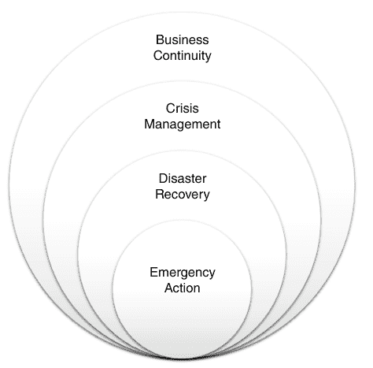

图 19.1 业务连续性管理系统组成部分。

存在许多有价值的政府和组织标准、指南及资源，专注于业务连续性规划过程。组织可以选择最符合其需求的指南，或参考多个指南来指导其BCP（业务连续性计划）流程。这些标准之间存在一些差异，但也有很多共同之处。此外，某些行业可能为其成员提供行业或协会特定的业务连续性规划指南。以下是一些较常见的可用标准、指南和资源。

- FEMA – 准备就绪的业务 https://www.ready.gov/business
- NFPA 1600 – 灾难/应急管理与业务连续性标准
- FM 数据表 10-2 – 应急响应
- ISO 22301 – 安全与韧性 – 业务连续性管理体系 – 要求
- 保险承运人（业务中断）指南

建议参与业务连续性规划的组织对这些标准、指南和资源进行比较，以确定哪个最符合组织的需求。

## 19.7 业务连续性规划与风险评估

大多数关于业务连续性规划主题的标准和指南都包含威胁或风险评估过程，旨在识别和评估对组织影响最大、后果最严重且发生可能性最高的危害。业务连续性规划中的风险评估过程通常包括业务影响分析（BIA），该分析侧重于已识别灾难或事件的财务影响。为了达到最佳效果，业务连续性规划应包含正常的风险评估过程，因为BIA通常不会在同等程度上考虑风险的识别或可能性。

## 19.8 选择BCP团队

制定业务连续性计划的第一步之一是选择一个团队来执行风险评估并制定相应的计划。业务连续性计划包括为将风险降低到可接受或可容忍水平而实施的额外控制措施。需要注意的是，这一点非常重要，因为业务中断风险通常不在保险范围内。

建议最初组建一个至少约三人的团队，最终达到10人的团队规模并不少见。该团队应是跨职能的，并且非常了解组织的业务及其面临的各种风险。可以根据需求和专业知识考虑临时团队成员。还建议团队包括一名非常熟悉危害识别和风险评估过程的协调员。

团队成员必须理解业务连续性规划过程的重要性，及其对组织成功实现目标甚至生存的潜在影响。除了具备知识外，他们还必须致力于这项工作。他们的管理者也必须理解该过程的重要性，并支持他们投入时间和精力。应强烈考虑对团队的贡献给予正式认可。

应告知团队有关业务连续性规划过程的信息，包括其背景、目的和范围。如果未由他人确定并明确传达，团队可能在一定程度上负责确定背景、目的和范围。协调员也可以协助满足此要求，并确保团队的工作按计划进行。

## 19.9 定义背景、目的、范围

业务连续性规划过程中的另一个早期步骤是定义规划的背景、目的和范围。在某些情况下，这甚至可以在选择团队之前首先发生。例如，如果董事会、客户或其他业务合作伙伴要求制定业务连续性计划，他们可能在很大程度上决定背景、目的和范围。如果组织自行决定制定业务连续性计划，他们通常会先组建团队，并要求他们确定背景、目的和范围。无论哪个先发生，这都是一个重要的步骤，因为它指导着整个过程，使其保持专注并按计划进行。

确定背景很重要，因为它解释了业务连续性计划可能应用或使用的情境和视角。它使团队能够考虑用户的视角，这对于计划达到最佳效果至关重要。

业务连续性计划的目的也至关重要，应明确定义。团队在规划过程的所有阶段都必须牢记计划的目的。最小化财务影响、业务中断、客户和工作损失都是业务连续性计划的有效目的。满足合规性和客户要求正成为一个更常见的目的。旨在指导响应并减轻灾难或事件影响的BCP通常是该过程的主要目的。

还必须确定业务连续性规划的范围。必须决定将组织的哪些部分纳入该过程。是包括整个组织，还是仅涵盖某些关键部门或设施。可以确定要考虑的灾难或事件类型以及排除的类型。范围通常包括制定书面的BCP、培训、实施、测试以及持续审查和改进。

## 19.10 定义术语

建立一些基本定义是一个好的做法，这样团队可以在规划过程中使用共同的语言并保持一致。可能需要定义诸如灾难、事件、危机、利益相关者和BCP等术语。然而，一些最重要的定义是那些用于对各种后果和可能性级别进行分类的术语，有时也称为严重性和概率，这些将用于风险评估矩阵。

在典型的风险矩阵中，后果和可能性通常有三到五个级别或类别。从广义上讲，它们通常从“非常低”到“非常高”，以及介于两者之间的任何确定级别。根据组织和评估的风险，通常会选择并使用其他术语。

必须为业务连续性风险评估定义这些术语的原因是，所有组织在类型、规模、资源、财务状况、风险承受能力等方面都是不同的，它们的业务连续性规划目标也不同。例如，通常可以向组织的财务负责人询问几个问题。首先，他们认为什么样的损失是小额损失，可以无需批准直接支付？此信息可用于定义后果方面的“非常低”。其次，他们认为什么样的金钱损失是重大损失，会危及组织的生存？这可用于定义后果方面的“非常高”。然后可以轻松地回填中间的其他后果定义。在业务连续性风险评估中，后果通常以美元定义，但有时也使用结果。例如，一个后果非常低的事件可能是一次未遂事件或仅需急救的事件，而后果非常高的事件可能是单人死亡或多人死亡。通常不希望为人的生命赋予货币价值。

定义风险矩阵上各种可能性级别的类似练习也很重要。非常高的可能性可能是每周都可能发生的事情，而非常低的可能性可能是每百年才可能发生一次的事情。考虑百年一遇的洪水。重要的是要认识到，所有组织和业务连续性规划实践都是不同的，为每个组织建立共同的定义非常重要。

## 19.11 关键职能评估

在进行威胁评估或影响分析之前，必须识别组织的关键职能。关键职能是对组织生存及其恢复业务运营至关重要的职能。通常，关键职能是对停机时间敏感的业务活动，履行法律或财务义务以维持现金流，对维持业务及其声誉至关重要，和/或保护不可替代的资产。

识别关键业务职能的步骤包括按关键性类别对每个职能进行分类：高（最严重）、中、低。关键职能在图表中列出并分类，例如图19.2中提供的示例。

根据小企业管理局（SBA 2010）的说法，确定关键性的考虑因素包括：

- 该职能支持的业务目标
- 该职能的频率
- 该职能的规模
- 依赖性和相互依赖性
- 收入损失的潜在可能性和金额
- 因不合规而可能面临的罚款、诉讼或其他处罚
- 对业务形象或市场份额的潜在影响
- 与其他职能相比的排名。

在确定每个关键职能的关键性和最大停机时间后，其对其他业务职能的影响记录在关键职能评估图表中，如图19.2所示。目标是识别在恢复期间恢复或重现每个职能所需的所有资源和人员。此外，应准备一份关于如何在恢复环境中恢复每个职能的简要指南。

## 19.12 威胁评估

完成关键职能评估后，将进行威胁评估。评估应包括可能影响业务的潜在威胁，例如极端天气事件、自然灾害、火灾或爆炸、停电、大流行、IT故障或网络攻击、

## 19.13 业务影响分析（BIA）

业务影响分析是一种用于估算灾难或事件对组织功能和资源影响的工具，通常以金钱或时间来衡量，并且可以收集信息以指导恢复工作。这些信息可用于确定潜在灾难或事件对各种组织功能的影响，并在风险评估中予以考虑。

BIA 应识别业务功能和流程中断所导致的运营和财务影响。需要考虑的一些影响包括：

-   销售和收入损失
-   销售或收入延迟
-   费用增加（例如加班费、外包、加急费用等）
-   监管罚款
-   合同违约金或合同奖金损失
-   客户流失
-   新业务计划延迟

BIA 应通过询问组织内经理和其他了解业务的人员来进行。被调查者应广泛了解组织如何制造产品或提供服务。他们应能识别如果其负责的业务功能或流程中断可能产生的潜在影响。FEMA 在此链接提供了基本的业务影响分析工作表，用于记录该过程。

https://www.ready.gov/sites/default/files/2020-07/business-impact-analysis-worksheet.pdf

## 19.14 识别危害和风险

在团队建立并设定参数后，实际业务连续性规划过程的第一步是识别主要危害及由此产生的对组织的风险。有许多技术可用于危害和风险识别，但并非所有技术都适用于这种规模和范围的演练。业务中断危害一旦发生，有可能导致重大事件。

FEMA 建议采用一种将类别分解为更易处理和理解的方法。这有助于团队一次处理一个类别的危害和风险识别，使其更易于管理。可以使用三个基本类别：自然、人为和技术危害。https://www.ready.gov/risk-assessment

### 19.14.1 自然危害

-   **气象** – 洪水、水坝/堤坝溃决、强雷暴（风、雨、闪电、冰雹）、龙卷风、风暴、飓风和热带风暴、冬季风暴（雪/冰）。
-   **地质** – 地震、海啸、滑坡、地面沉降/天坑、火山。
-   **生物** – 大流行病、食源性疾病。

### 19.14.2 人为危害

-   **事故** – 工作场所事故、受困/救援（机械、水、密闭空间、高空）、交通事故（机动车、铁路、水上、航空、管道）、结构失效/倒塌、机械故障。
-   **故意行为** – 罢工、示威、民事骚乱（暴乱）、炸弹威胁、人员走失/失联、儿童绑架、绑架/勒索、人质事件、工作场所暴力、抢劫、狙击事件、恐怖主义（化学、生物、放射性、核、爆炸物）、纵火、网络/信息技术（恶意软件攻击、黑客入侵、欺诈、拒绝服务等）。

### 19.14.3 技术危害

-   **信息技术** – 连接中断、硬件故障、数据丢失/损坏、应用程序故障。
-   **公用设施中断** – 通信、电力、水、燃气、蒸汽、供暖/通风/空调、污染控制系统、污水系统。
-   **火灾/爆炸** – 火灾（建筑、野外）、爆炸（化学、气体或工艺故障）。
-   **危险材料** – 危险材料泄漏/释放、放射性事故、场外危险品事件、交通事故、核电站事件、天然气供应泄漏。
-   **链条中断** – 供应商故障、运输中断。

一旦识别出危害和风险，业务连续性规划团队就应评估风险。与任何其他风险评估一样，应利用经共识商定的自定义风险矩阵来评估风险。该风险矩阵通常对后果和可能性各定义三到五个类别。风险评估用于根据后果和可能性的潜在影响对最高风险进行优先级排序。这有助于明确在潜在灾难或事件发生后，应将业务连续性规划工作的重点放在缓解和恢复的哪些方面（图 19.4 和 19.5）。

上图中 FEMA 描述的方法效果很好，但还有许多其他方法可用于识别可能导致灾难和事件的危害和风险。专家、检查清单、头脑风暴、损失历史、当前统计数据和个人经验都有助于识别潜在的危害和风险。

## 19.15 制定 BCP

在识别出危害和风险、完成业务影响分析并评估风险之后，就该制定 BCP 了。BCP 旨在帮助组织在灾难或事件中尽可能减少中断地生存下来。BCP 侧重于减少或缓解无法预防的灾难或事件的后果。针对这些后果的恢复策略被确定、制定并成为 BCP 的一部分。

在危害和风险识别过程中，很可能会发现许多潜在的灾难和事件，而解决所有这些可能既不实际也无必要。风险评估的作用是识别出具有最高潜在后果和可能性的灾难和事件。BCP 应针对其中少数几个。在大多数情况下，大约五个可能就足够了。从自然、人为和技术这三个类别中各选出一个排名最高的灾难或事件，可以作为 BCP 的一个合适的起点，这样就不会让人不堪重负。针对这些制定的 BCP 可能可以合理有效地应用于其他各种灾难或事件。以下是 FEMA 描述业务连续性规划过程的图表。

以下是一些组织面临的真实业务连续性挑战案例。

一家公司制造产品。它在主工厂生产许多零部件并组装产品。它在卫星工厂生产一些其他零部件，并从供应商或供应商处购买一些零部件。所有产品最终都要经过主工厂的一个流程，这是一个瓶颈。这个流程非常独特，拥有大量定制设备，如果损失，可能需要近一年时间才能修复或更换。存在潜在的人为危害，如易燃物、可燃物和潜在点火源，可能导致火灾或爆炸，摧毁主工厂的这个关键流程。该工厂还位于高风险地震区，代表着可能摧毁该流程的重大自然灾害。

另一家公司从事酒店和娱乐业，提供住宿、餐饮、娱乐和赌博服务。该公司每天与成千上万的个人客户互动，代表着数十万美元的收入。人们认识到大流行病这种自然灾害。据估计，由于大流行病，其多达 40% 的员工可能无法工作，客户也可能有同样多或更多。在最坏的情况下，州和

# 20 沟通风险

布鲁斯·莱昂
布朗与布朗公司

### 20.1 引言

风险评估本身并不能实现其目标。为了减少不确定性并有效管理运营风险，必须在整个过程中将基于风险的信息与决策者和高层管理者进行沟通。评估和沟通风险能使决策者在决策和风险管理方面更加有效。职业安全与健康（OSH）从业者不仅必须能够执行风险评估，还必须能够有效地将风险传达给利益相关者。这要求OSH从业者理解所做决策的性质，以及为帮助决策所需的具体信息。

安全专业的角色正在演变。过去，安全从业者的主要关注点是法规合规性和基于危害的管理。多年来，OSH从业者的角色是充分识别危害和合规性差距。合规性和危害管理仍然是其职责的一部分；然而，现在要求安全从业者采取更基于风险的方法来识别、评估、评价和控制风险。这涉及分析和估计危害所呈现的风险水平，以便对其进行评估、优先排序并管理至可接受的水平。此外，此过程必须包括与管理者和决策者沟通结果，以持续管理运营风险。正如ANSI/ASSP/ISO 31000风险管理流程所示，沟通和咨询的持续元素整合在流程的每个步骤中，如图20.1所示。

有效的决策者和管理者认识到，要开展运营并实现既定目标，必须充分理解并有效管理相关的运营风险。运营风险必须融入企业风险管理（ERM）流程。企业风险管理（“ERM”）是一种战略业务学科，通过处理其全部风险并作为相互关联的风险组合管理这些风险的综合影响，来支持组织目标的实现（风险管理协会（RIMS）2020）。本书的重点是运营风险（危害和运营风险）以及OSH风险专业人员促进此类评估的能力和技能。及时有效的沟通和咨询对于有效的风险管理流程至关重要。如果OSH专业人员能够展示此类技能，他们就能成功地降低风险，并在组织内创造和保护价值。

根据ANSI/ASSP/ISO 31000-2018《风险管理——指南》的定义，风险评估是“风险识别、风险分析和风险评价的总体过程”（ANSI/ASSP/ISO 31000-2018）。

地方政府可能因疫情将整个业务关闭数月之久，这可能会摧毁该业务。

一家金融和专业服务公司在美国拥有数万家商业客户。该公司的大部分业务通过互联网以电子方式进行。业务交易和客户服务均以电子方式传输和记录。该公司的所有财务交易和人力资本流程也是电子化的。人为事件，如勒索软件或其他网络犯罪，可能会中断公司的业务很长时间，并造成财务上的毁灭性打击。

最后一个例子，一家公司从事水果加工业务。它每年在一个主要加工设施和几个存储设施中加工和储存价值数百万美元的水果。所有水果都经过的主要加工设施运营具有很强的季节性，仅持续几周，具体取决于水果成熟和收获的时间。该设施较旧，有大量易燃的木质结构。包括电线在内的公用设施也较旧，可能不符合当前的电气规范。主要加工设施中的人为或技术性火灾可能导致全年收入的损失。

这些例子中的组织已经以某种方式识别了这些业务连续性风险，并认识到需要通过正式的业务连续性计划（BCP）来应对这些风险，无论损失是否部分投保。

BCP应涵盖管理承诺、团队识别、团队职责、缓解计划、恢复策略、培训、测试和评估以及持续改进。所有这些都与任何成功的计划实施一致，此处不作详细阐述。

管理者必须展示其对BCP流程的承诺。必须为团队提供时间和指导，使其能够履行职责。管理者还必须分配必要的财务资源来制定和维持BCP。应设定目标、监控进展并认可成就。

BCP实施团队可能与执行危害识别和风险评估的原始业务连续性规划团队相同或不同。团队成员必须知识渊博、尽职尽责，并有权执行其职责。团队成员必须得到其管理者的支持，并因其贡献而得到认可。

团队成员的职责应在BCP中描述。团队成员应接受培训，理解其职责，并有权执行其职责和责任。

缓解计划旨在减轻灾难或事件的负面影响。建立、配备人员并为事件指挥中心或应急运营中心提供必要设备可能属于缓解范畴。应急响应可以从事件指挥中心进行指导。对人员、财产和产品的损害可以最小化。例如，在前面提供的水果加工场景中，加工厂中的水果可以立即转移到单独的冷藏仓库，以避免热量和烟雾造成的进一步损坏，或者主工厂可以配备防火墙和独立的防火分区。

危机管理或沟通可以作为缓解过程的一部分进行协调。应急响应者、监管机构、员工、家属、供应商、客户和媒体都能从可靠的信息中受益。这能让他们放心，并提供他们做出良好决策和采取必要行动所需的信息。提供的信息需要协调一致，并且需要首先或尽早提供，且准确无误。前面描述的针对金融和专业服务公司的勒索软件攻击可以利用备用通信系统，在系统停用期间与其众多客户保持联系。

恢复策略是关于尽快高效地恢复正常运营。应提前与供应商和供应商签订备用设备和服务的预先计划协议。应确定并安排备用设备、零件和异地设施。可以与其他组织（在某些情况下包括竞争对手）安排重复或冗余的设施和设备。水果加工商可以安排在夜班期间使用另一家水果加工商的设施（当其可用时）。所有这些都需要提前规划并记录在BCP中。

组织中的每个人都应接受关于BCP的意识培训。应为团队成员提供关于其职责的高级培训，使其能够成功。应评估或测试他们对BCP培训的理解程度。应定期或至少每年提供复习培训，因为这类灾难或事件并不经常发生。培训应予以记录。

BCP应定期或至少每年进行测试，这可以作为培训的一部分。测试可以是桌面推演或更功能性的测试。测试应确定BCP是否按预期反应和响应。测试应正式并予以记录。

应对BCP测试进行评估，以确定其是否按预期响应和执行。如果没有，应对计划进行调整，使其在未来表现更好。评估是持续改进过程的一部分。计划永远不会完美，就像组织及其运营永远不会安全或没有风险一样。目标仅仅是变得更安全、降低风险并始终变得更好。

一个好的BCP可以帮助公司从灾难或事件中生存和恢复。这符合组织、其员工、客户、供应商、供应商以及整个社会的最大利益。BCP必须经过周密规划、书面记录，最重要的是要实施。一个经过深思熟虑、书面记录的计划，除非得到有效实施，否则价值甚微。

## 参考文献

NFPA 1600 (2019). *《业务连续性、应急和危机管理标准》*. Quincy, MA: 美国消防协会.

联邦紧急事务管理署 (FEMA). 风险评估. 联邦紧急事务管理署. 国土安全部. 华盛顿特区. https://www.ready.gov/risk-assessment.

ISO 22301:2012 社会安全——业务连续性管理体系——要求. 日内瓦, 瑞士.

https://www.ready.gov/business-impact-analysis.
https://www.ready.gov/sites/default/files/2020-07/business-impact-analysis-worksheet.pdf.
https://www.ready.gov/hazard-prevention-deterrence.
https://www.ready.gov/risk-mitigation.
https://www.ready.gov/sites/default/files/2020-03/business-continuity-resource-worksheet.pdf.

小企业管理局 (SBA) (2010) 关键业务功能. Prepare My Business.org. http://www.preparemybusiness.org/assets/SBA/criticalbusfuncsba.pdf (访问于 2020年11月30日).

《风险评估：评估运营风险的实用指南，第二版》.
乔治·波波夫, 布鲁斯·K·莱昂, 和 布鲁斯·霍尔克罗夫特.
© 2022 John Wiley & Sons, Inc. 由 John Wiley & Sons, Inc. 于2022年出版.

## 20.2 风险沟通

成功管理运营风险的一个关键要素是“有效沟通”。ANSI/ASSP/ISO 31000-2018《风险管理——指南》标准将“沟通与协商”（第6.2节）确立为风险管理过程的主要组成部分，并规定了在整个过程中与内外部利益相关者沟通的要求。该标准明确指出，沟通“旨在促进对风险的认识和理解，而协商则涉及获取反馈和信息以支持决策”。它进一步将沟通与协商定义为“组织为提供、共享或获取信息，以及就风险管理与利益相关者进行对话而开展的持续和迭代过程。”（ANSI/ASSP/ISO 31000-2018《风险管理——指南》，第9页）它还指出，“协商涉及获取反馈和信息以支持决策。”如图20.1所示，“沟通与协商（6.2）”与从确定范围、执行评估和风险应对的初始阶段，到最终的监控和审查阶段的每个过程要素都相关联。该标准的定义和图表表明了在整个风险管理过程中进行有效沟通与协商的重要性。

当沟通无效或中断时，问题更有可能发生。有许多例子表明，沟通失败导致了灾难性事件。本书涵盖了沟通失败及由此导致的灾难案例。第6章讨论了美国化学品安全委员会（CSB）2017年对美国包装公司（PCA）热作业爆炸事件的调查案例研究。CSB的调查结果之一是，PCA未对污冷凝液罐进行风险评估；未有效地将该罐的明确所有权分配或*沟通*给任何运营团队（这是一次风险沟通失败）；并且未在罐上安装能够检测罐内蒸气何时进入爆炸范围的仪表。第9章和第10章也涵盖了博帕尔灾难及其沟通失误。

还有许多其他例子表明，沟通中断与其他风险因素共同发挥了作用。正如范德比尔特大学教授马克·阿布科维茨（Mark Abkowitz，2008）所指出的，所有灾难，无论是意外的、人为的还是自然的，都具有共同的风险因素。在他的著作《运营风险管理：基于案例研究的有效规划与应对方法》中，他提出了以下问题：“为什么这些灾难会发生？以我们所有的知识、技能和技术，为什么我们不能做些什么来防止它们，或者至少防止它们造成如此巨大的破坏？”他的研究表明，所有灾难虽然各不相同，但经过仔细分析，在其发生或被允许发展的原因方面具有显著的相似性（Abkowitz，2008，第1-8页）。阿布科维茨指出的灾难共同风险因素包括：

- 1) 设计和建造缺陷
- 2) 沟通失败
- 3) 缺乏规划和准备
- 4) 偏离既定程序
- 5) 经济压力和资源匮乏
- 6) 多个风险因素汇聚，压倒控制措施
- 7) 政治议程
- 8) 个人和组织的傲慢
- 9) 缺乏统一的安全标准
- 10) 决策者在灾难发生前不予重视
- 11) 风险水平未知，因此未得到管理。

考虑到这些列出的风险因素，阿布科维茨推断，人是某些灾难的主要促成因素，因此可以通过他们的行动来帮助预防和控制此类事件。

## 20.3 关键实践

阿布科维茨指出的与灾难相关的风险因素，似乎与评估运营风险时常见的失败清单相关。在文章《风险评估：十大陷阱与改进建议》中，其作者列举了组织未能进行良好评估的10个原因（Lyon, Hollcroft, 2012）。作者观察到的这些失败是：

- 1) 未能进行正式评估
- 2) 未能定义评估的背景和目标
- 3) 未能理解组织可接受的风险水平
- 4) 未能组建最佳团队进行评估
- 5) 未能使用最佳评估技术
- 6) 未能在评估过程中保持客观和冷静
- 7) 未能识别产生风险的危害并考虑整体系统的综合风险
- 8) 未能考虑控制层级，未能基于风险确定优先级
- 9) 未能在设计/重新设计阶段进行评估
- 10) 未能在评估之前、期间和之后进行有效沟通。

这两份清单都指出了与ANSI/ASSP/ISO 31000《风险管理》和ANSI Z590.3《通过设计预防》标准中关键原则相关的因素或失败。作者认为，组织可以通过持续实践这些原则来改善其风险管理：

- 1) 建立并实施正式的风险评估流程。
- 2) 定义每次评估的背景和目标。
- 3) 在定义风险标准时，理解组织可接受的风险水平。
- 4) 组建一支合格的、能够完成目标的风险评估团队。
- 5) 选择、修改、组合并使用最“有效”的方法来实现目标。
- 6) 保持客观和冷静。
- 7) 预见并识别隐藏的危害以及潜在的综合或协同效应。
- 8) 使用控制层级模型和更高级别的控制措施。
- 9) 在设计/重新设计阶段进行风险评估。
- 10) 在整个过程中有效沟通风险。

在设计和实施组织的风险管理流程时，应考虑阿布科维茨的风险因素和作者列出的基本风险评估实践。应重点关注如何将基于风险的信息最佳地传达给决策者，以协助实现组织的目标。

## 20.4 基于风险的信息与决策

组织持续面临用有限资源管理新出现和正在发展的风险的挑战。过去解决旧问题的方案并不总是对新问题有效。这推动了组织决策过程持续改进的需求。美国海岸警卫队（USCG）在20世纪90年代建立了这样一个模型。“基于风险的决策”（RBDM）被美国海岸警卫队定义为一个过程，该过程将关于一个或多个不良结果可能性的信息组织成一个广泛、有序的结构，帮助决策者做出更明智的管理选择（U.S. Coast Guard 2020）。从根本上说，它是在决策过程中管理风险。该模型提供了一种结构化、一致且系统化的方法，利用考虑了以下因素的风险相关信息来做出明智的决策：(i) 可能出错的情况；(ii) 潜在后果的严重程度；(iii) 发生的可能性；(iv) 风险是否可接受；(v) 风险是否需要降低。图20.3展示了作者对流程步骤及其顺序的解读，并进行了简要描述。RBDM的五个步骤简要描述如下：

1)  **识别并明确决策参数** – 这被美国海岸警卫队称为“建立决策结构”，在此步骤中确定并定义决策的背景及其参数。这是一个非常关键的步骤，包括定义要做出的决策类型（例如，接受或拒绝请求；决定采取何种行动；或确定最佳行动方案）；决策的重点；利益相关者和决策者；决策者可能的选择或选项；决策的不确定性；以及任何需要考虑的影响因素。收集并分析信息，为下一步骤做准备。

2)  **评估风险** – 确定必要的数据、其来源以及获取这些数据的方法。审查可用的风险评估方法，并根据所需信息选择合适的工具。风险评估方法的来源多种多样，包括ANSI/ASSP/ISO 31010风险管理-风险评估标准、ANSI Z590.3通过设计预防标准、ASSP TR 31010技术报告以及其他风险评估来源。由合格的评估员实施所选方法，生成基于风险的信息，供下一步骤使用。

3)  **做出决策** – 决策者随后根据要做出的决策，对基于风险的信息进行评估。提出可用选项，讨论并评估其降低风险的潜力以及其他效益和成本。在选择过程中应用控制层级、更高级别的控制以及“合理可行尽量低”（ALARP）原则。决策者选择并实施风险水平最低、效益最大的选项。

4)  **监控有效性** – 监控并记录决策的效果。可以使用业务影响分析或其他分析来确定影响和意外后果。将监控和分析的结果与预期结果进行比较，以确定决策是否成功，或者是否需要进行修改和调整。

5)  **促进沟通与协商** – 在整个RBDM过程中，利益相关者之间应持续进行信息交流，包括提供意见和反馈，以确保流程成功。这包括向决策者提供以清晰术语解释的基于风险的信息。此外，应向利益相关者传达决策及其效果，以及任何进一步的行动。

组织希望避免“不可接受”的风险并安全地执行其运营。问题在于，许多高管和经理对“安全”的真正含义缺乏基本理解。拥有“低事故率”或没有违反OSHA规定可能会误导一些人认为其工作场所没有重大风险。正如戴夫·沃林（Dave Walline）所说，“定义安全的样子”对于组织做出更好的决策至关重要（Walline, 2015）。这需要向决策者评估和传达风险，使组织能够理解风险的性质以及其是否被认为是可接受的。

## 20.5 评估与传达风险

有许多可用的风险评估方法可用于获取基于风险的信息。例如，ANSI/ASSP/ISO 31010-2019 *风险管理-风险评估*标准的附录中列出了40多种方法，而*ASSP TR 31010-2020风险管理-安全从业人员技术*技术报告中列出了50种方法。在许多情况下，需要对方法进行一些定制和组合，以充分评估并告知决策者。评估风险的艺术在于能够适当地修改方法，并以有效传达风险的方式表达信息（Lyon, Popov, 2016）。

本章提供了一个使用一系列修改技术的示例，以展示如何确定风险路径及其级联效应，并将其传达给决策者，如图20.4所示。

## 20.6 案例研究

以下风险评估序列的示例在一定程度上基于化学品安全委员会（CSB）对美国包装公司热作业爆炸事件的2017年调查。2017年2月8日，在路易斯安那州德里德的美国包装公司设施发生爆炸，造成三名承包商死亡，七名承包商受伤。死亡的承包商当时正在一个装有易燃气体的储罐附近进行热作业活动，最终导致爆炸。CSB美国包装公司热作业爆炸最终报告（2018年）可在以下网址获取：https://www.csb.gov/packaging-corporation-of-america-hot-work-explosion/

基于该行业的事故历史和运营关切，对热作业过程进行了风险评估。在建立团队、背景和风险标准后，提出了以下风险评估、处理和沟通步骤：

1)  **识别风险**
    a)  **HAZID：** 首先，使用任何可用的方法进行危害识别。一种常见的方法是危害识别研究或HAZID。HAZID是一种定性的、结构化的技术，使用引导词和/或检查表来早期识别潜在危害、其原因和后果。该方法通常由团队使用文件、图表、检查表和头脑风暴来识别危害、原因、后果和控制措施。该技术还可以包括定性或半定量分析，以确定潜在的严重程度和发生可能性，有时称为风险识别研究或RISKID。一旦识别出危害及其后果，就可以编制危害登记册，并用于优先排序和选择需要进一步分析的危害事件场景。一些运营和SH&E危害在图20.5所示的HAZID表格中进行了总结。

    b)  **风险评估矩阵和热图：** 风险评估矩阵（RAM）和热图提供了风险比较的图形表示。这些方法可以是定性的、半定量的或定量的风险视觉度量，使用量表、评分和颜色编码的矩阵或映射图。这些方法可用于风险分析和风险评估步骤，也可作为整个风险评估过程中的沟通工具。根据定义的风险标准级别（可能性和严重性），将单个风险放置在矩阵或地图中。RAM和热图的目的是比较并让决策者识别和选择需要处理的最高级别风险。从HAZID（图20.5）中选择危害，并与RAM（图20.6）中的标准进行比较，结果放置在RISKID（图20.7）和热图（图20.8）中以进行进一步分析。以下风险评级基于三个可能的假设场景：
1) 焊工暴露于松节油/挥发性有机化合物，导致肺部刺激以及肝脏、肾脏或中枢神经系统损伤。
2) 焊工暴露于易燃液体，几乎导致小型火灾、设备损坏和财产损失。
3) 有机化合物在恶臭冷凝液罐中积聚，并因热作业过程而点燃。

| HAZ ID# | 危害 | 原因 | 后果 | 危害 | 后果 |
|---|---|---|---|---|---|
| 1 | 热膨胀 - 有机化合物 - 蒸汽产生 | 真空泄压装置故障/堵塞 - 罐内蒸汽过度产生 | 失控。财产和储罐损坏 | 物理/化学 - 松节油/挥发性有机化合物释放 | 工人暴露于挥发性有机化合物。肺部刺激以及肝脏、肾脏或中枢神经系统损伤。 |
| 2 | 点火源 - 不受控火花 | 热作业 | 不受控火花造成设备损坏。运营延误。 | 物理/化学 - 易燃液体松节油积聚 | 易燃液体暴露。未遂事故 - 小型火灾。设备损坏。财产损失。 |
| 3 | 人为因素/错误 - 易燃液体松节油积聚 | 沟通不畅 | 年度计划维护延误。 | 物理/化学 - 蒸汽产生、氧气和点火 | 爆炸。死亡。工人和当地居民暴露 |

图20.5 冷凝液罐操作和维护的HAZID。

## 风险评估矩阵（RAM）

| 严重性等级 | 健康影响（人员） | 财产损失 | 环境影响 | 1 极不可能 | 2 不太可能 | 3 可能 | 4 很可能 | 5 极有可能 |
| :--- | :--- | :--- | :--- | :--- | :--- | :--- | :--- | :--- |
| 5 | 死亡或永久完全残疾 | 灾难性损害 | 重大影响 | 5 | 10 | 15 | 20 | 25 |
| 4 | 永久部分残疾；三人或以上住院 | 严重损害 | 重大但可逆影响 | 4 | 8 | 12 | 16 | 20 |
| 3 | 导致一天或以上无法工作的伤害或职业病 | 显著损害 | 中等可逆影响 | 3 | 6 | 9 | 12 | 15 |
| 2 | 未导致工作日损失的伤害或职业病 | 中等损害 | 最小影响 | 2 | 4 | 6 | 8 | 10 |
| 1 | 仅需急救或无伤害或疾病 | 轻微损害 | 无影响 | 1 | 2 | 3 | 4 | 5 |
| | 极高风险：15 或更高 | 高风险：9 – 14 | 中等风险：5 – 8 | 低风险：1–4 | | | | |

图 20.6 风险评估矩阵（RAM）。

## 风险识别（RISKID）

| 危害识别（HAZID） | 安全、健康与环境（SH&E）危害 | SH&E 后果 | 风险等级（RL） | 严重性 | 可能性 |
| :--- | :--- | :--- | :--- | :--- | :--- |
| 危害 #1 | 物理/化学 - 松节油/挥发性有机化合物（VOCs）释放 | 工人暴露于VOCs。肺部刺激，以及肝脏、肾脏或中枢神经系统损伤。 | 12 | 4 | 3 |
| 危害 #2 | 物理/化学 - 易燃液体松节油积聚 | 暴露于易燃液体。未遂事故 - 小型火灾。设备损坏。财产损失。 | 10 | 5 | 2 |
| 危害 #3 | 物理/化学 - 蒸气产生、氧气和点火源 | 爆炸。人员死亡。工人和当地居民暴露。 | 15 | 5 | 3 |

图 20.7 风险识别（RISKID）。

读者会注意到，第三个情景最接近美国化学安全委员会（CSB）描述的实际案例研究。作者想指出的是，危害识别（HAZID）和风险识别（RISKID）方法在设计上通常是线性的。事实上，在所述情况下，所有三种情景都是可能且可能发生的。因此，为了有效的风险沟通，理解复杂的风险情景和风险加总概念至关重要。同样重要的是，要理解风险沟通在风险评估过程每一步中的重要性。

2) **风险分析**

a) **初步危害分析：** 对选定的危害情景进行分析。如图20.9所示的初步危害分析（PHA）可用于多种应用，以帮助识别危害和现有控制措施、分析风险水平并确定行动优先级。PHA允许评估者分析带有现有控制措施的“当前状态”和带有拟议额外控制措施的“未来状态”。然后，初步PHA的结果可以转移到更深入的方法中，例如改进的蝴蝶结风险评估图，以进一步评估风险并与决策者沟通。

## 风险热力图

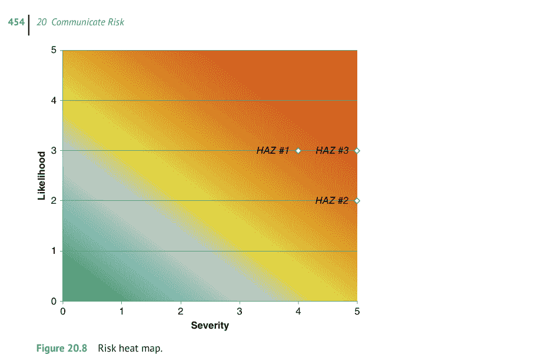

图 20.8 风险热力图。

## 初步危害分析 – 当前状态

| 危害编号 | 危害描述 | 暴露描述 | 暴露资产 | 现有控制措施 | 严重性 | 可能性 | 风险等级 |
|---|---|---|---|---|---|---|---|
| #1 | 物理/化学 - 松节油/VOCs释放 | 焊工暴露于松节油/VOCs | 焊工、主管、附近员工 | 管理类标准操作程序（SOP） | 4 | 3 | 12 |
| #2 | 物理/化学 - 易燃液体松节油积聚 | 松节油/VOCs积聚和环境条件导致内部压力积聚。 | 焊工、主管、附近员工 | 工程类储罐顶部真空泄放装置。 | 5 | 2 | 10 |
| #3 | 物理/化学 - 蒸气产生、氧气和点火源 | 松节油/VOCs积聚、足够的氧气和点火源。潜在火灾和/或爆炸。 | 员工、承包商、当地社区、环境 | 管理类动火作业许可证。 | 5 | 3 | 15 |

图 20.9 初步危害分析 – 当前状态。

b) **保护层分析（LOPA）：** 保护层分析（LOPA）是一种“屏障分析”，用于研究现有或拟议的屏障，并确定是否达到可接受的风险水平。如ANSI/ASSP/ISO 31010所述，选择危害和后果，并为每对危害/后果识别独立保护层（IPLs）。IPLs被认为是防止初始原因发展到不良后果的物理屏障或装置。IPLs仅包括物理屏障，如报警/警告装置、工程控制、设计变更和其他更高级别的控制措施。管理控制措施，如检查、培训和标准操作程序（SOPs）以及个人防护装备（PPE）不被视为屏障，通常不包括在LOPA分析中。图20.10说明了一个定性的LOPA（基于CSB示例），其中对现有IPLs进行了半定量风险等级（RL）评分。

## 保护层分析 – 当前状态

| 事件 | 原因 | 独立保护层（IPLs） | 当前状态（CS）- 现有IPLs |
| :--- | :--- | :--- | :--- |
| | | 1 | 2 | 严重性 | 可能性 | 风险等级 |
| 物理/化学 - 松节油/VOCs释放 | 故障/堵塞的真空泄放装置 - 过量罐内蒸气产生 | 工程类真空泄放装置 | | 4 | 3 | 12 |
| 焊工暴露于易燃液体，几乎导致小型火灾 | 沟通不畅。松节油积聚 + 由于真空泄放装置故障导致的氧气。 | 工程类真空泄放装置 | | 5 | 2 | 10 |
| 有机化合物在冷凝液罐中积聚，并因动火作业过程而点燃 | 沟通不畅。松节油积聚。动火作业。 | 工程类真空泄放装置 | | 5 | 3 | 15 |

图 20.10 保护层分析 – 当前状态。

需要注意的是，风险评估方法本质上是线性的，以线性方式分析和沟通风险。此外，考虑所有已识别的风险非常重要，包括高严重性/低可能性的风险，因为它们可能带来重大风险。在第一个事件中，焊工暴露于松节油/VOCs，导致肺部刺激以及肝脏、肾脏和中枢神经系统损伤，如HAZID中所述。在第二个假设事件中，焊工和附近员工暴露于易燃液体，导致松节油暴露和小型火灾。虽然由于标准操作程序（SOPs）和真空泄放装置，此类事件发生的可能性被认为是“不太可能”，但后果的严重性是灾难性的。然而，如果本案中的风险得到了适当沟通，真正的风险本应被考虑在内。本案中的真正风险是燃料（松节油）、氧气和点火源的组合，构成了火灾三要素。事实上，独立调查确定了导致爆炸的几个条件，并强调了过程安全管理（PSM）系统和良好安全实践的必要性。合同工人正在一个位于污冷凝液罐上方的管道系统上进行动火作业。阀门已关闭以准备维修，但罐内可能充满了残留的水、一层易燃液体松节油以及一个包含空气和易燃松节油蒸气的爆炸性蒸气空间。残留的松节油层本应被撇去并泵入松节油回收系统，但在事件发生前的几个月里，关于工厂中谁负责污冷凝液罐操作的混乱导致松节油在罐中积聚。这是沟通不畅的一个例子。另请注意，管理程序、SOPs和动火作业许可证在LOPA中不被视为“独立保护层”（IPLs），因此不包括在分析中。

c) **蝴蝶结分析，简化蝴蝶结风险评估：** 一种有价值的沟通工具是蝴蝶结图，因为它能够从头到尾说明整个风险情景。传统的蝴蝶结图是故障树分析（蝴蝶结左侧）和事件树分析（蝴蝶结右侧）的结合，用于清晰地说明风险路径和控制措施，适用于不需要完整定量故障树分析的情况。蝴蝶结分析的两个缺点是：它通常缺乏风险评分机制，并且控制措施的有效性未在分析中体现（更高级别的控制措施，如消除、替代和工程控制，未与较低级别的控制措施区分开来，例如行政管理和个人防护装备）。为解决这些不足，作者对该方法进行了改进，纳入了一个风险评分系统，该系统结合了控制层级和保护层分析（LOPA），被称为条纹领结风险评估，如图20.11所示（Lyon, Popov 2016）。

i) **条纹领结风险评分** 使用公式（*严重性* × *可能性*）× *控制因子* = *残余风险*（图20.12），通过输入领结图左侧“预防性”控制和右侧“缓解性”控制的控制因子（CF）乘数来得出风险分数。

1) 预防性控制风险评分：在领结图左侧，对每个已识别的危害-原因和现有的“预防性”控制进行单独分析，并根据CF乘数（图20.11）进行评分，得出CF风险分数。所实现的风险降低百分比（%RR）通过公式（*原始风险分数* – *CF风险分数*）/*原始风险分数* = %RR计算得出。

2) 缓解性控制风险评分：对于CSB情景中识别出的三个后果（C#1、C#2和C#3），使用图20.12中的CF风险公式对缓解性控制示例进行分析和评分。在事件发生后减少影响的控制选项较少，分为三类（工程、行政/警告和财务/保险）。为计算风险降低百分比，对所有三个最终后果均使用风险水平最高的危害-原因（风险水平为15的HAZ #3）。所使用的缓解性控制风险降低公式为（*最高原始风险分数* – *CF风险分数*）/*最高原始风险分数* = %RR。该案例研究清楚地表明，“预防性”控制具有更大的风险降低潜力，而缓解性控制的降低潜力有限。这是条纹领结工具的另一个巨大优势，可用于沟通风险水平和控制有效性。

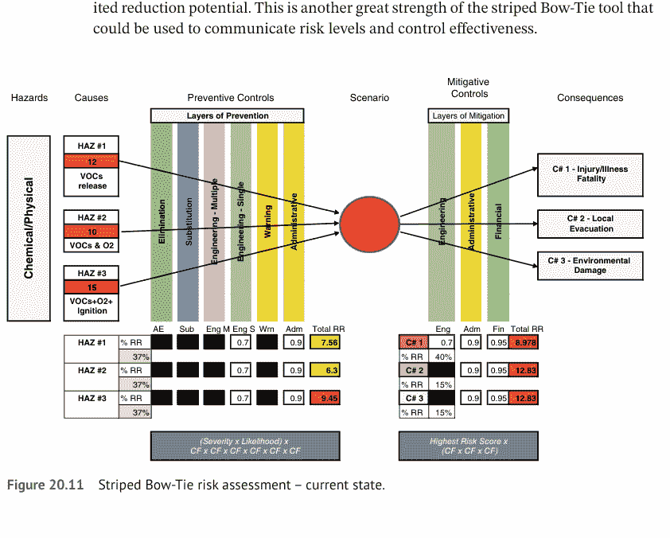

| 控制因子（CF）风险公式 | |
| :--- | :--- |
| (S x L) x CF x CF x CF x CF x CF x CF | 最高风险分数 x (CF x CF x CF) |
| **领结图左侧的预防性控制** | **乘数** | **领结图右侧的缓解性控制** |
| 消除 | 0.1 | |
| 替代 | 0.4 | |
| 工程 - 多重 | 0.6 | |
| 工程 - 单一 | 0.7 | 工程 |
| 警告 | 0.8 | |
| 行政 | 0.9 | 行政/警告 |
| | 0.95 | 财务 |
| 无控制 | 1 | 无控制 |

图20.12 控制因子风险公式和乘数。

### 3) 风险评估

a) **级联领结图：** 对于复杂情况，可以使用级联领结图，其中一个事件的后果可能是次要事件的原因或触发因素。应注意，级联领结图既可用于分析步骤，也可用于评估步骤。它是一个出色的风险沟通工具，展示了在风险评估过程的每一步都需要进行风险沟通。级联领结图方法可用于进一步评估与安全、健康与环境相关的事件所导致的业务后果。图20.13和图20.14展示了一个使用污冷凝液罐维修和维护操作的级联领结风险评估示例，以说明操作风险与业务风险之间的联系。

应尽早抓住机会在设计阶段沟通风险，如第11章所述。此外，在重新设计考虑、维护和维修操作之前，应沟通风险，以便通过应用本质更安全的设计来防止未来的爆炸。例如，该工厂必须决定未来是否需要一个新的污冷凝液罐。根据CSB的报告，事件发生前，PCA使用污冷凝液罐来调节松节油汽提塔和污冷凝液汽提塔之间的流量波动。事件发生后，该工厂在没有污冷凝液罐的情况下运行；工厂进行了事件后的管道和控制改造，以在没有该罐的情况下运行。如果证明在没有该罐的情况下运行是成功的，该工厂可能会永久消除污冷凝液罐及其相关的爆炸风险。

## 20.7 结论

职业安全与健康（OSH）专业正在发展。基于危害的努力和合规性的主要重点正在全球范围内向基于风险的决策和管理系统过渡和扩展。通过设计概念进行系统性的风险评估和预防实践无疑是这一转变的核心。

识别、分析、评估并向负责业务决策的人员沟通风险的实践，使组织能够选择最佳选项并做出最优决策。OSH专业人员必须挑战自己，超越传统实践，并继续开发更先进的方法来有效评估和沟通风险。OSH专业人员的目标应该是成为其组织中决策者值得信赖的顾问。通过实践基本的操作风险评估和管理，并在风险沟通方面变得更加有效，OSH专业人员更有可能实现这一目标。

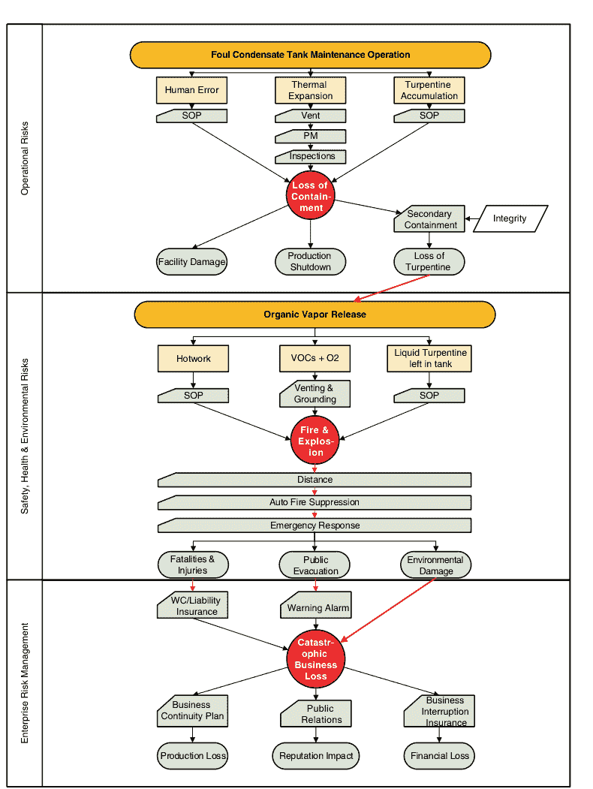

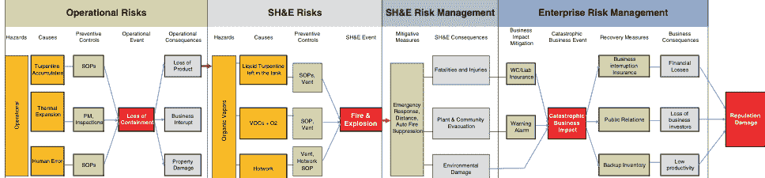

图20.14 级联领结图 – 从操作风险到安全、健康与环境风险再到企业风险管理（水平模型）。

## 参考文献

- Abkowitz, M.D. (2008). *Operational Risk Management: A Case Study Approach to Effective Planning and Response*. Hoboken, NJ: Wiley.
- ANSI/ASSP (2016). *Prevention through Design: Guidelines for Addressing Occupational Hazards & Risks in Design & Redesign Processes*. (ANSI/ASSP Z590.3-2011-R2016). Park Ridge, IL: Author.
- ANSI/ASSP/ISO 31000 (2018). *ANSI/ASSP/ISO 31000-2018 Risk Management – Guidelines*. Park Ridge, IL: Author.
- ANSI/ASSP/ISO 31010 (2019). *ANSI/ASSP/ISO/IEC 31010-2019 Risk Management – Risk Assessment Techniques*. Park Ridge, IL: Author.
- ANSI/ASSP (2019). *Occupational Health and Safety Management Systems* (ANSI/ASSP Z10-2019). Park Ridge, IL: Author.
- ASSP TR-31010 (2020). *Technical Report on Risk Assessment Techniques*, 2020. Park Ridge, IL: American Society of Safety Professionals.
- Lyon, B.K. and Hollcroft, B. (2012). Risk assessments: top 10 pitfalls & tips for improvement. *Professional Safety* 57 (12): 28–34.
- Lyon, B.K. and Popov, G. (2016). The art of assessing risk: selecting, modifying & combining methods to assess operational risks. *Professional Safety* 61 (3): 40–51.
- The Risk Management Society (RIMS). What is ERM? https://www.rims.org/resources/ERM/Pages/WhatisERM.aspx (accessed 11 November 2020).
- U.S. Coast Guard. Risk-based decision-making guidelines. https://ntlrepository.blob.core.windows.net/lib/19000/19500/19592/PB2002108236.pdf (accessed 17 November 2020).
- Walline, D. (2015). *The ASSE Risk Assessment Certificate Program*. Las Vegas, NV, USA: SeminarFest.

## 索引

a

- 可接受风险 9, 12, 31, 59, 83–84
  - 水平 67, 72, 83–84, 397
- Adams, Paul 230, 237
- 行政控制 24, 58, 79, 80, 88, 111, 194, 294, 331, 254
- ALARA. *参见* 合理可行尽量低
- ALARP. *参见* 合理可行尽量低
- ALARP模型 59
- 美国政府工业卫生师会议 (ACGIH) 184, 370
- 美国工业卫生协会 (AIHA) 249, 367
  - 人因工程委员会 367
- 美国国家标准协会 (ANSI) 2, 227, 239, 276, 284
- 美国石油学会 206
- 美国安全工程师协会 228, 229, 235
  - 为安全而设计 228, 229
- ANSI B11.0 11–12, 25, 29–30, 67, 69, 80, 239, 285, 287–288, 290–291, 294, 295
  - 风险评估过程 285
- ANSI B11.TR3 – 2000 288
- ANSI B11.19 11, 29, 285, 288, 295
- ANSI/ASSP A10.1–2011 (R2017) 317
- ANSI/ASSP/ISO 31000:2018 10, 22, 27–28, 48, 51, 60, 86, 98, 230, 231, 337, 341, 344, 389, 445, 447
- ANSI/ASSP/ISO 31010:2019 25, 27–28, 50, 57, 58, 66, 78, 93, 99, 106, 154, 181, 208, 230, 231, 276, 341, 450
- ANSI/ASSP Z10.0 25, 30, 50, 62, 70, 95, 204, 241, 250, 276, 311, 362, 365
- ANSI/ASSP Z590.3 3, 8, 22, 25, 28, 51, 52, 53, 60, 62, 79, 94, 99, 123, 138, 154, 155, 158, 204, 229, 230, 252, 231, 267, 270, 276, 341, 362, 446,
- ANSI/ASSP Z690.1 10, 27, 34, 97
- ANSI/ASSP Z690.2 10, 27
- ANSI/ASSP Z690.3 2, 27, 124
- 合理可行尽量低 (ALARP) 9, 31, 32, 84, 100
- 资产 32, 391

b

- 屏障 32, 126, 172, 175, 184, 199, 207, 208, 235, 237, 240, 288, 454
- 屏障分析 208, 210, 217–218, 220, 221, 224, 454
- 效益 59, 102, 410
  - 非财务 358
- 博帕尔灾难 192–199, 210–217
- 领结图分析 349–350, 352
  - 条纹领结图 220, 223–224, 455–456
- 头脑风暴 141, 369, 371, 406
- 英国标准协会 (BSI) 392
- 劳工统计局 (BLS) 4, 74,
- 业务连续性 139, 192, 210, 391, 392, 393, 431–443
- 业务连续性协会 (BCI) 392
- 业务影响分析/评估 (BIA) 394, 435, 438–439, 441
- 业务风险评估矩阵 (BRAM) 187, 189, 194

*Risk Assessment: A Practical Guide to Assessing Operational Risks*, Second Edition.
Georgi Popov, Bruce K. Lyon, and Bruce Hollcroft.
© 2022 John Wiley & Sons, Inc. Published 2022 by John Wiley & Sons, Inc.

## 索引

c
卡尔森，卡尔·S. 154, 156
笛卡尔坐标系 52, 54, 69
偶然因素 142, 144
检查清单 139, 319–321, 452
克里斯滕森，韦恩·C. 228, 230
克莱门斯，帕特里克 124
沟通 6, 51, 56, 61–62, 86, 96, 178, 237, 239, 243, 244, 310, 369, 433, 442, 443, 445–460
符合性 32, 93, 413
后果 2, 24, 33, 42, 44, 48, 57, 59, 61, 66, 67, 69, 72, 98, 172, 329–331, 394, 397, 400, 436–437, 450, 452, 454,
- 分析与选择 99–100
- 频率 221
- 严重等级 74–75, 156–157, 164, 185, 297
- 识别 141, 182, 185
后果分析 18, 58
构建 23, 30, 36, 104, 112, 164–168, 212, 230, 235, 284, 307–318
- 项目前规划过程 314
- 项目工作/风险评估 312–316
背景
- 建立 51, 52, 53–55, 126, 230, 394
- 目的和范围 51, 53–56, 61, 99, 128, 140, 160, 245, 312, 342, 396
持续改进 26, 33, 49, 50, 311, 411, 412, 414, 449
承包商 26, 31, 99, 132, 284, 286, 293, 315, 318, 321, 396
控制 33
- 评估 58, 375
- 影响 184
- 可靠性 41, 66, 72
纠正措施 33
成本/效益分析 84, 237, 247, 371, 400, 405
柯维，史蒂芬 86
危机管理 433
关键控制点（CCP）决策树 33, 348–351
关键功能评估 437
当前状态风险 33, 78, 83

d
深水地平线事件 49
定义 31–44
德克尔，悉尼 310
戴明，W. 爱德华兹 50, 96
设计评审 237–240, 246
设计安全评审 33, 227–247
- 过程 243
故障检测 72, 73, 79, 156, 157
灾难恢复 127, 139, 393
- 计划 433
文档 61–62, 294

e
埃博拉疫情 393
能源类型与危害 241
企业风险管理 388, 445
环境方面 409–416, 418, 423–428
环境影响 413–415
环境管理体系（EMS） 50, 95, 409-428
EMS 精益六西格玛（LSS） 409-428
美国环境保护署（EPA），风险管理计划（RMP） 18, 124
工程控制 80, 204, 331
EN ISO 12100-2010 15-16
人因工程学 33-34, 250, 355-358, 361-378
- 评估过程 364-368
- 设计评审 241-247
- 危害 363-364
- 人因风险控制层级 377
- 改进过程 368-372
- 风险评估技术 368
- 风险因素 365
人因风险评估工具（ERAT） 373-378
升级因素 172
欧盟 15-16
- 危害说明（H 说明） 259
- 风险短语（R-短语） 259
事件 34
事件树分析 76, 172, 178-180
暴露 34, 58, 72, 96, 98, 99, 383
- 频率 66, 72, 73, 77, 156
- 持续时间 72, 79
暴露评估 34, 250, 253-254, 258, 274

f
故障可检测性 66-67
故障模式 8, 34, 99, 129, 140-141, 153, 156, 160, 163-164, 182, 245, 339
故障模式与影响分析（FMEA） 24, 79, 153-168, 185, 245, 313, 339, 345, 367, 426
- 应用 154-155
- 过程 160-164
- 目的与用途 164-165
故障模式、影响及危害度分析（FMECA） 154
致命与严重事件（FSI） 74, 137, 229, 309-310
故障树分析 139, 172, 173-178, 339, 345, 347
美国联邦交通管理局（FTA） 323
现场级分析 103
财务效益。参见效益
财务风险 34, 389
鱼骨图 343
美国食品药品监督管理局（FDA） 341
食品加工风险评估 337-358
- 生物危害 118, 339-340
- 化学危害 340-341
- 物理危害 341
频率 34
基础技术 93-116
未来状态风险 34, 78

h
哈顿，小威廉 126-127, 240-241
哈顿能量释放理论 126-127, 240-241
伤害 35
危害 35
危害分析 35, 96-98, 106
- 正式方法 106-115
- 非正式方法 103-106
危害分析与关键控制点（HACCP） 208, 337-358
- 适当保护水平（ALOP） 339
- PtD 方法的整合 355-358
- 方法论 341-343
危害分析与风险评估过程 8, 29, 51, 99-100, 231
危害与可操作性分析（HAZOP） 245
基于危害的努力 97
危害检查清单 112, 244, 313, 319
危害沟通 25, 97
危害控制层级 80, 302
危害识别 35, 123
危害识别方法 126, 182
危害风险 35, 389
危害/风险规避 35
危害/风险消除 35
危险 36
危险事件 36
危险情况 36
海耶斯，弗雷德 290
英国健康与安全执行局（HSE） 22, 47, 259
控制层级 36, 59-60, 62, 77-81, 100, 125, 228, 238, 316, 371, 424, 449, 456
风险处理层级 204-205
霍华德，约翰 10, 236
人为危害 439-440
人为错误 229, 310, 364
人因 36, 362
人因工程学会 361, 362
亨特，托马斯 246

i
工业卫生（IH） 249-250
工业卫生风险评估 249-278
- 高级 REACH 工具（ART） 265
- 案例研究 268-274
- 控制带纳米工具 273
- 健康危害物质控制（COSHH）基本工具 259, 263
- 皮肤暴露 273-274
- 改进的 HRR/IH FMEA 方法 267, 268
- OSHA 混合物计算 259
- PtD 对齐 274-278
- Stoffenmanager 265
事件 36
初始风险 37, 78
始发事件 178-179, 208
国际劳工组织 ILO-OSH 2001 50, 95
国际 SEMATECH 76
ISO 14001-2014, 50, 95, 409-414
- 实施 410-412
ISO 22000 339
ISO 22301:2012 432, 435
ISO 45001 2, 22, 25, 26, 49, 61, 95, 102, 276, 311

工作危害分析（JHA） 106, 107–112, 318, 367, 371
- 工作风险评估 113–115
工作安全分析（JSA）。参见工作危害分析
约翰逊，威廉·G. 8

大数定律 77
控制层分析（LOCA） 201–224
缓解层分析（LOMA） 208, 210–217
保护层
- 分析（LOPA） 208–210, 454, 456
- 概念 206–207
精益六西格玛（LSS） 409–428
法律风险 421
风险等级 36
生命周期 36
可能性 37
可能性分析 58

机械安全
- 案例研究 296–299
- 控制系统 290–291
- 风险估计 295–296
- 危害 287–288
- 危害控制层级 281–283
- 维护与服务 299–302
- 风险评估 291–295
- 安全防护 288–290, 297–299
- 安全防护类型 303–306
- 选择评估的机器 291
- 标准 284–285
梅因，布鲁斯·W. 49, 65, 67, 230, 239, 290, 291
变更管理（MOC） 24, 139, 221, 237–238, 311–312
曼努埃尔，弗雷德·A. 1–20, 59, 67, 69, 73, 74, 103, 125, 157, 228, 230, 237, 309, 310
MIL-P-1629 153
MIL-STD-882E 16, 31, 52, 124, 128, 322, 323
矿山安全与健康管理局（MSHA） 104–105
事故 37
缓解措施 37
监测 37, 62–63

美国国家航空航天局（NASA） 153, 338
美国国家消防协会（NFPA） 30, 239
- NFPA 70E 30
美国国家职业安全卫生研究所（NIOSH） 164, 228
美国国家安全委员会（NSC） 108, 110, 228, 238
- 通过设计实现安全研究所 238
美国国家科学院（NAS） 274
自然灾害 439
美国海军工业卫生现场操作手册（IH FOM） 253

职业健康安全管理体系（OHSMS） 2, 25–26, 49–50, 95–96, 241, 250, 276, 362, 365
美国职业安全与健康管理局（OSHA） 22, 97, 102, 239, 284, 307, 363
占领运动 – 占领奥克兰港 55
运营风险 38, 391
运营风险管理系统（ORMS） 38, 49–50, 93, 95–96
组织 38, 387, 391
组织风险 387–407
- 评估 392–406
- 案例研究 406–407
OSHA 自愿保护计划（VPP） 61, 102, 311

个人防护装备（PPE） 80
- OSHA 1910.132 标准 22, 23–24, 102–103
- 危害评估 121
计划、执行、检查、处理（PDCA）。参见持续改进
运行前 228, 235
初步危害分析 123–133, 245, 308, 344, 453
- 应用 125–126, 132–133
- 实施 128–130
初步危害清单（PHL） 125
启动前安全评审（PSSR） 145
任务前危害分析 106–107, 316–319

预防有效性（PE） 66, 72, 73, 79, 156, 157, 158, 192

通过设计预防（PtD） 7, 8, 12, 28–29, 38, 49, 72, 79, 98, 99, 123, 156, 189, 227–247, 294, 337
- 概念 228–229
- 风险评估过程与模型 230–231
预防措施 38
概率 37, 38, 48, 58, 72, 73, 75–76, 100, 130, 156–158, 173, 175, 178–180, 185, 265–267, 296, 301, 325, 329, 418

过程危害分析 17, 24, 97, 124, 137–138
过程 39
过程安全管理（PSM）, 17–18, 23, 24, 97, 124, 137, 138, 139, 163, 455
程序 39
采购 8, 26, 111, 139, 236, 237, 239, 241, 243, 337, 362

面向项目的任务 307–334
- 构建 312–316
- 错误陷阱 310
- 高处坠落危害分析 327–333
- 维护与服务 321–322
- 运行危害分析（OHA）方法 322-325
- 进入前危害分析 326–327
- 安全工作方法 316
保护因子（PF） 82–83, 296–298

q
定性 13, 57
- 风险评估/模型 39, 69, 70, 113, 265
定量 48, 57, 66, 69, 70–71, 76, 113, 125, 179, 262, 273, 294, 349, 370, 455
- 风险评估/模型 39, 70–71, 113, 265

r
原始风险 39, 74, 78
被动措施 202
合理可预见的误用 39
里森，詹姆斯 172, 207
劳桑德，马文 123
记录保存（参见文档）
冗余 209
可靠性 72, 78, 144, 153, 154, 160, 205–206, 209–210, 296, 339, 388, 405
残余风险 39, 59, 60, 78–79, 83, 205, 223, 239, 246, 294–295, 410, 456
韧性 432, 435
RIMS，风险管理协会 388, 445
风险 39
风险接受 40, 84, 246, 348
风险行动 67
风险分析 40, 48, 57–58, 65, 97, 98, 110, 123, 345, 347, 400, 453
风险评估 40, 47–49, 93–96, 93–116, 244–247
- 过程 99–100, 230–231
- 团队 55–56
风险评估代码（RAC） 330
风险评估矩阵 41, 52, 67, 69, 72–73, 130–131, 244, 436
风险规避 6, 35, 40, 80, 204, 227
基于风险的努力 97
风险中心 47
风险准则 40, 51–53, 55, 58–59, 65–88
风险描述 40, 156–160
风险消除 35
风险评价 41, 48, 58–60, 65, 348, 405, 457
风险因素 41, 66, 67, 72, 73, 361, 354, 367, 448–449
风险融资 55
风险识别 41, 48, 56–57, 344, 399, 439
风险指数 325
风险等级 41, 67, 69, 72–73, 83, 124, 130, 133, 267
风险管理 41
风险管理框架 49
风险管理计划 41, 390
风险管理过程 28, 41, 47–49, 53, 86, 93, 94, 106, 227, 230, 231, 341, 389, 445–447
风险矩阵。参见风险评估矩阵
风险优先数 41, 52, 73, 156, 158, 298, 371
风险专业人员 41
风险概况 41, 397
风险降低 41, 77–82, 202–209, 288–290, 294, 302
风险登记册 42, 84–86
风险自留 42
风险评分/打分 66, 73–74
风险评分系统 13, 67–69, 130–132
- 双因素系统 72, 156, 185, 293
- 三因素和四因素系统 73, 157–160

## 索引

风险源 42
风险承受度 42
风险处置 42, 60–61, 405
    层级 204–206
风险处置计划 205–206
风险值 67, 69–71
基于风险的决策 449–450
罗斯提库斯，沃尔特 241
拉姆斯菲尔德，唐纳德 249

供应商 43, 236, 239, 287, 432–434, 440–441
瑞士奶酪防御模型 172, 207, 210, 211, 212
系统 43
系统安全 16–17, 31, 43, 126, 127–128

## S

安全 42
安全工作程序 107
安全任务分析卡 (STAC) 104
安全防护/防护措施 287–290
安全 42
安全专业人员 42
半定量 69, 73, 157
    方法/模型 57, 70, 113, 148, 273, 370
严重事故（伤害） 49, 74, 137, 150, 229, 309–310
严重性（后果） 42
    等级 74–75, 83, 185, 399
后果严重性 57, 66, 72, 74–75, 129, 156
六西格玛 409, 411, 425
索尼网络攻击事件 392–393
利益相关方 43, 52, 61, 66, 81, 82, 432, 447
标准 43
退后5步法 106
斯蒂芬斯，罗杰 127
停止、观察、分析、管理 (SLAM) 104–105
战略风险 43, 389
结构化假设分析技术 (SWIFT) 138–139
结构化假设风险评估 (SWIFRA) 142–150
替代 12, 79, 80, 212, 223, 377, 386

## T

安全5分钟 105
任务 43
任务危害分析 318–319
    维护任务危害分析 321–322
    任务前危害分析 106–109, 316–320
技术危害 440
威胁 43
    评估 437–438
可容忍风险 12, 31
触发因素 86–87, 182

## U

不可接受风险 83–84, 104
用户 43

## V

脆弱性 43, 67, 72, 391

## W

沃利恩，戴夫 77, 230, 235, 450
警告 17, 44, 80, 213, 218, 262
假设分析 137–150
    应用 138–139
    流程步骤 139–142
假设/检查表分析 11, 138–139
惠廷，詹姆斯 110
全系统风险 99, 448
工作相关肌肉骨骼疾病 (WMSDs) 361, 363–364
世界卫生组织 (WHO) 338
最坏可信后果 44, 74, 330–331
最坏设想风险 44, 74

# WILEY 最终用户许可协议

请访问 www.wiley.com/go/eula 获取 Wiley 电子书最终用户许可协议。