# 健壮的 Python

编写清晰且可维护的代码

帕特里克·维亚福尔

你的 Python 项目是否看起来越来越大？随着代码库的扩展，调试和维护变得越来越困难，你是否感到痛苦？Python 是一门易于学习和使用的语言，但这也意味着系统可能很快变得难以理解。幸运的是，Python 提供了一些特性来帮助开发者克服可维护性的难题。

在这本实用的书中，作者帕特里克·维亚福尔将向你展示如何充分利用 Python 的类型系统。你将了解用户定义的类型，如类和枚举，以及 Python 的类型提示系统。你还将学习如何使 Python 具有可扩展性，以及如何使用全面的测试策略作为安全网。运用这些技巧和方法，你将能编写出更清晰、更可维护的代码。

帕特里克·维亚福尔在关键任务软件领域拥有超过 13 年的工作经验，涉及闪电检测、电信和操作系统等领域。他开发用于将 Ubuntu 镜像部署到公共云提供商的流水线和工具，并通过他的公司 Kudzera, LLC 提供软件咨询和合同服务。帕特里克的目标是让计算机科学和软件工程主题对开发者社区更加平易近人。

-   了解类型在现代开发生态系统中为何至关重要
-   理解类、字典和枚举等类型选择如何反映特定意图
-   在不增加臃肿的情况下，使 Python 具备面向未来的可扩展性
-   使用流行的 Python 工具来提高代码库的安全性和健壮性
-   评估当前代码以检测常见的可维护性陷阱
-   通过代码检查工具和测试为你的代码库构建安全网

北京 • 波士顿 • 法纳姆 • 塞瓦斯托波尔 • 东京

版权所有 © 2021 Kudzera, LLC。保留所有权利。

印刷于美国。

由 O'Reilly Media, Inc. 出版，地址：1005 Gravenstein Highway North, Sebastopol, CA 95472。

O'Reilly 图书可用于教育、商业或销售推广用途。大多数图书也提供在线版本 (http://oreilly.com)。如需更多信息，请联系我们的企业/机构销售部门：800-998-9938 或 corporate@oreilly.com。

**组稿编辑：** 阿曼达·奎因
**开发编辑：** 莎拉·格雷
**制作编辑：** 克里斯汀·布朗
**文字编辑：** 贾斯汀·比林
**校对：** 香农·特林顿

**索引编制：** 埃伦·特劳特曼-蔡格
**内页设计：** 大卫·富塔托
**封面设计：** 凯伦·蒙哥马利
**插图：** 凯特·杜利亚

2021年7月：第一版

## 第一版修订历史

2021-07-12：首次发布

有关发布详情，请参见 http://oreilly.com/catalog/errata.csp?isbn=9781098100667。

O'Reilly 标志是 O'Reilly Media, Inc. 的注册商标。*《健壮的 Python》*、封面图片及相关商业外观是 O'Reilly Media, Inc. 的商标。

本书所表达的观点均为作者个人观点，不代表出版商的观点。虽然出版商和作者已尽最大努力确保本书所含信息和说明的准确性，但出版商和作者对任何错误或遗漏概不负责，包括但不限于因使用或依赖本书而造成的损害。使用本书所含信息和说明的风险由您自行承担。如果本书包含或描述的任何代码示例或其他技术受开源许可或他人知识产权的约束，您有责任确保您的使用符合此类许可和/或权利。

978-1-098-10066-7
[LSI]

## 目录

前言 ........................................................................................................ xi

1.  健壮的 Python 简介 ................................................................................. 1
    健壮性 2
        为什么健壮性很重要？ 4
    你的意图是什么？ 5
        异步通信 8
    Python 中的意图示例 12
        集合 12
        迭代 15
        最小惊讶原则 17
    结语 18

# 第一部分：用类型注解你的代码

2.  Python 类型简介 ................................................................................. 23
    类型中有什么？ 23
        机械表示 24
        语义表示 25
    类型系统 28
        强类型与弱类型 28
        动态类型与静态类型 30
        鸭子类型 31
    结语 33

3.  类型注解

-   什么是类型注解？ 36
-   类型注解的好处 40
    -   自动补全 40
    -   类型检查器 40
    -   练习：找出错误 41
-   何时使用类型注解 43
-   结语 44

4.  约束类型

-   可选类型 46
-   联合类型 51
    -   积类型与和类型 53
-   字面量类型 55
-   注解类型 56
-   新类型 57
-   最终类型 59
-   结语 60

5.  集合类型

-   注解集合 61
-   同构集合与异构集合 63
-   类型字典 67
-   创建新集合 69
    -   泛型 69
    -   修改现有类型 71
    -   像 ABC 一样简单 74
-   结语 76

6.  自定义你的类型检查器

-   配置你的类型检查器 79
    -   配置 mypy 80
    -   Mypy 报告 83
    -   加速 mypy 84
-   替代类型检查器 85
    -   Pyre 85
    -   Pyright 91
-   结语 93

7.  实际采用类型检查

-   权衡取舍 96
-   更早实现收支平衡 97
    -   找到你的痛点 97
    -   有针对性地处理代码 98
    -   依赖你的工具 100
-   结语 106

# 第二部分：定义你自己的类型

8.  用户定义的类型：枚举

-   用户定义的类型 111
-   枚举 112
    -   枚举类 114
    -   何时不使用 115
-   高级用法 116
    -   自动值 116
    -   标志 117
    -   整数转换 119
    -   唯一值 120
-   结语 121

9.  用户定义的类型：数据类

-   数据类实战 123
-   用法 128
    -   字符串转换 128
    -   相等性 128
    -   关系比较 129
    -   不可变性 130
-   与其他类型的比较 132
    -   数据类与字典 132
    -   数据类与类型字典 133
    -   数据类与 namedtuple 133
-   结语 134

10. 用户定义的类型：类

-   类的结构 135
    -   构造函数 136
-   不变量 137
    -   避免破坏不变量 140
    -   为什么不变量有益？ 140
    -   沟通不变量 143
-   使用你的类 143
    -   维护者怎么办？ 144
-   封装与维护不变量 146
    -   封装什么？ 146
    -   保护数据访问 147
-   操作 149
-   结语 152

11. 定义你的接口

-   自然接口设计 156
    -   像用户一样思考 157
    -   自然交互 160
    -   自然接口实战 160
-   魔术方法 166
-   上下文管理器 167
-   结语 170

12. 子类型

-   继承 172
-   可替换性 176
-   设计考量 182
-   组合 183
-   结语 185

13. 协议

-   类型系统之间的张力 187
    -   留空类型或使用 Any 189
    -   使用联合类型 189
    -   使用继承 190
    -   使用混入 191
-   协议 192
    -   定义协议 193
    -   高级用法 194
        -   组合协议 194
        -   运行时可检查协议 195
        -   满足协议的模块 196
-   结语 197

14. 使用 pydantic 进行运行时检查

-   动态配置 200
-   pydantic 205
    -   验证器 207
    -   验证与解析 209
-   结语 210

# 第三部分：可扩展的 Python

15. 可扩展性

-   什么是可扩展性？ 215
    -   重新设计 217
-   开闭原则 221
    -   检测 OCP 违规 222
    -   缺点 223
-   结语 224

16. 依赖

-   关系 226
-   依赖类型 228
    -   物理依赖 228
    -   逻辑依赖 232
    -   时间依赖 234
-   可视化你的依赖 236
    -   可视化包 236
    -   可视化导入 237
    -   可视化函数调用 238
    -   解读你的依赖图 240
-   结语 241

17. 可组合性

-   可组合性 243
-   策略与机制 247
-   小规模组合 251
    -   组合函数 251
    -   组合算法 255
-   结语 257

## 18. 事件驱动架构

工作原理

缺点

简单事件

- 使用消息代理
- 观察者模式

流式事件

结语

## 19. 可插拔的 Python

模板方法模式

策略模式

插件架构

结语

# 第四部分 构建安全网

## 20. 静态分析

代码检查

- 编写你自己的 Pylint 插件
- 拆解插件

其他静态分析工具

- 复杂度检查器
- 安全分析

结语

## 21. 测试策略

定义你的测试策略

- 什么是测试？

降低测试成本

- AAA 测试法

结语

## 22. 验收测试

行为驱动开发

- Gherkin 语言
- 可执行的规格说明

其他 behave 特性

- 参数化步骤
- 表格驱动的需求
- 步骤匹配
- 自定义测试生命周期
- 使用标签选择性运行测试
- 报告生成
- 结语

## 23. 基于属性的测试

- 使用 Hypothesis 进行基于属性的测试
- Hypothesis 的魔力
- 与传统测试的对比
- 充分利用 Hypothesis
- Hypothesis 策略
- 生成算法
- 结语

## 24. 变异测试

- 什么是变异测试？
- 使用 mutmut 进行变异测试
- 修复变异体
- 变异测试报告
- 采用变异测试
- 覆盖率（及其他指标）的谬误
- 结语

## 索引

# 前言

著名软件工程师兼企业家马克·安德森曾有一句名言：“软件正在吞噬世界”。这话说于2011年，而随着时间的推移，这句话变得愈发真实。软件系统的复杂性与日俱增，渗透到现代生活的方方面面。而站在这个贪婪巨兽中心的，正是 Python 语言。程序员们常常将 Python 列为最喜爱的语言之一，它无处不在：从 Web 应用到机器学习，再到开发者工具，等等。

然而，并非所有闪光的东西都是金子。随着我们的软件系统变得越来越复杂，我们的心智模型如何映射到现实世界也变得愈发难以理解。如果不加以控制，软件系统就会变得臃肿、脆弱，最终落得个“遗留代码”的可怕名号。这些代码库常常伴随着这样的警告：“别碰这些文件；我们不知道为什么，但你一碰它就坏”，以及“哦，只有某某知道那段代码，而他两年前就去硅谷拿高薪工作了。”软件开发是一个年轻的领域，但这类言论对开发者和商业人士来说都应是令人警醒的。

事实是，要编写经久耐用的系统，你需要在选择上深思熟正如蒂特斯·温特斯、汤姆·曼什雷克和海勒姆·赖特所言：“软件工程是随时间积分的编程。”¹ 你的代码可能会存续很长时间——我曾接手过一些项目，其代码是在我上小学时编写的。你的代码能存续多久？它会比你在当前工作的任期（或你维护那个项目的时间）更长吗？当未来有人基于你的代码构建核心组件时，你希望你的代码被如何对待？你是希望你的继任者感谢你的远见，还是诅咒你给这个世界带来的复杂性？

1 蒂特斯·温特斯、汤姆·曼什雷克和海勒姆·赖特。《Google 软件工程：从长期编程中学到的经验教训》。塞瓦斯托波尔，加利福尼亚州：O'Reilly Media, Inc.，2020年。

Python 是一门美妙的语言，但它偶尔会让面向未来的构建变得棘手。其他一些编程语言的拥护者曾指责 Python “不适合生产环境”或“仅适用于原型开发”，但事实是，许多开发者只触及了皮毛，而没有学习编写健壮 Python 代码的所有工具和技巧。在本书中，你将学习如何做得更好。你将探索众多使 Python 代码整洁且易于维护的方法。你未来的维护者将会乐于使用你的代码，因为它从一开始就被设计得易于上手。所以，去吧，阅读这本书，展望未来，构建能够持久存在的卓越软件。

# 谁应该阅读本书

本书适用于任何希望以可持续和可维护的方式发展其代码的 Python 开发者。本书并非你的第一本 Python 入门书；我期望你之前已经写过 Python 代码。你应该熟悉 Python 的控制流，并且有过使用类的经验。如果你正在寻找一本更入门的书籍，我建议你先阅读马克·卢茨（O'Reilly）所著的《学习 Python》。

虽然我将涵盖许多高级 Python 主题，但本书的目标并非成为一本关于如何使用所有 Python 特性的操作手册。相反，这些特性是关于代码健壮性以及你的选择如何影响可维护性这一更大对话的背景。有时我会讨论一些你几乎不应该使用的策略。因为我想阐述健壮性的基本原则；理解我们为何以及如何在代码中做出决策的过程，比知道在最佳场景下使用什么工具更为重要。在实践中，最佳场景是罕见的。运用本书中的原则，从你自己的代码库中得出你自己的结论。

本书不是一本参考书。你可以称它为一本讨论书。每一章都应该是你所在组织的开发者们共同讨论如何最好地应用这些原则的起点。成立一个读书会、讨论小组或午餐学习会来促进交流。我在每一章都提出了讨论话题以开启对话。当你遇到这些话题时，我鼓励你停下来，反思你当前的代码库。与你的同行交流，并将这些话题作为讨论你的代码、流程和工作流现状的跳板。如果你对 Python 语言的参考书感兴趣，我衷心推荐卢西亚诺·拉马略（O'Reilly；第二版将于2021年底出版）所著的《流畅的 Python》。

一个系统可以通过多种不同的方式变得健壮。它可以是安全加固的、可扩展的、容错的，或者更不容易引入新的错误。健壮性的每一个方面都值得用一整本书来阐述；本书专注于防止继承你代码的开发者在你的系统中引入新的错误。我将向你展示如何与未来的开发者沟通，如何通过架构模式让他们的工作更轻松，以及如何在代码库中的错误进入生产环境之前将其捕获。本书聚焦于你的 Python 代码库的健壮性，而非整个系统的健壮性。

我将涵盖大量信息，来自软件的许多不同领域，包括软件工程、计算机科学、测试、函数式编程和面向对象编程（OOP）。我并不期望你具备这些领域的背景知识。有些部分我会以初学者的水平进行解释；这通常是为了解构我们如何思考语言的核心基础。在很大程度上，这是一本中级水平的书籍。

理想的读者包括：

- 目前在大型代码库中工作，希望找到与同事更好沟通方式的开发者
- 主要代码库的维护者，希望找到方法减轻未来维护者的负担
- 自学成才、能写出很好的 Python 代码但需要更好地理解我们为何这样做的开发者
- 需要重温实用开发建议的软件工程毕业生
- 希望将他们的设计原理与健壮性基本原则联系起来的资深开发者

本书专注于随时间推移编写软件。如果你的大部分代码是原型、一次性代码或以其他任何方式可丢弃的，那么本书中的建议最终会为你的项目带来不必要的额外工作。同样，如果你的项目很小——比如，少于一百行 Python 代码。使代码可维护确实会增加复杂性；这是毫无疑问的。然而，我将引导你最小化这种复杂性。如果你的代码存活时间超过几周或增长到相当大的规模，你就需要考虑代码库的可持续性。

# 关于本书

本书涵盖了广泛的知识，跨越多个章节。它分为四个部分：

*第一部分，使用类型为代码添加注解*

我们将从 Python 中的类型开始。类型是语言的基础，但通常不会被深入探讨。你选择的类型很重要，因为它们传达了非常具体的意图。我们将研究类型注解以及特定注解向开发者传达的信息。我们还将介绍类型检查器以及它们如何帮助及早发现错误。

## 第二部分，定义你自己的类型

在探讨了如何理解 Python 的类型之后，我们将专注于如何创建你自己的类型。我们将深入讲解枚举、数据类和类。我们将探索在设计类型时做出的某些设计选择如何能够增强或削弱代码的健壮性。

## 第三部分，可扩展的 Python

在学习如何更好地表达你的意图之后，我们将专注于如何让开发者能够轻松地修改你的代码，并在你坚实的基础上自信地构建。我们将涵盖可扩展性、依赖关系以及允许你以最小影响修改系统的架构模式。

## 第四部分，构建安全网

最后，我们将探讨如何构建一个安全网，以便在你未来的协作者跌倒时能够温柔地接住他们。他们的信心将会增强，因为他们知道有一个强大、健壮的系统可以无所畏惧地适应他们的用例。最后，我们将介绍各种静态分析和测试工具，这些工具将帮助你捕获异常行为。

本书的每一章基本上都是自包含的，并在适用时引用了其他章节。你可以从头到尾阅读本书，也可以随意跳转到你感兴趣的章节。每个部分中的章节彼此相关，但不同部分之间的关联则较少。

所有代码示例均使用 Python 3.9.0 运行，我会尽量在需要特定 Python 版本或更高版本才能运行示例时进行说明（例如使用数据类需要 Python 3.7）。

在整本书中，我将主要在命令行上进行操作。我所有的命令都是在 Ubuntu 操作系统上运行的，但大多数工具在 Mac 或 Windows 系统上也能同样良好地工作。在某些情况下，我将展示某些工具如何与集成开发环境（IDE）交互，例如 Visual Studio Code（VS Code）。大多数 IDE 在底层使用命令行选项；你在命令行上学到的大部分内容将直接适用于 IDE 选项。

本书将介绍许多可以提高代码健壮性的不同技术。然而，软件开发中没有银弹。权衡是扎实工程的核心，我所介绍的方法也不例外。在讨论这些主题时，我将坦诚地说明其优点和缺点。你将比我更了解你的系统，你最适合选择哪种工具适合哪种工作。我所做的只是充实你的工具箱。

## 本书中使用的约定

本书使用以下排版约定：

*斜体*
表示新术语、URL、电子邮件地址、文件名和文件扩展名。

等宽字体
用于程序清单，以及在段落中引用程序元素，如变量或函数名、数据库、数据类型、环境变量、语句和关键字。

**等宽粗体**
显示用户应按原样输入的命令或其他文本。

*等宽斜体*
显示应替换为用户提供的值或由上下文确定的值的文本。


此元素表示提示或建议。


此元素表示一般说明。


此元素表示警告或注意事项。

## 使用代码示例

补充材料（代码示例、练习等）可从 https://github.com/pviafore/RobustPython 下载。

如果你对代码示例有技术问题或在使用时遇到问题，请发送电子邮件至 bookquestions@oreilly.com。

本书旨在帮助你完成工作。通常，如果本书提供了示例代码，你可以在你的程序和文档中使用它。除非你复制了代码的大部分，否则你不需要联系我们获得许可。例如，编写一个使用本书中多个代码块的程序不需要许可。销售或分发 O'Reilly 书籍中的示例则需要许可。通过引用本书和引用示例代码来回答问题不需要许可。将本书中大量的示例代码纳入你的产品文档中则需要许可。

我们感谢但通常不要求署名。署名通常包括书名、作者、出版商和 ISBN。例如：“*Robust Python* by Patrick Viafore (O’Reilly). Copyright 2021 Kudzera, LLC, 978-1-098-10066-7。”

如果你觉得你对代码示例的使用超出了合理使用或上述许可的范围，请随时通过 *permissions@oreilly.com* 联系我们。

## O'Reilly 在线学习


40 多年来，*O'Reilly Media* 一直提供技术和商业培训、知识和见解，以帮助公司取得成功。

我们独特的专家和创新者网络通过书籍、文章和我们的在线学习平台分享他们的知识和专业知识。O'Reilly 的在线学习平台为你提供按需访问的实时培训课程、深入的学习路径、交互式编码环境，以及来自 O'Reilly 和超过两百家其他出版商的大量文本和视频。更多信息，请访问 *http://oreilly.com*。

## 如何联系我们

请将有关本书的评论和问题寄给出版商：

- O’Reilly Media, Inc.
- 1005 Gravenstein Highway North
- Sebastopol, CA 95472
- 800-998-9938（美国或加拿大）
- 707-829-0515（国际或本地）
- 707-829-0104（传真）

我们为本书设有一个网页，其中列出了勘误、示例和任何其他信息。你可以通过 *https://oreil.ly/robust-python* 访问此页面。

发送电子邮件至 *bookquestions@oreilly.com* 评论或提出有关本书的技术问题。

有关我们书籍和课程的新闻和信息，请访问 *http://oreilly.com*。

在 Facebook 上找到我们：*http://facebook.com/oreilly*

在 Twitter 上关注我们：*http://twitter.com/oreillymedia*

在 YouTube 上观看我们：*http://youtube.com/oreillymedia*

## 致谢

我要感谢我了不起的妻子 Kendall。她是我的支持者和共鸣板，我感谢她为确保我有时间和空间写这本书所做的一切。

没有一本书是孤立写成的，这本书也不例外。我站在软件行业巨人的肩膀上，我感谢所有在我之前的人。

我还要感谢所有参与审阅本书的人，以确保我的信息一致且我的示例清晰。感谢 Bruce G.、David K.、David P. 和 Don P. 提供早期反馈并帮助我决定本书的方向。感谢我的技术审阅者 Charles Givre、Drew Winstel、Jennifer Wilcox、Jordan Goldmeier、Nathan Stocks 和 Jess Males 提供的宝贵反馈，尤其是在那些只有在我脑海中合理但未落实到纸上的地方。最后，感谢任何阅读早期发布草稿并好心通过电子邮件发送想法的人，特别是 Daniel C. 和 Francesco。

我要感谢所有帮助将我的最终草稿转化为可生产版本的人。感谢 Justin Billing 作为文字编辑深入挖掘并帮助完善我的想法呈现。感谢 Shannon Turlington 的校对；因为有你，这本书更加完善。特别感谢 Ellen Troutman-Zaig，她制作了一个令我惊叹的出色索引。

最后，没有 O'Reilly 出色的团队，我无法完成这项工作。感谢 Amanda Quinn 帮助我完成提案流程并帮助我为本书确定重点。感谢 Kristen Brown 让制作阶段对我来说变得异常轻松。感谢 Kate Dullea 将我 MS Paint 质量的草图转换为干净、清晰的插图。此外，我要特别感谢我的开发编辑 Sarah Grey。我期待着我们每周的会议，她非常出色地帮助我为广泛的受众打造一本书，同时仍让我能够深入探讨技术细节。

## 第一章
## 健壮 Python 简介

本书旨在让你的 Python 代码更易于管理。随着代码库的增长，你需要一套特定的技巧、策略和工具箱来构建可维护的代码。本书将引导你减少 bug，让开发者更快乐。你将深入审视自己的编码方式，并了解每个决策带来的影响。在讨论代码编写方式时，我想起了 C.A.R. 霍尔的这句名言：

> 构建软件设计有两种方式：一种是将其设计得如此简单，以至于明显没有缺陷；另一种是将其设计得如此复杂，以至于没有明显的缺陷。第一种方式要困难得多。¹

本书正是关于如何以第一种方式开发系统。是的，这会更困难，但请不要害怕。我将作为你的向导，陪伴你提升 Python 技能，正如 C.A.R. 霍尔在上面所说，让你的代码*明显没有缺陷*。归根结底，这是一本关于编写*健壮* Python 代码的书。

在本章中，我们将探讨*健壮性*的含义以及为何你应该关注它。我们会讨论你的沟通方式如何隐含着某些优缺点，以及如何最好地表达你的意图。"Python 之禅"指出，在开发代码时，"应该有一种——最好只有一种——显而易见的方式。"你将学会如何评估你的代码是否以一种显而易见的方式编写，以及如何改进它。首先，我们需要解决基础问题：究竟什么是*健壮性*？

¹ Charles Antony Richard Hoare. "The Emperor's Old Clothes." *Commun. ACM* 24, 2 (Feb. 1981), 75–83. https://doi.org/10.1145/358549.358561.

## 健壮性

每本书至少需要一个字典定义，所以我现在就把它讲清楚。韦氏词典为*健壮性*提供了多种定义：

1.  拥有或表现出力量或活力
2.  拥有或表现出活力、力量或坚定性
3.  结构坚固或构造牢固
4.  能够在各种条件下无故障运行

这些是对我们目标的绝佳描述。我们想要一个*健康的*系统，一个能持续满足期望多年的系统。我们希望我们的软件*表现出力量*；很明显，这段代码将经受住时间的考验。我们想要一个*构造坚固的*系统，一个建立在坚实基础上的系统。至关重要的是，我们想要一个*能够无故障运行*的系统；系统不应因引入变更而变得脆弱。

人们常把软件想象成摩天大楼，某种宏伟的结构，作为抵御所有变化的堡垒和不朽的典范。但不幸的是，现实更为混乱。软件系统不断演进。修复 bug，调整用户界面，添加、移除、然后重新添加功能。框架更迭，组件过时，安全漏洞出现。软件在变化。开发软件更像是处理城市规划中的蔓延问题，而不是建造一栋静态的建筑。面对不断变化的代码库，你如何让你的代码变得健壮？如何构建一个能抵御 bug 的坚实基础？

事实是，你必须接受变化。你的代码会被拆开、缝合、重新设计。新的用例会改变大段代码——这没关系。拥抱它。要明白，仅仅让你的代码易于修改是不够的；当它过时被删除和重写时，这可能是最好的归宿。这并不会降低它的价值；它仍将在聚光灯下拥有长久的生命。你的工作是让系统的部分重写变得容易。一旦你开始接受代码的短暂性，你就会意识到，仅仅为当下编写无 bug 的代码是不够的；你需要让代码库未来的维护者能够自信地修改你的代码。这正是本书的主旨。

你将学习构建强大的系统。这种力量并非来自铁条般的僵硬，而是来自灵活性。你的代码需要像高大的柳树一样坚韧，在风中摇曳，弯曲但不折断。你的软件将需要处理你从未想象过的情况。你的代码库需要能够适应新的环境，因为它不会总是由你来维护。那些未来的维护者需要知道他们是在一个健康的代码库中工作。你的代码库需要传达它的力量。你必须以一种减少故障的方式编写 Python 代码，即使未来的维护者将其拆解和重构。

编写健壮的代码意味着要深思熟虑地考虑未来。你希望未来的维护者看到你的代码时能轻松理解你的意图，而不是在深夜调试时诅咒你的名字。你必须传达你的想法、推理和注意事项。未来的开发者需要将你的代码塑造成新的形态——并且希望在这样做时，不必担心每次修改都可能导致它像摇摇欲坠的纸牌屋一样崩塌。

简而言之，你不希望你的系统失败，尤其是在意外发生时。测试和质量保证是其中的重要部分，但两者都不能完全内建质量。它们更适合揭示期望的差距并提供安全网。相反，你必须让你的软件经受住时间的考验。为此，你必须编写*干净且可维护的代码*。

干净的代码清晰而简洁地表达其意图，顺序是先清晰后简洁。当你看到一行代码并对自己说："啊，这完全说得通"，这就是干净代码的标志。你越需要单步调试，越需要查看大量其他代码来弄清楚发生了什么，越需要停下来盯着代码看，它就越不干净。如果聪明的技巧让代码对其他开发者来说难以阅读，那么干净的代码就不会偏爱它们。就像 C.A.R. 霍尔之前说的，你不希望你的代码如此晦涩，以至于通过目视检查都难以理解。

### 干净代码的重要性

拥有干净的代码对于拥有健壮的代码至关重要；可以将其视为任何有意义项目的入场券。编写干净的代码通常涉及一些特定的实践，包括：

-   以适当的粒度组织你的代码
-   提供良好的文档
-   为变量/函数/类型起好名字
-   保持函数简短而简单

虽然干净代码的主题贯穿本书，但我不会专门花大量时间讨论这些特定实践。其他书籍对干净代码实践的阐述要好得多。我推荐罗伯特·C·马丁的《代码整洁之道》（Prentice Hall）、安迪·亨特和戴夫·托马斯的《程序员修炼之道》（Addison-Wesley）以及史蒂夫·迈克康奈尔的《代码大全》（Microsoft Press）。这三本书都极大地提升了我作为开发者的技能，对于任何想要成长的人来说都是极好的资源。

虽然你绝对应该努力编写干净的代码，但你也必须准备好在并非干净典范的代码库中工作。软件开发是一项混乱的工作，有时出于各种业务和技术原因，纯净的干净代码会被牺牲。利用本书给出的建议，通过关于可维护性的讨论来推动代码变得更干净。

可维护的代码是……嗯，易于维护的代码。维护从第一次提交后立即开始，直到没有一个开发者再关注这个项目为止。开发者将修复 bug、添加功能、阅读代码、提取代码用于其他库等等。可维护的代码让这些任务变得毫无阻碍。软件的生命周期长达数年，甚至数十年。关注你*今天*的可维护性。

你不希望成为系统失败的原因，无论你是否正在积极开发它们。你需要主动让你的系统经受住时间的考验。你需要一个测试策略作为安全网，但你也需要能够避免一开始就掉进去。因此，考虑到所有这些，我提出我对代码库健壮性的定义：

> 一个健壮的代码库是具有弹性且无错误的，尽管它不断变化。

## 为什么健壮性很重要？

人们投入了大量精力让软件按预期工作，但很难知道何时才算完成。开发里程碑难以预测。用户体验、可访问性和文档等人为因素只会增加复杂性。现在再加上测试，以确保你覆盖了已知和未知行为的一部分，你面对的是漫长的开发周期。

软件的目的是提供价值。尽早交付全部价值符合每个利益相关者的利益。鉴于某些开发计划的不确定性，满足期望往往带来额外压力。我们都曾经历过不切实际的进度安排或截止日期。不幸的是，许多让软件变得极其健壮的工具，在短期内只会增加我们的开发周期。

确实，立即交付价值与使代码健壮之间存在固有的张力。如果你的软件"足够好"，为什么还要增加更多复杂性？要回答这个问题，请考虑这段软件将被迭代多少次。交付软件价值通常不是一项静态工作；一个系统提供价值后就再也不会被修改的情况很少见。软件本质上是不断演进的。代码库需要准备好频繁且长期地交付价值。这就是健壮的软件工程实践发挥作用的地方。如果你不能要轻松、快速地交付功能且不牺牲质量，你需要重新评估技术，使代码更具可维护性。

如果你的系统交付延迟或出现故障，就会产生实际成本。仔细审视你的代码库。问问自己：如果一年后因为有人无法理解你的代码而导致代码崩溃，会发生什么？你会损失多少价值？你的价值可能以金钱、时间甚至生命来衡量。再问问自己：如果价值未能按时交付会怎样？会有什么后果？如果这些问题的答案令人担忧，好消息是，你正在做的工作很有价值。但这也凸显了消除未来错误的重要性。

多名开发者同时在同一个代码库上工作。许多软件项目的生命周期会超过大多数开发者的任职时间。你需要找到一种方式，向现在和未来的开发者传达信息，而无需亲自在场解释。未来的开发者将基于*你的*决策进行构建。每一个错误的线索、每一个兔子洞、以及每一次剃牦牛²式的冒险都会拖慢他们的速度，从而阻碍价值交付。你需要对后来者有同理心。你需要设身处地为他们着想。本书是你思考协作者和维护者的入口。你需要思考可持续的工程实践。你需要编写持久的代码。编写持久代码的第一步是能够通过代码进行沟通。你需要确保未来的开发者理解你的意图。

## 你的意图是什么？

为什么你应该努力编写整洁且可维护的代码？为什么你应该如此关注健壮性？这些答案的核心在于沟通。你交付的不是静态系统。代码会持续变化。你还必须考虑到维护者会随时间变化。你编写代码的目标是交付价值。同时，也是以其他开发者能够同样快速交付价值的方式编写代码。为此，你需要能够在不与未来的维护者见面的情况下，传达推理和意图。

让我们看一个假设遗留系统中的代码块。我请你估算一下，你需要多长时间才能理解这段代码在做什么。如果你不熟悉这里的所有概念，或者你觉得这段代码很复杂（它是故意这样的！），也没关系。

² 剃牦牛描述了一种情况，即你经常需要解决不相关的问题，然后才能开始处理原始问题。你可以在 https://oreil.ly/4iZm7 了解该术语的起源。

```python
# Take a meal recipe and change the number of servings
# by adjusting each ingredient
# A recipe's first element is the number of servings, and the remainder
# of elements is (name, amount, unit), such as ("flour", 1.5, "cup")
def adjust_recipe(recipe, servings):
    new_recipe = [servings]
    old_servings = recipe[0]
    factor = servings / old_servings
    recipe.pop(0)
    while recipe:
        ingredient, amount, unit = recipe.pop(0)
        # please only use numbers that will be easily measurable
        new_recipe.append((ingredient, amount * factor, unit))
    return new_recipe
```

这个函数接受一个食谱，并调整每个成分以处理新的份数。然而，这段代码引发了许多问题。

- pop 是用来做什么的？
- recipe[0] 表示什么？为什么它是旧的份数？
- 为什么我需要一个注释来说明“只使用易于测量的数字”？

这确实是一段有问题的 Python 代码。如果你觉得需要重写它，我不会怪你。这样写看起来好多了：

```python
def adjust_recipe(recipe, servings):
    old_servings = recipe.pop(0)
    factor = servings / old_servings
    new_recipe = {ingredient: (amount*factor, unit)
                  for ingredient, amount, unit in recipe}
    new_recipe["servings"] = servings
    return new_recipe
```

喜欢整洁代码的人可能更喜欢第二个版本（我当然也是）。没有原始循环。变量不会改变。我返回的是一个字典而不是元组列表。根据情况，所有这些更改都可以被视为积极的。但我可能刚刚引入了三个微妙的错误。

- 在原始代码片段中，我清除了原始食谱。现在我没有这样做。即使只有一个调用代码区域依赖于这种行为，我也破坏了该调用代码的假设。
- 通过返回字典，我移除了在列表中拥有重复成分的能力。这可能会影响那些有多个部分（例如主菜和酱汁）且都使用相同成分的食谱。
- 如果任何成分被命名为“servings”，我就引入了命名冲突。

这些是否是错误取决于两个相互关联的因素：原始作者的意图和调用代码。作者打算解决一个问题，但我不确定他们为什么以这种方式编写代码。他们为什么要弹出元素？为什么“servings”是列表中的一个元组？为什么使用列表？大概，原始作者知道原因，并在本地向他们的同行传达了这一点。他们的同行基于这些假设编写了调用代码，但随着时间的推移，这种意图变得模糊不清。没有与未来的沟通，我在维护这段代码时只剩下两个选择：

- 查看所有调用代码，并在实施前确认没有依赖此行为。如果这是一个有外部调用者的公共库 API，祝你好运。我会花很多时间做这件事，这会让我感到沮丧。
- 进行更改，然后等待看后果（客户投诉、测试失败等）。如果我幸运，什么坏事都不会发生。如果不幸运，我会花很多时间修复用例，这会让我感到沮丧。

在维护环境中，这两种选择都感觉没有成效（尤其是如果我必须修改这段代码）。我不想浪费时间；我想快速处理当前任务，然后继续下一个任务。如果我考虑如何调用这段代码，情况会更糟。想想你如何与以前未见过的代码交互。你可能会看到其他调用代码的示例，将它们复制以适应你的用例，却从未意识到你需要传递一个名为“servings”的特定字符串作为列表的第一个元素。

这些都是会让你挠头的决定。我们在大型代码库中都见过它们。它们不是恶意编写的，而是随着时间的推移，出于最好的意图有机地形成的。函数开始很简单，但随着用例的增长和多个开发者的贡献，代码往往会变形并模糊原始意图。这是可维护性受损的明确标志。你需要在代码中预先表达意图。

那么，如果原始作者使用了更好的命名模式和更好的类型使用，会怎样？那段代码会是什么样子？

```python
def adjust_recipe(recipe, servings):
    """
    Take a meal recipe and change the number of servings
    :param recipe: a `Recipe` indicating what needs to be adjusted
    :param servings: the number of servings
    :return Recipe: a recipe with serving size and ingredients adjusted
                    for the new servings
    """
    # create a copy of the ingredients
    new_ingredients = list(recipe.get_ingredients())
    recipe.clear_ingredients()

    for ingredient in new_ingredients:
        ingredient.adjust_proportion(Fraction(servings, recipe.servings))
    return Recipe(servings, new_ingredients)
```

这看起来好多了，文档更完善，并且清晰地表达了原始意图。原始开发者将他们的想法直接编码到代码中。从这个片段中，你知道以下几点是真实的：

- 我正在使用一个 Recipe 类。这使我能够抽象某些操作。大概，在类本身内部有一个不变量，允许重复成分。（我将在第 10 章更详细地讨论类和不变量。）这提供了一个共同的词汇，使函数的行为更加明确。
- 份数现在是 Recipe 类的一个显式部分，而不是需要作为列表的第一个元素，后者被作为特殊情况处理。这大大简化了调用代码，并防止了无意的冲突。
- 很明显，我想清除旧食谱上的成分。没有模糊的理由说明为什么我需要做 .pop(0)。
- 成分是一个单独的类，并处理分数而不是显式的浮点数。对于所有相关方来说，更清楚的是我正在处理分数单位，并且可以轻松地做诸如 limit_denominator() 之类的事情，当人们想要限制测量单位时可以调用它（而不是依赖注释）。

我用类型替换了变量，例如食谱类型和成分类型。我还定义了操作（clear_ingredients, adjust_proportion）来传达我的意图。通过这些更改，我使代码的行为对未来读者来说一目了然。他们不再需要来找我理解代码。相反，他们无需与我交谈就能理解我在做什么。这是异步沟通的典范。

## 异步沟通

在一本 Python 书中谈论异步沟通而不提及 async 和 await 是很奇怪的。但我恐怕不得不在一个更复杂的地方讨论异步沟通：现实世界。

异步沟通意味着信息的生产和消费彼此独立。生产和消费之间存在时间差。可能是几个小时，就像不同时区的协作者那样。也可能是几年，就像未来的维护者试图深入研究代码的内部工作原理。你无法预测何时会有人需要理解你的逻辑。到他们消费你产生的信息时，你可能甚至不在那个代码库（或那家公司）工作了。

与*同步通信*形成对比。同步通信是实时（即时）的思想交流。这种直接的沟通方式是表达想法的最佳途径之一，但不幸的是，它无法扩展，而且你不可能总是在场回答问题。

为了评估在试图理解意图时，每种沟通方式的适用性，让我们来看两个维度：接近度和成本。

*接近度*是指沟通者需要在时间上多接近，才能使沟通富有成效。有些沟通方式擅长实时信息传递，而另一些则擅长在多年后进行沟通。

*成本*是沟通所需付出的努力的衡量。你必须权衡沟通所花费的时间和金钱与所提供的价值。你的未来消费者则需要权衡获取信息的成本与他们试图传递的价值。编写代码而不提供任何其他沟通渠道是你的基线；你必须这样做才能产生价值。为了评估额外沟通渠道的成本，以下是我考虑的因素：

*可发现性*
在正常工作流程之外，找到这些信息有多容易？这些知识有多短暂？信息是否易于搜索？

*维护成本*
信息有多准确？需要多久更新一次？如果信息过时会出什么问题？

*生产成本*
生产这些沟通投入了多少时间和金钱？

在图1-1中，我根据自己的经验，绘制了一些常见沟通方法的成本和所需接近度。

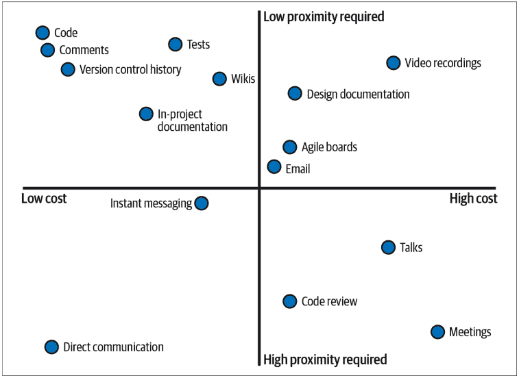

成本/接近度图由四个象限组成。

*低成本，高接近度要求*
这些方法生产成本低，消费成本也低，但无法跨时间扩展。直接沟通和即时消息是这类方法的绝佳例子。将它们视为时间点上的信息快照；它们只在用户积极倾听时才有价值。不要依赖这些方法向未来传递信息。

*高成本，高接近度要求*
这些是昂贵的活动，通常只发生一次（例如会议或研讨会）。这些活动在沟通时应该提供大量价值，因为它们对未来提供的价值有限。你有多少次参加过感觉浪费时间的会议？你感受到的就是价值的直接损失。演讲需要为每位参与者付出倍增的成本（花费的时间、举办场地、后勤等）。代码审查完成后很少再被查看。

*高成本，低接近度要求*
这些方法成本高昂，但由于所需的接近度低，其成本可以随着时间的推移通过传递的价值得到回报。电子邮件和敏捷看板包含大量信息，但不易被他人发现。它们非常适合那些不需要频繁更新的更大概念。试图从所有噪音中筛选出你想要的信息片段会变成一场噩梦。视频录像和设计文档非常适合理解时间点上的快照，但保持更新的成本很高。不要依赖这些沟通方法来理解日常决策。

*低成本，低接近度要求*
这些方法创建成本低，且易于消费。代码注释、版本控制历史和项目README都属于这一类，因为它们与我们编写的源代码相邻。用户可以在产生这些沟通多年后查看它们。开发者在日常工作中遇到的任何东西都具有内在的可发现性。这些沟通方法天然适合成为人们在查看源代码后首先寻找的地方。然而，你的代码是你最好的文档工具之一，因为它是系统的活记录和唯一的真实来源。


**讨论话题**

图1-1中的这个图表是基于通用用例创建的。思考一下你和你的组织使用的沟通路径。你会将它们绘制在图表的哪个位置？获取准确信息有多容易？生产信息有多昂贵？你对这些问题的答案可能会产生一个略有不同的图表，但唯一的真实来源将是你交付的可执行软件。

低成本、低接近度的沟通方法是向未来传递信息的最佳工具。你应该努力最小化沟通的生产和消费成本。无论如何你都必须编写软件来交付价值，因此最低成本的选择是让你的代码成为你的主要沟通工具。你的代码库成为清晰表达你的决策、观点和变通方法的最佳选择。

然而，要使这一论断成立，代码也必须易于消费。你的意图必须在代码中清晰地传达出来。你的目标是最大限度地减少代码读者理解它所需的时间。理想情况下，读者不需要阅读你的实现，只需要阅读你的函数签名。通过使用良好的类型、注释和变量名，你的代码功能应该一目了然。

## 自文档化代码

对图1-1的错误反应是“我只需要自文档化代码！”代码绝对应该自文档化*正在做什么*，但无法涵盖沟通的每一个用例。例如，版本控制会给你变更历史。设计文档讨论的是不局限于任何单个代码文件的宏大理念。会议（如果做得好）可以是同步计划执行的重要事件。演讲非常适合一次性与大量观众分享想法。虽然本书专注于你能在代码中做什么，但不要丢弃任何其他有价值的沟通方式。

## Python中的意图示例

既然我已经讨论了什么是意图以及它为何重要，让我们通过Python的视角来看一些例子。你如何确保正确地表达你的意图？我将通过两个不同的例子来说明决策如何影响意图：集合和迭代。

## 集合

当你选择一个集合时，你是在传达特定的信息。你必须为手头的任务选择正确的集合。否则，维护者会从你的代码中推断出错误的意图。

考虑这段代码，它接收一个食谱书列表，并提供作者与所写书籍数量之间的映射：

```python
def create_author_count_mapping(cookbooks: list[Cookbook]):
    counter = {}
    for cookbook in cookbooks:
        if cookbook.author not in counter:
            counter[cookbook.author] = 0
        counter[cookbook.author] += 1
    return counter
```

我对集合的使用告诉你什么？为什么我不传递一个字典或一个集合？为什么我不返回一个列表？根据我目前对集合的使用，你可以假设：

- 我传递的是一个食谱书列表。这个列表中可能有重复的食谱书（我可能在统计书店书架上有多本副本的食谱书）。
- 我返回的是一个字典。用户可以查找特定作者，或者遍历整个字典。我不必担心返回集合中有重复的作者。

如果我想传达不应该向此函数传递重复项呢？列表传达了错误的意图。相反，我应该选择一个集合来传达这段代码绝对不会处理重复项。

选择集合可以告诉读者你的具体意图。以下是一些常见集合类型及其传达的意图：

*列表*
这是一个要被迭代的集合。它是*可变的*：可以随时更改。你很少期望从列表中间检索特定元素（使用静态列表索引）。可能存在重复元素。书架上的食谱书可能存储在列表中。

*字符串*
一个不可变的字符集合。食谱书的名称将是一个字符串。

*生成器*
一个要被迭代的集合，且永远不会被索引。每个元素的访问都是惰性执行的，因此每次循环迭代可能需要时间和/或资源。它们非常适合计算成本高昂或无限的集合。在线食谱数据库可能作为生成器返回；当用户只打算查看搜索的前10个结果时，你不想获取世界上所有的食谱。

*元组*
一个不可变的集合。你不期望它改变，因此更可能从元组中间提取特定元素（通过索引或解包）。它很少被迭代。关于特定食谱书的信息可能表示为一个元组，例如 `(cookbook_name, author, page count)`。

*集合*
一个不包含重复项的可迭代集合。你不能依赖元素的顺序。食谱书中的成分可能存储为一个集合。

*字典*
一个从键到值的映射。键在字典中是唯一的。字典通常被迭代，或使用动态键进行索引。食谱书的索引是键值映射（从主题到页码）的一个绝佳例子。

不要为你的目的使用错误的集合。我遇到过太多次本不该有重复项的列表，或者实际上并未用于映射键值的字典。每次你的意图与代码中的内容之间存在脱节，你都会制造维护负担。维护者必须暂停，弄清楚你真正想表达的意思，然后绕过他们的错误假设（以及你自己的错误假设）。

## 动态索引与静态索引

根据你使用的集合类型，你可能需要也可能不需要使用*静态索引*。静态索引是指当你使用常量字面量来索引集合时得到的结果，例如 `my_list[4]` 或 `my_dict["Python"]`。通常，列表和字典并不经常需要这种用例。由于它们的动态特性，你无法保证集合在该索引处存在你正在寻找的元素。如果你在这些类型的集合中寻找特定字段，这表明你需要一个用户定义的类型（在第 8、9 和 10 章中探讨）。对元组进行静态索引是安全的，因为它们的大小是固定的。集合和生成器从不进行索引。

此规则的例外情况包括：

-   获取序列的第一个或最后一个元素（`my_list[0]` 或 `my_list[-1]`）
-   使用字典作为中间数据类型，例如读取 JSON 或 YAML 时
-   处理特定固定块的序列操作（例如，总是在第三个元素后分割或检查固定格式字符串中的特定字符）
-   针对特定集合类型的性能原因

相比之下，*动态索引*发生在你使用一个直到运行时才知道的变量来索引集合时。这是列表和字典最合适的选择。当你在集合上迭代或使用 `index()` 函数搜索特定元素时，你会看到这一点。

这些是基本的集合，但还有更多方式来表达意图。以下是一些特殊的集合类型，它们在向未来传达意图方面更具表现力：

`frozenset`
一个不可变的集合。

`OrderedDict`
一个根据插入时间保留元素顺序的字典。从 CPython 3.6 和 Python 3.7 开始，内置字典也会根据插入时间保留元素顺序。

## defaultdict

一个在键缺失时提供默认值的字典。例如，我可以将我之前的示例重写如下：

```python
from collections import defaultdict
def create_author_count_mapping(cookbooks: List[Cookbook]):
    counter = defaultdict(lambda: 0)
    for cookbook in cookbooks:
        counter[cookbook.author] += 1
    return counter
```

这为最终用户引入了新的行为——如果他们查询字典中一个不存在的值，他们将收到一个 0。这在某些用例中可能是有益的，但如果不是，你可以直接返回 `dict(counter)`。

## Counter

一种用于计算元素出现次数的特殊字典类型。这大大简化了我们上面的代码，如下所示：

```python
from collections import Counter
def create_author_count_mapping(cookbooks: List[Cookbook]):
    return Counter(book.author for book in cookbooks)
```

花点时间反思一下最后一个例子。注意使用 Counter 如何让我们获得更简洁的代码，同时不牺牲可读性。如果你的读者熟悉 Counter，这个函数的含义（以及实现如何工作）会立即显现。这是一个通过更好地选择集合类型向未来传达意图的绝佳例子。我将在第 5 章进一步探讨集合。

还有许多其他类型可以探索，包括 array、bytes 和 range。每当你遇到一个新的集合类型，无论是内置的还是其他的，问问自己它与其他集合有何不同，以及它向未来的读者传达了什么。

## 迭代

迭代是另一个例子，你选择的抽象决定了你传达的意图。

你有多少次看到这样的代码？

```python
text = "This is some generic text"
index = 0
while index < len(text):
    print(text[index])
    index += 1
```

这段简单的代码将每个字符打印在单独的行上。对于这个问题的 Python 初次尝试来说，这完全没问题，但解决方案很快演变成更 Pythonic 的风格（以惯用风格编写的代码，旨在强调简洁性，并且大多数 Python 开发者都能识别）：

```python
for character in text:
    print(character)
```

花点时间反思一下为什么这个选项更可取。for 循环是更合适的选择；它更清晰地传达了意图。就像集合类型一样，你选择的循环结构明确地传达了不同的概念。以下是一些常见循环结构及其传达内容的列表：

### for 循环

for 循环用于遍历集合或范围中的每个元素并执行操作/副作用。

```python
for cookbook in cookbooks:
    print(cookbook)
```

### while 循环

while 循环用于只要某个条件为真就进行迭代。

```python
while is_cookbook_open(cookbook):
    narrate(cookbook)
```

### 推导式

推导式用于将一个集合转换为另一个集合（通常，这没有副作用，特别是如果推导式是惰性的）。

```python
authors = [cookbook.author for cookbook in cookbooks]
```

### 递归

当集合的子结构与集合的结构相同时使用递归（例如，树的每个子节点也是一棵树）。

```python
def list_ingredients(item):
    if isinstance(item, PreparedIngredient):
        list_ingredients(item)
    else:
        print(ingredient)
```

你希望代码库的每一行都能提供价值。此外，你希望每一行都能清晰地向未来的开发者传达该价值是什么。这驱动了最小化任何样板代码、脚手架和多余代码的需求。在上面的例子中，我正在遍历每个元素并执行副作用（打印一个元素），这使得 for 循环成为理想的循环结构。我没有浪费代码。相比之下，while 循环要求我们显式地跟踪循环，直到某个条件发生。换句话说，我需要跟踪一个特定的条件并在每次迭代中改变一个变量。这分散了循环提供的价值，并带来了不必要的认知负担。

## 最小惊讶原则

偏离意图是不好的，但有一类沟通甚至更糟：当代码主动让你未来的协作者感到惊讶。你甚至应该遵守*最小惊讶原则*；当有人阅读代码库时，他们几乎不应该对行为或实现感到惊讶（当他们感到惊讶时，代码附近应该有一个很好的注释来解释为什么是这样）。这就是为什么传达意图至关重要。清晰、整洁的代码降低了误解的可能性。


*最小惊讶原则*，也称为*最小惊奇原则*，指出程序应该始终以最不令用户惊讶的方式响应。³ 惊讶的行为会导致困惑。困惑会导致错误的假设。错误的假设会导致 bug。这就是你如何得到不可靠的软件。

请记住，你可以编写完全正确的代码，但仍然会让未来的某人感到惊讶。在我职业生涯早期，我曾追踪过一个因内存损坏而崩溃的讨厌 bug。将代码放在调试器下或添加太多 print 语句会影响时序，导致 bug 不会显现（一个真正的“海森堡 bug”）。⁴ 与这个 bug 相关的代码实际上有数千行。

所以我不得不进行手动二分，将代码分成两半，通过移除另一半来看哪一半实际上有崩溃，然后在那一半代码中重复这个过程。经过两周的抓狂，我终于决定检查一个听起来无害的函数 `getEvent`。结果发现这个函数实际上是在用无效数据*设置*事件。不用说，我非常惊讶。这个函数在它所做的事情上是完全正确的，但由于我错过了代码的意图，我至少忽略了这个 bug 三天。让你的协作者感到惊讶会浪费他们的时间。

很多这种惊讶最终源于复杂性。复杂性有两种类型：*必要复杂性*和*偶然复杂性*。必要复杂性是你的领域固有的复杂性。深度学习模型必然是复杂的；它们不是你浏览一下内部工作原理就能在几分钟内理解的东西。优化对象关系映射（ORM）必然是复杂的；必须考虑大量可能的用户输入。你无法消除必要复杂性，所以你最好的选择是尝试将其控制住，

³ Geoffrey James. *The Tao of Programming*. https://oreil.ly/NcKNK.
⁴ 一个在被观察时表现出不同行为的 bug。SIGSOFT ’83: *Proceedings of the ACM SIGSOFT/SIGPLAN software engineering symposium on High-level debugging*.

以免它在你的代码库中蔓延，最终成为意外的复杂性。

相比之下，意外的复杂性是指在代码中产生多余、浪费或令人困惑的陈述的复杂性。当系统随时间演变，开发者不断塞入新功能，却没有重新评估旧代码以确定其原始断言是否仍然成立时，就会发生这种情况。我曾经参与过一个项目，仅仅添加一个命令行选项（以及相关的编程设置方式）就需要修改不少于10个文件。为什么添加一个简单的值需要在整个代码库中进行修改？

如果你经历过以下情况，那么你就知道你的代码库存在意外的复杂性：

-   听起来很简单的事情（添加用户、更改UI控件等）实现起来却非同小可。
-   新开发者难以理解你的代码库。项目中的新开发者是衡量你当前代码可维护性的最佳指标——无需等待多年。
-   添加功能的估算时间总是很长，但你仍然会错过截止日期。

尽可能地移除意外的复杂性，并隔离你的必要复杂性。这些将成为你未来协作者的绊脚石。这些复杂性来源会加剧沟通不畅，因为它们在整个代码库中模糊和分散了意图。


**讨论主题**

你的代码库中有哪些意外的复杂性？如果你被投入到代码库中，且无法与其他开发者沟通，理解这些简单的概念会有多大的挑战？你能做些什么来简化本次练习中识别出的复杂性（特别是如果它们存在于经常变化的代码中）？

在本书的其余部分，我将探讨在Python中传达意图的不同技巧。

## 结语

健壮的代码很重要。整洁的代码很重要。你的代码需要在整个代码库的生命周期内保持可维护性，为了确保这一结果，你需要积极地预见你正在传达什么以及如何传达。你需要尽可能清晰地将你的知识体现在代码中。持续向前看会感觉像是一种负担，但通过练习，它会变得自然，当你在自己的代码库中工作时，你将开始收获其益处。

每当你将一个现实世界的概念映射到代码时，你都在创建一个抽象，无论是通过使用集合还是你决定将函数分开。每个抽象都是一个选择，每个选择都在传达某些东西，无论是否有意为之。我鼓励你思考你编写的每一行代码，并问自己：“未来的开发者会从中学到什么？”你有责任让未来的维护者能够以你今天相同的速度交付价值。否则，你的代码库会变得臃肿，进度会延误，复杂性会增长。作为开发者，你的工作就是减轻这种风险。

寻找潜在的热点，例如不正确的抽象（如集合或迭代）或意外的复杂性。这些是随着时间的推移沟通可能中断的主要领域。如果这些类型的热点位于经常变化的区域，那么现在解决它们就是优先事项。

在下一章中，你将运用本章所学的内容，并将其应用于一个基本的Python概念：类型。你选择的类型向未来的开发者表达了你的意图，选择正确的类型将带来更好的可维护性。

# 第一部分

## 用类型注解你的代码

欢迎来到第一部分，我将重点关注Python中的*类型*。类型对你的程序行为进行建模。初级程序员知道Python中有不同的类型，例如`float`或`str`。但什么是类型？掌握类型如何使你的代码库更强大？类型是任何编程语言的基本支柱，但不幸的是，大多数入门书籍都忽略了类型如何使你的代码库受益（或者如果误用，这些类型会增加复杂性）。

告诉我你是否见过这个：

```
>>> type(3.14)
<class 'float'>

>>> type("This is another boring example")
<class 'str'>

>>> type(["Even", "more", "boring", "examples"])
<class 'list'>
```

这几乎可以从任何Python入门指南中找到。你将学习`int`、`str`、`float`和`bool`数据类型，以及语言提供的各种其他东西。然后，砰，你继续前进，因为坦白说，这Python并不花哨。你想深入研究很酷的东西，比如函数、循环和字典，我不怪你。但可惜的是，许多教程从未重新审视类型并给予它们应有的重视。随着用户深入挖掘，他们可能会发现类型注解（我将在下一章介绍）或开始编写类，但通常错过了关于何时适当使用类型的基本讨论。

这就是我将开始的地方。

# 第2章

## Python类型简介

要编写可维护的Python，你必须了解类型的本质并有意识地使用它们。我将首先讨论类型到底是什么以及为什么这很重要。然后，我将讨论Python语言对其类型系统的决策如何影响你代码库的健壮性。

## 类型中有什么？

我想让你停下来回答一个问题：不提及数字、字符串、文本或布尔值，你将如何解释什么是类型？

对每个人来说，这都不是一个简单的答案。解释其好处甚至更难，尤其是在像Python这样的语言中，你不必显式声明变量的类型。

我认为类型有一个非常简单的定义：一种沟通方法。类型传达信息。它们提供了一种用户和计算机可以推理的表示。我将这种表示分解为两个不同的方面：

-   *机械表示*：类型向Python语言本身传达行为和约束。
-   *语义表示*：类型向其他开发者传达行为和约束。

让我们进一步了解每种表示。

## 机械表示

从本质上讲，计算机都是关于二进制代码的。你的处理器不会说Python；它看到的只是电路中电流的有无。计算机内存中的内容也是如此。

假设你的内存看起来像这样：

```
001100101000100100010100100100010010001000010101
001010101010100000001111111100100100111110100100
010010001001010010101110111101101010101010101010

010100000100000101010100

1010010010010001010100010100100101010101001001001
000111101010110101101010111000000000000000000111
```

看起来像一堆乱码。让我们放大中间部分：

```
01010000 01000001 01010100
```

仅凭这个数字本身无法确切知道它的含义。根据计算机体系结构，它可能代表数字5259604或5521744。它也可能是字符串“PAT”。没有任何上下文，你无法确定。这就是为什么Python需要类型。类型信息为Python提供了理解所有1和0所需的信息。让我们看看它的实际应用：

```
from ctypes import string_at
from sys import getsizeof
from binascii import hexlify

a = 0b01010000_01000001_01010100
print(a)
>>> 5259604

# prints out the memory of the variable
print(hexlify(string_at(id(a), getsizeof(a))))
>>> b'0100000000000000607c054995550000100000000000000054415000'

text = "PAT"
print(hexlify(string_at(id(text), getsizeof(text))))
>>> b'0100000000000000a00f0649955500003000000000000000375c9f1f02'
    b'acdbe4e5379218b77f000000000000000000000050415400'
```


我是在一台小端机器上运行CPython 3.9.0，所以如果你看到不同的结果，别担心，有一些细微之处可能会改变你的答案。（此代码不保证在其他Python实现（如Jython或PyPy）上运行。）

这些十六进制字符串显示了包含 Python 对象的内存内容。你会找到指向链表中下一个和上一个对象的指针（用于垃圾回收目的）、一个引用计数、一个类型以及实际的数据本身。你可以查看每个返回值末尾的字节来查看数字或字符串（寻找字节 `0x544150` 或 `0x504154`）。这里的关键部分是，内存中编码了一个类型。当 Python 查看一个变量时，它在运行时确切地知道每个东西是什么类型（就像你使用 `type()` 函数时一样）。

很容易认为这就是类型的唯一原因——计算机需要知道如何解释各种内存块。了解 Python 如何使用类型很重要，因为它对编写健壮的代码有一些影响，但更重要的是第二种表示：语义表示。

## 语义表示

虽然类型的第一种定义非常适合底层编程，但第二种定义适用于每个开发者。类型除了具有机械表示外，还表现出语义表示。语义表示是一种沟通工具；你选择的类型跨越时间和空间向未来的开发者传递信息。

类型告诉用户在与该实体交互时可以期望什么行为。在这种上下文中，“行为”是你与该类型关联的操作（加上任何前置条件或后置条件）。它们是用户在使用该类型时交互的边界、约束和自由。正确使用的类型理解门槛低；它们变得自然易用。相反，使用不当的类型则是一种障碍。

考虑一下不起眼的 `int`。花一分钟思考一下 Python 中整数具有什么行为。这是我想到的一个快速（非详尽）列表：

- 可从整数、浮点数或字符串构造
- 数学运算，如加法、减法、除法、乘法、幂运算和取反
- 关系比较，如 `<`、`>`、`==` 和 `!=`
- 位运算（操作数字的各个位），如 `&`、`|`、`^`、`~` 和移位
- 可使用 `str` 或 `repr` 函数转换为字符串
- 能够通过 `ceil`、`floor` 和 `round` 方法进行四舍五入（即使它们返回整数本身，这些也是支持的方法）

一个 `int` 有许多行为。你可以在交互式 Python 控制台中输入 `help(int)` 来查看完整列表。

现在考虑一个 datetime：

```python
>>> import datetime
>>> datetime.datetime.now()
datetime.datetime(2020, 9, 8, 22, 19, 28, 838667)
```

datetime 与 int 并没有太大不同。通常，它表示为从某个纪元时间（如 1970 年 1 月 1 日）开始的秒数或毫秒数。但想想 datetime 具有的行为（我将与整数不同的行为用斜体标出）：

- 可从字符串或表示日/月/年等的一组整数构造
- 数学运算，如时间增量的加法和减法
- 关系比较
- 没有可用的位运算
- 可使用 `str` 或 `repr` 函数转换为字符串
- 不能通过 `ceil`、`floor` 或 `round` 方法进行四舍五入

datetime 支持加法和减法，但不是与其他 datetime 进行。我们只添加时间增量（例如添加一天或减去一年）。乘法和除法对 datetime 来说确实没有意义。同样，四舍五入日期在标准库中不是支持的操作。然而，datetime 确实提供了与整数类似语义的比较和字符串格式化操作。所以即使 datetime 本质上是一个整数，它包含了一个受限的操作子集。

> 语义指的是操作的含义。虽然 `str(int)` 和 `str(datetime.datetime.now())` 会返回不同格式的字符串，但含义是相同的：我正在从一个值创建一个字符串。

Datetime 还支持自己的行为，以进一步将它们与整数区分开来。这些包括：

- 根据时区更改值
- 能够控制字符串的格式
- 查找是星期几

同样，如果你想查看完整的行为列表，请在你的 REPL 中输入 `import datetime; help(datetime.datetime)`。

Datetime 比 int 更具体。它传达了比普通数字更具体的用例。当你选择使用更具体的类型时，你是在告诉未来的贡献者，存在一些可能的操作和需要注意的约束，而这些在不太具体的类型中是不存在的。

让我们深入探讨这如何与健壮的代码联系起来。假设你继承了一个处理完全自动化厨房开关门的代码库。你需要添加功能以能够更改关门时间（例如，在节假日延长厨房营业时间）。

```python
def close_kitchen_if_past_cutoff_time(point_in_time):
    if point_in_time >= closing_time():
        close_kitchen()
        log_time_closed(point_in_time)
```

你知道你需要对 `point_in_time` 进行操作，但你该如何开始？你甚至在处理什么类型？它是 `str`、`int`、`datetime` 还是某个自定义类？你被允许对 `point_in_time` 执行什么操作？你没有编写这段代码，也没有与之相关的历史。如果你想调用这段代码，同样的问题也存在。你不知道传递什么给这个函数是合法的。

如果你做出了错误的假设，并且这段代码进入了生产环境，你将使代码变得不那么健壮。也许这段代码不在经常执行的代码路径上。也许其他一些 bug 阻止了这段代码运行。也许这段代码周围没有很多测试，后来变成了运行时错误。无论如何，代码中潜伏着一个 bug，你降低了可维护性。

负责任的开发者尽最大努力不让 bug 进入生产环境。他们会搜索测试、文档（当然要持保留态度——文档可能很快过时）或调用代码。他们会查看 `closing_time()` 和 `log_time_closed()` 以了解它们期望或提供什么类型，并相应地进行规划。在这种情况下，这是一个正确的路径，但我仍然认为这是一个次优的路径。虽然错误不会到达生产环境，但他们仍然花费时间查看代码，这阻碍了价值的快速交付。对于这样一个小例子，如果它只发生一次，你会原谅认为这不是什么大问题。但要警惕千刀万剐：任何一刀本身危害不大，但成千上万刀堆积并散布在代码库中，会让你步履蹒跚，试图交付代码。

根本原因是参数的语义表示不清晰。在编写代码时，尽你所能通过类型来表达你的意图。你可以在需要时将其作为注释，但我建议使用类型注解（Python 3.5+ 支持）来解释代码的某些部分。

```python
def close_kitchen_if_past_cutoff_time(point_in_time: datetime.datetime):
    if point_in_time >= closing_time():
        close_kitchen()
        log_time_closed(point_in_time)
```

我需要做的就是在参数后面加上 `: <类型>`。本书中的大多数代码示例都将使用类型注解来清楚地说明代码期望的类型。

现在，当开发者遇到这段代码时，他们将知道对 `point_in_time` 的期望。他们不必查看其他方法、测试或文档来知道如何操作该变量。他们有一个非常清晰的线索知道该做什么，并且可以立即开始执行他们需要的修改。你正在向未来的开发者传达语义表示，而无需直接与他们交谈。

此外，随着开发者越来越多地使用一种类型，他们会变得熟悉它。当他们遇到该类型时，他们将不需要查阅文档或 `help()` 来使用它。你开始在代码库中创建一个众所周知的类型词汇表。这减轻了维护的负担。当开发者修改现有代码时，他们希望专注于需要进行的更改，而不会陷入困境。

类型的语义表示极其重要，第一部分的其余部分将专门介绍如何利用类型为你服务。不过，在我继续之前，我需要介绍 Python 作为语言的一些基本结构元素，以及它们如何影响代码库的健壮性。

> **讨论主题**
>
> 思考你代码库中使用的类型。挑选几个，问问自己它们的语义表示是什么。列举它们的约束、用例和行为。你是否可以在更多地方使用这些类型？是否存在你误用类型的地方？

## 类型系统

正如本章前面所讨论的，类型系统旨在为用户提供某种方式来建模语言中的行为和约束。编程语言对其特定类型系统的工作方式设定了期望，无论是在代码构建期间还是在运行时。

### 强类型与弱类型

类型系统在从弱到强的谱系上进行分类。倾向于谱系较强一侧的语言倾向于将操作的使用限制在支持它们的类型上。换句话说，如果你破坏了语义表示，类型，你会通过编译器错误或运行时错误（有时声音相当大）被告知。像Haskell、TypeScript和Rust这样的语言都被认为是强类型的。强类型语言的支持者之所以大力推崇，是因为在构建或运行代码时，错误会更加明显。

相反，位于类型谱系较弱一端的语言不会将操作限制在支持它们的类型上。类型通常会被强制转换为不同的类型，以使操作有意义。像JavaScript、Perl和旧版本的C这样的语言是弱类型的。弱类型语言的支持者推崇开发者可以快速迭代代码，而无需与语言本身作斗争的速度。

Python位于类型谱系较强的一端。类型之间发生的隐式转换非常少。当你执行非法操作时，这一点很明显：

```
>>> [] + {}
TypeError: can only concatenate list (not "dict") to list

>>> {} + []
TypeError: unsupported operand type(s) for +: 'dict' and list
```

与弱类型语言（如JavaScript）对比一下：

```
>>> [] + {}
"[object Object]"

>>> {} + []
0
```

在健壮性方面，像Python这样的强类型语言确实对我们有帮助。虽然错误仍然会在运行时而不是开发时出现，但它们仍然会以明显的TypeError异常形式出现。这显著减少了调试问题所需的时间，再次让你能够更快地交付增量价值。

## 弱类型语言天生就不健壮吗？

弱类型语言的代码库完全可以是健壮的；我绝不是在贬低这些语言。想想世界上运行的大量生产级JavaScript代码。然而，弱类型语言需要格外小心才能保持健壮。很容易混淆变量的类型并做出错误的假设。开发者非常依赖代码检查工具、测试和其他工具来提高可维护性。

## 动态类型与静态类型

我需要讨论另一个类型谱系：静态类型与动态类型。这本质上是处理类型机械表示方式的差异。

提供静态类型的语言在构建时将类型信息嵌入到变量中。开发者可以显式地向变量添加类型信息，或者由编译器等工具为开发者推断类型。变量在运行时不会改变其类型（因此称为“静态”）。静态类型的支持者宣扬能够从一开始就编写安全代码，并受益于强大的安全网。

另一方面，动态类型将类型信息与值或变量本身嵌入在一起。变量在运行时可以很容易地改变类型，因为没有类型信息绑定到该变量。动态类型的支持者推崇开发的灵活性和速度；与编译器的斗争要少得多。

Python是一种动态类型语言。正如你在讨论机械表示时所看到的，变量的值内部嵌入了类型信息。Python在运行时改变变量类型时毫无顾虑：

```
>>> a = 5
>>> a = "string"
>>> a
"string"

>>> a = tuple()
>>> a
()
```

不幸的是，在许多情况下，运行时改变类型的能力是健壮代码的障碍。你无法在整个变量生命周期内对其做出强有力的假设。当假设被打破时，很容易在其之上编写不稳定的假设，导致代码中出现定时逻辑炸弹。

**动态类型语言天生就不健壮吗？**

就像弱类型语言一样，在动态类型语言中编写健壮的代码仍然是完全可能的。你只需要为此付出更多努力。你必须做出更审慎的决策，使你的代码库更具可维护性。另一方面，静态类型也不能保证健壮性；一个人可以只做类型方面的最低限度工作，而几乎看不到好处。

更糟糕的是，我之前展示的类型注解在运行时对这种行为没有影响：

```
>>> a: int = 5
>>> a = "string"
>>> a
"string"
```

没有错误，没有警告，什么都没有。但希望并未破灭，你有很多策略可以使代码更健壮（否则，这本书就会相当短了）。我们将讨论最后一个有助于健壮代码的因素，然后开始深入探讨改进代码库的核心内容。

## 鸭子类型

或许有一条不成文的规定：每当有人提到鸭子类型时，必须有人回应：

> 如果它走起来像鸭子，叫起来也像鸭子，那么它一定是鸭子。

我对这句话的问题在于，我发现它对于解释鸭子类型到底是什么完全没有帮助。它朗朗上口、简洁，而且关键的是，只有那些已经理解鸭子类型的人才能理解。我年轻时只是礼貌地点头，担心自己错过了这个简单短语中的深刻含义。直到后来，我才真正理解了鸭子类型的力量。

*鸭子类型*是指只要对象和实体遵循某种接口，就可以在编程语言中使用它们的能力。这在Python中是一件美妙的事情，大多数人甚至不知道自己在使用它。让我们看一个简单的例子来说明我在说什么：

```
from typing import Iterable
def print_items(items: Iterable):
    for item in items:
        print(item)

print_items([1,2,3])
print_items({4, 5, 6})
print_items({"A": 1, "B": 2, "C": 3})
```

在所有三次调用`print_items`中，我们都遍历集合并打印每个项目。想想这是如何工作的。`print_items`完全不知道它将接收什么类型。它只是在运行时接收一个类型并对其进行操作。它不是在内省每个参数并根据类型决定做不同的事情。事实要简单得多。相反，`print_items`所做的只是检查传入的任何内容是否可以被迭代（通过调用`__iter__`方法）。如果属性`__iter__`存在，它就会被调用，并且返回的迭代器会被循环遍历。

我们可以通过一个简单的代码示例来验证这一点：

```
>>> print_items(5)

Traceback (most recent call last):
  File "<stdin>", line 1, in <module>
  File "<stdin>", line 2, in print_items
TypeError: 'int' object is not iterable

>>> '__iter__' in dir(int)
False
>>> '__iter__' in dir(list)
True
```

鸭子类型使这成为可能。只要一个类型支持函数使用的变量和方法，你就可以在该函数中自由使用该类型。

这是另一个例子：

```
>>> def double_value(value):
...     return value + value

>>> double_value(5)
10

>>> double_value("abc")
"abcabc"
```

无论我们是在一个地方传递整数还是在另一个地方传递字符串，这都不重要；两者都支持+运算符，所以两者都可以正常工作。任何支持+运算符的对象都可以传入。我们甚至可以用列表来做：

```
>>> double_value([1, 2, 3])
[1, 2, 3, 1, 2, 3]
```

那么，这如何影响健壮性呢？事实证明，鸭子类型是一把双刃剑。它可以增加健壮性，因为它增加了可组合性（我们将在第17章学习更多关于可组合性的内容）。构建一个能够处理多种类型的坚实抽象库，减少了对复杂特殊情况的需求。然而，如果鸭子类型被过度使用，你就会开始破坏开发者可以依赖的假设。在更新代码时，仅仅做出更改是不够的；你必须查看所有调用代码，并确保传入函数的类型也满足你的新更改。

考虑到所有这些，也许最好将本节前面的习语重新表述为：

> 如果它走起来像鸭子，叫起来也像鸭子，并且你正在寻找走起来和叫起来像鸭子的东西，那么你可以把它当作鸭子来对待。

这样说起来就不那么顺口了，对吧？

## 讨论话题

你在代码库中使用鸭子类型吗？是否存在这样的情况：你可以传入与代码预期不符的类型，但程序仍然能正常工作？你认为这会增强还是削弱你使用场景下的代码健壮性？

## 结语

类型是编写清晰、可维护代码的基石，也是与其他开发者沟通的工具。如果你重视类型，就能传达大量信息，减轻未来维护者的负担。第一部分的其余内容将向你展示如何利用类型来增强代码库的健壮性。

请记住，Python 是动态且强类型的。其强类型特性将对我们大有裨益；当使用不兼容的类型时，Python 会通知我们错误。但其动态类型特性是我们为了编写更好代码而必须克服的挑战。这些语言特性塑造了 Python 代码的编写方式，你在编写代码时应牢记这一点。

在下一章中，我们将讨论类型注解，这是我们明确指定所用类型的方式。类型注解扮演着至关重要的角色：它们是我们向未来开发者传达行为的主要方式。它们有助于克服动态类型语言的局限性，并允许你在整个代码库中强制执行意图。

# 第 3 章
## 类型注解

Python 是一种动态类型语言；类型在运行时才确定。这在编写健壮代码时是一个障碍。由于类型内嵌于值本身，开发者很难知道他们正在处理什么类型。当然，这个名称今天看起来像 `str`，但如果有人把它变成 `bytes` 呢？在动态类型语言中，对类型的假设建立在不稳定的基础上。不过，希望并未破灭。在 Python 3.5 中，引入了一个全新的特性：类型注解。

类型注解将你编写健壮代码的能力提升到了一个全新的水平。Python 的创造者 Guido van Rossum 说得好：

> 我学到了一个痛苦的教训：对于小程序，动态类型很棒。对于大型程序，你必须采用更有纪律的方法，如果语言本身能提供这种纪律，而不是告诉你“嗯，你想做什么都可以”，那会很有帮助。¹

类型注解就是这种更有纪律的方法，是你驾驭大型代码库所需的额外关怀。在本章中，你将学习如何使用类型注解，为什么它们如此重要，以及如何利用一个叫做类型检查器的工具在整个代码库中强制执行你的意图。

¹ Guido van Rossum. “A Language Creators’ Conversation.” PuPPy (Puget Sound Programming Python) Annual Benefit 2019. https://oreil.ly/1xf01.

## 什么是类型注解？

在第 2 章中，你第一次看到了类型注解：

```python
def close_kitchen_if_past_close(point_in_time: datetime.datetime): ❶
    if point_in_time >= closing_time():
        close_kitchen()
        log_time_closed(point_in_time)
```

❶ 这里的类型注解是 `: datetime.datetime`

类型注解是一种额外的语法，用于通知用户你变量的预期类型。这些注解充当*类型提示*；它们为读者提供提示，但在运行时实际上并不被 Python 语言使用。事实上，你完全可以忽略这些提示。考虑以下代码片段以及开发者写的注释。

```python
# CustomDateTime 提供了与 datetime.datetime 相同的所有功能。
# 我在这里使用它是因为它有更好的日志记录功能。
close_kitchen_if_past_close(CustomDateTime("now")) # 无错误
```

违背类型提示的情况应该很少见。作者非常清楚地指明了特定的用例。如果你不遵循类型注解，当原始代码以与你使用的类型不兼容的方式更改时（例如期望某个函数能与该类型一起工作），你就会给自己制造问题。

在这种情况下，Python 在运行时不会抛出任何错误。事实上，它在运行时根本不会使用类型注解。Python 执行时，使用这些注解没有检查或成本。这些类型注解仍然服务于一个至关重要的目的：告知你的读者预期的类型。代码的维护者在更改你的实现时，会知道允许使用哪些类型。调用代码也会受益，因为开发者将确切知道应该传入什么类型。通过实现类型注解，你减少了摩擦。

设身处地为未来的维护者着想。遇到直观易用的代码不是很好吗？你不必翻遍一个又一个函数来确定用法。你不会假设错误的类型，然后需要处理异常和错误行为的后果。

考虑另一段代码，它接收员工的可用时间和餐厅的营业时间，然后为当天安排可用的员工。你想使用这段代码，你看到以下内容：

```python
def schedule_restaurant_open(open_time, workers_needed):
```

让我们暂时忽略实现，因为我想专注于第一印象。你认为可以传入什么？停下来，闭上眼睛，在继续阅读之前，问问自己哪些类型是合理的。`open_time` 是 `datetime`、自纪元以来的秒数，还是包含小时的字符串？`workers_needed` 是名称列表、`Worker` 对象列表，还是其他什么？如果你猜错了，或者不确定，你需要去查看实现或调用代码，我之前已经说过这既耗时又令人沮丧。

让我提供一个实现，你可以看看你猜得有多接近。

```python
import datetime
import random

def schedule_restaurant_open(open_time: datetime.datetime,
                            workers_needed: int):
    workers = find_workers_available_for_time(open_time)
    # 使用 random.sample 选择 X 个可用员工，
    # 其中 X 是所需员工的数量。
    for worker in random.sample(workers, workers_needed):
        worker.schedule(open_time)
```

你可能猜到 `open_time` 是 `datetime`，但你是否考虑过 `workers_needed` 可能是 `int`？一旦你看到类型注解，你就能更清楚地了解发生了什么。这减少了认知开销，并减少了维护者的摩擦。

> 这无疑是朝着正确方向迈出的一步，但不要止步于此。如果你看到这样的代码，考虑将变量重命名为 `number_of_workers_needed`，以反映整数的含义。在下一章中，我还将探讨类型别名，它提供了另一种表达方式。

到目前为止，我展示的所有示例都集中在参数上，但你也可以注解返回类型。

考虑 `schedule_restaurant_open` 函数。在那段代码片段中，我调用了 `find_workers_available_for_time`。它返回一个名为 `workers` 的变量。假设你想更改代码，选择那些长时间未工作的员工，而不是随机抽样？你有任何迹象表明 `workers` 的类型是什么吗？

如果你只看函数签名，你会看到以下内容：

```python
def find_workers_available_for_time(open_time: datetime.datetime):
```

这里没有任何东西能帮助我们更快地完成工作。你可以猜测，测试会告诉我们，对吧？也许是一个名称列表？与其让测试失败，也许你应该去看看实现。

```python
def find_workers_available_for_time(open_time: datetime.datetime):
    workers = worker_database.get_all_workers()
    available_workers = [worker for worker in workers
                         if is_available(worker)]
    if available_workers:
        return available_workers

    # 回退到在紧急情况下表示可用的员工
    emergency_workers = [worker for worker in get_emergency_workers()
                         if is_available(worker)]

    if emergency_workers:
        return emergency_workers

    # 安排所有者来开门，他们会找其他人
    return [OWNER]
```

哦不，这里没有任何东西告诉你应该期望什么类型。这段代码中有三个不同的返回语句，你希望它们都返回相同的类型。（当然，每个 if 语句都通过单元测试来确保它们是一致的，对吧？对吧？）你需要深入挖掘。你需要查看 `worker_database`。你需要查看 `is_available` 和 `get_emergency_workers`。你需要查看 `OWNER` 变量。所有这些都需要保持一致，否则你需要在原始代码中处理特殊情况。

如果这些函数也没有确切告诉你需要什么怎么办？如果你必须通过多个函数调用深入挖掘怎么办？你必须经过的每一层抽象都需要在你的脑海中保持。每一条信息都会导致认知过载。你承受的认知过载越多，发生错误的可能性就越大。

所有这些都可以通过注解返回类型来避免。返回类型通过在函数声明末尾放置 `-> <type>` 来注解。假设你遇到这个函数签名：

```python
def find_workers_available_for_time(open_time: datetime.datetime) -> list[str]:
```

你现在知道确实应该将 `workers` 视为字符串列表。无需挖掘数据库、函数调用或模块。

## 类型注解的好处

正如你做出的每一个决定一样，你需要权衡成本和收益。提前考虑类型有助于你的深思熟虑的设计过程，但类型注解是否提供其他好处呢？我将向你展示类型注解如何通过工具真正发挥其价值。

### 自动补全

我主要谈论了向其他开发者的沟通，但你的Python环境也受益于类型注解。由于Python是动态类型的，很难知道有哪些操作可用。有了类型注解，许多支持Python的代码编辑器会自动补全你变量的操作。

在图3-1中，你会看到一个截图，展示了一个流行的代码编辑器VS Code检测到一个datetime并提供自动补全我的变量。

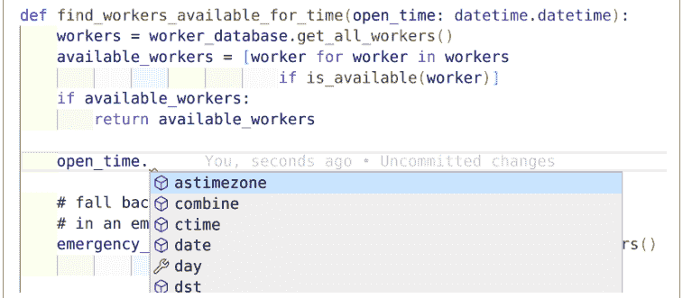

图3-1. VS Code显示自动补全

### 类型检查器

在整本书中，我一直在谈论类型如何传达意图，但遗漏了一个关键细节：如果程序员不愿意，没有人必须遵守这些类型注解。如果你的代码与类型注解相矛盾，这可能是一个错误，而你仍然依赖人类来捕获错误。我想做得更好。我想让计算机为我找到这类错误。

在第2章讨论动态类型时，我展示了这个代码片段：

```python
>>> a: int = 5
>>> a = "string"
>>> a
"string"
```

这里存在一个挑战：当你不能相信开发者会遵循类型注解的指导时，类型注解如何使你的代码库变得健壮？为了健壮，你希望你的代码经得起时间的考验。为此，你需要某种工具来检查你所有的类型注解，并标记出任何异常。这个工具叫做类型检查器。

类型检查器使类型注解从沟通方法转变为安全网。它是一种静态分析的形式。*静态分析工具*是运行在你的源代码上，完全不影响你的运行时的工具。你将在第20章了解更多关于静态分析工具的内容，但现在，我将只解释类型检查器。

首先，我需要安装一个。我将使用mypy，一个非常流行的类型检查器。

```bash
pip install mypy
```

现在我将创建一个名为*invalid_type.py*的文件，其中包含不正确的行为：

```python
a: int = 5
a = "string"
```

如果我在命令行上对那个文件运行mypy，我会得到一个错误：

```
mypy invalid_type.py

chapter3/invalid_type.py:2: error: Incompatible types in assignment
    (expression has type "str", variable has type
    "int")
Found 1 error in 1 file (checked 1 source file)
```

就这样，我的类型注解成为了抵御错误的第一道防线。每当你犯了一个错误并违背了作者的意图，类型检查器就会发现并提醒你。事实上，在大多数开发环境中，可以实时获得这种分析，在你输入时就通知你错误。（在不读取你思想的情况下，这已经是工具能尽早捕获错误的极限了，这相当不错。）

### 练习：找出错误

这里有一些更多mypy在我的代码中捕获错误的例子。我希望你查看每个代码片段中的错误，并计时你花了多长时间找到错误或放弃，然后检查片段下面列出的输出，看看你是否正确。

```python
def read_file_and_reverse_it(filename: str) -> str:
    with open(filename) as f:
        # Convert bytes back into str
        return f.read().encode("utf-8")[::-1]
```

以下是显示错误的mypy输出：

```
mypy chapter3/invalid_example1.py
chapter3/invalid_example1.py:3: error: Incompatible return value type
                                        (got "bytes", expected "str")
Found 1 error in 1 file (checked 1 source file)
```

哎呀，我返回的是bytes，而不是str。我调用了encode而不是decode，把返回类型搞混了。我甚至无法告诉你我在将Python 2.7代码迁移到Python 3时犯了多少次这个错误。感谢类型检查器。

这是另一个例子：

```python
# takes a list and adds the doubled values
# to the end
# [1,2,3] => [1,2,3,2,4,6]
def add_doubled_values(my_list: list[int]):
    my_list.update([x*2 for x in my_list])

add_doubled_values([1,2,3])
```

mypy错误如下：

```
mypy chapter3/invalid_example2.py
chapter3/invalid_example2.py:6: error: "list[int]" has no attribute "update"
Found 1 error in 1 file (checked 1 source file)
```

另一个我犯的无心之错，在列表上调用了update而不是extend。当在集合类型之间移动时（在这种情况下是从确实提供update方法的set，到不提供update方法的list），这类错误很容易发生。

最后一个例子来总结：

```python
# The restaurant is named differently
# in different parts of the world
def get_restaurant_name(city: str) -> str:
    if city in ITALY_CITIES:
        return "Trattoria Viaore"
    if city in GERMANY_CITIES:
        return "Pat's Kantine"
    if city in US_CITIES:
        return "Pat's Place"
    return None

if get_restaurant_name('Boston'):
    print("Location Found")
```

mypy错误如下：

```
chapter3/invalid_example3.py:14: error: Incompatible return value type
                                        (got "None", expected "str")
Found 1 error in 1 file (checked 1 source file)
```

这个很微妙。当期望一个字符串值时，我返回了None。如果所有代码只是像我上面那样有条件地检查餐厅名称来做决定，测试会通过，一切正常。即使对于负面情况也是如此，因为None在if语句中检查是完全可以的（它是假值）。这是Python动态类型回来咬我们的一个例子。

然而，几个月后，某个开发者会开始尝试将这个返回值用作字符串，一旦需要添加一个新城市，代码就开始尝试对None值进行操作，这会导致异常被引发。这不是很健壮；有一个潜在的代码错误正等着发生。但有了类型检查器，你可以停止担心这个，并尽早捕获这些错误。


有了类型检查器，你还需要测试吗？你当然需要。类型检查器捕获一类特定的错误：不兼容类型的错误。还有很多其他类别的错误你仍然需要测试。将类型检查器视为你错误识别工具库中的一个工具。

在所有这些例子中，类型检查器都发现了一个正等着发生的错误。无论这个错误是否会被测试、代码审查或客户捕获，都无关紧要；类型检查器更早地捕获它，这节省了时间和金钱。类型检查器开始给我们带来静态类型语言的好处，同时仍然允许Python运行时保持动态类型。这确实是两全其美。

在本章开头，你会找到Guido van Rossum的一句名言。在Dropbox工作时，他发现大型代码库在没有安全网的情况下举步维艰。他成为了推动类型提示进入语言的大力支持者。如果你想让你的代码传达意图并捕获错误，今天就开始采用类型注解和类型检查吧。


**讨论主题**

你的代码库是否曾出现过本可以被类型检查器捕获的错误？这些错误让你付出了多少代价？有多少次是代码审查或集成测试捕获了错误？那些进入生产环境的错误呢？

## 何时使用类型注解

现在，在你开始给所有东西添加类型之前，我需要谈谈成本。添加类型很简单，但可能做过头了。当用户尝试测试和试用代码时，他们可能会开始与类型检查器作斗争，因为他们觉得在编写所有类型注解时被拖累了。对于刚开始使用类型提示的用户来说，有一个采用成本。我也提到过我不会给所有东西都加类型注解。我不会注解我所有的变量，特别是当类型很明显的时候。我也通常不会为类中的每个小私有方法注解参数。

在Python 3.8及更早版本中，内置集合类型如list、dict和set不允许使用括号语法，如list[Cookbook]或dict[str,int]。相反，你需要使用typing模块中的类型注解：

```python
from typing import Dict, List
AuthorToCountMapping = Dict[str, int]
def count_author(
    cookbooks: List[Cookbook]
) -> AuthorToCountMapping:
    # ...
```

你也可以在需要时注解变量：

```python
workers: list[str] = find_workers_available_for_time(open_time)
numbers: list[int] = []
ratio: float = get_ratio(5,3)
```

虽然我会注解我所有的函数，但我通常不会费心去注解变量，除非我想在代码中传达一些特定的东西（比如一个与预期不同的类型）。我不想过于深入地在所有东西上都放类型注解的领域——缺乏冗长性正是吸引许多开发者使用Python的首要原因。类型会使你的代码变得杂乱，特别是当类型是显而易见的时候。

```python
number: int = 0
text: str = "useless"
values: list[float] = [1.2, 3.4, 6.0]
worker: Worker = Worker()
```

这些类型注解都没有提供比Python本身已经提供的更多价值。这段代码的读者知道"useless"是一个str。记住，类型注解用于类型提示；你是在为未来提供注释以改善沟通。你不需要在每个地方都陈述显而易见的事情。

### Python 3.5之前的类型注解

如果你不幸无法使用更高版本的Python，希望并未破灭。对于Python 2.7，也有类型注解的替代语法。

要编写注解，你需要在注释中这样做：

```python
ratio = get_ratio(5,3) # type: float
def get_workers(open): # type: (datetime.datetime) -> List[str]
```

这更容易被忽略，因为类型在视觉上并不靠近变量本身。如果你有能力升级到Python 3.5，考虑这样做并使用更新的类型注解方法。

何时应该使用类型检查器？

- 当你期望其他模块或用户调用函数时（例如，公共 API、库入口点等）
- 当你想强调某个类型很复杂（例如，字符串映射到对象列表的字典）或不直观时
- 在 mypy 报错需要类型的地方（通常是在赋值给空集合时——顺应工具比对抗它更容易）

类型检查器会为它能推断的所有值推断类型，因此即使你没有填写所有类型，你仍然能受益。我将在[第 6 章](Chapter 6)介绍如何配置类型检查器。

## 结束语

当类型提示被引入时，Python 社区曾感到震惊。开发者担心 Python 正在变成像 Java 或 C++ 那样的静态类型语言。他们担心到处添加类型会拖慢他们的速度，并破坏他们所钟爱的动态类型语言的优势。

然而，类型提示仅仅是提示。它们完全是可选的。我不推荐在小型脚本或任何不会长期存在的代码中使用它们。但如果你的代码需要长期维护，类型提示是无价的。它们作为一种沟通方式，让你的环境更智能，并在与类型检查器结合时检测错误。它们保护了原始作者的意图。在标注类型时，你减轻了读者理解代码的负担。你减少了阅读函数实现以了解其功能的需要。代码是复杂的，你应该尽量减少开发者需要阅读的代码量。通过使用深思熟虑的类型，你减少了意外并提高了阅读理解能力。

类型检查器也是信心的建立者。记住，为了让你的代码健壮，它必须易于更改、重写和在需要时删除。类型检查器可以让开发者更少担忧地做到这一点。如果某些东西依赖于被更改或删除的类型或字段，类型检查器会将有问题的代码标记为不兼容。自动化工具使你和未来的合作者的工作更简单；更少的错误会进入生产环境，功能也会更快交付。

在下一章中，你将超越基本类型注解，学习如何构建一个全新的类型词汇表。这些类型将帮助你约束代码库中的行为，限制出错的方式。我仅仅触及了类型注解有用性的皮毛。

# 第 4 章
## 约束类型

许多开发者学习了基本类型注解就到此为止了。但我们远未完成。有大量高级类型注解是无价的。这些高级类型注解允许你约束类型，进一步限制它们可以表示的内容。你的目标是使非法状态无法表示。开发者应该在物理上无法创建在你的系统中矛盾或无效的类型。如果不可能首先创建错误，你的代码中就不会有错误。你可以使用类型注解来实现这个目标，节省时间和金钱。在本章中，我将教你六种不同的技术：

- **Optional**
  用于替换代码库中的 None 引用。
- **Union**
  用于表示类型的选择。
- **Literal**
  用于将开发者限制在非常具体的值。
- **Annotated**
  用于提供类型的额外描述。
- **NewType**
  用于将类型限制在特定上下文中。
- **Final**
  用于防止变量被重新绑定到新值。

让我们从使用 Optional 类型处理 None 引用开始。

## Optional 类型

空引用通常被称为“十亿美元的错误”，由 C.A.R. Hoare 提出：

> 我称之为我的十亿美元错误。这是 1965 年空引用的发明。当时，我正在为面向对象语言中的引用设计第一个全面的类型系统。我的目标是确保所有引用的使用都应该是绝对安全的，由编译器自动执行检查。但我忍不住诱惑加入了空引用，仅仅因为它太容易实现了。这导致了无数的错误、漏洞和系统崩溃，在过去四十年里可能造成了十亿美元的痛苦和损失。¹

虽然空引用始于 Algol，但它们会渗透到无数其他语言中。C 和 C++ 经常因空指针解引用（导致段错误或其他程序停止崩溃）而受到嘲笑。Java 以要求用户在代码中捕获 NullPointerException 而闻名。毫不夸张地说，这类错误的代价高达数十亿美元。想想由于意外的空指针或引用而导致的开发时间、客户流失和系统故障。

那么，为什么这在 Python 中很重要？Hoare 的引言是关于 60 年代面向对象的编译语言；Python 现在一定更好了，对吧？我很遗憾地告诉你，这个十亿美元的错误在 Python 中也存在。它以不同的名字出现在我们面前：None。我将向你展示一种避免代价高昂的 None 错误的方法，但首先，让我们谈谈为什么 None 如此糟糕。


Hoare 承认空引用是出于方便而诞生的，这一点尤其具有启发性。它向你展示了选择捷径如何在开发周期的后期导致各种痛苦。想想你今天的短期决策将如何对明天的维护产生不利影响。

让我们考虑一些运行自动热狗摊的代码。我希望我的系统拿一个面包，把香肠放进面包里，然后通过自动分配器挤上番茄酱和芥末酱，如图 4-1 所述。会出什么问题？


图 4-1. 自动热狗摊的工作流程

¹ C.A.R. Hoare, “Null References: The Billion Dollar Mistake,” *Historically Bad Ideas*. 在 Qcon London 2009 上发表，日期不详。

```python
def create_hot_dog():
    bun = dispense_bun()
    frank = dispense_frank()
    hot_dog = bun.add_frank(frank)
    ketchup = dispense_ketchup()
    mustard = dispense_mustard()
    hot_dog.add_condiments(ketchup, mustard)
    dispense_hot_dog_to_customer(hot_dog)
```

非常直接，不是吗？不幸的是，没有办法真正确定。很容易想到快乐路径，或者程序在一切正常时的控制流，但谈到健壮的代码时，你需要考虑错误条件。如果这是一个没有人工干预的自动摊位，你能想到哪些错误？

以下是我能想到的错误列表（不全面）：

- 原料用完（面包、热狗或番茄酱/芥末酱）。
- 订单在过程中被取消。
- 调味品卡住。
- 电源中断。
- 客户不想要番茄酱或芥末酱，并在过程中试图移动面包。
- 竞争对手将番茄酱换成番茄沙司；混乱随之而来。

现在，你的系统是最先进的，它会检测所有这些情况，但它通过在任何一步失败时返回 None 来做到这一点。这对这段代码意味着什么？你开始看到如下错误：

```
Traceback (most recent call last):
  File "<stdin>", line 4, in <module>
AttributeError: 'NoneType' object has no attribute 'add_frank'

Traceback (most recent call last):
  File "<stdin>", line 7, in <module>
AttributeError: 'NoneType' object has no attribute 'add_condiments'
```

如果这些错误冒泡到你的客户那里，那将是灾难性的；你以干净的 UI 为荣，不希望丑陋的回溯污染你的界面。为了解决这个问题，你开始*防御性*编码，或者以一种试图预见每种可能的错误情况并加以考虑的方式编码。防御性编程是件好事，但它会导致这样的代码：

def create_hot_dog():
    bun = dispense_bun()
    if bun is None:
        print_error_code("面包不可用。请检查面包")
        return

    frank = dispense_frank()
    if frank is None:
        print_error_code("香肠未正确分配")
        return

    hot_dog = bun.add_frank(frank)
    if hot_dog is None:
        print_error_code("热狗不可用。请检查热狗")
        return

    ketchup = dispense_ketchup()
    mustard = dispense_mustard()
    if ketchup is None or mustard is None:
        print_error_code("请检查无效的调味品")
        return

    hot_dog.add_condiments(ketchup, mustard)
    dispense_hot_dog_to_customer(hot_dog)

这感觉，嗯，很繁琐。因为在 Python 中任何值都可能是 `None`，看起来你需要进行防御性编程，在每次解引用前都进行 `is None` 检查。这有点过头了；大多数开发者会追踪调用栈，确保没有 `None` 值返回给调用者。这就只剩下对外部系统的调用，以及代码库中少数几个你总是需要用 `None` 检查来包装的调用。这很容易出错；你不能指望每个接触你代码库的开发者都本能地知道在哪里检查 `None`。此外，你最初编写代码时的假设（例如，这个函数永远不会返回 `None`）在未来可能会被打破，现在你的代码就有了一个 bug。问题就在这里：依赖手动干预来捕获错误情况是不可靠的。

## 异常

解决这个价值十亿美元问题的一个勇敢尝试是异常。当你的系统中任何地方出错时，就抛出一个异常！当异常被抛出时，该函数停止执行，异常会沿着调用链向上传递，直到 a) 某段代码在适当的 `except` 块中捕获它，或者 b) 没人捕获它，它终止程序。这并不能解决你的健壮性问题。你仍然依赖手动干预来捕获错误（通过某人编写适当的 `except` 块）。如果这种手动干预没有应用，程序就会崩溃，用户会体验糟糕。

这不应该感到意外；解引用 `None` 值会抛出异常，所以这是完全相同的行为。为了能够通过静态分析检测异常，你通常需要语言支持受检异常：作为你类型签名一部分的异常，告诉你的静态分析工具应该期望哪些异常。在撰写本文时，Python 不支持任何类型的受检异常，我怀疑它将来也不会支持，因为受检异常的冗长性和传染性。

这并不是说不要使用异常。将它们用于你不期望发生但仍然希望防范的异常情况，例如网络中断。不要将异常用于正常行为，例如在列表中搜索时找不到元素。记住，返回值可以通过类型来强制，但异常不能。

这之所以如此棘手（且代价高昂），是因为 `None` 被视为一个特殊情况。它存在于正常的类型层次结构之外。每个变量都可以被赋值为 `None`。为了对抗这一点，你需要找到一种在类型层次结构中表示 `None` 的方法。你需要 Optional 类型。

Optional 类型为你提供了两种选择：要么你有一个值，要么你没有。换句话说，将变量设置为值是可选的。

```python
from typing import Optional
maybe_a_string: Optional[str] = "abcdef" # 这有一个值
maybe_a_string: Optional[str] = None     # 这是值的缺失
```

这段代码表明变量 `maybe_a_string` 可能可选地包含一个字符串。无论 `maybe_a_string` 包含 "abcdef" 还是 `None`，这段代码都能通过类型检查。

乍一看，这似乎没什么用。你仍然需要使用 `None` 来表示值的缺失。不过，我有个好消息。我将 Optional 类型与三个好处联系起来。

首先，你更清晰地传达了你的意图。如果开发者在类型签名中看到 Optional 类型，他们会将其视为一个巨大的危险信号，表明他们应该预期 `None` 是一种可能性。

```python
def dispense_bun() -> Optional[Bun]:
    # ...
```

如果你注意到一个函数返回 Optional 值，请注意并检查 `None` 值。

其次，你能够进一步区分值的缺失和空值。考虑这个无害的列表。如果你进行一个函数调用并收到一个空列表，会发生什么？是只是没有结果返回给你？还是发生了错误，你需要采取明确的行动？如果你收到一个原始列表，不深入研究源代码你是不知道的。然而，如果你使用 Optional，你传达的是以下三种可能性之一：

*一个包含元素的列表*
    要操作的有效数据

*一个不包含元素的列表*
    没有发生错误，但没有可用数据（前提是“没有数据”不是一种错误情况）

`None`
    发生了你需要处理的错误

最后，类型检查器可以检测 Optional 类型，并确保你不会让 `None` 值溜走。

考虑：

```python
def dispense_bun() -> Bun:
    return Bun('Wheat')
```

让我们给这段代码添加一些错误情况：

```python
def dispense_bun() -> Bun:
    if not are_buns_available():
        return None
    return Bun('Wheat')
```

当使用类型检查器运行时，你会得到以下错误：

```
code_examples/chapter4/invalid/dispense_bun.py:12:
    error: Incompatible return value type (got "None", expected "Bun")
```

太棒了！类型检查器默认不允许你返回 `None` 值。通过将返回类型从 `Bun` 更改为 `Optional[Bun]`，代码将成功通过类型检查。这将给开发者提示，他们不应该在没有将信息编码到返回类型中的情况下返回 `None`。你可以捕获一个常见的错误，并使这段代码更加健壮。但是调用代码呢？

事实证明，调用代码也从中受益。考虑：

```python
def create_hot_dog():
    bun = dispense_bun()
    frank = dispense_frank()
    hot_dog = bun.add_frank(frank)
    ketchup = dispense_ketchup()
    mustard = dispense_mustard()
    hot_dog.add_condiments(ketchup, mustard)
    dispense_hot_dog_to_customer(hot_dog)
```

如果 `dispense_bun` 返回一个 Optional，这段代码将无法通过类型检查。它会抱怨以下错误：

```
code_examples/chapter4/invalid/hotdog_invalid.py:27:
    error: Item "None" of "Optional[Bun]" has no attribute "add_frank"
```


根据你的类型检查器，你可能需要专门启用一个选项来捕获这类错误。务必查阅你的类型检查器文档，了解有哪些可用选项。如果有一个你绝对想捕获的错误，你应该测试你的类型检查器是否确实捕获了该错误。我强烈建议专门测试 Optional 行为。对于我运行的 mypy 版本（0.800），我必须使用 `--strict-optional` 作为命令行标志来捕获此错误。

如果你想让类型检查器静默，你需要显式地检查 `None` 并处理 `None` 值，或者断言该值不可能是 `None`。以下代码成功通过类型检查：

```python
def create_hot_dog():
    bun = dispense_bun()
    if bun is None:
        print_error_code("面包无法分配")
        return

    frank = dispense_frank()
    hot_dog = bun.add_frank(frank)
    ketchup = dispense_ketchup()
    mustard = dispense_mustard()
    hot_dog.add_condiments(ketchup, mustard)
    dispense_hot_dog_to_customer(hot_dog)
```

`None` 值确实是一个价值十亿美元的错误。如果它们溜走，程序可能会崩溃，用户会感到沮丧，金钱会损失。使用 Optional 类型来告诉其他开发者小心 `None`，并从你的工具的自动检查中受益。


**讨论主题**

你在代码库中多久处理一次 `None`？你对每个可能的 `None` 值都得到正确处理有多大信心？查看错误和失败的测试，看看你有多少次被不正确的 `None` 处理所困扰。讨论 Optional 类型将如何帮助你的代码库。

# 联合类型

联合类型是一种类型，表示多个不同的类型可以用于同一个变量。`Union[int,str]` 意味着一个变量可以使用 `int` 或 `str`。例如，考虑以下代码：

def dispense_snack() -> HotDog:
    if not are_ingredients_available():
        raise RuntimeError("Not all ingredients available")
    if order_interrupted():
        raise RuntimeError("Order interrupted")
    return create_hot_dog()

现在，我希望我的热狗摊能进军利润丰厚的椒盐卷饼生意。与其试图处理热狗和椒盐卷饼之间并不适用的奇怪类继承关系（我们将在第二部分更详细地介绍继承），你只需返回两者的联合类型即可。

```python
from typing import Union
def dispense_snack(user_input: str) -> Union[HotDog, Pretzel]:
    if user_input == "Hot Dog":
        return dispense_hot_dog()
    elif user_input == "Pretzel":
        return dispense_pretzel()
    raise RuntimeError("Should never reach this code,"
                       "as an invalid input has been entered")
```


使用联合类型（Union）带来的好处与可选类型（Optional）非常相似。首先，你获得了同样的沟通优势。遇到联合类型的开发者知道，他们必须在调用代码中处理不止一种类型。此外，类型检查器对联合类型的感知与对可选类型的感知一样清晰。

你会发现联合类型在各种应用中都很有用：

-   处理根据用户输入返回的不同类型（如上所示）
-   处理类似可选类型的错误返回类型，但包含更多信息，例如字符串或错误代码
-   处理不同的用户输入（例如，如果用户可以提供列表或字符串）
-   返回不同类型，例如为了向后兼容（根据请求的操作返回对象的旧版本或新版本）
-   以及任何你可能合法地拥有多个值表示的其他情况

假设你有一段代码调用了 `dispense_snack` 函数，但只期望返回一个 `HotDog`（或 `None`）：

```python
from typing import Union
def place_order() -> Optional[HotDog]:
    order = get_order()
    result = dispense_snack(order.name)
    if result is None:
        print_error_code("An error occurred" + result)
        return None
    # Return our HotDog
    return result
```

一旦 `dispense_snack` 开始返回椒盐卷饼（Pretzels），这段代码就无法通过类型检查。

```
code_examples/chapter4/invalid/union_hotdog.py:22:
    error: Incompatible return value type (got "Union[HotDog, Pretzel]",
                                        expected "Optional[HotDog]")
```

类型检查器在这种情况下报错是件极好的事。如果你依赖的任何函数改为返回新类型，其返回签名必须更新为联合新类型，这迫使你更新代码以处理新类型。这意味着当你的依赖项以与你的假设相矛盾的方式发生变化时，你的代码会被标记出来。通过你今天做出的决定，你可以在未来捕获错误。这是健壮代码的标志；你正在让开发者越来越难以犯错，从而降低他们的错误率，减少用户将遇到的 bug 数量。

使用联合类型还有一个根本性的好处，但要解释它，我需要教你一点*类型理论*，这是围绕类型系统的一个数学分支。

## 积类型与和类型

联合类型之所以有益，是因为它们有助于约束可表示的状态空间。*可表示的状态空间*是对象可以采取的所有可能组合的集合。

看这个数据类：

```python
from dataclasses import dataclass
# If you aren't familiar with data classes, you'll learn more in chapter 10
# but for now, treat this as four fields grouped together and what types they are
@dataclass
class Snack:
    name: str
    condiments: set[str]
    error_code: int
    disposed_of: bool
```

```python
Snack("Hotdog", {"Mustard", "Ketchup"}, 5, False)
```

我有一个名称、可以添加的调味品、一个出错时的错误代码，以及如果确实出错，一个用于跟踪我是否已正确处理该物品的布尔值。这个字典中可以放入多少种不同的值组合？可能是无限多种，对吧？仅名称一项，就可能是从有效值（“hotdog”或“pretzel”）到无效值（“samosa”、“kimchi”或“poutine”）再到荒谬值（“12345”、“”或“(╯°□°)╯︵ ┻━┻”）的任何东西。调味品也有类似的问题。就目前而言，无法计算可能的选项。

为了简单起见，我将人为地约束这个类型：

-   名称可以是三个值之一：热狗（hotdog）、椒盐卷饼（pretzel）或素食汉堡（veggie burger）
-   调味品可以为空、芥末、番茄酱，或两者兼有。
-   有六个错误代码（0–5）；0 表示成功。
-   `disposed_of` 只能是 `True` 或 `False`。

现在，这个字段组合可以表示多少种不同的值？答案是 144，这是一个相当大的数字。我通过以下方式得出：

3 种可能的名称类型 × 4 种可能的调味品类型 × 6 个错误代码 × 2 个布尔值（表示条目是否已处理）= 3×4×6×2 = 144。

如果你接受这些值中的任何一个都可能是 `None`，总数将膨胀到 420。虽然在编码时你应该始终考虑 `None`（参见本章前面关于可选类型的部分），但在这个思维练习中，我将忽略 `None` 值。

这种操作被称为*积类型*；可表示状态的数量由可能值的乘积决定。问题是，并非所有这些状态都是有效的。变量 `disposed_of` 应该仅在错误代码设置为非零时才设置为 `True`。开发者会做出这个假设，并相信非法状态永远不会出现。然而，一个无辜的错误可能会导致你的整个系统崩溃。考虑以下代码：

```python
def serve(snack):
    # if something went wrong, return early
    if snack.disposed_of:
        return
    # ...
```

在这种情况下，开发者在检查 `disposed_of` 之前没有先检查非零错误代码。这是一个等待发生的逻辑炸弹。只要 `disposed_of` 为 `True` *且* 错误代码为非零，这段代码就能完全正常工作。如果一个有效的零食错误地将 `disposed_of` 标志设置为 `True`，这段代码将开始产生无效结果。这可能很难发现，因为创建零食的开发者没有理由检查这段代码。就目前而言，除了手动检查每个用例之外，你无法捕获此类错误，这对于大型代码库来说是难以处理的。通过允许非法状态被表示，你为脆弱的代码打开了大门。

为了补救这一点，我需要使这种非法状态无法表示。为此，我将重新设计我的示例并使用联合类型：

```python
from dataclasses import dataclass
from typing import Union
@dataclass
class Error:
    error_code: int
    disposed_of: bool

@dataclass
class Snack:
    name: str
    condiments: set[str]

snack: Union[Snack, Error] = Snack("Hotdog", {"Mustard", "Ketchup"})

snack = Error(5, True)
```

在这种情况下，`snack` 可以是 `Snack`（仅包含名称和调味品）或 `Error`（仅包含一个数字和一个布尔值）。使用联合类型后，现在有多少可表示的状态？

对于 `Snack`，有 3 个名称和 4 种可能的列表值，总共 12 个可表示状态。对于 `ErrorCode`，我可以移除错误代码 0（因为那仅用于成功），这给了我 5 个错误代码值和 2 个布尔值，总共 10 个可表示状态。由于联合类型是一种“或”结构，我可以在一种情况下拥有 12 个可表示状态，或在另一种情况下拥有 10 个，总共 22 个。这是一个*和类型*的例子，因为我将可表示状态的数量相加而不是相乘。

总共 22 个可表示状态。与所有字段都归入单个实体时的 144 个状态相比。我将可表示状态空间减少了近 85%。我使得混合和匹配彼此不兼容的字段变得不可能。犯错变得更加困难，需要测试的组合也少得多。每当你使用和类型（如联合类型）时，你都在显著减少可能的可表示状态数量。

## 字面量类型

在计算可表示状态的数量时，我在上一节做了一些假设。我限制了可能的值的数量，但这有点作弊，不是吗？正如我之前所说，可能的值几乎是无限的。幸运的是，有一种方法可以通过 Python 限制这些值：字面量（Literals）。字面量类型允许你将变量限制在非常特定的值集合中。

我将更改我之前的 `Snack` 类以使用字面量值：

## 注解类型

如果我想更进一步，指定更复杂的约束条件呢？编写数百个字面量会很繁琐，而且有些约束无法通过字面量类型来建模。字面量无法将字符串限制为特定长度或匹配特定正则表达式。这时就需要用到`Annotated`。通过`Annotated`，你可以在类型注解旁指定任意元数据。

```python
x: Annotated[int, ValueRange(3,5)]
y: Annotated[str, MatchesRegex('[0-9]{4}')]
```

遗憾的是，上述代码无法运行，因为`ValueRange`和`MatchesRegex`不是内置类型；它们是任意表达式。你需要自己编写元数据作为`Annotated`变量的一部分。其次，目前没有工具能为你进行类型检查。在工具出现之前，你最多只能编写伪注解或用字符串描述约束。此时，`Annotated`最好作为沟通工具使用。

## NewType

在等待工具支持`Annotated`的同时，还有另一种方式来表示更复杂的约束：`NewType`。`NewType`允许你创建一个新类型。

假设我想将热狗摊的代码分为两种情况处理：未准备好供应的热狗（没有盘子、没有餐巾纸）和准备好供应的热狗（装盘、配有餐巾纸）。在我的代码中，有些函数应该只处理其中一种情况的热狗。例如，未准备好供应的热狗绝不应交给顾客。

```python
class HotDog:
    # ... 省略热狗类实现 ...

def dispense_to_customer(hot_dog: HotDog):
    # 注意，此函数应只接受准备好供应的热狗。
    # ...
```

然而，没有任何机制阻止有人传入未准备好供应的热狗。如果开发者犯错，将未准备好供应的热狗传给此函数，顾客会惊讶地发现机器只吐出了他们的订单，没有盘子或餐巾纸。

与其依赖开发者在错误发生时捕捉它们，你需要让类型检查器来捕捉。为此，你可以使用`NewType`：

```python
from typing import NewType

class HotDog:
    '''用于表示未准备好供应的热狗'''
    # ... 省略热狗类实现 ...

ReadyToServeHotDog = NewType("ReadyToServeHotDog", HotDog)

def dispense_to_customer(hot_dog: ReadyToServeHotDog):
    # ...
```

`NewType`接受一个现有类型，并创建一个全新的类型，该类型具有与现有类型相同的所有字段和方法。在这个例子中，我创建了一个与`HotDog`不同的`ReadyToServeHotDog`类型；它们不可互换。其美妙之处在于，此类型限制了隐式类型转换。你不能在任何期望`ReadyToServeHotDog`的地方使用`HotDog`（但可以在期望`HotDog`的地方使用`ReadyToServeHotDog`）。在前面的例子中，我将`dispense_to_customer`限制为只接受`ReadyToServeHotDog`值作为参数。这防止了开发者破坏假设。如果开发者将`HotDog`传给此方法，类型检查器会报错：

```
code_examples/chapter4/invalid/newtype.py:10: error:
    Argument 1 to "dispense_to_customer"
    has incompatible type "HotDog";
    expected "ReadyToServeHotDog"
```

必须强调这种类型转换的单向性。作为开发者，你可以控制旧类型何时变为新类型。

例如，我将创建一个函数，接受未准备好供应的`HotDog`并使其准备好供应：

```python
def prepare_for_serving(hot_dog: HotDog) -> ReadyToServeHotDog:
    assert not hot_dog.is_plated(), "热狗不应已装盘"
    hot_dog.put_on_plate()
    hot_dog.add_napkins()
    return ReadyToServeHotDog(hot_dog)
```

注意我如何显式返回`ReadyToServeHotDog`而不是普通的`HotDog`。这充当了一个“受认可”的函数；这是我希望开发者创建`ReadyToServeHotDog`的唯一授权方式。任何尝试使用接受`ReadyToServeHotDog`的方法的用户都需要先使用`prepare_for_serving`来创建它。

重要的是要通知用户，创建新类型的唯一方式是通过一组“受认可”的函数。你不希望用户在预定方法之外的任何情况下创建你的新类型，因为这违背了初衷。

```python
def make_snack():
    serve_to_customer(ReadyToServeHotDog(HotDog()))
```

遗憾的是，Python 除了注释外，没有很好的方式来告知用户这一点。

```python
from typing import NewType
# 注意：仅使用 prepare_for_serving 方法创建 ReadyToServeHotDog。
ReadyToServeHotDog = NewType("ReadyToServeHotDog", HotDog)
```

尽管如此，`NewType`适用于许多现实场景。例如，以下是我遇到过的`NewType`可以解决的所有场景：

- 将`str`与`SanitizedString`分开，以捕获SQL注入漏洞等错误。通过将`SanitizedString`设为`NewType`，我确保只有经过适当清理的字符串才会被操作，消除了SQL注入的可能性。
- 分别跟踪`User`对象和`LoggedInUser`。通过使用`NewType`限制`User`与`LoggedInUser`，我编写了仅适用于已登录用户的函数。
- 跟踪应表示有效用户ID的整数。通过将用户ID限制为`NewType`，我可以确保某些函数只操作有效的ID，而无需检查`if`语句。

在第10章中，你将看到如何使用类和不变式来实现非常相似的功能，并提供更强的避免非法状态的保证。然而，`NewType`仍然是一个值得了解的有用模式，并且比完整的类轻量得多。

### 类型别名

`NewType`与类型别名不同。类型别名只是为类型提供另一个名称，并且与旧类型完全可互换。

例如：

```python
IdOrName = Union[str, int]
```

如果一个函数期望`IdOrName`，它可以接受`IdOrName`或`Union[str, int]`，类型检查都会通过，而`NewType`只有在传入`IdOrName`时才有效。

我发现当我开始嵌套复杂类型时，类型别名非常有用，例如`Union[dict[int, User], list[dict[str, User]]]`。给它一个概念性名称，如`IdOrNameLookup`，可以简化类型。

## Final 类型

最后（双关语），你可能想限制一个类型不能更改其值。这就是`Final`的用武之地。`Final`在Python 3.8中引入，向类型检查器表明变量不能被绑定到另一个值。例如，我想开始特许经营我的热狗摊，但不希望名称被意外更改。

```python
VENDOR_NAME: Final = "Viafore's Auto-Dog"
```

如果开发者后来意外更改了名称，他们会看到错误。

```python
def display_vendor_information():
    vendor_info = "Auto-Dog v1.0"
    # 糟糕，复制粘贴错误，此代码应为 vendor_info += VENDOR_NAME
    VENDOR_NAME += VENDOR_NAME
    print(vendor_info)
```

```
code_examples/chapter4/invalid/final.py:3: error:
    Cannot assign to final name "VENDOR_NAME"
Found 1 error in 1 file (checked 1 source file)
```

通常，当变量的作用域跨越大量代码（例如一个模块）时，`Final` 是最佳选择。在如此大的作用域中，开发者很难跟踪变量的所有使用情况；让类型检查器来捕获不可变性保证，在这些情况下是一大福音。

通过函数修改对象时，`Final` 不会报错。它只阻止变量被重新绑定（设置为新值）。

## 结语

在本章中，你已经了解了许多不同的方式来约束你的类型。它们都有特定的用途，从使用 `Optional` 处理 `None`，到使用 `Literal` 限制为特定值，再到使用 `Final` 防止变量被重新绑定。通过使用这些技术，你将能够将假设和限制直接编码到你的代码库中，防止未来的读者需要猜测你的逻辑。类型检查器将使用这些高级类型注解为你提供关于代码的更严格保证，这将使维护者在处理你的代码库时充满信心。有了这种信心，他们会犯更少的错误，你的代码库也会因此变得更加健壮。

在下一章中，你将从为单个值添加类型注解，转向学习如何正确地注解集合类型。集合类型遍布 Python 的大部分领域；你也必须注意表达你对它们的意图。你需要精通所有表示集合的方式，包括在必须创建自己的集合的情况下。

# 第五章
## 集合类型

在 Python 中，你无法走得很远而不遇到*集合类型*。集合类型存储一组数据，例如用户列表或餐厅与地址之间的查找关系。而其他类型（例如 int、float、bool 等）可能专注于单个值，集合可以存储任意数量的数据。在 Python 中，你会遇到常见的集合类型，如字典、列表和集合（天哪！）。甚至字符串也是一种集合类型；它包含一系列字符。然而，在阅读新代码时，集合可能难以理解。不同的集合类型有不同的行为。

回到第一章，我讨论了集合之间的一些差异，谈到了可变性、可迭代性和索引要求。然而，选择正确的集合只是第一步。你必须理解你的集合的含义，并确保用户能够理解它。你还需要认识到标准集合类型何时不够用，你需要自己创建。但第一步是知道如何将你的集合选择传达给未来。为此，我们将求助于一位老朋友：类型注解。

## 注解集合

我已经介绍了非集合类型的类型注解，现在你需要知道如何注解集合类型。幸运的是，这些注解与你已经学过的注解没有太大区别。

为了说明这一点，假设我正在构建一个数字食谱应用。我想将我所有的食谱数字化组织起来，以便我可以按菜系、食材或作者进行搜索。关于食谱集合，我可能有的一个问题是我有多少本来自每位作者的书：

```python
def create_author_count_mapping(cookbooks: list) -> dict:
    counter = defaultdict(lambda: 0)
    for book in cookbooks:
        counter[book.author] += 1
    return counter
```

这个函数已经注解了；它接收一个食谱列表并返回一个字典。不幸的是，虽然这告诉了我期望什么集合，但它完全没有告诉我如何使用这些集合。没有任何信息告诉我集合内部的元素是什么。例如，我怎么知道食谱的类型是什么？如果你正在审查这段代码，你怎么知道使用 `book.author` 是合法的？即使你深入挖掘以确保 `book.author` 是正确的，这段代码也不是面向未来的。如果底层类型发生变化，例如删除了作者字段，这段代码就会中断。我需要一种方法来用我的类型检查器捕获这一点。

我将通过使用方括号语法来编码更多信息，以指示集合*内部*的类型信息：

```python
AuthorToCountMapping = dict[str, int]
def create_author_count_mapping(
    cookbooks: list[Cookbook]
) -> AuthorToCountMapping:
    counter = defaultdict(lambda: 0)
    for book in cookbooks:
        counter[book.author] += 1
    return counter
```

我使用了一个别名 `AuthorToCountMapping` 来表示 `dict[str, int]`。我这样做是因为我发现有时很难记住 `str` 和 `int` 应该代表什么。然而，我承认这会丢失一些信息（代码的读者必须找出 `AuthorToCountMapping` 是什么的别名）。理想情况下，你的代码编辑器可以显示底层类型，而无需你去查找。

我可以指出集合中期望的确切类型。`cookbooks` 列表包含 `Cookbook` 对象，函数的返回值返回一个将字符串（键）映射到整数（值）的字典。注意，我使用了一个类型别名来为我的返回值赋予更多含义。从 `str` 到 `int` 的映射并没有告诉用户类型的上下文。相反，我创建了一个名为 `AuthorToCountMapping` 的类型别名，以清楚地表明这个字典如何与问题领域相关。

你需要思考集合中包含哪些类型，以便有效地进行类型提示。为此，你需要考虑同构集合和异构集合。

## 同构集合与异构集合

同构集合是每个值都具有相同类型的集合。相比之下，异构集合中的值可能具有不同的类型。从可用性的角度来看，你的列表、集合和字典几乎总是应该是同构的。用户需要一种方法来理解你的集合，如果他们没有每个值都是相同类型的保证，他们就无法做到这一点。如果你将列表、集合或字典设为异构集合，你就是在向用户表明他们需要注意处理特殊情况。假设我想从第一章中复活一个例子，用于在我的食谱应用中调整食谱：

```python
def adjust_recipe(recipe, servings):
    """
    接收一个餐食食谱并更改份数
    :param recipe: 一个列表，其中第一个元素是份数，
                   其余元素遵循 (名称, 数量, 单位)
                   格式，例如 ("flour", 1.5, "cup")
    :param servings: 份数
    :return list: 一个新的食材列表，其中第一个元素是
                  份数
    """
    new_recipe = [servings]
    old_servings = recipe[0]
    factor = servings / old_servings
    recipe.pop(0)
    while recipe:
        ingredient, amount, unit = recipe.pop(0)
        # 请只使用易于测量的数字
        new_recipe.append((ingredient, amount * factor, unit))
    return new_recipe
```

当时，我提到这段代码的某些部分很丑陋；一个令人困惑的因素是食谱列表的第一个元素是一个特殊情况：一个代表份数的整数。这与列表的其余元素形成对比，其余元素是代表实际食材的元组，例如 ("flour", 1.5, "cup")。这突出了异构集合的麻烦。对于集合的每一次使用，用户都需要记住处理特殊情况。这基于开发者首先知道特殊情况的假设。目前没有办法表示某个特定元素需要被区别对待。因此，当开发者忘记时，类型检查器不会捕获。这会导致未来的代码变得脆弱。

在讨论同构性时，谈论单一类型意味着什么很重要。当我提到单一类型时，我并不一定指 Python 中的具体类型；相反，我指的是定义该类型的一组行为。单一类型表明消费者必须以完全相同的方式操作该类型的每个值。对于食谱列表，单一类型是 `Cookbook`。对于字典例如，键的单一类型是字符串，值的单一类型是整数。对于异构集合，情况并非总是如此。如果你必须在集合中包含不同类型且它们之间没有关联，该怎么办？

思考一下我在第1章中那段糟糕代码所传达的信息：

```python
def adjust_recipe(recipe, servings):
    """
    Take a meal recipe and change the number of servings
    :param recipe: A list, where the first element is the number of servings,
                   and the remainder of elements follow the (name, amount, unit)
                   format, such as ("flour", 1.5, "cup")
    :param servings: the number of servings
    :return list: a new list of ingredients, where the first element is the
                  number of servings
    """
    # ...
```

文档字符串中包含大量信息，但文档字符串无法保证其正确性。如果开发者意外破坏了假设，它们也无法提供保护。这段代码未能向未来的协作者充分传达意图。未来的协作者将无法理解你的代码。你最不想让他们承担的负担，就是必须遍历代码库，寻找调用和实现，以弄清楚如何使用你的集合。最终，你需要一种方法来协调第一个元素（一个整数）与列表中的其余元素（元组）。为了解决这个问题，我将使用一个联合类型（以及一些类型别名以提高代码可读性）：

```python
Ingredient = tuple[str, int, str] # (name, quantity, units)
Recipe = list[Union[int, Ingredient]] # the list can be servings or ingredients
def adjust_recipe(recipe: Recipe, servings):
    # ...
```

这处理了一个异构集合（项目可以是整数或成分），并允许开发者像处理同构集合一样来推理该集合。开发者需要将每个值都视为相同类型——它要么是整数，要么是`Ingredient`——然后才能对其进行操作。虽然需要更多代码来处理类型检查，但你可以更放心，因为类型检查器会捕获用户未检查特殊情况的情况。请记住，这绝非完美；如果根本没有特殊情况，并且份量数以其他方式传递给函数，那会更好。但对于那些你绝对必须处理特殊情况的情况，将它们表示为一种类型，以便类型检查器能为你所用。

> 当异构集合足够复杂，以至于涉及大量散布在代码库中的验证逻辑时，考虑将它们设为用户定义的类型，例如数据类或类。有关创建用户定义类型的更多信息，请参阅第二部分。

不过，你不能在联合类型中添加太多类型。你处理的类型特殊情况越多，开发者每次使用该类型时需要编写的代码就越多，代码库也会变得越笨重。

在光谱的另一端是`Any`类型。`Any`可用于表示在此上下文中所有类型都是有效的。这听起来很吸引人，可以绕过特殊情况，但它也意味着你的集合的使用者完全不知道如何处理集合中的值，这违背了类型注解的初衷。


使用静态类型语言的开发者不需要像这样费心确保集合是同构的；静态类型系统已经为他们做到了这一点。Python中的挑战源于其动态类型特性。开发者更容易创建一个异构集合，而语言本身不会发出任何警告。

异构集合类型仍然有很多用途；不要因为同构集合更容易推理，就假设你应该对每种集合类型都使用同构性。例如，元组通常是异构的。

假设一个包含名称和页数的元组代表一本食谱书：

```python
Cookbook = tuple[str, int] # name, page count
```

我正在描述这个元组的特定字段：名称和页数。这是异构集合的一个典型例子：

- 每个字段（名称和页数）的顺序总是相同的。
- 所有名称都是字符串；所有页数都是整数。
- 很少迭代元组，因为我不会以相同的方式处理这两种类型。
- 名称和页数本质上是不同的类型，不应被视为等价。

访问元组时，你通常会索引到你想要的特定字段：

```python
food_lab: Cookbook = ("The Food Lab", 958)
odd_bits: Cookbook = ("Odd Bits", 248)

print(food_lab[0])
>>> "The Food Lab"

print(odd_bits[1])
>>> 248
```

然而，在许多代码库中，这样的元组很快就会变得笨重。开发者厌倦了每次想要名称时都写`cookbook[0]`。更好的做法是找到某种方式来命名这些字段。第一个选择可能是字典：

```python
food_lab = {
    "name": "The Food Lab",
    "page_count": 958
}
```

现在，他们可以引用字段为`food_lab['name']`和`food_lab['page_count']`。问题是，字典通常被设计为从键到值的同构映射。然而，当字典用于表示异构数据时，在编写有效的类型注解时，你会遇到与上面类似的问题。如果我想尝试使用类型系统来表示这个字典，我最终会得到以下结果：

```python
def print_cookbook(cookbook: dict[str, Union[str, int]]):
    # ...
```

这种方法存在以下问题：

- 大型字典可能有许多不同类型的值。编写一个`Union`相当繁琐。
- 用户处理每次字典访问的每种情况都很乏味。（由于我指明字典是同构的，我向开发者传达了他们需要将每个值视为相同类型，这意味着每次值访问都需要类型检查。我知道名称始终是`str`，`page_count`始终是`int`，但这种类型的使用者不会知道这一点。）
- 开发者没有任何指示表明字典中有哪些可用的键。他们必须搜索从字典创建时间到当前访问的所有代码，以查看添加了哪些字段。
- 随着字典的增长，开发者倾向于将`Any`用作值的类型。在这种情况下，使用`Any`违背了类型检查器的目的。

> `Any`可以用于有效的类型注解；它仅仅表示你对类型没有任何假设。例如，如果你想复制一个列表，类型签名将是`def copy(coll: list[Any]) -> list[Any]`。当然，你也可以写成`def copy(coll: list) -> list`，它的含义是相同的。

这些问题都源于同构数据集合中的异构数据。你要么将负担转移给调用者，要么完全放弃类型注解。在某些情况下，你希望调用者在每次值访问时显式检查每种类型，但在其他情况下，这过于复杂和乏味。那么，你如何解释你对异构类型的推理，尤其是在数据自然地保存在字典中的情况下，例如API交互或用户可配置数据？对于这些情况，你应该使用`TypedDict`。

## TypedDict

`TypedDict`在Python 3.8中引入，适用于你绝对必须在字典中存储异构数据的场景。这些通常是无法避免异构数据的情况。JSON API、YAML、TOML、XML和CSV都有易于使用的Python模块，可以将这些数据格式转换为字典，并且天然是异构的。这意味着返回的数据具有与上一节列出的所有相同问题。你的类型检查器不会有太大帮助，用户也不知道有哪些可用的键和值。

> 如果你完全控制字典，意味着你在自己拥有的代码中创建它并在自己拥有的代码中处理它，你应该考虑使用数据类（参见第9章）或类（参见第10章）。

例如，假设我想增强我的数字食谱应用，为列出的食谱提供营养信息。我决定使用Spoonacular API并编写一些代码来获取营养信息：

```python
nutrition_information = get_nutrition_from_spoonacular(recipe_name)
# print grams of fat in recipe
print(nutrition_information["fat"]["value"])
```

如果你正在审查代码，你怎么知道这段代码是正确的？如果你想同时打印出卡路里，你如何访问数据？你对这个字典内部的字段有什么保证？要回答这些问题，你有两个选择：

- 查阅API文档（如果有的话）并确认使用了正确的字段。在这种情况下，你希望文档实际上是完整和正确的。
- 运行代码并打印出返回的字典。在这种情况下，你希望测试响应与生产响应非常相似。

问题在于，你要求每个读者、审查者和维护者执行这两个步骤之一才能理解代码。如果不这样做，你将无法获得良好的代码审查反馈，开发者将面临错误使用响应的风险。这会导致错误的假设和脆弱的代码。`TypedDict`允许你将你对该API的了解直接编码到你的类型系统中。

from typing import TypedDict

class Range(TypedDict):
    min: float
    max: float

class NutritionInformation(TypedDict):
    value: int
    unit: str
    confidenceRange95Percent: Range
    standardDeviation: float

class RecipeNutritionInformation(TypedDict):
    recipes_used: int
    calories: NutritionInformation
    fat: NutritionInformation
    protein: NutritionInformation
    carbs: NutritionInformation

nutrition_information: RecipeNutritionInformation = get_nutrition_from_spoonacular(recipe_name)

现在，你可以依赖的数据类型变得异常清晰。如果 API 发生变化，开发者可以更新所有 TypedDict 类，并让类型检查器捕获任何不一致之处。你的类型检查器现在完全理解了你的字典，代码的读者也可以直接推断响应内容，而无需进行任何外部搜索。

更妙的是，这些 TypedDict 集合可以根据你的需要任意复杂。你会看到我为了可重用性而嵌套了 TypedDict 实例，但你也可以嵌入你自己的自定义类型、`Union` 和 `Optional`，以反映 API 可能返回的各种可能性。虽然我主要讨论的是 API，但请记住，这些好处适用于任何异构字典，例如读取 JSON 或 YAML 时。

> TypedDict 仅为类型检查器服务。它完全没有运行时验证；运行时类型只是一个字典。

到目前为止，我一直在教你如何处理内置的集合类型：用于同构集合的列表/集合/字典，以及用于异构集合的元组/TypedDict。如果这些类型不能满足你的*所有*需求怎么办？如果你想创建易于使用的新集合怎么办？为此，你需要一套新的工具。

## 创建新集合

在编写新集合时，你应该问自己：我是想编写一个无法用其他集合类型表示的新集合，还是想修改现有集合以提供一些新行为？根据答案，你可能需要采用不同的技术来实现目标。

如果你编写的集合类型无法用其他集合类型表示，那么你迟早会遇到*泛型*。

## 泛型

泛型类型表示你不关心使用的是什么类型。然而，它有助于限制用户在不适当的地方混合类型。

考虑这个简单的反转列表函数：

```python
def reverse(coll: list) -> list:
    return coll[::-1]
```

我如何表示返回的列表应包含与传入列表相同的类型？为此，我使用泛型，在 Python 中通过 TypeVar 实现：

```python
from typing import TypeVar
T = TypeVar('T')
def reverse(coll: list[T]) -> list[T]:
    return coll[::-1]
```

这表示对于类型 T，`reverse` 接收一个类型为 T 的元素列表，并返回一个类型为 T 的元素列表。我不能混合类型：如果列表没有使用相同的 TypeVar，整数列表永远无法变成字符串列表。

我可以使用这种模式来定义整个类。假设我想将一个食谱推荐服务集成到食谱收藏应用中。我想能够根据客户的评分推荐食谱或食谱。为此，我想将每条评分信息存储在一个*图*中。图是一种数据结构，包含一系列称为*节点*的实体，并跟踪*边*（这些节点之间的关系）。然而，我不想为食谱图和食谱图编写单独的代码。因此，我定义了一个可用于泛型类型的 Graph 类：

```python
from collections import defaultdict
from typing import Generic, TypeVar

Node = TypeVar("Node")
Edge = TypeVar("Edge")

# 有向图
class Graph(Generic[Node, Edge]):
    def __init__(self):
        self.edges: dict[Node, list[Edge]] = defaultdict(list)

    def add_relation(self, node: Node, to: Edge):
        self.edges[node].append(to)

    def get_relations(self, node: Node) -> list[Edge]:
        return self.edges[node]
```

使用这段代码，我可以定义各种图，并且它们仍然能通过类型检查：

```python
cookbooks: Graph[Cookbook, Cookbook] = Graph()
recipes: Graph[Recipe, Recipe] = Graph()

cookbook_recipes: Graph[Cookbook, Recipe] = Graph()

recipes.add_relation(Recipe('Pasta Bolognese'),
                    Recipe('Pasta with Sausage and Basil'))

cookbook_recipes.add_relation(Cookbook('The Food Lab'),
                            Recipe('Pasta Bolognese'))
```

而这段代码则无法通过类型检查：

```python
cookbooks.add_relation(Recipe('Cheeseburger'), Recipe('Hamburger'))

# code_examples/chapter5/invalid/graph.py:25:
#     error: Argument 1 to "add_relation" of "Graph" has
#         incompatible type "Recipe"; expected "Cookbook"
```

使用泛型可以帮助你编写在其生命周期内一致使用类型的集合。这减少了代码库中的重复，从而最大限度地减少了错误的可能性并降低了认知负担。

### 泛型的其他用途

虽然泛型通常用于集合，但技术上你可以将它们用于任何类型。例如，假设你想简化 API 错误处理。你已经强制你的代码返回响应类型和错误类型的 `Union`，如下所示：

```python
def get_nutrition_info(recipe: str) -> Union[NutritionInfo, APIError]:
    # ...

def get_ingredients(recipe: str) -> Union[list[Ingredient], APIError]:
    #...

def get_restaurants_serving(recipe: str) -> Union[list[Restaurant], APIError]:
    # ...
```

但这是不必要的重复代码。你必须每次都指定 `Union[X, APIError]`，其中只有 X 变化。如果你想更改错误响应类，或者强制用户分别处理不同类型的错误怎么办？泛型可以帮助去重这些类型：

```python
T = TypeVar("T")
APIResponse = Union[T, APIError]

def get_nutrition_info(recipe: str) -> APIResponse[NutritionInfo]:
    # ...

def get_ingredients(recipe: str) -> APIResponse[list[Ingredient]]:
    #...

def get_restaurants_serving(recipe: str) -> APIResponse[list[Restaurant]]:
    # ...
```

现在你有一个单一的地方来控制所有的 API 错误处理。如果你要更改它，你可以依靠类型检查器来捕获所有需要更改的地方。

## 修改现有类型

泛型对于创建你自己的集合类型很有用，但如果你只是想调整现有集合类型（如列表或字典）的某些行为怎么办？完全重写集合的所有语义将是乏味且容易出错的。幸运的是，有方法可以让这变得轻而易举。让我们回到我们的食谱应用。我之前编写了获取营养信息的代码，但现在我想将所有这些营养信息存储在一个字典中。

然而，我遇到了一个问题：同一种食材的名称根据你来自哪里而有很大不同。以一种深色绿叶蔬菜为例，常见于沙拉中。美国厨师可能称之为“芝麻菜”，而欧洲人可能称之为“火箭”。这甚至还没有开始涵盖英语以外的语言中的名称。为了解决这个问题，我想创建一个类似字典的对象，自动处理这些别名：

```python
>>> nutrition = NutritionalInformation()
>>> nutrition["arugula"] = get_nutrition_information("arugula")
>>> print(nutrition["rocket"]) # 芝麻菜和火箭是同一种东西
{
    "name": "arugula",
    "calories_per_serving": 5,
    # ... 省略 ...
}
```

那么，我如何编写 `NutritionalInformation` 使其行为像字典呢？

许多开发者的第一个本能是继承字典。如果你不擅长继承也没关系；我将在第 12 章更深入地讲解。现在，只需将继承视为一种表达“我希望我的子类的行为与父类完全相同”的方式。然而，你会了解到，继承字典可能并不总是你想要的。考虑以下代码：

## 简单如ABC

`collections.abc` 模块中的抽象基类（ABCs）提供了另一组你可以重写以创建自定义集合的类。ABCs 是旨在被继承的类，并要求子类实现非常特定的函数。对于 `collections.abc`，这些 ABCs 都围绕自定义集合展开。为了创建自定义集合，你必须重写特定的函数，具体取决于你想要模拟的类型。然而，一旦你实现了这些必需的函数，ABC 会自动填充其他函数。你可以在 `collections.abc` 的[模块文档](module_documentation)中找到需要实现的完整函数列表。

与 `User*` 类不同，`collections.abc` 类内部没有内置的存储，例如 `self.data`。你必须提供自己的存储。

让我们看看 `collections.abc.Set`，因为 `collections` 中没有其他地方的 `UserSet`。我想创建一个自定义集合，它可以自动处理食材的别名（例如 rocket 和 arugula）。为了创建这个自定义集合，我需要实现三个方法，这是 `collections.abc.Set` 所要求的：

- `__contains__`：用于成员检查：`"arugula" in ingredients`。
- `__iter__`：用于迭代：`for ingredient in ingredients`。
- `__len__`：用于检查长度：`len(ingredients)`。

一旦定义了这三个方法，关系运算、相等运算和集合运算（并集、交集、差集、不相交）等方法就会自动生效。这就是 `collections.abc` 的美妙之处。一旦你定义了少数几个方法，其余的就会免费获得。以下是实际应用：

```python
import collections

class AliasedIngredients(collections.abc.Set):
    def __init__(self, ingredients: set[str]):
        self.ingredients = ingredients

    def __contains__(self, value: str):
        return value in self.ingredients or any(alias in self.ingredients
                                               for alias in get_aliases(value))

    def __iter__(self):
        return iter(self.ingredients)

    def __len__(self):
        return len(self.ingredients)

>>> ingredients = AliasedIngredients({'arugula', 'eggplant', 'pepper'})
>>> for ingredient in ingredients:
...     print(ingredient)
'arugula'
'eggplant'
'pepper'

>>> print(len(ingredients))
3

>>> print('arugula' in ingredients)
True

>>> print('rocket' in ingredients)
True

>>> list(ingredients | AliasedIngredients({'garlic'}))
['pepper', 'arugula', 'eggplant', 'garlic']
```

然而，这并不是 `collections.abc` 唯一的酷炫之处。在类型注解中使用它可以帮助你编写更通用的代码。看看这段来自第2章的代码：

```python
def print_items(items):
    for item in items:
        print(item)

print_items([1,2,3])
print_items({4, 5, 6})
print_items({"A": 1, "B": 2, "C": 3})
```

我曾谈到鸭子类型对于健壮代码来说既是福音也是诅咒。我可以编写一个函数来接受如此多的不同类型，这很棒，但通过类型注解来传达意图就变得具有挑战性。幸运的是，我可以使用 `collections.abc` 类来提供类型提示：

```python
def print_items(items: collections.abc.Iterable):
    for item in items:
        print(item)
```

在这种情况下，我通过 `Iterable` ABC 表明 `items` 是可迭代的。只要参数支持 `__iter__` 方法（大多数集合都支持），这段代码就能通过类型检查。

截至 Python 3.9，有 25 个不同的 ABCs 供你使用。请在 [Python 文档](https://docs.python.org/3/library/collections.abc.html)中查看它们。

## 结语

在 Python 中，你无法走远而不遇到集合。列表、字典和集合都很常见，你必须为未来提供关于你正在使用哪些集合类型的提示。考虑你的集合是同构的还是异构的，以及这告诉未来的读者什么。对于你确实使用异构集合的情况，提供足够的信息让其他开发者能够理解它们，例如 `TypedDict`。一旦你学会了让其他开发者理解你的集合的技术，你的代码库就会变得更容易理解。

在创建新集合时，始终考虑你的选择：

- 如果你只是扩展一个类型，例如添加新方法，你可以直接从集合（如列表或字典）继承子类。但是，要小心粗糙的边缘，因为如果用户重写了内置方法，Python 会有一些令人惊讶的行为。
- 如果你想要更改列表、字典或字符串的一小部分，请分别使用 `collections.UserList`、`collections.UserDict` 或 `collections.UserString`。记住引用 `self.data` 来访问相应类型的存储。
- 如果你需要编写一个具有另一个集合类型接口的更复杂的类，请使用 `collections.abc`。你需要为类内部的数据提供自己的存储并实现所有必需的方法，但一旦你这样做了，你就可以随心所欲地自定义该集合。

## 讨论主题

审视你代码库中集合与泛型的使用情况，并评估其向未来开发者传递的信息量。你的代码库中有多少自定义集合类型？新开发者仅通过类型签名和名称，能了解这些集合类型的哪些信息？是否存在可以更通用地定义的集合？其他使用泛型的类型又如何呢？

现在，类型注解若没有类型检查器的辅助，便无法发挥其全部潜力。在下一章中，我将聚焦于类型检查器本身。你将学习如何有效配置类型检查器、生成报告以及评估不同的检查器。你对工具了解得越多，就能越有效地运用它。对于你的类型检查器来说，尤其如此。

## 第六章

## 定制你的类型检查器

类型检查器是构建健壮代码库的最佳资源之一。mypy 的首席开发者 Jukka Lehtosalo 对类型检查器给出了一个简洁而优美的定义：“本质上，[类型检查器]提供的是经过验证的文档。”¹ 类型注解为你的代码库提供文档，使其他开发者能够理解你的意图。类型检查器利用这些注解来验证文档是否与行为一致。

因此，类型检查器是无价之宝。孔子曾说：“工欲善其事，必先利其器。”² 本章就是关于如何磨利你的类型检查器。优秀的编码技巧能让你走得很远，但真正让你提升到新境界的是你周围的工具链。不要仅仅满足于学习你的编辑器、编译器或操作系统。也要学习你的类型检查器。我将向你展示一些更有用的选项，以帮助你最大限度地利用这些工具。

## 配置你的类型检查器

我将聚焦于目前最受欢迎的类型检查器之一：mypy。当你在 IDE（如 PyCharm）中运行类型检查器时，它通常在底层运行的是 mypy（尽管许多 IDE 允许你更改默认的类型检查器）。任何时候你配置了 mypy（或你默认的类型检查器），你的 IDE 也会使用该配置。

Mypy 提供了相当多的配置选项来控制类型检查器的*严格程度*，即报告错误的数量。你将类型检查器设置得越严格，就需要编写越多的类型注解，这提供了更好的文档并减少了 bug。然而，如果类型检查器过于严格，你会发现开发代码的最低门槛太高，导致修改成本高昂。Mypy 的配置选项控制着这些严格程度。我将介绍不同的可用选项，你可以为你和你的代码库决定这个门槛在哪里。

首先，你需要安装 mypy（如果尚未安装）。最简单的方法是通过命令行使用 pip：

```
pip install mypy
```

安装 mypy 后，你可以通过以下三种方式之一来控制配置：

*命令行*
从终端启动 mypy 时，你可以传递各种选项来配置行为。这对于在代码库中探索新的检查非常有用。

*内联配置*
你可以在文件顶部指定配置值，以指示你可能想要设置的任何选项。例如：

```
# mypy: disallow-any-generics
```

将此行放在文件顶部，将告诉 mypy 如果发现任何用 Any 注解的泛型类型，则显式地报错。

*配置文件*
你可以设置一个配置文件，以便每次运行 mypy 时都使用相同的选项。当需要在团队中共享相同选项时，这非常有用。此文件通常与代码一起存储在版本控制中。

## 配置 mypy

运行 mypy 时，它会在当前目录中查找名为 *mypy.ini* 的配置文件。此文件将定义你为项目设置的选项。一些选项是全局的，应用于每个文件，而其他选项是按模块的。一个示例 *mypy.ini* 文件可能如下所示：

```
# 全局选项：

[mypy]
python_version = 3.9
warn_return_any = True

# 按模块选项：

[mypy-mycode.foo.*]
disallow_untyped_defs = True

[mypy-mycode.bar]
warn_return_any = False

[mypy-somelibrary]
ignore_missing_imports = True
```

你可以使用 --config-file 命令行选项来指定不同位置的配置文件。此外，如果 mypy 找不到本地配置文件，它会在特定的主目录中查找配置文件，以防你希望在多个项目中使用相同的设置。更多信息，请查看 [mypy 文档](https://mypy.readthedocs.io/)。

请注意，我不会过多介绍配置文件。我将讨论的大多数选项在配置文件和命令行中都有效，为了简单起见，我将向你展示如何在 mypy 调用中运行这些命令。

在接下来的页面中，我将介绍多种类型检查器配置；你不需要应用每一个配置才能看到类型检查器的价值。大多数类型检查器开箱即用就能提供巨大的价值。然而，请随意考虑以下选项，以提高类型检查器发现错误的可能性。

## 捕获动态行为

如前所述，Python 的动态类型特性会使长期维护的代码库变得困难。变量可以随时重新绑定到具有不同类型的值。当这种情况发生时，变量本质上就是 Any 类型。Any 类型表明你不应该对该变量的类型做任何假设。这使得推理变得棘手：你的类型检查器在防止错误方面不会有太大用处，而且你也没有向未来的开发者传达任何特殊信息。

Mypy 提供了一组标志，你可以打开它们来标记 Any 类型的实例。例如，你可以打开 --disallow-any-expr 选项来标记任何具有 Any 类型的表达式。打开该选项后，以下代码将失败：

```
from typing import Any
x: Any = 1
y = x + 1

test.py:4: error: Expression has type "Any"
Found 1 error in 1 file (checked 1 source file)
```

另一个我喜欢的用于禁止在类型声明（如集合）中使用 Any 的选项是 --disallow-any-generics。这会捕获在任何使用泛型（如集合类型）的地方使用 Any 的情况。打开此选项后，以下代码将无法通过类型检查：

```
x: list = [1,2,3,4]
```

你需要显式地使用 list[int] 才能使此代码正常工作。

你可以在 [mypy 动态类型文档](https://mypy.readthedocs.io/en/stable/dynamic_typing.html) 中查看所有禁用 Any 使用的方法。

不过，要小心过于宽泛地禁用 Any。Any 有一个有效的用例，你不希望错误地标记它。Any 应保留用于你绝对不关心某物是什么类型，并且由调用者负责验证类型的情况。一个典型的例子是异构键值存储（可能是一个通用缓存）。

## 要求类型

如果没有类型注解，则表达式是无类型的。在这些情况下，如果 mypy 无法推断类型，则会将该表达式的结果视为 Any 类型。但是，之前用于禁止 Any 的检查不会捕获函数未被注解的情况。有一组单独的标志用于检查未注解的函数。

除非设置了 --disallow-untyped-defs 选项，否则此代码在类型检查器中不会报错：

```
def plus_four(x):
    return x + 4
```

设置该选项后，你将收到以下错误：

```
test.py:4: error: Function is missing a type annotation
```

如果这对你来说太严格了，你可能需要查看 --disallow-incomplete-defs，它仅在函数只有部分变量/返回值被注解（但不是全部）时才标记，或者 --disallow-untyped-calls，它仅标记从已注解函数到未注解函数的调用。你可以在 [mypy 文档](https://mypy.readthedocs.io/en/stable/command_line.html) 中找到所有关于未注解函数的不同选项。

## 处理 None/Optional

在[第四章](https://example.com/chapter4)中，你了解到在使用 None 值时，很容易犯下“价值十亿美元的错误”。如果你不打开其他任何选项，请确保在类型检查器中打开 --strict-optional 以捕获这些代价高昂的错误。你绝对希望检查你对 None 的使用是否隐藏了任何潜在的 bug。

使用 --strict-optional 时，你必须显式执行 is None 检查；否则，你的代码将无法通过类型检查。

---
¹ Jukka Lehtosalo. “Our Journey to Type Checking 4 Million Lines of Python.” *Dropbox Tech* (blog). Dropbox, September 5, 2019. https://oreil.ly/4BK3k.
² Confucius and Arthur Waley. *The Analects of Confucius*. New York, NY: Random House, 1938.

如果设置了 `--strict-optional`（默认值因 mypy 版本而异，请务必仔细检查），此代码应该会失败：

```python
from typing import Optional
x: Optional[int] = None
print(x + 5)
```

```
test.py:3: error: Unsupported operand types for + ("None" and "int")
test.py:3: note: Left operand is of type "Optional[int]"
```

值得注意的是，mypy 也会隐式地将 `None` 值视为 `Optional`。我建议关闭此功能，以便在代码中更加明确。例如：

```python
def foo(x: int = None) -> None:
    print(x)
```

参数 `x` 被隐式转换为 `Optional[int]`，因为 `None` 是其有效值。如果你对 `x` 进行任何整数操作，类型检查器会标记错误。然而，最好更加明确地表达一个值可以是 `None`（以便为未来的读者消除歧义）。

你可以设置 `--no-implicit-optional` 来获取错误，强制你指定 `Optional`。如果你使用此选项对上述代码进行类型检查，你会看到：

```
test.py:2: error: Incompatible default for argument "x"
    (default has type "None", argument has type "int")
```

## Mypy 报告

如果一个类型检查器在森林里失败了，而周围没有人看到，它会打印错误信息吗？你怎么知道 mypy 实际上在检查你的文件，并且它确实会捕获错误？使用 mypy 的内置报告技术来更好地可视化结果。

首先，你可以通过向 mypy 传递 `--html-report` 来获取关于 mypy 能够检查多少行代码的 HTML 报告。这会生成一个 HTML 文件，提供一个类似于图 6-1 所示的表格。

| mypy.sharedparse | 0.00% 不精确 | 114 行代码 |
| mypy.sitepkgs | 3.13% 不精确 | 32 行代码 |
| mypy.solve | 3.90% 不精确 | 77 行代码 |
| mypy.split_namespace | 38.24% 不精确 | 34 行代码 |
| mypy.state | 0.00% 不精确 | 18 行代码 |

图 6-1. 在 mypy 源代码上运行 mypy 生成的 HTML 报告

如果你想要一个纯文本文件，可以改用 `--linecount-report`。

Mypy 还允许你跟踪显式的 `Any` 表达式，以了解你在逐行基础上的表现。当使用 `--any-exprs-report` 命令行选项时，mypy 将创建一个文本文件，按模块枚举你使用 `Any` 的次数统计。这对于查看整个代码库中类型注解的明确程度非常有用。以下是在 mypy 代码库本身上运行 `--any-exprs-report` 选项的前几行：

| 名称 | Any 数量 | 表达式数量 | 覆盖率 |
|---|---|---|---|
| mypy.__main__ | 0 | 29 | 100.00% |
| mypy.api | 0 | 57 | 100.00% |
| mypy.applytype | 0 | 169 | 100.00% |
| mypy.argmap | 0 | 394 | 100.00% |
| mypy.binder | 0 | 817 | 100.00% |
| mypy.bogus_type | 0 | 10 | 100.00% |
| mypy.build | 97 | 6257 | 98.45% |
| mypy.checker | 10 | 12914 | 99.92% |
| mypy.checkexpr | 18 | 10646 | 99.83% |
| mypy.checkmember | 6 | 2274 | 99.74% |
| mypy.checkstrformat | 53 | 2271 | 97.67% |
| mypy.config_parser | 16 | 737 | 97.83% |

如果你想要更多机器可读的格式，可以使用 `--junit-xml` 选项来创建 JUnit 格式的 XML 文件。大多数持续集成系统都可以解析此格式，使其成为构建系统中自动化报告生成的理想选择。要了解所有不同的报告选项，请查看 mypy 的 [报告生成文档](https://mypy.readthedocs.io/en/stable/command_line.html#report-generation)。

## 加速 mypy

关于 mypy 的一个常见抱怨是它对大型代码库进行类型检查所需的时间。默认情况下，mypy *增量式*地检查文件。也就是说，它使用缓存（通常是一个 `.mypy_cache` 文件夹，但位置也是可配置的）来仅检查自上次类型检查以来发生更改的内容。这确实加快了类型检查速度，但随着代码库变大，无论怎样，你的类型检查器运行时间都会变长。这对开发周期中的快速反馈是有害的。工具为开发者提供有用反馈所需的时间越长，开发者运行该工具的频率就越低，从而违背了初衷。类型检查器尽可能快地运行符合每个人的利益，这样开发者就能近乎实时地获得类型错误。

为了进一步加速 mypy，你可能需要考虑使用*远程缓存*。远程缓存提供了一种将你的 mypy 类型检查结果缓存在整个团队可访问的地方的方式。这样，你可以根据版本控制中的特定提交 ID 来缓存结果，并共享类型检查器信息。构建此系统超出了本书的范围，但 mypy 的 [远程缓存文档](https://mypy.readthedocs.io/en/stable/mypy_daemon.html) 将提供一个坚实的起点。

你还应该考虑使用 mypy 的守护进程模式。守护进程模式是指 mypy 作为独立进程运行，并将之前的 mypy 状态保留在内存中，而不是文件系统（或网络链接）上。你可以通过运行 `dmypy run -- mypy-flags <mypy-files>` 来启动 mypy 守护进程。一旦守护进程运行，你可以运行完全相同的命令来再次检查文件。

例如，我在 mypy 源代码本身上运行了 mypy。我最初的运行耗时 23 秒。我系统上后续的类型检查耗时在 16 到 18 秒之间。这*技术上*更快，但我不会认为它很快。然而，当我使用 mypy 守护进程时，我后续的运行时间最终不到半秒。有了这样的时间，我可以更频繁地运行类型检查器以更快地获得反馈。在 [mypy 守护进程模式文档](https://mypy.readthedocs.io/en/stable/mypy_daemon.html) 中了解更多关于 `dmypy` 的信息。

## 替代类型检查器

Mypy 高度可配置，其丰富的选项将让你决定你所寻求的确切行为，但它不会在所有时间满足你所有的需求。它并不是唯一的类型检查器。我想介绍另外两个类型检查器：Pyre（由 Facebook 编写）和 Pyright（由 Microsoft 编写）。

## Pyre

你可以使用 pip 安装 Pyre：

```
pip install pyre-check
```

Pyre 的运行方式与 mypy 的守护进程模式非常相似。一个单独的进程将运行，你可以从中请求类型检查结果。要对你的代码进行类型检查，你需要在项目目录中设置 Pyre（通过运行 `pyre init`），然后运行 `pyre` 来启动守护进程。从这里开始，你收到的信息与 mypy 非常相似。然而，有两个特性使 Pyre 与其他类型检查器不同：代码库查询和 Python 静态分析器（Pysa）框架。

### 代码库查询

一旦 pyre 守护进程运行，你可以进行许多很酷的查询来检查你的代码库。我将使用 mypy 代码库作为以下所有查询的示例代码库。

例如，我可以了解代码库中任何类的属性：

```
pyre query "attributes(mypy.errors.CompileError)"
```

```json
{
    "response": {
        "attributes": [
            {
                "name": "__init__",
                "annotation": "BoundMethod[\n                    typing.Callable(\n                        mypy.errors.CompileError.__init__)\n                    [[Named(self, mypy.errors.CompileError),\n                     Named(messages, typing.list[str]),\n                     Named(use_stdout, bool, default),\n                     Named(module_with_blocker,\n                        typing.Optional[str], default)], None],\n                    mypy.errors.CompileError]",
                "kind": "regular",
                "final": false
            },
            {
                "name": "messages",
                "annotation": "typing.list[str]",
                "kind": "regular",
                "final": false
            },
            {
                "name": "module_with_blocker",
                "annotation": "typing.Optional[str]",
                "kind": "regular",
                "final": false
            },
            {
                "name": "use_stdout",
                "annotation": "bool",
                "kind": "regular",
                "final": false
            }
        ]
    }
}
```

1. Pyre 查询属性
2. 构造函数的描述
3. 消息的字符串列表
4. 描述带有阻塞器的模块的可选字符串

## Python 静态分析器 (Pysa)

*Pysa*（发音类似比萨斜塔）是 Pyre 内置的静态代码分析器。Pysa 专门用于一种称为*污点分析*的安全静态分析。污点分析追踪潜在的受污染数据，例如用户提供的输入。污点分析会追踪数据在其整个生命周期中的流向；Pyre 确保任何受污染的数据都不会以不安全的方式传播到系统中。

让我带你了解一个发现简单安全漏洞的过程（改编自 [Pyre 文档](https://pyre-check.org/)）。考虑用户在文件系统中创建新食谱的情况：

```python
import os

def create_recipe():
    recipe = input("Enter in recipe")
    create_recipe_on_disk(recipe)

def create_recipe_on_disk(recipe):
    command = "touch ~/food_data/{}.json".format(recipe)
    return os.system(command)
```

这看起来相当无害。用户可以输入 carrots 来创建文件 ~/food_data/carrots.json。但如果用户输入 carrots; ls ~/ 呢？如果输入这个，它将打印出整个主目录（命令变为 touch ~/food_data/carrots; ls ~;.json）。根据输入，恶意用户可以在你的服务器上输入任意命令（这被称为远程代码执行 [RCE]），这是一个巨大的安全风险。

Pysa 提供了检查此问题的工具。我可以指定任何来自 `input()` 的内容都是潜在的受污染数据（称为*污点源*），而任何传递给 `os.system` 的内容都不应是受污染的（称为*污点接收器*）。有了这些信息，我需要构建一个*污点模型*，这是一组用于检测潜在安全漏洞的规则。首先，我必须指定一个 *taint.config* 文件：

```json
{
  sources: [
    {
      name: "UserControlled",
      comment: "use to annotate user input"
    }
  ],
  sinks: [
    {
      name: "RemoteCodeExecution",
      comment: "use to annotate execution of code"
    }
  ],
  features: [],
  rules: [
    {
      name: "Possible shell injection",
      code: 5001,
      sources: [ "UserControlled" ],
      sinks: [ "RemoteCodeExecution" ],
      message_format: "Data from [{$sources}] source(s) may reach " +
                      "[{$sinks}] sink(s)"
    }
  ]
}
```

1.  指定用户控制输入的注解。
2.  指定 RCE 漏洞的注解。
3.  指定一条规则，使得任何来自 UserControlled 源的受污染数据如果最终进入 RemoteCodeExecution 接收器，则视为错误。

接下来，我必须指定一个污点模型来将这些源注解为受污染的：

```python
# stubs/taint/general.pysa

# model for raw_input
def input(__prompt = ...) -> TaintSource[UserControlled]: ...

# model for os.system
def os.system(command: TaintSink[RemoteCodeExecution]): ...
```

这些存根通过类型注解告诉 Pysa 你的系统中污点源和接收器的位置。

最后，你需要通过修改 .pyre_configuration 来告诉 Pyre 检测受污染的信息，添加你的目录：

```json
"source_directories": ["."],
"taint_models_path": ["stubs/taint"]
```

现在，当我对这段代码运行 pyre analyze 时，Pysa 会标记一个错误。

```json
[
    {
        "line": 9,
        "column": 26,
        "stop_line": 9,
        "stop_column": 32,
        "path": "insecure.py",
        "code": 5001,
        "name": "Possible shell injection",
        "description":
            "Possible shell injection [5001]: " +
            "Data from [UserControlled] source(s) may reach " +
            "[RemoteCodeExecution] sink(s)",
        "long_description":
            "Possible shell injection [5001]: " +
            "Data from [UserControlled] source(s) may reach " +
            "[RemoteCodeExecution] sink(s)",
        "concise_description":
            "Possible shell injection [5001]: " +
            "Data from [UserControlled] source(s) may reach " +
            "[RemoteCodeExecution] sink(s)",
        "inference": null,
        "define": "insecure.create_recipe"
    }
]
```

为了修复这个问题，我需要要么使这种数据流不可能发生，要么让受污染的数据通过一个*净化器*函数。净化器函数接收不受信任的数据并检查/修改它，使其变得可信。Pysa 允许你使用 @sanitize 装饰器来指定你的净化器。³

这确实是一个简单的例子，但 Pysa 允许你注解你的代码库以捕获更复杂的问题（例如 SQL 注入和 cookie 管理不当）。要了解 Pysa 的所有功能（包括内置的常见安全漏洞检查），请查看[完整文档](https://example.com)。

³ 你可以在 [https://oreil.ly/AghGg](https://oreil.ly/AghGg) 了解更多关于净化器的信息。

## Pyright

Pyright 是由 Microsoft 设计的类型检查器。我发现它是目前我遇到的类型检查器中可配置性最强的。如果你希望比当前的类型检查器拥有更多控制权，请探索 Pyright 的配置文档以了解所有可用的功能。然而，Pyright 还有一个额外的很棒的功能：VS Code 集成。

VS Code（同样由 Microsoft 构建）是开发者中极其流行的代码编辑器。Microsoft 利用对这两个工具的所有权，创建了一个名为 Pylance 的 VS Code 扩展。你可以从 VS Code 扩展浏览器安装 Pylance。Pylance 建立在 Pyright 之上，并使用类型注解来提供更好的代码编辑体验。之前我提到过自动补全是 IDE 中类型注解的一个好处，但 Pylance 将其提升到了一个新的水平。Pylance 提供以下功能：

-   基于你的类型自动插入导入
-   基于签名的完整类型注解工具提示
-   代码库浏览，例如查找引用或浏览调用图
-   实时诊断检查

正是这最后一个功能让我对 Pylance/Pyright 情有独钟。Pylance 有一个设置，允许你在整个工作区持续运行诊断。这意味着每次你编辑一个文件时，pyright 都会在整个工作区运行（而且运行速度很快），以查找你可能破坏的其他区域。你不需要手动运行任何命令；它是自动发生的。作为一个喜欢经常重构的人，我发现这个工具对于尽早发现错误非常宝贵。记住，你希望尽可能接近实时地发现错误。

我再次打开了 mypy 源代码库，并启用了 Pylance 及其工作区诊断模式。我想将第 19 行的一个类型从序列更改为元组，看看 Pylance 如何处理这个更改。我正在更改的代码片段如图 6-2 所示。

注意底部列出的“问题”区域。当前视图显示的是另一个文件中的问题，该文件导入并使用了我正在编辑的当前函数。一旦我将 `paths` 参数从序列更改为元组，请查看图 6-3 中“问题”如何变化。

保存文件后不到半秒，我的“问题”窗格中就出现了新的错误，告诉我刚刚破坏了调用代码中的假设。我不必等待手动运行类型检查器，也不必等待持续集成（CI）流程来报错；错误直接显示在我的编辑器中。如果这还不能帮助我更早地发现错误，我不知道还有什么能。

图 6-3. 编辑后 VS Code 中的问题

## 结语

Python 类型检查器为你提供了丰富的选项，你需要熟悉高级配置才能充分利用你的工具。你可以控制严重性选项和报告方式，甚至可以使用不同的类型检查器来获得好处。在评估工具和选项时，问问自己你希望类型检查器有多严格。随着可捕获错误范围的扩大，你将需要投入更多的时间和精力来使代码库符合要求。然而，你的代码信息越丰富，其生命周期内的健壮性就越高。

在下一章中，我将讨论如何评估与类型检查相关的收益和成本之间的权衡。你将学习如何识别需要进行类型检查的重要区域，并使用策略来减轻你的痛苦。

# 第 7 章

## 实际采用类型检查

许多开发者梦想着有一天能在一个完全*绿地*项目中工作。绿地项目是全新的项目，你可以从头开始构建代码的架构、设计和模块化。然而，大多数项目很快就会变成*棕地*项目，即遗留代码。这些项目已经存在一段时间了；大部分架构和设计已经固化。进行大规模、全面的更改会影响真实用户。*棕地*一词常被视为贬义，尤其是当你感觉自己是在一团乱麻中艰难跋涉时。

然而，并非所有棕地项目都是令人痛苦的。《修改遗留代码的艺术》（Working Effectively With Legacy Code，Pearson 出版）的作者 Michael Feathers 这样说道：

> 在一个维护良好的系统中，可能需要花一些时间来弄清楚如何进行更改，但一旦你做到了，更改通常很容易，你会对系统感到更加自在。在一个遗留系统中，可能需要很长时间来弄清楚该做什么，而且更改也很困难。¹

Feathers 将遗留代码定义为“没有测试的代码”。我更喜欢另一个定义：遗留代码就是你无法再与编写它的开发者讨论的代码。在缺乏这种沟通的情况下，你依赖代码库本身来描述其行为。如果代码库清晰地传达了其意图，那么它就是一个易于维护的系统。理解它可能需要一点时间，但一旦你理解了，你就能够添加功能并演进系统。然而，如果代码库难以理解，你将面临一场艰苦的战斗。这样的代码变得难以维护。这就是为什么健壮性至关重要。编写健壮的代码通过使代码更易于维护，从而缓解了从绿地到棕地的过渡。

1 Michael C. Feathers. *Working Effectively with Legacy Code*. Upper Saddle River, NJ: Pearson, 2013.

我在本书第一部分展示的大多数类型注解策略在项目较新时更容易采用。在成熟的项目中采用这些实践更具挑战性。这并非不可能，但成本可能更高。这就是工程的核心：在权衡中做出明智的决策。

## 权衡

你做出的每一个决定都涉及权衡。许多开发者关注算法中经典的时间与空间权衡。但还有很多其他权衡，通常涉及无形的品质。我在本书第一部分已经广泛介绍了类型检查器的好处：

- 类型检查器增加了沟通，减少了错误的可能性。
- 类型检查器为进行更改提供了安全网，并增加了代码库的健壮性。
- 类型检查器使你能够更快地交付功能。

但成本是什么？采用类型注解并非免费，而且代码库越大，成本就越高。这些成本包括：

- 需要获得认同。根据文化的不同，可能需要一些时间来说服组织采用类型检查。
- 一旦获得认同，就会有初始的采用成本。开发者不会一夜之间就开始为他们的代码添加类型注解，他们需要时间才能真正理解。他们需要学习和实验，然后才能接受。
- 采用工具需要时间和精力。你需要某种形式的集中检查，开发者需要熟悉将工具运行作为其工作流程的一部分。
- 在代码库中编写类型注解需要时间和精力。
- 随着类型注解被检查，开发者将不得不适应与类型检查器斗争带来的速度减慢。思考类型会带来额外的认知负担。

开发者的时间是昂贵的，很容易关注这些开发者还能做些什么。采用类型注解并非免费。更糟糕的是，对于足够大的代码库，这些成本很容易超过你从类型检查中获得的初始收益。这个问题从根本上说是一个鸡生蛋、蛋生鸡的难题。在代码库中编写足够多的类型之前，你不会看到注解类型的好处。然而，在好处尚未显现时，很难获得编写类型的认同。你可以将你的价值建模如下：

价值 = (总收益) – (总成本)

你的收益和成本将遵循一条曲线；它们不是线性函数。我在图 7-1 中勾勒出了曲线的基本形状。

图 7-1. 随时间变化的成本和收益曲线

我故意省略了范围，因为规模会根据代码库的大小而变化，但形状保持不变。你的成本开始时很高，但随着采用的增加会变得更容易。你的收益开始时很低，但随着你注解代码库，你会看到更多的价值。直到这两条曲线相交，你才会看到投资回报。为了最大化价值，你需要尽早达到那个交点。

## 更早实现收支平衡

为了最大化类型注解的好处，你需要要么更早获得价值，要么更早降低成本。这两条曲线的交点就是收支平衡点；这是你付出的努力通过你获得的价值得到回报的地方。你需要尽快可持续地达到这一点，以便你的类型注解产生积极影响。以下是一些实现这一目标的策略。

## 找到你的痛点

产生价值的最佳方法之一是减少你当前正在经历的痛苦。问问自己：我在流程中哪里浪费了时间？我在哪里损失了金钱？看看你的测试失败和客户错误。这些错误情况会产生实际成本；你应该进行根本原因分析。如果你发现一个常见的根本原因可以通过类型注解来修复，那么你就有了采用类型注解的有力理由。以下是你需要留意的具体错误类别：

- 任何与 `None` 相关的错误
- 无效的属性访问，例如尝试在错误的类型上访问变量或函数
- 与类型转换相关的错误，例如整数与字符串、字节与字符串、或列表与元组

此外，与那些必须在代码库本身中工作的人交谈。找出那些持续造成困惑的领域。如果开发者今天在代码库的某些部分遇到困难，那么未来的开发者很可能也会遇到困难。

不要忘记与那些投资于代码库但可能不直接参与其中的人交谈，例如你的技术支持、产品管理和质量保证（QA）。他们通常对代码库中痛苦的领域有独特的视角，这些视角在浏览代码时可能并不明显。尝试将这些成本具体化，例如时间或金钱。这在评估类型注解将在哪些方面带来好处时将是无价的。

## 有针对性地编写代码

你可能希望专注于尝试更早获得价值。类型注解不会在大型代码库中一夜之间出现。相反，你需要确定特定的、具有战略意义的代码区域来进行类型注解。类型注解的美妙之处在于它们是完全可选的。通过仅对这些区域进行类型检查，你可以非常快地看到好处，而无需巨大的前期投资。以下是你可能采用的一些策略来选择性地为代码添加类型注解。

### 仅对新代码进行类型注解

考虑让你当前未注解的代码保持原样，并根据以下两条规则注解代码：

- 注解你编写的任何新代码。
- 注解你修改的任何旧代码。

随着时间的推移，你将在所有代码中构建类型注解，除了那些长时间未更改的代码。未更改的代码相对稳定，可能不会被频繁阅读。对其进行类型注解不太可能给你带来太多好处。

## 从底层向上进行类型注解

你的代码库可能依赖于一些通用代码区域。这些是你的核心库和工具，它们构成了其他一切的基础。对代码库的这些部分进行类型注解，其益处更多体现在广度而非深度上。因为许多其他代码都建立在这个基础之上，它们都将从类型检查中受益。新代码也常常会依赖这些工具，因此你的新代码将获得额外的保护层。

## 为你的“摇钱树”进行类型注解

在某些代码库中，核心业务逻辑与所有支持业务逻辑的其他代码之间存在清晰的分界。你的*业务逻辑*是系统中对交付价值最负责的部分。它可能是旅行社的核心预订系统、餐厅的点餐系统，或是媒体服务的推荐系统。所有其他代码（如日志记录、消息传递、数据库驱动程序和用户界面）都是为了支持你的业务逻辑而存在的。通过对业务逻辑进行类型注解，你是在保护代码库的核心部分。这段代码通常生命周期很长，因此是实现长期价值的简单胜利。

## 为“高变动”代码进行类型注解

代码库的某些部分比其他部分变化得更频繁。每次代码发生变更，你都面临着错误假设引入缺陷的风险。健壮代码的全部意义在于降低引入错误的可能性，那么还有什么比在最常变更的代码上进行保护更好的地方呢？寻找版本控制中具有许多不同提交的代码，或者分析在一段时间内哪些文件的代码行变更最多。同时，看看哪些文件拥有最多的提交者；这是一个很好的指标，表明这是一个你可以加强类型注解以改善沟通的领域。

## 为复杂代码进行类型注解

如果你遇到一些复杂的代码，理解它需要一些时间。在理解了代码之后，你能为下一位阅读代码的开发者做的最好的事情就是降低其复杂性。重构代码、改进命名和添加注释都是提高可理解性的绝佳方式，但也要考虑添加更多的类型注解。类型注解将帮助开发者理解使用了哪些类型、如何调用函数以及如何处理返回值。类型注解为复杂代码提供了额外的文档。


## 讨论话题

这些策略中，哪一种对你的代码库最有益？
为什么这种策略对你最有效？实施该策略的成本会是多少？

## 善用你的工具

有些事情计算机做得好，有些事情人类做得好。本节讨论的是前者。在尝试采用类型注解时，自动化工具可以提供一些极好的帮助。首先，让我们谈谈目前最常见的类型检查器：mypy。

我在第6章中已经相当广泛地介绍了mypy的配置，但还有几个选项我想深入探讨，它们将帮助你采用类型检查。你将遇到的最大问题之一是，当你第一次在较大的代码库上运行mypy时，它会报告大量的错误。在这种情况下，你能犯的最大错误就是保留数百（或数千）个错误提示，并希望开发者随着时间的推移逐渐修复这些错误。

这些错误不会很快得到修复。如果这些错误始终开启，你将看不到类型检查器的好处，因为几乎不可能检测到新的错误。任何新问题都会淹没在大量其他问题的噪音中。

使用mypy，你可以通过配置告诉类型检查器忽略某些类别的错误或模块。这是一个示例mypy配置文件，它全局警告返回`Any`类型，并按模块设置配置选项：

```
# 全局选项：

[mypy]
python_version = 3.9
warn_return_any = True

# 按模块选项：

[mypy-mycode.foo.*]
disallow_untyped_defs = True

[mypy-mycode.bar]
warn_return_any = False

[mypy-somelibrary]
ignore_missing_imports = True
```

使用这种格式，你可以选择类型检查器跟踪哪些错误。你可以屏蔽所有现有错误，同时专注于修复新错误。在定义忽略哪些错误时要尽可能具体；你不想屏蔽出现在代码不相关部分的新错误。

更具体地说，mypy会忽略任何注释了`# type: ignore`的行。

```
# 类型检查正常
a: int = "not an int" # type: ignore
```


> # type: ignore 不应成为懒惰的借口！编写新代码时，不要忽略类型错误——在编写时就修复它们。

你采用类型注解的第一个目标是让类型检查器完全干净地运行。如果有错误，你需要么用注解修复它们（推荐），要么接受并非所有错误都能很快修复的事实并忽略它们。

随着时间的推移，确保被忽略的代码部分数量减少。你可以跟踪包含`# type: ignore`的行数或你正在使用的配置文件部分的数量；无论如何，努力在合理范围内忽略尽可能少的部分（当然，存在收益递减规律）。

我还建议在你的mypy配置中开启`warn_unused_ignores`标志，它会在忽略指令不再需要时发出警告。

现在，这些都不能帮助你更接近实际注解你的代码库；它只是给你一个起点。要帮助使用工具注解你的代码库，你需要一个能够自动插入注解的工具。

## MonkeyType

MonkeyType是一个可以自动注解你的Python代码的工具。这是在不费太多力气的情况下对大量代码进行类型检查的好方法。

首先使用`pip`安装MonkeyType：

```
pip install monkeytype
```

假设你的代码库控制着一个具有机械臂的自动厨师，它每次都能烹饪出完美的食物。你想用我家人最喜欢的食谱——意大利香肠意面——来编程这个厨师：

```
# 意大利香肠意面自动制作器 ①
italian_sausage = Ingredient('Italian Sausage', 4, 'links')
olive_oil = Ingredient('Olive Oil', 1, 'tablespoon')
plum_tomato = Ingredient('Plum Tomato', 6, '')
garlic = Ingredient('Garlic', 4, 'cloves')
black_pepper = Ingredient('Black Pepper', 2, 'teaspoons')
basil = Ingredient('Basil Leaves', 1, 'cup')
pasta = Ingredient('Rigatoni', 1, 'pound')
salt = Ingredient('Salt', 1, 'tablespoon')
water = Ingredient('Water', 6, 'quarts')
cheese = Ingredient('Pecorino Romano', 2, "ounces")
pasta_with_sausage = Recipe(6, [italian_sausage,
                               olive_oil,
                               plum_tomato,
                               garlic,
                               black_pepper,
                               pasta,
                               salt,
                               water,
                               cheese,
                               basil])
```

```
def make_pasta_with_sausage(servings): ②
    sauté_pan = Receptacle('Sauté Pan')
    pasta_pot = Receptacle('Stock Pot')
    adjusted_recipe = adjust_recipe(pasta_with_sausage, servings)

    print("Prepping ingredients") ③

    adjusted_tomatoes = adjusted_recipe.get_ingredient('Plum Tomato')
    adjusted_garlic = adjusted_recipe.get_ingredient('Garlic')
    adjusted_cheese = adjusted_recipe.get_ingredient('Pecorino Romano')
    adjusted_basil = adjusted_recipe.get_ingredient('Basil Leaves')

    garlic_and_tomatoes = recipe_maker.dice(adjusted_tomatoes,
                                            adjusted_garlic)
    grated_cheese = recipe_maker.grate(adjusted_cheese)
    sliced_basil = recipe_maker.chiffonade(adjusted_basil)

    print("Cooking Pasta") ④
    pasta_pot.add(adjusted_recipe.get_ingredient('Water'))
    pasta_pot.add(adjusted_recipe.get_ingredient('Salt'))
    recipe_maker.put_receptacle_on_stovetop(pasta_pot, heat_level=10)

    pasta_pot.add(adjusted_recipe.get_ingredient('Rigatoni'))
    recipe_maker.set_stir_mode(pasta_pot, ('every minute'))

    print("Cooking Sausage")
    sauté_pan.add(adjusted_recipe.get_ingredient('Olive Oil'))
    heat_level = recipe_maker.HeatLevel.MEDIUM
    recipe_maker.put_receptacle_on_stovetop(sauté_pan, heat_level)
    sauté_pan.add(adjusted_recipe.get_ingredient('Italian Sausage'))
    recipe_maker.brown_on_all_sides('Italian Sausage')
    cooked_sausage = sauté_pan.remove_ingredients(to_ignore=['Olive Oil'])

    sliced_sausage = recipe_maker.slice(cooked_sausage, thickness_in_inches=.25)

    print("Making Sauce")
    sauté_pan.add(garlic_and_tomatoes)
    recipe_maker.set_stir_mode(sauté_pan, ('every minute'))
    while recipe_maker.is_not_cooked('Rigatoni'):
        time.sleep(30)
    cooked_pasta = pasta_pot.remove_ingredients(to_ignore=['Water', 'Salt'])

    sauté_pan.add(sliced_sausage)
    while recipe_maker.is_not_cooked('Italian Sausage'):
        time.sleep(30)
```

print("将食材混合在一起")
sauté_pan.add(sliced_basil)
sauté_pan.add(cooked_pasta)
recipe_maker.set_stir_mode(sauté_pan, "once")

print("上菜")
dishes = recipe_maker.divide(sauté_pan, servings)

recipe_maker.garnish(dishes, grated_cheese)
return dishes

1.  所有食材的定义
2.  制作香肠意面的函数
3.  准备说明
4.  烹饪说明
5.  上菜说明

为了节省空间，我省略了很多辅助函数，但这能让你了解我想要实现的目标。你可以在本书配套的 [GitHub 仓库](https://github.com) 中查看完整示例。

在整个示例中，我没有使用任何类型注解。我不想手动编写所有类型注解，所以我将使用 MonkeyType。为了提供帮助，我可以生成 *存根文件* 来创建类型注解。存根文件是只包含函数签名的文件。

为了生成存根文件，你必须运行你的代码。这是一个重要的细节；MonkeyType 只会注解你首先运行的代码。你可以像这样运行特定的脚本：

```
monkeytype run code_examples/chapter7/main.py
```

这将生成一个 SQLite 数据库，存储该程序执行过程中进行的所有函数调用。你应该尝试运行系统的尽可能多的部分来填充这个数据库。单元测试、集成测试和测试程序都有助于填充数据库。


因为 MonkeyType 通过使用 `sys.setprofile` 来检测你的代码，所以其他检测工具（如代码覆盖率和性能分析）无法同时工作。任何使用检测的工具都需要单独运行。

一旦你运行了足够多的代码路径，你就可以生成存根文件：

```
monkeytype stub code_examples.chapter7.pasta_with_sausage
```

这将输出此特定模块的存根文件：

```
def adjust_recipe(
    recipe: Recipe,
    servings: int
) -> Recipe: ...

class Receptacle:
    def __init__(self, name: str) -> None: ...
    def add(self, ingredient: Ingredient) -> None: ...

class Recipe:
    def clear_ingredients(self) -> None: ...
    def get_ingredient(self, name: str) -> Ingredient: ...
```

它不会注解所有内容，但它肯定会为你的代码库提供足够的起点。一旦你对这些建议感到满意，你可以使用 `monkeytype apply <module-name>` 来应用它们。一旦生成了这些注解，在代码库中搜索任何 `Union` 的使用。`Union` 表明在你的代码执行过程中，有多种类型被传递给了该函数。这是一个 *代码异味*，或者看起来有点奇怪的东西，即使它（目前）并非完全错误。在这种情况下，使用 `Union` 可能表明代码难以维护；你的代码接收不同的类型，可能没有配备处理它们的能力。如果错误的类型作为参数传递，这很可能表明在某个地方假设已经失效。

为了说明，我的 `recipe_maker` 的存根在其中一个函数签名中包含了一个 `Union`：

```
def put_receptacle_on_stovetop(
    receptacle: Receptacle,
    heat_level: Union[HeatLevel, int]
) -> None: ...
```

参数 `heat_level` 在某些情况下接受 `HeatLevel`，在其他情况下接受整数。回顾我的食谱，我看到了以下代码行：

```
recipe_maker.put_receptacle_on_stovetop(pasta_pot, heat_level=10)
# ...
heat_level = recipe_maker.HeatLevel.MEDIUM
recipe_maker.put_receptacle_on_stovetop(sauté_pan, heat_level)
```

这是否是一个错误取决于函数的实现。在我的情况下，我想要保持一致，所以我会将整数用法改为枚举用法。对于你的代码库，你需要确定什么是可接受的，什么是不可接受的。

## Pytype

MonkeyType 的一个问题是它只注解在运行时看到的代码。如果你的代码中有运行成本高昂或无法运行的分支，MonkeyType 就帮不上太大忙了。幸运的是，有一个工具可以填补这个空白：Pytype，由 Google 编写。Pytype 通过静态分析添加类型注解，这意味着它不需要运行你的代码来推断类型。

要运行 Pytype，使用 pip 安装它：

```
pip install pytype
```

然后，对你的代码文件夹（例如 *code_examples/chapter7*）运行 Pytype：

```
pytype code_examples/chapter7
```

这将在 *.pytype* 文件夹中生成一组 *.pyi* 文件。这些文件与 MonkeyType 创建的存根文件非常相似。它们包含带注解的函数签名和变量，然后你可以将它们复制到你的源文件中。

Pytype 还提供了其他引人入胜的好处。Pytype 不仅仅是一个类型注解器；它是一个完整的代码检查器和类型检查器。它与 mypy、Pyright 和 Pyre 等其他类型检查器有着不同的类型检查理念。

Pytype 将使用推断来进行类型检查，这意味着即使在没有类型注解的情况下，它也会对你的代码进行类型检查。这是一种在不编写类型注解的情况下获得类型检查器好处的好方法。

Pytype 在类型在其生命周期中发生变化时也更为宽容。对于那些完全拥抱 Python 动态类型特性的人来说，这是一个福音。只要代码在运行时能工作，Pytype 就会满意。例如：

```
# 在 Python 3.6 中运行
def get_pasta_dish_ingredients(ingredients: list[Ingredient]
                              ) -> list[str]:
    names = ingredients
    # 确保有水来煮意面
    if does_not_contain_water(ingredients)
        names.append("water")
    return [str(i) for i in names]
```

在这种情况下，`names` 将从一个 `Ingredient` 列表开始。如果食材中没有水，我会将字符串 "water" 添加到列表中。此时，列表是异构的；它包含食材和字符串。如果你将 `names` 注解为 `list[Ingredient]`，mypy 在这种情况下会报错。我通常也会在这里亮起红灯；在没有良好类型注解的情况下，异构集合更难推理。然而，下一行使得 mypy 和我的反对意见都变得无关紧要。所有内容在返回时都被转换为字符串，这满足了预期返回类型的注解。Pytype 足够智能，可以检测到这一点并认为此代码没有问题。

Pytype 的宽容和类型检查方法使其在融入现有代码库时非常容易接受。你不需要任何类型注解就能看到其价值。这意味着你只需付出极少的工作就能获得类型检查器的所有好处。高价值，低成本？是的，请给我来一份。

然而，在这种情况下，Pytype 是一把双刃剑。确保不要将 Pytype 作为拐杖；你仍然应该编写类型注解。有了 Pytype，很容易认为你根本不需要类型注解。然而，你仍然应该编写它们，原因有二。首先，类型注解提供了文档方面的好处，有助于提高代码的可读性。其次，如果存在类型注解，Pytype 将能够做出更智能的决策。

## 结语

类型注解非常有用，但不可否认其成本。代码库越大，实际采用类型注解的成本就越高。每个代码库都是不同的；你需要评估类型注解在你的特定场景下的价值和成本。如果类型注解的采用成本太高，请考虑三种策略来克服这个障碍：

- *找到痛点*
如果你能通过类型注解消除整类痛点，例如错误、失败的测试或不清晰的代码，你将节省时间和金钱。你针对最痛苦的领域，通过减轻这种痛苦，你使开发者更容易随着时间的推移交付价值（这是可维护代码的明确标志）。

- *战略性地选择目标代码*
明智地选择你的切入点。在一个大型代码库中，注解每一个有意义的部分几乎是不可能的。相反，专注于那些能带来巨大收益的小部分。

- *依靠你的工具*
使用 mypy 来帮助你选择性地忽略文件（并确保你随时间忽略的代码行越来越少）。使用 MonkeyType 和 Pytype 等类型注解器来快速生成整个代码库的类型。也不要将 Pytype 仅仅视为类型检查器，因为它可以以最小的设置发现潜伏在你代码中的错误。

这标志着本书第一部分的结束。第一部分完全聚焦于类型注解和类型检查。你可以自由地混合使用我讨论过的各种策略和工具。你无需对所有内容都进行类型注解，因为过于严格的类型注解可能会限制表达力。但你应该努力让代码更清晰，让bug更难出现。随着时间的推移，你会找到平衡点，但你需要开始思考Python中的类型，以及如何向其他开发者表达它们。请记住，目标是构建一个可维护的代码库。人们需要仅从代码本身就能尽可能理解你的意图。

在第二部分中，我将专注于创建你自己的类型。你已经通过构建自己的集合类型对此有所了解，但你可以走得更远。你将学习枚举、数据类和类，并了解为何应该选择其中一种而非其他。你将学习如何设计API、子类化类型以及建模你的数据。你将继续构建一套词汇，以提高代码库的可读性。

## 第二部分

## 定义你自己的类型

欢迎来到第二部分，在这里你将全面了解*用户定义类型*。用户定义类型是你作为开发者创建的类型。在本书的第一部分，我主要关注Python提供的类型。然而，这些类型是为通用场景构建的。它们无法告诉你任何关于你所操作的具体领域的信息。相比之下，用户定义类型充当一种媒介，让你在代码库中表达领域概念。

你需要构建代表你领域的类型。Python提供了几种不同的方式来定义你自己的数据类型，但你应该谨慎选择使用哪一种。在本书的这一部分，我们将介绍三种不同的用户定义类型：

- *枚举（Enums）*：枚举为开发者提供了一组受限的值。
- *数据类*：数据类表示不同概念之间的关系。
- *类*：类表示不同概念之间的关系，并包含需要保持的不变量。

你将学习如何自然地使用这些类型，以及它们彼此之间的关系。在第二部分结束时，我们将通过更自然的方式来建模你的领域数据。你在设计类型时所做的选择至关重要。通过学习用户定义类型背后的原理，你将更有效地与未来的开发者进行沟通。

## 第8章

## 用户定义类型：枚举

在本章中，我将专注于什么是用户定义类型，并介绍最简单的用户定义数据类型：枚举。我将讨论如何创建枚举，以保护你的代码免受常见编程错误的影响。然后，我将介绍一些高级功能，让你能更清晰地表达你的想法，例如创建别名、使枚举唯一或提供自动生成的值。

### 用户定义类型

用户定义类型是你作为开发者创建的类型。你定义与该类型相关联的数据以及与该类型相关联的行为。每种类型都应该对应一个单一的概念。这将帮助其他开发者构建关于你代码库的心智模型。

例如，如果我正在编写餐厅销售点系统，我期望在你的代码库中看到关于餐厅领域的概念。像餐厅、菜单项和税款计算这样的概念都应该自然地在代码中得到体现。如果我使用列表、字典和元组来代替，我就迫使我的读者不断地重新解释变量的含义，将其映射到更自然的对应物上。

考虑一个计算含税总额的简单函数。你更愿意使用哪个函数？

```python
def calculate_total_with_tax(restaurant: tuple[str, str, str, int],
                            subtotal: float) -> float:
    return subtotal * (1 + tax_lookup[restaurant[2]])
```

还是

```python
def calculate_total_with_tax(restaurant: Restaurant,
                            subtotal: decimal.Decimal) -> decimal.Decimal:
    return subtotal * (1 + tax_lookup[restaurant.zip_code])
```

通过使用自定义类型 `Restaurant`，你向读者传达了关于代码行为的关键信息。尽管它可能很简单，但构建这些领域概念却具有难以置信的强大作用。《领域驱动设计》的作者埃里克·埃文斯写道：“软件的核心在于其为用户解决领域相关问题的能力。”¹ 如果软件的核心是解决领域相关问题的能力，那么领域特定的抽象就是血管。它们是支持系统，是流经你代码库的网络，所有这些都回溯到赋予代码生命的核心——你代码存在的原因。通过构建优秀的领域相关类型，你构建了一个更健康的系统。

最具可读性的代码库是那些可以被推理的代码库，而最容易推理的是你日常遇到的概念。如果代码库的新手熟悉核心业务概念，他们就已经领先一步了。你在本书的第一部分专注于通过注解表达意图；接下来的部分将专注于通过构建共享词汇并让每个在代码库中工作的开发者都能使用该词汇来沟通意图。

你将学习如何将领域概念映射到类型的第一种方式是通过Python的枚举类型：`Enum`。

## 枚举

在某些场景下，你希望开发者从一个列表中选择一个值。交通灯的颜色、网络服务的定价计划以及HTTP方法都是这种关系的绝佳例子。为了在Python中表达这种关系，你应该使用*枚举*。枚举是一种构造，它允许你定义值的列表，开发者从中选择他们想要的特定值。Python从3.4版本开始支持枚举。

为了说明枚举为何如此特别，假设你正在开发一个应用程序，通过提供从法棍到贝奈特饼的送货上门网络，让法式烹饪更易获得。它提供了一个菜单，饥饿的用户可以从中选择，然后通过邮件收到所有食材和烹饪说明。

这个应用中最受欢迎的功能之一是定制化。用户可以选择他们想要的肉类、配菜和酱汁。法式烹饪最基本的部分之一是它的*母酱*。这五种著名的酱汁是无数其他酱汁的基础，我想通过编程方式向这些酱汁中添加新成分，创造出所谓的*子酱*。这样，用户在点餐时就能了解法式酱汁是如何分类的。

> ¹ 埃里克·埃文斯，《领域驱动设计：软件核心复杂性应对之道》。新泽西州上鞍河：Addison-Wesley Professional，2003年。

假设我用一个Python元组来表示母酱：

```python
# 注意：使用大写变量名表示常量/不可变值
MOTHER_SAUCES = ("Béchamel", "Velouté", "Espagnole", "Tomato", "Hollandaise")
```

这个元组向其他开发者传达了什么信息？

- 这个集合是不可变的。
- 他们可以遍历这个集合以获取所有酱汁。
- 他们可以通过静态索引检索特定元素。

不可变性和检索属性对我的应用程序很重要。我不希望在运行时添加或减少任何母酱（那将是烹饪上的亵渎）。使用元组清楚地告诉未来的开发者，他们不应该更改这些值。检索让我可以选择一种酱汁，尽管有点笨拙。每次我需要引用一个元素时，我都可以通过静态索引来做到：

```python
MOTHER_SAUCES[2]
```

不幸的是，这没有传达意图。每次开发者看到这个，他们都必须记住2代表“Espagnole”。不断地将数字与酱汁关联起来会浪费时间。这是脆弱的，并且不可避免地会导致错误。如果有人按字母顺序对酱汁进行排序，索引将会改变，从而破坏代码。静态索引到这个元组中将无助于这段代码的健壮性。

为了解决这个问题，我将为每个酱汁创建别名：

```python
BÉCHAMEL = "Béchamel"
VELOUTÉ = "Velouté"
ESPAGNOLE = "Espagnole"
TOMATO = "Tomato"
HOLLANDAISE = "Hollandaise"
MOTHER_SAUCES = (BÉCHAMEL, VELOUTÉ, ESPAGNOLE, TOMATO, HOLLANDAISE)
```

这增加了更多代码，但仍然没有让索引那个元组变得更容易。此外，在调用代码中仍然存在一个挥之不去的问题。

考虑一个创建子酱的函数：

```python
def create_daughter_sauce(mother_sauce: str,
                        extra_ingredients: list[str]):
    # ...
```

我想让你暂停一下，思考这个函数告诉了未来的开发者什么。我故意省略了实现，因为我想谈谈第一印象；函数签名是开发者首先会看到的东西。仅根据函数签名，这个函数是否恰当地传达了允许的内容？

未来的开发者可能会遇到这样的代码：

```
create_daughter_sauce(MOTHER_SAUCES[0], ["Onions"]) # not super helpful
create_daughter_sauce(BÉCHAMEL, ["Onions"]) # Better
```

或者：

```
create_daughter_sauce("Hollandaise", ["Horseradish"])
create_daughter_sauce("Veloute", ["Mustard"])
```

```
# Definitely wrong
create_daughter_sauce("Alabama White BBQ Sauce", [])
```

问题的关键就在这里。在理想情况下，开发者可以使用预定义的变量。但如果有人不小心使用了错误的酱料（毕竟，`create_daughter_sauce` 期望一个字符串，而字符串可以是任何东西），很快就会产生意想不到的行为。请记住，我谈论的是数月（甚至数年）后查看这段代码的开发者。他们被要求为这个代码库添加一个功能，即使他们并不熟悉它。通过选择字符串类型，我只是在为日后提供错误的值敞开大门。


即使是诚实的错误也会带来后果。你注意到我在 Velouté 的 "e" 上漏掉了一个重音符号吗？在生产环境中调试这个错误会很有趣。

相反，你需要找到一种方法来传达你希望在特定位置使用一组非常具体、受限的值。既然你正在阅读关于“枚举”的章节，而我还没有展示它们，我相信你能猜到解决方案是什么。

## 枚举

以下是 Python 枚举 `Enum` 的一个实际示例：

```
from enum import Enum
class MotherSauce(Enum):
    BÉCHAMEL = "Béchamel"
    VELOUTÉ = "Velouté"
    ESPAGNOLE = "Espagnole"
    TOMATO = "Tomato"
    HOLLANDAISE = "Hollandaise"
```

要访问特定的实例，你可以这样做：

```
MotherSauce.BÉCHAMEL
MotherSauce.HOLLANDAISE
```

这与字符串别名几乎相同，但有一些额外的好处。

你无法意外地创建一个具有意外值的 `MotherSauce`：

```
>>>MotherSauce("Hollandaise") # OKAY

>>>MotherSauce("Alabama White BBQ Sauce")
ValueError: 'Alabama White BBQ Sauce' is not a valid MotherSauce
```

这肯定会限制错误（无论是无效的酱料还是无意的拼写错误）。

如果你想打印出枚举的所有值，你可以简单地遍历枚举（无需创建单独的列表）。

```
>>>for option_number, sauce in enumerate(MotherSauce, start=1):
>>>    print(f"Option {option_number}: {sauce.value}")
```

Option 1: Béchamel
Option 2: Velouté
Option 3: Espagnole
Option 4: Tomato
Option 5: Hollandaise

最后，也是至关重要的一点，你可以在使用此枚举的函数中传达你的意图：

```
def create_daughter_sauce(mother_sauce: MotherSauce,
                        extra_ingredients: list[str]):
    # ...
```

这告诉所有查看此函数的开发者，他们应该传入一个 `MotherSauce` 枚举，而不仅仅是任何旧的字符串。这样就更难引入拼写错误或不正确的值了。（如果用户真的想，他们仍然可以传递错误的值，但这将直接违反预期，这更容易被发现——我在第一部分中介绍了如何捕获这些错误。）

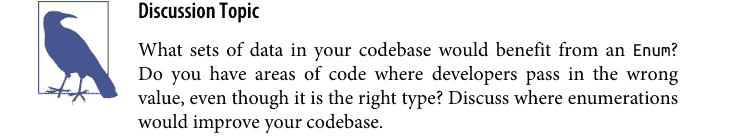

## 何时不使用

枚举非常适合向用户传达一组静态的选择。你不希望在选项在运行时确定的情况下使用它们，因为你会失去它们在传达意图和工具支持方面的许多好处（如果值在每次运行时都可能改变，代码的读者就很难知道哪些值是可能的）。如果你发现自己处于这种情况，我建议使用字典，它提供了两个可以在运行时更改的值之间的自然映射。不过，如果你需要限制用户可以选择的值，你需要执行成员检查。

## 高级用法

一旦掌握了枚举的基础知识，你可以做很多事情来进一步优化你的用法。请记住，你选择的类型越具体，传达的信息就越具体。

### 自动值

对于某些枚举，你可能想明确表示你并不关心枚举所关联的值。这告诉用户他们不应该依赖这些值。为此，你可以使用 `auto()` 函数。

```
from enum import auto, Enum
class MotherSauce(Enum):
    BÉCHAMEL = auto()
    VELOUTÉ = auto()
    ESPAGNOLE = auto()
    TOMATO = auto()
    HOLLANDAISE = auto()

>>>list(MotherSauce)
[<MotherSauce.BÉCHAMEL: 1>, <MotherSauce.VELOUTÉ: 2>, <MotherSauce.ESPAGNOLE: 3>,
 <MotherSauce.TOMATO: 4>, <MotherSauce.HOLLANDAISE: 5>]
```

默认情况下，`auto()` 会选择单调递增的值（1, 2, 3, 4, 5...）。如果你想控制设置的值，你应该实现一个 `_generate_next_value_()` 函数：

```
from enum import auto, Enum
class MotherSauce(Enum):
    def _generate_next_value_(name, start, count, last_values):
        return name.capitalize()
    BÉCHAMEL = auto()
    VELOUTÉ = auto()
    ESPAGNOLE = auto()
    TOMATO = auto()
    HOLLANDAISE = auto()

>>>list(MotherSauce)
[<MotherSauce.BÉCHAMEL: 'Béchamel'>, <MotherSauce.VELOUTÉ: 'Velouté'>,
 <MotherSauce.ESPAGNOLE: 'Espagnole'>, <MotherSauce.TOMATO: 'Tomato'>,
 <MotherSauce.HOLLANDAISE: 'Hollandaise'>]
```

你很少会看到像这样在枚举内部直接定义 `_generate_next_value_`，其中包含值。如果使用 `auto` 表示值无关紧要，那么 `_generate_next_value_` 则表示你希望 `auto` 有非常具体的值。这感觉很矛盾。这就是为什么你通常在基类 `Enum` 中使用 `_generate_next_value_`，这些枚举旨在被子类化，并且不包含任何值。你接下来会看到的 `Flag` 类就是一个基类的好例子。

### 枚举与字面量

Python 的 `Literal`（在 Python 3.8 中引入）与具有自动设置值的 `Enum`（假设没有 `_generate_next_value_`）有许多相同的好处。在这两种情况下，你都将变量限制为一组非常特定的值。

从类型检查器的角度来看，以下两者之间几乎没有区别：

```python
sauce: Literal['Béchamel', 'Velouté', 'Espagnole',
               'Tomato', 'Hollandaise'] = 'Hollandaise'
```

和这个：

```python
sauce: MotherSauce = MotherSauce.HOLLANDAISE
```

如果你只需要简单的限制，首先使用 `Literal`。但是，如果你需要迭代、运行时检查或从名称到值的不同映射，请使用枚举。

### 标志

现在你已经用枚举表示了母酱，你决定开始用这些酱料提供餐点。但在开始之前，你想了解顾客的过敏情况，因此你决定为每道菜表示过敏信息。利用你新学到的 `auto()` 知识，设置 `Allergen` 枚举是小菜一碟：

```python
from enum import auto, Enum
from typing import Set
class Allergen(Enum):
    FISH = auto()
    SHELLFISH = auto()
    TREE_NUTS = auto()
    PEANUTS = auto()
    GLUTEN = auto()
    SOY = auto()
    DAIRY = auto()
```

对于一个食谱，你可能会这样跟踪过敏原列表：

```python
allergens: Set[Allergen] = {Allergen.FISH, Allergen.SOY}
```

这告诉读者，过敏原的集合将是唯一的，并且可能有零个、一个或多个过敏原。这正是你想要的。但如果我希望系统中的所有过敏原信息都像这样跟踪呢？我不想依赖每个开发者都记得使用集合（仅仅使用一次列表或字典就可能引入错误行为）。我需要某种方式来普遍表示一组唯一的枚举值。

`enum` 模块为你提供了一个方便的基类——`Flag`：

```
from enum import Flag
class Allergen(Flag):
    FISH = auto()
    SHELLFISH = auto()
    TREE_NUTS = auto()
    PEANUTS = auto()
    GLUTEN = auto()
    SOY = auto()
    DAIRY = auto()
```

这让你可以执行位运算来组合过敏原或检查是否存在某些过敏原。

```
>>>allergens = Allergen.FISH | Allergen.SHELLFISH
>>>allergens
<Allergen.SHELLFISH|FISH: 3>

>>>if allergens & Allergen.FISH:
>>>    print("This recipe contains fish.")
This recipe contains fish.
```

当你想表示一组值的选择时（例如，通过多选下拉菜单或位掩码设置的内容），这非常有用。但是，存在一些限制。值必须支持位运算（`|`、`&` 等）。字符串就是不支持位运算的类型示例，而整数支持。此外，执行位运算时值不能重叠。例如，你不能在枚举中使用 1 到 4（含）的值，因为 4 将与值 1、2 和 4 进行“按位与”运算，这可能不是你想要的。`auto()` 会为你处理这个问题，因为 `Flag` 的 `_generate_next_value_` 自动使用 2 的幂。

```
class Allergen(Flag):
    FISH = auto()
    SHELLFISH = auto()
    TREE_NUTS = auto()
    PEANUTS = auto()
    GLUTEN = auto()
    SOY = auto()
    DAIRY = auto()
    SEAFOOD = Allergen.FISH | Allergen.SHELLFISH
    ALL_NUTS = Allergen.TREE_NUTS | Allergen.PEANUTS
```

标志的使用可以在非常特定的情况下表达你的意思，但如果你想要更多地控制你的值，或者正在枚举不支持位运算的值，请使用非标志枚举。

最后一点，你可以自由地为内置的多重枚举选择创建自己的别名，就像我上面用 `SEAFOOD` 和 `ALL_NUTS` 所做的那样。

## 整数转换

还有两种特殊的枚举类型，称为 `IntEnum` 和 `IntFlag`。它们分别映射到 `Enum` 和 `Flag`，但允许降级为原始整数进行比较。我实际上并不推荐使用这些特性，理解其原因很重要。首先，让我们看看它们试图解决的问题。

在法式烹饪中，某些配料的测量对成功至关重要，因此你需要确保也涵盖这一点。你创建了公制和英制的液体测量单位（毕竟你想在国际上工作）作为枚举，但沮丧地发现你不能直接将你的枚举与整数进行比较。

这段代码不起作用：

```python
class ImperialLiquidMeasure(Enum):
    CUP = 8
    PINT = 16
    QUART = 32
    GALLON = 128

>>>ImperialLiquidMeasure.CUP == 8
False
```

但是，如果你从 `IntEnum` 派生子类，它就能正常工作：

```python
class ImperialLiquidMeasure(IntEnum):
    CUP = 8
    PINT = 16
    QUART = 32
    GALLON = 128

>>>ImperialLiquidMeasure.CUP == 8
True
```

`IntFlag` 的行为类似。在系统或可能硬件之间互操作时，你会更常见到这种情况。如果你不使用 `IntEnum`，你需要这样做：

```python
>>>ImperialLiquidMeasure.CUP.value == 8
True
```

使用 `IntEnum` 的便利性通常无法抵消其作为较弱类型的缺点。任何隐式转换为整数都会隐藏类的真实意图。由于发生了隐式整数转换，你可能会在不执行你想要的操作的情况下遇到复制/粘贴错误（我们都犯过这些错误，对吧？）。

考虑：

```python
class Kitchenware(IntEnum):
    # Note to future programmers: these numbers are customer-defined
    # and apt to change
    PLATE = 7
    CUP = 8
    UTENSILS = 9
```

假设有人错误地执行了以下操作：

```python
def pour_liquid(volume: ImperialLiquidMeasure):
    if volume == Kitchenware.CUP:
        pour_into_smaller_vessel()
    else:
        pour_into_larger_vessel()
```

如果这段代码进入生产环境，它会运行得很好，不会抛出异常，所有测试都通过。然而，一旦 `Kitchenware` 枚举发生变化（也许它添加了一个值为 8 的 `BOWL`，并将 `CUP` 移到 10），这段代码现在将执行与其预期完全相反的操作。`Kitchenware.CUP` 不再与 `ImperialLiquidMeasure.CUP` 相同（它们没有理由被关联）；然后你将开始将液体倒入更大的容器而不是更小的容器，这可能会导致溢出（是你的液体溢出，而不是整数溢出）。

这是一个教科书式的例子，说明了不健壮的代码如何导致细微的错误，这些错误直到代码库生命周期的后期才会成为问题。这可能是一个快速修复，但这个 bug 会带来非常真实的代价。测试失败（或者更糟，客户抱怨将错误量的液体倒入容器），有人必须去浏览源代码，找到 bug，修复它，然后在思考这到底是如何工作之后，喝一杯长长的咖啡休息一下。所有这一切都是因为有人决定偷懒使用 `IntEnum`，这样他们就不必一遍又一遍地输入 `.value`。所以，为了你未来的维护者着想：除非出于遗留目的绝对必要，否则不要使用 `IntEnum`。

## 唯一性

枚举的一个很棒的特性是能够为值创建别名。让我们回到 `MotherSauce` 枚举。也许在法语键盘上开发的代码库需要适应美国键盘，而美国键盘的布局不利于在元音字母上添加重音符号。对于许多开发者来说，移除重音符号以将原生法语拼写英语化是不可接受的（他们坚持我们使用原始拼写）。为了避免国际事件，我将为一些酱汁添加别名。

```python
from enum import Enum
class MotherSauce(Enum):
    BÉCHAMEL = "Béchamel"
    BECHAMEL = "Béchamel"
    VELOUTÉ = "Velouté"
    VELOUTE = "Velouté"
    ESPAGNOLE = "Espagnole"
    TOMATO = "Tomato"
    HOLLANDAISE = "Hollandaise"
```

这样，所有键盘拥有者都欢欣鼓舞。枚举绝对允许这种行为；只要键不重复，它们可以有重复的值。

然而，在某些情况下，你希望强制值的唯一性。也许你依赖枚举始终包含固定数量的值，或者它可能干扰显示给客户的某些字符串表示。无论哪种情况，如果你想在 `Enum` 中保持唯一性，只需添加 `@unique` 装饰器。

```python
from enum import Enum, unique
@unique
class MotherSauce(Enum):
    BÉCHAMEL = "Béchamel"
    VELOUTÉ = "Velouté"
    ESPAGNOLE = "Espagnole"
    TOMATO = "Tomato"
    HOLLANDAISE = "Hollandaise"
```

在我遇到的大多数用例中，创建别名比保持唯一性更常见，因此我默认首先使枚举非唯一，只在需要时添加 `unique` 装饰器。

## 结语

枚举很简单，但常常被忽视作为一种强大的通信方法。任何时候你想表示静态值集合中的单个值，枚举都应该是你的首选用户定义类型。定义和使用它们很容易。它们提供了丰富的操作，包括迭代、位运算（在 `Flag` 枚举的情况下）以及对唯一性的控制。

记住这些关键限制：

-   枚举不适用于在运行时更改的动态键值映射。为此使用字典。
-   `Flag` 枚举仅适用于支持与非重叠值进行位运算的值。
-   除非系统互操作性绝对必要，否则避免使用 `IntEnum` 和 `IntFlag`。

接下来，我将探讨另一种用户定义类型：数据类。虽然枚举擅长在一个变量中指定一组值之间的关系，但数据类定义了多个变量之间的关系。

# 第 9 章
## 用户定义类型：数据类

数据类是用户定义的类型，允许你将相关数据分组在一起。许多类型，如整数、字符串和枚举，是*标量*的；它们表示一个且仅一个值。其他类型，如列表、集合和字典，表示同构集合。然而，你仍然需要能够将多个数据字段组合成一个单一的数据类型。字典和元组在这方面还可以，但它们存在一些问题。可读性很棘手，因为在运行时很难知道字典或元组包含什么。这使得它们在阅读和审查代码时难以推理，这对健壮性是一个重大打击。

当你的数据难以理解时，读者会做出错误的假设，并且无法轻松发现错误。数据类更易于阅读和理解，并且类型检查器知道如何自然地处理它们。

## 数据类实战

数据类表示异构变量集合，全部包装在一个*复合类型*中。复合类型由多个值组成，应该始终表示某种关系或逻辑分组。例如，`Fraction` 是复合类型的一个绝佳例子。它包含两个标量值：分子和分母。

```python
from fraction import Fraction
Fraction(numerator=3, denominator=5)
```

这个 `Fraction` 表示分子和分母之间的关系。分子和分母彼此独立；改变一个不会改变另一个。然而，通过将它们组合成一个单一类型，它们被分组在一起以创建一个逻辑概念。

数据类允许你非常容易地创建这些概念。要使用数据类表示分数，你可以这样做：

```python
from dataclasses import dataclass

@dataclass
class MyFraction:
    numerator: int = 0
    denominator: int = 1
```

很简单，不是吗？类定义前的 `@dataclass` 被称为*装饰器*。你将在第 17 章了解更多关于装饰器的内容，但现在，你需要知道的是，在类前面放 `@dataclass` 会将其转换为数据类。一旦你装饰了类，你需要列出所有你想要表示为关系的字段。你必须提供默认值或类型，以便 Python 将其识别为该数据类的成员。在上面的例子中，我同时演示了两者。

通过像这样构建关系，你正在为代码库添加共享词汇表。开发者不再需要单独实现每个字段，而是提供一个可重用的分组。数据类强制你显式地为字段分配类型，因此维护者之间类型混淆的可能性更小。

数据类和其他用户定义类型可以嵌套在数据类中。假设我正在创建一个自动汤机，我需要将我的汤料分组在一起。使用数据类，它看起来像这样：

```python
import datetime
from dataclasses import dataclass
from enum import auto, Enum

class ImperialMeasure(Enum):
    TEASPOON = auto()
    TABLESPOON = auto()
    CUP = auto()

class Broth(Enum):
    VEGETABLE = auto()
    CHICKEN = auto()
    BEEF = auto()
    FISH = auto()

@dataclass(frozen=True)
# Ingredients added into the broth
class Ingredient:
    name: str
    amount: float = 1
    units: ImperialMeasure = ImperialMeasure.CUP

@dataclass
class Recipe:
```

## 用法

数据类具有一些内置功能，使其非常易于使用。你已经看到构造数据类非常简单，但你还能做什么呢？

## 字符串转换

有两种特殊方法，`__str__` 和 `__repr__`，用于将你的对象转换为其非正式和正式的字符串表示形式。¹ 注意它们周围的双下划线；它们被称为*魔法方法*。我将在第 11 章更详细地介绍魔法方法，但现在，你可以将它们视为在对象上调用 `str()` 或 `repr()` 时被调用的函数。数据类默认定义了这些函数：

```python
# repr() 和 str() 都将返回以下输出
str(chicken_noodle_soup)
>>> Recipe(
    aromatics={
        Ingredient(name='Pepper', amount=1, units=<ImperialMeasure.TABLESPOON: 2>),
        Ingredient(name='Garlic', amount=2, units=<ImperialMeasure.TEASPOON: 1>)},
    broth=<Broth.CHICKEN: 2>,
    vegetables={
        Ingredient(name='Celery', amount=0.25, units=<ImperialMeasure.CUP: 3>),
        Ingredient(name='Onions', amount=0.25, units=<ImperialMeasure.CUP: 3>),
        Ingredient(name='Carrots', amount=0.25, units=<ImperialMeasure.CUP: 3>)},
    meats={
        Ingredient(name='Chicken', amount=1.5, units=<ImperialMeasure.CUP: 3>)},
    starches={
        Ingredient(name='Noodles', amount=1.5, units=<ImperialMeasure.CUP: 3>)},
    garnishes={
        Ingredient(name='Parsley', amount=2,
                   units=<ImperialMeasure.TABLESPOON: 2>)},
    time_to_cook=datetime.timedelta(seconds=3600)
)
```

有点长，但这意味着你不会得到像 `<__main__.Recipe object at 0x7fef44240730>` 这样更难看的东西，这是其他用户定义类型的默认字符串转换。

## 相等性

如果你想能够在两个数据类之间测试相等性（`==`、`!=`），你可以在定义数据类时指定 `eq=True`：

```python
from copy import deepcopy

@dataclass(eq=True)
class Recipe:
    # ...

chicken_noodle_soup == noodle_soup
>>> False

noodle_soup == deepcopy(noodle_soup)
>>> True
```

默认情况下，相等性检查会比较数据类两个实例中的每个字段。从机制上讲，Python 在进行相等性检查时会调用一个名为 `__eq__` 的函数。如果你想为相等性检查提供不同的默认功能，你可以编写自己的 `__eq__` 函数。

## 关系比较

假设我想在我的汤应用中为注重健康的人显示营养信息。我希望能够按各种轴对汤进行排序，例如卡路里或碳水化合物的数量。

```python
nutritionals = [NutritionInformation(calories=100, fat=1, carbohydrates=3),
                NutritionInformation(calories=50, fat=6, carbohydrates=4),
                NutritionInformation(calories=125, fat=12, carbohydrates=3)]
```

默认情况下，数据类不支持关系比较（<、>、<=、>=），因此你无法对信息进行排序：

```python
>>> sorted(nutritionals)
TypeError: '<' not supported between instances of
           'NutritionInformation' and 'NutritionInformation'
```

如果你想能够定义关系比较（<、>、<=、>=），你需要在数据类定义中设置 `eq=True` 和 `order=True`。生成的比较函数将遍历每个字段，并按照它们定义的顺序进行比较。

```python
@dataclass(eq=True, order=True)
class NutritionInformation:
    calories: int
    fat: int
    carbohydrates: int

nutritionals = [NutritionInformation(calories=100, fat=1, carbohydrates=3),
                NutritionInformation(calories=50, fat=6, carbohydrates=4),
                NutritionInformation(calories=125, fat=12, carbohydrates=3)]

>>> sorted(nutritionals)
[NutritionInformation(calories=50, fat=6, carbohydrates=4),
 NutritionInformation(calories=100, fat=1, carbohydrates=3),
 NutritionInformation(calories=125, fat=12, carbohydrates=3)]
```

---

¹ 非正式字符串表示形式对于打印对象很有用。正式字符串表示形式会重现关于对象的所有信息，以便可以重建它。

如果你想控制比较的定义方式，可以在数据类中编写自己的 `__le__`、`__lt__`、`__gt__` 和 `__ge__` 函数，它们分别对应小于等于、小于、大于和大于等于。例如，如果你希望 `NutritionInformation` 默认先按脂肪排序，然后是碳水化合物，最后是卡路里：

```python
@dataclass(eq=True)
class NutritionInformation:
    calories: int
    fat: int
    carbohydrates: int

    def __lt__(self, rhs) -> bool:
        return ((self.fat, self.carbohydrates, self.calories) <
                (rhs.fat, rhs.carbohydrates, rhs.calories))

    def __le__(self, rhs) -> bool:
        return self < rhs or self == rhs

    def __gt__(self, rhs) -> bool:
        return not self <= rhs

    def __ge__(self, rhs) -> bool:
        return not self < rhs

nutritionals = [NutritionInformation(calories=100, fat=1, carbohydrates=3),
                NutritionInformation(calories=50, fat=6, carbohydrates=4),
                NutritionInformation(calories=125, fat=12, carbohydrates=3)]

>>> sorted(nutritionals)
[NutritionInformation(calories=100, fat=1, carbohydrates=3),
 NutritionInformation(calories=50, fat=6, carbohydrates=4),
 NutritionInformation(calories=125, fat=12, carbohydrates=3)]
```

> 如果你重写了比较函数，请不要指定 `order=True`，因为这会引发 `ValueError`。

## 不可变性

有时，你需要表达一个数据类不应被修改。在这种情况下，你可以指定数据类必须是冻结的，即无法更改。每次你改变数据类的状态时，都可能引入一整类错误：

- 你的代码调用者可能不知道字段已经改变；他们可能错误地假设字段是静态的。
- 将单个字段设置为错误的值可能与其他字段的设置方式不兼容。
- 如果有多个线程修改字段，你就有数据竞争的风险，这意味着你无法保证修改以何种顺序相互应用。

如果你的数据类是冻结的，这些错误情况都不会发生。要冻结一个数据类，请在数据类装饰器中添加 `frozen=True`：

```python
@dataclass(frozen=True)
class Recipe:
    aromatics: Set[Ingredient]
    broth: Broth
    vegetables: Set[Ingredient]
    meats: Set[Ingredient]
    starches: Set[Ingredient]
    garnishes: Set[Ingredient]
    time_to_cook: datetime.timedelta
```

如果你想在集合中使用你的数据类或将其用作字典的键，它必须是可哈希的。这意味着它必须定义一个 `__hash__` 函数，该函数接受你的对象并将其提炼为一个数字。² 当你冻结一个数据类时，只要你不显式禁用相等性检查且所有字段都是可哈希的，它就会自动变为可哈希的。

然而，关于这种不可变性有两个注意事项。首先，当我说不可变性时，我指的是数据类中的字段，而不是包含数据类本身的变量。例如：

```python
# 假设 Recipe 是不可变的，因为
# 装饰器中 frozen 被设置为 true
soup = Recipe(
    aromatics={pepper, garlic},
    broth=Broth.CHICKEN,
    vegetables={celery, onions, carrots},
    meats={chicken},
    starches={noodles},
    garnishes={parsley},
    time_to_cook=datetime.timedelta(minutes=60))

# 这是一个错误
soup.broth = Broth.VEGETABLE
```

² 哈希是一个复杂的主题，超出了本书的范围。你可以在 Python 文档中了解更多关于哈希函数的信息。

```python
# 这不是一个错误
soup = Recipe(
    aromatics=set(),
    broth=Broth.CHICKEN,
    vegetables=set(),
    meats=set(),
    starches=set(),
    garnishes=set(),
    time_to_cook=datetime.timedelta(seconds=3600)
)
```

如果你希望类型检查器在变量被重新绑定时报错，可以将变量标注为 `Final`（有关 `Final` 的更多细节，请参见第 4 章）。

其次，冻结的数据类只阻止其成员被设置。如果成员是可变的，你仍然可以调用这些成员上的方法来修改它们的值。`frozen` 数据类不会将其不可变性扩展到其属性。

例如，这段代码完全没问题：

```python
soup.aromatics.add(Ingredient("Garlic"))
```

即使它正在修改冻结数据类的 `aromatics` 字段，也不会引发错误。使用冻结数据类时，请使成员不可变（例如整数、字符串或其他冻结数据类），以避免这个陷阱。

## 与其他类型的比较

数据类相对较新（在 Python 3.7 中引入）；许多遗留代码不包含数据类。在评估数据类采用时，你需要理解数据类相对于其他构造的优势所在。

### 数据类与字典

如第 5 章所述，字典非常适合将键映射到值，但当它们是同构的（当所有键都是相同类型且所有值都是相同类型时）时最为合适。当用于异构数据时，字典对人类来说更难推理。此外，类型检查器对字典了解不足，无法检查错误。

然而，数据类天然适合根本性的异构数据。代码的读者知道类型中存在的确切字段，类型检查器可以检查正确的用法。如果你有异构数据，在使用字典之前先考虑使用数据类。

### 数据类与 TypedDict

第 5 章还讨论了 `TypedDict` 类型。这是另一种存储异构数据的方式，对读者和类型检查器都有意义。乍一看，`TypedDict` 和数据类解决的问题非常相似，因此很难决定哪个更合适。我的经验法则是将数据类视为默认选择，因为它可以在其上定义函数，并且你可以控制不可变性、可比较性、相等性和其他操作。然而，如果你已经在使用字典（例如处理 JSON），你应该使用 `TypedDict`，前提是你不需要数据类的任何好处。

### 数据类与 namedtuple

`namedtuple` 是 `collections` 模块中的一种类似元组的集合类型。与元组不同，它允许你为元组中的字段命名，如下所示：

```python
>>> from collections import namedtuple
>>> NutritionInformation = namedtuple('NutritionInformation',
...                                  ['calories', 'fat', 'carbohydrates'])
>>> nutrition = NutritionInformation(calories=100, fat=5, carbohydrates=10)
>>> print(nutrition.calories)
100
```

`namedtuple` 在使元组更具可读性方面大有帮助，但使用数据类代替它同样如此。我几乎总是选择数据类而不是 `namedtuple`。数据类，像 `namedtuple` 一样，提供命名字段以及其他好处，例如：

- 显式地为你的参数添加类型注解
- 控制不可变性、可比较性和相等性
- 更容易在类型中定义函数

通常，只有在明确需要与 Python 3.6 或更早版本兼容时，我才会使用 `namedtuple`。


**讨论主题**

你在代码库中使用什么类型来表示异构数据？如果你使用字典，开发人员了解字典中所有键值对的难易程度如何？如果你使用元组，开发人员了解各个字段含义的难易程度如何？

## 结语

数据类在 Python 3.7 中发布时是一个游戏规则改变者，因为它们允许开发者定义完全类型化的异构类型，同时保持轻量级。随着我编写代码，我发现自己越来越多地使用数据类。每当你遇到异构的、开发者控制的字典或 namedtuple 时，数据类更合适。你可以在 [dataclass 文档](https://docs.python.org/3/library/dataclasses.html)中找到大量额外信息。

然而，尽管数据类很棒，但它们不应该被普遍使用。数据类本质上代表了一种概念关系，但它真的只在数据类中的成员彼此独立时才合适。如果任何成员应该根据其他成员受到限制，数据类将使你的代码更难推理。任何开发者都可能在你的数据类生命周期内更改字段，从而可能创建非法状态。在这些情况下，你需要使用更重量级的东西。在下一章中，我将教你如何用类来做到这一点。

## 第10章
用户自定义类型：类

类将是我在这本书中介绍的最后一种用户自定义类型。许多开发者很早就学习了类，这既是优势也是劣势。类在许多框架和代码库中被广泛使用，因此精通类设计是值得的。然而，当开发者过早地学习类时，他们会错过何时使用以及更重要的是何时不使用类的细微差别。

回想一下你使用类的经历。你能否将数据表示为数据类？或者使用一组自由函数？我见过太多代码库在不该使用类的地方使用了类，这导致了可维护性下降。

然而，我也遇到过走向另一个极端的代码库：完全不使用类。这也会影响可维护性；很容易破坏假设并导致整个系统中数据不一致。在Python中，你应该努力寻求平衡。类在你的代码库中有一席之地，但认识到它们的优缺点很重要。是时候深入挖掘，抛开你的先入之见，学习类如何帮助你编写更健壮的代码了。

## 类的结构

类旨在成为将相关数据分组在一起的另一种方式。它们在面向对象范式中已有数十年的历史，乍一看，与你所学的数据类没有太大区别。事实上，你可以像编写数据类一样编写一个类：

```
class Person:
    name: str = ""
    years_experience: int = 0
    address: str = ""
```

```
pat = Person()
pat.name = "Pat"
print(f"Hello {pat.name}")
```

查看上面的代码，你可以很容易地用字典或数据类以不同的方式编写它：

```
pat = {
    "name": "",
    "years_experience": 0,
    "address": ""
}

@dataclass
class Person():
    name: str = ""
    years_experience: int = 0
    address: str = ""
```

在第9章中，你学习了数据类相对于原始字典的优势，而类也提供了许多相同的好处。但你可能会（理所当然地）问，为什么还要再次使用类而不是数据类？

事实上，考虑到数据类的灵活性和便利性，类可能显得逊色。你无法获得冻结或有序等花哨的功能。你没有内置的字符串方法。甚至，你无法像使用数据类那样优雅地实例化一个Person。

尝试这样做：

```
pat = Person("Pat", 13, "123 Fake St.")
```

当尝试用类这样做时，你会立即遇到一个错误：

```
TypeError: Person() takes no arguments
```

乍一看，这真的很令人沮丧。然而，这个设计决策是有意为之的。你需要明确定义类如何被构造，这是通过一个称为构造函数的特殊方法完成的。与数据类相比，这似乎是一个缺点，但它允许你对类中的字段进行更细粒度的控制。接下来的几节将描述如何利用这种控制来为你服务。首先，让我们看看类的构造函数实际上为你提供了什么。

## 构造函数

构造函数描述了如何初始化你的类。你使用`__init__`方法定义一个构造函数：

```
class Person:
    def __init__(self,
               name: str,
               years_experience: int,
               address: str):
        self.name = name
        self.years_experience = years_experience
        self.address = address

pat = Person("Pat", 13, "123 Fake St.")
```

注意我稍微调整了一下类。我没有像在数据类中那样定义变量，而是在构造函数中定义了所有变量。构造函数是一个特殊的方法，在类被实例化时被调用。它接受定义用户数据类型所需的参数，以及一个名为`self`的特殊参数。这个参数的具体名称是任意的，但你会看到大多数代码都使用`self`作为约定。每次实例化一个类时，`self`参数都指向那个特定的实例；一个实例的属性不会与另一个实例的属性冲突，即使它们属于同一个类。

那么，为什么还要编写类呢？字典或数据类编写起来更简单，涉及的仪式更少。对于前面列出的Person对象这样的东西，我并不反对。然而，类可以传达一个字典或数据类不容易传达的关键概念：*不变量*。

## 不变量

不变量是实体在整个生命周期内保持不变的属性。不变量是关于你的代码成立的概念。代码的读者和编写者会推理你的代码，并依赖这种推理来保持一切正确。不变量是理解你的代码库的基石。以下是一些不变量的例子：

- 每个员工都有一个唯一的ID；没有两个员工ID是重复的。
- 游戏中的敌人只有在生命值高于零时才能采取行动。
- 圆只能有正的半径。
- 披萨上永远是酱料在上，奶酪在下。

不变量传达了对象的不可变属性。它们可以反映数学属性、业务规则、协调保证或任何你希望成立的东西。不变量不必反映现实世界；它们只需要对*你的*系统成立。例如，芝加哥风格深盘披萨的爱好者可能不同意最后一个关于披萨的要点，但如果你的系统只处理酱料在上奶酪在下的披萨，将其编码为不变量是可以的。不变量也只指代特定的实体。你可以决定不变量的范围，无论它是在整个系统中成立，还是只适用于特定的程序、模块或类。本章将重点讨论类及其在*保持*不变量方面的作用。

那么，类如何帮助传达不变量呢？让我们从构造函数开始。你可以加入防护措施和断言来检查不变量是否满足，从那时起，该类的用户应该能够依赖该不变量在类的整个生命周期内都为真。让我们看看如何做到这一点。

考虑一个虚构的自动披萨制作机，它每次都能制作出完美的披萨。它会取面团，将其擀成圆形，涂上酱料和配料，然后烘烤披萨。我将列出一些我希望在我的系统中保持的不变量（这些不变量并非对世界上所有披萨都普遍成立，只对我想要制作的披萨成立）。

我希望以下内容在披萨的整个生命周期内成立：

- 酱料永远不会放在配料上面（在这个场景中，奶酪是一种配料）。
- 配料可以放在奶酪的上面或下面。
- 披萨最多只能有一种酱料。
- 面团半径只能是整数。
- 面团半径只能在6到12英寸之间（15到30厘米之间）。

其中一些可能是出于商业原因，一些可能是出于健康原因，还有一些可能只是机器的限制，但所有这些都旨在在整个披萨的生命周期内成立。我将在披萨构造过程中检查这些不变量。

```
from pizza.sauces import is_sauce

class PizzaSpecification:
    def __init__(self,
                 dough_radius_in_inches: int,
                 toppings: list[str]):
        assert 6 <= dough_radius_in_inches <= 12, \
            'Dough must be between 6 and 12 inches'
        sauces = [t for t in toppings if is_sauce(t)]
        assert len(sauces) < 2, \
            'Can only have at most one sauce'

        self.dough_radius_in_inches = dough_radius_in_inches
        sauce = sauces[:1]
        self.toppings = sauce + \
            [t for t in toppings if not is_sauce(t)]
```

让我们分解一下这个不变量检查：

- `dough_radius_in_inches`是一个整数。这并不能阻止调用者向构造函数传递浮点数/字符串/任何东西，但如果与类型检查器（如你在第一部分中使用的那些）结合使用，你可以检测到调用者传递了错误的类型。如果你没有使用类型检查器，你就必须进行`isinstance()`检查（或类似的操作）来替代。

- 这段代码断言面团半径在6到12英寸之间（包含两端）。如果情况并非如此，就会抛出一个`AssertionError`（阻止类的构造）。
- 这段代码断言最多只有一种酱料，如果该条件不成立，则抛出`AssertionError`。
- 这段代码确保酱料位于配料列表的开头（大概是为了告诉披萨制作人按什么顺序放置配料）。
- 注意，我没有明确做任何事情来保留配料可以在奶酪之上或之下的顺序。这是因为实现的默认行为满足了不变式。但是，你仍然可以选择通过文档向调用者传达这个不变式。

## 断言与异常

在本书中，我将在某些情况下使用断言，在其他情况下引发异常。当断言失败时，它会引发一个`AssertionError`，这是一种异常。这可能使断言和异常看起来可以互换，但我实际上是故意选择其中之一。

断言在运行时不保证会执行，因为你的代码可能以禁用断言的选项部署。在这种情况下，我将它们用于我始终期望为真的事情，除非系统中的开发人员搞砸了。它旨在在开发过程中捕获错误，并向其他开发人员发出信号，表明他们有责任不制造导致断言失败的情况。

另一方面，异常向开发人员表明，由于用户错误或恶意行为者，某些情况是可能发生的。这种情况不太可能发生，但其他开发人员必须准备好在出现问题时捕获异常。

如果错误不是异常用例，我可能会选择返回一个`Optional`或`Union`（有关更多信息，请参见第4章）。请注意，这仅适用于函数返回值的情况。本章中的构造函数不返回任何值，因此使用`Optional`或`Union`是不合适的。在这些情况下，要向未来的开发人员明确说明可以抛出异常（或断言），因为类型检查器不会有太大帮助。

# 避免破坏不变式

至关重要的是，你永远、永远不要在不变式会被破坏的情况下构造这个类。如果调用者以某种方式构造对象导致不变式被破坏，你有两个途径可以选择。

抛出异常
这可以防止对象被构造。这就是我在确保面团半径合适且最多只有一种酱料时所做的。

调整数据
使数据符合不变式。当配料顺序不正确时，我本可以抛出异常，但我重新排列了它们以满足不变式。

> 如果你不想使用异常怎么办？
如果你不想使用异常，你可以使用一个函数来创建你的类（也称为工厂方法）。你可以通过在类名前加一个下划线（_）来对help()隐藏你的类，然后在模块中创建一个函数来检查不变式并实例化类。如果不变式无法满足，你可以返回None。确保你使用Optional类型（如第4章所述）来表示None。

# 注意，维护者，请仅通过create_pizza_spec函数创建此类
class _PizzaSpecification:
    # ... 省略类内容

def create_pizza_spec(dough_radius_in_inches: int,
                      toppings: list[str]) -> Optional[_PizzaSpecification]:
    try:
        return _PizzaSpecification()
    except:
        return None

如果你真的想这样做，你可以将不变式检查移到函数本身，但那样的话，你处理的是一个没有不变式的类型，你应该使用数据类。如果你更习惯函数式编程范式，并且会保持大多数类不可变，那么这就不那么重要了。

## 为什么不变式有益？

编写一个类并想出不变式需要大量的工作。但我希望你每次将一些数据组合在一起时，都能有意识地思考不变式。问问自己：

- 这些数据中是否有任何数据受到我无法通过类型系统捕获的任何形式的限制（例如配料的顺序）？
- 某些字段是否相互依赖（即，更改一个字段可能需要更改另一个字段）？
- 我是否想对数据提供某些保证？

如果你对其中任何一个问题的回答是肯定的，那么你就有想要保留的不变式，应该编写一个类。当你选择编写一个类并定义一组不变式时，你正在做几件事：

1. 你正在遵循不要重复自己（DRY）原则。¹ 你不是在对象构造之前在代码中散布检查，而是将这些检查放在一个地方。
2. 你正在给作者增加更多工作，以减轻读者/维护者/调用者的工作。你的代码很可能比你参与它的时间更长。通过提供不变式（并很好地传达它——见下一节），你减轻了后来者的负担。
3. 你能够更有效地推理代码。像Ada这样的语言和形式证明这样的概念在关键任务环境中使用是有原因的。它们给开发者带来信心；其他编码者可以在一定程度上信任你的代码。

所有这些都会导致更少的bug。你不会冒着人们误解对象或错过必要检查的风险。你正在为人们创建一个更容易思考的API，并降低了人们错误使用你的对象的风险。你也将更接近地遵守最小惊讶原则。你永远不希望有人在使用你的代码时感到惊讶（你有多少次听到过“等等，*那个*就是这个类的工作方式？”这句话）。通过定义不变式并坚持它们，有人感到惊讶的可能性就更小了。

字典根本做不到这一点。

考虑一个用字典表示的披萨规格：

```
{
    "dough_radius_in_inches": 7,
    "toppings": ["tomato sauce", "mozzarella", "pepperoni"]
}
```

> ¹ Andrew Hunt and David Thomas. *The Pragmatic Programmer: From Journeyman to Master*. Reading, MA: Addison-Wesley, 2000.

你没有办法简单地强制用户正确构造这个字典。你必须依赖调用者在每次调用时都做正确的事情（随着代码库的增长，这只会变得更加困难）。也没有办法防止用户随意修改字典并破坏不变式。


确实，你可以定义在检查不变式后构造字典的方法，并且只通过也检查不变式的函数来修改字典。或者，你当然可以在数据类上编写构造函数和不变式检查方法。但如果你费了这么大劲，为什么不直接写一个类呢？注意你的选择向未来的维护者传达了什么。你必须在字典、数据类和类之间做出深思熟虑的选择。每种抽象都传达了非常特定的含义，如果你选择了错误的，你会让维护者感到困惑。

还有一个我还没有谈到的好处，它与SOLID中的“S”有关（见下一个侧边栏）：单一职责原则。单一职责原则指出，每个对象“应该只有一个且仅有一个改变的理由”。² 这听起来很简单，但在实践中，确切地知道*一个*改变的理由有多细粒度可能很困难。我对你的建议是定义一组相关的不变式（例如你的面团和配料），并为每组相关的不变式编写一个类。如果你发现自己编写了与这些不变式之一没有直接关系的属性或方法，那么你的类就具有低*内聚性*，这意味着它承担了太多职责。

### SOLID设计原则

SOLID设计原则由Robert C. Martin在其2000年的论文“设计原则和设计模式”中首次描述。它们是五个设计原则，我在开发大型代码库时发现非常有用。SOLID设计原则如下：

*单一职责原则*
用于代码重用和整合的原则

*开闭原则*
用于可扩展性的原则

*里氏替换原则*
用于子类型化的原则

² Robert C. Martin. “The Single Responsibility Principle.” *The Clean Code Blog* (blog), May 8, 2014. [https://oreil.ly/ZOMxb](https://oreil.ly/ZOMxb).

## 接口隔离原则
一个关于抽象的原则

## 依赖倒置原则
一个关于解耦依赖的原则

本书将贯穿讨论其中一些原则。请记住，这些都只是原则。请运用你的最佳判断来应用它们。

**讨论主题**

思考一下你代码库中最重要的部分。关于该系统，哪些不变量是成立的？这些不变量被强制执行得有多好，以至于开发者无法破坏它们？

## 传达不变量

现在，除非你能有效地传达它们，否则你无法实现这些好处。没有人能推理他们不知道的不变量。那么，你该怎么做呢？嗯，对于任何沟通，你都应该考虑你的受众。你有两类人，对应两种不同的用例：

*类的消费者*
这些人试图解决他们自己的问题，并寻找工具来帮助他们。他们可能正在调试一个问题，或者在代码库中寻找一个能帮助他们的类。

*类的未来维护者*
人们会扩展你的类，重要的是他们不能破坏所有调用者已经依赖的不变量。

在设计类时，你需要同时考虑到这两者。

## 使用你的类

首先，类的消费者通常会查看你的源代码，以了解它的工作原理以及是否满足他们的需求。在构造函数中放置断言语句（或引发其他异常）是告诉用户你的类能做什么和不能做什么的好方法。构造函数通常是开发者首先查看的地方（毕竟，如果他们无法实例化你的类，他们如何使用它？）。对于那些无法在代码中表示的不变量（是的，这些确实存在），你需要在用户用于 API 参考的任何地方记录下来。文档越接近代码，用户在查看代码时就越有可能找到它。

头脑中的知识既不可扩展也不易发现。Wiki 和/或文档门户是一个不错的步骤，但通常更适合那些不会很快过时的更大规模的想法。代码仓库中的 README 是更好的一步，但真正最好的地方是类本身的注释或文档字符串。

```python
class PizzaSpecification:
    """
    This class represents a Pizza Specification for use in
    Automated Pizza Machines.

    The pizza specification is defined by the size of the dough and
    the toppings. Dough should be a whole number between 6 and 12
    inches (inclusive). If anything else is passed in, an AssertionError
    is thrown. The machinery cannot handle less than 6 inches and the
    business case is too costly for more than 12 inches.

    Toppings may have at most one sauce, but you may pass in toppings
    in any order. If there is more than one sauce, an AssertionError is
    thrown. This is done based on our research telling us that
    consumers find two-sauced pizzas do not taste good.

    This class will make sure that sauce is always the first topping,
    regardless of order passed in.

    Toppings are allowed to go above and below cheese
    (the order of non-sauce toppings matters).
    """
    def __init__(...):
        # ... implementation goes here
```

在我的职业生涯中，我对注释一直有一种有点争议的关系。起初，我会注释所有内容，可能是因为我的大学教授要求这样做。几年后，钟摆摆向了另一个极端，我成了一个宣扬“代码应该是自文档化的”的人，意思是代码应该能够独立存在。毕竟，注释可能会过时，而且，正如常言道，“错误的注释比没有注释更糟。”此后，钟摆又摆了回来，我认识到代码绝对应该自文档化*它在做什么*（这只是最小惊讶定律的另一种说法），但注释有助于体现代码的人性。大多数人将其简化为代码*为什么*这样表现，但有时这很模糊。在上面的代码片段中，我通过记录我的不变量（包括代码中不明显的那些），并辅以业务原因来做到这一点。这样，消费者就可以确定这个类是用于什么和不用于什么，以及这个类是否适合他们预期的用例。

## 那维护者呢？

你必须以不同的方式处理另一组人，即你代码的未来维护者。这是一个棘手的问题。你有一个注释帮助定义你的约束，但这并不能防止无意中改变不变量。改变不变量是一件微妙的事情。人们会依赖这些不变量，即使它们没有反映在函数签名或类型系统中。如果有人改变了不变量，该类的每个消费者都可能受到影响（有时这是不可避免的，但要意识到代价）。

为了帮助发现这一点，我将依靠一个老朋友作为安全网——单元测试。单元测试是自动测试你自己的类和函数的代码片段。（关于单元测试的更多讨论，请查看[第21章](#)。）你应该绝对围绕你的期望和不变量编写单元测试，但我想让你考虑一个额外的方面：帮助未来的测试编写者知道不变量何时被破坏。我喜欢在上下文管理器的帮助下做到这一点——这是 Python 中的一种结构，当 `with` 块退出时强制执行代码（如果你不熟悉上下文管理器，你将在[第11章](#)中学到更多）：

```python
import contextlib
from pizza_specification import PizzaSpecification

@contextlib.contextmanager
def create_pizza_specification(dough_radius_in_inches: int,
                               toppings: list[str]):
    pizza_spec = PizzaSpecification(dough_radius_in_inches, toppings)
    yield pizza_spec
    assert 6 <= pizza_spec.dough_radius_in_inches <= 12
    sauces = [t for t in pizza_spec.toppings if is_sauce(t)]
    assert len(sauces) < 2
    if sauces:
        assert pizza_spec.toppings[0] == sauces[0]

    # check that we assert order of all non sauces
    # keep in mind, no invariant is specified that we can't add
    # toppings at a later date, so we only check against what was
    # passed in
    non_sauces = [t for t in pizza_spec.toppings if t not in sauces]
    expected_non_sauces = [t for t in toppings if t not in sauces]
    for expected, actual in zip(expected_non_sauces, non_sauces):
        assert expected == actual

def test_pizza_operations():
    with create_pizza_specification(8, ["Tomato Sauce", "Peppers"]) \
        as pizza_spec:

        # do something with pizza_spec
```

使用像这样的上下文管理器的美妙之处在于，每个不变量都可以作为测试的后置条件进行检查。这感觉像是重复并直接违反了 DRY 原则，但在这种情况下，这是合理的。单元测试是一种复式记账形式，你希望它们在一方错误更改时发现错误。

## 不变量检查慢吗？

检查所有这些不变量存在运行时成本，特别是对于比披萨更复杂的数据类型。检查不变量为提高人类效率提供了真正的好处，但对于在紧密循环中多次创建的对象，开发者可能希望避免条件语句和/或异常，以换取代码执行性能。如果你遇到程序未达到基准、你已经分析了代码，并且不变量检查是最大的罪魁祸首的情况，我希望你这样做：

继续记录类具有的不变量，但通过非常明确的方式传达，责任在于调用者满足不变量，而不是类本身。类仍然应该尝试维护不变量以帮助推理，但它不能像你希望的那样进行那么多的前置条件检查。你本质上是在为了速度而牺牲可维护性。可维护性受损的程度以及你将获得多少加速，将因情况而异。如果你确实选择了这条路线，请补充环境中的其他流程，以弥补可维护性的下降（更强大的代码检查、更严格的代码审查等）。

## 封装与维护不变量

我有一个小秘密要告诉你。我在上一节中没有完全诚实。我知道，我知道，我真丢脸，我敢肯定眼尖的读者已经发现了我的欺骗。

考虑这个：

```python
pizza_spec = PizzaSpecification(dough_radius_in_inches=8,
                               toppings=['Olive Oil',
                                         'Garlic',
                                         'Sliced Roma Tomatoes',
                                         'Mozzarella'])
```

没有任何东西可以阻止未来的开发者事后改变一些不变量。

```python
pizza_spec.dough_radius_in_inches = 100  # BAD!
pizza_spec.toppings.append('Tomato Sauce')  # Second sauce, oh no!
```

如果任何开发者都可以立即使它们失效，那么谈论不变量的意义何在？嗯，事实证明我还有另一个概念要讨论：*封装*。

## 封装什么，现在？

封装。简单来说，它是一个实体隐藏属性以及操作这些属性的能力。实际上，这意味着你决定哪些属性对调用者可见，并限制他们如何访问它们。和/或更改数据。这通过*应用程序编程接口*（API）来实现。

当大多数人想到API时，脑海中浮现的是REST或SDK（软件开发工具包）之类的东西。但每个类都有自己的API。它是你与类交互的基石。每一次函数调用、每一次属性访问、每一次初始化都是对象API的一部分。

到目前为止，我已经介绍了`PizzaSpecification`中API的两个部分：初始化（构造函数）和属性访问。关于构造函数，我没有更多要说的；它在验证不变量方面已经完成了自己的工作。现在，我将讨论如何在充实API的其余部分（我们希望与该类捆绑的操作）时，保持这些不变量。

## 保护数据访问

这让我们回到了本节开头的问题：我们如何防止API（我们的类）的使用者破坏不变量？通过表明这些数据应该是*私有的*。

在许多编程语言中，有三种类型的访问控制：

- *公共*：任何其他代码都可以访问此API部分。
- *受保护*：只有子类（我们将在第12章更详细地看到这些）应该访问此API部分。
- *私有*：只有此类（以及此类的任何其他实例）应该访问此API部分。

公共和受保护的属性构成了你的公共API，并且在人们严重依赖你的类之前应该相对稳定。然而，一个普遍的惯例是人们应该远离你的私有API。这应该让你可以自由地隐藏那些你认为需要不可访问的东西。这就是你如何保持不变量的方法。

在Python中，你通过在属性前加下划线（`_`）来向其他开发者表明该属性应该是受保护的。私有属性和方法应该加两个下划线（`__`）。（注意，这与*被*两个下划线*包围*的函数不同——那些表示特殊的魔术方法，我将在第11章介绍。）在Python中，没有编译器可以捕获这种访问控制被破坏的情况。没有什么能阻止开发者介入并搞乱你的受保护和私有成员。强制执行这一点成为一个组织挑战，这是像Python这样的动态类型语言的本质的一部分。

设置代码检查工具，强制执行代码风格，进行彻底的代码审查；你应该将你的API视为类的核心原则，不允许它被轻易破坏。

将属性设为受保护/私有有几个好处。受保护和私有属性不会出现在类的`help()`中。这将减少有人无意中使用这些属性的机会。此外，私有属性不那么容易访问。

考虑具有私有成员的`PizzaSpecification`：

```python
from pizza.sauces import is_sauce

class PizzaSpecification:
    def __init__(self,
                 dough_radius_in_inches: int,
                 toppings: list[str]):
        assert 6 <= dough_radius_in_inches <= 12, \
            'Dough must be between 6 and 12 inches'
        sauces = [t for t in toppings if is_sauce(t)]
        assert len(sauces) < 2, \
            'Can have at most one sauce'

        self.__dough_radius_in_inches = dough_radius_in_inches ❶
        sauce = sauces[:1]
        self.__toppings = sauce + \
            [t for t in toppings if not is_sauce(t)] ❷

pizza_spec = PizzaSpecification(dough_radius_in_inches=8,
                                toppings=['Olive Oil',
                                          'Garlic',
                                          'Sliced Roma Tomatoes',
                                          'Mozzarella'])

pizza_spec.__toppings.append('Tomato Sauce') # OOPS
>>> AttributeError: type object 'pizza_spec' has no attribute '__toppings'
```

- ❶ 面团半径（英寸）现在是一个私有成员。
- ❷ 配料现在是一个私有成员。

当你在属性前加两个下划线时，Python会进行一种叫做名称修饰的操作。也就是说，Python会在你不知情的情况下更改名称，使得当用户滥用你的API时非常明显。我可以通过使用对象的`__dict__`属性来找出什么是名称修饰：

```python
pizza_spec.__dict__
>>> {'_PizzaSpecification__toppings': ['Olive Oil',
                                        'Garlic',
                                        'Sliced Roma Tomatoes',
                                        'Mozzarella'],
     '_PizzaSpecification__dough_radius_in_inches': 8
}
```

```python
pizza_spec._PizzaSpecification__dough_radius_in_inches = 100
print(pizza_spec._PizzaSpecification__dough_radius_in_inches)
>>> 100
```

如果你看到像这样的属性访问，你应该亮起红灯：开发者正在搞乱类的内部结构，这可能会破坏不变量。幸运的是，在检查代码库时，这非常容易发现（你将在第20章了解更多关于代码检查工具的信息）。与你的共同贡献者达成协议，不要碰任何私有的东西；否则，你会发现自己陷入无法维护的混乱中。

### 我应该为每个私有成员编写getter/setter吗？

这是一个常见的错误（特别是对于那些刚了解私有属性的人），为每个私有成员都编写一个getter和setter。如果你发现你的类几乎只有getter和setter，你可能需要考虑使用数据类。你只是提供了公共访问，只是步骤更多了。

即使你的类中确实有不变量，也要警惕大量的getter方法。你不希望返回对可变属性（如列表或字典）的引用。在许多情况下，返回该数据的副本可能是合适的。如果你的调用者需要修改该数据，尝试通过你选择的API来强制他们（或者如果合适的话，编写一个新的API来保持你的不变量）。

## 操作

所以现在我有一个不变量不能（轻易）被破坏的类。我有一个可以构造的类，但我无法从中更改或读取任何数据。这是因为到目前为止我只涉及了封装的一个部分：数据的隐藏。我仍然需要介绍如何将操作与数据捆绑在一起。方法登场了。

我相信你对存在于类外部的函数（也称为自由函数）有很好的掌握。我将关注的是存在于类内部的函数，也称为方法。

假设对于我的披萨规格，我希望能够在披萨排队制作时添加配料。毕竟，我的披萨非常成功（这是我的想象，让我拥有这个），而且经常有很长的披萨队列需要制作。但一个刚下订单的家庭意识到他们错过了他们儿子最喜欢的配料，为了防止幼儿因融化的奶酪而崩溃，他们需要在提交订单后修改订单。我将定义一个新函数来为他们方便地添加配料。

```python
from typing import List
from pizza.exceptions import PizzaException
from pizza.sauces import is_sauce

class PizzaSpecification:
    def __init__(self,
                 dough_radius_in_inches: int,
                 toppings: list[str]):
        assert 6 <= dough_radius_in_inches <= 12, \
            'Dough must be between 6 and 12 inches'

        self.__dough_radius_in_inches = dough_radius_in_inches
        self.__toppings: list[str] = []
        for topping in toppings:
            self.add_topping(topping) ❶

    def add_topping(self, topping: str): ❷
        """
        Add a topping to the pizza
        All rules for pizza construction (one sauce, no sauce above
        cheese, etc.) still apply.
        """
        if (is_sauce(topping) and
                any(t for t in self.__toppings if is_sauce(t))):
            raise PizzaException('Pizza may only have one sauce')

        if is_sauce(topping):
            self.__toppings.insert(0, topping)
        else:
            self.__toppings.append(topping)
```

- ❶ 使用新的`add_topping`方法。
- ❷ 新的`add_topping`方法。

编写一个仅仅将配料附加到列表的方法很容易。但那样做是不对的。我有一个不变量要维护，我现在不会退缩。代码确保我们不会添加第二种酱料，并且如果配料是酱料，则确保它首先被放置。记住，不变量需要在对象的整个生命周期内保持为真，这远远超出了初始构造。你添加的每个方法都应该继续保持那个不变量。

方法通常分为两类：访问器和修改器。有些人将其简化为“getter”和“setter”，但我觉得这有点太狭隘了。“Getter”和“setter”通常描述只是返回简单值或设置成员变量的方法。许多方法要复杂得多：设置多个字段、执行复杂计算或操作数据结构。

访问器用于检索信息。如果你有关于如何表示数据的不变量，这些就是你关心的方法。例如，披萨规格可能包括一种将其内部数据转换为机器操作的方法。

## 关于 `@staticmethod` 和 `@classmethod` 怎么看？

我并不经常使用 `staticmethod` 和 `classmethod`。对于不熟悉的人来说，这些是装饰器，允许你编写绑定到类而非实例的函数（`classmethod`），以及存在于类内部但不以任何方式绑定到类的函数（`staticmethod`）。对我来说，这些是旧式编程思维的遗留物，那时还没有像今天这样多的健壮模式。

对于 `staticmethod`，我几乎总是认为它应该是模块级作用域的自由函数，而不是绑定到一个类。对于 `classmethod`，有一些更合理的用例（包括一些元编程相关的），但在更多情况下，自由函数更健壮。自由函数比类更容易移动（类可能需要拆分或合并），而且我不必担心子类型如何覆盖我的类方法或静态方法（继承和类/静态方法之间存在一些棘手的问题）。

这就是不变式。这不是开发者们谈论足够多的话题，但一旦你开始从不变式的角度思考，你会看到类的可维护性有显著提升。记住，你使用不变式是为了让用户能够推理你的对象并减少认知负担。如果你花额外时间编写代码，但能为之后的众多读者节省成本，那是值得的。

## 结语

我花了相当多的时间讨论类，特别是与其他用户定义的数据类型（如枚举和数据类）相比。然而，这是有意为之。类通常很早就被教授，而且很少被重新审视。我发现大多数开发者倾向于过度使用类，而没有考虑它们的用途。

在你决定如何创建用户定义类型时，我提供以下指南供你参考：

字典用于从键到值的映射。如果你使用字典但很少遍历它们或动态请求键，你就没有像关联映射那样使用它们，可能需要不同的类型。在运行时从数据源检索数据时有一个例外（例如，获取 JSON、解析 YAML、检索数据库数据等），此时 TypedDict 是合适的（参见第 5 章）。但是，如果你不需要在其他地方将它们用作字典，你应该努力在解析数据后将它们转换为用户定义的类。

枚举非常适合表示离散标量值的联合。你不一定关心枚举值是什么；你只需要不同的标识符来区分代码中的情况。

数据类非常适合大部分独立的数据包。你可能对单个字段的设置方式有一些限制，但在大多数情况下，用户可以自由地获取和设置单个属性。

类的核心是不变式。如果你有一个想要保持的不变式，就创建一个类，在构造时断言前置条件成立，并且不让任何方法或用户访问破坏这个不变式。

图 10-1 是一个方便的流程图，描述了这些经验法则。

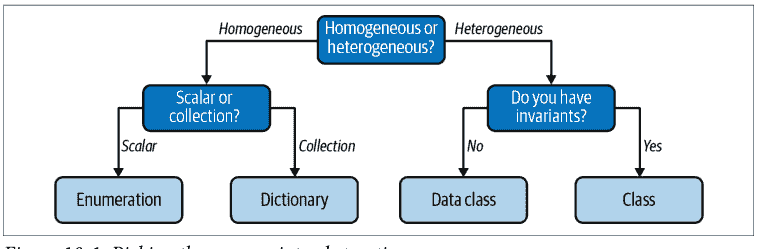

然而，知道选择哪种类型只是成功的一半。一旦你选择了正确的类型，你需要从消费者的角度使其交互变得无缝。在下一章中，你将学习如何通过关注类型的 API，使你的用户定义类型更自然地使用。

# 第 11 章
定义你的接口

你已经学会了如何创建自己的用户定义类型，但创建它们只是成功的一半。现在开发者必须实际使用你的类型。为此，他们使用你的类型的 API。这是开发者与之交互以使用你的代码的一组类型和相关函数，以及任何外部函数。

一旦你的类型出现在用户面前，这些类型将以你从未想到的方式被使用（和滥用）。一旦开发者依赖你的类型，就很难改变它们的行为。这引出了我所谓的 *代码接口悖论*：

> 你只有一次机会让你的接口正确，但直到它被使用，你才会知道它是否正确。

一旦开发者使用你创建的类型，他们就会依赖这些类型所包含的行为。如果你试图进行向后不兼容的更改，你可能会破坏所有调用代码。更改接口的风险与依赖它的外部代码量成正比。

如果你控制所有依赖你的类型的代码，这个悖论就不适用；你可以更改它。但一旦该类型投入生产，并且人们开始使用它，你会发现很难更改。在一个大型代码库中，健壮性和可维护性很重要，协调进行大规模更改所需的变更和共识成本很高。如果你的类型被组织控制之外的实体使用，例如开源库或平台 SDK，这几乎变得不可能。这很快导致代码难以使用，而难以使用的代码会拖慢开发者的速度。

更糟糕的是，你无法真正知道一个接口是否自然易用，直到足够多的人依赖它，从而产生了这个悖论。如果你不知道接口将如何被使用，你甚至如何开始设计它？当然，你知道*你*会如何使用接口，这是一个很好的开始，但你在创建接口时存在隐性偏见。对你来说感觉自然的东西，对其他人来说不一定自然。你的目标是让用户以最小的努力做正确的事情（并避免错误的事情）。理想情况下，用户应该不需要做任何额外的事情就能正确使用你的接口。

我没有灵丹妙药给你；没有一种万无一失的方法可以在第一次尝试时就写出满足所有人需求的接口。相反，我将讨论一些你可以应用的原则，以给你最好的机会。对于需要更改现有 API 的情况，你将学习缓解策略。你的 API 是给其他开发者的印象；让它发挥作用。


**讨论主题**

在你的代码库中，哪些接口难以使用？寻找人们在使用你的类型时犯的常见错误。还要寻找你接口中很少被调用的部分，特别是如果你觉得它们有用的话。为什么用户不调用这些有用的函数？讨论当开发者遇到这些难以使用的接口时会出现什么成本。

# 自然接口设计

你的目标，尽管看起来很难，是让你的接口看起来自然易用。换句话说，你想减少代码调用者的摩擦。当代码难以使用时，会发生以下情况：

*功能重复*

一些发现你的类型难以使用的开发者会编写自己的类型，导致功能重复。在大规模上，不同的想法竞争可能是健康的（比如竞争的开源项目），但在你的代码库中存在这种分歧是不健康的。开发者面临多种类型，不确定该使用哪一种。他们的注意力被分散，思路会混乱，他们会犯错，这会产生 bug，从而造成损失。此外，如果你想向这些类型中的任何一个添加任何东西，你需要在所有功能分歧的地方添加它们，否则你会创建 bug，从而造成损失。

*心智模型破坏*

开发者会构建他们所使用代码的心智模型。如果某些类型难以推理，那个心智模型就会被破坏。开发者会误用你的类型，导致微妙的 bug。也许他们没有按照你要求的顺序调用方法。也许他们错过了应该调用的方法。也许他们只是误解了代码的功能，并向其传递了错误的信息。这些都会给你的代码库引入脆弱性。

## 测试减少

难以使用的代码难以测试。无论它是复杂的接口、庞大的依赖链还是复杂的交互；如果你无法轻松测试代码，那么编写的测试就会更少。编写的测试越少，在发生变更时能捕获的 bug 就越少。每次做出看似无关的更改时，测试都会以微妙的方式中断，这非常令人沮丧。

难以使用的代码会使你的代码库不健康。在设计接口时，你必须特别小心。请尽量遵循 Scott Meyers 的这条经验法则：

> 让接口易于正确使用，难以错误使用。¹

你希望开发者觉得你的类型易于使用，仿佛一切都如预期般运行（这是对第 1 章提到的“最小惊讶原则”的一种微妙重述）。此外，你还希望防止用户以错误的方式使用你的类型。思考所有你应在接口中支持和禁止的行为，是你的职责。为此，你需要设身处地为协作者着想。

## 像用户一样思考

像用户一样思考是棘手的，因为你已被赋予了“知识诅咒”。这并非源于什么神秘的诅咒或法术；而是你与代码库相处时间的副产品。随着你构建想法，你会对它们变得如此熟悉，以至于可能让你对新用户如何看待你的代码视而不见。处理认知偏差的第一步是承认它们的存在。从那时起，你可以在尝试进入用户思维空间时将偏差考虑在内。以下是一些你可以采用的有效策略。

## 测试驱动开发

测试驱动开发（TDD）由 Kent Beck 在 2000 年代初提出，是一种流行的代码测试框架。² TDD 围绕一个简单的循环展开：

- 添加一个失败的测试。
- 编写刚好能通过该测试的代码。
- 重构。

关于 TDD 有整本书籍，因此我不会过多深入其机制细节。³ 然而，TDD 的意图对于理解如何使用一个类型是*极好的*。

许多开发者认为测试*驱动*开发（先写测试）与测试*后置*开发（后写测试）有相似的好处。在这两种情况下，你都有经过测试的代码，对吧？当简化到这种程度时，TDD 似乎不值得付出努力。

然而，这是一种不幸的过度简化。这种混淆源于将 TDD 视为一种测试方法，而实际上，它是一种*设计方法*。测试很重要，但它们仅仅是该方法的副产品。真正的价值在于测试如何帮助你设计接口。

通过 TDD，你能够在编写实现之前看到调用代码的样子。由于你先编写测试，你有机会停下来问自己，与你的类型交互是否感觉顺畅。如果你发现自己在进行令人困惑的函数调用、构建长长的依赖链，或者必须按固定顺序编写测试，这些都是危险信号，应该提醒你正在构建的类型过于复杂。在这些情况下，重新评估或重构你的接口。在编写代码之前就能简化它，这有多棒？

作为额外的好处，你的测试可以作为一种文档形式。其他开发者会想知道如何使用你的代码，尤其是那些在顶层文档中未描述的部分。一套好的全面单元测试提供了关于如何使用你的类型的可工作文档；你希望它们能留下良好的第一印象。正如你的代码是系统行为的唯一真实来源一样，你的测试是与你的代码交互的唯一真实来源。

## README 驱动开发

与 TDD 类似，README 驱动开发（RDD）由 Tom Preston-Werner 提出，是另一种旨在编写难以使用的代码之前就将其捕获的设计方法。RDD 的目标是将你的顶层想法和与代码最重要的交互提炼成一个位于项目中的单一文档：README 文件。这是构思代码不同部分如何交互的好方法，并可能为用户提供更高层次的模式来遵循。

RDD 具有以下一些优点：

- 无需像在瀑布方法中那样预先创建每一级文档。
- README 通常是开发者看到的第一样东西；RDD 让你有机会打造你能做到的最佳第一印象。
- 基于团队讨论修改文档比修改已编写的代码更容易。
- 你不需要使用 README 来解释糟糕的代码决策；相反，代码需要调整以支持理想的用例。

请记住，只有当未来的开发者能够真正维护它时，你才算成功构建了可维护的软件。给他们每一个成功的机会，并从你的文档开始为他们打造一种体验。

## 可用性测试

最终，你是在尝试思考你的用户如何思考。有一个完整的学科专门致力于这项任务：用户体验（UX）。UX 是另一个有无数书籍可用的领域，因此我将只关注一种在简化代码方面对我有奇效的策略：可用性测试。

可用性测试是主动询问用户对你的产品看法的过程。这听起来很简单，不是吗？为了思考你的用户将如何行为，只需询问他们。你能做的最简单的事情是与潜在用户（在这种情况下，是其他开发者）交谈，但这很容易被忽视。

通过走廊测试开始可用性测试非常容易。在设计接口时，只需抓住第一个走过你走廊的人，请他们对你的设计提供反馈。这是了解痛点的一种低成本的好方法。不过，不要过于字面地理解这个建议。可以自由地扩展到你在走廊看到的任何人之外，邀请队友、同行或测试人员来评估你的接口。

然而，对于将被更广泛受众使用的接口（例如流行的开源库的接口），你可能需要稍微更正式一些。在这些情况下，可用性测试涉及将你的潜在用户置于你正在编写的接口前。你给他们一组任务来完成，然后观察。你的角色不是教导他们或引导他们完成练习，而是观察他们在何处挣扎，在何处表现出色。从他们的挣扎中学习；他们正在展示明确难以使用的领域。


可用性测试非常适合团队中较初级的成员。他们的知识诅咒不会像资深成员那么强，而且他们更有可能以全新的视角来评估设计。

## 自然交互

唐纳德·诺曼将映射描述为“控件及其动作与现实世界结果之间的关系”。如果这种映射“利用了物理类比和文化标准，[导致]立即理解”，那么它就是自然的。⁴ 这就是你在编写接口时所追求的。你希望那种立即的理解能消除混淆。

在这种情况下，“控件及其动作”是构成你接口的函数和类型。“现实世界的结果”代表代码的行为。为了使其感觉自然，操作必须与用户的心智模型一致。这就是唐纳德·诺曼在谈论“物理类比和文化标准”时的意思。你必须以读者理解的方式与他们建立联系，利用他们的经验和知识。最好的方法是将你的领域和其他常见知识映射到你的代码中。

在设计接口时，你需要思考用户交互的整个生命周期，并问自己整个过程是否映射到不熟悉你的代码的用户所能理解的内容。建模你的接口，使其易于理解，即使对于熟悉领域但不熟悉代码的人来说也是如此。当你这样做时，你的接口就变得直观，从而减少了开发者犯错的可能性。

## 自然接口实践

在本章中，你将为自动杂货取货服务的一部分设计一个接口。用户使用智能手机扫描他们的食谱，应用程序将自动计算出所需的食材。用户确认订单后，应用程序会查询当地杂货店的食材可用性并安排配送。图 11-1 展示了这个工作流程。

我将专注于给定一组食谱来构建订单的具体接口。

---

¹ Kevlin Henney 和 Scott Meyers。“让接口易于正确使用，难以错误使用”，载于《程序员应知的 97 件事：专家集体智慧》第 55 章。Sebastopol: O’Reilly Media, 2010。

² Kent Beck.《测试驱动开发：示例》。Upper Saddle River, NJ: Addison-Wesley Professional, 2002。

³ 如果你想了解更多信息，我推荐 Harry Percival 的《Python 测试驱动开发》（O'Reilly, 2017）。

⁴ 这出自唐纳德·诺曼的《设计心理学》（Basic Books）。这本经典书籍对于任何想要进入 UX 思维模式的人来说都是必不可少的。

## 11.1 自动化杂货配送应用的工作流

为了表示一个食谱，我将修改第9章中的 `Recipe` 数据类的部分内容：

```python
from dataclasses import dataclass
from enum import auto, Enum

from grocery.measure import ImperialMeasure

@dataclass(frozen=True)
class Ingredient:
    name: str
    brand: str
    amount: float = 1
    units: ImperialMeasure = ImperialMeasure.CUP

@dataclass
class Recipe:
    name: str
    ingredients: list[Ingredient]
    servings: int
```

代码库中还有用于获取本地杂货店库存的函数和类型：

```python
import decimal
from dataclasses import dataclass
from typing import Iterable

from grocery.geospatial import Coordinates
from grocery.measure import ImperialMeasure

@dataclass(frozen=True)
class Store:
    coordinates: Coordinates
    name: str

@dataclass(frozen=True)
class Item:
    name: str
    brand: str
    measure: ImperialMeasure
    price_in_cents: decimal.Decimal
    amount: float

Inventory = dict[Store, List[Item]]
def get_grocery_inventory() -> Inventory:
    # reach out to APIs and populate the dictionary
    # ... snip ...

def reserve_items(store: Store, items: Iterable[Item]) -> bool:
    # ... snip ...

def unreserve_items(store: Store, items: Iterable[Item]) -> bool:
    # ... snip ...

def order_items(store: Store, item: items: Iterable[Item]) -> bool:
    # ... snip ...
```

代码库中的其他开发者已经设置好了从智能手机扫描中获取食谱的代码，但现在他们需要生成从每家杂货店订购的配料清单。这就是你的用武之地。以下是他们目前的代码：

```python
recipes: List[Recipe] = get_recipes_from_scans()

# We need to do something here to get the order
order = ???
# the user can make changes if needed
display_order(order) # TODO once we know what an order is
wait_for_user_order_confirmation()
if order.is_confirmed():
    grocery_inventory = get_grocery_inventory()
    # HELP, what do we do with ingredients now that we have grocery inventory
    grocery_list = ????
    # HELP we need to do some reservation of ingredients so others
    # don't take them
    wait_for_user_grocery_confirmation(grocery_list)
    # HELP - actually order the ingredients ????
    deliver_ingredients(grocery_list)
```

你的目标是填补标记为 `HELP` 或 `????` 的空白。我希望你养成在开始编码之前有意识地设计接口的习惯。你会如何向非技术产品经理或营销人员描述这段代码的目的？在查看以下代码之前，花几分钟时间思考一下：你希望用户如何与你的接口交互？

以下是我的想法（有很多方法可以解决这个问题；如果你有完全不同的方案也没关系）：

1.  对于收到的每个食谱，获取所有配料并将它们聚合在一起。这成为一个订单。
2.  订单是一个配料列表，用户可以根据需要添加/删除配料。然而，一旦确认，订单就不应再被修改。
3.  订单确认后，获取所有配料并找出哪些商店有这些商品可用。这是一个购物清单。
4.  购物清单包含商店列表以及从每家商店取货的商品。每件商品在商店中被保留，直到应用程序下订单。商品可能来自不同的商店；应用程序会尝试找到最便宜的匹配商品。
5.  用户确认购物清单后，下订单。杂货商品被取消保留并安排配送。
6.  订单被送到用户家中。

> 你能在不知道 `get_recipe_from_scans` 或 `get_grocery_inventory` 具体实现的情况下想出一个实现方案，这难道不神奇吗？这就是拥有类型来描述领域概念的美妙之处：如果这些类型用元组或字典表示（或者没有类型注解，这让我感到不寒而栗），你就必须深入代码库去弄清楚你正在处理什么数据。

上述接口描述中没有代码概念；它完全以杂货领域工作者熟悉的方式进行描述。在设计接口时，你希望尽可能自然地映射到领域。

让我们从创建一个类来处理订单开始：

```python
from typing import Iterable, Optional
from copy import deepcopy
class Order:
    ''' An Order class that represents a list of ingredients '''
    def __init__(self, recipes: Iterable[Recipe]):
        self.__ingredients: set[Ingredient] = set()
        for recipe in recipes:
            for ingredient in recipe.ingredients:
                self.add_ingredient(ingredient)

    def get_ingredients(self) -> list[Ingredient]:
        ''' Return a alphabetically sorted list of ingredients '''
        # return a copy so that users won't inadvertently mess with
        # our internal data
        return sorted(deepcopy(self.__ingredients),
                      key=lambda ing: ing.name)

    def _get_matching_ingredient(self,
                                ingredient: Ingredient) -> Optional[Ingredient]:
        try:
            return next(ing for ing in self.__ingredients if
                        ((ing.name, ing.brand) ==
                         (ingredient.name, ingredient.brand)))
        except StopIteration:
            return None

    def add_ingredient(self, ingredient: Ingredient):
        ''' adds the ingredient if it's not already added,
            or increases the amount if it has
        '''
        target_ingredient = self._get_matching_ingredient(ingredient)
        if target_ingredient is None:
            # ingredient for the first time - add it
            self.__ingredients.add(ingredient)
        else:
            # add ingredient to existing set
            ????
```

这个开始还不错。如果我查看上面描述的第一步，它与代码非常接近。我正在从每个食谱中获取配料，并将它们聚合到一个集合中。我对于如何表示向已跟踪的集合中添加配料有些困惑，但我稍后会回来处理这个问题，我保证。

现在，我想确保我正确地表示了订单的不变性。如果订单已确认，用户不应能够修改其中的任何内容。我将修改 `Order` 类以执行以下操作：

```python
# create a new exception type so that users can explicitly catch this error
class OrderAlreadyFinalizedError(RuntimeError):
    # inheriting from RuntimeError to allow users to provide a message
    # when raising this exception
    pass

class Order:
    ''' An Order class that represents a list of ingredients
        Once confirmed, it cannot be modified
    '''
    def __init__(self, recipes: Iterable[Recipe]):
        self.__confirmed = False
        # ... snip ...

    # ... snip ...

    def add_ingredient(self, ingredient: Ingredient):
        self.__disallow_modification_if_confirmed()
        # ... snip ...

    def __disallow_modification_if_confirmed():
        if self.__confirmed:
            raise OrderAlreadyFinalizedError('Order is confirmed -'
                                            ' changing it is not allowed')

    def confirm(self):
        self.__confirmed = True

    def unconfirm(self):
        self.__confirmed = False

    def is_confirmed(self):
        return self.__confirmed
```

现在我已经用代码表示了列表中的前两项，并且代码与描述非常接近。通过使用一个类型来表示订单，我为调用代码创建了一个操作接口。你可以用 `order = Order(recipes)` 构造一个订单，然后使用该订单来添加配料、更改现有配料的数量并处理确认逻辑。

唯一缺少的是在添加已跟踪的配料（例如添加额外的3杯面粉）时的 `????`。我的第一反应是直接将数量相加，但如果计量单位不同，比如将1杯橄榄油添加到1汤匙中，这就行不通。2汤匙或2杯都不是正确答案。

我可以在代码中进行类型转换，但这感觉不自然。我真正想做的是类似 `already_tracked_ingredient += new_ingredient` 的操作。但这样做会引发异常：

```
TypeError: unsupported operand type(s) for +=: 'Ingredient' and 'Ingredient'
```

然而，这是可以实现的；我只需要使用一点Python魔法来实现它。

## 魔术方法

魔术方法允许你在 Python 中调用内置操作时定义自定义行为。魔术方法以两个下划线作为前缀和后缀。因此，它们有时也被称为 dunder 方法（或双下划线方法）。你已经在前面的章节中见过它们了：

- 在第 10 章，我使用了 `__init__` 方法来构造一个类。每当一个类被构造时，`__init__` 就会被调用。
- 在第 9 章，我使用了 `__lt__`、`__gt__` 等方法来定义当两个对象分别使用 < 或 > 进行比较时会发生什么。
- 在第 5 章，我介绍了 `__getitem__`，用于拦截使用方括号进行的索引调用，例如 `recipes['Stromboli']`。

我可以使用魔术方法 `__add__` 来控制加法的行为：

```python
@dataclass(frozen=True)
class Ingredient:
    name: str
    brand: str
    amount: float = 1
    units: ImperialMeasure = ImperialMeasure.CUP

    def __add__(self, rhs: Ingredient):
        # make sure we are adding the same ingredient
        assert (self.name, self.brand) == (rhs.name, rhs.brand)
        # build up conversion chart (lhs, rhs): multiplication factor
        conversion: dict[tuple[ImperialMeasure, ImperialMeasure], float] = {
            (ImperialMeasure.CUP, ImperialMeasure.CUP): 1,
            (ImperialMeasure.CUP, ImperialMeasure.TABLESPOON): 16,
            (ImperialMeasure.CUP, ImperialMeasure.TEASPOON): 48,
            (ImperialMeasure.TABLESPOON, ImperialMeasure.CUP): 1/16,
            (ImperialMeasure.TABLESPOON, ImperialMeasure.TABLESPOON): 1,
            (ImperialMeasure.TABLESPOON, ImperialMeasure.TEASPOON): 3,
            (ImperialMeasure.TEASPOON, ImperialMeasure.CUP): 1/48,
            (ImperialMeasure.TEASPOON, ImperialMeasure.TABLESPOON): 1/3,
            (ImperialMeasure.TEASPOON, ImperialMeasure.TEASPOON): 1
        }

        return Ingredient(rhs.name,
                          rhs.brand,
                          rhs.amount + self.amount * conversion[(rhs.units,
                                                                self.units)],
                          rhs.units)
```

现在定义了 `__add__` 方法，我就可以使用 + 运算符将食材相加。`add_ingredient` 方法可以如下所示：

```python
def add_ingredient(self, ingredient: Ingredient):
    '''Adds the ingredient if it's not already added,
       or increases the amount if it has '''

    target_ingredient = self._get_matching_ingredient(ingredient)
    if target_ingredient is None:
        # ingredient for the first time - add it
        self.__ingredients.add(ingredient)
    else:
        # add ingredient to existing set
        target_ingredient += ingredient
```

我现在可以自然地表达添加食材的想法了。不仅如此，我还可以定义减法，或者乘法/除法（用于调整份量），或者比较。当提供这些自然的操作时，用户理解你的代码库会容易得多。Python 中几乎每个操作都有一个魔术方法作为支撑。它们如此之多，我甚至无法开始一一列举。然而，一些常见的方法列在表 11-1 中。

表 11-1. Python 中常见的魔术方法

| 魔术方法 | 用途 |
| :--- | :--- |
| `__add__`、`__sub__`、`__mul__`、`__div__` | 算术运算（加、减、乘、除） |
| `__bool__` | 隐式转换为布尔值，用于 if <表达式> 检查 |
| `__and__`、`__or__` | 逻辑运算（与和或） |
| `__getattr__`、`__setattr__`、`__delattr__` | 属性访问（例如 obj.name 或 del obj.name） |
| `__le__`、`__lt__`、`__eq__`、`__ne__`、`__gt__`、`__ge__` | 比较（<=, <, ==, !=, >, >=） |
| `__str__`、`__repr__` | 转换为字符串（str()）或可重现（repr()）形式 |

如果你想了解更多，请查阅 Python 关于数据模型的文档。


**讨论主题**

在你的代码库中，有哪些类型可以从更自然的映射中受益？讨论在哪些地方使用魔术方法可能是合理的，在哪些地方可能不合适。

## 上下文管理器

你的代码现在可以处理订单了，但是时候填补另一半了：杂货清单处理。我希望你暂停阅读，思考一下如何填补杂货清单处理代码的空白。运用你在上一节学到的知识，创建一个自然映射到问题书面描述的接口。

以下是杂货清单处理的提醒：

1.  一个杂货清单包含一个商店列表以及需要从每个商店取回的物品。每个物品在商店中被保留，直到应用程序下订单。物品可能来自不同的商店；应用程序会尝试找到最便宜的匹配物品。
2.  一旦用户确认了杂货清单，就下订单。杂货物品被取消保留并安排配送。

从调用代码的角度来看，我有以下内容：

```python
order = Order(recipes)
# the user can make changes if needed
display_order(order)
wait_for_user_order_confirmation()
if order.is_confirmed():
    grocery_inventory = get_grocery_inventory()
    grocery_list = GroceryList(order, grocery_inventory)
    grocery_list.reserve_items_from_stores()
    wait_for_user_grocery_confirmation(grocery_list)
    if grocery_list.is_confirmed():
        grocery_list.order_and_unreserve_items()
        deliver_ingredients(grocery_list)
    else:
        grocery_list.unreserve_items()
```

考虑到这个杂货清单接口，它当然易于使用（如果我可以这么说的话）。代码在做什么很清楚，如果让接口直观就是全部故事的话，那我就太棒了。但我忘记了 Scott Meyers 名言的另一半。我忘记了让代码*难以被误用*。

再看看。如果用户没有确认订单会怎样？如果在等待过程中抛出异常会怎样？如果发生这种情况，我将永远不会取消保留物品，使它们永久保留。当然，我可以希望调用代码总是尝试捕获异常，但这很容易忘记去做。事实上，它很容易被误用，你同意吗？

> 你不能只关注快乐路径，即一切按计划进行时的代码执行。你的接口还必须处理所有可能出现问题的方式。

在操作完成后自动调用某种函数是 Python 中的常见情况。文件打开/关闭、会话认证/注销、数据库命令批处理/提交；这些都是你希望始终确保调用第二个操作的例子，无论之前的代码做了什么。如果你不这样做，你通常会泄漏资源或以其他方式占用系统。

很可能，你实际上已经遇到过如何处理这个问题：使用 with 块。

```python
with open(filename, "r") as handle:
    print(handle.read())
# at this point, the with block has ended, closing the file handle
```

这是你在 Python 学习早期就学到的最佳实践。一旦 with 块结束（当代码返回到 with 语句的原始缩进级别时），Python 就会关闭打开的文件。这是一种确保操作发生的便捷方式，即使没有明确的用户交互。这是你需要让杂货清单接口难以被误用的关键——如果你能让杂货清单自动取消保留物品，无论代码走哪条路径，会怎样？

为此，你需要使用上下文管理器，这是一种 Python 构造，让你可以利用 with 块。使用上下文管理器，我可以让我们的杂货清单代码更具容错性：

```python
from contextlib import contextmanager

@contextmanager
def create_grocery_list(order: Order, inventory: Inventory):
    grocery_list = _GroceryList(order, inventory)
    try:
        yield grocery_list
    finally:
        if grocery_list.has_reserved_items():
            grocery_list.unreserve_items()
```

任何用 @contextmanager 装饰的函数都可以与 with 块一起使用。我构造一个 _GroceryList（注意它是私有的，所以除了通过 create_grocery_list 之外，没有人应该以其他方式创建杂货清单），然后 yield 它。Yield 一个值会中断此函数，将 yield 的值返回给调用代码。用户然后可以这样使用它：

```python
# ... snip ...
if order.is_confirmed():
    grocery_inventory = get_grocery_inventory()
    with create_grocery_list(order, grocery_inventory) as grocery_list:
        grocery_list.reserve_items_from_stores()
        wait_for_user_grocery_confirmation(grocery_list)
        grocery_list.order_and_unreserve_items()
        deliver_ingredients(grocery_list)
```

在上面的例子中，yield 的值变成了 grocery_list。当 with 块退出时，执行权返回给上下文管理器，就在 yield 语句之后。无论是否抛出异常，或者 with 块是否正常完成；因为我在 yield 周围包装了 try...finally 块，杂货清单将始终清除任何保留的物品。

这就是你如何有效地强制用户自行清理。你消除了使用上下文管理器时可能发生的一整类错误——遗漏错误。遗漏错误非常容易犯；你实际上什么都不用做。相反，上下文管理器让用户即使什么都不做，也能做正确的事情。当用户甚至无需知道就能做正确的事情时，这无疑是代码库健壮性的标志。

如果程序被强制关闭，例如被操作系统强制终止或断电，上下文管理器将不会完成。上下文管理器只是防止开发者忘记自行清理的工具；请确保你的系统仍然能够处理开发者控制之外的情况。

## 结语

你可以创建世界上所有的类型，但如果其他开发者无法无误地使用它们，你的代码库将会受损。就像房子需要坚固的地基才能矗立一样，你创建的类型以及围绕它们构建的词汇表必须坚如磐石，你的代码库才能健康。当你为代码提供自然的接口时，未来的开发者将能够轻松地使用这些类型来构建新功能。请体谅那些未来的开发者，用心设计你的类型。

你需要深入思考你的类型所代表的领域概念，以及用户如何与这些类型交互。通过建立自然的映射，你将现实世界的操作与你的代码库联系起来。你构建的接口应该感觉直观；记住，它们应该易于正确使用，而难以错误使用。运用你掌握的所有技巧和诀窍，从恰当的命名到魔法方法，再到上下文管理器。

在下一章中，我将介绍当你创建子类型时，类型之间如何相互关联。子类型是特化类型接口的一种方式；它们允许在不修改原始类型的情况下进行扩展。对现有代码的任何修改都是一种潜在的回归，因此能够在不改变旧类型的情况下创建新类型，可以显著减少不稳定的行为。

# 第12章
## 子类型化

第二部分的大部分内容都集中在创建你自己的类型和定义接口上。这些类型并非孤立存在；类型之间通常是相互关联的。到目前为止，你已经看到了*组合*，即类型将其他类型用作成员。在本章中，你将学习*子类型化*，即基于其他类型创建类型。

正确应用子类型化可以让你极其轻松地扩展代码库。你可以引入新的行为，而无需担心破坏代码库的其余部分。然而，在创建子类型关系时必须谨慎；如果处理不当，可能会以意想不到的方式降低代码库的健壮性。

我将从最常见的子类型关系之一开始：继承。继承被视为面向对象编程（OOP）的传统支柱之一。¹ 如果应用不当，继承可能会很棘手。然后，我将继续介绍 Python 编程语言中存在的其他形式的子类型化。你还将学习更基本的 SOLID 设计原则之一——里氏替换原则。本章将帮助你理解子类型化在何时何地是合适的，以及在何时何地是不合适的。

¹ 面向对象编程是一种编程范式，你围绕封装的数据及其行为来组织代码。如果你想了解 OOP 的入门知识，我建议阅读 Brett McLaughlin、Gary Pollice 和 Dave West 所著的《*Head First Object-Oriented Analysis and Design*》（O'Reilly 出版）。

## 继承

大多数开发者在谈论子类型化时，首先想到的就是继承。*继承*是一种从另一个类型创建新类型的方式，将所有行为复制到新类型中。这个新类型被称为*子类*、*派生类*或*子类*。相比之下，被继承的类型被称为*父类*、*基类*或*超类*。当以这种方式谈论类型时，我们说这种关系是*is-a*（是一个）关系。派生类的任何对象也是基类的实例。

为了说明这一点，你将设计一个应用程序，帮助餐厅老板组织运营（跟踪财务、定制菜单等）。在这个场景中，餐厅具有以下行为：

- 餐厅具有以下属性：名称、位置、员工列表及其排班、库存、菜单和当前财务状况。所有这些属性都是可变的；即使是餐厅也可以更名或更改位置。当餐厅更改位置时，其位置属性会反映其最终目的地。
- 一个老板可以拥有多家餐厅。
- 员工可以从一家餐厅调到另一家餐厅，但他们不能同时在两家餐厅工作。
- 当点一道菜时，所用的食材会从库存中移除。当库存中某种特定物品耗尽时，任何需要该食材的菜品将不再通过菜单提供。
- 每当售出一道菜品，餐厅的资金就会增加。每当购买新库存，餐厅的资金就会减少。员工在餐厅工作的每一小时，餐厅的资金会根据该员工的薪水和/或工资而减少。

餐厅老板将使用此应用程序来查看他们所有的餐厅、管理库存并实时跟踪利润。

由于餐厅存在特定的不变性，我将使用一个类来表示餐厅：

```python
from restaurant import geo
from restaurant import operations as ops

class Restaurant:
    def __init__(self,
                 name: str,
                 location: geo.Coordinates,
                 employees: list[ops.Employee],
                 inventory: list[ops.Ingredient],
                 menu: ops.Menu,
                 finances: ops.Finances):
        # ... snip ...
        # 注意，location 指的是餐厅提供食物时的位置

    def transfer_employees(self,
                          employees: list[ops.Employee],
                          restaurant: 'Restaurant'):
        # ... snip ...

    def order_dish(self, dish: ops.Dish):
        # ... snip ...

    def add_inventory(self, ingredients: list[ops.Ingredient],
                      cost_in_cents: int):
        # ... snip ...

    def register_hours_employee_worked(self,
                                       employee: Employee,
                                       minutes_worked: int):
        # ... snip ...

    def get_restaurant_data(self) -> ops.RestaurantData:
        # ... snip ...

    def change_menu(self, menu: ops.Menu):
        self.__menu = menu

    def move_location(self, new_location: geo.Coordinates):
        # ... snip ...
```

除了上述“标准”餐厅外，还有几种“专业化”餐厅：餐车和快闪摊位。

餐车是可移动的：它们会开到不同的地点，并根据场合更改菜单。快闪摊位是临时性的；它们只在有限的时间内出现，菜单也有限（通常是为了某种活动，如节日或集市）。虽然运营方式略有不同，但餐车和快闪摊位仍然是餐厅。这就是我所说的*is-a*关系——餐车*是*餐厅，快闪摊位*是*餐厅。因为这是一种*is-a*关系，所以继承是合适的构造方式。

你在定义派生类时通过指定基类来表示继承：

```python
class FoodTruck(Restaurant):
    # ... snip ...

class PopUpStall(Restaurant):
    # ... snip ...
```

图 12-1 展示了这种关系通常的绘制方式。

图 12-1. 餐厅的继承树

通过这种方式定义继承，你可以确保派生类将继承基类的所有方法和属性，而无需重新定义它们。

这意味着，如果你实例化一个派生类，例如餐车，你将能够使用与餐厅相同的所有方法。

```python
food_truck = FoodTruck("Pat's Food Truck", location, employees,
                      inventory, menu, finances)
food_truck.order_dish(Dish('Pasta with Sausage'))
food_truck.move_location(geo.find_coordinates('Huntsville, Alabama'))
```

真正的好处在于，派生类可以传递给期望基类的函数，而类型检查器不会有任何抱怨：

```python
def display_restaurant_data(restaurant: Restaurant):
    data = restaurant.get_restaurant_data()
    # ... snip drawing code here ...

restaurants: list[Restaurant] = [food_truck]
for restaurant in restaurants:
    display_restaurant_data(restaurant)
```

默认情况下，派生类的行为与基类完全相同。如果你希望派生类做不同的事情，你可以重写方法或在派生类中重新定义方法。

假设我希望我的餐车在位置更改时自动驶向下一个地点。然而，对于这个用例，当请求餐厅数据时，我只想要最终位置，而不是餐车在途中的位置。开发者可以调用一个单独的方法来显示当前位置（用于单独的仅限餐车的地图）。我将在 FoodTruck 的构造函数中设置一个 GPS 定位器，并重写 move_location 以启动自动行驶：

```python
from restaurant.logging import log_error

class FoodTruck(Restaurant):
    def __init__(self,
                 name: str,
                 location: geo.Coordinates,
                 employees: list[ops.Employee],
                 inventory: list[ops.Ingredient],
                 menu: ops.Menu,
                 finances: ops.Finances):
        # ... snip ...
```

## 多重继承

在 Python 中，可以从多个类进行继承：

```python
class FoodTruck(Restaurant, Vehicle):
    # ... snip ...
```

在这种情况下，你会继承两个基类的所有方法和属性。当你调用 `super()` 时，现在必须明确决定初始化哪个类。这对初学者来说可能会变得非常困惑，并且有一套复杂的规则来管理方法的解析顺序。你可以在 [Python 文档](https://docs.python.org/3/) 中了解更多关于方法解析顺序（MRO）以及多个基类如何交互的信息。

不要经常使用多重继承。当一个类从其基类继承两组独立的不变量时，它会给你的读者带来额外的认知负担。他们不仅必须在脑海中记住两组不变量，还要记住这些不变量之间潜在的交互。此外，围绕 MRO 的复杂规则使得如果你不完全理解 Python 的行为，就极其容易犯错。对于那些绝对必须使用多重继承的情况，请用注释详细记录，解释为什么需要它以及如何使用它。

然而，有一个我比较喜欢的多重继承用例：混入类（mixins）。混入类是你可从中继承通用功能的类。这些基类通常不包含任何不变量或数据；它们只是一组不打算被重写的方法。

例如，在 Python 标准库中，有用于创建 TCP 套接字服务器的抽象：

```python
from socketserver import TCPServer
class Server(TCPServer):
    # ... snip ...
```

你可以通过同时继承 `socketserver.ThreadingMixIn` 来自定义此服务器以使用多线程：

```python
from socketserver import TCPServer, ThreadingMixIn
class Server(TCPServer, ThreadingMixIn):
    # ... snip ...
```

这个混入类没有引入任何不变量，它的任何方法都不需要从派生类中调用或重写。仅仅是继承这个混入类的行为就提供了你所需的一切。这种简化使得维护者更容易理解你的类。

## 可替换性

如前所述，继承是关于建模 *is-a*（是一种）关系。用 *is-a* 关系描述事物听起来可能很简单，但你会惊讶于事情可能错得有多离谱。要正确建模 *is-a* 关系，你需要理解可替换性。

*可替换性* 指出，当你从一个基类派生时，你应该能够在使用该基类的每个实例中使用该派生类。

如果我要创建一个可以显示相关餐厅数据的函数：

```python
def display_restaurant(restaurant: Restaurant):
    # ... snip ...
```

我应该能够传递一个 `Restaurant`、一个 `FoodTruck` 或一个 `PopUpStall`，而这个函数应该毫无察觉。再次强调，这听起来很简单；问题出在哪里呢？

确实有问题。为了向你展示，我想暂时离开食物的概念，回到一个任何一年级学生都应该能回答的基本问题：正方形是矩形吗？

从你上学的早期，你可能知道答案是“是的，正方形是矩形。”矩形是一个有四条边的多边形，每两条边的交点都是一个 90 度角。正方形也是如此，只是额外要求每条边的长度必须完全相同。

如果我用继承来建模这个，我可能会这样做：

```python
class Rectangle:
    def __init__(self, height: int, width: int):
        self._height = height
        self._width = width

    def set_width(self, new_width):
        self._width = new_width

    def set_height(self, new_height):
        self._height = new_height

    def get_width(self) -> int:
        return self._width

    def get_height(self) -> int:
        return self._height

class Square(Rectangle):
    def __init__(self, length: int):
        super().__init__(length, length)

    def set_side_length(self, new_length):
        super().set_width(new_length)
        super().set_height(new_length)

    def set_width(self, new_width):
        self.set_side_length(new_width)

    def set_height(self, new_height):
        self.set_side_length(new_height)
```

所以，是的，从几何学的角度来看，正方形确实是一个矩形。但当这个假设映射到 *is-a* 关系时，它是有缺陷的。花点时间看看你是否能发现我的假设在哪里失效了。

还是没看出来？这里有个提示：如果我问你，在每种用例中，正方形是否可以 *替换* 矩形？你能构造一个矩形的用例，而正方形无法替换它吗？

假设应用程序的用户在餐厅地图上选择正方形和矩形来评估市场规模。用户可以在地图上绘制一个形状，然后根据需要扩展它。处理此操作的函数之一如下：

```python
def double_width(rectangle: Rectangle):
    old_height = rectangle.get_height()
    rectangle.set_width(rectangle.get_width() * 2)
    # check that the height is unchanged
    assert rectangle.get_height() == old_height
```

使用这段代码，如果我传递一个 `Square` 作为参数会发生什么？突然之间，一个之前通过的断言会开始失败，因为正方形的高度在长度改变时也会改变。这是灾难性的；继承的全部意义在于扩展功能而不破坏现有代码。在这种情况下，通过传入一个 `Square`（因为它也是一个 `Rectangle`，类型检查器不会报错），我引入了一个等待发生的 bug。

这种错误也会影响派生类。上面的错误源于在 `Square` 中重写了 `set_width`，导致高度也随之改变。如果 `set_width` 没有被重写，而是调用了 `Rectangle` 的 `set_width` 函数呢？嗯，如果是这种情况，并且你将一个 `Square` 传入函数，断言不会失败。相反，会发生一些不那么明显但更有害的事情：函数成功了。你不再收到带有指向 bug 的堆栈跟踪的 `AssertionError`。现在，你创建了一个不再是正方形的正方形；宽度改变了，但高度没有。你犯了一个严重的错误，破坏了该类的不变量。

这之所以如此阴险，是因为继承的目标是将现有代码与新代码解耦，或移除它们之间的依赖关系。基类的实现者和消费者在运行时无法查看不同的派生类。派生类的定义可能位于完全不同的代码库中，由不同的组织拥有。在这种错误情况下，你会使得每次派生类更改时，都需要查看基类的每次调用和使用，并评估你的更改是否会破坏代码。

为了解决这个问题，你有几个选择。首先，你可以根本不从 `Rectangle` 继承 `Square`，从而避免整个问题。其次，你可以限制 `Rectangle` 的方法，使 `Square` 不与之矛盾（例如使字段不可变）。最后，你可以完全废除类层次结构，并在 `Rectangle` 中提供一个 `is_square` 方法。

这类错误会以微妙的方式破坏你的代码库。考虑我想将我的餐厅特许经营的用例；加盟商可以创建自己的菜单，但必须始终有一套共同的菜品。

这是一个潜在的实现：

```python
class RestrictedMenuRestaurant(Restaurant):

    def __init__(self,
               name: str,
               location: geo.Coordinates,
               employees: list[ops.Employee],
               inventory: list[ops.Ingredient],
               menu: ops.Menu,
               finances: ops.Finances):
        super().__init__(name, location, employees, inventory, menu, finances)
        self.__gps = initialize_gps()

    def move_location(self, new_location: geo.Coordinates):
        # schedule a task to drive us to our new location
        schedule_auto_driving_task(new_location)
        super().move_location(new_location)

    def get_current_location(self) -> geo.Coordinates:
        return self.__gps.get_coordinates()
```

我正在使用一个特殊的函数 `super()` 来访问基类。当我调用 `super().__init__()` 时，我实际上是在调用 `Restaurant` 的构造函数。当我调用 `super().move_location` 时，我是在调用 `Restaurant` 的 `move_location`，而不是 `FoodTruck` 的 `move_location`。这样，代码的行为就可以完全像基类一样。

花点时间反思一下通过子类化扩展代码的含义。你可以在不修改现有代码的情况下，将新行为插入到现有代码中。如果你避免修改现有代码，你就能大大降低引入新 bug 的机会；如果你不改变消费者依赖的代码，你就不会无意中破坏他们的假设。一个设计良好的继承结构可以大大提高可维护性。不幸的是，反之亦然；继承设计得不好，可维护性就会受损。在使用继承时，你始终需要思考你的代码有多容易被替换。

## 不变量

第10章主要讨论了不变量（关于你的类型必须遵守的真理）。当你从其他类型进行子类型化时，子类型*必须*保留所有不变量。当我将Square子类型化为Rectangle时，我忽略了高度和宽度可以独立设置的不变量。

## 前置条件

前置条件是在与类型的属性（例如调用函数）交互之前必须为真的任何条件。如果超类型定义了前置条件，子类型*不能*更加严格。这就是当我将RestrictedMenuRestaurant子类型化为Restaurant时发生的情况。我添加了一个额外的前置条件，即在更改菜单时某些成分是强制性的。通过抛出异常，我使得原本有效的数据现在会失败。

## 后置条件

后置条件是在与类型的属性交互之后必须为真的任何条件。如果超类型定义了后置条件，子类型不能*削弱*这些后置条件。如果后置条件的任何保证未得到满足，则该后置条件被削弱。当我将RestrictedMenuRestaurant子类型化为Restaurant并提前返回而不是更改菜单时，我违反了后置条件。基类保证了一个后置条件，即菜单将被更新，无论菜单内容如何。像我这样进行子类型化后，我无法再保证该后置条件。

如果你在重写函数中破坏了不变量、前置条件或后置条件，你就是在自找错误。以下是我评估继承关系时在派生类的重写函数中寻找的一些危险信号：

## 有条件地检查参数

了解前置条件是否更加严格的一个好方法是查看函数开头是否有任何if语句检查传入的参数。如果有，它们很可能与基类的检查不同，这通常意味着派生类进一步限制了参数。

## 提前返回语句

如果子类型的函数提前返回（在函数块中间），这表明函数的后半部分将不会执行。检查后半部分是否有任何后置条件保证；你不想因为提前返回而省略这些保证。

## 抛出异常

子类型应该只抛出与超类型抛出的异常匹配的异常（完全匹配或派生异常类型）。如果任何异常不同，调用者将不会预料到它们，更不用说编写代码来捕获它们了。如果你在基类根本没有指示任何异常可能性的情况下抛出异常，那就更糟了。我见过的最公然违反这一点的情况是抛出NotImplementedError异常（或类似异常）。

## 不调用super()

根据可替代性的定义，子类型必须提供与超类型相同的行为。如果你在子类型的重写函数中不调用super()，你的子类型在代码中与该行为没有定义的关系。即使你将超类型的代码复制粘贴到你的子类型中，也无法保证它们会保持同步；开发者可能会对超类型的函数进行无害的更改，甚至没有意识到有一个子类型也需要更改。

在使用继承建模类型时，你需要格外小心。任何错误都可能引入微妙的bug，这些bug可能产生灾难性的影响。在使用继承进行设计时，请极其谨慎。

## 讨论主题

你在代码库中遇到过任何危险信号吗？它是否在从其他类继承时导致了令人惊讶的行为？讨论为什么这些会破坏假设以及在这些情况下可能发生什么错误。

## 设计考虑

在编写旨在被派生的类时，请采取预防措施。你的目标是让其他开发者编写派生类尽可能容易。以下是编写基类的一些指南（我稍后会介绍派生类的指南）：

- *不要改变不变量*
  通常，改变不变量首先就是一个坏主意。无数的代码可能依赖于你的类型，改变不变量会破坏基于你的代码所做的假设。不幸的是，如果基类改变不变量，派生类也可能被破坏。如果你必须更改基类，请尝试只添加新功能，而不是修改现有功能。

- *谨慎地将不变量与受保护字段绑定*
  受保护字段本质上是供派生类交互的。如果你将不变量与这些字段绑定，你从根本上限制了应该调用的操作。这会产生一种其他开发者可能没有意识到的紧张关系。最好将不变量保持为私有数据，并强制派生类通过公共或受保护的方法与该私有数据交互。

- *记录你的不变量*
  这是你能做的最重要的事情，以帮助其他开发者。虽然一些不变量可以在代码中表示（如你在第10章所见），但有些不变量是计算机无法通过数学证明的，例如关于是否抛出异常的保证。在设计基类时，你必须记录这些不变量，并使派生类能够轻松发现它们，例如在文档字符串中。

最终，遵守基类的不变量是派生类的责任。如果你正在编写派生类，请注意以下指南：

- *了解基类不变量*
  如果不了解不变量，你就无法正确编写派生类。你的工作是理解所有基类的不变量以保留它们。查看代码、文档以及与类相关的任何其他内容，以了解你应该做什么和不应该做什么。

- *扩展基类的功能*
  如果你需要编写与当前不变量不一致的代码，你可能希望将该功能放在基类中。以不支持可重写方法为例。你可以创建一个布尔标志来指示基类中的功能支持，而不是抛出NotImplementedError。

相反，如果你这样做，请注意本章前面关于修改基类的所有准则。

*每个重写的方法都应包含 super()*
如果你在重写的方法中没有调用 super()，你就无法保证你的子类行为与基类完全一致，尤其是如果基类在未来发生任何变化。如果你要重写一个方法，请确保调用 super()。唯一可以不这样做的情况是，当基类方法为空（例如抽象基类）时，并且你确信在代码库的剩余生命周期内它将保持为空。

## 组合

了解何时不使用继承也很重要。我见过的最大错误之一是仅仅为了代码重用的目的而使用继承。别误会，继承是重用代码的好方法，但继承的主要原因是建模一种子类型可以替代超类型使用的关系。如果你在假定使用超类型的代码中从未与子类型交互，那么你并没有建模一种 *is-a* 关系。

在这种情况下，你想使用组合，也称为 *has-a* 关系。*组合* 是指你将成员变量放在一个类型内部。我主要使用组合将类型组合在一起。例如，之前的餐厅：

```python
class Restaurant:
    def __init__(self,
               name: str,
               location: geo.Coordinates,
               employees: list[ops.Employee],
               inventory: list[ops.Ingredient],
               menu: ops.Menu,
               finances: ops.Finances):
        self.name = name
        self.location = location
        self.employees = employees
        # ... etc etc snip snip ...
```


**讨论主题**
在你的代码库中，你在哪里过度使用了继承？你是否在任何地方仅仅将其作为重用的渠道？讨论如何将其转换为使用组合。

在构造函数中设置的每个成员字段都是组合的一个例子。让餐厅可以替代菜单（*is-a* 关系）没有意义，但让餐厅由菜单（*has-a* 关系）以及其他东西组成是有意义的。每当你需要重用代码但不会相互替代类型时，你应该优先选择组合而不是继承。

组合优于继承作为重用机制，因为它是一种更弱的耦合形式，耦合是实体之间依赖关系的另一个术语。在其他条件相同的情况下，你希望使用更弱的耦合形式，因为它使重新组织类和重构功能变得更容易。如果类之间具有高耦合，一个类的变化会更直接地影响另一个类的行为。


Mixin 是优先选择组合而非继承的例外，因为它们是明确旨在被继承以向类型接口添加功能的类。

使用继承时，派生类受制于基类的变化。开发人员必须不仅意识到公共接口的变化，还要意识到不变量和受保护成员的变化。相比之下，当另一个类拥有你的类的实例时，该类仅受变化子集的影响：那些影响其依赖的公共方法和不变量的变化。通过限制变化的影响，你减少了破坏假设的可能性，降低了脆弱性。要编写健壮的代码，请谨慎使用继承。

## 继承之外的子类型化

本章大部分内容专门关注基于类的子类型化，或继承。然而，从数学上讲，子类型化的概念要广泛得多。在第 2 章中，我描述了类型实际上只是围绕行为的一种通信方法。你也可以将这个概念应用于子类型：子类型是一组行为，可以完全替代某些其他超类型的行为。

事实上，鸭子类型也是一种子类型/超类型关系：

```python
def double_value(x):
    return x + x

>>> double_value(3)
6
>>> double_value("abc")
abcabc
```

在这种情况下，超类型是参数。它支持加法方法，该方法必须返回与其加数相同的类型。请注意，超类型在 Python 中不一定必须是命名类型；它完全关乎预期的行为。

> 本章前面关于设计超类型和子类型的准则不仅限于继承。鸭子类型是一种子类型形式；所有相同的准则都适用。此外，作为消费者，请确保你没有传入不能替代超类型的参数。否则，你会让你的其他开发人员更加困难；鸭子类型就像继承一样模糊了超类型/子类型关系。请遵循本章的准则以避免麻烦。

## 结语

子类型关系是编程中一个非常强大的概念。你可以使用它们来扩展现有功能而无需修改它。然而，继承经常被过度使用或使用不当。子类型应该仅在它们可以直接替代其超类型时使用。如果情况并非如此，请转而使用组合。

在引入超类型或子类型时应特别小心。开发人员可能不容易知道与单个超类型相关的所有子类型；一些子类型甚至可能存在于其他代码库中。超类型和子类型紧密耦合，因此在进行任何更改时要谨慎。通过适当的谨慎，你可以获得子类型化的所有好处，而不会引入大量麻烦。

在下一章中，我将重点介绍子类型化的一个特定应用，称为协议。这些是类型检查器和鸭子类型之间缺失的一环。协议以一种重要的方式弥合了差距：它们帮助你的类型检查器捕获超类型/子类型关系中引入的一些错误。每当你捕获更多错误，尤其是通过类型检查器时，你都在为代码库的健壮性做出贡献。

# 第 13 章
## 协议

我有一个坦白。我一直在回避 Python 类型系统中的某些东西，乍一看是矛盾的。这与 Python 运行时类型系统和静态类型提示之间的一个关键哲学差异有关。

在第 2 章中，我描述了 Python 如何支持鸭子类型。回想一下，这意味着你可以在上下文中使用对象，只要该对象支持特定的行为集。你不需要任何父类或预定义的继承结构来使用鸭子类型。

然而，类型检查器在没有任何帮助的情况下不知道如何处理鸭子类型。类型检查器知道如何处理在静态分析时已知的类型，但它如何处理在运行时做出的鸭子类型决策？

为了解决这个问题，我将介绍协议，这是在 Python 3.8 中引入的一个特性。协议解决了上面列出的矛盾；它们在类型检查期间注释鸭子类型的变量。我将介绍为什么需要协议，如何定义你自己的协议，以及如何在高级场景中使用它们。但在你开始之前，你需要理解 Python 的鸭子类型和静态类型检查器之间的脱节。

## 类型系统之间的紧张关系

在本章中，你将构建一个自动化午餐店的数字菜单系统。这家餐厅有各种“可分割”的菜品，意思是你可以点半份。熟食三明治、卷饼和汤可以分割，但像饮料和汉堡这样的菜品不能分割。为了去重，我希望有一个方法可以完成所有分割。以下是一些菜品示例：

```python
class BLTSandwich:
    def __init__(self):
        self.cost = 6.95
        self.name = 'BLT'
        # This class handles a fully constructed BLT sandwich
        # ...

    def split_in_half(self) -> tuple['BLTSandwich', 'BLTSandwich']:
        # Instructions for how to split a sandwich in half
        # Cut along diagonal, wrap separately, etc.
        # Return two sandwiches in return

class Chili:
    def __init__(self):
        self.cost = 4.95
        self.name = 'Chili'
        # This class handles a fully loaded chili
        # ...

    def split_in_half(self) -> tuple['Chili', 'Chili']:
        # Instructions for how to split chili in half
        # Ladle into new container, add toppings
        # Return two cups of chili in return
        # ...

class BaconCheeseburger:
    def __init__(self):
        self.cost = 11.95
        self.name = 'Bacon Cheeseburger'
        # This class handles a delicious Bacon Cheeseburger
        # ...

    # NOTE! no split_in_half method
```

现在，分割方法可能看起来像这样：

```python
import math
def split_dish(dish: ???) -> ????:
    dishes = dish.split_in_half()
    assert len(dishes) == 2
    for half_dish in dishes:
        half_dish.cost = math.ceil(half_dish.cost) / 2
        half_dish.name = "½ " + half_dish.name
    return dishes
```

参数 `order` 应该被类型化为什么？记住，类型是一组行为，不一定是具体的 Python 类型。我可能没有这组行为的名称，但我确实想确保我遵守它们。在这个例子中，类型必须具有以下行为：

- 类型必须有一个名为 `split_in_half` 的函数。这必须返回一个包含两个对象的可迭代集合。

从 `split_in_half` 返回的每个对象都必须有一个名为 `cost` 的属性。这个 `cost` 必须能够应用向上取整操作，并且能被二整除。这个 `cost` 必须是可变的。
从 `split_in_half` 返回的每个对象都必须有一个名为 `name` 的属性。这个 `name` 必须允许在其前面设置文本 "% " 作为前缀。这个 `name` 必须是可变的。

一个 Chili 或 BLTSandwich 对象作为子类型可以正常工作，但 BaconCheeseburger 不行。BaconCheeseburger 没有代码所期望的结构。如果你尝试传入 BaconCheeseburger，你会得到一个 AttributeError，指明 BaconCheeseburger 没有名为 `split_in_half()` 的方法。换句话说，BaconCheeseburger 不匹配预期类型的结构。事实上，这正是鸭子类型获得其另一个名称的原因：*结构化子类型*，或基于结构的子类型。

相比之下，你在本书这部分探索的大多数类型提示被称为*名义子类型*。这意味着具有不同名称的类型彼此独立。你看出问题了吗？这两种子类型是相互对立的。一种基于类型的名称，另一种基于结构。为了在类型检查期间捕获错误，你需要提出一个命名类型：

```
def split_dish(dish: ???) -> ???:
```

那么，再次提问，参数应该被类型化为什么？我在下面列出了一些选项。

## 留空类型或使用 Any

```
def split_dish(dish: Any)
```

我无法赞同这种做法，尤其是在一本关于健壮性的书中。这没有向未来的开发者传达任何意图，类型检查器也不会检测到常见错误。继续。

## 使用 Union

```
def split_dish(dish: Union[BLTSandwich, Chili])
```

啊，这比留空好一点。一个订单可以是 BLTSandwich 或 Chili。对于这个有限的例子，它确实有效。然而，这应该让你感觉有点不对劲。我需要弄清楚如何调和结构化子类型和名义子类型，而我所做的只是将几个类硬编码到类型签名中。

更糟糕的是，这是脆弱的。每次有人需要添加一个可分割的类时，他们都必须记得更新这个函数。你只能希望这个函数在某种程度上靠近类定义的地方，这样未来的维护者可能会偶然发现它。

这里还有另一个隐藏的危险。如果这个自动午餐制作器是一个库，旨在供不同供应商在自动售货亭中使用呢？可以想象，他们会引入这个午餐制作库，创建自己的类，并在这些类上调用 `split_dish`。由于 `split_dish` 的定义在库代码中，消费者几乎没有合理的方式让他们的代码通过类型检查。

## 使用继承

你们中一些有 C++ 或 Java 等面向对象语言经验的人可能会大喊，这里适合使用接口类。让这两个类都继承自某个定义了所需方法的基类会很简单。

```
class Splittable:
    def __init__(self, cost, name):
        self.cost = cost
        self.name = name

    def split_in_half(self) -> tuple['Splittable', 'Splittable']:
        raise NotImplementedError("Must implement split in half")
```

```
class BLTSandwich(Splittable):
    # ...
```

```
class Chili(Splittable):
    # ...
```

这种类型层次结构在图 13-1 中建模。

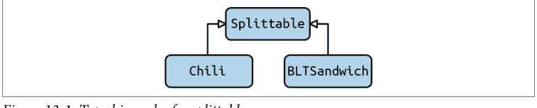

这确实有效：

```
def split_dish(dish: Splittable):
```

事实上，你甚至可以注解返回类型：

```
def split_dish(dish: Splittable) ->
    tuple[Splittable, Splittable]:
```

但是，如果有一个更复杂的类层次结构在起作用呢？如果你的类层次结构看起来像图 13-2 呢？

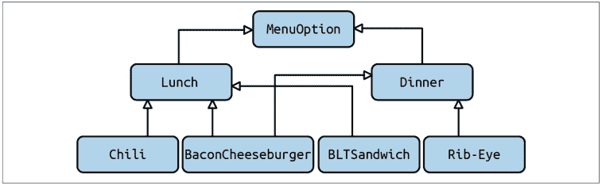

图 13-2. 一个更复杂的类型层次结构

现在，你面临一个艰难的决定。你把 Splittable 类放在类型层次结构的哪里？你不能把它放在树的父级；不是每道菜都应该是可分割的。你可以将 Splittable 类变成 SplittableLunch 类，并将其塞在 Lunch 和任何可分割的类之间，如图 13-3 所示。

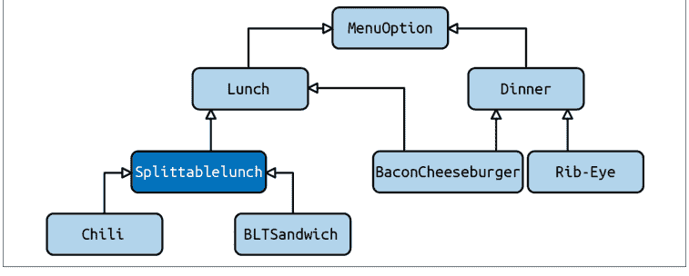

图 13-3. 注入了 Splittable 的更复杂的类型层次结构

随着代码库的增长，这将会崩溃。首先，如果你想在其他任何地方使用 Splittable（比如晚餐、账单或其他任何东西），你将不得不复制那段代码；没有人想要一个继承自 SplittableLunch 的计费系统。此外，Splittable 可能不是你想引入的唯一父类。你可能有其他属性，例如能够共享主菜、提供路边取货、指定允许替换等等。你必须编写的类数量随着你引入的每个选项而激增。

## 使用 Mixins

现在，一些语言通过我在第 11 章介绍的 mixins 来解决这个问题。Mixins 将负担转移到类层次结构底部的每个类，而不会污染上面的任何类。如果我希望我的 BLTSandwich 是可共享的、可路边取货的、可替换的和可分割的，那么我不需要修改 BLTSandwich 以外的任何东西。

```
class BLTSandwich(Shareable,
                PickUppable,
                Substitutable,
                Splittable):
    # ...
```

只有需要该功能的类才需要更改。这减少了在大型代码库中协调的需求。尽管如此，这并不完美；用户仍然需要向他们的类添加多重继承来解决这个问题，如果能最小化类型检查所需的更改那就太好了。当你导入父类时，它还会引入物理依赖，这可能并不理想。

事实上，上面的选项都不合适。你只是为了类型检查而更改现有类，这对我来说感觉非常*不符合 Python 风格*。许多开发者爱上 Python 是因为它不需要这种冗长。幸运的是，有一个更好的解决方案，即 *protocols*。

## Protocols

Protocols 提供了一种弥合类型提示和运行时类型系统之间差距的方法。它们允许你在类型检查期间提供结构化子类型。事实上，你可能在不知不觉中熟悉一个 protocol：迭代器协议。

迭代器协议是对象可以实现的一组定义好的行为。如果一个对象实现了这些行为，你就可以循环遍历该对象。考虑：

```
from random import shuffle
from typing import Iterator, MutableSequence
class ShuffleIterator:
    def __init__(self, sequence: MutableSequence):
        self.sequence = list(sequence)
        shuffle(self.sequence)

    def __iter__(self):
        return self

    def __next__(self):
        if not self.sequence:
            raise StopIteration
        return self.sequence.pop(0)

my_list = [1, 2, 3, 4]
iterator: Iterator = ShuffleIterator(my_list)
```

```
for num in iterator:
    print(num)
```

注意我并没有为了类型提示工作而必须继承 Iterator。这是因为 ShuffleIterator 具有迭代器工作所需的两个方法：一个用于循环遍历迭代器的 `__iter__` 方法，以及一个用于获取序列中下一个项目的 `__next__` 方法。

这正是我想在 Splittable 示例中实现的那种模式。我希望能够基于代码的结构使类型提示工作。为此，你可以定义你自己的 protocol。

## 定义 Protocol

定义一个 protocol 非常简单。如果你想让某些东西是可分割的，你根据 protocol 定义 Splittable：

```
from typing import Protocol
class Splittable(Protocol):
    cost: int
    name: str

    def split_in_half(self) -> tuple['Splittable', 'Splittable']:
        """ No implementation needed """
        ...
```

这看起来与本章前面子类化的示例非常接近，但你使用它的方式略有不同。

要让 BLTSandwich 可分割，你不必在类中指示任何不同的东西。不需要子类化：

```
class BLTSandwich:
    def __init__(self):
        self.cost = 6.95
        self.name = 'BLT'
        # This class handles a fully constructed BLT sandwich
        # ...

    def split_in_half(self) -> ('BLTSandwich', 'BLTSandwich'):
        # Instructions for how to split a sandwich in half
        # Cut along diagonal, wrap separately, etc.
        # Return two sandwiches in return
```

BLTSandwich 没有显式的父类。如果你想明确，你仍然可以从 Splittable 继承，但这不是必需的。

split_dish 函数现在可以期望使用任何支持新的 Splittable protocol 的东西：

```
def split_dish(order: Splittable) -> tuple[Splittable, Splittable]:
```

## 讨论主题

你可以在代码库的哪些地方使用协议？讨论你大量使用鸭子类型或编写泛型代码的领域。讨论在不使用协议的情况下，这些代码区域可能如何容易被误用。

类型检查器仅凭 `BLTSandwich` 定义的字段和方法，就能检测出它实现了 `Splittable` 协议。这极大地简化了类层次结构。即使添加更多协议，你也不需要复杂的树形结构。你可以为每组所需行为简单地定义不同的协议，例如 `Shareable`、`Substitutable` 或 `PickUppable`。依赖这些行为的函数可以依赖这些协议，而不是任何基类。原始类无需以任何形式更改，只要它们实现了所需的功能。

> ## 协议是否消除了对继承的需求？

一旦你习惯了协议，继承就显得多余了。虽然继承对于名义子类型化非常有意义，但对于任何涉及结构子类型化的情况来说，它都过于笨重。你引入了不必要的关联，增加了系统的维护成本。

要决定是使用协议还是子类化，我希望你记住第 12 章学到的教训。任何子类化另一个类或遵循协议的类型都是子类型。因此，它需要维护父类型的契约。如果契约只是定义了类型的结构（例如 `Splittable`，只需要定义某些属性），那么使用协议。然而，如果父类型的契约定义了需要维护的行为，例如在特定条件下如何操作，那么使用继承能更好地反映 *is-a* 关系。

## 高级用法

到目前为止，我已经介绍了协议的主要用例，但还有一些内容我想向你展示。你不会经常用到这些特性，但它们填补了协议的一个关键空白。

## 组合协议

我在上一节中谈到一个类可能满足多个协议。例如，一份午餐项目可能同时是 `Splittable`、`Shareable`、`Substitutable` 和 `PickUppable`。虽然你可以很容易地混合这些协议，但如果你发现超过一半的午餐条目都属于这一类呢？你可以将这些午餐条目指定为 `StandardLunchEntry`，从而允许你将所有四个协议作为一个类型来引用。

你的第一次尝试可能只是编写一个类型别名来覆盖所有情况：

```python
StandardLunchEntry = Union[Splittable, Shareable,
                          Substitutable, PickUppable]
```

然而，这将匹配任何满足至少一个协议的类型，而不是全部四个。要匹配所有四个协议，你需要使用组合协议：

```python
class StandardLunchEntry(Splittable, Shareable, Substitutable,
                        PickUppable, Protocol):
    pass

# 记住，你不需要显式地从协议继承
# 我在这里这样做是为了清晰起见
class BLTSandwich(StandardLunchEntry):
    # ... 省略 ...
```

然后，你可以在任何需要项目支持所有四个协议的地方使用 `StandardLunchEntry`。这允许你将协议组合在一起，而无需在代码库中一遍又一遍地重复相同的组合。

## 运行时可检查协议

在所有这些协议讨论中，我一直停留在静态类型检查的领域。但有时，你只需要在运行时检查类型。不幸的是，协议开箱即用不支持任何 `isinstance()` 或 `issubclass()` 检查。不过，添加起来很容易：

```python
from typing import runtime_checkable, Protocol

@runtime_checkable
class Splittable(Protocol):
    cost: int
    name: str

    def split_in_half(self) -> tuple['Splittable', 'Splittable']:
        ...

class BLTSandwich():
    # ... 省略 ...
```

```python
assert isinstance(BLTSandwich(), Splittable)
```

只要你在其中添加了 `runtime_checkable` 装饰器，你就可以进行 `isinstance()` 检查，以查看对象是否满足协议。当你这样做时，`isinstance()` 本质上是在协议的每个预期变量和函数上调用 `__hasattr__` 方法。

> `issubclass()` 只有在你的协议是非数据协议（即没有任何协议变量的协议）时才有效。这与在构造函数中设置变量的边缘情况有关。

当你使用协议的 `Union` 时，通常会将协议标记为 `runtime_checkable`。函数可能期望一个协议或另一个协议，并且这些函数可能需要在函数体内部以某种方式在运行时区分两者。

## 满足协议的模块

虽然到目前为止我只讨论了对象满足协议，但有一个更窄的用例值得一提。事实证明，模块也可以满足协议。毕竟，模块仍然是一个对象。

假设我想围绕餐厅定义一个协议，每个餐厅定义在一个单独的文件中。这是一个这样的文件：

```python
name = "Chameleon Café"
address = "123 Fake St."

standard_lunch_entries = [BLTSandwich, TurkeyAvocadoWrap, Chili]
other_entries = [BaconCheeseburger, FrenchOnionSoup]

def render_menu() -> Menu:
    # 渲染菜单的代码
```

然后，我需要一些代码来定义 `Restaurant` 协议并能够加载餐厅：

```python
from typing import Protocol
from lunch import LunchEntry, Menu, StandardLunchEntry

class Restaurant(Protocol):
    name: str
    address: str
    standard_lunch_entries: list[StandardLunchEntry]
    other_entries: List[LunchEntry]

    def render_menu(self) -> Menu:
        """ 不需要实现 """
        ...

def load_restaurant(restaurant: Restaurant):
    # 加载餐厅的代码
    # ...
```

现在，我可以将导入的模块传递给我的 `load_restaurant` 函数：

```python
import restaurant
from load_restaurant import load_restaurant

# 加载我们的餐厅模型
load_restaurant(restaurant)
```

在 `main.py` 中，对 `load_restaurant` 的调用将通过类型检查。`restaurant` 模块满足我定义的 `Restaurant` 协议。协议甚至足够智能，当传入模块时，会忽略 `render_menu` 中的 `self` 参数。使用协议来定义模块不是日常的 Python 事情，但如果你有 Python 配置文件或需要强制执行契约的插件架构，你会看到它出现。

> 并非每个类型检查器都可能支持将模块用作协议；请仔细检查你最喜欢的类型检查器的错误报告和文档以获取支持信息。

## 结束语

协议是在 Python 3.8 中引入的，所以它们仍然相对较新。然而，它们弥补了 Python 静态类型检查能力的一个巨大空白。记住，虽然运行时是结构子类型化的，但大多数静态类型检查是名义子类型化的。协议填补了这一空白，让你在类型检查期间进行结构子类型化。你最常在编写库代码并希望提供一个可靠的、用户可以依赖的 API 时使用它们，而无需依赖特定类型。使用协议减少了代码的物理依赖性，这有助于可维护性，但你仍然可以及早捕获错误。

在下一章中，你将学习另一种增强类型的方法：建模类型。建模类型允许你创建一组丰富的约束，这些约束在类型检查和运行时进行检查，并且可以消除一整类错误，而无需为每个字段手动编写验证。更好的是，通过建模你的类型，你为代码库中允许和不允许的内容提供了内置文档。在下一章中，你将看到如何使用流行的库 `pydantic` 来完成所有这些操作。

# 第 14 章

## 使用 pydantic 进行运行时检查

健壮代码的核心主题是使错误更容易被检测到。错误是开发复杂系统不可避免的一部分；你无法避免它们。通过编写自己的类型，你创建了一种词汇表，使得引入不一致性变得更加困难。使用类型注解为你提供了一个安全网，让你在开发过程中就能捕获错误。这两者都是 *将错误左移* 的例子；你不是在测试期间（或更糟，在生产环境中）发现错误，而是更早地发现它们，理想情况下是在编写代码时。

然而，并非每个错误都能通过代码检查和静态分析轻松发现。有一整类错误只能在运行时检测到。每当你与程序外部提供的数据（如数据库、配置文件、网络请求）交互时，你都有输入无效数据的风险。你的代码在检索和解析数据方面可能坚如磐石，但对于防止用户传入无效数据，你能做的并不多。

你的第一反应可能是编写大量的 *验证逻辑*：`if` 语句和检查，以查看传入的所有数据是否正确。问题在于验证逻辑通常很复杂、庞大，并且难以一目了然。你的验证越全面，情况就越糟。如果你的目标是发现错误，阅读所有代码（和测试）将是你的最佳选择。在这种情况下，你需要最小化你查看的代码量。问题就在这里：你阅读的代码越多，你理解的就越多，但你阅读的越多，你的认知负担就越高，从而降低了你发现错误的机会。

在本章中，你将学习如何使用 `pydantic` 库来解决这个问题。`pydantic` 让你定义建模类，减少你需要编写的验证逻辑量，而不会牺牲可读性。`pydantic` 将轻松解析用户提供的数据，并提供关于输出数据结构的保证。我将介绍一些基本

## 动态配置

在本章中，我将构建描述餐厅的类型。首先，我将提供一种方式，让用户通过配置文件来指定餐厅。以下是每个餐厅的可配置字段（及其约束）列表：

- 餐厅名称
  ——由于历史原因，名称必须少于32个字符，并且只能包含字母、数字、引号和空格（不支持Unicode，抱歉）。
- 所有者全名
- 地址
- 员工列表
  ——必须至少有一名厨师和一名服务员。
  ——每位员工都有姓名和职位（厨师、服务员、领班、副厨师长或外卖司机）。
  ——每位员工要么有用于接收支票的邮寄地址，要么有直接存款的详细信息。
- 菜品列表
  ——每道菜都有名称、价格和描述。名称限制为16个字符，描述限制为80个字符。可选地，每道菜可以有一张图片（以文件名形式）。
  ——每道菜的名称必须唯一。
  ——菜单上必须至少有三道菜。
- 座位数
- 是否提供外带订单（布尔值）
- 是否提供外卖（布尔值）

这些信息存储在一个YAML文件中，如下所示：

```
name: Viafore's
owner: Pat Viafore
address: 123 Fake St. Fakington, FA 01234
employees:
  - name: Pat Viafore
    position: Chef
    payment_details:
      bank_details:
        routing_number: "123456789"
        account_number: "123456789012"
  - name: Made-up McGee
    position: Server
    payment_details:
      bank_details:
        routing_number: "123456789"
        account_number: "123456789012"
  - name: Fabricated Frank
    position: Sous Chef
    payment_details:
      bank_details:
        routing_number: "123456789"
        account_number: "123456789012"
  - name: Illusory Ilsa
    position: Host
    payment_details:
      bank_details:
        routing_number: "123456789"
        account_number: "123456789012"
dishes:
  - name: Pasta and Sausage
    price_in_cents: 1295
    description: Rigatoni and sausage with a tomato-garlic-basil sauce
  - name: Pasta Bolognese
    price_in_cents: 1495
    description: Spaghetti with a rich tomato and beef Sauce
  - name: Caprese Salad
    price_in_cents: 795
    description: Tomato, buffalo mozzarella, and basil
    picture: caprese.png
number_of_seats: 12
to_go: true
delivery: false
```

通过pip安装的`yaml`库可以轻松读取此文件，并提供一个字典：

```
with open('code_examples/chapter14/restaurant.yaml') as yaml_file:
    restaurant = yaml.safe_load(yaml_file)

print(restaurant)
>>> {
    "name": "Viafore's",
    "owner": "Pat Viafore",
    "address": "123 Fake St. Fakington, FA 01234",
    "employees": [{
        "name": "Pat Viafore",
        "position": "Chef",
        "payment_details": {
            "bank_details": {
                "routing_number": '123456789',
                "account_number": '123456789012'
            }
        }
    },
    {
        "name": "Made-up McGee",
        "position": "Server",
        "payment_details": {
            "bank_details": {
                "routing_number": '123456789',
                "account_number": '123456789012'
            }
        }
    },
    {
        "name": "Fabricated Frank",
        "position": "Sous Chef",
        "payment_details": {
            "bank_details": {
                "routing_number": '123456789',
                "account_number": '123456789012'
            }
        }
    },
    {
        "name": "Illusory Ilsa",
        "position": "Host",
        "payment_details": {
            "bank_details": {
                "routing_number": '123456789',
                "account_number": '123456789012'
            }
        }
    }
],
"dishes": [{
    "name": "Pasta and Sausage",
    "price_in_cents": 1295,
    "description": "Rigatoni and sausage with a tomato-garlic-basil sauce"
},
{
    "name": "Pasta Bolognese",
    "price_in_cents": 1495,
    "description": "Spaghetti with a rich tomato and beef Sauce"
},
{
    "name": "Caprese Salad",
    "price_in_cents": 795,
    "description": "Tomato, buffalo mozzarella, and basil",
    "picture": "caprese.png"
}],
'number_of_seats': 12,
"to_go": True,
"delivery": False
}
```

我想请你暂时戴上测试人员的帽子。我刚才给出的需求肯定不是详尽无遗的；你会如何完善它们？我希望你花几分钟时间，仅根据给出的字典，列出你能想到的所有不同约束。假设YAML文件解析后返回一个字典，你能想到多少个无效的测试用例？

> 你可能注意到，在上面的例子中，路由号码和账号是字符串。这是有意为之的。尽管它们是数字字符串，但我不希望它们是数字类型。数字运算（如加法或乘法）没有意义，而且我不希望账号00000001234被截断为1234。

以下是在列举测试用例时需要考虑的一些想法：

- Python是一种动态语言。你确定所有内容都是正确的类型吗？
- 字典不需要任何必填字段——你确定每个字段都存在吗？
- 问题陈述中的所有约束都测试到了吗？
- 那么额外的约束呢（正确的路由号码、账号和地址？）
- 那些不应该出现的负数呢？

我在大约五分钟内想出了67个包含无效数据的不同测试用例。我的一些测试用例包括（完整列表包含在[本书的GitHub仓库](https://github.com/example)中）：

- 名称是零个字符。
- 名称不是字符串。
- 没有厨师。
- 员工没有银行详细信息或地址。
- 员工的路由号码被截断（0000123变成123）。
- 座位数是负数。

诚然，这不是一个非常复杂的类。你能想象一个更复杂的类需要多少测试用例吗？即使有67个测试用例，你能想象打开一个类型的构造函数并检查67个不同的条件吗？在我工作过的大多数代码库中，验证逻辑远没有这么全面。然而，这是用户可配置的数据，我希望在运行时尽早捕获错误。你应该更倾向于在数据注入时捕获错误，而不是在首次使用时。

毕竟，这些值的首次使用可能要等到你在一个独立的系统中，与你的解析逻辑解耦时才会发生。


## 讨论主题

思考一下你系统中以数据类型表示的一些用户数据。这些数据有多复杂？有多少种方式可以错误地构造它？讨论错误创建这些数据的影响，以及你对代码能捕获所有错误的信心程度。

在本章中，我将向你展示如何创建一个易于阅读且能建模所有列出约束的类型。由于我如此专注于类型注解，如果能在类型检查时捕获缺失字段或错误类型，那就太好了。第一个想法是使用TypedDict（有关TypedDict的更多信息，请参见第5章）：

```python
from typing import Literal, TypedDict, Union

class AccountAndRoutingNumber(TypedDict):
    account_number: str
    routing_number: str

class BankDetails(TypedDict):
    bank_details: AccountAndRoutingNumber

AddressOrBankDetails = Union[str, BankDetails]

Position = Literal['Chef', 'Sous Chef', 'Host',
                   'Server', 'Delivery Driver']

class Dish(TypedDict):
    name: str
    price_in_cents: int
    description: str

class DishWithOptionalPicture(Dish, TypedDict, total=False):
    picture: str

class Employee(TypedDict):
    name: str
    position: Position
    payment_information: AddressOrBankDetails

class Restaurant(TypedDict):
    name: str
    owner: str
    address: str
    employees: list[Employee]
    dishes: list[Dish]
    number_of_seats: int
    to_go: bool
    delivery: bool
```

这在可读性方面是一个巨大的进步；你可以确切地知道构造你的类型需要哪些类型。你可以编写以下函数：

```python
def load_restaurant(filename: str) -> Restaurant:
    with open(filename) as yaml_file:
        return yaml.safe_load(yaml_file)
```

下游消费者将自动受益于我刚才列出的类型。然而，这种方法有几个问题：

- 我无法控制TypedDict的构造，因此我无法在类型构造时验证任何字段。我必须强制消费者进行验证。
- TypedDict不能有额外的方法。
- TypedDict不会隐式进行任何验证。如果你从YAML创建了错误的字典，类型检查器不会报错。

最后一点很重要。事实上，我的YAML文件的全部内容可以是以下内容，代码仍然会通过类型检查：

```
invalid_name: "This is the wrong file format"
```

类型检查不会在运行时捕获错误。你需要更强大的东西。于是，pydantic登场了。

## pydantic

pydantic是一个库，它在不牺牲可读性的情况下提供类型的运行时检查。你可以使用pydantic来建模你的类，如下所示：

```python
from pydantic.dataclasses import dataclass
from typing import Literal, Optional, TypedDict, Union

@dataclass
class AccountAndRoutingNumber:
    account_number: str
    routing_number: str

@dataclass
class BankDetails:
    bank_details: AccountAndRoutingNumber

AddressOrBankDetails = Union[str, BankDetails]

Position = Literal['Chef', 'Sous Chef', 'Host',
                   'Server', 'Delivery Driver']

@dataclass
class Dish:
    name: str
```

## 验证器

Pydantic 提供了大量内置的*验证器*。验证器是自定义类型，用于检查字段上的特定约束。例如，如果我想确保字符串具有特定长度，或者所有整数都是正数，我可以使用 pydantic 的约束类型：

```python
from typing import Optional

from pydantic.dataclasses import dataclass
from pydantic import constr, PositiveInt

@dataclass
class AccountAndRoutingNumber:
    account_number: constr(min_length=9, max_length=9) ❶
    routing_number: constr(min_length=8, max_length=12)

@dataclass
class Address:
    address: constr(min_length=1)

# ... 省略 ...

@dataclass
class Dish:
    name: constr(min_length=1, max_length=16)
    price_in_cents: PositiveInt
    description: constr(min_length=1, max_length=80)
    picture: Optional[str] = None

@dataclass
class Restaurant:
    name: constr(regex=r'^[a-zA-Z0-9 ]*$', ❷
                 min_length=1, max_length=16)
    owner: constr(min_length=1)
    address: constr(min_length=1)
    employees: List[Employee]
    dishes: List[Dish]
    number_of_seats: PositiveInt
    to_go: bool
    delivery: bool
```

❶ 我将字符串约束为特定长度。

❷ 我将字符串约束为匹配正则表达式（在此例中，仅允许字母数字字符和空格）。

如果我传入无效类型（例如包含特殊字符的餐厅名称或负数的座位数），我会得到以下错误：

```
pydantic.error_wrappers.ValidationError: 2 validation errors for Restaurant
name
  string does not match regex "^[a-zA-Z0-9 ]$" (type=value_error.str.regex; pattern=^[a-zA-Z0-9 ]$)
number_of_seats
  ensure this value is greater than 0
    (type=value_error.number.not_gt; limit_value=0)
```

我甚至可以约束列表以实施进一步的限制。

```python
from pydantic import conlist, constr

@dataclass
class Restaurant:
    name: constr(regex=r'^[a-zA-Z0-9 ]*$',
                 min_length=1, max_length=16)
    owner: constr(min_length=1)
    address: constr(min_length=1)
    employees: conlist(Employee, min_items=2) ❶
    dishes: conlist(Dish, min_items=3) ❷
    number_of_seats: PositiveInt
    to_go: bool
    delivery: bool
```

❶ 此列表被约束为 Employee 类型，并且必须至少有两名员工。

❷ 此列表被约束为 Dish 类型，并且必须至少有三道菜。

如果我传入不符合这些约束的内容（例如忘记一道菜）：

```
pydantic.error_wrappers.ValidationError: 1 validation error for Restaurant
dishes
  ensure this value has at least 3 items
    (type=value_error.list.min_items; limit_value=3)
```

通过使用约束类型，我额外捕获了之前想到的 17 个测试用例，使我的总覆盖率达到 67 个测试用例中的 55 个。相当不错，不是吗？

为了捕获剩余的错误集，我可以使用自定义验证器来嵌入最后的验证逻辑：

```python
from pydantic import validator

@dataclass
class Restaurant:
    name: constr(regex=r'^[a-zA-Z0-9 ]*$',
                 min_length=1, max_length=16)
    owner: constr(min_length=1)
    address: constr(min_length=1)
    employees: conlist(Employee, min_items=2)
    dishes: conlist(Dish, min_items=3)
    number_of_seats: PositiveInt
    to_go: bool
    delivery: bool

    @validator('employees')
    def check_chef_and_server(cls, employees):
        if (any(e for e in employees if e.position == 'Chef') and
            any(e for e in employees if e.position == 'Server')):
            return employees
        raise ValueError('Must have at least one chef and one server')
```

如果我未能提供至少一名厨师和一名服务员：

```
pydantic.error_wrappers.ValidationError: 1 validation error for Restaurant
employees
  Must have at least one chef and one server (type=value_error)
```

我将把为其他错误情况（例如有效地址、有效路由号或文件系统上存在的有效图像）编写自定义验证器的任务留给您。

## 验证与解析

诚然，pydantic 严格来说不是一个验证库，而是一个*解析*库。区别虽小，但需要指出。在我所有的示例中，我都使用 pydantic 来检查参数和类型，但它不是一个严格的验证器。Pydantic 自称是一个*解析库*，这意味着它保证的是数据模型*输出*的内容，而不是输入的内容。也就是说，当您定义 pydantic 模型时，pydantic 会尽其所能将数据强制转换为您定义的类型。

如果您有一个模型：

```python
from pydantic import dataclass

@dataclass
class Model:
    value: int
```

传入字符串或浮点数到此模型是没有问题的；pydantic 会尽力将值强制转换为整数（如果值无法转换，则抛出异常）。此代码不会抛出任何异常：

```python
Model(value="123") # 值被设置为整数 123
Model(value=5.5) # 此值被截断为 5
```

Pydantic 正在解析这些值，而不是验证它们。您不能保证传入模型的是整数，但您总是保证另一端输出的是整数（或者抛出异常）。

如果您想限制这种行为，可以使用 pydantic 的严格字段：

```python
from pydantic.dataclasses import dataclass
from pydantic import StrictInt

@dataclass
class Model:
    value: StrictInt
```

现在，当从其他类型构造时，

```python
x = Model(value="0023").value
```

您将得到一个错误：

```
pydantic.error_wrappers.ValidationError: 1 validation error for Model
value
  value is not a valid integer (type=type_error.integer)
```

因此，虽然 pydantic 自称是一个解析库，但在您的数据模型中强制执行更严格的行为是可能的。

## 结语

我在本书中一直强调类型检查器的重要性，但这并不意味着在运行时捕获错误毫无意义。虽然类型检查器捕获了相当一部分错误并减少了运行时检查，但它们无法捕获所有错误。您仍然需要验证逻辑来填补空白。

对于这类检查，pydantic 库是您工具箱中的一个绝佳工具。通过将验证逻辑直接嵌入到您的类型中（而无需编写大量繁琐的 if 语句），您可以从两方面提高健壮性。首先，它显著提高了可读性；阅读您类型定义的开发人员将确切知道对其施加了哪些约束。其次，它为您提供了运行时检查所需的保护层。

我发现 pydantic 还有助于填补数据类和类之间的中间地带。每个约束在技术上都满足了该类的不变量。我通常建议不要给您的数据类提供不变量，因为您无法保护它；您不控制构造，并且属性访问是公共的。然而，pydantic 即使在您调用构造函数或设置字段时也能保护不变量。但是，如果您的字段是相互依赖的（例如需要同时设置两个字段，或者需要根据另一个字段的值设置一个字段），请坚持使用类。

## 第三部分

## 可扩展的 Python

健壮的代码是可维护的代码。为了可维护，代码必须易于阅读、易于检查错误且易于修改。本书的第一部分和第二部分侧重于可读性和错误检测，但不一定涉及如何扩展或修改现有代码。类型注解和类型检查器在与单个类型交互时为维护者提供了信心，但当涉及代码库中更大的变更时，例如引入新的工作流程或替换关键组件，又该如何呢？

第三部分探讨了更大的变更，并向你展示如何让未来的开发者能够进行这些变更。你将学习可扩展性和可组合性，这两者都是提高健壮性的核心原则。你将学习如何管理依赖关系，以确保简单的变更不会引发一连串的错误和问题。然后，你将把这些概念应用于架构模型，例如基于插件的系统、响应式编程和面向任务的程序。

## 第 15 章
可扩展性

本章聚焦于可扩展性。可扩展性是本书这一部分的基石；理解这个关键概念非常重要。一旦你了解了可扩展性如何影响健壮性，你就会开始在代码库中发现应用它的机会。可扩展的系统允许其他开发者自信地增强你的代码库，从而减少出错的可能性。让我们来看看如何实现。

## 什么是可扩展性？

*可扩展性*是系统的一种属性，它允许在不修改系统现有部分的情况下添加新功能。软件不是静态的；它会变化。在代码库的整个生命周期中，开发者会修改你的软件。*软件*中的*软*字就暗示了这一点。这些变更可能相当大。想想那些你需要在扩展规模时替换架构的关键部分，或者添加新工作流程的时刻。这些变更涉及代码库的多个部分；简单的类型检查无法在这个层面捕获所有错误。毕竟，你可能正在完全重新设计你的类型。可扩展软件的目标是以这样一种方式设计：你为未来的开发者提供了便捷的扩展点，尤其是在经常变更的代码区域。

为了说明这个想法，让我们考虑一个连锁餐厅，他们想实施某种通知系统来帮助供应商响应需求。餐厅可能有一道特色菜，或者某种食材用完了，或者表明某些食材已经变质。在每种情况下，餐厅都希望供应商自动收到需要补货的通知。供应商提供了一个 Python 库来执行实际的通知。

实现如下所示：

```python
def declare_special(dish: Dish, start_date: datetime.datetime,
                   end_time: datetime.datetime):
    # ... snip setup in local system ...
    # ... snip send notification to the supplier ...

def order_dish(dish: Dish):
    # ... snip automated preparation
    out_of_stock_ingredients = {ingred for ingred in dish
                                if out_of_stock(ingred)}
    if out_of_stock_ingredients:
        # ... snip taking dishes off menu ...
        # ... snip send notification to the supplier ...

# called every 24 hours
def check_for_expired_ingredients():
    expired_ingredients = {ing for ing in get_items_in_stock()}
    if expired_ingredients:
        # ... snip taking dishes off menu ...
        # ... snip send notifications to the supplier ...
```

这段代码乍一看相当直接。每当发生值得注意的事件时，就可以向供应商发送相应的通知（想象一下作为 JSON 请求一部分发送的某个字典）。

快进几个月，一个新的工作项出现了。你在餐厅的老板对通知系统非常满意，他们想扩展它。他们希望通知能发送到他们的电子邮件地址。听起来很简单，对吧？你让 `declare_special` 函数也接受一个电子邮件地址：

```python
def declare_special(notification: NotificationType,
                   start_date: datetime.datetime,
                   end_time: datetime.datetime,
                   email: Email):
    # ... snip ...
```

然而，这有着深远的影响。调用 `declare_special` 的函数也需要知道传递哪个电子邮件地址。值得庆幸的是，类型检查器会捕获任何遗漏。但如果其他用例开始出现呢？你查看一下待办事项列表，发现以下任务：

- 将特价和缺货商品通知销售团队。
- 将新的特价信息通知餐厅的顾客。
- 为不同的供应商支持不同的 API。
- 支持短信通知，这样你的老板也能收到通知。
- 创建新的通知类型：新菜品。市场人员和老板想了解这个，但供应商不需要。

随着开发者实现这些功能，`declare_special` 变得越来越大。它处理越来越多的情况，随着逻辑变得越来越复杂，出错的可能性也在增长。更糟糕的是，对 API 的任何更改（例如添加电子邮件地址列表或用于发送短信的电话号码）都会对所有调用者产生影响。在某些时候，像向市场人员列表添加新电子邮件地址这样简单的事情，都会涉及代码库中的多个文件。这在口语中被称为“霰弹枪手术”：¹ 即一个单一的变更以爆炸模式扩散，影响各种文件。此外，开发者正在修改现有代码，增加了出错的机会。最重要的是，我们只涵盖了 `declare_special`，但 `order_dish` 和 `check_for_expired_ingredients` 也需要它们自己的自定义逻辑。处理到处重复的通知代码会相当乏味。问问自己，如果仅仅因为一个新用户想要短信通知，你就必须在代码库中寻找每一个通知代码片段，你会喜欢这样吗？

这一切都源于代码的可扩展性不强。你开始要求开发者了解多个文件的所有复杂性才能进行他们的变更。维护者实现他们的功能将需要多得多的工作。回想一下第 1 章中关于偶然复杂性和必要复杂性的讨论。必要复杂性是问题领域固有的；偶然复杂性是你引入的复杂性。在这种情况下，通知、接收者和过滤器的组合是必要的；它是系统所需的功能。

然而，你实现系统的方式决定了你会产生多少偶然复杂性。我所描述的方式充满了偶然复杂性。添加任何一件简单的事情都是一项相当艰巨的任务。要求开发者在代码库中搜寻所有需要更改的地方，无异于自找麻烦。简单的变更应该易于实现。否则，每次扩展系统都会变成一件苦差事。

## 重新设计

让我们再看一下 `declare_special` 函数：

```python
def declare_special(notification: NotificationType,
                    start_date: datetime.datetime,
                    end_time: datetime.datetime,
                    email: Email):
    # ... snip ...
```

问题都始于将电子邮件作为参数添加到函数中。这导致了影响代码库其他部分的连锁反应。这不是未来开发者的错；他们通常受时间限制，试图将他们的功能塞进一个

> 1 Martin Fowler. *Refactoring: Improving the Design of Existing Code*. 2nd ed. Upper Saddle River, NJ: Addison-Wesley Professional, 2018.

他们通常会遵循已有的代码模式。如果你能为他们铺平道路，引导他们走向正确的方向，就能提高代码的可维护性。如果放任可维护性恶化，你就会开始看到类似这样的方法：

```python
def declare_special(notification: NotificationType,
                    start_date: datetime.datetime,
                    end_time: datetime.datetime,
                    emails: list[Email],
                    texts: list[PhoneNumber],
                    send_to_customer: bool):
    # ... 省略 ...
```

这个函数会不断膨胀，直到变成一团乱麻的依赖关系。如果我需要将一个客户添加到邮件列表中，为什么我需要查看特价是如何宣布的？

我需要重新设计通知系统，使更改变得容易。首先，我会查看用例，并思考需要为未来的开发者简化什么。（如果你需要关于设计接口的更多建议，请回顾第二部分，特别是第11章。）在这个特定的用例中，我希望未来的开发者能够轻松地添加三样东西：

- 新的通知类型
- 新的通知方法（如电子邮件、短信或API）
- 需要通知的新用户

通知代码散布在代码库各处，因此我想确保开发者在进行这些更改时，不需要进行任何“散弹枪手术”。记住，我希望简单的事情变得简单。

现在，思考一下我的*必要*复杂性。在这种情况下，会有多种通知方法、多种通知类型以及多个需要被通知的用户。这是三个独立的复杂性；我希望限制它们之间的交互。`declare_special`的部分问题在于它必须考虑的关注点组合令人望而生畏。将这种复杂性乘以每个函数略有不同的通知需求，你就会面临真正的维护噩梦。

首先要做的是尽可能地解耦意图。我将从为每种通知类型创建类开始：

```python
@dataclass
class NewSpecial:
    dish: Dish
    start_date: datetime.datetime
    end_date: datetime.datetime

@dataclass
class IngredientsOutOfStock:
    ingredients: Set[Ingredient]

@dataclass
class IngredientsExpired:
    ingredients: Set[Ingredient]

@dataclass
class NewMenuItem:
    dish: Dish

Notification = Union[NewSpecial, IngredientsOutOfStock,
                     IngredientsExpired, NewMenuItem]
```

如果我思考我希望`declare_special`如何与代码库交互，我真的只希望它知道这个`NotificationType`。宣布特价不应该需要知道谁注册了这个特价以及他们将如何被通知。理想情况下，`declare_special`（以及任何其他需要发送通知的函数）应该看起来像这样：

```python
def declare_special(dish: Dish, start_date: datetime.datetime,
                   end_time: datetime.datetime):
    # ... 省略本地系统设置 ...
    send_notification(NewSpecial(dish, start_date, end_date))
```

`send_notification`可以这样声明：

```python
def send_notification(notification: Notification):
    # ... 省略 ...
```

这意味着如果代码库的任何部分想要发送通知，它只需要调用这个函数。你只需要传入一个通知类型。添加新的通知类型很简单；你添加一个新的类，将该类添加到Union中，然后用新的通知类型调用`send_notification`。

接下来，你必须使添加新的通知方法变得容易。同样，我将添加新的类型来表示每种通知方法：

```python
@dataclass
class Text:
    phone_number: str

@dataclass
class Email:
    email_address: str

@dataclass
class SupplierAPI:
    pass

NotificationMethod = Union[Text, Email, SupplierAPI]
```

在代码库的某个地方，我需要实际根据方法发送不同的通知类型。我可以创建一些辅助函数来处理该功能：

```python
def notify(notification_method: NotificationMethod, notification: Notification):
    if isinstance(notification_method, Text):
        send_text(notification_method, notification)
    elif isinstance(notification_method, Email):
        send_email(notification_method, notification)
    elif isinstance(notification_method, SupplierAPI):
        send_to_supplier(notification)
    else:
        raise ValueError("Unsupported Notification Method")
```

```python
def send_text(text: Text, notification: Notification):
    if isinstance(notification, NewSpecial):
        # ... 省略发送短信 ...
        pass
    elif isinstance(notification, IngredientsOutOfStock):
        # ... 省略发送短信 ...
        pass
    elif isinstance(notification, IngredientsExpired):
        # ... 省略发送短信 ...
        pass
    elif isinstance(notification, NewMenuItem):
        # .. 省略发送短信 ...
        pass
    raise NotImplementedError("Unsupported Notification Method")
```

```python
def send_email(email: Email, notification: Notification):
    # .. 类似于 send_text ...
```

```python
def send_to_supplier(notification: Notification):
    # .. 类似于 send_text
```

现在，添加新的通知方法也很直接。我添加一个新的类型，将其添加到联合类型中，在`notify`中添加一个if语句，并编写一个相应的方法来处理所有不同的通知类型。

在每个`send_*`方法中处理所有通知类型可能看起来很笨重，但这是必要的复杂性；由于不同的消息、不同的信息和不同的格式，每个方法/类型组合都有不同的功能。如果代码量确实增长了，你可以创建一个动态查找字典（这样添加新的键值对就足以添加通知方法），但在这些情况下，你将用类型检查的早期错误检测换取更好的可读性。

现在我有了添加新通知方法或类型的简单方法。我只需要将它们全部整合在一起，以便轻松添加新用户。为此，我将编写一个函数来获取需要通知的用户列表：

```python
users_to_notify: Dict[type, List[NotificationMethod]] = {
    NewSpecial: [SupplierAPI(), Email("boss@company.org"),
                 Email("marketing@company.org"), Text("555-2345")],
    IngredientsOutOfStock: [SupplierAPI(), Email("boss@company.org")],
    IngredientsExpired: [SupplierAPI(), Email("boss@company.org")],
    NewMenuItem: [Email("boss@company.org"), Email("marketing@company.org")]
}
```

在实践中，这些数据可能来自配置文件或其他声明性来源，但为了书籍示例所需的简洁性，这样就可以了。要添加新用户，我只需向此字典添加一个新条目。为用户添加新的通知方法或通知类型也同样容易。要通知的用户代码更容易处理。

为了将所有内容整合在一起，我将使用所有这些概念来实现`send_notification`：

```python
def send_notification(notification: Notification):
    try:
        users = users_to_notify[type(notification)]
    except KeyError:
        raise ValueError("Unsupported Notification Method")
    for notification_method in users:
        notify(notification_method, notification)
```

就是这样！所有这些通知代码都可以放在一个文件中，而代码库的其余部分只需要知道一个函数——`send_notification`——就能与通知系统交互。一旦不需要与代码库的任何其他部分交互，测试就变得容易多了。此外，这段代码是可扩展的；开发者可以轻松地添加新的通知类型、方法或用户，而无需在代码库中搜寻所有繁杂的调用。你希望在最小化对现有代码修改的同时，轻松地为代码库添加新功能。这被称为开闭原则。

## 开闭原则

*开闭原则*（OCP）指出，代码应该对扩展开放，对修改关闭。² 这是可扩展性的核心。我们在上一节中的重新设计试图坚持这一原则。它不要求新功能触及代码库的多个部分，而是要求添加新的类型或函数。即使现有函数发生了变化，我所做的也只是添加一个新的条件检查，而不是修改现有的检查。

看起来我所做的只是追求代码重用，但OCP更进一步。是的，我消除了通知代码的重复，但更重要的是，我使开发者更容易管理复杂性。问问自己你更喜欢哪种方式：实现-

> ² OCP首次由Bertrand Meyer在《面向对象软件构造》（Pearson）中描述。

## 检测 OCP 违规

如何判断你是否应该编写更具扩展性的代码，以遵循 OCP？以下是一些在审视你的代码库时应引起注意的指标：

*简单的事情是否变得困难？*
在你的代码库中，有些事情在概念上应该是简单的。实现该概念所需的工作量应与领域复杂性相匹配。我曾在一个代码库中工作，为了添加一个用户可配置的选项，需要修改 13 个不同的文件。对于一个拥有数百个可配置选项的产品来说，这本应是一项简单的任务。不用说，事实并非如此。

*你是否在类似功能上遇到阻力？*
如果功能请求者不断推迟某个功能的时间表，尤其是当他们说“这与之前的功能 X 几乎完全相同”时，问问自己这种脱节是否源于复杂性。可能是复杂性固有于领域之中，在这种情况下，你应该确保功能请求者与你达成共识。然而，如果复杂性是偶然的，那么你的代码可能需要重构，以便更容易地进行修改。

*你的估算是否一直很高？*
一些团队使用估算来预测他们在给定时间线内将完成的工作量。如果功能的估算一直很高，问问自己估算的来源。是复杂性导致了高估，而这种复杂性是必要的吗？还是因为风险和对未知的恐惧？如果是后者，问问为什么你的代码库让人感觉修改起来有风险。一些团队通过拆分工作来将功能分成单独的估算。如果你一直这样做，问问重构代码库是否可以避免这种拆分。

*提交是否包含大量变更集？*
在你的版本控制系统中查找包含大量文件的提交。这是一个很好的指标，表明“霰弹式修改”正在发生，尤其是当相同的文件在多个提交中反复出现时。请记住，这是一个指导原则；大型提交并不总是表明存在问题，但如果它们频繁发生，就值得深入调查。

**讨论主题**
你在代码库中遇到过哪些 OCP 违规？
如何重构代码以避免它们？

## 缺点

扩展性并非解决所有编码难题的万能药。事实上，过度的灵活性实际上可能会*降低*你的代码库质量。如果你过度使用 OCP，试图让一切都可配置和可扩展，你会很快发现自己陷入混乱。问题在于，虽然使代码可扩展减少了修改时的意外复杂性，但它可能会在其他领域*增加*意外复杂性。

首先，可读性会受损。你正在创建一个全新的抽象层，将你的业务逻辑与代码库的其他部分分离开来。任何想要理解全貌的人都必须多费周折。这将影响新开发人员的上手速度，也会阻碍调试工作。你可以通过良好的文档和解释代码结构来缓解这个问题。

其次，你引入了一种之前可能不存在的耦合。之前，代码库的各个部分是相互独立的。现在，它们共享一个公共子系统；该子系统的任何更改都会影响所有使用者。我将在[第 16 章](#)中更深入地探讨这一点。通过一套强大的测试来缓解这个问题。

适度使用 OCP，并在应用这些原则时谨慎行事。使用过多，你的代码库将过度抽象，依赖关系错综复杂，令人困惑。使用过少，开发人员将花费更长时间进行修改，并引入更多错误。在你相当确定有人会再次修改的区域定义扩展点，你将极大地改善未来的维护者对你代码库的体验。

## 结语

扩展性是代码库维护最重要的方面之一。它为你的协作者提供了一种在不修改现有代码的情况下添加功能的方法。任何时候你无需修改现有代码就能完成工作，就意味着你没有引入任何回归问题。现在添加可扩展的代码可以防止未来的错误。记住 OCP：保持代码对扩展开放，但对修改关闭。明智地应用这一原则，你将看到你的代码库变得更具可维护性。

扩展性是一个重要的主题，它将贯穿接下来的几章。在下一章中，我将专注于依赖关系，以及代码库中的关系如何限制其扩展性。你将了解不同类型的依赖关系以及如何管理它们。你将学习如何可视化和理解你的依赖关系，以及为什么代码库的某些部分可能比其他部分有更多的依赖关系。一旦你开始管理依赖关系，你会发现扩展和修改代码变得容易得多。

# 第 16 章
## 依赖关系

编写一个没有依赖关系的程序是困难的。函数依赖于其他函数，模块依赖于其他模块，程序依赖于其他程序。架构是分形的；无论你在哪个层面观察，你的代码都可以表示为某种框图，如图 16-1 所示。无论是函数、类、模块、程序还是系统，你都可以绘制一个类似于图 16-1 的图表来表示代码中的依赖关系。

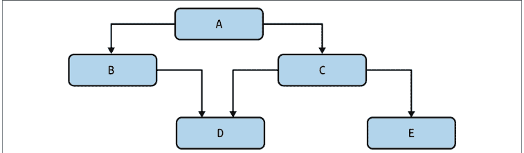

图 16-1. 框图

然而，如果你不主动管理依赖关系，你很快就会陷入所谓的“意大利面条式代码”，让你的框图看起来像图 16-2。

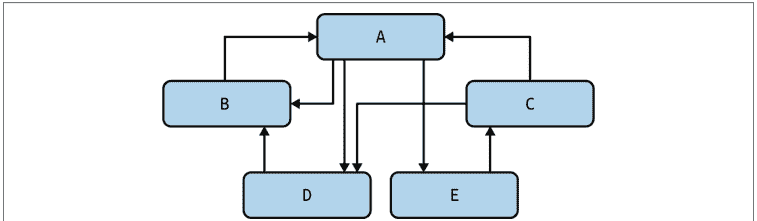

图 16-2. 纠缠不清的依赖关系

在本章中，你将全面了解依赖关系以及如何控制它们。你将了解不同类型的依赖关系，所有这些都应该用不同的技术来管理。你将学习如何绘制依赖关系图，以及如何判断你的系统是否健康。你将学习如何真正简化你的代码架构，这将帮助你管理复杂性并提高代码库的健壮性。

## 关系

依赖关系本质上是关系。当一段代码需要另一段代码以某种特定方式运行时，我们称之为*依赖*。你通常使用依赖关系是为了以某种方式受益于代码重用。函数调用其他函数以重用行为。模块导入其他模块以重用该模块中定义的类型和函数。在大多数代码库中，从头开始编写所有内容是没有意义的。重用代码库的其他部分，甚至来自其他组织的代码，都可能带来巨大的好处。

当你重用代码时，你节省了时间。你不需要浪费精力编写代码；你可以直接调用或导入你需要的功能。此外，你所依赖的任何代码大概也在其他地方使用。这意味着已经进行了一定程度的测试，这应该会减少错误的数量。如果代码易于阅读，那就更好了。*正如林纳斯定律*（指 Linux 的创造者 Linus Torvalds）所言：¹

> “足够多的眼睛，就可让所有问题浮现。”

换句话说，发现错误的可能性更高，因为有很多人在查看代码。这是支持可读性带来可维护性的另一个观点。如果你的代码可读性强，其他开发人员将更容易发现和修复其中的错误，从而帮助你的代码库变得更加健壮。

¹ Eric S. Raymond. *The Cathedral & the Bazaar*. Sebastopol, CA: O’Reilly Media, 2001.

不过，这里有个问题。在讨论依赖关系时，天下没有免费的午餐。你创建的每一个依赖都会增加*耦合*，也就是将两个实体绑定在一起。如果某个依赖以不兼容的方式发生了变化，你的代码也需要随之改变。如果这种情况频繁发生，你的代码健壮性就会受损；你会不断挣扎，试图在依赖变化中保持稳定。

依赖关系还涉及人为因素。你所依赖的每一段代码，都是由活生生的人（甚至可能是一个团队）维护的。这些维护者有自己的日程安排、截止日期，以及对他们所开发代码的愿景。很可能，这些与你的日程、截止日期和愿景并不一致。一段代码被复用得越多，它就越不可能满足所有使用者的需求。当你的依赖与你的实现方式产生分歧时，你要么忍受困难，要么选择替代依赖（可能是你自己控制的），要么将其分叉（自己维护）。你做出的选择取决于具体场景，但在每种情况下，健壮性都会受到影响。

任何在2016年工作的JavaScript开发者都能告诉你，在“left-pad事件”中依赖关系是如何出错的。由于一场政策争议，一位开发者从包仓库中移除了一个名为left-pad的库，第二天早上，成千上万的项目突然崩溃，无法构建。许多大型项目（包括非常流行的库React）并非直接依赖left-pad，而是通过它们自己的依赖间接依赖。没错，依赖关系也有自己的依赖关系，当你依赖其他代码时，你也会获得它们。这个故事的寓意是：不要忘记人为因素以及与他们工作流程相关的成本。要为你的任何依赖以最糟糕的方式发生变化做好准备，包括被移除。依赖是负债。必要的，但仍然是负债。

从安全角度来看，依赖关系也扩大了攻击面。每个依赖（及其自身的依赖）都有可能危及你的系统。有专门的网站致力于跟踪安全漏洞，例如 [https://cve.mitre.org](https://cve.mitre.org)。搜索关键词“Python”就能看到今天存在多少漏洞，当然，这些网站甚至无法统计那些尚未被发现的漏洞。对于由你的组织维护的依赖，这更加危险；除非你有具备安全意识的人员持续审查所有代码，否则未知漏洞可能一直存在于你的代码库中。

## 是否固定版本

一些开发者倾向于固定他们的依赖版本，这意味着这些依赖被冻结在特定时间点。这样，你就不会因为依赖更新而导致代码崩溃；项目可以继续使用旧版本运行。对于一个非常成熟且不经常更新的项目来说，为了最小化风险，这种设置还不错，但你需要警惕几点。

为了使其有效，你需要对你固定的内容保持谨慎。如果任何依赖未被固定，它们就不应该依赖于任何其他已固定的依赖。否则，当未固定的依赖发生变化时，它们很可能与已固定的依赖产生冲突。

其次，为了固定依赖，这些依赖实际上需要是可固定的。依赖需要表示为特定的提交或版本号以供引用。你无法固定那些仅存在于你代码库内部的依赖，例如单个函数或类。

最后，你需要评估在任何时候实际需要更新固定版本的可能性。考虑可能发生的新增功能、安全更新或错误修复。其中任何一个都不可避免地会导致固定版本需要更新。你等待更新固定版本的时间越长，可能引入的变更就越多，这些变更可能与你的代码库的假设不兼容。这可能导致痛苦的集成过程。

如果你预见到需要更改依赖的固定版本，你需要一个更新这些依赖的策略。我建议保持依赖固定，但利用持续集成工作流和依赖管理器（如poetry）来更新这些依赖。通过持续集成，你可以持续扫描新的依赖。当依赖发生变化时，工具会更新依赖，运行测试，如果测试通过，则签入更新后依赖的新固定版本。这样，依赖保持最新，但你始终维护着一组已签入的固定版本以确保可重现性。这里的缺点是，你需要有纪律性和支持性的文化来在集成失败出现时立即修复它们。从长远来看，零敲碎打地处理失败比延迟集成要省力得多。

仔细平衡你对依赖的使用。你的代码本质上会有依赖，这是一件好事。关键在于如何明智地管理它们。粗心大意会导致混乱、纠缠不清的局面。要学习如何处理依赖，你首先需要知道如何识别不同类型的依赖。

# 依赖的类型

我将依赖分为三类：物理依赖、逻辑依赖和时间依赖。每种类型以不同方式影响你代码的健壮性。你必须能够发现它们，并知道它们何时出错。正确运用依赖，可以使你的代码保持可扩展性，而不会使其变得臃肿。

# 物理依赖

当大多数开发者想到依赖时，他们想到的是物理依赖。*物理依赖*是在代码中直接观察到的关系。函数调用函数、类型由其他类型组成、模块导入模块、类继承自其他类……这些都是物理依赖的例子。它们是静态的，意味着在运行时不会改变。

物理依赖是最容易理解的；甚至工具也可以查看代码库并绘制出物理依赖关系图（你很快就会看到）。它们易于一眼阅读和理解，这对健壮性是有利的。当未来的维护者阅读或调试代码时，依赖链如何解析变得相当明显；他们可以沿着导入或函数调用的踪迹，一直追溯到链的末端。

图16-3聚焦于一个名为*PizzaMat*的完全自动化披萨咖啡馆。加盟商可以购买整个PizzaMat模块，并将其部署到任何地方，即时获得（美味的）披萨。PizzaMat有几个不同的系统：披萨制作系统、控制支付和订单的系统，以及处理餐桌管理（就座、续杯和订单配送）的系统。

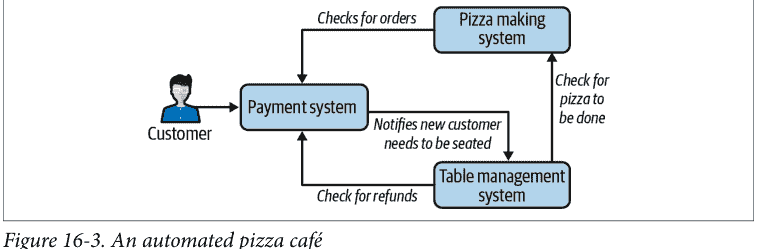

这三个系统中的每一个都与其他系统交互（箭头表示这一点）。顾客与支付/订单系统交互以订购披萨。完成后，披萨制作员检查是否有新订单并开始制作披萨，餐桌管理系统开始为顾客安排座位。一旦餐桌管理服务得知披萨完成，它会为餐桌准备披萨并将其端给顾客。如果顾客对披萨不满意，餐桌管理系统会退回披萨，支付系统会退款。

这些依赖中的每一个都是一种关系，只有这些系统协同工作，我们才能拥有一个正常运作的披萨店。物理依赖对于理解大型系统绝对必要；它们允许你将问题分解为更小的实体，并定义每个实体之间的交互。我可以将这些系统中的任何一个分解为模块，或者将任何模块分解为函数。我想关注的是这些关系如何影响可维护性。

假设这三个系统由三个独立的实体维护。你和你的团队维护披萨制作系统。你公司的另一个团队（但在不同的建筑）拥有餐桌管理系统，而独立承包商则负责提供支付系统。你参与了一个大型项目，为你的披萨制作机添加新项目：意式卷饼。你已经工作了数周，精心协调各项变更。每个系统都需要进行修改以处理这个新菜单项。在无数个深夜（当然，都是靠披萨支撑）之后，你已经准备好为顾客进行重大更新。然而，更新一经推出，错误报告便纷至沓来。一连串不幸的事件引入了一个错误，导致世界各地的披萨店陷入混乱。随着越来越多的系统上线，问题变得愈发严峻。管理层决定你需要尽快修复它。

花点时间想想你希望今晚如何度过。你是想疯狂地尝试联系所有其他团队，试图在三个系统中强行修复问题吗？你恰好知道承包商今晚已经关闭了通知，而另一个团队在今天下班后的发布庆祝活动中有点过于尽兴了。或者，你想看看代码，然后发现只需修改几行代码，无需其他团队的任何输入，就能极其轻松地从所有三个系统中移除意式卷饼？

依赖关系是一种单向关系。你受制于你的依赖项。如果它们在你需要的时候没有完全按照你的意愿行事，你几乎无计可施。记住，你的依赖项背后是活生生的人，他们不一定会在你要求时就立刻行动。你构建依赖项的方式将直接影响你维护系统的方式。

在我们的意式卷饼示例中，依赖关系形成了一个环；任何一个变更都可能影响其他两个系统。你需要考虑依赖关系的每一个方向，以及变更如何在你的系统中产生连锁反应。对于 PizzaMat，披萨制作设备的支持是我们唯一的事实来源；为不存在的披萨产品设置计费和餐桌管理是没有用的。然而，在上面的例子中，所有三个系统都是用各自独立的菜单项副本编写的。根据依赖关系的方向，披萨制作机可以移除意式卷饼代码，但意式卷饼仍会显示在支付系统中。你如何才能使其更具扩展性，以避免这些依赖问题？


> 大型架构变更的棘手之处在于，正确的答案总是取决于你特定问题的上下文。如果*你*要构建一个自动披萨制作机，你可能会基于各种不同的因素和约束，以不同的方式绘制你的依赖树。重要的是要关注你*为什么*以特定方式绘制依赖关系，而不是确保它们总是与别人的系统绘制方式相同。

首先，你可以构建你的系统，使所有菜单定义都存在于披萨制作系统中；毕竟，它是知道它能制作什么和不能制作什么的系统。然后，定价系统可以向披萨制作机查询哪些项目实际可用。这样，如果你需要在紧急情况下移除意式卷饼，你可以在披萨制作系统中完成；定价系统不控制哪些项目可用或不可用。通过反转或逆转依赖关系的方向，你将控制权恢复给了披萨制作系统。如果我反转这一个依赖关系，依赖图看起来就像图 16-4。

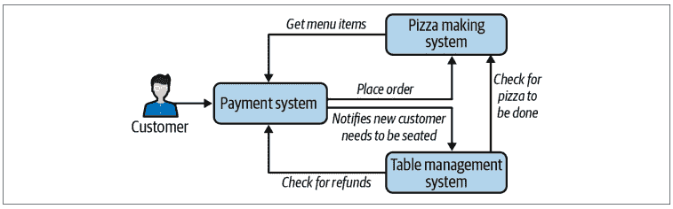

图 16-4. 更合理的依赖关系

现在，披萨制作机决定了什么可以点，什么不能点。这可以大大减少所需的变更量。如果披萨制作机需要停止支持某种菜肴中的某种配料，支付系统将自动获取这些变更。这不仅能在紧急情况下救你一命，还能为你的业务在未来提供更多灵活性。你已经增加了根据披萨制作机自动制作的能力，在支付系统中选择性地显示不同菜肴的能力，所有这些都不需要与外部支付团队协调。


## 讨论主题

思考一下，如果披萨制作机缺少某种配料，你如何添加一个功能来防止支付系统显示某些选项。考虑图 16-3 和图 16-4 中的系统。

作为额外的讨论主题，讨论餐桌管理系统和支付系统之间的循环。你如何打破这个循环？每个依赖方向的优缺点是什么？

## 当代码变得过于 DRY

DRY 原则（不要重复自己——详见第 10 章）已深深植根于大多数开发者的脑海中。任何时候你在代码库中看到非常相似的代码，你都需要大喊“重复！”来警告其他开发者，并尽职地重构该代码，使其只存在于一个地方。毕竟，你不想在多个地方修复同一个错误。

然而，DRY 原则可能被过度应用。每次你重构代码时，你都在引入对重构代码的物理依赖。如果你代码库的其他部分依赖于这段代码，你就将它们耦合在一起。如果那个重构的核心代码需要更改，它可能会影响大量代码。

在应用 DRY 原则时，不要仅仅因为代码看起来相同就去重；只有当这些代码具有相同的*变更原因*时才去重。否则，你会开始遇到这样的情况：重构后的代码需要为一个原因而变更，但这个原因与依赖于重构代码的其他部分代码不兼容。你需要开始在去重的代码中添加特殊逻辑来处理特殊情况。任何时候你像这样增加复杂性，你都会开始降低可维护性，并使代码更难用于通用目的。

## 逻辑依赖

*逻辑依赖*是指两个实体之间存在关系，但在代码中没有直接链接。依赖被抽象化了；它包含一个间接层。这是一种仅在运行时存在的依赖。在我们的披萨制作机示例中，我们有三个子系统相互交互。我们在图 16-3 中用箭头表示了依赖关系。如果这些箭头是导入或函数调用，那么它们就是物理依赖。但是，可以在运行时通过函数调用或导入之外的方式链接这些子系统。

假设子系统位于不同的计算机上，并通过 HTTP 进行通信。如果披萨制作机使用 requests 库通过 HTTP 通知餐桌管理服务披萨何时制作完成，它看起来会像这样：

```
def on_pizza_made(order: int, pizza: Pizza):
    requests.post("table-management/pizza-made", {
        "id": order,
        "pizza": pizza.to_json()
    })
```

物理依赖不再是从披萨制作机到我们的餐桌管理系统，而是从披萨制作机到 requests 库。就披萨制作机而言，它只需要一个 HTTP 端点，可以向名为“table-management”的某个 Web 服务器上的“/pizza-done”端点发送 POST 请求。该端点需要接受一个 ID 和格式为 JSON 的披萨数据。

现在，实际上，你的披萨制作机仍然需要一个餐桌管理服务才能工作。这就是逻辑依赖在起作用。即使没有直接依赖，披萨制作机和餐桌管理系统之间仍然存在关系。这种关系不会消失；它从物理依赖转变为逻辑依赖。

引入逻辑依赖的主要好处是可替换性。当没有任何东西物理依赖于某个组件时，替换它要容易得多。以通过 HTTP 请求的 on_pizza_done 为例。只要它遵守与原始服务相同的契约，你就可以完全替换餐桌管理服务。如果这听起来很熟悉，那应该如此，因为这正是你在第 12 章学到的完全相同的概念。子类型化，无论是通过鸭子类型、继承还是类似机制，都会引入逻辑依赖。调用代码物理依赖于基类，但使用哪个子类的逻辑依赖直到运行时才确定。

提高可替换性可以提高可维护性。记住，可维护的代码易于更改。如果你可以用最小的影响替换整个功能块，你就为未来的维护者在决策时提供了巨大的灵活性。如果某个特定的函数、类或子系统不能满足你的需求，你可以直接替换它。易于删除的代码本质上易于更改。

然而，与任何事物一样，逻辑依赖也有其代价。每个逻辑依赖都是对某种关系的间接引用。由于没有物理链接，工具很难识别逻辑依赖。你将无法创建一个漂亮的框图来表示逻辑依赖。此外，当开发者阅读你的代码时，逻辑依赖不会立即显现。通常，代码的读者会看到对某个抽象层的物理依赖，而逻辑依赖直到运行时才被注意到或解决。

这就是引入逻辑依赖的权衡。你通过提高可替换性和减少耦合来提高可维护性，但你也通过使代码更难阅读和理解来降低可维护性。过多的抽象层与过少的抽象层一样容易造成混乱。对于正确的抽象层数量，没有硬性规定；你需要根据你的特定场景，运用最佳判断来决定你需要的是灵活性还是可读性。

一些逻辑依赖创建的关系无法通过工具检测到，例如依赖于集合的特定顺序或依赖于类中特定字段的存在。当发现这些依赖时，通常会让开发者感到惊讶，因为没有仔细检查，几乎没有迹象表明它们的存在。

我曾参与过一个存储网络接口的代码库。有两部分代码依赖于这些接口：一个系统用于性能统计，另一个用于与其他系统建立通信路径。问题在于，它们对这些接口的排序有不同的假设。多年来一直运行正常，直到新增了网络接口。由于通信路径的工作方式，新接口需要放在列表的前面。但性能统计系统只有在接口位于列表后面时才能正常工作。由于存在隐藏的逻辑依赖，这两部分代码被紧密地联系在一起（我从未想过添加通信路径会破坏性能统计功能）。

事后看来，修复很简单。我创建了一个函数，将通信路径期望的排序映射到一个重新排序的列表。性能统计系统随后依赖于这个新函数。然而，这并不能追溯修复这个bug（也无法挽回我为弄清楚性能统计为何出错而花费的数小时）。每当你在代码中创建一个不直接明显的依赖时，都要想办法让它变得明显。留下面包屑线索，最好通过单独的代码路径（如上面的中间函数）或类型来实现。如果做不到，就留下注释。如果网络接口列表中有一条注释表明依赖于特定排序，我就不会为那段代码如此头疼了。

## 时间依赖

最后一种依赖是时间依赖。这实际上是一种逻辑依赖，但处理方式略有不同。*时间依赖*是通过时间链接的依赖。任何时候存在具体的操作顺序，比如“必须先放面团，再放酱料和奶酪”或“必须先付款，披萨才开始制作”，你就有了时间依赖。大多数时间依赖是直接明了的；它们是业务领域的自然组成部分。（没有面团，你把披萨酱和奶酪放哪里呢？）这些不会给你带来问题的时间依赖。相反，问题出在那些不总是那么明显的时间依赖上。

时间依赖在你必须按特定顺序执行某些操作，但你没有迹象表明需要这样做的情况下，最会让你头疼。想象一下，如果你的自动披萨机可以配置两种模式：单份披萨（用于高质量披萨）或批量生产（用于廉价快速的披萨）。每当披萨机从单份模式切换到批量生产模式时，都需要进行显式重新配置。如果重新配置没有发生，机器的安全机制会启动，拒绝制作披萨，直到手动操作员覆盖为止。

当这个选项首次引入时，开发者会极其小心地确保在调用`mass_produce`之前，例如：

```
pizza_maker.mass_produce(number_of_pizzas=50, type=PizzaType.CHEESE)
```

必须有一个检查：

```
if not pizza_maker.is_configured(ProductionType.MASS_PRODUCE):
    pizza_maker.configure_for_mass_production()
    pizza_maker.wait_for_reconfiguration()
```

开发者在代码审查中勤奋地寻找这段代码，并确保始终进行适当的检查。然而，随着岁月流逝，开发者在项目中更替，团队对强制性检查的知识开始减少。想象一下，一款新的自动披萨机型号上市，它不需要重新配置（调用`configure_for_mass_production`不会对系统产生任何改变）。只熟悉这个新型号的开发者可能永远不会想到在这些情况下调用`configure_for_mass_production`。

现在，把自己想象成几年后的一名开发者。假设你正在为披萨机编写新功能，而`mass_produce`函数正好符合你需要的用例。你如何知道需要对批量生产进行显式检查，尤其是对于旧型号？单元测试对你没有帮助，因为新功能还没有单元测试。你真的想等到集成测试失败（或客户投诉）才发现你漏掉了那个检查吗？

以下是一些策略，可以缓解遗漏此类检查的问题：

- *依赖你的类型系统*
  通过将某些操作限制为特定类型，你可以防止混淆。想象一下，如果`mass_produce`只能从`MassProductionPizzaMaker`对象调用。你可以编写函数调用，确保`MassProductionPizzaMaker`只在重新配置后创建。你正在使用类型系统来使错误变得不可能（NewType的功能非常相似，如第4章所述）。

- *将前置条件嵌入更深*
  披萨机在使用前必须配置这一事实是一个*前置条件*。考虑通过将检查移入`mass_produce`内部，使其成为`mass_produce`函数的前置条件。思考你将如何处理错误条件（例如抛出异常）。你将能够防止违反时间依赖，但你在运行时引入了不同的错误。你的具体用例将决定你认为哪种情况是两害相权取其轻：违反时间依赖还是处理新的错误情况。

- *留下面包屑线索*
  这不一定是一种捕获被违反的时间依赖的策略。相反，如果所有其他努力都失败了，它更像是一种最后的手段，用来提醒开发者注意时间依赖。尝试将时间依赖组织在同一个文件中（最好在几行之内）。留下注释和文档，通知未来的开发者这种关联。幸运的话，那些未来的开发者会看到线索，并知道存在时间依赖。

在任何线性程序中，大多数行都对前面的行有时间依赖。这是正常的，你不需要对每种情况都应用缓解措施。相反，寻找那些可能只在特定情况下应用的时间依赖（例如旧型号的机器重新配置），或者那些如果遗漏会造成灾难性后果的时间依赖（例如在将用户输入字符串传递给数据库之前未进行清理）。权衡违反时间依赖的成本与检测和缓解它的努力。这将取决于你的用例，但当你确实缓解了时间依赖时，它可以为你以后节省巨大的麻烦。

## 可视化你的依赖

找到这类依赖并理解在哪里寻找潜在问题点可能具有挑战性。有时你需要更直观的表示。幸运的是，存在工具可以帮助你直观地理解依赖关系。


在接下来的许多示例中，我将使用GraphViz库来显示图片。要安装它，请按照[GraphViz网站](https://graphviz.org/)上的说明操作。

## 可视化包

很可能，你的代码使用了其他通过pip安装的包。了解你依赖的所有包、它们的依赖项、这些依赖项的依赖项等等，会很有帮助。

为此，我将安装两个包：pipdeptree和GraphViz。pipdeptree是一个有用的工具，可以告诉你包之间如何交互，而GraphViz负责实际的可视化部分。在这个示例中，我将使用mypy代码库。我已经下载了mypy源代码，创建了一个虚拟环境，并从源代码安装了mypy。²

² 创建虚拟环境是将你的依赖与系统Python安装隔离的好方法。

在该虚拟环境中，我安装了pipdeptree和GraphViz：

```
pip install pipdeptree graphviz
```

现在我运行以下命令：

```
pipdeptree --graph-output png --exclude pipdeptree,graphviz > deps.png
```

你可以在图16-5中看到结果。

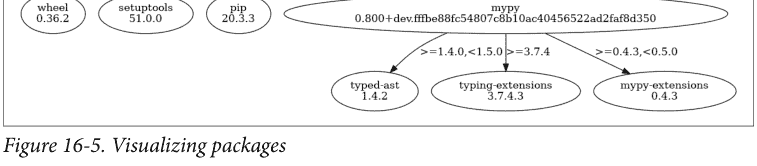

我将忽略wheel、setuptools和pip包，专注于mypy。在这种情况下，我看到了安装的mypy的确切版本，以及直接依赖项（在这种情况下是typed_ast 1.4.2、typing-extensions 3.7.4.3和mypy-extensions 0.4.3）。pipdeptree还很好地指定了存在的版本约束（例如，只允许mypy-extensions版本大于或等于0.4.3，但小于0.5.0）。使用这些工具，你可以获得包依赖关系的便捷图形表示。这对于具有大量依赖项的项目非常有用，特别是如果你积极维护许多包。

## 可视化导入

可视化包是一个相当高层次的视图，因此深入一步会很有帮助。如何找出在模块级别导入了什么？另一个名为pydeps的工具非常适合这个。

要安装它，你可以：

```
pip install pydeps
```

安装后，你可以运行：

```
pydeps --show-deps <source code location> -T png -o deps.png
```

我为mypy运行了这个命令，得到了一个非常复杂和密集的图。在印刷品中复制它会浪费纸张，所以我决定在图16-6中放大特定部分。

## 可视化函数调用

如果你想获得比导入图*更多*的信息，可以查看哪些函数相互调用。这被称为*调用图*。首先，我将介绍一种*静态*调用图生成器。这类生成器会分析你的源代码，查看哪些函数调用了哪些函数；不会执行任何代码。在本例中，我将使用`pyan3`库，可通过以下命令安装：

```
pip install pyan3
```

要运行`pyan3`，你需要在命令行执行以下命令：

```
pyan3 <Python files> --grouped --annotated --html > deps.html
```

当我在`mypy`中的`dmypy`文件夹（我选择了一个子文件夹以限制绘制的信息量）上运行此命令时，会得到一个交互式HTML页面，让我可以探索依赖关系。图16-7展示了该工具的一个片段。

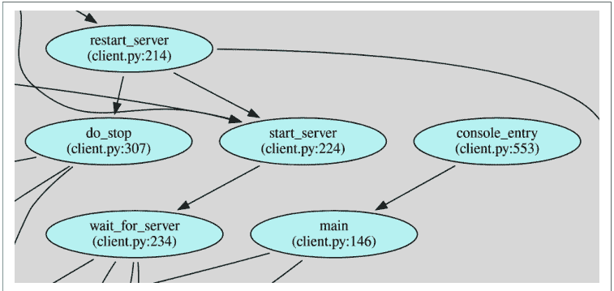

请注意，这仅跟踪物理依赖，因为逻辑依赖在运行时才会被知晓。如果你想查看运行时的调用图，需要将代码与*动态*调用图生成器一起执行。为此，我喜欢使用内置的Python分析器。*分析器*会审计程序执行期间进行的所有函数调用，并记录性能数据。作为附带好处，整个函数调用历史都会保存在分析文件中。让我们来试试。

我将首先构建分析文件（出于大小考虑，我分析的是mypy中的一个测试文件）：

```
python -m cProfile -o deps.profile mypy/test/testutil.py
```

然后，我将分析文件转换为GraphViz可以理解的文件：一个dot文件。

```
pip install gprof2dot
gprof2dot --format=pstats deps.profile -o deps.dot
```

最后，我将使用GraphViz将*.dot*文件转换为*.png*。

```
dot deps.dot -Tpng > deps.png
```

同样，这会产生大量的方框和箭头，因此图16-8只是一个小截图，展示了调用图的一部分。

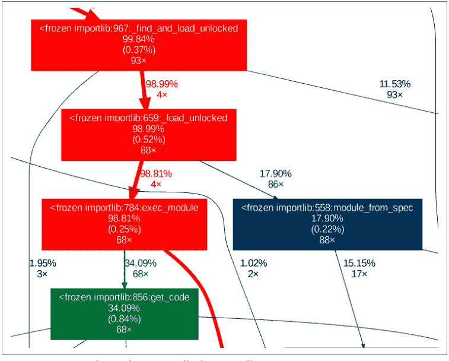

你可以找出函数被调用的次数，以及执行时间在该函数中花费了多少。除了理解调用图之外，这还是发现性能瓶颈的好方法。

## 解读你的依赖图

好了，你已经绘制了所有这些漂亮的图表；你能用它们做什么呢？当你以这种方式看到依赖关系图时，就能很好地了解可维护性的热点在哪里。记住，每个依赖都是代码需要变更的原因。每当代码库中的任何内容发生变化时，它都可能通过物理和逻辑依赖产生连锁反应，潜在地影响大范围的代码。

考虑到这一点，你需要思考你正在更改的内容与依赖于它们的内容之间的关系。考虑依赖于你的代码量，以及你自己依赖的代码量。如果你有很多依赖流入，但流出很少，你就拥有了所谓的高*扇入*。相反，如果你没有很多依赖流入，但你依赖大量其他实体，这就被称为高*扇出*。图16-9说明了扇入和扇出之间的区别。


你希望系统中具有高扇入的实体成为依赖图的叶子节点，或者位于底部。代码库的大部分都依赖于这些实体；你拥有的每个依赖，代码库的其余部分也会拥有。你还希望这些实体是稳定的，这意味着它们应该很少变更。每次引入变更时，由于高扇入，你都可能影响代码库的大部分。

另一方面，扇出实体应该位于依赖图的顶部。这可能是大部分业务逻辑所在的地方；它会随着业务的发展而变化。代码库的这些部分可以承受更高的变更率；由于它们的上游依赖相对较少，当行为发生变化时，它们的代码不会经常中断。

> 更改扇出实体不会影响代码库的太多假设，但我不能说它是否会破坏客户的假设。你希望外部行为在多大程度上保持向后兼容性，这是一个用户体验问题，超出了本书的范围。

## 结语

依赖的存在并不决定你的代码有多健壮。关键在于你如何利用和管理这些依赖。依赖对于系统中合理的复用绝对至关重要。你可以将代码分解成更小的块，并相应地重组代码库。通过赋予依赖正确的方向性，你实际上可以增强代码的健壮性。你可以通过提高可替代性和可扩展性，使代码更易于维护。

但是，与工程中的任何事情一样，总是有成本的。依赖是一种耦合；将代码库的不同部分链接在一起并进行更改，可能会产生比你预期更广泛的影响。不同类型的依赖必须以不同的方式处理。物理依赖很容易通过工具可视化，但它们强加的结构也很僵化。逻辑依赖为代码库提供了可扩展性，但其本质在运行时之前是隐藏的。时间依赖是线性执行Python的必要部分，但当这些依赖变得不直观时，它们会带来大量的未来痛苦。

所有这些经验教训都假设你拥有可以依赖的代码片段。在下一章中，你将探索*可组合代码*，或将代码分解成更小的片段以供复用。你将学习如何组合对象、循环模式和函数，将代码重组为新的用例。当你以可组合代码的思维来思考时，你将能够轻松地构建新功能。你未来的维护者会感谢你。

# 第17章

## 可组合性

作为开发者，你面临的最大挑战之一是预测未来的开发者将如何改变你的系统。业务在发展，今天的断言将成为未来的遗留系统。你将如何支持这样的系统？你如何减少未来开发者在适配你的系统时面临的阻力？你需要开发你的代码，使其能够在各种情况下运行。

在本章中，你将学习如何通过可组合性的思维来开发代码。当你以可组合性为出发点编写代码时，你会将代码创建得小巧、离散且可复用。我将展示一个不可组合的架构，以及它如何阻碍开发。然后，你将学习如何以可组合性的思维来修复它。你将学习如何组合对象、函数和算法，使你的代码库更具可扩展性。但首先，让我们探讨一下可组合性如何提高可维护性。

## 可组合性

*可组合性*专注于构建具有最小相互依赖且内部嵌入很少业务逻辑的小型组件。目标是未来的开发者可以使用这些组件中的任何一个来构建他们自己的解决方案。通过使它们小巧，你使它们更易于阅读和理解。通过减少依赖，你让未来的开发者不必担心引入新代码所涉及的所有成本（例如你在第16章学到的成本）。通过让组件基本不包含业务逻辑，你允许你的代码解决新问题，即使这些新问题与你今天遇到的问题完全不同。随着可组合组件数量的增加，开发者可以轻松地混合搭配你的代码，以极其简单的方式创建全新的应用程序。通过专注于可组合性，你使代码更易于复用和扩展。

想想厨房里不起眼的调料架。如果你只用混合香料来填满调料架，比如南瓜派香料（肉桂、肉豆蔻、生姜和丁香）或中国五香粉（肉桂、茴香、八角、花椒和丁香），你会做出什么样的菜肴？你最终主要会制作以这些混合香料为中心的食谱，比如南瓜派或五香鸡。虽然这些混合香料让制作特色菜肴变得异常简单，但如果你需要制作只使用单一原料的东西，比如肉桂丁香糖浆，会发生什么？你可以尝试用南瓜派香料或五香粉代替，并希望额外的原料不会冲突，或者你可以单独购买肉桂和丁香。

单一的香料类似于小型、可组合的软件组件。你不知道未来可能想做什么菜，也不知道未来会有什么业务需求。通过专注于离散的组件，你可以让协作者灵活地使用他们需要的东西，而无需进行次优的替换或拖拽其他组件。如果你需要一种特殊的组件混合物（比如南瓜派香料），你可以自由地从这些组件构建你的应用程序。软件不会像混合香料那样过期；你可以既拥有蛋糕（或南瓜派），又享用它。从小型、离散、可组合的软件构建专门的应用程序，你会发现下周或明年就能以全新的方式重用这些组件。

实际上，你在第二部分学习构建自己的类型时已经见过可组合性了。我构建了一系列小型、离散的类型，可以在多种场景中重用。每个类型都为代码库中的概念词汇做出了贡献。开发者可以使用这些类型来表示领域概念，也可以在此基础上定义新的概念。看看第9章中汤的定义：

```python
class ImperialMeasure(Enum):
    TEASPOON = auto()
    TABLESPOON = auto()
    CUP = auto()

class Broth(Enum):
    VEGETABLE = auto()
    CHICKEN = auto()
    BEEF = auto()
    FISH = auto()

@dataclass(frozen=True)
# Ingredients added into the broth
class Ingredient:
    name: str
    amount: float = 1
    units: ImperialMeasure = ImperialMeasure.CUP

@dataclass
class Recipe:
    aromatics: set[Ingredient]
    broth: Broth
    vegetables: set[Ingredient]
    meats: set[Ingredient]
    starches: set[Ingredient]
    garnishes: set[Ingredient]
    time_to_cook: datetime.timedelta
```

我能够用 `Ingredient`、`Broth` 和 `ImperialMeasure` 对象创建一个 `Recipe`。所有这些概念本可以嵌入到 `Recipe` 本身中，但这会使重用变得更加困难（如果有人想使用 `ImperialMeasure`，依赖 `Recipe` 会令人困惑。）通过保持这些类型各自独立，我允许未来的维护者构建新的类型，例如与汤无关的概念，而无需想办法拆分依赖关系。

这是一个*类型组合*的例子，我创建了离散的类型，可以以新的方式进行混合和匹配。在本章中，我将重点介绍 Python 中其他常见的组合类型，例如组合功能、函数和算法。以三明治店的简单菜单为例，如图 17-1 所示。

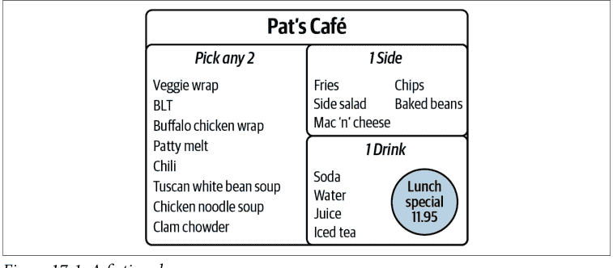

这个菜单是可组合性的另一个例子。食客从菜单的第一部分选择两个条目，再加上一份配菜和一杯饮料。他们*组合*菜单的不同部分来获得他们想要的午餐。如果这个菜单不可组合，你将不得不列出每一个选项来代表所有可能的组合（有 1,120 个选项，这样的菜单会让大多数餐厅相形见绌）。这对任何餐厅来说都是难以处理的；将菜单分解成可以拼凑的部分更容易。

我希望你以同样的方式思考你的代码。代码不会仅仅因为存在就变得可组合；你必须积极地以可组合性为设计理念。你需要审视你创建的类、函数和数据类型，并思考如何编写它们，以便未来的开发者可以重用它们。

考虑一个名为 AutoKitchen 的自动化厨房，它是 Pat's Café 的核心。这是一个全自动系统，能够制作菜单上的任何菜肴。我希望向这个系统添加新菜肴变得容易；Pat's Café 以其不断变化的菜单而自豪，开发者们厌倦了每次都要花费大量时间修改大块系统。AutoKitchen 的设计如图 17-2 所示。

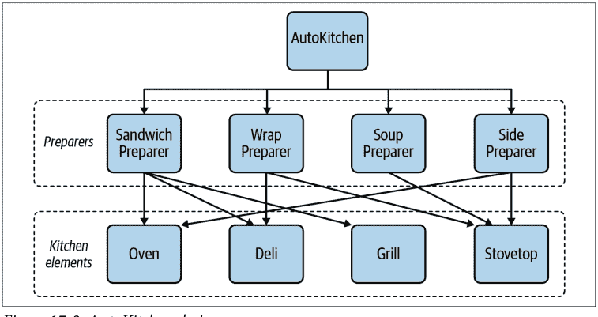

图 17-2. AutoKitchen 设计

这个设计相当直接。AutoKitchen 依赖于各种准备机制，称为*准备器*。每个准备器依赖于厨房元素将原料转化为菜肴组件（例如将碎牛肉变成煮熟的汉堡肉饼）。厨房元素，如烤箱或烤架，被发出命令来烹饪各种原料；它们不知道正在使用的具体原料或产生的菜肴组件。图 17-3 展示了一个特定的准备器可能的样子。

这个设计是可扩展的，这是一件好事。添加新的三明治类型很简单，因为我无需修改任何现有的三明治代码。然而，这并不是非常可组合。如果我想将菜肴组件重用于新菜肴（例如为 BLT 卷饼烹饪培根，或为芝士汉堡汤烹饪汉堡肉饼），我将不得不带上整个 BLT 制作器或肉饼融化制作器。如果我这样做，我还必须带上面包制作器和数据库。这是我想避免的。

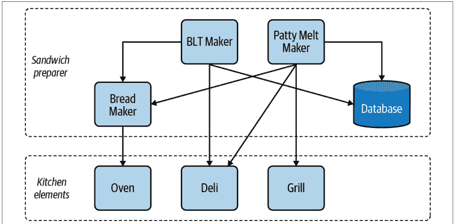

现在，我想引入一种新的汤：土豆、韭葱和培根。汤准备器已经知道如何处理其他汤中的韭葱和土豆；我现在希望汤准备器知道如何制作培根。在修改汤准备器时，我有几个选择：引入对 BLT 制作器的依赖，编写自己的培根处理代码，或者找到一种方法将培根处理部分与 BLT 制作器分开重用。

第一个选项有问题：如果我依赖 BLT 制作器，我就需要依赖它的所有物理依赖项，比如面包制作器。汤准备器可能不想要所有这些包袱。第二个选项也不太好，因为现在我的代码库中出现了培根处理的重复（一旦你有了两个，别惊讶最终会出现第三个）。唯一好的选择是找到一种方法将培根制作从 BLT 制作器中分离出来。

然而，代码不会仅仅因为你希望它可重用就变得可重用（尽管那样会很好）。你必须有意识地设计你的代码使其可重用。你需要让它小巧、离散，并且大部分独立于业务逻辑，以使其可组合。为此，你需要将策略与机制分离。

## 策略与机制

策略是你的业务逻辑，或者直接负责解决业务需求的代码。机制是提供如何执行策略的代码片段。在前面的例子中，系统的策略是具体的食谱。相比之下，它如何制作这些食谱则是机制。

当你专注于使代码可组合时，你需要将策略与机制分离。机制通常是你想要重用的东西；当它们与策略链接在一起时，重用就没有帮助了。这就是为什么汤准备器依赖 BLT 制作器没有意义的原因。最终你会得到一个策略依赖于一个完全独立且不相关的策略。

当你链接两个不相关的策略时，你开始创建一个以后很难打破的依赖。随着你链接越来越多的策略，你会创建意大利面条式代码。你会得到一团乱麻的依赖关系，而提取任何一个依赖都会变得有问题。这就是为什么你需要清楚代码库的哪些部分是策略，哪些是机制。

策略与机制的一个很好的例子是 Python 中的 `logging` 模块。策略概述了你需要记录什么以及在哪里记录；机制是让你设置日志级别、过滤日志消息和格式化日志的部分。

从机制上讲，任何模块都可以调用日志记录方法：

```python
logging.basicConfig(format='%(levelname)s:%(message)s', level=logging.DEBUG)
logger.warning("Family did not match any restaurants: Lookup code A1503")
```

`logging` 模块不关心它记录什么或日志消息的格式。`logging` 模块只是提供了记录日志的*方式*。定义策略或*内容*，概述需要记录什么，这取决于任何使用它的应用程序。将策略与机制分离使得 `logging` 模块可重用。你可以轻松扩展代码库的功能，而无需拖拽大量包袱。这是你应该努力在代码库中存在的机制中实现的模型。

### 现实世界中的可组合性

一旦你开始思考分离策略和机制，你就会开始在日常开发生活中看到可组合性模式。

考虑一个 Unix 风格的命令行。命令行没有定义新的应用程序，而是给你小型的离散程序，你可以通过管道将它们组合在一起。

与其编写一个高度专门化的程序，比如解析日志以获取错误代码并按日期时间排序，我可以在命令行上编写以下内容：

`grep -i "ERROR" log.txt | cut 3,5 | sort -r`

另一个例子是带有第三方集成（如 GitHub Actions 或 Travis CI）的持续集成管道。开发者希望在签入过程中运行一系列检查和操作；许多这些检查由第三方实体提供（如安全扫描器或推送到容器注册表）。开发者不需要知道这是如何完成的内部细节。相反，他们定义策略这些策略会告诉第三方集成该做什么——比如应该扫描哪个文件夹，或者在容器注册表中应用哪些标签。开发者不会被*如何实现*的细节所困扰；他们通过将这些集成组合到自己的流水线中来复用它们，然后继续推进工作。

在之前的咖啡馆示例中，我可以改变代码架构，将机制分离出来。我的目标是设计一个系统，使得制作任何菜肴组件都是独立的，并且我可以将这些组件组合在一起创建一个食谱。这将使我能够在不同系统间复用代码，并在创建新食谱时具有灵活性。图17-4展示了一个更具组合性的架构（注意，为了节省空间，我省略了一些系统）。

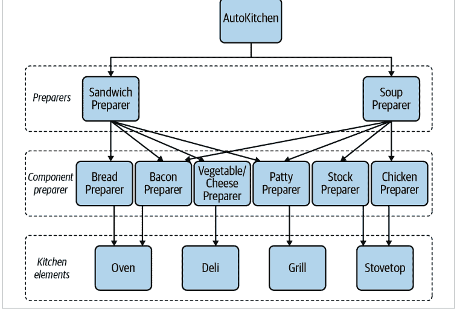

通过将特定的制备器分离到各自的系统中，我同时获得了可扩展性和可组合性。不仅扩展新菜肴（如新三明治）变得容易，而且定义新的连接也变得简单，例如让汤制备器复用培根制备代码。

当你的机制像这样被分离出来时，你会发现编写策略变得简单得多。由于没有任何机制与策略绑定，你可以开始以*声明式*风格编写，即简单地声明要做什么。看看下面的土豆、韭葱和培根汤的定义：

```python
import bacon_preparer
import veg_cheese_preparer

def make_potato_leek_and_bacon_soup():
    bacon = bacon_preparer.make_bacon(slices=2)
    potatoes = veg_cheese_preparer.cube_potatoes(grams=300)
    leeks = veg_cheese_preparer.slice(ingredient=Vegetable.LEEKS, grams=250)

    chopped_bacon = chop(bacon)

    # the following methods are provided by soup preparer
    add_chicken_stock()
    add(potatoes)
    add(leeks)
    cook_for(minutes=30)
    blend()
    garnish(chopped_bacon)
    garnish(Garnish.BLACK_PEPPER)
```

通过只关注代码中食谱是什么，我不必被诸如如何制作培根或切土豆块等无关细节所困扰。我将培根制备器和蔬菜/奶酪制备器与汤制备器组合在一起，定义了新的食谱。如果明天有新的汤（或任何其他菜肴）出现，定义它就像编写一系列线性指令一样简单。策略会比机制变化得更频繁；让它们易于添加、修改或删除，以满足你的业务需求。


**讨论主题**

你代码库的哪些部分容易复用？哪些部分难以复用？你是想复用代码的策略还是机制？讨论使你的代码更具组合性和可复用性的策略。

如果你预见到有复用的理由，尽量使你的机制具有可组合性。这将加速未来的开发，因为开发者将能够真正复用你的代码，而几乎没有附加条件。你正在增加灵活性和可复用性，这将使代码更易于维护。

然而，组合性是有代价的。通过将功能分散到更多文件中，你降低了可读性，并且引入了更多可变部分，这意味着变更产生负面影响的可能性更大。寻找引入组合性的机会，但要小心不要让你的代码*过于*灵活，以至于开发者需要浏览整个代码库才能了解如何编写简单的工作流。

## 在更小的规模上组合

AutoKitchen示例向你展示了如何组合不同的模块和子系统，但你也可以在更小的规模上应用组合性原则。你可以编写可组合的函数和算法，让你能够轻松构建新代码。

## 组合函数

本书的很多内容都集中在面向对象编程原则（如SOLID和基于类的设计）上，但同样重要的是从其他软件范式中学习。一个日益流行的范式是*函数式编程*（FP）。OOP的一等公民是对象，而FP则专注于*纯函数*。纯函数是其输出完全由输入派生的函数。给定一个纯函数和一组输入参数，无论任何全局状态或环境变化，它总是返回相同的输出。

函数式编程如此吸引人的原因在于，纯函数比充满副作用的函数更容易组合。*副作用*是函数在其返回值之外所做的任何事情，例如记录消息、进行网络调用或修改变量。通过从函数中移除副作用，你使它们更容易复用。没有隐藏的依赖关系或意外的结果；整个函数依赖于输入数据，唯一可观察的效果是返回的数据。

然而，当你尝试复用代码时，你必须同时引入该代码的所有物理依赖项（如果需要，还要在运行时提供逻辑依赖项）。对于纯函数，除了函数调用图之外，你没有任何物理依赖项。你不需要引入具有复杂设置或全局变量的额外对象。FP鼓励开发者编写简短、单一用途的函数，这些函数本质上是可组合的。

开发者习惯于像对待任何其他变量一样对待函数。他们创建*高阶*函数，即接受其他函数作为参数的函数，或返回其他函数作为返回值的函数。最简单的例子是接受一个函数并调用它两次：

```python
from typing import Callable

def do_twice(func: Callable, *args, **kwargs):
    func(*args, **kwargs)
    func(*args, **kwargs)
```

这不是一个非常令人兴奋的例子，但它为一些非常有趣的函数组合方式打开了大门。事实上，有一个完整的Python模块专门用于高阶函数：`functools`。`functools`的大部分内容，以及你编写的任何函数组合，都将以装饰器的形式出现。

## 装饰器

装饰器是接受另一个函数并*包装*它的函数，或者指定在函数执行之前必须执行的行为。它提供了一种将函数组合在一起的方式，而无需函数体彼此了解。

装饰器是在Python中包装函数的主要方式之一。我可以将`do_twice`函数重写为更通用的`repeat`函数，如下所示：

```python
def repeat(func: Callable, times: int = 1) -> Callable:
    ''' this is a function that calls the wrapped function
        a specified number of times
    '''
    def _wrapper(*args, **kwargs):
        for _ in range(times):
            func(*args, **kwargs)
    return _wrapper

@repeat(times=3)
def say_hello():
    print("Hello")

say_hello()
>>> "Hello"
"Hello"
"Hello"
```

我再次将策略（重复说你好）与机制（实际重复函数调用）分离开来。这个机制是我可以在其他代码库中使用而没有任何副作用的。我可以将这个装饰器应用于代码库中的各种函数，例如一次制作两个汉堡肉饼用于双层芝士汉堡，或者为餐饮活动批量生产特定订单。

当然，装饰器可以做的远不止简单地重复函数调用。我最喜欢的装饰器之一来自`backoff`库。`backoff`帮助你定义*重试逻辑*，即你为重试代码中非确定性部分所采取的操作。考虑之前的`AutoKitchen`需要将数据保存到数据库中。它将保存接取的订单、当前库存水平以及制作每道菜所花费的时间。

最简单的代码看起来像这样：

```python
# setting properties of self.*_db objects will
# update data in the database
def on_dish_ordered(dish: Dish):
    dish_db[dish].count += 1

def save_inventory_counts(inventory):
    for ingredient in inventory:
        inventory_db[ingredient.name] = ingredient.count
```

## 组合算法

函数并非你唯一能进行的小规模组合；你还可以组合*算法*。算法是解决问题所需定义步骤的描述，例如对集合排序或比较文本片段的差异。要使算法可组合，你同样需要将策略与机制分离。

考虑上一节中关于咖啡馆餐食的推荐。假设算法如下：

### 推荐算法 #1

- 查看所有每日特餐
- 根据匹配的剩余食材数量进行排序
- 选择剩余食材数量最多的餐食
- 按与上次点餐的接近程度排序
    （接近程度由匹配的食材数量定义）
- 仅保留接近度高于75%的结果
- 返回前3个结果

如果我用for循环将所有这些写出来，可能看起来像这样：

```python
def recommend_meal(last_meal: Meal,
                   specials: list[Meal],
                   surplus: list[Ingredient]) -> list[Meal]:
    highest_proximity = 0
    for special in specials:
        if (proximity := get_proximity(special, surplus)) > highest_proximity:
            highest_proximity = proximity

    grouped_by_surplus_matching = []
    for special in specials:
        if get_proximity(special, surplus) == highest_proximity:
            grouped_by_surplus_matching.append(special)

    filtered_meals = []
    for meal in grouped_by_surplus_matching:
        if get_proximity(meal, last_meal) > .75:
            filtered_meals.append(meal)

    sorted_meals = sorted(filtered_meals,
                          key=lambda meal: get_proximity(meal, last_meal),
                          reverse=True)

    return sorted_meals[:3]
```

这代码并不算漂亮。如果我没有事先用文字列出步骤，理解代码并确保其无误会花费更长时间。现在，假设一位开发者找到你，说选择推荐的顾客不够多，他们想尝试不同的算法。新算法如下：

### 推荐算法 #2

- 查看所有可用餐食
- 根据与上次点餐的接近程度排序
- 选择接近程度最高的餐食
- 按剩余食材数量对餐食进行排序
- 仅保留是特餐或剩余食材超过3种的结果
- 返回前5个结果

关键在于，这位开发者想要对这些算法（以及他们提出的任何其他算法）进行A/B测试。通过A/B测试，他们希望75%的顾客看到第一个算法的推荐，25%的顾客看到第二个算法的推荐。这样，他们就能衡量新算法相对于旧算法的效果。这意味着你的代码库必须支持两种算法（并且要灵活地支持未来的新算法）。你不会希望看到你的代码库充斥着丑陋的推荐算法方法。

你需要将可组合性原则应用于算法本身。复制粘贴for循环代码片段并进行调整不是一个可行的解决方案。为了解决这个问题，你再次需要分离你的策略和机制。这将帮助你分解问题并改进代码库。

你这次的策略是算法的实际细节：你排序的内容、过滤的方式以及最终选择的内容。机制是描述我们如何塑造数据的迭代模式。事实上，我在上面的代码中已经使用了一种迭代机制：排序。我没有手动排序（并强迫读者理解我在做什么），而是使用了sorted方法。我指出了要排序的内容以及排序的键，但我实际上并不关心（也不期望我的读者关心）实际的排序算法。

如果我要比较这两种算法，我可以将机制分解如下（我将用<尖括号>标记策略）：

- 查看<一组餐食>
- 根据<初始排序标准>排序
- 选择具有<分组标准>的餐食
- 按<次要排序标准>对餐食进行排序
- 仅保留匹配<选择标准>的前几个结果
- 返回前<数量>个结果


itertools模块是可组合算法的绝佳来源，所有算法都围绕迭代展开。它很好地展示了当你创建抽象机制时可以实现的功能。

考虑到这一点，并借助 `itertools` 模块，我将再次尝试编写推荐算法：

```python
import itertools

def recommend_meal(policy: RecommendationPolicy) -> list[Meal]:
    meals = policy.meals
    sorted_meals = sorted(meals, key=policy.initial_sorting_criteria,
                         reverse=True)
    grouped_meals = itertools.groupby(sorted_meals, key=policy.grouping_criteria)
    _, top_grouped = next(grouped_meals)
    secondary_sorted = sorted(top_grouped, key=policy.secondary_sorting_criteria,
                              reverse=True)
    candidates = itertools.takewhile(policy.selection_criteria, secondary_sorted)
    return list(candidates)[:policy.desired_number_of_recommendations]
```

然后，为了将其与算法一起使用，我执行以下操作：

```python
# 在下面的例子中，我使用了命名函数来提高可读性
# 而不是 lambda 函数
recommend_meal(RecommendationPolicy(
    meals=get_specials(),
    initial_sorting_criteria=get_proximity_to_surplus_ingredients,
    grouping_criteria=get_proximity_to_surplus_ingredients,
    secondary_sorting_criteria=get_proximity_to_last_meal,
    selection_criteria=proximity_greater_than_75_percent,
    desired_number_of_recommendations=3)
)
```

想象一下，能够在这里动态调整算法是多么美妙。我创建了一个不同的 `RecommendationPolicy` 并将其传递给 `recommend_meal`。通过将算法的策略与机制分离，我带来了诸多好处。我使代码更易于阅读、更易于扩展，并且更加灵活。

## 结语

可组合的代码就是可复用的代码。当你构建小型、离散的工作单元时，你会发现它们很容易被引入到新的上下文或程序中。要使你的代码可组合，请专注于分离你的策略和机制。无论你是在处理子系统、算法，还是函数，这都适用。你会发现你的机制受益于更大的重用性，而策略则变得更容易修改。当你识别出可组合的代码时，你系统的健壮性将大大提高。

在下一章中，你将学习如何在架构层面应用可扩展性和可组合性，具体是通过基于事件的架构。基于事件的架构帮助你将代码解耦为信息的发布者和消费者。它们提供了一种方式，让你在保持可扩展性的同时最小化依赖。

# 第 18 章
## 事件驱动架构

可扩展性在代码库的每个层面都很重要。在代码层面，你运用可扩展性使你的函数和类变得灵活。在抽象层面，你在代码库的架构中运用相同的原则。*架构* 是塑造你如何设计软件的一组高级指导方针和约束。它是影响所有开发者（过去、现在和未来）的愿景。本章以及下一章将展示两个架构示例如何提高可维护性的例子。到目前为止，你在本书这部分学到的一切都适用：良好的架构促进可扩展性，很好地管理依赖，并培养可组合性。

在本章中，你将了解事件驱动架构。*事件驱动架构* 围绕事件或系统中的通知展开。它是解耦代码库不同部分以及扩展系统以实现新功能或性能的绝佳方式。事件驱动架构使你能够轻松引入新的变更，同时将影响降至最低。首先，我想谈谈事件驱动架构提供的灵活性。然后，我将介绍事件驱动架构的两个独立变体：简单事件和流式事件。虽然它们相似，但你会在略有不同的场景中使用它们。

## 工作原理

当你关注事件驱动架构时，你是在围绕对刺激的反应。你一直在处理对刺激的反应，无论是从烤箱里取出砂锅，还是在收到电话通知后从家门口取快递。在事件驱动架构中，你构建代码来表示这种模型。你的刺激是某种事件的 *生产者*。这些事件的 *消费者* 是对该刺激的反应。事件只是从生产者到消费者的信息传输。表 18-1 展示了一些常见的生产者-消费者对。

表 18-1. 日常事件及其消费者

| 生产者 | 消费者 |
| :--- | :--- |
| 厨房计时器响起 | 厨师从烤箱中取出砂锅 |
| 厨师在菜品完成时按铃 | 服务员取走并上菜 |
| 闹钟响起 | 晚睡者醒来 |
| 机场最后一次登机广播 | 匆忙的家庭赶路，试图赶上转机 |

实际上，你每次编程时都在处理生产者和消费者。任何返回值的函数都是生产者，任何使用该返回值的代码都是消费者。观察：

```python
def complete_order(order: Order):
    package_order(order)
    notify_customer_that_order_is_done(order)
    notify_restaurant_that_order_is_done(order)
```

在这种情况下，`complete_order` 以完成订单的形式 *生产* 信息。根据函数名称，客户和餐厅 *消费* 订单已完成这一事实。存在一种直接的联系，即生产者通知消费者。事件驱动架构旨在切断这种物理依赖。目标是解耦生产者和消费者。生产者不知道消费者，消费者也不知道生产者。这就是驱动事件驱动架构灵活性的原因。

通过这种解耦，向系统添加内容变得极其容易。如果你需要新的消费者，你可以在不触及生产者的情况下添加它们。如果你需要不同的生产者，你可以在不触及消费者的情况下添加它们。这种双向可扩展性使你能够独立地大幅更改代码库的多个部分。

幕后发生的事情相当巧妙。生产者和消费者之间没有任何依赖，它们都依赖于一个传输机制，如图 18-1 所示。*传输机制* 只是两段代码来回传递数据的方式。

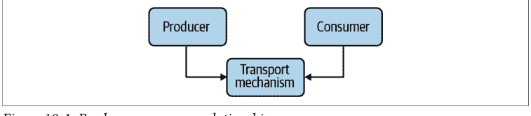

## 缺点

因为生产者和消费者依赖于传输机制，它们必须就消息格式达成一致。在大多数事件驱动架构中，生产者和消费者都同意使用一个通用的标识符和消息格式。这确实在两者之间创建了一个 *逻辑* 依赖，但不是物理依赖。如果任何一方以不兼容的方式更改了标识符或消息格式，该方案就会崩溃。并且像大多数逻辑依赖一样，很难通过检查将依赖联系起来。请参阅 [第 16 章](#) 以了解更多关于如何缓解这些问题的信息。

由于这种代码分离，当出现问题时，你的类型检查器将无济于事。如果消费者开始依赖错误的事件类型，类型检查器不会标记它。在更改生产者或消费者类型时要格外小心，因为你必须更新所有其他生产者-消费者以匹配。

事件驱动架构可能使调试变得更困难。在调试器中单步执行代码时，你会到达产生事件的代码，但当你单步进入传输机制时，你通常会单步进入第三方代码。在最坏的情况下，实际传输你事件的代码可能在不同的进程中运行，甚至在不同的机器上运行。你可能需要多个调试器处于活动状态（每个进程或系统一个）才能正确调试事件驱动架构。

最后，使用事件驱动架构时，错误处理会变得有点困难。大多数生产者与其消费者是解耦的；当消费者抛出异常或返回错误时，从生产者端处理它并不总是容易的。

作为一个思想实验，考虑一下如果一个生产者产生一个事件，而五个消费者消费它会发生什么。如果被通知的第三个消费者抛出了异常，应该发生什么？其他消费者应该收到异常吗，还是执行应该立即停止？生产者应该知道任何错误条件吗，还是错误应该被吞没？如果生产者收到一个异常，如果不同的消费者产生不同的异常会发生什么？所有这些问题都没有一个正确的答案；请查阅你正在使用的事件驱动架构工具，以更好地了解在这些情况下会发生什么。

尽管有这些缺点，但在你需要为系统提供急需的灵活性的情况下，事件驱动架构是值得的。未来的维护者可以以最小的影响替换你的生产者或消费者。他们可以引入新的生产者和消费者来创建新功能。他们可以快速与外部系统集成，为新的合作伙伴关系打开大门。最重要的是，他们正在使用小型、模块化的系统，这些系统易于独立测试且易于理解。

## 简单事件

事件导向架构中最简单的情况是处理*简单事件*，例如在特定条件发生变化时执行操作或发出警报。你的信息生产者是发送事件的一方，而你的消费者则接收并响应事件。实现这一点有两种典型方式：使用或不使用消息代理。

## 使用消息代理

消息代理是一段特定的代码，充当数据的传输者。生产者会将数据（称为消息）发布到消息代理上的特定*主题*。主题只是一个唯一标识符，例如一个字符串。它可以很简单，比如“订单”，也可以很复杂，比如“三明治订单已完成”。它只是一个命名空间，用于区分不同的消息通道。消费者使用相同的标识符来*订阅*一个主题。然后，消息代理将消息发送给所有订阅了该主题的消费者。这种类型的系统也称为*发布/订阅*，简称 pub/sub。图 18-2 展示了一个假设的 pub/sub 架构。

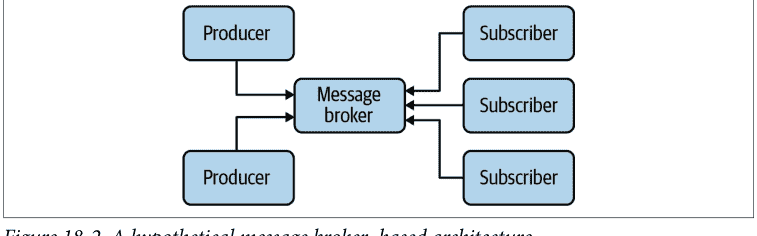

在本章中，我将为餐厅的自动化无人机配送服务设计通知系统。当顾客的订单烹饪完成时，无人机系统就会启动，取走订单，并将餐食送到正确的地址。这个系统中会发生五种通知，我在表 18-2 中将它们分解为生产者-消费者关系。

表 18-2. 自动化无人机配送系统中的生产者和消费者

| 生产者 | 消费者 |
| :--- | :--- |
| 餐食烹饪完成 | 无人机收到取餐通知 |
| 餐食烹饪完成 | 顾客收到餐食已做好的通知 |
| 无人机正在途中 | 顾客收到预计送达时间的通知 |
| 无人机已送达餐食 | 顾客收到送达通知 |
| 无人机已送达餐食 | 餐厅收到送达通知 |

我不希望这些系统中的任何一个直接了解彼此，因为处理顾客、无人机和餐厅的代码应该保持独立（它们由不同的团队维护，我希望保持物理依赖性较低）。

首先，我将定义系统中存在的主题：餐食烹饪完成、无人机正在途中、订单已送达。

在这个例子中，我将使用 Python 库 PyPubSub，这是一个用于单进程应用程序的发布-订阅 API。要使用它，你需要设置代码来订阅一个主题，以及其他代码来发布到该主题。首先，你需要安装 pypubsub：

```
pip install pypubsub
```

然后，要订阅一个主题，你需要指定主题和你希望被调用的函数：

```
from pubsub import pub

def notify_customer_that_meal_is_done(order: Order):
    # ... 省略 ...

pub.subscribe(notify_customer_that_meal_is_done, "meal-done")
```

然后，要发布到这个主题，你需要执行以下操作：

```
from pubsub import pub

def complete_order(order: Order):
    packge_order(order)
    pub.publish("meal-done", order)
```

> 订阅者与发布者在同一个线程中运行，这意味着任何阻塞 I/O（例如等待套接字可读）都会阻塞发布者。这将影响所有其他订阅者，应予以避免。

这两段代码彼此一无所知；它们只依赖于 PyPubSub 库以及对主题/消息数据的约定。这使得添加新的订阅者变得极其容易：

```
from pubsub import pub

def schedule_pick_up_for_meal(order: Order):
    '''安排无人机取餐'''
    # ... 省略 ...

pub.subscribe(schedule_pick_up_for_meal, "meal-done")
```

没有比这更具扩展性的了。通过定义系统中存在的主题，你可以极其轻松地创建新的生产者或消费者。随着系统需求的增长，你可以通过与现有消息系统交互来扩展它。

PyPubSub 还提供了一些选项来帮助调试。你可以通过添加自己的功能（例如新主题被创建或消息被发送）来添加审计操作。你可以为任何订阅者抛出的异常添加错误处理程序。你还可以一次性为*所有*主题设置订阅者。如果你想了解更多关于这些功能或 PyPubSub 中任何其他功能的信息，请查看 [PyPubSub 文档](https://pypubsub.readthedocs.io/)。


PyPubSub 适用于单进程应用程序；你无法发布到运行在其他进程或系统中的代码。其他应用程序可用于提供此功能，例如 [Kafka](https://kafka.apache.org/)、[Redis](https://redis.io/) 或 [RabbitMQ](https://www.rabbitmq.com/)。请查看每个工具的文档，了解如何在 Python 中使用它们。

## 观察者模式

如果你不想使用消息代理，可以选择实现观察者模式。¹ 使用观察者模式，你的生产者包含一个*观察者*列表：即此场景中的消费者。观察者模式不需要单独的库来充当消息代理。

为了避免直接链接生产者和消费者，你需要保持观察者知识的*通用性*。换句话说，将任何关于观察者的具体知识抽象掉。我将通过仅使用函数（类型注解为 Callable）来实现这一点。以下是我将如何重写前面的例子以使用观察者模式：

```
python
def complete_order(order: Order, observers: list[Callable[Order]]):
    package_order(order)
    for observer_func in observers:
        observer(order)
```

在这种情况下，生产者只知道要调用以进行通知的函数列表。要添加新的观察者，你只需将它们添加到作为参数传入的列表中。此外，由于这只是函数调用，你的类型检查器将能够检测到生产者或其观察者何时以不兼容的方式发生变化，这比消息代理范式是一个巨大的优势。它也更容易调试，因为你不需要在调试器中逐步执行第三方消息代理代码。

> ¹ 观察者模式首次在 Erich Gamma、Richard Helm、Ralph Johnson 和 John Vlissides 所著的《设计模式：可复用面向对象软件的基础》（Addison-Wesley Professional）中描述。这本书通常被称为“四人帮（GoF）”之书。

## 无类的模式

本章中的例子并非观察者模式的典型表示。这种设计模式（以及许多其他模式）的传统实现是以非常面向对象的方式表示的，使用类、子类、继承和接口。例如，原始的观察者模式在 Python 中可能这样表达：

```
from typing import Any
class Subscriber:
    def notify(data: Any):
        raise NotImplementedError()

class Publisher:
    def __init__(self):
        self.subscribers = []

    def add_subscriber(self, sub: Subscriber):
        self.subscribers.append(sub)

    def notify_subscribers(self, data: Any):
        for subscriber in subscribers:
            subscriber.notify(data)
```

需要发布或订阅的类将继承自相应的基类。从重用的角度来看，这很有用，但当使用函数的例子简单得多时，引入类可能会显得笨重。

因此，设计模式因其需要实现的样板类和接口数量而受到了一些批评。随着开发社区的发展，公众对许多模式的看法已经恶化，因为它们与 1990 年代中期和 2000 年代被描述为“面向对象”的类/接口密集型代码相关联。

然而，不要因为这些模式最初的呈现方式而抛弃许多设计模式的概念。这些模式已经经历了许多迭代，简化了实现。大多数模式并不关注面向对象代码的状态管理方面，而是关注解耦依赖关系，对于大型系统设计仍然有益。

上面的观察者模式确实有一些缺点。首先，你对出现的错误稍微敏感一些。如果观察者抛出异常，生产者需要能够直接处理（或使用辅助函数或类来处理包装在 try...except 中的通知）。其次，生产者到观察者的链接比在消息代理范式中更直接。在消息代理范式中，发布者和订阅者可以变得连接，无论它们在代码库中的位置如何。

相比之下，观察者模式要求通知的调用者（在之前的例子中，是`complete_order`）了解观察者。如果调用者不直接了解观察者，那么它的调用者就需要传入观察者。这可以一直沿着调用栈向上追溯，直到你到达一段直接了解观察者的代码。如果了解观察者的代码与实际发出通知的代码之间存在很大差距，这可能会用额外的参数污染你的许多函数调用。如果你发现自己需要将观察者传递给多个函数，才能到达调用栈深处的某个生产者，那么请考虑改用消息代理。

如果你想更深入地了解使用简单事件的事件驱动架构，我推荐Harry Percival和Bob Gregory（O'Reilly）所著的*《Python架构模式》*一书；其第二部分全部关于事件驱动架构。

**讨论主题**

事件驱动架构将如何改善你代码库中的解耦？观察者模式还是消息代理更适合你的需求？

## 流式事件

在上一节中，每个简单事件都被表示为一个在满足特定条件时发生的离散事件。消息代理和观察者模式是处理简单事件的绝佳方式。然而，有些系统处理的是永无止境的事件序列。这些事件作为连续的数据流进入系统，称为流。想想上一节描述的无人机系统。考虑来自每架无人机的所有数据。可能包括位置数据、电池电量、当前速度、风力数据、天气数据和当前携带重量。这些数据会以固定的时间间隔传入，你需要一种方法来处理它。

在这类用例中，你不想构建发布/订阅或观察者的所有样板代码；你需要一个与你的用例相匹配的架构。你需要一个以事件为中心并为处理每个事件定义工作流的编程模型。这就引出了响应式编程。

*响应式编程*是一种围绕事件流展开的架构风格。你将数据源定义为这些流的生产者，然后将多个观察者链接在一起。每当数据发生变化时，每个观察者都会收到通知，并定义一系列操作来处理数据流。响应式编程风格由ReactiveX推广。在本节中，我将使用ReactiveX的Python实现：RxPY。

我将使用pip安装RxPY：

```
pip install rx
```

接下来，我需要定义一个数据流。在RxPY术语中，这被称为*可观察对象*。为了举例说明，我将使用一个硬编码的可观察对象，但在实践中，你将从真实数据生成多个可观察对象。

```python
import rx
# 这些中的每一个都在模拟一个独立的、正在流入的真实世界事件
observable = rx.of(
    LocationData(x=3, y=12, z=40),
    BatteryLevel(percent=95),
    BatteryLevel(percent=94),
    WindData(speed=15, direction=Direction.NORTH),
    # ... 省略数百个事件
    BatteryLevel(percent=72),
    CurrentWeight(grams=300)
)
```

这个可观察对象是由无人机数据的不同类型事件列表生成的。

接下来，我需要定义如何处理每个事件。一旦我有了一个可观察对象，观察者就可以订阅它，类似于发布/订阅机制：

```python
def handle_drone_data(value):
    # ... 省略处理无人机数据的代码 ...

observable.subscribe(handle_drone_data)
```

这看起来与普通的发布/订阅模式没有太大不同。

真正的魔力在于*可管道化*的操作符。RxPY允许你将操作*管道化*或链接在一起，形成一个包含过滤、转换和计算的管道。例如，我可以使用`rx.pipe`编写一个操作符管道来获取无人机携带的平均重量：

```python
import rx.operators

get_average_weight = observable.pipe(
    rx.operators.filter(lambda data: isinstance(data, CurrentWeight)),
    rx.operators.map(lambda cw: cw.grams),
    rx.operators.average()
)

# save_average_weight 对最终数据执行某些操作
# （例如保存到数据库、打印到屏幕等）
get_average_weight.subscribe(save_average_weight)
```

类似地，我可以编写一个管道链来跟踪无人机离开餐厅后的最大高度：

```python
get_max_altitude = observable.pipe(
    rx.operators.skip_while(is_close_to_restaurant),
    rx.operators.filter(lambda data: isinstance(data, LocationData)),
    rx.operators.map(lambda loc: loc.z),
    rx.operators.max()
)

# save_max_altitude 对最终数据执行某些操作
# （例如保存到数据库、打印到屏幕等）
get_max_altitude.subscribe(save_max_altitude)
```

> *Lambda函数*只是一个没有名称的内联函数。它通常用于那些只使用一次的函数，你不想将函数的定义放得离它的使用位置太远。

这是我们熟悉的老朋友*可组合性*（如第17章所见）在帮助我们。我可以随心所欲地组合不同的操作符，以产生与我的用例相匹配的数据流。RxPY支持超过一百个内置操作符，以及一个用于定义你自己的操作符的框架。你甚至可以将一个管道的结果组合成一个新的事件流，供程序的其他部分观察。这种可组合性，加上事件订阅的解耦特性，为你编写代码提供了极大的灵活性。此外，响应式编程鼓励不可变性，这大大减少了出现错误的可能性。你可以使用像RxPY这样的响应式框架来连接新的管道、组合操作符、异步处理数据等等。

它还使得隔离调试变得容易。虽然你无法轻松地使用调试器单步执行RxPY（最终会陷入大量与操作和可观察对象相关的复杂代码中），但你可以改为单步执行传递给操作符的函数。测试也很轻松。由于所有函数都旨在是不可变的，你可以单独测试其中任何一个。最终你会得到许多小型、单一用途且易于理解的函数。

这种类型的模型在围绕数据流的系统中表现出色，例如数据管道和提取、转换、加载（ETL）系统。它在主要处理I/O事件反应的应用程序中也非常有用，例如服务器应用程序和GUI应用程序。如果响应式编程适合你的领域模型，我鼓励你阅读[RxPY文档](https://rxpy.readthedocs.io/)。如果你想进行更有结构的学习，我推荐视频课程*《面向数据科学的响应式Python》*或Romain Picard（O'Reilly）所著的*《Python响应式编程实战：用RxPY解开事件驱动开发》*一书。

## 结语

事件驱动架构功能极其强大。事件驱动架构允许你将信息的生产者和消费者分离。通过将两者解耦，你为系统引入了灵活性。你可以替换功能、隔离测试代码，或者通过引入新的生产者或消费者来扩展新功能。

构建事件驱动系统的方式多种多样。你可以选择坚持使用简单事件和观察者模式来处理系统中的轻量级事件。随着规模扩大，你可能需要引入消息代理，例如使用PyPubSub。如果你想跨进程或系统扩展，你甚至可能需要使用另一个库作为消息代理。最后，当你处理事件流时，可以考虑使用响应式编程框架，例如RxPY。

在下一章中，我将介绍一种不同类型的架构范式：插件架构。插件架构提供了与事件驱动架构类似的灵活性、可组合性和可扩展性，但方式完全不同。事件驱动架构关注的是事件，而插件架构关注的是可插拔的实现单元。你将看到插件架构如何为你提供多种选择，以构建一个易于维护的健壮代码库。

## 第19章
可插拔的Python

构建健壮代码库的最大挑战在于预测未来。你永远无法完全猜到未来的开发者会做什么。最佳策略并非拥有完美的预见力，而是创造灵活性，让未来的协作者能以最小的工作量接入你的系统。本章我将重点讨论如何创建*可插拔*的代码。可插拔代码允许你定义稍后才提供的行为。你定义一个带有*扩展点*的框架，这些扩展点就是系统中其他开发者将用来扩展功能的部分。

想象一下厨房台面上的立式搅拌机。你可以选择各种附件与之配合使用：用于揉面团的钩子、用于打发鸡蛋和奶油的搅拌器，以及用于通用搅拌的平桨。每个附件都有特定用途。妙处在于，你可以根据情况随时拆卸和安装钩子或刀片。你不需要为每种用途购买全新的搅拌机；你只需在需要时*插入*所需的附件即可。

这就是可插拔Python的目标。当需要新功能时，你无需重建整个应用程序。你构建的是可以安装在坚实基础上的扩展或附件。你根据特定用例选择所需功能，并将其插入系统。

在本书的大部分内容中，我一直在用各种自动化食品制作设备来举例说明。在本章中，我将进行一次大融合，设计一个能将它们全部组合起来的系统。我想构建一个系统，它能处理我之前讨论过的任何食谱并进行烹饪。我称之为“终极厨房助手”（如果你觉得这个名字很糟糕，现在你知道为什么我不从事市场营销工作了）。

终极厨房助手包含了你在厨房工作所需的所有指令和工具。它知道如何切片、切丁、煎炒、煸炒、烘焙、炙烤和混合任何食材。它附带一些预制食谱，但真正的魔力在于，客户可以购买现成的模块来扩展其功能（例如，用于满足意大利菜渴望的“意面制作模块”）。

问题是，我不希望代码变得难以维护。有太多不同的菜肴需要制作，我希望给系统某种灵活性，而不会让大量的物理依赖将系统变成意大利面条式代码（尽管你的系统在厨房里制作意大利面本身是高度鼓励的！）。就像在立式搅拌机上插入新附件一样，我希望开发者能安装不同的附件来解决他们的用例。我甚至希望其他组织能为终极厨房助手构建模块。我希望这个代码库是可扩展和可组合的。

我将用这个例子来说明三种不同的方式，以插入不同的Python构造。首先，我将重点介绍如何使用模板方法模式插入算法的特定部分。然后，我将讨论如何使用策略模式插入整个类。最后，我将向你介绍一个非常有用的库——stevedore，用于在更大的架构规模上进行插件开发。所有这些技术都将帮助你为未来的开发者提供所需的扩展性。

## 模板方法模式

*模板方法模式*是一种用于填补算法空白的模式。¹ 其思想是将算法定义为一系列步骤，但强制调用者覆盖其中某些步骤，如图19-1所示。

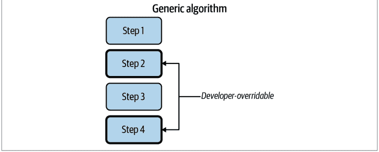

图19-1. 模板方法模式

> ¹ Erich Gamma, Richard Helm, Ralph E. Johnson, and John Vlissides. *Design Patterns: Elements of Reusable Object-Oriented Software*. Boston, MA: Addison-Wesley Professional, 1994.

终极厨房助手首先要实现的是一个制作披萨的模块。虽然传统的酱料和奶酪披萨很棒，但我希望终极厨房助手更加灵活。我希望它能处理各种类似披萨的食物，从黎巴嫩的曼努什到韩式烤肉披萨。为了制作任何这些类似披萨的食物，我希望机器执行一系列相似的步骤，但让开发者调整某些操作以制作他们风格的披萨。图19-2描述了这样一个披萨制作算法。

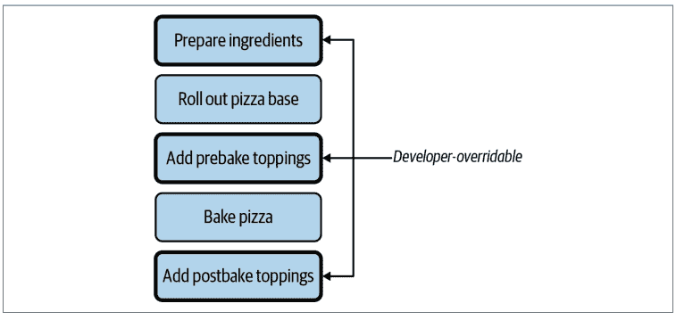

图19-2. 披萨制作算法

每个披萨都将使用相同的基本步骤，但我希望能够调整某些步骤（准备食材、添加预烤配料和添加后烤配料）。我应用模板方法模式的目标是使这些步骤可插拔。

在其最简单的形式中，我可以将函数传递给模板方法：

```python
@dataclass
class PizzaCreationFunctions:
    prepare_ingredients: Callable
    add_pre_bake_toppings: Callable
    add_post_bake_toppings: Callable

def create_pizza(pizza_creation_functions: PizzaCreationFunctions):
    pizza_creation_functions.prepare_ingredients()
    roll_out_pizza_base()
    pizza_creation_functions.add_pre_bake_toppings()
    bake_pizza()
    pizza_creation_functions.add_post_bake_toppings()
```

现在，如果你想制作披萨，只需传入你自己的函数：

```python
pizza_creation_functions = PizzaCreationFunctions(
    prepare_ingredients=mix_zaatar,
    add_pre_bake_toppings=add_meat_and_halloumi,
    add_post_bake_toppings=drizzle_olive_oil
)

create_pizza(pizza_creation_functions)
```

这对于现在或未来的任何披萨来说都极其方便。随着新的披萨制作功能上线，开发者只需将他们的新函数传递给模板方法。这些开发者可以插入披萨制作算法的特定部分以满足他们的需求。他们根本不需要了解他们的用例；他们可以自由地扩展系统，而不会被遗留代码的修改所困扰。假设他们想制作烤肉披萨。我无需更改`create_pizza`，只需传入一个新的`PizzaCreationFunctions`：

```python
pizza_creation_functions = PizzaCreationFunctions(
    prepare_ingredients=cook_bulgogi,
    add_pre_bake_toppings=add_bulgogi_toppings,
    add_post_bake_toppings=garnish_with_scallions_and_sesame
)

create_pizza(pizza_creation_functions)
```

## 经典的模板方法模式

四人帮书中描述的模板方法模式与我在本节中展示的有所不同。这是四人帮书籍严重依赖基于类和继承的设计的另一个例子。在原始的模板方法模式中，你需要编写一个基类：

```python
class PizzaCreator:
    def roll_out_dough():
        # 省略
    def bake():
        # 省略
    def serve():
        # 省略

    def prepare_ingredients():
        raise NotImplementedError()

    def add_pre_bake_toppings():
        raise NotImplementedError()

    def add_post_bake_toppings():
        raise NotImplementedError()
```

> 要使用这个基类，你必须创建子类并覆盖三个必需的方法。然后，你必须找到一种方法将你的派生类替换到任何需要披萨制作器的代码中。你通常需要设置抽象工厂（四人帮书中发现的另一种设计模式）来注入派生类。

由于Python不要求所有内容都在类中，并且对函数提供一等支持，我更喜欢使用函数的数据类来填充模板。它涉及更少的样板代码，但仍提供类似的灵活性和可扩展性。只需注意，设计模式纯粹主义者可能更喜欢上面描述的面向对象模式。

## 策略模式

模板方法模式非常适合替换算法的特定部分，但如果你想替换*整个*算法呢？一个非常相似的设计模式适用于这种用例：策略模式。

策略模式用于将整个算法插入到上下文中。² 对于终极厨房助手，考虑一个专门从事德州-墨西哥菜（一种融合美国西南部和墨西哥北部菜肴的地区性美国菜）的模块。大量的菜肴可以从一组共同的物品中制作出来；你以新的方式混合搭配不同的食材。

例如，你可以在大多数德州-墨西哥菜单上找到以下食材：玉米饼或面粉饼、豆子、碎牛肉、鸡肉、生菜、番茄、牛油果酱、莎莎酱和奶酪。从这些食材中，你可以制作墨西哥卷饼、炸玉米卷、墨西哥卷饼、墨西哥辣肉酱、塔可沙拉、玉米片、戈迪塔斯……列表还在继续。我不希望系统限制所有不同的德州-墨西哥菜肴；我希望不同的开发者团队来提供*如何*制作这些菜肴。

要使用策略模式实现这一点，我需要定义终极厨房助手做什么以及策略做什么。在这种情况下，终极厨房助手应该提供与食材交互的机制，但未来的开发者可以自由地使用*TexMexStrategy*不断添加新的德州-墨西哥混合菜肴。

与任何旨在可扩展的代码一样，我需要确保我的终极厨房助手和德州-墨西哥模块之间的交互就前置和后置条件达成一致，即什么被传递到德州-墨西哥模块，以及什么从中输出。

² Erich Gamma, Richard Helm, Ralph E. Johnson, and John Vlissides. *Design Patterns: Elements of Reusable Object-Oriented Software*. Boston, MA: Addison-Wesley Professional, 1994.

假设终极厨房助手有编号的储物箱来存放食材。德州-墨西哥风味模块需要知道常用德州-墨西哥风味食材存放在哪些储物箱中，这样才能利用终极厨房助手进行实际的备料和烹饪。

```python
@dataclass
class TexMexIngredients:
    corn_tortilla_bin: int
    flour_tortilla_bin: int
    salsa_bin: int
    ground_beef_bin: int
    # ... 省略 ...
    shredded_cheese_bin: int

def prepare_tex_mex_dish(tex_mex_recipe_maker: Callable[TexMexIngredients]):
    tex_mex_ingredients = get_available_ingredients("Tex-Mex")
    dish = tex_mex_recipe_maker(tex_mex_ingredients)
    serve(dish)
```

函数 `prepare_tex_mex_dish` 收集食材，然后委托给实际的 `tex_mex_recipe_maker` 来创建要上菜的菜肴。`tex_mex_recipe_maker` 就是策略。它与模板方法模式非常相似，但通常你只是传递单个函数，而不是一组函数。

未来的开发者只需编写一个函数，根据给定的食材进行实际准备。他们可以这样写：

```python
import tex_mex_module as tmm

def make_soft_taco(ingredients: TexMexIngredients) -> tmm.Dish:
    tortilla = tmm.get_ingredient_from_bin(ingredients.flour_tortilla_bin)
    beef = tmm.get_ingredient_from_bin(ingredients.ground_beef_bin)
    dish = tmm.get_plate()
    dish.lay_on_dish(tortilla)
    tmm.season(beef, tmm.CHILE_POWDER_BLEND)
    # ... 省略 ...

prepare_tex_mex_dish(make_soft_taco)
```

如果他们决定在未来某个时候支持不同的菜肴，只需编写一个新的函数：

```python
def make_chimichanga(ingredients: TexMexIngredients):
    # ... 省略 ...
```

开发者可以随时按照自己的意愿定义函数。就像模板方法模式一样，他们可以以最小的影响将新功能插入到原始代码中。

与模板方法一样，我展示的实现与《设计模式》一书中最初描述的略有不同。原始实现涉及包装单个方法的类和子类。在 Python 中，直接传递单个函数要容易得多。

## 插件架构

策略模式和模板方法模式非常适合插入小的功能片段：这里一个类，那里一个函数。然而，同样的模式也适用于你的架构。能够注入类、模块或子系统同样重要。一个名为 stevedore 的 Python 库是管理插件的极其有用的工具。

插件是一段可以在运行时动态加载的代码。代码可以扫描已安装的插件，选择一个合适的插件，并将职责委托给该插件。这是可扩展性的另一个例子；开发者可以专注于特定的插件，而无需接触核心代码库。

除了可扩展性之外，插件架构还有许多好处：

- 你可以独立于核心部署插件，从而为推出更新提供更细粒度的控制。
- 第三方可以编写插件，而无需修改你的代码库。
- 插件可以独立于核心代码库进行开发，从而减少创建紧耦合代码的机会。

为了演示插件的工作原理，假设我想为终极厨房助手支持一个生态系统，用户可以单独购买和安装模块（例如上一节中的德州-墨西哥风味模块），与主厨房助手分开。每个模块提供一组食谱、特殊设备和食材存储，供终极厨房助手使用。真正的好处是每个模块都可以独立于终极厨房助手核心进行开发；每个模块都是一个插件。

设计插件时要做的第一件事是确定核心与各个插件之间的契约。问问自己核心平台提供什么服务，以及你期望插件提供什么。在终极厨房助手的案例中，图 19-3 展示了我将在以下示例中使用的契约。

图 19-3. 核心与插件之间的契约

我想把这个契约写成代码，这样我对插件的期望就毫无歧义了：

```python
from abc import abstractmethod
from typing import runtime_checkable, Protocol

from ultimate_kitchen_assistant import Amount, Dish, Ingredient, Recipe

@runtime_checkable
class UltimateKitchenAssistantModule(Protocol):
    ingredients: list[Ingredient]

    @abstractmethod
    def get_recipes() -> list[Recipe]:
        raise NotImplementedError

    @abstractmethod
    def prepare_dish(inventory: dict[Ingredient, Amount],
                    recipe: Recipe) -> Dish:
        raise NotImplementedError
```

这定义了插件的外观。要创建一个满足我期望的插件，我只需要创建一个继承自我的基类的类。

```python
class PastaModule(UltimateKitchenAssistantModule):
    def __init__(self):
        self.ingredients = ["Linguine",
                           # ... 省略 ...
                           "Spaghetti" ]

    def get_recipes(self) -> list[Recipe]:
        # ... 省略，返回所有可能的食谱 ...

    def prepare_dish(self, inventory: dict[Ingredient, Amount],
                     recipe: Recipe) -> Dish:
        # 与终极厨房助手交互以制作食谱
        # ... 省略 ...
```

一旦你创建了插件，就需要在 stevedore 中注册它。stevedore 将插件匹配到一个*命名空间*，或一个将插件分组在一起的标识符。它通过使用 Python 的*入口点*来实现这一点，这允许 Python 在运行时发现组件。³

你可以在 setuptools 和 setup.py 的帮助下注册插件。许多 Python 包使用 setup.py 来定义打包规则，其中之一就是入口点。在 ultimate_kitchen_assistant 的 setup.py 中，我会这样注册我的插件：

```python
from setuptools import setup

setup(
    name='ultimate_kitchen_assistant',
    version='1.0',
    #.... 省略 ....

    entry_points={
        'ultimate_kitchen_assistant.recipe_maker': [
            'pasta_maker = ultimate_kitchen_assistant.pasta_maker:PastaModule',
            'tex_mex = ultimate_kitchen_assistant.tex_mex:TexMexModule'
        ],
    },
)
```

> 如果你在链接插件时遇到问题，可以查看 entry-point-inspector 包以获取调试帮助。

我将我的 PastaMaker 类（在 ultimate_kitchen_assistant.pasta_maker 包中）绑定到一个命名空间为 ultimate_kitchen_assistant.recipe_maker 的插件。我还创建了另一个假设的插件 TexMexModule。

一旦插件注册为入口点，你就可以使用 stevedore 在运行时动态加载它们。例如，如果我想从所有插件中收集所有食谱，我可以编写以下代码：

³ 入口点在与 Python 打包交互时可能很复杂，但这超出了本书的范围。你可以在 https://oreil.ly/bMyjS 了解更多。

```python
import itertools
from stevedore import extension
from ultimate_kitchen_assisstant import Recipe

def get_all_recipes() -> list[Recipe]:
    mgr = extension.ExtensionManager(
        namespace='ultimate_kitchen_assistant.recipe_maker',
        invoke_on_load=True,
    )

    def get_recipes(extension):
        return extension.obj.get_recipes()

    return list(itertools.chain(mgr.map(get_recipes)))
```

我使用 stevedore.extension.ExtensionManager 来查找和加载命名空间 ultimate_kitchen_assistant.recipe_maker 中的所有插件。然后，我可以对找到的每个插件映射（或应用）一个函数来获取它们的食谱。最后，我使用 itertools 将它们全部链接在一起。无论我设置了有多少插件，我都可以用这段代码加载它们。

假设用户想从意面制作器中制作一些东西，比如“香肠意面”。所有调用代码需要做的就是请求一个名为 pasta_maker 的插件。我可以使用 stevedore.driver.DriverManager 加载特定的插件。

```python
from stevedore import driver

def make_dish(recipe: Recipe, module_name: str) -> Dish:
    mgr = driver.DriverManager(
        namespace='ultimate_kitchen_assistant.recipe_maker',
        name=module_name,
        invoke_on_load=True,
    )

    return mgr.driver.prepare_dish(get_inventory(), recipe)
```

> **讨论主题**
>
> 你系统的哪些部分可以使用插件架构？这将如何使你的代码库受益？

stevedore 提供了一种解耦代码的好方法；将代码分离成插件可以保持其灵活性和可扩展性。请记住，可扩展程序的目标是限制核心系统所需的修改数量。开发者可以独立创建插件，测试它们，并将它们无缝集成到你的核心中。

我最喜欢 stevedore 的一点是它实际上可以*跨*包工作。你可以在一个与核心完全独立的 Python 包中编写插件。只要插件使用相同的命名空间，stevedore 就能将所有内容整合在一起。stevedore 还有许多其他值得探索的功能，例如事件通知、通过多种方式启用插件以及自动生成插件文档。如果插件架构符合你的需求，我强烈建议你进一步了解 stevedore。


从技术上讲，你可以将任何类注册为插件，无论它是否可替代基类。因为代码通过 stevedore 的抽象层分离，你的类型检查器将无法检测到这一点。建议在运行时检查接口，以便在使用插件之前捕获任何不匹配的情况。

## 结语

当你创建可插拔的 Python 时，你赋予了协作者隔离新功能但仍能轻松将其集成到现有代码库中的能力。开发者可以使用模板方法模式接入现有算法，使用策略模式接入整个类或算法，甚至可以使用 stevedore 接入整个子系统。当你希望将插件分散到不同的 Python 包中时，stevedore 尤其有用。

第三部分到此结束，全部围绕可扩展性展开。编写可扩展的代码就是遵循开闭原则，即让你能够轻松地扩展代码，而无需修改现有代码。事件驱动架构和插件架构是注重可扩展性设计的绝佳范例。所有这些架构模式都要求你关注依赖关系：物理的、逻辑的和时间的。当你找到最小化物理依赖的方法时，你会发现你的代码变得可组合，并且可以随意重新排列成新的组合。

本书的前三部分侧重于可以使你的代码更易于维护和阅读，并减少错误机会的更改。然而，错误仍然有可能出现；它们是软件开发过程中不可避免的一部分。为了应对这一点，你需要让错误在进入生产环境之前易于检测。你将在第四部分*构建安全网*中学习如何使用 linters 和测试等工具来做到这一点。

# 第四部分

## 构建安全网

欢迎来到本书的第四部分，这一部分关于围绕你的代码库构建安全网的重要性。想象一下，一个走钢丝的人危险地平衡在高空。无论表演者练习了多少次他们的套路，总有一套安全预防措施以防最坏的情况发生。走钢丝的人可以自信地表演，相信如果他们滑倒，会有东西接住他们。你希望为你的协作者提供同样的信心和信任，让他们在你的代码库中工作。

即使你的代码完全没有错误，它能保持多久？每一次更改都会引入风险。每一个进入代码库的新开发者都需要时间才能完全理解其所有复杂性。客户会改变主意，要求与六个月前完全相反的东西。这都是任何软件开发生命周期的自然组成部分。

你的开发安全网是静态分析和测试的结合。关于测试以及如何编写好的测试已经有很多著述。在接下来的章节中，我将专注于*为什么*编写测试，如何决定编写哪些测试，以及如何使这些测试更有价值。我将超越简单的单元测试和集成测试，讨论高级测试技术，如验收测试、基于属性的测试和变异测试。

# 第 20 章

## 静态分析

在讨论测试之前，我首先想谈谈静态分析。*静态分析*是一组检查你的代码库、寻找潜在错误或不一致之处的工具。它是发现常见错误的利器。事实上，你已经在使用一个静态分析工具了：mypy。Mypy（以及其他类型检查器）检查你的代码库并发现类型错误。其他静态分析工具则检查其他类型的错误。在本章中，我将带你了解用于代码检查、复杂性检查和安全扫描的常见静态分析器。

## 代码检查

我将带你了解的第一类静态分析工具叫做 *linter*。Linter 在你的代码库中搜索常见的编程错误和风格违规。它们的名字来源于最初的 linter：一个名为 *lint* 的程序，过去用于检查 C 程序中的常见错误。它会搜索“模糊”逻辑并试图消除这种模糊性（因此得名 linting）。在 Python 中，你最常遇到的 linter 是 Pylint。Pylint 用于检查大量常见错误：

-   PEP 8 Python 风格指南的某些风格违规
-   不可达的死代码（例如 `return` 语句之后的代码）
-   访问约束违规（例如类的私有或受保护成员）
-   未使用的变量和函数
-   类缺乏内聚性（方法中未使用 `self`，公共方法过多）
-   缺少文档字符串形式的文档
-   常见的编程错误

这些错误类别中有很多是我们之前讨论过的，例如访问私有成员或函数需要是自由函数而不是成员函数（如第 10 章所述）。像 Pylint 这样的 linter 将补充你在本书中学到的所有技术；如果你违反了我一直在阐述的一些原则，linter 会为你捕获这些违规行为。

Pylint 在发现代码中一些常见错误方面也非常方便。考虑一个开发者添加代码，将所有作者的食谱添加到现有列表中：

```python
def add_authors_cookbooks(author_name: str, cookbooks: list[str] = []) -> bool:
    author = find_author(author_name)
    if author is None:
        assert False, "Author does not exist"
    else:
        for cookbook in author.get_cookbooks():
            cookbooks.append(cookbook)
        return True
```

这看起来无害，但这段代码中有两个问题。花几分钟时间看看你是否能找到它们。

现在让我们看看 Pylint 能做什么。首先，我需要安装它：

```
pip install pylint
```

然后，我将对上面的示例运行 Pylint：

```
pylint code_examples/chapter20/lint_example.py
************* Module lint_example
code_examples/chapter20/lint_example.py:11:0: W0102:
    Dangerous default value [] as argument (dangerous-default-value)
code_examples/chapter20/lint_example.py:11:0: R1710:
    Either all return statements in a function should return an expression,
    or none of them should. (inconsistent-return-statements)
```

Pylint 已经识别出我代码中的两个问题（它实际上发现了更多，例如缺少文档字符串，但为了本次讨论的目的，我省略了它们）。首先，参数有一个危险的可变默认值 `[]`。关于这种行为已经有很多论述，但它是错误的常见陷阱，尤其是对于语言新手来说。

另一个错误则更为微妙：并非所有分支都返回相同的类型。“但是等等！”你惊呼道。“没关系，因为我用了 `assert`，它会引发错误而不是继续执行 `if` 语句（返回 `None`）。”然而，虽然 `assert` 语句很棒，但它们可以被禁用。当你向 Python 传递 `-O` 标志时，它会禁用所有 `assert` 语句。所以，当 `-O` 标志开启时，这个函数返回 `None`。需要说明的是，mypy 不会捕获这个错误，但 Pylint 会。更棒的是，Pylint 在不到一秒的时间内就运行并找到了这些错误。

无论你是否犯这些错误，或者你是否总是在代码审查中发现它们，这都不重要。任何代码库中都有无数的开发者，错误可能发生在任何地方。通过强制执行像 Pylint 这样的 linter，你可以消除非常常见、可检测的错误。有关内置检查器的完整列表，请参阅 [Pylint 文档](https://pylint.readthedocs.io/)。

> ## 将错误左移

DevOps 思维模式的一个常见原则是“将你的错误左移”。我在讨论类型时提到过这一点，但它也适用于静态分析和测试。这个想法是从成本的角度来考虑你的错误。修复一个错误有多昂贵？这取决于你在哪里发现那个错误。在生产环境中被客户发现的错误代价高昂。开发者必须花时间离开他们正常的特性开发，技术支持和测试人员也会介入，而且当你必须进行紧急部署时，还存在风险。

你在开发生命周期中越早发现错误，解决它的成本就越低。如果你能在测试期间发现错误，你就可以避免大量的生产成本。然而，你希望更早地发现这些问题，在它们进入代码库之前。我在第一部分详细讨论了类型检查器如何将这些错误进一步左移，以便你在开发时就能发现错误。不仅仅是类型检查器允许你这样做，静态分析工具如 linter 和复杂性检查器也是如此。

这些静态分析工具是你对抗错误的第一道防线，甚至比测试更重要。它们不是万能药（没有什么是），但它们在早期发现问题方面是无价的。将它们添加到你的持续集成管道中，并将它们设置为版本控制系统中的预提交钩子或服务器端钩子。为自己节省时间和金钱，不要让易于检测的错误进入你的代码库。

## 编写你自己的 Pylint 插件

真正的 Pylint 魔法在你编写自己的插件时开始显现（有关插件架构的更多信息，请参见第 19 章）。Pylint 插件允许你编写自己的自定义*检查器*或规则。虽然内置检查器寻找常见的 Python 错误，但你的自定义检查器可以寻找你问题领域中的错误。

看看第 4 章中的一段代码片段：

```python
ReadyToServeHotDog = NewType("ReadyToServeHotDog", HotDog)

def prepare_for_serving() -> ReadyToServeHotDog:
    # snip preparation
    return ReadyToServeHotDog(hotdog)
```

在第四章中，我提到过，为了让 NewType 有效，你需要确保只通过*受信任的*方法来构造它，也就是那些强制执行与该类型相关约束的方法。当时，我的建议是使用注释来给代码读者提供提示。然而，借助 Pylint，你可以编写一个自定义检查器来发现你何时违反了这一预期。

以下是该插件的完整代码。稍后我会为你分解讲解：

```python
from typing import Optional

import astroid

from pylint.checkers import BaseChecker
from pylint.interfaces import IAstroidChecker
from pylint.lint.pylinter import PyLinter

class ServableHotDogChecker(BaseChecker):
    __implements__ = IAstroidChecker

    name = 'unverified-ready-to-serve-hotdog'
    priority = -1
    msgs = {
        'W0001': (
            'ReadyToServeHotDog created outside of hotdog.prepare_for_serving.',
            'unverified-ready-to-serve-hotdog',
            'Only create a ReadyToServeHotDog through hotdog.prepare_for_serving.'
        ),
    }

    def __init__(self, linter: Optional[PyLinter] = None):
        super(ServableHotDogChecker, self).__init__(linter)
        self._is_in_prepare_for_serving = False

    def visit_functiondef(self, node: astroid.scoped_nodes.FunctionDef):
        if (node.name == "prepare_for_serving" and
            node.parent.name == "hotdog" and
            isinstance(node.parent, astroid.scoped_nodes.Module)):

            self._is_in_prepare_for_serving = True

    def leave_functiondef(self, node: astroid.scoped_nodes.FunctionDef):
        if (node.name == "prepare_for_serving" and
            node.parent.name == "hotdog" and
            isinstance(node.parent, astroid.scoped_nodes.Module)):

            self._is_in_prepare_for_serving = False

    def visit_call(self, node: astroid.node_classes.Call):
        if node.func.name != 'ReadyToServeHotDog':
            return

        if self._is_in_prepare_for_serving:
            return

        self.add_message(
            'unverified-ready-to-serve-hotdog', node=node,
        )

def register(linter: PyLinter):
    linter.register_checker(ServableHotDogChecker(linter))
```

这个 linter 会验证当有人创建 `ReadyToServeHotDog` 时，只在名为 `prepare_for_serving` 的函数中进行，并且该函数必须位于名为 `hotdog` 的模块中。现在，假设我要创建任何其他函数来创建一个即食热狗，像这样：

```python
def create_hot_dog() -> ReadyToServeHotDog:
    hot_dog = HotDog()
    return ReadyToServeHotDog(hot_dog)
```

我可以运行我的自定义 Pylint 检查器：

```
PYTHONPATH=code_examples/chapter20 pylint --load-plugins \
    hotdog_checker code_examples/chapter20/hotdog.py
```

Pylint 确认，提供一个“不可提供”的热狗现在是一个错误：

```
************* Module hotdog
code_examples/chapter20/hotdog.py:13:12: W0001:
    ReadyToServeHotDog created outside of prepare_for_serving.
    (unverified-ready-to-serve-hotdog)
```

这太棒了。现在我可以编写自动化工具来检查像 mypy 这样的类型检查器甚至无法开始查找的错误。不要让你的想象力受限。使用 Pylint 来捕获你能想到的任何东西：业务逻辑约束违反、时间依赖性或自定义风格指南。现在，让我们来看看这个 linter 是如何工作的，以便你可以构建自己的。

## 分解插件

编写插件的第一步是定义一个继承自 `pylint.checkers.BaseChecker` 的类：

```python
import astroid

from pylint.checkers import BaseChecker
from pylint.interfaces import IAstroidChecker

class ReadyToServeHotDogChecker(BaseChecker):
    __implements__ = IAstroidChecker
```

你还会注意到一些对 `astroid` 的引用。`astroid` 库对于将 Python 文件解析为抽象语法树（AST）非常有用。这提供了一种结构便利的方式来与 Python 源代码交互。你很快就会看到这有什么用。

接下来，我定义了关于插件的元数据。这提供了诸如插件名称、显示给用户的消息以及一个标识符（`unverified-ready-to-serve-hotdog`）等信息，我稍后可以引用它。

```python
name = 'unverified-ready-to-serve-hotdog'
priority = -1
msgs = {
    'W0001': ( # this is an arbitrary number I've assigned as an identifier
        'ReadyToServeHotDog created outside of hotdog.prepare_for_serving.',
        'unverified-ready-to-serve-hotdog',
        'Only create a ReadyToServeHotDog through hotdog.prepare_for_serving.'
    ),
}
```

接下来，我想跟踪我所在的函数，以便判断我是否在使用 `prepare_for_serving`。这就是 `astroid` 库将发挥作用的地方。如前所述，`astroid` 库帮助 Pylint 检查器以 AST 的方式思考；你不需要担心字符串解析。如果你想了解更多关于 AST 和 Python 解析的知识，可以查看 `astroid` 的文档，但现在，你需要知道的是，如果你在检查器中定义了特定的函数，它们会在 `astroid` 解析代码时被调用。每个被调用的函数都会接收一个节点，该节点代表代码的特定部分，例如表达式或类定义。

```python
def __init__(self, linter: Optional[PyLinter] = None):
    super(ReadyToServeHotDogChecker, self).__init__(linter)
    self._is_in_prepare_for_serving = False

def visit_functiondef(self, node: astroid.scoped_nodes.FunctionDef):
    if (node.name == "prepare_for_serving" and
        node.parent.name == "hotdog" and
        isinstance(node.parent, astroid.scoped_nodes.Module)):
            self._is_in_prepare_for_serving = True

def leave_functiondef(self, node: astroid.scoped_nodes.FunctionDef):
    if (node.name == "prepare_for_serving" and
        node.parent.name == "hotdog" and
        isinstance(node.parent, astroid.scoped_nodes.Module)):

        self._is_in_prepare_for_serving = False
```

在这种情况下，我定义了一个构造函数来保存一个成员变量，以跟踪我是否在正确的函数中。我还定义了两个函数：`visit_functiondef` 和 `leave_functiondef`。每当 `astroid` 解析一个函数定义时，`visit_functiondef` 就会被调用；每当解析器停止解析一个函数定义时，`leave_functiondef` 就会被调用。所以当解析器遇到一个函数时，我会检查该函数是否名为 `prepare_for_serving`，并且它位于名为 `hotdog` 的模块内。

现在我有了一个成员变量来跟踪我是否在正确的函数中，我可以编写另一个 `astroid` 钩子，以便在每次调用函数时（例如 `ReadyToServeHotDog(hot_dog)`）被调用。

```python
def visit_call(self, node: astroid.node_classes.Call):
    if node.func.name != 'ReadyToServeHotDog':
        return

    if self._is_in_prepare_for_serving:
        return

    self.add_message(
        'unverified-ready-to-serve-hotdog', node=node,
    )
```

如果函数调用不是 `ReadyToServeHotDog`，或者执行在 `prepare_for_serving` 中，这个检查器认为没有问题并提前返回。如果函数调用是 `ReadyToServeHotDog` 且执行不在 `prepare_for_serving` 中，检查器会失败并添加一条消息，指示 `unverified-ready-to-serve-hotdog` 检查失败。通过添加消息，Pylint 会将其传递给用户并将其标记为检查失败。

最后，我需要注册这个 linter：

```python
def register(linter: PyLinter):
    linter.register_checker(ReadyToServeHotDogChecker(linter))
```

就是这样！通过大约 45 行 Python 代码，我定义了一个 Pylint 插件。这是一个简单的检查器，但你的想象力决定了你能做什么。Pylint 检查器，无论是内置的还是用户创建的，对于发现错误都是无价的。

> **讨论主题**
> 你能在你的代码库中创建哪些检查器？使用这些检查器你能捕获哪些错误情况？

## 其他静态分析器

类型检查器和 linter 通常是人们听到“静态分析”时首先想到的东西，但还有许多其他工具可以帮助你编写健壮的代码。每个工具都充当一道独立的防线，所有这些防线叠加在一起，共同保护你的代码库。可以将每个工具想象成一片瑞士奶酪。¹ 每一片瑞士奶酪都有各种宽度或大小的孔洞，但当多片奶酪堆叠在一起时，就不太可能出现所有孔洞对齐、让你能看穿整个堆叠的区域。

同样，你用来构建安全网的每个工具都会遗漏某些错误。类型检查器无法捕获常见的编程错误，代码检查工具不会检查安全违规，安全检查器无法捕获复杂代码，依此类推。但当这些工具堆叠在一起时，合法错误溜走的可能性就大大降低了（对于那些溜走的错误，这就是为什么你还有测试）。正如布鲁斯·麦克伦南所说：“建立一系列防御，这样如果一个错误没有被一个工具捕获，它很可能会被另一个工具捕获。”²

## 复杂度检查器

本书的大部分内容都围绕着可读和可维护的代码展开。我讨论了复杂代码如何影响功能开发的速度。如果有一个工具能指出代码库中哪些部分复杂度很高，那就太好了。不幸的是，复杂度是主观的，降低复杂度并不总是能减少错误。然而，我可以将复杂度度量视为一种*启发式方法*。启发式方法是提供答案但不保证该答案是最优的方法。在这种情况下，问题是：“我可以在代码的哪里找到最多的错误？”大多数时候，它会在复杂度高的代码中，但请记住，这并不是保证。

## 使用 mccabe 进行圈复杂度分析

最受欢迎的复杂度启发式方法之一是*圈复杂度*，由托马斯·麦凯布首次描述。³ 要测量代码的圈复杂度，你必须将代码视为*控制流图*，即描绘代码可能执行的不同路径的图。图 20-1 展示了几个不同的例子。

1 J. Reason. “Human Error: Models and Management.” *BMJ* 320, no. 7237 (2000): 768–70. https://doi.org/10.1136/bmj.320.7237.768.
2 Bruce MacLennan. “Principles of Programming Language Design.” web.eecs.utk.edu, September 10, 1998. https://oreil.ly/hrjdR.
3 T.J. McCabe. “A Complexity Measure.” *IEEE Transactions on Software Engineering* SE-2, no. 4 (December 1976): 308–20. https://doi.org/10.1109/tse.1976.233837.

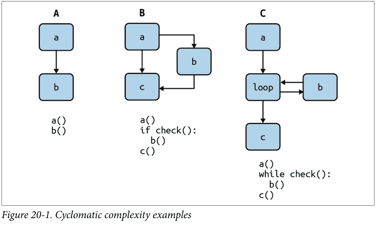

图 20-1 的 A 部分演示了语句的线性流，其复杂度为 1。如图 20-1 的 B 部分所示，一个没有 `elif` 语句的 `if` 语句有两条路径（if 或 else/直通），因此复杂度为 2。类似地，像图 20-1 的 C 部分那样的 `while` 循环也有两条独立的路径：要么循环继续，要么退出。随着代码变得越来越复杂，圈复杂度的数值也会越来越高。

你可以使用 Python 中的静态分析工具来测量圈复杂度，这个工具恰如其分地命名为 `mccabe`。

我将使用 `pip` 安装它：

```
pip install mccabe
```

为了测试它，我将在 `mccabe` 代码库本身上运行它，并标记任何圈复杂度大于或等于五的函数：

```
python -m mccabe --min 5 mccabe.py
192:4: 'PathGraphingAstVisitor._subgraph_parse' 5
273:0: 'get_code_complexity' 5
298:0: '_read' 5
315:0: 'main' 7
```

让我们看看 `PathGraphingAstVisitor._subgraph_parse`：

```
def _subgraph_parse(self, node, pathnode, extra_blocks):
    """parse the body and any `else` block of `if` and `for` statements"""
    loose_ends = []
    self.tail = pathnode
    self.dispatch_list(node.body)
    loose_ends.append(self.tail)
    for extra in extra_blocks:
        self.tail = pathnode
        self.dispatch_list(extra.body)
        loose_ends.append(self.tail)
    if node.orelse:
        self.tail = pathnode
        self.dispatch_list(node.orelse)
        loose_ends.append(self.tail)
    else:
        loose_ends.append(pathnode)
    if pathnode:
        bottom = PathNode("", look='point')
        for le in loose_ends:
            self.graph.connect(le, bottom)
        self.tail = bottom
```

这个函数中发生了一些事情：各种条件分支、循环，甚至是一个嵌套在 `if` 语句中的循环。这些路径中的每一条都是独立的，需要进行测试。随着圈复杂度的增长，代码变得更难阅读，也更难推理。圈复杂度没有神奇的数字；你需要检查你的代码库并寻找一个合适的限制。

## 空白启发式方法

还有另一种我非常喜欢的复杂度启发式方法，它比圈复杂度更容易推理：空白检查。其思想如下：计算单个 Python 文件中有多少级缩进。高缩进级别表示嵌套的循环和分支，这可能预示着复杂的代码。

不幸的是，在撰写本文时，没有流行的工具处理空白启发式方法。然而，自己编写这个检查器很容易：

```
def get_amount_of_preceding_whitespace(line: str) -> int:
    # replace tabs with 4 spaces (and start tab/spaces flame-war)
    tab_normalized_text = line.replace("\t", "    ")
    return len(tab_normalized_text) - len(tab_normalized_text.lstrip())

def get_average_whitespace(filename: str):
    with open(filename) as file_to_check:
        whitespace_count = [get_amount_of_preceding_whitespace(line)
                            for line in file_to_check
                            if line != ""]
        average = sum(whitespace_count) / len(whitespace_count) / 4
        print(f"Avg indentation level for {filename}: {average}")
```

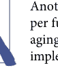

另一种可能的空白度量是每个函数的缩进“面积”，即对所有缩进求和而不是取平均值。我将此作为练习留给读者实现。

与圈复杂度一样，空白复杂度也没有神奇的数字可以检查。我鼓励你在代码库中尝试，并确定合适的缩进量。

## 安全分析

安全很难做好，几乎没有人会因为预防了数据泄露而受到赞扬。相反，似乎是泄露事件本身占据了新闻头条。每个月我都会听到另一次泄露或数据泄露事件。这些故障对公司来说代价高昂，无论是来自监管罚款还是客户群的流失。

每个开发者都需要高度关注其代码库的安全性。你不想听到*你的*代码库是新闻中最新大规模数据泄露事件的根源。值得庆幸的是，有静态分析工具可以防止常见的安全漏洞。

## 泄露密钥

如果你曾经想感到恐惧，可以在你最喜欢的代码托管工具（如 [GitHub](https://github.com)）中搜索文本 `AWS_SECRET_KEY`。你会惊讶于有多少人提交了诸如提供 AWS 访问权限的密钥之类的秘密值。⁴

一旦密钥进入版本控制系统，尤其是公开托管的系统，就很难清除其痕迹。该组织被迫撤销任何泄露的凭证，但他们必须比那些在代码库中搜寻密钥的黑客大军更快地完成。为了防止这种情况，请使用专门查找泄露密钥的静态分析工具，例如 [dodgy](https://github.com/Yelp/dodgy)。如果你不选择使用预构建的工具，至少对你的代码库进行文本搜索，以确保没有人泄露常见凭证。

## 安全漏洞检查

检查泄露的凭证是一回事，但更严重的安全漏洞呢？你如何发现诸如 SQL 注入、任意代码执行或配置错误的网络设置之类的问题？当被利用时，这些漏洞可能对你的安全状况造成损害。但是，就像本章中的其他问题一样，有一个静态分析工具可以处理这个问题：Bandit。

Bandit 检查常见的安全问题。你可以在 [Bandit 文档](https://bandit.readthedocs.io) 中找到完整列表，但以下是 Bandit 查找的漏洞类型预览：

- Flask 处于调试模式，这可能导致远程代码执行
- 发起 HTTPS 请求时未开启证书验证

⁴ 这有现实世界的影响。在互联网上快速搜索会发现大量详细描述此问题的文章，例如 [https://oreil.ly/gimse](https://oreil.ly/gimse)。

## 结语

尽早发现错误能为你节省时间和金钱。你的目标是在开发代码时就发现错误。静态分析工具是实现这一目标的得力助手。它们是一种廉价、快速的方式来发现代码库中的任何问题。有多种静态分析工具可以满足你的需求：代码检查工具、安全检查工具和复杂度检查工具。每种工具都有其特定用途，并提供一层防护。对于这些工具未能捕获的错误，你可以通过插件系统来扩展静态分析工具的功能。

虽然静态分析工具是你的第一道防线，但它们并非唯一的防线。在本书的剩余部分，我将重点讨论测试。下一章将聚焦于你的测试策略。我将详细介绍如何组织测试，以及围绕编写测试的最佳实践。你将学习如何构建测试三角，如何提出关于测试的正确问题，以及如何编写有效的开发者测试。

## 第21章
### 测试策略

测试是你能为代码库构建的最重要的安全网之一。做出更改后看到所有测试都通过，这会带来极大的安慰。然而，如何合理分配时间进行测试却颇具挑战。测试过多会成为负担；你花费在维护测试上的时间会超过交付功能的时间。测试过少则可能让潜在的灾难性问题进入生产环境。

在本章中，我将请你专注于你的测试策略。我将分解不同类型的测试，以及如何选择编写哪些测试。我将重点介绍围绕测试构建的Python最佳实践，最后以一些特定于Python的常见测试策略作为结束。

### 定义你的测试策略

在编写测试之前，你应该决定你的*测试策略*是什么。测试策略是一个计划，用于分配时间和精力来测试你的软件，以降低风险。这个策略将影响你编写哪些类型的测试、如何编写测试，以及你花费多少时间编写（和维护）测试。每个人的测试策略都会不同，但它们的形式都相似：一份关于你的系统以及你计划如何回答这些问题的清单。例如，如果我正在编写一个卡路里计数应用，我的测试策略的一部分可能是：

```
我的系统是否按预期运行？
需要编写的测试（自动化 - 每日运行）：
    验收测试：向每日计数添加卡路里
    验收测试：在每日边界重置卡路里
    验收测试：在一段时间内汇总卡路里
    单元测试：边界情况
    单元测试：正常路径
```

这个应用程序是否可供大量用户使用？
需要编写的测试（自动化 - 每周运行）：
    互操作性测试：手机（苹果、安卓等）
    互操作性测试：平板电脑
    互操作性测试：智能冰箱

是否难以被恶意使用？
需要编写的测试：（由安全工程师持续审计）
    安全测试：设备交互
    安全测试：网络交互
    安全测试：后端漏洞扫描（自动化）

... 等等 ...


> 不要将你的测试策略视为一个创建后就永不修改的静态文档。在开发软件的过程中，继续在想到问题时提出问题，并在了解更多情况时讨论你的策略是否需要演进。

这个测试策略将指导你将编写测试的重点放在哪里。当你开始填写它时，你需要做的第一件事是理解什么是测试以及为什么编写测试。

### 什么是测试？

你应该理解你编写软件的*目的*和*原因*。回答这些问题将为你编写测试的目标设定框架。测试是验证代码*在做什么*的一种方式，你编写测试是为了不负面影响软件的*目的*。软件创造价值。仅此而已。每个软件都附带某种价值。Web应用为大众提供重要服务。数据科学流程可能创建预测模型，帮助我们更好地理解世界中的模式。即使是恶意软件也有价值；执行漏洞利用的人使用软件来实现目标（即使对受影响的人来说是负面价值）。

这是软件*提供*的东西，但*为什么*有人编写软件？大多数人回答“钱”，我不想贬低这一点，但也有其他原因。有时软件是为钱而写，有时是为自我实现而写，有时是为广告而写（例如为开源项目做贡献以增强简历）。测试是对这些系统的验证。它们远不止是捕获错误或让你对发布产品有信心那么简单。

如果我为了学习目的编写一些代码，我的*目的*纯粹是为了自我实现，价值来源于我学到了多少。如果我做错了，这仍然是一个学习机会；如果我所有的测试都只是在项目结束时进行手动抽查，我也可以应付。然而，一家向其他开发者销售工具的公司可能有完全不同的策略。该公司的开发者可能会选择编写测试，以确保他们没有回退任何功能，这样公司就不会失去客户（这将转化为利润损失）。每个项目都需要不同级别的测试。

那么，什么是测试？它是捕获错误的东西吗？它是让你有信心发布产品的东西吗？是的，但真正的答案更深入一些。测试回答关于你的系统的问题。我希望你思考你编写的软件。它的目的是什么？你希望始终了解你构建的东西的哪些方面？对你重要的事情构成了你的测试策略。

当你问自己问题时，你实际上是在问自己你认为哪些测试是有价值的：

- 我的应用程序能否处理预期的负载？
- 我的代码是否满足客户的需求？
- 我的应用程序是否安全？
- 当客户向我的系统输入错误数据时会发生什么？

这些问题中的每一个都指向你可能需要编写的不同类型的测试。请查看表21-1，了解常见问题列表以及回答这些问题的相应测试。

*表21-1. 测试类型及其回答的问题*

| 测试类型 | 测试回答的问题 |
| :--- | :--- |
| 单元测试 | 单元（函数和类）是否按开发者的预期运行？ |
| 集成测试 | 系统的各个部分是否正确地连接在一起？ |
| 验收测试 | 系统是否做了最终用户期望的事情？ |
| 负载测试 | 系统在重压下是否能保持运行？ |
| 安全测试 | 系统是否能抵御特定的攻击和漏洞利用？ |
| 可用性测试 | 系统是否直观易用？ |

### 关于手动测试的说明

由于这是一本关于健壮Python的书，我主要关注你的代码库和支持它的工具。这意味着在Python中，我们强烈倾向于自动化测试。然而，不要因此认为手动测试应该被抛弃。

*手动测试*，即由人而不是计算机执行测试步骤，有其适用之处。它非常适合那些计算机不容易做到的事情，例如以计算机不易实现的方式探索你的代码库，验证用户将如何与你的系统交互，检查安全漏洞，或运行任何其他依赖于主观分析的测试。

在运行手动测试比自动化测试更便宜的情况下（例如，由于昂贵的测试设备或其他限制），让人类参与其中也可能是合适的。不过，在得出这个结论之前，请考虑重复的成本：想一想你将运行测试的频率。在某些情况下，仅仅几次测试运行后，手动测试的成本就会超过自动化测试的成本。

请注意，表21-1没有提到确保你的软件没有错误。正如艾兹格·迪科斯彻所写：“程序测试可以用来显示错误的存在，但永远不能用来证明错误的不存在！”¹ 测试回答的是关于软件*质量*的问题。

*质量*是一个模糊、定义不清的术语，经常被提及。它很难准确定义，但我喜欢杰拉尔德·温伯格的这句话：“质量是对某些人的价值。”² 我喜欢这句话的开放性；你需要考虑任何可能从你的系统中获得价值的人。这不仅仅是你的直接客户，还有你客户的客户、你的运营团队、你的销售、你的同事等等。

一旦你确定了谁从你的系统中获得价值，你就需要衡量当出现问题时的影响。每一个未运行的测试，你都失去了一个了解你是否在提供价值的机会。如果这个价值没有被提供，影响是什么？对于核心业务需求，影响相当大。对于不在最终用户关键路径上的功能，影响可能很小。了解你的影响，并将其与测试成本进行权衡。如果影响的成本高于测试成本，就编写测试。

¹ 艾兹格·W·迪科斯彻。“结构化编程笔记。”荷兰埃因霍温理工大学数学系，1970年。https://oreil.ly/NAhWf。

² 杰拉尔德·M·温伯格。《质量软件管理》。第1卷：《系统思维》。纽约州纽约市：多塞特出版社，1992年。

## 测试金字塔

在几乎任何测试书籍中，你都会遇到类似图21-1的图表：“测试金字塔”。³

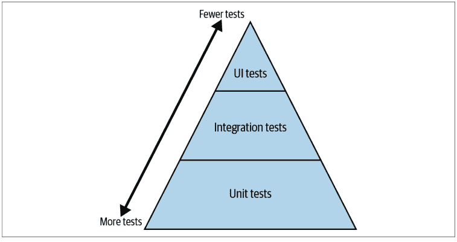

图21-1. 测试金字塔

其理念是，你应该编写大量小型、独立的单元测试。这些测试理论上成本较低，应该构成你测试工作的主体，因此它们位于金字塔底部。集成测试数量较少，成本较高；UI测试数量更少，成本非常高。然而，自其诞生以来，开发者们以多种方式争论着测试金字塔，包括界限如何划分、单元测试的实用性，甚至三角形的形状（我甚至见过倒置的三角形）。

事实是，标签是什么或你如何划分测试并不重要。你想要的是你的三角形看起来像图21-2，它关注的是价值与成本的比率。

> ³ 这就是所谓的测试金字塔，由Mike Cohn在《Succeeding with Agile》（Addison-Wesley Professional）中引入。Cohn最初用“服务”级测试代替集成测试，但我见过更多迭代版本将“集成”测试作为中间层。

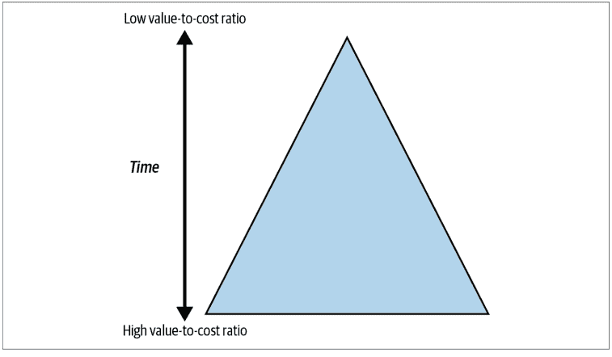

图21-2. 关注价值与成本比率的测试金字塔

编写大量具有高价值成本比的测试。它们是单元测试还是验收测试并不重要。找到经常运行它们的方法。让测试运行得足够快，以便开发者在提交代码之间多次运行它们，以验证一切仍然正常。将价值较低、速度较慢或成本较高的测试保留用于每次提交时的测试（或至少定期进行）。

你拥有的测试越多，未知数就越少。未知数越少，你的代码库就越健壮。每次你进行更改，你都有一个更大的安全网来检查任何回归。但是，如果测试变得过于昂贵，远远超过任何影响的成本怎么办？如果你觉得这些测试仍然值得，你需要找到降低其成本的方法。

测试的成本是三方面的：编写的初始成本、运行成本和维护成本。测试至少需要运行一段时间，这确实需要花钱。然而，降低这种成本通常会变成一项优化工作，你需要寻找并行化测试或在开发者机器上更频繁运行测试的方法。你仍然需要降低编写的初始成本和持续的维护成本。幸运的是，到目前为止你在本书中读到的一切都直接适用于降低这些成本。你的测试代码与代码库的其他部分一样重要，你需要确保它也是健壮的。选择正确的工具，合理组织你的测试用例，并使你的测试清晰易读且易于维护。


## 讨论主题

衡量你系统中测试的成本。编写时间、运行时间还是维护时间主导了你的成本？你能做些什么来降低这些成本？

## 降低测试成本

当你审视测试的价值与成本时，你正在收集信息，这将帮助你优先考虑测试策略。有些测试可能不值得运行，而有些测试则会脱颖而出，成为你为了最大化价值而想要编写的首批测试。然而，有时你会遇到这样的情况：有一个非常重要的测试你想编写，但编写和/或维护的成本高得令人难以置信。在这些情况下，找到降低该测试成本的方法。你编写和组织测试的方式对于使测试更易于编写和理解至关重要。

### 使用 pytest

对于本章的示例，我将使用流行的测试库 `pytest`。有很多优秀的资源可以学习 pytest，例如 Brian Okken 所著的《Python Testing with pytest: Simple, Rapid, Effective, and Scalable》（Pragmatic Bookshelf）。在这里，我将介绍基础知识，为本章提供背景。

`pytest` 中的测试是任何在文件名以 `test_` 为前缀的文件中，函数名也以 `test_` 为前缀的函数。这是一个名为 `test_calorie_count.py` 的文件，其中包含一个测试：

```python
from nutrition import get_calorie_count

def test_get_calorie_count():
    assert get_calorie_count("Bacon Cheeseburger w/ Fries") == 1200
```

测试包含断言，即应该为真的条件。pytest 使用内置的 `assert` 语句进行断言。如果测试的断言为假，则会引发 `AssertionError`，测试失败。如果断言为真，测试将继续执行。

如果你对引入库依赖有所犹豫，Python 中有一个内置的单元测试框架 `unittest` 模块。我更喜欢 pytest，因为它具有一些高级功能（fixtures、插件等），但本章中的所有原则也适用于其他测试框架。

## AAA 测试

与生产代码一样，在测试代码中也要关注可读性和可维护性。尽可能清晰地传达你的意图。未来的测试读者如果能确切地看到你试图测试什么，他们会感谢你。在编写测试时，让每个测试遵循相同的基本模式会很有帮助。

你在测试中会发现的最常见的模式之一是 3A 或 AAA 测试模式。⁴ AAA 代表 *Arrange-Act-Assert*（准备-执行-断言）。你将每个测试分成三个独立的代码块：一个用于设置前置条件（准备），一个用于执行被测试的操作（执行），然后一个用于检查任何后置条件（断言）。你可能还会听到第四个 A，代表 *annihilate*（清理），即你的清理代码。我将详细介绍每个步骤，讨论如何使你的测试更易于阅读和维护。

## 准备

*准备* 步骤是关于将系统设置为准备好测试的状态。这些被称为测试的 *前置条件*。你设置测试正确运行所需的任何依赖项或测试数据。

考虑以下测试：

```python
def test_calorie_calculation():

    # arrange (set up everything the test needs to run)
    add_ingredient_to_database("Ground Beef", calories_per_pound=1500)
    add_ingredient_to_database("Bacon", calories_per_pound=2400)
    add_ingredient_to_database("Cheese", calories_per_pound=1800)
    # ... snip 13 more ingredients

    set_ingredients("Bacon Cheeseburger w/ Fries",
                    ingredients=["Ground Beef", "Bacon" ... ])

    # act (the thing getting tested)
    calories = get_calories("Bacon Cheeseburger w/ Fries")

    # assert (verify some property about the program)
    assert calories == 1200

    #annihilate (cleanup any resources that were allocated)
    cleanup_database()
```

首先，我向数据库添加食材，并将一组食材与名为“Bacon Cheeseburger w/ Fries”的菜肴关联起来。然后我找出汉堡的卡路里含量，将其与已知值进行比较，并清理数据库。

看看在实际测试本身（*get_calories* 调用）之前有多少代码。大型的 *准备* 代码块是一个危险信号。你会有很多看起来非常相似的测试，你希望读者能够一目了然地知道它们的区别。


大型的 *准备* 代码块可能表明依赖项的设置很复杂。此代码的任何用户大概都必须以类似的方式设置依赖项。退一步问一下，是否有更简单的方法来处理依赖项，例如使用第三部分中描述的策略。

在前面的例子中，如果我必须在两个独立的测试中添加15种食材，但为了模拟替换而以略有不同的方式设置一种食材，那么很难一眼看出测试的区别。给测试起冗长的名称来表明它们的区别是一个好的开始，但这只能做到一定程度。在保持测试信息丰富和易于一目了然之间找到平衡。

**一致的前置条件与变化的前置条件。** 浏览你的测试，问问自己哪些前置条件在测试集之间是相同的。通过函数提取这些前置条件，并在每个测试中重用该函数。看看比较以下两个测试变得多么容易：

```python
def test_calorie_calculation_bacon_cheeseburger():
    add_base_ingredients_to_database()
    add_ingredient_to_database("Bacon", calories_per_pound=2400)

    setup_bacon_cheeseburger(bacon="Bacon")
    calories = get_calories("Bacon Cheeseburger w/ Fries")

    assert calories == 1200

    cleanup_database()

def test_calorie_calculation_bacon_cheeseburger_with_substitution():
    add_base_ingredients_to_database()
    add_ingredient_to_database("Turkey Bacon", calories_per_pound=1700)

    setup_bacon_cheeseburger(bacon="Turkey Bacon")
    calories = get_calories("Bacon Cheeseburger w/ Fries")

    assert calories == 1100

    cleanup_database()
```

通过创建辅助函数（在本例中是 `add_base_ingredients_to_database` 和 `setup_bacon_cheeseburger`），你减少了测试中所有不重要的样板代码，让开发者能够专注于测试之间的差异。

**使用测试框架功能处理样板代码。** 大多数测试框架提供了一种在测试之前自动运行代码的方法。在内置的 `unittest` 模块中，你可以编写一个 `setUp` 函数，在每个测试之前运行。在 `pytest` 中，你可以使用 fixtures 实现类似的功能。

在pytest中，*fixture*（测试夹具）是一种为测试指定初始化和清理代码的方式。Fixture提供了许多实用功能，例如定义对其他fixture的依赖（让pytest控制初始化顺序）以及控制初始化，使得一个fixture在每个模块中只初始化一次。在前面的例子中，我们可以为test_database使用一个fixture：

```python
import pytest

@pytest.fixture
def db_creation():
    # ... 省略设置本地sqlite数据库的步骤
    return database

@pytest.fixture
def test_database(db_creation):
    # ... 省略添加所有食材和餐食的步骤
    return database

def test_calorie_calculation_bacon_cheeseburger(test_database):
    test_database.add_ingredient("Bacon", calories_per_pound=2400)
    setup_bacon_cheeseburger(bacon="Bacon")

    calories = get_calories("Bacon Cheeseburger w/ Fries")

    assert calories == 1200

    test_database.cleanup()
```

注意现在测试有一个`test_database`参数。这就是fixture在起作用；函数`test_database`（以及`db_creation`）会在测试之前被调用。随着测试数量的增长，fixture会变得越来越有用。它们是可组合的，允许你将它们混合在一起，减少代码重复。我通常不会用它们来抽象单个文件中的代码，但一旦初始化需要在多个文件中使用，fixture就是最佳选择。

**Mocking（模拟）。** Python在其类型系统中提供了鸭子类型（第2章首次提及），这意味着只要类型遵循相同的契约（如第12章所讨论），你就可以轻松地相互替换类型。这意味着你可以用一种完全不同的方式来处理复杂的依赖：使用一个简单的模拟对象。一个*模拟*对象在方法和字段方面与生产对象看起来完全相同，但提供的是简化的数据。

Mock在单元测试中使用很多，但随着测试粒度变粗，你会看到它们的使用频率下降。这是因为你试图在更高层次上测试更多的系统；你模拟的服务通常是测试的一部分。

例如，如果前面例子中的数据库设置起来相当复杂，有多个表和模式，那么为每个测试都设置它可能不值得，特别是如果测试共享一个数据库；你希望保持测试彼此隔离。（我稍后会更详细地介绍这一点。）处理数据库的类可能看起来像这样：

```python
class DatabaseHandler:
    def __init__(self):
        # ... 省略复杂设置

    def add_ingredient(self, ingredient):
        # ... 省略复杂查询

    def get_calories_for_ingredient(self, ingredient):
        # ... 省略复杂查询
```

与其原样使用这个类，不如创建一个模拟类，它看起来就像一个数据库处理器：

```python
class MockDatabaseHandler:
    def __init__(self):
        self.data = {
            "Ground Beef": 1500,
            "Bacon": 2400,
            # ... 省略 ...
        }

    def add_ingredient(self, ingredient):
        name, calories = ingredient
        self.data[name] = calories

    def get_calories_for_ingredient(self, ingredient):
        return self.data[ingredient]
```

使用模拟时，我只是用一个简单的字典来存储数据。如何模拟数据会因场景而异，但如果你能找到一种方法用模拟对象替换真实对象，你就可以显著降低设置的复杂性。

有些人使用*猴子补丁*，即在运行时替换方法以注入模拟。适度使用是可以的，但如果你发现测试中充斥着猴子补丁，这就是一种反模式。这意味着不同模块之间的物理依赖过于严格，你应该寻找方法使你的系统更加模块化。（有关使代码可扩展的更多想法，请参阅**第三部分**。）

## 清理

从技术上讲，*清理*阶段是你在测试中最后做的事情，但我把它放在第二位介绍。为什么？因为它与你的*准备*步骤紧密相连。你在*准备*阶段设置的任何内容，如果可能影响其他测试，都需要被拆除。

你希望你的测试彼此隔离；这将使它们更容易维护。测试自动化编写者最大的噩梦之一是测试失败取决于它们的运行顺序（尤其是当你有成千上万个测试时）。这肯定是测试之间存在微妙依赖的迹象。在离开测试之前清理它们，减少测试之间相互影响的机会。以下是一些处理测试清理的策略。

**不要使用共享资源。** 如果可以的话，测试之间不要共享任何东西。这并不总是可行的，但这应该是你的目标。如果没有测试共享任何资源，那么你就不需要清理任何东西。共享资源可以是Python中的（全局变量、类变量）或环境中的（数据库、文件访问、套接字池）。

**使用上下文管理器。** 使用上下文管理器（第11章讨论过）来确保资源总是被清理。在我之前的例子中，眼尖的读者可能注意到了一个bug：

```python
def test_calorie_calculation_bacon_cheeseburger():
    add_base_ingredients_to_database()
    add_ingredient_to_database("Bacon", calories_per_pound=2400)
    setup_bacon_cheeseburger(bacon="Bacon")

    calories = get_calories("Bacon Cheeseburger w/ Fries")

    assert calories == 1200

    cleanup_database()
```

如果断言失败，会引发异常，`cleanup_database`永远不会执行。通过上下文管理器强制使用会好得多：

```python
def test_calorie_calculation_bacon_cheeseburger():
    with construct_test_database() as db:
        db.add_ingredient("Bacon", calories_per_pound=2400)
        setup_bacon_cheeseburger(bacon="Bacon")

        calories = get_calories("Bacon Cheeseburger w/ Fries")

        assert calories == 1200
```

将你的清理代码放在上下文管理器中，这样测试编写者就永远不需要主动考虑它；它会自动完成。

**使用fixture。** 如果你使用pytest的fixture，你可以像使用上下文管理器一样使用它们。你可以从fixture中*yield*值，允许你在测试完成后返回到fixture的执行。观察：

```python
import pytest

@pytest.fixture
def db_creation():
    # ... 省略设置本地sqlite数据库的步骤
    return database

@pytest.fixture
def test_database(db_creation):
    # ... 省略添加所有食材和餐食的步骤
    try:
        yield database
    finally:
        database.cleanup()

def test_calorie_calculation_bacon_cheeseburger(test_database):
    test_database.add_ingredient("Bacon", calories_per_pound=2400)
    setup_bacon_cheeseburger(bacon="Bacon")

    calories = get_calories("Bacon Cheeseburger w/ Fries")

    assert calories == 1200
```

注意`test_database` fixture现在yield了数据库。当任何使用此函数的测试完成时（无论通过与否），数据库清理函数总会执行。

## 执行

*执行*阶段是测试中最重要的部分。它体现了你正在测试的实际操作。在前面的例子中，*执行*阶段是获取特定菜肴的卡路里。你不希望*执行*阶段比一两行代码长太多。少即是多；通过保持这个阶段简短，你可以减少读者理解测试核心内容所需的时间。

有时，你想在多个测试中重用相同的*执行*阶段。如果你发现自己想在相同的操作上编写相同的测试，但输入数据和断言略有不同，请考虑*参数化*你的测试。测试*参数化*是一种在不同参数上运行相同测试的方式。这允许你编写*表驱动*测试，或以表格形式组织测试数据。

以下是使用参数化的 `get_calories` 测试：

```python
@pytest.mark.parametrize(
    "extra_ingredients,dish_name,expected_calories",
    [
        (["Bacon", 2400], "Bacon Cheeseburger", 900),
        ([],  "Cobb Salad", 1000),
        ([],  "Buffalo Wings", 800),
        ([],  "Garlicky Brussels Sprouts", 200),
        ([],  "Mashed Potatoes", 400)
    ]
)
def test_calorie_calculation_bacon_cheeseburger(extra_ingredients,
                                                dish_name,
                                                expected_calories,
                                                test_database):
    for ingredient in extra_ingredients:
        test_database.add_ingredient(ingredient)

    # 假设此函数可以设置任何菜品
    # 或者，也可以将菜品成分作为测试参数传入
    setup_dish_ingredients(dish_name)

    calories = get_calories(dish_name)

    assert calories == expected_calories
```

你将参数定义为一个元组列表，每个元组对应一个测试用例。每个参数集都会作为参数传递给测试用例。pytest 会自动为每个参数集运行一次此测试。

参数化测试的好处在于，它能将大量测试用例浓缩到一个函数中。测试的读者只需查看参数化中列出的表格，就能理解预期的输入和输出（例如，Cobb 沙拉应有 1000 卡路里，土豆泥应有 400 卡路里，等等）。

> 参数化是将测试数据与实际测试分离的好方法（类似于第 17 章讨论的策略与机制分离）。但需注意，如果你的测试过于通用，将更难确定它们在测试什么。如果可能，避免使用超过三到四个参数。

## 断言

清理前的最后一步是*断言*系统的某个属性为真。理想情况下，测试末尾应有一个逻辑断言。如果你发现自己在一个测试中塞入了太多断言，那么要么是测试中的操作太多，要么是太多测试被合并到了一个测试中。当一个测试承担过多职责时，维护人员调试软件会变得更困难。如果他们进行的更改导致测试失败，你希望他们能快速找出问题所在。理想情况下，他们能根据测试名称判断问题，但至少，他们应该能打开测试，花大约 20 到 30 秒查看，就能意识到哪里出了问题。如果你有多个断言，测试失败的原因就有多个，维护人员需要花时间逐一排查。

这并不意味着你只能有一个 *assert* 语句；只要它们都用于测试同一个属性，有几个 *assert* 语句是可以的。同时，让你的断言信息尽可能详细，这样当出现问题时，开发者能获得有帮助的消息。在 Python 中，你可以提供一个文本消息，它会随 AssertionError 一起传递，以帮助调试。

```python
def test_calorie_calculation_bacon_cheeseburger(test_database):
    test_database.add_ingredient("Bacon", calories_per_pound=2400)
    setup_bacon_cheeseburger(bacon="Bacon")

    calories = get_calories("Bacon Cheeseburger w/ Fries")

    assert calories == 1200, "Incorrect calories for Bacon Cheeseburger w/ Fries"
```

pytest 会重写断言语句，这额外提供了一层调试信息。如果上述测试失败，返回给测试编写者的消息将是：

```
E       AssertionError: Incorrect calories for Bacon Cheeseburger w/ Fries
E       assert 1100 == 1200
```

对于更复杂的断言，可以构建一个断言库，使定义新测试变得极其容易。这就像在你的代码库中建立词汇表；你也希望在测试代码中有一套多样化的概念。为此，我推荐使用 Hamcrest 匹配器。⁵

*Hamcrest 匹配器*是一种编写断言的方式，使其读起来类似于自然语言。PyHamcrest 库提供了常用的匹配器来帮助你编写断言。看看它如何使用自定义断言匹配器使测试更清晰：

```python
from hamcrest import assert_that, matches_regexp, is_, empty, equal_to

def test_all_menu_items_are_alphanumeric():
    menu = create_menu()
    for item in menu:
        assert_that(item, matches_regexp(r'[a-zA-Z0-9 ]'))

def test_getting_calories():
    dish = "Bacon Cheeseburger w/ Fries"
    calories = get_calories(dish)
    assert_that(calories, is_(equal_to(1200)))

def test_no_restaurant_found_in_non_matching_areas():
    city = "Huntsville, AL"
    restaurants = find_owned_restaurants_in(city)
    assert_that(restaurants, is_(empty()))
```

PyHamcrest 的真正强大之处在于你可以定义自己的匹配器。⁶ 这是一个检查菜品是否为素食的匹配器示例：

```python
from hamcrest.core.base_matcher import BaseMatcher
from hamcrest.core.helpers.hasmethod import hasmethod

def is_vegan(ingredient: str) -> bool:
    return ingredient not in ["Beef Burger"]

class IsVegan(BaseMatcher):

    def _matches(self, dish):
        if not hasmethod(dish, "ingredients"):
            return False
        return all(is_vegan(ingredient) for ingredient in dish.ingredients())

    def describe_to(self, description):
        description.append_text("Expected dish to be vegan")

    def describe_mismatch(self, dish, description):
        message = f"the following ingredients are not vegan: "
        message += ", ".join(ing for ing in dish.ingredients()
                             if not is_vegan(ing))
        description.append_text(message)

def vegan():
    return IsVegan()

from hamcrest import assert_that, is_

def test_vegan_substitution():
    dish = create_dish("Hamburger and Fries")
    dish.make_vegan()
    assert_that(dish, is_(vegan()))
```

如果测试失败，你会得到以下错误：

```
def test_vegan_substitution():
    dish = create_dish("Hamburger and Fries")
    dish.make_vegan()
    assert_that(dish, is_(vegan()))
E    AssertionError:
E    Expected: Expected dish to be vegan
E        but: the following ingredients are not vegan: Beef Burger
```

**讨论主题**

在你的测试中，哪些地方可以使用自定义匹配器？讨论一下你的测试中共享的测试词汇会是什么，以及自定义匹配器将如何提高可读性。

## 结语

就像走钢丝者的安全网一样，测试在你工作时给你带来安慰和信心。这不仅仅是为了发现错误。测试验证了你构建的东西是否按预期运行。它们为未来的协作者提供了进行更大胆更改的余地；他们知道如果失败了，测试会接住他们。你会发现回归问题变得越来越少，你的代码库也变得更容易维护。

然而，测试并非没有成本。编写、运行和维护测试都需要成本。你需要谨慎地分配你的时间和精力。在构建测试时使用众所周知的模式来最小化成本：遵循 AAA 模式，保持每个阶段小巧，并让你的测试清晰易读。你的测试和你的代码库一样重要。同样尊重它们，并使它们健壮。

在下一章中，我将重点讨论验收测试。验收测试的目的与单元测试或集成测试不同，你使用的一些模式也会有所不同。

你将了解验收测试如何引发对话，以及它们如何确保你的代码库为你的客户做正确的事情。它们是你的代码库交付价值的宝贵工具。

---
⁵ Hamcrest 是 "matchers" 的变位词。
⁶ 查看 PyHamcrest 文档以获取更多信息，例如额外的匹配器或与测试框架的集成。
312 | 第 21 章：测试策略

## 第22章
验收测试

作为开发者，很容易将注意力集中在直接围绕代码库的测试上：单元测试、集成测试、UI测试等。这些测试验证代码是否按预期工作。它们是保持代码库无回归问题的宝贵工具。然而，它们完全不是构建客户期望产品的*正确*工具。

开发者编写这些测试时完全了解代码，这意味着测试偏向于该开发者的预期。但无法保证这种经过测试的行为确实是*客户*想要的。

考虑以下单元测试：

```
def test_chili_has_correct_ingredients():
    assert make_chili().ingredients() == [
        "Ground Beef",
        "Chile Blend",
        "Onion",
        ...
        "Tomatoes",
        "Pinto Beans"
    ]
```

这个测试可能无懈可击；它通过了，并能捕获代码中的任何回归问题。然而，当展示给客户时，你可能会遇到这样的质疑：“不，我想要的是德州风味辣椒！你知道的，不加番茄和豆子？”世界上所有的单元测试都无法挽救你构建错误产品的命运。

这就是验收测试的用武之地。*验收测试*检查你是否构建了正确的产品。虽然单元测试和集成测试是一种*验证*形式，但验收测试是*确认*。它们确认你正在构建用户期望的产品。

在本章中，你将学习Python中的验收测试。我将向你展示behave框架，它使用Gherkin语言以全新的方式定义需求。¹ 你将了解行为驱动开发（BDD）作为澄清对话的工具。验收测试是构建安全网的关键部分；它将保护你免于构建错误的产品。

## 行为驱动开发

客户期望与软件行为之间的不匹配与软件开发本身一样古老。问题源于将自然语言转换为编程语言。自然语言充满了歧义、不一致性和细微差别。编程语言是严格的。计算机完全按照你告诉它的去做（即使这不是你的本意）。更糟糕的是，当需求经过几个人（客户、销售、管理人员、测试人员）传递后才编写测试时，这就像一场传话游戏²。

与软件生命周期中的所有事情一样，这种错误情况修复得越晚，成本就越高。理想情况下，你希望在制定用户需求时就发现这些问题。这就是行为驱动开发发挥作用的地方。

## Gherkin语言

*行为驱动开发*，最初由Daniel Terhorst-North提出，是一种专注于定义系统行为的实践。BDD专注于澄清沟通；你与最终用户反复讨论需求，定义他们想要的行为。

在编写任何代码之前，你确保就构建正确的产品达成一致。定义好的行为集合将*驱动*你编写的代码。你与最终用户（或其代理人，如业务分析师或产品经理）合作，将需求定义为规范。这些规范遵循一种形式化语言，以在定义中引入更多的严格性。最常用的需求规范语言之一是Gherkin。

Gherkin是一种遵循*Given-When-Then*（GWT）格式的规范。每个需求都按如下方式组织：

> ¹ Gherkin语言由Aslak Hellesøy创建。他的妻子建议他的BDD测试工具命名为Cucumber（显然没有特定原因），他希望将规范语言与测试工具本身区分开来。由于gherkin是一种小的腌黄瓜，他延续了这个主题，Gherkin规范语言由此诞生。

> ² 传话游戏是一种游戏，所有人围成一圈，一个人向另一个人低声传递一条信息。信息继续在圈内低声传递，直到传回起点。每个人都为信息如何被扭曲而发笑。

```
Feature: 测试套件名称

Scenario: 测试用例
    Given 某些前置条件
    When 我执行某些操作
    Then 我期望这个结果
```

例如，如果我想捕获一个检查菜品是否可素食替代的需求，我会这样写：

```
Feature: 素食友好菜单

Scenario: 可以替代为素食选项
    Given 一份包含芝士汉堡和薯条的订单
    When 我要求素食替代
    Then 我收到不含动物产品的餐点
```

另一个需求可能是某些菜品不能做成素食：

```
Scenario: 某些餐点不能替代为素食选项
    Given 一份包含肉饼的订单
    When 我要求素食替代
    Then 显示错误信息，说明该餐点不可素食替代
```

> 如果GWT格式感觉很熟悉，那是因为它与你在第21章学到的AAA测试组织方式完全相同。

通过与最终用户合作以这种方式编写需求，你受益于几个关键原则：

*使用自然语言编写*
无需深入任何编程语言或形式逻辑。所有内容都以业务人员和开发者都能理解的形式编写。这使得专注于最终用户真正想要的内容变得极其容易。

*建立共享词汇表*
随着需求数量的增加，你会发现多个需求中开始出现相同的子句（参见上面的When I ask for vegan substitutions）。这建立了你的领域语言，并将使所有相关方更容易理解需求。

*需求是可测试的*
这可能是这种需求格式最大的好处。因为你是以GWT格式编写需求，所以你本质上是在指定一个要编写的验收测试。以本章使用的辣椒为例，想象一下如果Gherkin测试被指定为：

```
Scenario: 德州风味辣椒
Given 一台辣椒制作机
When 辣椒被分发出来
Then 该餐点不含豆子
And 该餐点不含番茄
```

需要编写哪些测试作为验收测试就变得清晰多了。如果Gherkin测试有任何歧义，你可以与最终用户合作确定具体的测试应该是什么。这也有助于处理传统上模糊的需求，例如“辣椒制作机应该很快”。相反，通过专注于具体的测试，你最终会得到这样的测试：

```
Scenario: 辣椒订单在两分钟内完成
Given 一台辣椒制作机
When 下达辣椒订单
Then 辣椒在两分钟内分发给客户
```

这些需求规范不是消除需求中错误的银弹。它们是一种缓解策略。如果在编写代码之前让技术和业务人员审查它们，你将有更好的机会发现歧义或不匹配的意图。

一旦你开始用Gherkin定义测试，你就可以做一些很棒的事情：你可以让你的规范*可执行*。

## 可执行规范

*可执行规范*将一组需求直接转换为代码。这意味着你的需求不仅是*可测试的*，而且它们本身就是*测试*。当需求改变时，你的测试也会同时改变。这是*可追溯性*的最终形式，即将你的需求与特定测试或代码连接起来的能力。

**讨论主题**
你的组织如何跟踪需求？你如何将这些需求追溯到测试用例？你如何处理需求变更？讨论如果你的需求和测试是同一回事，你的流程会如何改变。

Python模块`behave`允许你用具体的测试来支持你的Gherkin需求。它通过将函数与需求中的特定子句关联来实现这一点。

## 额外的 behave 功能

前面的例子有点简陋，但值得庆幸的是，behave 提供了一些额外功能，使测试编写变得更加轻松。

### 参数化步骤

你可能已经注意到，我有两个非常相似的 Given 步骤：

```
Given an order containing a Cheeseburger with Fries
```

和

```
Given an order containing Meatloaf
```

编写两个类似的函数来在 Python 中链接它们是愚蠢的。behave 允许你对步骤进行参数化，以减少编写多个步骤的需要：

```
@given("an order containing {dish_name}")
def setup_order(ctx, dish_name):
    if dish_name == "a Cheeseburger with Fries":
        ctx.dish = CheeseburgerWithFries()
    elif dish_name == "Meatloaf":
        ctx.dish = Meatloaf()
```

或者，如果需要，你可以在一个函数上堆叠多个子句：

```
@given("an order containing a Cheeseburger with Fries")
@given("a typical drive-thru order")
def setup_order(context):
    ctx.dish = CheeseBurgerWithFries()
```

参数化和重用步骤将帮助你构建直观易用的词汇表，从而降低编写 Gherkin 测试的成本。

### 表格驱动的需求

在第 21 章中，我提到了如何对测试进行参数化，以便在表格中定义所有前置条件和断言。behave 提供了非常相似的功能：

```
Feature: Vegan-friendly menu

Scenario Outline: Vegan Substitutions
  Given an order containing <dish_name>,
  When I ask for vegan substitutions
  Then <result>

Examples: Vegan Substitutable
  | dish_name                | result |
  | a Cheeseburger with Fries | I receive the meal with no animal products |
  | Cobb Salad               | I receive the meal with no animal products |
  | French Fries             | I receive the meal with no animal products |
  | Lemonade                 | I receive the meal with no animal products |

Examples: Not Vegan Substitutable
  | dish_name    | result |
  | Meatloaf     | a non-vegan-substitutable error shows up |
  | Meatballs    | a non-vegan-substitutable error shows up |
  | Fried Shrimp | a non-vegan-substitutable error shows up |
```

behave 将自动为表格中的每个条目运行一次测试。这是在非常相似的数据上运行相同测试的好方法。

### 步骤匹配

有时，基本的装饰器没有足够的灵活性来捕捉你想要表达的内容。你可以告诉 behave 在装饰器中使用正则表达式解析。这对于使 Gherkin 规范感觉更自然地编写非常有用（特别是处理复杂的数据格式或奇怪的语法问题）。下面是一个例子，允许你在菜名前指定可选的 "a" 或 "an"（这样可以简化菜名）。

```
from behave import use_context_matcher

use_step_matcher("re")

@given("an order containing [a |an ]?(?P<dish_name>.*)")
def setup_order(ctx, dish_name):
    ctx.dish = create_dish(dish_name)
```

### 自定义测试生命周期

有时你需要在测试运行之前或之后运行代码。假设你需要在所有规范设置之前建立数据库，或者告诉服务在测试运行之间清除缓存。就像内置的 unittest 模块中的 setUp 和 tearDown 一样，behave 提供了函数，让你可以在步骤、功能或整个测试运行之前或之后挂接函数。使用此功能来整合常见的设置代码。要充分利用此功能，你可以在名为 `environment.py` 的文件中定义特定命名的函数。

```
def before_all(ctx):
    ctx.database = setup_database()

def before_feature(ctx, feature):
    ctx.database.empty_tables()

def after_all(ctx):
    ctx.database.cleanup()
```

查看 [behave 文档](https://behave.readthedocs.io/) 以获取有关控制环境的更多信息。如果你更熟悉 pytest fixtures，请查看 behave [fixtures](https://behave.readthedocs.io/en/latest/fixtures.html)，其中包含非常相似的概念。

像 `before_feature` 和 `before_scenario` 这样的函数会分别接收功能或场景作为参数。你可以根据这些功能和场景的名称来为测试的特定部分执行特定操作。

### 使用标签选择性运行测试

behave 还提供了用任意文本标记某些测试的能力。这些标签可以是任何你想要的东西：`@wip` 表示进行中的工作，`@slow` 表示运行缓慢的测试，`@smoke` 表示每次签入时运行的少数几个测试，等等。

要在 behave 中标记测试，只需装饰你的 Gherkin 场景：

```
Feature: Vegan-friendly Menu

@smoke
@wip
Scenario: Can substitute for vegan alternatives
    Given an order containing a Cheeseburger with Fries
    When I ask for vegan substitutions
    Then I receive the meal with no animal products
```

要仅运行带有特定标签的测试，你可以向 behave 调用传递 `--tags` 标志：

```
behave code_examples/chapter22 --tags=smoke
```

如果你想排除某些测试不运行，请在标签前加上连字符，如本例所示，我排除了标记为 `wip` 的测试：

```
behave code_examples/chapter22 --tags=-wip
```

### 报告生成

如果你不让你的最终用户或他们的代理参与进来，使用 behave 和 BDD 来驱动验收测试将不会带来回报。想办法让他们轻松理解和使用 Gherkin 需求。

你可以通过调用 `behave --steps-catalog` 来获取所有步骤定义的列表。

当然，你还需要一种方式来向最终用户展示测试结果，让他们了解哪些功能正常工作，哪些不正常。behave 允许你以多种不同的格式输出结果（你也可以定义自己的格式）。开箱即用，它还能够从 JUnit（一种为 Java 语言设计的单元测试框架）创建报告。JUnit 将其测试结果写为 XML 文件，并且已经构建了许多工具来摄取和可视化测试结果。

要生成 JUnit 测试报告，你可以向 behave 调用传递 `--junit`。然后，你可以使用工具 `junit2html` 来获取所有测试用例的报告：

```
pip install junit2html
behave code_examples/chapter22/features/ --junit
```

# xml 文件位于 reports 文件夹中
junit2html <filename>

示例输出如图 22-1 所示。

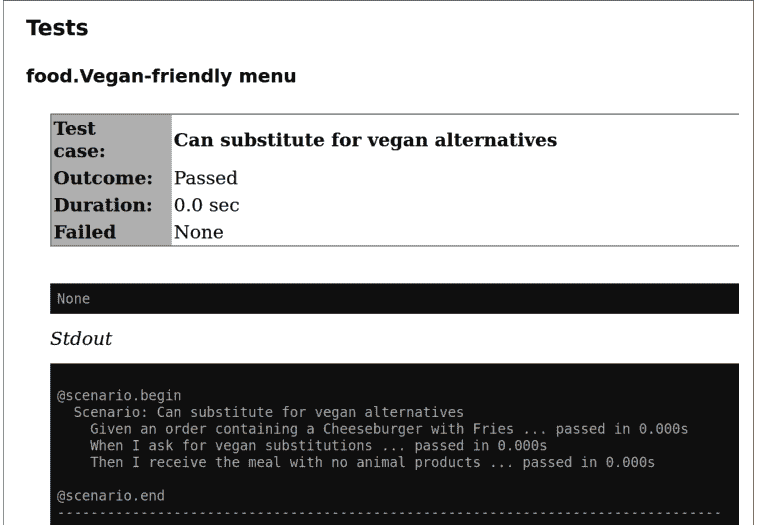

有许多 JUnit 报告生成器，因此你可以四处寻找一个你喜欢的，并用它来生成测试结果的 HTML 报告。

## 结语

如果你的所有测试都通过了，但没有交付最终用户想要的东西，那么你就浪费了时间和精力。构建正确的东西成本很高；你需要尝试一次就做对。使用 BDD 来推动关于系统需求的关键对话。一旦你有了需求，就使用 behave 和 Gherkin 语言来编写验收测试。这些验收测试将成为你确保交付最终用户所需内容的安全网。

在下一章中，你将继续学习如何修补安全网中的漏洞。你将了解一个名为 Hypothesis 的 Python 工具，它支持基于属性的测试。它可以为你生成测试用例，包括你可能从未想到过的测试。你可以更放心地知道，你的测试覆盖范围比以往任何时候都更广。

# 第 23 章
## 基于属性的测试

要测试代码库中的所有内容是不可能的。你能做的最好的事情就是在针对特定用例时保持聪明。你寻找边界情况、代码路径以及代码的任何其他有趣属性。你主要的希望是你的安全网中没有留下任何大漏洞。然而，你可以做得比希望更好。你可以用基于属性的测试来填补这些空白。

在本章中，你将学习如何使用一个名为 Hypothesis 的 Python 库进行基于属性的测试。你将使用 Hypothesis 为你生成测试用例，通常是以你无法预料的方式。你将学习如何跟踪失败的测试用例、以新的方式构造输入数据，甚至让 Hypothesis 创建算法组合来测试你的软件。Hypothesis 将保护你的代码库免受一整套新组合错误的影响。

## 使用 Hypothesis 进行基于属性的测试

基于属性的测试是一种生成式测试形式，其中工具为你生成测试用例。你不是基于特定的输入/输出组合来编写测试用例，而是为你的系统定义属性。在此上下文中，属性是适用于你的系统不变量（在第 10 章中讨论过）的另一个名称。

考虑一个菜单推荐系统，它根据客户提供的约束条件（如总卡路里、价格和菜系）来选择菜肴。对于这个具体示例，我希望客户能够订购一顿低于特定卡路里目标的完整餐点。我为此函数定义了以下不变量：

- 客户将收到三道菜：一道开胃菜、一份沙拉和一道主菜。
- 当所有菜肴的卡路里相加时，总和小于他们的预期目标。

如果我要编写一个专注于测试这些属性的 pytest 测试，它将如下所示：

```python
def test_meal_recommendation_under_specific_calories():
    calories = 900
    meals = get_recommended_meal(Recommendation.BY_CALORIES, calories)
    assert len(meals) == 3
    assert is_appetizer(meals[0])
    assert is_salad(meals[1])
    assert is_main_dish(meals[2])
    assert sum(meal.calories for meal in meals) < calories
```

将其与测试一个非常具体的结果进行对比：

```python
def test_meal_recommendation_under_specific_calories():
    calories = 900
    meals = get_recommended_meal(Recommendation.BY_CALORIES, calories)
    assert meals == [Meal("Spring Roll", 120),
                     Meal("Green Papaya Salad", 230),
                     Meal("Larb Chicken", 500)]
```

第二种方法测试的是一组非常具体的餐点；这个测试更具体，但也更*脆弱*。当生产代码发生变化时，例如引入新的菜单项或更改推荐算法时，它更有可能中断。理想的测试是只在存在真正的错误时才会中断。请记住，测试不是免费的。你想降低维护成本，而减少调整测试所需的时间是实现这一目标的好方法。

在这两种情况下，我都是用一个特定的输入进行测试：900 卡路里。为了构建一个更全面的安全网，最好扩展你的输入域以测试更多情况。在传统的测试用例中，你通过执行*边界值分析*来选择要编写的测试。边界值分析是指你分析被测代码，寻找不同的输入如何影响控制流，或代码中不同的执行路径。

例如，假设 `get_recommended_meal` 在卡路里限制低于 650 时会引发错误。这种情况下的边界值是 650；这将输入域分成两个*等价类*，或具有相同属性的值集。一个等价类是所有低于 650 的数字，另一个等价类是 650 及以上的值。通过边界值分析，应该有三个测试：一个卡路里低于 650，一个测试正好在 650 的边界上，一个测试值高于 650。在实践中，这验证了没有开发人员搞错关系运算符（例如写成 <= 而不是 <）或犯了差一错误。

然而，边界值分析只有在你能轻松划分输入域时才有用。如果很难确定应该在哪里划分域，选择边界值就不容易了。这就是 Hypothesis 生成性质的用武之地；Hypothesis 为测试用例生成输入。它会为你找到边界值。

你可以通过 pip 安装 Hypothesis：

```bash
pip install hypothesis
```

我将修改我最初的属性测试，让 Hypothesis 承担生成输入数据的重任。

```python
from hypothesis import given
from hypothesis.strategies import integers

@given(integers())
def test_meal_recommendation_under_specific_calories(calories):
    meals = get_recommended_meal(Recommendation.BY_CALORIES, calories)
    assert len(meals) == 3
    assert is_appetizer(meals[0])
    assert is_salad(meals[1])
    assert is_main_dish(meals[2])
    assert sum(meal.calories for meal in meals) < calories
```

只需一个简单的装饰器，我就可以告诉 Hypothesis 为我选择输入。在这种情况下，我要求 Hypothesis 生成不同的整数值。Hypothesis 将多次运行此测试，尝试找到一个违反预期属性的值。如果我用 pytest 运行此测试，我会看到以下输出：

```
Falsifying example: test_meal_recommendation_under_specific_calories(
    calories=0,
)
================ short test summary info ==================
FAILED code_examples/chapter23/test_basic_hypothesis.py::
    test_meal_recommendation_under_specific_calories - assert 850 < 0
```

Hypothesis 很早就发现了我的生产代码中的一个错误：代码没有处理零卡路里限制。现在，对于这种情况，我想指定我应该只测试某个卡路里数或以上的值：

```python
@given(integers(min_value=900))
def test_meal_recommendation_under_specific_calories(calories):
    # ... 省略 ...
```

现在，当我用 pytest 运行命令时，我想展示一些关于 Hypothesis 的更多信息。我将运行：

```bash
py.test code_examples/chapter23 --hypothesis-show-statistics
```

这会产生以下输出：

```
code_examples/chapter23/test_basic_hypothesis.py::
    test_meal_recommendation_under_specific_calories:

- during generate phase (0.19 seconds):
  - Typical runtimes: 0-1 ms, ~ 48% in data generation
  - 100 passing examples, 0 failing examples, 0 invalid examples

- Stopped because settings.max_examples=100
```

Hypothesis 为我检查了 100 个不同的值，而我不需要提供任何特定的输入。更棒的是，每次运行此测试时，Hypothesis 都会检查新的值。你不是一次又一次地局限于相同的测试用例，而是在测试中获得了更广泛的覆盖范围。考虑到所有不同的开发人员和持续集成管道系统都在执行测试，你就会意识到你能多快地发现边界情况。


你还可以通过使用 hypothesis.assume 来指定域的约束条件。你可以在测试中编写假设，例如 assume(calories > 850)，以告诉 Hypothesis 跳过任何违反这些假设的测试用例。

如果我引入一个错误（比如由于某种原因，在 5,000 到 5,200 卡路里之间出了问题），Hypothesis 会在四次测试运行内捕获该错误（测试运行次数可能因你而异）：

```
_________ test_meal_recommendation_under_specific_calories _________

    @given(integers(min_value=900))
>   def test_meal_recommendation_under_specific_calories(calories):

code_examples/chapter23/test_basic_hypothesis.py:33:
_ _ _ _ _ _ _ _ _ _ _ _ _ _ _ _ _ _ _ _ _ _ _ _ _ _ _ _ _ _ _ _ _ _ _ _ _ _ _

calories = 5001

    @given(integers(min_value=900))
    def test_meal_recommendation_under_specific_calories(calories):
        meals = get_recommended_meal(Recommendation.BY_CALORIES, calories)
>       assert len(meals) == 3
E       TypeError: object of type 'NoneType' has no len()

code_examples/chapter23/test_basic_hypothesis.py:35: TypeError
```

## 假设

反例：test_meal_recommendation_under_specific_calories(
    calories=5001,
)

### 假设统计

code_examples/chapter23/test_basic_hypothesis.py::
    test_meal_recommendation_under_specific_calories:

- 在重用阶段（0.00 秒）：
    - 典型运行时间：约 1 毫秒，约 43% 的时间用于数据生成
    - 1 个通过的示例，0 个失败的示例，0 个无效的示例

- 在生成阶段（0.08 秒）：
    - 典型运行时间：0-2 毫秒，约 51% 的时间用于数据生成
    - 26 个通过的示例，1 个失败的示例，0 个无效的示例
    - 在此阶段发现 1 个失败的示例

- 在收缩阶段（0.07 秒）：
    - 典型运行时间：0-2 毫秒，约 37% 的时间用于数据生成
    - 22 个通过的示例，12 个失败的示例，1 个无效的示例
    - 尝试了 35 次收缩，其中 11 次成功

- 因无事可做而停止

当你发现一个错误时，Hypothesis 会记录失败的错误，以便将来专门检查该值。你也可以确保 Hypothesis 始终使用 `hypothesis.example` 装饰器测试特定用例：

```python
@given(integers(min_value=900))
@example(5001)
def test_meal_recommendation_under_specific_calories(calories):
    # ... 省略 ...
```

## Hypothesis 数据库

Hypothesis 会将失败的测试用例示例存储在本地数据库中（默认情况下，存储在运行测试的同一目录下名为 `.hypothesis/examples` 的文件夹中）。这被称为示例数据库。它用于未来的测试调用，以指导 Hypothesis 测试常见的错误用例。

本地数据库有许多替代方案。内存数据库将加快你的测试速度。例如，你可以使用 Redis 数据库来支持 Hypothesis 示例数据库。你甚至可以使用 `hypothesis.database.MultiplexedDatabase` 指定多个数据库。

在团队中运行 Hypothesis 时，我建议共享一个数据库，可以通过网络上的共享驱动器或通过 Redis 等方式实现。这样，CI 系统可以通过使用数据库从共享的测试失败历史中受益，而开发人员可以在本地运行测试时使用失败的 CI 结果来检查棘手的错误用例。考虑使用 `hypothesis.database.MultiplexedDatabase`，以便开发人员可以引入 CI 测试失败，同时将开发过程中的本地失败保存到本地数据库。你可以在 [Hypothesis 数据库文档](https://hypothesis.readthedocs.io/en/latest/database.html) 中了解更多。

## Hypothesis 的魔力

Hypothesis 非常擅长生成能够发现错误的测试用例。这看起来像魔法，但实际上相当巧妙。在前面的例子中，你可能注意到 Hypothesis 在值 5001 上出错了。如果你运行相同的代码并为大于 5000 的值引入一个错误，你会发现测试同样在 5001 上出错。如果 Hypothesis 测试的是不同的值，我们难道不应该看到略有不同的结果吗？

当 Hypothesis 发现失败时，它会为你做一件非常好的事情：它会*收缩*测试用例。收缩是指 Hypothesis 尝试找到仍然导致测试失败的最小输入。对于 `integers()`，Hypothesis 会尝试依次减小的数字（或在处理负数时增大），直到输入值达到零。Hypothesis 试图聚焦（无意双关）于仍然导致测试失败的最小值。

要了解更多关于 Hypothesis 如何生成和收缩值的信息，值得阅读原始的 [QuickCheck 论文](https://www.cs.kent.ac.uk/people/staff/dat/miranda/quickcheck.pdf)。QuickCheck 是最早的基于属性的工具之一，尽管它处理的是 Haskell 编程语言，但它非常具有启发性。大多数基于属性的测试工具，如 Hypothesis，都是 QuickCheck 提出的思想的后代。

## 与传统测试的对比

基于属性的测试可以大大简化测试编写过程。有一整类问题你不需要担心：

### 更容易测试非确定性

非确定性是大多数传统测试的祸根。随机行为、创建临时目录或从数据库中检索不同的记录会使编写测试变得异常困难。你必须在测试中创建一组特定的输出值，为此，你需要是确定性的；否则，你的测试将不断失败。你通常试图通过强制特定行为来控制非确定性，例如强制始终创建相同的文件夹或为随机数生成器设置种子。

使用基于属性的测试，非确定性是其中的一部分。Hypothesis 会在每次测试运行时为你提供不同的输入。你不再需要担心测试特定值；定义属性并拥抱非确定性。你的代码库将因此变得更好。

### 更少的脆弱性

当测试特定的输入/输出组合时，你受制于大量硬编码的假设。你假设列表总是保持相同的顺序，字典不会添加任何键值对，并且你的依赖项永远不会改变其行为。这些看似无关的更改中的任何一个都可能破坏你的某个测试。

当测试因与被测功能无关的原因而中断时，这令人沮丧。测试因不稳定而声名狼藉，要么被忽略（掩盖了真正的失败），要么开发人员不得不忍受不断需要修复测试的困扰。使用基于属性的测试来增加测试的弹性。

### 更好的发现缺陷的机会

基于属性的测试不仅仅是降低测试创建和维护的成本。它会增加你发现缺陷的机会。即使你今天编写的测试覆盖了代码中的每条路径，仍然有可能你没有捕获所有内容。如果你的函数以向后不兼容的方式更改（例如，现在对以前认为正常的值报错），你的运气取决于你是否有一个针对该特定值的测试用例。基于属性的测试，由于其生成新测试用例的本质，在多次运行中发现该缺陷的机会更大。


**讨论主题**
检查你当前的测试用例，挑选那些读起来复杂的测试。搜索那些需要大量输入和输出才能充分测试功能的测试。讨论基于属性的测试如何可以替代这些测试并简化你的测试套件。

## 充分利用 Hypothesis

到目前为止，我只是触及了 Hypothesis 的皮毛。一旦你真正深入基于属性的测试，你就会为自己打开无数扇门。Hypothesis 开箱即带有一些非常酷的功能，可以改善你的测试体验。

## Hypothesis 策略

在上一节中，我向你介绍了 `integers()` 策略。Hypothesis 策略定义了如何生成测试用例，以及当测试用例失败时如何收缩数据。Hypothesis 开箱即带有很多策略。类似于将 `integers()` 传递给你的测试用例，你可以传递 `floats()`、`text()` 或 `times()` 等来分别生成浮点数、字符串或 `datetime.time` 对象的值。

Hypothesis 还提供了可以将其他策略组合在一起的策略，例如构建策略的列表、元组或字典（这是第 17 章中描述的可组合性的一个绝佳例子）。例如，假设我想创建一个将菜名（文本）映射到卡路里（100 到 2000 之间的数字）的策略：

```python
from hypothesis import given
from hypothesis.strategies import dictionaries, integers, text

@given(dictionaries(text(), integers(min_value=100, max_value=2000)))
def test_calorie_count(ingredient_to_calorie_mapping: dict[str, int]):
    # ... 省略 ...
```

对于更复杂的数据，你可以使用 Hypothesis 定义自己的策略。你可以映射和过滤策略，这在概念上类似于内置的 `map` 和 `filter` 函数。

你也可以使用 `hypothesis.composite` 策略装饰器来定义自己的策略。我想创建一个为我创建三道菜套餐的策略，包括开胃菜、主菜和甜点。每道菜包含一个名称和一个卡路里计数：

```python
from hypothesis import given
from hypothesis.strategies import composite, integers

ThreeCourseMeal = tuple[Dish, Dish, Dish]

@composite
def three_course_meals(draw) -> ThreeCourseMeal:
    appetizer_calories = integers(min_value=100, max_value=900)
    main_dish_calories = integers(min_value=550, max_value=1800)
    dessert_calories = integers(min_value=500, max_value=1000)

    return (Dish("Appetizer", draw(appetizer_calories)),
            Dish("Main Dish", draw(main_dish_calories)),
            Dish("Dessert", draw(dessert_calories)))

@given(three_course_meals)
def test_three_course_meal_substitutions(three_course_meal: ThreeCourseMeal):
    # ... 对 three_course_meal 做一些操作
```

这个例子通过定义一个名为 `three_course_meals` 的新组合策略来工作。我创建了三个整数策略；每种类型的菜肴都有自己的策略，具有自己的最小/最大值。然后，我创建了一个具有名称和从策略中抽取的值的新菜肴。`draw` 是一个传递给你的组合策略的函数，你用它来从策略中选择值。

一旦你定义了自己的策略，你就可以在多个测试中重用它们，从而轻松地为你的系统生成新数据。要了解更多关于 Hypothesis 策略的信息，我鼓励你阅读 Hypothesis 文档。

## 生成算法

在前面的示例中，我专注于生成输入数据来创建你的测试。然而，Hypothesis 可以更进一步，还能生成操作的组合。Hypothesis 将此称为*有状态测试*。

考虑我们的膳食推荐系统。我向你展示了如何按卡路里进行过滤，但现在我还想按价格、菜品数量、与用户的距离等进行过滤。以下是我希望对该系统断言的一些属性：

- 膳食推荐系统总是返回三个膳食选项；可能并非所有推荐选项都符合用户的所有标准。
- 所有三个膳食选项都是唯一的。
- 膳食选项根据最近应用的过滤器进行排序。如果出现平局，则使用次近的过滤器。
- 新的过滤器会替换相同类型的旧过滤器。例如，如果你将价格过滤器设置为 <$20，然后将其更改为 <$15，则只会应用 <$15 过滤器。设置类似卡路里过滤器（例如 <1800 卡路里）不会影响价格过滤器。

与其编写大量测试用例，我将使用 hypothesis.stateful.RuleBasedStateMachine 来表示我的测试。这将让我能够使用 Hypothesis 测试整个算法，同时检查不变性。这有点复杂，所以我将先展示完整的代码，然后再逐段分解。

```python
from functools import reduce
from hypothesis.strategies import integers
from hypothesis.stateful import Bundle, RuleBasedStateMachine, invariant, rule

class RecommendationChecker(RuleBasedStateMachine):
    def __init__(self):
        super().__init__()
        self.recommender = MealRecommendationEngine()
        self.filters = []

    @rule(price_limit=integers(min_value=6, max_value=200))
    def filter_by_price(self, price_limit):
        self.recommender.apply_price_filter(price_limit)
        self.filters = [f for f in self.filters if f[0] != "price"]
        self.filters.append(("price", lambda m: m.price))

    @rule(calorie_limit=integers(min_value=500, max_value=2000))
    def filter_by_calories(self, calorie_limit):
        self.recommender.apply_calorie_filter(calorie_limit)
        self.filters = [f for f in self.filters if f[0] != "calorie"]
        self.filters.append(("calorie", lambda m: m.calories))

    @rule(distance_limit=integers(max_value=100))
    def filter_by_distance(self, distance_limit):
        self.recommender.apply_distance_filter(distance_limit)
        self.filters = [f for f in self.filters if f[0] != "distance"]
        self.filters.append(("distance", lambda m: m.distance))

    @invariant()
    def recommender_provides_three_unique_meals(self):
        assert len(self.recommender.get_meals()) == 3
        assert len(set(self.recommender.get_meals())) == 3

    @invariant()
    def meals_are_appropriately_ordered(self):
        meals = self.recommender.get_meals()
        ordered_meals = reduce(lambda meals, f: sorted(meals, key=f[1]),
                               self.filters,
                               meals)
        assert ordered_meals == meals

TestRecommender = RecommendationChecker.TestCase
```

代码量相当大，但其工作原理非常酷。那么让我们来分解一下。

首先，我将创建一个 hypothesis.stateful.RuleBasedStateMachine 的子类：

```python
from functools import reduce
from hypothesis.strategies import integers
from hypothesis.stateful import Bundle, RuleBasedStateMachine, invariant, rule

class RecommendationChecker(RuleBasedStateMachine):
    def __init__(self):
        super().__init__()
        self.recommender = MealRecommendationEngine()
        self.filters = []
```

这个类将负责定义我想要组合测试的离散步骤。在构造函数中，我将 self.recommender 设置为一个 MealRecommendationEngine，这是我在本场景中要测试的对象。我还将跟踪作为此类一部分应用的过滤器列表。接下来，我将设置 hypothesis.stateful.rule 函数：

```python
@rule(price_limit=integers(min_value=6, max_value=200))
def filter_by_price(self, price_limit):
    self.recommender.apply_price_filter(price_limit)
    self.filters = [f for f in self.filters if f[0] != "price"]
    self.filters.append(("price", lambda m: m.price))

@rule(calorie_limit=integers(min_value=500, max_value=2000))
def filter_by_calories(self, calorie_limit):
    self.recommender.apply_calorie_filter(calorie_limit)
    self.filters = [f for f in self.filters if f[0] != "calorie"]
    self.filters.append(("calorie", lambda m: m.calories))

@rule(distance_limit=integers(max_value=100))
def filter_by_distance(self, distance_limit):
    self.recommender.apply_distance_filter(distance_limit)
    self.filters = [f for f in self.filters if f[0] != "distance"]
    self.filters.append(("distance", lambda m: m.distance))
```

每个规则充当你想要测试的算法的一个步骤。Hypothesis 将使用这些规则生成测试，而不是生成测试数据。在这种情况下，这些规则中的每一个都向推荐引擎应用一个过滤器。我还在本地保存了过滤器，以便稍后检查结果。

然后，我使用 hypothesis.stateful.invariant 装饰器来定义应在每次规则更改后检查的断言。

```python
@invariant()
def recommender_provides_three_unique_meals(self):
    assert len(self.recommender.get_meals()) == 3
    # 确保所有膳食都是唯一的 - 集合会去重元素
    # 所以我们应该有三个唯一的元素
    assert len(set(self.recommender.get_meals())) == 3

@invariant()
def meals_are_appropriately_ordered(self):
    meals = self.recommender.get_meals()
    ordered_meals = reduce(lambda meals, f: sorted(meals, key=f[1]),
                           self.filters,
                           meals)
    assert ordered_meals == meals
```

我写了两个不变性：一个说明推荐器总是返回三个唯一的膳食，另一个说明膳食根据选择的过滤器按正确顺序排列。

最后，我将 RecommendationChecker 的 TestCase 保存到一个以 Test 为前缀的变量中。这样 pytest 就可以发现有状态的 Hypothesis 测试。

```python
TestRecommender = RecommendationChecker.TestCase
```

一旦全部组合在一起，Hypothesis 将开始生成具有不同规则组合的测试用例。例如，在一次 Hypothesis 测试运行中（故意引入了一个错误），Hypothesis 生成了以下测试。

```python
state = RecommendationChecker()
state.filter_by_distance(distance_limit=0)
state.filter_by_distance(distance_limit=0)
state.filter_by_distance(distance_limit=0)
state.filter_by_calories(calorie_limit=500)
state.filter_by_distance(distance_limit=0)
state.teardown()
```

当我引入不同的错误时，Hypothesis 向我展示了另一个捕获该故障的测试用例。

```python
state = RecommendationChecker()
state.filter_by_price(price_limit=6)
state.filter_by_price(price_limit=6)
state.filter_by_price(price_limit=6)
state.filter_by_price(price_limit=6)
state.filter_by_distance(distance_limit=0)
state.filter_by_price(price_limit=16)
state.teardown()
```

这对于测试具有非常特定不变性的复杂算法或对象非常方便。Hypothesis 会混合搭配不同的步骤，不断搜索可能产生错误的步骤顺序。


**讨论主题**

你的代码库中哪些区域包含难以测试、高度相互关联的函数？编写一些有状态的 Hypothesis 测试作为概念验证，并讨论这类测试如何增强你对测试套件的信心。

## 结语

基于属性的测试并非为了取代传统测试；它是为了补充传统测试。当你的代码具有明确定义的输入和输出时，使用硬编码的前置条件和预期断言进行测试就足够了。然而，随着你的代码变得越来越复杂，你的测试也会变得越来越复杂，你会发现自己花费比预期更多的时间来解析和理解测试。

在 Python 中，使用 Hypothesis 进行基于属性的测试非常简单。它通过在代码库的整个生命周期中生成新的测试来修复你安全网中的漏洞。你使用 hypothesis.strategies 来精确控制测试数据的生成方式。你甚至可以通过结合 hypothesis.stateful 测试的不同步骤来测试算法。Hypothesis 让你专注于代码的属性和不变性，并更自然地表达你的测试。

在下一章中，我将以变异测试来结束本书。变异测试是填补安全网空白的另一种方法。变异代码不是寻找测试代码的新方法，而是专注于衡量测试的有效性。它是你用于更健壮测试的工具库中的另一个工具。

## 第24章

## 变异测试

在编织你的静态分析和测试安全网时，你如何知道你已经测试了尽可能多的内容？测试所有内容是不可能的；你需要明智地选择编写哪些测试。将每个测试想象成安全网中的一根独立的线：测试越多，网就越宽。然而，这并不意味着你的网就构造良好。一根磨损、脆弱的线比没有安全网更糟糕；它给人一种安全的错觉，并提供了虚假的信心。

目标是加强你的安全网，使其不那么脆弱。你需要一种方法来确保当你的代码中存在错误时，你的测试确实会失败。在本章中，你将学习如何通过变异测试来做到这一点。你将学习如何使用一个名为 mutmut 的 Python 工具进行变异测试。你将使用变异测试来检查你的测试和代码之间的关系。最后，你将了解代码覆盖率工具，如何最好地使用这些工具，以及如何将 mutmut 与你的覆盖率报告集成。学习如何进行变异测试将为你提供一种衡量测试有效性的方法。

## 什么是变异测试？

*变异测试* 是指对你的源代码进行更改，目的是引入错误。¹ 你以这种方式进行的每个更改都称为一个 *变异体*。然后你运行你的测试套件。如果测试失败，这是好消息；你的测试成功地消除了变异体。然而，如果你的测试通过，这意味着你的测试不够健壮，无法捕获真正的失败；变异体存活了下来。变异测试是一种 *元测试*，因为你是在测试你的测试有多好。毕竟，你的测试代码应该是你代码库中的一等公民；它也需要一定程度的测试。

考虑一个简单的卡路里追踪应用。用户可以输入一组餐食，如果他们超过了当天的卡路里预算，就会收到通知。核心功能在以下函数中实现：

```python
def check_meals_for_calorie_overage(meals: list[Meal], target: int):
    for meal in meals:
        target -= meal.calories
        if target < 0:
            display_warning(meal, WarningType.OVER_CALORIE_LIMIT)
            continue
        display_checkmark(meal)
```

以下是针对此功能的一组测试，所有测试都通过了：

```python
def test_no_warnings_if_under_calories():
    meals = [Meal("Fish 'n' Chips", 1000)]
    check_meals_for_calorie_overage(meals, 1200)
    assert_no_warnings_displayed_on_meal("Fish 'n' Chips")
    assert_checkmark_on_meal("Fish 'n' Chips")
```

```python
def test_no_exception_thrown_if_no_meals():
    check_meals_for_calorie_overage([], 1200)
    # no explicit assert, just checking for no exceptions
```

```python
def test_meal_is_marked_as_over_calories():
    meals = [Meal("Fish 'n' Chips", 1000)]
    check_meals_for_calorie_overage(meals, 900)
    assert_meal_is_over_calories("Fish 'n' Chips")
```

```python
def test_meal_going_over_calories_does_not_conflict_with_previous_meals():
    meals = [Meal("Fish 'n' Chips", 1000), Meal("Banana Split", 400)]
    check_meals_for_calorie_overage(meals, 1200)
    assert_no_warnings_displayed_on_meal("Fish 'n' Chips")
    assert_checkmark_on_meal("Fish 'n' Chips")
    assert_meal_is_over_calories("Banana Split")
```

作为一个思维练习，我希望你审视这些测试（忽略这是一个关于变异测试的章节的事实），并问问自己，如果你在生产环境中发现这些测试，你的看法会是什么。你有多大的信心认为它们是正确的？你有多大的信心认为我没有遗漏任何东西？你有多大的信心认为如果代码发生变化，这些测试会捕获错误？

本书的核心主题是软件总会发生变化。你需要让你的未来协作者能够轻松地维护你的代码库，尽管有这种变化。你需要编写测试，不仅要捕获你所写内容中的错误，还要捕获其他开发人员在更改你的代码时犯下的错误。

无论未来的开发人员是重构方法以使用公共库、更改单行代码，还是向代码添加更多功能；你都希望你的测试能捕获他们引入的任何错误。为了进入变异测试的思维模式，你需要考虑所有可能对代码进行的更改，并检查你的测试是否会捕获任何错误的更改。表 24-1 逐行分解了上述代码，并显示了如果该行缺失时测试的结果。

表 24-1. 删除每行的影响

| 代码行 | 删除后的影响 |
| :--- | :--- |
| for meal in meals: | 测试失败：语法错误且代码不进行循环 |
| target -= meal.calories | 测试失败：永远不会显示警告 |
| if target < 0 | 测试失败：所有餐食都显示警告 |
| display_warning(meal, WarningType.OVER_CALORIE_LIMIT) | 测试失败：不显示警告 |
| continue | 测试通过 |
| display_checkmark(meal) | 测试失败：餐食上不显示勾选标记 |

查看表 24-1 中 `continue` 语句的那一行。如果我删除该行，所有测试都通过。这意味着发生了以下三种情况之一：该行不需要；该行需要，但不够重要，不值得测试；或者我们的测试套件中缺少覆盖。

前两种情况很容易处理。如果该行不需要，就删除它。如果该行不够重要，不值得测试（这在调试日志语句或版本字符串等情况下很常见），你可以忽略对该行的变异测试。但是，如果第三种情况属实，那么你就缺少测试覆盖。你已经发现了你的安全网中的一个漏洞。

如果从算法中删除 `continue`，那么任何超过卡路里限制的餐食都会同时显示勾选标记和警告。这不是理想的行为；这是一个信号，表明我应该有一个测试来覆盖这种情况。如果我只是添加一个断言，即带有警告的餐食也没有勾选标记，那么我们的测试套件就会捕获这个变异体。

删除行只是变异的一个例子。我还可以对上面的代码应用许多其他变异体。事实上，如果我将 `continue` 更改为 `break`，测试仍然会通过。遍历我能想到的每一个变异是乏味的，所以我想要一个自动化工具来为我完成这个过程。这就是 mutmut。

## 使用 mutmut 进行变异测试

mutmut 是一个为你进行变异测试的 Python 工具。它附带了一组预编程的变异，可以应用于你的代码库，例如：

- 查找整数字面量并加 1 以捕获差一错误
- 通过在字符串字面量内插入文本来更改它们
- 交换 `break` 和 `continue`
- 交换 `True` 和 `False`
- 否定表达式，例如将 `x is None` 转换为 `x is not None`
- 更改运算符（特别是从 `/` 更改为 `//`）

这绝不是一个详尽的列表；mutmut 有很多巧妙的方法来变异你的代码。它的工作原理是进行离散的变异，为你运行你的测试套件，然后显示哪些变异体在测试过程中存活了下来。

要开始使用，你需要安装 mutmut：

```
pip install mutmut
```

然后，你对所有的测试运行 mutmut（警告，这可能需要一些时间）。你可以使用以下命令对我的代码片段运行 mutmut：

```
mutmut run --paths-to-mutate code_examples/chapter24
```

对于运行时间长的测试和大型代码库，你可能需要分批运行 mutmut，因为它们确实需要一些时间。然而，mutmut 足够智能，可以将其进度保存在名为 `.mutmut-cache` 的文件夹中，因此如果你中途退出，它将在未来的运行中从同一点继续执行。

mutmut 在运行时会显示一些统计数据，包括存活的变异体数量、被消除的变异体数量，以及哪些测试花费了可疑的长时间（例如意外引入了无限循环）。

一旦执行完成，你可以使用 `mutmut results` 查看结果。在我的代码片段中，mutmut 识别出三个存活的变异体。它会将变异体列为数字 ID，你可以使用 `mutmut show <id>` 命令显示特定的变异体。

¹ 变异测试最早由 Richard A. DeMillo、Richard J. Lipton 和 Fred G. Sayward 在 1971 年提出，见于 “Hints on Test Data Selection: Help for the Practicing Programmer,” *IEEE Computer*, 11(4): 34–41, April 1978。第一个实现由 Tim A. Budd 于 1980 年开发，见于 “Mutation Analysis of Program Test Data,” 博士论文，耶鲁大学，1980。

以下是在我的代码片段中存活下来的三个变异体：

```
mutmut show 32
--- code_examples/chapter24/calorie_tracker.py
+++ code_examples/chapter24/calorie_tracker.py
@@ -26,7 +26,7 @@
 def check_meals_for_calorie_overage(meals: list[Meal], target: int):
     for meal in meals:
         target -= meal.calories
-        if target < 0:
+        if target <= 0:
             display_warning(meal, WarningType.OVER_CALORIE_LIMIT)
             continue
         display_checkmark(meal)

mutmut show 33
--- code_examples/chapter24/calorie_tracker.py
+++ code_examples/chapter24/calorie_tracker.py
@@ -26,7 +26,7 @@
 def check_meals_for_calorie_overage(meals: list[Meal], target: int):
     for meal in meals:
         target -= meal.calories
-        if target < 0:
+        if target < 1:
             display_warning(meal, WarningType.OVER_CALORIE_LIMIT)
             continue
         display_checkmark(meal)

mutmut show 34
--- code_examples/chapter24/calorie_tracker.py
+++ code_examples/chapter24/calorie_tracker.py
@@ -28,6 +28,6 @@
         target -= meal.calories
         if target < 0:
             display_warning(meal, WarningType.OVER_CALORIE_LIMIT)
-            continue
+            break
         display_checkmark(meal)
```

在每个示例中，mutmut 以 *diff notation*（差异表示法）显示结果，这是一种表示文件从一个变更集到另一个变更集变化的方式。在这种情况下，任何以减号“-”为前缀的行表示被 mutmut 修改的行。以加号“+”开头的行是 mutmut 所做的更改；这些就是你的变异体。

这些情况中的每一个都是我测试中的一个潜在漏洞。通过将 `<=` 改为 `<`，我发现我没有覆盖到一餐的卡路里恰好等于目标值的情况。通过将 `0` 改为 `1`，我发现我没有覆盖到输入域的边界（请回顾第 23 章关于边界值分析的讨论）。通过将 `continue` 改为 `break`，我提前终止了循环，可能会错过将后续餐食标记为正常。

## 修复变异体

一旦你识别出变异体，就该修复它们了。最好的方法之一是将变异体应用到你磁盘上的文件中。在我之前的例子中，我的变异体编号是 32、33 和 34。我可以像这样将它们应用到我的代码库中：

```
mutmut apply 32
mutmut apply 33
mutmut apply 34
```

> 仅在通过版本控制备份的文件上执行此操作。这使得在完成后轻松还原变异体，恢复原始代码。

一旦变异体被应用到磁盘上，你的目标就是编写一个失败的测试。例如，我可以编写以下内容：

```
def test_failing_mutmut():
    clear_warnings()
    meals = [Meal("Fish 'n' Chips", 1000),
             Meal("Late-Night Cookies", 300),
             Meal("Banana Split", 400),
             Meal("Tub of Cookie Dough", 1000)]

    check_meals_for_calorie_overage(meals, 1300)

    assert_no_warnings_displayed_on_meal("Fish 'n' Chips")
    assert_checkmark_on_meal("Fish 'n' Chips")
    assert_no_warnings_displayed_on_meal("Late-Night Cookies")
    assert_checkmark_on_meal("Late-Night Cookies")
    assert_meal_is_over_calories("Banana Split")
    assert_meal_is_over_calories("Tub of Cookie Dough")
```

你应该看到这个测试失败（即使你只应用了一个变异）。一旦你确信已经捕获了所有变异，就还原变异体并确保测试现在通过。重新运行 mutmut 应该显示你已经消除了这些变异体。

## 变异测试报告

mutmut 还提供了一种将其结果导出为 JUnit 报告格式的方法。你已经在本书中看到其他工具导出到 JUnit 报告（例如在第 22 章），mutmut 也不例外：

```
mutmut junitxml > /tmp/test.xml
```

就像在第 22 章一样，我可以使用 junit2html 为变异测试生成一个漂亮的 HTML 报告，如图 24-1 所示。

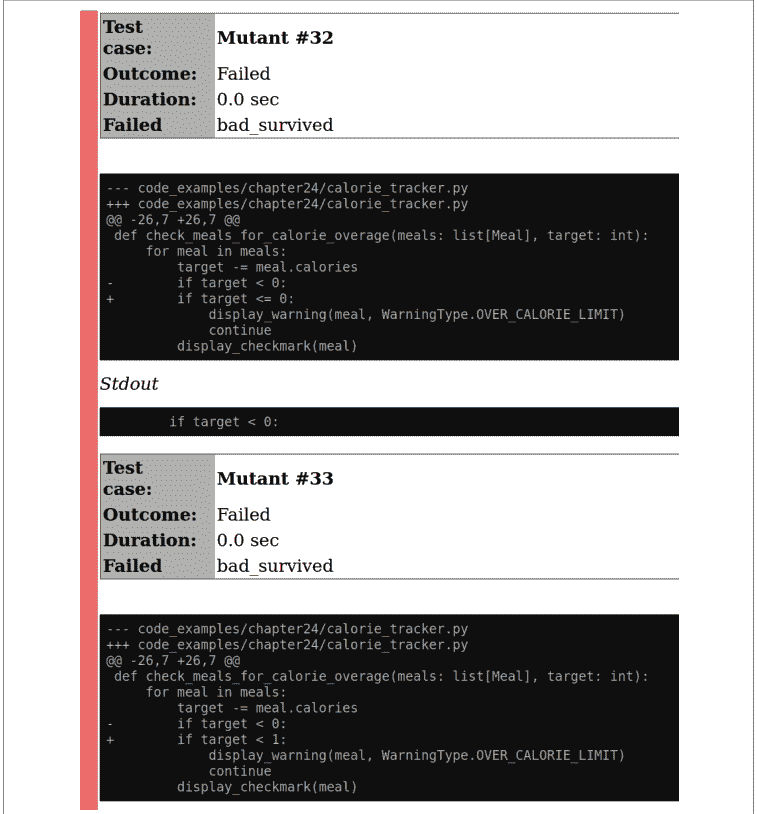

图 24-1. 使用 junit2html 生成的 mutmut 报告示例

## 采用变异测试

变异测试在当今的软件开发社区中并不普遍。我认为这有三个原因：

-   人们不了解它及其带来的好处。
-   代码库的测试还不够成熟，无法进行有用的变异测试。
-   成本效益比太高。

本书正在积极努力改善第一点，但第二点和第三点确实有其道理。

如果你的代码库没有一套成熟的测试，那么引入变异测试你将看不到什么价值。它最终会提供过高的噪声信号比。改进你的测试套件比试图找到所有变异体会带来更大的价值。考虑在代码库中那些确实有成熟测试套件的较小部分上运行变异测试。

变异测试确实成本很高；为了使其值得，最大化所获得的价值非常重要。变异测试很慢，因为需要多次运行测试套件。将变异测试引入现有代码库也是痛苦的。从一开始就针对全新的代码开始要容易得多。

然而，由于你正在阅读一本关于提高潜在复杂代码库健壮性的书，你很有可能是在一个现有的代码库中工作。不过，如果你想引入变异测试，希望并未破灭。与任何提高健壮性的方法一样，技巧在于有选择性地运行变异测试。

寻找那些有很多 bug 的代码区域。浏览 bug 报告，找出表明某个代码区域问题重重的趋势。还要考虑寻找那些高变动率的代码区域，因为这些区域最有可能引入当前测试未完全覆盖的更改。² 找到那些变异测试能带来数倍回报的区域。你可以使用 mutmut 仅在这些区域上选择性地运行变异测试。

此外，mutmut 有一个选项，可以仅对代码库中具有 *行覆盖率* 的部分进行变异测试。如果一行代码被任何测试至少执行一次，则该行代码具有 *覆盖率*。还存在其他类型的覆盖率，例如 API 覆盖率和分支覆盖率，但 mutmut 专注于行覆盖率。mutmut 只会为你实际有测试的代码生成变异体。

> ² 你可以通过测量提交次数最多的文件来找到高变动率的代码。我在快速搜索后找到了以下 Git 单行命令：`git rev-list --objects --all | awk '$2' | sort -k2 | uniq -cf1 | sort -rn | head`。这是由 sehe 在 [这个 Stack Overflow 问题](https://stackoverflow.com/questions/10568859) 中提供的。

要生成覆盖率，首先安装 coverage：

```
pip install coverage
```

然后使用 coverage 命令运行你的测试套件。对于上面的示例，我运行：

```
coverage run -m pytest code_examples/chapter24
```

接下来，你所要做的就是将 `--use-coverage` 标志传递给你的 mutmut 运行：

```
mutmut run --paths-to-mutate code_examples/chapter24 --use-coverage
```

这样，mutmut 将忽略任何未经测试的代码，从而大大减少噪声。

## 覆盖率（及其他指标）的谬误

每当出现一种衡量代码的方法时，人们就会急于将该衡量标准用作 *指标*，或作为业务价值代理预测器的目标。然而，在软件开发史上出现了许多不明智的指标，其中最臭名昭著的是使用编写的代码行数作为项目进度的指标。其逻辑是，如果能直接衡量每个人编写的代码量，就能直接衡量该人的生产力。不幸的是，这导致开发者操纵系统，试图编写故意冗长的代码。这作为指标适得其反，因为系统最终变得复杂臃肿，由于可维护性差，开发速度也放缓了。

作为一个行业，我们已经超越了衡量代码行数（我希望如此）。然而，一个指标消失的地方，又会有两个指标取而代之。我见过其他备受诟病的指标出现，比如修复的 bug 数量或编写的测试数量。表面上看，这些都是好事，但问题在于当它们被当作与业务价值挂钩的指标来审视时。在这些指标中，每一种都有操纵数据的方法。你是根据修复的 bug 数量来评判的吗？那么，一开始就多写一些 bug 吧！

不幸的是，代码覆盖率在近年来也陷入了同样的陷阱。你听到诸如“这段代码应该达到 100% 的行覆盖率”或“我们应该努力达到 90% 的分支覆盖率”之类的目标。这在孤立来看是值得称赞的，但它未能预测业务价值。它忽略了你最初想要这些目标的 *原因*。

代码覆盖率是缺乏健壮性的预测指标，而不是许多人认为的质量指标。覆盖率低的代码可能满足也可能不满足你的所有需求；你无法可靠地知道。这是一个信号，表明你在修改代码时会遇到挑战，因为你没有在该部分系统周围建立任何安全网。

你绝对应该寻找那些覆盖率极低的区域，并改进其测试情况。

相反，这导致许多人误以为高覆盖率是代码健壮性的预测指标，而事实并非如此。你可以让测试覆盖每一行代码和每一个分支，但可维护性依然可能糟糕透顶。这些测试可能很脆弱，甚至完全无用。

我曾在一个刚开始采用单元测试的代码库中工作。我遇到过一个文件，其内容大致如下：

```python
def test_foo_can_do_something():
    foo = Thingamajiggy()
    foo.doSomething()
    assert foo is not None

def test_foo_parameterized_still_does_the_right_thing():
    foo = Thingamajiggy(y=12)
    foo.doSomethingElse(15)
    assert foo is not None
```

大约有30个这样的测试，它们都有良好的命名并遵循AAA模式（如第21章所述）。但它们实际上都毫无用处：它们所做的仅仅是确保没有抛出异常。最糟糕的是，这些测试实际上达到了100%的行覆盖率和接近80%的分支覆盖率。测试检查是否抛出异常本身没有问题；问题在于，尽管它们暗示了其他情况，但实际上并没有测试真正的函数功能。

变异测试是你对抗关于代码覆盖率的错误假设的最佳防御。当你衡量测试的有效性时，编写无用、无意义的测试同时还要消除变异体就变得困难得多。变异测试将覆盖率度量提升为更真实的健壮性预测指标。覆盖率指标仍然不能完美地代表业务价值，但变异测试无疑使它们作为健壮性指标更有价值。

> 随着变异测试日益普及，我完全预计“消除的变异体数量”将成为取代“100%代码覆盖率”的新流行指标。虽然你肯定希望更少的变异体存活下来，但要警惕任何脱离上下文、仅与单一指标挂钩的目标；这个数字和其他指标一样，可以被人为操纵。你仍然需要一个完整的测试策略来确保代码库的健壮性。

## 结语

变异测试可能不会是你首先想到的工具。然而，它是你测试策略的完美补充；它能发现你安全网中的漏洞并引起你的注意。借助mutmut等自动化工具，你可以轻松利用现有的测试套件进行变异测试。变异测试帮助你提高测试套件的健壮性，这反过来又会帮助你编写更健壮的代码。

至此，本书第四部分结束。你从学习静态分析开始，它能以低成本提供早期反馈。然后你学习了测试策略，以及如何自问你希望测试回答哪些类型的问题。在此基础上，你学习了三种特定类型的测试：验收测试、基于属性的测试和变异测试。所有这些都作为增强现有测试策略的方法，在你的代码库周围构建一个更密集、更强大的安全网。有了强大的安全网，你将赋予未来的开发者信心和灵活性，以便根据需要演进你的系统。

这也标志着整本书的结束。这是一段漫长的旅程，你在此过程中学到了各种技巧、工具和方法。你深入研究了Python的类型系统，了解了编写自己的类型如何使代码库受益，并发现了如何编写可扩展的Python。本书的每一部分都为你提供了构建模块，将帮助你的代码库经受住时间的考验。

虽然这是本书的结尾，但这并不是Python健壮性故事的终点。我们这个相对年轻的行业仍在不断演进和变革，随着软件继续“吞噬”世界，复杂系统的健康和可维护性变得至关重要。我预计我们对软件的理解会持续变化，也会有新的工具和技术来构建更好的系统。

永不停止学习。Python将继续演进，增加新功能并提供新工具。其中每一个都有可能改变你编写代码的方式。我无法预测Python或其生态系统的未来。当Python引入新特性时，请自问该特性传达了什么意图。如果代码读者看到这个新特性，他们会作何假设？如果未使用该特性，他们又会作何假设？理解开发者如何与你的代码库互动，并与他们共情，以创建令人愉悦的开发环境。

此外，请将你在本书中读到的每一件事都进行批判性思考。自问：它提供了什么价值？实现它的成本是什么？我最不希望读者做的，就是将本书的建议视为完全的处方，并将其当作锤子，强迫代码库遵守“书上说要使用”的标准（任何在90年代或00年代工作过的开发者可能都记得“设计模式热”，那时你走不到10步就会遇到一个AbstractInterfaceFactorySingleton）。本书中的每个概念都应被视为工具箱中的一个工具；我希望你已经学到了足够的背景知识，以便就如何使用它们做出正确的决定。

最重要的是，请记住，你是一个在复杂系统上工作的人类，其他人类将与你一起或在你之后在这些系统上工作。每个人都有自己的动机、目标和梦想。每个人都会有自己的挑战和挣扎。错误会发生。我们永远无法消除所有错误。相反，我希望你审视这些错误，并通过从中学习来推动我们这个领域向前发展。我希望你帮助未来在你的工作基础上继续前进。尽管有所有的变化、所有的不确定性、所有的截止日期和范围蔓延，以及软件开发的所有艰辛，我希望你能够站在你的工作背后说：“我为构建了这个而自豪。这是一个好系统。”

感谢你花时间阅读本书。现在，去编写经得起时间考验的出色代码吧。

## 索引

### 符号
- @classmethod 装饰器, 151
- @contextmanager 装饰器, 169
- @dataclass 装饰器, 124
- @staticmethod 装饰器, 151
- @unique 装饰器, 121
- [] 括号语法，用于集合中的类型, 62
- [] 参数的危险可变默认值, 286

### A
- AAA 测试, 303-313, 346
    - 执行阶段, 309-310
    - 清理阶段, 308-309
    - 准备阶段, 304-308
    - 断言步骤, 310-313
- ABCs（抽象基类）, 74
- 抽象语法树（AST）, 290
- 验收测试, 315-324
    - 行为驱动开发, 316-320
        - 可执行规范, 318-320
        - Gherkin 语言, 316-318
    - 其他 behave 特性, 320-324
- 验收测试, 315
    - 它们回答的问题, 299
- 访问器, 150
- 偶然复杂性, 18, 217
    - 可扩展性对其的影响, 223
- 执行阶段（AAA 测试）, 309-310
- __add__ 方法, 166
- 算法
    - 组合, 255-257
    - 在一系列步骤中定义，模板方法模式, 272
    - 使用 Hypothesis 生成, 333-336
    - 使用策略模式将整个算法插入上下文, 275
- 别名, 62
    - （另见类型别名）
    - 枚举值的别名, 120
- 清理阶段（AAA 测试）, 308-309
    - 避免使用共享资源, 308
    - 使用上下文管理器, 308
    - 使用夹具, 309
- Annotated 类型, 56
- 注解（见类型注解）
- Any 类型, 66
    - 在类型检查器中标记 Any 的实例, 81
    - mypy 对 Any 表达式的跟踪, 84
    - Any 的有效用例, 82
- API
    - 定义你的接口, 155
    - 通过 API 实现封装, 147
    - 自然交互, 160-170
        - 上下文管理器, 167-170
        - 魔术方法, 166
    - 自然接口设计, 156-160
        - README 驱动开发, 158
        - 测试驱动开发, 157
        - 像用户一样思考, 157
        - 可用性测试, 159
    - 返回异构字典，TypedDict 和, 67
- 架构，定义, 259
- 准备步骤（AAA 测试）, 304-308

一致与变化的前置条件，305

大型安排块，304

模拟，306

使用测试框架特性处理样板代码，305

断言语句，286

断言步骤（AAA测试），310-313

断言，303

在类中传达不变量，138

与异常对比，139

AST（抽象语法树），290

astroid库，290

异步通信（现实世界），8-12

属性，142

受保护和私有，147

self参数与，137

变量操作的自动补全，40

枚举的自动值，116

## B

backoff库，252

Bandit，295

基类，172

在派生类中表示继承，173

设计考量，182

behave框架，316

附加特性，320-324

自定义测试生命周期，322

参数化步骤，320

报告生成，323

步骤匹配，322

表驱动需求，321

使用标签选择性运行测试，323

用具体测试支持Gherkin需求，318

编写映射到Given-When-Then语句的Python代码，319

行为驱动开发（BDD），316-320

Gherkin语言，316-318

“十亿美元错误”，46

使用枚举值执行位运算，118

受祝福的方法，288

边界值分析，326

依赖关系的方框-箭头图，225

棕地项目，95

通过基于属性的测试发现缺陷，331

业务逻辑，99

可组合代码与，247

## C

缓存（mypy），84

调用图，238

检查器（或规则）

Pylint内置检查器，287

编写自己的检查器，287

子类，172

变更频繁者，类型注解，99

类，8，135-153

相对于数据类和字典的优势，137

属性，Pyre对代码库的查询，85

构造函数，136

封装与维护不变量，146-151

操作，149-151

保护数据访问，147

不变量，137-146

避免破坏不变量，140

好处，140-143

检查，138

传达，143

使用你的类，143

未来的维护者与，144

将任何类注册为插件，281

整洁代码

示例，6

重要性，3

代码覆盖率，谬误，345-346

代码编辑器，变量操作的自动补全，40

代码异味，104

使用Pyre查询代码库，85

类型强制转换，29

内聚性（在类中），142

集合，61-77

注解，61

创建新的，69

ABCs，74

泛型，69

修改现有类型，71

同质与异质，63-67

TypedDict，用于存储异质数据，67

命令行，可组合性，248

注释，与类一起放置，144

通信方法，成本与接近度，9

复杂性

必要与偶然，17，217

类型注解复杂代码，99

复杂性检查器，292-295

使用mccabe工具的圈复杂度，292

空白启发式，294

可组合性，243-257

小规模组合，251-257

算法，255-257

装饰器，252-254

函数，251

成本，250

为可组合性设计代码，247

Hypothesis策略，332

RxPy中的运算符，268

策略与机制，247-250

复合协议，194

复合类型，123

组合，171

使用代替继承，183

在派生类重写函数中条件检查参数，181

配置文件，在不同位置指定（mypy），81

约束类型，45-60

Annotated类型，56

Final类型，59

Literal类型，55

NewType，57-59

Optional类型，46-51

Union类型，51-55

构造函数，136

在其中断言或引发异常，143

事件的消费者，259

（另见事件的生产者–消费者）

上下文管理器，145，167-170

在AAA测试的消除阶段使用，308

持续集成

依赖与，228

带有第三方集成的管道，策略与机制，248

控制流图，292

通信方法中的成本与接近度，9

采用类型检查的成本效益分析，96

成本

通信方法的成本，9

测试的成本，302

耦合

组合作为较弱形式的耦合，184

事件的生产者和消费者的解耦，260

依赖导致的耦合，227

可扩展性引入的耦合，223

客户期望与软件行为之间的不匹配，316

圈复杂度，292-294

## D

守护进程模式（mypy），85

数据访问，保护类的，147

数据类，123-134

向其添加方法，127

好处与局限性，134

类与，137

创建，125

决定是否使用，152

与字典对比，132

Fraction类示例，123

使用pydantic建模，205

与namedtuple对比，133

在其中嵌套数据类和其他用户定义类型，124

与TypedDict对比，133

用法，128-132

相等性检查，128

不可变性，130

关系比较，129

字符串转换，128

datetime类型，26

调试

事件驱动架构的调试，261

PyPubSub的调试选项，264

装饰器，252-254，319

behave中的正则表达式解析，322

依赖，225-242

架构设计模式与，281

通过链接策略创建，248

可扩展代码导致的依赖，223

大型安排块与，305

逻辑依赖，232-234

物理依赖，228-232

固定或不固定依赖，227

通过可组合性减少依赖，243

关系，226-228

时间依赖，234-236

类型，228

可视化，236-241

函数调用，238

导入，237

解释你的依赖图，240

包，236

依赖倒置原则，142

派生类，172

设计考量，182

重写或重定义基类方法，174

设计模式

面向对象实现，265

观察者模式，264

策略模式，275

模板方法模式，272

字典，13，63

类与，137

数据类与，132

决定是否使用，152

子类化和重写方法，71

问题，72

TypedDict，用于在字典中存储异质数据，67

用于表示异质数据，66

差异表示法，341

文档

用于代码中无法表达的不变量，143

自文档化代码，12，144

dodgy，检查泄露的秘密，295

构建领域相关类型，112

不要重复自己（DRY）原则，141

当代码过于DRY时，232

鸭子类型，31-33，76，187

帮助实现开闭原则，222

子类型/超类型关系，184

dunder（双下划线）方法，166

动态调用图生成器，239

动态类型

与静态类型对比，30

类型检查器捕获动态行为，81

集合的动态与静态索引，14

## E

提前返回语句，子类型函数，181

边，69

空值与值缺失，49

封装，146-151

入口点，279

将插件注册为入口点，279

枚举，112-116

高级用法，116-121

自动值，116

Flags，117

整数转换，119

值的唯一性，120

决定是否使用，152

Enum类型，114

枚举与字面量对比，117

局限性，121

何时不使用，115

__eq__函数，129

数据类的相等性检查，128

等价类，326

错误

使用上下文管理器消除遗漏错误，170

事件驱动架构中的错误处理，261

在运行时发现，199

配置mypy报告错误，100

Pylint检查错误，285

左移，287

简化API错误处理，70

围绕None，98

围绕类型转换，98

类型检查与，43

事件驱动架构，259-269

处理简单事件，262

实现观察者模式，264

使用消息代理，262

缺点，261

工作原理，259

流式事件，266-269

示例数据库（Hypothesis），329

异常，48

断言与，139

避免在破坏变体时使用，140

backoff.on_exception，253

受检异常，Python与，49

抛出以避免破坏不变量，140

观察者抛出的异常，265

pydantic抛出的异常，示例，206

子类型和超类型抛出的异常，181

可执行规范，318-320

可扩展性，215-224，281

关于，215-217

双向可扩展性，事件驱动架构的，260

缺点，223

开闭原则，221-223

检测OCP违规，222

通知系统重新设计，217-221

扩展点，271

## F

扇入和扇出，240

Final类型，59，132

夹具，305，309

标志，与枚举一起使用，117

Flag基类，118

脆弱测试，326

基于属性的测试减少脆弱性，331

冻结（数据类），130

存根文件中的函数签名，103

函数式编程，251

函数

在整洁代码中，3

组合，251

决定是否放在类内，151

装饰器，252-254

返回类型注解，38

可视化函数调用，238

functools模块，251

## G

生成式测试，325

生成器，13

泛型

集合，69-70

禁止Any类型用于泛型，82

用于集合以外的类型，70

__getitem__方法，166

getter和setter，150

为每个私有类成员编写，149

Gherkin语言，316-318

本书的GitHub仓库，103

Given-When-Then（GWT）格式，316

behave中的参数化步骤，320

编写映射到GWT的Python代码，319

图，69

定义Graph类以用于泛型类型，69

GraphViz库，236

将.dot文件转换为.png，239

绿地项目，95

__gt__方法，166

## H

Hamcrest匹配器，311

难以使用的代码，特征，156

has-a关系，183

可哈希，131

异质与同质集合，63-67

数据类，表示异质数据，133

使异质集合成为用户定义类型，64

同质集合中的单一类型，63

TypedDict，用于在字典中存储异质数据，67

异质集合的用途，65

启发式，292

高成本、高接近度通信，10

高成本、低接近度通信，10

高阶函数，251

Hoare, C.A.R.，46

同质集合，63

（另见异质与同质集合）

Hypothesis

充分利用，331-336

生成算法，333-336

Hypothesis策略，331

使用Hypothesis进行基于属性的测试，327-331

与传统测试对比，330-331

Hypothesis数据库，329

Hypothesis的魔力，330

## I

不可变性，137

（另见不变量）

在响应式编程中，268

为数据类指定，130

导入，可视化，237

索引

动态与静态，集合的，14

元组的静态索引，113

继承，171-176

## I

-   在协议之间进行选择，194
-   定义派生类时用于表示，173
-   在派生类中的不同行为，174
-   对可维护性的影响，175
-   来自多个类，175
-   过度使用，183
-   可替代性与，176-181
-   使用 `super` 函数访问基类，175
-   用于解决运行时类型系统和静态类型提示，190
-   `__init__` 方法，166
    -   （另请参见构造函数）
-   int 类型，25
-   集成测试，299，315
-   意图，5-8
    -   在函数中使用 Enum 进行沟通，115
    -   使用 Optional 类型进行沟通，49
    -   Python 中的示例，12-18
-   IntEnum，119
-   接口隔离原则，142
-   IntFlag，119
-   无效属性访问，98
-   不变量，137-146
    -   避免破坏不变量，140
    -   好处，140-143
    -   检查，138
    -   运行过慢，146
    -   沟通，143
    -   设计基类时的考虑因素，182
    -   消费你的类，143
    -   未来的代码维护者与，144
    -   维护、封装与，146-151
    -   操作，149-151
    -   保护数据访问，147
    -   多重继承与，175
    -   属性作为其另一个名称，325
    -   pydantic 数据类，210
    -   Restaurant 类示例，172
    -   子类型化与，180
-   is-a 关系，172，173
-   isinstance 函数，195
-   issubclass 函数，195
-   Iterable ABC，76
-   迭代器协议，192
-   itertools 模块，256

## J

-   JUnit
    -   在 behave 中生成测试报告，323
    -   变异测试报告，342

## K

-   Kafka，264

## L

-   lambda 函数，268
-   最小惊讶原则，157
-   检查泄露的密钥，295
-   left-pad 事件，227
-   遗留代码，95
-   行覆盖率，344
-   lint，285
-   linters，285
-   linting，285-291
    -   Pylint，285-287
    -   编写你自己的 Pylint 插件，287-291
        -   分解插件，289-291
-   Linus 定律，226
-   里氏替换原则，142，179
-   列表，13，63
    -   泛型，69
-   Literal 类型，55-56
    -   与 Enums 的对比，117
-   负载测试，它们回答的问题，299
-   logging 模块，策略与机制，248
-   逻辑依赖，232-234
    -   事件的生产者和消费者，261
    -   可替代性作为其好处，233
    -   使用的权衡，233
-   低成本、高接近度通信，10
-   低成本、低接近度通信，11
-   `__lt__` 方法，166

## M

-   魔术方法，128，166
    -   Python 中常见的，167
-   可维护性
    -   通过可替代性改进，233
    -   物理依赖的影响，229
-   可维护的代码，4
    -   依赖与，227
    -   开发者的原始意图与，7
    -   继承与，175
    -   不变量与未来的维护者，144
-   手动测试，300
-   处理数据以避免破坏不变量，140
-   mccabe 工具，使用它测量圈复杂度，293
-   类型的机械表示，24
-   机制与策略，247-250
-   内存，Python 类型在其中，25
-   消息代理，262
-   元数据，使用 Annotated 类型指定任意元数据，56
-   方法解析顺序（MRO），175
-   方法
    -   访问器和修改器，150
    -   私有方法，147
-   指标的谬误，345-346
-   混入，176
    -   偏好组合而非继承的例外，184
    -   用于解决运行时类型系统和静态类型提示，191
-   模拟，306
-   模块，用作协议，196
-   猴子补丁，307
-   MonkeyType，101-105
-   多重继承，175
-   变异测试，337-348
    -   关于，337-339
    -   采用，344-346
        -   覆盖率和其他指标的谬误，345-346
    -   使用 mutmut，340-344
        -   修复变异，342
        -   变异测试报告，342
-   修改器，150
-   mutmut 工具，337
    -   使用它进行选择性变异测试，344
-   mypy 类型检查器，41
    -   `--strict-optional` 命令行标志，51
    -   配置，79-85
        -   捕获动态行为，81
        -   处理 None/Optional，82
        -   报告，83
        -   要求类型，82
        -   示例 mypy.ini 文件，80
        -   加速 mypy，84
    -   有助于采用类型检查的选项，100
    -   找出错误练习，41
    -   与 pydantic 一起使用，207

## N

-   名称修饰，148
-   namedtuple 与数据类，133
-   命名空间，将插件与之匹配，279
-   自然语言，翻译成编程语言，316
-   必要复杂性，17，217
    -   在通知系统中，218
-   NewType，57-59
    -   将现有类型转换为，57
    -   使用场景，58
    -   与类型别名对比，59
-   节点，69
-   名义子类型化，189
-   非确定性，测试，330
-   None 值，46-51
    -   相关错误，98
    -   使用类型检查器处理，82
    -   Optional 类型与，49
    -   为不可满足的不变量返回，140
-   空引用，46

## O

-   面向对象编程
    -   与函数式编程对比，251
    -   模板方法模式，274
-   可观察对象，267
-   观察者模式，264
    -   缺点，265
    -   面向对象实现，265
-   观察者，264
-   开闭原则（OCP），142，221-223
    -   检测违规，222
-   运算符，在 RxPy 中进行管道或链式调用，267
-   Optional 类型，46-51
    -   使用类型检查器处理，82
    -   用于告知开发者注意 None，51
-   派生类中被重写的函数，需要警惕的迹象，180
-   在集合上重写方法，72

## P

-   包，可视化，236
-   痛点，使用类型检查查找和减少，97
-   代码接口悖论，155
-   参数化步骤（behave），320
-   参数化测试，309
-   无类的模式，265
-   物理依赖，228-232
    -   DRY 原则与，232
-   可管道运算符，267
-   pipdeptree，236
-   插件架构，277-281
    -   超越可扩展性的好处，277
    -   创建插件，278
    -   确定核心与插件之间的契约，277
    -   使用 stevedore 在运行时动态加载插件，279
    -   使用 stevedore 注册插件，279
-   插件，277
-   可插拔代码，271-281
    -   stevedore 工具管理插件，277，279
    -   策略模式，275-277
    -   模板方法模式，272-275
-   策略与机制，247-250
    -   通过链接策略创建依赖，248
    -   logging 模块示例，248
    -   在装饰器中分离，252
-   后置条件，180
-   前置条件，180
    -   嵌入更深层次，235
    -   测试的，304
        -   一致与变化，305
-   私有数据，147
-   事件的生产者-消费者，259
    -   在自动化无人机配送系统示例中，262
    -   将生产者链接到观察者，265
    -   使用消息代理作为传输机制，262
-   积类型，54
-   性能分析器，239
-   编程语言，将自然语言翻译成，316
-   属性，325
-   基于属性的测试，325-336
    -   从 Hypothesis 中获得最大收益，331-336
        -   生成算法，333-336
        -   Hypothesis 策略，331
    -   使用 Hypothesis，325-331
        -   与传统测试对比，330-331
-   受保护数据，147
-   协议，192-194
    -   高级用法，194-197
        -   组合协议，194
        -   满足协议的模块，196
        -   运行时可检查协议，195
    -   定义，193-194
    -   有助于开闭原则，222
    -   继承与，194
-   接近度（在通信中），9
-   公共数据，147
-   发布者/订阅者（pub/sub）系统，262
    -   订阅和发布到主题，263
-   纯函数，251
-   pyan3，238
-   pydantic，205-210
    -   与 mypy 一起使用，207
    -   验证与解析，209
    -   验证器，207-209
-   pydeps，237
-   PyHamcrest，311
    -   用于检查菜肴是否为素食的匹配器，312
-   Pylance，91
-   Pylint，285-291
    -   内置检查器列表，287
    -   检查代码中的错误，286
    -   编写你自己的插件，287-291
        -   分解插件，289-291
-   PyPubSub 库，263
    -   调试选项，264
    -   用于单进程应用程序，264
-   Pyre 类型检查器，85-90
    -   代码库查询，85
        -   获取任何函数的被调用者，87
-   Pysa，88-90
    -   查询文档，88
-   Pyright 类型检查器，91
-   Pysa（Python 静态分析器），88-90
-   pytest，303
    -   fixtures，305，309
    -   专注于属性的测试，326
-   Python
    -   动态和强类型，33
    -   3.5 版本之前的类型注解，39
-   Pytype，105

## Q

-   软件质量，300
-   QuickCheck 论文，330

## R

-   RabbitMQ，264
-   响应式编程，266
    -   用例，268
-   ReactiveX，RxPy 实现，266
-   README 驱动开发（RDD），158
-   Redis，264
-   装饰器中的正则表达式解析，322
-   使用数据类进行关系比较，129
-   远程缓存（mypy），85
-   在 behave 中生成报告，323
-   报告（mypy），83
-   变异测试报告，342
-   可表示状态空间，53
-   需求
    -   用具体测试支持，318
    -   使用 Gherkin 语言指定，316-318
    -   表驱动，在 behave 中，321
-   重试逻辑，252
-   返回类型，注解，37
-   健壮性，1-5
    -   关于，2
    -   依赖与，241
    -   鸭子类型与，32
    -   拥抱变化，2
    -   清洁代码的重要性，3
    -   代码的可维护性，4
    -   静态与动态类型，30
    -   强类型与弱类型，29
    -   类型注解与，36
    -   类型检查与，44
    -   类型与，27
    -   为何重要，4
-   运行时可检查协议，195
-   RxPy，266
    -   可观察对象，267
    -   观察者订阅可观察对象，267
    -   可管道运算符，267

## S

-   清理函数，90
-   安全性
    -   依赖扩大攻击面，227
    -   安全测试，回答的问题，299
    -   静态分析，295-296
        -   泄露的密钥，295
        -   安全漏洞检查，295
-   类实例化中的 self 参数，137
-   self.data，与用户集合类一起使用，73
-   类型的语义表示，25
-   集合，13，63
    -   collections.abc.Set，74
-   setup.py，279
-   setuptools，279
-   共享资源，不在测试中使用，308
-   将错误左移，199，287
-   “霰弹式修改”，217
-   缩小测试用例（Hypothesis），330
-   函数的副作用，251
-   简单事件，262
-   单一职责原则，142
-   软件价值，4
-   SOLID 设计原则，142
-   “意大利面条式代码”，225
-   加速 mypy，84
-   有状态测试（Hypothesis），333-336
-   静态分析，41，285-296
    -   linting，285-291
        -   Pylint，285-287
        -   编写你自己的 Pylint 插件，287-291
    -   其他分析器，291-296
        -   复杂度检查器，292-295
        -   安全分析，295-296
    -   将错误左移，287
-   静态调用图生成器，238
-   静态与动态类型，30
-   步骤匹配（behave），322
-   stevedore，277
    -   跨包工作的能力，281
    -   在运行时动态加载插件，279
    -   使用它注册插件，279
-   策略（Hypothesis），331
-   策略模式，275-277
-   流式事件，266-269
-   严格性（类型检查器），80
-   字符串转换，使用数据类，128
-   字符串，13
-   强类型与弱类型，28
-   结构子类型化，189
-   存根文件，103
-   子类，172
-   子类化
    -   通过它扩展代码的含义，175
    -   协议与，195
-   订阅主题，262

可替换性，176-182
    里氏替换原则，179
    引入逻辑依赖，233
子类型化，171-185
    设计考量，182-185
        使用组合而非继承，183
    对开闭原则的帮助，222
    继承，172-176
    继承之外，184
    结构化与名义化，189
    可替换性，176-182
和类型，55
super 函数，175, 181, 183
同步通信，9

为自动化无人机配送系统定义，263
订阅与发布到，263
传输机制，260
    与事件驱动架构的调试，261
元组，13
    异构，65
    属性，113
# type : ignore 注释，100
类型别名，62, 113
    NewType 与之对比，59
类型注解，27, 35-44, 45
    （另见约束类型）
    使用 MonkeyType 添加，101-105
    使用 Pytype 添加，105
    采用，成本，96
    采用，需关注的错误类别，98
    为集合添加注解，61
    Python 3.5 之前，39
    好处，40-43
        自动补全，40
        类型检查器，40
    依赖工具进行，100
    有针对性地为目标代码添加，98
        自底向上注解，99
        仅注解新代码，98
        注解变更频繁的代码，99
        注解复杂的代码，99
        注解核心业务代码，99
    在注解中使用 collections.abc，75
    何时使用，43
类型组合，245
类型转换
    转换错误，98
    使用 IntEnum 进行整数转换，119
    使用数据类进行字符串转换，128
类型提示，36, 44
    （另见类型注解）
类型系统，28-33
    鸭子类型，31-33
    静态类型与动态类型，30
    强类型与弱类型，28
    运行时类型系统与静态类型提示之间的张力，187-192
        使用继承解决，190
        使用混入解决，191
        使用协议解决，192-194
        使用联合类型解决，189

## T

表驱动需求，321
表驱动测试，309
标签，在 behave 中用于选择性运行测试，323
污点分析，88
    污点源、污点接收器和污点模型，88
传话游戏，316
模板方法模式，272-275
    标准版本，274
    将新函数传入模板方法，273
    披萨制作算法，273
时间依赖，234-236
测试驱动开发（TDD），157
测试，297-313
    算法的 A/B 测试，256
    验收测试，315-324
    代码依赖与测试，226
    在 behave 中自定义测试生命周期，322
    定义你的测试策略，297-303
        手动测试，300
        测试金字塔，301
        测试回答关于软件质量的问题，300
        理解测试，298
    为无效数据枚举测试用例，203
    变异测试，337-348
    基于属性的测试，325-336
    针对难以测试的代码进行精简，157
    降低测试成本，303-313
测试，298-301
主题，262

类型理论，53
类型检查器，41, 79-93
mypy 的替代方案，85-92
Pyre，85-90
Pyright，91
配置 mypy，79-85
捕获动态行为，81
处理 None/Optional，82
mypy 的报告，83
要求类型，82
加速 mypy，84
检测 Optional 值并检查 None，50
找出错误练习，41
使用的权衡，96
何时使用，44
类型检查
实际采用，95
更早地发现错误，97-106, 97
权衡，96
在类型检查期间为鸭子类型变量添加协议注解，187
运行时可检查协议，195
使用 pydantic 进行运行时检查，205
测试与类型检查，43
TypedDict，67, 204
数据类与之对比，133
类型
约束（见约束类型）
定义，23
为无效数据枚举测试用例，203
指示集合中期望的类型，62
机械表示，24
使用类型检查器要求类型，82
语义表示，25
类型系统之间的张力，187
TypeVar，69

用于异构集合，64
用于解决运行时类型系统与静态类型提示之间的张力，189
唯一性，强制枚举值唯一，121
单元测试，145, 299, 315
Unix 风格命令行，248
无类型表达式，82
可用性测试，159, 299
用户体验（UX），159
用户定义类型，64
关于，111-112
类，135-153
数据类，123-134
枚举，112-122
UserDict 类型，73
UserList 类型，73
用户，像用户一样思考，157
UserString 类型，73

## U

UI 测试，315
下划线
围绕魔术方法的双下划线，166
从帮助中隐藏类，140
在受保护和私有属性及方法中，147
联合类型，51-55, 70
在函数签名中，104

## V

验证
验收测试作为验证的一种形式，315
在类型构造时进行 pydantic 验证，206
TypedDict 在验证方面的局限性，205
验证逻辑，199
验证器（pydantic），207-209
变量
注解，39
良好命名，3
用类型替代，8
验证，单元测试与集成测试，315
虚拟环境，创建，236
VS Code，Pylance 扩展，91

## W

弱类型与强类型，28
是什么以及为什么（针对软件），298
空白启发式，294
with 块，145, 169

## X

JUnit 格式的 XML 文件（mypy 报告），84

## Y

YAML 文件，200
产出一个值，169

## 关于作者

**帕特里克·维亚福尔** 在软件行业工作超过 14 年，构建和维护关键任务软件系统，包括闪电检测、电信和操作系统。使用静态类型语言的经验影响了他处理动态类型语言（如 Python）的方法，以及我们如何使它们更安全、更健壮。他也是 HSV.py 聚会的组织者，在那里他可以观察到常见的 Python 障碍，并乐于帮助初学者和专家。他的目标是让计算机科学/软件工程主题对开发者社区更易于理解。

帕特里克目前在 Canonical 工作，开发将 Ubuntu 镜像部署到公共云提供商的管道/工具。他还通过自己的公司 Kudzera, LLC 进行软件咨询和合同工作。

## 版权页

*Robust Python* 封面上的动物是尼罗鳄（*Crocodylus niloticus*），它生活在撒哈拉以南非洲的淡水湖泊、河流和沼泽地附近。它是一种具有攻击性的顶级掠食者，通过潜入水中并等待伏击任何靠近的水生或陆生动物来捕猎。它们捕食各种猎物，包括鸟类、鱼类、哺乳动物和其他爬行动物。它们对人类也很危险，每年发生数百起攻击和死亡事件。

鳄鱼拥有极其强大的咬合力，以及圆锥形的牙齿，旨在紧紧咬住猎物而不是撕裂肉体。这些特征使它们能够迅速抓住甚至大型动物，并将其按在水下淹死。该物种是非洲最大的鳄鱼，平均长约 12-16 英尺，重 500-1,600 磅（尽管雌性比雄性小约 30%）。它们背部颜色深，两侧有斑驳的黄绿色，在水中起到伪装作用。

尼罗鳄是社会性动物，共享晒太阳的地方和无法独自吃掉的猎物。雌性产下 25 到 80 枚蛋，并在一段时间内保护幼崽（尽管幼鳄自己捕猎）。尽管母亲付出了努力，但据估计，只有 10% 的蛋会孵化，其中只有 1% 能长到成年，因为它们会被尼罗巨蜥、水鸟和其他鳄鱼类动物捕食。

O'Reilly 封面上的许多动物都是濒危物种；它们对世界都很重要。

封面插图由 Karen Montgomery 制作，基于 *Meyers Kleines Lexikon* 中的一幅黑白版画。封面字体是 Gilroy Semibold 和 Guardian Sans。正文字体是 Adobe Minion Pro；标题字体是 Adobe Myriad Condensed；代码字体是 Dalton Maag 的 Ubuntu Mono。

## O'REILLY®

## 这里还有更多类似的内容。

体验来自 O'Reilly 和我们 200 多家合作伙伴的书籍、视频、在线培训课程等——所有内容尽在一处。

了解更多请访问 oreilly.com/online-learning