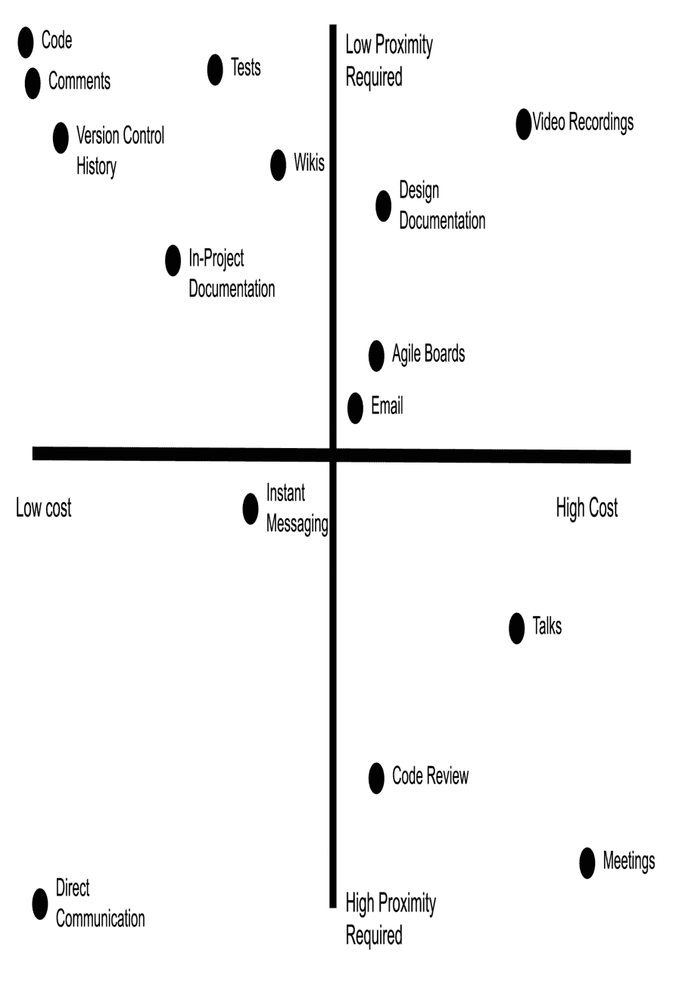
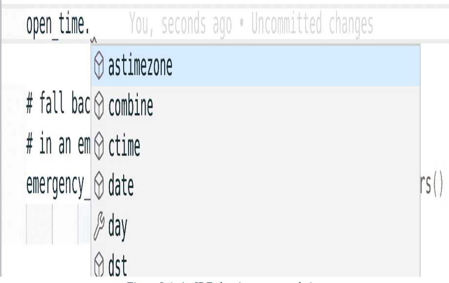
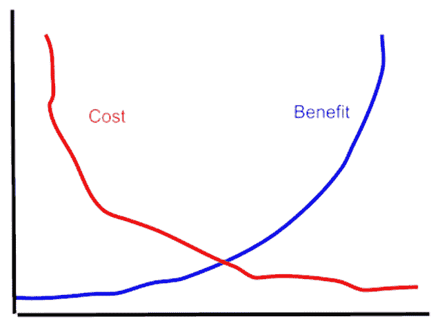

O'REILLY®

# 健壮的 Python

编写清晰且可维护的代码


早期发布
原始 & 未编辑

帕特里克·维亚福尔

# 健壮的 Python

编写清晰且可维护的代码

> 通过早期发布的电子书，您可以在书籍的最早期形式中获取内容——即作者在写作过程中的原始且未经编辑的内容——因此您可以在这些书籍正式发布之前很久就利用这些技术。

## 帕特里克·维亚福尔

# 健壮的 Python

作者：帕特里克·维亚福尔

版权所有 © 2022 Kudzera, LLC。保留所有权利。

印刷于美国。

由 O’Reilly Media, Inc. 出版，地址：1005 Gravenstein Highway North,
Sebastopol, CA 95472。

O’Reilly 书籍可用于教育、商业或销售推广用途。大多数书籍也提供在线版本（[http://oreilly.com](http://oreilly.com)）。如需更多信息，请联系我们的企业/机构销售部门：800-998-9938 或 corporate@oreilly.com。

收购编辑：阿曼达·奎因

开发编辑：莎拉·格雷

制作编辑：

文字编辑：

校对员：

索引员：

内页设计师：大卫·富塔托

封面设计师：凯伦·蒙哥马利

插画师：

2022年2月：第一版

## 早期发布修订历史

- 2020-11-06：首次发布
- 2020-12-03：第二次发布
- 2021-01-19：第三次发布

有关发布详情，请参阅 [http://oreilly.com/catalog/errata.csp?isbn=9781098100667](http://oreilly.com/catalog/errata.csp?isbn=9781098100667)。

O’Reilly 标志是 O’Reilly Media, Inc. 的注册商标。*健壮的 Python*、封面图像及相关商业外观是 O’Reilly Media, Inc. 的商标。

本书中表达的观点均为作者个人观点，不代表出版商的观点。虽然出版商和作者已尽最大努力确保本书所含信息和说明的准确性，但出版商和作者对任何错误或遗漏概不负责，包括但不限于因使用或依赖本书而造成的损害。使用本书所含信息和说明的风险由您自行承担。如果本书包含或描述的任何代码示例或其他技术受开源许可或他人知识产权的约束，您有责任确保您的使用符合此类许可和/或权利。

978-1-098-10066-7

[LSI]

# 第1章. 健壮的 Python 简介

> **致早期发布读者的说明**

通过早期发布的电子书，您可以在书籍的最早期形式中获取内容——即作者在写作过程中的原始且未经编辑的内容——因此您可以在这些书籍正式发布之前很久就利用这些技术。

这将是最终书籍的第1章。请注意，GitHub 仓库将在稍后激活。

如果您对我们如何改进本书内容和/或示例有意见，或者您在本章中发现缺失材料，请通过 *pat@kudzera.com* 联系作者。

本书旨在让您的 Python 更上一层楼。帮助您管理代码库，无论其规模大小。提供一个包含技巧、窍门和策略的工具箱，以构建可维护的代码。本书将引导您减少错误，让开发者更快乐。您将深入审视自己编写代码的方式，并了解您决策的含义。在讨论代码编写方式时，我想起了 C.A.R. Hoare 的这句至理名言：

> *构建软件设计有两种方法：一种是将其设计得如此简单，以至于明显没有缺陷；另一种是将其设计得如此复杂，以至于没有明显的缺陷。第一种方法要困难得多。*¹

本书是关于以第一种方式开发系统。是的，这会更困难，但请不要害怕。我将作为您的向导，陪伴您踏上提升 Python 技能的旅程，正如 C.A.R. Hoare 上面所说，让您的代码*明显没有缺陷*。归根结底，这是一本关于编写*健壮* Python 的书。

在本章中，我将介绍*健壮性*的含义以及您为何应该关心它。我将探讨您的沟通方式如何暗示某些优点和缺点，以及如何最好地表达您的意图。Python 之禅指出*应该有一种——而且最好只有一种——显而易见的方法*。您将学习如何评估您的代码是否是显而易见的方法，以及您可以做些什么来修复它。首先，我需要谈谈基础。*健壮性*到底是什么？

## 健壮性

### “健壮”是什么意思？

每本书至少需要一个字典定义，所以我会在本书开头尽早解决这个问题。韦氏词典为*健壮性*提供了许多定义²：

1.  具有或表现出力量或活力
2.  具有或表现出活力、力量或坚定性
3.  结构坚固或构造牢固
4.  能够在各种条件下无故障地执行

这些是对我们目标的绝佳描述。我们想要一个*健康的*系统，一个能多年保持无缺陷的系统。我们希望我们的软件*表现出力量*；很明显，这段代码将经受住时间的考验。我们想要一个*结构坚固的*系统，一个建立在坚实基础上的系统。至关重要的是，我们想要一个*能够无故障执行*的系统；我们不希望系统在条件变化时变得脆弱或易碎。

人们通常将软件想象成摩天大楼，某种宏伟的结构，作为抵御所有变化的堡垒和不朽的典范。不幸的是，事实更为复杂。软件系统不断演变。错误被修复，用户界面被调整，功能被添加、移除，然后重新添加。框架发生变化，组件过时，安全漏洞出现。软件在变化。这更像是城市规划中处理蔓延问题，而不是建造一栋静态的建筑。面对不断变化的代码库，您如何让您的代码变得健壮？您如何构建一个能抵御错误的坚实基础？

事实是，您必须接受变化。您的代码将被拆分、拼接和重新设计。新的用例将改变大段代码。这没关系。拥抱它。理解仅仅让您的代码易于更改是不够的；当它过时被删除和重写时，这可能是最好的结果。这并不会降低它的价值；它仍然会在黄金时期拥有长久的生命。您的工作是让系统的部分易于重写。一旦您开始接受代码的短暂性，您就会意识到仅仅为当下编写无缺陷的代码是不够的；您需要让代码库未来的所有者能够自信地更改您的代码。这就是本书的全部内容。

您将学习构建强大的系统。这种力量并非来自刚性，像一根铁条。相反，它来自灵活性。您的代码需要像高大的柳树一样强壮，在风中摇曳，弯曲，但不会折断。您的软件将需要处理您从未想象过的情况。您的代码库需要能够适应新情况，而且维护它的并不总是您。那些未来的维护者需要知道他们是在一个健康的代码库中工作。您的代码库需要传达它的力量。您必须以一种减少故障的方式编写 Python 代码，即使未来的维护者将其拆解并重构。

编写健壮的代码意味着深思熟虑地考虑未来。您希望未来的维护者看到您的代码时能轻松理解您的意图，而不是在深夜调试时诅咒您的名字。您必须传达您的想法、推理和注意事项。未来的开发者需要将您的代码塑造成新的形状，并且做到这一点时不必担心每次更改都会推倒一座摇摇欲坠的纸牌屋。

简而言之，您不希望您的系统失败，尤其是在意外发生时。测试和质量保证是其中的重要组成部分，但两者都不能完全内建质量。它们更适合揭示期望中的差距并提供安全网。相反，您必须让您的软件经受住时间的考验。为此，您必须编写*清晰且可维护的*代码。

清晰的代码按顺序清晰而简洁地表达其意图。当您看到一行代码并对自己说“啊，这完全说得通”时，这就是清晰代码的标志。您需要单步调试器的次数越多，你越是需要查看大量其他代码才能弄清楚发生了什么，越是需要停下来盯着代码看，代码就越不干净。如果巧妙的技巧会让其他开发者难以阅读代码，那么干净的代码就不会偏爱这种技巧。正如C.A.R. Hoare之前所说，你不希望你的代码变得如此晦涩，以至于难以通过视觉检查来理解它。

可维护的代码，顾名思义，就是易于维护的代码。维护工作从第一次提交后立即开始，一直持续到没有任何开发者再关注这个项目为止。开发者们会修复错误、添加功能、阅读代码、提取代码用于其他库等等。可维护的代码让这些任务变得顺畅无阻。软件的生命周期长达数年，甚至数十年，因此你需要*今天*就关注可维护性。

你不希望成为系统故障的原因，无论你是否正在积极开发它们。你需要主动采取措施，让你的系统经得起时间的考验。你需要一个测试策略作为你的安全网，但你也需要能够避免一开始就掉入陷阱。因此，考虑到所有这些，我从软件的角度提出我对健壮性的定义：

> 健壮的软件具有弹性且无差错，尽管它处于不断变化之中

## 为什么健壮性很重要？

为了让软件实现其预期功能，投入了大量的精力。开发里程碑难以预测。几乎每次你都在构建全新的东西，这无济于事。人为因素，如用户体验、可访问性和文档，只会增加复杂性。现在再加上测试，以确保你覆盖了已知和未知行为的一部分，你面对的就是漫长的开发周期。

软件的目的是提供价值。尽早交付全部价值符合利益相关者的利益。鉴于某些开发计划的不确定性，满足期望往往带来额外的压力。我们都曾经历过不切实际的时间表或截止日期带来的困境。不幸的是，许多使软件极其健壮的工具只会增加我们的开发周期。

这并不意味着健壮的代码不重要或“不值得”。确实，立即交付价值与使代码健壮之间存在内在的张力。如果你的软件“足够好”，为什么还要增加更多复杂性？要回答这个问题，请考虑这段软件将被迭代的频率。交付软件价值通常不是一个静态的过程；一个系统提供价值后就再也不修改的情况很少见。软件本质上是不断演进的。代码库需要准备好频繁且长期地交付价值。这就是健壮的软件工程实践发挥作用的地方。如果你不能在不损害质量的前提下快速、无痛地交付功能，你就需要重新评估技术，使你的代码更具可维护性。

如果你的系统延迟交付或出现故障，会产生实时成本。思考一下你的代码库。问问自己，如果一年后因为有人无法理解你的代码而导致代码崩溃，会发生什么？你会损失多少价值？你的价值可能以金钱、时间甚至生命来衡量。问问自己，如果价值没有按时交付会发生什么？后果是什么？如果这些问题的答案令人担忧，好消息是，你正在做的工作很有价值。但这也强调了消除未来错误的重要性。

你需要考虑未来的开发者。多个开发者同时在同一个代码库上工作。许多软件项目将比大多数开发者更长久。你需要找到一种方式与现在和未来的开发者沟通，而无需亲自在场解释。未来的开发者将基于*你的*决策进行构建。每一个错误的线索、每一个兔子洞、每一次为了琐事而进行的冒险都会拖慢他们的速度，从而阻碍价值的传递。你需要对后来者有同理心。你需要设身处地为他们着想。这本书是你思考协作者和维护者的入口。你需要编写持久的代码。编写持久代码的第一步是能够通过你的代码进行沟通。你需要确保未来的开发者理解你的意图。

## 你的意图是什么？

为什么你应该努力编写干净的代码？为什么你应该如此关注健壮性？这些答案的核心在于沟通。你交付的不是静态系统；软件会随着时间演进和增长。维护者也会随时间变化。你编写代码的目标是交付价值，但也是以其他开发者能够同样快速交付价值的方式编写代码。为了做到这一点，你需要能够在从未见过未来维护者的情况下，传达推理和意图。

让我们看一个假设遗留系统中的代码块。我让你估算一下你理解这段代码在做什么需要多长时间。如果你不熟悉这里的所有概念，或者你觉得这段代码很复杂（它是故意这样设计的！），也没关系。

```
# Take a meal recipe and change the number of servings
# by adjusting each ingredient
# A recipe's first element is the number of servings, and the remainder
# of elements is (name, amount, unit), such as ("flour", 1.5, "cup")
def adjust_recipe(recipe, servings):
    new_recipe = [servings]
    old_servings = recipe[0]
    factor = servings / old_servings
    recipe.pop(0)
    while recipe:
        ingredient, amount, unit = recipe.pop(0)
        # please only use numbers that will be easily measurable
        new_recipe.append((ingredient, amount * factor, unit))
    return new_recipe
```

这个函数接受一个食谱，并调整每种成分以处理新的份数。然而，这段代码引发了许多问题。

- `pop` 是干什么用的？
- `recipe[0]` 表示什么？为什么那是旧的份数？
- 为什么我需要为那些容易测量的数字添加注释？

这确实是一些有问题的Python代码。如果你觉得需要重写它，我不会怪你。如果它像下面这样，看起来会好很多：

```
def adjust_recipe(recipe, servings):
    old_servings = recipe.pop(0)
    factor = servings / old_servings
    return ({"servings": servings} |
            {ingredient: (amount*factor, unit)}
            for ingredient, amount, unit in recipe)
```

喜欢干净代码的人可能更喜欢第二个版本（我当然也是）。没有原始的循环。变量不会改变。我返回的是一个字典而不是元组列表。根据情况，所有这些变化都可以被视为积极的。但我可能刚刚引入了三个微妙的错误。

1. 在第一个例子中，我清空了原始食谱。即使只有一个调用代码依赖于这种行为，我也破坏了假设。
2. 通过返回字典，我移除了在列表中拥有重复成分的能力。这可能会影响那些有多个部分（例如主菜和酱汁）且都使用相同成分的食谱。
3. 如果任何成分被命名为“servings”，你就引入了命名冲突。

这些是否是错误取决于两个相互关联的因素：作者的意图和调用代码。作者打算解决一个问题，但我不确定他们为什么以这种方式编写代码。他们为什么要弹出元素？为什么份数是列表中的一个元组？为什么使用列表？大概作者知道原因，并在本地向他们的同行传达了这一点。他们的同行基于这些假设编写了调用代码，但随着时间的推移，这种意图变得模糊不清。没有与未来的沟通，我在维护这段代码时只剩下两个选择：

1. 查看所有调用代码，并在实施之前确认没有依赖这种行为。如果这是一个有外部调用者的公共API，祝你好运。我花了很多时间做这件事，这让我很沮丧。
2. 做出更改，然后等待看看会有什么后果（客户投诉、测试失败等）。如果我幸运的话，什么坏事都不会发生。如果我不幸运，我会花很多时间，这让我很沮丧。

在维护环境中，这两种选择都不好（尤其是如果我必须修改这段代码）。我不想浪费时间；我想快速处理当前任务，然后继续下一个任务。如果我考虑如何调用这个代码，情况会更糟。想想你如何与以前未见过的代码交互。你可能会看到其他调用代码的例子，将它们复制以适应你的用例，却从未意识到你需要传递一个名为servings的特定字符串作为你的第一个元素。

你的列表。

这些都是会让你挠头的决策。我们在大型代码库中都见过它们。它们并非恶意编写，而是随着时间推移，在良好初衷下有机地演变而来。函数起初很简单，但随着用例增长和多位开发者的贡献，代码往往会变形并模糊了原始意图。这无疑是可维护性受损的明确信号。你需要在代码中预先表达意图。

那么，如果原作者使用了更好的命名模式和更好的类型用法会怎样？那段代码会是什么样子？

```python
# Take a meal recipe and change the number of servings
# recipe should be a Recipe class
def adjust_recipe(recipe, servings):
    new_ingredients = list(recipe.ingredients)
    recipe.clear_ingredients()

    for ingredient in new_ingredients:
        ingredient.adjust_proportion(Fraction(servings,
            recipe.servings))
    return Recipe(servings, new_ingredients)
```

这看起来好多了，并且清晰地表达了原始意图。原开发者将他们的想法直接编码到了代码中。从这段代码片段中，你知道以下几点是真实的：

-   我正在使用一个 `Recipe` 类。这使我能够抽象掉某些操作。可以推测，在类本身内部，存在一个允许重复食材的不变量。（我将在第5章更详细地讨论类和不变量。）这提供了一个共同的词汇表，使函数的行为更加明确。
-   现在，份量是食谱类的一个显式部分，而不需要作为列表的第一个元素来处理，后者曾被当作特殊情况处理。这极大地简化了调用代码，并防止了无意的冲突。
-   很明显，我想清除旧食谱上的食材。没有模糊的理由解释为什么我需要执行 `.pop(0)`。
-   食材是一个单独的类，并处理分数而不是显式的浮点数。对于所有相关方来说，我正在处理分数单位这一点更加清晰，并且可以轻松地执行诸如 `limit_denominator()` 之类的操作，当人们想要限制计量单位时可以调用它（而不是依赖注释）。

我用类型替换了字段，例如食谱类型和食材类型。我还定义了操作（`clear_ingredients`、`adjust_proportion`）来传达我的意图。通过做出这些改变，我使代码的行为对未来读者来说变得一清二楚。他们不再需要来找我来理解代码。相反，他们无需与我交谈就能理解我在做什么。这是*异步沟通*的绝佳体现。

## 异步沟通

在一本 Python 书中谈论异步沟通而不提及 `async` 和 `await` 是很奇怪的。但我恐怕不得不在一个更复杂的环境中谈论异步沟通：*现实世界*。

异步沟通意味着信息的产生和信息的消费彼此独立。在生产和消费之间存在时间间隔。可能是几个小时，就像不同时区的协作者那样。也可能是几年，就像未来的维护者试图深入研究代码的内部工作原理时那样。你无法预测何时会有人需要理解你的逻辑。当他们消费你产生的信息时，你可能甚至已经不在那个代码库（或那家公司）工作了。

与之相对的是*同步沟通*。同步沟通是人们面对面（亲自或其他方式）交谈并分享知识。这种直接沟通的形式是表达思想的最佳方式之一，但不幸的是，它无法扩展，而且你不会总是在场回答问题。

为了评估在试图理解意图时每种沟通方法的适用性，我将考察两个维度：接近度和成本。

接近度是指沟通者需要在时间上多接近才能使沟通富有成效。有些沟通方法擅长实时信息传递。其他沟通方法则擅长在多年后进行沟通。

成本是沟通所需努力的衡量。你必须权衡沟通所花费的时间和金钱与所提供的价值。你未来的消费者则必须权衡消费信息的成本与他们试图传递的价值。编写代码而不提供任何其他沟通渠道是你的基线；你必须这样做才能产生价值。为了评估额外沟通渠道的成本，我考虑以下因素：

-   可发现性：在正常工作流程之外找到这些信息有多容易？知识的持久性如何？信息是否易于搜索？
-   维护成本：信息有多准确？需要多久更新一次？如果信息过时会出什么问题？
-   生产成本：生产沟通投入了多少时间和金钱？

在图 1-1 中，我绘制了一些常见沟通方法的成本和所需的接近度。



图 1-1. 绘制沟通方法的成本和接近度

成本/接近度图由 4 个象限组成。

### 低成本，高接近度要求

这些方法生产成本低，消费成本也低，但无法跨时间扩展。直接沟通和即时消息是这些方法的绝佳例子。将它们视为时间点上的信息快照；它们仅在用户积极倾听时才有价值。不要依赖这些方法向未来沟通。

### 高成本，高接近度要求

这些是昂贵的事件，通常只发生一次（例如会议或会议）。在沟通时应该通过这些事件传递大量价值，因为它们对未来提供的价值不大。你有多少次参加过感觉浪费时间的会议？这就是你感受到的价值直接损失。演讲需要为每位参与者付出乘数成本（花费的时间、举办场地、后勤等）。代码审查完成后很少再被查看。

### 高成本，低接近度要求

这些方法成本高昂，但由于所需的接近度低，其成本可以随着时间的推移通过传递的价值来偿还。电子邮件和敏捷看板包含大量信息，但不易被他人发现。这些方法非常适合不需要频繁更新的更大概念。试图从所有噪音中筛选出你正在寻找的信息片段会变成一场噩梦。视频录像和设计文档非常适合理解时间点上的快照，但保持更新的成本很高。不要依赖这些沟通方法来理解日常决策。

### 低成本，低接近度要求

这些方法创建成本低，且易于消费。代码注释、版本控制历史和项目 README 都属于这一类，因为它们与我们编写的源代码相邻。用户可以在信息产生多年后查看这些沟通。任何在开发者工作流程中的内容都将变得易于发现。这些沟通方法非常适合人们在查看源代码后首先寻找的地方。然而，你的代码是你最好的文档工具之一，因为它是系统的活记录和唯一真实来源。

> ### 讨论主题

此图是基于通用用例创建的——思考一下你和你的组织使用的沟通路径。你会将它们绘制在图上的哪个位置？消费准确信息有多容易？生产信息的成本有多高？你对这些问题的答案可能会导致一个略有不同的图表，但唯一的真实来源将是你交付的可执行软件中。

低成本、低接近度的沟通方法是向未来沟通的最佳工具。你应该努力最小化沟通的生产和消费成本。无论如何你都必须编写软件来传递价值，因此最低成本的选择是让你的代码成为你的主要沟通工具。你的代码库成为清晰表达你的决策、意见和解决方法的最佳选择。

然而，为了使这一主张成立，代码也必须易于消费。你的意图必须在代码中清晰地传达出来。你的目标是最大限度地减少代码读者理解它所需的时间。理想情况下，读者不需要阅读你的实现，而只需阅读你的函数签名。通过使用良好的类型、注释和变量名，你的代码功能应该一清二楚。

> ### 自文档化代码

对此图的错误反应是“自文档化代码就是我所需要的一切！”每条沟通路径都提供了代码本身无法提供的价值。版本控制将为你提供变更历史。设计文档讨论的是不局限于任何单个代码文件的广泛理想。会议（如果做得正确）可以是同步计划执行的重要事件。你绝对应该努力使代码自文档化，但要意识到这仅处理了代码*正在做什么*。不要贬低任何其他沟通路径。

其他沟通象限仍然有价值。设计> 文档绝对在宏观决策中占有一席之地。演讲是向广大受众分享想法的极其有效的方式。会议（如果有效进行）对于作为互联团队之间的同步点至关重要。不要轻视这些方法，但要理解每种沟通方式都是为特定用例量身定制的。本书专注于你能在代码中做什么，但不要仅仅依赖代码来传达你的意图。

## Python 中的意图示例

既然我已经讨论了什么是意图以及它为何重要，让我们通过 Python 的视角来看一些例子。你如何确保正确表达你的意图？考虑一下你在阅读 Python 代码时遇到的一些常见错误？

### 集合

当你选择一个集合时，你是在传达特定的信息。你必须为手头的任务选择正确的集合。否则，维护者会从你的代码中推断出错误的意图。

考虑这段代码，它接收一个食谱书列表，并统计每位作者出现的次数：

```python
def create_author_count(cookbooks: List[Cookbook]):
    counter = {}
    for cookbook in cookbooks:
        if cookbook.author not in counter:
            counter[cookbook.author] = 0
        counter[cookbook.author] += 1
    return counter
```

我对集合的使用告诉你了什么？为什么我没有传递一个字典或一个集合？为什么我没有返回一个列表？根据我当前对集合的使用，你可以断定：

- 我传递了一个食谱书列表。这个列表中可以有重复的食谱书（我可能是在统计书店书架上的食谱书，有多本相同的）。
- 我返回一个字典。用户可以查找特定的作者，或者遍历整个字典。我不必担心返回集合中有重复的作者。

如果我希望列表中没有重复项呢？列表传达了错误的意图。相反，我应该选择一个集合来传达这段代码绝对不会处理重复项。

选择集合可以告诉读者你的具体意图。以下是一些常见集合类型及其传达的意图列表：

### 列表

这是一个用于迭代的集合。它是*可变的*：可以随时更改。你很少期望从列表中间检索特定元素（使用静态列表索引）。可能存在重复元素。书架上的食谱书可能会存储在列表中。

### 字符串

一个不可变的字符集合。食谱书的名称将是一个字符串。

### 生成器

一个用于迭代的集合，永远不会被索引。每个元素访问都是惰性执行的，因此每次循环迭代可能需要时间和/或资源。它们非常适合计算成本高昂或无限的集合。在线食谱数据库可能会作为生成器返回；当用户只打算查看搜索的前十个结果时，你不想获取世界上所有的食谱。

### 元组

元组是不可变的集合。你不期望它改变，因此更可能从元组中间提取特定元素（通过索引或解包）。它很少被迭代。关于特定食谱书的信息可能会表示为一个元组，例如 `(cookbook_name, author, pagecount)`。

### 集合

一个不包含重复项的可迭代集合。你不能依赖元素的顺序。食谱书中的成分可能会存储为一个集合。

### 字典

一个从键到值的映射。键在整个字典中是唯一的。字典通常被迭代，或者使用动态键进行索引。食谱书的索引是键值映射（从主题到页码）的一个很好的例子。

不要为你的目的使用错误的集合。我遇到过太多次本不该有重复项的列表，或者实际上并未用于映射键值的字典。每次你的意图与代码中的内容之间存在脱节时，你都会增加维护负担。维护者必须停下来，弄清楚你真正的意思，然后绕过他们错误的假设。

> **动态索引与静态索引**
>
> 根据你使用的集合类型，你可能想也可能不想使用*静态索引*。静态索引是指你总是使用相同的索引访问集合，无论集合如何，例如 `my_list[4]` 或 `my_dict["Python"]`。通常，列表和字典不会经常需要这种用例。由于它们的动态特性，你无法保证集合在该索引处有你要查找的元素。如果你在这些类型的集合中查找特定字段，这表明你需要一个用户定义的类型（在后续章节中探讨）。对元组使用静态索引是安全的，因为它们的大小是固定的。集合和生成器永远不会被索引。
>
> 此规则的例外情况包括：
>
> * 获取序列的第一个或最后一个元素（`my_list[0]` 或 `my_list[-1]`）
> * 使用字典作为中间数据类型，例如读取 JSON 或 YAML
> * 对序列进行特定处理固定块的操作（例如总是在第三个元素后分割，或检查固定格式字符串中的特定字符）
> * 特定集合类型的性能原因
>
> 相比之下，*动态索引*是指你使用一个在运行时才知道的变量来索引集合。这是列表和字典最合适的选择。当你在迭代集合或使用 `index()` 函数搜索特定元素时，你会看到这一点。

这些是基本的集合，但还有更多方式来表达意图。以下是一些更特殊的集合类型，它们在向未来传达意图方面更具表现力：

- *frozenset*：一个不可变的集合。
- *OrderedDict*：一个根据插入时间保留元素顺序的字典。
- *defaultdict*：一个在键缺失时提供默认值的字典。例如，我可以将我之前的例子重写如下：

```python
from collections import defaultdict
def create_author_count(cookbooks: List[Cookbook]):
    counter = defaultdict(lambda: 0)
    for cookbook in cookbooks:
        counter[cookbook.author] += 1
    return counter
```

这为最终用户引入了一种新行为——如果他们查询字典中一个不存在的值，他们将收到 0。这在某些用例中可能是有益的，但如果不是，你只需返回 `dict(counter)` 即可。

### 计数器

一种特殊的字典类型，用于计算元素出现的次数。这大大简化了我们上面的代码，如下所示：

```python
from collections import Counter
def create_author_count(cookbooks: List[Cookbook]):
    return Counter(book.author for book in cookbooks)
```

> **注意**
>
> 从 CPython 3.6 和 Python 3.7 开始，内置字典也是有序的。

花点时间反思一下最后一个例子。注意使用计数器如何让我们获得更简洁的代码，同时不牺牲可读性。如果你的读者熟悉计数器，这个函数的含义（以及实现如何工作）会立即显现。这是一个通过更好地选择集合类型向未来传达意图的绝佳例子。我将在第 5 章继续进一步探讨集合。

还有更多类型可以探索，例如数组、字节、范围等等。每当你遇到一个新的集合类型，无论是内置的还是其他的，问问自己它与其他集合有何不同，以及它向未来的读者传达了什么。

## 迭代

迭代是另一个例子，你选择的抽象决定了你传达的意图。

你有多少次看到这样的代码？

```python
text = "This is some generic text"
index = 0
while index < len(text):
    print(text[index])
    index += 1
```

这段简单的代码将每个字符打印在单独的行上。这完全没问题。

对于这个问题，Python的初步实现可能是这样的，但解决方案很快会演变成更符合Python风格的写法：

```
for character in text:
    print(character)
```

或者更简洁地：

```
print("\n".join(text))
```

花点时间思考一下为什么后两种方案更优。在`join()`的例子中，是因为我使用了一个命名的循环抽象（这再次清晰地传达了意图）。但即使是for循环也比while循环更清晰。这是因为for循环是针对我的用例更合适的选择。就像集合类型一样，你选择的循环结构明确地传达了不同的概念。以下是一些循环结构及其传达的含义：

*For循环*

    For循环用于遍历集合或范围中的每个元素并执行一个操作/副作用

*While循环*

    While循环用于迭代直到某个条件发生

*列表推导式*

    列表推导式用于将一个集合转换为另一个集合（通常没有副作用，特别是当推导式是惰性求值时）

*递归*

    递归用于集合的子结构与集合结构相同的情况（例如，树的每个子节点也是一棵树）。

你希望代码库的每一行都能提供价值。此外，你还希望每一行都能清晰地向未来的开发者传达这个价值是什么。这驱动了对最小化任何样板代码、脚手架和多余代码的需求。在上面的例子中，我遍历每个元素并执行一个副作用（打印一个元素），这使得for循环成为理想的循环结构。我没有浪费代码。相比之下，while循环要求我们显式地跟踪循环直到某个条件发生。换句话说，我需要跟踪一个特定的条件，并在每次迭代中修改一个变量。这分散了循环提供的价值，并带来了不必要的认知负担。

## 最小惊讶原则

偏离意图的干扰是糟糕的，但有一类沟通甚至更糟：当代码主动让你未来的协作者感到惊讶。你需要遵循*最小惊讶原则*。当有人阅读代码库时，他们几乎不应该对行为或实现感到惊讶（当他们惊讶时，代码附近应该有一个很好的注释来解释为什么是这样）。这就是为什么传达意图至关重要。清晰简洁的代码降低了误解的可能性。

> **注意**

*最小惊讶原则*，也称为*最小惊奇原则*，指出程序应该总是以最不令用户惊讶的方式做出响应⁴。令人惊讶的行为会导致困惑。困惑会导致错误的假设。错误的假设会导致bug。这就是你得到不可靠软件的方式。

请记住，你可以编写完全正确的代码，但仍然会让未来的人感到惊讶。在我职业生涯早期，我曾追踪过一个因内存损坏而崩溃的讨厌bug。将代码放在调试器下或添加过多的print语句会影响时序，导致bug无法显现（一个真正的“海森bug⁵”）。与这个bug相关的代码实际上有数千行。

所以我不得不进行手动二分查找，将代码分成两半，通过移除另一半来查看哪一半确实有崩溃，然后在那一半代码中重复这个过程。经过两周的抓狂之后，我终于决定检查一个听起来无害的函数，名为getEvent。结果发现这个函数实际上是在用无效数据*设置*一个事件。不用说，我非常惊讶。

这个函数在它所做的事情上是完全正确的，但由于我忽略了代码的意图，我至少忽略了这个bug三天。让你的读者惊讶会浪费他们的时间。

很多这种惊讶最终源于复杂性。复杂性有两种类型：*必要复杂性*和*意外复杂性*。必要复杂性是你的领域固有的复杂性。深度学习模型必然是复杂的——你无法在几分钟内浏览其内部工作原理并理解它。优化对象关系映射必然是复杂的——需要考虑大量可能的用户输入。你无法消除必要复杂性，所以你最好的选择是确保它不会在你的代码库中蔓延。

相比之下，意外复杂性是产生多余、浪费或令人困惑的代码语句的复杂性。当系统随时间演变，开发者在不重新评估旧代码以查看其原始断言是否仍然成立的情况下强行添加功能时，就会发生这种情况。我曾经参与过一个项目，添加一个简单的命令行选项（以及相关的编程设置方式）涉及不少于10个文件。为什么添加一个简单的值需要在整个代码库中进行更改？

如果你经历过以下情况，你就知道你有意外复杂性：

- 听起来很简单的事情（添加用户、更改UI控件等）实现起来并不简单
- 新开发者难以理解你的代码库。项目中的新开发者是你当前代码可维护性的最佳指标——无需等待多年。
- 添加功能的估算总是很高，而且你仍然会错过进度。

尽可能消除意外复杂性并隔离你的必要复杂性。这些将成为你未来协作者的绊脚石。这些复杂性来源会加剧误解，因为它们在代码库中模糊和扩散了意图。

> ### 讨论主题

你的代码库中有哪些意外复杂性？如果你被投入到代码库中而没有与其他开发者沟通，理解简单概念会有多大的挑战？你能做些什么来简化这些复杂性（特别是如果它们在经常更改的代码中）？

在本书的其余部分，我将探讨Python中使我们的系统更健壮的不同技术。本书分为4个部分

## *第1部分*

我将从Python中的类型开始。类型是语言的基础，但通常不被深入探讨。你选择的类型很重要，因为它们传达了非常具体的意图。我将讨论类型注解以及特定注解向开发者传达的内容。我还将介绍类型检查器以及它们如何帮助及早发现bug。

## *第2部分*

在讨论了如何思考Python的类型之后，我将重点介绍如何创建你自己的类型。我将深入探讨枚举、数据类和类。我将探索在设计类型时做出某些设计选择如何增加或减少代码的健壮性。

## *第3部分*

既然你已经学会了如何传达你的意图，我将重点介绍如何让用户轻松更改你的代码。你将学习如何利用坚实的基础，让其他人有信心地构建。我将涵盖可扩展性、依赖关系和架构模式，这些允许你以最小的影响修改你的系统。

## *第4部分*

最后，我将探讨如何构建一个安全网，以便在你未来的协作者跌倒时能够温柔地接住他们。他们的信心会增加，因为他们知道他们有一个强大、健壮的系统，可以无所畏惧地适应他们的用例。我将涵盖各种静态分析和测试工具，这些工具将帮助你捕捉异常行为。

## 总结

健壮的代码很重要。简洁的代码很重要。你的代码需要在整个代码库的生命周期内保持可维护性，为了做到这一点，你需要积极地预见你正在传达什么以及如何传达。你需要尽可能清晰地将你的知识体现在代码中。持续向前看会感觉像是一种负担，但通过练习它会变得自然，当你在自己的代码库中工作时，你开始收获成果。

代码库中的每一个抽象、每一行和每一个选择都在传达某些东西，无论是否有意。我鼓励你思考你正在编写的每一行代码，并问自己“未来的开发者会从中学到什么？”。你有责任让未来的维护者能够以你今天的速度提供价值。否则，你的代码库会变得臃肿，进度会延误，复杂性会增长。作为开发者，你的工作就是减轻这种风险。

寻找潜在的热点，例如不正确的抽象（如集合或迭代）或意外复杂性。这些是随着时间的推移沟通可能中断的主要领域。如果这些是经常更改的领域，那么现在就是优先处理的领域。

在下一章中，你将运用本章所学的内容，并将其应用于一个基本的Python概念：类型。你选择的类型向未来的开发者表达了你的意图，选择正确的类型与选择正确的抽象同样重要。

1. 1980年图灵奖演讲“皇帝的新衣”
2. https://www.merriam-webster.com/dictionary/robust
3. Yak-Shaving描述了你经常不得不解决不相关的问题，然后才能开始处理原始问题的情况。你可以在https://seths.blog/2005/03/dont_shave_that/了解该术语的起源
4. Geoffry James，《编程之道》
5. 一种在被观察时表现出不同行为的bug。SIGSOFT ’83：ACM SIGSOFT/SIGPLAN软件工程研讨会关于高级调试的会议录

# 第二章 Python 类型简介

> **致早期版本读者的说明**

通过早期版本电子书，您可以在书籍的最初阶段获取内容——即作者撰写时未经编辑的原始内容——从而在这些书籍正式发布之前就能利用这些技术。

这将是最终书籍的第二章。请注意，GitHub 仓库将在稍后激活。

如果您对如何改进本书内容和/或示例有意见，或者发现本章中有遗漏的内容，请通过 *pat@kudzera.com* 联系作者。

欢迎来到第一部分，我将重点介绍 Python 中的*类型*。类型对程序的行为进行建模。初级程序员知道 Python 中有不同的类型，比如 *float* 或 *string*。但类型是什么？掌握类型如何使你的代码库更强大？类型是任何编程语言的基本支柱，但不幸的是，大多数入门书籍都忽略了类型如何使你的代码库受益（或者如果误用，这些类型会增加复杂性）。

告诉我你是否见过这个：

```
>>>type(3.14)
<class 'float'>

>>>type("This is another boring example")
<class 'str'>

>>> type(["Even", "more", "boring", "examples"])
<class 'list'>
```

这几乎可以从任何 Python 入门指南中找到。你学习了整数、字符串、浮点数、布尔值以及语言提供的所有东西。然后，砰，你继续前进，因为让我们面对现实，这个 Python 并不花哨。你想深入研究很酷的东西，比如函数、循环和字典，我不怪你。但遗憾的是，许多教程从未重新审视类型并给予它们应有的重视。随着用户深入挖掘，他们可能会发现类型注解（我将在下一章介绍）或开始编写类，但通常错过了关于何时适当使用类型的基本讨论。

这就是我要开始的地方。要编写可维护的 Python，你必须了解类型的本质并有意识地使用它们。我将首先讨论类型到底是什么以及为什么这很重要。然后我将讨论 Python 语言对其类型系统的决策如何影响代码库的健壮性。

## 类型中有什么？

我想让你停下来回答一个问题：不提及数字、字符串、文本或布尔值，你如何解释类型是什么？

对每个人来说，这都不是一个简单的答案。解释其好处甚至更难，尤其是在像 Python 这样的语言中，你不必显式声明变量的类型。

我认为类型有一个非常简单的定义：一种通信方法。类型传达信息。它们提供了一种用户和计算机可以推理的表示。我将这种表示分解为两个不同的方面：

*机械表示*
    类型向 Python 语言本身传达行为和约束

*语义表示*
    类型向其他开发人员传达行为和约束

让我们进一步了解每种表示：

### 机械表示

从本质上讲，计算机都是关于二进制代码的。你的处理器不会说 Python，它看到的只是电路中电流的有无。计算机内存中的内容也是如此。

假设你的内存看起来像这样

00110010100001001000010100100100010010001000001010100101
010101010000001111111100100101001111101001001010010001
0010100`010100000100000101010100``101001001001000101010001010010
010101010010010010010000111101010110101101001010111`

看起来像一堆乱码。让我们放大我加粗的部分：

*01010000 01000001 01010100*

仅凭这个数字本身无法确切知道它的含义。根据计算机体系结构，它可能代表数字 5259604 或 5521744。它也可能是字符串“PAT”。没有任何上下文，你无法确定。这就是为什么计算机需要类型。类型信息为 Python 提供了理解所有 1 和 0 所需的信息。让我们看看它的实际应用：

```
from ctypes import string_at
from sys import getsizeof
from binascii import hexlify

a = 0b01010000_01000001_01010100
print(a)
>>> 5259604

# prints out the memory of the variable
print(hexlify(string_at(id(a), getsizeof(a))))
>>> b'0100000000000000607c054995550000010000000000000054415000'

text = "PAT"
print(hexlify(string_at(id(text), getsizeof(text))))
>>>b'0100000000000000a00f0649955500000300000000000000375c9f1f02acdbe4e
5379218b77f00000000000000000000050415400'
```

> 注意
我在小端机器上运行 CPython 3.9.0，所以如果你看到不同的结果，不要担心，有一些细微的东西可能会改变你的答案。（此代码不保证在其他 Python 实现（如 Jython 或 PyPy）上运行）。

这些十六进制字符串显示了 Python 对象的实际内存。你会发现链表中下一个和上一个对象的指针（用于垃圾回收目的）、引用计数、类型和实际数据本身。你可以看到每个返回值末尾的字节，以查看数字或字符串（查找字节 0x544150 或 0x504154）。重要的是，内存中编码了一个类型。当 Python 查看变量时，它在运行时确切地知道所有内容的类型（例如，当你使用 `type()` 函数时）。

很容易认为这是类型的唯一原因——计算机需要知道如何解释各种内存块。了解 Python 如何使用类型很重要，因为它对编写健壮的代码有一些影响，但更重要的是第二种表示：语义表示。

### 语义表示

虽然类型的第一种定义非常适合底层编程，但第二种定义适用于每个开发人员。类型除了具有机械表示外，还表现出语义表示。语义表示是一种通信工具；你选择的类型跨越时间和空间向未来的开发人员传达信息。

类型告诉用户他们可以对该实体有什么样的行为。这些行为是你与该类型关联的操作（加上任何前置条件或后置条件）。它们是用户在使用该类型时交互的边界、约束和自由。正确使用的类型理解门槛低；它们变得自然易用。相反，使用不当的类型则是一种障碍。

考虑一下简单的整数。花一分钟思考一下 Python 中整数有什么行为。这是我想到的一个快速（非全面）列表：

- 可从整数、浮点数或字符串构造
- 数学运算，如加法、减法、除法、乘法、幂运算和取反
- 关系比较，如 <、>、== 和 !=
- 位运算（操作数字的各个位），如 &、|、^、~ 和移位
- 可以使用 str 或 repr 函数转换为字符串
- 能够通过 ceil、floor、round 方法进行四舍五入（尽管这些方法返回整数本身，但它们是受支持的方法）。

一个 **int** 有许多行为。你可以在 REPL 中输入 `help(int)` 来查看完整列表。

现在考虑一个 datetime：

```
>>> import datetime
>>> datetime.datetime.now()
datetime.datetime(2020, 9, 8, 22, 19, 28, 838667)
```

datetime 与 int 并没有太大不同。通常它表示为从某个时间纪元（如 1970 年 1 月 1 日）开始的秒数或毫秒数。但想想 datetime 有什么行为：

- 可从**字符串或表示日/月/年等的一组整数构造**
- 数学运算，如**时间增量**的加法和减法
- 关系比较
- **没有位运算可用**
- 可以使用 str 或 repr 函数转换为字符串
- **不能**通过 ceil、floor、round 方法进行四舍五入

Datetime 支持加法和减法，但不是与其他 datetime 进行。我们只添加时间增量（例如添加一天或减去一年）。乘法和除法对 datetime 来说确实没有意义。同样，四舍五入日期在标准库中不是受支持的操作。但是，datetime 确实提供了与整数类似语义的比较和字符串格式化操作。所以即使 datetime 本质上是一个整数，它包含了一个受约束的操作子集。

## 类型系统

正如本章前面所讨论的，类型系统旨在为用户提供某种方式来建模语言中的行为和约束。编程语言对其特定类型系统的工作方式设定了期望，无论是在代码构建期间还是运行时。

### 强类型与弱类型

类型系统根据从弱到强的谱系进行分类。

倾向于强类型谱系的语言倾向于将操作限制在支持它们的类型上。换句话说，如果你破坏了类型的语义表示，你会通过编译器错误或运行时错误被告知（有时声音很大）。像 Haskell、TypeScript、Rust 这样的语言都被认为是强类型的。支持者强烈主张使用强类型语言，因为在构建或运行代码时，错误会更加明显。

相反，倾向于弱类型谱系的语言不会将操作限制在支持它们的类型上。类型通常会被强制转换为不同的类型以理解操作。像 JavaScript、Perl 和旧版本的 C 这样的语言是弱类型的。支持者主张快速迭代代码的速度，而无需与语言本身作斗争。

Python 倾向于强类型谱系。类型之间发生的隐式转换非常少。当你执行非法操作时，这一点很明显：

```python
>>> [] + {}
TypeError: can only concatenate list (not "dict") to list

>>> {} + []
TypeError: unsupported operand type(s) for +: 'dict' and list
```

与弱类型语言（如 JavaScript）相比：

```javascript
>>> [] + {}
"[object Object]"

>>> {} + []
0
```

在健壮性方面，像 Python 这样的强类型语言确实对我们有帮助。虽然错误仍然会在运行时而不是开发时显示，但它们仍然会以非常明显的 `TypeError` 异常显示。这显著减少了调试问题的时间，再次让你能够更快地交付增量价值。

> **弱类型语言天生就不健壮吗？**
>
> 弱类型语言的代码库完全可以是健壮的；我绝不是在贬低这些语言。想想世界上运行的大量生产级 JavaScript。然而，弱类型语言需要额外的注意才能保持健壮。开发者严重依赖 linters、测试和其他工具来提高可维护性。我将在本书的第 4 部分“构建安全网”中更详细地讨论这一点。

### 动态类型与静态类型

我需要讨论另一个类型谱系：静态类型与动态类型。这本质上是处理类型机械表示方式的差异。

提供静态类型的语言在构建时将类型信息嵌入到变量中。开发者可以显式地向变量添加类型信息，或者某些工具（如编译器）为开发者推断类型。变量在运行时不会改变其类型（因此得名静态）。静态类型的支持者宣扬能够从一开始就编写安全代码，并受益于强大的安全网。

另一方面，动态类型将类型信息嵌入到值或变量本身中。变量在运行时可以很容易地改变类型，因为没有类型信息绑定到该变量。动态类型的支持者倡导开发的灵活性和速度；与编译器的斗争要少得多。

Python 是一种动态类型语言。正如你在讨论机械表示时所看到的，你看到变量的值内部嵌入了类型信息。Python 对于在运行时改变变量的类型毫无顾虑：

```python
>>> a = 5
>>> a = "string"
>>> a
"string"

>>> a = tuple()
()
```

不幸的是，在许多情况下，在运行时改变类型的能力是健壮代码的障碍。你无法在整个生命周期中对变量做出强烈的假设。当假设被打破时，很容易在它们之上编写不稳定的假设，导致代码中出现定时逻辑炸弹。

---

> **注意**
>
> *语义*指的是操作的含义。虽然 `str(int)` 和 `str(datetime.datetime.now())` 会返回不同格式的字符串，但含义是相同的：我正在从一个值创建一个字符串。
>
> 日期时间还支持它们自己的行为，以进一步区分它们与整数。这些包括：
>
> - 根据时区更改值
> - 能够控制字符串的格式
> - 查找是星期几
>
> 同样，如果你想获得完整的行为列表，请在你的 REPL 中输入 `import datetime; help(datetime.datetime)`。
>
> 日期时间比整数更具体。它们传达的用例比一个普通的数字更具体。当你选择使用更具体的类型时，你是在告诉未来的贡献者，存在一些可能的操作和需要注意的约束，而这些在较不具体的类型中是不存在的。
>
> 让我们深入探讨这如何与健壮的代码联系起来。假设你继承了一个处理完全自动化厨房开关门的代码库。你需要添加在节假日延长厨房营业时间的功能。
>
> ```python
> def close_kitchen_if_past_cutoff_time(point_in_time):
>     if point_in_time >= closing_time():
>         close_kitchen()
>         log_time_closed(point_in_time)
> ```
>
> 你知道你需要对 `point_in_time` 进行操作，但你该如何开始？你甚至在处理什么类型？它是字符串、整数、日期时间还是某个自定义类？你被允许对 `point_in_time` 执行哪些操作？你没有编写这段代码，而且你对它没有任何历史记录。如果你想调用这段代码，同样的问题也存在。你不知道传递什么给这个函数是合法的。
>
> 如果你做出了错误的假设，并且这段代码进入了生产环境，你就降低了代码的健壮性。也许这段代码不在经常执行的代码路径上。也许其他一些 bug 阻止了这段代码运行。也许这段代码周围没有很多测试，后来变成了运行时错误。无论如何，代码中潜伏着一个 bug，你降低了可维护性。
>
> 负责任的开发者尽最大努力不让 bug 进入生产环境。他们会搜索测试、文档（当然要持保留态度——文档可能很快过时）或调用代码。他们会查看 `closing_time()` 和 `log_time_closed()` 以了解它们期望或提供什么类型，并相应地进行规划。在这种情况下，这是一个正确的路径，但我仍然认为这是一个次优的路径。虽然错误不会到达生产环境，但他们仍然花费时间查看代码，这阻碍了价值的快速交付。对于这样一个小例子，如果它只发生一次，你会被原谅认为这不是什么大问题。但要警惕“千刀万剐”：任何一刀本身都不会造成太大损害，但成千上万刀堆积并散布在代码库中，会让你步履蹒跚，试图交付代码。
>
> 根本原因是参数的语义表示不清晰。因此，当你编写代码时，尽你所能通过类型来表达你的意图。你可以在需要时将其作为注释，但我建议使用类型注解（Python 3.5+ 支持）来解释代码的某些部分。
>
> ```python
> def close_kitchen_if_past_cutoff_time(point_in_time: datetime.datetime):
>     if point_in_time >= closing_time():
>         close_kitchen()
>         log_time_closed(point_in_time)
> ```
>
> 我需要做的就是在函数签名中的变量后面加上 `: <type>`。本书中的大多数代码示例都会注解类型，以清楚地表明我期望的类型。
>
> 现在，当开发者遇到这段代码时，他们会知道对 `point_in_time` 的期望。他们不必查看其他方法、测试或文档来知道如何操作变量。他们有一个非常清晰的线索知道该做什么，并且可以立即开始执行他们需要的修改。你正在向未来的开发者传达语义表示，而无需直接与他们交谈。
>
> 此外，随着开发者越来越多地使用一种类型，他们会变得熟悉它。当他们遇到该类型时，他们将不需要查阅文档或 `help()` 来使用它。你开始在代码库中创建一个众所周知的词汇表。这减轻了维护的负担。当开发者修改现有代码时，他们希望专注于他们需要进行的更改，而不会陷入困境。
>
> 类型的语义表示极其重要，本书第一部分的其余部分将专门介绍如何利用类型为你服务。不过，在我继续之前，我需要讨论 Python 作为一门语言做出的一些基本选择，以及它们如何影响代码库的健壮性。
>
> **讨论主题**
>
> 思考你代码库中使用的类型。挑选几个，问问自己它们的语义表示是什么。列举它们的约束、用例和行为。你能在更多地方使用这些类型吗？是否存在你误用类型的地方？

## 动态类型语言天生就不健壮吗？

就像弱类型语言一样，在动态类型语言中编写健壮的代码仍然是完全可能的。你只需要为此付出更多努力。你必须做出更审慎的决策，以使你的代码库更具可维护性。另一方面，静态类型也不能保证健壮性；一个人可能只使用类型做最基本的事情，而几乎看不到任何好处。

更糟糕的是，我之前展示的类型注解在运行时对这种行为没有任何影响：

```python
>>> a: int = 5
>>> a = "string"
>>> a
"string"
```

没有错误，没有警告，什么都没有。但希望并未破灭，你有很多策略可以让代码更健壮。（否则，这本书就太短了）。我们将讨论最后一个有助于编写健壮代码的要点，然后开始深入探讨改进代码库的核心内容。

## 鸭子类型

我觉得这就像是一条不成文的法则：每当有人提到鸭子类型，就一定会有人回应：

> _如果它走起来像鸭子，叫起来也像鸭子，那它一定就是鸭子。_

我对这句话的问题在于，我发现它对于解释鸭子类型到底是什么完全没有帮助。它朗朗上口、简洁，而且关键的是，只有那些已经理解鸭子类型的人才能理解。我年轻的时候，只是礼貌地点头，生怕自己错过了这句简单话语背后的深刻含义。直到后来，我才真正理解了鸭子类型的力量。

鸭子类型是指在编程语言中，只要对象或实体遵循某种接口，就可以使用它们的能力。在 Python 中，这是一件美妙的事情，大多数人甚至在不知不觉中就在使用它。让我们看一个简单的例子来说明我在说什么。

```python
def print_items(items):
    for item in items:
        print(item)

print_items([1, 2, 3])
print_items({4, 5, 6})
print_items({"A": 1, "B": 2, "C": 3})
```

在所有三次调用 `print_items` 中，我们都遍历集合并打印每个项目。想想这是如何工作的。`print_items` 完全不知道它将接收什么类型。它只是在运行时接收一个类型并对其进行操作。它不会内省每个参数并根据类型决定做不同的事情。事实要简单得多。相反，`print_items` 所做的只是检查传入的任何内容是否可以被迭代（通过调用 `__iter__` 方法）。如果存在 `__iter__` 属性，它就会被调用，并对返回的迭代器进行循环。

我们可以通过一个简单的代码示例来验证这一点：

```python
>>> for x in 5:
...     print(x)
Traceback (most recent call last):
  File "<stdin>", line 1, in <module>
TypeError: 'int' object is not iterable
```

鸭子类型使得这成为可能。只要一个类型支持函数所期望的变量和方法（基于实际使用的内容），你就可以在该函数中自由使用该类型。

这里还有另一个例子：

```python
>>> def double_value(value):
...     return value + value

>>> double_value(5)
10
>>> double_value("abc")
"abcabc"
```

无论我们是在一个地方传递整数，还是在另一个地方传递字符串，这都无关紧要；两者都支持 `+` 运算符，所以两者都可以正常工作。任何支持 `+` 运算符的对象都可以传入。我们甚至可以用列表来做：

```python
>>> double_value([1, 2, 3])
[1, 2, 3, 1, 2, 3]
```

那么，这如何影响健壮性呢？事实证明，鸭子类型是一把双刃剑。它可以增加健壮性，因为它增加了可组合性（我们将在 XREF HERE 中了解更多关于可组合性的内容）。构建一个能够处理多种类型的可靠抽象库，可以减少对复杂特殊情况的需求。然而，如果鸭子类型被滥用，你就会开始破坏开发者可以依赖的假设。在更新代码时，仅仅做出更改是不够的；你必须查看所有调用代码，并确保传入你函数的类型也满足你的新更改。

考虑到所有这些，也许最好将本章开头的这个习语重新表述如下：

> 如果它走起来像鸭子，叫起来也像鸭子，而你正在寻找走起来和叫起来都像鸭子的东西，那么你就可以把它当作鸭子来对待。

这话说起来就不那么顺口了，对吧？

### 讨论主题

你在你的代码库中使用鸭子类型吗？有没有一些地方你可以传入与代码期望不匹配的类型，但事情仍然能正常工作？你认为这些对于你的用例是增加还是减少了健壮性？

## 总结

类型是编写清晰、可维护代码的支柱，并且是与其他开发者沟通的工具。如果你仔细处理类型，你就能传达大量信息，为未来的维护者减轻负担。第一部分的其余部分将向你展示如何使用类型来增强代码库的健壮性。

记住，Python 是动态且强类型的。其强类型特性将对我们有益；当我们使用不兼容的类型时，Python 会通知我们错误。但它的动态类型特性是我们为了编写更好的类型而必须克服的。这些语言选择塑造了 Python 代码的编写方式，我们将在本书中经常回顾它们。

在下一章中，我们将讨论类型注解，这是我们如何明确指定所使用类型的方式。类型注解起着至关重要的作用：它们是我们向未来开发者传达行为的主要方法。它们有助于克服动态类型语言的局限性，并允许你在整个代码库中强制执行意图。

# 第 3 章. 类型注解

> **致早期发布读者的说明**

通过早期发布电子书，你可以在书籍的最早期形式中获取内容——即作者在写作过程中的原始未编辑内容——因此你可以在这些书籍正式发布之前很久就利用这些技术。

这将是最终书籍的第 3 章。请注意，GitHub 仓库将在稍后激活。

如果你对我们如何改进本书的内容和/或示例有意见，或者你发现本章中有缺失的内容，请通过 *pat@kudzera.com* 联系作者。

Python 是一种动态类型语言；类型可以在运行时更改。这是编写健壮代码时的一个障碍。由于类型嵌入在值本身中，开发者很难知道他们正在处理什么类型。当然，那个名字今天看起来像字符串，但如果有人把它变成 `bytes` 会怎样？在动态类型语言中，关于类型的假设是建立在不稳定的基础之上的。然而，希望并未破灭。在 Python 3.5 中，引入了一个全新的特性：类型注解。

类型注解将你编写健壮代码的能力提升到了一个全新的水平。Python 的创造者 Guido van Rossum 说得很贴切：

> *我学到了一个痛苦的教训：对于小程序，动态类型很棒。对于大型程序，你必须采用更有纪律的方法，如果语言本身能给你这种纪律，而不是告诉你“好吧，你想做什么就做什么”，那会很有帮助*¹

类型注解就是那种更有纪律的方法，是你驾驭大型代码库所需的额外一点关注。在本章中，你将学习如何使用类型注解，为什么它们如此重要，以及如何利用一个叫做类型检查器的工具在整个代码库中强制执行你的意图。

## 类型注解

在第 2 章中，你第一次看到了类型注解：

```python
def close_kitchen_if_past_close(point_in_time: datetime.datetime): ①
    if point_in_time >= closing_time():
        close_kitchen()
        log_time_closed(point_in_time)
```

① 这里的类型注解是：`datetime.datetime`

类型注解是一种额外的语法，用于通知用户你的变量的预期类型。这些注解充当*类型提示*；它们为读者提供提示，但 Python 语言实际上并不使用它们。事实上，你完全可以忽略这些提示：

```python
# CustomDateTime 提供了与 datetime.datetime 相同的所有功能。
# 我在这里使用它是因为它有更好的日志记录功能
close_kitchen_if_past_close(CustomDateTime("now")) # 没有错误
```

> ### 警告

违背类型提示的情况应该很少见。作者非常清楚地指定了一个特定的用例。如果你违背了那个用例，并且代码发生了更改，你将没有任何保护措施来确保你能与更改后的方法一起工作。

在这种情况下，Python 在运行时不会抛出任何错误。事实上，它在运行时根本不会使用类型注解。Python 执行时，使用这些注解没有任何检查或开销。这些类型注解仍然起着至关重要的作用：告知你的读者预期的类型。代码的维护者在更改你的实现时，会知道他们被允许使用哪些类型。调用代码也会受益，因为开发者会确切地知道应该传入什么类型。通过实现类型注解，你减少了摩擦。

设身处地为未来的维护者着想。遇到直观易用的代码不是很好吗？你不必翻遍一个又一个函数来确定用法。你不会假设错误的类型，然后需要处理异常和错误行为的后果。

考虑一段代码，它接收员工的可用时间和餐厅的营业时间，然后为当天安排可用的员工。你想使用这段代码，并看到了以下内容：

```python
def schedule_restaurant_open(open_time, workers_needed):
```

让我们暂时忽略实现细节，因为我希望先关注第一印象。你认为可以传入什么参数？停下来，闭上眼睛，在继续阅读之前，问问自己哪些合理的类型可以被传入。`open_time` 是一个 datetime 对象，一个自纪元以来的秒数，还是一个包含小时的字符串？`workers_needed` 是一个名字列表，一个 `Worker` 对象列表，还是其他什么？如果你猜错了，或者不确定，你需要去查看实现或调用代码，而我之前已经说过这既耗时又令人沮丧。

让我提供一个实现，你可以看看你猜得有多接近。

```python
import datetime
import random

def schedule_restaurant_open(open_time: datetime.datetime,
    workers_needed: int):
    workers = find_workers_available_for_time(open_time)
    # use random.sample to pick X available workers
    # where X is the number of workers needed.
    for worker in random.sample(workers, workers_needed):
        worker.schedule(open_time)
```

你可能猜到了 `open_time` 是一个 datetime 对象，但你是否考虑过 `workers_needed` 可能是一个整数？一旦你看到类型注解，你就能更清楚地了解发生了什么。这减少了认知负担，并降低了维护者的摩擦。

> 警告

这无疑是朝着正确方向迈出的一步，但不要止步于此。如果你看到这样的代码，考虑将变量重命名为 `number_of_workers_needed`，以反映这个整数的确切含义。在下一章中，我还将探讨类型别名，它提供了另一种表达方式。

到目前为止，我展示的所有示例都集中在参数上，但你也可以注解*返回类型*。

考虑 `schedule_restaurant_open` 函数。在那段代码片段中，我调用了 `find_workers_available_for_time`。它返回一个名为 `workers` 的变量。假设你想更改代码，选择那些最久没有工作的员工，而不是随机抽样？你有任何迹象表明 `workers` 的类型是什么吗？

如果你只看函数签名，你会看到以下内容：

```python
def find_workers_available_for_time(open_time: datetime.datetime):
```

这里没有任何东西能帮助我们更快地完成工作。你可以猜测，然后测试会告诉我们，对吧？也许它是一个名字列表？与其让测试失败，也许你应该去查看实现。

```python
def find_workers_available_for_time(open_time: datetime.datetime):
    workers = worker_database.get_all_workers()
    available_workers = [worker for worker in workers
                         if is_available(worker)]
    if available_workers:
        return available_workers

    # fall back to workers who listed they are available in
    # in an emergency
    emergency_workers = [worker for worker in get_emergency_workers()
                         if is_available(worker)]

    if emergency_workers:
        return emergency_workers

    # Schedule the owner to open, they will find someone else
    return [OWNER]
```

哦不，这里没有任何东西告诉你应该期望什么类型。这段代码中有三个不同的返回语句，你希望它们都返回相同的类型（当然，每个 if 语句都通过单元测试来确保它们是一致的，对吧？对吧？）你需要深入挖掘。你需要查看 `worker_database`。你需要查看 `is_available` 和 `get_emergency_workers`。你需要查看 OWNER 变量。所有这些都需要保持一致，否则你需要在原始代码中处理特殊情况。

如果这些函数也没有确切地告诉你需要什么怎么办？如果你必须通过多个函数调用更深入地挖掘怎么办？你必须经过的每一层都是你需要记在脑中的另一层抽象。每一条信息都会导致认知过载。你承受的认知过载越多，就越有可能发生错误。

所有这些都可以通过注解返回类型来避免。返回类型通过在函数声明末尾放置 `-> <type>` 来注解。如果你遇到这个函数签名：

```python
def find_workers_available_for_time(open_time: datetime.datetime) -> list[str]:
```

你现在知道你确实应该将 workers 视为一个字符串列表。无需挖掘数据库、函数调用或模块。

最后，你可以在需要时注解变量。

```python
workers: list[str] = find_workers_available_for_time(open_time)
numbers: list[int] = []
ratio: float = get_ratio(5,3)
```

大多数时候，我不会费心去注解变量，除非我想在代码中传达一些特定的东西（例如，一个与预期不同的类型）。我不想过于深入地在所有东西上都放上类型注解的领域——缺乏冗长性正是许多开发者最初被 Python 吸引的原因。类型可能会使你的代码变得杂乱，尤其是当类型显而易见时。

```python
number: int = 0
text: str = "useless"
values: list[float] = [1.2, 3.4, 6.0]
worker: Worker = Worker()
```

这些类型注解都没有提供比 Python 本身已经提供的更有用的价值。这段代码的读者知道 "useless" 是一个字符串。记住，类型注解用于类型提示；你是在为未来提供注释以改善沟通。你不需要在每个地方都陈述显而易见的事情。

## PYTHON 3.5 之前的类型注解

如果你不幸无法使用更高版本的 Python，希望并未破灭。对于类型注解，甚至对于 Python 2.7，也有替代语法。

要编写注解，你需要在注释中进行：

```python
ratio = get_ratio(5,3) # type: float
def get_workers(open): # type: (datetime.datetime) -> List[str]
```

这更容易被忽略，因为类型在视觉上并不靠近变量本身。如果你有能力升级到 Python 3.5，考虑这样做并使用更新的类型注解方法。

## 好处

与你做出的每个决定一样，你需要权衡成本和收益。提前考虑类型有助于你的深思熟虑的设计过程，但类型注解还提供其他好处吗？我将通过工具展示类型注解如何真正发挥其价值。

### 自动补全

我主要谈论的是与其他开发者的沟通，但你的 Python 环境也从类型注解中受益。由于 Python 是动态类型的，很难知道有哪些操作可用。有了类型注解，许多支持 Python 的代码编辑器会自动补全你的变量操作。

在图 3-1 中，你会看到一个截图，展示了 VSCode 检测到一个 datetime 并提供自动补全我的变量。

```python
def find_workers_available_for_time(open_time: datetime.datetime):
    workers = worker_database.get_all_workers()
    available_workers = [worker for worker in workers
                         if is_available(worker)]
    if available_workers:
        return available_workers
```



### 类型检查器

在整本书中，我一直在谈论类型如何传达意图，但遗漏了一个关键细节：如果程序员不愿意，没有人必须遵守这些类型注解。如果你的代码与类型注解相矛盾，那可能是一个错误，而你仍然依赖人类来捕获错误。我想做得更好。我想让计算机为我找到这类错误。

我在[第 2 章](#)讨论动态类型时展示了这段代码片段：

```python
a: int = 5
a = "string"
a
>>> "string"
```

挑战在于：当开发者可能不遵循其指导时，类型注解如何使你的代码库变得健壮？为了健壮，你希望你的代码经得起时间的考验。为此，你需要某种工具来检查你所有的类型注解，并标记任何异常。这个工具被称为类型检查器。

类型检查器使类型注解从沟通方法转变为安全网。它是一种静态分析的形式。*静态分析工具*是运行在你的源代码上，完全不影响你的运行时的工具。你将在 XREF HERE 中了解更多关于静态分析工具的信息，但现在，我将只解释类型检查器。

首先，我需要安装一个。我将使用 mypy，一个非常流行的类型检查器。

```bash
pip install mypy
```

现在我将创建一个名为 `invalid_type.py` 的文件，其中包含不正确的行为：

```python
a: int = 5
a = "string"
```

如果我在命令行上对那个文件运行 mypy，我会得到一个错误：

```bash
mypy invalid_type.py

chapter3/invalid_type.py:2: error: Incompatible types in assignment
(expression has type "str", variable has type "int")
Found 1 error in 1 file (checked 1 source file)
```

就这样，我的类型注解成为了抵御错误的第一道防线。每当你犯了一个错误并违背了作者的意图，类型检查器都会发现并提醒你。事实上，在大多数开发环境中检查器会找出并提醒你。事实上，在大多数开发环境中，可以实时进行这种分析，在你输入时就通知错误。（虽然不能读心，但这已经是工具能尽早捕获错误的极限了，已经相当不错了。）

### 练习：找出错误

这里有一些 mypy 在我的代码中捕获错误的更多例子。我希望你查看每个代码片段中的错误，并计时你找到错误或放弃需要多长时间，然后查看片段下方列出的输出，看看你是否找对了。

```python
def read_file_and_reverse_it(filename: str) -> str:
    with open(filename) as f:
        # Convert bytes back into str
        return f.read().encode("utf-8")[::-1]
```

```
mypy chapter3/invalid_example1.py
chapter3/invalid_example1.py:3: error: Incompatible return value type
(got "bytes", expected "str")
Found 1 error in 1 file (checked 1 source file)
```

哎呀，我返回的是字节，而不是字符串。我调用了 `encode` 而不是 `decode`，把返回类型搞混了。在将 Python 2.7 代码迁移到 Python 3 时，我犯这个错误的次数多得数不清。感谢类型检查器。

这是另一个例子：

```python
from typing import List
# takes a list and adds the doubled values
# to the end
# [1,2,3] => [1,2,3,2,4,6]
def add_doubled_values(my_list: List[int]):
    my_list.update([x*2 for x in my_list])

add_doubled_values([1,2,3])
```

```
mypy chapter3/invalid_example2.py
chapter3/invalid_example2.py:6: error: "List[int]" has no attribute
"update"
Found 1 error in 1 file (checked 1 source file)
```

又一个无心之失，我在列表上调用了 `update` 而不是 `extend`。在集合类型之间切换时（这里是从提供 `update` 方法的 `set` 切换到没有该方法的 `list`），这类错误很容易发生。

最后一个例子来收尾：

```python
# The restaurant is named differently in different
# in different parts of the world
def get_restaurant_name(city: str) -> str:
    if city in ITALY_CITIES:
        return "Trattoria Viafore"
    if city in GERMANY_CITIES:
        return "Pat's Kantine"
    if city in US_CITIES:
        return "Pat's Place"
    return None

if get_restaurant_name('Boston'):
    print("Location Found")
```

```
chapter3/invalid_example3.py:14: error: Incompatible return value type
(got "None", expected "str")
Found 1 error in 1 file (checked 1 source file)
```

这个很微妙。当期望字符串值时，我返回了 `None`。如果所有代码都只是像上面那样有条件地检查餐厅名称来做决策，测试会通过，一切看起来都没问题。即使对于否定情况也是如此，因为在 `if` 语句中检查 `None` 是完全可以的（它是假值）。这是 Python 动态类型特性反过来坑我们的一个例子。

然而，几个月后，某个开发者会开始尝试将这个返回值当作字符串使用，一旦需要添加新城市，代码就会开始尝试操作 `None` 值，从而引发异常。这不够健壮；存在一个潜伏的代码错误，随时可能爆发。但有了类型检查器，你就可以不再担心这个，并尽早捕获这些错误。

> **警告**
> 有了类型检查器，你还需要测试吗？当然需要。类型检查器捕获的是一类特定的错误——类型不兼容的错误。还有很多其他类别的错误需要你去测试。将类型检查器视为你查找错误工具库中的一种工具。

在所有这些例子中，类型检查器都发现了一个潜伏的错误。无论这个错误是否会被测试、代码审查或客户发现都无关紧要；类型检查器更早地捕获了它，从而节省了时间和金钱。类型检查器开始让我们获得静态类型语言的好处，同时仍然允许 Python 运行时保持动态类型。这真正是两全其美。

在本章开头，你会看到 Guido van Rossum 的一句引言。Guido van Rossum 是 Python 编程语言的创造者。在 Dropbox 工作时，他发现大型代码库在没有安全网的情况下举步维艰。他成为了推动类型提示进入语言的坚定支持者。如果你想让你的代码传达意图并捕获错误，今天就开始采用类型注解和类型检查吧。

> ### 讨论话题
> 你的代码库是否曾出现过本可以被类型检查器捕获的错误？
> 这些错误让你付出了多少代价？有多少次是代码审查或集成测试捕获了错误？那些进入生产环境的错误呢？

## 何时使用

现在，在你开始给所有东西添加类型之前，我需要谈谈成本。添加类型很简单，但也可能做过头。当用户尝试测试和试用代码时，他们可能会开始与类型检查器作斗争，因为编写所有类型注解让他们感到拖沓。对于刚开始接触类型提示的用户来说，存在一个采用成本。我也提到过我不会给所有东西都加类型注解。我不会注解我所有的变量，尤其是当类型很明显的时候。我也通常不会为类中的每个小私有方法注解参数。

你应该在什么时候使用类型检查器？

- 你期望其他模块或用户调用的函数（例如，公共 API、库入口点等）。
- 你想要强调类型复杂（例如，字符串映射到对象列表的字典）或不直观的代码。
- mypy 抱怨你需要类型的地方（通常是在赋值给空集合时——顺应工具比对抗它更容易）。

类型检查器会为它能推断的任何值推断类型，所以即使你没有填写所有类型，你仍然能获得好处。

## 总结

当类型提示被引入时，Python 社区曾有过一阵恐慌。开发者担心 Python 正在变成像 Java 或 C++ 那样的静态类型语言。开发者觉得到处添加类型会拖慢他们的速度，并破坏他们所钟爱的动态类型语言的好处。

然而，类型提示仅仅是提示。它们是完全可选的。我不推荐在小脚本或任何不会长期存在的代码中使用它们。但如果你的代码需要长期维护，类型提示是无价的。它们作为一种沟通方式，让你的环境更智能，并在与类型检查器结合时检测错误。它们保护了原始作者的意图。在注解类型时，你减轻了读者理解代码的负担。你减少了阅读函数实现以了解其功能的需要。代码是复杂的，你应该尽量减少开发者需要阅读的代码量。通过使用深思熟虑的类型，你减少了意外并提高了阅读理解力。

类型检查器也是信心的建立者。记住，为了让你的代码健壮，它必须易于更改、重写和在需要时删除。类型检查器可以让开发者更少担忧地做到这一点。如果有东西依赖于被更改或删除的类型或字段，类型检查器会将有问题的代码标记为不兼容。自动化工具让你和你未来的合作者的工作更简单：更少的错误会进入生产环境，功能也会更快交付。

在下一章，你将超越基本的类型注解，学习如何构建一个全新的类型词汇表。这些类型将帮助你约束代码库中的行为，限制出错的方式。我仅仅触及了类型注解有用性的皮毛。

> 1 语言创造者的对话，PuPPy 2019 年度慈善活动，https://www.youtube.com/watch?v=csL8DLXGNlU

# 第四章 约束类型

> ### 给早期版本读者的说明

通过早期版本电子书，您可以在书籍的最早期形式——作者撰写时的原始未编辑内容——中获取书籍，从而在这些书籍正式发布之前就能利用这些技术。

这将是最终书籍的第4章。请注意，GitHub仓库将在稍后激活。

如果您对我们如何改进本书的内容和/或示例有意见，或者您在本章中发现缺失的材料，请通过 *pat@kudzera.com* 联系作者。

许多开发者学习了基本的类型注解就认为大功告成。但我还远未完成。有大量高级类型注解是无价的。这些高级类型注解允许您约束类型，进一步限制它们可以表示的内容。您的目标是使非法状态无法表示。开发者在物理上应该无法在您的系统中创建矛盾或无效的类型。如果错误在一开始就不可能被创建，那么您的代码中就不会有错误。您可以使用类型注解来实现这一目标，从而节省时间和金钱。在本章中，我将教授您六种不同的技术：

- *Optional*：用于替换代码库中的空引用
- *Union*：用于表示类型的选择
- *Literal*：用于将开发者限制在非常具体的值
- *Annotated*：用于提供类型的额外描述
- *NewType*：用于将类型限制在特定上下文中
- *Final*：用于防止变量被重新绑定到新值。

让我们从使用 `Optional` 类型处理空引用开始。

## Optional 类型

空引用通常被称为“十亿美元的错误”，由 C.A.R. Hoare 提出：

> 我称之为我的十亿美元错误。这是在1965年发明的空引用。当时，我正在为面向对象语言中的引用设计第一个全面的类型系统。我的目标是确保所有引用的使用都应该是绝对安全的，由编译器自动执行检查。但我忍不住诱惑，加入了空引用，仅仅因为它太容易实现了。这导致了无数的错误、漏洞和系统崩溃，在过去四十年里可能造成了十亿美元的痛苦和损失。¹

虽然空引用始于 Algol，但它们渗透到了无数其他语言中。C 和 C++ 常因空指针解引用（导致段错误或其他程序停止崩溃）而受到嘲笑。Java 以在整个代码中必须捕获 `NullPointerException` 而闻名。毫不夸张地说，这类错误的代价高达数十亿——想想由于意外的空指针或引用而导致的开发时间、客户流失和系统故障。

那么，为什么这在 Python 中很重要？C.A.R Hoare 的引述是关于60年代的面向对象编译语言；Python 现在应该更好了，对吧？我很遗憾地告诉您，这个十亿美元的错误在 Python 中也存在。它以不同的名字出现在我们面前：`None`。我将向您展示一种避免代价高昂的 `None` 错误的方法，但首先，让我们谈谈为什么 `None` 如此糟糕。

> **注意**

C.A.R. Hoare 承认空引用是出于便利而诞生的，这一点尤其具有启发性。它向您展示了走捷径如何在开发周期的后期导致各种痛苦。想想您今天的短期决策将如何对明天的维护产生不利影响。

让我们考虑一些运行自动化热狗摊的代码。我希望我的系统拿一个面包，把热狗放进面包里，然后通过自动分配器挤上番茄酱和芥末酱，如图4-1所示。会出什么问题呢？


```python
def create_hot_dog():
    bun = dispense_bun()
    hotdog = dispense_hotdog()
    hotdog.place_in_bun(bun)
    ketchup = dispense_ketchup()
    mustard = dispense_mustard()
    hotdog.add_condiments(ketchup, mustard)
    return hotdog
```

非常直接，不是吗？不幸的是，没有办法真正确定。很容易想到顺利路径，或者程序在一切正常时的控制流，但当谈到健壮的代码时，您需要考虑错误条件。如果这是一个没有人工干预的自动化摊位，您能想到哪些错误？

以下是我能想到的非详尽错误列表：

- 原料用完（面包、热狗或番茄酱/芥末酱）
- 订单在过程中被取消。
- 调味品卡住
- 电源中断
- 客户不想要番茄酱或芥末酱，并在过程中试图移动面包
- 竞争对手供应商将番茄酱换成番茄沙司。混乱随之而来。

现在，您的系统是最先进的，它会检测所有这些情况，但它是通过在任何一种原料失败时返回 None 来实现的。这对这段代码意味着什么？您开始看到如下错误：

```
Traceback (most recent call last):
  File "<stdin>", line 1, in <module>
AttributeError: 'NoneType' object has no attribute 'place_hotdog'

Traceback (most recent call last):
  File "<stdin>", line 1, in <module>
AttributeError: 'NoneType' object has no attribute 'add_condiments'
```

如果这些错误冒泡到您的客户那里，那将是灾难性的；您以干净的 UI 为荣，不希望丑陋的跟踪回溯玷污您的界面。为了解决这个问题，您开始进行*防御性*编码，或者以一种试图预见每种可能的错误情况并加以考虑的方式进行编码。防御性编程是件好事，但它会导致这样的代码：

```python
def create_hot_dog():
    bun = dispense_bun()
    if bun is None:
        print_error_code("Bun unavailable. Check for bun")
        return None
    hotdog = dispense_hotdog()
    if hotdog is None:
        print_error_code("Hotdog unavailable. Check for hotdog")
        return None
    hotdog.place_in_bun(bun)

    ketchup = dispense_ketchup()
    mustard = dispense_mustard()
    if ketchup is None or mustard is None:
        print_error_code("Check for invalid catsup")
        return None
    hotdog.add_condiments(ketchup, mustard)
    return HotDog
```

这感觉，嗯，很繁琐。因为在 Python 中任何值都可以是 `None`，看起来您需要进行防御性编程，并在每次解引用之前进行 `is None` 检查。这是过度的；大多数开发者会跟踪调用栈，并确保没有 `None` 值返回给调用者。这就留下了对外部系统的调用，以及您代码库中可能少数几个您总是需要用 `None` 检查包装的调用。这很容易出错；您不能期望每个接触您代码库的开发者都本能地知道在哪里检查 `None`。此外，您在编写时做出的原始假设（例如，这个函数永远不会返回 `None`）在未来可能会被打破，现在您的代码就有了一个错误。问题就在这里：依靠人工干预来捕获错误情况是不可靠的。

> ## 异常

解决十亿美元问题的一个英勇尝试是异常。每当您的系统中出现问题时，就抛出一个异常！当抛出异常时，该函数停止执行，异常被传递到调用链，直到 a) 某些代码在适当的 `except` 块中捕获它，或者 b) 没有人捕获它，它终止程序。这不会帮助您的健壮性问题。您仍然依赖人工干预来捕获错误（由某人编写适当的 `except` 块）。如果那个人工干预没有应用，程序就会崩溃，用户会度过一段糟糕的时光。

这不应该感到惊讶；解引用 `None` 值会抛出异常，所以这是完全相同的行为。为了能够通过静态分析检测异常，您通常需要语言支持受检异常：异常是您类型签名的一部分，告诉您的静态分析工具应该期望哪些异常。在撰写本文时，Python 不支持任何类型的受检异常，我怀疑它将来也不会支持，因为受检异常的冗长性和传染性。

这如此棘手（且代价高昂）的原因是 `None` 被视为特殊情况。它存在于正常的类型层次结构之外。每个变量都可以被赋值为 `None`。为了对抗这一点，您需要找到一种表示 `None` 的方法在你的类型层次结构内部，你需要使用 `Optional` 类型。

*Optional 类型*为你提供两种选择：要么你有一个值，要么你没有。换句话说，将变量设置为一个值是可选的。

```python
from typing import Optional
maybe_a_string: Optional[str] = "abcdef" # 这有一个值
maybe_a_string: Optional[str] = None     # 这表示值的缺失
```

这段代码表明变量 `maybe_a_string` 可能包含一个字符串，也可能不包含。无论 `maybe_a_string` 绑定的是一个字符串值还是一个 `None` 值，这段代码都能通过类型检查。

乍一看，这似乎没什么用。你仍然需要使用 `None` 来表示值的缺失。不过，我有个好消息。我认为 `Optional` 类型有三个好处。

首先，你能更清晰地传达你的意图。如果开发者在类型签名中看到 `Optional` 类型，他们会将其视为一个重要的警示信号，表明他们应该预料到 `None` 的可能性。

```python
def dispense_bun() -> Optional[Bun]:
    # ...
```

如果你注意到一个函数返回一个 `Optional` 值，请务必小心并检查 `None` 值。

其次，你能够进一步区分值的缺失和空值。考虑一下看似无害的列表。如果你调用一个函数并收到一个空列表，会发生什么？是仅仅没有结果返回给你？还是发生了错误，你需要采取明确的行动？如果你收到的是一个原始列表，不深入查看源代码你是不知道的。然而，如果你使用 `Optional`，你传达的是以下三种可能性之一：

- 一个包含元素的列表 - 要操作的有效数据
- 一个不包含元素的列表 - 没有发生错误，但没有可用数据（前提是“没有数据”不是一种错误情况）
- None - 发生了一个你需要处理的错误

最后，类型检查器可以检测 `Optional` 类型，并确保你不会让 `None` 值溜走。

考虑：

```python
def dispense_bun() -> Bun:
    return Bun('Wheat')
```

让我们给这段代码添加一些错误情况：

```python
def dispense_bun() -> Bun:
    if not are_buns_available():
        return None
    return Bun('Wheat')
```

当使用类型检查器运行时，你会得到以下错误：

```
code_examples/chapter4/invalid/dispense_bun.py:12: error: Incompatible return value type (got "None", expected "Bun")
```

太好了！类型检查器默认不会允许你返回一个 `None` 值。通过将返回类型从 `Bun` 更改为 `Optional[Bun]`，代码将成功通过类型检查。这将给开发者一个提示，即他们不应该在没有将信息编码到返回类型中的情况下返回 `None`。你可以捕获一个常见的错误，并使我的代码更加健壮。但是调用代码呢？

事实证明，调用代码也从中受益。考虑：

```python
def create_hot_dog():
    bun = dispense_bun()
    hotdog = dispense_hotdog()
    hotdog.place_in_bun(bun)
    ketchup = dispense_ketchup()
    mustard = dispense_mustard()
    hotdog.add_condiments(ketchup, mustard)
    return hotdog
```

如果 `dispense_bun` 返回一个 `Optional`，这段代码将无法通过类型检查。它会报出以下错误：

```
code_examples/chapter4/invalid/hotdog_invalid.py:27: error: Item "None" of "Optional[Bun]" has no attribute "place_hotdog"
```

> ### 警告
根据你的类型检查器，你可能需要专门启用一个选项来捕获这类错误。请务必查阅你的类型检查器文档，了解有哪些可用选项。如果有一个你绝对想要捕获的错误，你应该测试你的类型检查器是否确实捕获了该错误（我强烈建议专门测试 Optional。对于我运行的 mypy 版本，我必须使用 `--strict-optional` 作为命令行标志来捕获此错误。

如果你有兴趣让类型检查器保持安静，你需要显式地检查 `None` 并处理 `None` 值，或者断言该值不可能是 `None`。以下代码能成功通过类型检查。

```python
def create_hot_dog():
    bun = dispense_bun()
    if bun is None:
        print("Bun could not be dispensed")
        return
    hotdog = dispense_hotdog()
    hotdog.place_in_bun(bun)
    ketchup = dispense_ketchup()
    mustard = dispense_mustard()
    hotdog.add_condiments(ketchup, mustard)
    return hotdog
```

`None` 值确实是一个价值十亿美元的错误。如果它们溜走，程序可能会崩溃，用户会感到沮丧，金钱也会损失。使用 `Optional` 类型来告诉其他开发者要小心 `None`，并从你的工具的自动检查中受益。

> ### 讨论话题
在你的代码库中，开发者处理 `None` 的频率如何？你对每一个可能的 `None` 值都得到正确处理有多大信心？查看错误和失败的测试，看看你有多少次被不正确的 `None` 处理所困扰。讨论 `Optional` 类型将如何帮助你的代码库。

## Union 类型

Optional 类型很棒，但如果你想传达带有特定信息的错误消息呢？

```python
def dispense_hotdog() -> HotDog:
    if not are_ingredients_available():
        throw RuntimeError("Not all ingredients available")
    if order_interrupted():
        throw RuntimeError("Order interrupted")
    return create_hot_dog()
```

如果我将此代码转换为使用 Optional，我会丢失信息：错误消息不再返回。在这种情况下。我可以使用 Union 代替 Optional。Union 是多功能的。如果 Optional 让你在类型和 None 之间选择，Union 则允许你在任意两种类型之间选择。

在上面的例子中，我选择返回一个 HotDog 或一个字符串，而不是抛出异常。

```python
from typing import Union
def dispense_hotdog() -> Union[HotDog, str]:
    if not are_ingredients_available():
        return "Not all ingredients available"
    if order_interrupted():
        return "Order interrupted"
    return create_hot_dog()
```

> **注意**
Optional 只是 Union 的一个特化版本。Optional[int] 与 Union[int, None] 完全相同。

Union 也可以用于错误处理之外的其他情况。如果你可以返回多种类型，你也可以用 Union 来表示。假设你想让你的热狗摊也进入利润丰厚的椒盐卷饼业务。你不需要试图处理热狗和椒盐卷饼之间不存在的奇怪类继承（我们将在第 2 部分介绍更多关于继承的内容），你可以简单地返回两者的 Union（加上一个字符串用于捕获错误）。

```python
from typing import Union
def dispense_snack(user_input: str) -> Union[HotDog, Pretzel, str]:
    if user_input == "Hotdog":
        return dispense_hotdog()
    elif user_input == "Pretzel":
        return dispense_pretzel()
    return "ERROR: Invalid User Input"
```

你会发现 Union 在各种情况下都非常有用：

- 处理根据用户输入返回的不同类型（如上所述）
- 处理类似 Optional 的错误返回类型，但包含更多信息，例如字符串或错误代码。
- 处理不同的用户输入（例如，如果用户可以提供列表或字符串。）
- 返回不同类型，例如为了向后兼容性（根据请求的操作返回对象的旧版本或新版本）
- 以及任何你可能合法地拥有多个值表示的其他情况。

使用 `Union` 提供了与 `Optional` 许多相同的好处。首先，你获得了相同的沟通优势。遇到 `Union` 的开发者知道他们必须在调用代码中处理多种类型。此外，类型检查器对 `Union` 的了解程度与对 `Optional` 的了解程度一样。

假设你有一段代码调用了 `dispense_snack` 函数，但只期望返回一个 `Hotdog` 或一个 `string`：

```python
from typing import Optional, Union
def place_order() -> Optional[HotDog]:
    order = get_order()
    result = dispense_snack(order.name)
    if isinstance(result, str):
        print("An error occurred" + result)
        return None
    # 返回我们的 HotDog
    return result
```

一旦 `dispense_snack` 开始返回椒盐卷饼，这段代码就会无法通过类型检查。

```
code_examples/chapter4/invalid/union_hotdog.py:22: error: Incompatible return value type (got "Union[HotDog, Pretzel]", expected "Optional[HotDog]")
```

类型检查器在这种情况下报错是件好事。如果你依赖的任何函数改为返回新类型，它们的返回签名必须更新为联合新类型，这迫使你更新代码以处理新类型。这意味着当你的依赖项以与你的假设相矛盾的方式发生变化时，你的代码会被标记出来。通过你今天做出的决策，你可以在未来捕获错误。这是健壮代码的标志；你正在让开发者越来越难以犯错，从而降低他们的错误率，进而减少用户会遇到的 bug 数量。

使用联合类型还有一个根本性的好处，但要解释它，我需要教你一点类型理论，这是围绕类型系统的一个数学分支。

## 积类型与和类型

联合类型之所以有益，是因为它们有助于约束可表示的状态空间。可表示的状态空间是对象可以采取的所有可能组合的集合。

考虑这个数据类：

```python
from dataclasses import dataclass
from typing import Set
# 如果你不熟悉数据类，你将在第10章学到更多
# 但现在，将此视为四个字段组合在一起及其类型
@dataclass
class Snack:
    name: str
    condiments: Set[str]
    error_code: int
    disposed_of: bool
```

```python
Snack("Hotdog", {"Mustard", "Ketchup"}, 5, False)
```

我有一个名称、可以放在上面的调味品、一个出错时的错误代码，以及如果确实出错，一个布尔值来跟踪我是否已正确处理该物品。这个字典中可以放入多少种不同的值组合？可能是无限的，对吧？仅 `name` 就可以是任何值，从有效值（“hotdog”、“pretzel”）到无效值（“samosa”、“kimchi”、“poutine”）再到荒谬的值（“12345”、“”、“(╯°□°)╯︵ ┻━┻”）。调味品也有类似的问题。就目前而言，无法计算可能的选项。

为了简单起见，我将人为地约束这个类型：

- 名称可以是三个值之一：热狗、椒盐卷饼或素食汉堡
- 调味品可以为空、芥末、番茄酱或两者兼有
- 有6个错误代码（0-6）（0表示成功）
- disposed_of 只能为真或假

现在，这个字段组合可以表示多少种不同的值？答案是144，这是一个相当大的数字。我通过以下方式得出：

3种可能的名称类型 * 4种可能的调味品类型 * 6个错误代码 * 2个布尔值表示条目是否已处理 = 3*4*6*2 = 144。如果你接受这些值中的任何一个都可能是 `None`，总数将膨胀到280。虽然在编码时你应该始终考虑 `None`（参见本章前面关于 `Optional` 的部分），但在这个思维练习中，我将忽略 `None` 值。

这种操作被称为*积类型*；可表示状态的数量由可能值的乘积决定。问题是，并非所有这些状态都是有效的。变量 `disposed_of` 应仅在错误代码设置为非零时才设置为 `True`。开发者会做出这个假设，并相信非法状态永远不会出现。然而，一个无辜的错误可能会导致你的整个系统崩溃。考虑以下代码：

```python
def serve(snack):
    # 如果出错，提前返回
    if snack.disposed_of:
        return
    # ...
```

在这种情况下，开发者在检查 `disposed_of` 时没有先检查非零错误代码。这是一个等待发生的逻辑炸弹。只要 `disposed_of` 为真*且*错误代码非零，这段代码就能完全正常工作。如果一个有效的零食错误地将 `disposed_of` 标志设置为 `True`，这段代码将开始产生无效结果。这可能很难发现，因为创建零食的开发者没有理由检查这段代码。就目前而言，除了手动检查每个用例之外，你无法捕获此类错误，这对于大型代码库来说是难以处理的。通过允许非法状态可表示，你为脆弱的代码打开了大门。

为了补救这一点，我需要使这种非法状态不可表示。为此，我将重新设计我的示例并使用 `Union`：

```python
from dataclasses import dataclass
from typing import Union, Set

@dataclass
class Error:
    error_code: int
    disposed_of: bool

@dataclass
class Snack:
    name: str
    condiments: Set[str]

snack: Union[Snack, Error] = Snack("Hotdog", {"Mustard", "Ketchup"})

snack = Error(5, True)
```

在这种情况下，`snack` 可以是 `Snack`（仅包含名称和调味品）或 `Error`（仅包含一个数字和一个布尔值）。使用 `Union` 后，现在有多少可表示状态？

对于 `Snack`，有3个名称和4个可能的列表值，总共12个可表示状态。对于 `ErrorCode`，我可以移除0错误代码（因为那仅用于成功），这给了我5个错误代码值和2个布尔值，总共10个可表示状态。由于 `Union` 是一个二选一的构造，我可以在一种情况下有12个可表示状态，或在另一种情况下有10个，总共22个。这是一个*和类型*的例子，因为我将可表示状态的数量相加而不是相乘。

总共22个可表示状态。与所有字段合并到单个实体时的144个状态相比。我将可表示状态空间减少了近85%。我使得混合和匹配彼此不兼容的字段变得不可能。犯错变得更加困难，需要测试的组合也少得多。每当你使用和类型（如 `Union`）时，你都在显著减少可能的可表示状态数量。

## 字面量类型

在计算可表示状态的数量时，我在上一节做了一些假设。我限制了可能的值的数量，但这有点作弊，不是吗？正如我之前所说，可能的值几乎是无限的。幸运的是，有一种方法可以通过 Python 限制值：`Literals`。`Literal` 类型允许你将变量限制为非常特定的值集合。

我将更改我之前的 `Snack` 类以使用 `Literal` 值：

```python
from typing import Literal, Set
@dataclass
class Error:
    error_code: Literal[1,2,3,4,5]
    disposed_of: bool

@dataclass
class Snack:
    name: Literal["Pretzel", "Hotdog"]
    condiments: Set[Literal["Mustard", "Ketchup"]]
```

现在，如果我尝试用错误的值实例化这些数据类：

```python
Error(0, False)
Snack("Not Valid", set())
Snack("Pretzel", {"Mustard", "Relish"})
```

我会收到以下类型检查器错误：

```
code_examples/chapter4/invalid/literals.py:14: error: Argument 1 to "Error" has incompatible type "Literal[0]"; expected "Union[Literal[1], Literal[2], Literal[3], Literal[4], Literal[5]]"

code_examples/chapter4/invalid/literals.py:15: error: Argument 1 to "Snack" has incompatible type "Literal['Not Valid']"; expected "Union[Literal['Pretzel'], Literal['Hotdog']]"

code_examples/chapter4/invalid/literals.py:16: error: Argument 2 to <set> has incompatible type "Literal['Relish']"; expected "Union[Literal['Mustard'], Literal['Ketchup']]"
```

`Literal` 在 Python 3.8 中引入，它们是限制变量可能值的宝贵方法。

## 注解类型

如果我想更深入地指定更复杂的约束怎么办？编写数百个字面量会很繁琐，而且有些约束无法用 `Literal` 类型建模。无法用字面量将字符串约束为特定大小或匹配特定正则表达式。这就是 `Annotated` 的用武之地。使用 `Annotated`，你可以在类型注解旁边指定任意元数据。

```python
x: Annotated[int, ValueRange(3,5)]
y: Annotated[str, MatchesRegex('[0-9]{4}')]
```

不幸的是，上述代码将无法运行，因为 `ValueRange` 和 `MatchesRegex` 不是内置类型；它们是任意表达式。你需要编写自己的元数据作为 `Annotated` 变量的一部分。其次，没有工具可以为你进行类型检查。在这样的工具出现之前，你能做的最好的就是编写虚拟注解或使用字符串来描述你的约束。目前，`Annotated` 最适合作为一种通信方法。

## 新类型

在等待工具支持 `Annotated` 的同时，还有另一种方式来表示更复杂的约束：**NewType**。**NewType** 允许你，嗯，创建一个新类型。

假设我想将我的热狗摊代码分开处理两种不同的情况：未准备好的热狗，以及准备好可以供应的热狗（已准备好的热狗）。然而，某些函数应该只处理其中一种状态的热狗。

例如：

-   未准备好的热狗需要放入面包中，并且可以在上面添加调味品。
-   已准备好的热狗需要放在盘子上，配上餐巾纸，然后提供给顾客。

例如，我们的装盘函数可能看起来像这样：

```python
class HotDog:
    # ... 省略热狗类实现 ...

def place_on_plate(hotdog: HotDog):
    # 注意，这里应该只接受已准备好的热狗。
    # ...
```

然而，语言本身并不阻止我们传入未准备好的热狗。如果开发者犯了错误，将未准备好的热狗传给这个函数，顾客会非常惊讶地看到他们的订单没有面包或调味品就从机器里出来了。

与其依赖开发者在每次发生错误时捕获它们，你需要一种让类型检查器捕获这些错误的方法。为此，你可以使用 **NewType**。

```python
from typing import NewType

class HotDog:
    '''用于表示未准备好的热狗'''
    # ... 省略热狗类实现 ...

PreparedHotDog = NewType(HotDog)
```

```python
def place_on_plate(hotdog: PreparedHotDog):
    # ...
```

`NewType` 接受一个现有类型并创建一个全新的类型，该类型具有与现有类型相同的所有字段和方法。在这种情况下，我创建了一个与 `HotDog` 不同的类型 `PreparedHotDog`；它们不可互换。美妙之处在于，这种类型限制了隐式类型转换。你不能在任何期望 `PreparedHotDog` 的地方使用 `HotDog`（不过，你可以在期望 `HotDog` 的地方使用 `PreparedHotDog`）。在上面的例子中，我将 `place_on_plate` 限制为只接受 `PreparedHotDog` 值作为参数。这防止了开发者破坏假设。如果开发者将 `HotDog` 传给这个方法，类型检查器会向他们发出警告：

```
code_examples/chapter4/invalid/newtype.py:10: error: Argument 1 to
"place_on_plate" has incompatible type "HotDog"; expected
"PreparedHotDog"
```

必须强调这种类型转换的单向性。作为开发者，你可以控制你的旧类型何时变成新类型。例如，我将修改本章前面的一个函数：

```python
def create_hot_dog() -> PreparedHotDog:
    bun = dispense_bun()
    if bun is None:
        print("Bun could not be dispensed")
        return
    hotdog = dispense_hotdog()
    hotdog.place_in_bun(bun)
    ketchup = dispense_ketchup()
    mustard = dispense_mustard()
    hotdog.add_condiments(ketchup, mustard)
    return PreparedHotDog(hotdog)
```

注意我如何显式地返回一个 `PreparedHotDog` 而不是普通的热狗。这充当了一个“受认可”的函数；这是我希望开发者创建 `PreparedHotDog` 的唯一认可方式。任何尝试使用接受 `PreparedHotDog` 的方法的用户都需要首先使用 `create_hot_dog` 创建一个热狗。

重要的是要通知用户，创建你的新类型的唯一方式是通过一组“受认可”的函数。你不希望用户在预定的方法之外以任何其他方式创建你的新类型，因为这违背了目的。

```python
def make_snack():
    place_on_place(PreparedHotDog(HotDog))
```

不幸的是，Python 没有很好的方式来告诉用户这一点，除了注释。

```python
from typing import NewType
# 注意：仅使用 create_hot_dog 方法创建 PreparedHotDog。
PreparedHotDog = NewType(HotDog)
```

尽管如此，`NewType` 仍然适用于许多现实世界的场景。例如，以下都是我遇到过的 `NewType` 可以解决的场景。

-   将 `str` 与 `SanitizedString` 分开，以捕获诸如 SQL 注入漏洞之类的错误。通过将 `SanitizedString` 设为 `NewType`，我确保只有经过适当清理的字符串才会被操作，从而消除了 SQL 注入的可能性。
-   分别跟踪 `User` 对象和 `LoggedInUser`。通过使用 `NewType` 限制 `User` 与 `LoggedInUser`，我编写了仅适用于已登录用户的函数。
-   跟踪一个应表示有效用户 ID 的整数。通过将用户 ID 限制为 `NewType`，我可以确保某些函数只对有效的 ID 进行操作，而无需检查 `if` 语句。

在 XREF HERE 中，你将看到如何使用类和不变式来实现非常相似的功能，并提供更强的避免非法状态的保证。然而，`NewType` 仍然是一个值得了解的有用模式，并且比完整的类轻量得多。

## 类型别名

`NewType` 与类型别名不同。类型别名只是为类型提供另一个名称，并且与旧类型完全可互换。

例如：
`IdOrName = Union[str, int]`

如果一个函数期望 `IDOrName`，它可以接受 `IDOrName` 或 `Union[str, int]`，并且类型检查将正常进行，而 `NewType` 只有在传入 `IDOrName` 时才有效。

我发现当我开始嵌套复杂类型时，类型别名非常有帮助，例如 `Union[Dict[int, User], List[Dict[str, User]]]`。给它一个概念性的名称，例如 `IDOrNameLookup`，以简化类型要容易得多。

## Final 类型

最后（双关语），你可能希望限制一个类型不改变其值。这就是 `Final` 的用武之地。`Final` 在 Python 3.8 中引入，向类型检查器表明一个变量不能被绑定到另一个值。例如，我想开始特许经营我的热狗摊，但我不希望名称被意外更改。

```python
VENDOR_NAME: Final = "Viafore's Auto-Dog"
```

如果开发者后来不小心更改了名称，他们会看到一个错误。

```python
def display_vendor_information():
    vendor_info = "Auto-Dog v1.0"
    # 哎呀，复制粘贴错误，这段代码应该是 vendor_info +=
    VENDOR_NAME
    VENDOR_NAME += VENDOR_NAME
    print(vendor_info)

code_examples/chapter4/invalid/final.py:3: error: Cannot assign to
final name "VENDOR_NAME"
Found 1 error in 1 file (checked 1 source file)
```

通常，`Final` 最适合用于变量作用域跨越大量代码的情况，例如模块。在如此大的作用域中，开发者很难跟踪变量的所有使用情况；让类型检查器捕获不可变性保证在这些情况下是一个福音。

> **警告**

`Final` 在通过函数修改对象时不会报错。它只防止变量被重新绑定（设置为新值）。

## 总结

在本章中，你学习了许多不同的方式来约束你的类型。它们都有特定的目的，从使用 `Optional` 处理 `None`，到使用 `Literal` 限制为特定值，再到使用 `Final` 防止变量被重新绑定。通过使用这些技术，你将能够将假设和限制直接编码到你的代码库中，防止未来的读者需要猜测你的逻辑。类型检查器将使用这些高级类型注解为你提供关于代码的更严格保证，这将使维护者在处理你的代码库时充满信心。有了这种信心，他们会犯更少的错误，你的代码库也会因此变得更加健壮。

在下一章中，你将从注解单个值转向学习如何正确注解集合类型。集合类型遍布 Python 的大部分；你必须注意表达你对它们的意图。你需要精通所有表示集合的方式，包括在必须创建自己的集合的情况下。

1 Null References: The Billion Dollar Mistake (QCon London 2009)

# 第五章 集合类型

> ### 给早期版本读者的说明

通过早期版本电子书，你可以在书籍的最初阶段获取内容——即作者撰写时未经编辑的原始内容——从而在这些书籍正式发布之前就能利用这些技术。

这将是最终书籍的第五章。请注意，GitHub 仓库将在稍后激活。

如果你对我们如何改进本书的内容和/或示例有意见，或者你发现本章中有遗漏的内容，请通过 *pat@kudzera.com* 联系作者。

在 Python 中，你无法避开*集合类型*。集合类型存储一组数据，例如用户列表，或餐厅与地址之间的查找关系。其他类型（整数、浮点数、布尔值）可能专注于单个值，而集合可以存储任意数量的数据。在 Python 中，你会遇到常见的集合类型，如字典、列表和集合（哦，天哪！）。甚至字符串也是一种集合类型；它包含一系列字符。然而，在阅读新代码时，集合可能难以理解。不同的集合类型具有不同的行为。

回到[第一章](#)，我讨论了集合之间的一些差异，包括可变性、可迭代性和索引要求。然而，选择正确的集合只是第一步。你必须理解你的集合所隐含的含义，并确保用户能够理解它。你还需要认识到标准集合类型何时不够用，并需要自己创建。但第一步是知道如何向未来传达你的集合选择。为此，我将求助于我的老朋友：类型注解。

## 注解集合

我已经介绍了非集合类型的类型注解，现在你需要知道如何注解集合类型。幸运的是，这些注解与你已经学过的注解没有太大区别。

为了说明这一点，假设我正在构建一个数字食谱应用。我想将所有食谱数字化组织，以便按菜系、食材或作者进行搜索。关于食谱集合，我可能有的一个问题是我有多少本来自每位作者的书：

```python
def count_authors(cookbooks: list) -> dict:
    counter = defaultdict(lambda: 0)
    for book in cookbooks:
        counter[book.author] += 1
    return counter
```

这个函数已经注解了；它接收一个食谱列表并返回一个字典。不幸的是，虽然这告诉了我期望的集合类型，但它完全没有告诉我如何使用这些集合。没有任何信息告诉我集合内部的元素是什么。例如，我怎么知道食谱的类型是什么？如果你在审查这段代码，你怎么知道使用 `book.author` 是合法的？即使你深入挖掘以确保 `book.author` 是正确的，这段代码也不是面向未来的。如果底层类型发生变化，例如删除 `author` 字段，这段代码就会出错。我需要一种方法，通过类型检查器来捕获这个问题。

我将通过使用括号语法来编码更多信息，以指示集合*内部*类型的详细信息。

```python
AuthorToCountMapping = dict[str, int]
def count_authors(cookbooks: list[Cookbook]) -> AuthorToCountMapping:
    counter = defaultdict(lambda: 0)
    for book in cookbooks:
        counter[book.author] += 1
    return counter
```

> 警告
在 Python 3.8 及更早版本中，内置集合类型如 `list`、`dict` 和 `set` 不允许使用这种括号语法，例如 `list[Cookbook]` 或 `dict[str, int]`。相反，你需要使用来自 typing 模块的类型注解：

```python
from typing import Dict, List
AuthorToCountMapping = Dict[str, int]
def count_authors(cookbooks: List[Cookbook]) -> AuthorToCountMapping:
    # ...
```

我可以指定期望集合中的确切类型。食谱列表包含 Cookbook 对象，函数的返回值返回一个将字符串（键）映射到整数（值）的字典。注意，我使用了一个类型别名来为返回值赋予更多含义。从字符串到整数的映射并没有告诉用户类型的上下文。相反，我创建了一个名为 AuthorToCountMapping 的类型别名，以明确这个字典如何与问题领域相关联。

你需要思考集合中包含哪些类型，以便有效地进行类型提示。为此，你需要考虑同构集合和异构集合。

## 同构集合与异构集合

同构集合是集合中的每个值都具有相同类型的集合。相比之下，异构集合中的值可能具有不同的类型。从可用性的角度来看，你的列表、集合和字典几乎都应该是同构的。用户需要一种方法来理解你的集合，如果他们不能保证每个值都是相同的类型，他们就无法做到这一点。如果你将列表、集合或字典设为异构集合，你就是在向用户表明他们需要小心处理特殊情况。假设我想从第一章中恢复一个例子，用于调整我的食谱应用中的食谱。

```python
# 接收一个食谱并调整每种食材的数量来改变份数
# 食谱的第一个元素是份数，其余元素是（名称，数量，单位），例如（"面粉"，1.5，"杯"）
def adjust_recipe(recipe, servings):
    new_recipe = [servings]
    old_servings = recipe[0]
    factor = servings / old_servings
    recipe.pop(0)
    while recipe:
        ingredient, amount, unit = recipe.pop(0)
        # 请只使用易于测量的数字
        new_recipe.append((ingredient, amount * factor, unit))
    return new_recipe
```

当时，我提到这段代码有些部分很丑陋，其中一个让代码难以处理的事实是食谱列表的第一个元素是一个特殊情况：一个表示份数的整数。这与列表其余元素形成对比，其余元素是表示实际食材的元组，例如（"面粉"，1.5，"杯"）。这突出了异构集合的麻烦。对于集合的每次使用，用户都需要记住处理特殊情况。这基于开发者首先知道特殊情况的假设。在类型系统中没有办法表示某个特定元素需要被区别对待。因此，当开发者忘记时，类型检查器不会捕获。这会导致代码在未来变得脆弱。

在讨论同构性时，重要的是要讨论*单一类型*的含义。当我提到单一类型时，我并不一定指的是 Python 中的具体类型；相反，我指的是定义该类型的一组行为。单一类型表明消费者必须以完全相同的方式操作该类型的每个值。对于食谱列表，单一类型是 Cookbook。对于字典示例，键的单一类型是字符串，值的单一类型是整数。对于异构集合，情况并非总是如此。如果你必须在集合中包含不同的类型，并且它们之间没有关系，你该怎么办？

考虑一下我第一章中的丑陋代码传达了什么：

```python
# 接收一个食谱并调整每种食材的数量来改变份数
# 食谱的第一个元素是份数，其余元素是（名称，数量，单位），例如（"面粉"，1.5，"杯"）
def adjust_recipe(recipe, servings):
    # ...
```

注释中包含大量信息，但注释不能保证正确。如果开发者意外破坏了假设，它们也不会保护开发者。这段代码没有向未来的协作者充分传达意图。那些未来的协作者将无法理解你的代码。你最不想让他们负担的就是必须遍历代码库，寻找调用和实现来弄清楚如何使用你的集合。最终，你需要一种方法来协调第一个元素（一个整数）和其余元素（元组）？为了回答这个问题，我将使用 Union（以及一些类型别名使代码更具可读性）。

```python
Ingredient = tuple[str, int, str] # （名称，数量，单位）
Recipe = list[Union[int, Ingredient]] # 列表可以是份数或食材
def adjust_recipe(recipe: Recipe, servings):
    # ...
```

这接受一个异构集合（项目可以是整数或食材），并允许开发者像处理同构集合一样理解该集合。开发者需要将每个值都视为相同：在操作之前，它要么是整数，要么是 Ingredient。虽然需要更多代码来处理类型检查，但你可以更放心地知道你的类型检查器会捕获未检查特殊情况的用户。请记住，这绝非完美；如果一开始就没有特殊情况，并且份数以另一种方式传递给函数，那会更好。但对于那些你绝对必须处理特殊情况的情况，将它们表示为一种类型，以便类型检查器能为你所用。

然而，这可能会走得太远。你处理的类型特殊情况越多，开发者每次使用该类型时需要编写的代码就越多，代码库就变得越笨重。

在光谱的另一端是 Any 类型。Any 可以用来表示所有类型在此上下文中都是有效的。这听起来很吸引人，可以绕过特殊情况，但它也意味着你的集合的消费者不知道如何处理集合中的值，这违背了类型注解的初衷。

> 警告
在静态类型语言中工作的开发者不需要投入同样多的精力来确保使用静态类型语言的开发者无需过多费心确保集合的同质性；静态类型系统已为他们处理了这一点。Python 中的挑战源于其动态类型特性。开发者更容易创建异构集合，而语言本身不会给出任何警告。

异构集合类型仍有诸多用途；不要因为同质集合更易于推理，就认为每个集合类型都应使用同质性。例如，元组通常是异构的。

假设我用一个元组表示**食谱**。

```python
Cookbook = tuple[str, int] # name, page count
```

我为这个元组描述了特定字段：名称和页数。这是一个典型的异构集合示例：

- 每个字段（名称和页数）的顺序始终相同。
- 所有名称都是字符串；所有页数都是整数。
- 很少迭代元组，因为我不会以相同方式处理这两种类型。
- 名称和页数本质上是不同类型，不应被视为等价。

访问元组时，通常通过索引获取特定字段：

```python
food_lab: Cookbook = ("The Food Lab", 958)
odd_bits: Cookbook = ("Odd Bits", 248)

print(food_lab[0])
>>> "The Food Lab"

print(odd_bits[1])
>>> 248
```

然而，在许多代码库中，这样的元组很快会变得笨重。开发者厌倦了每次需要名称时都写 `cookbook[0]`。更好的做法是找到某种方式为这些字段命名。首选可能是字典。

```python
food_lab = {
    "name": "The Food Lab",
    "page_count": 958
}
```

现在，他们可以通过 `food_lab['name']` 和 `food_lab['page_count']` 引用字段。问题在于，字典通常用于表示从键到值的同质映射。然而，当字典用于表示异构数据时，在编写有效的类型注解时会遇到类似问题。我无法编写有意义的类型来表示此数据。如果我想尝试使用类型系统来表示这个字典，最终会得到：

```python
def print_cookbook(cookbook: dict[str, Union[str, int]]):
    # ...
```

这种方法存在以下问题：

- 大型字典可能包含多种不同类型的值。编写 `Union` 类型相当繁琐。
- 用户处理每个字典访问的每种情况都很乏味（因为我表明字典是同质的，这向开发者传达了他们需要将每个值视为相同类型，这意味着每次值访问都需要类型检查。我知道 `name` 始终是 `string`，`page_count` 始终是 `int`，但此类型的消费者不会知道这一点）。
- 开发者没有任何指示表明字典中有哪些可用的键。他们必须从字典创建时到当前访问点搜索所有代码，以查看添加了哪些字段。
- 随着字典的增长，开发者倾向于使用 `Any` 作为值的类型。在这种情况下，使用 `Any` 会违背类型检查器的目的。

> **注意**

`Any` 可用于有效的类型注解；它仅表示你对类型不做任何假设。例如，如果你想复制一个列表，类型签名将是 `def copy(coll: list[Any]) -> list[Any]`。当然，你也可以写成 `def copy(coll: list) -> list`，其含义相同。

这些问题都源于同质数据集合中的异构数据。你要么将负担转移给调用者，要么完全放弃类型注解。在某些情况下，你希望调用者在每次值访问时显式检查每种类型，但在其他情况下，这过于复杂且乏味。那么，如何解释你对异构类型的推理，尤其是在数据自然存储在字典中的情况下，例如 API 交互或用户可配置数据。对于这些情况，你应该使用 *TypedDict*。

## TypedDict

TypedDict 在 Python 3.8 中引入，适用于必须将异构数据存储在字典中的场景。这些场景通常是无法避免异构数据的情况。JSON API、YAML、TOML、XML 和 CSV 都有易于使用的 Python 模块，可将这些数据格式转换为字典，并且本质上是异构的。这意味着返回的数据具有上一节列出的所有相同问题。你的类型检查器不会有太大帮助，用户也不知道有哪些可用的键和值。

> **提示**

如果你完全控制字典，即你在自己拥有的代码中创建它并在自己拥有的代码中处理它，你应该考虑使用 dataclass 或类。

例如，假设我想增强我的数字食谱应用，为列出的食谱提供营养信息。我决定使用 Spoonacular API¹ 并编写一些代码来获取营养信息：

```python
nutrition_information = get_nutrition_from_spoonacular(recipe_name)
# print grams of fat in recipe
print(nutrition_information["fat"]["value"])
```

如果你正在审查代码，你怎么知道这段代码是正确的？如果你想同时打印卡路里，如何访问数据？你对这个字典内部的字段有什么保证？要回答这些问题，你有两个选择：

- 查阅 API 文档（如果有）并确认使用了正确的字段。在此选项中，你希望文档实际上是完整且正确的。
- 运行代码并打印返回的字典。在此选项中，你希望测试响应与生产响应非常相似。

问题在于，你要求每个读者、审查者和维护者执行这两个步骤之一才能理解代码。如果不这样做，你将无法获得良好的代码审查反馈，开发者将面临错误使用响应的风险。这会导致错误的假设和脆弱的代码。**TypedDict** 允许你将你对该 API 的了解直接编码到类型系统中。

```python
from typing import TypedDict

class Range(TypedDict):
    min: float
    max: float

class NutritionInformation(TypedDict):
    value: int
    unit: str
    confidenceRange95Percent: Range
    standardDeviation: float

class RecipeNutritionInformation(TypedDict):
    recipes_used: int
    calories: NutritionInformation
    fat: NutritionInformation
    protein: NutritionInformation
    carbs: NutritionInformation

nutrition_information: RecipeNutritionInformation = get_nutrition_from_spoonacular(recipe_name)
```

现在，你可以依赖的数据类型变得极其清晰。如果 API 发生变化，开发者可以更新所有 **TypedDict** 类，并让类型检查器捕获任何不一致之处。你的类型检查器现在完全理解你的字典，代码的读者无需进行任何外部搜索即可推理响应。更妙的是，这些 `TypedDict` 集合可以像你需要的那样任意复杂。你会看到我为了可重用性而嵌套了 `TypedDict` 实例，但你也可以嵌入自己的自定义类型、`Unions` 和 `Optionals` 来反映 API 可能返回的各种可能性。虽然我主要讨论的是 API，但请记住，这些好处适用于任何异构字典，例如读取 JSON 或 YAML 时。

> **注意**

`TypedDict` 仅用于类型检查器。完全没有运行时验证；运行时类型只是一个字典。

到目前为止，我一直在教你如何处理内置集合类型：用于同质集合的列表/集合/字典，以及用于异构集合的元组/TypedDict。如果这些类型不能满足你的*所有*需求怎么办？如果你想为你的使用创建新的集合怎么办？为此，你需要一套新的工具。

## 创建新集合

编写新集合时，你应该问自己：你是试图编写一个无法由其他集合表示的新集合，还是试图修改现有集合以提供一些新行为？根据答案，你可能需要采用不同的技术来实现目标。

如果你编写一个无法由其他集合类型表示的集合类型，你迟早会遇到*泛型*。

## 泛型

泛型类型表示你不关心使用什么类型。然而，它有助于限制用户在不适当的地方混合类型。

考虑这个简单的反转列表函数：

考虑这个看似无害的列表反转函数。

```python
def reverse(coll: list) -> list:
    return coll[::-1]
```

为了实现这一点，我使用了一个泛型，在 Python 中通过 TypeVar 来实现。

```python
from typing import TypeVar
T = TypeVar('T')
def reverse(coll: list[T]) -> list[T]:
    return coll[::-1]
```

这表示对于类型“T”，`reverse` 函数接收一个类型为“T”的元素列表，并返回一个类型为“T”的元素列表。我不能混合类型：一个整数列表永远无法变成一个字符串列表，除非这些列表使用的是同一个 TypeVar。

我可以使用这种模式来定义整个类。假设我想将一个食谱推荐服务集成到食谱收藏应用中。我希望能够根据你的评分推荐食谱或菜谱。为此，我想将这些信息存储到一个图中。图是一种数据结构，包含一系列称为节点的实体，并跟踪这些节点之间的关系，称为边。然而，我不想为食谱图和菜谱图分别编写代码。因此，我定义了一个可用于泛型类型的图类。在我的例子中，我将使用 `T` 作为节点类型，`W` 作为边类型。

```python
from collections import defaultdict
from typing import Generic, TypeVar

T = TypeVar("T")
W = TypeVar("W")

# 有向图
class Graph(Generic[T, W]):
    def __init__(self):
        self.edges: dict[T, list[W]] = defaultdict(list)

    def add_relation(self, node: T, to: W):
        self.edges[node].append(to)

    def get_relations(self, node: T) -> list[W]:
        return self.edges[node]
```

使用这段代码，我可以定义各种图，并且它们都能通过类型检查。

```python
cookbooks: Graph[Cookbook, Cookbook] = Graph()
recipes: Graph[Recipe, Recipe] = Graph()

cookbook_recipes: Graph[Cookbook, Recipe] = Graph()

recipes.add_relation(Recipe('Pasta Bolognese'),
                    Recipe('Pasta with Sausage and Basil'))

cookbook_recipes.add_relation(Cookbook('The Food Lab'),
                             Recipe('Pasta Bolognese'))
```

而这段代码则无法通过类型检查：

```python
cookbooks.add_relation(Recipe('Cheeseburger'), Recipe('Hamburger'))
```

```
code_examples/chapter5/invalid/graph.py:25: error: Argument 1 to
"add_relation" of "Graph" has incompatible type "Recipe"; expected
"Cookbook"
```

使用泛型可以帮助你编写在整个生命周期中类型一致的集合。这减少了代码库中的重复，从而最大限度地减少了错误的可能性，并降低了认知负担。

### 泛型的其他用途

虽然泛型常用于集合，但技术上你可以将它们用于任何类型。例如，假设你想简化你的 API 错误处理。你已经强制你的代码返回一个响应类型和错误类型的联合类型，如下所示：

```python
def get_nutrition_info(recipe: str) -> Union[NutritionInfo,
APIErrorResponse]:
    # ...

def get_ingredients(recipe: str) -> Union[list[Ingredient],
APIErrorResponse]:
    #...

def get_restaurants_serving(recipe: str) ->
Union[list[Restaurant], APIErrorResponse]:
    # ...
```

但这是不必要的重复代码。你每次都必须指定 `Union[X, APIErrorResponse]`，其中只有 `X` 在变化。如果你想更改错误响应类，或者强制用户分别处理不同类型的错误怎么办？泛型可以帮助你对这些类型进行去重：

```python
T = TypeVar("T")
APIResponse = Union[T, APIErrorResponse]

def get_nutrition_info(recipe: str) -> APIResponse[NutritionInfo]:
    # ...

def get_ingredients(recipe: str) -> APIResponse[list[Ingredient]]:
    #...

def get_restaurants_serving(recipe: str) ->
APIResponse[list[Restaurant]]:
    # ...
```

现在你有了一个控制所有 API 错误处理的单一位置。如果你要更改它，你可以依赖你的类型检查器来捕获所有需要更改的地方。

## 修改现有类型

泛型对于创建你自己的集合类型很有用，但如果你只是想调整现有集合（如列表或字典）的某些行为呢？完全重写集合的所有语义将是繁琐且容易出错的。幸运的是，有方法可以让这变得轻而易举。让我们回到我们的食谱应用。我之前写过获取营养信息的代码，但现在我想将所有这些营养信息存储在一个字典中。然而，我遇到了一个问题：同一种食材根据你来自的地方，名称可能非常不同。以一种深色绿叶蔬菜为例，它在沙拉中很常见。美国厨师可能称之为“芝麻菜”，而欧洲人可能称之为“火箭菜”。这甚至还没有开始涵盖英语以外语言的名称。为了应对这个问题，我想创建一个类似字典的对象，它能自动处理这些别名：

```python
nutrition = NutritionalInformation()
nutrition["arugula"] = get_nutrition_information("arugula")
print(nutrition["rocket"]) # arugula == rocket
```

那么，我如何编写 `NutritionalInformation` 来使其行为像字典一样呢？

许多开发者的第一个本能是继承字典。如果你不擅长子类化，别担心，我将在后面的章节中更深入地讲解。现在，只需将子类化视为一种表达“我希望我的子类的行为与父类完全相同”的方式。

```python
class NutritionalInformation(dict): ❶
    def __getitem__(self, key): ❷
        try:
            return super().__getitem__(key) ❸
        except KeyError:
            pass
        for alias in get_aliases(key):
            try: ❹
                return super().__getitem__(alias)
            except KeyError:
                pass
        raise KeyError(f"Could not find {key} or any of its aliases") ❺
```

- ❶ `(dict)` 语法表示我们是从字典子类化。
- ❷ `__getitem__` 是当你使用方括号检查字典中的键时被调用的方法。（`nutrition["rocket"]` 调用 `__getitem__(nutrition, "rocket")`）。
- ❸ 如果找到键，则使用父字典的键检查。
- ❹ 对于每个别名，检查它是否在字典中。
- ❺ 如果没有找到键（无论是传入的键还是其任何别名），则抛出 `KeyError`。

我们重写了 `__getitem__` 函数，而且它确实有效！

如果我在上面的代码片段中尝试访问 `nutrition["rocket"]`，我会得到与 `nutrition["arugula"]` 相同的营养信息。太棒了！于是你将其部署到生产环境，然后收工。

但是（总有一个“但是”），随着时间的推移，一个开发者向你抱怨说，有时字典不工作。你花了一些时间调试，但对你来说它总是有效的。你寻找竞态条件、线程问题、API 欺骗或任何其他不确定性，但完全没有发现潜在的 bug。最后，你终于有时间和那位开发者坐在一起，看看他们在做什么。

他们终端上显示的是以下代码：

```python
# arugula == rocket
nutrition = NutritionalInformation()
nutrition["arugula"] = get_nutrition_information("arugula")
print(nutrition.get("rocket", "No Ingredient Found"))
```

字典的 `get` 函数尝试获取键，如果未找到，则返回第二个参数（在本例中为“No Ingredient Found”）。每当执行这行代码时，你看到的就是：“No Ingredient Found”。问题就在这里：当从字典子类化并重写方法时，你无法保证这些方法会从字典中的每个其他方法中被调用。内置集合类型在构建时考虑了性能；许多方法使用内联代码以提高速度。这意味着重写一个方法，比如 `__getitem__`，在大多数字典方法中不会被使用。这当然违反了我们在第 1 章讨论的“最小惊讶原则”。

> 注意
> 如果你只是添加方法，那么从内置集合子类化是可以的，但由于未来的修改可能会犯同样的错误，我仍然更喜欢使用其他方法之一来构建自定义集合。

所以重写 `dict` 是行不通的。相反，我将使用 `collections` 模块中的类型。在这种情况下，有一个方便的类型叫做 `UserDict`。`UserDict` 正好符合我的用例：我可以从 `UserDict` 子类化，重写关键方法，并获得我期望的行为。

```python
from collections import UserDict
class NutritionalInformation(UserDict):
    def __getitem__(self, key):
        try:
```

## 简单如ABC

`collections.abc` 模块中的抽象基类提供了另一组你可以重写以创建自定义集合的类。这些抽象基类（或称ABC）是设计为被继承的类，并要求子类实现非常特定的函数。对于 `collections.abc`，这些ABC都围绕自定义集合展开。要创建自定义集合，你必须重写特定的函数，具体取决于你想要模拟的类型。你可以在 `collections.abc` 的模块文档中找到需要实现的完整函数列表。² 一旦你实现了这些必需的函数，ABC会自动填充其他函数。

> **注意**

与 `User*` 类不同，这些类内部没有内置的存储，例如 `self.data`。你必须提供自己的存储。

让我们看看 `collections.abc.Set`，因为集合中没有其他地方的 `UserSet`。我想创建一个自定义集合，自动处理食材的别名（例如芝麻菜和火箭菜）。为了创建这个自定义集合，我需要实现三个方法：

- `__contains__`：用于成员检查：`"arugula" in ingredients`。
- `__iter__`：用于迭代：`for ingredient in ingredients`
- `__len__`：用于检查长度：`len(ingredients)`

一旦定义了这三个方法，关系操作、相等操作和集合操作（并集、交集、差集、不相交）等方法就会自动生效。这就是 `collections.abc` 的美妙之处。一旦你定义了少数几个方法，其余的就会免费提供。以下是实际应用：

```python
import collections

class AliasedIngredients(collections.abc.Set):
    def __init__(self, ingredients: set[str]):
        self.ingredients = ingredients

    def __contains__(self, value: str):
        return value in self.ingredients or any(alias in
            self.ingredients for alias in get_aliases(value))

    def __iter__(self):
        return iter(self.ingredients)

    def __len__(self):
        return len(self.ingredients)
```

```python
ingredients = AliasedIngredients({'arugula', 'eggplant', 'pepper'})
for ingredient in ingredients:
    print(ingredient)
>>> 'arugula'
'eggplant'
'pepper'

print(len(ingredients))
>>> 3

print('arugula' in ingredients)
>>> True

print('rocket' in ingredients)
>>> True

list(ingredients | AliasedIngredients({'garlic'}))
>>>['pepper', 'arugula', 'eggplant', 'garlic']
```

然而，这并不是 `collections.abc` 唯一的酷炫之处。在类型注解中使用 `collections.abc` 可以帮助你编写更通用的代码。看看这段来自第2章的代码：

```python
def print_items(items):
    for item in items:
        print(item)

print_items([1,2,3])
print_items({4, 5, 6})
print_items({"A": 1, "B": 2, "C": 3})
```

我曾谈到鸭子类型对于健壮代码来说既是福音也是诅咒。我可以编写一个函数来处理许多不同类型，这很棒，但通过类型注解来传达意图就变得具有挑战性。幸运的是，我可以使用 `collections.abc` 类来提供类型提示：

```python
def print_items(items: collections.abc.Iterable):
    for item in items:
        print(item)
```

在这种情况下，我通过 **Iterable** ABC 表明 items 是可迭代的。只要参数支持 `__iter__` 方法（大多数集合都支持），这段代码就能通过类型检查。

截至Python 3.9，有25个不同的ABC可供你使用。请在Python文档³中查看它们。

## 总结

在Python中，你几乎无法避开集合。列表、字典和集合都很常见，你必须为未来的开发者提供关于你正在使用的集合类型的提示。考虑你的集合是同构的还是异构的，以及这告诉了未来的读者什么。对于你确实使用异构集合的情况，提供足够的信息让其他开发者能够理解它们，例如TypedDict。一旦你学会了让其他开发者理解你的集合的技术，你的代码库就会变得更容易理解。

在创建新集合时，始终考虑你的选择：

- 如果你只是扩展一个类型，例如添加新方法，你可以直接从集合（如列表或字典）继承子类。但是，要小心粗糙的边缘，因为如果用户重写了内置方法，Python会有一些令人惊讶的行为。
- 如果你想要更改列表、字典或字符串的一小部分，请分别使用 `collections.UserList`、`collections.UserDict` 或 `collections.UserString`。记住引用 `self.data` 来访问相应类型的存储。
- 如果你需要编写一个具有另一个集合类型接口的更复杂的类，请使用 `collections.abc`。你需要为类内部的数据提供自己的存储并实现所有必需的方法，但一旦完成，你就可以随心所欲地自定义该集合。

> ### 讨论主题

查看你在代码库中对集合和泛型的使用，评估向未来开发者传达了多少信息。你的代码库中有多少自定义集合类型？新开发者仅通过查看类型签名和名称就能了解集合类型吗？是否有你可以更通用地定义的集合？其他使用泛型的类型呢？

现在，类型注解在没有类型检查器的帮助下无法发挥其全部潜力。在下一章中，我将专注于类型检查器本身。你将学习如何有效地配置类型检查器、生成报告以及评估不同的检查器。你对工具了解得越多，就能越有效地使用它。这对于你的类型检查器尤其如此。

1. https://rapidapi.com/spoonacular/api/recipe-food-nutrition?endpoint=59b3d500e4b0b0cacf7c5aaa
2. https://docs.python.org/3/library/collections.abc.html#module-collections.abc
3. https://docs.python.org/3/library/collections.abc.html#module-collections.abc

# 第6章. 自定义你的类型检查器

> ### 给早期发布读者的说明

通过早期发布电子书，你可以在书籍的最早形式中获取内容——作者在写作过程中的原始未编辑内容——因此你可以在这些书籍正式发布之前很久就利用这些技术。

这将是最终书籍的第6章。请注意，GitHub仓库将在稍后激活。

如果你对我们如何改进本书的内容和/或示例有意见，或者你注意到本章中缺少材料，请通过 pat@kudzera.com 联系作者。

类型检查器是构建健壮代码库的最佳资源之一。mypy的首席开发者Jukka Lehtosalo对类型检查器给出了一个简洁而优美的定义：*本质上，[类型检查器]提供了经过验证的文档。*<sup>1</sup> 类型注解提供了关于你代码库的文档，允许其他开发者理解你的意图。而类型检查器使用这些注解来验证文档是否与行为匹配。

因此，类型检查器是无价的。圣人孔子曾说 *工欲善其事，必先利其器。*<sup>2</sup> 本章将重点介绍如何优化你的类型检查器使用。优秀的编码技巧可以让你走得很远，但真正让你更上一层楼的是你周围的工具。不要仅仅满足于学习你的编辑器、编译器或操作系统。也要学习你的类型检查器。我将向你展示一些更有用的选项，以充分利用你的工具。

## 配置你的类型检查器

我将重点介绍目前最受欢迎的类型检查器之一：mypy。Mypy 提供了相当多的配置选项来控制类型检查器的*严格程度*，或报告的错误数量。你设置的类型检查器越严格，就需要编写越多的类型注解，从而提供更好的文档并减少 bug。然而，如果类型检查器过于严格，你会发现开发代码的最低门槛太高，导致修改成本高昂。Mypy 的配置选项正是用来控制这些严格程度的。我将介绍不同的可用选项，你可以根据你和你的代码库来决定这个门槛在哪里。

首先，你需要安装 mypy（如果尚未安装）。最简单的方法是通过命令行使用 pip：

```
pip install mypy
```

安装 mypy 后，你可以通过以下三种方式之一来控制配置：

*命令行*

从终端启动 mypy 时，你可以传递各种选项来配置行为。这对于在代码库中探索新的检查非常有用。

*内联配置*

你可以在文件顶部指定配置值，以指示你可能想要设置的任何选项。例如：

```
# mypy: disallow-any-generics
```

放在文件顶部将告诉 mypy 显式查找泛型中的 `Any` 值，如果找到则报错。

*配置文件*

你可以设置一个配置文件，以便每次运行 mypy 时都使用相同的选项。当需要在团队中共享相同的选项时，这非常有用。此文件通常与代码一起存储在版本控制中。

## 配置 Mypy

运行 mypy 时，mypy 会在当前目录中查找名为 `mypy.ini` 的配置文件。此文件将定义你为项目设置的选项。一些选项是全局的，应用于每个文件，而其他选项是针对每个模块的。一个示例 `mypy.ini` 文件可能如下所示：

```
# 全局选项：

[mypy]
python_version = 3.9
warn_return_any = True

# 每个模块的选项：

[mypy-mycode.foo.*]
disallow_untyped_defs = True

[mypy-mycode.bar]
warn_return_any = False

[mypy-somelibrary]
ignore_missing_imports = True
```

> 提示
你可以使用 `--config-file` 命令行选项来指定不同位置的配置文件。此外，如果找不到本地配置文件，mypy 会在特定的主目录中查找配置文件，以防你希望在多个项目中使用相同的设置。更多信息，请查看 [mypy 文档](https://mypy.readthedocs.io/en/stable/config_file.html)。

我将介绍一些你需要了解的重要选项；它们将帮助你控制从类型检查器中获得的行为。请注意，我不会过多介绍配置文件。我将讨论的大多数选项在配置文件和命令行中都有效，为了简单起见，我将向你展示如何在 mypy 调用中运行这些命令。

## 捕获动态行为

如前所述，Python 的动态类型特性会使长期维护的代码库变得困难。当使用动态类型时，每个变量本质上都是 `Any` 类型。`Any` 表示任何类型都可以用于注解的代码。在大多数情况下，这没有太多价值；类型检查器不会标记任何问题，你也无法向未来的开发者传达任何特殊信息。

Mypy 提供了一组标志，你可以打开它们来标记 `Any` 类型的实例。

例如，你可以打开 `--disallow-any-expr` 选项来标记任何具有 `Any` 类型的表达式。打开该选项后，以下代码将失败：

```
from typing import Any
x: Any = 1
y = x + 1

test.py:4: error: Expression has type "Any"
Found 1 error in 1 file (checked 1 source file)
```

另一个我喜欢的选项是 `--disallow-any-generics`，用于禁止在类型声明（如集合）中使用 `Any`。这会捕获在任何使用泛型（如集合类型）的地方使用 `Any` 的情况。打开此选项后，以下代码将无法通过类型检查。

```
x: list = [1,2,3,4]
```

你需要显式使用 `list[int]` 才能使此代码正常工作。
查看 [mypy 动态类型文档](https://mypy.readthedocs.io/en/stable/dynamic_typing.html) 中所有禁用 `Any` 的方法。

不过，请小心不要过于宽泛地禁用 `Any`。`Any` 有一个有效的用例，你不希望错误地标记它。`Any` 应保留用于你绝对不关心某个类型是什么，并且由调用者负责验证类型的情况。一个典型的例子是异构键值存储（可能是通用缓存）。

## 要求类型

如果没有类型注解，则表达式是*无类型的*。在这些情况下，如果 mypy 无法推断类型，则会将该表达式的结果视为 `Any` 类型。但是，上述禁用 `Any` 的检查不会捕获未类型化的函数。有一组单独的标志用于检查未类型化的函数。

除非设置了 `--disallow-untyped-defs` 选项，否则此代码在类型检查器中不会报错。

```
def plus_four(x):
    return x + 4
```

设置该选项后，你会收到以下错误：

```
test.py:4: error: Function is missing a type annotation
```

如果这对你来说太严格，你可能需要查看 `--disallow-incomplete-defs`（仅标记部分注解的函数）或 `--disallow-untyped-calls`（仅标记从注解函数调用未注解函数的情况）。你可以在 [mypy 文档](https://mypy.readthedocs.io/) 中找到所有关于未类型化函数的不同选项。

## 处理 None/Optional

在[第 4 章](https://realpython.com/python-type-checking/#chapter-4)中，你了解到使用 `None` 值时很容易犯“十亿美元的错误”。如果你没有打开其他选项，请确保在类型检查器中打开 `--strict-optional` 以捕获这些代价高昂的错误。你绝对希望检查你对 `None` 的使用是否隐藏了任何潜在的 bug。

使用 `--strict-optional` 时，你必须显式执行 `is None` 检查，否则你的代码将无法通过类型检查。

如果设置了 `--strict-optional`（默认值因 mypy 版本而异，因此请务必仔细检查），此代码应该失败：

```
from typing import Optional
x: Optional[int] = None
print(x+5)
```

```
test.py:3: error: Unsupported operand types for + ("None" and "int")
test.py:3: note: Left operand is of type "Optional[int]"
```

值得注意的是，mypy 也会隐式地将 `None` 值视为 `Optional`。我建议关闭此功能，以便在代码中更加明确。例如：

```python
def foo(x: int = None) -> None:
    print(x)
```

参数 `x` 被隐式转换为 `Optional[int]`，因为 `None` 是其有效值。如果你对 `x` 执行任何整数操作，类型检查器会标记它。然而，最好更明确地表达一个值可以是 `None`（以便为未来的读者消除歧义）。

你可以设置 `--no-implicit-optional` 以获取错误，强制你指定 `Optional`。如果你使用此选项对上述代码进行类型检查，你会看到：

```
test.py:2: error: Incompatible default for argument "x"
        (default has type "None", argument has type "int")
```

## Mypy 报告

如果一个类型检查器在森林中失败了，而周围没有人看到它，它会打印错误消息吗？你怎么知道 mypy 实际上正在检查你的文件，并且它会实际捕获错误？值得庆幸的是，mypy 附带了一些内置的报告技术。

首先，你可以通过向 mypy 传递 `--html-report` 来获取关于 mypy 能够检查多少行代码的 HTML 报告。这会生成一个 HTML 文件，其中提供一个类似于图 6-1 的表格：

| 模块 | 不精确 | 代码行数 |
|---|---|---|
| mypy.sharedparse | 0.00% 不精确 | 114 行 |
| mypy.sitepkgs | 3.13% 不精确 | 32 行 |
| mypy.solve | 3.90% 不精确 | 77 行 |
| mypy.split_namespace | 38.24% 不精确 | 34 行 |
| mypy.state | 0.00% 不精确 | 18 行 |

图 6-1. 在 mypy 源代码上运行 mypy 生成的 HTML 报告

## 加速 Mypy

关于 mypy 的一个常见抱怨是它对大型代码库进行类型检查所需的速度。默认情况下，mypy *增量式*地检查文件。也就是说，它使用一个缓存（通常是 `.mypy_cache` 文件夹，但这也是可配置的）来仅检查自上次类型检查以来发生更改的内容。这确实加快了类型检查的速度，但随着代码库变大，无论怎样，你的类型检查器运行时间都会变长。这对开发周期中的快速反馈是有害的。工具为开发者提供有用反馈所需的时间越长，开发者运行该工具的频率就越低，从而违背了初衷。让类型检查器尽可能快地运行符合每个人的利益，这样开发者就能近乎实时地获得类型错误。

为了进一步加速 mypy，你可能需要考虑使用*远程缓存*。远程缓存提供了一种将你的 mypy 类型检查结果缓存到整个团队都可访问的位置的方式。这样，你可以根据版本控制中的特定提交 ID 来缓存结果，并共享类型检查器信息。构建这个系统超出了本书的范围，但 mypy 中的[远程缓存文档](https://mypy.readthedocs.io/en/stable/remote_cache.html)将提供一个坚实的起点。

你还需要考虑 mypy 的守护进程模式。守护进程模式是指 mypy 作为独立进程运行，并将之前的 mypy 状态保存在内存中，而不是文件系统（或网络链接）上。你可以通过运行 `dmypy run -- mypy-flags <mypy-files>` 来启动 mypy 守护进程。守护进程运行后，你可以运行完全相同的命令来再次检查文件。

例如，我在 mypy 源代码本身上运行了 mypy。我第一次运行花了 23 秒。在我的系统上，后续的类型检查耗时在 16 到 18 秒之间。这*技术上*更快了，但我不会认为它很快。然而，当我使用 mypy 守护进程时，我后续的运行时间最终都不到半秒。有了这样的速度，我可以更频繁地运行类型检查器以更快地获得反馈。在 [mypy 守护进程模式文档](https://mypy.readthedocs.io/en/stable/mypy_daemon.html)中了解更多关于 dmypy 的信息。

## 替代类型检查器

Mypy 非常可配置，其丰富的选项将让你决定你所寻求的确切行为，但它不会总是满足你所有的需求。它并不是唯一的类型检查器。我想向你介绍另外两个类型检查器：pyre（由 Facebook 编写）和 pyright（由 Microsoft 编写）。

## Pyre

你可以通过 pip 安装 Pyre：

```
pip install pyre-check
```

Pyre 的运行方式与 mypy 的守护进程模式非常相似。一个单独的进程将运行，你可以从中请求类型检查结果。要对你的代码进行类型检查，你需要在项目目录中设置 pyre（通过运行 `pyre init`），然后运行 `pyre` 来启动守护进程。从这里开始，你收到的信息与 mypy 非常相似。然而，有两个特性使 Pyre 与其他类型检查器区分开来：代码库查询和 Python 静态分析器框架（Pysa）。

### 代码库查询

一旦 pyre 守护进程运行起来，你就可以进行许多很酷的查询来检查你的代码库。我将使用 mypy 代码库作为以下所有查询的示例代码库。

例如，我可以了解代码库中任何类的属性：

```
pyre query "attributes(mypy.errors.CompileError)" ❶

{
    "response": {
        "attributes": [
            {
                "name": "__init__", ❷
                "annotation": "BoundMethod[typing.Callable(mypy.errors.CompileError.__init__)[[Named(self, mypy.errors.CompileError), Named(messages, typing.List[str]), Named(use_stdout, bool, default), Named(module_with_blocker, typing.Optional[str], default)], None], mypy.errors.CompileError]",
                "kind": "regular",
                "final": false
            },
            {
                "name": "messages", ❸
                "annotation": "typing.List[str]",
                "kind": "regular",
                "final": false
            },
            {
                "name": "module_with_blocker", ❹
                "annotation": "typing.Optional[str]",
                "kind": "regular",
                "final": false
            },
            {
                "name": "use_stdout", ❺
                "annotation": "bool",
                "kind": "regular",
                "final": false
            }
        ]
    }
}
```

1. Pyre 查询属性
2. 描述构造函数
3. 用于消息的字符串列表
4. 描述带有阻塞器的模块的可选字符串
5. 指示打印到屏幕的标志

看看我能找到的关于类中属性的所有信息。我可以看到它们的类型注解，以了解工具如何看待这些属性。这在探索类时也非常方便。

另一个很酷的查询是任何函数的被调用者。

```
pyre query "callees(mypy.errors.remove_path_prefix)"
{
    "response": {
        "callees": [
            {
                "kind": "function",
                "target": "len"
            },
            {
                "kind": "method",
                "is_optional_class_attribute": false,
                "direct_target": "str.__getitem__",
                "class_name": "str",
                "dispatch": "dynamic"
            },
            {
                "kind": "method",
                "is_optional_class_attribute": false,
                "direct_target": "str.startswith",
                "class_name": "str",
                "dispatch": "dynamic"
            },
            {
                "kind": "method",
                "is_optional_class_attribute": false,
                "direct_target": "slice.__init__",
                "class_name": "slice",
                "dispatch": "static"
            }
        ]
    }
}
```

1. 调用长度函数
2. 调用字符串.getitem 函数（例如 `str[0]`）
3. 在字符串上调用 `startswith` 函数
4. 初始化一个列表切片（例如 `str[3:8]`）

类型检查器需要存储所有这些信息才能完成其工作。你也能查询这些信息是一个巨大的优势。我可以写一整本额外的书来介绍你可以用这些信息做什么，但现在，请查看 pyre 查询文档³。你将了解可以执行的不同查询，例如观察类层次结构、调用图等。这些查询允许你更多地了解你的代码库，或者构建新的工具来更好地理解你的代码库（并捕获类型检查器无法捕获的其他类型的错误——例如时间依赖性，我将在第 3 部分介绍）。

### Python 静态分析器 (Pysa)

Pysa（发音类似于比萨斜塔）是 Pyre 内置的静态代码分析器。Pysa 专门从事一种称为*污点分析*的安全静态分析。污点分析是跟踪潜在受污染数据（如用户提供的输入）的过程。受污染的数据在其整个生命周期中都会被跟踪；pyre 确保任何受污染的数据都不会以不安全的方式传播到系统。

让我演示一下捕获一个简单安全漏洞的过程（修改自 [Pyre 文档](https://pyre-check.org/)）。考虑用户在文件系统中创建新配方的情况。

import os

def create_recipe():
    recipe = input("Enter in recipe")
    create_recipe_on_disk(recipe)

def create_recipe_on_disk(recipe):
    command = "touch ~/food_data/{}.json".format(recipe)
    return os.system(command)

这看起来相当无害。用户可以输入 `carrots` 来创建文件 `~/food_data/carrots.json`。但如果用户输入 `carrots; ls ~;` 呢？如果输入这个，它将打印出整个主目录（命令变成了 `touch ~/food_data/carrots; ls ~;.json`）。根据输入，恶意用户可以在你的服务器上输入任意命令（这被称为远程代码执行，或 RCE），这是一个巨大的安全风险。

Pysa 提供了检查此问题的工具。我可以指定任何来自 `input()` 的内容都可能是被污染的数据（称为污染源），而任何传递给 `os.system` 的内容都不应被污染（称为污染接收点）。有了这些信息，我需要构建一个*污染模型*，这是一组用于检测潜在安全漏洞的规则。首先，我必须指定一个 `taint.config` 文件：

```
{
  sources: [
    {
      name: "UserControlled",
      comment: "use to annotate user input"
    }
  ],

  sinks: [
    {
      name: "RemoteCodeExecution",
      comment: "use to annotate execution of code"
    }
  ],

  features: [],

  rules: [
    {
      name: "Possible shell injection",
      code: 5001,
      sources: [ "UserControlled" ],
      sinks: [ "RemoteCodeExecution" ],
      message_format: "Data from [{$sources}] source(s) may reach [{$sinks}] sink(s)"
    }
  ]
}
```

1.  为用户控制的输入指定一个注解。
2.  为远程代码执行漏洞指定一个注解。
3.  指定一条规则，使得任何来自 UserControlled 源的被污染数据，如果最终到达 RemoteCodeExecution 接收点，就视为错误。

接下来，我必须指定一个污染模型来将这些源注解为被污染的。

```
# stubs/taint/general.pysa

# model for raw_input
def input(__prompt = ...) -> TaintSource[UserControlled]: ...

# model for os.system
def os.system(command: TaintSink[RemoteCodeExecution]): ...
```

这些存根通过类型注解告诉 pysa 你的系统中污染源和接收点在哪里。
最后，你需要通过修改 `.pyre_configuration` 来告诉 pyre 检测被污染的信息，添加你的目录：

```
"source_directories": ["."],
"taint_models_path": ["stubs/taint"]
```

现在，当我对这段代码运行 `pyre analyze` 时，Pysa 会标记一个错误。

```
[
    {
        "line": 9,
        "column": 26,
        "stop_line": 9,
        "stop_column": 32,
        "path": "insecure.py",
        "code": 5001,
        "name": "Possible shell injection",
        "description":
            "Possible shell injection [5001]: Data from [UserControlled] source(s) may reach " +
            "[RemoteCodeExecution] sink(s)",
        "long_description":
            "Possible shell injection [5001]: Data from [UserControlled] source(s) may reach " +
            "[RemoteCodeExecution] sink(s)",
        "concise_description":
            "Possible shell injection [5001]: Data from [UserControlled] source(s) may reach " +
            "[RemoteCodeExecution] sink(s)",
        "inference": null,
        "define": "insecure.create_recipe"
    }
]
```

为了修复这个问题，我需要要么使这种数据流不可能发生，要么让被污染的数据通过一个*净化器*函数。净化函数接受不受信任的数据，并检查/修改它们，使其可以被信任。Pysa 允许你用 `@sanitize` 装饰函数来指定你的净化器。⁴

这无疑是一个简单的例子，但 Pysa 允许你注解你的代码库以捕获更复杂的问题（例如 SQL 注入和 cookie 管理不当）。要了解 Pysa 的所有功能（以及内置的常见安全漏洞），请查看[完整文档](https://pysa.pyre.dev/)。

## Pyright

[Pyright](https://github.com/microsoft/pyright) 是微软设计的一个类型检查器。我发现它是我遇到过的类型检查器中可配置性最强的。如果你希望比当前的类型检查器有更多控制权，请探索 [Pyre 配置文档](https://pyre-check.org/docs/configuration/) 以了解所有你可以做的事情。然而，Pyright 有一个额外的很棒的功能：VS Code 集成。

VS Code（同样由微软构建）是开发者中非常流行的代码编辑器。微软利用对这两个工具的所有权，创建了一个名为 [Pylance](https://marketplace.visualstudio.com/items?itemName=ms-python.vscode-pylance) 的 VS Code 扩展。你可以从 VS Code 扩展浏览器安装 Pylance。Pylance 建立在 Pyright 之上，并使用类型注解来提供更好的代码编辑体验。之前，我提到自动补全是 IDE 中类型注解的一个好处，但 Pylance 将其提升到了一个新的水平。

Pylance 提供以下功能：

-   基于你的类型自动插入导入语句。
-   基于签名的完整类型注解工具提示。
-   代码库浏览，例如查找引用或浏览调用图。
-   实时诊断检查。

正是这最后一个功能让我对 Pylance/Pyright 情有独钟。Pylance 有一个设置，允许你在整个工作区持续运行诊断。这意味着每次你编辑一个文件时，pyright 都会运行在整个工作区（而且运行速度很快），以寻找你可能破坏的其他区域。你不需要手动运行任何命令；它是自动发生的。作为一个喜欢经常重构的人，这个工具对于尽早发现错误是无价的。记住，你希望尽可能接近实时地发现你的错误。

我再次打开了 mypy 的源代码库，并启用了 Pylance 和工作区诊断模式。我想将第 19 行的一个类型从 `Sequence` 更改为 `Tuple`，并查看工作区的其余部分如何响应，如[图 6-2](#figure-6-2) 所示。

```python
def create_source_list(paths: Sequence[str], options: Options,
                       fscache: Optional[FileSystemCache] = None,
                       allow_empty_dir: int = 1) -> List[BuildSource]:
    """From a list of source files/directories, makes a list of

    Raises InvalidSourceList on errors.
    """
    fscache = fscache or FileSystemCache()
    finder = SourceFinder(fscache)

    sources = []
    for path in paths:
        path = os.path.normpath(path)
        if path.endswith(PY_EXTENSIONS):
            # Can raise InvalidSourceList if a directory doesn't
            name, base_dir = finder.crawl_up(path)
            sources.append(BuildSource(path, name, None, base_dir))
```

VAL PROBLEMS 1K+ OUTPUT DEBUG CONSOLE

Type "TracebackType" cannot be assigned to type "Type[BaseException]"
Cannot assign to "None" Pylance (reportGeneralTypeIssues) [251, 44]
"stdout" is possibly unbound Pylance (reportUnboundVariable) [322, 28]
"stderr" is possibly unbound Pylance (reportUnboundVariable) [322, 54]

图 6-2. 编辑前 VS Code 中的问题

注意底部列出的“问题”。当前视图显示的是另一个导入并使用我正在编辑的当前函数的文件中的问题。一旦我将 `paths` 参数从 `Sequence` 更改为 `Tuple`，看看“问题”如何变化，如图 6-3 所示。

```python
def create_source_list(paths: Tuple[str], options: Options,
                       fscache: Optional[FileSystemCache] = None,
                       allow_empty_dir: int = 1) -> List[BuildSource]:
    """From a list of source files/directories, makes a list of

    Raises InvalidSourceList on errors.
    """
    fscache = fscache or FileSystemCache()
    finder = SourceFinder(fscache)

    sources = []
    for path in paths:
        path = os.path.normpath(path)
        if path.endswith(PY_EXTENSIONS):
            # Can raise InvalidSourceList if a directory doesn't
            name, base_dir = finder.crawl_up(path)
```

VAL PROBLEMS 1K+ OUTPUT DEBUG CONSOLE

Type "TracebackType" cannot be assigned to type "Type[BaseException]"
Cannot assign to "None" Pylance (reportGeneralTypeIssues) [251, 44]

"stdout" is possibly unbound Pylance (reportUnboundVariable) [322, 28]
"stderr" is possibly unbound Pylance (reportUnboundVariable) [322, 54]

^ Argument of type "Sequence[str]" cannot be assigned to parameter "paths" of type "Tuple[str]"
"Sequence[str]" is incompatible with "Tuple[str]" Pylance (reportGeneralTypeIssues) [322, 28]

^ Argument of type "List[str]" cannot be assigned to parameter "paths" of type "Tuple[str]"
"List[str]" is incompatible with "Tuple[str]" Pylance (reportGeneralTypeIssues) [322, 28]

图 6-3. 编辑后 VS Code 中出现的问题

保存文件后不到半秒，我的“问题”窗格中就出现了新的错误，告诉我刚刚破坏了调用代码中的假设。我不必等待手动运行类型检查器，也不必等待 CI 流程向我报错；错误直接显示在我的编辑器中。如果这还不能让我更早地发现错误，那我真不知道什么才能做到了。

## 总结

你手头有丰富的选项，需要熟练掌握高级配置才能充分发挥工具的优势。你可以控制严重性选项、报告方式，甚至使用不同的类型检查器来获得收益。在评估工具和选项时，请问问自己，你希望你的类型检查器有多严格。随着可捕获错误范围的扩大，你将需要投入更多的时间和精力来使代码库符合要求。然而，你能让代码包含的信息越丰富，它在其生命周期内就会越健壮。

在下一章中，我将讨论如何评估收益与成本之间的权衡。你将学习如何识别需要进行类型检查的重要区域，并使用策略来减轻你的痛苦。

1. 我们对 400 万行 Python 进行类型检查的历程，https://dropbox.tech/application/our-journey-to-type-checking-4-million-lines-of-python
2. 《论语》，孔子，约公元前 500 年
3. https://pyre-check.org/docs/querying-pyre
4. 你可以在 https://pyre-check.org/docs/pysa-basics#sanitizers 了解更多关于净化器的信息

# 第 7 章. 实际采用类型检查

> **致早期发布读者的说明**

通过早期发布电子书，你可以在书籍的最早期形式——作者撰写时未经编辑的原始内容——中获取内容，从而在这些书籍正式发布之前很久就能利用这些技术。

这将是最终书籍的第 7 章。请注意，GitHub 仓库稍后将开放。

如果你对我们如何改进本书的内容和/或示例有意见，或者你发现本章中有缺失的内容，请通过 *pat@kudzera.com* 联系作者。

许多开发者梦想着有一天能在完全*绿地*项目中工作。绿地项目是指全新的项目，你可以从头开始构建代码的架构、设计和模块化。然而，大多数项目很快就会变成*棕地*，或遗留代码。这些项目已经存在了一段时间；大部分架构和设计已经固化。进行大规模的全面更改会影响真实用户。然而，“棕地”一词常被视为贬义，尤其是当你感觉自己在一团乱麻中艰难跋涉时。

然而，并非所有棕地项目都是工作的惩罚。《修改代码的艺术》的作者 Michael Feathers 这样说道：

> *在一个维护良好的系统中，可能需要花一些时间来弄清楚如何进行更改，但一旦你弄清楚了，更改通常很容易，你会对系统感到更加放心。在一个遗留系统中，可能需要很长时间来弄清楚该做什么，而且更改也很困难。*¹

棕地项目完全可以处于维护良好的状态。诚然，它们一开始很复杂，但一旦你克服了理解的初始障碍，更改就变得容易了。不可维护的代码才是真正的问题所在。这就是为什么健壮性至关重要。编写健壮的代码通过可维护性，可以缓解从绿地到棕地的过渡。

我在本书第一部分展示的大多数类型注解策略在项目新建时更容易采用。在成熟的项目中采用这些实践更具挑战性。这并非不可能，但成本可能更高。这是工程的核心：在权衡中做出明智的决策。

## 权衡

你做出的每个决定都涉及权衡。许多开发者关注算法中经典的时间与空间权衡。但还有很多其他权衡，通常涉及无形的品质。我在本书第一部分已经广泛介绍了类型检查器的好处：
- 类型检查器可以增加沟通并减少错误的可能性。
- 类型检查器为进行更改提供了一个安全网，并增加了代码库的健壮性。
- 类型检查器允许你更快地交付功能，

但成本是什么？采用类型注解并非免费，而且代码库越大，成本就越高。这些成本包括：

- 首先你需要获得认可。根据文化的不同，可能需要一些时间来说服组织采用类型检查。
- 一旦获得认可，就会有初始的采用成本。开发者不会一夜之间就开始为他们的代码添加类型注解，他们需要时间才能真正理解。他们需要学习和实验，然后才能接受。
- 采用工具需要时间和精力。你需要某种形式的集中检查，开发者需要熟悉将工具运行作为其工作流程的一部分。
- 在代码库中编写类型注解需要时间和精力。
- 随着类型注解被检查，开发者将不得不适应与类型检查器斗争带来的速度减慢。思考类型会带来额外的认知负担。

开发者的时间是昂贵的，很容易关注这些开发者还能做些什么。采用类型注解并非免费。更糟糕的是，对于足够大的代码库，这些成本很容易超过你从类型检查中获得的初始收益。这个问题从根本上说是一个鸡生蛋、蛋生鸡的难题。在你的代码库中编写足够多的类型之前，你不会看到注解类型的好处。然而，在好处尚未显现时，很难获得编写类型的认可。你可以将你的价值建模如下：
价值 = (总收益) - (总成本)
你的收益和成本将遵循一条曲线；它们不是线性函数。我在图 7-1 中勾勒出了曲线的基本形状。



图 7-1. 成本和收益随时间变化的曲线

我故意省略了范围，因为规模会根据代码库的大小而变化，但形状保持不变。你的成本一开始会很高，但随着采用的增加会变得更容易。你的收益一开始会很低，但随着你注解代码库，你会看到更多的价值。直到这两条曲线相交，你才会看到投资回报。为了最大化价值，你需要尽早达到那个交点。

## 更早实现收支平衡

为了最大化类型注解的好处，你需要要么更早获得价值，要么更早降低成本。这两条曲线的交点是一个收支平衡点；这是你付出的努力通过你获得的价值得到回报的地方。你需要尽快可持续地达到这一点，以使你的类型注解产生积极影响。以下是一些实现这一目标的策略。

## 找到你的痛点

产生价值的最佳方法之一是减少你当前正在经历的痛苦。问问自己，你在流程中目前在哪里浪费时间？在哪里浪费金钱？看看你的测试失败和客户错误。这些错误情况会产生实际成本；你应该进行根本原因分析。如果你发现一个可以通过类型注解修复的常见根本原因，那么你就有了采用类型注解的有力理由。以下是你需要留意的具体错误类别：

- 任何与 None 相关的错误
- 无效的属性访问，例如尝试在错误的类型上访问变量或函数
- 与类型转换相关的错误，例如整数与字符串、字节与字符串、或列表与元组。

此外，与那些必须在代码库本身中工作的人交谈。找出那些持续造成困惑的领域。如果开发者今天在代码库的某些部分遇到困难，那么未来的开发者也很可能会遇到困难。不要忘记与那些对你的代码库有投入但可能不直接参与其中的人交谈，例如你的技术支持、产品管理和质量保证。他们通常对代码库中痛苦的领域有独特的视角，这些视角在浏览代码时可能并不明显。尝试将这些成本具体化，例如时间或金钱。这在评估类型注解将带来哪些好处时将是无价的。

## 有针对性地处理代码

你可能希望专注于尝试更早地获得价值。类型注解

## 仅对新代码进行类型注解

考虑保留你当前未注解的代码原样，并根据以下两条规则进行注解：

- 1. 注解你编写的任何新代码
- 2. 注解你修改的任何旧代码

随着时间的推移，你将在所有代码中构建类型注解，除了那些很久没有更改过的代码。这些未更改的代码相对稳定，可能也不会被频繁阅读。对其进行类型注解不太可能给你带来太多好处。

## 自底向上进行类型注解

你的代码库可能依赖于一些公共代码区域。这些是你的核心库和工具，它们构成了其他所有内容的基础。对代码库的这些部分进行类型注解，使你的收益更侧重于广度而非深度。因为许多其他部分都建立在这个基础之上，它们都将从类型检查中受益。新代码也经常会依赖这些工具，因此你的新代码将获得额外的保护层。

## 对你的“摇钱树”进行类型注解

在某些代码库中，核心业务逻辑与所有支持业务逻辑的其他代码之间存在明确的分离。你的*业务逻辑*是系统中对交付价值最负责的部分。它可能是旅行社的核心预订系统、餐厅的点餐系统，或媒体服务的推荐系统。所有其他代码（如日志记录、消息传递、数据库驱动程序和用户界面）都是为了支持你的业务逻辑而存在的。通过对业务逻辑进行类型注解，你正在保护代码库的核心部分。这段代码通常生命周期很长，使其成为实现长期价值的简单胜利。

## 对“高变动”代码进行类型注解

你的代码库中有些部分会变化。有些部分的变化频率远高于其他部分。每次代码更改时，你都面临着错误假设引入缺陷的风险。健壮代码的全部意义在于降低引入错误的可能性，那么还有什么比在最常更改的代码中进行保护更好的地方呢？在版本控制中查找具有许多不同提交的代码，或分析在一段时间内哪些文件的代码行更改最多。还要查看哪些文件有最多的提交者；这是一个很好的指标，表明这是一个你可以加强类型注解以促进沟通的领域。

> **注意**

**讨论话题：** 这些策略中哪一种对你的代码库最有益？为什么该策略对你最有效？实施该策略的成本是多少？

## 借助你的工具

有些事情计算机做得好，有些事情人类做得好。本节讨论的是前者。在尝试采用类型注解时，自动化工具可以提供一些很棒的帮助。首先，让我们谈谈目前最常见的类型检查器：mypy。

我在第6章中已经相当广泛地介绍了mypy的配置，但还有几个选项我想深入探讨，以帮助你采用类型检查。你将遇到的最大问题之一是，当你第一次在较大的代码库上运行mypy时，它会报告大量的错误。在这种情况下，你能犯的最大错误就是保留数百（或数千）个错误开启，并希望开发者随着时间的推移逐渐减少这些错误。

这些错误不会很快得到修复。如果这些错误始终开启，你将看不到类型检查器的好处，因为几乎不可能检测到新错误。任何新问题都会淹没在大量其他问题的噪音中。

使用mypy，你可以通过配置告诉类型检查器忽略某些类别的错误或模块。这是一个示例mypy文件，它全局警告返回Any类型，并按模块设置配置选项：

```
# Global options:

[mypy]
python_version = 3.9
warn_return_any = True

# Per-module options:

[mypy-mycode.foo.*]
disallow_untyped_defs = True

[mypy-mycode.bar]
warn_return_any = False

[mypy-somelibrary]
ignore_missing_imports = True
```

使用这种格式，你可以选择类型检查器跟踪哪些错误。你可以屏蔽所有现有错误，同时专注于修复新错误。在定义忽略哪些错误时要尽可能具体；你不想屏蔽出现在代码不相关部分的新错误。

更具体地说，mypy会忽略任何注释了`# type: ignore`的行。

```
# typechecks just fine
a: int = "not an int" # type: ignore
```

> **警告**

`# type: ignore`不应该是懒惰的借口！编写新代码时，不要忽略类型错误，而应在编写过程中修复它们。

你采用类型注解的第一个目标是让类型检查器完全干净地运行。如果有错误，你需要用注解修复它们（推荐），或者接受并非所有错误都能很快修复，并忽略它们。

随着时间的推移，你要确保被忽略的代码部分数量减少。你可以跟踪包含`# type: ignore`的行数或你正在使用的配置文件部分的数量；无论如何，你要努力忽略尽可能少的部分（当然，在合理范围内——存在收益递减规律）。

我还建议在配置中开启`warn_unused_ignores`标志，当忽略指令不再需要时，它会发出警告。

现在，这些都没有帮助你更接近实际注解你的代码库，它只是给你一个起点。要帮助使用工具注解你的代码库，你需要一些能够自动插入注解的东西。

## MonkeyType

MonkeyType是一个可以自动注解你的Python代码的工具。这是在不费太多力气的情况下对大量代码进行类型检查的好方法。

首先用pip安装monkeytype：

```
pip install monkeytype
```

假设你的代码库控制着一个带有机械臂的自动厨师，能够每次烹饪出完美的食物。你想用我家人最喜欢的食谱来编程这个厨师：意大利香肠意面：

```
# Pasta with Sausage Automated Maker
italian_sausage = Ingredient('Italian Sausage', 4, 'links')
olive_oil = Ingredient('Olive Oil', 1, 'tablespoon')
plum_tomato = Ingredient('Plum Tomato', 6, '')
garlic = Ingredient('Garlic', 4, 'cloves')
black_pepper = Ingredient('Black Pepper', 2, 'teaspoons')
basil = Ingredient('Basil Leaves', 1, 'cup')
pasta = Ingredient('Rigatoni', 1, 'pound')
salt = Ingredient('Salt', 1, 'tablespoon')
water = Ingredient('Water', 6, 'quarts')
cheese = Ingredient('Pecorino Romano', 2, "ounces")
pasta_with_sausage = Recipe(6, [italian_sausage,
                                olive_oil,
                                plum_tomato,
                                garlic,
                                black_pepper,
                                pasta,
                                salt,
                                water,
                                cheese,
                                basil])
```

```
def make_pasta_with_sausage(servings):
    sauté_pan = Receptacle('Sauté Pan')
    pasta_pot = Receptacle('Stock Pot')
    adjusted_recipe = adjust_recipe(pasta_with_sausage, servings)

    print("Prepping ingredients")
    garlic_and_tomatoes = recipe_maker.dice(adjusted_recipe.get_ingredient('Plum Tomato'),
                                            adjusted_recipe.get_ingredient('Garlic'))
    grated_cheese = recipe_maker.grate(adjusted_recipe.get_ingredient('Pecorino Romano'))
    sliced_basil = recipe_maker.chiffonade(adjusted_recipe.get_ingredient('Basil Leaves'))

    print("Cooking Pasta")
    pasta_pot.add(adjusted_recipe.get_ingredient('Water'))
    pasta_pot.add(adjusted_recipe.get_ingredient('Salt'))
    recipe_maker.put_receptacle_on_stovetop(pasta_pot, 10)
    pasta_pot.add(adjusted_recipe.get_ingredient('Rigatoni'))
    recipe_maker.set_stir_mode(pasta_pot, ('every minute'))

    print("Cooking Sausage")
    sauté_pan.add(adjusted_recipe.get_ingredient('Olive Oil'))
    medium = recipe_maker.HeatLevel.MEDIUM
    recipe_maker.put_receptacle_on_stovetop(sauté_pan, medium)
    sauté_pan.add(adjusted_recipe.get_ingredient('Italian Sausage'))
    recipe_maker.brown_on_all_sides('Italian Sausage')
    cooked_sausage = sauté_pan.remove_ingredients(to_ignore=['Olive Oil'])

    sliced_sausage = recipe_maker.slice(cooked_sausage, thickness_in_inches=.25)

    print("Making Sauce")
    sauté_pan.add(garlic_and_tomatoes)
    recipe_maker.set_stir_mode(sauté_pan, ('every minute'))
    while recipe_maker.is_not_cooked('Rigatoni'):
        time.sleep(30)
    cooked_pasta = pasta_pot.remove_ingredients(to_ignore=['Water', 'Salt'])

    sauté_pan.add(sliced_sausage)
    while recipe_maker.is_not_cooked('Italian Sausage'):
```

time.sleep(30)

print("将配料混合在一起")
sauté_pan.add(sliced_basil)
sauté_pan.add(cooked_pasta)
recipe_maker.set_stir_mode(sauté_pan, "once")

print("装盘") ⑤
dishes = recipe_maker.divide(sauté_pan, servings)

recipe_maker.garnish(dishes, grated_cheese)
return dishes
```

1.  所有配料的定义
2.  制作香肠意面的函数
3.  准备说明
4.  烹饪说明
5.  装盘说明

为了节省空间，我省略了很多辅助函数，但这能让你了解我想要实现的目标。你可以在本书配套的 [GitHub 仓库](https://github.com) 中查看完整示例。

在整个示例中，我没有使用任何类型注解。我不想手动编写所有类型注解，所以我将使用 monkeytype。为了提供帮助，我可以生成 *存根文件* 来创建类型注解。存根文件是只包含函数签名的文件。

为了生成存根文件，你必须运行你的代码。这是一个重要的细节；monkeytype 只会注解你首先运行的代码。你可以像这样运行特定的脚本：

```
monkeytype run code_examples/chapter7/main.py
```

这将生成一个 SQLite 数据库，存储该程序执行过程中进行的所有函数调用。你应该尝试运行系统的尽可能多的部分来填充这个数据库。单元测试、集成测试和测试程序都有助于填充数据库。

> **提示**

因为 monkeytype 通过使用 `sys.setprofile` 来检测你的代码，所以其他检测工具（如代码覆盖率和性能分析）无法同时工作。任何使用检测的工具都需要单独运行。

一旦你运行了足够多的代码路径，你就可以生成存根文件：

```
monkeytype stub code_examples.chapter7.pasta_with_sausage.
```

这将输出此特定模块的存根文件：

```
def adjust_recipe(
    recipe: Recipe,
    servings: int
) -> Recipe: ...

class Receptacle:
    def __init__(self, name: str) -> None: ...
    def add(self, ingredient: Ingredient) -> None: ...

class Recipe:
    def clear_ingredients(self) -> None: ...
    def get_ingredient(self, name: str) -> Ingredient: ...
```

它不会注解所有内容，但它肯定会为你的代码库提供足够的起点。一旦你对这些建议感到满意，你可以使用 `monkeytype apply <module-name>` 来应用它们。一旦生成了这些注解，在代码库中搜索任何 `Union` 的使用。`Union` 表明在你的代码执行过程中，有多种类型被传递给了该函数。这是一个 *代码异味*，或者说是有点奇怪的东西，即使它（目前）并非完全错误。在这种情况下，使用 `Union` 可能表明代码难以维护；你的代码接收不同的类型，可能没有配备处理它们的能力。如果错误的类型被传递给函数，那肯定表明假设已经失效了。

为了说明这一点，我的 `recipe_maker` 的存根在其中一个函数签名中包含了一个 `Union`：

```
def put_receptacle_on_stovetop(
    receptacle: Receptacle,
    heat_level: Union[HeatLevel, int]
) -> None: ...
```

参数 `heat_level` 在某些情况下接受 `HeatLevel`，在其他情况下接受整数。回顾我的食谱，我看到了以下代码行：

```
recipe_maker.put_receptacle_on_stovetop(pasta_pot, 10)
# ...
medium = recipe_maker.HeatLevel.MEDIUM
recipe_maker.put_receptacle_on_stovetop(sauté_pan, medium)
```

这是否是一个错误取决于函数的实现。在我的情况下，我希望保持一致，所以我会将整数用法改为枚举用法。对于你的代码库，你需要确定什么是可接受的，什么是不可接受的。

## Pytype

Monkeytype 的一个问题在于它只注解在运行时看到的代码。如果你的代码中有某些分支执行成本高昂或无法运行，monkeytype 就帮不上太大忙了。幸运的是，有一个工具可以填补这个空白：pytype，由 Google 编写。Pytype 完全通过静态分析完成，这意味着它不需要运行你的代码来推断类型注解。

要运行 pytype，请使用 pip 安装它：

```
pytype code_examples/chapter7
```

这将在 `.pytype` 文件夹中生成一组 `.pyi` 文件。这些文件与 mypy 创建的存根文件非常相似。它们包含带注解的函数签名和变量，然后你可以将它们复制到源文件中。

Pytype 还提供了其他引人入胜的好处。Pytype 不仅仅是一个类型注解器；它是一个完整的代码检查器和类型检查器。它与 mypy、pyright 和 pyre 等其他类型检查器有着不同的类型检查理念。

Pytype 将使用推断来进行类型检查，这意味着即使在没有类型注解的情况下，它也会对你的代码进行类型检查。这是一种在不编写整个代码库类型的情况下获得类型检查器好处的好方法。Pytype 对于类型在其生命周期中发生变化也更为宽容。这对于完全拥抱 Python 动态类型特性的人来说是一个福音。只要代码在运行时能工作，pytype 就会满意。例如：

```
# 在 Python 3.6 中运行
from typing import List
def get_pasta_dish_ingredients(ingredients: List[Ingredient]
                              ) -> List[str]:
    names = ingredients
    # 确保有水来煮意面
    if does_not_contain_water(ingredients)
        names.append("water")
    return [str(i) for i in names]
```

在这种情况下，`names` 将从一个 `Ingredient` 列表开始。如果配料中没有水，我会将字符串 "water" 添加到列表中。此时，列表是异构的；它同时包含配料和字符串。如果你将 `names` 注解为 `List[Ingredient]`，mypy 在这种情况下会报错。我通常也会在这里亮起红灯；在没有良好类型注解的情况下，异构集合更难推理。然而，下一行使得 mypy 和我的反对意见都变得无关紧要。所有内容在返回时都被转换为字符串，这满足了预期返回类型的注解。Pytype 足够智能，可以检测到这一点，并认为此代码没有问题。

Pytype 的宽容和类型检查方法使其在融入现有代码库时非常容易接受。你不需要任何类型注解就能看到它的价值。这意味着你只需极少的工作就能获得类型检查器的所有好处。高价值，低成本？是的，请给我来一份。

然而，在这种情况下，pytype 是一把双刃剑。确保不要将 pytype 作为拐杖；你仍然应该编写类型注解。有了 pytype，很容易认为你根本不需要类型注解。然而，你仍然应该出于两个原因编写它们：

1.  类型注解提供了文档方面的好处，有助于提高代码的可读性。
2.  如果存在类型注解，pytype 将能够做出更智能的决策。

## 总结

类型注解非常有用，但不可否认其成本。代码库越大，实际采用类型注解的成本就越高。每个代码库都是不同的；你需要评估类型注解对你特定场景的价值和成本。如果类型注解的采用成本太高，请考虑三种策略来克服这个障碍：

### 找到痛点

如果你能通过类型注解消除整类痛点，例如错误、测试失败或代码不清晰，你将节省时间和金钱。你针对最痛苦的领域，通过减轻这种痛苦，你使开发者更容易随时间交付价值（这是可维护代码的明确标志）。

### 有针对性地选择代码

如果你能通过类型注解消除整类痛点，例如错误、测试失败或代码不清晰，你将节省时间和金钱。你针对最痛苦的领域，通过减轻这种痛苦，你使开发者更容易随时间交付价值（这是可维护代码的明确标志）。

### 依靠你的工具

使用 mypy 帮助你有选择地忽略文件（并确保你随时间忽略的代码行越来越少）。使用 monkeytype 和 pytype 等类型注解器在代码中快速生成类型。也不要将 pytype 仅仅视为类型检查器，因为它的智能可以以最少的设置发现潜伏在你代码中的错误。

这结束了本书的第一部分。它专门关注类型注解和类型检查。请随意混合搭配策略和工具。你不需要对所有内容都进行类型注解，因为类型注解可能会限制如果过于严格地应用，可能会损害代码的表达力。但你应该努力使代码清晰，并让bug更难出现。随着时间的推移，你会找到平衡点，但你需要开始思考Python中的类型，以及如何向其他开发者表达它们。请记住，目标是建立一个可维护的代码库。人们需要仅从代码中就能尽可能理解你的意图。

在第二部分，我将重点介绍如何创建自己的类型。你已经通过构建自己的集合类型对此有所了解，但你可以走得更远。你将学习枚举、数据类和类，并了解为何应选择其中一种而非其他。你将学习如何设计API、子类化类型以及建模数据。你将继续构建一套词汇，以提高代码库的可读性。

> 1 《修改代码的艺术》，Michael Feathers，2004年

## 关于作者

**帕特里克·维亚福尔**在软件行业工作了13年以上，参与过关键任务软件系统的开发，包括闪电检测、电信和操作系统。他在静态类型语言方面的工作影响了他对动态语言的处理方式，以及我们如何使它们更安全、更健壮。他也是HSV.py聚会的组织者，在那里他可以观察开发者常见的Python障碍，帮助初学者和专家。他的目标是让计算机科学/软件工程主题对开发者社区更易于理解。

帕特里克目前在Canonical工作，开发用于将Ubuntu镜像部署到公共云提供商的管道/工具。他还通过自己的公司Kudzera, LLC提供软件咨询和合同服务。

## 1. 健壮Python简介
- a. 健壮性
    - i. “健壮”意味着什么？
    - ii. 为什么健壮性很重要？
- b. 你的意图是什么？
    - i. 异步通信
- c. Python中的意图示例
    - i. 集合
    - ii. 迭代
    - iii. 最小惊讶原则
- d. 总结

## 2. Python类型简介
- a. 类型中有什么？
    - i. 机械表示
    - ii. 语义表示
- b. 类型系统
    - i. 强类型 vs. 弱类型
    - ii. 动态类型 vs. 静态类型
    - iii. 鸭子类型
- c. 总结

## 3. 类型注解
- a. 类型注解
- b. 好处
    - i. 自动补全
    - ii. 类型检查器
    - iii. 练习：找出错误
- c. 何时使用
- d. 总结

## 4. 约束类型
- a. 可选类型
- b. 联合类型
    - i. 积类型与和类型
- c. 字面量类型
- d. 注解类型
- e. 新类型
- f. 最终类型
- g. 总结

## 5. 集合类型
- a. 注解集合
- b. 同构集合 vs. 异构集合
- c. 类型字典
- d. 创建新集合
    - i. 泛型
    - ii. 修改现有类型
    - iii. 像ABC一样简单
- e. 总结

## 6. 自定义类型检查器
- a. 配置你的类型检查器
    - i. 配置Mypy
    - ii. Mypy报告
    - iii. 加速Mypy
- b. 替代类型检查器
    - i. Pyre
    - ii. Pyright
- c. 总结

## 7. 实际采用类型检查
- a. 权衡取舍
- b. 更早实现收支平衡
    - i. 找到你的痛点
    - ii. 有针对性地处理代码
    - iii. 依赖你的工具
- c. 总结