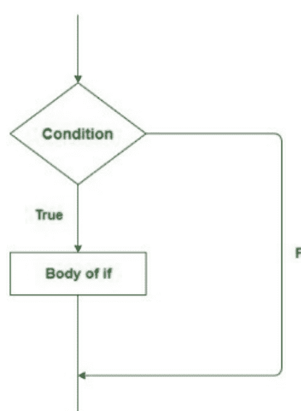
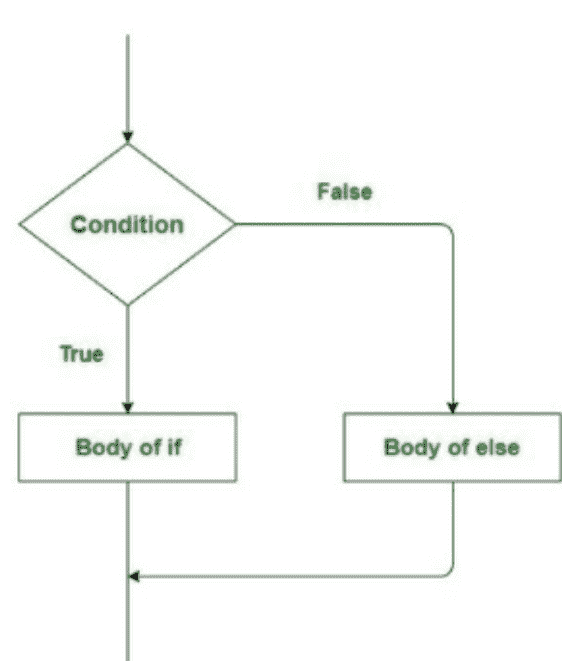
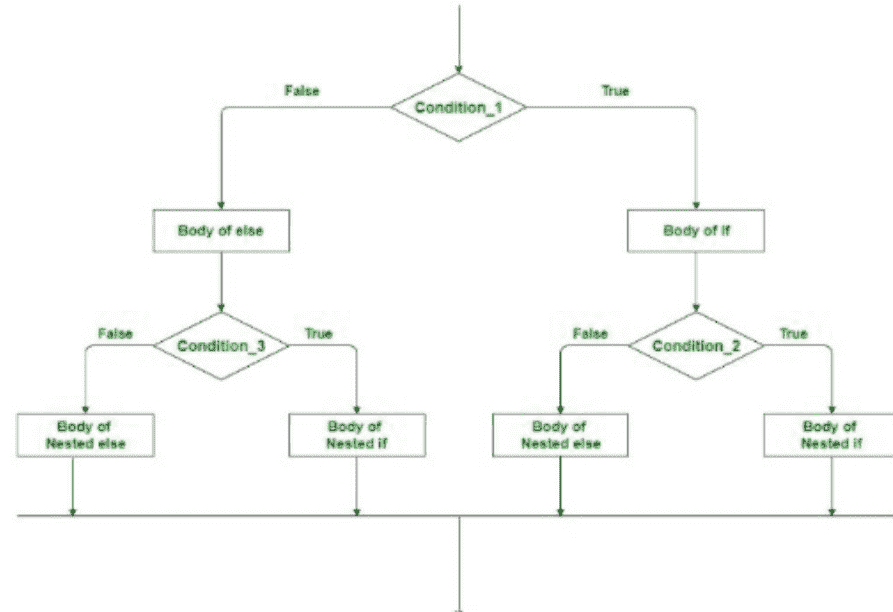
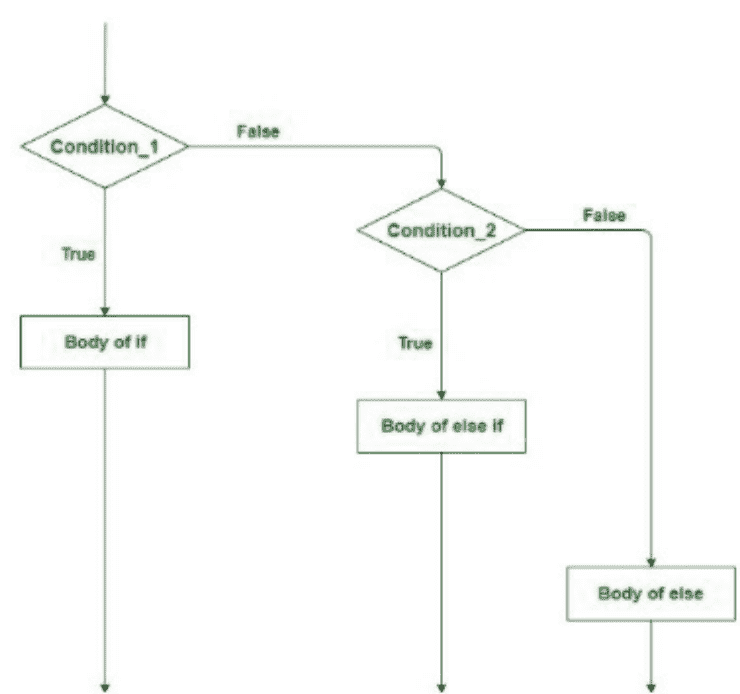
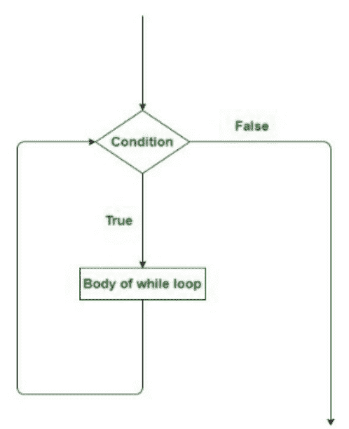
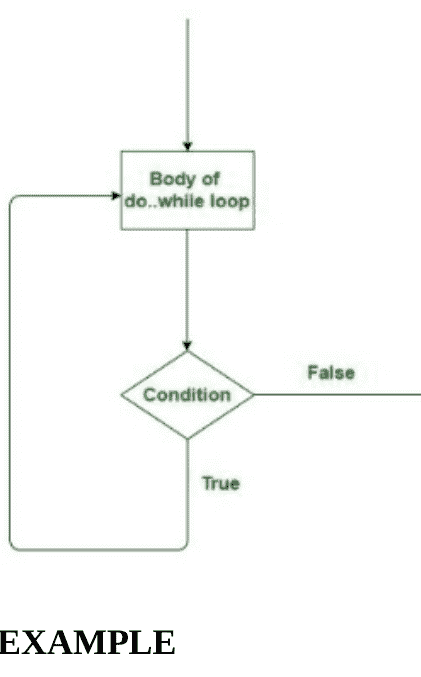

### PYTHON 编程示例

初学者编程指南

J KING

# SCALA 基础

初学者编程指南

J KING

# SCALA 基础与 PYTHON 编程示例

初学者编程指南

J KING

[SCALA 简介](SCALA INTRODUCTION)

[SCALA - 可扩展的语言](SCALA - SCALABLE LAUNGUAGE)

[SCALA 与 JAVA 对比](SCALA VS JAVA)

[PYTHON 与 SCALA 对比](PYTHON VS SCALA)

[SCALA 关键字](SCALA KEYWORDS)

[SCALA 标识符](SCALA IDENTIFIERS)

[SCALA 中的数据类型](DATA TYPES IN SCALA)

[SCALA 中变量的作用域](SCOPE OF VARIABLES IN SCALA)

[SCALA 范围](SCALA RANGES)

[SCALA 条件判断](SCALA DECISION MAKING)

[SCALA 循环](SCALA LOOPS)

### PYTHON 编程示例

[PYTHON 中字符的 ASCII 值](ASCII VALUE OF CHARACTER IN PYTHON)

[计算单利](CALCULATE SIMPLE INTEREST)

[计算复利](CALCULATE COMPOUND INTEREST)

[检查给定年份是否为闰年的 PYTHON 程序](PYTHON PROGRAM TO CHECK THE GIVEN YEAR IS A LEAP YEAR OR NOT)

[PYTHON | 简单 IF ELSE 的一些示例](PYTHON | SOME OF THE EXAMPLES OF SIMPLE IF ELSE)

[根据销售金额在 PYTHON 中计算折扣](CALCULATE DISCOUNT BASED ON THE SALE AMOUNT IN PYTHON)

[使用 IF ELIF 在 PYTHON 中设计一个简单计算器](DESIGN A SIMPLE CALCULATOR USING IF ELIF IN PYTHON)

[PYTHON 中的 BMI（身体质量指数）计算器](BMI (BODY MASS INDEX) CALCULATOR IN PYTHON)

[在 PYTHON 中编写函数以求给定数字的平方和立方](WRITE FUNCTIONS TO FIND SQUARE AND CUBE OF A GIVEN NUMBER IN PYTHON)

[计算净额](COMPUTE THE NET AMOUNT)

[在 PYTHON 程序中转换温度](CONVERT TEMPERATURE IN PYTHON PROGRAM)

[将米转换为码的 PYTHON 程序](PYTHON PROGRAM TO CONVERT METERS INTO YARDS)

[在 PYTHON 中查找星期几](FIND THE DAY IN PYTHON)

[PYTHON 数组程序](PYTHON ARRAY PROGRAMS)

[在 PYTHON 中创建矩阵](CREATE MATRIX IN PYTHON)

[使用 NUMPY 在 PYTHON 中创建矩阵的程序](PYTHON PROGRAM TO CREATE MATRIX USING NUMPY)

[PYTHON 日期与时间程序](PYTHON DATE & TIME PROGRAMS)

[打印今天年、月、日的 PYTHON 代码](PYTHON CODE TO PRINT TODAY'S YEAR, MONTH AND DAY)

# PYTHON 列表

- 在列表中添加、删除元素的程序
- 查找两个列表差集的程序
- 从列表中删除重复元素的程序
- 创建三个数字列表，分别包含数字、其平方和立方
- 以相反顺序迭代列表
- 删除偶数后打印列表

# PYTHON 字符串程序

- 声明、赋值和打印字符串（不同方式）
- 访问并打印字符串中的字符
- 打印字符串中单词及其长度的程序
- 统计字符串中的元音字母
- 使用乘法运算符创建字符串的多个副本

# 我们的其他出版物

# PYTHON 与 HADOOP 基础

# PYTHON 基础与 PYTHON 编程示例

# C# 与 C++ 编程示例

# PYTHON 编程与 C 编程示例

# C++ 与 JAVA 编程示例

# ANDROID 基础与 PYTHON 编程示例

- C# 基础与 PYTHON 编程示例
- ANGULAR 与 PYTHON 基础
- PYTHON 基础与 SCALA 编程示例
- JAVA 基础与 PYTHON 编程示例
- PYTHON 基础与 C# 编程示例
- ANDROID 基础与 JAVA 编程示例
- C# 基础与 C# 编程示例
- JAVASCRIPT 与 HTML 基础
- HTML 与 JAVASCRIPT 编程示例

# SCALA 基础

初学者编程指南

J KING

## SCALA 简介

Scala 是一种通用、高级、多范式的编程语言。它是一种纯粹的面向对象编程语言，同时也支持函数式编程方法。Scala 中没有原始数据定义，因为一切都是对象。Scala 程序可以转换为字节码，并在 JVM（Java 虚拟机）上运行。Scala 代表可扩展的语言。它还为 Javascript 提供运行时。Java 以及其他一些编程语言，如 Lisp、Haskell、Pizza 等，都深受 Scala 的影响。

## Scala 的演变：

Scala 由瑞士洛桑联邦理工学院（EPFL）的编程方法教师、德国计算机科学家 Martin Odersky 设计。Martin Odersky 也是 Funnel 编程语言、javac（Java 编译器）、Universal Java 和 EPFL 的共同创建者。他于 2001 年开始设计 Scala。Scala 于 2004 年首次作为 Java 平台上的第一个版本公开发布。2004 年 6 月，Scala 针对 .Net 框架进行了修订。随后，第二个版本（即 v2.0）于 2006 年推出。Scala 在 2012 年 JavaOne 大会上荣获 ScriptBowl 竞赛冠军。截至 2012 年 6 月，Scala 尚未支持 .Net 项目。Scala 的新更新版本是 2.12.6，于 2018 年 4 月 27 日发布。

## 为什么选择 SCALA

易于上手：Scala 是一种高级语言，因此与其他常见的编程语言（如 Java、C、C++）相似。因此，学习 Scala 非常方便。对于 Java 程序员来说，Scala 更容易理解。

融合最佳特性：Scala 融合了多种语言（如 C、C++、Java 等）的特性，使其功能更强大、更通用、更高效。

与 Java 紧密集成：Scala 的源代码结构允许其编译器理解 Java 类。编译器还可以使用模块、Java 库和工具等。Scala 程序编译后可以在 JVM 上运行。

基于 Web 和桌面应用程序开发：编译为 JavaScript 为 Web 应用程序提供支持。同样，它可以被翻译成 JVM 字节码用于桌面应用程序。

大型公司：许多大公司，如 Apple、Facebook、Amazon、Google 等，将其大部分代码从其他几种语言迁移到 Scala。它非常灵活，可用于后端操作。

由于 Scala 在语法上几乎接近其他常用语言，因此在 Scala 中编码和学习更为简单。在 Scala 中，可以使用任何广泛使用的文本编辑器（如 Notepad++、gedit 等）或任何文本编辑器编写程序。编写程序后，将文件保存为 .sc 或 .scala 扩展名。

适用于 Windows 和 Linux：在 Windows 或 Linux 上安装 Scala 之前，您的系统必须安装 Java 开发工具包（JDK）1.8 或更高版本。因为 Scala 始终在 Java 1.8 或更高版本上运行。

本文将讨论如何在在线 IDE 上运行 Scala 程序。

示例：Hello Geeks 是一个简单的打印应用程序！使用面向对象的方法。

```scala
// Scala 程序，使用面向对象的方法打印 Hello, Geeks!
// 创建对象
object Geeks {

    // 主方法
    def main(args: Array[String])
    {
        // 打印 Hello, Geeks!
        println("Hello, Geeks!")
    }
}
```

### 输出：

Hello, Geeks!

## SCALA - 可扩展的语言

一些因素，从语法细节到组件抽象构造，都会影响语言的可扩展性。Scala 使其灵活的关键特性在于它是面向对象编程和函数式编程的混合体。这为所有编程结构提供了强大的支持，例如高阶函数、优化的尾调用、不可变属性、模式匹配、多态、抽象、继承等。Scala 还包含自己的解释器，可用于直接执行指令，无需预先编译。另一个主要方面是并行集合库，旨在帮助开发者应对并发编程趋势。

另一个功能如下：

Scala 是紧凑的。它为后端活动提供了更好的支持。Scala 程序与 Java 类似，往往更短，最多可缩短 10 倍。它避免了代码反复出现以获得任何可能使 Java 程序紧张的结果。

示例：在 Java 中，一个带有构造函数的类：

```java
class Geek
{
    // 类的数据成员。
    String name;
    int id;
    // 构造函数将在创建该类对象时
    // 使用传递的参数值初始化数据成员。
    Geek(String name, int id)
```

## Scala 与 Java

Java 是一种通用的、并发的计算机编程语言，基于类、面向对象等。Java 应用程序被编译成字节码，可以在任何虚拟 Java 机器（JVM）上运行，与程序的架构无关。

Scala 是一种通用的、高级的、多范式的编程语言。它是一种纯粹的面向对象编程语言，同时也遵循函数式编程的方法。它没有原始数据定义，因为 Scala 中的一切都是一个实体。它旨在以一种精简、简洁和类型安全的方式表达编程的通用模式。

| SCALA | JAVA |
|---|---|
| Scala 是面向对象和函数式编程的混合体。 | Java 是一种通用的面向对象语言。 |
| 由于嵌套代码，Scala 的可读性较低。 | Java 的可读性更高。 |
| 将源代码编译成字节码的过程较慢。 | 将源代码编译成字节码的过程很快。 |
| Scala 支持运算符重载。 | Java 不支持运算符重载。 |
| Scala 支持惰性求值。 | Java 不支持惰性求值。 |
| Scala 不向后兼容。 | Java 向后兼容，这意味着在新版本中编写的代码也可以在旧版本中运行而不会出错。 |
| Scala 中的任何方法或函数都被视为变量。 | Java 将函数视为对象。 |
| 在 Scala 中，代码以紧凑的形式编写。 | 在 Java 中，代码以冗长的形式编写。 |
| Scala 变量默认是不可变类型。 | Java 变量默认是可变类型。 |
| Scala 将一切视为类的实例，与 Java 相比，它是一种更面向对象的语言。 | 由于原始类型和静态成员的存在，与 Scala 相比，Java 的面向对象程度较低。 |
| Scala 不包含 static 关键字。 | Java 包含 static 关键字。 |
| 在 Scala 中，对实体的所有操作都是通过方法调用完成的。 | 在 Java 中，运算符的处理方式不同，不是通过方法调用完成的。 |

## Python 与 Scala

Python 是一种高级的、解释型的、通用的动态编程语言，注重代码的可读性。Python 包含较少的编程元素，提供新的库、快速原型设计和一系列新功能。

Scala 是一种高级的面向对象编程语言。Scala 源代码的构建方式使其编译器能够解释 Java 类。

| PYTHON | SCALA |
|---|---|
| Python 是一种动态类型语言。 | Scala 是一种静态类型语言。 |
| 我们不需要在 Python 中指定对象，因为它是一种动态类型的面向对象编程语言。 | 我们需要在 Scala 中指定变量和对象的类型，因为 Scala 是一种静态类型的面向对象编程语言。 |
| Python 易于学习和使用。 | Scala 比 Python 更容易学习。 |
| 在运行时为解释器创建了额外的工作。 | Scala 中没有创建额外的工作，因此它比 Python 快 10 倍。 |
| 数据类型在运行时由它决定。 | Scala 的情况并非如此，这就是为什么在处理大数据时，应该考虑使用 Scala 而不是 Python。 |
| 与 Scala 相比，Python 的社区非常庞大。 | Scala 也有良好的社区支持。但仍然少于 Python。 |
| Python 支持重量级的进程分叉，但不支持适当的多线程。 | Scala 具有响应式内核和一系列异步库，因此 Scala 是实现并发的更好选择。 |
| 由于 Python 是动态编程语言，其方法论要复杂得多。 | Scala 中的测试要好得多，因为它是一种静态类型语言。 |
| 它因其类似英语的语法而广受欢迎。 | 对于可扩展和并发系统，Scala 发挥着更大的作用。 |
| Python 对于开发人员来说很容易编写代码。 | Scala 比 Python 更容易学习，但在 Scala 中编写代码很困难。 |
| Python 中有一个接口可以访问许多操作系统调用和库。它有许多解释器。 | 它基本上是一种编译语言，所有源代码在执行前都会被编译。 |
| 每当对现有代码进行任何更改时，Python 语言都极易出现错误。 | Scala 中没有出现此类问题。 |
| Python 拥有用于机器学习、适当的数据科学工具和自然语言处理（NLP）的库。 | 而 Scala 没有这样的工具。 |
| Python 可用于小型项目。 | Scala 可用于大型项目。 |
| 它不提供可扩展的功能支持。 | 它提供可扩展的功能支持。 |

### Scala 关键字

关键字或保留字是任何内部方法使用的词，或代表语言中任何预定义的操作。因此，不允许将这些术语用作变量名或对象名。这可能会导致编译时错误。

### 示例

```scala
// Scala 程序用于说明关键字

// 这里 object、def 和 var 是有效的关键字
object Main
{
    def main(args: Array[String])
    {
        var p = 10
        var q = 30
        var sum = p + q
        println("The sum of p and q is :"+sum);
    }
}
```

#### 输出

The sum of p and q is :40

### Scala 关键字

| | | | | |
|---|---|---|---|---|
| abstract | finally | object | trait | ⇒ |
| case | for | override | true | => |
| catch | forSome | package | try | = |
| class | if | private | type | <% |
| def | implicit | protected | val | <: |
| do | import | return | var | ← |
| else | lazy | sealed | while | <- |
| extends | match | super | with | # |
| false | new | this | yield | @ |
| final | null | throw | >: | : |

### 示例

```scala
// Scala 程序用于说明关键字

// 这里 class 关键字用于创建一个新类
// def 关键字用于创建函数
// var 关键字用于创建一个变量
class GFG
{
    var name = "Tamsel"
    var age = 20
    var branch = "Computer Science"
    def show()
    {
        println("Hello! my name is " + name + "and my age is"+age);
        println("My branch name is " + branch);
    }
}

// object 关键字用于定义
// 一个对象 new 关键字用于
// 创建给定类的一个对象
object Main
{
    def main(args: Array[String])
    {
        var ob = new GFG();
        ob.show();
    }
}
```

#### 输出

Hello! my name is Tamseland my age is20

My branch name is Computer Science

## Scala 标识符

标识符用于编程语言中的识别目的。在 Scala 中，可以使用类名、方法名、变量名或对象名。

### 示例

```scala
class GFG{
    var a: Int = 20
}
object Main {
    def main(args: Array[String]) {
        var ob = new GFG();
    }
}
```

在上面的例子中

- **GFG**：类名
- **a**：变量名
- **Main**：对象名
- **main**：方法名
- **args**：变量名
- **ob**：对象名

标识符存在

定义有效的 Scala ID 有一些规则。应遵守这些规则，否则将发生编译时错误。

- Scala ID 区分大小写。
- 你不能使用 Scala 的关键字作为标识符。
- 保留字不能用作标识符，例如 $etc。
- Scala 只允许使用以下四种标识符类型创建的标识符。
- 标识符的长度没有限制，但建议使用 4 – 15 个字母的最佳长度。
- 数字不应作为标识符的开头（[0-9]）。例如，"123geeks" 不是有效的 Scala ID。

### 示例

```scala
// Scala 程序演示
// 标识符

object Main
{
    // 主方法
    def main(args: Array[String])
    {
        // 有效的标识符
        var `name` = "Siya";
        var _age = 20;
        var Branch = "Computer Science";
        println("Name:" + `name`);
        println("Age:" + _age);
        println("Branch:" + Branch);
    }
}
```

#### 输出

Name:Siya
Age:20
Branch:Computer Science

年龄：20
专业：计算机科学

### Scala 标识符的类型

**字母数字标识符：** 这些标识符以字母（大写或小写）或下划线开头，后跟字母、数字或下划线。

**字母数字标识符示例**

**_GFG, geeks123, _1_Gee_23, Geeks**

### 示例

```scala
// Scala 程序演示
// 字母数字标识符

object Main
{
    // 主方法
    def main(args: Array[String])
    {
        // main, _name1, 和 Tuto_rial 是
        // 有效的字母数字标识符
        var _name1: String = "ScalaforGeeks"
        var Tuto_rial: String = "Scala"
        println(_name1);
        println(Tuto_rial);
    }
}
```

### 输出：

ScalaforGeeks
Scala

**运算符标识符**：这些标识符包含一个或多个运算符字符，例如 +, ;, , ? , ~, # 等。

```scala
// Scala 程序演示
// 运算符标识符

object Main
{
    // 主方法
    def main(args: Array[String])
    {
        // main, x, y, 和 sum 是有效的
        // 字母数字标识符
        var x:Int = 20;
        var y:Int = 10;
        // 这里，+ 是一个运算符标识符
        // 用于将两个值相加
        var sum = x + y;
        println("Display the result of + identifier:");
        println(sum);
    }
}
```

### 输出：

Display the result of + identifier:
30

**混合标识符：** 这些标识符包含字母数字标识符和运算符标识符。

### 示例

```scala
// Scala 程序演示
// 混合标识符

object Main
{
    // 主方法
    def main(args: Array[String])
    {
        // num_+ 是一个有效的混合标识符
        var num_+ = 20;
        println("Display the result of mixed identifier:");
        println(num_+);
    }
}
```

**字面量标识符：** 这些标识符是附加了用反引号（'...'）括起来的任意字符串的标识符。

### 示例

```scala
// Scala 程序演示
// 字面量标识符

object Main
{
    // 主方法
    def main(args: Array[String])
    {
        // `name` 和 `age` 是有效的字面量标识符
        var `name` = "Siya"
        var `age` = 20
        println("Name:" + `name`);
        println("Age:" + `age`);
    }
}
```

### 输出：

Name: Siya
Age: 20

## Scala 中的数据类型

数据类型是一种数据分类，它告诉编译器变量具有什么类型的值。例如，如果一个变量具有 int 数据类型，它就有一个数值。在 Scala 中，数据类型在长度和存储方面与 Java 类似。在 Scala 中，数据类型被视为相同的对象，因此数据类型的首字母是大写的。

Scala 中可用的数据类型如下表所示：

| 数据类型 | 默认值 | 描述 |
| :--- | :--- | :--- |
| **Boolean** | False | 真或假 |
| **Byte** | 0 | 8 位有符号值。范围：-128 到 127 |
| **Short** | 0 | 16 位有符号值。范围：-2<sup>15</sup> 到 2<sup>15</sup>-1 |
| **Char** | ‘\u000’ | 16 位无符号 Unicode 字符。范围：0 到 2<sup>16</sup>-1 |
| **Int** | 0 | 32 位有符号值。范围：-2<sup>31</sup> 到 2<sup>31</sup>-1 |
| **Long** | 0L | 64 位有符号值。范围：-2<sup>63</sup> 到 2<sup>63</sup>-1 |
| **Float** | 0.0F | 32 位 IEEE 754 单精度浮点数 |
| **Double** | 0.0D | 64 位 IEEE 754 双精度浮点数 |
| **String** | null | 字符序列 |
| **Unit** | – | 对应于无值。 |
| **Nothing** | – | 它是所有其他类型的子类型，不包含任何值。 |
| **Any** | – | 它是所有其他类型的超类型 |
| **AnyVal** | – | 它用作值类型。 |
| **AnyRef** | – | 它用作引用类型。 |

### 示例

```scala
// Scala 程序说明数据类型
object Test
{
    def main(args: Array[String])
    {
        var a: Boolean = true
        var a1: Byte = 126
        var a2: Float = 2.45673f
        var a3: Int = 3
        var a4: Short = 45
        var a5: Double = 2.93846523
        var a6: Char = 'A'
        if (a == true)
        {
            println("boolean:scalaforgeeks")
        }
        println("byte:" + a1)
        println("float:" + a2)
        println("integer:" + a3)
        println("short:" + a4)
        println("double:" + a5)
        println("char:" + a6)
    }
}
```

### 输出：

boolean: scalaforgeeks
byte: 126
float: 2.45673
integer: 3
short: 45
double: 2.93846523
char: A

变量只是存储的位置。每个变量通过名称来标识，并存储一些已知和未知的信息，称为值。

数据类型负责为变量分配内存，因此可以通过数据类型和名称来定义变量。

Scala 中有两种类型的变量：

- 可变变量
- 不可变变量

让我们详细了解每种变量。

### 可变变量：

这些变量允许我们在变量声明后更改其值。

使用 `var` 关键字定义可变变量。

数据类型的首字母应大写，因为在 Scala 数据类型中它被视为对象。

**语法：**

```scala
var Variable_name: Data_type = "value";
```

**例如：**

```scala
var name: String = "scalaforgeeks";
```

### 不可变变量：

这些变量不允许在变量声明后更改其值。

不可变变量使用 `val` 关键字定义。
首字母应大写，因为在 Scala 数据类型中它被视为对象。

### 语法：

```scala
val Variable_name: Data_type = "value";
```

### 例如：

```scala
val name: String = "scalaforgeeks";
```

## Scala 中变量命名规则

变量名可以包含字母、数字和两个特殊字符：下划线 (_) 和美元符号 ($)。
变量名中不允许有空格。
变量名不得包含保留字或关键字。
变量名必须以字母开头。

## Scala 中变量的作用域

Scala 变量有三种作用域。

- 字段。
- 方法参数。
- 局部变量。

### 字段

如果我们使用正确的访问修饰符声明这些变量，就可以从对象中的任何方法以及从对象外部访问它们。

字段可以是可变的或不可变的，可以使用 'var' 或 'val' 来定义它们。

### 示例

```scala
// Scala 变量字段作用域的 Scala 程序

// 创建包含字段变量 x 和 y 的类。
class disp
{
    var x = 10.3f
    var y = 7f
    def windet()
    {
        println("Value of x : "+x)
    }
    println("Value of y : "+y);
}

object Example
{
    // 主方法
    def main(args:Array[String])
    {
        val Example = new disp()
        Example.windet()
    }
}
```

### 输出：

Value of y : 7.0
Value of x : 10.3

### 方法参数

当我们调用方法时，如果想向方法内部传递值，就会使用这些变量。

如果存在从方法外部到对象的引用，则可以在方法内部和外部访问它们。

这些变量始终是可变的，使用关键字 'val'。

### 示例

```scala
// Scala 变量方法作用域的 Scala 程序

// 创建包含方法变量 s1 和 s2 的类。
class rect
{
    def mult(s1: Int, s2: Int)
    {
        var result = s1 * s2
        println("Area is: " + result);
    }
}

object Area
{
    // 主方法
    def main(args:Array[String])
    {
        val su = new rect()
        su.mult(5, 10)
    }
}
```

### 输出：

Area is: 50

### 局部变量

这些变量在方法内部声明，只能在该方法内部访问。

这些变量可以是可变的或不可变的，使用关键字 'var' 和 'val'。

### 示例

```scala
// Scala 变量方法作用域的 Scala 程序

// 创建包含局部变量 s1 和 s2 的类。
class Area
{
    def mult()
    {
        var(s1, s2) = (3, 80);
        var s = s1 * s2;
        println("Area is: " + s)
    }
}

object Test
{
    // 主方法
    def main(args:Array[String])
    {
        val ex = new Area()
        ex.mult()
    }
}
```

### 输出：

Area is: 240

## Scala 范围

Scala 范围可以定义为一系列均匀分布的整数。

它有助于以更少的方法提供更强的功能，因此这里执行的操作非常快。

范围可用于迭代循环。

可以通过某些预定义的方法获得，即 `until`、`by` 和 `to`。

定义了三个常量，即（起始值、结束值和增量值）。

**语法：**
`val range = Range(x, y, z)`

**示例**

```scala
// Scala 范围程序

// 创建对象
object GFG
{
    // 主方法
    def main(args: Array[String])
    {
        // 应用 range 方法
        val x = Range(3, 10, 1)

        // 显示给定范围
        println(x)

        // 显示给定范围的起始值
        println(x(0))

        // 显示给定范围的最后一个值
        println(x.last)
    }
}
```

**输出**

```
Range(3, 4, 5, 6, 7, 8, 9)
3
9
```

### 范围 - 执行的操作

如果我们想要一个包含结束值的范围，也可以使用 `until` 方法，两种方法（**until 和 Range**）用于相同的目的。

**示例**

```scala
// Scala 范围程序

// 创建对象
object GFG
{
    // 主方法
    def main(args: Array[String])
    {
        // 应用 range 方法
        val x = Range(0, 10, 2)

        // 应用 until 方法
        val y = 0 until 10 by 2

        // 如果两种方法等效则显示 true
        println(x == y)
    }
}
```

**输出：**

```
True
```

范围的“上界”可以设为包含。

**示例**

```scala
// Scala 范围程序

// 创建对象
object GFG
{
    // 主方法
    def main(args: Array[String])
    {
        // 应用 range 方法
        val x = Range(1, 8)

        // 包含上界
        val y = x.inclusive

        // 显示范围的所有元素
        println(y)
    }
}
```

**输出：**

```
Range(1, 2, 3, 4, 5, 6, 7, 8)
```

这里使用 **inclusive** 来包含范围的上界。

如果需要整数值范围，请使用 **to** 方法（`to` 和 `inclusive` 范围是等效的）。

**示例**

```scala
// Scala 范围程序

// 创建对象
object GFG
{
    // 主方法
    def main(args: Array[String])
    {
        // 应用 range 方法
        val x = Range(1, 8)

        // 包含上界
        val y = x.inclusive

        // 应用 'to' 方法
        val z = 1 to 8

        // 如果两种方法相等则显示 true
        println(y == z)
    }
}
```

**输出：**

```
True
```

## Scala 决策

#### (if, if-else, 嵌套 if-else, if-else if)

编程中的决策类似于现实生活中的决策。当满足给定条件时，决策中会执行一段代码。这些有时也被称为控制流语句。Scala 使用控制语句根据特定条件控制程序的执行流程。它们用于根据程序状态的变化来推进和分支执行流程。

**条件语句**

- if
- if-else
- 嵌套 if-else
- if-else if 梯形结构

#### if 语句

“if”语句是所有决策语句中最简单的决策语句。在此语句中，只有当给定条件为真时，代码块才会被执行；如果条件为假，则该代码块将不会被执行。

**语法：**

```scala
if(condition)
{
    // 要执行的代码
}
```

**流程图**



**示例**

```scala
// 说明 if 语句的 Scala 程序
object Test {
    // 主方法
    def main(args: Array[String]) {
        // 取一个变量
        var a: Int = 50

        if (a > 30)
        {
            // 此语句将执行，因为 a > 30
            println("ScalaforGeeks")
        }
    }
}
```

**输出：**

```
ScalaforGeeks
```

#### if-else 语句

单独的 if 语句告诉我们，如果条件为真，它将执行一个语句块；如果条件为假，则不会执行。

但是，如果我们想在条件错误时做些不同的事情呢？

这时就用到了 **else** 语句。

当条件错误时，我们可以将 else 语句与 if 语句一起使用来执行一段代码。

**语法：**

```scala
if (condition)
{
    // 如果条件为真则执行此块
}
else
{
    // 如果条件为假则执行此块
}
```

**流程图**



**示例**

```scala
// 说明 if-else 语句的 Scala 程序
object Test {
    // 主方法
    def main(args: Array[String]) {
        // 取一个变量
        var a: Int = 650

        if (a > 698)
        {
            // 此语句将不会执行，因为 a > 698 为假
            println("ScalaorGeeks")
        }
        else
        {
            // 此语句将执行
            println("Sudo Placement")
        }
    }
}
```

**输出**

```
Sudo Placement
```

#### 嵌套 if-else 语句

嵌套 if 是一个 if 语句作为另一个 if-else 语句的目标。

嵌套 if-else 语句指的是在 if 语句或 else 语句内部的 if-else 语句。

Scala 允许我们将 if-else 语句嵌套到 if-else 语句中。

**语法：**

```scala
// 当 condition_1 为真时执行
if (condition_1)
{
    if (condition_2)
    {
        // 当 condition_2 为真时执行
    }
    else
    {
        // 当 condition_2 为假时执行
    }
}

// 当 condition_1 为假时执行
else
{
    if (condition_3)
    {
        // 当 condition_3 为真时执行
    }
    else
    {
        // 当 condition_3 为假时执行
    }
}
```

**流程图**



**示例**

```scala
// 说明嵌套 if-else 语句的 Scala 程序
object Test {
    // 主方法
    def main(args: Array[String]) {
        // 取三个变量
        var a: Int = 70
        var b: Int = 40
        var c: Int = 100

        // condition_1
        if (a > b)
        {
            // condition_2
            if(a > c)
            {
                println("a is largest");
            }
            else
            {
                println("c is largest")
            }
        }
        else
        {
            // condition_3
            if(b > c)
            {
                println("b is largest")
            }
            else
            {
                println("c is largest")
            }
        }
    }
}
```

**输出：**

```
c is largest
```

#### if-else if 梯形结构

这里用户可以在多个选项之间进行选择。if 声明从上到下执行。一旦控制 if 的条件之一为真；那么与该“if”关联的语句就会被执行，并跳过梯形结构的其余部分。如果没有任何条件为真，则最终的 other 声明将被执行。

**语法：**

```scala
if(condition_1)
{
    // 当 condition_1 为真时执行此块
}
else if(condition_2)
{
    // 当 condition_2 为真时执行此块
}
else
{
    // 当没有条件为真时执行此块
}
```

**流程图**



**示例**

```scala
// 说明 if-else-if 梯形结构的 Scala 程序
object Test {
    // 主方法
    def main(args: Array[String]) {
        // 取一个变量
        var value: Int = 50

        if (value == 20)
        {
            // 当上述条件为真时打印 "value is 20"
            println("Value is 20")
        }
        else if (value == 25)
        {
            // 当上述条件为真时打印 "value is 25"
            println("Value is 25")
        }
        else if (value == 40)
        {
            // 当上述条件为真时打印 "value is 40"
            println("Value is 40")
        }
        else
        {
            // 当所有条件为假时打印 "No Match Found"
            println("No Match Found")
        }
    }
}
```

**输出**

```
No Match Found
```

## SCALA 循环

编程语言中的循环是一个特性，它便于在某个条件求值为真时重复执行一组指令/函数。

循环使程序员的任务更简单。

Scala 提供了各种循环类型来处理程序中基于条件的情况。

在 Scala 中，循环有：

- while 循环
- do..while 循环
- for 循环
- 嵌套循环

#### WHILE 循环

while 循环通常在括号中接受一个条件。

如果条件为真，代码将在 while 循环的主体内执行。

当我们不知道希望循环执行多少次但知道循环终止条件时，使用 while 循环。

它也被称为由入口控制的循环，因为条件在循环执行之前被检查。

while 循环可以看作是 if 语句的重复。

**语法：**

```scala
while (condition)
```

### 流程图



### 示例

```scala
// Scala program to illustrate while loop
object whileLoopDemo
{
    // Main method
    def main(args: Array[String])
    {
        var x = 1;

        // Exit when x becomes greater than 4
        while (x <= 4)
        {
            println("Value of x: " + x);

            // Increment the value of x for
            // next iteration
            x = x + 1;
        }
    }
}
```

### 输出：

Value of x: 1

Value of x: 2

Value of x: 3

Value of x: 4

#### do..while 循环

do .. while 循环与 ‘while 循环’ 几乎相同。
唯一的区别是 do .. while 循环至少会执行一次。
在第一次执行后，才会检查条件。当我们希望循环至少运行一次时，就使用 do .. while 循环。
它也被称为退出型循环控制，因为条件是在循环执行之后才被检查的。

### 语法：

```scala
do {
    // statements to be Executed
} while(condition);
```

### 流程图



### 示例

```scala
// Scala program to illustrate do..while loop
object dowhileLoopDemo
{
    // Main method
    def main(args: Array[String])
    {
        var a = 10;

        // using do..while loop
        do
        {
            print(a + " ");
            a = a - 1;
        }while(a > 0);
    }
}
```

### 输出：

10 9 8 7 6 5 4 3 2 1

#### For 循环

For 循环 - 功能与 while 循环类似

但语法不同。

它基本上是一种重复控制结构，允许程序员编写一个需要执行特定次数的循环。

### 示例

```scala
// Scala program to illustrate for loop
object forloopDemo {
    // Main Method
    def main(args: Array[String]) {
        var y = 0;
        // for loop execution with range
        for(y <- 1 to 7)
        {
            println("Value of y is: " + y);
        }
    }
}
```

### 输出：

Value of y is: 1
Value of y is: 2
Value of y is: 3
Value of y is: 4
Value of y is: 5
Value of y is: 6
Value of y is: 7

#### 嵌套循环

循环内部的循环被称为嵌套循环。
它可能包含一个 **while 循环** 在另一个 while 循环内部，
或者一个 **for 循环** 在另一个 for 循环内部。
while 循环也可能包含 for 循环，反之亦然。

### 示例

```scala
// Scala program to illustrate nested loop
object nestedLoopDemo {
    // Main Method
    def main(args: Array[String]) {
        var a = 5;
        var b = 0;
        // outer while loop
        while (a < 7)
        {
            b = 0;
            // inner while loop
            while (b < 7 )
            {
                // printing the values of a and b
                println("Value of a = " +a, " b = "+b);
                b = b + 1;
            }
            // new line
            println()
            // incrementing the value of a
            a = a + 1;
            // displaying the updated value of a
            println("Value of a Become: "+a);
            // new line
            println()
        }
    }
}
```

#### 输出

(Value of a = 5, b = 0)
(Value of a = 5, b = 1)
(Value of a = 5, b = 2)
(Value of a = 5, b = 3)
(Value of a = 5, b = 4)
(Value of a = 5, b = 5)
(Value of a = 5, b = 6)

Value of a Become: 6

(Value of a = 6, b = 0)
(Value of a = 6, b = 1)
(Value of a = 6, b = 2)
(Value of a = 6, b = 3)
(Value of a = 6, b = 4)
(Value of a = 6, b = 5)
(Value of a = 6, b = 6)

Value of a Become: 7

### PYTHON 编程示例

### 初学者编程

J KING

### PYTHON 编程示例

### Python 中字符的 ASCII 值

在 Python 中，我们使用函数 `ord()` 来获取字符的 ASCII 码。`ord()` 接受一个字符，返回其 ASCII 值。

**语法：**
`ord(character);`

**示例：**
输入：
`char_var = 'A'`

函数调用：
`ord(char_var)`

输出：
`65`

### 查找字符 ASCII 值的代码

```python
# python program to print ASCII
# value of a given character

# Assigning character to a variable
char_var = 'A'
# printing ASCII code
print("ASCII value of " + char_var + " is = ", ord(char_var))

char_var = 'x'
# printing ASCII code
print("ASCII value of " + char_var + " is = ", ord(char_var))

char_var = '9'
# printing ASCII code
print("ASCII value of " + char_var + " is = ", ord(char_var))
```

#### 输出

ASCII value of A is = 65
ASCII value of x is = 120
ASCII value of 9 is = 57

### 计算单利

我们使用以下公式计算单利：

`(P * R * T) / 100`

其中，

- **P** – 本金
- **R** – 利率，以及
- **T** – 时间（以年为单位）

**示例：**

输入：

`p = 250000`

`r = 36`

`t = 1`

```python
# formula
si = (p*r*t)/100
print(si)
```

输出：

`90000`

### Python 单利程序

```python
# Python program to find simple interest
p = float(input("Enter the principle amount : "))
r = float(input("Enter the rate of interest : "))
t = float(input("Enter the time in the years: "))

# calculating simple interest
si = (p*r*t)/100

# printing the values
print("Principle amount: ", p)
print("Interest rate   : ", r)
print("Time in years   : ", t)
print("Simple Interest : ", si)
```

#### 输出

第一次运行：

Enter the principle amount : 10000

Enter the rate of interest : 3.5

Enter the time in the years: 1

Principle amount:  10000.0

Interest rate   : 3.5

Time in years   :  1.0

Simple Interest :  350.0

第二次运行：

Enter the principle amount : 250000

Enter the rate of interest : 36

Enter the time in the years: 1

Principle amount: 250000.0

Interest rate : 36.0

Time in years : 1.0

Simple Interest : 90000.0

### 计算复利

我们使用下面的公式计算复利：

**P(1 + R / 100)^T**

其中，

**P** – 本金

**R** – 利率，以及

**T** – 时间（以年为单位）

#### 示例：

输入：

`p = 250000`

`r = 36`

`t = 1`

```python
# formula
ci = p * (pow((1 + r / 100), t))
print(ci)
```

输出：

`339999.99999999994`

### Python 程序

```python
# Python program to find compound interest

p = float(input("Enter the principle amount : "))
r = float(input("Enter the rate of interest : "))
t = float(input("Enter the time in the years: "))

# calculating compound interest
ci = p * (pow((1 + r / 100), t))

# printing the values
print("Principle amount : ", p)
print("Interest rate    : ", r)
print("Time in years    : ", t)
print("compound Interest : ", ci)
```

#### 输出

第一次运行：

Enter the principle amount : 10000
Enter the rate of interest : 3.5
Enter the time in the years: 1
Principle amount : 10000.0
Interest rate    : 3.5
Time in years    : 1.0
compound Interest : 10350.0

第二次运行：

Enter the principle amount : 250000

Enter the rate of interest : 36

Enter the time in the years: 1

Principle amount : 250000.0

Interest rate : 36.0

Time in years : 1.0

compound Interest : 339999.99999999994

### Python 程序：检查给定年份是否为闰年

闰年是指能被 4 整除的年份，但世纪年（以 00 结尾的年份）除外。世纪年如果能被 400 整除，则是闰年。这里，用户提供一个年份，我们将测试该年份是否为闰年。我们可以通过两种方式解决这个问题：第一种是使用 `calendar` 模块，第二种是简单地检查闰年的状态。

#### 1) 使用 calendar 模块

在解决问题之前，我们先简单了解一下 `calendar` 模块。`calendar` 模块是 Python 的内置模块，它提供了各种函数来解决与日期、月份和年份相关的问题。

#### 程序

```python
# importing the module
import calendar

# input the year
year=int(input('Enter the value of year: '))
leap_year=calendar.isleap(year)

# checking leap year
if leap_year: # to check condition
    print('The given year is a leap year.')
else:
    print('The given year is a non-leap year.')
```

#### 输出

运行 1：

Enter the value of year: 2020
The given year is a leap year.

运行 2：

Enter the value of year: 2021
The given year is a non-leap year.

#### 2) 简单检查法

如我们所知，要测试给定的年份是否为闰年。因此，我们将在这里引入条件，并尝试编写 Python 程序。

#### 程序

```python
# input the year
y=int(input('Enter the value of year: '))

# To check for non century year
if y%400==0 or y%4==0 and y%100!=0:
    print('The given year is a leap year.')
else:
    print('The given year is a non-leap year.')
```

#### 输出

运行 1：

Enter the value of year: 2020
The given year is a leap year.

运行 2：

Enter the value of year: 2000
The given year is a leap year.

### Python | 简单 if else 示例

示例1：输入一个数字并检查它是否为10

```
a=int(input("Enter A : "))

if a==10:
    print("Equal to 10")
else:
    print("Not Equal to 10")
```

输出

Enter A : 10

Equal to 10

示例2：找出两个数中较大的一个

```
a=int(input("Enter A: "))
b=int(input("Enter B: "))

if a>b:
    g=a
else:
    g=b

print("Greater = ",g)
```

输出

Enter A: 36
Enter B: 24
Greater = 36

#### 示例3：使用单条语句找出两个数中较大的一个

```
a=int(input("Enter A: "))
b=int(input("Enter B: "))

c= a if a>b else b

print("Greater = ",c)
```

#### 输出

Enter A: 24
Enter B: 36
Greater = 36

### 根据销售金额计算折扣（Python）

折扣率如下：

| 金额 | 折扣 |
|---|---|
| 0-5000 | 5% |
| 5000-15000 | 12% |
| 15000-25000 | 20% |
| 25000以上 | 30% |

**程序：**

```
# 输入销售金额
amt = int(input("Enter Sale Amount: "))

# 检查条件并计算折扣
if(amt>0):
    if amt<=5000:
        disc = amt*0.05
    elif amt<=15000:
        disc=amt*0.12
    elif amt<=25000:
        disc=0.2 * amt
    else:
        disc=0.3 * amt

    print("Discount :",disc)
    print("Net Pay :",amt-disc)
else:
    print("Invalid Amount")
```

#### 输出

Enter Sale Amount: 30000

Discount : 9000.0

Net Pay : 21000.0

### 使用 if elif 设计一个简单的计算器（Python）

给定两个数字，我们将构建一个计算器类型的程序，使用Python进行加、减、乘、除运算。

#### 示例：

消息：
Calculator
1.Add
2.Substract
3.Multiply
4.Divide

输入：
Enter Choice(1-4): 3
Enter A:10
Enter B:20

输出：
Product = 200

#### 程序

```
# 菜单
print("Calculator")
print("1.Add")
print("2.Substract")
print("3.Multiply")
print("4.Divide")

# 输入选择
ch=int(input("Enter Choice(1-4): "))

if ch==1:
    a=int(input("Enter A:"))
    b=int(input("Enter B:"))
    c=a+b
    print("Sum = ",c)
elif ch==2:
    a=int(input("Enter A:"))
    b=int(input("Enter B:"))
    c=a-b
    print("Difference = ",c)
elif  ch==3:
    a=int(input("Enter A:"))
    b=int(input("Enter B:"))
    c=a*b
    print("Product = ",c)
elif ch==4:
    a=int(input("Enter A:"))
    b=int(input("Enter B:"))
    c=a/b
    print("Quotient = ",c)
else:
    print("Invalid Choice")
```

#### 输出

Calculator

1. Add
2. Substract
3. Multiply
4. Divide

Enter Choice(1-4): 3

Enter A:10

Enter B:20

Product = 200

### BMI（身体质量指数）计算器（Python）

**示例：**

输入：
Height = 1.75
Weight = 64

输出：
BMI is: 20.89 and you are: Healthy

#### 程序

```
# 从用户获取输入并赋值给变量

height = float(input("Enter height in meters: "))
weight = float(input("Enter weight in kg: "))

# 计算bmi的公式

bmi = weight/(height**2)
# ** 是幂运算符，在此例中即 height*height

print("Your BMI is: {0} and you are: ".format(bmi), end="")

# 条件判断
if ( bmi < 16):
    print("severely underweight")

elif ( bmi >= 16 and bmi < 18.5):
    print("underweight")

elif ( bmi >= 18.5 and bmi < 25):
    print("Healthy")

elif ( bmi >= 25 and bmi < 30):
    print("overweight")

elif ( bmi >=30):
    print("severely overweight")
```

#### 输出

Enter height in meters: 1.75
Enter weight in kg: 64
Your BMI is: 20.897959183673468 and you are: Healthy

### 编写函数来求给定数字的平方和立方（Python）

**示例：**

输入：

Enter an integer number: 6

输出：

Square of 6 is 36

Cube of 6 is 216

**求平方的函数：**

```
def square (num):
    return (num*num)
```

**求立方的函数：**

```
def cube (num):
    return (num*num*num)
```

**程序**

```
# 求给定数字平方和立方的Python程序

# 用户定义的求平方方法
def square (num):
    return (num*num)

# 用户定义的求立方方法
def cube (num) :
    return (num*num*num)

# 主代码
# 输入一个数字
number = int (input("Enter an integer number: "))

# 计算平方和立方
print("square of {0} is {1}".format(number, square(number)))
print("Cube of {0} is {1}".format(number, cube (number)))
```

#### 输出

Enter an integer number: 6

square of 6 is 36

Cube of 6 is 216

### 根据交易计算银行账户的净额

**示例：**

输入：

Enter transactions: D 10000

Want to continue (Y for yes): Y

Enter transaction: W 5000

Want to continue (Y for yes): Y

Enter transaction: D 2000

Want to continue (Y for yes): Y

Enter transaction: W 100

Want to continue (Y for yes): N

输出：

Net amount: 6900

#### 程序

```
# 根据输入计算银行净额
# "D" 代表存款，"W" 代表取款

# 定义一个变量用于存储主金额
net_amount = 0

while True:
    # 输入交易
    str = input ("Enter transaction: ")

    # 获取值类型和金额到列表中
    # 以空格分隔
    transaction = str.split(" ")

    # 获取交易类型和金额的值
    # 到分开的变量中
    type = transaction [0]
    amount = int (transaction [1])

    if type=="D" or type=="d":
        net_amount += amount
    elif type=="W" or type=="w":
        net_amount -= amount
    else:
        pass

    # 输入选择
    str = input ("want to continue (Y for yes) : ")
    if not (str[0] =="Y" or str[0] =="y") :
        # 打破循环
        break

# 打印净额
print("Net amount: ", net_amount)
```

#### 输出

Enter transaction: D 10000

want to continue (Y for yes) : Y

Enter transaction: W 5000

want to continue (Y for yes) : Y

Enter transaction: D 2000

want to continue (Y for yes) : Y

Enter transaction: W 100

want to continue (Y for yes) : N

Net amount: 6900

### 在Python程序中转换温度

#### 从摄氏度到华氏度，反之亦然

使用的公式：

摄氏度转华氏度：°C= (5/9)*(°F-32)
华氏度转摄氏度：°F= (9/5)*(°C) + 32

#### 程序

```
# 定义一个函数将摄氏温度转换为华氏温度
def Celsius_to_Fahrenheit(c) :

    f = (9/5)*c + 32

    return f

# 定义一个函数将华氏温度转换为摄氏温度
def Fahrenheit_to_Celsius(f) :

    c = (5/9)*(f - 32)

    return c

# 驱动代码
if __name__ == "__main__" :

    c = 36
    print(c, "degree celsius is equal to:",Celsius_to_Fahrenheit(c),"Fahrenheit")

    f = 98
    print(f,"Fahrenheit is equal to:",Fahrenheit_to_Celsius(f),"degree celsius")
```

#### 输出

36 degree celsius is equal to: 96.8 Fahrenheit

98 Fahrenheit is equal to: 36.66666666666667 degree Celsius

### 将米转换为码的Python程序

**关键：** 1 meter = 1.094 yards

**示例：**

输入：
Meters: 245

输出：
Yards: 268.03000000000003

#### 将米转换为码的Python代码

```
### 将米转换为码的Python程序
# 获取输入
num = float(input("Enter the distance measured in meters : "))

# 从米转换为码
""" 1 meter = 1.094 yards"""
yards = num * 1.094

# 打印结果
print("Distance in yards : ", yards)
```

#### 输出

第一次运行：

Enter the distance measured in meters : 245
Distance in yards : 268.03000000000003

第二次运行：
Enter the distance measured in meters : 54
Distance in yards : 59.07600000000001

第三次运行：
Enter the distance measured in meters : 100
Distance in yards : 109.4

### 在Python中查找星期几

在这个问题中，用户将提供一个特定的日期（可能是过去或未来的日期），我们需要找出是星期几。

为此，我们将使用calendar模块，它提供了各种函数来解决与日期、月份和年份相关的问题。

在查找特定日期的星期几之前，我们必须测试给定的日期是否正确。

如果给定的日期不正确，我们会得到一些错误。

因此，我们将使用try-except语句来解决这类错误。

#### try-except语句的语法：

```
try:
    #语句

except error_types:
    #语句
```

#### 程序

```
# 导入模块
import calendar

d,m,y=map(int,input('Enter the value of date,month and year: ').split())

a=['Monday','Tuesday','Wednesday','Thursday','Friday','Saturday','Sunday']

try:
    s=calendar.weekday(y,m,d)
    print(a[s])
except:
    print("Invalid Date")
```

print('星期:', a[s])
except ValueError:
    print('您输入的日期无效。')

#### 输出

运行 1:

输入日期、月份和年份的值: 28 10 2019

星期: 星期一

运行 2:

输入日期、月份和年份的值: 32 10 2019

您输入的日期无效。

### Python 数组程序

#### 在 Python 中创建矩阵

考虑下面的例子，

```
mat = [
    [10, 20, 30],
    [40, 50, 60],
    [70, 80, 80]
]
```

它可以被视为一个 3x3 矩阵，

'mat' 矩阵中有 3 行和 3 列。

#### 程序

```
# Python 矩阵创建
mat = [
    [10, 20, 30],
    [40, 50, 60],
    [70, 80, 80]
]

# 打印矩阵
print("mat: ", mat)

# 打印行
print("mat[0]: ", mat[0])
print("mat[1]: ", mat[1])
print("mat[2]: ", mat[2])

# 打印特定元素
print("mat[0][0]: ", mat[0][0])
print("mat[0][1]: ", mat[0][1])
print("mat[0][2]: ", mat[0][2])
print("mat[1][0]: ", mat[1][0])
print("mat[1][1]: ", mat[1][1])
print("mat[1][2]: ", mat[1][2])
print("mat[2][0]: ", mat[2][0])
print("mat[2][1]: ", mat[2][1])
print("mat[2][2]: ", mat[2][2])

# 使用循环打印矩阵（矩阵形式）
print("矩阵是: ")
for i in range(3):
    for j in range(3):
        print(mat[i][j], end = " ")
    print() # 打印新行
```

#### 输出

mat: [[10, 20, 30], [40, 50, 60], [70, 80, 80]]

mat[0]: [10, 20, 30]

mat[1]: [40, 50, 60]

mat[2]: [70, 80, 80]

mat[0][0]: 10

mat[0][1]: 20

mat[0][2]: 30

mat[1][0]: 40

mat[1][1]: 50

mat[1][2]: 60

mat[2][0]: 70

mat[2][1]: 80

mat[2][2]: 80

矩阵是:

10 20 30

40 50 60

70 80 80

#### 使用 numpy 创建矩阵的 Python 程序

##### 使用 numpy.array()

mat = numpy.array([[10,20,30],[40,50,60],[70,70,90]])

##### 使用 numpy.matrix()

mat = numpy.matrix("10 20 30; 40 50 60; 70 80 90")

#### 程序

```
# 使用 numpy 创建 Python 矩阵

# 导入 numpy
import numpy as np

# 使用 numpy.array() 创建矩阵
mat1 = np.array([[10,20,30],[40,50,60],[70,70,90]])
# 打印矩阵
print("mat1...")
print(mat1)

# 使用 numpy.matrix() 创建矩阵
mat2 = np.matrix("10 20 30; 40 50 60; 70 80 90")

# 打印矩阵
print("mat2...")
print(mat2)
```

#### 输出

mat1...
[[10 20 30]
 [40 50 60]
 [70 70 90]]

mat2...
[[10 20 30]
 [40 50 60]
 [70 80 90]]

### Python 日期和时间程序

#### 打印当前小时、分钟、秒和微秒的 Python 程序

**步骤：**
从 "**datetime** 模块"中导入 **datetime** 类
通过以下方式创建一个对象：
调用 **datetime** 类的 **now()** 函数
使用 **datetime.now()** 的对象提取并打印当前小时、分钟、秒和微秒。

#### 程序

```
# 打印当前小时、
# 分钟、秒和微秒的 Python 程序

# 从 datetime 模块导入 datetime 类
from datetime import datetime

# 创建对象
obj_now = datetime.now()

# 打印当前日期和时间
print("当前日期和时间: ", obj_now)

# 提取并打印当前
# 小时、分钟、秒和微秒
print("当前小时 =", obj_now.hour)
print("当前分钟 =", obj_now.minute)
print("当前秒 =", obj_now.second)
print("当前微秒 =", obj_now.microsecond)
```

#### 输出

当前日期和时间: 2020-07-30 14:43:52.294475

当前小时 = 14

当前分钟 = 43

当前秒 = 52

当前微秒 = 294475

#### 打印今天的年、月和日的 Python 代码

在下面的例子中，正在实现一个 Python 程序来打印当前/今天的年、月和日。

#### 代码

```
# 打印今天的年、月和日的
### Python 程序

# 从 datetime 模块导入 date 类
from datetime import date

# 创建今天的日期对象
current_date = date.today()

# 打印当前日期
print("当前日期: ", current_date)

# 提取当前年、月和日
print("当前年:", current_date.year)
print("当前月:", current_date.month)
print("当前日:", current_date.day)
```

#### 输出

当前日期: 2020-07-30

当前年: 2020

当前月: 7

当前日: 30

## Python 列表

### 列表中添加、删除元素的程序

#### Python List append() 方法

它用于向列表中添加/追加一个项目（该项目将作为参数传递给方法）。

**语法：**
list.append(element)

这里，
List - 是列表名称。
Append() - 是用于向列表添加元素/对象的方法名称。
Item - 是要添加到列表的元素（也称为对象或项目）。

#### Python List pop() 方法

使用此方法从列表中删除/弹出一个项目

**语法：**
list.pop()

这里，
List - 是列表名称。
Pop() - 是用于从列表中删除最后一个项目的方法名称。

#### 程序

```
# 声明一个包含整数和字符串元素的列表
list = [10, 20, 30, "New Delhi", "Mumbai"]

# 打印列表
print "列表元素是: ", list

# 添加元素
list.append (40)
list.append (50)
list.append ("Chennai")

# 添加元素后打印列表
print "列表元素: ", list

# 删除元素
list.pop () ;
# 打印列表
print "列表元素: ", list
# 删除元素
list.pop () ;
# 打印列表
print "列表元素: ", list
```

#### 输出

列表元素是: [10, 20, 30, 'New Delhi', 'Mumbai']

列表元素: [10, 20, 30, 'New Delhi', 'Mumbai', 40, 50, 'Chennai']

列表元素: [10, 20, 30, 'New Delhi', 'Mumbai', 40, 50]

列表元素: [10, 20, 30, 'New Delhi', 'Mumbai', 40]

### 查找两个列表差异的程序

给定两个整数列表，我们将找出差异，即第二个列表中不存在的元素。

**示例：**

输入：

List1 = [10, 20, 30, 40, 50]

List2 = [10, 20, 30, 60, 70]

输出：

不同的元素：

[40, 50]

#### 程序

```
# list1 - 第一个整数列表
# list2 - 第二个整数列表
list1 = [10, 20, 30, 40, 50]
list2 = [10, 20, 30, 60, 70]

# 打印列表
print "list1:", list1
print "list2:", list2

# 查找并打印列表的差异
print "不同的元素:"
print (list (set(list1) - set (list2)))
```

#### 输出

```
list1: [10, 20, 30, 40, 50]
list2: [10, 20, 30, 60, 70]
不同的元素:
[40, 50]
```

#### 程序 2

对于混合元素类型，打印 1) 列表 2 中不存在的元素，以及 2) 列表 1 中不存在的元素。

```
# list1 - 包含混合类型元素的第一个列表
# list2 - 包含混合类型元素的第二个列表
list1 = ["Amit", "Shukla", 21, "New Delhi"]
list2 = ["Aman", "Shukla", 21, "Mumbai"]

# 打印列表
print "list1:", list1
print "list2:", list2

# 查找并打印列表的差异
print "列表2中不存在的元素:"
print (list (set(list1) - set (list2)))

print "列表1中不存在的元素:"
print (list (set(list2) - set (list1)))
```

#### 输出

list1: ['Amit', 'Shukla', 21, 'New Delhi']

list2: ['Aman', 'Shukla', 21, 'Mumbai']

列表2中不存在的元素:

['Amit', 'New Delhi']

列表1中不存在的元素:

['Aman', 'Mumbai']

### 从列表中删除重复元素的程序

**示例：**

输入：
list1: [10, 20, 10, 20, 30, 40, 30, 50]

输出：
删除重复元素后的列表
list2: [10, 20, 30, 40, 50]

#### 逻辑

通过逐个检查元素是否在新列表中，然后将其添加到另一个列表来实现该程序非常容易。
假设 20 在列表 1 中出现了三次，当我们第一次将 20 添加到列表 2 时，它会被添加，但当我们第二次将 20 添加到列表 2 时，条件将为假，元素将不会被添加到列表中。最终，我们将得到一个没有重复元素的列表。

#### 程序

```
# 声明列表
list1 = [10, 20, 10, 20, 30, 40, 30, 50]

# 创建另一个包含唯一元素的列表
# 声明另一个列表
list2 = []

# 追加元素
for n in list1:
    if n not in list2:
        list2.append(n)

# 打印列表
print "原始列表"
print "list1: ", list1
print "删除重复元素后的列表"
print "list2: ", list2
```

#### 输出

原始列表
list1: [10, 20, 10, 20, 30, 40, 30, 50]

删除重复元素后的列表
list2: [10, 20, 30, 40, 50]

#### 程序（通过用户定义函数定义）：

```
# 删除重复项的函数
def removeDuplicates (list1):
    # 声明另一个列表
    list2 = []

    # 追加元素
    for n in list1:
```

### 创建三个数字列表，分别包含数字、其平方和立方

**示例：**

输入：

Start = 1

End = 10

输出：

numbers: [1, 2, 3, 4, 5, 6, 7, 8, 9, 10]

squares: [1, 4, 9, 16, 25, 36, 49, 64, 81, 100]

cubes : [1, 8, 27, 64, 125, 216, 343, 512, 729, 1000]

#### 逻辑

需要声明三个列表。

定义范围，这里我们定义起始值为1，结束值为10。

使用范围 `range (start, end + 1)` 运行一个循环，并将循环计数器作为计数变量。

将循环计数器的值连接到名为 `numbers` 的列表，将其平方连接到名为 `squares` 的列表，并将其立方添加到名为 `cubes` 的列表。

最后，打印出这些列表。

#### 程序

```python
# 声明列表
numbers = []
squares = []
cubes = []

# 起始和结束数字
start = 1
end = 10

# 从 start 到 end+1 运行循环
for count in range (start, end+1) :
    numbers.append (count)
    squares.append (count**2)
    cubes.append (count**3)

# 打印列表
print "numbers: ",numbers
print "squares: ",squares
print "cubes  : ",cubes
```

#### 输出

numbers: [1, 2, 3, 4, 5, 6, 7, 8, 9, 10]

squares: [1, 4, 9, 16, 25, 36, 49, 64, 81, 100]

cubes  : [1, 8, 27, 64, 125, 216, 343, 512, 729, 1000]

### 反向迭代列表

给定一个列表，在 Python 中我们可以反向迭代它。

**示例：**

输入：
List = [10, 20, 30, 40, 50]
输出：
list = [50, 40, 30, 20, 10]

输入：
list = ['Hello', 10, 'World', 20]
输出：
list = [20, 'World', 10, 'Hello']

#### 程序

```python
# 定义一个列表
list1  = [10, 20, 30, 40, 50]

# 打印列表
print "original list: ", list1

### 反向迭代列表
list1 = list1[::-1]

# 打印列表
print "list in reverse order: ", list1

# 另一个包含字符串和整数元素的列表
list2 = ['Hello', 10, 'world', 20]

# 打印列表
print "Original list: ", list2

### 反向迭代列表
list2 = list2[::-1]

# 打印列表
print "list in reverse order: ", list2
```

#### 输出

original list: [10, 20, 30, 40, 50]
list in reverse order: [50, 40, 30, 20, 10]
Original list: ['Hello', 10, 'world', 20]
list in reverse order: [20, 'world', 10, 'Hello']

### 移除偶数后打印列表

**示例：**

输入：
list = [11, 22, 33, 44, 55]

输出：
移除偶数后的列表
list = [11, 33, 55]

#### 逻辑

使用 `for ... in` 循环遍历序列中的每个数字。
测试条件，即该数字是否能被2整除——该数字必须能被2整除。
如果数字能被2整除，则从列表中移除该数字。
使用 `list.remove()` 方法从列表中移除该数字。

#### 程序

```python
# 包含偶数和奇数的列表
list = [11, 22, 33, 44, 55]

# 打印原始列表
print "Original list:"
print list

# 循环遍历列表中的每个元素
# 并移除偶数（能被2整除）的元素
for i in list:
    if(i%2 == 0):
        list.remove(i)

# 打印移除偶数后的列表
print "list after removing EVEN numbers:"
print list
```

#### 输出

Original list:

[11, 22, 33, 44, 55]

list after removing EVEN numbers:

[11, 33, 55]

## Python 字符串程序

### 声明、赋值和打印字符串（不同方式）

| 方式 | 语法 | 描述 |
| :--- | :--- | :--- |
| **方式1** | 单引号<br>'Message' | 赋值单行字符串。 |
| **方式2** | 双引号<br>"Message" | 赋值单行字符串。 |
| **方式3** | 三重单引号<br>"""Message""" | 赋值单行以及多行字符串。 |
| **方式4** | 三重双引号<br>""""Message"""" | 赋值单行以及多行字符串。 |

#### 程序

```python
# 声明、赋值字符串 (1)
# 使用单引号 'string'
str1 = 'Hello world, How are you?'

# 声明、赋值字符串 (2)
# 使用双引号 "string"
str2 = "Hello world, How are you?"

# 声明、赋值字符串 (3)
# 使用三重单引号 """string"""
str3 = """Hello world, How are you?"""

# 声明、赋值字符串 (4)
# 使用三重双引号 """"string""""
str4 = """"Hello world, How are you?""""

# 声明、赋值多行字符串 (5)
# 三重双引号允许赋值
# 多行字符串
str5 = """Hello world,
How are you?"""

# 打印字符串
print "str1: ", str1
print "str2: ", str2
print "str3: ", str3
print "str4: ", str4
print "str5: ", str5
```

#### 输出

str1: Hello world, How are you?

str2: Hello world, How are you?

str3: Hello world, How are you?

str4: Hello world, How are you?

str5: Hello world,

How are you?

### 访问并打印字符串中的字符

**示例：**

输入：
str: "Hello world"

输出：
第一个字符：H
第二个字符：e
最后一个字符：d
倒数第二个字符：l
从索引0到4的字符：Hello
以此类推...

#### 程序

```python
# 访问字符串中的字符

# 声明、赋值字符串
str = "Hello world"

# 打印完整字符串
print "str:", str

# 打印第一个字符
print "str[0]:", str[0]

# 打印第二个字符
print "str[1]:", str[1]

# 打印最后一个字符
print "str[-1]:", str[-1]

# 打印倒数第二个字符
print "str[-2]:", str[-2]

# 打印从索引0到4的字符，即
# 前5个字符
print "str[0:5]:", str[0:5]

# 打印从索引2到倒数第二个索引的字符
print "str[2,-2]:", str[2:-2]

# 逐个打印字符串字符
print "str:"
for i in str:
    print i,
#变量后的逗号
#它不会打印换行符
```

#### 输出

str: Hello world

str[0]: H

str[1]: e

str[-1]: d

str[-2]: l

str[0:5]: Hello

str[2,-2]: llo wor

str:
Hello world

### 打印字符串中单词及其长度的程序

#### 示例：

输入：
str = "Hello World How are you?"

输出：
Hello ( 5 )
World ( 5 )
How ( 3 )
are ( 3 )
you? ( 4 )

#### String.split() 方法

要将字符串分割成单词，我们使用 `split()` 方法，这是一个内置方法，它根据给定的分隔符将字符串分割成子字符串（单词）。

#### split() 方法语法：

```
String.split(delimiter)
```

#### 解释

例如，有一个字符串 `str = "ABC PQR XYZ"`，我们想使用空格作为分隔符将其分割成单词，那么这里的空格就是分隔符。语句将是 `str.split(" ")` 来将字符串分割成单词，然后输出将是 "ABC" "PQR" "XYZ"。

#### 程序

```python
# 分割成单词并打印单词及其长度的函数

def splitString (str):
    # 按空格分割字符串
    str = str.split (' ')
    # 遍历字符串中的单词
    for words in str:
        print words," (", len (words), ")"

# 主代码
# 声明字符串并赋值
str = "Hello World How are you?"

# 调用函数
splitString(str)
```

#### 输出

Hello ( 5 )
World ( 5 )
How ( 3 )
are ( 3 )
you? ( 4 )

### 统计字符串中的元音字母数量

**示例：**

输入：
Str = "Hello world"

输出：
元音字母总数为：3

#### 程序

```python
### 统计字符串中的元音字母数量

# 声明、赋值字符串
str = "Hello world"

# 声明计数器
count = 0

# 遍历并检查每个字符
for i in str:
    # 检查元音字母的条件
    if( i=='A' or i=='a' or i=='E' or i=='e'
    or i=='I' or i=='i' or i=='O' or i=='o'
    or i=='U' or i=='u'):
        count +=1;
# 打印计数
print "Total vowels are: ", count
```

#### 输出

Total vowels are: 3

### 使用乘法运算符创建字符串的多个副本

使用乘法运算符创建字符串的多个副本，
将使用乘法运算符 ( * )

#### 示例：

输入：
str1 = "Hello"
n = 3

逻辑：
str2 =str1*3

输出：
str2= "HelloHelloHello"

#### 程序：

```python
# 创建给定字符串的N个副本的Python程序

# 定义输入：字符串和N
str1 = "Hello"
n = 3
```

# 创建副本
str2 = str1 * 3

# 打印
print "str1: ", str1
print "str2: ", str2

#### 输出

str1: Hello

str2: HelloHelloHello