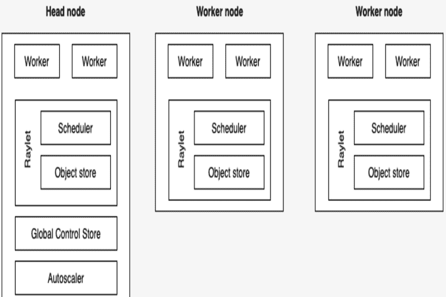
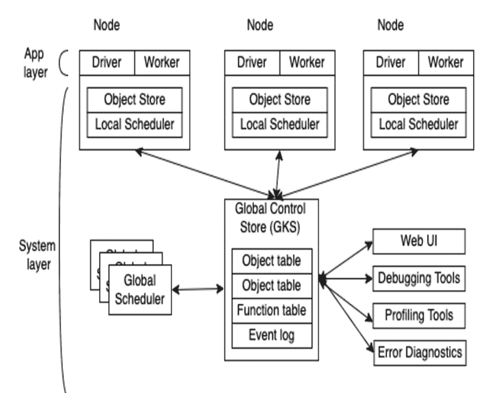
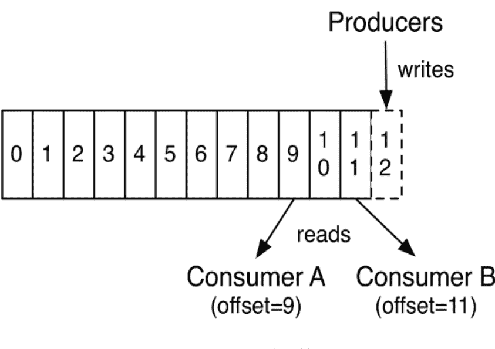
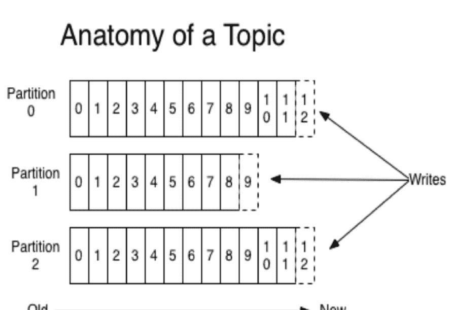
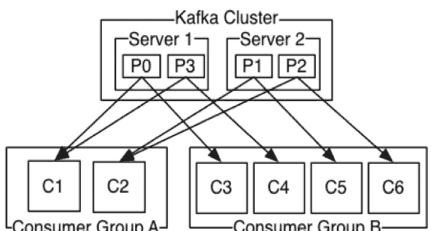

# 使用 Ray 扩展 Python

在无服务器和云环境中探索 Actor、分布式数据及相关技术


早期发布
原始且未经编辑

Holden Karau & Boris Lublinsky

# 使用 Ray 扩展 Python

在无服务器和云环境中探索 Actor、分布式数据及相关技术

> 通过早期发布电子书，您可以在书籍的最早期形式中获取内容——即作者撰写时的原始且未经编辑的内容——从而在这些书籍正式发布之前就能利用这些技术。

**Holden Karau 和 Boris Lublinsky**

# 使用 Ray 扩展 Python

作者：Holden Karau 和 Boris Lublinsky

版权所有 © 2023 Holden Karau 和 Boris Lublinsky。保留所有权利。

印刷于美国。

由 O’Reilly Media, Inc. 出版，地址：1005 Gravenstein Highway North, Sebastopol, CA 95472。

O’Reilly 图书可用于教育、商业或销售推广用途。大多数书籍也提供在线版本（[http://oreilly.com](http://oreilly.com)）。如需更多信息，请联系我们的企业/机构销售部门：800-998-9938 或 *corporate@oreilly.com*。

收购编辑：Jessica Haberman

开发编辑：Virginia Wilson

制作编辑：Gregory Hyman

内页设计师：David Futato

封面设计师：Karen Montgomery

插画师：Kate Dullea

2023年6月：第一版

# 早期发布修订历史

- 2022-02-03：首次发布
- 2022-03-25：第二次发布
- 2022-05-09：第三次发布
- 2022-06-21：第四次发布

发布详情请参见 http://oreilly.com/catalog/errata.csp?isbn=9781098118808。

O’Reilly 标志是 O’Reilly Media, Inc. 的注册商标。*使用 Ray 扩展 Python*、封面图像及相关商业外观是 O’Reilly Media, Inc. 的商标。

本书中表达的观点均为作者观点，不代表出版商观点。虽然出版商和作者已尽最大努力确保本书所含信息和说明的准确性，但出版商和作者对任何错误或遗漏概不负责，包括但不限于因使用或依赖本书而造成的损害责任。使用本书所含信息和说明的风险由您自行承担。如果本书包含或描述的任何代码示例或其他技术受开源许可或他人知识产权约束，您有责任确保您的使用符合此类许可和/或权利。

978-1-098-11880-8

# 第 1 章。什么是 Ray？

### 给早期发布读者的说明

通过早期发布电子书，您可以在书籍的最早期形式中获取内容——即作者撰写时的原始且未经编辑的内容——从而在这些书籍正式发布之前就能利用这些技术。

这将是最终书籍的第一章。请注意，GitHub 仓库稍后将开放。

如果您对如何改进本书内容和/或示例有意见，或者发现本章中有缺失内容，请通过 vwilson@oreilly.com 联系编辑。

Ray 主要是一个用于“快速且简单的分布式计算”的 Python 工具¹。加州大学伯克利分校的同一个实验室²创建了最终成为 Apache Spark 的初始软件，也创建了 Ray 的第一个版本。该实验室的研究人员已成立公司 Anyscale，以继续开发并围绕 Ray 提供产品和服务。Ray 的目标是解决比其前身更广泛的问题，支持从 Actor 到机器学习再到数据并行的各种可扩展编程模型。其远程函数和 Actor 模型使其成为一个真正通用的开发环境，而不仅仅适用于“大数据”。

Ray 会根据需要自动扩展计算资源，让您专注于代码而非管理服务器。Ray 可以直接自行管理并扩展云资源（使用 `ray up`），也可以使用 Kubernetes 等集群管理器。除了传统的水平扩展（例如添加更多机器）外，Ray 还可以调度任务以利用不同的机器大小和 GPU 等加速器。

自 AWS Lambda 推出以来，人们对无服务器计算的兴趣激增——这是一种云计算模型，云提供商按需分配机器资源，代表客户管理服务器。Ray 通过提供以下功能，为通用无服务器平台奠定了良好基础：

- 它隐藏了服务器。Ray 自动扩展透明地根据应用程序需求管理服务器。
- 通过提供 Actor 编程模型，Ray 不仅实现了无状态（大多数无服务器实现的典型特征），还实现了有状态编程模型。
- Ray 允许您指定资源，包括执行无服务器函数所需的硬件加速器。
- Ray 支持任务之间的直接通信，从而不仅支持简单函数，还支持复杂的分布式应用程序。

Ray 提供了丰富的库，这些库利用其无服务器能力实现，从而简化了充分利用其能力的应用程序创建。通常，您需要不同的工具来处理从数据处理到工作流管理的所有事情。通过使用单一工具处理应用程序的大部分内容，您不仅简化了开发，还简化了运营管理。

在本章中，我们将探讨 Ray 在生态系统中的定位，并帮助您判断它是否适合您的项目。

# 为什么需要它？

当问题变得太大，无法在单个进程中处理时——涵盖从多核到多计算机——我们经常需要像 Ray 这样的工具。如果您发现自己想知道如何处理下个月用户、数据或复杂性的增长，我们希望您能看看 Ray。Ray 的存在是因为扩展软件很难，而且随着时间的推移，这类问题往往会变得更难而非更简单。

Ray 不仅可以扩展到多台计算机，还可以在您无需直接管理服务器的情况下进行扩展。Leslie Lamport 曾说过：“分布式系统是指一台您甚至不知道存在的计算机发生故障，就会导致您自己的计算机无法使用的系统。”虽然这种故障仍然可能发生，但 Ray 能够从许多类型的故障中自动恢复。

Ray 可以在您的笔记本电脑上干净地运行，也可以使用相同的 API 进行大规模部署。这为使用 Ray 提供了一个非常简单的入门选项，无需上云即可开始尝试 Ray。一旦您熟悉了 API 和应用程序结构，您可以简单地将代码移动到云中以获得更好的可扩展性，而无需修改代码。这填补了分布式系统和单线程应用程序之间的需求空白。Ray 能够使用与分布式计算相同的抽象来管理多个线程和 GPU。

# 可以在哪里运行 Ray？

Ray 可以部署在各种环境中，从您的笔记本电脑到云，再到 Kubernetes 或 Yarn 等集群管理器，甚至到隐藏在您桌子下的六个树莓派³。在本地模式下，入门可以像 `pip install` 和调用 `ray.init` 一样简单。⁴

# RAY 集群

Ray 集群由一个头节点和一组工作节点组成：



如上图所示，头节点除了支持工作节点的所有功能外，还有两个额外组件：

*全局控制存储*

包含集群范围的信息，包括对象表、任务表、函数表、事件日志等。此存储的内容用于 Web UI、错误诊断、调试和性能分析工具。

*自动扩展器*

尝试启动/终止工作节点，以确保工作负载有足够的资源运行，同时最小化空闲资源。

头节点实际上是一个主节点（单例⁵），它通过自动伸缩器管理整个集群。Ray 的每个节点都包含一个 Raylet，它由两个主要组件组成：

*对象存储*

所有对象存储相互连接，你可以将这个集合想象成类似 memcached 的分布式缓存。

*调度器*

每个 Ray 节点都提供一个本地调度器，这些调度器可以相互通信，从而为整个 Ray 集群创建一个统一的分布式调度器。

当我们谈论 Ray 集群中的节点时，我们指的不是物理机器，而是基于 Docker 镜像的逻辑节点。因此，在映射到物理机器时，一个给定的物理节点可以运行一个或多个逻辑节点。

`ray up` 是 Ray 的一部分，它允许你创建集群，并且它会：

-   如果是在云⁶或集群管理器上运行，则使用提供商的 SDK 或直接访问物理机器来配置新的实例/机器
-   执行 shell 命令以使用所需选项设置 Ray
-   运行任何自定义的、用户定义的设置命令，例如设置环境变量和安装包
-   初始化 Ray 集群
-   如果需要，部署自动伸缩器

除了 `ray up`，如果你在 Kubernetes 上运行，可以使用 Ray Kubernetes Operator。虽然 `ray up` 或 Kubernetes Operator 是创建 Ray 集群的首选方式，但如果你有一组现有的机器（无论是物理机还是虚拟机），你也可以手动设置 Ray 集群。
无论你采用哪种部署方式，相同的 Ray 代码都应该在任何地方运行。⁷ 我们将在下一章更详细地介绍在本地模式下运行 Ray，如果你想进一步扩展，我们将在[待添加链接]中介绍部署到云和资源管理器。

## 使用 Ray 运行你的代码

Ray 不仅仅是一个你导入的库；它也是一个集群管理工具。除了导入库，你还需要“连接”到一个 Ray 集群。你有三种方式将你的代码连接到 Ray 集群：

*调用不带参数的 `ray.init()`*

这会启动一个嵌入式的、单节点的 Ray 实例，该实例立即可供应用程序使用。

*使用 Ray 客户端*
`ray.init("ray://<head_node_host>:10001")` 连接到 Ray 集群

默认情况下，每个 Ray 集群启动时都会在头节点上运行一个 Ray 客户端服务器，该服务器可以接收远程客户端连接。但请注意，当客户端位于远程时，由于广域网延迟，直接从客户端运行的某些操作可能会变慢。Ray 对头节点和客户端之间的网络故障不具备弹性。

*使用 Ray 命令行 API*

你可以使用 `ray submit` 命令在集群上执行 Python 脚本。这会将指定的文件复制到头节点集群，并使用给定的参数执行它。请注意，如果你传递参数，你的代码应该使用 Python 的 `sys` 模块，该模块通过 `sys.argv` 提供对任何命令行参数的访问。这消除了使用 Ray 客户端时潜在的网络故障点。

## 它在生态系统中的位置是什么？

Ray 处于问题空间的独特交叉点。Ray 解决的第一个问题是通过管理资源（无论是服务器、线程还是 GPU）来扩展你的 Python 代码。Ray 的核心构建块是调度器、分布式数据存储和 Actor 系统。Ray 使用的调度器足够通用，可以存在于工作流调度领域，而不仅仅是“传统”的扩展问题。Ray 的 Actor 系统为你提供了一种简单的方式来处理有弹性的分布式执行状态。⁸ 除了可扩展的构建块，Ray 还有更高层次的库，如 Serve、Data、Tune、RLlib、Train 和 Workflows，它们存在于机器学习问题领域。整体的 Ray 生态系统如图 1-1 所示。


图 1-1. Ray 生态系统

让我们看看一些不同的问题领域，看看 Ray 如何融入并与现有工具进行比较。

**表 1-1** 将 Ray 与几个相关的系统类别进行了比较。

### 表 1-1. 将 Ray 与相关系统进行比较

| 类别 | 描述 |
| --- | --- |
| 集群编排器 | 集群编排器，如 Kubernetes、SLURM 和 YARN，负责调度容器。Ray 可以利用这些来分配集群节点。 |
| 并行化框架 | 与 Python 并行化框架（如 multiprocessing 或 Celery）相比，Ray 提供了更通用、更高性能的 API。此外，Ray 的分布式对象支持跨并行执行器的数据共享。 |
| 数据处理框架 | Ray 的底层 API 比现有的数据处理框架（如 Spark、MARS 或 Dask）更灵活，更适合作为“分布式粘合剂”框架。尽管 Ray 本身不理解数据模式、关系表或流式数据流，但它支持运行许多此类数据处理框架，例如 Modin、Dask-on-Ray、MARS-on-Ray 和 RayDP（Spark on Ray）。 |
| Actor 框架 | 与专门的 Actor 框架（如 Erlang、Akka 和 Orleans）不同，Ray 将 Actor 框架直接集成到编程语言中。此外，Ray 的分布式对象支持跨 Actor 的数据共享。 |
| 工作流 | 当大多数人谈论工作流时，他们谈论的是 UI 或脚本驱动的低代码开发。虽然这种方法对非技术用户可能非常有用，但它们经常给软件工程师带来的痛苦多于价值。Ray 使用编程式工作流实现（与 Cadence 相比）。实现结合了 Ray 动态任务图的灵活性和强大的持久性保证。它提供亚秒级的任务启动开销，并支持具有数十万步骤的工作流。它还利用 Ray 对象存储在步骤之间传递分布式数据集。 |
| HPC 系统 | 与 Ray 暴露任务和 Actor API 不同，大多数 HPC 系统暴露更底层的消息 API，提供更大的应用程序灵活性。此外，许多 HPC 实现提供优化的集体通信原语。Ray 提供了一个集体通信库，实现了其中的许多功能。 |

## “大数据” / 可扩展数据帧

Ray 为可扩展数据帧提供了几种不同的 API，这是大数据生态系统的基石。它建立在 Apache Arrow 项目之上，提供了一个（有限的）分布式 Dataframe API，称为 `ray.data.Dataset`。除此之外，Ray 还通过 DaskOnRay 提供了更类似 pandas 的体验支持。

> **警告**

除了上述库，你可能会找到关于 Mars on Ray 或 Ray（已弃用）内置 pandas 支持的引用。这些库不支持分布式模式，因此它们可能会限制你的可扩展性。

## RAY 和 SPARK

很容易将 Ray 与 Apache Spark 进行比较，在某些抽象层面上，它们非常相似。从用户的角度来看，Apache Spark 非常适合数据密集型任务，而 Ray 更适合计算密集型任务。

Ray 的任务开销更低，并且支持分布式状态，这使其对机器学习任务特别有吸引力。Ray 的底层 API 使其成为构建工具的更具吸引力的平台。

Spark 拥有更多数据工具，但依赖于集中式调度和状态管理。这种集中化使得实现强化学习和递归算法成为一项挑战。对于分析用例，特别是在现有的大数据部署中，Spark 可能是更好的选择。

Ray 和 Spark 是互补的，可以一起使用。一种常见的模式是使用 Spark 进行数据处理，然后使用 Ray 进行机器学习。事实上，`RayDP` 库为你提供了一种在 Ray 中使用 Spark Dataframe 的方式。

## 机器学习

Ray 有多个机器学习库，在很大程度上，它们的作用是将大部分复杂部分委托给现有工具，如 PyTorch、Scikit-Learn 和 Tensorflow，同时使用 Ray 的分布式计算设施进行扩展。Ray Tune 实现了超参数调优，利用 Ray 在分布式机器集上并行训练许多本地 Python 模型的能力。Ray Train 使用 PyTorch 或 Tensorflow 实现分布式训练。Ray 的 RLlib 接口提供了具有多种核心算法的强化学习。

Ray 能够从纯数据并行系统中脱颖而出的部分原因在于其 Actor 模型，该模型允许更容易地跟踪“状态”-

## 工作流调度

工作流调度初看之下似乎非常简单。它“只是”一个需要完成的工作图。然而，所有程序都可以表示为“只是”一个需要完成的工作图。Ray 在 2.0 版本中新增了工作流库，旨在简化表达传统业务逻辑工作流和大规模（例如机器学习训练）工作流。

Ray 在工作流调度方面独具特色，因为它允许任务调度其他任务，而无需回调到中央节点。这提供了更大的灵活性和吞吐量。

如果你觉得 Ray 的工作流引擎过于底层，可以使用 Ray 来运行 Apache Airflow。Airflow 是大数据领域中较为流行的工作流调度引擎之一。[Ray Airflow Provider](https://docs.ray.io/en/latest/ray-airflow/index.html) 允许你将 Ray 集群用作 Airflow 的工作池。

## 流处理

流处理通常被认为是处理“近实时”数据，或“到达即处理”的数据。流处理增加了一层复杂性，尤其是当你试图越接近实时，因为并非所有数据总能按顺序或准时到达。Ray 提供了一些标准的流处理原语，并可以使用 Kafka 作为流数据源和接收器。Ray 使用其 Actor 模型 API 与流数据进行交互。

Ray 的流处理，就像许多嫁接在批处理系统上的流系统一样，有一些有趣的特性。值得注意的是，与 Ray 的其他部分不同，Ray 流处理更多逻辑是在 Java 中实现的。这可能使得调试流处理应用程序比调试 Ray 的其他组件更具挑战性。

## 交互式

并非所有“近实时”应用程序都必然是“流处理”应用程序。一个常见的例子是你在交互式地探索数据集。类似地，与用户输入交互（例如，提供模型服务）可以被认为是交互式的而非批处理的，但它与流处理库分开处理，使用的是“Ray Serve”。

## Ray 不是什么

虽然 Ray 是一个通用的分布式系统，但重要的是要注意 Ray 不是什么（尽管当然，你可以让它成为，但你可能不想）：

- SQL / 分析引擎
- 数据存储系统
- 适合运行核反应堆
- 完全语言无关

在所有这些情况下，Ray 可以用来实现其中一部分功能，但你可能更适合使用更专业的工具。例如，虽然 Ray 确实有一个键/值存储，但它并非设计为能在主节点丢失后幸存。这并不意味着如果你发现自己正在处理一个需要一点 SQL 或一些非 Python 库的问题，Ray 无法满足你的需求——只是你可能需要引入额外的工具。

## 结论

Ray 有潜力极大地简化中大规模问题的开发和运维开销。它通过提供一个统一的 API 跨越各种传统上独立的问题领域来实现这一点，同时提供无服务器的可扩展性。如果你的问题跨越 Ray 所服务的领域，或者只是厌倦了管理自己集群的运维开销，我们希望你能加入我们学习 Ray 的旅程。在下一章中，我们将向你展示如何在本地模式下将 Ray 安装到你的机器上，并将从 Ray 支持的一些生态系统（Actor、大数据等）中查看几个不同的 hello-world 示例。

1.  你也可以从 Java 使用 Ray。像许多 Python 应用程序一样，底层有大量的 C++ 和一些 Fortran。Ray 流处理也有一些 Java 组件。
2.  不完全相同，但是后续的迭代。它的名字是 RISE Lab。
3.  ARM 支持，包括对树莓派和原生 M1 的支持，目前需要手动构建。
4.  现代 Ray 的大部分功能会在没有上下文时自动初始化一个上下文，允许你甚至跳过这部分。
5.  不幸的是，主节点也是一个单点故障。如果你丢失了主节点，你将丢失集群并需要重新创建它。此外，如果你丢失了主节点，现有的工作节点可能会成为孤儿节点，必须“手动”移除。
6.  Ray 目前支持 AWS、Azure 和 GCP。
7.  速度差异很大。例如，当你需要特定的库或硬件来运行代码时，这可能会变得更加复杂。
8.  对于熟悉的人来说，这属于“响应式系统”的范畴。

# 第 2 章. Ray 入门（本地）

> ### 给早期发布读者的说明

通过早期发布电子书，你可以在书籍的最早期形式中获取内容——作者在写作过程中的原始未编辑内容——因此你可以在这些书籍正式发布之前很久就利用这些技术。

这将是最终书籍的第二章。请注意，GitHub 仓库稍后将激活。

如果你对我们如何改进本书的内容和/或示例有意见，或者你注意到本章中有缺失的材料，请通过 vwilson@oreilly.com 联系编辑。

正如我们所讨论的，Ray 对于管理从单台计算机到集群的资源非常有用。从本地安装开始更简单，它利用了多核/多 CPU 的并行性。即使部署到集群，你也需要在本地安装 Ray 以进行开发。一旦你安装了 Ray，我们将向你展示如何制作和调用你的第一个异步并行化函数，并在 Actor 中存储状态。

> ### 提示

如果你赶时间，也可以在示例仓库上使用 gitpod 来获取一个包含示例的 Web 环境，或者查看 Anyscale 的托管 Ray。

## 安装

安装 Ray，即使在单台机器上，也可能从相对简单到相当复杂。Ray 按照正常的发布节奏以及每夜发布向 PyPI 发布 wheel 包。这些 wheel 包目前仅适用于 x86 用户，因此 ARM 用户大多需要从源代码构建 Ray。¹

> **提示**

OSX 上的 M1 ARM 用户可以使用 Rosetta 运行 x86 包。这会有一些性能影响，但设置要简单得多。要使用 x86 包，请为 OSX 安装 Anaconda Python。

## 安装（适用于 x86 和 M1 ARM）

大多数用户可以运行 `pip install -U ray` 从 PyPI 自动安装 Ray。当你打算在多台机器上分发计算时，通常更容易在 conda 环境中工作，这样你可以匹配集群的 Python 版本并了解你的包依赖关系。示例 2-1 中的命令设置了一个全新的 conda 环境，包含 Python 并安装了 Ray 及一些最小依赖项。

```
Example 2-1.
conda create -n ray python=3.7 mamba -y
conda activate ray
# In a conda env this won't be auto-installed with ray so add them
pip install jinja2 python-dateutil cloudpickle packaging pygments \
    psutil nbconvert ray
```

## 安装（从源代码）适用于 ARM

对于 ARM 用户或任何系统架构没有预构建 wheel 包的用户，你需要从源代码构建 Ray。

在我们的 ARM Ubuntu 系统上，我们需要安装一些额外的包，如示例 2-2 所示。

```
Example 2-2.
sudo apt-get install -y git tzdata bash libhdf5-dev curl pkg-config wget cmake build-essential \
    zlib1g-dev zlib1g openssh-client gnupg unzip libunwind8 libunwind-dev \
    openjdk-11-jdk git
# Depending on debian version
sudo apt-get install -y libhdf5-100 || sudo apt-get install -y libhdf5-103
# Install bazelisk to install bazel (needed for Ray's CPP code)
# See https://github.com/bazelbuild/bazelisk/releases
# On Linux ARM
BAZEL=bazelisk-linux-arm64
# On MAC ARM
# BAZEL=bazelisk-darwin-arm64
wget -q https://github.com/bazelbuild/bazelisk/releases/download/v1.10.1/${BAZEL} -O /tmp/bazel
chmod a+x /tmp/bazel
sudo mv /tmp/bazel /usr/bin/bazel
# Install node, needed for the UI
curl -fsSL https://deb.nodesource.com/setup_16.x | sudo bash -
sudo apt-get install -y nodejs
```

如果你是 M1 Mac 用户并且不想使用 Rosetta，你需要安装一些依赖项。你可以使用 homebrew 和 pip 安装它们，如示例 2-3 所示。

```
Example 2-3.
brew install bazelisk wget python@3.8 npm
# Make sure homebrew Python is used before system Python
export PATH=$(brew --prefix)/opt/python@3.8/bin/:$PATH
echo "export PATH=$(brew --prefix)/opt/python@3.8/bin/:$PATH" >> ~/.zshrc
echo "export PATH=$(brew --prefix)/opt/python@3.8/bin/:$PATH" >> ~/.bashrc
# Install some libraries vendored incorrectly by Ray for ARM
pip3 install --user psutil cython colorama
```

你需要单独构建一些 Ray 组件，因为它们是用不同的语言编写的。这确实使其更复杂，但你可以按照示例 2-4 中的步骤操作。

```
Example 2-4.
git clone https://github.com/ray-project/ray.git
cd ray
```

## 构建 Ray UI

```bash
pushd python/ray/new_dashboard/client; npm install && npm ci && npm run build; popd
# 指定特定的 bazel 版本，因为较新的版本有时会出问题。
export USE_BAZEL_VERSION=4.2.1
cd python
# 仅限 MAC ARM 用户：清理第三方文件
rm -rf ./thirdparty_files
# 以编辑模式安装或构建 wheel 包
pip install -e .
# python setup.py bdist_wheel
```

> **提示**

构建过程中最耗时的部分是编译 C++ 代码，即使在现代机器上也可能需要长达一小时。如果你有一个包含多台 ARM 机器的集群，通常值得构建一次 wheel 包，然后在集群中重复使用。

## Hello World 示例

既然你已经安装了 Ray，现在是时候了解一些 Ray API 了。我们将在后面更详细地介绍这些 API，所以现在不必过于纠结细节。

### Ray Remote（任务/未来对象）Hello World

Ray 的核心构建模块之一是“远程”函数/未来对象。这里的“远程”指的是相对于我们的主进程而言，可以在同一台机器上，也可以在不同的机器上。

为了更好地理解这一点，你可以编写一个函数，返回它运行的位置。Ray 在多个进程之间分配工作，在分布式模式下，还会在多个主机之间分配。这个函数的本地（非 Ray）版本如示例 2-5 所示。

*示例 2-5.*

```python
def hi():
    import os
    import socket
    return f"Running on {socket.gethostname()} in pid {os.getpid()}"
```

你可以使用 `ray.remote` 装饰器来创建一个远程函数。调用远程函数的方式略有不同，需要通过调用函数的 `.remote` 方法来实现。当你调用远程函数时，Ray 会立即返回一个未来对象，而不是阻塞等待结果。你可以使用 `ray.get` 来获取这些未来对象中返回的值。要将示例 2-5 转换为远程函数，你只需要使用 `ray.remote` 装饰器，如示例 2-6 所示。

*示例 2-6.*

```python
@ray.remote
def remote_hi():
    import os
    import socket
    return f"Running on {socket.gethostname()} in pid {os.getpid()}"

future = remote_hi.remote()
ray.get(future)
```

当你运行这两个示例时，你会看到第一个在同一个进程中执行，而 Ray 将第二个调度到另一个进程中执行。当我们运行这两个示例时，分别得到“Running on jupyter-holdenk in pid 33”和“Running on jupyter-holdenk in pid 173”。

### 休眠任务

虽然有些刻意，但理解远程未来对象如何提供帮助的一个简单方法是创建一个故意很慢的函数，在我们的例子中是 `slow_task`，然后让 Python 通过常规函数调用和 Ray 远程调用来计算。

*示例 2-7.*

```python
import timeit

def slow_task(x):
    import time
    time.sleep(2) # 执行一些科学计算/业务逻辑
    return x

@ray.remote
def remote_task(x):
    return slow_task(x)

things = range(10)

very_slow_result = map(slow_task, things)
slowish_result = map(lambda x: remote_task.remote(x), things)

slow_time = timeit.timeit(lambda: list(very_slow_result), number=1)
fast_time = timeit.timeit(lambda:
    list(ray.get(list(slowish_result))), number=1)
print(f"In sequence {slow_time}, in parallel {fast_time}")
```

当你运行示例 2-7 中的代码时，你会看到通过使用 Ray 远程函数，你的代码能够同时执行多个远程函数。虽然你可以通过使用 multiprocessing 在没有 Ray 的情况下实现这一点，但 Ray 为你处理了所有细节，并且最终可以扩展到多台机器。

### 嵌套和链式任务

Ray 在分布式处理领域的一个显著特点是允许嵌套和链式任务。在其他任务内部启动更多任务可以使某些类型的递归算法更容易实现。使用嵌套任务的一个更直接的例子是网络爬虫。在网络爬虫中，我们访问的每个页面都可以启动对该页面上链接的多次额外访问，如示例 2-8 所示。

*示例 2-8.*

```python
@ray.remote
def crawl(url, depth=0, maxdepth=1, maxlinks=4):
    links = []
    link_futures = []
    import requests
    from bs4 import BeautifulSoup
    try:
        f = requests.get(url)
        links += [(url, f.text)]
        if (depth > maxdepth):
            return links # 基本情况
        soup = BeautifulSoup(f.text, 'html.parser')
        c = 0
        for link in soup.find_all('a'):
            try:
                c = c + 1
                link_futures += [crawl.remote(link["href"], depth=(depth+1), maxdepth=maxdepth)]
                # 不要分支太多，我们仍在本地模式下
                # 而且网络很大
                if c > maxlinks:
                    break
            except:
                pass
        for r in ray.get(link_futures):
            links += r
        return links
    except requests.exceptions.InvalidSchema:
        return [] # 跳过非网络链接
    except requests.exceptions.MissingSchema:
        return [] # 跳过非网络链接

ray.get(crawl.remote("http://holdenkarau.com/"))
```

许多其他系统要求所有任务都在中央协调节点上启动。即使那些支持以嵌套方式启动任务的系统，通常也依赖于中央调度器。

### 数据 Hello World

Ray 有一个功能相对有限的数据集 API，用于处理结构化数据。Apache Arrow 为 Ray 的 Data API 提供支持。Arrow 是一种面向列的、与语言无关的格式，具有一些流行的操作。许多流行工具支持 Arrow，允许在它们之间轻松传输（例如 Spark、Ray、Dask、Tensorflow 等）。

Ray 最近在 1.9 版本中添加了对数据集的按键聚合功能。最流行的分布式数据示例是词频统计，它需要聚合操作。我们可以通过构建一个网页数据集来执行尴尬并行任务，例如 map 转换，如示例 2-9 所示。

*示例 2-9. 构建网页数据集*

```python
# 创建一个 URL 对象的数据集。我们也可以从
# 文本文件加载，使用 ray.data.read_text()
urls = ray.data.from_items([
    "https://github.com/scalingpythonml/scalingpythonml",
    "https://github.com/ray-project/ray"])

def fetch_page(url):
    import requests
    f = requests.get(url)
    return f.text

pages = urls.map(fetch_page)
# 查看一个页面以确保它正常工作
pages.take(1)
```

Ray 1.9 添加了 `GroupedDataset` 以支持不同类型的聚合。通过使用列名或返回键的函数调用 `groupby`，你会得到一个 `GroupedDataset`。`GroupedDataset` 内置支持 `count`、`max`、`min` 和其他常见聚合。你可以使用 `GroupedDatasets` 将示例 2-9 扩展为词频统计示例，如示例 2-10 所示。

*示例 2-10. 构建网页数据集*

```python
words = pages.flat_map(lambda x: x.split(" ")).map(lambda w: (w, 1))
grouped_words = words.groupby(lambda wc: wc[0])
```

当你需要超越内置操作时，Ray 支持自定义聚合，前提是你实现其接口。我们将在[待补充链接]中更详细地介绍数据集，包括聚合函数。

> **注意**

Ray 对其 Data API 使用阻塞求值。这意味着当你在 Ray 数据集上调用函数时，它会等待完成结果，而不是返回一个未来对象。Ray 核心 API 的其余部分使用未来对象。

如果你想要一个功能齐全的 DataFrame API，你可以将你的 Ray 数据集转换为 Dask。[待补充链接]介绍了如何使用 Dask 进行更复杂的操作。如果你有兴趣了解更多关于 Dask 的信息，你应该查看 Holden 的书 *Scaling Python with Dask*。

### Actor Hello World

Ray 的独特之处之一在于它对 Actor 的强调。Actor 为你提供了管理执行状态的工具，这是扩展系统时更具挑战性的部分之一。Actor 发送和接收消息，并相应地更新其状态。这些消息可以来自其他 Actor、程序，或者你的“主”执行线程（通过 Ray 客户端）。对于每个 Actor，Ray 都会启动一个专用进程。每个 Actor 都有一个等待处理的消息邮箱，当你调用一个 Actor 时，Ray 会向相应的邮箱添加一条消息，这允许 Ray 序列化消息处理，从而避免昂贵的分布式锁。Actor 可以返回值以响应消息，因此当你向 Actor 发送消息时，Ray 会立即返回一个未来对象，以便你在完成时获取值。

> **Actor 的用途和历史**

Actor 在 Ray 之前就有很长的历史，最早于 1973 年引入。Actor 模型是解决有状态并发问题的优秀方案，可以替代复杂的锁结构。其他一些著名的 Actor 实现包括 Scala 中的 AKKA 和 Erlang。

Actor 模型可用于从电子邮件等现实世界系统、温度跟踪等物联网应用到航班预订等各种场景。Ray Actor 的一个常见用例是管理状态（例如权重），同时执行分布式机器学习，而无需昂贵的锁。²

Actor 模型在处理需要按顺序处理并作为一组回滚的多个事件时面临挑战。一个经典的例子是银行业务，其中交易需要涉及多个账户并作为一组回滚。

Ray Actor 的创建和调用方式与远程函数类似，但使用 Python 类，这为 Actor 提供了存储状态的地方。你可以通过修改经典的“Hello World”示例来按顺序向你问好，从而看到这一点，如示例 2-11 所示。

## 示例 2-11. Actor Hello World

```python
@ray.remote
class HelloWorld(object):
    def __init__(self):
        self.value = 0
    def greet(self):
        self.value += 1
        return f"Hi user #{self.value}"

# 创建一个 actor 实例
hello_actor = HelloWorld.remote()

# 调用 actor
print(ray.get(hello_actor.greet.remote()))
print(ray.get(hello_actor.greet.remote()))
```

这个示例相当基础；它缺乏任何容错机制或 actor 内部的并发处理。我们将在[后续链接]中更深入地探讨这些内容。

## 结论

在本章中，你已经在本地机器上安装了 Ray 并使用了它的许多核心 API。在大多数情况下，你可以继续以本地模式运行我们为本书挑选的示例。当然，本地模式可能会限制你的规模或导致运行时间更长。在下一章中，我们将探讨 Ray 背后的一些核心概念。其中一个概念（容错）用集群或云来演示会更容易。因此，如果你有云账户或集群的访问权限，现在正是跳转到[后续链接]并查看不同部署选项的绝佳时机。

1. 随着 ARM 的日益普及，Ray 更有可能添加 ARM 轮子，因此希望这只是暂时的。
2. Actor 仍然比无锁远程函数更昂贵，后者可以水平扩展。例如，大量 worker 调用同一个 actor 来更新模型权重，仍然会比大规模并行操作慢。

## 第 3 章. Ray 远程函数

> **致早期发布读者的说明**

通过早期发布电子书，你可以在书籍的最早期形式——作者撰写时的原始未编辑内容——中获取书籍，从而在这些书籍正式发布之前很久就能利用这些技术。

这将是最终书籍的第三章。请注意，GitHub 仓库将在稍后激活。

如果你对我们如何改进本书的内容和/或示例有意见，或者你注意到本章中有缺失的材料，请通过 vwilson@oreilly.com 联系编辑。

在构建大规模现代应用程序时，你通常需要某种形式的分布式或并行计算。许多 Python 开发者接触并行计算是通过 `multiprocessing` 模块。`multiprocessing` 在处理现代应用程序的需求方面能力有限。这些需求包括：

- 在多个核心或机器上运行相同的代码
- 处理机器和处理故障的工具
- 高效处理大型参数
- 轻松地在进程之间传递信息

与 `multiprocessing` 不同，Ray 的远程函数满足上述要求。需要注意的是，“远程”并不一定指单独的计算机，尽管它的名字如此。当你创建一个远程函数时，Ray 会接管对该函数的调用分发，而不是在同一个进程中运行。调用远程函数时，你实际上是在多个核心或不同机器上异步¹运行，而无需关心如何或在哪里运行。

在本章中，你将学习如何创建远程函数、等待它们完成以及获取结果。一旦掌握了基础知识，你将学习如何将远程函数组合在一起以创建更复杂的操作。在深入之前，让我们先理解一些我们在上一章中略过的内容。

### 理解 Ray 远程函数的要点

在上一章中，你学习了如何创建一个基本的 Ray 远程函数（示例 2-7）。

当你调用一个远程函数时，它会立即返回一个 `ObjectRef`（一个 future），这是一个对远程对象的引用。Ray 在后台的单独 worker 进程中创建并执行任务，并在完成后将结果写入原始引用。然后你可以对 `ObjectRef` 调用 `ray.get` 来获取值。请注意，`ray.get` 是一个阻塞方法，它会等待任务执行完成后再返回结果。

> **RAY 中的远程对象**
>
> 远程对象只是一个对象，它可能位于另一个节点上。`ObjectRef` 就像指向对象的指针或 ID，你可以用它来获取远程函数的值或状态。除了从远程函数调用创建之外，你还可以使用 `ray.put` 函数显式创建 `ObjectRef`。

我们将在“Ray 对象”中进一步探讨远程对象及其容错性。

上一章示例 2-7 中的一些细节值得理解。该示例在将迭代器传递给 `ray.get` 之前，将其从 `iterator` 转换为 `list`。当 `ray.get` 接收一个 future 列表或单个 future 时，你需要这样做。² `ray.get` 会等待直到它拥有所有对象，以便按顺序返回列表。

> **提示**
>
> 与常规的 Ray 远程函数一样，思考每个远程调用内部完成的工作量非常重要。例如，使用 `ray.remote` 递归计算阶乘会比在本地计算慢，因为即使整体工作量可能很大，但每个函数内部的工作量很小。具体数量取决于你的集群繁忙程度，但作为一般规则，任何在几秒内执行完毕且不需要特殊资源的任务都不值得远程调度。

### 远程函数生命周期

调用远程函数的 Ray 进程，称为所有者，负责调度提交的任务执行，并在需要时协助解析返回的 `ObjectRef` 到其底层值。

在任务提交时，所有者会等待所有依赖项（即作为参数传递给任务的 `ObjectRef`）变为可用状态，然后才进行调度。依赖项可以是本地的或远程的，所有者认为只要依赖项在集群中的任何地方可用，它们就是就绪的。当依赖项就绪时，所有者会向分布式调度器请求资源来执行任务。一旦资源可用，调度器会批准请求，并返回一个将执行该函数的 worker 的地址。

此时，所有者通过 gRPC 将任务规范发送给 worker。执行任务后，worker 存储返回值。如果返回值很小，³ worker 会直接将值内联返回给所有者，所有者将其复制到其进程内对象存储中。如果返回值很大，worker 会将对象存储在其本地共享内存存储中，并回复所有者，表明对象现在位于分布式内存中。这使得所有者可以引用这些对象，而无需将对象获取到其本地节点。

当一个任务以 `ObjectRef` 作为其参数提交时，worker 必须解析其值才能开始执行任务。

任务可能以错误结束。Ray 区分两种类型的任务错误：

*应用级错误*

这是指 worker 进程存活但任务以错误结束的任何场景。例如，一个在 Python 中抛出 `IndexError` 的任务。

*系统级错误*

这是指 worker 进程意外死亡的任何场景。例如，一个进程发生段错误，或者 worker 的本地 raylet 死亡。

由于应用级错误而失败的任务永远不会被重试。异常被捕获并存储为任务的返回值。由于系统级错误而失败的任务可能会自动重试，最多重试指定次数。这将在“容错”中更详细地介绍。

在我们目前的示例中，使用 `ray.get` 是可以的，因为所有 future 的执行时间都相同。如果执行时间不同，例如在不同大小的数据批次上训练模型，并且你不需要同时获取所有结果，这可能会相当浪费。你应该使用 `ray.wait`，而不是直接调用 `ray.get`，它会返回指定数量的已完成 future。要看到性能差异，你需要修改你的远程函数，使其具有可变的睡眠时间，如示例 3-1 所示。

### 示例 3-1. 具有不同执行时间的远程函数

```python
@ray.remote
def remote_task(x):
    time.sleep(x)
    return x
```

你可能还记得，示例远程函数根据输入参数休眠。由于范围是升序的，对其调用远程函数将导致 future 按顺序完成。为了确保 future 不会按顺序完成，你需要修改列表，一种方法是在将远程函数映射到 `things` 之前调用 `things.sort(reverse=True)`。

要看到使用 `ray.get` 和 `ray.wait` 之间的区别，你可以编写一个函数，从你的 future 中收集值，并在每个对象上添加一些时间延迟以模拟业务逻辑。

第一种选择，不使用`ray.wait`，如示例3-2所示，代码更简洁、更易读，但不推荐用于生产环境。

## 示例 3-2. 不使用 wait 的 Ray get

```python
# 按顺序处理
def in_order():
    # 创建 futures
    futures = list(map(lambda x: remote_task.remote(x), things))
    values = ray.get(futures)
    for v in values:
        print(f" Completed {v}")
        time.sleep(1) # 业务逻辑在此处
```

第二种选择稍微复杂一些，如示例3-3所示。其工作原理是调用`ray.wait`来查找下一个可用的 future，并循环直到所有 future 都完成。`ray.wait`返回两个列表：一个是已完成任务的对象引用列表（数量由请求的大小决定，默认为1），另一个是剩余对象引用的列表。

## 示例 3-3. 使用 ray wait

```python
# 当结果可用时处理
def as_available():
    # 创建 futures
    futures = list(map(lambda x: remote_task.remote(x), things))
    # 当仍有待处理的 futures 时
    while len(futures) > 0:
        ready_futures, rest_futures = ray.wait(futures)
        print(f"Ready {len(ready_futures)} rest {len(rest_futures)}")
        for id in ready_futures:
            print(f'completed value {id}, result {ray.get(id)}')
            time.sleep(1) # 业务逻辑在此处
        # 我们只需要等待那些尚未可用的
        futures = rest_futures
```

使用`timeit.time`并行运行这些函数，你可以看到性能上的差异。需要注意的是，这种性能提升取决于非并行化的业务逻辑（循环中的逻辑）耗时。如果你只是对结果求和，直接使用`ray.get`可能没问题，但如果你执行更复杂的操作，应该使用`ray.wait`。当我们运行时，使用`ray.wait`大约能获得2倍的性能提升。你可以尝试调整休眠时间，看看效果如何。

你可能希望为`ray.wait`指定几个可选参数之一：

- `num_returns`：Ray 在返回前等待完成的 ObjectRef 数量。你应该将`num_returns`设置为小于或等于输入 ObjectRef 列表的长度；否则，函数会抛出异常。⁴ 默认值为1。
- `timeout`：返回前等待的最大时间（秒）。默认为-1（视为无限）。
- `fetch_local`：如果你只关心确保 futures 完成，可以通过将此参数设置为`false`来禁用结果的获取。

> **提示**
>
> `timeout`参数在`ray.get()`和`ray.wait()`中都极其重要。如果未指定此参数，并且你的某个远程函数行为异常（即永不完成），那么`ray.get()`/`ray.wait()`将永远不会返回，你的程序将永远阻塞。⁵ 因此，对于任何生产代码，我们建议你在两者中都使用`timeout`参数以避免死锁。

Ray 的`get`和`wait`函数处理超时的方式略有不同。当发生超时时，Ray 不会在`ray.wait`上引发异常；相反，它只是返回比`num_returns`更少的就绪 futures。然而，如果`ray.get`遇到超时，Ray 将引发`GetTimeoutError`。请注意，wait/get 函数的返回并不意味着你的远程函数将被终止；它仍将在专用进程中运行。如果你想释放资源，可以显式地终止你的 future（我们将在后面解释）。

> **提示**
>
> 由于`ray.wait`可以按任意顺序返回结果，因此绝对不要依赖结果的顺序。如果你需要对不同的记录进行不同的处理（例如，测试 A 组和 B 组的混合），你应该在结果中编码这一点（通常使用类型）。

如果你有一个任务在合理时间内未完成（例如，一个掉队者），你可以使用与`wait/get`相同的 ObjectRef 通过`ray.cancel`来取消该任务。你可以修改之前的`ray.wait`示例，添加超时并取消任何“坏”任务，结果如示例3-4所示。

## 示例 3-4. 带超时和取消的 Ray wait

```python
futures = list(map(lambda x: remote_task.remote(x), [1,
    threading.TIMEOUT_MAX]))
# 当仍有待处理的 futures 时
while len(futures) > 0:
    # 实际上，10秒对于大多数情况来说太短了。
    ready_futures, rest_futures = ray.wait(futures, timeout=10,
        num_returns=1)
    # 如果我们得到的少于 num_returns
    if len(ready_futures) < 1:
        print(f"Timed out on {rest_futures}")
        # 你_不必_取消，但如果你的任务使用了大量资源
        ray.cancel(*rest_futures)
        # 你应该中断，因为你已经超过了超时时间
        break
    for id in ready_futures:
        print(f'completed value {id}, result {ray.get(id)}')
        futures = rest_futures
```

> **警告**
>
> 取消任务不应成为你正常程序流程的一部分。如果你发现自己经常需要终止任务，你应该调查一下发生了什么。任何后续对已取消任务的 wait 或 get 调用都是未定义的，可能会引发异常或返回错误结果。

我们在上一章跳过的另一个小点是，虽然到目前为止的示例只返回单个值，但 Ray 远程函数可以返回多个值，就像普通的 Python 函数一样。

对于在分布式环境中运行的人来说，容错性是一个重要的考虑因素。如果执行任务的 worker 意外死亡，⁶ Ray 将重新运行任务（在延迟之后），直到任务成功或超过最大重试次数。我们将在[待补充链接]中更详细地介绍容错性。

## 远程 Ray 函数的组合

你可以通过组合使你的远程函数更加强大。Ray 中远程函数组合的两种最常见方法是流水线化和嵌套并行。你可以使用嵌套并行来组合函数以表达递归函数。Ray 还允许你表达顺序依赖关系，而无需在驱动程序中阻塞/收集结果，这被称为“流水线化”。

你可以通过使用来自早期`ray.remote`的 ObjectRefs 作为新远程函数调用的参数来构建流水线函数。Ray 将自动获取 ObjectRefs 并将底层对象传递给你的函数。这种方法允许函数调用之间轻松协调。此外，这种方法最小化了数据传输——结果将直接发送到执行第二个远程函数的节点。下面的示例3-5展示了一个简单的顺序计算示例。

## 示例 3-5. Ray 流水线化/带任务依赖的顺序远程执行

```python
@ray.remote
def generate_number(s: int, limit: int, sl: float) -> int :
    random.seed(s)
    time.sleep(sl)
    return random.randint(0, limit)

@ray.remote
def sum_values(v1: int, v2: int, v3: int) -> int :
    return v1+v2+v3

# 获取结果
print(ray.get(sum_values.remote(generate_number.remote(1, 10, .1),
                               generate_number.remote(5, 20, .2), generate_number.remote(7, 15, .3))))
```

这段代码定义了两个远程函数，然后启动第一个函数的三个实例。所有三个实例的 ObjectRefs 然后被用作第二个函数的输入。在这种情况下，Ray 将等待所有三个实例完成，然后才开始执行 sum_values。你不仅可以使用这种方法传递数据，还可以表达基本的工作流风格依赖。你可以传递的 ObjectRef 数量没有限制，你也可以同时传递“普通”的 Python 对象。

你*不能*使用包含`ObjectRef`的 Python 结构（例如，列表、字典或类）来代替直接使用`ObjectRef`。Ray 只等待并解析直接传递给函数的`ObjectRefs`。如果你尝试传递一个结构，你将不得不在函数内部自己执行`ray.wait` + `ray.get`。示例3-6展示了示例3-5代码的一个变体，它无法工作。

## 示例 3-6. 带任务依赖的损坏的顺序远程函数执行

```python
@ray.remote
def generate_number(s: int, limit: int, sl: float) -> int :
    random.seed(s)
    time.sleep(sl)
    return random.randint(0, limit)

@ray.remote
```

def sum_values(values: []) -> int :
    return sum(values)

# 获取结果
print(ray.get(sum_values.remote([generate_number.remote(1, 10, .1),
                                generate_number.remote(5, 20, .2), generate_number.remote(7,
15, .3)])))

示例 3-6 已从示例 3-5 修改，以接受一个 ObjectRefs 列表作为参数，而不是 ObjectRefs 本身。Ray 不会“查看”传入的任何结构。因此，该函数将立即被调用，并且由于类型不匹配，函数将因错误 *TypeError: unsupported operand type(s) for +: int and ‘ray._raylet.ObjectRef’* 而失败。你可以通过使用 `ray.wait` + `ray.get` 来修复此错误，但这仍然会过早地启动函数，导致不必要的阻塞。

另一种组合方法是嵌套并行，即你的远程函数启动额外的远程函数。这在许多情况下都非常有用，包括递归算法、将超参数调整与并行模型训练相结合⁷ 等。让我们看看两种不同的实现嵌套并行的方法，如示例 3-7 所示。

## 示例 3-7. 嵌套并行实现

```python
@ray.remote
def generate_number(s: int, limit: int) -> int :
    random.seed(s)
    time.sleep(.1)
    return randint(0, limit)

@ray.remote
def remote_objrefs():
    results = []
    for n in range(4):
        results.append(generate_number.remote(n, 4*n))
    return results

@ray.remote
def remote_values():
    results = []
    for n in range(4):
        results.append(generate_number.remote(n, 4*n))
    return ray.get(results)

print(ray.get(remote_values.remote()))
futures = ray.get(remote_objrefs.remote())
while len(futures) > 0:
    ready_futures, rest_futures = ray.wait(futures, timeout=600, num_returns=1)
    # 如果我们得到的结果少于 num_returns，则表示发生了超时
    if len(ready_futures) < 1:
        ray.cancel(*rest_futures)
        break
    for id in ready_futures:
        print(f'completed result {ray.get(id)}')
    futures = rest_futures
```

此代码定义了三个不同的远程函数：

- `generate_numbers`：一个生成随机数的简单函数
- `remote_objrefs`：调用多个远程函数并返回生成的 ObjectRefs
- `remote_values`：调用多个远程函数，等待它们完成，并返回生成的值

正如你从这个例子中看到的，嵌套并行允许两种不同的方法。在第一种情况（`remote_objrefs`）中，你将所有 ObjectRefs 返回给聚合函数的调用者。在第一种情况中，调用代码负责等待所有远程函数完成并处理结果。在第二种情况（`remote_values`）中，聚合函数等待所有远程函数执行完成，并返回实际的执行结果。

返回所有 ObjectRefs 允许在非顺序消费方面具有更大的灵活性，如前面在 `ray.await` 中所述，但它不适用于许多递归算法。对于许多递归算法（例如，快速排序、阶乘等），我们需要执行多个级别的组合步骤，这要求在每个递归级别上组合结果。

## Ray 远程最佳实践

当你使用远程函数时，请记住不要让它们太小。如果任务非常小，使用 Ray 可能比不使用 Ray 的 Python 更耗时。原因是每次任务调用都有相当大的开销（例如，调度、数据传递、进程间通信、更新系统状态）。为了从并行执行中获得真正的优势，你需要确保这个开销与函数本身的执行时间相比可以忽略不计。⁸

正如本章所述，Ray 远程最强大的功能之一是能够并行化函数的执行。一旦你调用远程函数，对远程对象（future）的句柄会立即返回，调用者可以继续在本地执行或使用额外的远程函数。如果此时你调用 `ray.get()`，你的代码将阻塞等待远程函数完成，因此你将没有并行性。为了确保代码的并行化，你应该只在绝对需要数据来继续主线程执行时才调用 `ray.get()`。此外，如上所述，建议使用 `ray.wait` 而不是直接使用 `ray.get`。另外，如果一个远程函数的结果是执行另一个远程函数所必需的，请考虑使用流水线（如上所述）来利用 Ray 的任务协调。

当你向远程函数提交参数时，Ray 不会直接将它们提交给远程函数，而是将参数复制到对象存储中，然后将 `ObjectRef` 作为参数传递。因此，如果你将相同的参数发送给多个远程函数，你会因为多次将相同的数据存储到对象存储中而付出（性能）代价。数据越大，代价越大。为了避免这种情况，如果你需要将相同的数据传递给多个远程函数，更好的选择是首先将共享数据放入对象存储，并使用生成的 `ObjectRef` 作为函数的参数。我们将在“Ray 对象”中说明如何做到这一点。

正如我们将在第 5 章中展示的，远程函数调用是由 Raylet 组件完成的。如果你从单个客户端调用大量远程函数，所有这些调用都由单个 Raylet 完成，因此，给定的 Raylet 处理这些请求需要一定的时间，这可能导致启动所有函数的延迟。更好的方法，如 [Ray 设计模式](Ray design patterns) 中所述，是使用调用树——如前一节所述的嵌套函数调用。基本上，客户端创建几个远程函数，每个函数又创建更多的远程函数，依此类推。在这种方法中，调用分布在多个 Raylet 上，允许调度更快地发生。

每次你使用 `@ray.remote` 装饰器定义远程函数时，Ray 都会将这些定义导出到所有 Ray 工作节点，这需要时间（特别是如果你有很多节点）。为了减少函数导出的数量，一个好的做法是在顶层定义尽可能多的远程任务，而不是在循环和使用它们的局部函数内部定义。

## 通过一个示例将其整合在一起

由其他模型组成的机器学习模型，例如集成模型，非常适合使用 Ray 进行评估。[示例 3-8](Example 3-8) 展示了使用 Ray 的函数组合为一个假设的网页链接垃圾邮件模型的样子。

*示例 3-8. 集成示例*

```python
import random

@ray.remote
def fetch(url: str) -> Tuple[str, str]:
    import urllib.request
    with urllib.request.urlopen(url) as response:
        return (url, response.read())

@ray.remote
def has_spam(site_text: Tuple[str, str]) -> bool:
    # 打开垃圾邮件发送者列表或下载它
    spammers_url = "https://raw.githubusercontent.com/matomo-org/referrer-spam-list/master/spammers.txt"
    import urllib.request
    with urllib.request.urlopen(spammers_url) as response:
        spammers = response.readlines()
        for spammer in spammers:
            if spammer in site_text[1]:
                return True
    return False

@ray.remote
def fake_spam1(us: Tuple[str, str]) -> bool:
    # 你应该在这里使用 TF 或甚至只是 NLTK 做一些花哨的事情
    time.sleep(10)
    if random.randrange(10) == 1:
        return True
    else:
        return False

@ray.remote
def fake_spam2(us: Tuple[str, str]) -> bool:
    # 你应该在这里使用 TF 或甚至只是 NLTK 做一些花哨的事情
    time.sleep(5)
    if random.randrange(10) > 4:
        return True
    else:
        return False

@ray.remote
def combine_is_spam(us: Tuple[str, str], model1: bool, model2: bool, model3: bool) -> Tuple[str, str, bool]:
    # 值得怀疑的伪集成
    score = model1 * 0.2 + model2 * 0.4 + model3 * 0.4
    if score > 0.2:
        return True
    else:
        return False
```

通过使用 Ray，你不需要将评估所有模型的时间相加，而是只需要等待最慢的模型，所有其他更快完成的模型都是“免费的”。例如，如果模型花费运行这些模型的评估需要相同的时间，如果串行执行而不使用 Ray，所需时间几乎是其三倍。

## 结论

在本章中，你了解了 Ray 的一个基本特性——远程函数的调用及其在跨多个核心和机器创建并行异步执行 Python 代码中的应用。你还学习了多种等待远程函数执行完成的方法，以及如何使用 `ray.wait` 来防止代码中的死锁。最后，你了解了远程函数的组合，以及如何将其用于基本的执行控制（迷你工作流）。你还学习了如何实现嵌套并行，即你可以并行调用多个函数，而每个函数又可以依次调用更多的并行函数。在下一章中，你将学习如何使用 actor 在 Ray 中管理状态。

1.  一种花哨的说法，指的是同时运行多个任务而无需相互等待。
2.  Ray 不会“深入”类或结构体内部去解析 future，因此如果你有一个 future 的列表的列表，或者一个包含 future 的类，Ray 不会解析“内部”的 future。
3.  默认情况下小于 100 KiB。
4.  目前，如果传入的 ObjectRefs 列表为空，Ray 会将其视为特殊情况，并立即返回，无论 `num_returns` 的值是多少。
5.  如果你在交互式环境中工作，可以通过发送 SIGINT 信号或使用 Jupyter 中的停止按钮来修复此问题。
6.  可能是因为进程崩溃，也可能是因为机器故障。
7.  然后你可以并行训练多个模型，并使用数据并行梯度计算来训练每个模型，从而实现嵌套并行。
8.  作为练习，你可以从示例 2-7 的函数中移除 sleep，然后你会看到在 Ray 上执行远程函数比常规函数调用要慢好几倍。开销不是恒定的，而是取决于你的网络、调用参数的大小等。例如，如果你只有少量数据需要传输，开销会比传输整个维基百科文本作为参数时要低。

## 第四章 远程 Actor

> ### 给早期读者的说明

通过早期发布电子书，你可以在书籍的最早期形式——作者撰写时的原始未编辑内容——中获取书籍，从而在这些书籍正式发布之前很久就能利用这些技术。

这将是最终书籍的第四章。请注意，GitHub 仓库将在稍后激活。

如果你对我们如何改进本书的内容和/或示例有意见，或者你发现本章中有缺失的内容，请通过 vwilson@oreilly.com 联系编辑。

在上一章中，你了解了 Ray 远程函数，它们对于无状态函数的并行执行非常有用。但是，如果你需要在调用之间维护状态呢？这种情况的例子从简单的计数器到训练中的神经网络，再到模拟器环境都有。在这些情况下维护状态的一个选项是将状态与结果一起返回，并将其传递给下一次调用。虽然从技术上讲这可行，但这并不是最佳解决方案，因为需要传递大量数据（尤其是随着状态大小开始增长时）。Ray 使用一个称为 actor 的概念来管理状态，我们将在本章中介绍。

> ### 注意

就像 Ray 的“远程”函数一样，所有 Ray Actor 都是“远程”actor，即使它们在同一台机器上运行。

简而言之，actor 是一个具有地址（句柄）的计算机进程。这意味着它也可以在内存中存储数据——这些数据对该进程是私有的。在深入探讨如何实现和扩展 Ray actor 的细节之前，让我们先看看它们背后的概念。Actor 来源于 actor 模型设计模式。理解 actor 模型是有效管理状态和并发性的关键。

## 理解 Actor 模型

Actor 模型是一种用于处理并发计算的概念模型，由 Carl Hewitt 于 1973 年提出。该模型的核心是 actor——一个具有自身状态的并发计算通用原语。

Actor 有一项简单的工作：

-   存储数据
-   接收来自其他 actor 的消息
-   向其他 actor 发送消息
-   创建额外的子 actor

Actor 存储的数据对外部是隐藏的，只能由 actor 本身访问/修改。要改变 actor 的状态，必须向 actor 发送消息来修改状态。（将其与面向对象编程中的方法调用进行比较。）为了确保 actor 状态的一致性，actor 一次处理一个请求。这意味着对于给定的 actor，所有 actor 方法调用都是全局串行化的。为了提高吞吐量，人们通常会创建一个 actor 池（假设他们可以对 actor 的状态进行分片或复制）。

Actor 模型非常适合许多分布式系统场景。以下是一些使用 Actor 模型可能具有优势的典型用例：

-   你需要处理一个大型分布式状态，该状态在调用之间难以同步。
-   你希望使用单线程对象，这些对象不需要外部组件的大量交互。

在这两种情况下，你都将在 actor 内部实现独立的工作部分。你可以将每个独立的状态片段放入自己的 actor 中，然后任何状态的更改都通过 actor 进行。大多数 actor 系统实现通过仅使用单线程 actor 来避免并发问题。

既然你了解了 actor 模型的一般原理，让我们更仔细地看看 Ray 的远程 actor。

## 基本的 Ray 远程 Actor

Ray 将远程 actor 实现为有状态的工作进程。当你创建一个新的远程 actor 时，Ray 会创建一个新的工作进程，并在该工作进程上调度 actor 的方法。

一个常见的 actor 例子是银行账户。让我们看看如何使用 Ray 远程 actor 实现一个账户。创建 Ray 远程 actor 就像用 `@ray.remote` 装饰器装饰一个 Python 类一样简单（示例 4-1）。

示例 4-1. 实现 Ray 远程 actor

```python
@ray.remote
class Account:
    def __init__(self, balance: float, minimal_balance: float):
        if balance < minimal_balance:
            raise Exception("Starting balance is less than minimal balance")
        self.balance = balance
        self.minimal = minimal_balance

    def balance(self) -> float:
        return self.balance

    def deposit(self, amount: float) -> float:
        if amount < 0:
            raise Exception("Can not deposit negative amount")
        self.balance = self.balance + amount
        return self.balance

    def withdraw(self, amount: float) -> float:
        if amount < 0:
            raise Exception("Can not withdraw negative amount")

        balance = self.balance - amount
        if balance < self.minimal:
            raise Exception("Withdraw is not supported by current balance")
        self.balance = balance
        return balance
```

> ## 在 RAY 代码中抛出异常

在 Ray 远程函数和 actor 中，你都可以抛出异常。这将导致抛出异常的函数/方法立即返回。对于远程 actor，在抛出异常后，actor 将继续正常运行。在这种情况下，你可以使用正常的 Python 异常处理来处理方法调用代码中的异常（参见下文）。

Account actor 类本身相当简单，有四个方法：

*构造函数*

根据起始余额和最低余额创建一个账户。它还确保当前余额大于最低余额，否则抛出异常。

*余额*

返回账户的当前余额。因为 actor 的状态是 actor 私有的，所以只能通过 actor 的方法访问它。

*存款*

向账户存入一定金额并返回新余额。

*取款*从账户中提取指定金额并返回新的余额。同时确保剩余余额大于预定义的最低余额，否则抛出异常。

既然你已经定义了类，现在需要使用 Ray 的 `.remote` 来创建此 actor 的实例。

```
account_actor = Account.remote(balance = 100., minimal_balance=20.)
```

## ACTOR 生命周期

Actor 的生命周期和元数据（例如 IP 地址和端口）由全局控制存储（GCS）服务管理，该服务目前是单点故障。我们将在下一章更详细地介绍 GCS。

每个 actor 的客户端都可以缓存此元数据，并使用它通过 gRPC 直接向 actor 发送任务，而无需查询 GCS。当在 Python 中创建 actor 时，创建 worker 首先会同步地向 GCS 注册该 actor。这确保了即使在 actor 能够被创建之前创建 worker 就失败的情况下，也能保证正确性。一旦 GCS 响应，actor 创建过程的剩余部分就是异步的。创建 worker 进程会在本地排队一个称为 actor 创建任务的特殊任务。这类似于普通的非 actor 任务，不同之处在于其指定的资源会在 actor 进程的整个生命周期内被占用。创建者异步解析 actor 创建任务的依赖项，然后将其发送到 GCS 服务进行调度。同时，创建 actor 的 Python 调用会立即返回一个“actor handle”，即使 actor 创建任务尚未被调度，也可以使用它。Actor 的方法执行类似于远程任务调用——它通过 gRPC 直接提交给 actor 进程，在所有 `ObjectRef` 依赖项被解析之前不会运行，并返回 futures。请注意，actor 的方法调用不需要资源分配（这在 actor 创建时完成），这使得它们比远程函数调用更快。

这里的 `account_actor` 代表一个 actor handle。这些 handle 在 actor 的生命周期中扮演着重要角色。当初始的 actor handle 在 Python 中超出作用域时，actor 进程将自动终止（请注意，在这种情况下 actor 的状态会丢失）。

> **提示**

你可以从同一个类创建多个不同的 actor，它们各自拥有自己独立的状态。

与 ObjectRef 类似，你可以将 actor handle 作为参数传递给另一个 actor 或 Ray 远程函数或 Python 代码。请注意，示例 4-1 使用了 @ray.remote 注解将一个普通的 Python 类定义为 Ray 远程 actor。或者，你也可以不使用注解，而是利用以下代码将 Python 类转换为远程 actor：

```
Account = ray.remote(Account)
account_actor = Account.remote(balance =
100.,minimal_balance=20.)
```

一旦你有了远程 actor，就可以使用示例 4-2 中的代码来调用它。

## 示例 4-2. 调用远程 actor

```
print(f"Current balance {ray.get(account_actor.balance.remote())}")
print(f"New balance {ray.get(account_actor.withdraw.remote(40.))}")
print(f"New balance {ray.get(account_actor.deposit.remote(30.))}")
```

> **提示**

为了处理可能从示例 4-2 中的存款和取款方法代码中抛出的异常，应使用 try/except 子句来增强代码：

```python
try:
    print(f"New balance
{ray.get(account_actor.withdraw.remote(-40.))}")
except Exception as e:
    print(f"Oops! {e} occurred.")
```

这将确保代码能够拦截 actor 代码抛出的所有异常，并执行所有必要的操作。

你也可以使用以下方式创建命名 actor：

```
account_actor = Account.options(name='Account')\
    .remote(balance = 100.,minimal_balance=20.)
```

一旦 actor 有了名称，你就可以在代码中的任何地方使用此名称来获取该 actor 的 handle：

```
ray.get_actor('Account')
```

如上所述，默认的 actor 生命周期与其 handle 在作用域内相关联。Actor 的生命周期可以与其 handle 在作用域内解耦，允许 actor 在驱动进程退出后仍然存在。你可以通过指定 lifetime 参数为 detached 来创建一个分离的 actor，如下所示：

```
account_actor = Account.options(name='Account',
    lifetime="detached")\
    .remote(balance = 100.,minimal_balance=20.)
```

理论上，你可以不指定名称就创建一个分离的 actor，但使用命名的分离 actor 是有意义的，这样你就可以在代码中的任何地方通过名称访问它们，即使 actor 的 handle 已经超出作用域。分离的 actor 本身可以拥有任何其他任务和对象。此外，你可以从 actor 内部使用 ray.actor.exit_actor() 或使用 actor 的 handle ray.kill(account_actor) 来手动删除 actor。如果你知道不再需要特定的 actor 并希望回收资源，这会很有用。如上所示，创建一个基本的 Ray actor 并管理其生命周期相当容易，但如果运行 actor 的 Ray 节点由于某种原因宕机了会怎样？¹ @ray.remote 注解允许你指定两个参数来控制这种情况下的行为：

- *max_restarts*：指定 actor 在意外死亡时应重启的最大次数。最小有效值为 0（默认），表示 actor 不需要重启。值为 -1 表示 actor 应无限期重启。

- *max_task_retries*：指定如果 actor 的任务因系统错误而失败时应重试多少次。如果设置为 -1，系统将重试失败的任务直到任务成功，或者 actor 达到其 max_restarts 限制。如果设置为 n > 0，系统将重试失败的任务最多 n 次，之后任务将在 ray.get 时抛出 RayActorError 异常。

如下一章和此处进一步解释的，当 actor 重启时，Ray 将通过重新运行其构造函数来重建其状态。这意味着如果在 actor 执行期间状态发生了更改，它将会丢失。为了保留这样的状态，actor 必须实现其自定义持久化。在我们的示例案例中，由于我们没有使用 actor 持久化，actor 的状态在失败时会丢失。这对于某些用例可能是可以接受的，但对于其他用例则不可接受（另请参阅此 Ray 模式）。在下一节中，你将学习如何以编程方式实现自定义 actor 持久化。

## 实现 Actor 的持久化

在此实现中，状态被整体保存，如果状态的大小相对较小且状态更改相对不频繁，这工作得足够好。同时，为了保持示例简单，使用了本地磁盘持久化。实际上，对于分布式 Ray 案例，你应该考虑使用 NFS 或 S3 或数据库，以便能够从 Ray 集群中的任何节点访问 actor 的数据。持久化 Account actor 在示例 4-3 中展示。²

## 使用事件溯源的 Actor 持久化

因为 Actor 模型通过消息定义 actor 的交互，许多商业实现中用于 actor 持久化的另一种常见方法是事件溯源——将状态作为一系列状态更改事件进行持久化。当状态的大小很大而事件相对较小时，这种方法尤其重要，因为它显著减少了每次 actor 调用保存的数据量，从而提高了 actor 的性能。此实现可以任意复杂，并包括快照等。

### 示例 4-3. 持久化 account actor

```python
@ray.remote
class Account:
    def __init__(self, balance: float, minimal_balance: float,
                 account_key: str, basedir: str = '.'):
        self.basedir = basedir
        self.key = account_key
        if not self.restorestate():
            if balance < minimal_balance:
                raise Exception("Starting balance is less then minimal balance")
            self.balance = balance
            self.minimal = minimal_balance
            self.storestate()

    def balance(self) -> float:
        return self.balance

    def deposit(self, amount: float) -> float:
        if amount < 0:
            raise Exception("Can not deposit negative amount")
        self.balance = self.balance + amount
        self.storestate()
        return self.balance

    def withdraw(self, amount: float) -> float:
        if amount < 0:
            raise Exception("Can not withdraw negative amount")
        balance = self.balance - amount
        if balance < self.minimal:
```

## 示例 4-3. 持久化 Actor 实现

```python
raise Exception("Withdraw is not supported by current balance")
self.balance = balance
self.storestate()
return balance

def restore_state(self) -> bool:
    if exists(self.basedir + '/' + self.key):
        with open(self.basedir + '/' + self.key, "rb") as f:
            bytes = f.read()
        state = ray.cloudpickle.loads(bytes)
        self.balance = state['balance']
        self.minimal = state['minimal']
        return True
    else:
        return False

def store_state(self):
    bytes = ray.cloudpickle.dumps({'balance' : self.balance, 'minimal' : self.minimal})
    with open(self.basedir + '/' + self.key, "wb") as f:
        f.write(bytes)
```

如果我们将此实现与原始实现（示例 4-1）进行比较，会注意到几个重要的变化：

-   这里构造函数有两个额外的参数 - `account_key` 和 `basedir`。账户密钥是账户的唯一标识符，也用作持久化文件的名称。`basedir` 是用于存储持久化文件的基础目录。当构造函数被调用时，我们首先检查是否存在该账户的持久化状态，如果存在，则忽略传入的余额和最低余额，并从持久化中恢复它们。
-   类中添加了两个额外的方法 - `store_state` 和 `restore_state`。`store_state` 是一个将 Actor 状态存储到文件中的方法。状态信息表示为一个字典，键是状态元素的名称，值是状态元素的值。我们使用 Ray 的云序列化实现将此字典转换为字节字符串，然后将此字节字符串写入由账户密钥和基础目录定义的文件中。³ `restore_state` 是一个从由账户密钥和基础目录定义的文件中恢复状态的方法。它从文件中读取二进制字符串，并使用 Ray 的云序列化实现将其转换为字典。然后，它使用字典的内容来填充状态。
-   最后，两个改变状态的方法 `deposit` 和 `withdrawal` 都使用 `store_state` 方法来更新持久化。

示例 4-3 中显示的实现工作正常，但我们的账户 Actor 实现现在包含了太多持久化特定的代码，并且与文件持久化紧密耦合。一个更好的解决方案是将持久化特定的代码分离到一个单独的类中。

我们首先定义一个抽象类，定义任何持久化类都必须实现的方法（示例 4-4）。

## 示例 4-4. 基础持久化类

```python
class BasePersistence:
    def exists(self, key:str) -> bool:
        pass
    def save(self, key: str, data: dict):
        pass
    def restore(self, key:str) -> dict:
        pass
```

这个类定义了所有具体持久化实现必须实现的方法。有了这个，可以如示例 4-5 所示定义一个实现基础持久化的文件持久化类。

## 示例 4-5. 文件持久化类

```python
class FilePersistence(BasePersistence):
    def __init__(self, basedir: str = '.'):
        self.basedir = basedir

    def exists(self, key:str) -> bool:
        return exists(self.basedir + '/' + key)

    def save(self, key: str, data: dict):
        bytes = ray.cloudpickle.dumps(data)
        with open(self.basedir + '/' + key, "wb") as f:
            f.write(bytes)

    def restore(self, key:str) -> dict:
        if not self.exists(key):
            return None
        else:
            with open(self.basedir + '/' + key, "rb") as f:
                bytes = f.read()
                return ray.cloudpickle.loads(bytes)
```

这个实现将我们原始实现（示例 4-3）中大部分持久化特定的代码提取了出来。现在可以简化和泛化账户实现（示例 4-6）。

## 示例 4-6. 具有可插拔持久化的持久化 Actor

```python
@ray.remote
class Account:
    def __init__(self, balance: float, minimal_balance: float,
                 account_key: str,
                 persistence: BasePersistence):
        self.persistence = persistence
        self.key = account_key
        if not self.restorestate():
            if balance < minimal_balance:
                print(f"Balance {balance} is less than minimal balance {minimal_balance}")
                raise Exception("Starting balance is less than minimal balance")
            self.balance = balance
            self.minimal = minimal_balance
            self.storestate()
    .......................
    def restorestate(self) -> bool:
        state = self.persistence.restore(self.key)
        if state != None:
            self.balance = state['balance']
            self.minimal = state['minimal']
            return True
        else:
            return False

    def storestate(self):
        self.persistence.save(self.key,
                              {'balance' : self.balance, 'minimal' : self.minimal})
```

这里只显示了与我们原始持久化 Actor 实现（示例 4-3）相比的代码更改。注意，构造函数现在接受 `BasePersistence` 类，这允许在不更改 Actor 代码的情况下轻松更改持久化实现。此外，`restore_state` 和 `savestate` 方法被泛化，将所有持久化特定的代码移动到持久化类中。

这个实现足够灵活，可以支持不同的持久化实现，但如果一个持久化实现需要与持久化源（例如数据库连接）建立永久连接，同时维护太多连接可能会变得不可扩展。在这种情况下，我们可以将持久化实现为一个额外的 Actor。但这需要扩展这个 Actor。让我们看看 Ray 提供的用于扩展 Actor 的选项。

## 扩展 Ray 远程 Actor

本章前面描述的原始 Actor 模型通常假设 Actor 是轻量级的，例如包含单个状态，并且不需要扩展/并行化。在 Ray 和类似系统中，⁴ Actor 通常用于更粗粒度的实现，并且可能需要扩展。⁵

与 Ray 远程函数一样，你可以通过“池”水平（跨进程/机器）扩展 Actor，或者垂直（使用更多资源）扩展。“资源/垂直扩展”部分介绍了如何请求更多资源，但现在，让我们专注于水平扩展。

你可以使用 `ray.util` 模块提供的 Ray Actor 池水平添加更多进程。这个类类似于多进程池，允许你在固定的 Actor 池上调度任务。它有效地使用一组固定的 Actor 作为单个实体，并管理池中哪个 Actor 接收下一个请求。请注意，池中的 Actor 仍然是独立的 Actor，它们的状态不会合并。因此，这种扩展选项仅在 Actor 的状态在构造函数中创建并且在 Actor 执行期间不改变的情况下有效。

让我们看看如何使用 Actor 池来提高我们带有持久化 Actor 的账户类的可扩展性（示例 4-7）。

## 示例 4-7. 使用 Actor 池实现持久化

```python
pool = ActorPool([FilePersistence.remote(),
                  FilePersistence.remote(),
                  FilePersistence.remote()])

@ray.remote
class Account:
    def __init__(self, balance: float, minimal_balance: float,
                 account_key: str, persistence: ActorPool):
        self.persistence = persistence
        self.key = account_key
        if not self.restorestate():
            if balance < minimal_balance:
                print(f"Balance {balance} is less than minimal balance {minimal_balance}")
                raise Exception("Starting balance is less than minimal balance")
            self.balance = balance
            self.minimal = minimal_balance
            self.storestate()
    ............................................
    def restorestate(self) -> bool:
        while(self.persistence.has_next()):
            self.persistence.get_next()
        self.persistence.submit(lambda a, v: a.restore.remote(v), self.key)
        state = self.persistence.get_next()
        if state != None:
            print(f'Restoring state {state}')
            self.balance = state['balance']
            self.minimal = state['minimal']
            return True
        else:
            return False

    def storestate(self):
        self.persistence.submit(lambda a, v: a.save.remote(v),
                                (self.key,
                                 {'balance' : self.balance,
                                  'minimal' : self.minimal}))
```

这里只显示了与我们原始实现相比的代码更改（完整代码在此）。代码首先创建一个包含 3 个相同文件持久化 Actor 的池，然后将此池传递给账户实现。基于池的执行语法是一个 lambda 函数，它接受两个参数 - 一个 Actor 引用和一个要提交给该函数。这里的限制在于`value`是一个单一对象。对于具有多个参数的函数，一种解决方案是使用可以包含任意数量组件的元组。函数本身被定义为所需actor方法上的远程函数。在池上的执行是异步的（它只是在内部将请求路由到某个远程actor）。这允许加速`store_state`方法的执行，该方法不需要数据存储的结果。这里的实现不会等待存储状态的结果，它只是启动执行。另一方面，`restore_state`方法需要池调用的结果才能继续。池的实现内部管理等待执行结果就绪的过程，并通过`get_next()`函数暴露此功能（注意这是一个阻塞调用）。池的实现管理一个执行结果队列（与请求顺序相同），这意味着每当我们需要从池中获取结果时，必须先清空池的结果队列，以确保我们获得正确的结果。除了actor池提供的基于多进程的扩展外，Ray还支持通过并发来扩展actor的执行。Ray在actor内提供两种类型的并发——线程和异步执行。

在actor内部使用并发时，请记住Python的全局解释器锁（GIL）一次只允许一个Python代码线程运行。这意味着纯Python不会提供真正的并行性。另一方面，如果你调用Numpy、Cython、Tensorflow或PyTorch代码，这些库在调用C/C++函数时会释放GIL。通过重叠等待IO或在原生库中工作的时间，线程和异步actor执行都可以实现一定程度的并行性。

AsyncIO可以被视为协作式多任务处理，你的代码或库需要明确发出信号表明它正在等待结果，然后Python可以通过显式切换执行上下文来继续执行另一个任务。AsyncIO的工作原理是让单个进程运行事件循环，并在任务让出/等待时更改其正在执行的任务。AsyncIO通常比多线程执行开销更低，并且可能更容易理解。Ray Actors（但不是远程函数）与AsyncIO集成，允许你编写异步actor方法。

当你的代码花费大量时间阻塞但不通过调用`await`让出控制权时，你应该使用线程执行。线程由操作系统管理，决定何时运行哪个线程。使用线程执行可能涉及更少的代码更改，因为你不需要明确指出代码在哪里让出。这也可能使线程执行更难以理解。

在访问或修改同时使用线程和*AsyncIO*的对象时，你需要小心并有选择地使用锁。在这两种方法中，你的对象共享相同的内存。通过使用锁，你可以确保只有一个线程或任务可以访问特定的内存。锁有一些开销。⁶ 因此，actor并发的使用主要适用于状态在构造函数中填充且永不改变的用例。

要创建一个使用AsyncIO的actor，你需要定义至少一个异步方法。在这种情况下，Ray将创建一个AsyncIO事件循环来执行actor的方法。从调用者的角度来看，向这些actor提交任务与向常规actor提交任务相同。唯一的区别是，当任务在actor上运行时，它被发布到在后台线程或线程池中运行的AsyncIO事件循环（注意不允许在异步actor方法中使用阻塞的`ray.get`或`ray.wait`调用，因为它们会阻塞事件循环的执行），而不是直接在主线程上运行。一个非常简单的异步actor示例如示例4-8所示。

## 示例 4-8. 简单的异步actor

```python
@ray.remote
class AsyncActor:
    async def computation(self, num):
        print(f'Actor waiting for {num} sec')
        for x in range(num):
            await asyncio.sleep(1)
            print(f'Actor slept for {x+1} sec')
        return num
```

因为方法`computation`被定义为`async`，Ray将创建一个异步actor。请注意，与需要`await`来调用的普通`async`方法不同，使用Ray异步actor不需要任何特殊的调用语义。此外，Ray允许你在创建actor时指定异步actor执行的最大并发数：

```python
actor = AsyncActor.options(max_concurrency=5).remote()
```

要创建一个线程actor，你需要在创建actor时指定`max_concurrency`（示例4-9）。

## 示例 4-9. 简单的线程actor

```python
@ray.remote
class ThreadedActor:
    def computation(self, num):
        print(f'Actor waiting for {num} sec')
        for x in range(num):
            sleep(1)
            print(f'Actor slept for {x+1} sec')
        return num

actor = ThreadedActor.options(max_concurrency=3).remote()
```

> **提示**

因为异步和线程actor都使用`max_concurrency`，所以创建的actor类型可能有点令人困惑。需要记住的是，如果使用了`max_concurrency`，它可能是异步或线程actor。如果actor的至少一个方法是异步的，那么它就是异步actor，否则，它就是线程actor。

那么，我们的实现应该使用哪种扩展方法呢？这篇[博客文章](https://www.google.com)很好地总结了不同方法的特性（表4-1）。

## 表 4-1. 不同actor扩展方法的比较

| 扩展方法 | 特性 | 使用标准 |
| :--- | :--- | :--- |
| Actor池 | 多进程，高CPU利用率 | CPU密集型 |
| 异步actor | 单进程，单线程，协作式多任务，任务协作决定切换。 | 慢速IO密集型 |
| 线程actor | 单进程，多线程，抢占式多任务，操作系统决定任务切换。 | 快速IO密集型和你无法控制的非异步库 |

## Ray远程Actor的最佳实践

因为Ray远程actor实际上是远程函数，所以前一章描述的所有Ray远程最佳实践都适用。此外，还有一些特定于actor的最佳实践。

如前所述，Ray支持actor的容错。具体来说，对于actor，你可以指定`max_restarts`来自动启用Ray actor的重启。这意味着当你的actor或托管该actor的节点崩溃时，actor将自动重建。然而，这并不提供恢复actor中应用程序级状态的方法。考虑本章描述的actor持久化方法，以确保执行级状态的恢复。如果你的应用程序中有必须更改的全局变量，不要在远程函数中更改它们，而是使用actor来封装它们，并通过actor的方法访问它们。这是因为远程函数在不同的进程中运行，不共享相同的地址空间，因此这些更改不会在ray驱动程序和远程函数之间反映出来。一个常见的应用程序用例是多次对不同数据集执行相同的远程函数。直接使用远程函数可能会因为为每个函数创建新进程而导致延迟。它还可能因大量进程而使Ray集群不堪重负。对于这种用例，一个更可控的选择是使用Actor池。在这种情况下，池提供了一组可控的、随时可用（没有进程创建延迟）的工作进程用于执行。由于池维护其请求队列，此选项的编程模型与启动独立远程函数相同，但提供了更好的可控执行环境。

## 结论

在本章中，你学习了如何使用 Ray 远程 actor 来实现有状态执行。你了解了 actor 模型以及如何实现 Ray 远程 actor。请注意，Ray 内部大量依赖于使用 actor，例如用于多节点同步、流处理（参见第 6 章）、微服务实现（参见第 7 章）等。它也广泛用于机器学习实现，例如，参见使用 actor 实现参数服务器。你还学习了如何通过实现 actor 的持久化来提高 actor 的可靠性，并看到了一个简单的持久化实现示例。最后，你了解了 Ray 提供的用于扩展 actor 的选项、它们的实现以及权衡。在下一章中，我们将讨论 Ray 的更多设计细节。

1.  请注意，Python 异常不被视为系统错误，不会触发重启，相反，异常将被保存为调用的结果，actor 将继续正常运行。
2.  在此实现中，我们使用的是文件系统持久化，但相同的方法可用于其他类型的持久化，例如 S3 或数据库。
3.  关于云序列化的详细讨论，请参见第 5 章。
4.  包括 Akka。
5.  粗粒度 actor 意味着单个 actor 可能包含多个状态片段，而不是细粒度的，其中每个状态片段将表示为一个单独的 actor。这类似于粗粒度锁的概念。
6.  增加更多“等待”锁的进程/线程。

## 第 5 章. Ray 设计细节

> ### 给早期读者的说明

通过早期发布电子书，你可以在书籍的最早期形式——作者原始且未经编辑的内容——中获取书籍，因此你可以在这些书籍正式发布之前很久就利用这些技术。

这将是最终书籍的第五章。请注意，GitHub 仓库稍后将激活。

如果你对我们如何改进本书的内容和/或示例有意见，或者你发现本章中有缺失的材料，请通过 vwilson@oreilly.com 联系编辑。

既然你已经创建并使用了远程函数和 actor，是时候了解幕后发生的事情了。在本章中，你将学习重要的分布式系统概念，如容错、Ray 如何管理资源，以及加速远程函数和 actor 的方法。许多这些细节在以分布式方式使用 Ray 时最为重要，但即使是本地用户也能受益。扎实掌握 Ray 的工作原理将帮助你决定如何以及何时使用它。

### 容错

容错是指系统如何处理从用户代码到框架本身或其运行机器的故障。Ray 为每个系统量身定制了不同的容错机制。与许多系统一样，Ray 无法从“头”节点故障中恢复。¹ 总体而言，Ray 的架构（图 5-1）由应用层和系统层组成，两者都可以处理故障。

> **警告**

Ray 中存在一些“不可恢复”的错误，你目前无法通过配置来避免。如果头节点、全局控制存储或你的应用程序与头节点之间的连接发生故障，你的应用程序将失败，并且无法被 Ray 恢复。如果你需要针对这些情况的容错，你将不得不自己实现高可用性，可能使用 Zookeeper 或类似的底层工具。

系统层由三个主要组件组成：全局控制存储、分布式调度器和分布式对象存储。除了全局控制存储，所有组件都是水平可扩展且容错的。



Ray 架构的核心是一个全局控制存储，它维护着整个系统的控制状态。在内部，GCS 是一个具有发布/订阅²功能的键值存储。目前，GCS 是一个单点故障点，运行在头节点上。集中维护 Ray 状态的 GCS 的使用，通过使系统层的其余组件无状态，显著简化了整体架构。这种设计对于容错至关重要（即，在故障时，组件只需重启并从 GCS 读取谱系），并且使得独立扩展分布式对象存储和调度器变得容易，因为所有组件都通过 GCS 共享所需的状态。

由于远程函数不包含任何持久状态，从它们的故障中恢复相对简单。Ray 会重试直到成功或达到最大重试次数。如上一章所述，你可以通过 `@ray.remote` 注解中的 `max_retries` 参数来控制重试次数。为了尝试并更好地理解 Ray 的容错性，你应该编写一个“不稳定”的远程函数，该函数在一定百分比的时间内失败，如示例 5-1 所示。

#### 示例 5-1. 自动重试远程函数

```python
@ray.remote
def flaky_remote_fun(x):
    import random
    import sys
    if random.randint(0, 2) == 1:
        sys.exit(0)
    return x

r = flaky_remote_fun.remote(1)
```

如果你的不稳定函数失败，你将在 stderr 看到 `WARNING worker.py:1215 -- A worker died or was killed while executing a task by an unexpected system error.` 输出。当你执行 `ray.get` 时，你仍然会得到正确的值，这证明了 Ray 的容错性。

> **提示**

或者，为了看到容错的实际效果，如果你正在运行一个分布式 Ray 集群，你可以通过返回主机名来找到运行你的远程函数的节点，然后在运行请求时关闭该节点。

远程 actor 是容错的一个复杂情况，因为它们内部包含状态。在第 [待定链接] 章中，这就是为什么你探索了持久化和恢复该状态的不同选项。actor 可能在任何阶段发生故障：设置、消息处理或消息之间。

与 Ray 远程函数不同，如果 actor 在处理消息时失败，Ray 不会自动重试它。即使你设置了 `max_restarts` 也是如此。Ray 将重启你的 actor 以处理下一条消息。发生错误时，你将收到一个 `RayActorError` 异常。

> **提示**

Ray actor 是延迟初始化的，因此在初始化阶段的失败与在第一条消息上失败是相同的。

当 actor 在消息之间失败时，Ray 会在下次被调用时自动尝试恢复 actor，最多重试 `max_retries` 次。如果你的状态恢复代码编写得当，消息之间的故障通常是不可见的，除了处理时间稍慢。如果你没有状态恢复，每次重启都会将 actor 重置为初始值。

如果你的应用程序失败，你应用程序使用的几乎所有资源最终都会被垃圾回收。一个例外是分离资源³，只要集群没有失败，Ray 将按照配置在你的当前程序生命周期之外重启它们。⁴

Ray 不会在对象首次存储后自动尝试重新创建丢失的对象。你可以配置 Ray 在访问时尝试重新创建丢失的对象。在下一节中，你将了解更多关于 Ray 对象以及如何配置该弹性的信息。

### Ray 对象

Ray 对象可以包含任何可序列化的内容（下一节介绍），包括对其他 Ray 对象的引用，称为 ObjectRefs。ObjectRef 本质上是一个引用远程对象的唯一 ID，在概念上类似于 futures。Ray 对象会自动为任务结果以及 actor 和远程函数的大型参数创建。你可以通过调用 `ray.put` 来手动创建对象，这将返回一个立即就绪的 ObjectRef，例如 `o = ray.put(1)`。

> **提示**

通常，最初，小对象存储在其所有者的进程内存储中，而 Ray 将大对象存储在生成它们的工作节点上。这允许 Ray 平衡每个对象的内存占用和解析时间。

对象的所有者是创建初始 `ObjectRef` 的工作节点，通过提交创建任务或调用 `ray.put`。所有者通过引用计数管理对象的生命周期。

> **提示**

引用计数使得在定义对象时，当你完成使用它们或将它们设置为 `None` 或确保它们超出作用域时尤其重要。Ray 的引用计数容易受到循环引用的影响，即对象相互引用。通过运行 `ray memory --group-by STACK_TRACE` 打印集群中存储的对象，可以是找到 Ray 无法垃圾回收的对象的好方法。

Ray 对象是不可变的，这意味着它们不能被修改。需要注意的是，如果你更改了从 Ray 读取的对象（例如

## 示例 5-2. 不可变的 Ray 对象

```python
remote_array = ray.put([1])
v = ray.get(remote_array)
v.append(2)
print(v)
print(ray.get(remote_array))
```

运行上述代码，你可以看到，虽然你可以修改一个值，但这种更改不会传播到对象存储中。

如果一个参数或返回值很大且被使用多次，或者中等大小且被频繁使用，那么将其显式存储为对象可能是值得的。然后，你可以使用 `ObjectRef` 代替常规参数，它会自动为你进行转换，如示例 5-3 所示。

## 示例 5-3. 使用 Ray Put

```python
import numpy as np
@ray.remote
def sup(x):
    import random
    import sys
    return len(x)

p = ray.put(np.array(range(0, 1000)))
ray.get([sup.remote(p), sup.remote(p), sup.remote(p)])
```

当另一个节点需要一个对象时，它会向所有者询问谁拥有该对象的任何副本，然后获取并创建该对象的本地副本。这意味着同一个对象在不同节点的对象存储中可能存在多个副本。Ray 不会主动复制对象，因此 Ray 也可能只有一个对象的副本。

默认情况下，当你尝试获取一个丢失的对象时，Ray 会抛出 `ObjectLostError`。你可以通过向 `ray.init` 提供 `_enable_object_reconstruction=True` 或向 `ray start` 添加 `--enable-object-reconstruction` 来启用重新计算。这种重新计算⁵ 只会在需要该对象时发生，例如，它是延迟解析的。

丢失对象有两种可能的方式。由于所有者负责引用计数，如果所有者丢失，无论是否存在其他副本，该对象都会丢失。如果 Ray 中没有对象的副本，例如，所有存储它的节点都宕机了，Ray 也会丢失该对象。⁶

> **提示**
>
> Ray 在重建过程中将遵循上面讨论的 `max_retries` 限制。

Ray 的对象存储使用引用计数垃圾回收⁷ 来清理你的程序不再需要的对象。对象存储跟踪直接引用以及引用其他 ObjectRefs 的 ObjectRefs。⁸

即使有垃圾回收，对象存储也可能被对象填满。当对象存储满时，Ray 将首先执行垃圾回收，移除没有引用的对象。如果仍然存在内存压力，对象存储将尝试溢出到磁盘。溢出到磁盘是将对象从内存复制到磁盘，由于它发生在内存使用量溢出时，因此被称为溢出。

> **注意**
>
> 早期版本的 Ray 通过设置 `object_store_memory` 限制来创建按参与者的对象驱逐。

你可能希望微调对象存储设置。根据你的用例，你可能需要更多或更少的对象存储内存。你可以通过 `_system_config` 设置来配置对象存储。两个重要的配置选项包括溢出到磁盘的最小聚合大小 `min_spilling_size` 和分配给对象存储的总内存 `object_store_memory_mb`。你可以在调用 `ray.init` 时设置这些，如示例 5-4 所示。

如果你有快速和慢速磁盘的混合（例如 SSD、HDD、网络），你应该考虑使用更快的存储来存放溢出的对象。与其他存储配置不同，你使用嵌套的 JSON blob 来配置溢出对象存储位置。与其他对象存储设置一样，`object_spilling_config` 存储在 `_system_config` 下。这有点违反直觉，但如果你的机器在“/tmp/fast”有快速临时存储，你应该如[待补充链接]所示配置 Ray 使用它。

## 示例 5-4. Ray 对象存储配置

```python
ray.init(num_cpus=20,
    _system_config={
        "min_spilling_size": 1024 * 1024,  # 至少溢出 1MB
        "object_store_memory_mb": 500,
        "object_spilling_config": json.dumps(
            {"type": "filesystem", "params": {"directory_path": "/tmp/fast"}},
        )
    })
```

像 Ray 这样的框架使用序列化在工作者之间传递数据和函数。在 Ray 将对象传输到对象存储之前，它必须先序列化该对象。

## 序列化/腌制

Ray 及其类似系统依赖于序列化，以便能够在不同进程之间存储和移动数据（和函数）。⁹ 并非所有对象都是可序列化的，因此无法在工作者之间移动。除了对象存储和 IPC，容错也依赖于序列化，因此适用相同的限制。序列化有很多种，从多语言仅数据工具（如 JSON 和 Arrow）到 Python 内部的 pickle。使用 pickle 进行序列化称为“腌制”。腌制可以处理比 JSON 更广泛的类型，但只能在 Python 进程之间使用。腌制并非适用于所有对象——在大多数情况下，没有好的方法来序列化（比如网络连接），而在其他情况下，这是因为没有人有时间去实现一个。

除了在进程之间通信，Ray 还有一个共享的内存对象存储。这个对象存储允许多个进程在同一个计算机上共享对象。

Ray 根据用例使用几种不同的序列化技术。除了一些例外，Ray 的 Python 库通常使用 Cloudpickle 的一个分支，这是一个改进的 pickle。对于数据集，Ray 尝试使用 Apache Arrow (Arrow)，当 Arrow 不工作时会回退到 cloudpickle。Ray 的 Java 库使用各种序列化器，包括“快速序列化”和 msgpack。在内部，Ray 在工作者之间使用协议缓冲区。作为 Ray Python 开发者，深入理解 Cloudpickle 和 Arrow 序列化工具将使你受益最多。

## Cloudpickle

Cloudpickle 序列化 Ray 中的函数、参与者和大多数数据。大多数非分布式 Python 代码不依赖于序列化函数。然而，集群计算通常确实需要序列化函数。Cloudpickle 是一个为集群计算设计的项目，可以序列化和反序列化比 Python 内置 pickle 更多的函数。

> **提示**
>
> 如果你不确定为什么某些数据不可序列化，你可以尝试查看堆栈跟踪或使用 Ray 的 `ray.util.inspect_serializability` 函数。

腌制类时，Cloudpickle 仍然使用与腌制相同的扩展机制（`getnewargs`、`getstate`、`setstate` 等）。如果你有一个包含不可序列化组件（如数据库连接）的类，你可以编写自定义序列化器。虽然这不允许你序列化像数据库连接这样的东西，但你可以序列化创建类似对象所需的信息。示例 5-5 采用了这种方法，序列化了一个包含线程池的类。

## 示例 5-5. 自定义序列化器

```python
import ray.cloudpickle as pickle
from multiprocessing import Pool

class BadClass:
    def __init__(self, threadCount, friends):
        self.friends = friends
        self.p = Pool(threadCount) # 不可序列化

i = BadClass(5, ["boo", "boris"])
# 这将失败并抛出 "NotImplementedError: pool objects cannot
# be passed between processes or pickled"
# pickle.dumps(i)

class LessBadClass:
    def __init__(self, threadCount, friends):
        self.friends = friends
        self.p = Pool(threadCount)
    def __getstate__(self):
        state_dict = self.__dict__.copy()
        # 我们无法移动线程，但我们可以移动信息来
        # 创建一个相同大小的池
        state_dict["p"] = len(self.p._pool)
        return state_dict
    def __setstate__(self, state):
        self.__dict__.update(state)
        self.p = Pool(self.p)
k = LessBadClass(5, ["boo", "boris"])
pickle.loads(pickle.dumps(k))
```

或者，Ray 允许你为类注册序列化器。这种方法允许你更改不属于你自己的类的序列化，如示例 5-6 所示。

## 示例 5-6. 自定义序列化器；外部类

```python
def custom_serializer(bad):
    return {"threads": len(bad.p._pool), "friends": bad.friends}

def custom_deserializer(params):
    return BadClass(params["threads"], params["friends"])
```

## 为 BadClass 注册序列化器和反序列化器：
```python
ray.util.register_serializer(
    BadClass, serializer=custom_serializer,
    deserializer=custom_deserializer)
ray.get(ray.put(i))
```

否则，你需要继承并扩展这些类，这可能会使你的代码在使用外部库时难以阅读。

> **注意**
>
> Cloudpickle 要求加载和读取的 Python 版本必须完全相同。这一要求延续下来，意味着 Ray 的所有工作进程必须使用相同的 Python 版本。

## Apache Arrow

如前所述，Ray 在可能的情况下使用 Apache Arrow 来序列化数据集。Ray DataFrame 可能包含 Apache Arrow 不支持的类型。在底层，Ray 在将数据加载到数据集中时会执行模式推断或转换。如果 Arrow 无法表示某种类型，Ray 会使用 Cloudpickle 通过列表来序列化数据集。

Apache Arrow 可与许多数据处理和机器学习工具配合使用，包括 Pandas、PySpark、Tensorflow 和 Dask。Arrow 是一种列式格式，具有强类型模式。它通常比 pickle 更节省空间，并且不仅可以在不同版本的 Python 之间使用，还可以在不同编程语言之间使用（例如 Rust/C/Java/Python/CUDA 等）。

> **注意**
>
> 并非所有使用 Apache Arrow 的工具都支持所有相同的数据类型。例如，Arrow 支持嵌套列，而 Pandas 不支持。

## GRPC

虽然你不会像使用 cloudpickle 和 arrow 那样直接与 gRPC（gRPC 远程过程调用）交互，但它构成了 Ray 内部通信的基础。gRPC 使用协议缓冲区进行序列化，这对于小对象来说速度极快。较大的对象则使用 Arrow 或 cloudpickle 进行序列化，并放入 Ray 的对象存储中。与 Apache Arrow 类似，gRPC 和协议缓冲区在 Ray 使用的所有语言中都有原生实现。

## 资源/垂直扩展

默认情况下，Ray 假设所有函数和 Actor 具有相同的资源需求（例如 1 个 CPU）。对于具有不同资源需求的 Actor 或函数，你可以指定你的函数或 Actor 所需的资源。调度器将尝试找到一个具有这些可用资源的节点，如果没有，接下来介绍的自动扩缩器将尝试分配一个满足这些需求的节点。

`ray.remote` 装饰器接受 `num_cpus`、`num_gpus` 和 `memory` 作为参数，以指示 Actor 或远程函数将消耗的资源量。默认值为一个 CPU 和零个 GPU。你可以通过在 `@ray.remote` 注解中指定所需资源来覆盖此值，例如，使用注解 `@ray.remote(num_cpus=4, num_gpus=2)` 将为函数执行请求四个 CPU 和两个 GPU。

> **提示**
>
> Ray 中的大多数资源请求是“软性”的，这意味着 Ray 不会强制执行或保证限制，但会尽力尝试满足它们。

如果你知道一个任务或 Actor 需要多少内存，你可以在其 `ray.remote` 注解的资源需求中指定它，以启用内存感知调度。¹⁰ 例如，`@ray.remote(memory=500 * 1024 * 1024)` 将为此任务请求 500MiB 的内存。¹¹

## RAY 内存使用

Ray 的内存使用分为两大类 - Ray 本身使用的内存（Ray 系统内存）和应用程序使用的内存（Ray 应用程序内存）。Ray 的系统内存目前包括：

- Redis：用于存储集群中存在的节点和 Actor 列表的内存。用于这些目的的内存量通常相当小。
- Raylet：在每个节点上运行的 C++ raylet 进程使用的内存。这无法控制，但通常相当小。

Ray 应用程序内存包括：

- Worker 堆：用户应用程序使用的内存，最好通过 `top` 等命令中应用程序的常驻集大小（RSS）减去其共享内存使用量（SHR）来衡量。
- 对象存储内存：当你的应用程序通过 `ray.put` 在对象存储中创建对象以及从远程函数返回值时使用的内存。对象在超出作用域时会被驱逐。每个节点上都运行着一个对象存储服务器。如果对象存储已满，对象将被溢出到磁盘。
- 对象存储共享内存：当你的应用程序通过 `ray.get` 读取对象时使用的内存。

为了帮助你调试一些内存问题，Ray 提供了一个 `ray memory` 命令，可以从运行 Ray 节点的机器上的命令行调用（在撰写本文时，没有对应的 API）。此命令允许你获取集群中驱动程序、Actor 和任务当前持有的所有 ObjectRef 引用的转储。这有助于追踪哪些 ObjectRef 引用在作用域内，并可能导致 ObjectStoreFullError。

Ray 还可以使用与内存和 CPU 资源相同的机制来跟踪和分配自定义资源。当工作进程启动时，它需要知道所有存在的资源。对于手动启动的工作进程，你可以使用 `--resources` 参数指定自定义资源。例如，在混合架构集群中，你可能希望在 x86 节点上添加 `--resources={"x86": "1"}`，在 ARM 节点上添加 `--resources={"arm64": "1"}`。请参阅 [即将发布的链接] 以使用你的部署机制配置资源。

> **提示**
>
> 这些资源不必局限于硬件，如果你由于许可原因在某些节点上才有某些库或数据集，你可以使用相同的技术。

到目前为止，我们主要关注水平扩展，但你也可以使用 Ray 为每个进程获取更多资源。通过使用具有更多资源的机器进行扩展称为垂直扩展。你可以为你的任务和 Actor 从 Ray 请求不同数量的内存、CPU 核心甚至 GPU。默认的 Ray 配置仅支持相同大小的机器，但如 [即将发布的链接] 中所述，你可以创建多种节点类型。如果你创建不同大小的节点或容器类型，这可以用于垂直扩展。

## 自动扩缩器

Ray 的重要组件之一是自动扩缩器，它负责管理工作进程。更具体地说，自动扩缩器负责以下三个功能：¹²

- 启动新的工作进程（基于需求），包括：
    - 上传用户定义的文件或目录
    - 在启动的工作进程上运行初始化/设置/启动命令
- 终止工作节点，如果：
    - 节点空闲
    - 节点启动/初始化失败
    - 节点配置发生更改
- 重启工作进程，如果：
    - 运行工作进程的 Raylet 崩溃
    - 工作进程的设置/启动/文件挂载发生更改

自动扩缩器根据以下事件创建新节点：¹³

- 使用最小节点配置创建集群。在这种情况下，自动扩缩器创建所需数量的节点。
- 资源需求。对于具有资源需求的远程函数，自动扩缩器检查集群是否能满足额外的资源需求，如果不能，则创建新的工作节点。
- 放置组。类似于资源需求，对于新的放置组，自动扩缩器检查集群是否有足够的资源，如果没有，则创建新的工作节点。
- SDK *request_resources* 函数调用类似于集群创建请求，但这些资源在集群的生命周期内永远不会被释放。

Ray 的自动扩缩器适用于不同的节点/计算机类型，这些类型可以映射到不同的物理实例类型（例如不同的 AWS 节点类型）或加速器（例如 GPU）。

## 放置组 - 组织你的任务和 Actor

Ray 应用程序使用放置组来组织任务以及预分配资源。组织任务有时对于重用资源和提高数据局部性很重要。

> **提示**
>
> Ray 使用基于节点的数据存储，因此在同一节点上运行多个具有大量数据交换的函数可以实现数据局部性，从而通常可以提高整体执行性能。

数据局部性可以减少需要传输的数据量，其基于序列化函数通常比序列化你的数据更快的想法。¹⁴ 另一方面，它也可以通过确保工作分布在许多计算机上来最小化硬件故障的影响。预分配资源可以通过允许自动扩缩器在需要之前请求多台机器来加速你的工作。

当你启动一个远程函数/Actor 时，Ray 可能需要启动一个额外的节点以满足资源需求，这会延迟函数/Actor 的创建。如果你尝试连续创建几个大型函数/Actor，Ray 会顺序创建工作进程，这会进一步减慢你的作业速度。你可以使用 Ray 的放置组强制并行分配，这通常可以减少资源等待时间。

> **提示**
>
> Ray 原子地创建放置组，因此如果你的任务在运行之前需要最少数量的资源，你也可以使用放置组来实现此效果。但请注意，放置组可能会经历部分重启。

你可以将放置组用于几个不同的目的：

- 预分配资源

## 组调度

- 确保所有任务/参与者将被调度并同时启动。

## 在集群内组织你的任务和参与者：

- 最大化数据局部性 - 确保将所有任务和参与者放置在靠近数据的位置，以避免对象传输开销。
- 负载均衡 - 通过尽可能将参与者或任务放置到不同的物理机器上，提高应用程序的可用性。

放置组由每个工作节点所需的资源以及放置策略组成。

由于一个放置组可以跨越多个工作节点，你必须为每个工作节点指定所需的资源（或资源捆绑包）。每个工作节点的一组资源被称为一个资源捆绑包，并且必须能够放入单个机器中，否则自动扩缩器将无法创建节点类型，放置组将永远不会被调度。

放置组是资源捆绑包的集合，其中资源捆绑包是资源（CPU、GPU 等）的集合。你使用相同的参数定义资源捆绑包。每个资源捆绑包必须能放入单个机器。

你通过设置放置策略来控制 Ray 如何调度你的资源组。你的放置策略可以尝试减少节点数量（提高局部性），或者将工作更分散地分布（提高可靠性和负载均衡）。你有几种核心策略的变体可供选择：

- STRICT_PACK - 所有捆绑包必须放置在集群中的单个节点上。
- PACK - 所有提供的捆绑包都尽最大努力打包到单个节点上。如果严格打包不可行，捆绑包可以放置到其他节点上。这是默认的放置组策略。
- STRICT_SPREAD - 每个捆绑包必须调度在单独的节点上。
- SPREAD - 每个捆绑包将尽最大努力分散到单独的节点上。如果严格分散不可行，一些捆绑包可以共置在节点上。

> **提示**

多个远程函数或参与者可以在同一个资源捆绑包中。任何使用相同捆绑包的函数/参与者将始终位于同一节点上。

放置组的生命周期包含以下阶段：

- *创建：* 放置组创建请求被发送到全局控制结构（GCS），GCS 计算如何分配捆绑包并向所有节点发送资源预留请求。Ray 保证放置组是*原子性*放置的。
- *分配：* 放置组正在等待创建。如果现有的 Ray 节点可以满足给定策略的资源需求，那么放置组将被分配并返回成功。否则，结果取决于 Ray 是否能够添加节点。如果自动扩缩器不存在或达到节点限制，则放置组分配失败并返回错误，否则自动扩缩器会扩展集群以确保待处理的组可以被分配。
- *节点故障：* 当包含放置组某些捆绑包的工作节点<sup>15</sup>死亡时，所有捆绑包将由 GCS 重新调度到不同的节点上。这意味着放置组创建的*原子性*仅适用于初始放置创建。一旦放置组创建完成，它可能由于节点故障而变得不完整。
- *清理：* 当创建放置组的作业完成时，Ray 会自动移除放置组。如果你希望无论创建它的作业如何都保持放置组存活，你应该在创建放置组时指定 `lifetime="detached"`。你也可以随时通过调用 `remove_placement_group` 显式释放放置组。

要创建一个放置组，你需要一些额外的导入，如示例 5-7 所示。如果你在本地模式下使用 Ray，由于只有一个节点，放置组的效果不太明显。你仍然可以将仅 CPU 的捆绑包组合成一个放置组。创建放置组后，你可以使用 `options` 在特定的捆绑包中运行函数或参与者，如示例 5-8 所示。

### 示例 5-7. 放置组导入

```
from ray.util.placement_group import (
    placement_group,
    placement_group_table,
    remove_placement_group
)
```

### 示例 5-8. 仅 CPU 放置组

```
# 创建一个放置组。
cpu_bundle = {"CPU": 3}
mini_cpu_bundle = {"CPU": 1}
pg = placement_group([cpu_bundle, mini_cpu_bundle])
ray.get(pg.ready())
print(placement_group_table(pg))
print(ray.available_resources())
# 在 cpu_bundle 中运行 remote_fun
handle = remote_fun.options(placement_group=pg,
placement_group_bundle_index=0).remote(1)
```

如果你在集群上运行 Ray，你可以创建更复杂的资源组。如果你的集群中有一些 GPU 节点，你可以创建更复杂的放置组。当我们在测试集群上运行示例 5-9 时，自动扩缩器会分配一个带有 GPU 的节点。完成放置组使用后，你可以使用 `remove_placement_group(pg)` 删除它。

### 示例 5-9. 混合 CPU 和 GPU 放置组

```
# 创建一个放置组。
cpu_bundle = {"CPU": 1}
gpu_bundle = {"GPU": 1}
pg = placement_group([cpu_bundle, gpu_bundle])
ray.get(pg.ready())
print(placement_group_table(pg))
print(ray.available_resources())
```

## RAY 调度器

Ray 使用自底向上的分布式调度器，它由一个全局调度器和每个节点的本地调度器组成。在任务创建时，任务总是首先提交到节点的本地调度器，这鼓励了任务局部性。如果本地节点过载（其本地任务队列超过预定义阈值）或无法满足任务的要求（例如，缺少 GPU），本地调度器会调用全局调度器接管。

全局调度器首先识别出有足够资源满足任务要求的节点集，然后选择提供最低估计等待时间的节点 - 该时间是任务在该节点排队的估计时间（任务队列大小乘以平均任务执行时间）和任务远程输入的估计传输时间（远程输入的总大小除以平均带宽）之和。

每个工作节点定期向全局调度器发送包含资源可用性和队列深度的心跳。全局调度器在决定调度位置时，还可以从 GCS 获取任务输入的位置及其大小。一旦全局调度器选择了节点，它就会调用该节点的本地调度器来调度任务。此基本算法的额外改进在此描述，包括：

- 任务参数的并行检索
- 抢占式本地对象处理 - 如果对象在本地使用，即使在全局控制存储中可用之前，它也是可用的
- 在全局调度器中考虑节点资源不平衡
- 依赖感知的任务调度

你可以为放置组分配名称。这可以通过在创建放置组时指定参数 `name="desired_name"` 来实现。这允许你通过名称从 Ray 集群中的任何作业检索和使用放置组，而不是传递放置组句柄。

## 命名空间

命名空间是作业和参与者的逻辑分组，提供有限的隔离。默认情况下，每个 Ray 程序都在自己的匿名命名空间中运行。匿名命名空间无法从另一个 Ray 程序访问。要在你的 Ray 应用程序之间共享参与者，你需要将两个程序放在同一个命名空间中。在使用 `ray.init` 构造你的 Ray 上下文时，只需添加 `namespace` 命名参数，例如 `ray.init(namespace="timbit")`。

> **注意**
命名空间不旨在提供安全隔离。

你可以通过调用 `ray.get_runtime_context().namespace` 获取当前命名空间。

## 使用运行时环境管理依赖项

Python 的一大吸引力在于其可用的惊人工具生态系统。Ray 支持使用 conda 和 virtualenv 管理依赖项。Ray 根据需要在更大的容器内动态创建这些虚拟环境，并使用匹配的环境启动工作节点。

向运行时上下文添加“一些”包的最快方法是指定来自 [Python 包索引 (PyPI)](https://pypi.org/) 的包列表

需要。回顾第2章中使用Beautiful Soup库的网页抓取示例，你可以通过创建一个包含该库的执行上下文来确保此包在分布式环境中可用，如示例5-10所示。

## 示例5-10. pip包列表

```
runtime_env = {"pip": ["bs4"]}
```

对于少量依赖项，这种方法效果很好。但如果你有一个像Holden的print the world项目那样的`requirements.txt`文件，你也可以直接将其指向本地的`requirements.txt`文件，如示例5-11所示。

## 示例5-11. pip包需求文件

```
runtime_env = {"pip": "requirements.txt"}
```

> 提示
> 如果你使用Conda进行更复杂的设置，可以通过传递Conda环境文件或包列表的路径（使用`conda=`而非`pip=`）来创建运行时上下文。

创建运行时上下文后，你可以在创建Ray客户端时全局指定它（如[待添加链接]），或在`ray.remote`装饰器内部指定（[待添加链接]）。

> 警告
> 并非所有依赖项都适合动态创建的执行上下文。任何涉及大型原生代码编译且没有预构建wheel包的操作都会耗时过长，例如在ARM架构上的Tensorflow。

将某些包添加到运行时执行上下文可能会导致启动和扩展变慢。例如，想想在没有wheel包的情况下安装Tensorflow需要多长时间。如果Ray每次启动另一个工作进程时都必须这样做，速度会慢得多。你可以通过在集群或容器中创建Conda环境来解决这个问题。我们将在[待添加链接]中讨论如何操作。

## 使用Ray Job API部署Ray应用程序

除了使用`ray.init`将你的作业连接到现有集群外，Ray还提供了一个作业API。作业API提供了一种轻量级机制来提交作业，无需担心库版本不匹配，并避免了远程集群与头节点之间网络不稳定的问题。你将使用的主要作业API方法有三个：

- 向集群提交新作业，返回一个作业ID。
- 根据执行ID获取作业状态，返回已提交作业的状态。
- 根据执行ID查看作业的执行日志。

> ### 为什么需要另一个API？
> 尽管理论上你可以使用Ray客户端将程序附加到现有的Ray集群，但这并不总是有效，尤其是在Ray部署在Kubernetes集群上时。这里的问题是Ray节点的gRPC接口使用的是不安全的gRPC，而大多数Kubernetes Ingress实现不支持它。为了克服这个问题，Ray引入了一个新的Ray作业SDK，使用HTTP而非gRPC。作业API运行在端口8625上，[待添加链接]介绍了如何使其可用。

作业请求包含：

1.  一个包含定义应用程序的文件和配置集合的目录。
2.  一个用于执行的入口点。
3.  一个运行时环境，包含所需的文件、Python库和环境变量等。

下面的代码展示了如何使用作业API在Ray集群上运行你的代码。以下是我们想要提交到集群的Ray代码示例：

```
class ParseKwargs(argparse.Action):
    def __call__(self, parser, namespace, values,
                 option_string=None):
        setattr(namespace, self.dest, dict())
        for value in values:
            key, value = value.split('=')
            getattr(namespace, self.dest)[key] = value

parser = argparse.ArgumentParser()
parser.add_argument('-k', '--kwargs', nargs='*',
                    action=ParseKwargs)
args = parser.parse_args()

numberOfIterations = int(args.kwargs["iterations"])
print(f"Requested number of iterations is: {numberOfIterations}")

print(f'Environment variable MY_VARIABLE has a value of {os.getenv("MY_VARIABLE")}')

ray.init()

@ray.remote
class Counter:
    def __init__(self):
        self.counter = 0

    def inc(self):
        self.counter += 1

    def get_counter(self):
        return self.counter

counter = Counter.remote()

for _ in range(numberOfIterations):
    ray.get(counter.inc.remote())
    print(ray.get(counter.get_counter.remote()))
```

```
print("Requests", requests.__version__)
print("Qiskit", qiskit.__version__)
```

除了Ray代码本身，上面的示例还展示了几个额外的内容：

- 在作业提交期间获取可用于作业的变量的方法。
- 访问可在作业提交期间设置的环境变量。
- 获取在作业提交期间安装的库的版本。

有了这些，你现在可以按照以下方式将作业提交到Ray集群：

```
client = JobSubmissionClient("<your Ray URL>")

job_id = client.submit_job(
    # 要执行的入口点shell命令
    entrypoint="python script_with_parameters.py --kwargs iterations=7",
    # 工作目录
    runtime_env={
        "working_dir": ".",
        "pip": ["requests==2.26.0", "qiskit==0.34.2"],
        "env_vars": {"MY_VARIABLE": "foo"}
    }
)

print(f"Submitted job with ID : {job_id}")

while True:
    status = client.get_job_status(job_id)
    print(f"status: {status}")
    if status in {JobStatus.SUCCEEDED, JobStatus.STOPPED, JobStatus.FAILED}:
        break
    time.sleep(5)

logs = client.get_job_logs(job_id)
print(f"logs: {logs}")
```

## 结论

在本章中，你对Ray的工作原理有了更深入的理解。你对序列化的了解将帮助你理解哪些工作应该被分发，哪些应该保持在同一进程中。你现在知道了不同的选项以及如何选择正确的扩展技术。你有几种不同的技术来管理Ray集群上的Python依赖项，甚至是相互冲突的依赖项。你已经为学习本书下一部分涵盖的高级构建块做好了充分准备。

1.  一些分布式系统可以承受头节点的故障，这涉及使用Zookeeper等系统以及Paxos或Raft等算法，这些算法使用多台计算机通过投票系统来监控和重启作业。如果你需要处理头节点故障，你可以编写自己的恢复逻辑，但这非常复杂且难以正确实现。相反，像Spark这样集成了作业重启功能的系统可能是更好的选择。即使是Spark
2.  发布-订阅系统允许进程按类别订阅更新。
3.  例如分离的actor和分离的放置组。
4.  这可以防止你的集群缩减规模，因为Ray不会释放资源。
5.  这种重新计算是使用全局控制存储中的信息完成的。
6.  这种情况是独特的，因为对象可能只存储在与所有者不同的节点上。
7.  与Python相同的算法。
8.  与Python相同的循环问题。
9.  这些进程可以在同一节点上，也可以在不同的节点上。
10. 指定内存需求**不会**对内存使用施加任何限制。这些需求仅用于调度期间的准入控制（类似于Ray中CPU调度的工作方式）。任务本身需要确保不使用超过其请求的内存。
11. 请注意，Ray本身**不会**对内存使用施加任何限制。任务本身需要确保不使用超过其请求的内存。
12. 有关自动扩缩器的更详细信息，请参阅这个优秀的[视频](https://www.youtube.com/watch?v=example)。
13. 有关不同平台的worker节点创建的更多信息，请参阅此[文档](https://docs.ray.io/en/latest/cluster/kubernetes/user-guide.html)。
14. Ray之前的系统，如Spark和Hadoop，利用了数据局部性。
15. Ray的集群头节点是单点故障，因此如果它发生故障，整个集群将失败，如[待添加链接]中所述。
16. 完整代码在[github](https://github.com/example)上。

# 第6章 实现流式应用

> **致早期发布读者的说明**
>
> 通过早期发布电子书，你可以在书籍的最早期形式中获取内容——即作者在撰写过程中的原始未编辑内容——因此你可以在这些书籍正式发布之前很久就利用这些技术。
>
> 这将是最终书籍的第六章。请注意，GitHub仓库将在稍后激活。
>
> 如果你对我们如何改进本书的内容和/或示例有意见，或者你发现本章中有缺失的材料，请通过vwilson@oreilly.com联系编辑。

到目前为止，在本书中我们一直使用Ray来实现无服务器批处理应用程序。在这种情况下，数据被收集或由用户提供，然后用于计算。另一个重要的用例组是需要你“实时”处理数据的情况。¹ 这种类型的数据处理称为流处理。

> **流式应用**
>
> 我们将在这里描述的是一个相当简单的流处理实现。我们不会涵盖窗口化或流式SQL，因为Ray目前都没有实现。如果你需要窗口化或流式SQL，你可以将Ray与额外的流处理引擎集成，例如，使用Kafka的Apache Flink。

在本书中，我们所说的流处理，是指在数据产生后不久就对一系列数据采取行动。

一些常见的流处理用例如下：

-   日志分析是深入了解硬件和软件状态的一种方式。它通常通过在日志产生时进行分布式处理来实现。
-   欺诈检测是实时监控金融交易，发现异常信号以识别欺诈行为，并阻止欺诈性交易。
-   网络安全是监控与系统的交互以检测异常，从而实时识别安全问题并隔离威胁。
-   流式物流实时监控汽车、卡车、车队和货物，以优化路线。
-   IoT数据处理：例如，收集发动机数据以获取洞察，从而在故障演变成重大问题之前检测到异常情况。
-   推荐引擎用于根据在线行为理解用户兴趣，以投放广告、推荐产品和服务等。

在Ray中实现流处理应用，目前主要有两种选择：

-   Ray的生态系统提供了许多底层组件（如前几章所述），可用于自定义实现流处理应用。
-   有一些外部库和工具可以与Ray结合使用来实现流处理。

Ray并非作为一个流处理系统而构建，而是一个生态系统，使公司能够基于这些底层原语构建流处理系统。你可以找到许多大小公司基于Ray构建流处理应用的案例。

话虽如此，在Ray上构建一个小型流处理应用，将为你提供一个完美的范例，展示如何思考Ray应用、如何有效使用Ray，并让你理解流处理应用的基础知识以及如何利用Ray的能力来实现它。即使你决定使用外部库，这些材料也将帮助你更好地决策是否以及如何使用这些库。

实现流处理应用最流行的方法之一是使用[Apache Kafka](https://kafka.apache.org/)来连接数据生产者和实现数据处理的消费者。

在深入探讨Ray的流处理实现之前，让我们先快速介绍一下Kafka。

## Apache Kafka

这里我们只描述与讨论相关的Kafka特性，深入信息请参考[Kafka文档](https://kafka.apache.org/documentation/)。

### Kafka入门

如果你想尝试Kafka，可以在本地或云端运行。关于本地Kafka安装，请参考这些[说明](https://kafka.apache.org/quickstart)。此外，对于Mac安装，你可以使用[Homebrew](https://brew.sh/)，并参考这个[Github Gist](https://gist.github.com/dhoard/262045129930449e9f2a17800dfd5060)。或者，你可以在云端使用Kafka，例如，利用[Confluent平台](https://www.confluent.io/confluent-cloud/)或你喜爱的云提供商提供的任何其他Kafka安装。最后，如果你在Kubernetes上工作，[Strimzi](https://strimzi.io/)是安装Kafka的一个不错选择。

## Kafka基本概念

尽管许多人认为Kafka是一种类似RabbitMQ的消息系统，但它实际上是非常不同的东西。Kafka是一个分布式日志²，按顺序存储记录（见图6-1）。Kafka记录是键/值对³。键和值在Kafka中都表示为字节数组，对Kafka本身是不透明的。生产者总是写入日志的末尾；而消费者可以选择他们想要读取的位置（偏移量）。



像Kafka这样的日志导向系统与像RabbitMQ这样的消息系统之间的主要区别在于：

-   日志导向系统无论记录是否被读取都会持久化记录。队列只包含等待消费者的消息。你可以从基于日志的系统中重放记录，而传统消息系统不支持这一点。⁴
-   虽然传统消息代理管理消费者及其偏移量，但在日志系统中，消费者负责管理自己的偏移量。这使得基于日志的系统能够支持更多的消费者。

与消息系统类似，Kafka将数据组织成主题。与消息系统不同，Kafka中的主题是纯粹的逻辑构造，由多个分区组成（图6-2）。



图6-2. 主题的结构

分区中的数据是顺序的，并且可以跨多个代理（见下文）复制。分区是一种至关重要的可扩展性机制，允许单个消费者并行读取专用分区，并允许Kafka分别存储分区。

在写入主题时，Kafka在写入操作期间支持两种主要的分区机制：如果未定义键，则使用轮询分区，将主题的消息均匀分配到各个分区；如果定义了键，则写入哪个分区由键决定。默认情况下，Kafka使用键哈希进行分区。你也可以使用Kafka实现自定义分区机制。消息排序仅发生在分区内，因此任何需要按顺序处理的消息必须位于同一分区。

你以集群形式部署Kafka，该集群由多个（1到n个）代理（服务器）组成，以维持负载均衡。⁵ 根据配置的副本因子，每个分区可以存在于一个或多个代理上，这可以提高Kafka的吞吐量。

Kafka客户端可以连接到任何代理，代理会将请求透明地路由到正确的代理之一。

要理解应用程序如何随Kafka扩展，你需要了解Kafka的消费者组（图6-3）是如何工作的。



你可以将读取相同主题集的消费者分配给一个消费者组。然后Kafka会给组中的每个消费者分配一部分分区。例如，如果你有一个包含10个分区的主题，并且组中只有一个消费者，那么这个消费者将读取该主题的所有分区。对于同一个主题，如果你有5个消费者在组中，那么每个消费者将读取该主题的两个分区。如果你有11个消费者，其中10个将各读取一个分区，而第11个将不会读取任何数据。

如你所见，扩展Kafka读取能力的两个主要因素是分区数量和消费者组中的消费者数量。向消费者组添加更多消费者比添加新分区更容易，因此过度配置分区数量是一种最佳实践。

## Kafka API

如[Kafka文档](https://kafka.apache.org/documentation/)中所定义，Kafka有五个核心API组：

-   Producer API允许应用程序向Kafka集群中的主题发送数据流。
-   Consumer API允许应用程序从Kafka集群中的主题读取数据流。
-   AdminClient API允许管理和检查主题、代理和其他Kafka对象。
-   Streams API允许将数据流从输入主题转换到输出主题。
-   Connect API允许实现连接器，这些连接器持续从某些源系统或应用程序拉取数据到Kafka，或者从Kafka推送到某些接收系统或应用程序。

这些API在多种[语言](https://kafka.apache.org/documentation/#development)中实现，包括Java、C/C++、Go、.Net和Python。我们将使用Kafka的[Python API](https://kafka-python.readthedocs.io/)与Ray集成，实现前三个API组，这对于我们的目的来说已经足够。⁶

## 提示
Kafka 消息是字节数组，因此我们需要使用例如 Apache Avro、Google Protocol Buffers、JSON 或 Python 序列化（pickle）等方式来序列化消息（在 Kafka 中称为 marshaling）。Python Kafka 的 GitHub 仓库提供了许多使用不同编码方式与 Kafka 交互的示例。为了使代码示例更简洁，我们将全程使用 JSON，但请确保为你的实现选择合适的 marshaling 方式。在选择格式时，你需要考虑其性能（记住我们对每条消息都要进行序列化/反序列化）、大小（较小的消息读写更快）、消息可扩展性（当消息发生变更（如字段添加或删除）时的实现行为）以及语言互操作性。这里提供了一个关于不同 marshaling 方法的优秀概述。

与其他消息系统不同，Kafka 不保证消息不重复。相反，每个 Kafka 消费者负责确保消息只被处理一次。

## 注意
如果你想了解更多，Confluent Kafka Python 客户端文档提供了关于不同提交选项及其对交付保证影响的更多信息。默认情况下，Python 客户端使用自动提交，这也是我们在示例中使用的方式。在实际实现中，请考虑你需要提供的交付保证（“恰好一次”、“至少一次”等），并使用相应的提交方法。

## 将 Kafka 与 Ray 结合使用

既然你已经了解了 Kafka 及其基本 API，让我们来看看将 Kafka 与 Ray 集成的选项。我们将把 Kafka 消费者和生产者都实现为 Ray Actor。⁷ 使用 Ray Actor 与 Kafka 结合有几个好处，包括：

- Kafka 消费者运行在一个无限循环中，等待新记录到达，并需要跟踪已消费的消息。作为一个有状态的服务，Ray Actor 为实现 Kafka 消费者提供了理想的范式。
- 通过将你的 Kafka 生产者放入一个 Actor 中，你可以异步地将记录写入任何 Kafka 主题，而无需创建单独的生产者。

一个简单的 Kafka 生产者 Actor 实现如示例 6-1 所示。

### 示例 6-1. Kafka 生产者 Actor

```python
@ray.remote
class KafkaProducer:
    def __init__(self, broker: str = 'localhost:9092'):
        from confluent_kafka import Producer
        conf = {'bootstrap.servers': broker}
        self.producer = Producer(**conf)

    def produce(self, data: dict, key: str = None, topic: str = 'test'):
        def delivery_callback(err, msg):
            if err:
                print('Message failed delivery: ', err)
            else:
                print(f'Message delivered to topic {msg.topic()} partition {msg.partition()} offset {msg.offset()}')

        binary_key = None
        if key is not None:
            binary_key = key.encode('UTF8')
        self.producer.produce(topic=topic, value=json.dumps(data).encode('UTF8'), key=binary_key, callback=delivery_callback)
        self.producer.poll(0)

    def destroy(self):
        self.producer.flush(30)
```

此清单中的 Actor 实现包含以下方法：

- 构造函数，它根据 Kafka 集群的位置初始化 Kafka 生产者。
- 你将调用以发送数据的方法是 `produce`，它接受要写入 Kafka 的数据（作为 Python 字典）、一个可选的键（作为字符串）以及要写入的 Kafka 主题。这里我们选择使用字典作为数据格式，因为它是一种相当通用的数据表示方式，并且可以轻松地序列化/反序列化为 JSON。为了调试，我们添加了一个内部的 *delivery_callback* 方法，用于在消息写入成功或发生错误时打印信息。
- 一个 `destroy` 方法，Ray 在退出应用程序之前会调用它。我们的 `destroy` 方法会等待最多 30 秒，以确保所有未完成的消息被投递，并且投递报告回调被触发。

一个简单的 Kafka 消费者 Actor 实现如示例 6-2 所示。

### 示例 6-2. Kafka 消费者 Actor

```python
@ray.remote
class KafkaConsumer:
    def __init__(self, callback, group: str = 'ray', broker: str = 'localhost:9092', topic: str = 'test', restart: str = 'latest'):
        from confluent_kafka import Consumer
        from uuid import uuid4
        # Configuration
        consumer_conf = {'bootstrap.servers': broker,    # bootstrap server
                         'group.id': group,             # group ID
                         'session.timeout.ms': 6000,   # session timeout
                         'auto.offset.reset': restart}  # restart

        # Create Consumer instance
        self.consumer = Consumer(consumer_conf)
        self.topic = topic
        self.id = str(uuid4())
        self.callback = callback

    def start(self):
        self.run = True
        def print_assignment(consumer, partitions):
            print(f'Consumer {self.id}')
            print(f'Assignment: {partitions}')

        # Subscribe to topics
        self.consumer.subscribe([self.topic], on_assign=print_assignment)
        while self.run:
            msg = self.consumer.poll(timeout=1.0)
            if msg is None:
                continue
            if msg.error():
                print(f"Consumer error: {msg.error()}")
            else:
                # Proper message
                self.callback(self.id, msg)

    def stop(self):
        self.run = False

    def destroy(self):
        self.consumer.close()
```

此清单中的消费者 Actor 具有以下方法：

- 一个初始化 Kafka 消费者的构造函数。与生产者相比，这里我们有更多的参数。除了 broker 位置，你还需要指定：
    - 主题名称
    - 消费者组名称（用于并行运行）
    - `restart`，它配置了客户端在启动时没有偏移量或当前偏移量在服务器上不再存在时的行为⁸
    - `callback`，这是一个指向用于处理消息的客户函数的指针。
- 一个 `start` 方法，它运行一个无限循环来轮询记录。在我们的示例中，新记录只是被打印出来。为了调试，我们还打印了消费者的分配情况——它正在消费哪些分区。
- 一个 `stop` 方法，它更新类属性以停止无限循环。
- 一个 `destroy` 方法，Ray 在退出应用程序之前调用它以终止消费者。

除了这两个 Actor，我们还需要设置 Kafka 主题。虽然 Kafka 会在使用时自动创建新主题，但默认的分区数和复制因子参数可能不符合你的需求。我们在示例 6-3 中使用我们偏好的设置创建主题。

### 示例 6-3. 主题设置函数

```python
def setup_topics(broker: str = 'localhost:9092', topics: [] = ['test'],
                 partitions: int = 10, replication: int = 1):
    # Recreate topic
    # Wait for operation completion method
    def wait_for_operation_completion(futures: dict, success: str, failure: str):
        for topic, f in futures.items():
            try:
                f.result()  # The result itself is None
                print(f"Topic {topic} {success}")
            except Exception as e:
                print(f"{failure} {topic} error {e}")

    admin = AdminClient({'bootstrap.servers': broker})

    # Delete topics
    fs = admin.delete_topics(topics)

    # Wait for each operation to finish.
    wait_for_operation_completion(fs, " is deleted", "Failed to delete topic ")

    # Wait to make sure topic is deleted
    sleep(3)
    # Call create_topics to asynchronously create topics.
    new_topics = [NewTopic(topic, num_partitions=partitions,
                           replication_factor=replication) for topic in topics]
    fs = admin.create_topics(new_topics)

    # Wait for each operation to finish.
    wait_for_operation_completion(fs, " is created", "Failed to create topic ")
```

因为主题可能已经存在，所以代码首先删除它们。删除完成后，代码会等待一小段时间以确保删除操作已在集群上生效，然后使用目标分区数和复制因子重新创建主题。

有了这三个组件，你现在就可以创建一个 Ray 应用程序来发布和读取 Kafka 了。你可以在本地或集群上运行这个应用程序。Ray 应用程序本身看起来像示例 6-4。

## 示例 6-4. 整合所有组件

```python
# Simple callback function to print topics
def print_message(consumer_id: str, msg):
    print(f"Consumer {consumer_id} new message: topic={msg.topic()} partition= {msg.partition()} "
          f"offset={msg.offset()} key={msg.key().decode('UTF8')}")
    print(json.loads(msg.value().decode('UTF8')))

# Setup topics
setup_topics()

# Setup random number generator
seed(1)

# Start Ray
ray.init()

# Start consumers and producers
n_consumers = 1    # Number of consumers
consumers = [KafkaConsumer.remote(print_message) for _ in range(n_consumers)]
producer = KafkaProducer.remote()
refs = [c.start.remote() for c in consumers]

# publish messages
user_name = 'john'
user_favorite_color = 'blue'

# loop forever publishing messages to Kafka
try:
    while True:
        user = {
            'name': user_name,
            'favorite_color': user_favorite_color,
            'favorite_number': randint(0, 1000)
        }
        producer.produce.remote(user, str(randint(0, 100)))
        sleep(1)

# end gracefully
except KeyboardInterrupt:
    for c in consumers:
        c.stop.remote()
finally:
    for c in consumers:
        c.destroy.remote()
    producer.destroy.remote()
    ray.kill(producer)
```

上述代码执行以下操作：

1.  定义了一个简单的 Kafka 消费者回调函数，仅用于打印消息。
2.  初始化 Ray。
3.  创建所需的 topic。
4.  启动生产者和消费者（代码允许我们指定要使用的消费者数量）。
5.  在所有创建的消费者上调用 start 方法。
6.  一旦所有消费者创建完毕，生产者就开始每秒发送 Kafka 请求。

此外，该代码还实现了优雅终止，确保在作业中断时清理所有资源。

此示例的完整代码在[这里](here)。

代码运行后，会产生如下所示的输出（示例 6-5）。

## 示例 6-5. 单个消费者的执行结果

```
Topic test is deleted
Topic test is created
2021-08-23 17:00:57,951 INFO services.py:1264 -- View the Ray dashboard at http://127.0.0.1:8265
(pid=19981) Consumer 04c698a5-db3a-4da9-86df-cd7d6fb7dc6d
(pid=19981) Assignment:
[TopicPartition{topic=test,partition=0,offset=-1001,error=None},
TopicPartition{topic=test,partition=1,offset=-1001,error=None},
TopicPartition{topic=test,partition=2,offset=-1001,error=None},
TopicPartition{topic=test,partition=3,offset=-1001,error=None},
TopicPartition{topic=test,partition=4,offset=-1001,error=None},
....................................................
(pid=19981) Consumer 04c698a5-db3a-4da9-86df-cd7d6fb7dc6d new message: topic= test partition= 8 offset= 0 key= 57
(pid=19981) {'name': 'john', 'favorite_color': 'blue', 'favorite_number': 779}
(pid=19981) Consumer 04c698a5-db3a-4da9-86df-cd7d6fb7dc6d new message: topic= test partition= 2 offset= 0 key= 63
(pid=19981) {'name': 'john', 'favorite_color': 'blue', 'favorite_number': 120}
(pid=19981) Consumer 04c698a5-db3a-4da9-86df-cd7d6fb7dc6d new message: topic= test partition= 8 offset= 1 key= 83
(pid=19981) {'name': 'john', 'favorite_color': 'blue', 'favorite_number': 483}
(pid=19977) Message delivered to topic test partition 8 offset 0
(pid=19977) Message delivered to topic test partition 2 offset 0
(pid=19977) Message delivered to topic test partition 8 offset 1
(pid=19981) Consumer 04c698a5-db3a-4da9-86df-cd7d6fb7dc6d new message: topic= test partition= 8 offset= 2 key= 100
(pid=19981) {'name': 'john', 'favorite_color': 'blue', 'favorite_number': 388}
(pid=19981) Consumer 04c698a5-db3a-4da9-86df-cd7d6fb7dc6d new message: topic= test partition= 5 offset= 0 key= 12
(pid=19981) {'name': 'john', 'favorite_color': 'blue', 'favorite_number': 214}
(pid=19977) Message delivered to topic test partition 8 offset 2
(pid=19981) Consumer 04c698a5-db3a-4da9-86df-cd7d6fb7dc6d new message: topic= test partition= 1 offset= 0 key= 3
(pid=19981) {'name': 'john', 'favorite_color': 'blue', 'favorite_number': 499}
(pid=19977) Message delivered to topic test partition 5 offset 0
(pid=19981) Consumer 04c698a5-db3a-4da9-86df-cd7d6fb7dc6d new message: topic= test partition= 6 offset= 0 key= 49
(pid=19981) {'name': 'john', 'favorite_color': 'blue', 'favorite_number': 914}
(pid=19977) Message delivered to topic test partition 1 offset 0
(pid=19977) Message delivered to topic test partition 6 offset 0
(pid=19981) Consumer 04c698a5-db3a-4da9-86df-cd7d6fb7dc6d new message: topic= test partition= 8 offset= 3 key= 77
...........................
```

从结果中可以看出，执行过程如下：

1.  删除并重新创建了 topic *test*。
2.  创建了一个监听 topic 所有分区的消费者（这里我们运行的是单个消费者）。
3.  消息从不同的分区被投递并随后处理，但始终由同一个消费者读取。

## 扩展我们的实现

现在一切正常，让我们看看如何扩展我们的实现。正如本章前面讨论的，扩展从 Kafka 读取的应用程序的基本方法是增加 Kafka 消费者的数量（假设 topic 有足够的分区）。幸运的是，代码（示例 6-4）已经支持这一点，因此我们可以通过设置 `n_consumer=5` 来轻松增加消费者数量。完成此更新后，重新运行代码将产生如下所示的输出（示例 6-6）。

### 示例 6-6. 五个消费者的执行结果

```
Topic test is deleted
Topic test is created
2021-08-23 17:15:12,353 INFO services.py:1264 -- View the Ray dashboard at http://127.0.0.1:8265
(pid=20100) Message delivered to topic test partition 8 offset 0
(pid=20100) Message delivered to topic test partition 2 offset 0
(pid=20103) Consumer 9e2773d4-f006-4d4d-aac3-fe75ed27f44b
(pid=20103) Assignment:
[TopicPartition{topic=test,partition=0,offset=-1001,error=None}, TopicPartition{topic=test,partition=1,offset=-1001,error=None}]
(pid=20107) Consumer bdeddddd9-db16-4c24-a7ef-338e91b4e100
(pid=20107) Assignment:
[TopicPartition{topic=test,partition=4,offset=-1001,error=None}, TopicPartition{topic=test,partition=5,offset=-1001,error=None}]
(pid=20101) Consumer d76b7fad-0b98-4e03-92e3-510aac2fcb11
(pid=20101) Assignment:
[TopicPartition{topic=test,partition=6,offset=-1001,error=None}, TopicPartition{topic=test,partition=7,offset=-1001,error=None}]
(pid=20106) Consumer e3d181af-d095-4b7f-b3d6-830299c207a8
....................................................
(pid=20100) Message delivered to topic test partition 8 offset 1
(pid=20104) Consumer 5ef01543-a1be-46c3-a5ab-735c42851d58 new message: topic= test partition= 8 offset= 2 key= 100
(pid=20104) {'name': 'john', 'favorite_color': 'blue', 'favorite_number': 388}
(pid=20100) Message delivered to topic test partition 8 offset 2
(pid=20107) Consumer bdeddddd9-db16-4c24-a7ef-338e91b4e100 new message: topic= test partition= 5 offset= 0 key= 12
(pid=20107) {'name': 'john', 'favorite_color': 'blue', 'favorite_number': 214}
(pid=20100) Message delivered to topic test partition 5 offset 0
(pid=20103) Consumer 9e2773d4-f006-4d4d-aac3-fe75ed27f44b new message: topic= test partition= 1 offset= 0 key= 3
(pid=20103) {'name': 'john', 'favorite_color': 'blue', 'favorite_number': 499}
(pid=20100) Message delivered to topic test partition 1 offset 0
(pid=20101) Consumer d76b7fad-0b98-4e03-92e3-510aac2fcb11 new message: topic= test partition= 6 offset= 0 key= 49
(pid=20101) {'name': 'john', 'favorite_color': 'blue', 'favorite_number': 914}
(pid=20100) Message delivered to topic test partition 6 offset 0
(pid=20104) Consumer 5ef01543-a1be-46c3-a5ab-735c42851d58 new message: topic= test partition= 8 offset= 3 key= 77
(pid=20104) {'name': 'john', 'favorite_color': 'blue', 'favorite_number': 443}
(pid=20100) Message delivered to topic test partition 8 offset 3
(pid=20103) Consumer 9e2773d4-f006-4d4d-aac3-fe75ed27f44b new message: topic= test partition= 1 offset= 1 key= 98
(pid=20103) {'name': 'john', 'favorite_color': 'blue', 'favorite_number': 780}
...................................................
```

这里，与示例 6-5 不同，五个 Kafka 消费者启动，每个监听 2 个分区（请记住我们的 topic 使用了十个分区）。你还可以看到，当消息在不同分区上被投递时，它们由不同的消费者实例处理。因此，我们可以手动扩展 Kafka 应用程序，但自动扩展呢？

与原生 Kubernetes 自动扩展器（例如，基于队列深度扩展消费者的 Keda）不同，Ray 使用不同的方法。Ray 不是启动和关闭 Kafka 消费者，而是使用固定数量的消费者，并将它们分布在节点上（如果需要则添加节点）。这为每个消费者提供了更好的性能，但在分区不足时仍然会遇到问题。现在你知道如何集成 Ray

## 使用 Ray 构建流处理应用

流处理有两个重要的类别：

- *无状态流处理*，其中每个事件都完全独立于任何先前的事件或可变的共享状态进行处理。给定一个事件，流处理器每次都会以完全相同的方式处理它，无论之前到达了什么数据或执行状态如何。
- *有状态流处理*，这意味着事件之间共享一个“状态”，并且该状态可以影响当前事件的处理方式。在这种情况下，状态可以是先前事件的结果，也可以是由外部系统产生，用于控制流处理。

无状态流处理实现通常简单直接。它们需要扩展 Kafka 消费者的 *start* 方法（示例 6-2）来实现对传入消息的任何所需转换。这些转换的结果可以发送到不同的 Kafka 主题，也可以发送到代码的任何其他部分。一个无状态流处理应用的示例可以在这里找到[here](here)。

实现有状态流处理通常更为复杂。让我们看看基于[动态控制流](dynamically controlled streams)实现有状态流处理的不同选项。

## 实现有状态流处理

我们的示例实现使用了加热器控制器示例⁹，它包含以下内容：

- 传感器持续不断地发送温度测量值。
- 恒温器设置定义为期望温度 Td 和 Δt。
- 恒温器设置可以在任何时间点到达。
- 当温度降至 Td - Δt 以下时，实现会向加热器发送启动信号。
- 当温度升至 Td + Δt 以上时，会向加热器发送停止信号。
- 这里使用了一个非常简单的“加热器模型”，当加热器开启时，温度每 N（可配置）分钟升高 1 度；当加热器关闭时，温度每 M（可配置）分钟降低 1 度。

以下是我们对原始示例所做的简化：

- 我们没有使用 Protobuf 序列化，而是使用 JSON 序列化（与前面的示例相同），这允许我们通用地序列化/反序列化 Python 字典消息。
- 为了简化实现，我们没有像原始示例中那样使用两个队列，而是使用一个包含控制和传感器消息的单一队列，在接收时区分这两种消息。虽然这在我们的玩具示例中有效，但在处理大量消息的真实实现中可能不是一个好的解决方案，因为它可能会减慢传感器消息的处理速度。

在这些简化的基础上，我们将在此演示两种使用 Ray 实现有状态流处理的方法——一种基于键的方法和一种与键无关的方法。

## 基于键的方法

许多有状态流处理应用依赖于 Kafka 消息键。请记住，Kafka 分区使用键哈希来确定消息写入哪个分区。这意味着 Kafka 保证所有具有相同键的消息总是由同一个消费者接收。在这种情况下，可以在接收它们的 Kafka 消费者上本地实现有状态流处理。因为消费者是作为 Ray Actor 实现的，Ray 会跟踪 Actor 内部的数据。¹⁰

对于这个实现，我们创建了一个小型加热器模拟器程序，你可以在[配套的 Github 项目](https://github.com)¹¹中找到它，它根据加热器 ID 发布和获取数据。¹² 有了这个，你可以如下实现温度控制器（示例 6-7）。

### 示例 6-7. 温度控制器的实现

```python
from enum import Enum
class Action(Enum):
    NONE = -1
    OFF = 0
    ON = 1

class BaseTemperatureController:
    def __init__(self, id: str):
        self.current_setting = None
        self.previous_command = -1
        self.id = id

    # Process new message
    def process_new_message(self, message: dict):
        if 'measurement' in message:    # measurement request
            self.process_sensor_data(message)
        else:                           # temp set request
            self.set_temperature(message)

    # set new temperature
    def set_temperature(self, setting: dict):
        desired = setting['temperature']
        updelta = setting['up_delta']
        downdelta = setting['down_delta']
        print(f'Controller {self.id} new temperature setting {desired} up delta {updelta} '
              f'down delta {downdelta}')
        self.current_setting = desired
        self.up_delta = updelta
        self.down_delta = downdelta

    # Process new measurements
    def process_sensor_data(self, sensor: dict) -> bool:
        if self.current_setting is not None:        # desired temperature is set, otherwise ignore
            # calculate desired action
            measurement = sensor['measurement']
            action = Action.NONE
            if measurement > (self.current_setting + self.up_delta):
                action = Action.ON
            if measurement < (self.current_setting - self.down_delta):
                action = Action.OFF
            if action != Action.NONE and self.previous_command != action:  # new action
                self.previous_command = action
                # publish new action to kafka
                return True
            else:
                return False
        else:
            return False
```

该实现是一个 Python 类，包含以下方法：

- 一个构造函数，接受 Kafka 生产者 Actor（示例 6-1），该类使用它将控制数据写入 Kafka，以及一个 ID——此温度控制器的 ID（与加热器设备 ID 相同）。
- `process_new_message` 方法，接收消息并根据其内容调用 `set_temperature` 或 `process_sensor_data`。
- `set_temperature` 方法处理来自恒温器的新温度设置方法。此消息包含新的期望温度以及额外的加热器特定参数——控制被忽略的温度区间。
- `process_sensor_data` 方法处理温度控制。如果设置了期望温度，则将当前温度与期望温度进行比较，并计算所需的控制（加热器开/关）。为避免重复发送相同的控制，此方法还会将计算出的控制值与当前（缓存的）值进行比较，仅在值发生变化时才提交新的控制值。

因为 Kafka 基于键哈希计算分区，所以同一个分区可以服务多个键。为了管理每个分区的多个键，我们引入了一个 *TemperatureControllerManager* 类，其目的是管理各个温度控制器（示例 6-8）。

### 示例 6-8. 温度控制器管理器的实现

```python
class TemperatureControllerManager:
    def __init__(self, producer: KafkaProducer):
        self.controllers = {}
        self.producer = producer

    def process_controller_message(self, key: str, request: dict):
        if not key in self.controllers:   # create a new controller
            print(f'Creating a new controller {controller_id}')
            controller = TemperatureController(producer=self.producer, id=key)
            self.controllers[key] = controller
        self.controllers[key].process_new_message(request)
```

此实现基于一个字典，根据 ID 跟踪温度控制器。该类提供 2 个方法：

- 一个构造函数，接受 Kafka 生产者 Actor（示例 6-1）。构造函数随后创建一个新的空字典，用于存储各个温度控制器。
- `process_controller_message` 函数，接收“本地” Kafka 消费者收到的每条新消息，并根据键决定所需的温度控制器是否存在。如果不存在，则创建一个新的温度控制器并存储其引用。找到或创建控制器后，它将消息传递给控制器进行处理。

要将此实现与 Kafka 消费者关联起来，我们确实需要对 Kafka 消费者（示例 6-2）进行一些小修改（示例 6-9）。

## 示例 6-9. 将 Kafka 消费者与温度控制器管理器集成

```python
@ray.remote
class KafkaConsumer:
    def __init__(self, producer: KafkaProducer, group: str = 'ray',
                 broker: str = 'localhost:9092', topic: str = 'sensor', restart: str = 'earliest'):
        from confluent_kafka import Consumer
        import logging
        # Configuration
        consumer_conf = {'bootstrap.servers': broker,  # bootstrap server
                         'group.id': group,            # group ID
                         'session.timeout.ms': 6000,  # session timeout
                         'auto.offset.reset': restart} # restart

        # Create Consumer instance
        self.consumer = Consumer(consumer_conf)
        self.topic = topic
        self.callback = TemperatureControllerManager(producer).process_controller_message

    def start(self):
        self.run = True
        def print_assignment(consumer, partitions):
            print(f'Assignment: {partitions}')

        # Subscribe to topics
        self.consumer.subscribe([self.topic], on_assign=print_assignment)
        while self.run:
            msg = self.consumer.poll(timeout=1.0)
            if msg is None:
                continue
            if msg.error():
                print(f'Consumer error: {msg.error()}')
                continue
            else:
                # Proper message
                print(f"New message: topic={msg.topic()} partition={msg.partition()} offset={msg.offset()}")
                key = None
                if msg.key() != None:
                    key = msg.key().decode("UTF8")
                    print(f'key={key}')
                    value = json.loads(msg.value().decode("UTF8"))
                    print(f'value = {value}')
                    self.callback(key, value)

    def stop(self):
        self.run = False

    def destroy(self):
        self.consumer.close()
```

与原始实现相比，有几个显著的不同之处：

-   构造函数接受一个额外的参数——Kafka 生产者，它在内部用于在 Actor 初始化时创建一个*温度控制器管理器*。
-   对于每条传入的消息，除了打印出来之外，我们还会调用温度*控制器管理器*来处理它。

有了这些更改，你就可以实现主程序，类似于示例 6-4<sup>13</sup>，并开始执行。部分执行结果（示例 6-10）显示了处理输出：

## 示例 6-10. 控制器执行结果

```
(pid=29041) New message: topic= sensor partition= 9 offset= 18
(pid=29041) key 1234 value {'measurement': 44.99999999999996}
(pid=29041) New message: topic= sensor partition= 9 offset= 19
(pid=29041) key 1234 value {'measurement': 45.16666666666662}
(pid=29041) New message: topic= sensor partition= 9 offset= 20
(pid=29041) key 1234 value {'measurement': 45.333333333333286}
(pid=29041) New message: topic= sensor partition= 9 offset= 21
(pid=29041) key 1234 value {'measurement': 45.49999999999995}
(pid=29041) New message: topic= sensor partition= 9 offset= 22
(pid=29041) key 1234 value {'measurement': 45.66666666666615}
(pid=29041) New message: topic= sensor partition= 9 offset= 23
(pid=29041) key 1234 value {'measurement': 45.83333333333328}
(pid=29041) New message: topic= sensor partition= 9 offset= 24
(pid=29041) key 1234 value {'measurement': 45.99999999999994}
(pid=29041) New message: topic= sensor partition= 9 offset= 25
(pid=29041) key 1234 value {'measurement': 46.16666666666661}
(pid=29040) Message delivered to topic heatercontrol partition 9 offset 0
(pid=29041) New message: topic= sensor partition= 9 offset= 26
(pid=29041) key 1234 value {'measurement': 46.08333333333327}
(pid=29041) New message: topic= sensor partition= 9 offset= 27
(pid=29041) key 1234 value {'measurement': 45.999999999999936}
(pid=29041) New message: topic= sensor partition= 9 offset= 28
(pid=29041) key 1234 value {'measurement': 45.91666666666666}
(pid=29041) New message: topic= sensor partition= 9 offset= 29
(pid=29041) key 1234 value {'measurement': 45.833333333333265}
(pid=29041) New message: topic= sensor partition= 9 offset= 30
(pid=29041) key 1234 value {'measurement': 45.749999999999993}
```

此清单显示了当温度接近期望值（45 度）时控制器的行为。正如预期的那样，温度持续上升，直到超过 46 度（控制被忽略的温度区间为 1 度）。当测量值为 46.16666666666661 时，会向加热器发送一条新消息以关闭它，温度开始下降。同时，查看此清单，我们可以看到请求总是被发送到同一个分区（它们具有相同的键）。

基于键的方法是许多现实世界实现的一个不错的选择。这种方法的优点是所有数据处理都在本地完成——在同一个 Kafka 消费者 Actor 内部。

这种实现有两个潜在的陷阱：

-   随着键数量的增长，有必要确保键在 Kafka 主题分区之间均匀分布。确保这种键分布有时可能需要额外的键设计过程，但默认的哈希通常就足够了。
-   当执行是 CPU 和内存密集型时，执行局部性可能成为一个问题。因为所有执行都是 Kafka 消费者 Actor 的一部分，其扩展性可能不足以跟上高流量。

其中一些缺点可以在与键无关的方法中得到纠正。

## 与键无关的方法

这种方法与前一种方法的区别在于，温度控制器（示例 6-8）和温度控制器管理器（示例 6-9）都从 Python 对象转换为 Ray Actor。通过这样做，两者都变得可独立寻址，并且可以位于任何地方。¹⁴ 这种方法失去了执行局部性（这可能导致执行时间略有增加），但可以提高解决方案的整体可扩展性（每个 Actor 可以在单独的节点上运行）。如果需要，你可以通过利用 Actor 池（在第 4 章中描述）来进一步提高可扩展性，从而允许 Ray 将执行分配到更多节点。

## 超越 Kafka

在本章中，你学习了如何使用 Ray 的原生功能，通过直接将 Ray 与 Kafka 集成来实现流处理。如果你需要使用不同的消息传递基础设施怎么办？如果你喜欢的通信骨干网提供 Python API，你可以将其与 Ray 集成，类似于上面描述的 Kafka 集成。

另一个选择，正如本章开头提到的，是使用外部库，例如 Rayvens 项目，它内部利用 Apache Camel（一个通用集成框架）来支持使用广泛的消息传递骨干网。你可以在此处找到支持的消息传递骨干网的描述及其使用示例。

与上面描述的 Kafka 集成类似，在底层，Rayvens 被实现为一组 Ray Actor。Rayvens 基类 Stream 是一个无状态、可序列化的 Stream Ray Actor 类的包装器，该类负责跟踪当前的 Rayvens 状态（有关使用 Actor 管理全局变量，请参见第 4 章），包括当前定义的源和汇及其连接性。Stream 类隐藏了 Stream Actor 的远程性质，并实现了包装器，这些包装器在内部实现了与底层远程 Actor 的所有通信。如果你想获得更多控制权（在执行时间方面），可以直接在 Stream Actor 上调用方法。当原始 Stream 句柄超出作用域时，Stream Actor 将被回收。

由于 Rayvens 基于 Camel，因此需要设置 Camel 才能使其工作。Rayvens 支持两种主要的 Camel 使用选项：

-   本地模式：在此模式下，Camel 源或汇与附加到它的 Stream Actor 在相同的执行上下文中运行：相同的容器、相同的虚拟机或物理机。
-   操作员模式：在这种情况下，Camel 源或汇在 Kubernetes 集群内运行，依赖 Camel 操作员来管理专用的 Camel Pod。

## 结论

在本章中，你学习了使用 Ray 实现流处理的一种选择。你首先学习了 Kafka 的基础知识——当今最流行的流应用程序骨干网——以及将其与 Ray 集成的一些不同方式。然后你学习了如何使用 Ray 扩展基于 Kafka 的应用程序。我们还概述了使用 Ray 实现无状态和有状态流应用程序的方法，你可以将其作为自定义实现的基础。

最后，我们简要讨论了使用 Kafka 作为传输的替代方案，包括 Rayvens——一个基于 Apache Camel 的通用集成框架，可用于集成各种流骨干网。你可以使用此讨论来决定如何实现你的特定传输。

在下一章中，我们将介绍 Ray 的微服务框架实现及其在模型服务实现中的使用。

1 我们使用过载的术语实时来表示在某个延迟约束内处理到达的数据。

2 分布式日志实现的其他示例包括 Apache Bookkeeper、Apache Pulsar 和 Pravega。

3 键和值都是可选的，可以使用空值来为现有值设置墓碑。

## 第7章 实现微服务

> **致早期读者的说明**

通过早期发布电子书，您可以在书籍的最早期形式——作者撰写时的原始未编辑内容——中获取书籍，从而在这些书籍正式发布之前就能利用这些技术。

这将是最终书籍的第七章。请注意，GitHub仓库将在稍后激活。

如果您对如何改进本书的内容和/或示例有意见，或者您在本章中发现缺失的材料，请通过 vwilson@oreilly.com 联系编辑。

最初，Ray 是作为实现[强化学习](https://www.oreilly.com/library/view/reinforcement-learning-for/9781098107611/)的框架而创建的，但逐渐演变成一个成熟的无服务器平台。同样，[Ray Serve](https://docs.ray.io/en/latest/serve/index.html) 最初是作为一种[服务机器学习模型的更好方式](https://www.oreilly.com/library/view/designing-machine-learning/9781098107956/)引入的，最近已发展成为一个成熟的微服务框架。在本章中，您将学习如何使用 Ray Serve 实现通用微服务框架，以及如何使用此框架进行模型服务。

本章中使用的所有示例的完整代码可在 [Github](https://github.com/ray-project/ray/tree/master/python/ray/serve) 上找到。

## Ray 中的微服务架构

Ray 微服务架构（Ray Serve）是通过利用 [Ray actors](https://docs.ray.io/en/latest/ray-core/actors.html) 在 Ray 之上实现的。有三种类型的 actor 被创建以构成一个 Serve 实例：

- **控制器：** 每个 Serve 实例独有的全局 actor，管理控制平面。它负责创建、更新和销毁其他 actor。像创建或获取部署这样的 Serve API 调用会远程调用控制器。
- **路由器：** 每个节点有一个路由器。每个路由器是一个 Uvicorn HTTP 服务器，它接受传入的请求，将它们转发给副本，并在完成后进行响应。
- **工作副本：** 工作副本执行用户定义的代码以响应请求。每个副本处理来自路由器的单个请求。

用户定义的代码使用 Ray 部署实现——这是 Ray Actor 的扩展，具有额外的功能。

我们将从检查部署本身开始。

## 部署

Ray Serve 中的核心概念是部署，它定义了处理传入请求的业务逻辑以及该逻辑通过 HTTP 或在 Python 中暴露的方式。让我们从一个非常简单的部署开始，实现一个温度控制器（示例 7-1）。

*示例 7-1. 温度控制器部署*

```
@serve.deployment
class Converter:
    def __call__(self, request):
        if request.query_params["type"] == 'CF' :
            return {"Fahrenheit temperature":
                    9.0/5.0 * float(request.query_params["temp"]) + 32.0}
        elif request.query_params["type"] == 'FC' :
            return {"Celsius temperature":
                    (float(request.query_params["temp"]) - 32.0) * 5.0/9.0 }
        else:
            return {"Unknown conversion code" : request.query_params["type"]}
```

该实现由 `@serve.deployment` 注解装饰，它告诉 Ray 这是一个部署。此部署实现了一个方法：`__call__`。此方法在部署中具有特殊含义——它通过 HTTP 调用（见下文）。它是一个类方法，接受一个 Starlette Request，它为传入的 HTTP 请求提供了方便的接口。在温度控制器的情况下，请求包含两个参数——温度本身和转换类型。

一旦定义了部署，您需要使用以下代码 `Converter.deploy()` 来部署它，类似于部署 actor 时的 `.remote()`。

部署后，您可以立即通过 HTTP 接口访问它（示例 7-2）。

### 示例 7-2. 通过 HTTP 访问 Converter

```
print(requests.get("http://127.0.0.1:8000/Converter?temp=100.0&type=CF").text)
print(requests.get("http://127.0.0.1:8000/Converter?temp=100.0&type=FC").text)
print(requests.get("http://127.0.0.1:8000/Converter?temp=100.0&type=CC").text)
```

请注意，这里我们使用 URL 参数（查询字符串）来指定参数。同样，因为服务通过 HTTP 对外暴露，请求者可以在任何地方运行，包括在 Ray 之外运行的代码。

此调用的结果如下所示（示例 7-3）。

### 示例 7-3. 部署的 HTTP 调用结果

```
{
    "Fahrenheit temperature": 212.0
}
{
    "Celsius temperature": 37.77777777777778
}
{
    "Unknown conversion code": "CC"
}
```

除了可以通过 HTTP 调用部署外，您还可以直接使用 Python 调用它。为此，您需要获取部署的句柄，然后使用它进行调用（示例 7-4）。

### 示例 7-4. 通过句柄调用部署

```
handle = Converter.get_handle()
print(ray.get(handle.remote(Request({"type": "http", "query_string":
b"temp=100.0&type=CF"}))))
print(ray.get(handle.remote(Request({"type": "http", "query_string":
b"temp=100.0&type=FC"}))))
print(ray.get(handle.remote(Request({"type": "http", "query_string":
b"temp=100.0&type=CC"}))))
```

请注意，在上面的代码中，我们通过指定请求类型和查询字符串手动创建 starlette 请求。

执行后，此代码返回与上面相同的结果（示例 7-3）。此示例对 HTTP 和 Python 请求使用相同的方法 `__call__`。虽然这可行，但最佳实践是为 Python 调用实现额外的方法，以避免在 Python 调用中使用 Request 对象。在我们的示例中，我们可以用额外的 Python 调用方法扩展初始部署（示例 7-1）（示例 7-5）。

### 示例 7-5. 为 Python 调用实现额外的方法

```
@serve.deployment
class Converter:
    def __call__(self, request):
        if request.query_params["type"] == 'CF' :
            return {"Fahrenheit temperature":
                    9.0/5.0 * float(request.query_params["temp"]) + 32.0}
        elif request.query_params["type"] == 'FC' :
            return {"Celsius temperature":
                    (float(request.query_params["temp"]) - 32.0) * 5.0/9.0 }
        else:
            return {"Unknown conversion code" : request.query_params["type"]}
    def celsius_fahrenheit(self, temp):
        return 9.0/5.0 * temp + 32.0

    def fahrenheit_celsius(self, temp):
        return (temp - 32.0) * 5.0/9.0
```

4 尽管我们倾向于考虑无限日志，但实际上 Kafka 日志受限于相应 Kafka 服务器可用的磁盘空间量。因此，Kafka 引入了日志保留和清理策略，以防止日志无限增长并最终导致 Kafka 服务器崩溃。因此，当我们谈论生产系统中的日志重放时，我们指的是在保留窗口内的重放。

5 参考这个关于 Kafka 容量规划等方面的精彩演示。Kafka 也可以作为无服务器产品从 Confluent Cloud 等供应商处获得。

6 有关使用 Python Kafka API 的简单示例，请参见 Github。

7 有关相同方法的另一个示例，请参见此博客文章。

8 允许的重置值为 *earliest*（自动将偏移量重置到日志开头）和 *latest*（自动将偏移量重置到消费者组处理的最新偏移量）。

9 此示例改编自此处。

10 如第 4 章所述，Ray 的 actor 不是持久的，因此在节点故障的情况下，actor 状态将丢失。我们可以按照第 4 章所述在此处实现持久性来克服这个问题。

11 注意使用线程以确保 Kafka 消费者永远运行，而不会干扰测量计算。

12 同样，这是我们在玩具示例中所做的简化；在实际实现中，对温度控制器的每个请求都应包含 replyTo 主题，从而确保任何回复都能到达加热器的正确实例。

13 您可以在此处找到此实现的完整代码。

14 此示例的完整代码可在此处找到。

通过这些额外的方法，Python 调用可以大大简化（示例 7-6）。

示例 7-6. 使用额外方法进行基于句柄的调用

```
print(ray.get(handle.celsius_fahrenheit.remote(100.0)))
print(ray.get(handle.fahrenheit_celsius.remote(100.0)))
```

请注意，这里与示例 7-4 不同，示例 7-4 使用的是默认方法 `__call__`，而这里显式指定了调用方法（而不是将请求类型放在请求本身中，这里的请求类型是隐式的——它是一个方法名）。

Ray 提供两种类型的句柄：同步和异步。`Sync` 标志 `Deployment.get_handle(..., sync=True|False)` 可用于指定句柄类型。

- 默认句柄是同步的。在这种情况下，调用 `handle.remote()` 会返回一个 Ray ObjectRef。
- 要创建异步句柄，请设置 `sync=False`。异步句柄调用是异步的，你必须使用 `await` 来获取 Ray ObjectRef。要使用 `await`，你必须在 Python `asyncio` 事件循环中运行 `deployment.get_handle` 和 `handle.remote`。

我们将在本章后面演示异步句柄的用法。

最后，可以通过简单地修改代码或配置选项并再次调用 `deploy()` 来更新部署。

除了这里描述的 HTTP 和直接 Python 调用之外，你还可以使用 Python API 通过 Kafka 调用部署（有关 Kafka 集成方法，请参见第 6 章）。

既然你已经了解了部署的基础知识，让我们来看看部署可用的额外功能。

## 额外的部署功能

额外的部署功能通过三种不同的方式提供：

- 向注解添加参数
- 使用 FastAPI HTTP 部署
- 通过部署组合

当然，你可以结合所有这三种方式来实现你的目标。让我们仔细看看每种方法提供的选项。

## 向注解添加参数

`@serve.deployment` 注解可以接受多个参数，最常用的是副本数量和资源需求。

### 通过资源副本提高可扩展性

默认情况下，`deployment.deploy()` 会创建部署的单个实例。通过在 `@serve.deployment` 中指定副本数量，你可以将部署扩展到多个进程。当请求发送到这样的复制部署时，Ray 使用轮询调度来调用各个副本。你可以修改示例 7-1，添加副本数量和单个实例的 ID（示例 7-7）。

示例 7-7. 扩展部署

```
@serve.deployment(num_replicas=3)
class Converter:
    def __init__(self):
        from uuid import uuid4
        self.id = str(uuid4())
    def __call__(self, request):
        if request.query_params["type"] == 'CF' :
            return {"Deployment": self.id, "Fahrenheit temperature":
                9.0/5.0 * float(request.query_params["temp"]) + 32.0}
        elif request.query_params["type"] == 'FC' :
            return {"Deployment": self.id, "Celsius temperature":
                (float(request.query_params["temp"]) - 32.0) * 5.0/9.0 }
        else:
            return {"Deployment": self.id, "Unknown conversion code":
                request.query_params["type"]}
```

现在，使用 HTTP 或基于句柄的调用都会产生以下结果（示例 7-8）。

示例 7-8. 调用扩展后的部署

```
{'Deployment': '1dcb0b5b-b4ec-49cc-9673-ffbd57362a0d', 'Fahrenheit temperature': 212.0}
{'Deployment': '4dc103c8-d43c-4391-92e0-4e501d01aab9', 'Celsius temperature': 37.77777777777778}
{'Deployment': '0022de58-4e28-41a1-8073-85cdb4193daa', 'Unknown conversion code': 'CC'}
```

查看此结果，你可以看到每个请求都由不同的部署实例（不同的 ID）处理。

这是部署的手动扩展。那么自动扩展呢？类似于 Kafka 监听器的自动扩展（在上一章中讨论），Ray 的自动扩展方法与 Kubernetes 原生采用的方法不同（例如，参见 Knative）。Ray 的自动扩展方法不是创建新实例，而是创建更多节点并适当地重新分配部署。

如果你的部署开始超过每秒约 3k 个请求，你还应该扩展 Ray 的 HTTP 入口。默认情况下，入口 HTTP 服务器仅在头节点上启动，但你也可以使用 `serve.start(http_options={"location": "EveryNode"})` 在每个节点上启动一个 HTTP 服务器。如果你扩展了 HTTP 入口的数量，你还需要部署一个负载均衡器，可以从你的云提供商获取或在本地安装。

### 部署的资源需求

你可以在 `@serve.deployment` 中请求特定的资源需求。例如，两个 CPU 和 1 个 GPU 将是：

```
@serve.deployment(ray_actor_options={"num_cpus": 2, "num_gpus": 1})
```

`@serve.deployment` 的另一个非常有用的参数是 `route_prefix`。从 HTTP 访问示例（示例 7-2）中可以看到，默认前缀是此部署中使用的 Python 类的名称。使用 `route_prefix`，例如：

```
@serve.deployment(route_prefix="/converter")
```

允许你显式指定 HTTP 请求使用的前缀。
其他配置参数在[此处](here)描述。

## 使用 FastAPI HTTP 实现请求路由

虽然温度转换器部署的初始示例（示例 7-1）运行良好，但使用起来不太方便。问题在于你需要在每个请求中指定转换类型。更好的方法是为 API 设置两个独立的端点（URL）——一个用于摄氏度到华氏度的转换，另一个用于华氏度到摄氏度的转换。你可以通过利用 serve 与 [FastAPI](FastAPI) 的[集成](integration)来实现这一点。这样，你可以将你的温度转换器（示例 7-1）重写如下（示例 7-9）。

示例 7-9. 在部署中实现多个 HTTP API

```
@serve.deployment(route_prefix="/converter")
@serve.ingress(app)
class Converter:
    @app.get("/cf")
    def celsius_fahrenheit(self, temp):
        return {"Fahrenheit temperature": 9.0/5.0 * float(temp) + 32.0}

    @app.get("/fc")
    def fahrenheit_celsius(self, temp):
        return {"Celsius temperature": (float(temp) - 32.0) * 5.0/9.0}
```

请注意，这里我们引入了两个不同的 HTTP 可访问 API，具有两个不同的 URL（实际上将第二个查询字符串参数转换为一组 URL）——每个转换类型一个（我们还利用了上面描述的 `route_prefix` 参数）。与原始示例（示例 7-2）相比，这可以简化 HTTP 访问（示例 7-10）。

示例 7-10. 使用多个 HTTP 端点调用部署

```
print(requests.get("http://127.0.0.1:8000/converter/cf?temp=100.0&").text)
print(requests.get("http://127.0.0.1:8000/converter/fc?temp=100.0").text)
```

通过 FastAPI 实现提供的其他功能包括可变路由、自动类型验证、依赖注入（例如，用于数据库连接）、安全支持等。有关如何使用这些功能，请参阅 FastAPI 文档。

## 部署组合

部署可以构建为其他部署的组合。这允许构建非常强大的部署管道。

让我们看一个具体的例子——金丝雀部署。在这种部署策略中，你以有限的方式部署代码/模型的新版本，以观察其行为。你可以使用部署组合轻松构建这种类型的部署。我们将从定义和部署两个非常简单的部署开始（示例 7-11）。

示例 7-11. 用于金丝雀部署的基本部署

```
@serve.deployment
def version_one(data):
    return {"result": "version1"}
model_one.deploy()

@serve.deployment
def version_two(data):
    return {"result": "version2"}
model_two.deploy()
```

这些部署接受任何数据并返回一个字符串——部署一返回 "result": "version1"，部署二返回 "result": "version2"。你可以通过实现金丝雀部署来组合这两个部署（示例 7-12）。

示例 7-12. 金丝雀部署

```
@serve.deployment(route_prefix="/versioned")
class Canary:
    def __init__(self, canary_percent):
        from random import random
```

self.version_one = version_one.get_handle()
self.version_two = version_two.get_handle()
self.canary_percent = canary_percent

# 此方法可以并发调用！
async def __call__(self, request):
    data = await request.body()
    if(random() < self.canary_percent):
        return await self.version_one.remote(data=data)
    else:
        return await self.version_two.remote(data=data)

此部署示例说明了几点。首先，它展示了一个带参数的构造函数，这对部署非常有用，允许使用不同参数部署同一个定义。其次，我们将 `__call__` 函数定义为异步函数，以并发处理查询。`__call__` 函数的实现非常简单——生成一个新的随机数，根据其值和 `canary_percent` 的值，调用 version1 或 version2 部署。

一旦金丝雀模型部署完成（使用命令：`Canary.deploy(.3)`），你就可以通过 HTTP 调用它。调用金丝雀部署十次的结果如 [示例 7-13](#example-7-13) 所示。

## 示例 7-13. 金丝雀部署调用结果

```
{'result': 'version2'}
{'result': 'version2'}
{'result': 'version1'}
{'result': 'version2'}
{'result': 'version1'}
{'result': 'version2'}
{'result': 'version2'}
{'result': 'version1'}
{'result': 'version2'}
{'result': 'version2'}
```

如你所见，金丝雀模型运行良好，完全符合预期。

既然你已经了解了如何构建和使用基于 Ray 的微服务，让我们看看如何将它们用于模型服务。

## 使用 Ray Serve 进行模型服务

简而言之，服务模型与任何其他微服务并无二致（我们将在本章后面讨论特定的模型服务要求）。只要你能以某种形式（pickle 格式、纯 Python 代码、二进制格式及其处理所需的 Python 库等）获得与 Ray 运行时兼容的机器学习生成模型，你就可以使用此模型来处理推理请求。让我们从一个简单的模型服务示例开始。

## 简单模型服务示例

一个流行的模型学习应用是基于此 Kaggle 数据集的红酒质量预测。有许多出版物使用此数据集构建了红酒质量的机器学习实现，例如这里、这里和这里。对于我们的示例，我们遵循这篇文章（实际代码在 Github 上）为红酒质量数据集构建了几个分类模型。该代码使用了几种不同的技术来构建红酒质量分类模型，包括：

- 决策树
- 随机森林
- Ada 提升
- 梯度提升
- XGBoost

所有实现都利用了 Scikit-learn Python 库，该库允许你生成模型并使用 Pickle 导出。在验证模型时，我们发现随机森林、梯度提升和 XGBoost 的效果最好，因此我们只在本地保存了这些模型（生成的模型可在 Github 上获取）。有了这些模型，你可以使用一个简单的部署，通过随机森林分类来服务红酒质量模型（示例 7-14）。

## 示例 7-14. 使用随机森林分类实现模型服务

```
@serve.deployment(route_prefix="/randomforest")
class RandomForestModel:
    def __init__(self, path):
        with open(path, "rb") as f:
            self.model = pickle.load(f)

    async def __call__(self, request):
        payload = await request.json()
        return self.serve(payload)

    def serve(self, request):
        input_vector = [
            request["fixed acidity"],
            request["volatile acidity"],
            request["citric acid"],
            request["residual sugar"],
            request["chlorides"],
            request["free sulfur dioxide"],
            request["total sulfur dioxide"],
            request["density"],
            request["pH"],
            request["sulphates"],
            request["alcohol"],
        ]
        prediction = self.model.predict([input_vector])[0]
        return {"result": str(prediction)}
```

此部署包含三个方法：

- 构造函数，用于加载模型并将其存储在本地。注意，这里我们将模型位置作为参数，以便在模型更改时可以重新部署此部署。
- 由 HTTP 请求调用的 `__call__` 方法。此方法检索特征（作为字典）并调用 serve 方法进行实际处理。将其定义为异步函数，可以同时处理多个请求。
- Serve 方法，可通过句柄调用部署。它将传入的字典转换为向量，并调用底层模型进行推理。

一旦实现部署完成，即可用于模型服务。如果通过 HTTP 调用，它接受 JSON 字符串作为负载；如果使用句柄调用，则通过字典提交请求。XGBoost 和梯度提升的实现看起来非常相似，不同之处在于这些情况下生成的模型接受二维数组而不是向量，因此在调用模型之前需要进行此转换。

此外，你可以查看 Ray 的文档，了解如何服务其他类型的模型——Tensorflow、PyTorch 等。

既然你已经了解了如何构建简单的模型服务实现，问题在于基于 Ray 的微服务是否是模型服务的良好平台。

## 模型服务实现的考虑因素

在模型服务方面，有几个特定要求在此情况下很重要。关于模型服务特定要求的明确定义可以在这里找到。

1. 实现必须灵活。它应该允许你的训练与实现无关（即 TensorFlow 与 PyTorch 与 Scikit-Learn）。对于推理服务调用，底层模型是使用 PyTorch、Scikit-learn 还是 TensorFlow 训练的并不重要——服务接口应该是共享的，以便用户的 API 保持一致。
2. 有时能够在各种设置中批处理请求以实现更好的吞吐量是有利的。实现应该使支持模型服务请求的批处理变得简单。
3. 实现应提供利用与算法需求匹配的硬件优化器的能力。有时在评估阶段，你会受益于 GPU 等硬件优化器来推断模型。
4. 实现应能够无缝地包含推理图的其他组件。推理图可以包括特征转换器、预测器、解释器和漂移检测器。
5. 实现应允许扩展服务实例，无论是显式使用还是使用自动扩展器，无论底层硬件如何。
6. 应该能够通过不同的协议（包括 HTTP、Kafka 等）公开模型服务功能。
7. 机器学习模型传统上在训练数据分布之外的外推效果不佳。因此，如果发生数据漂移，模型性能可能会下降，需要重新训练和重新部署。实现应支持模型的轻松重新部署。
8. 需要灵活的部署策略实现（包括金丝雀部署、蓝绿部署和 A/B 测试），以确保新版本的模型不会比现有版本表现更差。

让我们看看 Ray 的微服务框架如何满足这些要求。

1. Ray 的部署将部署 API 与模型 API 清晰地分离。因此，Ray “标准化”了部署 API，并提供了将传入数据转换为模型所需格式的支持。参见示例 7-14。
2. Ray 的部署使得实现请求批处理变得容易。有关如何实现和部署接受批处理的 Ray Serve 部署、配置批处理大小以及在 Python 中查询模型的详细信息，请参阅本教程。
3. 如本章前面所述，部署支持允许指定其执行所需硬件资源（CPU/GPU）的配置。
4. 本章前面描述的部署组合允许轻松创建模型服务图，混合和匹配普通python代码和现有部署。我们将在本章稍后介绍一个部署组合的额外示例。

5. 如本章前面所述，部署支持设置副本数量，从而轻松扩展部署。结合Ray的自动扩展功能以及定义HTTP服务器数量的能力，微服务框架允许非常高效地扩展模型服务。

6. 如上所述，部署可以通过HTTP或直接Python暴露。后一种选项允许与任何所需的传输方式集成。

7. 如本章前面所述，简单的重新部署允许您更新模型，而无需重启Ray集群或中断利用模型服务的应用程序。

8. 如金丝雀部署示例（示例7-12）所示，使用部署组合可以轻松实现任何部署策略。

正如我们在此展示的，Ray微服务框架是一个非常坚实的模型服务基础，满足模型服务的所有主要要求。

您将在本章学习的最后一项内容是使用Ray微服务框架实现一种高级模型服务技术——推测性模型服务。

## 使用Ray微服务框架实现推测性模型服务

推测性模型服务是推测执行的一种应用——推测执行是一种优化技术，计算机系统执行一些可能不需要的任务。简而言之，推测执行就是执行一些可能不需要的任务。这项工作是在知道是否实际需要之前完成的。这允许提前获得结果，因此如果确实需要，结果将立即可用。推测执行在模型服务中很重要，因为它为机器服务应用程序提供以下功能：

- 保证执行时间。假设您有多个模型，其中最快的提供固定执行时间，只要该时间大于最简单模型的执行时间，就可以提供具有固定执行时间上限的模型服务实现。
- 基于共识的模型服务。假设您有多个模型，您可以实现预测由大多数模型返回的模型服务。
- 基于质量的模型服务。假设您有一个允许评估模型服务质量的指标，这种方法允许您选择质量最好的结果。

在这里，您将学习如何使用Ray的微服务框架实现基于共识的模型服务。

您在本章前面已经学习了如何使用三个不同的模型实现红酒质量评分：随机森林、梯度提升和XGBoost。现在让我们尝试实现一个返回至少2个模型同意的结果的实现。基本实现如下所示（示例7-15）。

### 示例7-15. 基于共识的模型服务

```python
@serve.deployment(route_prefix="/speculative")
class Speculative:
    def __init__(self):
        self.rfhandle = RandomForestModel.get_handle(sync=False)
        self.xgboosthandle = XGBoostModel.get_handle(sync=False)
        self.grboosthandle = GRBoostModel.get_handle(sync=False)
    async def __call__(self, request):
        payload = await request.json()
        f1, f2, f3 = await asyncio.gather(self.rfhandle.serve.remote(payload),
                                         self.xgboosthandle.serve.remote(payload),
                                         self.grboosthandle.serve.remote(payload))
        rfresult = ray.get(f1)['result']
        xgresult = ray.get(f2)['result']
        grresult = ray.get(f3)['result']
        ones = []
        zeros = []
        if rfresult == "1":
            ones.append("Random forest")
        else:
            zeros.append("Random forest")
        if xgresult == "1":
            ones.append("XGBoost")
        else:
            zeros.append("XGBoost")
        if grresult == "1":
            ones.append("Gradient boost")
        else:
            zeros.append("Gradient boost")
        if len(ones) >= 2:
            return {"result": "1", "methods": ones}
        else:
            return {"result": "0", "methods": zeros}
```

此部署的构造函数为所有实现单个模型的部署创建句柄。请注意，我们在这里创建的是异步句柄，允许并行执行每个部署。

`__call__`方法获取负载并开始并行执行所有三个模型，然后等待它们全部完成（请参阅这篇关于使用`asyncio`执行多个协程并并发运行它们的优秀文章）。一旦获得所有结果，您就实现共识计算，并将结果（以及投票支持它的方法）返回。¹

## 结论

在本章中，您学习了Ray对微服务框架的实现以及该框架如何被模型服务使用。我们首先描述了基本的微服务部署以及允许更好控制、扩展和扩展部署执行的扩展。然后我们展示了如何使用此框架实现模型服务的示例，分析了典型的模型服务需求，并展示了Ray如何满足这些需求。最后，您学习了如何实现一个高级模型服务示例——基于共识的模型服务，允许提高单个模型服务方法的质量。一篇有趣的[博客文章](https://example.com)展示了如何将此处描述的基本构建块组合成更复杂的实现。

在下一章中，您将学习Ray中的工作流实现以及如何使用它们来自动化应用程序执行。

> 1 您也可以实现不同的策略来等待模型的执行。例如，如果您想至少使用一个模型的结果，可以使用`asyncio.wait(tasks, return_when=asyncio.FIRST_COMPLETED)`或仅等待给定的时间间隔`asyncio.wait(tasks, interval)`。

## 关于作者

**Holden Karau** 是一位酷儿跨性别加拿大人，Apache Spark提交者，Apache软件基金会成员，以及活跃的开源贡献者。作为软件工程师，她曾在Apple、Google、IBM、Alpine、Databricks、Foursquare和Amazon从事各种分布式计算、搜索和分类问题的工作。她毕业于滑铁卢大学，获得计算机科学数学学士学位。在软件之外，她喜欢玩火、焊接、骑踏板车、吃肉汁奶酪薯条和跳舞。

**Boris Lublinsky** 是IBM Discovery Accelerator平台的首席架构师，专门从事Kubernetes、无服务器、工作流和复杂系统设计。Boris拥有超过30年的企业架构和软件开发经验。他是*Applied SOA*（Wiley）、*Professional Hadoop Solutions*（Wiley）、*Serving Machine Learning Models*（O'Reilly）和*Kubeflow for Machine Learning*（O'Reilly）的合著者。他也是多个开源项目的贡献者。Boris是众多行业会议的常客演讲者，并且是几个芝加哥用户组的联合创始人。