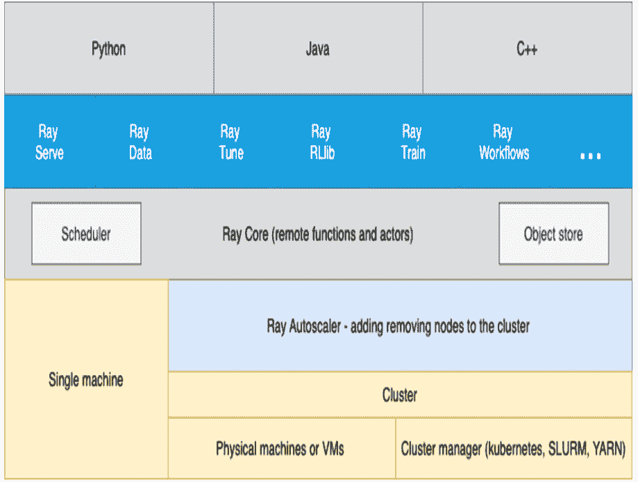

# 使用 Ray 扩展 Python

在无服务器和云环境中探索 Actor、分布式数据及相关技术


早期发布
原始且未经编辑

Holden Karau & Boris Lublinsky

# 使用 Ray 扩展 Python

在无服务器和云环境中探索 Actor、分布式数据及相关技术

> 通过早期发布的电子书，您可以在书籍的最初阶段获取内容——即作者撰写时的原始且未经编辑的内容——从而在这些书籍正式发布之前就能利用这些技术。

**Holden Karau 和 Boris Lublinsky**

# 使用 Ray 扩展 Python

作者：Holden Karau 和 Boris Lublinsky

版权所有 © 2023 Holden Karau 和 Boris Lublinsky。保留所有权利。

印刷于美国。

由 O’Reilly Media, Inc. 出版，地址：1005 Gravenstein Highway North, Sebastopol, CA 95472。

O’Reilly 图书可用于教育、商业或销售推广用途。大多数书籍也提供在线版本（[http://oreilly.com](http://oreilly.com)）。如需更多信息，请联系我们的企业/机构销售部门：800-998-9938 或 *corporate@oreilly.com*。

收购编辑：Jessica Haberman

开发编辑：Virginia Wilson

制作编辑：Gregory Hyman

内页设计师：David Futato

封面设计师：Karen Montgomery

插画师：Kate Dullea

2023年6月：第一版

# 早期发布修订历史

- 2022-02-03：首次发布
- 2022-03-25：第二次发布

发布详情请参见 [http://oreilly.com/catalog/errata.csp?isbn=9781098118808](http://oreilly.com/catalog/errata.csp?isbn=9781098118808)。

O’Reilly 标志是 O’Reilly Media, Inc. 的注册商标。*使用 Ray 扩展 Python*、封面图像及相关商业外观是 O’Reilly Media, Inc. 的商标。

本书中表达的观点均为作者观点，不代表出版商观点。虽然出版商和作者已尽最大努力确保本书所含信息和说明的准确性，但出版商和作者对任何错误或遗漏概不负责，包括但不限于因使用或依赖本书而造成的损害。使用本书所含信息和说明的风险由您自行承担。如果本书包含或描述的任何代码示例或其他技术受开源许可或他人知识产权约束，您有责任确保您的使用符合此类许可和/或权利。

978-1-098-11880-8

# 第 1 章。什么是 Ray？

> ### 给早期发布读者的说明

通过早期发布的电子书，您可以在书籍的最初阶段获取内容——即作者撰写时的原始且未经编辑的内容——从而在这些书籍正式发布之前就能利用这些技术。

这将是最终书籍的第一章。请注意，GitHub 仓库稍后将开放。

如果您对如何改进本书内容和/或示例有任何意见，或者发现本章中有缺失内容，请通过 vwilson@oreilly.com 联系编辑。

Ray 主要是一个用于“快速且简单的分布式计算”的 Python 工具<sup>1</sup>。加州大学伯克利分校的同一个实验室<sup>2</sup>创建了最终成为 Apache Spark 的初始软件，也创建了 Ray 的第一个版本。该实验室的研究人员已成立公司 Anyscale，以继续开发并围绕 Ray 提供产品和服务。Ray 的目标是解决比其前身更广泛的问题，支持从 Actor 到机器学习再到数据并行的各种可扩展编程模型。其远程函数和 Actor 模型使其成为一个真正通用的开发环境，而不仅仅适用于“大数据”。

Ray 会根据需要自动扩展计算资源，让您专注于代码而非管理服务器。Ray 可以直接自行管理并扩展云资源（使用 `ray up`），也可以使用 Kubernetes 等集群管理器。除了传统的水平扩展（例如添加更多机器）外，Ray 还可以调度任务以利用不同的机器大小和 GPU 等加速器。

自 AWS Lambda 推出以来，人们对无服务器计算的兴趣激增——这是一种云计算模型，云提供商按需分配机器资源，代表客户管理服务器。Ray 通过提供以下功能，为通用无服务器平台奠定了良好基础：

- 它隐藏了服务器。Ray 自动扩展透明地根据应用程序需求管理服务器。
- 通过提供 Actor 编程模型，Ray 不仅实现了无状态（大多数无服务器实现的典型特征），还实现了有状态编程模型。
- Ray 允许您指定资源，包括执行无服务器函数所需的硬件加速器。
- Ray 支持任务之间的直接通信，因此不仅支持简单函数，还支持复杂的分布式应用程序。

Ray 提供了丰富的库，这些库利用其无服务器能力实现，从而简化了充分利用其能力的应用程序创建。通常，您需要不同的工具来处理从数据处理到工作流管理的所有事情。通过使用单一工具处理应用程序的大部分内容，您不仅简化了开发，还简化了运营管理。

在本章中，我们将探讨 Ray 在生态系统中的定位，并帮助您判断它是否适合您的项目。

## 为什么需要它？

当问题变得太大，无法在单个进程中处理时——涵盖从多核到多计算机——我们经常需要像 Ray 这样的工具。如果您发现自己想知道如何处理下个月用户、数据或复杂性的增长，我们希望您能看看 Ray。Ray 的存在是因为扩展软件很难，而且随着时间的推移，这类问题往往会变得更难而非更简单。

Ray 不仅可以扩展到多台计算机，还可以在您无需直接管理服务器的情况下进行扩展。Leslie Lamport 曾说过：“分布式系统是指一台您甚至不知道存在的计算机发生故障，就会导致您自己的计算机无法使用的系统。”虽然这种故障仍然可能发生，但 Ray 能够从许多类型的故障中自动恢复。

Ray 可以在您的笔记本电脑上干净地运行，也可以使用相同的 API 进行大规模部署。这为使用 Ray 提供了一个非常简单的入门选项，无需上云即可开始尝试 Ray。一旦您熟悉了 API 和应用程序结构，您可以简单地将代码移动到云中以获得更好的可扩展性，而无需修改代码。这填补了分布式系统和单线程应用程序之间的需求空白。Ray 能够使用与分布式计算相同的抽象来管理多个线程和 GPU。

## 可以在哪里运行 Ray？

Ray 可以部署在各种环境中，从您的笔记本电脑到云，再到 Kubernetes 或 Yarn 等集群管理器，甚至到隐藏在您桌子下的六个树莓派。³ 在本地模式下，入门可以像 `pip install` 和调用 `ray.init` 一样简单。⁴

### RAY 集群

Ray 集群由一个头节点和一组工作节点组成：


如上图所示，头节点除了支持工作节点的所有功能外，还有两个额外的组件：

*全局控制存储*

包含集群范围的信息，包括对象表、任务表、函数表、事件日志等。此存储的内容用于 Web UI、错误诊断、调试和性能分析工具。

*自动扩展器*

尝试启动/终止工作节点，以确保工作负载有足够的资源运行，同时最小化空闲资源。

头节点实际上是一个主节点（单例⁵），它通过自动伸缩器管理整个集群。Ray 的每个节点都包含一个 Raylet，它由两个主要组件组成：

*对象存储*

所有对象存储相互连接，你可以将这个集合想象成类似 memcached 的分布式缓存。

*调度器*

每个 Ray 节点都提供一个本地调度器，这些调度器可以相互通信，从而为整个 Ray 集群创建一个统一的分布式调度器。

当我们谈论 Ray 集群中的节点时，我们指的不是物理机器，而是基于 Docker 镜像的逻辑节点。因此，在映射到物理机器时，一个给定的物理节点可以运行一个或多个逻辑节点。

`ray up` 是 Ray 的一部分，它允许你创建集群，并且它会：

-   如果是在云⁶或集群管理器上运行，则使用提供商的 SDK 或直接访问物理机器来配置新的实例/机器
-   执行 shell 命令以使用所需的选项设置 Ray
-   运行任何自定义的、用户定义的设置命令，例如设置环境变量和安装包
-   初始化 Ray 集群
-   如果需要，部署自动伸缩器

除了 `ray up`，如果你在 Kubernetes 上运行，你可以使用 Ray Kubernetes Operator。虽然 `ray up` 或 Kubernetes Operator 是创建 Ray 集群的首选方式，但如果你有一组现有的机器（无论是物理机还是虚拟机），你也可以手动设置 Ray 集群。
无论你采用哪种部署方式，相同的 Ray 代码都应该在任何地方运行。⁷ 我们将在下一章更详细地探讨在本地模式下运行 Ray，如果你想进一步扩展，我们将在[待添加的链接]中介绍部署到云端和资源管理器。

## 使用 Ray 运行你的代码

Ray 不仅仅是一个你可以导入的库；它也是一个集群管理工具。除了导入库，你还需要“连接”到一个 Ray 集群。你有三种方式将你的代码连接到 Ray 集群：

*调用不带参数的 `ray.init()`*

这会启动一个嵌入式的、单节点的 Ray 实例，该实例立即可供应用程序使用。

*使用 Ray 客户端*
`ray.init("ray://<head_node_host>:10001")` 连接到一个 Ray 集群

默认情况下，每个 Ray 集群启动时都会在头节点上运行一个 Ray 客户端服务器，该服务器可以接收远程客户端连接。但请注意，当客户端位于远程时，由于广域网延迟，直接从客户端运行的某些操作可能会变慢。Ray 对头节点和客户端之间的网络故障不具备弹性。

*使用 Ray 命令行 API*

你可以使用 `ray submit` 命令在集群上执行 Python 脚本。这会将指定的文件复制到头节点集群，并使用给定的参数执行它。请注意，如果你传递参数，你的代码应该使用 Python 的 `sys` 模块，该模块通过 `sys.argv` 提供对任何命令行参数的访问。这消除了使用 Ray 客户端时潜在的网络故障点。

## 它在生态系统中的位置是什么？

Ray 处于问题空间的独特交叉点。Ray 解决的第一个问题是通过管理资源（无论是服务器、线程还是 GPU）来扩展你的 Python 代码。Ray 的核心构建块是调度器、分布式数据存储和 Actor 系统。Ray 使用的调度器足够通用，可以存在于工作流调度领域，而不仅仅是“传统”的扩展问题。Ray 的 Actor 系统为你提供了一种简单的方式来处理有弹性的分布式执行状态。⁸ 除了可扩展的构建块，Ray 还有更高层次的库，如 Serve、Data、Tune、RLlib、Train 和 Workflows，它们存在于机器学习问题领域。整体的 Ray 生态系统如图 1-1 所示。



图 1-1. Ray 生态系统

让我们看看一些不同的问题领域，看看 Ray 如何融入并与现有工具进行比较。

**表 1-1** 将 Ray 与几个相关的系统类别进行了比较。

### 表 1-1. 将 Ray 与相关系统进行比较

| 类别 | 描述 |
| --- | --- |
| 集群编排器 | 集群编排器，如 Kubernetes、SLURM 和 YARN，用于调度容器。Ray 可以利用这些来分配集群节点。 |
| 并行化框架 | 与 Python 并行化框架（如 multiprocessing 或 Celery）相比，Ray 提供了更通用、更高性能的 API。此外，Ray 的分布式对象支持跨并行执行器的数据共享。 |
| 数据处理框架 | 与现有的数据处理框架（如 Spark、MARS 或 Dask）相比，Ray 的底层 API 更灵活，更适合作为“分布式粘合剂”框架。虽然 Ray 本身不理解数据模式、关系表或流式数据流，但它支持运行许多这样的数据处理框架，例如 Modin、Dask-on-Ray、MARS-on-Ray 和 RayDP（Spark on Ray）。 |
| Actor 框架 | 与专门的 Actor 框架（如 Erlang、Akka 和 Orleans）不同，Ray 将 Actor 框架直接集成到编程语言中。此外，Ray 的分布式对象支持跨 Actor 的数据共享。 |
| 工作流 | 当大多数人谈论工作流时，他们谈论的是 UI 或脚本驱动的低代码开发。虽然这种方法对非技术用户可能非常有用，但它们经常给软件工程师带来的痛苦多于价值。Ray 使用编程式工作流实现（与 Cadence 相比）。这种实现结合了 Ray 动态任务图的灵活性和强大的持久性保证。它提供亚秒级的任务启动开销，并支持具有数十万步骤的工作流。它还利用 Ray 对象存储在步骤之间传递分布式数据集。 |
| HPC 系统 | 与 Ray 暴露任务和 Actor API 不同，大多数 HPC 系统暴露更底层的消息 API，提供更大的应用程序灵活性。此外，许多 HPC 实现提供了优化的集体通信原语。Ray 提供了一个集体通信库，实现了其中的许多功能。 |

## “大数据” / 可扩展数据帧

Ray 为可扩展数据帧提供了几种不同的 API，这是大数据生态系统的基石。它建立在 Apache Arrow 项目之上，提供了一个（有限的）分布式数据帧 API，称为 `ray.data.Dataset`。除此之外，Ray 还通过 DaskOnRay 提供了更类似 pandas 的体验支持。

> **警告**

除了上述库，你可能会发现关于 Mars on Ray 或 Ray（已弃用）内置 pandas 支持的引用。这些库不支持分布式模式，因此它们可能会限制你的可扩展性。

## RAY 和 SPARK

很容易将 Ray 与 Apache Spark 进行比较，在某些抽象层面上，它们非常相似。从用户的角度来看，Apache Spark 非常适合数据密集型任务，而 Ray 更适合计算密集型任务。

Ray 的任务开销更低，并且支持分布式状态，这使其对机器学习任务特别有吸引力。Ray 的底层 API 使其成为一个更有吸引力的构建工具的平台。

Spark 拥有更多的数据工具，但依赖于集中式调度和状态管理。这种集中化使得实现强化学习和递归算法成为一项挑战。对于分析用例，特别是在现有的大数据部署中，Spark 可能是更好的选择。

Ray 和 Spark 是互补的，可以一起使用。一种常见的模式是使用 Spark 进行数据处理，然后使用 Ray 进行机器学习。事实上，`RayDP` 库为你提供了一种在 Ray 中使用 Spark 数据帧的方法。

## 机器学习

Ray 有多个机器学习库，在大多数情况下，它们的作用是将大部分复杂部分委托给现有工具，如 PyTorch、Scikit-Learn 和 Tensorflow，同时使用 Ray 的分布式计算设施进行扩展。Ray Tune 实现了超参数调优，利用 Ray 在分布式机器集上并行训练许多本地 Python 模型的能力。Ray Train 使用 PyTorch 或 Tensorflow 实现分布式训练。Ray 的 RLlib 接口提供了具有多种核心算法的强化学习。

Ray 能够从纯数据并行系统中脱颖而出的部分原因在于其 Actor 模型，该模型允许更容易地跟踪“状态”-

## 工作流调度

工作流调度初看之下似乎很简单。它“不过”是一个需要完成的工作图。然而，所有程序都可以表示为“不过”是一个需要完成的工作图。Ray 2.0 新增了工作流库，简化了传统业务逻辑工作流和大规模（例如机器学习训练）工作流的表达。

Ray 在工作流调度方面独具特色，因为它允许任务调度其他任务，而无需回调中央节点。这提供了更大的灵活性和吞吐量。

如果你觉得 Ray 的工作流引擎过于底层，可以使用 Ray 来运行 Apache Airflow。Airflow 是大数据领域中较流行的工作流调度引擎之一。[Ray Airflow Provider](https://docs.ray.io/en/latest/ray-airflow/index.html) 允许你将 Ray 集群用作 Airflow 的工作池。

## 流处理

流处理通常被认为是处理“近实时”数据，或“到达即处理”的数据。流处理增加了另一层复杂性，尤其是当你试图接近实时处理时，因为并非所有数据都能始终按顺序或准时到达。Ray 提供了一些标准的流处理原语，并可以使用 Kafka 作为流数据源和接收器。Ray 使用其 Actor 模型 API 与流数据交互。

Ray 流处理，就像许多嫁接在批处理系统上的流系统一样，有一些有趣的特性。值得注意的是，与 Ray 的其他部分不同，Ray 流处理更多地在 Java 中实现其逻辑。这使得调试流处理应用程序比调试 Ray 的其他组件更具挑战性。

## 交互式

并非所有“近实时”应用程序都必然是“流处理”应用程序。一个常见的例子是你交互式地探索数据集时。类似地，与用户输入交互（例如，服务模型）可以被认为是交互式的而非批处理的，但它通过“Ray Serve”与流处理库分开处理。

## Ray 不是什么

虽然 Ray 是一个通用分布式系统，但重要的是要注意 Ray 不是什么（当然，你可以让它成为，但你可能不想）：

- SQL / 分析引擎
- 数据存储系统
- 适合运行核反应堆
- 完全语言无关

在所有这些情况下，Ray 可以用来做一点，但你可能更适合使用更专业的工具。例如，虽然 Ray 确实有一个键/值存储，但它并非设计为在主节点丢失后仍能生存。这并不意味着如果你发现自己正在处理一个需要一点 SQL 或一些非 Python 库的问题，Ray 无法满足你的需求——只是你可能需要引入额外的工具。

## 结论

Ray 有潜力极大地简化中大规模问题的开发和运维开销。它通过提供跨多种传统独立问题的统一 API，同时提供无服务器可扩展性来实现这一点。如果你的问题跨越 Ray 服务的领域，或者只是厌倦了管理自己集群的运维开销，我们希望你能加入我们学习 Ray 的旅程。在下一章中，我们将向你展示如何在本地模式下在你的机器上安装 Ray，并将从 Ray 支持的一些生态系统（Actor、大数据等）中查看几个不同的 hello-world 示例。

1.  你也可以从 Java 使用 Ray。像许多 Python 应用程序一样，底层有很多 C++ 和一些 Fortran。Ray 流处理也有一些 Java 组件。
2.  不完全相同，但它是后续迭代。它的名字是 RISE Lab。
3.  ARM 支持，包括树莓派和原生 M1，目前需要手动构建。
4.  现代 Ray 的大部分功能会在没有上下文时自动初始化一个上下文，允许你甚至跳过这部分。
5.  不幸的是，主节点也是一个单点故障。如果你丢失了主节点，你将丢失集群并需要重新创建它。此外，如果你丢失了主节点，现有的工作节点可能会成为孤儿，必须“手动”移除。
6.  Ray 目前支持 AWS、Azure 和 GCP。
7.  速度差异很大。例如，当你需要特定的库或硬件来运行代码时，这可能会变得更加复杂。
8.  对于熟悉的人来说，这属于“响应式系统”的范畴。

# 第 2 章. Ray 入门（本地）

> ### 给早期发布读者的说明

通过早期发布电子书，你可以在书籍的最早期形式中获取内容——作者在写作过程中的原始未编辑内容——因此你可以在这些书籍正式发布之前很久就利用这些技术。

这将是最终书籍的第二章。请注意，GitHub 仓库稍后将激活。

如果你对我们如何改进本书的内容和/或示例有意见，或者你注意到本章中有缺失的材料，请联系编辑 vwilson@oreilly.com。

正如我们所讨论的，Ray 对于从单台计算机到集群的资源管理都很有用。从本地安装开始更简单，它利用了多核/多 CPU 的并行性。即使部署到集群，你也需要在本地安装 Ray 进行开发。一旦你安装了 Ray，我们将向你展示如何制作和调用你的第一个异步并行化函数，并在 Actor 中存储状态。

> ### 提示

如果你赶时间，你也可以在示例仓库上使用 gitpod 来获取一个包含示例的 Web 环境，或者查看 Anyscale 的托管 Ray。

## 安装

安装 Ray，即使在单台机器上，也可能从相对简单到相当复杂。Ray 按照正常的发布节奏向 PyPI 发布 wheel 包，以及每夜构建版本。这些 wheel 包目前仅适用于 x86 用户，因此 ARM 用户大多需要从源代码构建 Ray。¹

> **提示**
> 在 OSX 上的 M1 ARM 用户可以使用 Rosetta 运行 x86 包。这会有一些性能影响，但设置要简单得多。要使用 x86 包，请为 OSX 安装 Anaconda Python。

### 安装（适用于 x86 和 M1 ARM）

大多数用户可以运行 `pip install -U ray` 从 PyPI 自动安装 Ray。当你需要在多台机器上分发计算时，通常更容易在 conda 环境中工作，这样你可以匹配集群的 Python 版本并了解你的包依赖关系。示例 2-1 中的命令设置了一个新的 conda 环境，其中包含 Python 并安装了 Ray 及一些最小依赖项。

```
示例 2-1.
conda create -n ray python=3.7 mamba -y
conda activate ray
### 在 conda 环境中，这些不会随 ray 自动安装，因此添加它们
pip install jinja2 python-dateutil cloudpickle packaging pygments \
    psutil nbconvert ray
```

### 安装（从源代码）适用于 ARM

对于 ARM 用户或任何系统架构没有预构建 wheel 包的用户，你需要从源代码构建 Ray。

在我们的 ARM Ubuntu 系统上，我们需要安装一些额外的包，如示例 2-2 所示。

```
示例 2-2.
sudo apt-get install -y git tzdata bash libhdf5-dev curl pkg-config wget cmake build-essential \
    zlib1g-dev zlib1g openssh-client gnupg unzip libunwind8 libunwind-dev \
    openjdk-11-jdk git
#### 根据 debian 版本
sudo apt-get install -y libhdf5-100 || sudo apt-get install -y libhdf5-103
#### 安装 bazelisk 以安装 bazel（Ray 的 CPP 代码需要）
#### 参见 https://github.com/bazelbuild/bazelisk/releases
#### 在 Linux ARM 上
BAZEL=bazelisk-linux-arm64
#### 在 MAC ARM 上
#### BAZEL=bazelisk-darwin-arm64
wget -q https://github.com/bazelbuild/bazelisk/releases/download/v1.10.1/${BAZEL} -O /tmp/bazel
chmod a+x /tmp/bazel
sudo mv /tmp/bazel /usr/bin/bazel
#### 安装 node，UI 需要
curl -fsSL https://deb.nodesource.com/setup_16.x | sudo bash -
sudo apt-get install -y nodejs
```

如果你是不想使用 Rosetta 的 M1 Mac 用户，你需要安装一些依赖项。你可以使用 homebrew 和 pip 安装它们，如示例 2-3 所示。

```
示例 2-3.
brew install bazelisk wget python@3.8 npm
#### 确保在系统 Python 之前使用 homebrew Python
export PATH=$(brew --prefix)/opt/python@3.8/bin/:$PATH
echo "export PATH=$(brew --prefix)/opt/python@3.8/bin/:$PATH" >> ~/.zshrc
echo "export PATH=$(brew --prefix)/opt/python@3.8/bin/:$PATH" >> ~/.bashrc
#### 安装一些 Ray 为 ARM 错误打包的库
pip3 install --user psutil cython colorama
```

你需要单独构建一些 Ray 组件，因为它们是用不同的语言编写的。这确实使其更复杂，但你可以按照示例 2-4 中的步骤操作。

```
示例 2-4.
git clone https://github.com/ray-project/ray.git
cd ray
```

### 构建 Ray UI
pushd python/ray/new_dashboard/client; npm install && npm ci && npm run build; popd
#### 指定特定的 bazel 版本，因为较新的版本有时会导致问题。
export USE_BAZEL_VERSION=4.2.1
cd python
#### 仅限 MAC ARM 用户：清理第三方文件
rm -rf ./thirdparty_files
#### 以编辑模式安装或构建 wheel 包
pip install -e .
#### python setup.py bdist_wheel

> **提示**

构建过程中最耗时的部分是编译 C++ 代码，即使在现代机器上也可能需要长达一小时。如果你有一个包含多台 ARM 机器的集群，通常值得构建一次 wheel 包，然后在集群中重复使用。

## Hello World 示例

既然你已经安装了 Ray，现在是时候了解一些 Ray API 了。我们将在后面更详细地介绍这些 API，所以现在不必过于纠结细节。

### Ray Remote（任务/Futures）Hello World

Ray 的核心构建模块之一是“远程”函数/futures。这里的“远程”指的是相对于我们的主进程而言，可以在同一台机器上，也可以在不同的机器上。

为了更好地理解这一点，你可以编写一个函数来返回它运行的位置。Ray 在多个进程之间分配工作，在分布式模式下，甚至在多个主机之间分配。这个函数的本地（非 Ray）版本如示例 2-5 所示。

*示例 2-5.*

```
def hi():
    import os
    import socket
    return f"Running on {socket.gethostname()} in pid {os.getpid()}"
```

你可以使用 `ray.remote` 装饰器来创建一个远程函数。调用远程函数有些不同，需要通过调用函数的 `.remote` 方法来实现。当你调用远程函数时，Ray 会立即返回一个 future，而不是阻塞等待结果。你可以使用 `ray.get` 来获取这些 future 中返回的值。要将示例 2-5 转换为远程函数，你只需要使用 `ray.remote` 装饰器，如示例 2-6 所示。

*示例 2-6.*

```
@ray.remote
def remote_hi():
    import os
    import socket
    return f"Running on {socket.gethostname()} in pid {os.getpid()}"

future = remote_hi.remote()
ray.get(future)
```

当你运行这两个示例时，你会看到第一个示例在同一个进程中执行，而 Ray 将第二个示例调度到另一个进程中执行。当我们运行这两个示例时，分别得到“Running on jupyter-holdenk in pid 33”和“Running on jupyter-holdenk in pid 173”。

### 耗时任务

虽然有些刻意，但理解远程 futures 如何提供帮助的一个简单方法是创建一个故意很慢的函数，在我们的例子中是 `slow_task`，然后让 Python 使用常规函数调用和 Ray 远程调用来计算。

*示例 2-7.*

```
import timeit

def slow_task(x):
    import time
    time.sleep(2) # 执行一些科学计算/业务逻辑
    return x

@ray.remote
def remote_task(x):
    return slow_task(x)

things = range(10)

very_slow_result = map(slow_task, things)
slowish_result = map(lambda x: remote_task.remote(x), things)

slow_time = timeit.timeit(lambda: list(very_slow_result), number=1)
fast_time = timeit.timeit(lambda:
list(ray.get(list(slowish_result))), number=1)
print(f"In sequence {slow_time}, in parallel {fast_time}")
```

当你运行示例 2-7 中的代码时，你会看到通过使用 Ray 远程函数，你的代码能够同时执行多个远程函数。虽然你可以通过使用 multiprocessing 在没有 Ray 的情况下实现这一点，但 Ray 为你处理了所有细节，并且最终可以扩展到多台机器。

### 嵌套和链式任务

Ray 在分布式处理领域的一个显著特点是允许嵌套和链式任务。在其他任务内部启动更多任务可以使某些类型的递归算法更容易实现。使用嵌套任务的一个更直接的例子是网络爬虫。在网络爬虫中，我们访问的每个页面都可以启动对该页面上链接的多次额外访问，如示例 2-8 所示。

*示例 2-8.*

```
@ray.remote
def crawl(url, depth=0, maxdepth=1, maxlinks=4):
    links = []
    link_futures = []
    import requests
    from bs4 import BeautifulSoup
    try:
        f = requests.get(url)
        links += [(url, f.text)]
        if (depth > maxdepth):
            return links # 基本情况
        soup = BeautifulSoup(f.text, 'html.parser')
        c = 0
        for link in soup.find_all('a'):
            try:
                c = c + 1
                link_futures += [crawl.remote(link["href"], depth=(depth+1), maxdepth=maxdepth)]
                # 不要分支太多，我们仍在本地模式下，而且网络很大
                if c > maxlinks:
                    break
            except:
                pass
        for r in ray.get(link_futures):
            links += r
        return links
    except requests.exceptions.InvalidSchema:
        return [] # 跳过非网络链接
    except requests.exceptions.MissingSchema:
        return [] # 跳过非网络链接

ray.get(crawl.remote("http://holdenkarau.com/"))
```

许多其他系统要求所有任务都在中央协调节点上启动。即使那些支持以嵌套方式启动任务的系统，通常也依赖于中央调度器。

### 数据 Hello World

Ray 有一个功能相对有限的数据集 API，用于处理结构化数据。Apache Arrow 为 Ray 的 Data API 提供支持。Arrow 是一种面向列的、与语言无关的格式，具有一些流行的操作。许多流行工具支持 Arrow，允许在它们之间轻松传输（例如 Spark、Ray、Dask、Tensorflow 等）。

Ray 最近在 1.9 版本中添加了对数据集的按键聚合功能。最流行的分布式数据示例是词频统计，它需要聚合操作。我们可以不使用这些，而是执行易于并行化的任务，例如 map 转换，如示例 2-9 所示，通过构建一个网页数据集。

*示例 2-9. 构建网页数据集*

```
#### 创建一个 URL 对象的数据集。我们也可以从文本文件加载，使用 ray.data.read_text()
urls = ray.data.from_items([
    "https://github.com/scalingpythonml/scalingpythonml",
    "https://github.com/ray-project/ray"])

def fetch_page(url):
    import requests
    f = requests.get(url)
    return f.text

pages = urls.map(fetch_page)
#### 查看一个页面以确保它正常工作
pages.take(1)
```

Ray 1.9 添加了 `GroupedDataset` 以支持不同类型的聚合。通过使用列名或返回键的函数调用 `groupby`，你会得到一个 `GroupedDataset`。`GroupedDataset` 内置支持 `count`、`max`、`min` 和其他常见聚合。你可以使用 `GroupedDatasets` 将示例 2-9 扩展为词频统计示例，如示例 2-10 所示。

*示例 2-10. 构建网页数据集*

```
words = pages.flat_map(lambda x: x.split(" ")).map(lambda w: (w, 1))
grouped_words = words.groupby(lambda wc: wc[0])
```

当你需要超越内置操作时，Ray 支持自定义聚合，前提是你实现其接口。我们将在[待补充链接]中更详细地介绍数据集，包括聚合函数。

> **注意**

Ray 对其 Data API 使用阻塞求值。这意味着当你在 Ray 数据集上调用函数时，它会等待完成并返回结果，而不是返回一个 future。Ray 核心 API 的其余部分使用 futures。

如果你想要一个功能齐全的 DataFrame API，你可以将你的 Ray 数据集转换为 Dask。[待补充链接]介绍了如何使用 Dask 进行更复杂的操作。如果你有兴趣了解更多关于 Dask 的知识，你应该查看 Holden 的书 *Scaling Python with Dask*。

### Actor Hello World

Ray 的独特之处之一在于它对 actor 的强调。Actor 为你提供了管理执行状态的工具，这是扩展系统时更具挑战性的部分之一。Actor 发送和接收消息，并相应地更新其状态。这些消息可以来自其他 actor、程序，或者你的“主”执行线程（通过 Ray 客户端）。对于每个 actor，Ray 都会启动一个专用进程。每个 actor 都有一个等待处理的消息邮箱，当你调用一个 actor 时，Ray 会向相应的邮箱添加一条消息。这使得 Ray 能够序列化消息处理，从而避免昂贵的分布式锁。Actor 可以返回值以响应消息，因此当你向 actor 发送消息时，Ray 会立即返回一个 future，以便你在完成时获取值。

> **Actor 的用途和历史**

Actor 在 Ray 之前就有很长的历史，最早于 1973 年引入。Actor 模型是解决有状态并发问题的优秀方案，可以替代复杂的锁结构。其他一些著名的 actor 实现包括 Scala 中的 AKKA 和 Erlang。

Actor 模型可用于从电子邮件等现实世界系统、温度跟踪等物联网应用到航班预订等各种场景。Ray actor 中一个常见的用例是管理状态（例如权重），同时执行分布式机器学习，而无需昂贵的锁。²

Actor 模型在处理需要按顺序处理并作为一组回滚的多个事件时面临挑战。一个经典的例子是银行业务，其中交易需要涉及多个账户并作为一组回滚。

Ray actor 的创建和调用类似于远程函数，但使用 Python 类，这为 actor 提供了存储状态的地方。你可以通过修改经典的“Hello World”示例来按顺序向你问好，如示例 2-11 所示，来实际体验这一点。

## 示例 2-11. Actor Hello World

```python
@ray.remote
class HelloWorld(object):
    def __init__(self):
        self.value = 0
    def greet(self):
        self.value += 1
        return f"Hi user #{self.value}"

### 创建一个 actor 实例
hello_actor = HelloWorld.remote()

### 调用 actor
print(ray.get(hello_actor.greet.remote()))
print(ray.get(hello_actor.greet.remote()))
```

这个示例相当基础；它缺乏任何容错机制或 actor 内部的并发处理。我们将在[后续链接]中更深入地探讨这些内容。

## 结论

在本章中，你已经在本地机器上安装了 Ray 并使用了它的许多核心 API。在大多数情况下，你可以继续以本地模式运行我们为本书挑选的示例。当然，本地模式可能会限制你的规模或导致运行时间更长。在下一章中，我们将探讨 Ray 背后的一些核心概念。其中一个概念（容错）用集群或云来演示会更容易。因此，如果你有云账户或集群的访问权限，现在正是跳转到[后续链接]并查看不同部署选项的绝佳时机。

1. 随着 ARM 的日益普及，Ray 更有可能添加 ARM 轮子，因此希望这只是暂时的。
2. Actor 仍然比无锁远程函数更昂贵，后者可以水平扩展。例如，大量 worker 调用同一个 actor 来更新模型权重，仍然会比尴尬并行操作慢。

# 第 3 章. Ray 远程函数

> **致早期发布读者的说明**

通过早期发布电子书，你可以在书籍的最早期形式——作者撰写时的原始未编辑内容——中获取书籍，从而在这些书籍正式发布之前很久就能利用这些技术。

这将是最终书籍的第三章。请注意，GitHub 仓库稍后将激活。

如果你对我们如何改进本书的内容和/或示例有意见，或者你发现本章中有缺失的材料，请通过 vwilson@oreilly.com 联系编辑。

在大规模构建现代应用程序时，你通常需要某种形式的分布式或并行计算。许多 Python 开发者是通过 [multiprocessing 模块](https://docs.python.org/3/library/multiprocessing.html) 接触到并行计算的。Multiprocessing 在处理现代应用程序的需求方面能力有限。这些需求包括：

- 在多个核心或机器上运行相同的代码
- 处理机器和处理故障的工具
- 高效处理大型参数
- 轻松地在进程之间传递信息

与 multiprocessing 不同，Ray 的远程函数满足上述要求。需要注意的是，“远程”并不一定指单独的计算机，尽管它的名字如此。当你创建一个远程函数时，Ray 会接管对该函数的调用分发，而不是在同一个进程中运行。调用远程函数时，你实际上是在多个核心或不同机器上异步¹运行，而无需关心如何或在哪里运行。

在本章中，你将学习如何创建远程函数、等待它们完成以及获取结果。一旦掌握了基础知识，你将学习如何将远程函数组合在一起以创建更复杂的操作。在深入之前，让我们先从理解我们在上一章中略过的一些内容开始。

## 理解 Ray 远程函数的要点

在上一章中，你学习了如何创建一个基本的 Ray 远程函数（示例 2-7）。

当你调用一个远程函数时，它会立即返回一个 ObjectRef（一个 future），这是一个对远程对象的引用。Ray 在后台的单独 worker 进程中创建并执行任务，并在完成后将结果写入原始引用。然后你可以对 ObjectRef 调用 `ray.get` 来获取值。请注意，`ray.get` 是一个阻塞方法，它会等待任务执行完成后再返回结果。

> ### RAY 中的远程对象

远程对象只是一个对象，它可能位于另一个节点上。ObjectRef 就像指向对象的指针或 ID，你可以用它来获取远程函数的值或状态。除了从远程函数调用创建之外，你还可以使用 `ray.put` 函数显式创建 ObjectRefs。

我们将在[后续链接]中进一步探讨远程对象及其容错性。

上一章示例 2-7 中的一些细节值得理解。该示例在将迭代器传递给 `ray.get` 之前，将其从 `iterator` 转换为 `list`。当 `ray.get` 接收一个 future 列表或单个 future 时，你需要这样做。² `ray.get` 会等待它拥有所有对象，以便按顺序返回列表。

> **提示**

与常规的 ray 远程函数一样，思考每个远程调用内部完成的工作量非常重要。例如，使用 `ray.remote` 递归计算阶乘会比在本地计算慢，因为即使整体工作量可能很大，但每个函数内部的工作量很小。具体数量取决于你的集群繁忙程度，但作为一般规则，任何在几秒内执行完毕且不需要特殊资源的任务都不值得远程调度。

## 远程函数的生命周期

调用远程函数的 Ray 进程称为所有者，它调度提交的任务的执行，并在需要时协助将返回的 `ObjectRef` 解析为其底层值。

在任务提交时，所有者会等待所有依赖项（即作为参数传递给任务的 `ObjectRefs`）变为可用状态，然后再进行调度。依赖项可以是本地的也可以是远程的，所有者认为只要依赖项在集群中的任何地方可用，它们就是就绪的。当依赖项就绪时，所有者会向分布式调度器请求资源来执行任务。一旦资源可用，调度器会批准请求，并返回一个将执行该函数的 worker 的地址。

此时，所有者通过 gRPC 将任务规范发送给 worker。执行任务后，worker 会存储返回值。如果返回值很小，³ worker 会直接将值内联返回给所有者，所有者将其复制到其进程内对象存储中。如果返回值很大，worker 会将对象存储在其本地共享内存存储中，并回复所有者，表明对象现在位于分布式内存中。这使得所有者可以引用这些对象，而无需将对象获取到其本地节点。

当一个任务以 `ObjectRef` 作为其参数提交时，worker 必须先解析其值，然后才能开始执行任务。

任务可能以错误结束。Ray 区分两种类型的任务错误：

*应用层*

这是指 worker 进程存活但任务以错误结束的任何场景。例如，一个在 Python 中抛出 `IndexError` 的任务。

*系统层*

这是指 worker 进程意外死亡的任何场景。例如，一个进程发生段错误，或者 worker 的本地 raylet 死亡。

由于应用层错误而失败的任务永远不会重试。异常被捕获并存储为任务的返回值。由于系统层错误而失败的任务可能会自动重试，最多重试指定次数。这将在[后续链接]中有更详细的介绍。

在我们目前的示例中，使用 `ray.get` 是可以的，因为所有 future 的执行时间都相同。如果执行时间不同，例如在不同大小的数据批次上训练模型，并且你不需要同时获取所有结果，这可能会相当浪费。你应该使用 `ray.wait`，而不是直接调用 `ray.get`，它会返回指定数量的已完成 future。要查看性能差异，你需要修改你的远程函数，使其具有可变的睡眠时间，如示例 3-1 所示。

## 示例 3-1. 具有不同执行时间的远程函数

```python
@ray.remote
def remote_task(x):
    time.sleep(x)
    return x
```

你可能还记得，示例远程函数根据输入参数进行休眠。由于范围是升序排列的，对其调用远程函数将导致 future 按顺序完成。为了确保 future 不会按顺序完成，你需要修改列表，一种方法是在将远程函数映射到 things 之前调用 `things.sort(reverse=True)`。

要查看使用 `ray.get` 和 `ray.wait` 之间的区别，你可以编写一个函数，从你的 future 中收集值，并在每个对象上添加一些时间延迟以模拟业务逻辑。

第一种选择，不使用`ray.wait`，如示例3-2所示，代码更简洁、更易读，但不推荐在生产环境中使用。

## 示例 3-2. 不使用 wait 的 Ray get

```python
### 按顺序处理
def in_order():
    # 创建 futures
    futures = list(map(lambda x: remote_task.remote(x), things))
    values = ray.get(futures)
    for v in values:
        print(f" Completed {v}")
        time.sleep(1) # 业务逻辑在此处
```

第二种选择稍微复杂一些，如示例3-3所示。其工作原理是调用`ray.wait`来查找下一个可用的 future，并迭代直到所有 future 都已完成。`ray.wait`返回两个列表：一个是已完成任务的对象引用列表（数量由请求的大小决定，默认为1），另一个是剩余对象引用的列表。

## 示例 3-3. 使用 ray wait

```python
### 当结果可用时处理
def as_available():
    # 创建 futures
    futures = list(map(lambda x: remote_task.remote(x), things))
    # 当仍有待处理的 futures 时
    while len(futures) > 0:
        ready_futures, rest_futures = ray.wait(futures)
        print(f"Ready {len(ready_futures)} rest {len(rest_futures)}")
        for id in ready_futures:
            print(f'completed value {id}, result {ray.get(id)}')
            time.sleep(1) # 业务逻辑在此处
        # 我们只需要等待那些尚未可用的
        futures = rest_futures
```

使用`timeit.time`并行运行这些函数，你可以看到性能上的差异。需要注意的是，这种性能提升取决于非并行化的业务逻辑（循环中的逻辑）所需的时间。如果你只是对结果求和，直接使用`ray.get`可能没问题，但如果你执行更复杂的操作，应该使用`ray.wait`。当我们运行这个时，使用`ray.wait`大约能看到2倍的性能提升。你可以尝试改变 sleep 时间，看看效果如何。

你可能希望为`ray.wait`指定几个可选参数之一：

- `num_returns`：Ray 在返回前等待完成的 ObjectRef 数量。你应该将`num_returns`设置为小于或等于输入 ObjectRef 列表的长度；否则，函数会抛出异常。⁴ 默认值为1。
- `timeout`：返回前等待的最大时间（以秒为单位）。默认值为-1（视为无限）。
- `fetch_local`：如果你只关心确保 futures 已完成，可以通过将此参数设置为`false`来禁用结果的获取。

> **提示**
>
> `timeout`参数在`ray.get()`和`ray.wait()`中都极其重要。如果未指定此参数，并且你的某个远程函数行为异常（即永不完成），那么`ray.get()`/`ray.wait()`将永远不会返回，你的程序将永远阻塞。⁵ 因此，对于任何生产代码，我们建议你在两者中都使用`timeout`参数以避免死锁。

Ray 的`get`和`wait`函数处理超时的方式略有不同。当超时发生时，`ray.wait`不会引发异常；相反，它返回的就绪 futures 数量会少于`num_returns`。然而，如果`ray.get`遇到超时，Ray 将引发`GetTimeoutError`。请注意，wait/get 函数的返回并不意味着你的远程函数将被终止；它仍将在专用进程中运行。如果你想释放资源，可以显式地终止你的 future（我们将在后面解释）。

> **提示**
>
> 由于`ray.wait`可以按任意顺序返回结果，因此绝对不要依赖结果的顺序。如果你需要对不同的记录进行不同的处理（例如，测试 A 组和 B 组的混合），你应该在结果中编码这一点（通常使用类型）。

如果你有一个任务在合理时间内未完成（例如，一个拖后腿的任务），你可以使用与`wait`/`get`相同的 ObjectRef 来调用`ray.cancel`取消该任务。你可以修改之前的`ray.wait`示例，添加超时并取消任何“坏”任务，结果如示例3-4所示。

## 示例 3-4. 带超时和取消的 Ray wait

```python
futures = list(map(lambda x: remote_task.remote(x), [1,
threading.TIMEOUT_MAX]))
### 当仍有待处理的 futures 时
while len(futures) > 0:
    # 实际上，10秒对于大多数情况来说太短了。
    ready_futures, rest_futures = ray.wait(futures, timeout=10,
    num_returns=1)
    # 如果我们得到的少于 num_returns
    if len(ready_futures) < 1:
        print(f"Timed out on {rest_futures}")
        # 你_不必_取消，但如果你的任务使用了大量资源
        ray.cancel(*rest_futures)
        # 你应该中断，因为你已经超过了超时时间
        break
    for id in ready_futures:
        print(f'completed value {id}, result {ray.get(id)}')
        futures = rest_futures
```

> **警告**
>
> 取消任务不应成为你正常程序流程的一部分。如果你发现自己经常需要终止任务，你应该调查一下发生了什么。任何后续对已取消任务的 wait 或 get 调用都是未定义的，可能会引发异常或返回不正确的结果。

我们在上一章跳过的另一个小点是，虽然到目前为止的示例只返回单个值，但 Ray 远程函数可以返回多个值，就像普通的 Python 函数一样。

容错性是那些在分布式环境中运行的人需要考虑的重要因素。如果执行任务的 worker 意外死亡，⁶ Ray 将重新运行任务（在延迟之后），直到任务成功或超过最大重试次数。我们将在[即将推出的链接]中更详细地介绍容错性。

## 远程 Ray 函数的组合

你可以通过组合来使你的远程函数更强大。Ray 中远程函数组合的两种最常见方法是流水线化和嵌套并行。你可以使用嵌套并行来组合函数以表达递归函数。Ray 还允许你表达顺序依赖关系，而无需在驱动程序中阻塞/收集结果，这被称为“流水线化”。

你可以通过使用来自早期`ray.remote`的 ObjectRefs 作为新远程函数调用的参数来构建流水线函数。Ray 将自动获取 ObjectRefs 并将底层对象传递给你的函数。这种方法允许在函数调用之间轻松协调。此外，这种方法最小化了数据传输——结果将直接发送到执行第二个远程函数的节点。下面的示例3-5展示了一个简单的顺序计算示例。

## 示例 3-5. Ray 流水线/带任务依赖的顺序远程执行

```python
@ray.remote
def generate_number(s: int, limit: int, sl: float) -> int :
    random.seed(s)
    time.sleep(sl)
    return random.randint(0, limit)

@ray.remote
def sum_values(v1: int, v2: int, v3: int) -> int :
    return v1+v2+v3

### 获取结果
print(ray.get(sum_values.remote(generate_number.remote(1, 10, .1),
                                generate_number.remote(5, 20, .2), generate_number.remote(7, 15, .3))))
```

这段代码定义了两个远程函数，然后启动第一个函数的三个实例。所有三个实例的 ObjectRefs 然后被用作第二个函数的输入。在这种情况下，Ray 将等待所有三个实例完成，然后才开始执行 sum_values。你不仅可以使用这种方法传递数据，还可以表达基本的工作流风格依赖关系。你可以传递的 ObjectRef 数量没有限制，你也可以同时传递“普通”的 Python 对象。

你*不能*使用包含`ObjectRef`的 Python 结构（例如，列表、字典或类）来代替直接使用`ObjectRef`。Ray 只等待并解析直接传递给函数的`ObjectRefs`。如果你尝试传递一个结构，你将不得不在函数内部自己执行`ray.wait + ray.get`。示例3-6展示了示例3-5代码的一个变体，该变体无法工作。

## 示例 3-6. 带任务依赖的损坏的顺序远程函数执行

```python
@ray.remote
def generate_number(s: int, limit: int, sl: float) -> int :
    random.seed(s)
    time.sleep(sl)
    return random.randint(0, limit)

@ray.remote
```

def sum_values(values: []) -> int :
    return sum(values)

### 获取结果
print(ray.get(sum_values.remote([generate_number.remote(1, 10, .1),
                                generate_number.remote(5, 20, .2), generate_number.remote(7,
15, .3)])))

示例 3-6 已从示例 3-5 修改，以接受一个 ObjectRef 列表作为参数，而不是 ObjectRef 本身。Ray 不会“深入查看”传入的任何结构。因此，该函数将立即被调用，并且由于类型不匹配，函数将因错误 *TypeError: unsupported operand type(s) for +: int and ‘ray._raylet.ObjectRef’* 而失败。你可以通过使用 `ray.wait` + `ray.get` 来修复此错误，但这仍然会过早地启动函数，导致不必要的阻塞。

另一种组合方法是嵌套并行，即你的远程函数启动额外的远程函数。这在许多情况下都非常有用，包括递归算法、将超参数调整与并行模型训练相结合⁷ 等。让我们看看两种不同的实现嵌套并行的方法，如示例 3-7 所示。

## 示例 3-7. 嵌套并行实现

```python
@ray.remote
def generate_number(s: int, limit: int) -> int :
    random.seed(s)
    time.sleep(.1)
    return randint(0, limit)

@ray.remote
def remote_objrefs():
    results = []
    for n in range(4):
        results.append(generate_number.remote(n, 4*n))
    return results

@ray.remote
def remote_values():
    results = []
    for n in range(4):
        results.append(generate_number.remote(n, 4*n))
    return ray.get(results)

print(ray.get(remote_values.remote()))
futures = ray.get(remote_objrefs.remote())
while len(futures) > 0:
    ready_futures, rest_futures = ray.wait(futures, timeout=600, num_returns=1)
    # 如果我们得到的结果少于 num_returns，则表示发生了超时
    if len(ready_futures) < 1:
        ray.cancel(*rest_futures)
        break
    for id in ready_futures:
        print(f'completed result {ray.get(id)}')
    futures = rest_futures
```

此代码定义了三个不同的远程函数：

- `generate_numbers`：一个生成随机数的简单函数。
- `remote_objrefs`：调用多个远程函数并返回生成的 ObjectRefs。
- `remote_values`：调用多个远程函数，等待它们完成，并返回生成的值。

从这个例子可以看出，嵌套并行允许两种不同的方法。在第一种情况（`remote_objrefs`）中，你将所有 ObjectRefs 返回给聚合函数的调用者。在第一种情况中，调用代码负责等待所有远程函数完成并处理结果。在第二种情况（`remote_values`）中，聚合函数等待所有远程函数执行完成，并返回实际的执行结果。

返回所有 ObjectRefs 允许在非顺序消费时具有更大的灵活性，如前面在 `ray.await` 中所述，但它不适用于许多递归算法。对于许多递归算法（例如，快速排序、阶乘等），我们需要执行多个级别的组合步骤，这要求在每个递归级别上组合结果。

## Ray 远程最佳实践

当你使用远程函数时，请记住不要让它们太小。如果任务非常小，使用 Ray 可能比不使用 Ray 的 Python 更耗时。原因是每次任务调用都有相当大的开销（例如，调度、数据传递、进程间通信、更新系统状态）。为了从并行执行中获得真正的优势，你需要确保这个开销与函数本身的执行时间相比可以忽略不计。⁸

如本章所述，Ray 远程最强大的功能之一是能够并行化函数的执行。一旦你调用远程函数，对远程对象（future）的句柄会立即返回，调用者可以继续在本地执行或使用额外的远程函数。如果此时你调用 `ray.get()`，你的代码将阻塞等待远程函数完成，因此你将没有并行性。为了确保代码的并行化，你应该只在绝对需要数据来继续主线程执行时才调用 `ray.get()`。此外，如上所述，建议使用 `ray.wait` 而不是直接使用 `ray.get`。另外，如果一个远程函数的结果是执行另一个远程函数所必需的，请考虑使用流水线（如上所述）来利用 Ray 的任务协调。

当你向远程函数提交参数时，Ray 不会直接将它们提交给远程函数，而是将参数复制到对象存储中，然后将 `ObjectRef` 作为参数传递。因此，如果你将相同的参数发送给多个远程函数，你会因为多次将相同数据存储到对象存储中而付出（性能）代价。数据越大，代价越大。为了避免这种情况，如果你需要将相同的数据传递给多个远程函数，更好的选择是先将共享数据放入对象存储，然后使用生成的 `ObjectRef` 作为函数的参数。我们将在[待添加链接]中说明如何做到这一点。

正如我们将在第 5 章中展示的，远程函数调用由 Raylet 组件完成。如果你从单个客户端调用大量远程函数，所有这些调用都由单个 Raylet 完成，因此，给定的 Raylet 处理这些请求需要一定的时间，这可能导致启动所有函数的延迟。更好的方法，如 [Ray 设计模式](Ray design patterns) 中所述，是使用调用树——如前一节所述的嵌套函数调用。基本上，客户端创建多个远程函数，每个函数又创建更多远程函数，依此类推。在这种方法中，调用分布在多个 Raylet 上，允许调度更快地发生。

每次你使用 `@ray.remote` 装饰器定义远程函数时，Ray 会将这些定义导出到所有 Ray 工作节点，这需要时间（特别是如果你有很多节点）。为了减少函数导出的数量，一个好的做法是在顶层定义尽可能多的远程任务，而不是在循环和使用它们的局部函数内部定义。

## 通过一个示例将其整合

由其他模型组成的机器学习模型，例如集成模型，非常适合使用 Ray 进行评估。[示例 3-8](Example 3-8) 展示了使用 Ray 的函数组合为假设的网页链接垃圾邮件模型的样子。

### 示例 3-8. 集成示例

```python
import random

@ray.remote
def fetch(url: str) -> Tuple[str, str]:
    import urllib.request
    with urllib.request.urlopen(url) as response:
        return (url, response.read())

@ray.remote
def has_spam(site_text: Tuple[str, str]) -> bool:
    # 打开垃圾邮件发送者列表或下载它
    spammers_url = "https://raw.githubusercontent.com/matomo-org/referrer-spam-list/master/spammers.txt"
    import urllib.request
    with urllib.request.urlopen(spammers_url) as response:
        spammers = response.readlines()
        for spammer in spammers:
            if spammer in site_text[1]:
                return True
    return False

@ray.remote
def fake_spam1(us: Tuple[str, str]) -> bool:
    # 你应该在这里使用 TF 或甚至只是 NLTK 做一些花哨的事情
    time.sleep(10)
    if random.randrange(10) == 1:
        return True
    else:
        return False

@ray.remote
def fake_spam2(us: Tuple[str, str]) -> bool:
    # 你应该在这里使用 TF 或甚至只是 NLTK 做一些花哨的事情
    time.sleep(5)
    if random.randrange(10) > 4:
        return True
    else:
        return False

@ray.remote
def combine_is_spam(us: Tuple[str, str], model1: bool, model2: bool, model3: bool) -> Tuple[str, str, bool]:
    # 值得怀疑的伪集成
    score = model1 * 0.2 + model2 * 0.4 + model3 * 0.4
    if score > 0.2:
        return True
    else:
        return False
```

通过使用 Ray，你不需要将评估所有模型的时间相加，而是只需要等待最慢的模型，所有其他更快完成的模型都是“免费的”。例如，如果模型花费运行这些模型的评估，如果串行执行且不使用Ray，所需时间几乎是其三倍。

## 结论

在本章中，你了解了Ray的一个基本特性——远程函数的调用及其在跨多个核心和机器创建Python并行异步执行中的应用。你还学习了多种等待远程函数执行完成的方法，以及如何使用`ray.wait`来防止代码中的死锁。最后，你了解了远程函数的组合，以及如何利用它进行基本的执行控制（迷你工作流）。你还学习了如何实现嵌套并行，即你可以并行调用多个函数，而每个函数又可以依次调用更多并行函数。在下一章中，你将学习如何使用Actor在Ray中管理状态。

1.  一种花哨的说法，指同时运行多个任务而无需相互等待。
2.  Ray不会“深入”类或结构体内部去解析future，因此如果你有一个包含future的列表的列表，或者一个包含future的类，Ray不会解析“内部”的future。
3.  默认情况下小于100 KiB。
4.  目前，如果传入的ObjectRefs列表为空，Ray会将其视为特殊情况，并立即返回，无论`num_returns`的值是多少。
5.  如果你在交互式环境中工作，可以通过发送SIGINT信号或使用Jupyter中的停止按钮来修复此问题。
6.  要么是因为进程崩溃，要么是因为机器故障。
7.  然后你可以并行训练多个模型，并使用数据并行梯度计算来训练每个模型，从而实现嵌套并行。
8.  作为练习，你可以从示例2-7的函数中移除sleep，然后你会看到在Ray上执行远程函数比常规函数调用要慢好几倍。开销不是恒定的，而是取决于你的网络、调用参数的大小等。例如，如果你只有少量数据要传输，开销会比传输整个维基百科文本作为参数时要低。

# 第4章 远程Actor

> ### 给早期读者的说明

通过早期发布电子书，你可以在书籍的最早期形式——作者撰写时的原始未编辑内容——中获取书籍，从而在这些书籍正式发布之前很久就能利用这些技术。

这将是最终书籍的第四章。请注意，GitHub仓库将在稍后激活。

如果你对我们如何改进本书的内容和/或示例有意见，或者你发现本章中有缺失的材料，请通过vwilson@oreilly.com联系编辑。

在上一章中，你学习了Ray远程函数，它们对于无状态函数的并行执行非常有用。但是，如果你需要在调用之间维护状态呢？这种情况的例子从简单的计数器到训练中的神经网络，再到模拟器环境都有。在这些情况下维护状态的一个选项是将状态与结果一起返回，并将其传递给下一次调用。虽然从技术上讲这可行，但这并不是最佳解决方案，因为需要传递大量数据（尤其是当状态的大小开始增长时）。Ray使用一个称为Actor的概念来管理状态，我们将在本章中介绍。

> ### 注意

就像Ray的“远程”函数一样，所有Ray Actor都是“远程”Actor，即使它们在同一台机器上运行。

简而言之，Actor是一个具有地址（句柄）的计算机进程。这意味着它也可以在内存中存储东西——对该进程私有。在深入探讨如何实现和扩展Ray Actor的细节之前，让我们先看看它们背后的概念。Actor源自Actor模型设计模式。理解Actor模型是有效管理状态和并发性的关键。

## 理解Actor模型

Actor模型是一个用于处理并发计算的概念模型，由Carl Hewitt于1973年提出。该模型的核心是Actor——一个具有自身状态的并发计算通用原语。

Actor有一个简单的工作：

-   存储数据
-   接收来自其他Actor的消息
-   将消息传递给其他Actor
-   创建额外的子Actor

Actor存储的数据对外部是隐藏的，只能由Actor本身访问/修改。要改变Actor的状态，必须向Actor发送消息来修改状态。（将其与面向对象编程中的方法调用进行比较。）为了确保Actor状态的一致性，Actor一次处理一个请求。这意味着对于给定的Actor，所有Actor方法调用都是全局串行化的。为了提高吞吐量，人们通常创建一个Actor池（假设他们可以分片或复制Actor的状态）。

Actor模型非常适合许多分布式系统场景。以下是一些使用Actor模型可能具有优势的典型用例：

-   你需要处理难以在调用之间同步的大型分布式状态。
-   你希望使用不需要外部组件大量交互的单线程对象。

在这两种情况下，你都将在Actor内部实现工作的独立部分。你可以将每个独立的状态片段放入自己的Actor中，然后任何状态更改都通过Actor进行。大多数Actor系统实现通过仅使用单线程Actor来避免并发问题。

既然你了解了Actor模型的一般原理，让我们更仔细地看看Ray的远程Actor。

## 基本Ray远程Actor

Ray将远程Actor实现为有状态的工作进程。当你创建一个新的远程Actor时，Ray会创建一个新的工作进程，并在该工作进程上调度Actor的方法。

Actor的一个常见例子是银行账户。让我们看看如何使用Ray远程Actor实现一个账户。创建Ray远程Actor就像用`@ray.remote`装饰器装饰一个Python类一样简单（示例4-1）。

示例4-1. 实现Ray远程Actor

```python
@ray.remote
class Account:
    def __init__(self, balance: float, minimal_balance: float):
        if balance < minimal_balance:
            raise Exception("Starting balance is less than minimal balance")
        self.balance = balance
        self.minimal = minimal_balance

    def balance(self) -> float:
        return self.balance

    def deposit(self, amount: float) -> float:
        if amount < 0:
            raise Exception("Can not deposit negative amount")
        self.balance = self.balance + amount
        return self.balance

    def withdraw(self, amount: float) -> float:
        if amount < 0:
            raise Exception("Can not withdraw negative amount")

        balance = self.balance - amount
        if balance < self.minimal:
            raise Exception("Withdraw is not supported by current balance")
        self.balance = balance
        return balance
```

> ## 在Ray代码中抛出异常

在Ray远程函数和Actor中，你都可以抛出异常。这将导致抛出异常的函数/方法立即返回。在远程Actor的情况下，抛出异常后，Actor将继续正常运行。在这种情况下，你可以使用正常的Python异常处理来处理方法调用代码中的异常（参见下文）。

Account Actor类本身相当简单，有四个方法：

*构造函数*

根据起始余额和最低余额创建一个账户。它还确保当前余额大于最低余额，否则抛出异常。

*余额*

返回账户的当前余额。因为Actor的状态是Actor私有的，所以只能通过Actor的方法访问它。

*存款*

向账户存入一定金额并返回新余额。

*取款*

## ACTOR 生命周期

Actor 的生命周期和元数据（例如 IP 地址和端口）由全局控制存储（GCS）服务管理，该服务目前是一个单点故障。我们将在下一章更详细地介绍 GCS。

每个 actor 的客户端都可以缓存这些元数据，并使用它通过 gRPC 直接向 actor 发送任务，而无需查询 GCS。当在 Python 中创建一个 actor 时，创建它的 worker 首先会同步地向 GCS 注册该 actor。这确保了即使在 actor 能够被创建之前创建它的 worker 发生故障，也能保证正确性。一旦 GCS 响应，actor 创建过程的其余部分就是异步的了。创建 worker 的进程会在本地排队一个称为 actor 创建任务的特殊任务。这类似于一个普通的非 actor 任务，不同之处在于其指定的资源会在 actor 进程的整个生命周期内被占用。创建者异步解析 actor 创建任务的依赖项，然后将其发送到 GCS 服务进行调度。同时，用于创建 actor 的 Python 调用会立即返回一个“actor handle”，即使 actor 创建任务尚未被调度，也可以使用它。Actor 的方法执行类似于远程任务调用——它通过 gRPC 直接提交给 actor 进程，在所有 `ObjectRef` 依赖项被解析之前不会运行，并返回 futures。请注意，actor 的方法调用不需要资源分配（这在 actor 创建时完成），这使得它们比远程函数调用更快。

这里 `account_actor` 代表一个 actor handle。这些 handle 在 actor 的生命周期中扮演着重要角色。当初始的 actor handle 在 Python 中超出作用域时，actor 进程将自动终止（请注意，在这种情况下 actor 的状态会丢失）。

> **提示**

你可以从同一个类创建多个不同的 actor，它们将各自拥有自己独立的状态。

与 ObjectRef 类似，你可以将 actor handle 作为参数传递给另一个 actor 或 Ray 远程函数或 Python 代码。请注意，示例 4-1 使用了 `@ray.remote` 注解将一个普通的 Python 类定义为 Ray 远程 actor。或者，你也可以不使用注解，而是利用以下代码将 Python 类转换为远程 actor：

```
Account = ray.remote(Account)
account_actor = Account.remote(balance = 100., minimal_balance=20.)
```

一旦你有了一个远程 actor，就可以使用示例 4-2 中的代码来调用它。

### 示例 4-2. 调用远程 actor

```
print(f"Current balance {ray.get(account_actor.balance.remote())}")
print(f"New balance {ray.get(account_actor.withdraw.remote(40.))}")
print(f"New balance {ray.get(account_actor.deposit.remote(30.))}")
```

> **提示**

为了处理可能从存款和取款方法中抛出的异常，示例 4-2 中的代码应该用 try/except 子句来增强：

```python
try:
    print(f"New balance {ray.get(account_actor.withdraw.remote(-40.))}")
except Exception as e:
    print(f"Oops! {e} occurred.")
```

这将确保代码能够拦截 actor 代码抛出的所有异常并执行所有必要的操作。

你也可以使用以下方式创建命名 actor：

```
account_actor = Account.options(name='Account') \
    .remote(balance = 100., minimal_balance=20.)
```

一旦 actor 有了名称，你就可以在代码中的任何地方使用这个名称来获取 actor 的 handle：

```
ray.get_actor('Account')
```

如上所述，默认的 actor 生命周期与其 handle 是否在作用域内相关联。Actor 的生命周期可以与其 handle 是否在作用域内解耦，允许 actor 即使在驱动进程退出后也能持续存在。你可以通过指定 `lifetime` 参数为 `detached` 来创建一个分离的 actor，如下所示：

```
account_actor = Account.options(name='Account',
    lifetime="detached") \
    .remote(balance = 100., minimal_balance=20.)
```

理论上，你可以创建一个不指定名称的分离 actor，但使用命名的分离 actor 是有意义的，这样你就可以在代码中的任何地方通过名称访问它们，即使 actor 的 handle 已经超出了作用域。分离的 actor 本身可以拥有任何其他任务和对象。此外，你可以手动删除 actor，可以从 actor 内部使用 `ray.actor.exit_actor()`，或者使用 actor 的 handle `ray.kill(account_actor)`。如果你知道不再需要特定的 actor 并希望回收资源，这会很有用。如上所示，创建一个基本的 Ray actor 并管理其生命周期相当容易，但如果运行 actor 的 Ray 节点由于某种原因宕机了会怎样？¹ `@ray.remote` 注解允许你指定两个参数来控制这种情况下的行为：

*max_restarts*

指定 actor 在意外死亡时应重启的最大次数。最小有效值为 0（默认值），表示 actor 不需要重启。值为 -1 表示 actor 应无限期重启。

*max_task_retries*

指定如果 actor 的任务由于系统错误而失败时应重试多少次。如果设置为 -1，系统将重试失败的任务直到任务成功，或者 actor 达到了其 `max_restarts` 限制。如果设置为 n > 0，系统将重试失败的任务最多 n 次，之后任务将在 `ray.get` 时抛出 `RayActorError` 异常。

如下一章和此处进一步解释的，当 actor 重启时，Ray 将通过重新运行其构造函数来重建其状态。这意味着如果在 actor 执行期间状态发生了更改，它将会丢失。为了保留这样的状态，actor 必须实现其自定义持久化。在我们的示例案例中，由于我们没有使用 actor 持久化，actor 的状态在故障时会丢失。这对于某些用例可能是可以接受的，但对于其他用例则不可接受（另请参阅此 Ray 模式）。在下一节中，你将学习如何以编程方式实现自定义 actor 持久化。

## 实现 Actor 的持久化

在这种实现中，状态是整体保存的，如果状态的大小相对较小且状态变化相对较少，这工作得足够好。另外，为了保持示例简单，使用了本地磁盘持久化。实际上，对于分布式 Ray 的情况，你应该考虑使用 NFS 或 S3 或数据库，以便能够从 Ray 集群中的任何节点访问 actor 的数据。持久化 Account actor 如示例 4-3 所示。²

## 使用事件溯源的 Actor 持久化

因为 Actor 模型通过消息定义 actor 的交互，许多商业实现中用于 actor 持久化的另一种常见方法是事件溯源——将状态作为一系列状态变更事件进行持久化。当状态的大小很大而事件相对较小时，这种方法尤其重要，因为它显著减少了每次 actor 调用保存的数据量，从而提高了 actor 的性能。这种实现可以任意复杂，包括快照等。

### 示例 4-3. 持久化 account actor

```python
@ray.remote
class Account:
    def __init__(self, balance: float, minimal_balance: float,
                 account_key: str, basedir: str = '.'):
        self.basedir = basedir
        self.key = account_key
        if not self.restorestate():
            if balance < minimal_balance:
                raise Exception("Starting balance is less than minimal balance")
            self.balance = balance
            self.minimal = minimal_balance
            self.storestate()

    def balance(self) -> float:
        return self.balance

    def deposit(self, amount: float) -> float:
        if amount < 0:
            raise Exception("Can not deposit negative amount")
        self.balance = self.balance + amount
        self.storestate()
        return self.balance

    def withdraw(self, amount: float) -> float:
        if amount < 0:
            raise Exception("Can not withdraw negative amount")
        balance = self.balance - amount
        if balance < self.minimal:
```

## 示例 4-3. 具有文件持久化的持久化 Actor

```python
raise Exception("Withdraw is not supported by current balance")
self.balance = balance
self.storestate()
return balance

def restore_state(self) -> bool:
    if exists(self.basedir + '/' + self.key):
        with open(self.basedir + '/' + self.key, "rb") as f:
            bytes = f.read()
        state = ray.cloudpickle.loads(bytes)
        self.balance = state['balance']
        self.minimal = state['minimal']
        return True
    else:
        return False

def store_state(self):
    bytes = ray.cloudpickle.dumps({'balance' : self.balance, 'minimal' : self.minimal})
    with open(self.basedir + '/' + self.key, "wb") as f:
        f.write(bytes)
```

如果我们将此实现与原始实现（示例 4-1）进行比较，会注意到几个重要的变化：

-   这里构造函数有两个额外的参数 - `account_key` 和 `basedir`。账户密钥是账户的唯一标识符，也用作持久化文件的名称。`basedir` 是用于存储持久化文件的基础目录。当构造函数被调用时，我们首先检查该账户是否有已保存的持久化状态，如果有，我们会忽略传入的余额和最低余额，并从持久化中恢复它们。
-   类中添加了两个额外的方法 - `store_state` 和 `restore_state`。`store_state` 是一个将 Actor 状态存储到文件中的方法。状态信息表示为一个字典，其中键是状态元素的名称，值是状态元素的值。我们使用 Ray 的 cloud pickling 实现将此字典转换为字节字符串，然后将此字节字符串写入由账户密钥和基础目录定义的文件中。³ `restore_state` 是一个从由账户密钥和基础目录定义的文件中恢复状态的方法。它从文件中读取二进制字符串，并使用 Ray 的 cloud pickling 实现将其转换为字典。然后，它使用字典的内容来填充状态。
-   最后，两个改变状态的方法 `deposit` 和 `withdrawal` 都使用 `store_state` 方法来更新持久化。

示例 4-3 中显示的实现工作正常，但我们的账户 Actor 实现现在包含了太多持久化特定的代码，并且与文件持久化紧密耦合。一个更好的解决方案是将持久化特定的代码分离到一个单独的类中。

我们首先定义一个抽象类，该类定义了任何持久化类都必须实现的方法（示例 4-4）。

## 示例 4-4. 基础持久化类

```python
class BasePersistence:
    def exists(self, key:str) -> bool:
        pass
    def save(self, key: str, data: dict):
        pass
    def restore(self, key:str) -> dict:
        pass
```

这个类定义了所有具体持久化实现都必须实现的方法。有了这个基础，可以如示例 4-5 所示定义一个实现基础持久化的文件持久化类。

## 示例 4-5. 文件持久化类

```python
class FilePersistence(BasePersistence):
    def __init__(self, basedir: str = '.'):
        self.basedir = basedir

    def exists(self, key:str) -> bool:
        return exists(self.basedir + '/' + key)

    def save(self, key: str, data: dict):
        bytes = ray.cloudpickle.dumps(data)
        with open(self.basedir + '/' + key, "wb") as f:
            f.write(bytes)

    def restore(self, key:str) -> dict:
        if not self.exists(key):
            return None
        else:
            with open(self.basedir + '/' + key, "rb") as f:
                bytes = f.read()
                return ray.cloudpickle.loads(bytes)
```

这个实现将我们原始实现（示例 4-3）中大部分持久化特定的代码提取了出来。现在可以简化和泛化账户实现了（示例 4-6）。

## 示例 4-6. 具有可插拔持久化的持久化 Actor

```python
@ray.remote
class Account:
    def __init__(self, balance: float, minimal_balance: float,
                 account_key: str,
                 persistence: BasePersistence):
        self.persistence = persistence
        self.key = account_key
        if not self.restorestate():
            if balance < minimal_balance:
                print(f"Balance {balance} is less than minimal balance {minimal_balance}")
                raise Exception("Starting balance is less than minimal balance")
            self.balance = balance
            self.minimal = minimal_balance
            self.storestate()
    .......................
    def restorestate(self) -> bool:
        state = self.persistence.restore(self.key)
        if state != None:
            self.balance = state['balance']
            self.minimal = state['minimal']
            return True
        else:
            return False

    def storestate(self):
        self.persistence.save(self.key,
                              {'balance' : self.balance, 'minimal' : self.minimal})
```

这里只显示了与我们原始持久化 Actor 实现（示例 4-3）相比的代码更改。请注意，构造函数现在接受 `BasePersistence` 类，这允许在不更改 Actor 代码的情况下轻松更改持久化实现。此外，`restore_state` 和 `savestate` 方法被泛化，将所有持久化特定的代码移动到持久化类中。

这个实现足够灵活，可以支持不同的持久化实现，但如果一个持久化实现需要与持久化源（例如数据库连接）建立永久连接，同时维护太多连接可能会变得不可扩展。在这种情况下，我们可以将持久化实现为一个**额外的 Actor**。但这需要扩展这个 Actor。让我们看看 Ray 提供的用于扩展 Actor 的选项。

## 扩展 Ray 远程 Actor

本章前面描述的原始 Actor 模型通常假设 Actor 是轻量级的，例如包含单个状态片段，并且不需要扩展/并行化。在 Ray 和类似系统中，⁴ Actor 通常用于更粗粒度的实现，并且可能需要扩展。⁵

与 Ray 远程函数一样，你可以通过“池”水平（跨进程/机器）扩展 Actor，或者垂直（使用更多资源）扩展。[待添加链接] 章节介绍了如何请求更多资源，但现在，让我们专注于水平扩展。

你可以使用 `ray.util` 模块提供的 Ray Actor 池来水平添加更多 Actor 进程。这个类类似于多进程池，允许你在一组固定的 Actor 上调度任务。它有效地使用一组固定的 Actor 作为单个实体，并管理池中哪个 Actor 接收下一个请求。请注意，池中的 Actor 仍然是独立的 Actor，它们的状态不会合并。因此，这种扩展选项仅在 Actor 的状态在构造函数中创建且在 Actor 执行期间不改变的情况下有效。

让我们看看如何使用 Actor 池来提高我们的账户类与**持久化 Actor** 的可扩展性（示例 4-7）。

## 示例 4-7. 使用 Actor 池实现持久化

```python
pool = ActorPool([FilePersistence.remote(),
                  FilePersistence.remote(),
                  FilePersistence.remote()])

@ray.remote
class Account:
    def __init__(self, balance: float, minimal_balance: float,
                 account_key: str, persistence: ActorPool):
        self.persistence = persistence
        self.key = account_key
        if not self.restorestate():
            if balance < minimal_balance:
                print(f"Balance {balance} is less than minimal balance {minimal_balance}")
                raise Exception("Starting balance is less than minimal balance")
            self.balance = balance
            self.minimal = minimal_balance
            self.storestate()
    ............................................
    def restorestate(self) -> bool:
        while(self.persistence.has_next()):
            self.persistence.get_next()
        self.persistence.submit(lambda a, v: a.restore.remote(v), self.key)
        state = self.persistence.get_next()
        if state != None:
            print(f'Restoring state {state}')
            self.balance = state['balance']
            self.minimal = state['minimal']
            return True
        else:
            return False

    def storestate(self):
        self.persistence.submit(lambda a, v: a.save.remote(v),
                                (self.key,
                                 {'balance' : self.balance,
                                  'minimal' : self.minimal}))
```

这里只显示了与我们原始实现相比的代码更改（完整代码在此处）。代码首先创建一个包含 3 个相同文件持久化 Actor 的池，然后将此池传递给账户实现。基于池的执行语法是一个 lambda 函数，它接受两个参数 - 一个 Actor 引用和一个要提交给该函数。这里的限制在于`value`是一个单一对象。对于具有多个参数的函数，一种解决方案是使用可以包含任意数量组件的元组。函数本身被定义为所需actor方法上的远程函数。在池上的执行是异步的（它只是在内部将请求路由到某个远程actor）。这允许加速`store_state`方法的执行，该方法不需要数据存储的结果。这里的实现不会等待结果状态存储，它只是启动执行。另一方面，`restore_state`方法需要池调用的结果才能继续。池的实现内部管理等待执行结果就绪的过程，并通过`get_next()`函数暴露此功能（注意这是一个阻塞调用）。池的实现管理一个执行结果队列（与请求顺序相同），这意味着每当我们需要从池中获取结果时，必须先清空池的结果队列，以确保我们获得正确的结果。除了actor池提供的基于多进程的扩展外，Ray还支持通过并发来扩展actor的执行。Ray在actor内提供两种类型的并发——线程和异步执行。

在actor内部使用并发时，请记住Python的全局解释器锁（GIL）一次只允许一个Python代码线程运行。这意味着纯Python不会提供真正的并行性。另一方面，如果你调用Numpy、Cython、Tensorflow或PyTorch代码，这些库在调用C/C++函数时会释放GIL。通过重叠等待IO或在原生库中工作的时间，线程和异步actor执行都可以实现一定程度的并行性。

AsyncIO可以被视为协作式多任务，你的代码或库需要明确发出信号表明它正在等待结果，然后Python可以通过显式切换执行上下文来继续执行另一个任务。AsyncIO的工作原理是让单个进程运行一个事件循环，并在任务让出/等待时更改其正在执行的任务。AsyncIO通常比多线程执行开销更低，并且可能更容易理解。Ray Actors（但不是远程函数）与AsyncIO集成，允许你编写异步actor方法。

当你的代码花费大量时间阻塞但不通过调用`await`让出控制权时，你应该使用线程执行。线程由操作系统管理，由操作系统决定何时运行哪个线程。使用线程执行可能涉及更少的代码更改，因为你不需要明确指定代码在哪里让出。这也可能使线程执行更难以理解。

在使用线程和*AsyncIO*访问或修改对象时，你需要小心并有选择地使用锁。在这两种方法中，你的对象共享相同的内存。通过使用锁，你可以确保只有一个线程或任务可以访问特定的内存。锁有一些开销。⁶ 因此，actor并发的使用主要适用于在构造函数中填充状态且永不改变的用例。

要创建一个使用AsyncIO的actor，你需要定义至少一个异步方法。在这种情况下，Ray将创建一个AsyncIO事件循环来执行actor的方法。从调用者的角度来看，向这些actor提交任务与向常规actor提交任务相同。唯一的区别是，当任务在actor上运行时，它被发布到在后台线程或线程池中运行的AsyncIO事件循环（注意不允许在异步actor方法内部使用阻塞的`ray.get`或`ray.wait`调用，因为它们会阻塞事件循环的执行），而不是直接在主线程上运行。一个非常简单的异步actor示例见[示例4-8](#example-4-8-simple-async-actor)。

## 示例4-8. 简单的异步actor

```python
@ray.remote
class AsyncActor:
    async def computation(self, num):
        print(f'Actor waiting for {num} sec')
        for x in range(num):
            await asyncio.sleep(1)
            print(f'Actor slept for {x+1} sec')
        return num
```

因为方法`computation`被定义为`async`，Ray将创建一个异步actor。请注意，与需要`await`来调用的普通`async`方法不同，使用Ray异步actor不需要任何特殊的调用语义。此外，Ray允许你在创建actor时指定异步actor执行的最大并发数：

```python
actor = AsyncActor.options(max_concurrency=5).remote()
```

要创建一个线程actor，你需要在创建actor时指定`max_concurrency`（示例4-9）。

## 示例4-9. 简单的线程actor

```python
@ray.remote
class ThreadedActor:
    def computation(self, num):
        print(f'Actor waiting for {num} sec')
        for x in range(num):
            sleep(1)
            print(f'Actor slept for {x+1} sec')
        return num

actor = ThreadedActor.options(max_concurrency=3).remote()
```

> **提示**

因为异步和线程actor都使用`max_concurrency`，所以创建的actor类型可能有点令人困惑。需要记住的是，如果使用了`max_concurrency`，它可能是异步或线程actor。如果actor的至少一个方法是异步的，那么它就是异步actor，否则，它就是线程actor。

那么，我们的实现应该使用哪种扩展方法呢？这篇[博客文章](https://www.google.com)很好地总结了不同方法的特性（表4-1）。

## 表4-1. 不同actor扩展方法的比较

| 扩展方法 | 特性 | 使用标准 |
| --- | --- | --- |
| Actor池 | 多进程，高CPU利用率 | CPU密集型 |
| 异步actor | 单进程，单线程，协作式多任务，任务协作决定切换。 | 慢速IO密集型 |
| 线程actor | 单进程，多线程，抢占式多任务，操作系统决定任务切换。 | 快速IO密集型和你无法控制的非异步库 |

## Ray远程Actor的最佳实践

因为Ray远程actor实际上是远程函数，所以前一章描述的所有Ray远程最佳实践都适用。此外，还有一些特定于actor的最佳实践。

如前所述，Ray提供了对actor容错的支持。具体来说，对于actor，你可以指定`max_restarts`来自动启用Ray actor的重启。这意味着当你的actor或托管该actor的节点崩溃时，actor将自动重建。然而，这并不提供恢复actor中应用程序级状态的方法。考虑本章描述的actor持久化方法，以确保执行级状态的恢复。如果你的应用程序中有必须更改的全局变量，不要在远程函数中更改它们，而是使用actor来封装它们，并通过actor的方法访问它们。这是因为远程函数在不同的进程中运行，不共享相同的地址空间，因此这些更改不会在ray驱动程序和远程函数之间反映出来。一个常见的应用程序用例是多次对不同数据集执行相同的远程函数。直接使用远程函数可能会因为为每个函数创建新进程而导致延迟。它还可能因大量进程而使Ray集群不堪重负。对于这种用例，一个更可控的选择是使用Actor池。在这种情况下，池提供了一组可控的、随时可用（没有进程创建延迟）的工作进程用于执行。由于池维护其请求队列，此选项的编程模型与启动独立远程函数相同，但提供了更好的受控执行环境。

## 结论

在本章中，你学习了如何使用 Ray 远程 actor 来实现 Ray 中的有状态执行。你了解了 actor 模型以及如何实现 Ray 远程 actor。请注意，Ray 内部大量依赖于使用 actor，例如用于多节点同步、流处理（参见第 6 章）、微服务实现（参见第 7 章）等。它也广泛用于机器学习实现，例如，参见使用 actor 实现参数服务器。你还学习了如何通过实现 actor 的持久化来提高 actor 的可靠性，并看到了一个简单的持久化实现示例。最后，你了解了 Ray 提供的用于扩展 actor 的选项、它们的实现以及权衡。在下一章中，我们将讨论 Ray 的更多设计细节。

1.  请注意，Python 异常不被视为系统错误，不会触发重启；相反，异常将被保存为调用的结果，actor 将照常继续运行。
2.  在此实现中，我们使用的是文件系统持久化，但相同的方法可用于其他类型的持久化，例如 S3 或数据库。
3.  关于云序列化的详细讨论，请参见第 5 章。
4.  包括 Akka。
5.  粗粒度 actor 意味着单个 actor 可能包含多个状态片段，而不是细粒度的，其中每个状态片段都表示为一个单独的 actor。这类似于粗粒度锁的概念。
6.  增加在锁上“等待”的进程/线程数量。

## 关于作者

**Holden Karau** 是一位酷儿跨性别加拿大人，Apache Spark 提交者，Apache 软件基金会成员，以及活跃的开源贡献者。作为一名软件工程师，她曾在 Apple、Google、IBM、Alpine、Databricks、Foursquare 和 Amazon 从事各种分布式计算、搜索和分类问题的工作。她毕业于滑铁卢大学，获得计算机科学数学学士学位。在软件之外，她喜欢玩火、焊接、骑踏板车、吃肉汁奶酪薯条和跳舞。

**Boris Lublinsky** 是 IBM Cloud Quantum Services 的布道师，专注于量子计算、Kubernetes、Serverless 和复杂系统设计。Boris 拥有超过 30 年的企业架构经验。此前，他负责在实时流处理、大数据（基于 Hadoop）解决方案、面向服务的架构（SOA）、业务流程管理（BPM）和企业应用集成（EAI）等领域设定架构方向、进行架构评估以及创建和执行架构路线图。Boris 是 *Applied SOA: Service-Oriented Architecture and Design Strategies*、*Professional Hadoop Solutions*、*Serving Machine Learning Models* 和 *Kubeflow for Machine Learning: From Lab to Production* 的合著者。他也是多个行业和 IBM 开源项目的参与者。Boris 还是众多行业会议的常客演讲者。他也是几个芝加哥用户组的联合创始人和常客演讲者。