import requests
from bs4 import BeautifulSoup
response = requests.get("https://git-scm.com/downloads")
dom = BeautifulSoup(response.content, 'html.parser')
version = dom.find('span', class_='version')
print("Git version:", version.text.strip())
url = version.parent.find('a')
print("What's new:", url.attrs['href'])


Shell、Bash、Zsh、PowerShell、Python、终端命令、CLI自动化、正则表达式、Cmdlets、SSH、JSON、XML，...

## 脚本编程

使用 Bash、PowerShell 和 Python 实现自动化

Michael Kofler


## Rheinwerk Computing

Rheinwerk Computing 系列为新手和资深专业人士提供全面指导，旨在丰富他们的技能组合并提升职业前景。我们的出版物由各自领域的顶尖专家撰写。每本书都内容详实、注重实践，旨在帮助读者培养可应用于日常工作的核心实用技能。

## 探索更多 Rheinwerk Computing 图书！


Johannes Ernesti, Peter Kaiser
**Python 3：全面指南**
2022年，1036页，平装本和电子书
[www.rheinwerk-computing.com/5566](http://www.rheinwerk-computing.com/5566)


Philip Ackermann
**JavaScript：全面指南**
2022年，982页，平装本和电子书
[www.rheinwerk-computing.com/5554](http://www.rheinwerk-computing.com/5554)


Bernd Öggl, Michael Kofler
**Git：面向开发者和 DevOps 团队的项目管理**
2023年，407页，平装本和电子书
[www.rheinwerk-computing.com/5555](http://www.rheinwerk-computing.com/5555)


Michael Kofler 等
**黑客与安全：渗透测试与网络安全全面指南**
2023年，1141页，平装本和电子书
[www.rheinwerk-computing.com/5696](http://www.rheinwerk-computing.com/5696)


Philip Ackermann
**全栈 Web 开发：全面指南**
2023年，740页，平装本和电子书
[www.rheinwerk-computing.com/5704](http://www.rheinwerk-computing.com/5704)

www.rheinwerk-computing.com

Michael Kofler

## 脚本编程

使用 Bash、PowerShell 和 Python 实现自动化


## 版权页

这本电子书是许多人共同参与的出版物，具体包括：

- **编辑** Megan Fuerst
- **组稿编辑** Hareem Shafi
- **德文版编辑** Christoph Meister
- **翻译** Winema Language Services, Inc.
- **文字编辑** Yvette Chin
- **封面设计** Graham Geary
- **图片来源** Shutterstock: 2197648801/ © Dima Zel, iStockphoto: 165687831/ © enjoynz
- **版式设计** Vera Brauner
- **电子书制作** Graham Geary
- **电子书排版** Ill-satz, Germany

我们希望您喜欢这本电子书。请与我们分享您的反馈，并阅读[服务页面](https://example.com)了解如何联系我们。

**美国国会图书馆出版控制号：** 2023056495

**ISBN 978-1-4932-2556-9（印刷版）**
**ISBN 978-1-4932-2557-6（电子书）**
**ISBN 978-1-4932-2558-3（印刷版和电子书）**
© 2024 Rheinwerk Publishing, Inc., Boston (MA)
2024年第一版
2023年德文第一版由 Rheinwerk Verlag, Bonn, Germany 出版

## 使用说明

这本电子书**受版权保护**。购买此电子书即表示您同意接受并遵守版权规定。您有权将此电子书用于个人目的。您也可以打印和复制它，但同样仅限于个人使用。然而，不允许与他人分享电子或印刷副本，无论是整体还是部分。当然，将其发布在互联网或公司网络上也是非法的。

有关详细且具有法律约束力的使用条件，请参阅[法律说明](Legal Notes)部分。

此电子书副本包含**数字水印**，一个标识可使用此副本人员的签名：

## 目录

前言 ........................................................................................................................................ 23

## 第一部分 脚本语言

### 1 脚本编程：做好一件事

- 1.1 脚本编程意味着什么？ ........................................................................................................ 29
- 1.1.1 脚本编程与编程 ................................................................................................ 30
- 1.1.2 胶水语言和胶水代码 ................................................................................................ 30
- 1.1.3 做好一件事并把它做好 .................................................................................................... 31
- 1.2 脚本语言 ...................................................................................................................... 31
- 1.2.1 Bash 和 Zsh .............................................................................................................................. 32
- 1.2.2 PowerShell .................................................................................................................................. 33
- 1.2.3 Python .......................................................................................................................................... 34
- 1.2.4 许多相似之处，更多差异 .............................................................................. 35
- 1.3 选择的困境 ...................................................................................................................... 35

### 2 十个十行代码示例

- 2.1 Markdown 拼写检查器 (Bash) ................................................................................................ 39
- 2.2 按日期排序图片 (PowerShell) .......................................................................................... 40
- 2.3 将 JSON 文件转换为 XML 格式 (Python) ...................................................................... 41
- 2.4 每日服务器备份 (Bash) ........................................................................................................ 42
- 2.5 网页抓取 (Python) .................................................................................................................. 43
- 2.6 记录天气数据 (Python) .................................................................................................... 44
- 2.7 Microsoft Hyper-V 清理 (PowerShell) .................................................................................... 45
- 2.8 日志文件统计分析 (Bash) ................................................................................ 46
- 2.9 上传文件到云端 (PowerShell) .................................................................................. 46
- 2.10 克隆虚拟机 (Bash) ................................................................................................ 47

### 3 Bash 和 Zsh

- 3.1 终端、Shell 和 Bash
- 3.1.1 确定当前 Shell
- 3.2 安装
- 3.2.1 在虚拟机中使用 Bash
- 3.2.2 Windows 子系统 for Linux
- 3.2.3 Git Bash
- 3.2.4 Docker
- 3.2.5 Bash 配置 (/etc/profile 和 .bashrc)
- 3.3 交互式运行命令
- 3.3.1 操作终端
- 3.3.2 在线帮助
- 3.3.3 命令参考
- 3.4 Zsh 作为 Bash 的替代品
- 3.4.1 安装
- 3.4.2 Zsh 配置 (/etc/zshrc 和 .zshrc)
- 3.4.3 Oh My Zsh
- 3.5 第一个 Bash 脚本
- 3.5.1 Hash Bang (Shebang)
- 3.5.2 Shebang 变体
- 3.5.3 使脚本可执行 (chmod +x)
- 3.5.4 Hello, World!
- 3.5.5 基本语法规则
- 3.5.6 一个“真实”示例：备份脚本
- 3.5.7 不使用 ./ 运行脚本
- 3.6 运行命令
- 3.6.1 串行执行
- 3.6.2 条件命令执行
- 3.6.3 在后台运行命令
- 3.6.4 在子 Shell 中运行命令
- 3.7 标准输入和标准输出
- 3.7.1 重定向输入和输出
- 3.7.2 管道操作符
- 3.7.3 同时重定向和显示输出
- 3.8 通配符、花括号扩展以及处理文件和目录名称
- 3.8.1 递归通配符
- 3.8.2 访问重要目录
- 3.8.3 花括号扩展
- 3.8.4 包含空格的文件名和目录名

## 目录

3.9 变量
3.9.1 初始化和删除变量
3.9.2 声明变量
3.9.3 在 Bash 中执行计算
3.9.4 数组
3.9.5 预定义变量
3.9.6 环境变量

3.10 字符串
3.10.1 单引号与双引号
3.10.2 输出字符串 (echo)
3.10.3 颜色
3.10.4 输入或读取字符串 (read)
3.10.5 替换和扩展机制
3.10.6 参数替换
3.10.7 Here 文档和 Here 字符串
3.10.8 反斜杠

3.11 分支
3.11.1 使用 && 或 || 的 if 简写
3.11.2 条件
3.11.3 使用 case 的分支
3.11.4 通过 case 进行参数分析

3.12 循环
3.12.1 处理带空格的文件名
3.12.2 while 和 until
3.12.3 遍历文本文件

3.13 函数
3.13.1 局部变量

3.14 错误保护
3.14.1 检测错误
3.14.2 出错时取消
3.14.3 exit
3.14.4 响应信号 (trap)
3.14.5 超时

## 4 PowerShell

4.1 安装
4.1.1 在 Linux 上安装
4.1.2 在 macOS 上安装
4.1.3 PowerShell 在 Windows 与 Linux/macOS 上的限制
4.1.4 配置

4.2 Windows 终端
4.2.1 配置
4.2.2 操作

4.3 调用 cmdlet 和函数
4.3.1 cmdlet
4.3.2 动词-名词术语
4.3.3 别名
4.3.4 参数和选项
4.3.5 参数展开
4.3.6 函数
4.3.7 运行常规命令
4.3.8 在线帮助

4.4 组合命令
4.4.1 命令链
4.4.2 多行语句
4.4.3 处理特殊字符

4.5 第一个脚本
4.5.1 Hello, World!
4.5.2 执行策略问题
4.5.3 设置自定义脚本目录
4.5.4 在 Linux 和 macOS 上运行脚本
4.5.5 示例：清理下载目录
4.5.6 区分 PowerShell 版本

4.6 变量、字符串和对象
4.6.1 数据类型
4.6.2 计算和比较
4.6.3 字符串
4.6.4 命令替换
4.6.5 对象
4.6.6 组装自定义对象
4.6.7 预定义变量
4.6.8 环境变量

4.7 数组和哈希表
4.7.1 创建和处理自定义数组
4.7.2 哈希表

4.8 输出重定向
4.8.1 流
4.8.2 输出重定向
4.8.3 复制输出 (Tee-Object)
4.8.4 (不)格式化输出
4.8.5 无输入重定向

4.9 循环
4.9.1 ForEach-Object
4.9.2 for、while、do-while 和 do-until

4.10 分支
4.10.1 使用 switch 进行区分

4.11 函数和参数
4.11.1 函数结果
4.11.2 return
4.11.3 参数
4.11.4 调用函数
4.11.5 处理标准输入
4.11.6 语法变体

4.12 模块
4.12.1 模块目录
4.12.2 专家模块

4.13 错误保护
4.13.1 Set-StrictMode
4.13.2 出错时中止脚本
4.13.3 将错误消息与其他输出分离
4.13.4 使用 try/catch 进行错误保护
4.13.5 过早终止脚本执行 (Exit)

## 5 Python

5.1 安装 Python
5.1.1 Windows
5.1.2 macOS

5.2 在终端窗口中了解 Python

5.3 编写自定义脚本
5.3.1 Shebang

5.4 基本语法规则
5.4.1 块元素
5.4.2 注释

5.5 数字
5.5.1 浮点数
5.5.2 随机数

5.6 字符串
5.6.1 原始字符串
5.6.2 处理字符串
5.6.3 切片
5.6.4 print 和 input
5.6.5 格式化输出

5.7 列表
5.7.1 列表推导式
5.7.2 map 和 filter

5.8 元组、集合和字典
5.8.1 集合
5.8.2 字典

5.9 变量
5.9.1 赋值
5.9.2 数据类型
5.9.3 可变或不可变？

5.10 运算符
5.10.1 结合赋值和求值

5.11 分支 (if)
5.11.1 条件
5.11.2 if 的简写形式

5.12 循环 (for 和 while)
5.12.1 break、continue 和 else
5.12.2 遍历数字范围 (range)
5.12.3 遍历字符串的字符
5.12.4 遍历列表、元组和集合
5.12.5 遍历字典
5.12.6 遍历脚本的参数
5.12.7 Windows 上的通配符
5.12.8 遍历文本文件的行
5.12.9 遍历目录中的所有文件

5.13 函数
5.13.1 全局和局部变量
5.13.2 参数
5.13.3 可选参数
5.13.4 可变数量的参数
5.13.5 Lambda 函数

5.14 处理文本文件
5.14.1 示例：分析 CSV 文件
5.14.2 示例：创建 SQL 命令

目录

## 5.15 错误保护
- 5.15.1 try/except

## 5.16 系统函数
- 5.16.1 访问程序参数
- 5.16.2 访问标准输入和标准输出
- 5.16.3 退出程序
- 5.16.4 调用Linux命令
- 5.16.5 处理结果
- 5.16.6 通过Shell运行命令
- 5.16.7 命令调用期间的错误
- 5.16.8 等待（sleep）

## 5.17 模块
- 5.17.1 import
- 5.17.2 将自定义脚本分发到多个文件

### 5.18 使用pip安装附加模块
- 5.18.1 安装pip
- 5.18.2 应用pip
- 5.18.3 Windows上的pip问题
- 5.18.4 Linux上的pip问题
- 5.18.5 requirements.txt
- 5.18.6 pipenv

# 第二部分 工作技术与工具

# 6 Linux工具箱

### 6.1 目录和文件
- 6.1.1 列出、复制、移动和删除文件

### 6.2 查找文件
- 6.2.1 使用grep进行文本搜索

### 6.3 压缩和归档文件
- 6.3.1 使用tar归档文件
- 6.3.2 ZIP文件

## 6.4 使用root权限
- 6.4.1 仅限选定账户的sudo权限
- 6.4.2 输出重定向的问题
- 6.4.3 访问权限
- 6.4.4 管理进程
- 6.4.5 终止进程
- 6.4.6 后台进程和系统服务
- 6.4.7 日志文件
- 6.4.8 确定可用内存
- 6.4.9 确定其他系统信息

## 6.5 软件安装
- 6.5.1 更新软件
- 6.5.2 安装附加软件包

## 6.6 其他命令

# 7 PowerShell的cmdlet

## 7.1 目录和文件
- 7.1.1 列出、复制、移动和删除文件
- 7.1.2 读取和写入文本
- 7.1.3 输入和输出文本

## 7.2 查找文件
- 7.2.1 搜索文本文件
- 7.2.2 文本与对象

## 7.3 压缩和归档文件
- 7.3.1 压缩搜索结果

## 7.4 进程管理
- 7.4.1 启动其他PowerShell脚本
- 7.4.2 在后台运行命令
- 7.4.3 管理服务
- 7.4.4 在其他计算机上工作

## 7.5 注册表数据库和系统信息
- 7.5.1 确定系统信息
- 7.5.2 评估日志系统

## 7.6 处理cmdlet结果
- 7.6.1 Select-Object和Sort-Object
- 7.6.2 Where-Object
- 7.6.3 Group-Object
- 7.6.4 ForEach-Item
- 7.6.5 Measure-Object
- 7.6.6 格式化和导出cmdlet结果

## 7.7 其他cmdlet

目录

## 7.8 安装附加模块
- 7.8.1 列出模块、命令和包源
- 7.8.2 NuGet 和 winget
- 7.9 标准别名

## 8 使用过滤器和管道分析文本
- 8.1 grep、sort、cut 和 uniq
  - 8.1.1 grep
  - 8.1.2 wc
  - 8.1.3 cut
  - 8.1.4 sort
  - 8.1.5 head 和 tail
  - 8.1.6 uniq
  - 8.1.7 tr
  - 8.1.8 awk 和 sed
- 8.2 示例：统计数据集分析
  - 8.2.1 通过脚本提取数据
- 8.3 示例：ping 分析
  - 8.3.1 通过脚本调用 ping
- 8.4 示例：Apache 日志分析
  - 8.4.1 提取 IP 地址
  - 8.4.2 识别热门页面
- 8.5 CSV 文件
  - 8.5.1 使用 Python 处理 CSV 文件
  - 8.5.2 在 PowerShell 中处理 CSV 文件

## 9 正则表达式
- 9.1 正则表达式的语法规则
  - 9.1.1 字符
- 9.2 分组与备选
  - 9.2.1 量词
  - 9.2.2 论贪婪（贪婪与懒惰）
  - 9.2.3 Alpha 和 Omega
  - 9.2.4 练习页和速查表
  - 9.2.5 示例：识别日期
  - 9.2.6 示例：识别 IPv4 地址
  - 9.2.7 示例：识别电子邮件地址
- 9.3 Bash 中的正则表达式（grep、sed）
  - 9.3.1 Bash 的正则表达式比较运算符
  - 9.3.2 使用 grep 过滤文本
  - 9.3.3 “sed” 流编辑器
  - 9.3.4 使用 sed 进行搜索和替换
  - 9.3.5 sed 示例：操作图像文件路径
- 9.4 PowerShell 中的正则表达式
  - 9.4.1 match 和 replace 运算符
  - 9.4.2 Select-String
  - 9.4.3 示例：输入验证
  - 9.4.4 示例：图表列表
- 9.5 Python 中的正则表达式（re 模块）
  - 9.5.1 示例：验证 MAC 地址
  - 9.5.2 示例：匿名化日志文件

## 10 JSON、XML 和 INI
- 10.1 PowerShell 中的 JSON
  - 10.1.1 示例：以 JSON 格式保存事件日志条目
  - 10.1.2 示例：分析域查询
  - 10.1.3 示例：在 CSV 和 JSON 之间转换
- 10.2 JSON 和 Python
  - 10.2.1 示例：收集生日
  - 10.2.2 示例：确定节假日
- 10.3 Bash 中的 JSON
  - 10.3.1 使用 fx 交互式查看 JSON 文件
- 10.4 PowerShell 中的 XML
  - 10.4.1 XML 数据类型
  - 10.4.2 Select-Xml
  - 10.4.3 ConvertTo-Xml、Export-Clixml 和 Import-Clixml
- 10.5 XML 和 Python
  - 10.5.1 示例：创建国家代码字典
  - 10.5.2 示例：分析 RSS 源
  - 10.5.3 示例：从虚拟机文件中提取 MAC 地址
- 10.6 Bash 中的 XML
  - 10.6.1 xmllint
  - 10.6.2 XMLStarlet
- 10.7 INI 文件
  - 10.7.1 Python
  - 10.7.2 PowerShell
  - 10.7.3 Bash

## 11 自动运行脚本
- 11.1 cron
  - 11.1.1 /etc/crontab
  - 11.1.2 个人 crontab 文件
  - 11.1.3 每小时、每天、每周和每月目录
  - 11.1.4 cron 的替代方案
  - 11.1.5 在 macOS 上自动启动作业
- 11.2 示例：Web 服务器监控
  - 11.2.1 测试和故障排除
  - 11.2.2 实际监控
- 11.3 Microsoft Windows 任务计划程序
  - 11.3.1 故障排除
  - 11.3.2 通过 cmdlet 设置任务
- 11.4 示例：保存汇率
- 11.5 跟踪文件系统更改
  - 11.5.1 inotify
  - 11.5.2 inotify 的替代方案

## 12 SSH
- 12.1 安装 SSH 客户端和服务器
  - 12.1.1 Linux
  - 12.1.2 macOS
  - 12.1.3 Windows
  - 12.1.4 在 SSH 会话中使用编辑器
  - 12.1.5 加固 SSH 服务器
- 12.2 使用 SSH
  - 12.2.1 主机验证
  - 12.2.2 潜在问题及其原因
  - 12.2.3 运行 Linux 和 macOS 命令
  - 12.2.4 运行 Windows 命令
  - 12.2.5 PowerShell 中的 SSH 远程处理

## 目录

- 12.3 scp 和 rsync 332
  - 12.3.1 使用 SSH 远程进行 Copy-Item 操作 332
  - 12.3.2 rsync 333
- 12.4 使用密钥进行 SSH 认证 333
  - 12.4.1 生成密钥对 334
  - 12.4.2 在服务器上存储公钥（macOS 和 Linux） 335
  - 12.4.3 在服务器上存储公钥（Windows） 335
- 12.5 示例：将图像上传到 Linux Web 服务器 336
  - 12.5.1 准备工作 336
  - 12.5.2 Bash 脚本 337
  - 12.5.3 PowerShell 脚本 338
- 12.6 示例：分析虚拟机 339

## 13 Visual Studio Code

- 13.1 简介 341
  - 13.1.1 比较 VS Code、VSCodium 和 Visual Studio 342
  - 13.1.2 以目录而非文件的方式思考！ 342
- 13.2 特定语言的 VS Code 扩展 343
  - 13.2.1 PowerShell 扩展 343
  - 13.2.2 Python 扩展 343
  - 13.2.3 Bash/Shell 扩展 344
- 13.3 Remote – SSH 扩展 345
  - 13.3.1 应用 Remote – SSH 扩展 345
  - 13.3.2 限制 346

## 14 Git

- 14.1 Git 速成课程 348
  - 14.1.1 准备任务 348
  - 14.1.2 第一个仓库 349
  - 14.1.3 第一次提交 350
  - 14.1.4 后续提交 351
  - 14.1.5 在第二台计算机上设置仓库 351
  - 14.1.6 Git 状态 353
  - 14.1.7 从 Git 中排除文件（.gitignore） 353
  - 14.1.8 将现有代码转移到新仓库 354
- 14.2 正确处理设置和密码 355
  - 14.2.1 什么是更好的方法？ 356
  - 14.2.2 示例 357
- 14.3 Git 自动化 358
  - 14.3.1 使用 gh 远程控制 GitHub 360
- 14.4 Git 钩子 360
  - 14.4.1 示例：在提交前检测未版本控制的文件 361

## 第三部分 应用与示例

## 15 备份

- 15.1 将目录同步到外部存储 365
  - 15.1.1 使用 robocopy 的 PowerShell 脚本 366
  - 15.1.2 改进思路 368
  - 15.1.3 使用 rsync 的 Bash 脚本 368
- 15.2 WordPress 备份 370
- 15.3 SQL Server 备份 372
  - 15.3.1 通过脚本备份和压缩所有数据库 373

## 16 图像处理

- 16.1 操作图像文件 375
  - 16.1.1 安装 ImageMagick 375
  - 16.1.2 尝试使用 ImageMagick 376
  - 16.1.3 示例：convert2eps（Bash 版本） 378
  - 16.1.4 示例：convert2eps（PowerShell 版本） 379
- 16.2 按拍摄日期对照片进行排序 379
  - 16.2.1 安装和尝试使用 ExifTool 380
  - 16.2.2 Bash 示例 381
  - 16.2.3 PowerShell 示例 382
- 16.3 将 Exif 元数据转换为 SQL 命令 382
  - 16.3.1 PyExifTool 383
  - 16.3.2 EXIF2SQL 384
  - 16.3.3 增强选项 387

## 17 网页抓取

- 17.1 限制 389
- 17.2 网页抓取、网络爬虫和数据挖掘 390
- 17.3 使用 wget 下载网站 390
  - 17.3.1 示例 1：下载直接链接的图像 391
  - 17.3.2 示例 2：下载网站上链接的所有 PDF 文件 392
  - 17.3.3 示例 3：创建网站的本地副本 392
- 17.4 使用正则表达式进行网页抓取 393
- 17.5 使用 Beautiful Soup 进行网页抓取 395
  - 17.5.1 Beautiful Soup 和 Requests 395
  - 17.5.2 你好，Beautiful Soup！ 395
  - 17.5.3 示例：确定 Rheinwerk Publishing 的热门标题列表 396
- 17.6 使用 Requests-HTML 进行网页抓取 399
  - 17.6.1 示例：分析 GitHub 状态 399
- 17.7 使用 PowerShell 进行网页抓取 401
  - 17.7.1 PowerHTML 模块 403

## 18 使用 REST API

- 18.1 工具 405
- 18.2 可供尝试的示例 API 406
- 18.3 实现自定义 REST API 406
- 18.4 curl 和 wget 406
  - 18.4.1 curl 407
  - 18.4.2 wget 409
  - 18.4.3 在 Bash 脚本中使用 REST API 410
- 18.5 在 PowerShell 中使用 REST API 411
  - 18.5.1 选项 412
- 18.6 示例：确定当前天气 413
- 18.7 在 Python 中使用 REST API 414
- 18.8 示例：确定电价并以图形方式显示 416
  - 18.8.1 aWATTar API 417
  - 18.8.2 数据分析 417

## 19 数据库

- 19.1 更新与维护数据库
  - 19.1.1 PowerShell 与 sqlcmd
- 19.2 创建新客户账户
  - 19.2.1 账户数据
  - 19.2.2 脚本结构
- 19.3 在数据库中存储 Exif 元数据
  - 19.3.1 PyMySQL
  - 19.3.2 保存 Exif 元数据
- 19.4 将 JSON 数据导入表

## 20 云端脚本

- 20.1 AWS CLI
  - 20.1.1 在 Linux 和 macOS 上安装
  - 20.1.2 配置
  - 20.1.3 入门
  - 20.1.4 加密文件
- 20.2 示例：将加密备份文件上传到云端
- 20.3 AWS PowerShell 模块
  - 20.3.1 入门
  - 20.3.2 复制文件
- 20.4 示例：将网站大文件卸载到云端
  - 20.4.1 准备工作
  - 20.4.2 脚本
  - 20.4.3 限制

## 21 虚拟机

- 21.1 设置与运行虚拟机 (KVM)
  - 21.1.1 克隆虚拟机
  - 21.1.2 启动与关闭虚拟机
  - 21.1.3 在多台虚拟机上运行脚本
- 21.2 自动化网络配置 (KVM)
  - 21.2.1 起点
- 21.3 控制 Hyper-V
  - 21.3.1 克隆虚拟机

## 目录

- 作者
- 索引
- 服务页面
- 法律声明

## 前言

脚本是一小段代码，用于解决特定问题或自动化繁琐任务。开发脚本不需要开发环境或编译器——一个编辑器就足够了。谈到脚本，极简主义是其精髓，目标是以最少的资源实现最大的影响。通俗地说，脚本是用十行代码解决IT问题的艺术。

在我的工作环境中，脚本无处不在。我使用脚本为笔记本电脑设置节能模式，从 Markdown 文件生成本书的 PDF 文件，自动化备份到服务器，为电子书添加水印，在 Web 应用程序中设置新客户，扫描数十个数据库查找逻辑错误，为教学创建虚拟机，整理照片等等。

## Bash、PowerShell 还是 Python？

“经典”的脚本语言是 Bash。它的全称 *Bourne Again Shell* 是一个双关语。其前身是 Bourne shell，在 Unix 上广泛使用。Bourne shell 的许可证不适合 Linux，因此创建了一个新项目。如今，Bash 是主流的 Linux shell，既用于交互式命令执行，也用于脚本编程。macOS 依赖于基本兼容的 Zsh，它在 Linux 上也拥有越来越多的追随者。

Bash 很流行，但其陈旧的语法在美观性上并不占优。相反，Bash 脚本有时看起来很糟糕。因此，微软甚至没有尝试将 Bash 适配到 Windows。相反，微软通过 PowerShell，将经典 Unix shell 的基本思想与面向对象编程语言背后的概念相结合，创造了一种全新的语言，结果出奇地好！Windows 管理员喜爱 PowerShell 并非没有道理。

Python 实际上并非典型的脚本语言。根据预期用途，Python 是 AI 开发的基础，是（自然）科学家的工具，或是入门编程的第一语言。可能没有其他语言像 Python 这样被广泛使用！Python 语法的优雅及其几乎取之不尽的扩展模块库，使得 Python 也被用于系统管理、在不同格式间转换文件、作为数据库工具或用于硬件控制（如树莓派）。任务越复杂，Python 越能发挥其优势。

## 关于本书

由于不存在单一完美的脚本语言，本书第一部分从 Bash、PowerShell 和 Python 语言的速成课程开始。如果愿意，你可以专注于这三种语言中的一种入门，并逐步扩展你的语言知识库。

本书第二部分介绍了脚本中常用的工具和工作技术：这些主题包括处理文本文件的命令、应用正则表达式的 cmdlet，以及处理 JSON 和 XML 文件的函数。我将向你展示如何定期自动运行脚本，如何通过 SSH 运行代码或将文件复制到其他机器，以及如何通过 Git 结合代码版本管理和脚本编写。许多实际例子贯穿全书，完善了我提供的信息。

最后，第三部分涉及具体应用：关键主题包括备份、图像处理、网页抓取、使用 REST API、数据库、使用云端以及虚拟机管理。

我已尽可能以模块化的方式设计本书。因此，你不需要从头到尾阅读所有章节，而是可以针对特定时刻对你重要的信息进行专门搜索。第二部分和第三部分的所有章节都以一个简要的信息框开始，总结了该章节的先决条件。

## 脚本与 AI 工具

最近，ChatGPT 在许多职业领域引发了翻天覆地的变化。通常情况一样，你的视角将决定你看到的是半满还是半空的杯子：如今的 AI 工具远非完美，但它们绝对是（已经并且可能在未来几年更加如此）一种将彻底改变软件开发的工具。

如果你在 VS Code 中向 ChatGPT 或 GitHub Copilot 询问一个用于读取 JSON 文件并将其包含的数据存储到 PostgreSQL 数据库的 PowerShell 脚本，解决方案将在几秒钟内输出一个看起来合理的脚本。

理想情况下，脚本会立即工作。然而，根据我的经验，代码很少是理想的——问题越复杂，情况越是如此。通常，生成的代码包含明显的错误，例如不存在的选项或命令。有时，还存在更难检测的逻辑错误。凭借一些脚本经验，大多数问题通常可以快速修复。你甚至可以专门要求 AI 工具改进代码的某个方面。

我的个人印象是，你的先验知识越扎实，你就能越好地使用 AI 工具。一个 AI 工具加上一个经验丰富的开发者或程序员——在我看来，这就是未来的梦幻组合。本书正是为此提供了无需深入探讨过多百科全书式的细节，只需掌握必要的基础知识。对于未来的编程，你无需将某些正则表达式的上百种语法变体牢记于心。但你确实需要知道正则表达式的存在、其工作原理的基础，以及潜在的陷阱所在。本书的重点正是这类知识。

## 脚本编写：高效IT工作的核心能力

无论你目前身处IT行业的哪个分支，或从事何种项目，即使只掌握一点脚本编写知识，也能极大地提升你的工作效率。专注于核心任务；将繁琐的辅助工作交给脚本。祝你在此过程中取得成功！

–Michael Kofler (https://kofler.info)

> **可下载文件**
> 本书所有示例文件均可在 https://rheinwerk-computing.com/5851 下载。

# 第一部分

# 脚本语言

# 第1章
脚本：专注一事

这个简短的导论章节将探讨“什么是脚本？”这个问题。我们将涵盖“成熟”编程语言与经典脚本语言之间的区别，并立即向你展示这些界限（尤其是与Python相关的）是如何变得模糊的。

在本章中，我想深入探讨一下脚本编写的背景和理念。我认为，如果你之前使用Java或C#等语言开发过代码，这个背景尤为重要。你已经学会了使用正确的数据类型，并以面向对象的方式构建代码。你已尽最大努力遵循了所有技术规范。

此时，你可能会想：为什么不能用严格类型的编程语言来开发备份脚本或REST API测试程序呢？像Bash这样语法上宽松得多、仅将字符串作为唯一数据类型的脚本语言有什么优势？既然PowerShell使用与C#相同的.NET基础，为什么还要与它打交道？在接下来的章节中讨论每种脚本语言的优势时，我们将回答这些问题。

## 1.1 脚本编写意味着什么？

脚本编写意味着：

- 你可以编写20行代码，每天自动备份一次数据库，包括加密并将数据上传到云存储。
- 通过一个小程序，你可以将无数婚礼照片的最大分辨率缩减至1024×768像素，包括添加水印并将文件上传到你网站服务器的一个隐藏目录，以便客户通过你的网站查看和选择他们喜欢的照片。
- 你可以轻松扫描本地网络上的所有计算机，查找特定的安全漏洞或过时的软件版本。
- 你可以从公共网站上抓取数据，例如德国的天然气储量、你想要购买的下一台笔记本电脑的价格波动，或最新的COVID-19病例数，并将这些数据用图表表示出来。
- 你可以从一个包含50,000行的日志文件中，筛选出与你相关的20条错误消息。

### 1.1.1 脚本编写与编程

脚本也“只是”程序。然而，它们在编程方式、使用的工具/组件以及目标上与大型软件项目有所不同：

- 通常，脚本执行的是可管理的、相对简单的任务。它们通常有助于自动化管理任务，或至少更高效地执行这些任务。
- 脚本在文本模式（在终端中）下使用，或在后台自动执行。不存在图形用户界面（GUI）。
- 使用特殊的脚本语言进行编程，这使得开发过程简单高效。脚本语言既不需要复杂的开发工具，也不需要编译器。语法是极简的（有时不幸的是，也比较过时，需要一些时间来适应）。大型项目中熟悉的核心原则，如面向对象或变量的严格类型控制，处于次要地位或根本无法实现。
- 流行的脚本语言的特点是提供大量的命令或扩展模块。这种多样性有助于执行基本操作（读取和评估文件、设置用户、执行网络操作等）。在脚本编写中，你没有时间去重新发明轮子！你应该尽可能利用现有的组件和构建模块组成的巨大工具箱。
- 脚本的代码规模很小，通常少于100行（不包括注释和字符串）。

在大型软件项目中，一个极其重要的目标是代码要“干净”地开发——即代码能被团队所有成员理解，并且后续可以扩展或修改。换句话说，要遵守现代软件设计的所有准则。

另一方面，脚本编写是关于快速、务实地解决一个小问题（*把事情搞定*）。当然，你不应该刻意去开发粗糙的脚本！脚本也应该使用有意义的变量名、用注释进行文档化、包含基本的错误保护等等。但是，一个希望在一天内完成的脚本，其优先级和开发目标，与一个代码可能需要维护十年的软件项目的优先级和开发目标，是截然不同的。

### 1.1.2 胶水语言与胶水代码

在脚本编写的语境中，有时你会听到“胶水代码”的说法。相应地，脚本语言有时也被称为“胶水语言”。这些术语是什么意思？

在较大的项目中，通常需要那句谚语中的*胶水*来连接独立或不兼容的软件组件。最简单的情况是，一个脚本调用一些本身互不相关的外部命令：一个创建数据库备份，第二个加密生成的文件，第三个通过HTTP将文件传输到另一台服务器，等等。每个使用的命令都是独立于其他所有命令开发的。但是，通过你的脚本将这些命令连接起来，就创建了一个新的有意义的组件。

有时也需要胶水代码来高效地应用现代软件开发工具。例如，假设你的团队正在使用JavaScript开发一个大型项目，并使用Git（版本控制）和Docker（用于本地测试环境的容器）等工具。每当团队成员完成（“签入”）一个新的测试版本时，当前代码就应该被传输（“部署”）到一个外部测试服务器。这个步骤可以由一个小脚本来执行。

理论上，你可以用任何编程语言执行此类任务。然而，脚本语言特别适合这些任务，因为它们语法简单、开发开销小，并且脚本创建的新项目依赖很少（甚至没有）。

### 1.1.3 专注一事，做到极致

Unix程序是根据道格·麦克罗伊提出的“*专注一事，做到极致*”的格言开发的，这些程序至今仍以此标准来评估。当Unix演变为Linux和macOS时，当时所谓的“程序”现在被称为“命令”。但原则没有改变：像`ls`、`grep`或`find`这样的命令，被期望执行一个非常具体的任务，并且真正出色地完成该任务。

Unix的格言与脚本编写有什么关系？在Linux和macOS上，当你使用Bash或Zsh语言开发脚本时，你是在一个由数百个符合Unix建议的命令构成的基础上进行的。你最好也将这个格言应用到你自己的项目中。编写只执行*一项*任务且完成得干净利落的脚本。

## 1.2 脚本语言

从纯形式上讲，脚本语言与其他“高级”编程语言的区别在于代码是解释执行的。因此，代码在文本文件中编写，然后由Bash、PowerShell或Python中的解释器直接执行。代码不需要事先编译（即转换为二进制表示）。

这个概念有一个优势，即脚本可以立即执行，无需冗长的准备工作，这加快了开发过程。

然而，使用解释器有一个缺点，即脚本通常比编译后的程序运行得稍慢一些。因此，脚本语言很少是

## 1 脚本：一次只做一件事

它是开发计算密集型算法的理想选择。由于许多脚本主要由对其他命令的调用组成，因此缺少编译器导致的效率损失完全无关紧要。

所有 Linux shell 都被视为“经典”脚本语言，例如 Bourne Shell、Korn Shell、Bash 和 Zsh。Shell 实际上是一个命令解释器，即一个接受并执行命令的程序。如果将若干这样的命令存储在一个文本文件中，就创建了脚本的原始形式。

随着时间的推移，无数脚本语言被开发出来，它们提供了比传统 shell 更多的语法选项，并且通常针对特定任务进行了优化。这些其他语言包括，例如，JavaScript、Python、PHP 和 Tcl。

在 Windows 世界中，那个难以启齿的 *cmd.exe* 程序最初承担了 shell 的角色。即使在今天，基于此程序的 *.bat* 文件尽管其脚本能力极其有限，但仍在使用。继该程序之后，出现了 VBScript、针对 Microsoft Office 优化的 VBA 语言，以及最终为 Microsoft 带来了他们一直期望的成功：PowerShell——如今在维护和管理大型 Windows 网络安装方面，它被认为是*那门*语言。

> **脚本语言的编译器**
过去，解释器/编译器标准被用来区分脚本语言和其他语言，但这种区分在今天已经过时。现在，许多最初由解释器执行代码的语言都有了编译器。这些编译器通常是*即时编译器*，它们在执行前立即编译代码，因此用户无法察觉。JavaScript、PHP 和 Python 等语言都具有这种不可见性。

### 1.2.1 Bash 和 Zsh

显然，我无法在本书中涵盖所有流行的脚本语言。我将专注于三种（加上 Zsh，共四种）对管理任务和 DevOps 环境最重要的语言。在接下来的章节中，我将简要介绍这些语言。

*Bash* 这个名字是 *Bourne Again Shell* 的缩写。Bourne shell 在 30 多年前的 Unix 中非常流行。然而，该程序并非开源许可，这导致了基本兼容的 Bash 的开发，后来它成为了大多数 Linux 发行版的标准 shell。

当在 Linux 环境中提到*脚本*而没有进一步解释时，脚本语言几乎总是 Bash。无论是启动服务器进程、建立网络连接，还是更改防火墙规则，操作系统层面通常已经使用 Bash 脚本来完成这些目的。因此，使用 Bash 来运行自己的任务也是有意义的。

Bash 的广泛使用有时会让人忽略一个事实，即它的根源和语法是古老的。因此，该语言的语法有时不一致，有时简直糟糕透顶。为了执行相当琐碎的任务（例如，编辑字符串或执行计算），必须使用无数特殊字符，而不是简单的函数。除了字符串和数组，不存在其他数据类型。面向对象在 Bash 中根本是一个未知的概念。

另一方面，几乎无限的 Unix 工具选择可以在脚本中使用和组合。因此，Bash 的优势不在于其语言能力，而在于其命令，你可以在脚本中轻松调用这些命令。（正如前面提到的，这些命令是基于“一次只做一件事……”的座右铭开发的。）

然而，我也必须提到，初学者可能会发现适应 Bash 和 Linux 命令的世界相当困难。虽然（几乎）每个命令本身都有很好的文档，但没有一个中心的概览。

> **Bash 与 Zsh**

Zsh 与 Bash 基本兼容。在脚本编程方面，差异很小，当然，你可以在两种 shell 中调用相同的命令。然而，在交互式使用时，Zsh 因其众多优势和更好的可扩展性而脱颖而出。因此，Zsh 在 Linux 世界中正赢得越来越多的粉丝，甚至被一些发行版用作默认 shell。（对于其他发行版，Zsh 可以通过几个简单的步骤安装。）

macOS 在 2019 年从 Bash 切换到了 Zsh。Apple 的动机与技术优势关系不大，更多是与许可问题有关：当前版本的 Bash 使用 GPL 3 许可证，这是 Apple 所避免的。另一方面，Zsh 拥有更宽松的、类似 BSD 的许可证。

就本书而言，你更喜欢 Bash 还是 Zsh 并不重要。我将在第 3 章第 3.4 节简要概述它们的主要优缺点。

### 1.2.2 PowerShell

Microsoft 长期以来一直依赖 GUI，不仅在 Microsoft Office 领域，也在服务器管理方面。乍一看，这种依赖似乎比 Linux 有优势：几次鼠标点击比可疑的配置文件更容易理解。

然而，对于管理员来说，这种选择已经变成了噩梦：主要问题是配置工作无法扩展。管理十台服务器所需的时间是管理一台服务器的十倍，而不是简单地乘以十。与 Linux 不同，几乎没有方法可以自动化此类工作。

这种限制随着 2006 年 PowerShell 的推出而改变。Microsoft 充分利用了这次机会重新开始：与 Bash 相比，PowerShell 凭借其更符合逻辑的语法获得了高分。从技术角度来看，PowerShell 最有趣的特性是数据从一个命令传输到下一个命令时，不是以文本形式，而是作为完整的对象。这种新方法通过读取属性和调用方法，实现了更深入的处理方式。然而，面向对象的方法仅适用于专门为 PowerShell 优化的命令，Microsoft 将其称为 *cmdlets*。（调用传统命令也是可能的，但受到限制。）

PowerShell 的另一个成功因素可以在其环境中找到：Microsoft 已开始通过 cmdlets 使许多 Windows 组件和服务器服务完全可配置。过去，只能通过脚本更改基本设置，其他选项只能通过鼠标点击访问。现在，重点是 *PowerShell 优先*。

除了默认提供的 cmdlets 之外，互联网上还有无数针对特定任务的扩展模块，其中包含 cmdlets。一个活跃的社区围绕 PowerShell 发展起来。自 2018 年以来，PowerShell 也是一个开源项目，也可以在 Linux 和 macOS 上安装。然而，在 Windows 世界之外可用的 cmdlet 产品要少得多。典型的管理任务（设置用户、更改网络配置等）仅在 Windows 上有效。跨平台时，PowerShell 只能用于非 Windows 特定的任务。

### 1.2.3 Python

第一个 Python 版本于 1991 年发布。因此，Python 几乎和 Bash 一样古老，Bash 的第一个版本出现在 1989 年。但与 Bash 不同，Python 几乎没有显露出它的年代：Python 以其优雅、设计精良的语法为特征，至今仍树立着标准。

Python 是一种脚本语言，因为其代码最初是由解释器执行的。然而，在当前版本中，出于性能原因，代码首先被编译成中间二进制格式（称为*字节码*）。在使用 Python 时，你不会注意到这些努力。换句话说，Python 的行为像一种解释型语言，但它在幕后确实使用了编译器。

Python 最初并非主要为自动化管理操作而设计，而是极其通用的。你可以同样用 Python 来学习编程或解决 AI 问题！

Python 背后的一个基本概念是语言核心非常紧凑。为此，该语言可以通过模块轻松扩展，而这些模块正是 Python 如今（也）作为本书意义上的脚本语言如此受欢迎的原因。

随着时间的推移，越来越多的扩展模块涌现出来，用于使用云服务、应用网络功能、访问数据库等等。对于几乎任何能想到的管理任务，都可以快速安装一个合适的Python模块！

然而，Python在调用现有命令方面仅具有中等适用性。在这方面，这些模块既是诅咒也是福音。虽然你可能已经熟悉Bash脚本所需的命令，但你需要学习一个具有类似功能的合适Python模块。可能有多个模块符合条件，你可能无法清楚地看出哪个模块更合适，或者哪个模块未来会被维护。在这方面，当任务相当复杂，且Python的优势能够弥补熟悉特定附加模块所需时间更长的缺点时，使用Python是值得的。

## 1.2.4 许多相似之处，更多差异

在本书中描述*三种*脚本语言，无疑是一项智力挑战——对作者和你这位读者都是如此！当然，这三种语言都具有许多相似之处，尤其是Bash和PowerShell。然而，同时，无数的语法差异可能会使语言之间的快速切换变得繁琐。因此，有一个建议：你应该使用一个能很好支持相应脚本语言的编辑器，因为这样编辑器就能在你的第一次测试运行之前检测到大多数错误或语法混淆。

## 1.3 选择的痛苦

如果你刚进入脚本世界，你可能更希望我现在就告诉你：“学习Xxx语言，它适用于所有事情。”不幸的是，IT世界并非如此简单。哪种脚本语言最适合你或对你来说是理想的解决方案，很大程度上取决于任务和你的脚本应该运行的操作系统，例如：

- 对于管理Windows计算机和网络的脚本，PowerShell绝对是最佳选择。许多Windows特定的功能最好通过PowerShell自己的命令和模块来控制。
- 同样，如果你想在Linux机器或服务器以及macOS上运行管理脚本，Bash（或几乎等同的Zsh）是理想的语言。
- 对于与平台无关且不依赖于操作系统特定库的任务，PowerShell、Bash和Python同样适用。在这种情况下，我务实地推荐你最熟悉的语言，或者你最了解其环境（命令、扩展模块）的语言。
- 任务越复杂；代码控制（循环、分支、函数等）越精细；预期的代码量越大，所需的变量和数据结构越多，我就越倾向于Python。
- 如果你的脚本有变成“真正”程序的风险，包含数百行代码，那么Python（具有更清晰的语法和更好的开发工具）的优势就超过了其缺点。然而，这已经远远超出了本书的范围。

你必须从某个地方开始：如果你熟悉Windows环境并想在那里运行脚本，我会从使用PowerShell开始。同样，我建议Linux和macOS爱好者首先分别学习Bash和Zsh的基础知识。（这个建议也适用于你使用Windows作为工作环境，但希望脚本在Linux服务器上运行的情况。虽然这种“杂耍”听起来矛盾，但在现实生活中，这种场景绝对常见。微软自己的*Azure*云运行的Linux实例比Windows实例还多。将Windows在桌面端的优势与Linux在服务器端的优势结合起来，没有任何问题。）

一旦你对Bash或PowerShell有所了解，你就应该熟悉Python。Python以其令人印象深刻的优雅语法获得了高分，在这方面远优于Bash和PowerShell。然而，这些优势对于复杂的、与平台无关的任务更为有效。在这方面，Python不完全是一种“经典”的脚本语言，而是具有更普遍的目标。如果你的脚本主要用于调用基本的Linux工具（如`find`、`grep`、`adduser`和`gzip`）或执行基本的Windows管理任务，那么Bash或PowerShell比Python更适合这个目的，尽管它们有所有语法上的特殊性。

最终，关键就是开始编程。在这方面，不要让自己受到本书中章节出现顺序的影响，而是从对你来说最合乎逻辑的章节开始。在写作时，我竭尽全力将所有章节设计得尽可能独立。PowerShell章节不假设任何Bash知识，反之亦然！

作为这些初步思考的总结，我在表1.1中对本书介绍的语言进行了非常个人化、完全主观的评估。你会注意到Python在这方面表现非常好。这个高分并不能改变这样一个事实：对于简单的任务，根据操作系统的不同，Bash或PowerShell是能最快完成目标的工具，因此可能是你最常用的工具。（至少，我是这么认为的。）

| 标准 | Bash/Zsh | PowerShell | Python |
| :--- | :---: | :---: | :---: |
| 适用于Windows | 4 | 10 | 10 |
| 适用于macOS | 10 | 3 | 10 |
| 适用于Linux | 10 | 3 | 10 |
| 操作系统特定的管理任务 | 10 | 10 | 5 |
| 与平台无关的任务 | 7 | 5 | 10 |
| 一致的语法 | 3 | 6 | 10 |
| 简单调用外部命令 | 10 | 9 | 5 |
| 工具箱大小（命令、模块等） | 9 | 5 | 10 |
| 开发工具/调试 | 2 | 5 | 8 |
| 帮助系统/文档 | 2 | 6 | 8 |
| 简单、“经典”脚本 | 8 | 8 | 3 |
| 复杂代码 | 2 | 4 | 10 |

表1.1 所选脚本语言的个人评级（0 = 糟糕；10 = 很棒）

# 第2章

# 十乘十行

接下来的几章为脚本编程奠定了基础。根据你想使用的语言和你之前的知识，你可能会跳过其中一些章节。但如果你喜欢线性阅读，在更令人兴奋的脚本出现之前，会有很多描述理论和语法的页面。这就是为什么在本章中，我将介绍十个短脚本，每个脚本最多十行代码，作为开胃菜。

如果你正处于脚本生涯的起点，你不会理解，或者只是开始理解这些脚本是如何工作的。但这没关系！每个脚本都以一个交叉引用结束，指向一个解释类似脚本或更广泛变体的章节。此时，唯一的目的就是向你证明，即使是微小的脚本也能提供多么巨大的可能性。

根据多年的经验，我知道：没有什么比传授目标不明确的知识更枯燥的了。这正是我想避免的问题。本书的知识应该使你能够以最小的代码工作量解决日常的IT任务——就像本章中的十个例子一样！

> **更长的脚本**
>
> 别误会我的意思！当然，“真正的”脚本通常要长得多，通常包含100或200行。这样的脚本执行更复杂的任务，验证输入参数，显示帮助文本，等等。我只想在本章中说明，仅用十行代码，没有用于代码最小化的特殊功能（这些功能会使代码难以理解），你能走多远。

## 2.1 Markdown拼写检查器（Bash）

我不用Microsoft Word写书，而是使用Markdown语法，在没有拼写检查器的编辑器中工作。这种方法在你看来可能很老套，但我可以向你保证，我的写作过程相当高效。

然而，我总是会犯一些打字错误和拼写错误。为了不让我的校对人员绝望，在开始校对之前，我会应用一个脚本，在所有章节文件中替换某些单词。

以下Bash脚本在第一个循环中逐行读取*corrections.txt*文件中的条目，并为每个条目构建一个`sed`命令（参见第9章，第9.3节）。在第二个循环中，该脚本将`sed`应用于传递给脚本的所有文件。此循环会创建原始文件的备份（使用`-i.bak`选项）。

```
#!/bin/bash
# 示例文件 correct.sh
sedcmd=""
while read -r findtxt replacetxt; do
    sedcmd+="s/$findtxt/$replacetxt/g;"
done < corrections.txt
for filename in $*; do
    echo "Correct file $filename"
    sed -i.bak "$sedcmd" $filename
done
```

该脚本的调用方式如下：

```
$ ./correct.sh *.md
```

如果你愿意，可以通过调用`diff test.md test.md.bak`来验证该功能的正确性。*corrections.txt*文件仅包含以空格分隔的搜索和替换词，第一列是错误拼写，第二列是正确拼写：

```
Addin Add-in
Github GitHub
commited committed
diffrence difference
accomodate accommodate
calender calendar
...
```

## 2.2 按日期对图片进行排序（PowerShell）

最近，我收到了兄弟姐妹们寄来的数千张照片，用于制作相册。幸运的是，大多数照片都来自数字时代：因此，大多数照片都是包含可交换图像文件格式（Exif）信息的图像文件，其中包含拍摄日期。为了能够快速按时间顺序浏览照片，我想根据照片拍摄的月份（例如，2015-03表示2015年3月拍摄的照片）将图像移动到不同的目录中。

此任务可以通过PowerShell脚本执行，该脚本需要先安装ExifTool程序（参见第16章，第16.2节）。

第一个循环遍历传递给脚本的所有参数，例如，如果脚本以`\sort-images.ps1 *.jpg *.jpeg`的形式启动，则参数为`*.jpg`和`*.jpeg`。第二个循环处理与模式对应的文件，使用ExifTool确定它们的拍摄日期，并将此信息格式化为`yyyy-mm`的形式。如有必要，`New-Item`会创建相应的目录。最后，`Move-Item`将图像文件移动到该目录。

```
# 示例文件 sort-images.ps1
foreach ($arg in $args) {
    foreach ($file in Get-Item $arg) {
        $yearmonth = exiftool -s3 -d '%Y-%m' ` -DateTimeOriginal $file
        if ($yearmonth) {
            $targetdir = New-Item -ItemType Directory ` -Path $yearmonth -Force
            Move-Item $file $targetdir
        }
    }
}
```

## 2.3 将JSON文件转换为XML格式（Python）

假设我们有一个名为`employees.json`的文件，这是一个具有以下结构的JSON文件：

```
[
  {
    "emp_no" : 10001 },
    "birth_date" : "1953-09-02",
    "first_name" : "Georgi",
    "last-name": "Facello",
    ...
  }, ...
]
```

我们需要从JSON文件生成一个XML文件，该XML文件应如下所示：

```
<?xml version="1.0"?>
<employees>
  <employee no='10001' birth_date='1953-09-02'>Georgi
    Facello</employee>
  ...
</employees>
```

这个场景正是Python设计用于处理的任务！`with`关键字打开源文件和目标文件。代码`json.load`读取JSON文件并将其转换为Python字典列表（其中每个列表条目都是一个包含员工数据的字典）。for循环遍历所有列表元素，并将员工编号、出生日期和姓名转换为所需的XML格式。

```
# 示例文件 json2xml.py
import json
fmt = "  <employee no='%s' birth_date='%s'>%s %s</employee>\n"
with open('employee.json', 'r') as jsonfile, \
     open('employee.xml', 'w') as xmlfile:
    data = json.load(jsonfile)
    xmlfile.write('<?xml version="1.0"?>\n<employees>\n')
    for item in data:
        xmlfile.write(fmt % (item['emp_no'],
            item['birth_date'], item['first_name'],
            item['last_name']))
    xmlfile.write('</employees>\n')
```

有关处理JSON和XML文件的基本原理，请参见第10章。

## 2.4 每日服务器备份（Bash）

假设我们有一个在LAMP服务器（Linux、Apache、MySQL/MariaDB、PHP）上运行的Web应用程序。在此场景中，数据库的内容和包含Web应用程序文件的目录应每天备份一次。此过程可以通过以下简短的Bash脚本自动执行：

```
# 示例文件 lamp-backup.sh
dbfile="/localbackup/sql.gz"
mysqldump -u backupuser --single-transaction dbname | \
  gzip -c > $dbfile
htmlfile="/localbackup/html.tar.gz"
tar czf $htmlfile -C /var/www/html/applicationdir .
```

mysqldump命令要求存在/root/.my.cnf配置文件，其中存储了备份用户的密码。要以root权限每晚4:30运行该脚本，必须将以下行添加到/etc/crontab（另见第11章，第11.1节）：

```
# 在 /etc/crontab 中
30 4 * * * root /path/to/lamp-backup.sh
```

设计备份脚本的基本原理和技巧在第15章中描述。我将在第20章，第20.2节中向你展示如何加密备份并将其上传到云端。

## 2.5 网页抓取（Python）

网页抓取是从网页中提取信息的艺术，例如从产品页面提取当前价格。在这个脚本中，我们将从一个网页（在我们的例子中是Git主页https://git-scm.com）提取当前版本号，并提取发布说明的链接。


图2.1 Git主页，右下角显示当前版本号

查看网页的HTML代码，会发现以下代码片段：

```
...
<div class="monitor">
  <h4> Latest source Release </h4>
  <span class="version">
    2.40.0
  </span>
  <a href="https://raw.github.com/git/git/master/Documentation/RelNotes/2.40.0.txt">Release Notes</a>
...
```

我们接下来的Python脚本要求你事先安装两个模块。根据你的操作系统，你需要使用`pip`或`pip3`来完成此步骤：

```
$ pip install requests
$ pip install beautifulsoup4
```

这个小程序下载HTML代码，并使用*Beautiful Soup*库查找`span`标签。其`text`属性返回所需的版本号。为了确定发布说明的链接，`parent`访问其上一层（在本例中，是带有`monitor`类的`div`标签），而`find`在其中查找第一个`a`标签。

```
import requests
from bs4 import BeautifulSoup
response = requests.get("https://git-scm.com/downloads")
dom = BeautifulSoup(response.content, 'html.parser')
version = dom.find('span', class_='version')
print("Git version:", version.text.strip())
url = version.parent.find('a')
print("What's new:", url.attrs['href'])
```

当我完成本章的撰写时，我运行了这个脚本，它输出了以下内容：

```
Git version: 2.40.0
What's new: https://raw.github.com/git/git/master/Documentation/RelNotes/2.40.0.txt
```

请注意，只要Git项目页面的结构不变，此脚本就有效。我将在[第17章](#chapter-17)中讨论网页抓取的这个基本问题以及Bash、PowerShell和Python语言中的各种编程技术。

## 2.6 记录天气数据（Python）

在互联网上无数的网站上，你可以通过所谓的*REST API*发现有趣的数据。然而，许多服务要求你先注册，并且免费使用通常有限制，例如`https://www.weatherapi.com`。

以下脚本确定奥地利格拉茨的天气，并将此信息记录到名为`weather.csv`的文件中，该文件具有以下结构（使用分号作为分隔符）：

```
2023-04-14 11:30;Light rain;5.0
2023-04-14 12:13;Light rain;6.0
...
```

在此示例中，三列分别包含时间、天气的简短描述和温度。关联的脚本执行一个`GET`请求，并将生成的JSON数据转换为Python数据结构。然后可以轻松地获取所需的数据。

## 2.7 Microsoft Hyper-V 清理（PowerShell）

如果你使用 Microsoft Hyper-V 作为虚拟化系统，就有累积旧快照并占用存储空间的风险。以下 PowerShell 脚本会删除所有超过 30 天的快照：

```powershell
# 示例文件 delete-old-snapshots.ps1
$days = 30
$aMonthAgo = (Get-Date).AddDays(-$days)
foreach ($snapshot in Get-VMSnapshot -VMName *) {
    if ($snapshot.CreationTime -lt $aMonthAgo) {
        $vmname = $snapshot.VMName
        $snapname = $snapshot.Name
        Write-Output "Delete '$snapname' of VM '$vmname'"
        Remove-VMSnapshot -VMName $vmname -Name $snapname -Confirm
    }
}
```

该脚本假设你的 Windows 机器上已安装 Hyper-V 及其所有管理工具，这也会自动使 `Hyper-V` PowerShell 模块可用。该脚本还需要管理员权限：换句话说，你必须先以管理员身份打开 PowerShell 终端，然后才能在其中运行脚本。

为安全起见，清理脚本会在删除每个快照前请求你的确认。如果你移除 `-Confirm` 选项，这些查询将被省略。更多使用 Hyper-V 管理虚拟机的示例在第 21 章第 21.3 节中描述。

## 2.8 日志文件的统计分析（Bash）

本示例的起点是一个出于隐私原因已匿名化的 Web 服务器日志文件。该文件的每一行结构如下（因空间原因文本换行）：

```
160.85.252.207 - - [05/Feb/2023:00:00:26 +0100]
"GET /research/business/only HTTP/1.1" 200 25158
"https://example.com/less/response/edge/policy"
"Mozilla/5.0 ..."
```

在每种情况下，第一列表示访问网站的 IP 地址。这个极其简洁的脚本会创建一个包含 20 个最常见 IP 地址的列表。`$1` 字符组合是传递给脚本的第一个参数。

```bash
# 示例文件 ip-address-statistic.sh
cut -d ' ' -f 1 $1 | sort | uniq -c | sort -n -r | head -n 20
```

当你使用此脚本分析 `sample.log` 文件时，你将得到以下结果：

```
$ ./ip-address-statistics.sh

6166 65d3:f5b9:e9e5:4b1c:331b:29f3:97c1:c18f
6048 3547:0b26:4c84:4411:0f66:945e:7741:d887
5136 186.107.89.128
4620 d741:a4ea:f6e1:6a17:78b1:1694:f518:c480
...
```

因此，有 6,166 个请求来自 IPv6 地址 65d3:f5b9:...:c18f，等等。关于此脚本中 `cut`、`grep`、`uniq`、`sort` 和 `head` 命令如何工作的详细解释，请参见第 8 章第 8.1 节。

## 2.9 将文件上传到云端（PowerShell）

我们倒数第二个示例的任务是将当前目录中自脚本上次运行以来已更改或已添加的所有图像文件，上传到 Amazon Web Services (AWS) 的简单存储服务 (S3) 云服务上的一个存储桶中。

此 PowerShell 脚本假设已安装 `AWS.Tools.Common` 和 `AWS.Tools.S3` 模块，并且存储桶的访问数据已使用 `Set-AWSCredential` 为配置文件名 `MyProfile` 存储（另见第 20 章第 20.3 节）。

`if` 结构测试 `last-run` 文件是否存在。如果此文件存在，则读取上次更改的时间。然后，`LastWriteTime` 属性会用当前时间更新。如果文件不存在，则会创建它。此脚本考虑了自 2000 年 1 月 1 日以来的所有图像文件。

接下来，`Get-ChildItem` 确定当前目录中的所有图像文件。`Where-Object` 过滤出新的或已修改的文件。`Write-S3Object` 将这些文件上传到 S3 存储桶。

```powershell
# 示例文件 upload-images-to-aws.ps1
if (Test-Path -Path "last-run") {
    $lastRunTime = (Get-Item -Path "last-run").LastWriteTime
    (Get-ChildItem "last-run").LastWriteTime = Get-Date
} else {
    $lastRunTime = New-Object DateTime(2000, 1, 1)
    New-Item "last-run" | Out-Null
}
Get-ChildItem -Path "*.jpg", "*.jpeg", "*.png" |
Where-Object { $_.LastWriteTime -gt $lastRunTime } |
ForEach-Object {
    Write-S3Object -BucketName "my.aws.bucket" `
        -ProfileName "MyProfile" -File $_.Name -Key $_.Name
}
```

我必须有点不情愿地承认，这个脚本刚刚超过了我为本章承诺的十行限制。

## 2.10 克隆虚拟机（Bash）

最后一个示例来自服务器管理。我的一台 Linux 服务器正在运行基于内核的虚拟机 (KVM) 虚拟化系统。每个学期开始时，我都会为所有参加我 Linux 课程的学生创建带有顺序编号的虚拟机。例如，`./make-vms.sh 20 44` 命令会创建 25 个我的基础系统的克隆，编号从 `vm20` 到 `vm44`。

```bash
# 示例文件 make-vms.sh
orig='vm-base'    # 要克隆的基础虚拟机名称
for (( nr=$1; nr<=$2; nr++ )); do
    echo "create vm-$nr"
    disk=/var/lib/libvirt/images/vm-$nr-disk.qcow2
    virt-clone --name "vm-$nr" --original $orig \
        --mac 52:54:00:01:00:$nr --file $disk
done
```

尽管此脚本遵守了十行规则，但我还是稍微作弊了。此脚本的“真实”版本会测试是否真的传递了两个参数给脚本，关闭可能仍在运行的源虚拟机，为每个练习虚拟机设置多个磁盘和多个网络接口，等等。

有关基本原则和更多细节，请参阅[第 21 章第 21.1 节](Chapter 21, Section 21.1)。

# 第 3 章
## Bash 和 Zsh

Bash (Bourne Again Shell) 是大多数 Linux 发行版的默认 shell。它执行两项任务：一方面，它在终端中接受命令，执行这些命令，并显示其结果。另一方面，Bash 被认为是*经典的*脚本编程语言。在本章中，我将只简要讨论交互式应用；相反，我将重点向你介绍 Bash 背后的主要概念。

作为 Bash 的替代品，Zsh 正在获得发展势头。虽然与 Bash 在脚本编程方面的差异可以忽略不计，但 Zsh 在交互式操作方面凭借许多小改进得分。流行的扩展（例如名为 *Oh My Zsh* 的扩展）使 Zsh 更加舒适并改善了其外观。在 macOS 上，Zsh 自 2019 年以来一直是默认 shell。在 Linux 上，如果需要，可以在一分钟内从 Bash 切换到 Zsh。

## 3.1 终端、Shell 和 Bash

到目前为止，出现了一些术语，我现在想再简要解释一下。让我们从终端开始：在这个程序中，你可以执行基于文本的命令。在 Linux 和 macOS 上，终端的存在一直被视为理所当然。虽然 macOS 上有一个*终端*程序，但在 Linux 上有无数的程序可供选择。最常见的包括 `gnome-terminal`、GNOME 项目的新控制台（程序名 `kgx`）以及 `konsole`。即使在 Windows 上，现在也有 *Windows Terminal* 可用。

在终端内部，shell 正在运行：这个 shell 是一个程序，它接受你的文本输入，执行生成的命令，并以文本形式将结果返回显示。shell 还提供了许多乍看之下并不明显的附加功能：它可以将命令的结果重定向到文件，将多个命令链接在一起，等等。

在 Unix 和 Linux 的早期历史中，shell 被多次开发：Bourne Shell、C Shell、Bash、Dash、Zsh 等等。然而，本章仅涉及目前最流行的两个 shell——Bash 和 Zsh。

### 3.1.1 确定当前 Shell

要确定你的机器上运行的是哪个 Shell，必须运行 `echo $SHELL` 命令，该命令会显示 `$SHELL` 变量的内容，该变量指定了你账户默认 Shell 的路径。如果当前运行的是 Bash，你可以使用第二个命令 `bash --version` 来查看其版本号。

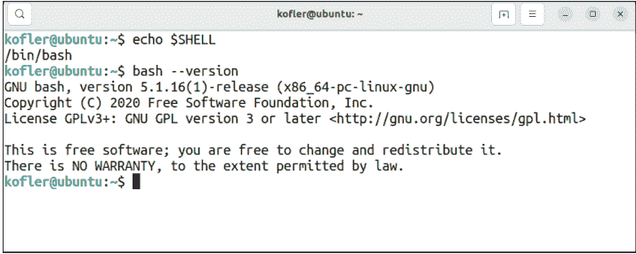

图 3.1 运行 Bash 版本 5.1 的计算机

## 3.2 安装

几乎所有 Linux 发行版都预装了 Bash。因此，如果你在 Linux 上工作，本节内容并非必需。如果你的发行版使用 Zsh，我建议你继续使用它，因为它具有出色的交互特性。然而，为了开发尽可能可移植的脚本，建议并行安装 Bash。这种并行安装可以通过你所用发行版的包管理命令来完成；例如，在 Debian 和 Ubuntu 上，你会使用 `sudo apt install bash`。

在 macOS 上，Bash 仅以过时的 3.2 版本提供。在未来的 macOS 版本中，Bash 预计将被完全移除。在这方面，Zsh 代表了一个兼容的，并且在许多方面甚至更好的替代品。如果你偏好 Bash 或使用它进行脚本编程，最好的方法是先设置 *Homebrew* 包管理器（参见 *https://brew.sh*）。然后，你可以在终端中使用 `brew install bash` 命令安装 Bash。要启动 Bash，请运行 `/opt/homebrew/bin/bash`。

Bash 的安装仅在 Windows 上比较困难。在本节中，我们将介绍在 Windows 上使用 Bash 的不同方法。所有这些选项都有其优点和缺点。但让我先说明一点：没有哪种变体是真正理想的。

### 3.2.1 在虚拟机中使用 Bash

使用 Bash 最直接的方法可能是在虚拟化程序（即 Oracle VM VirtualBox、VMWare 或 Microsoft Hyper-V）中安装一个常见的 Linux 发行版（例如 Ubuntu）。在虚拟机内部，你就可以在终端窗口中使用 Bash。

对于学习 Bash，这个解决方案是理想的。然而，你无法通过脚本访问 Windows 文件系统。例如，如果你开发了一个处理图像文件的脚本，你只能将其应用于 Linux 文件系统内的文件。（一些虚拟化系统允许你在 Windows 和 Linux 虚拟安装之间共享一个目录。但特别是使用 VirtualBox 时，这个过程相当繁琐。）

虚拟化解决方案的另一个缺点是，你实际上不再是在 Windows 上工作，而是在 Linux 上工作。你将不得不适应一个不熟悉的桌面环境，并至少稍微了解一点 Linux 管理。但你确实想学习 Bash，不是吗？（从我个人的角度来看，使用 Linux 是一个优势，而不是劣势。但我并不打算在这里详细阐述 Linux 的优点。）

还有一个论点反对虚拟化解决方案：根据我的经验，免费且因此相应流行的 VirtualBox 程序，在用于软件开发的计算机上经常引起麻烦。这个问题源于此类计算机上各种 Hyper-V 功能处于活动状态。理论上，VirtualBox 应该与之兼容，但在现实中，情况往往并非如此。

### 3.2.2 Windows Subsystem for Linux

在我看来，在 Windows 上使用 Bash 的最佳解决方案由 *Windows Subsystem for Linux* (WSL) 提供。此功能允许在终端窗口中运行 Linux。这种方法的妙处在于，你可以在 Windows 中访问你的 Linux 文件，同样也可以在 WSL 中轻松访问你的 Windows 文件。（在当前的 WSL 版本中，你甚至可以在图形模式下运行 Linux。但就我们的目的而言，这完全不是必需的。）

最新版本的 WSL 可从 Microsoft Store 免费获取。安装后，经过一次强制性的 Windows 重启，你必须再次在 Microsoft Store 中搜索 *Ubuntu 22.04 LTS*（或从 2024 年 4 月起搜索当时的当前版本 24.04）。安装过程和你的首次启动应该大约需要两分钟。你需要输入两次密码，并且必须确保记住这个密码！当你以后想使用 `sudo` 安装额外的软件组件时，你会需要它。（除了 Ubuntu，Microsoft Store 中还提供其他发行版，包括 AlmaLinux、Debian、openSUSE 和 Oracle Linux。使用你最熟悉的那个。）

随后，你可以随时通过 Windows 终端或 **开始** 菜单（程序名 *Ubuntu n.n*）打开一个 Bash 窗口。

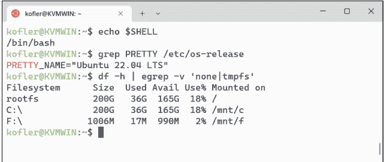

**图 3.2** 在 Windows 终端窗口中运行 Bash 的 Ubuntu

在 Bash 内，你可以通过以下路径访问你的 Windows 用户目录（假设你的 Windows 安装在 *C:* 盘）：

```
/mnt/C/Users/<name>
```

反过来，你可以在 Windows 资源管理器中通过侧边栏底部的 **Linux** 条目或通过以下地址找到你的 Linux/Bash 用户目录：

```
\wsl.localhost\Ubuntu-22.04\home\<name>
```

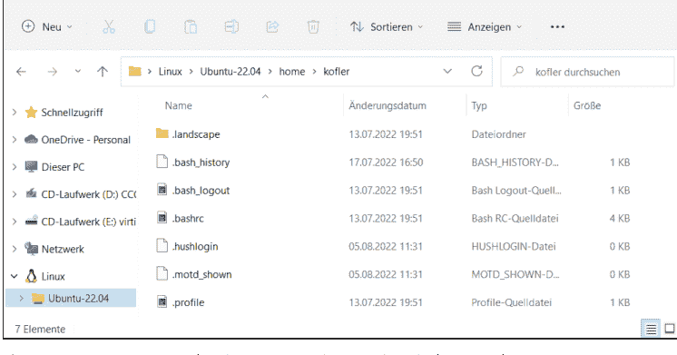

**图 3.3** 在 Windows 资源管理器中轻松访问 Linux 主目录

### 3.2.3 Git Bash

Git 版本管理程序提供了一个相当优雅的 Bash 入口点。当你在 Windows 上安装 Git 时（参见 https://git-scm.com/download/win），Git Bash 会同时安装。如果你从事软件开发，你很可能已经安装了 Git。（你不会不用 Git 工作，对吧？）然后，你可以从 **开始** 菜单运行 *Git Bash*，它将打开一个运行 Bash 版本 4.4 的终端窗口，这不是最新版本，但足以满足我们的需求。

Git Bash 直接使用 Windows 文件系统。在 Git Bash 窗口中，提供了在 Linux 或 macOS 上也常用的重要命令，例如 `ls`、`cat`、`less`、`more`、`find` 和 `grep` 等。

Git Bash 的问题在于你无法安装任何其他命令。迟早（更可能是很快），你会遇到想要在脚本中调用一个不属于基本 Git Bash 的命令的情况。就 Bash 编程而言，你将走入死胡同。

### 3.2.4 Docker

如果你熟悉 Docker 容器系统，你也可以在 Docker 容器中运行 Bash 脚本。然而，这种方法更适合专业人士共享脚本。对于交互式学习 Bash，Docker 并不是理想的方式。

### 3.2.5 Bash 配置（/etc/profile 和 .bashrc）

有几个文件会影响 Bash 的行为。最重要的是具有全局设置的 `/etc/profile` 和位于你主目录中包含个人选项的 `.bashrc`。请注意，在你的账户之外运行脚本时，只会考虑 `/etc/profile`。

对于正常使用，你不需要对这两个文件中的任何一个进行任何更改。更改其中一个文件最常见的原因是为了调用安装在非标准目录中的命令或程序。为此任务，你必须扩展 `PATH` 环境变量。以下示例展示了如何在默认目录之外包含 `/my/own/scripts`：

```
# 在 .bashrc 或 /etc/profile 的末尾
export PATH=/my/own/scripts:$PATH
```

## 3.3 交互式运行命令

如果你已经熟悉终端，无论使用什么操作系统，你都可以放心地跳过本节。否则，在开始使用你的第一个脚本之前，先熟悉一下命令的交互式执行和终端操作是个好主意。

此外，后续你可能会在终端窗口中，一边使用脚本编辑器，一边尝试执行单个命令。只有当命令按你期望的方式运行后，才应将其整合到脚本中。

在下面的示例中，你首先使用 `cd`（change directory，切换目录）命令进入 Downloads 目录，然后使用 `ls`（list，列出）命令查看该目录中存储了哪些文件：

```
$ cd Downloads
$ ls

00a_intro_pn.pdf
00b_about_pn.pdf
00c_next_pn.pdf
...
```

使用 `-l` 选项（long，长格式）的 `ls` 命令会显示每个文件的更多详细信息，例如访问权限、所有者和组分配、大小以及最后修改时间等：

```
$ ls -l

-rw-r--r-- 1 kofler kofler 674076 ... 11:49 00a_intro_pn.pdf
-rw-r--r-- 1 kofler kofler 943948 ... 11:53 00b_about_pn.pdf
-rw-r--r-- 1 kofler kofler 714852 ... 11:58 00c_next_pn.pdf
...
```

如果你想知道目录中有多少个文件，可以将 `ls` 的输出通过管道传递给 `wc`（word count，字数统计）命令。该命令返回三个数字。第一个表示行数，第二个表示单词数，第三个表示字符数。由于 `ls` 将每个文件打印在单独的一行上，因此只有行数是相关的。`wc` 的 `-l`（lines，行）选项会相应地减少输出。

```
$ ls | wc

116 159 3194

$ ls | wc -l

116
```

通过这些简单的命令，你已经学到了很多：

- Bash 中最常用的命令名称都非常简短。起初，这些名称可能不太直观。然而，一旦你习惯了，输入的工作量就非常小。
- 命令的行为可以通过选项来控制。许多选项只由一个字母组成，并且前面有一个连字符。通常，存在一个替代的长形式，前面是*两个*连字符。例如，`wc --lines` 和 `wc -l` 是等效的。
- 命令可以通过管道操作符（`|`）连接起来。我将在后面的[第 3.7.2 节](Section 3.7.2)中更详细地讨论这个操作符。简而言之，`command1 | command2` 意味着 `command1` 不显示其文本输出，而是将其传递给 `command2` 进行处理。

### 提示符

“提示符”是在输入新命令时显示在光标左侧的字符串。在 Linux 上，普通用户的提示符通常以 `$` 字符结尾。另一方面，如果系统管理员 `root` 在工作，提示符则以 `#` 结尾。

提示符是可调整的（环境变量 `PS1`），因此根据发行版和配置的不同，其外观可能差异很大。通常，在 `$` 或 `#` 字符之前会显示当前目录和/或主机名。

在本书中，要在 Bash 或 Zsh 中执行的命令前面会加上 `$` 字符。（你现在应该清楚，这个字符*不能*输入。）PowerShell 命令前面会加上 `>` 字符，因为 Windows 提示符使用这个字符。

本章是一个特例：由于示例显然都是针对 Bash 的，我经常完全省略提示符。在展示那些在终端中交互式执行或作为脚本中的代码都能同样良好工作的技术时，我尤其会省略提示符。

### 3.3.1 操作终端

你可能已经注意到，鼠标在终端中基本上没什么用。你不能像在其他程序中那样用它来改变光标位置。输入只能在终端的最后一行进行。（在 Linux 上，你可以用鼠标选中文本，并用鼠标中键将其粘贴到当前光标位置，而无需将文本复制到剪贴板。）

这种对鼠标支持的不足，通过许多键盘快捷键得到了补偿，这些快捷键使你能够编辑当前输入行并回溯到过去的输入（参见[表 3.1](Table 3.1)）。

| 快捷键 | 含义 |
| :--- | :--- |
| `Tab` | 补全命令或名称 |
| `Ctrl` + `A` | 将光标置于行首 |
| `Ctrl` + `C` | 中止输入或停止正在运行的命令 |
| `Ctrl` + `D` | 删除光标位置的字符 |
| `Ctrl` + `E` | 将光标置于行尾 |
| `Ctrl` + `K` | 删除从光标位置到行尾的所有内容 |
| `Ctrl` + `R` abc | 搜索之前执行过的命令 abc |
| `Ctrl` + `Y` | 再次插入最后删除的文本 |
| `Alt` + `Backspace` | 向后删除一个单词 |

**表 3.1** 终端中的键盘快捷键

`Tab` 快捷键特别有用，因为它节省了大量输入：你只需指定命令、目录或文件的前几个字母，然后按 `Tab` 键。如果命令、目录或文件名已经清晰可辨，它会被完整补全；否则，只会补全到足以排除多个选项的程度。按两次 `Tab` 键会显示所有可能的补全值列表。

### 3.3.2 在线帮助

像 `ls` 或 `wc` 这样的命令没有帮助菜单。但可以通过其他命令获取这些命令的帮助文本。作为初步尝试，你应该调用 `<command> --help`（例如，`ls --help`）。这个命令通常会给你一个所有选项的列表，并附有它们含义的简要说明。

`man <command>` 会为许多命令显示更长的信息文本。因此，`man ls` 会解释如何使用 `ls` 命令以及有哪些可用选项。你可以使用方向键在多页文本中导航。空格键向下滚动一整页。使用 `/` 可以在帮助文本中搜索表达式。`N` 会跳转到下一个搜索结果（如果需要），`Q` 则关闭帮助界面。

### 3.3.3 命令参考

在整本书中，我将向你介绍许多 Linux 命令。在这方面，一个好的起点是[第 6 章](Chapter 6)。

### 3.4 Zsh 作为 Bash 的替代品

我在本章开头提到过，对于本书的核心主题（即编写脚本），Zsh 只扮演次要角色。出于兼容性考虑，更好的方法是使用 Bash 来编写脚本，甚至避免使用一些 Bash 特有的、其他 shell 没有的扩展。这样，你的脚本几乎可以在任何环境中运行。

Zsh 的吸引力更多在于其交互式应用：当你按 `Tab` 键时，Zsh 在扩展命令、文件和目录名称方面采用了比 Bash 更智能的方法。你不必指定首字母；相反，只要名称中出现的字母组合就足够了。此外，Zsh 提供了更多的配置选项和扩展模块。自从我体验了 Zsh 与 Oh My Zsh 扩展结合带来的便利后，“普通”的 Bash 对我来说就不再够用了！

### 3.4.1 安装

macOS 以及一些选定的 Linux 发行版已经默认使用 Zsh。对于所有其他 Linux 发行版，你可以使用各自的包管理工具轻松安装 Zsh。在 Debian 和 Ubuntu 上，你会使用以下命令：

```
$ sudo apt update
$ sudo apt install zsh
```

下一步，你可以为你的账户激活 Zsh：

```
$ chsh -s $(which zsh)
```

要使此更改生效，你必须注销并重新登录。现在，当你第一次打开终端时，会运行一个配置脚本：

```
This is the Z Shell configuration function for new users,
zsh-newuser-install. (...) You can
(q) Quit and do nothing. The function will be run again next
time.
(0) Exit, creating the file ~/.zshrc containing just a comment.
That will prevent this function being run again.
(1) Continue to the main menu.
(2) Populate your ~/.zshrc with the configuration recommended
by the system administrator and exit.
```

如果你只是接受脚本建议的默认设置，或者在手动配置（选项 1）中使用发行版提供的默认配置文件 .zshrc（选项 2），你并没有做错任何事。如有必要，你可以稍后通过 `zsh-newuser-install` 重复并调整配置。

要在 Windows 上使用 Zsh，与 Bash 的建议相同：在 WSL 中安装 Linux 或作为虚拟机安装，然后在那里运行 Zsh！从 Bash 切换到 Zsh 可以按照我们这里描述的方式进行。

### 3.4.2 Zsh 配置（/etc/zshrc 和 .zshrc）

与 Bash 类似，Zsh 在启动时也会评估一些配置文件。最重要的是用于全局设置的 `/etc/zshrc` 和位于你主目录中的 `.zshrc`。

## 3.4.3 Oh My Zsh

对于 Zsh，互联网上有许多插件提供额外功能，以及可以改变命令提示符外观的主题。*Oh My Zsh* 是一个帮助管理此类扩展的脚本。它内置了各种插件和主题，后续还可以添加更多。

要安装，请从项目页面 *https://github.com/ohmyzsh/ohmyzsh* 下载一个小脚本并运行它。该脚本要求同名软件包中的 `git` 命令可用。与其输入以下命令，你应该从 Oh My Zsh 的 GitHub 页面复制代码：

```
$ sh -c "$(curl -fsSL https://raw.githubusercontent.com/ohmyzsh/ohmyzsh/master/tools/install.sh)"
```

在安装过程中，`.zshrc` 文件将被覆盖。之前的内容会保存在名为 `.zshrc.pre-oh-my-zsh` 的备份文件中。Oh My Zsh 未来将在启动时检查更新。因此，当你打开一个新的终端窗口时，经常会收到更新 Oh My Zsh 的提示。

在基本配置中，提示符默认使用 `robbyrussell` 主题。作为唯一激活的插件，`git` 贡献了无数别名，有助于 Git 的操作。关于 Oh My Zsh 的众多功能和进一步配置的技巧指南，可以在 *https://ohmyz.sh* 或以下博客中找到：*https://stackabuse.com/pimp-my-terminal-an-introduction-to-oh-my-zsh*。

## 3.5 第一个 Bash 脚本

在简短地介绍了 Zsh 之后，我们现在回到 Bash。在本章中，我将向你介绍 Bash 的语法，包括各种编程和工作技巧之前，我想用这一节来解释脚本实际上是什么。事实上，这很简单：脚本是一个文本文件，你在其中编写与在终端中交互式输入的相同的命令。只有两个特殊之处将脚本与普通命令区分开来：脚本的第一行必须包含所谓的 *shebang*（释伴），并且文件必须使用 `chmod` 标记为可执行。

### 3.5.1 Hash Bang (Shebang)

在 Linux 或 macOS 上执行的脚本的第一行必须以字符 `#`（“hash”或“sharp”）和 `!`（“bang”）以及解释器的路径开头。“Shebang”是“sharp bang”的语言缩写。

解释器是读取和处理脚本文件的程序，在本章中，该解释器是 Bash（或在特殊情况下是 Zsh）。然而，其他编程语言也可以用作解释器，例如 Python 或 Perl。

在 Linux 上，`Bash` 程序主要安装在 `/bin` 目录中。因此，Bash 脚本以以下行开头：

```
#!/bin/bash
```

### 3.5.2 Shebang 变体

根据你使用的发行版或类 Unix 系统，Bash 可能安装在不同的目录中，例如 `/usr/bin`。使用 `which bash`，你可以确定其在你计算机上的位置，如下例所示：

```
$ which bash

/usr/bin/bash
```

链接通常确保 `/usr/bin/bash` 和 `/bin/bash` 都能工作。一种通用的 hash bang 表述，无论位置如何都能工作，使用 `/usr/bin/env` 命令。此命令搜索所有常见位置：

```
#!/usr/bin/env bash
```

如果你的机器上根本没有安装 Bash，并且你正在使用 Zsh，你可能需要将 `/bin/bash` 替换为 `/bin/zsh`（或 Zsh 在你机器上安装的位置）：

```
#!/bin/zsh
```

如果你希望你的脚本无论 Bash 或 Zsh 是否可用都能工作，以下 hash bang 可以实现：

```
#!/bin/sh
```

`sh` 是一个指向大多数 Linux 系统上默认 shell 的链接。然而，你必须意识到，从现在开始，当你的脚本运行时，将根据计算机/发行版使用不同的 shell。例如，在 Debian 和 Ubuntu 上，将执行经过速度优化的 Dash。在编写脚本时，你必须小心不要使用任何其他 shell 中不可用的 Bash 特定扩展。

> **现在怎么办？**
> 我知道在 IT 世界里，每条规则都有三个例外，然后还有五个特殊情况，这很烦人。除非有令人信服的理由不这样做，否则你应该始终使用 `#!/bin/bash` 作为 hash bang。本书的示例文件也使用此代码。

### 3.5.3 使脚本可执行 (chmod +x)

所有类 Unix 系统（包括 Linux 和 macOS）都会在每个文件中存储一些访问位，这些位提供有关谁被允许读取、写入和执行文件的信息。对于脚本，执行位（简称 x）至关重要。只有有了这个位，脚本才能像命令一样稍后被执行。

要设置执行位，你需要在终端中运行一次以下命令。请注意，macOS 的 `chmod` 变体不理解 `+x` 简写。你必须明确指定为谁设置执行位。`a` 表示“为所有人”。

```
$ chmod +x my-script-file.sh    (Linux, Git Bash)
$ chmod a+x my-script-file.sh   (macOS)
```

因此，`chmod` 用于更改访问位。该命令支持相当多样的语法变体。（如果你对细节感兴趣，可以运行 `man chmod`）。对我们来说，只有 `chmod +x` 变体是相关的，用于设置执行位。

> **.sh 标识符**
> 本书中所有 Bash 示例文件都以 `.sh` 结尾。虽然这种文件扩展名很常见，但使用它绝非强制。只要 hash bang 正确，Bash 脚本可以在没有标识符（甚至使用错误标识符）的情况下工作。
> 由于本书除了 Bash 之外还涵盖了 PowerShell（`.ps1`）和 Python（`.py`），标识符有助于示例文件的分类。

### 3.5.4 Hello, World!

要编写你的第一个脚本，你需要启动你喜欢的编辑器：Visual Studio Code (VS Code) 是一个不错的选择，但任何编辑器都可以，包括可以直接在终端中运行的极简 `nano` 程序。然后，输入以下两行：

```
#!/bin/bash
echo "Hello, World!"
```

将此文件保存为 `hello-world.sh`。使用 `chmod` 使脚本可执行，使用以下命令：

```
$ chmod +x hello-world.sh    (Linux, Git Bash)
$ chmod a+x hello-world.sh   (macOS)
```

要检查脚本是否工作，你需要输入其名称并按 `Enter`。请注意，你必须在名称前加上 `./`。通过这种方式，你告诉 Bash 在当前目录中查找你的脚本。（`.` 是当前活动目录的简写。）

```
$ ./hello-world.sh
Hello, World!
```

> **如果脚本执行不工作**
> 如果脚本的执行触发错误，可能有多种原因：
> - 你是否正确指定了文件名？
> - 你是否使用了 `chmod +x`？
> - 你是否正确指定了 hash bang 行？
> - 你的计算机上是否根本没有安装 Bash？如果你想使用 Zsh 运行脚本，你需要将 hash bang 更改为 `#!/bin/zsh` 或 `#!/bin/sh`。

### 3.5.5 基本语法规则

除了 hash bang 之外，你必须在脚本中遵循一些其他规则：

- 以 `#` 开头的行是注释，不会被求值。
- 你可以使用 `\` 字符来处理跨多行的长命令。`\` 字符必须精确地放在行尾，并且后面不能再有空格！
- 代码缩进是允许的，但是可选的。
- Bash 对代码中空格的使用极其挑剔。`s="abc"` 是正确的；变体 `s ="abc"` 或 `s= "abc"` 以及 `s = "abc"` 都是错误的，并且会触发错误！
  反之，在某些情况下，括号前或后需要空格，Bash 才能正确识别该结构。如果你的脚本没有按预期工作，并且错误信息模糊或具有误导性，你应该首先检查空格的使用！

### 3.5.6 一个“真实”的例子：备份脚本

当然，你读这本书不是为了运行“Hello World!”脚本。这个第二个例子稍长一些，但它执行一个真实的任务：它创建 `documents` 目录中所有文件的压缩备份，并将备份存储在 `mybackups` 目录中：

```
#!/bin/bash
# 示例文件 backup-documents.sh
# 保存此目录的内容
documentdir=~/documents
# 备份位置
backupdir=~/mybackups
# 创建备份目录
mkdir -p $backupdir
# 返回例如，对于 2023-03-27 返回 date=27
day=$(date '+%d')
# 创建备份，保存为 documents-<day>.tar.gz
echo "备份文件: $backupdir/documents-$day.tar.gz"
tar czf $backupdir/documents-$day.tar.gz -C $documentdir .
```

这个脚本需要一些解释：

- `documentdir=~/documents` 将你的文档目录名称存储在 `documentdir` 变量中。`~` 是你的主目录的简写（例如，在 Linux 上是 `/home/kofler`，但在 macOS 上是 `/Users/kofler`）。根据你使用的操作系统或发行版，你需要使用英文单词 `Documents`。当 macOS 在 Finder 中以德语设置显示 `Documents` 时，实际的目录名称实际上是 `Documents`！
- `backupdir=~/mybackups` 将所需的备份位置存储在另一个变量中。
- `mkdir -p $backupdir` 创建备份目录。`-p` 选项可以防止在目录已存在时出现错误消息（最迟在第二次执行脚本后就会出现这种情况）。
- `day=$(date '+%d')` 将月份中的日期存储在 `day` 变量中。`date` 是一个通常返回包括时间在内的完整日期的命令。使用附加参数 `+%d`，你只提供月份中的日期（01 到 31）。符号 `$(...)` 的意思是：执行括号中包含的命令并返回结果。
- `echo` 命令在屏幕上输出新备份文件的确切路径。该输出只是反馈，让你了解脚本按预期工作。请注意，赋值时必须不带 `$` 指定变量名，但读取时必须加上 `$` 前缀。这是 Bash 许多奇怪的语法规则之一。
- 最后，`tar` 命令为 `$documentdir` 目录中的所有文件创建备份。此命令的语法也很奇怪：
  - `czf` 指定命令应执行的操作（*创建*、*压缩*、*文件*）。下一个参数指定备份文件的位置，例如 `/home/kofler/documents-27.tar.gz`。
  - `-C` 确定在执行 `tar` 时哪个目录是活动目录。在此示例中，它不应该是当前活动目录，而应该是包含要备份文件的目录。
  - 命令末尾的 `A .` 表示必须备份目录的全部内容（而不仅仅是选定的文件，这也是可以想象的）。关于重要的 `tar` 选项的更详细描述将在 [第 6 章，第 6.3 节](#) 中介绍。

如果你每天运行一次这个脚本，一段时间后，你将在 `mybackups` 目录中拥有 31 个备份版本，从 `documents-01.tar.gz` 到 `documents-31.tar.gz`。虽然这个脚本有点浪费，但它确实让你能够恢复上个月内被错误覆盖或删除的任何文档。（我将在 [第 11 章](#) 中向你展示如何自动化每日备份。我在 [第 15 章](#) 中描述了执行备份的其他变体。）

对于初学者来说，这个例子可能一下子有点多。但别担心，本章后续会介绍很多基础知识，这将使这段代码更容易理解。我在这个例子中的主要目标只是向你展示“真实”的脚本是什么样子的。

> **示例文件**
> 此脚本以及所有其他较长的代码清单都可以在本书的示例文件中找到。你可以在 https://rheinwerk-computing.com/5851 下载这些文件。

## 3.5.7 无需 ./ 运行脚本

你是否觉得每次运行脚本时都必须加上 `./`（或者如果你当前在不同的目录中，甚至需要完整路径）很烦人？有一个解决办法！

- **自定义脚本目录**
  首先，你需要为你的脚本设置一个单独的目录，例如，你主目录中的 `myscripts`。
- **扩展 PATH 变量**
  其次，你需要将此目录的完整路径添加到 `PATH` 环境变量中。默认情况下，`PATH` 包含 Bash 搜索命令的各种目录。因此，当你运行 `ls` 时，Bash 会依次搜索 `PATH` 中包含的所有目录。如果 `PATH` 也包含 `myscripts`，那么这个目录也会被搜索。要更改 `PATH`，你可以使用编辑器打开主目录中的 `.bashrc` 文件（如果你使用 Zsh，则是 `.zshrc`）。在此文件末尾，你必须添加以下行：
  ```bash
  # 在 .bashrc 或 .zshrc 的末尾
  ...
  export PATH=/home/kofler/myscripts:$PATH
  ```
  你当然必须指定你自己脚本目录的完整路径，而不是 `/home/kofler/myscripts`。还要注意正确的语法！`=` 和 `:` 前后不能有空格。还要注意，`PATH` 第一次写时不带 `$` 字符，但第二次写时带 `$` 字符。要使此更改生效，你必须注销并重新登录。从现在开始，你可以通过简单地命名它们来运行存储在此目录中的脚本。

## 3.6 运行命令

既然你已经有机会对 Bash 或 Zsh 有所了解，接下来的几节将涵盖基础知识。我通常指的是 Bash，但几乎所有信息同样适用于 Zsh。

在真正开始之前再说明一点：以下各节解释的所有技术同样适用于 Bash 的交互式使用和脚本编写！

### 3.6.1 串行执行

在最简单的情况下——就像上一节中的备份示例一样——脚本由一系列按顺序执行的命令组成：

```
# 一个接一个地执行命令
command1
command2
command3
```

你也可以在单行上指定多个命令，用分号分隔。这种方法节省空间，在交互式使用 Bash 时特别方便，当你想连续完成几个耗时的任务而无需每次都输入新命令时：

```
# 等效
command1; command2; command3
```

### 3.6.2 条件命令执行

每个命令都返回一个通常不可见的错误代码。0 表示没有发生错误。任何其他值都表示错误或否定结果。根据上下文，“错误”这个词实际上太强烈了：例如，如果使用 `test` 命令表述的条件不成立，或者如果 `grep` 过滤命令找不到搜索词，则该命令被视为未成功执行，并返回不等于 0 的返回码。

Bash 允许你使第二个命令的执行依赖于第一个命令的结果。第一种变体使用字符组合 `&&`。它表示只有在第一个命令成功时才应执行第二个命令。（同样，你当然可以用这种方式链接三个或更多命令。）

```
# 仅在命令 1 成功时运行命令 2
command1 && command2
```

例如，当第一个命令运行测试（文件是否存在？）而第二个命令应该仅在测试结果为正时运行时，使用 `&&` 是有意义的。

另一个例子：你想执行更新。首先，你更新软件包源（通过 Debian 或 Ubuntu 中的 `apt update`）。只有在此过程无错误地成功后，才会在第二步执行实际更新（`apt full-upgrade`）。另一方面，如果在 `apt update` 期间发生错误，例如，因为互联网断开了一会儿，那么执行第二个命令就没有意义了。

```
# 测试 data.csv 是否存在，然后
# 返回相应的消息
test -f data.csv && echo "data.csv exists"

# 更新软件包源；
# 如果成功，则执行
# 实际更新
apt update && apt full-upgrade
```

作为 && 的替代方案，你也可以通过 || 链接两个命令。在这种情况下，适用相反的逻辑：只有在命令 1 导致错误时才执行命令 2：

```
# 仅在命令 1 失败时执行命令 2
command1 || command2
```

当然，你可以使用 if 构造来代替 && 和 ||，我将在第 3.11 节关于分支中介绍。然而，&& 和 || 允许你编写更紧凑的代码，更类似于传统 shell 脚本的风格。

### 3.6.3 在后台运行命令

通常，命令的执行会阻塞终端或脚本。后续命令必须在前一个命令完成后才能启动。在这种情况下，`command &` 可以帮助你在后台（即异步地）运行命令。命令的异步执行在脚本中很少有用。更常见的是，你需要在终端的交互操作期间使用 %。例如，你可以使用 `command &` 启动一个具有图形用户界面（GUI）的程序，例如 Firefox 网页浏览器，而不会阻塞终端中的进一步输入。在后台运行的进程可以使用 `fg` 再次设为前台进程。相反，一个耗时的命令可以通过 `Ctrl` + `Z` 中断，然后使用 `bg` 在后台继续运行。

### 3.6.4 在子 Shell 中运行命令

通过将多个命令放在括号中，你可以为它们的执行启动一个新的 shell 进程并在那里运行命令。这个子 shell 可以使用 `(c1; c2; c3)` 在一行中创建。在脚本中，你可以将括号放在任何你喜欢的地方：

```
command1    # 在主 shell 中运行
(           # 在子 shell 中运行以下命令
command2
command3
command4
)
command5    # 再次在主 shell 中
```

在子shell中，所有先前定义的变量仍然可用。然而，子shell有一个优势：在子shell内定义和更改的变量仅在该子shell内有效，之后会失效或恢复其先前的值。同样，使用`cd`更改的目录也仅在子shell内有效。当子shell结束时，先前有效的目录会再次生效。

子shell可用于更好地组织代码。当你在子shell内运行`exit`时，你只是退出了子shell，而不是运行在主shell中的脚本。

## 3.7 标准输入与标准输出

在Bash中，有三个用于输入和输出的“通道”：

- **标准输出（stdout）**
  命令的结果被导向所谓的“标准输出”。当你运行`ls`时，该命令的结果是本地目录中所有文件的列表。此结果以文本形式输出，通常显示在终端中。

- **错误消息（标准错误 = stderr）**
  通常，错误消息也会显示在终端中。然而，在内部，错误消息被路由到不同的通道，从而可以区别处理正常输出和错误消息。

- **标准输入（stdin）**
  许多常用命令处理文本文件，其文件名作为参数传递。如果缺少此规范，命令则期望从标准输入处理文本。因此，你必须在终端中输入文本，然后命令接收这些文本。要表示输入完成，在这种情况下按`Ctrl` + `D`。

乍一看，这三个标准通道似乎是不言而喻的：命令的结果除了显示在终端中还能显示在哪里？命令除了通过你的输入还能从哪里接收输入？

### 3.7.1 重定向输入与输出

Bash的一个亮点是其重定向输入和输出的能力。使用`command > file`调用，你可以将命令的结果保存到文本文件中。注意：如果文件已存在，它将被覆盖。

类似地，`command < file`从文本文件读取要处理的数据，而不是等待终端输入。表3.2总结了其他一些变体的语法。我将在第3.10节更详细地讨论heredoc和herestring语法。

| 命令 | 功能 |
| :--- | :--- |
| `command > out.txt` | 将标准输出保存到文件 |
| `command >> out.txt` | 将输出追加到文件末尾 |
| `command 2> errors.txt` | 将错误消息存储到文件 |
| `command &> all.txt` | 将输出和错误存储到文件 |
| `command >& all.txt` | 同上 |
| `command >&2` | 将标准输出重定向到错误通道 |
| `command < in.txt` | 处理文件 |
| `command << EOF` | 将直到文件结束符（EOF）的所有行视为标准输入（heredoc） |
| `command <<< $var` | 将变量的内容视为标准输入（herestring） |

表3.2 用于重定向输入和输出的运算符

在最简单的情况下，输出重定向用于永久存储结果：

```
ls > filelist.txt
```

输入重定向对于交互式命令很有用。例如，MySQL客户端`mysql`通常期望输入SQL命令。在以下应用中，这些命令从文本文件中读取，例如，从备份恢复数据库：

```
mysql < backup.sql
```

`cat`命令通常只是将文本文件打印到屏幕，但可用于创建新文件（以按键组合结束输入）：

```
cat > newfile.txt
first input line
second input line
<Ctrl>+<D>
```

因为`cat`缺少要输出的文件的参数，所以该命令期望在终端进行交互式输入。此输入被重定向到`newfile.txt`文件。使用这个技巧，你可以在不启动编辑器的情况下创建小型文本文件。

> **注意**
> 然而，你不能同时读写一个文件。`sort < file > file`命令不会对文本文件的内容进行排序然后保存结果，而是会删除`file`，因为`> file`会先执行。

> **Heredoc语法**
> 输入重定向的一个特殊情况是heredoc语法。我将在第3.10节单独讨论这个主题。

### 3.7.2 管道运算符

关于输入和输出重定向，我们还没有完全讲完。也许最酷的功能还没有出现：通过使用`command1 | command2`，`command1`产生一个结果。然而，这个结果不会被显示，而是被重定向到`command2`。因此，管道运算符`|`使`command1`的标准输出成为`command2`的标准输入。管道运算符可以多次应用，每次将一个命令的输出传递给下一个命令。

管道运算符为分析和处理文本文件提供了如此广泛的选项，以至于我专门用第8章来讨论这个主题。在此，几个简单的例子就足够了，这些例子指的是特定于Linux的`/etc/passwd`文件。该文件包含有关系统所有账户的信息。我将在第8章第8.1节更详细地解释`grep`、`cut`、`sort`和`head`命令。

```
# 显示 /etc/passwd 中所有包含 'nologin' 的行
grep nologin /etc/passwd

# 从结果行中提取第一列
# 即账户名
grep nologin /etc/passwd | cut -d ':' -f 1
# 对名称进行排序
grep nologin /etc/passwd | cut -d ':' -f 1 | sort

# 并显示前五个结果
grep nologin /etc/passwd | cut -d ':' -f 1 | sort | head -n 5
```

### 3.7.3 同时重定向和显示输出

`tee`命令复制标准输入，在标准输出中显示它，*并且*将其重定向到一个文件。因此，使用以下命令，`command`的结果会在终端中显示*并且*存储在`out.txt`文件中。

```
command | tee out.txt
```

## 3.8 通配符、花括号扩展以及处理文件和目录名称

如果你因为想要处理所有文本文件或几个子目录中的所有PDF文件，而向命令传递`*.txt`或`directory??/*.pdf`，会发生什么？术语“通配符”描述了Bash为此类任务提供的机制。表3.3总结了Bash“通配符”的含义。（这些字符是第9章将介绍的“正则表达式”的简化变体。）

| 字符 | 含义 |
|---|---|
| ? | 任意单个字符 |
| * | 任意数量（包括零个）的任意字符 |
| ** | 递归通配符（globstar） |
| [aeiou] | 指定字符中的一个 |
| [a-z] | 字符范围 |
| [a-zäöüß] | 所有小写字母（德语） |
| [A-Fa-f0-9] | 一个十六进制数字 |
| [!a-f] | 不是a到f中的任何字符 |
| [^a-f] | 不是a到f中的任何字符 |

**表3.3 通配符字符**

关于这些通配符的关键点在于，通配是Bash的责任，而不是相应命令的责任。因此，例如，如果你运行`cp *.jpg some/directory/`将一些图像复制到子目录，是Bash——而不是`cp`命令——确定要复制的文件列表。这种情况是有意义的，因为否则几乎每个命令都需要相应的代码。但由于Bash负责，对`*`或`?`等字符的分析是集中进行的，并且总是遵循相同的规则：Bash首先分析所有通配符，将它们与当前目录中的文件名匹配，然后将完成的参数列表传递给相关命令。因此，`cp`永远不会看到`*.jpg`，只看到完成的文件名列表，例如`img_1.jpg`、`img_2.jpg`和`img_3.jpg`。

如果你不确定通配符表达式返回哪个文件名列表，你应该运行`echo <expression>`，例如：

```
echo img_*.raw
img_23433.raw img_23434.raw img_23435.raw
```

Zsh在这方面甚至更方便：在那里，你只需按`Tab`键，就可以用当前目录中匹配的文件名替换通配符表达式。

如果你想防止通配，你应该将字符组合放在单引号中。也许你创建了一个文件名是`???`的文件。（不是个好主意，但允许的文件名。）要删除此文件，请运行`rm '???'`。

## 3.8.1 递归通配

`**` 字符组合会递归地覆盖所有（子）目录。因此，`ls **/*.pdf` 与搜索命令 `find . -name '*.pdf'` 具有相似的含义。由于递归搜索所有目录可能非常耗时，此行为默认是禁用的。在使用此功能之前，你必须通过 `shopt -s globstar` 激活它。以下示例将所有 PDF 文件复制到 `all-my-pdfs` 目录：

```
shopt -s globstar
mkdir all-my-pdfs
cp **/*.pdf all-my-pdfs
```

## 3.8.2 访问重要目录

除了通配规则外，还有用于访问常用目录的简写表示法（见表 3.4）。

| 字符 | 含义 |
|---|---|
| . | 当前目录 |
| .. | 父目录 |
| ~ | 你自己的主目录 |
| ~name | name 的主目录 |

**表 3.4** 重要目录的简写表示法

## 3.8.3 花括号扩展

在 Bash 中，你可以在花括号内制定由逗号分隔的枚举或通过 `...` 创建的范围。在命令执行之前，会创建所有可能的组合，因此括号中指定的表达式会被“扩展”。然而，与通配不同，花括号扩展不会考虑相应的文件是否已经存在。理解此机制最简单的方法是看一些示例：

```
echo {a..f}.txt
a.txt b.txt c.txt d.txt e.txt f.txt

echo /{etc,usr,var}
/etc /usr /var

echo {1..3}{a,e,i,o,u}
1a 1e 1i 1o 1u 2a 2e 2i 2o 2u 3a 3e 3i 3o 3u
```

乍一看，花括号扩展似乎是个噱头。然而，它确实有实际应用：想象你想为当前年份（通过 `date '+%Y'` 确定）的每个月创建一个子目录。在 Bash 中，这个任务只需一行命令：

```
mkdir -p $(date '+%Y')/{01..12}
```

在这种情况下，`$(date ...)` 返回此命令的结果。`mkdir` 的 `-p` 选项不仅会创建单个目录，如果需要，还会创建整个目录字符串（因此，对于 2023 年，会先创建 2023，然后是 01、02 等）。

花括号扩展也可用于创建循环，其中 `i` 在这种情况下是一个变量。关于变量和循环的基本原理将在第 3.9 节和第 3.12 节中介绍：

```
for i in {1..10}; do echo $i; done
1
2
...
```

## 3.8.4 包含空格的文件名和目录名

在 Bash 中，传递给命令的参数由空格分隔。`cp a.txt b.txt /my/directory` 将文件 `a.txt` 和 `b.txt` 复制到一个目录中。

如果文件本身包含空格，这种行为就会成为问题。（顽固的 Linux 用户会尽力避免这种情况！）例如，`cp filename with blanks.txt /my/directory` 会认为你想复制三个文件 `filename`、`with` 和 `blanks.txt`，而没有识别出 `filename with blanks.txt` 是一个文件。为了澄清这种歧义，你需要将有问题的名称放在引号中，例如：

```
cp "filename with blanks.txt" /my/directory
```

尽管这又提前涉及了尚未讨论的循环（第 3.12 节）：如果你自动处理文件，引号也是必要的。因此，通配表达式 `*.txt` 可能会提供包含空格的文件名。以下循环旨在简单地显示每个对应文件的详细信息，但会触发错误：

```
# 如果 *.txt 文件包含空格，则会触发错误
for fn in *.txt; do ls -l $fn; done
```

只有在 `ls` 命令中将 `fn` 变量用引号括起来，代码才能正确工作：

```
# 前一个示例的正确变体
for fn in *.txt; do ls -l "$fn"; done
```

如果要分析传递给 Bash 脚本的参数，并且存在包含空格的文件名，情况会变得更加复杂。只有预先更改 Bash 变量 `IFS`（第 3.9 节和第 3.12 节），才能成功进行正确处理。

## 3.9 变量

在 Bash 中处理变量需要一些适应，特别是如果你曾在其他“更高级”的编程语言中工作过。我想从三条基本规则开始：

-   变量名在分析（读取）时通常必须以美元符号开头，但在赋值（写入）时则不需要。正如你将看到的，此规则存在例外。
-   使用 `myvar=value` 赋值时，`=` 字符前后不允许有空格。
-   Bash 变量通常存储字符串。（是的，Bash 也可以处理数字，甚至支持数组。但这些是特殊情况，其中一些需要语法上的技巧。）

第一个示例说明了变量的处理。关于带有 `-gt` 比较运算符（大于）的 `if` 结构的解释将在第 3.11 节中介绍。

```
myvar="123"
myvar='123'           # 此处等效
myvar=123             # 此处等效
echo $myvar           # 输出：123
echo "Inhalt: $myvar"  # 输出：Content: 123
if [ $myvar -gt 100 ]; then
    echo "myvar is greater than 100"
fi
```

## 3.9.1 初始化和删除变量

在给变量赋值时，你可以使用 `var="abc"` 或 `var='abc'` 来明确字符串字符。从语法上讲，只有当要存储的表达式包含空格或其他特殊字符时才需要引号，例如 `var="abc efg"` 或 `var='$x'`。

我将在第 3.10 节解释两种引号的区别。简而言之，"abc $myvar abc" 会插入 myvar 变量的内容（就像之前的 echo 命令一样），而 'abc $myvar abc' 则原样获取字符串。

如果你想将另一个命令的结果存储在变量中，必须使用 myvar=$(command) 表示法。$(…) 表达式这个有些笨拙的名称是命令替换，因为指定的命令被执行并被其内容替换。或者，也允许使用反引号的等效形式（即 myvar=`command`）。

要删除变量，你可以运行 unset myvar 或简单地赋值为空（即 myvar=）。

## 3.9.2 声明变量

在 Bash 中，你不需要在使用变量之前声明它们——然而确实存在一个 declare 命令。此命令允许你影响变量的行为，如以下示例所示：

```
# 常量，以后不能更改（r = readonly）
declare -r const="abc"

# myvar 只能存储整数（i = integer）
declare -i myvar
myvar="abc"    # 没有错误，但 myvar=0

# 普通数组和关联数组（详情见后文）
declare -a myarray
declare -A mymap
```

## 3.9.3 在 Bash 中执行计算

Bash 以字符字符串的方式“思考”。只有在特殊上下文中使用 let 或在双括号内（见表 3.5），才能进行计算或分析数学表达式。所有数学计算原则上只使用整数。

| 表达式 | 含义 |
| :--- | :--- |
| `((expression))` | 运行包含的数学表达式 |
| `$(expression))` | 如上，但返回结果 |
| `let myvar=expression` | 将表达式的结果存储在变量中 |

表 3.5 Bash 中的数学

### 数学运算符

请注意，数学运算符（如 + 和 *）以及比较运算符（如 < 或 >=）仅在表 3.5 所列表达式的上下文中允许使用。特别是，< 和 > 在 Bash 中通常用于输入和输出重定向。

以下几行包含一些 Bash 中数学表达式的示例。在此过程中，一些通常的规则被放宽了。例如，在 ((...)) 内，赋值也允许在 = 前后有空格。（但 let 不行！）此外，读取变量时允许省略前面的 $ 字符。

```
x=2
y=$x+3            # 注意，错误：y 包含 "2+3"！
let y=x+3         # y=5，x 可以不带 $ 分析
((y=x+3))         # 等效
(( y = x + 3 ))   # 等效，在 (( ... )) 内
                   # 允许空格
y=$((x+3))         # 等效
y=$(( x + 3 ))     # 等效
(( y++ ))          # y=6
echo $(( y > 10 )) # 不成立（假）
0
echo $(( y < 10 )) # 成立（真）
1
```

## 3.9.4 数组

除了简单变量，Bash 也可以处理数组。普通数组使用整数作为索引。注意用于访问第 n 个元素的 ${field(n)} 语法，这与许多其他编程语言不同。

```
x=()              # 定义一个空数组
x[0]='a'          # 赋值数组元素
x[1]='b'
x[2]='c'

x=('a' 'b' 'c')   # 上面 4 行的简写

echo ${x[1]}      # 读取一个数组元素
echo ${x[@]}      # 读取所有数组元素
```

### Bash 与 Zsh

我在本章中多次指出，Bash 和 Zsh 在基本功能上是彼此兼容的。

## 3.9.5 预定义变量

Bash 脚本可以访问预定义变量（参见表 3.6）。这些变量只能读取，不能更改。缩写 PID 代表 *进程 ID*（即内部进程编号）。

| 变量 | 含义 |
| :--- | :--- |
| $# | 传递给脚本的参数数量 |
| $0 | 执行脚本的文件名 |
| $1 到 $9 | 参数 1 到 9 |
| ${10}, ${11} | 访问额外的参数 |
| $* 或 $@ | 所有传递参数的总和 |
| $? | 上一条命令的返回值 |
| $! | 最后启动的后台进程的 PID |
| $$ | 当前 shell 的 PID |

表 3.6 预定义的 Bash 变量

在实践中，分析传递给脚本的参数尤为重要。其数量由 $# 指示。你可以通过 $1、$2 等访问各个参数。在循环中或通过 `case` 结构分析多个参数的示例包含在第 3.11 节和第 3.12 节中。

## 3.9.6 环境变量

普通变量在脚本执行后会失效。使用 `export myvar=...` 声明或修改的环境变量不受此规则限制。`printenv` 会列出所有环境变量及其当前值。重要的环境变量（参见表 3.7）在 `/etc/profile`、`.profile` 以及 `.bashrc` 或 `.zshrc` 中预设。

| 变量 | 含义 |
| :--- | :--- |
| HOME | 主目录 |
| LANG | 本地化设置（即语言和字符集） |
| PATH | 搜索程序的目录 |
| PS1 | 命令提示符的内容/外观 |
| PWD | 当前目录 |
| USER | 活动用户的登录名 |
| SHELL | 活动 shell 的名称 |
| EDITOR | 默认编辑器的名称（通常是 vi 或 nano） |
| IFS | 内部字段分隔符（将字符串分解为单词） |

表 3.7 重要的环境变量

与“普通”变量不同，环境变量可以使用 `ENVVAR=... command` 仅为命令的执行而更改。我之前在将字符串的一部分读入数组时给出了一个例子：

```
# 修改后的 IFS 内容仅适用于 read
IFS=':' read -a myvar
```

另一个常见用法如下：

```
# 不使用当前语言设置执行命令
LANG= command
```

此命令仅在执行 `command` 时删除带有语言设置的 `LANG` 环境变量。因此，`command` 在没有通常有效的语言设置的情况下执行，并在必要时返回英文错误消息。（当 `LANG` 为空时，英语是默认语言。在互联网上搜索问题原因时，英文错误消息很有用。）然而，`LANG` 并未被永久删除，而是再次可用于其他命令。

> **Bash 流程结构没有临时更改**
`ENVVAR=... command` 语法只能用于普通命令，不能用于你使用 `if`、`for`、`while` 等启动的循环或分支。

## 3.10 字符串

字符串是 Bash 的核心数据类型——我已经多次提到过。尽管如此，字符串的处理有时似乎很奇怪。本节总结了关于字符串的最重要函数。

### 3.10.1 单引号与双引号

在 Bash 中，字符串可以放在单引号和双引号中：

- 'abc$efg'：在这种情况下，字符串将被原样传递。
- "abc$efg"：在这种变体中，Bash 将文本中包含的变量（本例中为 $efg）替换为其内容，并且可能执行其他替换过程，我将在本节后面解释。

在 Bash 中，多个字符串可以不使用运算符连接。唯一的要求是 Bash 能够将字符串识别为字符串，这在以下列表的第一行中并非如此：

```
x=abc efg           # 错误！
x=abc               # 正确
x="abc"             # 更好
x='abc'             # 这里等效
y="123"$x"456"      # -> 123abc456
y='123'$x'456'      # -> 123abc456
y="123 $x 456"      # -> 123 abc 456
y='123 $x 456'      # -> 123 $x 456
y=123 $x 456        # 错误！
```

允许将字符串分布在多行上。要通过 `echo` 在输出中保留换行符，必须将变量括在引号中（另请参见下一节）：

```
myvar='1st Line
2nd Line'
echo "$myvar"
```

### 3.10.2 输出字符串（echo）

当然，你已经知道用于输出字符串的 `echo` 命令：

```
myname="Michael"
echo "Hello, $myname!"
Hello, Michael!
```

在此，我想指出 `echo` 的一些特殊之处。你可以使用 `-n` 选项来防止 `echo` 在输出后开始新行。通过这种方式，你可以将一行的输出分布在多个命令中，如以下示例所示：

```
echo -n "Hello, "
echo $myname
```

`-e` 选项使你能够正确解释字符串中包含的反斜杠序列（即识别 `\` 和 `n` 字符为换行符）：

```
myvar="abc\nefg"
echo $myvar
  abc\nefg
echo -e $myvar
  abc
  efg
```

对真实换行符的处理也令人困惑。这些换行符可以使用 `echo $myvar` 替换为空格。只有带引号的 `echo "$myvar"` 才会返回多行输出：

```
myvar="abc
efg"
echo $myvar
  abc efg
echo "$myvar"
  abc
  efg
```

你可以使用 `>&2` 将错误消息重定向到 `stderr` 通道：

```
echo "Error message" >&2
echo >&2 "Error message"   # 等效
```

> **printf**

在许多编程语言中已知的 `printf` 函数在 Linux 和 macOS 上作为命令可用。`printf` 函数比 `echo` 更适合格式化输出。可以通过 `man 1 printf` 显示语法详细信息。

### 3.10.3 颜色

你也可以输出彩色文本。要更改颜色，你需要在输出中包含所谓的 *ANSI 转义序列*。要更改背景颜色，必须将 `3n` 替换为 `4n`。

| 颜色 | 代码 | 颜色 | 代码 |
|---|---|---|---|
| 黑色 | 0;30 | 灰色 | 1;30 |
| 蓝色 | 0;34 | 浅蓝色 | 1;34 |
| 绿色 | 0;32 | 浅绿色 | 1;32 |
| 青色 | 0;36 | 浅青色 | 1;36 |

表 3.8 前景色的 ANSI 颜色代码

在此上下文中，少数例外之一涉及数组索引。虽然在 Bash 中这些索引范围从 0 到总元素数减 1，但 Zsh 中的第一个数组元素的索引为 1！索引 0 不被允许（除非你启用 `KSH_ARRAYS` 选项）。你可以在 https://stackoverflow.com/questions/50427449 找到有关此主题的相关背景信息。

你可以使用 `mapfile` 将整个文本文件逐行读入数组的元素中。在以下示例中，`z` 是变量的名称：

```
mapfile z < textfile
```

要使用一行的列初始化数组的元素，最好的方法是通过 `-a` 数组选项使用 `read` 命令。有关 `read` 以及使用 `<<<` 构造的 here 字符串的详细信息，请参见 [第 3.10 节](https://example.com)。

```
data="abc efg ijk opq uvw"
read -a myvar <<< $data
echo ${myvar[2]}  # 输出 ijk
```

如果字符串的列或“单词”不是由空格分隔的，你需要临时修改预定义 `IFS` 变量中包含的 *内部字段分隔符*。默认情况下，此变量包含空格字符、制表符和换行符（即三个最重要的空白字符）。

然而，在以下示例中，单词由 `:` 字符分隔。因为 `IFS` 声明与 `read` 命令在同一行上，所以更改仅适用于该命令。因此，之后 `IFS` 恢复为默认设置。（此场景很重要，因为 `IFS` 对许多命令有影响。）

```
data="abc:efg:ijk lmn:opq:uvw"
IFS=':' read -a myvar <<< $data
echo ${myvar[2]}  # 输出 ijk lmn
```

除了普通数组，Bash 还知道关联数组。允许使用任何字符串作为索引，而不是数字。根据编程语言，你可能也知道这种数据结构为字典或映射。要使用关联数组，你必须使用 `declare -A` 显式 `declare` 变量。

```
declare -A y          # 定义一个空的关联数组
y['abc']='123'        # 赋值关联数组的元素
y['efg']='xxx'
y=( [abc]=123 [efg]=xxx )  # 简写
echo ${y[abc]}        # 读取数组元素
```

## 3.10.4 输入或读取字符字符串（read）

执行交互式输入重定向最简单的方法是使用 `read`。为了让用户知道需要输入什么，你应该事先使用 `echo` 进行输出。添加 `-n` 选项会使光标在输出后停止，如下例所示：

```
echo -n "Please enter your name: "
read myvar
echo "The name is: $myvar"
```

`read` 也可以与输入重定向结合使用，逐行读取文件。相应的示例将在下一节中给出。

`read -a myarray` 读取一行，并将其单词存储在指定数组变量的元素中。

> **read 命令的帮助信息**
>
> `read` 是一个内部 bash 命令。因此，关于各种 `read` 选项的详细信息由 `help read` 提供，而不是像通常情况那样由 `man read` 提供。

## 3.10.5 替换和扩展机制

Bash 包含各种“替换或扩展机制”，尽管这些术语在很大程度上是同义词，并且在文档中使用不一致。无论如何，以 `$` 开头的表达式会被其内容或分析结果替换：

- **$myvar 或 ${myvar}**
  迄今为止最重要的是*变量替换*，你已经在几个示例中见过。如果变量名需要与后续文本分隔（例如，`${myvar}txt`），替代的 `${myvar}` 表示法很有用。

- **$(command) 或 `command`**
  在*命令替换*的情况下（前面在第 3.9.1 节中讨论过），命令被执行并被其结果（即标准输出）替换。

- **$((mathexpression))**
  在*算术替换*中，双括号内的数学表达式被分析并被其结果替换。

- **${__var__}**
  通过所谓的*参数替换*，Bash 提供了一些选项来处理变量中包含的字符串。该表达式返回结果。你可以用各种特殊字符代替 `__`，不幸的是这些字符很难记忆，我接下来将通过示例进行讨论。

## 3.10.6 参数替换

Bash 缺乏其他编程语言中常见的字符串处理函数。为此，Bash 在*参数替换*这个术语下有一些非常高效的机制，用于从存储在变量中的字符字符串中提取信息。请注意，所有构造都返回结果，但从不直接修改指定的变量：

- **${var:n}**
  从第 n 个字符开始打印存储在 `var` 中的字符串，从 0 开始计数：

  ```bash
  var="abcdefghij"
  echo ${var:3}    # 输出 defghij
  ```

- **${var:offset:len}**
  跳过 `offset` 个字符，然后输出 `len` 个字符：

  ```bash
  var="abcdefghij"
  echo ${var:5:3}  # 输出 fgh
  ```

- **${var:-default}**
  如果变量为空，该构造返回默认设置作为结果，否则返回变量的内容。变量本身不会被更改。

  ```bash
  var=
  echo ${var:-abc} # 输出 abc
  var=123
  echo ${var:-abc} # 输出 123
  ```

- **${var:=default}**
  如上所述，但如果变量之前为空，其内容将同时被更改。

- **${var:+new}**
  如果变量为空，则保持为空。另一方面，如果变量已被使用，则其先前内容将被新设置替换。该构造提供变量的新内容。

- **${var:?errormessage}**
  如果变量为空，则输出变量名和错误消息，然后终止 shell 程序。否则，该构造返回变量的内容。

- **${#var}**
  返回存储在变量中的字符数作为结果，如果变量为空则返回 0。变量本身不会被更改。

  ```bash
  x='abcde'
  echo ${#x}      # 输出 5
  ```

- **${var#pattern}**
  将变量的开头与指定的模式进行比较。如果识别出该模式，该构造返回变量的内容减去与搜索模式匹配的最短可能文本。另一方面，如果未找到该模式，则返回变量的全部内容。搜索模式中可以使用 globbing 中已知的字符（即 `*`、`?` 和 `[abc]`）。

  ```bash
  dat=/home/pi/images/img123.png
  echo ${dat#*/}    # 输出 home/pi/images/img123.png
  echo ${dat#*.}    # 输出 png
  ```

- **${var##pattern}**
  如上所述，但现在消除与模式匹配的最大可能字符串。

  ```bash
  echo ${dat##*/}    # 输出 img123.png
  echo ${dat##*.}    # 输出 png
  ```

- **${var%pattern}**
  类似于 `${var#pattern}`，但现在模式匹配在变量内容的末尾执行。从变量末尾消除最短的可能字符串。变量本身保持不变。

  ```bash
  echo ${dat%/*}    # 输出 /home/pi/images
  echo ${dat%.*}    # 输出 /home/pi/images/img123
  ```

- **${var%%pattern}**
  如上所述，但现在消除最大的可能字符串。

  ```bash
  echo ${dat%%/*}    # 无输出（空字符串）
  echo ${dat%%.*}    # 输出 /home/pi/images/img123
  ```

- **${var/find/replace}**
  将 `find` 模式的第一次出现替换为 `replace`。

  ```bash
  x='abcdeab12ab'
  echo ${x/ab/xy}    # 输出 xycdeaab12ab
  ```

- **${!var}**
  返回其名称包含在字符串中的变量的内容。

  ```bash
  abc=123
  efg='abc'
  echo ${!efg}        # 输出 123
  ```

最后，我想向你展示一个参数替换的典型应用：假设你想使用 `convert` 或 `magick`（参见第 16 章，第 16.1 节）将当前目录中的一些 PNG 文件转换为 JPEG 格式。对于这个任务，你必须在 `pngname` 变量中的文件名中将 `.png` 标识符替换为 `.jpg`。执行此任务最简单的方法是以下脚本：

```bash
#!/bin/bash
# 示例文件 png2jpg.sh
shopt -s nullglob
for pngname in *.png; do
    # 将 .png 替换为 .jpg
    jpgname=${pngname%.png}.jpg
    convert "$pngname" "$jpgname"
done
```

`shopt -s nullglob` 可以避免在目录中根本没有 `*.png` 文件时出现错误消息。关于 `for` 循环如何工作的详细信息将在第 3.12 节中介绍。请注意，当调用 `convert` 命令时，`pngname` 和 `jpgname` 变量被括在引号中。这些引号是使脚本能够处理包含空格的文件名的唯一方法。

> **在 Python 中处理字符串要容易得多！**
>
> 一旦你习惯了 Bash 编辑字符串的奇怪机制，你就可以用它来解决数量惊人的问题。然而，对于需要操作许多字符串的脚本，你最好使用 Python。我不知道有任何语言能提供如此全面且易于使用的字符串处理函数。

## 3.10.7 Here 文档和 Here 字符串

Here 文档（简称 heredocs）是嵌入在脚本中的文本块，以 `<<` 指定的字符序列结束（通常是 `EOF`，表示文件结束）。以下示例非常清楚地说明了语法。（`mail` 命令基于机器上正在运行邮件服务器的假设。）

```bash
name="Michael"
amount=1200
to="spamvictim@spamforever.com"

mail -s "Invest safely" $to << EOF
Hello $name, enclosed is a great investment offer
without any risk. If you transfer $amount US$ to this account
you'll get ...
EOF
```

你可以通过 `cat` 轻松执行多行文本输出，如下例所示：

```bash
cat << EOF
This is
a long
help text
EOF
```

在内部，heredocs 是一种特殊类型的输入重定向。`mail` 或 `cat` 期望从标准输入获取邮件文本。相反，使用以下文本行，并在文本中进行通常的变量替换（`$name`、`$amount`）。

| 颜色 | 代码 | 颜色 | 代码 |
|---|---|---|---|
| 红色 | 0;31 | 浅红色 | 1;31 |
| 紫色 | 0;35 | 粉色 | 1;35 |
| 棕色 | 0;33 | 黄色 | 1;33 |
| 浅灰色 | 0;37 | 白色 | 1;37 |

**表 3.8** 前景色 ANSI 颜色代码（续）

颜色代码必须放在控制序列 `\033[` 和 `m` 之间。为了防止你的代码变得完全不可读，最佳实践是将颜色代码存储在变量中。只有使用 `-e` 选项时，`echo` 才能正确处理颜色代码。在这种情况下，使用 `${var}` 表示法而不是 `$var` 有助于在没有空格的情况下将变量名与其余文本分开。

```bash
BLUE='\033[0;34m'
RED='\033[0;31m'
NOCOLOR='\033[0m'
echo -n -e "Text output in ${RED}Red${NOCOLOR} "
echo    -e "and ${BLUE}Blue${NOCOLOR}."
```

颜色的实际外观将根据终端配置而有所不同。例如，根据终端的不同，输出可能不是显示更亮的颜色（例如，浅蓝色为 `1;34`），而是显示基本颜色但加粗。你可以在 *https://en.wikipedia.org/wiki/ANSI_escape_code* 或 *https://tldp.org/HOWTO/Bash-Prompt-HOWTO/c327.html* 找到其他代码的参考，这些代码也可用于更改光标位置。

> **可读性差，进一步处理困难**
>
> 使用颜色有其缺点。一方面，可读性可能会因此受到影响，特别是因为你无法依赖终端中的特定背景颜色。许多用户使用深色背景的终端；其他人则喜欢浅色甚至白色背景。
>
> 此外，颜色代码使文本输出的进一步处理变得更加困难。如果你决定使用颜色，你应该提供一个选项，以便在必要时禁用此功能。

存在多种用于 Here Document 的语法变体：

-   形式 `<<- EOF` 会消除 Here Document 文本中的前导制表符，从而允许对文本进行缩进。遗憾的是，这种文本转换对空格无效。
-   `<< "EOF"` 可防止变量替换。
-   `<<< $myvar` 将变量的内容作为标准输入传递。此过程称为 *Here String*。

## 3.10.8 反斜杠

感觉 Bash 中几乎每个特殊字符都有特殊含义。如果你想在字符串中使用字符本身，必须将字符串放在单引号中，或在字符前加上反斜杠作为引用字符：

```
echo \$myvar
$myvar
```

你也可以使用反斜杠来处理文件名中包含空格的文件。不过，更简单的方法是使用引号，如以下示例所示：

```
touch filename\ with\ blanks.txt
ls "filename with blanks.txt"
rm 'filename with blanks.txt'
```

与许多其他编程语言不同，Bash 不会将 `\n` 转换为换行符。相反，字符 `\` 和 `n` 会被分别输出或存储。只有 `echo -e` 才能按预期解析此字符序列。

```
echo -e "Line 1\nLine 2"
```

最后，你可以使用反斜杠将长命令分布在多行上：

```
command --with --many --options and even \n    more parameters
```

## 3.11 分支

与几乎所有编程语言一样，你可以在 Bash 中使用 `if` 来构建分支。语法如下：

```
if condition1; then
    command1a
    command1b
[ elif condition2; then
    commands2 ]
[ else
    commands3 ]
fi
```

考虑以下具体示例：

```
if [ $# -ne 2 ]; then
    echo "Two parameters must be passed to the command!"
    exit 2  # error code for wrong parameters
else
    echo "Parameter 1: $1, Parameter 2: $2"
fi
```

我稍后会讨论实际条件的奇怪语法。清单中的缩进是可选的，但能提高可读性。
这种语法令人困惑（且经常被遗忘）的地方是条件后的分号。如果你愿意为 `then` 单独占一行，就可以省略分号。但这并不会使代码更优雅，如以下示例所示：

```
if condition
then
    command1
    command2
fi
```

### 3.11.1 使用 && 或 || 的 if 简写形式

通过正确放置分号，你可以在单行上构建 `if` 结构。如果在 `if` 结构中只需执行单个命令，使用 `&&` 或 `||` 进行条件执行会更简洁且节省空间（另见第 3.6 节）。然而，这种表示法会使代码更难理解，尤其是对于不熟悉 Bash 的人。

```
if condition; then
    command
fi
# 等价形式
if condition; then command; fi

# 同样等价：如果条件满足
# 命令将被执行
condition && command

# 反向逻辑：如果条件不满足
# 命令将被执行
inverse condition || command
```

### 3.11.2 条件

虽然 if 语法很简单，但构建条件则要困难得多。Bash 为此任务提供了多种变体，总结在以下清单中。我稍后会解释这些概念。前导感叹号用于否定条件。

```
x=5
test "$x" -gt 3  && echo "true"   # -> true
test "$x" -eq 2  && echo "true"   # (无输出)
[ "$x" -gt 3 ]   && echo "true"   # -> true
[[ "$x" -gt 3 ]] && echo "true"   # -> true
(( x > 3 ))      && echo "true"   # -> true
! (( x > 3 ))    && echo "true"   # (无输出)
```

> **将变量放在引号中！**
`test $x -gt 3` 在语法上是正确的，但仅当变量非空时才有效。如果 `$x` 没有内容，结果将是 `test -gt 3`。此语句毫无意义并会导致语法错误。这就是为什么你应该养成始终将用于比较的变量放在引号中的习惯！

最原始的形式是使用 `test` 命令。它处理一个或多个参数，其中条件通过选项表示。`-gt` 表示 *大于*，`-eq` 表示 *等于*。你可能想知道为什么 `test $x > 5` 不起作用。这与 `>` 和 `<` 字符被保留用于输入和输出重定向有关。

除了 `test condition`，还有简写形式 `[ condition ]`（见表 3.9）。重要的是，方括号前后必须有空格！还要注意，比较运算符取决于数据类型：`-eq` 比较数字，`=` 比较字符串。如果测试表达式中出现变量，其名称必须以 `$` 为前缀。`dat` 指代文件名字符串。

| 测试表达式 | 含义 |
| :--- | :--- |
| `[ var ]` | 如果变量非空则为真 |
| `[ -n var ]` | 同上 |
| `[ zk1 = zk2 ]` | 如果字符串匹配则为真 |
| `[ z1 -eq z2 ]` | 如果数字相等（*等于*） |
| `[ z1 -ne z2 ]` | 如果数字不相等（*不等于*） |
| `[ z1 -gt z2 ]` | 如果 z1 大于 z2（*大于*） |
| `[ z1 -ge z2 ]` | 如果 z1 大于或等于 z2（*大于等于*） |
| `[ z1 -lt z2 ]` | 如果 z1 小于 z2（*小于*） |
| `[ z1 -le z2 ]` | 如果 z1 小于或等于 z2（*小于等于*） |
| `[ -d dat ]` | 如果 dat 是一个目录（*目录*） |
| `[ -f dat ]` | 如果 dat 是一个文件（*文件*） |
| `[ -r dat ]` | 如果文件可读（*读*） |
| `[ -w dat ]` | 如果文件可写（*写*） |
| `[ dat1 -nt dat2 ]` | 如果文件 1 比文件 2 新（*比...新*） |
| `! [ ... ]` | 否定条件 |

表 3.9 使用 [ ] 构建条件的最重要语法变体

`[ condition ]` 在大多数 shell 变体中可用。Bash 和 Zsh 还允许将条件放在双中括号之间，例如 `[[ condition ]]`（见表 3.10）。在模式中，你可以使用 globbing 中已知的字符（即 `*`、`?` 和 `[a-z]`）。

| 测试表达式 | 含义 |
| :--- | :--- |
| `[[ zk = pattern ]]` | 如果字符串匹配模式则为真 |
| `[[ zk == pattern ]]` | 同上 |
| `[[ zk =~ regex ]]` | 如果正则表达式为真则为真（见第 9 章） |
| `[[ bed1 && bed2 ]]` | 如果两个条件都满足（*与*） |
| `[[ bed1 || bed2 ]]` | 如果至少一个条件满足（*或*） |

表 3.10 Bash 特有的使用 [[ ]] 构建条件

在以下示例中，myvar 必须包含类似 A17 或 C99 的代码：

```
if [[ "$myvar" == [ABC][0-9][0-9] ]]; then
    echo "ok"
fi
```

> **兼容性注意事项**
[[ ]] 语法并非所有 shell 都支持（但 Zsh 支持）。如果你省略 [[ ]]，可以提高脚本的兼容性。一些 Bash 特有的附加功能可以轻松替换：例如，`[[ bed1 && bed2 ]]` 对应于 `[ bed1 ] && [ bed2 ]`，`[[ bed1 || bed2 ]]` 对应于 `[ bed1 ] || [ bed2 ]`。

前面在第 3.9 节介绍的用于数学表达式的 (( )) 表示法也可用于构建条件。允许使用可读的比较运算符，如 `<`、`>` 或 `!=`。在双括号内，你可以省略变量的 `$` 标记，如以下示例所示：

```
x=5
(( x == 5 )) && echo "true"  # -> true
```

确保不要意外使用 `=` 进行比较：`(( var = value ))` 执行赋值并始终返回 "true"！

```
x=5
(( x = 6 )) && echo "true"  # -> true
echo $x                     # -> 6 !!
```

当变量完全未声明时也要小心。Bash 会假定其值为 0，并且既不显示警告也不显示错误：

```
# 始终为真，Bash 假定 emptyvar=0
if (( emptyvar < 100 )); then ...
```

### 3.11.3 使用 case 的分支

分支也可以使用 `case` 来构建，它将一个表达式（通常只是变量的内容）与不同的模式进行比较。模式可以包含 globbing 字符 `*` 和 `?`，以及像 `[a-z]` 这样的字符范围。和往常一样，Bash 的语法需要一些时间来适应：

```
case expression in
    pattern1)
        command1a
        command1b
        ...
        ;;
    pattern2)
        command2a
        command2b
        ...
        ;;
    *)          # 默认块（可选）
        ...
esac
```

缩进和 `pattern)` 后新行的开始是可选的，但能提高可读性。双分号结束 `case` 结构。如果你故意省略分号或只是忘记了，Bash 会默认继续执行 `case` 结构。如果 Bash 检测到

## 3.11.4 通过 case 进行参数分析

在我自己的脚本中，我通常避免使用 `case`，而更倾向于使用可读性更强的 `if` 结构。然而，有时 `case` 实际上很有帮助。让我们考虑另一个例子：对传递给脚本的参数（*命令行参数*）进行简单分析。

`myoptions.sh` 脚本接受三个选项（-a、-b 和 -c），这些选项可以按任何顺序指定。在这种情况下，-b 和 -c 各自需要一个参数。在选项之后，可以传递任意数量的附加参数。以下清单展示了该脚本的两次调用：

```
$ ./myoptions.sh -a -b lorem -c ipsum dolores est
Option a
Option b with parameter lorem
Option c with parameter ipsum
More parameters: dolores est

$ ./myoptions.sh -c lorem -b ipsum dolores
Option c with parameter lorem
Option b with parameter ipsum
More parameters: dolores
```

为了分析传递的选项和参数，该脚本使用了 Bash 内置的 `getopts` 命令，你可以按以下方式使用：

- `getopts "abc"` 期望按任何顺序接收选项 -a、-b 和 -c，甚至可以组合使用（即，-bc 而不是 -b -c）。
- `getopts ":abc"` 的工作方式与上述相同，但不会为无效参数返回任何错误消息。
- `getopts "ab:c:"` 在 b 和 c 后面带有冒号，期望这些选项各有一个参数。在分析期间，可以从 `$OPTARG` 变量中读取传递的参数。
- 每次调用分析*一个*选项。因此，分析必须在循环中执行。对于这个例子，我使用了 `while`。（关于循环的详细信息将在下一节中介绍。）
- 在处理选项期间，`$OPTIND` 引用参数列表中的下一个元素。

假设选项首先传递，然后是参数，所有已处理的选项都可以使用 `shift` 从 `$*` 中移除。（`shift <n>` 从 `$*` 中移除前 *n* 个元素。但由于 `$OPTIND` 已经引用了下一个元素，因此只能从参数列表中移除 `$OPTIND -1` 个元素。）

```
# 示例文件 myoptions.sh
while getopts ":ab:c:" opt; do
    case $opt in
        a) echo "Option a";;
        b) echo "Option b with parameter $OPTARG";;
        c) echo "Option c with parameter $OPTARG";;
        ?) echo "Invalid option"
            echo "Usage: myoptions [-a] [-b data] [-c data] [...]"
            exit 2
            ;;
    esac
done
# 从 $* 中移除已处理的选项
shift $(( $OPTIND - 1 ))
echo "More parameters: $*"
```

> **getopts 与 getopt**
`getopts` 是一个相对简单的命令，只能处理单字母选项，而不能处理像 `--search` 这样的长选项。一个更强大的替代方案是外部 `getopt` 命令，它通常包含在 Linux 的 `util-linux` 软件包中。有关如何使用此命令的示例以及更多关于评估脚本参数的提示，请参阅 Stack Overflow，特别是 https://stackoverflow.com/questions/192249。

## 3.12 循环

Bash 提供了多种命令供选择以创建循环。在本节中，我将从 `for` 开始，然后简要介绍 `while` 和 `until`。`for` 循环的基本语法如下所示。注意分号放在 `do` 之前而不是之后！你可以通过在新行以 `do` 开头来避免这个分号。

```
for myvar in mylist; do
    command1
    command2
done
```

```
# 等效写法
for myvar in mylist; do command1; command2; done
```

```
# 示例
for item in a b c; do echo $item; done
a
b
c
```

因此，循环变量 `myvar` 会遍历指定列表的所有值。（你很快会看到“列表”是一个相当通用的术语：你可以使用 `for` 来遍历参数、文件名、文本文件的行等。）请确保在 `for` 之后指定循环变量的名称，不要带 `$`！这一步是一致的，因为变量在此处被修改而不是被读取。

以下行包含更多使用示例，每个示例都以单行形式编写以节省空间。请注意，文件名可能始终包含空格！因此，你应始终将循环变量用引号括起来，以确保正确处理相关文件。花括号扩展表达式也可以用作循环的起点（参见第三个示例）。注意示例的模式性质。只要你只执行单个操作，在 Bash 中通常可以完全不用循环。

```
# 输出传递给脚本的所有参数
# （命令行参数）
for para in $*; do echo $para; done
```

```
# 将所有 *.jpg 文件复制到 images 目录
for filename in *.jpg; do cp "$filename" images; done
```

```
# 创建 file-00.txt 到 file-99.txt
for fn in file-{00..99}.txt; do touch $fn; done
```

```
# 与上述三个循环等效的命令
echo "$*"
cp *.jpg images
touch file-{00..99}.txt
```

```
# 遍历数组元素
myarray=("item" "other item" "third item")
for item in "${myarray[@]}"; do echo $item; done
```

在 Bash 中，你很少需要一个数值遍历值范围的循环。然而，这样的循环是完全可能的，如下所示。特别注意最后一个示例，它对应于 C 编程语言的经典 `for` 循环。

```
for i in {1..10}; do echo $i; done
# 输出 1, 2, ..., 10

for i in {01..12}; do echo $i; done
# 输出 01, 02, ..., 12

for ((i=1; i<=10; i++)); do echo $i; done
# 输出 1, 2, ..., 10
```

### 3.12.1 处理带空格的文件名

上面的 `for para in $*; do ...` 示例处理了传递给脚本的所有参数。如果文件名可能包含空格，你应该谨慎行事！假设你有一个名为 `account names.txt` 的文件，并且你使用以下代码运行 `./myscript.sh *.txt`：

```
# 错误地处理带空格的文件名
for filename in $*; do
  ls -l "$filename"
done
```

在此过程中会发生两次错误。`ls` 命令找不到 `account` 或 `names.txt` 文件。对于脚本来说，无法识别 `account names.txt` 是*一个*文件名。原因是循环中传递的参数默认在每个*空白*字符处分隔，这包括空格和换行符，Bash 使用它们来分隔文件名。

为确保循环正确处理，你必须在语句前加上 `IFS=$'\n'`。此语句意味着仅在遇到换行符时才进行分词。

```
# 正确地处理带空格的文件名
IFS=$'\n'
for filename in $*; do
  ls -l "$filename"
done
```

我在第 3.9 节中已经向你介绍了特殊的 `IFS` 变量（内部字段分隔符）。前面的美元字符确保 `\n` 被正确解释。

### 3.12.2 while 和 until

`while` 循环在条件满足时执行，并使用以下结构：

```
while condition; do
  commands
done
```

```
# 示例（输出：1, 2, 3, 4, 5）
i=1
while [ $i -le 5 ]; do
    echo $i
    (( $i++ ))
done
```

while 循环可以与输入重定向或通过以下结构与管道命令很好地结合：

```
# 逐行读取文件
while read filename; do
    echo "$filename"
done < files.txt
```

```
# 处理文件
ls *.jpg | while read filename; do
    echo "$filename"
done
```

until 循环的工作方式类似于 while 循环。区别在于，只要条件*不*满足，循环就会继续：

```
# 输出：1, 2
i=1
until [ $i -eq 3 ]; do
    echo $i
    (( i++ ))
done
```

> **break 和 continue**
`break` 和 `continue` 关键字在 Bash 中的工作方式与在大多数编程语言中相同：使用 `break`，你可以提前终止循环的执行。对于嵌套循环，`break n` 指定要终止多少层循环。
`continue` 跳过循环块中剩余的命令，但随后继续循环。

### 3.12.3 遍历文本文件

一个常见的场景涉及需要处理的文本文件。在 Bash 中，为此目的存在两种常用的过程，但它们并不完全等效。
以下 `while` 循环在每次循环中从 `access.log` 读取一行。注意由于重定向字符 `<` 与 `done` 一起使用，此文本文件如何被用作整个循环构造的默认输入！

## 3.13 函数

`function` 关键字定义了一个函数，该函数可以在脚本中像命令一样被调用。函数的代码必须包含在花括号中。函数必须在第一次调用*之前*声明，因此通常放置在脚本的开头。

可以向函数传递参数。与许多编程语言不同，参数不包含在括号内。在函数内部，参数可以从 `$1`、`$2` 等变量中获取。函数处理参数的方式与脚本处理*命令行参数*的方式相同。以下迷你脚本输出 *Hello World, Bash!*：

```bash
#!/bin/bash
function myfunc {
    echo "Hello World, $1!"
}
myfunc "Bash"
```

`function` 关键字是可选的。但是，如果省略 `function`，则函数名后必须跟括号。因此，以下函数等同于前面的示例：

```bash
myfunc() {
    echo "Hello World, $1!"
}
```

Bash 函数帮助你清晰地组织代码。你还可以将需要多次使用的代码块提取出来，从而避免冗余。
使用 `return`，你可以提前退出函数。没有选项可以返回数据。但是，当然可以通过 `echo` 进行输出或更改变量。

## 3.13.1 局部变量

通常，所有变量在整个脚本中都是“共享”的，因此它们在函数中也可以访问和修改。`local` 关键字提供了定义局部变量的选项。

```bash
function myfunc {
    a=4
    local b=4
}

a=3; b=3
myfunc
echo "$a $b" # 输出 4 3
```

## 3.14 错误保护

Bash 处理错误的方式相当随意：如果脚本中的一个命令触发了错误，Bash 会简单地继续执行脚本的下一条语句！这种奇怪的策略与许多命令的返回码通常并不表示真正的错误，而仅仅表示某个条件未满足或在搜索文件时未找到该文件有关。这种情况不一定是一个“真正的”错误。
然而，也存在一些例外情况。例如，在明显的语法错误情况下，如缺少引号或括号，或控制结构不完整（`if` 没有对应的 `fi`），脚本根本不会启动。

## 3.14.1 检测错误

每个命令的返回码都存储在 `$?` 中。值 0 表示一切正常。任何其他数字都表示错误。

```bash
command_might_fail
errcode=$?
if [ $errcode -ne 0 ]; then
    echo "Errorcode $errcode"
fi
```

## 3.14.2 出错时取消执行

如果你希望脚本在第一个错误时终止，你需要在 hash bang 中添加 `-e` 选项：

```bash
#!/bin/bash -e
```

对于链接的命令，整体结果是有效的。如果 `command1` 在以下脚本中失败——即使该命令不存在——`command2` 也会被执行。只有当该命令也导致错误时，脚本才会被中止。

```bash
#!/bin/bash -e
command1 || command2
```

你不必在整个脚本的 hash bang 中设置错误行为，而是可以通过 `set -e` 为某些代码行启用严格的错误测试，然后使用 `set +e` 稍后禁用它。

> **不推荐**
大多数 Bash 手册和常见问题解答建议不要使用 `-e` 选项运行 Bash 或通过 `set -e` 启用该功能。弊大于利，因为脚本的行为可能变得不可预测，如 https://mywiki.wooledge.org/BashFAQ/105 中所述。

## 3.14.3 exit

`exit (n)` 终止脚本。返回最后一个命令的返回值或值 `n`。

| 退出码 | 含义 |
|---|---|
| 0 | 正常，无错误 |
| 1 | 一般错误 |
| 2 | 传递的参数（参数）错误 |
| 3–255 | 其他命令特定或脚本特定的错误 |

表 3.11 Bash 和 Linux 命令的错误码

## 3.14.4 响应信号（trap）

Unix/Linux 上的进程管理概念是进程可以接收信号（见表 3.12）。`kill -l` 列出了更多信号。例如，如果你在执行 Bash 脚本时按下 `Ctrl` + `C`，则会发送 `SIGINT` 信号，脚本执行将被中止。

| 信号名称 | 代码 | 含义 |
| :--- | :--- | :--- |
| SIGHUP | 1 | 提示重新读取配置 |
| SIGINT | 2 | 通过 `Ctrl` + `C` 中断 |
| SIGKILL | 9 | `kill` 信号；无法拦截 |
| SIGTERM | 15 | 提示退出程序 |

表 3.12 最重要的信号

你可以使用 `trap` 来专门响应这些信号。`trap` 的语法很简单：

```bash
trap 'commands' signals
```

`commands` 指定在接收到指定信号之一时要执行的一个或多个命令。信号可以通过其名称或代码指定。如果你想执行复杂的代码来响应信号，你应该在函数中定义代码，并在 `trap` 命令中指定函数名。

`trap` 通常用于在信号触发的程序中止之前执行清理操作。例如，你可以删除一个临时文件。简单的 `trap '' 2` 命令允许你的脚本忽略 `Ctrl` + `C`。

## 3.14.5 超时

对于依赖网络或数据库连接的命令，并不总是清楚是否真的发生了错误，或者连接建立是否太慢。使用 `timeout <time> <command>`，你可以以给定的超时时间执行命令。如果命令花费的时间超过预期时间，执行将被中止。如果发生超时，`timeout` 的返回值是 124。该命令还有一些特殊的错误码（125、126、127 和 137；参见 `man timeout`）。另一方面，如果 `command` 在超时内终止，`timeout` 返回 `command` 的退出码。以下命令测试当前分支是否存在 Git 远程仓库（另见第 14 章）：

```bash
timeout 30s git ls-remote
```

# 第 4 章

# PowerShell

Windows 最古老的“shell”是 `cmd.exe` 程序，通常称为“命令提示符”。`cmd.exe` 代表 MS-DOS 的用户界面（UI），MS-DOS 是 Microsoft Windows 的基于文本的前身。批处理文件（扩展名 `*.bat`）允许简单的脚本编程。然而，`cmd.exe` 不再是一个现代工具，而是 IT 石器时代的遗物。

2006 年，Microsoft 推出了 *Windows PowerShell* 的第一个版本，作为 `cmd.exe` 的强大后继者。如今，我们已经达到了 7.n 版本。该程序也可以在 Linux 和 macOS 上运行；由于 shell 不再是 Windows 特有的，其名称已简化为 *PowerShell*。PowerShell 是当今 Windows 世界中*唯一*的脚本工具。如果你想管理与 Windows 相关的功能（例如，Microsoft 365 云设置或 Microsoft Active Directory），这种语言是不可替代的。

与其他 shell 相比，PowerShell 最大的技术成就是其面向对象的方法。PowerShell 命令不返回文本，而是返回真正的对象。这为后续处理开辟了全新的选项。与 Bash 相比，PowerShell 的语法更加合乎逻辑（但仍然不总是直观的，而且无论如何都相当冗长）。

在本章中，我将让你对 PowerShell 的基本功能有一个初步印象。随后的章节将提供大量示例。

> **执行策略**

出于安全原因，公司计算机上通常禁止执行（未签名的）脚本。此限制的原因和各种设置选项在 [第 4.5 节](#section-4.5) 中描述。

## 4.1 安装

PowerShell 在当前 Windows 版本上是预装的，但很少是最新版本。要找出已安装 PowerShell 的版本，你需要在**开始**菜单中搜索“终端”并运行同名程序。（对于较旧的 Windows 版本，搜索 *PowerShell* 即可找到。）

## 4 PowerShell

在终端中，输入 `$PSVersionTable` 并按 `Enter` 键。作为响应，你将收到一个包含 PowerShell 版本关键数据的表格：

```
> $PSVersionTable

Name           Value
----           -----
PSVersion      5.1.22000.1335
PSEdition      Desktop
...
```

这个结果是在 2023 年冬季的一台 Windows 11 机器上生成的。有点令人困惑的是，这里使用的是 2016 年发布的 PowerShell 5.1 版本。难道真的没有更新的版本可用吗？

事实上，在我撰写本章时，7.3 版本是当时的最新版本。然而，从 5.n 版本到 7.n 版本的跳跃，改变的不仅仅是版本号：

-   从 6.0 版本开始，PowerShell 采用了开源许可证。该程序也可在其他操作系统上免费使用。
-   相应地，程序名称不再是 "Windows PowerShell"，而只是 "PowerShell"。

但是，5.n 和 7.n 版本之间并非完全兼容。尽管 5.n 版本的后续开发早已停止，但出于兼容性原因，该版本仍然预装在系统中。

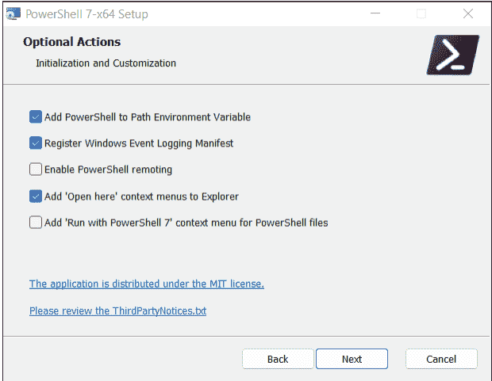

**图 4.1** 安装当前的 PowerShell 版本

然而，从本节开始，我假设你使用的是当前的 PowerShell 版本。虽然本书中介绍的大多数命令和脚本也适用于 5.1 版本，但我仅使用 7.3 版本测试了我的示例。所有脚本也应该能在 PowerShell 7.4 上运行，该版本在撰写本文时即将发布，并且在你阅读本书时很可能已经可用。

安装 PowerShell 有多种方式，但我建议你只需在终端或 `cmd.exe` 中运行 `winget install Microsoft.PowerShell` 命令。`winget` 是 Windows 10 和 11 中一个相对较新的组件，它简化了软件包管理。

作为替代方案，你可以从 `https://aka.ms/PSWindows` 下载并运行 MSI 安装包。请确保你安装的是 64 位版本（`PowerShell-7.n-win-x64.msi` 文件），而不是 32 位版本（`PowerShell-7.n-win-x86.msi`）！

7.n 版本的安装与现有的 5.1 版本并行进行。随后，你可以选择要使用哪个版本。重启终端后，请注意新的条目：**PowerShell**（而不是表示 5.1 版本的 **Windows PowerShell**）。`$PSVersionTable` 命令（它只是显示 `PSVersion` 变量以及一些包含 PowerShell 版本信息的其他变量的内容）现在应该返回以下结果：

```
> $PSVersionTable

Name           Value
----           -----
PSVersion      7.3.1
PSEdition      Core
...
```

### 4.1.1 在 Linux 上安装

由于 PowerShell 采用开源许可证，微软也为其他操作系统提供了版本。安装过程一点也不复杂。本节将重点介绍在 Ubuntu 上的安装过程。`wget` 后的字符串必须在一行内指定，不能包含 `\` 字符和空格。`wget` 会下载一个用于设置软件包源的小型软件包。Ubuntu 随后从这个软件包源获取 `powershell` 软件包。这种稍显繁琐的程序的优点在于，将来你会在常规更新中自动获得最新版本的 PowerShell。

```
$ sudo apt update
$ sudo apt install -y wget apt-transport-https \
                    software-properties-common

$ wget -q "https://packages.microsoft.com/config/ubuntu/\
          $(lsb_release -rs)/packages-microsoft-prod.deb"
```

```
$ sudo dpkg -i packages-microsoft-prod.deb
$ sudo apt update
$ sudo apt install -y powershell
```

安装完成后，你可以在终端窗口中使用 `pwsh` 命令启动 PowerShell。其他发行版的 PowerShell 安装说明可以在 https://docs.microsoft.com/en-us/powershell/scripting/install/installing-powershell-on-linux 找到。

### 4.1.2 在 macOS 上安装

许多用于软件开发的 macOS 机器都安装了 *Homebrew* 包管理系统（另请参阅 https://brew.sh）。如果已安装 Homebrew，只需在终端中运行以下简单命令即可成功安装 PowerShell：

```
$ brew install --cask powershell
```

或者，你可以从 https://docs.microsoft.com/en-us/powershell/scripting/install/installing-powershell-on-macos 下载包含最新 PowerShell 版本的 *.pkg 文件。

双击此文件即可启动安装过程；30 秒后一切就绪。现在，你可以像在 Linux 上一样，在终端窗口中使用 `pwsh` 命令启动 PowerShell。

### 4.1.3 PowerShell 在 Windows 与 Linux/macOS 上的限制

尽管 PowerShell 实现了许多好的想法，但 Linux 或 macOS 用户对又一个 shell 的渴望是有限的。选择已经相当多了。

在 Windows 之外使用 PowerShell 的主要问题是可供选择的命令数量要少得多。使用 `Get-Command`，你可以获取所有命令的列表。（严格来说，这些命令是 cmdlet、函数等，我将在后面的第 4.3 节中更详细地描述。）`Measure-Object` 使你能够计算命令的数量。以下列表总结了在 Windows、Linux 和 macOS 上确定的结果：

```
> Get-Command | Measure-Object
    Count: 1953    (Windows 11 Pro)
    Count: 273     (Linux/macOS)
    ...
```

注意 Linux 和 macOS 上的命令数量少得多。这种限制与许多 PowerShell 命令执行特定于 Windows 的任务有关，例如设置新的 Windows 用户。这样的命令在 Linux 或 macOS 上没有意义。总的来说，Windows 上的基础设施与 Linux 和 macOS 上的相当不同。在 Linux 和 macOS 上，没有 *计划任务*，没有 *通用信息模型 (CIM)*，没有 *Windows 管理规范 (WMI)*，等等。（当然，Linux 和 macOS 有类似的功能，但它们的实现方式大不相同。）因此，本书中介绍的一些示例在 Linux 或 macOS 上*不*适用。

但没有理由逃避现实！PowerShell 提供了安装扩展模块的选项。许多模块具有在 Windows、Linux 和 macOS 上同样适用的功能，例如，用于管理 Amazon Web Services (AWS) 等外部服务。

总之，用于 Windows 管理的 PowerShell 脚本在 Linux 和 macOS 上无法运行，因为缺少相应的命令和底层软件基础。但是，执行通用的、非 Windows 重点任务并在此过程中访问模块的脚本，完全可以为跨平台场景开发。

### 4.1.4 配置

起初，你很少需要配置 PowerShell。然而，一旦你积累了一些使用 PowerShell 的经验，你可能希望在启动 PowerShell 时定义某些功能或命令快捷方式（称为 *别名*），自动加载模块等等。进行此类自定义的正确位置是 *配置文件*，其路径存储在 `$PROFILE` 变量中（在本书中仅因排版原因分为两行）：

```
> $PROFILE
C:\Users\kofler\Documents\PowerShell\
    Microsoft.PowerShell_profile.ps1
```

要修改该文件，一个最佳实践是直接在 PowerShell 中启动编辑器：

```
> notepad $PROFILE    (Notepad.exe)
> code $PROFILE       (Visual Studio Code, if installed)
```

## 4.2 Windows Terminal

在本节的介绍中，我要求你运行一个终端来查找 PowerShell 版本。这个指示可能让你感到矛盾。那么，PowerShell 和终端有什么区别，这两个程序之间有什么关系？

终端是一个可以运行不同 shell 的程序。与 Windows 兼容的 shell 包括已弃用的命令提示符（*cmd.exe*）、Windows PowerShell 5.*n*、PowerShell 7.*n*、Azure Shell、Git Bash，以及通过 *Windows Subsystem for Linux (WSL)* 运行的 Linux Bash。

终端的工作只是接受你的键盘输入，将其传递给活动的 shell，然后将 shell 的结果显示为文本。除此之外，终端还提供了一些对我们来说作用不大的其他功能。

终端是Windows中一个相对较新的组件，自2019年才出现。过去，`cmd.exe`或PowerShell要么自己处理终端功能，要么将此任务委托给*Windows控制台主机*。在Linux和macOS上，shell与终端之间的任务分离已经实践了数十年，因此，微软最终着手开发了一个“真正的”终端应用程序。

在当前的Windows版本中，终端应该已经预装。如果没有，你应该运行`winget install Microsoft.WindowsTerminal`或从Microsoft Store安装该程序。

记得不时更新到最新版本。终端目前正处于密集开发阶段，几乎每个月都会收到新功能！

```
> winget upgrade Microsoft.WindowsTerminal
```

终端能做什么？与传统的`cmd.exe`或PowerShell执行方式相比，最重要的创新可能是你可以启动多个shell实例，并在“标签页”（称为*对话框页*）中并排运行它们。当你想并行测试不同功能、在不同目录中工作，或者在一个标签页中运行PowerShell而在另一个标签页中运行Bash（Linux）时，这种视图通常很方便。

> **以管理员权限运行终端**
> 你可以以普通用户身份执行大多数PowerShell命令。但如果你想执行管理工作，你需要更多权限。
> 为此，你需要在**开始**菜单中搜索“终端”，右键单击或触摸板单击该条目，然后选择**以管理员身份运行**。

## 4.2.1 配置

微软特别自豪的是，终端现在在视觉上也能与相应的Linux程序相媲美。如果你愿意，你可以更改终端的前景色和背景色，在终端下衬托一张图片，或者使其透明，以便你可以看到终端下方窗口中的情况。在本书的截图中，我没有描述这些花哨的功能。但是，我更改了终端颜色（浅色背景，深色文本颜色），以便插图在印刷品中更易于阅读。

你可以在设置中更改这些以及无数其他选项。该程序区分适用于整个程序的全局基本设置和配置文件。每个配置文件都分配给一个shell。

在**启动设置**对话框页中，你可以（并且应该）将PowerShell 7设为默认shell（**默认配置文件**下拉列表）。你还应该将终端设为运行shell的默认程序（**默认终端应用程序**下拉列表），如果这些选项尚未被选中的话。

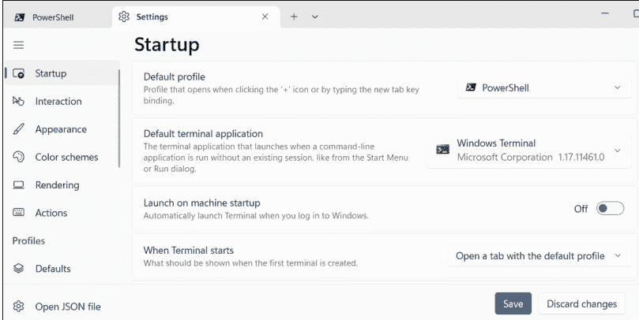

> **提示**
> 如果在打开设置时，编辑器中出现了一个奇怪的文件，说明你正在使用一个没有适当设置对话框的过时版本的终端。解决此问题的方法是在Microsoft Store中更新终端。

## 4.2.2 操作

如果你之前使用过`cmd.exe`、旧版PowerShell或其他操作系统中的终端，你已经知道鼠标或触摸板在终端中用处不大。特别是，你无法更改光标位置。输入只能在终端的最后一行进行。在这一行内，你可以通过`←`和`→`键移动光标。按`↑`和`↓`键，你可以重新调用之前输入的命令，并在必要时进行更改。

毕竟，你可以使用鼠标选择一个文本区域，然后按`Ctrl` + `C`将其复制到剪贴板。（如果当前有命令正在运行，`Ctrl` + `C`具有不同的功能：它会取消执行。）`Ctrl` + `V`会将当前剪贴板内容插入到光标位置。

如果你输入命令的前几个字母，最可能的补全内容会以灰色字体显示。按`→`键可以完成输入。或者，通过反复按`Tab`键，你可以循环浏览其他扩展选项。此功能对于命令选项以及当前目录中的文件名都以类似方式工作。`Ctrl` + `C`会一次显示所有可能的补全项。

Shift + Ctrl + P 会带你进入命令面板，这是一个长长的函数列表，你可以在终端中执行这些功能。许多功能与标签页管理（打开、关闭、切换、重命名等）和视觉细节（字体大小、颜色）相关。**操作**对话框页不仅列出了所有键盘快捷键，你还可以修改它们。

## 4.3 调用cmdlet和函数

在开始编写第一个脚本之前，你应该先交互式地熟悉PowerShell提供的选项。以下示例应该无需基础知识即可理解。你将在后面反复遇到在此过程中使用的命令。可以通过`Get-Help <命令名>`获取单个命令（实际上是cmdlet，但我们稍后会处理这个术语）的详细信息。

在下面的代码清单中，`Get-Location`确定当前路径。`Set-Location`切换到Downloads子目录，其中`Get-ChildItem`确定所有具有*.exe扩展名的文件。最后，`Remove-Item`删除一个安装程序。

```
> Get-Location

Path
----
C:\Users\kofler

> Set-Location Downloads

> Get-ChildItem *.exe

Directory: C:\Users\kofler\Downloads

Mode                 LastWriteTime         Length Name
----                 -------------         ------ ----
-a---           18.07.2022 17:24       1414600 ChromeSetup.exe
-a---           19.07.2022 11:49      49381480 Git-2.37.1-64-bit.exe
-a---           11.01.2023 18:49      25218984 python-3.11.1-amd64.exe

> Remove-Item ChromeSetup.exe
```

我在开头提到PowerShell使用对象。然而，这种功能并非总是显而易见。例如，`Get-Date`返回当前日期和时间。默认情况下，PowerShell只显示一个总结最重要数据的字符串：

```
> Get-Date

Wednesday, 5/3/2023 5:11:04 PM
```

只有当你通过管道运算符（|）将`Get-Date`的结果传递给`Get-Member`时，才会清楚`Get-Date`的结果具有`System.DateTime`数据类型，并且知道无数的属性和方法。（由于篇幅原因，我在这里大大简化了这个问题。）

```
> Get-Date | Get-Member

TypeName: System.DateTime
Name              MemberType   Definition
----              ----------   ----------
Add               Method       datetime Add(timespan value)
AddDays           Method       datetime AddDays(double value)
AddHours          Method       datetime AddHours(double ...)
AddMilliseconds   Method       datetime AddMilliseconds(...)
...
Ticks             Property     long Ticks {get;}
TimeOfDay         Property     timespan TimeOfDay {get;}
Year              Property     int Year {get;}
```

> **提示**
> `Get-Member`通常返回一个几乎无穷无尽的方法和属性列表。在Windows上，你可以使用`Get-Member | Out-GridView`在单独的窗口中显示结果。各种格式化（如`Out-GridView`）或导出cmdlet结果的选项将在第7章第7.6节中介绍。

如果你不需要整个日期，而只需要年份，你应该将`Get-Date`放在括号中以强制立即求值。从生成的对象中，你只分析`.Year`属性：

```
> (Get-Date).Year

2023
```

你可以使用`AddHours(2)`方法计算2小时后的日期和时间：

```
> (Get-Date).AddHours(2)

Wednesday, 5/3/2023 7:13:03 PM
```

### 4.3.1 cmdlet

到目前为止，我只是简单地说你可以在PowerShell中运行“命令”。然而，PowerShell实际上区分不同类型的命令——具体来说是cmdlet、函数、别名和传统命令。其中最重要的是cmdlet，它们是专门为PowerShell优化的命令。

术语“cmdlet”源于这样一个事实：cmdlet本身不是一个独立的程序，而是cmdlet组被收集在一个库中。用更技术性的术语来说，内部每个cmdlet都是一个.NET类的实例。这种特定的组织方式有许多优点。特别是，通用功能，如参数处理，不必为每个cmdlet重新实现。此外，对象的处理因此有了一个中心基础，这也应该清楚地表明cmdlet不是PowerShell脚本。包含cmdlet的库大多用C#编写。

### 4.3.2 动词-名词术语

cmdlet的名称遵循一个模式，由一个动词和一个名词组成（原始文档中的*动词-名词对*）。动词描述命令做什么，名词描述它处理什么数据。微软甚至定义了一套明确的动词，如果你自己编写命令，应该使用这些动词。例如，对于删除操作，你应该始终使用`Remove`，而不是`Delete`、`Eliminate`或`Drop`（参见[https://docs.microsoft.com/en-us/powershell/scripting/developer/cmdlet/approved-verbs-for-windows-powershell-commands](https://docs.microsoft.com/en-us/powershell/scripting/developer/cmdlet/approved-verbs-for-windows-powershell-commands)）。

> **大小写敏感性**
> PowerShell在识别命令和cmdlet选项、方法和属性时不区分大小写。因此，`(Get-Date).Month`和`(get-date).month`都返回当前月份的数字。

### 4.3.3 别名

`Get-ChildItem`可能是获取目录内容的命令的通用名称，但与`dir`或`ls`相比，输入开销相当大。因此，许多cmdlet存在缩写（“别名”）。`dir`、`ls`和`gci`也可以代替`Get-ChildItem`使用。

可以通过`Get-Alias`或`gal`显示所有别名的列表。许多预定义的缩写由动词和名词的首字母组成，例如`fl`代表`Format-List`，`rnp`代表`Rename-ItemProperty`。然而，有时使用的是Linux或`cmd.exe`中熟悉的名称，例如`cp`代表`Copy-Item`。

`Set-Alias`允许你定义自己的缩写。以下语句使你能够通过Linux典型的名称`touch`来执行用于创建空文件的`New-Item`命令：

## 4.3.4 参数与选项

你可以向大多数命令传递参数。也可以使用选项来控制命令的行为。以下命令在 `C:\Users` 及其所有子目录中搜索 PNG 文件：

```
> Get-ChildItem -Path C:\Users\kofler -Recurse -Filter *.png

Directory: C:\Users\kofler\OneDrive
... test.png

Directory: C:\Users\kofler\Pictures
... img_1234.png
```

`Get-Help <cmd>` 会总结哪些参数必须按什么顺序传递，以及 cmdlet 提供了哪些选项。本例中的示例命令传递了三个选项：`-Path`、`-Recurse` 和 `-Filter`。cmdlet 的选项总是以连字符开头。选项也可以缩写，只要能明确区分即可。（例如，不允许用 `-p` 代替 `-pa`，因为还有一个 `-PipelineVariable` 选项。）以下是我们前面代码片段第一行的直接翻译：

```
gci -pa C:\Users -r -fi *.png
```

在脚本编程中，不推荐使用缩写，因为以后向命令添加选项可能会导致你的脚本停止工作。

## 4.3.5 打散

有时，cmdlet 必须使用大量选项来调用，这通常会导致语句非常冗长且难以阅读。作为一种替代方法，你可以预先将所需的选项存储在哈希表（第 4.7 节）中，然后将此信息传递给 cmdlet。哈希表中的键必须与命令的选项名称匹配。以下示例重用了上面的 `Get-ChildItem` 语句并阐明了语法：

```
$opts = @{ Path = "C:\Users"; Recurse = $true; Filter = "*.png" }
Get-ChildItem @opts
```

其他打散变体记录在 https://learn.microsoft.com/en-us/powershell/module/microsoft.powershell.core/about/about_splatting。

## 4.3.6 函数

在脚本编程中，你可以轻松地将多个 PowerShell 命令组合成一个函数（第 4.11 节）。要传递函数，请将代码作为模块（文件标识符 `*.psm1`）保存在指定的目录之一（`$env:PSModulePath`）中。

如果模块安装正确，其中定义的函数与“真正的”cmdlet 无法区分。微软也广泛使用此选项：在 Windows 11 上 PowerShell 标准安装中可用的大约 1,900 个命令中，超过一半是函数。

```
> (Get-Command -CommandType Function | Measure-Object).Count
1028
> (Get-Command -CommandType cmdlet | Measure-Object).Count
843
```

`Get-Command` 和 `Measure-Object` 命令的这种串联是使用管道运算符的一个例子，我将在第 4.4 节中更详细地介绍。

## 4.3.7 运行传统命令

最后，你也可以在 PowerShell 中运行传统命令。此类命令的一个例子是 `ping`（通常是 `C:\Windows\System32\PING.EXE`），用于测试网络连接。然而，传统命令的缺点是它们的行为不像 cmdlet；例如，它们返回文本而不是对象。

从语法上讲，位于 PowerShell 不搜索的目录（即 `$Path` 环境变量未知的目录）中的命令会变得复杂。尝试直接指定完整路径通常会因使用空格而失败：

```
> C:\Program Files\Git\usr\bin\nano.exe myfile.txt
'C:\Program' is not recognized as a name of a cmdlet ...
```

然后必须使用 `&` 调用运算符启动程序，该运算符在第一个参数中传递包含完整路径的字符串。此运算符后面可以跟单独的参数和选项。

```
> & "C:\Program Files\Git\usr\bin\nano.exe" "myfile.txt"
```

## 4.3.8 在线帮助

本书没有足够的空间全面描述所有 cmdlet（但请参阅第 7 章）。因此，我将通过我的示例继续向你介绍新的 cmdlet。

幸运的是，PowerShell 配备了出色的帮助功能。`Get-Help <command>`（根据需要使用 `-Examples`、`-Detailed` 或 `-Full` 选项扩展）返回任何命令的全面帮助文本。如果你额外传递 `-Online` 选项，帮助文本将在 Web 浏览器中显示。

首次调用 `Get-Help` 时，PowerShell 可能会指出本地帮助文件不完整。解决此问题的方法是运行一次 `Update-Help -UICulture en-US`。`-UICulture` 选项是必要的，因为大多数帮助文本仅提供英文版本。然而，尽管使用了此选项，下载错误仍经常发生，因为对于某些（通常是较小的）模块，根本没有可用的帮助文本。

如果你正在寻找一个命令，`Get-Command` 总会有所帮助。没有进一步的选项，它只是提供所有命令的列表。使用 `Select-String`，你可以过滤几乎无穷无尽的输出。以下命令生成一个包含搜索词 VM 的所有命令的排序列表，这些命令显然控制虚拟机：

```
> Get-Command | Select-String VM | Sort-Object

Add-NetEventVmNetworkAdapter
Add-NetEventVmSwitch
...
```

`Get-Command` 提供更多搜索选项。查看 `Get-Help Get-Command -Examples`！

> **搜索未安装的命令**

`Get-Command` 仅考虑已安装的 cmdlet 和函数。然而，可以安装无数的 PowerShell 扩展模块。发现隐藏在扩展中的命令的最快方法是使用 `Find-Command`。有关使用附加模块的更多提示，请参阅第 7 章，第 7.8 节。

cmdlet 返回对象。你应用于结果的 `Get-Member` 方法揭示了这样一个对象提供了哪些属性和方法供选择。以下示例显示 `Get-ChildItem` 通常返回 `System.IO.FileInfo` 对象，这些对象可以使用无数的属性和方法进行进一步分析或处理。（请注意，根据上下文，`Get-ChildItem` 也用于其他任务，例如读取注册表项。返回的数据类型会相应更改。）

```
> Get-ChildItem somefile.txt | Get-Member

TypeName: System.IO.FileInfo
Name           MemberType    Definition
----           ----------    ----------
Target         AliasProperty Target = LinkTarget
LinkType       CodeProperty  System.String LinkType{get=...;}
AppendText     Method        System.IO.StreamWriter AppendText()
...
```

## 4.4 组合命令

你现在知道如何运行单个命令了。但脚本编程的伟大艺术在于以有意义的方式组合多个命令。`&&` 和 `||` 运算符仅从 PowerShell 版本 7 开始可用。

| 语法 | 功能 |
| :--- | :--- |
| `command1 | command2` | command2 **处理** command1 的**结果**。 |
| `command1 ; command2` | **首先运行** command1，**然后**运行 command2（**即使** command1 **触发了错误**）。 |
| `command1 && command2` | **首先运行** command1，**然后**运行 command2（**仅当** command1 **未导致错误时**）。 |
| `command1 || command2` | **首先运行** command1；command2 **仅在** command1 **触发错误时**才会运行。 |

表 4.1 组合命令

在本节中，我将重点介绍管道运算符（`|`），它在实际场景中最为重要。中间结果的进一步处理要求第二个命令能够处理第一个命令的结果数据类型。

请注意，cmdlet 在内部总是返回对象。这些对象通常包含比屏幕上显示的多得多的属性。屏幕输出经过优化，为用户提供（相当）清晰的结果。对象的许多属性被省略了。如果你想查看包含所有详细信息的结果，需要将输出传递给 `Format-List` 或 `Get-Member`。例如，尝试 `Get-ChildItem | Format-List` 或 `Get-Process | Get-Member`！

在以下示例中，`Get-Process` 确定 Microsoft Edge 浏览器的所有进程。进程对象被重定向到 `Stop-Process`；如果浏览器正在运行，此命令将终止它。

```
> Get-Process msedge | Stop-Process
```

## 4.4.1 命令链

管道操作符当然可以多次使用（即 `command1 | command2 | command3` 等）。这个选项开启了令人着迷的可能性。以下命令确定 `Downloads` 目录中的所有文件。然后，它按大小（最大文件在前）对结果列表进行排序，提取前十个文件，并确定它们的空间占用情况。

```
> (Get-ChildItem -Path Downloads |
    Sort-Object -Property Length -Descending |
    Select-Object -First 10 |
    Measure-Object -Property Length -Sum).Sum

22737476
```

如果你想删除这十个最大的文件，并使用查询来确认此过程已完成，你应该按如下步骤操作：

```
> Get-ChildItem -Path Downloads |
    Sort-Object -Property Length -Descending |
    Select-Object -First 10 |
    Remove-Item -Confirm
```

## 4.4.2 多行语句

在终端中，你可以输入任意长度的语句，但在本书中，已定义了最大行长度。在本书中，我经常将复杂的命令分散在多行中。

当你输入多行命令时，PowerShell 的行为相当智能：只要明确命令尚未完成，你就可以直接按 Enter 并在下一行继续输入。如果行中仍有未关闭的括号，或者行的最后一个字符是需要续行的运算符（如我们之前的示例中行尾的 `|`），则总是满足此未完成条件。

另一方面，如果续行对 shell 来说不明显可识别，但你仍然想将输入分隔成多行，则受影响的行必须以空格和反引号（`` ` ``）结尾。反引号前的空格字符是必需的，并且反引号后必须立即按 Enter。

```
> Do-Something -LongOption 123 -OtherOption 456 `
    -YetAnotherOption "lorem ipsum"
```

## 4.4.3 处理特殊字符

在 PowerShell 中，许多字符具有特殊含义：`#` 引入注释，`{` 和 `}` 形成代码组，`>` 重定向输出，等等。有时，需要直接使用这些字符，即不使用 PowerShell 特定的功能，例如调用外部命令。在下一个示例中，`>` 和 `#` 字符不能被解释。（我将在第 16 章第 16.1 节更详细地介绍 `magick` 命令。）

在这种情况下，你必须在前面加上前面提到的反引号（`` ` ``）。因此，反引号是 PowerShell 的引号，并与 Bash 和许多其他编程语言中的反斜杠（`\`）执行相同的任务。

```
> magick in.png -resize 1024x1024`> -background `#733 out.jpg
```

在大多数情况下，将相关字符串用引号括起来更容易：

```
> magick in.png -resize '1024x1024>' -background '#733' out.jpg
```

如果你需要在字符串中换行，应该使用 `` `n ``：

```
> Write-Output "line 1`nline 2"
line 1
line 2
```

## 4.5 第一个脚本

PowerShell 在交互模式下已经提供了出色的选项。通过你自己的脚本，你甚至可以更进一步，永久保存那些已经过交互测试的命令。这个功能不仅节省了未来的输入时间，还避免了记忆各种命令、选项等的需要。

要编写脚本，你需要一个编辑器。对于你的第一次实验，*记事本*就足够了，但免费的 *Notepad++* 程序提供了更多功能。然而，从长远来看，我建议你安装 Visual Studio Code (VS Code)，如果这个程序还没有在你的计算机上，第 13 章将对其进行详细描述。无论你开发 PowerShell、Bash 还是 Python 脚本，VS Code 都提供了出色的支持。（然而，不推荐使用许多旧手册中描述的 *PowerShell ISE* 开发环境。该程序已不再由 Microsoft 开发，并且仅适用于 PowerShell 5.1 及以下版本。）

### 4.5.1 Hello, World!

第一个脚本应该输出文本“Hello, World!”（别担心，本节后面会有更严肃的示例。）打开你选择的编辑器，输入以下行，并将文本文件保存为 `Hello.ps1`，放在一个容易找到的目录中（例如，在 Documents 中）。`Write-Output` cmdlet 将传递的字符串作为参数输出到屏幕。

```
Write-Output "Hello, World!"
```

`*.ps1` 文件扩展名代表 PowerShell 1。当 Microsoft 发布 PowerShell 的第二版时，他们不想更改当时已经确立的扩展名，因此，它荒谬地一直保留为 `*.ps1` 至今。

要运行脚本，你只需输入文件名，包括前面的目录，例如：

```
> Documents\Hello.ps1

Hello, World!
```

如果脚本位于当前目录中，你必须在前面加上 `.` 以明确指定目录，例如：

```
> .\Hello.ps1

Hello, World!
```

在此上下文中，“`.`”是你当前所在目录的简写。出于安全原因，没有指定目录的脚本只有在 `*.ps1` 文件位于 `$PATH` 环境变量中指定的目录中时才会执行。我稍后将更详细地描述这些概念。

### 4.5.2 执行策略的麻烦

根据 Windows 版本的不同，你第一次尝试运行自定义脚本可能会失败，并显示以下错误消息：

```
> .\Hello.ps1:

File C:\Users\kofler\Documents\Hello.ps1 cannot be loaded because running scripts is disabled on this system.
For more information, see about_Execution_Policies at https://go.microsoft.com/fwlink/?LinkID=135170
```

此错误消息的原因是所谓的*执行策略*。此策略指定了在 Windows 上允许运行脚本的条件。有四种可能的设置：

- **Restricted**：根本无法执行任何脚本。
- **AllSigned**：只能执行已签名的脚本。
- **RemoteSigned**：可以执行所有自定义脚本，但安装或下载的脚本只有在已签名的情况下才能执行。
- **Unrestricted**：可以执行所有脚本。

通常在 Windows Server 上适用 `RemoteSigned`，但在桌面版本上适用 `Restricted`：

```
> Get-ExecutionPolicy
Restricted
```

因此，在许多 Windows 安装中，根本无法运行脚本。出于安全原因，此默认设置是有意义的，但它当然不适合学习脚本。以下命令允许当前用户执行自定义脚本以及已签名的外部脚本：

```
> Set-ExecutionPolicy -Scope CurrentUser RemoteSigned
```

你也可以在没有 `-Scope CurrentUser` 选项的情况下运行上述命令——那么，该设置将应用于计算机的所有用户。但是，只有在以管理员权限运行 PowerShell 或 Windows Terminal 时，才允许在系统级别更改执行策略。

> **更多设置选项**
执行策略可以在不同级别（计算机、用户、进程）进行配置。有关配置选项的详细信息，请参阅 https://docs.microsoft.com/en-us/powershell/module/microsoft.powershell.core/about/about_execution_policies。

> **签名是什么意思？**

*已签名的脚本*包含一个带有数字签名（即加密代码）的注释块。此代码表示谁编写了该脚本。此代码仅适用于签名时脚本的状态。任何后续更改都将使签名失效。你可以使用 `Set-AuthenticodeSignature` 签署自己的脚本。此命令要求你拥有一个证书——要么是（用于测试目的）自创建的证书，要么是来自证书颁发机构的真实证书。你可以在 https://docs.microsoft.com/en-us/powershell/module/microsoft.powershell.core/about/about_signing 找到有关此主题的更多信息。

### 4.5.3 设置自定义脚本目录

对于你的第一个脚本，保存位置无关紧要。但在接下来的几周里，随着你编写越来越多的脚本，一个好主意是为你脚本设置一个目录，并将该目录添加到 `PATH` 环境变量中。在我们的示例中，我假设你将目录命名为 `myscripts`，并直接在你的工作目录中创建它。`Set-Location` 使用户目录成为当前目录（如果尚未是）。`New-Item` 创建目录。（如果你到目前为止一直使用 `cmd.exe` 或 Bash，`cd myscripts` 或 `mkdir myscripts` 也会让你用更少的输入和麻烦到达那里。但我想在本章中努力向你展示“正确的”PowerShell cmdlet。）

```
> Set-Location
> New-Item -ItemType Directory myscripts
```

现在，我们还需要设置 Path 变量。该变量包含 PowerShell 搜索可执行程序和脚本的所有目录列表。如果你将 myscripts 目录添加到此列表中，就可以运行存储在那里的脚本，而无需指定路径。无论当前活动目录是哪个，现在只需输入 Hello 即可启动 Hello World 脚本。得益于 Path 变量，你无需指定位置或 .ps1 标识符。

要配置此变量，请在**开始**菜单中搜索**编辑系统环境变量**，然后在**系统属性**对话框中单击**环境变量**按钮。在同名对话框中，从用户变量中选择 Path，并通过**编辑 • 新建 • 浏览**添加你的脚本目录。

请注意，对 Path 变量的更改仅在重启终端或 PowerShell 后才会生效。

## 4.5.4 在 Linux 和 macOS 上运行脚本

本章我通常假设你使用的是 Windows。但当然，你也可以在 Linux 或 macOS 上运行 PowerShell 脚本。尽管 Linux 或 macOS 中不存在执行策略（第 4.5.2 节），但必须遵守其他规则，例如：

- 首先，脚本文件必须以所谓的 *shebang 行*开头（另见第 3 章，第 3.5 节）：

    ```
    #!/usr/bin/env pwsh
    ```

    此行指定必须使用 env 命令搜索 pwsh shell，并用它执行后续代码。对于跨平台脚本，你也可以在 Windows 上使用此行，在这种情况下，此行仅被视为注释，没有实际效果。

- 另一方面，你必须通过 chmod 将脚本文件标记为*可执行*（因此，x）：

    ```
    $ chmod +x Hello.ps1       (Linux)
    $ chmod a+x Hello.ps1      (macOS)
    ```

一旦满足这两个要求，你就可以在 Linux 和 macOS 上运行脚本：

```
$ ./Hello.ps1
Hello, World!
```

## 4.5.5 示例：清理下载目录

在我们极简的 Hello World 脚本之后，我想回到第 4.4 节第二个示例中的一个想法：Tidy-Downloads.ps1 脚本旨在从下载目录中搜索 *n* 个最大的文件，并在查询后删除它们。通过这种方式，你可以在最短时间内快速腾出空间。（毕竟，通常只有几个巨大的文件占据了大部分空间。）

与第 4.4 节相比，请注意两个主要的新特性：

- 脚本使用了 `DownPath` 变量，该变量包含下载目录的位置。确定此位置最简单的方法是 `$DownPath = "$HOME\Downloads"`。然而，此方法并非在所有情况下都有效（参见 https://stackoverflow.com/questions/57947150）。例如，某些用户可能为其下载目录设置了不同的位置。本例中采用的方法稍显繁琐，使用了 Known Folders API。不过，此方法也有一个缺点：它仅适用于 Windows，不适用于 Linux 或 macOS。
- 要删除的文件数量可以通过一个可选参数传递给脚本。如果缺少该参数，脚本将搜索十个最大的文件。

关于变量和参数处理的更多细节将在本章后面介绍。但基本概念应该很清楚：在 PowerShell 中，变量以美元符号 ($) 字符为前缀。脚本或函数的所有参数都使用 `param()` 声明，你可以在其中指定数据类型、默认值以及许多其他附加信息。（除非使用函数，否则 `param` 必须是脚本中的第一条语句！）

```
# 示例文件 Tidy-Downloads.ps1

# $NoOfFiles 指定要删除的文件数量
# （默认值：10）
param([int] $NoOfFiles = 10)

# $DownPath 包含下载目录的位置
$DownPath = (New-Object -ComObject Shell.Application).
            NameSpace('shell:Downloads').Self.Path
# 在下载目录中删除最大的文件，并
# 进行确认
Get-ChildItem -Path $DownPath |
    Sort-Object -Property Length -Descending |
    Select-Object -First $NoOfFiles |
    Remove-Item -Confirm
```

> **注释**
与大多数脚本语言一样，PowerShell 脚本中的注释以 # 字符开头，然后延伸到行尾。多行注释以 <# 开头，以 #> 结尾。此类注释特别用于为 Get-Help 编写帮助文本。注释的语法记录在 https://docs.microsoft.com/en-us/powershell/module/microsoft.powershell.core/about/about_comment_based_help。

## 4.5.6 区分 PowerShell 版本

在许多计算机上，PowerShell 版本 5.n 和 7.n 是并行安装的。尽管如此，所有脚本都共享 *.ps1 文件扩展名。如果你的代码明确需要特定的 PowerShell 版本或有其他要求，你必须在脚本中包含一个或多个 #Requires 语句：

- **#Requires -Version <n>**
  脚本只能使用指定版本或更新版本执行。
- **#Requires -PSEdition Core**
  脚本只能使用核心变体执行（适用于所有 6.0 及更高版本的 PowerShell）。
- **#Requires -PSEdition Desktop**
  脚本只能使用桌面变体执行（所有 Windows PowerShell 版本，最高包括 5.1）。
- **#Requires -Modules <name>**
  脚本需要指定的模块。
- **#Requires -RunAsAdministrator**
  脚本只能以管理员权限执行。

#Requires 语句可以放置在脚本中的任何位置。

## 4.6 变量、字符串和对象

你在上一节中首次接触了 PowerShell 变量。基本上，处理变量非常简单：使用 $Name = . . . 你可以将内容赋值给变量。之后，你可以再次使用此内容。要输出变量的内容，可以使用 Write-Output；更简单的方法是将变量或字符串作为独立语句命名。请注意，双引号之间的字符串中的变量会被其内容替换。关于处理字符串的更多细节将在后面介绍。

```
> $UserName = "Michael"

> Write-Output $UserName
Michael

> $UserName
Michael

> $UserId = 123

> Write-Output "$UserName has the ID $UserId."
Michael has the ID 123.

> "$UserName has the ID $UserId."
Michael has the ID 123.
```

如果你意外使用了未初始化的变量，PowerShell 通常不会遇到任何问题：变量为空，但分析不会导致错误：

```
> "$UserName has the ID $Uid."
Michael has the ID .
```

然而，未初始化的变量可能导致逻辑错误。因此，在脚本开头包含 `Set-StrictMode -Version 1.0` 是有意义的。使用未初始化的变量会导致错误消息。（但是，脚本无论如何都会继续运行。有关 `Set-StrictMode` 和如何在脚本中处理错误的更多信息将在[第 4.13 节](#section-4-13)中介绍。）

> **变量名**
PowerShell 在命名变量、函数等时允许使用几乎任何字符。如果你想使用空格或特殊字符，`${name}` 表示法是合适的，例如 `${this is a variable name too!}`。在此上下文中，花括号清楚地表明了变量名的开始和结束。

尽管语法如此自由，但一个有用的做法是仅由字母、数字和少数特殊字符 (_) 组成变量名。

PowerShell 的典型 Windows 特性是不区分大小写。因此，在我们之前的示例中，你同样可以解析 `$userid` 或 `$USERID`，因为这些名称对于 PowerShell 是等效的。

你也可以将其他命令的结果存储在变量中，如以下示例所示：

```
> $Images = Get-ChildItem *.jpg
```

可以使用 `Read-Host` 执行用户输入，如以下示例所示：

```
> $Name = Read-Host "Enter your name!"
Enter your name!: Michael

> "Hello, $Name!"
Hello, Michael!
```

### 4.6.1 数据类型

尝试对通过 `Read-Host` 输入的数字执行计算会失败，因为 PowerShell 区分不同的数据类型：

## 4.6.2 计算与比较

只要数据类型正确，所有常见的基本算术运算在 PowerShell 中都有效。PowerShell 还支持递增和递减运算符 `++` 和 `--`，以及与计算结合的赋值，如下例所示：

```
> $Price = 100.0
> $Price * 1.19 + 10
129

> $Cnt = 27
> $Cnt++    # 对应于 $Cnt = $Cnt + 1
> $Cnt+=3   # 对应于 $Cnt = $Cnt + 3
> $Cnt
31
```

但是，PowerShell 不识别用于表示指数的 `^` 字符。对于指数运算，必须使用 `Pow` 函数：

```
> [Math]::Pow(2, 4)
16
```

在此表达式中，`[Math]` 指同名的类，`::Pow` 指在 `[Math]` 内定义的函数。（如果您熟悉面向对象编程的概念，`Pow` 是一个静态方法。）除了 `Pow`，`Math` 对象还提供了无数其他可供选择的函数，例如 `Sin`、`Cos` 或 `Sqrt`。

比较比计算要繁琐得多。PowerShell 无法分析像 `$Price > 140` 这样的条件，因为 `<` 和 `>` 字符用于输出重定向（第 4.8 节）。相反，您需要使用各种看起来像选项的运算符：

```
> $Price = 100.0
> $Price -gt 80
True
> $Price -eq 80
False
```

| 运算符 | 含义 |
| :--- | :--- |
| -eq | 等于 |
| -ne | 不等于 |
| -gt | 大于 |
| -ge | 大于或等于 |
| -lt | 小于 |
| -le | 小于或等于 |

**表 4.3** 数字和字符串的比较运算符

使用 `-not (条件)` 或简写 `!(条件)`，可以反转条件。如果要链接多个条件，应使用 `-and`、`-or` 或 `-xor`：

```
> (100 -lt 110) -or (200 -lt 220)
True
```

## 4.6.3 字符串

对于许多脚本来说，字符串比数字更重要。与大多数其他 shell 一样，PowerShell 区分两种表示字符串的方式。如果用简单引号定义字符串，内容将原样保留。另一方面，如果使用双引号，则字符串中命名的变量将被其内容替换。换句话说，执行了*变量替换*。考虑以下示例：

```
> $A = "abc"
> $B = "efg $A"
> $C = 'efg $A'
> $A, $B, $C

abc
efg abc
efg $A
```

如果变量名无法清晰界定，必须将其括在花括号中：

```
> Write-Output "${A}${B}"
abcefg abc
```

多行字符串或本身包含 `"` 和 `'` 字符的字符串最好组装为*Here 字符串*。此类字符串以 `@"` 或 `@'` 开头，以 `"@` 或 `'@` 结尾，具体取决于是否要使用变量替换。起始代码和结束代码必须各占单独的行：

```
$json = @"
{
    "first": "item",
    "second": "item"
}
"@
```

要比较字符串，可以使用熟悉的运算符，但请记住 PowerShell 不区分大小写：

```
> "abc" -eq "ABC"
True
```

但是，对于所有比较运算符，都有一个*区分大小写*的变体，前面带有 `c`：

```
> "abc" -ceq "ABC"
False
```

使用 `-like` 或 `-notlike`，可以执行简单的模式匹配。在此上下文中，`?` 用作任何字符的占位符，`*` 是多个字符的占位符：

```
> "PowerShell" -like '*sh*'
True
```

您可以使用 `-match` 和 `-notmatch` 基于正则表达式制定更复杂的比较模式（参见第 9 章）。

在内部，字符串是对象（另见下一小节）。因此，字符串可以通过方法和属性进行处理。以下行显示了一些示例，不保证完整。您可以使用 `"" | Get-Member` 获取所有方法的完整列表。

```
> $UserName = "Michael Kofler"
> $UserName.Length
14
> $UserName.ToUpper()
MICHAEL KOFLER
> $UserName.StartsWith("Michael")
True
> $UserName.Substring(8, 6)  # 从位置 8 开始的 6 个字符
Kofler
> $UserName.Split(" ")       # 返回数组
Michael
Kofler
```

一些处理步骤可以使用特殊运算符而不是方法来执行，如下例所示：

```
> $UserName -split " " # 返回数组
Michael
Kofler

> $UserName -replace "Michael", "Mike"
Mike Kofler

> "Name: {0} ID: {1}" -f "Kofler", 123
Name: Kofler ID: 123
```

| 运算符 | 含义 |
| :--- | :--- |
| -eq, -ne 等 | 比较运算符 |
| -ceq, -cne 等 | 区分大小写的比较运算符 |
| -like 和 -notlike | 简单模式匹配 |
| -match 和 -notmatch | 使用正则表达式的模式匹配 |
| -f | 格式化 |
| -replace | 搜索和替换 |
| -split | 分解字符串 |

**表 4.4** 字符串的重要运算符

使用 `-f` 格式化运算符，占位符 `{0}`、`{1}` 等将被后续参数替换。PowerShell 提供了无数格式化选项，进一步描述见 https://docs.microsoft.com/en-us/dotnet/standard/base-types/standard-numeric-format-strings。

使用 `-f` 的示例见第 4.10 节。

## 4.6.4 命令替换

如前所述，借助变量替换，您可以在字符串中包含或输出变量的内容：

```
> $account = "Maria"
> Write-Output "Account-Name: $account"

Account-Name: Maria
```

但是，如果您想对变量应用方法，替换将不起作用：

```
> Write-Output "Account name: $account.ToLower()" # 错误
Account name: Maria.ToLower()
```

通常，PowerShell 变量包含对象（另见下一节）。对其属性的直观访问也会失败。相反，PowerShell 输出变量的内容，然后是属性名：

```
> $process = Get-Process | Select-Object -First 1

> Write-Output "Process name: $process.ProcessName" # 错误
Process name:
System.Diagnostics.Process (AggregatorHost).ProcessName
```

在这种情况下，解决方案是使用 `$( expr )` 语法的所谓*命令替换*。`expr` 表达式被分析，其结果被插入到字符串中。该表达式不必引用现有变量——可以执行任何 cmdlet：括号前后的空格是可选的，但可以提高可读性。以下清单显示了一些命令替换的示例：

```
> Write-Output "Account name: $( $account.ToLower() )"
Account name: maria

> Write-Output "Process name: $( $process.ProcessName )"
Process name: AggregatorHost

> Write-Output "Date and time: $(Get-Date)"
Date and time: 02/12/2023 10:08:34

> $now = Get-Date
> "Time in two hours: $($now.AddHours(2).ToShortTimeString())"
Time in two hours: 12:08
```

## 4.6.5 对象

大多数 cmdlet 不像传统 shell 中的命令那样返回字符串，而是返回完整的对象。例如，`Get-Process` 返回一个 `Process` 对象数组。您可以使用 `Select-Object` 选择一个对象，然后使用 `Get-Member` 查看其属性和方法：

```
> Get-Process | Select-Object -First 1 | Get-Member

TypeName: System.Diagnostics.Process

Name        MemberType   Definition
----        ----------   ----------
Handles     AliasProperty Handles = Handlecount
Name        AliasProperty Name = ProcessName
NPM         AliasProperty NPM = NonpagedSystemMem…
…
```

## 4.6.6 组装自定义对象

你不仅可以处理脚本中来自给定类的对象，还可以以自行组装的临时对象形式返回结果。最简单的方法是使用 `PSCustomObject` 作为基础，如下例所示：

```
$MyObject = [PSCustomObject]@{
    UserName = "Michael"
    UserId   = 123
}
```

通常，哈希表（即简单的键值存储）也能达到同样的目的。其主要优点是输入工作量相对较低：

```
$Data = @{
    UserName = "Michael"
    UserId = 123
}
```

如果你想节省行数，可以用分号分隔键值对：

```
$Data = @{ UserName = "Michael"; UserId = 123 }
```

## 4.6.7 预定义变量

通常，你必须自己负责变量的初始化。然而，在 PowerShell 术语中，有许多称为*自动变量*的预定义变量可用。这些变量包含有关 PowerShell、当前脚本状态等信息。

| 变量 | 内容 |
| :--- | :--- |
| `$?` | 最后执行的命令的状态（如果发生错误则为 `$false`） |
| `$_` | 管道当前处理的对象（`$PSITEM`） |
| `$args` | 包含传递给脚本或函数的参数的数组 |
| `$Error` | 对象，描述发生的最后一个错误 |
| `$Event` | 对象，描述当前正在处理的事件 |
| `$false` | 布尔状态“假” |
| `$HOME` | 包含当前用户主目录的字符串 |
| `$input` | 通过标准输入（管道）传递给函数的数据 |
| `$IsLinux` | 如果 PowerShell 在 Linux 上运行则为 `$true` |
| `$IsMacOS` | 如果 PowerShell 在 macOS 上运行则为 `$true` |
| `$IsWindows` | 如果 PowerShell 在 Windows 上运行则为 `$true` |
| `$null` | 空值（未初始化状态） |
| `$PID` | 当前进程 ID |
| `$PROFILE` | 包含用于 PowerShell 初始化/配置的配置文件路径的字符串 |
| `$PWD` | 包含当前目录路径的对象 |
| `$true` | 布尔状态“真” |

**表 4.5** PowerShell 最重要的预定义变量

我在此表中仅编译了最重要的变量。一如既往，所有变量（大约有 50 个！）的完整描述可以在在线文档中找到：https://docs.microsoft.com/en-us/powershell/module/microsoft.powershell.core/about/about_automatic_variables。

> **没有通配符扩展！**
> 当你运行 Bash 脚本（如 `script.sh *.txt`）时，当前目录中所有文本文件的名称都会传递给脚本。另一方面，如果你将 `*.txt` 作为参数传递给 PowerShell 脚本，那么传递的正是这个字符串本身。你必须在脚本本身中处理相应的文件名。如果只涉及一个参数，`Get-Item $args` 将会工作。如果可能向你的脚本传递多个参数（例如，`script.ps1 file1 file2` 或 `script.ps1 *.jpg *.png`），那么你必须创建*两个*循环。第一个循环处理参数并执行 `Get-Item`；第二个循环处理 `Get-Item` 返回的结果。有关按拍摄日期对照片进行排序的代码示例，请参见第 16 章，第 16.2 节。

## 4.6.8 环境变量

环境变量也是预定义变量。然而，它们是在操作系统级别定义的，不仅对 PowerShell 可用，对所有进程都可用。许多环境变量包含重要目录的位置。

| 变量 | 内容 |
| :--- | :--- |
| `$Env:APPDATA` | 程序设置目录 |
| `$Env:HOME` | 主目录 |
| `$Env:HOMEDRIVE` | 主目录所在的驱动器 |
| `$Env:LOCALAPPDATA` | 程序设置目录 |
| `$Env:Path` | 可执行程序的目录列表 |
| `$Env:PROCESSOR_ARCHITECTURE` | CPU 架构（例如，AMD64） |
| `$Env:PSModulePath` | PowerShell 模块的目录列表 |
| `$Env:SHELL` | 活动 shell 的路径 |
| `$Env:TEMP`, `$Env:TMP` | 临时目录 |
| `$Env:USER` | 当前账户名 |
| `$Env:windir` | Windows 目录的路径（例如，`C:\Windows`） |

**表 4.6** 最重要的环境变量

通过 PowerShell 访问环境变量采用一种有些不寻常的形式，`$Env:[<变量名>]`，例如 `$Env:Path`。所有环境变量返回的是字符串而不是对象。我仅指定了少数特别重要的预定义环境变量，它们在大小写名称方面相当不一致。

## 4.7 数组和哈希表

数组是一种用于存储多个对象的数据结构。PowerShell 广泛使用数组，许多命令返回数组。例如，`Get-ChildItem` 通常返回一个 `FileInfo` 和 `DirectoryInfo` 对象的数组（除非 `Get-ChildItem` 用于处理注册表项）。

```
> $Files = Get-ChildItem
> $Files.Length
4

> $Files.Count    # 等效，Count 是 Length 的别名
4

> $Files.GetType()

   IsPublic IsSerial Name      BaseType
   -------- -------- ----        --------
   True     True     Object[]    System.Array
```

管道运算符可以完美地处理数组，并逐个处理数组的元素——本章已经展示了许多这种处理的例子。你可以使用 `ForEach-Object` 来显式循环并输出每个数组元素的详细信息。在循环内部，`$_`（`$PSItem` 的简写）提供对当前项的访问。更多关于循环的细节将在第 4.9 节中介绍。

```
> $Files | ForEach-Object { "$($_.GetType()) $($_.FullName)" }

System.IO.DirectoryInfo C:\Users\kofler\myscripts\mydir
System.IO.FileInfo      C:\Users\kofler\myscripts\Hello.ps1
System.IO.FileInfo      C:\Users\kofler\myscripts\MyTest.ps1
System.IO.FileInfo      C:\Users\kofler\myscripts\Loop.ps
```

### 4.7.1 创建和处理自定义数组

你可以轻松地在自己的脚本中创建数组，如下例所示：

```
> $Data = 1, 17, 39, 45
> $Data = @(1, 17, 39, 45)    # 等效
```

一旦创建，数组的大小就不能更改。尽管如此，你仍然可以使用 `+=` 运算符轻松添加更多元素。然而，在幕后，此操作会创建一个新的、稍大的数组。对于包含大量元素的数组，此操作可能效率相当低！

```
> $Data += 23, 27
> $Data
1
17
39
45
23
27
```

数组元素通过方括号中的索引进行访问。与大多数编程语言一样，允许的索引值范围从 0 到元素数量减 1：

```
> $Data[0]
1
> $Data[5]
27
```

当指定无效索引时，PowerShell 的行为取决于模式。默认情况下，PowerShell 只是返回 null，但不会引发错误。另一方面，如果你激活了严格模式（在你自己的脚本中强烈推荐！），则会发生错误：

```
> $Data[6]
> Set-StrictMode -Version Latest
> $Data[6]
OperationStopped: Index was outside the bounds of the array.
```

你也可以指定多个索引条目。然后，结果是一个包含所选条目的新数组：

```
> $Data[1, 2, 5]
17
39
27
```

`start..end` 表示法返回指定范围内的所有元素。如果 `start` 大于 `end`，则元素将按相反顺序返回。（确保不要错误地输入三个句点！否则，第三个句点将被解释为小数点，而随后的索引值将被解释为浮点数。）

```
> $Data[3..5]
45
23
27
> $Data[5..3]
27
23
45
```

## 4.7.2 哈希表

与数组类似，哈希表也允许存储数据，但有一个显著区别：访问元素不是通过编号索引，而是通过自选的键。因此，哈希表常被称为*键值存储*。你可以利用这一特性创建清晰的数据结构。使用哈希表与使用数组一样简单。请看以下示例：

```
> $Data = @{ OS = "Windows"; Version = 11; ReleaseYear = 2021 }

> $Data.MinimumRamGB = 4    # 添加元素

> $Data                     # 读取所有元素

Name            Value
----            -----
MinimumRamGB    4
ReleaseYear     2021
OS              Windows
Version         11

> $Data.ReleaseYear         # 读取一个元素
2021
```

通常，哈希表不关心元素的顺序。因此，你不能依赖循环来按插入顺序返回元素。如果顺序对你很重要，必须使用 `[ordered]` 关键字创建哈希表：

```
> $Data = [ordered]@{ Key1 = Value1; Key2 = Value2 ... }
```

## 4.8 输出重定向

默认情况下，每个命令的结果都显示在终端中。如果你运行 `Get-ChildItem`，终端随后将包含找到的文件列表。你可以使用 `Write-Output` cmdlet 或直接命名变量或字符串来输出它们。因此，以下两条语句是等效的，都会输出 "Hello, World!"：

```
> Write-Output "Hello, World!"
"Hello, World!"
```

### 4.8.1 流

乍看之下简单明了的事情，背后其实更复杂：PowerShell 区分了多个用于不同目的的“流”（通道）。

| 编号 | 描述 | Cmdlet |
| :--- | :--- | :--- |
| 1 | 成功流 | Write-Output 以及直接输出 |
| 2 | 错误流 | Write-Error |
| 3 | 警告流 | Write-Warning |
| 4 | 详细信息流 | Write-Verbose |
| 5 | 调试流 | Write-Debug |
| 6 | 信息流 | Write-Information |
| * | 所有流 | – |

表 4.7 流

虽然你使用 `Write-Output` 进行“正常”输出，但应使用 `Write-Error` 处理错误消息，使用 `Write-Warning` 处理警告，依此类推。请注意，你也可以通过管道运算符组合这些命令。以下命令将当前进程列表写入调试流：

```
> Get-Process | Write-Debug
```

默认情况下，只有流 1 到 3 会显示在终端中。流 4 到 6 保持不可见，以避免用调试信息打扰用户。你可以通过 `Preference` 变量控制显示哪些流（对于流 3 到 6）：

```
> $WarningPreference, $VerbosePreference, $DebugPreference,
    $InformationPreference

Continue
SilentlyContinue
SilentlyContinue
SilentlyContinue
```

此列表显示了默认设置。其他允许的设置是 `Inquire` 和 `Stop` 字符串（另见本章末尾的表 4.9）。因此，相应流中的任何输出都会导致脚本中断。使用 `Inquire` 时，脚本可以在查询后继续；使用 `Stop` 时，则不能。

### 4.8.2 输出重定向

流的一个巨大优势是它们可以重定向到文件。成功流的经典重定向运算符是 `> file`。因此，成功流的所有输出不再显示在屏幕上，而是保存在文本文件中。如果文件已存在，它将被覆盖。在 PowerShell 中，你可以使用 `Get-Content` 查看文件内容：

```
> Get-ChildItem > files.txt
> Get-Content files.txt
...
```

你可以在文件末尾添加文本输出，而不是覆盖现有文件。为此，你必须使用 `>>` 运算符而不是 `>` 运算符。

`>` 和 `>>` 运算符仅影响成功流。如果需要，所有其他流都可以用 `2>` 到 `6>` 重定向。（当你重定向流 3 到 6 时，`Preference` 变量仍然有效。如果设置了 `SilentlyContinue`，则不会在指定文件中保存任何内容，因为输出将被抑制。）

你可以将流 2 到 6 与成功流合并，然后将该流重定向到一个文件，而不是将流重定向到单独的文件。以下命令首先将错误流添加到成功流。然后，两个流的输出都存储在 `out.txt` 文件中。

```
> Do-Something 2>&1 > out.txt
```

最后，使用 `*>`，你可以将所有流重定向到一个公共文件。

| 运算符 | 功能 |
| :--- | :--- |
| `>` | 将成功流重定向到文件 |
| `>>` | 将成功流追加到文件 |
| `2>` 到 `6>` | 将流 2 到 6 重定向到文件 |
| `2>>` 到 `6>>` | 将流 2 到 6 追加到文件 |
| `2>&1` 到 `6>&1` | 将流 2 到 6 与成功流合并 |
| `*>` | 将所有流重定向到一个文件 |
| `2>&1 >>` | 合并流 1 和 2，然后将它们追加到文件 |

**表 4.8** 输入和输出重定向运算符

> **Write-Host 与 Write-Output**

`Write-Host` 命令直接在终端（“主机”）中执行输出。乍看之下，结果看起来像 `Write-Output` 的结果。

关键区别在于这些输出无法重定向。使用 `Write-Host`，你的脚本会失去灵活性。你的脚本用户无法简单地将其输出重定向到文件。请使用 `Write-Output`！

### 4.8.3 复制输出 (Tee-Object)

有时，你希望在屏幕上看到 cmdlet 或脚本的输出*并*将其保存到文件。为此，`Tee-Object` 可以帮助你：此命令与管道运算符一起使用。它获取成功流，显示它，同时将其重定向到指定的文件。如果你运行以下命令，你将在终端中看到当前目录的文件；同时文件列表将保存在 `files.txt` 中。

```
> Get-ChildItem | Tee-Object files.txt
```

`Tee-Object` 只考虑成功流。但是，你可以使用 `n>&1` 先将另一个流添加到成功流：

```
> Get-ChildItem 2>&1 | Tee-Object files-and-errors.txt
```

### 4.8.4 (不)格式化输出

默认情况下，PowerShell 会格式化每个输出。例如，`Get-ChildItem` 返回一个 `FileInfo` 和 `DirectoryInfo` 对象数组作为结果。但是，PowerShell 不会显示这些对象及其所有属性，而是从这些对象创建一个对人类来说相当易读的文本表示。通过将输出传递给各种 `Format` 命令，可以获得具有或多或少细节的替代表示：

```
> Get-ChildItem | Format-List
> Get-ChildItem | Format-Table
> Get-ChildItem | Format-Custom Name,Length
```

当你将 PowerShell 命令的结果重定向到文本文件时，一个通常合适的任务是消除任何格式。对于示例命令 `Get-ChildItem`，你可能只对文件名感兴趣，而不是包含多列的表格，或者用于更好表示列标签的颜色代码等。不幸的是，这个常见任务在 PowerShell 中只能以相当笨拙的方式实现。

以下示例展示了一种可能的方法：`Get-ChildItem` 的结果传递给 `ForEach-Object`，`$_.Name` 从每个对象中提取文件名。（关于 `ForEach-Object` 和 `$_` 表示法的详细信息将在第 4.9 节中介绍。）`Out-String` 输出结果名称，无需进一步格式化。最后，`>` 将所有输出重定向到 `files.txt` 文件。该文件随后每行包含一个文件或目录名。

```
> Get-ChildItem |
    ForEach-Object {$_.Name} |
    Out-String > files.txt
```

### 4.8.5 无输入重定向

许多 shell 还提供通过 `<` 进行输入重定向的选项。在 Linux 上，`command1 | command2` 因此等效于以下命令序列（除了通过文件的迂回会消耗存储空间和时间）：

```
$ command1 > file.txt
$ command2 < file.txt
```

不幸的是，PowerShell 不支持 <，因为 PowerShell 命令大多数时候期望对象。但如果你首先通过 `command1 > file.txt` 将 PowerShell 命令的结果写入文本文件，对象信息将丢失。文本文件仅包含格式化文本，随后不能作为在另一个命令中处理数据的基础。

当你使用来自 Linux 世界的需要输入重定向的命令时，缺少输入重定向会变得有问题。例如，你可以使用 `mysqldump` 备份数据库，然后通过 `mysql` 恢复它。在 Linux 和 macOS 上，以下代码可以工作：

```
$ mysqldump dbname > backup.sql    # 创建备份
$ mysql dbname  < backup.sql      # 恢复数据库
```

在 PowerShell 中，只有第一个命令有效，第二个无效。但是，存在一个解决此问题的变通方法。为此，运行 `Get-Content` 输出 `backup.sql` 文件的内容。然后，使用 `|` 将此输出重定向到 `mysql`，如以下示例所示：

```
> Get-Content backup.sql | mysql dbname
```

## 4.9 循环

通常，你需要在脚本中逐个处理多个元素，例如文本文件的每一行、目录中的每个文件等。循环（在 PowerShell 中有多种语法变体）可以帮助你完成此过程。在实践中，最重要的循环是 `foreach($item in $data)`。此循环将 `$data`（即包含数组或其他枚举的变量）中的所有元素依次插入 `$item` 循环变量并进行处理。在以下示例中，使用 `Split` 将 `$Text` 中的字符串拆分为单词。然后在循环中将这些单词输出到屏幕上。

```
> $Text = "I love PowerShell!"

> foreach ($Word in $Text.Split(" ")) {
    $Word
  }

I
love
PowerShell!
```

## 4.9.1 ForEach-Object

PowerShell 提供了 `ForEach-Object` 作为另一种处理方式。其主要区别在于，`ForEach-Object` 期望将要处理的对象作为输入。这种特性使其特别适合用于管道。在循环结构内，你可以通过 `$_` 访问当前活动的对象。以下循环等同于前面的示例：

```
$Text.Split(" ") | ForEach-Object { $_ }
```

如果你想输出所有单词的长度，应该使用以下代码：

```
> $Text.Split(" ") | % { Write-Host $_.Length }
1
4
11
```

对于这种相对常见的情况（即对循环变量应用属性或方法），可以使用简写形式：

```
> $Text.Split(" ") | ForEach-Object Length
1
4
11
```

最后，由于 `ForEach-Object` 关键字使用频率很高，可以进一步缩写为 `%`：

```
> $Text.Split(" ") | % ToUpper()
I
LOVE
POWERSHELL!
```

当你将 `ForEach-Object` 与 `-Parallel` 选项结合使用时，它会在并行线程中运行循环中的语句（即花括号之间的代码）。在拥有多个 CPU 核心的强大计算机上，这种方法可以节省大量时间。以下示例展示了这种并行处理：`Get-ChildItem` 确定当前目录中的所有 `*.bmp` 文件。`Compress-Archive` 将每张图片压缩为一个名为 `<文件名.bmp>.zip` 的文件。

```
> Get-ChildItem *.bmp | ForEach-Object -Parallel {
    Compress-Archive -DestinationPath "$_.zip" $_
}
```

## 4.9.2 for、while、do-while 和 do-until

PowerShell 也使用其他编程语言中常见的循环结构，即 `for`、`while`、`do-while` 和 `do-until`。这种循环在 shell 脚本中并不常见，因此我只提供每个的简短示例，不做进一步解释。如有需要，可以参考文档。

```
> for ($i=0; $i -lt 5; $i++) { $i }

# 输出：0, 1, ..., 4

> $i=0
> while ($i -lt 5) {
    Write-Host $i
    $i++
}
# 再次输出：0, 1, ..., 4

> $i=0
> do {
    Write-Host $i
    $i++
} while ($i -lt 5)
# 再次输出：0, 1, ..., 4

> $i=0
> do {
    Write-Host $i
    $i++
} until ($i -eq 5)
# 再次输出：0, 1, ..., 4
```

## 4.10 分支

一个常见场景是，你只想在满足特定条件时执行代码。根据变量的状态，应该执行代码的不同分支。创建分支最简单的方法是使用 `if-elseif-else` 语句。允许使用任意数量的 `elseif` 块。`elseif` 和 `else` 都是可选的。

```
if (条件1) {
    语句
} elseif (条件2) {
    语句
} else {
    语句
}
```

## 空格字符

`if(条件)` 和 `if (条件)` 两种表示法在语法上都是有效的。更常见且更具可读性的版本是在括号前使用空格。此建议也适用于 `for`、`foreach`、`while`、`until` 等。
但请注意，对于函数和方法，名称和左括号之间不能有空格！

以下示例脚本首先使用 `Get-CimInstance` 创建一个 `Win32_LogicalDisk` 对象数组，这些对象描述了当前计算机的文件系统。CIM 标准帮助你管理 IT 资源，并通过 WMI API 得到 Microsoft 的支持。在我们的示例中，我们只对类型 3 的磁盘（*本地磁盘*）感兴趣。对于硬盘或 SSD 上的每个文件系统，脚本计算可用空间的百分比和千兆字节数。

```
# 示例文件 Get-DiskFree.ps1
$Drives = Get-CimInstance -ClassName Win32_LogicalDisk
foreach ($Drive in $Drives) {
    if ($Drive.DriveType -eq 3) {
        $PercentageFree = 1.0 * $Drive.FreeSpace / $Drive.Size
        $GBFree = $Drive.FreeSpace / 1000000000
        "{0:S} {1:P1}  / {2,5:F0} GB free" -f `
            $Drive.DeviceId, $PercentageFree, $GBFree
    }
}
```

为了格式化输出，脚本使用了 `-f` 格式化运算符，结构如下：
`"格式代码" -f 值1, 值2, 值3, ...`

包含格式化语句的字符串后跟 `-f` 运算符，然后是待处理的值数组。在格式化字符串中，`{0}` 被第一个值替换，`{1}` 被第二个值替换，依此类推。数字后面可以跟其他格式化代码。在此示例中，我使用了以下代码：

- `{0:S}`：将以下数组的第一个值作为字符串原样输出
- `{1:P1}`：将第二个值格式化为带一位小数的百分比
- `{2,5:F0}`：将第三个值作为无小数位的浮点数（F0）右对齐，占五位数字

你可以在 [https://docs.microsoft.com/en-us/dotnet/standard/base-types/standard-numeric-format-strings](https://docs.microsoft.com/en-us/dotnet/standard/base-types/standard-numeric-format-strings) 找到关于允许的格式化代码的良好文档，PowerShell 与许多其他特性一样，从 .NET 框架继承了这些代码。
然后脚本返回以下输出，例如：

```
> .\Get-DiskFree.ps1

C: 84.2 % / 180 GB free
F: 98.3 % / 15 GB free
```

这个脚本本意是说明 `if` 的用法。然而，我不会向你隐瞒，这段代码也可以用完全不同的方式来编写。在下面的几行中，`Where-Object` 从数组中过滤出所需的文件系统。`ForEach` 处理剩余的结果，通过 `$_` 访问当前元素，而不是循环变量 `$Drive`。如果你熟悉函数式编程——无论哪种语言——这个解决方案对你来说可能看起来更优雅：

```
$Drives = Get-CimInstance -ClassName Win32_LogicalDisk
$Drives | Where-Object -Property DriveType -eq 3 | ForEach {
    $PercentageFree = 1.0 * $_.FreeSpace / $_.Size
    $GBFree = $_.FreeSpace / 1000000000
    "{0:S} {1:P1} / {2,5:F0} GB free" -f `
        $_.DeviceId, $PercentageFree, $GBFree
}
```

## 4.10.1 使用 switch 进行区分

如果需要对表达式处理不同的情况，`switch` 可以替代多个 `if` 语句。在最简单的情况下使用以下语法：

```
$option = "b"
switch ($option) {
    "A"     { Write-Output "选项 A" }
    "B"     { Write-Output "选项 B" }
    "C"     { Write-Output "选项 C" }
    default { Write-Output "无效" }
}
```

请注意，在此上下文中，字符串比较通常不区分大小写。

## 4.11 函数和参数

函数提供了将多个 PowerShell 命令捆绑在一起的选项，这有助于组织复杂的脚本。在其最简单的形式中，函数具有以下结构：

```
function 做某事 {
    命令1
    命令2
    ...
}
```

在脚本中，函数只能在定义*之后*使用。因此，脚本文件首先包含所有函数，而最终要执行的代码位于末尾。

> **命名规则**

PowerShell 文档建议按照 *动词-名词* 模式命名自定义函数，例如 cmdlet。名称中必需的连字符，与几乎所有其他字符一样，可以在不使用特殊标记的情况下使用。

## 4.11.1 函数结果

与“真正的”编程语言相比，不同寻常的是 PowerShell 中函数返回值的结构：结果是从函数中创建的所有输出中获取的！函数内命令引起的所有部分结果都会被集体返回。结果存入变量的语句不被考虑在内。

例如，当在函数内运行以下三条语句时，函数结果是由 `command1` 的结果、"lorem ipsum" 字符串和 `command2` 的结果组成的数组：

```
command1
command2
Write-Output "lorem ipsum"
# 结果：包含来自 command1 和 command2 的部分结果以及一个字符串的数组
```

在第二个示例中，只有 `$a + $b`（一个数字）导致输出到成功流：

```
$a = 123
$b = command    # command 返回 456 作为结果
$a + $b
# 结果：整数 579
```

此外，在第三个示例中执行了三条语句。但由于 `command1` 和 `command2` 的结果存储在变量中，并且 `Write-Debug` 不写入成功流，因此没有产生结果！

```
$a = command1
Write-Debug "lorem ipsum"
$b = command2
# 无结果（因此为 $null）
```

此上下文中概述的结果结构自然也适用于在循环中执行的命令。循环中的每个输出都会扩展在最后返回的函数结果。

> **谨慎使用 Write-Output！**

出于调试目的，你可能会想在函数中包含 `Write-Output` 来输出中间结果。*不要这样做！* `Write-Output` 产生的输出会成为函数结果的一部分。更好的方法是使用 `Write-Debug`，并通过 `$DebugPreference = "Continue"` 启用调试输出！

作为替代方案，你也可以使用 `Write-Host`。但这种方法有一个缺点，即你必须稍后删除这些语句。`Write-Host` 的输出无法被重定向或以其他方式禁用。与 `Write-Output` 相比，使用 `Write-Host` 的一个优点是它不会改变函数结果。

## 4.11.2 return

函数通常以执行最后一条命令结束。但是，你也可以使用 `return` 提前终止函数（例如，在循环中一旦满足条件就终止）。如果你使用不带参数的 `return`，函数结果将像以前一样由所有先前的输出组成：

```
command1
command2
return
# 结果：包含 command1 和 command2 部分结果的数组
```

或者，你可以将变量、表达式或命令传递给 `return`。在这种情况下，此表达式的结果将添加到先前的部分结果中。（事实上，人们会假设只有 `return` 表达式决定结果。但在 PowerShell 中并非如此！）

```
command1
command2
return command3
# 结果：包含 command1、command2 和 command3 部分结果的数组
```

## 4.11.3 参数

通常，参数应该传递给函数。使用 `param` 提前声明位置、名称、数据类型、默认值和其他属性是有意义的。PowerShell 提供了丰富的语法选项，本书中我将只考虑其中最重要的几种。在最简单的情况下，你只需指定一个必须传递的参数列表。在方括号中指定数据类型是可选的；如果你选择这样做，当传递参数时将检查数据类型。

```
function Do-Something {
    param(
        [type1] $Parameter1
        [type2] $Parameter2
        [type3] $Parameter3
    )
}
```

或者，允许使用以下简写法：

```
function Do-Something ([type1]$Para1, [t2]$P2, [t3]$P3) { ... }
```

如果你为参数指定默认值，如以下示例所示，则该参数变为可选，因此在调用时不需要指定：

```
function Do-It ([int]$A, [int]$B = 2, [String]C = "abc") { ... }
```

> **没有显式参数列表的函数**

使用 `param` 是可选的。所有不对应于预定义参数列表的数据都可以在函数内的预定义 `$args` 变量中访问。如果你不声明参数列表，那么 `$args` 适用于所有参数。PowerShell 文档在此上下文中称其为*位置参数*，因为参数没有名称，只能根据其位置进行分析。

然而，`$args` 的分析容易出错。在内部，`$args` 是一个数组，因此 `$args(0)` 是第一个参数，`$args(1)` 是第二个，依此类推。`$args.Length` 指定了通过 `param` 未声明的传递了多少个参数。

## 4.11.4 调用函数

请记住，在调用函数时*不要*使用命名括号来传递参数！此行为等同于调用 cmdlet，但当然与几乎所有其他编程语言的行为不同。

```
Do-It 1 2 "abc"
```

参数可以用作选项。关联的值可以跟在空格后面，也可以使用 `-Parameter name:Value` 表示法。顺序不再重要。以下两个对 `Do-It` 的调用等同于上一行：

```
Do-It -C "abc" -A 1 -B 2
Do-It -B:2 -C:"abc" -A:1
```

## 4.11.5 处理标准输入

有时，需要将函数编程为能够处理来自标准输入的对象；也就是说，可以通过管道运算符以以下形式调用：... | My-Function。在这种情况下，最简单的方法是选择预定义的 `$input` 变量。以下函数计算所有对象的 Length 属性的总和，将结果除以 1,000,000，然后显示计算结果：

```
function Get-TotalSize {
    $TotalSize = 0
    foreach($item in $input) {
        $TotalSize += $Item.Length
    }
    $TotalSize /= 1000000
    "Total size: {0:F1} MB" -f $TotalSize
}
```

要计算 Downloads 目录中所有文件所需的空间，可以按以下方式调用该函数：

```
> Get-ChildItem -Recurse C:\Users\kofler\Downloads\ |
  Get-TotalSize

Total size: 247.4 MB
```

此脚本有一个缺陷：它依赖于通过标准输入传递的任何对象实际上都具有 Length 属性。如果你传递的版本号大于 1，Set-StrictMode 也会干扰此脚本。最简单的解决方案是在循环内检查数据类型，然后将赋值到类型化变量中，如以下示例所示：

```
foreach($Item in $input) {
    if ($Item.GetType().Name -eq "System.IO.FileInfo") {
        [System.IO.FileInfo] $FInfo = $Item
        $TotalSize += $FInfo.Length
    }
}
```

如果数据类型不匹配，脚本将触发错误。

## 4.11.6 语法变体

对于应该处理标准输入的函数，PowerShell 提供了两种语法变体。一种版本涉及将函数组织成三个块：begin、process 和 end：

```
function Process-Data {
    begin   { 初始化 ... }
    process { 处理数据 ...  }
    end     { 输出，清理 ... }
}
```

`process` 块针对标准输入的每个元素运行，其中 `$_` 提供对当前活动元素的访问。所有三个块都是可选的。如果你在函数中定义了*其中一个*块，则函数的整个代码必须在 `begin`、`process` 和 `end` 中指定。然后，函数 `Get-TotalSize` 可以按以下方式编程：

```
function Get-TotalSize {
    begin {
        $TotalSize = 0
    }
    process {
        $TotalSize += $_.Length
    }
    end {
        $TotalSize /= 1000000
        "Total size: {0:F1} MB" -f $TotalSize
    }
}
```

使用 `Set-StrictMode -Version 2` 时，PowerShell 会再次抱怨它不确定 `$_` 是否具有 `Length` 属性。如有必要，你需要如前所述重建代码。

`filter` 是 `begin` 和 `end` 块为空的函数的简写：

```
filter Process-Data {
    代码
}
# 等效
function Process-Data {
    begin   { }
    process { 代码 }
    end     { }
}
```

在实践中，`filter` 仅在特殊情况下有用。如果没有在 `begin` 中执行初始化，或者没有在 `end` 中执行最终命令，编程一个有意义的函数可能会很困难。

## 4.12 模块

存储在 *.ps1 文件中的函数仅在此脚本内可访问，脚本外部不可访问。如果你想在 shell 中交互式地调用你的函数（就像 cmdlet 一样）或在另一个脚本中使用它们，你必须将函数的代码保存在模块中（文件标识符 *.psm1）：

```
# 文件 MyModule.psm1
Function F1 { ... }
Function F2 { ... }
Function F3 { ... }
```

在调用存储在模块中的任何函数之前，你必须先导入一次模块：

```
> Import-Module .\MyModule.psm1
```

在当前 PowerShell 会话结束之前，你可以像 cmdlet 一样调用函数 F1、F2 和 F3：

```
> F1
```

但是，当你在模块中进行更改或更正时，再次运行 `Import-Module` 是不够的。你必须首先使用 `Remove-Module` 从内部 PowerShell 内存中显式删除该模块，然后重新加载它！

```
> Remove-Module MyModule
> Import-Module .\MyModule.psm1
```

你可以通过 `Get-Command` 列出已加载模块中定义的函数，如以下示例所示：

```
> Get-Command -Module MyModule
```

| 命令类型 | 名称 | 版本 | 来源 |
| --- | --- | --- | --- |
| Function | F1 | 0.0 | MyModule |
| Function | F2 | 0.0 | MyModule |
| Function | F3 | 0.0 | MyModule |

### 4.12.1 模块目录

对于 `Import-Module`，你必须始终指定保存模块文件的目录路径。如果你将模块保存在 PowerShell 为模块文件提供的目录中，可以避免此步骤。这些目录的列表（以分号分隔）包含在 `$Env:PSModulePath` 环境变量中。在以下命令中，我使用了 `-split` 以更易读的方式输出变量的内容：

## 4.12.2 专家模块

为了让您的模块尽可能表现得像功能齐全的 cmdlet，有许多优化选项可用，但我在此仅简要提及：

- **Export-ModuleMember**
  默认情况下，模块文件中声明的所有函数和别名在 `Import-Module` 后都可用。您可以使用 `Export-ModuleMember` 语句使选定的函数公开：

  ```powershell
  # 仅导出 F2 函数
  Export-ModuleMember -Function F2
  ```

  请注意，`Export-ModuleMember` 必须在函数声明*之后*指定，而不是在模块文件的开头！更多详情请参阅 https://docs.microsoft.com/en-us/powershell/module/microsoft.powershell.core/about/about_modules。

- **清单文件**
  如果您希望将模块公开供下载，还必须设置清单文件（*.psd1 标识符）。此文件包含模块元数据的精确描述（即您的姓名、模块版本号、假定的 PowerShell 版本等）。更多详情请参阅 https://docs.microsoft.com/en-us/powershell/module/microsoft.powershell.core/about/about_module_manifests。

- **CmdletBinding**
  您可以使用 `CmdletBinding` 关键字更详细地描述函数的属性：帮助文本位于何处？是否应为函数用户提供事先确认每个操作的选项？（如果您的函数修改甚至删除数据，此选项是合适的。）函数的输出是否应逐页显示？更多详情请参阅 https://docs.microsoft.com/en-us/powershell/module/microsoft.powershell.core/about/about_functions_cmdletbindingattribute。

> **安装附加模块**
> 除了自己编写模块，您还可以在 PowerShell Gallery 中访问大量免费模块。我将在第 7 章第 7.8 节中介绍如何安装此类模块。

## 4.13 错误保护

在执行脚本之前，PowerShell 会进行粗略的语法检查。只有在出现严重语法错误（如未闭合的括号或引号）的情况下，脚本才根本不会执行。

同样，作为结果，PowerShell 与许多其他脚本语言一样，对错误相当宽容。如果命令不存在、要访问的文件不存在或抛出其他错误，PowerShell 会显示错误消息，但随后会继续执行脚本的下一条语句。在本节中，我将描述如何使您的 PowerShell 脚本尽可能防错。

### 4.13.1 Set-StrictMode

本章前面多次提到的 `Set-StrictMode` 命令用于设置 PowerShell 在检测错误时应有多严格。`Set-StrictMode` 目前支持三个版本：

- `Set-StrictMode -Version 1.0` 在使用未初始化变量时会导致错误消息。字符串中的变量（即 "text $UnknownVariable"）除外。
- `Set-StrictMode -Version 2.0` 在使用未初始化变量以及使用不存在的属性时都会触发错误。
- `Set-StrictMode -Version 3.0` 在访问不存在的数组元素时也会抛出错误。

`Set-StrictMode` 检测到的不准确之处将导致错误消息，但脚本仍将继续执行！您也可以指定 `Latest` 而不是版本号。然而，这些测试的结果应持保留态度：如果在未来的 PowerShell 版本中添加了更多有效性测试，即使代码没有更改，您的脚本也可能报告错误。

### 4.13.2 在错误时中止脚本

PowerShell 在检测到错误时的行为方式取决于 `$ErrorActionPreference` 变量的内容。您只需为该变量分配一个字符串即可更改所需的行为。此更改允许在脚本中的任何位置进行。您可以在程序的不同部分对错误产生不同的响应。

| 设置 | 效果 |
| :--- | :--- |
| "Continue" | 显示错误消息，继续脚本（默认适用） |
| "Inquire" | 显示错误消息并询问是否应继续脚本 |
| "SilentlyContinue" | 不显示错误消息，继续脚本 |
| "Stop" | 显示错误消息，结束脚本 |

**表 4.9** $ErrorActionPreference 变量的最重要设置

### 4.13.3 将错误消息与其他输出分离

当您在 PowerShell 中交互式运行脚本时，普通输出和错误都会出现在终端中。但是，如果您使用 `> outfile.txt` 将脚本的输出重定向到文件，则该文件将只包含常规输出。错误消息仍然在屏幕上可见。此行为与 PowerShell 区分多个用于不同目的的“流”有关。有关此主题的背景信息，请参阅[第 4.8 节](#section-4.8)。

### 4.13.4 使用 try/catch 进行错误保护

与大多数高级编程语言（如 C#、Java 等）一样，PowerShell 提供了将多个关键（易出错）代码语句包装在 `try` 块中的选项。如果在执行期间该块中发生错误，代码将继续在 `catch` 块中执行。`Error` 变量在那里提供有关错误的信息。

```powershell
try {
    command1
    command2
    ...
} catch {
    # 仅当发生错误时
    # 才会执行此处的代码
    Write-Host "发生错误：$_"
}
```

`try-catch` 结构的决定性优势在于，即使发生错误，您也可以继续脚本而无需错误消息，并且如果需要，可以专门响应错误。

> **输出错误消息**
> PowerShell 并未使输出错误消息变得容易。在我们之前的示例中，我使用了 `Write-Host`。因此错误消息出现在终端中，但无法重定向。
>
> 通常不建议使用 `Write-Output`，因为它使错误消息成为脚本或函数结果的一部分。
>
> `Write-Error` 仅在特殊情况下有用，因为——取决于 `$ErrorActionPreference` 的设置——此输出会触发另一个错误。

`try-catch` 语法的两个重要语法变体值得探讨：

- 您可以为不同的错误类型定义多个 `catch` 块。PowerShell 然后仅考虑与发生的错误匹配的 `catch` 代码。
- 在 `catch` 块之后，可以有一个 `finally` 块，用于清理。在此块中编写的代码*总是*会执行，无论是否发生错误，也无论脚本或函数是通过 `return` 在 `try` 或 `catch` 块中退出。

有关这些语法变体的更多详情，请参阅 https://docs.microsoft.com/en-us/powershell/module/microsoft.powershell.core/about/about_try_catch_finally。

## 4.13.5 提前终止脚本执行（Exit）

你可以使用 `Exit` 来提前终止脚本。你还可以选择在此过程中返回一个错误代码：0 表示没有发生错误；任何其他数字都是错误代码，其含义你可以自由定义。

```
Exit 1  # 使用错误代码终止脚本
```

执行脚本后，你可以从 `$LASTEXITCODE` 变量中获取其退出代码。请注意，退出代码仅适用于常规命令和脚本。（cmdlet 没有退出代码。）

## 第5章
Python

Python 是目前最受欢迎的编程语言之一，令人惊讶的是，它的用途非常广泛：作为学习编程的*第一门语言*；用于包括统计和可视化在内的科学任务；也用于人工智能研究（神经网络、图像识别等）。

在本书中，我专注于将 Python 作为脚本语言使用。因此，重点在于开发通常很小的程序来执行或自动化管理任务。例如，Python 非常适合将数据从一种格式转换为另一种格式（例如，从逗号分隔值 [CSV] 到 JSON）；从数据库中提取数据或将数据存储到数据库中；或处理来自网络的数据（例如，网络爬虫、REST API 请求）。

正如我在第1章中解释的那样，与 Bash 和 PowerShell 相比，Python 更容易上手：语法清晰一致，并且网上可用的文档非常出色。在 Python 中，你可以相对轻松地通过函数重现复杂的逻辑。Python 在所有常见操作系统上都能很好地运行，不像 Bash 或 PowerShell 那样强烈地绑定到特定的操作系统，而 Bash 和 PowerShell 也绝没有失去其存在的理由。这些语言在调用操作系统相关的命令或 cmdlet 方面表现出色。一个主要将几个外部命令组合成一个有意义整体的备份脚本，在 Bash 中最容易实现。同样，如果你想管理 Microsoft Active Directory 系统，这个建议也适用于 PowerShell。

本章简要介绍了 Python。它侧重于对脚本编写特别重要的语言特性。如果你“爱上”了 Python 并想编写不仅仅是简短脚本的程序，你会在互联网和图书市场上找到大量用于更深入学习的文献。

## 5.1 安装 Python

Python 在几乎所有 Linux 发行版上都是默认安装的。你只需要打开一个终端窗口并运行以下命令来确定你拥有的版本：

```
python --version
Python 3.11.1
```

如果显示的版本号是 2.7，那么你的发行版同时安装了过时的版本 2 和当前的版本 3。然后你必须使用 `python3` 命令来运行 Python 3。

### 5.1.1 Windows

对于 Windows，请参考 *https://python.org/downloads/windows* 获取适用于 Windows 的最新 Python 版本的链接。

选择所需的版本号后，你仍然需要决定使用哪个安装程序。通常，你会选择 *Windows installer (64-bit)*。

在点击 **Install Now!** 之前，请确保在安装程序中启用了 **Add python.exe to PATH** 选项。此选项可确保你以后可以轻松地从 `cmd.exe` 或 PowerShell 启动 Python。

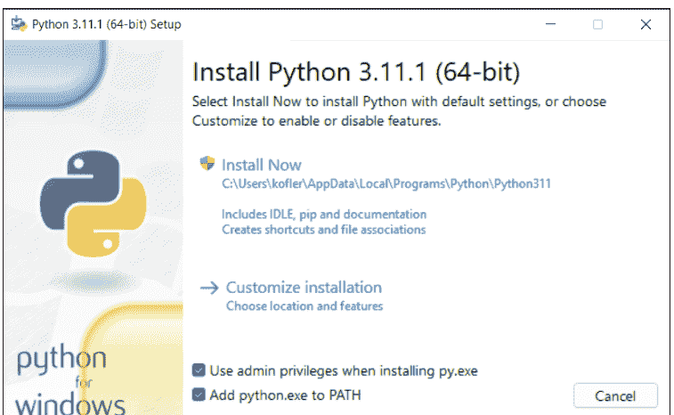

**图 5.1** Windows 的 Python 安装程序

实际安装完成后，你可以选择覆盖 Windows 启动命令的典型 260 字符限制。如果 Python 程序使用大量参数调用，此限制可能会导致错误。因此，你应该点击 **Disable path length limit**。（如果限制已在之前的安装中或通过其他方式被禁用，则不会显示此按钮。）

安装后，启动 `cmd.exe` 或 PowerShell，并使用以下命令验证 Python 及其模块管理器 `pip` 是否可以启动：

```
> python --version
Python 3.11.1

> pip --version
pip 22.3.1 from C:\Users\kofler\AppData\Local\Programs\Python\nPython311\Lib\site-packages\pip (python 3.11)
```

> **避免多次安装！**
在 Windows 上安装 Python 相当容易——问题就在这里：Microsoft Store、开发环境、编辑器等总是很乐意帮助你安装最新的 Python 版本，这很容易导致同时安装两个或三个版本。乍一看，一切似乎都正常，直到你尝试使用 pip 安装扩展模块。尽管 pip 不会报告任何错误，但 Python 将无法找到该模块。原因很简单：你调用的 pip 版本来自与你当前使用的 Python 版本不同的版本——很可能是因为在 PATH 环境变量中更倾向于使用旧版本。
试图解决由此产生的问题已经让我（更经常是我的学生）感到绝望。最好的解决方案是系统地搜索计算机上的所有 Python 版本并卸载每一个。之后，你必须在系统属性首选项窗格中删除所有与 Python 相关的 PATH 目录。重启 Windows 当然也没有坏处。最后，你需要从前面提到的网站下载安装程序并安装最新的 Python 版本。避免使用 Microsoft Store 或任何其他安装方法！

### 5.1.2 macOS

在 macOS 上安装 Python 3 最简单的方法是使用图形安装程序（*.pkg 文件）。你可以在 Python 下载页面 https://python.org/downloads 上找到它。

在安装过程中，会打开一个 Finder 窗口，你必须在其中双击 Install Certificates.command 脚本来运行它。此脚本安装各种 SSL 证书，从而允许你安装 Python 程序可用于验证 HTTPS 加密的根证书。（Python 不使用 macOS 证书。因此，此步骤绝对必要！）

安装后，你应该启动一个新的终端窗口，并像在 Linux 上一样仔细检查一切是否正常。请注意，命令是 python3 和 pip3，而不是像 Windows 和当前 Linux 发行版那样的 python 和 pip。

```
$ python3 --version
Python 3.11.1
$ pip3 --version
pip 22.3.1 from /Library/Frameworks/Python.framework/Versions/
3.11/lib/python3.11/site-packages/pip (python 3.11)
```

## 5.2 在终端窗口中了解 Python

与大多数其他编程语言不同，你可以*无需*将代码写入文件即可尝试 Python。只需打开一个终端窗口并在其中运行 `python` 或 `python3` 命令。这将启动一个交互式 Python 环境。在其中，三个 `>>>` 字符（“Python 提示符”）表示你可以自己进行输入的位置。按 `Enter` 终止输入，然后 Python 会显示结果：

```
$ python
>>> 1+2
3
```

在交互式尝试 Python 时，你大多可以不用 `print`，因为结果无论如何都会自动显示：

```
>>> x=5
>>> print(x + 7)
12
>>> x + 7
12
```

你甚至可以输入多行语句，例如 `for` 循环。有两件事需要注意：一方面，循环内的语句必须用空格缩进；另一方面，你必须按两次 `Enter` 来终止整个输入。Python 解释器在第一行前加上 `>>>`，所有后续行都显示三个点：

```
>>> for i in range(3):
...     print(i)
...
0
1
2
```

要退出 Python，请按 `Ctrl` + `D`。

> **交互式输出与脚本输出**
在接下来的章节中，你将看到许多用于交互式实验的 Python 命令，它们用 `>>>` 提示符标记。尽管这些示例看起来很简单，但你应该努力自己动手尝试，并可能进行更多实验。
请注意，当交互式使用 Python 时，表达式的结果总是会显示。输入 `x` 并按 `Enter` 会显示 `x` 的内容，输入 `x + 3` 会计算总和并显示结果。
在脚本中，情况有所不同：在那里你需要使用 `print` 来创建输出。这意味着你必须在脚本中包含 `print(x)` 或 `print(x+3)` 来输出 `x` 或总和。

## 5.3 编写自定义脚本

当然，你不会主要以交互方式使用 Python；你希望编写脚本来反复执行特定任务。无数的编辑器和开发环境可供你选择来完成这项工作。

一个不错的选择是 Visual Studio Code（VS Code）。一旦你在其中编辑 Python 脚本，VS Code 就会询问你是否要安装推荐的 Python 扩展。你绝对应该这样做！除了各种附加功能外，VS Code 还提供了直接从编辑器启动脚本的选项。

在 VS Code 中创建一个新的、仍然为空的文件后，你需要输入以下行并将文件保存为 `HelloWorld.py`：

```
print('Hello, World!')
```

假设你已经安装了 Python 扩展，你可以通过点击 **运行** 按钮来启动程序。在 Windows 上，实际输出不幸地会在 VS Code 和 PowerShell 在后台使用的状态信息中丢失。

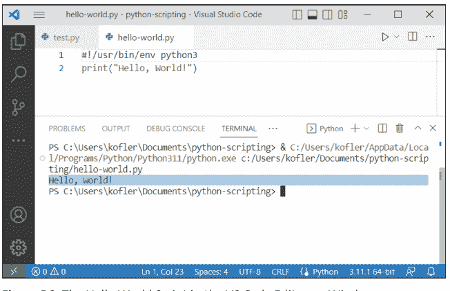

## 5.3.1 Shebang

要在没有 VS Code 或其他开发环境的情况下在 Linux 和 macOS 上运行 Python 脚本，你必须在脚本开头添加以下 shebang 行。在当前的 Linux 发行版上，你可以简单地指定 `python` 而不是 `python3`，但在较旧的发行版和 macOS 上，只有 `python3` 能明确你指的是哪个 Python 版本。

```
#!/usr/bin/env python3
```

你已经从 Bash 中了解了 shebang 语法：该行指定哪个程序（哪个解释器）应该执行后面的代码。但这种情况下的新内容是 `env`：Python 根据操作系统或发行版安装在不同的目录中。`env` 在公共目录中搜索，因此比指定固定路径更可靠。

现在，你需要在终端中启动脚本之前，使用 `chmod` 将其标记为可执行文件：

```
$ chmod +x hello-world.py          (Linux)
$ chmod a+x hello-world.py         (macOS)

$ ./hello-world.py

Hello, World!
```

在 Windows 上，shebang 行无关紧要；`*.py` 标识符就足够了。但是，shebang 行也不会引起任何麻烦，并且提高了与其他操作系统的兼容性。

> **Python 脚本在单独的窗口中执行**

在 Windows 上，每次从运行 PowerShell 的终端启动 Python 脚本时，都可能打开一个新的终端窗口。脚本将在那里运行，然后窗口关闭，不给你查看结果的机会。

这种异常行为的原因是 `.py` 标识符未在 `PATHEXT` 系统变量中列出。实际上，这种遗漏不应该发生（至少在重新安装 Python 后不会），但我从痛苦的经验中确认它有时确实会发生。好吧，这就是 Windows！

解决方案是在 **开始** 菜单中搜索“编辑系统环境变量”。然后，会出现 **控制面板** 对话框，你必须在其中点击 **环境变量**。接下来，在系统变量（对话框的下半部分）中查找 `PATHEXT`（不是 `Path`），编辑它，并添加分号和扩展名 `.py`。重启终端后，你的 Python 脚本应该在终端 *内* 运行。

## 5.4 基本语法规则

Python 语句通常由单行组成。与许多其他编程语言不同，它们不以分号或任何其他字符结尾。

如果多行语句的开头和结尾由括号明确标示，则允许使用多行语句，例如在函数调用中。或者，也可以使用 `\` 分隔符来构造多行语句：

```
print("abc",
      "efg")
a = 1 + 2 + \
    3 + 4
```

语句可以以分号结尾。通常，这个分号是可选的，对程序执行没有影响。但是，分号允许在单行中构造多个语句：

```
a = 1; b = 2; c = 3
```

你也可以通过另一种方式执行这个三重赋值，即以组的形式指定变量和值，每个组的组件用逗号分隔。元组在 Python 内部创建。两种变体都是 *正确的*，但以下第二种变体更符合 Python 的语言概念：

```
a, b, c = 1, 2, 3
```

### 5.4.1 块元素

在 Python 中，与任何其他编程语言一样，一些语言元素可以引入一整块额外的语句，例如使用 `if` 的分支、使用 `for` 和 `while` 的循环，或使用 `function` 的函数定义。在 Python 中，这样的语言元素总是以冒号结尾。所有属于相应块的其他指令都必须缩进。对于块元素，你不需要像其他语言中那样使用任何括号，如以下语法所示：

```
if xxx:
    statement1a
    statement1b
else:
    statement2a
    statement2b
    statement2c
```

如果满足条件 `xxx`，则执行语句 1a 和 1b；如果不满足条件，则执行语句 2a、2b 和 2c。关于 `if` 和 `else` 的更多细节将在 [第 5.11 节](#section-5-11) 中介绍。

代码的缩进在 Python 中不像在其他编程语言中那样是可选的，而是语法的一部分！没有严格的规则规定缩进的程度：1 个字符就够了，但通常使用 4 个字符。当你使用使用制表符进行缩进的编辑器时，你应该小心。Python 假定制表符位置在 8 个字符的倍数处。如果你在编辑器中设置了不同的制表符宽度，并且混合使用制表符和空格字符，那么 Python 在解释缩进时可能会感到困惑。最佳实践是将编辑器设置为仅使用空格而不使用制表符。

你也可以在块元素之后直接指定代码。在简单情况下，可以这样构造单行条件或循环：

```
if xxx: statement
```

如有必要，你可以这样在一行中运行多个语句：

```
if xxx: statement1; statement2; statement3
```

### 5.4.2 注释

简单的注释以 # 字符开头，并延伸到行尾（EOL）：

```
# a comment
print("abc")  # another comment
```

你可以使用 """ 创建多行注释，如以下示例所示：

```
""" a long
    comment """
```

## 5.5 数字

在下一节中，我将基于示例解释如何使用基本的 Python 数据类型和数据结构。我想从整数和浮点数开始。基本的算术运算在 Python 中的功能与在任何其他编程语言中一样：

```
>>> 7+12
    19
>>> 3*6
    18
>>> 100-3*5
    85
```

有趣的是，Python 对整数没有限制。例如，2**100 计算 2<sup>100</sup>。然而，结果不是只有 16 位有效数字的浮点数，而仍然是没有任何精度损失的整数。（你也可以计算 2<sup>10000</sup>。结果有超过 3,000 位数字，这对 Python 来说不是问题！）

```
>>> 2 ** 100   # corresponds to 2^100
    1267650600228229401496703205376
```

在 Python 中，除法总是以浮点运算执行。如果你明确想要整数除法，你应该使用 // 运算符。百分号返回整数除法的余数。

```
>>> 17 / 4    # Python always performs floating point divisions
4.25
>>> 17 // 4   # Use // for integer divisions
4
>>> 17 % 4    # % returns the remainder of an integer division
1
```

你可以用十六进制表示法（0xnnn）编写数字，或者使用 `hex` 方法将其转换为十六进制表示法的字符串：

```
>>> 0xff
255
>>> hex(240)
'0xf0'
```

### 5.5.1 浮点数

如果表达式中只有一个数字是浮点数，Python 就会以浮点运算执行整个计算。精度为 16 位。

```
>>> 12.0 - 2*3
6.0
>>> 100 / 7
14.285714285714286
```

许多数学函数和常量位于 `math` 模块中，该模块必须在首次使用前导入：

```
>>> import math          # load math module
>>> math.sqrt(2)
1.4142135623730951
>>> math.sin(math.pi / 8)
0.3826834323650898
```

> **模块**
Python 由一个相对紧凑的语言核心和无数扩展模块组成，这些模块必须通过 `import` 加载才能首次使用。`import math` 是第一个例子，后面还会有更多。关于这个概念的细节，包括对不同 `import` 语法变体的描述，将在第 5.17 节中介绍。

### 5.5.2 随机数

可以使用 `random` 模块的函数生成随机数。`randrange(n)` 返回一个从 0 到 n-1 的随机整数。例如，`randrange(10, 20)` 返回一个从 10 到 19 的随机数。对于 `randint`，边界是包含；即，`randint(10, 20)` 返回一个从 10 到 20 的随机数。`random()` 返回一个介于 0 和 1 之间的随机浮点数。

```
>>> import random           # 加载 random 模块
>>> random.randrange(100)   # 0 到 99 之间的随机数
58
>>> random.random()         # 0 到 1 之间的浮点数
0.26011495295431664
```

## 5.6 字符串

在 Python 中，字符串可以选择性地放在单引号或双引号中。两种写法是等价的，区别仅在于另一种引号可以毫无困难地集成到字符串中。以下示例定义了三个字符串，分别存储在变量 s、t 和 u 中：

```
>>> s = 'Python is fun!'
>>> t = "Rheinwerk"
>>> u = ''
```

无论使用哪种引号类型，都可以在字符串中包含带有 `\'` 或 `"` 的引号。Python 中还存在其他 `\` 字符组合，称为*转义序列*。在 Python 的交互式应用中，包含此类特殊字符的字符串在直接输出或通过 `print` 输出时行为有所不同：

```
>>> v='abc\nefg'
>>> v
'abc\nefg'
>>> print(v)
abc
efg
```

要创建多行字符串，需要将引号增加三倍：

```
>>> sql = """INSERT INTO mytable (name, date)
            VALUES ('Maria Miller',
                    '1988-12-31')"""
>>> print(sql)

INSERT INTO mytable (name, date)
            VALUES ('Maria Miller',
                    '1988-12-31')
```

你也可以在多行字符串中选择两种引号类型。行首的空格（在最近的示例中，INSERT 之前）是字符串的一部分。如有必要，可以使用 `inspect.cleandoc` 移除不需要的缩进。在这种情况下，相对于第一个缩进行的缩进会被保留：

```
>>> import inspect
>>> print(inspect.cleandoc(sql))
```

```
INSERT INTO mytable (name, date)
VALUES ('Maria Miller',
        '1988-12-31')
```

| 字符序列 | 含义 |
|---|---|
| \a | 响铃（声音信号） |
| \f | 换页（新页面） |
| \n | 换行 |
| \r | 回车（用于 Windows 文本文件） |
| \t | 制表符 |
| \unnnn | 十六进制代码为 &xnnnn 的 Unicode 字符 |
| \' | ' 字符 |
| " | " 字符 |
| \\ | \ 字符 |

**表 5.1 选定的转义序列**

### 5.6.1 原始字符串

某些字符串包含 \ 字符，但不会被评估为转义序列，例如 Windows 目录名或 LaTeX 命令。为了在不不断重复 \ 的情况下构造此类字符串，你需要在整个字符串前加上字母 r（原始）：

```
windir = r'C:\Windows\System'
latex = r'\index{raw strings}'
```

### 5.6.2 处理字符串

`+` 和 `*` 运算符分别用于连接或重复字符串：

```
>>> 'abc' + 'efg'
'abcefg'
>>> 'abc' * 3
'abcabcabc'
```

一旦字符串可用，就可以通过多种方式进行分析和处理：

```
>>> len(s)            # 字符数量
18
>>> s.lower()         # 转换为小写字母
'python is fun!'
>>> s.find('is')      # 获取字符串 'is' 在 s 中出现的位置
7
>>> s.count('n')      # 统计 'n' 出现的次数
2
>>> s.replace('n', 'N')  # 将 'n' 替换为 'N'
'PythoN is fuN!'
>>> s.split(' ')      # 将 s 分割成列表
['Python', 'is', 'fun!']
```

| 方法 | 功能 |
| :--- | :--- |
| len(s) | 确定字符数量 |
| str(x) | 将 x 转换为字符串 |
| sub in s | 测试 sub 是否出现在 s 中 |
| s.count(sub) | 确定 sub 在 s 中出现的次数 |
| s.endswith(sub) | 测试 s 是否以 sub 结尾 |
| s.expandtabs() | 将制表符替换为空格 |
| s.find(sub) | 在 s 中搜索 sub 并返回起始位置或 -1 |
| s.isxxx() | 测试 s 的属性；示例包括 islower() 和 isupper() |
| s.join(x) | 连接 x（列表、集合、元组）中的字符串 |
| s.lower() | 返回全为小写字母的 s |
| s.partition(sub) | 分割 s 并以元组形式返回三部分 |
| s.replace(old, new) | 返回 s，其中每个 old 都被 new 替换 |
| s.rfind(sub) | 类似 find，但从字符串末尾开始搜索 |
| s.split(sub) | 在每次出现 sub 时分解 s 并返回列表 |
| s.startswith(sub) | 测试 s 是否以 sub 开头 |
| s.upper() | 返回全为大写字母的 s |

**表 5.2 选定的字符串方法和函数**

### 5.6.3 切片

s(n) 表示法允许你从字符串中提取单个字符。n 指定字符的位置，其中 0 代表第一个字符。（此规则在 Python 中普遍适用：在任何类型的枚举中，0 都表示第一个元素！）对于负数，计算从字符串末尾开始。

```
>>> s[0], s[1], s[2]    # 返回第一个、第二个
# 和第三个字符
('P', 'y', 't')
>>> s[-1], s[-2]        # 返回最后一个和倒数第二个
# 字符
('!', 'n')
```

要一次读取多个字符，Python 使用 s[start:end]，其中 start 表示子字符串的开始，end 表示结束。两个指定都是可选的。起始位置指定为包含，但结束位置是不包含的！因此，s[:5] 返回直到并包括第五个字符的所有字符。这种字符访问类型的正式名称是切片。

```
>>> s[:]                # 全部
'Python is fun!'
>>> s[:5]               # 直到第五个字符的所有内容
'Pytho'
>>> s[5:]               # 从第六个字符开始的所有内容
'n is fun!'
>>> s[5:10]             # 从第六个到第十个字符
'n is fu'
```

你也可以通过负数指定起始和结束位置——然后 Python 从字符串末尾开始计数：

```
>>> s[:-3]              # 除最后三个字符外的所有内容
'Python is f'
>>> s[-3:]              # 从倒数第三个字符开始的所有内容
'un!'
```

一个可选的第三参数允许你指定一种步长。在实践中，-1 值在此上下文中最为常用，用于反转字符串的顺序：

```
>>> s[::2]              # 每隔一个字符
'Pto s u'
>>> s[::-1]             # 所有内容反向排列
'!nuf si nohtyP'
```

### 5.6.4 print 和 input

学习 Python 时，`print` 函数无处不在。你可以向该函数传递一个或多个参数。`print` 将参数转换为字符串并输出它们。每个参数之间放置一个空格，末尾放置一个换行符。`print` 易于使用，并且适用于任何类型的 Python 对象（例如，也适用于列表）：

```
>>> print(1, 2, 3/4, 'abc', 2==3)
1 2 0.75 abc False
>>> print('1/7 ist', 1/7)
1/7 ist 0.14285714285714285
>>> lst = ['a', 'list']
>>> print(lst)
['a', 'list']
```

`print` 允许三个可选参数：

- `sep` 设置在参数之间输出的字符串——默认情况下，是 ' '。
- `end` 定义在最后一个参数之后输出的字符串——默认情况下，是 '\n'。
- `file` 确定输出发生的位置。通常，输出被重定向到标准输出。`file` 允许你将输出写入文本文件。

```
>>> print(1, 2, 3, sep='---')
1---2---3
>>> print(1, 2, 3, sep=';', end='.\n')
1;2;3.
>>> f = open('out.txt', 'w')
>>> print(1, 2, 3, file=f)
>>> f.close()
```

正如你可以使用 `print` 在终端窗口中执行输出一样，`input` 处理文本输入。`input` 首先输出可选参数中指定的文本，然后等待输入，输入必须通过 Enter 完成。空输入——即，不输入文本直接按 Enter——`input` 会以错误确认。

```
name = input('Specify your name:')
print('Your name is:', name)
```

`input` 总是返回一个字符串。如果你想将字符串解释为数字（例如，以便稍后执行计算），你必须插入 `int`：

```
number = input('Enter a number:')
print(int(number) * 2)
```

## 5.6.5 格式化输出

通常，你需要从数字、日期、时间等创建字符串。在最简单的情况下，你可以使用 `str(x)` 或 `repr(x)` 函数，它们将任何对象表示为字符串。`repr` 函数的工作方式使得生成的字符串可以再次使用 `eval` 读取。另一方面，`str` 则力求将字符串格式化为易于人类阅读的形式。这两个函数都不影响格式化。如果你想将数字格式化为右对齐或带有千位分隔符，那么你需要特殊的格式化函数。在 Python 中，你可以选择几种方法。最常用的是 `%` 运算符和 `format` 方法：

- **格式字符串 % (数据, 数据, 数据)**
  在这种情况下，格式字符串按照 C 编程语言的 `printf` 函数的语法编写。在此字符串中，`%` 字符表示要插入数据的位置。

- **格式字符串.format(数据, 数据, 数据)**
  字符串的结构与 Microsoft .NET 框架中同名方法的结构非常相似。在此字符串中，`{}` 括号对表示参数的位置。

让我们先看两个使用 `%` 方法的例子：

```
>>> '1/7 with three decimal places: %.3f' % (1/7)
'1/7 with three decimal places: 0.143'

>>> '' % ('foto.jpg', 'Portrait', 200)
''
```

较新的 `format` 方法的最大优点是你可以通过 `{n}` 或 `{参数名}` 自由选择占位符的顺序。以下示例说明了由此产生的选项：

```
>>> '{} is {} years old.'.format('Peter', 9)
'Peter is 9 years old.'

>>> '{1} is {0} years old.'.format(9, 'Peter')
'Peter is 9 years old.'

>>> '{name} is {age} years old.'.format(age=9, name='Peter')
'Peter is 9 years old.'

>>> '1/7 with three decimal places: {:.3f}'.format(1/7)
'1/7 with three decimal places: 0.143'

>>> 'SELECT * FROM table WHERE id={:d}'.format(324)
'SELECT * FROM table WHERE id=324'
```

在两种格式化系统中，可以使用无数的代码来构建字符串。遗憾的是，本书没有足够的空间提供完整的参考。但你可以在互联网上找到大量资源，描述所有允许的代码及其所有可能的变体。例如，参考 Python 官方文档 https://docs.python.org/3/library/stdtypes.html#printf-style-string-formatting 或 https://docs.python.org/3/library/string.html#format-string-syntax。

| 代码 | 含义 |
|---|---|
| %d | 整数（十进制） |
| %5d | 5 位整数，右对齐 |
| %-5d | 5 位整数，左对齐 |
| %f | 浮点数 |
| %.2f | 两位小数的浮点数 |
| %r | 字符串；Python 使用 repr |
| %s | 字符串；Python 使用 str |
| %10s | 10 个字符的字符串，右对齐 |
| %-10s | 10 个字符的字符串，左对齐 |
| %x | 将整数输出为十六进制 |

表 5.3 % 格式化（printf 语法）的选定代码

| 代码 | 含义 |
|---|---|
| {} | 参数，任何数据类型 |
| {0}, {1}, ... | 编号参数 |
| {one}, {two}, ... | 命名参数 |
| {:d} | 整数 |
| {:<7d} | 7 位整数，左对齐 |
| {:>7d} | 7 位整数，右对齐 |
| {:^7d} | 7 位整数，居中 |
| {:f} | 浮点数 |
| {:.5f} | 5 位小数的浮点数 |
| {:s} | 字符串 |

表 5.4 format 方法的选定代码

> **选择的痛苦**
哪种方法更好——使用 % 还是使用 `format`？两种方法都能达到你的目标。如果你熟悉 `printf` 语法，你可以坚持使用 % 方法。否则，对于新代码，你应该优先选择 `format`，因为生成的代码通常更具可读性。

## 5.7 列表

Python 通过*列表*提供了一种极其灵活的语言结构来管理大量数据。列表用方括号表示。列表可以包含任何数据类型的元素。列表中的元素可以通过“切片”（即 `list[start:end]`）以与字符串字符相同的方式访问。此外，Python 提供了无数的函数和方法来处理列表。

```
>>> lst = [1, 2.3, 'abc', 'efg', 12]
>>> lst[2]            # 第三个元素
    'abc'
>>> lst[2:4]          # 从第三个到第四个元素
    ['abc', 'efg']
>>> lst[::-1]         # 逆序
    [12, 'efg', 'abc', 2.3, 1]
>>> lst[0] = 3        # 更改第一个列表元素
>>> lst
    [3, 2.3, 'abc', 'efg', 12]
```

由于任何 Python 对象都可以作为列表元素，因此也允许嵌套列表：

```
>>> lst = [[1, 2],
          [3, 4]]
>>> lst
    [[1, 2], [3, 4]]
```

字符串的字符可以通过 `list` 转换为列表：

```
>>> characters = list('Hello World!')
>>> characters
    ['H', 'e', 'l', 'l', 'o', ' ', 'W', 'o', 'r', 'l', 'd', '!']
```

| 函数/方法 | 含义 |
| :--- | :--- |
| `del l[start:end]` | 删除指定的列表项 |
| `n = len(l)` | 返回元素数量 |

表 5.5 用于编辑列表的重要函数和方法

| 函数/方法 | 含义 |
| --- | --- |
| l.append(x) | 将元素 x 添加到列表末尾 |
| l.clear() | 删除列表（相当于 l=[]） |
| n = l.count(x) | 确定元素 x 在列表中出现的次数 |
| l1.extend(l2) | 将列表 l2 添加到 l1 的末尾（即：l1 += l2） |
| iterator = filter(f, l) | 返回满足 f(element)==true 的元素 |
| n = l.index(x) | 确定 x 在列表中的第一个位置 |
| l.insert(n, x) | 将元素 x 插入列表的位置 n |
| iterator = map(f, l) | 将函数 f 应用于所有元素 |
| x = l.pop(n) | 读取位置 n 的元素并将其移除 |
| l.remove(x) | 从列表中移除元素 x |
| l.reverse() | 反转列表（第一个元素变为最后一个，依此类推） |
| l.sort() | 对列表进行排序 |
| iterator = zip(l1, l2) | 将列表元素成对连接为元组 |

表 5.5 用于编辑列表的重要函数和方法（续）

### 5.7.1 列表推导式

通过*列表推导式*，可以创建格式为：[表达式 for x in 列表] 的语句。然后 Python 将列表的每个元素依次放入变量 x 并解析表达式。结果代表一个新列表。在第二个示例中，每个结果本身是一个由两个元素组成的列表，因此结果列表是嵌套的。

```
>>> lst = [x for x in range(10, 101, 10)]
>>> lst
    [10, 20, 30, 40, 50, 60, 70, 80, 90, 100]
>>> [x * 2 + 1 for x in lst]
    [21, 41, 61, 81, 101, 121, 141, 181, 201]
>>> [ [x, x * x] for x in lst]
    [[10, 100], [20, 400], [30, 900], [40, 1600], [50, 2500],
    [60, 3600], [70, 4900], [90, 8100], [100, 10000]]
```

### 5.7.2 map 和 filter

map 将一个函数应用于列表的所有元素。出于效率原因，map 不会立即返回结果列表，而是返回一个*迭代器*。此对象可以在循环中解析，或通过 `list` 转换为列表。以下示例首先将句子分解为单词列表，然后使用 `map` 确定所有单词的长度：

```
>>> lst = 'Python is fun!'.split(' ')
# lst 包含 ['Python', 'is', 'fun!']
>>> map(map(len, lst)
<map object at 0x7f17bfbd1090>
>>> list(map(len, lst))
[6, 5, 5]
```

`filter` 与 `map` 类似，将函数应用于每个列表项。然而，这次的目标不是返回函数结果，而是返回所有过滤函数返回 `true` 的列表项。因此，我们需要从列表中过滤出所有满足条件的元素。与 `map` 一样，结果是一个迭代器，如果需要，可以通过 `list` 分析为列表。

以下示例从列表中过滤出所有偶数。如果除以 2 没有余数，lambda 表达式返回 `true`。在这种情况下，`lambda` 临时定义了过滤函数。`lambda` 的解释将在[第 5.13 节](#section-5-13)中进行。

```
>>> lst = list(range(1,11)); lst
[1, 2, 3, 4, 5, 6, 7, 8, 9, 10]
>>> even = filter(lambda x: x % 2 == 0, lst)
>>> list(even)
[2, 4, 6, 8, 10]
```

如果你在列表后列出条件，你可以通过使用*列表推导式*达到相同的结果：

```
>>> [ x for x in lst if x % 2 == 0 ]
[2, 4, 6, 8, 10]
```

## 5.8 元组、集合和字典

列表是许多 Python 脚本中的主要数据结构。尽管如此，你还应该了解另外三种基本的 Python 数据结构，即*元组*（序列）、*集合*和*字典*。

*元组*是不可变列表的一种特殊形式。从某种意义上说，元组是*更原始*的数据结构。它们的内部管理开销较低。元组用圆括号表示。如果不会产生语法歧义，可以省略圆括号。

```
>>> t = (12, 73, 3)
>>> t
(12, 73, 3)
```

## 5.8.1 集合

*集合*是一个无序的、不含重复元素的元素集合。一个集合不可能包含同一个对象多次。与列表不同，Python 不会记住元素的顺序。你不能假设元素会按照你插入它们的顺序被处理。

集合用花括号表示。字符串可以通过使用 `set` 转换为字符集；在此过程中，重复项会被自动消除。

```
>>> s = {1, 2, 3}
>>> s
{1, 2, 3}
>>> s = set('Hello World!')
>>> s
{'r', 'W', 'l', ' ', 'e', 'd', 'H', 'l', 'o'}
```

你可以使用集合来执行集合运算，例如，找出集合 1 中哪些对象也包含在集合 2 中。为了更好的可读性，我在下一个示例中按顺序展示了输出；如果你自己尝试测试，字母将以随机顺序输出。

```
>>> x = set('abcdef')
>>> y = set('efgh')
>>> x | y    # 并集
{'a', 'c', 'b', 'e', 'd', 'g', 'f', 'h'}
>>> x - y    # 差集
{'a', 'c', 'b', 'd'}
>>> x & y    # 交集（共同元素）
{'e', 'f'}
```

## 5.8.2 字典

对于列表和元组，访问单个元素是通过数字索引进行的，即通过 `list(n)` 或 `tuple(n)`。另一方面，字典允许使用任意键来管理元素列表。在某些编程语言（如 Bash）中，这种数据结构被称为*关联数组*。

字典像集合一样用花括号表示。然而，与集合不同的是，字典总是存储键值对。以下示例存储了一些 HTML 颜色代码，使用颜色名称作为键：

```
>>> colors = {'red' : 0xff0000, 'green' : 0xff00, 'blue' : 0xff,
            'white' : 0xffffff}
```

字典不仅在语法上与集合相关，在功能上也是如此：它们不保留元素的顺序。要访问字典的元素，你可以使用键。`hex` 将存储为十进制的数字转换为十六进制表示：

```
>>> colors['red']          # 访问一个元素
16711680
>>> hex(colors['red'])
'0xff0000'
```

尝试访问一个不存在的元素将导致 `KeyError`。为了避免此错误，你可以使用 `key in dict` 来预先测试字典是否包含某个键的元素：

```
>>> colors['yellow']
KeyError: 'yellow'
>>> 'yellow' in colors
False
```

`len` 像对列表、集合和元组一样返回元素的数量。`dict[key]=value` 语句使你能够扩展字典：

```
>>> len(colors)            # 确定元素数量
4
>>> colors['black'] = 0    # 添加一个元素
```

`del dict[key]` 删除一个元素：

```
>>> del colors['red']      # 删除一个元素
>>> colors                 # 输出所有键值对
{'black': 0, 'blue': 255, 'white': 16777215, 'green': 65280}
```

`keys` 和 `values` 方法分别返回字典的所有键和所有值。如有必要，你可以使用 `list` 或 `set` 将这些数据转换为列表或集合：

```
>>> colors.values()
dict_values([0, 255, 16777215, 65280])
>>> colors.keys()
dict_keys(['black', 'blue', 'white', 'green'])
>>> set(colors.keys())
{'black', 'blue', 'white', 'green'}
>>> list(colors.keys())
['black', 'blue', 'white', 'green']
```

当你通过字典创建 for 循环时，Python 会将所有键放入循环变量中：

```
>>> for c in colors:
        print("颜色", c, " 的颜色代码是", hex(colors[c]))
```
颜色 black 的颜色代码是 0x0
颜色 blue 的颜色代码是 0xff
颜色 white 的颜色代码是 0xffffff
颜色 green 的颜色代码是 0xff00

这些示例使用字符串作为键。然而，基本上任何 Python 对象都适合作为键。唯一的要求是键必须是唯一的。

> “真实”示例
在前面的页面中，我试图用尽可能简单的例子来说明基本数据结构的操作。如果这给你留下了列表、集合等只是数学噱头的错误印象，你可以跳到第 5.14 节，或者看看第 10 章中的示例。

## 5.9 变量

在 Python 中，变量的处理遵循简单的规则：

- **使用前赋值**
  每个变量在表达式中被解析之前，必须先被赋予一个初始值。例如，如果你没有事先进行像 x=0、x=1、x=n 这样的首次赋值，你就不能执行 x=x+1。
- **无类型声明**
  Python 变量可以存储任何类型的对象。Python 记住类型，因此知道变量引用的是哪种数据。
  然而，与许多其他编程语言不同，变量的类型不能被指定或限制。你可以轻松地在同一个变量中存储不同类型的数据，例如，先是一个数字 (x=1)，后来是一个字符串 (x='abc')，最后是一个列表 (x=[3,2,1])。

### 名称

变量名必须以字母或下划线开头。但是，变量名开头的下划线是为 Python 内部数据保留的，因此如果可能，你应该避免在自己的脚本中使用它。其他字符也可以包含数字。

```
a = 1
b = 'abc'
a = a + 1
a = c + 1           # 错误：从未给 c 赋值。
longName = 3        # 正确
another_long_name = 4  # 也正确
long name = 5       # 错误：不允许有空格。
long-name = 6       # 错误：不允许有 -。
```

> **Python 不知道常量**

Python 没有提供定义常量的方法。一种常见的做法是使用一个变量作为常量，但其名称只使用大写字母，例如 MAXNO=10。然而，你无法阻止这个变量在以后被赋予不同的值。

### 5.9.1 赋值

变量 = 表达式类型的普通赋值存在于每种编程语言中。Python 也知道一些不寻常的变体。例如，你可以一次将相同的内容赋给多个变量。Python 从右向左进行。因此，在下一个示例中，进行了以下赋值：c=16，然后 b=c，最后 a=b。因此，所有三个变量都引用内存中表示数字 16 的同一个对象。

```
a = b = c = 16      # 将相同的值赋给三个变量
```

如果你想用紧凑的表示法给多个变量赋不同的值，可以使用列表或元组来实现。例如，以下赋值将有效：

```
a, b = 2, 3
[e, f, g] = [7, 8, 9]
e, f, g = [7, 8, 9]  # 等价
```

你也可以使用这种类型的赋值来交换两个变量的内容。在大多数其他编程语言中，你需要一个第三个临时变量来完成这种交换。

```
x, y = y, x         # 交换 x 和 y
```

当左侧的变量少于右侧的列表项时，列表和元组赋值会出现一个特殊变体。在这种情况下，你可以在变量前加上星号。所有多余的元素随后将作为列表赋给这个变量。

```
>>> a, *b, c = [1, 2, 3, 4, 5]
>>> a
1
>>> b
[2, 3, 4]
>>> c
5
```

### 5.9.2 数据类型

Python 知道几种预定义的数据类型。

| 数据类型 | 功能 | 示例 | 可变 |
| :--- | :--- | :--- | :--- |
| int | 整数 | x = 3 | 否 |
| float | 浮点数 | x = 3.0 | 否 |
| bool | 布尔值 | x = bool(1) | 否 |
| str | 字符串 | x = 'abc' | 否 |
| tuple | 元组 | x = (1, 2, 3) | 否 |
| list | 列表 | x = [1, 2, 3] | 是 |
| set | 集合 | x = {1, 2, 3} | 是 |
| dict | 字典 | x = {1:'red', 2:'blue'} | 是 |
| bytearray | 字节数组 | x = bytearray(...) | 是 |
| io.TextIOWrapper | 文件 | x = open('readme.txt') | 是 |
| ... | 其他类 | ... | 是 |

表 5.6 重要的 Python 数据类型和类

只有在少数情况下，Python 会自行处理数据类型转换。例如，如果你将一个整数乘以一个浮点数，整数会自动转换为浮点数，以便之后可以进行浮点乘法。

除了这些例外情况，你必须自己处理类型转换。对于这个任务，你需要使用名称与相应数据类型匹配的函数。例如，要将一个字符串和一个数字组合成一个新的、更长的字符串，你会使用 `str` 函数：

s = 'abc'
x = 3
s = s + str(x)  # 结果为 'abc3'

反向操作中，`int` 和 `float` 可以将字符串转换为数字。请注意，执行此操作时可能会出现 *无效字面量* 错误，例如，当你尝试将字符串 'abc' 转换为数字时。

```
n = int('123')
f = float('123.3')
```

## 5.9.3 可变还是不可变？

当执行 `b=a`，即一个变量被赋值给另一个变量时，会发生什么？这个问题可能并不像表面看起来那么简单。让我们从一个包含整数的例子开始。在下面的代码中，值 3 首先存储在 `a` 中。对于赋值 `b=a`，`a` 被替换为 3。因此，数字 3 也存储在 `b` 中。更精确地说：`a` 和 `b` 现在是两个都引用整数 3 对象的变量。通过 `a=4`，`a` 被赋予了一个新值。这对 `b` 没有影响。因此，`a` 和 `b` 彼此独立：`a` 现在包含值 4；`b` 包含值 3。

```
a = 3
b = a        # b
a = 4
print(a, b)  # 输出 4, 3
```

第二个例子的代码非常相似。然而，在这种情况下，`a` 和 `b` 中存储的不是简单的数字，而是列表。在赋值 `b=a` 之后，两个变量都引用同一个列表。使用 `a[0]=4` 会更改列表的一个元素。正如 `print` 调用所证明的，此更改适用于 `a` 和 `b` 两者！因此，`a` 和 `b` 并不像前一个例子中那样彼此独立！

```
a = [1, 2, 3]
b = a        # b 引用与 a 相同的列表
a[0] = 4     # 更改列表的第一个元素
print(a, b)  # 输出 [4, 2, 3] [4, 2, 3]
```

为什么 Python 在两个看似相似的程序中表现如此不同？原因是 Python 区分可变和不可变数据类型——从技术上讲，它区分可变和不可变类型。数字、字符串和元组是 *不可变的*；也就是说，不可能更改它们。相反，每次表达式产生新数据时，也会创建一个新对象！

如果你先执行 `x=10`，然后执行 `x=x+1`，Python 首先创建一个包含数字 10 的对象，然后 `x` 引用该对象。`x+1` 计算产生数字 11。为此，在内存中创建了另一个对象。变量 x 现在被更改，使其指向新对象 11。在第一个代码示例的 a=4 行中也发生了创建另一个对象的情况：Python 为数字 4 创建了一个对象。a 引用此对象，这对 b 没有影响，因为 b 仍然引用数字 3 的对象。

然而，其他数据类型是可变的。由于这种可变性，你 *可以* 更改列表的元素，而无需立即创建新对象。a[0] 赋值不会更改整个列表，而只更改列表的一个元素。在第二个例子中，a 和 b 继续引用同一个对象，只是其 *内容* 发生了变化。

例如，如果你需要一个列表的独立副本，以便两个最初相似的列表可以通过两个变量彼此独立地修改，你应该怎么做？在这种情况下，你应该使用 `copy` 模块中的 `copy` 或 `deepcopy` 方法：

```
import copy
a=[1, 2, 3]
b=copy.copy(a)  # b 引用 a 的一个独立副本。
a[0] = 4        # 更改 a 的第一个列表元素，
                # b 保持不变。
print(a, b)     # 输出 [4, 2, 3] [1, 2, 3]
```

`copy` 方法创建指定对象的副本，而 `deepcopy` 更进一步：它还创建源对象引用的所有可变对象的副本。在最后一个例子中，`deepcopy` 是多余的，因为列表只包含三个整数，它们是不可变对象。然而，如果列表本身包含可变对象，`deepcopy` 会复制整个对象树。

## 5.10 运算符

Python 使用的运算符与大多数其他编程语言基本相同。但是，我想指出一些特殊之处：

- **除法**
  `/` 运算符始终执行浮点除法，即使两个操作数都是整数。要执行整数除法，必须使用 `//` 运算符。
- **将赋值与计算结合**
  赋值可以与基本算术运算结合。换句话说，`a=a+1` 也可以写成 `a+=1`。这种简写不仅适用于基本算术运算，也适用于几乎所有 Python 运算符。然而，与其他编程语言不同，`a++` 和 `a--`（表示 `a=a+1` 和 `a=a-1`）是 *不允许* 的。
- **多重比较**
  使用比较运算符 `<`、`>` 等也可以进行多重比较。例如，`10 <= x <= 20` 测试 `x` 的值是否在 10 和 20 之间。在内部，所有比较都通过逻辑与连接，即 10 <= x <= 20 对应于 10<=x 和 x<=20。
- **比较内容**
  == 测试两个表达式是否具有相同的内容，例如，变量 x 的值是否为 3（如果 x==3: ...）或字符串 s 是否与 'abc' 匹配（如果 s=='abc': ...）。
- **比较对象**
  相比之下，a is b 运算符检查变量 a 和 b 是否引用同一个对象。即使 a==b 成立，a 和 b 也可能引用具有相同内容的不同对象。因此，a is b 对应于比 a==b 更深层次的相等性。

| 运算符 | 功能 |
| :--- | :--- |
| + - | 符号 |
| + - * / | 基本算术运算 |
| // | 整数除法（20 // 6 结果为 3。） |
| % | 整数除法的余数（20 % 6 结果为 2。） |
| ** | 指数函数或上标（2**8 结果为 256。） |
| + * | 连接或重复字符串（'ab' * 2 结果为 'abab'。） |
| % | 格式化字符串（printf 语法） |
| = | 赋值（var = 3） |
| := | 赋值并求值（if x:=func() == value ...） |
| += | 赋值并相加（var+=3 对应于 var = var + 3。） |
| -= | 赋值并相减 |
| *= | 赋值并相乘 |
| /= | 赋值并相除 |
| == | 测试相等性（if a==3: ...） |
| != | 测试不等性 |
| < > <= >= | 小于、大于、小于等于、大于等于 |
| is | 测试两个变量是否引用同一个对象 |
| is not | 测试两个变量是否引用不同的对象 |

表 5.7 算术、字符串和比较运算符

| 运算符 | 功能 |
| --- | --- |
| & \| | 二进制与和二进制或 |
| ^ | 二进制异或 |
| ~ | 二进制非 |
| << | 二进制左移（2<<4 结果为 32。） |
| >> | 二进制右移（768>>2 结果为 192。） |
| or | 逻辑或 |
| and | 逻辑与 |
| not | 逻辑非 |

表 5.8 二进制和逻辑运算符

### 5.10.1 结合赋值和求值

自 Python 3.8 起，:= 运算符允许你在一条语句中同时执行变量赋值，并将结果与一个值进行比较（*赋值表达式*）。在下面的例子中，这种比较在 `while` 循环中根本没有显式出现。只要 `line` 不为空（即到达文件末尾 [EOF]），循环就会执行。

```
with open('readme.txt') as txtfile:
    # 读取文本文件的一行，如果结果不等于 False，
    # 则继续循环
    while line := txtfile.readline():
        print(line, end='')
```

## 5.11 分支（if）

`if` 分支的语法很简单。不要忘记在条件之后和 `else` 之后需要放置的冒号！与其他编程语言不同，Python 不理解 `switch` 或 `case` 结构。

```
if condition1:
    block1
elif condition2:
    block2
elif condition3:
    block3
else:
    block4
```

### 5.11.1 条件

条件通常使用比较运算符形成（例如，`x == 3` 或 `a is b`）。多个条件可以用 `and` 或 `or` 进行逻辑连接。

```
if x > 0 and (y > 0 or z == 1):
    ...
```

与几乎所有其他编程语言一样，Python 优化 `and` 和 `or` 表达式（通过所谓的 *短路求值*）：

- 如果 `and` 操作的第一个子表达式为 `False`，则第二个子表达式将不再被求值，因为结果无论如何都将是 `False`。
- 在 `or` 操作中，如果第一个子表达式返回 `True`，则第二个子表达式将不再被求值，因为结果无论如何都将是 `True`。

除了 `a < x and x < b`，还允许使用简写 `a < x < b`。条件也可以不使用关系运算符来表述，例如，采用以下形式：

```
if x:
    ...
```

如果满足以下条件，则此条件成立：

- `x` 是一个不等于 0 的数字。
- `x` 是一个非空字符串。
- `x` 是布尔值 1（`True`）。
- `x` 是一个至少包含一个元素的列表、元组或集合。
- `x` 是一个已初始化的对象（不是 `None`）。

### 5.11.2 if 的简写形式

有时，你只需要 `if` 结构来为变量赋值：

```
if condition:
    x = value1
else:
    x = value2
```

对于这种结构，你可以使用节省空间的简写形式：

```
x = value1 if condition else value2
```

## 5.12 循环（for 和 while）

在 Python 中，循环主要使用 `for var in elements` 形成。循环变量依次接受指定的每个元素。

## 5.12.1 break、continue 和 else

`break` 会提前终止 `for` 和 `while` 循环：

```python
for var in elements:
    statement1
    if condition: break    # 终止循环
    statement2
```

`continue` 会跳过当前循环迭代中剩余的语句，然后继续下一次循环：

```python
for var in elements:
    statement1
    if condition: continue    # 跳过 statement2
    statement2
```

Python 还为循环提供了一个 `else` 代码块，这使其与大多数其他编程语言不同。在 `for` 循环中，当所有元素都遍历完毕后，或者在 `while` 循环中，当循环条件不再满足时，`else` 代码块会被执行。

```python
for var in elements:
    statement1
    statement2
else:
    statement3
```

> **提示：嵌套循环中的 Break 和 Continue**
> 对于嵌套循环，`break` 和 `continue` 只作用于最内层的循环。要轻松地跳出嵌套循环，你需要将其包装在一个函数中，并使用 `return` 退出。另一种选择是使用 `try` 保护所有循环，并抛出异常来中止循环。

## 5.12.2 数字范围循环（range）

对于给定数字范围的循环，元素通常由 `range(start, end)` 生成，其中结束值是不包含在内的。因此，以下循环遍历从 1 到 9 的值（不包括 10！）。`print` 中的 `end=' '` 选项使每个输出后跟一个空格（没有换行符）。

```python
for i in range(1, 10):
    print(i, end=' ')
# 输出：1 2 3 4 5 6 7 8 9
```

对于 `range`，步长可以在可选的第三个参数中指定：

```python
for i in range(0, 20, 3): print(i, end=' ')
# 输出：0 3 6 9 12 15 18
```

```python
for i in range(100, 0, -10):  print(i, end=' ')
# 输出：100 90 80 70 60 50 40 30 20 10
```

`range` 只能用于整数，不能用于浮点数。如果你想创建一个从 0 到 1、步长为 0.1 的循环，可以按如下方式操作：

```python
for i in range(0, 11):
    x = i / 10.0
    print(x, end=' ')
# 输出：0.0 0.1 0.2 0.3 0.4 0.5 0.6 0.7 0.8 0.9 1.0
```

当然，你也可以使用 `while` 来创建数字范围循环。如果数字之间的差值不规则，这种方法尤其具有优势。

```python
i = 1
while i < 100000:
    print(i, end=' ')
    i += i*i
# 输出：1 2 6 42 1806
```

## 5.12.3 字符串字符循环

你可以按以下方式逐个字符地处理字符串：

```python
for c in 'abc': print(c)
# 输出：a
# b
# c
```

一种更方便的方法是使用 `list` 将字符串转换为列表，其中每个元素包含一个字符。然后，你可以使用列表函数处理这些元素。

## 5.12.4 列表、元组和集合循环

你可以使用 `for` 轻松处理列表、元组和集合的元素：

```python
for i in (17, 87, 4):
    print(i, end=' ')
# 输出：17 87 4

for s in ['Python', 'is', 'fun!']:
    print(s)
# 输出：Python
# is
# fun!
```

通常，这类循环的目标是形成一个新的列表、元组或集合。那么，使用前面第 5.7 节提到的列表/元组/集合推导式通常更优雅、更高效。在这种情况下，`for` 循环在方括号、圆括号或花括号内执行，并返回一个列表、元组或集合作为结果。以下示例均指列表。

其最简单的形式是 `[ expression for var in list ]`。所有列表元素都被插入到变量中。计算后的表达式生成一个新的列表。可选地，可以使用 `if` 为循环变量附加一个条件：然后，只有满足条件的列表元素才会被考虑。

```python
>>> l = [1, 2, 3, 10]
>>> [ x*x for x in l ]           # 计算所有列表元素的平方
[1, 4, 9, 100]
>>> [ x*x for x in l if x%2==0 ]  # 只包含偶数
[4, 100]
```

表达式本身当然也可以是一个列表、一个集合或一个元组——那么结果就是一个嵌套表达式：

```python
>>> [ [x, x*x] for x in l ]
[[1, 1], [2, 4], [3, 9], [10, 100]]
```

要从列表、元组或集合构建字典，你应该使用 `{ k:v for x in list }` 表示法，其中 `k` 和 `v` 是每个字典元素的键和值的表达式。

```python
>>> { x:x*x for x in l }
{1: 1, 2: 4, 3: 9, 10: 100}
```

## 5.12.5 字典循环

前面第 5.7 节描述的推导式语法也可以用于字典。在最简单的形式中，循环遍历字典元素的键。根据你是将表达式放在方括号还是花括号中，结果是一个列表或一个集合。

```python
>>> d = {'a':12, 'c':78, 'b':3, 'd':43}
>>> { x for x in d }
{'a', 'c', 'b', 'd'}
>>> [ x for x in d ]
['a', 'c', 'b', 'd']
```

如果你在循环中需要两个变量来表示键值对，那么你需要使用 `items` 方法：

```python
>>> { k for k,v in d.items() }
{'a', 'c', 'b', 'd'}
>>> { v for k,v in d.items() }
{43, 3, 12, 78}
```

要使表达式的结果本身再次成为字典，你应该以 `key:value` 格式构建结果表达式：

```python
>>> { k:v*2 for k,v in d.items() }
{'a': 24, 'c': 156, 'b': 6, 'd': 86}
```

## 5.12.6 脚本参数循环

当你向 Python 脚本传递参数时，可以在脚本中使用 `sys.argv` 语句来评估它们。`sys` 是一个模块；必须首先通过 `import` 读取它。`argv` 是一个列表，其第一个元素是脚本的文件名。其他列表元素包含传递的参数。由于很少需要脚本名称，因此使用 `[1:]` 表达式将其排除。

```python
# 示例文件 script-parameters.py
import sys
if(len(sys.argv) <= 1):
    print("未传递任何参数。")
else:
    for x in sys.argv[1:]:
        print("参数:", x)
```

脚本的一个可能调用如下所示：

```
./script-parameters.py a b
参数: a
参数: b
```

终端窗口通常运行 Bash。它会立即评估像 `*.txt` 这样的表达式，然后将找到的文件列表传递给调用的命令。因此，如果当前目录包含 `readme.txt`、`copyright.txt` 和 `gpl.txt` 文件，那么 `./script-parameters.py *.txt` 将传递所有三个文件的名称：

```
./script-parameters.py *.txt
参数: copyright.txt
参数: gpl.txt
参数: readme.txt
```

## 5.12.7 Windows 上的 Globbing

如果你在 macOS 或 Linux 上运行 `myscript.py *.txt`，当前目录中所有文本文件的名称都会传递给脚本，并且可以通过 `sys.argv[1:]` 进行评估。这个任务在 Windows 上无法工作。脚本接收 `*.txt` 作为唯一参数，必须自己负责查找文本文件。同名模块中的 `glob` 函数在这方面提供了帮助：

```python
import glob
filenames = glob.glob('*.txt')
```

如果你想以这种方式分析传递给脚本的所有参数，你需要按以下方式编写 `glob` 调用：

```python
filenames = []
for arg in sys.argv[1:]:
    filenames.extend(glob.glob(arg))
```

即使传递了多个文件模式（例如 `myscript.py *.jpg *.png`），此过程也适用于所有操作系统。有关此技术的应用示例，请参见第 16 章，第 16.3 节。

## 5.12.8 文本文件行循环

通常，你需要逐行处理文本文件。为此，Python 在 `for` 循环中接受文件对象，并将一次一行传递给循环变量。（我将在第 5.14 节更详细地介绍 `open` 函数。）

在 `print` 语句中，`end=''` 防止在每个输出行后出现空行。插入到循环变量中的字符串已经包含了来自文本文件的换行符。

```python
f = open('readme.txt', 'r')
cnt = 0
for line in f:
```

cnt+=1
print("line ", cnt, ": ", line, sep='', end='')
f.close()

## 5.12.9 遍历目录中的所有文件

`os.listdir` 函数返回目录中所有文件和子目录的无序列表。你可以使用 `for` 轻松地遍历它。

然而，在处理文件时，请注意 `listdir` 返回的文件名不包含路径信息，例如，返回的是 `readme.txt` 而不是 `/home/kofler/readme.txt`。因此，为了进一步处理，你通常需要通过 `os.path.join` 构建完整的文件名，例如，在以下代码清单中：

```python
# Sample file list-directory.py
import os
startdir = os.path.expanduser('~')
print('All files and directories in', startdir)

for filename in os.listdir(startdir):
    fullname = os.path.join(startdir, filename)

    if os.path.isfile(fullname):
        print("File: ", fullname)
    elif os.path.isdir(fullname):
        print('Directory: ', fullname)
```

在这个例子中，`os.path.expanduser('~')` 返回主目录的完整路径。如果你只对该目录中的 `*.pdf` 文件感兴趣，可以使用以下代码：

```python
for filename in os.listdir(startdir):
    if not filename.lower().endswith('.pdf'): continue
    fullname = os.path.join(startdir, filename)
    if os.path.isfile(fullname):
        print('PDF file: ', fullname)
```

## 5.13 函数

Python 提供了两种定义自定义函数的方式：你可以使用 `def` 关键字引入普通函数。或者，你可以定义并立即应用所谓的 *lambda 函数*，开销很小。让我们从普通函数开始。

函数的定义以 `def` 关键字开头。该关键字后面是函数名，其命名规则与变量名相同。参数必须用括号括起来。

```python
def myfunc(para1, para2, para3):
    code
```

编程和使用函数的一些规则包括：

- 函数必须先定义才能使用。因此，常见的做法是先定义所有函数，然后再编写其余代码。这样，代码的执行就从*不*属于函数定义的第一行开始。
- 函数可以使用 `return` 提前退出。`return` 的使用是可选的。如果你使用 `return`，函数可以返回一个结果，甚至可以是列表、元组等形式。通过这种方式，函数可以轻松返回*多个*值。

在下面的迷你程序中，首先定义了两个函数，然后调用它们来演示函数的基本处理：

```python
def f1(x, y):           # function without result
    print('Parameter 1:', x)
    print('Parameter 2:', y)

def f2(x, y):           # function with result
    return x + y

# here begins the actual code execution
f1(2, 3)    # outputs the parameters
# Output: Parameter 1: 2
# Parameter 2: 3

n = f2(4, 5)
print("Result:", n)
# Output: Result: 9
```

### 5.13.1 全局变量和局部变量

函数可以读取（但不能修改）在函数外部定义的变量：

```python
def f1():
    print(x)

x = 3
f1()  # Output 3
```

相反，在函数内部初始化的变量——即位于赋值语句左侧的变量——被认为是*局部*的：它们只能在函数内部使用。如果函数内部的变量与函数外部的变量同名，此规则同样适用。

```python
def f1():
    y = 5
    print(y)    # Output 5

f1()
print(y)        # Error, y is not defined!
```

如果你想在函数内部更改在函数外部初始化的变量，那么你必须在函数内部将该变量标记为 `global`。严格来说，你是在声明该函数不应将 z 视为局部变量，而应视为来自程序*全局作用域*的变量。

```python
def f1():
    global z
    z = z + 3

z = 3
f1()
print(z)        # Output 6
```

在实践中，你应该避免使用 `global` 关键字，因为它会导致代码混乱。更好的方法是通过 `return` 返回函数结果，然后保存它：

```python
def f1(x):
    return x + 3

z = 3
z = f1(z)
print(z)    # Output 6
```

### 5.13.2 参数

参数用于向函数传递数据。在内部，参数的行为类似于局部变量。因此，名为 x 的参数与在函数外部定义的同名变量完全独立。

在函数参数中传递数据的规则与变量赋值（第 5.9.3 节）相同。因此，对于不可变数据类型，通过函数更改数据是不可能的（参见前面的例子）。

对于可变数据类型，可以更改对象、列表、集合等的内容。在下面的例子中，函数向列表添加一个元素：

```python
def f1(x):
    x.append(3)

x = [1, 2]
f1(x)
print(x)    # Output [1, 2, 3]
```

### 5.13.3 可选参数

你可以使用 `para=default` 为参数定义默认值。同时，该参数将变为可选参数。所有可选参数必须指定在参数列表的末尾。

为了使具有多个可选参数的函数调用更易于管理，函数参数也可以使用 `name=value` 表示法传递。使用命名参数创建函数调用还有一个优点，即你不需要遵循参数的顺序，因此代码可读性更强。

```python
def f(a, b, c=-1, d=0):
    print(a, b, c, d)

f(6, 7, 8, 9)      # Output 6 7  8 9
f(6, 7, 8)         # Output 6 7  8 0
f(a=6, b=7, d=9)   # Output 6 7 -1 9
f(d=9, b=7, a=6)   # Output 6 7 -1 9
f(6, 7)            # Output 6 7 -1 0
f(6, 7, d=3)       # Output 6 7 -1 3
f(6)               # Error, b is missing
f(b=6, c=7)        # Error, a is missing
```

### 5.13.4 可变数量的参数

如果你以 `*para` 或 `**para` 格式定义一个参数，那么该参数将接受任意数量的值。使用 `*para` 时，这些参数随后作为元组可用；使用 `**para` 时，作为字典可用。`**para` 参数*必须*作为命名参数传递。

```python
def f(a, b, *c):
    print(a, b, c)

f(1, 2, 3)            # Output 1 2 (3)
f(1, 2, 3, 4)         # Output 1 2 (3, 4)
f(1, 2, 3, 4, 5, 6)   # Output 1 2 (3, 4, 5, 6)
```

如果你想传递给函数的数据在列表、元组或其他可枚举的数据结构中，调用函数时也允许使用 `function(*list)` 表示法。通过这种方式，列表的元素将自动分配给参数：

```python
l = [1, 2, 3, 4, 5, 6]
f(*l)                # Output 1 2 (3, 4, 5, 6)
```

### 5.13.5 Lambda 函数

你可以使用自定义函数，原因有两个：一方面，将复杂的代码分解成易于管理的块；另一方面，因为你希望在代码的不同位置执行特定任务，从而避免冗余代码。然而，有时你需要第三种变体。

在代码的*某*个位置——例如，在 `map` 语句中、在 `filter` 语句中，或用于编写回调函数——你需要一个通常相当简单的函数。创建临时函数的传统方式很繁琐：你必须先使用 `def` 定义函数，然后只使用该函数一次。

在这种情况下，lambda 函数代表了一种节省空间且更清晰的替代方案：函数可以临时定义，同时立即在代码中的该点使用。由于这些函数根本没有分配任何名称，lambda 函数也被称为*匿名函数*。

以下行包含定义 lambda 函数的语法。`lambda` 关键字后面首先是函数的参数，然后是冒号，最后是函数表达式。与其他函数相比，一个主要的限制是 lambda 函数只能由单个表达式组成。

```python
lambda var1, var2, var3, ...: expression
```

以下迷你程序演示了两个 lambda 函数的使用：第一个 lambda 表达式识别能被 3 整除的数字，并使用此标准将元素包含在 `lst2` 中。第二个 lambda 表达式应用于 `lst2` 的所有元素，将整数除以 3。结果列表最终存放在 `lst3` 中。

```python
lst1 = [1, 2, 3, 9, 345, 36, 33]
# lst2 contains all elements of lst1 divisible by 3
lst2 = list(filter(lambda x: x % 3 == 0, lst1))
print(lst2)    # Output [3, 9, 345, 36, 33]
# divide all elements of lst2 by 3
lst3 = list(map(lambda x: x // 3, lst2))
print(lst3)    # Output [1, 3, 115, 12, 11]
```

## 5.14 处理文本文件

在读取或写入文本文件之前，你必须通过 `open` 打开文件。然后，你可以在第一个参数中传入文件名，在第二个参数中传入访问模式。通过附加字母 `b`，你也可以处理二进制文件，但这里我们不讨论这个主题。

| 模式 | 含义 |
| :--- | :--- |
| 'r' | 读取文件（默认模式） |
| 'w' | 写入文件（现有文件将被覆盖！） |
| 'a' | 写入到现有文件的末尾（*追加*） |
| 'r+' | 读写文件 |

表 5.9 open 方法的访问模式

`open` 返回一个 `file` 对象，然后可以使用各种方法对其进行处理。`close()` 终止对文件的访问并释放它，以便其他程序使用。在简短的脚本中，你可以省略 `close()`，因为在程序结束时，所有打开的文件无论如何都会被关闭。

| 方法 | 含义 |
| :--- | :--- |
| `s = f.read()` | 读取整个文件 |
| `s = f.read(n)` | 读取 `n` 个字节并将其作为字符串返回 |
| `s = f.readline()` | 读取文件的一行 |
| `f.write(s)` | 将字符串 `s` 写入文件 |
| `n = f.tell()` | 指示当前读/写位置 |
| `f.seek(n, offset)` | 更改读/写位置 |
| `close()` | 关闭文件 |

表 5.10 文件对象的重要方法

`readline()` 总是返回每行的行尾字符（即，在 macOS 和 Linux 上是 `\n`）。然而，通常这个行尾字符是不需要的。如果需要，`line.rstrip()` 可以消除行尾的空白字符（即，任何空格、制表符和换行符）。

当到达文件末尾（EOF）时，`readline()` 返回一个空字符串。由于文件*内部*的空行至少包含一个 `\n`，因此不会对何时到达 EOF 产生歧义。

如果你的代码结构允许，你应该使用 `with open() as f:` 来编写处理文件的整个代码。这种方法确保在发生错误或退出当前代码块（例如，函数）时，文件将自动关闭。因此，你完全不需要担心 `close`。（`with` 也适用于其他应在使用后关闭的 Python 对象，例如网络和数据库连接。）

```
# 逐行读取并输出文本文件
with open('readme.txt') as f:
    for line in f:
        print(line, end='')
```

写入文本文件时，不要忘记在要输出的字符串中包含 `\n`，因为 `write()` 不关心行尾！还要注意，与 `print` 不同，`write` 只接受一个参数，并且这个参数必须是一个字符串。如果你想在文本文件中保存数字或其他数据，必须先将它们转换为字符串。

```
# 将 'line 1' 到 'line 10' 写入文本文件
with open('result.txt', 'w') as out:
    for i in range(1, 11):
        out.write('Line %d\n' % i)
```

## 5.14.1 示例：分析 CSV 文件

我们下一个示例的起点是 `employees.csv` 文件，其中包含虚构的公司数据：

```
emp_no,first_name,last_name,birth_date,salary,hire_date
87461,Moni,Decaestecker,1952-02-01,67914,1989-05-31
237571,Ronghao,Schaad,1952-02-01,59355,1994-06-14
406121,Supot,Remmele,1952-02-01,76470,1989-01-27
91374,Eishiro,Kuzuoka,1952-02-01,42250,1999-07-08
...
```

我们脚本的第一个目标是在屏幕上整齐地显示每位员工的名字、姓氏和出生日期：

```
first_name          last_name           birth_date
Moni                Decaestecker        1952-02-01
Ronghao             Schaad              1952-02-01
Supot               Remmele             1952-02-01
```

四行代码就足以实现这个目标：

```
# 示例文件 employees.py
with open('employees.csv', 'r') as f:
    for line in f:
        columns = line.split(',')
        print('%-20s %-20s %s' % tuple(columns[1:4]))
```

循环读取文件的每一行。`split` 将行分割成列（它返回一个列表，每个元素代表一列）。请注意，最后一列包含 `\n`，因为 `for` 循环包含了换行符。`columns[1:4]` 提取第 2 到第 4 列。（记住，计数从 0 开始！）`tuple` 将列表转换为元组，这是 `%` 格式化运算符所期望的。

## 5.14.2 示例：创建 SQL 命令

第二个任务要求更高：员工必须存储在 `employees` 表中。以下脚本旨在创建所需的 SQL 命令并将其保存到名为 `employees.sql` 的新文件中，其中 CSV 文件的列名与表的列名匹配：

```
INSERT INTO employees (emp_no, first_name, last_name,
                    birth_date, salary, hire_date)
VALUES ('87461', 'Moni', 'Decaestecker', '1952-02-01',
        '67914', '1989-05-31');
INSERT INTO ...
```

代码并不长多少，但稍微复杂一些。`with` 在这种情况下打开两个文件：一个用于读取，一个用于写入。第一行包含列名，可以原样复制。只是为了美观，在每个逗号后插入一个空格（`replace`），并且在行尾移除换行符。

在 `for` 循环中，读取所有后续行并 `split` 成列。然后，`data` 列表中的每个元素将被加上引号并重新组装成 `values` 字符串。输出到 SQL 文件是使用 `write` 执行的。

```
# 示例文件 employees.py
sqlcmd = 'INSERT INTO employees (%s)\nVALUES (%s);\n'
with open('employees.csv', 'r') as csv, \
    open('employees.sql', 'w') as sql:

    # 从第一行读取列名
    columnnames = csv.readline().rstrip().replace(',', ', ')

    # 遍历所有其他行
    for line in csv:
        columns = line.rstrip().split(',')
        # 将列名加上引号
        data = ['"' + c + '"' for c in columns]
        # 将 data 中的列表连接成字符串
        values = ', '.join(data)
        # 输出到 SQL 文件
        sql.write(sqlcmd % (columnnames, values))
```

## 5.15 错误保护

当错误发生时，像许多现代编程语言一样，Python 会抛出一个异常。如果你的程序没有提供针对此类异常的保护，你最终会得到一个讨厌的错误消息。如果你通过使用 try/except 来保护你的代码，就可以避免这种情况。

### 5.15.1 try/except

try/except 的语法很简单：

```
try:
    # 可能出错的代码
except someError:
    # 对特定错误的响应
except:
    # 对所有其他错误的响应
finally:
    # 总是执行
```

请注意，try 后面必须至少跟一个 except 或 finally 块。try 结构的所有其他部分都是可选的。当发生错误时，Python 会查找第一个适用于该错误的 except 语句。使用不带错误名称的 except 被视为适用于任何类型错误的默认语句。

如果存在适用的 except 块，则将执行其中指定的代码。然后，错误被视为已解决。程序在 try 结构下方继续执行。

finally 块中的代码总是被执行，即使 try 结构位于你使用 break 或 return 提前终止的循环或函数中。finally 是进行清理工作的合适位置。

如果你将 except 语句表述为 except xxxError as e，那么 e 包含一个异常对象。在对其求值时，e.args 特别重要，因为它会给你一个元组，其中包含触发错误时传递的所有参数。当异常对象转换为字符串时——无论是通过 str(e) 显式转换还是在 print 函数中隐式转换——args 的内容都会自动转换为字符串。

```
try:
    n = 1 / 0
except ZeroDivisionError as e:
    print(e)  # 输出：'division by zero'
```

## 5.16 系统函数

本节重点介绍一些基本的系统函数，其中许多位于 sys 模块中，必须通过 import 包含。只需输入以下命令：

```
import sys
```

### 5.16.1 访问程序参数

sys.argv 包含传递给 Python 脚本的所有参数的列表。你必须注意，第一个列表元素包含程序名，你通常不想对其进行求值。访问其余元素的最简单方法是通过 sys.argv[1:]。

### 5.16.2 访问标准输入和标准输出

sys.stdin 和 sys.stdout 包含文件对象，你可以使用它们将数据输出到标准输出或从标准输入读取数据。可用的函数与普通文件相同（第 5.14 节）。错误和日志消息最好发送到 sys.stderr。

### 5.16.3 退出程序

通常，Python 程序在执行最后一条语句或发生未处理的错误时结束。如果你想提前终止程序，必须运行 sys.exit()。使用 sys.exit(n)，你还可以返回一个错误代码，其含义与 Bash 脚本中相同。或者，你可以向 exit 方法传递一个字符串，该字符串将作为错误消息显示。在这种情况下，错误代码自动应用为 1。

> **exit 会产生一个异常！**
请注意，在内部，exit 方法会抛出一个 SystemExit 异常。因此，可以通过 try/except 阻止程序结束。

### 5.16.4 调用 Linux 命令

通过使用 subprocess.run，你可以从 Python 脚本中执行另一个程序或命令。在最简单的情况下，你可以向 run 传递一个包含命令名称及其选项的列表。以下几行使用 -l 选项调用 ls 命令，该选项显示当前目录中文件的详细信息。run 返回一个 CompletedProcess 类的对象作为结果（见表 5.11）。

```
import subprocess
result = subprocess.run(['ls', '-l'])
```

| 属性 | 含义 |
|---|---|
| args | 作为字符串或列表执行的命令 |
| returncode | 返回码（0 = 正常；否则，错误） |
| stdout | 命令的标准输出 |
| stderr | 命令的错误消息 |

表 5.11 CompletedProcess 类型对象的属性

## 5.16.5 处理结果

当按照前面的示例执行 `run` 时，命令的输出会直接显示在执行 Python 脚本的终端中。结果对象的 `stdout` 和 `stderr` 属性将保持为空。

如果你想自行处理输出，必须向 `run` 传递 `capture_output=True` 参数。运行命令后，`stdout` 和 `stderr` 属性将分别以字节字符串的形式返回命令的输出和错误信息。你可以使用 `decode('utf-8')` 将此字符串转换为普通的 Unicode 字符串。如果你想逐行处理字符串，最简单的方法是使用 `splitlines`：

```python
import subprocess
result = subprocess.run(["ls", "-l"], capture_output=True)
output = result.stdout
errormsg = result.stderr
for line in output.decode('utf-8').splitlines():
    print('Result:', line)
```

## 5.16.6 通过 Shell 运行命令

除了直接通过 Python 运行命令外，你还可以通过标准 shell 来重定向命令。对于许多 Linux 发行版，这个标准 shell 是 Bash。为此，你必须向 `run` 传递额外的 `shell=True` 参数。这种方法有两个优点：首先，你可以用一个简单的字符串指定要执行的命令或命令序列，其中管道字符 (`|`) 也能正常工作。例如：

```python
import subprocess
result = subprocess.run('dmesg | grep -i eth', capture_output=True, shell=True)
print('Shell:\n', result.stdout.decode('utf-8'))
```

其次，shell 会解析 `*` 和 `?` 通配符，这使你可以轻松处理匹配特定模式的文件：

```python
result = subprocess.run('ls -l *.py', capture_output=True, shell=True)
```

然而，使用 shell 会增加额外开销。如果你关心的是尽可能快地执行大量命令，应尽量避免使用 `shell=True`。关于如何在不使用 `shell=True` 的情况下成功完成常见任务的提示，请参阅 https://docs.python.org/3/library/subprocess.html。

## 5.16.7 命令调用期间的错误

`run` 对错误的响应方式取决于你是直接运行命令还是通过 shell 运行，以及发生了哪种类型的错误。例如，如果你在命令名称中出现了拼写错误，那么在不使用 `shell=True` 的情况下，你会得到一个 `OSError` 异常。而使用 `shell=True` 时，你只会得到一个不等于 0 的返回值。

建议使用额外的 `check=True` 参数。这样，你可以确保在每次发生错误时都抛出一个异常，异常类型为 `CalledProcessError`。你必须从 `subprocess` 模块导入此错误类。

## 5.16.8 等待（sleep）

`time` 模块中的 `sleep` 函数会等待指定的时间（以秒为单位），而不会阻塞 CPU 执行其他任务：

```python
import time
print("wait 200 ms")
time.sleep(0.2)
print("End of program")
```

## 5.17 模块

对于初学者来说，Python 语言常常显得比实际更庞大。事实上，直接在 Python 中实现的函数数量是相当可控的。为此，所有能想到的附加功能都作为附加模块来实现。这些模块必须在使用前导入。

### 5.17.1 import

`import` 命令有几种语法变体，主要有以下三种：

- **import modulename**
  此语句读取模块。完成此步骤后，你可以使用 `modulname.functionname()` 表示法来使用模块中定义的所有函数。使用 `import m1, m2, m3`，你也可以一次导入多个模块。
- **import modulename as m**
  使用此变体，模块中定义的函数可以作为 `m.functionname()` 使用。对于较长的模块名称，这种方法可以最大限度地减少输入量，并使代码更清晰。
- **from modulename import f1, f2**
  在此变体中，你可以直接使用函数 `f1` 和 `f2`，而无需在前面加上模块名。

在 Python 内部，`import` 会导致读取并执行 `modulename.py` 文件。许多模块只是包含各种函数的定义；因此，这些函数现在对 Python 可知并可以使用。然而，模块也可以包含立即执行的代码，例如执行初始化工作。

一个常见的做法是始终将 `import` 语句放在 Python 脚本的开头。模块本身也可以导入其他模块。Python 会记住它已经读取了哪些模块，从而避免对已激活的模块进行进一步的导入尝试。

有关处理模块的更多详细信息，请参阅 Python 文档 https://docs.python.org/3/reference/simple_stmts.html#import。

### 5.17.2 将自定义脚本分发到多个文件

你也可以使用模块机制将大型脚本分发到多个文件中。为此，你只需使用 `import myname` 将相关文件导入到你的主脚本中。这会从本地目录加载 `myname.py` 文件。那里定义的函数随后在主脚本中可用。

在自己的模块文件中只定义函数（或类，但本书不会深入讨论）是很方便的。可立即执行的代码应仅位于脚本的主文件中。

> **与标准模块的名称冲突**

这个有用的机制可能导致难以理解的错误。例如，你想在脚本中使用 Python 模块 `csv`。如果本地目录中存在你自己的 `csv.py` 文件，那么它将被加载，而不是 Python 模块。

因此，你应该避免将你自己的脚本文件命名为与 Python 模块相同的名称！这个建议说起来容易做起来难，因为你不可能知道所有 Python 模块的名称。无论如何，请记住这种错误的可能性。

## 5.18 使用 pip 安装附加模块

在 Python 中，默认情况下你可以从数百个模块中进行选择。这些模块可以通过 `import` 激活，无需任何进一步的准备工作。但是等等，还有更多！在 *Python Package Index* 平台 https://pypi.org 上，还有来自超过 400,000 个项目的文件可供下载。

要安装外部模块，Python 提供了 `pip` 命令（适用于 Windows 和当前的 Linux 发行版）或 `pip3`（适用于 macOS 和较旧的 Linux 发行版）。只需在终端窗口中确认此命令的存在即可！

```
> pip --version
pip 22.3.1 from C:\Users\kofler\AppData\Local\Programs\Python\nPython311\Lib\site-packages\pip (python 3.11)
```

### 5.18.1 安装 pip

在 Windows 和 macOS 上，pip 或 pip3 是 Python 的组成部分。在大多数 Linux 发行版中，pip 位于一个单独的包中，必须单独安装——例如，在 Ubuntu 上，使用以下命令：

```
$ sudo apt update
$ sudo apt install python3-pip
```

### 5.18.2 应用 pip

一旦克服了安装障碍，使用 pip 就是小菜一碟：例如，要安装允许你创建图表的 *Matplotlib*，你只需在终端中运行以下两个命令之一（在 Windows 和新的 Linux 发行版上使用 `pip`，在 macOS 或较旧的 Linux 发行版上使用 `pip3`）：

```
> pip install --user matplotlib
$ pip3 install --user matplotlib

Collecting matplotlib
Downloading matplotlib-3.6.3-cp311-cp311-win_amd64.whl
Downloading contourpy-1.0.7-cp311-cp311-win_amd64.whl
...
Successfully installed contourpy-1.0.7 ... matplotlib-3.6.3
```

对于某些包（如本例中的 `matplotlib`），pip 不仅会安装实际的包，还会安装一些主包所需功能的附加包。

在 Linux 和 macOS 上，运行 pip 或 pip3 时无需 `root` 权限和 `sudo`。`--user` 选项（通常默认适用）确保相关包安装在本地相关用户目录中（通常在 `.local/lib/python<n>/site-packages`），并且仅对该用户可用。

如果你想在以后升级已安装的模块，你应该使用 `--upgrade` 选项运行 `pip install`，如下例所示：

```
> pip install --upgrade <name>
```

令人惊讶的是，没有简单的命令可以更新所有模块。Stack Overflow 提供了一些关于如何在需要时绕过此限制的提示，地址为 [https://stackoverflow.com/questions/2720014](https://stackoverflow.com/questions/2720014)。

### 5.18.3 Windows 上的 pip 问题

不幸的是，即使正确安装，pip 也经常引起麻烦。这个警告在 Windows 上尤其正确，那里两种主要的错误原因是：pip 已安装，但不在系统路径中：要在 `cmd.exe` 或终端中运行 pip，必须将其位置（例如 `C:\Users\<name>\AppData\Local\Programs\Python\Python<nnn>\Scripts`）包含在 PATH 环境变量中。
Python 安装程序提供了一个自动调整 PATH 的选项。如果你忽略了此选项，你必须要么重新安装，要么手动将 `pip.exe` 的路径添加到 PATH 中。在 Windows 菜单中搜索“编辑系统环境变量”！

你并行安装了多个 Python 版本：如果 Python 被多次安装，pip 可能会工作，但不会为你当前使用的 Python 版本安装模块。
根据我的经验，最安全的解决方案是首先卸载所有 Python 版本，并相应地清理 PATH 设置。之后，严格按照第 5.1 节的说明重新安装 Python。

## 5.18.4 Linux 下的 pip 问题

pip 在 Linux 下也越来越多地引发问题，因为许多发行商提供了大量包含 Python 扩展的软件包。并行安装一个模块，一次通过 apt 或 dnf，第二次通过 pip，可能会导致冲突，尤其是在使用不完全相同的版本时。因此，Python 开发者在 Python 增强提案 (PEP) 668 中规定，在这种情况下应优先使用 Linux 仓库中的软件包。PEP 668 自 Python 3.11 起生效。在当前版本的 Debian、Ubuntu、Raspberry Pi OS 和 Arch Linux 上尝试使用 pip 安装模块会导致以下错误消息：

```
$ pip install matplotlib
```

```
error: externally-managed-environment
This environment is externally managed
    To install Python packages system-wide, try apt install
    python3-xyz, where xyz is the package you're trying to
    install.

    If you wish to install a non-Debian-packaged Python package,
    create a virtual environment using python3 -m venv path/to/venv.
    Then use path/to/venv/bin/python and path/to/venv/bin/pip. Make
    sure you have python3-full installed.

    If you wish to install a non-Debian packaged Python application,
    it may be easiest to use pipx install xyz, which will manage a
    virtual environment for you. Make sure you have pipx installed.

    See /usr/share/doc/python3.11/README.venv for more information.
```

注意：如果你认为这是一个错误，请联系你的 Python 安装或操作系统发行版提供商。你可以通过传递 `--break-system-packages` 来覆盖此限制，但这可能会破坏你的 Python 安装或操作系统。提示：有关详细规范，请参阅 PEP 668。

错误消息直接指出了最佳解决方案，即使用 `apt python3-xxx`（其中 `xxx` 是软件包名称）安装相应的 Linux 软件包。对于 matplotlib，在 Debian、Ubuntu 和 Raspberry Pi OS 下运行以下命令：

`sudo apt install python3-matplotlib`

此建议有两个限制：它要求你拥有 `root` 或 `sudo` 权限，并且假设所需的模块确实存在于你的 Linux 发行版的仓库中。后者通常是这样，但并非总是如此。`https://pypi.org` 上有近 500,000 个项目，而 Debian 标准仓库“仅”包含约 4,000 个项目（`apt list | grep python3- | wc -l`）。

另一种选择是使用*虚拟环境*。在 Python 的上下文中，虚拟环境只是一个项目目录，其中为项目本地且特定地安装了所需的模块。这种方法有几个优点：

- 你可以清楚地看到特定项目需要哪些模块。因此，项目以后可以更容易地转移到另一台计算机。
- 不同项目之间不会因为需要不同的模块而产生冲突。
- 你不受 Linux 发行版提供的 Python 模块的限制，并且不需要管理员权限来安装 Linux 软件包。

Python 通过 `venv` 模块支持虚拟环境。此模块必须预先安装，可以通过 `apt install python3-venv` 或 `apt install python3-full` 安装。然后，使用以下命令设置你的项目：

`$ python3 -m venv my-project`

Python 会创建目录 *my-project*（如果它尚不存在），并在其中设置一个最小的 Python 环境。（“最小”意味着大约 1,500 个文件，占用空间约 25 MB。）现在，在你的终端窗口中使用 `source` 执行 shell 脚本 `activate` 以激活环境：

`$ cd my-project`
`$ source bin/activate`
`(my-project)$`

在此环境中，`pip` 像往常一样工作。然后你可以执行使用本地安装模块的脚本：

`(my-project)$ pip install requests beautifulsoup4`
`(my-project)$ ./my-webscraping-script.py`

## 5.18.5 requirements.txt

为了记录你的脚本所需的模块，你可以在项目目录中创建 `requirements.txt` 文件。此文件记录了哪个模块使用哪个版本。以下几行说明了此文件的简单语法：

```
beautifulsoup4==4.12.0
requests==2.28.2
requests_html==0.10.0
```

除了手动维护文件外，你还可以使用 `pipreqs` 命令。此命令评估目录中所有 Python 文件的 `import` 语句，确定当前安装了哪些版本的模块，然后创建相应的文件。`pipreqs` 本身是一个模块，必须在首次使用前通过 `pip install pipreqs` 安装。

```
$ pipreqs code/directory
```

一旦 `requirements.txt` 存在，你就可以使用以下命令轻松安装其中列出的所有模块：

```
$ pip install -r requirements.txt
```

## 5.18.6 pipenv

如果你在计算机上开发各种需要不同附加模块的 Python 项目，如果你不走运，pip 可能会直接让你陷入混乱。很快，哪个脚本需要哪些模块就变得不清楚了。当你尝试在另一台计算机上运行脚本时，你会很容易注意到这个问题。在极少数情况下，并行安装模块或为多个项目执行模块更新可能会导致冲突：之前运行良好的脚本可能会突然报告奇怪的错误。

你可以通过使用虚拟环境（第 5.18.4 节）来避免此类麻烦。然而，手动管理此类环境很困难。相反，你可以使用 `pipenv` 在单独的目录中组织你的项目并管理所需的模块。首先，安装此工具：

```
$ pip install --user pipenv          (Windows, macOS)
$ sudo apt install pipenv           (Debian, Ubuntu)
```

在你的项目目录中，你应该使用 `pipenv` 而不是 `pip` 来安装所需的模块：

```
$ cd my-project
$ pipenv install requests beautifulsoup4

Creating a virtualenv for this project...
Pipfile: /home/kofler/my-project/Pipfile
Creating virtual environment, virtualenv location:
/home/kofler/.local/share/virtualenvs/py-project-6zwWqRDz
...
To activate this project's virtualenv, run 'pipenv shell'.
Alternatively, run a command inside the virtualenv with
'pipenv run'.
```

我将在[第 17 章](Chapter 17)中更详细地介绍示例中提到的 `requests` 和 `beautifulsoup4` 模块。现在，要运行使用这两个模块的脚本，你必须使用 `pipenv run`：

```
$ pipenv run ./myscript.py
```

或者，你可以使用 `pipenv shell` 启动一个新的 shell。在此 shell 内，你可以像往常一样通过 `./myscript.py` 运行你的脚本。同时，你也可以在那里交互式地启动 Python 并使用所有已通过 `pipenv` 安装的模块。如果你不再需要 shell，可以通过 `Ctrl` + `D` 或 `exit` 退出。

使用 `pipenv` 的最大优点是它会在你的项目目录中设置一个 `Pipfile`。此文件总结了你的项目使用了哪些模块：

```
# File Pipfile (shortened)
...
[packages]
beautifulsoup4 = "*"
requests = "*"

[requires]
python_version = "3.10"
```

现在，要将你的脚本移植到另一台计算机，你可以将代码和 `Pipfile` 复制到那里，然后运行一次 `pipenv install`，无需任何其他参数。此步骤将安装所有必需的模块。完成！

`pipenv` 使用 `virtualenv`，这是一个用于在一台计算机上设置多个独立 Python 环境的 Python 工具。`virtualenv` 提供的功能比 `pipenv` 更多，但使用起来稍微困难一些（参见 [https://virtualenv.pypa.io](https://virtualenv.pypa.io)）。对于我们的任务，`pipenv` 通常就足够了。Python 项目管理的其他替代方案是 `venv` 模块的内置 Python 函数（`virtualenv` 的最小版本）和 `pip-tools`。

> **缺点和局限性**
`pipenv` 并非没有争议。一个问题是每个项目都单独安装模块。对于像 Matplotlib 或 Pandas 这样的大型模块，这种分离会占用空间，这是不必要的。此外，通过 `pipenv run` 执行脚本有点麻烦。

Chris Warrick 在他的博客 [https://chriswarrick.com/blog/2018/07/17/pipenv-promises-a-lot-delivers-very-little](https://chriswarrick.com/blog/2018/07/17/pipenv-promises-a-lot-delivers-very-little) 中列出了其他缺点。他的根本性批评是有根据的，但并非所有点都已过时。特别是，`pipenv` 的速度问题现在已经解决了。

# 第二部分

# 工作技巧与工具

# 第6章
## Linux 工具箱

在使用 Bash 开发自己的 Bash 脚本之前，你需要掌握一些基本命令的基础词汇。然后，你可以使用这些命令来创建文件、复制或删除目录、创建压缩归档、安装额外的命令、切换到 root 模式等等。这些命令既可以在终端中交互式使用，也可以在脚本中自动执行。

本章是针对 Linux 新手的速成课程。如果你已经经常在 Linux 终端中工作，可以放心地跳过本章。

本章的大部分内容也适用于 macOS。尽管 macOS 不是基于 Linux，而是基于 BSD（另一种 Unix 衍生系统），但像 `cp` 或 `mkdir` 这样的基本命令的工作方式与 Linux 相同。不幸的是，各个选项的功能偶尔会有偏差，如果你希望脚本能在两个平台上运行，这可能会导致兼容性问题。

本章介绍的许多命令甚至可以在 Windows 上运行！不过，此功能需要你使用 Git Bash。这个 shell 通常与 Git 一起安装；另见[第14章](#)。

> **本章的先决条件**

即使没有 Bash 的先验知识，你也可以使用 Linux 命令。但在你能在自己的脚本中调用这些命令之前，你必须具备一些 Bash 编程的基础知识（参见[第3章](#)）。

> **一点小广告**

在此处提供所有重要 Linux 命令的完整参考是不可能的。不过，作为一点小小的自我宣传，你可以在我的书《Linux：综合指南》（Rheinwerk Computing，2024年5月）中找到你需要知道的大部分内容，网址是 https://rheinwerk-computing.com/5779。

### 6.1 目录和文件

处理目录很简单：你可以使用 `cd` 命令更改目录。如果未向 `cd` 传递参数，你将被带到主目录。`cd ..` 命令将你带到*父目录*，而 `cd -` 允许你返回到上一个活动目录。

`pwd` 显示当前目录的路径，`mkdir` 创建一个新目录。`mkdir` 的一个特别有用的选项是 `-p`，它允许你创建整个目录链，例如，`mkdir -p dir/subdir/subsubdir`。如果目录已存在，此选项还可以避免错误消息。

`rmdir` 删除一个目录，但仅当目录为空时。你可以通过 `rm -r` 删除目录及其内容，但你应该小心使用！此命令递归工作，也会删除所有子目录。通常，文件和目录的删除是无法撤销的！

```
$ cd                    # 切换到主目录
$ pwd
/home/kofler
$ mkdir subdir          # 创建新目录
$ cd subdir             # 切换到那里
$ cd ..                 # 返回主目录
$ rmdir subdir          # 再次删除 subdir
```

Linux 初学者必须首先学会在分支的目录树中定位自己。请注意，你需要 root 权限才能修改系统文件（例如，在 `/etc` 目录中）。有关此主题的更多信息，请参见[第6.4节](#section-6.4)。

| 目录 | 内容 |
| :--- | :--- |
| `/boot` | 启动过程的系统文件 |
| `/dev` | 硬件组件的设备文件 |
| `/etc` | 系统设置 |
| `/home` | 用户目录 |
| `/mnt` | 外部文件系统和数据载体 |
| `/proc` | 进程信息（虚拟文件系统） |
| `/usr` | 程序和库 |
| `/tmp` | 临时文件（重启后丢失） |
| `/var` | 可变数据（Web 文件、数据库、邮件服务器日志文件） |

**表 6.1** 重要的 Linux 目录

### 6.1.1 列出、复制、移动和删除文件

`ls` 列出文件。当你添加 `-l` 选项时，该命令除了文件名外还显示许多附加信息，例如以字节为单位的大小和最后修改时间。使用 `-a` 选项时，`ls` 还会考虑所谓的“隐藏”目录和文件，这些文件的名称以点开头（例如，包含 `ssh` 命令配置文件的 `.ssh`）。

`touch` 创建一个新的空文件。如果文件已存在，则仅更新最后修改时间。

`cp old new` 命令复制一个文件。`cp file1 file2 file3 dir` 将多个文件复制到另一个目录。当用作 `cp -r olddir newdir` 时，该命令复制整个目录树（`r` 代表 *递归*）。`cp -a olddir newdir` 用于相同目的，但保持访问权限和最后修改时间不变。

`mv` 的工作方式类似于 `cp`：`mv old new` 重命名文件。`mv file1 file2 dir` 将文件移动到新位置。

`rm` 不可撤销地删除指定的文件。使用前面提到的 `-r` 选项，该命令递归工作，因此它也会删除子目录及其内容。请谨慎操作！

```
$ mkdir tst            # 创建一个新目录
$ cd tst               # 切换到那里
$ date > now.txt       # 将日期和时间保存到 now.txt
$ cp now.txt copy.txt  # 创建 now.txt 的副本
$ mv copy.txt backup.txt # 为副本赋予不同的名称
$ ls *.txt             # 列出所有 *.txt 文件
  backup.txt now.txt
$ rm *.txt             # 删除所有 *.txt 文件
```

### 6.2 查找文件

你可以使用 `find` 搜索一个目录及其所有子目录，以查找具有某些特征的文件。可能的搜索条件包括名称、文件大小或最后修改日期。但是，`find` 从不包含文件的内容。

你需要将搜索的起始目录传递给命令（或使用 `.` 表示当前目录）。搜索条件通过无数选项来制定，其中所有条件必须同时满足（逻辑与运算）。以下示例仅是对 `find` 功能的一小部分提示。你可以通过 `man find` 获取更多信息。一些 `find` 命令前有 `sudo`，这将以 root 模式运行搜索（第6.4节）。需要此添加，因为作为普通用户，你甚至不允许读取 `/var` 和 `/etc` 目录中的大量文件。

```
# /var/log 中大于 250 KB 的文件
$ sudo find /var/log -size +250k

# /etc 中在过去 28 天内修改过的文件
# mtime = 修改时间
$ sudo find /etc -mtime -28

# /etc 中的所有子目录（-type d = 目录）
$ sudo find /etc -type d

# downloads 中大于 1 MB 的 PDF 文件
# 并且至少 60 天未被读取
# （atime = 访问时间）
$ find Downloads -name '*.pdf' -size +1M -atime +60
```

### 6.2.1 使用 grep 进行文本搜索

命令 `grep pattern file.txt` 从文本文件中过滤出所有与搜索模式 `pattern` 匹配的行。在下面的示例中，需要从 Apache Web 服务器的日志文件中过滤出包含特定 IP 地址的所有行。因为搜索模式作为正则表达式处理（参见第9章），所以句点（.）字符必须用反斜杠标记。（在正则表达式中，句点是任何字符的占位符。）

```
$ sudo grep '175\.55\.93\.123' /var/log/apache2/access.log
```

> **文本评估与分析**
我将在本书中更详细地讨论 `grep` 作为过滤命令的功能（参见第8章，第8.1节）。在本章中，我想向你介绍其他用于文本评估的命令，包括 `wc`（字数统计）、`head` 和 `tail`（显示文本的前几行/后几行）、`sort`（排序文本）和 `uniq`（去除重复项）。

通过一些选项，`grep` 过滤命令变成了一个强大的搜索工具。以下命令递归搜索（`-r`）`/etc` 目录，查找包含搜索词 `password`（不区分大小写，`-i`）的文件。结果文件将以列表形式输出（`-l`）。

```
$ sudo grep -r -i -l password /etc
```

### 6.3 压缩和归档文件

要压缩单个文件，最简单的方法是使用 `gzip`。此命令会立即重命名文件（即，`name` 变为 `name.gz`）。要再次解压缩文件，你必须使用 `gunzip`。扩展名 `.gz` 将被再次移除。

## 6.3.1 使用 tar 归档文件

`gzip` 和 `gunzip` 命令有多种替代方案。`xz` 压缩率更高，但需要更多的 CPU 资源。相反，`lz4` 比 `gzip` 高效得多，但生成的文件没有那么小。

```
$ gzip somefile        # compresses the file -> somefile.gz
$ gunzip somefile.gz   # decompresses the file -> somefile
```

`tar` 命令实际上代表 *tape archive*（磁带归档），因此它起源于磁带驱动器仍在使用的时代。如今，`tar` 主要用于创建压缩文件归档。`tar` 文件在 Linux 上扮演着与 Windows 上 `zip` 文件类似的重要角色。

对于 `tar`，第一个选项（`-c`、`-r`、`-x` 或 `-t`）指定了 `tar` 应该执行的操作。所有其他选项都会影响操作。

| 选项 | 含义 |
|---|---|
| `-c` | 创建新归档（*create*） |
| `-r` | 扩展现有归档（*replace*） |
| `-x` | 解包归档（*extract*） |
| `-t` | 列出内容（*list*） |
| `-v` | 显示详细反馈（*verbose*） |
| `-z` | 使用 `gzip` 压缩/解压 |
| `-j` | 使用 `bzip2` 压缩/解压 |
| `-J` | 使用 `xz` 压缩/解压 |
| `-f file.tar` | 归档文件名（*file*） |
| `-f -` | 使用标准输入/标准输出 |
| `-C directory` | 在此目录中工作 |

表 6.2 tar 选项

一个特别重要的选项是 `-f filename`：此选项定义了归档文件的文件名。如果忘记此选项，`tar` 将尝试访问磁带驱动器。由于大多数计算机上不存在磁带驱动器，因此会发生错误。

当使用 `-f -` 时，`tar` 将归档写入标准输出或从标准输出读取。如果您想将 `tar` 与另一个命令结合使用，例如立即使用 `tar cf - | gpg ...` 加密归档，这种方法非常有用。

一种常见的策略是将传递给 `tar` 的选项组合成一个没有减号的字母块。因此，`-c -z -f` 或简写 `-czf` 就变成了 `czf`。

以下命令中的第一个创建了压缩的 `backup.tar.gz` 文件，其中包含 `images` 目录中的所有文件。（`tar` 默认递归工作，因此它也会考虑子目录。）其他命令显示归档的内容表，最后解包它。除了 `.tar.gz`，缩写标识符 `.tgz` 也很常见。

```
$ tar czf backup.tar.gz images    # create archive

$ tar tzf backup.tar.gz           # show contents

$ cd other-directory              # unpack archive
$ tar xzf backup.tar.gz
```

> **备份**
更多关于 `tar` 的用例将在 [第 15 章](#) 中介绍，我将讨论自动化备份的各种技术。

## 6.3.2 ZIP 文件

也许您的归档需要与 Windows 世界兼容，或者您想解包一个 ZIP 文件。在这种情况下，您可以使用 `zip`、`zipinfo` 和 `unzip` 命令，本节将仅通过三个示例来解释它们的语法。

这些示例再次引用了要备份的 `images` 目录。请注意，`zip` 默认不递归工作（即不包含子文件夹）。如有必要，`-r` 选项可以在此上下文中提供帮助。

```
$ zip backup.zip -r images        # create archive
$ zipinfo backup.zip              # show archive
$ unzip backup.zip                # unpack archive
```

## 6.4 使用 Root 权限

在 Linux 和 macOS 上，您只能修改自己的文件，并且只能读取其他用户的选定文件。在此限制内工作可能足以满足您的日常工作，但不足以执行需要管理任务的脚本。

在这种情况下，解决方案是 `sudo`，它允许您以管理员权限（或在 Linux 中称为“root 权限”）执行单个命令或整个脚本。以下两个命令中的第一个执行软件安装（第 6.5 节），而第二个命令在本地目录中运行脚本：

```
$ sudo apt install somepackage
[sudo] Password for <accountname>: ********
$ sudo ./myscript.sh
```

## 6.4.1 仅限选定账户的 sudo 权限

sudo 只能由选定的用户使用——通常是执行 Linux 安装并首先创建其账户的人。

sudo 用户必须使用自己的密码进行身份验证。身份验证随后将在几分钟内保持有效。在此期间内进行的其他 sudo 调用，因此无需再次输入密码。

`/etc/sudoers` 文件控制谁在 sudo 中拥有哪些权限。幸运的是，很少需要更改这个相对复杂的文件。如果您想将 sudo 权限分配给另一个账户，您应该运行以下命令（当然假设您自己拥有 sudo 权限）：

```
$ sudo usermod -a -G sudo <account>    # Debian, Ubuntu ...
$ sudo usermod -a -G wheel <account>   # Fedora, RHEL ...
```

这些 usermod 命令将 `<account>` 用户添加到 sudo 组（适用于 Debian、Ubuntu 和兼容发行版）或 wheel 组（适用于 Fedora 和 Red Hat Enterprise Linux [RHEL] 兼容发行版）。这两个组的所有成员都将自动拥有 sudo 权限。

## 6.4.2 输出重定向的问题

以下两个命令都尝试修改 `/etc` 目录中的文件。第一个命令有效，第二个命令触发错误。为什么？

```
$ sudo touch /etc/new-file          # works
$ sudo echo "hello" > /etc/new-file  # Error: no permission
```

问题在于输出重定向。虽然 `sudo` 以 root 权限运行 `echo "hello"`，但命令的其余部分（即输出重定向到 `/etc/new-file` 文件）由 Bash 处理——而 Bash 以普通权限运行。这就是错误发生的地方。

一旦原因清楚（我自己也经常陷入这个陷阱），解决方案就不难了。您不是通过 sudo 运行 echo（或任何命令），而是将一个新的 Bash 进程传递给 sudo，然后 sudo 执行命令的其余部分，包括重定向。`-c` 选项表示命令，允许您将要运行的命令传递给 Bash 进程：

```
$ sudo bash -c 'echo "bla" > /etc/new-file'
```

## 6.4.3 访问权限

有一个三层系统控制谁被允许在 Linux 或 macOS 上读取、写入和执行哪些文件。每个文件都存储了九个访问位，即文件所有者、分配给该文件的所有组成员以及所有其他账户的 r（读）、w（写）和 x（执行）。

例如，`/etc/shadow` 系统文件（包含 Linux 上密码的哈希码）属于 root 用户并分配给 shadow 组。root 可以读取和修改该文件，shadow 组的成员可以读取它，而所有其他用户没有权限。您可以使用 `ls -l` 确定所有这些信息：

```
$ ls -l /etc/shadow

-rw-r-----   root shadow   ... shadow

^^^         rights for owners
   ^^^      rights for group members
      ^^^   rights for other users
         ^^^^   assigned owner
            ^^^^^^^   assigned group
                  ^^^   time (not shown)
                     ^^^^^^^ filename
```

`chown`（更改所有者）、`chgrp`（更改组）和 `chmod`（更改模式）命令允许您更改文件的所有者分配、分配的组以及访问权限。所有这些数据也可以为目录更改，尽管执行位 `x` 对目录有不同的含义：它允许使用此目录（即 `cd directory`）。

以下三行显示了如何使用 `chown`、`chgrp` 和 `chmod` 的简单示例：第一个命令使 `peter` 账户成为 `/var/www/html/index.html` 文件的所有者。第二个命令将 `www-data` 组分配给此文件。第三个命令为所有者（`u` 代表用户）和组设置读写位，但为所有其他人（`o` 代表其他）禁用这些位。结果，`index.html` 文件可以被 `peter` 和 `www-data` 组的所有成员读取和修改，但其他人不行。（`www-data` 是 Debian 和 Ubuntu 上分配给 Web 服务器的组。）

```
$ sudo chown peter      /var/www/html/index.html
$ sudo chgrp www-data   /var/www/html/index.html
$ sudo chmod ug+rw o-rw /var/www/html/index.html
```

在大多数情况下，执行所有这三个命令都需要 root 权限。例外情况包括对您自己的文件的更改，这些更改仅影响您自己的用户账户或分配给您的组。此类修改——例如，`chmod +x myscript.sh` 使脚本可执行——不需要 root 权限。

## 6.4.4 管理进程

不带选项的 `ps` 命令会列出从终端启动的进程。`ps ax` 的结果已经相当令人印象深刻：它会提供计算机或虚拟机上所有正在运行的进程列表，以及详细信息（进程号、参数等）。`ps axu` 提供更多信息：该命令还会显示谁启动了哪个进程。
`ps` 的结果可以与其他命令进一步处理。在以下示例中，`wc -l`（*字数统计，行数*）统计输出行数，从而统计活动进程数。`grep` 从结果中过滤出包含 `ssh` 搜索词的行。

```
$ ps ax | wc -l      # 统计进程数量
$ ps ax | grep ssh   # 仅显示 SSH 进程
```

`top` 按 CPU 使用率排序显示正在运行的进程。显示每 3 秒刷新一次，直到你通过 `q` 结束命令。

> **top 的替代方案**
存在一些 `top` 的有用替代品。`htop` 具有清晰的显示界面，而 `iotop`、`iftop` 或 `powertop` 则使用其他排序标准——分别是 I/O 负载、网络性能或（估计的）功耗。这些命令通常需要单独安装。

## 6.4.5 终止进程

要终止你在终端启动的失控或无限循环脚本，只需按 `Ctrl` + `C` 即可。你可以通过 `kill pid` 停止与你的帐户相关的其他进程。你必须指定进程号来代替 `pid`，可以通过 `ps ax` 或 `top` 来确定进程号。
尽管名字听起来很严重，`kill` 实际上只是向其他进程发送信号。在没有任何额外选项的情况下，它会发送 `SIGTERM` 信号，这实际上是一个礼貌的请求，要求进程终止。然而，进程可以忽略此信号。在这种情况下，`kill -9 pid` 通常能提供所需的结果。在此上下文中，`-9` 表示信号编号。信号 9 称为 `SIGKILL`，它会立即终止每个进程，除非正在执行更持久的系统功能。如果是这种情况，即使是 SIGKILL 也无济于事。

正如你可能已经猜到的，你只能使用 `kill` 终止自己的进程。只有 `root` 才被允许停止外部进程。为此，你可以将 `kill` 与 `sudo` 结合使用（例如，`sudo kill -9 pid`）。

有点烦人的是，你必须先找到进程号才能运行 `kill`。在这种情况下，一个更方便的命令是 `killall n`，其中 `n` 是要终止的进程的名称。不过要注意：`sudo killall n` 可能会产生深远的影响，因为它会杀死*所有*同名的进程，无论谁启动了它们。

## 6.4.6 后台进程和系统服务

当你启动 Linux 系统时，会自动启动许多后台进程。这些进程负责各种系统任务和服务器服务。你可以使用 `systemctl` 命令来停止这些系统服务、重启它们、将来自动启动它们等等。

```
$ sudo systemctl              # 列出所有服务
$ sudo systemctl stop name    # 停止 'name' 服务
$ sudo systemctl start name   # 启动服务
$ sudo systemctl restart name # 重启服务
$ sudo systemctl reload name  # 重新读取配置文件
$ sudo systemctl enable name  # 将来自动启动服务
$ sudo systemctl disable name # 将来不再启动服务
```

如果你在 Linux 上安装了新的服务器服务，`systemctl` 尤其重要。根据发行版（例如 Fedora 或 Red Hat）的不同，服务在安装过程完成后*不会*自动启动。你必须先处理配置，然后使用 `systemctl start` 手动启动服务。如果一切正常，你可以通过 `systemctl enable` 永久启用该服务。

在其他发行版中，新安装的服务会立即使用默认配置启动（例如 Debian、Ubuntu），但即使在这种情况下，通常也需要对配置进行更改。要使你的更改生效，你必须运行 `systemctl reload`。（对于非常根本性的更改，甚至需要 `systemctl restart`。）

## 6.4.7 日志文件

Linux 上运行的服务会记录大量数据。一些程序将日志文件作为文本文件存储在 `/var/log` 目录中，例如大多数邮件和 Web 服务器。以下命令列出邮件服务器中与特定电子邮件地址相关的所有日志消息：

```
$ sudo grep customer@somecompany.com /var/log/mail.log
```

较小的服务器进程大多使用中央 syslog。你可以使用 `journalctl` 读取消息，如以下示例所示：

```
$ journalctl                # 读取所有 syslog 消息
$ journalctl -u sshd        # 仅读取来自 SSH 服务器的消息
```

## 6.4.8 确定可用内存

`free -h` 确定可用内存。`-h` 选项代表*人类可读*。因此，数字数据会提供合适的单位，例如 M 代表兆字节（MB），G 代表千兆字节（GB），等等。然而，结果并不容易解释。可用内存在最后一列 *available* 中指示，在测试计算机上约为 15 GB。根据 *free* 列，似乎不到 1 GB，但系统考虑了大量的缓冲内存，Linux 可以随时使用这些内存。

```
$ free -h

              total        used        free      shared  buff/cache   available
Mem:           30Gi       14Gi       938Mi       478Mi        15Gi        15Gi
Swap:            0B          0B          0B
```

你可以使用 `df -h`（*磁盘空闲*）确定硬盘或 SSD 上的可用空间。默认情况下，该命令列出所有 Linux 文件系统，包括各种内部文件系统。使用 `-x tmpfs`，你至少可以排除临时文件系统，从而稍微减少信息过载。在以下示例中，第二行和第三行最有趣。根文件系统中仍有 159 GB 可用空间，`/home` 文件系统（用于用户目录）中有 195 GB 可用空间。

```
$ df -h -x tmpfs

Filesystem               Size  Used Avail Use% Mounted on
dev                      16G     0   16G   0% /dev
/dev/mapper/vgcrypt-root 196G   28G  159G  15% /
/dev/mapper/vgcrypt-home 590G  366G  195G  66% /home
/dev/nvme0n1p1           2.0G   80M  1.9G   4% /boot
/dev/sdb1                1.7T  1.1T  570G  66% /run/media/kofler/p1-backup2
```

`df` 的一个很好的替代品是 `duf` 命令，但它需要单独安装。基本上，该命令提供相同的信息，但格式化结果要清晰得多。

## 6.4.9 确定其他系统信息

你想知道虚拟机或服务器上运行的是哪个发行版吗？查看 `/etc/os-release` 文件：

```
$ cat /etc/os-release

NAME="Arch Linux"
BUILD_ID=rolling
...
```

你可以使用 `uname` 确定正在运行的内核版本：

```
$ uname -r

6.1.1-arch1-1
```

你可以使用 `dmesg` 读取来自内核的错误、警告、调试和状态消息。最好的方法是将 `dmesg` 的结果重定向到 `less`，这样你就可以滚动浏览可能跨越多页的信息。在大多数当前发行版中，内核消息只能使用 `root` 权限读取。

```
$ sudo dmesg | less
```

## 6.5 软件安装

Linux 发行版默认包含一套良好的基本命令。然而，根据你的脚本发展方向，可能会缺少某个特定的命令。当你使用容器时，例如使用 Docker，这种情况尤其常见。出于空间考虑，容器中的基本配置被缩减到最低限度。

缺少命令很少是一个无法克服的问题：大多数 Linux 发行版都与一个巨大的软件包存档相关联。你所要做的就是从这些软件包源中安装包含你需要的命令的正确软件包。

> **apt、dnf、zypper 和 brew 之间的区别**

在软件包管理方面，Linux 发行版之间存在根本性差异。在本节中，我将重点介绍 `apt` 命令，该命令用于 Debian、Ubuntu 及相关发行版。

例如，在 Red Hat 世界中，如 Fedora 或 AlmaLinux，你会使用 `dnf` 代替，其工作方式与 `apt` 非常相似。对于 SUSE Linux Enterprise Server (SLES) 发行版，则使用 `zypper`。

默认情况下，macOS 上完全没有包管理工具。不过，像 `brew`（参见 https://brew.sh）这样的外部工具可以处理这项任务，并为 macOS 提供丰富的开源工具选择。安装后，`brew` 命令的工作方式与 `apt` 或 `dnf` 类似。

## 6.5.1 更新软件

你只需两条命令即可更新 Debian 或 Ubuntu 上安装的所有软件包：

```
$ sudo apt update
$ sudo apt full-upgrade
```

你可能会问自己，为什么需要两个（听起来相似的）命令；为什么一个不够？`apt update` 仅更新外部软件源中可用软件包的信息。因此，该程序更新可用软件目录，但不会触及现有软件包。只有 `apt full-upgrade` 会在查询后下载更新的软件包并安装它们。如果更新影响了基本功能（如 Linux 内核），则必须在之后重新启动才能使更新生效。

## 6.5.2 安装其他软件包

安装新软件也从 `apt update` 开始（除非你刚刚作为更新的一部分运行了此命令）。然后 `apt install` 会下载所需的软件包，在以下示例中是收集在 `openssl` 包中的各种加密工具：

```
$ sudo apt update
$ sudo apt install openssl
```

在 Linux 中，软件通常分布在多个软件包中。相对常见的是，要执行软件包 A 中的命令，需要位于软件包 B 中的库。`apt` 会识别此类依赖关系，并在查询后安装所有所需的附加软件包。因此，如果 `apt install xy` 报告它安装的不是一个软件包，而是五个或十个，请不要感到惊讶！

> **查找软件包**
如果你的脚本需要某个命令，猜测该命令位于哪个软件包中可能很困难。软件包和命令名称并不总是匹配，尤其是当一个软件包包含多个命令时。有时（但不幸的是并非总是如此！）`apt search xy` 命令（在软件包描述中搜索搜索词 `xy`）会提供所需的结果。互联网上可用的软件包搜索引擎效果更好；对于 Ubuntu，你可以访问，例如，https://packages.ubuntu.com。

## 6.6 其他命令

在结束本章之前，我想简要介绍几个更常用的命令：

- **alias**
  `alias` 定义快捷方式。`alias ll='ls -lh'` 允许你以 `ll` 短格式运行常用的 `ls -l -h` 命令（列出文件的详细信息并将文件大小显示为*人类可读*格式）。快捷方式最好在 `.bashrc` 文件中指定，以便永久可用。

- **cat file**
  `cat file` 输出文本文件。该命令通常与输入或输出重定向结合使用。例如，`cat text1 text2 text3 > result` 将三个文本文件连接起来，并将结果保存在新文件中。

  `Cat > newfile` 也特别有用。此构造允许你创建一个新的短文本文件，而无需启动编辑器。因为没有将文件传递给命令进行读取，所以它期望从终端（即标准输入）输入。按 `Ctrl` + `D` 终止输入：

  ```
  $ cat > newfile
  Line 1
  Line 2
  <Ctrl>+<D>
  ```

- **date**
  `date` 返回当前日期和时间。以 `+` 开头的字符串可选地控制输出格式。例如，`date "+%Y-%m-%d"` 生成一个日期为国际标准化组织（ISO）格式的字符串（例如，`2023-12-31`）。

- **history**
  `history` 列出所有最近执行的命令。

- **ip**
  `ip` 确定或更改网络配置。以下示例包含特别常用的命令：

  ```
  $ ip addr       # 列出计算机的所有 IP 地址
  $ ip link       # 列出网络适配器
  $ ip route      # 显示路由表
  ```

- **less file**
  `less file` 就像 `cat` 一样显示文本文件。此命令适用于较长的文件，因为你可以使用光标键随意滚动浏览文本。`q` 终止程序。

- **ln file link**
  `ln file link` 创建指向现有文件的链接。`-s` 选项创建符号链接而不是*硬链接*。
  如果你不确定指定参数的顺序：所有重要的 Linux 命令都期望先指定源，然后是目标。此规则适用于 `cp`、`mv`、`ln` 等。

- **man command**
  `man command` 显示命令的帮助文本。与 `less` 一样，你可以使用光标键滚动浏览通常有几页的文本。`/` 允许你指定搜索词。`q` 终止帮助。

- **ping hostname/ipaddress**
  `ping hostname/ipaddress` 向另一个主机发送 Internet 控制消息协议（ICMP）数据包，并显示响应所需的时间。此命令通常无限期运行，直到通过 `Ctrl` + `C` 终止。`ping -c <n>` 仅发送 *n* 个数据包，然后自行终止。

- **wc file**
  `wc file` 计算文本文件中的行数、单词数和字符数。通过使用 `-c`（*计数字节*）、`-w`（*单词*）或 `-l`（*行*）选项，你可以将输出减少为一个数字。

- **which command**
  `which command` 确定命令存储的位置。例如，`which cp` 返回以下结果：`/usr/bin/cp`。

# 第 7 章

## PowerShell 的 cmdlet

本章简明地汇编了最重要的 cmdlet——一种用于交互操作和脚本编程的基本 PowerShell 词汇。如果你有多年的 PowerShell 使用经验，可以放心地跳过本章。
除了预装的 cmdlet，互联网上还有无数的 PowerShell 扩展。我将在第 7.8 节向你介绍的 NuGet 包管理器有助于安装这些附加模块。
本章以主要别名的参考结束。这些快捷方式在交互式使用 PowerShell 时节省了大量输入，并允许达到与 Linux 上类似的效率。

> **本章的先决条件**
就其性质而言，只有在你熟悉第 4 章第 4.4 节中介绍的基本 PowerShell 概念（例如使用管道运算符（|）链接 cmdlet）时，阅读本章才有意义。

## 7.1 目录和文件

你可以使用以下命令将你的主目录（*我的文档*）设置为工作目录，在那里创建一个新目录，然后更改它。稍后，你可以离开新目录，然后删除它。

```
> Set-Location                # 将主目录设置为工作目录
> Get-Location                # 显示其位置

Path
----
C:\Users\kofler
> New-Item -ItemType "directory" subdir   # 创建新目录
> Set-Location subdir          # 现在 subdir 是工作目录
> Set-Location ..              # 返回主目录
> Remove-Item subdir           # 删除 subdir
```

对于此列表中使用的所有 cmdlet，都有可用的别名或函数，允许以更少的输入完成这些操作。由于我建议在你自己的脚本中避免使用这些简写表示法，因此在本章的所有后续示例中，我始终使用原始的 cmdlet 名称。

```
> cd                # cd 是 Set-Location 的别名
> pwd               # pwd 是 Get-Location 的别名
> md subdir         # md 是 mkdir 函数的别名
> cd subdir
> cd ..
> rmdir subdir      # rmdir 是 Remove-Item 的别名
```

New-Item 还允许你创建一组嵌套目录。虽然在 Windows 中目录用 \ 分隔，但 cmdlet 也接受 / 作为目录分隔符。

```
> New-Item -ItemType "directory" images\2023\12
> New-Item -ItemType "directory" images/2023/12  # 等效
```

### 7.1.1 列出、复制、移动和删除文件

在下面的列表中，首先创建 tst 目录。在该目录中，当前时间存储在 now.txt 文件中。此文件首先被复制，然后副本被重命名。Get-ChildItem 列出现在存在的文本文件。Remove-Item 在最后进行清理。

```
                                # 创建 tst 目录
> New-Item -ItemType "directory" tst
> Set-Location tst              # 更改到那里
> Get-Date > now.txt             # 将日期和时间保存到 now.txt
> Copy-Item now.txt copy.txt     # 创建 now.txt 的副本
> Move-Item copy.txt backup.txt  # 重命名副本
> Get-ChildItem *.txt            # 列出所有 *.txt 文件
```

Mode    LastWriteTime         Length Name
----    -------------         ------ ----
-a---   24.01.2023 12:29         40 backup.txt
-a---   24.01.2023 12:29         40 now.txt

```
> Remove-Item *.txt              # 删除所有 *.txt 文件
```

请注意，使用 Remove-Item 删除的文件或目录不会进入回收站，而是被不可撤销地删除！

要测试文件是否存在，可以使用 Test-Path。该 cmdlet 返回 True 或 False。

```
> Test-Path file1.txt
False
```

你可以使用 `Copy-Item` 或 `Move-Item` 来一次处理多个文件。但是，请记住，源文件必须指定为模式或用逗号分隔。请注意，不允许列出多个文件而不使用逗号！你可以使用 `-Recurse` 来复制整个目录树。如果目标目录尚不存在（例如，上一个示例中的 `dir2`），它将被自动创建。

```
> Copy-Item *.txt another-directory    # OK
> Copy-Item file1.txt, file2.txt a-d    # also OK
> Copy-Item file1.txt file2.txt a-d     # Error!
> Copy-Item -Recurse dir1 dir2          # OK
```

`Get-ChildItem` 或其简写版本 `dir`、`gci` 和 `ls`（仅在 Windows 上）列出指定或当前目录中的文件和目录。使用 `-Recurse` 选项时，该 cmdlet 也会考虑所有子目录。使用 `-File` 选项时，`Get-ChildItem` 仅确定文件；使用 `-Directory` 时，仅确定目录。

默认情况下，除了文件名外，`Get-ChildItem` 还会显示模式、最后修改时间和文件大小。然而，在后台，`Get-ChildItem` 返回的对象包含更丰富的数据。如何评估这些数据取决于你。在下面的示例中，`Where-Object` 仅考虑 `Downloads` 目录中大于 1 MB 的 `*.exe` 文件。`Select-Object` 从结果对象中选择文件名、大小和最后访问时间。`-gt` 选项代表 *大于*。

```
> Get-ChildItem Downloads\*.exe |
    Where-Object {$_.Length -gt 1000000} |
    Select-Object Name, Length, LastAccessTime
```

```
Name                                    Length  LastAccessTime
----                                    ------  -------------
emacs-28.1-installer.exe                47972467 22.01.2023 08:09:58
npp.8.4.4.Installer.x64.exe             4533912  24.01.2023 08:44:01
VSCodeUserSetup-x64-1.69.2.exe          81424833  2.02.2023 12:47:04
...
```

> **通用项**
在本节中，我将 `New-Item`、`Copy-Item` 等介绍为用于操作文件和目录的命令。实际上，这些 cmdlet 灵活得多，根据你选择的上下文或选项，它们也可以处理完全不同的对象，例如注册表项或证书。

## 7.1.2 读取和写入文本

`Get-Content`（别名 `cat`）在终端中完全输出指定的文件：

```
> Get-Content todo.md
```

对于较长的文件，使用光标键滚动浏览文本很方便。在 Linux 上，`less` 无疑是调用最频繁的命令之一——因此更令人惊讶的是，PowerShell 在这方面只提供了基本功能：`Out-Host -Paging` 允许你按 `Enter` 向下滚动一行，按 `Space` 向下滚动一页，但无法返回，更不用说搜索功能了。

```
> Get-Content tst.csv | Out-Host -Paging
```

使用 `Out-Host`（别名 `oh`），你也可以逐页研究广泛的 cmdlet 结果：

```
> Get-Process | Out-Host -Paging
```

最终，只查看 cmdlet 的前几个或最后几个结果对象相当容易：

```
# 查看前五个/最后十个进程
> Get-Process | Select-Object -First 5
> Get-Process | Select-Object -Last 10
```

要将 cmdlet 的结果保存到文本文件中，你可以简单地使用输出重定向。请注意，底层对象不会被保存——只有你通常在终端中看到的文本。

```
> Get-Process > processes.txt
```

`Set-Content` 使你能够将字符串写入文本文件。如果文件已存在，它将被覆盖。你应该注意参数的正确顺序；或者，你可以使用选项。

```
> Set-Content out.txt "some text"
> Set-Content -Value "some text 2" out.txt  # 等效
```

要向现有文件添加文本，你可以使用 `Add-Content`，如以下示例所示：

```
> Add-Content out.txt 'second line'
```

`Clear-Content` 删除文件的内容。但是，文件本身保持不变（文件大小：0 字节）。如果指定的文件不存在，`Clear-Content` 会引发错误。

```
> Clear-Content out.txt
```

## 7.1.3 输入和输出文本

要在脚本中输入文本，你必须使用 `Read-Host`。请注意，该 cmdlet 会自动在传递的文本后添加冒号。要再次输出字符串（带或不带变量），你可以使用 `Write-Output`（别名 `echo`）：

```
> $firstname = Read-Host "First name"

First name: Michael

> Write-Output $firstname

Michael

> Write-Output "Hello, $firstname!"

Hello, Michael!
```

## 7.2 查找文件

要搜索具有某些属性的文件，你可以按照前面的示例进行：通过 `Get-ChildItem` 创建结果列表，然后使用 `Where-Object` 选择符合你期望的对象。条件必须在花括号中制定。在此公式中，`$_` 指代当前正在处理的对象。

在下面的列表中，我们首先创建一个包含 60 天前日期的变量。`Get-ChildItem` 在当前目录和所有子目录中搜索所有 `*.pdf` 文件。`Where-Object`（可以非常优雅地缩写为 `?`）过滤出在最近 2 个月内创建或修改的 PDF 文档。（`-ge` 代表 *大于或等于*。）

```
> $twoMonthsAgo = (Get-Date).AddDays(-60)
> Get-ChildItem -Recurse *.pdf |
    ? {$_.LastWriteTime -ge $twoMonthsAgo}
```

你也可以组合多个条件。下一个命令在 *Downloads* 目录中搜索大于 1 MB 且大约 2 个月未读取的文件：

```
> Get-ChildItem -Recurse Downloads |
    ? {$_.Length -gt 100000 -and
        $_.LastAccessTime -lt $twoMonthsAgo}
```

如果你想包含多个文件标识符，最佳实践是使用 `-Include` 选项并传递所需的文件类型，用逗号分隔：

```
> Get-ChildItem -Recurse -Include *.png, *.jpg, *.jpeg, *.tif ...
```

或者，你可以使用 `-Exclude` 从结果中排除与指定模式匹配的文件。请注意，`-Include` 和 `-Exclude` 仅与 `-Recurse` 结合使用时才有效。

### 7.2.1 搜索文本文件

`Get-ChildItem` 与 `Where-Object` 结合使用，仅考虑文件的元数据（即名称、类型、大小等），而不考虑内容。`Select-String` 允许你搜索文本文件。在最简单的情况下，你可以直接将 `Select-String` 应用于文件。以下命令在当前目录中查找所有包含大写和小写错误文本的日志文件：

```
> Select-String error *.log
```

然而，与 `Get-ChildItem` 不同，`Select-String` 不提供任何递归文件搜索选项。因此，这两个命令经常组合使用。在下面的示例中，`Get-ChildItem` 在当前目录和所有子目录中搜索 `*.txt` 文件。`Select-String` 查看这些文件的内容并列出所有出现的位置。

```
> Get-ChildItem -Recurse -Include *.txt | Select-String license

init/readme.txt:6:This work is licensed under ..., see
init/readme.txt:7:https://creativecommons.org/licenses/by/4.0/
```

通常，你对匹配细节不感兴趣，只想看到已找到文件的列表。每个 `Select-String` 结果都是一个 `MatchInfo` 对象。它的 `Path` 属性包含文件名。通过将这些 `MatchInfo` 对象分组，然后显示每个组的名称，你可以只获取文件名：

```
> Get-ChildItem -Recurse *.txt | Select-String license |
    Group-Object Path | Select-Object Name

init/readme.txt
other/gpl.txt
...
```

`Select-String` 的行为可以通过各种选项来影响。我只想在这里提到最重要的四个：

- `-CaseSensitive` 使搜索模式区分大小写。
- `-List` 仅显示搜索模式的第一个匹配项。当找到大量匹配项时，此选项提供更清晰的结果。如果像前面的示例一样，只想列出包含匹配项的文件，此选项还可以加快评估速度。
- `-NotMatch` 返回不包含搜索模式的匹配项（不带 `-List` 时，针对每一行）。
- `-Quiet` 仅返回 `True` 或 `False`，具体取决于是否识别到该模式。

`Select-String` 无法计算匹配次数。对于单个文件，你可以评估结果对象的 `Matches` 属性。以下语句计算 `access.log` 文件中发生错误的次数：

## 7.2.2 文本与对象

与 Linux 中的 `grep` 命令不同，你无法使用 `Select-String` 来过滤任何 cmdlet 的结果。原因很简单：cmdlet 返回的是对象，而不是文本。（文本之所以显示在终端中，仅仅是因为 PowerShell 在之前自动将对象转换成了文本。）

因此，例如，如果你想知道 `Start-Process` cmdlet 有什么别名，以下命令将不会起作用。它无法识别 `Get-Alias` 结果中的任何文本。

```
> Get-Alias | Select-String Start-Process
```

现在，你可以使用 `Out-String` 将 `Get-Alias` 的结果转换为字符串，然后进行搜索。基本上，这种方法是可行的，因为 `Select-String` 也能找到匹配项。然而，`Out-String` 会将结果转换为*一个*字符串。该命令返回的不是仅包含 `Start-Process` 的别名定义，而是所有别名的完整列表，这最终就是 `Get-Alias` 的原始结果。但这样做并没有任何收获。

```
> Get-Alias | Out-String | Select-String Start-Process

CommandType Name
----------- -----
Alias ? -> Where-Object
Alias % -> ForEach-Object
cd -> Set-Location
...
```

只有 `Out-String -Stream` 才能提供所需的结果。使用这个附加选项，cmdlet 会将每一行作为单个字符串返回。最终，搜索到的别名 `saps` 和 `start` 就会显示出来。

```
> Get-Alias | Out-String -Stream | Select-String Start-Process

Alias saps -> Start-Process
Alias start -> Start-Process
```

但是 `command | Out-String -Stream | Select-String ...` 很少是一个好主意，因为 cmdlet 返回的是对象。你可以使用 `Get-Member` 或 `Format-List` 来查明结果的数据类型，然后制定适当的条件进行评估：

```
> Get-Alias | ? {$_.Definition -eq 'Start-Process'}

Alias saps -> Start-Process
Alias start -> Start-Process
```

更便捷的方法是不时查阅 `Get-Help`。使用 `-Definition` 选项，`Get-Alias` 可以直接确定所需命令的别名：

```
> Get-Alias -Definition Start-Process

Alias saps -> Start-Process
Alias start -> Start-Process
```

## 7.3 压缩和归档文件

`Compress-Archive` 命令允许你将一个目录或单个文件打包成压缩归档文件。基本上，该命令的应用很简单：

```
> Compress-Archive mypictures\ mypictures.zip
> Compress-Archive *.txt archive.zip
```

使用 `-Update`，你可以扩展或更改现有归档文件；使用 `-Force`，你可以覆盖可能已存在的 ZIP 文件。`-CompressionLevel` 允许你影响压缩算法。允许的设置有 `Optimal`（默认应用）、`Fastest` 和 `NoCompression`（例如，用于已压缩的图像或 PDF 文件）。

要解压缩归档文件，你可以使用 `Expand-Archive`：

```
> Expand-Archive my.zip       # 在当前目录解压缩
> Expand-Archive my.zip -DestinationPath dir   # 在 dir 目录解压缩
```

令人惊讶的是，没有直接的方法来查看或列出归档文件的内容。如有必要，你可能不得不使用互联网上众多 ZIP 扩展模块之一提供的命令。

### 7.3.1 压缩搜索结果

基本上，`Compress-Archive` 也可以处理 `Get-ChildItem` 的结果，只要你使用 `-DestinationPath` 选项指定归档文件的文件名。然而，`Compress-Archive` 的行为需要一些时间来适应。假设我们有以下目录结构：

```
dirA\n    file1
    file2
    dirB\n        file3
```

现在，`Get-ChildItem` 将递归遍历 `dirA` 的内容并将其传递给 `Compress-Archive`：

```
> Get-ChildItem -Recurse dirA |
    Compress-Archive -DestinationPath my.zip
> Expand-Archive my.zip -DestinationPath dirC
```

`dirC` 目录现在包含以下文件和目录：

```
dirC\n    file1
    file2
    file3 (!)
    dirB\n        file3
```

出现这个结果是因为 `Compress-Archive` 从 `Get-ChildItem` 接收到了一次 `dirB` 目录和一次 `file3` 文件。`dirB` 被正确处理了。然而，`file3` 在处理时没有考虑其所在的目录。因此，该文件被插入了归档文件两次。文档指出了这个特殊情况，因此这种行为显然不被视为错误。在这方面，你应该仅在所有文件都位于同一目录中时，才使用 `Compress-Archive` 来进一步处理文件。

## 7.4 进程管理

`Start-Process` 允许你启动一个新进程，例如用于初步测试的记事本编辑器：

```
> Start-Process notepad
```

`Start-Process` 在后台启动进程。如果你不希望它在后台启动，可以传递 `-Wait` 选项。这样，终端或你的脚本将被阻塞，直到进程结束。

通常，新进程与终端或你的脚本具有相同的权限。要以管理员权限运行新进程，你必须使用 `-Verb RunAs`。但是，随后会显示一个警告对话框，计算机用户必须在其中确认该应用可以对计算机进行更改。

`Get-Process` 返回计算机上所有正在运行的进程列表。如果你指定一个进程名称作为参数，则只会确定具有相同名称的进程。使用 `-IncludeUserName`，该 cmdlet 还会显示分配的用户：

```
# 所有进程
> Get-Process

NPM(K)    PM(M)      WS(M)     CPU(s)     Id  SI ProcessName
------    -----      -----     ------     --  -- -----------
      6    1.09       6.14       0.05   3888   0 AggregatorHost
     24    9.11      34.42       0.52   7492   1 ApplicationFrameHost
     10    1.79       8.25       0.00   2916   0 blnsvr
      ...
```

```
# 仅显示记事本进程，并显示用户名
> Get-Process -IncludeUserName notepad

    WS(M)   CPU(s)     Id UserName            ProcessName
    -----   ------     -- --------            -----------
    60.01     0.50   1212 KVMWIN\kofler        Notepad
    59.88     0.47   8640 KVMWIN\kofler        Notepad
```

只要你拥有合适的进程对象并且是自己启动的进程，你也可以通过 `Stop-Process` 来停止进程。但要注意：以下命令不仅会终止之前启动的进程，还会终止*所有*正在运行的记事本实例！（只有拥有管理员权限，你才能终止其他用户的进程。）

```
> Get-Process notepad | Stop-Process
```

### 7.4.1 启动其他 PowerShell 脚本

如果你想运行另一个 PowerShell 脚本——从一个已经运行的脚本开始——最好的方法是按照以下步骤操作：

```
> Start-Process powershell.exe `
    -ArgumentList "-file C:\directory\myscript.ps1", "arg1", "arg2"
```

`Start-Process` 因此启动一个新的 PowerShell 进程，你可以向其传递脚本的位置和任何必要的参数。

如果你不想将第二个脚本作为新进程启动，而只是想在当前位置读取（导入）其代码，你可以使用点源运算符来实现：

```
. other-file.ps1
```

对于需要大量代码的复杂任务，你应该将脚本划分为模块，并使用 `Import-Module` 导入它们。

### 7.4.2 在后台运行命令

有时，你不想在后台运行整个脚本；通常，几个命令就足够了。你可以将这些命令传递给 `Start-Job`。在以下示例中，一个目录的内容被存储到一个 ZIP 文件中。如果该语句在脚本中，脚本将继续执行。

```
> Start-Job { Compress-Archive mydir\ archive.zip }
```

如果你需要在脚本的后续部分依赖 ZIP 文件的完成，你必须记住作业 ID。这允许你稍后使用 `Receive-Job` 读取操作的输出，或使用 `Wait-Job` 等待完成：

```
$myjob = Start-Job { Compress-Archive mydir\ archive.zip }
# 首先做其他事情 ...
# 然后等待 Compress-Archive 完成
Wait-Job $myjob
```

### 7.4.3 管理服务

服务（也称为系统服务）是 Windows 及其功能运行所需的后台进程。你可以通过使用同名程序或通过 `Get-Service` 命令来查明系统上正在运行哪些服务，该命令会列出所有服务。你也可以向该 cmdlet 传递一个模式来专门搜索服务：

## 7.4.4 在其他计算机上操作

通常，cmdlet 总是在本地计算机上执行。`Invoke-Command` 允许你在其他计算机上执行命令。除此之外，这要求目标计算机上激活了 Windows 远程管理（`winrm` 服务）。以下两个示例首先在 `otherhost` 计算机上运行 `Get-Process` 命令，然后运行 `myscript.ps1` 脚本：

```
> Invoke-Command otherhost { Get-Process }
> Invoke-Command otherhost -FilePath C:\myscript.ps1
```

除了运行单个命令，你还可以使用 `Enter-PSSession hostname` 连接到另一台计算机并在那里打开一个 PowerShell 会话。如果需要，你可以使用 `-Credential name` 来指定与当前用户不同的登录名。当然，你必须使用密码进行身份验证。你可以使用 `Exit-PSSession` 结束一个活动会话。

```
> Enter-PSSession otherhost
[otherhost]: PS C:\Users\username> Get-Process

...

[otherhost]: PS C:\Users\username> Exit-PSSession
```

`Enter-PSSession` 的一个替代方案是 `New-PSSession` cmdlet。这种方法同样会创建到另一台计算机的连接。随后，你可以将会话对象作为参数传递给其他 cmdlet，例如，传递给 `Copy-Item` 以将文件复制到另一台计算机。但是，`New-PSSession` 并非设计用于交互式使用。

> **远程处理无法工作**

`Enter-PSSession` 和 `Invoke-Command` 经常会失败，并显示信息量不足的错误消息（例如“访问被拒绝”），而没有进一步的解释。解决方案通常是在目标计算机上执行 `Enable-PSRemoting` 命令。有关各种错误的原因以及如何修复它们的提示，请参阅 https://learn.microsoft.com/en-us/powershell/module/microsoft.powershell.core/about/about_remote_troubleshooting。

> **使用 SSH 代替远程处理**

SSH 提供了与 `Invoke-Command` 和 `Enter-PSSession` 相当的功能，但可以跨不同平台工作。然而，SSH 要求目标计算机上运行 SSH 服务器，这在 Windows 上并不常见。

从版本 6 开始，PowerShell 甚至支持 *SSH 远程处理*，即通过 SSH 连接使用 `Enter-PSSession` 或 `New-PSSession` 命令。然而，在我的测试中，其配置被证明与 Windows 远程管理一样容易出错。

有关直接使用 SSH 和 SSH 远程处理的更多详细信息将在第 12 章中介绍。

## 7.5 注册表数据库和系统信息

许多重要设置位于注册表数据库中。要读取其条目，你可以使用在 7.1 节中已经熟悉的 `Get-ChildItem` 命令。以下命令返回第一级你自己的条目（HKEY_CURRENT_USER）列表。使用额外的 `-Recurse` 选项，该 cmdlet 会遍历注册表的所有层级。

```
> Get-ChildItem HKCU:\n
Name          Property
----          --------
Console       ColorTable00       : 789516
              ...
Environment   OneDrive           : C:\Users\kofler\OneDrive
              OneDriveConsumer   : C:\Users\kofler\OneDrive
              ...
```

`Get-ItemProperty` 和 `Get-ItemPropertyValue` 允许你分别查看注册表目录的内容和单个条目：

```
# 显示 HKEY_CURRENT_USER\Environment 的所有条目
> Get-ItemProperty HKCU:\Environment\n
OneDrive           : C:\Users\kofler\OneDrive
OneDriveConsumer   : C:\Users\kofler\OneDrive
Path               : C:\Users\kofler\AppData\Local\Programs\...
...

# 仅显示 Path 条目
> Get-ItemProperty HKCU:\Environment\ | Select-Object Path

C:\Users\kofler\AppData\Local\Programs\Python\Python311\...

# 相同的结果
> Get-ItemPropertyValue "HKCU:\Environment" -Name Path

C:\Users\kofler\AppData\Local\Programs\Python\Python311\...
```

当然，你也可以修改注册表。`New-Item` 创建一个新键，而 `Set-ItemProperty` 存储一个条目。但要小心，避免更改任何重要设置！

```
# 分两步创建 \michael\mykey 目录
> New-Item HKCU:\michael
> New-Item HKCU:\michael\mykey

# 在那里保存 version=1.0
> Set-ItemProperty HKCU:\michael\mykey -Name version -Value 1.0

# 再次读取数据
> Get-ChildItem HKCU:\michael\n
Hive: HKEY_CURRENT_USER\michael

Name    Property
----    --------
mykey   version : 1
```

```
> Get-ItemPropertyValue "HKCU:\michael\mykey" -Name version
1
```

`Remove-Item` 删除在此示例中创建的所有注册表目录和条目。运行此命令时，请确保指定正确的路径。使用 `Remove-Item -Recurse` 可能会造成很大损害，无论你是删除文件还是注册表条目。

```
> Remove-Item -Recurse HKCU:\michael
```

### 7.5.1 确定系统信息

`Get-ComputerInfo` 返回一长串版本号和字符串，用于标识 Windows 版本。你可以使用 `Select-Object` 来筛选相关信息：

```
> Get-ComputerInfo | Select-Object OsName, OSType, OsProductType

OsName                  OSType  OsProductType
------                  ------  -------------
Microsoft Windows 11 Pro WINNT   WorkStation
```

```
> Get-ComputerInfo | Select-Object OsVersion, WindowsVersion

OsVersion WindowsVersion
--------- --------------
10.0.22621 2009
```

然而，已安装功能更新的所谓 *显示版本* 只能在注册表中找到：

```
> $key = "HKLM:\SOFTWARE\Microsoft\Windows NT\CurrentVersion"
> (Get-ItemProperty $key).DisplayVersion
22H2
```

通常，语言、时区和安装位置也很有用：

```
> Get-ComputerInfo | select OsLocale,TimeZone,OsWindowsDirectory

OsLocale TimeZone                          OsWindowsDirectory
-------- --------                          ------------------
de-DE    (UTC+01:00) Amsterdam, Berlin, ... C:\Windows
```

如果需要，`Get-ComputerInfo` 还会显示 CPU 名称、核心数量、RAM 大小等信息。`Get-PSDrive` 确定驱动器上的可用空间（在我们的示例中，仅针对 C: 驱动器，信息以字节显示）：

```
> Get-ComputerInfo | Select-Object CsProcessors

{Intel(R) Core(TM) i7-8750H CPU @ 2.20GHz, ...}
> Get-PSDrive C | Select-Object Used, Free

        Used        Free
        ----        ----
40943972352 173030539264
```

### 7.5.2 评估日志系统

Windows 在日志系统中记录所有可想象的事件。`Get-EventLog -List` 显示日志的名称。使用 `Get-EventLog <name> -Newest n`，你可以读取最近的 n 个条目。

```
> Get-EventLog Security -Newest 5 |
  Select-Object TimeGenerated, Message

TimeGenerated          Message
--------------         -------
01/30/2023 03:47:30 PM A new login has been ...
01/30/2023 03:47:30 PM An account has been successfully registered.
01/30/2023 03:41:52 PM A new login has been ...
01/30/2023 03:41:52 PM An account has been successfully registered.
01/30/2023 03:13:48 PM A new login has been ...
```

## 7.6 处理 cmdlet 结果

cmdlet 返回的是对象，而不仅仅是文本。终端中显示的文本是 PowerShell 默认将对象转换为文本的结果。为了提高可读性，在此过程中会删除许多细节。

PowerShell 最基本的任务之一是使用管道运算符将结果传递给第二个 cmdlet。这允许你以多种方式筛选、处理或格式化数据。你已经见过一些用于此目的的 cmdlet，例如 `Select-Object` 或 `ForEach-Item`。本节总结了这些常用 cmdlet 的基本功能。

## 7.6.1 Select-Object 与 Sort-Object

你可以使用 `Select-Object`（别名 `select`）将输出缩减为单个属性，或仅选择前几个/后几个结果。如果你之前使用 `Sort-Object`（别名 `sort`）根据某个标准对结果进行了排序，此函数尤其有用。`-Descending` 选项按降序排序。以下示例说明了最重要的应用变体。请费心在一个包含许多文件的目录中尝试这些命令。

```
> Get-ChildItem    # 显示所有文件/默认属性
> Get-ChildItem | Select-Object Name        # 仅显示名称
> Get-ChildItem | Select-Object Name, Size  # 名称和大小
```

```
# 显示三个最小/最大的文件
> Get-ChildItem | Sort-Object Size | Select-Object -First 3
> Get-ChildItem | Sort-Object Size | Select-Object -Last 3
```

```
# 按字母顺序排列的前十个文件，仅显示名称和大小
> Get-ChildItem | Sort-Object Name |
  Select-Object -First 10 Name, Size
```

```
# 最后修改/创建的，名称、大小和修改时间
> Get-ChildItem | Sort-Object LastWriteTime |
  Select-Object -Last 10 Name, Size, LastWriteTime
```

`Select-Object` 和 `Sort-Object` 也可以应用于默认情况下根本不显示的属性，例如，应用于 `Get-ChildItem` 结果的 `LastAccessTime`。如果你不知道这些属性，你应该对第一个结果对象应用 `Get-Member`，如以下示例所示：

```
# 显示 cmdlet 第一个结果的属性
> cmdlet | Select -First 1 | Get-Member -MemberType Properties
```

`Select-Object` 还可以跳过前 *n* 个对象（`-Skip n`）；跳过最后几个对象（`-SkipLast n`）；消除重复项（`-Unique`）；或选择特定对象（`-Index 2, 3, 7` 表示第 3、4 和 8 个元素；计数从 0 开始）。

## 7.6.2 Where-Object

`Where-Object`（别名 `?`）允许你选择满足特定条件的对象。条件在花括号中表述。使用 `$_` 来引用各自的对象。

```
# 显示大于 1 MB 的文件，仅显示名称和大小
> Get-ChildItem | ? {$_.Size -gt 1000000} | Select Name, Size
```

## 7.6.3 Group-Object

Group-Object（别名 group）将具有一个共同属性的元素分组。结果包含每个组的对象数量、组属性的值以及元素的枚举。

```
> Get-ChildItem | Group-Object -Property Extension

Count  Name  Group
-----  ----  -----
   73  .jpg  {C:\Users\kofler\img_2234.jpg, ...}
    5  .jpeg {C:\Users\kofler\tree.jpeg, ...}
  334  .png  {C:\Users\kofler\screenshot.jpeg, ...}
    3  .tif  {C:\Users\kofler\figure-23.tif, ...}

# 最大的组在前，仅显示三个组
> Get-ChildItem | Group-Object -Property Extension |
  Sort-Object -Property Count -Descending |
  Select-Object -First 3

# 拥有超过 5 个子进程（线程）的进程
> Get-Process | Group-Object -Property ProcessName |
  Where-Object { $_.Count -gt 5 }
```

## 7.6.4 ForEach-Item

ForEach-Item（别名 %）使你能够进一步处理任何已确定的对象。可以进行哪种类型的进一步处理在很大程度上取决于对象的类型。例如，你可以复制或删除文件、终止进程、关闭打开的数据库连接以及更新已安装的包。要执行的操作在花括号中表述，并且再次通过 `$_` 访问对象。以下命令序列将当前目录中所有早于一年（`-lt` 表示小于）的文件移动到 old 子目录：

```
> $oneYear = (Get-Date).AddDays(-365)
> mkdir old
> Get-ChildItem | ? {$_.LastWriteTime -lt $oneYear} |
  ForEach-Object { Move-Item $_ old\ }
```

## 7.6.5 Measure-Object

Measure-Object（别名 measure）将聚合函数应用于指定的对象。没有任何其他参数时，它只是计算对象数量（Count 结果属性）。根据选项，还可以确定属性的总和、平均值以及最小值或最大值。

```
# 文件数量、最小和最大文件的大小
> Get-ChildItem | Measure-Object -Property Size -Min -Max |
  Select-Object Count, Minimum, Maximum
Count    Minimum    Maximum
-----    -------    -------
  431    4096,000    3263035,000

# todo 文件中的行数、单词数和字符数
> Get-Content todo.md | Measure-Object -Line -Word -Character

Lines    Words    Characters
-----    -----    ----------
  195      899          6396
```

如果你只想计算对象的数量，你可以简单地将 `Count` 属性应用于结果。以下命令确定当前目录和所有子目录中的 PDF 文件数量：

```
> (Get-ChildItem *.pdf -Recurse).Count
```

## 7.6.6 格式化和导出 cmdlet 结果

你在终端中运行命令时看到的内容大多是可用数据的简短版本。`Out-Default` cmdlet 负责默认格式化。除其他事项外，该 cmdlet 会考虑为重要类（例如，对于 `System.IO.DirectoryInfo`）指定输出哪些属性以及如何输出的 XML 文件。

如果你对默认格式化不满意，可以通过以下方式影响它：

- 你已经熟悉的 `cmdlet | Select-Object prop1, prop2, prop3` 结构允许你定义想要看到的属性。
- 使用 `cmdlet | Format-List` 以列表形式指定每个对象最重要的属性。如果你确实想看到所有属性，可以使用 `Format-List -Property *`。但要小心，不要被所有数据淹没，因为 `Get-Process | Format-List -Property *` 可能返回一千行输出。在我的工作环境中，可以测量到大约 11,000 行：

  > Get-Process | Format-List -Property * | Out-String |
    Measure-Object -Line

- `cmdlet | Format-Table` 执行基于表格的输出，这是许多类的默认方式。但你可以通过选项影响输出。如果你有宽屏显示器，可以尝试 `Get-Process | Format-Table -Property * -AutoSize`。`-AutoSize` 选项会考虑数据以确定理想的列宽。
- cmdlet | Format-Wide 尝试将最重要的属性（例如文件名）分布在多列中。Get-ChildItem | Format-Wide -AutoSize 会返回当前目录中所有文件名称的多列列表。
- cmdlet | Out-Gridview 在单独的图形窗口中显示结果。数据可以在该窗口中重新排序和筛选，这对于大量结果尤其有帮助。

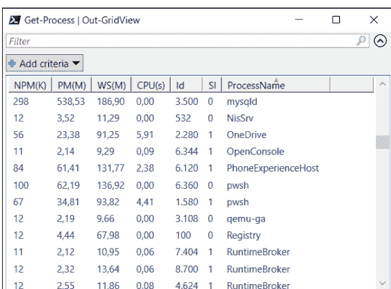

图 7.1 cmdlet 结果的图形输出

- cmdlet | Export-Csv 将 cmdlet 结果保存为逗号分隔值（CSV）文件。默认情况下，第一行包含所有属性的名称作为列标签。在其他行中，所有文本都用引号括起来并用逗号分隔。你可以通过各种选项操作文件的格式化细节。Export-Csv 的对应命令是 Import-Csv。我将在第 8 章第 8.1 节介绍此命令。
- 使用 Test-NetConnection，你可以检查网络连接。基本上，该 cmdlet 是一个现代的 ping 替代品，但你也可以传递端口号：

```
> Test-NetConnection kofler.info

ComputerName        : kofler.info
RemoteAddress       : 168.119.33.110
InterfaceAlias      : Ethernet Instance 0
SourceAddress       : 192.168.122.162
PingSucceeded       : True
PingReplyDetails (RTT) : 29 ms
```

## 7.7 其他 cmdlet

在本节中，我将简要介绍一些其他经常需要但不符合前面任何章节内容的 cmdlet：

- **Get-Command <name>**
  Get-Command <name> 返回有关 cmdlet 或命令的信息。对于 cmdlet，Source 属性揭示了底层模块。另一方面，对于常规命令，你可以评估 Path 属性——这样，你就会知道命令安装在哪里（类似于 Linux 上的 which）：

  ```
  > (Get-Command Get-ChildItem).Source
  Microsoft.PowerShell.Management
  > (Get-Command ping.exe).Path
  C:\Windows\system32\PING.EXE
  ```

- **Get-History**
  Get-History 返回最近执行的所有命令的列表。

- **Get-Random**
  Get-Random 返回一个介于 0 和 2,147,483,647 之间的随机数。使用 -Minimum 和 -Maximum 你可以限制数字范围。当你将 Get-Random 应用于数组时，该 cmdlet 返回一个随机元素。

- **Measure-Command { expr }**
  Measure-Command { expr } 确定执行指定表达式所需的时间。

- **Start-Sleep n**
  Start-Sleep n（别名 sleep）将正在运行的进程或脚本停止 n 秒。

- **Get-Clipboard**
  Get-Clipboard 读取剪贴板的内容。虽然没有类似的 cmdlet 可以用数据填充剪贴板，但你可以使用 clip.exe 命令来实现此目的。例如，Get-Date | clip 将当前日期作为文本复制到剪贴板。

## 7.8 安装其他模块

默认情况下，Windows 安装了相当多的带有 cmdlet 的 PowerShell 模块，并且互联网上有无数的扩展模块。PowerShell Gallery 已成为此类扩展的中心来源。在 https://powershellgallery.com 提供了超过 10,000 个模块供下载。

要从 PowerShell Gallery 安装模块，默认情况下提供了 PowerShellGet 模块。此模块包含像 Install-Module 和 Find-Module 这样的 cmdlet。

## PowerShell 5.1 的 PowerShellGet 更新

随着 PowerShell 7.n 的发布，也附带了最新版本的 PowerShellGet。但如果你使用的是 PowerShell 5.1，则必须先更新 `PowerShellGet` 模块。其先决条件（即安装当前的 .NET 框架、启用 TLS 1.2 等）已汇总在 https://learn.microsoft.com/en-us/powershell/scripting/gallery/installing-psget。

要从 PowerShell 库安装模块，你只需运行 `Install-Module`：

```
> Install-Module PSReadExif

Untrusted repository
You're installing the modules from an untrusted repository.
Are you sure you want to install the modules from 'PSGallery'?
[Y] Yes  [A] Yes to All  [N] No  [L] No to All  ...: y
```

你可以使用 `Update-Module` 来更新之前安装的模块，例如：

```
> Update-Module SQLServer
```

## 7.8.1 列出模块、命令和包源

在 PowerShell 中，你有两个命令可以列出模块：

- **Get-Module**
  `Get-Module` 列出当前 PowerShell 实例中已加载的模块。如果你刚打开终端窗口，只会加载少量模块。由于模块会在执行其包含的命令时自动加载，因此列表会根据你使用的命令而增加。
  `Get-Module -ListAvailable` 列出你计算机上所有可用的模块。
- **Get-InstalledModule**
  `Get-InstalledModule` 是 `PowerShellGet` 模块的一部分，仅列出你之前通过 `Install-Module` 安装的模块。如果你从未使用过 `Install-Module`，结果将为空。

```
> Get-InstalledModule

Version  Name          Repository  Description
-------  ----          ----------  -----------
1.0.2    PSReadExif    PSGallery    Read EXIF metadata ...
```

要了解特定模块提供了哪些命令，你应该使用 `-Module` 选项运行 `Get-Command`：

```
> Get-Command -Module PSReadExif
CommandType Name Version Source
----------- ---- ------- ------
Function Add-ExifData 1.0.2 PSReadExif
Function Get-ExifData 1.0.2 PSReadExif
Function Get-ExifTag 1.0.2 PSReadExif
```

要找出当前设置了哪些包源，你可以运行 `Get-PackageProvider`。通常，即使你在 Linux 或 macOS 上使用 PowerShell，`PowerShellGet` 和 `NuGet` 也是预配置的。

```
> Get-PackageProvider

Name Version DynamicOptions
---- ------- --------------
NuGet 3.0.0.1 Destination, ExcludeVersion, ...
PowerShellGet 2.2.5.0 PackageManagementProvider, ...
```

## 7.8.2 NuGet 和 winget

PowerShellGet 是 PowerShell 的包管理器。然而，在 Windows 上，还有各种其他可用的包管理器，例如 *NuGet*、*winget* 和 *Chocolatey*。在此，我将只讨论由 Microsoft 开发的 NuGet 和 winget 工具。这些工具的目标与 PowerShellGet 完全不同：

- **NuGet**
  NuGet 是面向软件开发者的包管理器。你可以使用 NuGet 来管理所有可想象的软件组件、.NET 库和工具。超过 300,000 个软件包可以在 https://nuget.org 免费下载。多年来，NuGet 一直随 Visual Studio 开发环境一起提供。
  从 PowerShell 的角度来看，NuGet 在两个方面很有用：一方面，你可以通过 PowerShell 命令（如 `Find-Package`、`Install-Package` 和 `Uninstall-Package`）来控制 NuGet。另一方面，有时 PowerShell 模块依赖于其他工具或库，你可以使用 NuGet 轻松安装它们。
- **winget**
  winget 是一个新的包管理工具。与仅面向开发者的 NuGet 不同，winget 帮助安装用户软件。winget 提供相同的功能，并且也使用与 Microsoft Store 相同的源，但可以在文本模式下高效操作：

```
> winget install Mozilla.Firefox
```

`winget` 命令在 Windows 11 以及当前版本的 Windows 10 中默认可用。你可以在 PowerShell 脚本中使用 winget 来安装或更新程序。

然而，winget 目前仅作为传统命令实现。一个包含 `Install-WinGetPackage` 等 cmdlet 的 PowerShell 模块正在 https://github.com/microsoft/winget-cli/tree/master/src/PowerShell/Microsoft.WinGet.Client 开发中。

## 7.9 标准别名

与 Linux 中重要命令的名称很少超过 4 个字符相比，PowerShell 中常用 cmdlet 的名称通常相当冗长。然而，对于 PowerShell 专业人士来说，常用命令有快捷方式可用。

| 别名 | cmdlet | 别名 | cmdlet |
|---|---|---|---|
| ? | Where-Object | measure | Measure-Object |
| % | ForEach-Object | mv | Move-Item |
| cat | Get-Content | ni | New-Item |
| cd | Set-Location | oh | Out-Host |
| cpi | Copy-Item | ps | Get-Process |
| curl | Invoke-WebRequest | pwd | Get-Location |
| del | Remove-Item | rm | Remove-Item |
| dir | Get-ChildItem | select | Select-Object |
| echo | Write-Output | sleep | Start-Sleep |
| ft | Format-Table | sls | Select-String |
| gci | Get-ChildItem | sort | Sort-Object |
| gm | Get-Member | tee | Tee-Object |
| ls | Get-ChildItem | write | Write-Output |
| md | mkdir | | |

**表 7.1** 最重要的 cmdlet 和函数的别名

许多别名只是从 cmdlet 的动词和名词的首字母派生而来，例如 `mi` 代表 `Move-Item`。其他别名如 `cat`、`dir` 或 `ls` 对应于常见的 DOS 和 Linux 命令。

你可以使用 `Set-Alias` 定义自己的别名，并将这些自定义别名永久保存在 `Documents/profile.ps1` 中。`Get-Alias` 命令提供了所有当前定义的别名的完整参考。

## 避免在脚本中使用别名！

一旦你习惯了交互模式下最重要的别名，你可能会忍不住在脚本中也使用它们，但这并不是个好主意。根据配置或操作系统的不同，可能会激活不同的缩写。例如，在 Windows 上，`ls` 是 `Get-ChildItem` 的别名；然而，在 Linux 和 macOS 上，`ls` 调用的是 Unix 风格的 `ls` 命令！

本书中指定的别名始终适用于 Windows。

## 别名与函数

乍一看，你可能很难确定一个短名称是别名还是函数。如果你好奇，可以调用 `Get-Command`。这个 cmdlet 会揭示，例如，`mkdir` 是一个函数，而 `rmdir` 是一个别名。

# 第 8 章
## 使用过滤器和管道分析文本

系统管理员日常工作的一部分是分析日志文件。然而，从通常有数百万行的文件中提取相关数据，就像俗话说的“大海捞针”。通过巧妙地组合 `grep`、`sort`、`cut` 或 `uniq` 等命令，你可以让自己的工作更轻松。稍加练习，单行命令就能创造奇迹。

但这个主题如何涉及“过滤器”和“管道”这两个术语呢？

- 在 shell 上下文中，过滤器是一个期望文本作为输入并返回新文本作为输出的命令。在第 8.1 节中，我将介绍 Linux 和 macOS 默认提供的最重要的过滤器命令。
- 你应该从第 3 章第 3.7 节熟悉 `|` 管道运算符。此运算符将一个命令的输出重定向到第二个命令进行进一步处理。例如，`sort my.txt | uniq` 会导致 `my.txt` 的行首先被排序，然后在第二步中消除所有重复项。

就其本质而言，过滤器和管道的使用绝不仅限于日志文件。你也可以使用它们来分析地址数据、用户目录、逗号分隔值（CSV）文件等。

> **本章的先决条件**

本章很大程度上基于 Bash。Bash 是应用 `sort` 或 `grep` 等命令的理想环境。因此，我假设本章的读者具备 Bash 的基础知识。只有在第 8.5 节中，我才会简要使用 Python 和 PowerShell。

PowerShell 也有一个管道运算符 `|`。然而，此运算符重定向的是对象而不是文本，这导致其处理能力比 Bash 更强——但前提是底层数据*不是*文本。因此，PowerShell 在本章中只扮演次要角色——对此表示抱歉！

## 8.1 grep、sort、cut 和 uniq

本节介绍标题中提到的四个命令，以及另外几个。所有介绍的命令都是 macOS 和 Linux 标准套件的一部分，因此不需要单独安装。

为了使本节内容尽可能实用，我将向你展示如何使用所有这些命令，操作对象是`employees.txt`文本文件。该文件包含500名美国员工的虚构数据。以下清单展示了前三行，每行都已换行：

```
FirstName;LastName;DateOfBirth;Street;Zip;City;
State;Gender;Email;Job;Salary

Ruthanne;Summers;1977-06-04;4 Dewy Turnpike;27698;Clifton Hill;
NJ;F;ruthanne_ferguson5693@fastmail.cn;Engineer;5201.45

Lorie;Warner;1972-04-27;59 Hickory Way;78509;Simsbury Center;
MA;F;lorie7961@mailforce.net;Climatologist;3794.34
```

你可以在本书的示例文件中找到`employees.txt`文件。

> **在 Windows 上尝试示例**
在 Windows 上，一些命令存在同名版本（其中一些源自 DOS 时代！）或 PowerShell 别名，但它们的功能和选项与 Linux/macOS 不同。如果你想在 Windows 上重现本章介绍的示例，最佳方法是使用 Windows Subsystem for Linux (WSL) 或 Git Bash。

## 8.1.1 grep

在 `ls` 之后，`grep` 可能是我在终端中运行最频繁的命令。其最基本的形式是，从一个文本文件中，过滤出包含指定搜索词的行。第一个示例过滤 `log.txt` 中的所有错误消息，第二个示例过滤所有来自加利福尼亚州（缩写 `CA`）的员工：

```
$ grep error log.txt
$ grep CA employees.txt

Elissa;David;...;CA;...
Sammie;van Luyn;...;CA;...
Dinorah;Mcgee;...;CA;...
```

`grep` 的行为可以通过各种选项来影响。我只想提及最重要的几种行为：

- `-i` 在搜索时不区分大小写（*忽略大小写*）。
- `-r` 搜索当前或指定目录及所有子目录中的所有文件（*递归*）。
- `-c` 不显示找到的行，只显示其数量（*计数*）。
- `-l` 仅列出包含匹配项的文件（*列表*）。当你同时处理多个文件时，`-l` 和 `-c` 选项特别有用，例如 `grep -l myfunction *java`。
- `-v` 反转搜索（即，只考虑*不*包含搜索词的行）。

`grep` 始终将搜索模式应用于整行，而不是列。因此，你应该确保你的搜索模式是唯一的。假设你想列出所有出生于1985年的人：

```
$ grep 1985 employees.txt

Dorthea;Mckinney;1985-06-02;915 Field Divide;...
Kandi;Meester;1985-01-27;424 Smith Vale;...
...
Kanesha;Matthews;1968-06-24;P.O. Box 19858;...
```

前几个匹配项是正确的，但最后一行是错误的。*Kanesha* 出生于1986年。然而，她的地址不幸包含了邮政信箱号码 19858。通过更精确地构造搜索模式，你可以在此情况下消除错误：

```
$ grep ';1985-' employees.txt
```

> **正则表达式**
第一个参数中传递的搜索词被作为正则表达式进行求值。只要你查找的是普通文本，这并不重要。但是，如果你的搜索词包含特殊字符，你必须注意并用 `\` 为特殊字符添加前缀。例如，你会使用 `help\.com` 来搜索 `help.com`。你将在[第9章](#)中学习什么是正则表达式及其在一般情况下以及专门针对 `grep` 的应用。

## 8.1.2 wc

`wc`（*word count*，字数统计）统计文件的行数、单词数和字符数，例如：

```
$ wc employees.txt

501  2628 61102 employees.txt
```

`wc` 可以与其他命令很好地链接。例如，有多少女性员工居住在科罗拉多州（缩写 CO）？

```
$ grep ';CO;' employees.txt | grep ';F;' | wc -l
4
```

第一个 `grep` 命令返回所有科罗拉多州的行。它们没有被输出，而是通过管道操作符传递给第二个 `grep`。第二个 `grep` 从中间结果中过滤出女性（性别 F）。然后 `wc -l` 只需要统计结果行数。

## 8.1.3 cut

cut（不要与 cat 混淆！）从文本中剪切列。对于大多数应用，了解以下三个选项通常就足够了：

- `-d` 指定分隔符字符。默认设置是制表符。特殊字符通常需要用 `\` “引用”或放在引号中——例如 `-d\ ;` 或 `-d ';'`。
- `-f` 选择所需的列。例如，`-f 1,4` 提取第一列和第四列，`-f 4-7` 提取第四到第七列。
- `-s` 忽略分隔符未出现的行。

如果你想只查看员工的姓名和电子邮件地址，可以使用以下命令：

```
$ cut -d ';' -f 1,2,9 employees.txt

FirstName;LastName;Email
Ruthanne;Ferguson;ruthanne_ferguson5693@fastmail.cn
Lorie;Warner;lorie7961@mailforce.net
Kerri;Tsioupra;kerri2377@emailuser.net
...
```

接下来的两个命令识别纽约州员工的电子邮件地址。首先，地址显示在终端中，借助 `less`，你可以使用方向键从容地浏览结果；然后结果保存到 `emails.txt`。

```
$ grep ';NY;' employees.txt | cut -d ';' -f 9 | less

nakesha_lambrinou6390@speedymail.org
capelle1740@fastmailbox.net
noble7595@internetemails.net
...

$ grep ';NY;' employees.txt | cut -d ';' -f 9 > emails.txt
```

## 8.1.4 sort

在最简单的情况下，`sort my.txt` 会导致行按字母顺序输出到屏幕上。然而，你不是处理文件，而是可以使用管道操作符对另一个命令的结果进行排序。像往常一样，有几个选项可用于控制排序行为：

- `-n` 按数字排序，例如，1, 2, 3, 10，依此类推（而不是 1, 10, 2, 3 等）。
- `-r` 按降序排序，而不是升序（反向）。
- `-k <n>` 指定从哪一列开始排序。该选项通常与 `-t` 结合使用。
- `-t` 指定列的分隔符，例如 `-t ';'`。没有此选项时，`sort` 将空格到文本字符的过渡视为新列的开始。

以下命令创建两个按姓名排序的员工列表：

```
# 按名字排序（即从行首开始）
$ sort employees.txt

# 按姓氏排序（第二列）
$ sort -t ';' -k 2 employees.txt
```

> **谨慎使用 sort！**

对500行进行排序应该不会给现代计算机带来挑战。但是，当你使用 `sort` 处理更大数据量时，应该谨慎行事。当你对包含数百万行的日志文件进行排序时，可能需要大量的时间和内存。此外，使用 `cmd | sort` 时，`sort` 在 `cmd` 完成之前无法开始工作。

如果可能，你应该先使用 `grep` 过滤大文本文件，也许再通过 `cut` 减少列数，然后再应用 `sort`。

## 8.1.5 head 和 tail

特别是在 `sort` 方面，一个常见的情况是你只想查看前 *n* 个或后 *n* 个结果。在这种情况下，`head` 和 `tail` 就派上用场了：

```
# 薪水最低的三名员工（第11列）
$ sort -t ';' -k 11 -n employees.txt | cut -d ';' -f 1,2,11 | head -n 3

Mohamed;Mcbride;1804.67
Gabrielle;Melendez;1807.37
Benedict;Oconnor;1812.30
# 薪水最高的三名员工（错误的）
$ sort -t ';' -k 11 -n employees.txt | cut -d ';' -f 1,2,11 | tail -n 3

Estella;Guerra;5586.85
Dolly;Leonard;5600.00
FirstName;LastName;Salary
```

但请注意，第二个结果是错误的，并且还包含了标签行！实际上，应该只对 *employees.txt* 的第1到501行进行排序，而不是包含列标签的第1行。要跳过第一行，请使用 `tail -n +2`。这种不寻常的措辞意味着应该输出从第二行到文件末尾的所有行。

```
# 薪水最高的三名员工（正确的）
$ tail -n +2 employees.txt | sort -t ';' -k 11 -n | cut -d ';' -f 1,2,11 | tail -n 3

Arden;Lit;5584.95
Estella;Guerra;5586.85
Dolly;Leonard;5600.00
```

## 8.1.6 uniq

`uniq my.txt` 消除文本文件中连续相同的行，并在终端中打印结果。但是，如果重复项不是紧邻的，`uniq` 无法识别它们。你可以通过事先对文本进行排序来避免此限制。

在以下清单中，第一个命令确定员工所在的所有州的字母列表。`tail` 消除列标签，`cut` 剪切出包含州的第七列。第二个命令证明员工似乎居住在美国所有50个州。

```
$ tail -n +2 employees.txt | cut -d ';' -f 7 | sort | uniq
AK
AL
AR
...

$ tail -n +2 employees.txt | cut -d ';' -f 7 | sort | uniq | wc -l

50
```

现在，我们仍然对以下问题感兴趣：每个州有多少名员工？如果你向 `uniq` 传递选项 `-c`（计数），这个问题也可以得到回答：

```
$ tail -n +2 employees.txt | cut -d ';' -f 7 | sort | uniq -c
    11 AK
    12 AL
     8 AR
     ...
```

如果我们现在想查看员工最多的五个州，我们需要再次对 `uniq` 的结果进行排序。`-n` 选项确保 `sort` 正确地进行数字排序。`-r` 反转了

## 8.1.7 tr

`tr`（代表 *translate*）用于替换文本中的单个字符。`tr` 完全基于字符进行操作，因此无法替换单词。`-d`（*delete*）选项用于删除指定的字符。以下三个示例说明了 `tr` 的工作原理：

```
# 将 . 替换为 ,
$ tr '.' ',' < in.txt > out.txt

# 将小写字母替换为大写字母
$ tr "a-zäöü" "A-ZÄÖÜ" < in.txt > out.txt

# 删除德语特殊字符而不进行替换
$ tr -d "äöüßÄÖÜ" < in.txt > out.txt
```

当然，`tr` 也可以用作过滤器。以下命令返回所有位于德克萨斯州的员工的名字、姓氏和电子邮件地址，各列之间用 `:` 字符分隔。之前，各列是用 `;` 分隔的：

```
$ grep ';TX;' employees.txt | cut -d ';' -f 1,2,9 | tr ';' ':'

Mae:van Diedenhoven:mae5561@emailgroups.net
Nancee:Coleman:nancee_coleman4689@150ml.com
Mitch:Matse:matse2138@theinternetemail.com
...
```

## 8.1.8 awk 和 sed

除了到目前为止介绍的每个都易于单独使用且组合使用时能增强其多功能性的命令外，Unix 生态系统还提供了更复杂的命令可供选择。由开发者 Alfred V. Aho、Peter J. Weinberger 和 Brian W. Kernighan 开发的 `awk` 工具是一种用于编辑和分析文本的自定义脚本语言。`sed` 流编辑器至少同样功能强大。

尽管本书没有足够的篇幅详细讨论这些程序，但我想至少通过一个例子简要介绍一下 `awk` 和 `sed`。

还记得我们之前在 8.11 节中的 `grep` 示例吗，`grep 1985 employees.txt`？它从文本文件中过滤出所有在任何位置包含 `1985` 字符串的行。然而，我们实际上只想要那些出生日期是 1985 年的匹配项，即那些在第三列包含 1985 的匹配项。使用 `grep` 很难制定这样的搜索条件。另一方面，对于 `awk` 来说，这种情况没有问题。在这种情况下，`-F` 选项指定列分隔符。`$3` 指的是第三列。该列必须包含在 `//` 之间指定的搜索词：

```
$ awk -F ';' '$3 ~/1985/' employees.txt

Dorthea;Mckinney;1985-06-02;915 Field Divide;...
Kandi;Meester;1985-01-27;424 Smith Vale;...
...
```

如果你需要经常执行此类任务，学习 `awk` 语法是值得的。互联网上有各种教程，但我们推荐 https://linuxhandbook.com/awk-command-tutorial 上的示例导向教程。

`sed` 也提供了与 `awk` 类似的功能。第 9 章第 9.3 节提供了一个使用 `sed` 的示例，我将向你展示如何使用 `sed` 通过正则表达式在文本文件中搜索模式，并将找到的文本替换为其他表达式。

## 8.2 示例：统计数据的分析

你可能在看上一节的示例时心想：“如果我只是需要对一些联系人数据进行排序，我会用 Excel 来做。那样更容易。”当然，我也是这么做的，不过如果数据存储在数据库中并且我可以使用 SQL，我会更喜欢。这些示例的唯一目的是向你展示 `grep`、`cut`、`sort`、`uniq` 等命令在易于理解的数据上的应用选项。

从现在开始，所有内容都更接近日常脚本编写。我将从评估来自 https://ourworldindata.org/energy 的 CSV 文件开始，该文件包含有关能源生产和消费的公共数据。以下几行显示了文件的基本结构：

```
country,year,iso_code,population,...,energy_per_capita,...
...
China,2020,CHN,1424929792,...,29133.936,...
China,2021,CHN,1425893504,...,30768.826,...
China,2022,CHN,1425887360,...,31051.480,...
Germany,2022,DEU,83369840,...,40977.492...
United States,2022,USA,338289856,...,78754.273...
...
```

该文件大小约为 8 MB，包含来自 125 年和 222 个国家或地区的 22,000 行数据。超过 120 列提供了关于能源使用和生产各个方面可想象的信息。让我们专注于前三列和第 32 列（`energy_per_capita`），即人均主要能源消耗和年份（单位为千瓦时）。根据前面显示的示例行，2022 年中国的消耗量约为 31,000 千瓦时，德国约为 41,000 千瓦时，美国接近 79,000 千瓦时。

### 8.2.1 通过脚本提取数据

以下脚本的任务是从互联网下载一个 CSV 文件，将其保存在本地，然后提取特定国家 1 年的人均能源消耗：

```
./get-energy-consumption.sh GBR 1999
Primary energy consumption per person
for United Kingdom in 1999: 45017.871 kWh/a
```

如果传递的参数太少或太多，或者脚本找不到合适的数据集，则会显示错误消息，例如：

```
./get-energy-consumption.sh GBR
Usage: get-energy-consumption <countrycode> <year>
Example: get-energy-consumption FRA 2021
./get-energy-consumption.sh GBR 2040
Sorry, no data found for GBR 2040.
```

完整代码如下所示：

```
#!/bin/bash
# 示例文件 get-energy-consumption.sh
# 脚本需要两个参数
if [ $# -ne 2 ]; then
  echo "Usage: get-energy-consumption <countrycode> <year>"
  echo "Example: get-energy-consumption FRA 2021"
  exit 2
fi
# 如果文件尚未保存在本地，则下载文件
if [ ! -f owid-energy-data.csv ]; then
  wget https://nyc3.digitaloceanspaces.com/owid-public/data/energy/owid-energy-data.csv
fi
# 删除不需要的列，过滤行，
# 如果结果有多行，则使用最后一行
data=$(cut -d ',' -f 1,2,3,32 owid-energy-data.csv | \
      grep $1 | grep $2 | tail -n 1)
# 从结果中提取项目
country=$(echo $data | cut -d ',' -f 1)
year=$(echo $data | cut -d ',' -f 2)
energy=$(echo $data | cut -d ',' -f 4)
# 输出结果
if [ "$country" ] && [ "$energy" ]; then
  echo "Primary energy consumption per person for $country in $year: "
  echo "$energy kWh/a"
else
  echo "Sorry, no data found for $1 $2."
fi
```

## 8.3 示例：ping 分析

你可以使用 `ping` 命令检查与另一台计算机的网络连接。`-c` 选项指定在此过程中要发送多少个 Internet 控制消息协议（ICMP）数据包（即 `ping` 在多少次尝试后终止）。如果不使用该选项，`ping` 在 Linux 和 macOS 上会一直运行，直到你通过 `Ctrl` + `C` 终止命令。以下清单显示了一个典型的 `ping` 结果：

```
$ ping -c 4 google.com

PING google.com(bud02s41-in-x0e.1e100.net
  (2a00:1450:400d:802::200e)) 56 data bytes
64 bytes from bud02s41-...: icmp_seq=1 ttl=117 time=15.4 ms
64 bytes from bud02s41-...: icmp_seq=2 ttl=117 time=17.4 ms
64 bytes from bud02s41-...: icmp_seq=3 ttl=117 time=17.3 ms
64 bytes from bud02s41-...: icmp_seq=4 ttl=117 time=15.6 ms

--- google.com ping statistics ---
4 packets transmitted, 4 received, 0% packet loss, time 3006ms
rtt min/avg/max/mdev = 15.434/16.431/17.382/0.914 ms
```

请注意，某些服务器被配置为不响应 `ping` 请求（据称是出于安全原因）。一个著名的例子是微软（即 microsoft.com）。假设你只想从这个结果中提取平均响应时间；在前面的清单中，该值为 16,431 毫秒。对于此任务，你首先必须使用 `grep` 从结果中过滤出最后一行。然后，你可以使用 `cut` 从结果中过滤出第五列，使用 `/` 作为分隔符：

```
$ ping -c 4 google.com | grep avg | cut -d '/' -f 5

16.431
```

如果你为 `cut` 指定额外的 `-s` 选项，你甚至可以省略 `grep`。`-s` 选项使 `cut` 仅考虑那些包含列分隔符（在本例中为 `/`）的结果行。

```
$ ping -c 4 google.com | cut -s -d '/' -f 5
```

### 8.3.1 通过脚本调用 ping

现在，你可以将 `ping` 调用包含在脚本中，并传递计算机的主机名。脚本检查是否恰好传递了一个参数，并以适当的格式输出结果：

```
# 示例文件 ping-avg.sh
if [ $# -ne 1 ]; then
  echo "usage: ./ping-avg.sh <hostname>"
  exit 2
else
  hostname=$1
fi
avg=$(ping -c 4 $hostname | cut -s -d '/' -f 5)
echo "Average ping time for $hostname is $avg ms"
```

在我的测试调用中，python.org 的服务器响应速度略快于 Google 的服务器：

```
$ ./ping-avg.sh python.org

Average ping time for python.org is 12.796 ms
```

该脚本一个可以想象的扩展是处理多个主机名。然后脚本期望任意数量的参数（至少一个），如下例所示：

```
#!/bin/bash
# 示例文件 ping-avg.sh
if [ $# -lt 1 ]; then
  echo "usage: ./ping-avg.sh <hostnames>"
  exit 2
fi
for hostname in $*; do
  avg=$(ping -c 4 $hostname | cut -s -d '/' -f 5)
  echo "Average ping time for $hostname is $avg ms"
done
```

测试调用如下所示：

## 8.4 示例：Apache 日志分析

本示例的起点是一个 Apache Web 服务器的日志文件，该文件采用所谓的*组合日志*格式。该文件的前几行如下所示（因篇幅原因在此处换行）：

```
65d3:f5b9:e9e5:4b1c:331b:29f3:97c1:c18f - - [05/Feb/2023:00:00:22 +0100]
"POST /consumer/technology HTTP/1.1" 200 5166
"https://example.com/land/raise/authority/him"
"WordPress/6.1.1; https://example.com"

221.245.9.91 - - [05/Feb/2023:00:00:21 +0100] "GET /explain/out HTTP/1.1"
200 31222 "https://example.com/add/maybe/person"
"FreshRSS/1.20.2 (Linux; https://freshrss.org)"

37e3:498f:44d8:c471:3ba3:9902:17e7:2be8 - -
[05/Feb/2023:00:00:24 +0100]
"GET /by/financial/within/benefit HTTP/1.1" 200 97598
"https://example.com/defense/friend/race/protect"
"Mozilla/5.0 (iPhone; CPU iPhone OS 16_3 like Mac OS X)
AppleWebKit/605.1.15 (KHTML, like Gecko) Version/16.3
Mobile/15E148 Safari/604.1"
```

该文件的各列分别表示：发起请求的 IP 地址、发起请求的用户（如果已知）、请求类型（GET、POST 等）、请求的 Web 服务器地址、返回的 HTTP 代码（例如 200 "OK"）、传输的数据量、触发请求的来源页面（引用地址）以及使用的客户端。

要重现以下示例，你需要使用示例文件中的 *access.log* 文件。*wc* 命令显示该文件包含超过 170,000 行。

```
$ wc -l access.log

172607 access.log
```

> **匿名化数据**

*access.log.gz* 是一个真实的日志文件，出于隐私原因已进行匿名化处理。所有 IP 地址、URL 和用户名均已替换为随机数据。此匿名化操作当然也是通过脚本完成的。如果你对代码感兴趣，可以查看 *anonymize-log.py*，该脚本大量使用了正则表达式。如果你能访问自己 Web 服务器的“真实”日志文件，应该使用那些文件。

### 8.4.1 提取 IP 地址

你可以使用 `cut` 从日志文件中提取 IP 地址：

```
$ cut -d ' ' -f 1 access.log | less

65d3:f5b9:e9e5:4b1c:331b:29f3:97c1:c18f
221.245.9.91
37e3:498f:44d8:c471:3ba3:9902:17e7:2be8
135.84.251.52
...
```

`grep` 可以让你确定有多少访问事件是通过 IPv4 或 IPv6 发起的：

```
$ cut -d ' ' -f 1 access.log | grep ':' | wc -l    # IPv6
65405
$ cut -d ' ' -f 1 access.log | grep -v ':' | wc -l  # IPv4
107202
```

`sort` 和 `uniq` 提供了所有 IPv4 地址的有序列表：

```
$ cut -d ' ' -f 1 access.log | grep -v ':' | sort | uniq

0.117.133.93
0.125.223.169
0.164.206.211
...
```

虽然有些 IP 地址在日志中只出现一次，但其他地址出现得相当频繁。`sort` 对所有 IP 地址进行排序，`uniq -c` 统计地址出现次数，`sort -n -r` 按降序排列其频率，最后 `head -n 5` 提取前 5 个结果：

```
$ cut -d ' ' -f 1 access.log | sort | uniq -c | sort -n -r | \
  head -n 5

6166 65d3:f5b9:e9e5:4b1c:331b:29f3:97c1:c18f
6048 3547:0b26:4c84:4411:0f66:945e:7741:d887
5136 186.107.89.128
4620 d741:a4ea:f6e1:6a17:78b1:1694:f518:c480
2362 168.81.233.22
```

### 8.4.2 识别热门页面

在组合格式中，请求数据包含在引号内。使用 `cut -d '"'`，你可以将请求与其余数据分开：

```
$ cut -d '"' -f 2 access.log | less
```

```
POST /consumer/technology HTTP/1.1
GET /explain/out HTTP/1.1
GET /by/financial/within/benefit HTTP/1.1
GET /action/but HTTP/1.1
...
```

我们只对 GET 请求感兴趣，并且只关心地址：

```
$ cut -d '"' -f 2 access.log | grep GET | cut -d ' ' -f 2 | less
```

```
/explain/out
/by/financial/within/benefit
/action/but
/place/paper
...
```

经过验证的 `sort`、`uniq -c` 和再次 `sort` 的组合可以确定最热门的 URL：

```
$ cut -d '"' -f 2 access.log | grep GET | cut -d ' ' -f 2 | \
sort | uniq -c | sort -n -r | head
```

```
25423 /explain/out
5822 /international/hundred/can
4979 /goal/Congress/short/peace
4874 /rate/victim/detail
...
```

如果你将此命令应用于原始日志文件（很遗憾我无法分享），你将得到以下结果：

```
$ cut -d '"' -f 2 access.log.orig | grep GET | \
cut -d ' ' -f 2 | sort | uniq -c | sort -n -r | head
```

```
25424 /feed/
5822 /
4979 /wp-content/plugins/wp-spamshield/js/jscripts-ftr2-min.js
4874 /favicon.ico
4347 /blog/feed/
3352 /wp-content/uploads/fonts/49ff7721659f0bc7d77a59e1de422e07/font.css?v=1664309579
3328 /wp-content/themes/twentyfourteen/genericons/genericons.css?ver=3.0.3
...
```

因此，该 Web 服务器托管了一个 WordPress 网站。最频繁的访问涉及 feed 页面、主页 (/)、垃圾邮件防护插件、网站图标以及另一个 feed 页面。

## 8.5 CSV 文件

CSV 是一种文本格式，其中各列由逗号分隔。也使用其他特定国家/地区的分隔符，例如德语国家/地区使用分号。此分隔符有助于清晰地区分各列和数字的小数部分。基本上，允许使用任何分隔符，包括冒号或制表符 (\t)。

如果分隔符也可能出现在列*内部*，则 CSV 文件的分析会变得复杂得多。此时，列内容会用引号括起来，通常使用 ' 或 "。

以下示例的起点是来自 *https://www.kaggle.com/datasets/rsrishav/world-population* 的 *2023_population.csv* 文件。该文件包含世界各国的人口数据，结构如下：

```
iso_code,country,2023_last_updated,2022_population,area_sq_km,
land_area_sq_km,density_/sq_km,growth_rate,world_%,rank,un_member

IND,India,"1,433,381,860","1,417,173,173",3.3M,3M,481,0.81%,17.85%,1,IND

CHN,China,"1,425,542,952","1,425,887,337",9.7M,9.4M,151,-0.02%,17.81%,2,CHN

...
```

用于列提取的 `cut` 命令对此数据无能为力。如果你想使用 Bash，可以安装 `csvkit`。这个命令集合有助于处理 CSV 文件（参见 *https://csvkit.readthedocs.io*）。然而，在本节中，我将简要介绍 Python 和 PowerShell 的 CSV 功能。

### 8.5.1 使用 Python 处理 CSV 文件

在 Python 脚本中，你可以从文本文件中逐行读取 CSV 数据（在最简单的情况下），然后使用 `split` 将行拆分为各列。以下脚本分析第 8.4 节中的 `access.log` 文件，并确定最频繁的 IP 地址。与等效的 Bash 命令相比，Python 脚本更高效，尤其是在处理大型日志文件时，因为无需对所有 IP 地址进行排序。

```
# 示例文件 analyze-access-log.py
counters = {}  # 用于统计所有 IP 地址的字典

# 遍历 access.log 的所有行
with open('access.log') as f:
    for line in f:
        # IP 地址在第一列
        ip = line.split()[0]
        if ip in counters:
            counters[ip] += 1
        else:
            counters[ip] = 1

# 创建字典元素的有序列表；
# 每个列表元素本身是一个列表：[ip, cnt]
sortedIps = sorted(counters.items(),
                   key = lambda x: x[1], reverse = True)

# 显示前 5 个 IP 地址
for i in range(5):
    print('%6d: %s' % (sortedIps[i][1], sortedIps[i][0]))
```

然而，此处用于提取列的 `split` 方法在处理像 `2023_population.csv` 这样的复杂 CSV 文件时会失败。要读取此类复杂文件，最好的方法是使用 `csv` 模块。以下代码清单展示了该模块的一个简单应用：

```
# 示例文件 analyze-population.py
import csv
total = 0
with open('2022_population.csv', newline = '') as f:
    reader = csv.reader(f, delimiter = ',', quotechar = '"')
    next(reader)            # 跳过列标签
    for columns in reader:  # 逐行读取，columns 包含
        print(columns)      # 包含各列的列表
        total += int(columns[2].replace(',', ''))

print("地球人口:", total)
```

`csv`模块的文档建议使用`newline=''`选项打开CSV文件，以避免在Windows上可能出现的行尾字符（EOL）问题（即`\r\n`）。打开CSV读取器时，可以使用`delimiter`和`quotechar`选项分别指定哪些字符用于标识列和字符串。然后，你可以使用读取器在循环中逐行读取CSV文件。在每种情况下，循环变量都包含一个列表，其中包含该行的列。由于使用了`next`，带有列标签的第一行会被跳过。

为了计算地球总人口，第三列中的人口值被转换为数字，然后求和。`replace`方法消除了用于分隔千位的逗号。

## 8.5.2 在PowerShell中处理CSV文件

在PowerShell中，你可以使用`Import-Csv`来读取CSV文件。默认情况下，`Import-Csv`期望列由逗号分隔。如果需要，你可以使用`-Delimiter`来设置其他字符。用双引号括起来的字符串会被正确处理。但是，你不能设置其他字符来标识字符串。

因此，该cmdlet返回`PSCustomObject`对象，其属性取自CSV文件的列标签。如果CSV文件没有列标签行，你必须使用`-Header`选项指定列的名称，例如，按以下方式：

```
> Import-Csv -Header colA, colB, colC file.csv
```

确保使用`-Header`时不要指定太少的列名：只有你指定的列数才会被处理！

要像前面的示例一样从`2023_population.csv`确定地球人口，你可以使用以下代码：

```
# 示例文件 analyze-population.ps1
$population = Import-CSV "2023_population.csv"
$total = 0
$population | ForEach-Object {
    $total += [long]($_.'2023_last_updated'.Replace(',', ''))
}
Write-Output "World population: $total"
```

在循环内，`2023_last_updated`属性字符串中的逗号被移除。`[long]`将字符串转换为数字。

除了自己执行求和之外，你也可以通过`Measure-Object`来计算结果。但是，由于需要将`2023_last_updated`列转换为数字，最终的代码并不会更短或更高效：

```
$total = $population | ForEach-Object {
    [long]($_.'2022_last_updated'.Replace(',', ''))
} | Measure-Object -Sum
Write-Output "World population: $($total.Sum)"
```

使用`Export-Csv`，PowerShell提供了一种将cmdlet结果保存到CSV文件的好方法。生成的CSV文件在第一行列出结果对象的所有属性作为列标签。相关属性的值在其他行中，所有输出都用逗号分隔并用引号括起来：

```
> Get-Process | Export-Csv processes.csv

> Get-Content processes.csv

"Name","SI","Handles","VM","WS","PM","NPM","Path",...
"AggregatorHost","0","92","2203375112192","2568192",...
"ApplicationFrameHost","1","378","2203582570496",...
...
```

> **性能问题**
在我的测试中，执行`Get-Process | Export-Csv`花费了难以理解的长时间——在空闲的Windows 11桌面安装上大约需要10秒。单独执行`Get-Process`只需几毫秒，所以`Get-Process`本身不太可能是问题所在。生成的文件很小（只有130 KB）。即使在Linux上运行的PowerShell中，该命令也需要几秒钟才能执行。

# 第9章

# 正则表达式

*正则表达式*（regex）是一种描述搜索模式的字符串，用于在文本中进行搜索。在这种情况下，必须遵循一些不太直观的特定规则。让我们直接从一个例子开始。以下模式识别美国格式的日期（即mm/dd/yyyy）：

```
(0[1-9]|1[0-2])\/(0[1-9]|1\d|2\d|3[01])\/(19|20)\d{2}
```

该模式接受01到12之间的月份，01到31之间的日期，以及1900到2099之间的年份。然而，你仍然无法验证一个日期是否真的正确，例如，因为该模式也接受日期02/30/2023，尽管二月永远不可能有30天。

正则表达式的入门门槛相对较高，因为你必须首先学习和练习语法，这至少会花费你几个小时的时间。但是一旦你熟悉了正则表达式，就有几乎无限种可能的方式来应用它们——并且适用于所有常见的编程语言。有些任务也可以不用正则表达式来解决。但如果你熟悉语法，正则表达式将更可靠、更快速地引导你达到目标，同时避免意大利面条式代码！

本章从语法规则开始，其中我考虑了最重要的语法变体——可移植操作系统接口（POSIX）正则表达式、POSIX扩展正则表达式（ERE）和Perl兼容正则表达式（PCRE）。你没想到每个工具或编程语言都适用相同的规则，对吧？别担心，基本规则总是相同的，正则表达式变体之间的差异是可控的。在接下来的章节中，我将通过各种示例向你展示如何在Bash脚本（特别是`grep`和`sed`命令）、Python和PowerShell中使用正则表达式。

> **本章的先决条件**

本章的大部分内容适用于你偏好的脚本语言。只有在特定语言的部分，你才需要Bash、PowerShell或Python的基础知识。阅读本章后，逻辑上的后续是[第17章](#)，在那里你将再次找到一些应用示例以及关于正则表达式限制的一些提示。

## 9.1 正则表达式的语法规则

正则表达式的最初概念早在20世纪50年代就已提出。随着时间的推移，发展出了几种方言或语法变体：

- **POSIX**
  正则表达式最初在Unix环境中被标准化为*POSIX正则表达式*。
- **ERE**
  在这种扩展中，定义了对已处理模式的引用（称为*反向引用*）以及字符类（例如，数字和字母）的代码等。
- **PCRE**
  脚本语言Perl已经过了它的鼎盛时期，但在Perl中有效的正则表达式语法已成为一个基准。大多数流行的编程语言（如Python和.NET语言，包括PowerShell、JavaScript等）除了少数细节外，都与PCRE兼容。
  极端地说，存在*两种*PCRE变体：简单的“PCRE”（自1997年起）和“PCRE 2”（自2015年起）。

在本章中，我将以简略的方式介绍正则表达式，因此我不会讨论一些高级功能。除非我明确提到其他方言，否则我将始终指PCRE或所有正则表达式变体的最大公约数。

不要被各种正则表达式方言吓倒：它们之间相对较少的差异主要涉及高级功能。在许多情况下，你可以将为特定正则表达式方言制定的模式调整为另一种方言。

> **比较表**

对于大多数用例，本节提供的基础知识应该足够了。但是，当你想使用额外的特殊功能、特定于语言的功能或特定于框架的功能时，你可能无法避免查阅各自的文档。如果你对具体差异感兴趣，你应该在互联网上搜索“正则表达式引擎比较图”。这个优秀的比较网站的地址与其内容一样令人生畏，但内容研究得非常出色：https://gist.github.com/CMCDragonkai/6c933f4a7d713ef712145c5eb94a1816。

Stack Overflow上很好地总结了PCRE和PCRE 2之间的差异，地址为https://stackoverflow.com/questions/70273084。

### 9.1.1 字符

在正则表达式中，有多种方式来表示单个字符或整个组中的字符。基本上，正则表达式区分大写

## 9.1 字符类

以及小写字母，尽管这种行为通常可以通过选项禁用，具体取决于工具或编程语言。因此，`[Hh][ae]llo` 表达式对应字符串 “Hallo”、“Hello”、“hallo” 或 “hello”，但不对应 “HALLO”。`[0-9a-fA-F]` 表达式识别十六进制数字。

请注意，`a-z` 涵盖 ASCII 字符集的所有小写字母，但不包括 ä、ö、ü 或 ß 等特殊字符。你可能需要单独添加这些字母，例如，如 `[a-zA-Z-ZäöüßÄÖÜ]`。如果连字符本身要作为允许的字符，则必须将其指定在末尾，例如 `[a-zA-Z-]`（ASCII 小写和大写字母加连字符）。

| 表达式 | 含义 |
|---|---|
| `.` | 任意字符 |
| `[aeiou]` | a、e、i、o 或 u |
| `[^aeiou]` | 非 a、e、i、o 或 u |
| `[a-g]` | a 到 g |
| `[0-9]` | 0 到 9 |
| `\.` | 句点（通常，\ 必须放在各种正则表达式特殊字符之前，使其失去特殊含义） |

**表 9.1** 字符代码

PCRE 使用各种缩写来表示字符类。

| 表达式 | 含义 |
|---|---|
| `\d` | 数字，等同于 `[0-9]` |
| `\D` | 非数字，等同于 `[^0-9]` |
| `\s` | 空白字符（空格、制表符等） |
| `\S` | 非空白字符 |
| `\w` | 字母或数字，对应 `[a-zA-Z0-9_]` |
| `\W` | 非字母/数字 |

**表 9.2** PCRE 字符类代码

在 POSIX 正则表达式中，不同的代码适用于字符类。请注意，这些代码本身再次用于方括号内，例如 `[[:upper:]]`。在这种情况下，你可以通过简单地写 `[a-z]` 来节省空间。`[[:lower:]]äöüß` 表达式识别小写字母，包括德语字母 ä、ö、ü 和 ß。

| 表达式 | 含义 |
| :--- | :--- |
| [:upper:] | 大写字母，对应 [A-Z] |
| [:lower:] | 小写字母，对应 [a-z] |
| [:alpha:] | 字母，对应 [A-Za-z] |
| [:alnum:] | 字母和数字，对应 [A-Za-z0-9] |
| [:word:] | 字母、数字和下划线，类似 \w |
| [:digit:] | 数字，对应 [0-9] 或 \d |
| [:xdigit:] | 十六进制数字，对应 [0-9a-fA-F] |
| [:punct:] | 标点符号（“.,;” 等） |
| [:blank:] | 空格和制表符 |
| [:space:] | 空格、制表符和换行符 |
| [:cntrl:] | 控制字符，如 Ctrl-C |
| [:graph:] | 具有图形等效的字符（对应 [^[:cntrl:]]） |

表 9.3 POSIX 字符类代码，必须在 “[...]” 内使用

## 9.2 分组与替代

你可以使用 () 在表达式内创建一个分组。然后，在表达式内，你可以使用 | 来制定替代模式，其中一个模式可选地适用。此外，你可以使用 \1、\2 等或 $1、$2 等（取决于正则表达式方言）来访问已识别分组的内容。此功能有多种应用，例如检测重复或执行搜索和替换操作。

以下三个示例说明了分组的使用。但是，我必须使用 + 和 {1,2} 来为下一节（关于量词）做铺垫。+ 表示前面的表达式必须出现一次或多次。{1,2} 表示前面的表达式必须恰好出现一次或两次。

- **正则表达式：** ([1-9]|10|11|12)
  此表达式适用于数字 1 到 12，但不适用于 0、01 或 13。
- **正则表达式（适用于 PCRE 2）：** ([0-9]+) \1 或 ([0-9]+) $1
  此表达式的第一个部分适用于任何整数，例如 0、1、34 或 789123。在模式的第二部分中，再次引用此分组；即，在空格后必须再次指定相同的数字。

该表达式适用于以下字符串：123 123、7 7、456 456 和 abc1 1abc，其中在最后一种情况下，仅识别子字符串 1 1。
但是，该表达式不匹配 123123（无空格）或 123 123（空格过多）。

- **正则表达式：** #([0-9a-fA-F]{1,2})\1\1
  此表达式识别用于灰色值的 CSS 颜色代码。此类颜色代码必须以 # 字符开头，并且可以包含三个或六个十六进制数字。要使目标颜色为灰色值，红色、绿色和蓝色分量必须各自相等。第一分组的两次重复服务于此目的。
  例如，该表达式适用于以下颜色代码：#000、#222222、# ababab、#777 和 #777777。该表达式不适用于 #aabbcc、#abc、#0000（数字位数错误）或 000（缺少开头的 # 字符）。
  遗憾的是，该表达式在 #aAa 上失败。此值是正确的灰色值，但 a（已识别的分组）和 A（第一次重复）在大小写方面不匹配。

| 表达式 | 含义 |
|---|---|
| ( . . . ) | ( 和 ) 之间的所有内容形成一个分组 |
| (abc) | abc 表达式作为一个分组 |
| (abc|efg) | 替代项是 abc 或 efg 表达式 |
| \1, \2 | 引用第 1 个或第 2 个分组的内容（POSIX、PCRE） |
| $1, $2 | 引用第 1 个或第 2 个分组的内容（PCRE 2） |

表 9.4 正则表达式分组

### 9.2.1 量词

量词允许你表达一个表达式可能或必须出现的频率。你可以将量词应用于字符范围或分组。注意：abc+ 首先表示 ab，然后是任意次数的 c（但至少一次）。另一方面，如果 abc 可以出现任意次数，则必须使用 (abc)+ 来表达。

| 表达式 | 含义 |
|---|---|
| x? | 零次或一次 x 描述的字符 |
| x* | 零次或多次（任意次数） |
| x+ | 一次或多次（但不是零次！） |
| x{3} | 恰好三次 |
| x{3,5} | 三到五次 |
| x{3,} | 至少三次 |

表 9.5 正则表达式模式量词

以下示例展示了量词的易用性：

- [a-f]
  没有量词时，此表达式要求恰好一个 a 到 f 的字符。
- [a-f]?
  使用 ?，期望一个字符或没有字符。
- [a-f]+
  使用 +，允许任意数量的 a 到 f 之间的字符，但必须指定至少一个字符。因此，a、aaa 和 abcdef 都可以。abcx 也适用，但表达式仅包含前三个字母，不包含字母 x。
- .*
  此开放模式允许任意数量（甚至零个）的任意字符。
- (abc|efg){4}
  在此模式中，abc 或 efg 必须恰好指定四次。abcabcefgabc 是合适的，但 abcefg 不是。

### 9.2.2 论贪婪（贪婪与懒惰）

不，本节不描述人类道德或经济体系的特征。相反，这里的贪婪是指表达式捕获的字符串应该有多大。默认情况下，正则表达式的评估是贪婪的；即，正则表达式函数返回尽可能大的匹配字符串。

假设表达式是 `<.+>`。此表达式意味着要识别以 < 开头、以 > 结尾的 HTML 标签。中间可以有任意数量的字符（至少一个）。

如果将此表达式应用于字符串 `<html><body><p>lorem ipsum<p>dolores est`，结果是 `<html><body><p>lorem ipsum<p>`。在大多数情况下，此匹配将不符合你的预期。

如果你的工具的正则表达式函数符合 PCRE，那么你就很幸运。然后，你只需在量词后输入一个问号。该表达式随后被分析为懒惰或非贪婪，即尽可能最小化。以下列表说明了这一点：

```
表达式：          <.+?>

文本：                <html><body><p>lorem ipsum<p>dolores est
```

```
第一次匹配：<html>
第二次匹配：<body>
第三次匹配：<p>
第四次匹配：<p>
```

遗憾的是，在 Bash 环境中，PCRE 语法很少是一个选项。许多 Unix 工具仅符合 POSIX。在这种情况下，你必须更精确地制定表达式。在我们的示例中，你使用 `[^>]+` 而不是 `.+?` 来描述 HTML 标签的内部。因此，内部允许除 `>` 之外的所有字符。整个表达式变为 `<[^>]+>`。

> **懒惰是高效的**
你可能一直怀疑这一点，但过于急切很少有回报。对于正则表达式，不能如此笼统地说，但在实践中，*懒惰*表达式通常更高效。当复杂模式要应用于长字符串时尤其如此，因为这样可能的情况数量和要评估的文本量都会减少。

> **正则表达式和 HTML：糟糕的组合！**
你应该抵制使用正则表达式分析 HTML 代码的诱惑。这通常会出错，因为 HTML 不是一种“正则”语言（在科学意义上）。要分析 HTML 文档，你应该使用理解 HTML 代码的解析器，并且最好从 HTML 构建文档对象模型（DOM）。例如，在 Python 中，`BeautifulSoup` 模块执行此任务。示例见[第 17 章](#)。

### 9.2.3 始与终

到目前为止，我们忽略了表达式在文本中被检测到的位置。你可以使用 `^` 和 `$` 字符来表达模式在文本的开头或结尾被识别。

| 表达式 | 含义 |
| :--- | :--- |
| x | x 表达式可以出现在文本中的任何位置。 |
| ^x | 表达式必须出现在文本的开头。 |
| x$ | 表达式必须出现在文本的结尾。 |
| ^x$ | 表达式必须对应整个文本。 |

**表 9.6** 正则表达式的位置

## 多行文本

当正则表达式应用于较长的文本或文本文件时，通常每行会被单独处理。一些正则表达式工具或函数提供了跨多行执行表达式识别的选项。然而，在不加选择地使用此类选项之前，你应该确保进行性能测试！

## 9.2.4 练习页和速查表

在你能够自信地使用正则表达式之前，你需要练习！有几个很棒的网站，你可以在那里解决一系列复杂度递增的练习——并附有解答和解释。只需在这些网站中的一个上投入一个小时——我保证这是值得的！

- https://regexone.com
- http://regextutorials.com

对于那些已经对正则表达式有一定经验的人，有一些网页可以让你输入正则表达式并立即将其应用于测试数据。当我需要开发复杂的模式时，我*总是*在将现在能工作的代码整合到我的脚本之前，使用这样的页面！但请注意，这两个网站只支持 PCRE 方言：

- https://regex101.com
- https://regexr.com

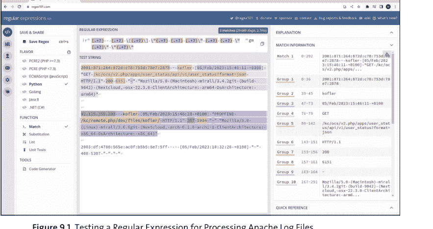

多年来，我已经内化了最重要的正则表达式字符，但对于细节，我必须一遍又一遍地阅读。在这种情况下，一个有用的工具是“速查表”，它将最重要的代码总结在一页上，你可以打印出来，例如以下这些：

- https://github.com/shadowbq/Cheat-Sheets/raw/master/regex/regular-expressions-cheat-sheet-v2.pdf
- https://jamesbachini.com/resources/REGEXCheatSheet.pdf

> **使用人工智能（AI）编写正则表达式**
> 像 ChatGPT 这样的 AI 工具也理解正则表达式。输入“你能给我一个识别电子邮件地址的正则表达式吗？”会立即返回一个结果，并解释表达式中各个字符的含义。然而，特别是在处理复杂任务时，你应该检查结果是否真的满足你的要求！ChatGPT 喜欢非常自信地呈现解决方案，但可能无法覆盖所有匹配项，或者可能过滤掉太多内容。

## 9.2.5 示例：识别日期

假设你的脚本需要处理国际标准化组织（ISO）格式（yyyy-mm-dd）的日期，无论是作为输入还是来自文件。一个基本可用的简单正则表达式是 `\d{4}-\d{2}-\d{2}`。
日期由八个数字组成，用两个连字符分隔。然而，该模式也接受完全不合理的数据，例如 4375-52-68。只需稍加努力，你就可以相当容易地限定允许的值范围，在这种情况下，年份在 0000 到 2999 之间，月份在 01 到 12 之间，日期在 0 到 31 之间。以下表达式并不完美，但至少可以防止完全的输入错误：

```
[012]\d{3}-(0[1-9]|10|11|12)-([012]\d|30|31)
```

## 9.2.6 示例：识别 IPv4 地址

对于 IPv4 地址，你也可以或多或少地精确。要从日志文件中提取 IP 地址（反正日志文件中只包含正确的地址），以下表达式就足够了：

```
(\d{1,3}\.){3}\d{1,3}
```

- `\d{1,3}` 要求一个 1 到 3 位的数字。
- `\.` 要求一个点。不要忘记前面的 `\` 字符。仅 `.` 会匹配任何字符！
- `(...){3}` 使此表达式重复三次，因此对于 IP 地址 1.2.3.4，它会捕获“12.3.”。注意，`{4}` 是错误的，因为 IP 地址必须以点结尾。
- 现在，还缺少最后一位数字的 `\d{1,3}`。

更精确的表达式（仅接受每个数字在 0 到 255 的范围内）可以在 https://stackoverflow.com/questions/5284147 找到。

## 9.2.7 示例：识别电子邮件地址

为了粗略检查电子邮件地址是否正确，你可以使用以下表达式：

```
[a-zA-Z0-9+_.-]+@[a-zA-Z0-9.-]+
```

在这种情况下，完美主义者也会在 Stack Overflow 上找到完全难以阅读的模式，然而，这些模式考虑了所有可以想象的规则和特殊情况。

## 9.3 Bash 中的正则表达式（grep, sed）

你现在应该理解了正则表达式的基本原理。让我再次指出，在上一节中，我只概述了最重要的语法规则。有数百页的整本书专门讨论这个主题，涵盖了每一种可以想象的变体。

在本节和接下来的几节中，我们将探讨正则表达式的应用。在这里，我将从 Bash 开始，主要关注 `grep` 和 `sed` 命令。

### 9.3.1 Bash 的正则表达式比较运算符

Bash 和 Zsh 可以在不使用外部工具的情况下，以一种基本的方式处理正则模式。为此，你可以使用 `=~` 比较运算符，它必须在双中括号内使用。

```
if [[ string =~ pattern ]]; then;
    echo "string matches pattern"
fi
```

在这种情况下，使用的是 ERE 模式。因此，你必须使用符合 POSIX 的表达式，例如 `[:digit:]` 或 `[:alnum:]`，而不是简写符号 `\d`（表示*数字*）或 `\w`（表示*单词*）。或者，你可以直接用 `[0-9]` 来表示字符范围。

例如，`=~` 运算符可用于验证输入。在下面的示例中，脚本期望输入格式为 `yyyy-mm-dd` 的日期。如果字符串的格式甚至不符合指定的格式，则必须重复输入。

该表达式期望年份数字在 1900 到 2099 之间，月份在 01 到 12 之间，日期在 00 到 31 之间。请注意，该表达式确实接受一些无效数据，例如 `2000-01-00` 或 `2023-04-31`。

```
# 示例文件 input-date.sh
pattern='^(19|20)[0-9]{2}-(0[1-9]|10|11|12)-([012][0-9]|30|31)$'
while true; do
    read -p "Enter a date in ISO format (yyyy-mm-dd): " date
    if [[ $date =~ $pattern ]]; then
        break
    else
        echo "Invalid date, please try again."
    fi
done
echo "Valid date: $date"
```

### 9.3.2 使用 grep 过滤文本

你已经在第 6 章和第 8 章中了解了 grep 命令。到目前为止，我们一直将此命令用作简单的文本过滤器。然而，实际上，传递给 grep 的第一个参数被分析为正则模式，默认使用简单的 POSIX 语法。但是，该命令也可以处理 ERE 和 PCRE 正则表达式方言：

- `-e`：启用 ERE
- `-P`：启用 PCRE
- `-o` 或 `--only-matching`：仅输出与模式匹配的表达式（即不显示整行）

为避免各种正则表达式特殊字符被 Bash 分析，你应该将模式放在引号中传递。

以下命令从 access.log 日志文件中过滤所有 IPv4 地址，并仅显示地址。（你可以在上一章的示例文件中找到该文件。）

```
$ grep -o -P '(\d{1,3}\.){3}\d{1,3}' access.log

221.245.9.91
135.84.251.52
160.85.252.207
...
```

如果你想以类似的方式提取所有 IPv6 地址，你可以使用以下表达式调用 grep：

```
$ grep -o -P '([\da-f]*:){1,7}\d{1,4}' access.log
```

该搜索模式适用于大多数“常见”的 IPv6 地址。然而，IPv6 语法允许各种特殊情况，正确处理这些情况需要更复杂（且更慢！）的模式。如有必要，你应该查看以下 Stack Overflow 网页：https://stackoverflow.com/questions/53497。

### 9.3.3 “sed” 流编辑器

`sed` *流编辑器*是一个通用的文本处理命令。你在第一个参数中传递一个命令，`sed` 将其应用于标准输入或下一个参数中指定的文件。处理后的文本被写入标准输出。
在 Linux 上常见的 GNU 版本的 `sed` 中，`-i`（*原地*）选项会导致直接修改源文件。`-i.bak` 会创建一个带有 `.bak` 标识符的源文件备份。

> **GNU 与 BSD**
> 例如，在 macOS 上安装的 BSD 版本的 `sed` 中，`-i` 选项具有不同的含义。通常，GNU `sed` 和 BSD `sed` 之间还存在一些其他的小差异。如有必要，你可以使用 `brew` 安装 GNU 版本的 `sed`！

以下入门示例展示了删除命令 `d`。此示例读取 `myfile.txt` 文件，删除第 3 到 5 行，并将所有其他行写入 `out.txt` 文件。

```
$ sed 3,5d myfile.txt > out.txt
```

如果你想向 `sed` 传递多个命令，可以使用 `-e`：

```
$ sed -e 'cmd1' -e 'cmd2' in.txt > out.txt
```

或者，你可以将命令保存在单独的文件中，并使用 `-f` 处理该文件：

```
$ sed -f sedcmds.txt in.txt > out.txt
```

`sed` 也可以处理正则表达式。在这种情况下，默认使用 POSIX 正则表达式。通过等效的 `-E` 或 `-r` 选项，`sed` 也支持 ERE。与 `grep` 不同，遗憾的是没有 PCRE 选项。
在以下命令中，`sed` 搜索以 IPv4 地址开头的行。这些行将被删除。所有其他行存储在 `ipv6.log` 中。搜索模式通常在两个斜杠之间编写。但是，如果你需要在表达式中使用斜杠本身，你可以使用任何其他未出现在其中的字符。但整个表达式必须以反斜杠开头。因此，以下两个命令是等效的：

```
$ sed -E '/^([0-9]{1,3}\.){3}[0-9]{1,3}/d' access.log > ipv6.log
$ sed -E '\@^([0-9]{1,3}\.){3}[0-9]{1,3}@d' access.log > ipv6.log
```

## 9.3.4 使用 sed 进行搜索和替换

`sed` 最重要的命令之一是 `s/pattern/replace/`。该命令将每行中由 `pattern` 识别的表达式替换为 `replace` 字符串。在 `\replace` 中，你可以使用 `\1`、`\2` 来访问 `pattern` 检测到的分组。

此外，该命令允许使用 `/` 以外的其他分隔符，只要这些分隔符不出现在模式中即可，例如 `s:pattern:replace:`。但是，分隔符不需要用反斜杠特别标记。第三个分隔符后面可以跟两个字母（也可以组合使用）：

- `s/ptrn/rpl/g` 表示如果需要，每行执行多次搜索替换操作（`g` 代表 *全局替换*）。
- `s/ptrn/rpl/i` 表示表达式的分析是 *不区分大小写* 的。

要测试一个表达式或 `sed` 命令，最好的方法是结合使用 `echo` 和 `sed`：

```
$ echo "abc ABC" | sed 's/abc/efg/gi'
efg efg
```

## 9.3.5 sed 示例：操作图像文件路径

就个人而言，我非常 *致力于* 我书籍的排版。我大部分文本都用 Markdown 语法编写。各种脚本将它们转换为 LaTeX、HTML 和 PDF 文件。其中，在创建打印文件时，我必须将我的截图和照片（`*.png` 和 `*.jpg` 标识符）替换为出版商优化过的 PostScript 文件（`*.eps` 标识符），这些文件也位于不同的目录中。因此，例如，原始 Markdown 文件包含以下格式的图像引用：

```


```

在我创建打印文件之前，必须重建 Markdown 代码：

```


```

这项繁琐的工作当然由一个脚本来处理，该脚本包含以下 `sed` 命令（以及其他内容）：

```
# 示例文件 preprocess-markdown.sh
cmd="s,\(images-.*/(.*)\.(jpg|png)\),(images-final/\1.eps),"
sed -E "$cmd" text.md > text-final.md
```

因为 `/` 字符出现在 `sed` 命令中，所以我将命令结构化为 `s,pattern,replace,` 格式。正则模式识别结构为 `(images-<aname>/<iname>.jpg|png)` 的表达式，其中 `aname` 是作者名，`iname` 是图像名。该模式被替换为 `(images-final/<iname>.eps)`。

## 9.4 PowerShell 中的正则表达式

由于 PowerShell 的面向对象方法，分析文本的需求比在 Bash 脚本中要少。通常，简单地读取属性就能达到目标。在 Windows 上，用于配置或包含日志数据的文本文件是例外而非规则。尽管如此，PowerShell 也提供了各种正则表达式功能来帮助处理文本。在 PowerShell 中，适用 .NET 框架的正则表达式语法，它与 PCRE 基本兼容。请参阅 `https://learn.microsoft.com/en-us/dotnet/standard/base-types/regular-expression-language-quick-reference`。

### 9.4.1 匹配和替换运算符

使用正则表达式最简单的方法是使用各种 `match` 运算符：`txt -match pattern` 测试指定的模式是否能在文本中被识别。结果是 `True` 或 `False`。

正如 PowerShell 特有的（或者我们应该说，正如微软典型的），它忽略大小写——除非你使用 `-cmatch`（*区分大小写的匹配*）。`-notmatch` 或 `-cnotmatch` 只是 `-match` 的反义，因此你可以测试模式是否 *不* 包含在内。这些 `match` 运算符可以以简单的方式交互式地尝试，这对于快速测试正则表达式的语法是否正确以及是否按预期工作也很有用。

```
> "I love PowerShell" -match "p.*l"
True

> "I love PowerShell" -cmatch "p.*l"
False

> "connection from 127.0.0.1" -match "(\d{1,3}\.){3}\d{1,3}"
True
```

你也可以将 `-match` 应用于文件名或目录名。以下命令在 `C:\Windows` 中递归搜索 `xx-xx` 格式的目录，其中 `x` 是字母或数字。这将返回许多名称如 `de-DE` 或 `en-US` 的目录，这些目录包含本地化文件（即包含特定语言字符串的文件）。

```
> Get-ChildItem C:\windows -Recurse -Directory |
    Where-Object { $_.name -match "^\w\w-\w\w$" }
```

你可以使用 `replace` 运算符对字符串执行搜索和替换操作，如以下示例所示：

```
> $txt = "connection from 127.0.0.1 to 192.168.74.104"
> $txt -replace "(\d{1,3}\.){3}\d{1,3}", "-hidden-"
connection from -hidden- to -hidden-
```

### 9.4.2 Select-String

与 grep 类似，Select-String 将搜索文本作为正则表达式进行分析。我已在第 7 章第 7.2 节详细描述了此 cmdlet。因此，在本章中，正则表达式上下文中的一个示例应该就足够了。

在这个例子中，我想查看 C:\Windows\diagnostics\system 目录。该目录包含各种 PowerShell 脚本，这些脚本由系统首选项的故障排除向导（即 系统 • 疑难解答 • 其他疑难解答程序）调用。以下命令的目标是检索这些文件中定义的所有函数的引用。这个任务相对简单，但结果可能令人困惑：

```
> Set-Location C:\Windows\diagnostics\system
> Get-ChildItem -Filter *.ps1 -Recurse |
    Select-String '^function '
    Apps\RC_WSReset.ps1:7:function Get-FaultyAppsFromEventLogs([... 
    Apps\Utils_Apps.ps1:17:Function Write-ExceptionTelemetry($Fu... 
    Apps\VF_WSReset.ps1:14:function Get-AppContainerEvents([Syst... 
    ...
```

在我的第二次尝试中，我开发了一个更复杂的正则表达式，它捕获 `function <name>`，随后在分组中捕获该函数的参数。然而，这次我不想看到整个结果行，而只想看到 `function <name>`。为此，必须分析 Select-String 返回的匹配对象。`Groups(0)` 返回整行，而 `Groups(1)` 返回第一个正则表达式分组的内容：

```
> Get-ChildItem -Filter *.ps1 -Recurse |
    Select-String '^(function [^(]*)\((.*)\)$' |
    ForEach-Object { $_.Matches.Groups[0].Value }
    function Get-FaultyAppsFromEventLogs
    function Get-CompletedTroubleshooterSessions
    Function Write-ExceptionTelemetry
    ...
```

### 9.4.3 示例：输入验证

以下迷你脚本期望输入 `#ccc` 或 `#cccccc` 格式的颜色代码，其中 `c` 代表一个十六进制数字。例如，红色的正确输入是 `#ff0000`。如果输入不正确，用户必须重试。

```
# 示例文件 input-css-color.ps1
do {
    $color = Read-Host "Enter a CSS color (#ccc or #cccccc)"
} until ($color -match "^#([0-9a-fA-F]{3}){1,2}$")
Write-Host "Valid color code: $color"
```

### 9.4.4 示例：图表列表

在 Markdown 文件中，图表包含如下：

```

```

图像有 PNG 和 JPEG 格式。该脚本应该提取所有图像的文件名：

```
.\extract-images.ps1 text.md
```

```
images-chris/relayboard.png
images-michael/mpd.png
images-charly/L298_Pins.jpg
```

如果你愿意，也可以将输出重定向到文本文件：

```
.\extract-images.ps1 text.md > out.txt
```

该脚本很短：

```
# 示例文件 extract-images.ps1
# 脚本期望文件名作为参数
Param( [string[]] $markdownfiles)

$pattern = '\]\((images-\w+[\/\][\w-]+\.(png|jpg|jpeg))\)'

# 遍历所有文件
foreach ($file in $markdownfiles) {
    # 识别模式，输出模式分组的内容
    Select-String $pattern $file |
        ForEach-Object { $_.Matches.Groups[1].Value }
}
```

正则模式搜索 `](images-<aname>/<iname>.png|jpg|jpeg)`，其中 `<aname>` 是作者名，`<iname>` 是图像名。

让我们详细看看这个表达式的某些部分：

- `[\/\]` 允许 `/` 和 `\` 作为目录分隔符。为了符合正则表达式语法，这两个字符都必须用反斜杠转义。

+   - [\w-]+ 在文件名中接受所有字母、数字、下划线 _ 和连字符 -。请注意，连字符并不包含在 \w 的字符集中！
- 与 PowerShell 中的常规情况一样，`Select-String` 不区分大小写，在这种情况下这是一个优势，因为大写字母的标识符（例如 *.PNG）也会被接受。

我们脚本的第一个变体提供文本输出。你可能想知道输出是在哪里执行的：表达式 `$_.Matches.Groups[1].Value` 返回一个字符串，该字符串被直接输出。`ForEach-Object` 结构中的以下表达式是等效的：

```
Write-Output $_.Matches.Groups[1].Value
```

输出文本的脚本符合 Bash 的思维方式，但没有充分利用 PowerShell 中面向对象的方法。在这个例子中，如果脚本返回 `FileInfo` 对象，效果会更明显。

`extract-images2.ps1` 变体执行的正是这个任务。同样，我只更改了 `ForEach-Object` 结构中的那一行。生成的字符串随后被传递给 `Get-ChildItem`。这个 cmdlet 读取文件并返回一个 `FileInfo` 对象。

```
Get-ChildItem $_.Matches.Groups[1].Value
```

但是，如果你使用示例 `text.md` 文件运行测试，脚本将只返回错误消息：

```
.\extract-images2.ps1 text.md

Cannot find path '...\images-michael\mpd.png' because
it does not exist.
...
```

这个结果是因为示例文件只包含 Markdown 文件，但不包含相关的图像文件。

## 9.5 Python 中的正则表达式（re 模块）

要在 Python 中使用正则表达式，必须导入默认模块 `re`。该模块提供了各种函数，我将在本节中简要介绍其中最重要的几个：

+   - `re.search(pattern, str)` 返回一个 `Match` 对象（包含第一次匹配的位置）或 `None`。模式中定义的组可以使用 `group` 属性进行分析（参见此列表后面的示例代码）。
- `re.match(pattern, str)` 的工作方式类似于 `search`；它只考虑字符串开头的模式。
- `re.fullmatch(pattern, str)` 的工作方式也类似于 search，但现在，模式必须描述从开头到结尾的整个字符串。
- `re.findall(pattern, str)` 返回找到的所有匹配项的列表。与 search、match 和 fullmatch 不同，findall 返回的是匹配的简单字符串，而不是匹配对象。如果模式包含一个组，那么结果字符串指定该组的内容。另一方面，如果模式包含多个组，你将收到一个包含每个组字符串的元组。
- `re.sub(pattern, replace, str)` 用新文本替换所有匹配的模式。

你可以在 https://docs.python.org/3/library/re.html 阅读 re 模块的完整文档。

在 Python 中，最佳实践是将搜索模式表示为原始字符串，格式如下：r'pattern'。这样，你可以避免由反斜杠引起的问题。以下脚本展示了 search 的应用，首先是没有组的搜索模式，然后是带有组的搜索模式：

```
# 示例文件 hello-re.py，不带组的搜索模式
import re
pattern = r'\d{4}-\d{2}-\d{2}'
txt = 'Easter 2024 is on 2024-03-31.'
if result := re.search(pattern, txt):
    print(result.group())          # 2024-03-31
```

在第二个变体中，不带参数的 group 方法返回整个识别的模式。使用 `len(result.groups())` 可以确定存在多少个模式组。然后可以使用 `group(n)` 分析这些组。请注意，`group(0)` 等同于 `group()`，并返回整体结果。

```
# 示例文件 hello-re.py，带组的搜索模式
pattern = r'(\d{4})-(\d{2})-(\d{2})'
if result := re.search(pattern, txt):
    print(result.group())          # 2024-03-31
    print(len(result.groups()))    # 3
    year = result.group(1)
    month = result.group(2)
    day = result.group(3)
    print(year, month, day)        # 2024 12 31
```

### 9.5.1 示例：验证 MAC 地址

在下面的脚本中，你将被提示输入一个用于标识网络设备的媒体访问控制（MAC）地址。MAC 地址是一个 12 位的十六进制数。脚本接受 00-80-41-ae-fd-7e 和 00:80:41:ae:fd:7e 格式的输入（即，两组数字之间用连字符或冒号分隔）。a 到 f 也接受大写字母。

以下是模式的简要说明：必须恰好有两个十六进制数字，后跟 - 或 : 字符。此组在模式中必须出现五次，并且必须后跟两个十六进制数字。

```
# 示例文件 input-mac.py
import re
ok = False
pattern = r'^([a-fA-F0-9]{2}[:-]){5}[a-fA-F0-9]{2}$'
while not ok:
    mac = input('Enter a MAC address: ')
    ok = re.match(pattern, mac)
    if not ok:
        print('Not valid, please try again:')

print('Valid address:', mac)
```

### 9.5.2 示例：匿名化日志文件

在上一章中，我介绍了 `grep`、`sort` 和 `uniq` 的多个使用示例。那里使用的示例文件 `access.log` 是一个真实的 Apache Web 服务器日志文件，但出于隐私原因，我对其进行了匿名化处理。该日志文件使用 Apache Combined Log 格式，描述见 https://httpd.apache.org/docs/2.4/logs.html。

以下清单包含 `anonymize-log.py` 脚本的摘录，你可以在上一章的示例文件目录中找到它。正则表达式由十个组组成，用于识别 Apache Combined Log 格式中一行的组成部分。虽然每行只期望一个匹配项（`result(0)`），但我在此例中使用了 `findall`，这简化了结果的进一步分析。`findall` 提供一个元组，该元组被转换为一个列表。然后，替换一些组成部分，最后再次输出日志行。

```
# 示例文件 anonymize-log.py
# （在上一章的目录中）
# 用法：./anonymize-log.py in.log > out.log
import random, re, string, sys

def randomIPv4(): ...     # 生成随机 IP 地址的函数
def randomIPv6(): ...     # URL 和名称
def randomUrl(): ...
def randomUsername(): ...

# 字典，将随机地址分配给真实 IP 地址
ips = {}

# 用于 Apache Combined Log 格式的 10 组模式
pattern = r'(.+?) - (.+?) \[(.+?)\] "(.+?) (.+?) (.+?)"
          (.+?) (.+?) "(.+?)" "(.+?)"'

# 打开第一个参数传递的文件
with open(sys.argv[1], 'r') as f:
    # 遍历所有行
    for line in f:
        result = re.findall(pattern, line)
        if len(result):
            groups = list(result[0])  # 列表 -> 元组
            # 用随机地址替换 IP 地址
            # 并保存在 ips 字典中
            ip = groups[0]
            if ip not in ips:
                if ':' in ip:
                    ips[ip] = randomIPv6()
                else:
                    ips[ip] = randomIPv4()
            groups[0] = ips[ip]

            # 类似的代码用于名称、URL 等 ...

            # 输出行（标准输出）
            print('%s - %s [%s] "%s %s %s" %s %s "%s" "%s"' %
                  tuple(groups))
```

## 第 10 章
JSON、XML 和 INI

在过去的十年里，JavaScript 对象表示法（JSON）已成为程序或 Web 服务（如 REST API）交换数据时的主流格式。
围绕可扩展标记语言（XML）在 2000 年代的热潮现在已经消退：不仅其相对复杂的语法和许多特殊情况让人难以阅读，而且通过代码分析也很繁琐。但是，即使 XML 在新项目中使用得越来越少，你仍然可能遇到基于 XML 的大量遗留程序和 Web 服务。但我们不仅限于 JSON 或 XML：为了保存一些配置设置，INI 格式也完全足够。
在本章中，我想介绍 PowerShell 和 Python 提供的一些用于创建和处理此类文件的函数。如有必要，这些任务也可以在 Bash 中执行，但你必须使用外部命令，例如 jq 或 xmllint。

> **本章的先决条件**
本章考虑了本书中描述的所有三种脚本语言，这次重点关注 PowerShell 和 Python：这两种语言为 JSON 和 XML 格式提供了出色的支持。本章的一个很好的逻辑后续是第 18 章。

### 10.1 PowerShell 中的 JSON

在 PowerShell 中，两个既简单又强大的 cmdlet 使得处理 JSON 数据变得轻而易举：

+   - **ConvertTo-Json**
  ConvertTo-Json 主要以 `cmdlet | ConvertTo-Json` 格式使用，将 cmdlet 提供的结果对象转换为 JSON 格式的字符串。对象的属性用作 JSON 文档中键值对的键。文档可以通过输出重定向保存到文件。
- **ConvertFrom-Json**
  ConvertFrom-Json 的工作方式正好相反：该 cmdlet 将作为参数传递或通过管道传递的 JSON 字符串转换回 PSObjects 或哈希表，然后可以使用 Select-Object、ForEach-Object 等进一步处理。

以下示例展示了这两个 cmdlet 的一些应用。

## 10.1.1 示例：以 JSON 格式保存事件日志条目

以下命令从事件日志中读取最近十条安全相关的条目，并将其存储到一个 JSON 文件中：

```
> Get-EventLog Security -Newest 10 |
  ConvertTo-Json > security-events.json
```

生成的 *security-events.json* 文件内容如下所示：

```
[
  {
    "EventID": 4799,
    "PSComputerName": "localhost",
    "Index": 308255,
    "Message": "A security-enabled local
              group membership was ...",
    "Source": "Microsoft-Windows-Security-Auditing",
    ...
  },
  {
    "EventID": 4799,
    "PSComputerName": "localhost",
    "Index": 308254,
    ...
  }
]
```

## 10.1.2 示例：分析域名查询

第二个示例涉及分析一个 Web 请求。*https://domainsdb.info* 网站提供了一个相当大（但绝非完整！）的公共注册域名信息数据库。PowerShell 通过 `Invoke-WebRequest` 提供了一种执行 GET 请求的直接方法。（`Invoke-WebRequest` 大致相当于 Linux 命令 `curl` 或 `wget`。）要查找包含 *rheinwerk* 字符串的域名，你可以使用以下命令：

```
> $url =
  "https://api.domainsdb.info/v1/domains/search?domain=rheinwerk"
> Invoke-WebRequest $url
  StatusCode        : 200
  StatusDescription : OK
  Content           : {"domains": [{"domain": "rheinwerk-
                      office.com", "create_date": ...
  ...
```

结果中令人兴奋的部分可以通过 `Content` 属性访问，并且是 JSON 格式。格式化后，文档内容如下（已大幅缩减）：

```
{
  "domains": [
    {
      "domain": "rheinwerk-office.com",
      "create_date": "2022-12-29T13:21:38.809015",
      "A": [
        "87.106.63.234"
      ],
      ...
    },
    {
      "domain": "rheinwerk-publishing.com",
      ...
    }, ... ]
}
```

本示例的目标是从这个相当大的 JSON 文档中仅筛选出 `domain` 和 `A` 属性（即 A 记录条目）。将 JSON 数据转换为 PowerShell 对象后，这个筛选步骤可以非常容易地完成：

```
> (Invoke-WebRequest $url | ConvertFrom-Json).domains |
  Select-Object domain, A

domain                    A
------                    -
rheinwerk-office.com      {87.106.63.234}
rheinwerk-publishing.com  {46.235.24.150}
rheinwerk-verlag.com      {46.235.24.168}
...
```

> **REST API**
`Invoke-WebRequest` 和 `ConvertFrom-Json` 组合的替代方案是 `Invoke-RestMethod` 命令，我将在第 18 章介绍。该命令可将 JSON 文档直接转换为 PowerShell 对象。

## 10.1.3 示例：在 CSV 和 JSON 之间转换

将逗号分隔值（CSV）文件转换为 JSON 格式是小菜一碟。唯一的要求是 CSV 文件的第一行包含列标签。本示例的起点是 *employees.csv* 文件，其中包含以下信息：

```
FirstName;LastName;DateOfBirth;Street;Zip;City;...
Ruthanne;Summers;1977-06-04;4 Dewy Turnpike;27698;Clifton ...
...
```

`Import-Csv` 将文件转换为 PowerShell 对象；`ConvertTo-Json` 将其转换为 JSON 文档：

```
> Import-Csv -Delimiter ';' employees.csv |
  ConvertTo-Json > employees.json
```

默认情况下，`ConvertTo-Json` 会处理 JSON 文档的易读缩进。如果生成的文件的可读性不是问题，你可以传递额外的 `-Compress` 选项。随后的 `Get-ChildItem` 证明节省的空间相当可观。

```
> Import-Csv -Delimiter ';' employees.csv |
  ConvertTo-Json -Compress > employees-compressed.json
```

```
> Get-ChildItem *.json | Select-Object Name, Length
```

| Name | Length |
| --- | --- |
| employees-compressed.json | 122528 |
| employees.json | 165030 |

从 JSON 转换回 CSV 同样简单，如下例所示：

```
> Get-Content .\employees-compressed.json | ConvertFrom-Json |
  Export-Csv employees2.csv
```

## 10.2 JSON 与 Python

Python 和 JSON 共同组成了一个梦幻组合。要处理 JSON 文档，你必须导入 `json` 模块。该模块是 Python 的默认组件，无需单独安装。该模块提供以下函数：

- **load(filehandle)**
  此函数读取先前通过 `open` 打开的文本文件，并将其包含的 JSON 数据作为 Python 字典和列表返回。
- **loads(str)**
  从 *load string* 的意义上讲，此函数期望参数传递的字符串中包含 JSON 文档。
- **dump(obj, filehandle)**
  此函数将第一个参数传入的 Python 对象作为 JSON 字符串存储在指定文件中。一些额外的参数允许你影响生成的 JSON 文档。`indent=2` 指定每个嵌套级别的所需缩进深度。`ensure_ascii=False` 确保正确处理 UTF-8 字符。
- **dumps(obj)**
  此函数的工作方式类似于 `dump`，但将 JSON 文档作为字符串返回。

以下代码清单展示了这四个方法的应用：

```
# 示例文件 hello-json.py
import json

# 读取 JSON 文件
with open('employees.json', 'r') as f:
    employees = json.load(f)

# 处理 JSON 字符串
txt = '{"key1": "value1", "key2": "value2"}'
data = json.loads(txt)

# 分析数据
print(data['key2'])   # 输出: value2

# 将 Python 对象（列表、字典）保存为 JSON 文件
with open('otherfile.json', 'w') as f:
    json.dump(data, f, indent=2, ensure_ascii=False)

# 输出 JSON 字符串
print(json.dumps(data, indent=2, ensure_ascii=False))
```

### 10.2.1 示例：收集生日

`birthdays.py` 脚本的起点是 `employees.json` 文件，其结构如下：

```
[
  {
    "FirstName": "Ruthanne",
    "LastName": "Ferguson",
    "DateOfBirth": "1977-06-04",
    ...
  }, ...
]
```

*birthdays.py* 脚本读取 JSON 文件并循环处理员工。在此过程中，会创建一个字典。键是生日的月份和日期（例如 06-24）。实际条目包含一个员工姓名列表，这些员工的生日在该日期。

```
# 示例文件 birthdays.py
import json
with open('employees.json') as f:
    employees = json.load(f)

birthdates = {}  # 生日字典
for employee in employees:
    # [5:] 跳过前五个字符，只取月份和日期
    birthdate = employee['DateOfBirth'][5:]
    name = employee['FirstName'] + ' ' + employee['LastName']
    if birthdate in birthdates:
        # 将姓名添加到现有列表
        birthdates[birthdate].append(name)
    else:
        # 创建新的字典条目，值为列表
        birthdates[birthdate] = [name]

# 测试：所有在 1/24 过生日的人
# 输出: ['Nannette Ramsey', 'Allena Hoorenman',
# 'Arden Lit', 'Duncan Noel']
print(birthdates['01-24'])
```

### 10.2.2 示例：确定节假日

在 https://calendarific.com 网站免费注册用户后，你将收到一个 API 密钥，该密钥允许你确定给定国家和年份的节假日以及任何其他可想象的纪念日，例如，使用以下命令：

```
$ curl 'https://calendarific.com/api/v2/holidays?api_key=1234&country=DE&year=2023'
```

结果是一个 JSON 文档，其结构如下：

```
{
    "meta": {
        "code": 200
    },
    "response": {
        "holidays": [
            {
                "name": "Name of holiday",
                "description": "Description of holiday",
                "date": {
                    "iso": "2023-12-31",
                    "datetime": { ... }
                },
                "type": [ ... ]
            }, ...
        ]
    }
}
```

我们的示例 *holidays.py* 脚本期望两个可选参数：国家代码和年份。如果缺少此信息，脚本默认使用 'US' 和当前年份。然后脚本执行请求，分析结果，并以以下格式返回结果：

```
$ ./holidays.py DE 2023
Holidays for DE in 2023
2023-01-01: New Year's Day
    New Year's Day, which is on January 1, ...
2023-01-06: Epiphany
    Epiphany on January 6 is a public holiday in 3 German states
    and commemorates the Bible story of the Magi's visit to
    baby Jesus.
...
```

> **限制**
使用 https://calendarific.com 在简单注册后是免费的，但受各种限制。商业用途仅在支付月费后才被允许。

该脚本以导入各种模块和初始化 api_key、country 和 year 变量开始。一个循环分析传递给脚本的所有参数，并在必要时覆盖 year 或 country。

```
# 示例文件 holidays.py
import datetime, json, sys, urllib.request

# 请使用你自己的密钥，你可以在
# https://calendarific.com 免费获取。
api_key = "xxx"
```

## 10.3 Bash 中的 JSON

Bash 不包含任何内置的 JSON 函数。但是，`jq` 命令（*jq* 代表 *JSON query*）在大多数 Linux 发行版中都可用。如果命令执行时出现 *command not found* 错误信息，你必须安装 `jq` 命令。在 Ubuntu 上，可以使用 `sudo apt install jq` 来完成此步骤。

`jq` 从标准输入或作为参数传递的文件中读取 JSON 文档。然后，该命令对文档应用过滤器表达式，并将结果写入标准输出。最简单的应用是以可读的方式格式化 JSON 文档。对于此任务，你只需指定一个点（`.`）作为过滤器表达式：

```
$ echo '{"key1":"123","key2":"456"}' | jq .
{
  "key1": "123",
  "key2": "456"
}
```

以下示例的基础是 *commits.json* 文件，该文件包含大约 1,400 行。这些数据来自 GitHub 事件日志，该日志以 JSON 格式公开提供。我使用了与 Bernd Öggl 合著的《Docker: Practical Guide for Developers and DevOps Teams》（Rheinwerk Computing, 2023）中的一个仓库作为数据库：

```
$ curl 'https://api.github.com/repos/docker-compendium/samples/commits' > commits.json
```

该 JSON 文件仅由一个提交数据数组组成。在 `jq` 中，你可以使用 `.[ ]` 访问整个数组，使用 `.[0]` 访问第一个元素（最新的提交）。

```
$ jq '.[0]' commits.json
{
  "sha": "8b17e24e278cd594456db77abbefe4190ac1d88",
  "node_id": "C_kwD",
  "commit": {
    "author": {
      "name": "Michael Kofler",
      ...
}
```

你可以使用 .keyname 访问单个数据元素：

```
$ jq '.[0].commit.author.name' commits.json
"Michael Kofler"
```

谁执行了多少次提交？

```
$ jq '.[].commit.author.name' commits.json | sort | uniq -c
11 "Bernd Oeggl"
7 "Michael Kofler"
```

下一个命令列出所有提交消息：

```
$ jq '.[].commit.message' commits.json
"Update README.md"
"add k8s sample code files"
"add swarm sample code"
...
```

允许在过滤器表达式中使用管道运算符（|）。在下面的表达式中，我们将从每个列表项中提取两个属性，为它们赋予新名称，并使它们成为新的 JSON 元素：

```
$ jq '.[] | {date: .commit.author.date,
            msg: .commit.message}' commits.json
{
  "date": "2023-01-22T06:40:14Z",
  "msg": "Update README.md"
}
{
  "date": "2023-01-21T20:50:32Z",
  "msg": "add k8s sample code files"
}
...
```

然而，结果本身不是一个有效的 JSON 文档。要使其有效，你必须使用方括号将其包装在数组中：

```
$ jq '[ .[] | {date: .commit.author.date,
                msg: .commit.message} ]' commits.json
[
  {
    "date": "2023-01-22T06:40:14Z",
    "msg": "Update README.md"
  },
  ...
]
```

通过使用 `select`，你可以制定条件。以下命令创建一个包含 Bernd Öggl 提交的新 JSON 文档：

```
$ jq '[ .[] | select (.commit.author.name=="Bernd Oeggl") ]' >
  bernds-commits.json
```

有关使用 `jq` 语法的更多示例，请参阅教程；有关众多函数的全面参考，请参阅以下手册：

- https://stedolan.github.io/jq/tutorial
- https://stedolan.github.io/jq/manual

### 10.3.1 使用 fx 交互式查看 JSON 文件

当然，你可以使用 `less` 浏览 JSON 文件。但一种更舒适的方法是使用 `fx` 命令，不过首先需要通过访问 https://github.com/antonmedv/fx 来安装它。

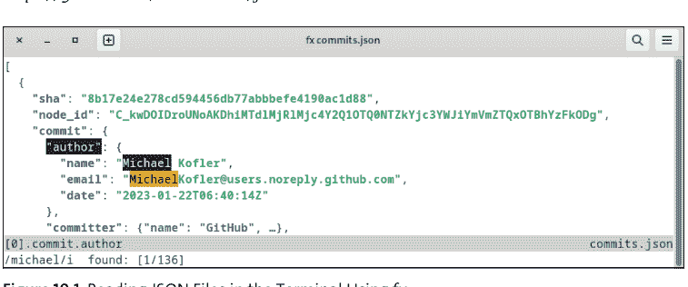

安装后，你可以通过 `fx myfile.json` 或 `cmd | fx` 打开 JSON 文档，使用 ← 和 → 打开和关闭 JSON 组，使用 `/` 搜索文本等等。JSON 文档格式整齐；键和条目会高亮显示。简而言之，当你使用 fx 时，在终端中读取或分析大型 JSON 文件会变成一种享受。按 `q` 键终止程序。

## 10.4 PowerShell 中的 XML

微软在 Windows 上全面押注 XML，这就是为什么 Windows 系统中存在大量 XML 文件。在我的 Windows 11 测试机上，仅在 C:\Windows 中就遇到了大约 1,500 个带有 *.xml 标识符的文件。即使是相当“普通”的 Microsoft Office 文件（如 *.docx）也使用 XML 内容。（严格来说，Microsoft Office 文件是 ZIP 存档，而 ZIP 存档又包含 XML 文件。）总之，XML 是 Windows 上无处不在的格式。

### 10.4.1 XML 数据类型

PowerShell 通过其自己的数据类型支持 XML。读取 XML 文件时，你必须在变量前加上方括号中的数据类型，以便 PowerShell 能够清楚地看到你不想将文件视为普通文本，而是以 XML 格式查看。

```
> [xml]$tmz = Get-Content `
    "C:\Windows\Globalization\Time Zone\timezoneMapping.xml"
```

此示例中使用的文件包含有关时区的信息。（如果你不运行 Windows，可以在本书的示例文件中找到此文件。）此文件具有以下结构：

```
<?xml version="1.0" encoding="UTF-8"?>
<TimeZoneMapping GeneratedAt="2022-11-08T09:34:04.6992291+05:30">
  <MapTZ TZID="Etc/GMT+12" WinID="Dateline Standard Time"
          Region="001" Default="true" StdPath="GMT+12/standard"
          DltPath="GMT+12/daylight" />
  <MapTZ TZID="Etc/GMT+12" WinID="Dateline Standard Time"
          Region="ZZ" ... />
  ...
```

你可以通过属性访问 XML 结构的元素：

```
> $tmz.TimeZoneMapping.MapTZ[0]
    TZID    : Etc/GMT+12
    WinID   : Dateline Standard Time
    Region  : 001
    Default : true
```

## 10.4.2 Select-Xml

Select-Xml 将 XPath 表达式应用于 XML 文档。XPath 是一种标准化的 XML 查询语言，本书将不再进一步讨论。如有需要，你可以在维基百科上找到其语法的良好概述，并在互联网上找到无数使用示例。

XML 文档可以选择从文件读取（`-Path` 选项）、通过字符串传递（`-Content`）或作为 XML 对象传递（`-Xml`）。因此，以下三个 Select-Xml 示例是等效的，每个示例都返回文件中 `MapTZ` 标签的数量。请注意，当将 XML 文件读入字符串时，必须使用 `Get-Content` 并配合 `-Raw` 选项。此选项使整个文件作为一个对象处理，而不是作为行数组处理。

```
> [xml]$tmz = Get-Content `
    "C:\Windows\Globalization\Time Zone\timezoneMapping.xml"
```

```
> $str = Get-Content -Raw `
    "C:\Windows\Globalization\Time Zone\timezoneMapping.xml"
```

```
> $xpath = "/TimeZoneMapping/MapTZ"

> (Select-xml -XPath $xpath -Path .\timezone-mapping.xml).Count
> (Select-Xml -XPath $xpath -Content $tmz ).Count
> (Select-Xml -XPath $xpath -Xml $tmz).Count
616
```

第二个示例确定第 58 个 `MapTZ` 标签中 `WinID` 属性的文本。计数从 0 开始。`Select-Xml` 返回 `SelectXmlInfo` 对象，其默认表示在输出中并非特别有用。只有 `Select-Object -ExpandProperty Node` 才能返回属性的实际文本。

```
> Select-Xml "/*/MapTZ[57]/@WinID" -Xml $tmz

Node Path Pattern
---- ---- -------
WinID InputStream /TimeZoneMapping/MapTZ[57]/@WinID
```

```
> Select-Xml -Xml $tmz -XPath $xpath |
    Select-Object -ExpandProperty Node

#text
-----
Mountain Standard Time
```

第三个示例涉及描述 *Oracle VM VirtualBox* 虚拟机的 `*.vbox` 文件。尽管标识符是 `*.vbox`，但这些文件是普通的 XML 文件。

```
<?xml version="1.0"?>
<VirtualBox xmlns="http://www.virtualbox.org/" version="...">
    <Machine uuid="{c197c895-7b0c-4fa3-a05b-165377b33232}" ...>
        <MediaRegistry>
            <HardDisks>
                <HardDisk uuid="..." location="kali-english.vdi"
                         format="VDI" type="Normal"/>
                ...
            </HardDisks>
```

然而，你最初尝试分析这些文件可能会惨败。`Select-Xml` 只是返回一个空结果，没有任何警告或错误消息：

```
> Select-Xml './/HardDisk/@location' kali.vbox
```

失败的原因是 XML 文件引用了一个命名空间。在这种情况下，只有一个默认命名空间（`xmlns`），但有些 XML 文件甚至使用多个命名空间（`xmlns:name`）。要处理此类文件，你必须向 `Select-Xml` 传递一个哈希表，该哈希表为每个命名空间分配一个前缀。对于默认命名空间，通常使用 `ns`，但允许使用任何字符串，`xmlns` 除外。随后，你还必须在 XPath 表达式中指定前缀。以下命令提取虚拟机的镜像文件名：

```
> $vbnamespace = @{ns = "http://www.virtualbox.org/"}

> Select-Xml './/ns:HardDisk/@location' -Namespace $vbnamespace `
  kali.vbox | Select-Object -ExpandProperty Node

kali-install.vdi
```

第二个示例扫描所有虚拟机以查找活动的网络适配器，并返回包含 `.vbox` 文件名和所用 MAC 地址的对象。这里使用 `Split-Path` cmdlet 的 `-Leaf` 选项从路径中提取文件名。

```
> Select-Xml './/ns:Network/ns:Adapter' `
    -Namespace $vbnamespace *.vbox |
  Where-Object { $_.Node.enabled -eq 'true' } |
  ForEach-Object {
    [PSCustomObject]@{path = Split-Path $_.Path -Leaf;
                      mac = $_.Node.MACAddress}
  }
path                    mac
----                    ---
kali-2022.vbox          080027DB966A
kali.vbox               0800278EB571
metasploitable2.vbox    080027E770F0
ubuntu.vbox             0800278556EA
```

## 10.4.3 ConvertTo-Xml、Export-Clixml 和 Import-Clixml

最后，我想简要介绍三个用于 PowerShell 对象和 XML 文档之间转换的 cmdlet：

- **ConvertTo-Xml**
  `ConvertTo-Xml` 将 PowerShell 对象转换为 XML 数据类型：

  `$myxmlvar = Get-Date | ConvertTo-Xml`

  请注意，没有具有反向功能的*官方* `ConvertFrom-Xml` cmdlet。但是，如果你在互联网上搜索 `ConvertFrom-Xml`，你会遇到社区提供的各种 cmdlet，它们从 XML 文档中组装一个尽可能对应的 `PSCustomObject`。

- **Export-Clixml**
  `Export-Clixml` 将 PowerShell 对象保存到符合公共语言基础设施（CLI）标准的 XML 文件中：

  `Get-Date | Export-Clixml 'date.xml'`

- **Import-Clixml**
  对应的 cmdlet 读取文件并从中创建相应的 PowerShell 对象：

  ```
  $olddate = Import-Clixml 'date.xml'
  ```

## 10.5 XML 和 Python

Python 有各种官方（甚至更多外部）XML 库。这些模块针对不同的应用目的进行了优化，例如，用于特别高效地处理大型文件、用于最安全地分析 XML 文件，或用于创建你自己的 XML 文档。以下页面提供了良好的概述：

- https://docs.python.org/3/library/xml.html
- https://realpython.com/python-xml-parser

本节重点介绍默认随 Python 一起分发的 `xml.etree.ElementTree` 模块。该模块易于使用，非常适合分析 XML 文档。以下几行展示了如何读取 XML 字符串或 XML 文件并访问 XML 文档的根元素：

```
import xml.etree.ElementTree as ET
# read XML file ...
root = ET.parse('filename.xml').getroot()

# ... or process XML from string
s = '<?xml ...>...'
root = ET.fromString(s)
```

`root` 是 `Element` 类的一个对象，具有以下特征：

- tag：当前 XML 标签的名称
- text：标签中的文本（但不包括子元素）
- attrib：包含 XML 标签键的字典

`Element` 的所有子元素都可以直接循环。循环变量本身也包含 `Element` 对象：

```
for sub in e:  # loop through all sub-elements
```

或者，你可以直接访问第 n 个元素：

```
sub = e[3]      # 4. Sub-element (the count starts with 0)
```

如果你想处理当前级别上所有具有特定名称的 XML 元素，可以使用 `findall` 方法：

```
# traverse all <tagname> elements on the current level
for sub in e.findall('tagname'):
```

如果你只想处理第一个匹配的子元素，你可以省略通过 `findall` 的循环，而改用 `find`。但是请注意，如果找不到匹配的元素，以下语句将抛出错误：

```
# access the first <tagname> element
sub = e.find('tagname')
```

另一方面，如果你想搜索 XML 文档所有级别的元素，你应该使用 `iter` 方法，如以下示例所示：

```
# traverse all <tagname> elements on all levels
for sub in e.iter('tagname'):
```

如果 XML 文件使用命名空间，你必须向 `find` 或 `findall` 传递一个包含所有使用命名空间缩写的字典。这些标签名称必须以相同的缩写为前缀。请看以下第三个示例，它演示了此过程。

### 10.5.1 示例：为国家代码创建字典

这个速成课程对于大多数用例已经足够了。我们第一个示例的起点是 `countries.xml` 文件，其结构如下：

```
<countries>
  <country code="AF" iso="4">Afghanistan</country>
  <country code="AL" iso="8">Albania</country>
  <country code="DZ" iso="12">Algeria</country>
  ...
</countries>
```

以下脚本的目标是创建一个字典，并在此过程中使用国家代码作为键：

```
# Sample file read-countries.py
import xml.etree.ElementTree as ET
root = ET.parse('countries.xml').getroot()
countries = {}  # empty dictionary
for country in root:
    countries[country.attrib['code']] = country.text

print(countries['CH'])   # output: Switzerland
```

## 10.5.2 示例：分析 RSS 订阅源

许多网站提供通过 *富站点摘要订阅源（RSS 订阅源）* 快速访问最新文章的选项。例如，BBC 世界新闻网站的 RSS 订阅源可在 http://feeds.bbci.co.uk/news/world/rss.xml 找到。

生成的文件具有以下结构（已大幅简化）：

```xml
<?xml-stylesheet ... ?>
<rss xmlns:dc="http://purl.org/dc/elements/1.1/"
    xmlns:content="http://purl.org/rss/1.0/modules/...">
  <channel>
    <title><![CDATA[BBC News - World]]></title>
    <lastBuildDate>Thu, 23 Feb 2023 11:02:41 GMT</lastBuildDate>
    <copyright>....</copyright>
    <item>
      <title><![CDATA[Gaza-Israel exchange of fire ...]]></title>
      <link>https://www.bbc.co.uk/news/world-...</link>
      <pubDate>Thu, 23 Feb 2023 09:22:38 GMT</pubDate>
    </item>
    <item>
      ...
    </item>
  </channel>
</rss>
```

该脚本的目标是显示最新 10 篇文章的标题和链接，如下例所示：

```
$ ./read-bbc-news.py

* Gaza-Israel exchange of fire follows deadly West Bank raid
  https://www.bbc.co.uk/news/world-middle-east-64742259
* Selfie image shows US pilot flying over Chinese 'spy balloon'
  https://www.bbc.co.uk/news/world-us-canada-64735538
...
```

所需代码如下所示：

```python
# Sample file bbc-world-news.py
import xml.etree.ElementTree as ET
import urllib.request

url = 'http://feeds.bbci.co.uk/news/world/rss.xml'
response = urllib.request.urlopen(url)
binary = response.read()       # binary data
txt = binary.decode('utf-8')   # convert to UTF-8 text
root = ET.fromstring(txt)      # RSS root tag
cnt = 0
for item in root.iter('item'): # loop through all items
    print('*', item.find('title').text)
    print(' ', item.find('link').text)
    cnt += 1
    if cnt >= 10:
        break
```

## 10.5.3 示例：从虚拟机文件中提取 MAC 地址

如第 10.4 节前面所述，以下 Python 脚本也从作为参数传递的 *.vbox 文件中提取 MAC 地址：

```
$ ./vbox-mac.py vbox/*.vbox

kali-2022.vbox: MAC=080027DB966A
kali-english.vbox: MAC=080027B8A33A
...
```

由于 *.vbox 文件使用了命名空间，因此不能使用 `iter` 方法。相反，使用 `find` 和 `findall` 方法，每个方法都传递一个包含命名空间前缀的字典作为附加参数：

```python
# Sample file vbox-mac.py
import os, sys
import xml.etree.ElementTree as ET
namesp = { 'ns': 'http://www.virtualbox.org/'}
for xmlfile in sys.argv[1:]:
    basename = os.path.basename(xmlfile)
    root = ET.parse(xmlfile).getroot()
    machine = root.find('ns:Machine', namesp)
    hardware = machine.find('ns:Hardware', namesp)
    network = hardware.find('ns:Network', namesp)
    for adapter in network.findall('ns:Adapter', namesp):
        if 'MACAddress' in adapter.attrib:
            print('%30s: MAC=%s' %
                (basename, adapter.attrib['MACAddress']))
```

## 10.6 Bash 中的 XML

Bash 处理 XML 文档的能力并不比处理 JSON 文件强。在这种情况下，一个可能的变通方法是使用外部命令，但这些命令必须单独安装。在 Linux 上，你可以使用发行版的包管理工具，而在 macOS 上，最佳选择是使用 Homebrew。

### 10.6.1 xmllint

`xmllint` 命令以可读的方式显示带有缩进的 XML 文档，并验证其是否符合 XML 语法规则。如果一个 XML 文件根本无法编辑，使用 `xmllint` 进行简短测试是合适的。在 macOS 上，该命令默认安装，但在 Linux 上，该命令根据发行版隐藏在不同的包中：

```
$ sudo apt install libxml2-utils    (Debian, Ubuntu)
$ sudo dnf install libxml2          (Fedora, RHEL)
$ yay -yS libxml2                   (Arch Linux)
```

在最简单的情况下，你将 XML 文件的文件名传递给 `xmllint`。该命令验证 XML 语法，并返回错误消息或原样输出文件。

```
$ xmllint countries-malformed.xml

countries-malformed.xml:6: parser error: Opening and ending tag
mismatch: country line 4 and countries </countries>
countries-malformed.xml:7: parser error : Premature end of data
in tag country line 4
```

你也可以选择根据 *文档类型定义*（DTD）或 *XML 架构定义*（XSD）来验证 XML 文件。你可以使用 `--format` 正确缩进语法正确的 XML 文件以提高可读性：

```
$ xmllint --format countries-unformatted.xml

<?xml version="1.0"?>
<countries>
  <country code="AF" iso="4">Afghanistan</country>
  ...
```

最后，你也可以使用 `xmllint` 处理 XPath 表达式，如下例所示：

```
$ xmllint --xpath '/*/MapTZ[57]/@WinID' timezone-mapping.xml

WinID="Mountain Standard Time"
```

要将 `xmllint` 用作过滤器，你必须传递一个单独的减号作为参数，例如，在以下代码中：

```
$ curl -s <url> | xmllint - --format
```

> **不兼容命名空间**
`xmllint` 中的 XPath 表达式只有在 XML 文档不使用命名空间时才能正确解析。尽管你可以在互联网上找到关于如何绕过此限制的说明，但使用另一个工具是更好的方法。一个选择是 `xmlstarlet`，我将在接下来描述它。

### 10.6.2 XMLStarlet

在 Linux 和 macOS 上，`xmlstarlet` 包提供 `xmlstarlet` 命令或简称为 `xml`（例如，在 Arch Linux 上）。此包提供的编辑选项比 `xmllint` 多得多，特别是对于修改 XML 文档。然而，该项目已经停止，当前版本自 2014 年以来未更新。

在此，我将仅描述用于分析 XPath 表达式的 `sel` 子命令。以下命令首先为 `*.vbox` 文件中的默认命名空间定义 `ns` 缩写。`-t -v 'xpath'` 将指定的 XPath 表达式应用于 XML 文件并输出结果值（`-v` 表示值）。`-n` 在输出中添加换行符。

```
$ xmlstarlet sel -N ns='http://www.virtualbox.org/' \
    -t -v './/ns:HardDisk/@location' -n vbox/*.vbox

Kali-Linux-2022.2-virtualbox-amd64-disk001.vdi
kali-english.vdi
...
```

你可以通过 `xml sel --help` 找到关于 `xml sel` 相当不直观的语法的信息。更多文档可在 https://xmlstar.sourceforge.net/docs.php 找到。

## 10.7 INI 文件

INI 文件是用于存储键值对的文本文件。INI 文件可以使用 `[section]` 划分为不同的部分：

```ini
; File config.ini
[server]
hostname = example.com
port = 8080

[data]
imagePath = /mnt/images
dbName = mydb
```

INI 文件通常用于存储配置数据。只有分号用于标记注释。然而，特别是在 Linux 环境中，`#` 也大多被接受。

### 10.7.1 Python

在 Python 中读取 INI 文件最简单的方法是使用 `ConfigParser` 模块。以下清单展示了直观的应用。请注意，解析器总是返回字符串。如果你想将端口号 8080 用作数字，你必须使用 `int()` 执行相应的转换。

```python
# Sample file read-config.py
from configparser import ConfigParser
config = ConfigParser()
config.read('config.ini')
print(config['server']['port'])  # output: 8080
```

### 10.7.2 PowerShell

尽管 INI 文件在 Windows 上相当常用，但 PowerShell 缺乏一个可以轻松读取此类文件的 cmdlet。在许多情况下，你可以简单地使用以下命令：

```powershell
> $config = Get-Content 'config.ini' |
    Select-String '^.*=.*[^=]*$' |
    ConvertFrom-StringData

> $config.port
8080
```

`Get-Content` 读取文件并逐行提供。`Select-String` 使用正则表达式过滤出所有匹配 `key = value` 模式的行。`ConvertFrom-StringData` 将键值对转换为哈希表。

然而，当在不同组中使用相同的键时，这种简单的方法就达到了极限。如果你想分析复杂的 INI 文件而不陷入语法陷阱，最好使用流行的 PsIni 扩展，可在 https://www.powershellgallery.com/packages/PsIni 获取。

### 10.7.3 Bash

与 PowerShell 一样，Bash 缺少解析 INI 文件的功能。在许多 Linux 发行版中，你可以使用 `crudini` 来实现此目的。但是，你必须事先安装同名的包。但是，请注意，此包本身就是一个 Python 脚本！因此，`crudini` 只有在安装了 Python 的情况下才能工作。

要读取单个值，你可以简单地传递 INI 文件、节名和键名。你可以在 `crudini --help` 中找到各种其他类型的应用。

```
$ crudini --get config.ini server port
8080
```

## 第11章
自动运行脚本

许多脚本旨在自动化管理任务，例如运行备份、上传已更改/新文件、监控和记录服务器。本章描述了定期自动运行脚本的方法。我将主要关注两个过程：用于Linux的*cron*和Microsoft Windows任务计划程序。我还将简要讨论跟踪文件系统“实时”变化并立即响应的机制。

> **本章先决条件**

脚本的自动化与脚本语言的选择无关。在这方面，你可以很大程度上独立于本书的其他部分阅读本章。如果你对Linux系统管理有一些先验知识，那么关于cron的11.1节会更容易理解。特别是，你必须能够使用文本编辑器修改系统文件。

本章介绍的示例借鉴了前面章节的工作技术，例如使用`curl`命令（参见第8章）或分析XML文件（参见第10章）。

本章的一个很好的后续是第15章，你将在那里找到本章介绍的方法的更多应用示例。

## 11.1 cron

cron是一个在几乎所有Linux服务器上运行的后台程序。它的任务是在固定时间启动命令或脚本，例如，每天凌晨3:00或每周日晚上11:00。cron由`/etc/crontab`文件控制，我稍后会解释其有些奇怪的语法。

cron在许多Linux发行版上是默认安装的。如果你的系统上不存在`/etc/crontab`文件，你可以轻松解决这种情况：

```
$ sudo apt update && sudo install cron          (Debian, Ubuntu)
$ sudo dnf install cronie && \
    sudo systemctl enable --now crond            (Fedora, RHEL)
```

### 11.1.1 /etc/crontab

以下行显示了crontab文件的摘录：

```
# File /etc/crontab
# every day at 3:00 am: Backup
0 3 * * * root /etc/myscripts/backup.sh
# on the first day of each month at 0:00:
# statistical analysis of login data
0 0 1 * * root /etc/myscripts/statistics.py
```

crontab文件逐行描述要执行的命令，其中每个条目由七列组成：

分钟 小时 日期 月份 星期 用户 命令

- 分钟：0-59
- 小时：0-12
- 日期：1-31
- 月份：1-12
- 星期：0-7（0 = 7 = 星期日，1 = 星期一，等等）
- 用户：应执行脚本的账户（通常是root）
- 命令：要执行的命令，通常只是脚本的路径

以#开头的行是注释。crontab文件的最后一行必须以换行符结尾。crontab文件的前五列适用以下语法规则：

- 枚举：7,9,12（无空格！）
- 范围：3-5
- 始终：*
- 所有n：*/10 对应 0,10,20,30...

这些列通常通过逻辑与连接。例外情况是指定了日期和星期；那么，这两列适用逻辑或。命令既在每月的第n天执行，也在指定的星期几执行。

以下列表包含一些语法示例。你可以在 https://crontab.guru 验证你自己的cron时间组合。

```
# every 15 minutes
*/15 * * * * root cmd
# daily at 0:15, 1:15, 2:15, etc.
15 * * * * peter cmd
# daily at 1:30
30 1 * * * maria cmd
# every Saturday at 0:29
29 0 * * 6 root cmd
# on every 1st of the month at 6:25
25 6 1 * * www-data cmd
# on the 1st and 15th of the month and every Monday
# always at midnight
0 0 1,15 * 1 root cmd
```

假设cron作业在配置了邮件服务器的机器上执行，输出或错误消息将发送到`root@localhost`。你可以通过在`/etc/crontab`中设置`MAILTO=...`来更改此地址。

> **PATH 和 LANG 的问题**

cron作业应用的`PATH`默认设置与交互模式不同。对`.bashrc`中`PATH`的更改不会被考虑在内。因此，安装在`/usr/bin`或`/usr/sbin`等常用目录之外的命令无法执行！

因此，你应该确保测试你的脚本在由cron启动时是否也能正确执行。如有必要，你必须在脚本中为手动安装的命令指定完整路径，例如，`/usr/local/bin/aws`来运行Amazon Web Services (AWS)客户端。或者，对于某些cron实现，你可以直接在`/etc/crontab`中重新定义`PATH`变量。在那里，你需要指定所有要搜索命令的目录，例如如下：

`PATH=/usr/local/sbin:/usr/local/bin:/sbin:/bin:/usr/sbin:/usr/bin`

另一个可能的错误来源是`LANG`环境变量，它在cron作业中的设置可能与你本地运行脚本时不同。像`PATH`一样在`/etc/crontab`中设置是不可能的。但是，你可以在脚本开头设置`LANG`。

### 11.1.2 个人crontab文件

修改`/etc/crontab`需要系统管理员权限。如果你没有这些权限，你可以修改你自己的`crontab`文件。该文件位于`/var/spool/cron/<user>`或`/var/spool/cron/crontabs/<user>`，具体取决于Linux发行版。

你可以使用`crontab -e`命令打开你的个人crontab文件。默认情况下，此上下文中使用vi编辑器，它并不友好。如果你不小心启动了该程序，你可以通过按`Esc`，输入`":q,"`并按`Enter`而不保存更改来退出。如有必要，你可以在运行`crontab`命令之前通过`EDITOR`变量选择一个更简单的编辑器：

```
$ export EDITOR=/usr/bin/nano
$ crontab -e
```

请注意，在个人*crontab*文件中省略了账户的第六列。命令或脚本始终以你的账户权限执行。此限制是此方法的最大缺点：许多管理任务（如系统范围的备份）需要root权限，无法在“普通”账户中执行。`sudo`在这种情况下也无济于事，因为此命令需要交互式输入你的密码。

### 11.1.3 每小时、每天、每周和每月目录

如果你不关心cron任务执行的确切时间，你可以将要调用的脚本保存在以下目录之一：

- /etc/cron.hourly
- /etc/cron.daily
- /etc/cron.weekly
- /etc/cron.monthly

这种方法的好处是你不需要处理crontab语法。记得使用`chmod +x`将你的脚本文件标记为可执行！你的脚本将以root权限执行。

### 11.1.4 cron的替代方案

在Linux上，*systemd-timer*的使用越来越频繁。与cron相比，systemd-timer的最大优势是启动的任务可以更全面地监控。但这一优势被更高的复杂性所抵消。虽然设置一个cron作业可以在30秒内完成（如果有点经验的话），但定时器作业要求你创建*两个*相对复杂的配置文件。关于该机制的良好描述可以在Arch Linux wiki上找到：https://wiki.archlinux.org/title/Systemd/Timers。此信息也适用于其他发行版。

### 11.1.5 在macOS上自动启动作业

cron在macOS上也可用，但被认为已过时。默认情况下不存在/etc/crontab文件。但是，你只需要创建该文件（例如，使用`sudo nano /etc/crontab`）并插入一个正确的条目；然后，作业将在没有任何进一步配置工作的情况下执行。在这方面，cron是macOS自动化脚本调用的最简单解决方案，直到进一步通知。

Apple建议使用macOS特定的*launchd*程序代替cron。配置通过XML文件完成，其语法在此处有文档记录：

- https://bas-man.dev/post/launchd-instead-of-cron
- https://developer.apple.com/library/archive/documentation/MacOSX/Conceptual/BPSystemStartup/Chapters/ScheduledJobs.html

## 11.2 示例：Web 服务器监控

在这个示例中，我们将使用 `curl` 来测量下载网站首页所需的时间。`curl` 命令的写法如下：

```
time=$(curl --connect-timeout 2 -s -S -w '%{time_total}\n' \
    -o /dev/null  2> /tmp/curl.error \
    https://example.com)
```

该命令的各个组成部分含义如下：

- `--connect-timeout 2` 在 2 秒后中止连接建立尝试。
- `-s` 抑制关于下载进度的状态输出。
- `-S` 允许在偏离此选项时输出错误信息。
- `-w` 将命令的运行时间写入标准输出。此信息最终会存入 `time` 变量。
- `-o` 将下载的 HTML 文件重定向到 `/dev/null`。这个 Linux 特有的伪文件不会存储任何内容。
- `2>` 将错误输出重定向到指定文件。

在脚本中，一个类似的命令会分析 `TMPFILE` 和 `HOST` 变量。`LANG=` 的设置确保 `curl` 和 `date` 以国际化的方式格式化数字和日期。（该命令取消了 `LANG` 变量的设置。）

如果 `curl` 命令以错误代码终止，`cat` 会将错误消息写入标准输出。如果脚本由 cron 执行，此输出会通过电子邮件发送给 `root@localhost`（或 `/etc/crontab` 中 `MAILTO` 指定的其他地址）。因此，如果配置正确，每当网站停止正常工作时，你都会收到电子邮件通知。

另一方面，如果 `curl` 执行时没有错误且未超过超时时间，`echo` 会将所需时间和当前时间保存到 `LOGFILE` 指定的文件中。

```
# 示例文件 webserver-ping.sh
LANG=
HOST=example.com
LOGFILE=/var/log/$HOST-ping-time.log
TMPFILE=/tmp/curl.error

time=$(curl --connect-timeout 2 -s -S -w '%{time_total}\n' \
    -o /dev/null  2> $TMPFILE \
    https://$HOST)

if [ $? -ne 0 ]; then
    # 如果脚本在带有邮件服务器的 Linux 系统上由 cron 运行，
    # 输出将通过邮件发送
    cat $TMPFILE
else
  now=$(date)
  echo "$time sec @ $now" >> $LOGFILE
fi
```

为了每 15 分钟运行一次脚本，我在 `/etc/crontab` 中添加了以下行：

```
# 在 /etc/crontab 中
*/15 * * * * kofler /home/kofler/bin/webserver-ping.sh
```

现在，`kofler` 主目录下 `bin` 子目录中的脚本应该每 15 分钟以 `kofler` 账户的权限执行一次。生成的 `/var/log/example.com-ping-time.log` 文件结构如下：

```
0.347425 sec @ Mon Feb 27 12:30:01 CET 2023
0.347546 sec @ Mon Feb 27 12:45:02 CET 2023
...
```

## 11.2.1 测试与故障排除

与本书中的许多其他示例不同，这个脚本无法在任何计算机上轻松尝试。你需要一个带有 cron 的 Linux 系统，最好还配备邮件服务器。你还必须修改脚本开头的配置变量以适应你自己的需求。如果不以 root 权限运行脚本，必须确保日志文件对脚本可写。如果脚本由 `kofler` 执行，而 `HOST` 和 `LOGFILE` 保持不变，你必须一次性执行以下两个命令：

```
$ sudo touch /var/log/example.com-ping-time.log
$ sudo chown kofler:root /var/log/example.com-ping-time.log
```

一旦脚本可以手动运行且没有错误，下一步就是设置 `/etc/crontab`。对于初始测试，建议的方法是将前五列设置为 `* * * * *`，这将每分钟执行一次脚本。`/etc/crontab` 中的语法错误会阻止你的脚本和其他 cron 任务运行。要追踪此类错误，可以运行 `systemctl status cron` 和 `journalctl -u cron`，它们将为你提供有关当前 cron 状态以及最后日志输出的信息。

## 11.2.2 真正的监控

将这个迷你脚本作为监控解决方案来销售有点大胆。“真正”的监控软件会检查各种服务器参数，仅在每次状态消息时发送警告邮件（而不是在每次错误时，这会导致大量监控邮件），提供被监控参数的图形化可视化等等。当然，你可以想象使用自定义脚本实现所有这些功能，但使用专用的监控工具，如 *Grafana*、*Prometheus*、*Nagios* 等，意义要大得多。尽管这些工具的初始启动可能需要大量工作，但它们提供了丰富的功能以及便捷的用户界面（UI）。

## 11.3 Microsoft Windows 任务计划程序

*Microsoft Windows 任务计划程序* 允许 Windows 在指定时间运行程序和脚本，因此是 cron 的 Windows 对应物。正如你在 Windows 环境中所期望的那样，该程序配备了 UI。然而，说得委婉些，Microsoft Windows 任务计划程序具有 1990 年代的所有魅力。其嵌套的对话框充其量与 `crontab` 语法一样直观。此外，该程序慢得惊人，有时会完全挂起。如果作业启动未能按预期工作，尽管有事件日志记录，也不会显示清晰的错误消息。简而言之，使用这个程序是一种痛苦。为什么微软不能理清头绪并重新实现这个核心的 Windows 组件仍然是个谜。（当前版本自 2006 年以来没有发生重大变化。）

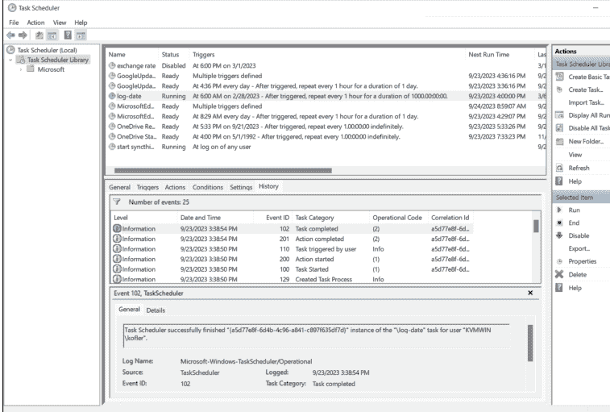

为了熟悉 Microsoft Windows 任务计划程序，让我们创建一个将日期和时间记录到日志文件的小脚本：

```
# 文件 log-date.ps1
Get-Date >> date.log
```

此脚本应每小时执行一次。为此，请打开 Microsoft Windows 任务计划程序，然后在 **操作** 侧边栏中单击 **创建任务** 命令。此步骤将带你进入一个包含多个选项卡的对话框：

- **常规**
  在此选项卡中，你可以为任务命名，指定脚本应在哪个账户下运行（通常是你自己的账户），并指定是仅在登录后启动还是在计算机运行时始终启动。如果要以管理员权限运行脚本，不应更改用户或组，只需单击 **使用最高权限运行** 选项。
- **触发器**
  在此选项卡中，你可以添加新的触发器以指定操作发生的时间和频率。要每小时运行一次脚本，你必须选择 **每天**，以当前时间作为开始时间，并选择 **每小时重复任务** 以及 **持续时间：1 天**。（更合理的设置 **持续时间：无限期** 在我的测试中无效。）与 cron 不同，Microsoft Windows 任务计划程序不仅支持基于时间的触发器，还可以在发生各种事件时执行操作，例如登录时或计算机当前处于空闲模式时。
- **操作**
  作为新操作，你指定要运行的脚本。这个过程比你预期的要繁琐：原因是作为 **程序/脚本**，你不能简单地指定 PowerShell 脚本文件的路径。相反，你需要在此处为 PowerShell 7.n 指定 `pwsh`。只有当你的脚本要由较旧的 Windows PowerShell 5.n 执行时，程序名称才是 `powershell`。在 **添加参数** 输入字段中，指定 `-File` 选项并输入脚本的完整路径。输入时，不得有任何拼写错误。不要忘记 `-File`！默认情况下，脚本运行时活动目录是 `%windir%\System32\`。如果你不想使用此目录（例如，因为脚本应在不同目录中读取或写入文件），则必须在 **起始于** 字段中指定相关目录。对于示例脚本，要将日期和时间记录到脚本文件所在的同一目录中，你必须指定此目录。
- **条件**
  此选项卡默认仅在计算机以网络模式运行时执行操作。如果你还想在笔记本电脑使用电池模式时运行或测试任务，可以停用此选项。

## 11.3.1 故障排除

根据经验，自动化脚本执行并非总能立即成功。出于故障排除的目的，你的第一步应该是在 Microsoft Windows 任务计划程序中启用 **启用所有任务历史记录** 命令。这个描述有些晦涩的功能背后，其实是一个日志记录功能。Microsoft Windows 任务计划程序可以记录操作何时开始、为何开始、何时结束等信息。

你也可以随时使用 **运行** 命令手动启动脚本，无论选定的触发时间是什么。在操作列表的 **下次运行时间** 列中，你可以看到脚本的下一个常规启动时间。

在我的一台测试机上，Microsoft Windows 任务计划程序完全无法找到 `pwsh`，尽管（据推测）`PATH` 设置是正确的。在事件日志中，只记录了 *找不到文件*，但没有明确指出是哪个文件未找到（`pwsh`、脚本还是其他文件？）。最终，我完全卸载了 PowerShell，使用 `winget` 重新安装，然后重启了机器。之后，它就正常工作了。

## 11.3.2 通过 cmdlet 设置任务

幸运的是，Microsoft Windows 任务计划程序也可以通过 cmdlet 进行控制。`Get-ScheduledTask` 会返回一个看似无穷无尽的列表，包含系统中存储的所有操作。如果你曾经好奇为什么 Windows 经常感觉如此迟钝，现在你知道原因了。在我的测试计算机上，该 cmdlet 返回了 165 个活动任务！

Windows 任务管理器 UI 总是只显示特定路径下的操作——默认情况下，是 `\` 路径下的操作，即 *任务库* 根目录下的操作。当你选择一个子目录时，例如 *Microsoft\Windows\Bitlocker*，你可以查看所有其他操作。

```
> Get-ScheduledTask | Where-Object { $_.State -ne 'Disabled' }

TaskPath          TaskName                    State
-------           --------                    -----
\                 GoogleUpdateTaskMachine...  Ready
\                 log date                    Ready
\                 start syncthing             Running
\Microsoft\Windows\...  .NET Framework NGEN v4.0...  Ready
...
```

> **仅限 Windows！**

本节介绍的所有 cmdlet 仅在 Windows 上运行 PowerShell 脚本时可用。在 Linux 和 macOS 上，不存在任务计划程序，但可以使用其他机制（即 cron、systemd-timer 和 launchd）代替，但这些功能无法通过 cmdlet 控制。

`Get-ScheduledTaskInfo` 允许你确定任务上次执行的时间以及下次启动的计划时间：

```
> Get-ScheduledTaskInfo 'log date'
LastRunTime        : 02.28.2023 09:24:24
NextRunTime        : 02.28.2023 11:20:20
NumberOfMissedRuns : 1
...

> Get-ScheduledTask 'log date' | Get-ScheduledTaskInfo
（相同结果）
```

通过组合几个 cmdlet，你甚至可以设置一个新任务。这里 `New-ScheduledTaskTrigger` 创建一个用于计划的对象，`New-ScheduledTaskAction` 创建一个用于任务的对象。`Register-ScheduledTask` 保存新作业。

```
> $trigger = New-ScheduledTaskTrigger -Once -At '6:00am' `
    -RepetitionInterval (New-TimeSpan -Hours 1) `
    -RepetitionDuration (New-TimeSpan -Days 1000)
> $action = New-ScheduledTaskAction -Execute 'pwsh' `
    -Argument '-File C:\Users\kofler\log-date.ps1' `
    -WorkingDirectory 'C:\Users\kofler'
> Register-ScheduledTask -TaskName 'log-date' `
    -Trigger $trigger -Action $action

TaskPath    TaskName    State
--------    --------    -----
\           log-date    Ready
```

## 11.4 示例：保存汇率

欧洲中央银行每天在 https://www.ecb.europa.eu/stats/eurofxref/eurofxref-daily.xml 发布欧元与其他主要货币之间的官方参考汇率。以下示例展示了每日 XML 文件的一个片段：

```
<?xml version="1.0" encoding="UTF-8"?>
<gesmes:Envelope
    xmlns:gesmes="http://www.gesmes.org/xml/2002-08-01"
    xmlns="http://www.ecb.int/vocabulary/2002-08-01/eurofxref">
    <gesmes:subject>Reference rates</gesmes:subject>
    <gesmes:Sender>
        <gesmes:name>European Central Bank</gesmes:name>
    </gesmes:Sender>
    <Cube>
        <Cube time="2023-03-01">
            <Cube currency="USD" rate="1.0684"/>
            <Cube currency="JPY" rate="144.82"/>
            <Cube currency="CHF" rate="0.9997"/>
            ...
        </Cube>
```

以下示例的目标是每天将欧元与瑞士法郎（CHF）之间的汇率保存到一个逗号分隔值（CSV）文件中，该文件应具有以下格式：

```
date;chf_rate
2023-03-01;0.9997
```

我们不希望记录当前日期，而是希望记录 XML 文件中使用 `<Cube time=...>` 标签嵌入的日期。尽管存在奇怪的 Cube 嵌套（参见第 10 章，第 10.4 节），但分析文件相对容易。此时唯一的新功能是用于下载 XML 文件的 `Invoke-RestMethod` cmdlet，我将在第 18 章更详细地介绍它。

```
# 示例文件 get-exchange-rate.ps1
# 下载并分析 XML 文档
$csv = "chf-rates.csv"
$url = "https://www.ecb.europa.eu/stats/eurofxref/
        eurofxref-daily.xml"
$ecb = Invoke-RestMethod $url
$date = $ecb.Envelope.Cube.Cube.time
$rate = ($ecb.Envelope.Cube.Cube.Cube |
         Where-Object {$_.currency -eq 'CHF'}).rate
# 如果需要，创建 CSV 文件
if (!(Test-Path $csv)) {
    "date;chf_rate" | Out-File $csv
}
# 添加当前汇率
Add-Content $csv "$date;$rate"
```

现在，你只需要在 Microsoft Windows 任务计划程序中注册该脚本以进行每日调用。由于汇率通常在中欧时间下午 4 点左右更新，因此每日调用的方便时间是在下午 5 点到 6 点之间。

由于欧洲中央银行仅在工作日计算汇率，因此如果每天执行，CSV 文件将包含重复条目。如果需要，你可以在使用 `Add-Content` 之前增强脚本，以检查是否已存在 `$date` 中包含的日期的条目。

## 11.5 跟踪文件系统更改

相对常见的情况是，需要在文件更改或添加新文件时执行操作，而不是在预定义的时间执行。在我的日常工作中最常运行的脚本会监控本地目录中的所有 Markdown 文件。一旦文件发生更改，该脚本就会调用各种命令，从 Markdown 文件创建更新的 PDF，其中包含我正在处理的章节预览。这个 Bash 脚本的结构如下：

```
# 示例文件 run-pandoc.sh
while true; do
    for mdfile in *.md; do
        pdffile=${mdfile%.md}.pdf
        if [ $mdfile -nt $pdffile ]; then
            echo $mdfile
            pandoc ... $mdfile -o $pdffile
        fi
    done
    sleep 1
done
```

这个脚本很容易理解：`while true` 形成一个无限循环。因此，脚本会一直运行，直到通过 `Ctrl` + `C` 停止。`for mdfile` 遍历所有 `*.md` 文件，然后使用 `-nt` 运算符（*比...新*）检查 Markdown 文件是否比相应的 PDF 文件更新。在这种情况下，会输出 Markdown 文件的名称，并使用 `pandoc`（一个用于在不同格式之间转换文档的命令，参见 https://pandoc.org）创建新的 PDF 文件。

脚本的一个关键组件是 `sleep`，它使脚本在每次运行后暂停 1 秒。（根据监控目录的目的，更长的暂停也是可以想象的。）如果没有 `sleep`，脚本将完全占用一个 CPU。然而，如果你使用 `sleep`，脚本引起的 CPU 负载可以忽略不计。

这个任务同样可以用 PowerShell 优雅地解决。唯一的区别是 `if` 条件，它还包含一个额外的测试，检查 PDF 文件是否根本不存在。如果 PDF 文件不存在，比较 `LastWriteTimeUtc` 会导致错误。Bash 在这方面则更为宽松。

```
# 示例文件 run-pandoc.ps1
while($true) {
    foreach($mdfile in Get-ChildItem -Path *.md) {
        $pdffile = $mdfile.FullName.Replace(".md", ".pdf")
        if(! (Test-Path $pdffile) -or
            ($mdfile.LastWriteTimeUtc -gt
             (Get-Item $pdffile).LastWriteTimeUtc))
        {
            Write-Host $mdfile.Name
            C:\path\to\pandoc.exe $mdfile.FullName -o $pdffile
        }
    }
    Start-Sleep -Seconds 1
}
```

### 11.5.1 inotify

前面介绍的脚本仅在要监控的文件数量较少时才有用。难道没有更好的解决方案吗？是的，这取决于你使用的操作系统和编程语言。

在此，我将重点介绍使用 `inotify` 函数，这是一个用于监控文件系统的 Linux 内核函数。你可以使用此函数注册一个目录，随后当该目录中发生更改时，你总会收到通知。

要在 Python 脚本中使用 `inotify`，你首先必须使用以下命令安装 `pyinotify` 模块：

```
$ pip[3] install pyinotify
```

要使用此功能，你必须创建一个 `WatchManager` 对象。通过使用 `add_watch`，你可以指定要监控的文件或目录、要处理的事件（在此例中为 `IN_CLOSE_WRITE`，即文件修改后关闭）以及随后将调用的函数。然后，将 `WatchManager` 对象传递给 `Notifier`。使用 `loop`，你开始事件处理。与我们之前的示例一样，`loop` 也会启动一个无限循环。因此，脚本会一直运行，直到你通过 `Ctrl` + `C` 停止它。

`runPandoc` 函数负责调用 `pandoc` 命令。然而，它必须首先测试修改后的文件是否确实是 Markdown 文件。（遗憾的是，你无法将 `*.md` 这样的模式传递给 `add_watch`。）为此，需要分析 `ev` 参数（类似 `event`），其中包含有关已发生事件的详细信息。

```
# 示例文件 run-pandoc.py
import pyinotify, subprocess

# 此函数由 pyinotify 调用
def runPandoc(ev):
    if ev.name.endswith('.md'):
        mdfile = ev.name
        pdffile = mdfile.replace('.md', '.pdf')
        cmd = 'pandoc %s -o %s' % (mdfile, pdffile)
        print(cmd)
        subprocess.run(cmd, shell=True)

wm = pyinotify.WatchManager()
wm.add_watch('.', pyinotify.IN_CLOSE_WRITE, runPandoc)
notifier = pyinotify.Notifier(wm)
notifier.loop()
```

在 Bash 脚本中，你可以使用 `inotifywait` 和 `inotifywatch` 命令来使用 `inotify` 函数，但你必须首先安装 `inotify-tools` 软件包。一些简单的应用示例记录在 https://github.com/inotify-tools/inotify-tools/wiki#inotifywait。

## 11.5.2 inotify 的替代方案

在 macOS 上，*文件系统事件*（`FSEvents`）API 提供了类似的功能。在脚本中，使用 `FSEvents` 最简单的方法是使用 `fswatch` 命令。此命令可以使用 `brew` 安装，如 https://github.com/emcrisostomo/fswatch 中所述。

另一个监控选项由 `launchd` 程序提供。有关一个简单的用例，请参阅此 Stack Overflow 帖子：https://stackoverflow.com/a/1516034。

在 Windows 上，你可以使用 `FileSystemWatcher` 功能。但是，使用此 .NET 功能相当复杂。PowerShell 的代码示例可在 https://powershell.one/tricks/filesystem/filesystemwatcher 获取。

# 第 12 章
SSH

安全外壳协议（SSH）几十年来一直是 Linux 和 macOS 上在另一台计算机上以文本模式工作并执行命令的首选方法。幸运的是，微软几年前也加入了 SSH 的行列，因此 SSH 终于实现了跨平台。对于脚本编写，SSH 之所以重要有两个原因：

-   使用 SSH，你可以在其他计算机上工作，在那里创建脚本，并最终执行它们。SSH 是一项管理要求，尤其是在服务器管理方面。

    但你并不总是必须连接到服务器！我经常使用 SSH 在我的树莓派上工作。树莓派不需要屏幕或键盘来进行此连接——网络连接就足够了。同样，这种简单性也适用于我日常工作中众多的虚拟机：我经常根本不需要图形用户界面（GUI），并且可以通过 SSH 连接在终端中输入相关命令或脚本编程。

    此外，Visual Studio Code（VS Code）编辑器和 SSH 是一个很好的组合。你可以在第 13 章中了解更多关于 VS Code 的信息。

-   对于许多脚本来说，在不同计算机之间安全地传输文件或整个目录的能力至少同样重要。`scp` 和 `rsync` 命令以及安全文件传输协议（SFTP）使用 SSH。因此，备份和上传脚本通常需要 SSH 访问。你还需要了解如何使用 SSH 密钥进行身份验证。因此，此类密钥的处理是本章的一个重要主题。

> **本章的先决条件**

就脚本编写而言，不需要满足任何内容方面的先决条件，这意味着你可以独立于所有其他章节阅读本章。示例脚本假设你具备 Bash 和 PowerShell 的基础知识。你还应该熟悉 `find` 命令（参见第 6 章，第 6.2 节）。就你在 Linux 上工作而言，基本的管理知识当然始终是一个优势。

## 12.1 安装 SSH 客户端和服务器

要从本地计算机 A 建立到第二台计算机 B 的 SSH 连接，计算机 A 上必须有一个 SSH 客户端（通常是 `ssh` 命令），并且计算机 B 上必须运行一个 SSH 服务器。本节描述了在使用 SSH 之前必须满足的先决条件。

### 12.1.1 Linux

在 Linux 上，`ssh` 命令可以说是基本词汇的一部分，几乎总是安装好的。你可以通过在终端中输入 `ssh -V` 来亲自验证。此命令显示已安装的版本。

```
$ ssh -V

OpenSSH_9.2p1, OpenSSL 3.0.8 7 Feb 2023
```

如果 `ssh` 命令确实未安装，你可以通过以下方式安装 `ssh` 命令：

```
$ sudo apt update                (Debian, Ubuntu)
$ sudo apt install openssh-client

$ sudo dnf install openssh-client    (Fedora, Red Hat)
```

SSH 服务器的运行则不那么不言自明。以下简短测试可以提供清晰度：

```
$ systemctl status sshd

sshd.service - OpenSSH Daemon
     Loaded: loaded (...)
     Active: active (running) since ...
```

如果 `sshd` 服务未知或未运行，安装将很快成功。我在此再次总结了最重要发行版的命令：

```
$ sudo apt update                (Debian, Ubuntu)
$ sudo apt install openssh-server

$ sudo dnf install openssh-server    (Fedora, Red Hat)
$ systemctl enable --now sshd
```

### 12.1.2 macOS

在 macOS 上，SSH 客户端和服务器已经安装。但是，必须明确启用 SSH 服务器。为此任务，请在 **系统偏好设置** 中打开 **通用 • 共享** 模块，并启用 **远程登录** 选项。完成！

### 12.1.3 Windows

在当前的 Windows 版本中，SSH 客户端（即 `ssh` 命令）默认安装，而 SSH 服务器则未安装。要安装缺失的组件，你必须打开 **设置** 程序。你可以在 **应用 • 可选功能 • 添加可选功能** 下找到 *OpenSSH 客户端* 和 *OpenSSH 服务器*——隐藏得很好。（为什么程序不能简单地通过 Microsoft Store 安装，这违背了任何逻辑。但我不会在这里抱怨；微软终于提供了官方的 SSH 客户端和服务器，使得安装过时的 PuTTY 程序变得不必要，这真是太好了。）

安装后，你可以在终端中使用 `ssh` 命令运行 SSH 客户端。关于 SSH 服务器，还需要一个步骤。程序已安装，但尚未作为服务运行。解决方案是 **服务** 程序，你可以在 **开始** 菜单中找到它。搜索 *OpenSSH Server* 项，双击打开设置对话框。然后，单击 **启动** 按钮以首次启动服务器服务。你还必须将 **启动类型 = 自动** 设置为在将来计算机启动时始终激活服务。

除了单击设置对话框，你还可以在终端中使用以下命令执行安装和服务启动：

```
> Add-WindowsCapability -Online -Name OpenSSH.Client
> Add-WindowsCapability -Online -Name OpenSSH.Server
> Start-Service sshd
> Set-Service -Name sshd -StartupType 'Automatic'
```

如果你随后通过 SSH 从外部计算机登录到你的 Windows 计算机，你会突然进入 IT 石器时代。莫名其妙的是，SSH 服务器使用 `cmd.exe` 作为默认 shell。为了让你能在 SSH 会话中使用 PowerShell，你必须运行 `pwsh`。

为了在每次 SSH 登录时自动使用 PowerShell，你必须修改一个注册表项。你可以使用以下三个命令完成此任务，这些命令必须在终端中以管理员权限执行：

```
> $PSPATH = (Get-Command -Name pwsh).path
> New-Item "HKLM:\Software\OpenSSH" -Force
> New-ItemProperty "HKLM:\SOFTWARE\OpenSSH" -Name DefaultShell `
    -Value "$PSPATH" -PropertyType String -Force
```

> **SSH 登录时突然显示“权限被拒绝”**

如果 `pwsh.exe` 的存储位置在 PowerShell 更新或新 PowerShell 安装期间发生变化，SSH 服务器将无法再启动 PowerShell。然而，在这种情况下，错误消息毫无意义：*Permission denied*。

此问题可能源于无数原因，从错误的密码到 `opensshd_config` 的错误配置。然而，一个可能的错误原因是 `pwsh.exe` 的路径发生了变化。

## 12.1.4 在 SSH 会话中使用编辑器

在 Linux 或 macOS 上，这很简单：要直接在 SSH 会话中修改文件，你只需启动一个编辑器。`nano` 和 `vim` 几乎总是可用的。如果需要，你还可以单独安装无数其他编辑器，例如 `emacs`、`joe` 或 `zile`。
然而，在 Windows 上，没有图形用户界面的编辑器概念至今仍不为人知，默认情况下也没有合适的程序。一旦你安装了 Git，情况就会改变，因为通常也会安装带有 `vim` 和 `nano` 编辑器的 Git Bash。启动这两个程序可以通过以下方式完成：

```
> & "C:\Program Files\Git\usr\bin\nano.exe" myscript.ps1
> & "C:\Program Files\Git\usr\bin\vim.exe" myscript.ps1
```

顺便说一下，不建议将 `C:\Program Files\Git\usr\bin` 包含在 `Path` 变量中。在此目录中安装了无数 Linux 工具，如 `cd`、`ls`、`cp` 等，由于这些名称也常用作 PowerShell 别名，这种重复可能会导致问题。最好在配置文件中包含一个函数来调用你的编辑器（路径请参见 `$PROFILE`）：

```
# 在 $PROFILE 文件中（通常是 C:\Users\<name>\Documents\PowerShell\Microsoft.PowerShell_profile.ps1）
function nano {
    & "C:\Program Files\Git\usr\bin\nano.exe" $args
}
```

你可能需要调整安装路径。这样，要修改脚本文件，你就可以在 SSH 会话中以如下方式运行 `nano`：

```
> nano myscript.ps1
```

一个可以想象的替代方案是通过 SSH 连接使用 VS Code（参见[第 13 章，第 13.3 节](#)）。

## 12.1.5 保护 SSH 服务器

SSH 服务器是黑客的热门目标，他们经常试图猜测登录名和密码的组合。（当然，攻击不是手动进行的，而是通过自动化工具。）Linux 服务器上最受欢迎的攻击目标是 `root` 账户。
你应该牢记的一些基本防护措施包括：

-   为*所有*账户使用强密码（至少 10 个字符）。
-   禁止 `root` 登录（在 `/etc/ssh/sshd_config` 中设置 `PermitRootLogin no`）。
-   安装 *Fail2ban* 程序，该程序会在几次登录尝试失败后阻止 IP 地址几分钟。
-   使用密钥认证代替密码，我们将在[第 12.4 节](#section-12.4)中进一步讨论。

## 12.2 使用 SSH

除非你有一些实践经验，否则你应该首先熟悉 `ssh` 命令（SSH 客户端）。为此，请打开一个终端并执行以下命令：

```
> ssh user@hostname

The authenticity of host 'hostname (123.124.125.126)'
can't be established. ECDSA key fingerprint is
SHA256:E3IH3O27Bc+5DvsvtenJkma1v5nI3owgO8ZZqUR2BYk.
Are you sure you want to continue connecting? yes
Warning: Permanently added 'hostname,123.124.125.126' (ECDSA)
to the list of known hosts.

user@hostname's password: *********
user@hostname$ grep VERSION /etc/os-release

VERSION="20.04.5 LTS (Focal Fossa)"
VERSION_ID="20.04"
VERSION_CODENAME=focal

user@hostname$ exit
```

将 `user` 替换为相关计算机上的账户名，将 `hostname` 替换为计算机的网络名称或其 IP 地址。如果本地计算机和远程主机上的账户名匹配，你可以省略此步骤，只需运行 `ssh hostname`。进行身份验证时，你必须输入远程计算机上账户的密码（而不是你的本地密码！）。

要熟悉 SSH，只需指定 `localhost` 而不是主机名（即 `ssh localhost`）。此步骤会建立到本地机器的 SSH 连接，测试 SSH 客户端和本地 SSH 服务器。

成功登录后，你可以在外部计算机上运行命令。在前面的列表中，我使用了 `grep` 来获取已安装 Linux 发行版的版本。输入 `exit` 或按 `Ctrl` + `D` 将终止 SSH 会话。

### 12.2.1 主机验证

第一次连接到主机时，SSH 客户端会询问你是否信任该主机（参见前面的列表）。老实说，你没有太多选择，因为只有同意才能继续登录过程。如果你自己设置了外部计算机或认识管理员，你可以检查服务器 SSH 密钥的“指纹”（即简短形式）是否匹配。要获取服务器的指纹，你必须在该服务器上运行以下命令，同样将 `hostname` 替换为实际的计算机名称：

```
$ ssh-keyscan hostname | ssh-keygen -lf -

    256 SHA256:Sma6TJ79bONK8PMISjxPIYUi...MK3HQ hostname (ED25519)
   2048 SHA256:i9FlmpRieIFIEHNfHSzFgjp4...Y3Zm0 hostname (RSA)
    256 SHA256:E3IH3027Bc+5DvsvtenJkma1...R2BYk hostname (ECDSA)
```

### 12.2.2 潜在问题及其原因

在许多 Linux 发行版上，出于安全原因，`root` 的 SSH 登录被阻止，或者仅在使用密钥进行身份验证时才允许（第 12.4 节）。通过 SSH 进行管理工作的推荐程序是使用不同的账户登录，然后在会话中使用 `sudo`。作为替代方案，你可以通过在运行 SSH 服务器的计算机上调整 `/etc/ssh/sshd_config` 文件来明确允许 `root` 登录。对此文件的更改在你要求 SSH 服务器 `reload` 文件之前不会生效（在 Linux 上使用 `systemctl reload sshd`）。

到本地虚拟机的 SSH 登录可能因网络连接问题而失败。特别是 Oracle VM VirtualBox 在这方面会引起问题。使用 VirtualBox 时，虚拟机通过*网络地址转换*（NAT）连接到本地网络，而 SSH 被阻止。解决方案是端口转发。你可以在 <https://www.simplified.guide/virtualbox/port-forwarding> 找到关于此主题的优秀教程。

SSH 客户端会记住每次登录时服务器的主机名或 IP 地址以及服务器使用的密钥。如果密钥发生变化（例如，在服务器重新安装过程中），`ssh` 命令会显示一条严重的错误消息并阻止登录：

```
WARNING: REMOTE HOST IDENTIFICATION HAS CHANGED!
IT IS POSSIBLE THAT SOMEONE IS DOING SOMETHING NASTY!
Someone could be eavesdropping on you right now
(man-in-the-middle attack)!
```

如果你知道受影响的服务器是新设置的，则该警告不适用。但是，你必须在本地 `.ssh/known_hosts` 文件中找到并删除相关主机名或 IP 地址的行。下次登录时，系统会询问你是否信任该服务器。

### 12.2.3 运行 Linux 和 macOS 命令

你可以直接在远程计算机上运行命令，而不是交互式地使用 `ssh`。命令及其参数作为参数传递给 `ssh`。`grep` 不是在本地机器上执行，而是在远程 Linux 或 macOS 主机上执行。

```
> ssh user@linuxhost 'grep VERSION /etc/os-release'

user@linuxhost's password: *********

VERSION="20.04.5 LTS (Focal Fossa)"
VERSION_ID="20.04"
VERSION_CODENAME=focal
```

这个看似简单的功能带来了深远的可能性：例如，你现在可以在远程机器上运行 `tar`，或者将 `data` 目录的归档转发到标准输出（在 `-f` 选项后指定连字符 `-`，例如 `-f -`）。你可以使用 `|` 将标准输出作为第二个本地运行的 `tar` 命令的输入进行转发。此功能允许你通过 SSH 将整个目录树从一台机器安全地传输到另一台机器。

```
$ ssh user@hostname 'tar -czf - data' | tar -xzC ~/copy/ -f -
```

要在 Bash 脚本中通过 `ssh` 执行多个命令，最好的方法是使用 heredoc 语法（参见第 3 章，第 3.9 节）。`-T` 选项可防止 `ssh` 打开伪终端，这在本例中是不可取的，因为命令的执行不应该是交互式的。

```
ssh -T root@host <<ENDSSH
rm -f /etc/file1
cp /root/file2 /userxy/file3
...
ENDSSH
```

当你第一次与新主机建立 SSH 连接时，`ssh` 会询问你是否信任该主机。通常，这个查询是有用的。但是，如果你想使用 `ssh` 在多台主机或虚拟机上执行自动化工作，这个查询就成了干扰。在这种情况下，解决方案是使用 `-oStrictHostKeyChecking=no` 选项。

## 12.2.4 运行 Windows 命令

命令执行也适用于 Windows 主机，尽管 Windows 的语法变体要少得多。只要你已将 PowerShell 设置为默认 shell（第 12.1 节），就可以通过 SSH 运行命令。

```
$ ssh user@winhost 'Get-ChildItem C:\'

user@winhost's password: *********

Directory: C:\n
Mode                 LastWriteTime         Name
----                 -------------         ----
d-r--                 02.17.2023     08:20 Program Files
d-r--                 02.17.2023     08:20 Program Files (x86)
d-r--                 07.13.2022     04:02 Users
d----                 02.20.2023     04:13 Windows
```

## 12.2.5 PowerShell 中的 SSH 远程处理

你可以使用 `Enter-PSSession` 或 `New-PSSession` 命令，通过 *Windows 远程管理* 在外部 Windows 计算机上运行命令。自 PowerShell 6 起，此功能也适用于 SSH 连接，因此被称为 *SSH 远程处理*。然而，之前需要在服务器端进行一些准备工作。

要在外部 Windows 机器上使用 SSH 远程处理，必须在相应的 `sshd_config` 文件中添加一行新的 `Subsystem`。在我们的例子中，`Subsystem` 语句由于空间原因被分成了两行，并使用了 \。（它必须在一行内指定，并且不能包含 \ 字符！）根据文档，从 PowerShell 版本 7.4 开始，将不再需要 `-nologo` 选项。

```
# Windows 主机：文件 $env:ProgramData\ssh\sshd_config
...
Subsystem powershell c:/progra~1/powershell/7/pwsh.exe \n    -sshs -nologo
```

打开文件最简单的方法是从终端启动编辑器（例如，使用 `code $env:ProgramData\ssh\sshd_config`）。这种方法会自动将 `$env:ProgramData` 替换为你机器上的相应路径（通常是 `C:\ProgramData`）。

奇怪的 `Subsystem` 设置 `c:/progra~1/powershell/7/pwsh.exe` 是 PowerShell 安装路径的 DOS 表示法（即，每个文件名或目录名最多 8 个字符加 3 个字符）。这种古老的表示法是必要的，因为 OpenSSH 无法处理包含空格的 Windows 文件名。

可能正确的路径也是 `c:/progra~2`！以下命令展示了如何找出短表示法。首先，你想使用 `Get-Command` 来确定 PowerShell 的安装位置。然后，你必须运行 `cmd.exe` 来获取程序目录的短表示法：

```
> (Get-Command pwsh).Path
C:\Program Files (x86)\PowerShell\7\pwsh.exe
> cmd /c 'for %X in ("C:\Program Files (x86)") do @echo %~sX'
C:\PROGRA~2
```

最后，你需要重启 SSH 服务器：

```
> Restart-Service sshd
```

在 Linux 机器上为 SSH 远程处理所做的准备工作看起来非常相似。在 Linux 上，你也必须向 `sshd_config` 添加一行 `Subsystem`。但是，你必须使用你的发行版中有效的 PowerShell 路径，而不是 `/usr/bin/pwsh`。你可以通过 `which pwsh` 来确定路径。

```
# Linux 主机：文件 /etc/ssh/sshd_config
...
Subsystem powershell /usr/bin/pwsh -sshs -nologo
```

以下命令重启 SSH 服务器：

```
$ sudo systemctl restart sshd
```

一旦你完成了这些准备工作，你就可以使用 `New-PSSession` 建立 SSH 连接，并将其作为 `Invoke-Command` 的参数。在下面的例子中，我在本地 Windows 机器上工作，连接到网络上的 Linux 机器，并在那里运行 `Get-ChildItem`。你可以使用 `Remove-PSSession` 来终止 SSH 连接。

```
> $session = New-PSSession linuxhostname -Username kofler
> Invoke-Command -Session $session { Get-ChildItem /etc/*.conf }

Directory: /etc
Mode        LastWriteTime   Length Name
----        -------------   ------ ----
--r--   02/10/2023   22:08     833 appstream.conf
--r--   01/27/2023   19:44       0 arptables.conf
--r--   12/06/2021   13:27    1438 dhcpcd.conf

> Remove-PSSession $session
```

更多配置提示和应用示例可以在以下链接中找到：

- https://learn.microsoft.com/en-us/powershell/scripting/learn/remoting/ssh-remoting-in-powershell-core
- https://github.com/PowerShell/Win32-OpenSSH/issues/1498

## 12.3 scp 和 rsync

scp 使你能够在本地计算机和远程计算机之间来回复制文件。以下几行总结了 scp 的主要语法变体。与 ssh 命令不同，主机名后面必须始终跟一个冒号！记住：点 (.) 是当前目录的简写。

```
# 将本地文件复制到外部主机（上传）
$ scp filename user@host:
$ scp filename user@host:path/newfilename

# 将外部主机的文件复制到本地
# 文件系统（下载）
$ scp user@host:filename .
$ scp user@host:path/filename .

# 递归复制整个目录树
$ scp -r localdir/ user@host:
$ scp -r user@host:remotedir .
```

> **烦人的密码指定**
即使由于空间原因未包含在我们的列表中，每个 scp 命令都必须通过输入密码来确认，这当然是很烦人的。在这种情况下，解决方案是使用 SSH 密钥（第 12.4 节）。

与交互式使用 ssh 一样，通信是加密的。即使攻击者成功拦截并记录了数据包，他们也无法在没有密码的情况下解密数据（根据目前的知识）。

### 12.3.1 使用 SSH 远程处理的 Copy-Item

scp 在 Windows 上是一个常规命令（一个 *.exe 文件）。在 PowerShell 脚本中调用这样的命令总是显得有些格格不入。一个替代方案是设置 SSH 远程处理（第 12.2 节）。在此条件下，你可以先通过 New-PSSession 建立 SSH 连接，然后将会话对象传递给 Copy-Item：

```
> $session = New-PSSession linuxhostname -Username kofler
> Copy-Item localfile /home/kofler/somesubdir -ToSession $session
> Remove-PSSession $session
```

请注意，以这种方式使用 `Copy-Item` 时，必须始终指定绝对路径。（相比之下，`scp` 自动相对于 SSH 连接账户的主目录工作。）

### 12.3.2 rsync

Linux 和 macOS 计算机可以通过 `rsync` 同步目录，这既适用于本地目录，也适用于可通过 SSH 访问的远程计算机上的目录。在这种情况下，基本语法与 `scp` 完全相同；也就是说，只需将 `scp` 替换为 `rsync`。（你可以通过许多额外的选项来控制 `rsync` 的详细行为，但本书不会详细介绍。请使用 `man rsync` 查阅手册。）

与 `scp` 相比，存在三个主要区别：

- `rsync` 命令/包必须在本地计算机和外部计算机上都安装。仅有 SSH 客户端或服务器是不够的。
- `rsync` 会检查哪些文件已经传输过，只复制新的或更改过的文件。对于大型目录树，这种方法（确实）节省了大量时间。
- `rsync` 还可以删除文件和目录，从而同步删除操作。由于此操作也可能导致数据丢失，你必须使用 `--delete` 选项显式启用此行为。

> **rsync 和 Windows**

`rsync` 在 Windows 上不可用。使用 `rsync` 最简单的方法是通过 *Windows Subsystem for Linux (WSL)*。安装发行版后，你可以在 WSL 内轻松地在客户端使用 `rsync`，从而访问所有 Windows 文件。

`rsync` 的一个好（但不兼容 SSH）的替代方案是 `robocopy` 命令，我将在关于备份的 [第 15 章](#) 中介绍。

## 12.4 使用密钥进行 SSH 认证

SSH 服务器支持多种不同的认证方法：最常见的是本章到目前为止使用的密码登录。替代方案包括双因素认证（2FA）和使用密钥的 SSH 认证，我将在本节讨论。这种类型的认证需要一些可以快速完成的准备工作。结果是，`ssh` 或 `scp` 可以在没有密码的情况下使用，这对于在脚本中实现自动化非常理想。

一对文件充当“密钥”。密钥的公钥部分存储在SSH服务器上，而私钥部分则保留在你希望使用`ssh`、`scp`或`rsync`命令的机器上。当建立SSH连接时，SSH服务器可以使用公钥来检查本地存储的私钥是否与之匹配。如果找到这样一对合适的密钥，该密钥对将被视为充分的身份验证，从而省略密码查询。

## 12.4.1 生成密钥对

要在客户端机器上生成密钥对，你必须运行一次`ssh-keygen`。如果安装了SSH客户端，此命令在Windows、Linux和macOS上都可用。如果命令显示密钥已存在的警告，你必须中止该过程，或者在需要第二对密钥时指定一个新名称。

```
$ ssh-keygen

Generating public/private rsa key pair.
Enter file in which to save the key
    (/home/kofler/.ssh/id_rsa): <Return>
Enter passphrase (empty for no passphrase): <Return>
Enter same passphrase again: <Return>
Your identification has been saved in /home/kofler/.ssh/id_rsa
Your public key has been saved in /home/kofler/.ssh/id_rsa.pub
```

`ssh-keygen`会询问是否要用*密码短语*（即密码）来保护密钥。出于安全原因，建议这样做。如果你的私钥落入他人之手，没有密码，窃贼将无法使用该密钥。然而，此时我们讨论的是在脚本中使用密钥，在这种情况下，我建议你*不要*指定密码短语，只需按`Enter`即可。这种方法是唯一能在没有任何用户干预的情况下，自动化执行使用`ssh`或`scp`命令的脚本的方式。

默认情况下，密钥对存储在`.ssh`目录中，由两个文件组成，其名称取决于加密算法。许多SSH安装仍然使用*Rivest-Shamir-Adleman* (RSA)算法。较新版本使用诸如*椭圆曲线数字签名算法* (ECDSA)和变体*Curve25519*等方法。在本书的上下文中，具体过程无关紧要；你需要知道的是，密钥文件的名称因SSH版本而异。

| 算法 | 私钥 | 公钥 |
| :--- | :--- | :--- |
| RSA | id_rsa | id_rsa.pub |
| ECDSA | id_ecdsa | id_ecdsa.pub |
| Curve25519 | id_ed25519 | id_ed25519.pub |

**表 12.1** 密钥文件名称（取决于算法）

> **切勿分享你的私钥！**

许多托管提供商、Git门户等也需要SSH密钥来设置新服务器或虚拟机、验证Git命令等。请务必确保你只传递或上传密钥的公钥部分（带*.pub*标识符）——切勿上传私钥部分！

由两个组件组成的密钥并不符合我们人类的想象。以下类比更为贴切：

- 私有SSH密钥相当于一把传统的钥匙。
- 而公共SSH密钥则对应一把锁。

因此，你拥有无限数量的锁（公钥的副本），可以将它们放置在你能想到的任何地方，尤其是在外部服务器上。然而，你绝不能让对应的钥匙——私钥文件——离开你的掌控。

## 12.4.2 在服务器上存储公钥部分（macOS和Linux）

如果你在Linux或macOS客户端上工作，第二步也相当简单：你可以使用`ssh-copy-id`将密钥的公钥部分复制到服务器上所需账户的用户目录中。然后，将`name`替换为账户名（登录名），将`hostname`替换为计算机名。

```
$ ssh-copy-id name@hostname

name@hostname's password: ********
```

随后，你可以测试一切是否正常工作。现在应该可以无需密码请求即可进行SSH登录：

```
$ ssh name@hostname          (无需密码登录！)
```

## 12.4.3 在服务器上存储公钥部分（Windows）

在Windows上，`ssh`、`scp`和`ssh-keygen`命令可用，但缺少`ssh-copy-id`。这个遗漏有一个简单的原因：`ssh-copy-id`不是一个编译好的程序，而是一个Bash脚本。因此，将其移植到Windows需要更多工作。幸运的是，这不是问题：你可以手动将密钥的公钥部分复制到服务器，并将其添加到所需账户主目录中的`.ssh/authorized_keys`文件。

以下清单总结了所需的命令。我在提示符前添加了一个字符串，指示命令应在何处执行：在本地Windows机器上，还是作为外部主机上SSH会话的一部分。我在此假设该主机运行Linux或macOS。你必须将`name`替换为账户名；将`host`替换为外部主机的名称；并将`id_rsa.pub`（或`id_ecdsa.pub`）替换为你的公钥部分的名称。

```
Windows> scp .ssh/id_rsa.pub name@host:
Windows> ssh name@host

host$ mkdir .ssh
host$ touch .ssh/authorized_keys
host$ cat id_rsa.pub >> .ssh/authorized_keys
host$ chmod 700 .ssh
host$ chmod 600 .ssh/authorized_keys
```

`mkdir`和`touch`命令仅在`.ssh/authorized_keys`文件尚不存在时才需要。`cat`将密钥（实际上只是几行带有十六进制代码的文本）添加到该文件的末尾。两个`chmod`命令确保`.ssh`目录和`authorized_keys`文件的访问权限正确；否则，该文件将被SSH服务器忽略。

如果SSH服务器运行SELinux安全系统（这在Fedora、Red Hat等系统上很常见），你还必须确保SELinux上下文正确：

```
host$ restorecon -R -v .ssh
```

最后，在你的Windows计算机的终端中，你必须确保通过`ssh user@host`建立的SSH连接现在可以无需密码工作。

## 12.5 示例：将图像上传到Linux Web服务器

这个第一个示例的目标是使用脚本，通过`scp`将本地目录中所有新的或修改过的图像上传到Web服务器上一个适当准备好的目录。

### 12.5.1 准备措施

在这个示例中，我假设Web服务器运行在Ubuntu Linux上，并且图像目录将嵌入到现有的WordPress安装中。当然，原则上，该示例也适用于没有WordPress的任何其他发行版。但是，你可能需要调整路径，并且对于基于Red Hat的发行版，确保图像目录的SELinux上下文设置正确。

图像上传应允许多个用户/账户进行。因此，在服务器上创建了`imageupload`组。所有被允许上传的用户都将被添加到此组。

此外，在服务器上创建了`myimages`目录。`chown`将此目录分配给`www-data`用户（这是Debian和Ubuntu中Web服务器的系统账户）以及`imageupload`组。`chmod`命令使得`imageupload`组的所有成员都被允许在该目录中工作、读取和写入，并且新上传的文件会自动分配给该组。

以下清单中的所有命令都应在Linux服务器上执行，并且需要该服务器上的root权限（因此，提示符为#）：

```
$ sudo -s
# addgroup imageupload
# usermod -a -G imageupload username1
# usermod -a -G imageupload username2
# usermod -a -G imageupload username3
# mkdir /var/www/html/wordpress/myimages
# chown www-data:imageupload /var/www/html/wordpress/myimages
# chmod 2775 /var/www/html/wordpress/myimages
```

最后，我假设用户（username1等）已经上传了他们的SSH密钥，因此scp可以无需交互式登录即可工作。在你开始开发脚本之前，你应该进行交互式测试，例如，使用以下命令：

```
$ scp tst.jpg username1@hostname:/var/www/html/wordpress/myimages
```

### 12.5.2 Bash脚本

在这个示例中，我首先假设本地机器运行Linux或macOS。对于这种情况，Bash脚本首先初始化一些变量。如果last-run文件不存在，它将在当前目录中创建，日期设置为2000年初。此文件用作find的参考，find只考虑更新的文件。last-run在脚本结束时用脚本启动的时间（now文件）更新。这种有些繁琐的程序确保了脚本在下次运行时不会错过在find执行期间恰好添加的任何文件。诚然，这种错误不太可能，但并非不可能。

find命令处理*.png、*.jpg和*.jpeg标识符。如果你想包含其他标识符——如果需要，也包括大写形式——你必须以-o -name ....的形式添加更多选项。在这种情况下，-o表示逻辑或。-maxdepth 1使find不搜索任何子目录。当然，你可以省略此选项。但请注意，目录结构在上传过程中会丢失（即所有文件直接进入myimages）。如果你不想丢失目录结构，你应该使用rsync而不是scp。

-exec选项为找到的每个文件调用scp命令，并传递文件名代替{}。此功能也适用于包含空格的文件名。\;指定-exec的命令在哪里结束。

```
# 示例文件 upload-images.sh
LOCALDIR=$(pwd)
REMOTEDIR=/var/www/html/wordpress/myimages
REMOTEHOST=hostname
REMOTEUSER=username1
```

## 12.5.3 PowerShell 脚本

如果你的镜像位于 Windows 计算机上，那么使用 PowerShell 来实现脚本是合理的。以下代码与 Bash 脚本结构相似，因此我只添加一些注释。对于 `New-Item`，`Out-Null` 可以阻止其原本必须输出的文件名。

```powershell
# 示例文件 upload-images.ps1
$localdir = (Get-Location).Path
$remotedir = "/var/www/html/wordpress/myimages"
$remotehost = "hostname"
$remoteuser = "username"
$lastrun = "$localdir/last-run"
$now = "$localdir/now"

# 如果文件 last-run 尚不存在，则创建它；
# 使用一个旧日期（2000-01-01）。
if (-not (Test-Path $lastrun)) {
    (New-Item $lastrun).LastWriteTime = Get-Date "2000-01-01"
}
# 创建文件 now，记录当前日期和时间
New-Item $now -Force | Out-Null

# 上传所有在 last-run 之后更改过的文件
$lastruntime = (Get-Item $lastrun).LastWriteTime
Get-ChildItem -Path $localdir/* `
    -Include "*.jpg", "*.jpeg", "*.png" |
Where-Object { $_.LastWriteTime -gt $lastruntime } |
ForEach-Object {
    scp $_.FullName $remoteuser@${remotehost}:$remotedir
}

# 更新 last-run
Move-Item -Force $now $lastrun
```

我在这个脚本中直接调用了 `scp`，因为典型的 Linux 服务器很少安装 PowerShell，更不用说为 SSH 远程处理配置所需的 `sshd_config` 了。但如果满足这些要求，你当然也可以使用 SSH 远程处理。你可以在示例文件中找到完整的脚本。以下摘录仅展示了在此类方法过程中会发生变化的几行：

```powershell
# 示例文件 upload-images-remoting.ps1
...
$session = New-PSSession $remotehost -Username $remoteuser
Get-ChildItem -Path $localdir/* `
    -Include "*.jpg", "*.jpeg", "*.png" |
Where-Object { $_.LastWriteTime -gt $lastruntime } |
ForEach-Object {
    Copy-Item -ToSession $session $_ $remotedir
}
Remove-PSSession $session
```

## 12.6 示例：分析虚拟机

我们的第二个示例是关于从一组相似的虚拟机中读取信息。在这个特定案例中，这些虚拟机是一所技术学院实验课程的基础。每位学生都可以访问一台虚拟机。在设置这些虚拟机时，我确保将我的 SSH 公钥放在了里面。这些虚拟机可通过主机名 `host<nn>.mylab.com` 访问。

为了快速概览虚拟磁盘和文件系统的组织方式，我想在每个实例上运行 `lsblk` 命令，这可以使用 Bash 单行命令完成（但为了空间和可读性，打印时分成了四行）。由于 `-o StrictHostKeyChecking=no` 选项，`ssh` 在首次建立连接时不会询问是否应信任该主机。

```bash
$ for i in {01..25}; do
    echo "\n\nVM: $i";
    ssh user@host$i.mylab.com -o StrictHostKeyChecking=no lsblk;
done
```

```
VM: 01
NAME                MAJ:MIN RM  SIZE RO TYPE MOUNTPOINTS
sr0                 11:0    1 1024M  0 rom
vda                 252:0   0    5G  0 disk
├─vda1              252:1   0    1G  0 part /boot
└─vda2              252:2   0    4G  0 part
  ├─almalinux-root  253:0   0  3,5G  0 lvm  /
  └─almalinux-swap  253:1   0  512M  0 lvm  [SWAP]
vdb                 252:16  0    1G  0 disk
...
```

如果需要为每台虚拟机确定更多信息并存储在结果文件中，编写一个小脚本可能是值得的：

```bash
# 示例文件 gather-vm-data.sh
VMNAMES=$(echo host{01..25})
VMHOST=mylab.com
USER=username
CMDS='hostnamectl; echo; ip addr; echo; lsblk'

for vm in $VMNAMES; do
    echo $vm
    ssh $USER@$vm.$VMHOST -o StrictHostKeyChecking=no "$CMDS" \
        > result-$vm.txt
done
```

该脚本遍历 `VMNAMES` 中包含的所有虚拟机，在那里执行 `CMDS` 中列出的命令，并将结果保存到名为 `result-<vmname>.txt` 的文件中。

我使用这个脚本的一个高度扩展版本来评估我的“Linux 系统管理”课程的考试。学生必须在考试期间在一台新设置的虚拟机中执行所有可能的管理任务。虽然考试任务的批改无法完全自动化，但该脚本仍然极大地减轻了我繁琐的评分工作。

当然，你也可以在教学之外使用类似的脚本，例如，用于大型服务器组或虚拟机的集中监控或管理。

> **其他工具**
> 只有在要执行的工作量可控时，才建议使用“手工编写的”脚本。任务越复杂，你就越应该寻找远程管理或服务器池监控程序。成熟的配置工具包括 *Ansible* 或 *Puppet*；你可以使用 *Grafana*、*Prometheus* 或 *Nagios* 来管理全面的监控。
>
> 如果你只想尽可能高效地通过 SSH 在许多计算机上运行命令，*Cluster SSH* 或 *Parallel SSH* 可能值得一试。

## 第 13 章
## Visual Studio Code

*Visual Studio Code*（*VS Code*），有时简称 *Code*，是目前软件开发者中最普遍流行的编辑器。这款由微软开发的程序的优势包括支持所有可想象的编程语言和平台、庞大的扩展库、全面的配置选项以及与 Git 版本管理系统的出色集成。

尽管 VS Code 绝非我日常工作环境中唯一的编辑器，但我不想错过它的优势。从本书的角度来看，VS Code 的优势在于其使用的一致性，无论你是在编写 Bash、Python 还是 PowerShell 脚本。与专用的开发系统（例如用于 Python 的 *PyCharm*）相比，这是一个优势，因为在后者中你必须记住不同的工作技巧和键盘快捷键。

在本书中介绍 VS Code 似乎有些多余，因为你可能已经了解这个编辑器。如果没有，你可以在互联网上找到大量的教程和视频来帮助你入门。本简短章节将重点介绍 VS Code 与脚本相关的特定功能——特别是 Bash、PowerShell、Python 和 Remote – SSH 扩展。

> **本章的先决条件**
> 你可以独立于本书的其余部分阅读本章。但是，使用远程 SSH 扩展要求你熟悉 SSH（参见[第 12 章](#)）。

## 13.1 简介

在 Windows 和 macOS 上安装 VS Code 相当简单。只需从 [https://code.visualstudio.com/download](https://code.visualstudio.com/download) 下载安装程序或相应的 ZIP 文件。在 Windows 上，运行程序；在 macOS 上，你必须将编辑器从 ZIP 存档移动到 *Programs* 文件夹。

对于 Linux，微软提供了 Debian 和 RPM 包。当你安装 Debian 包时，会自动设置一个包源，这样你将来也会在系统更新中收到 VS Code 的更新。另一方面，如果你运行 Fedora、openSUSE 或 Red Hat 兼容发行版，你就必须自己处理更新。为此，你应该每隔几个月访问一次下载页面，下载最新版本的 RPM 包，并重复安装。

如果你使用 Arch Linux，你可以将 VS Code 安装为 AUR 包，这允许你在 Arch Linux 变体或官方微软二进制文件之间进行选择。最好的方法是使用 AUR 助手，例如 `yay`。如果你这样做，那么使用 `yay -S code-git` 或 `yay -S visual-studio-code-bin` 将成功安装 VS Code。

### 13.1.1 比较 VS Code、VSCodium 和 Visual Studio

尽管 VS Code 的代码遵循开源许可并位于公共 GitHub 仓库中，但微软提供的下载二进制版本遵循不同的许可，并包含遥测功能。如果这些功能困扰你，请在设置中搜索“Telemetry”并禁用相应的选项。

如果你对从微软下载的 VS Code 的许可不满意，或者你通常持怀疑态度，你可以改为安装 *VSCodium* 变体（另请参阅 https://vscodium.com）。VSCodium 使用与 VS Code 相同的 GitHub 代码，但遥测功能被禁用，程序具有不同的图标，并且其使用遵循宽松的 MIT 许可。

VS Code 或 VSCodium 与 *Visual Studio* 开发环境无关（或至少关系很小）。这款微软的商业产品专门用于开发 C#、C++ 和 Visual Basic 程序。

### 13.1.2 以目录而非文件的方式思考！

在像 Notepad++ 这样的传统编辑器中，你可以简单地从任何位置打开文件并进行编辑。虽然这种访问方式在 VS Code 中也是可能的，但它不是理想的工作方式。在 VS Code 中，你通过 **File • Open Folder** 打开一个目录。其中包含的文件将显示在侧边栏中，可以通过双击打开和编辑。

为什么 VS Code 的目录范式如此重要？VS Code 为大多数编程语言提供了扩展。通过这种方式，VS Code 可以更好地“理解”你的代码，并在输入时为你提供支持。同时，脚本可以直接通过编辑器中的 **Run** 按钮运行。活动目录将是 VS Code 中最后打开的目录，而不是脚本文件所在的目录！

假设你开发了一个脚本，用于打开和处理位于同一目录中的 CSV 文件。然而，在运行脚本时发生错误，因为脚本找不到文件。如果出现此错误，你就陷入了 VS Code 的目录陷阱。解决方案相当简单：要么手动运行脚本，最简单的方法是在 VS Code 的终端部分；要么更好的是，使用 **File • Open Folder** 切换到你的脚本所在的目录。

VS Code 对目录的偏好可能迫使你质疑特定的工作方式。在 VS Code 中编辑分散在无数目录中的脚本是乏味的。另一方面，将内容相关的脚本放在一个目录中可能始终是个好主意。

## 13.2 特定语言的 VS Code 扩展

当你在 VS Code 中首次编辑 PowerShell 或 Python 文件时，编辑器会询问你是否应安装相应的扩展。你应该始终遵循这个建议！VS Code 随后会执行语法高亮、补全关键字、正确缩进你的代码，并帮助测试和调试你的脚本。

### 13.2.1 PowerShell 扩展

PowerShell 扩展最有趣的功能包括以下几点：

- **运行按钮**
  VS Code 的工具栏包含两个**运行**按钮。其中一个运行你的脚本，而另一个按钮仅运行之前标记的代码行。
- **导航**
  通过按住 `Ctrl` 键并点击，你可以直接导航到鼠标光标下变量或函数的定义处。
- **PSScriptAnalyzer**
  此工具分析你的代码，查找明显的弱点或违反*最佳实践*的情况。该工具还负责缩进你的代码。在进行重大重构后，你可以使用 `Ctrl` + `A` 然后 `Ctrl` + `I` 来恢复正确的缩进。
- **调试功能**
  此功能帮助你调试 PowerShell 脚本。你可以在 *https://devblogs.microsoft.com/scripting/debugging-powershell-script-in-visual-studio-code-part-1* 找到相关说明。

### 13.2.2 Python 扩展

活跃的 Python 扩展使输入 Python 代码变得非常有趣。VS Code 自动执行语法检查，帮助代码缩进，并补全已安装模块的名称以及导入模块中的函数。你可以折叠注释和函数，并在脚本运行超时时查看概览。

使用所谓的*重构功能*可以帮助你稍后重构代码。例如，如果你通过按 `F2` 重命名变量或函数，VS Code 会自动在代码的所有位置实施此更改。

VS Code 在状态栏右下角显示计算机上安装的 Python 版本号。如果你有多个安装，你可以通过点击版本号来选择用于代码执行的版本。（不过，我强烈建议不要并行安装，因为它们通常会导致模块管理和 pip 出现问题！）

在 macOS 和 Windows 上，VS Code 还会帮助你安装 Python，特别是当它找不到 Python 解释器时。我相信这是出于好意，但更好的方法是自己执行 Python 安装。这样，你可以保持对 Python 安装的控制，并避免多次安装。

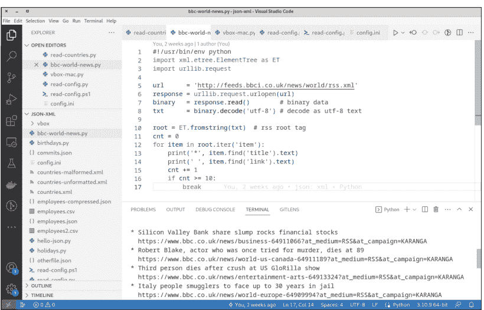

图 13.1 带有 Python 扩展的 Visual Studio Code

### 13.2.3 Bash/Shell 扩展

与 PowerShell 和 Python 不同，目前没有针对 Bash 脚本的权威 VS Code 扩展。当你编写 Bash 或 Zsh 脚本时，VS Code 也不会主动提供安装扩展的建议。尽管如此，一些扩展可以让你作为 Bash 开发者的生活更轻松。安装哪些扩展取决于你。（如果你在**扩展**侧边栏中搜索“bash”或“shell”，你会发现更多扩展，但其中一些的效用值得怀疑）。

一些常见的扩展包括：

- *Bash Debug* 帮助调试 Bash 脚本。
- *shellman* 专门面向 Bash 初学者，帮助输入 Bash 结构，例如 *if* 或 *for*。
- *ShellCheck* 分析你的代码并建议语法改进和修正。不过，我个人认为这个工具过于挑剔且配置选项不足。
- *Code Runner* 在 VS Code 工具栏中添加了一个用于直接执行 shell 脚本的按钮。

## 13.3 Remote – SSH 扩展

VS Code 最大的缺点是其图形用户界面（GUI）。这个说法对你来说可能显得荒谬：毕竟，你使用 VS Code 正是因为其直观的操作和众多功能优雅地集成在其 UI 中。只要你是在本地工作，也就是说，只要你的脚本在你的笔记本电脑上，VS Code 的优势确实能充分发挥。

然而，在日常脚本编写中，你经常会编写在外部服务器或虚拟机上运行的脚本。通常，与这些计算机或服务器之间只存在 SSH 连接，你必须在文本模式下工作。Linux 爱好者随后大多依赖于 *vi* 或 *Emacs* 等编辑器，这些编辑器在文本模式下能发挥全部功能，因此即使在 SSH 会话中也适用。（就个人而言，在这种情况下我大多使用 *jmacs* 或 *zile*。这些极简编辑器在基本命令上与 Emacs 兼容。）

不过，如果你不想学习这些来自 Unix 过去的“恐龙”编辑器的无数键盘快捷键，我不会责怪你。相反，我想向你介绍一个优雅的替代方案：你也可以通过 SSH 连接使用 VS Code 来编辑另一台机器上的代码！这种操作方式存在一些限制，但原则上效果很好。

### 13.3.1 应用 Remote – SSH 扩展

要将 VS Code 与 SSH 结合使用，你必须安装由 Microsoft 开发的 *Remote – SSH* 扩展。你还应该将你的 SSH 公钥复制到远程机器（`ssh-copy-id`，参见**第 12 章，第 12.4 节**）。这样，你可以避免反复输入远程计算机上账户的密码。

要设置与外部计算机的新连接，你必须运行 `F1` *Remote-SSH: Add new ssh host*，然后——在终端中——输入 `ssh user@hostname` 命令。VS Code 将数据存储在 `.ssh/config` 中，但暂时不会建立连接。

连接通过 `F1` *Remote SSH: Connect to host* 或通过状态栏中的绿色 **Remote** 区域建立。VS Code 使用 `ssh` 命令建立连接，并相应地分析存储在 `.ssh` 目录中的密钥。

一旦连接成功建立，VS Code 会打开一个新窗口，状态栏中的绿色区域清楚地表明正在处理非本地数据。从那一刻起，VS Code 将照常工作：你可以选择一个目录，编辑其中的文件，保存你的更改，等等。VS Code 的终端区域在远程操作中也非常有用。终端也是*远程*运行的，因此你可以在其中像在 SSH 会话中一样在远程计算机上执行命令。

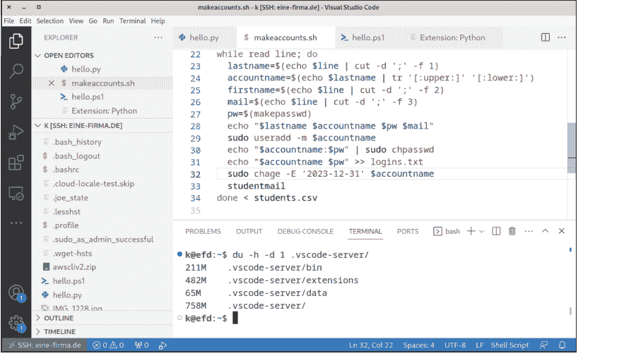

图 13.2 在外部 Linux 服务器 (eine-firma.de) 上的 VS Code 中编辑 Bash 脚本

### 13.3.2 限制

现在，在你开始认为这好得令人难以置信之前，我必须指出两个限制：

- VS Code 在远程机器上的 .vscode-server 目录中安装大量代码（通常是几百 MB！）并在该目录中执行这些代码。为了进行语法检查和调试，你笔记本电脑上的 VS Code 会与远程机器上的扩展代码进行通信。

  为了使此过程顺利进行，远程计算机需要足够的存储空间（包括磁盘空间*和*内存）、足够的计算能力以及出色的网络连接。否则，在 VS Code 中工作就不会那么愉快了。
- 当你想要编辑系统文件时，VS Code 也会达到其极限。没有功能可以与 sudo 相媲美。因此，VS Code 只允许访问 SSH 用户也有权读取的文件。对于脚本编写来说，这种访问权限是足够的，但对于更改 /etc 目录中的配置文件，你仍然需要一个可以在文本模式下使用 sudo 运行的编辑器。

## 第 14 章 Git

Git 是一个版本控制系统，通常在多人协作处理复杂项目时使用。借助 Git，可以管理程序的多个分支，跟踪更改，并在必要时进行回滚。

乍一看，脚本编写和 Git 似乎并不相配：脚本是小文件，通常由单个开发人员创建。因此，使用 Git 进行版本管理似乎是多余的。

但这种印象并不完全正确。脚本编写和 Git 可以完美结合：

- Git 可以为小型脚本集合记录开发过程：它作为备份，并有助于以简单直接的方式将脚本分发到多台目标机器。
- 通过在脚本中调用 `git` 和 `gh` 命令，可以自动化一些开发操作。
- Git 可以对某些操作执行所谓的 *hooks*。Hooks 是你创建的脚本，例如，在提交之前执行基本测试，或在提交之后负责部署。

> **本章的先决条件**
> 为了充分利用本章内容，你应该已经熟悉 SSH 密钥（参见第 12 章）。本章中使用此类密钥进行身份验证（例如，在 GitHub 或 GitLab 上）。就脚本示例而言，本章非常侧重于 Bash 和 Linux。

本章以 Git 速成课程开始，向你展示如何使用 Git 对包含一些脚本的目录进行版本控制和备份。然而，你真的应该只将此部分视为入门！有关 Git 的完整指南，请参阅我和 Bernd Öggl 合著的 *Git: Project Management for Developers and DevOps Teams*（Rheinwerk Computing，2023），其中涵盖了高级主题、特殊情况、变体和最佳实践。

我还将描述如何将脚本中的敏感信息排除在 Git 仓库之外。云服务或 FTP 访问的密码包含在脚本中，导致大规模安全漏洞的情况屡见不鲜。必须不惜一切代价避免这个问题。

## 14.1 Git 快速入门

本快速入门旨在帮助你开始使用 Git。如果你已经了解 Git，可以直接跳到下一节！

本章我将只介绍最基础的内容：你不会学到关于分支或合并冲突的知识，更不用说团队部署的最佳实践了。我将描述的唯一认证方法是 SSH。简而言之，这个快速入门可以称为“极简主义者的 Git”。尽管如此，我传授的知识应该足以让你使用 Git 来管理一组脚本。要了解更多关于 Git 的知识，你可以在网上找到全面的文档，包括视频，网址是 https://git-scm.com/doc。我有没有提到还有一些相当不错的 Git 书籍？

## 14.1.1 准备任务

首先，你必须安装 Git。在 Linux 上，最好的方法是使用你发行版的 Git 包。如果你运行的是 Debian 或 Ubuntu，`sudo apt install git` 就能完成任务。对于 macOS 和 Windows，你可以在 https://git-scm.com/downloads 找到易于使用的安装包。在终端中，你应该验证 `git` 命令是否可以执行。如果该命令不起作用，你必须检查 Git 安装目录是否包含在 `PATH` 变量中！

```
> git --version
git version 2.39.2
```

> **Windows、Linux 或 macOS**

本节我使用 > PowerShell 提示符。我包含的几张截图是在 Windows 系统上拍摄的。然而，无论你使用 Windows、Linux 还是 macOS，也无论你在 PowerShell、Bash 还是 Zsh 中运行 `git`，操作过程都不会改变。

基本上，你可以*独立*使用 Git；也就是说，你可以完全在本地计算机上管理项目的代码。但是，我强烈建议你选择一个 Git 主机并设置一个免费账户。在下面的例子中我指的是 GitHub，但像 GitLab 这样的替代品同样有效。

为了允许本地 `git` 命令与 Git 主机进行身份验证，你必须在那里存储你的公共 SSH 密钥（即通常在 `.ssh/id_xxx.pub` 文件中）。在 GitHub 上，你可以在 **Settings • SSH and GPG keys** 下找到相应的上传对话框。最简单的方法是将密钥文件加载到编辑器中，复制所有文本，然后将其粘贴到 Web 对话框中。

因为此信息存储在每次提交中，Git 需要知道你的姓名和电子邮件地址。（我稍后会解释什么是提交。）你不需要提供你的真实电子邮件地址。如果你使用 GitHub 并且希望你的电子邮件地址保持匿名，你应该按照以下步骤操作，并将 `aname` 替换为你的 GitHub 账户名：

```
> git config --global user.name "Michael Kofler"
> git config --global user.email "aname@users.noreply.github.com"
```

## 14.1.2 第一个仓库

在 GitHub Web 界面中，你现在可以创建一个新的仓库。*仓库*是你使用 Git 管理的项目中所有文件的集合——包括在项目过程中产生的所有更改。你必须为仓库指定一个名称，并且你应该将其可见性设置为 **Private**。（你的第一次测试不是为了让全世界看到。）为确保仓库不是完全空的，我建议激活 **Add a README file** 选项，并保持所有其他选项不变。

然后，回到你的终端。在我的计算机上，我通常为仓库设置一个单独的目录。（`git` 是显而易见的。）在该目录中，你现在可以运行 `git clone`，然后切换到包含仓库的新目录，如下例所示：

```
> mkdir git
> cd git
> git clone git@github.com:MichaelKofler/test1234.git
> cd test1234
```

`git clone` 从 GitHub 下载仓库并在你机器上的 `test1234` 目录中设置一个副本。不用说，你需要将 `MichaelKofler/test1234` 替换为你自己的 GitHub 账户名和仓库名。你可以通过点击绿色的 **Code** 按钮并选择 SSH 变体，在 GitHub Web 界面中找到完整的仓库地址。

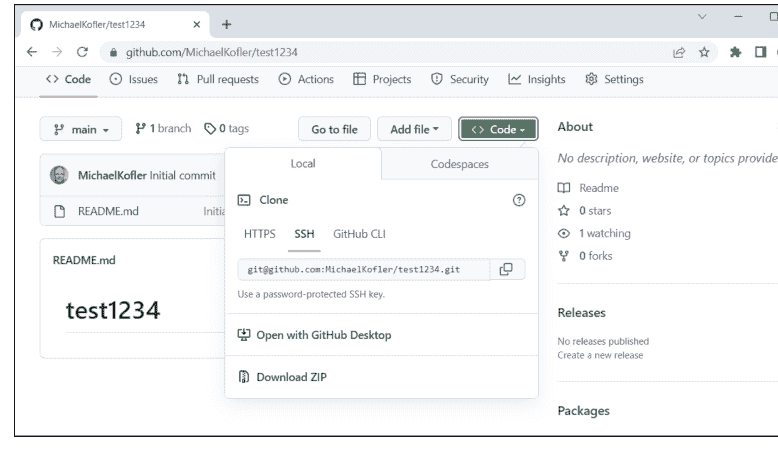

> **内部机制**
仓库目录——在我们的例子中是 `git\test1234\`——反映了你项目的当前状态。你代码的旧版本以及其他内部数据（一种用于你项目的“Git 数据库”）隐藏在 `.git` 子目录中。这些压缩文件的名称由十六进制字符组成。你应该只使用 `git` 命令来编辑或读取你的仓库。不要触碰 `.git` 子目录！

## 14.1.3 第一次提交

你现在的工作在仓库目录中进行——在这个例子的逻辑中，是在 `git\test1234\` 中。如果你使用 Visual Studio Code (VS Code)，你必须打开这个目录。假设你在这个目录中创建了三个新脚本：`script1.ps1` 到 `script3.ps1`。

一天结束时——或者当你达到一个满意的中间状态想要休息时——你会想将这三个脚本添加到 Git 仓库中。更准确地说：你想在 Git 数据库中存储这些文件当前状态的副本，然后将这些更改与 GitHub 上的外部仓库同步。这个过程需要三个步骤或三个命令，所有这些都必须在仓库目录中运行（在这个例子中是 `git\test1234`）：

```
> git add script1.ps1 script2.ps1 script3.ps1

> git commit -m 'script1 to script3: basic functions work'

[main cd35ac9] script1 to script3: basic functions work
3 files changed, 3 insertions(+)
create mode 100644 script1.ps1
create mode 100644 script2.ps1
create mode 100644 script3.ps1

> git push

Writing objects: 100% (5/5), 399 bytes | 199.00 KiB/s, done.
To github.com:MichaelKofler/test1234.git
015ed58..cd35ac9  main -> main
```

让我们从 `git add` 开始。这个命令做两件事：首先，Git 现在知道这些文件属于该项目并处于版本控制之下。其次，Git 将这些文件的当前状态存储在本地 Git 数据库中（即在 `.git` 目录中）。

`git commit` 生成一个提交，将项目的当前状态——截至 `git add` 时标记的所有更改——保存为一种中间版本。通过 `-m` 传递的*消息*通常包含对上次所做更改的简短描述。此外，`git commit` 仅在本地处理；也就是说，远程仓库（在我们的例子中是 GitHub）直到现在还不知道任何本地更改。
只有 `git push` 才会将所做的更改传输到远程仓库（在我们的例子中是 GitHub）。在终端中运行该命令后，你应该再看一下 GitHub Web 界面。你应该看到提交和三个文件（*script1.ps1* 到 *script3.ps1*）现在都可见了。

> **VS Code 中的 Git**
你也可以从 VS Code 用户界面 (UI) 触发这些操作，而不是在终端中运行 `git add`、`git commit` 和 `git push` 命令。VS Code 对 Git 提供了出色的支持。但是，在你第一次尝试时，你应该避免使用这种方法。首先，尝试了解和理解 `git` 命令！
要稍后了解更多关于 VS Code 中 Git 的知识，可以在 https://code.visualstudio.com/docs/sourcecontrol/overview 找到包括视频教程在内的良好概述。

## 14.1.4 额外的提交

你该休息一下了！第二天，你从 *README.md* 文件中的文档开始，并在 *script2.ps1* 中做了更多改进。现在，是时候进行下一次提交了。但这次你不需要再次使用 `git add` 来标记更改的文件，你可以使用一个快捷方式：使用 `-a` (`all`) 选项运行 `git commit`，这会自动提交所有已处于 Git 控制下的文件的更改。别忘了 `git push` 将更改也上传到远程仓库。

```
> git commit -a -m 'improved script2.ps1, started documentation'
> git push
```

> **对于新文件，需要 `git add`！**
`git commit -a` 命令非常方便，以至于使用 `-a` 选项很快就会成为理所当然的事情。然而，请记住一个重要的注意事项：该命令仅包含已处于 Git 控制下的文件。如果你在编辑器中创建了像 *script4.ps1* 或 *configuration.ini* 这样的新文件，不要忘记使用 `git add` 将它们添加到仓库一次！

## 14.1.5 在第二台计算机上设置仓库

到目前为止，你的脚本运行得令人满意。但是现在，这些脚本需要在第二台计算机上运行。对于这个任务，你可以在第二台计算机上安装 Git，然后在要使用脚本的目录中重复 `git clone` 命令：

## 14.1.6 Git 状态

随着项目规模的扩大，失去对 Git 仓库跟踪的风险也随之增加。`git status` 命令提供了解决此问题的方法。该命令会汇总自上次提交以来哪些文件发生了更改、哪些文件已被添加等信息。

另一个有用的命令是 `git log`，它会输出最近提交的摘要（最新的提交排在最前面）。使用 `git log` 时，有无数选项可以控制每个提交显示的详细程度。你可以使用 `--oneline` 来获取最简短的版本：此时，只会显示一个十六进制标识码（哈希码的前几位）和提交信息：

```
> git log

f2665d9 (HEAD -> main, origin/main, origin/HEAD) more bugfixes
5d3225d bugfixes in script1.ps1
679ca1a improved script2.ps1, started documentation
cd35ac9 script1 to script3.ps1: basic functions work
015ed58 Initial commit
```

除了习惯使用 `git log`，你也可以使用 GitHub 的网页界面，在那里你可以逐个查看提交，查看提交所做的更改等等。

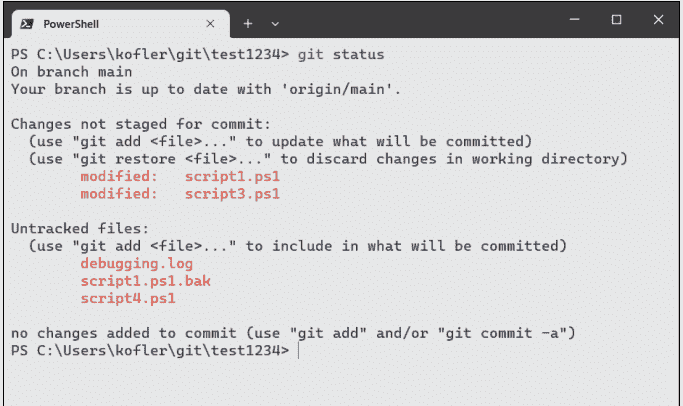

## 14.1.7 从 Git 中排除文件（.gitignore）

通常，项目目录中的某些文件不应包含在仓库中，例如编辑器创建的脚本备份、用于日志记录和调试的文件等。为了防止 `git status` 列出这些文件，你可以在本地目录中设置 `.gitignore` 文件。该文件包含 `git` 不应考虑的文件示例，例如以下类型的文件：

```
*.bak
*.log
*~
tmp/*
```

`.gitignore` 文件本身当然也应该存储在仓库中：

```
> git add .gitignore
```

如果作为例外，你想将一个 `.gitignore` 中包含锁定模式的文件添加到仓库中，你应该使用 `-f`（`force`，强制）选项运行 `git add`：

```
> git add debugging.log
```

```
The following paths are ignored by one of your .gitignore
files: debugging.log.
Hint: Use -f if you really want to add them.
```

```
> git add -f debugging.log
```

## 14.1.8 将现有代码转移到新仓库

在本节中，我假设你已经在 GitHub 上设置了一个仓库，将一个空仓库克隆到你的机器上，然后在那里开始开发你的脚本。然而，通常情况恰恰相反：你已经在一个新项目上工作了几天，后来才决定使用 Git。这也没问题！

首先，你必须在 GitHub 上创建新的仓库。确保你没有勾选 **Add a README file** 选项！不要向仓库添加任何其他文件。

然后，打开终端，进入你的项目目录，使用 `git init` 创建一个新的本地仓库，并将所需的文件添加到其中。最后，`git commit` 创建第一次本地提交：

```
> cd my\project
> git init
> git add script*.sh readme.md
> git commit -m 'initial commit'
```

接下来，你必须将本地仓库连接到新的远程仓库。`git branch` 确保本地仓库中的主分支名为 `main`。在当前版本的 Git 中，这是默认使用的名称——该命令因此是多余的，但不会造成干扰。只有当你的 Git 安装版本较旧时，它可能仍在使用过时的 `master` 名称。

`git remote add origin` 定义远程仓库。你必须将 `MichaelKofler/test1235.git` 替换为你自己的 GitHub 账户名和仓库名。

`git push` 执行第一次上传。`-u`（`set upstream`，设置上游）选项确保主分支与外部仓库的映射关系被永久存储。因此，将来只需运行不带任何选项的 `git push` 即可。

```
> git branch -M main
> git remote add origin git@github.com:MichaelKofler/test1235.git
> git push -u origin main
```

```
To github.com:MichaelKofler/test1235.git
 * [new branch]      main -> main
branch 'main' set up to track 'origin/main'.
```

这样，第一次提交就同时存储在本地和远程了。从那一刻起，`git add`、`git commit`、`git pull` 和 `git push`、`git status` 以及 `git log` 命令将如前所述正常工作。

## 14.2 正确处理设置和密码

黑客总是在寻找邮件、FTP 和数据库服务器的密码。他们太经常在 GitHub、GitLab 和其他 Git 托管平台上找到他们想要的东西了。这并不是因为这些平台本身不安全，而是因为存储在那里的、可公开访问的代码文件可能直接以明文形式包含密码。如果你的代码看起来像下面这个备份脚本，就可能出现这种漏洞：

```
# 注意，反面示例！
... code
mysqldump -u root -ptopSecret wordpress > db.sql
lftp -u ftpuser,topSecret2 backupserver.example.com << EOF
cd remote/dir/
put db.sql
bye
EOF
... more code
```

在这个例子中，`mysqldump` 首先创建数据库的备份。此步骤所需的密码通过 `-p` 选项直接传递。然后，`lftp` 连接到 FTP 服务器以将备份存储在那里。密码通过 `-u` 选项传递。如果你将此备份脚本存储在 Git 仓库中，所有有权访问该仓库的人都会知道 MySQL 和 FTP 服务器的密码。

顺便说一句，如果可能，你应该完全避免使用 FTP。该协议本质上是不安全的。如果非要使用，你应该只在 FTP 服务器上存储你事先加密过的文件。

### 14.2.1 什么是更好的方法？

防止此类安全漏洞的一些最佳实践包括：

- **将密码存储在外部**
  几乎所有需要密码进行身份验证的程序都可以从文件中读取密码。对于 `mysqldump`，使用 `.my.cnf` 文件；对于 `lftp`，使用 `.netrc` 文件；等等。对于某些工具，你根本不需要密码，可以使用密钥文件代替（例如，SSH；参见第 12 章，第 12.4 节）。
  当然，密码或密钥文件绝不能包含在 Git 仓库中。但是，你可以在文档中指出你的脚本需要哪些密码文件，以及需要什么语法。
- **将其他设置保存在单独的文件中**
  通常，将脚本在不同机器或不同上下文中使用时必须更改的任何参数与代码的其余部分分开指定是一个好主意。在没有安全风险的简单情况下，这种指定可以在脚本的前几行完成。我经常将此类参数命名为大写字母，以便在视觉上与其余变量区分开来。
  通常，最好将所有参数存储在单独的文件中，并在脚本开头导入。JSON 或 INI 文件非常适合此目的（特别参见第 10 章，第 10.7 节）。
- **在 Git 仓库中包含设置文件的示例**
  不要止步于密码！关键信息还包括主机名、端口号以及 Amazon Web Services (AWS) 存储桶或虚拟机的名称。
  包含此类数据的配置文件*不应*包含在任何 Git 仓库中！然而，没有配置文件，其他人要运行你的脚本就变成了一个猜谜游戏。因此，一个有用的方法是在仓库中包含一个示例配置文件。如果真实的配置文件名为 `mybackup.conf`，你可以将示例文件命名为 `mybackup.conf.sample`。此文件的目的是解释配置文件的语法。但是，该文件不包含任何真实数据，只包含虚构的示例数据。

这些安全规则适用于*所有* Git 仓库，包括私有仓库或位于其自己的、非公开 GitLab 实例上的仓库。当你设置或使用仓库时，你永远无法预测以后谁会有权访问它。密码和其他关键信息*绝不能*存储在仓库中。

## 14.2.2 示例

我们如何改进本节前面提到的片段式备份脚本，使其结构更完善、更安全？该脚本以 `. filename` 导入语句（`source filename` 的简写形式）开头。此语句会将指定文件读入脚本，并通过 Bash 进行处理。

```
# 示例文件 mybackup.sh
# 加载初始配置设置
. mybackup.conf

# mysqldump 从 .my.cnf 读取密码
mysqldump -u $MYSQLUSER $DBNAM > db.sql

# lftp 从 .netrc 读取密码
lftp $FTPHOST << EOF
cd remote/dir/
put db.sql
bye
EOF
```

对应的配置文件如下所示：

```
# mybackup.conf 配置文件
MYSQLUSER=root
DBNAME=wordpress
FTPHOST=backupserver.example.com
```

为确保此文件不会被纳入 Git 仓库，需在 `.gitignore` 中添加以下行：

```
# .gitignore 文件
mybackup.conf
```

另一方面，为帮助脚本用户，Git 仓库中包含了以下示例文件：

```
# 配置文件 mybackup.conf.sample
# 将此文件复制为 mybackup.conf 并
# 将示例文本替换为实际名称！
# 请注意，myscript.sh 期望在 .my.cnf 中找到 MySQL 密码，
# 在 .netrc 中找到 FTP 密码。
MYSQLUSER=mysqlaccountname
DBNAME=databasename
FTPHOST=ftphostname
```

> **PowerShell 和 Python**
源操作符 `.` 在 PowerShell 中同样适用。对于 Python 脚本，最佳做法是将设置保存在 INI 文件中（参见第 10 章，第 10.7 节）。

## 14.3 Git 自动化

许多 `git` 命令序列会被反复执行，例如 `git add`、`git commit`、`git pull` 和 `git push`。因此，在脚本中自动化调用这些命令通常很有意义。

为了让你了解此类脚本可能的样子，以下清单中的命令会检查当前目录是否由 Git 控制，以及是否已设置远程仓库。如果满足这些条件，`git add . --dry-run` 将显示哪些文件将被包含在下一次提交中。`git add .` 假定你已预先设置好 `.gitignore` 文件，将所有不需要的文件排除在 Git 操作之外。

现在，你有了选择：如果指定了提交消息，`git add` 将在不使用 `--dry-run` 选项的情况下运行并执行提交；更改将通过 `git pull` 和 `git push` 与远程仓库同步。因此，由于 shebang 行中的 `-e` 选项，该过程可能会被中止，该选项表示一旦某个命令导致错误，脚本就应终止。

```
#!/bin/bash -e
# 示例文件 git-acp.sh = git add/commit/push
# 测试当前目录是否在 Git 控制下
if ! git rev-parse --is-inside-work-tree >& /dev/null; then
    echo "not in git repo, exit"
    exit 1
fi
# 测试当前分支是否存在远程仓库
if ! git ls-remote >& /dev/null; then
    echo "no git remote, exit"
    exit 1
fi
```

```
# 列出要提交的文件
echo "Dry run:"
git add -A --dry-run

# 中止或输入提交消息
echo "Do you want to add and commit all files listed above?"
echo "Enter commit message or press return to exit."
echo -n "> "
read msg

# 运行 git add, commit, pull + push
if [[ $msg ]]; then
    git add -A
    git commit -m "$msg"
    git pull
    git push
else
    echo "exit"
fi
```

以下几行展示了脚本的示例运行。我是在本书的工作目录中运行该脚本的。（当然，我已使用 Git 管理了本书的所有文本、图像、布局和代码文件。）

```
$ ./code/git/git-acp.sh

Dry run:
  add '.gitignore'
  add 'bash.md'
  add 'code/git/git-acp.sh'
Do you want to add and commit all files listed above?
Enter commit message or press return to exit.
> git scripting sample, work in progress
...
To github.com:MichaelKofler/scripting-buch.git
   a0ff68f..a60f1d8  main -> main
```

如果你在 Windows 上工作，可以在 Git Bash 中运行该脚本，或者你需要开发一个 PowerShell 版本的代码。

> **一点怀疑精神**
你将在互联网上找到无数与前面示例结构相似的 Bash 和 PowerShell 脚本。我是自动化流程的粉丝；否则，我也不会写这本书。然而，我们的示例仅用于演示目的；我自己通常并不使用它。

> 我每天都使用 Git。我熟记于心那些我经常需要的少数命令，因此，对我来说，输入工作量是最小的。任何自动化都不值得，或者充其量只需要一些别名就足够了，例如 Zsh 扩展 Oh My Zsh 中包含的那些。

此外，我的 Git 仓库在性质上差异很大：有些仓库只有一个分支，而我是唯一的用户。而其他仓库则涉及多个用户和多个分支，存在各种特殊情况。在出错之前，我更倾向于手动运行 `git`，而不是依赖自动化！

### 14.3.1 使用 gh 远程控制 GitHub

`git` 命令适用于任何 Git 仓库。但是，此命令无法执行特定于 GitHub 的操作，例如在 GitHub 上设置新仓库、执行拉取请求等。为此，GitHub 提供了 `gh` 命令。你可以在 https://github.com/cli/cli/releases 找到相关的下载和安装说明。

安装后，你需要通过 `gh auth login` 进行一次性身份验证，这必须在 Web 浏览器中完成。`gh` 会负责启动 Web 浏览器并导航到正确的页面。

然后，你可以使用 `gh repo list` 列出你在 GitHub 上的仓库，使用 `gh repo create` 设置新仓库，使用 `gh pr create` 添加拉取请求，使用 `gh pr status` 查询拉取请求的状态，等等。你可以在脚本中像调用 `git` 一样调用 `gh`。所有 `gh` 命令的参考手册可在 https://cli.github.com/manual/gh 找到。

> **GitLab 远程控制**
顾名思义，`gh` 仅适用于 GitHub。对于 GitLab，存在一个类似的项目（`glab` 命令）；参见 https://gitlab.com/gitlab-org/cli。

## 14.4 Git 钩子

*Git 钩子*是在某些 Git 操作之前或之后自动执行的脚本。在每个新的 Git 仓库中，你都会在 `.git/hooks` 目录中找到用于各种操作的脚本模板集合：

```
$ ls .git/hooks

applypatch-msg.sample       prepare-commit-msg.sample
commit-msg.sample          pre-push.sample
fsmonitor-watchman.sample   pre-rebase.sample
post-update.sample         pre-receive.sample
pre-applypatch.sample      push-to-checkout.sample
pre-commit.sample          update.sample
pre-merge-commit.sample
```

这些示例文件是文档完善的 shell 脚本。查看这些文件不仅揭示了各自钩子的目的，还立即展示了可工作的示例代码。

要激活钩子，必须移除 `.sample` 标识符。（与本书中的示例文件不同，`.sh` 标识符也是禁止的。只有当脚本完全没有标识符时，它们才会被执行！）

在 Linux 和 macOS 上，你还必须确保设置了执行位，这意味着你需要运行 `chmod +x script.sh`。在 Windows 上，脚本由 Git Bash 执行。有关 Git 钩子的更多基本信息，请参阅 Git 手册 https://git-scm.com/book/en/v2/Customizing-Git-Git-Hooks。

> **GitHub Actions 和 GitLab Pipelines**
作为 Git 钩子的替代方案，主要的 Git 平台提供了替代机制，以便在执行提交时自动执行操作，例如用于自动测试或自动部署到其他系统。这些机制的配置文件包含脚本部分，你可以在其中指定代码。因此，即使你不想使用钩子，但想使用某些高级的 GitHub 或 GitLab 功能，基本的脚本知识也会有所帮助。

### 14.4.1 示例：在提交前检测未版本化的文件

`.git/hooks/pre-commit` 脚本在每次提交之前执行。此脚本可用于保证遵守提交的某些规则。如果脚本返回错误代码（即，退出码不等于 0），`git commit` 将中止，用户必须修复检测到的缺陷。

以下示例来自我与 Bernd Öggl 合著的《Git: Project Management for Developers and DevOps Teams》（Rheinwerk Computing，2023）。`pre-commit` 测试是否存在已更改或新文件，这些文件既未包含在提交中，也未被 `.gitignore` 排除。如果存在，这些文件将由 `git status` 列出。

`exit 1` 可防止你在提交时忘记文件。但与此同时，该脚本强制你必须在 `.gitignore` 中明确列出所有应被忽略的文件。这个要求可能相当烦人。

```
#!/bin/sh
# 示例文件 pre-commit，必须复制到
# .git/hooks 目录
untracked=$(git ls-files --others --exclude-standard | wc -l)
```

## 14 Git

```bash
if [ $untracked -gt 0 ]; then
    git status
    echo
    echo "Pre commit fail! There are untracked files. Either run"
    echo "'git add' or add an entry to .gitignore."
    exit 1
fi
```

## 第三部分

## 应用与示例

## 第15章
## 备份

自动创建备份是*经典的*脚本应用。在本章中，我将向你展示一些具体的例子：

- 同步台式计算机的目录
- 在Linux计算机上备份WordPress系统
- 在Windows上备份SQL Server数据库

> **本章的先决条件**
> 本章中的示例使用Bash和PowerShell语言编写。除了语言基础，我假设你知道如何使用Microsoft Windows任务计划程序和cron（参见第11章），并且熟悉SSH（参见第12章）。此外，你应该熟悉`rsync`、`scp`和`tar`等命令，或`Compress-Archive`等cmdlet。

当然，你也可以使用现成的备份解决方案，而不是自己编写脚本。你可以在互联网上找到无数的备份工具，从简单的免费脚本到昂贵的商业应用程序，应有尽有。如果任务相对简单，就像本章中的示例一样，你自己的脚本绝对足够。但是，当然，如果你需要公司范围内的冗余备份，需要考虑到所有可能的位置，如活动目录、云存储或位于公司网络之外的员工笔记本电脑，那么这个建议就不适用了。

## 15.1 将目录同步到外部存储

你可能以某种方式使用云作为备份存储：作为开发者，你可能使用Git将代码同步到远程仓库，将版本控制的优势与外部备份的优势相结合。作为“普通”用户，你只需将重要文件保存到OneDrive、NextCloud、Dropbox或iCloud Drive目录中。所有这些程序在正确应用时都是有用且安全的。

本例的出发点是希望*额外*将笔记本电脑的重要目录同步到外部数据介质。这种老式备份方法的优点是，即使由于任何原因无法访问云，存储的文件仍然可用。当数据量太大而无法使用云存储时，例如涉及虚拟机、视频项目等时，本地备份也很方便。

我还想立即指出最重要的缺点：“同步”意味着在笔记本电脑上删除的文件也会在外部磁盘上被删除。因此，此备份过程不提供恢复已删除或覆盖文件的选项。在这方面，本章介绍的Bash或PowerShell脚本不应代表你唯一的备份手段，而应补充其他方法。

> **小心备份当前正在使用的文件**
>
> 如果你使用脚本同步当前打开并在复制过程中更改的文件，那么备份在大多数情况下是毫无价值的。此限制适用于虚拟机的映像文件或数据库等。

不幸的是，这个问题没有通用的解决方案。理想情况下，你应该在尽可能少的文件被主动使用时运行脚本。大多数数据库服务器提供在数据库运行时执行一致备份的功能，但通常不是在文件级别。（本章的其他部分将给出两个这样的例子。）你可以在脚本中关闭虚拟机进行备份，然后重新启动它们。然而，这种方法非常具体地依赖于计算机上运行的软件。

根据操作系统，文件系统快照是另一种解决方案：在此上下文中，你可以临时冻结文件系统的副本，并使用此静态副本作为备份的基础。在Linux上，*逻辑卷管理器（LVM）*或Btrfs文件系统提供了这样的选项。

## 15.1.1 使用robocopy的PowerShell脚本

*robocopy*，代表*robust file copy*，是一个Windows命令，自2008年以来所有版本的Windows都附带了该命令。尽管该命令不能作为cmdlet调用，但它与PowerShell脚本集成得很好。该命令的众多选项在以下链接中有文档说明：

- https://en.wikipedia.org/wiki/Robocopy
- https://learn.microsoft.com/en-us/windows-server/administration/windows-commands/robocopy

以下脚本首先初始化三个参数，指定应将哪些目录同步到哪个目标。

`Get-Volume`检索所有文件系统的列表。如果目标磁盘未在其中识别，脚本将结束。对于`Where-Object`，请注意，尽管`Get-Volume`在`FriendlyName`列中显示文件系统名称，但该属性实际上称为`FileSystemLabel`——这很难理解`Get-Volume`的开发者的意图！

当检测到目标文件系统时，将确定相应的驱动器号。根据当前使用的数据载体，此字母不一定始终保持不变。

该脚本将所有robocopy输出记录到一个文件中，该文件的名称格式如下：robocopy-2023-12-31--17-30.log。此文件和日志目录会自动设置。

最后，脚本循环遍历`$syncdirs`中列出的所有目录并运行robocopy。此过程中使用的选项具有以下含义：

- /e：递归遍历目录
- /purge：在备份中也删除本地已删除的文件和目录（小心！）
- /xo：仅复制已更改的文件；此最后一个选项从第二次开始极大地加快了同步过程
- /log+:filename：将日志输出添加到指定文件

```powershell
#!/usr/bin/env pwsh
# Sample file sync-folders.ps1
# $destvolume: name of the backup data medium (such as a USB flash drive).
# $destdir: name of the target directory on this data medium
# $logdir: name of the logging directory on the data medium
# $syncdirs: list of directories to be synchronized
# (relative to the personal files)
$destvolume = "mybackupdisk"
$destdir = "backup-kofler"
$logdir = "$destdir\sync-logging"
$syncdirs = "Documents", "Pictures", "myscripts"
# determine drive letter of the target file system
$disk = Get-Volume |
    Where-Object { $_.FileSystemLabel -eq $destvolume }
if (! $disk) {
    Write-Output "Backup disk $destvolume not found. Exit."
    Exit 1
}
$drive = ($disk | Select-Object -First 1).DriveLetter
Write-Output "Syncing with disk ${drive}:"

# create target directory if it does not exist yet;
# | out-zero prevents the directory name from being displayed
New-Item -ItemType Directory -Force "${drive}:\${destdir}" |
    Out-Null

# create logging directory and logging file
New-Item -ItemType Directory -Force "${drive}:\${logdir}" |
    Out-Null
$logfile = `
"${drive}:\${logdir}\robocopy-{0:yyyy-MM-dd--HH-mm}.log" `
-f (Get-Date)
New-Item $logfile | Out-Null

# loop through the sync directories
foreach ($dir in $syncdirs) {
    $from = "${HOME}\$dir"
    $to = "${drive}:\${destdir}\$dir"
    Write-Output "sync from $from to $to"
    robocopy /e /purge /xo /log+:$logfile "$from" "$to"
}
```

在我的测试中，脚本在将文件写入USB驱动器时一直抛出*访问被拒绝*错误（错误代码5）。互联网上存在无数关于此错误的报告，以及几乎同样多的建议解决方案。显然，只有以管理员权限运行脚本才能可靠地工作。你可以在具有管理员权限的终端窗口中进行初始测试。之后，你必须在*Microsoft Windows任务计划程序*中设置脚本，以管理员权限每天运行一次（在**常规**对话框页中选择**使用最高权限运行**选项）。

## 15.1.2 改进思路

在你将数据交给脚本之前，我想指出一些限制，并描述如何优化脚本：

- **错误或未执行时的警告**
  如果外部数据驱动器当前不可用，脚本只是中止。更好的方法是在多次尝试失败后以某种形式显示或发送警告。
- **排除规则**
  脚本可以完全同步目录，也可以完全不同步。在实践中，排除标准对于不应包含在备份中的文件或目录会很有帮助。

## 15.1.3 使用rsync的Bash脚本

如果你在Linux或macOS上工作，实现类似同步任务的最佳方法是使用带有`rsync`的Bash脚本。以下脚本与前面描述的PowerShell脚本具有相同的结构。它测试备份卷是否在特定的`mount`点可用，然后对本地目录列表运行`rsync`命令。

如[第12章，第12.3节](#)所述，`rsync`也可以与SSH结合使用。因此，你可以相对容易地调整脚本，使你的目录不是与外部数据介质同步，而是与另一台计算机同步。

## 15.2 WordPress 备份

第二个示例的起点是一台运行着 Web 服务器和数据库服务器的 Linux 机器，用于通过 WordPress 实现网站托管。wp 数据库的内容、/var/www/html/wordpress 目录以及整个服务器配置（即 /etc 目录）需要每天备份一次。过去 7 天的压缩备份应始终保留在本地和可通过 SSH 访问的第二台服务器上。

该实现通过一个以 root 权限运行的 Bash 脚本创建。使用 `mysqldump` 命令通过 wpbackupuser 账户连接到 MySQL 服务器来备份 MySQL 数据库。该账户仅包含执行备份的权限，可以在 MySQL 中按如下方式设置：

```sql
CREATE USER wpbackupuser@localhost IDENTIFIED BY 'TopSecret123';
GRANT Select, Lock Tables, Show View
    ON wp.* TO wpbackupuser@localhost;
GRANT Process, Reload ON *.* TO wpbackupuser@localhost;
```

为确保脚本不以明文形式包含密码，密码存储在 /root/.my.cnf 文件中。mysqldump 会自动搜索此文件并分析其包含的数据。你应该使用 `chmod 600 .my.cnf` 来确保除 root 外无人有权读取此文件！

```ini
# in file /root/.my.cnf
[mysqldump]
user = wpbackupuser
password = TopSecret123
default-character-set = utf8
```

一旦所有先决条件都已满足，你就可以开始编程了。各种配置参数汇总在脚本的前几行。为了更好的可读性，我为这些变量使用了大写字母。

`date +%u` 为星期几生成一个连续数字（1 代表星期一到 7 代表星期日）。此数字将被整合到备份文件的名称中。

`mysqlopt` 包含执行备份的选项。可以通过无数选项控制 mysqldump 的行为。在此例中，我仅限于使用 `--single-transaction`。此选项确保数据库在备份期间无法更改。mysqldump 的输出传递给 gzip，进行压缩，最后存储在 `$dbfile` 文件中。如果文件已存在，它将被覆盖。（此过程在脚本连续运行 8 天后首次发生。因此，你始终拥有过去 7 天的备份版本。）

要执行 WordPress 安装的备份，一个简短的 `tar` 命令就足够了（另见第 5 章第 5.3 节）。WordPress 目录还包含所有已安装的插件、所有上传的图像等。通常，使用 `tar` 创建的文件比 MySQL 备份大得多。

脚本的最后一行将目前仅存储在本地的备份复制到第二台计算机。因此，所有备份文件都冗余地位于两个不同的位置。

```bash
# Sample file lamp-backup.sh
BACKUPDIR=/localbackup
DB=wp
DBUSER=wpbackupuser
WPDIR=/var/www/html/wordpress
SSH=user@otherhost:wp-backup/
# MySQL-Backup
weekday=$(date +%u)
dbfile=$BACKUPDIR/wp-db-$weekday.sql.gz
mysqlopt='--single-transaction'
mysqldump -u $DBUSER $mysqlopt $DB | gzip -c > $dbfile

# backup of the WordPress installation including plugins and uploads
htmlfile=$BACKUPDIR/wp-html-$weekday.tar.gz
tar czf $htmlfile -C $WPDIR .

# backup of the /etc directory
etcfile=$BACKUPDIR/etc-$weekday.tar.gz
tar czf $etcfile -C /etc .

# copy backup files to a second computer
scp $dbfile $htmlfile $etcfile $SSH
```

手动执行脚本后，你仍然需要处理自动调用。你可以根据以下模式设计 `/etc/crontab` 中所需的行：

```crontab
# in /etc/crontab
# run script every night at 3:00 am with root privileges
00 3 * * * root /path/to/lamp-backup.sh
```

一旦你设置了备份系统，你应该观察它几天。自动的 cron 调用是否工作？一个常见的错误原因是 cron 任务通常具有与你运行测试的 `root` 账户不同的 `PATH` 设置。如果你在脚本中使用了手动安装在常规路径之外的命令，这种可能性尤其大。对于此类命令，你可能需要指定完整路径。

务必测试你是否可以从另一台计算机或虚拟机上的备份文件恢复 WordPress 安装。如果直到灾难发生时才发现备份因某种原因不完整，那么最漂亮的脚本又有什么用呢？

**扩展：将加密备份上传到 Amazon Web Services (AWS)**

就攻击者可访问性而言，将备份文件保留在外部计算机上通常不如本地服务器安全。因此，一个好主意是在将备份文件上传到其他主机之前对其进行加密。我将在第 20 章向你展示如何加密文件，然后使用 Amazon 的云存储服务 Simple Storage Service (S3) 作为存储位置，届时我们将在此方面扩展我们最近的示例。

## 15.3 SQL Server 备份

以下脚本的目标是将 SQL Server 的所有数据库备份为指定目录中的压缩文件。为此，我假设你在 Windows 上工作。（SQL Server 也可以安装在 Linux 上，但我没有为此示例测试该场景。）

要通过 PowerShell 脚本管理 SQL Server，你可以使用 Microsoft 开发并在 PowerShell Gallery 中可用的 SqlServer 模块：

```powershell
> Install-Module SqlServer
```

此模块中所有 cmdlet 的参考可在 https://learn.microsoft.com/en-us/powershell/module/sqlserver 找到。

使用 `Backup-SqlDatabase` 创建数据库备份非常简单：

```powershell
> Backup-SqlDatabase -ServerInstance "localhost\SQLEXPRESS01" `
                    -Database "dbname"
```

在此命令中，我们使用 `-ServerInstance` 来指定 SQL Server 可访问的名称。当然，只有当你的 Windows 账户对数据库服务器具有访问权限时，才能执行该命令。默认情况下，备份最终位于服务器的备份目录中，通常位于以下位置：

```
C:\Program Files\Microsoft SQL Server\MSSQLn.n\MSSQL\Backup
```

或者，你可以使用 `-BackupFile` 选项指定所需的备份文件名。（许多其他选项使你能够控制 `Backup-SqlDatabase` 的工作方式。只需查看文档即可！）`Backup-SqlDatabase` 创建的文件是二进制格式，可以很好地压缩。

**dbatools**

SqlServer 模块的一个有用替代方案是 dbatools（参见 https://dbatools.io/commands）。此模块范围更广，包含更多 cmdlet。如果你专门从事 SQL Server 实例的管理，你绝对应该熟悉 dbatools！

## 15.3.1 通过脚本备份和压缩所有数据库

有了这些介绍性信息，你应该能轻松理解接下来的脚本。它首先声明了一些参数，你需要根据自己的设置进行调整。`$exclude` 包含一个不应被备份的数据库列表。该列表必须包含 `tempdb`。尝试对这个内部 SQL Server 数据库应用 `Backup-SqlDatabase` 会导致错误。

`Get-SqlDatabase` 会确定 SQL Server 上所有可用的数据库。然后，一个循环会处理所有数据库。每个备份文件会立即被打包成自己的归档文件。（当然，你也可以将所有数据库一起保存在一个归档中。但由于数据库可能变得非常大，这种做法并不是个好主意。）使用 `-Force` 选项，已存在的 ZIP 文件会被覆盖，而不会显示错误消息。原始备份文件将因此被删除。

```
# 示例文件 backup-all-dbs.ps1
$instance = "localhost\SQLEXPRESS01"
$backupdir = "C:\sqlserver-backups"
$exclude = "tempdb", "other", "tmp"

# 如果备份目录尚不存在，则创建它
New-Item -ItemType Directory -Force $backupdir | Out-Null

# 遍历所有数据库
$dbs = Get-SqlDatabase -ServerInstance $instance
foreach($db in $dbs) {
    # 跳过 $exclude 列表中的数据库
    if ($db.name -in $exclude) { continue }

    # 组合备份文件名
    $backupname = "$backupdir\$($db.name).bak"
    $archivename = "$backupdir\$($db.name).zip"
    Write-Output "正在将数据库 $($db.name) 备份到 $archivename"

    # 备份，创建归档（-Force 用于覆盖已存在的文件），
    # 删除原始备份文件
    Backup-SqlDatabase -ServerInstance $instance `
        -Database $db.name -BackupFile $backupname
    Compress-Archive -Force $backupname $archivename
    Remove-Item $backupname
}
```

## 第16章
图像处理

在我的日常工作中，脚本经常帮助我控制数字图像的洪流。本章介绍的脚本执行以下任务：

- 将图像从一种格式转换为另一种格式，并在必要时缩小尺寸和添加水印
- 根据拍摄日期，使用可交换图像文件格式（Exif）数据将照片分类到目录中
- 将照片中的元数据输入数据库

为此，使用了 *ImageMagick* 和 *ExifTool* 这两个开源工具。

> **本章先决条件**
阅读本章，你只需要具备 Bash、PowerShell 和 Python 语言的基础知识。

## 16.1 操作图像文件

无论你是想将 PNG 图像转换为 JPG 格式（或反之），添加水印或考虑透明度效果，限制最大分辨率，还是裁剪部分图像——ImageMagick 库的免费工具都会很有帮助。唯一的障碍是通过其无数选项来控制命令并非易事。

### 16.1.1 安装 ImageMagick

大多数 Linux 发行版都提供 ImageMagick 作为软件包。在 Ubuntu 上，你必须运行 `apt install imagemagick` 来安装它。在 macOS 上，最简单的安装方法是使用 Homebrew（即 `brew install imagemagick`）。

对于 Windows，你可以在 *https://imagemagick.org/script/download.php* 找到安装程序。如果你想更新已安装的版本，你应该先卸载它；否则，新旧版本将并行安装，这很少有用。安装程序建议将安装目录添加到 PATH，因此请确保保留此选项的选中状态。通常，保留预选选项是合适的。

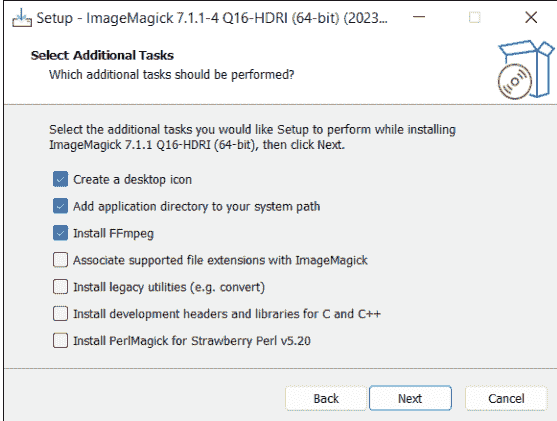

图 16.1 在 Windows 上安装 ImageMagick

在终端中使用 `magick --version` 验证安装是否成功以及命令是否被找到：

```
$ magick --version
Version: ImageMagick 7.1.1-4 Q16-HDRI x86_64 ...
```

如果你还想使用 ImageMagick 读取 PostScript、PDF 或封装 PostScript（EPS）文件，你还必须安装 PostScript 解释器 Ghostscript。在 Linux 和 macOS 上，你可以通过 `apt`、`dnf` 或 `brew` 安装相应的软件包。Windows 下载可在 https://ghostscript.com/releases/gsdnld.html 找到。

### 16.1.2 尝试使用 ImageMagick

ImageMagick 提供了 `magick` 命令，它非常通用。然而，有数百个选项可用于控制此命令的行为，如 https://imagemagick.org/script/magick.php 所述。

不要让所有这些选择让你困惑！在许多情况下，`magick` 可以轻松应用。要将现有文件转换为另一种格式，只需指定源文件的文件名和新结果文件的文件名。`magick` 通过其标识符识别所需的数据类型：

```
$ magick in.bmp out.png
```

> **ImageMagick 6：使用 convert 而不是 magick**
许多 Linux 发行版仍然依赖 ImageMagick 6。此版本不提供 `magick` 命令。相反，你必须使用 `convert`。但是，从版本 7 开始，`convert` 已被弃用，推荐使用 `magick`。

以下命令将 PNG 图像的最大尺寸缩小到 1024×1024 像素。图像比例得以保留。一个原始尺寸为 6000×4000 像素的图像将被缩放为 1024×683 像素。1024×1024 后的 > 字符会导致小图像*不*被放大。因此，1024×1024 像素是上限。结果将以 JPG 格式保存。

PNG 图像的透明区域显示为浅粉色。颜色代码对应于熟悉的 CSS 语法。`-flatten` 合并所有图像层。`-quality 75` 将 JPEG 压缩质量降低到 75%。此选项降低了质量，但也减小了图像文件的大小。（默认情况下，质量级别为 92%。）

```
$ magick in.png -resize '1024x1024>' -background '#ffdddd' \
    -flatten -quality 75 out.jpg
```

在第三个示例中，`magick` 在图像中心添加了一个带有版权信息的对角线水印文本：

```
$ magick in.png -gravity center \
    -pointsize 40 -font Arial -fill black \
    -draw "rotate 45 text 0,0 '(c) Michael Kofler 2023'" out.png
```

与许多其他命令不同，`magick` 不关心选项的顺序。相反，它们按指定顺序执行，或引用当前活动的图像（如果合并了多个图像文件）。

如果你想一次处理多个图像，通常建议编写一个脚本。创建脚本有一个好处，即通常费力编写的选项在下次仍然可用。当然，你也可以直接在终端中执行简单的任务。

Bash 语法中的最后一个示例遍历当前目录中的所有 `*.jpeg` 文件，并将它们转换为*缩略图*（即大幅缩小的图像）。但要注意，因为以下命令使用相同的源文件名和目标文件名，原始图像将被覆盖！如果你不想发生这种情况，必须使用另一个目标文件名（例如 `"thumb-$file"`）。

```
$ for file in *.jpeg; do magick "$file" -resize '320x320' \
    -quality 80 "$file"; done
```

只要目标文件格式支持 Exif 数据，这些数据就会被保留。Exif 数据是元数据，除其他外，它提供了图像拍摄地点和时间的信息。Exif 数据是本章剩余部分的重点。如果你想删除 Exif 数据，可以使用 `-strip` 选项调用 `magick`。更安全的选择是使用下一节介绍的 `exiftool -all:all= file.jpg` 命令。

> **引用特殊字符**

请注意，`magick` 语法提供了各种在 Bash 和 PowerShell 中具有特殊含义的特殊字符。你应该将字符串用引号括起来，如前面的示例所示，或者使用引号 \（Bash）或 `（PowerShell）。

> **人工智能（AI）帮助**

像 ChatGPT 这样的 AI 工具也了解 ImageMagick。如果你有特定的任务，至少值得尝试在 AI 支持下确定所需的选项组合。在我的尝试中，命中率约为 50%。结果并不总是符合我的预期，但通常，ChatGPT 会让我走上正确的轨道。请注意，ChatGPT 和互联网上的许多建议方案都使用 `convert` 命令而不是 `magick`。

### 16.1.3 示例：convert2eps（Bash 变体）

为了从我的 Markdown 或 LaTeX 格式的书籍文本文件中制作可打印的 PostScript 文件，我需要为每个 PNG 格式的截图创建一个等效的 EPS 文件，这正是我们下一个脚本要处理的任务。

此示例遍历当前目录中的所有 PNG 文件。如果 `<name>.eps` 文件不存在于 `<name>.png`，或者 PNG 文件比 EPS 文件更新（比较运算符 `-nt`；即*比...新*），`magick` 会创建一个新的 EPS 文件。

`magick` 选项或参数具有以下含义：`-quiet` 抑制警告和状态消息的显示。`-background white` 为图像的透明区域使用白色背景。`-flatten` 合并图像层。

`eps2:$epsfile` 指定在写入 EPS 文件时应应用 PostScript Level 2 规范。此选择对图像大小有很大影响，因为文件比默认的 Level 1 压缩得更好（且无质量损失）。Level 3（即 `eps3:$epsfile`）承诺更紧凑的文件。然而，此级别对打印机或照排软件要求更高，可能会导致兼容性问题。

```
# 示例文件 convert2eps.sh
for pngfile in *.png; do
    # 将 .png 标识符替换为 .eps
    epsfile=${pngfile%.png}.eps
    if [ $pngfile -nt $epsfile ]; then
        echo "$pngfile -> $epsfile"
        magick "$pngfile" -quiet -background white \
            -flatten "eps2:$epsfile"
    fi
done
```

## 16.1.4 示例：convert2eps（PowerShell 变体）

你可以将上一个脚本作为 `magick` 各种用途的模板——无论是调整数百张图片的大小、添加水印，还是转换为其他格式。如果你在 Windows 环境下工作，下一个清单中的脚本具有相同的目的：

```
# 示例文件 convert2eps.ps1
$pngfiles = Get-ChildItem *.png
foreach ($pngfile in $pngfiles) {
    $pngname = $pngfile.Name
    $epsname = $pngname -replace ".png", ".eps"
    # 如果已存在最新的 EPS 文件，则跳过
    if ( (Test-Path $epsname) -and
         (Get-ChildItem $epsname).LastWriteTime
                                -gt $pngfile.LastWriteTime )
    {
        continue
    }
    Write-Host "$pngname -> $epsname"
    magick $pngname -quiet -background white -flatten `
        eps2:$epsname
}
```

> **在不使用 ImageMagick 的情况下编辑 Windows 图像**
当然，.NET 框架中存在各种包含图像处理基本功能的类，你可以在 PowerShell 脚本中应用它们。但这些类的功能都无法与 ImageMagick 相提并论。这种局限性被无需安装外部工具的优势所抵消。一个使用 `System.Drawing.Bitmap` 类的好例子可以在 https://stackoverflow.com/questions/47602716 找到。

## 16.2 按拍摄日期对照片进行排序

本示例的起点是一个包含大量 JPEG 格式照片的集合。这些文件应被移动到表示其拍摄日期月份的目录中。因此，一张在 2023 年 7 月拍摄的照片应被移动到 `2023-07` 目录。如果该目录尚不存在，则应创建它。

此任务的解决方案通过分析 Exif 数据得以实现。这些数据是相机嵌入 JPEG 文件中的元数据。根据智能手机或相机型号的不同，Exif 数据包含照片的拍摄日期；位置（GPS 坐标）；各种相机参数（光圈、曝光时间）；方向（图像旋转，例如 *竖屏* 或 *横屏*）；等等。

### 16.2.1 安装和试用 ExifTool

分析 Exif 数据的最佳工具是 *ExifTool*。该软件包由一个 Perl 库和 `exiftool` 命令组成。在 Linux 上，你可以从软件包源安装 ExifTool。软件包名称因发行版而异。然后使用 `exiftool -ver` 确定版本号。

```
$ sudo apt install exiftool            (Debian, Ubuntu)
$ sudo dnf install perl-Image-ExifTool (Fedora)
$ sudo pacman -S perl-exiftool         (Arch Linux)

$ exiftool -ver
12.50
```

在 Windows 上的安装稍微繁琐一些：在 https://exiftool.org，你可以找到一个 ZIP 文件下载。然而，该文件*不*包含任何安装程序。相反，你必须手动将存档中包含的 `exiftool(-k).exe` 文件复制到 `PATH` 变量中列出的目录。最简单的方法是使用 `C:\Windows`（但这需要管理员权限）。然后，你必须将文件重命名为 `exiftool.exe`。

Microsoft Defender 会阻止首次在 Windows 上运行 ExifTool，因为发布者未知。点击 **更多信息** 并 **仍要运行**。这样，即使从终端启动也能成功，不会有问题。

在 macOS 上你也必须克服一些小障碍：DMG 镜像包含一个带有安装程序的 `*.pkg` 文件。但是，由于安装程序未签名，macOS 会阻止其执行。你必须打开系统设置中的 **隐私** 模块。然后，点击 **仍要打开 ExifTool n.n.pkg**。

安装完成后，使用 `exiftool` 命令非常简单：你可以传递一个文件名，然后得到一个看似无穷无尽的 Exif 值列表：

```
$ exiftool cimg2647.jpg

ExifTool Version Number : 12.50
File Name                : cimg2647.jpg
...
Date/Time Original       : 2008:08:28 12:53:22
...
Shutter Speed            : 1/250
Circle Of Confusion      : 0.005 mm
Field Of View            : 50.7 deg
```

要按拍摄日期对图像进行排序，只有 `Date/Time Original` 条目是相关的。同名选项，结合所需的日期格式 (`-d`) 和 `-s3` 选项（用于 *最短*），将输出缩减为所需信息：

```
$ exiftool -d '%Y-%m' -s3 -DateTimeOriginal cimg2647.jpg

2008-08
```

Exif 数据可以揭示关于图像来源的大量信息。因此，ExifTool 提供了从文件中删除 Exif 数据的选项。推荐的命令是 `exiftool -All= image.jpg`。此命令会删除几乎所有元数据，但会保留 APP14 Adobe 颜色信息块。此数据块是必要的，以便图像的颜色可以正确显示。但是，这些数据与隐私无关。关于删除 Exif 数据，我们还建议阅读 ExifTool 论坛上的以下帖子：https://exiftool.org/forum/index.php?topic=13034.0。

ExifTool 有无数其他选项，此处不作赘述。如有需要，请参考手册 https://exiftool.org/exiftool_pod.html。

### 16.2.2 Bash 示例

以下几行展示了 `sort` 脚本在 Bash 中的实现。无需进一步解释，代码应该是可理解的。

```
# 示例文件 sort-photos.sh
# 遍历作为参数传递的所有文件名
for file in "$@"; do
    yearmonth=$(exiftool -s3 -d '%Y-%m' -DateTimeOriginal $file)
    if [ $yearmonth ]; then
        echo "$file -> $yearmonth/"
        mkdir -p $yearmonth
        mv "$file" $yearmonth/
    fi
done
```

为了方便试用该脚本，你可以在示例文件 https://rheinwerk-computing.com/5851 中找到一个包含一些小照片的存档。

```
$ ./sort-photos.sh *.jpg

cimg2372.jpg -> 2007-12/
cimg2374.jpg -> 2007-12/
```

该脚本会忽略所有没有 Exif 数据或缺少录制时间的文件，并将它们保留在原位置。为了测试此过程，`photos.zip` 包含一些特殊情况：`z-empty.jpg` 只是一个空文件（0 字节）。`z-almost-no-metadata.jpeg` 是用 iPhone 拍摄的，然后缩小尺寸，最后使用 `exiftool -All=` 删除了几乎所有 Exif 数据。接着，`z-gimp-metadata.jpeg` 作为截图插入到图像处理程序 Gimp 中，然后保存。因此，该文件仅包含 Gimp 为新创建图像提供的元数据。

### 16.2.3 PowerShell 示例

PowerShell 实现的代码看起来与 Bash 脚本的几乎相同。最大的区别是嵌套循环。需要这个嵌套循环是因为 PowerShell 不执行 globbing，即它不会将像 *.jpg 这样的模式转换为文件名列表。你必须自己完成这一步！

第一个循环遍历所有参数。第二个循环对每个参数执行 `Get-Item`。对于像 `myimg.jpg` 这样的文件名，`Get-Item` 只是返回该文件。另一方面，如果传递的是一个表达式，那么 `Get-Item` 会返回匹配文件的列表。这两个循环确保了像 `.\sort-images.ps1 *.jpg *.jpeg` 这样的调用也能被正确处理。

```
# 示例文件 sort-images.ps1
# 遍历所有参数
foreach ($arg in $args) {
    # 遍历 Get-Item 的结果
    foreach ($file in Get-Item $arg) {
        $yearmonth = exiftool -s3 -d '%Y-%m' `
                            -DateTimeOriginal $file
        if ($yearmonth) {
            Write-Output "$($file.Name) -> $yearmonth/"
            $targetdir = New-Item -ItemType Directory `
                                  -Path $yearmonth -Force
            Move-Item $file $targetdir
        }
    }
}
```

> **速度问题**

当处理“仅仅”几百张图像的排序时，本节介绍的方法已经足够好。然而，当处理数千张图像时，更有效的方法是使用 ExifTool 内置的脚本功能，这需要详细研究手册。使用 ExifTool 脚本，ExifTool 只需启动一次，而不是数千次。此功能至关重要，因为 ExifTool 使用 Perl 编程语言。每次启动 ExifTool 时，都需要加载一个复杂的 Perl 环境。通过只启动一次 ExifTool，然后在该环境中处理许多命令，可以节省大量时间。你可以在 https://exiftool.org/mistakes.html#M3 找到一个代码示例。

## 16.3 将 Exif 元数据转换为 SQL 命令

下一个示例的目标是处理一个照片池，并将每张图像最重要的元数据输入数据库。其中包括名称、文件大小、

## 16.3.1 PyExifTool

Python 有多种 Exif 模块可用。本节介绍的 *PyExifTool* 使用 `exiftool` 命令。因此，你必须先安装 ExifTool（第 16.2 节），然后运行以下 `pip` 命令：

```
$ pip install pyexiftool    (Windows, new Linux distributions)
$ pip3 install pyexiftool   (macOS, old Linux distributions)
```

以下代码展示了该模块的应用。`ExifToolHelper` 建立与 `exiftool` 命令的连接。出于效率考虑，此连接将保持打开状态，直到不再需要，这样就不必为每张图片都重新调用 `exiftool`。`with` 结构确保在任何情况下（无论是代码块结束还是发生错误）都能关闭连接。

现在，你可以将文件名列表传递给 `get_metadata` 方法。该方法返回一个字典列表，每个字典包含该图片所有可用的元数据。在示例脚本中，只读取了部分选定的 Exif 参数。

```
# Sample file hello-pyexiftool.py
# call: ./hello-pyexiftool.py file1.jpg file2.jpg
import exiftool, sys
filenames = sys.argv[1:]
keys = ['SourceFile', 'EXIF:Model', 'EXIF:ExposureTime',
        'EXIF:ISO', 'EXIF:DateTimeOriginal']

with exiftool.ExifToolHelper() as exifhelper:
    # returns a list with dictionaries, one dictionary for
    # every filename
    metadatalst = exifhelper.get_metadata(filenames)
    # show selected EXIF elements for each photo
    for metadata in metadatalst:
        print()
        for key in keys:
            # does the key exist at all?
            if key in metadata:
                print('%25s : %-30s' % (key, metadata[key]))
```

以下几行展示了两个文件的测试运行结果：

```
$ ./exif-to-sql.py IMG_3798.jpg IMG_3799.jpg

        SourceFile : IMG_3798.jpg
        EXIF:Model : Canon IXUS 210
        EXIF:ExposureTime : 0.0008
        EXIF:ISO : 100
        EXIF:DateTimeOriginal : 2012:11:03 08:44:32

        SourceFile : IMG_3799.jpg
        EXIF:Model : Canon IXUS 210
        EXIF:ExposureTime : 0.0008
        EXIF:ISO : 125
        EXIF:DateTimeOriginal : 2012:11:03 08:44:39
```

请注意，可用的 Exif 数据因智能手机或相机型号而异。因此，你应该始终确保安全地访问各个条目。（在最后一个代码清单中，这种安全访问是通过 `if key in metadata` 实现的。）

上一个示例中的 `exifhelper.get_metadata(filenames)` 语句存在一些陷阱，例如：

- 即使只有一个文件包含不正确的 Exif 元数据或完全缺失，也会发生 `ExifToolExceptionError`。该错误使得无法分析其余文件的结果。
- 第二个问题是 `get_metadata` 会读取所有元数据，包括你不感兴趣的元数据。根据操作系统（Windows！），可能会出现 `charmap: codec can't decode byte xxx in position nnn` 错误。显然，PyExifTool 在处理元数据中的 UTF-8 字符串时会出错。在我的测试中，该错误仅在 Windows 上发生，并且仅在 PyExifTool 中发生，直接调用 `exiftool` 时不会出现。

在这方面，更好的方法是单独处理每个图像文件，并通过使用 `try-except` 来确保分析的安全性。此外，你应该使用 `get_tags` 方法代替 `get_metadata`，该方法仅处理选定的 Exif 键。我将在下一个脚本 `exif-to-sql.py` 中演示此过程。

## 16.3.2 EXIF2SQL

`exif-to-sql.py` 脚本的第一个子任务是 `globbing`（即分析 `*.jpg` 等模式）。在 macOS 和 Linux 上，此步骤不是必需的，因为在这些情况下，shell 会从 `*.jpg` 生成相应的文件列表并将其传递给脚本。

另一方面，在 Windows 上，`*.jpg` 参数会原封不动地出现在参数列表中。如果脚本通过分析 `platform.system()` 确定其在 Windows 上运行，则必须自行确定相应的文件名。此任务由同名模块中的 `glob` 函数执行。对 `argv[1:]` 的循环确保即使传递了多个文件模式（例如，`.\exif-to-sql.py *.jpg *.jpeg`），globbing 也能正常工作。

`keys` 列表初始化为脚本应分析的所有 Exif 参数的名称。请注意，你必须使用 PyExifTool 的两部分名称结构。（另一方面，ExifTool 使用不带前导组名的较短名称。）

`sql` 变量包含要运行的 SQL 命令。`inspect.cleandoc` 从多行字符串中移除缩进。`INSERT` 命令要求数据库包含相应的表。如果需要，我将在第 19 章第 19.3 节中向你展示如何设置该表。

```
# Sample file exif-to-sql.py
import exiftool, inspect, platform, sys
from glob import glob

# Globbing (only necessary on Windows)
if platform.system() == 'Windows':
    filenames = []
    for arg in sys.argv[1:]:
        filenames.extend(glob(arg))
else:
    filenames = sys.argv[1:]

# analyze only these EXIF parameters
keys = ['File:FileName', 'File:FileSize', 'EXIF:Orientation',
        'EXIF:DateTimeOriginal', 'EXIF:GPSLatitude',
        'EXIF:GPSLongitude', 'EXIF:GPSAltitude']

# SQL command to insert a data record;
# cleandoc removes the indentation
sql = inspect.cleandoc("""
    INSERT INTO photos (name, size, orientation, datetimeoriginal,
                        latitude, longitude, altitude)
    VALUES (%s, %s, %s, %s, %s, %s, %s);""")
```

完成这些准备工作后，`ExifToolHelper` 与本地安装的 ExifTool 建立连接。

`for` 循环处理所有图像文件。`get_tags` 仅读取由 `keys` 指定的 Exif 标签。然后将这些键收集到 `results` 列表中，缺失的标签替换为 `NULL`。对于 `DateTimeOriginal` 标签，日期格式也必须从 `2023:12:13` 更改为符合国际标准化组织（ISO）格式的语法 `2023-12-13`。为此，`replace` 将前两个冒号替换为连字符。

最后，以这种方式收集的结果被转换为元组，并使用 `%` 格式化运算符合并到 SQL 字符串中。

```
# ... Continued, connect to exiftool
with exiftool.ExifToolHelper() as exifhelper:
    # loop through all image files
    for file in filenames:
        # gather EXIF data
        results = []
        try:
            # get_tags reads only selected keys
            metadata = exifhelper.get_tags(file, keys)[0]
            for key in keys:
                if key in metadata:
                    if key == 'EXIF:DateTimeOriginal':
                        # 2023:12:13 -> 2023-12-13
                        date = str(metadata[key]).replace(':', '-', 2)
                        results += [ "'%s'" % (date) ]
                    else:
                        results += [ "'%s'" % (metadata[key]) ]
                else:
                    results += ['NULL']
            print(sql % tuple(results))
        except Exception as e:
            print("-- skipped %s" % (file))
```

如果你调用该脚本并传递一些 JPEG 文件，输出将如下所示：

```
$ ./exif-to-sql *.jpg *.jpeg

INSERT INTO photos (name, size, orientation, datetimeoriginal,
                    latitude, longitude, altitude)
VALUES ('IMG_3422.jpeg', '23521', '1', '2022-01-07 15:54:01',
        '47.1209027777778', '13.6318833333333', '2033.231752');
...
```

当然，你也可以将输出重定向到 SQL 文件：

```
$ ./exif-to-sql *.jpg *.jpeg > photos.sql
```

> **缺少 GPS 数据**
> 你用智能手机拍摄的照片总是包含地理数据，除非你明确禁用了此功能。但请注意，出于隐私原因，一些照片程序在导出照片时会删除位置信息。例如，如果你使用 Apple 照片，请确保在导出时设置 **包含 • 位置信息** 选项！

## 16.3.3 增强选项

当然，你可以根据自己的想法调整脚本，具体取决于你想在数据库中存储哪些Exif数据。

脚本除了在屏幕上显示SQL命令或将其重定向到文件外，还可以连接到数据库服务器并在那里运行这些命令。我在第19章中介绍了脚本的相应扩展。

假设已建立数据库连接，脚本还可以执行重复检查，即如果仅文件名或文件名与文件大小的组合匹配，则替换条目而不是添加它们。

## 第17章
### 网页抓取

*网页抓取*是指从网页中定向提取数据。其基本思想是加载页面的HTML代码并在其中搜索所需数据。通过网页抓取，你可以自动确定购物网站上产品的价格、天气网站上夏威夷的当前温度、新闻网站上的最新头条，或安全网站上你所使用软件的最新安全漏洞。

在本章中，我将描述一些围绕网页抓取的技术：

- 我将从`wget`命令开始：此命令允许你下载整个网站，包括所有链接的图像、CSS文件等。从技术上讲，此命令与网页抓取关系不大，更偏向于*网络爬虫*。（我稍后会解释这个术语。）使用`wget`的一个优点是，你可以用单个命令解决复杂任务，而无需开发脚本。
- 使用正则表达式，你可以分析文档的HTML代码，从而确定所需数据。然而，这种方法仅在简单情况下才能令人满意地工作。
- 一种更好的方法是使用将HTML文档表示为对象树的库。此库的技术术语是*文档对象模型（DOM）*。在本章中，我将介绍Python模块*Beautiful Soup*和*Requests-HTML*，以及名为*PowerHTML*的PowerShell模块，它们将使你能够轻松浏览复杂的HTML文档。生成的代码比使用正则表达式更清晰、更可靠。

> **本章的先决条件**
> 本章中的大多数脚本使用Python编程语言。因此，你应该知道如何使用正则表达式。你还需要基本的HTML知识，但我无法在本书中教授这些。

### 17.1 局限性

网页抓取是一个流行的脚本概念，但它存在许多局限性：

- 网页的结构经常变化。因此，网页抓取脚本必须经常调整。
- 现代网站在客户端使用JavaScript，这可能导致简单的HTML代码读取失败。（如果JavaScript仅负责显示无处不在的广告，那你就很幸运了。）
- 基本上，不允许将通过网页抓取收集的数据用于商业目的。让我用一个简单的例子来说明这个规则：你不能从一个流行的天气网站收集天气数据，以某种形式与你的客户分享，并可能通过广告赚钱。当然，并非*所有*事情都被禁止：毕竟，互联网的基本理念是信息被公开共享。网页抓取的一个常见允许应用是价格比较网站，例如*https://www.pricegrabber.com/*。但即使是这样的服务，也适用游戏规则，例如关于产品照片的使用。在法律上，我们正航行于崎岖的地形。我将保留这个警告，并在本章中专注于技术细节。然而，一项重要的任务是，在纯粹的私人领域之外使用网页抓取之前，你必须澄清法律要求！

这些局限性的解决方案是*应用程序编程接口（API）*，它提供对数据的有序访问。虽然网页在美观布局方面进行了优化，但API允许进行无开销的高效数据交换，有些API甚至允许数据更改。此外，API使用规则明确了哪些数据可以使用以及如何使用，或者在此过程中会产生什么成本。

长话短说：如果你想使用的数据的网站提供了API，你应该直接跳到[第18章](第18章)。

### 17.2 网页抓取、网络爬虫和数据挖掘

另外两个术语经常与*网页抓取*一起使用，它们具有相似的含义。虽然*网页抓取*从网站提取数据，但*网络爬虫*跟踪网站的链接。通过网络爬虫，你可以创建网站所有页面的目录，当跟踪到其他页面的链接时，甚至可以创建互联网大部分内容的目录。像Google或Bing这样的搜索引擎基于网络爬虫的概念。*数据挖掘*也比网页抓取更进一步：在这种情况下，我们结合并统计分析来自不同数据源和较长时间段的信息。数据挖掘存在许多原因，例如市场研究或科学任务。

### 17.3 使用wget下载网站

在其最简单的用法中，你可以使用`wget`命令通过HTTP(S)或FTP下载文件。以下命令从我的网站下载本书封面的图像并将其保存在本地目录中：

```
$ wget https://kofler.info/wp-content/uploads/scripting-en.jpg
```

大多数情况下，`wget`在Linux上默认安装；如果不是这种情况，`apt/dnf install wget`将帮助你完成设置。在macOS上，安装此命令的最佳方式是使用`brew install wget`（参见https://brew.sh）。Windows的编译版本可以从以下地址下载：https://eternallybored.org/misc/wget。但是，你必须自己将程序保存在`PATH`中列出的目录之一。

`wget`可以通过其`man`页面或https://linux.die.net/man/1/wget中记录的数十个选项进行控制。

#### 17.3.1 示例1：下载直接链接的图像

我将避免百科全书式的描述，而是向你展示使用`wget`的三个典型情况。

第一个命令，我用更易读的长选项指定了一次，第二次用等效的短选项以更紧凑的方式指定，它下载https://example.com主页上使用的所有扩展名为`*.jpg`、`*.jpeg`、`*.png`和`*.gif`的图像文件。但是，该命令不考虑https://example.com其他页面中使用的图像。

```
$ wget --no-directories --span-hosts --page-requisites \
      --accept jpg,jpeg,png,gif --execute robots=off example.com

$ wget -nd -H -p -A jpg,jpeg,png,gif -e robots=off example.com
```

接下来，让我们简要解释这些选项的含义：

- `--no-directories`不会在你的计算机上创建表示网站上图像位置的图像目录。相反，所有图像都存储在当前活动目录中。
- `--span-hosts`还考虑指向位于主页（此处为https://example.com）以外网站上的图像的链接。
- `--page-requisites`告诉`wget`不仅下载HTML起始页，还下载那里链接的所有附加文件（图像，以及CSS文件等）。
- `--accept`限制了前一个选项：我们只对具有指定标识符的文件感兴趣。
- `--execute`指定应忽略网站在`robots.txt`文件中为搜索引擎制定的任何规则。这不是正确的做法！

对于URL不以标识符结尾的图像，该命令会失败，例如以下示例：

```
https://example.com/images/img_1234.jpg?s=2b63769b
```

#### 17.3.2 示例2：下载网站上链接的所有PDF文件

第二个命令是第一个命令的变体。这次下载的是PDF文档而不是图像。但是，不仅应考虑https://example.com的起始页，还应考虑该网站的所有其他页面，wget可以通过从主页开始分析链接在四次跳转内到达这些页面。

```
$ wget --recursive -no-directories --level=4 --accept pdf \
    --execute robots=off example.com

$ wget -r -nd -l 4 -A pdf -e robots=off example.com
```

该命令使用了两个新选项：

- `--recursive`告诉wget继续跟踪主页上的链接，并搜索目标页面。默认情况下，该命令仅包含源域上的页面。（我在此示例中省略了`--span-hosts`。解释如下）。
- `--level`指定应考虑多少链接级别。你可以使用`--level inf`来真正完整地搜索一个网站。

运行此命令时需要耐心。请注意，该命令仅考虑直接存储在指定网站上的PDF文件，而不考虑位于其他位置（例如，在Amazon云目录中）的PDF文档。

与第一个示例相反，这里不建议使用`--span-hosts`选项。虽然wget随后也会下载位于其他服务器上的PDF文件，但同时该命令会将搜索扩展到其他服务器的页面。Stack Overflow提供了关于如何限制此问题的提示，例如通过列出选定的外部主机：https://stackoverflow.com/questions/16780601。

> **大量页面浏览和高数据量**
> `--recursive`选项将导致你在短时间内从指定网站下载无数文件。根据网络速度，这会对Web服务器造成相对较高的负载。因此，一些管理员限制来自单个IP地址的最大请求数。在最坏的情况下，无视机器人规则的爬取尝试甚至可能被解释为攻击。

#### 17.3.3 示例3：创建网站的本地副本

第三个命令将网站的所有文件复制到本地目录。图像和CSS文件也被考虑在内。网站的目录结构在本地复制。最后（仅在*所有*文件下载完成后！）所有链接都被替换为指向本地文件的链接。

理想情况下，你现在可以在没有互联网连接的情况下，在浏览器中查看网站的本地副本。但在现实中，这并不总是那么顺利。一个主要的错误来源是 JavaScript 代码未能按预期工作。

```
$ wget --mirror --convert-links --adjust-extension --no-parent \
  --page-requisites --max-redirect=3  https://example.com

$ wget -m -k -E -np -p --max-redirect=3  https://example.com
```

这些选项的含义如下：

- `--mirror` 激活镜像功能。这些功能包括递归链接处理和无限链接跟踪。
- `--convert-links` 将网站内的链接转换为本地链接。此操作只能在所有下载完成后执行。
- `--adjust-extension` 为没有扩展名的已下载 HTML 文件添加 `.html` 标识符。
- `--no-parent` 仅“向下”（进入子目录）跟踪链接，而不“向上”（超出起始点）跟踪。
- `--max-redirect` 限制来自 Web 服务器的重定向语句数量。

执行此命令时，与第二个示例一样，同样的警告适用。

## 17.4 使用正则表达式进行网页抓取

在第 9 章中，我已经警告过不要使用正则表达式来处理 HTML 文档。然而，在实践中，正则表达式经常被用于这个目的——仅仅因为使用它们很直观且无需太多努力。以下 Python 脚本是这种用法的一个好例子。该脚本的目标是下载 HTML 页面上通过 `` 链接的所有图像。

这段代码基本上很容易理解：脚本首先创建本地目录 `tmp`（如果它还不存在），然后下载 `url` 中指定地址的 HTML 文档。`findall` 在其中搜索 ``）中的以及在 JavaScript 代码中（其中文件名部分是动态生成的）的 `')`。请注意，`find` 仅在*当前*子树内搜索。如果 `x` 是一个 `<table>` 元素，`x.find('th')` 仅在此表格内搜索，而不在文档中的其他表格中搜索。
- `x.find('name', aname='value')` 搜索属性具有所需值的第一个 HTML 元素，例如 `x.find('div', id='1234')`。对于 CSS 类，你必须使用 `class_` 属性名，例如 `x.find('p', class_='intro')`。
- `x.find_all(...)` 的工作方式类似于 `find`，但从起始点开始返回所有匹配的元素。然后可以遍历结果。
- `x.select('css selector')` 的工作方式类似于 `find_all`，但将 CSS 选择器作为参数处理。

无数其他函数及其许多应用示例记录在 https://www.crummy.com/software/BeautifulSoup/bs4/doc/。

以下入门示例在 HTML 页面中搜索所有 `img` 元素并返回相关的 `src` 属性：

```
# 示例文件 hello-beautifulsoup
import requests
from bs4 import BeautifulSoup
siteurl = "https://kofler.info/"
response = requests.get(siteurl)
dom = BeautifulSoup(response.content, 'html.parser')
images = dom.find_all('img')
for img in images:
    print(img['src'])
```

### 17.5.3 示例：从 Rheinwerk 出版社确定热门标题列表

Rheinwerk 出版社网站 (https://sap-press.com) 是我们第一个示例的起点。每个月，八本书——新书或畅销书——会被集中展示。该脚本的目标是提取这八个标题以及指向其详情页的链接。

要在 HTML 代码中导航，你必须在 Web 浏览器中打开该网站并激活那里的开发工具。只需点击几下鼠标，你就可以在HTML元素的嵌套结构中导航，直到找到与你相关的部分。

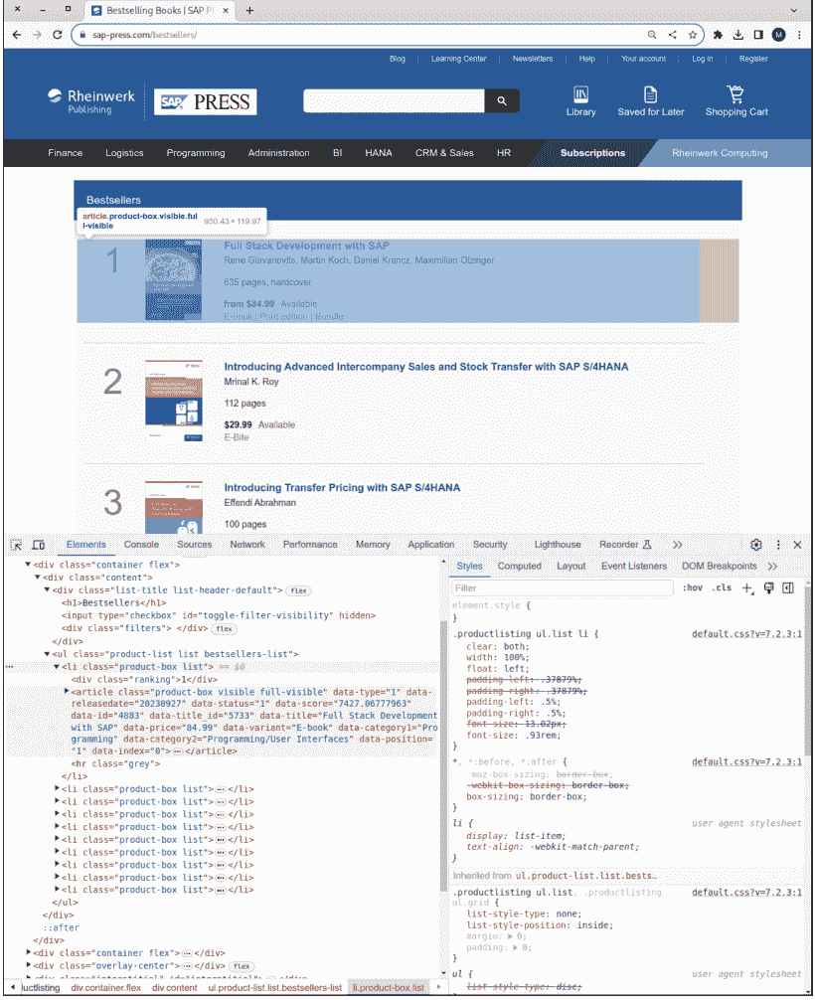

现在，只需在Python代码中复制分析出的结构即可，这在此例中相当简单：首先，`dom.find` 查找具有 `bestsellers-list` 类的 `<ul>` 元素。在此元素内，通过 `find_all` 结果的循环遍历所有 `<article>` 对象。对于每篇文章，`data-title` 属性显示书名。第一个链接（`<a>`）指向书籍的详情页。然而，`href` 属性包含的是相对链接，必须使用 `urljoin` 进行补全。

```
# 示例文件 sap-press-bestsellers.py
import requests
import urllib.parse
from bs4 import BeautifulSoup

# 使用 BeautifulSoup 解析 HTML 内容
siteurl = " https://www.sap-press.com/bestsellers/"
response = requests.get(siteurl)
dom = BeautifulSoup(response.content, 'html.parser')

# 查找包含畅销书的部分
bestsellers = dom.find('ul', class_ = 'bestsellers-list')

# 提取书名及其详情页链接
articles = bestsellers.find_all('article')
for article in articles:
    print('*', article['data-title'])
    link = article.find('a')['href']
    bookurl = urllib.parse.urljoin(siteurl, link)
    print(' ', bookurl)
```

2023年11月的一次测试运行产生了以下结果：

```
* Full Stack Development with SAP
  https://www.sap-press.com/full-stack-development-with-sap_5733/
* Introducing Advanced Intercompany Sales and Stock Transfer with SAP S/4HANA
  https://www.sap-press.com/introducing-..._5743/
* Introducing Transfer Pricing with SAP S/4HANA
  https://www.sap-press.com/introducing-..._5790/
...
```

> **重新上线时的错误**
网络爬虫依赖于网站的结构。一旦网站的布局发生变化，脚本就必须相应地进行调整。这一事实同样适用于我们的示例。当我在2023年11月开发这段代码时，它运行得非常完美。但如果出版商决定重新上线网站，甚至更改布局，脚本很可能只会返回错误信息，而不是书名列表。

## 17.6 使用 Requests-HTML 进行网络爬虫

对于某些网站，魔鬼藏在细节中。在网页浏览器中查看页面时，你可以看到完整的HTML代码，可能不会预料到任何问题。但当你尝试将同一页面作为DOM处理时，重要的组件突然缺失了。（你也可以尝试仅通过 `curl` 下载页面。然后，将下载的代码与你在浏览器中看到的HTML代码进行比较。）

这种奇怪行为的原因与JavaScript有关：许多现代网站提供的是半成品的HTML文档。页面的部分内容仅在网页浏览器中通过本地执行嵌入的JavaScript代码来完成。

对于这类网页，你不能简单地下载HTML文档；其包含的JavaScript代码也必须由Python执行。为了实现这一点，你必须使用功能更强大的 `requests-html` 模块，而不是 `requests` 模块。与往常一样，该模块必须通过pip预先安装，使用以下命令：

```
$ pip install requests-html (Windows, Linux)
$ pip3 install requests-html (macOS, old Linux distributions)
```

以下几行展示了该模块的应用：

```
from requests_html import HTMLSession
url = "https://www.githubstatus.com/"
session = HTMLSession()
# 下载包含 JavaScript 的 HTML 代码
response = session.get("https://example.com")
# 运行嵌入的 JavaScript 代码
response.html.render()
```

首次运行 `render` 时，会下载一个本地的 Chromium 副本。（下载量超过100 MB，因此需要一些时间。）然后，Chromium 负责处理 JavaScript 代码，幸运的是，它在 Windows 上也能正常工作。然而，每次启动脚本都必须重新运行 Chromium，这会明显延迟 `render` 调用。因此，你应该只在真正必要时才使用 `render`！

### 17.6.1 示例：分析 GitHub 状态

在 `https://www.githubstatus.com` 页面上，GitHub 公司总结了其服务的当前状态。本示例的目标是将此状态信息读入一个字典。乍一看，任务似乎很简单。

然而，完整的HTML代码仅在客户端由JavaScript生成。只有通过 Requests-HTML 模块加载页面并使用 `render` 运行后，网络爬虫才能工作。

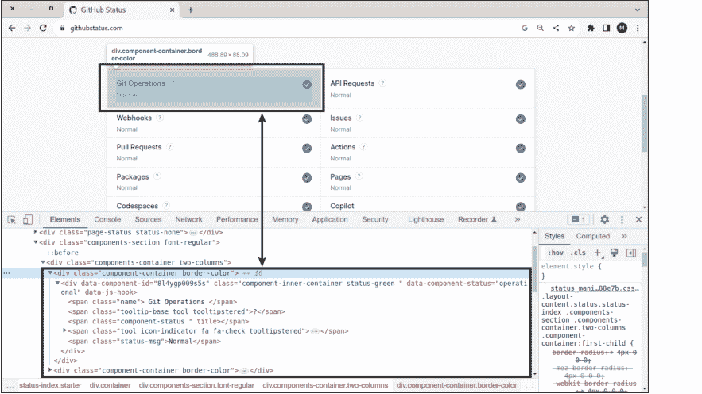

图 17.2 GitHub 状态

现在，你有了选择：`response.html` 提供了类似 Beautiful Soup 的DOM访问。其方法名称与 Beautiful Soup 略有不同，但快速查阅文档（参见 https://requests.readthedocs.io/projects/requests-html）后就能直观地使用。以下几行展示了 GitHub 示例的第一个变体，仅使用 Requests-HTML 模块：

```
# 示例程序 github-status1.py
from requests_html import HTMLSession
url = "https://www.githubstatus.com/"
session = HTMLSession()
response = session.get(url)  # response 对象
response.html.render()

# 保存结果
dict = {}

# 遍历所有 component-container 元素
containers = response.html.find('div.component-container')
for container in containers:
    # 跳过不可见的容器
    if 'style' in container.attrs and
        container.attrs['style'] == 'display: none;':
            continue
```

```
# 解析剩余的容器，保存结果
name = container.find('span.name', first=True).text.strip()
status = container.find('span.status-msg',
                        first=True).text.strip()
dict[name] = status

# 显示结果
print(dict)
```

假设 GitHub 服务目前全部正常运行，脚本结果应如下所示：

```
{'Git Operations': 'Normal', 'API Requests': 'Normal',
 'Webhooks': 'Normal', 'Issues': 'Normal',
 'Pull Requests': 'Normal', 'Actions': 'Normal',
 'Packages': 'Normal', 'Pages': 'Normal',
 'Codespaces': 'Normal', 'Copilot': 'Normal'}
```

如果你不想处理 `requests-html` 的DOM函数，也可以使用 Beautiful Soup 处理HTML代码。在这种情况下，`.html.html` 的重复并非错误。`response.html` 引用DOM，而 `response.html.html` 则提供相应的HTML代码。

```
# 示例程序 github-status2.py
# 前几行与 github-status1.py 相同 ...
# 使用 BeautifulSoup 解析 HTML 内容
dom = BeautifulSoup(response.html.html, 'html.parser')
dict = {}

# 遍历组件
containers = dom.find_all('div', class_ = 'component-container')
for container in containers:
    # 跳过不可见的容器
    if container.has_attr('style') and container['style'] == 'display: none;':
        continue
    name = container.find('span', class_='name').contents[0].strip()
    status = container.find('span', class_='status-msg').contents[0].strip()
    dict[name] = status
```

## 17.7 使用 PowerShell 进行网络爬虫

在本书涵盖的三种编程语言中，Python最适合网络爬虫。然而，简单的任务也可以使用PowerShell解决。`Invoke-WebRequest` cmdlet 返回一个 `BasicHtmlWebResponseObject`，它提供了对请求响应的选定属性的访问。此cmdlet不会给你一个完整的DOM，但对于某些任务，其包含的属性已经足够。

| 属性 | 含义 |
| --- | --- |
| Content | HTML代码（字符串） |
| Headers | 返回的标头（字符串字典） |
| Status | 响应的HTML状态码（整数） |
| Images | HTML代码中包含的所有图像列表 |
| InputFields | HTML页面表单中的所有输入字段列表 |
| Links | 所有包含的链接列表 |

**表 17.1** BasicHtmlWebResponseObject 最重要的属性

以下脚本将网页上链接的所有图像下载到临时目录中。下载通过 `Invoke-WebRequest` 和 `-OutFile` 选项在循环中执行。为了抑制此cmdlet产生的状态输出，`ProgressPreference` 变量被临时设置为 'SilentlyContinue'。

```
# 示例文件 load-images.ps1
New-Item -ItemType Directory -Force tmp | Out-Null

$url = 'https://sap-press.com/'
$response = Invoke-WebRequest $url

# 遍历网站首页上的所有图像
foreach($image in $response.Images) {
    $src = $image.src
    if ($src.StartsWith('//')) {
        # 为协议相对链接添加 'https:' 前缀
        $src = "https:" + $src
    } elseif (! $src.StartsWith('http')) {
        # 为相对链接添加基础URL前缀
        $src = $url + $src
    }
    $filename = 'tmp/' + (Split-Path $image.src -Leaf)
    Write-Output ($src + " -> " +  $filename)
    $ProgressPreference = 'SilentlyContinue'  # 无状态输出
    Invoke-WebRequest $src -OutFile $filename # 输出
    $ProgressPreference = 'Continue'
}
```

## 17.7.1 PowerHTML 模块

要将 HTML 页面转换为合适的 DOM，最佳方法是使用 *PowerHTML* 模块中的 `Convert-From-HTML` cmdlet。请注意，你必须提前安装该模块：

```
> Install-Module PowerHTML
```

该模块自 2019 年以来未进行更新，缺乏与 *Requests-HTML* 相当的 JavaScript 功能。此外，*PowerHTML* 的文档也不完善。在内部，该模块使用 *Html Agility Pack* (HAP)，其描述见 https://html-agility-pack.net。

以下脚本读取 PowerShell 的维基百科页面并从中提取所有 `<h2>` 标题。由于每个标题由多个组件构成，因此需要在标题内确定 `mw-headline` 类的 `<span>` 元素。

```
# 示例文件 wikipedia.ps1
$url = 'https://en.wikipedia.org/wiki/PowerShell'
$response = Invoke-WebRequest $url
$dom = ConvertFrom-Html $response
# 搜索 <div id='bodyContent'>
$content = $dom.SelectSingleNode("//div[@id='bodyContent']")
# 搜索其中的所有 <h2> 标题
$headers = $content.SelectNodes("//h2")
foreach ($header in $headers) {
    $headline =
        $header.SelectSingleNode("span[@class='mw-headline']")
    Write-Output $headline.InnerText
}
```

> **PowerHTML 的替代方案**

PowerHTML 模块可在不同平台上运行，甚至在 Linux 上的 PowerShell 脚本中也能使用。一个替代方案是使用 `HTMLFile` 类，但该类仅在 Windows 上可用，而且即使在 Windows 上，在 PowerShell 脚本中使用起来也很麻烦。你可以在 Stack Overflow 上找到一个示例：https://stackoverflow.com/a/71855426。

## 第 18 章
使用 REST API

在第 17 章的引言中，我明确指出网络抓取只是权宜之计。如果能使用应用程序编程接口（API）来实现此目的，网站之间或与外部服务之间的信息交换会可靠得多。REST API 在近几十年来已确立地位。表述性状态转移（REST）基于通过既定的 HTTP 请求（如 GET、PUT 或 POST）进行数据交换。数据主要以 JSON 格式传输，或者（幸运的是）较少以 XML 格式传输。一些 API 还需要身份验证，有多种方法可供选择（Basic、Bearer、Digest、OAuth 等）。

在本章中，我将演示如何使用 REST API，并向你展示一些基本的编程技巧。

> **本章的先决条件**

示例脚本使用了本书涵盖的所有三种编程语言。此外，阅读本章的一个重要先决条件是第 10 章。JSON 作为 REST 数据格式无处不在。

只有当你具备关于 HTTP 和 REST 的基础知识时，你才能从本章中受益。如果你不熟悉典型的请求类型（如 GET、PUT 或 POST），或者从未听说过 Bearer 身份验证，你应该先做一些研究。

## 18.1 工具

正如我即将向你展示的，`curl` 或 `wget` 命令足以测试 REST API。但这并不有趣。你绝对应该安装一个图形用户界面（GUI）来运行 HTTP 请求，以便分析外部 API 以及进行调试。我推荐 Postman (https://postman.com)，但 Swagger UI、Insomnia REST 客户端或 RapidAPI（以前称为 Paw，仅适用于 macOS）也是不错的选择。还存在各种浏览器扩展程序，可以在 Web 浏览器中试用 REST API。

## 18.2 可试用的示例 API

要练习使用 REST API，你需要一个练习场。在接下来的页面中，你可以找到一些可以免费试用的 API（尽管有些只是有限免费）：

- https://httpbin.org
- https://restcountries.com
- https://www.postman.com/explore
- https://apipheny.io/free-api
- https://github.com/public-apis/public-apis

为了以直接的方式模拟真实的 API，你可以使用 *WireMock* (https://wiremock.org)。基本上，WireMock 是一个开源项目。但是，使用其关联的云服务仅在重大限制下免费，并且更针对希望在生产环境之外测试 API 的大型公司。

## 18.3 实现自定义 REST API

使用 Bash 或 PowerShell，实现你自己的 REST API 几乎是不可能的。Python 的情况则不同，*Flask* 和 *Django* 是服务器编程中广泛使用的两个框架。可能的替代方案包括 *FastAPI*、*Pyramid* 或 *Bottle*。然而，设计和实现 API 都远远超出了本书的范围，本书的重点通常是简短的脚本。

## 18.4 curl 和 wget

Linux 用户尤其熟悉 `curl` 和 `wget` 命令。这些命令主要用于在终端中下载文件。`curl` 默认显示下载文件的内容；但是，可以使用 `-o`（是字母“o”，不是数字“零”）将输出保存到文件。`wget` 默认将文件保存到本地目录。如果文件名无法从 URL 中明确得知，则使用网站的默认主页文件名（通常是 `index.html`）。要在标准输出中显示文件，你应该使用 `-O`（同样是字母“o”）后跟所需的文件名，或使用 `-` 表示标准输出。

```
$ curl https://example.com/some/file.txt -o file.txt
$ wget https://example.com/some/file.txt
```

> **安装**
在 Linux 和 macOS 上，`curl` 默认可用。`wget` 可以使用常规的包管理工具安装（即 `apt/dnf/brew install wget`）。
Windows 的 `curl` 可以从 https://curl.se/windows 下载；`wget` 可以从 https://eternallybored.org/misc/wget 下载。

### 18.4.1 curl

curl 和 wget 默认执行 GET 请求，不需要身份验证。但是，这两个命令也可以上传本地数据（PUT/POST），支持各种身份验证类型等。在本节中，我将重点介绍 curl，并简要总结 REST 上下文中最重要的选项：

- `-X` 或 `--request GET/POST/PUT...` 指定所需的请求类型（默认为 GET）。
- `-H` 或 `--header 'txt'` 传递所需的 HTTP 头，例如 `-H "Content-Type: application/json"`。如果需要多个头，可以重复使用该选项。`-H @file.txt` 从文件中读取头信息。
- `-d` 或 `--data 'data'` 随请求发送指定的数据。对于 `--data`，有以下替代选项：`--data-binary`、`--data-raw` 和 `--data-urlencode`。在任何情况下，也可以通过 `@file` 从指定的文件中读取数据。
- `-u` 或 `--user name:pw` 传递用户名和相应的密码。
- `-n` 或 `--netrc` 告诉 curl 从 `.netrc` 文件中读取登录信息。使用 `--netrc-file file.txt`，你可以选择指定该文件的不同位置。这两种变体都比通过 `-u` 传递密码更安全。
- `--oauth2-bearer 'token'` 随请求发送指定的 Bearer 令牌。
- `-L` 或 `--location` 允许 curl 执行 HTTP 重定向。因此，如果服务器指示页面现在位于不同的位置，将遵循此重定向。
- `-k` 或 `--insecure` 不检查 SSH 或 HTTPS 证书。（这不安全！）
- `-v` 或 `--verbose` 在请求执行期间显示全面的调试信息。
- `-I` 或 `--head` 仅返回响应的头作为结果。例如，如果你只对 HTTP 状态码感兴趣，而对响应中的其他数据不感兴趣，此选项很方便。

以下示例引用 https://httpbin.org。该网站的目的是测试 REST 工具或脚本。例如，对 `/headers` 地址的 GET 请求返回一个包含所有传输头的 JSON 文档：

```
$ curl https://httpbin.org/headers -H 'myheader1: lorem' \
                           -H 'myheader2: ipsum'

{
  "headers": {
    "Accept": "*/*",
    "Host": "httpbin.org",
    "Myheader1": "lorem",
    "Myheader2": "ipsum",
    "User-Agent": "curl/8.0.1",
    "X-Amzn-Trace-Id": "Root=1-64228236-74fe..."
  }
}
```

在第二个示例中，你首先创建一个名为 `mydata.json` 的小型本地 JSON 文件。然后，你使用 PUT 将此文件传输到 `/put` 地址。网站会响应发送的数据，因此你可以检查一切是否正常：

```
$ cat > mydata.json << EOF
{
    "firstName": "John",
    "lastName": "Doe"
}
EOF
```

```
$ curl -X PUT https://httpbin.org/put?para=123 -d @mydata.json \
      -H "Content-Type: application/json"
```

```
{
    "args": {
        "para": "123"
    },
    "data": "{ "firstName": "John",  "lastName": "Doe"}",
    "json": {
        "firstName": "John",
        "lastName": "Doe"
    }, ...
}
```

出于调试目的，一种常用的方法是在 GUI 中编译请求。在最后一个示例中，你将测试基本身份验证。在此测试中，你使用 `/basic-auth/name/pw` 指定登录数据。然后，网站检查此数据是否与 `-u 'name:pw'` 中的数据匹配。使用 `-I`，将显示响应的状态码：在第一种情况下，状态码为 200（身份验证成功）；在第二种情况下，状态码为 401（身份验证失败）。

```
$ curl -X GET "https://httpbin.org/basic-auth/maria/topsecret" \
      -u 'maria:topsecret' -I

HTTP/2 200
```

```
$ curl -X GET "https://httpbin.org/basic-auth/maria/topsecret" \
      -u 'maria:wrong' -I

HTTP/2 401
```

## 18.4.2 wget

wget 基本上支持与 curl 相同的功能，但选项名称不同。使用 wget 还是 curl 取决于个人偏好。本节我将不详细描述各个选项（如需了解，可以阅读 `man wget`！），只介绍两个示例。第一个命令是一个简单的 GET 请求。httpbin.org 会返回一个包裹在 JSON 文档中的 UUID。由于使用了 `-O -`，返回结果会直接显示在终端中。而 `-q`（安静模式）则会阻止状态信息的输出。

```
$ wget https://httpbin.org/uuid -O - -q

{
  "uuid": "9672f6c6-a27e-4059-8d87-35f0dc171bc7"
}
```

第二个示例通过 POST 请求测试 JSON 数据的传输：

```
$ wget --header "Content-Type: application/json" \
      --post-data '{"firstName": "John", "lastName": "Doe"}' \
      https://httpbin.org/post -O -

{
  ...
  "json": {
    "firstName": "John",
    "lastName": "Doe"
  }, ...
}
```

## 18.4.3 在 Bash 脚本中使用 REST API

Bash 并非编写 REST 应用程序的理想脚本语言。使用 Python 或 PowerShell，你可以编写出更好、更高效、更可靠的脚本。然而，对于简单任务，curl/wget 加上 jq（参见第 10 章）的组合就足够了。

以下示例使用了 https://ipinfo.io 网站。该网站对 GET 请求的响应是一个 JSON 文档，其中除了原始 IP 地址外，还包含一个近似的地理映射。（请勿依赖答案的准确性！）

```
$ curl https://ipinfo.io

{
  "ip": "91.115.157.28",
  "hostname": "91-115-157-28.adsl.highway.telekom.at",
  "city": "Graz",
  "region": "Styria",
  "country": "AT",
  "loc": "47.0667,15.4500",
  "postal": "8041",
  "timezone": "Europe/Vienna", ...
}
```

get-location.sh 脚本使用 jq 从响应中提取城市、地区和国家：

```
# 示例文件 get-location.sh
json=$(curl https://ipinfo.io -s)
for key in city region country; do
    echo -n "$key: "
    echo $json | jq .$key
done
```

在我的位置，该脚本会返回以下输出：

```
city: "Graz"
region: "Styria"
country: "AT"
```

## 18.5 在 PowerShell 中使用 REST API

PowerShell 提供了两个 cmdlet 供选择来执行 HTTP 请求：

- 你在上一章（参见第 17 章，第 17.7 节）已经了解了 `Invoke-WebRequest`。该 cmdlet 也可用于 REST 方法。
- `Invoke-RestMethod` 与 `Invoke-WebRequest` 相比，有其特定的优缺点：一个便利的方面是，该 cmdlet 能将扁平（非嵌套）JSON 格式的响应直接转换为 `PSCustomObject`。如果 Web 服务返回 XML 格式的响应，`Invoke-WebRequest` 会直接返回一个 `XmlDocument` 类型的对象。这种对典型 REST 数据类型的相对智能的处理简化了后续分析。
  另一方面，令人烦恼的是，该 cmdlet 不返回 HTTP 状态码。如果请求成功（代码 2xx），你会收到结果数据；否则会发生错误。在某些 REST 应用程序中，这种方法过于简化。

在我看来，`Invoke-RestMethod` 的缺点更多。在大多数应用中，我更喜欢使用 `Invoke-WebRequest`，然后按以下方式将 `Content` 字符串转换为 JSON 对象：

```
> $json = (Invoke-WebRequest `
    'https://httpbin.org/headers').Content | ConvertFrom-Json

> $json.headers.host
httpbin.org
```

在我的测试中，一些 REST 服务在使用 `Invoke-RestMethod` 或 `Invoke-WebRequest` 发出请求时，返回的是 HTML 代码而不是 JSON 代码。这种情况下的解决方案是在请求头中指定用户代理为 `curl`，这样服务就不会错误地认为用户代理是 Web 浏览器：

```
> Invoke-RestMethod 'https://ipinfo.io'

<!DOCTYPE html><html lang="en"> ... (HTML 代码跨越多页)

> Invoke-RestMethod 'https://ipinfo.io' `
    -Headers @{'User-Agent' = 'curl'}

ip        : 91.115.157.28
hostname  : 91-115-157-28.adsl.highway.telekom.at
city      : Graz
region    : Styria
country   : AT
...
```

### 18.5.1 选项

这两个 Invoke cmdlet 不仅提供不同的结果数据类型，而且还有各种彼此不同的特殊选项。幸运的是，至少基本设置的选项是匹配的：

- -Uri 传递地址。此选项不必指定（即地址也可以直接传递给 cmdlet）。
- -Method 指定所需的请求。允许的设置有 Get、Put、Post 等。
- -Authentication 选择所需的认证方法（None、Basic、Bearer 或 OAuth）。
- -Credential 将 Basic 认证的数据传递给请求。登录名和密码对必须作为 PSCredential 对象传递。你可以通过 Get-Credential 交互式地初始化这样一个对象。或者，你可以使用以下代码初始化这样一个对象：
- -Token 将一个字符串传递给 cmdlet，用于 Bearer 和 OAuth 认证。
- -Body 将要传输到 Web 服务器的数据（上传）传递过去。如有必要，你可以使用 -ContentType 指定此数据的格式和字符集。
- -Header 期望一个包含头部设置的哈希表。

```
$password = ConvertTo-SecureString 'topSecret' -AsPlainText `
                            -Force
$credential = New-Object `
    System.Management.Automation.PSCredential('loginname',
                            $password)
```

以下几行展示了如何使用 Invoke-WebRequest 将你自己的数据传输到服务器：

```
$data = @{ firstName = 'John'; lastName = 'Doe'}
$jsondata = $data | ConvertTo-Json
$url = 'https://httpbin.org/put'
$response = Invoke-WebRequest -Method Put $url -Body $jsondata
$response.Content

{
  "headers": {
    "Content-Length": "46",
    "Host": "httpbin.org",
    "User-Agent": "Mozilla/5.0 (Linux; ...) PowerShell/7.3.2",
    "X-Amzn-Trace-Id": "Root=1-6426e776-337f635051c3c6753..."
  },
  "json": {
    "firstName": "John",
    "lastName": "Doe"
  }, ...
}
```

由于一个请求调用通常需要许多选项和参数，一个好主意是先将数据收集到一个哈希表中，然后通过 *splatting*（参见 [第 4 章，第 4.3 节](#chapter-4-section-4-3)）将其传递给 cmdlet：

```
$data = @{ firstName = 'John'; lastName = 'Doe'}
$para = @{ Uri = 'https://httpbin.org/put';
           Method = 'Put';
           Body = $data | ConvertTo-Json}
$response = Invoke-WebRequest @para
```

## 18.6 示例：确定当前天气

以下脚本结合了两个 REST API：

- 首先，使用 *https://ipinfo.io* 地理定位服务来确定当前 IP 地址的推测位置。这并不总是精确的，如果你使用 VPN 连接，可能会完全出错。但在大多数情况下，返回的坐标是相当不错的。
- 第二步，为确定的位置查询当前天气。*https://api.weatherapi.com* 上的 API 在特定限制下可免费使用。但是，你必须获取一个 API 密钥。（只需提供你的电子邮件地址；无需提供信用卡号或任何其他个人信息。）

对于第一步，我使用了 `Invoke-RestMethod`，这是分析 *ipinfo.io* 提交的数据最方便的方式。此外，我使用 `ConvertFrom-Json` 将 *weatherapi.com* 更复杂的 JSON 结构显式转换为 PowerShell 数据结构。

```
# 示例文件 get-weather.ps1
# 使用你自己的密钥！
$key = "7901..."

# 根据当前 IP 地址确定经度和纬度
$location = (Invoke-RestMethod "https://ipinfo.io" `
            -Headers @{'User-Agent' = 'curl'}).loc

# 确定该位置的天气
$base = "https://api.weatherapi.com/v1/current.json"
$url = "${base}?key=$key&q=$location&aqi=no"
$response = Invoke-WebRequest $url
$content = $response.Content | ConvertFrom-Json
$city = $content.location.name
$temp = $content.current.temp_c
$text = $content.current.condition.text
Write-Output "Current weather in ${city}: $text at $temp °C"
```

当你运行该脚本时，结果看起来类似于以下行：

```
Current weather in Graz: Partly cloudy at 5 °C
```

关于使用 `Invoke-RestMethod` 保存汇率的另一个示例，请参见 [第 11 章，第 11.4 节](#)。在该示例中，cmdlet 直接返回一个 XML 对象，随后对其进行评估。

## 18.7 在 Python 中使用 REST API

Python 中 REST 脚本的关键是 `requests` 模块，我已在 [第 17 章](#) 中向你简要介绍过。该模块有一个缺点，即与 `urllib` 模块不同，它必须使用 pip 单独安装：

```
$ pip install requests          (Windows, Linux)
$ pip3 install requests         (macOS, old Linux distributions)
```

作为替代，可以使用同名函数来运行所有可想象的请求，而无需语法上的扭曲。以下几行展示了一个简单的 Get 请求。二进制结果（`response.content`）通过 `decode` 转换为 UTF-8 字符串，然后输出：

import requests
# 发送GET请求
response = requests.get('https://httpbin.org/get?q=123')
print(response.content.decode('utf-8'))
# {
# "args": {
# "q": "123"
# }, ...
```

当REST API返回JSON文档时，你可以使用内置的`json`方法将其转换为Python对象树。（这样，你就不需要使用`json`模块。）你可以使用`status_code`属性来确定Web服务器响应的HTTP状态。

```
data = response.json()
print(data)
# {'args': {'q': '123'}, 'headers': {'Accept': '*/*', ...
print(response.status_code)
# 200
```

根据你要运行的请求类型，你可以相应地使用`put`、`patch`、`delete`等方法代替`requests.get`。你可以向所有方法传递各种可选参数：

- `header`期望一个包含头部数据的字典。
- 对于`data`，你可以传递一个包含参数的字典（例如，用于POST请求）或一个包含其他数据的字符串。
- 或者，你可以传递一个带有`json`参数的字典。其内容将以JSON格式传输。
- 使用`files`，你可以将本地文件上传到服务器。

以下几行展示了一个PUT请求，其中数据以JSON格式传输到服务器：

```
data = {'firstName': 'John', 'lastName': 'Doe'}
response = requests.put('https://httpbin.org/put', json=data)
```

如果你想对请求执行基本身份验证，必须将用户名和密码传递给`auth`选项：

```
url = 'https://httpbin.org/basic-auth/maria/topsecret'
response = requests.get(url, auth=('maria', 'topsecret'))
print("Status Code", response.status_code)
```

或者，如果你更喜欢简单的Bearer身份验证，最好的方法是将令牌作为头部传递：

```
token = "234f1523werf"
headers = {"Authorization": "Bearer %s" % (token)}
url = 'https://httpbin.org/bearer'
response = requests.get(url, headers=headers)
print("Status Code", response.status_code)
```

`requests`模块的无数其他功能记录在 https://requests.readthedocs.io。

## 18.8 示例：确定电价并以图形方式显示

可再生能源的扩张意味着今天的电价比以前波动更剧烈。风刮得越大或阳光越强，可用的电力就越多——有时甚至超过实际需求。在这样的时候，电力交易市场上的电价相当便宜。

在此背景下，提供按小时变化价格（aWATTar、Tibber等）的新型电力供应商目前正在确立自己的地位。这种动态电价激励人们尽可能在电力供应充足时进行高能耗活动（为电动汽车充电、在特定时间启动烘干机），这对客户和能源供应商都有利。


图18.2 未来24小时的电价（2023年4月初奥地利的纯能源价格，含增值税）

本节中的示例参考了*aWATTar*公司。该公司提供了一个API，告知消费者未来几小时（最多24小时）的电价。欧洲EPEX SPOT电力交易所作为数据基础，这些价格是根据供需关系计算的。第二天的价格大约在下午2点后可用。

本节介绍的脚本将这些数据转换为图表。请注意，除了图表中显示的能源成本价格外，数据还包括每月基本费、线路费、固定电费表费等。

### 18.8.1 aWATTar API

该API目前可免费访问，但每天最多100次访问事件：

- https://api.awattar.at/v1/marketdata（奥地利价格）
- https://api.awattar.de/v1/marketdata（德国价格）

不幸的是，JSON结果对人类不可读。给定价格有效的时间段以纪元毫秒表示。这种在Unix中常见的时间规范计算自1970年1月1日UTC以来的秒数或毫秒数。价格以欧元/兆瓦时报价，但不包括增值税和aWATTar收取的3%附加费。

```
{
    "object":"list",
    "data":[
        {
            "start_timestamp":1680508800000,
            "end_timestamp":1680512400000,
            "marketprice":107.11,
            "unit":"Eur/MWh"
        },
        {
            "start_timestamp":1680512400000,
            "end_timestamp":1680516000000,
            "marketprice":93.08,
            "unit":"Eur/MWh"
        },
        ...
    ]
}
```

### 18.8.2 数据分析

初始化各种变量后，脚本进行API调用，然后在循环中分析收集的数据。使用`fromtimestamp`可以轻松地将纪元时间数据转换为“普通”的DateTime对象。净价加上增值税和aWATTar附加费。

```
# 示例文件 electricity-prices.py
import locale, requests
from datetime import datetime
import matplotlib.pyplot as plt
# 根据系统设置使用语言
locale.setlocale(locale.LC_ALL, '')
# 基本设置
surcharge = 0.03   # Awattar在EXPO SPOT上的附加费
vat = 0.20         # 20% 增值税（奥地利）
url = 'https://api.awattar.at/v1/marketdata'
# 德国的替代方案
# vat = 0.19
# url = 'https://api.awattar.de/v1/marketdata'
# API调用
response = requests.get(url)
jsondata = response.json()

# 收集数据
hours = []         # 时间列表
prices = []        # 价格列表
dateStart = None   # 时间段的开始日期

# 分析数据并以文本形式呈现
for price in jsondata['data']:
    startDt = datetime.fromtimestamp(price['start_timestamp'] / 1000)
    hour = startDt.strftime('%H:%M')
    day = startDt.strftime('%a')
    if not dateStart:          # 初始化一次
        dateStart = startDt.strftime('%Y-%m-%d')
    dateEnd = startDt.strftime('%Y-%m-%d')  # 覆盖
    priceCentKw = round(price['marketprice'] / 10 * (1 + surcharge) * (1 + vat))
    priceBar = '*' * int(priceCentKw)       # ASCII类型条形图
    print('%s %s %3d ct/kWh %s' % (day, hour, priceCentKw, priceBar))
    hours += [hour]
    prices += [priceCentKw]
```

脚本首先以文本形式输出处理后的数据，例如：

```
Mo 19:00 20 ct/kWh *****************
Mo 20:00 17 ct/kWh *****************
Mo 21:00 16 ct/kWh *****************
…
```

### 18.8.3 Matplotlib

Python在（自然）科学领域也很受欢迎。因此，各种模块支持绘制技术图表，其中最受欢迎的是Matplotlib。以下代码清单显示，几行代码就足以设计一个简单的图表：

```
# electricity-prices.py的续写
fig, ax = plt.subplots()
ax.bar(hours, prices)
plt.xticks(rotation=90)
plt.title('Prices in ct/kWh from %s to %s' % (dateStart, dateEnd))
# 隐藏每隔一个的标签点
for label in ax.xaxis.get_ticklabels()[::2]:
    label.set_visible(False)
fig.savefig('prices.png', dpi=200)
```

subplots返回两个负责图表不同方面的对象。ax.bar根据两个参数中传递的X和Y值创建一个简单的条形图。plt.xticks(rotation=90)使X轴的标签节省空间。plt.title负责图表的标签。

以下循环隐藏X轴上每隔一个的标签点。savefig最后将图表保存为PNG文件。dpi参数（每英寸点数）确定所需的分辨率。（默认值仅为100 DPI，会导致图表相当像素化。）

不幸的是，本书没有足够的空间深入讨论Matplotlib。但是，你可以在项目网站 https://matplotlib.org 上找到无数示例以及非常有用的备忘单。

有关使用Matplotlib绘制图表以及科学领域其他Python功能的更多信息，请参阅*Python for Engineering and Scientific Computing*（Rheinwerk Computing，2024）。

### 18.8.4 控制能源消耗

比电价的图形表示更令人兴奋的是，在能源成本最低的时间段内自动运行大型消费者。例如，一个定期读取价格数据的树莓派可以切换

## 第19章
### 数据库

关于脚本与数据库的主题几乎无穷无尽。你可以使用脚本向数据库输入数据、读取和处理其中的信息、更改数据库结构等等。

具体而言，流程取决于你所使用的数据库管理系统（DBMS）、编程语言、库或模块。因此，从一开始就在本书中系统性地涵盖所有方面是不可能的。相反，本章将重点介绍一些与 SQL Server 或 MySQL 相关的具体示例：

- 修改、维护和读取相似的数据库（Bash，PowerShell）
- 为新客户设置数据库（Bash）
- 保存可交换图像文件格式（Exif）数据（Python）
- 导入 JSON 文件（PowerShell）

> **本章的先决条件**

与往常一样，你需要具备 Bash、Python 和 PowerShell 的基础知识才能阅读本章。你还应该能够处理 JSON 文件（参见第8章）。最后，你需要对数据库服务器的工作原理有基本的了解。

如果你想用脚本创建数据库备份，我建议你查看第13章。

为了保持示例清晰，我没有进行错误防护，也没有替换登录数据和其他设置。对于“真正的”数据库脚本，这两点都应该是理所当然的。关于错误防护的技巧，请参阅关于 Bash、PowerShell 和 Python 基本原理的章节。我在第14章第14.2节中描述了如何安全地处理设置和密码。

本章的示例脚本不容易直接尝试。你必须首先安装相应的数据库服务器，设置一个包含表的合适数据库，处理与数据库服务器的身份验证等等。

### 19.1 更新和维护数据库

在我的专业工作中，我维护着一个托管许多相似数据库的 MySQL 服务器。每个客户都有一个独立的数据库。尽管这些数据库的内容因客户而异，但结构总是相同的。

偶尔会发生这样的情况——例如为了故障排除——我想对所有数据库应用相同的 SELECT 命令。根据本书的宗旨，所需的脚本甚至不超过10行：

```
# 示例文件 apply-select.sh
# 此文件包含所有数据库的名称
DBLIST=dbs.txt
# 此文件包含要执行的命令；
# 命令必须用 ; 分隔。
SQLFILE=select.sql

for db in $(cat $DBLIST | sort) ; do
  echo "Database: $db"
  mysql $db < $SQLFILE
  echo "---"
done
```

`mysql` 命令在脚本中起着核心作用。它连接到由 `db` 变量指定的数据库，并执行通过输入重定向读取的文件中包含的所有命令。与数据库服务器建立连接需要活动用户具有足够的 MySQL 访问权限，并且身份验证在操作系统级别执行（MySQL 的 `auth_socket` 方法或 MariaDB 的 `unix_socket`），或者 `.my.cnf` 文件包含所需的密码。

`SELECT` 命令的结果直接显示在屏幕上。大多数时候，我以 `./apply-select.sh | less` 的格式运行脚本，这样我可以方便地滚动或搜索输出。

基本上，`select.sql` 也可以包含修改所有数据库的命令，例如向每个数据库中的表添加一列。但由于此类更改比纯查询危险得多，我将这些命令存储在单独的 `updates.sql` 文件中，该文件由第二个 `apply-updates.sh` 脚本处理。除了 `SQLFILE` 变量的初始化外，该脚本与 `apply-select.sh` 相同。

#### 19.1.1 PowerShell 和 sqlcmd

当然，相同的概念也可以通过 PowerShell 脚本实现。该脚本调用 `sqlcmd` 命令，它是 SQL Server 中与 `mysql` 对应的命令。代码如下所示：

```
# 示例文件 apply-select.ps1
$dblist = "dbs.txt"        # 包含数据库名称的列表
$sqlfile = "select.sql"    # SQL 命令
$server = ".\sqlexpress01" # SQL Server 实例

# 遍历所有数据库
foreach($db in Get-Content $dblist) {
    Write-Output "Database: $db"
    sqlcmd -S $server -d $db -i $sqlfile
}
```

如果 SQL Server 不在本地机器上运行，你需要将 . 替换为主机名。同样，我在这里假设脚本在一个有权访问所有相关数据库的账户中运行。请注意，*select.sql* 中包含的 SQL 命令必须用分号分隔。该脚本要求 `sqlcmd.exe` 位于 PATH 变量列出的目录中。

### 19.2 创建新客户账户

本示例的起点是一个用于客户账户的 Web 服务器。客户下单时，会获得自己的数据库，并可以通过自己的地址访问 Web 应用程序：

*https://example.com/name*

以下 Bash 脚本负责处理设置新账户时所需的初始化工作：

- 创建并初始化一个新的 MySQL 数据库
- 创建一个新的 MySQL 用户并使其能够访问数据库
- 设置 /var/www/html/name 目录
- 在该目录中创建一个配置文件
- 向客户发送包含登录数据的电子邮件

在我维护的一台服务器上，我实际上使用了一个以这种方式工作的脚本。出于教学原因，我为本书大大简化了代码。所以，让我先解释一下基本流程。

> **无测试选项**

脚本的代码当然可以在本书的示例文件中找到。但是，你不能直接尝试该脚本。为此，你需要一个 Linux 服务器（包括 Web、数据库和邮件服务器）以及 Web 应用程序的代码、示例数据库等。

#### 19.2.1 账户数据

accountdata 包含新客户的数据。URL 变量指定网址的自定义部分（即 https://example.com/sd-architects）。DB 用作新 MySQL 数据库和相关 MySQL 用户的名称。DB 最多16个字符长，只能包含字母、数字和下划线。

```
# 示例文件 accountdata
FIRSTNAME='Maria'
LASTNAME='Smith'
COMPANY='Smith & Davis Architects'
EMAIL='maria.smith@example.com'
URL='sd-architects'
DB='sdarchitects'
```

#### 19.2.2 脚本结构

make-new-account.sh 脚本必须以 root 权限运行。脚本中包含的 mysql 和 mysqldump 命令基于以下假设：root 对 MySQL 服务器具有无限制的访问权限，或者 MySQL root 用户的密码包含在 /root/.my.cnf 文件中。

代码首先读取新客户的账户数据。脚本首先测试是否已存在同名数据库。在这种情况下，执行将终止：

```
# 示例文件 make-new-account.sh
# 导入账户数据
. accountdata
# 如果数据库已存在则中止
sql="SELECT SCHEMA_NAME FROM INFORMATION_SCHEMA.SCHEMATA
     WHERE SCHEMA_NAME='$DB'"
result=$(mysql -s -N -e "$sql")
echo "result = $result"
if [ "$result" ]; then
  echo "Database $DB already exists."
  exit
fi
```

脚本使用 mkpasswd 密码生成器生成两个随机密码：

- dbpw 变量包含访问客户数据库的密码。此密码仅内部使用，并存储在服务器上的配置文件中。
- loginpw 包含用于 Web 登录的客户密码。此密码的哈希码存储在数据库中。密码通过邮件发送给客户。

在接下来的几行中，使用示例数据库创建并初始化一个新数据库。同时，创建一个有权访问此数据库的 MySQL 账户。

```
# 数据库密码（内部使用）
dbpw=$(makepasswd)
# 用于 Web 登录的客户密码
loginpw=$(makepasswd)

# 创建一个数据库，并将其与 'template' 数据库的副本进行比较
# 初始化
mysqladmin create $DB
mysql $DB | mysqldump template

# 设置用于数据库访问的账户
sql="CREATE USER $DB@localhost IDENTIFIED BY '$dbpw';
     GRANT ALL ON $DB.* TO $DB@localhost"
mysql -e "$sql"
```

登录密码的哈希码存储在客户数据库中。哈希码通过 htpasswd 生成。随后，客户数据存储在之前创建的客户数据库中：

```
# 生成登录密码的哈希码
hash=$(htpasswd -bnBC 10 "" $loginpw | tr -d ':\n')
# 将客户数据保存在客户数据库中
sql="INSERT INTO accounts (firstname, lastname, company,
                         email, hashcode)
     VALUES ('$FIRSTNAME', '$LASTNAME', '$COMPANY',
             '$EMAIL', '$hash')"
mysql $DB -e "$sql"
```

在下一步中，脚本在 /var/www/html 中设置一个新的客户目录，并将数据库访问的登录数据存储在 dbconfig.php 中。chown 和 chmod 命令确保对文件的访问权限正确：

```
# 为客户设置 Web 目录
cd /var/www/html/myapplication
mkdir $URL
cat > $URL/dbconfig.php << EOF
<?php
LocalConfig::set('dbname', '$DB');
LocalConfig::set('dbhost', 'localhost');
LocalConfig::set('dbuser', '$DB');
LocalConfig::set('dbpass', '$dbpw');
EOF
```

## 19.3 在数据库中存储 Exif 元数据

在第 16 章第 16.3 节中，我描述了一个 Python 脚本，该脚本从当前目录的照片中提取 Exif 元数据，并生成包含相应 INSERT 命令的 SQL 命令。这些 SQL 命令可以通过输出重定向保存到文件中，然后应用于数据库（例如，使用 `mysql` 命令）。

但更优雅的方法是让脚本建立数据库连接，并将元数据直接存储在数据库中。这种方法避免了使用 SQL 文件的迂回路径。在接下来的示例中，我假设数据库由 MySQL 服务器管理，并且那里存在 `photos` 表。`CREATE TABLE` 命令记录了表的结构：

```sql
CREATE TABLE photos(
    id INT NOT NULL PRIMARY KEY AUTO_INCREMENT,
    name VARCHAR(255) NOT NULL,
    size INT,
    orientation INT,
    datetimeoriginal DATETIME,
    latitude DOUBLE,
    longitude DOUBLE,
    altitude DOUBLE,
    -- ts contains the date and time of the last change
    ts TIMESTAMP NOT NULL DEFAULT CURRENT_TIMESTAMP()
        ON UPDATE CURRENT_TIMESTAMP()
);
```

### 19.3.1 PyMySQL

有几个 Python 模块可用于访问 MySQL 或 MariaDB 数据库，但本节我将重点介绍 PyMySQL。该模块易于安装、易于使用，并且在我的工作中已得到验证。你可以在以下链接中找到有关其他 MySQL 或数据库模块的更多信息：

- https://stackoverflow.com/questions/372885
- https://wiki.openstack.org/wiki/PyMySQL_evaluation

与往常一样，PyMySQL 必须使用 pip 安装：

```
$ pip install requests (Windows, Linux)
$ pip3 install requests (macOS, old Linux distributions)
```

当你使用 `connect` 建立连接时，需要指定服务器的主机名（如果数据库服务器与你的脚本在同一台机器上运行，则为 `localhost`）、用户名、密码以及要访问的数据库名称。

MySQL 和 MariaDB 支持多种 UTF-8 变体。对于与 Python 的交互，`utf8mb4` 是最佳解决方案。`cursorclass` 参数控制 PyMySQL 返回 `SELECT` 结果的方式。`DictCursor` 游标类型将每条数据记录包装在一个字典中，使用列名作为键。这有助于进一步处理结果。

每次你想运行 SQL 命令时，都需要一个游标对象。我建议使用带有 `with` 的游标，因为这样可以确保你尽快释放对象，不会阻塞不必要的资源。

然后，必须将包含 SQL 命令的字符串传递给 `execute` 方法。该命令可以包含任意数量的 `%s` 代码。`execute` 会用传递在第二个参数中的元组、列表或字典中的字符串替换它们。请注意，这里不允许使用其他代码，例如用于数字的 `%d`。如果你想存储 `NULL`，必须使用 Python 关键字 `None`。

```python
# Sample file hello-pymysql.py
conn = pymysql.connect(host='localhost',
                       user='username',
                       password='topsecret',
                       db='dbname',
                       port=3306,
                       charset='utf8mb4',
                       cursorclass=pymysql.cursors.DictCursor)
```

```python
# read entries from the 'photos' table
with conn.cursor() as cur:
    sql = 'SELECT * FROM photos WHERE id < %s'
    cur.execute(sql, (1000))
    while row := cur.fetchone():
        print(row)
```

使用 `execute`，你还可以运行 `INSERT`、`UPDATE` 或 `DELETE` 命令。`commit` 完成事务。然后你可以从 `lastrowid` 属性获取新记录的 ID 号。

```python
sql = '''INSERT INTO photos (name, size, orientation)
        VALUES (%s, %s, %s)'''
with conn.cursor() as cur:
    cur.execute(sql, ('img_1234.jpg', 3231283, 0))
    conn.commit()
    print('ID of new record:', cur.lastrowid)
```

如果你的脚本在数据库操作完成后继续运行，你应该关闭数据库连接：

```python
conn.close()
```

有关如何使用 PyMySQL 的更多详细信息，请参阅项目文档：https://pymysql.readthedocs.io。

### 19.3.2 保存 Exif 元数据

我已经在第 16 章第 16.3 节中解释了如何使用脚本在 Python 中分析嵌入在照片图像文件中的 Exif 数据。此时，只需将元数据直接存储在数据库中即可。为此，必须在脚本开头建立数据库连接。之后，在循环中遍历所有图像文件。

```python
# Sample file exif-to-mysql.py (shortened)
import ...
# establish connection
conn = pymysql.connect(host='localhost', ...)

# consider only the following EXIF keys
keys = ['File:FileName', 'File:FileSize', ...]

# analyze parameters (sys.argv)
filenames = ...

# INSERT command
sql = '''INSERT INTO photos (name, size, orientation,
            datetimeoriginal, latitude, longitude, altitude)
    VALUES (%s, %s, %s, %s, %s, %s, %s)'''

# connect to exiftool command, DB cursor
with exiftool.ExifToolHelper() as exifhelper, \
    conn.cursor() as cur:

    # loop through all files
    for file in filenames:
        # collect EXIF data in list
        results = []
        try:
            metadata = exifhelper.get_tags(file, keys)[0]
            for key in keys:
                if key in metadata:
                    if key == 'EXIF:DateTimeOriginal':
                        # adapt date to ISO syntax
                        date = str(metadata[key])
                        results += [ date.replace(':', '-', 2) ]
                    else:
                        results += [str(metadata[key])]
                else:
                    results += [ None ]   # corresponds to NULL
            # run INSERT
            cur.execute(sql, results)
        except Exception as e:
            print("-- skipped %s" % (file))

# save all changes (commit)
conn.commit()
conn.close()
```

有关用于试用脚本的照片集合，请参阅[第 14 章](Chapter 14)的示例文件。

## 19.4 将 JSON 数据导入表

本节的起点是 JSON 文件 *employees.json*，其结构如下：

```json
[
  {
    "FirstName": "Ruthanne",
    "LastName": "Ferguson",
    "DateOfBirth": "1977-06-04",
    "Street": "4 Dewy Turnpike",
    "Zip": "27698",
    "City": "Clifton Hill",
    "State": "NJ",
    "Gender": "F",
    "Email": "ruthanne_ferguson5693@fastmail.cn",
    "Job": "Junior Engineer",
    "Salary": "5201.45"
  }, ...
]
```

一个 PowerShell 脚本应该处理此文件，并将记录输入到 SQL Server 数据库的表中。我假设 JSON 键与表的列名匹配。你可以使用以下命令创建一个合适的表：

```sql
CREATE TABLE employees(
    id INT IDENTITY(1, 1) PRIMARY KEY,
    FirstName TEXT NOT NULL,
    LastName TEXT NOT NULL,
    DateOfBirth DATE,
    Street TEXT,
    City TEXT,
    State CHAR(2),
    Gender CHAR(1),
    Email TEXT,
    Job TEXT,
    Salary FLOAT);
```

该脚本使用我们在第 15 章第 15.3 节中描述的 SQLServer 模块。如果你尚未执行此操作，则必须使用 Install-Module SQLServer 安装该模块。
代码以初始化一些变量开始。Get-Content 读取 JSON 文件。ConvertFrom-JSON 将其转换为包含 PSCustomObjects 的数组。外部 foreach 循环遍历所有数组元素。内部循环遍历所有列并创建 INSERT 命令的 VALUES 部分。生成的命令将如下例所示：

```sql
INSERT INTO employees (FirstName, LastName, DateOfBirth, ...)
VALUES('Sebastian', 'James', '1953-05-14', ...);
```

该脚本依赖于每条数据记录的所有列都有可用数据这一事实。如果不是这种情况，你必须包含适当的测试，并在必要时在 SQL 命令中包含 NULL。
最后，所有收集的命令都通过 Invoke-Sqlcmd 传递给 SQL Server。

# 示例文件 json-to-sql-server.ps1
Import-Module SQLServer

# 连接到 SQL Server
$connectionString = "Server=.\sqlexpress01;Database=mydb;" +
                    "Trusted_Connection=true;Encrypt=false"

# 表名和列名
$tableName = "employees"
$columns = "FirstName", "LastName", "DateOfBirth", "Street",
           "City", "State", "Gender", "Email", "Job", "Salary"

$sql = "INSERT INTO $tablename (" + ($columns -Join ", ") + ") "
$sqlcmds = ""

# 读取 JSON 文件并将其转换为 PowerShell 对象
$jsonFilePath = "employees.json"
$json = Get-Content $jsonFilePath | ConvertFrom-Json

# 遍历所有数组元素（数据记录）
foreach ($record in $json) {
    $values = ""
    # 遍历所有列
    foreach ($column in $columns) {
        if ($values) {
            $values += ", "
        }
        $values += "'" + $record.$column + "'"
    }
    $sqlcmds += $sql + "`nVALUES(" + $values + ");`n"
}

# 运行 SQL 命令
Invoke-Sqlcmd -ConnectionString $connectionString -Query $sqlcmds

## 第 20 章
云端脚本

云是庞大且多样化的——从这个意义上说，本章的标题有些自大。关于这个主题，可以写一整本书，涵盖不同的云模型、提供商和编程变体。

在此，我将重点关注 *Amazon Web Services (AWS)* 的 *简单存储服务 (S3)*。这项服务已成为一种经济高效的文件存储方式。主要有两种使用选项：你可以存储公开可访问的文件（例如，以减轻你自己的 Web 服务器的负载），或者你可以将 S3 用作备份或很少需要的文件的存储位置。同时，你需要关注成本：根据具体方案，传输或实际存储可能是决定性因素。

有两个优秀的库可用于控制 AWS S3 功能：用于 Bash 脚本的 AWS 命令行界面 (CLI) 和用于 PowerShell 脚本的 AWS 模块。本章将描述这两种变体。

> **本章先决条件**

要从本章中受益，你需要具备良好的 Bash 或 PowerShell 知识。你还需要一些关于 AWS S3 的基础知识：特别是，你需要知道术语“存储桶”的含义，以及用户管理，特别是 *身份和访问管理 (IAM)* 是如何工作的。

本章介绍的两个示例分别基于 [第 15 章] 和 [第 17 章] 中描述的技术。因此，建议你先复习这两章。

### 20.1 AWS CLI

AWS CLI 使你能够在命令级别控制 AWS 功能。CLI 基本上可以安装在所有常见平台上。然而，在以下部分中，我假设你使用 Linux 或 macOS，并希望用 Bash 开发你的脚本。

别担心，PowerShell 爱好者不会被冷落，可以直接向下滚动到 [第 20.3 节]。

#### 20.1.1 在 Linux 和 macOS 上安装

所有平台的 AWS CLI 下载和安装指南可在 https://docs.aws.amazon.com/cli/latest/userguide/getting-started-install.html 找到。

在 Linux 上，你必须下载 ZIP 文件，解压存档，然后运行安装脚本。`aws` 命令将存储在 `/usr/local/bin` 目录中，并且应该可以在那里执行，无需更改 `PATH`。如果你想更新现有安装，必须将 `--update` 选项传递给 `install` 命令。

```
$ curl https://awscli.amazonaws.com/awscli-exe-linux-x86_64.zip \
    -o "awscliv2.zip"
$ unzip awscliv2.zip
$ sudo ./aws/install
$ aws --version
aws-cli/2.11.11 Python/3.11.2 ...
```

> **cron 问题**
在某些 Linux 发行版中，`/usr/local/bin` 未包含在与 cron 作业相关的 `PATH` 变量中。在这种情况下，在 cron 作业中调用 `aws` 将会失败。一个解决方案可能是从 `/usr/bin/aws` 创建一个指向 `/usr/local/bin/aws` 的链接，或者在脚本中始终指定 `aws` 命令的完整路径。

对于 macOS，Amazon 提供了一个 PKG 安装程序。安装过程只需点击几下即可完成。同样，`aws` 命令安装在 `/usr/local/bin` 目录中。

#### 20.1.2 配置

对于以下示例，你需要一个具有对一个或多个存储桶访问权限的 AWS 用户。一旦你在 AWS Web 界面的 **身份和访问管理** 下设置了一个用户并分配了访问密钥，你就应该运行 `aws configure`。此命令会询问凭据并将其存储在本地配置文件 `.aws/config` 和 `.aws/credentials` 中。然后在你希望脚本以后运行的账户下运行 `aws configure`。如果这些脚本是需要 `root` 权限的备份脚本，则还必须在 `root` 账户中运行 `aws configure`。

```
$ aws configure

AWS Access Key ID [None]:    AKxxxxxxxx
AWS Secret Access Key [None]: xxxxxxxxxxxxxxxx
Default region name [None]:  eu-central-1
Default output format [None]: <Return>
```

你可以暂时将默认区域留空。稍后，你可以使用 `aws s3api get-bucket-location` 来确定你的存储桶所在的区域，然后重复运行 `aws configure`：

```
$ aws s3api get-bucket-location --bucket my.bucket.name
"LocationConstraint": "eu-central-1"
```

#### 20.1.3 入门

aws 命令通常由三部分组成：主 `aws` 命令；AWS 服务的名称（例如 `s3` 或 `ec2`）；以及该服务的子命令。要确定你的配置中可以访问哪些存储桶，你需要运行以下命令：

```
$ aws s3 ls

2020-06-23 00:40:38 my.bucket.name
2022-12-12 02:51:07 my.bucket.othername
```

如果你将 `s3://<bucketname>` 作为另一个参数传递给 `ls`，`aws` 将显示该存储桶中的文件：

```
$ aws s3 ls s3://my.bucket.name

2023-12-15 11:11:53    61431 test.txt
2023-03-22 15:23:01    61431 test2.txt
```

通过使用 `aws s3 cp`，你可以将本地文件复制到存储桶，反之亦然：

```
$ aws s3 cp local-file.txt s3://my.bucket.name
$ aws s3 cp s3://my.bucket.name/local-file.txt copy.txt
```

除了 `cp`，你还应该熟悉 Bash 工作中的一些其他子命令，例如 `mv` 或 `rm`。许多命令都支持 `--recursive`、`--include 'pattern'` 和 `--exclude 'pattern'` 选项，其中 pattern 支持 `?` 和 `*` 等字符。这些字符的含义与 Bash 中相同（参见第 3 章第 3.8 节的表 3.3），而不是正则表达式中的含义。

请注意，S3 存储桶对目录概念的支持是有限的。虽然存储在存储桶中的文件名可能由多个部分组成（dir1/dir2/file），但无法通过 `mkdir` 创建目录或使用 `rmdir` 删除目录。

最重要的 AWS S3 命令之一是 `aws s3 sync`。此命令允许你同步本地目录和存储桶中的目录。此命令对于备份特别有用：例如，如果你的数据的完整备份存储在本地目录中，你可以通过定期执行同步命令来创建冗余。如果本地备份丢失，你仍然在云中有一份副本。（请注意，使用 AWS 时，你不仅需要为存储的数据量付费，还需要为每个方向的传输付费。出于成本考虑，最好以增量方式组织备份，这样只需传输从一天到下一天保存的更改。）

```
$ aws s3 sync my-local-backupdir s3://my.bucket.name
```

所有 AWS S3 命令的参考可在 https://awscli.amazonaws.com/v2/documentation/api/latest/reference/s3/index.html 找到。

#### 20.1.4 加密文件

尽管 Amazon 宣称你的文件是加密存储的，但只要 Amazon 持有密钥，这种加密并不能显著提高数据的安全性。如果你不希望外部公司或情报机构读取你组织或公司的备份，则必须在将所有文件传输到云之前对其进行加密。这条基本规则并非 Amazon 特有，而是适用于在外部服务器或云服务上存储数据的 *任何* 场景。

在以下部分中，我将向你介绍 `gpg` 命令，它允许你以简单的方式对文件进行对称加密，并在以后解密。

> **对称加密与非对称加密**

“对称加密”意味着加密和解密使用相同的密钥。相比之下，非对称方法使用密钥对（如 SSH）：公钥用于加密；私钥用于解密。如果加密需要在不同位置（计算机）进行，这种方法尤其有利。此设置所需的公钥可以放心分发。

然而，不幸的是，非对称方法对于大文件来说效率低下。尽管如此，为了利用非对称程序的优势，一种常见的做法是继续对文件进行对称加密。此外，密钥现在也被加密了——即非对称加密！这种场景现在被称为“混合加密系统”，在 https://en.wikipedia.org/wiki/Hybrid_cryptosystem 中有描述。

出于我们的目的（即，在云中安全保存备份文件），对称程序是完全足够的。你只需要确保你使用的密钥不会落入错误的人手中。

首先，你需要一个密钥（即，只是一个包含随机数据的二进制文件）。生成新密钥的好方法是使用 `openssl` 命令，它是 Linux 上同名软件包的一部分。以下命令创建一个长度为 32 字节的密钥。（32 字节似乎

## 20.2 示例：将加密备份文件上传到云端

在第15章第15.2节中，我向你介绍了一个脚本，它将MySQL服务器数据库和Web服务器目录的备份存储在本地目录中。只需稍加改进，你就可以让这个脚本先压缩本地文件，然后将它们上传到AWS存储桶。由于脚本相当简短，我在这里再次打印了完整的代码。让我也简要指出几个特殊之处：

- 加密命令被封装在函数中。
- 函数在管道中被调用：`mysqldump`创建备份，`gzip`压缩它，`mycrypt`加密它。只有结果被保存到文件中。这种方法避免了创建中间文件的耗时过程。
- 类似地，`tar`创建一个压缩归档文件。`-f -`将其转发到标准输出。`mycrypt`对其进行加密，并再次将结果保存到文件中。
- 在调用`aws`时，我为每种情况都指定了命令的完整路径，这样即使通过cron自动化，脚本也能无误运行。
- 与通常的`cp`命令（可以将多个文件复制到目标目录，即`cp file1 file2 file3 dir`）不同，`aws s3 cp`只接受一个源文件。因此，我必须为每个文件单独调用该命令。

```
# 示例文件 lamp-backup-to-aws.sh
BACKUPDIR=/localbackup
DB=wp
DBUSER=wpbackupuser
WPDIR=/var/www/html/wordpress
BUCKET=s3://your.bucket.name

function mycrypt {
    gpg -c -q --batch --cipher-algo AES256 --compress-algo none \
        --passphrase-file /etc/mykey
}
function myuncrypt {
    gpg -d --batch --no-tty -q --cipher-algo AES256 \
        --compress-algo none --passphrase-file /etc/mykey
}

# MySQL 备份
weekday=$(date +%u)
dbfile=$BACKUPDIR/wp-db-$weekday.sql.gz.crypt
mysqlopt='--single-transaction'
mysqldump -u $DBUSER $mysqlopt $DB | gzip -c | mycrypt > $dbfile

# WordPress 文件备份
htmlfile=$BACKUPDIR/wp-html-$weekday.tar.gz.crypt
tar czf - -C $WPDIR . | mycrypt > $htmlfile

# 上传到 AWS 存储桶
/usr/local/bin/aws s3 cp $dbfile   $BUCKET
/usr/local/bin/aws s3 cp $htmlfile $BUCKET
```

> **检查恢复情况**
> 当你的备份脚本准备就绪后，你应该确保测试是否能从备份中恢复数据！

## 20.3 AWS PowerShell 模块

基本上，在PowerShell脚本中调用前面描述的AWS CLI（即`aws`命令）并没有什么问题。但有一种更优雅的方式：Amazon为各种AWS服务提供了多个模块。这些模块被称为*AWS Tools for PowerShell*。这些模块维护得非常好，通常每周更新一两次。因为AWS Tools for PowerShell返回的是真正的PowerShell对象，所以你通常可以比使用AWS CLI更清晰地表达你的脚本。
你可以使用`Install-Module`轻松安装这些工具，顺便说一下，不仅在Windows上，在Linux和macOS上也可以：

```
> Install-Module AWS.Tools.Common
> Install-Module AWS.Tools.S3
```

### 20.3.1 入门

与AWS CLI一样，在接下来的章节中，我假设存在一个具有足够访问权限（可以访问一个或多个存储桶）的AWS用户。你现在必须通过`Set-AWSCredentials`指定其*访问密钥*和*私有密钥*。你也可以指定一个配置文件名称。这一步允许你为不同的脚本使用单独的访问数据。通过使用`-StoreAs default`，你可以创建一个默认配置文件。

```
> Set-AWSCredential -AccessKey AKxxxx -SecretKey xxxx `
    -StoreAs MyProfile
```

在Windows上，访问数据以加密形式存储在以下文件中：
`C:\Users\<name>\AppData\Local\AWSToolkit\RegisteredAccounts.json`

在Linux和macOS上，位置与AWS CLI相同，为`.aws/credentials`；密钥以明文形式存储。

要测试配置是否成功，你必须运行`Get-S3Bucket`。该cmdlet会列出你的存储桶。

```
> Get-S3Bucket -ProfileName MyProfile
> Get-S3Bucket                    # 用于默认配置文件
```

在剩余的示例中，我将假设你已经设置了一个名为`default`的配置文件。如果不是这种情况，你必须在所有cmdlet中添加`-ProfileName`选项并指定你的配置文件名称。或者，你可以在会话或脚本开头使用`Set-AWSCredential`预设所需的配置文件：

```
> Set-AWSCredential -ProfileName MyProfile
```

如果你想了解你的存储桶位于哪个区域，你必须运行`Get-S3BucketLocation`。请注意，如果存储桶位于美国东部（弗吉尼亚北部）区域（`us-east-1`），该cmdlet将返回空结果。

```
> Get-S3Bucket | ForEach-Object {
    $name = $_.BucketName
    $region = Get-S3BucketLocation -BucketName $name
    Write-Output "$name : $region"
}

my.first.bucket : eu-central-1
my.other.bucket : eu-west-2
...
```

存储桶的内容通过`Get-S3Object`显示，这可能比你需要的更详细：

```
> Get-S3Object -BucketName my.first.bucket -Region eu-central-1

    ChecksumAlgorithm : {}
    ETag              : "b81e..."
    BucketName        : my.first.bucket
    Key               : duplicati1.png
    LastModified       : 13.05.2019 21:36:35
    Owner              : Amazon.S3.Model.Owner
    Size               : 31729
    StorageClass       : STANDARD

    ChecksumAlgorithm  : {}
    ETag               : "ab98"
    ...
```

可能你只对文件名（Key属性）感兴趣。此外，你很少会真正需要存储桶中的*所有*文件。（实际上，该cmdlet最多返回1000个结果。）以下命令仅返回所有以dir1/开头的文件名：

```
> Get-S3Object -BucketName my.first.bucket -KeyPrefix 'dir1/' |
  Select-Object Key
```

遗憾的是，`Get-S3Object`没有提供按其他条件过滤文件的方法。只要不超过1000个文件的限制，你必须确定*所有*文件名，然后应用`Filter-Object`。以下命令显示所有以.txt结尾的文件名：

```
> Get-S3Object -BucketName my.first.bucket |
  Select-Object Key |
  Where-Object { $_.Key -like '*.txt' }
```

相对频繁地，你可能会发现`Get-S3Object`或其他各种cmdlet返回以下错误消息：*The bucket you're attempting to access must be addressed using the specified endpoint.*

该错误表明你忘记了`-Region`选项，AWS不知道你的存储桶位于何处。由于不断指定`-Region`选项很烦人，你可以通过`Set-DefaultAWSRegion`为当前会话或脚本设置默认区域。

```
> Set-DefaultAWSRegion -Region eu-central-1
```

### 20.3.2 复制文件

使用AWS S3时最常见的任务可能是将文件上传到云端和从云端下载文件。`Write-S3Object`和`Read-S3Object`用于此目的：

- 第一个命令将本地文件上传到存储桶。存储桶中的键名与本地文件匹配。
- 第二个命令上传另一个文件，但在存储桶中为文件分配不同的名称（-Key选项）。

## 20.4 示例：将网站大文件卸载到云端

以下示例的起点是你自己的网站。目标是将网站上链接的超大PDF文件替换为云端存储。因此，网站将继续由你自己的服务器运行。但是，当访客点击PDF下载链接时，该文件应从AWS S3下载。这样，你可以继续自行管理网站，同时最大限度地减少大文件下载对Web服务器造成的负载。

*migrate-pdf-to-aws.ps1* 脚本的工作方式如下：

- 它下载网页的HTML代码。
- 它搜索所有链接，找出以 `.pdf` 结尾的链接。
- 它首先将PDF文档下载到临时目录，然后上传到公共的AWS S3存储桶。
- 在HTML代码中，调整链接，并将新版本的HTML页面保存到本地。

■ 第三条命令从存储桶下载 *readme.txt* 文件，并将其保存为本地文件 *local-file.txt*。
■ 第四条命令将所有键以 `dir1/` 开头的文件下载到当前目录。

```
> Write-S3Object -BucketName my.first.bucket -File local-file.txt
> Write-S3Object -BucketName my.first.bucket -File local.txt `
                -Key dir1/tst.txt
> Read-S3Object  -BucketName my.first.bucket -Key readme.txt `
                 -File local-file.txt
> Read-S3Object  -BucketName my.first.bucket -KeyPrefix dir1/ `
                 -Folder .
```

你可以使用 `Remove-S3Object` 删除存储桶中的文件：

```
> Remove-S3Object -BucketName my.first.bucket -Key readme.txt
```

除了目前列出的cmdlet，AWS Tools for PowerShell还提供了无数其他功能可供选择。所有S3 cmdlet的参考手册可在 *https://docs.aws.amazon.com/powershell/latest/reference/items/S3_cmdlets.html* 找到。

鉴于cmdlet数量众多，缺少一个非常重要的功能令人困惑：AWS Tools for PowerShell中没有任何cmdlet对应 `aws s3 sync` CLI命令。如果你想将本地目录与存储桶同步，我建议你在PowerShell脚本中也使用CLI。

### 20.4.1 准备工作

对于此示例，你需要一个在Web上公开可访问的存储桶。为此任务，需要在AWS控制台中进行多项设置：

- 出于安全原因，新存储桶的所有公共访问默认被阻止。必须禁用相应的 **阻止所有公共访问** 选项。
- 你需要设置一个允许访问所有对象的 *存储桶策略*。在控制台中，你可以通过基于以下模式编写JSON文档来完成此任务：

```
{
    "Version": "2012-10-17",
    "Statement": [
        {
            "Sid": "PublicReadGetObject",
            "Effect": "Allow",
            "Principal": "*",
            "Action": "s3:GetObject",
            "Resource": "arn:aws:s3:::my.public.bucket/*"
        }
    ]
}
```

在此代码中，将 *my.public.bucket* 替换为你的存储桶名称。另一方面，*version* 日期不得更改。

- 最后，你必须启用 **静态网站托管** 选项。此时你还将了解到你的存储桶对象可通过哪个HTTP地址访问。接下来，为网站托管指定一个起始文档，通常是 *index.html*。

实际上，此页面旨在作为静态网站的起点。然而，对于此示例，这样的起始页面完全不是必需的。你仍然可以上传一个最小的HTML文件来解释网站的目的（例如，*此站点托管PDF文档*）。

### 20.4.2 脚本

脚本以初始化一些变量开始。`Set-DefaultAWSRegion` 和 `Set-AWSCredential` 为所有其他AWS cmdlet设置区域和配置文件。然后，它创建一个临时目录，用于临时存储PDF文档，并使用 `Invoke-WebRequest` 下载要处理的HTML代码。

```
# 示例文件 migrate-pdf-to-aws.ps1
$bucket = "my.pdf.bucket"
$awsurl = `"http://my.pdf.bucket.s3-website.eu-central-1.amazonaws.com/"`
$region = "eu-central-1"
$awsprofile = "MyProfile"     # AWS凭证配置文件
$htmlsource = "https://example.com/page-with-pdf-links.html"
$htmldest = "updated.html"  # 新HTML代码的文件名

# 创建 .	mp 目录
New-Item -ItemType Directory -Force tmp | Out-Null

# 设置AWS默认区域和配置文件
Set-DefaultAWSRegion $region
Set-AWSCredential -ProfileName $awsprofile

# 下载HTML代码
$response = Invoke-WebRequest $htmlsource
$html = $response.Content
```

然后，一个循环现在遍历HTML文档中的所有链接。如果链接以.pdf结尾，则首先将文件下载到本地目录，然后上传到云端。然后，Replace将原始链接地址替换为新的地址。（注意，Replace在这里比-replace运算符更合适，后者处理正则表达式。URL通常包含点，而点在正则表达式中具有特殊含义。）最后，脚本将修改后的HTML代码保存到本地文件。

```
# （续...）
# 遍历所有链接
foreach ($link in $response.links) {
    $href = $link.href
    if ($href -match '.*pdf$') {
        Write-Output $href
        # 从URL中提取文件名
        $filename = $href.Substring($href.LastIndexOf("/") + 1)
        # 下载PDF
        Invoke-WebRequest $href -OutFile tmp\$filename
        # 上传PDF到云端
        Write-S3Object -BucketName $bucket -File tmp\$filename `
                      -Key $filename
        # 组装PDF的AWS URL
        $pdfAtAws = "$awsurl$filename"
        # 更新HTML文档中的链接
        $html = $html.Replace("href=`"$href`"",
                             "href=`"$pdfAtAws`"")
    }
}
# 保存修改后的HTML代码
$html | Out-File $htmldest
```

### 20.4.3 局限性

在你考虑将此脚本应用于真实网站之前，你应该了解其不容忽视的局限性：

- 大多数现代网站是通过 *内容管理系统（CMS）* 实现的。页面的HTML代码由各种组件组成。脚本看到的是完整的HTML代码。但实际上，你通常只想更改其中的一部分。为此任务，脚本需要能够访问CMS中的单个页面。通常，使用Markdown或CMS特定语言而不是HTML。
- AWS S3存储桶中PDF文件的直接链接仅使用HTTP，而非现代的HTTPS协议。此选择可以更改，但需要大量的配置工作。详细信息记录在 [https://docs.aws.amazon.com/AmazonS3/latest/userguide/WebsiteHosting.html](https://docs.aws.amazon.com/AmazonS3/latest/userguide/WebsiteHosting.html)。
- 脚本本身也可以优化。它应该只考虑引用你自己网站文件的PDF链接。外部PDF或已经替换过的PDF不应再次处理。建议进行重复检查，以确保链接多次的文档只会上传一次到云端。
- 脚本需要绝对链接（即 `href="https://hostname/..."`）。然而，HTML也允许相对链接（`href="mydocument.pdf"`）。如有必要，你必须相应地补充你的脚本。相应的示例代码——不过那里是用Python编写的——可以在第17章第17.2节找到。

简而言之，这个简单想法的实现在实践中面临几个障碍。

## 第21章
## 虚拟机

只要你只是偶尔使用虚拟机，自动化没有任何意义。你可能想考虑使用一个工具来更快地设置新的虚拟机（例如Vagrant）。
如果你想自动创建、配置、维护和分析大量虚拟机，例如用于实验室（教学）、集群运行（科学）或可扩展部署（容器或服务器运行），情况就完全不同了。当然，有各种各样的特殊工具可用于此类用例，从OpenStack到Kubernetes。然而，习惯这些庞大的程序很复杂，需要密集培训。对于简单任务，几个小脚本通常就足够了。
本章中的脚本涉及Linux的基于内核的虚拟机（KVM）和Windows的Microsoft Hyper-V虚拟化系统。

> **本章先决条件**
> 除了Bash或PowerShell的基础知识外，你还需要对相关虚拟化系统和底层网络技术有基本的了解。
> 其中一个示例使用了 `cut`、`grep` 和 `sed` 命令，并应用正则表达式来修改网络配置文件。我在第8章和第9章介绍了相关的基本原理。
> 使用密钥的SSH认证在示例中也起着作用。如有必要，你应该再看一下第12章。

### 21.1 设置和运行虚拟机（KVM）

以下脚本的起点是一个Ubuntu服务器。KVM虚拟化系统、来自 `libvirt-clients` 包的 `virsh` 命令以及来自同名包的 `virt-clone` 命令已安装在那里。目标是从名为 `vm-base` 的现有虚拟机克隆运行多个类似的虚拟机。`vm-base` 输出系统有三个网络接口和四个虚拟磁盘。

## 21.1.1 克隆虚拟机

`make-vms.sh` 脚本需要两个数字参数。它会从起始值循环到结束值，并创建名为 `vm-<nn>` 的虚拟机。因此，`make-vms.sh 10 29` 命令会创建 20 个名为 `vm-10` 到 `vm-29` 的虚拟机。

脚本首先检查是否传递了两个参数。在开始克隆之前，脚本会确保原始虚拟机（克隆基础系统，`orig` 变量）已关闭。它会分析通过 `virsh list` 生成的所有运行中虚拟机的列表。

`virt-clone` 会使用 `--file` 指定的文件名和 `--mac` 指定的 *媒体访问控制 (MAC)* 地址（用于标识网络设备）自动创建所需的虚拟磁盘。但是，这些磁盘始终使用 RAW 镜像格式。随后的 `qemu-img` 命令会将镜像文件转换为更高效的 QCOW2 格式。

```
# 示例文件 make-vms.sh
if [ $# -ne 2 ]; then
    echo "usage: make-vms.sh <start> <end>"
    exit 1
fi
vmstart=$1
vmend=$2
orig='vm-base'    # 要克隆的基础虚拟机

# 关闭克隆基础系统
result=$(virsh list | grep $orig)
if [ ! -z "$result" ]; then
    echo "shutting down $orig"
    virsh shutdown $orig
    sleep 10
fi

# 创建虚拟机
for (( nr=$vmstart; nr<=$vmend; nr++ )); do
    echo "create vm-$nr"
    disk1=/var/lib/libvirt/images/vm-$nr-disk1.qcow2
    disk2=/var/lib/libvirt/images/vm-$nr-disk2.qcow2
    disk3=/var/lib/libvirt/images/vm-$nr-disk3.qcow2
    disk4=/var/lib/libvirt/images/vm-$nr-disk4.qcow2
    tmpdisk=/var/lib/libvirt/images/tmpdisk.qcow2
    virt-clone --name "vm-$nr" --original $orig \
        --mac 52:54:00:01:00:$nr --mac 52:54:00:02:00:$nr \
        --mac 52:54:00:03:00:$nr \
        --file $disk1 --file $disk2 --file $disk3 --file $disk4
```

```
# 将 RAW 磁盘转换为 QCOW2 磁盘
qemu-img convert $disk1 -O qcow2 $tmpdisk
mv $tmpdisk $disk1
qemu-img convert $disk2 -O qcow2 $tmpdisk
mv $tmpdisk $disk2
qemu-img convert $disk3 -O qcow2 $tmpdisk
mv $tmpdisk $disk3
qemu-img convert $disk4 -O qcow2 $tmpdisk
mv $tmpdisk $disk4
done
```

## 21.1.2 启动和关闭虚拟机

`make-vms.sh` 只创建 `vm-<nn>` 虚拟机；它不启动它们。此任务由另一个脚本 (`start-vms.sh`) 执行，该脚本同样需要两个数字作为参数。它运行 `virsh start <name>` 来启动相应的虚拟机。

```
# 示例文件 start-vms.sh
vmstart=$1
vmend=$2
for (( nr=$vmstart; nr<=$vmend; nr++ )); do
  echo "start vm-$nr"
  virsh start "vm-$nr"
done
```

此外，还有两个类似的脚本分别用于关闭虚拟机 (`virsh shutdown`) 和删除虚拟机及其所有虚拟磁盘 (`virsh undefine --remove-all-storage`)。

## 21.1.3 在多台虚拟机上运行脚本

一旦你让 20 台虚拟机运行起来，你可能会发现忘记了一个配置细节。现在你可以使用 SSH 登录每台虚拟机并完成配置。但当然，有一个更优雅的解决方案：你可以使用 `run-script-on-vms.sh` 通过 SSH 在所有需要的虚拟机上运行存储在 `myscript.sh` 中的命令。

`run-script-on-vms.sh` 假设你的本地服务器上存在一个 SSH 密钥对，并且公钥在虚拟机的 root 账户中是已知的。为此，你必须允许 `root` 在 `vm-base` 上进行 SSH 登录，并使用 `ssh-copy-id root@basevm` 将本地密钥复制到那里。不用说，这一步必须在克隆之前完成！你需要指定虚拟机的主机名或 IP 地址来代替 `basevm`。

`run-script-on-vms.sh` 简短得令人惊讶。基本上，它在循环中为每台虚拟机执行 `ssh root@host < myscripts.sh > result.txt` 命令。你需要在脚本中指定相应的主机名（这里是 `vm-<nn>.example.com`）或虚拟机的 IP 地址来代替 `host`。`-o StrictHostKeyChecking=no` 选项使 SSH 在首次连接到某个主机时不再询问是否信任该主机。

```
# 示例文件 run-script-on-vms.sh
vmstart=$1
vmend=$2
for (( nr=$vmstart; nr<=$vmend; nr++ )); do
    ssh -o StrictHostKeyChecking=no \
        root@vm-$nr.example.com 'bash -s' \
        < myscript.sh > results-$nr.txt
done
```

## 21.2 自动化网络配置 (KVM)

“克隆”虚拟机意味着源系统的所有属性都被保留。因此，所有配置文件也会被克隆。在大多数情况下，这正是你想要的，但也有例外。其中一个例外与静态网络配置有关。只要网络适配器不是通过 DHCP 自动获取地址，就必须调整每台虚拟机的网络配置文件，否则会发生网络冲突。

此任务由另一个脚本执行，但该脚本不在虚拟化主机上，而是在虚拟机内部。因此，必须在克隆基础系统（根据前面示例的命名，在 `vm-base` 中）中有一个脚本，该脚本在虚拟机或其克隆启动时执行。

在我教授的 Linux 课程设置中，虚拟机与 Red Hat Enterprise Linux (RHEL) 9 兼容。（我使用 AlmaLinux，但 RHEL 9、Oracle Linux 9 或 Rocky Linux 9 在这方面的工作方式完全相同。）`vm-base` 虚拟机包含一个名为 `/etc/myscripts/setup-vm-network` 的脚本，该脚本在每次启动过程中执行。负责此任务的文件是 `/etc/rc.d/rc.local`，其内容如下：

```
#!/bin/bash
touch /var/lock/subsys/local
. /etc/myscripts/setup-vm-network
```

你必须使用 `chmod +x /etc/rc.d/rc.local` 使此文件可执行，以便系统会考虑它。

## 21.2.1 起点

`setup-vm-network` Bash 脚本假设存在两个网络适配器的配置文件：

`/etc/NetworkManager/system-connections/enp1s0.nmconnection`
`/etc/NetworkManager/system-connections/enp7s0.nmconnection`

这些文件使用 Linux NetworkManager 语法，并包含以下行（以及其他内容）：

```
# 使用 192.168.122.1 作为网关的静态 IPv4 配置
address1=192.168.122.27/24,192.168.122.1
# 使用 2a01:abce:abce::2 作为网关的静态 IPv6 配置
address1=2a01:abcd:abcd::27/64,2a01:abce:abce::2
```

这些文件应进行自定义，以便每台虚拟机都有一个唯一的 IPv4 和 IPv6 地址。为此，会分析第一个网络适配器 MAC 地址的最后两位十六进制数。例如，如果 MAC 地址是 `52:54:00:01:00:27`，则虚拟机应使用以下 IP 地址：

- IPv4: 192.168.122.27
- IPv6: 2a01:abcd:abce::27

在脚本的开头几行，初始化了一些变量。然后，脚本分析 `/sys/class/net/enp1s0/address` 系统文件，该文件包含第一个适配器的 MAC 地址。`cut` 从中提取第六个十六进制组。`if` 语句会消除前导零，例如，它简单地将 `07` 变成 `7`。

`ipv4old` 或 `ipv4new` 变量以及 `ipv6old` 或 `ipv6new` 包含先前 IP 地址和所需正确 IP 地址的模式。如果脚本通过 `grep` 检测到当前网络配置与所需地址不匹配，则两个配置文件都将使用 `sed` 进行修改。简单来说，`sed` 命令具有以下效果：

- `conffile1`: `192.168.122.*/24` 被替换为 `192.168.122.<nn>/24`
- `conffile2`: `2a01:abcd:abcd::*/64` 被替换为 `2a01:abcd:abcd::<nn>/64`

接下来，脚本删除 `/etc/machine-id` 文件，然后使用一个随机 ID 重新设置它。此文件也与网络配置有关。它被 NetworkManager（一个 Linux 系统组件）分析，并用于生成 IPv6 链路本地单播地址 (fe80-xxx)。如果所有虚拟机具有相同的内部 ID 号，那么单播地址也会相同，即使 IPv6 配置正确，也会发生地址冲突。

如果需要，你当然可以向脚本添加更多功能，例如，为 OpenSSH 服务器生成新密钥或设置主机名。

## 21 虚拟机

```bash
# 示例文件 setup-vm-network.sh
NMPATH=/etc/NetworkManager/system-connections
IF1=enp1s0
IF2=enp7s0

# 网络配置文件的位置
conffile1=$NMPATH/$IF1.nmconnection
conffile2=$NMPATH/$IF2.nmconnection

# 提取 MAC 地址的最后两位十六进制数，并去除前导零
mac=$(cut -d ':' -f 6 /sys/class/net/$IF1/address)
if [ ${mac:0:1} == 0 ]; then mac=${mac:1:2}; fi

# IPv4 和 IPv6 地址：old = 旧地址，new = 新地址
ip4old="192\.168\.122\..*/24"
ip4new="192\.168\.122\.$mac/24"
ip6old="2a01:abcd:abcd::.*/64"
ip6new="2a01:abcd:abcd::$mac/64"

# 如果配置文件使用的地址与 ip4new 不同
# 则使用 sed 修正配置文件
if ! grep -q "address1=$ip4new" $conffile1; then
  sed -E -i.old  "s,$ip4old,$ip4new," $conffile1
  sed -E -i.old  "s,$ip6old,$ip6new," $conffile2
  # 设置新的 /etc/machine-id
  rm /etc/machine-id
  systemd-machine-id-setup
  # 重启虚拟机
  echo "reboot"
  reboot
else
  echo "no network changes"
fi
```

该脚本以 `reboot` 语句结束。如果你像本例一样自己编写脚本，必须对 `reboot` 命令格外小心！如果脚本运行不正常，虚拟机将会持续重启。因此，在脚本中加入 `reboot` 之前，请务必进行充分测试！

由于该脚本以十进制（而非十六进制）方式处理 MAC 地址的最后两位数字，因此适用于管理最多 100 台虚拟机。192.168.122.0 被保留。192.168.122.1 和 2a01:abce:abce::2 用作网关地址。这为 IPv4 留下了 192.168.122.3 到 .99 的地址范围。因此，你最多可以设置 97 台虚拟机。如有必要，你可以通过分析 MAC 地址最后两位的十六进制值，或考虑更多位 MAC 地址来绕过此限制。

> **替代方案**
> 在 init 系统中运行脚本并非配置虚拟机的唯一方式。OpenStack 等主要虚拟化框架依赖于 cloud-init（参见 https://cloud-init.io）。
> 要配置正在运行的虚拟（或物理）机器，你也可以使用 Puppet 或 Ansible 等配置工具。然而，这些程序假设网络中的所有机器都是可访问的，即网络配置已经完成。

## 21.3 控制 Hyper-V

Hyper-V 之于 Windows，就如同 KVM 之于 Linux。因此，微软为其虚拟化系统添加了一个全面的 PowerShell 模块也就不足为奇了。如果你使用的是 Windows Pro 且尚未启用 Hyper-V，最快的方法是使用以下命令：

```powershell
> Add-WindowsFeature Hyper-V -IncludeManagementTools
```

之后，大约 250 个别名和 cmdlet 可以通过 Hyper-V PowerShell 模块在 Windows（但不能在 Linux 或 macOS）上执行：

```powershell
> Get-Command -Module Hyper-V
```

| CommandType | Name | Version | Source |
| --- | --- | --- | --- |
| Alias | Export-VMCheckpoint | 2.0.0.0 | Hyper-V |
| Alias | Get-VMCheckpoint | 2.0.0.0 | Hyper-V |
| Alias | Remove-VMCheckpoint | 2.0.0.0 | Hyper-V |
| Alias | Rename-VMCheckpoint | 2.0.0.0 | Hyper-V |
| Alias | Restore-VMCheckpoint | 2.0.0.0 | Hyper-V |
| Cmdlet | Add-VMAssignableDevice | 2.0.0.0 | Hyper-V |
| Cmdlet | Add-VMDvdDrive | 2.0.0.0 | Hyper-V |
| ... | | | |

> **需要管理员权限**
> 默认情况下，执行 Hyper-V cmdlet 需要管理员权限。这意味着你需要以管理员权限打开 PowerShell 终端。
> 或者，你可以将单个用户或组添加到 Hyper-V 管理员组中。此类设置可以在组策略管理编辑器中完成。

Get-VM 列出所有已安装的虚拟机，并显示其当前状态的详细信息：

```powershell
> Get-VM

Name    State   CPUUsage(%)   MemoryAssigned(M)   ...
----    -----   -----------   -----------------   ---
alma9   Running 24            2024
kali    Running 0             5976
...
```

Get-VM 返回 VirtualMachine 对象。Get-Member 显示其底层类具有无数属性：

```powershell
> Get-VM | Select-Object -First 1 | Get-Member

TypeName: Microsoft.HyperV.PowerShell.VirtualMachine

Name                        MemberType   Definition
----                        ----------   ----------
CheckpointFileLocation      AliasProperty ... 
VMId                        AliasProperty ... 
VMName                      AliasProperty ... 
Equals                      Method       ... 
GetHashCode                 Method       ... 
AutomaticCheckpointsEnabled Property     ... 
AutomaticCriticalErrorAction Property    ... 
AutomaticStartAction        Property     ... 
AutomaticStartDelay         Property     ... 
...
```

你可以通过分别调用 Start-VM 和 Stop-VM cmdlet 的两个单行命令来启动或关闭所有虚拟机：

```powershell
> Get-VM | Where-Object {$_.State -eq 'Off'} | Start-VM

> Get-VM | Where-Object {$_.State -eq 'Running'} | Stop-VM
```

特别有用的 Set-VM cmdlet 允许你更改虚拟机的各种属性：

```powershell
> $vm = Get-VM "alma9-clone1"
> Set-VM -VM $vm -MemoryStartupBytes 2GB -ProcessorCount 2
```

如果虚拟机使用动态分配的内存区域，则无法更改内存。在这种情况下，你可以设置上限和下限，以及初始内存大小（该值不得大于上限）。-DynamicMemory 选项允许你从静态内存管理切换到动态内存管理。

```powershell
> Set-VM -VM $vm -DynamicMemory -MemoryStartupBytes 512MB `
    -MemoryMinimumBytes 512MB -MemoryMaximumBytes 1GB
```

与往常一样，所有 Hyper-V cmdlet 及其众多选项的参考手册可在线找到：https://learn.microsoft.com/en-us/powershell/module/hyper-v。

### 21.3.1 克隆虚拟机

Hyper-V 模块没有提供用于克隆虚拟机的专用 cmdlet。但是，可以通过一种变通方法完成此任务：为此，你首先需要导出虚拟机（Export-VM），然后通过导入（Import-VM）创建新的虚拟机。

然而，在实际操作中，这个过程比这个简要概述所暗示的要复杂。以下脚本创建一个现有虚拟机的多个克隆副本。脚本首先关闭基础虚拟机并删除所有快照。（如果你想保留快照，应该移除 Remove-VMSnapshot 命令！但请注意，Export-VM 也会包含所有快照，并且没有选项可以阻止这一点。）

```powershell
# 示例文件 clone-vm.ps1
$basename = "alma9"
$noOfClones = 3
$tmp = $env:TEMP  # 注意：$env:TEMP 仅在 Windows 上有效，
                  # 在 Linux/macOS 上无效

# 此函数测试目录是否存在，然后删除它；请小心！
function delete-dir($path) {
    if (Test-Path "$path") {
        Write-Output "delete $path"
        Remove-Item "$path" -Recurse -Force
    }
}

# 如果虚拟机正在运行：关闭它
$basevm = Get-VM $basename
if ($basevm.State -eq 'Running' ) {
    Write-Output "shutdown $basename"
    Stop-VM -VM $basevm
}
# 删除虚拟机的所有快照（请小心！）
Get-VMSnapshot -VM $basevm | Remove-VMSnapshot
```

接下来的几行使用 Get-VMHardDiskDrive 来确定基础虚拟机第一个磁盘的位置。克隆虚拟机的磁盘稍后将相对于此位置在子目录中创建。

如果要导出到的临时目录已经存在（例如，是之前脚本调用的遗留物），则将其删除。

Export-VM 最终导出基础虚拟机。这会在临时目录中创建一个以虚拟机名称命名的子目录。虚拟机的实际描述包含在 *.vmcx 文件中。Get-ChildItem 获取文件名。

```powershell
# （续...）
# 确定第一个磁盘映像存储的目录
$pathFirstDisk = (Get-VMHardDiskDrive -VM $basevm |
                 Select-Object -First 1).Path
$dirFirstDisk = Split-Path $pathFirstDisk -Parent
Write-Output "Virtual disk directory: $dirFirstDisk"
```

```powershell
# 删除临时导出目录（如果存在）
delete-dir "$tmp\$basename"
# 执行导出
Export-VM -VM $basevm -Path $tmp
$vmcxfile = Get-ChildItem `
    "$tmp\$basename\Virtual Machines\*.vmcx"
Write-Output "VMCX file: $vmcxfile"
```

现在通过循环创建虚拟机的多个克隆。-Copy 选项意味着这确实会创建一个拥有自己文件的新虚拟机。-GenerateNewId 为虚拟机分配其自己的 Hyper-V 标识号。两个 -XxxPath 选项指定虚拟机文件的存储位置。

Rename-VM 为虚拟机赋予一个新名称。Hyper-V 不介意多个虚拟机同名，但同名的虚拟机只会引起混淆。

Hyper-V 为新虚拟机自动分配 2 个 CPU 和 2 GB 内存。Set-VM 会降低这些值。此外，Set-VMNetworkAdapter 为每台虚拟机设置一个静态 MAC 地址。默认情况下，Hyper-V 使用动态 MAC 地址，这些地址仅在虚拟机启动时生成。MAC 地址的前六位数字应始终为 00155d。这部分 MAC 地址是微软为 Hyper-V 保留的。

```powershell
# （续...）
# 创建导出虚拟机的 $noOfClones 个副本
for ($i = 1; $i -le $noOfClones; $i++) {
    $cloneName = "${basename}-clone${i}"
    Write-Output "setup $cloneName with MAC $mac"
```

## 作者


**迈克尔·科夫勒博士**是一位程序员和Linux系统管理员。他曾在格拉茨理工大学学习电气工程/远程信息学。多年来，他一直是德语世界最成功、最多产的计算机类图书作者之一。他目前的研究领域包括Linux、Docker、Git、黑客与安全、树莓派，以及Swift、Java、Python和Kotlin等编程语言。迈克尔·科夫勒还在奥地利卡芬堡的约阿内应用科技大学任教。

## 索引

+   .bashrc 配置文件 ........................................ 53
    .gitignore 文件 ..................................................... 353
    .zshrc 文件 ........................................................ 57
    /var/log 目录 .................................................. 216

### A

+   访问权限 ..................................................... 214
    Add-Content ....................................................... 226
    Add-WindowsCapability .............................................. 325
    Add-WindowsFeature ................................................. 453
    管理员权限 ............................................... 212
    别名 ..................................................... 108, 220
        cmdlets 参考 .............................................. 246
    AllSigned (ExecutionPolicy) ........................................ 116
    Amazon Web Services (AWS) .......................................... 433
        配置 .................................................. 434
        文件加密 ................................................ 436
        PowerShell ..................................................... 439
    匿名化 ...................................................... 261
        日志文件 .................................................. 285
    匿名函数 ................................................. 191
    Apache 日志分析 ................................................. 260
    Apache 日志文件 ................................................ 285
    追加 ............................................................. 169
    应用程序编程接口 (APIs) .................. 390, 406
        REST ........................................................... 405
    apt ............................................................... 219
    归档文件 ...................................................... 211
    argv (Python) ...................................................... 196
    算术替换 ............................................. 81
    数组 ..................................................... 74, 131
        关联数组 ................................................... 75, 173
        自定义数组 ........................................................ 131
    赋值 (Python) ................................................ 175
    赋值表达式 ............................................... 180
    非对称加密 ............................................... 436
    authorized_keys ..................................................... 335
    自动变量 (PowerShell) ................................... 129
    aWATTar (REST API) ................................................. 416
    awk ............................................................... 255
    AWS S3 ............................................................. 433
        CLI ............................................................ 433
        PowerShell ..................................................... 439

### B

+   后台进程 ............................................... 65
    反向引用 ..................................................... 268
    反斜杠 .......................................................... 85
    反引号 ........................................................... 114
    备份 ............................................. 42, 61, 365
        SQL 服务器 ..................................................... 372
        同步目录 ........................................ 365
        WordPress ...................................................... 370
    Backup-SqlDatabase ................................................. 372
    basename ........................................................... 305
    Bash ............................................. 32, 49, 58, 273, 320
        分支 ....................................................... 85
        克隆虚拟机 ....................................... 47
        颜色 ......................................................... 79
        配置 .................................................. 53
        convert2eps .................................................... 378
        错误处理 ................................................. 96
        函数 ...................................................... 95
        通配符扩展 ....................................................... 68
        图像上传 ................................................... 337
        INI 文件 ....................................................... 308
        JSON ........................................................... 295
        日志文件 .................................................. 46
        循环 .......................................................... 91
        执行计算 ........................................ 73
        正则表达式 ............................................ 276
        REST APIs ...................................................... 410
        运行命令 ............................................... 53, 63
        脚本 ....................................................... 58
        服务器备份 ................................................. 42
        排序 .......................................................... 381
        标准输入和输出 ................................... 66
        字符串 ....................................................... 77
        语法规则 .................................................. 61
        变量 ...................................................... 72
        VS Code ....................................................... 344
        Windows 安装 .......................................... 51
        XML ........................................................... 305
    基本认证 ................................. 408, 412, 415
    BasicHtmlWebResponseObject ......................................... 401
    Bearer 认证 ................................. 407, 412, 415
    Beautiful Soup ............................................. 44, 395
    bg ............................................................... 65
    Bourne shell ............................................. 32, 49
    花括号扩展 .................................................... 70
    分支 ................................................... 85, 139
    break ........................................................................ 94, 182
    brew ........................................................................ 219
    BSD ........................................................................ 207
    存储桶策略 .............................................................. 443

### C

+   CalledProcessError .......................................................... 198
    调用运算符 (PowerShell) .................................................... 110
    capture_out .................................................................. 197
    case .......................................................................... 89
    cat .......................................................................... 220
    cd .......................................................................... 208
    ChatGPT ...................................................................... 275, 378
    chgrp ........................................................................ 214
    chmod ........................................................................ 60, 118, 214
    chown ........................................................................ 214
    Chromium ...................................................................... 399
    cleandoc ...................................................................... 163
    剪贴板 ...................................................................... 243
    克隆 (虚拟机) .................................................... 448, 455
    云 .......................................................................... 433
        卸载大文件 ........................................................ 442
        上传加密备份文件 .............................................. 438
    CmdletBinding ................................................................ 149
    cmdlets ........................................................................ 34, 106, 108, 223, 411
        别名 .................................................................... 246
        Hyper-V .................................................................... 453
        处理结果 ........................................................ 238
        进程管理 ........................................................ 232
        Windows 任务管理器 ...................................................... 318
    组合日志记录 .............................................................. 260
    命令行参数 ........................................................ 90
    命令替换 .......................................................... 81, 126
    注释 ...................................................................... 119
    提交 (Git) .................................................................. 350
    公共信息模块 (CIM) .............................................. 140
    Compress-Archive .............................................................. 138, 230, 373
    条件命令执行 .................................................. 64
    条件 ...................................................................... 87, 181
    ConfigParser .................................................................. 308
    connect ........................................................................ 427
    常量 ...................................................................... 73
    内容管理系统 ...................................................... 445
    continue ........................................................................ 94, 182
    ConvertFrom-Json .............................................................. 287, 411, 414, 430
    ConvertFrom-StringData ........................................................ 308
    转换 JPEG 文件 .......................................................... 375
    转换 PNG 文件 ............................................................ 375
    ConvertTo-Json ................................................................ 287
    ConvertTo-Xml ................................................................ 301

### D

+   数据库 ...................................................................... 421
        创建客户账户 .............................................. 423
        导入 JSON 数据 .......................................................... 429
        存储 Exif 元数据 ...................................................... 426
        更新和维护 ........................................................ 422
    数据提取 ................................................................ 257
    数据挖掘 .................................................................... 390
    数据类型 ...................................................................... 121, 176
        XML ........................................................................ 298
    date .......................................................................... 220
    datetime 模块 ................................................................ 417
    dbatools ........................................................................ 372
    DebugPreference 变量 ........................................................ 134
    调试流 .................................................................. 133
    declare ........................................................................ 73
    解码 ........................................................................ 294
    decode (Python) ................................................................ 197
    深拷贝 ........................................................................ 178
    def .......................................................................... 187
    del .......................................................................... 169
    删除快照 (示例) .................................................... 45
    确定可用内存 ........................................................ 217
    df .......................................................................... 217
    DictCursor ...................................................................... 427
    字典 (Python) ............................................................ 173
        循环 ...................................................................... 185

## 索引

-   目录：207, 223, 342
    -   备份：365
    -   cron：312
    -   同步：333
-   dnf：219
-   do：91
-   Docker：53
-   文档对象模型 (DOM)：395, 403
-   域查询：288
-   done：91
-   do-until 循环：138
-   do-while 循环：138
-   下载网站：390
-   下载目录：118
-   duf：217
-   转储 (Python/JSON)：290
-   复制输出：136
-   ExifTool：40, 380
    -   Python：383
-   exit：97, 152, 196
-   Exit-PSSession：235
-   Expand-Archive：231
-   扩展机制：81
-   Export-Clixml：301
-   Export-Csv：242, 266
-   Export-ModuleMember：148
-   Export-VM：455
-   扩展正则表达式 (ERE)：268

## E

-   echo：78
-   电价 REST API：416
-   ElementTree 模块：302
-   elif：85, 180
-   消除重复项：254
-   else：85, 139, 180, 182
-   elseif：139
-   Enable-PSRemoting：235
-   封装 PostScript：378
-   Enter-PSSession：235
-   env 命令：158
-   环境变量：76, 130
-   env 变量：130
-   EPEX SPOT (REST-API)：417
-   纪元时间：417
-   错误保护
    -   Bash：96
    -   PowerShell：149
    -   Python：195
-   错误流：133
-   esac：89
-   etree 模块：302
-   事件日志：288
-   可交换图像文件格式 (Exif)：40
-   汇率（示例）：319
-   execute：427
-   执行策略：116
-   Exif 数据：377, 379
    -   转换为 SQL 命令：382
    -   保存：428
    -   保存到数据库：426
    -   保存到数据库：383

## F

-   fg：65
-   fi：85
-   file (Python)：192
-   包含空格的文件名：93
-   文件
    -   归档：211
    -   压缩：210, 230
    -   复制：208
    -   删除：208
    -   加密：436
    -   查找：209, 227
    -   监控：320
-   文件系统事件：322
-   过滤器：146, 249
-   filter：171
-   find()：209
-   find（使用 exec 选项的示例）：337
-   findall：283, 302, 394
-   浮点数：161
-   foreach：137
-   ForEach-Item：240
-   ForEach-Object：131, 138
-   前台进程：65
-   for 循环：91, 138, 181, 184
-   Format-Custom：136
-   Format-List：112, 136, 241
-   format 方法：167
-   Format 运算符 (PowerShell)：140
-   Format-Table：241
-   格式化表格：136
-   格式化输出：136
-   Format-Wide：241
-   free：217
-   fromtimestamp：417
-   FSEvents API：322
-   fswatch：322
-   fullmatch：283

## G

-   函数：95, 110, 141, 187
    -   调用：106, 144
    -   结果：142
-   fx：297
-   git pull：352
-   git push：352
-   全局变量：189
-   通配符：68, 186
    -   PowerShell：129
    -   Python：384
-   胶水代码：30
-   gpg：437
-   贪婪正则表达式：272
-   grep：210, 250, 261, 451
    -   正则表达式：277
-   Group-Object：240
-   gunzip：210
-   gzip：210
-   地理定位 (REST API)：410
-   Get-Alias：229, 246
-   Get-ChildItem：106, 224, 227
-   Get-CimInstance：140
-   Get-Clipboard：243
-   Get-Command：111, 147, 243–244, 325
-   Get-ComputerInfo：237
-   Get-Content：225, 430
    -   Raw 选项：299
-   Get-Credential：412
-   Get-Date：106
-   Get-EventLog：238
-   Get-Help：111
-   Get-History：243
-   Get-InstalledModule：244
-   Get-ItemProperty：236
-   Get-ItemPropertyValue：236
-   Get-Location：106, 223
-   Get-Member：107, 239
-   Get-Module：244
-   getopts：90
-   Get-Package-Provider：245
-   Get-Process：112, 232
-   Get-Random：243
-   Get-S3Bucket：440
-   Get-S3Object：440
-   Get-ScheduledTask：318
-   Get-ScheduledTaskInfo：318
-   Get-Service：234
-   Get-SqlDatabase：373
-   Get-VMHardDiskDrive：455
-   Get-Volume：366
-   gh：360
-   Git：347
    -   自动化：358
    -   Bash：53
    -   提交：350
    -   钩子：360
    -   安装：348
    -   仓库：349
    -   设置和密码：355
    -   状态：353
-   GitHub：348, 354
    -   远程：360
    -   状态（网页抓取）：399

## H

-   Hash bang：58
-   哈希码：425
-   哈希表：128, 133
-   head：253
-   Hello World：115
    -   Python：157
-   help 命令：56
-   Here 文档：68, 84
-   Here 字符串：85, 124
-   history：220
-   Homebrew：102
-   钩子：347, 360
-   HTML：389
    -   解析器：395
-   HTMLSession：399
-   htpasswd：425
-   Hyper-V：45

## I

-   if：85, 139, 180
-   IFS 变量：75, 93
-   ImageMagick：375
-   图像处理：375
-   图像上传：336
-   不可变类型：177
-   import：198
-   Import-Clixml：301
-   Import-Csv：265, 290
-   Import-Module：147
-   Import-VM：455
-   无限循环：320
-   InformationPreference 变量：134
-   信息流：133
-   INI 文件：307

## 索引

- inotify: 321
- input: 166
- 输入重定向: 136
- insert: 169
- inspect module: 163
- Install-Module: 244
- 内部字段分隔符: 75, 95
- 解释器: 58
- Invoke-Command: 234, 331
- Invoke-RestMethod: 411
- Invoke-Sqlcmd: 430
- Invoke-WebRequest: 288, 401, 411, 443
- ip: 220
- IP 地址: 261
    - 识别 IPv4: 275
    - 识别 IPv6: 277
- items: 185
- 迭代器 (Python): 171

## L

- Linux: 33, 207
    - 命令: 220
    - 目录: 207
    - PowerShell: 101
    - root 权限: 212
    - 软件安装: 218
    - SSH: 324, 329
    - 工具箱: 207
- 列表推导式: 170, 184
- listdir: 187
- 列表: 169
- ln: 221
- 加载 (Python/JSON): 290
- 局部变量: 96, 188
- 日志记录: 238
- 日志文件: 46, 216
- 记录天气数据 (示例): 44
- 循环: 322
- 循环: 91, 137, 181
- ls: 208

## J

- JavaScript (网页抓取): 399
- journalctl: 217
- jq: 295
- JSON: 287
    - Bash: 295
    - 转换为 CSV: 289
    - 文件转换: 41
    - 导入到表: 429
    - PowerShell: 287
    - Python: 290
    - 交互式查看文件: 297
- json 模块: 290, 414

## M

- magick: 376
- mail 命令: 426
- mkdirs: 394
- man: 56, 221
- 管理进程: 215
- 清单文件: 149
- 操作图像文件: 375
- map: 170
- mapfile: 75
- MariaDB: 422
- Markdown: 39
    - 文件: 320
- match: 280, 283
- Math 类: 123
- Matplotlib: 202, 419
- Measure-Command: 243
- Measure-Object: 113, 240, 265
- 媒体访问控制 (MAC): 451
    - 地址: 284
- Microsoft Hyper-V: 453
- 镜像功能 (wget): 392
- mkdir: 148, 208
- 模块: 147
    - PowerShell: 243
    - Python: 198
- 监控: 313
- Move-Item: 224
- 多行语句: 114
- 多行字符串: 84, 124, 162

## K

- 基于内核的虚拟机 (KVM): 447, 450
- KeyError: 173
- 键值对: 185
- 键值存储: 133
- kill: 215

## L

- lambda: 171
- Lambda 函数: 187, 191
- LASTEXITCODE: 152
- LastWriteTimeUtc: 321
- len: 169
- less: 220
- libvirt: 447
- like: 125

## M

- 可变类型: 177
- mv: 209
- MySQL: 422
    - 备份: 370
- mysql 命令: 422
- mysqldump: 370

## P

- ping: 221, 258
    - 调用: 259
- pip: 199
    - 错误: 200
- pipenv: 203
- 管道运算符: 68, 112
- 管道: 249
- Pipfile: 204
- pipreqs: 203
- pip-tools: 204
- platform 模块: 384
- POSIX 正则表达式: 268
- PowerHTML: 401, 403
- PowerShell: 33, 99, 102
    - AWS: 439
    - 分支: 139
    - cmdlet: 108, 223
    - 组合命令: 112
    - convert2eps: 379
    - 错误处理: 149
    - 文件上传到云: 46
    - 函数: 110, 141
    - 画廊: 243
    - Hyper-V 清理: 45
    - 图像上传: 338
    - INI 文件: 308
    - 在 Linux 上安装: 101
    - 在 macOS 上安装: 102
    - 在 Windows 上安装: 99
    - ISE: 115
    - JSON: 287
    - 循环: 137
    - 维护数据库: 422
    - 模块: 147
    - 处理 CSV 文件: 265
    - 处理文本: 225
    - 正则表达式: 280
    - REST API: 411
    - robocopy: 366
    - 脚本: 114
    - 图像排序: 40, 382
    - SSH 远程: 330
    - 流: 133
    - 字符串: 124
    - 变量: 120
    - 版本: 100
    - VS Code: 343
    - 网页抓取: 401
    - XML: 298
- PowerShellGet: 243
- 预定义变量: 129
- print: 166

## N

- nano: 326
- New-Item: 223, 236, 373
- New-ItemProperty: 325
- New-Object: 412
- New-PSSession: 235, 331
- New-ScheduledTaskAction: 318
- New-ScheduledTaskTrigger: 318
- New-Service: 234
- notlike: 125
- notmatch: 280
- NuGet: 245
- glob 选项: 69

## O

- 对象: 127
- Oh My Zsh: 58
- open (Python): 192
- openssh-client: 324
- openssh-server: 324
- openssl: 436
- 运算符: 178
- 可选参数: 190
- OSError: 197
- os 模块: 305, 394
- os 模块 (Python): 187
- Out-Default: 241
- Out-Gridview: 107, 242
- 输出重定向: 134, 213
- Out-String: 136, 229

## P

- 参数: 119, 143, 189
- 参数分析: 90
- 参数替换: 81
- PATH 变量: 53
    - cron 作业: 311
    - 扩展: 63
    - Windows: 117
- Perl: 382
- Perl 兼容正则表达式 (PCRE): 268

printf 函数 ........................................................................ 79

Process 块 (PowerShell) ..................................................... 145

处理文本文件

Bash ..................................................................................... 94

PowerShell ........................................................................... 225

Python ................................................................................ 186

Profile 文件 ............................................................................ 103

profile 文件 (Bash) ................................................................... 53

ProgressPreference ............................................................... 402

提示符 ................................................................................. 55

Python ................................................................................ 156

ps ....................................................................................... 215

PS1 文件扩展名 ................................................................. 115

PSCredential ....................................................................... 412

PSItem ................................................................................ 131

PSModulePath 变量 ......................................................... 147

pwd .................................................................................... 208

pwsh .................................................................................. 102

PyExifTool ........................................................................... 383

pyinotify .............................................................................. 321

PyMySQL ............................................................................ 427

Python ................................................................................ 34, 153

- 赋值 ........................................................................ 175
- 分支 ............................................................................. 180
- 将 JSON 转换为 XML ............................................................ 41
- 错误处理 ..................................................................... 195
- 函数 ............................................................................. 187
- INI 文件 ................................................................................. 308
- 安装 ........................................................................... 153
- 迭代器 ................................................................................ 171
- JSON .................................................................................. 290
- 列表 ..................................................................................... 169
- 记录天气数据 ............................................................ 44
- 循环 ................................................................................... 181
- 模块 ............................................................................... 198
- 数字 .............................................................................. 160
- 运算符 ............................................................................... 178
- pip ....................................................................................... 199
- 处理 CSV 文件 ................................................................. 264
- 处理文本文件 ............................................................ 186, 192
- 正则表达式 .............................................................. 283
- REST API ............................................................................ 414
- 脚本 ................................................................................. 157
- 字符串 ................................................................................. 162
- 语法规则 ......................................................................... 158
- 系统函数 ................................................................. 195
- 交互式尝试 ......................................................... 156
- 元组 .................................................................................... 171
- 变量 ............................................................................... 174
- VS Code ............................................................................... 343
- 网页抓取 ....................................................................... 43
- XML .................................................................................... 302

## Q

qemu-img ............................................................................. 448

量词 ........................................................................... 271

## R

随机数 ................................................................. 161

range ................................................................................... 183

树莓派 ......................................................................... 323

原始字符串 ............................................................................ 163

rc.local 文件 ........................................................................... 450

read ..................................................................................... 80

reader .................................................................................. 264

Read-Host ........................................................................... 121, 226

Read-S3Object .................................................................... 441

重启 ................................................................................. 452

识别电子邮件地址 .............................................. 276

递归通配符 ............................................................... 70

Register-ScheduledTask ...................................................... 318

注册表数据库 ......................................................... 235

正则表达式 ............................................................. 251, 267

- Bash ..................................................................................... 276
- 字符 ........................................................................... 268
- 贪婪与懒惰 ............................................................... 272
- 分组 ................................................................................. 270
- INI 文件 ................................................................................ 308
- PowerShell ........................................................................... 280
- Python ................................................................................ 283
- 网页抓取 ....................................................................... 393

re 模块 ............................................................................ 394

re 模块 (Python) .............................................................. 283

RemoteSigned (ExecutionPolicy) ........................................ 116

Remote SSH 扩展 (VSCode) ........................................ 345

远程处理 ............................................................................. 234

- SSH ...................................................................................... 330

remove ................................................................................ 169

Remove-Item ....................................................................... 113, 223–224, 373

Remove-Module .................................................................. 147

Remove-Service .................................................................. 234

Remove-VMSnapshot ............................................................ 455

Rename-VM ........................................................................ 456

render ................................................................................. 399

replace ................................................................................ 280, 444

仓库 ........................................................................... 349

- 传输现有代码 ......................................................... 354

requests-html ..................................................................... 399

requests 模块 ................................................................. 295, 394–395, 414

requirements.txt .................................................................. 203

Requires .............................................................................. 120

## 索引

REST APIs ........................................................................ 289, 405
    *Bash* .................................................................................... 410
    *自定义* ................................................................................ 406
    *确定天气* ............................................................ 413
    *PowerShell* .......................................................................... 411
    *Python* ................................................................................ 414
Restart-Service .................................................................... 234, 331
受限（ExecutionPolicy） .................................................... 116
Resume-Service .................................................................... 234
return .................................................................................... 96, 143
rm ........................................................................................ 209
rmdir .................................................................................... 208
robocopy .............................................................................. 366
root 权限 ...................................................................... 212
RSS feed .............................................................................. 304
rstrip (Python) .................................................................... 192
rsync ........................................................................ 332–333, 368
run ........................................................................................ 196
运行命令 (Bash) .................................................... 63

切片 ................................................................................ 165, 169
sort ........................................................................ 252, 261, 381
排序图像 .................................................................... 40, 379
排序文本 .......................................................................... 252
Sort-Object ........................................................................ 113, 239
指定的端点（错误消息） ........................................ 441
拼写检查器（示例脚本） ................................................ 39
Splatting ........................................................................ 109, 413
Split ...................................................................................... 138
splitlines .............................................................................. 197
Split-Path ............................................................................ 301
sqlcmd ................................................................................ 422
SQL 命令 .................................................................... 194
SQL Server ............................................................................ 422
    *备份* .............................................................................. 372
SqlServer (PowerShell 模块) ........................................ 372, 430
SSH ........................................................................................ 323
    *算法* ........................................................................ 334
    *认证* .......................................................................... 333
    *安装客户端和服务器* .................................................... 323
    *问题* .............................................................................. 328
    *密钥* .................................................................................. 335
    *远程处理* .......................................................................... 332
    *远程处理 (PowerShell)* ...................................................... 330
    *在虚拟机上运行脚本* ................................ 450
    *运行命令* .......................................................... 329
    *保护服务器安全* .......................................................... 327
    *上传图像* ............................................................ 336
    *使用编辑器* ................................................................ 326
    *虚拟机分析* .................................................. 339
    *VS Code* .......................................................................... 345
ssh 命令 ...................................................................... 327
ssh-copy-id .......................................................................... 335
sshd_config ........................................................................ 330
ssh-keygen .......................................................................... 334
标准错误通道 .................................................... 66, 196
标准输入 .................................................................... 66, 196
    *处理* ........................................................................ 145
标准输出 .................................................................. 66, 196
Start-Job .............................................................................. 233
Start-Process ...................................................................... 232
Start-Service ...................................................................... 234, 325
Start-Sleep ........................................................................ 243, 321
统计数据分​​析 ........................................................ 256
Stop-Process ...................................................................... 112, 232
Stop-Service ........................................................................ 234
流编辑器 ...................................................................... 278
流 ................................................................................ 133
字符串 ........................................................................ 124, 162
    *Bash* ................................................................................ 77
    *多行* ........................................................ 84, 124, 162
strip (Python) ...................................................................... 192

# S

scp ........................................................................ 332, 371
    *示例* ............................................................................ 336
脚本编写 ................................................................................ 29
    *语言* .......................................................................... 31
search .................................................................................. 283
搜索和替换 .............................................................. 278
sed ........................................................................ 255, 278, 451
Select-Object ...................................................................... 113, 225, 239
Select-String ........................................................................ 228
    *正则表达式* .......................................................... 281
Select-Xml .......................................................................... 299
串行命令执行 .................................................... 64
set ........................................................................................ 97
集合推导式 ................................................................ 184
Set-Content ........................................................................ 226
Set-ItemProperty ................................................................ 236
Set-Location ...................................................................... 106, 223
集合 ........................................................................................ 172
Set-Service ........................................................................ 234, 325
Set-StrictMode ........................................................ 121, 132, 150
Set-VMNetworkAdapter ........................................................ 456
Shebang ........................................................................ 58, 118, 157
Shell ................................................................................ 32, 50
shift ........................................................................................ 90
短路求值 ........................................................ 181
信号 (Bash) ........................................................................ 98
信号 (SIGKILL, SIGTERM) ................................................ 216
已签名的脚本 ...................................................................... 116
简单存储服务 (S3) .................................................. 433
sleep ........................................................................ 198, 243, 321

## 索引

- subprocess: 196
- 子Shell: 65
- 替换: 124
    - 机制: 81
- 子系统（在sshd_config中）: 330
- 成功流: 133
- sudo: 212
- 求和: 113
- Suspend-Service: 234
- switch: 141
- 对称加密: 436
- sys（Python模块）: 195
- systemctl: 216
- systemd-timer: 312
- 系统服务: 216, 233

# T

- tail: 253
- tar: 211, 370
- 任务规划: 315
- tee: 68
- Tee-Object: 136
- 终端: 49
    - 操作: 55
    - Windows: 103
- test: 87
- Test-NetConnection: 242
- Test-Path: 224
- 文本: 249
    - 分析: 252
    - 列切割: 254
    - 去重: 250
    - 过滤: 274
    - 多行: 274
- then: 85
- timeout: 98
- touch: 209
- tr: 255
- trap: 98
- try/catch: 151
- try/except: 195
- 元组（Python）: 171
- 元组推导式: 184

# U

- uniq: 254, 261
- 无限制（ExecutionPolicy）: 116
- until: 94
- unzip: 212
- Update-Module: 244
- urljoin: 398
- urllib模块: 294, 395
- urlopen: 294, 394

# V

- 验证CSS颜色代码: 281
- 变量: 72
    - Bash: 73
    - 声明: 130
    - 环境: 76, 130
    - 全局与局部: 188
    - 输入: 145
    - 局部: 96
    - PowerShell: 120
    - 预定义: 76, 129
    - Python: 174
- 变量替换: 81, 124
- venv: 202, 204
- 动词-名词对: 108
- VerbosePreference变量: 134
- 详细流: 133
- 验证MAC地址: 284
- vim: 326
- virsh: 448
- virt-clone: 448
- VirtualBox（XML文件）: 301
- 虚拟机: 447
    - 通过SSH分析: 339
    - 自动化: 450
    - 克隆: 448, 455
    - 多台: 449
    - 启动与停止: 449
- Visual Studio Code: 157, 341
    - 目录: 342
    - Git: 351
    - 安装: 341
    - 特定语言扩展: 343
    - 局限性: 346
    - Remote – SSH扩展: 345
- VSCodium: 342

# W

- WarningPreference变量: 134
- 警告流: 133
- WatchManager: 322
- wc: 221, 251
- 天气（REST API）: 413
- 网络爬虫: 390
- 网页抓取: 43, 389
    - JavaScript: 399

## 索引

- Web 服务器
  - 监控 ..................................................... 313
  - 上传图片 .............................................. 336
- wget ........................................................................ 409
  - REST API ........................................................... 406
  - 网页爬取 ...................................................... 390
- Where-Object ........................................... 141, 225, 227, 239
- which ..................................................................... 221
- while ................................................................... 93, 182
- Win32_LogicalDisk ................................................... 140
- Windows
  - 安装 SSH 服务器 .................................... 324
  - PowerShell ............................................................. 99
  - SSH ..................................................................... 330
  - 终端 .............................................................. 103
- Windows 管理基础设施 (WMI) ................................................................... 140
- Windows 远程管理 ............................. 234
- Windows 子系统 for Linux (WSL) ... 51, 333
- Windows 任务计划程序 ........................................ 315
  - cmdlets .............................................................. 318
  - 故障排除 ................................................... 317
- winget ................................................................... 245
- WireMock ................................................................. 406
- with (Python) ........................................................... 193
- WordPress 备份 ................................................... 370
- Write-Host ..................................................... 135, 226
  - 在 try/catch 中 ....................................................... 151
- Write-Output ........................................................... 115
  - 在函数中 ....................................................... 143
- Write-S3Object ......................................................... 441

## X

- XML ................................................................... 287, 319
  - Bash ................................................................... 305
  - 数据类型 .......................................................... 298
  - 文件 ....................................................................... 41
  - PowerShell .......................................................... 298
  - Python ................................................................. 302
- xml 命令 ........................................................... 307
- xmllint ................................................................... 306
- XMLStarlet ............................................................... 307
- XPath ................................................................. 299, 306

## Z

- zip ........................................................................ 212
- zipinfo .................................................................. 212
- Zsh ............................................................. 33, 49, 56, 74
  - 配置 ...................................................... 57
  - 安装 .......................................................... 57
- zypper ................................................................... 219

## 服务页面

以下部分包含关于如何联系我们的一些说明。

## 赞誉与批评

我们希望您喜欢阅读本书。如果它达到了您的期望，请务必推荐它。如果您认为还有改进空间，请联系本书的编辑：[meganf@rheinwerk-publishing.com](mailto:meganf@rheinwerk-publishing.com)。我们欢迎任何改进建议，当然，也欢迎任何赞誉！

您也可以通过 Twitter、Facebook 或电子邮件分享您的阅读体验。

## 补充资料

如果有补充资料可用（示例代码、练习材料、列表等），它们将提供在您的在线图书馆和本书的网页目录页面上。您可以直接使用以下链接导航到此页面：[http://www.rheinwerk-computing.com/5851](http://www.rheinwerk-computing.com/5851)。如果我们发现会改变含义的拼写错误或内容错误，我们也会在那里提供更正列表。

## 技术问题

如果您在 Rheinwerk Computing 的电子书或电子书账户上遇到技术问题，请随时联系我们的读者服务：[support@rheinwerk-publishing.com](mailto:support@rheinwerk-publishing.com)。

## 关于我们和我们的计划

网站 [http://www.rheinwerk-computing.com](http://www.rheinwerk-computing.com) 提供关于我们当前出版计划的详细和第一手信息。在这里，您也可以轻松订购我们所有的书籍和电子书。有关 Rheinwerk Publishing Inc. 的信息以及额外的联系方式也可以在 [http://www.rheinwerk-computing.com](http://www.rheinwerk-computing.com) 找到。

## 法律声明

本节包含本电子书的详细且具有法律约束力的使用条件。

### 版权声明

本出版物整体受版权保护。所有使用和开发权由作者和 Rheinwerk Publishing 保留；特别是复制权和发行权，无论是印刷形式还是电子形式。

© 2024 by Rheinwerk Publishing, Inc., Boston (MA)

### 您作为用户的权利

您仅有权将本电子书用于个人目的。特别是，您可以打印电子书供个人使用，或复制它，只要您将此副本存储在您个人专用的设备上。您无权进行任何其他使用或开发。

特别是，不允许将电子或印刷副本转发给第三方。此外，不允许在互联网、内联网或任何其他方式上分发电子书，或将其提供给第三方。任何公开展示、其他出版或超出个人使用的任何复制本电子书的行为均被明确禁止。上述规定不仅适用于完整的电子书，也适用于其部分（例如，图表、图片、表格、文本部分）。

版权声明、商标和其他法律保留以及数字水印不得从电子书中移除。

### 数字水印

本电子书副本包含一个**数字水印**，一个表明哪个人可以使用此副本的签名。如果您，亲爱的读者，不是这个人，您就侵犯了版权。因此，请不要使用本电子书，并告知我们此违规行为。一封简短的电子邮件发送至 [info@rheinwerk-publishing.com](mailto:info@rheinwerk-publishing.com) 即可。谢谢！

### 商标

本出版物中使用的通用名称、商品名称、商品描述等，未经特别标识，可能是商标，并受相关法律规定的约束。

本书中提到的所有产品都是其各自公司的注册或未注册商标。

## 责任限制

无论在创建文本、图表和程序时多么谨慎，出版商、作者、编辑或翻译者均不承担任何法律责任或对可能的错误及其后果的任何责任。