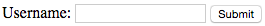
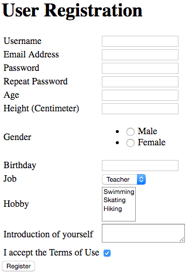
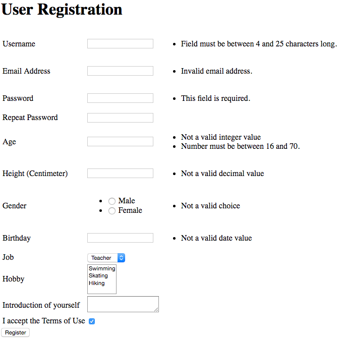
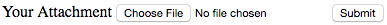

# Flask 扩展系列(七)–表单

表单 Form，在 Web 应用中无处不在。在介绍 Flask 入门时，我们曾经做过一个非常简单的用户登录表单。其实所有的表单项都有共性，比如有文字输入框，单选框，密码输入框等；此外表单的验证也有共性，比如有非空验证，长度限制，类型验证等。如果有个框架，能把这些共性抽象出来，那就能大量简化我们的工作。Python 的 WTForms 就提供了这些功能，这里我们就要结合 Flask 的 WTForms 扩展，Flask-WTF，来介绍如何在 Web 应用中制作表单。

### 系列文章

*   Flask 扩展系列(一)–Restful
*   Flask 扩展系列(二)–Mail
*   Flask 扩展系列(三)–国际化 I18N 和本地化 L10N
*   Flask 扩展系列(四)–SQLAlchemy
*   Flask 扩展系列(五)–MongoDB
*   Flask 扩展系列(六)–缓存
*   Flask 扩展系列(七)–表单
*   Flask 扩展系列(八)–用户会话管理
*   Flask 扩展系列(九)–HTTP 认证
*   Flask 扩展系列–自定义扩展

### 安装和启用

在阅读此文之前，非常建议读者先去了解下[WTForms 的基本知识](http://wtforms.readthedocs.org/en/latest/)。

同之前的例子一样，我们还是通过 pip 来安装扩展：

```py
$ pip install Flask-WTF
```

使用 Flask-WTF 时不需要像之前介绍的扩展一样初始化一个扩展实例对象。

### 一个简单的表单

我们来仿照入门系列第四篇中的登录表单，用 Flask-WTF 实现它。这个表单只有一个文字输入框，并且当输入用户名为”admin”时才返回成功。WTForms 让我们在后端代码中定义表单类，并列出表单的字段和相应的验证规则。现在让我们先定义一个 MyForm 类：

```py
from flask_wtf import Form
from wtforms import StringField
from wtforms.validators import DataRequired

class MyForm(Form):
    user = StringField('Username', validators=[DataRequired()])

```

表单类 MyForm 定义个了一个字符型字段，也就是一个文字输入框”user”。StringField 的第一个参数”Username”指定了该字段的显示名，这里你也可以结合本系列第三篇介绍的 Babel 扩展来国际化显示名。第二个参数指定了验证规则，这是一个列表，也就是你可以对一个字段定义多个验证规则，上例中我们使用了”wtforms.validators.DataRequired”验证，也就是代表了该字段为必填项，表单提交时必须非空。

下一步，我们写个视图函数 login 来使用 MyForm 表单：

```py
from flask import Flask, render_template
app = Flask(__name__)
app.secret_key = '1234567'

@app.route('/login', methods=('GET', 'POST'))
def login():
    form = MyForm()
    if form.validate_on_submit():
        # if form.user.data == 'admin':
        if form.data['user'] == 'admin':
            return 'Admin login successfully!'
        else:
            return 'Wrong user!'
    return render_template('login.html', form=form)

```

有了这个”form.validate_on_submit()”方法，我们就不用像之前一样通过请求方法是否为”POST”来判断表单是否提交。在表单提交后，我们可以用表单对象的 data 属性来获取提交内容，这个”form.data”是一个字典类型。上例中，它只有一个字段，也就是”user”。我们同样也可以用”form.user.data”获取”user”字段的值。在非提交状态下，我们就渲染模板，并且往模板中传入表单对象。另外注意，这里要设置”app.secret_key”，因为表单类中会使用到会话对象 session。

最后让我们写”login.html”模板来显示这个表单：

```py
<form method="POST" action="{{ url_for('login') }}">
    {{ form.hidden_tag() }}
    {{ form.user.label }}: {{ form.user(size=20) }}
    <input type="submit" value="Submit">
</form>

```

表单中，”form.hidden_tag()”会生成一个隐藏的”<div>”标签，其中会渲染任何隐藏的字段，最主要的是 CSRF 字段。这个 CSRF（Cross-Site Request Forgery 跨站请求伪造）是一种通过伪装来自受信任用户的请求，来发送恶意攻击的方法，具体内容大家可以在网上搜到。WTForms 默认开启 CSRF 保护，如果你想关闭它（建议不要这样做），可以在实例化表单时传入参数，比如”form = MyForm(csrf_enabled=False)”。

“form.user.label”会输出”user”字段的显示名，即上例中的”Username”；”form.user”会输出一个”text”类型的”<input>”标签，它的参数”size=20″会成为这个”<input>”标签里的属性。所以上面的模板内容在渲染后，会被转换为下面这段 HTML 代码：

```py
<form method="POST" action="/login">
    <div style="display:none;"><input id="csrf_token" name="csrf_token" type="hidden" value="1458707165##33a1f1384d3c12dca29cce5e8ccf6e4d21f5f28f"></div>
    <label for="user">Username</label>: <input id="user" name="user" size="20" type="text" value="">
    <input type="submit" value="Submit">
</form>

```

让我们运行上面的代码，并且测试下。有没有看到下面的表单？

当我们输入”admin”时，返回成功；输入其他字符串时，返回失败；而不输入直接提交，会返回表单页。是不是很神奇？

### 表单字段类型

上例中的表单只包含了一个字符类型的字段，WTForms 提供了大量内置的字段类型，来便于我们创建表单项，它们都放在”wtforms.fields”包下。下面，我们创建一个用户注册表单类，并将常用的字段类型都包括在其中，为了方便理解，描述就直接写在注释里：

```py
from wtforms.fields import (StringField, PasswordField, DateField, BooleanField,
                            SelectField, SelectMultipleField, TextAreaField,
                            RadioField, IntegerField, DecimalField, SubmitField)
from wtforms.validators import DataRequired, Length, Email, EqualTo, NumberRange

class RegisterForm(Form):
    # Text Field 类型，文本输入框，必填，用户名长度为 4 到 25 之间
    username = StringField('Username', validators=[Length(min=4, max=25)])

    # Text Field 类型，文本输入框，Email 格式
    email = StringField('Email Address', validators=[Email()])

    # Text Field 类型，密码输入框，必填，必须同 confirm 字段一致
    password = PasswordField('Password', [
        DataRequired(),
        EqualTo('confirm', message='Passwords must match')
    ])

    # Text Field 类型，密码输入框
    confirm = PasswordField('Repeat Password')

    # Text Field 类型，文本输入框，必须输入整型数值，范围在 16 到 70 之间
    age = IntegerField('Age', validators=[NumberRange(min=16, max=70)])

    # Text Field 类型，文本输入框，必须输入数值，显示时保留一位小数
    height = DecimalField('Height (Centimeter)', places=1)

    # Text Field 类型，文本输入框，必须输入是"年-月-日"格式的日期
    birthday = DateField('Birthday', format='%Y-%m-%d')

    # Radio Box 类型，单选框，choices 里的内容会在 ul 标签里，里面每个项是(值，显示名)对
    gender = RadioField('Gender', choices=[('m', 'Male'), ('f', 'Female')],
                                  validators=[DataRequired()])

    # Select 类型，下拉单选框，choices 里的内容会在 Option 里，里面每个项是(值，显示名)对
    job = SelectField('Job', choices=[
        ('teacher', 'Teacher'),
        ('doctor', 'Doctor'),
        ('engineer', 'Engineer'),
        ('lawyer', 'Lawyer')
    ])

    # Select 类型，多选框，choices 里的内容会在 Option 里，里面每个项是(值，显示名)对
    hobby = SelectMultipleField('Hobby', choices=[
        ('swim', 'Swimming'),
        ('skate', 'Skating'),
        ('hike', 'Hiking')
    ])

    # Text Area 类型，段落输入框
    description = TextAreaField('Introduction of yourself')

    # Checkbox 类型，加上 default='checked'即默认是选上的
    accept_terms = BooleanField('I accept the Terms of Use', default='checked',
                                validators=[DataRequired()])

    # Submit 按钮
    submit = SubmitField('Register')

```

每个字段类型的第一个参数都是显示名，而且都接收”validator”参数来传入验证规则。上例的表单字段上，我们用到了很多验证规则，关于这部分，我们会在下一小节介绍。对于时间日期字段，如”DateField”或”DateTimeField”，它们都有一个”format”参数来传入可识别的日期格式；对于选择框，如”RadioField”, “SelectField”或”SelectMultipleField”，它们都有一个”choices”参数来传入可选择项，每个项是一个”(值, 显示名称)”对，同时它们也有一个参数”coerce”参数来强制转换选择项值的类型，比如”coerce=int”。

接下来，让我们编写模板，因为字段比较多，我们先写一个宏来渲染单个字段，并存放在模板文件”_field.html”中：

```py

<tr>
  <td>{{ field.label }}</td>
  <td>{{ field(**kwargs)|safe }}</td>
  <td>
    <ul class=errors>
    
      <li>{{ error }}</li>
    
    </ul>
  
  </td>
</tr>


```

这个”render_field”宏用来渲染表格中的一个行，它有三个列，分别是字段显示名，字段值，和错误信息（如果有错误的话）。然后，我们写”register.html”模板：

```py
<!doctype html>
<title>Registration Form Sample</title>
<h1>User Registration</h1>

<form method="POST" action="{{ url_for('register') }}">
  {{ form.hidden_tag() }}
  <table>
    {{ render_field(form.username) }}
    {{ render_field(form.email) }}
    {{ render_field(form.password) }}
    {{ render_field(form.confirm) }}
    {{ render_field(form.age) }}
    {{ render_field(form.height) }}
    {{ render_field(form.gender) }}
    {{ render_field(form.birthday) }}
    {{ render_field(form.job) }}
    {{ render_field(form.hobby) }}
    {{ render_field(form.description) }}
    {{ render_field(form.accept_terms) }}
  </table>
  {{ form.submit }}
</form>

```

模板中导入”render_field”宏，并依次渲染用户注册表单里的每一个字段。最后，我们写个视图函数来显示这个表单：

```py
@app.route('/register', methods=('GET', 'POST'))
def register():
    form = RegisterForm()
    if form.validate_on_submit():
        flash('User "%s" registered successfully! Please login.' % form.username.data)
        login_form = LoginForm()
        return render_template('login.html', form=login_form)

    return render_template('register.html', form=form)

```

打开浏览器，访问”/register”地址，你会看到这样的表单页面：

如果你什么都不输入，直接提交，错误信息将会在字段旁显示：


这个页面还很丑陋，你可以通过 CSS 来美化它，本文就不介绍了。总之，大家已经被 WTForms 的强大感染到了吧！

Flask-WTF 还提供了”RecaptchaField”字段来方便我们生成验证码。可惜，它是基于 Google 的[Recaptcha API](https://www.google.com/recaptcha/api.js)实现的，如果你的网站用户是天朝内的，千万不要用。对于开发天朝外网站的朋友们，可以参考下[这个示例](https://github.com/lepture/flask-wtf/tree/master/examples/recaptcha)。

完整的字段类型说明可以参阅[WTForms 官方的 Fields API 文档](http://wtforms.readthedocs.org/en/latest/fields.html)，其中也描述了如何自定义字段类型。

### 验证规则

上一节的例子中其实已经把大部分常用的验证规则 validator 都用上了，WTForms 同样提供了大量内置的验证规则，它们都放在”wtforms.validators”包下。这里我们就来列举一下：

| 验证规则 | 说明 |
| DataRequired | 验证必填项 |
| Email | 验证邮件地址格式 |
| EqualTo | 验证必须同另一个字段值相同，它需传入另一个字段的名称”fieldname” |
| Length | 验证输入字符串长度，它有两个参数：”min”最小长度，”max”最大长度，缺省的话就不检查 |
| NumberRange | 验证输入数值的范围，它有两个参数：”min”最小值，”max”最大值，缺省的话就不检查 |
| URL | 验证 URL 格式 |
| IPAddress | 验证 IP 地址格式，默认 IPV4，你可以传入”ipv6=True”来验证 IPV6 地址 |
| MacAddress | 验证 Mac 地址格式 |
| AnyOf | 传入一个列表作为参数，验证是否匹配列表中的任一值 |
| NoneOf | 传入一个列表作为参数，验证是否与列表中的所有值都不同 |
| Regexp | 正则表达式验证，需传入一个正则表达式，它还有一个 flags 参数，如果你传入”re.IGNORECASE”，就会忽略大小写 |

所有的 validator 都有一个”message”参数，用来指定当验证失败时抛出的错误消息，不指定的话 WTForms 就会使用默认错误消息。

完整的验证规则 validator 说明可以参阅[WTForms 官方的 Validators API 文档](http://wtforms.readthedocs.org/en/latest/validators.html)，其中也描述了如何自定义验证规则。

### 文件上传

WTForms 本身有一个”FileField”用来处理文件上传功能，Flask-WTF 扩展对其作了封装，使得我们可以更方便的在 Flask 应用中实现文件上传。现在就让我们来定义一个文件上传的表单类：

```py
class AttachForm(Form):
from flask_wtf.file import FileField, FileAllowed, FileRequired

class AttachForm(Form):
    attach = FileField('Your Attachment', validators=[
        FileRequired(),
        FileAllowed(['jpg', 'png'], 'Images only!')
    ])

```

我们引入”flask_wtf.file”包下的文件上传框”FileField”，和两个验证规则”FileRequired”及”FileAllowed”。”FileRequired”验证表单提交时必须有文件已被指定；”FileAllowed”验证文件的类型，上例中只接收以”jpg”和”png”为后缀的文件，如果不是会抛出错误消息”Images only!”。

模板文件很简单，只要记得在”<form>”标签里加上属性’enctype=”multipart/form-data”‘即可：

```py
<form method="POST" action="{{ url_for('upload') }}" enctype="multipart/form-data">
    {{ form.hidden_tag() }}
    {{ form.attach.label }} {{ form.attach }}
    <input type="submit" value="Submit">
</form>

```

最后，写上视图函数：

```py
from werkzeug import secure_filename

@app.route('/upload', methods=('GET', 'POST'))
def upload():
    form = AttachForm()
    if form.validate_on_submit():
        filename = secure_filename(form.attach.data.filename)
        form.attach.data.save('uploads/' + filename)
        return 'Upload successfully!'

```

“secure_filename”用来确保文件名安全，我们在介绍 Flask 文件和流时有提到过。”form.attach.data”就可以获取文件的内容，它的”save()”方法可以将内容保存到本地文件中去。上例中，我们把文件保存在本地当前目录下的”uploads”子目录中。运行下这段程序，你将看到下图这样的表单，你可以试着上传一个文件。


#### 更多参考资料

[WTForms 的官方文档](http://wtforms.readthedocs.org/en/latest/)
[Flask-WTF 的官方文档](https://flask-wtf.readthedocs.org/en/latest/)
[Flask-WTF 的源码](https://github.com/lepture/flask-wtf/)
[Flask 官方文档中关于 WTForms 的使用](http://flask.pocoo.org/docs/0.10/patterns/wtforms/)

本篇的示例代码可以在这里下载。

转载请注明出处: [思诚之道](http://www.bjhee.com/flask-ext7.html)