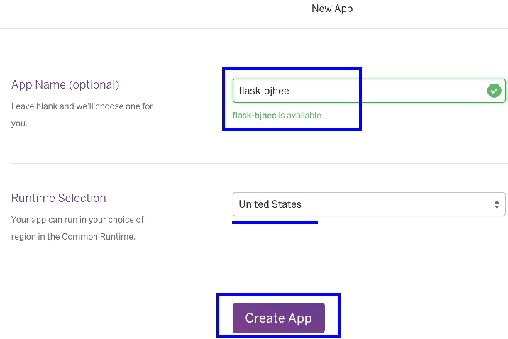

# Flask 补充系列–将应用部署在 Heroku 上

之前曾经介绍过如何将 Flask 应用部署在自己的服务器上，对于手头并不宽裕的程序员来说，购置一台托管服务器还是一笔不小的开销。即便现在有公有云服务器可以买，不过如果你只是以学习为目的，这笔开销还是能省则省了。另外，如果你的应用中需要访问国外被河蟹掉的资源，在服务器上翻墙也是件麻烦事，所以这里我们补充一篇如何将 Flask 应用部署在 Heroku 上。

### 环境准备

[Heroku](https://www.heroku.com/)是一个 PaaS 服务提供商，使用前，你需要先[注册一个 Heroku 帐号](https://signup.heroku.com/)，注册帐号是免费的。

此外你本地必须要有 Python 2.7 的开发环境，并且装好了 Pip, Setuptools, Virtualenv 等工具。对于 Python 开发者来说，这些都是必备的吧。此外 Git 客户端也是必须的，因为 Heroku 的代码管理用的是 Git。

Heroku 提供了一个非常方便的[Getting Start](https://devcenter.heroku.com/start)教程，每种开发环境都有，我们可以打开 Python 的 Getting Start，然后参照其说明创建一个 Python Web 应用。懒得看英文的朋友们，可以看我下面写的步骤。

在开始创建应用之前，你还需要安装[Heroku 的客户端工具](https://toolbelt.heroku.com/)，你可以根据你本地的操作系统选择安装包下载。这是一个命令行工具，基于 Ruby 实现，所以使用起来每个操作系统都一样。安装完成后，你可以打开命令行，输入下面的命令来验证安装是否成功：

```py
$ heroku --version
```

如果安装成功，就在本地命令行里登录 Heroku，执行命令：

```py
$ heroku login
```

并输入你注册号的 Heroku 帐号及密码即可。

### 创建应用

环境准备就绪了，我们开始创建一个应用。浏览器打开[Heroku 应用控制台](https://dashboard.heroku.com/apps)，点击右上角的”+”号，并选择”Create new app”。


在创建页面中，输入你的应用名称，比如”flask-bjhee”，如果名称没有被占用，则会跳出绿色提示”flask-bjhee is available”。运行环境默认在美国，也可以选择欧洲。信息填完后，点击下方的”Create App”按钮，应用就创建完成了。


接下来打开命令行，我们要初始化本地及远程代码库：

```py
$ mkdir /home/bjhee/flask-bjhee      # 创建本地代码工作目录
$ cd /home/bjhee/flask-bjhee         # 切换到本地代码工作目录
$ git init                           # 创建本地代码库
$ heroku git:remote -a flask-bjhee   # 连接远程 Heroku 的 flask-bjhee 代码库

```

现在，我们就可以编写应用代码，并提交到 Heroku 上去了。

### 部署应用

既然主要是在讲部署，那代码逻辑就简单些，Hello World 吧。我们写一个 Flask Web 程序”run.py”，内容如下：

```py
from flask import Flask
app = Flask(__name__)

@app.route('/')
def index():
    return 'Hello World!'

if __name__ == '__main__':
    app.run(host='0.0.0.0', debug=True)

```

然后，我们就写个”requirements.txt”文件，应用部署时 Heroku 远程环境会自动执行：

```py
$ pip install -r requirements.txt
```

来安装应用依赖的库。我们的”requirements.txt”文件如下：

```py
Flask==0.10.1
gunicorn==19.4.5

```

项目依赖 Flask 很好理解，为什么还要依赖 gunicorn 呢？因为我们不能靠 Flask 自带的 Web 服务器来运行 Flask 程序，所以 gunicorn 是个很好的选择。还记得如何通过 Gunicorn 运行 Flask 应用吗？对于上面的代码，我们只需执行”gunicorn run:app”即可。现在我们要告诉 Heroku，应该使用这个命令来运行我们的应用。怎么做呢，就是在项目根目录里创建一个”Procfile”文件，然后写上：

```py
web: gunicorn run:app --log-file -

```

这就告诉 Heroku，启动 Web 时，要执行”gunicorn run:app –log-file -“。后面的”–log-file -“参数，是为了让日志只打印到标准输出 stdout 上，因为 Heroku 不提供我们写本地磁盘的功能。

再接下来，我们要写一个 app.json 来描述项目信息，”app.json”内容大致如下：

```py
{
  "name": "Flask sample on Heroku",
  "description": "An example of deploying Flask web app to Heroku.",
  "image": "heroku/python",
  "repository": "https://git.heroku.com/flask-bjhee",
  "keywords": ["python", "flask" ]
}

```

另外根据习惯，我们应该写一个”README.md”来给用户看，”.gitignore”描述哪些文件类型不需要提交到代码库中去。好了，现在我们的目录结构如下：

```py
flask-bjhee/
  ├ .gitignore
  ├ app.json
  ├ Procfile
  ├ README.md
  ├ requirements.txt
  └ run.py

```

让我们执行 git 提交命令，来部署到远程 Heroku 上去吧：

```py
$ git add .
$ git commit -m "Initialize Project"
$ git push heroku master               # 提交到远程 master 分支

```

想看看效果，命令行里输入：

```py
$ heroku open
```

就会启动浏览器，并打开地址”https://flask-bjhee.herokuapp.com/”，当然你也可以直接浏览器访问这个地址。有没有看到”Hello World!”？

本篇的示例代码可以在这里下载。

转载请注明出处: [思诚之道](http://www.bjhee.com/flask-heroku.html)