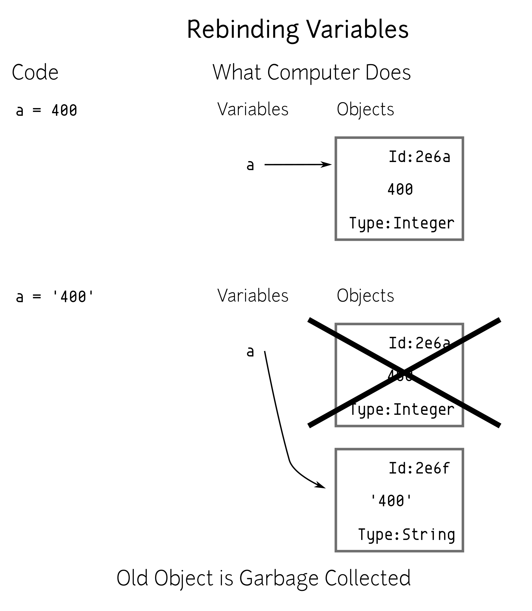
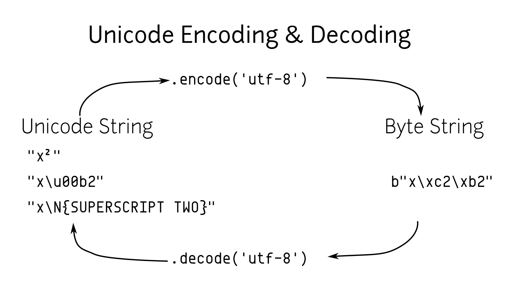

# Python 3.6 微型笔记本

来自：[mattharrison/Tiny-Python-3.6-Notebook](https://github.com/mattharrison/Tiny-Python-3.6-Notebook)

## 介绍

这不是一本教学手册，而是 Python 语法的笔记、表格和示例。作者创建它作为培训期间的额外资源，旨在作为一本实体笔记本分发。参与者（喜欢纸质材料的实体特性）可以添加自己的笔记、想法，并拥有一个有价值的精选示例参考。

## 运行 Python

### 安装

要检查 Python 是否已安装，请从终端运行以下命令：

```
$ python3 --version

```

否则，从网站[[1]](#id2)安装 Python 3。

| [[1]](#id1) | [`python.org`](http://python.org) |
| --- | --- |

### 调用 Python

Python 可执行文件的行为取决于您给出的命令行选项：

+   启动 Python REPL：

    ```
    $ python3

    ```

+   执行`file.py`文件：

    ```
    $ python3 file.py

    ```

+   执行`file.py`文件，并进入具有`file.py`命名空间的 REPL：

    ```
    $ python3 -i file.py

    ```

+   执行`json/tool.py`模块：

    ```
    $ python3 -m json.tool

    ```

+   执行`"print('hi')"`

    ```
    $ python3 -c "print('hi')"

    ```

### REPL

+   使用`help`函数阅读模块/类/函数的文档。作为独立调用，你可以进入帮助系统并探索各种主题。

+   使用`dir`函数列出命名空间的内容，或者如果传入一个对象，则列出该对象的属性。

注意

本书中的大部分代码都是按照在 REPL 中执行的方式编写的。如果你在输入它，请忽略主要和次要提示（`>>>`和`...`）。

## Python 之禅

在解释器中运行以下命令，可以获得一个描述 Python 背后理念的彩蛋。这也在 PEP 20 中有所体现：

```
>>> import this
The Zen of Python, by Tim Peters

Beautiful is better than ugly.
Explicit is better than implicit.
Simple is better than complex.
Complex is better than complicated.
Flat is better than nested.
Sparse is better than dense.
Readability counts.
Special cases aren't special enough to break the
rules.
Although practicality beats purity.
Errors should never pass silently.
Unless explicitly silenced.
In the face of ambiguity, refuse the temptation
to guess.
There should be one --and preferably only one--
obvious way to do it.
Although that way may not be obvious at first
unless you're Dutch.
Now is better than never.
Although never is often better than *right* now.
If the implementation is hard to explain, it's a
bad idea.
If the implementation is easy to explain, it may
be a good idea.
Namespaces are one honking great idea -- let's
do more of those!

```

这些可能看起来只是愚蠢的一行代码，但其中包含了很多智慧。对于 Python 程序员来说，不妨偶尔回顾一下这些内容，看看它们是否适用于他们的代码（或者为了证明他们的代码审查）。

## 内置类型

### 变量

Python 变量就像牲畜标签，它们指向对象（可以是类、实例、模块或函数），但变量本身不是对象。你可以为不同的对象类型重复使用变量名（尽管你可能不应该这样做）：

```
>>> a = 400     # a points to an integer
>>> a = '400'   # a now points to a string

```

注意

`#` 字符表示注释的开始。虽然没有多行注释，但大多数支持 Python 的编辑器可以注释掉一个区域。

下面的图示说明了在 Python 中一切都是对象，变量只是指向它们的指针。



重复使用相同变量的示例

### 数字

Python 包括三种类型的数字字面量：*整数*、*浮点数* 和 *复数*。Python 3.6 添加了使用下划线以提高可读性的功能（PEP 515）。

数字类型

| 类型 | 示例 |
| --- | --- |
| 整数 | `14` |
| 整数（十六进制） | `0xe` |
| 整数（八进制） | `0o16` |
| 整数（二进制） | `0b1110` |
| 浮点数 | `14.0` |
| 浮点数 | `1.4e1` |
| 复数 | `14+0j` |
| 下划线 | `1_000` |

有许多用于操作数字的内置函数，如 `abs`、`min`、`max`、`ceil`。还可以查看标准库中的 `math`、`random` 和 `statistics` 模块。

数字魔术方法

| 操作 | 由提供 | 结果 |
| --- | --- | --- |
| `abs(num)` | `__abs__` | `num` 的绝对值 |
| `num + num2` | `__add__` | 加法 |
| `bool(num)` | `__bool__` | 布尔转换 |
| `num == num2` | `__eq__` | 等于 |
| `float(num)` | `__float__` | 浮点数转换 |
| `num // num2` | `__floordiv__` | 整数除法 |
| `num >= num2` | `__ge__` | 大于或等于 |
| `num > num2` | `__gt__` | 大于 |
| `int(num)` | `__int__` | 整数转换 |
| `num <= num2` | `__le__` | 小于或等于 |
| `num < num2` | `__lt__` | 小于 |
| `num % num2` | `__mod__` | 取模 |
| `num * num2` | `__mul__` | 乘法 |
| `num != num2` | `__ne__` | 不等于 |
| `-num` | `__neg__` | 负数 |
| `+num` | `__pos__` | 正数 |
| `num ** num2` | `__pow__` | 幂运算 |
| `round(num)` | `__round__` | 四舍五入 |
| `num.__sizeof__()` | `__sizeof__` | 内部表示的字节数 |
| `str(num)` | `__str__` | 字符串转换 |
| `num - num2` | `__sub__` | 减法 |
| `num / num2` | `__truediv__` | 浮点数除法 |
| `math.trunc(num)` | `__trunc__` | 截断 |

整数特定方法和操作

| 操作 | 由提供 | 结果 |
| --- | --- | --- |
| `num & num2` | `__and__` | 按位与 |
| `math.ceil(num)` | `__ceil__` | 上取整 |
| `math.floor(num)` | `__floor__` | 下取整 |
| `~num` | `__invert__` | 按位取反 |
| `num << num2` | `__lshift__` | 左移 |
| `num &#124; num2` | `__or__` | 按位或 |
| `num >> num2` | `__rshift__` | 右移 |
| `num ^ num2` | `__xor__` | 按位异或 |
| `num.bit_length()` | `bit_length` | 所需位数 |

浮点数特定方法和操作

| 操作 | 结果 |
| --- | --- |
| `f.as_integer_ratio()` | 返回 num, denom 元组 |
| `f.is_integer()` | 是否为整数的布尔值 |

### 字符串

Python 3 字符串保存 Unicode 数据。Python 有几种表示字符串的方式。还有一个字节类型（PEP 3137）：

字符串类型

| 类型 | 示例 |
| --- | --- |
| 字符串 | `"你好\t 那里"` |
| 字符串 | `'你好'` |
| 字符串 | `'''他说，"你好"'''` |
| 原始字符串 | `r'你好\t 那里'` |
| 字节字符串 | `b'hello'` |

转义字符

| 转义序列 | 输出 |
| --- | --- |
| `\` 换行 | 忽略三引号字符串中的结尾换行符 |
| `\\` | 反斜杠 |
| `\'` | 单引号 |
| `\"` | 双引号 |
| `\a` | ASCII 响铃 |
| `\b` | ASCII 退格 |
| `\n` | 换行 |
| `\r` | ASCII 回车 |
| `\t` | 制表符 |
| `\u12af` | Unicode 16 位 |
| `\U12af89bc` | Unicode 32 位 |
| `N{黑星}` | Unicode 名称 |
| `\o84` | 八进制字符 |
| `\xFF` | 十六进制字符 |

字符串操作

| 操作 | 由提供 | 结果 |
| --- | --- | --- |
| `s + s2` | `__add__` | 字符串连接 |
| `"foo" in s` | `__contains__` | 成员关系 |
| `s == s2` | `__eq__` | 等于 |
| `s >= s2` | `__ge__` | 大于或等于 |
| `s[0]` | `__getitem__` | 索引操作 |
| `s > s2` | `__gt__` | 大于 |
| `s <= s2` | `__le__` | 小于或等于 |
| `len(s)` | `__len__` | 长度 |
| `s < s2` | `__lt__` | 小于 |
| `s % (1, 'foo')` | `__mod__` | 格式化 |
| `s * 3` | `__mul__` | 重复 |
| `s != s2` | `__ne__` | 不相等 |
| `repr(s)` | `__repr__` | 程序员友好的字符串 |
| `s.__sizeof__()` | `__sizeof__` | 内部表示的字节数 |
| `str(s)` | `__str__` | 用户友好的字符串 |

字符串方法

| 操作 | 结果 |
| --- | --- |
| `s.capitalize()` | 字符串首字母大写 |
| `s.casefold()` | 以 Unicode 兼容的方式小写 |
| `s.center(w, [char])` | 在`w`个空格中居中`char`（默认为`" "`） |
| `s.count(sub, [start, [end]])` | 计算`start`和`end`之间`s`中`sub`的数量 |
| `s.encode(encoding, errors= 'strict')` | 将字符串编码为字节 |
| `s.endswith(sub)` | 检查后缀 |
| `s.expandtabs( tabsize=8)` | 用空格替换制表符 |
| `s.find(sub, [start, [end]])` | 查找子字符串或返回`-1` |
| `s.format(*args, **kw)` | 格式化��符串 |
| `s.format_map( mapping)` | 使用映射格式化字符串 |
| `s.index(sub, [start, [end]])` | 查找子字符串或引发`ValueError` |
| `s.isalnum()` | 返回字母数字布尔值 |
| `s.isalpha()` | 返回字母布尔值 |
| `s.isdecimal()` | 返回十进制布尔值 |
| `s.isdigit()` | 返回数字布尔值 |
| `s.isidentifier()` | 返回有效标识符的布尔值 |
| `s.islower()` | 返回小写布尔值 |
| `s.isnumeric()` | 返回数字布尔值 |
| `s.isprintable()` | 返回可打印布尔值 |
| `s.isspace()` | 返回空格布尔值 |
| `s.istitle()` | 返回标题布尔值 |
| `s.isupper()` | 返回大写布尔值 |
| `s.join(iterable)` | 在序列之间返回插入的字符串 |
| `s.ljust(w, [char])` | 在`w`个空格中左对齐`char`（默认为`' '`） |
| `s.lower()` | 小写 |
| `s.lstrip([chars])` | 左侧去除`chars`（默认为空格）。 |
| `s.partition(sub)` | 在子字符串的第一次出现处拆分字符串，返回`(before, sub, after)` |
| `s.replace(old, new, [count])` | 用新字符串替换子字符串 |
| `s.rfind(sub, [start, [end]])` | 查找最右边的子字符串或返回`-1` |
| `s.rindex(sub, [start, [end]])` | 查找最右边的子字符串或引发`ValueError` |
| `s.rjust(w, [char)` | 在`w`个空格中右对齐`char`（默认为`" "`) |
| `s.rpartition(sub)` | 最右边的分区 |
| `s.rsplit([sep, [maxsplit=-1])` | 由`sep`（默认为空格）右侧拆分 |
| `s.rstrip([chars])` | 右侧去除 |
| `s.split([sep, [maxsplit=-1]])` | 在子字符串周围拆分字符串为序列 |
| `s.splitlines( keepends=False)` | 在行边界处断开字符串 |
| `s.startswith( prefix, [start, [end]])` | 检查前缀 |
| `s.strip([chars])` | 移除前导和尾随空格（默认）或`chars` |
| `s.swapcase()` | 交换字符串的大小写 |
| `s.title()` | 标题化字符串 |
| `s.translate(table)` | 使用翻译表替换字符串 |
| `s.upper()` | 大写 |
| `s.zfill(width)` | 左侧填充`0`，使字符串填充到`width`（不截断） |

### 列表

列表是有序的可变序列：

```
>>> people = ['Paul', 'John', 'George']
>>> people.append('Ringo')

```

`in`运算符对于检查序列成员关系很有用：

```
>>> 'Yoko' in people
False

```

如果在迭代过程中需要索引号，`enumerate`函数会给我们一个索引、项目对的元组：

```
>>> for i, name in enumerate(people, 1):
...     print('{} - {}'.format(i, name))
1 - Paul
2 - John
3 - George
4 - Ringo

```

我们可以对大多数序列进行索引操作：

```
>>> people[0]
'Paul'
>>> people[-1]  # len(people) - 1
'Ringo'

```

我们也可以对大多数序列进行*切片*操作：

```
>>> people[1:2]
['John']
>>> people[:1]   # Implicit start at 0
['Paul']
>>> people[1:]   # Implicit end at len(people)
['John', 'George', 'Ringo']
>>> people[::2]  # Take every other item
['Paul', 'George']
>>> people[::-1] # Reverse sequence
['Ringo', 'George', 'John', 'Paul']

```

列表操作

| 操作 | 由提供 | 结果 |
| --- | --- | --- |
| `l + l2` | `__add__` | 列表连接（参见`.extend`） |
| `"name" in l` | `__contains__` | 成员关系 |
| `del l[idx]` | `__del__` | 删除索引`idx`处的项目（参见`.pop`） |
| `l == l2` | `__eq__` | 相等 |
| `"{}".format(l)` | `__format__` | 列表的字符串格式 |
| `l >= l2` | `__ge__` | 大于或等于。从左边比较列表中的项目 |
| `l[idx]` | `__getitem__` | 索引操作 |
| `l > l2` | `__gt__` | 大于。从左边比较列表中的项目 |
| 无哈希 | `__hash__` | 设置为`None`以确保无法插入字典 |
| `l += l2` | `__iadd__` | 增强（改变`l`）连接 |
| `l *= 3` | `__imul__` | 增强（改变`l`）重复 |
| `for thing in l:` | `__iter__` | 迭代 |
| `l <= l2` | `__le__` | 小于或等于。从左边比较列表中的项目 |
| `len(l)` | `__len__` | 长度 |
| `l < l2` | `__lt__` | 小于。从左边比较列表中的项目 |
| `l * 2` | `__mul__` | 重复 |
| `l != l2` | `__ne__` | 不相等 |
| `repr(l)` | `__repr__` | 程序员友好的字符串 |
| `reversed(l)` | `__reversed__` | 反转 |
| `foo * l` | `__rmul__` | 如果`foo`没有实现`__mul__`则调用 |
| `l[idx] = 'bar'` | `__setitem__` | 索引操作设置值 |
| `l.__sizeof__()` | `__sizeof__` | 内部表示的字节 |
| `str(l)` | `__str__` | 用户友好的字符串 |

列表方法

| 操作 | 结果 |
| --- | --- |
| `l.append(item)` | 将`item`追加到末尾 |
| `l.clear()` | 清空列表（改变`l`） |
| `l.copy()` | 浅复制 |
| `l.count(thing)` | `thing`的出现次数 |
| `l.extend(l2)` | 列表连接（改变`l`） |
| `l.index(thing)` | `thing`的索引，否则引发`ValueError` |
| `l.insert(idx, bar)` | 在索引`idx`处插入`bar` |
| `l.pop([idx])` | 删除最后一个项目或索引处的项目 |
| `l.remove(bar)` | 删除第一个实例`bar`，否则引发`ValueError` |
| `l.reverse()` | 反转（改变`l`） |
| `l.sort([key=], reverse=False)` | 就地排序，使用可选的`key`函数（改变`l`） |

### 字典

字典是键值对的可变映射。键必须是可哈希的，但值可以是任何对象：

```
>>> instruments = {'Paul': 'Bass',
...                'John': 'Guitar'}

>>> instruments['George'] = 'Guitar'
>>> 'Ringo' in instruments
False

>>> for name in instruments:
...     print('{} - {}'.format(name,
...           instruments[name]))
Paul - Bass
John - Guitar
George - Guitar

```

魔术字典方法

| 操作 | 由提供 | 结果 |
| --- | --- | --- |
| `key in d` | `__contains__` | 成员关系 |
| `del d[key]` | `__delitem__` | 删除键 |
| `d == d2` | `__eq__` | 相等。字典相等或不相等 |
| `"{}".format(d)` | `__format__` | 字典的字符串格式 |
| `d[key]` | `__getitem__` | 获取 `key` 的值（参见 `.get`） |
| `for key in d:` | `__iter__` | 遍历键 |
| `len(d)` | `__len__` | 长度 |
| `d != d2` | `__ne__` | 不相等 |
| `repr(d)` | `__repr__` | 程序员友好字符串 |
| `d[key] = value` | `__setitem__` | 为 `key` 设置 `value` |
| `d.__sizeof__()` | `__sizeof__` | 内部表示的字节 |

字典方法

| 操作 | 结果 |
| --- | --- |
| `d.clear()` | 移除所有项（改变 `d`） |
| `d.copy()` | 浅拷贝 |
| `d.fromkeys(iter, value=None)` | 使用值设置为 `value` 创建字典 |
| `d.get(key, [default])` | 获取 `key` 的值或返回默认值（`None`） |
| `d.items()` | (键，值) 对的视图 |
| `d.keys()` | 键的视图 |
| `d.pop(key, [default])` | 返回键的值或默认值（如果未设置则引发 `KeyError`） |
| `d.popitem()` | 返回任意（键，值）元组。如果为空则引发 `KeyError` |
| `d.setdefault(k, [default])` | 执行 `d.get(k, default)`。如果缺少 `k`，则设置为默认值 |
| `d.update(d2)` | 使用 `d2` 的值（字典或键值对的可迭代对象）改变 `d` |
| `d.values()` | 值的视图 |

### 元组

元组是不可变序列。通常用于存储*记录*类型数据：

```
>>> member = ('Paul', 'Bass', 1942)
>>> member2 = ('Ringo', 'Drums', 1940)

```

注意括号通常不是必需的：

```
>>> row = 1, 'Fred'     # 2 item tuple
>>> row2 = (2, 'Bob')   # 2 item tuple
>>> row3 = ('Bill')     # String!
>>> row4 = ('Bill',)    # 1 item tuple
>>> row5 = 'Bill',      # 1 item tuple
>>> row6 = ()           # Empty tuple

```

命名元组可用于替代普通元组，并允许添加上下文（或名称）到位置成员。创建它们的语法有些不同，因为我们首先动态创建一个类（因此变量首字母大写）：

```
>>> from collections import namedtuple
>>> Member = namedtuple('Member',
...     'name, instrument, birth_year')
>>> member3 = Member('George', 'Guitar', 1943)

```

我们可以通过位置或名称访问成员（名称允许我们更加明确）：

```
>>> member3[0]
'George'

>>> member3.name
'George'

```

元组操作

| 操作 | 提供 | 结果 |
| --- | --- | --- |
| `t + t2` | `__add__` | 元组连接 |
| `"name" in t` | `__contains__` | 成员关系 |
| `t == t2` | `__eq__` | 相等 |
| `"{}".format(t)` | `__format__` | 元组的字符串格式 |
| `t >= t2` | `__ge__` | 大于或等于。从左边比较元组中的项 |
| `t[idx]` | `__getitem__` | 索引操作 |
| `t > t2` | `__gt__` | 大于。从左边比较元组中的项 |
| `hash(t)` | `__hash__` | 用于集合/字典插入 |
| `for thing in t:` | `__iter__` | 迭代 |
| `t <= t2` | `__le__` | 小于或等于。从左边比较元组中的项 |
| `len(t)` | `__len__` | 长度 |
| `t < t2` | `__lt__` | 小于。从左边比较元组中的项 |
| `t * 2` | `__mul__` | 重复 |
| `t != t2` | `__ne__` | 不相等 |
| `repr(t)` | `__repr__` | 程序员友好字符串 |
| `foo * t` | `__rmul__` | 如果 `foo` 没有实现 `__mul__` 则调用 |
| `t.__sizeof__()` | `__sizeof__` | 内部表示的字节 |
| `str(l)` | `__str__` | 用户友好字符串 |

元组方法

| 操作 | 结果 |
| --- | --- |
| `t.count(item)` | 项的计数 |
| `t.index(thing)` | `thing` 的索引，否则引发 `ValueError` |

### 集合

集合是一个可变的无序集合，不能包含重复项。集合用于去除重复项和测试成员关系：

```
>>> digits = [0, 1, 1, 2, 3, 4, 5, 6,
...     7, 8, 9]
>>> digit_set = set(digits)   # remove extra 1

>>> 9 in digit_set
True

```

集合很有用，因为它们提供*集合操作*，如并集（`|`）、交集（`&`）、差集（`-`）和异或（`^`）：

```
>>> odd = {1, 3, 5, 7, 9}
>>> prime = set([2, 3, 5, 7])
>>> even = digit_set - odd
>>> even
{0, 2, 4, 6, 8}

>>> prime & even  # in intersection
{2}

>>> odd | even    # in both
{0, 1, 2, 3, 4, 5, 6, 7, 8, 9}

>>> even ^ prime  # not in both
{0, 3, 4, 5, 6, 7, 8}

```

注意

没有空集的文字语法。您需要使用：

```
>>> empty = set()

```

集合操作

| 操作 | 由提供 | 结果 |
| --- | --- | --- |
| `s & s2` | `__and__` | 集合交集（参见`.intersection`） |
| `"name" in s` | `__contains__` | 成员资格 |
| `s == s2` | `__eq__` | 相等性。集合相等或不相等 |
| `"{}".format(s)` | `__format__` | 集合的字符串格式 |
| `s >= s2` | `__ge__` | `s`在`s2`中（参见`.issuperset`） |
| `s > s2` | `__gt__` | 严格超集（`s >= s2`但`s != s2`） |
| 无哈希 | `__hash__` | 设为`None`以确保无法将其插入字典 |
| `s &= s2` | `__iand__` | 增强（改变`s`）的交集（参见`.intersection_update`） |
| `s &#124;= s2` | `__ior__` | 增强（改变`s`）的并集（参见`.update`） |
| `s -= s2` | `__isub__` | 增强（改变`s`）的差集（参见`.difference_update`） |
| `for thing in s:` | `__iter__` | 迭代 |
| `s ^= s2` | `__ixor__` | 增强（改变`s`）的异或（参见`.symmetric_difference_update`） |
| `s <= s2` | `__le__` | `s`中的`s2`（参见`.issubset`） |
| `len(s)` | `__len__` | 长度 |
| `s < s2` | `__lt__` | 严格子集（`s <= s2`但`s != s2`） |
| `s != s2` | `__ne__` | 不相等 |
| `s &#124; s2` | `__or__` | 集合并集（参见`.union`） |
| `foo & s` | `__rand__` | 如果`foo`未实现`__and__`则调用 |
| `repr(s)` | `__repr__` | 程序员友好字符串 |
| `foo &#124; s` | `__ror__` | 如果`foo`未实现`__or__`则调用 |
| `foo - s` | `__rsub__` | 如果`foo`未实现`__sub__`则调用 |
| `foo ^ s` | `__rxor__` | 如果`foo`未实现`__xor__`则调用 |
| `s.__sizeof__()` | `__sizeof__` | 内部表示的字节 |
| `str(s)` | `__str__` | 用户友好字符串 |
| `s - s2` | `__sub__` | 集合差集（参见`.difference`） |
| `s ^ s2` | `__xor__` | 集合异或（参见`.symmetric_difference`） |

集合方法

| 操作 | 结果 |
| --- | --- |
| `s.add(item)` | 将`item`添加到`s`（改变`s`） |
| `s.clear()` | 从`s`中移除元素（改变`s`） |
| `s.copy()` | 浅复制 |
| `s.difference(s2)` | 返回从`s`中获取的元素而不是`s2`的集合 |
| `s.difference_update(s2)` | 从`s`中移除`s2`的项（改变`s`） |
| `s.discard(item)` | 从`s`中移除`item`（改变`s`）。缺少`item`时不引发错误 |
| `s.intersection(s2)` | 返回从两个集合中获取的元素的集合 |
| `s.intersection_update(s2)` | 使用`s2`的成员更新`s`（改变`s`） |
| `s.isdisjoint(s2)` | 如果这两个���合没有交集，则返回`True` |
| `s.issubset(s2)` | 如果`s`的所有元素都在`s2`中，则返回`True` |
| `s.issuperset(s2)` | 如果`s`包含`s2`的所有元素，则返回`True` |
| `s.pop()` | 从`s`中移除任意项（改变`s`）。缺少`item`时引发`KeyError` |
| `s.remove(item)` | 从`s`中移除`item`（改变`s`）。缺少`item`时引发`KeyError` |
| `s.symmetric_difference(s2)` | 返回仅存在一个集合中的元素的集合 |
| `s.symmetric_difference_update(s2)` | 更新 `s`，仅使用一个集合中的元素（改变 `s`） |
| `s.union(s2)` | 返回两个集合的所有元素 |
| `s.update(s2)` | 更新 `s`，使用两个集合的所有元素（改变 `s`） |

## 内置函数

在默认命名空间中，您可以访问各种可调用对象：

内置可调用对象

| 操作 | 结果 |
| --- | --- |
| `abs(x)` | 绝对值协议（调用 `x.__abs__()`） |
| `all(seq)` | 检查 `seq` 中的所有项是否为真值 |
| `any(seq)` | 检查 `seq` 中是否至少有一项为真值 |
| `ascii(x)` | 对象的 ASCII 表示 |
| `bin(i)` | 包含数字二进制版本的字符串（`int(bin(i), 2)` 可逆转） |
| `bool(x)` | 布尔协议（调用 `x.__bool__()`） |
| `bytearray(x)` | 从可迭代的整数、文本字符串、字节、整数中创建一个可变的字节数组，或者不传参数来创建一个空的字节数组 |
| `bytes(x)` | 从可迭代的整数、文本字符串、字节、整数中创建一个不可变的字节，或者不传参数来创建一个空的字节 |
| `callable(x)` | 检查是否可以执行 `x()`（即 `x.__call__` 是否存在） |
| `chr(i)` | 将整数码点转换为 Unicode 字符串（`ord(chr(i))` 可逆转） |
| `@classmethod` | 用于装饰方法，以便您可以在类上调用它 |
| `compile(source, fname, mode)` | 将 `source` 编译为代码（`fname` 用于错误，`mode` 为 `exec`：模块，`single`：语句，`eval`：表达式）。可以在表达式上运行 `eval(code)`，在语句上运行 `exec(code)` |
| `complex(i, y)` | 创建复数 |
| `copyright` | Python 的版权字符串 |
| `credits` | Python 的致谢字符串 |
| `delattr(obj, attr)` | 从 `obj` 中删除属性（`del obj.attr`） |
| `dict([x])` | 从映射、可迭代的 k,v 元组、命名参数中创建一个字典，或者不传参数来创建一个空字典 |
| `dir([obj])` | 列出 `obj` 的属性，或者如果未提供 `obj` 则列出当前命名空间中的名称 |
| `divmod(num, denom)` | 返回 `num//denom` 和 `num%denom` 的元组对 |
| `enumerate(seq, [start])` | 返回索引、项元组对的迭代器。索引从 `start` 或 `0`（默认）开始 |
| `eval(source, globals=None, locals=None)` | 使用全局和局部变量运行 `source`（表达式字符串或 `compile` 的结果） |
| `exec(source, globals=None, locals=None)` | 使用全局和局部变量运行 `source`（语句字符串或 `compile` 的结果） |
| `exit([code])` | 退出 Python 解释器并返回代码（默认为 0） |
| `filter([function], seq)` | 返回满足 `function(item)` 为真值的项的迭代器（如果缺少 `function`，则返回 `item` 为真值的项的迭代器） |
| `float(x)` | 将字符串或数字转换为浮点数（调用 `x.__float__()`） |
| `format(obj, fmt)` | 格式化协议（调用 `obj.__format__(fmt)`） |
| `frozenset([seq])` | 从 `seq` 创建 `frozenset`（如果缺少则为空） |
| `getattr(obj, attr)` | 从 `obj` 获取属性（`obj.attr`） |
| `globals()` | 返回当前全局变量的*可变*字典 |
| `hasattr(obj, attr)` | 检查`obj`上的属性（`obj.attr`不会引发`AttributeError`） |
| `hash(x)` | 对象的哈希值协议（调用`x.__hash__()`） |
| `help([x])` | 启动交互式帮助（如果没有`x`），或打印`x`的文档 |
| `hex(i)` | 包含数字的十六进制版本的字符串（`int(hex(i), 16)`进行反转） |
| `id(x)` | `x`的标识 |
| `input([prompt])` | 从标准输入读取字符串 |
| `int(x, [base=10])` | 从数字或字符串创建整数 |
| `isinstance(obj, class_or_tuple)` | 检查`obj`是否是`class_or_tuple`的实例或子类的布尔值 |
| `issubclass(cls, class_or_tuple)` | 检查`cls`是否是类或派生自`class_or_tuple`的布尔值 |
| `iter(seq)` | 迭代协议（调用`seq.__iter__()`） |
| `len(seq)` | 序列中的项目数 |
| `license()` | 显示 Python 许可证 |
| `list([seq])` | 将`seq`转换为列表（如果缺少则为空） |
| `locals()` | 返回本地属性的字典（与`globals`不同，当被修改时不保证更新命名空间） |
| `map(function, *seqs)` | 对`seqs`中的项目调用`function(item)`（如果是单个序列）或`function(seqs[0][0], seqs[1][0]...)` |
| `max(seq, *, [default], [key])` | 从`seq`中返回最大值。`default`（如果`seq`为空时的值）和`key`（确定大小的函数）是关键字参数。 |
| `memoryview(obj)` | 从`obj`创建`memoryview` |
| `min(seq, *, [default], [key])` | 从`seq`中返回最小值。`default`（如果`seq`为空时的值）和`key`（确定大小的函数）是关键字参数。 |
| `next(iter, [default])` | 从迭代协议中获取下一个项目（调用`iter.__next__()`），如果提供`default`则返回而不是引发`StopIteration` |
| `object` | 根基类型 |
| `oct(i)` | 包含数字的八进制版本的字符串（`int(oct(i), 8)`进行反转） |
| `open(filename, [mode], [encoding], [errors])` | 打开文件 |
| `ord(s)` | 将 Unicode 字符串转换为整数码点（`chr(ord(s))`进行反转） |
| `pow(num, exp, [z])` | 幂协议（调用`num.__pow__(exp, z)`）（`num ** exp`或`num ** exp % z`） |
| `print(val, [val2 ...], *, sep=' ', end='\n', file=sys.stdout)` | 将值打印到`file`。打印协议（调用`val.__str__()`） |
| `@property` | 将方法转换为属性的装饰器 |
| `quit()` | 退出解释器 |
| `range([start], stop, [step])` | 返回迭代从`start`（默认为`0`）到`stop - 1`，以`step`增量（默认为`1`）的范围对象 |
| `repr(x)` | 表示协议（调用`x.__repr__()`） |
| `reversed(seq)` | 反向迭代器 |
| `round(num, [ndigits=0])` | 四舍五入到`ndigits`协议（调用`num.__round__()`） |
| `set([seq])` | 从`seq`创建`set`（如果缺少则为空） |
| `setattr(obj, attr, val)` | 在`obj`上设置属性（`obj.attr = val`） |
| `slice([start], stop, [step])` | 创建`slice`对象 |
| `sorted(seq, * [key=None], [reverse=False])` | 按升序排序的排序列表（使用`key`函数自定义排序属性） |
| `@staticmethod` | 用于修饰方法，以便您可以在类或实例上调用它 |
| `str(obj)` | 创建字符串（调用`obj.__str__()`） |
| `str(bytes, [encoding], [errors])` | 从字节创建字符串（`errors`默认为`strict`） |
| `sum(seq, [start=0])` | 对`seq`中的值求和（使用`start`作为初始值） |
| `super()` | 获取超类访问权限 |
| `tuple([seq])` | 将`seq`转换为元组（如果缺失则为空） |
| `type(name, bases, dict)` | 创建一个名为`name`的新类型，具有基类`bases`和属性`dict` |
| `type(obj)` | 返回`obj`的类型 |
| `vars([obj])` | 返回`obj.__dict__`或如果缺失则返回`locals()` |
| `zip(seq1, [seq2, ...])` | 返回元组的可迭代对象，如`(seq1[0], seq2[0])`，`(seq1[1], seq2[1])`，...直到最短序列 |

## Unicode

Python 3 将字符串表示为 Unicode。我们可以将字符串*编码*为一系列字节，例如 UTF-8。如果我们有字节，我们可以将其*解码*为 Unicode 字符串：

```
>>> x_sq = 'x²'
>>> x_sq.encode('utf-8')
b'x\xc2\xb2'

>>> utf8_bytes = b'x\xc2\xb2'
>>> utf8_bytes.decode('utf-8')
'x²'

```

如果您有 Unicode 字符，可以直接使用。或者，您可以使用`\u`后跟 16 位十六进制值 xxxx 输入代码点。对于更大的代码点，请使用`\U`后跟 xxxxxxxx。如果您有 Unicode 名称（通过在 unicode.org 上查看表格获得），您可以使用`\N`语法。以下是等效的：

```
>>> result = 'x²'
>>> result = 'x\u00b2'
>>> result = 'x\N{SUPERSCRIPT TWO}'

```



插图说明了将 Unicode 字符串编码为字节表示。在这种情况下，我们转换为 UTF-8。对于此字符串，还有其他字节编码。如果我们有一个 UTF-8 字节字符串，我们可以将其*解码*为 Unicode 字符串。请注意，我们应该明确解码，因为可能有其他编码可以解码为可能给用户错误数据或*乱码*的 Unicode 字符串。

## 字符串格式化

大多数现代 Python 代码使用`.format`方法（PEP 3101）从其他部分创建字符串。格式方法使用`{}`作为占位符。

在占位符内部，我们可以提供不同的说明符：

+   `{0}` - 引用第一个位置参数

+   `{}` - 引用隐式位置参数

+   `{result}` - 引用关键字参数

+   `{bike.tire}` - 引用参数的属性

+   `{names[0]}` - 引用参数的第一个元素

```
>>> person = {'name': 'Paul',
...     'instrument': 'Bass'}
>>> inst = person['instrument']

>>> print("Name: {} plays: {}".format(
...     person['name'], inst))
Name: Paul plays: Bass

```

或者：

```
>>> print("Name: {name} "
...       "plays: {inst}".format(
...       name=person['name'], inst=inst))
Name: Paul plays: Bass

```

您还可以在 Python 3.6 中使用*f-strings*（参见 PEP 498）：

```
>>> print(f'Name: {person["name"]} plays: {inst}')
Name: Paul plays: Bass

```

F-strings 检查可用的变量并允许您内联方法或属性来自这些变量。

### 转换标志

您可以在占位符内部提供*转换标志*。

+   `!s` - 对参数调用`str()`函数

+   `!r` - 对参数调用`repr()`函数

+   `!a` - 对参数调用`ascii()`函数

```
>>> class Cat:
...     def __init__(self, name):
...         self.name = name
...     def __format__(self, data):
...         return "Format"
...     def __str__(self):
...         return "Str"
...     def __repr__(self):
...         return "Repr"

>>> cat = Cat("Fred")
>>> print("{} {!s} {!a} {!r}".format(cat, cat, cat,
...       cat))
Format Str Repr Repr

```

### 格式规范

您可以在冒号后提供格式规范。格式规范的语法如下：

```
[[fill]align][sign][#][0][width][grouping_option]
[.precision][type]

```

以下表列出了字段含义。

| Field | 含义 |
| --- | --- |
| fill | 使用`align`填充空格 |
| 对齐 | `<`-左对齐，`>`-右对齐，`^`-居中对齐，`=`-在符号后放置填充 |
| 符号 | `+`-对所有数字，`-`-仅负数，*空格*-正数前导空格，负数带符号 |
| # | 整数前缀。`Ob`-二进制，`0o`-八进制，`0x`-十六进制 |
| 0 | 启用零填充 |
| 宽度 | 最小字段宽度 |
| 分组选项 | `,`-使用逗号作为千位分隔符，`_`-使用下划线作为千位分隔符 |
| .精度 | 小数点后的数字（浮点数）。最大字符串长度（非数字） |
| 类型 | `s`-字符串格式（默认）参见整数和浮点图表 |

下表列出了我们用于格式化整数和浮点数的各种选项。

| 整数类型 | ���义 |
| --- | --- |
| `b` | 二进制 |
| `c` | 字符 - 转换为 Unicode 字符 |
| `d` | 十进制（默认） |
| `n` | 具有特定区域设置分隔符的十进制 |
| `o` | 八进制 |
| `x` | 十六进制（小写） |
| `X` | 十六进制（大写） |
| 浮点类型 | 含义 |
| --- | --- |
| `e`/`E` | 指数。小写/大写 e |
| `f` | 固定点 |
| `g`/`G` | 通用。对于大数和小数，固定带指数（`g` 默认） |
| `n` | 具有特定区域设置分隔符的 `g` |
| `%` | 百分比（乘以 100） |

### 一些 `format` 示例

这里有一些使用 `.format` 的示例。让我们将一个字符串格式化为 12 个字符的中心，周围包围着 `*`。`*` 是*填充*字符，`^` 是*对齐*字段，`12` 是*宽度*字段：

```
>>> "Name: {:*¹²}".format("Ringo")
'Name: ***Ringo****'

```

接下来，我们使用宽度为 10、一位小数点和符号在宽度填充之前的百分比格式化。`=` 是*对齐*字段，`10.1` 是*宽度*和*精度*字段，`%` 是*浮点类型*，将数字转换为百分比：

```
>>> "Percent: {:=10.1%}".format(-44/100)
'Percent: -    44.0%'

```

以下是一个二进制和十六进制转换。*整数类型*字段分别设置为 `b` 和 `x`：

```
>>> "Binary: {:#b}".format(12)
'Binary: 0b1100'

>>> "Hex: {:#x}".format(12)
'Hex: 0xc'

```

## 文件

`open` 函数将接受文件路径和模式作为输入，并返回一个文件句柄。有各种模式可以打开文件，取决于内容和您的需求。如果以二进制模式打开文件，将得到字节输出。在文本模式下，将得到字符串返回：

文件模式

| 模式 | 含义 |
| --- | --- |
| `'r'` | 读取文本文件（默认） |
| `'w'` | 写入文本文件（如果存在则截断） |
| `'x'` | 写入文本文件，如果存在则抛出 `FileExistsError`。 |
| `'a'` | 追加到文本文件（写入末尾） |
| `'rb'` | 读取二进制文件 |
| `'wb'` | 写入二进制文件（截断） |
| `'w+b'` | 以读写方式打开二进制文件 |
| `'xb'` | 写入二进制文件，如果存在则抛出 `FileExistsError`。 |
| `'ab'` | 追加到二进制文件（写入末尾） |

### 写入文件

我们使用文件的上下文管理器来确保在上下文块退出时关闭文件。

```
>>> with open('/tmp/names.txt', 'w') as fout:
...     fout.write('Paul\r\nJohn\n')
...     fout.writelines(['Ringo\n', 'George\n'])

```

### 读取文件

通过打开的文本文件，您可以迭代读取行。这样可以节省内存，因为只在需要时读取行：

```
>>> with open('/tmp/names.txt') as fin:
...     for line in fin:
...         print(repr(line))
'Paul\n'
'John\n'
'Ringo\n'
'George\n'

```

文件方法

| 操作 | 结果 |
| --- | --- |
| `f.__iter__()` | 支持迭代 |
| `f.__next__()` | 返回迭代的下一个项目（文本中的行） |
| `f.__repr__()` | `repr(f)` 的实现 |
| `f.buffer` | 文件缓冲 |
| `f.close()` | 关闭文件 |
| `f.closed` | 是否已关闭 |
| `f.detach()` | 将文件缓冲从文件中分离 |
| `f.encoding` | 文件的编码（默认为 `locale.getpreferredencoding()`） |
| `f.errors` | 编码的错误模式（`'strict'` 默认） |
| `f.fileno()` | 返回文件描述符 |
| `f.flush()` | 写文件缓冲 |
| `f.isatty()` | 是否为交互式文件 |
| `f.linebuffering` | 逐行缓冲 |
| `f.name` | 文件名 |
| `f.newlines` | 遇到的行尾字符（元组或字符串） |
| `f.read( size=-1)` | 读取 `size` 个字符（`-1` 是整个文件） |
| `f.readable()` | 是否已打开以供读取 |
| `f.readline( size=-1)` | 从行中读取 `size` 个字符（`-1` 是整行） |
| `f.readlines( hint=-1)` | 从文件中读取不超过 `hint` 字符的行的字节（`-1` 是整个文件） |
| `f.seek(cookie, whence=0)` | 将流位置更改为距离 `whence` (`0` - 开始，`1` - 当前位置，`2` - 结尾) `cookie` 字节（可以为负）。 |
| `f.seekable()` | 文件支持随机访问 |
| `f.tell()` | 当前流位置 |
| `f.truncate( pos=None)` | 将文件截断为 `pos` 字节 |
| `f.writeable()` | 文件支持写入 |
| `f.write(text)` | 将 `text` 写入文件 |
| `f.writelines( lines)` | 将 `lines` 写入文件（如果需要，提供换行符） |

## 函数

### 定义函数

函数可能接受输入，进行一些处理，并返回输出。你可以在函数名称和参数后直接提供文档字符串：

```
>>> def add_numbers(x, y):
...     """ add_numbers sums up x and y
...
...     Arguments:
...     x -- object that supports addition
...     y -- object that supports addition
...     """
...     return x + y

```

注意

我们使用空格来指定 Python 中的块。我们通常在冒号后缩进。PEP 8 建议使用 4 个空格。不要混用制表符和空格。

我们可以使用 `lambda` 语句创建匿名函数。因为它们只允许在冒号后跟表达式，所以在功能上有些受限。它们通常作为 `sorted`、`min` 或 `max` 的 `key` 参数使用：

```
>>> add = lambda x, y: x + y
>>> add(4, 5)
9

```

函数可以有 *默认* 参数。在这里要注意可变类型，因为默认值是在函数创建时绑定的，而不是在调用时：

```
>>> def add_n(x, n=42):
...     return x + n

>>> add_n(10)
52
>>> add_n(3, -10)
-7

```

函数可以支持可变位置参数：

```
>>> def add_many(*args):
...     result = 0
...     for arg in args:
...          result += arg
...     return result

>>> add_many()
0
>>> add_many(1)
1
>>> add_many(42, 3.14)
45.14

```

函数可以支持可变关键字参数：

```
>>> def add_kwargs(**kwargs):
...     result = 0
...     for key in kwargs:
...         result += kwargs[key]
...     return result

>>> add_kwargs(x=1, y=2, z=3)
6

>>> add_kwargs()
0

>>> add_kwargs(4)
Traceback (most recent call last):
  ...
TypeError: add_kwargs() takes 0 positional arguments
but 1 was given

```

你可以通过使用单个 `*` 来指示位置参数的结束。这给了你 *仅关键字* 参数（PEP 3102）：

```
>>> def add_points(*, x1=0, y1=0, x2=0, y2=0):
...     return x1 + x2, y1 + y2

>>> add_points(x1=1, y1=1, x2=3, y2=4)
(4, 5)

>>> add_points(1, 1, 3, 4)
Traceback (most recent call last):
  ...
TypeError: add_points() takes 0 positional arguments
but 4 were given

```

### 调用函数

你也可以使用 `*` 和 `**` 来 *解包* 序列和字典参数：

```
>>> def add_all(*args, **kwargs):
...     """Add all arguments"""
...     result = 0
...     for num in args + tuple(kwargs.values()):
...         result += num
...     return result

>>> sizes = (2, 4.5)
>>> named_sizes = {"this": 3, "that": 1}

```

下面的两个例子是等价的：

```
>>> add_all(*sizes)
6.5

>>> add_all(sizes[0], sizes[1])
6.5

```

下面的两个例子是等价的：

```
>>> add_all(**named_sizes)
4

>>> add_all(this=3, that=1)
4

```

你也可以在调用时结合使用 `*` 和 `**`：

```
>>> add_all(*sizes, **named_sizes)
10.5

```

### 获取帮助

你可以通过使用 `help` 来获取有文档字符串的函数的帮助：

```
>>> help(add_all)
Help on function add_all in module __main__:

add_all(*args, **kwargs)
    Add all arguments

```

## 类

Python 支持面向对象编程，但不要求你创建类。你可以有效地使用内置数据结构。这是一个简单自行车的类。类属性 `num_passengers` 对于 `Bike` 的所有实例都是共享的。实例属性 `size` 和 `ratio` 对于每个实例都是唯一的：

```
>>> class Bike:
...     ''' Represents a bike '''
...     num_passengers = 1   # class attribute
...
...     def __init__(self, wheel_size,
...                  gear_ratio):
...         ''' Create a bike specifying the
...         wheel size, and gear ratio '''
...         # instance attributes
...         self.size = wheel_size
...         self.ratio = gear_ratio
...
...     def gear_inches(self):
...         return self.ratio * self.size

```

我们可以通过调用类名来调用构造函数（`__init__`）。请注意，`self`是实例，但 Python 会自动为我们传递它：

```
>>> bike = Bike(26, 34/13)
>>> print(bike.gear_inches())
68.0

```

我们可以在实例上访问类属性和实例属性：

```
>>> bike.num_passengers
1

>>> bike.size
26

```

如果在实例上找不到属性，则 Python 将在类上查找它，它将继续查找父类以继续尝试找到它。如果查找不成功，将引发`AttributeError`。

### 子类

要对一个类进行子类化，只需在声明中的类名后面用括号括起父类名。我们可以调用`super`函数来访问父类方法：

```
>>> class Tandem(Bike):
...     num_passengers = 2
...
...     def __init__(self, wheel_size, rings, cogs):
...         self.rings = rings
...         self.cogs = cogs
...         ratio = rings[0] / cogs[0]
...         super().__init__(wheel_size, ratio)
...
...     def shift(self, ring_idx, cog_idx):
...         self.ratio = self.rings[ring_idx] \
...              / self.cogs[cog_idx]
...

```

注意

在上面的示例中，我们使用`\`表示该行在下一行继续。这通常是必需的，除非有一个未关闭的括号（`(`、`[`或`{`）具有隐式的行继续。

子类的实例可以调用在其类或父类上定义的方法：

```
>>> tan = Tandem(26, [42, 36], [24, 20, 15, 11])
>>> tan.shift(1, -1)
>>> tan.gear_inches()
85.0909090909091

```

### 类方法和静态方法

`classmethod`装饰器用于创建可以直接在类上调用的方法。这允许我们创建替代构造函数。请注意，隐式的第一个参数是类，通常命名为`cls`（因为`class`是一个关键字，会报错）：

```
>>> INCHES_PER_METER = 39.37

>>> class MountainBike(Bike):
...     @classmethod
...     def from_metric(cls, size_meters, ratio):
...          return cls(size_meters *
...                     INCHES_PER_METER,
...                     ratio)

>>> mtn = MountainBike.from_metric(.559, 38/11)
>>> mtn.gear_inches()
76.0270490909091

```

注意

在上面的示例中，我们有一个隐式的行继续，没有反斜杠，因为该行有一个`(`。

`staticmethod` 装饰器允许你将函数附加到一个类上。（我不喜欢它们，只需使用一个函数）。请注意，它们不会获得隐式的第一个参数。它可以在实例或类上调用：

```
>>> class Recumbent(Bike):
...     @staticmethod
...     def is_fast():
...         return True

>>> Recumbent.is_fast()
True

>>> lawnchair = Recumbent(20, 4)
>>> lawnchair.is_fast()
True

```

### 属性

如果你想在属性访问时执行操作，可以使用属性来实现：

```
>>> class Person:
...     def __init__(self, name):
...         self._name = name
...
...     @property
...     def name(self):
...         if self._name == 'Richard':
...             return 'Ringo'
...         return self._name
...
...     @name.setter
...     def name(self, value):
...         self._name = value
...
...     @name.deleter
...     def name(self):
...         del self._name

```

而不是调用`.name()`方法，我们访问属性：

```
>>> p = Person('Richard')
>>> p.name
'Ringo'

>>> p.name = 'Fred'

```

## 循环

你可以遍历序列中的对象：

```
>>> names = ['John', 'Paul', 'Ringo']
>>> for name in names:
...    print(name)
John
Paul
Ringo

```

`break`语句将使你跳出循环：

```
>>> for name in names:
...    if name == 'Paul':
...        break
...    print(name)
John

```

`continue`语句跳过循环体并在下一个迭代项继续：

```
>>> for name in names:
...    if name == 'Paul':
...        continue
...    print(name)
John
Ringo

```

你可以使用`else`语句来指示每个项目都被循环遍历，并且从未遇到`break`：

```
>>> for name in names:
...     if name == 'George':
...          break
... else:
...     raise ValueError("No Georges")
Traceback (most recent call last):
  ...
ValueError: No Georges

```

不要遍历索引值（`range(len(names))`）。使用`enumerate`：

```
>>> for i, name in enumerate(names, 1):
...     print("{}. {}".format(i, name))
1\. John
2\. Paul
3\. Ringo

```

### `while`循环

你也可以使用`while`循环来创建循环。如果是无限循环，你可以跳出它：

```
>>> done = False
>>> while not done:
...     # some work
...     done = True

```

### 迭代协议

要使迭代器实现`__iter__`和`__next__`：

```
>>> class fib:
...     def __init__(self, limit=None):
...         self.val1 = 1
...         self.val2 = 1
...         self.limit = limit
...
...     def __iter__(self):
...         return self
...
...     def __next__(self):
...         val = self.val1
...         self.val1 = self.val2
...         self.val2 = val + self.val1
...         if self.limit is not None and \
...             val < self.limit:
...             return val
...         raise StopIteration

```

在循环中使用迭代器：

```
>>> e = fib(6)
>>> for val in e:
...    print(val)
1
1
2
3
5

```

展开协议：

```
>>> e = fib(6)
>>> it = iter(e)  # calls e.__iter__()
>>> next(it)      # calls it.__next__()
1
>>> next(it)
1
>>> next(it)
2
>>> next(it)
3
>>> next(it)
5
>>> next(it)
Traceback (most recent call last):
  ...
StopIteration

```

## 条件语句

Python 有一个带有零个或多个`elif`语句的`if`语句，并在末尾可选的`else`语句。在 Python 中，`elif`一词是荷兰语的*else if*：

```
>>> grade = 72

>>> def letter_grade(grade):
...     if grade > 90:
...         return 'A'
...     elif grade > 80:
...         return 'B'
...     elif grade > 70:
...         return 'C'
...     else:
...         return 'D'

>>> letter_grade(grade)
'C'

```

Python 支持以下测试：`>`, `>=`, `<`, `<=`, `==` 和 `!=`。对于布尔运算符使用`and`、`or`和`not`（`&`、`|`和`^`是位运算符）。

请注意，Python 还支持*范围比较*：

```
>>> x = 4
>>> if 3 < x < 5:
...     print("Four!")
Four!

```

Python 没有 switch 语句，通常使用字典来支持类似的结构：

```
>>> def add(x, y):
...     return x + y

>>> def sub(x, y):
...     return x - y

>>> ops = {'+': add, '-': sub}

>>> op = '+'
>>> a = 2
>>> b = 3
>>> opsop
5

```

### 真值性

您可以定义`__bool__`方法来教导您的类在布尔上下文中如何行事。如果不存在，Python 将使用`__len__`，最后默认为`True`。

以下表列出了*真值*和*假值*：

| 真值 | 假值 |
| --- | --- |
| `True` | `False` |
| 大多数对象 | `None` |
| `1` | `0` |
| `3.2` | `0.0` |
| `[1, 2]` | `[]`（空列表） |
| `{'a': 1, 'b': 2}` | `{}`（空字典） |
| `'string'` | `""`（空字符串） |
| `'False'` |   |
| `'0'` |   |

### 短路

如果`and`语句评估为假，它将短路：

```
>>> 0 and 1/0
0

```

同样，当某些条件为真时，`or`语句会短路：

```
>>> 1 or 1/0
1

```

### 三元操作符

Python 有自己的三元操作符，称为*条件表达式*（参见 PEP 308）。这些很方便，因为它们可以在推导构造和`lambda`函数中使用：

```
>>> last = 'Lennon' if band == 'Beatles' else 'Jones'

```

请注意，这与`if`语句具有类似的行为，但它是一个表达式，而不是语句。Python 区分这两者。区分两者的简单方法是记住表达式跟随`return`语句。任何你可以`return`的东西都是表达式。

## 异常

Python 可以捕获一个或多个异常（PEP 3110）。如果您希望以不同方式做出反应，可以提供一系列不同的异常来捕获。一些建议：

+   尽量将`try`语句块限制在可能引发异常的代码范围内

+   对捕获的异常要具体明确

+   如果您想检查异常，请使用`as`创建一个指向它的变量

如果您在`except`块内部使用裸`raise`，Python 的回溯将指向原始异常的位置，而不是引发异常的位置。

```
>>> def avg(seq):
...     try:
...         result = sum(seq) / len(seq)
...     except ZeroDivisionError as e:
...         return None
...     except Exception:
...         raise
...     return result

>>> avg([1, 2, 4])
2.3333333333333335

>>> avg([]) is None
True

>>> avg('matt')
Traceback (most recent call last):
  ...
TypeError: unsupported operand type(s) for +: 'int'
and 'str'

```

### 抛出异常

您可以使用`raise`语句引发异常（PEP 3109）：

```
>>> def bad_code(x):
...     raise ValueError('Bad code')

>>> bad_code(1)
Traceback (most recent call last):
  ...
ValueError: Bad code

```

## 装饰器

装饰器（PEP 318）允许我们在调用函数之前和之后插入逻辑。您可以定义一个接受函数作为输入并返回函数作为输出的函数作为装饰器。这是身份装饰器：

```
>>> def identity(func):
...     return func

```

我们可以这样用它装饰一个函数：

```
>>> @identity
... def add(x, y):
...     return x + y

```

一个更有用的装饰器可以在调用原始函数之前和之后注入逻辑。为此，我们在函数内部创建一个函数并返回它：

```
>>> import functools
>>> def verbose(func):
...     @functools.wraps(func)
...     def inner(*args, **kwargs):
...         print("Calling with:{} {}".format(args,
...               kwargs))
...         res = func(*args, **kwargs)
...         print("Result:{}".format(res))
...         return res
...     return inner

```

在上面，我们使用打印函数来说明前后行为，否则这与身份装饰器非常相似。

有一种特殊的语法用于应用装饰器。我们在要装饰的函数正上方的一行上放置`@`，然后将其放在函数声明之前。在函数声明之前使用`@verbose`行是为了将指向函数的变量重新分配为调用装饰器并将函数传递给它的结果：

```
>>> @verbose
... def sub(x, y):
...     return x - y

```

这也可以写成`sub = verbose(sub)`。请注意，我们的装饰函数仍将调用我们的原始函数，但会添加一些`print`语句：

```
>>> sub(5, 4)
Calling with:(5, 4) {}
Result:1
1

```

### 参数化装饰器

因为我们可以使用闭包来创建函数，我们也可以使用闭包来创建装饰器。这与我们上面的装饰器非常相似，但现在我们创建一个将返回装饰器的函数。根据该函数的输入，我们可以控制（或参数化）装饰器的行为：

```
>>> def verbose_level(level):
...     def verbose(func):
...         @functools.wraps(func)
...         def inner(*args, **kwargs):
...             for i in range(level):  # parameterized!
...                 print("Calling with:{} {}".format(
...                       args, kwargs))
...             res = func(*args, **kwargs)
...             print("Result:{}".format(res))
...             return res
...         return inner
...     return verbose

```

当您使用带参数的装饰器装饰时，装饰看起来会有所不同，因为我们需要调用函数来创建装饰器：

```
>>> @verbose_level(2)
... def div(x, y):
...     return x/y

>>> div(1, 5)
Calling with:(1, 5) {}
Calling with:(1, 5) {}
Result:0.2
0.2

```

## 类装饰器和元类

Python 允许您动态创建和修改类。类装饰器和元类是实现这一目的的两种方式。

### 类装饰器

您可以用 *类装饰器*（PEP 3129）装饰一个类定义。它是一个以类为输入并返回一个类的函数。

```
>>> def add_chirp(cls):
...     'Class decorator to add speak method'
...     def chirp(self):
...         return "CHIRP"
...     cls.speak = chirp
...     return cls
...
>>> @add_chirp
... class Bird:
...     pass

>>> b = Bird()
>>> print(b.speak())
CHIRP

```

### 使用 `type` 创建类

您可以使用 `type` 来确定对象的类型，但也可以提供名称、父级和属性映射，它将返回一个类。

```
>>> def howl(self):
...     return "HOWL"

>>> parents = ()
>>> attrs_map = {'speak': howl}
>>> F = type('F', parents, attrs_map)

>>> f = F()
>>> print(f.speak())
HOWL

```

### 带函数的元类

在类定义中，您可以指定一个元类（PEP 3115），它可以是一个函数或一个类。这里是一个可以改变类的函数的示例。

```
>>> def meta(name, parents, attrs_map):
...     def bark(self):
...         return "WOOF!"
...     attrs_map['speak'] = bark
...     return type(name, parents, attrs_map)

>>> class Dog(metaclass=meta):
...     pass

>>> d = Dog()
>>> print(d.speak())
WOOF!

```

### 带类的元类

您可以定义一个类装饰器并使用 `__new__` 或 `__init__`。通常大多数人使用 `__new__`，因为它可以改变像 `__slots__` 这样的属性。

```
>>> class CatMeta(type): # Needs to subclass type
...     def __new__(cls, name, parents, attrs_map):
...         # cls is CatMeta
...         # res is the class we are creating
...         res = super().__new__(cls, name,
...             parents, attrs_map)
...         def meow(self):
...             return "MEOW"
...         res.speak = meow
...         return res
...
...     def __init__(cls, name, parents, attrs_map):
...         super().__init__(name, parents, attrs_map)

>>> class Cat(metaclass=CatMeta):
...     pass

>>> c = Cat()
>>> print(c.speak())
MEOW

```

## 生成器

生成器（PEP 255）是在您迭代它们的结果时暂停其状态的函数。每个 `yield` 语句返回迭代的下一个项目，然后 *冻结* 函数的状态。当恢复迭代时，函数将从冻结的点继续。请注意，调用该函数的结果是一个生成器：

```
>>> def fib_gen():
...     val1, val2 = 1, 1
...     while 1:
...         yield val1
...         val1, val2 = val2, (val1+val2)

```

我们可以通过使用迭代协议来模拟迭代：

```
>>> gen = fib_gen()
>>> gen_iter = iter(gen)
>>> next(gen_iter)
1
>>> next(gen_iter)
1
>>> next(gen_iter)
2
>>> next(gen_iter)
3

```

## 协程

`asyncio` 库（PEP 3153）提供了 Python 3 中的异步 I/O。我们使用 `async def` 来定义一个 *协程函数*（参见 PEP 492）。调用它的结果是一个 *协程对象*。在协程中，我们可以使用 `var = await future` 来挂起协程并等待 `future` 返回。我们也可以等待另一个协程。协程对象可能已创建，但在运行事件循环之前不会运行：

```
>>> import asyncio
>>> async def greeting():
...    print("Here they are!")

>>> co = greeting()
>>> co  # Not running
<coroutine object greeting at 0x1087dcba0>

>>> loop = asyncio.get_event_loop()
>>> loop.run_until_complete(co)
Here they are!
>>> loop.close()

```

要返回一个对象，请使用 `asyncio.Future`：

```
>>> async def compute(future):
...     print("Starting...")
...     # Simulate IO...
...     res = await answer()
...     future.set_result(res)

>>> async def answer():
...     await asyncio.sleep(1)
...     return 42

>>> f = asyncio.Future()
>>> loop = asyncio.get_event_loop()
>>> loop.run_until_complete(compute(f))
>>> loop.close()
>>> f.result()
42

```

注意

在 Python 3.6 中，`await` 和 `async` 是 *软关键字*。如果您将它们用作变量名，将会收到警告。在 Python 3.7 中，它们将成为保留关键字。

注意

为了在 Python 3.4 中向后兼容：

+   `await` 可以被替换为 `yield from`

+   `async def` 可以被一个用 `@asyncio.coroutine` 装饰的函数替换

### 异步生成器

Python 3.6 添加了异步生成器（PEP 525）。您可以在 `async def` 函数中使用 `yield` 语句：

```
>>> async def fib():
...     v1, v2 = 1, 1
...     while True:
...          # similate io
...          await asyncio.sleep(1)
...          yield v1
...          v1, v2 = v2, v1+v2
...          if v1 > 5:
...              break

>>> async def get_results():
...    async for num in fib():
...        print(num)

>>> loop = asyncio.get_event_loop()
>>> loop.run_until_complete(get_results())
1  # sleeps for 1 sec before each print
1
2
3
5
>>> loop.close()

```

## 推导式

推导式构造允许我们将 map 和 filter 的功能思想结合成易于阅读的单行代码。当你看到代码聚合成一个列表（或字典、集合或生成器）时，你可以用列表推导式（或字典、集合推导式或生成器表达式）替换它。以下是代码异味的示例：

```
>>> nums = range(10)
>>> result = []
>>> for num in nums:
...     if num % 2 == 0:  # filter
...         result.append(num*num)  # map

```

这可以通过列表推导式（PEP 202）指定：

```
>>> result = [num*num for num in nums
...           if num % 2 == 0]

```

要构建列表推导式：

+   将结果（`result`）分配给括号。括号向代码读者表明将返回一个列表：

    ```
    result = [ ]

    ```

+   将*for*循环结构放在括号内。不需要冒号：

    ```
    result = [for num in nums]

    ```

+   在 for 循环之后插入任何筛选累积的操作：

    ```
    result = [for num in nums if num % 2 == 0]

    ```

+   在左括号后面直接插入累积对象（`num*num`）。如果是元组，则在对象周围插入括号：

    ```
    result = [num*num for num in nums
              if num % 2 == 0]

    ```

### 集合推导式

如果你将`[`替换为`{`，你将得到一个集合推导式（PEP 274），而不是一个列表推导式：

```
>>> {num*num for num in nums if num % 2 == 0}
{0, 64, 4, 36, 16}

```

### 字典推导式

如果你将`[`替换为`{`，并用冒号分隔键和值，你将得到一个字典推导式（PEP 274）：

```
>>> {num:num*num for num in nums if num % 2 == 0}
{0: 0, 2: 4, 4: 16, 6: 36, 8: 64}

```

注意

在 Python 3.6 中，字典现在按键输入排序。因此以上排序。

### 生成器表达式

如果您将`[`替换为`(`，您将得到一个生成器而不是一个列表。这称为*生成器表达式*（PEP 289）：

```
>>> (num*num for num in nums if num % 2 == 0)
<generator object <genexpr> at 0x10a6f8780>

```

### 异步推导式

Python 3.6（PEP 530）为我们提供了*异步推导式*。您可以在您正在收集的内容后面添加`async`以使其异步。如果您有以下代码：

```
>>> async def process(aiter):
...     result = []
...     async for num in aiter:
...         if num % 2 == 0:  # filter
...             result.append(num*num)  # map

```

你可以将其替换为：

```
>>> async def process(aiter):
...     result = [num*num async for num in aiter
...               if num % 2 == 0]

```

## 上下文管理器

如果您发现需要确保某事在块之前*和*之后发生的代码，上下文管理器（PEP 343）是一种方便的强制执行方式。指示您可能正在使用上下文管理器的另一种代码异味是`try`/`finally`块。

上下文管理器可以使用函数或类创建。

如果我们正在编写一个用于编写 TeX 的 Python 模块，我们可能会这样做以确保环境被正确关闭：

```
>>> def start(env):
...     return '\\begin{{{}}}'.format(env)

>>> def end(env):
...      return '\\end{{{}}}'.format(env)

>>> def may_error():
...     import random
...     if random.random() < .5:
...         return 'content'
...     raise ValueError('Problem')

>>> out = []
>>> out.append(start('center'))

>>> try:
...     out.append(may_error())
... except ValueError:
...     pass
... finally:
...     out.append(end('center'))

```

这段代码可以使用上下文管理器来变得更加清晰。

### 基于函数的上下文管理器

要使用函数创建上下文管理器，请使用`contextlib.contextmanager`进行装饰，并在想要插入代码块的地方使用`yield`：

```
>>> import contextlib
>>> @contextlib.contextmanager
... def env(name, content):
...     content.append('\\begin{{{}}}'.format(name))
...     try:
...         yield
...     except ValueError:
...         pass
...     finally:
...         content.append('\\end{{{}}}'.format(name))

```

我们的代码现在看起来更好了，并且总是有一个闭合标签：

```
>>> out = []
>>> with env('center', out):
...     out.append(may_error())

>>> out
['\\begin{center}', 'content', '\\end{center}']

```

### 基于类的上下文管理器

要创建基于类的上下文管理器，请实现`__enter__`和`__exit__`方法：

```
>>> class env:
...     def __init__(self, name, content):
...         self.name = name
...         self.content = content
...
...     def __enter__(self):
...         self.content.append('\\begin{{{}}}'.format(
...             self.name))
...
...     def __exit__(self, type, value, tb):
...         # if error in block, t, v, & tb
...         # have non None values
...         # return True to hide exception
...         self.content.append('\\end{{{}}}'.format(
...             self.name))
...         return True

```

代码看起来与使用基于函数的上下文管理器相同：

```
>>> out = []
>>> with env('center', out):
...     out.append(may_error())

>>> out  # may_error had an issue
['\\begin{center}', '\\end{center}']

```

### 上下文对象

一些上下文管理器创建我们可以在上下文中使用的对象。`open`上下文管理器返回一个文件对象：

```
with open('/tmp/test.txt') as fin:
    # muck around with fin

```

要在基于函数的上下文管理器中创建对象，只需在`yield`对象。在基于类的上下文管理器中，在`__enter__`方法中返回对象。

## 类型注解

Python 3.6（PEP 483 和 484）允许您为函数的输入和输出提供类型。它们可以用于：

+   允许第三方库如 mypy [[2]](#id4) 运行静态类型检查

+   辅助编辑器进行类型推断

+   帮助开发人员理解代码

| [[2]](#id3) | [`mypy-lang.org/`](http://mypy-lang.org/) |
| --- | --- |

类型可以表示为：

> +   内置类
> +   
> +   第三方类
> +   
> +   抽象基类
> +   
> +   `types`模块中的类型
> +   
> +   用户定义的类

一个基本示例：

```
>>> def add(x: int, y: int) -> float:
...     return x + y

>>> add(2, 3)
5

```

请注意，Python 不进行类型检查，您需要使用类似 mypy 的工具：

```
>>> add("foo", "bar")
'foobar'

```

您还可以使用注释指定变量的类型：

```
>>> from typing import Dict
>>> ages = {}  # type: Dict[str, int]

```

### `typing`模块

此模块允许您为以下内容提供提示：

+   回调函数

+   通用容器

+   `Any`类型

要指定一个类或函数不进行类型检查其注释，使用`@typing.no_type_check`装饰器。

### 类型检查

Python 3.6 不支持类型检查。您需要安装类似`mypy`这样的工具：

```
$ pip install mypy
$ python3 -m mypy script.py

```

## 脚本、包和模块

### 脚本

脚本是您在其上调用`python`的 Python 文件。通常在底部附近有一行看起来像这样的代码：

```
if __name__ == '__main__':
    # execute something

```

此测试允许您在执行代码时更改代码路径与导入代码时的路径。当您执行该模块时，模块的`__name__`属性设置为`'__main__'`。否则，如果您导入模块，它将是模块的名称（不带`.py`）。

### 模块

模块是以`.py`结尾的文件。根据 PEP 8，我们应该将模块名小写，并且不在单词之间加下划线。任何在`PYTHONPATH`环境变量或`sys.path`列表中找到的模块都可以被导入。

### 包

包含名为`__init__.py`的文件的目录是*包*。包中可以包含模块以及子包。要导入包，应该在`PYTHONPATH`或`sys.path`中找到该包。一个示例可能如下所示：

```
packagename/
  __init__.py
  module1.py
  module2.py
  subpackage/
    __init__.py

```

`__init__.py`模块可以是空的，也可以从包中的其他模块导入代码，以消除导入语句中的嵌套。

### 导入

您可以导入一个包或一个模块：

```
import packagename
import packagename.module1

```

假设在`module1`中有一个`fib`函数。您可以访问您导入的模块的命名空间中的所有内容。要使用此函数，您需要使用完全限定的名称，`packagename.module1.fib`：

```
import packagename.module1

packagename.module1.fib()

```

如果只想导入`fib`函数，使用`from`变体：

```
from packagename.module1 import fib

fib()

```

您还可以使用`as`重命名导入：

```
from packagename.module1 import fib as package_fib

package_fib()

```

## 环境

Python 3 包括`venv`模块，用于为您的项目或*虚拟环境*创建一个沙盒。

要在 Unix 系统上创建一个环境，请运行：

```
$ python3 -m venv /path/to/env

```

在 Windows 上运行：

```
c:\>c:\Python36\python -m venv c:\path\to\env

```

要进入或*激活*Unix 上的环境，请运行：

```
$ source /path/to/env/bin/activate

```

在 Windows 上运行：

```
c:\>c:\path\to\env\Scripts\activate.bat

```

您的提示符应该在括号中显示活动虚拟环境的名称。要在两个平台上*取消激活*���境，只需运行以下命令：

```
(env) $ deactivate

```

### 安装包

现在您应该有一个`pip`可执行文件，它将从 PyPI [[3]](#id6) 安装一个包到您的虚拟环境中：

```
(env) $ pip install django

```

| [[3]](#id5) | [`pypi.python.org/pypi`](https://pypi.python.org/pypi) |
| --- | --- |

要卸载一个包，请运行：

```
(env) $ pip uninstall django

```

如果你在安装一个包时遇到问题，你可能想要考虑使用其他的 Python 发行版，比如 Anaconda [[4]](#id8)，它预先打包了许多难以安装的包。

| [[4]](#id7) | [`docs.continuum.io/anaconda/`](https://docs.continuum.io/anaconda/) |
| --- | --- |
