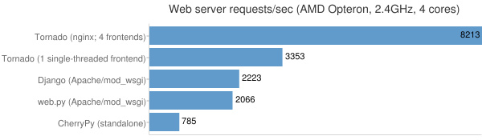

# 性能

## 性能

一个 Web 应用的性能表现，主要看它的整体架构，而不仅仅是前端的表现。 和其它的 Python Web 框架相比，Tornado 的速度要快很多。

我们在一些流行的 Python Web 框架上（[Django](http://www.djangoproject.com/)、 [web.py](http://webpy.org/)、[CherryPy](http://www.cherrypy.org/)）， 针对最简单的 Hello, world 例子作了一个测试。对于 Django 和 web.py，我们使用 Apache/mod_wsgi 的方式来带，CherryPy 就让它自己裸跑。这也是在生产环境中各框架常用 的部署方案。对于我们的 Tornado，使用的部署方案为前端使用 [nginx](http://nginx.net/) 做反向代理，带动 4 个线程模式的 Tornado，这种方案也是我们推荐的在生产环境下的 Tornado 部署方案（根据具体的硬件情况，我们推荐一个 CPU 核对应一个 Tornado 伺服实例， 我们的负载测试使用的是四核处理器）。

我们使用 Apache Benchmark (`ab`)，在另外一台机器上使用了如下指令进行负载测试：

```py
ab -n 100000 -c 25 http://10.0.1.x/ 
```

在 AMD Opteron 2.4GHz 的四核机器上，结果如下图所示：



在我们的测试当中，相较于第二快的服务器，Tornado 在数据上的表现也是它的 4 倍之 多。即使只用了一个 CPU 核的裸跑模式，Tornado 也有 33% 的优势。

这个测试不见得非常科学，不过从大体上你可以看出，我们开发 Tornado 时对于性能 的注重程度。和其他的 Python Web 开发框架相比，它不会为你带来多少延时。