# 网络浏览器工程

> 来源：[`browser.engineering/onepage.html#invalidation`](http://browser.engineering/onepage.html#invalidation)

Pavel Panchekha & Chris Harrelson；单页版

[Twitter](https://twitter.com/browserbook) · [博客](https://browserbook.substack.com/) · [讨论](https://github.com/browserengineering/book/discussions)

# 前言

《网络浏览器工程》前言

+   如何阅读这本书

+   致谢

+   最后的笔记

计算机科学学位传统上包括操作系统、编译器和数据库等课程，用代码取代了神秘感。这些课程将 Linux、Postgres 和 LLVM 转化为可理解的核心架构的改进、添加和优化。这个教训超越了所研究的特定系统：*所有*计算机系统，无论大小和看似多么复杂，都可以被研究和理解。

但是，网络浏览器仍然是不透明的，不仅对学生，对行业程序员甚至对研究人员也是如此。这本书通过系统地解释现代网络浏览器的主要组成部分来消解这种神秘感。

# 如何阅读这本书

本书的第一部分到第三部分构建了一个基本的浏览器，大约有 1000 行代码，练习后是两倍。对于有几年编程经验的人来说，平均每章需要 4-6 小时来阅读、实现和调试。本书的第四部分涵盖了高级主题；这些章节更长，代码更多。最终的浏览器大约有 3000 行。

你的浏览器这本书假设你在阅读的过程中会构建一个网络浏览器。然而，它几乎展示了每一章中用于工作浏览器的所有代码——直接内嵌在书中。所以，大多数时候，这本书使用“我们的浏览器”这个术语，指的是我们（你和我们，作者）迄今为止构建的概念性浏览器。在书中具体提到你构建的实现时，会说“你的浏览器”。它将在每个步骤中“工作”，并且每一章都将建立在上一章的基础上。这个想法来自[J. R. Wilcox](https://jamesrwilcox.com)，他反过来又受到了[S. Zdancewic 的](https://www.cis.upenn.edu/~stevez/)编译器课程的影响。这样，你也将练习增长和改进复杂软件。如果你对某个组件特别感兴趣，请务必完善它，完成练习，并添加缺失的功能。我们尽量安排得让这不会使后面的章节更难。

本书中的代码使用[Python 3](https://browserbook.substack.com/p/why-python)，我们建议你跟随同样的版本。当本书展示 Python 命令行时，它调用 Python 的二进制文件`python3`。这样做是为了清晰。在某些操作系统上，`python`意味着 Python 3，但在其他操作系统上则意味着 Python 2。检查你拥有哪个版本！尽管如此，文本尽可能避免依赖，你可以尝试用另一种语言跟随。确保你的语言有 TLS 连接（Python 内置了一个）、图形（文本使用 Tk、Skia 和 SDL）和 JavaScript 评估（文本使用 DukPy）的库。

本书中的浏览器对标准不敬：它只处理一小部分完整的 HTML、CSS 和 JavaScript 语言，错误处理不当，且对恶意输入缺乏抵抗力。它也相当慢。尽管如此，其架构与真实浏览器相匹配，为那些一千万行代码的巨兽提供了洞察。

话虽如此，我们已尽力明确指出本书的浏览器在简化或偏离标准时的行为。如果你不确定你的浏览器在某些边缘情况下应该如何表现，请打开你最喜欢的网络浏览器并尝试一下。

# 致谢

我们想感谢那些构建了网络和各种网络浏览器的人们。他们是现代世界的奇迹。谢谢！我们从这本书的参考文献中列出的书籍和文章中学到了很多——感谢这些文章的作者。我们还特别感谢为维基百科上的文章（尤其是关于历史软件、格式和协议的文章）做出贡献的许多人。我们对这个惊人的资源感到感激，而这个资源正是这本书所讨论的东西使得这一切成为可能。

*Pavel*: [James R. Wilcox](https://jamesrwilcox.com)和我是在 2018 年 ICFP 的深夜聊天中构思这本书的。[Max Willsey](https://www.mwillsey.com/)校对了书籍并帮助编排章节。[Zach Tatlock](https://homes.cs.washington.edu/~ztatlock/)鼓励我把这本书发展成一门课程。犹他大学的 CS 6968、CS 4962 和 CS 4560 的学生发现了无数错误，并提出了重要的简化建议。我要感谢他们所有人。最重要的是，我要感谢我的妻子[Sara](https://www.sscharmingds.com/)，她支持我的写作，给了我完成这个多年项目的力量。

*Chris*: 我永远感激我的妻子 Sara，她耐心地倾听我关于网络的无限遐想，并鼓励我把浏览器书籍的想法变成现实。我也感激[Dan Gildea](https://www.cs.rochester.edu/u/gildea/)在多个场合对我的浏览器书籍概念提供反馈。最后，我要感谢 Pavel，他做了艰苦的工作，使这个项目得以启动，并让我加入这次冒险。（结果发现 Pavel 和我有同样的想法！）

# 最后的备注

这本书现在是这样，将来也将继续是正在进行中的作品。请留下评论并标记错别字；这本书内置了反馈工具，您可以通过`Ctrl-E`（或在 Mac 上为`Cmd-E`）启用它们。完整的源代码也可在[GitHub](https://github.com/browserengineering/book)上找到，尽管我们更喜欢通过内置工具接收评论。

# 浏览器与互联网

网络浏览器工程导论

+   浏览器与我

+   互联网的历史

+   真实浏览器代码库

+   浏览器代码概念

+   浏览器的作用

+   浏览器与您

我——这是克里斯在说话——从我成年以来一直了解互联网。广义上讲，互联网是互联网上[网页](https://en.wikipedia.org/wiki/Web_page)的相互链接的网络（“互联网”）。如果您从未制作过网页，我推荐 MDN 的[学习网络开发](https://developer.mozilla.org/en-US/docs/Learn)系列，特别是[入门指南](https://developer.mozilla.org/en-US/docs/Learn/Getting_started_with_the_web)。如果您熟悉核心技术，这本书将更容易阅读。对我来说，互联网是一种技术伴侣，我在学习和工作中从未远离它。也许对您来说也是如此。使用互联网意味着使用浏览器。我希望，当您阅读这本书时，您会像我一样爱上网络浏览器。

# 浏览器与我

自从我第一次接触到互联网及其前身以来，对我来说，通过拨号调制解调器连接的[公告板系统（BBS）](https://en.wikipedia.org/wiki/Bulletin_board_system)就像浏览器的窗口一样，是通向互联网上其他动态内容的窗口。在 20 世纪 90 年代初，我对浏览器和网络用户界面的概念着迷。当我[冲浪](https://www.pcmag.com/encyclopedia/term/web-surfing)互联网，即使在其最早的形式中，我也觉得我正在看到计算的未来。在某种程度上，互联网和我一起成长——例如，1994 年，互联网开始商业化的那一年，也是我上大学的那一年；在那里，我花了很多时间冲浪互联网，到 1999 年我毕业时，浏览器已经推动了著名的互联网泡沫投机热潮。不仅如此，我现在工作的公司，谷歌，也是互联网的孩子，它是在那个时期成立的。

在我大学一年级的时候，我参加了一场 RedHat 销售员的演讲。当然，这次演讲的目的是推销 RedHat Linux，可能称之为“未来的操作系统”，并对“Linux 桌面年”进行猜测。但当被问及 RedHat 面临的挑战时，销售员提到的是不是 Linux，而是*网络*：他说“需要有人为 Linux 开发一个优秀的浏览器”。当时，Netscape Navigator 已经可以在 Linux 上使用，但与在其他操作系统上的实现相比，它并不被视为特别快速或功能丰富。即使在那时，在网络的早期几年，浏览器已经是每台电脑的必要组件。他甚至提出了一个挑战：“构建一个更好的浏览器有多难？”的确，这能有多难呢？是什么让它如此困难？这个问题困扰了我很长时间。与此同时，“比 Netscape 更好的 Linux 浏览器”出现得花了很长时间…

确实很难！在 Chrome 的战场上工作了十一年之后，我现在知道他问题的答案：构建一个浏览器既简单又极其困难，既有意为之，也有偶然因素。无论你往哪里看，你都能看到网络的演变和历史被包裹在一个代码库中。这很有趣，而且永远都充满趣味。

所以这就是我爱上网络浏览器的原因。现在，让我告诉你为什么你也会爱上它。

# 历史上的网络

网络是一个宏伟而疯狂的实验。如今，在网上观看视频、阅读新闻和与朋友联系是自然而然的事情。这可能会让网络看起来简单而明显，已经完成，已经建成。但网络既不简单也不明显（当然，也远未完成）。它是实验和研究的结果，追溯到计算机的几乎开始，网络*还需要丰富的计算机显示、强大的用户界面构建库、快速的网络、足够的计算能力和信息存储容量。正如技术经常发生的那样，网络有许多类似的前驱，但只有在所有部件都集齐之后，才采取了现代的形式。关于如何帮助人们相互连接和学习的想法。

在早期，互联网是一个全球性的计算机网络，主要由大学、实验室和大型企业组成，通过物理电缆连接，并通过特定应用程序的协议进行通信。非常早期的网络主要建立在这样一个基础上。网页是以特定格式存储在特定计算机上的文件。网页的地址命名了计算机和文件，早期的服务器除了从磁盘读取文件外，几乎不做其他事情。网络的逻辑结构反映了其物理结构。

变化很大。网页的**超文本标记语言 (HTML**)现在通常是在线动态组装的，“服务器端渲染”是在加载网页时在服务器上组装 HTML 的过程。服务器端渲染可以使用像 JavaScript 这样的网络技术，甚至可以使用[无头浏览器](https://en.wikipedia.org/wiki/Headless_browser)。浏览器接管的地方又多了一个！并且根据需求发送到您的浏览器。正在组装的组件本身也充满了动态内容——新闻、收件箱内容以及根据您的特定口味调整的广告。甚至地址也不再标识特定的计算机——内容分发网络将请求路由到世界上成千上万的任何一台计算机。在更高层次上，大多数网页不是从某个人的家用计算机上提供服务——人们确实这样做了！当他们的网站变得流行时，它们经常因为带宽或计算能力不足而变得无法访问，但通常是从大型企业的社交媒体平台或云计算服务上提供。

尽管发生了所有这些变化，有些东西仍然保持不变，那就是构成网络本质的核心构建块：

+   网络是一个由**超链接**连接的**信息网络**。

+   用户使用一个称为**浏览器**的**用户代理**来浏览网络。

+   信息是通过**超文本传输协议 (HTTP**)请求的，并以**HTML 文档格式**进行结构化。

+   文档是通过统一资源定位符 (URLs) 来标识的，**不是**通过其内容，并且可能是动态生成的。

+   网页可以链接到不同格式的辅助资产，包括图片、视频、层叠样式表 (CSS) 和 JavaScript。

+   所有这些构建块都是开放的、标准化的，并且可以免费使用或重复使用。

作为哲学问题，或许这些原则中的某一个或另一个是次要的。可以尝试区分网络的联网和渲染方面。可以抽象出链接和网络与特定协议和数据格式的选择。可以询问浏览器在理论上是否是必要的，或者争论 HTTP、URL 和超链接是网络唯一真正必要的部分。

或许，确实有可能用其他的选择来替换一个或多个实现选项，也许随着时间的推移这会发生。例如，JavaScript 最终可能会被另一种语言或技术所取代，HTTP 可能会被其他协议所取代，或者 HTML 可能会被一个后继者所取代。然而，网络将仍然是网络，因为任何后继格式都肯定支持功能**超集**，并且具有相同的根本结构。毕竟，网络是一个实验；核心技术不断发展和演变。但网络并非偶然；其原始设计不仅反映了关于计算的真实情况，还反映了人类如何连接和互动的真实情况。网络不仅在虚拟化托管和内容的过程中幸存下来，而且由于这种原始设计的优雅和有效性，它还繁荣起来。

需要理解的关键是，这个伟大的实验还没有结束。网络的本质将保持不变，但通过构建网络浏览器，你有机会塑造其未来。

# 浏览器对性能的敏感性如此之高，以至于在许多地方，仅仅引入一个抽象——一个函数调用或分支开销——就可能产生不可接受的性能成本！

所以，让我告诉你为浏览器做贡献的感觉。在我开始为 Chrome 工作的前几个月里，我遇到了实现`<br>`标签的代码——看看那个，那个好老好的`<br>`标签，我多次用它来在网页中插入换行符！而且，实现起来几乎不需要任何代码，无论是在 Chrome 中还是在本书的简单浏览器中。

但整体而言，Chrome——它的功能、速度、安全性、可靠性——真是令人惊叹。*数千*人年投入其中。始终有压力要做更多——添加更多功能、提高性能、跟上“网络生态系统”——对于成千上万的商业公司、数百万的开发者（我通常更喜欢“工程师”——因此这本书的标题是“工程师”——但在网络上“开发者”或“网页开发者”更为常见。一个重要原因是任何人都可以构建网页——而不仅仅是受过训练的软件工程师和计算机科学家。“网页开发者”也涵盖了其他一些关键角色，如设计师、作者、编辑和摄影师。网页开发者是指任何创建网页的人，无论其方式如何，以及网络上的数十亿用户。

在这样的代码库上工作可能会感到令人畏惧。我经常发现代码是 15 年前由我从未见过的人修改的；或者现在甚至发现了一些我从未知道存在的文件和类；或者看到一些看起来并不必要的代码行，但最终证明它们是重要的。那个 15 年前的代码做了什么？这些对我来说是新的文件有什么目的？这些代码的存在是否有原因？

每个浏览器都有数千个未修复的错误，从小错误到无数的混淆和匹配错误。每个浏览器都必须不断调整和优化，以榨取最后一丝性能。每个浏览器都需要进行艰苦的工作，不断重构代码以降低其复杂性，通常是通过仔细的模块化和抽象化。

使浏览器与大多数大型代码库不同的特点是它们的*紧迫性*。浏览器几乎和任何“遗留”代码库一样古老，但它们*不是*遗留的，没有被遗弃或半废弃，也没有计划被替换。相反，它们对世界经济至关重要。因此，浏览器工程师必须修复和改进，而不是遗弃和替换。而且，由于网络的本质高度去中心化，浏览器遇到的使用案例在很大程度上*不是*由“拥有”或“控制”特定浏览器的公司“决定”。其他人——包括你——可以并且确实在贡献想法、提案和实现。

令人惊讶的是，尽管规模、速度和复杂性很大，但仍有很大的贡献空间。今天每个浏览器都是开源的，这向整个网页开发者社区开放了其实现。浏览器像巨大的研究项目一样发展，新想法不断被提出和测试。正如你所期望的，一些功能失败了，而一些成功了。成功的那些建立在规范中，并由其他浏览器实现。每个网页浏览器都欢迎贡献——无论是修复错误还是提出新功能或实现有希望的优化。

值得贡献，因为从事网页浏览器开发是一件很有趣的事情。

# 浏览器代码概念

HTML 和 CSS 被设计成黑盒——声明性应用程序编程接口 (API)——在这里，你指定要达到的 *结果*，而 *浏览器本身* 负责找出 *如何* 实现它。网页开发者无法，也大多不能，自己绘制网页的像素。

这可以使浏览器变得神奇或令人沮丧——这取决于它是否在做正确的事情！但这也使浏览器成为一款相当不寻常的软件，具有独特的挑战、有趣的算法和巧妙的优化。浏览器值得研究，纯粹是为了乐趣。

那一切之所以能够运作，是因为网络浏览器的实现采用了[控制反转](https://en.wikipedia.org/wiki/Inversion_of_control)、[约束编程](https://en.wikipedia.org/wiki/Constraint_programming)和[声明式编程](https://en.wikipedia.org/wiki/Declarative_programming)。网络浏览器实现了*控制反转*，通过一个中介——浏览器——处理大部分的渲染工作，而网络开发者则向这个中介指定渲染参数和内容。例如，在 HTML 中，有许多内置的[表单控件元素](https://developer.mozilla.org/en-US/docs/Learn/Forms/Basic_native_form_controls)，它们负责处理网页用户可以提供的各种输入方式。开发者只需指定按钮名称、尺寸和外观等参数，或者 JavaScript 扩展点来处理表单提交到服务器。其余的实现工作由浏览器完成。此外，这些参数通常以屏幕元素相对大小和位置的*约束*形式存在，而不是直接指定它们的值；在网页布局中，约束编程最为清晰，字体和窗口大小、期望的位置和尺寸，以及小部件的相对排列很少直接指定。浏览器通过解决这些约束来找到相应的值。同样的理念也适用于动作：网页大多需要*执行*动作，而不需要指定*何时*执行。这种*声明式*风格意味着从开发者的角度来看，更改“立即”生效，但在底层，浏览器可以是[惰性评估](https://en.wikipedia.org/wiki/Lazy_evaluation)的，并延迟应用更改，直到它们对外部可见，无论是由于后续的 API 调用，还是因为页面需要显示给用户。例如，浏览器何时计算 HTML 元素的样式？任何样式的更改都会对所有后续的 API 调用可见，所以在某种程度上它“立即”生效。但浏览器延迟样式重新计算，避免在样式连续两次快速更改时进行冗余工作。最大限度地利用声明式编程带来的机会，使得现实世界的浏览器非常复杂。

浏览器设计的不寻常之处有实际原因。是的，开发者失去了一些控制和能动性——当像素错误时，开发者无法直接修复它们。失去控制并不一定只针对网络——如今的大部分计算都依赖于其他人堆积如山的代码。但他们获得了在网络上部署内容的能力，无需担心细节，使内容几乎可以立即在现有的几乎所有计算设备上可用，并保持其未来的可访问性，主要避免了软件不可避免的过时。

对我来说，浏览器是算法**变得生动**的地方。浏览器包含的渲染引擎比任何电脑游戏都要复杂和强大；一个完整的网络堆栈；巧妙的数据结构和并行编程技术；一个虚拟机，一个解释型语言和一个即时编译器；一个世界级的沙盒；以及一个独特动态的数据存储系统。

事实上——你一直在使用浏览器，可能就是为了阅读这本书！这使得算法在浏览器中的可接近性比其他任何地方都要高，因为网络已经非常熟悉了。

# 浏览器的作用

网络是现代计算的中心。每年，网络都在扩展其覆盖范围，涵盖我们用计算机做的更多事情。它现在远远超出了最初用于基于文档的信息共享的使用：现在许多人整天都在浏览器中度过，不使用任何其他应用程序！此外，桌面应用程序现在通常被构建和交付为**网络应用程序**：浏览器加载的网页，但像已安装的应用程序一样使用。与网络应用程序的概念相关的是渐进式网络应用程序，它是一种通过[渐进式增强](https://en.wikipedia.org/wiki/Progressive_enhancement)变得与原生应用程序无法区分的网络应用程序。即使在移动设备上，应用程序也经常嵌入浏览器来渲染应用程序用户界面（UI）的一部分。这种“混合”应用程序中通过“网页视图”显示的比例可能随着时间的推移而增加。在一些市场，如中国，“超级应用程序”充当基于网页视图的游戏和小部件的移动网络浏览器。也许在未来，桌面和移动设备将主要成为网络应用程序的容器。已经，浏览器是计算中不可或缺的关键部分。

因此，鉴于这种中心地位，了解网络的工作原理是值得的。特别是，关注浏览器是值得的，浏览器是用户代理（用户代理概念将计算机或计算机内的软件视为人类用户的受信任助手和倡导者，以及网络交互的中介，这最终使得网络的原则变得真实。浏览器也是网络的**实施者**：它的沙盒使网络浏览安全；它的算法实现了声明性文档模型；它的用户界面导航链接。只有当浏览器超级高效时，网页才能快速加载并平滑地响应。

# 浏览器与您

本书解释了如何构建一个简单的浏览器，一个尽管简单，但可以显示看起来有趣的网页并支持许多有趣行为的浏览器。正如您将看到的，这出奇地简单，它展示了您需要了解真实世界浏览器的所有核心概念。当浏览器成为代码时，它就不再是神秘的了。

目的是让你在阅读早期章节的过程中构建自己的浏览器。一旦它运行起来，就有无数的机会来提升性能或添加功能，其中一些作为练习被提出。许多这些练习都是真实浏览器中实现的功能，我鼓励你尝试它们——添加功能是浏览器开发中最有趣的部分之一！

书接着详细介绍了基于我使用 Chrome 的经验，对真实浏览器渲染引擎架构的详细和高级特性进行了阐述。读完这本书后，你应该能够深入挖掘 Chromium、Gecko 或 WebKit 的源代码，而不会遇到太多麻烦。

我希望这本书能让你欣赏浏览器的深度、复杂性和强大功能。我希望这本书能传递浏览器的美——它巧妙算法和数据结构，它与计算文化和历史的共同进化，它在我们的世界中的核心地位。但最重要的是，我希望这本书能让你看到自己正在构建未来的浏览器。

# 网络历史

网络浏览器工程背景。

+   memex 概念

+   网络的兴起

+   浏览器

+   Web 标准

+   开源

+   总结

+   练习

本章深入探讨了网络的本身历史：它的起源，以及网络和浏览器至今是如何演变的。这个历史不是详尽的；例如，关于标准通用标记语言（[SGML](https://en.wikipedia.org/wiki/Standard_Generalized_Markup_Language)）或 HTML 的前驱者几乎没有内容。（除了这个脚注！）重点是导致网络的关键事件和思想，以及其发明者的目标和动机。

# memex 概念


图 1：“我们如何思考”的原始出版物。（[Flickr 的 Dunkoman](https://www.flickr.com/people/79255326@N00)来自[Wikipedia](https://commons.wikimedia.org/wiki/File:The_Memex_(3002477109).jpg)，[CC BY 2.0](https://creativecommons.org/licenses/by/2.0/legalcode)。）

早在 1945 年，Vannevar Bush 发表了一篇题为“[我们如何思考](https://en.wikipedia.org/wiki/As_We_May_Think)”的论文，这篇论文探讨了计算机可能如何革命性地改变信息。这篇论文设想了一种名为[memex](https://en.wikipedia.org/wiki/Memex)的机器，它可以帮助个人看到并探索世界上所有的信息（见图 1）。它用当时缩微胶片屏幕技术的术语来描述，但其目的和概念与今天我们所知的网络有明显的相似之处，尽管用户界面和技术细节有所不同。

网络的核心组织目标是类似于 Memex 的*表示和显示信息*，为人类提供一种有效学习和探索的方式。物种的集体知识和智慧早已超越了单个心智、组织、图书馆、国家、文化、群体或语言的容量。然而，尽管我们作为人类不可能知道可能知道的一小部分，但我们可以使用技术比以前更有效地学习，特别是快速获取我们需要学习、记忆或回忆的信息。考虑一下 Vannevar Bush 描述的这个想象中的研究会议——它与我们有时使用网络的方式惊人地相似：

> 假设 memex 的所有者对弓箭的起源和特性感兴趣。[……]他在 memex 中有几十本可能相关的书籍和文章。首先，他查阅百科全书，发现一篇有趣但简略的文章，将其投影出来。接下来，在历史书中，他找到另一个相关项目，并将两者联系起来。就这样，他继续前进，构建了许多项目的轨迹。

计算机、互联网使我们能够*处理和存储*我们想要的信息。但帮助我们*组织和找到*这些信息、这些知识的，是*网络*。谷歌著名的[使命](https://about.google/)声明“组织全球信息，使其普遍可访问和有用”几乎完全相同。这不是巧合——搜索引擎的概念与网络本质上是相连的，并且受到了网络及其前身设计的启发。

“我们如何思考”强调了 memex 的两个特点：信息记录查找和相关信息之间的关联。事实上，这篇文章强调了后者的重要性——我们通过在已知事物之间建立之前未知的*联系*来学习：

> 当任何类型的数据被存储时，它们按字母顺序或数字顺序归档。[……]人的思维并不是这样工作的。它是通过联想来运作的。

通过“联想”，Bush 指的是通过人类编辑的链接从一条记录到另一条记录的思维轨迹。他想象的不只是一个通用图书馆，而是一个记录我们所学内容的通用方式。

# 网络的出现

超文本文档的概念，通过 [hyperlinks](https://en.wikipedia.org/wiki/Hyperlink#History) 链接，是在 1964-65 年由 [Project Xanadu](https://en.wikipedia.org/wiki/Project_Xanadu) 发明的，该项目由 Ted Nelson 领导。他受到了学术界和文学界长期引用和批评传统的启发。Xanadu 项目的研究论文受到了这一用例的强烈推动。超文本是带有指向其他文本的超链接的文本。其继任者 [Hypertext Editing System](https://en.wikipedia.org/wiki/Hypertext_Editing_System) 首次引入了回退按钮，现在所有浏览器都有这个按钮。由于该系统只有文本，所以“按钮”本身也是文本。听起来熟悉吗？网页是超文本，网页之间的链接是超链接。编写网页的格式是 HTML，加载网页的协议是 HTTP，这两个缩写都包含“HyperText”。见图 2，这是早期超文本编辑系统的一个示例。


Figure 2: 1969 年使用超文本编辑系统的计算机操作员。（来自 Wikipedia 的 Gregory Lloyd，[CC BY-SA 4.0 国际](https://creativecommons.org/licenses/by-sa/4.0/deed.en)。）

不同于 Xanadu 项目，第一个超链接系统是为了在单个文档内进行滚动而出现的；它后来被推广到多个文档之间的链接。就像那些原始系统一样，网络在文档内部以及文档之间都有链接。例如，URL `http://browser.engineering/history.html#the-web-emerges` 指的是名为“`history.html`”的文档，以及其中名为“`the-web-emerges`”的元素：这一部分。访问该 URL 将加载这一章节并滚动到这一部分。

这项工作也形成了 Douglas Engelbart 的“所有演示之母” [mother of all demos](https://en.wikipedia.org/wiki/The_Mother_of_All_Demos) 的一个关键部分，可能是计算历史上最具影响力的技术演示（见图 3）。那次演示不仅展示了网络的核心理念，还介绍了计算机鼠标和图形用户界面，这两者都是浏览器 UI 的核心组件。那次演示甚至超越了这一点。其中一些部分在任何一个计算机系统中都尚未实现。看看它吧！


Figure 3: Doug Engelbart 展示所有演示之母。（SRI International，通过[Doug Engelbart 研究所](https://www.dougengelbart.org/content/view/374/464/)。）

当然，这项研究与网络中的文档-URL-超链接设置之间存在着非常直接的联系，这是基于超文本理念并在实践中应用的。例如，[HyperTIES](http://www.cs.umd.edu/hcil/hyperties/)系统就强调了超链接，并用于开发世界上第一份电子学术期刊，即 1988 年的[*《ACM 通讯》*](https://cacm.acm.org/)。蒂姆·伯纳斯-李将 1988 年的这一期作为万维网的灵感来源。如今，万维网被称为“网络”或“网络生态系统”——生态系统是另一种捕捉“全球”这一概念的方式。原始的措辞在许多网站域名中的“www”中得以延续。他在其中将链接概念与互联网的可用性相结合，从而实现了之前几十年所有这些工作的许多原始目标。正如网络本身是之前抱负和梦想的实现一样，今天我们努力实现网络所描绘的愿景。（不，还没有完成！）

“超链接”这个词可能是在 1987 年提出的，与苹果电脑上的[HyperCard](https://en.wikipedia.org/wiki/HyperCard)系统有关。这个系统也是最早引入之一，或者可能是第一个，将脚本的概念引入超文本中，以处理用户事件（如点击）并执行增强 UI 的动作——就像网页上的 JavaScript 一样！它还拥有图形用户界面元素，而不仅仅是文本，与大多数前辈不同。

在 1989-1990 年间，第一个网络浏览器（命名为 WorldWideWeb，见图 4）和网络服务器（命名为`httpd`，即 HTTP 守护进程，根据 UNIX 命名规范）诞生了，由蒂姆·伯纳斯-李编写。有趣的是，尽管在那个浏览器的一些方面能力不如你将在本书中实现的浏览器，没有 CSS！没有 JS！甚至没有图片！但在其他方面，它们超越了现代浏览器所具备的能力。例如，第一个浏览器包括了索引页面的概念，用于在站点内进行搜索（这些遗迹在今天“index.html”惯例中仍然存在，当 URL 路径以“/”结尾时），并且有一个所见即所得的网页编辑器（DOM 元素上的“contenteditable”HTML 属性（见第十六章）具有类似的语义行为，但内置的文件保存功能已经消失）。今天，索引已被搜索引擎所取代，由于今天网页渲染的高度动态性，网页编辑器作为一个概念已经有些过时。1990 年 12 月 20 日，[第一个网页](http://info.cern.ch/hypertext/WWW/TheProject.html)被创建。我们将在本书中实现的浏览器能够轻松渲染这个网页，即使是在今天。此外，正如你可以清楚地看到的，这个网页在此期间没有更新，保留了其原始的美学！1991 年，伯纳斯-李在[`alt.hypertext` Usenet 组](https://www.w3.org/People/Berners-Lee/1991/08/art-6484.txt)上宣传了他的浏览器和这一概念。

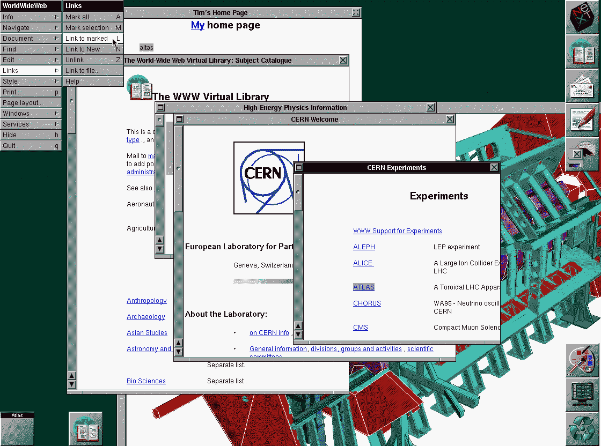

图 4：WorldWideWeb 浏览器的截图。[*《ACM 通讯》](https://dl.acm.org/doi/10.1145/179606.179671)，1994 年 8 月。]

Berners-Lee 的 [《互联网简史》](https://www.w3.org/DesignIssues/TimBook-old/History.html) 强调了导致万维网成为我们今天所知道的万维网的一些其他关键因素。一个关键因素是其去中心化的性质，他将这种性质描述为起源于他工作的 [CERN](https://home.cern/) 的学术文化。网络的去中心化性质是区分它与其他许多系统的一个关键特征，他的解释在这里值得引用（斜体为本人所加）：

> 显然需要一种类似于 Enquire 的系统，Enquire 是一个类似网络的数据库系统，也是由 Berners-Lee 编写的，但每个人都可以访问。我希望它能够扩展，以便如果两个人开始独立使用它，后来开始合作，*他们可以开始链接他们的信息，而不需要做任何其他改变*。这就是网络的概念。

这段引言捕捉到了网络的一个关键价值主张：其去中心化的性质。网络之所以成功，有几个原因，但它们都与去中心化有关：

+   由于没有守门人可以控制任何事情，任何人，即使是新手，都可以轻松制作简单的网页并发布它们。

+   由于页面仅通过 URL 进行标识，流量可以从电子邮件、社交网络和搜索引擎等外部来源进入网络。此外，网站之间的兼容性和超链接的力量创造了 [网络效应](https://en.wikipedia.org/wiki/Network_effect)，这进一步增强了网络内部超链接的效果。

+   由于网络不受任何单一实体的控制——并且通过标准组织保持这种状态——它避免了垄断控制和操纵的问题。

# 浏览器

第一个广泛分布的浏览器可能是 [ViolaWWW](https://en.wikipedia.org/wiki/ViolaWWW)（见图 5）；这个浏览器还开创了多个有趣的功能，如小程序和图像。它后来又成为了 [NCSA Mosaic](https://en.wikipedia.org/wiki/Mosaic_(web_browser))（见图 6）的灵感来源，Mosaic 于 1993 年推出。Mosaic 的两个原始作者之一后来共同创立了 Netscape，Netscape 开发了 [Netscape Navigator](https://en.wikipedia.org/wiki/Netscape_Navigator)（见图 7），这是第一个 *商业浏览器*，这里的“商业”是指由盈利实体开发的。Netscape 的早期版本也不是免费软件——你必须从商店购买它们。它们的价格大约是 50 美元。Netscape 于 1994 年推出。[感到威胁](https://lettersofnote.com/2011/07/22/the-internet-tidal-wave/)，微软于 1995 年推出了 Internet Explorer（见图 8），并很快将其捆绑到 Windows 95 中。

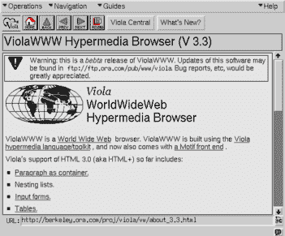

图 5：ViolaWWW. ([*Viola in a Nutshell*](https://web.archive.org/web/20200706084621/http://viola.org/viola/book/preface.html).)

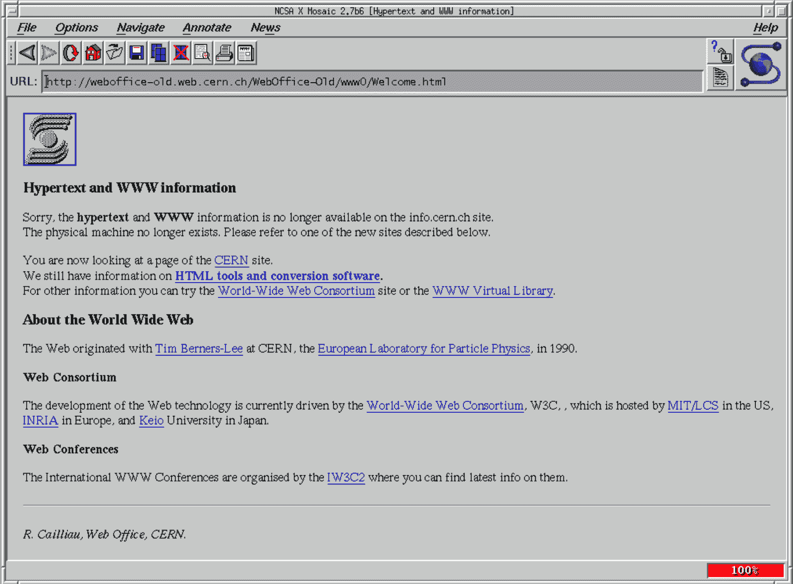

图 6：Mosaic. ([Wikipedia](https://commons.wikimedia.org/wiki/File:NCSA_Mosaic_Browser_Screenshot.png), [CC0 1.0](https://creativecommons.org/publicdomain/zero/1.0/legalcode).)

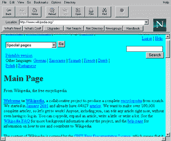

图 7：Netscape Navigator 1.22\. ([Wikipedia](https://en.wikipedia.org/wiki/File:Navigator_1-22.png#filehistory).)

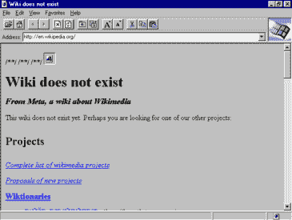

图 8：Internet Explorer 1.0\. ([Wikipedia](https://en.wikipedia.org/wiki/File:Internet_Explorer_1.0.png), used with [permission from Microsoft](https://www.microsoft.com/en-us/legal/copyright/permissions).)

随后开始了[“第一次浏览器大战”](https://en.wikipedia.org/wiki/Browser_wars#First_Browser_War_(1995%E2%80%932001))：Netscape Navigator 和[Internet Explorer](https://en.wikipedia.org/wiki/Internet_Explorer)之间的竞争。当时还有其他市场份额较小的浏览器；一个值得注意的例子是[Opera](https://en.wikipedia.org/wiki/Opera_(web_browser))。[WebKit](https://en.wikipedia.org/wiki/WebKit)项目始于 1999 年；基于[Safari](https://en.wikipedia.org/wiki/Safari_(web_browser))和[Chromium](https://www.chromium.org/)-的浏览器，如 Chrome 和 Edge 的新版本，都源自这个代码库。同样，[Gecko](https://en.wikipedia.org/wiki/Gecko_(software))渲染引擎最初由 Netscape 从 1997 年开始开发；[Firefox](https://en.wikipedia.org/wiki/Firefox)浏览器源自那个代码库。在第一次浏览器大战期间，这本书简单浏览器的几乎所有核心功能都被添加，包括 CSS、DOM 和 JavaScript。

“第二次浏览器大战”，根据维基百科的记载是[2004–2017](https://en.wikipedia.org/wiki/Browser_wars#Second_Browser_War_(2004%E2%80%932017))，这场战争在众多浏览器之间展开，特别是 Internet Explorer、Firefox、Safari 和 Chrome。最初，Safari 和 Chrome 使用相同的渲染引擎，但 Chrome 在 2013 年分叉为[Blink](https://en.wikipedia.org/wiki/Blink_(browser_engine))，到 2020 年，Microsoft Edge 也开始采用。第二次浏览器大战见证了现代网络许多功能的开发，包括广泛使用 AJAX（异步 JavaScript 和 XML，其中 XML 代表可扩展标记语言），HTML5 特性如`<canvas>`，以及第三方 JavaScript 库和框架的爆炸性增长。

# 网络标准

与这些发展并行的是另一个同样重要的方面——网络 API 的标准化。1994 年 10 月，[万维网联盟](https://www.w3.org/Consortium/facts)（W3C）成立，旨在提供对网络特性的监督和标准。在此之前，浏览器经常会引入新的 HTML 元素或 API，而竞争的浏览器则必须复制它们。有了标准组织，这些元素和 API 随后可以在规范中得到认可并记录下来。（如今，任何新功能都会先进行初步讨论、设计和规范。）后来，HTML 规范最终转移到了另一个名为[WHATWG](https://whatwg.org/)的标准机构，但[CSS](https://drafts.csswg.org/)和其他功能仍然在 W3C 进行标准化。JavaScript 在另一个名为 TC39（[技术委员会 39](https://tc39.es/））的标准机构[ECMA](https://www.ecma-international.org/about-ecma/history/)进行标准化。[HTTP](https://tools.ietf.org/html/rfc2616)由[互联网工程任务组](https://www.ietf.org/about/)进行标准化。重要的是，1990 年代中期建立的标准流程至今仍在使用。

在网络的前几年，并不那么清楚浏览器是否会保持标准，或者一个浏览器可能不会最终“获胜”并成为另一个专有软件平台。这没有发生的原因有很多，其中之一是计算社区的平等主义精神以及 W3C 的存在和强大。另一个重要原因是网络的性质，因此网络开发者必须确保他们的页面在大多数或所有浏览器中都能正确工作（否则他们会失去客户），这促使他们避免专有扩展。相反，浏览器努力仔细复制彼此未记录的行为——甚至错误——以确保它们继续支持整个网络。

从来没有哪个浏览器公开尝试脱离标准，尽管人们担心这种情况可能发生。也许网络最接近分裂的时刻是在 20 世纪 90 年代末引入了[DHTML](https://en.wikipedia.org/wiki/Dynamic_HTML)功能——这本书中你将学习的文档对象模型的早期版本。最初，Netscape 和 Internet Explorer 对这些功能的实现不兼容，并且需要多年的时间、共同规范的开发以及向浏览器施加的重大压力运动，才实现了标准化。你可以在[Jay Hoffman](https://css-tricks.com/chapter-7-standards/)的文章中更深入地了解这个故事。相反，对市场份额的激烈竞争被转化为快速的创新，以及网络 API 和功能的不断扩展，我们现在称之为*网络平台*，而不仅仅是“万维网”。这承认了这样一个事实，即网络不再是一个文档查看机制，而已经发展成为一个完全实现的计算平台和生态系统。甚至还有围绕网络构建的操作系统！例子包括[webOS](https://en.wikipedia.org/wiki/WebOS)，它为一些 Palm 智能手机供电，[Firefox OS](https://en.wikipedia.org/wiki/Firefox_OS)（今天在基于[KaiOS](https://en.wikipedia.org/wiki/KaiOS)的手机上继续存在），以及[ChromeOS](https://en.wikipedia.org/wiki/Chrome_OS)，这是一个桌面操作系统。所有这些操作系统都是基于使用网络作为所有应用的 UI 层，并在其上提供一些用于系统集成的 JavaScript 公开 API。

考虑到结果——多个竞争浏览器和成熟的标准——回顾起来，哪个浏览器“赢”或“输”每一场浏览器“战争”并不那么重要。在每种情况下，*网络*才是赢家，因为它获得了用户并增强了功能。

# 开源

第二次浏览器战争的一个重要且有趣的成果是，今天所有主流浏览器都基于 *三个开源网络渲染/JavaScript 引擎*：Chromium、Gecko 和 WebKit。JavaScript 引擎实际上在不同的存储库中（以及其他各种子组件也是如此），并且可以在浏览器之外作为 JavaScript 虚拟机使用。一个重要应用是使用 [V8](https://en.wikipedia.org/wiki/V8_(JavaScript_engine)) 为 [node.js](https://en.wikipedia.org/wiki/Node.js) 提供动力。然而，这三个渲染引擎中的每一个都有一个相应的 JavaScript 实现，因此将两者混淆是合理的。由于 Chromium 和 WebKit 有一个共同的祖先代码库，而 Gecko 是 Netscape 的开源后代，所以它们都追溯到 20 世纪 90 年代——几乎回到了网络的开始。

这不是偶然的，实际上它告诉我们关于基于商品平台 API 集实现渲染引擎的最经济有效方式的一些相当有趣的事情。例如，独立开发者通常不会由名义上控制浏览器的公司支付，他们会贡献代码和功能。甚至还有专门实施浏览器功能的公司和个人！一个浏览器中的功能复制另一个浏览器的代码也是很常见的。而且，每个主要浏览器都是开源的，这会反馈到标准过程中，加强网络的去中心化特性。

# 摘要

总结起来，历史是这样的：

1.  对表示和探索信息的方法进行了基本研究。

1.  一旦必要的技术足够成熟，网络本身就被提出并实施。

1.  网络迅速普及，许多浏览器出现以利用网络的机遇。

1.  为了在浏览器之间进行协商并避免专有控制，引入了标准组织。

1.  浏览器之间的竞争迅速增加了它们的功率和复杂性。

1.  浏览器出现在所有设备上和操作系统上，从桌面到移动再到嵌入式。

1.  最终，所有网络渲染引擎都变成了开源的，这是对其作为一个比任何单一实体更大的共享努力的认可。

网络已经发展得很远！但有一点似乎很清楚：它还没有完成。

# 练习

*iii*-1 *接下来是什么？* 基于你对网络是如何产生并形成当前形式的了解，你预测其未来的发展趋势是什么？例如，你认为它将如何有效地与其他非网络技术和平台竞争？

*iii*-2 *原始想法怎么了？* 实际上网络的工作方式与 memex 有显著不同；一个关键区别是，网络用户没有内置的方式在页面之间添加链接或进行标注。你认为这是为什么？你能想到原始工作中其他尚未实现的目标吗？

# 下载网页

Web 浏览器工程的第一章。

+   连接到服务器

+   请求信息

+   服务器的响应

+   Python 中的 Telnet

+   请求和响应

+   显示 HTML

+   加密连接

+   总结

+   大纲

+   练习

网络浏览器显示由 URL 标识的信息。第一步是使用该 URL 连接到互联网上的某个服务器并下载信息。

# 连接到服务器

浏览互联网从 URL 开始，“URL”代表“统一资源定位符”，意味着它是一种便携的（统一的）识别网页（资源）的方式，同时也描述了如何访问这些文件（定位符）。这是一个简短字符串，用于标识浏览器应访问的特定网页。

```py
http://example.org/index.html

```

图 1：URL 的语法。

一个 URL 包含三个部分（见图 1）：方案解释了*如何*获取信息；主机名解释了*在哪里*获取信息；路径解释了*要获取什么*信息。URL 还有一些可选部分，如端口、查询和片段，我们将在后面看到。

从一个 URL 开始，浏览器可以启动下载网页的过程。浏览器首先请求本地操作系统（OS）将其与由*主机名*描述的*服务器*连接起来。然后，操作系统与一个*域名系统*（DNS）服务器通信，该服务器将像`example.org`这样的主机名转换为*目标 IP 地址*，例如`93.184.216.34`。现在有两个版本的 IP（互联网协议）：IPv4 和 IPv6。IPv6 地址要长得多，通常以十六进制形式书写，但在这里，其他差异并不重要。然后，操作系统决定使用什么硬件与该目标 IP 地址（例如，无线或有线）通信最好（称为*路由表*），然后使用设备驱动程序通过电线或无线发送信号。这里省略了一些步骤。在电线上，你首先必须在通信中包裹以太网帧，在无线中，你甚至需要做更多。我尽量简短。这些信号被一系列*路由器*（或交换机，或接入点；有很多可能性，但最终都会有一个路由器）接收并传输，每个路由器都会选择最佳方向发送你的消息，以便最终到达目的地。它们也可能记录消息的来源，以便它们可以将回复转发回去。当消息到达服务器时，就会建立一个连接。无论如何，重点是浏览器告诉操作系统，“嘿，让我与`example.org`连接起来”，然后它就做到了。

在许多系统中，您可以使用`telnet`程序设置此类连接，如下所示：“80”是端口号，下面将讨论。

```py
telnet example.org 80
```

（注意：当你看到一个灰色轮廓时，这意味着相关的代码只是一个示例，*并不是*我们浏览器代码的一部分。）

你可能需要安装`telnet`；它通常默认禁用。在 Windows 上，您可以在控制面板中转到“程序和功能/启用或关闭 Windows 功能”（[`www.lifewire.com/what-is-telnet-2626026`](https://www.lifewire.com/what-is-telnet-2626026)），您将需要重新启动。当你运行它时，它会清除屏幕而不是打印某些内容，但除此之外，它正常工作。在 macOS 上，您可以使用`nc -v`命令作为`telnet`的替代品：

```py
nc -v example.org 80
```

输出略有不同，但工作方式相同。在大多数 Linux 系统上，您可以从包管理器安装`telnet`或`nc`，通常是从名为`telnet`和`netcat`的软件包中安装。

你会得到如下所示的输出：

```py
Trying 93.184.216.34...
Connected to example.org.
Escape character is '^]'.
```

这意味着操作系统已将主机名`example.org`转换为 IP 地址`93.184.216.34`并能够连接到它。关于转义字符的那一行只是使用神秘的`telnet`功能的说明。你现在可以与`example.org`通信了。

URL 语法在[RFC 3987](https://tools.ietf.org/html/rfc3986)中定义，其第一作者是蒂姆·伯纳斯-李——这不足为奇！第二作者是罗伊·菲尔德，他是 HTTP 设计的关键贡献者，也因在其[博士论文](https://ics.uci.edu/~fielding/pubs/dissertation/fielding_dissertation_2up.pdf)中描述了 Web 的表示状态转换（REST）架构而闻名，该论文解释了 REST 如何使 Web 以去中心化的方式增长。今天，许多服务提供“RESTful API”，也遵循这些原则，尽管似乎存在[一些混淆](https://twobithistory.org/2020/06/28/rest.html)。

# 请求信息

一旦连接成功，浏览器通过提供其*路径*来从服务器请求信息，路径是 URL 中主机名之后的部分，如`/index.html`。请求的结构如图 2 所示。在`telnet`中输入此信息以尝试它。

```py
GET /index.html HTTP/1.0
Host: example.org

```

图 2：注释的 HTTP GET 请求。

在这里，单词`GET`意味着浏览器想要接收信息，如果它打算发送信息，则可以说`POST`，此外还有一些其他更不为人知的选项。然后是路径，最后是单词`HTTP/1.0`，它告诉主机浏览器使用的是[HTTP](https://developer.mozilla.org/en-US/docs/Web/HTTP)的 1.0 版本。HTTP 有几种版本（[0.9, 1.0, 1.1, 2.0, 和 3.0](https://medium.com/platform-engineer/evolution-of-http-69cfe6531ba0)）。HTTP 1.1 标准增加了许多有用的功能，如持久连接，但为了简单起见，我们的浏览器不会使用它们。我们也没有实现 HTTP 2.0；它比 1.*x*系列复杂得多，并且是为大型和复杂的 Web 应用程序设计的，而我们的浏览器根本无法运行这些应用程序。

在第一行之后，每一行都包含一个*标题*，它有一个名称（如`Host`）和一个值（如`example.org`）。不同的标题意味着不同的事情；例如，`Host`标题告诉服务器你认为它是谁。这在同一个 IP 地址对应多个主机名并且托管多个网站（例如，`example.com`和`example.org`）时非常有用。`Host`标题告诉服务器你想要哪个多个网站。这些网站基本上需要`Host`标题才能正常工作。在单台计算机上托管多个域名是非常常见的。还有许多其他可以发送的标题，但让我们现在就只关注`Host`。

最后，在标题之后是一个单独的空白行；这告诉主机你已经完成了标题。因此，在`telnet`中输入一个空白行（在输入请求的两行后按两次 Enter 键）并应该从`example.org`获得响应。

HTTP/1.0 在[RFC 1945](https://tools.ietf.org/html/rfc1945)中标准化，HTTP/1.1 在[RFC 2616](https://tools.ietf.org/html/rfc2616)中标准化。HTTP 被设计成易于理解和实现，这使得任何类型的计算机都容易采用它。你可以在`telnet`中直接输入 HTTP 并不是巧合！HTTP 是一个“基于行的协议”，使用纯文本和新行，类似于用于电子邮件的简单邮件传输协议([SMTP](https://en.wikipedia.org/wiki/Simple_Mail_Transfer_Protocol))。最终，整个模式源于早期计算机只有基于行的文本输入。事实上，最早的两个浏览器之一就有[行模式 UI](https://en.wikipedia.org/wiki/Line_Mode_Browser)。

# 服务器响应

服务器响应从图 3 中的行开始。

```py
HTTP/1.0 200 OK

```

图 3：HTTP 响应的第一行注释。

这告诉你主机确认它也支持 `HTTP/1.0`，并且它认为你的请求是`OK`（其数字代码为 200）。你可能熟悉 `404 Not Found`；这也是另一个数字代码和响应，就像 `403 Forbidden` 或 `500 Server Error` 一样。这些代码有很多，并且它们有一个相当整洁的组织方案：状态文本如 `OK` 实际上可以是任何内容，只是供人类阅读，而不是供机器阅读。

+   100s 是信息性消息；

+   200s 表示你成功了；

+   300s 请求后续操作（通常是一个重定向）；

+   400s 表示你发送了一个错误的请求；

+   500s 表示服务器处理请求不当。

注意到有两个错误代码集（400s 和 500s）的巧妙之处，它们可以告诉你谁有问题，是服务器还是浏览器。更确切地说，是服务器认为谁有问题。你可以在维基百科上找到不同代码的完整列表[在此](https://en.wikipedia.org/wiki/List_of_HTTP_status_codes)，并且确实会在这里和那里添加新的代码。

在`200 OK`行之后，服务器发送它自己的头部。当我这样做的时候，我得到了这些头部（但你的可能会有所不同）：

```py
Age: 545933
Cache-Control: max-age=604800
Content-Type: text/html; charset=UTF-8
Date: Mon, 25 Feb 2019 16:49:28 GMT
Etag: "1541025663+gzip+ident"
Expires: Mon, 04 Mar 2019 16:49:28 GMT
Last-Modified: Fri, 09 Aug 2013 23:54:35 GMT
Server: ECS (sec/96EC)
Vary: Accept-Encoding
X-Cache: HIT
Content-Length: 1270
Connection: close
```

这里有很多关于你请求的信息（`Content-Type`、`Content-Length`和`Last-Modified`），关于服务器（`Server`、`X-Cache`），关于浏览器应该缓存这些信息多长时间（`Cache-Control`、`Expires`、`Etag`），以及所有其他各种信息。现在让我们继续前进。

在头部之后是一个空白行，然后是一大堆[HTML](https://developer.mozilla.org/en-US/docs/Web/HTML)代码。这被称为服务器响应的*主体*，而你的浏览器知道它是 HTML，是因为`Content-Type`头部表明它是`text/html`。正是这些 HTML 代码包含了网页本身的内容。

HTTP 请求/响应事务总结在图 4 中。现在让我们从手动连接切换到 Python。

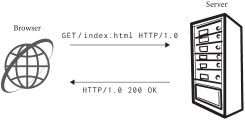

图 4：HTTP 请求和响应对是网络浏览器从网络服务器获取网页的方式。

维基百科有关于 HTTP [头部](https://en.wikipedia.org/wiki/List_of_HTTP_header_fields)和[响应代码](https://en.wikipedia.org/wiki/List_of_HTTP_status_codes)的不错列表。一些 HTTP 响应代码几乎从未使用过，比如[402](https://developer.mozilla.org/en-US/docs/Web/HTTP/Status/402) “需要支付”。这个代码原本打算用于“数字现金或（微）支付系统”。尽管电子商务在没有响应代码 402 的情况下依然繁荣，[小额支付](https://en.wikipedia.org/wiki/Micropayment)（尚未？）并未获得太多关注，尽管许多人（包括我！）认为这是一个好主意。

# Python 中的 Telnet

到目前为止，我们已经使用`telnet`与另一台计算机进行了通信。但结果证明，`telnet`是一个非常简单的程序，我们可以通过编程来实现同样的功能。这需要从 URL 中提取主机名和路径，创建一个*套接字*，发送请求并接收响应。在 Python 中，有一个名为`urllib.parse`的库用于解析 URL，但我认为实现自己的将有助于学习。此外，这使这本书不那么特定于 Python。

让我们从解析 URL 开始。我将使解析 URL 返回一个`URL`对象，并将解析代码放入构造函数中：

```py
class URL:
 def __init__(self, url):
 # ...
```

`__init__`方法是 Python 中类构造函数的特殊语法，而`self`参数，你必须始终将其作为任何方法的第一个参数，是 Python 中 C++或 Java 中的`this`的对应物。

让我们从方案开始，它与 URL 的其余部分由`://`分隔。我们的浏览器只支持`http`，所以我们也检查一下：

```py
class URL:
 def __init__(self, url):
 self.scheme, url = url.split("://", 1)
 assert self.scheme == "http"
```

现在我们必须将主机名与路径分开。主机名在第一个`/`之前，而路径是那个斜杠及其之后的所有内容：

```py
class URL:
 def __init__(self, url):
 # ...
 if "/" not in url:
 url = url + "/"
 self.host, url = url.split("/", 1)
 self.path = "/" + url
```

（当你看到带有`# ...`的代码块，就像这样，这意味着你正在向现有方法或块中添加代码。）`split(s, n)`方法在第一个`n`个`s`的副本处拆分字符串。注意，这里有一些处理主机名和路径之间斜杠的复杂逻辑。那个（可选的）斜杠是路径的一部分。

现在由于`URL`有了`host`和`path`字段，我们可以下载该 URL 的网页。我们将在一个新的方法`request`中这样做：

```py
class URL:
 def request(self):
 # ...
```

注意，你总是需要在 Python 中的方法中编写`self`参数。在未来，我不会总是对定义方法如此大惊小怪——如果你看到一个代码块中包含尚未存在的方法或函数中的代码，这意味着我们正在定义它。

下载网页的第一步是连接到主机。操作系统为此提供了一个名为“套接字”的功能。当你想与其他计算机（无论是告诉它们一些事情，还是等待它们告诉你一些事情）进行通信时，你创建一个套接字，然后可以使用该套接字来回发送信息。套接字有几种不同类型，因为与其他计算机通信有多种方式：

+   套接字有一个*地址族*，它告诉你如何找到另一台计算机。地址族的名称以`AF`开头。我们想要`AF_INET`，但例如`AF_BLUETOOTH`是另一个。

+   套接字有一个*类型*，它描述了将要发生的对话类型。类型的名称以`SOCK`开头。我们想要`SOCK_STREAM`，这意味着每台计算机可以发送任意数量的数据，但还有`SOCK_DGRAM`，在这种情况下，它们会发送固定大小的数据包。`DGRAM`代表“数据报”，我想象它就像一张明信片。

+   套接字有一个*协议*，它描述了两个计算机将如何建立连接的步骤。协议的名称取决于地址族，但我们想要`IPPROTO_TCP`。HTTP 的新版本使用名为[QUIC](https://en.wikipedia.org/wiki/QUIC)的东西来代替传输控制协议（TCP），但我们的浏览器将坚持使用 HTTP 1.0。

通过选择所有这些选项，我们可以创建一个像这样的套接字：虽然这段代码使用了 Python 的`socket`库，但你的语言很可能包含一个非常类似的库；API 基本上是标准化的。在 Python 中，我们传递的标志是默认值，所以你实际上可以调用`socket.socket()`；我在这里保留标志，以防你在另一种语言中跟随。

```py
import socket

class URL:
 def request(self):
 s = socket.socket(
 family=socket.AF_INET,
 type=socket.SOCK_STREAM,
 proto=socket.IPPROTO_TCP,
 )
```

一旦你有了套接字，你需要告诉它连接到另一台计算机。为此，你需要主机和一个*端口*。端口取决于你使用的协议；现在应该是 80。

```py
class URL:
 def request(self):
 # ...
 s.connect((self.host, 80))
```

这与`example.org`通信以设置连接并准备两台计算机交换数据。

自然，如果你离线，这不会起作用。如果你在代理后面，或者处于各种更复杂的网络环境中，这也可能不起作用。解决方案将取决于你的设置——它可能只是禁用你的代理，或者可能更加复杂。

注意，在`connect`调用中有两个括号：`connect`接受一个参数，该参数是一对主机和端口的组合。这是因为不同的地址族有不同的参数数量。

Python 大致直接实现的“套接字”API 源自 1983 年 4.2 BSD Unix 的原始“[伯克利套接字](https://en.wikipedia.org/wiki/Berkeley_sockets)”API 设计。当然，Windows 和 Linux 只是重新实现了 API，但 macOS 和 iOS 实际上[仍然使用](https://developer.apple.com/library/archive/documentation/Darwin/Conceptual/KernelProgramming/BSD/BSD.html)大量源自 BSD Unix 的代码。

# 请求和响应

现在我们已经建立了连接，我们就向另一台服务器发送请求。为此，我们使用`send`方法向它发送一些数据：

```py
class URL:
 def request(self):
 # ...
 request = "GET {} HTTP/1.0\r\n".format(self.path)
 request += "Host: {}\r\n".format(self.host)
 request += "\r\n"
 s.send(request.encode("utf8"))
```

`send`方法只是将请求发送到服务器。`send`实际上返回一个数字，在这个例子中是`47`。这告诉你你向另一台计算机发送了多少字节的数据；如果你在发送数据的过程中网络连接失败，你可能想知道在连接失败之前你发送了多少数据。在这段代码中，有几处必须完全正确。首先，使用`\r\n`而不是`\n`作为换行符非常重要。同样，你必须在末尾放置两个`\r\n`换行符，以便发送请求末尾的空白行。如果你忘记了这一点，另一台计算机将一直等待你发送那个换行符，而你也会一直等待它的响应。计算机是永远字面意思的。

还要注意`encode`调用。当你发送数据时，重要的是要记住你正在发送原始的比特和字节；它们可以形成文本、图像或视频。但 Python 字符串专门用于表示文本。`encode`方法将文本转换为字节，同时有一个相应的`decode`方法可以反向操作。当你调用`encode`和`decode`时，你需要告诉计算机你希望它使用哪种*字符编码*。这是一个复杂的话题。我在这里使用`utf8`，这是一种常见的字符编码，可以在许多页面上工作，但在现实生活中你需要更加小心。Python 通过为文本和字节提供不同类型来提醒你要小心：

```py
>>> type("text")
<class 'str'>
>>> type("text".encode("utf8"))
<class 'bytes'>
```

如果你看到关于`str`与`bytes`的错误，那是因为你忘记在某处调用`encode`或`decode`。

要读取服务器的响应，你可以使用套接字的`read`函数，它给出已经到达的响应的任何位。然后你编写一个循环来收集这些位，随着它们的到达。然而，在 Python 中，你可以使用`makefile`辅助函数，它隐藏了这个循环：如果你使用的是另一种语言，你可能只有`socket.read`可用。你需要自己编写循环，检查套接字状态。

```py
class URL:
 def request(self):
 # ...
 response = s.makefile("r", encoding="utf8", newline="\r\n")
```

在这里，`makefile`返回一个包含我们从服务器接收到的每个字节的文件对象。我指示 Python 使用`utf8` *编码*，或者将字节与字母关联的方法，将这些字节转换为字符串。硬编码`utf8`是不正确的，但这是一个在大多数英文网站上都能正常工作的快捷方式。实际上，`Content-Type`头通常包含一个`charset`声明，指定了主体的编码。如果它不存在，浏览器仍然不会默认使用`utf8`；它们会根据字母频率进行猜测，如果猜错了，你会看到丑陋的�奇怪的áççêñ£ß。我还通知 Python HTTP 的奇怪行结束符。

现在让我们将响应内容拆分成几个部分。第一行是状态行：我本可以断言需要 200 状态码，因为这是我们浏览器唯一支持的代码，但最好还是让浏览器渲染返回的体内容，因为服务器通常会为错误代码输出一个有用且用户可读的 HTML 错误页面。这是网络易于逐步实现的一个例子。

```py
class URL:
 def request(self):
 # ...
 statusline = response.readline()
 version, status, explanation = statusline.split(" ", 2)
```

注意，我没有检查服务器的 HTTP 版本是否与我的相同；这听起来可能是个好主意，但外面有很多配置不当的服务器，即使你用 HTTP 1.0 与它们通信，它们也会以 HTTP 1.1 响应。幸运的是，协议足够相似，不会引起混淆。

在状态行之后是头部信息：

```py
class URL:
 def request(self):
 # ...
 response_headers = {}
 while True:
 line = response.readline()
 if line == "\r\n": break
 header, value = line.split(":", 1)
 response_headers[header.casefold()] = value.strip()
```

对于头部信息，我将每一行在第一个冒号处拆分，并填充一个头部名称到头部值的映射。头部信息不区分大小写，因此我将它们规范为小写。我使用了 `casefold`（[casefold](https://docs.python.org/3/library/stdtypes.html#str.casefold)）而不是 `lower`，因为它对更多语言更有效。此外，HTTP 头部值中的空白字符是不重要的，所以我移除了开头和结尾的额外空白字符。

头部信息可以描述各种信息，但有一些头部信息特别重要，因为它们告诉我们我们试图访问的数据是以一种不寻常的方式发送的。让我们确保这些信息中没有任何一个存在。练习 1-9 描述了如果这些头部信息存在时，浏览器应该如何处理它们。

```py
class URL:
 def request(self):
 # ...
 assert "transfer-encoding" not in response_headers
 assert "content-encoding" not in response_headers
```

通常获取发送数据的常用方法是头部信息之后的所有内容：

```py
class URL:
 def request(self):
 # ...
 content = response.read()
 s.close()
```

我们要显示的是体内容，所以让我们返回它：

```py
class URL:
 def request(self):
 # ...
 return content
```

现在，让我们实际显示响应体中的文本。

`Content-Encoding`（[内容编码](https://developer.mozilla.org/en-US/docs/Web/HTTP/Headers/Content-Encoding)）头允许服务器在发送之前压缩网页。大型、文本密集型的网页压缩效果很好，因此页面加载速度更快。浏览器需要在请求中发送一个 `Accept-Encoding`（[接受编码](https://developer.mozilla.org/en-US/docs/Web/HTTP/Headers/Accept-Encoding)）头来列出它支持的压缩算法。`Transfer-Encoding`（[传输编码](https://developer.mozilla.org/en-US/docs/Web/HTTP/Headers/Transfer-Encoding)）类似，也允许数据以“分块”的形式传输，许多服务器似乎会将它和压缩一起使用。

# 显示 HTML

响应体中的 HTML 代码定义了当您访问 `http://example.org/index.html` 时在浏览器窗口中看到的页面内容。我将在未来的章节中详细讨论 HTML，但现阶段我会尽量保持简单。

在 HTML 中，有 *标签* 和 *文本*。每个标签以 `<` 开头，以 `>` 结尾；一般来说，标签告诉您某些内容是什么类型，而文本是实际的内容。也就是说，一些标签，如 `img`，本身就是内容，而不是关于它的信息。大多数标签以一对开始标签和结束标签的形式出现；例如，页面的标题被一对标签 `<title>` 和 `</title>` 包围。每个标签，在尖括号内，都有一个标签名（如这里的 `title`），然后可选地跟一个空格，后面是 *属性*，其配对标签有一个 `/` 后跟标签名（没有属性）。

因此，为了创建我们非常简单的网页浏览器，让我们取页面 HTML 并打印其中的所有文本，但不打印标签。如果这个例子导致 Python 产生一个指向最后一行 `end` 的 `SyntaxError`，那么很可能是您正在运行 Python 2 而不是 Python 3。请确保您正在使用 Python 3。我将在一个新函数 `show` 中做这件事：请注意，这是一个全局函数，不在 `URL` 类中。

```py
def show(body):
 in_tag = False
 for c in body:
 if c == "<":
 in_tag = True
 elif c == ">":
 in_tag = False
 elif not in_tag:
 print(c, end="")
```

这段代码相当复杂。它逐字符遍历请求体，并且有两个状态：`in_tag`，当它当前位于一对尖括号之间时，和 `not in_tag`。当当前字符是尖括号时，它在这两个状态之间切换；不在标签内的普通字符会被打印出来。《end` 参数告诉 Python 不要在字符后打印换行符，否则它本会这样做。

我们现在可以通过将 `request` 和 `show` 连接起来加载一个网页：就像 `show` 一样，这是一个全局函数。

```py
def load(url):
 body = url.request()
 show(body)
```

将以下代码添加到命令行中运行 `load`：

```py
if __name__ == "__main__":
 import sys
 load(URL(sys.argv[1]))
```

第一行是 Python 的 `main` 函数版本，仅在从命令行执行此脚本时运行。代码从命令行读取第一个参数（`sys.argv[1]`）并将其用作 URL。尝试在 URL `http://example.org/` 上运行此代码：

```py
python3 browser.py http://example.org/
```

您应该看到一些简短的文本，欢迎您来到官方示例网页。您还可以尝试使用它在这个[章节](http://browser.engineering/http.html)中！

HTML，就像 URL 和 HTTP 一样，被设计成非常容易解析和显示在基本级别。在开始的时候，HTML 中功能非常少，因此可以编写出一些不太复杂的东西，就像您在这里看到的那样，但仍以可用的方式显示内容。即使我们的超级简单和基本的 HTML 解析器也能打印出 [browser.engineering](https://browser.engineering/) 网站的文本。

# 加密连接

到目前为止，我们的浏览器支持 `http` 协议。这是一个相当常见的协议。但越来越多的网站正在迁移到 `https` 协议，许多网站要求使用它。

`http` 和 `https` 之间的区别在于 `https` 更安全——但让我们说得更具体一些。`https` 方案，或更正式地说，是 TLS（传输层安全性）上的 HTTP，与正常的 `http` 方案完全相同，除了浏览器和主机之间的所有通信都是加密的。关于它是如何工作的有相当多的细节：使用了哪些加密算法，如何达成一个共同的加密密钥，当然还有如何确保浏览器连接到正确的服务器。涉及的协议层差异如图 5 所示。

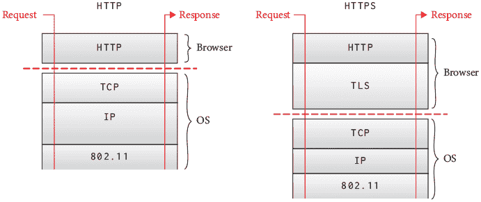

图 5：HTTP 和 HTTPS 之间的区别在于添加了 TLS 层。

幸运的是，Python 的 `ssl` 库为我们实现了所有这些细节，因此建立加密连接几乎和建立常规连接一样简单。这种易用性伴随着接受一些默认设置，这些设置可能不适合某些情况，但用于教学目的它们是合适的。

使用 `ssl` 建立加密连接相当简单。假设你已经创建了一个套接字 `s`，并将其连接到 `example.org`。为了加密连接，你使用 `ssl.create_default_context` 创建一个 *上下文* `ctx`，并使用该上下文来 *包装* 套接字 `s`：

```py
import ssl
ctx = ssl.create_default_context()
s = ctx.wrap_socket(s, server_hostname=host)
```

注意，`wrap_socket` 返回一个新的套接字，我将它保存回 `s` 变量。这是因为你不想通过原始套接字发送任何数据；这将是不加密的，也可能令人困惑。`server_hostname` 参数用于检查你是否连接到了正确的服务器。它应该与 `Host` 头匹配。

在 macOS 上，你需要在大多数网站上使用 Python 的 `ssl` 包之前，先运行一个名为“安装证书”的程序。[运行程序](https://stackoverflow.com/questions/52805115/certificate-verify-failed-unable-to-get-local-issuer-certificate)。

让我们尝试将这段代码添加到 `request` 中。首先，我们需要检测正在使用哪种方案：

```py
import ssl

class URL:
 def __init__(self, url):
 self.scheme, url = url.split("://", 1)
 assert self.scheme in ["http", "https"]
 # ...
```

（注意，这里你应该用这段新代码替换现有的方案解析代码。通常从上下文和代码本身就可以清楚地知道需要替换什么。）

加密的 HTTP 连接通常使用 443 端口而不是 80 端口：

```py
class URL:
 def __init__(self, url):
 # ...
 if self.scheme == "http":
 self.port = 80
 elif self.scheme == "https":
 self.port = 443
```

我们可以在创建套接字时使用该端口：

```py
class URL:
 def request(self):
 # ...
 s.connect((self.host, self.port))
 # ...
```

接下来，我们将使用 `ssl` 库包装套接字：

```py
class URL:
 def request(self):
 # ...
 s.connect((self.host, self.port))
 if self.scheme == "https":
 ctx = ssl.create_default_context()
 s = ctx.wrap_socket(s, server_hostname=self.host)
 # ...
```

你的浏览器现在应该能够连接到 HTTPS 网站。

在此同时，让我们添加对自定义端口的支持，这些端口通过在主机名后放置冒号在 URL 中指定，如图 6 所示。

```py
http://example.org:8080/index.html

```

图 6：URL 中端口号的位置。

如果 URL 有端口号，我们可以解析它并使用它：

```py
class URL:
 def __init__(self, url):
 # ...
 if ":" in self.host:
 self.host, port = self.host.split(":", 1)
 self.port = int(port)
```

自定义端口对于调试很有用。Python 有一个内置的 Web 服务器，你可以用它来在你的计算机上提供文件。例如，如果你运行

```py
python3 -m http.server 8000 -d /some/directory
```

然后访问 `http://localhost:8000/` 应该会显示该目录中的所有文件。这是一种测试浏览器的好方法。

TLS 相当复杂。您可以在[RFC 8446](https://tools.ietf.org/html/rfc8446)中阅读详细信息，但实现自己的 TLS 不被推荐。编写一个不仅正确而且安全的自定义 TLS 实现非常困难。

到目前为止，您应该能够在任何网页上运行您的程序。以下是对一个简单示例的输出：

```py
 This is a simple
    web page with some
    text in it. 
```

# 摘要

本章从空文件开始，变成了一个基本的网页浏览器，它可以：

+   将 URL 解析为方案、主机、端口和路径；

+   使用`socket`和`ssl`库连接到该主机；

+   向该主机发送 HTTP 请求，包括`Host`头；

+   将 HTTP 响应拆分为状态行、头和正文；

+   打印正文中的文本（而不是标签）。

是的，这仍然更像是一个命令行工具而不是网页浏览器，但它已经具有了一些浏览器的基本功能。

# 概述

我们浏览器中的完整函数、类和方法集应类似于以下内容：

`` class URL: `def __init__(url)` `def request()` `` `def show(body)` `def load(url)`

# 练习

1-1 *HTTP/1.1*. 除了`Host`之外，在`request`函数中发送`Connection`头，其值为`close`。您的浏览器现在可以声明它正在使用`HTTP/1.1`。还要添加一个`User-Agent`头。其值可以是您想要的任何内容——它将您的浏览器识别给主机。使其易于将来添加更多头信息。

1-2 *文件 URLs*. 添加对`file`方案的支持，允许浏览器打开本地文件。例如，`file:///path/goes/here`应指向您计算机上位于`/path/goes/here`位置的文件。还要确保，如果您的浏览器在没有提供 URL 的情况下启动，则打开您计算机上的某些特定文件。您可以使用该文件进行快速测试。

1-3 *`数据`*. 另一种方案是`数据`，它允许将 HTML 内容内联到 URL 本身。尝试在一个真实的浏览器中导航到`data:text/html,Hello world!`以查看会发生什么。将对此方案的支持添加到您的浏览器中。`数据`方案特别方便，无需将测试放入单独的文件中即可进行测试。

1-4 *实体*. 实现对小于（`&lt;`）和大于（`&gt;`）实体的支持。这些应分别打印为`<`和`>`。例如，如果 HTML 响应是`&lt;div&gt;`，则浏览器中的`show`方法应打印`<div>`。实体允许网页包含这些特殊字符，而浏览器不会将它们解释为标签。

1-5 *`view-source`*. 添加对`view-source`方案的支持；导航到`view-source:http://example.org/`应显示 HTML 源代码而不是渲染的页面。添加对此方案的支持。您的浏览器应打印整个 HTML 文件，就像它是文本一样。您还应该实现了练习 1-4。

1-6 *Keep-alive*。实现练习 1-1；然而，不要发送`Connection: close`头信息（发送`Connection: keep-alive`代替）。当从套接字读取正文时，只读取`Content-Length`头信息中给出的字节数，读取后不要关闭套接字。相反，保存套接字，如果对同一服务器有另一个请求，则重用相同的套接字而不是创建一个新的。 （您还需要将`"rb"`选项传递给`makefile`或传递`Content-Length`报告的值，否则读取的字符串长度可能与长度不匹配。）这将加快对同一服务器的重复请求，这在实践中很常见。

1-7 *重定向*。300 范围内的错误代码请求重定向。当您的浏览器遇到一个时，它应该向`Location`头信息中给出的 URL 发送一个新的请求。有时`Location`头信息是一个完整的 URL，但有时它跳过主机和方案，只从`/`开始（意味着与原始请求相同的主机和方案）。新的 URL 本身可能也是一个重定向，所以请确保处理这种情况。然而，您不希望陷入重定向循环，所以请确保限制浏览器可以连续跟随的重定向数量。您可以通过 URL [`browser.engineering/redirect`](http://browser.engineering/redirect) 进行测试，它将重定向回这个页面，以及它的 [/redirect2](http://browser.engineering/redirect2) 和 [/redirect3](http://browser.engineering/redirect3) 亲戚，它们执行更复杂的重定向链。

1-8 *缓存*。通常，相同的图像、样式和脚本在多个页面上使用；重复下载它们是浪费的。只要请求是用`GET`进行的并且收到了`200`响应，缓存任何 HTTP 响应通常是有效的。一些其他的状态代码，如`301`和`404`也可以缓存。在您的浏览器中实现缓存，并通过多次请求相同的文件来测试它。服务器使用`Cache-Control`头信息来控制缓存。添加对这个头信息的支持，特别是对`no-store`和`max-age`值的支持。如果`Cache-Control`头信息包含除这两个值之外的任何值，最好不要缓存响应。

1-9 *压缩*。添加对 HTTP 压缩的支持，其中浏览器 [通知服务器](https://developer.mozilla.org/en-US/docs/Web/HTTP/Content_negotiation) 压缩数据是可以接受的。您的浏览器必须发送带有值 `gzip` 的 `Accept-Encoding` 头部。如果服务器支持压缩，其响应将包含带有值 `gzip` 的 `Content-Encoding` 头部。然后对主体进行压缩。添加对这种情况的支持。要解压缩数据，您可以使用 `gzip` 模块中的 `decompress` 方法。GZip 数据不是 `utf8` 编码的，所以将 `"rb"` 传递给 `makefile` 以处理原始字节。大多数 Web 服务器在名为 `chunked` 的 `Transfer-Encoding` 中发送压缩数据。还有一些 `Transfer-Encoding` 也会压缩数据。它们并不常用。您还需要添加对这些的支持。

# 绘制到屏幕

Web 浏览器工程的第二章。

+   创建窗口

+   绘制到窗口

+   布局文本

+   滚动文本

+   更快渲染

+   总结

+   大纲

+   练习

Web 浏览器不仅仅是下载网页；它还必须向用户展示该页面。在 21 世纪，这意味着一个图形应用程序。有一些基于文本的浏览器很神秘：我在 2011 年的大部分时间里使用 `w3m` 作为我的主要浏览器。现在不再使用了。因此，在本章中，我们将为我们的浏览器配备一个图形用户界面。

# 创建窗口

桌面电脑和笔记本电脑运行提供 *桌面环境* 的操作系统：窗口、按钮和鼠标。因此，责任被分割：程序控制它们的窗口，但桌面环境控制屏幕。因此：

+   程序请求一个新的窗口，而桌面环境实际上显示了它。

+   程序将其绘制到窗口中，而桌面环境将内容显示在屏幕上。

+   桌面环境会告诉程序有关点击和按键的信息，然后程序会做出响应并重新绘制其窗口。

手动完成所有这些操作有些繁琐，所以程序通常使用 *图形工具包* 来简化这些步骤。Python 包含一个名为 Tk 的图形工具包，位于 Python 的 `tkinter` 包中。这个库被称为 Tk，它最初是为一种名为 Tcl 的不同语言编写的。Python 包含了对其的接口，因此得名。使用它相当简单：

```py
import tkinter
window = tkinter.Tk()
tkinter.mainloop()
```

在这里，`tkinter.Tk()` 请求桌面环境创建一个窗口，并返回一个你可以用来在窗口上绘制的对象。`tkinter.mainloop()` 调用进入一个循环，其伪代码如下：这个伪代码看起来像是一个无限循环，会锁定计算机，但实际上并非如此。操作系统会在线程和进程之间进行多任务处理，或者`pendingEvents` 调用会休眠直到有事件可用，或者两者都有；无论如何，其他代码将运行并为循环创建事件以响应。

```py
while True:
 for evt in pendingEvents():
 handleEvent(evt)
 drawScreen()
```

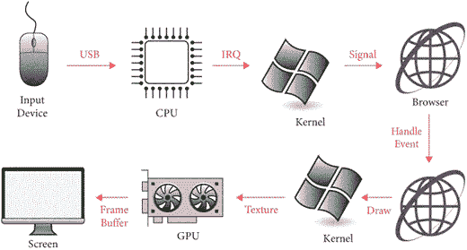

图 1：事件处理周期流程图。

在这里，`pendingEvents` 首先向桌面环境请求最近的鼠标点击或按键，然后 `handleEvent` 调用你的应用程序以更新状态，然后 `drawScreen` 重新绘制窗口。这种 *事件循环* 模式（见图 1）在许多应用程序中很常见，从网络浏览器到视频游戏，因为在复杂的图形应用程序中，它确保所有事件最终都会被处理，屏幕最终会被更新。

虽然你可能在一个桌面计算机上编写你的浏览器，但许多人通过手机或平板电脑等移动设备访问网络。在移动设备上，仍然有屏幕、渲染循环以及本书中讨论的几乎所有其他东西。例如，大多数真实浏览器都有桌面和移动版本，并且渲染引擎代码对于两者几乎完全相同。

但也有一些值得注意的差异。应用程序通常是全屏的，一次只有一个应用程序绘制到屏幕上。没有鼠标，只有一个虚拟键盘，因此主要的交互方式是触摸。有一个“视觉视口”的概念，这在桌面设备上不存在，以适应“仅桌面”和“移动准备”的网站，以及缩放手势。查看[本章网页的源代码](https://browser.engineering/graphics.html)。在 `<head>` 中，你会看到一个“viewport” `<meta>` 标签。这个标签告诉浏览器该页面支持移动设备；如果没有它，浏览器会假设该网站是“仅桌面”的，并以不同的方式渲染，例如允许用户使用缩放手势或双击手势来聚焦页面的一部分。一旦放大，屏幕上可见的部分就是“视觉视口”，整个文档的边界是“布局视口”。这是一种介于缩放和滚动之间的混合，通常在桌面设备上不存在。并且屏幕像素密度要高得多，但总屏幕分辨率通常较低。支持所有这些差异是可行的，但需要相当多的工作。本书不会进一步深入实现它们，除非在某些情况下作为练习。

此外，能效更为重要，因为设备是靠电池供电的，同时中央处理单元（CPU）和内存的运行速度显著较慢且能力不足。这使得充分利用任何图形处理单元（GPU）变得尤为重要——缓慢的 CPU 使得良好的性能更难实现。移动浏览器具有挑战性！

# 在窗口中绘图

我们的浏览器将网页文本绘制到*画布*上，这是一个可以绘制圆形、线条和文本的矩形 Tk 小部件。例如，你可以用 Tk 创建一个画布如下：你可能熟悉 HTML `<canvas>`元素，这是一个类似的概念：一个二维矩形，你可以在其中绘制形状。

```py
window = tkinter.Tk()
canvas = tkinter.Canvas(window, width=800, height=600)
canvas.pack()
```

第一行创建窗口，第二行在窗口内创建`Canvas`。我们传递窗口作为参数，这样 Tk 就知道在哪里显示画布。其他参数定义了画布的大小；我选择了 800 × 600，因为这曾是常见的旧式显示器尺寸。这个尺寸被称为超级视频图形阵列（SVGA），于 1987 年标准化，当时可能确实感觉非常出色。第三行是 Tk 的一个特性，它将画布定位在窗口内。Tk 还有像按钮和对话框这样的小部件，但我们的浏览器不会使用它们：我们需要对外观有更精细的控制，而画布可以提供这种控制。这就是为什么桌面应用程序比网页更统一：桌面应用程序通常使用由通用图形工具包提供的控件，这使得它们看起来相似。

为了保持所有内容的组织，让我们将此代码放入一个类中：

```py
WIDTH, HEIGHT = 800, 600

class Browser:
 def __init__(self):
 self.window = tkinter.Tk()
 self.canvas = tkinter.Canvas(
 self.window, 
 width=WIDTH,
 height=HEIGHT
 )
 self.canvas.pack()
```

一旦创建了一个画布，你就可以调用在画布上绘制形状的方法。让我们在`load`方法中这样做，我们将将其移动到新的`Browser`类中：

```py
class Browser:
 def load(self, url):
 # ...
 self.canvas.create_rectangle(10, 20, 400, 300)
 self.canvas.create_oval(100, 100, 150, 150)
 self.canvas.create_text(200, 150, text="Hi!")
```

要运行此代码，创建一个`Browser`对象，调用`load`方法，然后启动 Tk 的`mainloop`：

```py
if __name__ == "__main__":
 import sys
 Browser().load(URL(sys.argv[1]))
 tkinter.mainloop()
```

你应该看到：一个矩形，从画布的左上角开始，延伸到中心；然后在该矩形内画一个圆形；接着在圆形旁边写上“Hi!”文本，如图 2 所示。

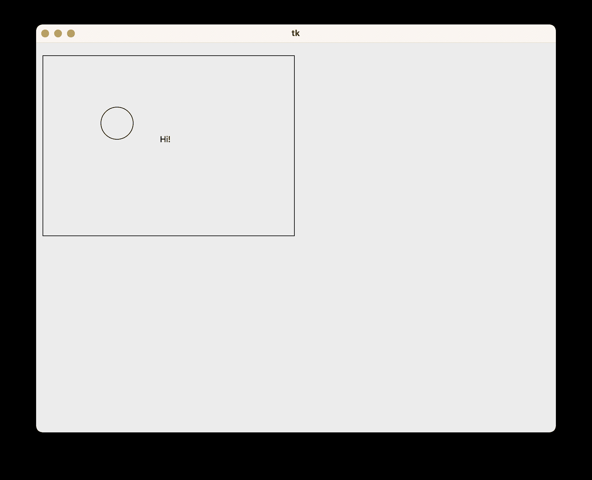

图 2：预期示例输出，包含矩形、圆形和文本。

Tk 中的坐标指的是从左到右的*x*位置和从上到下的*y*位置。换句话说，屏幕的底部具有更大的*y*值，这与你可能从数学中习惯的相反。通过调整上面的坐标来找出每个参数所指的内容。答案可以在[在线文档](https://anzeljg.github.io/rin2/book2/2405/docs/tkinter/canvas.html)中找到。

Tk 画布小部件比我们在这里使用的功能强大得多。正如你从[教程](https://tkdocs.com/tutorial/canvas.html)中可以看到，你可以将你画在画布上的单个东西移动，监听每个东西的点击事件等等。我在这本书中不使用这些功能，因为我想要教你如何自己实现它们。

# 文本布局

让我们在画布上绘制一个简单的网页。到目前为止，我们的浏览器逐个字符地遍历网页源代码，并将文本（但不包括标签）打印到控制台窗口中。现在我们想要在画布上绘制字符。

首先，让我们将上一章中的 `show` 函数改为一个我将称之为 `lex` 的函数……预示着未来的发展……它只是*返回*HTML 文档的文本内容，而不打印它：

```py
def lex(body):
 text = ""
 # ...
 for c in body:
 # ...
 elif not in_tag:
 text += c
 return text
```

然后，`load` 将逐个字符地绘制该文本：

```py
def load(self, url):
 # ...
 for c in text:
 self.canvas.create_text(100, 100, text=c)
```

让我们在一个真实的网页上测试这段代码。由于可能看似难以理解的原因，我们推迟到下一章讨论基本的排版。让我们在[《西游记》或*《西天取经》*的第一章](https://browser.engineering/examples/xiyouji.html)上测试它，这是一部关于猴子的经典中国小说。通过 `request`、`lex` 和 `load` 运行这个 URL。你应该会看到一个窗口，其中有一个大块状的黑色像素，位于窗口的左上角稍微偏下。

为什么是块状文本而不是字母？当然，因为我们是在相同的位置绘制每个字母，所以它们都重叠了！让我们来修复这个问题：

```py
HSTEP, VSTEP = 13, 18
cursor_x, cursor_y = HSTEP, VSTEP
for c in text:
 self.canvas.create_text(cursor_x, cursor_y, text=c)
 cursor_x += HSTEP
```

变量 `cursor_x` 和 `cursor_y` 指向下一个字符将要放置的位置，就像你在一个文字处理程序中输入文本一样。我通过尝试几个不同的值，并选择一个看起来最易读的数字——13 和 18。在第三章中，我们将用字体度量值替换这些魔法数字。

现在文本从左到右形成一行。但是，在一个 800 像素宽的画布上，每个字符 13 像素，一行只能容纳大约 60 个字符。阅读小说需要更多，所以当我们达到屏幕边缘时，我们还需要将文本*换行*：

```py
for c in text:
 # ...
 if cursor_x >= WIDTH - HSTEP:
 cursor_y += VSTEP
 cursor_x = HSTEP
```

代码增加 `cursor_y` 并重置 `cursor_x`。在打字机的古老时代，增加 *y* 意味着*进纸*，重置 *x* 意味着*回车*，将打印字母的*打印头*返回到页面的左边缘。因此，美国信息交换标准代码([ASCII](https://en.wikipedia.org/wiki/ASCII))为这些操作标准化了两个单独的字符——“回车”和“换行”——这样 ASCII 就可以直接由电传打字机执行。这就是为什么 HTTP 中的标题由`\r\n`分隔，尽管现代计算机没有机械的打印头。一旦 `cursor_x` 超过 787 像素。不是 800，因为我们从像素 13 开始，我想在两边都留下一个均匀的间隙。这个序列在图 3 中显示。以这种方式换行可以使阅读超过单行成为可能。

这里有一个演示这个概念的部件：

widgets/lab2-render.html

在这个阶段，你应该能够在浏览器中加载[我们的示例页面](https://browser.engineering/examples/xiyouji.html)，并且它看起来应该像图 4 所示。

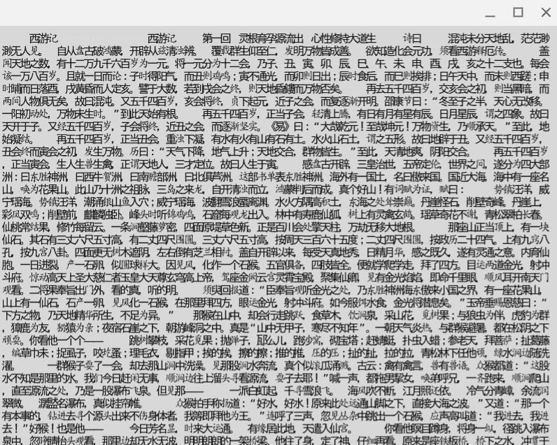

图 4：在我们的浏览器中渲染的《西游记》的第一章。

现在我们可以读取很多文本，但还不是全部：如果文本足够多，不是所有的行都能显示在屏幕上。我们希望用户能够*滚动*页面来查看不同的部分。

在英文文本中，你无法在单词中间换行（至少在没有连字符的情况下），但在中文中这是默认的，即使是多字符组成的单词也是如此。例如，开关意味着“开关”，由开“on”和关“off”组成，但在“开”之后换行是可以的。你可以使用 word-break CSS 属性来更改默认设置：`break-all`允许在任何地方换行，而`auto-phrase`则防止在中文或日文单词或短语（如开关）内部换行。这里的“auto”部分指的是单词不是由作者识别的，而是自动检测的，通常基于[词频表](https://github.com/unicode-org/icu/blob/master/icu4c/source/data/brkitr/dictionaries/cjdict.txt)通过[动态规划](https://unicode-org.github.io/icu/userguide/boundaryanalysis/break-rules.html#details-about-dictionary-based-break-iteration)实现的。

# 滚动文本

滚动在页面坐标（这段文本距离页面顶部 132 像素）和屏幕坐标（由于你向下滚动了 60 像素，这段文本距离屏幕顶部 72 像素）之间引入了一层间接层——参见图 5。一般来说，浏览器会*布局*页面——确定页面上所有元素的位置——以页面坐标为准，然后*光栅化*页面——绘制所有元素——以屏幕坐标为准。某种程度上是这样的。实际上发生的情况是页面首先被绘制到一个位图或 GPU 纹理中，然后根据滚动偏移这个位图/纹理，最后将结果渲染到屏幕上。第十一章将更详细地介绍这个话题。

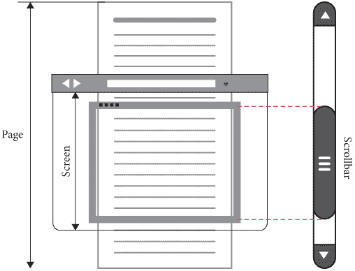

图 5：页面坐标和屏幕坐标之间的差异。

我们的浏览器也会有同样的分割。目前`load`同时计算每个字符的位置并绘制它：布局和渲染。让我们有一个`layout`函数来计算并存储每个字符的位置，然后有一个单独的`draw`函数根据存储的位置绘制每个字符。这样，`layout`可以使用页面坐标，而只有`draw`需要考虑屏幕坐标。

让我们从 `layout` 开始。而不是在每个字符上调用 `canvas.create_text`，让我们将其添加到一个列表中，连同其位置。由于 `layout` 不需要访问 `Browser` 中的任何内容，它可以是一个独立的函数：

```py
def layout(text):
 display_list = []
 cursor_x, cursor_y = HSTEP, VSTEP
 for c in text:
 display_list.append((cursor_x, cursor_y, c))
 # ...
 return display_list
```

要显示的项目列表称为 *显示列表*。术语“显示列表”是标准的。由于 `layout` 全部关于页面坐标，我们不需要对其做任何其他更改来支持滚动。

一旦计算完显示列表，`draw` 需要遍历它并绘制每个字符。由于 `draw` 需要访问画布，我们将其作为 `Browser` 的一个方法：

```py
class Browser:
 def draw(self):
 for x, y, c in self.display_list:
 self.canvas.create_text(x, y, text=c)
```

现在 `load` 只需调用 `layout` 然后是 `draw`：

```py
class Browser:
 def load(self, url):
 body = url.request()
 text = lex(body)
 self.display_list = layout(text)
 self.draw()
```

现在我们可以添加滚动功能。让我们添加一个字段来记录你滚动的距离：

```py
class Browser:
 def __init__(self):
 # ...
 self.scroll = 0
```

页面坐标 `y` 然后是屏幕坐标 `y - self.scroll`：

```py
def draw(self):
 for x, y, c in self.display_list:
 self.canvas.create_text(x, y - self.scroll, text=c)
```

如果你更改 `scroll` 的值，页面现在将上下滚动。但用户是如何更改 `scroll` 的呢？

大多数浏览器在按下上下键、旋转滚轮、拖动滚动条或向屏幕应用触摸手势时都会滚动页面。为了保持简单，让我们只实现向下键。

Tk 允许你将一个函数绑定到一个键上，这会指示 Tk 在按键时调用该函数。例如，要绑定到向下箭头键，请编写：

```py
def __init__(self):
 # ...
 self.window.bind("<Down>", self.scrolldown)
```

在这里，`self.scrolldown` 是一个 *事件处理程序*，一个 Tk 在按下向下箭头键时将调用的函数。`scrolldown` 由 Tk 通过一个 *事件对象* 作为参数传递，但由于向下滚动不需要关于按键的任何信息，除了它发生了之外，`scrolldown` 忽略了该事件对象。它需要做的只是增加 `scroll` 并重新绘制画布：

```py
SCROLL_STEP = 100

def scrolldown(self, e):
 self.scroll += SCROLL_STEP
 self.draw()
```

如果你尝试这样做，你会发现滚动会再次绘制所有文本。这是因为我们在绘制新文本之前没有擦除旧文本。调用 `canvas.delete` 来清除旧文本：

```py
def draw(self):
 self.canvas.delete("all")
 # ...
```

现在滚动应该可以正常工作了！

存储显示列表使滚动更快：浏览器在滚动时不需要每次都进行 `layout`。现代浏览器 [更进一步](https://hacks.mozilla.org/2017/10/the-whole-web-at-maximum-fps-how-webrender-gets-rid-of-jank/)，即使在网页由于 JavaScript 或用户交互而更改时，也保留大部分显示列表。

通常，滚动是用户与网页最常见的交互方式。真实浏览器因此投入了大量的时间来使其快速；我们将在本书的后面部分了解到他们是如何做到这一点的。

# 更快的渲染

应用程序必须快速重绘页面内容，以便交互感觉流畅，在较旧的系统中，应用程序直接在屏幕上绘制，如果没有更新，之前的内容就会保持原位，这就是为什么在错误条件下，你经常会在一个窗口上看到另一个窗口留下的“痕迹”。现代系统使用[合成](https://en.wikipedia.org/wiki/Compositing_window_manager)，这避免了痕迹，同时也提高了性能和隔离。尽管如此，应用程序仍然需要重绘窗口内容以更改显示的内容。第十三章更详细地讨论了合成。并且必须快速响应用户的点击和按键，以免用户感到沮丧。“感觉流畅”可以更加精确。图形应用程序，如浏览器，通常旨在以与屏幕刷新率或固定 60 赫兹相同的速度重绘，或者两者兼而有之。如今，大多数屏幕的刷新率为 60 赫兹，这通常被认为足够快，看起来很平滑。然而，越来越多的新硬件出现了更高的刷新率，如 120 赫兹。目前尚不清楚浏览器能否达到这么快的速度。一些渲染引擎，尤其是游戏，如果知道渲染速度跟不上，会故意以较低的速率刷新。这意味着浏览器必须在不到 1/60 秒，即 16 毫秒内完成所有工作，才能保持同步。因此，16 毫秒被称为应用程序的*动画帧预算*。

但在我们浏览器中的滚动相当慢。具体有多快似乎很大程度上取决于你的操作系统和默认字体。为什么？结果是，在`create_text`内部加载关于字符形状的信息需要一些时间。为了加快滚动速度，我们需要确保只在必要时（同时确保屏幕上的像素始终正确）进行操作。

实际浏览器为此做了很多相当复杂的优化，但对我们这个浏览器来说，让我们限制自己做一些简单的改进：跳过绘制屏幕外的字符：

```py
for x, y, c in self.display_list:
 if y > self.scroll + HEIGHT: continue
 if y + VSTEP < self.scroll: continue
 # ...
```

第一个`if`语句跳过了位于视窗下方的字符；第二个`if`语句跳过了位于视窗上方的字符。在第二个`if`语句中，`y + VSTEP`是字符的底部边缘，因为即使字符一半在视窗内，仍然需要绘制。

现在滚动应该会变得非常快，并且希望接近 16 毫秒的动画帧预算。在我的电脑上，它仍然大约是那个预算的两倍，所以还有工作要做——我们将在未来的章节中讨论。而且因为我们拆分了`layout`和`draw`，所以我们根本不需要改变`layout`来实现这个优化。

你还应该记住，并非所有网页交互都是动画——还有诸如鼠标点击这样的离散动作。研究表明，通常在[100 ms]内响应离散动作就足够了——低于这个阈值，大多数人不会对离散动作速度敏感。这与滚动等交互方式非常不同，滚动速度低于 60 Hz 左右就非常明显。这两种方式之间的区别在于人类大脑处理运动（动画）与离散动作的方式，以及大脑决定此类动作、执行它并理解其结果所需的时间。

# 摘要

本章从基本的命令行浏览器发展到具有可滚动的文本的图形用户界面。现在浏览器：

+   与你的操作系统通信以创建窗口；

+   将文本布局并绘制到该窗口中；

+   监听键盘命令；

+   响应滚动窗口。

这里是我们的浏览器渲染的正是这个网页（它完全交互式——点击它以获取焦点后，你应该可以使用下箭头滚动）：这是完整的浏览器源代码，交叉编译成 JavaScript 并在 iframe 中运行。点击“重启”以选择要渲染的新网页，然后点击“开始”来渲染它。后续章节将在章节末尾包含其中之一，以便你可以看到它是如何改进的。

widgets/lab2-browser.html

接下来，我们将使这个浏览器能够处理英文文本，并处理诸如可变宽度字符、行布局和格式化等复杂性。

# 概述

我们浏览器中的完整功能集、类和方法应该看起来像这样：

`` class URL: `def __init__(url)` `def request()` `` `def lex(body)` `WIDTH, HEIGHT` `HSTEP, VSTEP` `def layout(text)` `SCROLL_STEP` `` class Browser: `def __init__()` `def draw()` `def load(url)` `def scrolldown(e)` ``

# 练习

2-1 *换行符*。当它看到换行符时，将`layout`更改为结束当前行并开始新的一行。将*y*增加超过`VSTEP`以产生段落分隔的错觉。在《西游记》中嵌入了一些诗歌；现在你将能够辨认出来。

2-2 *鼠标滚轮*。当你按下上箭头时，添加向上滚动的支持。确保你不能滚动到页面的顶部。然后绑定`<MouseWheel>`事件，该事件在用鼠标滚轮滚动时触发。如果没有鼠标，它也会通过触摸板手势触发。相关的事件对象有一个`event.delta`值，它告诉你滚动多远以及滚动方向。不幸的是，macOS 和 Windows 提供的`event.delta`对象具有相反的符号和不同的比例，而在 Linux 中滚动则使用`<Button-4>`和`<Button-5>`事件。《Tk 手册》(https://wiki.tcl-lang.org/page/mousewheel)有更多关于这方面的信息。跨平台应用程序比跨浏览器应用程序更难编写！

2-3 *调整大小*. 使浏览器可调整大小。要做到这一点，将`fill`和`expand`参数传递给`canvas.pack`，并调用并绑定到`<Configure>`事件，该事件在窗口调整大小时发生。窗口的新宽度和高度可以在事件对象的`width`和`height`字段中找到。记住，当窗口调整大小时，换行必须改变，因此你需要再次调用`layout`。

2-4 *滚动条*. 阻止你的浏览器滚动到最后一项显示列表条目之后。在实际浏览器中，这并不完全正确；浏览器需要考虑屏幕底部的额外空白或对象故意绘制到屏幕之外的可能性。在第五章布局中，我们将正确实现这一点。在屏幕的右侧绘制一个蓝色的矩形滚动条。确保滚动条的大小和位置反映了浏览器可以看到的整个文档的部分，如图 5 所示。如果整个文档适合屏幕，则隐藏滚动条。

2-5 *表情符号*. 为你的浏览器添加对表情符号的支持 😀。表情符号是字符，你可以调用`create_text`来绘制它们，但结果并不理想。相反，前往[OpenMoji 项目](https://openmoji.org)，下载[“笑脸”](https://openmoji.org/library/#emoji=1F600)表情符号作为 PNG 文件，将其调整到 16 × 16 像素大小，并将其保存到与浏览器相同的文件夹中。使用 Tk 的`PhotoImage`类来加载图像，然后使用`create_image`方法将其绘制到画布上。实际上，下载整个 OpenMoji 库（在右上角查找“获取 OpenMojis”按钮）——然后你的浏览器可以查找页面中使用的任何表情符号。

2-6 *`about:blank`*. 目前，一个格式不正确的 URL 会导致浏览器崩溃。对于这种情况，有错误恢复会更好，并且显示一个空白页面，这样用户就可以修复错误。为此，添加对特殊`about:blank` URL 的支持，它应该只渲染一个空白页面，并且使格式不正确的 URL 自动渲染为`about:blank`。

2-7 *文本方向交替*. 并非所有语言都是从左到右阅读和布局的。阿拉伯语、波斯语和希伯来语就是从右到左语言的优秀例子。可以通过在浏览器中添加命令行标志来实现对这种基本支持。一旦我们进入第四章，你就可以在`<body>`元素上使用`dir`属性（[查看 dir 属性](https://developer.mozilla.org/en-US/docs/Web/HTML/Global_attributes/dir)）。英文句子仍然应该从左到右布局，但它们应该从屏幕的右侧开始（在你的浏览器中加载这个示例以了解我的意思）。实际从右到左语言的句子应该相反。然后，对于一些东亚语言，如中文和日语，还有垂直书写模式。

# 文本格式化

网络浏览器工程的第三章。

+   什么是字体？

+   测量文本

+   逐字显示

+   设置文本样式

+   布局对象

+   不同大小的文本

+   字体缓存

+   摘要

+   大纲

+   练习

在上一章中，我们的浏览器创建了一个图形窗口，并在其中绘制了一个字符网格。这对中文来说是可以的，但英文文本具有不同宽度的字符，这些字符可以组成单词，不能跨行断开。世界上有无数种语言，以及无数种排版传统。真正的网络浏览器支持从阿拉伯语到祖鲁语的所有语言，但本书专注于英语。文本几乎无限复杂，但本书不能无限长！在这一章中，我们将添加这些功能。你甚至可以在你的浏览器中阅读[这一章](https://browser.engineering/text.html)！

# 什么是字体？

到目前为止，我们使用`create_text`函数时，只传递了一个字符和两个坐标来在屏幕上写入文本。但我们从未指定过它的字体、大小或样式。要谈论这些事情，我们需要创建并使用字体对象。

什么是“字体”，确切地说？在古代，印刷工会把小金属字块排列在轨道上，用墨水覆盖它们，然后压在一张纸上，从而制作出印刷页面（见图 1）。金属形状放在盒子里，每个字母一个盒子，所以你会有一个（大）e 的盒子，一个（小）x 的盒子，等等。盒子放在盒子里（见图 2），一个用于大写字母，一个用于小写字母。这组盒子被称为“字体”。这个词与“铸造厂”有关，它会制作这些小金属形状。当然，如果你想打印更大的文本，你需要不同的（更大的）形状，所以这些是不同的字体；一组字体被称为“类型”，这就是为什么我们称之为打字。变化——如粗体或斜体字母——被称为该类型的“字体样式”。

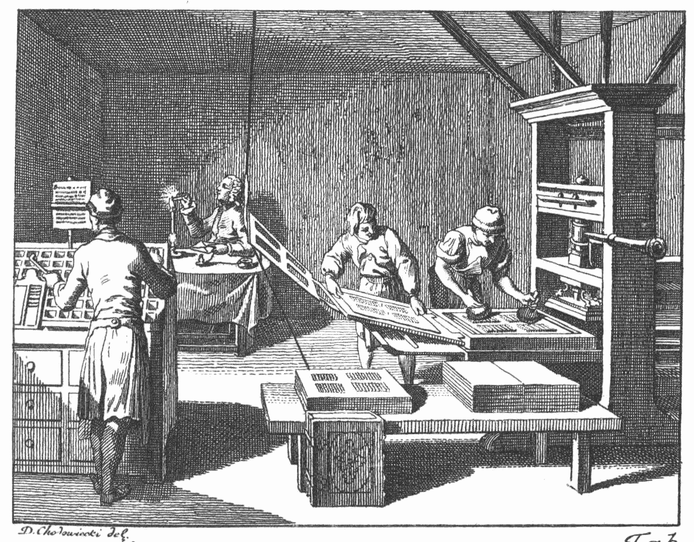

图 1：印刷工人的绘画。（由[Daniel Nikolaus Chodowiecki](https://en.wikipedia.org/wiki/Daniel_Chodowiecki)创作。[维基百科](https://commons.wikimedia.org/wiki/File:Chodowiecki_Basedow_Tafel_21_c.jpg)，公有领域。）


图 2：字母盒中的金属活字和排版棒。（由 Willi Heidelbach 创作。[维基百科](https://en.wikipedia.org/wiki/File:Metal_movable_type.jpg)，[CC BY 2.5](https://creativecommons.org/licenses/by/2.5/deed.en)。)

这个命名法反映了印刷机的世界：来自不同铸字厂的盒子中的金属形状。我们的现代世界有下拉菜单，而旧词已经不再适用。“字体”现在可以指字体、字体族或字体样式，而“字体族”可以指更大的或更小的字体集合。我们说一个字体包含几个不同的*重量*（如“粗体”和“正常”），但有时还有其他重量，如“轻”、“半粗体”、“黑色”和“紧凑”。好的字体往往有多种重量。几种不同的*样式*（如“斜体”和“罗马”，即非斜体的称呼），有时还有其他选项，比如可能有一个小写字母版本；这些有时也被称为*选项*。而且不要开始讨论自动与手动斜体。还有任意*大小*。字体在特定大小下看起来特别漂亮，因为*提示*告诉电脑如何最好地将其对齐到像素网格。欢迎来到魔法墨水的世界。这个术语来自 Bret Victor 的一篇[论文](http://worrydream.com/MagicInk/)，讨论了计算机的图形可能性如何使应用程序更好、更易于使用。

然而，Tk 的*字体对象*对应于字体更古老的意义：一个固定大小、样式和重量的字体。例如：你只能在调用`tkinter.Tk()`之后创建`Font`对象，或者任何其他类型的 Tk 对象，并且你需要单独导入`tkinter.font`。

```py
import tkinter.font
window = tkinter.Tk()
bi_times = tkinter.font.Font(
 family="Times",
 size=16,
 weight="bold",
 slant="italic",
)
```

你的电脑可能没有安装“Times”字体；你可以使用`tkinter.font.families()`列出可用的字体，然后选择其他字体。

字体对象可以传递给`create_text`的`font`参数：

```py
canvas.create_text(200, 100, text="Hi!", font=bi_times)
```

在古代，美国排字工人将金属形状的盒子排列在[加州工作案](http://www.alembicpress.co.uk/Typecases/CJCCASE.HTM)中，这种盒子将大小写字母并排放在一个盒子中，使得排版更加容易。大小写字母的命名法可以追溯到几个世纪以前。

# 测量文本

文本在垂直和水平方向上占据空间，字体对象的`metrics`和`measure`方法测量这个空间：在你的电脑上，你可能会得到不同的数字。没错——文本渲染是操作系统依赖的，因为它足够复杂，以至于每个人都会使用几个库中的一个来处理它，通常这些库是操作系统自带的。这就是为什么 macOS 字体往往比 Windows 上的相同字体“模糊”的原因：不同的库做出了不同的权衡。

```py
>>> bi_times.metrics()
{'ascent': 15, 'descent': 4, 'linespace': 19, 'fixed': 0}
>>> bi_times.measure("Hi!")
24
```

`metrics`调用提供了关于文本垂直维度的信息（见图 3）：`linespace`是文本的高度，包括一个“超出行”的`ascent`和一个“低于行”的`descent`。《fixed》参数实际上是一个布尔值，告诉你所有字母是否具有相同的*宽度*，所以它实际上并不适合这里。《ascent》和`descent`在大小不同的单词位于同一行时很重要：它们应该“沿着行”对齐，而不是沿着它们的顶部或底部对齐。

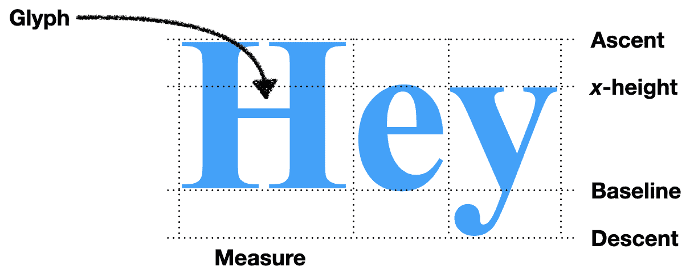

图 3：字体的各种垂直度量。字体中的所有符号共享相同的上升、*x*高度和下降，并且布局在共享的基线上。然而，符号的度量（或前进）可以不同。

让我们深入探讨。记住`bi_times`是 16 号的 Times 字体：为什么`font.metrics`报告它实际上有 19 像素高？好吧，首先，16 号大小意味着 16 *points*，这些点是定义为英寸的 72 分之一，而不是 16 *pixels*。实际上，“点”的定义非常混乱，世界各地有许多不同的长度单位都被称为“点”。[维基百科页面](https://en.wikipedia.org/wiki/Point_(typography))有详细信息，但传统的美国/英国点实际上略小于 1/72 英寸。1/72 标准来自 PostScript，但一些系统在它之前；例如，TeX 更接近于传统的点，将其近似为 1/72.27 英寸。你的显示器每英寸可能有大约 100 个这样的点。Tk 在其 API 的任何其他地方都不使用点。如果你传递一个负数，它应该使用像素，但看起来这似乎不起作用。这 16 个点测量的不是单个字母，而是字母曾经刻制的金属块，因此字母本身必须*小于*16 点。实际上，不同大小的 16 号字体有不同的字母高度：你甚至可能会注意到，在这个代码块中，Times 的垂直度量与我们在指定加粗、斜体的 Times 字体时使用的早期度量不同。加粗、斜体的 Times 字体更高，至少在我的当前 macOS 系统上是这样！

```py
>>> tkinter.font.Font(family="Courier", size=16).metrics()
{'fixed': 1, 'ascent': 13, 'descent': 4, 'linespace': 17}
>>> tkinter.font.Font(family="Times", size=16).metrics()
{'fixed': 0, 'ascent': 14, 'descent': 4, 'linespace': 18}
>>> tkinter.font.Font(family="Helvetica", size=16).metrics()
{'fixed': 0, 'ascent': 15, 'descent': 4, 'linespace': 19}
```

`measure()`方法更直接：它告诉你文本占据多少*水平*空间，以像素为单位。这当然取决于文本，因为不同的字母有不同的宽度：请注意，单个字母长度的总和不是单词的长度。Tk 在内部使用分数像素，但在`measure`调用中向上舍入以返回整个像素。此外，一些字体使用称为*字距调整*的技术，在特定字母对相邻时稍微移动字母，或者甚至使用*形状*使两个字母看起来像一个符号。

```py
>>> bi_times.measure("Hi!")
24
>>> bi_times.measure("H")
13
>>> bi_times.measure("i")
5
>>> bi_times.measure("!")
7
>>> 13 + 5 + 7
25
```

你可以使用这些信息在页面上布局文本。例如，假设你想要将文本“Hello, world!”分成两部分，使得“world!”是斜体。让我们使用两种字体：

```py
font1 = tkinter.font.Font(family="Times", size=16)
font2 = tkinter.font.Font(family="Times", size=16, slant='italic')
```

我们现在可以从`(200, 200)`开始布局文本：

```py
x, y = 200, 200
canvas.create_text(x, y, text="Hello, ", font=font1)
x += font1.measure("Hello, ")
canvas.create_text(x, y, text="world!", font=font2)
```

你应该看到“Hello,”和“world!”，正确对齐，并且第二个单词是斜体的。

不幸的是，这段代码有一个错误，尽管这个错误被示例文本的选择所掩盖：将“world!”替换为“overlapping!”，这两个单词就会重叠。这是因为你传递给`create_text`的坐标`x`和`y`告诉 Tk 文本的中心位置在哪里。它只对“Hello, world!”有效，因为“Hello,”和“world!”的长度相同！

幸运的是，你传递的坐标的意义是可以配置的。我们可以指示 Tk 将我们给出的坐标视为文本的左上角，通过将`anchor`参数设置为`"nw"`，即文本的“西北角”：

```py
x, y = 200, 225
canvas.create_text(x, y, text="Hello, ", font=font1, anchor='nw')
x += font1.measure("Hello, ")
canvas.create_text(
 x, y, text="overlapping!", font=font2, anchor='nw')
```

修改`draw`函数，将`anchor`设置为`"nw"`；在前一章中我们不需要这样做，因为所有中文字符的宽度都是相同的。

如果你发现字体度量很复杂，你不是唯一的一个！2012 年，密歇根州最高法院审理了[Stand Up for Democracy v. Secretary of State](https://publicdocs.courts.mi.gov/opinions/final/sct/20120803_s145387_157_standup-op.pdf)一案，这是一个关于选票公投有效性的案件，其核心是字体大小的定义。法院决定（正确地）字体大小是字母刻制的金属块的尺寸，而不是字母本身的尺寸。

# 逐字逐句

在第二章中，`layout`函数逐个字符遍历文本，并在空间用尽时移动到下一行。这在中文中是合适的，因为每个字符或多或少就是一个词。但在英语中，你无法在单词的中间换行。相反，我们需要逐个单词地布局文本：此代码在空白处分割单词。因此，它会在中文中断裂，因为没有单词之间的空白。真正的浏览器使用基于语言的规则来布局文本，包括识别单词边界。

```py
def layout(text):
 # ...
 for word in text.split():
 # ...
 return display_list
```

与中文字符不同，单词的大小不同，因此我们需要测量每个单词的宽度：

```py
import tkinter.font

def layout(text):
 font = tkinter.font.Font()
 # ...
 for word in text.split():
 w = font.measure(word)
 # ...
```

在这里，我选择使用 Tk 的默认字体。现在，如果我们把文本绘制在`cursor_x`位置，其右端会在`cursor_x + w`处。这可能会超出页面的右边缘，在这种情况下，我们需要通过换行来留出空间：

```py
def layout(text):
 for word in text.split():
 # ...
 if cursor_x + w > WIDTH - HSTEP:
 cursor_y += font.metrics("linespace") * 1.25
 cursor_x = HSTEP
```

注意，这个代码块只显示了`for`循环的内部。`layout`的其余部分应该保持不变。此外，我用参数调用`metrics`；这只会直接返回命名的度量。最后，请注意，我在增加`y`时将行间距乘以 1.25。尝试移除乘数：你会发现文本更难阅读，因为行距太近。设计师们说文本太“紧凑”。相反，通常会在文本之间添加“行间距”或“行高”。之所以这样命名，是因为在金属活字时代，会在行之间放置薄铅片来调整间距。铅是一种比实际字母部件所用的金属软的金属，因此它可以稍微压缩以保持对其他部件的压力。发音为“led-ing”，而不是“leed-ing”。行间距为 25%是典型值。

因此现在`cursor_x`和`cursor_y`有了单词的起始位置，所以我们将其添加到显示列表中，并更新`cursor_x`以指向单词的末尾：

```py
def layout(text):
 for word in text.split():
 # ...
 display_list.append((cursor_x, cursor_y, word))
 cursor_x += w + font.measure(" ")
```

我将`cursor_x`增加`w + font.measure(" ")`而不是`w`，因为我想要在单词之间有间距：`split()`调用移除了所有的空白，这又将其添加回来。然而，在`if`条件中，我没有添加空格，因为在行的最后一个单词后面不需要空格。

在单词中间断行称为连字符化，可以通过`hyphens` CSS 属性（[hyphens CSS property](https://drafts.csswg.org/css-text-3/#hyphens-property)）来开启。当前最先进的是[Knuth–Liang 连字符化算法](http://www.tug.org/docs/liang/liang-thesis.pdf)，它使用单词片段的字典来优先考虑可能的连字符化点。最初，CSS 规范[与该算法不兼容](https://news.ycombinator.com/item?id=19472922)，但最近的`text-wrap-style`属性（[text-wrap-style property](https://drafts.csswg.org/css-text-4/#propdef-text-wrap-style)）解决了这个问题。

# 文本样式

目前，页面上所有的文本都使用一种字体绘制。但网页有时会指定文本应该使用`<b>`和`<i>`标签来显示**粗体**或*斜体*。支持这一点会很棒，但目前的代码对此有所抗拒：`layout`函数只接收页面的文本作为输入，因此不知道粗体和斜体标签的位置。

让我们将`lex`改为返回一个*标记*列表，其中标记可以是`Text`对象（用于标签外的字符序列）或`Tag`对象（用于标签的内容）。你需要编写`Text`和`Tag`类：如果你熟悉 Python，你可能想使用`dataclass`库，它使得定义这类实用类变得更容易。

```py
class Text:
 def __init__(self, text):
 self.text = text

class Tag:
 def __init__(self, tag):
 self.tag = tag
```

`lex`现在必须将文本收集到`Text`和`Tag`对象中：如果你已经完成了一些或所有前几章的练习，你的代码将有所不同。书中的代码片段总是假设你没有完成练习，所以你需要将你的修改移植过来。

```py
def lex(body):
 out = []
 buffer = ""
 in_tag = False
 for c in body:
 if c == "<":
 in_tag = True
 if buffer: out.append(Text(buffer))
 buffer = ""
 elif c == ">":
 in_tag = False
 out.append(Tag(buffer))
 buffer = ""
 else:
 buffer += c
 if not in_tag and buffer:
 out.append(Text(buffer))
 return out
```

在这里，我将 `text` 变量重命名为 `buffer`，因为它现在在可以使用之前存储文本或标签内容。这个名字也提醒我们，在循环结束时，我们需要检查是否有缓冲的文本以及我们应该如何处理它。在这里，`lex` 将累积的任何文本作为 `Text` 对象输出。否则，如果你从未看到过尖括号，你会返回一个空的标记列表。但是未完成的标签，如 `Hi!<hr`，会被丢弃。这可能会让你觉得这是一个奇怪的决定：为什么不完成作者标签？我不知道，但浏览器会丢弃标签。

注意，`Text` 和 `Tag` 是不对称的：`lex` 避免空的 `Text` 对象，但不避免空的 `Tag` 对象。这是因为空的 `Tag` 对象代表 HTML 代码 `<>`，而空的 `Text` 对象代表完全没有内容。

由于我们已经修改了 `lex`，我们现在不仅传递页面的文本，还传递其中的标签给 `layout`。因此，`layout` 必须遍历标记，而不是文本：

```py
def layout(tokens):
 # ...
 for tok in tokens:
 if isinstance(tok, Text):
 for word in tok.text.split():
 # ...
 # ...
```

`layout` 还可以检查标签标记以在页面指示下更改字体。让我们从对权重和样式的支持开始，对应两个变量：

```py
weight = "normal"
style = "roman"
```

当看到加粗和斜体打开和关闭标签时，这些变量必须改变：

```py
if isinstance(tok, Text):
 # ...
elif tok.tag == "i":
 style = "italic"
elif tok.tag == "/i":
 style = "roman"
elif tok.tag == "b":
 weight = "bold"
elif tok.tag == "/b":
 weight = "normal"
```

注意，此代码不仅正确处理了 `<b>bold</b>` 和 `<i>italic</i>` 文本，还处理了 `<b><i>bold italic</i></b>` 文本。它甚至处理了不正确嵌套的标签，如 `<b>b<i>bi</b>i</i>`，但它不处理 `<b><b>twice</b>bolded</b>` 文本。我们将在 第六章 中回到这个问题。

`style` 和 `weight` 变量用于选择字体：

```py
if isinstance(tok, Text):
 for word in tok.text.split():
 font = tkinter.font.Font(
 size=16,
 weight=weight,
 slant=style,
 )
 # ...
```

由于字体是在 `layout` 中计算的，但在 `draw` 中使用，因此我们需要将使用的字体添加到显示列表的每个条目中：

```py
if isinstance(tok, Text):
 for word in tok.text.split():
 # ...
 display_list.append((cursor_x, cursor_y, word, font))
```

确保更新 `draw` 以期望并使用显示列表条目中的这个额外字体字段。

*斜体* 字体是在意大利发展起来的（因此得名），以模仿一种被称为“[chancery hand](https://en.wikipedia.org/wiki/Chancery_hand)”的草书书写风格。非斜体字体被称为 *罗马体*，因为它们模仿罗马纪念碑上的文字。还有一个不为人知的第三种选择：[斜体字体](https://en.wikipedia.org/wiki/Oblique_type)，它们看起来像罗马字体，但却是斜的。

# 布局对象

使用了所有这些标签，`layout` 已经变得相当庞大，拥有许多局部变量和一些复杂的控制流。这是表明某事物应该成为一个类而不是一个函数的一个迹象：

```py
class Layout:
 def __init__(self, tokens):
 self.display_list = []
```

然后，`layout` 中的每个局部变量都成为 `Layout` 的一个字段：

```py
self.cursor_x = HSTEP
self.cursor_y = VSTEP
self.weight = "normal"
self.style = "roman"
```

旧 `layout` 的核心是遍历标记的循环，我们可以将这个循环的主体移动到 `Layout` 的一个方法上：

```py
def __init__(self, tokens):
 # ...
 for tok in tokens:
 self.token(tok)

def token(self, tok):
 if isinstance(tok, Text):
 for word in tok.text.split():
 # ...
 elif tok.tag == "i":
 self.style = "italic"
 # ...
```

事实上，`isinstance(tok, Text)` 分支的主体可以移动到它自己的方法中：

```py
def word(self, word):
 font = tkinter.font.Font(
 size=16,
 weight=self.weight,
 slant=self.style,
 )
 w = font.measure(word)
 # ...
```

现在所有内容都已从 `Browser` 的旧 `layout` 函数中移出，它可以被 `Layout` 的调用所替代：

```py
class Browser:
 def load(self, url):
 body = url.request()
 tokens = lex(body)
 self.display_list = Layout(tokens).display_list
 self.draw()
```

当你进行这样的大规模重构时，逐步工作是很重要的。虽然一次性改变所有内容看起来更有效率，但这种效率却伴随着失败的风险：试图做太多以至于你感到困惑，不得不放弃整个重构。所以，在你继续之前，花点时间测试一下你的浏览器是否仍然正常工作。

无论如何，这次重构将所有文本处理代码隔离到它自己的方法中，主要的`token`函数只是根据标签名进行分支。让我们利用这个新的、更整洁的组织结构来添加更多标签。随着字体粗细和样式的工作，大小是排版复杂性的下一个前沿。改变字体大小的一个简单方法就是使用`<small>`标签及其已弃用的姐妹标签`<big>`。在你的网页设计项目中，使用 CSS 的`font-size`属性来改变文本大小，而不是使用`<big>`和`<small>`。但由于我们还没有为我们的浏览器实现 CSS（见第六章），我们在这里仍然使用标签。

我们在字体样式和粗细方面的经验表明，一个简单的方法是自定义`Layout`中的`size`字段。它从以下开始：

```py
self.size = 12
```

这个变量用于创建字体对象：

```py
font = tkinter.font.Font(
 size=self.size,
 weight=self.weight,
 slant=self.style,
)
```

我们可以通过更新这个变量来改变`<big>`和`<small>`标签的大小：

```py
def token(self, tok):
 # ...
 elif tok.tag == "small":
 self.size -= 2
 elif tok.tag == "/small":
 self.size += 2
 elif tok.tag == "big":
 self.size += 4
 elif tok.tag == "/big":
 self.size -= 4
```

尝试将整个段落包裹在`<small>`标签中，就像包裹一小段细印一样，享受你新发现的排版自由。

`<b>`、`<i>`、`<big>`和`<small>`都源于更早的、CSS 之前的网络时代。如今，CSS 可以改变元素的外观，所以像`<b>`和`<small>`这样的视觉标签名不再受欢迎。尽管如此，`<b>`、`<i>`和`<small>`仍然有一些[与外观无关的含义](https://html.spec.whatwg.org/multipage/text-level-semantics.html#the-small-element)。

# 不同大小的文本

开始混合字体大小，比如 `<small>a</small><big>A</big>`，你很快就会注意到字体大小代码的问题：文本沿着其顶部对齐，就像是从晾衣绳上挂下来的。但你知道，英文文本通常都是所有字母对齐在不可见的*基线*上。

让我们思考一下如何解决这个问题。如果较大的文本向上移动，它将与上一行重叠，所以较小的文本必须向下移动。这意味着它的垂直位置必须在较大的文本通过`token`之后计算，*即之后*。但由于小文本首先通过循环，我们需要一个*两遍*的文本行算法：第一遍确定哪些单词进入该行并计算它们的*x*位置，而第二遍垂直对齐单词并计算它们的*y*位置（见图 4）。

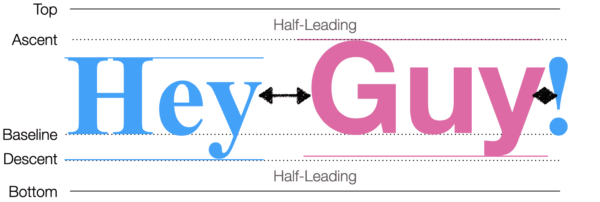

图 4：涉及多种字体时线条的布局。所有单词都使用共同的基线绘制。整行的上升和下降由该行中所有单词的最大上升和下降决定，并在行前后添加行间距。

让我们从第一阶段开始。由于一行包含来自许多标签的文本，我们需要在`Layout`上有一个字段来存储待处理的行。该字段，`line`，将是一个列表，`text`将向其中添加单词而不是显示列表。`line`中的条目将具有*x*位置但没有*y*位置，因为*y*位置在第一阶段没有计算：

```py
class Layout:
 def __init__(self, tokens):
 # ...
 self.line = []
 # ...

 def word(self, word):
 # ...
 self.line.append((self.cursor_x, word, font))
```

新的`line`字段本质上是一个缓冲区，其中单词在它们可以放置之前暂时存放。第二阶段是在我们完成一行后刷新该缓冲区：

```py
class Layout:
 def word(self, word):
 if self.cursor_x + w > WIDTH - HSTEP:
 self.flush()
```

如同缓冲区通常的做法，我们还需要确保在所有标记处理完毕后刷新缓冲区：

```py
class Layout:
 def __init__(self, tokens):
 # ...
 self.flush()
```

这个新的`flush`函数有三个职责：

1.  它必须沿基线对齐单词（见图 5）；

1.  它必须将所有这些单词添加到显示列表中；并且

1.  它必须更新`cursor_x`和`cursor_y`字段。

这是逐步的样子：

widgets/lab3-baselines.html

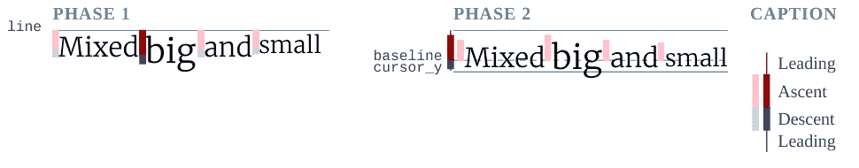

图 5：在行上对齐单词。

由于我们希望单词“在行上”对齐，让我们首先计算该行应该在的位置。这取决于该行中最高的单词：

```py
def flush(self):
 if not self.line: return
 metrics = [font.metrics() for x, word, font in self.line]
 max_ascent = max([metric["ascent"] for metric in metrics])
```

基线是`self.y`以下`max_ascent`——或者实际上要稍微多一点，以考虑到行间距：实际上，25%的行间距不会在上升者上方增加 25%的上升和在下降者下方增加 25%的下降。相反，它在两个地方都增加了[12.5%的行高](https://www.w3.org/TR/CSS2/visudet.html#leading)，这在字体混合时略有不同。但在这里我们跳过这个细微差别。

```py
baseline = self.cursor_y + 1.25 * max_ascent
```

现在我们知道了行的位置，我们可以将每个单词相对于该行放置并添加到显示列表中：

```py
for x, word, font in self.line:
 y = baseline - font.metrics("ascent")
 self.display_list.append((x, y, word, font))
```

注意`y`从基线开始，并且向上移动，刚好足够容纳那个单词的上升。现在`cursor_y`必须向下移动足够远，以考虑到最深下降者的位置：

```py
max_descent = max([metric["descent"] for metric in metrics])
self.cursor_y = baseline + 1.25 * max_descent
```

最后，`flush`必须更新`Layout`的`cursor_x`和`line`字段：

```py
self.cursor_x = HSTEP
self.line = []
```

现在，所有文本都沿行对齐，即使文本大小混合。此外，这个新的`flush`函数对其他换行任务也很方便。例如，在 HTML 中，`<br>`标签是一个自闭合标签，因此没有`</br>`。许多*是内容而不是注释*的标签都是这样的。有些人喜欢在自闭合标签中添加一个最后的斜杠，例如`<br/>`，但在 HTML 中这不是必需的。它结束当前行并开始新的一行：

```py
def token(self, tok):
 # ...
 elif tok.tag == "br":
 self.flush()
```

同样，段落由`<p>`和`</p>`标签定义，因此`</p>`也结束当前行：

```py
def token(self, tok):
 # ...
 elif tok.tag == "/p":
 self.flush()
 self.cursor_y += VSTEP
```

我在这里给`cursor_y`添加一点额外的空间，以在段落之间创建一个小间隙。

到目前为止，你应该能够打开你的浏览器并显示一个示例页面，它应该看起来像图 6。

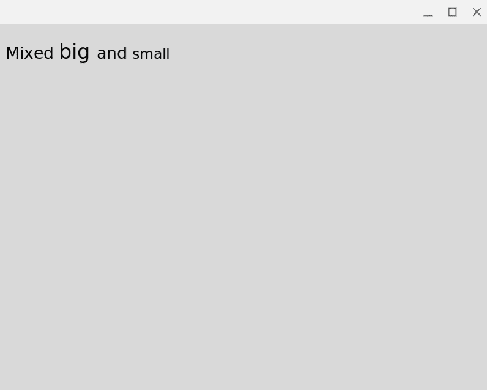

图 6：展示不同文本大小的网页截图。

实际上，浏览器不仅支持*水平*书写系统，还支持[*垂直*书写系统](https://www.smashingmagazine.com/2019/08/writing-modes-layout/)，例如一些传统的东亚书写风格。一个特别的挑战是[蒙古文](https://www.w3.org/TR/mlreq/)，它从上到下、从左到右书写。许多蒙古[政府网站](https://president.mn/mng/)使用这种文字。

# 字体缓存

现在你已经实现了样式文本，你可能已经注意到——除非你在 macOS 上——虽然我们无法在文档中确认这一点，但似乎 macOS 的“Core Text”API 比 Linux 和 Windows 更积极地缓存字体。本节中描述的优化在 macOS 上不会造成伤害，但也不会像在 Windows 和 Linux 上那样显著提高速度。——在一个像[这一章](http://browser.engineering/text.html)这样的大型网页上，我们的浏览器与上一章相比已经显著减慢。这是因为文本布局，特别是测量每个单词的部分，相当慢。你可以通过将`python3`命令替换为`python3 -m cProfile`来分析 Python 程序。查找对应于`measure`和`metrics`调用的行，以查看在测量文本上花费了多少时间。

不幸的是，很难使文本测量速度变得更快。在使用比例字体和复杂的字体特性，如提示和字距调整时，测量文本可能需要相当复杂的计算。但在一个大型网页上，一些单词可能出现的频率很高——例如，这一章中“the”这个词出现了 200 多次。我们不必反复测量这些单词，可以测量一次，然后缓存结果。在正常的英文文本中，这通常会导致显著的加速。

缓存是一个非常好的想法，大多数文本库已经实现了它，通常是在每个`Font`对象中缓存文本测量结果。但既然我们的`text`方法为每个单词创建一个新的`Font`对象，缓存就变得无效。为了使缓存有效，我们需要尽可能重用`Font`对象而不是创建新的。

我们将把我们的缓存存储在全局`FONTS`字典中：

```py
FONTS = {}
```

这个字典的键将是大小/重量/样式三元组，值将是`Font`对象。实际上，值是一个字体对象和一个`tkinter.Label`对象。由于某种原因，这大大提高了`metrics`的性能，并且被[Python 文档](https://github.com/python/cpython/blob/main/Lib/tkinter/font.py#L163)推荐。我们可以将缓存逻辑本身放入一个新的`get_font`函数中：

```py
def get_font(size, weight, style):
 key = (size, weight, style)
 if key not in FONTS:
 font = tkinter.font.Font(size=size, weight=weight,
 slant=style)
 label = tkinter.Label(font=font)
 FONTS[key] = (font, label)
 return FONTS[key][0]
```

然后`word`方法可以调用`get_font`而不是直接创建`Font`对象：

```py
class Layout:
 def word(self, word):
 font = get_font(self.size, self.weight, self.style)
 # ...
```

现在，相同的单词将使用相同的字体，并且文本测量将命中缓存。

对于像中文这样的脚本，字体可能达到兆字节大小，因此它们通常存储在磁盘上，并在需要时才加载到内存中。这使得字体加载缓慢，缓存变得更加重要。浏览器还有广泛的缓存用于测量、塑形和渲染文本。因为网页中有大量的文本，这些缓存最终成为加速渲染的最重要部分之一。

# 概述

上一章介绍了一个以网格形式布局字符的浏览器。现在它执行标准的英文文本布局，所以：

+   文本是以单词为单位进行布局的；

+   行在单词边界处被分割；

+   文本可以是粗体或斜体；

+   可以混合不同大小的文本。

你现在可以使用我们的浏览器来阅读文章、博客文章，甚至书籍！

widgets/lab3-browser.html

# 概要

我们浏览器中的完整函数、类和方法集应该看起来像这样：

`` class URL: `def __init__(url)` `def request()` `` `` class Text: `def __init__(text)` `` `` class Tag: `def __init__(tag)` `` `def lex(body)` `FONTS` `def get_font(size, weight, style)` `WIDTH, HEIGHT` `HSTEP, VSTEP` `` class Layout: `def __init__(tokens)` `def token(tok)` `def flush()` `def word(word)` `` `SCROLL_STEP` `` class Browser: `def __init__()` `def draw()` `def load(url)` `def scrolldown(e)` ``

# 练习

3-1 *居中文本*。在这个[本书的网站](https://browser.engineering/text.html)上的页面标题是居中的；让你的浏览器对`<h1 class="title">`和`</h1>`之间的文本也这样做。每一行都必须单独居中，因为不同的行长度不同。在早期的 HTML 中有一个`<center>`标签可以做到这一点，但现在居中通常是通过 CSS 中的`text-align`属性来完成的。这个练习的方法当然是非标准的，只是为了学习目的。

3-2 *上标*。添加对`<sup>`标签的支持。此标签中的文本应该更小（可能是正常文本大小的一半）并且放置得使上标顶部与正常字母顶部对齐。

3-3 *软连字符*。软连字符字符，在 Python 中写作`\N{soft hyphen}`，表示文本渲染器可以在此处插入连字符并跨行断开单词的位置，但不是必须的。添加对其的支持。如果你已经完成了练习 1-4 关于 HTML 实体的练习，你可能还想添加对`&shy;`实体的支持，它扩展为一个软连字符。如果一个单词在行尾处放不下，检查它是否有软连字符，如果有，就在行间断开单词。记住，一个单词中可以有多个软连字符，并且在断开单词时一定要画出连字符。单词“super－cali－fragi－listic－expi－ali－docious”是一个很好的测试案例。

3-4 *小写字母*。使`<abbr>`元素以小写字母形式显示文本，如下所示。在`<abbr>`标签内，小写字母应该以小写、大写和加粗的形式显示，而所有其他字符（大写字母、数字等）应以正常字体显示。

3-5 *预格式化文本*。添加对`<pre>`标签的支持。与正常段落不同，`<pre>`标签内的文本不会自动换行，空格和换行等空白字符会被保留。同时使用固定宽度的字体，如`Courier New`或`SFMono`。确保在`<pre>`标签内标签可以正常工作：应该可以在`<pre>`内加粗一些文本。如果还做了练习 1-4，结果看起来会更好。

# 构建 HTML 树

Web 浏览器工程的第四章。

+   节点树

+   构建树

+   解析器调试

+   自闭合标签

+   使用节点树

+   处理作者错误

+   总结

+   大纲

+   练习

到目前为止，我们的浏览器将网页视为一系列打开的标签、关闭的标签和文本。但实际上，HTML 是一个树形结构，尽管树形结构目前并不重要，但它将是 CSS、JavaScript 和视觉效果等后续功能的核心。因此，本章添加了一个合适的 HTML 解析器，并将布局引擎转换为使用它。

# 节点树

HTML 树这是通常被称为 DOM 树的树，对于[文档对象模型](https://en.wikipedia.org/wiki/Document_Object_Model)。现在我会继续称它为 HTML 树。每个打开和关闭标签对都有一个节点，每个文本段也有一个节点。实际上，还有其他类型的节点，如注释、文档类型、`CDATA`部分和处理指令。甚至还有一些已弃用的类型！一个简单的 HTML 文档，显示了结构，如图 1 所示。

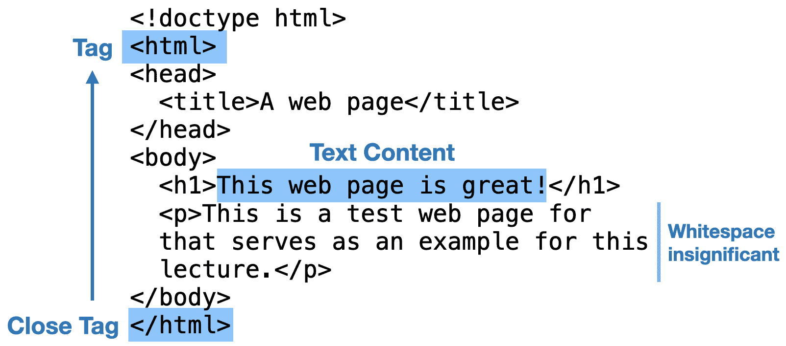

图 1：一个 HTML 文档，显示了标签、文本和嵌套结构。

为了让我们的浏览器使用树形结构，标记（tokens）需要演变成节点。这意味着需要为每个节点添加一个子节点列表和一个父指针。以下是新的`Text`类，它代表树叶处的文本：

```py
class Text:
 def __init__(self, text, parent):
 self.text = text
 self.children = []
 self.parent = parent
```

由于创建一个节点需要两个标签（打开标签和关闭标签），因此让我们将`Tag`类重命名为`Element`，并使其看起来像这样：

```py
class Element:
 def __init__(self, tag, parent):
 self.tag = tag
 self.children = []
 self.parent = parent
```

我在`Text`和`Element`两个类中都添加了一个`children`字段，即使文本节点永远不会拥有子节点，也是为了保持一致性。

从源代码构建节点树的过程称为解析。解析器一次构建一个元素或文本节点。但这意味着解析器需要在其过程中存储一个*不完整*的树。例如，假设解析器到目前为止已经读取了以下 HTML 片段：

```py
<html><video></video><section><h1>This is my webpage
```

解析器已经看到了五个标签（以及一个文本节点）。HTML 的其余部分将包含更多的开放标签、闭合标签和文本，但无论它看到哪个标记，都不会向已经关闭的`<video>`标签添加新的节点。因此，该节点是“完成”的。但其他节点尚未完成：可以添加更多子节点到`<html>`、`<section>`和`<h1>`节点，具体取决于接下来的 HTML 内容——见图 2。

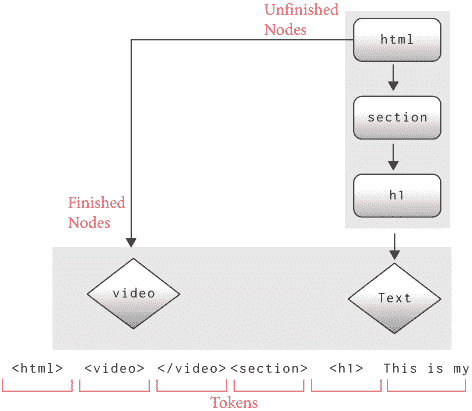

图 2：解析某些 HTML 时完成的和未完成的节点。

由于解析器从文件开头到结尾读取 HTML 文件，这些未完成的标签始终位于树的某个部分。未完成的标签始终是*打开*但尚未关闭的；它们始终比完成的节点*在源代码中更晚*；并且它们始终是其他未完成标签的*子节点*。为了利用这些事实，让我们通过存储一个未完成标签的列表来表示一个不完整的树，该列表按父子顺序排列。列表中的第一个节点是 HTML 树的根节点；列表中的最后一个节点是最新的未完成标签。在 Python 和大多数其他语言中，从列表的末尾添加和删除比从开头添加和删除要快。

解析比`lex`稍微复杂一些，因此我们希望将其分解为几个函数，组织在一个新的`HTMLParser`类中。该类还可以存储它正在分析的源代码和不完整的树：

```py
class HTMLParser:
 def __init__(self, body):
 self.body = body
 self.unfinished = []
```

在解析器开始之前，它还没有看到任何标签，因此存储树的`unfinished`列表是空的。但随着解析器读取标记，该列表会逐渐填满。让我们首先将我们现在拥有的`lex`函数有志地重命名为`parse`：

```py
class HTMLParser:
 def parse(self):
 # ...
```

我们需要对`parse`进行一些手术。目前`parse`创建`Tag`和`Text`对象并将它们追加到`out`数组中。我们需要它创建`Element`和`Text`对象并将它们添加到`unfinished`树中。由于树比列表复杂一些，我将添加到树的逻辑移动到两个新的方法，`add_text`和`add_tag`。

```py
def parse(self):
 text = ""
 in_tag = False
 for c in self.body:
 if c == "<":
 in_tag = True
 if text: self.add_text(text)
 text = ""
 elif c == ">":
 in_tag = False
 self.add_tag(text)
 text = ""
 else:
 text += c
 if not in_tag and text:
 self.add_text(text)
 return self.finish()
```

`out`变量已经消失，注意我还将返回值移动到了一个新的`finish`方法，该方法将不完整的树转换为最终的完整树。所以：我们如何向树中添加内容？

HTML 源自一系列文档处理系统。其前身[SGML](https://en.wikipedia.org/wiki/Standard_Generalized_Markup_Language)可以追溯到[RUNOFF](https://en.wikipedia.org/wiki/TYPSET_and_RUNOFF)，并且是[troff](https://troff.org)的兄弟，现在用于 Linux 手册页。现在标准化 SGML 的[委员会](https://www.iso.org/committee/45374.html)正在处理`.odf`、`.docx`和`.epub`格式。

# 构建树

让我们谈谈向树中添加节点。要添加一个文本节点，我们将其添加为最后一个未完成节点的子节点：

```py
class HTMLParser:
 def add_text(self, text):
 parent = self.unfinished[-1]
 node = Text(text, parent)
 parent.children.append(node)
```

另一方面，标签稍微复杂一些，因为它们可能是一个开放标签*或*一个闭合标签：

```py
class HTMLParser:
 def add_tag(self, tag):
 if tag.startswith("/"):
 # ...
 else:
 # ...
```

打开标签将一个未完成的节点添加到列表的末尾：

```py
def add_tag(self, tag):
 # ...
 else:
 parent = self.unfinished[-1]
 node = Element(tag, parent)
 self.unfinished.append(node)
```

关闭标签通过将其添加到列表中的上一个未完成节点来结束最后一个未完成的节点：

```py
def add_tag(self, tag):
 if tag.startswith("/"):
 node = self.unfinished.pop()
 parent = self.unfinished[-1]
 parent.children.append(node)
 # ...
```

一旦解析器完成，它就会通过完成任何未完成的节点，将我们的不完整树转换成完整树：

```py
class HTMLParser:
 def finish(self):
 while len(self.unfinished) > 1:
 node = self.unfinished.pop()
 parent = self.unfinished[-1]
 parent.children.append(node)
 return self.unfinished.pop()
```

这几乎是一个完整的解析器，但在文档的开始和结束处并不完全工作。第一个打开标签是一个没有父元素的边缘情况：

```py
def add_tag(self, tag):
 # ...
 else:
 parent = self.unfinished[-1] if self.unfinished else None
 # ...
```

最后一个标签也是一个边缘情况，因为没有未完成的节点可以添加：

```py
def add_tag(self, tag):
 if tag.startswith("/"):
 if len(self.unfinished) == 1: return
 # ...
```

好了，这些都完成了。让我们测试一下我们的解析器，看看它工作得怎么样！

考虑不周的 JavaScript `document.write`方法允许 JavaScript 在解析时修改 HTML 源代码！这实际上是一个[坏主意](https://developer.mozilla.org/en-US/docs/Web/API/Document/write)。`document.write`的实现必须让 HTML 解析器停止执行 JavaScript，但这会减慢页面后面使用的图像、CSS 和 JavaScript 的请求。为了解决这个问题，现代浏览器使用[推测性解析](https://developer.mozilla.org/en-US/docs/Glossary/speculative_parsing)在解析完成之前就开始加载额外的资源。

# 调试解析器

我们如何知道我们的解析器做了正确的事情——它构建了正确的树？嗯，开始的地方是*看到*它产生的树。我们可以通过一个快速的递归美化打印器来完成：

```py
def print_tree(node, indent=0):
 print(" " * indent, node)
 for child in node.children:
 print_tree(child, indent + 2)
```

在这里，我们在树中打印每个节点，并使用缩进来显示树结构。由于我们需要打印每个节点，花时间给它们一个漂亮的打印形式是值得的，在 Python 中这意味着定义`__repr__`函数：

```py
class Text:
 def __repr__(self):
 return repr(self.text)

class Element:
 def __repr__(self):
 return "<" + self.tag + ">"
```

通常，为任何数据对象定义`__repr__`方法是件好事，并且让这些`__repr__`方法打印所有相关字段。

在本章对应的[网页](https://browser.engineering/html.html)上尝试这个操作，解析 HTML 源代码，然后调用`print_tree`来可视化它：

```py
body = URL(sys.argv[1]).request()
nodes = HTMLParser(body).parse()
print_tree(nodes)
```

你会在一开始看到类似这样的内容：

```py
 <!doctype html>
   '\n'
   <html lang="en-US" xml:lang="en-US">
     '\n'
     <head>
       '\n  '
       <meta charset="utf-8" />
```

立即有几个问题很突出。让我们从顶部开始，从`<!doctype html>`标签开始。

这个特殊标签，称为[doctype](https://html.spec.whatwg.org/multipage/syntax.html#the-doctype)，总是 HTML 文档中的第一件事。但它根本不是一个元素，也不应该有结束标签。我们的浏览器不会使用 doctype 做任何事情，所以最好把它扔掉：真实浏览器使用 doctypes 在标准兼容和遗留解析和布局模式之间切换。

```py
def add_tag(self, tag):
 if tag.startswith("!"): return
 # ...
```

这忽略了所有以感叹号开头的标签，这不仅丢弃了 doctype 声明，还丢弃了注释，在 HTML 中注释的写法是`<!-- comment text -->`。

但是仅仅丢弃 doctype 还远远不够——如果你现在运行你的解析器，它将会崩溃。这是因为 doctype 之后跟着一个换行符，我们的解析器将其视为文本并尝试将其插入到树中。但是没有树，因为解析器还没有看到任何打开的标签。为了简单起见，让我们让我们的浏览器跳过仅包含空白字符的文本节点，以绕过这个问题：真实浏览器会保留空白字符以正确渲染 `make<span></span>up` 为一个单词和 `make<span> </span>up` 为两个单词。我们的浏览器不会这样做。此外，忽略空白字符简化了后面的章节，避免了为仅包含空白字符的文本标签设置特殊情况的必要。

```py
def add_text(self, text):
 if text.isspace(): return
 # ...
```

解析 `browser.engineering` 首页的 HTML 树的第一个部分现在看起来大致如下：

```py
 <html lang="en-US" xml:lang="en-US">
   <head>
     <meta charset="utf-8" /="">
       <link rel="prefetch" ...>
         <link rel="prefetch" ...>
```

我们下一个问题是：为什么一切都被缩进得这么深？为什么这些打开的元素永远不会关闭？

在 SGML 中，文档类型声明包含一个 URL，该 URL 定义了有效的标签，在 HTML 的早期版本中这也是推荐的。浏览器确实会使用缺少文档类型声明来[识别](https://developer.mozilla.org/en-US/docs/Web/HTML/Quirks_Mode_and_Standards_Mode)非常旧的、SGML 之前的 HTML 版本。还有一个被称为“[几乎标准](https://hsivonen.fi/doctype/)”或“有限怪异”模式，这是由于表格单元格垂直布局中向后不兼容的更改。是的，我并不是在编造这些！但是不要使用 URL，所以 `<!doctype html>` 是现代 HTML 的最佳文档类型声明。

# 自闭合标签

`<meta>` 和 `<link>` 这样的元素被称为自闭合：这些标签不包围内容，因此你永远不需要写 `</meta>` 或 `</link>`。我们的解析器需要为它们提供特殊支持。在 HTML 中，有一个[特定列表](https://html.spec.whatwg.org/multipage/syntax.html#void-elements)的自闭合标签（规范称它们为“空”标签）：其中许多标签都很晦涩。浏览器还支持一些未在此列出的附加、过时的自闭合标签，如 `keygen`。

```py
SELF_CLOSING_TAGS = [
 "area", "base", "br", "col", "embed", "hr", "img", "input",
 "link", "meta", "param", "source", "track", "wbr",
]
```

我们的解析器需要自动关闭以下列表中的标签：

```py
def add_tag(self, tag):
 # ...
 elif tag in self.SELF_CLOSING_TAGS:
 parent = self.unfinished[-1]
 node = Element(tag, parent)
 parent.children.append(node)
```

这段代码看起来是正确的，但它并不完全工作。为什么？因为我们的解析器正在寻找一个名为 `meta` 的标签，但它找到的是名为“`meta name=...`”的标签。自闭合代码没有被触发，因为 `<meta>` 标签有属性。

HTML 属性为元素添加信息；打开标签可以有任意数量的属性。属性值可以是带引号的、不带引号的或完全省略。让我们专注于基本的属性支持，忽略包含空白字符的值，这些值稍微复杂一些。

由于我们不在值中处理空白字符，我们可以根据空白字符来分割，以获取标签名称和属性-值对：

```py
class HTMLParser:
 def get_attributes(self, text):
 parts = text.split()
 tag = parts[0].casefold()
 attributes = {}
 for attrpair in parts[1:]:
 # ...
 return tag, attributes
```

HTML 标签名不区分大小写，属性名也是如此，所以我会将它们转换为小写。在像切罗基语这样的语言中，将文本转换为小写是[错误的做法](https://www.b-list.org/weblog/2018/nov/26/case/)，因为在 HTML 中，标签名只使用 ASCII 字符，因此将它们转换为小写就足够了，但我使用 Python 的`casefold`函数，因为这是一个好习惯。然后，在循环内部，我将每个属性-值对拆分为一个名称和一个值。最简单的情况是未引用的属性，其中等号分隔两者：

```py
def get_attributes(self, text):
 # ...
 for attrpair in parts[1:]:
 if "=" in attrpair:
 key, value = attrpair.split("=", 1)
 attributes[key.casefold()] = value
 # ...
```

值也可以省略，例如在`<input disabled>`中，在这种情况下，属性值默认为空字符串：

```py
for attrpair in parts[1:]:
 # ...
 else:
 attributes[attrpair.casefold()] = ""
```

最后，值可以是引用的，在这种情况下，必须删除引号：引用属性允许引号之间有空白。正确解析这需要类似有限状态机的东西，而不仅仅是按空白分割。

```py
if "=" in attrpair:
 # ...
 if len(value) > 2 and value[0] in ["'", "\""]:
 value = value[1:-1]
 # ...
```

我们将这些属性存储在`Element`中：

```py
class Element:
 def __init__(self, tag, attributes, parent):
 self.tag = tag
 self.attributes = attributes
 # ...
```

这意味着我们需要在`add_tag`的顶部调用`get_attributes`以获取构建`Element`所需的`attributes`。

```py
def add_tag(self, tag):
 tag, attributes = self.get_attributes(tag)
 # ...
```

记住要在`add_tag`中使用`tag`和`attribute`而不是`text`，并再次尝试你的解析器：

```py
 <html>
    <head>
      <meta>
      <link>
      <link>
      <link>
      <link>
      <link>
      <meta>
```

它很接近了！是的，如果你打印属性，你会看到带有空白的属性（如`meta`标签中的一个`author`）被错误地解析为多个属性，并且自闭合标签上的最后一个斜杠被错误地处理为额外的属性。一个更好的解析器会修复这些问题。但让我们保持解析器不变——这些问题不会对我们正在构建的浏览器造成问题——并继续将其集成到我们的浏览器中。

在自闭合标签的末尾放置一个斜杠，如`<br/>`，是在[XHTML](https://www.w3.org/TR/xhtml1/)看起来可能取代 HTML 时变得流行的，像我这样的老手从未改变习惯。但与[XML](https://www.w3.org/TR/xml/#sec-starttags)不同，在 HTML 中，自闭合标签是通过名称而不是某种特殊语法来识别的，所以斜杠是可选的。

# 使用节点树

目前，`Layout`类按标记逐个处理；我们现在希望它按节点逐个处理。所以让我们将旧的`token`方法分成两部分：所有针对开放标签的情况将放入一个新的`open_tag`方法，所有针对关闭标签的情况将放入一个新的`close_tag`方法：文本标记的情况不再需要，因为我们的浏览器可以直接调用现有的`add_text`方法。

```py
class Layout:
 def open_tag(self, tag):
 if tag == "i":
 self.style = "italic"
 # ...

 def close_tag(self, tag):
 if tag == "i":
 self.style = "roman"
 # ...
```

现在我们需要`Layout`对象遍历节点树，以正确的顺序调用`open_tag`、`close_tag`和`text`：

```py
def recurse(self, tree):
 if isinstance(tree, Text):
 for word in tree.text.split():
 self.word(word)
 else:
 self.open_tag(tree.tag)
 for child in tree.children:
 self.recurse(child)
 self.close_tag(tree.tag)
```

`Layout`构造函数现在可以调用`recurse`而不是遍历标记列表。我们还需要浏览器构建节点树，如下所示：

```py
class Browser:
 def load(self, url):
 body = url.request()
 self.nodes = HTMLParser(body).parse()
 self.display_list = Layout(self.nodes).display_list
 self.draw()
```

运行它——浏览器现在应该使用解析后的 HTML 树。

`doctype` 语法是一种版本形式——声明网页使用哪个 HTML 版本。但实际上，`doctype` 的 `html` 值不仅表示特定的 HTML 版本，而且更普遍地表示 [*HTML 生活标准*](https://html.spec.whatwg.org/)。预计永远不会添加新的 HTML `doctype` 版本。它被称为“生活标准”，因为它会随着新功能的添加而不断变化。这些变化的机制仅仅是浏览器推出新功能，而不是 HTML “版本”的任何变化。总的来说，网络是一个 *无版本的平台*——新功能通常作为增强功能添加，但只要它们不破坏现有的功能。功能可以被删除，但只有当它们停止被绝大多数网站使用时。这使得与其它平台相比，删除网络功能变得非常困难。

# 处理作者错误

解析器现在可以正确处理 HTML 页面——至少当 HTML 是由那些记得 `<head>` 标签、关闭所有打开的标签并在早上整理床铺的乖孩子程序员编写时是这样。普通人缺乏这样的自律，因此浏览器也必须处理破碎、混乱的 `head` 无 HTML。事实上，现代 HTML 解析器能够将任何字符序列转换为 HTML 树，无论标记多么混乱。是的，这很疯狂，在 2000 年代初的几年里，W3C 试图 [废除它](https://www.w3.org/TR/xhtml1/)。他们失败了。

完整的算法，正如你可能预料的那样，非常复杂，有成百上千个越来越特殊的案例构成了人类错误的分类学，但其中一项更好的特性是隐式标签。通常，HTML 文档从熟悉的样板开始：

```py
<!doctype html>
<html>
 <head>
 </head>
 <body>
 </body>
</html>
```

事实上，除了 doctype 之外，这六个标签都是可选的：当网页省略它们时，浏览器会自动插入。让我们通过一个新的 `implicit_tags` 函数在我们的浏览器中插入隐式标签。我们希望在 `add_text` 和 `add_tag` 中都调用它：

```py
class HTMLParser:
 def add_text(self, text):
 if text.isspace(): return
 self.implicit_tags(None)
 # ...

 def add_tag(self, tag):
 tag, attributes = self.get_attributes(tag)
 if tag.startswith("!"): return
 self.implicit_tags(tag)
 # ...
```

注意，`implicit_tags` 并不应用于被忽略的空白和文档类型。我们也在 `finish` 中调用它，以确保即使对于空字符串也会创建 `<html>` 和 `<body>` 标签：

```py
class HTMLParser:
 def finish(self):
 if not self.unfinished:
 self.implicit_tags(None)
 # ...
```

`implicit_tags` 的参数是标签名（或对于文本节点为 `None`），我们将将其与未完成的标签列表进行比较，以确定哪些被省略了：

```py
class HTMLParser:
 def implicit_tags(self, tag):
 while True:
 open_tags = [node.tag for node in self.unfinished]
 # ...
```

`implicit_tags` 有一个循环，因为可能连续省略了多个标签；循环的每次迭代只会添加一个标签。要确定要添加哪个隐式标签（如果有），需要检查打开的标签和正在插入的标签。

让我们从最简单的情况开始，隐式 `<html>` 标签。如果文档中的第一个标签不是 `<html>`，则需要隐式 `<html>` 标签：

```py
while True:
 # ...
 if open_tags == [] and tag != "html":
 self.add_tag("html")
```

`<head>` 和 `<body>` 也可以省略，但为了确定是哪一个，我们需要查看正在添加的标签：

```py
while True:
 # ...
 elif open_tags == ["html"] \
 and tag not in ["head", "body", "/html"]:
 if tag in self.HEAD_TAGS:
 self.add_tag("head")
 else:
 self.add_tag("body")
```

在这里，`HEAD_TAGS` 列出了你应该放入 `<head>` 元素中的标签：`<script>` 标签可以放在头部或主体部分，但默认情况下它放在头部。

```py
class HTMLParser:
 HEAD_TAGS = [
 "base", "basefont", "bgsound", "noscript",
 "link", "meta", "title", "style", "script",
 ]
```

注意，如果同时省略了 `<html>` 和 `<head>` 标签，`implicit_tags` 将会通过两次遍历循环来插入这两个标签。在第一次迭代中，`open_tags` 是 `[]`，所以代码会添加一个 `<html>` 标签；然后，在第二次迭代中，`open_tags` 是 `["html"]`，所以它会添加一个 `<head>` 标签。这些 `add_tag` 方法本身会调用 `implicit_tags`，这意味着如果你忘记了一个情况，你可能会进入一个无限循环。我已经小心地确保 `implicit_tags` 添加的每个标签本身不会触发更多的隐式标签。

最后，如果解析器在 `<head>` 内部并且看到一个应该放在 `<body>` 中的元素，`</head>` 标签也可以是隐式的：

```py
while True:
 # ...
 elif open_tags == ["html", "head"] and \
 tag not in ["/head"] + self.HEAD_TAGS:
 self.add_tag("/head")
```

技术上，`</body>` 和 `</html>` 标签也可以是隐式的。但由于我们的 `finish` 函数已经关闭了任何未完成的标签，所以不需要额外的代码。因此，`implicit_tags` 剩下的只是退出循环：

```py
while True:
 # ...
 else:
 break
```

当然，处理不完整 HTML 的规则还有很多：格式化标签、嵌套段落、内嵌可缩放矢量图形 (SVG) 和 MathML，以及各种其他复杂性。每个都有复杂的规则，充满了边缘情况。但让我们在这里结束对处理作者错误的讨论。

处理不完整 HTML 的规则可能看起来是任意的，它们确实是：它们在多年的尝试中逐渐形成，试图猜测人们在编写 HTML 时“真正”想要表达的意思，现在这些规则被编码在 [HTML 解析标准](https://html.spec.whatwg.org/multipage/parsing.html) 中。当然，有时这些规则“猜测”是错误的——但正如网络中经常发生的那样，更重要的是每个浏览器都做同样的事情，而不是每个浏览器都试图猜测“正确”的事情。

现在是回报的时候了！图 3 展示了 [本书网站](https://browser.engineering/) 的截图，在我们的浏览器中加载。公平地说，它实际上看起来与第三章浏览器中的看起来差不多。

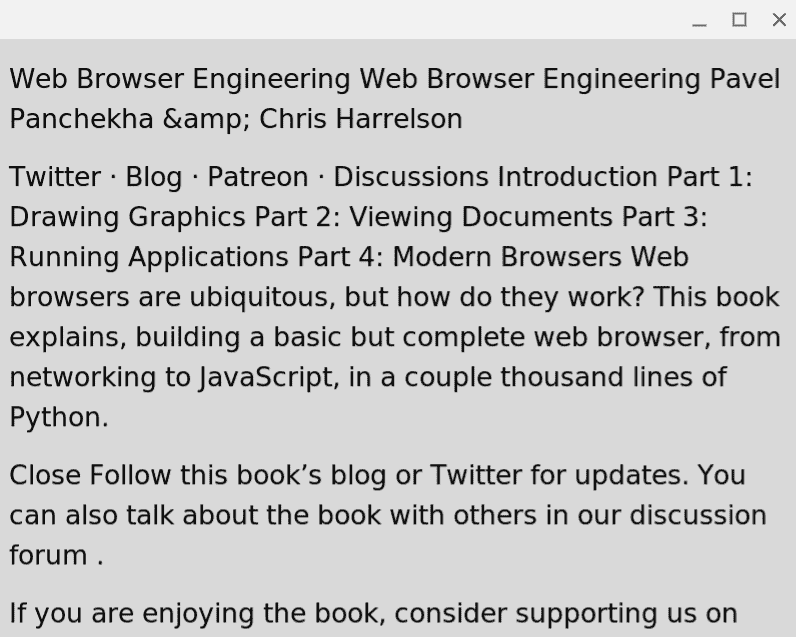

由于隐式标签的存在，你通常可以跳过 `<html>`、`<body>` 和 `<head>` 元素，它们会自动为你添加。实际上，HTML 解析器的 [许多状态](https://html.spec.whatwg.org/multipage/parsing.html#parsing-main-afterbody) 保证比这更严格：每个 HTML 文档恰好有一个 `<head>` 和一个 `<body>`，按照预期的顺序。至少，对于每个文档来说是这样。使用框架或模板的 HTML 文件可以有多于一个的 `<head>` 和 `<body>`，但它们对应于不同的文档。

# 摘要

这一章教会了我们的浏览器，HTML 是一棵树，而不仅仅是一个标记的扁平列表。我们添加了：

+   一个将 HTML 标记转换为树的解析器；

+   识别和处理元素属性上的代码；

+   对一些格式不正确的 HTML 文档进行自动修复；

+   一个递归布局算法，用于布局 HTML 树。

HTML 的树结构对于显示视觉上复杂的网页至关重要，正如我们将在下一章中看到的。

widgets/lab4-browser.html

# 概述

我们浏览器中的完整函数、类和方法集合应该看起来像这样：

`` class URL: `def __init__(url)` `def request()` `` `` class Text: `def __init__(text, parent)` `def __repr__()` `` `` class Element: `def __init__(tag, attributes, parent)` `def __repr__()` `` `def print_tree(node, indent)` `` class HTMLParser: `SELF_CLOSING_TAGS` `HEAD_TAGS` `def __init__(body)` `def parse()` `def get_attributes(text)` `def add_text(text)` `def add_tag(tag)` `def implicit_tags(tag)` `def finish()` `` `FONTS` `def get_font(size, weight, style)` `WIDTH, HEIGHT` `HSTEP, VSTEP` `` class Layout: `def __init__(tree)` `def recurse(tree)` `def open_tag(tag)` `def close_tag(tag)` `def flush()` `def word(word)` `` `SCROLL_STEP` `` class Browser: `def __init__()` `def draw()` `def load(url)` `def scrolldown(e)` ``

# 练习

4-1 *注释*。更新 HTML 词法分析器以支持注释。HTML 中的注释从 `<!--` 开始，以 `-->` 结束。然而，注释与标签不同：它们可以包含任何文本，包括左右尖括号。词法分析器应跳过注释，不生成任何标记。检查：`<!-->` 是注释，还是只是注释的开始？

4-2 *段落*。不清楚一个段落包含另一个段落意味着什么。修改解析器，使得像 `<p>hello<p>world</p>` 这样的文档结果为两个兄弟段落，而不是一个段落嵌套在另一个段落中；真正的浏览器也这样做。对 `<li>` 元素也做同样的处理，但确保嵌套列表仍然可行。

4-3 *脚本*。嵌入在 `<script>` 标签中的 JavaScript 代码使用左尖括号表示“小于”。修改你的词法分析器，使得 `<script>` 标签的内容被特别处理：不允许在 `<script>` 内部使用标签，除了 `</script>` 关闭标签。技术上，它只是 `</script` 后跟一个 [空格、制表符、`\v`、`\r`、斜杠或大于号](https://html.spec.whatwg.org/multipage/parsing.html#script-data-end-tag-name-state)。如果你需要在 JavaScript 代码中讨论 `</script>` 标签，你必须将其分成多个字符串。

4-4 *引号属性*。引号属性可以包含空格和右尖括号。修复词法分析器，使其正确支持这一点。提示：当前的词法分析器是一个有限状态机，有两个状态（由 `in_tag` 决定）。你需要更多的状态。

4-5 *语法高亮显示*。实现与练习 1-5 中的`view-source`协议，但使其高亮显示 HTML 页面的源代码。将 HTML 标签的源代码以正常字体显示，但将文本内容加粗。如果你已经实现了它，还可以将文本包裹在`<pre>`标签中，以保留换行符。提示：从 HTML 解析器派生一个子类，并使用它来实现语法高亮器。

4-6 *错误嵌套的格式化标签*。扩展你的 HTML 解析器以支持如下标记 `<b>Bold <i>both</i> italic</b>`。这需要跟踪打开的文本格式化元素集合，并在文本格式化元素以错误顺序关闭时插入隐式的打开和关闭标签。例如，粗体/斜体示例应该在`</b>`之前插入一个隐式的`</i>`，并在其后插入一个隐式的`<i>`。

# 页面布局

Web 浏览器工程的第五章。

+   布局树

+   块布局

+   大小和位置

+   递归绘制

+   背景

+   总结

+   大纲

+   练习

到目前为止，布局一直是一个线性过程，独立处理打开标签和关闭标签。但网页是树状结构，看起来像这样：边框和背景在视觉上嵌套在一起。为了支持这一点，本章转向*基于树的布局*，在绘制之前，将元素的树转换为布局对象的树。在这个过程中，我们将使用背景使网页更加多彩。

# 布局树

目前，我们的浏览器分别布局元素的开标签和闭标签。这两个标签都修改全局状态，如`cursor_x`和`cursor_y`变量，但它们之间没有其他联系，并且关于元素整体的信息，如其宽度和高度，从未被计算。这使得在元素后面绘制背景变得相当困难，更不用说更复杂的视觉效果了。因此，网络浏览器以不同的方式结构布局。

在浏览器中，布局是关于生成一个*布局树*，其节点是*布局对象*，每个都与一个 HTML 元素相关联。例如，`<script>`标签不会生成布局对象，某些元素会生成多个布局对象（`<li>`元素有一个额外的布局对象用于项目符号），但大多数情况下每个元素只有一个布局对象。每个布局对象都有一个大小和位置。浏览器遍历 HTML 树以生成布局树，然后计算每个布局对象的大小和位置，最后将每个布局对象绘制到屏幕上。

让我们先看看现有的`Layout`类是如何使用的：

```py
class Browser:
 def load(self, url):
 # ...
 self.display_list = Layout(self.nodes).display_list
 #...
```

在这里，一个`Layout`对象被简要创建然后丢弃。让我们将其作为布局树的开始，通过将其存储在`Browser`字段中来实现：

```py
class Browser:
 def load(self, url):
 # ...
 self.document = Layout(self.nodes)
 self.document.layout()
 #...
```

注意，我已经将 `Layout` 构造函数重命名为 `layout` 方法，这样构建布局对象和实际布局就可以是不同的步骤。构造函数现在只存储传递给它的节点：

```py
class Layout:
 def __init__(self, node):
 self.node = node
```

到目前为止，我们仍然没有树——我们只有一个单独的 `Layout` 对象。为了将其变成树，我们需要添加子对象和父对象指针。我还会添加一个指向前一个兄弟对象的指针，因为这将有助于稍后计算大小和位置：

```py
class Layout:
 def __init__(self, node, parent, previous):
 self.node = node
 self.parent = parent
 self.previous = previous
 self.children = []
```

话虽如此，现在要求一个 `parent` 和 `previous` 对象，这使得在 `Browser` 中构造 `Layout` 对象变得复杂，因为布局树的根显然不能有父对象。为了纠正这一点，我将添加第二种布局对象，作为布局树的根。我不想只是传递 `None` 作为父对象，因为根布局对象在计算大小和位置方面也有所不同，正如我们将在本章后面看到的那样。我认为这个根就是文档本身，所以让我们称它为 `DocumentLayout`：

```py
class DocumentLayout:
 def __init__(self, node):
 self.node = node
 self.parent = None
 self.children = []

 def layout(self):
 child = Layout(self.node, self, None)
 self.children.append(child)
 child.layout()
```

注意这个新 `layout` 方法的有趣之处：它的作用是创建子布局对象，然后递归地调用它们的 `layout` 方法。这是构建树的一种常见模式；我们将在整本书中看到很多。

现在我们将在 `load` 中构造 `DocumentLayout` 对象时，我们将构建一个树；一个非常短的树，更像是一根树桩（只是“文档”及其下面的 HTML 元素），但毕竟是一个树！

顺便说一句，既然我们现在有了 `DocumentLayout`，让我们将 `Layout` 重命名，使其不那么含糊。我喜欢 `BlockLayout` 这个名字，因为我们最终希望它代表一个文本块，如段落或标题：

```py
class BlockLayout:
 # ...
```

确保将 `DocumentLayout` 中的 `Layout` 构造函数调用重命名。一如既往，测试你的浏览器并确保在所有这些重构之后，一切仍然正常工作。

布局树对网页开发者不可访问，因此尚未标准化，其结构在不同浏览器之间也有所不同。甚至名称都不一致！Chrome 称其为[布局树](https://developers.google.com/web/updates/2018/09/inside-browser-part3)，Safari 称其为[渲染树](https://webkit.org/blog/114/webcore-rendering-i-the-basics/)，而 Firefox 称其为[框架树](https://wiki.mozilla.org/Gecko:Key_Gecko_Structures_And_Invariants)。

# 块布局

到目前为止，我们一直专注于文本布局——至少在欧洲语言中，文本是按行水平布局的。但网页实际上是由更大的块组成的，如标题、段落和菜单，它们一个接一个地垂直堆叠。我们需要在我们的浏览器中添加对这种布局的支持，而我们实现这一目标的方式将涉及扩展我们已构建的布局树。

核心思想是我们将有一个整个 `BlockLayout` 对象树（根节点为 `DocumentLayout`）。其中一些将代表包含文本的叶块，它们将以我们已实现的方式布局其内容。但也会有新的、中间的 `BlockLayout`，它们有 `BlockLayout` 子元素，并将它们的子元素垂直堆叠。（图 1 中展示了示例。上面的控件允许你玩转块布局如何导致不同的视觉输出。）

widgets/layout-container-example.html?embed=true


图 1：HTML 树和相应的布局树的示例。

要创建这些中间的 `BlockLayout` 子元素，我们可以使用这样的循环：

```py
class BlockLayout:
 def layout_intermediate(self):
 previous = None
 for child in self.node.children:
 next = BlockLayout(child, self, previous)
 self.children.append(next)
 previous = next
```

我把这个方法命名为 `layout_intermediate`，但只是为了让你能立即将其添加到代码中，然后与现有的 `recurse` 方法进行比较。

这段代码比较复杂，所以请仔细阅读。它涉及两个树：HTML 树，`node` 和 `child` 指向它；以及布局树，`self`、`previous` 和 `next` 指向它。这两个树有相似的结构，所以很容易混淆。但请记住，这段代码是从 HTML 树构建布局树的，所以它从 HTML 树中的 `node.children` 读取，并写入布局树中的 `self.children`。

因此我们有两种方式来布局一个元素：要么调用 `recurse` 和 `flush`，要么调用这个 `layout_intermediate` 函数。为了确定布局对象应该使用哪一个，我们需要知道其 HTML 节点包含的内容类型：*内联* 文本和与文本相关的标签，如 `<b>`，或者 *块*，如 `<p>` 和 `<h1>`。让我们添加一个 `layout_mode` 方法来计算哪一个是哪一个：

```py
class BlockLayout:
 def layout_mode(self):
 if isinstance(self.node, Text):
 return "inline"
 elif any([isinstance(child, Element) and \
 child.tag in BLOCK_ELEMENTS
 for child in self.node.children]):
 return "block"
 elif self.node.children:
 return "inline"
 else:
 return "block"
```

在这里，`BLOCK_ELEMENTS` 的列表基本上是你所期望的，一个描述所有块和容器的标签的列表：取自 [HTML 生活标准](https://html.spec.whatwg.org/multipage/#toc-semantics)。

```py
BLOCK_ELEMENTS = [
 "html", "body", "article", "section", "nav", "aside",
 "h1", "h2", "h3", "h4", "h5", "h6", "hgroup", "header",
 "footer", "address", "p", "hr", "pre", "blockquote",
 "ol", "ul", "menu", "li", "dl", "dt", "dd", "figure",
 "figcaption", "main", "div", "table", "form", "fieldset",
 "legend", "details", "summary"
]
```

我们的 `layout_mode` 方法必须处理一个棘手的情况，即一个节点既包含类似 `<p>` 元素的块子元素，也包含类似文本节点或 `<b>` 元素的文本子元素。这可能最好被视为网页开发者的一部分错误。就像 第四章 中的隐式标签一样，我们需要一个修复机制来理解这种情况；我选择在这种情况下使用块模式。在实际浏览器中，这个修复机制被称为“[匿名块框](https://developer.mozilla.org/en-US/docs/Web/CSS/Visual_formatting_model#anonymous_boxes)”并且比这里描述的更复杂；请参阅练习 5-5。

因此现在 `BlockLayout` 可以根据其 HTML 节点的 `layout_mode` 确定要执行哪种布局：

```py
class BlockLayout:
 def layout(self):
 mode = self.layout_mode()
 if mode == "block":
 previous = None
 for child in self.node.children:
 next = BlockLayout(child, self, previous)
 self.children.append(next)
 previous = next
 else:
 self.cursor_x = 0
 self.cursor_y = 0
 self.weight = "normal"
 self.style = "roman"
 self.size = 12

 self.line = []
 self.recurse(self.node)
 self.flush()
```

最后，由于 `BlockLayout` 现在可以有子元素，下一个需要递归调用 `layout` 方法，以便这些子元素可以构建它们的子元素，依此类推：

```py
class BlockLayout:
 def layout(self):
 # ...
 for child in self.children:
 child.layout()
```

我们的浏览器现在正在构建一个`BlockLayout`对象的整个树；您可以使用`print_tree`在`Browser`的`load`方法中查看此树。您会看到像本章这样的大型网页会产生大型且复杂的布局树！现在我们需要每个`BlockLayout`对象在页面上都有大小和位置。

在 CSS 中，布局模式由`display`属性设置。[`display`属性](https://developer.mozilla.org/en-US/docs/Web/CSS/display)。最古老的 CSS 布局模式，如`inline`和`block`，是在子元素上设置的，而不是在父元素上设置，这导致了像[匿名块框](https://developer.mozilla.org/en-US/docs/Web/CSS/Visual_formatting_model#anonymous_boxes)这样的问题。较新的属性如`inline-block`、`flex`和`grid`是在父元素上设置的，这避免了这种错误。

# 大小和位置

在上一章中，`Layout`对象负责整个网页，因此它只是从页面顶部开始布局其内容。现在我们有多个`BlockLayout`对象，每个对象包含不同的文本段落，我们将需要做一些不同的操作，为每个布局对象独立计算大小和位置。

让我们为每个布局对象类型添加`x`、`y`、`width`和`height`字段：

```py
class BlockLayout:
 def __init__(self, node, parent, previous):
 # ...
 self.x = None
 self.y = None
 self.width = None
 self.height = None
```

对于`DocumentLayout`也做同样的操作。现在我们需要更新`layout`方法来使用这些字段。

让我们从`cursor_x`和`cursor_y`开始。而不是让它们表示页面上的绝对位置，让我们让它们相对于`BlockLayout`的`x`和`y`是相对的。因此，它们现在需要从`0`开始，而不是`HSTEP`和`VSTEP`，在`layout`和`flush`中都是如此：

```py
class BlockLayout:
 def layout(self):
 else:
 self.cursor_x = 0
 self.cursor_y = 0

 def flush(self):
 # ...
 self.cursor_x = 0
 # ...
```

由于这些字段现在是相对的，我们在计算显示列表时需要在`flush`中添加块的`x`和`y`位置：

```py
class BlockLayout:
 def flush(self):
 # ...
 for rel_x, word, font in self.line:
 x = self.x + rel_x
 y = self.y + baseline - font.metrics("ascent")
 self.display_list.append((x, y, word, font))
 # ...
```

同样，为了换行，我们不能将`cursor_x`与`WIDTH`比较，因为`cursor_x`是一个相对位置，而`WIDTH`是一个绝对位置；相反，当`cursor_x`达到块的`width`时，我们将换行：

```py
class BlockLayout:
 def word(self, word):
 # ...
 if self.cursor_x + w > self.width:
 # ...
 # ...
```

因此，现在我们面临的问题是计算这些`x`、`y`和`width`字段。让我们回忆一下，`BlockLayout`s 代表文本块，如段落或标题，并且是垂直堆叠的。这意味着每个块都从其父元素的左侧边缘开始，一直延伸到其父元素：在下一章中，我们将添加对作者定义样式的支持，在真实浏览器中，这些样式通过设置自定义宽度或更改计算*x*和*y*位置的方式来修改这些布局规则。

```py
class BlockLayout:
 def layout(self):
 self.x = self.parent.x
 self.width = self.parent.width
 # ...
```

布局对象的垂直位置取决于是否有前一个兄弟元素。如果有，布局对象将紧随其后开始；如果没有，它将从其父元素的顶部边缘开始：

```py
class BlockLayout:
 def layout(self):
 if self.previous:
 self.y = self.previous.y + self.previous.height
 else:
 self.y = self.parent.y
 # ...
```

最后，高度有点棘手。包含其他块的`BlockLayout`应该足够高，以包含其所有子元素，因此其高度应该是其子元素高度的总和：

```py
class BlockLayout:
 def layout(self):
 # ...
 if mode == "block":
 self.height = sum([
 child.height for child in self.children])
```

然而，包含文本的 `BlockLayout` 没有子元素；相反，它需要足够高以容纳所有文本，我们可以方便地从 `cursor_y` 中读取：由于高度只是等于 `cursor_y`，为什么不将 `cursor_y` 重命名为 `height` 呢？你可以这样做，它会正常工作，但我不太愿意这样做。正如你从，比如说，`y` 计算中可以看到，`height` 字段是一个公共字段，被其他布局对象读取以计算它们的位置。因此，我更愿意确保它始终具有正确的值，而 `cursor_y` 随着我们布局一段文本而改变，因此有时会有“错误”的值。保持这两个字段分开可以避免一类很糟糕的 bug，其中 `height` 字段被“过早”读取，因此得到错误的值。

```py
class BlockLayout:
 def layout(self):
 # ...
 else:
 self.height = self.cursor_y
```

这些规则看起来足够简单，但这里有一个我必须解释的微妙之处。考虑 `x` 位置。为了计算一个块的 `x` 位置，其父块的 `x` 位置必须已经计算过。因此，一个块的 `x` 必须在它的子元素的 `x` 之前计算。这意味着 `x` 计算必须在递归 `layout` 调用之前进行。

另一方面，一个元素的 `height` 字段依赖于其子元素的高度。因此，虽然 `x` 必须在递归调用之前计算，但 `height` 必须在之后计算。同样，由于一个块的 `y` 位置依赖于其前一个兄弟的 `y` 位置，递归 `layout` 调用必须从第一个兄弟开始并向前迭代列表。

也就是说，`layout` 方法应该按照这个顺序执行其步骤（见图 2）：

+   当调用 `layout` 时，它首先计算 `width`、`x` 和 `y` 字段，从 `parent` 和 `previous` 布局对象中读取。

+   接下来，它为每个子元素创建一个子布局对象。

+   然后，通过调用它们的 `layout` 方法递归地布局子布局节点。

+   最后，`layout` 计算高度字段，从子布局对象中读取。

你可以在这个小部件中看到这些步骤的实际操作：

widgets/lab5-propagate.html

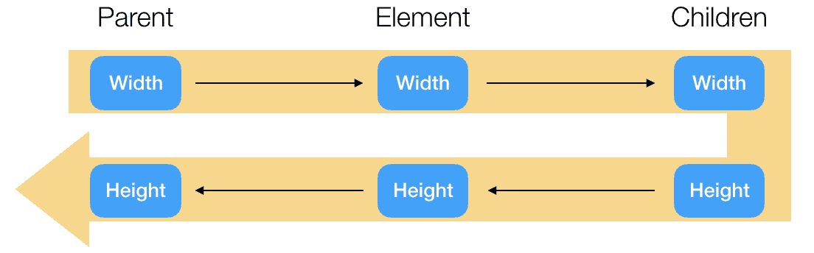

图 2：一个流程图，展示了宽度是如何从父元素到子元素自上而下计算的，而高度是如何从子元素到父元素自下而上计算的。

这种依赖推理对于布局以及更广泛地对于任何树上的计算都是至关重要的。如果你操作顺序错误，某些布局对象将尝试读取尚未计算出的值，浏览器将出现错误。我们将在第十六章（invalidation.html）中回到这个问题，那时它将变得更加重要。

`DocumentLayout` 也需要一些布局代码，尽管由于文档总是从相同的位置开始，所以它相当简单：

```py
class DocumentLayout:
 def layout(self):
 # ...
 self.width = WIDTH - 2*HSTEP
 self.x = HSTEP
 self.y = VSTEP
 child.layout()
 self.height = child.height
```

注意，内容周围有一些填充——左侧和右侧的`HSTEP`，以及上方和下方的`VSTEP`。这样文本就不会跑到窗口的边缘并被截断。

总之，现在所有的大小和位置都计算正确，我们的浏览器应该能够在页面的正确位置显示所有文本。

正式来说，这种树形结构的计算可以通过一个[属性文法](https://en.wikipedia.org/wiki/Attribute_grammar)来描述。属性文法引擎通过分析不同属性之间的依赖关系来确定遍历树和计算每个属性的合适顺序。

# 递归绘制

我们的`layout`方法现在做了很多工作：计算大小和位置；创建子布局对象；递归地布局这些子布局对象；以及聚合显示列表，以便将文本绘制到屏幕上。这有点杂乱，所以让我们花点时间提取其中的一个部分，即显示列表部分。在这个过程中，我们可以停止在布局树上升时重复复制显示列表内容。

我认为通过为每个布局对象添加一个`paint`函数来做这件事最为方便，该函数的返回值是那个对象的显示列表条目。然后有一个单独的函数`paint_tree`，它会递归地对所有布局对象调用`paint`：

```py
def paint_tree(layout_object, display_list):
 display_list.extend(layout_object.paint())

 for child in layout_object.children:
 paint_tree(child, display_list)
```

对于`DocumentLayout`，没有需要绘制的：

```py
class DocumentLayout:
 def paint(self):
 return []
```

你现在可以删除计算`DocumentLayout`的`display_list`字段的行。

对于`BlockLayout`对象，我们需要复制它在`recurse`和`flush`期间计算的`display_list`字段：再次删除通过复制子布局对象来计算`BlockLayout`的`display_list`字段的行。

```py
class BlockLayout:
 def paint(self):
 return self.display_list
```

现在浏览器可以使用`paint_tree`来收集它自己的`display_list`变量：

```py
class Browser:
 def load(self, url):
 # ...
 self.display_list = []
 paint_tree(self.document, self.display_list)
 self.draw()
```

检查一下：我们的浏览器现在正在使用基于树的布局！我建议暂停以测试和调试。基于树的布局功能强大但复杂，我们即将添加更多功能。稳固的基础才能建造舒适的房屋。

布局树在图形用户界面（GUI）框架中很常见[在图形用户界面（GUI）框架](https://book.huihoo.com/debian-gnu-linux-desktop-survival-guide/Widget_Tree.html)，但还有其他布局结构的方法，例如基于约束的布局。TeX 的[框和胶水](https://www.overleaf.com/learn/latex/Articles/Boxes_and_Glue%3A_A_Brief%2C_but_Visual%2C_Introduction_Using_LuaTeX)和 iOS 的[自动布局](https://developer.apple.com/library/archive/documentation/UserExperience/Conceptual/AutolayoutPG/index.html)是这种替代范例的两个例子。

# 背景

浏览器大量使用布局树，例如，在第七章中，我们将使用每个链接的大小和位置来确定用户点击的是哪一个。一个简单且视觉上吸引人的用例是绘制背景。

背景是矩形，所以我们的第一个任务是将在显示列表中放置矩形。目前，显示列表是绘制到屏幕上的单词列表，但我们可以将其概念化为命令列表，其中目前只有一种类型。我们现在想要两种类型的命令：

```py
class DrawText:
 def __init__(self, x1, y1, text, font):
 self.top = y1
 self.left = x1
 self.text = text
 self.font = font

class DrawRect:
 def __init__(self, x1, y1, x2, y2, color):
 self.top = y1
 self.left = x1
 self.bottom = y2
 self.right = x2
 self.color = color
```

现在`BlockLayout`必须为它想要绘制的每个单词添加`DrawText`对象，但只在内联模式下：为什么不将`BlockLayout`内部的`display_list`字段改为直接包含`DrawText`命令呢？我想你可以这样做，但我认为在`paint`中创建所有绘制命令更干净。

```py
class BlockLayout:
 def paint(self):
 cmds = []
 if self.layout_mode() == "inline":
 for x, y, word, font in self.display_list:
 cmds.append(DrawText(x, y, word, font))
 return cmds
```

但它也可以添加一个`DrawRect`命令来绘制背景。让我们给`pre`标签（用于代码示例）添加一个灰色背景：

```py
class BlockLayout:
 def paint(self):
 # ...
 if isinstance(self.node, Element) and self.node.tag == "pre":
 x2, y2 = self.x + self.width, self.y + self.height
 rect = DrawRect(self.x, self.y, x2, y2, "gray")
 cmds.append(rect)
 # ...
```

确保这段代码在添加`DrawText`对象的循环之前：背景必须在文本下方绘制。注意，`paint_tree`在递归到子树之前调用`paint`，因此子树也会在这个背景上绘制，正如预期的那样。

在显示列表填写完毕后，我们需要绘制每个图形命令。让我们添加一个`execute`方法来完成这个任务。在`DrawText`中，它调用`create_text`：

```py
class DrawText:
 def execute(self, scroll, canvas):
 canvas.create_text(
 self.left, self.top - scroll,
 text=self.text,
 font=self.font,
 anchor='nw')
```

注意`execute`方法接受滚动量作为参数；这样，每个图形命令都会自己执行相关的坐标转换。`DrawRect`使用`create_rectangle`做同样的事情：

```py
class DrawRect:
 def execute(self, scroll, canvas):
 canvas.create_rectangle(
 self.left, self.top - scroll,
 self.right, self.bottom - scroll,
 width=0,
 fill=self.color)
```

默认情况下，`create_rectangle`绘制一个一像素的黑色边框，这对于背景来说我们并不想要，所以请确保传递`width=0`。

我们仍然想要跳过屏幕外的图形命令，所以让我们给`DrawText`添加一个`bottom`字段，这样我们就可以知道何时跳过那些命令：

```py
def __init__(self, x1, y1, text, font):
 # ...
 self.bottom = y1 + font.metrics("linespace")
```

浏览器的`draw`方法现在只使用`top`和`bottom`来决定要执行哪些命令：

```py
class Browser:
 def draw(self):
 self.canvas.delete("all")
 for cmd in self.display_list:
 if cmd.top > self.scroll + HEIGHT: continue
 if cmd.bottom < self.scroll: continue
 cmd.execute(self.scroll, self.canvas)
```

在页面上尝试你的浏览器——可能是[这一章的](https://browser.engineering/layout.html)——带有代码片段的页面。你应该看到每个代码片段都带有灰色背景。

树状布局的一个额外好处是：我们现在记录了整个页面的高度。浏览器可以使用这个信息来避免滚动到底部：

```py
def scrolldown(self, e):
 max_y = max(self.document.height + 2*VSTEP - HEIGHT, 0)
 self.scroll = min(self.scroll + SCROLL_STEP, max_y)
 self.draw()
```

注意`2*VSTEP`，这是为了考虑到页面顶部和底部的空白`VSTEP`。有了布局，[browser.engineering 主页](https://browser.engineering/)现在看起来好一些——见图 3。

所以这就是树状布局的基本原理！实际上，正如我们将在下一章中看到的，这仅仅是布局树在浏览器中中心角色的一部分。但在我们到达那里之前，我们需要给我们的浏览器添加一些样式功能。

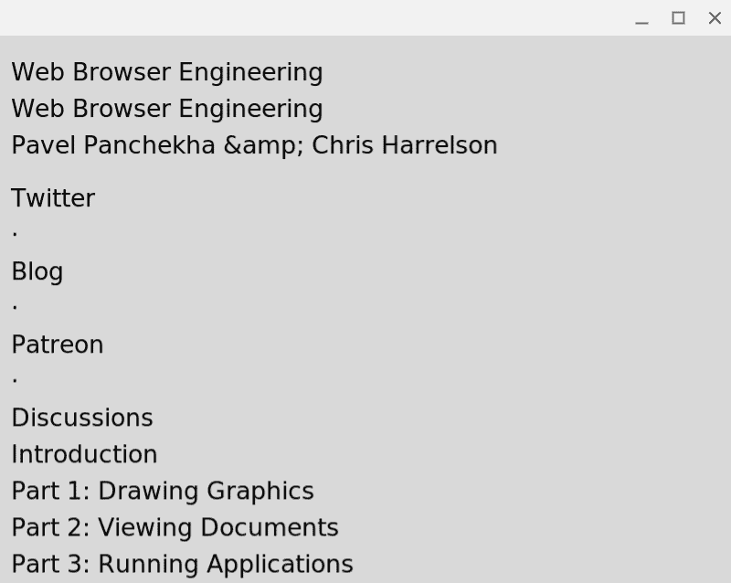

图 3：https://browser.engineering/ 在本章浏览器版本中查看。

草稿 CSS [绘图 API](https://developer.mozilla.org/en-US/docs/Web/API/CSS_Painting_API/Guide) 允许页面通过在 JavaScript 中实现的新类型命令扩展显示列表。这使得可以使用 CSS 进行样式化，并使用由库提供的视觉复杂样式。

# 摘要

本章是对我们浏览器布局引擎的彻底重写，因此：

+   布局现在是基于树的，并生成一个*布局树*；

+   树中的每个节点都有两种不同的*布局模式*之一；

+   布局计算每个布局对象的大小和位置；

+   显示列表现在包含通用命令；

+   源代码片段现在有背景。

基于树的布局使得可以显著扩展我们浏览器的样式化能力。我们将在下一章中处理这个问题。

widgets/lab5-browser.html

# 概述

我们浏览器中的完整函数、类和方法集应该看起来像这样：

`` class URL: `def __init__(url)` `def request()` `` `` class Text: `def __init__(text, parent)` `def __repr__()` `` `` class Element: `def __init__(tag, attributes, parent)` `def __repr__()` `` `def print_tree(node, indent)` `` class HTMLParser: `SELF_CLOSING_TAGS` `HEAD_TAGS` `def __init__(body)` `def parse()` `def get_attributes(text)` `def add_text(text)` `def add_tag(tag)` `def implicit_tags(tag)` `def finish()` `` `FONTS` `def get_font(size, weight, style)` `WIDTH, HEIGHT` `HSTEP, VSTEP` `BLOCK_ELEMENTS` `` class DocumentLayout: `def __init__(node)` `def layout()` `def paint()` `` `` class BlockLayout: `def __init__(node, parent, previous)` `def layout_mode()` `def layout()` `def recurse(tree)` `def open_tag(tag)` `def close_tag(tag)` `def flush()` `def word(word)` `def paint()` `` `` class DrawText: `def __init__(x1, y1, text, font)` `def execute(scroll, canvas)` `` `` class DrawRect: `def __init__(x1, y1, x2, y2, color)` `def execute(scroll, canvas)` `` `def paint_tree(layout_object, display_list)` `SCROLL_STEP` `` class Browser: `def __init__()` `def draw()` `def load(url)` `def scrolldown(e)` ``

# 练习

5-1 *链接栏*. 在本书每一章的网页版顶部和底部都有一个灰色栏，标明章节并提供前后链接。它被`<nav class="links">`标签包围。让您的浏览器为这个链接栏提供浅灰色背景，就像真实浏览器一样。

5-2 *隐藏头部*. 很有可能您的浏览器仍然在每个访问的页面的顶部显示脚本、样式和页面标题。让它这样，`<head>`元素及其内容永远不会显示。这些元素仍然在 HTML 树中，但不在布局树中。

5-3 *项目符号*. 向列表项添加项目符号，在 HTML 中是`<li>`标签。您可以将其设置为位于列表项本身左侧的小方块。同时缩进`<li>`元素，使元素内的文本位于项目符号右侧。

5-4 *目录表*。这本书的网页版本在每个章节的顶部都有一个目录表，包含在`<nav id="toc">`标签中，其中包含一个链接列表。在该列表上方添加“目录表”，并带有灰色背景。不要修改词法分析器或解析器。

5-5 *匿名块级框*。有时，一个元素会有文本类和容器类子元素混合。例如，在这个 HTML 中，

```py
<div><i>Hello, </i><b>world!</b><p>So it began...</p></div>
```

`<div>`元素有三个子元素：`<i>`、`<b>`和`<p>`元素。前两个是文本类；最后一个是容器类。这应该看起来像两个段落，一个用于`<i>`和`<b>`，另一个用于`<p>`。让你的浏览器这样做。具体来说，修改`BlockLayout`使其可以传递一个兄弟节点序列，而不是单个节点。然后，修改构建布局树的算法，以便任何文本类元素的序列都被转换成一个单独的`BlockLayout`。

5-6 *嵌入手*。一个“嵌入手标题”是一个作为下一个段落文本一部分绘制的标题。本节中的练习名称可以被认为是嵌入手标题。但由于浏览器对`display: run-in`属性的[支持度较低](https://caniuse.com/run-in)，这本书实际上没有使用它；标题实际上是嵌入在下一段落中的。修改你的浏览器以将`<h6>`元素渲染为嵌入手标题。你需要实现之前的匿名块级框练习，然后为`<h6>`元素添加一个特殊案例。

# 应用作者样式

Web 浏览器工程的第六章。

+   使用函数解析

+   样式属性

+   选择器

+   应用样式表

+   层叠

+   继承样式

+   字体属性

+   摘要

+   大纲

+   练习

在上一章中，我们给每个`pre`元素添加了灰色背景。看起来不错，并且有默认值是好的，但网站希望有自己的外观。网站通过*层叠样式表*（[CSS](https://developer.mozilla.org/en-US/docs/Web/CSS)）来实现这一点，它允许网页作者（以及我们将看到的浏览器开发者）定义网页应该如何看起来。

# 使用函数解析

网页改变外观的一种方式是使用`style`属性。例如，这会改变元素的背景颜色：

```py
<div style="background-color:lightblue">Blue background</div>
```

它渲染如下：

蓝色背景

更一般地，一个`style`属性包含由分号分隔的属性-值对。浏览器查看这些 CSS 属性-值对以确定元素的外观，例如确定其背景颜色。

为了将这个添加到我们的浏览器中，我们首先需要解析这些属性-值对。我将使用递归解析函数，这是一种逐步构建复杂解析器的好方法。想法是每个解析函数都会通过正在解析的文本并返回它解析的数据。我们将有不同的函数来处理不同类型的数据，并将它们组织在一个`CSSParser`类中，该类存储正在解析的文本和解析器在其中的当前位置：

```py
class CSSParser:
 def __init__(self, s):
 self.s = s
 self.i = 0
```

让我们从简单开始，逐步构建。一个解析空白字符的函数将索引`i`增加到每个空白字符之后：

```py
def whitespace(self):
 while self.i < len(self.s) and self.s[self.i].isspace():
 self.i += 1
```

空白字符没有意义，所以没有解析后的数据可以返回。但是，当我们解析属性名时，我们希望返回它们：

```py
def word(self):
 start = self.i
 while self.i < len(self.s):
 if self.s[self.i].isalnum() or self.s[self.i] in "#-.%":
 self.i += 1
 else:
 break
 if not (self.i > start):
 raise Exception("Parsing error")
 return self.s[start:self.i]
```

这个函数通过任何单词字符增加`i`，我在这里选择的单词字符集合是为了覆盖属性名（使用字母和破折号），数字（使用减号、数字、点），单位（百分号），以及颜色（使用井号）。真实的 CSS 值有更复杂的语法，但这对我们的浏览器来说已经足够了，就像`whitespace`。但是，为了返回解析后的数据，它存储了开始的位置并提取了它移动过的子字符串。

解析函数可能会失败。我们刚刚编写的`word`函数如果`i`没有至少前进一个字符，就会引发异常——否则它一开始就没有指向一个单词。你还可以在引发异常的代码中添加错误文本；我建议这样做以帮助你调试问题。同样，为了检查一个字面冒号（或某些其他标点符号），你会这样做：

```py
def literal(self, literal):
 if not (self.i < len(self.s) and self.s[self.i] == literal):
 raise Exception("Parsing error")
 self.i += 1
```

解析函数的伟大之处在于它们可以相互构建。例如，属性-值对是一个属性，一个冒号，和一个值，实际上属性和值有不同的语法，所以使用`word`对两者来说并不完全正确，但对我们浏览器有限的 CSS 实现来说，这种简化将足够。它们之间有空白：

```py
def pair(self):
 prop = self.word()
 self.whitespace()
 self.literal(":")
 self.whitespace()
 val = self.word()
 return prop.casefold(), val
```

我们可以通过循环调用解析函数来解析序列。例如，`style`属性是一系列属性-值对：

```py
def body(self):
 pairs = {}
 while self.i < len(self.s):
 prop, val = self.pair()
 pairs[prop.casefold()] = val
 self.whitespace()
 self.literal(";")
 self.whitespace()
 return pairs
```

现在，在浏览器中，我们总是必须考虑处理错误。有时网页作者犯了一个错误；有时我们的浏览器不支持某些其他浏览器支持的功能。因此，我们应该跳过无法解析的属性-值对，但保留可以解析的。

我们可以用这个小程序跳过一些东西；它会在一组字符中的任何一个上停止并返回该字符（如果它被文件的末尾停止，则返回`None`）：

```py
def ignore_until(self, chars):
 while self.i < len(self.s):
 if self.s[self.i] in chars:
 return self.s[self.i]
 else:
 self.i += 1
 return None
```

当我们无法解析属性-值对时，我们会跳到下一个分号或字符串的末尾：

```py
def body(self):
 # ...
 while self.i < len(self.s):
 try:
 # ...
 except Exception:
 why = self.ignore_until([";"])
 if why == ";":
 self.literal(";")
 self.whitespace()
 else:
 break
 # ...
```

跳过解析错误是一把双刃剑。它隐藏了错误消息，使得作者更难调试他们的样式表；它也使得调试你的解析器更难。我建议在调试时移除`try`块。所以，在大多数编程情况下，这种“通用的”错误处理是一种代码异味。

但是，“万能”的错误处理在网络上有一个不寻常的好处。网络是一个由许多浏览器组成的生态系统，以及许多浏览器版本组成的生态系统，其中一些尚未编写，但我们需要尽可能支持。例如，它们支持不同类型的属性值。我们的浏览器不支持属性值中的括号，例如，真实浏览器使用括号来处理`calc`和`url`函数等。在一种浏览器中解析的 CSS 可能在另一种浏览器中无法解析。这种原则（被称为“Postel 定律”，源自 TCP 规范中的一行，由 Jon Postel 编写；“数字原则”，源自电路设计中的一个类似想法，在那里晶体管必须是非线性的以减少模拟噪声；“鲁棒性原则”）是：产生最大限度的符合性输出，但接受即使是最低限度的符合性输入。

这种解析方法在形式上被称为 LL(1)语言的递归下降解析。使用这种方法的解析器可以[真的，真的很快](https://simdjson.org/)，至少如果你投入大量工作的话。在浏览器中，更快的解析意味着页面加载更快。

# `style`属性

现在既然已经解析了`style`属性，我们就可以在浏览器中使用这些解析信息。让我们在一个`style`函数中这样做，它将解析的`style`属性存储在节点的`style`字段中：

```py
def style(node):
 node.style = {}
 if isinstance(node, Element) and "style" in node.attributes:
 pairs = CSSParser(node.attributes["style"]).body()
 for property, value in pairs.items():
 node.style[property] = value
```

该方法可以通过 HTML 树递归，以确保每个元素都获得一个样式：

```py
def style(node):
 # ...
 for child in node.children:
 style(child)
```

在解析 HTML 之后但在布局之前，在浏览器的`load`方法中调用`style`。有了存储在每个元素上的`style`信息，浏览器可以在绘制时咨询它以获取样式信息：

```py
class BlockLayout:
 def paint(self):
 # ...
 bgcolor = self.node.style.get("background-color",
 "transparent")
 if bgcolor != "transparent":
 x2, y2 = self.x + self.width, self.y + self.height
 rect = DrawRect(self.x, self.y, x2, y2, bgcolor)
 cmds.append(rect)
 # ...
```

我现在已经从`pre`元素中移除了默认的灰色背景，但我们很快会将其恢复。

在你的浏览器中打开[本章的网络版本](https://browser.engineering/styles.html)以测试你的代码：章节开头的代码块现在应该有一个浅蓝色背景。

因此，这是网页可以改变外观的一种方式。在网络的早期，我指的是 Netscape 3。20 世纪 90 年代末。类似的东西是*唯一*的方式。但说实话，这很痛苦——你需要为每个元素设置`style`属性，如果你重新设计页面，那么需要编辑很多属性。CSS 就是为了改进这种状况而发明的：

+   一个 CSS 文件可以一次性持续地美化许多网页。

+   一行 CSS 可以一次性持续地美化许多元素。

+   CSS 具有前瞻性，并支持具有不同功能的浏览器。

为了实现这些目标，CSS 通过两个相关概念扩展了`style`属性：*选择器*和*层叠*。选择器描述了哪些 HTML 元素应用了一个属性值对的列表。CSS 规则也可以通过“媒体查询”来保护，这意味着规则只应在某些浏览环境中应用（例如只在移动设备上或只在横屏模式下）。媒体查询对于构建适用于许多设备的网站非常重要，比如在手机上阅读这本书。我们将在第十四章中遇到它们。这两个的结合称为*规则*，如图 1 所示。

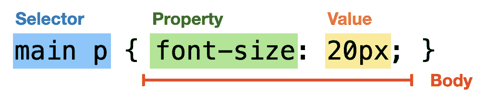

图 1：一个注释的 CSS 规则。

让我们为我们的浏览器添加对 CSS 的支持。我们需要将 CSS 文件解析为选择器和属性值对，找出页面上哪些元素匹配每个选择器，并将这些属性值复制到元素的`style`字段中。

实际上，在 CSS 之前，你会用自定义的*表现性标签*来设置页面样式，比如`[font](https://developer.mozilla.org/en-US/docs/Web/HTML/Element/font)`和`[center](https://developer.mozilla.org/en-US/docs/Web/HTML/Element/center)`（更不用说我们已经见过的`<b>`和`<i>`标签了）。这很容易实现，但使得保持页面一致性变得困难。还有`<body>`上的属性，如`[text](https://developer.mozilla.org/en-US/docs/Web/HTML/Element/body#attributes)`和`[vlink](https://developer.mozilla.org/en-US/docs/Web/HTML/Element/body#attributes)`，可以一致地设置文本颜色，主要是用于链接。

# 选择器

选择器有很多类型，但在我们的浏览器中我们将支持两种：标签选择器（`p`选择所有`<p>`元素，`ul`选择所有`<ul>`元素）和后代选择器（`article div`选择所有具有`article`祖先的`div`元素）。后代选择器与左侧关联；换句话说，`a b c`意味着一个从`<b>`派生出来的`<c>`，而`<b>`又从`<a>`派生出来，如果你用 CSS 有括号，你可能会写成`(a b) c`。

我们将为每种选择器类型创建一个类来存储选择器的内容，比如标签名对于标签选择器：

```py
class TagSelector:
 def __init__(self, tag):
 self.tag = tag
```

每个选择器类也会测试选择器是否匹配一个元素：

```py
class TagSelector:
 def matches(self, node):
 return isinstance(node, Element) and self.tag == node.tag
```

一个后代选择器的工作方式类似。它有两个部分，这两个部分本身也是选择器：

```py
class DescendantSelector:
 def __init__(self, ancestor, descendant):
 self.ancestor = ancestor
 self.descendant = descendant
```

然后`matches`方法也是递归的：

```py
class DescendantSelector:
 def matches(self, node):
 if not self.descendant.matches(node): return False
 while node.parent:
 if self.ancestor.matches(node.parent): return True
 node = node.parent
 return False
```

现在，为了创建这些选择器对象，我们需要一个解析器。在这种情况下，这只是一个另一个解析函数：再次使用`word`作为标签名实际上并不完全正确，但足够接近。使用`word`的一个副作用是，一个类名选择器（如`.main`）或一个标识符选择器（如`#signup`）会被错误地解析为标签名选择器。但幸运的是，这不会造成任何伤害，因为没有任何元素具有这些标签。

```py
class CSSParser:
 def selector(self):
 out = TagSelector(self.word().casefold())
 self.whitespace()
 while self.i < len(self.s) and self.s[self.i] != "{":
 tag = self.word()
 descendant = TagSelector(tag.casefold())
 out = DescendantSelector(out, descendant)
 self.whitespace()
 return out
```

一个 CSS 文件只是一个选择器和块的序列：

```py
def parse(self):
 rules = []
 while self.i < len(self.s):
 self.whitespace()
 selector = self.selector()
 self.literal("{")
 self.whitespace()
 body = self.body()
 self.literal("}")
 rules.append((selector, body))
 return rules
```

再次，让我们停下来思考错误处理。首先，当我们解析 CSS 时调用`body`，我们需要它在遇到闭合括号时停止：

```py
def body(self):
 # ...
 while self.i < len(self.s) and self.s[self.i] != "}":
 try:
 # ...
 except Exception:
 why = self.ignore_until([";", "}"])
 if why == ";":
 self.literal(";")
 self.whitespace()
 else:
 break
 # ...
```

第二，解析选择器时可能也会出现解析错误。在这种情况下，我们希望跳过整个规则：

```py
def parse(self):
 # ...
 while self.i < len(self.s):
 try:
 # ...
 except Exception:
 why = self.ignore_until(["}"])
 if why == "}":
 self.literal("}")
 self.whitespace()
 else:
 break
 # ...
```

错误处理很难做到正确，所以请确保测试你的解析器，就像第四章中的 HTML 解析器。以下是一些你可能遇到的错误：

+   如果输出中缺少一些规则或属性，这可能是被错误处理隐藏的漏洞。移除一些`try`块，看看是否可以修复相关错误。

+   如果你看到额外的规则或属性，它们是正确版本的混乱版本，那么你可能忘记在某处更新了`i`。

+   如果你看到无限循环，检查错误处理代码是否总是增加`i`。每个解析函数（除了`whitespace`）都应该始终增加`i`。

你也可以在每个解析函数的开始和结束处添加一个`print`语句，用解析函数的名字命名，如果你也给每一行添加正确数量的空格，那么阅读起来会容易得多。不要忽视像这样的调试细节！索引`i`，它可能特别有助于打印，比如说，从字符串中索引`i`周围的 20 个字符。以及解析数据。这是一大堆输出，但这是找到真正复杂错误的有效方法。

解析器接收任意字节作为输入，因此解析器漏洞通常容易被恶意行为者利用。因此，解析器的正确性对浏览器安全至关重要，正如许多[解析器漏洞](https://nvd.nist.gov/vuln/detail/CVE-2010-3971)、[解析器漏洞](https://nvd.nist.gov/vuln/detail/CVE-2007-0943)和[解析器漏洞](https://nvd.nist.gov/vuln/detail/CVE-2010-1663)所证明的那样。如今，浏览器开发者使用[fuzzing](https://hacks.mozilla.org/2021/02/browser-fuzzing-at-mozilla/)来尝试寻找和修复此类漏洞。

# 应用样式表

在解析器调试完成后，下一步是将解析的样式表应用到网页上。由于每个 CSS 规则可以样式化页面上的许多元素，这将需要遍历所有元素和所有规则。当规则应用时，其属性-值对被复制到元素的样式信息中：

```py
def style(node, rules):
 # ...
 for selector, body in rules:
 if not selector.matches(node): continue
 for property, value in body.items():
 node.style[property] = value
 # ...
```

确保将此循环放在解析`style`属性的循环之前：`style`属性应该覆盖样式表值。

要尝试这个，我们需要一个样式表。每个浏览器都附带一个*浏览器样式表*，技术上称为“用户代理”样式表。用户代理，就像 Memex 一样，为各种 HTML 元素定义了默认样式。对于我们浏览器来说，它可能看起来像这样：

```py
pre { background-color: gray; }
```

让我们将它存储在一个新文件中，名为`browser.css`，并在浏览器启动时读取它：

```py
DEFAULT_STYLE_SHEET = CSSParser(open("browser.css").read()).parse()
```

现在，当浏览器加载网页时，它可以应用默认样式表来为每个元素设置其默认样式：

```py
def load(self, url):
 # ...
 rules = DEFAULT_STYLE_SHEET.copy()
 style(self.nodes, rules)
 # ...
```

浏览器样式表是整个网络的默认样式。但每个网站也可以通过使用`link`元素引用 CSS 文件来使用 CSS 设置整个站点的统一样式：

```py
<link rel="stylesheet" href="/main.css">
```

强制的`rel`属性将此链接标识为样式表。对于浏览器来说，`stylesheet`是最重要的[链接类型](https://developer.mozilla.org/en-US/docs/Web/HTML/Link_types)，但还有`preload`用于加载页面稍后将要使用的资源，以及`icon`用于识别 favicon。搜索引擎也会使用这些链接；例如，`rel=canonical`命名了页面的“真实名称”，搜索引擎使用它来跟踪出现在多个 URL 上的页面。`href`属性包含样式表的 URL。我们需要找到所有这些链接，下载它们的样式表，并应用它们，如图 2 所示。

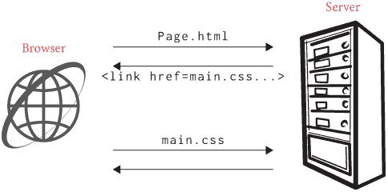

图 2：浏览器为网页加载相关资源，如样式表。

由于我们将在接下来的几章中执行类似的任务，让我们稍微泛化一下，并编写一个递归函数，将树转换为节点列表：

```py
def tree_to_list(tree, list):
 list.append(tree)
 for child in tree.children:
 tree_to_list(child, list)
 return list
```

我编写了这个辅助工具，以便将来在 HTML 和布局树上使用。我们可以使用`tree_to_list`和 Python 列表推导式来获取每个链接样式表的 URL：坦白说，Python 允许你编写这样的代码——虽然疯狂，但非常方便！

```py
def load(self, url):
 # ...
 links = [node.attributes["href"]
 for node in tree_to_list(self.nodes, [])
 if isinstance(node, Element)
 and node.tag == "link"
 and node.attributes.get("rel") == "stylesheet"
 and "href" in node.attributes]
 # ...
```

现在，这些样式表 URL 通常是完整的 URL；它们是被称为*相对 URL*的东西，可以是：我跳过了其他一些口味。

+   一个正常的 URL，指定了方案、主机、路径等；

+   一个相对于主机的 URL，以斜杠开头但重用现有的方案和主机；

+   一个路径相关的 URL，不以斜杠开头，就像文件名解析一样；

+   一个方案相关的 URL，以“`//`”开头后跟一个完整 URL，应该使用现有的方案。

要下载样式表，我们需要将每个相对 URL 转换为完整 URL：

```py
class URL:
 def resolve(self, url):
 if "://" in url: return URL(url)
 if not url.startswith("/"):
 dir, _ = self.path.rsplit("/", 1)
 url = dir + "/" + url
 if url.startswith("//"):
 return URL(self.scheme + ":" + url)
 else:
 return URL(self.scheme + "://" + self.host + \
 ":" + str(self.port) + url)
```

此外，由于早期网络架构，浏览器负责解析相对 URL 中的父目录（`..`）：

```py
class URL:
 def resolve(self, url):
 if not url.startswith("/"):
 dir, _ = self.path.rsplit("/", 1)
 while url.startswith("../"):
 _, url = url.split("/", 1)
 if "/" in dir:
 dir, _ = dir.rsplit("/", 1)
 url = dir + "/" + url
```

现在浏览器可以请求每个链接样式表，并将它的规则添加到`rules`列表中：

```py
def load(self, url):
 # ...
 for link in links:
 style_url = url.resolve(link)
 try:
 body = style_url.request()
 except:
 continue
 rules.extend(CSSParser(body).parse())
```

`try`/`except`会忽略下载失败的样式表，但它也可能隐藏你代码中的错误，所以如果有什么不对劲，尝试暂时移除它。

每个浏览器引擎都有自己的浏览器样式表（[Chromium](https://source.chromium.org/chromium/chromium/src/+/master:third_party/blink/renderer/core/html/resources/html.css)，[WebKit](https://github.com/WebKit/WebKit/blob/main/Source/WebCore/css/html.css)，[Gecko](https://searchfox.org/mozilla-central/source/layout/style/res/html.css)）。[重置样式表](https://developer.mozilla.org/en-US/docs/Web/CSS/all)常用于克服任何差异。这之所以有效，是因为网页样式表优先于浏览器样式表，就像在我们的浏览器中一样，尽管真正的浏览器[调整优先级](https://www.w3.org/TR/2011/REC-CSS2-20110607/cascade.html#cascading-order)以实现这一点。我们的浏览器样式表只包含标签选择器，所以将它们放在前面就足够好了。但如果浏览器样式表有任何后代选择器，我们就会遇到错误。

# 级联

现在网页可以应用任意数量的样式表。由于两条规则可以应用于同一个元素，因此规则顺序很重要：它决定了哪些规则具有优先级，以及何时一条规则覆盖另一条。

在 CSS 中，正确的顺序被称为*级联顺序*，它基于规则的选择器，文件顺序作为决定性因素。这个系统允许更具体的规则覆盖更一般的规则，因此你可以有一个浏览器样式表、一个网站范围的样式表，也许还有一个特定网页的专用样式表，它们都可以共存。

由于我们的浏览器只有标签选择器，级联顺序只是计数：

```py
class TagSelector:
 def __init__(self, tag):
 # ...
 self.priority = 1

class DescendantSelector:
 def __init__(self, ancestor, descendant):
 # ...
 self.priority = ancestor.priority + descendant.priority
```

因此，规则的级联顺序只是这些优先级：

```py
def cascade_priority(rule):
 selector, body = rule
 return selector.priority
```

现在我们调用`style`时，需要排序规则，如下所示：

```py
def load(self, url):
 # ...
 style(self.nodes, sorted(rules, key=cascade_priority))
 # ...
```

注意，在排序`rules`之前，它们是按文件顺序排列的。Python 的`sorted`函数保持具有相同优先级的事物的相对顺序，因此文件顺序充当决定性因素，就像它应该做的那样。

就这样：我们已经将 CSS 添加到我们的网络浏览器中！我的意思是——对于背景颜色。但网页设计不仅仅是这些。例如，如果你在更改背景颜色，你可能还想更改前景颜色——CSS 的`color`属性。但是有一个问题：`color`影响文本，而且没有方法可以选中文本节点。这怎么可能工作？

网页还可以提供[备用样式表](https://developer.mozilla.org/en-US/docs/Web/CSS/Alternative_style_sheets)，并且一些浏览器提供了（不为人知的）方法从默认样式表切换到备用样式表。CSS 标准还允许使用[用户样式](https://userstyles.org)，为网站设置自定义样式表，其优先级[介于](https://www.w3.org/TR/css-cascade/#cascade-origin)浏览器和网站提供的样式表之间。

# 继承样式

CSS 中文本样式的工作方式被称为*继承*。继承意味着如果一个节点没有某个属性的值，它将使用其父节点的值。这包括文本节点。某些属性是继承的，而某些属性不是；这取决于属性。背景颜色不继承，但文本颜色和其他字体属性是继承的。

让我们实现四个字体属性的继承：`font-size`、`font-style`（用于`italic`）、`font-weight`（用于`bold`）和`color`：

```py
INHERITED_PROPERTIES = {
 "font-size": "16px",
 "font-style": "normal",
 "font-weight": "normal",
 "color": "black",
}
```

这个字典中的值是每个属性的默认值。然后我们将实际的继承代码添加到`style`函数中。它必须在其他循环之前进行，因为显式规则应该覆盖继承：

```py
def style(node, rules):
 # ...
 for property, default_value in INHERITED_PROPERTIES.items():
 if node.parent:
 node.style[property] = node.parent.style[property]
 else:
 node.style[property] = default_value
 # ...
```

继承字体大小有一个小问题。网页可以使用百分比作为字体大小：`h1 { font-size: 150% }`会使标题比周围文本大 50%。但如果你在`h1`标签内有一个`code`元素——它会继承`font-size`的`150%`值吗？显然，它不应该比标题文本的其他部分再大 50%。

事实上，浏览器在将这些值继承之前，会将字体大小百分比解析为绝对像素单位；这被称为“计算样式”。完整的 CSS 标准有点复杂：有[指定值、计算值、使用值和实际值](https://www.w3.org/TR/CSS2/cascade.html#value-stages)，并且它们会影响除了`font-size`之外的大量 CSS 属性。但我们在本书中不实现这些其他属性。

```py
def style(node, rules):
 # ...
 if node.style["font-size"].endswith("%"):
 # ...

 for child in node.children:
 style(child, rules)
```

解析百分比大小只有一个棘手的边缘情况：根`html`元素的百分比大小。在这种情况下，百分比是相对于默认字体大小的：这段代码必须解析和解析字体大小，因为我们的`style`字段存储字符串；在真实浏览器中，计算样式是解析存储的，因此不需要发生这种情况。

```py
def style(node, rules):
 # ...
 if node.style["font-size"].endswith("%"):
 if node.parent:
 parent_font_size = node.parent.style["font-size"]
 else:
 parent_font_size = INHERITED_PROPERTIES["font-size"]
 node_pct = float(node.style["font-size"][:-1]) / 100
 parent_px = float(parent_font_size[:-2])
 node.style["font-size"] = str(node_pct * parent_px) + "px"
```

注意，这发生在处理了所有不同来源的样式值之后（因此我们正在处理最终的`font-size`值），但在我们递归之前（因此任何子元素都可以假设其父元素的`font-size`已经被解析为像素值）。

对页面进行样式化可能会很慢，因此真实浏览器会应用一些技巧，如对后代选择器使用[bloom filters](https://bugs.webkit.org/show_bug.cgi?id=53880)，对简单选择器使用[indices](https://source.chromium.org/chromium/chromium/src/+/refs/tags/93.0.4532.3:third_party/blink/renderer/core/css/style-calculation.md)，以及各种形式的[共享](https://hacks.mozilla.org/2017/08/inside-a-super-fast-css-engine-quantum-css-aka-stylo/)和[并行处理](https://blog.rust-lang.org/2017/11/14/Fearless-Concurrency-In-Firefox-Quantum.html)。某些类型的共享对于减少内存使用也很重要——计算样式表可能非常大！

# 字体属性

因此，现在我们已经实现了所有这些字体属性，让我们改变布局以使用它们！这将使我们能够将默认文本样式移动到浏览器样式表中：

```py
a { color: blue; }
i { font-style: italic; }
b { font-weight: bold; }
small { font-size: 90%; }
big { font-size: 110%; }
```

浏览器在`BlockLayout`的`word`方法中查找字体信息；我们需要将其更改为使用节点的`style`字段，为此，我们需要传递节点本身：

```py
class BlockLayout:
 def recurse(self, node):
 if isinstance(node, Text):
 for word in node.text.split():
 self.word(node, word)
 else:
 # ...

 def word(self, node, word):
 weight = node.style["font-weight"]
 style = node.style["font-style"]
 if style == "normal": style = "roman"
 size = int(float(node.style["font-size"][:-2]) * .75)
 font = get_font(size, weight, style)
 # ...
```

注意，对于`font-style`，我们需要将 CSS 中的“normal”翻译为 Tk 中的“roman”，对于`font-size`，我们需要将 CSS 像素转换为 Tk 点。

文本颜色需要一些额外的配置。首先，我们必须读取颜色并将其存储在当前的`line`中：

```py
def word(self, node, word):
 color = node.style["color"]
 # ...
 self.line.append((self.cursor_x, word, font, color))
 # ...
```

然后`flush`方法将其从`line`复制到`display_list`：

```py
def flush(self):
 # ...
 metrics = [font.metrics() for x, word, font, color in self.line]
 # ...
 for rel_x, word, font, color in self.line:
 # ...
 self.display_list.append((x, y, word, font, color))
 # ...
```

那个`display_list`在`paint`中转换为绘图命令：

```py
def paint(self):
 # ...
 if self.layout_mode() == "inline":
 for x, y, word, font, color in self.display_list:
 cmds.append(DrawText(x, y, word, font, color))
```

`DrawText`现在需要一个`color`参数，并且需要将其传递给`create_text`的`fill`参数：

```py
class DrawText:
 def __init__(self, x1, y1, text, font, color):
 # ...
 self.color = color

 def execute(self, scroll, canvas):
 canvas.create_text(
 # ...
 fill=self.color)
```

呼呼！这是一系列协调的更改，所以测试一切并确保它们能正常工作。你现在应该能看到在[本章的网页版本](https://browser.engineering/styles.html)上的链接以蓝色显示——你可能也会注意到文本的其他部分变得稍微浅了一些。网页上的正文颜色为`#333`，或者经过[伽马校正](https://en.wikipedia.org/wiki/SRGB#From_sRGB_to_CIE_XYZ)后大约是 97%的黑色。此外，既然我们已经明确设置了文本颜色，我们也应该明确设置背景颜色：我的 Linux 机器将默认背景颜色设置为浅灰色，而我的 macOS 笔记本电脑有“暗黑模式”，其中默认背景颜色变为深灰色。明确设置背景颜色可以避免在这些情况下浏览器看起来很奇怪。

```py
class Browser:
 def __init__(self):
 # ...
 self.canvas = tkinter.Canvas(
 # ...
 bg="white",
 )
 # ...
```

这些更改使`BlockLayout`中处理特定标签的所有代码（如`style`、`weight`和`size`属性以及`open_tag`和`close_tag`方法）都过时了。让我们重构一下，以消除它们：

```py
class BlockLayout:
 def recurse(self, node):
 if isinstance(node, Text):
 for word in node.text.split():
 self.word(node, word)
 else:
 if node.tag == "br":
 self.flush()
 for child in node.children:
 self.recurse(child)
```

样式化不仅让网页作者能够美化自己的网页；它还将浏览器代码移动到一个简单的样式表中。这是一个很大的改进：样式表更简单，更容易编辑。有时将代码转换为数据如这种方式意味着需要维护一个新的格式，但浏览器可以重用他们无论如何都需要支持的格式，CSS。

当然，样式化也有渲染这本书主页（图 3）的额外好处。注意背景不再灰色，链接有了颜色。

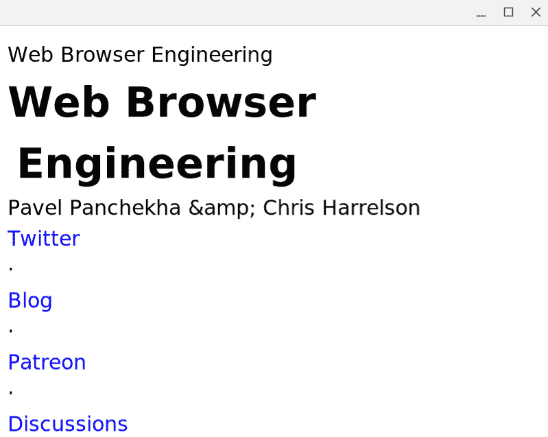

图 3：https://browser.engineering/ 在本章浏览器版本中查看

通常一个点等于 1/72 英寸，而像素大小取决于屏幕，但 CSS 将英寸定义为 96 像素，因为那曾经是一个常见的屏幕分辨率。而且这些 CSS 像素[不一定](https://developer.mozilla.org/en-US/docs/Web/CSS/resolution)是物理像素！看起来很奇怪？这种复杂性是浏览器（缩放）和硬件（高 DPi，每英寸点数屏幕）的变化以及与为所有屏幕每英寸 96 像素的时代设计的旧网页兼容性的需要的结果。

# 摘要

本章实现了一个基本的但完整的样式引擎，包括下载、解析、匹配、排序和应用 CSS 文件。这意味着我们：

+   编写了一个 CSS 解析器；

+   添加了对`style`属性和`linked` CSS 文件的支持；

+   实现了级联和继承；

+   对`BlockLayout`进行了重构，将字体属性移动到 CSS 中；

+   将大多数与标签相关的推理移动到浏览器样式表中。

我们的样式引擎也相对容易通过属性和选择器进行扩展。

widgets/lab6-browser.html

# 概述

我们浏览器中的完整函数、类和方法集现在看起来可能像这样：

```

# 练习

6-1 *字体*。实现 `font-family` 属性，这是一个可继承的属性，指定元素应使用哪个字体。使 `<code>` 元素内的文本使用像 `Courier` 这样的美观等宽字体。注意字体缓存。

6-2 *宽度/高度*。为块布局添加对 `width` 和 `height` 属性的支持。这些可以是像素值，直接设置布局对象的宽度和高度，或者单词 `auto`，在这种情况下，使用现有的布局算法。

6-3 *类选择器*。任何 HTML 元素都可以有一个 `class` 属性，其值是该元素类的空格分隔列表。CSS 类选择器，如 `.main`，影响所有具有 `main` 类的元素。实现类选择器；它们应该比标签选择器具有优先级。如果您正确实现了它们，您应该会看到这本书中代码块的语法高亮。

6-4 *`display`*。目前，`layout_mode` 函数依赖于一个硬编码的块元素列表。在真实浏览器中，`display` 属性控制这一点。实现 `display`，默认值为 `inline`，并将块元素列表移动到浏览器样式表中。

6-5 *缩写属性* CSS 的“缩写属性”可以同时设置多个相关 CSS 属性；例如，`font: italic bold 100% Times` 一次设置 `font-style`、`font-weight`、`font-size` 和 `font-family` 属性。将缩写属性添加到您的解析器中。（如果您还没有完成 6-1 练习，请忽略 `font-family`。）

6-6 *内联样式表*。`<link rel=stylesheet>` 语法允许导入外部样式表（意味着通过其自己的 HTTP 请求加载）。也可以通过 `<style>` 标签将样式表内联，作为 HTML 的一部分——从下一个 `</style>` 标签开始的所有内容都被解释为样式表。内联样式表和外部样式表按照它们在 HTML 中出现的顺序应用，尽管可能更容易先实现外部样式表之后应用内联样式表。内联样式表对于创建自包含的示例网页很有用，但更重要的是，它是网站通过减少对服务器的往返网络请求次数来加快加载速度的一种方式。由于样式表通常不包含左尖括号，因此可以在不修改 HTML 解析器的情况下实现此功能。

6-7 *快速后代选择器*。目前，匹配像 `div div div div div` 这样的选择器可能需要很长时间——在最坏的情况下，其时间复杂度为 *O(nd)*，其中 *n* 是选择器的长度，*d* 是布局树的深度。修改后代选择器匹配代码，使其在 *O(n + d)* 时间内运行。让 `DescendantSelector` 存储一个基础选择器的列表而不是仅仅两个可能有所帮助。

6-8 *选择器序列*。有时你想要通过标签 *和* 类来选择一个元素。你可以通过连接选择器而不在它们之间添加任何内容来实现这一点。甚至不是空格！例如，`span.announce` 选择同时匹配 `span` 和 `.announce` 的元素。实现一个新的 `SelectorSequence` 类来表示这些，并修改解析器以解析它们。求优先级。`SelectorSequence` 的优先级应该按照 ID、类和标签选择器的字典顺序进行比较，但只要没有人将超过十个选择器连接在一起，求序列中选择器的优先级之和将工作得很好。

6-9 *`!important`*。CSS 属性-值对可以使用 `!important` 语法标记为“重要”，如下所示：

```py
#banner a { color: black !important; }
```

这给那个属性-值对（但不是同一块中的其他对！）比任何其他选择器（除了其他 `!important` 属性）更高的优先级。解析并实现 `!important`，给标记为这种方式的属性-值对赋予比正常属性-值对高 10,000 的优先级。

6-10 *`:has` 选择器*。`:has` 选择器是后代选择器的逆——根据后代的存在来样式化祖先。实现 `:has` 选择器。分析你实现的渐近速度。有一种聪明的实现方式是每个元素 *O(1)* 摊销——你能找到它吗？实际上，浏览器必须做一些 [更复杂的事情](https://blogs.igalia.com/blee/posts/2022/04/12/how-blink-tests-has-pseudo-class.html) 来有效地实现 `:has`。

# 处理按钮和链接

网络浏览器工程的第七章。

+   链接在哪里？

+   行布局，重制

+   点击处理

+   多页

+   浏览器外观

+   导航历史

+   编辑 URL

+   摘要

+   大纲

+   练习

我们的浏览器仍然缺少 *超文本* 的关键洞察：通过超链接链接在一起的文档。它让我们可以观看波浪，但不能上网冲浪。因此，在本章中，我们将实现超链接、地址栏以及浏览器界面的其余部分——浏览器决定我们正在查看 *哪个* 页面的部分。

# 链接在哪里？

网页的核心是链接，因此浏览器界面的最重要部分是点击链接。但在我们能够完全点击链接之前，我们首先需要回答一个更基本的问题：链接在屏幕的 *哪里*？尽管段落和标题的大小和位置在布局树中有记录，但格式化文本（如链接）没有。我们需要解决这个问题。

主要的想法是引入两种新的布局对象类型：`LineLayout` 和 `TextLayout`。现在 `BlockLayout` 将为每行文本有一个 `LineLayout` 子对象，它本身将包含该行中每个单词的 `TextLayout`。这些新类可以使布局树看起来与 HTML 树不同。为了避免意外，让我们看看一个简单的例子：

```py
<html>
 <body>
 Here is some text that is
 <br>
 spread across multiple lines
 </body>
</html>
```

`body` 元素中的文本跨越了两行（因为 `br` 元素），所以布局树将具有以下结构：

```py
DocumentLayout
  BlockLayout[block] (html element)
    BlockLayout[inline] (body element)
      LineLayout (first line of text)
        TextLayout ("Here")
        TextLayout ("is")
        TextLayout ("some")
        TextLayout ("text")
        TextLayout ("that")
        TextLayout ("is")
      LineLayout (second line of text)
        TextLayout ("spread")
        TextLayout ("across")
        TextLayout ("multiple")
        TextLayout ("lines")
```

注意一个 `body` 元素如何对应于包含两个 `LineLayout` 的 `BlockLayout`，以及两个文本节点如何变成总共十个 `TextLayout`！

让我们开始。定义 `LineLayout` 是直接的：

```py
class LineLayout:
 def __init__(self, node, parent, previous):
 self.node = node
 self.parent = parent
 self.previous = previous
 self.children = []
```

`TextLayout` 只有一点复杂。单个 `TextLayout` 指的不是整个 HTML 节点，而是特定的单词。这意味着 `TextLayout` 需要一个额外的参数来知道是哪个单词：

```py
class TextLayout:
 def __init__(self, node, word, parent, previous):
 self.node = node
 self.word = word
 self.children = []
 self.parent = parent
 self.previous = previous
```

与其他布局模式一样，`LineLayout` 和 `TextLayout` 也需要它们自己的 `layout` 和 `paint` 方法，但在我们深入这些之前，我们需要考虑 `LineLayout` 和 `TextLayout` 对象是如何被创建的。这必须在换行时发生。

回想一下 如何在 `BlockLayout` 的 `word` 方法中实现单词换行（见第三章）。该方法更新一个 `line` 字段，该字段存储当前行中的所有单词：

```py
self.line.append((self.cursor_x, word, font, color))
```

当需要转到下一行时，`word` 调用 `flush`，它计算行及其中的每个单词的位置，并将所有单词添加到 `display_list` 字段中，该字段存储整个内联元素中的所有单词。有了 `TextLayout` 和 `LineLayout`，很多这种复杂性就消失了。`LineLayout` 可以在其 `layout` 方法中计算自己的位置，而不是 `display_list` 字段，每个 `TextLayout` 只需像正常一样 `paint` 自己。所以让我们开始这个重构。

让我们从向一行添加一个单词开始。而不是 `line` 字段，我们想要创建 `TextLayout` 对象并将它们添加到 `LineLayout` 对象中。`LineLayout` 是 `BlockLayout` 的子对象，所以当前行可以在 `children` 数组的末尾找到：

```py
class BlockLayout:
 def word(self, node, word):
 line = self.children[-1]
 previous_word = line.children[-1] if line.children else None
 text = TextLayout(node, word, line, previous_word)
 line.children.append(text)
```

现在我们来思考一下当我们到达行尾时会发生什么。当前的代码调用 `flush`，它执行诸如定位文本和清除 `line` 字段等操作。我们不想做所有这些——我们只想创建一个新的 `LineLayout` 对象。所以让我们为这个目的使用一个不同的方法：

```py
class BlockLayout:
 def word(self, node, word):
 # ...
 if self.cursor_x + w > self.width:
 self.new_line()
```

这个 `new_line` 方法只是创建一个新的行并重置一些字段：

```py
class BlockLayout:
 def new_line(self):
 self.cursor_x = 0
 last_line = self.children[-1] if self.children else None
 new_line = LineLayout(self.node, self, last_line)
 self.children.append(new_line)
```

现在有很多字段我们没有使用。让我们清理它们。在核心 `layout` 方法中，我们不需要初始化 `display_list`、`cursor_y` 或 `line` 字段，因为我们不再使用它们中的任何一个。相反，我们只需要调用 `new_line` 和 `recurse`：

```py
class BlockLayout:
 def layout(self):
 # ...
 else:
 self.new_line()
 self.recurse(self.node)
```

`layout` 方法已经递归到其子元素以进行布局，所以这部分不需要任何更改。而且，我们现在可以通过求和其行的长度来计算文本段落的长度，因此这部分代码不再需要根据布局模式而有所不同：

```py
class BlockLayout:
 def layout(self):
 # ...
 self.height = sum([child.height for child in self.children])
```

您可能也会想删除 `flush` 方法，因为它不再被任何地方调用。但请保留它一会儿——我们需要它来编写行和文本对象的 `layout` 方法。

由文本节点生成的布局对象甚至不需要是连续的。例如，包含波斯语引文的英语可以在行中从左到右翻转到右到左。文本布局对象最终以 [令人惊讶的顺序](https://www.w3.org/International/articles/inline-bidi-markup/uba-basics) 结束。然后还有 [垂直](https://en.wikipedia.org/wiki/Mongolian_script) 布局的文字...

# 行布局，重制

我们现在正在创建行和文本对象，但我们仍然需要将它们布局。让我们从行开始。行垂直堆叠并占据其父级的完整宽度，因此计算 `x`、`y` 和 `width` 的方式与我们的其他盒子相同：您可以使用一些辅助方法（甚至更复杂的方法，如混合类）来减少重复，但在实际的浏览器中，不同的布局模式支持不同类型的额外功能（如文本方向或边距），代码看起来相当不同。

```py
class LineLayout:
 def layout(self):
 self.width = self.parent.width
 self.x = self.parent.x

 if self.previous:
 self.y = self.previous.y + self.previous.height
 else:
 self.y = self.parent.y

 # ...
```

然而，计算高度是不同的——这就是计算最大上升、最大下降等的地方。在我们这样做之前，让我们看看如何布局 `TextLayout`。

要布局文本，我们需要字体度量，所以让我们首先使用与 `BlockLayout` 相同的字体构建代码来获取相关字体：

```py
class TextLayout:
 def layout(self):
 weight = self.node.style["font-weight"]
 style = self.node.style["font-style"]
 if style == "normal": style = "roman"
 size = int(float(self.node.style["font-size"][:-2]) * .75)
 self.font = get_font(size, weight, style)
```

接下来，我们需要计算单词的大小和 `x` 位置。我们使用字体度量来计算大小，并从左到右堆叠单词来计算位置。

```py
class TextLayout:
 def layout(self):
 # ...

 self.width = self.font.measure(self.word)

 if self.previous:
 space = self.previous.font.measure(" ")
 self.x = self.previous.x + space + self.previous.width
 else:
 self.x = self.parent.x

 self.height = self.font.metrics("linespace")
```

然而，这里没有代码来计算 `y` 位置。一个单词的垂直位置取决于同一行中的其他单词，因此我们将在 `LineLayout` 的 `layout` 方法中计算该 `y` 位置。`y` 位置本可以在 `TextLayout` 的 `layout` 方法中计算——但那样的话，该布局方法就必须在基线计算之后，而不是之前。然而，`font` 必须在基线计算之前计算。一个真正的浏览器可能会通过多阶段布局来解决这个问题。为了使文本布局超级快，需要考虑和优化许多此类问题。

那个方法将从旧的 `flush` 方法中窃取代码。首先，让我们布局每个单词：

```py
class LineLayout:
 def layout(self):
 # ...
 for word in self.children:
 word.layout()
```

接下来，我们需要根据最大上升和下降来计算行的基线，基本上使用与旧 `flush` 方法相同的代码：

```py
# ...
max_ascent = max([word.font.metrics("ascent")
 for word in self.children])
baseline = self.y + 1.25 * max_ascent
for word in self.children:
 word.y = baseline - word.font.metrics("ascent")
max_descent = max([word.font.metrics("descent")
 for word in self.children])
```

注意，这段代码是从每个单词的`font`字段读取并写入每个单词的`y`字段。这意味着在`TextLayout`的`layout`方法中，我们需要计算`x`、`width`、`height`和`font`，但不计算`y`，正好像我们之前做的那样。

最后，由于现在每一行都是一个独立的布局对象，它需要有一个高度。我们是从最大上升和下降值来计算的：

```py
# ...
self.height = 1.25 * (max_ascent + max_descent)
```

所以这就是`LineLayout`和`TextLayout`的`layout`。剩下要做的就是绘制。对于`LineLayout`，没有东西要绘制：

```py
class LineLayout:
 def paint(self):
 return []
```

每个`TextLayout`都创建一个单独的`DrawText`调用：

```py
class TextLayout:
 def paint(self):
 color = self.node.style["color"]
 return [DrawText(self.x, self.y, self.word, self.font, color)]
```

现在我们不需要在`BlockLayout`中有一个`display_list`字段，我们也可以移除`BlockLayout`的`paint`部分中处理它的部分。相反，`paint_tree`可以直接递归到其子节点并绘制它们。所以通过添加`LineLayout`和`TextLayout`，我们使`BlockLayout`变得更加简单，并在块和内联布局模式之间共享了更多的代码。

所以，哎呀，好吧，这次重构相当多。花点时间测试一下——它应该看起来与我们开始重构之前完全一样。但尽管你看不见，有一个关键的区别：页面上每个蓝色的链接现在都有一个相关的布局对象以及它自己的大小和位置。

实际上，文本渲染比这要复杂得多。[字母](https://developer.apple.com/fonts/TrueType-Reference-Manual/RM06/Chap6morx.html)可以变换和重叠，用户可能想要将某些字母——或者字母的部分——染成不同的颜色。所有这些在 HTML 中都是可能的，并且真正的浏览器确实实现了对这些的支持。

# 点击处理

现在我们知道了链接的位置，我们可以开始处理点击它们。在 Tk 中，点击处理与按键处理一样工作：你将事件处理器绑定到特定的事件。对于点击处理，这个事件是`<Button-1>`，按钮 1 是鼠标的左键。按钮 2 是中间键；按钮 3 是右键。

```py
class Browser:
 def __init__(self):
 # ...
 self.window.bind("<Button-1>", self.click)
```

在`click`内部，我们想要找出用户点击了哪个链接。幸运的是，事件处理器传递了一个事件对象，其`x`和`y`字段指的是点击发生的位置：

```py
class Browser:
 def click(self, e):
 x, y = e.x, e.y
```

现在，在这里，我们必须小心处理坐标系。那些*x*和*y*坐标是相对于浏览器窗口的。由于画布在窗口的左上角，这些也是相对于画布的*x*和*y*坐标。我们想要相对于网页的坐标，因此我们需要考虑滚动：

```py
class Browser:
 def click(self, e):
 # ...
 y += self.scroll
```

更普遍地说，处理像点击这样的事件涉及到*反转*通常的渲染管道。通常，渲染是从元素到布局对象到页面坐标到屏幕坐标；点击处理是反向的，从屏幕坐标开始，然后转换到页面坐标，等等。在实践中，这种对应关系并不是完美反转的——尽管在本章和未来的练习中，我们会看到如何使其更接近匹配。但这仍然是一个有价值的类比。

因此，下一步是将页面坐标转换为布局对象：你可以尝试先找到被点击的绘制命令，然后从该命令到布局对象，但在实际浏览器中，有各种原因这不会工作，首先是不可见但可以点击的对象。参见练习 7-11。

```py
# ...
objs = [obj for obj in tree_to_list(self.document, [])
 if obj.x <= x < obj.x + obj.width
 and obj.y <= y < obj.y + obj.height]
```

在原则上，这个列表中可能不止一个布局对象。在实际浏览器中，有各种方式可能导致这种情况，比如负边距。但记住，点击处理是绘制过程的逆过程。当我们绘制时，我们是从前到后绘制树，所以在点击测试时，我们应该从最后一个元素开始：实际浏览器使用`z-index`属性来控制哪个兄弟元素在顶部。因此，实际浏览器必须计算[堆叠上下文](https://developer.mozilla.org/en-US/docs/Web/CSS/CSS_Positioning/Understanding_z_index/The_stacking_context)来解决你实际点击的是什么。

```py
# ...
if not objs: return
elt = objs[-1].node
```

这个`elt`节点是被点击的最具体节点。对于链接，这通常是一个文本节点。但因为我们想知道用户实际点击的 URL，我们需要沿着 HTML 树向上爬，以找到链接元素：我以这种方式编写，以便于在第八章中添加其他类型的可点击元素——比如文本框和按钮。

```py
# ...
while elt:
 if isinstance(elt, Text):
 pass
 elif elt.tag == "a" and "href" in elt.attributes:
 # ...
 elt = elt.parent
```

一旦我们找到链接元素本身，我们需要提取 URL 并加载它：

```py
# ...
elif elt.tag == "a" and "href" in elt.attributes:
 url = self.url.resolve(elt.attributes["href"])
 return self.load(url)
```

注意，这个`resolve`调用需要存储当前页面的 URL：

```py
class Browser:
 def __init__(self):
 # ...
 self.url = None

 def load(self, url):
 self.url = url
 # ...
```

尝试一下！现在你应该能够点击链接并导航到新的网页。

在移动设备上，点击发生在一个区域内，而不仅仅是单个点。这是因为移动设备的“轻触”通常非常不准确，因此点击应该[使用区域而不是点信息](http://www.chromium.org/developers/design-documents/views-rect-based-targeting)来进行“点击测试”。即使是在点击旋转或缩放元素时，普通的鼠标点击也可能发生这种情况。

# 多个页面

如果你和我一样，点击链接后尝试的下一件事就是中间点击它们以在新标签页中打开。现在每个浏览器都有标签页浏览功能，老实说，我们的浏览器没有这个功能有点尴尬。在以前，浏览器标签页是说服朋友和亲戚从 IE 6 切换到 Firefox 的功能。

基本上，实现标签页浏览需要我们区分浏览器本身和显示单个网页的标签页。例如，浏览器绘制的画布是由所有网页共享的，但布局树和显示列表是特定于一个页面的。我们需要将标签页和浏览器分开。 

这就是计划：`Browser`类将拥有窗口、画布以及所有相关方法，例如事件处理。它还将包含一个`Tab`对象列表和浏览器界面。但网页本身及其相关方法将存在于一个新的`Tab`类中。

首先，将现有的 `Browser` 类重命名为 `Tab`，因为我们到目前为止只处理了一个网页：

```py
class Tab:
 # ...
```

然后，我们需要一个新的 `Browser` 类。它必须存储一个标签页列表以及哪个是活动的：

```py
class Browser:
 def __init__(self):
 self.tabs = []
 self.active_tab = None
```

它还拥有窗口并处理所有事件：

```py
class Browser:
 def __init__(self):
 self.window = tkinter.Tk()
 self.canvas = tkinter.Canvas(
 # ...
 )
 self.canvas.pack()
 self.window.bind("<Down>", self.handle_down)
 self.window.bind("<Button-1>", self.handle_click)
```

从 `Tab` 的构造函数中移除这些行。

`handle_down` 和 `handle_click` 方法需要特定于页面的信息，因此这些处理方法只是将事件转发到活动标签：

```py
class Browser:
 def handle_down(self, e):
 self.active_tab.scrolldown()
 self.draw()

 def handle_click(self, e):
 self.active_tab.click(e.x, e.y)
 self.draw()
```

您需要调整 `Tab` 的 `scrolldown` 和 `click` 方法：

+   `scrolldown` 现在不接受任何参数（而不是事件对象）

+   `click` 现在接受两个坐标（而不是事件对象）

最后，`Browser` 的 `draw` 调用也会调用到活动标签：

```py
class Browser:
 def draw(self):
 self.canvas.delete("all")
 self.active_tab.draw(self.canvas)
```

注意，清除屏幕是 `Browser` 的职责，而不是 `Tab` 的。之后，我们只绘制活动标签，这正是标签应该工作的方式。`Tab` 的 `draw` 方法需要将画布作为参数传入：

```py
class Tab:
 def draw(self, canvas):
 # ...
```

由于 `Browser` 控制画布并处理事件，它决定何时进行渲染以及哪个标签页进行绘图。因此，让我们也从 `load` 和 `scrolldown` 方法中移除 `draw` 调用。更普遍地说，`Browser` 是“活跃”的，而 `Tab` 是“被动”的：所有用户交互都从 `Browser` 开始，然后根据需要调用标签页。

我们基本上已经将 `Tab` 从 `Browser` 中分离出来，在经过这样的重构之后，我们需要测试一下。为此，我们需要创建至少一个标签，如下所示：

```py
class Browser:
 def new_tab(self, url):
 new_tab = Tab()
 new_tab.load(url)
 self.active_tab = new_tab
 self.tabs.append(new_tab)
 self.draw()
```

在启动时，您现在应该创建一个包含一个标签的 `Browser`：

```py
if __name__ == "__main__":
 import sys
 Browser().new_tab(URL(sys.argv[1]))
 tkinter.mainloop()
```

当然，我们需要一种方法让 *用户* 切换标签、创建新的标签等等。让我们转向下一个问题。

浏览器标签首次出现在 [SimulBrowse](https://en.wikipedia.org/wiki/NetCaptor) 中，这是一种针对 Internet Explorer 引擎的定制 UI。有些人将标签浏览归功于 Booklink 的 InternetWorks 浏览器，这是一个足够隐秘的浏览器，以至于没有维基百科页面，尽管你可以在 [Twitter](https://twitter.com/awesomekling/status/1694242398539264363) 上看到一些截图。然而，它的标签与现代概念略有不同，[更像是书签或历史记录](https://ajstiles.wordpress.com/2005/02/11/tabbed_browser_/) 而不是标签。SimulBrowse（后来更名为 NetCaptor）还提供了广告拦截和私密浏览模式。[旧广告](https://web.archive.org/web/20050701001923/http://www.netcaptor.com/) 是一篇很好的阅读材料！

# 浏览器外观

真实的网络浏览器不仅仅显示网页内容——它们有标签、图标和按钮。哦，这被称为浏览器的“外观”；是的，这比谷歌 Chrome 浏览器的名字还要早。所有这些内容都是由浏览器绘制到与页面内容相同的窗口中的，这需要关于浏览器整体的信息（如所有标签的列表），因此这必须在浏览器级别发生，而不是每个标签级别。

然而，浏览器的用户界面相当复杂，所以让我们将这段代码放入一个新的`Chrome`辅助类中：

```py
class Chrome:
 def __init__(self, browser):
 self.browser = browser

class Browser:
 def __init__(self):
 # ...
 self.chrome = Chrome(self)
```

让我们设计浏览器界面。最终，我认为它应该有两行（见图 1）：

+   在顶部，一个由垂直线分隔的标签名称列表，以及一个用于添加新标签的“`+`”按钮。

+   在下面，当前网页的 URL，以及一个表示浏览器后退按钮的“`<`”按钮。

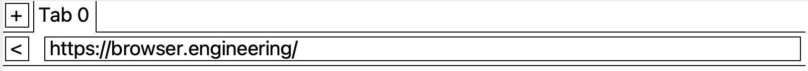

图 1：浏览器界面的预期外观。

这项设计涉及很多文本，所以让我们先选择一个字体：

```py
class Chrome:
 def __init__(self, browser):
 # ...
 self.font = get_font(20, "normal", "roman")
 self.font_height = self.font.metrics("linespace")
```

由于不同的操作系统绘制字体的方式不同，我们需要根据字体度量来调整浏览器界面的具体设计。因此，我们稍后需要`font_height`。我选择了`20px`作为字体大小，但可能在你的设备上太大。请随意调整。

使用那个字体高度，我们现在可以确定标签栏的起始和结束位置：

```py
class Chrome:
 def __init__(self, browser):
 # ...
 self.padding = 5
 self.tabbar_top = 0
 self.tabbar_bottom = self.font_height + 2*self.padding
```

注意，我已经添加了一些填充，以便文本不会跑到窗口的边缘。

我们将存储表示浏览器界面中各种元素大小的矩形。为此，一个新的`Rect`类将很有用：

```py
class Rect:
 def __init__(self, left, top, right, bottom):
 self.left = left
 self.top = top
 self.right = right
 self.bottom = bottom
```

现在，这个标签行需要包含一个新标签按钮以及标签名称本身。

我将在新标签按钮周围添加填充：

```py
class Chrome:
 def __init__(self, browser):
 # ...
 plus_width = self.font.measure("+") + 2*self.padding
 self.newtab_rect = Rect(
 self.padding, self.padding,
 self.padding + plus_width,
 self.padding + self.font_height)
```

然后标签将开始填充到新标签按钮的末端。因为标签的数量可能会变化，所以我不打算存储每个标签的位置。相反，我将在运行时计算它们的边界：

```py
class Chrome:
 def tab_rect(self, i):
 tabs_start = self.newtab_rect.right + self.padding
 tab_width = self.font.measure("Tab X") + 2*self.padding
 return Rect(
 tabs_start + tab_width * i, self.tabbar_top,
 tabs_start + tab_width * (i + 1), self.tabbar_bottom)
```

注意，我测量了文本“标签 X”并使用它来计算所有标签的宽度。这并不完全正确——在许多字体中，数字如 8 比数字如 1 更宽——但这已经足够接近了，而且无论如何，字母 X 通常与最宽的数字一样宽。

为了实际绘制 UI，我们首先让浏览器界面绘制一个显示列表，然后`Browser`将其绘制到屏幕上：

```py
class Chrome:
 def paint(self):
 cmds = []
 # ...
 return cmds
```

让我们先从绘制新标签按钮开始：

```py
class Chrome:
 def paint(self):
 # ...
 cmds.append(DrawOutline(self.newtab_rect, "black", 1))
 cmds.append(DrawText(
 self.newtab_rect.left + self.padding,
 self.newtab_rect.top,
 "+", self.font, "black"))
 # ...
```

`DrawOutline`命令绘制矩形边框：

```py
class DrawOutline:
 def __init__(self, rect, color, thickness):
 self.rect = rect
 self.color = color
 self.thickness = thickness

 def execute(self, scroll, canvas):
 canvas.create_rectangle(
 self.rect.left, self.rect.top - scroll,
 self.rect.right, self.rect.bottom - scroll,
 width=self.thickness,
 outline=self.color)
```

接下来是绘制标签。Python 的`enumerate`函数允许你同时迭代数组的索引和内容。对于每个标签，我们需要在左侧和右侧创建一个边框，然后绘制标签名称：

```py
class Chrome:
 def paint(self):
 # ...
 for i, tab in enumerate(self.browser.tabs):
 bounds = self.tab_rect(i)
 cmds.append(DrawLine(
 bounds.left, 0, bounds.left, bounds.bottom,
 "black", 1))
 cmds.append(DrawLine(
 bounds.right, 0, bounds.right, bounds.bottom,
 "black", 1))
 cmds.append(DrawText(
 bounds.left + self.padding, bounds.top + self.padding,
 "Tab {}".format(i), self.font, "black"))
 # ...
```

最后，为了识别哪个标签是活动标签，我们需要绘制一个带有当前标签突出显示的文件夹形状：

```py
class Chrome:
 def paint(self):
 for i, tab in enumerate(self.browser.tabs):
 # ...
 if tab == self.browser.active_tab:
 cmds.append(DrawLine(
 0, bounds.bottom, bounds.left, bounds.bottom,
 "black", 1))
 cmds.append(DrawLine(
 bounds.right, bounds.bottom, WIDTH, bounds.bottom,
 "black", 1))
```

`DrawLine`命令绘制给定颜色和厚度的线条。它定义如下：

```py
class DrawLine:
 def __init__(self, x1, y1, x2, y2, color, thickness):
 self.rect = Rect(x1, y1, x2, y2)
 self.color = color
 self.thickness = thickness

 def execute(self, scroll, canvas):
 canvas.create_line(
 self.rect.left, self.rect.top - scroll,
 self.rect.right, self.rect.bottom - scroll,
 fill=self.color, width=self.thickness)
```

最后一件事情：我们想要确保浏览器界面始终绘制在页面内容之上。为了确保这一点，我们可以在界面后面绘制一个白色矩形：

```py
class Chrome:
 def __init__(self, browser):
 # ...
 self.bottom = self.tabbar_bottom

 def paint(self):
 # ...
 cmds.append(DrawRect(
 Rect(0, 0, WIDTH, self.bottom),
 "white"))
 cmds.append(DrawLine(
 0, self.bottom, WIDTH,
 self.bottom, "black", 1))
 # ...
```

确保在绘制浏览器界面的其他任何部分之前先绘制背景。我还添加了一条位于界面底部的线，以将其与页面内容分开。注意我如何将`DrawRect`改为传递一个`Rect`而不是四个角；这需要修改`BlockLayout`：

```py
class BlockLayout:
 def self_rect(self):
 return Rect(self.x, self.y,
 self.x + self.width, self.y + self.height)

 def paint(self):
 # ...
 if bgcolor != "transparent":
 rect = DrawRect(self.self_rect(), bgcolor)
 cmds.append(rect)
 return cmds
```

给`DrawText`和`DrawLine`也添加一个`rect`字段。（对于`DrawText`，宽度和高度应该是文本的宽度和高度。）

绘制这个铬显示列表现在变得简单直接：

```py
class Browser:
 def draw(self):
 # ...
 for cmd in self.chrome.paint():
 cmd.execute(0, self.canvas)
```

注意，这个显示列表总是在窗口顶部绘制，与滚动的内容标签页不同。确保在绘制主要标签内容之后绘制铬，这样铬就会覆盖它。

然而，我们也需要对标签绘制进行调整，以考虑浏览器铬占用了一些垂直空间。让我们给`Tab`添加一个`tab_height`参数：

```py
class Tab:
 def __init__(self, tab_height):
 # ...
 self.tab_height = tab_height
```

我们可以将其传递给`new_tab`：

```py
class Browser:
 def new_tab(self, url):
 new_tab = Tab(HEIGHT - self.chrome.bottom)
 # ...
```

然后，我们可以调整`scrolldown`以考虑页面内容现在的高度`tab_height`：

```py
class Tab:
 def scrolldown(self):
 max_y = max(
 self.document.height + 2*VSTEP - self.tab_height, 0)
 self.scroll = min(self.scroll + SCROLL_STEP, max_y)
```

最后，在`Tab`的`draw`方法中，我们需要将绘图命令向下移动铬的高度。我将通过`offset`参数传递铬的高度：

```py
class Tab:
 def draw(self, canvas, offset):
 for cmd in self.display_list:
 if cmd.rect.top > self.scroll + self.tab_height:
 continue
 if cmd.rect.bottom < self.scroll: continue
 cmd.execute(self.scroll - offset, canvas)
```

`Browser`的最终`draw`方法现在看起来是这样的：

```py
class Browser:
 def draw(self):
 self.canvas.delete("all")
 self.active_tab.draw(self.canvas, self.chrome.bottom)
 for cmd in self.chrome.paint():
 cmd.execute(0, self.canvas)
```

还有一件事：点击标签来在它们之间切换。`Browser`处理点击，现在需要将浏览器铬的点击委托给`Chrome`对象：

```py
class Browser:
 def handle_click(self, e):
 if e.y < self.chrome.bottom:
 self.chrome.click(e.x, e.y)
 else:
 tab_y = e.y - self.chrome.bottom
 self.active_tab.click(e.x, tab_y)
 self.draw()
```

注意，在点击标签内容时，我们需要减去铬的大小。至于浏览器铬的点击，在`Chrome`内部，我们需要确定用户点击了什么。为了使这更容易，让我们添加一个快速方法来测试一个点是否包含在`Rect`中：

```py
class Rect:
 def contains_point(self, x, y):
 return x >= self.left and x < self.right \
 and y >= self.top and y < self.bottom
```

我们使用这个方法来处理`Chrome`内部的点击，然后使用它来在添加标签或选择打开的标签之间进行选择。

```py
class Chrome:
 def click(self, x, y):
 if self.newtab_rect.contains_point(x, y):
 self.browser.new_tab(URL("https://browser.engineering/"))
 else:
 for i, tab in enumerate(self.browser.tabs):
 if self.tab_rect(i).contains_point(x, y):
 self.browser.active_tab = tab
 break
```

这是个合适的“新标签页”页面，你不这么认为吗？无论如何，你现在应该能够加载多个标签页，独立滚动和点击它们，并通过点击来切换标签页。

Google Chrome 1.0 伴随着一本[漫画书](https://www.google.com/googlebooks/chrome/)来推广其功能。其中有一整章[章节](https://www.google.com/googlebooks/chrome/big_18.html)是关于其设计理念和用户界面特性，其中许多特性一直沿用至今。例如，这本书的浏览器顶部也有标签页。

# 导航历史

现在我们经常在页面之间导航，很容易有点迷失方向，忘记正在查看的网页。一个显示当前 URL 的地址栏会非常有帮助。让我们在铬中为它腾出空间：

```py
class Chrome:
 def __init__(self, browser):
 # ...
 self.urlbar_top = self.tabbar_bottom
 self.urlbar_bottom = self.urlbar_top + \
 self.font_height + 2*self.padding
 self.bottom = self.urlbar_bottom
```

这个“URL 栏”将包含后退按钮和地址栏：

```py
class Chrome:
 def __init__(self, browser):
 # ...
 back_width = self.font.measure("<") + 2*self.padding
 self.back_rect = Rect(
 self.padding,
 self.urlbar_top + self.padding,
 self.padding + back_width,
 self.urlbar_bottom - self.padding)

 self.address_rect = Rect(
 self.back_rect.top + self.padding,
 self.urlbar_top + self.padding,
 WIDTH - self.padding,
 self.urlbar_bottom - self.padding)
```

绘制后退按钮是直接的：

```py
class Chrome:
 def paint(self):
 # ...
 cmds.append(DrawOutline(self.back_rect, "black", 1))
 cmds.append(DrawText(
 self.back_rect.left + self.padding,
 self.back_rect.top,
 "<", self.font, "black"))
```

地址栏需要从浏览器中获取当前标签页的 URL：

```py
class Chrome:
 def paint(self):
 # ...
 cmds.append(DrawOutline(self.address_rect, "black", 1))
 url = str(self.browser.active_tab.url)
 cmds.append(DrawText(
 self.address_rect.left + self.padding,
 self.address_rect.top,
 url, self.font, "black"))
```

在这里，`str`是一个内置的 Python 函数，我们可以覆盖它以正确地将`URL`对象转换为字符串：

```py
class URL:
 def __str__(self):
 port_part = ":" + str(self.port)
 if self.scheme == "https" and self.port == 443:
 port_part = ""
 if self.scheme == "http" and self.port == 80:
 port_part = ""
 return self.scheme + "://" + self.host + port_part + self.path
```

我认为隐藏端口号的额外逻辑值得为了使 URL 更加整洁。

当点击后退按钮时，应该发生什么？嗯，*那个标签页*应该后退。其他标签页不受影响。因此，`Browser`必须对当前标签页调用一些方法来实现后退：

```py
class Chrome:
 def click(self, x, y):
 # ...
 elif self.back_rect.contains_point(x, y):
 self.browser.active_tab.go_back()
```

对于活动标签要“后退”，它需要存储一个“历史”记录，记录它之前访问过的页面：

```py
class Tab:
 def __init__(self, tab_height):
 # ...
 self.history = []
```

每次我们访问新页面时，历史都会增长：

```py
class Tab:
 def load(self, url):
 self.history.append(url)
 # ...
```

返回操作会使用历史记录。你可能认为可以这样写：

```py
class Tab:
 def go_back(self):
 if len(self.history) > 1:
 self.load(self.history[-2])
```

这几乎是对的，但如果连续点击后退按钮两次，则不会工作，因为`load`会添加到历史记录中。相反，我们需要做更多像这样的事情：

```py
class Tab:
 def go_back(self):
 if len(self.history) > 1:
 self.history.pop()
 back = self.history.pop()
 self.load(back)
```

现在，返回操作会缩小历史记录，而点击链接则会扩展它，正如它应该做的那样。

因此，我们现在有一个相当不错的网络浏览器来阅读这本书：你可以点击链接，四处浏览，甚至可以同时打开多个章节以进行交叉引用。但要从当前未链接的网站访问则有点困难。

浏览器的导航历史可能包含有关用户喜欢访问哪些网站等敏感信息，因此保持其安全至关重要。令人惊讶的是，这相当困难，因为 CSS 特性如`[:visited]`选择器（[`developer.mozilla.org/en-US/docs/Web/CSS/:visited`](https://developer.mozilla.org/en-US/docs/Web/CSS/:visited)）可以被用来[检查](https://blog.mozilla.org/security/2010/03/31/plugging-the-css-history-leak/)一个 URL 是否之前已被访问过。因此，有[努力](https://github.com/kyraseevers/Partitioning-visited-links-history)来限制`:visited`。

# 编辑 URL

去往另一个页面的方法之一是通过点击链接。但大多数浏览器也允许你将内容输入到地址栏以访问新的 URL，如果你恰好知道该 URL。

请花点时间注意输入地址的复杂仪式（见图 2）：

+   首先，你必须点击地址栏来“聚焦”它。

+   这也会选择整个地址，这样当你开始输入时，它就会被全部删除。

+   然后，你输入的字母会进入地址栏。

+   地址栏在你输入时会更新，但浏览器尚未导航到新页面。

+   最后，你按下“Enter”键，这将导航到新页面。

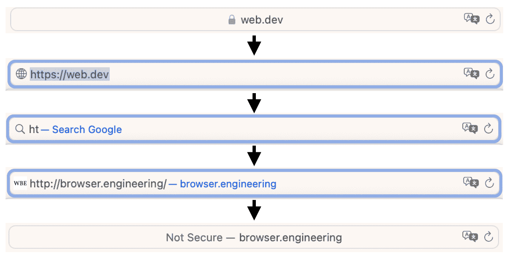

图 2：Apple Safari 16.6 中地址栏编辑的截图

这些步骤表明浏览器将地址栏的内容与`url`字段分开存储，并且还有一些状态来表示你是否正在地址栏中输入。让我们称内容为`address_bar`，状态为`focus`：

```py
class Chrome:
 def __init__(self, browser):
 # ...
 self.focus = None
 self.address_bar = ""
```

点击地址栏应该设置`focus`，而点击地址栏外部则应该清除`focus`：

```py
class Chrome:
 def click(self, x, y):
 self.focus = None
 # ...
 elif self.address_rect.contains_point(x, y):
 self.focus = "address bar"
 self.address_bar = ""
```

注意，点击地址栏也会清除地址栏内容。这并不完全符合真实浏览器的行为，但相当接近，并且让我们可以跳过添加文本选择。

现在，当我们绘制地址栏时，我们需要检查是绘制当前 URL 还是当前输入的文本：

```py
class Chrome:
 def paint(self):
 # ...
 if self.focus == "address bar":
 cmds.append(DrawText(
 self.address_rect.left + self.padding,
 self.address_rect.top,
 self.address_bar, self.font, "black"))
 else:
 url = str(self.browser.active_tab.url)
 cmds.append(DrawText(
 self.address_rect.left + self.padding,
 self.address_rect.top,
 url, self.font, "black"))
```

当用户在地址栏中输入时，让我们也绘制一个光标。在屏幕上（如光标所示）使状态（如聚焦）可见可以使软件更容易使用：

```py
class Chrome:
 def paint(self):
 # ...
 if self.focus == "address bar":
 # ...
 w = self.font.measure(self.address_bar)
 cmds.append(DrawLine(
 self.address_rect.left + self.padding + w,
 self.address_rect.top,
 self.address_rect.left + self.padding + w,
 self.address_rect.bottom,
 "red", 1))
```

接下来，当地址栏被聚焦时，我们需要支持在地址栏中输入 URL。在 Tk 中，你可以绑定到`<Key>`来捕获所有按键。事件对象的`char`字段包含用户输入的字符。

```py
class Browser:
 def __init__(self):
 # ...
 self.window.bind("<Key>", self.handle_key)

 def handle_key(self, e):
 if len(e.char) == 0: return
 if not (0x20 <= ord(e.char) < 0x7f): return
 self.chrome.keypress(e.char)
 self.draw()
```

这个 `handle_key` 处理器从一些条件开始：`<Key>` 对每次按键都会触发，不仅仅是常规字母，所以我们想忽略没有字符输入的情况（按下了修饰键）或者字符在 ASCII 范围之外（可以表示箭头键或功能键）。目前，让我们让 `Browser` 将所有按键发送到 `Chrome`，然后调用 `draw()`，这样新字母实际上就会显示出来。

然后 `Chrome` 可以检查 `focus` 并添加到 `address_bar`：

```py
class Chrome:
 def keypress(self, char):
 if self.focus == "address bar":
 self.address_bar += char
```

最后，一旦输入了新的 URL，我们需要处理“Enter”键，Tk 称为 `<Return>`，并将浏览器发送到新的地址：

```py
class Chrome:
 def enter(self):
 if self.focus == "address bar":
 self.browser.active_tab.load(URL(self.address_bar))
 self.focus = None

class Browser:
 def __init__(self):
 # ...
 self.window.bind("<Return>", self.handle_enter)

 def handle_enter(self, e):
 self.chrome.enter()
 self.draw()
```

所以，经过漫长的章节，你现在可以通过上网放松一下。

文本编辑 [令人惊讶地复杂](https://lord.io/text-editing-hates-you-too/)，并且实现良好的文本编辑相当棘手，尤其是对于英语以外的语言。如今，URL 可以用 [任何语言](https://en.wikipedia.org/wiki/Internationalized_domain_name) 编写，尽管出于安全考虑，现代浏览器 [对此有所限制](https://en.wikipedia.org/wiki/IDN_homograph_attack)。

# 摘要

仅处理链接就花费了大量工作！我们不得不：

+   为每个单词指定明确的大小和位置；

+   确定用户点击的文本部分；

+   从浏览器全局信息中分离出每页信息；

+   绘制标签栏、地址栏和后退按钮；

+   甚至可以实施文本编辑！

现在想象一下你可以添加到浏览器中的所有功能！

这里是实验室 7 的浏览器。尝试使用浏览器 chrome——它工作！我们的浏览器开始看起来像一个真正的浏览器：

widgets/lab7-browser.html

# 概述

我们浏览器中的完整函数、类和方法集现在看起来可能像这样：

`` class URL: `def __init__(url)` `def request()` `def resolve(url)` `def __str__()` `` `` class Text: `def __init__(text, parent)` `def __repr__()` `` `` class Element: `def __init__(tag, attributes, parent)` `def __repr__()` `` `def print_tree(node, indent)` `def tree_to_list(tree, list)` `` class HTMLParser: `SELF_CLOSING_TAGS` `HEAD_TAGS` `def __init__(body)` `def parse()` `def get_attributes(text)` `def add_text(text)` `def add_tag(tag)` `def implicit_tags(tag)` `def finish()` `` `` class CSSParser: `def __init__(s)` `def whitespace()` `def literal(literal)` `def word()` `def ignore_until(chars)` `def pair()` `def selector()` `def body()` `def parse()` `` `` class TagSelector: `def __init__(tag)` `def matches(node)` `` `` class DescendantSelector: `def __init__(ancestor, descendant)` `def matches(node)` `` `FONTS` `def get_font(size, weight, style)` `DEFAULT_STYLE_SHEET` `INHERITED_PROPERTIES` `def style(node, rules)` `def cascade_priority(rule)` `WIDTH, HEIGHT` `HSTEP, VSTEP` `` class Rect: `def __init__(left, top, right, bottom)` `def contains_point(x, y)` `` `BLOCK_ELEMENTS` `` class DocumentLayout: `def __init__(node)` `def layout()` `def paint()` `` `` class BlockLayout: `def __init__(node, parent, previous)` `def layout_mode()` `def layout()` `def recurse(node)` `def new_line()` `def word(node, word)` `def self_rect()` `def paint()` `` `` class LineLayout: `def __init__(node, parent, previous)` `def layout()` `def paint()` `` `` class TextLayout: `def __init__(node, word, parent, previous)` `def layout()` `def paint()` `` `` class DrawText: `def __init__(x1, y1, text, font, color)` `def execute(scroll, canvas)` `` `` class DrawRect: `def __init__(rect, color)` `def execute(scroll, canvas)` `` `` class DrawLine: `def __init__(x1, y1, x2, y2, color, thickness)` `def execute(scroll, canvas)` `` `` class DrawOutline: `def __init__(rect, color, thickness)` `def execute(scroll, canvas)` `` `def paint_tree(layout_object, display_list)` `SCROLL_STEP` `` class Tab: `def __init__(tab_height)` `def load(url)` `def draw(canvas, offset)` `def scrolldown()` `def click(x, y)` `def go_back()` `` `` class Chrome: `def __init__(browser)` `def tab_rect(i)` `def paint()` `def click(x, y)` `def keypress(char)` `def enter()` `` `` class Browser: `def __init__()` `def draw()` `def new_tab(url)` `def handle_down(e)` `def handle_click(e)` `def handle_key(e)` `def handle_enter(e)` ``

# 练习

7-1 *退格键*. 在地址栏中输入时添加对退格键的支持。老实说，做这个练习只是为了你的精神健康。

7-2 *中间点击*. 添加对链接（`Button-2`）中间点击以在新标签页中打开它的支持。你可能想在测试时使用鼠标。

7-3 *窗口标题*. 浏览器将窗口标题设置为当前标签页的`<title>`元素的内容。让你的浏览器也这样做。（你可以调用`Browser.window`的`title`方法来更改窗口标题。）

7-4 **前进**. 添加一个前进按钮，它应该取消后退按钮的操作。如果最近的导航操作不是后退按钮，则前进按钮不应执行任何操作。为了实现这一点，你需要在点击后退按钮时保留历史记录项，并为当前页面存储一个索引，而不是将其完全从数组中删除。在这种情况下，将其以灰色绘制，以免用户困惑为什么它不起作用。如果没有可以返回的地方，也应将后退按钮以灰色绘制。

7-5 **片段**. URL 可以包含一个**片段**，它位于 URL 的末尾，由一个哈希符号`#`与路径分开。当浏览器导航到包含片段的 URL 时，它应该滚动页面，使具有该标识符的元素位于屏幕顶部。此外，实现片段链接：以`#`开头的相对 URL 不会加载新页面，而是将具有该标识符的元素滚动到屏幕顶部。[该章节的网页版本](https://browser.engineering/chrome.html)中的目录表使用片段链接。

7-6 **搜索**. 如果用户在地址栏中输入的不是 URL，让浏览器自动使用搜索引擎搜索它。这通常意味着访问一个特殊的 URL。例如，你可以通过访问`https://google.com/search?q=QUERY`来搜索 Google，其中`QUERY`是搜索查询，每个空格都被一个加号`+`替换。实际上，你需要在这些“查询字符串”中转义[许多标点符号](https://en.wikipedia.org/wiki/Query_string#URL_encoding)，但这与地址栏搜索功能有点不同。

7-7 **已访问链接**. 在真实浏览器中，之前访问过的链接通常是紫色。实现这个功能。你需要存储已访问 URL 的集合，注释相应的 HTML 元素，并在绘制文本时检查这些注释。真实浏览器支持特殊的[伪类选择器](https://developer.mozilla.org/en-US/docs/Web/CSS/Pseudo-classes)，它可以选择所有已访问链接，如果你愿意，可以实现这个功能。

7-8 **书签**. 实现基本**书签**功能。在浏览器工具栏中添加一个按钮；点击它应该将页面添加为书签。当你查看一个已书签的页面时，那个书签按钮应该看起来不同（可能是黄色？）以提醒用户该页面已被书签，点击它应该取消书签。添加一个特殊的网页，`about:bookmarks`，用于查看书签列表。

7-9 **光标**. 当地址栏获得焦点时，使用左右箭头键移动文本光标。按下退格键应该删除光标前的字符，按下其他键应该在光标处添加字符。（记住，光标可以在第一个字符之前或最后一个字符之后！）

7-10 *多个窗口*。除了标签页外，还需要支持多个浏览器窗口。这将需要跟踪多个 Tk 窗口和画布，并按包含窗口对标签页进行分组。你还需要一种方法来创建新窗口，可能是一个按键，比如`Ctrl+N`。

7-11 *通过显示列表进行点击*。目前，我们的浏览器将点击位置转换为页面坐标，然后在这些坐标处找到布局对象。但你可以首先查找该位置的绘制命令，然后从绘制命令到生成它的布局对象。实现这一点。你需要绘制命令来知道哪个布局对象生成了它们。真正的浏览器目前还没有这样做，但这是一个吸引人的可能性：显示列表是纯数据结构，因此对它们的访问更容易优化或并行化，比更复杂的布局树更简单。

# 向服务器发送信息

Web 浏览器工程的第八章。

+   表单的工作原理

+   渲染小部件

+   与小部件交互

+   提交表单

+   网络应用程序的工作原理

+   接收 POST 请求

+   生成网页

+   总结

+   大纲

+   练习

到目前为止，我们的浏览器将网络视为只读——但是当你发布到 Facebook、填写调查问卷或搜索 Google 时，你不仅从服务器接收信息，还会向服务器发送信息。在本章中，我们将通过构建对 HTML 表单的支持来开始将我们的浏览器转变为一个支持网络应用程序的平台，HTML 表单是浏览器向服务器发送信息的简单方式。

# 表单的工作原理

HTML 表单有几个组成部分。

首先，在 HTML 中有一个`form`元素，它包含`input`元素，还有其他类似`input`的元素，例如`select`和`textarea`。它们的工作方式足够相似；它们只是代表不同种类的用户控件，比如下拉菜单和多行输入框。用户可以编辑这些控件。因此，一个表单可能写成这样（见图 1）：

```py
<form action="/submit" method="post">
 <p>Name: <input name=name value=1></p>
 <p>Comment: <input name=comment value=2></p>
 <p><button>Submit!</button></p>
</form>
```

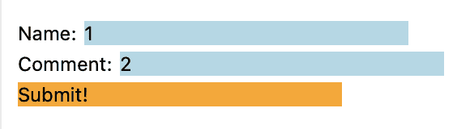

图 1：浏览器中的示例表单。

此表单包含两个名为`name`和`comment`的文本输入框。当用户访问此页面时，他们可以点击这些框来编辑它们的值。然后，当他们在表单末尾点击按钮时，浏览器会收集所有的名称-值对并将它们打包成一个 HTTP `POST`请求（如`method`属性所示），发送到由`form`元素的`action`属性指定的 URL，遵循相对 URL 的常规规则——因此在这种情况下，`/submit`。`POST`请求看起来像这样：

```py
POST /submit HTTP/1.0
Host: example.org
Content-Length: 16

name=1&comment=2
```

换句话说，它和我们已经看到的常规`GET`请求非常相似，只是它有一个主体——你已经看到了带有主体的 HTTP 响应，但请求也可以有主体。注意`Content-Length`头；它是`POST`请求的强制要求。服务器以网页的形式响应这个请求，就像正常一样，然后浏览器执行它通常所做的所有操作。

实现表单需要扩展浏览器的许多部分，从实现 HTTP `POST`到绘制`input`元素的新布局对象，再到处理按钮点击。这使得它成为将我们的浏览器转变为应用平台的一个很好的起点，这是我们接下来几章的目标。让我们开始实现它吧！

HTML 表单最初在[HTML+](https://www.w3.org/MarkUp/htmlplus_paper/htmlplus.html)中标准化，该规范还提出了表格、数学方程和围绕图像的文字环绕。令人惊讶的是，这三项技术都幸存了下来，但它们的标准完全不同：表格在[RFC 1942](https://datatracker.ietf.org/doc/html/rfc1942)、方程在[MathML](https://www.w3.org/Math/)、浮动图像在[CSS 1.0](https://www.w3.org/TR/REC-CSS1/#floating-elements)。

# 渲染小部件

首先，让我们绘制用户将要输入的输入区域。大多数应用程序使用操作系统库来绘制输入区域，以便这些输入区域看起来像该操作系统上的其他应用程序。但是，浏览器需要对应用程序样式有更多的控制，因此它们通常会绘制自己的输入区域。输入区域是行内内容，布局在文本旁边。因此，为了支持输入，我们需要一种新的布局对象，我将称之为`InputLayout`。我们可以复制`TextLayout`并将其用作模板，尽管我们需要做一些快速编辑。

首先，`InputLayout`没有`word`参数：

```py
class InputLayout:
 def __init__(self, node, parent, previous):
 self.node = node
 self.children = []
 self.parent = parent
 self.previous = previous
```

其次，`input`元素通常具有固定的宽度：

```py
INPUT_WIDTH_PX = 200

class InputLayout:
 def layout(self):
 # ...
 self.width = INPUT_WIDTH_PX
 # ...
```

`input`和`button`元素需要在视觉上明显区分，以便用户可以轻松找到它们。我们浏览器的样式功能有限，所以让我们使用背景颜色来实现这一点：

```py
input {
 font-size: 16px; font-weight: normal; font-style: normal;
 background-color: lightblue;
}
button {
 font-size: 16px; font-weight: normal; font-style: normal;
 background-color: orange;
}
```

当浏览器绘制`InputLayout`时，它需要绘制背景：

```py
class InputLayout:
 def paint(self):
 cmds = []
 bgcolor = self.node.style.get("background-color",
 "transparent")
 if bgcolor != "transparent":
 rect = DrawRect(self.self_rect(), bgcolor)
 cmds.append(rect)
 return cmds
```

然后，它需要获取输入元素的文本内容：

```py
class InputLayout:
 def paint(self):
 # ...
 if self.node.tag == "input":
 text = self.node.attributes.get("value", "")
 elif self.node.tag == "button":
 if len(self.node.children) == 1 and \
 isinstance(self.node.children[0], Text):
 text = self.node.children[0].text
 else:
 print("Ignoring HTML contents inside button")
 text = ""
 # ...
```

注意，`<button>`元素原则上可以包含复杂的 HTML，而不仅仅是文本节点。这对于本章来说太复杂了，所以我让浏览器打印一个警告并跳过该文本。参见练习 8-8。最后，我们绘制这段文本：

```py
class InputLayout:
 def paint(self):
 # ...
 color = self.node.style["color"]
 cmds.append(
 DrawText(self.x, self.y, text, self.font, color))
 return cmds
```

到这本书的这一部分，你已经看到了许多布局对象，所以我将略过这些变化。重点是新的布局对象是扩展浏览器的一种常见方式。

我们现在需要创建一些`InputLayout`，我们可以在`BlockLayout`中完成这个任务：

```py
class BlockLayout:
 def recurse(self, node):
 if isinstance(node, Text):
 # ...
 else:
 if node.tag == "br":
 self.new_line()
 elif node.tag == "input" or node.tag == "button":
 self.input(node)
 else:
 for child in node.children:
 self.recurse(child)
```

最后，这种新的`input`方法与`text`方法相似，创建一个新的布局对象并将其添加到当前行：事实上，它们如此相似，以至于它们仅在计算`w`的方式上有所不同。我将在我们到达第十五章之前抵制重构这段代码的诱惑。

```py
class BlockLayout:
 def input(self, node):
 w = INPUT_WIDTH_PX
 if self.cursor_x + w > self.width:
 self.new_line()
 line = self.children[-1]
 previous_word = line.children[-1] if line.children else None
 input = InputLayout(node, line, previous_word)
 line.children.append(input)

 weight = node.style["font-weight"]
 style = node.style["font-style"]
 if style == "normal": style = "roman"
 size = int(float(node.style["font-size"][:-2]) * .75)
 font = get_font(size, weight, style)

 self.cursor_x += w + font.measure(" ")
```

但实际上，由于我们决定解决块级与内联兄弟元素混合的问题（见第五章），还有一些额外的复杂性。一个是如果一个节点没有子节点，我们假设它是一个块级元素。但是 `<input>` 元素没有子节点，但必须具有内联布局，否则它们将无法正确绘制。同样，一个 `<button>` 元素确实有子节点，但它们被特别处理。这种情况仅限于我们浏览器中的这些元素，但仅因为它们是内联上下文中唯一具有特殊绘制行为的元素。这些也是[原子内联](https://www.w3.org/TR/CSS2/visuren.html#inline-boxes)的两个例子。

我们可以通过更改 `layout_mode` 来修复这个问题，添加一个返回“内联”的第二个条件：

```py
class BlockLayout:
 def layout_mode(self):
 # ...
 elif self.node.children or self.node.tag == "input":
 return "inline"
 # ...
```

第二个问题是，由于有块级兄弟元素，有时一个 `<input>` 或 `<button>` 元素将创建一个 `BlockLayout`（然后将在其中创建一个 `InputLayout`）。在这种情况下，我们不希望绘制两次背景，所以让我们添加一些简单的逻辑来跳过在 `BlockLayout` 中的绘制，通过一个新的 `should_paint` 方法：回想一下（见第五章），我们之所以进入这种情况，是因为存在匿名块级框。还值得注意的是，我们的浏览器没有完全实现内联绘制的各种复杂性——一个例子是它没有正确绘制具有不同背景颜色的嵌套内联元素。内联布局和绘制在真实浏览器中非常复杂。

```py
class BlockLayout:
 # ...
 def should_paint(self):
 return isinstance(self.node, Text) or \
 (self.node.tag != "input" and self.node.tag !=  "button")
```

为所有其他布局对象类型添加一个简单的 `should_paint` 方法，它只返回 `True`。现在我们可以根据 `should_paint` 跳过绘制对象：

```py
def paint_tree(layout_object, display_list):
 if layout_object.should_paint():
 display_list.extend(layout_object.paint())
 # ...
```

经过这些更改后，浏览器现在应该将 `input` 和 `button` 元素绘制为蓝色和橙色的矩形。

按钮包围其内容而输入区域不包围的原因是按钮可以包含图像、样式化文本或其他内容。在真实浏览器中，这依赖于 `inline-block` 显示模式：一种将块级元素放入文本行中的方法。还有一个更老的 `<input type=button>` 语法，与文本输入更相似。

# 与小部件交互

我们已经得到了渲染的 `input` 元素，但你还不能编辑它们的内联内容。但当然，这正是重点！所以让我们让 `input` 元素像地址栏一样工作——点击它将清除它并允许你输入。

清除很简单，另一个在 `Tab` 的 `click` 方法中的情况：

```py
class Tab:
 def click(self, x, y):
 while elt:
 # ...
 elif elt.tag == "input":
 elt.attributes["value"] = ""
 # ...
```

然而，如果你尝试这样做，你会注意到点击实际上并没有清除 `input` 元素。这是因为上面的代码更新了 HTML 树，但我们还需要更新布局树和显示列表，以便更改出现在屏幕上。

目前，布局树和显示列表是在`load`方法中计算的，但我们不想重新加载整个页面；我们只想重新执行样式、布局、绘制和绘制阶段。这些阶段统称为*渲染*。因此，让我们将这些阶段提取到一个新的`Tab`方法`render`中：

```py
class Tab:
 def load(self, url, payload=None):
 # ...
 self.render()

 def render(self):
 style(self.nodes, sorted(self.rules, key=cascade_priority))
 self.document = DocumentLayout(self.nodes)
 self.document.layout()
 self.display_list = []
 paint_tree(self.document, self.display_list)
```

为了使此代码正常工作，你还需要将`nodes`和`rules`从`load`方法中的局部变量更改为`Tab`上的新字段。注意，样式已从`load`移动到`render`，但下载样式表没有——我们不重新下载样式表。实际上，对网页的一些更改可能会删除现有的`link`节点或创建新的节点。真实浏览器会正确响应这一点，要么删除与已删除的`link`节点对应的规则，要么在创建新的`link`节点时下载新的样式表。这很棘手，而且在输入区域中输入肯定不能做出这样的更改，所以让我们在我们的浏览器中跳过这一点！每次你输入时！

现在我们点击一个`input`元素并清除其内容时，我们可以调用`render`来重新绘制页面，其中`input`已被清除：

```py
class Tab:
 def click(self, x, y):
 while elt:
 elif elt.tag == "input":
 elt.attributes["value"] = ""
 return self.render()
```

所以这就是在`input`区域点击。但输入更复杂。回想一下我们在第七章中实现地址栏的方式：我们添加了一个`focus`字段来记住我们点击的内容，这样我们就可以稍后发送按键。我们需要为输入区域添加类似`focus`字段的东西，但它会更复杂，因为输入区域位于`Tab`内部，而不是`浏览器`内部。

自然地，我们将在每个`Tab`上需要一个`focus`字段，以记住我们最近点击的文本输入（如果有的话）：

```py
class Tab:
 def __init__(self):
 # ...
 self.focus = None
```

现在我们点击一个输入元素时，我们需要设置`focus`（如果找不到要聚焦的内容，则清除焦点）：

```py
class Tab:
 def click(self, x, y):
 self.focus = None
 # ...
 while elt:
 elif elt.tag == "input":
 self.focus = elt
 # ...
```

但记住，键盘输入不是由`Tab`处理的——它是由`浏览器`处理的。那么`浏览器`是如何知道何时将键盘事件发送到`Tab`的呢？`浏览器`必须记住这一点在其自己的`focus`字段中！

换句话说，当你点击网页时，`浏览器`会更新其`focus`字段以记住用户正在与页面而不是浏览器界面进行交互。如果是这样，它应该取消焦点（“blur”）浏览器界面：

```py
class Chrome:
 def blur(self):
 self.focus = None
```

```py
class Browser:
 def handle_click(self, e):
 if e.y < self.chrome.bottom:
 self.focus = None
 # ...
 else:
 self.focus = "content"
 self.chrome.blur()
 # ...
 self.draw()
```

对应于浏览器界面点击的`if`分支取消`focus`设置，这意味着焦点不再在页面内容上，因此按键将被发送到`Chrome`。

当发生按键操作时，`浏览器`会将按键发送到地址栏或调用活动标签页的`keypress`方法（如果没有焦点，则两者都不做）：

```py
class Browser:
 def handle_key(self, e):
 # ...
 if self.chrome.keypress(e.char):
 self.draw()
 elif self.focus == "content":
 self.active_tab.keypress(e.char)
 self.draw()
```

我已经将`keypress`修改为如果浏览器界面消耗了按键则返回`true`：

```py
class Chrome:
 def keypress(self, char):
 if self.focus == "address bar":
 self.address_bar += char
 return True
 return False
```

然后`keypress`方法使用标签页的`focus`字段将字符放入正确的文本输入中：

```py
class Tab:
 def keypress(self, char):
 if self.focus:
 self.focus.attributes["value"] += char
 self.render()
```

注意，在这里我们调用`render`而不是`draw`，因为我们已经修改了网页，因此需要重新生成显示列表，而不是仅仅将其重绘到屏幕上。

层次化焦点处理是组合图形小部件的重要模式；在一个真实的浏览器中，网页可以通过`iframe`相互嵌入，`iframe`元素允许你将一个网页嵌入到另一个中作为一个小窗口。我们将在第十五章嵌入中详细讨论这一点，焦点树可以任意深。

现在我们已经让用户输入通过`input`元素工作。在我们继续之前，我们还需要进行最后一次调整：在`Tab`的`render`方法中绘制文本光标。这比预期的要困难：光标应该由焦点节点的`InputLayout`绘制，这意味着每个节点都必须知道它是否被聚焦：

```py
class Element:
 def __init__(self, tag, attributes, parent):
 # ...
 self.is_focused = False
```

将相同的字段添加到`Text`节点；它们永远不会被聚焦且永远不会绘制光标，但如果`Text`和`Element`有相同的字段会更方便。我们将在这个时候将焦点移动到输入元素：

```py
class Tab:
 def click(self, x, y):
 while elt:
 elif elt.tag == "input":
 elt.attributes["value"] = ""
 if self.focus:
 self.focus.is_focused = False
 self.focus = elt
 elt.is_focused = True
 return self.render()
```

注意，我们必须取消当前聚焦元素的聚焦，以免它继续绘制其光标。无论如何，现在如果`input`元素被聚焦，我们就可以绘制光标：

```py
class InputLayout:
 def paint(self):
 # ...
 if self.node.is_focused:
 cx = self.x + self.font.measure(text)
 cmds.append(DrawLine(
 cx, self.y, cx, self.y + self.height, "black", 1))
 # ...
```

现在你可以点击一个文本输入框，在其中输入文本，并修改其值。下一步是提交现在已填写的表单。

这种绘制文本光标的方法——让`InputLayout`绘制它——允许将视觉效果应用于光标，正如我们将在第十一章视觉效果中看到的。但并非每个浏览器都这样做。例如，Chrome 会跟踪一个全局[聚焦元素](https://source.chromium.org/chromium/chromium/src/+/main:third_party/blink/renderer/core/dom/document.h;l=881;drc=80def040657db16e79f59e7e3b27857014c0f58d)，以确保光标可以被[全局样式化](https://source.chromium.org/chromium/chromium/src/+/main:third_party/blink/renderer/core/editing/frame_caret.h?q=framecaret&ss=chromium)。

# 提交表单

你通过点击一个`button`来提交表单。所以让我们在`click`中的大`while`循环中添加另一个条件：

```py
class Tab:
 def click(self, x, y):
 while elt:
 # ...
 elif elt.tag == "button":
 # ...
 # ...
```

一旦我们找到了按钮，我们需要通过遍历 HTML 树来找到它所在的表单：

```py
elif elt.tag == "button":
 while elt:
 if elt.tag == "form" and "action" in elt.attributes:
 return self.submit_form(elt)
 elt = elt.parent
```

然后，`submit_form`方法负责找到所有的输入元素，以正确的方式编码它们，并发送`POST`请求。首先，我们遍历`form`的所有后代以找到`input`元素：

```py
class Tab:
 def submit_form(self, elt):
 inputs = [node for node in tree_to_list(elt, [])
 if isinstance(node, Element)
 and node.tag == "input"
 and "name" in node.attributes]
```

对于这些`input`元素中的每一个，我们需要提取`name`属性和`value`属性，并将它们都进行表单编码。表单编码是 HTTP `POST`请求中名称-值对格式化的方式。基本上，它是：名称，然后是等号，然后是值；名称-值对由和号分隔：

```py
class Tab:
 def submit_form(self, elt):
 # ...
 body = ""
 for input in inputs:
 name = input.attributes["name"]
 value = input.attributes.get("value", "")
 body += "&" + name + "=" + value
 body = body[1:]
```

在这里，`body`最初在前面额外添加了一个`&`，这在最后一行被移除。

现在，每次你看到这样的特殊语法时，你都必须问自己：如果名称或值中包含等号或和号怎么办？所以实际上，“百分编码”将所有特殊字符替换为百分号后跟这些字符的十六进制代码。例如，空格变为`%20`，点号变为`%2e`。Python 在`urllib.parse`模块中提供了一个百分编码函数，名为`quote`：如果你喜欢，你可以使用 Python 的`ord`和`hex`函数编写自己的`percent_encode`函数。我使用标准函数是为了方便。在第一章中，使用这些库函数会掩盖关键概念，但到这一点，百分编码是必要的，但概念上并不有趣。

```py
for input in inputs:
 # ...
 name = urllib.parse.quote(name)
 value = urllib.parse.quote(value)
 # ...
```

现在，`submit_form`已经构建了请求体，它需要发送一个`POST`请求。我将把这个责任推迟到`load`函数，它负责发送请求：

```py
def submit_form(self, elt):
 # ...
 url = self.url.resolve(elt.attributes["action"])
 self.load(url, body)
```

`load`的新`payload`参数随后传递给`request`：

```py
def load(self, url, payload=None):
 # ...
 body = url.request(payload)
 # ...
```

在`request`中，这个新参数用于在`GET`和`POST`请求之间进行选择：

```py
class URL:
 def request(self, payload=None):
 # ...
 method = "POST" if payload else "GET"
 # ...
 request = "{}  {} HTTP/1.0\r\n".format(method, self.path)
 # ...
```

如果是`POST`请求，则`Content-Length`头是必需的：

```py
class URL:
 def request(self, payload=None):
 # ...
 if payload:
 length = len(payload.encode("utf8"))
 request += "Content-Length: {}\r\n".format(length)
 # ...
```

注意，`Content-Length`是有效载荷的字节长度，这可能与字母长度不相等。因为许多语言的字符占用多个字节。最后，在头部之后，我们发送有效载荷本身：

```py
class URL:
 def request(self, payload=None):
 # ...
 if payload: request += payload
 s.send(request.encode("utf8"))
 # ...
```

这样，`POST`请求就被发送了。然后服务器响应一个 HTML 页面，浏览器将以完全正常的方式渲染它。实际上，因为浏览器特别对待“返回”到`POST`请求的页面（见练习 8-5），所以通常会对`POST`请求进行重定向。这就是表单的全部内容！

尽管大多数表单提交使用这里描述的表单编码，但带有文件上传（使用`<input type=file>`）的表单使用一种[不同的编码](https://developer.mozilla.org/en-US/docs/Web/HTTP/Methods/POST)，它包括每个键值对（如文件名或文件类型）的元数据。还有一个鲜为人知的[`text/plain`编码](https://html.spec.whatwg.org/multipage/form-control-infrastructure.html#text/plain-encoding-algorithm)选项，它不进行转义，甚至标准也警告不要使用它。

# 网络应用的工作原理

那么……网络应用程序（网络应用）是如何使用表单的？当你从浏览器中使用一个应用程序——无论你是注册投票、查看你表亲的照片，还是检查你的电子邮件——通常有两个程序参与：运行在浏览器中的客户端代码和运行在服务器上的服务器代码。当你点击或采取应用程序中的操作时，它会运行客户端代码，然后通过 HTTP 请求将数据发送到服务器。

例如，想象一个简单的留言板应用程序。服务器存储留言板的状态——谁发布了什么——并且有更新该状态的逻辑。但与页面的所有实际交互——绘制帖子、让用户输入新的帖子——都是在浏览器中发生的。这两个组件都是必要的。

浏览器和服务器通过 HTTP 进行交互。浏览器首先向服务器发送一个`GET`请求来加载当前留言板。用户与浏览器交互，输入新的帖子，并将其提交给服务器（例如，通过表单）。这导致浏览器向服务器发送一个`POST`请求，指示服务器更新留言板状态。然后服务器需要浏览器更新用户所看到的内容；通过表单，服务器在响应`POST`请求时发送一个新的 HTML 页面。这个过程如图 2 所示。

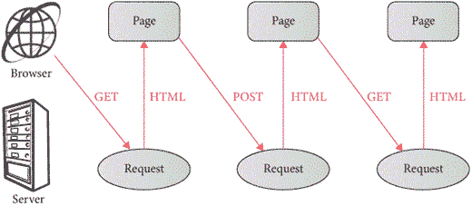

图 2：多页应用程序的请求和响应循环。

表单是对请求和响应循环的简单、最小化介绍，也是了解浏览器应用程序工作原理的良好入门。它们在所有浏览器中都有实现，并且已经存在了几十年。如今，许多网络应用程序使用表单元素，但用由 JavaScript 驱动的异步`POST`请求替换了同步请求，通过隐藏 HTTP 请求的时间来使应用程序更加迅速。作为对这种迅速的回报，JavaScript 代码现在必须处理错误、验证输入并指示加载时间。无论如何，表单的同步和异步使用都基于客户端和服务器代码的相同原则。

除了`GET`和`POST`之外，还有其他请求类型，如`PUT`（如果不存在则创建）和`DELETE`，或者更不为人知的`CONNECT`和`TRACE`。2010 年，`PATCH`方法在[RFC 5789](https://datatracker.ietf.org/doc/html/rfc5789)中被标准化。新的方法被设计为 HTTP 的标准扩展机制，一些协议就是这样构建的（如[WebDav](https://en.wikipedia.org/wiki/WebDAV)的`PROPFIND`、`MOVE`和`LOCK`方法），但这并没有成为扩展网络本身的持久方式，HTTP 2.0 和 3.0 也没有添加任何新方法。

# 接收 POST 请求

为了更好地理解请求/响应周期，让我们编写一个简单的网络服务器。它将实现一个在线留言簿，它们在 20 世纪 90 年代非常流行——在可以评论之前就已经存在的评论线程。有点像开放的、匿名的评论线程。现在，这是一本关于网络**浏览器**工程的书籍，所以我不打算详细讨论网络服务器的实现。但我希望你能看到应用程序的客户端是如何工作的。

网络服务器是独立于网络浏览器的程序，因此让我们开始创建一个新的文件。服务器需要执行以下操作：

+   打开一个套接字并监听连接；

+   解析它接收到的 HTTP 请求；

+   使用 HTML 网页响应这些请求。

让我们从打开一个套接字开始。就像浏览器一样，我们需要使用 TCP 创建一个互联网流套接字：

```py
import socket
s = socket.socket(
 family=socket.AF_INET,
 type=socket.SOCK_STREAM,
 proto=socket.IPPROTO_TCP)
s.setsockopt(socket.SOL_SOCKET, socket.SO_REUSEADDR, 1)
```

`setsockopt`调用是可选的。通常，当一个程序打开套接字并崩溃时，你的操作系统会防止该端口在短时间内被重用。当你的进程崩溃时，连接另一端的计算机不会立即得到通知；如果其他进程打开了相同的端口，它可能会接收到原本为旧、现在已死进程的数据。这在开发服务器时很烦人；使用`SO_REUSEADDR`选项调用`setsockopt`允许操作系统立即重用端口。

现在，有了这个套接字，我们不是调用`connect`（连接到其他服务器），而是调用`bind`，它等待其他计算机连接：

```py
s.bind(('', 8000))
s.listen()
```

让我们先看看`bind`调用。它的第一个参数指定了谁应该被允许连接到服务器；空字符串意味着任何人都可以连接。第二个参数是其他计算机必须使用的端口号来与我们的服务器通信；我选择了`8000`。我不能使用 80，因为低于 1024 的端口号需要管理员权限，但如果你机器上的端口 8000 已被占用，你可以选择其他端口号。

最后，在`bind`调用之后，`listen`调用通知操作系统我们已经准备好接受连接。

为了实际接受这些连接，我们进入一个循环，每次循环运行一次以处理一个连接。在循环的顶部，我们调用`s.accept`以等待新的连接：

```py
while True:
 conx, addr = s.accept()
 handle_connection(conx)
```

那个连接对象，令人困惑的是，也是一个套接字：它是对应那个连接的套接字。我们知道如何处理这些：我们读取内容并解析 HTTP 消息。但在服务器中比在浏览器中要复杂一些，因为服务器不能只是从套接字中读取直到连接关闭——浏览器正在等待服务器，不会关闭连接。

因此，我们必须逐行从套接字中读取。首先，我们读取请求行：

```py
def handle_connection(conx):
 req = conx.makefile("b")
 reqline = req.readline().decode('utf8')
 method, url, version = reqline.split(" ", 2)
 assert method in ["GET", "POST"]
```

然后我们读取头部信息，直到遇到空白行，将头部信息累积到一个字典中：

```py
def handle_connection(conx):
 # ...
 headers = {}
 while True:
 line = req.readline().decode('utf8')
 if line == '\r\n': break
 header, value = line.split(":", 1)
 headers[header.casefold()] = value.strip()
```

最后我们读取正文，但只有当`Content-Length`头部告诉我们需要读取多少内容时才读取（这就是为什么在`POST`请求中这个头部是强制性的）：

```py
def handle_connection(conx):
 # ...
 if 'content-length' in headers:
 length = int(headers['content-length'])
 body = req.read(length).decode('utf8')
 else:
 body = None
```

现在服务器需要生成一个网页作为响应。我们稍后会讨论这个问题；现在，只需将这个抽象化到 `do_request` 调用之后即可：

```py
def handle_connection(conx):
 # ...
 status, body = do_request(method, url, headers, body)
```

服务器然后将这个页面发送回浏览器：

```py
def handle_connection(conx):
 # ...
 response = "HTTP/1.0 {}\r\n".format(status)
 response += "Content-Length: {}\r\n".format(
 len(body.encode("utf8")))
 response += "\r\n" + body
 conx.send(response.encode('utf8'))
 conx.close()
```

架构总结在图 3 中。我们的实现非常基础：我们的服务器不会检查浏览器是否使用 HTTP 1.0 与之通信，它不会发送任何除了 `Content-Length` 之外的头信息，它不支持 TLS，等等。再次强调：这是一本关于网络浏览器的书——它会的。

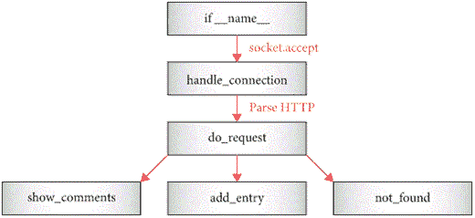

图 3：本章简单网络服务器的架构。

Ilya Grigorik 的[*高性能浏览器网络*](https://hpbn.co)是一本关于网络和如何在网络应用程序中对其进行优化的优秀深入探讨。客户端可以做一些事情（减少请求，避免轮询，重用连接），服务器也可以做一些事情（压缩，协议支持，共享域名）。

# 生成网页

到目前为止，这个服务器的所有代码都是“样板代码”——任何网络应用程序都会有类似的代码。另一方面，我们的服务器成为留言簿的原因，取决于 `do_request` 内部发生的事情。它需要存储留言簿状态，生成 HTML 页面，并响应 `POST` 请求。

让我们将留言簿条目存储在 Python 列表中。通常网络应用程序使用“持久”状态，如数据库，以便服务器可以重启而不会丢失状态，但我们的留言簿不需要那么有弹性。

```py
ENTRIES = [ 'Pavel was here' ]
```

接下来，`do_request` 必须输出显示这些条目的 HTML：

```py
def do_request(method, url, headers, body):
 out = "<!doctype html>"
 for entry in ENTRIES:
 out += "<p>" + entry + "</p>"
 return "200 OK", out
```

这绝对是“最小化”的 HTML，所以很幸运我们的浏览器会插入隐式标签并有一些默认样式！你可以通过运行这个最小化网络服务器来测试它，当它运行时，将你的浏览器指向 `http://localhost:8000/`，其中 `localhost` 是你的电脑对自己的称呼，`8000` 是我们之前选择的端口。你应该会看到一个留言簿条目。

顺便说一句，当你调试这个网络服务器时，最好使用真正的网络浏览器，而不是这本书中的浏览器，来与之交互。这样，你在处理服务器错误时就不必担心浏览器错误了。但这个服务器确实支持真实和玩具浏览器。

我们将使用表单让访客在留言簿中留言：

```py
def do_request(method, url, headers, body):
 # ...
 out += "<form action=add method=post>"
 out +=   "<p><input name=guest></p>"
 out +=   "<p><button>Sign the book!</button></p>"
 out += "</form>"
 # ...
```

当这个表单提交时，浏览器将向 `http://localhost:8000/add` 发送一个 `POST` 请求。因此，服务器需要对这些提交做出反应。这意味着 `do_request` 将处理两种类型的请求：常规浏览和表单提交。让我们将两种类型的请求分开到不同的函数中。

首先将当前的 `do_request` 重命名为 `show_comments`：

```py
def show_comments():
 # ...
 return out
```

这样就释放了 `do_request` 函数来决定对哪种请求调用哪个函数：

```py
def do_request(method, url, headers, body):
 if method == "GET" and url == "/":
 return "200 OK", show_comments()
 elif method == "POST" and url == "/add":
 params = form_decode(body)
 return "200 OK", add_entry(params)
 else:
 return "404 Not Found", not_found(url, method)
```

当一个 `POST` 请求到达 `/add` 时，第一步是解码请求体：

```py
def form_decode(body):
 params = {}
 for field in body.split("&"):
 name, value = field.split("=", 1)
 name = urllib.parse.unquote_plus(name)
 value = urllib.parse.unquote_plus(value)
 params[name] = value
 return params
```

注意，我使用`unquote_plus`而不是`unquote`，因为浏览器也可能使用加号来编码空格。`add_entry`函数随后查找`guest`参数并将其内容添加为新的留言簿条目：

```py
def add_entry(params):
 if 'guest' in params:
 ENTRIES.append(params['guest'])
 return show_comments()
```

我还添加了一个“404”响应。与我们的留言簿的简约风格相匹配，以下是 404 页面：

```py
def not_found(url, method):
 out = "<!doctype html>"
 out += "<h1>{}  {} not found!</h1>".format(method, url)
 return out
```

尝试一下！你应该能够重新启动服务器，在浏览器中打开它，并更新留言簿几次。你也应该能够从真实的网络浏览器中使用留言簿。

通常，连接处理和请求路由由一个 Web 框架处理；例如，这本书的网站使用[bottle.py](https://bottlepy.org/docs/dev/)。框架将请求解析成方便的数据结构，将请求路由到正确的处理程序，还可以提供 HTML 模板、会话处理、数据库访问、输入验证和 API 生成等工具。

# 摘要

通过本章，我们开始将我们的浏览器转变为一个应用平台。我们添加了：

+   输入区域和按钮的布局对象；

+   点击按钮和在输入区域中输入；

+   层次化焦点处理；

+   使用 HTTP `POST`进行表单提交。

此外，我们的浏览器现在有一个小小的网络服务器朋友。当我们向浏览器添加更多交互功能时，这将非常方便。

由于本章介绍了服务器，我还在下面的浏览器小部件中添加了对它的支持，通过交叉编译本章的服务器代码到 JavaScript。尝试通过表单提交一个评论，它应该可以工作！

widgets/lab8-browser.html

# 概述

我们浏览器中的完整函数、类和方法集现在看起来可能像这样：

如果你运行它，它应该看起来像这样：

widgets/lab8-browser.html

# 练习

8-1 **回车键**。在大多数浏览器中，如果你在文本输入框内按下“Enter”或“Return”键，那么会提交该文本输入框所在的表单。将此功能添加到你的浏览器中。

8-2 **`GET` 表单**。表单可以通过 `GET` 请求以及 `POST` 请求提交。在 `GET` 请求中，表单编码的数据粘贴到 URL 的末尾，由一个问号与路径分开，如 `/search?q=hi`；`GET` 表单提交没有主体。实现 `GET` 表单提交。

8-3 **模糊**。目前，如果你在文本输入框内点击，然后在内地址栏内点击，屏幕上会出现两个光标。为了解决这个问题，为每个 `Tab` 添加一个 `blur` 方法，该方法取消任何已聚焦的元素的关注，并在更改焦点之前调用它。

8-4 **复选框**。在 HTML 中，`input` 元素有一个 `type` 属性。当设置为 `checkbox` 时，`input` 元素看起来像一个复选框；如果设置了 `checked` 属性，则选中，否则未选中。技术上讲，`checked` 属性 [仅在页面加载时影响复选框的状态](https://developer.mozilla.org/en-US/docs/Web/HTML/Element/input/checkbox#attr-checked)；选中或取消选中复选框不会影响此属性，而是操作内部状态。当表单提交时，只有当复选框被选中时，复选框的 `name=value` 对才会包含在内。（如果复选框没有 `value` 属性，则默认为字符串 `on`。）

8-5 **重新提交请求**。将 `GET` 和 `POST` 请求分开的一个原因是因为 `GET` 请求应该是 **幂等的**（只读，基本上）而 `POST` 请求则假定会改变网络服务器状态。这意味着回到一个 `GET` 请求（再次发出请求）是安全的，而回到一个 `POST` 请求则是一个坏主意。更改浏览器历史记录以记录访问每个 URL 所使用的方法，以及如果有的话，`POST` 请求体。当你回到一个 `POST`-ed URL 时，询问用户是否想要重新提交表单。如果他们说不，不要回退；如果他们说好，提交一个与之前相同的 `POST` 请求体。

8-6 **留言板**。目前我们的网络服务器是一个简单的留言簿。通过添加对主题的支持，将其扩展为一个简单的留言板。每个主题都应该有自己的 URL 和自己的消息列表。例如，`/cooking` 应该是一个关于烹饪的帖子页面，并且通过该页面上表单提交的评论只有在访问 `/cooking` 时才会显示，而不是访问 `/cars` 时显示。使主页在 `/` 上列出可用的主题，并为每个主题页面提供链接。使用户能够添加新的主题。

8-7 **持久性**。使用文件备份服务器的留言簿条目列表，这样当服务器重启时不会丢失数据。

8-8 *丰富按钮*。使按钮能够包含任意元素作为子元素，并正确渲染它们。子元素应包含在按钮内部而不是溢出——这可以使按钮变得非常高。考虑边缘情况，例如包含另一个按钮、输入区域或链接的按钮，并测试真实浏览器以查看它们的行为。

8-9 *HTML 外壳*。在真实浏览器中，浏览器外壳相当复杂，具有字体大小、填充、轮廓、阴影、图标等棘手细节。这使得我们尝试重用布局引擎来处理它变得很有吸引力。使用 `<button>` 元素实现新标签页和后退按钮，使用 `<input>` 元素实现地址栏，使用 `<a>` 元素实现标签名称。它可能不会与当前的壳体完全相同——例如，轮廓将不得不等待第十四章，但如果调整默认 CSS，你应该能够使其看起来可以接受。实际上，真实浏览器已经多次走过了这条实现路径，为浏览器外壳构建了受主要网页布局引擎强烈启发或重用其部分的布局引擎。[Firefox 有一个](https://en.wikipedia.org/wiki/XUL)，[Chrome 也有一个](https://www.chromium.org/developers/webui/)。然而，由于浏览器外壳需要非常快且响应性强的绘制，这种方法已经取得了不同的成功。

# 运行交互式脚本

Web 浏览器工程学的第九章。

+   安装 DukPy

+   运行 JavaScript 代码

+   导出函数

+   处理崩溃

+   返回句柄

+   包装句柄

+   事件处理

+   修改 DOM

+   事件默认值

+   总结

+   大纲

+   练习

最初的 Web 应用程序就像上一章的留言簿，服务器为每个用户操作生成新的 Web 页面。但在 2000 年代初，JavaScript 增强的 Web 应用程序，可以动态更新页面并立即响应用户操作，取代了它们。让我们为我们的浏览器添加对这种关键 Web 技术的支持。

# 安装 DukPy

实际编写 JavaScript 解释器超出了本书的范围，但如果听起来很有趣，可以查看关于编程语言实现的书籍！因此，本章使用 `dukpy` 库来执行 JavaScript。

[DukPy](https://github.com/amol-/dukpy) 包裹了一个名为 [Duktape](https://duktape.org) 的 JavaScript 解释器。最著名的 JavaScript 解释器是那些用于浏览器的：TraceMonkey（Firefox）、JavaScriptCore（Safari）和 V8（Chrome）。与这些实现不同，它们非常快但也很复杂，Duktape 旨在简单且可扩展，通常嵌入到更大的 C 或 C++ 项目中。例如，在视频游戏中，高速图形代码通常用 C 或 C++ 编写，但游戏的实际情节通常用更高级的语言如 JavaScript 编写。

与其他 JavaScript 引擎一样，DukPy 不仅执行 JavaScript 代码，还允许它调用 *导出* 的 Python 函数。我们将使用这个特性来允许 JavaScript 代码修改其运行的网页。

使用 DukPy 的第一步是安装它。在大多数机器上，包括 Windows、macOS 和 Linux 系统，你应该能够使用以下命令完成：

```py
python3 -m pip install dukpy
```

如果你有一个非常旧的 Python 版本，你可能需要首先安装 `pip` 软件包，可能需要使用命令行 `easy_install`。如果你通过集成开发环境（IDE）进行 Python 编程，你可能需要使用你的 IDE 的软件包安装器。如果其他方法都不奏效，你可以从源代码构建 [DukPy](https://github.com/amol-/dukpy)。

如果你不是在 Python 中跟进，你可能需要跳过这一章，尽管你可以尝试直接绑定到 `dukpy` 所使用的 `duktape` 库。

要测试你是否正确安装了 DukPy，请执行以下操作：

```py
import dukpy
dukpy.evaljs("2 + 2")
```

如果你在第一行遇到错误，你可能没有成功安装 DukPy。或者，在我的 Linux 机器上，我有时会因为文件所有权问题而遇到错误。你可能需要进行一些调查。如果你在第二行遇到错误或段错误，那么可能是 Duktape 编译失败，或者可能不支持你的系统，你可能需要进一步调试。

注意：对于 JavaScript 专家，DukPy 不实现像 `let` 和 `const` 或箭头函数这样的新语法。为了保持本书的美学风格，你需要使用世纪之交的旧式 JavaScript。

# 运行 JavaScript 代码

上述测试展示了如何在 DukPy 中运行 JavaScript 代码：你只需调用 `evaljs`！让我们将这新获得的知识应用到我们的浏览器中。

在网络上，JavaScript 存在于 `<script>` 标签中。通常，一个 `<script>` 标签有一个 `src` 属性，包含一个相对 URL，指向 JavaScript 文件，就像 CSS 文件一样。一个 `<script>` 标签也可以在开始和结束标签之间包含 JavaScript 源代码，但我们不会实现这一点。由于在 JavaScript 代码中很难避免小于和大于符号，这会是一个解析的挑战。参见 练习 4-3。

寻找和下载这些脚本与我们在 CSS 中所做的工作类似。首先，我们需要找到所有的脚本：

```py
class Tab:
 def load(self, url, payload=None):
 # ...
 scripts = [node.attributes["src"] for node
 in tree_to_list(self.nodes, [])
 if isinstance(node, Element)
 and node.tag == "script"
 and "src" in node.attributes]
 # ...
```

接下来，我们运行所有的脚本：

```py
def load(self, url, payload=None):
 # ...
 for script in scripts:
 script_url = url.resolve(script)
 try:
 body = script_url.request()
 except:
 continue
 print("Script returned: ", dukpy.evaljs(body))
 # ...
```

这应该在样式和布局之前运行。为了尝试它，创建一个简单的网页，包含一个`script`标签：

```py
<script src=test.js></script>
```

然后编写一个超级简单的脚本到`test.js`，可能如下所示：

```py
var x = 2
x + x
```

将你的浏览器指向这个页面，你应该会看到：

```py
Script returned: 4
```

那就是你的浏览器正在运行它的第一段 JavaScript 代码！

实际上，真实浏览器会在解析完整个页面后立即运行 JavaScript 代码，而不是在解析完`<script>`标签后。或者至少，这是默认行为；有许多[选项](https://html.spec.whatwg.org/multipage/scripting.html#the-script-element)。我们的浏览器所做的是当设置了`defer`（[defer 属性](https://developer.mozilla.org/en-US/docs/Web/HTML/Element/script#attr-defer)）属性时，真实浏览器所做的那样。默认行为[更难以高效实现](https://developer.mozilla.org/en-US/docs/Glossary/speculative_parsing)。

# 导出函数

目前，我们的浏览器只是打印脚本中的最后一个表达式；但在真实浏览器中，脚本必须调用`console.log`函数来打印。为了支持这一点，我们需要从 Python 中导出一个函数到 JavaScript 中。由于我们将导出很多函数，为了避免将许多新方法污染`Tab`对象，让我们将这段代码放在一个新的`JSContext`类中：

```py
class JSContext:
 def __init__(self):
 self.interp = dukpy.JSInterpreter()

 def run(self, code):
 return self.interp.evaljs(code)
```

DukPy 的`JSInterpreter`对象存储了所有 JavaScript 变量的值，并允许我们运行多个 JavaScript 片段，并在它们之间共享变量值和其他状态。

在加载页面时，我们创建这个新的`JSContext`对象：

```py
class Tab:
 def load(self, url, payload=None):
 # ...
 self.js = JSContext()
 for script in scripts:
 # ...
 self.js.run(body)
```

使用一个`JSContext`对所有脚本进行操作的一个副作用是，现在可以运行两个脚本，其中一个脚本定义一个变量，另一个脚本使用它，比如在一个像这样的页面上：

```py
<script src=a.js></script>
<script src=b.js></script>
```

假设`a.js`是“`var x = 2;`”而`b.js`是“`console.log(x + x)`”；变量`x`在`a.js`中设置，但在`b.js`中使用。在真实的网页浏览器中，这种情况很常见，因为一个脚本可能定义了另一个脚本想要调用的库函数。

现在，为了允许 JavaScript 与外部世界交互，DukPy 允许我们“导出”函数到它。例如，我们可以像这样导出 Python 的`print`函数：

```py
class JSContext:
 def __init__(self):
 # ...
 self.interp.export_function("log", print)
```

我们可以使用 DukPy 的`call_python`函数从 JavaScript 调用导出的函数。例如：

```py
call_python("log", "Hi from JS")
```

当这段 JavaScript 代码运行时，DukPy 将 JavaScript 字符串`"Hi from JS"`转换为 Python 字符串，这种转换适用于数字、字符串、布尔值，以及相应的数组和字典，但不适用于复杂对象。然后，它将这个 Python 字符串传递给导出的`print`函数。然后`print`打印这个字符串。

由于我们最终想要一个`console.log`（[console.log 函数](https://developer.mozilla.org/en-US/docs/Web/API/console/log)）函数，而不是一个`call_python`函数，我们需要定义一个`console`对象，然后给它一个`log`属性。我们可以在 JavaScript 中这样做：

```py
console = { log: function(x) { call_python("log", x); } }
```

如果你不太熟悉 JavaScript，现在是一个很好的时间来 [复习](https://developer.mozilla.org/en-US/docs/Learn/JavaScript/First_steps/A_first_splash)！这定义了一个名为 `console` 的变量，其值是一个具有 `log` 属性的对象字面量，其值是一个调用 `call_python` 的函数。浏览器与 JavaScript 之间的交互如图 1 所示。


图 1：浏览器可以评估 JavaScript，并且 JavaScript 代码可以回调到浏览器。

我们可以将那个 JavaScript 代码称为我们的“JavaScript 运行时”；我们在运行任何用户代码之前运行它，所以让我们将其放入一个 `runtime.js` 文件中，并在创建 `JSContext` 之前执行它，在我们运行任何用户代码之前：

```py
RUNTIME_JS = open("runtime.js").read()

class JSContext:
 def __init__(self):
 # ...
 self.interp.evaljs(RUNTIME_JS)
```

现在，你应该能够将 `console.log("Hi from JS!")` 放入一个 JavaScript 文件中，从你的浏览器中运行它，并在终端中看到输出。你也应该能够多次调用 `console.log`。

回顾一下，当我们在我们浏览器中运行 JavaScript 时，我们混合了 C 代码，它实现了 JavaScript 解释器；Python 代码，它实现了某些 JavaScript 函数；一个 JavaScript 运行时，它将 Python API 包装得更像 JavaScript；当然，还有一些 JavaScript 用户的代码。这里有很多复杂性！

如果一个脚本运行时间过长，或者有无限循环，我们的浏览器就会锁定，对用户完全无响应。这是 JavaScript 的单线程语义及其基于任务的、[运行至完成调度](https://en.wikipedia.org/wiki/Run_to_completion_scheduling) 的结果。一些 API，如 [Web Workers](https://developer.mozilla.org/en-US/docs/Web/API/Web_Workers_API)，允许有限的并行处理，但这些线程无法访问 DOM。

# 处理崩溃

JavaScript 代码中的崩溃调试起来很麻烦。你可以通过编写糟糕的代码或显式抛出异常来引发崩溃，如下所示：

```py
throw Error("bad");
```

当一个网页运行一些导致崩溃的 JavaScript 时，浏览器应该忽略这个崩溃。网页不应该能够使我们的浏览器崩溃！你可以这样实现（以及将 `run` 的调用站点更改为传递脚本）：

```py
class JSContext:
 def run(self, script, code):
 try:
 return self.interp.evaljs(code)
 except dukpy.JSRuntimeError as e:
 print("Script", script, "crashed", e)
```

但随着你进入这一章，你还会遇到另一种类型的崩溃：我们自己的 JavaScript 运行时中的崩溃。我们不能忽略这些，因为那是我们的代码。调试这些崩溃很困难：默认情况下，DukPy 不会显示回溯，如果运行时代码调用了一个崩溃的导出函数，那么情况会变得更加混乱。

这里有一些提示可以帮助处理这些崩溃。首先，如果你在某个 JavaScript 函数内部遇到崩溃，可以将函数体包装如下：

```py
function foo() {
 try {
 // ...
 } catch(e) {
 console.log("Crash in function foo()", e.stack);
 throw e;
 }
}
```

这段代码捕获所有异常，在重新抛出之前打印堆栈跟踪。如果你在导出的函数内部遇到崩溃，你将需要在 Python 端包装该函数：

```py
class JSContext:
 def foo(self, arg):
 try:
 # ...
 except:
 import traceback
 traceback.print_exc()
 raise
```

调试这些问题并不容易，因为 Python 和 JavaScript 之间的所有调用都变得相当复杂。*因为这些错误很难解决，所以系统性地处理调试并在尝试修复之前收集大量信息是值得的*。

# 返回句柄

到目前为止，JavaScript 的评估很有趣但毫无用处，因为 JavaScript 无法对页面本身进行任何修改。（如果 JavaScript 除了打印之外什么都不能做，为什么还要运行它？谁会去看浏览器的控制台输出？）我们需要允许 JavaScript 修改页面。

JavaScript 通过调用大量统称为 DOM API 的方法来操作网页。DOM API 很大，而且还在不断变大，所以我们不会实现所有，甚至大部分。但一些核心函数展示了完整 API 的关键元素：

+   `querySelectorAll` 返回所有匹配选择器的元素；

+   `getAttribute` 返回某个属性的元素值；并且

+   `innerHTML` 用新的 HTML 替换元素的内容。

我们将实现这些 API 的简化版本。这些简化将是微小的。`querySelectorAll` 将返回一个数组，而不是称为`NodeList`的东西；`innerHTML` 只会写入元素的 HTML 内容，不允许读取这些内容。这足以演示 JavaScript 与浏览器的交互。

让我们从`querySelectorAll`开始。首先，导出一个函数：

```py
class JSContext:
 def __init__(self):
 # ...
 self.interp.export_function("querySelectorAll",
 self.querySelectorAll)
 # ...
```

在 JavaScript 中，`querySelectorAll`是`document`对象上的一个方法，我们需要在 JavaScript 运行时中定义它：

```py
document = { querySelectorAll: function(s) {
 return call_python("querySelectorAll", s);
}}
```

在 Python 端，`querySelectorAll`首先需要解析选择器，然后找到并返回匹配的元素。为了解析选择器，我将调用`CSSParser`的`selector`方法：如果你向`querySelectorAll`传递一个无效的选择器，`selector`调用将抛出错误，DukPy 将把这个 Python 端的异常转换成我们在 Web 脚本中运行的 JavaScript 端的异常，这可以捕获它。

```py
class JSContext:
 def querySelectorAll(self, selector_text):
 selector = CSSParser(selector_text).selector()
```

接下来，我们需要找到并返回所有匹配的元素。为此，我们需要`JSContext`能够访问`Tab`，特别是它的`nodes`字段。所以让我们在创建`JSContext`时传递`Tab`：

```py
class JSContext:
 def __init__(self, tab):
 self.tab = tab
 # ...

class Tab:
 def load(self, url, payload=None):
 # ...
 self.js = JSContext(self)
 # ...
```

现在`querySelectorAll`将找到所有匹配选择器的节点：

```py
def querySelectorAll(self, selector_text):
 # ...
 nodes = [node for node
 in tree_to_list(self.tab.nodes, [])
 if selector.matches(node)]
```

最后，我们需要将这些节点返回给 JavaScript。你可能尝试这样做：

```py
def querySelectorAll(self, selector_text):
 # ...
 return nodes
```

然而，这会抛出一个错误：是的，这是一个令人困惑的错误消息。它是`JSRuntimeError`、`EvalError`还是`TypeError`？这种混淆是 Python、JS 和 C 代码复杂交互的结果。（JSON，或 JavaScript 对象表示法，是一种语言无关的数据格式。）

```py
_dukpy.JSRuntimeError: EvalError:
Error while calling Python Function:
TypeError('Object of type Element is not JSON serializable')
```

DukPy 试图告诉你的是，它不知道如何处理`querySelectorAll`返回的`Element`对象。毕竟，`Element`类只存在于 Python 中，而不在 JavaScript 中！

Python 对象需要留在浏览器的 Python 一侧，因此 JavaScript 代码需要通过某种间接方式来引用它们。我将使用一个简单的数字标识符，我将称之为 *句柄*（见图 2）。注意这与文件描述符的相似性，它为用户级应用程序提供了对内核数据结构的访问。

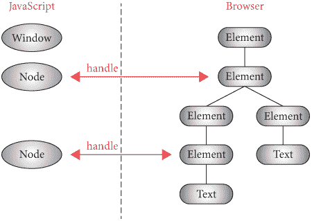

图 2：JavaScript 中的 `Node` 对象与浏览器中的 `Element`/`Text` 对象之间的关系是通过句柄来维护的。

我们需要跟踪句柄到节点的映射。让我们创建一个 `node_to_handle` 数据结构来将节点映射到句柄，以及一个反向映射的 `handle_to_node` 映射：

```py
class JSContext:
 def __init__(self, tab):
 # ...
 self.node_to_handle = {}
 self.handle_to_node = {}
 # ...
```

现在的 `querySelectorAll` 处理器可以为每个节点分配句柄，并返回这些句柄：

```py
def querySelectorAll(self, selector_text):
 # ...
 return [self.get_handle(node) for node in nodes]
```

`get_handle` 函数应该在句柄不存在时创建一个新的句柄：

```py
class JSContext:
 def get_handle(self, elt):
 if elt not in self.node_to_handle:
 handle = len(self.node_to_handle)
 self.node_to_handle[elt] = handle
 self.handle_to_node[handle] = elt
 else:
 handle = self.node_to_handle[elt]
 return handle
```

因此现在 `querySelectorAll` 处理器返回类似 `[1, 3, 4, 7]` 的内容，每个数字都是一个元素的句柄，DukPy 可以轻松地将它们转换为 JavaScript 对象而不会出现问题。当然，在 JavaScript 一侧，`querySelectorAll` 不应该返回一串数字：它应该返回一个 `Node` 对象的列表。在一个真实的浏览器中，`querySelectorAll` 实际上返回一个 [NodeList 对象](https://developer.mozilla.org/en-US/docs/Web/API/NodeList)，出于某种在这里不相关的晦涩原因。所以让我们在我们的运行时中定义一个 `Node` 对象，它封装了一个句柄：如果你的 JavaScript 知识有点生疏，你可能需要了解一下你定义 JavaScript 类时的疯狂方式。现代 JavaScript 也提供了 `class` 语法，这更合理，但在 DukPy 中不受支持。

```py
function Node(handle) { this.handle = handle; }
```

我们在 `querySelectorAll` 的包装器中创建这些 `Node` 对象：此代码在每次调用 `querySelectorAll` 时都会创建新的 `Node` 对象，即使已经为该句柄存在一个 `Node`。这意味着你不能使用相等性来比较 `Node` 对象。我会忽略这一点，但一个真实的浏览器不会这么做。

```py
document = { querySelectorAll: function(s) {
 var handles = call_python("querySelectorAll", s);
 return handles.map(function(h) { return new Node(h) });
}}
```

# 封装句柄

现在我们已经有一些 `Node` 对象了，我们可以用它们做什么呢？

一个简单的 DOM 方法是 `getAttribute`，这是一个在 `Node` 对象上的方法，允许你获取 HTML 属性值。实现 `getAttribute` 意味着解决与 `querySelectorAll` 相反的问题：在 JavaScript 一侧获取 `Node` 对象，并将它们发送到 Python。

解决方案类似于 `querySelectorAll`：我们不是直接发送 `Node` 对象本身，而是发送其句柄：

```py
Node.prototype.getAttribute = function(attr) {
 return call_python("getAttribute", this.handle, attr);
}
```

在 Python 一侧，`getAttribute` 函数接受两个参数，一个句柄和一个属性：

```py
class JSContext:
 def getAttribute(self, handle, attr):
 elt = self.handle_to_node[handle]
 attr = elt.attributes.get(attr, None)
 return attr if attr else ""
```

注意，如果属性未分配，`get` 方法将返回 `None`，DukPy 会将它转换为 JavaScript 的 `null`。别忘了将这个函数导出为 `getAttribute`。

我们现在有足够的 DOM API 来实现一个简单的文本区域字符计数函数：

```py
inputs = document.querySelectorAll('input')
for (var i = 0; i < inputs.length; i++) {
 var name = inputs[i].getAttribute("name");
 var value = inputs[i].getAttribute("value");
 if (value.length > 100) {
 console.log("Input " + name + " has too much text.")
 }
}
```

理想情况下，我们希望每次用户在输入框中输入时都更新字符计数。这需要在每个按键按下时运行 JavaScript。让我们在下一次实现它。

DOM 中的`Node`对象对应于浏览器中的`Element`节点。因此，它们具有 JavaScript 对象*属性*以及 HTML *属性*。它们很容易混淆，而且更糟糕的是，许多 DOM 对象属性[*反映*](https://html.spec.whatwg.org/multipage/common-dom-interfaces.html#reflecting-content-attributes-in-idl-attributes)自动属性值。例如，`Node`对象上的`id`属性提供了对底层`Element`的`id`属性的读写访问。这非常方便，避免了到处调用`setAttribute`和`getAttribute`。但这种反映只适用于某些字段；设置虚构的 JavaScript 属性不会创建相应的 HTML 属性，反之亦然。

# 事件处理

浏览器在加载网页时立即执行 JavaScript 代码，但该代码通常希望根据用户操作更改页面*响应*。

这就是它的工作原理。每当用户与页面交互时，浏览器都会生成*事件*。每个事件都有一个类型，例如`change`、`click`或`submit`，并且发生在*目标元素*上。`addEventListener`方法允许 JavaScript 对这些事件做出反应：`node.addEventListener('click', func)`将`func`设置为每当与`node`对应的元素生成`click`事件时运行。这基本上是 Tk 的`bind`，但在浏览器中——见图 3。让我们实现它。

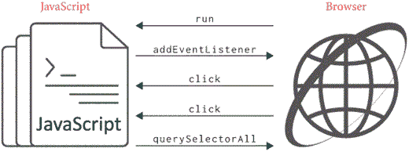

图 3：当事件发生时，浏览器调用 JavaScript。

让我们从生成事件开始。我将创建一个`dispatch_event`方法，并在生成事件时调用它。首先，包括我们点击页面的任何时间：

```py
class Tab:
 def click(self, x, y):
 # ...
 elif elt.tag == "a" and "href" in elt.attributes:
 self.js.dispatch_event("click", elt)
 # ...
 elif elt.tag == "input":
 self.js.dispatch_event("click", elt)
 # ...
 elif elt.tag == "button":
 self.js.dispatch_event("click", elt)
 # ...
 # ...
```

其次，在更新输入区域值之前：

```py
class Tab:
 def keypress(self, char):
 if self.focus:
 self.js.dispatch_event("keydown", self.focus)
 # ...
```

最后，在提交表单但在实际向服务器发送请求之前：

```py
def submit_form(self, elt):
 self.js.dispatch_event("submit", elt)
 # ...
```

到目前为止一切顺利——但是`dispatch_event`方法应该做什么呢？嗯，它需要运行传递给`addEventListener`的监听器，因此这些监听器需要存储在某个地方。由于这些监听器是 JavaScript 函数，我们需要在 JavaScript 端保持这些数据，在运行时变量中。我将称这个变量为`LISTENERS`；我们将使用它来查找句柄和事件类型，所以让我们让它映射句柄到一个将事件类型映射到监听器列表的字典：

```py
LISTENERS = {}

Node.prototype.addEventListener = function(type, listener) {
 if (!LISTENERS[this.handle]) LISTENERS[this.handle] = {};
 var dict = LISTENERS[this.handle];
 if (!dict[type]) dict[type] = [];
 var list = dict[type];
 list.push(listener);
}
```

要分发一个事件，我们需要在`LISTENERS`数组中查找类型和句柄，如下所示：

```py
Node.prototype.dispatchEvent = function(type) {
 var handle = this.handle;
 var list = (LISTENERS[handle] && LISTENERS[handle][type]) || [];
 for (var i = 0; i < list.length; i++) {
 list[i].call(this);
 }
}
```

注意，`dispatchEvent`在函数上使用`call`方法，这设置了该函数内部`this`的值。按照 JavaScript 的标准，我将它设置为事件发生所在的节点。

当事件发生时，浏览器从 Python 调用`dispatchEvent`：

```py
class JSContext:
 def dispatch_event(self, type, elt):
 handle = self.node_to_handle.get(elt, -1)
 self.interp.evaljs(
 EVENT_DISPATCH_JS, type=type, handle=handle)
```

在这里，`EVENT_DISPATCH_JS` 常量是一个字符串，用于触发一个新的事件：

```py
EVENT_DISPATCH_JS = \
 "new Node(dukpy.handle).dispatchEvent(dukpy.type)"
```

因此，当在 Python 端调用 `dispatch_event` 时，它会在 JavaScript 端运行 `dispatchEvent`，然后它又运行了所有的事件监听器。这个代码片段中的 `dukpy` JavaScript 对象存储了 `evaljs` 的命名 `type` 和 `handle` 参数。

在所有这些事件处理机制到位后，我们可以在输入区域每次更改时更新字符计数：

```py
function lengthCheck() {
 var name = this.getAttribute("name");
 var value = this.getAttribute("value");
 if (value.length > 100) {
 console.log("Input " + name + " has too much text.")
 }
}
```

```py
var inputs = document.querySelectorAll("input");
for (var i = 0; i < inputs.length; i++) {
 inputs[i].addEventListener("keydown", lengthCheck);
}
```

注意，`lengthCheck` 使用 `this` 来引用实际改变输入元素，这是通过 `dispatchEvent` 设置的。

到目前为止一切顺利——但理想情况下长度检查不应该打印到控制台；它应该在网页本身添加一个警告。为此，我们不仅需要从页面中读取，还需要修改它。

JavaScript [首次出现在 1995 年](https://auth0.com/blog/a-brief-history-of-javascript/)，作为 Netscape Navigator 的一部分。它的名字被选择来表明与 [Java](https://en.wikipedia.org/wiki/Java_(programming_language)) 语言的相似性，并且由于这个原因，其语法类似于 Java。然而，在表面之下，JavaScript 是一个比 Java 更动态的语言，这是它作为网页渐进增强机制的角色的合适之处。例如，任何对象（包括内置的，如 `Element`）上的任何方法或属性都可以在任何时候动态覆盖。这使得可以在浏览器之间 [polyfill](https://developer.mozilla.org/en-US/docs/Glossary/Polyfill) 差异，向其他 JavaScript 代码添加看起来像是内置的功能。

# 修改 DOM

到目前为止，我们已经实现了只读的 DOM 方法；现在我们需要改变页面的方法。完整的 DOM API 提供了很多这样的方法，但为了简单起见，我将只实现 `innerHTML`，它的用法如下：

```py
node.innerHTML = "This is my <b>new</b> bit of content!";
```

换句话说，`innerHTML` 是节点对象的一个 *属性*，当字段被修改时，会运行一个 *setter*。这个 setter 会取新的值，这个值必须是一个字符串，将其解析为 HTML，并将新的、解析后的 HTML 节点作为原始节点的子节点。

让我们实现这个功能，从 JavaScript 端开始。JavaScript 有一个神秘的 `Object.defineProperty` 函数来定义 setter，DukPy 支持：

```py
Object.defineProperty(Node.prototype, 'innerHTML', {
 set: function(s) {
 call_python("innerHTML_set", this.handle, s.toString());
 }
});
```

在 `innerHTML_set` 中，我们需要解析 HTML 字符串。这比你想象的要复杂，因为我们的浏览器 HTML 解析器旨在解析整个 HTML 文档，而不是这些文档片段。作为一个权宜之计，足够好的黑客攻击，真实浏览器遵循 [标准化的解析算法](https://html.spec.whatwg.org/#parsing-html-fragments) 来解析 HTML 片段。我只需将 HTML 包装在 `html` 和 `body` 元素中：

```py
def innerHTML_set(self, handle, s):
 doc = HTMLParser("<html><body>" + s + "</body></html>").parse()
 new_nodes = doc.children[0].children
```

不要忘记导出 `innerHTML_set` 函数。注意，我们提取了 `body` 元素的所有子元素，因为 `innerHTML_set` 调用一次可以创建多个节点。这些新节点现在必须成为 `innerHTML_set` 调用所在元素的子节点：

```py
def innerHTML_set(self, handle, s):
 # ...
 elt = self.handle_to_node[handle]
 elt.children = new_nodes
 for child in elt.children:
 child.parent = elt
```

我们更新了那些解析后的子节点的父指针，因为否则它们将指向我们添加以帮助解析的虚拟`body`元素。

可能看起来我们已经完成了，但尝试一下你会发现，当脚本调用`innerHTML_set`时，没有任何事情发生。那是因为，虽然我们已经改变了 HTML 树，但我们没有重新生成布局树或显示列表，所以浏览器仍然显示旧页面。

每当页面发生变化时，我们需要通过调用`render`来更新其渲染：对整个页面重新布局通常是浪费的；第十六章探讨了更复杂的算法，可以加快这个过程。

```py
class JSContext:
 def innerHTML_set(self, handle, s):
 # ...
 self.tab.render()
```

现在 JavaScript 可以修改网页了！注意，虽然渲染将更新以适应新的 HTML，但任何添加的脚本或样式表都不会正确加载，而移除的样式表（错误地）仍然会应用。我将修复这个问题留作练习 9-7。

让我们在留言簿中尝试这个。比如说，我们想要对留言簿条目设置一个 100 个字符的限制，以防止长而混乱的评论进入。

首先，切换到服务器端代码库，并在留言表单后添加一个 `<strong>` 标签。最初这个元素将是空的，但如果段落太长，我们会将其写入错误信息。

```py
def show_comments():
 # ...
 out += "<strong></strong>"
 # ...
```

还需要在页面上添加一个脚本。

```py
def show_comments():
 # ...
 out += "<script src=/comment.js></script>"
 # ...
```

现在浏览器将请求`comment.js`，所以我们的服务器需要*提供*那个 JavaScript 文件：

```py
def do_request(method, url, headers, body):
 # ...
 elif method == "GET" and url == "/comment.js":
 with open("comment.js") as f:
 return "200 OK", f.read()
 # ...
```

然后，我们可以将我们的小输入长度检查器放入`comment.js`中，将`lengthCheck`函数修改为使用`innerHTML`：

```py
var strong = document.querySelectorAll("strong")[0];

function lengthCheck() {
 var value = this.getAttribute("value");
 if (value.length > 100) {
 strong.innerHTML = "Comment too long!";
 }
}

var inputs = document.querySelectorAll("input");
for (var i = 0; i < inputs.length; i++) {
 inputs[i].addEventListener("keydown", lengthCheck);
}
```

尝试一下：写一个长的评论，你应该会看到当页面变长时，页面会警告你。顺便说一句，我们可能想让它更加突出，所以让我们继续在我们的 Web 服务器上添加另一个 URL，`/comment.css`，内容如下：

```py
strong { font-weight: bold; color: red; }
```

在留言簿页面上添加一个`link`，以便加载这个样式表。

尽管我们告诉用户他们的评论太长，但用户仍然可以提交留言簿条目。哎呀！让我们来修复这个问题。

这段代码有一个微妙的内存泄漏：如果你从 JavaScript 中访问一个 HTML 元素（从而为其创建一个句柄）然后从页面上移除该元素（使用 `innerHTML`），Python 将无法垃圾回收`Element`对象，因为它仍然存储在`node_to_handle`映射中。如果是这样的话，如果 JavaScript 可以通过其句柄访问那个`Element`，那还好；但如果不是这样，那就不好了。解决这个问题相当棘手，因为它需要 Python 和 JavaScript 垃圾回收器[合作](https://research.google/pubs/pub47359/)。

# 事件默认操作

到目前为止，当生成一个事件时，浏览器将运行监听器，然后*还会*执行该事件通常的操作——*默认操作*。我现在希望 JavaScript 代码能够*取消*这个默认操作。

这涉及到几个步骤。首先，事件监听器应该接收一个*事件对象*作为参数。该对象应该有一个`preventDefault`方法。当调用该方法时，默认操作不应发生。

首先，我们需要事件对象。回到我们的 JavaScript 运行时：

```py
function Event(type) {
 this.type = type
 this.do_default = true;
}

Event.prototype.preventDefault = function() {
 this.do_default = false;
}
```

注意 `do_default` 字段，用于记录是否调用了 `preventDefault`。现在我们将传递一个 `Event` 对象给 `dispatchEvent`，而不是仅仅传递事件类型：

```py
Node.prototype.dispatchEvent = function(evt) {
 var type = evt.type;
 // ...
 for (var i = 0; i < list.length; i++) {
 list[i].call(this, evt);
 }
 // ...
 return evt.do_default;
}
```

在 Python 中，我们现在需要创建一个 `Event` 对象传递给 `dispatchEvent`：

```py
EVENT_DISPATCH_JS = \
 "new Node(dukpy.handle).dispatchEvent(new Event(dukpy.type))"
```

还要注意，`dispatchEvent` 返回 `evt.do_default`，这不仅符合 JavaScript 的标准，而且在从 Python 分发事件时也很有用，因为 Python 的 `dispatch_event` 可以将那个布尔值返回给其处理程序：

```py
class JSContext:
 def dispatch_event(self, type, elt):
 # ...
 do_default = self.interp.evaljs(
 EVENT_DISPATCH_JS, type=type, handle=handle)
 return not do_default
```

这样，每次发生事件时，浏览器都可以检查 `dispatch_event` 的返回值，并在它是 `True` 时停止。我们在 `click` 方法中有三个这样的地方：

```py
class Tab:
 def click(self, x, y):
 while elt:
 # ...
 elif elt.tag == "a" and "href" in elt.attributes:
 if self.js.dispatch_event("click", elt): return
 # ...
 elif elt.tag == "input":
 if self.js.dispatch_event("click", elt): return
 # ...
 elif elt.tag == "button":
 if self.js.dispatch_event("click", elt): return
 # ...
 # ...
 # ...
```

在 `submit_form` 中有一个：

```py
class Tab:
 def submit_form(self, elt):
 if self.js.dispatch_event("submit", elt): return
```

在 `keypress` 中有一个：

```py
class Tab:
 def keypress(self, char):
 if self.focus:
 if self.js.dispatch_event("keydown", self.focus): return
```

现在我们可以使用字符计数代码来阻止用户提交表单：它可以使用一个全局变量来跟踪是否允许提交，然后在尝试提交时检查该变量，并在必要时取消该提交：

```py
var allow_submit = true;

function lengthCheck() {
 // ...
 allow_submit = value.length <= 100;
 if (!allow_submit) {
 // ...
 }
}

var form = document.querySelectorAll("form")[0];
form.addEventListener("submit", function(e) {
 if (!allow_submit) e.preventDefault();
});
```

这样，当评论过长时，就 impossible 提交表单了！

嗯……在这个浏览器中是不可能的。但是，由于有一些浏览器不运行 JavaScript（就像我们之前的一章中提到的），我们也应该在服务器端检查长度：

```py
def add_entry(params):
 if 'guest' in params and len(params['guest']) <= 100:
 ENTRIES.append(params['guest'])
```

注意，我们不应该——也不能——依赖于浏览器执行 JavaScript，因为浏览器是用户的代理，而不是我们的。理想情况下，网页应该编写得在没有 JavaScript 的情况下也能正确工作，但在有 JavaScript 的情况下工作得更好。这被称为 [渐进增强](https://en.wikipedia.org/wiki/Progressive_enhancement)，这意味着我们不会在 JavaScript 中复制浏览器已经可以做到的事情。

一个思考：虽然我们的留言簿现在有一点点 JavaScript 代码，但它仍然主要是 HTML、CSS、表单元素和其他标准网络功能。这样，JavaScript 扩展了网络而不是取代它。这与最近已经退出舞台的 [Adobe Flash](https://www.adobe.com/products/flashplayer/end-of-life.html) 和之前的 [Java Applets](https://en.wikipedia.org/wiki/Java_applet) 形成对比，后者是自包含的插件，可以独立处理输入和渲染。

搜索引擎不断[抓取](https://en.wikipedia.org/wiki/Web_crawler)网络并[索引](https://en.wikipedia.org/wiki/Search_engine_indexing)它们能找到的所有网页。在早期，索引仅仅是加载 HTML，解析它并提取信息的事情。但如今，许多[单页应用](https://en.wikipedia.org/wiki/Single-page_application)网站使用 JavaScript 来[“激活”](https://en.wikipedia.org/wiki/Hydration_(web_development))它们的网站，使其内容完整。在这些网站上，在激活之前，网站中的信息隐藏在 JavaScript 数据结构中。因此，搜索引擎不仅需要解析 HTML，还需要在索引过程中运行 JavaScript（以及加载样式表）。换句话说，索引系统使用浏览器（例如，例如[无头 Chrome](https://chromium.googlesource.com/chromium/src/+/lkgr/headless/README.md)）——浏览器在 Web 生态系统中的又一出现。

# 摘要

我们的浏览器现在代表网站运行 JavaScript 应用程序。诚然，它只支持 DOM API 中的四种方法，但即使是这些也证明了：

+   生成句柄以允许脚本引用页面元素；

+   从页面元素中读取属性值；

+   编写和修改页面元素；

+   添加事件监听器，以便脚本可以响应用户界面事件。

现在网页可以通过一个巧妙的脚本添加功能，而不是等待浏览器开发者将其添加到浏览器本身中。作为一个额外的好处，网页现在可以赢得“网络应用”这一崇高的称号。

从本章开始，由于与网页内脚本通信方式相关的安全限制，我无法将本章的浏览器内嵌到 iframe 中。但您可以通过点击这里在新浏览器标签页中加载它。

# 概述

我们浏览器中的完整函数、类和方法集现在看起来可能像这样：

# 练习

9-1 *`Node.children`*. 在 JavaScript `Node` 上添加对 `children` [属性](https://developer.mozilla.org/en-US/docs/Web/API/Element/children) 的支持。`Node.children` 返回一个数组，包含节点的直接 `Element` 子元素。`Text` 子元素不包括在内。DOM 方法 `childNodes` 提供了对元素和文本节点的访问。

9-2 *`createElement`*. `document.createElement` [方法](https://developer.mozilla.org/en-US/docs/Web/API/Document/createElement) 创建一个新元素，该元素可以通过 `Node` 上的 `appendChild` 和 `insertBefore` [方法](https://developer.mozilla.org/en-US/docs/Web/API/Node/appendChild) 和 [方法](https://developer.mozilla.org/en-US/docs/Web/API/Node/insertBefore)附加到文档中；与 `innerHTML` 不同，没有涉及解析。实现所有三个方法。

9-3 *`removeChild`*. `Node` 上的 `removeChild` [方法](https://developer.mozilla.org/en-US/docs/Web/API/Node/removeChild) 从提供的子元素中分离该子元素并返回它，将那个子元素及其子树带回 *分离* 状态。（然后它可以被 *重新附加* 到其他地方，使用 `appendChild` 和 `insertBefore`，或者被删除。）实现此方法。实现这个方法更具挑战性，因为您还需要从 Python 端删除子树。

9-4 *ID*. 当一个 HTML 元素有 `id` 属性时，一个指向该元素的 JavaScript 变量是预定义的。因此，如果页面有一个 `<div id="foo"></div>`，那么就有一个变量 `foo` 指向该节点。这是 [标准](http://www.whatwg.org/specs/web-apps/current-work/#named-access-on-the-window-object) 行为。在您的浏览器中实现这一点。确保处理节点被添加和删除的情况（例如使用 `innerHTML`）。

9-5 *事件冒泡*. 目前，您可以将 `click` 处理程序附加到 `a`（锚点）元素上，但不能附加到其他任何元素上。修复这个问题。您将面临的一个挑战是，当您点击一个元素时，您也会点击其所有祖先元素。在网络上，这种怪癖是通过 [*事件冒泡*](https://developer.mozilla.org/en-US/docs/Learn/JavaScript/Building_blocks/Events#event_bubbling) 处理的：当在元素上生成事件时，监听器不仅在该元素上运行，还在其祖先元素上运行。实现事件冒泡，并确保监听器可以在事件对象上调用 `stopPropagation` 以停止事件向上冒泡。请再次确认点击链接仍然有效，并确保 `preventDefault` 仍然成功阻止点击链接以实际跟随链接。

9-6 *序列化 HTML*. 从 `innerHTML` [读取](https://developer.mozilla.org/en-US/docs/Web/API/Element/innerHTML) 应该返回一个包含 HTML 源代码的字符串。该源代码应反映元素的 *当前* 属性；例如：

```py
element.innerHTML = '<span id=foo>Chris was here</span>';
element.id = 'bar';
console.log(element.innerHTML);
// Prints "<span id=bar>Chris was here</span>":
```

将此行为作为 `innerHTML` 的 getter 实现。同时实现 `outerHTML`，它与 `innerHTML` 的区别在于它包含元素本身，而不仅仅是其子元素。

9-7 *脚本添加的脚本和样式表*。`innerHTML`API 可能会导致`<script>`或`<link>`元素被添加到文档中，但当前我们的浏览器在发生这种情况时不会加载它们。修复这个问题。同样，当`<link>`元素从文档中移除时，其样式表也应该从全局列表中移除；也要实现这一点。请注意，与样式表不同，移除的`<script>`的评估代码仍然存在于网页的生命周期中。你能看出为什么必须这样吗？

# 保护数据隐私

Web 浏览器工程的第十章。

+   Cookies

+   登录系统

+   实现 Cookies

+   跨站请求

+   同源策略

+   跨站请求伪造

+   SameSite Cookies

+   跨站脚本

+   内容安全策略

+   总结

+   大纲

+   练习

我们的浏览器已经成长起来，现在可以运行（小型）Web 应用程序。通过最后一步——通过 cookie 实现用户身份——它将能够运行各种个性化的在线服务。但是能力需要责任：我们的浏览器现在必须保护 cookie 免受那些想要窃取它们的对手的侵害。幸运的是，浏览器有复杂的系统来控制对 cookie 的访问并防止其滥用。

网络安全是一个广泛的话题，涵盖了浏览器、网络和应用安全。它还涉及到对用户的培训，以便攻击者不能误导他们泄露自己的安全数据。本章无法涵盖所有内容：如果你正在编写 Web 应用程序或其他安全敏感的代码，这本书是不够的。

# Cookies

到目前为止，我们实现的方法无法让 Web 服务器判断两个 HTTP 请求是否来自同一个用户或两个不同的用户；我们的浏览器实际上是匿名的。我并不是指对抗恶意攻击者，他们可能会使用*浏览器指纹识别*或类似技术来区分用户。我指的是在善意意义上的匿名。这意味着它不能“登录”任何地方，因为登录用户请求与未登录用户请求是无法区分的。

网络通过 cookie 解决这个问题。cookie——这个名字没有意义，忽略它——是浏览器代表 Web 服务器存储的一小部分信息。cookie 区分了你的浏览器与其他任何浏览器，并且与每个 Web 请求一起发送，以便服务器可以区分哪些请求来自谁。实际上，cookie 是浏览器的一个去中心化、由服务器授予的身份。

这里是技术细节。HTTP 响应可以包含一个`Set-Cookie`头。这个头包含一个键值对；例如，以下头将`foo`cookie 的值设置为`bar`：

```py
Set-Cookie: foo=bar
```

浏览器会记住这个键值对，下次它向同一服务器（cookies 是针对特定站点的）发送请求时（cookies 是站点特定的），浏览器会在`Cookie`头部中回显它：

```py
Cookie: foo=bar
```

服务器可以设置多个 cookies，也可以设置参数，如过期日期，但如图 1 所示的`Set-Cookie` / `Cookie`事务是核心原则。

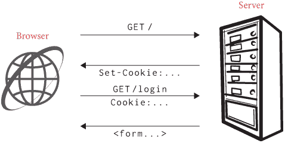

图 1：服务器通过`Set-Cookie`头部将 cookies 分配给浏览器，浏览器随后使用`Cookie`头部来标识自己。

让我们使用 cookies 为我们的留言板编写一个登录系统。每个用户将通过存储在`token`cookie 中的长随机数来识别。这个`random.random`调用返回一个具有 53 位随机性的十进制数。这并不理想；通常目标是 256 位。而且`random.random`不是一个安全的随机数生成器：通过观察足够的 tokens，你可以预测未来的值并使用这些值来劫持账户。真正的 Web 应用程序必须使用密码学安全的随机数生成器来生成 tokens。服务器将要么从`Cookie`头部提取一个 token，要么为新访客生成一个新的 token：

```py
import random

def handle_connection(conx):
 # ...
 if "cookie" in headers:
 token = headers["cookie"][len("token="):]
 else:
 token = str(random.random())[2:]
 # ...
```

当然，新访客需要被告知记住他们新生成的 token：

```py
def handle_connection(conx):
 # ...
 if 'cookie' not in headers:
 template = "Set-Cookie: token={}\r\n"
 response += template.format(token)
 # ...
```

第一个代码块在解析完所有请求头部后运行，在处理`do_request`请求之前，而第二个代码块在`do_request`返回后运行，当服务器正在组装 HTTP 响应时。

通过这两个代码更改，现在每个访问留言板的访客都有一个唯一的身份。我们现在可以使用这个身份来存储有关每个用户的信息。让我们在服务器端的`SESSIONS`变量中这样做：浏览器和服务器都对头部长度有限制，因此最好在 cookies 中存储最少的数据。此外，cookies 在每次请求中都会来回发送，所以长的 cookies 意味着大量的无用流量。因此，将用户数据存储在服务器上，只在 cookies 中存储该数据的指针是明智的。而且，由于 cookies 由浏览器存储，用户可以随意更改它们，因此信任 cookie 数据是不安全的。

```py
SESSIONS = {}

def handle_connection(conx):
 # ...
 session = SESSIONS.setdefault(token, {})
 status, body = do_request(session, method, url, headers, body)
 # ...
```

`SESSIONS`将 tokens 映射到会话数据字典。`setdefault`方法既从字典中获取一个键，如果键不存在，也会设置一个默认值。我通过`do_request`将这个会话数据传递给单个页面，如`show_comments`和`add_entry`：

```py
def do_request(session, method, url, headers, body):
 if method == "GET" and url == "/":
 return "200 OK", show_comments(session)
 # ...
 elif method == "POST" and url == "/add":
 params = form_decode(body)
 add_entry(session, params)
 return "200 OK", show_comments(session)
 # ...
```

你需要修改`add_entry`和`show_comments`的参数列表，以接受这个新参数。我们现在有了构建登录系统的基础。

关于 cookie 的[原始规范](https://curl.se/rfc/cookie_spec.html)表示“没有充分的理由”将它们称为“cookie”，但实际上，在程序之间交换的不透明标识符中使用这个术语似乎可以追溯到很久以前；[维基百科](https://en.wikipedia.org/wiki/Magic_cookie)将其追溯到至少 1979 年，在它们在 Web 上使用之前，cookie 被用于[X11](https://en.wikipedia.org/wiki/X_Window_authorization#Cookie-based_access)进行身份验证。

# 登录系统

我想用户在留言簿中发布之前必须登录。至少这意味着：

+   用户将使用用户名和密码登录。

+   服务器将检查登录是否有效。

+   用户必须登录才能添加留言簿条目。

+   服务器将显示谁添加了哪个留言簿条目。

让我们开始编码。我们将硬编码两个用户/密码对：

```py
LOGINS = {
 "crashoverride": "0cool",
 "cerealkiller": "emmanuel"
}
```

用户可以通过访问`/login`来登录：

```py
def do_request(session, method, url, headers, body):
 # ...
 elif method == "GET" and url == "/login":
 return "200 OK", login_form(session)
 # ...
```

这个页面显示了一个包含用户名和密码字段的表单：我已经给`password`输入区域设置了类型`password`，在真正的浏览器中，它将绘制星号或点而不是显示你输入的内容，尽管我们的浏览器不这样做；参见练习 10-1。此外，请注意，这不是特别易于访问的 HTML，例如，表单标签周围缺少`<label>`元素。我们的浏览器不支持这些！

```py
def login_form(session):
 body = "<!doctype html>"
 body += "<form action=/ method=post>"
 body += "<p>Username: <input name=username></p>"
 body += "<p>Password: <input name=password type=password></p>"
 body += "<p><button>Log in</button></p>"
 body += "</form>"
 return body 
```

注意，表单通过`POST`方法将数据发送到`/` URL。我们希望在一个新函数中处理这些`POST`请求，该函数检查密码并执行登录操作：

```py
def do_request(session, method, url, headers, body):
 # ...
 elif method == "POST" and url == "/":
 params = form_decode(body)
 return do_login(session, params)
 # ...
```

这个`do_login`函数检查密码并通过在会话数据中存储用户名来登录用户：实际上，使用`==`来比较密码这种做法是不好的：Python 的字符串相等函数从左到右扫描字符串，并在找到差异时立即退出。因此，你可以从检查密码猜测所需的时间长度中获取关于密码的线索；这被称为[时间侧信道](https://en.wikipedia.org/wiki/Timing_attack)。这本书是关于浏览器的，而不是服务器，但一个真正的 Web 应用必须进行[恒时字符串比较](https://www.chosenplaintext.ca/articles/beginners-guide-constant-time-cryptography.html)！

```py
def do_login(session, params):
 username = params.get("username")
 password = params.get("password")
 if username in LOGINS and LOGINS[username] == password:
 session["user"] = username
 return "200 OK", show_comments(session)
 else:
 out = "<!doctype html>"
 out += "<h1>Invalid password for {}</h1>".format(username)
 return "401 Unauthorized", out
```

注意，会话数据（包括`user`键）存储在服务器上，因此用户不能直接修改它。这是好事，因为我们只想在登录表单中提供正确密码的用户时在会话数据中设置`user`键。

现在我们可以通过检查`session`数据来确认用户是否已登录。让我们只向已登录用户显示评论表单：

```py
def show_comments(session):
 # ...
 if "user" in session:
 out += "<h1>Hello, " + session["user"] + "</h1>"
 out += "<form action=add method=post>"
 out +=   "<p><input name=guest></p>"
 out +=   "<p><button>Sign the book!</button></p>"
 out += "</form>"
 else:
 out += "<a href=/login>Sign in to write in the guest book</a>"
 # ...
```

同样，`add_entry`必须在发布评论之前检查用户是否已登录：

```py
def add_entry(session, params):
 if "user" not in session: return
 if 'guest' in params and len(params['guest']) <= 100:
 ENTRIES.append((params['guest'], session["user"]))
```

注意，会话中的用户名被存储到`ENTRIES`中：预加载的评论引用了 1995 年的*黑客*。[征服地球！](https://xkcd.com/1337)

```py
ENTRIES = [
 ("No names. We are nameless!", "cerealkiller"),
 ("HACK THE PLANET!!!", "crashoverride"),
]
```

当我们打印留言簿条目时，我们会显示它们的作者：

```py
def show_comments(session):
 # ...
 for entry, who in ENTRIES:
 out += "<p>" + entry + "\n"
 out += "<i>by " + who + "</i></p>"
 # ...
```

在普通网络浏览器中尝试一下。你应该能够进入主留言簿页面，点击登录链接，使用上面列出的用户名/密码之一登录，然后能够发布条目。登录流程会减慢调试速度。你可能想添加一个空字符串作为用户名/密码对。当然，这个登录系统有一系列不安全性。这些不安全性包括不散列密码，不使用[`bcrypt`](https://auth0.com/blog/hashing-in-action-understanding-bcrypt/)，不允许更改密码，没有“忘记密码”流程，不强制使用 TLS，不对服务器进行沙箱隔离，以及许多其他问题。但本书的重点是浏览器，而不是服务器，所以一旦你确定一切正常，让我们回到我们的网络浏览器并实现 cookie。

一个更神秘的浏览器身份验证系统是[TLS 客户端证书](https://aboutssl.org/ssl-tls-client-authentication-how-does-it-works/)。用户从服务器下载一个公钥/私钥对，然后浏览器在后续对该服务器的请求中用它们来证明自己的身份。此外，如果你以前见过在主机名之前有`username:password@`的 URL，那么那是[HTTP 身份验证](https://developer.mozilla.org/en-US/docs/Web/HTTP/Authentication)。请勿在新网站（除非有充分的理由）中使用这两种方法。

# 实现 Cookies

首先，我们需要在浏览器中找到一个存储 cookie 的地方；这个数据结构传统上被称为*cookie jar*：因为一旦你有一个愚蠢的名字，保持品牌一致性就很重要。

```py
COOKIE_JAR = {}
```

由于 cookie 是针对特定站点的，我们的 cookie 存储将站点映射到 cookie。请注意，cookie 存储是全局的，不仅限于特定标签页。这意味着如果你在一个网站上登录并打开第二个标签页，你也会在那个标签页上登录。此外，由于`request`可以在一个页面上多次调用——用于加载 CSS 和 JavaScript——后续请求会传输之前响应设置的 cookie。例如，我们的留言簿在浏览器首次请求页面时设置 cookie，然后在浏览器稍后请求页面 CSS 文件时接收该 cookie。

当浏览器访问一个页面时，它需要为该站点发送 cookie：

```py
class URL:
 def request(self, payload=None):
 # ...
 if self.host in COOKIE_JAR:
 cookie = COOKIE_JAR[self.host]
 request += "Cookie: {}\r\n".format(cookie)
 # ...
```

相似地，当浏览器看到`Set-Cookie`头时，它必须更新 cookie 存储：服务器实际上可以在一个请求中发送多个`Set-Cookie`头以设置多个 cookie，尽管我们的浏览器不会正确处理这种情况。

```py
class URL:
 def request(self, payload=None):
 # ...
 if "set-cookie" in response_headers:
 cookie = response_headers["set-cookie"]
 COOKIE_JAR[self.host] = cookie
 # ...
```

现在，你应该能够使用你的浏览器登录留言簿并发布到它。此外，你应该能够同时打开两个浏览器中的留言簿——可能是你的浏览器和一个真正的浏览器——并以两个不同的用户登录和发布。

现在我们浏览器支持 cookie 并使用它们进行登录，我们需要确保 cookie 数据免受恶意行为者的侵害。毕竟，cookie 是浏览器的身份，如果有人偷走了它，服务器会认为他们是您。我们需要防止这种情况发生。

在某个时候，有人试图在 [RFC 2965](https://datatracker.ietf.org/doc/html/rfc2965) 中“清理”cookie 规范，包括人类可读的 cookie 描述和限制在特定端口上的 cookie。这需要引入 `Cookie2` 和 `Set-Cookie2` 头部；新的头部并不受欢迎。现在它们已经[过时](https://datatracker.ietf.org/doc/html/rfc6265)。

# 跨站请求

Cookies 是特定于站点的，因此一个服务器不应该发送另一个服务器的 cookie。嗯……我们的连接没有加密，所以攻击者可以从开放的 Wi-Fi 连接中读取它。但另一个*服务器*不能。或者考虑这种攻击：另一个服务器可以劫持我们的 DNS，并将我们的主机名重定向到不同的 IP 地址，然后窃取我们的 cookie。一些互联网服务提供商支持 DNSSEC，这可以防止这种情况，但并非所有都支持。或者考虑这种攻击：一个国家级别的攻击者可以宣布欺诈性的 BGP（边界网关协议）路由，这将导致即使正确检索到的 IP 地址也会发送到错误的物理计算机。（安全性非常困难。）但如果攻击者足够聪明，他们可能能够让*服务器*或*浏览器*帮助他们窃取 cookie 值。

攻击者窃取您私人数据的最简单方法就是索要它。当然，浏览器中没有 API 允许一个网站请求另一个网站的 cookie。但确实有一个 API 可以向另一个网站发起请求。它被称为 `XMLHttpRequest`。这个名字很奇怪！为什么 `XML` 大写而 `Http` 不大写？而且它不仅限于 XML！最终，命名是[历史性的](https://en.wikipedia.org/wiki/XMLHttpRequest#History)，可以追溯到微软为 Exchange Server 2000 服务的“Outlook Web Access”功能。

`XMLHttpRequest` 从 JavaScript 发送异步 HTTP 请求。由于我使用 `XMLHttpRequest` 只是为了说明安全问题，所以我将在这里实现一个最小版本。具体来说，我将只支持*同步*请求。同步 `XMLHttpRequest` 正在逐渐走向[弃用和过时](https://xhr.spec.whatwg.org/#the-open()-method)，但我在这里使用它们，因为它们更容易实现。我们将在第十二章实现异步版本。使用这个最小版本的 `XMLHttpRequest` 看起来是这样的：

```py
x = new XMLHttpRequest();
x.open("GET", url, false);
x.send();
// use x.responseText
```

我们将在 JavaScript 中定义 `XMLHttpRequest` 对象和方法。`open` 方法只是保存方法和 URL：`XMLHttpRequest` 在这里没有实现更多选项，例如支持用户名和密码。此代码还缺少一些错误检查，例如确保方法是我们浏览器支持的有效的 HTTP 方法。

```py
function XMLHttpRequest() {}

XMLHttpRequest.prototype.open = function(method, url, is_async) {
 if (is_async) throw Error("Asynchronous XHR is not supported");
 this.method = method;
 this.url = url;
}
```

`send` 方法调用一个导出的函数：如上所述，此实现跳过了重要的 `XMLHttpRequest` 功能，例如设置请求头（和读取响应头）、更改响应类型，或在请求过程中触发各种事件和回调。

```py
XMLHttpRequest.prototype.send = function(body) {
 this.responseText = call_python("XMLHttpRequest_send",
 this.method, this.url, body);
}
```

`XMLHttpRequest_send` 函数只是调用 `request`：请注意，`method` 参数被忽略，因为我们的 `request` 函数会根据是否传递有效负载自行选择方法。这不符合标准（标准允许没有有效负载的 `POST` 请求），我只是在方便起见这样做。

```py
class JSContext:
 def XMLHttpRequest_send(self, method, url, body):
 full_url = self.tab.url.resolve(url)
 headers, out = full_url.request(body)
 return out
```

使用 `XMLHttpRequest`，网页可以在用户操作后发出 HTTP 请求，使网站更加互动（见图 2）。这个 API 以及像 `fetch`（[`developer.mozilla.org/en-US/docs/Web/API/fetch`](https://developer.mozilla.org/en-US/docs/Web/API/fetch)）这样的新类似物，是网站允许你点赞帖子、查看悬停预览或提交表单而不重新加载的方式。

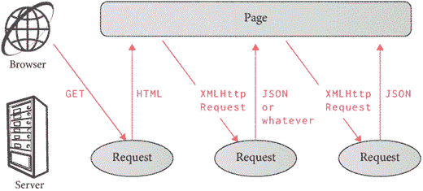

图 2：利用 `XMLHttpRequest` 的单页应用程序架构。

`XMLHttpRequest` 对象有 `setRequestHeader`（[`developer.mozilla.org/en-US/docs/Web/API/XMLHttpRequest/setRequestHeader`](https://developer.mozilla.org/en-US/docs/Web/API/XMLHttpRequest/setRequestHeader)）和 `getResponseHeader`（[`developer.mozilla.org/en-US/docs/Web/API/XMLHttpRequest/getResponseHeader`](https://developer.mozilla.org/en-US/docs/Web/API/XMLHttpRequest/getResponseHeader)）方法来控制 HTTP 头部。然而，这可能会允许脚本干扰 cookie 机制或其他安全措施，因此一些 [请求](https://developer.mozilla.org/en-US/docs/Glossary/Forbidden_header_name) 和 [响应](https://developer.mozilla.org/en-US/docs/Glossary/Forbidden_response_header_name) 头部在 JavaScript 中不可访问。

# 同源策略

然而，新的功能带来了新的责任。使用 `XMLHttpRequest` 发送的 HTTP 请求包括 cookie。这是设计上的考虑：当你“喜欢”某物时，服务器需要将“喜欢”与你的账户关联起来。但这同时也意味着 `XMLHttpRequest` 可以访问私人数据，因此需要保护它。

让我们假设攻击者想了解你在我们的留言簿服务器上的用户名。当你登录时，留言簿会在页面上显示你的用户名（比如“你好，某某”），所以通过你的 cookie 读取留言簿就足以确定你的用户名。

使用 `XMLHttpRequest`，攻击者的网站可以请求留言簿页面：用户为什么会在攻击者的网站上？可能是因为那里有有趣的表情包，或者网站被黑客攻击并被用于攻击，或者可能是坏人付费在安全标准较低的网站上投放广告。这些网站的用户对安全的要求本身就低。

```py
x = new XMLHttpRequest();
x.open("GET", "http://localhost:8000/", false);
x.send();
user = x.responseText.split(" ")[2].split("<")[0];
```

这里的问题是，一个服务器的网页内容被发送到另一个服务器提供的网站上运行的脚本。由于内容来自 cookie，这会导致私人数据泄露。

为了防止这类问题，浏览器有一个[*同源策略*](https://developer.mozilla.org/en-US/docs/Web/Security/Same-origin_policy)，它规定像 `XMLHttpRequest` 这样的请求只能发送到同一“源”的网页上——方案、主机名和端口。你可能已经注意到，这与 cookies 使用的“网站”定义不同：cookies 不关心方案或端口！这似乎是早期混乱的网页留下的一个疏忽或不一致。这样，网站的私有数据必须保持在那个网站上，不能泄露到另一个服务器上的攻击者。

让我们为我们的浏览器实现同源策略。我们需要比较请求的 URL 和我们所在的页面的 URL：

```py
class JSContext:
 def XMLHttpRequest_send(self, method, url, body):
 # ...
 if full_url.origin() != self.tab.url.origin():
 raise Exception("Cross-origin XHR request not allowed")
 # ...
```

`origin` 函数可以仅从 URL 中剥离路径：

```py
class URL:
 def origin(self):
 return self.scheme + "://" + self.host + ":" + str(self.port)
```

现在攻击者不能读取留言簿网页。但他们能写入吗？实际上…

同源策略的一个有趣形式涉及图像和 HTML `<canvas>` 元素。`drawImage` 方法（[drawImage 方法](https://developer.mozilla.org/en-US/docs/Web/API/CanvasRenderingContext2D/drawImage)）允许将图像绘制到画布上，即使该图像是从另一个源加载的。但为了防止使用 `getImageData` 或相关方法读取该图像，将跨源数据写入画布会[污染](https://developer.mozilla.org/en-US/docs/Web/HTML/CORS_enabled_image)它，从而阻止读取方法。

# 跨站请求伪造（Cross-site Request Forgery）

同源策略阻止跨源 `XMLHttpRequest` 调用。但同源策略不适用于正常的浏览器操作，如点击链接或填写表单。这使一种称为 *跨站请求伪造* 的利用成为可能，通常简称为 CSRF。

在跨站请求伪造中，攻击者使用一个提交到留言簿的表单，而不是使用 `XMLHttpRequest`：

```py
<form action="http://localhost:8000/add" method=post>
 <p><input name=guest></p>
 <p><button>Sign the book!</button></p>
</form>
```

尽管这个表单在邪恶者的网站上，当你提交表单时，浏览器会向 *留言簿* 发出 HTTP 请求。这意味着它会发送其留言簿 cookie，因此它会登录，留言簿代码将允许发表帖子。但用户无法知道表单提交到哪个服务器——攻击者的网页可能已经误导了这一点——因此他们可能发布了他们无意中发布的帖子。更糟糕的是，表单提交可能由 JavaScript 触发，用户根本不参与。而且这种攻击可以通过隐藏输入小部件、预先填充帖子以及将按钮样式设置为正常链接来进一步伪装。

当然，攻击者无法读取响应，所以这不会将私有数据泄露给攻击者。但它可以让攻击者 *充当* 用户！以这种方式发表评论并不太可怕（尽管可疑的广告商会为此付费！）但发表银行交易就不同了。如果网站有更改密码的表单，甚至可能有一种方法来控制账户。

不幸的是，我们不能仅仅将同源策略应用于表单提交。例如，许多网站上的搜索表单提交给 Google，因为这些网站没有自己的搜索引擎。那么我们如何防御这种攻击呢？

首先，服务器可以做一些事情。通常的建议是为服务器提供的每个表单赋予一个唯一的身份，并确保每个 POST 请求都来自它们之一。实现这一点的办法是将一个称为 *nonce* 的秘密值嵌入到表单中，并拒绝没有正确秘密值的表单提交。注意这与 cookies 的相似之处，除了我们不是授予浏览器身份，而是授予表单。像 cookie 一样，nonce 可以通过跨站脚本攻击被窃取。您只能从服务器获取 nonce，并且 nonce 与用户会话相关联。确保 nonce 与特定用户相关联非常重要。否则，攻击者可以为 *自己* 生成一个 nonce 并将其插入到为 *用户* 准备的表单中，因此攻击者无法将其嵌入到自己的表单中。

要实现这个修复，当请求表单时生成一个随机数并将其保存在用户会话中：通常 `<input type=hidden>` 是不可见的，尽管我们的浏览器不支持这一点。

```py
def show_comments(session):
 # ...
 if "user" in session:
 nonce = str(random.random())[2:]
 session["nonce"] = nonce
 # ...
 out +=   "<input name=nonce type=hidden value=" + nonce + ">"
```

当表单提交时，服务器检查是否提交了正确的 nonce：在真实网站上，通常最好允许一个用户拥有多个活动 nonce，这样用户就可以在两个标签页中打开两个表单，而不会覆盖有效的 nonce。为了防止 nonce 集合随时间增长，您会设置 nonce 在一段时间后过期。我在这里跳过了这一点，因为它不是本章的重点。

```py
def add_entry(session, params):
 if "nonce" not in session or "nonce" not in params: return
 if session["nonce"] != params["nonce"]: return
 # ...
```

现在这个表单只能从我们的网站提交。为应用程序中的每个表单重复此 nonce 修复，它将免受 CSRF 攻击。但服务器端解决方案是脆弱的（如果你忘记了一个表单怎么办？）并且依赖每个网站都正确执行这只是一个幻想。浏览器提供一种安全备份会更好。

一种不同寻常的攻击，与跨站请求伪造类似，是 [click-jacking](https://owasp.org/www-community/attacks/Clickjacking)。在这种攻击中，一个外部站点在透明的 `iframe` 中定位在攻击者的网站上。用户认为他们在点击一个站点，但实际上他们在另一个站点上执行操作。如今，网站可以通过将 `frame-ancestors` 指令添加到 `Content-Security-Policy` 或较旧的 `X-Frame-Options` 标头来防止这种情况。[frame-ancestors 指令](https://developer.mozilla.org/en-US/docs/Web/HTTP/Headers/Content-Security-Policy/frame-ancestors)。

# SameSite Cookies

对于表单提交，这个安全解决方案是 `SameSite` cookie。其想法是，如果服务器标记其 cookie 为 `SameSite`，则浏览器不会在跨站表单提交中发送它们。在撰写本文时，`SameSite` cookie 标准仍处于草案阶段，并且并非所有浏览器都完全实现了该草案。因此，本节可能变得过时，尽管可能会批准某种 `SameSite` cookie。[MDN 页面](https://developer.mozilla.org/en-US/docs/Web/HTTP/Headers/Set-Cookie/SameSite)对于检查 `SameSite` cookie 的当前状态很有帮助。

cookie 在 `Set-Cookie` 标头中标记为 `SameSite`，如下所示：

```py
Set-Cookie: foo=bar; SameSite=Lax
```

`SameSite` 属性可以取 `Lax`、`Strict` 或 `None` 的值，并且在我撰写本文时，浏览器有不同的默认值。我们的浏览器将仅实现 `Lax` 和 `None`，并默认为 `None`。当 `SameSite` 设置为 `Lax` 时，cookie 不会在跨站 `POST` 请求中发送，但在同一站点的 `POST` 或跨站 `GET` 请求中发送。跨站 `GET` 请求也称为“点击链接”，这就是为什么在 `Lax` 模式下允许这些操作。`Strict` 版本的 `SameSite` 也阻止这些操作，但您需要仔细设计您的 Web 应用程序才能使其工作。

首先，让我们修改 `COOKIE_JAR` 以存储 cookie/参数对，然后从 `Set-Cookie` 标头中解析这些参数：

```py
def request(self, payload=None):
 if "set-cookie" in response_headers:
 cookie = response_headers["set-cookie"]
 params = {}
 if ";" in cookie:
 cookie, rest = cookie.split(";", 1)
 for param in rest.split(";"):
 if '=' in param:
 param, value = param.split("=", 1)
 else:
 value = "true"
 params[param.strip().casefold()] = value.casefold()
 COOKIE_JAR[self.host] = (cookie, params)
```

在 HTTP 请求中发送 cookie 时，浏览器只发送 cookie 值，而不是参数：

```py
def request(self, payload=None):
 if self.host in COOKIE_JAR:
 cookie, params = COOKIE_JAR[self.host]
 request += "Cookie: {}\r\n".format(cookie)
```

这存储了 cookie 的 `SameSite` 参数。但为了实际使用它，我们需要知道 HTTP 请求是从哪个网站发出的。让我们向 `request` 添加一个新的 `referrer` 参数来跟踪它：`referrer`是“推荐”我们的浏览器发出当前请求的网页。`SameSite` cookie 实际上应该[使用“顶级站点”](https://datatracker.ietf.org/doc/html/draft-ietf-httpbis-cookie-same-site-00#section-2.1)，而不是 referrer，来决定是否发送 cookie，但这些差异很微妙，为了简单起见，我跳过了它们。

```py
class URL:
 def request(self, referrer, payload=None):
 # ...
```

我们的浏览器在三个地方调用 `request`，我们需要在每种情况下发送顶级 URL。在 `load` 的顶部，它向页面发出初始请求。修改如下：

```py
class Tab:
 def load(self, url, payload=None):
 headers, body = url.request(self.url, payload)
 # ...
```

在这里，`url` 是要访问的新 URL，但 `self.url` 是请求来源的页面 URL。确保这一行在 `load` 顶部，在 `self.url` 被更改之前！

之后，浏览器通过更多的 `request` 调用来加载样式和脚本：

```py
class Tab:
 def load(self, url, payload=None):
 # ...
 for script in scripts:
 # ...
 try:
 header, body = script_url.request(url)
 except:
 continue
 # ...
 # ...
 for link in links:
 # ...
 try:
 header, body = style_url.request(url)
 except:
 continue
 # ...
 # ...
```

对于这些请求，顶级 URL 是正在加载的新 URL。这是因为是新的页面让我们请求了这些特定的样式和脚本，因此它定义了哪些资源位于同一站点。

类似地，由 `XMLHttpRequest` 触发的请求使用标签页 URL 作为它们的顶级 URL：

```py
class JSContext:
 def XMLHttpRequest_send(self, method, url, body):
 # ...
 headers, out = full_url.request(self.tab.url, body)
 # ...
```

`request` 函数现在可以在发送 `SameSite` cookies 之前检查 `referrer` 参数。记住，`SameSite` cookies 只会在 `GET` 请求中发送，或者如果新 URL 和顶级 URL 有相同的域名：当我写这篇文章时，一些浏览器还会检查新 URL 和顶级 URL 是否有相同的方案，而一些浏览器会忽略子域名，所以 `www.foo.com` 和 `login.foo.com` 被认为是“同一站点”。如果今天发明 cookies，它们可能只会针对 URL 起源（实际上，有[一个努力做到这一点](https://github.com/sbingler/Origin-Bound-Cookies)），就像内容安全策略一样，但遗憾的是，历史偶然性和向后兼容性迫使规则更加复杂但更容易部署。

```py
def request(self, referrer, payload=None):
 if self.host in COOKIE_JAR:
 # ...
 cookie, params = COOKIE_JAR[self.host]
 allow_cookie = True
 if referrer and params.get("samesite", "none") == "lax":
 if method != "GET":
 allow_cookie = self.host == referrer.host
 if allow_cookie:
 request += "Cookie: {}\r\n".format(cookie)
 # ...
```

注意，我们检查 `referrer` 是否已设置——当我们在一个新标签页中加载第一个网页时，它不会设置。

我们现在可以标记我们的留言簿的 cookies 为 `SameSite`：

```py
def handle_connection(conx):
 if 'cookie' not in headers:
 template = "Set-Cookie: token={}; SameSite=Lax\r\n"
 response += template.format(token)
```

`SameSite` 提供了一种“多层次防御”，一个安全措施，确保即使我们忘记了某个 nonce，我们仍然对 CSRF 攻击保持安全。但不要移除我们之前添加的 nonces！它们对旧浏览器很重要，并且在多域名等情况下更加灵活。

互联网最初并没有围绕安全性设计，这导致后来出现了一些[尴尬的补丁](https://jakearchibald.com/2021/cors/)。这些补丁可能很丑陋，但致力于向后兼容性是互联网的一个优势，并且至少新的 API 可以围绕更一致的政策进行设计。

为了这个目的，尽管有 `SameSite` 的完整规范，但现实中的浏览器仍然支持该功能的不同子集或不同的默认值。例如，Chrome 默认为 `Lax`，但 Firefox 和 Safari 不是。同样，Chrome 使用方案（`https` 或 `http`）作为“站点”定义的一部分，这被称为“schemeful same-site”。但其他浏览器可能不会。这种情况的主要原因是需要与现有网站保持向后兼容性。

# 跨站脚本

现在其他网站无法滥用我们的浏览器 cookies 来读取或写入私有数据。这似乎很安全！但我们的网站呢？由于 JavaScript 可以访问 cookies，任何在我们浏览器上运行的脚本原则上都可以读取 cookie 值。这看起来可能无害——我们的浏览器不是只运行 `comment.js` 吗？但实际上……

一个 Web 服务需要防御其被*滥用*。考虑我们留言簿中的代码，该代码输出留言簿条目：

```py
out += "<p>" + entry + "\n"
out += "<i>by " + who + "</i></p>"
```

注意，`entry`可以是任何东西，包括用户可能放入我们评论表单中的任何东西。这包括 HTML 标签，如自定义`<script>`标签！因此，恶意用户可以发布以下评论：

```py
Hi! <script src="http://my-server/evil.js"></script>
```

服务器随后会输出以下 HTML：

```py
<p>Hi! <script src="http://my-server/evil.js"></script>
<i>by crashoverride</i></p>
```

每个用户的浏览器随后会下载并运行`evil.js`脚本，该脚本可以向攻击者发送网站的 cookies 和 cookie 参数。通过该网站的脚本可以通过`document.cookie` API 访问这些 cookies。有关网络服务器如何允许跨源请求的更多详细信息，请参阅练习 10-5。为了窃取 cookies，攻击者的服务器需要同意接收被盗的 cookies。或者，在真实浏览器中，`evil.js`可以向页面添加图片或脚本以触发额外的请求。在我们的有限浏览器中，攻击可能需要更复杂一些，但邪恶的脚本仍然可以，例如，用指向他们网站并包含令牌值的 URL 的链接替换整个页面。你已经见过“请点击继续”的屏幕，并且不加思考地点击了；你的用户也会这样做。将 cookies 发送给攻击者。攻击者随后可以冒充其他用户，以他们的名义发帖或滥用他们拥有的任何其他功能。

这里核心问题是用户评论应该是数据，但浏览器将它们解释为代码。在 Web 应用程序中，这类漏洞通常被称为*跨站脚本攻击*（通常写作“XSS”），尽管将数据误解释为代码是所有程序中常见的安全问题。

标准的修复方法是编码数据，使其不能被解释为代码。例如，在 HTML 中，你可以写`&lt;`来显示小于号。你可能已经在练习 1-4 中实现了这一点。Python 有一个`html`模块用于此类编码：

```py
import html

def show_comments(session):
 # ...
 out += "<p>" + html.escape(entry) + "\n"
 out += "<i>by " + html.escape(who) + "</i></p>"
 # ...
```

这是一个很好的修复，每个应用程序都应该小心地这样做。但如果你在任何地方忘记对文本进行编码——这是一个安全漏洞。因此，浏览器提供了额外的防御层。

由于我们在第六章中实现的自定义 CSS 解析器非常宽容，一些 HTML 页面也被解析为有效的 CSS。这导致了一种攻击：将外部 HTML 页面作为样式表包含，并观察它应用的样式。一种[类似的攻击](https://owasp.org/www-pdf-archive/OWASPLondon20161124_JSON_Hijacking_Gareth_Heyes.pdf)涉及将外部 JSON 文件作为脚本包含。设置`Content-Type`头可以通过浏览器的[跨源读取阻止](https://chromium.googlesource.com/chromium/src/+/refs/heads/main/services/network/cross_origin_read_blocking_explainer.md)策略来防止此类攻击。

# 内容安全策略

其中一个层次是`Content-Security-Policy`头部。这个头部信息的完整规范相当复杂，但在最简单的情况下，头部被设置为关键字`default-src`，后面跟着一个由空格分隔的服务器列表：

```py
Content-Security-Policy: default-src http://example.org
```

这个头部信息要求浏览器不要加载任何资源（包括 CSS、JavaScript、图片等），除非是从列出的源中。如果我们的留言簿使用了`Content-Security-Policy`，即使攻击者设法在页面上添加了`<script>`，浏览器也会拒绝加载和运行该脚本。

让我们实现对这个头部信息的支持。首先，我们需要`request`返回响应头部：

```py
class URL:
 def request(self, referrer, payload=None):
 # ...
 return response_headers, content
```

确保将所有现有的`request`使用更新为忽略头部信息。

接下来，我们需要在加载页面时提取和解析`Content-Security-Policy`头部：在实际浏览器中，`Content-Security-Policy`也可以列出通配符 URL 和其他源，如`self`。此外，除了`default-src`之外，还有其他关键字，用于限制样式、脚本和`XMLHttpRequest`各自对应的 URL 集合。

```py
class Tab:
 def load(self, url, payload=None):
 # ...
 self.allowed_origins = None
 if "content-security-policy" in headers:
 csp = headers["content-security-policy"].split()
 if len(csp) > 0 and csp[0] == "default-src":
 self.allowed_origins = []
 for origin in csp[1:]:
 self.allowed_origins.append(URL(origin).origin())
 # ...
```

这种解析需要在请求任何 JavaScript 或 CSS 之前发生，因为我们现在需要检查这些请求是否被允许：

```py
class Tab:
 def load(self, url, payload=None):
 # ...
 for script in scripts:
 script_url = url.resolve(script)
 if not self.allowed_request(script_url):
 print("Blocked script", script, "due to CSP")
 continue
 # ...
```

注意，我们需要首先解析相对 URL，以确定它们是否被允许。将类似的测试添加到 CSS 加载代码中。

`XMLHttpRequest` URL 也需要进行检查：请注意，当加载样式和脚本时，我们的浏览器只是忽略被阻止的资源，而对于被阻止的`XMLHttpRequest`，它会抛出一个异常。这是因为`XMLHttpRequest`调用中的异常可以在 JavaScript 中被捕获和处理。

```py
class JSContext:
 def XMLHttpRequest_send(self, method, url, body):
 full_url = self.tab.url.resolve(url)
 if not self.tab.allowed_request(full_url):
 raise Exception("Cross-origin XHR blocked by CSP")
 # ...
```

`allowed_request`检查需要处理没有`Content-Security-Policy`和有`Content-Security-Policy`两种情况：

```py
class Tab:
 def allowed_request(self, url):
 return self.allowed_origins == None or \
 url.origin() in self.allowed_origins
```

留言簿现在可以发送一个`Content-Security-Policy`头部：

```py
def handle_connection(conx):
 # ...
 csp = "default-src http://localhost:8000"
 response += "Content-Security-Policy: {}\r\n".format(csp)
 # ...
```

为了检查我们的实现是否有效，让我们让留言簿从一个不允许的服务器列表中请求一个脚本：

```py
def show_comments(session):
 # ...
 out += "<script src=https://example.com/evil.js></script>"
 # ...
```

如果你已经正确实现了所有功能，浏览器应该会阻止恶意脚本。不言而喻，`example.com`实际上并没有托管`evil.js`文件，任何对其的请求都会返回“404 Not Found”。并在控制台报告这一点。

我们就完成了？留言簿完全安全了吗？嗯……不。关于网络应用安全，除了这本书中提到的内容，还有许多，*许多*更多。就像这本书的其他部分一样，还有许多其他浏览器机制涉及到安全和隐私。让我们接受这个事实：留言簿比以前更安全了。

在一个复杂的网站上，部署`Content-Security-Policy`可能会意外地破坏某些东西。出于这个原因，浏览器可以自动向服务器报告`Content-Security-Policy`违规，使用`report-to`指令（[`developer.mozilla.org/en-US/docs/Web/HTTP/Headers/Content-Security-Policy/report-to`](https://developer.mozilla.org/en-US/docs/Web/HTTP/Headers/Content-Security-Policy/report-to)）。`Content-Security-Policy-Report-Only`头请求浏览器报告内容安全策略违规，而不实际阻止请求。

# 摘要

我们已经将用户数据，以 cookie 的形式添加到我们的浏览器中，并立即不得不承担保护这些数据并确保其不被滥用的重任。这包括：

+   使用同源策略缓解跨站`XMLHttpRequest`；

+   使用非 ces 和`SameSite` cookies 缓解跨站请求伪造；

+   使用转义和`Content-Security-Policy`缓解跨站脚本；

我们也看到了一个更普遍的教训，即网络浏览器能力的每一次提升也导致其保护用户数据责任的增加。在整个网络浏览器设计过程中，安全性是一个始终存在的考虑因素。

这本书的目的是教授网络浏览器的*内部机制*，而不是教授网络应用安全。为了使这本留言簿真正安全，你需要做更多的事情，更不用说我们需要做些什么来避免拒绝服务攻击或处理垃圾邮件和恶意使用。请在处理安全关键代码之前咨询其他来源。

点击这里尝试本章的浏览器。

# 概述

我们浏览器中的完整功能、类和方法现在看起来可能像这样：

服务器自上一章以来也有所增长：

`SESSIONS` `def handle_connection(conx)` `ENTRIES` `LOGINS` `def do_request(session, method, url, headers, body)` `def form_decode(body)` `def show_comments(session)` `def login_form(session)` `def do_login(session, params)` `def not_found(url, method)` `def add_entry(session, params)`

# 练习

10-1 *新输入*。添加对隐藏和密码输入元素的支持。隐藏输入不应显示或占用空间，而密码输入元素应将内容显示为星号而不是字符。

10-2 *证书错误*。在访问 HTTPS 页面时，网络服务器可以发送一个无效的证书（[`badssl.com`](https://badssl.com)提供了各种无效证书，您可以用它们进行测试）。在这种情况下，`wrap_socket`函数将引发证书错误；捕获这些错误并向用户显示警告信息。对于所有*其他* HTTPS 页面，在地址栏中绘制一个锁形图标（表示为`\N{lock}`）。

10-3 *脚本访问*。实现`document.cookie` JavaScript API（[`developer.mozilla.org/en-US/docs/Web/API/Document/cookie`](https://developer.mozilla.org/en-US/docs/Web/API/Document/cookie)）。读取此字段应返回一个包含 cookie 值和参数的字符串，格式类似于`Cookie`头。向此字段写入更新 cookie 值和参数，就像接收`Set-Cookie`头一样。还要实现`HttpOnly` cookie 参数；带有此参数的 cookie[不能从 JavaScript 中读取或写入](https://datatracker.ietf.org/doc/html/rfc6265#section-5.3)。

10-4 *Cookie 过期*。添加对 cookie 过期的支持。Cookie 过期日期在`Set-Cookie`头中设置，如果再次使用较晚的日期设置相同的 cookie，则可以覆盖。在服务器端，将过期日期保存在`SESSIONS`变量中，并使用它来删除旧会话以节省内存。

10-5 *跨源资源共享（CORS）*。Web 服务器可以[*选择加入*](https://developer.mozilla.org/en-US/docs/Web/HTTP/CORS)以允许跨源的`XMLHttpRequest`。其工作方式是，在跨源 HTTP 请求中，浏览器发出请求并包含一个带有请求站点源的`Origin`头；此请求包含目标源 cookie。为了满足同源策略，浏览器随后会丢弃响应。但是，服务器可以发送`Access-Control-Allow-Origin`头，如果其值是请求源或特殊的`*`值，则浏览器将响应返回给脚本。您浏览器发出的所有请求都将被 CORS 标准称为“简单请求”。

10-6 *`Referer`*。当你的浏览器访问一个网页，或者当它加载 CSS 或 JavaScript 文件时，它会发送一个 `Referer` 标头，包含它来自的 URL。网站经常使用这个来进行分析。在你的浏览器中实现这个功能。然而，一些 URL 包含他们不想泄露给其他网站的个人信息，因此浏览器支持一个 `Referrer-Policy` 标头，其中可以包含像 `no-referrer`（在离开此页面时永不发送 `Referer` 标头）或 `same-origin`（只有在导航到同一源上的另一个页面时才这样做）这样的值。为 `Referrer-Policy` 实现这两个值。

# 添加视觉效果

网络浏览器工程的第十一章。

+   安装 Skia 和 SDL

+   SDL 创建窗口

+   表面和像素

+   使用 Skia 渲染

+   浏览器合成

+   透明度

+   混合和堆叠

+   合成像素

+   裁剪和遮罩

+   优化表面使用

+   总结

+   轮廓

+   练习

目前我们的浏览器只能绘制彩色矩形和文本——相当无聊！真正的浏览器支持各种 *视觉效果*，这些效果可以改变像素和颜色的混合方式。为了实现这些效果，并使我们的浏览器运行更快，我们需要对 *表面* 有控制权，这是快速滚动、视觉效果、动画以及许多其他浏览器功能背后的关键低级特性。为了获得这种控制权，我们还将切换到使用 Skia 图形库，甚至可以一窥其内部。

# 安装 Skia 和 SDL

虽然 Tkinter 在基本形状和输入处理方面很棒，但它并不提供对表面的控制。这是因为 Tkinter 使用的图形库 Tk 诞生于 20 世纪 90 年代初期，那时高性能显卡和 GPU 还没有普及，并且缺乏大多数视觉效果的实现。我们自己实现它们会很有趣，但这超出了本书的范围，因此我们需要一个新的图形库。让我们使用 [Skia](https://skia.org)，这是 Chromium 使用的库。与 Tkinter 不同，Skia 不处理输入或创建图形窗口，因此我们将它与 [SDL](https://www.libsdl.org/) 图形用户界面库配对。除了新的功能外，切换到 Skia 还将允许我们在更低的级别控制图形和光栅化。

首先，安装 [Skia](https://kyamagu.github.io/skia-python/) 和 [SDL](https://pypi.org/project/PySDL2/)：

```py
python3 -m pip install 'skia-python==87.*' pysdl2 pysdl2-dll
```

正如本书其他地方所提到的，您可能需要首先安装 `pip` 软件包，或者使用您 IDE 的软件包安装器。如果您使用的是 Linux，您还需要安装额外的依赖项，如 OpenGL 和 fontconfig。此外，您可能无法安装 `pysdl2-dll`；如果是这样，您需要通过系统软件包管理器找到 SDL。有关更多详细信息，请参阅 [skia-python](https://kyamagu.github.io/skia-python/) 和 [pysdl2](https://pypi.org/project/PySDL2/) 的网页。

注意，我明确安装了 Skia 版本 87。Skia 定期发布，可能会更改 API 或破坏兼容性；版本 87 相对较旧，应该能在大多数系统上可靠地工作。在您自己的项目中，或者在进行 Skia 的错误报告之前，请使用更新的 Skia 版本。也有可能未来的 Python 版本不再支持 Skia 87；我们的 [移植说明](https://browser.engineering/porting.html) 解释了如何使用本书中的代码使用最新的 Skia 版本。

安装完成后，从浏览器中删除 `tkinter` 导入，并用这些替换：

```py
import ctypes
import sdl2
import skia
```

`ctypes` 模块是 Python 的标准部分；我们将使用它来在 Python 和 C 类型之间进行转换。如果这些导入失败，请检查 Skia 和 SDL 是否正确安装。

`[<canvas>](https://developer.mozilla.org/en-US/docs/Web/HTML/Element/canvas)` HTML 元素提供了一个类似于 Skia 和 Tkinter 的 JavaScript API。结合 [WebGL](https://developer.mozilla.org/en-US/docs/Web/API/WebGL_API)，可以使用 JavaScript 实现基本上所有的 SDL 和 Skia 功能。或者，可以将 Skia [编译](https://skia.org/docs/user/modules/canvaskit/) 为 [WebAssembly](https://developer.mozilla.org/en-US/docs/WebAssembly) 来完成相同的工作。

# SDL 创建窗口

第一个重要任务是切换到使用 SDL 创建窗口和处理事件。浏览器的主循环首先需要一些样板代码来启动 SDL：

```py
if __name__ == "__main__":
 sdl2.SDL_Init(sdl2.SDL_INIT_EVENTS)
 browser = Browser()
 browser.new_tab(URL(sys.argv[1]))
 # ...
```

接下来，我们需要在 `Browser` 中创建一个 SDL 窗口，而不是 Tkinter 窗口，这里是 SDL 的咒语：

```py
class Browser:
 def __init__(self):
 self.sdl_window = sdl2.SDL_CreateWindow(b"Browser",
 sdl2.SDL_WINDOWPOS_CENTERED, sdl2.SDL_WINDOWPOS_CENTERED,
 WIDTH, HEIGHT, sdl2.SDL_WINDOW_SHOWN)
```

现在我们已经创建了一个窗口，我们需要处理发送到该窗口的事件。SDL 没有主循环或 `bind` 方法；我们必须自己实现它：

```py
def mainloop(browser):
 event = sdl2.SDL_Event()
 while True:
 while sdl2.SDL_PollEvent(ctypes.byref(event)) != 0:
 if event.type == sdl2.SDL_QUIT:
 browser.handle_quit()
 sdl2.SDL_Quit()
 sys.exit()
 # ...
```

`ctypes` 和 `PollEvent` 的细节在这里不是很重要，但请注意，`SDL_QUIT` 是一个事件，当用户关闭最后一个打开的窗口时发送。它调用的 `handle_quit` 方法只是清理窗口对象：

```py
class Browser:
 def handle_quit(self):
 sdl2.SDL_DestroyWindow(self.sdl_window)
```

用 `mainloop` 替换 `tkinter.mainloop`：

```py
if __name__ == "__main__":
 # ...
 mainloop(browser)
```

在 `Browser` 构造函数中的所有 `bind` 调用中，我们可以直接调用各种类型的事件的方法，如点击、输入等。SDL 语法看起来像这样：

```py
def mainloop(browser):
 while True:
 while sdl2.SDL_PollEvent(ctypes.byref(event)) != 0:
 # ...
 elif event.type == sdl2.SDL_MOUSEBUTTONUP:
 browser.handle_click(event.button)
 elif event.type == sdl2.SDL_KEYDOWN:
 if event.key.keysym.sym == sdl2.SDLK_RETURN:
 browser.handle_enter()
 elif event.key.keysym.sym == sdl2.SDLK_DOWN:
 browser.handle_down()
 elif event.type == sdl2.SDL_TEXTINPUT:
 browser.handle_key(event.text.text.decode('utf8'))
```

我已经更改了各种事件处理方法的签名。例如，`handle_click` 方法现在传递一个 `MouseButtonEvent` 对象，幸运的是，它包含了 `x` 和 `y` 坐标，而 `handle_enter` 和 `handle_down` 方法根本不传递任何参数，因为我们根本不使用那个参数。你需要更改 `Browser` 方法的签名以匹配。

SDL 最受欢迎的用途是制作游戏。他们的网站列出了关于 SDL 游戏编程的 [一系列书籍](https://wiki.libsdl.org/Books)。

# Surface 和 Pixel

让我们来看看这些 SDL 调用的内部结构。当我们创建一个 SDL 窗口时，我们是在请求 SDL 分配一个 *surface*，即代表屏幕上像素的一块内存。一个 *surface* 可能或可能不会通过一个窗口绑定到屏幕上的物理像素，并且可以有多个 surface。一个 *canvas* 是一个 API 接口，它允许你使用更高层次的命令（如矩形或文本）在 surface 上绘制。为了简单起见，我们的浏览器使用独立的 Skia 和 SDL surface，但在高度优化的浏览器中，最小化 surface 的数量对于良好的性能至关重要。创建和管理 surface 将是本章的重点。在今天的宽屏上，surface 占用大量内存，因此妥善处理 surface 对于良好的浏览器性能至关重要。

一个 *surface* 是一个图形缓冲区的表示，你可以将其绘制为 *pixels*（代表颜色的位）。当我们创建一个 SDL 窗口时，我们隐式地创建了一个 SDL surface；让我们也创建一个 surface 供 Skia 绘制：

```py
class Browser:
 def __init__(self):
 self.root_surface = skia.Surface.MakeRaster(
 skia.ImageInfo.Make(
 WIDTH, HEIGHT,
 ct=skia.kRGBA_8888_ColorType,
 at=skia.kUnpremul_AlphaType))
```

每个像素都有一个颜色。注意 `ct` 参数，意味着“颜色类型”，它表示这个 surface 的每个像素都应该用 *r*ed（红色）、*g*reen（绿色）、*b*lue（蓝色）和 *a*lpha（alpha）值来表示，每个值应该占用八位。换句话说，像素基本上是这样定义的：

```py
class Pixel:
 def __init__(self, r, g, b, a):
 self.r = r
 self.g = g
 self.b = b
 self.a = a
```

这个 `Pixel` 定义是一个说明性的例子，而不是我们浏览器中的实际代码。它代表 SDL 和 Skia 本身中更复杂的代码。Skia 实际上使用 32 位整数来表示颜色，最高有效字节表示 alpha 值（255 表示不透明，0 表示透明），接下来的三个字节表示红色、绿色和蓝色颜色通道。

通过红色、绿色和蓝色组件定义颜色是相当标准的。它正式上被称为[sRGB 颜色空间](https://en.wikipedia.org/wiki/SRGB)，它起源于[CRT（阴极射线管）显示器](https://en.wikipedia.org/wiki/Cathode-ray_tube)，这些显示器能够表达的颜色范围相当有限。新的技术如 LCD、LED 和 OLED 可以显示更多的颜色，因此 CSS 现在包括了[语法](https://drafts.csswg.org/css-color-4/)来表示这些新颜色。尽管如此，所有颜色空间都有有限的颜色范围。这对应于计算机屏幕的工作方式。实际上，一些屏幕除了红色、绿色和蓝色之外还包含[其他光源](https://geometrian.com/programming/reference/subpixelzoo/index.php)，包括白色、青色或黄色。此外，不同的屏幕可能使用略有不同的红色、绿色或蓝色；专业色彩设计师通常需要[校准他们的屏幕](https://en.wikipedia.org/wiki/Color_calibration)以准确显示颜色。对于我们其他人来说，软件仍然以标准红色、绿色和蓝色的术语与显示硬件通信，而显示硬件将它们转换为它使用的像素。例如，在 CSS 中，我们使用一个井号字符和六个十六进制数字来引用任意颜色，如`#ffd700`，红色、绿色和蓝色各用两个数字表示：Alpha 值隐式为 255，意味着不透明，在这种情况下。

```py
def parse_color(color):
 if color.startswith("#") and len(color) == 7:
 r = int(color[1:3], 16)
 g = int(color[3:5], 16)
 b = int(color[5:7], 16)
 return skia.Color(r, g, b)
```

我们迄今为止看到的颜色可以用这种语法来指定：

```py
NAMED_COLORS = {
 "black": "#000000",
 "white": "#ffffff",
 "red":   "#ff0000",
 # ...
}

def parse_color(color):
 # ...
 elif color in NAMED_COLORS:
 return parse_color(NAMED_COLORS[color])
 else:
 return skia.ColorBLACK
```

你可以随着遇到它们而添加更多命名的颜色，[颜色列表](https://developer.mozilla.org/en-US/docs/Web/CSS/named-color)中包含了这些颜色；本书中的示例使用了`blue`、`green`、`lightblue`、`lightgreen`、`orange`、`orangered`和`gray`。请注意，不支持的颜色将被解释为黑色，这样至少可以在屏幕上绘制出一些内容。这不是标准要求的行为——无效的值应该根本不参与样式，因此使用未知颜色的元素可能会继承除黑色以外的颜色——但我这样做是为了方便。

现在我们将利用我们对表面和颜色的理解，从 Skia 表面（我们将在这里绘制铬和页面内容）复制到 SDL 表面，SDL 表面实际上显示在屏幕上。这有点棘手，因为我们正在在两个底层库之间移动数据，但实际上我们只是在从一个地方复制像素到另一个地方。首先，获取表示 Skia 表面的字节数据序列：

```py
class Browser:
 def draw(self):
 # ...
 skia_image = self.root_surface.makeImageSnapshot()
 skia_bytes = skia_image.tobytes()
```

接下来，我们需要将数据复制到 SDL 表面。这需要告诉 SDL 像素存储的顺序以及你电脑的[字节序](https://en.wikipedia.org/wiki/Endianness)：

```py
class Browser:
 def __init__(self):
 if sdl2.SDL_BYTEORDER == sdl2.SDL_BIG_ENDIAN:
 self.RED_MASK = 0xff000000
 self.GREEN_MASK = 0x00ff0000
 self.BLUE_MASK = 0x0000ff00
 self.ALPHA_MASK = 0x000000ff
 else:
 self.RED_MASK = 0x000000ff
 self.GREEN_MASK = 0x0000ff00
 self.BLUE_MASK = 0x00ff0000
 self.ALPHA_MASK = 0xff000000
```

`CreateRGBSurfaceFrom`方法随后将数据包装在一个 SDL 表面中（不复制字节）：

```py
class Browser:
 def draw(self):
 # ...
 depth = 32 # Bits per pixel
 pitch = 4 * WIDTH # Bytes per row
 sdl_surface = sdl2.SDL_CreateRGBSurfaceFrom(
 skia_bytes, WIDTH, HEIGHT, depth, pitch,
 self.RED_MASK, self.GREEN_MASK,
 self.BLUE_MASK, self.ALPHA_MASK)
```

最后，我们通过位块（复制）将所有这些像素数据绘制到窗口本身上，从 `sdl_surface` 复制到 `sdl_window` 的表面：请注意，由于 Skia 和 SDL 是 C++ 库，它们并不总是与 Python 的垃圾回收系统保持一致。因此，当 `skia_bytes` 被垃圾回收时，`tobytes` 和 `sdl_window` 之间的链接不保证保持一致。SDL 表面可能会指向一个无效的内存块，导致内存损坏或崩溃。这里的代码是正确的，因为这些都是在垃圾回收时一起回收的局部变量，但如果不这样做，你需要小心地同时保持它们都处于活动状态。

```py
class Browser:
 def draw(self):
 # ...
 rect = sdl2.SDL_Rect(0, 0, WIDTH, HEIGHT)
 window_surface = sdl2.SDL_GetWindowSurface(self.sdl_window)
 # SDL_BlitSurface is what actually does the copy.
 sdl2.SDL_BlitSurface(sdl_surface, rect, window_surface, rect)
 sdl2.SDL_UpdateWindowSurface(self.sdl_window)
```

因此，现在我们可以从 Skia 表面复制到 SDL 窗口。最后一步：我们必须将浏览器绘制到 Skia 表面。

我们认为这是理所当然的，但像 [CIELAB](https://en.wikipedia.org/wiki/CIELAB_color_space) 这样的颜色标准源于尝试 [逆向工程人类视觉](https://en.wikipedia.org/wiki/Opponent_process)。屏幕使用红色、绿色和蓝色通道来匹配人眼中三种类型的 [视锥细胞](https://en.wikipedia.org/wiki/Cone_cell)。这些视锥细胞在人们之间有所不同：有些人有 [更多](https://en.wikipedia.org/wiki/Tetrachromacy#Humans) 和有些人 [更少](https://en.wikipedia.org/wiki/Color_blindness)（通常是一种由 X 染色体携带的遗传条件）。此外，不同的人有不同的锥体类型比例，而这些锥体类型使用不同的蛋白质结构，这些结构对绿色、红色和蓝色的精确频率有不同的反应。因此，色彩研究结合了软件、硬件、化学、生物学和心理学。

# 使用 Skia 进行光栅化

我们想在 Skia 表面上绘制文本、矩形等。这一步——在表面上着色像素以绘制形状——被称为“光栅化”，是图形库的一个重要任务。在 Skia 中，光栅化是通过一个 *画布* API 来实现的。画布只是一个绘制到特定表面的对象：

```py
class Browser:
 def draw(self, canvas, offset):
 # ...
 canvas = self.root_surface.getCanvas()
 # ...
```

让我们将各种类更改为使用 Skia 的光栅 API。

我们需要做的第一件事是将 `rect` 字段改为 Skia 的 `Rect` 对象。用 `skia.Rect` 替换在 第七章 中引入的旧 `Rect` 类。在所有创建 `Rect` 的地方，改为使用 `skia.Rect.MakeLTRB`（表示“创建左-上-右-下”）或 `MakeXYWH`（表示“创建 *x*-*y*-宽度-高度”）。在检查矩形边（例如，`left`）的地方，用 Skia `Rect` 的相应函数（例如，`left()`）替换它们。还将 `containsPoint` 的调用替换为 Skia 的 `contains`。

对于 `DrawText` 和 `DrawLine` 尤其是如此：

```py
class DrawText:
 def __init__(self, x1, y1, text, font, color):
 self.rect = skia.Rect.MakeLTRB(
 x1, y1,
 x1 + font.measureText(text),
 y1 - font.getMetrics().fAscent \
 + font.getMetrics().fDescent)
 # ...

class DrawLine:
 def __init__(self, x1, y1, x2, y2, color, thickness):
 self.rect = skia.Rect.MakeLTRB(x1, y1, x2, y2)
 # ...
```

我们浏览器上的绘图命令需要在这个画布上调用 Skia 方法。要画一条线，你使用 Skia 的 `Path` 对象：有关 Skia API 的更多信息，请参阅 [Skia](https://skia.org) 和 [skia-python](https://kyamagu.github.io/skia-python/) 文档。

```py
class DrawLine:
 def execute(self, canvas, scroll):
 path = skia.Path().moveTo(
 self.rect.left(), self.rect.top() - scroll) \
 .lineTo(self.rect.right(),
 self.rect.bottom() - scroll)
 paint = skia.Paint(
 Color=parse_color(self.color),
 StrokeWidth=self.thickness,
 Style=skia.Paint.kStroke_Style,
 )
 canvas.drawPath(path, paint)
```

注意这里涉及到的步骤。我们首先创建一个 `Path` 对象，然后调用 `drawPath` 实际将此路径绘制到画布上。这个 `drawPath` 调用接受第二个参数 `paint`，它定义了如何实际执行此绘图。我们指定了颜色，但还需要指定我们想要沿着路径绘制线条，而不是填充路径的内部，这是默认行为。为此，我们将样式设置为“stroke”，这是一个标准术语，指的是沿着某个形状的边缘绘制。相反的是“fill”，意味着填充形状的内部。

我们使用类似的方法通过 `drawString` 绘制文本：

```py
class DrawText:
 def execute(self, canvas, scroll):
 paint = skia.Paint(
 AntiAlias=True,
 Color=parse_color(self.color),
 )
 baseline = self.rect.top() - scroll \
 - self.font.getMetrics().fAscent
 canvas.drawString(self.text, float(self.rect.left()),
 baseline, self.font, paint)
```

再次注意，我们创建了一个 `Paint` 对象，用于标识颜色并请求抗锯齿文本。“抗锯齿”只是意味着绘制一些半透明的像素来更好地逼近文本的形状。这在绘制具有精细细节的形状，如文本时很重要，但在绘制大形状，如矩形和线条时则不太重要。我们没有指定“样式”，因为我们想填充文本的内部，默认情况下就是这样。

最后，对于绘制矩形，使用 `drawRect`：

```py
class DrawRect:
 def execute(self, canvas, scroll):
 paint = skia.Paint(
 Color=parse_color(self.color),
 )
 canvas.drawRect(self.rect.makeOffset(0, -scroll), paint)
```

要创建轮廓，绘制一个矩形，但将 `Paint` 的 `Style` 参数设置为 `Stroke_Style`：

```py
class DrawOutline:
 def execute(self, scroll, canvas):
 paint = skia.Paint(
 Color=parse_color(self.color),
 StrokeWidth=self.thickness,
 Style=skia.Paint.kStroke_Style,
 )
 canvas.drawRect(self.rect.makeOffset(0, -scroll), paint)
```

由于我们正在用 Skia 替换 Tkinter，因此我们也在替换 `tkinter.font`。在 Skia 中，字体对象有两个部分：一个 `Typeface`，它是一个具有特定重量、样式和宽度的字体族；以及一个 `Font`，它是在特定大小下的 `Typeface`。`Typeface` 包含数据和缓存，因此这是我们需要缓存的部分：

```py
def get_font(size, weight, style):
 key = (weight, style)
 if key not in FONTS:
 if weight == "bold":
 skia_weight = skia.FontStyle.kBold_Weight
 else:
 skia_weight = skia.FontStyle.kNormal_Weight
 if style == "italic":
 skia_style = skia.FontStyle.kItalic_Slant
 else:
 skia_style = skia.FontStyle.kUpright_Slant
 skia_width = skia.FontStyle.kNormal_Width
 style_info = \
 skia.FontStyle(skia_weight, skia_width, skia_style)
 font = skia.Typeface('Arial', style_info)
 FONTS[key] = font
 return skia.Font(FONTS[key], size)
```

我们的浏览器还需要字体度量值和测量。在 Skia 中，这些由 `measureText` 和 `getMetrics` 方法提供。让我们从用 `measureText` 替换所有对 `measure` 的调用开始。例如，在 `InputLayout` 的 `paint` 方法中，我们必须这样做：

```py
class InputLayout:
 def paint(self):
 if self.node.is_focused:
 cx = self.x + self.font.measureText(text)
 # ...
```

在几个其他布局对象中（在 `paint` 和 `layout` 中）有 `measure` 调用（在 `DrawText` 中），在 `Chrome` 的 `draw` 方法中，在 `BlockLayout` 的 `text` 方法中，以及在 `TextLayout` 的 `layout` 方法中。将它们全部更新为使用 `measureText`。

此外，在 `LineLayout` 的 `layout` 方法以及 `DrawText` 中，我们对字体调用了 `metrics` 方法。在 Skia 中，这个方法称为 `getMetrics`，要获取上升和下降，我们需要其结果上的 `fAscent` 和 `fDescent` 字段。

重要的是，在 Skia 中，上升方向需要取反。在 Skia 中，如果上升或下降方向向下，则上升和下降都是正的；如果向上，则上升和下降都是负的，因此上升通常为负，与 Tkinter 相反。Tkinter 提供的 `linespace` 字段没有对应项，但你可以使用下降减去上升来代替：

```py
def linespace(font):
 metrics = font.getMetrics()
 return metrics.fDescent - metrics.fAscent
```

现在，你应该能够再次运行浏览器。它应该看起来和表现就像之前章节中一样，并且可能在复杂页面上感觉更快，因为 Skia 和 SDL 通常比 Tkinter 快。如果过渡感觉很容易——嗯，这就是使用显示列表抽象绘图后端的一个好处！

最后，Skia 还提供了一些新功能。例如，Skia 通过`RRect`对象原生支持圆角矩形。我们可以通过将`DrawRect`转换为`DrawRRect`来实现这一点：

```py
class DrawRRect:
 def __init__(self, rect, radius, color):
 self.rect = rect
 self.rrect = skia.RRect.MakeRectXY(rect, radius, radius)
 self.color = color

 def execute(self, scroll, canvas):
 paint = skia.Paint(
 Color=parse_color(self.color),
 )
 canvas.drawRRect(self.rrect, paint)
```

然后，我们可以绘制这些圆角矩形作为背景：

```py
class BlockLayout:
 def paint(self):
 if bgcolor != "transparent":
 radius = float(
 self.node.style.get(
 "border-radius", "0px")[:-2])
 cmds.append(DrawRRect(
 self.self_rect(), radius, bgcolor))
```

有了这个，[这个示例](https://browser.engineering/examples/example11-rounded-background.html)：请注意，这里列出的示例，与其他书中提供的示例一样，访问了一个本地资源（在这个例子中是一个 CSS 文件），该资源也存在于[browser.engineering](https://browser.engineering/)上。

```py
<link rel=stylesheet href="example11-longword.css">
<div>
Background is rounded
</div>
```

将其背景的角落圆滑（见图 1）。

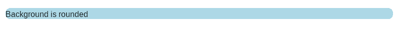

图 1：圆角背景示例。

应该对`InputLayout`进行类似的更改。新的形状，如圆角矩形，是 Skia 比 Tk 更先进的光栅化库的方式之一。更广泛地说，由于 Skia 也被 Chromium 使用，我们知道它为浏览器中可能需要的所有形状提供了快速内置的支持。

[字体光栅化](https://en.wikipedia.org/wiki/Font_rasterization)非常复杂，使用了诸如[亚像素渲染](https://en.wikipedia.org/wiki/Subpixel_rendering)和[提示](https://en.wikipedia.org/wiki/Font_hinting)等技术来使字体在低分辨率屏幕上看起来更好。然而，在[高像素密度](https://en.wikipedia.org/wiki/Pixel_density)屏幕上，这些技术就不再那么必要了。很可能所有屏幕最终都会足够高密度，以至于可以淘汰这些技术。

# 浏览器合成

Skia 和 SDL 刚刚使我们的浏览器变得更加复杂，但这些库提供的低级控制非常重要，因为它允许我们优化如滚动等常见交互。

到目前为止，每次用户滚动网页时，我们都必须清除画布并从头开始重新光栅化上面的所有内容。这是低效的——我们在不同的地方绘制相同的像素。当上下文复杂或屏幕较大时，过于频繁的光栅化会产生明显的减速并耗尽笔记本电脑和移动电池的电量。真实浏览器通过一种我称之为*浏览器合成*的技术来优化滚动：将整个网页绘制到一个隐藏的表面，并且只复制相关的像素到窗口本身。

要实现这一点，我们需要两个新的 Skia 表面：一个用于浏览器 chrome 的表面和一个用于当前`Tab`内容的表面。只有在页面内容发生变化时，我们才需要重新光栅化`Tab`表面，而在用户在地址栏中输入时则不需要。我们可以完全不进行光栅化地滚动`Tab`——我们只需将当前`Tab`表面的不同部分复制到屏幕上。让我们将这些表面称为`chrome_surface`和`tab_surface`：我们甚至可以为每个`Tab`使用不同的表面，但真实浏览器并不这样做，因为每个表面都会消耗大量内存，而且通常用户在切换标签时不会注意到微小的光栅化延迟。

```py
class Browser:
 def __init__(self):
 # ...
 self.chrome_surface = skia.Surface(
 WIDTH, math.ceil(self.chrome.bottom))
 self.tab_surface = None
```

我没有立即创建`tab_surface`，因为我们需要布局页面内容以知道表面需要多高。

我们还需要将浏览器的`draw`方法分成三个部分：

+   `raster_tab`会将页面渲染到`tab_surface`；

+   `raster_chrome`会将浏览器 chrome 渲染到`chrome_surface`；

+   `draw`会将 chrome 和 tab 表面复合，并将结果从 Skia 复制到 SDL。从 chrome 和 tab 表面直接复制到 SDL 表面可能看起来有些浪费，但跳过这个复制需要大量的底层代码。在第十三章中，我们将以不同的、更好的方式避免这个复制。

让我们先进行拆分：

```py
class Browser:
 def raster_tab(self):
 canvas = self.tab_surface.getCanvas()
 canvas.clear(skia.ColorWHITE)
 # ...

 def raster_chrome(self):
 canvas = self.chrome_surface.getCanvas()
 canvas.clear(skia.ColorWHITE)
 # ...

 def draw(self):
 canvas = self.root_surface.getCanvas()
 canvas.clear(skia.ColorWHITE)
 # ...
```

由于我们没有在启动时创建`tab_surface`，我们需要在`raster_tab`的顶部创建它：对于一个非常大的网页，`tab_surface`可能比 SDL 窗口的大小大得多，因此会占用大量的内存。我们将忽略这一点，但一个真正的浏览器只会绘制和渲染可见区域内的内容，并在用户滚动时重新绘制/渲染。

```py
import math

class Browser:
 def raster_tab(self):
 tab_height = math.ceil(
 self.active_tab.document.height + 2*VSTEP)

 if not self.tab_surface or \
 tab_height != self.tab_surface.height():
 self.tab_surface = skia.Surface(WIDTH, tab_height)

 # ...
```

注意，如果页面高度改变，我们需要重新创建标签表面。我们在这里根据布局树的长度计算页面边界的方式，如果页面元素可以超出其父元素（或右侧），将是错误的——但我们的浏览器不支持任何这样的功能。

接下来，`draw`应该从 chrome 和 tab 表面复制到根表面。此外，我们需要将`tab_surface`向下平移`chrome_bottom`，向上平移`scroll`，并将其裁剪到不与浏览器 chrome 重叠的窗口区域：

```py
class Browser:
 def draw(self):
 # ...

 tab_rect = skia.Rect.MakeLTRB(
 0, self.chrome.bottom, WIDTH, HEIGHT)
 tab_offset = self.chrome.bottom - self.active_tab.scroll
 canvas.save()
 canvas.clipRect(tab_rect)
 canvas.translate(0, tab_offset)
 self.tab_surface.draw(canvas, 0, 0)
 canvas.restore()

 chrome_rect = skia.Rect.MakeLTRB(
 0, 0, WIDTH, self.chrome.bottom)
 canvas.save()
 canvas.clipRect(chrome_rect)
 self.chrome_surface.draw(canvas, 0, 0)
 canvas.restore()

 # ...
```

注意`draw`调用：这些将`tab_surface`和`chrome_surface`复制到`canvas`，它绑定到`root_surface`。`clipRect`和`translate`调用确保我们复制了正确的部分。

最后，在`Browser`中我们每次调用`draw`的地方，现在都需要先调用`raster_tab`或`raster_chrome`。例如，在`handle_click`中，我们这样做：

```py
class Browser:
 def handle_click(self, e):
 if e.y < self.chrome.bottom:
 # ...
 self.raster_chrome()
 else:
 # ...
 self.raster_tab()
 self.draw()
```

注意，当只有标签改变时，我们不会重新绘制 chrome，反之亦然。同样，在`handle_down`中，我们根本不需要调用`raster_tab`，因为滚动不会改变页面。

然而，点击网页可能会使其导航到新的网页，因此我们需要检测 URL 是否改变，并在 URL 改变时渲染浏览器 chrome：

```py
class Browser:
 def handle_click(self, e):
 if e.y < self.chrome.bottom:
 # ...
 else:
 # ...
 url = self.active_tab.url
 tab_y = e.y - self.chrome.bottom
 self.active_tab.click(e.x, tab_y)
 if self.active_tab.url != url:
 self.raster_chrome()
 self.raster_tab()
```

我们还在`Tab`中做了一些相关的更改。让我们将`Tab`的`draw`方法重命名为`raster`。在其中，我们不再需要将滚动偏移传递给`execute`方法，或考虑`chrome_bottom`，因为我们总是将整个标签绘制到标签表面：

```py
class Tab:
 def raster(self, canvas):
 for cmd in self.display_list:
 cmd.execute(canvas)
```

同样，我们可以从每个绘图命令的`execute`方法中移除`scroll`参数：

```py
class DrawRect:
 def execute(self, canvas):
 paint = skia.Paint(
 Color=parse_color(self.color),
 )
 canvas.drawRect(self.rect, paint)
```

我们的浏览器现在使用合成滚动，这使得滚动更快更平滑，所有这一切都因为我们现在使用中间表面混合来存储已栅格化的内容，并且只有在内容实际改变时才避免重新栅格化。

实际浏览器为各种不同的情况分配新的表面，例如实现加速的溢出滚动和某些 CSS 属性（如[transform](https://developer.mozilla.org/en-US/docs/Web/CSS/transform)和透明度）的动画，这些动画可以在不栅格化的情况下完成。它们还允许通过 CSS 中的`overflow: scroll`（[overflow](https://developer.mozilla.org/en-US/docs/Web/CSS/overflow)）属性滚动任意 HTML 元素。DOM 元素的基本滚动与我们刚刚实现的方式非常相似。但是，以完全通用的方式实现它，并且具有出色的性能，是**极其**具有挑战性的。滚动可能是浏览器渲染引擎中最为复杂的单个功能。涉及的边缘情况和细微差别几乎是无穷无尽的。

# 透明度

快速绘制形状已经是一个挑战，但如果有多个形状，还有一个额外的问题：当两个形状重叠时，像素应该是什么颜色？到目前为止，我们的浏览器只处理不透明形状，它也没有考虑亚像素几何或抗锯齿，这些都依赖于颜色混合。答案一直是简单的：取顶部形状的颜色。但现在我们需要更多的细微差别。

考虑 CSS 中的部分透明颜色。这些使用八位十六进制颜色，最后两位表示透明度级别。例如，颜色`#00000080`是 50%透明的黑色。在白色背景上，它看起来是灰色，但在橙色背景上它看起来像图 2。

测试

图 2：黑色半透明文本与橙色背景融合的示例。

注意，文本是一种深橙色，因为它的颜色是 50%黑色和 50%橙色的混合。现实世界中的许多物体都是部分透明的：例如磨砂玻璃、云彩或彩色纸张。透过它们可以看到多种颜色*混合*在一起。这也是为什么计算机屏幕可以工作：红色、绿色和蓝色的光线[混合](https://en.wikipedia.org/wiki/Color_mixing)并出现在我们的眼睛中作为另一种颜色。设计师使用这种效果 Mostly。一些更高级的混合模式在网络上可能很难，或者可能在现实世界的物理中不可能。在叠加、阴影和工具提示中，因此我们的浏览器需要支持颜色混合。

Skia 通过在解析颜色时设置“alpha”字段来支持这种透明度：

```py
def parse_color(color):
 # ...
 elif color.startswith("#") and len(color) == 9:
 r = int(color[1:3], 16)
 g = int(color[3:5], 16)
 b = int(color[5:7], 16)
 a = int(color[7:9], 16)
 return skia.Color(r, g, b, a)
 # ...
```

请检查您的浏览器是否渲染了上面示例中的深橙色文本。这表明它实际上是将黑色与背景中现有的橙色混合在一起。

然而，还有另一种微妙不同的方法使用 CSS 创建透明度。在这里，50%的透明度通过`opacity`属性应用于整个元素，如图 3 所示。

测试

图 3：黑色文本在橙色背景上的示例，然后半透明地混合到其祖先元素中。

现在透明度应用于背景和文本，因此背景现在稍微亮一些。但请注意，文本现在是灰色，而不是深橙色。黑色和橙色像素不再混合在一起！

这是因为透明度引入了 CSS 所说的[堆叠上下文](https://developer.mozilla.org/en-US/docs/Web/CSS/CSS_Positioning/Understanding_z_index/The_stacking_context)。大多数细节现在并不重要，但操作顺序很重要。在第一个例子中，黑色像素首先被设置为透明，然后与背景混合。因此，50%透明的黑色像素与橙色像素混合，结果产生深橙色。在第二个例子中，黑色像素首先与背景混合，然后结果被设置为透明。因此，完全黑色的像素替换了完全橙色的像素，结果只留下黑色像素，这些像素后来被设置为 50%透明。

正确地按顺序应用混合，这是实现如`透明度`等效果所必需的，需要更仔细地处理表面。

主要是因为 CSS 属性与分层有关（如`z-index`）或视觉效果（如`mix-blend-mode`），元素[形成堆叠上下文](https://developer.mozilla.org/en-US/docs/Web/CSS/CSS_Positioning/Understanding_z_index/The_stacking_context)。另一方面，`overflow`属性可以使元素可滚动，但它不会引起堆叠上下文，我认为这是一个错误。在此过程中，也许可滚动的元素也应该成为后代的[包含块](https://developer.mozilla.org/en-US/docs/Web/CSS/Containing_block)。否则，一个可滚动的元素可以通过`position`等属性拥有不可滚动的子元素。这种情况在实际浏览器中处理起来非常复杂。原因是，在现代浏览器中，滚动是通过在 GPU 上偏移两个表面来完成的。如果没有堆叠上下文，浏览器可能（取决于网页结构）必须同步移动多个独立的表面，并具有复杂的绘制顺序，以实现滚动。固定和粘性定位的元素也形成堆叠上下文，因为它们与滚动的交互。

# 混合与堆叠

为了正确处理操作顺序，浏览器将混合应用于表面树而不是单个形状（见图 4）。从概念上讲，每个形状都绘制到自己的表面，然后与父表面混合。不同的中间表面结构会产生不同的视觉效果。你可以看到关于树结构如何影响最终图像以及它如何影响 CSS 规范的更详细讨论，以及这对[David Baron 的博客](https://dbaron.org/log/20130306-compositing-blending)的影响。渲染网页需要从下到上遍历这个概念树：要栅格化一个表面，首先需要栅格化其内容，包括其子表面，然后将内容混合到父表面中。这个表面树是一个实现策略，而不是任何特定 Web API 的要求。然而，[*堆叠上下文*](https://developer.mozilla.org/en-US/docs/Web/CSS/CSS_Positioning/Understanding_z_index/The_stacking_context)的概念与之相关。堆叠上下文在技术上是一种在绘制时定义组和排序的机制，堆叠上下文不必对应于表面（例如，通过`z-index`创建的堆叠上下文不对应）。然而，为了便于实现，CSS 中所有通常需要表面来实现的视觉效果都被指定为与堆叠上下文一起使用，因此堆叠上下文树与表面树非常相关。

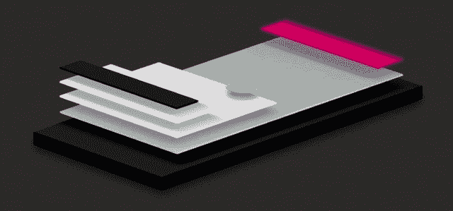

图 4：一个渲染的网页实际上是堆叠和混合一系列不同表面得到的结果。

为了匹配这种使用模式，在 Skia 中，表面形成了一个堆栈。你可以在堆栈上推入一个新的表面，将图像栅格化到它上面，然后弹出，使其与下面的表面混合。在栅格化过程中，每次需要应用某种视觉效果时，你都会在堆栈上推入一个新的表面，完成所有要应用该效果的元素栅格化后，进行弹出和混合，如下所示：

```py
# draw parent
canvas.saveLayer(None, skia.Paint(Alphaf=0.5))
# draw children
canvas.restore()
```

在这里，`saveLayer`调用请求 Skia 绘制所有子元素到一个单独的表面，然后再将它们混合到父表面中。一旦调用`restore`，`saveLayer`的第二个参数指定了具体的混合类型，这里使用`Alpha`参数请求 50%的不透明度。

`saveLayer`和`restore`就像一对括号，包围着子绘图操作。这意味着我们的显示列表不再只是绘图操作的线性序列，而是一棵树。因此，在我们的显示列表中，让我们使用一个接受其他绘图命令序列作为参数的`Opacity`命令来处理`opacity`：

```py
class Opacity:
 def __init__(self, opacity, children):
 self.opacity = opacity
 self.children = children
 self.rect = skia.Rect.MakeEmpty()
 for cmd in self.children:
 self.rect.join(cmd.rect)

 def execute(self, canvas):
 paint = skia.Paint(
 Alphaf=self.opacity
 )
 canvas.saveLayer(None, paint)
 for cmd in self.children:
 cmd.execute(canvas)
 canvas.restore()
```

现在我们可以用`Opacity`包装一个元素绘制的绘图命令，为整个元素添加透明度。我将通过向布局对象添加一个新的`paint_effects`方法来实现这一点，该方法应该传递一个要包装的绘图命令列表：

```py
class BlockLayout:
 def paint_effects(self, cmds):
 cmds = paint_visual_effects(
 self.node, cmds, self.self_rect())
 return cmds
```

我将`Opacity`命令的实际构建放在一个新的全局`paint_visual_effects`方法中（因为其他对象类型也将需要它）：

```py
def paint_visual_effects(node, cmds, rect):
 opacity = float(node.style.get("opacity", "1.0"))

 return [
 Opacity(opacity, cmds)
 ]
```

现在需要在`paint_tree`中进行更改，以调用`paint_effects`，但只有在递归到子节点之后，并且只有当`should_paint`为真时。这是因为这些视觉效果应用于整个子树的显示列表，而不仅仅是当前对象，并且不应用于“匿名”对象（见第八章）。

```py
def paint_tree(layout_object, display_list):
 if layout_object.should_paint():
 cmds = layout_object.paint()
 for child in layout_object.children:
 paint_tree(child, cmds)

 if layout_object.should_paint():
 cmds = layout_object.paint_effects(cmds)
 display_list.extend(cmds)
```

注意，`paint_visual_effects`接收一个命令列表并返回另一个命令列表。只是输出列表始终是一个包含原始内容的单个`Opacity`命令——这是有意义的，因为首先我们需要将命令绘制到表面，然后当与父元素混合时再应用透明度。

我强烈推荐阅读[Bartosz Ciechanowski 的博客文章](https://ciechanow.ski/alpha-compositing/)，这篇文章对本章探讨的许多概念进行了非常棒的视觉概述，并且还提供了关于如何实现像 Skia 这样的库如何实现矢量图形的栅格采样、线条和文本以及当它们的像素数组在分辨率或方向上不匹配时的表面插值等功能的更多内容。

# 像素合成

现在让我们暂停一下，探索透明度实际上是如何在底层工作的。Skia、SDL 以及许多其他颜色库为每个像素提供一个第四个*alpha*值来考虑透明度。透明度和 alpha 之间的区别可能会让人困惑。将透明度视为应用于内容的视觉效果，而 alpha 则是内容的一部分。将 alpha 视为表示透明度的实现技术。alpha 值为 0 表示像素完全透明（这意味着，无论颜色如何，你都无法看到它们），而 alpha 值为 1 表示完全不透明。

当带有 alpha 值的像素与另一个像素重叠时，最终的颜色是这两种颜色的混合。颜色如何混合是由 Skia 的`Paint`对象定义的。当然，Skia 相当复杂，但我们可以通过在之前引入的概念性`Pixel`类上定义方法来在 Python 中草拟这些绘图操作。

当我们应用带有`Alphaf`参数的`Paint`时，Skia 首先为每个像素添加请求的透明度：

```py
class Pixel:
 def alphaf(self, opacity):
 self.a = self.a * opacity
```

我想强调，这段代码不是我们浏览器的一部分——我只是在用 Python 代码来展示 Skia 内部是如何工作的。

那个`Alphaf`参数适用于一个表面的像素。但使用`saveLayer`，我们最终会得到两个表面，它们的像素全部对齐，因此我们需要组合，或*混合*相应的像素对。

在这里，术语可能会让人困惑：我们想象“在上面”的像素正在与“下面”的像素混合，所以我们称顶层表面为*源表面*，带有源像素，而底层表面为*目标表面*，带有目标像素。当我们组合它们时，有好多方法可以做到，但在网络上的默认方法是“简单 alpha 合成”或*源覆盖*合成。在 Python 中，实现它的代码看起来像这样：这个代码的公式可以在[这里](https://www.w3.org/TR/SVG11/masking.html#SimpleAlphaBlending)找到。注意，那个页面指的是*预乘*alpha 颜色，但 Skia 的 API 通常不使用预乘表示，这段代码也不使用。（然而，Skia 确实在内部以预乘形式表示颜色。）

```py
class Pixel:
 def source_over(self, source):
 new_a = source.a + self.a * (1 - source.a)
 if new_a == 0: return self
 self.r = \
 (self.r * (1 - source.a) * self.a + \
 source.r * source.a) / new_a
 self.g = \
 (self.g * (1 - source.a) * self.a + \
 source.g * source.a) / new_a
 self.b = \
 (self.b * (1 - source.a) * self.a + \
 source.b * source.a) / new_a
 self.a = new_a
```

在这里，目标像素`self`被修改以混合源像素`source`。红色、绿色和蓝色颜色通道的数学表达式是相同的，基本上是源颜色和目标颜色的平均值，按 alpha 加权。例如，如果源像素的 alpha 值为 1，结果是源像素颜色，如果为 0，结果是背景像素颜色。你可能想象`saveLayer`与`Alphaf`参数的整体操作就像这样：实际上，将单个像素读入内存以进行这种操作是慢的，因此像 Skia 这样的库不会让它变得方便。（Skia 画布确实有`peekPixels`和`readPixels`方法，有时会用到，但不是用于这个。）

```py
for (x, y) in destination.coordinates():
 source[x, y].alphaf(opacity)
 destination[x, y].source_over(source[x, y])
```

源覆盖合成是组合两个像素值的一种方法。但不是唯一的方法——如果你愿意，你可以编写任何组合两个像素值的计算。两种产生有趣效果的计算传统上被称为“乘法”和“差异”，并使用简单的数学运算。

“乘法”会乘以颜色值：

```py
class Pixel:
 def multiply(self, source):
 self.r = self.r * source.r
 self.g = self.g * source.g
 self.b = self.b * source.b
```

而“差异”计算它们的绝对差值：

```py
class Pixel:
 def difference(self, source):
 self.r = abs(self.r - source.r)
 self.g = abs(self.g - source.g)
 self.b = abs(self.b - source.b)
```

CSS 支持这些以及其他许多混合模式。许多这些混合模式与其他图形编辑程序（如 Photoshop 和 GIMP）[常见](https://en.wikipedia.org/wiki/Blend_modes)。一些，如[“ dodge”和“burn”](https://en.wikipedia.org/wiki/Dodging_and_burning)，可以追溯到模拟摄影，摄影师会曝光图像的一些部分多于其他部分以调整亮度。通过`mix-blend-mode`属性，如下所示：

```py
<div style="background-color:orange">
 Parent
 <div style="background-color:blue;mix-blend-mode:difference">
 Child
 </div>
 Parent
</div>
```

这段 HTML 将看起来像图 5。

父子关系

父元素

图 5：`mix-blend-mode`的`difference`值示例，蓝色子元素和橙色父元素混合，结果为粉色。

在这里，当蓝色与橙色重叠时，我们看到的是粉红色：蓝色有（红，绿，蓝）颜色通道为`(0, 0, 1)`，橙色有`(1, 0.65, 0)`，所以使用“差值”混合后，结果像素将是`(1, 0.65, 1)`，这是粉红色。在像素级别，发生的事情类似于这样：

```py
for (x, y) in destination.coordinates():
 source[x, y].alphaf(opacity)
 source[x, y].difference(destination[x, y])
 destination[x, y].source_over(source[x, y])
```

这看起来很奇怪，但从概念上讲，它是将目标混合到源中（忽略 alpha 通道）然后绘制源到目标上（考虑 alpha 通道）。在某种程度上，混合因此[发生两次](https://drafts.fxtf.org/compositing-1/#blending)。

Skia 原生支持[乘法](https://drafts.fxtf.org/compositing-1/#blendingmultiply)和[差值](https://drafts.fxtf.org/compositing-1/#blendingdifference)混合模式：

```py
def parse_blend_mode(blend_mode_str):
 if blend_mode_str == "multiply":
 return skia.BlendMode.kMultiply
 elif blend_mode_str == "difference":
 return skia.BlendMode.kDifference
 else:
 return skia.BlendMode.kSrcOver
```

我们可以通过定义一个新的`Blend`操作来支持浏览器中的混合：

```py
class Blend:
 def __init__(self, blend_mode, children):
 self.blend_mode = blend_mode

 self.children = children
 self.rect = skia.Rect.MakeEmpty()
 for cmd in self.children:
 self.rect.join(cmd.rect)

 def execute(self, canvas):
 paint = skia.Paint(
 BlendMode=parse_blend_mode(self.blend_mode),
 )
 canvas.saveLayer(None, paint)
 for cmd in self.children:
 cmd.execute(canvas)
 canvas.restore()
```

当`mix-blend-mode`设置为混合模式时，只需对`paint_visual_effects`进行简单的更改：

```py
def paint_visual_effects(node, cmds, rect):
 # ...
 blend_mode = node.style.get("mix-blend-mode")

 return [
 Blend(blend_mode, [
 Opacity(opacity, cmds),
 ]),
 ]
```

注意这里的操作顺序：我们首先应用透明度，然后*再*将结果混合到页面的其余部分。如果我们交换了`Opacity`和`Blend`的调用，就没有东西可以混合了！

Alpha 可能看起来直观，但比你想象的要复杂：例如，看看它的共同发明者（皮克斯的共同创始人）写的这个[alpha 的历史](http://alvyray.com/Memos/CG/Microsoft/7_alpha.pdf)。并且有几种不同的实现选项。例如，许多图形库，包括 Skia，将颜色通道乘以不透明度而不是分配整个颜色通道。这种[预乘](https://limnu.com/premultiplied-alpha-primer-artists/)表示通常更高效；例如，上面的`source_over`在最后必须除以`self.a`，否则结果将是预乘的。在整个过程中使用预乘表示可以节省除法。alpha[在缩放时的行为](https://jcgt.org/published/0004/02/03/paper.pdf)也不明显。

# 裁剪和蒙版

“乘法”和“差值”混合模式可能看起来有些晦涩，但混合模式是实现像素级操作的灵活方式。一个常见的用例是裁剪——将一个表面与给定的形状相交。这被称为裁剪，因为它就像在第一张纸（称为*蒙版*）上再放一张纸，然后用剪刀沿着蒙版的边缘剪裁。

CSS 中的`clip-path`属性[`developer.mozilla.org/en-US/docs/Web/CSS/clip-path`](https://developer.mozilla.org/en-US/docs/Web/CSS/clip-path)允许您使用曲线指定遮罩形状，而`mask`属性允许您指定遮罩的图像 URL。对于在网页上裁剪内容，有各种强大的方法，但最常见的形式涉及`overflow`属性。这个属性有很多可能的值，例如，`overflow: scroll`会添加滚动条并使元素可滚动，而`overflow: hidden`与`overflow: clip`类似，但略有不同。但让我们在这里关注`overflow: clip`，它会切断超出元素边界的元素内容。

通常，`overflow: clip`与`height`或`rotate`等属性一起使用，这些属性可以使元素的子元素伸出其父元素之外。我们的浏览器不支持这些属性，但有一个边缘情况，其中`overflow: clip`是相关的：圆角。从技术上讲，裁剪对于我们的浏览器来说也与单词长度超过浏览器窗口宽度的情况相关。这里是一个示例；从视觉上看，它看起来像图 6。考虑这个例子：

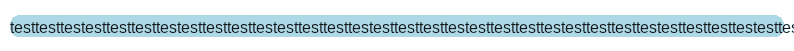

图 6：一个示例，展示了文本溢出时未被圆角裁剪的情况。

```py
<div 
 style="border-radius:30px;background-color:lightblue;overflow:clip">
 This test text exists here to ensure that the "div" element is
 large enough that the border radius is obvious.
</div>
```

这个 HTML 看起来像图 7。

这段测试文本存在于此，以确保“div”元素足够大，以便边框半径明显。

图 7：一个示例，展示了具有`overflow:clip`和`border-radius`的 div 元素的文本子元素溢出时被裁剪掉。

注意到角落附近的字母被裁剪掉，以保持锐利的圆角边缘。这就是裁剪；如果没有`overflow: clip`属性，这些字母将被完全绘制。

与直觉相反，我们将使用混合模式来实现裁剪。我们将创建一个新的表面（遮罩），在其中绘制一个圆角矩形，然后将其与元素内容混合。但我们需要看到元素内容，而不是遮罩，因此在进行这种混合时，我们将使用*目标-内*合成。

[目标-内合成](https://drafts.fxtf.org/compositing-1/#porterduffcompositingoperators_dstin)基本上意味着保留与源表面相交的目标表面的像素。源表面的颜色不被使用——只使用其 alpha 值。在我们的例子中，源表面是圆角矩形遮罩，目标表面是我们想要裁剪的内容，因此目标-内非常适合。在代码中，目标-内看起来像这样：

```py
class Pixel:
 def destination_in(self, source):
 self.a = self.a * source.a
```

现在，在`paint_visual_effects`中，我们需要创建一个新的层，将遮罩图像绘制到其中，然后使用目标-内混合将其与元素内容混合：

```py
def paint_visual_effects(node, cmds, rect):
 # ...
 if node.style.get("overflow", "visible") == "clip":
 border_radius = float(node.style.get(
 "border-radius", "0px")[:-2])
 cmds.append(Blend("destination-in", [
 DrawRRect(rect, border_radius, "white")
 ]))

 return [
 Blend(blend_mode, [
 Opacity(opacity, cmds),
 ]),
 ]
```

我在这里传递`destination-in`作为混合模式，尽管请注意这有点像是一个黑客行为，并且实际上这不是`mix-blend-mode`的有效值：

```py
def parse_blend_mode(blend_mode_str):
 # ...
 elif blend_mode_str == "destination-in":
 return skia.BlendMode.kDstIn
 # ...
```

在使用`cmds`（以及应用不透明度）绘制所有元素内容之后，这段代码在另一层上绘制一个圆形矩形作为遮罩，并使用目的地合成的混合来剪裁元素内容。在这里，我选择用白色绘制圆形矩形，但只要是不透明的，颜色无关紧要。

注意这个遮罩技术与之前描述的剪刀物理类比有多相似，其中两层扮演了两张纸的角色，而目的地合成则扮演了剪刀的角色。如果我们的浏览器只想剪切圆形矩形，Skia 实际上提供了一个专门的`clipRRect`操作。这比目的地合成的混合更高效，因为它在绘制其他命令的同时应用，因此可以跳过绘制剪裁区域外的任何内容。这需要在 Skia 的每个*着色器*或 GPU 程序中编写专门的代码，因此只能用于几种常见的形状。目的地合成的混合更通用。

圆角在计算机科学中有着[有趣的历史](https://www.folklore.org/StoryView.py?story=Round_Rects_Are_Everywhere.txt)。今天看似简单的功能，在早期内存有限且没有硬件浮点运算的个人计算机上实现时非常复杂。[非常复杂](https://raw.githubusercontent.com/jrk/QuickDraw/master/RRects.a)。即使浮点硬件和最终 GPU 成为标准，`border-radius` CSS 属性直到大约 2010 年才出现在浏览器中。不支持并没有阻止在`border-radius`得到支持之前，网络开发者在自己的网站上添加圆角。有几种巧妙的方法可以实现这一点；[2008 年的一段视频](https://css-tricks.com/video-screencasts/24-rounded-corners/)展示了几个方法。最近，动画、视觉效果、多进程合成和[硬件叠加](https://en.wikipedia.org/wiki/Hardware_overlay)的引入使得圆角实现变得相当复杂。例如，`clipRRect`快速路径可能无法应用于硬件视频叠加和嵌套圆角剪裁等案例。

# 优化表面使用

我们的浏览器现在工作正常，但使用了太多的表面。例如，对于一个不需要效果的单一`div`元素，当前在显示列表中分配了 18 个表面。如果没有混合操作，我们应该只需要一个！

让我们回顾一下我们的代码可以为元素创建的所有表面：

+   最高级表面用于应用*混合模式*。由于它是顶级表面，它还*隔离*了元素与其他页面部分，因此剪裁只应用于该元素。

+   第一个嵌套表面用于应用*不透明度*。

+   第二个嵌套表面用于实现*剪裁*。

但并非每个元素都有不透明度、混合模式或裁剪应用，我们大多数时候可以跳过创建这些表面。例如，如果没有实际应用不透明度，就没有必要在`Opacity`中创建一个表面：

```py
class Opacity:
 def execute(self, canvas):
 paint = skia.Paint(
 Alphaf=self.opacity,
 )
 if self.opacity < 1:
 canvas.saveLayer(None, paint)
 for cmd in self.children:
 cmd.execute(canvas)
 if self.opacity < 1:
 canvas.restore()
```

同样，如果没有混合操作，`Blend`不一定需要创建一个层。但这里的逻辑稍微复杂一些：`Blend`操作不仅应用混合，还隔离了元素内容，这在它们被`overflow`裁剪时很重要。所以，当没有混合模式时，让我们在`Blend`中跳过创建层，但当我们需要裁剪时，让我们将混合模式设置为特殊的不标准`source-over`值：

```py
def paint_visual_effects(node, cmds, rect):
 if node.style.get("overflow", "visible") == "clip":
 if not blend_mode:
 blend_mode = "source-over"
 # ...
```

我们将其解析为默认的源覆盖混合模式：

```py
def parse_blend_mode(blend_mode_str):
 # ...
 elif blend_mode_str == "source-over":
 return skia.BlendMode.kSrcOver
 # ...
```

实际上这并不是必要的，因为`parse_blend_mode`已经将未知字符串解析为源覆盖混合，但明确一点总是好的。无论如何，现在`Blend`可以在没有传递混合模式时跳过`saveLayer`：

```py
class Blend:
 def execute(self, canvas):
 paint = skia.Paint(
 BlendMode=parse_blend_mode(self.blend_mode),
 )
 if self.blend_mode:
 canvas.saveLayer(None, paint)
 for cmd in self.children:
 cmd.execute(canvas)
 if self.blend_mode:
 canvas.restore()
```

因此现在我们跳过了在`Opacity`和`Blend`不是真正必要的情况下创建额外表面的操作。但仍然有一种情况我们会使用太多：`Opacity`和`Blend`都可以创建一个表面而不是共享一个。让我们通过将不透明度合并到`Blend`中解决这个问题：这对于不透明度是有效的，但对于像[模糊](https://developer.mozilla.org/en-US/docs/Web/CSS/filter-function/blur())这样的“移动像素”的过滤器则不适用。这样的过滤器需要在裁剪之前应用，而不是在混合到父表面时应用。否则，模糊的边缘将不会很锐利。

```py
class Blend:
 def __init__(self, opacity, blend_mode, children):
 self.opacity = opacity
 self.blend_mode = blend_mode
 self.should_save = self.blend_mode or self.opacity < 1

 self.children = children
 self.rect = skia.Rect.MakeEmpty()
 for cmd in self.children:
 self.rect.join(cmd.rect)

 def execute(self, canvas):
 paint = skia.Paint(
 Alphaf=self.opacity,
 BlendMode=parse_blend_mode(self.blend_mode),
 )
 if self.should_save:
 canvas.saveLayer(None, paint)
 for cmd in self.children:
 cmd.execute(canvas)
 if self.should_save:
 canvas.restore()
```

现在`paint_visual_effects`看起来是这样的：

```py
def paint_visual_effects(node, cmds, rect):
 # ...

 if node.style.get("overflow", "visible") == "clip":
 # ...
 cmds.append(Blend(1.0, "destination-in", [
 DrawRRect(rect, border_radius, "white")
 ]))

 return [Blend(opacity, blend_mode, cmds)]
```

注意，我已经为`clip` `Blend`指定了不透明度为`1.0`。

实现高质量的位图库本身就是很有趣的——查看[*实时渲染*](https://www.realtimerendering.com/)了解更多。还有[*计算机图形学：原理与实践*](https://en.wikipedia.org/wiki/Computer_Graphics:_Principles_and_Practice)，我偶然记得在年轻时（大约 1992 年左右）买过这本书。当时我并没有在光栅化线条和多边形（汇编语言）上走得更远！这些天，你可以用 Skia 和几行 Python 做同样的事情，甚至更多。现在，当可用时，利用 GPU 特别重要，浏览器经常挑战极限。浏览器团队通常包括或与位图库专家紧密合作：例如，Chromium 的 Skia 和 WebKit 的[Core Graphics](https://developer.apple.com/documentation/coregraphics)。这两个库在浏览器外也得到使用：Core Graphics 在 iOS 和 macOS 中，Skia 在 Android 中。

# 摘要

所以，这就是我们的浏览器不仅能绘制无聊的文本和框，还能做到的事情：

+   浏览器使用额外表面进行快速滚动的合成。

+   通过 alpha 通道实现部分透明度；

+   通过`mix-blend-mode`实现用户可配置的混合模式；

+   通过目标内混合或直接裁剪实现圆角矩形裁剪；

+   当可能时避免表面的优化；

除了新特性之外，我们还从 Tkinter 升级到了 SDL 和 Skia，这使得我们的浏览器运行更快、响应更灵敏，同时也为未来对浏览器性能的更多改进奠定了基础。

点击这里来尝试本章的浏览器。

# 概述

我们浏览器中的完整功能集、类和方法现在应该看起来像这样：

# 练习

11-1 *过滤器*。`filter` CSS 属性允许指定各种更复杂的 [效果](https://developer.mozilla.org/en-US/docs/Web/CSS/filter)，例如灰度或模糊。这些效果很有趣，而且一些效果，如 `blur`，在 Skia 中有内置支持。实现 `blur`。仔细思考模糊相对于其他效果（如透明度、裁剪和混合）何时发生。

11-2 *点击测试*。如果你有一个带有 `border-radius` 的元素，通过点击角落的“圆角”部分，你可以在元素外部但在其包含矩形内部点击，从而实现点击。这不应该导致点击元素，但在我们的浏览器中目前是这样的。修改 `click` 方法以考虑边框半径。

11-3 *兴趣区域*。我们的浏览器现在将整个网页绘制到单个表面上，这意味着非常长的网页（如 [本章的](http://browser.engineering/visual-effects.html)！）创建了一个大的表面，因此使用了大量的内存。相反，只绘制一个有限高度的“兴趣区域”，例如 `4 * HEIGHT` 像素。你需要跟踪兴趣区域在页面上的位置，将其正确部分绘制到屏幕上，并在用户尝试滚动到其外部时重新光栅化兴趣区域。使用 Skia 的 `clipRect` 操作来避免在兴趣区域外绘制。

11-4 *溢出滚动*。具有 `overflow` 属性设置为 `scroll` 和固定像素 `height` 的元素是可滚动的。（你将需要实现练习 6-2，以便 `height` 被支持。）实现 `overflow: scroll` 的某个版本。我建议以下用户交互：用户在可滚动元素内点击以将其聚焦，然后可以按箭头键上下滚动。你需要跟踪 [*布局溢出*](https://developer.mozilla.org/en-US/docs/Web/CSS/CSS_Flow_Layout/Flow_Layout_and_Overflow)。作为一个额外的挑战，确保你支持嵌套在其他可滚动元素中的可滚动元素。

11-5 *触摸输入*。如今，许多桌面（当然，所有移动设备）屏幕都支持触摸和多点触摸输入。SDL 提供了 [API](https://wiki.libsdl.org/SDL2/SDL_MultiGestureEvent) 来支持它。实现 `click` 的触摸输入变体。你可能需要回顾第七章中的“更进一步”部分，以获取有关实现触摸输入的一些好方法的提示。

# 调度任务和线程

网络浏览器工程的第十二章。

+   任务和任务队列

+   定时器和 `setTimeout`

+   长生存线程

+   渲染节奏

+   使用脏位优化

+   帧动画

+   渲染分析

+   两个线程

+   提交显示列表

+   线程分析

+   线程化滚动

+   线程化样式和布局

+   总结

+   大纲

+   练习

现代浏览器必须处理用户输入、请求远程文件、运行各种回调，并最终将内容渲染到屏幕上，同时保持快速和响应。这需要一个统一的任务抽象来跟踪浏览器待处理的工作。此外，浏览器的工作必须在多个 CPU 线程之间分配，不同的线程并行运行任务以最大化响应性。

# 任务和任务队列

到目前为止，我们浏览器所做的大部分工作都来自于用户的操作，如滚动、按按钮和点击链接。但随着我们浏览器运行的 Web 应用变得越来越复杂，它们开始查询远程服务器、显示动画和预取信息以供后续使用。尽管用户操作缓慢且谨慎，在浏览器赶上之前留下长时间的操作间隔，但应用可能非常苛刻。这需要改变视角：浏览器现在有一个永远做不完的任务队列。

现代浏览器通过多任务处理、优先级排序和去重工作来适应这一现实。浏览器可能执行的所有工作——加载页面、运行脚本和响应用户操作——都被转换成*任务*，这些任务可以在稍后执行，其中任务只是一个可以执行（及其参数）的函数：

```py
class Task:
 def __init__(self, task_code, *args):
 self.task_code = task_code
 self.args = args

 def run(self):
 self.task_code(*self.args)
 self.task_code = None
 self.args = None
```

注意构造函数参数和调用`task_code`时特殊的`*args`语法。这种语法表示`Task`可以用任意数量的参数来构建，这些参数随后作为`args`列表可用。然后，使用`*args`调用函数将列表重新展开成多个参数。

任务的目的在于它可以在某个时间点创建，然后由某种类型的任务运行器在稍后的时间运行，根据调度算法。我们在第二章和第十一章中讨论的事件循环是任务运行器，其中要运行的任务由操作系统提供。在我们的浏览器中，任务运行器将任务存储在一个先进先出队列中：

```py
class TaskRunner:
 def __init__(self):
 self.tab = tab
 self.tasks = []

 def schedule_task(self, task):
 self.tasks.append(task)
```

当运行任务的时间到来时，我们的任务运行器只需从队列中移除第一个任务并运行它：先进先出是一种简单的选择下一个要运行的任务的方法，而真正的浏览器拥有复杂的*调度器*，它们会考虑[许多不同的因素](https://blog.chromium.org/2015/04/scheduling-tasks-intelligently-for_30.html)。

```py
class TaskRunner:
 def run(self):
 if len(self.tasks) > 0:
 task = self.tasks.pop(0)
 task.run()
```

要运行这些任务，我们需要在`TaskRunner`上调用`run`方法，我们可以在主事件循环中这样做：

```py
class Tab:
 def __init__(self):
 self.task_runner = TaskRunner(self)
```

```py
def mainloop(browser):
 while True:
 # ...
 browser.active_tab.task_runner.run()
```

`TaskRunner` 允许我们选择在何时处理不同的任务。在这里，我选择在浏览器运行每个 `Task` 之间检查用户事件，这使得在有很多任务时，我们的浏览器响应更快。我还选择只在活动标签页上运行任务，这意味着后台标签页不能减慢我们的浏览器速度。

使用这个简单的任务运行器，我们现在可以排队任务并在稍后执行它们。例如，现在，当加载网页时，我们的浏览器会在执行渲染步骤之前下载并运行所有脚本。这使得页面加载变慢。我们可以通过创建运行脚本的任务来解决这个问题：

```py
class Tab:
 def load(self, url, payload=None):
 # ...
 for script in scripts:
 # ...
 try:
 header, body = script_url.request(url)
 except:
 continue
 task = Task(self.js.run, script_url, body)
 self.task_runner.schedule_task(task)
```

现在，我们的浏览器将在 `load` 完成后以及事件循环再次开始之前运行脚本。如果有大量脚本要运行，我们还可以在页面加载时处理用户事件。

JavaScript 即使在浏览器之外也使用基于任务的 [事件循环](https://developer.mozilla.org/en-US/docs/Web/JavaScript/EventLoop) 。例如，JavaScript 使用消息传递，通过 [异步](https://developer.mozilla.org/en-US/docs/Web/JavaScript/EventLoop#never_blocking) API 处理输入和输出，并且具有运行到完成的语义。当然，这种编程模型源于早期的浏览器实现，并且现在也是使用任务来架构浏览器的重要原因。

# 定时器和 `setTimeout`

任务也是一种支持多个 JavaScript API 的自然方式，这些 API 要求在未来的某个时刻运行一个函数。例如，[`setTimeout`](https://developer.mozilla.org/en-US/docs/Web/API/setTimeout) 允许你在现在起一段时间后运行一个 JavaScript 函数。以下代码将在一秒后将“回调”打印到控制台：

```py
function callback() { console.log('Callback'); }
setTimeout(callback, 1000);
```

与 第九章 中的 `addEventListener` 一样，我们将通过在 JavaScript 变量中保存回调并创建一个 Python 端代码可以调用的句柄来实现 `setTimeout`：

```py
SET_TIMEOUT_REQUESTS = {}

function setTimeout(callback, time_delta) {
 var handle = Object.keys(SET_TIMEOUT_REQUESTS).length;
 SET_TIMEOUT_REQUESTS[handle] = callback;
 call_python("setTimeout", handle, time_delta)
}
```

导出的 `setTimeout` 函数将创建一个定时器，等待请求的时间段，然后要求 JavaScript 运行时运行回调。最后一部分将通过 `__runSetTimeout` 来完成：请注意，我们从未从 `SET_TIMEOUT_REQUESTS` 字典中移除 `callback`。如果回调持有对某些大型数据结构的最后一个引用，这可能导致内存泄漏。第九章 中也遇到了类似的问题。避免在浏览器和浏览器应用程序之间共享的数据结构中的内存泄漏需要很多小心，本书并不试图做到这一点。

```py
function __runSetTimeout(handle) {
 var callback = SET_TIMEOUT_REQUESTS[handle]
 callback();
}
```

现在，让我们来实现这个 API 的 Python 部分。我们可以使用 Python 的`threading`模块中的`Timer`类。你可以这样使用这个类：另一种方法是在事件循环中记录每个`Task`应该发生的时间，并与当前时间进行比较。这被称为*轮询*，例如，SDL 事件循环就是这样查找事件和任务的。然而，这可能会导致在循环中浪费 CPU 周期，直到任务准备就绪，所以我预计`Timer`将更高效。

```py
import threading
def callback():
 # ...
threading.Timer(1.0, callback).start()
```

这将在一秒后运行`callback`。简单！但是`threading.Timer`会在一个新的 Python 线程上执行其回调，这引入了许多挑战。回调不能直接调用`evaljs`：我们最终会在两个 Python 线程上同时运行 JavaScript，这并不好。JavaScript 不是一个多线程的编程语言。在网络上可以创建各种类型的[workers](https://developer.mozilla.org/en-US/docs/Web/API/Web_Workers_API)，但它们都是独立运行的，并且只能通过特殊的消息传递 API 进行通信。因此，作为权宜之计，回调将向任务队列添加一个新的`Task`来调用`__runSetTimeout`。这的缺点是可能会延迟回调，但这意味着 JavaScript 将始终在主线程上执行。

让我们来实现它：

```py
SETTIMEOUT_JS = "__runSetTimeout(dukpy.handle)"

class JSContext:
 def __init__(self, tab):
 # ...
 self.interp.export_function("setTimeout",
 self.setTimeout)

 def dispatch_settimeout(self, handle):
 self.interp.evaljs(SETTIMEOUT_JS, handle=handle)

 def setTimeout(self, handle, time):
 def run_callback():
 task = Task(self.dispatch_settimeout, handle)
 self.tab.task_runner.schedule_task(task)
 threading.Timer(time / 1000.0, run_callback).start()
```

但这仍然不太对。我们现在有两个线程访问`task_runner`：主线程用于运行任务，定时器线程用于添加它们。这是一个[竞争条件](https://en.wikipedia.org/wiki/Race_condition)，可能会导致各种不良事件发生，因此我们需要确保一次只有一个线程访问`task_runner`。

为了做到这一点，我们使用一个`Condition`对象，它一次只能被一个线程持有。每个线程在读取或写入`task_runner`之前都会尝试获取`condition`，以避免同时访问。`acquire`函数的`blocking`参数指示线程是否应该在继续之前等待条件可用；在本章中，你将始终将其设置为`True`。（当线程等待时，它被称为*阻塞*。）

`Condition`类实际上是一个`Lock`，并且增加了能够等待状态条件发生的功能。如果你现在没有更多的工作要做，获取`condition`然后调用`wait`。这将导致线程在该代码行处停止。当有更多工作要做时，例如在`schedule_task`中，对`notify_all`的调用将唤醒调用`wait`的线程。

```py
class TaskRunner:
 def __init__(self, tab):
 # ...
 self.condition = threading.Condition()

 def schedule_task(self, task):
 self.condition.acquire(blocking=True)
 self.tasks.append(task)
 self.condition.notify_all()
 self.condition.release()

 def run(self):
 task = None
 self.condition.acquire(blocking=True)
 if len(self.tasks) > 0:
 task = self.tasks.pop(0)
 self.condition.release()
 if task:
 task.run()

 self.condition.acquire(blocking=True)
 if len(self.tasks) == 0:
 self.condition.wait()
 self.condition.release()
```

如果在`run`循环结束时没有其他事情要做，那么调用`wait`非常重要。否则，那个线程可能会消耗大量的 CPU 资源，并且不断地获取和释放`condition`。这种忙碌的工作不仅会减慢计算机的速度，还会导致`Timer`的回调在不可预测的时间发生，因为两个线程正在竞争锁。尝试移除此代码并观察。计时器将变得非常不可预测。

当使用锁时，非常重要的一点是要记住最终释放锁，并且尽可能保持最短的时间。例如，上面的代码在运行`task`之前释放了锁。这是因为任务从队列中移除后，其他线程无法访问它，因此在任务运行时不需要持有锁。

`setTimeout`代码现在是线程安全的，但仍然有一个另一个错误：如果我们从一个页面导航到另一个页面，之前页面上挂起的`setTimeout`回调仍然可能尝试执行。通过在`JSContext`上添加一个`discarded`字段并在加载新页面时设置它，可以轻松防止这种情况：

```py
class JSContext:
 def __init__(self, tab):
 # ...
 self.discarded = False

 def dispatch_settimeout(self, handle):
 if self.discarded: return
 self.interp.evaljs(SETTIMEOUT_JS, handle=handle)
```

```py
class Tab:
 def load(self, url, payload=None):
 # ...
 if self.js: self.js.discarded = True
 self.js = JSContext(self)
 # ...
```

不幸的是，Python 目前有一个[全局解释器锁](https://wiki.python.org/moin/GlobalInterpreterLock)（GIL），所以 Python 线程实际上并不真正并行运行。Python 的这个不幸限制对我们的浏览器有影响，但对真实浏览器没有影响，所以在这章中我主要假装 GIL 不存在。也许 Python 的将来版本会[去除它](https://peps.python.org/pep-0703/)。尽管有全局解释器锁，我们仍然需要锁，因为 Python 线程可以在字节码操作之间或调用 C 库期间让出。这意味着并发访问和竞态条件仍然可能。事实上，在调试本章代码时，我经常忘记添加锁而遇到这种竞态条件。从你的浏览器中移除一些锁，你可以亲自看到这一点！

# 长期运行的线程

线程也可以用来添加浏览器多任务处理。例如，在第十章（security.html#cross-site-requests）中，我们实现了`XMLHttpRequest`类，它允许脚本向服务器发送请求。但在我们的实现中，整个浏览器在等待请求完成时会冻结。这显然很糟糕。因此，第十章中我们实现的 API 的同步版本并不很有用，而且性能非常差。一些浏览器现在正在转向废弃同步`XMLHttpRequest`。Python 的`Thread`类让我们做得更好：

```py
threading.Thread(target=callback).start()
```

此代码创建了一个新线程然后立即返回。然后`callback`在新线程上并行运行，而初始线程继续执行后续代码。

我们将使用线程实现异步`XMLHttpRequest`调用。具体来说，我们将让浏览器启动一个线程，在该线程上执行请求并解析响应，然后安排一个`Task`将响应发送回脚本。

与 `setTimeout` 类似，我们将在 JavaScript 端存储回调并使用处理程序引用它：

```py
XHR_REQUESTS = {}

function XMLHttpRequest() {
 this.handle = Object.keys(XHR_REQUESTS).length;
 XHR_REQUESTS[this.handle] = this;
}
```

当脚本在 `XMLHttpRequest` 对象上调用 `open` 方法时，我们现在将允许 `is_async` 标志为真：在浏览器中，`is_async` 参数是可选的，默认为 `true`，但我们的浏览器没有实现这一点。

```py
XMLHttpRequest.prototype.open = function(method, url, is_async) {
 this.is_async = is_async;
 this.method = method;
 this.url = url;
}
```

`send` 方法需要发送 `is_async` 标志和处理程序：

```py
XMLHttpRequest.prototype.send = function(body) {
 this.responseText = call_python("XMLHttpRequest_send",
 this.method, this.url, body, this.is_async, this.handle);
}
```

在浏览器端，`XMLHttpRequest_send` 处理程序将包含三个部分。第一部分将解析 URL 并进行安全检查：

```py
class JSContext:
 def XMLHttpRequest_send(
 self, method, url, body, isasync, handle):
 full_url = self.tab.url.resolve(url)
 if not self.tab.allowed_request(full_url):
 raise Exception("Cross-origin XHR blocked by CSP")
 if full_url.origin() != self.tab.url.origin():
 raise Exception(
 "Cross-origin XHR request not allowed")
```

然后，我们将定义一个函数来发送请求并将任务排队以运行回调：

```py
class JSContext:
 def XMLHttpRequest_send(
 self, method, url, body, isasync, handle):
 # ...
 def run_load():
 headers, response = full_url.request(self.tab.url, body)
 task = Task(self.dispatch_xhr_onload, response, handle)
 self.tab.task_runner.schedule_task(task)
 return response
```

注意，任务会运行 `dispatch_xhr_onload`，我们将在稍后定义它。

最后，根据 `is_async` 标志，浏览器将立即调用此函数，或在新的线程中调用：

```py
class JSContext:
 def XMLHttpRequest_send(
 self, method, url, body, isasync, handle):
 # ...
 if not isasync:
 return run_load()
 else:
 threading.Thread(target=run_load).start()
```

注意，在异步情况下，`XMLHttpRequest_send` 方法启动一个线程然后立即返回。该线程将在请求完成之前与浏览器的主要工作并行运行。理论上，两个并行请求可能会在访问 cookie jar 时发生竞争；我并不是因为方便而不解决这个问题，但一个合适的实现应该为 cookie jar 提供锁。

为了将结果传回 JavaScript，我们将从 `dispatch_xhr_onload` 调用 `__runXHROnload` 函数：

```py
XHR_ONLOAD_JS = "__runXHROnload(dukpy.out, dukpy.handle)"

class JSContext:
 def dispatch_xhr_onload(self, out, handle):
 if self.discarded: return
 do_default = self.interp.evaljs(
 XHR_ONLOAD_JS, out=out, handle=handle)
```

`__runXHROnload` 方法只是从 `XHR_REQUESTS` 中提取相关对象并调用其 `onload` 函数，这是异步 `XMLHttpRequest` 的标准回调：

```py
function __runXHROnload(body, handle) {
 var obj = XHR_REQUESTS[handle];
 var evt = new Event('load');
 obj.responseText = body;
 if (obj.onload)
 obj.onload(evt);
}
```

如您所见，任务不仅允许浏览器，还允许在浏览器中运行的应用程序延迟任务直到稍后。

`XMLHttpRequest` 在帮助网络进化中发挥了关键作用。在 1990 年代，点击链接或提交表单需要加载新页面。有了 `XMLHttpRequest`，网页能够更像动态应用程序；GMail 是一个著名的早期例子。GMail 日期为 2004 年 4 月，[不久之后](https://en.wikipedia.org/wiki/XMLHttpRequest#History)足够多的浏览器完成了对该 API 的支持。第一个使用 `XMLHttpRequest` 的应用程序是 [Outlook Web Access](https://en.wikipedia.org/wiki/Outlook_on_the_web)，在 1999 年，但 API 进入其他浏览器花费了一段时间。如今，使用 DOM 变化而不是页面加载来更新其状态的 Web 应用程序被称为 [单页应用](https://en.wikipedia.org/wiki/Single-page_application)。单页应用使得更交互和复杂的 Web 应用程序成为可能，这反过来又使得浏览器速度和响应性变得更加重要。

# 渲染的节奏

任务不仅仅是实现一些 JavaScript API。一旦某物成为 `Task`，任务运行器将控制其运行时间：可能是现在，可能是稍后，或者最多每秒一次，甚至对于活动和非活动页面有不同的速率，或者根据其优先级。浏览器甚至可以有多个任务运行器，针对不同的用例进行优化。

现在，可能很难看出浏览器如何优先处理要运行的 JavaScript 回调，或者为什么它可能想要以固定的节奏执行 JavaScript 任务。但除了 JavaScript 之外，浏览器还必须渲染页面，并且如您从第二章中回忆的那样，我们希望浏览器以显示硬件可以刷新的速度渲染页面。在大多数计算机上，这是每秒 60 次，或每帧 16 毫秒。然而，即使是在今天的计算机上，保持如此高的帧率也是相当困难的，对于我们的玩具浏览器来说，这无疑是一个过高的标准。

因此，让我们设定每秒 30 帧——每帧 33 毫秒——作为我们的刷新率目标：当然，每秒 30 次实际上是 33.33333…毫秒。但这是一个玩具浏览器，拥有更精确的值也使得编写测试更容易。

```py
REFRESH_RATE_SEC = .033
```

现在，绘制框架的工作被分配给了`Tab`和`Browser`。`Tab`需要调用`render`来计算显示列表。然后`Browser`需要光栅化和绘制那个显示列表（以及 chrome 显示列表）。让我们将这些`Browser`任务放入它们自己的方法中：

```py
class Browser:
 def raster_and_draw(self):
 self.raster_chrome()
 self.raster_tab()
 self.draw()
```

现在，我们不需要每个标签每帧都重绘自己，因为用户一次只能看到一个标签。我们只需要活动标签自己重绘。因此，控制我们何时更新显示的是`Browser`，而不是单个`Tab`。所以让我们编写一个`schedule_animation_frame`方法。它被称为“动画帧”，因为不同像素的顺序渲染是一个动画，每次渲染都是一帧——就像画框中的一幅画。这个方法安排一个任务来`render`活动标签：

```py
class Browser:
 def __init__(self):
 self.animation_timer = None

 def schedule_animation_frame(self):
 def callback():
 active_tab = self.active_tab
 task = Task(active_tab.render)
 active_tab.task_runner.schedule_task(task)
 self.animation_timer = None
 if not self.animation_timer:
 self.animation_timer = \
 threading.Timer(REFRESH_RATE_SEC, callback)
 self.animation_timer.start()
```

我们可以在启动浏览器时启动这个过程。在顶层循环中，在运行活动标签的任务之后，浏览器将需要光栅化和绘制，以防该任务是渲染任务：

```py
def mainloop(browser):
 while True:
 # ...
 browser.active_tab.task_runner.run()
 browser.raster_and_draw()
 browser.schedule_animation_frame()
```

每次循环中都会发生对`schedule_animation_frame`的额外调用。然而，由于检查`self.animation_timer`是否为`None`，它只有在`callback`被调用后才会产生效果，这通常发生在 33 毫秒之后。因此，我们每 33 毫秒就安排一个新的渲染任务，正如我们想要的那样。

没有任何特定的刷新率是特别的。一些显示器每秒刷新 72 次，而刷新率更高的显示器[越来越常见](https://www.intel.com/content/www/us/en/gaming/resources/highest-refresh-rate-gaming.html)。电影通常以每秒 24 帧的速度拍摄（尽管[一些导演提倡 48 帧](https://www.extremetech.com/extreme/128113-why-movies-are-moving-from-24-to-48-fps)），而电视节目传统上使用每秒 30 帧。一致性通常比实际帧率更重要：一致的 24 帧每秒看起来比在 60 和 24 之间的变化率要平滑得多。

# 使用脏位优化

如果你在自己的电脑上运行这个程序，你的 CPU 使用率可能会急剧上升，电池开始耗尽。这是因为我们在每一帧都调用`render`，这意味着我们的浏览器现在不断地对元素进行样式化、构建布局树和绘制显示列表。其中大部分工作都是浪费的，因为在大多数帧上，网页根本没有任何变化，所以旧的样式、布局树和显示列表会和新的一样有效。

让我们使用一个*脏位*来解决这个问题，这是一个告诉我们某些复杂数据结构是否最新的状态。由于我们想知道是否需要运行`render`，让我们将我们的脏位命名为`needs_render`：

```py
class Tab:
 def __init__(self, browser, tab_height):
 # ...
 self.needs_render = False

 def set_needs_render(self):
 self.needs_render = True

 def render(self):
 if not self.needs_render: return
 # ...
 self.needs_render = False
```

这个标志的一个优点是，现在我们可以在 HTML 发生变化时设置`needs_render`，而不是直接调用`render`。`render`仍然会发生，但会晚一些。这使得脚本运行更快，尤其是在它们多次修改页面时。在更改 DOM 时，在`innerHTML_set`、`load`、`click`和`keypress`中做出这个更改。例如，在`load`中，这样做：

```py
class Tab:
 def load(self, url, payload=None):
 # ...
 self.set_needs_render()
```

在`innerHTML_set`中，这样做：

```py
class JSContext:
 def innerHTML_set(self, handle, s):
 # ...
 self.tab.set_needs_render()
```

有更多的`render`调用；你应该找到并修复所有这些调用……除了，让我们更仔细地看看`click`。

现在我们不会在发生变化时立即渲染。这意味着当调用方法时，布局树（和样式）可能已经过时。通常情况下，这不是问题，但在一个重要的情况下它是：点击处理。这是因为我们需要读取布局树来确定被点击的对象是什么，这意味着布局树需要是最新的。为了解决这个问题，在`click`的顶部添加对`render`的调用：

```py
class Tab:
 def click(self, x, y):
 self.render()
 # ...
```

我们实现中的另一个问题是，浏览器现在在活动标签运行任务时每次都会执行`raster_and_draw`。但有时这个任务只是运行不接触网页的 JavaScript，而`raster_and_draw`调用是浪费的。

我们可以使用另一个脏位来避免这个问题，我将称之为`needs_raster_and_draw`：`needs_raster_and_draw`脏位不仅使浏览器更有效率。在本章的后面，我们将添加多个浏览器线程，到那时这个脏位是必要的，以避免在动画时出现不稳定的行为。尝试稍后移除它，看看效果如何！

```py
class Browser:
 def __init__(self):
 self.needs_raster_and_draw = False

 def set_needs_raster_and_draw(self):
 self.needs_raster_and_draw = True

 def raster_and_draw(self):
 if not self.needs_raster_and_draw:
 return
 # ...
 self.needs_raster_and_draw = False
```

我们需要在`Browser`更改浏览器外观或`Tab`更改其渲染时调用`set_needs_raster_and_draw`。浏览器外观是通过事件处理器更改的：

```py
class Browser:
 def handle_click(self, e):
 if e.y < self.chrome.bottom:
 # ...
 self.set_needs_raster_and_draw()

 def handle_key(self, char):
 if self.chrome.keypress(char):
 # ...
 self.set_needs_raster_and_draw()

 def handle_enter(self):
 if self.chrome.enter():
 # ...
 self.set_needs_raster_and_draw()
```

在这里，我需要一个小改动，使`enter`返回是否执行了某些操作：

```py
class Chrome:
 def enter(self):
 if self.focus == "address bar":
 self.browser.active_tab.load(URL(self.address_bar))
 self.focus = None
 return True
 return False
```

并且`Tab`在运行`render`后也应该设置这个位：

```py
class Tab:
 def __init__(self, browser, tab_height):
 # ...
 self.browser = browser

 def render(self):
 # ...
 self.browser.set_needs_raster_and_draw()
```

当构造`Tab`时，你需要传递`browser`参数：

```py
class Browser:
 def new_tab(self, url):
 new_tab = Tab(self, HEIGHT - self.chrome.bottom)
 # ...
```

现在渲染管线只有在必要时才会运行，浏览器应该再次具有可接受的性能。

这种基于任务的渲染方法对于运行复杂的交互式应用是必要的，但直到 2010 年代，所有现代浏览器才采纳它，这比此类网络应用普及得要晚得多。这是因为通常需要对庞大的浏览器代码库进行大量的重构。例如，Chromium 最近才完成了利用此模型 100%的工作，尽管当然还有工作要做（总是）。

# 动画帧

稳定的渲染节奏的一个重要原因是使动画运行平滑。网页可以使用 `requestAnimationFrame` API（[requestAnimationFrame](https://developer.mozilla.org/en-US/docs/Web/API/window/requestAnimationFrame)）来设置此类动画。此 API 允许脚本在浏览器运行其渲染管道之前运行代码，使动画尽可能平滑。它的工作方式如下：

```py
function callback() { /* Modify DOM */ }
requestAnimationFrame(callback);
```

通过调用 `requestAnimationFrame`，这段代码正在做两件事：安排一个渲染任务，并要求浏览器在渲染任务的**开始**时调用 `callback`，在所有浏览器渲染代码之前。这允许网页作者更改页面并确信它将立即被渲染。

此 JavaScript API 的实现很简单。和之前一样，我们在 JavaScript 端存储回调函数：

```py
RAF_LISTENERS = [];

function requestAnimationFrame(fn) {
 RAF_LISTENERS.push(fn);
 call_python("requestAnimationFrame");
}
```

在 `JSContext` 中，当调用该方法时，我们需要安排一个新的渲染任务：

```py
class JSContext:
 def __init__(self, tab):
 # ...
 self.interp.export_function("requestAnimationFrame",
 self.requestAnimationFrame)
```

```py
 def requestAnimationFrame(self):
 task = Task(self.tab.render)
 self.tab.task_runner.schedule_task(task)
```

然后，当 `render` 实际被调用时，我们需要像这样回调到 JavaScript：

```py
class Tab:
 def render(self):
 if not self.needs_render: return
 self.js.interp.evaljs("__runRAFHandlers()")
 # ...
```

这个 `__runRAFHandlers` 函数有点棘手：

```py
function __runRAFHandlers() {
 var handlers_copy = RAF_LISTENERS;
 RAF_LISTENERS = [];
 for (var i = 0; i < handlers_copy.length; i++) {
 handlers_copy[i]();
 }
}
```

注意，`__runRAFHandlers` 在运行任何回调之前需要将 `RAF_LISTENERS` 重置为空数组。这是因为其中一个回调本身可能会调用 `requestAnimationFrame`。如果这种情况发生在这样的回调中，规范说明应该安排一个**第二个**动画帧。这意味着我们需要确保将当前帧的回调与下一帧的回调分开存储。

这种情况可能看起来像是一个边缘情况，但实际上非常重要，因为页面可以通过这种方式运行**动画**：通过迭代地安排一个帧接一个帧。例如，这里有一个简单的计数“动画”：

```py
var count = 0;
function callback() {
 var output = document.querySelectorAll("div")[1];
 output.innerHTML = "count: " + (count++);
 if (count < 100)
 requestAnimationFrame(callback);
}
requestAnimationFrame(callback);
```

此脚本将在渲染事件循环上运行 100 个动画帧任务。在这段时间内，我们的浏览器将显示从 0 到 99 的动画计数。请从我们的 HTTP 服务器提供此示例网页：

```py
def do_request(session, method, url, headers, body):
 elif method == "GET" and url == "/count":
 return "200 OK", show_count()
# ...
def show_count():
 out = "<!doctype html>"
 out += "<div>";
 out += "  Let's count up to 99!"
 out += "</div>";
 out += "<div>Output</div>"
 out += "<script src=/eventloop.js></script>"
 return out
```

打开它并观察从 0 到 99 的动画。

我们目前实现的一个缺陷是，一个粗心的程序员可能会多次调用 `requestAnimationFrame`，从而安排比预期更多的动画帧。如果之后出现其他 JavaScript 任务，它们可能会被延迟很多帧。

幸运的是，渲染是特殊的，因为连续进行两次渲染任务是没有意义的，因为页面在这之间没有发生变化。为了避免有两个渲染任务，我们将在`Browser`中添加一个名为`needs_animation_frame`的脏位，以指示是否需要调度渲染任务：

```py
class Browser:
 def __init__(self):
 self.needs_animation_frame = True
```

```py
 def schedule_animation_frame(self):
 # ...
 if self.needs_animation_frame and not self.animation_timer:
 # ...
```

当请求动画帧时，标签页会设置`needs_animation_frame`标志：

```py
class JSContext:
 def requestAnimationFrame(self):
 self.tab.browser.set_needs_animation_frame(self.tab)

class Tab:
 def set_needs_render(self):
 # ...
 self.browser.set_needs_animation_frame(self)

class Browser:
 def set_needs_animation_frame(self, tab):
 if tab == self.active_tab:
 self.needs_animation_frame = True
```

注意，`set_needs_animation_frame`只有在从活动标签页调用时才会实际设置脏位。这保证了非活动标签页不会干扰活动标签页。除了防止脚本调度过多的动画帧外，这个系统还确保如果我们的浏览器持续运行速度低于每秒 30 帧，我们不会最终得到一个不断增长的渲染任务队列。

在`requestAnimationFrame` API 出现之前，开发者使用`setTimeout`来近似实现。这确实可以在（大致上）固定的节奏下运行动画，但由于它没有与浏览器的渲染循环对齐，事件有时会在回调和渲染之间被处理，这可能会强制进行额外的、不必要的渲染步骤。`requestAnimationFrame`不仅避免了这一点，而且还能让浏览器在网页标签页或窗口处于后台、最小化或以其他方式节流时关闭渲染工作，同时仍然允许其他后台任务，如将您的作品保存到云端。

# 渲染分析

现在我们有一个每 33 毫秒调度一个渲染任务的系统。但如果渲染需要超过 33 毫秒才能完成怎么办？在我们回答这个问题之前，让我们对浏览器进行测量，看看实际花费在渲染上的时间有多少。在优化之前始终进行测量很重要，因为结果往往令人惊讶。

要对浏览器进行测量，让我们让它输出[JSON](https://www.json.org/)跟踪格式，这是 Chrome 中的`chrome://tracing`、[Firefox Profiler](https://profiler.firefox.com/)或[Perfetto UI](https://ui.perfetto.dev/)使用的。但请注意，这三个工具似乎对 JSON 格式的解释有所不同，并以略微不同的方式显示相同的跟踪信息。

首先，让我们将实际的文件和格式封装在一个类中：

```py
class MeasureTime:
 def __init__(self):
 self.file = open("browser.trace", "w")
```

跟踪文件只是一个带有`traceEvents`字段的 JSON 对象，其中包含一系列跟踪事件：

```py
class MeasureTime:
 def __init__(self):
 # ...
 self.file.write('{"traceEvents": [')
```

每个跟踪事件都有多个字段。`ph`和`name`字段定义了事件类型。例如，将`ph`设置为`M`并将`name`设置为`process_name`允许我们更改显示的进程名称：

```py
class MeasureTime:
 def __init__(self):
 # ...
 ts = time.time() * 1000000
 self.file.write(
 '{ "name": "process_name",' +
 '"ph": "M",' +
 '"ts": ' + str(ts) + ',' +
 '"pid": 1, "cat": "__metadata",' +
 '"args": {"name": "Browser"}}')
 self.file.flush()
```

新的名称（“Browser”）通过`args`传入，其他字段是必需的。由于我们的浏览器只有一个进程，我只为进程 ID 传递`1`，并且`cat`egory 字段必须为`__metadata`以存储元数据追踪事件。`ts`字段存储时间戳；由于这是第一个事件，它将为整个追踪设置开始时间，因此输入实际当前时间非常重要。

我们将在启动浏览器时创建这个`MeasureTime`对象，这样我们就可以用它来测量各种浏览器组件的耗时：

```py
class Browser:
 def __init__(self):
 self.measure = MeasureTime()
```

现在，让我们在浏览器执行有趣操作时添加追踪事件。我们特别想要`B`和`E`事件，这些事件标记了一些有趣计算的开始和结束。因为我们有那个初始追踪事件，所以每个后续的追踪事件都需要以逗号开头：

```py
class MeasureTime:
 def time(self, name):
 ts = time.time() * 1000000
 self.file.write(
 ', { "ph": "B", "cat": "_",' +
 '"name": "' + name + '",' +
 '"ts": ' + str(ts) + ',' +
 '"pid": 1, "tid": 1}')
 self.file.flush()
```

在这里，`time`函数的`name`参数应该描述开始进行的计算类型，并且它需要与传递给相应`stop`事件的名称匹配：

```py
class MeasureTime:
 def stop(self, name):
 ts = time.time() * 1000000
 self.file.write(
 ', { "ph": "E", "cat": "_",' +
 '"name": "' + name + '",' +
 '"ts": ' + str(ts) + ',' +
 '"pid": 1, "tid": 1}')
 self.file.flush()
```

我们只需调用`time`和`stop`就可以测量标签渲染：

```py
class Tab:
 def render(self):
 if not self.needs_render: return
 self.browser.measure.time('render')
 # ...
 self.browser.measure.stop('render')
```

对于`raster_and_draw`以及所有调用`evaljs`来运行 JavaScript 的代码，也要做同样的操作。

最后，当我们完成追踪（即关闭浏览器窗口）时，我们希望留下一个有效的 JSON 文件：

```py
class MeasureTime:
 def finish(self):
 self.file.write(']}')
 self.file.close()

class Browser:
 def handle_quit(self):
 # ...
 self.measure.finish()
```

顺便说一下，我在每次写入后都会小心地执行`flush`操作。这确保了如果浏览器崩溃，所有可能帮助我调试的日志事件都已经安全地存储在磁盘上。上面列出的某些追踪工具实际上可以接受无效的 JSON 文件，以防追踪来自浏览器崩溃。

启动服务器，打开我们的计时脚本，等待它完成计数，然后退出浏览器。然后打开 Chrome 追踪或其他上述追踪工具并加载追踪文件。如果你不想自己操作，这里是我的电脑上的一个示例追踪文件。你应该会看到类似于图 1 的内容。

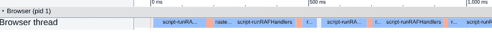

图 1：计时脚本在单线程模式下的追踪。

在 Chrome 追踪中，你可以从工具栏中选择光标图标，并将它拖动到一组追踪事件周围。这将在屏幕底部的详细信息窗口中显示这些事件的计数和平均时间。在我的电脑上，我的浏览器在`render`上平均花费了大约 23 毫秒，在`raster_and_draw`上平均花费了大约 62 毫秒，如图 2 中的放大视图所示。这显然超出了我们的 33 毫秒预算。那么，我们能做什么呢？

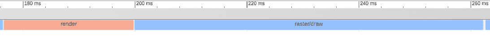

图 2：计时脚本一帧的渲染和光栅化追踪。

我们的浏览器花费大量时间复制像素。这就是为什么优化表面很重要的原因！如果你完成了练习 11-3，这将更快，因为使`tab_surface`更小也有很大帮助。现代浏览器更进一步，在 GPU 上执行光栅化和绘制[操作](https://skia.org/docs/user/api/skcanvas_creation/#gpu)，那里有更多的并行性。即便如此，在复杂页面上，光栅化和绘制确实有时会花费很多时间。我将在第十三章中更深入地探讨这个问题。

# 两个线程

好吧，当然一个选择是优化光栅化和绘制，甚至渲染，我们将在第十三章中这样做。但另一个选择——复杂但值得且每个主要浏览器都在做的是——通过采用多线程架构，将渲染步骤与光栅化和绘制步骤并行执行。这不仅会加快渲染管道（从 85 毫秒降低到 62 毫秒），我们还可以在一个线程上执行 JavaScript，同时在另一个线程上运行昂贵的`raster_and_draw`任务。

让我们把这两个线程称为*浏览器线程*。在现代浏览器中，类似的线程通常被称为[*合成线程*](https://chromium.googlesource.com/chromium/src.git/+/refs/heads/main/docs/how_cc_works.md)，尽管现代浏览器有很多线程，而且这种对应关系并不完全准确。这里我采用真实浏览器常用的名称。更好的名称可能是“DOM”线程（因为 JavaScript 有时可以在[其他线程](https://developer.mozilla.org/en-US/docs/Web/API/Web_Workers_API)上运行）。浏览器线程对应于`Browser`类，将处理光栅化和绘制。它还将处理与浏览器界面的交互。另一方面，主线程对应于一个`Tab`，将处理脚本的执行、资源的加载和渲染，以及相关任务，如运行事件处理程序和回调函数。如果你打开了多个标签页，你将拥有多个主线程（每个标签页一个），但只有一个浏览器线程。

现在，多线程架构有些复杂，所以我们来做一点规划。

首先，已经存在的一个线程——当你启动浏览器时运行的线程——将是浏览器线程。每次我们创建一个标签页时，我们都会创建一个主线程。这两个线程需要通信来处理事件并在屏幕上绘制。

当浏览器线程需要与主线程通信，以通知它事件时，它会在主线程的 `TaskRunner` 上放置任务。你可能想知道为什么主线程不也使用 `TaskRunner` 来与浏览器线程通信。这当然是可以做到的。在这里，我选择只在一个方向上这样做，因为主线程通常是浏览器中“最慢”的线程，这是由于 JavaScript 的不可预测性和 DOM 未知大小的原因。主线程需要与浏览器线程通信，以请求动画帧并发送显示列表进行光栅化和绘制，主线程将通过 `browser` 上的两种方法来实现：`set_needs_animation_frame` 用于请求动画帧，`commit` 用于发送显示列表。

因此，渲染帧的整体控制流程将是：

1.  在主线程中运行的代码使用 `set_needs_animation_frame` 请求动画帧，可能是响应事件处理程序或由于 `requestAnimationFrame`。

1.  浏览器线程的事件循环在主线程的 `TaskRunner` 上安排一个动画帧。

1.  主线程执行其渲染部分，然后调用 `browser.commit`。

1.  浏览器线程将显示列表光栅化并在屏幕上绘制。

让我们实现这个设计。首先，我们将在每个 `TaskRunner` 中添加一个 `Thread`，这将作为标签页的主线程。这个线程需要在一个循环中运行，从任务队列中拉取任务并执行它们。我们将这个循环放在 `TaskRunner` 的 `run` 方法中。

```py
class TaskRunner:
 def __init__(self, tab):
 # ...
 self.main_thread = threading.Thread(
 target=self.run,
 name="Main thread",
 )

 def start_thread(self):
 self.main_thread.start()
```

注意，我命名了这个线程；这是一个良好的习惯，有助于调试。让我们也给浏览器线程命名：

```py
class Browser:
 def __init__(self):
 # ...
 threading.current_thread().name = "Browser thread"
```

从顶层 `while True` 循环中移除对 `run` 的调用，因为这个循环现在将在浏览器线程中运行。并且 `run` 将有自己的循环：

```py
class TaskRunner:
 def run(self):
 while True:
 # ...
```

因为这个循环会永远运行，所以主线程将无限期地存在。所以如果浏览器退出，我们希望它也要求主线程退出：

```py
class Browser:
 def handle_quit(self):
 for tab in self.tabs:
 tab.task_runner.set_needs_quit()
```

`set_needs_quit` 方法在 `TaskRunner` 上设置一个标志，每次循环时都会检查：

```py
class TaskRunner:
 def set_needs_quit(self):
 self.condition.acquire(blocking=True)
 self.needs_quit = True
 self.condition.notify_all()
 self.condition.release()

 def run(self):
 while True:
 self.condition.acquire(blocking=True)
 needs_quit = self.needs_quit
 self.condition.release()
 if needs_quit:
 return

 # ...

 self.condition.acquire(blocking=True)
 if len(self.tasks) == 0 and not self.needs_quit:
 self.condition.wait()
 self.condition.release()
```

`Browser` 应该不再调用 `Tab` 上的任何方法。相反，为了处理事件，它应该在主线程上安排任务。例如，这里是加载：

```py
class Browser:
 def schedule_load(self, url, body=None):
 self.active_tab.task_runner.clear_pending_tasks()
 task = Task(self.active_tab.load, url, body)
 self.active_tab.task_runner.schedule_task(task)
```

在加载新页面之前，我们需要清除任何挂起的任务，因为那些之前的任务现在已无效：

```py
class TaskRunner:
 def clear_pending_tasks(self):
 self.condition.acquire(blocking=True)
 self.tasks.clear()
 self.condition.release()
```

我们还需要将 `new_tab` 分割成获取锁和不获取锁的版本（`new_tab_internal`）：

```py
class Browser:
 def new_tab(self, url):
 self.lock.acquire(blocking=True)
 self.new_tab_internal(url)
 self.lock.release()

 def new_tab_internal(self, url):
 new_tab = Tab(self, HEIGHT - self.chrome.bottom)
 self.tabs.append(new_tab)
 self.set_active_tab(new_tab)
 self.schedule_load(url)
```

这样，`new_tab_internal` 可以直接由像 `Chrome` 的 `click` 方法这样的方法调用，这些方法已经持有锁。在使用锁的同时避免竞争条件和死锁可能相当困难！

```py
class Chrome:
 def click(self, x, y):
 if self.newtab_rect.contains(x, y):
 self.browser.new_tab_internal(
 URL("https://browser.engineering/"))

 def enter(self):
 if self.focus == "address bar":
 self.browser.schedule_load(URL(self.address_bar))
```

事件处理程序大多相似，但我们需要小心地区分影响浏览器外观的事件和影响标签页的事件。例如，考虑`handle_click`。如果用户点击了浏览器外观，我们可以在浏览器线程中直接处理它。但如果用户点击了网页，我们必须在主线程上安排一个任务：

```py
class Browser:
 def handle_click(self, e):
 self.lock.acquire(blocking=True)
 if e.y < self.chrome.bottom:
 # ...
 else:
 # ...
 tab_y = e.y - self.chrome.bottom
 task = Task(self.active_tab.click, e.x, tab_y)
 self.active_tab.task_runner.schedule_task(task)
 self.lock.release()
```

对于`keypress`同样适用：

```py
class Browser:
 def handle_key(self, char):
 if not (0x20 <= ord(char) < 0x7f): return
 if self.chrome.keypress(char):
 # ...
 elif self.focus == "content":
 task = Task(self.active_tab.keypress, char)
 self.active_tab.task_runner.schedule_task(task)
```

将`Browser`对`Tab`的任何其他调用都做同样处理。

因此现在浏览器线程告诉主线程要做什么。其他方向的通信稍微复杂一些。

最初，线程是通过抢占式多任务来提高响应性的机制，但如今它们也允许浏览器增加吞吐量，因为即使是手机也有多个核心。但是不同的 CPU 架构不同，浏览器工程师（就像你一样！）必须根据情况适当使用更多或更少的硬件并行性。例如，一些设备比其他设备拥有更多的[CPU 核心](https://en.wikipedia.org/wiki/Multi-core_processor)，或者对电池电力使用更敏感，或者它们的系统进程，如监听无线无线电，可能会限制浏览器实际可用的并行性。

# 提交显示列表

我们已经有了`set_needs_animation_frame`方法，但我们还需要一个`commit`方法，当`Tab`完成创建显示列表后可以调用它。如果你仔细查看我们的光栅化和绘制代码，你会看到为了绘制显示列表，我们还需要知道 URL（以更新浏览器外观）、文档高度（以分配正确大小的表面）和滚动位置（以绘制表面的正确部分）。

让我们创建一个简单的类来存储这些数据：

```py
class CommitData:
 def __init__(self, url, scroll, height, display_list):
 self.url = url
 self.scroll = scroll
 self.height = height
 self.display_list = display_list
```

当运行动画帧时，`Tab`应该构建这些对象之一并将其传递给`commit`。为了防止`render`变得过于复杂，让我们将其放入一个新的`run_animation_frame`方法中，并将`__runRAFHandlers`也移到那里。为什么不重用`render`而使用新方法呢？因为`render`方法只是在需要时更新样式、布局和绘制；它对每一帧都会被调用，但它也来自`click`，在真实浏览器中来自许多其他地方。同时，`run_animation_frame`只对帧进行调用，因此它，而不是`render`，运行 RAF 处理程序并调用`commit`。

```py
class Tab:
 def __init__(self, browser, tab_height):
 # ...
 self.browser = browser

 def run_animation_frame(self):
 self.js.interp.evaljs("__runRAFHandlers()")
 self.render()
 commit_data = CommitData(
 self.url, self.scroll, document_height, \
 self.display_list)
 self.display_list = None
 self.browser.commit(self, commit_data)
```

将`CommitData`对象视为从主线程发送到浏览器线程。这意味着主线程不再访问它，因此我重置了`display_list`字段。现在`Browser`应该安排`run_animation_frame`：

```py
class Browser:
 def schedule_animation_frame(self):
 def callback():
 # ...
 task = Task(self.active_tab.run_animation_frame)
 # ...
```

在 `Browser` 端，新的 `commit` 方法需要读取发送的所有数据，并根据需要调用 `set_needs_raster_and_draw`。由于这个调用将来自另一个线程，我们需要获取一个锁。另一个重要的步骤是在下一个提交发生之后才清除 `animation_timer` 对象。否则，可能会同时排队多个渲染任务。最后，存储所有的 `CommitData`：将 `scroll` 存储在 `active_tab_scroll` 中，将 `url` 存储在 `active_tab_url` 中，并且另外存储 `height` 和（如果可用）`display_list`：

```py
class Browser:
 def __init__(self):
 self.lock = threading.Lock()

 self.active_tab_url = None
 self.active_tab_scroll = 0
 self.active_tab_height = 0
 self.active_tab_display_list = None

 def commit(self, tab, data):
 self.lock.acquire(blocking=True)
 if tab == self.active_tab:
 self.active_tab_url = data.url
 self.active_tab_scroll = data.scroll
 self.active_tab_height = data.height
 if data.display_list:
 self.active_tab_display_list = data.display_list
 self.animation_timer = None
 self.set_needs_raster_and_draw()
 self.lock.release()
```

确保更新 `Chrome` 类以使用这个新的 `url` 字段，因为我们不希望运行在浏览器线程上的 chrome 从运行在主线程上的标签页中读取。

注意，`commit` 是在主线程上调用的，但会获取浏览器线程锁。因此，`commit` 是一个两个线程同时“停止”的关键时刻。因此，`commit` 需要尽可能快，以最大化并行性和响应性。在现代浏览器中，优化 `commit` 是一项相当具有挑战性的任务，因为它们在线程之间缓存和发送数据的方法要复杂得多。此外，浏览器线程也可能从非活动标签页接收到 `commit`，这是因为即使非活动标签页也可能正在处理最后一个动画帧。因此，在复制任何提交的数据之前，需要将 `tab` 参数与活动标签页进行比较。

现在我们有了浏览器锁，每次浏览器线程访问其任何变量时，我们都需要获取该锁。例如，在 `set_needs_animation_frame` 中，执行以下操作：

```py
class Browser:
 def set_needs_animation_frame(self, tab):
 self.lock.acquire(blocking=True)
 # ...
 self.lock.release()
```

在 `schedule_animation_frame` 中，你需要在回调内部和外部都执行此操作：

```py
class Browser:
 def schedule_animation_frame(self):
 def callback():
 self.lock.acquire(blocking=True)
 # ...
 self.lock.release()
 # ...
 self.lock.acquire(blocking=True)
 # ...
 self.lock.release()
```

将 `raster_and_draw`、`handle_down`、`handle_click`、`handle_key` 和 `handle_enter` 添加锁。

我们也不希望主线程的渲染速度超过浏览器线程的栅格化和绘制速度。因此，我们只能在栅格化和绘制完成后安排动画帧。通过控制管道末端的速率来控制管道前端速率的技术称为 *背压*。幸运的是，这正是我们正在做的事情：

```py
def mainloop(browser):
 while True:
 # ...
 browser.raster_and_draw()
 browser.schedule_animation_frame()
```

就这样：我们现在应该在一条线程上执行渲染，在另一条线程上执行栅格化和绘制！

由于 Python GIL 的存在，Python 中的多线程并不会增加 *吞吐量*，但可以通过在浏览器执行栅格化和绘制任务的同时在主线程上运行 JavaScript 任务等方式，提高 *响应性*。在运行链接到 Python 库的外部 C/C++ 代码时，也可以关闭全局解释器锁；Skia 是线程安全的，但 DukPy 和 SDL 可能不是，并且似乎没有释放 GIL。如果它们释放了 GIL，那么 JavaScript 或栅格化和绘制任务就可以与浏览器中的其他部分并行运行，性能也会得到提升。

# 线程化分析

现在我们有了两个线程，我们希望能够在生成的跟踪中可视化这一点。幸运的是，Chrome 跟踪格式支持这一点。首先，我们希望使`MeasureTime`方法线程安全，这样它们就可以从任何线程中调用：

```py
class MeasureTime:
 def __init__(self):
 self.lock = threading.Lock()
 # ...

 def time(self, name):
 self.lock.acquire(blocking=True)
 # ...
 self.lock.release()

 def stop(self, name):
 self.lock.acquire(blocking=True)
 # ...
 self.lock.release()

 def finish(self):
 self.lock.acquire(blocking=True)
 # ...
 self.lock.release()
```

接下来，在每一个跟踪事件中，我们希望在`tid`字段中提供一个真实的线程 ID，我们可以通过从`threading`库中调用`get_ident`来获取：

```py
class MeasureTime:
 def time(self, name):
 # ...
 tid = threading.get_ident()
 self.file.write(
 ', { "ph": "B", "cat": "_",' +
 '"name": "' + name + '",' +
 '"ts": ' + str(ts) + ',' +
 '"pid": 1, "tid": ' + str(tid) + '}')
 # ...
```

在`stop`中也做同样的事情。我们也可以在完成跟踪时添加元数据事件来显示可读的线程名称：请注意，我们的浏览器不允许你关闭标签页，所以任何线程都会在跟踪`finish`后仍然存在。如果可以关闭标签页，我们可能需要对线程名称进行一些不同的处理。

```py
class MeasureTime:
 def finish(self):
 self.lock.acquire(blocking=True)
 for thread in threading.enumerate():
 self.file.write(
 ', { "ph": "M", "name": "thread_name",' +
 '"pid": 1, "tid": ' + str(thread.ident) + ',' +
 '"args": { "name": "' + thread.name + '"}}')
 # ...
```

现在，如果你从计数动画中创建一个新的跟踪并将其加载到跟踪工具中，你应该会看到类似于图 3 的内容（点击这里下载示例跟踪）：

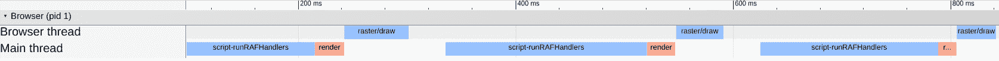

图 3：在双线程模式下对计时器脚本的跟踪。

你可以看到渲染和光栅化任务现在在不同的线程上发生，以及我们的多线程架构如何允许它们并发执行。然而，在这种情况下，这两个线程并不是并发运行任务的。这是因为所有的 JavaScript 任务都是`requestAnimationFrame`回调，这些回调由浏览器线程调度，并且只有在浏览器线程完成光栅化和绘制工作后才会启动。练习 12-8 解决了这个问题。

本章中引入的跟踪系统直接来自真实浏览器。浏览器工程师每天都会使用它来了解浏览器在不同情况下的性能特征，找到瓶颈并修复它们。没有这些工具，浏览器就不可能实现近年来在性能上的许多飞跃。良好的调试工具对于软件工程至关重要！

# 线程化滚动

将主线程从浏览器线程中分离出来意味着主线程可以运行大量的 JavaScript 而不会显著减慢浏览器的速度。但是，确实存在一些非常慢的 JavaScript 可能会减慢浏览器速度的情况。例如，想象我们的计数器添加以下人工的减速：

```py
function callback() {
 for (var i = 0; i < 5e6; i++);
 // ...
}
```

现在，计数器的每个滴答都会有一个人工的暂停，此时主线程会卡在运行 JavaScript。这意味着它无法响应用户事件；例如，如果你按住向下键，滚动将会变得不流畅且令人烦恼。我鼓励你尝试一下，看看它是多么令人烦恼，因为现代浏览器通常不会有这种不流畅的情况。调整循环边界，使其在电脑上暂停大约一秒钟左右。

为了解决这个问题，我们需要浏览器线程来处理滚动，而不是主线程。这比看起来要困难，因为滚动偏移量可能受到浏览器（当用户滚动时）和主线程（当加载新页面或通过 JavaScript 更改文档高度时）的影响。现在浏览器线程和主线程是并行运行的，它们可能会对滚动偏移量产生不同的看法。

我们能做的最好的事情是保留两个滚动偏移量，一个在浏览器线程上，一个在主线程上。重要的是，浏览器线程的滚动偏移量指的是浏览器显示列表的副本，而主线程的滚动偏移量指的是主线程的显示列表，它们可能略有不同。当浏览器线程渲染时，我们将滚动偏移量发送到主线程，但此时主线程必须能够*覆盖*该滚动偏移量，如果新帧需要的话。

让我们来实现它。首先，我们需要在`Browser`上存储一个`active_tab_scroll`变量，并在用户滚动时更新它：

```py
class Browser:
 def __init__(self):
 # ...
 self.active_tab_scroll = 0

 def clamp_scroll(self, scroll):
 height = self.active_tab_height
 maxscroll = height - (HEIGHT - self.chrome.bottom)
 return max(0, min(scroll, maxscroll))

 def handle_down(self):
 self.lock.acquire(blocking=True)
 if not self.active_tab_height:
 self.lock.release()
 return
 self.active_tab_scroll = self.clamp_scroll(
 self.active_tab_scroll + SCROLL_STEP)
 self.set_needs_raster_and_draw()
 self.needs_animation_frame = True
 self.lock.release()
```

这段代码调用`set_needs_raster_and_draw`来使用新的滚动偏移量重新绘制屏幕，并且还将`needs_animation_frame`设置为使主线程异步接收滚动偏移量。尽管浏览器线程已经处理了滚动，但仍然很重要，需要尽快将新值同步回主线程，因为像点击处理这样的 API 依赖于它。

当用户切换标签时，滚动偏移量也需要改变，但在这个情况下，我们还不知道正确的滚动偏移量。我们需要主线程运行，以便为其他标签提交新的显示列表，那时我们也将有一个新的滚动偏移量。将标签切换（在`load`和`handle_click`中）移动到新的方法`set_active_tab`，该方法仅安排一个新的动画帧：请注意，调用者已经持有锁，因此此方法不需要获取锁。

```py
class Browser:
 def set_active_tab(self, tab):
 self.active_tab = tab
 self.active_tab_scroll = 0
 self.active_tab_url = None
 self.needs_animation_frame = True
 self.animation_timer = None
```

到目前为止，这只是在浏览器线程上更新滚动偏移量。但最终主线程需要知道滚动偏移量，以便将其传递回`commit`。因此，当`Browser`为`run_animation_frame`创建渲染任务时，它应该传递滚动偏移量。然后`run_animation_frame`函数可以在做其他任何事情之前存储滚动偏移量。向`run_animation_frame`添加一个`scroll`参数：

```py
class Browser:
 def schedule_animation_frame(self):
 # ...
 def callback():
 self.lock.acquire(blocking=True)
 scroll = self.active_tab_scroll
 self.needs_animation_frame = False
 task = Task(self.active_tab.run_animation_frame, scroll)
 self.active_tab.task_runner.schedule_task(task)
 self.lock.release()
 # ...
```

但主线程也需要能够修改滚动偏移量。我们将添加一个`scroll_changed_in_tab`标志来跟踪它是否已经这样做，并且只有当`scroll_changed_in_tab`不是`true`时才存储浏览器线程的滚动偏移量。双线程滚动有很多边缘情况，包括我在编写本章时没有预料到的一些情况。例如，很明显，加载应该将滚动强制设置为 0（除非浏览器实现了[滚动恢复](https://developer.mozilla.org/en-US/docs/Web/API/History/scrollRestoration)以支持回退导航！），但随后浏览器滚动将其带回到夹紧区域内的滚动夹具又该如何处理呢？通过将浏览器分成两个线程，我们引入了并发和分布式状态的所有挑战。

```py
class Tab:
 def __init__(self, browser, tab_height):
 # ...
 self.scroll_changed_in_tab = False

 def run_animation_frame(self, scroll):
 if not self.scroll_changed_in_tab:
 self.scroll = scroll
 # ...
```

当加载新页面或浏览器线程的滚动偏移量超过页面底部时，我们将设置`scroll_changed_in_tab`：

```py
class Tab:
 def load(self, url, payload=None):
 # ...
 self.scroll = 0
 self.scroll_changed_in_tab = True

 def clamp_scroll(self, scroll):
 height = math.ceil(self.document.height + 2*VSTEP)
 maxscroll = height - self.tab_height
 return max(0, min(scroll, maxscroll))

 def run_animation_frame(self, scroll):
 # ...
 self.browser.commit(self, commit_data)
 self.scroll_changed_in_tab = False

 def render(self):
 # ...
 clamped_scroll = self.clamp_scroll(self.scroll)
 if clamped_scroll != self.scroll:
 self.scroll_changed_in_tab = True
 self.scroll = clamped_scroll
 # ...
```

如果主线程**没有**覆盖浏览器的滚动偏移量，我们将在提交数据中将滚动偏移量设置为`None`：

```py
class Tab:
 def run_animation_frame(self, scroll):
 # ...
 scroll = None
 if self.scroll_changed_in_tab:
 scroll = self.scroll
 commit_data = CommitData(
 self.url, scroll, document_height, \
 self.display_list)
 # ...
```

在这种情况下，浏览器线程可以忽略滚动偏移量：

```py
class Browser:
 def commit(self, tab, data):
 if tab == self.active_tab:
 # ...
 if data.scroll != None:
 self.active_tab_scroll = data.scroll
```

那就是全部了！如果你现在尝试计数演示，你将能够在人工暂停期间滚动。这里是一个显示线程滚动工作的跟踪记录（注意现在光栅和绘制有时会与主线程工作同时发生），并在图 4 中进行了可视化。

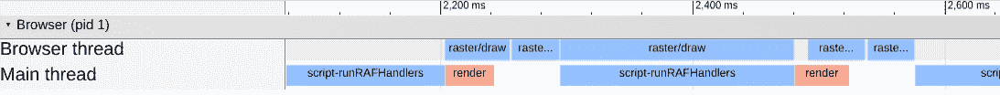

图 4：计数演示中线程滚动的跟踪输出。

正如你所见，将任务移动到浏览器线程可能会很具挑战性，但也可以使浏览器变得更加响应。这些相同的权衡在真实浏览器中也存在，但复杂程度要高得多。

在真实浏览器中的滚动功能远超我们在这里实现的。例如，在真实浏览器中，JavaScript 可以监听一个[`scroll`](https://developer.mozilla.org/en-US/docs/Web/API/Document/scroll_event)事件，并调用`preventDefault`来取消滚动。还有一些渲染特性，如[`background-attachment: fixed`](https://developer.mozilla.org/en-US/docs/Web/CSS/background-attachment)，在浏览器线程上难以实现。我们的浏览器不支持这些功能，因此不会遇到这些困难。这也是一种策略。例如，直到 2020 年，基于 Chromium 的 Android 浏览器不支持`background-attachment: fixed`。因此，大多数真实浏览器都实现了并行和非并行滚动，并在使用这些高级功能时回退到非并行滚动。实际上，真实浏览器只有在必要时才会回退到非并行滚动。例如，它可能会禁用并行滚动，如果`scroll`事件监听器调用了`preventDefault`。这样的担忧也推动了[新的 JavaScript API](https://developer.mozilla.org/en-US/docs/Web/API/EventTarget/addEventListener#passive)的发展。

# 并行处理样式和布局

现在我们有了独立的浏览器线程和主线程，并且一些操作是在浏览器线程上执行的，我们的浏览器线程架构已经开始类似于真实浏览器的架构。请注意，许多浏览器现在将浏览器线程和主线程的部分运行在不同的进程中，这对安全和错误处理有优势。但为什么不能将更多的浏览器组件移动到更多的线程中呢？这不会使浏览器运行得更快吗？

总之，是的。现代浏览器拥有[数十个线程](https://developer.chrome.com/blog/renderingng-architecture/#process-and-thread-structure)，这些线程共同作用，使得浏览器运行更快、响应更灵敏。例如，光栅化和绘制通常在自己的线程上运行，这样浏览器线程就可以在准备新帧的同时处理事件。同样，现代浏览器通常有一组网络或输入/输出（I/O）线程，这些线程将所有与网络或文件系统的交互都从主线程上移开。

另一方面，浏览器的一些部分并不能轻易地并行处理。例如，考虑渲染管道的早期部分：样式、布局和绘制。在我们的浏览器中，这些操作都在主线程上运行。但它们能否移动到自己的线程上呢？

从原则上讲，是的。浏览器*必须*做到的是正确实现所有网络 API 规范，并在脚本和 `requestAnimationFrame` 回调完成后将内容绘制到屏幕上。规范在它所称为的“[更新渲染](https://html.spec.whatwg.org/multipage/webappapis.html#update-the-rendering)”步骤中详细说明了这一点。这些步骤根本不提样式或布局——因为样式和布局，就像绘制一样，是浏览器的实现细节。规范的更新渲染步骤是在绘制到屏幕之前必须发生的*JavaScript 可观察*的事情。

尽管如此，在实际操作中，没有任何现代浏览器在除了主线程之外的任何线程上运行样式或布局。一些浏览器确实在样式和布局内部使用多个线程；[Servo](https://en.wikipedia.org/wiki/Servo_(software)) 研究浏览器在这方面是先驱，试图实现完全并行的样式、布局和绘制阶段。Servo 的一些代码现在已成为 Firefox 的一部分。然而，即使样式或另一个阶段在内部使用线程，这些步骤仍然不会与 JavaScript 执行等操作并发进行。原因很简单：存在许多可以查询样式或布局状态的 JavaScript API。例如，`getComputedStyle`（[getComputedStyle](https://developer.mozilla.org/en-US/docs/Web/API/Window/getComputedStyle)）需要首先计算样式，而 `getBoundingClientRect`（[getBoundingClientRect](https://developer.mozilla.org/en-US/docs/Web/API/Element/getBoundingClientRect)）需要首先进行布局。没有 JavaScript API 允许从渲染管道中布局之后的任何地方读取状态，这就是为什么可以将管道的后半部分移动到另一个线程的原因。如果一个网页调用这些 API 之一，并且样式或布局尚未更新，那么就必须立即在那里进行计算。这些计算被称为“强制样式”或“强制布局”：样式或布局“强制”立即发生，而不是在未来可能延迟 33 毫秒，如果它们尚未计算的话。由于这些强制样式和布局情况，浏览器必须能够在主线程上计算样式和布局。或者，主线程可以强制浏览器线程执行这项工作，但这甚至更糟糕，因为如果强制在合成器线程上工作，除非你做更多工作来避免这种情况，否则滚动将会变得不流畅。

解决这些紧张关系的一种可能方法是将样式和布局乐观地移出主线程，类似于在网页没有 `preventDefault` 滚动时乐观地进行线程化滚动。这是一个好主意吗？也许吧，但强制样式和布局不仅仅是由 JavaScript 执行引起的。一个例子是我们的 `click` 实现，它会在点击测试之前强制渲染：

```py
class Tab:
 def click(self, x, y):
 self.render()
 # ...
```

将碰撞测试从主线程移除或对旧版本的布局树进行碰撞测试，或者想出其他技术解决方案是可能的（但非常困难）。因此，虽然“乐观”地认为将样式和布局移出主线程并非不可能，但这确实具有挑战性。话虽如此，浏览器开发者总是在寻找让事情变得更快的方法，我预计在未来的某个时刻，样式和布局将被移至它们自己的线程。也许你将成为那个实现它的人？

浏览器渲染管道受到图形和游戏的影响很大。许多高性能游戏由事件循环驱动，每个事件更新一个[场景图](https://en.wikipedia.org/wiki/Scene_graph)，然后将场景图转换为显示列表，最后将显示列表转换为像素。但在游戏中，程序员可以提前知道将提供哪些场景图，并可以为这些图调整图形管道。游戏可以在开始时将超优化的代码和预渲染的数据上传到 CPU 和 GPU 内存中。相比之下，浏览器需要处理任意的网页，并且不能花太多时间优化任何事情。这导致了完全不同的权衡，这也是为什么浏览器通常不如游戏那样花哨和流畅。

# 摘要

本章展示了现代浏览器核心中的双线程渲染系统。需要记住的主要点包括：

+   浏览器将工作组织成任务队列，包括运行 JavaScript、处理用户输入和渲染页面等任务。

+   目标是以 30 Hz 的节奏持续生成屏幕帧，这意味着每个动画帧有 33 ms 的绘制预算。

+   浏览器在渲染过程中涉及两个关键线程。

+   主线程运行 JavaScript 和特殊的渲染任务。

+   浏览器线程将显示列表绘制到屏幕上，处理/调度输入事件，并执行滚动。

+   主线程通过`commit`与浏览器线程通信，以同步两个线程。

此外，你也看到了在两个线程之间移动任务是多么困难，比如在浏览器线程上滚动时遇到的挑战，或者强制样式和布局如何使得完全隔离渲染管道与 JavaScript 变得困难。

点击这里尝试本章的浏览器。

# 概述

我们浏览器中的完整函数、类和方法集现在看起来可能像这样：

如果运行它，它应该看起来像这个页面；由于浏览器沙盒，你需要在新标签页中打开该页面。

# 练习

12-1 *`setInterval`*. [`setInterval`](https://developer.mozilla.org/en-US/docs/Web/API/WindowOrWorkerGlobalScope/setInterval) 与 `setTimeout` 类似，但会在给定的节奏下重复运行，直到调用 `clearInterval`。实现这些 API。确保在一个同时使用 `requestAnimationFrame` 进行一些昂贵渲染管道工作的页面上测试 `setInterval` 的各种节奏。记录 `setInterval` 任务的实际时间；节奏的稳定性如何？

12-2 *任务计时*. 修改 `Task` 以在每次任务执行时添加跟踪事件。你将为这些跟踪事件提供一个好的名称。一个选项是使用 `task_code` 的 `__name__` 字段，这将获取任务运行的 Python 函数的名称。

12-3 *基于时钟的帧计时*. 目前我们的浏览器在每个动画帧完成后恰好 33 毫秒后安排每个动画帧。这实际上导致动画帧率节奏比 33 毫秒慢。通过使用绝对时间来安排动画帧，而不是帧之间的固定延迟，在我们的浏览器中修复这个问题。还实现主线程动画帧调度，该调度发生在光栅化和绘制之前，而不是之后，允许两个线程同时进行动画工作。

12-4 *调度*. 随着更多类型的复杂任务出现在事件队列中，就有更大的需求来仔细调度它们，以确保渲染节奏尽可能接近 33 毫秒，并且避免任务饥饿。实现一个具有优先级系统的任务调度器，以平衡这两个需求：优先处理渲染任务和输入处理，并降低（但不要完全饥饿）最终来自 JavaScript API 如 `setTimeout` 的任务。在一个使用大量基于 `setTimeout` 的任务的网页上测试它。

12-5 *线程加载*. 当加载页面时，我们的浏览器目前会依次等待每个样式表或脚本资源加载。这在网络状况不佳的情况下是不必要的缓慢。相反，让你的浏览器并行发送所有网络请求。然而，你仍然必须按源顺序处理资源，如样式。使用 `Thread` 上的 `join` 方法可能很方便，这将阻塞调用 `join` 的线程，直到被 `join` 的线程完成。

12-6 *网络线程*. 真实浏览器通常有一个单独的线程用于网络（和其他 I/O）。任务以类似主线程的方式添加到这个线程。实现第三个 *网络* 线程，并将所有网络任务放在它上面。

12-7 *优化调度*. 在一个复杂的网页上，浏览器可能无法跟上所需的节奏。而不是不断将 CPU 固定在徒劳的尝试中，以跟上节奏，实现一个基于先前帧估计浏览器真实节奏的*帧时间估计器*，并调整`schedule_animation_frame`以匹配。这样复杂的页面会持续变慢，而不是出现随机减速。

12-8 *光栅和绘制线程*. 目前，如果输入事件在浏览器线程进行光栅化或绘制时到达，该输入事件不会立即被处理。这是一个特别的问题，因为光栅化和绘制很慢。通过添加一个由浏览器线程控制的单独的光栅和绘制线程来解决这个问题。当光栅和绘制线程正在执行其工作的时候，浏览器线程应该可以处理输入事件。请注意：SDL 不是线程安全的，所以所有直接使用 SDL 的步骤仍然需要在浏览器线程上执行。

# 动画和合成

Web 浏览器工程的第十三章。

+   JavaScript 动画

+   GPU 加速

+   合成

+   合成叶子

+   CSS 过渡

+   合成动画

+   优化合成

+   重叠和变换

+   总结

+   概要

+   练习

复杂的 Web 应用程序在状态之间转换时使用*动画*。这些动画帮助用户理解状态变化，并通过用渐进变化代替突然跳跃来提高视觉的精致度。但是为了平滑地执行这些动画，浏览器必须最小化每个动画帧中的时间，使用 GPU 加速来加快视觉效果和合成来最小化渲染工作。

# JavaScript 动画

[动画](https://en.wikipedia.org/wiki/Animation) 是一系列以快速连续的方式展示的静态图片，这给人类眼睛造成了一种 *运动* 的错觉。这里的 *运动* 应该被广泛理解，包括人类习惯看到并擅长识别的所有视觉变化——不仅仅是左右移动，还包括生长、缩小、旋转、淡入淡出、模糊和锐化。规则是，动画不是一系列 *任意* 的图片；序列必须让在现实世界中通过经验训练的人类大脑感到连续。典型的网页动画包括改变元素的颜色、淡入或淡出，或调整其大小。浏览器还会在用户滚动、调整大小和捏合缩放等操作时使用动画。此外，某些类型的动画媒体（如视频）可以包含在网页中。类似视频的动画也包括动画图像和动画画布。由于我们的浏览器目前还不支持图像，这个主题超出了本章的范围；视频本身有其自己的 [迷人复杂性](https://developer.chrome.com/blog/videong/)。

在本章中，我们将专注于网页元素的动画。让我们从编写一个简单的使用 `requestAnimationFrame` API 的动画开始，该 API 在第十二章中实现（scheduling.html#animating-frames）。此方法请求在下一帧上运行一些 JavaScript 代码；为了在多个帧上重复运行，我们只需让那段 JavaScript 代码调用 `requestAnimationFrame` 本身：

```py
function run_animation_frame() {
 if (animate())
 requestAnimationFrame(run_animation_frame);
}
requestAnimationFrame(run_animation_frame);
```

然后，`animate` 函数对页面进行一些小的更改，以产生连续变化的印象。它在动画过程中返回 `true`，然后停止。通过更改 `animate` 的行为，我们可以改变发生的动画。

例如，我们可以通过平滑地将元素的 `opacity` 值从 0.1 过渡到 0.999 来淡入一个元素。真实浏览器在 `opacity` 精确为 1 时应用某些优化，因此现实世界的网站通常在 0.999 处开始和结束动画，以确保每一帧都以相同的方式绘制，动画流畅。这也避免了内容在进入和退出 GPU 加速模式时的视觉跳动。我选择 0.999 是因为与 1.0 的视觉差异几乎不可察觉。这样做需要 120 帧（大约四秒）的时间，这意味着每帧增加大约 0.008 的不透明度。

因此，让我们来看这个包含一些文本的 `div`：

```py
<div>This text fades</div>
```

并编写一个 `animate` 函数来递增地改变其 `opacity`：

```py
var div = document.querySelectorAll("div")[0];
var total_frames = 120;
var current_frame = 0;
var change_per_frame = (0.999 - 0.1) / total_frames;
function animate() {
 current_frame++;
 var new_opacity = current_frame * change_per_frame + 0.1;
 div.style = "opacity:" + new_opacity;
 return current_frame < total_frames;
}
```

下面是它的样子；点击按钮开始淡入：

examples/example13-opacity-raf.html

这个动画几乎在我们的浏览器中运行，除了我们需要添加支持从 JavaScript 中更改元素 `style` 属性的功能。为此，在 JavaScript 运行时中注册 `style` 属性的设置器：

```py
Object.defineProperty(Node.prototype, 'style', {
 set: function(s) {
 call_python("style_set", this.handle, s.toString());
 }
});
```

然后，在浏览器内部，定义一个 `style_set` 的处理程序：

```py
class JSContext:
 def __init__(self, tab):
 # ...
 self.interp.export_function("style_set", self.style_set)

 def style_set(self, handle, s):
 elt = self.handle_to_node[handle]
 elt.attributes["style"] = s;
 self.tab.set_needs_render()
```

重要的是，`style_set`函数将`needs_render`标志设置为确保浏览器使用新的`style`参数重新渲染网页。有了这些更改，你现在应该能够在浏览器中打开并运行这个动画。

本节中展示的动画模式是*事件循环*的另一个例子，它最初在第二章介绍并在第十二章进一步发展。本章的新颖之处在于，我们终于有了足够的科技来创建有意义的、实用的动画。同样的事情也发生在网页上。许多用于正确动画的 API，从`requestAnimationFrame` API 到 CSS 原生动画，仅在[2010 年代](https://en.wikipedia.org/wiki/CSS_animations)出现。

# GPU 加速

在你的浏览器中尝试淡入淡出动画，你可能会注意到它并不特别平滑。这并不奇怪；毕竟，第十二章中显示，对于简单页面，光栅化和绘制大约需要 62 毫秒，而渲染需要 23 毫秒。

即使每帧只有 62 毫秒，我们的浏览器也几乎只能达到每秒 15 帧；对于平滑的动画，我们希望达到 30 帧！因此，我们需要加快光栅化和绘制的速度。

要做到这一点，最好的办法是将光栅化和绘制移动到[GPU](https://en.wikipedia.org/wiki/Graphics_processing_unit)。GPU 本质上是你电脑中一个运行程序的方式与 CPU 非常相似，但专门用于运行非常简单的程序，具有巨大的并行性——它是为了对屏幕上的每个像素应用简单的并行操作而开发的。这使得 GPU 在绘制简单形状时更快，在应用视觉效果时则快得多。

在高层次上，为了在 GPU 上进行光栅化和绘制，我们的浏览器必须：这些步骤的细节因 GPU 架构而异。

+   *上传*显示列表到专门的 GPU 内存。

+   *编译*用于光栅化和绘制显示列表的 GPU 程序。没错，GPU 程序是动态编译的！这使得它们可以在具有非常不同的指令集或加速策略的广泛实现之间移植。这些编译程序通常会被缓存，因此这一步骤不会在每一帧动画中发生。

+   *光栅化*每个绘制命令到 GPU 纹理中。在 GPU 上表示的表面称为*纹理*。可以有多于一个的纹理，实际上它们通常不能并行光栅化。

+   *绘制*纹理到屏幕上。

幸运的是，SDL 和 Skia 支持 GPU，并且所有这些步骤；这主要是一个传递正确的参数给它们，让它们在 GPU 上执行的问题。所以让我们这么做。请注意，实际的浏览器通常实现 CPU 和 GPU 的栅格化和绘制，因为在某些情况下，CPU 的栅格化和绘制可能比使用 GPU 更快，或者可能需要绕过错误。任何四个步骤都可能使 GPU 的栅格化和绘制变慢。大的显示列表需要一段时间才能上传。复杂的显示列表命令需要更长的时间来编译。如果有很多表面，栅格化可能会很慢，如果表面深度嵌套，绘制可能会很慢。在 CPU 上，上传步骤和编译步骤是不必要的，并且有更多的内存可用于栅格化和绘制。当然，GPU 和 CPU 都有许多优化可用，因此选择绘制给定页面的最佳方式可能相当复杂。在我们的浏览器中，为了简单起见，我们将始终使用 GPU。

首先，我们需要安装 OpenGL 库：

```py
pip3 install PyOpenGL
```

首先，我们需要导入它：

```py
import OpenGL.GL
```

现在，我们需要配置 SDL 以使用 OpenGL，并在程序的开始/结束时启动/停止 [GL 上下文](https://www.khronos.org/opengl/wiki/OpenGL_Context)。就我们的目的而言，只需考虑这个 API 模板：启动 GL 上下文只是 OpenGL 表示“设置后续 OpenGL 命令将绘制到的表面”。创建一个后，你甚至可以手动执行 OpenGL 命令，[完全不使用 Skia](http://pyopengl.sourceforge.net/)，在屏幕上绘制多边形或其他对象。

```py
class Browser:
 def __init__(self):
 # ...
 self.sdl_window = sdl2.SDL_CreateWindow(b"Browser",
 sdl2.SDL_WINDOWPOS_CENTERED,
 sdl2.SDL_WINDOWPOS_CENTERED,
 WIDTH, HEIGHT,
 sdl2.SDL_WINDOW_SHOWN | sdl2.SDL_WINDOW_OPENGL)
 self.gl_context = sdl2.SDL_GL_CreateContext(
 self.sdl_window)
 print(("OpenGL initialized: vendor={}," + \
 "renderer={}").format(
 OpenGL.GL.glGetString(OpenGL.GL.GL_VENDOR),
 OpenGL.GL.glGetString(OpenGL.GL.GL_RENDERER)))

 def handle_quit(self):
 # ...
 sdl2.SDL_GL_DeleteContext(self.gl_context)
 sdl2.SDL_DestroyWindow(self.sdl_window)
```

那个 `print` 语句显示了浏览器正在使用的 GPU 供应商和渲染器；这将帮助你验证它实际上正在使用你的 GPU。我正在使用 Chromebook 编写这一章节，所以对我来说它显示的是：`virgl` 渲染器代表“虚拟 GL”，这是一种为 ChromeOS 的 Linux 子系统提供硬件加速的方式，它与 ChromeOS Linux 沙盒一起工作。这比直接使用 GPU 慢一些，所以你可能看到的栅格化和绘制速度甚至比我还要快。

```py
OpenGL initialized: vendor=b'Red Hat', renderer=b'virgl'
```

现在，我们可以配置 Skia 以直接绘制到屏幕上。咒语是：奇怪的是，这段代码绘制到窗口中，没有直接引用 `gl_context` 或 `sdl_window`。这是因为 OpenGL 是一个奇怪的 API，有很多隐藏的全局状态；`MakeGL` Skia 方法隐式绑定到现有的 GL 上下文。

```py
class Browser:
 def __init__(self):
 # ...
 self.skia_context = skia.GrDirectContext.MakeGL()

 self.root_surface = \
 skia.Surface.MakeFromBackendRenderTarget(
 self.skia_context,
 skia.GrBackendRenderTarget(
 WIDTH, HEIGHT, 0, 0,
 skia.GrGLFramebufferInfo(
 0, OpenGL.GL.GL_RGBA8)),
 skia.kBottomLeft_GrSurfaceOrigin,
 skia.kRGBA_8888_ColorType,
 skia.ColorSpace.MakeSRGB())
 assert self.root_surface is not None
```

使用 OpenGL 的额外优点是，我们不再需要在 Skia 和 SDL 之间复制数据了。相反，我们只需 *刷新* Skia 表面（Skia 表面是懒惰绘制的）并调用 `SDL_GL_SwapWindow` 来激活新的帧缓冲区（因为 OpenGL [双缓冲](https://wiki.libsdl.org/SDL_GL_SwapWindow)）：

```py
class Browser:
 def draw(self):
 # ...
 self.root_surface.flushAndSubmit()
 sdl2.SDL_GL_SwapWindow(self.sdl_window)
```

最后，我们的浏览器也会为 `chrome_surface` 和 `tab_surface` 创建 Skia 表面。我们不想直接将这些内容绘制到屏幕上，所以咒语略有不同：

```py
class Browser:
 def __init__(self):
 # ...
 self.chrome_surface = skia.Surface.MakeRenderTarget(
 self.skia_context, skia.Budgeted.kNo,
 skia.ImageInfo.MakeN32Premul(
 WIDTH, math.ceil(self.chrome.bottom)))
 assert self.chrome_surface is not None
```

再次强调，你应该主要将这些变化视为模板代码，因为 GPU 操作的细节不是我们关注的重点。示例细节：GPU 模式需要不同的颜色空间。确保对 `tab_surface`（具有不同的宽度和高度参数）应用相同的处理。

由于 SDL 和 Skia 对 GPU 渲染的全面支持，这应该就足够我们的浏览器在 GPU 上进行光栅化和绘制了。正如预期的那样，速度有了显著提升。我发现光栅化和绘制平均提高了到 7 毫秒（见图 1）。

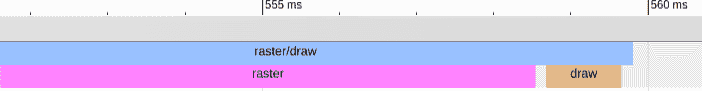

图 1：使用 GPU 光栅化进行跟踪的光栅化和绘制时间。

这大约是 10 倍的提速，足以达到每秒 30 帧的速度。（而且在你电脑上，你可能会看到比我更高的速度提升，所以对于你来说，在这个例子中可能已经足够快了。）但如果我们还想更快，我们就需要找到减少渲染、光栅化和绘制总工作量方法。

在 Skia 中，一个高速、可靠且跨平台的 GPU 光栅化路径只存在了几年。你可以在 Chrome 开发者博客上看到一个时间线[链接](https://developer.chrome.com/blog/renderingng/#gpu-acceleration-everywhere)。在 Chromium 的早期阶段，只有 CPU 光栅化。滚动就像在这本书的早期章节中实现的那样，通过重新光栅化内容来实现。在当时，这被认为是可接受的，因为计算机总体上比现在慢得多，GPU 的可靠性也较低，动画较少，移动平台如 Android 和 iOS 正在兴起。（事实上，Android 的早期版本也没有 GPU 加速。）Firefox 和 Safari 也是如此，尽管 Safari 能够更容易地加速内容，因为它只针对 macOS 和 iOS 支持的有限数量的 GPU。

实现 GPU 加速光栅化有许多挑战，其中包括在许多 GPU 架构上正确工作，在复杂或错误场景中优雅地回退到 CPU 光栅化，以及在抗锯齿和复杂形状等困难情况下找到高效 GPU 光栅化内容的方法。所以虽然你可能觉得现在才在我们的浏览器中开启 GPU 加速看起来有些奇怪，但这也反映了浏览器的发展历程。

# 合成

那么，我们如何在光栅化和绘制阶段做更少的工作呢？答案是称为*合成*的技术，这仅仅意味着在 GPU 上缓存一些光栅化图像，并在后续帧中重用它们。术语[*合成*](https://en.wikipedia.org/wiki/Compositing)意味着将多个图像组合成最终输出。在浏览器的上下文中，这通常意味着将光栅化图像组合成最终的屏幕图像，但在许多操作系统中也使用类似的技巧来组合多个窗口的内容。“合成”也可以指多线程渲染。我首次在第十一章中讨论了合成；这里描述的算法将这一点推广到了滚动之外。

要解释合成，我们需要考虑浏览器的显示列表，并且为了做到这一点，打印出来是很有用的。例如，对于`DrawRect`，你可能打印如下：

```py
class DrawRect:
 def __repr__(self):
 return ("DrawRect(top={} left={} " +
 "bottom={} right={} color={})").format(
 self.top, self.left, self.bottom,
 self.right, self.color)
```

如果没有传递不透明度或混合模式，`Blend`命令有时什么都不做；在打印时指出这一点是有帮助的：

```py
class Blend:
 def __repr__(self):
 args = ""
 if self.opacity < 1:
 args += ", opacity={}".format(self.opacity)
 if self.blend_mode:
 args += ", blend_mode={}".format(self.blend_mode)
 if not args:
 args = ", <no-op>"
 return "Blend({})".format(args[2:])
```

你还需要为所有的绘制命令添加`children`字段，因为`print_tree`依赖于这些。现在我们可以打印出浏览器的显示列表：

```py
class Tab:
 def render(self):
 # ...
 for item in self.display_list:
 print_tree(item)
```

对于我们的不透明度示例，一帧的显示列表（关键部分）可能看起来像这样：

```py
Blend(alpha=0.119866666667)
  DrawText(text=This)
  DrawText(text=text)
  DrawText(text=fades)
```

在下一帧，它可能看起来是这样的：

```py
Blend(alpha=0.112375)
  DrawText(text=This)
  DrawText(text=text)
  DrawText(text=fades)
```

在每种情况下，光栅化这个显示列表意味着首先将这三个字光栅化到由`Blend`创建的 Skia 表面，然后将其复制到根表面并应用透明度。关键的是，光栅化在这两帧中是相同的；只有复制不同。这意味着我们可以通过缓存来加速它。

理念是首先将这三个字光栅化到一个单独的表面（但这次是我们拥有的，而不是 Skia），我们将它称为*合成层*，以备将来使用：

```py
Composited Layer:
  DrawText(text=This)
  DrawText(text=text)
  DrawText(text=fades)
```

现在我们可以用`DrawCompositedLayer`命令直接复制这些三个字，而不是对它们进行光栅化：

```py
Blend(alpha=0.112375)
  DrawCompositedLayer()
```

重要的是，在下一帧中，`Blend`发生了变化，但`DrawText`没有变化，所以在那一帧我们只需要重新运行`Blend`：

```py
Blend(alpha=0.119866666667)
  DrawCompositedLayer()
```

换句话说，合成的理念是将显示列表分成两部分：一组合成层，在浏览器的光栅化阶段进行光栅化并缓存，以及一个*绘制显示列表*，在浏览器的绘制阶段绘制，并使用合成层。

当动画的后续帧重用合成层时，合成可以提高性能。这里就是这样，因为帧之间的唯一区别是`Blend`，它位于绘制显示列表中。

如何具体分割显示列表由浏览器决定。通常，在 GPU 上执行如不透明度这样的视觉效果非常快，但绘制形状的绘图命令——在我们的浏览器中是`DrawText`、`DrawRect`、`DrawRRect`和`DrawLine`——可能会慢一些。而且通常有更多这样的命令需要执行。由于视觉效果通常是动画化的，这意味着浏览器通常将动画视觉效果留在绘图显示列表中，并将其他所有内容移动到合成层中。当然，在真实浏览器中，硬件能力、GPU 内存和应用数据都会影响这些决策，但合成的基本思想是不变的。

如果你仔细观察本节中的不透明度示例，你会看到`DrawText`命令的`rect`宽度仅与文本宽度相当。另一方面，`Blend`的`rect`宽度几乎与视口宽度相当。它们之所以不同，是因为文本的宽度仅是其所需宽度，但包含文本的块元素宽度与可用宽度相当。

所以如果我们将其放入合成层中，它需要与文本宽度或整个视口宽度相同吗？在实践中，你可以实现任一方式。本章中提出的算法最终得到的是较小的那个，但真实浏览器有时会选择较大的，这取决于它们的算法。此外，请注意，如果与包含文本的块元素相关的任何绘图命令（如背景颜色）存在，则表面宽度肯定需要与视口宽度相同。同样，如果有多个内联子元素，它们的边界并集将影响表面大小。

# 组合叶片

让我们实现合成。我们需要识别绘图命令并将它们移动到合成层中。然后我们需要创建一个绘图显示列表，将合成层与视觉效果结合起来。为了简化问题，我们将从为每个绘图命令创建一个合成层开始。

为了识别绘图命令，给它们都指定一个`PaintCommand`超类将很有帮助：

```py
class PaintCommand:
 def __init__(self, rect):
 self.rect = rect
 self.children = []
```

现在每一个绘图命令都需要是`PaintCommand`的一个子类；为了做到这一点，你需要在声明类的时候指定超类，并在构造函数中使用一些特殊的语法：

```py
class DrawLine(PaintCommand):
 def __init__(self, x1, y1, x2, y2, color, thickness):
 super().__init__(skia.Rect.MakeLTRB(x1, y1, x2, y2))
 # ...
```

`MakeLTRB`为`PaintCommand`构造函数创建`rect`。我们也可以为视觉效果指定一个超类：

```py
class VisualEffect:
 def __init__(self, rect, children):
 self.rect = rect.makeOffset(0.0, 0.0)
 self.children = children
 for child in self.children:
 self.rect.join(child.rect)
```

注意，由于视觉效果有子元素，我们不仅需要将它们传递给构造函数，还需要将它们的`rect`字段添加到我们自己的中。我使用`makeOffset`函数来复制原始的`rect`，然后通过后续的`join`方法将其扩展以包括所有子元素。

好吧，修改每个绘图命令和视觉效果类，使它们成为这两个新类之一的一个子类。确保你在`class`行上声明超类，并在`__init__`方法中使用`super()`语法调用超类构造函数。

我们现在可以使用 `tree_to_list` 列出所有的绘图命令：

```py
class Browser:
 def composite(self):
 all_commands = []
 for cmd in self.active_tab_display_list:
 all_commands = tree_to_list(cmd, all_commands)
 paint_commands = [cmd for cmd in all_commands
 if isinstance(cmd, PaintCommand)]
```

接下来，我们需要将绘图命令分组到层中。目前，让我们做最简单的事情，将每个绘图命令放入它自己的 `CompositedLayer`:

```py
class Browser:
 def __init__(self):
 # ...
 self.composited_layers = []

 def composite(self):
 self.composited_layers = []
 # ...
 for cmd in paint_commands:
 layer = CompositedLayer(self.skia_context, cmd)
 self.composited_layers.append(layer)
```

在这里，一个 `CompositedLayer` 只存储一个 *显示项* 的列表（以及它们将被绘制到的表面）。目前，它只有一个显示项，但很快就会改变。

```py
class CompositedLayer:
 def __init__(self, skia_context, display_item):
 self.skia_context = skia_context
 self.surface = None
 self.display_items = [display_item]
```

现在我们需要一个组合层来组合绘图显示列表。为此，我们将从每个合成层向上遍历，构建应用到它的所有视觉效果链，链的底部是 `DrawCompositedLayer`。

首先，为了方便访问那些祖先视觉效果并比较它们，让我们在我们的显示列表树中添加父指针：

```py
def add_parent_pointers(nodes, parent=None):
 for node in nodes:
 node.parent = parent
 add_parent_pointers(node.children, node)

class Browser:
 def composite(self):
 add_parent_pointers(self.active_tab_display_list)
 # ...
```

接下来，我们需要克隆层绘图命令的每个祖先并注入新的子命令，因此让我们为视觉效果类添加一个新的 `clone` 方法。对于 `Blend`，它将创建一个新的 `Blend`，具有相同的参数但新的子命令：

```py
class Blend(VisualEffect):
 # ...
 def clone(self, child):
 return Blend(self.opacity, self.blend_mode,
 self.node, [child])
```

我们的浏览器不会克隆绘图命令，因为它们都将位于组合层内部，所以我们不需要为它们实现 `clone`。

我们现在可以构建绘图显示列表。对于每个合成层，创建一个 `DrawCompositedLayer` 命令（我们将在稍后定义它）。然后，遍历显示列表，将 `DrawCompositedLayer` 包裹在应用到该合成层的每个视觉效果中：

```py
class Browser:
 def __init__(self):
 # ...
 self.draw_list = []

 def paint_draw_list(self):
 self.draw_list = []
 for composited_layer in self.composited_layers:
 current_effect = \
 DrawCompositedLayer(composited_layer)
 if not composited_layer.display_items: continue
 parent = composited_layer.display_items[0].parent
 while parent:
 current_effect = \
 parent.clone(current_effect)
 parent = parent.parent
 self.draw_list.append(current_effect)
```

`paint_draw_list` 中的代码只是从每个合成层向上遍历，重新创建应用到的所有效果。这基本上是可行的，但如果一个效果应用到多个合成层，它将变成多个相同的效果，分别应用到每个合成层。这是不正确的，因为我们已经在 第十一章 中讨论过，操作顺序很重要。

让我们通过重用克隆的效果来修复这个问题：

```py
class Browser:
 def paint_draw_list(self):
 new_effects = {}
 self.draw_list = []
 for composited_layer in self.composited_layers:
 # ...
 while parent:
 if parent in new_effects:
 new_parent = new_effects[parent]
 new_parent.children.append(current_effect)
 break
 else:
 current_effect = \
 parent.clone(current_effect)
 new_effects[parent] = current_effect
 parent = parent.parent
 if not parent:
 self.draw_list.append(current_effect)
```

就这样！现在我们已经将显示列表分割成组合层和绘图显示列表，我们需要更新浏览器以使用它们进行光栅化和绘图。

让我们从光栅化开始。在光栅化步骤中，浏览器需要遍历组合层的列表并对每个进行光栅化：

```py
class Browser:
 def raster_tab(self):
 for composited_layer in self.composited_layers:
 composited_layer.raster()
```

在 `raster` 内部，合成层需要分配一个表面来将其光栅化到；这需要知道它的大小。这仅仅是所有绘图命令的边界框的并集——`rect` 字段：

```py
class CompositedLayer:
 # ...
 def composited_bounds(self):
 rect = skia.Rect.MakeEmpty()
 for item in self.display_items:
 rect.join(item.rect)
 # ...
```

我们将创建一个刚好足够存储这个合成层中项目的表面；这减少了我们需要多少 GPU 内存。但话虽如此，还有一些棘手的边缘情况需要考虑，例如 Skia 如何光栅化线条或抗锯齿文本以使其看起来不错或与像素网格对齐。边缘周围的“误差”像素对于一个真正的浏览器来说是不够的，它必须处理许多非常微妙的问题，比如在相邻合成层之间很好地混合像素、亚像素定位以及具有无限理论范围的模糊滤镜等效果。所以让我们在每边额外添加一个像素来解决这个问题：

```py
 def composited_bounds(self):
 # ...
 rect.outset(1, 1)
 return rect
```

现在我们可以用这些边界来创建表面：

```py
class CompositedLayer:
 def raster(self):
 bounds = self.composited_bounds()
 if bounds.isEmpty(): return
 irect = bounds.roundOut()

 if not self.surface:
 self.surface = skia.Surface.MakeRenderTarget(
 self.skia_context, skia.Budgeted.kNo,
 skia.ImageInfo.MakeN32Premul(
 irect.width(), irect.height()))
 assert self.surface
 canvas = self.surface.getCanvas()
```

要光栅化合成层，将所有显示项目绘制到这个表面上。唯一棘手的部分是需要偏移`top`和`left`，因为表面边界不包括这个偏移：

```py
class CompositedLayer:
 def raster(self):
 # ...
 canvas.clear(skia.ColorTRANSPARENT)
 canvas.save()
 canvas.translate(-bounds.left(), -bounds.top())
 for item in self.display_items:
 item.execute(canvas)
 canvas.restore()
```

光栅化阶段就到这里。对于绘制阶段，我们首先需要实现`DrawCompositedLayer`命令。它接受一个要绘制的合成层：

```py
class DrawCompositedLayer(PaintCommand):
 def __init__(self, composited_layer):
 self.composited_layer = composited_layer
 super().__init__(
 self.composited_layer.composited_bounds())

 def __repr__(self):
 return "DrawCompositedLayer()"
```

执行`DrawCompositedLayer`很简单——只需将其表面绘制到父表面上，调整正确的偏移：

```py
class DrawCompositedLayer(PaintCommand):
 def execute(self, canvas):
 layer = self.composited_layer
 bounds = layer.composited_bounds()
 layer.surface.draw(canvas, bounds.left(), bounds.top())
```

与光栅化相比，浏览器的`draw`阶段相当简单：只需执行绘制显示列表。

```py
class Browser:
 def draw(self):
 # ...
 canvas.save()
 canvas.translate(0,
 self.chrome.bottom - self.active_tab_scroll)
 for item in self.draw_list:
 item.execute(canvas)
 canvas.restore()
 # ...
```

剩下的只是将这些方法连接起来；让我们将`raster_and_draw`重命名为`composite_raster_and_draw`（以提醒我们现在有一个额外的合成步骤）并添加我们的两个新方法。（别忘了重命名相应的脏位和调用点。）

```py
class Browser:
 def composite_raster_and_draw(self):
 # ...
 self.composite()
 self.raster_chrome()
 self.raster_tab()
 self.paint_draw_list()
 self.draw()
 # ...
```

如此简单而优雅！现在，在每一帧中，我们只是将显示列表分成合成层和绘制显示列表，然后分别在这些阶段运行它们。我们现在已经完成了一半，以获得超级平滑的动画。剩下的是，如果显示列表在帧之间变化不大，则跳过布局和光栅化步骤。

这里提出的算法是 Chromium 实际实现的一个简化版本。有关更多详细信息以及 Chromium 如何实现这些概念的信息，请参阅 Chrome 开发者博客上的[博客](https://developer.chrome.com/blog/renderingng-data-structures/#display-lists-and-paint-chunks) [文章](https://developer.chrome.com/blog/renderingng-data-structures/#compositor-frames-surfaces-render-surfaces-and-gpu-texture-tiles)；其他浏览器做的是类似的事情。Chromium 对“视觉效果嵌套”数据结构的实现称为[属性树](https://developer.chrome.com/blog/renderingng-data-structures/#property-trees)。这个名字是复数形式，因为有多棵树，这是由于滚动和裁剪的复杂[包含块](https://developer.mozilla.org/en-US/docs/Web/CSS/Containing_block)结构造成的。

# CSS 过渡

不重新光栅化层的关键是知道哪些层已经改变，哪些没有改变。目前，我们基本上总是假设所有层都发生了变化，但理想情况下，我们想知道帧之间确切发生了什么变化。浏览器有各种复杂的方法来实现这一点，例如，Chromium 会尝试在页面上的样式发生变化时[比较](https://source.chromium.org/chromium/chromium/src/+/main:third_party/blink/renderer/core/style/style_difference.h)新旧样式。但这很棘手，因为一个元素的样式变化可能会被另一个元素继承，所以比较总是有些脆弱和不完整。但为了简单起见，让我们实现一个适合合成使用的 CSS 功能：[CSS 过渡](https://developer.mozilla.org/en-US/docs/Web/CSS/CSS_Transitions/Using_CSS_transitions)。

CSS 过渡将我们用来实现动画的`requestAnimationFrame`循环“移动到浏览器中”。网页只需要添加一个 CSS `transition`属性，该属性定义了要动画化的属性以及动画持续的时间。以下是如何表示将`div`的透明度变化动画设置为两秒的示例：

```py
div { transition: opacity 2s; }
```

现在，无论出于何种原因（例如，改变其样式属性）更改`div`的`opacity`属性，浏览器都会在两秒钟内平滑地插值旧值和新值。这里有一个[示例](https://browser.engineering/examples/example13-opacity-transition.html)。

examples/example13-opacity-transition.html

(点击这里在您的浏览器中加载示例)

从视觉上看，它看起来或多或少是相同的。但这并不完全一样，因为我们的 JavaScript 代码在旧值和新值之间使用线性插值（或*缓动函数*）。真实浏览器使用非线性的默认缓动函数进行 CSS 过渡，因为这样看起来更好。我们将为我们的浏览器实现一个线性缓动函数，所以它将看起来与 JavaScript 动画相同，但与真实浏览器略有不同，但你可以通过练习 13-2 尝试添加它到 JavaScript 动画中。但是，由于浏览器*理解*动画，它可以优化动画的运行方式。例如，由于`opacity`只影响最终进入绘制显示列表的`Blend`命令，浏览器知道这个动画不需要布局或光栅化，只需要绘制和绘制。

要实现 CSS 过渡，我们需要在浏览器中表示动画状态——就像之前示例中的 JavaScript 变量 `current_frame` 和 `change_per_frame`——让我们在每个节点上存储一个 `animations` 字典，以动画的属性为键：为了简单起见，此代码在动画完成后仍然将动画保留在 `animations` 字典中。然而，对于运行时间非常长的标签页，删除它们是必要的，因为仅仅遍历所有已完成的动画可能需要一段时间。

```py
class Text:
 def __init__(self, text, parent):
 # ...
 self.style = {}
 self.animations = {}

class Element:
 def __init__(self, tag, attributes, parent):
 # ...
 self.style = {}
 self.animations = {}
```

要动画化的最简单类型是数值属性，如 `opacity`：

```py
class NumericAnimation:
 def __init__(self, old_value, new_value, num_frames):
 self.old_value = float(old_value)
 self.new_value = float(new_value)
 self.num_frames = num_frames

 self.frame_count = 1
 total_change = self.new_value - self.old_value
 self.change_per_frame = total_change / num_frames
```

与 JavaScript 类似，我们需要一个 `animate` 方法，该方法增加帧计数，计算新值并返回它：

```py
class NumericAnimation:
 def animate(self):
 self.frame_count += 1
 if self.frame_count >= self.num_frames: return
 current_value = self.old_value + \
 self.change_per_frame * self.frame_count
 return str(current_value)
```

每当样式值发生变化时，我们将创建这些动画对象，我们可以在 `style` 中通过比较每个节点的旧样式和新样式来检测这种变化：

```py
def style(node, rules):
 old_style = node.style

 # ...

 if old_style:
 transitions = diff_styles(old_style, node.style)
```

这个 `diff_styles` 函数将查找在 `transition` 属性中提到且在旧样式和新样式之间不同的所有属性。因此，首先，我们必须解析 `transition` 值。

第一个挑战是，令人烦恼的是，目前我们的 CSS 解析器不识别 `opacity 2s` 作为有效的 CSS 值，因为它将值解析为单个单词。让我们升级解析器以识别除指定集合中的 `chars` 之外的所有字符字符串：

```py
class CSSParser:
 def until_chars(self, chars):
 start = self.i
 while self.i < len(self.s) and self.s[self.i] not in chars:
 self.i += 1
 return self.s[start:self.i]

 def pair(self, until):
 # ...
 val = self.until_chars(until)
 # ...
 return prop.casefold(), val.strip()
```

在 CSS 规则体内部，属性值会持续到分号或闭合的大括号：

```py
class CSSParser:
 def body(self):
 while self.i < len(self.s) and self.s[self.i] != "}":
 try:
 prop, val = self.pair([";", "}"])
 # ...
```

现在我们解析了 CSS 属性，我们可以解析出具有过渡效果的属性：请注意，这返回一个字典，将属性名称映射到过渡持续时间，以帧为单位。

```py
def parse_transition(value):
 properties = {}
 if not value: return properties
 for item in value.split(","):
 property, duration = item.split(" ", 1)
 frames = int(float(duration[:-1]) / REFRESH_RATE_SEC)
 properties[property] = frames
 return properties
```

现在 `diff_style` 可以遍历 `transition` 中提到的所有属性，并查看哪些属性已更改。它返回一个只包含过渡属性的字典，并将每个这样的属性映射到其旧值、新值和持续时间（再次以帧为单位）。请注意，此代码还必须处理诸如 `transition` 属性被添加或删除，或属性被删除而不是更改值等细微差别。

```py
def diff_styles(old_style, new_style):
 transitions = {}
 for property, num_frames in \
 parse_transition(new_style.get("transition")).items():
 if property not in old_style: continue
 if property not in new_style: continue
 old_value = old_style[property]
 new_value = new_style[property]
 if old_value == new_value: continue
 transitions[property] = \
 (old_value, new_value, num_frames)
 return transitions
```

在 `style` 内部，我们想要为每个正在过渡的属性创建一个新的动画对象——我们将仅支持 `opacity`。

```py
def style(node, rules, tab):
 if old_style:
 transitions = diff_styles(old_style, node.style)
 for property, (old_value, new_value, num_frames) \
 in transitions.items():
 if property == "opacity":
 tab.set_needs_render()
 animation = NumericAnimation(
 old_value, new_value, num_frames)
 node.animations[property] = animation
 node.style[property] = animation.animate()
```

任何在 `transition` 中列出的属性值发生变化时，我们都会创建一个动画并准备运行它。请注意，我们需要在这里调用 `set_needs_render`，以确保动画将在下一帧运行。

运行动画意味着遍历页面上的所有活动动画，并对它们调用 `animate` 方法。由于 CSS 过渡与 `requestAnimationFrame` 动画类似，让我们在处理完 `requestAnimationFrame` 回调后立即运行动画：

```py
class Tab:
 def run_animation_frame(self, scroll):
 # ...
 self.js.interp.evaljs("__runRAFHandlers()")

 for node in tree_to_list(self.nodes, []):
 for (property_name, animation) in \
 node.animations.items():
 # ...
```

在这个循环中，我们需要做两件事。首先，调用动画的 `animate` 方法并将新值保存到节点的 `style` 中。其次，由于这改变了渲染输入，设置一个脏位要求稍后进行渲染。我们还需要为动画的下一次帧调度一个动画帧，但 `set_needs_render` 已经为我们做了这件事。浏览器和主线程之间的整个渲染周期总结在图 2 中。

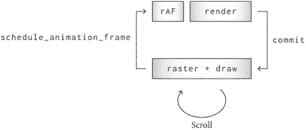

图 2：浏览器和主线程之间的渲染周期。

然而，这并不像动画激活时设置 `needs_render` 那么简单。设置 `needs_render` 意味着重新运行 `style`，这会注意到动画改变了属性值并启动一个新的动画！在动画期间，我们想要运行 `layout` 和 `paint`，但我们不想要运行 `style`：虽然真实浏览器确实有 `needs_layout` 和 `needs_paint` 标志的类似物，但我们修复重启动画的方法没有处理许多边缘情况。例如，如果被动画化的样式属性之外的样式属性发生了变化，浏览器不应该重启动画。真实浏览器会像存储多个样式副本（计算样式和动画样式）这样的方式来解决这类问题。

```py
class Tab:
 def run_animation_frame(self, scroll):
 for node in tree_to_list(self.nodes, []):
 for (property_name, animation) in \
 node.animations.items():
 value = animation.animate()
 if value:
 node.style[property_name] = value
 self.set_needs_layout()
```

要实现 `set_needs_layout`，我们需要将单个 `needs_render` 标志替换为三个标志：`needs_style`、`needs_layout` 和 `needs_paint`。在我们的实现中，在管道中较早设置一个脏位会导致其后的所有内容也运行，这与真实浏览器不同，真实浏览器会优化只需要样式和绘制或其它组合的情况。因此，`set_needs_render` 仍然只设置 `needs_style` 标志：

```py
class Tab:
 def __init__(self, browser, tab_height):
 # ...
 self.needs_style = False
 self.needs_layout = False
 self.needs_paint = False
 # ...

 def set_needs_render(self):
 self.needs_style = True
 self.browser.set_needs_animation_frame(self)
```

现在我们可以编写一个 `set_needs_layout` 方法，为 `layout` 和 `paint` 阶段设置标志，但不为 `style` 阶段设置：

```py
class Tab:
 def set_needs_layout(self):
 self.needs_layout = True
 self.browser.set_needs_animation_frame(self)
```

为了支持这些新的脏位，`render` 必须检查每个阶段的位，而不是在开始时检查 `needs_render`：顺便说一句，这确实使我们的跟踪代码对于渲染所需时间变得过时。现在渲染在不同的帧上做不同的工作，所以测量整体渲染实际上没有意义！我打算让它保持原样，不再查看渲染度量，但最好的修复方法是对于 `render` 的三个阶段有三个跟踪事件。

```py
class Tab:
 def render(self):
 self.browser.measure.time('render')

 if self.needs_style:
 # ...
 self.needs_layout = True
 self.needs_style = False

 if self.needs_layout:
 # ...
 self.needs_paint = True
 self.needs_layout = False

 if self.needs_paint:
 # ...
 self.needs_paint = False

 self.browser.measure.stop('render')
```

好了——完成所有这些后，我们的浏览器现在支持仅使用 CSS 的动画。更重要的是，我们可以让浏览器优化不透明度动画以避免布局。

CSS 过渡非常适合添加由 JavaScript 触发的 DOM 更新触发的动画。但对于只是页面 UI 的一部分，而不是与视觉过渡相关的动画怎么办？（例如，按钮或光标的脉冲不透明度动画。）这可以直接在 CSS 中表达，而不需要任何 JavaScript，使用 [CSS 动画](https://developer.mozilla.org/en-US/docs/Web/CSS/CSS_Animations/Using_CSS_animations)。

您可以在这里查看 CSS 动画变体的不透明度演示。

实现此功能需要解析新的 `@keyframes` 语法和 `animation` CSS 属性。注意 `@keyframes` 如何声明性地定义起点和终点，这使得我们可以使动画无限交替，因为反向只是关键帧中的向后移动。还有 [Web 动画 API](https://developer.mozilla.org/en-US/docs/Web/API/Web_Animations_API)，它允许通过 JavaScript 创建和管理动画。

# 复合动画

我们终于准备好教浏览器如何在运行某些动画时避免光栅化（和布局）。这些被称为 *复合动画*，因为它们与合成优化兼容，可以避免每帧的光栅化。避免不透明度动画的光栅化和合成在概念上很简单：跟踪正在动画化的内容，并在每一帧上仅重新运行 `paint`、`paint_draw_list` 和 `draw`。

实现这一点比听起来更难。我们需要将新的显示列表拆分为旧的合成层和新的绘制显示列表。为此，我们需要知道新的和旧的显示列表是如何相关的，以及显示列表的哪些部分发生了变化。为此，我们将为每个显示项添加一个 `node` 字段，存储绘制它的节点，作为某种标识符：请注意，浏览器线程永远不能 *访问* 该节点，因为它属于另一个线程。但它可以使用节点作为标识符。

```py
class VisualEffect:
 def __init__(self, rect, children, node=None):
 # ...
 self.node = node
```

现在，当一个动画运行但其他内容没有变化时，我们将使用这些节点来确定需要更新的绘制显示列表中的哪些显示项。

首先，当一个复合动画运行时，将样式发生变化的 `Element` 保存到一个名为 `composited_updates` 的新数组中。在这种情况下，我们也将只设置 `needs_paint` 标志，而不是 `needs_layout`：

```py
class Tab:
 def __init__(self, browser):
 # ...
 self.composited_updates = []

 def run_animation_frame(self, scroll):
 for node in tree_to_list(self.nodes, []):
 for (property_name, animation) in \
 node.animations.items():
 value = animation.animate()
 if value:
 node.style[property_name] = value
 self.composited_updates.append(node)
 self.set_needs_paint()
```

现在，当我们提交一个只需要绘制阶段的帧时，将 `composited_updates` 发送到浏览器，浏览器将使用这些信息跳过合成和光栅化。每个动画更新要发送的数据将是一个 `Element` 和一个 `Blend`。

要完成此操作，我们需要几个步骤。首先，在绘制 `Blend` 时，将其记录在 `Element` 上：

```py
def paint_visual_effects(node, cmds, rect):
 # ...
 blend_op = Blend(opacity, blend_mode, cmds)
 node.blend_op = blend_op
 return [blend_op]
```

接下来，将一个包含复合更新的列表添加到 `CommitData` 中（每个都将包含 `Element` 和 `Blend` 指针）。

```py
class CommitData:
 def __init__(self, url, scroll, height,
 display_list, composited_updates):
 # ...
 self.composited_updates = composited_updates
```

最后，提交新的信息。注意 `composited_updates` 中 `None` 和 `{}` 的区别。`None` 表示需要合成步骤，而 `{}` 表示不需要——字典恰好是空的，因为没有正在运行的合成动画。后者的一个好例子是滚动更改，它不会影响合成，但也不是动画。

```py
class Tab:
 def run_animation_frame(self, scroll):
 # ...
 needs_composite = self.needs_style or self.needs_layout

 self.render()

 composited_updates = None
 if not needs_composite:
 composited_updates = {}
 for node in self.composited_updates:
 composited_updates[node] = node.blend_op
 self.composited_updates = []

 commit_data = CommitData(
 # ...
 composited_updates,
 )
```

现在考虑浏览器线程。首先，添加 `needs_composite`、`needs_raster` 和 `needs_draw` 脏位以及相应的 `set_needs_composite`、`set_needs_raster` 和 `set_needs_draw` 方法（并移除旧的脏位）：

```py
class Browser:
 def __init__(self):
 # ...
 self.needs_composite = False
 self.needs_raster = False
 self.needs_draw = False

 def set_needs_raster(self):
 self.needs_raster = True
 self.needs_draw = True

 def set_needs_composite(self):
 self.needs_composite = True
 self.needs_raster = True
 self.needs_draw = True

 def composite_raster_and_draw(self):
 if not self.needs_composite and \
 not self.needs_raster and \
 not self.needs_draw:
 self.lock.release()
 return

 if self.needs_composite:
 self.composite()
 if self.needs_raster:
 self.raster_chrome()
 self.raster_tab()
 if self.needs_draw:
 self.draw()
```

然后，在我们目前称为 `set_needs_raster_and_draw` 的地方，例如 `handle_down`，我们需要调用 `set_needs_raster`：

```py
class Browser:
 def handle_down(self):
 # ...
 self.set_needs_raster()
```

使用 `commit` 中传入的数据来决定是否调用 `set_needs_composite` 或 `set_needs_draw`，并将更新存储在 `composited_updates` 中：

```py
class Browser:
 def __init__(self):
 # ...
 self.composited_updates = {}

 def commit(self, tab, data):
 # ...
 if tab == self.active_tab:
 # ...
 self.composited_updates = data.composited_updates
 if self.composited_updates == None:
 self.composited_updates = {}
 self.set_needs_composite()
 else:
 self.set_needs_draw()
```

现在让我们考虑绘制步骤。通常，我们根据合成层创建绘制显示列表。但现在这不会完全起作用，因为合成层来自 *旧* 的显示列表。如果我们只是尝试重新运行 `paint_draw_list`，我们将得到旧的绘制显示列表！我们需要更新 `draw_list` 以考虑基于 `composited_updates` 的新显示列表。

要做到这一点，定义一个 `get_latest` 方法，如果存在，则从 `composited_updates` 获取更新的视觉效果：

```py
class Browser:
 def get_latest(self, effect):
 node = effect.node
 if node not in self.composited_updates:
 return effect
 if not isinstance(effect, Blend):
 return effect
 return self.composited_updates[node]
```

在 `paint_draw_list` 中使用 `get_latest` 是一行代码：

```py
class Browser:
 def paint_draw_list(self):
 for composited_layer in self.composited_layers:
 while parent:
 new_parent = self.get_latest(parent)
 # ...
```

将 `paint_draw_list` 中的 `while` 循环的其余部分更新为在创建新效果时引用 `new_parent` 而不是 `parent`（但在从合成层向上遍历时除外）。

现在绘制显示列表将基于新的显示列表，并且只需要绘制步骤的动画，如我们的示例不透明度动画，现在将运行得非常顺畅。

最后一点：在更改标签时需要清除合成数据结构。让我们通过提取一个 `clear_data` 方法来一次性清除所有内容来完成这项工作。

```py
class Browser:
 def clear_data(self):
 self.active_tab_scroll = 0
 self.active_tab_url = None
 self.display_list = []
 self.composited_layers = []
 self.composited_updates = {}

 def set_active_tab(self, tab):
 # ...
 self.clear_data()
```

图 3 显示了仅在每个 `composite_raster_and_draw` 调用中花费略多于毫秒的不透明度转换渲染帧的截图（源跟踪这里）：

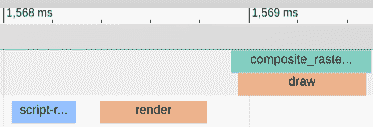

图 3：通过合成优化的不透明度转换示例跟踪。

这可以与禁用合成的相同情况相比较，如图 4 所示，它花费的时间大约是前者的一倍（源这里）：对于更复杂的示例，这会慢得多。

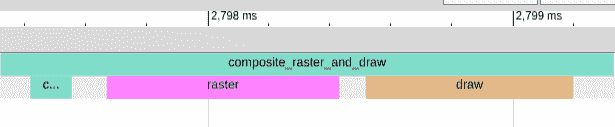

图 4：禁用合成时的不透明度转换示例跟踪。

虽然我们浏览器中的视觉效果动画现在既高效又*合成*，但它们在第十二章的意义上并不是*线程化*的：动画仍然在主线程上运行，如果有慢速 JavaScript 或其他任务阻塞了任务队列，动画将会卡顿。这对真正的浏览器来说是一个重大问题，因此几乎所有浏览器都支持线程化的透明度、变换和滤镜动画；一些浏览器还支持某些类型的剪辑动画。将线程化动画添加到我们的浏览器中留作练习 13-3。

尽管如此，人们经常听到将“合成”和“线程化”用作同义词。这是因为在大多数浏览器中，合成是线程化的先决条件。原因是如果你打算高效地动画化，你通常需要合成纹理，而在 GPU 纹理上处理动画比在“显示列表的一部分”上处理动画更容易在浏览器中表达。

话虽如此，对显示列表进行动画化并非不可能，一些浏览器已经尝试过。例如，Mozilla 的[WebRender](https://hacks.mozilla.org/2017/10/the-whole-web-at-maximum-fps-how-webrender-gets-rid-of-jank/)项目的一个目标就是完全消除缓存的合成层，并通过在 GPU 上直接从显示列表以 60Hz 进行光栅化和绘制来执行所有动画。这被称为*直接渲染*方法。实际上，由于一些 GPU 比其他 GPU 快，这个目标在当前的 GPU 技术下很难实现。因此，浏览器正逐渐演变成直接渲染和合成的混合体。

虽然所有现代浏览器都有线程化的动画，但值得注意的是，截至写作之时，Chromium 和 WebKit 都在主线程上执行合成步骤，而我们的浏览器在浏览器线程上执行。在这方面，我们的浏览器实际上比真正的浏览器更先进！合成尚未（目前）在 Chromium 的另一个线程上发生，原因是为了达到这个目标需要对整个合成算法进行重构。这证明是非常困难的，因为旧架构与渲染引擎的几乎所有方面都紧密相连。它直到 2021 年才完成[完成](https://developer.chrome.com/blog/renderingng/#compositeafterpaint)，所以也许不久这项工作将在 Chromium 中线程化。

# 优化合成

到目前为止，我们的浏览器成功运行了合成的动画，同时避免了不必要的布局和光栅化。但是，与真正的浏览器相比，我们的浏览器有太多的合成层——每个绘制命令一个！这是一个巨大的 GPU 内存和时间浪费：每个合成层分配一个表面，并且每个表面都分配和保留 GPU 内存。GPU 内存是有限的，我们希望在可能的情况下使用更少的内存。

为了达到这个目的，我们希望使用更少的合成层。我们能做的最简单的事情是将具有显示列表中完全相同祖先视觉效果集合的绘图命令放入同一个合成层。

让我们实现这一点。我们需要在合成层上实现两个新方法：`add` 和 `can_merge`。`add` 方法只是将一个新的显示项添加到合成层：

```py
class CompositedLayer:
 def add(self, display_item):
 self.display_items.append(display_item)
```

但我们应该只将兼容的显示项添加到同一个合成层，这由 `can_merge` 方法确定。一个显示项可以合并，如果它具有与合成层中现有项相同的父项：

```py
class CompositedLayer:
 def can_merge(self, display_item):
 return display_item.parent == \
 self.display_items[0].parent
```

现在我们想在 `composite` 中使用这些方法。基本上，不是为每个绘图命令创建一个新的合成层，而是向后遍历，因为我们不能以错误的顺序绘制东西。显示列表中的后续项必须晚些时候绘制。通过 `composited_layers` 尝试找到一个合成层来合并命令：如果你不熟悉 Python 的 `for ... else` 语法，`else` 块只有在循环从未执行 `break` 时才会执行。

```py
class Browser:
 def composite(self):
 for cmd in paint_commands:
 for layer in reversed(self.composited_layers):
 if layer.can_merge(cmd):
 layer.add(cmd)
 break
 else:
 # ...
```

使用这种实现，多个绘图命令有时会最终位于同一个合成层中，但如果祖先效果不完全匹配，则不会。

我们可以通过将整个非动画显示列表 *子树* 放入同一个合成层来做得更好。这将使我们能够在光栅阶段放置非动画视觉效果，从而进一步减少合成层的数量。

为了实现这一点，添加一个新的 `needs_compositing` 字段，当视觉效果应该在绘制显示列表中时，它为 `True`，当它应该在合成层中时，它为 `False`。我们将大多数视觉效果设置为 `False`：

```py
class VisualEffect:
 def __init__(self, rect, children):
 self.needs_compositing = False
```

当合成有助于我们动画化某些内容时，我们应该将其设置为 `True`。真实浏览器使用各种复杂的启发式方法，但为了保持简单，让我们只为 `Blend` 设置为 `True`（当它们实际上做了一些事情，而不是什么也不做），无论它们是否在动画：

```py
class Blend(VisualEffect):
 def __init__(self, opacity, blend_mode, node, children):
 # ...
 if self.should_save:
 self.needs_compositing = True
```

如果任何后代需要合成，我们还需要将视觉效果标记为需要合成。这是因为如果一个效果处于绘制阶段，那么它上面的效果也必须处于绘制阶段：

```py
class VisualEffect:
 def __init__(self, rect, children, node=None):
 # ...
 self.needs_compositing = any([
 child.needs_compositing for child in self.children
 ])
```

现在，不再是包含裸露的绘图命令的层，它们可以包含非合成命令的子树：

```py
class Browser:
 def composite(self):
 # ...
 non_composited_commands = [cmd
 for cmd in all_commands
 if isinstance(cmd, PaintCommand) or \
 not cmd.needs_compositing
 if not cmd.parent or cmd.parent.needs_compositing
 ]
 # ...
 for cmd in non_composited_commands:
 # ...
```

列表推导式内部的多个 `if` 语句被 `and` 连接在一起。

我们现在的合成算法创建的层要少得多！它很好地将非动画内容分组在一起，以减少合成层的数量（这节省了 GPU 内存），并在光栅而不是绘制中尽可能多地完成非动画工作（这使得合成动画更快）。

到目前为止，合成算法及其对内容的影响已经变得相当复杂。添加更多的视觉调试来帮助理解正在发生的事情将非常有用。一个很好的方法是为我们的浏览器添加一个[标志](https://docs.python.org/3/library/argparse.html)，我也推荐你添加一个禁用合成的模式（即，将每个`VisualEffect`的`needs_compositing`设置为`False`），并禁用 GPU 的使用（即，回到使用 Skia 表面的老方法）。在所有模式下，一切都应该仍然正常工作（尽管速度较慢），你可以使用这些额外的模式来更全面地调试你的浏览器并基准测试其性能。向我们的浏览器添加一个在`CompositedLayer`内容周围绘制红色边框的功能。这是对`CompositedLayer.raster`的一个非常简单的添加：

```py
class CompositedLayer:
 def raster(self):
 # ...
 if SHOW_COMPOSITED_LAYER_BORDERS:
 border_rect = skia.Rect.MakeXYWH(
 1, 1, irect.width() - 2, irect.height() - 2)
 DrawOutline(border_rect, "red", 1).execute(canvas)
```

示例中的不透明度转换的合成层应该看起来像图 5（注意有两个层）。

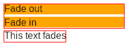

图 5：不透明度转换的合成层示例。

主要为了简化，我们的浏览器无论是否在动画中都会合成`Blend`视觉效果。但实际上，总有很好的理由始终合成某些视觉效果。

首先，我们将能够更快地开始动画，因为栅格化不需要先发生。这是因为每当合成原因改变时，浏览器都必须重新进行合成和重新栅格化新的表面。

第二，合成有时会有视觉副作用。理想情况下，合成的纹理在屏幕上应该与非合成的纹理看起来完全一样。但由于像素敏感的栅格技术（如[子像素渲染](https://en.wikipedia.org/wiki/Subpixel_rendering)）、图像缩放滤波算法、混合和抗锯齿的细节，这并不总是可能的。例如，由于浮点精度差异，常见到某些像素存在微妙的颜色差异。“预合成”内容可以避免在合成开始时页面上的视觉跳跃。

实际浏览器支持`will-change` CSS 属性，用于表示预合成。

# 重叠和转换

我们实现的合成算法在许多情况下都工作得很好。不幸的是，它对于相互重叠的显示列表命令并不正确。让我用一个例子来解释原因。

考虑一个被浅绿色方块覆盖的浅蓝色方块，它们后面有一个白色背景，如图 6 所示。

图 6：可能导致合成绘制错误的重叠示例。

现在假设我们想要在蓝色方块上动画化透明度，但不希望在绿色方块上动画化。所以蓝色方块放在它自己的合成层中——那么绿色方块怎么办？它有与背景相同的祖先视觉效果。但我们不希望将绿色方块放在与背景相同的合成层中，因为蓝色方块必须绘制在背景和绿色方块*之间*。

因此，绿色方块必须放在它自己的合成层中。这被称为*合成重叠原因*，是所有真实浏览器面临的一个主要复杂问题——以及额外内存使用和速度降低的潜在来源。

让我们修改我们的合成算法，以考虑重叠。基本上，在考虑显示项应该放在哪个合成层时，也要检查它是否与现有的合成层重叠。如果是这样，为这个显示项启动一个新的`CompositedLayer`：

```py
class Browser:
 def composite(self):
 # ...
 for cmd in non_composited_commands:
 for layer in reversed(self.composited_layers):
 if layer.can_merge(cmd):
 # ...
 elif skia.Rect.Intersects(
 layer.composited_bounds(),
 cmd.rect):
 layer = CompositedLayer(self.skia_context, cmd)
 self.composited_layers.append(layer)
 break
```

测试这段代码有点困难，因为我们的浏览器还没有支持任何移动或通过增长的方式，我指的是当视觉效果绘制到屏幕上时，其像素边界矩形比内部`DrawText`等绘图命令的像素边界矩形要*大*。毕竟，混合、合成和透明度都会改变像素的颜色，但不会扩大受影响像素的集合。而裁剪和遮罩会减少像素集合，而不是增加，所以它们也不能引起额外的重叠（尽管它们可能会引起*更少*的重叠）。某些[CSS 过滤器](https://developer.mozilla.org/en-US/docs/Web/CSS/filter)，例如模糊，也可以扩展像素矩形。将元素作为视觉效果的一部分，因此永远不会重叠。哎呀！在真实浏览器中，有很多视觉效果会导致重叠，其中最重要的是（对于动画而言）*变换*，它允许你将 DOM 子树的绘制输出移动到屏幕上的任何位置。技术上讲，`transform`并不总是仅仅是一个视觉效果。在真实浏览器中，变换元素的定位对滚动溢出有贡献。真实浏览器大多数情况下都做得正确，但有时会走捷径以避免减慢变换动画的速度。此外，变换可以在 GPU 上高效执行。

`transform` CSS 属性非常强大，允许你在 3D 空间中应用[任何线性变换](https://developer.mozilla.org/en-US/docs/Web/CSS/transform)，但让我们先专注于基本的 2D 平移。这足以实现类似于蓝色和绿色方块示例的功能：绿色方块也有一个`transform`属性，这样当你在一个真实浏览器中尝试这个演示时，绘制顺序不会改变。这是因为存在各种绘制规则，而“定位”元素（例如具有`transform`的元素）应该在常规（非定位）元素之后绘制。（这个特定的规则主要是历史遗留问题。）

```py
<div style="background-color:lightblue;
 transform:translate(50px, 50px)">Underneath</div>
<div style="background-color:lightgreen;
 transform:translate(0px, 0px)">On top</div>
```

支持这些变换很简单。首先，让我们解析属性值：CSS 变换语法允许在空格分隔的序列中包含多个变换；最终结果涉及按顺序应用每个变换。我不会实现这一点，就像我不会实现标准化变换语法的许多其他部分。

```py
def parse_transform(transform_str):
 if transform_str.find('translate(') < 0:
 return None
 left_paren = transform_str.find('(')
 right_paren = transform_str.find(')')
 (x_px, y_px) = \
 transform_str[left_paren + 1:right_paren].split(",")
 return (float(x_px[:-2]), float(y_px[:-2]))
```

然后，向 `paint_visual_effects` 添加一些代码以添加新的 `Transform` 视觉效果：

```py
def paint_visual_effects(node, cmds, rect):
 translation = parse_transform(
 node.style.get("transform", ""))
 # ...
 return [Transform(translation, rect, node, [blend_op])]
```

这些 `Transform` 显示项只是调用了方便构建的 Skia 画布 `translate` 方法：

```py
class Transform(VisualEffect):
 def __init__(self, translation, rect, node, children):
 super().__init__(rect, children, node)
 self.self_rect = rect
 self.translation = translation

 def execute(self, canvas):
 if self.translation:
 (x, y) = self.translation
 canvas.save()
 canvas.translate(x, y)
 for cmd in self.children:
 cmd.execute(canvas)
 if self.translation:
 canvas.restore()

 def clone(self, child):
 return Transform(self.translation, self.self_rect,
 self.node, [child])

 def __repr__(self):
 if self.translation:
 (x, y) = self.translation
 return "Transform(translate({}, {}))".format(x, y)
 else:
 return "Transform(<no-op>)"
```

我们还需要修复击中测试算法，使其在 `click` 中考虑平移。而不仅仅是比较布局对象的位置与点击点，计算一个 *绝对* 边界——在用户看到的坐标中，包括平移偏移量——并与它比较。让我们使用两个辅助方法来计算这样的边界。第一个通过平移映射一个矩形，第二个遍历节点树，映射每个找到的平移。

```py
def map_translation(rect, translation):
 if not translation:
 return rect
 else:
 (x, y) = translation
 matrix = skia.Matrix()
 matrix.setTranslate(x, y)
 return matrix.mapRect(rect)

def absolute_bounds_for_obj(obj):
 rect = skia.Rect.MakeXYWH(
 obj.x, obj.y, obj.width, obj.height)
 cur = obj.node
 while cur:
 rect = map_translation(rect,
 parse_transform(
 cur.style.get("transform", "")))
 cur = cur.parent
 return rect
```

然后在 `click` 中使用它：

```py
class Tab:
 # ...
 def click(self, x, y):
 # ...
 loc_rect = skia.Rect.MakeXYWH(x, y, 1, 1)
 objs = [obj for obj in tree_to_list(self.document, [])
 if absolute_bounds_for_obj(obj).intersects(
 loc_rect)] 
```

然而，如果你尝试加载上面的示例，你会发现它仍然看起来不正确——蓝色正方形应该位于绿色正方形下面，但它却在上面。尽管击中测试是正确的，因为渲染问题在于合成，而不是布局对象的几何形状。

这是因为当我们测试重叠时，我们正在比较显示项的 `composited_bounds` 与合成层的 `composited_bounds`。这意味着我们正在比较显示项的原始位置，而不是其移动后的版本。我们需要计算绝对边界：

```py
class Browser:
 def composite(self):
 for cmd in non_composited_commands:
 for layer in reversed(self.composited_layers):
 if layer.can_merge(cmd):
 # ...
 elif skia.Rect.Intersects(
 layer.absolute_bounds(),
 local_to_absolute(cmd, cmd.rect)):
 # ...
```

`absolute_bounds` 方法看起来像这样：

```py
class CompositedLayer:
 def absolute_bounds(self):
 rect = skia.Rect.MakeEmpty()
 for item in self.display_items:
 rect.join(local_to_absolute(item, item.rect))
 return rect
```

要实现 `local_to_absolute`，我们首先需要一个在 `Transform` 上的新 `map` 方法，它接受变换“内容”坐标空间中的矩形，并输出变换后的空间中的矩形。例如，如果变换是 `translate(20px, 0px)`，那么在矩形上调用 `map` 的输出将沿 *x* 方向移动 20 像素。

```py
class Transform(VisualEffect):
 def map(self, rect):
 return map_translation(rect, self.translation)
```

对于 `Blend`，添加一个针对裁剪的特殊情况是值得的：

```py
class Blend(VisualEffect):
 def map(self, rect):
 if self.children and \
 isinstance(self.children[-1], Blend) and \
 self.children[-1].blend_mode == "destination-in":
 bounds = rect.makeOffset(0.0, 0.0)
 bounds.intersect(self.children[-1].rect)
 return bounds
 else:
 return rect
```

现在我们可以计算显示项的绝对边界，通过映射其合成边界到应用到的所有视觉效果。这看起来很像 `absolute_bounds_for_obj`，但是它作用于显示列表而不是布局对象树：

```py
def local_to_absolute(display_item, rect):
 while display_item.parent:
 rect = display_item.parent.map(rect)
 display_item = display_item.parent
 return rect
```

现在蓝色正方形应该在绿色正方形下面，因此重叠测试现在完成。你现在应该能够正确渲染 这个示例。

它应该看起来像图 7。

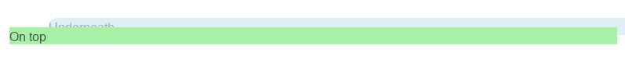

图 7：变换重叠、裁剪和混合的示例。

注意这个示例展示了我们在实现合成时必须做对的 *两个* 有趣的特性：

+   重叠测试（如果没有它，元素将以错误的顺序绘制）；如果这段代码缺失，它将像图 8 一样错误渲染。

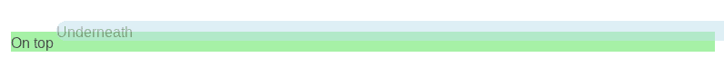

图 8：渲染错误，因为缺少重叠测试。

+   重复使用克隆效果（如果没有它，混合和裁剪将会出错）；如果这段代码缺失，它将渲染成如图 9 所示的错误效果。


图 9：渲染错误，因为混合不正确。

尽管如此，还有一种情况值得思考。假设我们有一个包含大量文本的巨大合成层，但只有该层的一小部分显示在屏幕上，其余部分被裁剪掉。然后 `absolute_bounds` 考虑了裁剪操作，但 `composited_bounds` 没有考虑，这意味着我们将创建一个比必要的更大的合成层，并且浪费了大量时间对用户永远不会看到的像素进行光栅化。

让我们通过也将这些裁剪应用到 `composited_bounds` 上来解决这个问题。这非常重要，因为否则一些合成层可能会变得非常大，尽管它们在屏幕上绘制的内容不多。一个优化带来巨大差异的好例子是加载 [第十五章](https://browser.engineering/embeds.html) 到 [browser.engineering](https://browser.engineering/) 的主页，否则我们可能会得到一个巨大的合成层用于 iframe。我们将通过首先计算每个项目的绝对边界，然后将它们映射回局部空间来实现这一点，这将产生为每个显示项计算“裁剪后的局部矩形”的效果：

```py
class CompositedLayer:
 def composited_bounds(self):
 rect = skia.Rect.MakeEmpty()
 for item in self.display_items:
 rect.join(absolute_to_local(
 item, local_to_absolute(item, item.rect)))
 rect.outset(1, 1)
 return rect
```

这需要实现 `absolute_to_local`:

```py
def absolute_to_local(display_item, rect):
 parent_chain = []
 while display_item.parent:
 parent_chain.append(display_item.parent)
 display_item = display_item.parent
 for parent in reversed(parent_chain):
 rect = parent.unmap(rect)
 return rect
```

这又依赖于 `unmap`。对于 `Blend`，这些操作应该是无操作的，但对于 `Transform`，它只是逆变换：

```py
def map_translation(rect, translation, reversed=False):
 # ...
 else:
 # ...
 if reversed:
 matrix.setTranslate(-x, -y)
 else:
 matrix.setTranslate(x, y)

class Transform(VisualEffect):
 def unmap(self, rect):
 return map_translation(rect, self.translation, True)
```

有了这些，我们现在已经完成了关于一个相当高性能的合成动画实现的叙述。

合成重叠的原因不仅使代码复杂化，而且如果没有浏览器和网页开发者的细心处理，可能会导致大量的 GPU 内存使用，以及页面速度的降低来管理所有额外的合成层。这种情况可能发生的一种方式是，一个额外的合成层由于一个元素与另一个元素重叠而产生，然后是第三个元素因为它与第二个元素重叠，以此类推。这种现象被称为 *层爆炸*。我们的浏览器算法大多数时候能够避免这个问题，因为它能够将具有兼容祖先效果的多个显示项合并在一起，但在实践中，存在一些复杂的情况，其中很难有效地合并内容。

除了重叠之外，还有其他情况，合成可能会产生不期望的副作用，导致性能问题。例如，假设我们想在某些情况下关闭合成的滚动，比如在没有大量内存的机器上，但仍然使用合成进行视觉效果动画。但如果动画是在滚动器下方的内 容上呢？实际上，如果不放弃并合成滚动器，正确实现这种情况可能非常困难。

# 摘要

本章介绍了动画。你应该记住的关键要点是：

+   动画有基于 DOM、输入驱动和类似视频的多种类型；

+   对于平滑动画，GPU 加速是必要的。

+   合成通常对于平滑和线程化的视觉效果动画是必要的。

+   优化合成层的数量非常重要。

+   重叠测试可能会增加 GPU 内存的使用，并且需要谨慎实现。

点击这里尝试本章的浏览器。

# 概述

我们浏览器中的完整功能集、类和方法现在看起来可能像这样：

# 练习

13-1 *`background-color`*。实现`background-color` CSS 属性的动画。您需要定义一种适用于所有颜色通道的新插值类型。

13-2 *缓动函数*。我们的浏览器只实现了起始值和结束值之间的线性插值，但还有许多其他的[缓动函数](https://developer.mozilla.org/en-US/docs/Web/CSS/easing-function)（实际上，真实浏览器中的默认值是`cubic-bezier(0.25, 0.1, 0.25, 1.0)`，而不是线性）。实现这个缓动函数，以及一两个其他的。

13-3 *合成和线程动画*。我们的浏览器支持变换和滚动，但它们并未完全合成和线程化，变换过渡动画也不受支持。实现这些功能。（提示：对于变换，只需遵循与`opacity`相同的模式即可；对于滚动，需要在`handle_down`中设置更少的脏位。）一个同时变换和透明度动画的示例现在应该可以工作，无需任何光栅化，并且该页面的滚动也不应进行光栅化。

13-4 *宽度和高度动画*。（您需要先完成练习 6-2。）使`width`和`height`可动画化；您需要一个可以解析和生成像素值（字符串中的“px”后缀）的`NumericAnimation`变体。由于`width`和`height`会引发布局变化，请确保动画化它们时设置`needs_layout`。检查在您的浏览器中动画化宽度是否会改变换行。一旦实现了宽度动画，宽度过渡示例应该可以工作。A width transition example 应该工作一次您实现了宽度动画。宽度动画不能进行合成，因为宽度会影响布局树，而不仅仅是不同的显示列表，这意味着不仅仅是视觉效果，绘制命令也会改变。这种动画被称为*布局引发*，因此它们通常较慢，通常不是一个好主意。第十六章将探讨一种加快它们速度的方法。

一个例外是使用鼠标调整浏览器窗口的大小。这会引发布局变化，但对于用户来说，在窗口大小变化时看到新的布局非常有用。现代浏览器足够快，可以做到这一点，但过去它们每隔几帧才重绘屏幕，导致内容与窗口边缘之间出现视觉上的*空白*。

13-5 *CSS 动画*。实现[CSS 动画](https://developer.mozilla.org/en-US/docs/Web/CSS/CSS_Animations/Using_CSS_animations) API 的基本功能，特别是足够的`animation` CSS 属性和`@keyframe`的解析，以在`browser.engineering`网站上实现两个 演示。

13-6 *与变换动画的重叠测试*。（您需要已经完成了练习 13-3。）我们的浏览器目前在存在导致重叠出现和消失的变换动画时，无法正确进行重叠测试。首先创建一个演示该错误的示例，然后修复它。修复的一种方法是在遇到动画变换显示项时进入“假设重叠模式”。这意味着每个后续显示项都被假定为与动画项重叠（即使目前没有重叠），因此不能合并到列表中比动画项更早的任何`CompositedLayer`。另一种方法是，在浏览器线程的每一帧动画中运行重叠测试，如果结果与前一帧不同，则重新进行合成和位图化。如果您已经完成了练习 13-5，并且变换动画是用 CSS 动画定义的，您可以通过分析确定动画的边界框，并使用它来进行重叠测试。

13-7 *避免稀疏合成层*。我们浏览器的算法目前总是合并具有兼容祖先效果的绘制块。但这可能导致效率低下的情况，例如，两个在网页上视觉上非常远的绘制块（例如，一个在顶部，另一个在数千像素以下）最终出现在同一个`CompositedLayer`中。这可能会非常糟糕，因为它导致了一个巨大的`skia.Surface`，大部分是浪费的 GPU 内存。减少这种问题的一种方法是不合并会使`skia.Surface`总面积超过某个固定值的绘制块。实现这一点。另一种方法是通过表面平铺。

13-8 *简短显示列表*。在实际浏览器中遇到只包含单一纯色或只有几个简单绘制命令的`CompositedLayer`相对常见。一个真正的浏览器会将其标准之一设定为，提供显示项的位图化时间是否足够低，以至于不需要使用 GPU 纹理。这对于纯色来说是真的，但对于复杂形状或文本可能就不是了。实现一个优化，跳过在`CompositedLayer`上存储少于固定数量（比如三个）的绘制命令的`skia.Surface`，而是直接执行它们。换句话说，这些`CompositedLayer`上的`raster`操作将是一个空操作，而`draw`将执行绘制命令。

13-9 *点击测试*。目前，在处理点击时，我们将每个布局对象的边界转换为绝对坐标（通过`absolute_bounds_for_obj`）以与点击位置进行比较。但我们可以改为在遍历布局树时将点击位置转换为局部坐标。实现这一点。定义每个布局对象的`hit_test`方法可能很方便，该方法接受一个点击位置，调整它以适应变换，并递归调用子`hit_test`方法。在实际浏览器中，点击测试不仅用于点击。这个名字来源于思考如果在这个位置射出一支箭，它是否会“击中”该对象。

13-10 *`z-index`*。目前，HTML 文档中较后的元素被绘制在较早元素“之上”。`z-index` CSS 属性改变了这种顺序：具有较大`z-index`的元素绘制在顶部（如果有冲突，则按当前顺序解决，默认`z-index`为 0）。为了使`z-index`产生任何效果，元素的`position`属性必须设置为除`static`（默认值）之外的其他值。添加对`z-index`的支持。作为一个额外的挑战，添加对具有`z-index`属性的[嵌套元素](https://developer.mozilla.org/en-US/docs/Web/CSS/CSS_Positioning/Understanding_z_index/The_stacking_context)的支持。

13-11 *动画滚动*。真实浏览器在滚动过程中有很多种动画。例如，按下向下键或滚动条中的向下箭头会导致令人愉悦的动画滚动，而不是我们浏览器当前实现的即时滚动。或者在移动设备上，触摸交互通常会根据基于滚动动量与摩擦的物理模型引起“滑动”滚动。在`<body>`元素上实现`[`scroll-behavior](https://developer.mozilla.org/en-US/docs/Web/CSS/scroll-behavior)` CSS 属性，并在`handle_down`中通过委托滚动到主线程动画来触发动画滚动。这将导致您的浏览器失去线程滚动功能。如果您已经实现了练习 13-3，您可以在该代码的基础上构建浏览器线程上的动画滚动。您需要实现一个新的`ScrollAnimation`类和在`run_animation_frame`中的某些逻辑。在 transform transition 示例中的滚动现在应该是平滑的，因为该示例使用了`scroll-behavior`。如今，许多网站实现了一些*滚动链接*动画效果，例如*视差效果*。在现实生活中，视差是远离物体的现象，它们看起来比靠近物体的物体移动得慢（由于光线角度变化较慢）。这可以通过使用`[`perspective](https://developer.mozilla.org/en-US/docs/Web/CSS/perspective)` CSS 属性来实现。[这篇文章](https://developer.chrome.com/blog/performant-parallaxing/)解释了如何实现，[这篇文章](https://css-tricks.com/how-css-perspective-works/)则更深入地探讨了 CSS 中的视差。

还有一些动画是与[滚动偏移](https://drafts.csswg.org/scroll-animations-1/)相关的，但严格来说，它们不是滚动的一部分。一个例子是元素上的旋转或不透明度淡入淡出，当用户向下滚动页面时（当用户向上滚动时反转）。或者有*滚动触发*的动画，一旦元素滚动到屏幕上的某个位置，或者当滚动方向改变时，动画就会开始。

13-12 *不透明度加绘制*。如果一个`DrawCompositedLayer`命令在`Blend(alpha=0.5)`内部发生，那么现在可能会有两个表面副本：首先将合成层的位图缓冲区复制到一个临时缓冲区，然后对其应用不透明度，并将其复制到根表面。这是不必要的，实际上 Skia 的`Surface`上的`draw`（https://kyamagu.github.io/skia-python/reference/skia.Surface.html#skia.Surface.draw）API 允许应用不透明度。当这种情况发生时，优化浏览器以将它们合并为一个`draw`命令。（这是真实浏览器中的一个重要优化。）

# 使内容无障碍

Web 浏览器工程的第十四章。

+   什么是无障碍性？

+   缩放

+   暗黑模式

+   自定义暗黑模式

+   键盘导航

+   指示焦点

+   无障碍性树

+   屏幕阅读器

+   无障碍性警报

+   语音和视觉交互

+   总结

+   大纲

+   练习

到目前为止，我们一直专注于使浏览器成为开发网络应用的有效平台。但最终，浏览器是一个*用户代理*。这意味着它应该以任何可能的方式协助用户访问和使用网络应用。因此，浏览器提供了一系列[*无障碍性*](https://developer.mozilla.org/en-US/docs/Learn/Accessibility/What_is_accessibility)功能，利用声明性 UI 和 HTML 和 CSS 的灵活性，使得可以通过触摸、键盘或语音与网页进行交互。

# 什么是无障碍性？

无障碍性意味着用户可以更改或自定义他们与网页的交互方式，以便更容易使用。这个定义采用了浏览器的视角。从开发者的角度来看，无障碍性也可以定义为，[在这种情况下](https://developer.mozilla.org/en-US/docs/Learn/Accessibility/What_is_accessibility)，它关乎使尽可能多的人能够轻松使用你的网页的方法。网络的独特灵活的核心技术意味着浏览器提供了大量的无障碍性功能。人们常常将“无障碍性”理解为“屏幕阅读器支持”，但这只是用户可能想要与网页交互的一种方式。这些功能允许用户自定义网页的渲染，以及通过键盘、语音或使用某种类型的辅助软件与网页进行交互。 

当然，定制化的原因和定制化本身一样多样化。世界卫生组织[发现](https://www.who.int/publications/i/item/9789241564182)全球有高达 15%的人口存在某种形式的残疾，其中许多人残疾严重或永久。他们中的几乎所有人都能够从本章描述的辅助功能中受益良多。对于特定个人的残疾越严重，这些功能对他们来说就越至关重要。

随着时间的推移，一些辅助需求会出现和消失。例如，当我的儿子出生时，这是帕夫尔在说话。我和妻子轮流照顾宝宝，我最终花了很多时间在夜间工作。为了最大限度地利用宝贵的睡眠时间，我希望屏幕亮度更低，为此我感谢许多网站提供了暗黑模式。后来，我发现当我的手忙于抱宝宝时，通过语音记笔记很方便。而且，当我试图哄宝宝睡觉时，关闭电视和阅读字幕竟然是观看电影的最佳方式。

使用这些辅助工具的潜在原因是暂时的；但其他用途可能持续时间更长，或成为永久性需求。例如，我非常感激[路边斜坡](https://en.wikipedia.org/wiki/Curb_cut)，它使得推婴儿车散步变得更加方便。尽管我的儿子现在已经开始自己走路，但他仍然很小，没有路边斜坡的话，对他来说上斜坡是困难的。而且，有很大可能性，就像我的许多亲戚一样，随着年龄的增长，我的视力会变差，我需要将电脑的字体大小永久性地设置得更大。对于更严重和永久性的残疾，有像[屏幕阅读器](https://www.afb.org/blindness-and-low-vision/using-technology/assistive-technology-products/screen-readers)这样的高级工具。也许随着技术的进步，软件助手将会变得更加普遍，它们将在用户和网页之间进行调解，并有一天不再主要是屏幕阅读器辅助技术。密码管理器和表单自动填充代理已经有些类似，并且在许多情况下使用与屏幕阅读器相同的浏览器 API。这些工具需要时间来学习和有效使用，但对于需要它们的人来说，它们是变革性的。

可访问性涵盖了整个范围，从轻微的便利设施到高级的可访问性工具。我们有道德责任帮助所有用户。此外，还有一个实际问题，那就是如果你正在制作一个网页，你希望尽可能多的人从中受益。但是，所有类型的可访问性工作，无论是物理的还是数字的，一个关键教训是，一旦可访问性工具被构建，创意人士会发现它在各种设计师未曾预见到的情况下都有帮助。暗黑模式帮助你区分工作和个人电子邮件；网页缩放功能帮助你将整个网页打印在一张纸上；而键盘快捷键让你可以利用肌肉记忆向没有批量模式的网络应用程序提交许多类似的订单。

此外，可访问性源于孕育网络的相同原则：用户控制、多模式内容和互操作性。这些原则使得网络对所有类型的浏览器和操作系统都变得可访问，而且同样的原则同样使得网络对所有类型和能力的人变得可访问。

在美国、英国、欧盟和其他许多国家，网站的可访问性在很多情况下是法律要求的。例如，美国政府的网站必须根据 1973 年[康复法案修正案](https://www.access-board.gov/law/ra.html#section-508-federal-electronic-and-information-technology)的第五百零八部分（后来增加了修正案）[相关法规](https://www.access-board.gov/ict/)实现可访问性。非政府网站也必须根据[美国残疾人法案](https://www.ada.gov/ada_intro.htm)实现可访问性，尽管在实践中这个法律要求的确切含义尚不清楚，因为它主要是由法院决定的。在英国，2010 年的[平等法案](https://www.siteimprove.com/glossary/uk-accessibility-laws/)为网站制定了类似的规则，2018 年增加了对政府网站更严格的规则。欧盟类似的法律是[欧洲可访问性法案](https://ec.europa.eu/social/main.jsp?catId=1202)。

# 缩放

让我们从最简单的可访问性问题开始：屏幕上太小而无法阅读的文本。这是我们中的许多人迟早会遇到的问题，可能是最常见的用户残疾问题。解决这个问题的最简单、最有效的方法是通过增加字体和元素大小。这种方法被称为*缩放*，缩放这个词让人联想到相机变焦的类比，但它并不相同，因为缩放会导致布局。另一方面，*捏合缩放*就像相机一样，不会导致布局。这意味着将页面布局得好像所有的 CSS 大小都按指定因素增加或减少。

要实现它，我们首先需要一个触发缩放的方法。在大多数浏览器中，这是通过`Ctrl-+`、`Ctrl--`和`Ctrl-0`键来完成的；使用`Ctrl`修饰键意味着你可以在文本输入中输入`+`、`-`或`0`而不会触发缩放功能。

要处理修饰键，我们需要在事件循环中监听“键按下”和“键释放”事件，并存储`Ctrl`键是否被按下：

```py
def mainloop(browser):
 # ...
 ctrl_down = False
 while True:
 if sdl2.SDL_PollEvent(ctypes.byref(event)) != 0:
 elif event.type == sdl2.SDL_KEYDOWN:
 # ...
 elif event.key.keysym.sym == sdl2.SDLK_RCTRL or \
 event.key.keysym.sym == sdl2.SDLK_LCTRL:
 ctrl_down = True 
 elif event.type == sdl2.SDL_KEYUP:
 if event.key.keysym.sym == sdl2.SDLK_RCTRL or \
 event.key.keysym.sym == sdl2.SDLK_LCTRL:
 ctrl_down = False
 # ...
```

现在，我们可以在按键处理代码中为“键按下”事件添加一个情况，当`Ctrl`键被按下时：

```py
def mainloop(browser):
 while True:
 if sdl2.SDL_PollEvent(ctypes.byref(event)) != 0:
 elif event.type == sdl2.SDL_KEYDOWN:
 if ctrl_down:
 if event.key.keysym.sym == sdl2.SDLK_EQUALS:
 browser.increment_zoom(True)
 elif event.key.keysym.sym == sdl2.SDLK_MINUS:
 browser.increment_zoom(False)
 elif event.key.keysym.sym == sdl2.SDLK_0:
 browser.reset_zoom()
 # ...
```

在这里，`increment_zoom`的参数是是否应该增加（`True`）或减少（`False`）。

`Browser`代码只是通过主线程任务委托给`Tab`：

```py
class Browser:
 # ...
 def increment_zoom(self, increment):
 task = Task(self.active_tab.zoom_by, increment)
 self.active_tab.task_runner.schedule_task(task)

 def reset_zoom(self):
 task = Task(self.active_tab.reset_zoom)
 self.active_tab.task_runner.schedule_task(task)
```

最后，`Tab`通过调整一个新的`zoom`属性来响应这些命令，该属性从`1`开始，作为网页上所有“CSS 大小”的乘数：通常，缩放不会改变浏览器 chrome 中元素的大小。浏览器*也可以*这样做，但通常是由全局操作系统设置触发的。

```py
class Tab:
 def __init__(self, browser, tab_height):
 # ...
 self.zoom = 1

 def zoom_by(self, increment):
 if increment:
 self.zoom *= 1.1
 self.scroll *= 1.1
 else:
 self.zoom *= 1/1.1
 self.scroll *= 1/1.1
 self.scroll_changed_in_tab = True
 self.set_needs_render()

 def reset_zoom(self):
 self.scroll /= self.zoom
 self.zoom = 1
 self.scroll_changed_in_tab = True
 self.set_needs_render()
```

注意，当我们缩放时，需要设置`needs_render`标志以在缩放完成后重新绘制屏幕。另外，注意当我们缩放页面时，我们还需要调整滚动位置，在真实浏览器中，缩放时调整滚动位置比简单的乘法要复杂。这是因为缩放不仅改变了文本行的长度，还改变了换行，意味着文本行数会增多或减少。这意味着旧滚动位置和新滚动位置之间没有简单的对应关系。大多数真实浏览器实现了一个更通用的算法，称为[滚动锚点](https://drafts.csswg.org/css-scroll-anchoring-1/)，它处理了除缩放之外的所有类型的更改，并在我们导航到新页面时重置缩放级别：

```py
class Tab:
 def load(self, url, payload=None):
 self.zoom = 1
 # ...
```

`zoom`因子应该乘以所有 CSS 大小，因此我们将在布局期间需要访问它。有几种方法可以做到这一点，但一种简单的方法就是将`zoom`作为参数传递给`layout`的`DocumentLayout`：

```py
class DocumentLayout:
 def layout(self, zoom):
 self.zoom = zoom
 child = BlockLayout(self.node, self, None)
 # ...
```

```py
class Tab:
 def render(self):
 if self.needs_layout:
 # ...
 self.document.layout(self.zoom)
 # ...
```

每个其他布局对象也可以有一个`zoom`字段，从其父级`layout`中复制。这是`BlockLayout`；其他布局类应该做同样的事情：

```py
class BlockLayout:
 def layout(self):
 self.zoom = self.parent.zoom
 # ...
```

现在需要各种方法调整字体大小以考虑`zoom`。由于缩放是一个常见的操作，让我们将其包装在一个辅助方法`dpx`中：通常，`dpx`会是一个糟糕的函数名，因为它简短且晦涩。但我们将频繁调用此函数，与数学运算混合使用，并且它将方便地不占用太多空间。

```py
def dpx(css_px, zoom):
 return css_px * zoom
```

将`dpx`不仅仅视为一个简单的辅助方法，而视为从*CSS 像素*（CSS 声明中指定的单位）到*设备像素*（实际绘制在屏幕上的内容）的单位转换。在真实浏览器中，此方法还可以考虑高 DPI 显示等差异。

我们将进行这种转换以调整`BlockLayout`的`text`和`input`方法以及`InputLayout`中的字体大小：

```py
class BlockLayout:
 def word(self, node, word):
 # ...
 px_size = float(node.style["font-size"][:-2])
 size = dpx(px_size * 0.75, self.zoom)
 # ...

 def input(self, node):
 # ...
 px_size = float(node.style["font-size"][:-2])
 size = dpx(px_size * 0.75, self.zoom)
 # ...
```

```py
class InputLayout:
 def layout(self):
 # ...
 px_size = float(self.node.style["font-size"][:-2])
 size = dpx(px_size * 0.75, self.zoom)
 # ...
```

以及在`TextLayout`中的字体大小：浏览器通常也有一个*最小*字体大小功能，但正确使用它要复杂得多。由于最小字体大小只影响页面上的*一些*文本，并且不影响其他 CSS 长度，它可能导致字体溢出和布局损坏。由于这些问题，浏览器通常将此功能限制在网站似乎使用[相对字体大小](https://developer.mozilla.org/en-US/docs/Web/CSS/font-size)的情况下。

```py
class TextLayout:
 # ...
 def layout(self):
 # ...
 px_size = float(self.node.style["font-size"][:-2])
 size = dpx(px_size * 0.75, self.zoom)
```

以及文本框的固定`INPUT_WIDTH_PX`宽度：

```py
class BlockLayout:
 # ...
 def input(self, node):
 w = dpx(INPUT_WIDTH_PX, self.zoom) 
```

最后，我们需要调整缩放的一个棘手地方是在`DocumentLayout`内部。这里有两组长度：整体的`WIDTH`和围绕页面边缘的`HSTEP`/`VSTEP`填充。`WIDTH`来自应用程序窗口本身的大小，因此它以设备像素为单位进行测量，不需要转换。但`HSTEP`/`VSTEP`是页面布局的一部分，所以它以 CSS 像素为单位，*确实*需要转换：

```py
class DocumentLayout:
 def layout(self, zoom):
 # ...
 self.width = WIDTH - 2 * dpx(HSTEP, self.zoom)
 self.x = dpx(HSTEP, self.zoom)
 self.y = dpx(VSTEP, self.zoom)
 child.layout()
 self.height = child.height
```

现在尝试一下。每次按`Ctrl-+`时，所有字体都应该大约增加 10%，而按`Ctrl--`时则缩小 10%。较大的文本应该在屏幕边缘适当地换行，CSS 长度应该像文本一样缩放。这对于更容易阅读文本来说非常好。

这是一个缩放前文本的示例。没有一本网络书籍会缺少一些传统的[Lorem ipsum](https://en.wikipedia.org/wiki/Lorem_ipsum)！

这应该如图 1 所示渲染，而图 2 显示了 2 倍缩放后的样子。注意，不仅单词的大小增加了一倍，而且换行发生在不同的单词上，正如预期的那样。

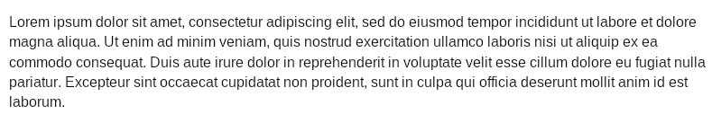

图 1：缩放前的换行示例。

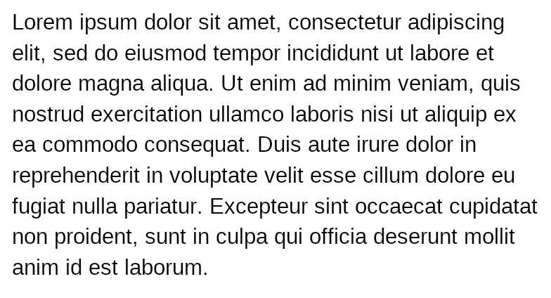

图 2：缩放后的换行示例。

在高分辨率屏幕上，CSS 像素由缩放和 `devicePixelRatio` 因子共同缩放。严格来说，名为 `devicePixelRatio` 的 JavaScript 变量是设备特定缩放因子和基于缩放的缩放因子的乘积。这个因子将设备像素缩放，使得大约有 96 CSS [每英寸像素](https://en.wikipedia.org/wiki/Dots_per_inch)（许多老式桌面显示器就是这样）。例如，原始的 iPhone 每英寸有 163 个像素；该设备上的浏览器使用了 `devicePixelRatio` 为 2，因此 96 CSS 像素对应 192 个设备像素或大约 1.17 英寸。通常 `devicePixelRatio` 被四舍五入到整数，因为这往往会使文本和布局看起来更清晰，但这不是必需的，并且随着像素密度的增加，它变得越来越不重要。例如，我用来写这本书的 Pixelbook Go，分辨率为每英寸 166 个像素，其比例为 1.25。对于给定屏幕的比率选择在一定程度上是任意的。当设备连接到多个显示器时，这种缩放特别棘手：窗口可能从低分辨率切换到高分辨率显示器（从而改变 `devicePixelRatio`），甚至可能被分割到两个具有不同分辨率的显示器上。

# 暗黑模式

另一个有用的视觉变化是使用较深的颜色来帮助那些对光线特别敏感的用户，在夜间使用他们的设备，或者只是更喜欢较深的配色方案的用户。这个浏览器 *暗黑模式* 功能应该将浏览器界面和网页本身都切换到使用黑色背景上的白色文本，并相应地调整背景颜色以变得更深。如今，暗黑模式已经进入主流。几乎所有操作系统、浏览器和流行应用都支持它，许多人出于个人喜好而启用它。但在此之前，它是一个可访问性功能，通常被称为高对比度或颜色过滤模式。许多其他技术，包括语音合成、光学字符识别、屏幕键盘和语音控制，也是在成为广泛使用之前由可访问性工程师开创的。

我们将在事件循环中通过 `Ctrl-d` 触发暗黑模式：

```py
def mainloop(browser):
 while True:
 if sdl2.SDL_PollEvent(ctypes.byref(event)) != 0:
 elif event.type == sdl2.SDL_KEYDOWN:
 if ctrl_down:
 # ...
 elif event.key.keysym.sym == sdl2.SDLK_d:
 browser.toggle_dark_mode()
```

当暗黑模式激活时，我们需要以不同的方式绘制浏览器界面和网页内容。浏览器界面相对简单一些，所以我们先从它开始。我们将从表示暗黑模式是否激活的 `dark_mode` 字段开始：

```py
class Browser:
 def __init__(self):
 # ...
 self.dark_mode = False

 def toggle_dark_mode(self):
 self.dark_mode = not self.dark_mode
```

现在，当 `dark_mode` 被设置时，我们只需要在 `raster_chrome` 中翻转所有颜色。让我们将前景色和背景色存储在可以重复使用的变量中：

```py
class Browser:
 def raster_chrome(self):
 if self.dark_mode:
 background_color = skia.ColorBLACK
 else:
 background_color = skia.ColorWHITE
 canvas.clear(background_color)
 # ...
```

类似地，在 `Chrome` 的 `paint` 中，我们需要使用正确的前景色：

```py
class Chrome:
 def paint(self):
 if self.browser.dark_mode:
 color = "white"
 else:
 color = "black"
```

然后，我们只需在所有地方使用`color`而不是`black`。在`paint`中进行这个更改。当然，功能齐全的浏览器界面有更多按钮和颜色需要调整，比我们的浏览器多得多。大多数浏览器支持一个主题系统，它存储所有相关的颜色和图像，深色模式将浏览器从一种主题切换到另一种。

现在，我们希望网页内容能够从浅色模式切换到深色模式。首先，让我们在用户请求深色模式时通知`Tab`：

```py
class Browser:
 # ...
 def toggle_dark_mode(self):
 # ...
 self.dark_mode = not self.dark_mode
 task = Task(self.active_tab.set_dark_mode, self.dark_mode)
 self.active_tab.task_runner.schedule_task(task)
```

在`Tab`中：

```py
class Tab:
 def __init__(self, browser, tab_height):
 # ...
 self.dark_mode = browser.dark_mode

 def set_dark_mode(self, val):
 self.dark_mode = val
 self.set_needs_render()
```

注意，当深色模式设置翻转时，我们需要重新渲染页面，以便用户实际上能看到新的颜色。在这方面，我们还需要在切换标签时设置深色模式，因为所有标签都应该要么是深色要么是浅色：

```py
class Browser:
 def set_active_tab(self, tab):
 # ...
 task = Task(self.active_tab.set_dark_mode, self.dark_mode)
 self.active_tab.task_runner.schedule_task(task)
```

现在我们需要页面的颜色以某种方式依赖于深色模式。最容易更改的是文档的默认文本颜色和背景颜色，这些颜色由浏览器设置。例如，默认文本颜色来自`INHERITED_PROPERTIES`字典，我们可以根据深色模式对其进行修改：

```py
class Tab:
 # ...
 def render(self):
 if self.needs_style:
 if self.dark_mode:
 INHERITED_PROPERTIES["color"] = "white"
 else:
 INHERITED_PROPERTIES["color"] = "black"
 style(self.nodes,
 sorted(self.rules, key=cascade_priority))
```

页面的背景是通过`Browser`的`draw`方法绘制的，我们可以使其依赖于深色模式：

```py
class Browser:
 # ...
 def draw(self):
 # ...
 if self.dark_mode:
 canvas.clear(skia.ColorBLACK)
 else:
 canvas.clear(skia.ColorWHITE)
```

现在如果您打开浏览器并切换到深色模式，您应该看到白色文本在黑色背景上，如图 3 所示。

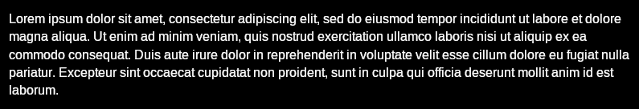

图 3：文本深色模式渲染示例。

浏览器真的不应该在不经意间更改页面的颜色；如果页面的主题冲突，这可能会产生可怕的可读性后果！相反，网页应使用`color-scheme` `meta`标签或[CSS 属性](https://developer.mozilla.org/en-US/docs/Web/CSS/color-scheme)来表明对深色模式的支持。浏览器使用元标签的存在来确定是否安全地应用深色模式。在`color-scheme`标准化之前，网页原则上可以使用[备用样式表](https://developer.mozilla.org/en-US/docs/Web/CSS/Alternative_style_sheets)提供替代颜色方案，但很少浏览器支持它（在主要浏览器中，只有 Firefox）并且它并不常见。

# 自定义深色模式

我们简单的深色模式实现对于只有文本在背景上的页面效果很好。但为了有一个好看的深色模式，我们还需要调整页面上的所有其他颜色。例如，按钮和输入元素可能需要更深的背景颜色，以及网页开发者在该页面上使用的任何颜色。

为了支持这一点，CSS 使用 [媒体查询](https://developer.mozilla.org/en-US/docs/Web/CSS/Media_Queries/Using_media_queries)。这是一种特殊的语法，基本上是将一些 CSS 规则包裹在一个带有某种条件的 `if` 语句中；如果条件为真，则使用这些 CSS 规则，如果条件为假，则忽略它们。`prefers-color-scheme` 条件检查深色模式。例如，以下 CSS 代码将使 `<div>` 在深色模式下只有白色文本和黑色背景：

```py
@media (prefers-color-scheme: dark) {
 div { background-color: black; color: white; }
}
```

网络开发者可以在自己的样式表中使用 `prefers-color-scheme` 查询，调整自己的颜色选择以适应用户请求，但我们也可以在浏览器默认样式表中使用 `prefers-color-scheme` 媒体查询来调整链接、按钮和文本输入的默认颜色：

```py
@media (prefers-color-scheme: dark) {
 a { color: lightblue; }
 input { background-color: #2222FF; }
 button { background-color: #992500; }
}
```

在这里，我选择了非常具体的十六进制颜色，以保留蓝色和橙色的总体配色方案，但确保与白色前景文本的最大对比度，以便易于阅读。选择确保最大对比度的颜色（[“AAA”](https://accessibleweb.com/rating/aaa/) 评级）非常重要。这个 [工具](https://webaim.org/resources/contrastchecker/) 对于检查前景和背景颜色的对比度很有用。

要实现媒体查询，我们必须从解析此语法开始：

```py
class CSSParser:
 def media_query(self):
 self.literal("@")
 assert self.word() == "media"
 self.whitespace()
 self.literal("(")
 self.whitespace()
 prop, val = self.pair([")"])
 self.whitespace()
 self.literal(")")
 return prop, val
```

然后，在 `parse` 中，我们跟踪当前配色方案，并在每次进入或退出 `@media` 规则时调整它：为了简单起见，此代码不处理嵌套的 `@media` 规则，因为只有一个类型的媒体查询，嵌套它们没有意义。要处理嵌套的 `@media` 查询，`media` 变量必须存储条件栈。

```py
class CSSParser:
 def parse(self):
 # ...
 media = None
 self.whitespace()
 while self.i < len(self.s):
 try:
 if self.s[self.i] == "@" and not media:
 prop, val = self.media_query()
 if prop == "prefers-color-scheme" and \
 val in ["dark", "light"]:
 media = val
 self.whitespace()
 self.literal("{")
 self.whitespace()
 elif self.s[self.i] == "}" and media:
 self.literal("}")
 media = None
 self.whitespace()
 else:
 # ...
 rules.append((media, selector, body))
```

注意，我已经修改了规则列表，不仅存储选择器和主体，还存储这些规则的配色方案——如果它不受配色方案的影响，则为 `None`，仅深色模式为 `dark`，仅浅色模式为 `light`。这样，`style` 函数可以忽略不适用的情况：

```py
def style(node, rules, tab):
 # ...
 for media, selector, body in rules:
 if media:
 if (media == "dark") != tab.dark_mode: continue
 # ...
```

尝试在浏览器中打开这个 网页，我将在整章中使用它作为“焦点示例”。它包含许多链接、文本输入和按钮，你现在应该看到在深色模式下，它们也会改变颜色，以拥有更深的背景和更浅的前景。在深色模式下，它应该看起来像图 4。

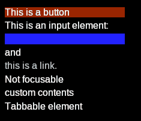

图 4：表单的深色模式示例。查看 `browser.engineering` 网站以获取全色效果。

除了`prefers-color-scheme`，网页还可以使用媒体查询在用户`prefers-contrast`（[偏好对比度](https://developer.mozilla.org/en-US/docs/Web/CSS/@media/prefers-contrast)）或`prefers-reduced-motion`（[偏好减少运动](https://developer.mozilla.org/en-US/docs/Web/CSS/@media/prefers-reduced-motion)）时增加或减少对比度，或禁用不必要的动画，这两者都有助于有特定残疾的用户。用户还可以通过操作系统强制使用特定的、有限的调色板颜色；网页可以通过`forced-colors`（[强制颜色](https://developer.mozilla.org/en-US/docs/Web/CSS/@media/forced-colors)）媒体查询来检测这一点，或者使用`forced-color-adjust`（[强制颜色调整](https://developer.mozilla.org/en-US/docs/Web/CSS/forced-color-adjust)）禁用某些元素（请谨慎使用！）。

# 键盘导航

目前，我们浏览器的大多数功能都是通过鼠标触发的，除了滚动，滚动只能通过键盘进行。这对手部受伤或有残疾的用户来说是个问题——对那些更喜欢键盘的效率用户来说也是个问题。所以理想情况下，每个浏览器功能都应该可以通过键盘和鼠标访问。这包括浏览器 chrome 交互，如后退导航、输入 URL 或退出浏览器，以及网页交互，如提交表单、在文本区域中输入、导航链接和选择页面上的项目。

让我们从浏览器 chrome 开始，因为它是最简单的。在这里，我们需要允许用户通过键盘进行后退导航、在地址栏中输入，以及创建和切换标签页。我们还会添加一个退出浏览器的键盘快捷键。根据操作系统，可能还需要缩放或最大化浏览器窗口的快捷键。这些需要调用专门的操作系统 API，所以我不将实现它们。让我们在事件循环中使用`Ctrl`修改键来创建所有这些快捷键，这样它们就不会干扰正常的输入：`Ctrl-Left`后退，`Ctrl-l`在地址栏中输入，`Ctrl-t`创建新标签页，`Ctrl-Tab`切换到下一个标签页，以及`Ctrl-q`退出浏览器：

```py
def mainloop(browser):
 while True:
 if sdl2.SDL_PollEvent(ctypes.byref(event)) != 0:
 elif event.type == sdl2.SDL_KEYDOWN:
 if ctrl_down:
 # ...
 elif event.key.keysym.sym == sdl2.SDLK_LEFT:
 browser.go_back()
 elif event.key.keysym.sym == sdl2.SDLK_l:
 browser.focus_addressbar()
 elif event.key.keysym.sym == sdl2.SDLK_t:
 browser.new_tab(
 "https://browser.engineering/")
 elif event.key.keysym.sym == sdl2.SDLK_TAB:
 browser.cycle_tabs()
 elif event.key.keysym.sym == sdl2.SDLK_q:
 browser.handle_quit()
 sdl2.SDL_Quit()
 sys.exit()
 break
```

在这里，`focus_addressbar`和`cycle_tabs`方法是新的，但它们的实现内容只是从`handle_click`复制过来的：

```py
class Chrome:
 def focus_addressbar(self):
 self.focus = "address bar"
 self.address_bar = ""

class Browser:
 def focus_addressbar(self):
 self.lock.acquire(blocking=True)
 self.chrome.focus_addressbar()
 self.set_needs_raster()
 self.lock.release()

 def cycle_tabs(self):
 self.lock.acquire(blocking=True)
 active_idx = self.tabs.index(self.active_tab)
 new_active_idx = (active_idx + 1) % len(self.tabs)
 self.set_active_tab(self.tabs[new_active_idx])
 self.lock.release()
```

现在浏览器 chrome 中的任何点击都可以用键盘操作来替代。但网页本身中的点击怎么办呢？这比较棘手，因为网页可以有任意数量的链接。所以标准的解决方案是让用户通过`Tab`键遍历页面上的所有可点击元素，然后按`Enter`键来实际点击它们。尽管这不是唯一的解决方案。旧版的 Firefox 浏览器扩展[Vimperator](http://vimperator.org/)及其继任者会在每个可点击元素旁边显示一或两个字母的代码，并允许用户输入这些代码来激活该元素。

我们将通过扩展 `focus` 的实现来实现这一点。我们已经在每个 `Tab` 上有一个 `focus` 属性，表示哪个 `input` 元素正在捕获键盘输入。让我们允许按钮和链接也可以获得焦点。当然，它们不捕获键盘输入，但用户按下 `Enter` 时，我们将按下按钮或导航到链接。

我们首先将这些键绑定到事件循环中：

```py
def mainloop(browser):
 while True:
 if sdl2.SDL_PollEvent(ctypes.byref(event)) != 0:
 elif event.type == sdl2.SDL_KEYDOWN:
 # ...
 elif event.key.keysym.sym == sdl2.SDLK_RETURN:
 browser.handle_enter()
 elif event.key.keysym.sym == sdl2.SDLK_TAB:
 browser.handle_tab()
```

注意，这些行不在 `if ctrl_down` 块内，因为我们绑定的是 `Tab` 和 `Enter`，而不是 `Ctrl-Tab` 和 `Ctrl-Enter`。在 `Browser` 中，我们只是将这些键转发到活动标签的 `enter` 和 `advance_tab` 方法：真实浏览器也支持 `Shift-Tab` 以在焦点顺序中向后移动。

```py
class Browser:
 def handle_tab(self):
 self.focus = "content"
 task = Task(self.active_tab.advance_tab)
 self.active_tab.task_runner.schedule_task(task)

 def handle_enter(self):
 # ...
 elif self.focus == "content":
 task = Task(self.active_tab.enter)
 self.active_tab.task_runner.schedule_task(task)
 # ...
```

让我们从 `advance_tab` 方法开始。每次调用它时，浏览器都应该将焦点移动到下一个可聚焦元素。这首先需要定义哪些元素是可聚焦的：

```py
def is_focusable(node):
 return node.tag in ["input", "button", "a"]

class Tab:
 def advance_tab(self):
 focusable_nodes = [node
 for node in tree_to_list(self.nodes, [])
 if isinstance(node, Element) and is_focusable(node)]
```

接下来，在 `advance_tab` 中，我们需要找出当前聚焦的元素在这个列表中的位置，以便我们可以将焦点移动到下一个元素。

```py
class Tab:
 def advance_tab(self):
 # ...
 if self.focus in focusable_nodes:
 idx = focusable_nodes.index(self.focus) + 1
 else:
 idx = 0
```

最后，我们只需要将焦点放在选定的元素上。如果我们已经到达最后一个可聚焦节点（或者一开始就没有可聚焦节点），我们将取消页面焦点并移动焦点到地址栏：

```py
class Tab:
 def advance_tab(self):
 if idx < len(focusable_nodes):
 self.focus = focusable_nodes[idx]
 else:
 self.focus = None
 self.browser.focus_addressbar()
 self.set_needs_render()
```

现在元素已经获得焦点，用户应该能够通过按下 `Enter` 来与之交互。由于他们执行的确切操作各不相同（导航链接、按下按钮、清除文本输入），我们将这称为“激活”元素：

```py
class Tab:
 def enter(self):
 if not self.focus: return
 self.activate_element(self.focus)
```

`activate_element` 方法对不同类型的元素执行不同的操作：

```py
class Tab:
 def activate_element(self, elt):
 if elt.tag == "input":
 elt.attributes["value"] = ""
 self.set_needs_render()
 elif elt.tag == "a" and "href" in elt.attributes:
 url = self.url.resolve(elt.attributes["href"])
 self.load(url)
 elif elt.tag == "button":
 while elt:
 if elt.tag == "form" and "action" in elt.attributes:
 self.submit_form(elt)
 elt = elt.parent
```

所有这些激活代码都是从 `Tab` 上的 `click` 方法复制的。注意，当焦点在文本输入框上时按下 `Enter` 会清除文本输入；在大多数浏览器中，它会提交包含的表单。这个特性是一个针对我们的浏览器未实现 `Backspace` 键（第 8.3 节）的解决方案。

现在可以将 `click` 方法重写为直接调用 `activate_element`：

```py
class Tab:
 def click(self, x, y):
 while elt:
 if isinstance(elt, Text):
 pass
 elif is_focusable(elt):
 self.focus_element(elt)
 self.activate_element(elt)
 return
 elt = elt.parent
```

此外，由于现在任何元素都可以获得焦点，我们需要在输入之前检查 `input` 元素是否已获得焦点：

```py
class Tab:
 def keypress(self, char):
 if self.focus and self.focus.tag == "input":
 if not "value" in self.focus.attributes:
 self.activate_element(self.focus)
 # ...
```

我已经调用 `activate_element` 来创建一个空的 `value` 属性。

类似地，`InputLayout` 以前用于为任何获得焦点的元素绘制光标。现在 `button` 元素也可以获得焦点，因此需要更加小心：

```py
class InputLayout:
 def paint(self):
 # ...
 if self.node.is_focused and self.node.tag == "input":
 # ...
 # ...
```

最后，请注意，有时激活一个元素会提交表单或导航到新页面，这意味着我们之前聚焦的元素不再存在。在这种情况下，我们需要确保清除焦点：

```py
class Tab:
 def load(self, url, payload=None):
 self.focus = None
 # ...
```

现在我们有了聚焦链接、按钮和文本输入的能力。但就像任何浏览器功能一样，值得问一下网页作者是否应该能够自定义它。在使用键盘导航时，作者可能希望某些链接不可聚焦（例如指向章节标题的“永久链接”，这对大多数用户来说只是噪音），或者可能希望改变用户通过标签键切换焦点项的顺序。

浏览器支持 `tabindex` HTML 属性来实现这一点。`tabindex` 属性是一个数字。如果一个元素的 `tabindex` 是负数，则该元素不可聚焦，具有较小 `tabindex` 值的元素排在具有较大值的元素之前，以及没有任何 `tabindex` 的元素之前。为了实现这一点，我们需要按 tab 索引对可聚焦元素进行排序，因此我们需要一个返回 tab 索引的函数：

```py
def get_tabindex(node):
 tabindex = int(node.attributes.get("tabindex", "9999999"))
 return 9999999 if tabindex == 0 else tabindex
```

默认值，“9999999”，是一个技巧，以确保没有 `tabindex` 属性的元素在排序时排在有属性的元素之后。现在我们可以在 `advance_tab` 中按 `get_tabindex` 排序：

```py
class Tab:
 def advance_tab(self):
 focusable_nodes = [node
 for node in tree_to_list(self.nodes, [])
 if isinstance(node, Element) and is_focusable(node)]
 focusable_nodes.sort(key=get_tabindex)
 # ...
```

由于 Python 的排序是“稳定的”，具有相同 `tabindex` 的两个元素在 `focusable_nodes` 中的相对位置不会改变。

此外，具有非负 `tabindex` 的元素自动可聚焦，即使它们不是链接、按钮或文本输入。这很有用，因为该元素可能监听 `click` 事件。为了支持这一点，我们首先扩展 `is_focusable` 以考虑 `tabindex`：

```py
def is_focusable(node):
 if get_tabindex(node) < 0:
 return False
 elif "tabindex" in node.attributes:
 return True
 else:
 return node.tag in ["input", "button", "a"]
```

如果你打印出 `focus example` 的 `focusable_nodes`，你应该得到这个：

```py
[<a tabindex="1" href="/">,
 <button tabindex="2">,
 <div tabindex="3">,
 <div tabindex="12">,
 <input>,
 <a href="http://browser.engineering">]
```

我们还需要确保在元素被激活时发送一个 `click` 事件。注意，就像点击一个元素一样，激活一个元素也可以通过 JavaScript 使用 `preventDefault` 来取消。

```py
class Tab:
 def enter(self):
 if not self.focus: return
 if self.js.dispatch_event("click", self.focus): return
 self.activate_element(self.focus)
```

我们现在为浏览器和网页内容都提供了可配置的键盘导航。这涉及到编写几乎没有任何新代码，而是主要将现有方法中的代码移动到新的独立方法中。键盘导航简化而不是复杂化我们的浏览器实现是一个常见的成果：提高可访问性通常涉及泛化和细化现有概念，从而总体上使代码更易于维护。

为什么在元素被激活时发送 `click` 事件，而不是一个特殊的 `activate` 事件呢？Internet Explorer [曾经使用过](https://docs.microsoft.com/en-us/previous-versions/windows/internet-explorer/ie-developer/platform-apis/aa742710(v=vs.85)) 一个特殊的 `activate` 事件，而其他浏览器则发送一个 [DOMActivate](https://w3c.github.io/uievents/#event-type-DOMActivate) 事件，但现代标准要求即使元素是通过键盘激活的，而不是通过点击，也要发送 `click` 事件。当开发者不太考虑可访问性时，这种方法效果更好，他们只会注册 `click` 事件监听器。

# 指示聚焦

感谢我们的键盘快捷键，用户现在可以通过键盘访问任何链接、按钮或文本输入。但如果你尝试使用它来导航网站，很难知道何时哪个元素被聚焦。一个视觉指示——类似于我们在文本输入中使用的光标——可以帮助视力正常的用户知道他们是否到达了他们想要的元素，或者他们是否需要继续按 `Tab` 键。在大多数浏览器中，这种视觉指示是一个 *聚焦环*，它勾勒出聚焦的元素。

要实现聚焦轮廓，我们将使用与绘制文本光标相同的机制。回想一下，目前文本光标是通过在 `InputLayout` 的 `paint` 方法中绘制一条垂直线来添加的。我们将在该方法中添加对 `paint_outline` 的调用，以在聚焦元素周围绘制一个矩形：

```py
def paint_outline(node, cmds, rect, zoom):
 if not node.is_focused: return
 cmds.append(DrawOutline(rect, "black", 1))
```

在新的 `focus_element` 方法中设置这个 `is_focused` 标志，我们现在将使用它来更改 `Tab` 中的 `focus` 字段：

```py
class Tab:
 def focus_element(self, node):
 if self.focus:
 self.focus.is_focused = False
 self.focus = node
 if node:
 node.is_focused = True
```

轮廓绘制应在 `paint_effects` 中发生，因为它在子树之上绘制。

```py
class InputLayout:
 def paint_effects(self, cmds):
 cmds = paint_visual_effects(self.node, cmds, self.self_rect())
 paint_outline(self.node, cmds, self.self_rect(), self.zoom)
 return cmds
```

我还更改了光标绘制，只有在节点聚焦且它是一个 `input` 元素时才会发生。切换到 `button` 元素时不应绘制光标！

不幸的是，处理链接要复杂一些。这是因为一个 `<a>` 元素对应多个 `TextLayout` 对象，所以我们不能只在一个布局对象中放置代码。此外，这些 `TextLayout`s 可能分布在多行中，所以我们可能需要绘制多个聚焦轮廓。为了解决这个问题，让我们在 `LineLayout` 中绘制聚焦轮廓。每个 `LineLayout` 找到所有聚焦的子 `TextLayout`s，并围绕它们绘制一个矩形。

```py
class LineLayout:
 def paint_effects(self, cmds):
 outline_rect = skia.Rect.MakeEmpty()
 outline_node = None
 for child in self.children:
 if child.node.parent.is_focused:
 outline_rect.join(child.self_rect())
 outline_node = child.node.parent
 if outline_node:
 paint_outline(
 outline_node, cmds, outline_rect, self.zoom)
 return cmds
```

你还应该在 `BlockLayout` 中添加一个 `paint_outline` 调用，因为用户可以使用 `tabindex` 使任何元素可聚焦。此代码没有正确处理嵌套在另一个内联元素内的内联元素中的文本的情况，外部元素处于聚焦状态。你可以通过从 `child` 到 `LineLayout` 的 `node` 的方式来修复这个问题，沿途检查 `is_focused` 字段。我为了方便起见跳过了这一步。

现在当你使用 `Tab` 遍历页面时，你应该看到聚焦元素以黑色轮廓突出显示。如果一个链接恰好跨越多行，你将看到我们的浏览器使用多个聚焦矩形来清楚地表明聚焦的是什么。

除了一个问题：如果聚焦元素滚动到屏幕外，仍然没有方法可以知道什么被聚焦。为了修复这个问题，当用户切换到它时，我们需要自动将其滚动到屏幕上。

做这件事有点棘手，因为确定元素是否在屏幕外需要布局。因此，我们不会立即滚动到它，而是在 `Tab` 上设置一个新的 `needs_focus_scroll` 位：

```py
class Tab:
 def __init__(self, browser, tab_height):
 # ...
 self.needs_focus_scroll = False

 def focus_element(self, node):
 if node and node != self.focus:
 self.needs_focus_scroll = True
```

然后，`run_animation_frame` 在重置标志之前可以适当地滚动：

```py
class Tab:
 def run_animation_frame(self, scroll):
 # ...
 if self.needs_focus_scroll and self.focus:
 self.scroll_to(self.focus)
 self.needs_focus_scroll = False
 # ...
```

要实际进行滚动，我们需要找到对应于聚焦节点的布局对象：

```py
class Tab:
 def scroll_to(self, elt):
 objs = [
 obj for obj in tree_to_list(self.document, [])
 if obj.node == self.focus
 ]
 if not objs: return
 obj = objs[0]
```

然后，我们将其滚动到：

```py
class Tab:
 def scroll_to(self, elt):
 # ...

 if self.scroll < obj.y < self.scroll + self.tab_height:
 return

 document_height = math.ceil(self.document.height + 2*VSTEP)
 new_scroll = obj.y - SCROLL_STEP
 self.scroll = self.clamp_scroll(new_scroll)
 self.scroll_changed_in_tab = True
```

在这里，我将滚动位置调整到确保对象距离屏幕顶部 `SCROLL_STEP` 像素，尽管真正的浏览器可能使用不同的逻辑来向上或向下滚动。

聚焦轮廓现在基本上是有效的，如果你在 聚焦示例 上尝试，它甚至会滚动。图 5 显示了我按下 tab 键聚焦“这是一个链接”元素后的样子。

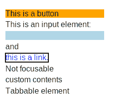

图 5：聚焦轮廓示例。

但理想情况下，焦点指示器应该是可定制的，这样网页作者就可以确保焦点元素突出显示。在 CSS 中，这是通过使用`:focus` [伪类](https://developer.mozilla.org/en-US/docs/Web/CSS/Pseudo-classes)来实现的。基本上，这意味着你可以编写如下选择器：

```py
div:focus { ... }
```

然后，这个选择器仅应用于当前聚焦的`<div>`元素。它被称为伪类，因为其语法与[class](https://developer.mozilla.org/en-US/docs/Web/CSS/Class_selectors)选择器类似，只是匹配的元素上没有实际的`class`属性。

要实现这一点，我们需要解析这种新类型的选择器。让我们将`selector`改为调用一个新的`simple_selector`子例程来解析一个标签名和一个可能的伪类：

```py
class CSSParser:
 def selector(self):
 out = self.simple_selector()
 # ...
 while self.i < len(self.s) and self.s[self.i] != "{":
 descendant = self.simple_selector()
 # ...
```

在`simple_selector`中，解析器首先解析一个标签名，然后检查是否跟有一个冒号和一个伪类名：

```py
class CSSParser:
 def simple_selector(self):
 out = TagSelector(self.word().casefold())
 if self.i < len(self.s) and self.s[self.i] == ":":
 self.literal(":")
 pseudoclass = self.word().casefold()
 out = PseudoclassSelector(pseudoclass, out)
 return out
```

`PseudoclassSelector`包装另一个选择器：

```py
class PseudoclassSelector:
 def __init__(self, pseudoclass, base):
 self.pseudoclass = pseudoclass
 self.base = base
 self.priority = self.base.priority
```

匹配是直接的：

```py
class PseudoclassSelector:
 def matches(self, node):
 if not self.base.matches(node):
 return False
 if self.pseudoclass == "focus":
 return node.is_focused
 else:
 return False
```

未知伪类简单地从不匹配任何内容。

现在可以样式化聚焦的元素。但理想情况下，我们也能自定义焦点轮廓本身，而不仅仅是元素。这可以通过添加对 CSS [outline 属性](https://developer.mozilla.org/en-US/docs/Web/CSS/outline)的支持来实现，其外观如下（3 像素厚的红色轮廓）：我们只会实现这种语法，但`outline`还可以采取几种其他形式。

```py
outline: 3px solid red;
```

我们可以将其解析为厚度和颜色：

```py
def parse_outline(outline_str):
 if not outline_str: return None
 values = outline_str.split(" ")
 if len(values) != 3: return None
 if values[1] != "solid": return None
 return int(values[0][:-2]), values[2]
```

然后绘制一个解析后的轮廓：

```py
def paint_outline(node, cmds, rect, zoom):
 outline = parse_outline(node.style.get("outline"))
 if not outline: return
 thickness, color = outline
 cmds.append(DrawOutline(rect, color, dpx(thickness, zoom)))
```

更好的是，我们可以将默认的 2 像素黑色轮廓移动到浏览器默认样式表中，如下所示：

```py
input:focus { outline: 2px solid black; }
button:focus { outline: 2px solid black; }
div:focus { outline: 2px solid black; }
```

此外，现在我们可以在触发暗黑模式时使轮廓变为白色，这对于它突出黑色背景非常重要：

```py
@media (prefers-color-scheme: dark) {
input:focus { outline: 2px solid white; }
button:focus { outline: 2px solid white; }
div:focus { outline: 2px solid white; }
a:focus { outline: 2px solid white; }
}
```

最后，将所有`paint`方法更改为使用`parse_outline`而不是`is_focused`来绘制轮廓。以下是`LineLayout`：

```py
class LineLayout:
 def paint_effects(self, cmds):
 # ...
 for child in self.children:
 outline_str = child.node.parent.style.get("outline")
 if parse_outline(outline_str):
 outline_rect.join(child.self_rect())
 outline_node = child.node.parent
```

对于焦点示例，`<a>`元素的焦点轮廓变得更厚，变为红色，如图 6 所示。

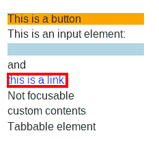

图 6：自定义焦点轮廓的示例。

就像暗黑模式一样，焦点轮廓是一个例子，添加一个可访问性功能意味着将现有的浏览器功能泛化，使其更强大。一旦它们被泛化，这种泛化形式就可以提供给网页作者，他们可以使用它来做任何他们喜欢的事情。

焦点指示器与底层网页的对比度必须很好，以便用户可以清楚地看到他们已经切换到的部分。这可能需要[一些注意](https://darekkay.com/blog/accessible-focus-indicator/)，如果默认焦点指示器看起来像页面或元素背景。例如，最好绘制[两个轮廓](https://blogs.windows.com/msedgedev/2019/10/15/form-controls-microsoft-edge-chromium/)，白色和黑色，以确保在深色和浅色背景上都有可见的焦点指示器。如果您正在设计自己的，[Web 内容可访问性指南](https://www.w3.org/WAI/standards-guidelines/wcag/)提供了对比度指导。

# 可访问性树

放大、暗色模式和焦点指示器有助于有视觉困难的用户，但如果用户根本看不到屏幕，屏幕阅读器的原始动机是为盲人用户设计的，但它有时也适用于用户不应该看屏幕的情况（如驾驶），或者对于没有屏幕的设备，他们通常使用屏幕阅读器。这个名字基本上解释了一切：屏幕阅读器大声读出屏幕上的文本，这样用户就可以知道它说了什么，而无需看到它。

那么：屏幕阅读器应该说什么呢？我们基本上必须克服两个大的挑战。

首先，网页除了文本外还包含我们需要为屏幕阅读器用户复制的视觉提示。例如，当焦点在`<input>`或`<button>`元素上时，屏幕阅读器需要这样说，因为这些用户看不到浅蓝色或橙色的背景。

其次，当用户在听屏幕阅读器时，用户必须能够将浏览器直接导航到他们感兴趣的页面部分。尽管许多依赖屏幕阅读器的人学会了以更快的速度听，但它仍然比视觉信息密度低。例如，用户可能想要跳过标题和导航菜单，甚至跳过页面的大部分内容，直到他们到达感兴趣的段落。但一旦他们到达感兴趣的页面部分，他们可能希望有人读给他们听，如果某些句子或短语特别复杂，他们可能希望屏幕阅读器重新阅读它。

您可以在视频展示的 7 号图中看到屏幕阅读器导航的示例。我鼓励您测试您操作系统的内置屏幕阅读器，以了解屏幕阅读器导航的感觉。在 macOS 上，按 Cmd-Fn-F5 打开 Voice Over；在 Windows 上，按 Win-Ctrl-Enter 或 Win-Enter 启动 Narrator；在 ChromeOS 上按 Ctrl-Alt-z 启动 ChromeVox。所有这些都可以通过键盘快捷键来查找。视频中的 7 号图展示了从 2:36 到 3:54 的屏幕阅读器导航片段。整个演讲都值得推荐；它有使用可访问性技术的优秀示例。

[`www.youtube-nocookie.com/embed/qi0tY60Hd6M?start=159`](https://www.youtube-nocookie.com/embed/qi0tY60Hd6M?start=159)

图 7：可访问性讨论在此[链接]中可用。

为了支持所有这些功能，浏览器将页面结构化为树形，并使用该树与屏幕阅读器交互。树的较高层表示段落、标题或导航菜单等项，而较低层表示文本、链接或按钮。一般来说，操作系统 API 像数据模型一样消费这个树，实际暴露给操作系统 API 的树和数据模型是平台特定的。

这可能听起来很像 HTML——确实非常相似！但是，就像 HTML 树并不完全匹配布局树一样，这个树也没有完全匹配。例如，一些 HTML 元素（如`<div>`）用于对屏幕阅读器用户无意义的样式分组。或者，一些 HTML 元素可能在屏幕上不可见，例如使用`opacity:0`。在实际浏览器中，还有其他几种方式可以使元素变得不可见，例如使用`visibility`或`display` CSS 属性。但对于屏幕阅读器用户来说，这些元素可能是相关的。因此，浏览器会构建一个单独的[可访问性树](https://developer.mozilla.org/en-US/docs/Glossary/Accessibility_tree)来支持屏幕阅读器导航。

让我们在浏览器中实现一个可访问性树。它是在布局阶段之后的一个渲染阶段构建的：

```py
class Tab:
 def __init__(self, browser, tab_height):
 # ...
 self.needs_accessibility = False
 self.accessibility_tree = None

 def render(self):
 # ...
 if self.needs_layout:
 # ...
 self.needs_accessibility = True
 self.needs_paint = True
 self.needs_layout = False

 if self.needs_accessibility:
 self.accessibility_tree = AccessibilityNode(self.nodes)
 self.accessibility_tree.build()
 self.needs_accessibility = False
```

可访问性树是由`AccessibilityNode`构建的：

```py
class AccessibilityNode:
 def __init__(self, node):
 self.node = node
 self.children = []
```

`AccessibilityNode`上的`build`方法递归地创建可访问性树。为此，我们遍历 HTML 树，并为每个节点确定它在可访问性树中扮演的“角色”。一些元素，如`<div>`，没有角色，因此不会出现在可访问性树中，而像`<input>`、`<a>`和`<button>`这样的元素有默认角色。角色和默认角色在[WAI-ARIA 标准](https://www.w3.org/TR/wai-aria-1.2/#introroles)中指定。我们可以根据其标签名称或特殊`role`属性（如果存在）来计算节点的角色：

```py
class AccessibilityNode:
 def __init__(self, node):
 # ...
 if isinstance(node, Text):
 if is_focusable(node.parent):
 self.role = "focusable text"
 else:
 self.role = "StaticText"
 else:
 if "role" in node.attributes:
 self.role = node.attributes["role"]
 elif node.tag == "a":
 self.role = "link"
 elif node.tag == "input":
 self.role = "textbox"
 elif node.tag == "button":
 self.role = "button"
 elif node.tag == "html":
 self.role = "document"
 elif is_focusable(node):
 self.role = "focusable"
 else:
 self.role = "none"
```

要构建可访问性树，只需递归遍历 HTML 树。在这个过程中，跳过具有`none`角色的节点，但仍然递归进入它们的子节点：

```py
class AccessibilityNode:
 def build(self):
 for child_node in self.node.children:
 self.build_internal(child_node)

 def build_internal(self, child_node):
 child = AccessibilityNode(child_node)
 if child.role != "none":
 self.children.append(child)
 child.build()
 else:
 for grandchild_node in child_node.children:
 self.build_internal(grandchild_node)
```

这是焦点示例的可访问性树：

```py
 role=document
   role=button
     role=focusable text
   role=StaticText
   role=textbox
   role=StaticText
   role=link
     role=focusable text
   role=StaticText
   role=textbox
     role=StaticText
   role=focusable
     role=focusable text
   role=StaticText
   role=StaticText
   role=StaticText
   role=StaticText
   role=StaticText
   role=StaticText
   role=StaticText
   role=StaticText
   role=StaticText
   role=StaticText
   role=StaticText
   role=StaticText
   role=StaticText
   role=StaticText
   role=StaticText
   role=StaticText
   role=StaticText
   role=StaticText
   role=focusable
     role=focusable text
   role=link
     role=focusable text
```

用户现在可以指导屏幕阅读器遍历这个可访问性树，并描述每个节点或在其上触发操作。让我们来实现这一点。

在多进程浏览器（例如 [Chromium](https://www.chromium.org/developers/design-documents/multi-process-architecture/)）中，有一个与操作系统交互的浏览器进程，以及用于加载网页的渲染进程。由于屏幕阅读器 API 是同步的，Chromium [存储了两份](https://chromium.googlesource.com/chromium/src/+/HEAD/docs/accessibility/browser/how_a11y_works_2.md)无障碍树，一份在浏览器中，一份在每个渲染器中，并且只在两者之间发送更改。另一种设计，由预 Chromium 的 Microsoft Edge 和一些其他浏览器使用，将每个渲染进程连接到来自操作系统的无障碍 API 请求。这消除了复制无障碍树的必要性，但将操作系统暴露给单个标签页可能导致安全问题。

# 屏幕阅读器

通常，屏幕阅读器是浏览器之外的一个独立应用程序；屏幕阅读器需要帮助用户执行操作系统操作，例如登录、启动应用程序和在这些应用程序之间切换，因此屏幕阅读器位于任何应用程序之外，并通过操作系统与它们集成是有意义的。浏览器通过操作系统特定的 API 与其通信。为了使这本书平台无关，并更清楚地展示屏幕阅读器如何与无障碍树交互，我们关于屏幕阅读器支持的讨论将包括直接集成到浏览器中的最小屏幕阅读器。

但我们的内置屏幕阅读器应该位于 `Browser` 还是每个 `Tab` 中？现代浏览器通常从类似 `Browser` 的东西与屏幕阅读器通信，所以我们也会这样做。因此，在多线程浏览器中，我们首先需要做的事情是将标签页的无障碍树发送到浏览器线程。这将是对第十二章中引入的提交概念的直接扩展。首先，我们将树添加到 `CommitData`：

```py
class CommitData:
 def __init__(self, url, scroll, height, display_list,
 composited_updates, accessibility_tree):
 # ...
 self.accessibility_tree = accessibility_tree
```

然后我们在 `run_animation_frame` 中发送它：

```py
class Tab:
 def run_animation_frame(self, scroll):
 # ...
 commit_data = CommitData(
 self.accessibility_tree,
 # ...
 # ...
 self.accessibility_tree = None

class Browser:
 def commit(self, tab, data):
 # ...
 self.accessibility_tree = data.accessibility_tree

 def clear_data(self):
 # ...
 self.accessibility_tree = None
```

注意，一旦将 `accessibility_tree` 字段发送到浏览器线程，我就像处理显示列表一样清除它，以避免数据竞争。

现在树已经位于浏览器线程中，让我们实现屏幕阅读器。我们将使用两个 Python 库来大声朗读文本：[`gtts`](https://pypi.org/project/gTTS/)（它封装了 Google [文本到语音服务](https://cloud.google.com/text-to-speech/docs/apis)）和[`playsound`](https://pypi.org/project/playsound/)。您可以使用 `pip` 安装它们：

```py
python3 -m pip install gtts
python3 -m pip install playsound
```

您可以使用这些库将文本转换为音频文件，然后播放它：

```py
import os
import gtts
import playsound

SPEECH_FILE = "/tmp/speech-fragment.mp3"

def speak_text(text):
 print("SPEAK:", text)
 tts = gtts.gTTS(text)
 tts.save(SPEECH_FILE)
 playsound.playsound(SPEECH_FILE)
 os.remove(SPEECH_FILE)
```

你可能需要调整 `SPEECH_FILE` 路径以更好地适应你的系统。如果你在导入任何库时遇到麻烦，你可能需要查阅 `gtts` ([`pypi.org/project/gTTS/`](https://pypi.org/project/gTTS/)) 或 `playsound` ([`pypi.org/project/playsound/`](https://pypi.org/project/playsound/)) 的文档。如果你无法让这些库正常工作，只需删除 `speak_text` 中的所有内容，除了 `print` 语句。你将听不到任何被说出的话，但至少可以通过查看控制台输出进行调试。

首先，我们想要一个键绑定来开启和关闭屏幕阅读器。虽然真实的操作系统通常使用更隐蔽的快捷键，但我会使用 `Ctrl-a` 在事件循环中开启屏幕阅读器：

```py
def mainloop(browser):
 while True:
 if sdl2.SDL_PollEvent(ctypes.byref(event)) != 0:
 elif event.type == sdl2.SDL_KEYDOWN:
 if ctrl_down:
 # ...
 elif event.key.keysym.sym == sdl2.SDLK_a:
 browser.toggle_accessibility()
```

`toggle_accessibility` 方法告诉 `Tab` 访问性是开启的：

```py
class Browser:
 def __init__(self):
 # ...
 self.needs_accessibility = False
 self.accessibility_is_on = False

 def set_needs_accessibility(self):
 if not self.accessibility_is_on:
 return
 self.needs_accessibility = True
 self.needs_draw = True

 def toggle_accessibility(self):
 self.lock.acquire(blocking=True)
 self.accessibility_is_on = not self.accessibility_is_on
 self.set_needs_accessibility()
 self.lock.release()
```

当访问性开启时，`Browser` 应该调用一个新的 `update_accessibility` 方法，我们将在稍后实现它以实际产生声音：

```py
class Browser:
 def composite_raster_and_draw(self):
 # ...
 if self.needs_accessibility:
 self.update_accessibility()
```

现在，屏幕阅读器应该说些什么？这实际上并不取决于浏览器——屏幕阅读器是一个独立的应用程序，通常由用户大量配置，并且可以自行决定。但作为一个简单的调试辅助工具，让我们编写一个屏幕阅读器，一旦页面加载完成就朗读整个网页；当然，真正的屏幕阅读器比这要灵活得多。

要朗读整个文档，我们需要知道如何朗读每个 `AccessibilityNode`。这必须在 `Tab` 中决定，因为文本将包括浏览器线程无法访问的 DOM 内容。所以让我们给 `AccessibilityNode` 添加一个 `text` 字段，并在 `build` 中根据节点角色和周围的 DOM 上下文设置它。对于文本节点，它只是文本，否则它描述了元素标签，以及它是否被聚焦。

```py
class AccessibilityNode:
 def __init__(self, node):
 # ...
 self.text = ""

 def build(self):
 for child_node in self.node.children:
 self.build_internal(child_node)

 if self.role == "StaticText":
 self.text = repr(self.node.text)
 elif self.role == "focusable text":
 self.text = "Focusable text: " + self.node.text
 elif self.role == "focusable":
 self.text = "Focusable element"
 elif self.role == "textbox":
 if "value" in self.node.attributes:
 value = self.node.attributes["value"]
 elif self.node.tag != "input" and self.node.children and \
 isinstance(self.node.children[0], Text):
 value = self.node.children[0].text
 else:
 value = ""
 self.text = "Input box: " + value
 elif self.role == "button":
 self.text = "Button"
 elif self.role == "link":
 self.text = "Link"
 elif self.role == "alert":
 self.text = "Alert"
 elif self.role == "document":
 self.text = "Document"

 if self.node.is_focused:
 self.text += " is focused"
```

这种文本构建逻辑当然是相当简单的，但足以演示这个想法。以下是它如何为 焦点示例 工作的情况：

```py
 role=document text=Document
   role=button text=Button
     role=focusable text text=Focusable text: This is a button
   role=StaticText text='\nThis is an input element: '
   role=textbox text=Input box: 
   role=StaticText text=' and\n'
   role=link text=Link
     role=focusable text text=Focusable text: this is a link.
   role=StaticText text='Not focusable'
   role=textbox text=Input box: custom contents
     role=StaticText text='custom contents'
   role=focusable text=Focusable element
     role=focusable text text=Focusable text: Tabbable element
   role=StaticText text='\n.\n'
   role=StaticText text='\n.\n'
   role=StaticText text='\n.\n'
   role=StaticText text='\n.\n'
   role=StaticText text='\n.\n'
   role=StaticText text='\n.\n'
   role=StaticText text='\n.\n'
   role=StaticText text='\n.\n'
   role=StaticText text='\n.\n'
   role=StaticText text='\n.\n'
   role=StaticText text='\n.\n'
   role=StaticText text='\n.\n'
   role=StaticText text='\n.\n'
   role=StaticText text='\n.\n'
   role=StaticText text='\n.\n'
   role=StaticText text='\n.\n'
   role=StaticText text='\n.\n'
   role=StaticText text='\n.\n'
   role=focusable text=Focusable element
     role=focusable text text=Focusable text: Offscreen
   role=link text=Link
     role=focusable text text=Focusable text: browser.engineering
```

屏幕阅读器可以读取整个文档，通过在每个 `AccessibilityNode` 上说出 `text` 字段：

```py
class Browser:
 def __init__(self):
 # ...
 self.has_spoken_document = False

 def update_accessibility(self):
 if not self.accessibility_tree: return

 if not self.has_spoken_document:
 self.speak_document()
 self.has_spoken_document = True

 def speak_document(self):
 text = "Here are the document contents: "
 tree_list = tree_to_list(self.accessibility_tree, [])
 for accessibility_node in tree_list:
 new_text = accessibility_node.text
 if new_text:
 text += "\n"  + new_text

 speak_text(text)
```

整个文档的朗读只发生一次。但用户在浏览页面时可能需要反馈。例如，当用户从一个元素切换到另一个元素时，他们可能希望听到新元素的声音，以便知道他们正在与之交互。

要做到这一点，浏览器线程需要知道哪个元素是聚焦的。让我们将其添加到 `CommitData`：

```py
class CommitData:
 def __init__(self, url, scroll, height, display_list,
 composited_updates, accessibility_tree, focus):
 # ...
 self.focus = focus
```

确保在 `run_animation_frame` 中传递这个新参数。然后，在 `Browser` 中，我们需要提取这个字段并将其保存到 `tab_focus`：

```py
class Browser:
 def __init__(self):
 # ...
 self.tab_focus = None

 def commit(self, tab, data):
 self.lock.acquire(blocking=True)
 if tab == self.active_tab:
 # ...
 self.tab_focus = data.focus
 self.lock.release()
```

现在，我们需要知道何时焦点发生变化。最简单的方法是在 `Browser` 上存储一个 `last_tab_focus` 字段，其中包含我们实际大声说出的最后一个聚焦元素：

```py
class Browser:
 def __init__(self):
 # ...
 self.last_tab_focus = None
```

然后，如果 `tab_focus` 不等于 `last_tab_focus`，我们知道焦点已经移动，是时候说出被聚焦的节点了。变化看起来是这样的：

```py
class Browser:
 def update_accessibility(self):
 # ...
 if self.tab_focus and \
 self.tab_focus != self.last_tab_focus:
 nodes = [node for node in tree_to_list(
 self.accessibility_tree, [])
 if node.node == self.tab_focus]
 if nodes:
 self.focus_a11y_node = nodes[0]
 self.speak_node(
 self.focus_a11y_node, "element focused ")
 self.last_tab_focus = self.tab_focus
```

`speak_node` 方法与 `speak_document` 类似，但它只说出单个节点：

```py
class Browser:
 def speak_node(self, node, text):
 text += node.text
 if text and node.children and \
 node.children[0].role == "StaticText":
 text += " " + \
 node.children[0].text

 if text:
 speak_text(text)
```

真实屏幕阅读器中还有很多其他功能：地标、以不同粒度导航文本、在请求时重复文本等等。这些功能使得可访问性树和各个节点的角色有了各种用途。但由于本书的重点是浏览器，而不是屏幕阅读器本身，所以让我们在接下来的章节中关注支持可访问性的额外浏览器功能。

可访问性树不仅仅是为了屏幕阅读器。例如，一些用户更喜欢触摸输出，如[盲文显示器](https://en.wikipedia.org/wiki/Refreshable_braille_display)，而不是语音输出，或者两者兼而有之。虽然输出设备相当不同，但可访问性树仍然会包含有关页面上的内容、是否可以与之交互、其状态等信息。此外，通过为所有输出设备使用相同的可访问性树，使用多个辅助技术（如盲文显示器和屏幕阅读器）的用户肯定能接收到一致的信息。

# 可访问性警告

脚本并不直接与可访问性树交互，就像它们不直接与显示列表交互一样。然而，有时脚本需要通知屏幕阅读器它们对页面进行某些更改的原因，以提供更好的用户体验。最常见的情况是弹出一个警告（也称为“吐司”，因为它会弹出）。告诉你你刚才执行的操作失败了。屏幕阅读器用户需要立即听到这个警告，无论它在文档中的位置在哪里。

`alert`角色解决了这个需求。屏幕阅读器会立即读取具有该角色的元素，无论用户当前在文档中的位置在哪里。注意，没有 HTML 元素的默认角色是`alert`，因此这需要页面作者显式设置`role`属性。

接下来是实施。我们首先需要让脚本能够更改`role`属性，通过添加对`setAttribute`方法的支持。在 JavaScript 端，这仅仅调用了一个浏览器 API：

```py
Node.prototype.setAttribute = function(attr, value) {
 return call_python("setAttribute", this.handle, attr, value);
}
```

Python 端也相当简单：

```py
class JSContext:
 def __init__(self, tab):
 # ...
 self.interp.export_function("setAttribute",
 self.setAttribute)
 # ...

 def setAttribute(self, handle, attr, value):
 elt = self.handle_to_node[handle]
 elt.attributes[attr] = value
 self.tab.set_needs_render()
```

现在我们可以实现`alert`角色。在可访问性树中搜索具有该角色的元素：

```py
class Browser:
 def __init__(self):
 # ...
 self.active_alerts = []

 def update_accessibility(self):
 self.active_alerts = [
 node for node in tree_to_list(
 self.accessibility_tree, [])
 if node.role == "alert"
 ]
 # ...
```

现在，我们不可能在每一帧都读出每一个`alert`；我们需要跟踪哪些元素已经被读取，以免重复读取：

```py
class Browser:
 def __init__(self):
 # ...
 self.spoken_alerts = []

 def update_accessibility(self):
 # ...
 for alert in self.active_alerts:
 if alert not in self.spoken_alerts:
 self.speak_node(alert, "New alert")
 self.spoken_alerts.append(alert)
```

由于`spoken_alerts`指向无障碍树，因此每次无障碍树重建时，都需要更新它，以便指向新的树。就像在合成中一样，使用无障碍树中的`node`指针来匹配旧的无障碍树和新无障碍树之间的无障碍节点。请注意，虽然这种匹配*可以在`commit`内部完成，但我们希望该方法尽可能快，因为该方法会阻塞浏览器和主线程。因此，最好在`update_accessibility`中完成它：

```py
class Browser:
 def update_accessibility(self):
 # ...
 new_spoken_alerts = []
 for old_node in self.spoken_alerts:
 new_nodes = [
 node for node in tree_to_list(
 self.accessibility_tree, [])
 if node.node == old_node.node
 and node.role == "alert"
 ]
 if new_nodes:
 new_spoken_alerts.append(new_nodes[0])
 self.spoken_alerts = new_spoken_alerts
 # ...
```

注意，如果一个节点*丢失*了`alert`角色，我们会将其从`spoken_alerts`中移除，这样如果它后来重新获得了`alert`角色，它将再次被朗读。这听起来像是一个边缘情况，但为所有警报使用单个元素（例如，只更改其类，从隐藏到可见）是一种常见的模式。

现在，你应该能够加载[这个示例](https://browser.engineering/examples/example14-alert-role.html)，并在点击按钮后听到警报文本。

`alert`角色是 ARIA 所说的“实时区域”的一个例子，即页面上的一个区域，它可以因用户操作而改变。还有其他角色（如`status`或`alertdialog`），或者可以通过设置`aria-live`属性来在更细粒度级别配置实时区域，通过该属性设置其“礼貌性”（断言性通知会打断用户，但礼貌性通知不会）；通过`aria-atomic`和`aria-relevant`宣布哪些类型的更改；以及实时区域是否处于完成或中间状态，通过`aria-busy`。此外，`aria-live`是创建实时区域所必需的，不需要任何角色。

# 语音和视觉交互

感谢我们在本章中的工作，我们的渲染管线现在基本上有两个不同的输出：用于视觉交互的显示列表和用于屏幕阅读器交互的无障碍树。许多用户只会使用其中之一。然而，同时使用两者也可能非常有价值。例如，一个用户可能有视力受限——能够识别网页上的项目，但无法阅读文本。这样的用户可能会使用鼠标导航页面，但需要屏幕阅读器朗读鼠标下的项目。

让我们试试这个。实现这个特定功能需要每个无障碍节点知道它在页面上的几何形状。然后用户可以指示屏幕阅读器确定鼠标下的对象（通过[击中测试](https://chromium.googlesource.com/chromium/src/+/HEAD/docs/accessibility/browser/how_a11y_works_3.md#Hit-testing))并大声朗读。

获取几何形状是棘手的，因为无障碍树是从 HTML 树生成的，而几何形状在布局树中是可访问的。让我们为每个`Element`对象添加一个`layout_object`指针来帮助解决这个问题：如果它有一个布局对象，那就是。一些`Element`可能没有，它们的`layout_object`指针将保持为`None`。

```py
class Element:
 def __init__(self, tag, attributes, parent):
 # ...
 self.layout_object = None

class Text:
 def __init__(self, text, parent):
 # ...
 self.layout_object = None
```

现在，当我们构建一个布局对象时，我们可以在其`Element`的`layout_object`字段中填写内容。在`BlockLayout`中，它看起来是这样的：

```py
class BlockLayout:
 def __init__(self, node, parent, previous):
 # ...
 node.layout_object = self
```

确保为其他类型的每个布局对象的构造函数添加类似的代码行。然后，每个`AccessibilityNode`都可以存储布局对象的边界：

```py
class AccessibilityNode:
 def __init__(self, node):
 # ...
 self.bounds = self.compute_bounds()

 def compute_bounds(self):
 if self.node.layout_object:
 return [absolute_bounds_for_obj(self.node.layout_object)]
 # ...
```

注意，我这里使用的是`absolute_bounds_for_obj`，因为我们感兴趣的边界是在任何变换（如`translate`）之后的屏幕上的绝对坐标。

然而，还有一个复杂的问题：可能是`node.layout_object`没有被设置；例如，文本节点就没有。这没关系，因为我选择不为这些节点设置任何边界，因为它们不是可聚焦的。同样，具有内联布局的节点通常也不是。因此，我们需要遍历树以找到具有`BlockLayout`的父节点，并将所有`LineLayouts`中的文本节点合并，这些`LineLayouts`是当前`node`的子节点。由于可能有多个`LineLayouts`和文本节点，边界需要在一个`skia.Rect`对象数组中：

```py
class AccessibilityNode:
 def compute_bounds(self):
 # ...
 if isinstance(self.node, Text):
 return []
 inline = self.node.parent
 bounds = []
 while not inline.layout_object: inline = inline.parent
 for line in inline.layout_object.children:
 line_bounds = skia.Rect.MakeEmpty()
 for child in line.children:
 if child.node.parent == self.node:
 line_bounds.join(skia.Rect.MakeXYWH(
 child.x, child.y, child.width, child.height))
 bounds.append(line_bounds)
 return bounds
```

因此，让我们实现悬停时读取的功能。首先，我们需要在事件循环中监听鼠标移动事件，在 SDL 中这些事件被称为`MOUSEMOTION`：

```py
def mainloop(browser):
 while True:
 if sdl2.SDL_PollEvent(ctypes.byref(event)) != 0:
 # ...
 elif event.type == sdl2.SDL_MOUSEMOTION:
 browser.handle_hover(event.motion)
```

浏览器应该监听悬停位置，确定它是否在可访问节点上，并突出显示该节点。我们不希望打扰正常的渲染节奏，所以在`handle_hover`中保存悬停事件，然后在`composite_raster_and_draw`中对此做出反应：

```py
class Browser:
 def __init__(self):
 # ...
 self.pending_hover = None

 def handle_hover(self, event):
 if not self.accessibility_is_on or \
 not self.accessibility_tree:
 return
 self.pending_hover = (event.x, event.y - self.chrome.bottom)
 self.set_needs_accessibility()
```

当用户悬停在节点上时，我们将做两件事。首先，在屏幕上绘制其边界；这有助于用户看到他们悬停的位置，同时也有助于调试。在`paint_draw_list`中这样做；首先找到用户悬停的访问节点（注意需要考虑滚动）：

```py
class Browser:
 def __init__(self):
 # ...
 self.hovered_a11y_node = None

 def paint_draw_list(self):
 # ...
 if self.pending_hover:
 (x, y) = self.pending_hover
 y += self.active_tab_scroll
 a11y_node = self.accessibility_tree.hit_test(x, y)
```

顺便说一下，`a11y_node`中的缩写`a11y`，由一个“a”，数字 11 和一个“y”组成，是“accessibility”这个词的常见缩写。数字“11”指的是我们从“accessibility”中省略的字母数量。《hit_test`函数在访问树中递归：

```py
class AccessibilityNode:
 def contains_point(self, x, y):
 for bound in self.bounds:
 if bound.contains(x, y):
 return True
 return False

 def hit_test(self, x, y):
 node = None
 if self.contains_point(x, y):
 node = self
 for child in self.children:
 res = child.hit_test(x, y)
 if res: node = res
 return node
```

一旦完成点击测试，并且浏览器知道用户悬停的节点是什么，就在`Browser`上保存此信息——这样轮廓就可以在帧之间持续存在——并绘制轮廓：

```py
class Browser:
 def paint_draw_list(self):
 if self.pending_hover:
 # ...
 if a11y_node:
 self.hovered_a11y_node = a11y_node
 self.pending_hover = None
```

最后，我们可以在`paint_draw_list`的末尾绘制轮廓：

```py
class Browser:
 def paint_draw_list(self):
 # ...
 if self.hovered_a11y_node:
 for bound in self.hovered_a11y_node.bounds:
 self.draw_list.append(DrawOutline(
 bound,
 "white" if self.dark_mode else "black", 2))
```

注意，轮廓的颜色取决于是否开启了暗黑模式，以确保高对比度。

现在我们已经绘制了一个轮廓。但此外，我们还想说出用户悬停的内容。为此，我们需要另一个标志`needs_speak_hovered_node`，每当悬停从一个元素移动到另一个元素时，我们将设置此标志：

```py
class Browser:
 def __init__(self):
 # ...
 self.needs_speak_hovered_node = False

 def paint_draw_list(self):
 if self.pending_hover:
 if a11y_node:
 if not self.hovered_a11y_node or \
 a11y_node.node != self.hovered_a11y_node.node:
 self.needs_speak_hovered_node = True
 # ...
```

这个丑陋的条件语句是必要的，以处理两种情况：要么在没有任何先前悬停的情况下悬停在对象上，要么将鼠标从一个对象移动到另一个对象上。在两种情况下，我们都会设置此标志，然后在`update_accessibility`中使用该标志：

```py
class Browser:
 def update_accessibility(self):
 # ...
 if self.needs_speak_hovered_node:
 self.speak_node(self.hovered_a11y_node, "Hit test ")
 self.needs_speak_hovered_node = False
```

现在，你应该能够打开无障碍模式，并将鼠标移至页面以获取关于你悬停内容的视觉和听觉反馈！

一个常见问题是网页作者创建自定义输入元素，而没有充分考虑它们的无障碍性。原因是内置输入元素难以样式化，因此作者会创建看起来更好的自定义版本。

内置的输入元素通常涉及多个独立的组件，例如`file`输入中的路径和按钮，`checkbox`元素中的复选框，或者`select`下拉菜单中的弹出菜单，尽管像`::backdrop`或`::file-selector-button`这样的[伪元素](https://developer.mozilla.org/en-US/docs/Web/CSS/Pseudo-elements)有所帮助，但 CSS（目前）并不擅长样式化这样的“复合”元素。或许最好的解决方案是针对新[完全可样式化](https://blogs.windows.com/msedgedev/2022/05/05/styling-select-elements-for-real/)输入元素的[标准](https://open-ui.org/#proposals)。

# 摘要

本章介绍了无障碍性——确保*所有*用户都能访问和与网站交互的特性，并展示了如何解决浏览器中最常见的几个无障碍性问题。关键要点包括：

+   HTML 的语义和声明性使得无障碍特性成为自然扩展。

+   无障碍特性通常满足多种需求，几乎每个人都能以某种方式从中受益。

+   无障碍树类似于显示列表，并驱动浏览器与屏幕阅读器和其他辅助技术的交互。

+   新特性如深色模式、键盘导航和轮廓需要由网页作者自定义，以便最大限度地可用。

点击这里尝试本章的浏览器。

# 概述

我们浏览器中的完整功能集、类和方法现在应该看起来像这样：

# 练习

14-1 *具有良好对比度的焦点环*. 通过使用两个轮廓，一个较粗的白色轮廓和一个较细的黑色轮廓，来提高焦点指示器的对比度，以确保焦点环与周围内容之间有对比度。

14-2 *焦点方法和事件*. 在 DOM 元素上添加对 JavaScript `focus()` 方法的支持以及相应的 `focus` 和 `blur` 事件。确保`focus()`只对可聚焦元素有效。请注意：在读取元素的位置之前，请确保布局是最新的。

14-3 *在阅读过程中突出显示元素*. 阅读文档的方法是有效的，但如果在阅读过程中也能以类似鼠标悬停的方式突出显示正在读取的元素，那就更好了。实现这一点。你可能想用`advance_accessibility`方法替换`speak_document`方法，该方法通过移动一个节点来移动可访问性焦点并朗读它。

14-4 *宽度媒体查询*. 缩放会导致 CSS 像素中页面宽度的变化。这意味着有时原本在页面上舒适显示的元素不再适用，如果页面足够窄，则可能需要不同的布局。`max-width` 媒体查询允许开发者根据可用宽度对页面进行不同的样式设计；它仅在页面宽度（CSS 像素）小于或等于给定长度时才有效。正如你所见，许多无障碍功能也有非无障碍用途。例如，`max-width` 媒体查询确实是一种在缩放时自定义行为的方法，但大多数开发者更倾向于将其视为为不同设备（如桌面、平板电脑和移动设备）定制网站的方式。这被称为[响应式设计](https://developer.mozilla.org/en-US/docs/Learn/CSS/CSS_layout/Responsive_Design)，可以将其视为一种无障碍性。实现此媒体查询。测试缩放或缩小是否可以触发此媒体查询。

完成练习后，此示例在窄屏幕上应显示绿色文本。

14-5 *混合内联元素*. 确保焦点环在嵌套内联元素上正确工作。例如，在 `<a>a <b>bold</b> link</a>` 中，当用户聚焦在链接上时，焦点环应覆盖所有三个单词，如果内联元素跨越行，则使用多个矩形。然而，如果用户聚焦在块级元素上，例如在 `<div tabindex=2>many<br>lines</div>` 中，则不应在每一行周围有焦点环，而应在整个块周围。

14-6 *线程化可访问性*. 当前可访问性代码在浏览器线程上朗读文本，并在朗读时阻塞浏览器线程。这使用起来非常令人沮丧。通过将朗读移动到新的可访问性线程来解决这个问题。

14-7 *高对比度模式*. 实现高对比度[强制颜色](https://developer.mozilla.org/en-US/docs/Web/CSS/@media/forced-colors)模式。这应该用一小组高对比度[颜色](https://www.w3.org/TR/WCAG21/#contrast-minimum)之一替换所有颜色。

14-8 *`focus-visible`*. 当用户切换到链接时，我们可能希望显示一个焦点指示器，但如果用户点击了它，大多数浏览器不会——用户知道焦点元素在哪里！并且重复的焦点指示器可能很丑陋，或者分散注意力。实现一个类似的启发式方法。点击按钮应该使其获得焦点，但不显示焦点指示器。（在焦点示例中测试此功能，按钮放置在表单外部，因此点击按钮不会导航到新页面。）但是，点击和切换到输入元素都应该显示焦点环。另外，添加对[`:focus-visible`伪类](https://developer.mozilla.org/en-US/docs/Web/CSS/:focus-visible)的支持。这仅适用于元素获得焦点且浏览器会绘制焦点环的情况（焦点环将是可见的，因此得名）。这允许自定义小部件在不丢失我上面提到的有用浏览器启发式方法的情况下更改焦点环样式。

14-9 *操作系统集成*. 添加`accessible_output` Python 库，并使用它直接与操作系统内置的屏幕阅读器集成。尝试本章的一些示例，并比较与真实浏览器的行为。

14-10 *`zoom` CSS 属性*. 添加对`zoom` CSS 属性的支持。这向网络开发者提供了与缩放可访问性功能相同的功能，并且允许仅将其应用于指定的 HTML 子树。

# 支持嵌入内容

Web 浏览器工程的第十五章。

+   图像

+   嵌入布局

+   修改图像大小

+   交互式小部件

+   Iframe 渲染

+   Iframe 输入事件

+   Iframe 脚本

+   帧间通信

+   隔离和定时

+   总结

+   大纲

+   练习

虽然我们的浏览器可以渲染复杂的样式、视觉效果和动画，但所有这些基本上都只应用于文本。然而，网页包含各种非文本*嵌入内容*，从图像到其他网页。对嵌入内容的支持对浏览器架构、性能、安全性和开放信息访问具有强大的影响，并在整个网络历史中发挥了关键作用。

# 图片

图片无疑是网络上最受欢迎的嵌入式内容类型，所以有点讽刺的是，图片只在本书的第十五章中出现！这是因为 Tkinter 不支持许多图像格式或适当的尺寸和裁剪，所以我不得不等待 Skia 的引入，这可以追溯到[1993 年早期](http://1997.webhistory.org/www.lists/www-talk.1993q1/0182.html)。这个历史也是[很多不一致性的原因](http://1997.webhistory.org/www.lists/www-talk.1993q1/0196.html)，比如`src`与`href`或`img`与`image`。它们通过``标签包含在网页中，其外观如下：

```py

```

这个特定的例子在图 1 中显示如下。


图 1：1969 年使用超文本编辑系统的计算机操作员。（来自维基百科的 Gregory Lloyd，[CC BY-SA 4.0 国际](https://creativecommons.org/licenses/by-sa/4.0/deed.en)。）

幸运的是，实现图片并不太难，所以我们开始吧。在我们的浏览器中显示图片有四个步骤：

1.  从 URL 下载图片。

1.  将图片解码到内存中的缓冲区。

1.  在页面上布局图片。

1.  在显示列表中绘制图片。

让我们从从 URL 下载图片开始。当然，这是通过 HTTP 完成的，我们已经有了一个`request`函数。然而，虽然我们迄今为止下载的所有内容——HTML、CSS 和 JavaScript——都是文本的，但图片通常使用二进制数据格式。我们需要扩展`request`以支持二进制数据。

变化非常微小：不再将`"r"`标志传递给`makefile`，而是传递一个表示二进制模式的`"b"`标志：

```py
class URL:
 def request(self, referrer, payload=None):
 # ...
 response = s.makefile("b")
 # ...
```

现在我们每次从`response`读取时，都会得到二进制数据的`bytes`，而不是包含文本数据的`str`，因此我们需要更改一些 HTTP 解析器代码以显式`decode`数据：

```py
class URL:
 def request(self, referrer, payload=None):
 # ...
 statusline = response.readline().decode("utf8")
 # ...
 while True:
 line = response.readline().decode("utf8")
 # ...
 # ...
```

注意，当我们读取正文时，我没有添加`decode`调用；这是因为正文实际上可能是二进制数据，我们希望直接将二进制数据返回给浏览器。现在，每个现有的`request`调用，它想要文本数据，都需要对响应进行`decode`。例如，在`load`中，你可能想要这样做：

```py
class Tab:
 def load(self, url, payload=None):
 # ...
 headers, body = url.request(self.url, payload)
 body = body.decode("utf8", "replace")
 # ...
```

通过将`replace`作为`decode`的第二个参数传递，我告诉 Python 用特殊字符�替换任何无效字符，而不是抛出异常。

确保在浏览器中的所有调用`request`的地方都进行此更改，包括`XMLHttpRequest_send`和`load`中的几个其他地方。

然而，当我们下载图片时，我们*不会*调用`decode`；我们只需直接使用二进制数据即可。

```py
class Tab:
 def load(self, url, payload=None):
 # ...
 images = [node
 for node in tree_to_list(self.nodes, [])
 if isinstance(node, Element)
 and node.tag == "img"]
 for img in images:
 src = img.attributes.get("src", "")
 image_url = url.resolve(src)
 assert self.allowed_request(image_url), \
 "Blocked load of " + str(image_url) + " due to CSP"
 header, body = image_url.request(url)
```

下载图片后，我们需要将其转换为 Skia 的`Image`对象。这需要以下代码：

```py
class Tab:
 def load(self, url, payload=None):
 for img in images:
 # ...
 img.encoded_data = body
 data = skia.Data.MakeWithoutCopy(body)
 img.image = skia.Image.MakeFromEncoded(data)
```

这里有两个棘手的步骤：使用`MakeWithoutCopy`方法将请求的数据转换为 Skia 的`Data`对象，然后使用`MakeFromEncoded`将其转换为图像。

由于我们使用了`MakeWithoutCopy`，`Data`对象仅存储对现有`body`的引用，并不拥有该数据。这是非常重要的，因为编码的图像数据可能很大——可能达到兆字节级别——复制这些数据会浪费内存和时间。但这也意味着如果`body`被垃圾回收，`data`将变得无效；这就是为什么我将`body`保存在`encoded_data`字段中的原因。这有点像是一种折衷方案。也许更好的解决方案是直接使用`writable_data` API 将响应写入 Skia 的`Data`对象。这将需要对浏览器其余部分进行一些重构，这就是为什么我选择避免这样做的原因。

这些下载和解码步骤都可能失败；如果发生这种情况，我们将加载一个“损坏的图像”占位符（我使用了[来自维基百科的一个](https://commons.wikimedia.org/wiki/File:Broken_Image.png)）：

```py
BROKEN_IMAGE = skia.Image.open("Broken_Image.png")

class Tab:
 def load(self, url, payload=None):
 for img in images:
 try:
 # ...
 except Exception as e:
 print("Image", img.attributes.get("src", ""),
 "crashed", e)
 img.image = BROKEN_IMAGE
```

现在我们已经下载并保存了图像，我们需要使用它。这只需要调用 Skia 的`drawImageRect`函数：

```py
class DrawImage(PaintCommand):
 def __init__(self, image, rect):
 super().__init__(rect)
 self.image = image

 def execute(self, canvas):
 canvas.drawImageRect(self.image, self.rect)
```

然而，`drawImageRect`的内部实现稍微复杂一些，值得详细说明。回想一下，`Image`对象是使用`MakeFromEncoded`方法创建的。这个名字提醒我们，我们下载的图像不是原始图像字节。实际上，您所知道的全部图像格式——JPG、PNG 以及许多更不为人知的格式——都使用各种复杂的算法对图像数据进行编码。因此，在可以使用之前，图像需要被*解码*。而且解码算法比简单的`utf8`转换要复杂得多。

Skia 在解码方面应用了各种巧妙的优化，例如直接将图像解码到最终大小，并尽可能长时间地缓存解码后的图像。还有一个[HTML API](https://developer.mozilla.org/en-US/docs/Web/API/HTMLImageElement/decoding)用于控制解码，这样网页作者就可以指示何时承担这种成本。这是因为原始图像数据可能相当大：解码既消耗大量内存，也消耗大量时间，因为仅仅写出所有这些字节就可能占用我们渲染预算的一大块。优化图像处理对于性能良好的浏览器至关重要。一个像素通常存储为 4 字节，所以一个 1200 万像素的相机（如今在手机上可以找到）为一张单独的图像产生 48 兆字节的原始数据。

由于图像解码可能非常昂贵，Skia 还提供了几种解码算法，其中一些更快但生成的图像外观较差。像 JPEG 这样的图像格式也是[*有损的*](https://en.wikipedia.org/wiki/Lossy_compression)，这意味着它们不能忠实地表示原始图片中的所有信息，因此在保存文件之前就存在时间/质量权衡。通常这些格式会尝试去除人类不太可能注意到的“噪声细节”，就像不同的缩放算法可能做的那样。例如，有快速的简单“最近邻”算法，以及较慢但质量更高的“双线性”甚至“[Lanczos](https://en.wikipedia.org/wiki/Lanczos_resampling)”算法。具体来说，这些算法决定在图像大小和目标大小不同且因此需要调整大小时如何解码图像。较快的算法往往会导致更粗糙、更锯齿状的图像。

为了让网页作者控制这个性能瓶颈，有一个名为 `image-rendering` 的 CSS 属性，它指示使用哪个算法。让我们将其作为 `DrawImage` 的一个参数添加：

```py
def parse_image_rendering(quality):
 if quality == "high-quality":
 return skia.FilterQuality.kHigh_FilterQuality
 elif quality == "crisp-edges":
 return skia.FilterQuality.kLow_FilterQuality
 else:
 return skia.FilterQuality.kMedium_FilterQuality

class DrawImage(PaintCommand):
 def __init__(self, image, rect, quality):
 # ...
 self.quality = parse_image_rendering(quality)

 def execute(self, canvas):
 paint = skia.Paint(
 FilterQuality=self.quality,
 )
 canvas.drawImageRect(self.image, self.rect, paint)
```

但要谈论这个论点从何而来，或者更普遍地说，实际上在我们的浏览器中查看下载的图片，我们首先需要将图片添加到浏览器布局树中。

HTTP `Content-Type` 头部允许服务器告诉浏览器文档是否包含文本或二进制数据。该头部包含一个称为 [MIME 类型](https://developer.mozilla.org/en-US/docs/Web/HTTP/Basics_of_HTTP/MIME_types) 的值，例如 `text/html`、`text/css` 和 `text/javascript` 用于 HTML、CSS 和 JavaScript；`image/png` 和 `image/jpeg` 用于 PNG 和 JPEG 图像；以及 [许多其他类型](https://www.iana.org/assignments/media-types/media-types.xhtml) 用于各种字体、视频、音频和数据格式。“MIME”代表多用途互联网邮件扩展，最初是为了列举所有电子邮件附件可接受的数据格式。如今，这个循环基本上已经闭合：大多数电子邮件客户端现在都是“网络邮件”客户端，通过您的浏览器访问，并且大多数电子邮件现在都是 HTML 格式，使用 `text/html` MIME 类型编码，尽管通常仍然有一个纯文本选项。有趣的是，我们不需要在上面的代码中指定图像格式。这是因为许多图像格式以 [“魔术字节”](https://www.netspi.com/blog/technical/web-application-penetration-testing/magic-bytes-identifying-common-file-formats-at-a-glance/) 开头；例如，PNG 文件总是以字节 137 开头，后面跟着字母“PNG”。这些魔术字节通常比服务器提供的 MIME 类型更可靠，因此在浏览器及其支持库中这种“格式嗅探”是常见的。

# 内嵌布局

根据你对前几章的经验，你可能能够猜出如何将图片添加到我们浏览器的布局和绘制过程中。我们需要创建一个`ImageLayout`类；在`BlockLayout`的`recurse`方法中添加一个新的`image`情况；并从`ImageLayout`的`paint`方法生成一个`DrawImage`命令。

在我们这样做的时候，你可能记得为`<input>`元素做过类似的事情。实际上，文本区域和按钮与图片非常相似：两者都是 DOM 的叶节点，放置在行中，受文本基线的影响，并绘制自定义内容。图片并不完全像*文本*，因为文本节点可能是一整行文本，跨越多行，而图片是一个[原子内联](https://drafts.csswg.org/css-display-3/#atomic-inline)。本章中其他类型的嵌入内容也是原子内联。由于它们非常相似，让我们尝试为两者重用相同的代码。

让我们将现有的`InputLayout`拆分为一个名为`EmbedLayout`的超类，其中包含大部分现有代码，以及一个新的子类`InputLayout`，包含特定于输入的代码：在真实浏览器中，输入元素通常被称为*小部件*，因为它们有很多[特殊渲染规则](https://html.spec.whatwg.org/multipage/rendering.html#widgets)，有时会涉及 CSS。

```py
class EmbedLayout:
 def __init__(self, node, parent, previous, frame):
 # ...

 def layout(self):
 self.zoom = self.parent.zoom
 self.font = font(self.node.style, self.zoom)
 if self.previous:
 space = self.previous.font.measureText(" ")
 self.x = \
 self.previous.x + space + self.previous.width
 else:
 self.x = self.parent.x
```

```py
class InputLayout(EmbedLayout):
 def __init__(self, node, parent, previous):
 super().__init__(node, parent, previous)

 def layout(self):
 super().layout()
```

理念是`EmbedLayout`应该为所有类型的嵌入内容提供通用的布局代码，而其子类如`InputLayout`应该提供该类型内容的自定义代码。不同类型的嵌入内容可能有不同的宽度和高度，因此这些应该在每个子类中发生，同样，`paint`的定义也应该如此：

```py
class InputLayout(EmbedLayout):
 def layout(self):
 # ...
 self.width = dpx(INPUT_WIDTH_PX, self.zoom)
 self.height = linespace(self.font)
 self.ascent = -self.height
 self.descent = 0

 def paint(self):
 # ...
```

`ImageLayout`现在可以继承其大部分行为来自`EmbedLayout`，但它的宽度和高度则来自图片本身：

```py
class ImageLayout(EmbedLayout):
 def __init__(self, node, parent, previous):
 super().__init__(node, parent, previous)

 def layout(self):
 super().layout()
 self.width = dpx(self.node.image.width(), self.zoom)
 self.img_height = dpx(self.node.image.height(), self.zoom)
 self.height = max(self.img_height, linespace(self.font))
 self.ascent = -self.height
 self.descent = 0
```

注意，图片的高度取决于元素的字体大小。虽然有些奇怪，但这就是图片布局实际上是如何工作的：即使只有一行非常小的图片，其高度也足以容纳文本。实际上，一个只有单张图片而没有文本或 CSS 的页面，其布局仍然会受到字体的影响——默认字体。这是网页开发者常见的混淆来源。在真实浏览器中，可以通过通过`display` CSS 属性强制图片进入块或其他布局模式来避免这种情况。其根本原因是因为，作为一种内联布局，图片被设计成与相关文本一起流动，这意味着图片的底部应该与文本基线对齐。这也是为什么我们在上面的代码中保存`img_height`的原因。

此外，在上面的代码中，我在`EmbedLayout`子类中引入了新的`ascent`和`descent`字段。这是为了在`LineLayout`布局中替代现有的`ascent`和`descent`布局代码。这也需要引入`TextLayout`上的那些字段：

```py
class LineLayout:
 def layout(self):
 # ...
 max_ascent = max([-child.ascent 
 for child in self.children])
 baseline = self.y + max_ascent

 for child in self.children:
 if isinstance(child, TextLayout):
 child.y = baseline + child.ascent / 1.25
 else:
 child.y = baseline + child.ascent
 max_descent = max([child.descent
 for child in self.children])
 self.height = max_ascent + max_descent

class TextLayout:
 def layout(self):
 # ...
 self.ascent = self.font.getMetrics().fAscent * 1.25
 self.descent = self.font.getMetrics().fDescent * 1.25
```

绘制图片也是直截了当的：

```py
class ImageLayout(EmbedLayout):
 def paint(self):
 cmds = []
 rect = skia.Rect.MakeLTRB(
 self.x, self.y + self.height - self.img_height,
 self.x + self.width, self.y + self.height)
 quality = self.node.style.get("image-rendering", "auto")
 cmds.append(DrawImage(self.node.image, rect, quality))
 return cmds
```

现在我们需要在 `BlockLayout` 中创建 `ImageLayout`。输入元素是在 `input` 方法中创建的，所以我们创建了一个大致相似的 `image` 方法。但 `input` 本身基本上是 `word` 的重复，所以这将导致大量的重复。这些方法中唯一不同的部分是计算新内联子元素宽度的部分；其余的大部分逻辑是共享的。

让我们而不是重构共享代码到新的方法，这些方法 `text`、`image` 和 `input` 可以调用。首先，所有这些方法都需要一个字体来确定内联后的空间大小；让我们为此创建一个函数：

```py
def font(style, zoom):
 weight = style["font-weight"]
 variant = style["font-style"]
 size = float(style["font-size"][:-2]) * 0.75
 font_size = dpx(size, zoom)
 return get_font(font_size, weight, variant)
```

此外，还有处理行布局的共享代码；让我们将其放入一个新的 `add_inline_child` 方法中。我们需要传入 HTML 节点、元素和布局类以实例化（还有一个仅用于 `TextLayout` 的 `word` 参数）：

```py
class BlockLayout:
 def add_inline_child(self, node, w, child_class, word=None):
 if self.cursor_x + w > self.x + self.width:
 self.new_line()
 line = self.children[-1]
 previous_word = line.children[-1] if line.children else None
 if word:
 child = child_class(node, word, line, previous_word)
 else:
 child = child_class(node, line, previous_word)
 line.children.append(child)
 self.cursor_x += w + \
 font(node.style, self.zoom).measureText(" ")
```

我们现在可以以令人满意的方式重新定义 `word` 和 `input`：

```py
class BlockLayout:
 def word(self, node, word):
 node_font = font(node.style, self.zoom)
 w = node_font.measureText(word)
 self.add_inline_child(node, w, TextLayout, word)

 def input(self, node):
 w = dpx(INPUT_WIDTH_PX, self.zoom)
 self.add_inline_child(node, w, InputLayout) 
```

添加 `image` 很简单：

```py
class BlockLayout:
 def recurse(self, node):
 # ...
 elif node.tag == "img":
 self.image(node)

 def image(self, node):
 w = dpx(node.image.width(), self.zoom)
 self.add_inline_child(node, w, ImageLayout)
```

当然，图像也获得与输入元素相同的内联布局模式：

```py
class BlockLayout:
 def layout_mode(self):
 # ...
 elif self.node.tag in ["input", "img"]:
 return "inline"

 def should_paint(self):
 return isinstance(self.node, Text) or \
 (self.node.tag not in \
 ["input", "button", "img"])
```

现在我们已经在布局树中有 `ImageLayout` 节点，我们将向显示列表中绘制 `DrawImage` 命令，并在屏幕上显示图像！

但我们的第二个输出模式，屏幕阅读器怎么办？这就是 `alt` 属性的作用。它的工作方式是这样的：

```py

```

在 `AccessibilityNode` 中实现这一点非常简单：

```py
class AccessibilityNode:
 def __init__(self, node):
 else:
 # ...
 elif node.tag == "img":
 self.role = "image"

 def build(self):
 # ...
 elif self.role == "image":
 if "alt" in self.node.attributes:
 self.text = "Image: " + self.node.attributes["alt"]
 else:
 self.text = "Image"
```

随着我们继续为网络平台实现新功能，我们始终需要考虑如何使功能在多种模式中工作。

视频与图像类似，但需要更多的带宽、时间和内存；它们还涉及诸如 [数字版权管理 (DRM)](https://en.wikipedia.org/wiki/Digital_rights_management) 这样的复杂性。`<video>` 标签解决了这些问题，内置了对高级视频 [*编解码器*](https://en.wikipedia.org/wiki/Video_codec) 的支持，在视频中被称作“编解码器”，但在图像中被称为“格式”——想想看。DRM 和硬件加速。它还提供了媒体控件，如播放/暂停按钮和音量控制。

# 修改图像大小

到目前为止，屏幕上图像的大小是其像素大小，可能已经缩放。注意，缩放已经可能导致图像以不同于其常规大小的大小渲染，甚至在引入本节中的功能之前。但事实上，对于作者来说，控制嵌入内容的大小通常是有价值的。有几种方法可以做到这一点，例如，我们在练习 6-2 中遇到的 `width` 和 `height` CSS 属性（不要与 `width` 和 `height` 属性混淆！）。

如果 *两个* 这些属性都存在，事情就很简单了：我们在布局元素时从它们中读取，在 `image` 中也是如此：

```py
class BlockLayout:
 def image(self, node):
 if "width" in node.attributes:
 w = dpx(int(node.attributes["width"]), self.zoom)
 else:
 w = dpx(node.image.width(), self.zoom)
 # ...
```

在 `ImageLayout` 中：

```py
class ImageLayout(EmbedLayout):
 def layout(self):
 # ...
 width_attr = self.node.attributes.get("width")
 height_attr = self.node.attributes.get("height")
 image_width = self.node.image.width()
 image_height = self.node.image.height()

 if width_attr and height_attr:
 self.width = dpx(int(width_attr), self.zoom)
 self.img_height = dpx(int(height_attr), self.zoom)
 else:
 self.width = dpx(image_width, self.zoom)
 self.img_height = dpx(image_height, self.zoom)
 # ...
```

这效果很好，但它有一个主要的缺陷：如果`width`与`height`的比例与底层图像大小不同，图像最终会以奇怪的方式拉伸。有时这是故意的，但通常是一个错误。因此，浏览器允许作者指定`width`和`height`中的`just one`，并使用图像的宽高比来计算另一个。尽管实现起来很简单，但这个特性直到 2021 年才在所有实际浏览器中实现。在此之前，开发者们求助于像`padding-top`这样的[旧技巧](https://web.dev/aspect-ratio/#the-old-hack-maintaining-aspect-ratio-with-padding-top)。有时设计上的疏忽需要很长时间才能修复。

实现这个宽高比调整很简单：

```py
class ImageLayout(EmbedLayout):
 # ...
 def layout(self):
 # ...
 aspect_ratio = image_width / image_height

 if width_attr and height_attr:
 # ...
 elif width_attr:
 self.width = dpx(int(width_attr), self.zoom)
 self.img_height = self.width / aspect_ratio
 elif height_attr:
 self.img_height = dpx(int(height_attr), self.zoom)
 self.width = self.img_height * aspect_ratio
 else:
 # ...
 # ...
```

您的浏览器现在应该能够正确渲染以下[示例页面](https://browser.engineering/examples/example15-img.html)，如图 2 所示。当向下滚动一点时，您应该看到图 3 中显示的内容（注意不同的宽高比）。滚动到页面底部将显示图 4 中显示的内容，包括“损坏的图像”图标。

```py
Original size:  
<br>
Smaller: 
<br>
Different aspect ratio:

<br>
Larger:

<br>
Larger with only width:

<br>
Smaller with only height:

Broken image:

<script src="example15-img.js"></script>
<link rel="stylesheet" href="example15-img.css">
```


图 2：示例图像的渲染。


图 3：滚动到宽高比差异后的示例图像渲染。


图 4：滚动到损坏的图像图标后的示例图像渲染。

我们的浏览器从加载的图像尺寸计算出一个宽高比，但在图像加载之前，这个信息是不可用的，这在实际浏览器中是一个问题，因为在实际浏览器中图像是异步加载的，图像大小可能会[响应](https://developer.mozilla.org/en-US/docs/Learn/CSS/CSS_layout/Responsive_Design)布局参数。不知道宽高比可能会导致图像加载时布局发生[偏移](https://web.dev/cls/)，这对用户来说可能很令人沮丧。`aspect-ratio`属性是网页解决这个问题的方法之一。

# 交互式小部件

到目前为止，我们的浏览器有两种嵌入内容：图像和输入元素。虽然两者都很重要且广泛使用，但像`<canvas>`（https://developer.mozilla.org/en-US/docs/Web/HTML/Element/canvas）元素这样的变体也是如此。JavaScript 可以通过 API 在`<canvas>`元素上绘制，而不是从网络上加载图像。与图像不同，`<canvas>`元素没有固有的大小，但除此之外，它们在布局方面相当相似。它们不提供复杂嵌入内容用例（如地图、PDF、广告和社交媒体控件）所需的相当可定制性和灵活性。因此，在现代浏览器中，这些是通过使用`<iframe>`元素将一个网页嵌入另一个网页来处理的。或者通过`embed`和`object`标签，用于 PDF 等案例。这里不会讨论这些。

从语义上讲，`<iframe>`类似于`Tab`内部的`Tab`——它有自己的 HTML 文档、CSS 和脚本。从布局上讲，`<iframe>`与``标签非常相似，具有`width`和`height`属性。因此，实现基本 iframe 只需要处理这三个显著差异：

+   Iframes 没有*浏览器边框*。因此，任何页面导航都必须在页面内部发生（通过一个`<a>`元素或脚本），或者作为包含`<iframe>`元素的网页导航的副作用。在 iframe 中点击链接也会导航 iframe，而不是顶层页面。

+   Iframes 可以*共享渲染事件循环*。例如，如果一个 iframe 与嵌入它的网页有相同的源，那么 iframe 中的脚本可以同步访问父 DOM。这意味着基本上不可能将那个 iframe 放入不同的线程或 CPU 进程，实际上它最终会位于相同的渲染事件循环中。在真实浏览器中，[跨源](https://developer.mozilla.org/en-US/docs/Web/Security/Same-origin_policy)iframe 通常被“站点隔离”，这意味着 iframe 有自己的 CPU 进程出于[安全原因](https://www.chromium.org/Home/chromium-security/site-isolation/)。在我们的浏览器中，我们将使所有 iframe（即使是嵌套的——是的，iframe 可以包含 iframe！）使用相同的渲染事件循环。

+   跨源 iframe 与包含页面*脚本隔离*。这意味着 iframe 中的脚本[无法访问](https://developer.mozilla.org/en-US/docs/Web/Security/Same-origin_policy#cross-origin_script_api_access)包含页面的变量或 DOM，包含页面的脚本也无法访问 iframe 的变量或 DOM。然而，同源 iframe 可以。

我们会讨论这些差异，但现在，让我们开始工作于`Tab`中的`Tab`的想法。我们要做的是将`Tab`类分成两部分：`Tab`将拥有事件循环和脚本环境，`Frame`将做其余的工作。

在某些细节上规划出像这样的复杂重构是很好的。一个`Tab`将：

+   在`Browser`和`Frame`之间提供接口以处理事件；

+   代理帧之间的通信；

+   启动动画帧和渲染；

+   为标签页中的所有帧绘制并拥有显示列表。

+   构建并拥有可访问性树；

+   提交到浏览器线程。

新的`Frame`类将：

+   拥有其 HTML 文档的 DOM、布局树和滚动偏移量；

+   在其 DOM 和布局树上运行样式和布局；

+   实现其 HTML 文档的加载和事件处理（焦点、点击测试等）。

创建这两个类，并相应地分配方法。

自然地，每个`Frame`都需要对其`Tab`的引用；同时访问父帧和相应的`<iframe>`元素也很方便：

```py
class Frame:
 def __init__(self, tab, parent_frame, frame_element):
 self.tab = tab
 self.parent_frame = parent_frame
 self.frame_element = frame_element
 # ...
```

现在让我们看看`Frame`是如何创建的。第一个地方是在`Tab`的`load`方法中，它需要创建*根帧*：

```py
class Tab:
 def __init__(self, browser, tab_height):
 # ...
 self.root_frame = None

 def load(self, url, payload=None):
 self.history.append(url)
 # ...
 self.root_frame = Frame(self, None, None)
 self.root_frame.load(url, payload)
```

注意，`load`方法的内部实现现在位于`Frame`中，因为`Frame`拥有 HTML 树。`Frame`还可以为`<iframe>`元素构建和拥有子`Frame`：

```py
class Frame:
 def load(self, url, payload=None):
 # ...
 iframes = [node
 for node in tree_to_list(self.nodes, [])
 if isinstance(node, Element)
 and node.tag == "iframe"
 and "src" in node.attributes]
 for iframe in iframes:
 document_url = url.resolve(iframe.attributes["src"])
 if not self.allowed_request(document_url):
 print("Blocked iframe", document_url, "due to CSP")
 iframe.frame = None
 continue
 iframe.frame = Frame(self.tab, self, iframe)
 # ...
```

由于 iframe 可以有子资源（和子帧！）并且因此加载较慢，我们应该像脚本一样异步加载它们：

```py
class Frame:
 def load(self, url, payload=None):
 for iframe in iframes:
 # ...
 task = Task(iframe.frame.load, document_url)
 self.tab.task_runner.schedule_task(task)
```

由于它们是异步的，我们需要记录它们是否已经加载，以避免尝试渲染未加载的 iframe：

```py
class Frame:
 def __init__(self, tab, parent_frame, frame_element):
 # ...
 self.loaded = False

 def load(self, url, payload=None):
 self.loaded = False
 ...
 self.loaded = True
```

因此，我们现在在单个`Tab`中有一个帧的树。但由于我们有时需要直接访问任意帧，让我们也给每个帧一个标识符，我称之为*窗口 ID*：

```py
class Tab:
 def __init__(self, browser, tab_height):
 # ...
 self.window_id_to_frame = {}
```

```py
class Frame:
 def __init__(self, tab, parent_frame, frame_element):
 # ...
 self.window_id = len(self.tab.window_id_to_frame)
 self.tab.window_id_to_frame[self.window_id] = self
```

现在我们有了正在创建的帧，让我们开始将这些帧渲染到屏幕上。

很长一段时间内，浏览器也支持以 *插件* 的形式嵌入内容，例如 [Java 小程序](https://en.wikipedia.org/wiki/Java_applet) 或 [Flash](https://en.wikipedia.org/wiki/Adobe_Flash)。但由于插件通常实现了自己的渲染、沙盒化和 UI 原语，因此存在 [性能、安全和可访问性问题](https://developer.mozilla.org/en-US/docs/Learn/HTML/Multimedia_and_embedding/Other_embedding_technologies#the_embed_and_object_elements)。随着时间的推移，新的 API 已经缩小了原生 Web 内容和“非 Web”插件之间的差距。例如，在过去的十年中，`<canvas>` 元素已经支持了硬件加速的 3D 内容，而 [WebAssembly](https://en.wikipedia.org/wiki/WebAssembly) 可以以接近原生的速度运行。因此，插件已经变得不那么常见了。我个人认为这是好事：Web 是关于让信息对每个人可访问的，而这需要开放的标准，包括嵌入内容的标准。

# Iframe 渲染

渲染被分割在 `Tab` 和其 `Frame`s 之间：`Frame` 负责样式和布局，而 `Tab` 负责可访问性和绘制。为什么以这种方式分割渲染管道？因为可访问性树和显示列表最终是从主线程传输到浏览器线程的，所以它们无论如何都会合并。同时，DOM、样式和布局树不会在线程之间传递，因此不会混合。我们需要实现这种分割，并添加代码从 `Tab` 触发每个 `Frame` 的渲染。

让我们从分割渲染管道开始。这里的主要方法仍然是 `Tab` 的 `run_animation_frame` 和 `render`，它们遍历所有已加载的 iframes：

```py
class Tab:
 def run_animation_frame(self, scroll):
 # ...
 for (window_id, frame) in self.window_id_to_frame.items():
 if not frame.loaded:
 continue
 frame.js.dispatch_RAF(frame.window_id)
 # ...

 def render(self):
 self.browser.measure.time('render')

 for id, frame in self.window_id_to_frame.items():
 if frame.loaded:
 frame.render()

 if self.needs_accessibility:
 # ...

 if self.needs_paint:
 # ...

 # ...
```

在这段代码中，我使用了新的 `dispatch_RAF` 方法：

```py
class JSContext:
 def dispatch_RAF(self):
 self.interp.evaljs("window.__runRAFHandlers()")
```

注意，`needs_accessibility`、`pending_hover` 和其他标志仍然在 `Tab` 上，因为它们与 `Tab` 的渲染部分相关。同时，样式和布局现在发生在 `Frame` 中：

```py
class Frame:
 def __init__(self, tab, parent_frame, frame_element):
 # ...
 self.needs_style = False
 self.needs_layout = False

 def set_needs_render(self):
 self.needs_style = True
 self.tab.set_needs_accessibility()
 self.tab.set_needs_paint()

 def set_needs_layout(self):
 self.needs_layout = True
 self.tab.set_needs_accessibility()
 self.tab.set_needs_paint()

 def render(self):
 if self.needs_style:
 # ...

 if self.needs_layout:
 # ...
```

再次，这些脏位移动到 `Frame` 上，因为它们与帧的渲染部分相关。

与图像不同，iframes 没有明确的 [尺寸](https://developer.mozilla.org/en-US/docs/Glossary/Intrinsic_Size)：`<iframe>` 元素的布局大小不依赖于其内容。过去曾尝试为 iframes 提供内建尺寸，但它在没有浏览器实现的情况下被从 HTML 规范中 [移除](https://github.com/whatwg/html/issues/331)。这可能在 [未来](https://github.com/w3c/csswg-drafts/issues/1771) 发生变化，因为对于布局与其父帧协调的“无缝”iframe 有很好的用例。这意味着在父帧和子帧之间需要发生关键额外的通信：帧应该布局多宽多高？这由 `iframe` 元素的属性和 CSS 定义：

```py
class BlockLayout:
 def layout_mode(self):
 # ...
 elif self.node.tag in ["input", "img", "iframe"]:
 return "inline"

 def recurse(self, node):
 else:
 # ...
 elif node.tag == "iframe" and \
 "src" in node.attributes:
 self.iframe(node)
 # ...

 def iframe(self, node):
 if "width" in self.node.attributes:
 w = dpx(int(self.node.attributes["width"]),
 self.zoom)
 else:
 w = IFRAME_WIDTH_PX + dpx(2, self.zoom)
 self.add_inline_child(node, w, IframeLayout, self.frame)

 def should_paint(self):
 return isinstance(self.node, Text) or \
 (self.node.tag not in \
 ["input", "button", "img", "iframe"])
```

`IframeLayout` 布局代码类似，继承自 `EmbedLayout`，但没有宽高比代码：

```py
class IframeLayout(EmbedLayout):
 def __init__(self, node, parent, previous, parent_frame):
 super().__init__(node, parent, previous, parent_frame)

 def layout(self):
 # ...
 if width_attr:
 self.width = dpx(int(width_attr) + 2, self.zoom)
 else:
 self.width = dpx(IFRAME_WIDTH_PX + 2, self.zoom)

 if height_attr:
 self.height = dpx(int(height_attr) + 2, self.zoom)
 else:
 self.height = dpx(IFRAME_HEIGHT_PX + 2, self.zoom)
 self.ascent = -self.height
 self.descent = 0
```

额外的两个像素为边框提供了空间，每边一个像素，稍后使用。

注意，如果其 `width` 没有指定，iframe 将使用一个 [默认值](https://www.w3.org/TR/CSS2/visudet.html#inline-replaced-width)，这个值是基于很久以前平均屏幕尺寸选择的：

```py
IFRAME_WIDTH_PX = 300
IFRAME_HEIGHT_PX = 150
```

现在，这段代码在 *父* 框架中运行。我们需要将这个宽度和高度传递到 *子* 框架，以便它在布局时知道自己的宽度和高度。因此，让我们在子框架中添加一个字段：

```py
class Frame:
 def __init__(self, tab, parent_frame, frame_element):
 # ...
 self.frame_width = 0
 self.frame_height = 0
```

我们可以在父框架布局时设置这些值：

```py
class IframeLayout(EmbedLayout):
 def layout(self):
 # ...
 if self.node.frame and self.node.frame.loaded:
 self.node.frame.frame_height = \
 self.height - dpx(2, self.zoom)
 self.node.frame.frame_width = \
 self.width - dpx(2, self.zoom)
```

条件语句仅用于处理（不常见）的 iframe 被 CSP 阻止的情况。

你可能会惊讶，我没有在这里调用 `set_needs_render`。这是一个快捷方式：`width` 和 `height` 属性只能通过 `setAttribute` 更改，而 `zoom` 只能在 `zoom_by` 和 `reset_zoom` 中更改。然而，所有这些处理程序都需要通过一个新的方法来使所有框架无效，而不是现在已删除的 `Tab` 上的旧 `set_needs_render`。更新所有这些调用点以调用它（以及影响所有框架样式的深色模式更改）：

```py
class Tab:
 def set_needs_render_all_frames(self):
 for id, frame in self.window_id_to_frame.items():
 frame.set_needs_render()
```

根框架当然填充整个窗口：

```py
class Tab:
 def load(self, url, payload=None):
 # ...
 self.root_frame.frame_width = WIDTH
 self.root_frame.frame_height = self.tab_height
```

注意，这里的依赖关系顺序很复杂。我们需要在子框架布局之前让父框架进行布局，以便子框架在布局时具有最新的宽度和高度。Python（3.7 或更高版本）保证了这个顺序，其中字典按插入顺序排序，但如果你在另一种语言中跟随，你可能需要在渲染之前对框架进行排序。

我们现在已经对框架进行了样式化和布局，只需要绘制它们。与布局和样式不同，一个标签页中的所有框架产生一个单一的、统一的显示列表，因此我们需要递归地工作。我们将让 `Tab` 绘制根 `Frame`：

```py
class Tab:
 def render(self):
 if self.needs_paint:
 self.display_list = []
 paint_tree(self.root_frame.document, self.display_list)
 self.needs_paint = False
```

大多数布局树的 `paint` 方法不需要更改，但为了绘制 `IframeLayout`，我们需要在 `paint_tree` 中绘制子框架：

```py
def paint_tree(layout_object, display_list):
 cmds = layout_object.paint()

 if isinstance(layout_object, IframeLayout) and \
 layout_object.node.frame and \
 layout_object.node.frame.loaded:
 paint_tree(layout_object.node.frame.document, cmds)
 else:
 for child in layout_object.children:
 paint_tree(child, cmds)

 cmds = layout_object.paint_effects(cmds)
 display_list.extend(cmds)
```

在将这些命令放入显示列表之前，我们需要添加一个边框，裁剪超出可视区域的 iframe 内容，并转换坐标系：

```py
class IframeLayout(EmbedLayout):
 def paint_effects(self, cmds):
 # ...

 diff = dpx(1, self.zoom)
 offset = (self.x + diff, self.y + diff)
 cmds = [Transform(offset, rect, self.node, cmds)]
 inner_rect = skia.Rect.MakeLTRB(
 self.x + diff, self.y + diff,
 self.x + self.width - diff, self.y + self.height - diff)
 internal_cmds = cmds
 internal_cmds.append(Blend(1.0, "destination-in", None, [
 DrawRRect(inner_rect, 0, "white")]))
 cmds = [Blend(1.0, "source-over", self.node, internal_cmds)]
 paint_outline(self.node, cmds, rect, self.zoom)
 cmds = paint_visual_effects(self.node, cmds, rect)
 return cmds
```

`Transform` 将子框架内容移动，使其左上角开始于正确的位置。这本书没有深入介绍 [CSS 盒模型](https://developer.mozilla.org/en-US/docs/Web/CSS/CSS_Box_Model/Introduction_to_the_CSS_box_model)，但 iframe 的 `width` 和 `height` 属性指的是 *内容框*，加上边框宽度得到 *边框框*。因此，我们实现的是不完全正确的。`ClipRRect` 将 iframe 内容裁剪到边框内部，而 `paint_outline` 添加边框。要触发轮廓，只需将以下内容添加到浏览器 CSS 文件中：

```py
iframe { outline: 1px solid black; }
```

最后，让我们也将 iframe 添加到可访问性树中。与显示列表一样，可访问性树在所有框架中都是全局的。我们可以让 iframe 创建 `iframe` 节点：

```py
class AccessibilityNode:
 def __init__(self, node):
 else:
 elif node.tag == "iframe":
 self.role = "iframe"
```

要 `构建` 这样的节点，我们只需递归到框架中：

```py
class AccessibilityNode:
 def build_internal(self, child_node):
 if isinstance(child_node, Element) \
 and child_node.tag == "iframe" and child_node.frame \
 and child_node.frame.loaded:
 child = AccessibilityNode(child_node.frame.nodes)
 # ... 
```

因此，我们现在在屏幕上看到了 iframe。下一步是与它们进行交互。

在 iframe 之前，有 `<frameset>` 和 `<frame>` [元素](https://developer.mozilla.org/en-US/docs/Web/HTML/Element/frameset)。`<frameset>` 替换了 `<body>` 标签，并将浏览器窗口分割成多个 `<frame>`；这是本书中介绍的早期布局系统的替代方案。框架具有令人困惑的导航和可访问性，并且缺乏 `<iframe>` 的灵活性，因此现在很少使用。名称“iframe”以某种方式引用了这些元素——它是“inline frame”的缩写。

# Iframe 输入事件

现在我们已经将 iframe 渲染到屏幕上，让我们通过用户输入来闭合循环。我们希望添加对在 iframe 内部点击、在标签页间切换或在其内部滚动等功能的支持。

在高层次上，事件处理器只是委托给根框架：

```py
class Tab:
 def click(self, x, y):
 self.render()
 self.root_frame.click(x, y)
```

当 iframe 被点击时，它会将点击事件传递给子框架，并在之后立即返回，因为 iframe 会捕获点击事件。注意我在递归到子框架时如何从（绝对）*x* 和 *y* 点击位置中减去 iframe 的绝对 *x* 和 *y* 偏移量：

```py
class Frame:
 def click(self, x, y):
 # ...
 while elt:
 # ...
 elif elt.tag == "iframe":
 abs_bounds = \
 absolute_bounds_for_obj(elt.layout_object)
 border = dpx(1, elt.layout_object.zoom)
 new_x = x - abs_bounds.left() - border
 new_y = y - abs_bounds.top() - border
 elt.frame.click(new_x, new_y)
 return
```

现在，点击 `<a>` 元素将生效，这意味着你现在可以导致一个框架导航到新页面。由于 `Frame` 具有与 `Tab` 之前所用的所有加载和导航逻辑，它无需任何更多更改即可正常工作！

你现在应该能够加载 一个 iframe 示例。它应该看起来像图 5 中所示。

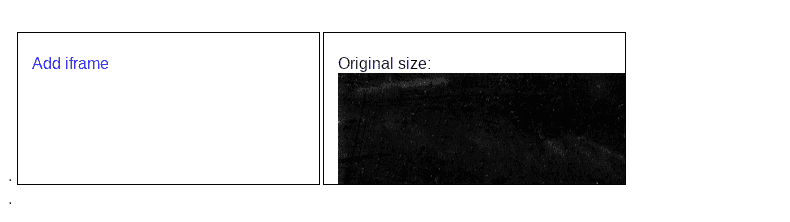

图 5：iframe 的渲染。

重复点击该页面上的链接将添加另一个递归 iframe。点击两次后，它应该看起来像图 6。

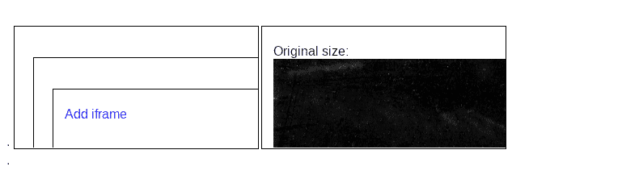

图 6：嵌套 iframe 的渲染。

让我们让其他交互也正常工作，从聚焦一个元素开始。你可以在每个标签页上聚焦于 *仅一个元素*，因此我们仍然会在 `Tab` 上存储 `focus`，但我们需要存储聚焦元素所在的 iframe：

```py
class Tab:
 def __init__(self, browser, tab_height):
 self.focus = None
 self.focused_frame = None
```

当 iframe 尝试聚焦到一个元素时，它会将自己设置为聚焦的 iframe，但在这样做之前，它需要取消之前聚焦的 iframe 的焦点：

```py
class Frame:
 def focus_element(self, node):
 # ...
 if self.tab.focused_frame and self.tab.focused_frame != self:
 self.tab.focused_frame.set_needs_render()
 self.tab.focused_frame = self
 # ...
```

我们需要重新渲染之前聚焦的 iframe，以便停止绘制焦点轮廓。

另一种交互是通过按 `Tab` 在当前框架中循环遍历可聚焦元素。让我们将 `advance_tab` 逻辑移动到 `Frame` 中，并从 `Tab` 中派发到它：这不是一个特别用户友好的多框架涉及时的标签页循环实现；请参阅练习 15-9 以获得更好的版本。

```py
class Tab:
 def advance_tab(self):
 frame = self.focused_frame or self.root_frame
 frame.advance_tab()
```

对 `keypress` 和 `enter` 也做同样的事情，它们用于与文本输入和按钮交互。

我们还需要支持另一个大型的交互功能，即滚动。我们将在每个 `Frame` 中存储滚动偏移量：

```py
class Frame:
 def __init__(self, tab, parent_frame, frame_element):
 self.scroll = 0
```

现在，如您从 第十三章 中回忆的那样，滚动发生在 `Browser` 和 `Tab` 内部，以提高响应性。这已经相当复杂了，所以为了保持简单，我们只支持根框架的线程化滚动。我们需要一个新的提交参数，以便浏览器线程知道根框架是否被聚焦：

```py
class CommitData:
 def __init__(self, url, scroll, root_frame_focused, height,
 display_list, composited_updates, accessibility_tree, focus):
 # ...
 self.root_frame_focused = root_frame_focused

class Tab:
 def run_animation_frame(self, scroll):
 root_frame_focused = not self.focused_frame or \
 self.focused_frame == self.root_frame
 # ...
 commit_data = CommitData(
 # ...
 root_frame_focused,
 # ...
 )
 # ...
```

`Browser` 线程会将此信息保存在 `commit` 中，并在用户请求滚动时使用它：

```py
class Browser:
 def commit(self, tab, data):
 # ...
 self.root_frame_focused = data.root_frame_focused

 def handle_down(self):
 self.lock.acquire(blocking=True)
 if self.root_frame_focused:
 # ...
 task = Task(self.active_tab.scrolldown)
 self.active_tab.task_runner.schedule_task(task)
 self.lock.release()
```

当一个标签页被要求滚动时，它就会滚动聚焦的框架：

```py
class Tab:
 def scrolldown(self):
 frame = self.focused_frame or self.root_frame
 frame.scrolldown()
 self.set_needs_paint()
```

如果除了根框架之外的框架被滚动，我们只需设置 `needs_composite`，这样浏览器就必须从头开始重新光栅化：

```py
class Tab:
 def run_animation_frame(self, scroll):
 # ...
 for (window_id, frame) in self.window_id_to_frame.items():
 if frame == self.root_frame: continue
 if frame.scroll_changed_in_frame:
 needs_composite = True
 frame.scroll_changed_in_frame = False
 # ...
```

滚动还有一个细微之处。在滚动之后，我们希望将滚动位置 *clamp*，以防止用户滚动到页面上的最后一项。目前 `clamp_scroll` 使用窗口高度来确定最大滚动量；让我们将这个函数移动到 `Frame` 内部，以便它可以使用当前框架的高度：

```py
class Frame:
 def scrolldown(self):
 self.scroll = self.clamp_scroll(self.scroll + SCROLL_STEP)

 def clamp_scroll(self, scroll):
 height = math.ceil(self.document.height + 2*VSTEP)
 maxscroll = height - self.frame_height
 return max(0, min(scroll, maxscroll))
```

确保在所有地方都使用 `clamp_scroll` 方法。例如，在 `scroll_to` 中：

```py
class Frame:
 def scroll_to(self, elt):
 # ...
 self.scroll = self.clamp_scroll(new_scroll)
```

此外，还有许多需要支持的辅助功能悬停交互。这很困难，因为辅助功能交互发生在浏览器线程中，该线程信息有限：

+   辅助功能树不知道 iframe 的位置，所以它不知道如何在进入框架时转换悬停坐标。

+   它也不知道 iframe 的大小，所以它不会忽略超出 iframe 边界之外的内容。注意，基于框架的 `click` 已经正确工作，因为我们只有在点击与 `iframe` 元素的边界相交时才会递归到 iframe 中。在 iframe 之前，我们不需要这样做，因为 SDL 窗口系统已经为我们做了这件事。

+   它也不知道一个框架滚动了多少，所以它不会调整已滚动的框架。

我们将创建一个 `AccessibilityNode` 的子类来存储这些信息：

```py
class FrameAccessibilityNode(AccessibilityNode):
 pass
```

我们将在每个 `iframe` 节点下方创建一个这样的实例：

```py
class AccessibilityNode:
 def build_internal(self, child_node):
 if isinstance(child_node, Element) \
 and child_node.tag == "iframe" and child_node.frame \
 and child_node.frame.loaded:
 child = FrameAccessibilityNode(child_node)
```

点击测试 `FrameAccessibilityNodes` 将使用框架的边界来忽略框架边界之外的点击，并调整与框架坐标的点击（注意我们是如何减去框架缩放边界的）：

```py
class FrameAccessibilityNode(AccessibilityNode):
 def __init__(self, node, parent=None):
 super().__init__(node, parent)
 self.scroll = self.node.frame.scroll
 self.zoom = self.node.layout_object.zoom

 def hit_test(self, x, y):
 bounds = self.bounds[0]
 if not bounds.contains(x, y): return
 new_x = x - bounds.left() - dpx(1, self.zoom)
 new_y = y - bounds.top() - dpx(1, self.zoom) + self.scroll
 node = self
 for child in self.children:
 res = child.hit_test(new_x, new_y)
 if res: node = res
 return node
```

现在应该可以正常进行点击测试，但悬停节点在屏幕上绘制时的边界仍然不正确。为此，我们需要一个返回 `AccessibilityNode` 的绝对屏幕矩形的函数。而这个函数又需要父指针来遍历辅助功能树，所以让我们先添加这个功能：

```py
class AccessibilityNode:
 def __init__(self, node, parent=None):
 # ...
 self.parent = parent

 def build_internal(self, child_node):
 if isinstance(child_node, Element) \
 and child_node.tag == "iframe" and child_node.frame \
 and child_node.frame.loaded:
 child = FrameAccessibilityNode(child_node, self)
 else:
 child = AccessibilityNode(child_node, self)
 # ...
```

现在我们已经准备好将方法映射到绝对坐标。这个循环遍历所有的边界 `Rect`s 并将它们映射到根节点。注意，对于 `FrameAccessibilityNode` 有一个特殊情况，因为它的自边界位于包含 iframe 的框架的坐标空间中。

```py
class AccessibilityNode:
 def absolute_bounds(self):
 abs_bounds = []
 for bound in self.bounds:
 abs_bound = bound.makeOffset(0.0, 0.0)
 if isinstance(self, FrameAccessibilityNode):
 obj = self.parent
 else:
 obj = self
 while obj:
 obj.map_to_parent(abs_bound)
 obj = obj.parent
 abs_bounds.append(abs_bound)
 return abs_bounds
```

此方法调用 `map_to_parent` 来调整边界。对于大多数无障碍节点，我们不需要做任何事情，因为它们与其父节点位于相同的坐标系中：

```py
class AccessibilityNode:
 def map_to_parent(self, rect):
 pass
```

另一方面，`FrameAccessibilityNode` 调整 iframe 的位置和裁剪：

```py
class FrameAccessibilityNode(AccessibilityNode):
 def map_to_parent(self, rect):
 bounds = self.bounds[0]
 rect.offset(bounds.left(), bounds.top() - self.scroll)
 rect.intersect(bounds)
```

你现在应该能够悬停在节点上，让我们的无障碍子系统读取它们。

好的，我们现在已经让浏览器中所有用户交互的形式都正确地通过框架树进行递归。现在是时候给 iframe 添加更多功能了。

我们的浏览器只能在浏览器线程上滚动根框架，但真实浏览器已经投入了[大量工作](https://developer.chrome.com/articles/renderingng/#threaded-scrolling-animations-and-decode)来尽可能在浏览器线程上实现滚动，包括 iframe。难点在于处理包含块、[堆叠顺序](https://developer.mozilla.org/en-US/docs/Web/CSS/CSS_Positioning/Understanding_z_index/The_stacking_context)、[滚动条](https://developer.mozilla.org/en-US/docs/Web/CSS/overflow)、变换和 iframe 的许多晦涩组合：在浏览器线程上进行滚动时，所有这些复杂交互都必须从主线程传递到浏览器线程，并且由双方正确解释。

# Iframe 脚本

我们现在已经让用户与 iframe 进行交互——但是脚本如何与它们交互呢？当然，每个框架已经可以运行脚本——但现在，每个 `Frame` 都有自己的 `JSContext`，所以这些脚本实际上无法相互交互。相反，*同源* iframe 应该在同一个 JavaScript 上下文中运行，并且应该能够访问彼此的全局变量，调用彼此的函数，并修改彼此的 DOM，如图 7 所示。让我们来实现这一点。

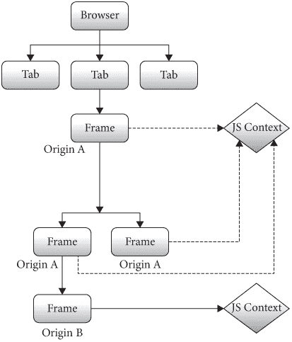

图 7：同一标签页内的多个框架可以共享单个 `JSContext`。

为了让两个框架的 JavaScript 环境交互，我们需要将它们放在同一个 `JSContext` 中。因此，而不是每个 `Frame` 都有自己的 `JSContext`，我们希望在 `Tab` 上存储 `JSContext`s，在一个将源映射到 JavaScript 上下文的字典中：

```py
class Tab:
 def __init__(self, browser, tab_height):
 # ...
 self.origin_to_js = {}

 def get_js(self, url):
 origin = url.origin()
 if origin not in self.origin_to_js:
 self.origin_to_js[origin] = JSContext(self, origin)
 return self.origin_to_js[origin]
```

然后，每个 `Frame` 将向 `Tab` 请求其 JavaScript 上下文：

```py
class Frame:
 def load(self, url, payload=None):
 # ...
 self.js = self.tab.get_js(url)
 # ...
```

因此，我们有了多个页面的脚本使用一个 JavaScript 上下文。但现在我们必须以某种方式保持它们的变量在自己的命名空间中。关键将是`window`全局变量，其类型为`Window`。在浏览器中，这指的是[全局对象](https://developer.mozilla.org/en-US/docs/Glossary/Global_object)，你可以用`window.a`代替写一个全局变量`a`。有[各种提议](https://github.com/tc39/proposal-shadowrealm)将多个全局命名空间作为 JavaScript API 暴露出来。如果在这一章中拥有这种能力，将非常方便，可以避免在各个地方都写`window`。为了使我们的实现简单，在我们的浏览器中，脚本将始终需要通过`window`来引用变量和函数。这也意味着脚本中的所有全局变量都需要这样做，即使它们不是浏览器 API。在我们的运行时中，我们也需要这样做：

```py
window.console = { log: function(x) { call_python("log", x); } }

// ...

window.Node = function(handle) { this.handle = handle; }

// ...
```

对于`runtime.js`文件中的每个函数或变量，都要这样做。如果你遗漏了一个，你会得到这样的错误：

```py
dukpy.JSRuntimeError: ReferenceError: identifier 'Node'
    undefined
    duk_js_var.c:1258
    eval src/pyduktape.c:1 preventsyield
```

如果你看到这个错误，这意味着你需要找到你需要将`window.Node`而不是`Node`写入的地方。你还需要修改`EVENT_DISPATCH_JS`以在类名前加上`window`：

```py
EVENT_DISPATCH_JS = \
 "new window.Node(dukpy.handle)" + \
 ".dispatchEvent(new window.Event(dukpy.type))"
```

之前章节中的示例在运行之前也需要进行类似的修复。例如，`setTimeout`可能需要更改为`window.setTimeout`。

要在单个 JavaScript 上下文中让多个帧的脚本协同工作，我们将创建多个`Window`对象：`window_1`、`window_2`等等。在运行一个帧的脚本之前，我们将`window`设置为该帧的`Window`对象，这样脚本就能使用正确的`Window`。一些 JavaScript 引擎支持用于更改全局对象的 API，但我们所使用的 DukPy 库并不支持。确实存在一个名为`with`的标准 JavaScript 运算符，它某种程度上可以做到这一点，但其规则很复杂，并不完全符合我们的需求。现在也不推荐使用它。

因此，让我们在创建`JSContext`时定义`Window`类：

```py
class JSContext:
 def __init__(self, tab, url_origin):
 self.url_origin = url_origin
 # ...
 self.interp.evaljs("function Window(id) { this._id = id };")
```

现在，当一个帧被创建并想要使用`JSContext`时，它需要首先请求创建一个`window`对象：

```py
class JSContext:
 def add_window(self, frame):
 code = "var window_{} = new Window({});".format(
 frame.window_id, frame.window_id)
 self.interp.evaljs(code)

class Frame:
 def load(self, url, payload=None):
 # ...
 self.js = self.tab.get_js(url)
 self.js.add_window(self)
 # ...
```

在运行任何 JavaScript 之前，我们希望更改`window`全局变量所指向的窗口：

```py
class JSContext:
 def wrap(self, script, window_id):
 return "window = window_{}; {}".format(window_id, script)
```

我们可以用这个来，例如，为每个`Frame`设置初始的运行时环境：

```py
class JSContext:
 def add_window(self, frame):
 # ...
 self.interp.evaljs(self.wrap(RUNTIME_JS, frame.window_id))
```

我们需要在使用`evaljs`时调用`wrap`，这也意味着我们需要将窗口 ID 参数添加到许多方法中。例如，在`run`中，我们将添加一个`window_id`参数：

```py
class JSContext:
 def run(self, script, code, window_id):
 try:
 code = self.wrap(code, window_id)
 self.interp.evaljs(code)
 except dukpy.JSRuntimeError as e:
 print("Script", script, "crashed", e)
```

我们将从`load`方法传递这个参数：

```py
class Frame:
 def load(self, url, payload=None):
 for script in scripts:
 # ...
 task = Task(self.js.run, script_url, body,
 self.window_id)
 # ...
```

同样适用于各种分发 API。例如，要分发一个事件，我们需要`window_id`：

```py
class JSContext:
 def dispatch_event(self, type, elt, window_id):
 # ...
 code = self.wrap(EVENT_DISPATCH_JS, window_id)
 do_default = self.interp.evaljs(code,
 type=type, handle=handle)
```

同样，我们还需要在 `click`、`submit_form` 和 `keypress` 中传递窗口 ID 参数；我已经省略了那些代码片段。请注意，您应该已经修改了 `runtime.js` 文件，以便在 `window` 对象上存储 `LISTENERS`，这意味着每个 `Frame` 都将有一组自己的事件监听器来分发：

```py
window.LISTENERS = {}

// ...

window.Node.prototype.dispatchEvent = function(evt) {
 var type = evt.type;
 var handle = this.handle
 var list = (window.LISTENERS[handle] &&
 window.LISTENERS[handle][type]) || [];
 for (var i = 0; i < list.length; i++) {
 list[i].call(this, evt);
 }
 return evt.do_default;
}
```

对于 `requestAnimationFrame`，也要这样做，传递窗口 ID 并将代码包装起来，以便它正确地引用 `window`。

对于从 JavaScript 到浏览器的调用，我们需要 JavaScript 传递它调用的窗口 ID：

```py
window.document = { querySelectorAll: function(s) {
 var handles = call_python("querySelectorAll", s, window._id);
 return handles.map(function(h) { return new window.Node(h) });
}}
```

然后在浏览器端，我们可以使用那个窗口 ID 来获取 `Frame` 对象：

```py
class JSContext:
 def querySelectorAll(self, selector_text, window_id):
 frame = self.tab.window_id_to_frame[window_id]
 selector = CSSParser(selector_text).selector()
 nodes = [node for node
 in tree_to_list(frame.nodes, [])
 if selector.matches(node)]
 return [self.get_handle(node) for node in nodes]
```

在 `innerHTML` 和 `style` 中，我们还需要类似的东西，因为我们需要在相关的 `Frame` 上调用 `set_needs_render`。

最后，对于 `setTimeout` 和 `XMLHttpRequest`，它们涉及到从 JavaScript 调用浏览器，然后从浏览器调用 JavaScript，我们同样需要从 JavaScript 传递一个窗口 ID，并在回调到 JavaScript 时使用该窗口 ID。我在这一节中省略了许多代码更改，因为它们相当重复。您可以通过在代码库中搜索 `evaljs` 来找到所有需要的位置。

因此，我们现在已经隔离了不同的帧。接下来，让我们让它们进行交互。

同源 iframe 可以访问彼此的状态，但跨源 iframe 则不能。但是神秘的 `domain` [属性](https://developer.mozilla.org/en-US/docs/Web/API/Document/domain) 允许 iframe 改变其源，在某些情况下将其移动到或从同源状态中。我个人认为这是一个错误特性：它很难安全实现，并且会干扰各种沙箱技术；我希望它最终会被从网络中移除。相反，有一些 [各种头信息](https://html.spec.whatwg.org/multipage/browsers.html#origin-isolation)，iframe 可以选择进行更少的共享以获得更好的安全性和性能。

# 之间的帧通信

现在，我们已经成功地在单个 `JSContext` 中运行了多个 `Frame` 的 JavaScript，并在一定程度上隔离了它们，以便它们不会相互干扰状态。但这个练习的全部目的是允许同源帧之间进行某些交互。现在让我们这样做。

两个帧之间最简单的方式是它们可以通过 `Window` 对象上的 `parent` 属性访问彼此的状态。如果两个帧有相同的源，这允许一个帧调用方法、访问变量并修改另一个帧的浏览器状态。因为我们让这些同源帧共享一个 `JSContext`，所以这并不难实现。基本上，我们需要一种从窗口 ID 到其父帧窗口 ID 的转换方式：

```py
class JSContext:
 # ...
 def parent(self, window_id):
 parent_frame = \
 self.tab.window_id_to_frame[window_id].parent_frame
 if not parent_frame:
 return None
 return parent_frame.window_id
```

在 JavaScript 端，我们现在需要根据窗口 ID 查找 `Window` 对象。您有很多方法可以做到这一点，但最简单的方法是使用全局映射：

```py
class JSContext:
 def __init__(self, tab, url_origin):
 # ...
 self.interp.evaljs("WINDOWS = {}")
```

我们将在创建每个窗口时将其添加到全局映射中：

```py
class JSContext:
 def add_window(self, frame):
 # ...
 self.interp.evaljs("WINDOWS[{}] = window_{};".format(
 frame.window_id, frame.window_id))
```

现在 `window.parent` 可以在这个全局映射中查找正确的 `Window` 对象：

```py
Object.defineProperty(Window.prototype, 'parent', {
 configurable: true,
 get: function() {
 var parent_id = call_python('parent', window._id);
 if (parent_id != undefined) {
 var parent = WINDOWS[parent_id];
 if (parent === undefined) parent = new Window(parent_id);
 return parent;
 }
 }
});
```

注意，如果父框架不在与当前窗口相同的源中，那么在 `WINDOWS` 中的查找可能会失败，因此它不会在同一个 `JSContext` 中运行。在这种情况下，此代码将返回一个具有该 id 的新 `Window` 对象。但是，iframe 不允许跨源访问彼此的文档（或调用其他不安全的 API），因此添加一个检查这种情况并引发异常的方法：

```py
class JSContext:
 def throw_if_cross_origin(self, frame):
 if frame.url.origin() != self.url_origin:
 raise Exception(
 "Cross-origin access disallowed from script")
```

然后在所有访问文档的 `JSContext` 方法中使用此方法：请注意，在实际浏览器中，这显然是不够安全的。一个真正的浏览器需要非常仔细地锁定整个 `runtime.js` 代码，并仔细检查每个 JavaScript API。

```py
class JSContext:
 def querySelectorAll(self, selector_text, window_id):
 frame = self.tab.window_id_to_frame[window_id]
 self.throw_if_cross_origin(frame)
 # ...

 def setAttribute(self, handle, attr, value, window_id):
 frame = self.tab.window_id_to_frame[window_id]
 self.throw_if_cross_origin(frame)
 # ...

 def innerHTML_set(self, handle, s, window_id):
 frame = self.tab.window_id_to_frame[window_id]
 self.throw_if_cross_origin(frame)
 # ...

 def style_set(self, handle, s, window_id):
 frame = self.tab.window_id_to_frame[window_id]
 self.throw_if_cross_origin(frame)
 # ...
```

因此，同源 iframes 可以通过 `parent` 进行通信。但跨源 iframes 呢？允许它们访问彼此的变量或调用彼此的方法将是不安全的，因此浏览器允许一种形式的 [*消息传递*](https://en.wikipedia.org/wiki/Message_passing)，这是一种在两个不同事件循环之间进行结构化通信的技术，不需要任何共享状态或锁。

JavaScript 中的消息传递工作方式如下：你会在你想要与之通信的 `Window` 对象上调用 `postMessage` API，消息本身作为第一个参数，`*` 作为第二个参数：第二个参数与源限制有关；参见练习 15-8。

```py
window.parent.postMessage("...", '*')
```

这将发送第一个参数到父框架，父框架可以通过在其 `Window` 对象上处理 `message` 事件来接收消息：

```py
window.addEventListener("message", function(e) {
 console.log(e.data);
});
```

注意，在这个第二个代码片段中，`window` 是接收 `Window`，与第一个片段中的 `window` 不同。

让我们从 *接收方* 开始实现 `postMessage`。由于此事件发生在 `Window` 上，而不是 `Node` 上，我们需要一个新的 `WINDOW_LISTENERS` 数组：

```py
window.WINDOW_LISTENERS = {}
```

每个监听器都会使用 `MessageEvent` 对象被调用：

```py
window.MessageEvent = function(data) {
 this.type = "message";
 this.data = data;
}
```

事件监听器和分发代码与 `Node` 相同，只是它是在 `Window` 上，并使用 `WINDOW_LISTENERS`。你可以直接复制这些方法：

```py
Window.prototype.addEventListener = function(type, listener) {
 // ...
}

Window.prototype.dispatchEvent = function(evt) {
 // ...
}
```

这就是接收方的一切；现在让我们来做发送方。首先，让我们实现 `postMessage` API 本身。注意，`this` 是接收器或目标窗口：

```py
Window.prototype.postMessage = function(message, origin) {
 call_python("postMessage", this._id, message, origin)
}
```

在浏览器中，`postMessage` 方法会在 `Tab` 上安排一个任务：

```py
class JSContext:
 def postMessage(self, target_window_id, message, origin):
 task = Task(self.tab.post_message,
 message, target_window_id)
 self.tab.task_runner.schedule_task(task)
```

调度任务是有必要的，因为`postMessage`是一个异步 API；发送同步消息可能需要同步多个`JSContext`，甚至多个进程，这会增加很多开销，并可能导致死锁。

该任务找到目标框架并调用一个调度方法：

```py
class Tab:
 def post_message(self, message, target_window_id):
 frame = self.window_id_to_frame[target_window_id]
 frame.js.dispatch_post_message(
 message, target_window_id)
```

然后调用我们刚刚编写的 JavaScript `dispatchEvent`方法：

```py
POST_MESSAGE_DISPATCH_JS = \
 "window.dispatchEvent(new window.MessageEvent(dukpy.data))"

class JSContext:
 def dispatch_post_message(self, message, window_id):
 self.interp.evaljs(
 self.wrap(POST_MESSAGE_DISPATCH_JS, window_id),
 data=message)
```

现在，你应该能够使用`postMessage`在框架之间发送消息，例如，在[iframe 演示](https://browser.engineering/examples/example15-iframe.html)中，你应该看到“从 iframe 接收到的消息：这是 postMessage 的内容。”打印到控制台。（这个特定的例子使用的是同源的`postMessage`。你可以通过在不同的端口上启动两个本地 HTTP 服务器来测试跨源，然后更改`example15-img.html` iframe 文档的 URL，指向第二个端口。）包括在不同的`JSContext`中运行的跨源框架，以安全的方式进行。

广告通常使用 iframe 提供，并且是网络沙箱、嵌入和动画原语的大用户。这意味着它们是性能和[用户体验](https://en.wikipedia.org/wiki/User_experience)问题的挑战性来源。例如，广告[分析](https://en.wikipedia.org/wiki/Web_analytics)对于广告经济很重要，但涉及运行大量代码和测量大量数据。一些 Web API，如[Intersection Observer](https://developer.mozilla.org/en-US/docs/Web/API/Intersection_Observer_API)，基本上是为了使分析计算更高效而存在的。当然，广告拦截器可能是最受欢迎的[浏览器扩展](https://en.wikipedia.org/wiki/Browser_extension)。

# 隔离和定时

Iframe 在第十章中讨论的基础上增加了全新的安全挑战。将一个网页嵌入到另一个网页中的能力，当两个页面不信任对方时，就会产生相应的安全风险——无论是将不受信任的页面嵌入到自己的页面中，还是相反，攻击者将你的页面嵌入到他们的恶意页面中。在这两种情况下，我们都希望保护你的页面免受其他框架造成的任何安全或隐私风险。网站可以通过`X-Frame-Options`头防止被 iframe。

起始点是跨源 iframe 不能通过 JavaScript 直接访问彼此。这是好的——但如果 JavaScript 引擎中的错误，比如一个[缓冲区溢出](https://en.wikipedia.org/wiki/Buffer_overflow)，让 iframe 绕过这些保护呢？不幸的是，这样的错误很常见，以至于浏览器必须防御它们。例如，现在的浏览器在不同的操作系统进程中运行来自不同源的内容[不同的操作系统进程](https://www.chromium.org/Home/chromium-security/site-isolation/)，并使用操作系统功能来限制这些进程的访问权限。

浏览器中的其他部分会混合来自多个框架的内容，例如我们浏览器的`Tab`全屏显示列表。这意味着，如果光栅化器中存在漏洞，一个框架可能会接管光栅化器，然后读取最终来自另一个框架的数据。这听起来可能是一个相当复杂的攻击，但这种情况已经发生过，因此现代浏览器使用[沙箱技术](https://chromium.googlesource.com/chromium/src/+/main/docs/linux/sandboxing.md)来防止此类攻击。例如，Chromium 可以将光栅化器放置在其自己的进程中，并使用 Linux 的一个名为`seccomp`的功能来限制该进程可以做出的系统调用。即使漏洞影响了光栅化器，该光栅化器也无法通过网络泄露数据，从而防止私人数据泄露。

这些隔离和沙箱功能可能看起来“简单”，就像我们在第十二章中添加的浏览器线程“简单”一样。实际上，众多的浏览器 API 意味着实现充满了微妙之处，最终变得极其复杂。例如，Chromium 花费了多年时间才发布了[*网站隔离*](https://www.chromium.org/Home/chromium-security/site-isolation/)的第一个实现。

由于 CPU 缓存时间攻击被称为[*spectre*和*meltdown*](https://meltdownattack.com/)，近年来，网站隔离变得尤为重要。简而言之，这些攻击允许攻击者通过测量某些 CPU 操作所需的时间来读取内存中的任意位置——包括另一个框架的数据，如果两个框架位于同一进程中。将敏感内容放置在不同的 CPU 进程中（每个进程都有自己的内存地址空间）是防范这些攻击的良好保护措施。

话虽如此，这类*时间攻击*可能很微妙，而且无疑还有更多尚未被发现。为了减轻这种威胁，浏览器目前阻止了对*高精度计时器*的访问，这些计时器可以提供通常用于时间攻击的精确时间数据。例如，浏览器降低了`Date.now`或`setTimeout`等 API 的精度。

更糟糕的是，有些浏览器 API 看起来不像计时器，但可以用作计时器。例如，[SharedArrayBuffer](https://developer.mozilla.org/en-US/docs/Web/JavaScript/Reference/Global_Objects/SharedArrayBuffer) API 允许两个 JavaScript 线程并发运行并共享内存，这可以用来[构建时钟](https://security.stackexchange.com/questions/177033/how-can-sharedarraybuffer-be-used-for-timing-attacks)。这些 API 很有用，所以浏览器并不想完全移除它们，但也没有办法使它们“更不准确”，因为它们本来就不是时钟。现在，浏览器要求在父框架和子框架的 HTTP 响应中存在[某些可选的 HTTP 头](https://developer.mozilla.org/en-US/docs/Web/JavaScript/Reference/Global_Objects/SharedArrayBuffer#security_requirements)，以便允许特别使用`SharedArrayBuffer`，尽管这不是一个完美的解决方案。

当我为[书籍网站](https://browser.engineering)上的嵌入浏览器小部件添加[JavaScript 支持](https://browserbook.substack.com/p/javascript-in-javascript)时，`SharedArrayBuffer`问题引起了问题。我正在使用`SharedArrayBuffer`来允许从`JSContext`到浏览器的同步调用，而这需要浏览器出于安全原因限制的 API。设置安全头不会起作用，因为第十四章嵌入了一个 YouTube 视频，而当我写这篇文章时，YouTube 没有发送这些头。最后，我通过不嵌入浏览器小部件并[要求读者](http://browser.engineering/scripts.html#outline)打开新浏览器窗口来解决这个问题。

# 摘要

本章介绍了浏览器如何处理嵌入内容用例，如图片和 iframe。重申主要观点：

+   非 HTML *嵌入内容*——图片、视频、画布、iframe、输入元素和插件——可以嵌入到网页中。

+   嵌入内容带来了自己的性能问题——如图像解码时间——并需要定制优化。

+   Iframes 是一种特别重要的嵌入内容，随着时间的推移，已经取代了浏览器插件，成为将复杂内容轻松嵌入网页的标准方式。

+   Iframes 将网络的所有复杂性——渲染、事件处理、导航、安全——引入浏览器对嵌入内容的处理中。然而，这种复杂性是合理的，因为它们使得像广告、视频和社交媒体按钮这样的跨源用例成为可能。

并且，正如我们希望你在本章中看到的，这些功能并不难实现，尽管——正如你将在练习中看到的——实现它们需要很多细节上的关注。

点击这里尝试本章的浏览器。

# 概述

我们浏览器中的完整函数、类和方法集现在应该看起来像这样：

# 练习

15-1 *画布元素*. 实现了 `<canvas>` 元素，这是 `getContext` API 的 2D 部分，以及 `CanvasRenderingContext2D` 上的某些绘图命令。Canvas 布局就像一个 iframe，包括其默认的宽度和高度。当调用 `getContext("2d")` 时，你应该分配一个适当大小的 Skia 表面，并实现一些绘制到画布上的 API。请注意，Canvas API 会立即将每个绘图命令转换为位图，而不是等待整个页面被转换为位图。这被称为 *即时模式* 渲染——与 HTML 使用的 [*保留模式*](https://en.wikipedia.org/wiki/Retained_mode) 相反。即时模式意味着网络开发者决定何时产生位图化时间。将大多数 API 方法翻译成 Skia 相当应的方法应该是直截了当的。

15-2 *背景图片*. 元素可以有 `background-image` 属性。实现这个 CSS 属性的基本功能：为 `background-image` 属性提供一个 `url(...)` 值。如果 `background-image` 属性实际上没有在任何元素上使用，则避免加载图片。作为一个更大的挑战，还允许网页使用 `background-size` CSS 属性设置背景图片的大小。

15-3 *`object-fit`*. 实现了 `object-fit` CSS 属性。它决定了 `` 元素内的图片相对于其容器元素的大小。这需要剪裁不同宽高比的图片。

15-4 *懒加载*. 下载图片可能会使用相当多的数据。在互联网的早期，计算机网络足够慢，以至于浏览器有一个用户设置可以禁用图片的下载，直到用户明确请求它们。虽然浏览器默认立即下载页面上的所有图片，但 `img` 元素上的 `loading` 属性可以指示浏览器仅在图片接近页面可见区域时才下载图片。这种优化通常被称为 [懒加载](https://developer.mozilla.org/en-US/docs/Web/Performance/Lazy_loading)。实现 `loading`。确保在图片加载完成前后页面布局都是正确的。

15-5 *Iframe 宽高比*. 实现了 `aspect-ratio` CSS 属性，并使用它为 iframe 和图片提供隐式大小，当只指定了 `width` 或 `height` 之一时（或者当图片尚未加载，如果你做了 15-4 练习），或者当图片尚未加载时（如果你做了 15-4 练习）。

15-6 *图像占位符*. 在懒加载的基础上，实现尚未加载的图像的占位符样式。这是通过设置 0×0 的大小来完成的，除非指定了`width`或`height`。另外，如果`alt`属性缺失或为空，还应添加隐藏“损坏的图像”的支持。这是因为如果提供了`alt`文本，浏览器可以假设图像对网站的意义很重要，因此如果图像加载失败，它应该告诉用户他们错过了一些内容。但否则，损坏的图像图标可能只是丑陋的杂乱。

15-7 *媒体查询*. 实现`width`媒体查询。确保它在 iframe 内部工作。还要确保即使 iframe 的宽度被其父框架更改，它也能正常工作。

15-8 *`postMessage`的目标源*. 实现对`postMessage`的`targetOrigin`参数，该参数是一个字符串，表示允许接收消息的框架源。

15-9 *多框架焦点*. 在我们的浏览器中，按下`Tab`会在当前焦点的框架中循环遍历元素。但这意味着仅通过键盘无法访问其他框架中的可聚焦元素。修复这个问题，以便在遍历完一个框架中所有可聚焦元素后，能够在框架之间切换。

15-10 *Iframe 历史记录*. 确保 iframe 影响浏览器历史记录。例如，如果你在 iframe 内部点击一个链接，然后点击后退按钮，它应该回到 iframe 内部。确保即使在用户以不同顺序点击多个框架中的链接时，这也应该正常工作。关于这是否是 iframe 的好特性，存在争议，因为它会给嵌入 iframe 但不打算导航的网页开发者带来很多困惑。

15-11 *脚本添加或删除的 iframe*. `innerHTML` API 可能导致 iframe 的添加或删除，但在此发生时，我们的浏览器不会加载或卸载它们。修复这个问题：新的 iframe 应该被加载，旧的 iframe 应该被卸载。

15-12 *`X-Frame-Options`*. 实现[这个头部](https://developer.mozilla.org/en-US/docs/Web/HTTP/Headers/X-Frame-Options)，它禁止网页在 iframe 中显示。

# 重复使用之前的计算

Web 浏览器工程的第十六章。

+   编辑内容

+   为什么需要失效？

+   幂等性

+   依赖项

+   受保护的字段

+   递归失效

+   保护宽度

+   内联元素的宽度

+   使布局字段失效

+   保护内联布局

+   跳过无操作更新

+   跳过遍历

+   细粒度样式失效

+   分析依赖项

+   总结

+   大纲

+   练习

合成（见第十三章）使动画更平滑，但它对影响布局的交互（如文本编辑或 DOM 修改）没有帮助。幸运的是，我们可以通过将布局树视为一种缓存来避免冗余的布局工作，并且只重新计算变化的部分。这种**无效化**技术传统上很复杂且容易出错，但我们将使用一种原则性的方法以及简单的抽象来使其可管理。

# 编辑内容

在第十三章中，我们使用了合成来平滑地动画化 CSS 属性，如`transform`或`opacity`。但这种方式无法动画化**布局诱导**属性，如`width`或`font-size`，因为它们不仅改变**显示列表**，也改变**布局树**。虽然最好避免动画化布局诱导属性，但许多改变布局树的用户交互需要做出响应。

一个很好的例子是编辑文本。人们打字速度很快，所以即使只有几帧的延迟也会分散注意力。但编辑会改变 HTML 树，因此也会改变布局树。从头开始重建布局树，这是我们浏览器目前所做的那样，在复杂页面上可能会非常慢。例如，尝试在我们的浏览器中加载[本章的网页版本](https://browser.engineering/invalidation.html)，并在本段之后出现的输入框中输入文字……你会发现它非常慢——仅在`render`阶段就用了 1.7 秒！[在此追踪](https://browser.engineering/examples/example16-input-no-optimizations.trace)。

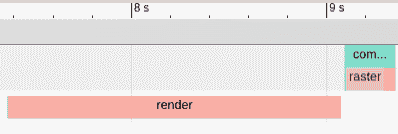

图 1：无任何无效化优化输入的示例。

在`input`元素中输入可以特殊处理，`input`元素在输入时不会改变大小，且`input`元素中的文本不会获得自己的布局对象，因此输入到`input`元素中实际上不需要引起布局，只需绘制即可。但还有其他文本编辑 API 不能这样做。例如，`contenteditable`属性可以使任何元素可编辑。`contenteditable`属性可以将任何页面上的任何元素变成一个活生生的文档。这就是我们实现这本书“错别字”功能的方式：输入`Ctrl-E`（或在 Mac 上为`Cmd-E`）来打开它。源代码在[网站上](https://browser.engineering/feedback.js)；查看`contenteditable`属性的`typo_mode`函数。

点击此**格式化**的**文本**进行编辑，包括富文本！

让我们在浏览器中实现最基本可能的`contenteditable`版本——这是一个有用的功能，也是对无效化的良好测试。首先，我们需要使具有`contenteditable`属性的元素可聚焦：实际上，在真实浏览器中，`contenteditable`可以设置为`true`或`false`，而`false`在您想在可编辑元素内部有一个不可编辑的元素时很有用。但我不打算在我们的浏览器中实现这一点。

```py
def is_focusable(node):
 # ...
 elif "contenteditable" in node.attributes:
 return True
 # ...
```

一旦我们聚焦到一个可编辑节点，键入应该会编辑它。一个真正的浏览器会处理光标移动和所有各种复杂情况，但我会保持简单，只将每个字符添加到可编辑元素中的最后一个文本节点。首先我们需要找到这个文本节点：

```py
class Frame:
 def keypress(self, char):
 # ...
 elif self.tab.focus and \
 "contenteditable" in self.tab.focus.attributes:
 text_nodes = [
 t for t in tree_to_list(self.tab.focus, [])
 if isinstance(t, Text)
 ]
 if text_nodes:
 last_text = text_nodes[-1]
 else:
 last_text = Text("", self.tab.focus)
 self.tab.focus.children.append(last_text)
```

注意，如果可编辑元素没有文本子元素，我们创建一个新的。然后我们将键入的字符添加到这个元素：

```py
class Frame:
 def keypress(self, char):
 elif self.tab.focus and \
 "contenteditable" in self.tab.focus.attributes:
 # ...
 last_text.text += char
 self.set_needs_render()
```

这足以使编辑工作，但方便起见，也可以绘制一个光标以确认元素已聚焦并显示编辑将去哪里。让我们在`BlockLayout`中这样做：

```py
class BlockLayout:
 def paint(self):
 # ...
 if self.node.is_focused \
 and "contenteditable" in self.node.attributes:
 text_nodes = [
 t for t in tree_to_list(self, [])
 if isinstance(t, TextLayout)
 ]
 if text_nodes:
 cmds.append(DrawCursor(text_nodes[-1],
 text_nodes[-1].width))
 else:
 cmds.append(DrawCursor(self, 0))
 # ...
```

在这里，`DrawCursor`只是`DrawLine`的一个包装器：

```py
def DrawCursor(elt, offset):
 x = elt.x + offset
 return DrawLine(x, elt.y, x, elt.y + elt.height, "red", 1)
```

我们也可以在`InputLayout`中使用这个包装器：

```py
class InputLayout(EmbedLayout):
 def paint(self):
 if self.node.is_focused and self.node.tag == "input":
 cmds.append(DrawCursor(self, self.font.measureText(text)))
```

您现在可以在浏览器中编辑[本章页面](https://browser.engineering/invalidation.html)上的示例——但是每个按键都会超过一秒，这使得编辑体验令人沮丧。所以让我们加快这个速度。

文本编辑如果包含像光标亲和力（如果一行在单词中间被换行，光标位于哪一行）这样的棘手概念，[异常困难](https://lord.io/text-editing-hates-you-too/)，还有 Unicode 处理、[双向文本](http://unicode.org/faq/bidi.html)以及将文本格式与编辑混合。因此，浏览器实现所有这些复杂性并隐藏在`contenteditable`后面是个好事。

# 为什么需要无效化？

基本上，在我们浏览器中编辑这个页面慢的原因是它相当大。毕竟，处理按键按下并不慢：将一个字符追加到`Text`节点几乎不花时间。花时间的是之后的整个页面重绘。

我们希望交互快速，即使在大型、复杂的页面上也是如此，所以我们希望页面重绘的时间与*更改的大小*成比例，而不是与*页面的大小*成比例。我称之为*增量性能原则*，这对于处理大型和复杂的 Web 应用至关重要。这不仅使文本编辑变得快速，还意味着开发者可以一次考虑一次性能，而不必考虑整个页面的内容。因此，增量性能对于复杂应用是必要的。

但增量性能的原则也真正限制了我们的浏览器实现。例如，即使*遍历*整个布局树也需要与整个页面成比例的时间，而不是与所做的更改成比例，所以我们甚至负担不起这样做。

要实现增量性能，我们需要对初始渲染和后续的重新渲染进行不同的思考。虽然初始渲染和后续渲染在某些方面概念上不同，但它们将使用相同的代码路径。基本上，初始渲染将从无页面到初始页面的一个巨大变化，而后续的重新渲染将处理较小的变化。毕竟，一个页面可以使用`innerHTML`来替换整个页面；这将是一个很大的变化，渲染它将花费与整个页面成比例的时间，因为变化的大小就是整个页面的尺寸！关键是：所有这些最终都将使用相同的代码路径。当页面首次加载时，渲染将花费与页面大小成比例的时间。但我们将初始渲染视为缓存。后续的渲染将*失效*并重新计算缓存的部分，花费与变化大小成比例的时间，但不会触及页面的大部分内容。我相信，即使不实现本章中的失效技术，也可能有各种性能改进，但失效对于增量性能仍然是至关重要的，这是一种渐近保证，仅通过微优化是无法实现的。在真实浏览器中，渲染管道的每一步都需要是增量式的，但本章重点在于布局。为什么是布局？因为布局既重要又足够复杂，可以展示大多数核心挑战和技术。

这种缓存和失效方法的关键将是跟踪变化的影响。当页面的一部分，如`style`属性发生变化时，依赖于它的其他事物，如该元素的大小，也会发生变化。因此，我们需要构建一个详细的*依赖图*，直到每个布局字段的级别，并使用该图来确定需要重新计算的内容。它将类似于我们的`needs_style`和`needs_layout`标志，但规模要大得多。因此，本章的大部分内容都是关于在依赖图中跟踪依赖关系，并构建抽象来帮助我们做到这一点。为了使用这些抽象，我们需要对我们的布局引擎进行重大重构。但增量化布局将允许我们跳过布局的两个最昂贵的部分：构建布局树和遍历它来计算布局字段。当我们完成时，重新布局对于像文本编辑这样的小变化将只需不到一毫秒的时间。

增量性能的原则是使浏览器成为一个良好平台的部分原因。记住，网络是*声明性的*：网页只关心*描述*页面的外观，而浏览器负责实现这种描述。对我们浏览器工程师来说，这创造了一大堆复杂性。但想想整个网络——它不仅涉及浏览器工程师，还涉及网页开发人员和用户。在浏览器中实现复杂的失效算法让网页开发人员能够专注于制作更有趣的应用程序，并为用户提供更好的、更响应式的体验。声明性网络使得失效算法一旦编写就可以自动惠及所有人。

# 一致性

如果我们要实现这个缓存和失效的想法，第一个障碍是每次布局阶段运行时，我们的浏览器都会从头开始重建布局树：

```py
class Frame:
 def render(self):
 if self.needs_layout:
 self.document = DocumentLayout(self.nodes, self)
 self.document.layout(self.frame_width, self.tab.zoom)
 # ...
```

通过重新开始一个新的`DocumentLayout`，我们忽略了所有的旧布局信息，从头开始；我们实际上是在*使整个树无效*。因此，我们的第一个优化必须避免这一点，尽可能重用布局对象。这样既可以节省分配内存的时间，又可以通过保留旧布局信息来实现缓存和失效的方法。

但在直接进入编码之前，让我们回顾一下布局对象是如何创建的。在你的浏览器代码中搜索`Layout`，因为所有布局类名都以它结尾。你应该会看到布局对象只在几个地方被创建：

+   `DocumentLayout`对象是在`render`中由`Frame`创建的；

+   `BlockLayout`对象是由以下任一方式创建的：

    +   在`layout`中的`DocumentLayout`，

    +   在`layout`中的`BlockLayout`；

+   `LineLayout`对象是在`BlockLayout`的`new_line`方法中创建的；

+   其他所有对象都是由`BlockLayout`在`add_inline_child`中创建的。

让我们从`DocumentLayout`开始。它是在`render`中创建的，并且它的两个参数`nodes`和`self`每次都是相同的。这意味着每次都会创建相同的`DocumentLayout`。如果`DocumentLayout`构造函数有副作用或读取全局状态，那就不会是这样了。但事实上它没有这样做。这是浪费的；让我们只在`load`中创建一次`DocumentLayout`：

```py
class Frame:
 def load(self, url, payload=None):
 # ...
 self.document = DocumentLayout(self.nodes, self)
 self.set_needs_render()

 def render(self):
 if self.needs_layout:
 self.document.layout(self.frame_width, self.tab.zoom)
 # ...
```

接下来，让我们看看`DocumentLayout`在哪里构建一个`BlockLayout`：

```py
class DocumentLayout:
 def layout(self, width, zoom):
 child = BlockLayout(self.node, self, None, self.frame)
 # ...
```

再次强调，构造函数参数不能改变，所以我们又可以跳过重建这个布局对象，如下所示：

```py
class DocumentLayout:
 def layout(self, width, zoom):
 if not self.children:
 child = BlockLayout(self.node, self, None, self.frame)
 else:
 child = self.children[0]
 # ...
```

但不要立即运行带有这些更改的浏览器！通过重用布局对象，我们最终会在同一个对象上多次运行`layout`。这不是`layout`预期的工作方式，并且会导致各种奇怪的行为。例如，在`DocumentLayout`创建其子`BlockLayout`之后，它会*追加*它到`children`数组中：

```py
class DocumentLayout:
 def layout(self, width, zoom):
 # ...
 self.children.append(child)
 # ...
```

但我们不想多次`append`同一个子对象！

这里的问题被称为*幂等性*：重复调用`layout`不应该重复改变状态。更正式地说，如果一个函数在连续两次使用相同的输入和依赖项调用时产生相同的结果，那么这个函数是幂等的。赋值字段是幂等的：第二次赋值相同的值是一个无操作。但是像`append`这样的方法不是幂等的。

我们需要修复任何非幂等的方法调用。在`DocumentLayout`中，我们可以从`append`切换到赋值：

```py
class DocumentLayout:
 def layout(self, width, zoom):
 # ...
 self.children = [child]
 # ...
```

`BlockLayout`也会在其`children`数组上调用`append`。我们可以通过在`layout`中重置`children`数组来修复这个问题。我将在块和内联情况下分别放置单独的重置代码：

```py
class BlockLayout:
 def layout(self):
 if mode == "block":
 self.children = []
 # ...
 else:
 self.children = []
 # ...
```

这使得`BlockLayout`的`layout`函数是幂等的，因为每次调用都会从一个新的`children`数组开始。

在我们尝试运行浏览器之前，让我们阅读所有其他的`layout`方法，注意任何可能不是幂等的子程序调用。我发现：如果你在这本书中一直在做练习，可能会有更多，在这种情况下可能会有更多的调用。无论如何，核心思想是将非幂等调用替换为幂等调用。

+   在`new_line`中，`BlockLayout`将向其`children`数组中添加。

+   在`add_inline_child`中，`BlockLayout`将向某个`LineLayout`子对象的`children`数组中添加。

+   在`add_inline_child`中，`BlockLayout`会调用`get_font`，`TextLayout`和`InputLayout`方法也是如此。

+   基本上每个布局方法都会调用`dpx`。

`new_line`和`add_inline_child`方法只通过`layout`调用，这会重置`children`数组，因此它们不会破坏幂等性。`get_font`函数充当缓存，因此多次调用返回相同的字体对象，保持幂等性。而`dpx`只是做数学运算，所以给定相同的输入总是返回相同的结果。换句话说，我们所有的`layout`方法现在都是幂等的。

因此，在同一个对象上多次调用`layout`是安全的——这正是我们现在所做的事情。更普遍地说，由于幂等函数被调用的次数并不重要，我们可以*跳过冗余调用*！这使得幂等性成为本章其余部分的基础，本章全部关于跳过冗余工作。

HTTP 也包含一个[幂等性的概念](https://developer.mozilla.org/en-US/docs/Glossary/Idempotent)，但这个概念与我们在讨论的略有不同，因为 HTTP 涉及客户端和服务器。在 HTTP 中，幂等性仅涵盖请求对服务器状态的影响，而不是响应。因此，例如，使用`GET`请求相同的页面两次可能会产生不同的响应（如果页面已更改），但请求仍然是幂等的，因为它没有对服务器造成任何改变。HTTP 的幂等性也仅涵盖客户端可见状态，例如，第一个`GET`请求可能进入缓存，而第二个没有，或者每个请求都可能添加一个单独的日志条目。

# 依赖关系

到目前为止，我们只重用了两个布局对象：`DocumentLayout` 和根 `BlockLayout`。让我们看看这里创建的其他 `BlockLayout`s：

```py
class BlockLayout:
 def layout(self):
 self.children = []
 # ...
 if mode == "block":
 previous = None
 for child in self.node.children:
 next = BlockLayout(child, self, previous, self.frame)
 self.children.append(next)
 previous = next
 # ...
```

这段代码比创建根 `BlockLayout` 的代码要复杂一些：`child` 和 `previous` 参数来自 `node.children`，而 `children` 数组可能会改变——这是由于 `contenteditable` 编辑或 `innerHTML` 调用造成的。或者任何其他你已实现的练习和扩展。此外，为了运行此代码，节点的 `layout_mode` 必须是 `block`，而 `layout_mode` 本身也读取节点的 `children`。它还检查节点的 `tag` 和节点子节点的 `tag`s，但 `tag`s 不能改变，所以我们不需要将它们视为依赖项。在无效化过程中，我们只关心可能改变的依赖项。这使得知道何时需要重新创建 `BlockLayout`s 更加困难。

回想一下，幂等性意味着 *使用相同的输入和依赖项* 再次调用函数会产生相同的结果。在这里，输入可以改变，所以我们只能避免重复执行，如果节点的 `children` 字段没有改变。因此，我们需要一种方法来知道 `children` 字段是否已更改。我们将使用脏标志：

```py
class BlockLayout:
 def __init__(self, node, parent, previous, frame):
 # ...
 self.children_dirty = True
```

我们之前已经见过脏标志——比如 `needs_layout` 和 `needs_draw`——但布局更复杂，我们需要更严格地思考脏标志。

每个脏标志 *保护* 着一个特定的字段；这个标志保护着 `BlockLayout` 的 `children` 字段。脏标志有一个特定的生命周期：它可以被设置、检查和重置。脏标志最初是 `True`，当字段的输入或依赖项发生变化时，会将其设置为 `True`，标记 *受保护的字段* 为不可用。然后，在使用受保护的字段之前，必须检查脏标志。只有当受保护的字段被重新计算时，标志才会重置为 `False`。

因此，让我们这样分析 `children_dirty` 标志。如果它们所保护的字段的任何 *依赖项* 发生变化，则必须设置脏标志。在这种情况下，脏标志保护着 `BlockLayout` 的 `children` 字段，而这个字段反过来又依赖于相关 `Element` 的 `children` 字段。这意味着每当 `Element` 的 `children` 字段被修改时，我们都需要为相关的 `BlockLayout` 设置脏标志：

```py
class JSContext:
 def innerHTML_set(self, handle, s, window_id):
 # ...
 obj = elt.layout_object
 while not isinstance(obj, BlockLayout):
 obj = obj.parent
 obj.children_dirty = True
```

同样，每次我们编辑 `contenteditable` 元素时，都需要设置脏标志，因为这也可能影响节点的 `children`：

```py
class Frame:
 def keypress(self, char):
 elif self.tab.focus and \
 "contenteditable" in self.tab.focus.attributes:
 # ...
 obj = self.tab.focus.layout_object
 while not isinstance(obj, BlockLayout):
 obj = obj.parent
 obj.children_dirty = True
```

重要的是，*所有* 受保护的字段的依赖项都必须设置脏位。这可能具有挑战性，因为它需要我们警惕哪些字段依赖于哪些其他字段。但如果我们忘记设置脏位，有时会失败地重新计算受保护的字段，这意味着我们将以错误的方式显示页面。通常这些错误看起来像不可预测的布局故障，并且它们可能非常难以调试——因此我们需要小心。

无论如何，现在我们已经设置了脏标志，下一步是在使用受保护的字段之前检查它。`BlockLayout`在其三个地方使用其`children`字段：递归调用所有子项的`layout`，计算其`height`，以及`paint`自身。让我们在每个地方添加一个检查：

```py
class BlockLayout:
 def layout(self):
 # ...

 assert not self.children_dirty
 for child in self.children:
 child.layout()

 assert not self.children_dirty
 self.height = sum([child.height for child in self.children])

 def paint(self, display_list):
 assert not self.children_dirty
 # ...
```

跳过这些断言很有诱惑力，因为它们永远不会被触发，但像这样进行防御性编码可以更早地捕获错误，并使调试更容易。很容易以错误的顺序无效化字段，或者在实际很重要的时候跳过计算，你更希望它引发崩溃而不是微妙的错误渲染——至少在调试玩具浏览器时是这样！然而，真正的浏览器更喜欢不崩溃——与其崩溃的浏览器，不如有一点点错误的页面。因此，在发布模式下，浏览器关闭这些断言，或者至少让它们不会使浏览器崩溃。

最后，当字段重新计算时，我们需要重置脏标志。在这里，我们在重新计算`children`数组时重置标志：

```py
class BlockLayout:
 def layout(self):
 if mode == "block":
 # ...
 self.children_dirty = False
 else:
 # ...
 self.children_dirty = False
```

现在我们已经完成了脏标志的所有三个部分，你应该能够运行你的浏览器并在[本章的页面](https://browser.engineering/invalidation.html)上测试它。即使当你编辑文本或调用`innerHTML`时，你也不应该看到任何断言失败。逐步工作并经常测试——这使调试更容易。

现在由于`children_dirty`标志工作正确，我们可以依赖它来避免冗余工作。如果`children`没有脏，我们不需要重新创建`BlockLayout`子项：

```py
class BlockLayout:
 def layout(self):
 if mode == "block":
 if self.children_dirty:
 # ...
 self.children_dirty = False
```

如果你在这个最内层的`if`语句中添加一个`print`语句，每次创建`BlockLayout`子项时你都会看到控制台输出。在编辑文本时尝试一下：这根本不应该发生，编辑将会稍微平滑一些。

如果你听说过[Phil Karlton 的名言](https://www.karlton.org/2017/12/naming-things-hard/)，即“计算机科学中最难的两个问题是缓存失效和命名事物”，你就知道管理越来越多的脏标志会带来不断增加的复杂性。Phil 曾在某个时期在 Netscape 工作过（官方身份为“[Principal Curmudgeon](https://www.karlton.org/karlton/)”），所以我喜欢想象他在谈论布局失效时说出这句话。

# 受保护的字段

脏标志，如`children_dirty`，是布局无效化的传统方法，但它们有缺点。正确使用它们意味着要注意字段之间的依赖关系，并知道每个字段何时被读取和写入。很容易忘记检查或设置脏标志，这会导致难以发现的错误。在我们的简单浏览器中，这可能可以做到，但真实浏览器的布局系统要复杂得多，错误几乎无法避免。

存在一种更好的方法。首先，让我们尝试将脏标志和它所保护的字段合并成一个单一的对象：

```py
class ProtectedField:
 def __init__(self):
 self.value = None
 self.dirty = True
```

这澄清了哪个脏标志保护了哪个字段。让我们用`ProtectedField`替换我们现有的脏标志：

```py
class BlockLayout:
 def __init__(self, node, parent, previous, frame):
 # ...
 self.children = ProtectedField()
 # ...
```

接下来，让我们为脏标志生命周期的每个步骤添加方法。我会说我们`mark`一个受保护的字段来设置其脏标志：

```py
class ProtectedField:
 def mark(self):
 if self.dirty: return
 self.dirty = True
```

注意早期返回：标记已经脏的字段不会做任何事情。这将在以后变得相关。现在在`innerHTML_set`和`keypress`中调用`mark`：

```py
class JSContext:
 def innerHTML_set(self, handle, s, window_id):
 # ...
 obj.children.mark()

class Frame:
 def keypress(self, char):
 elif self.tab.focus and \
 "contenteditable" in self.tab.focus.attributes:
 # ...
 obj.children.mark()
```

在获取`ProtectedField`的值之前，让我们检查一下脏标志：

```py
class ProtectedField:
 def get(self):
 assert not self.dirty
 return self.value
```

现在我们可以使用`get`来读取`layout`中的`children`字段以及许多其他地方：

```py
class BlockLayout:
 def layout(self):
 # ...
 for child in self.children.get():
 child.layout()

 self.height = \
 sum([child.height for child in self.children.get()])
```

`get`的好处是它使脏标志操作自动化，因此不可能忘记。它还使代码更容易阅读。

最后，为了重置脏标志，让我们在设置字段时让调用者传入一个新值。这保证了脏标志和值一起更新：

```py
class ProtectedField:
 def set(self, value):
 self.value = value
 self.dirty = False
```

不幸的是，使用`set`将需要进行一些重构。例如，在`BlockLayout`中，我们需要在局部变量中构建子数组，然后在最后设置`children`字段：

```py
class BlockLayout:
 def layout(self):
 if mode == "block":
 if self.children.dirty:
 children = []
 previous = None
 for child in self.node.children:
 next = BlockLayout(
 child, self, previous, self.frame)
 children.append(next)
 previous = next
 self.children.set(children)
```

但好处是`set`，就像`get`一样，自动化了脏标志操作，使得它们很难出错。这使得我们可以考虑更复杂和雄心勃勃的无效化算法，以加快布局速度。

[无效化不足](https://developer.chrome.com/docs/chromium/layoutng/#under-invalidation)是忘记在更改依赖项时设置字段脏标志的技术名称。它通常会导致一个特定的更改需要多次发生才能最终“生效”。换句话说，这种类型的错误会创建意外的非幂等性！这些错误[很难找到](https://developer.chrome.com/docs/chromium/layoutng/#correctness)，因为它们通常只有在进行非常具体的更改序列时才会出现。

# 递归无效化

让我们利用`ProtectedField`类来避免每次内联布局时都重新创建所有的`LineLayout`及其子元素。一切从这里开始：

```py
class BlockLayout:
 def layout(self):
 if mode == "block":
 # ...
 else:
 self.children = []
 self.new_line()
 self.recurse(self.node)
```

`new_line`和`recurse`方法，以及它们调用的辅助方法如`word`、`input`、`iframe`、`image`和`add_inline_child`处理换行：它们检查宽度、创建新行等等。如果我们想跳过所有这些操作，只要`children`字段不是脏的，但这会比块布局模式更具挑战性：在换行过程中会读取许多不同的字段，而`children`字段依赖于所有这些字段。

将所有这些字段转换为`ProtectedField`将是一个具有挑战性的项目。我们将一点一点地完成，从几乎每个方法都读取的`zoom`开始。

缩放最初在`DocumentLayout`中设置：

```py
class DocumentLayout:
 def __init__(self, node, frame):
 # ...
 self.zoom = ProtectedField()
 # ...

 def layout(self, width, zoom):
 # ...
 self.zoom.set(zoom)
 # ...
```

每个`BlockLayout`都有自己的`zoom`字段，我们可以对其进行保护：

```py
class BlockLayout:
 def __init__(self, node, parent, previous, frame):
 # ...
 self.zoom = ProtectedField()
 # ...
```

然而，在`BlockLayout`中，`zoom`值来自其父元素的`zoom`字段。我们可能会想写一些像这样的东西：

```py
class BlockLayout:
 def layout(self):
 parent_zoom = self.parent.zoom.get()
 self.zoom.set(parent_zoom)
 # ...
```

然而，记住，在使用脏标志时，我们必须始终考虑使它们无效（使用`mark`），检查它们（使用`get`），以及重置它们（使用`set`）。我们已经添加了`get`和`set`，但谁*标记*`zoom`脏标志？如果没有在它们变化时标记它们，我们将错误地跳过太多的布局工作。

我们在字段的依赖关系发生变化时标记字段的脏标志。例如，`innerHTML_set`和`keypress`更改了 HTML 树，布局树的`children`字段依赖于它，因此这些处理程序在`children`字段上调用`mark`。由于子项的`zoom`字段依赖于其父项的`zoom`字段，因此当`zoom`字段发生变化时，我们需要标记所有子项。因此，在`DocumentLayout`中，我们必须做：

```py
class DocumentLayout:
 def layout(self, width, zoom):
 # ...
 self.zoom.set(zoom)
 child.zoom.mark()
 # ...
```

类似地，在具有多个子项的`BlockLayout`中，我们必须做：

```py
class BlockLayout:
 def layout(self):
 # ...
 for child in self.children.get():
 child.zoom.mark()
```

但现在我们又回到了手动调用方法和试图确保我们不会忘记调用。我们需要的是无缝的：设置字段应该自动标记所有依赖于它的字段。

要做到这一点，每个`ProtectedField`都需要跟踪所有依赖于它的字段，称为它的`invalidations`：

```py
class ProtectedField:
 def __init__(self):
 # ...
 self.invalidations = set()
```

例如，我们可以将子项的`zoom`字段添加到其父项的`zoom`字段的`invalidations`中：

```py
class BlockLayout:
 def __init__(self, node, parent, previous, frame):
 # ...
 self.parent.zoom.invalidations.add(self.zoom)
```

然后，为了自动化`mark`调用，让我们添加一个`notify`方法来标记每个无效化：

```py
class ProtectedField:
 def notify(self):
 for field in self.invalidations:
 field.mark()
```

然后`set`可以自动调用`notify`：

```py
class ProtectedField:
 def set(self, value):
 self.notify()
 self.value = value
 self.dirty = False
```

这是有进展的，但仍然有可能忘记最初添加无效化。我们可以进一步自动化它。想想：为什么子项的`zoom`需要依赖于其父项的？这是因为我们在计算子项时获取了父项的`zoom`。因此，添加无效化可以作为`get`的一部分发生！让我们创建一个名为`read`的`get`的变体，它有一个`notify`参数，用于在读取的字段发生变化时使字段无效：

```py
class ProtectedField:
 def read(self, notify):
 self.invalidations.add(notify)
 return self.get()
```

现在的`zoom`计算只需要使用`read`，所有标记和依赖逻辑都将自动处理：

```py
class BlockLayout:
 def layout(self):
 parent_zoom = self.parent.zoom.read(notify=self.zoom)
 self.zoom.set(parent_zoom)
```

事实上，这种我们只是复制父项值的情况相当常见，所以让我们为它添加一个快捷方式：

```py
class ProtectedField:
 def copy(self, field):
 self.set(field.read(notify=self))

class BlockLayout:
 def layout(self):
 self.zoom.copy(self.parent.zoom)
 # ...
```

`BlockLayout`还从`input`、`image`、`iframe`、`word`和`add_inline_child`方法中的`zoom`字段读取，这些都是计算`children`字段的一部分。在这些方法中，我们可以使用`read`来获取缩放值，并在缩放值发生变化时使`children`字段无效：

```py
class BlockLayout:
 def input(self, node):
 zoom = self.zoom.read(notify=self.children)
 # ...
```

在上述提到的每种方法中都要做同样的事情。此外，还要去保护每个其他布局对象类型上的`zoom`字段（现在有很多！）使用`copy`代替写入，使用`read`代替`get`。运行你的浏览器并确保没有任何东西崩溃，即使在增加或减少缩放级别时也是如此，以确保你做对了。

现在——保护`zoom`字段并没有加快我们的浏览器速度。我们仍在复制缩放级别，而且我们现在还要做一些额外的工作来检查脏标志和更新无效化。但是保护`zoom`字段意味着当缩放级别改变时，我们可以使`children`以及其他依赖于它的字段无效，这将帮助我们确定何时需要重建`LineLayout`和`TextLayout`元素。

实际的浏览器现在不使用像`ProtectedField`这样的自动依赖跟踪（至少目前是这样）。一个原因是性能：`ProtectedField`添加了很多对象和方法调用，并且很容易通过过度使用它而无意中降低性能。也有可能通过使过多的受保护字段无效而创建级联工作。最后，大多数浏览器引擎代码库中有很多历史代码，将它们重构为使用新方法需要花费大量时间。

# 保护宽度

另一个依赖于换行的字段是`width`。让我们将其转换为`ProtectedField`，在过程中使用新的`read`方法。像`zoom`一样，`width`最初在`DocumentLayout`中设置：

```py
class DocumentLayout:
 def __init__(self, node, frame):
 # ...
 self.width = ProtectedField()
 # ...

 def layout(self, width, zoom):
 # ...
 self.width.set(width - 2 * dpx(HSTEP, zoom))
 # ...
```

然后，`BlockLayout`从父节点复制它：

```py
class BlockLayout:
 def __init__(self, node, parent, previous, frame):
 # ...
 self.zoom = ProtectedField()
 # ...

 def layout(self):
 # ...
 self.width.copy(self.parent.width)
 # ...
```

在换行时读取`width`字段。例如，`add_inline_child`需要它来确定是否添加新行。我们将使用`read`来设置这种依赖关系：

```py
class BlockLayout:
 def add_inline_child(self, node, w, child_class,
 frame, word=None):
 width = self.width.read(notify=self.children)
 if self.cursor_x + w > width:
 self.new_line()
 # ...
```

当我们在这里时，请注意，是否添加新行的决定也取决于`w`，它是`add_inline_child`的输入。如果你查看`add_inline_child`的调用者，你会看到大多数情况下，这个参数只依赖于`zoom`，但在`word`中它依赖于一个字体对象：

```py
class BlockLayout:
 def word(self, node, word):
 zoom = self.zoom.read(notify=self.children)
 node_font = font(node.style, zoom)
 w = node_font.measureText(word)
 self.add_inline_child(
 node, w, TextLayout, self.frame, word)
```

注意，字体依赖于节点的`style`，它可能会改变，例如通过`style_set`函数。为了处理这种情况，我们需要保护`style`：

```py
class Element:
 def __init__(self, tag, attributes, parent):
 # ...
 self.style = ProtectedField()
 # ...

class Text:
 def __init__(self, text, parent):
 # ...
 self.style = ProtectedField()
 # ...
```

`style`字段在`style`方法中计算，该方法在多个阶段计算一个新的`style`字典。让我们在局部变量中构建这个新字典，并在最后`set`它：

```py
def style(node, rules, frame):
 old_style = node.style.value
 new_style = {}
 # ...
 node.style.set(new_style)

 for child in node.children:
 style(child, rules, frame)
```

在`style`内部，一个代码路径从父节点样式读取。在这些情况下，我们需要标记依赖关系：

```py
def style(node, rules, frame):
 for property, default_value in INHERITED_PROPERTIES.items():
 if node.parent:
 parent_style = node.parent.style.read(notify=node.style)
 new_style[property] = parent_style[property]
 else:
 new_style[property] = default_value
```

然后`style_set`可以标记`style`字段：我们理想上会制作一个受保护的`style`属性，并让`style`字段依赖于它，但我为了简化起见采取了捷径。

```py
class JSContext:
 def style_set(self, handle, s, window_id):
 # ...
 elt.style.mark()
```

最后，在`word`（以及`add_inline_child`中的类似代码）中，我们可以依赖于`style`字段：

```py
class BlockLayout:
 def word(self, node, word):
 # ...
 style = self.children.read(node.style)
 node_font = font(style, zoom)
 # ...
```

确保所有其他使用`style`字段的操作都使用`read`或`get`；应该很清楚哪个是哪个。

我们现在已经保护了在换行过程中读取的所有字段。这意味着`children`字段的脏标志现在可以正确跟踪是否可以跳过换行。让我们利用这一点：

```py
class BlockLayout:
 def layout(self):
 # ...
 if mode == "block":
 if self.children.dirty:
 # ...
 else:
 if self.children.dirty:
 # ...
```

我们还需要确保我们现在只通过 `set` 方法来修改 `children`。这对 `add_inline_child` 和 `new_line` 来说是个问题，因为它们目前是通过 `append` 方法向 `children` 字段添加内容的。有几个可能的解决方案，但为了方便起见，也许最好的设计是将一个本地的 `children` 变量贯穿于所有涉及行布局的方法中，类似于 `tree_to_list`。我打算使用第二个不受保护的字段，`temp_children`，来构建子元素列表，然后在最后将其 `set` 为 `children` 字段的新值：

```py
class BlockLayout:
 def layout(self):
 # ...
 if mode == "block":
 # ...
 else:
 if self.children.dirty:
 self.temp_children = []
 self.new_line()
 self.recurse(self.node)
 self.children.set(self.temp_children)
 self.temp_children = None
```

注意，一旦我们完成了 `temp_children`，我就将其重置，以确保代码的其他部分不会意外地使用它。这样，`new_line` 就可以修改 `temp_children`，它最终将成为 `children` 的值：

```py
class BlockLayout:
 def new_line(self):
 self.previous_word = None
 self.cursor_x = 0
 last_line = self.temp_children[-1] \
 if self.temp_children else None
 new_line = LineLayout(self.node, self, last_line)
 self.temp_children.append(new_line)
```

你在 `add_inline_child` 中也想做类似的事情：

```py
class BlockLayout:
 def add_inline_child(self, node, w, child_class,
 frame, word=None):
 # ...
 line = self.temp_children[-1]
 # ...
```

多亏了这些修复，我们的浏览器现在只有在布局树发生变化时才会重建任何部分，这应该会使重新布局变得更快。如果你已经添加了适当的 `read` 和 `get` 调用，你的浏览器应该接近工作状态。有一个棘手的情况：`tree_to_list`，它可能处理受保护和不受保护的 `children` 字段。我用类型测试修复了这个问题：

```py
def tree_to_list(tree, list):
 # ...
 children = tree.children
 if isinstance(children, ProtectedField):
 children = children.get()
 for child in children:
 tree_to_list(child, list)
 # ...
```

做了所有这些更改后，你的浏览器应该又能正常工作，并且现在它应该会跳过大多数元素的行布局。

注意，我们现在有很多受保护的字段，但我们只根据脏标志跳过重新计算 `children`。这是因为重新计算 `children` 很慢，但大多数其他字段计算得非常快。检查脏标志需要时间，并增加了代码的混乱，所以我们只想在值得的时候做这件事。

在真实浏览器中，布局阶段有时会分成两个部分，首先构建布局树，然后是单独的 [片段树](https://developer.chrome.com/docs/chromium/renderingng-data-structures/#the_immutable_fragment_tree)。这本书没有分离出片段树，因为我们的布局算法足够简单，不需要它。在 Chromium 中，片段树是不可变的，并且通过比较前一个和新的片段树来进行无效化，尽管这种效果与本书描述的非常相似。

# 内联元素的宽度

到目前为止，`BlockLayout` 有一个受保护的 `width` 字段，但其他布局对象类型没有。让我们修复这个问题，因为我们稍后会需要它。`LineLayout` 非常简单：

```py
class LineLayout:
 def __init__(self, node, parent, previous):
 # ...
 self.width = ProtectedField()
 # ...

 def layout(self):
 # ...
 self.width.copy(self.parent.width)
 # ...
```

在 `TextLayout` 中，我们再次需要处理 `font`（因此宽度依赖于 `style`）：

```py
class TextLayout:
 def __init__(self, node, word, parent, previous):
 # ...
 self.width = ProtectedField()
 # ...

 def layout(self):
 # ...
 style = self.width.read(self.node.style)
 zoom = self.width.read(self.zoom)
 self.font = font(style, zoom)
 self.width.set(self.font.measureText(self.word))
 # ...
```

在 `EmbedLayout` 中，我们只需要保护 `width` 字段：

```py
class EmbedLayout:
 def __init__(self, node, parent, previous, frame):
 # ...
 self.width = ProtectedField()
 # ...
```

在计算 `x` 位置的 `layout` 方法中也有对 `width` 的引用。现在你在这里可以使用 `get`。

最后，还有各种替换内容的类型。在 `InputLayout` 中，宽度只取决于缩放级别：

```py
class InputLayout(EmbedLayout):
 def layout(self):
 # ...
 zoom = self.zoom.read(notify=self.width)
 self.width.set(dpx(INPUT_WIDTH_PX, zoom))
 # ...
```

`IframeLayout`和`ImageLayout`非常相似，宽度取决于缩放级别以及元素的`width`和`height`属性。因此，如果这些属性从 JavaScript 中更改，我们需要使`width`字段无效：

```py
class JSContext:
 def setAttribute(self, handle, attr, value, window_id):
 # ...
 obj = elt.layout_object
 if isinstance(obj, IframeLayout) or \
 isinstance(obj, ImageLayout):
 if attr == "width" or attr == "height":
 obj.width.mark()
```

否则，`IframeLayout`和`ImageLayout`的处理方式与`InputLayout`相同。搜索你的代码以确保你总是通过`get`和`read`等方法与`width`交互，并检查浏览器是否正常工作，包括测试用户交互如`contenteditable`。

这里定义的`ProtectedField`类是一种[monad](https://en.wikipedia.org/wiki/Monad_(functional_programming))，一种在像[Haskell](https://www.haskell.org/)这样的编程语言中使用的编程模式。简而言之，monads 描述了连接计算步骤的方式，尽管具体细节[著名地令人困惑](https://wiki.haskell.org/Monad_tutorials_timeline)。幸运的是，在本章中，我们实际上并不需要考虑 monads 的一般概念，只需关注`ProtectedField`。

# 使布局字段无效

当我们在这里时，让我们花点时间保护所有其他布局字段，包括`x`、`y`和`height`。一旦我们完成这些，我们就可以讨论通过跳过不必要的遍历来进一步加快布局速度了。

就像`width`一样，让我们从`DocumentLayout`和`BlockLayout`开始。首先，`x`和`y`位置。在`DocumentLayout`中，只需使用`set`：

```py
class DocumentLayout:
 def __init__(self, node, frame):
 # ...
 self.x = ProtectedField()
 self.y = ProtectedField()
 # ...

 def layout(self, width, zoom):
 # ...
 self.x.set(dpx(HSTEP, zoom))
 self.y.set(dpx(VSTEP, zoom))
 # ...
```

`BlockLayout`的`x`位置只是其父元素的`x`位置，所以我们只需将其`copy`过来：

```py
class BlockLayout:
 def __init__(self, node, parent, previous, frame):
 # ...
 self.x = ProtectedField()
 # ...

 def layout(self):
 # ...
 self.x.copy(self.parent.x)
 # ...
```

然而，`y`位置有时指的是`previous`兄弟元素：

```py
class BlockLayout:
 def __init__(self, node, parent, previous, frame):
 # ...
 self.y = ProtectedField()

 def layout(self):
 # ...
 if self.previous:
 prev_y = self.previous.y.read(notify=self.y)
 prev_height = self.previous.height.read(notify=self.y)
 self.y.set(prev_y + prev_height)
 else:
 self.y.copy(self.parent.y)
 # ...
```

让我们也处理`height`。对于`DocumentLayout`，我们只需读取子元素的`height`：

```py
class DocumentLayout:
 def __init__(self, node, frame):
 # ...
 self.height = ProtectedField()
 # ...

 def layout(self, width, zoom):
 # ...
 self.height.copy(child.height)
```

`BlockLayout`类似，但它会遍历多个子元素：

```py
class BlockLayout:
 def __init__(self, node, parent, previous, frame):
 # ...
 self.height = ProtectedField()
 # ...

 def layout(self):
 # ...
 children = self.children.read(notify=self.height)
 new_height = sum([
 child.height.read(notify=self.height)
 for child in children
 ])
 self.height.set(new_height)
```

注意，在这个最后的代码块中，我们首先`read`了`children`字段，然后遍历子元素列表并`read`每个子元素的`height`字段。与之前的布局字段不同，`height`字段依赖于子元素的字段，而不是父元素的字段（见图 2）。

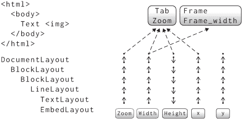

图 2：布局树中宽度和高度的依赖关系指向相反方向。

所以这就是`BlockLayout`和`DocumentLayout`上的所有布局字段。请仔细检查并修复这些布局类型的`paint`方法（以及`DrawCursor`辅助函数）——但请注意，浏览器现在还不能正常运行，因为`BlockLayout`假设其子元素的`height`字段是受保护的，但如果这些字段是`LineLayout`，则它们不是。让我们继续处理这个问题。

脏标志不是实现增量性能的唯一方法；另一个选项是跟踪*delta*。例如，在[Adapton](http://adapton.org/)项目中，每个将输入转换为输出的计算也可以将输入 delta 转换为输出 delta。[操作变换](https://en.wikipedia.org/wiki/Operational_transformation)，这是 Google Docs 背后的协作技术，也使用这个原则，数据库中的[微分数据流](https://www.microsoft.com/en-us/research/publication/differential-dataflow/)也是如此。然而，脏标志可以以更少的内存开销实现，这使得它们更适合在浏览器中使用。

# 保护内联布局

我们还需要保护`LineLayout`、`TextLayout`和`EmbedLayout`的字段，以及它们的`layout`方法工作方式略有不同。是的，每个布局对象都有`x`、`y`和`height`字段，但它们还计算`font`、`ascent`和`descent`字段，这些字段被其他布局对象使用。我们必须保护所有这些。由于我们现在有相当多的`ProtectedField`经验，我们将一次处理所有字段。

让我们从`TextLayout`开始：

```py
class TextLayout:
 def __init__(self, node, word, parent, previous):
 # ...
 self.x = ProtectedField()
 self.y = ProtectedField()
 self.height = ProtectedField()
 self.font = ProtectedField()
 self.ascent = ProtectedField()
 self.descent = ProtectedField()
 # ...
```

我们需要在`layout`中计算这些字段。所有与字体相关的字段都相当直接：

```py
class TextLayout:
 def layout(self):
 # ...

 zoom = self.zoom.read(notify=self.font)
 style = self.node.style.read(notify=self.font)
 self.font.set(font(style, zoom))

 f = self.font.read(notify=self.width)
 self.width.set(f.measureText(self.word))

 f = self.font.read(notify=self.ascent)
 self.ascent.set(f.getMetrics().fAscent * 1.25)

 f = self.font.read(notify=self.descent)
 self.descent.set(f.getMetrics().fDescent * 1.25)

 f = self.font.read(notify=self.height)
 self.height.set(linespace(f) * 1.25)
```

注意，我已经将`width`改为读取`font`字段而不是直接读取`zoom`和`style`。重复计算`f`确实看起来有点奇怪，但请记住，每个`read`调用都会在布局字段之间建立依赖关系。我喜欢将每个`f`视为其字段计算的范畴。

我们还需要计算`TextLayout`的*x*位置。这可以使用前一个兄弟的字体、*x*位置和宽度：

```py
class TextLayout:
 def layout(self):
 # ...
 if self.previous:
 prev_x = self.previous.x.read(notify=self.x)
 prev_font = self.previous.font.read(notify=self.x)
 prev_width = self.previous.width.read(notify=self.x)
 self.x.set(
 prev_x + prev_font.measureText(' ') + prev_width)
 else:
 self.x.copy(self.parent.x)
```

`EmbedLayout`基本上是相同的。至于其子类，这里有一个`InputLayout`：

```py
class InputLayout(EmbedLayout):
 def layout(self):
 super().layout()
 zoom = self.zoom.read(notify=self.width)
 self.width.set(dpx(INPUT_WIDTH_PX, zoom))

 font = self.font.read(notify=self.height)
 self.height.set(linespace(font))

 height = self.height.read(notify=self.ascent)
 self.ascent.set(-height)
 self.descent.set(0)
```

这里是`ImageLayout`；它有一个`img_height`字段，我将将其视为计算`height`的中间步骤，并且不进行保护：

```py
class ImageLayout(EmbedLayout):
 def layout(self):
 # ...
 font = self.font.read(notify=self.height)
 self.height.set(max(self.img_height, linespace(font)))

 height = self.height.read(notify=self.ascent)
 self.ascent.set(-height)
 self.descent.set(0)
```

最后，这是`IframeLayout`计算其高度的方法，这是直截了当的：

```py
class IframeLayout(EmbedLayout):
 def layout(self):
 # ...
 zoom = self.zoom.read(notify=self.height)
 if height_attr:
 self.height.set(dpx(int(height_attr) + 2, zoom))
 else:
 self.height.set(dpx(IFRAME_HEIGHT_PX + 2, zoom))
 # ...
```

我们还需要在`height`属性更改时使`height`字段无效：

```py
class JSContext:
 def setAttribute(self, handle, attr, value, window_id):
 if isinstance(obj, IframeLayout) or \
 isinstance(obj, ImageLayout):
 if attr == "width" or attr == "height":
 # ...
 obj.height.mark()
```

因此，这涵盖了所有内联布局对象。剩下的是`LineLayout`。以下是`x`和`y`：

```py
class LineLayout:
 def __init__(self, node, parent, previous):
 # ...
 self.x = ProtectedField()
 self.y = ProtectedField()
 # ...

 def layout(self):
 # ...
 self.x.copy(self.parent.x)
 if self.previous:
 prev_y = self.previous.y.read(notify=self.y)
 prev_height = self.previous.height.read(notify=self.y)
 self.y.set(prev_y + prev_height)
 else:
 self.y.copy(self.parent.y)
 # ...
```

然而，`height`有点复杂：它计算所有子元素的最大上升和下降，并使用该值设置`height`和子元素的`y`。我认为处理这段代码的最简单方法是向`LineLayout`添加`ascent`和`descent`字段来存储最大上升和下降，然后让`height`和子元素的`y`字段依赖于这些值。

让我们这样做，从声明受保护的字段开始：

```py
class LineLayout:
 def __init__(self, node, parent, previous):
 # ...
 self.ascent = ProtectedField()
 self.descent = ProtectedField()
```

然后，在`layout`中，我们首先处理没有子元素的情况：

```py
class LineLayout:
 def layout(self):
 # ...
 if not self.children:
 self.height.set(0)
 return
```

注意，我们不需要读取`children`字段，因为在`LineLayout`中它没有被保护；它在创建`LineLayout`时由`BlockLayout`填充，然后不再修改。

接下来，让我们计算最大上升和下降：

```py
class LineLayout:
 def layout(self):
 # ...
 self.ascent.set(max([
 -child.ascent.read(notify=self.ascent)
 for child in self.children
 ]))

 self.descent.set(max([
 child.descent.read(notify=self.descent)
 for child in self.children
 ]))
```

接下来，我们可以重新计算每个子元素的 `y` 位置：

```py
class LineLayout:
 def layout(self):
 # ...
 for child in self.children:
 new_y = self.y.read(notify=child.y)
 new_y += self.ascent.read(notify=child.y)
 new_y += child.ascent.read(notify=child.y)
 child.y.set(new_y)
```

最后，我们重新计算行的行高：

```py
class LineLayout:
 def layout(self):
 # ...
 max_ascent = self.ascent.read(notify=self.height)
 max_descent = self.descent.read(notify=self.height)
 self.height.set(max_ascent + max_descent)
```

由于这些更改，现在每个布局对象字段都受到保护。就像之前一样，确保所有使用这些字段的地方都使用 `read` 和 `get`，并且你的浏览器仍然运行，包括在 `contenteditable` 期间。你现在可能需要修复 `Frame` 和 `Tab` 内的 `height` 和 `y` 的几个使用，比如用于限制滚动偏移。

在撰写本节之前，我 Chris 在说话。花了几周时间清理 Chrome 的可访问性代码中的某些未充分无效化错误。起初，这些错误只会出现在某些过载的自动化测试机器上！结果发现，在这些机器上，HTML 解析器会更频繁地产生，触发不同的和不正确的渲染路径。这样的深层次错误需要难以计数的时问来追踪，这就是为什么从一开始就使用健壮的抽象来避免它们如此重要的原因。

# 跳过无操作更新

现在我们有很多布局字段，让我们看看实际上有多少无效化正在进行。在 `ProtectedField`s 的 `set` 方法内添加一个 `print` 语句，以查看哪些字段正在被重新计算：

```py
class ProtectedField:
 def set(self, value):
 if self.value != None:
 print("Change", self)
 self.notify()
 self.value = value
 self.dirty = False
```

`if` 检查避免了在初始页面布局期间打印，所以它只会显示我们的无效化优化工作得有多好。你看到的打印越少，字段变化越少，我们应该能够跳过的工怍就越多。

尝试在一个大型网页（如本章）上编辑一些带有 `contenteditable` 的文本——你会看到一整屏的输出，数千行打印的无用信息。很难理解为什么会这样，所以让我们为 `ProtectedField`s 添加一个漂亮的打印表单，以及一个用于调试目的的新 `name` 参数：请注意，我打印的是节点，而不是布局对象，因为布局对象的打印表单会打印布局字段值，这些值可能是不干净的且难以阅读的。

```py
class ProtectedField:
 def __init__(self, obj, name):
 self.obj = obj
 self.name = name
 # ...

 def __repr__(self):
 return "ProtectedField({}, {})".format(
 self.obj.node if hasattr(self.obj, "node") else self.obj,
 self.name)
```

将所有你的 `ProtectedField`s 命名，就像这样：

```py
class DocumentLayout:
 def __init__(self, node, frame):
 # ...
 self.zoom = ProtectedField(self, "zoom")
 self.width = ProtectedField(self, "width")
 self.height = ProtectedField(self, "height")
 self.x = ProtectedField(self, "x")
 self.y = ProtectedField(self, "y")
```

如果你再次查看你的输出，你现在应该看到两个阶段。首先，有很多 `style` 重新计算：

```py
Change ProtectedField(<body>, style)
Change ProtectedField(<header>, style)
Change ProtectedField(<h1 class="title">, style)
Change ProtectedField('Reusing Previous Computations', style)
Change ProtectedField(<a href="...">, style)
Change ProtectedField('Twitter', style)
Change ProtectedField(' ·\n', style)
...
```

然后，我们反复重新计算四个布局字段：

```py
Change ProtectedField(<html lang="en-US" xml:lang="en-US">, zoom)
Change ProtectedField(<html lang="en-US" xml:lang="en-US">, zoom)
Change ProtectedField(<head>, zoom)
Change ProtectedField(<head>, children)
Change ProtectedField(<head>, height)
Change ProtectedField(<body>, zoom)
Change ProtectedField(<body>, y)
Change ProtectedField(<header>, zoom)
Change ProtectedField(<header>, y)
...
```

让我们修复这些问题。首先，让我们解决 `style` 的问题。`style` 之所以被反复重新计算，仅仅是因为即使它没有变脏，我们也会重新计算它。如果它没有变脏，就跳过它：

```py
def style(node, rules, frame):
 if node.style.dirty:
 # ...

 for child in node.children:
 style(child, rules, frame)
```

现在几乎没有任何样式重新计算。但是，那些布局字段重新计算是怎么回事？为什么会发生？嗯，这里首先被重新计算的字段是 `zoom`，它本身追溯到 `DocumentLayout`：

```py
class DocumentLayout:
 def layout(self, width, zoom):
 self.zoom.set(zoom)
 # ...
```

每次我们布局页面时，我们都会设置`zoom`参数，我们必须这样做，因为用户可能已经放大或缩小。但是，每次我们设置一个字段时，都会通知每个依赖字段。这两者的结合意味着我们在每一帧都会重新计算`zoom`字段以及所有依赖于`zoom`的字段。

所有这一切之所以显得浪费，是因为`zoom`通常不会改变。因此，只有在值没有改变的情况下，我们才应该通知依赖项：

```py
class ProtectedField:
 def set(self, value):
 if value != self.value:
 self.notify()
 # ...
```

这个更改是安全的，因为如果新值与旧值相同，任何下游的计算实际上并不需要改变。这个小调整应该将字段更改的数量减少到最小：

```py
Change ProtectedField(<html lang="en-US" xml:lang="en-US">, zoom)
Change ProtectedField(<div class="demo" ...>, children)
Change ProtectedField(<div class="demo" ...>, height)
```

这里发生的一切只是重新创建`contenteditable`元素的`children`（我们必须这样做，以包含新文本）并检查其`height`是否没有改变（如果换行是必要的）。

编辑现在也应该感觉更加流畅——大约 0.6 秒而不是原来的 1.7 秒（见图 3）。更好，但仍然不够好：[在此处跟踪](http://browser.engineering/examples/example16-input-reuse-layout-tree.trace)。

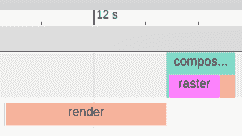

图 3：由于重用布局树，渲染更加流畅。

我们在浏览器布局中进行的缓存和失效操作在计算机科学中也有类似之处。例如，一些数据库使用[增量视图维护](https://wiki.postgresql.org/wiki/Incremental_View_Maintenance)来缓存和更新数据库条目添加或修改后的常见查询结果。像[Make](https://en.wikipedia.org/wiki/Make_(software))这样的构建系统也试图仅重新编译已更改的对象，而[电子表格](https://lord.io/spreadsheets/)则试图仅重新计算可能已更改的公式。浏览器可能需要的特定权衡可能很特殊，但问题和核心算法是普遍的。

# 跳过遍历

现在所有的布局字段都被保护起来，我们可以通过检查它们的脏位来确认是否需要重新计算它们。但是，为了检查所有的脏位，我们需要访问每一个布局对象，这可能会花费很长时间。相反，我们应该使用脏位来最小化需要访问的布局对象数量。

基本思想围绕着这样一个问题：我们是否真的需要在给定的节点上调用`layout`？`layout`方法执行三个操作：创建子布局对象、计算布局属性，以及递归调用更多的`layout`。如果以下步骤可以跳过：

+   我们不需要创建子布局对象，这意味着`children`字段不是脏的；

+   我们不需要重新计算布局字段，因为它们不是脏的；并且

+   我们不需要递归调用`layout`。

对于最后一个条件，还没有设置脏标志，所以让我们添加一个。我将称之为`has_dirty_descendants`，因为它跟踪是否有任何子代具有脏的`ProtectedField`：在某些代码库中，你会看到这些被称为*祖先*脏标志。这是同一件事，只是遵循脏位流而不是控制流。

```py
class BlockLayout:
 def __init__(self, node, parent, previous, frame):
 # ...
 self.has_dirty_descendants = False
```

也为其他类型的布局对象添加这个。

现在我们需要设置`has_dirty_descendants`标志，如果设置了任何脏标志。我们可以通过一个额外的（并且可选的）`parent`参数来实现，这个参数是针对`ProtectedField`的。

```py
class ProtectedField:
 def __init__(self, obj, name, parent=None):
 # ...
 self.parent = parent
```

确保为每个布局对象类型的每个`ProtectedField`传递这个参数。例如，这是`BlockLayout`：

```py
class BlockLayout:
 def __init__(self, node, parent, previous, frame):
 # ... 
 self.children = ProtectedField(self, "children", self.parent)
 self.zoom = ProtectedField(self, "zoom", self.parent)
 self.width = ProtectedField(self, "width", self.parent)
 self.height = ProtectedField(self, "height", self.parent)
 self.x = ProtectedField(self, "x", self.parent)
 self.y = ProtectedField(self, "y", self.parent)
```

然后，每当调用`mark`或`notify`时，我们通过遍历`parent`链来设置子代位：

```py
class ProtectedField:
 def set_ancestor_dirty_bits(self):
 parent = self.parent
 while parent and not parent.has_dirty_descendants:
 parent.has_dirty_descendants = True
 parent = parent.parent

 def mark(self):
 # ...
 self.set_ancestor_dirty_bits()
```

注意，如果子代位已经设置，`while`循环会提前退出。这是因为设置*那个*位的人已经设置了所有祖先的子代脏位。这个优化在真实浏览器中非常重要。没有它，反复使同一对象无效会反复遍历树到根，违反了增量性能的原则。

在`layout`之后，我们需要清除子代位：

```py
class BlockLayout:
 def layout(self):
 # ...
 for child in self.children.get():
 child.layout()

 self.has_dirty_descendants = False 
```

现在我们有了子代脏标志，让我们使用它们来跳过`layout`，包括递归调用：

```py
class BlockLayout:
 def layout(self):
 if not self.layout_needed(): return
 # ...
```

这里，`layout_needed`方法只是检查所有的脏位：

```py
class BlockLayout:
 def layout_needed(self):
 if self.zoom.dirty: return True
 if self.width.dirty: return True
 if self.height.dirty: return True
 if self.x.dirty: return True
 if self.y.dirty: return True
 if self.children.dirty: return True
 if self.has_dirty_descendants: return True
 return False
```

对于每种类型的布局对象都做同样的事情。在`DocumentLayout`中，你需要稍微小心一点，因为它接收帧宽度和缩放级别作为参数；如果相应的`Frame`变量发生变化，你必须`mark``DocumentLayout`的这些字段：我们需要标记根布局对象的`width`，因为`frame_width`被传递到`DocumentLayout`的`layout`方法作为`width`参数。我们本来可以保护`frame_width`字段，然后这个`mark`就会自动发生；我跳过这个是为了方便，但这样会更安全一些。

```py
class IframeLayout(EmbedLayout):
 def layout(self):
 if self.node.frame and self.node.frame.loaded:
 # ...
 self.node.frame.document.width.mark()
```

`zoom`级别在`Tab`中改变：

```py
class Tab:
 def zoom_by(self, increment):
 # ...
 for id, frame in self.window_id_to_frame.items():
 frame.document.zoom.mark()

 def reset_zoom(self):
 # ...
 for id, frame in self.window_id_to_frame.items():
 frame.document.zoom.mark()
```

跳过不必要的`layout`方法应该会提供一个明显的速度提升，现在小型布局现在大约需要 7 毫秒来更新布局，编辑现在也变得更加平滑。这也可能在大型页面上因为合成-光栅-绘制周期相当慢而显得有些卡顿，这取决于你在第十三章中实现了哪些练习。[跟踪这里](https://browser.engineering/examples/example16-input-skip-traverse.trace)。

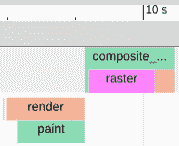

图 4：跳过布局遍历后的示例。

然而，图 4 显示`paint`仍然很慢，`render`整体仍然大约是 230 毫秒。使浏览器快速需要优化一切！我不会实现它，但`paint`也可以变得更快——参见练习 16-10。

`ProtectedField`类似于[观察者模式](https://en.wikipedia.org/wiki/Observer_pattern)，其中当某个状态发生变化时，一段代码会运行回调。这种模式在[UI 框架](https://developer.apple.com/library/archive/documentation/Cocoa/Conceptual/KeyValueObserving/KeyValueObserving.html)中很常见。通常，这些观察者会**急切地**重新计算依赖的结果，但我们的回调——`mark`和`notify`——只是简单地设置一个脏位以稍后清理。这意味着我们的无效化算法是一种[*懒加载*观察者](https://en.wikipedia.org/wiki/Lazy_evaluation)。懒加载通过批量更新帮助提高性能。

# 细粒度样式无效化

不幸的是，在添加无效化的过程中，我们不慎破坏了平滑动画。基本问题是：假设一个元素的`opacity`或`transform`属性发生变化，例如通过 JavaScript。该属性不是布局诱导的，所以它**应该**完全通过合成动画。然而，更改任何样式属性都会使`Element`的`style`字段无效，这反过来又使`children`字段无效，导致布局树被重建。这是不可取的。

最终，这里的核心问题是由于过于粗粒度的`ProtectedField`导致的过度无效化。例如，`children`字段并不依赖于整个`style`字典，而只是其中的一些与字体相关的字段。我们需要`style`成为一个包含`ProtectedField`的字典，而不是一个字典的`ProtectedField`：

```py
class Element:
 def __init__(self, tag, attributes, parent):
 # ...
 self.style = dict([
 (property, ProtectedField(self, property))
 for property in CSS_PROPERTIES
 ])
 # ...
```

在`Text`中也进行相同的更改。`CSS_PROPERTIES`字典包含我们支持的每个 CSS 属性及其默认值：

```py
CSS_PROPERTIES = {
 "font-size": "inherit", "font-weight": "inherit",
 "font-style": "inherit", "color": "inherit",
 "opacity": "1.0", "transition": "",
 "transform": "none", "mix-blend-mode": None,
 "border-radius": "0px", "overflow": "visible",
 "outline": "none", "background-color": "transparent",
 "image-rendering": "auto",
}
```

当从 JavaScript 设置`style`属性时，我将通过调用一个新的`dirty_style`函数来使所有字段无效：

```py
def dirty_style(node):
 for property, value in node.style.items():
 value.mark()

class JSContext:
 def style_set(self, handle, s, window_id):
 # ...
 dirty_style(elt)
 # ...
```

但不仅如此。还有其他代码也会使样式无效，特别是那些可能影响伪类如`:focus`的代码：

```py
class Frame:
 def focus_element(self, node):
 # ...
 if self.tab.focus:
 # ...
 dirty_style(self.tab.focus)
 if node:
 #...
 dirty_style(node)
```

同样，在`style`中，如果它们的任何样式属性都是脏的，我们都需要重新计算节点的样式：

```py
def style(node, rules, frame):
 needs_style = any([field.dirty for field in node.style.values()])
 if needs_style:
 # ...
 for child in node.children:
 style(child, rules, frame)
```

为了与现有代码匹配，我将使`old_style`和`new_style`仅将属性映射到值：

```py
def style(node, rules, frame):
 if needs_style:
 old_style = dict([
 (property, field.value)
 for property, field in node.style.items()
 ])
 new_style = CSS_PROPERTIES.copy()
 # ...
```

然后，当我们解决继承问题时，我们特别有一个样式字段依赖于父样式的相应字段：

```py
def style(node, rules, frame):
 if needs_style:
 for property, default_value in INHERITED_PROPERTIES.items():
 if node.parent:
 parent_field = node.parent.style[property]
 parent_value = \
 parent_field.read(notify=node.style[property])
 new_style[property] = parent_value
```

同样，在解析百分比字体大小时：

```py
def style(node, rules, frame):
 if needs_style:
 if new_style["font-size"].endswith("%"):
 if node.parent:
 parent_field = node.parent.style["font-size"]
 parent_font_size = \
 parent_field.read(notify=node.style["font-size"])
```

然后，一旦`new_style`全部计算完成，我们分别设置节点`style`的每个字段：

```py
def style(node, rules, frame):
 if needs_style:
 # ...
 for property, field in node.style.items():
 field.set(new_style[property])
```

现在我们只需要更新浏览器中的其余部分以使用细粒度的样式字段。大多数情况下，这意味着将`style.get()[property]`替换为`style[property].get()`：

```py
def paint_visual_effects(node, cmds, rect):
 opacity = float(node.style["opacity"].get())
 blend_mode = node.style["mix-blend-mode"].get()
 translation = parse_transform(node.style["transform"].get())

 if node.style["overflow"].get() == "clip":
 border_radius = float(node.style["border-radius"].get()[:-2])
 # ...

 # ...
```

然而，`font`方法需要一点工作。到目前为止，我们读取了节点的`style`并将其传递给`font`：

```py
class BlockLayout:
 def word(self, node, word):
 zoom = self.children.read(self.zoom)
 style = self.children.read(node.style)
 node_font = font(style, zoom)
 # ...
```

这将不再有效，因为现在我们需要读取`style`的三个不同属性。为了保持紧凑，我将重写`font`以将无效化的字段作为参数传递：

```py
def font(css_style, zoom, notify):
 weight = css_style['font-weight'].read(notify)
 style = css_style['font-style'].read(notify)
 try:
 size = float(css_style['font-size'].read(notify)[:-2]) * 0.75
 except:
 size = 16
 font_size = dpx(size, zoom)
 return get_font(font_size, weight, style)
```

现在当请求行中断时的字体时，我们可以简单地传递`self.children`作为`notify`参数：

```py
class BlockLayout:
 def word(self, node, word):
 zoom = self.zoom.read(notify=self.children)
 node_font = font(node.style, zoom, notify=self.children)
 # ...
```

同样，如果我们正在计算`font`字段，我们会传递该字段：

```py
class TextLayout:
 def layout(self):
 if self.font.dirty:
 zoom = self.zoom.read(notify=self.font)
 self.font.set(font(
 self.node.style, zoom, notify=self.font))
```

确保更新所有其他`font`方法的用法到这个新接口。这种“传递目的地风格”是向辅助方法添加失效的常见方式。

最后，现在我们已经为`style`添加了细粒度的失效，因此当处理动画时，我们只需使动画属性失效：

```py
class Tab:
 def run_animation_frame(self, scroll):
 for (window_id, frame) in self.window_id_to_frame.items():
 for node in tree_to_list(frame.nodes, []):
 for (property_name, animation) in \
 node.animations.items():
 value = animation.animate()
 if value:
 node.style[property_name].set(value)
 # ...
```

当像`opacity`或`transform`这样的属性发生变化时，它不会使任何布局字段失效（因为这些属性不会影响任何布局字段），因此动画将再次完全跳过布局。

CSS 样式依赖于选择器匹配的元素，当页面发生变化时，这也可能需要失效。我们的浏览器支持的 CSS 选择器和 DOM API 如此之少，以至于实现这种高级失效技术是没有意义的，但对于真实浏览器来说，它非常重要。浏览器有巧妙的算法来避免对页面上的每个选择器都重新进行选择器匹配。例如，Chromium 为每个选择器构建了[*失效集*](https://chromium.googlesource.com/chromium/src/+/HEAD/third_party/blink/renderer/core/css/style-invalidation.md?pli=1#)，它告诉浏览器哪些选择器-元素匹配需要重新检查。新的选择器，如`:has()`，需要[更复杂的](https://blogs.igalia.com/blee/posts/2023/05/31/how-blink-invalidates-styles-when-has-in-use.html)失效策略，但这种复杂性对于快速重样式是必要的。

# 分析依赖项

布局现在由于`ProtectedField`抽象变得相当快且正确。然而，由于我们的大部分依赖都是通过`read`隐式建立的，因此很难判断任何给定操作最终会使哪些字段失效。这使得理解哪些操作快，哪些操作慢变得困难，尤其是在我们添加新的样式和布局功能时。这种*可审计性*问题在真实浏览器中也会发生。毕竟，真实浏览器的代码行数以百万计，支持数千个 CSS 属性。它们的依赖图比我们的浏览器复杂得多。

因此，我们希望使查看依赖图更容易，尽管请参考图 5 以了解任务的规模。在这个过程中，我们可以集中处理该图形状的*不变性*。这将使我们的浏览器在未来对意外错误具有更强的抵抗力，并提高性能。

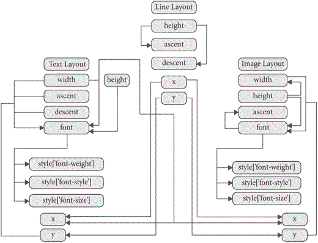

图 5：我们浏览器中布局字段的依赖图。虽然简化了，但依赖图已经相当复杂。

一个简单的第一步是明确列出每个`ProtectedField`的依赖项。我们可以将其作为一个可选的构造函数参数：

```py
class ProtectedField:
 def __init__(self, obj, name, parent=None, dependencies=None):
 # ...
 if dependencies != None:
 for dependency in dependencies:
 dependency.invalidations.add(self)
```

此外，如果依赖项在构造函数中传递，我们可以“冻结”`ProtectedField`，这样`read`就不再添加新的依赖项，而只是检查它们是否已声明：

```py
class ProtectedField:
 def __init__(self, obj, name, parent=None, dependencies=None):
 # ...
 self.frozen_dependencies = (dependencies != None)
 if dependencies != None:
 for dependency in dependencies:
 dependency.invalidations.add(self)

 def read(self, notify):
 if notify.frozen_dependencies:
 assert notify in self.invalidations
 else:
 self.invalidations.add(notify)

 return self.get()
```

例如，在`DocumentLayout`中，我们现在可以明确指出其字段没有外部依赖项，因此必须显式地`mark`：

```py
class DocumentLayout:
 def __init__(self, node, frame):
 # ...
 self.zoom = ProtectedField(self, "zoom", None, [])
 self.width = ProtectedField(self, "width", None, [])
 self.x = ProtectedField(self, "x", None, [])
 self.y = ProtectedField(self, "y", None, [])
 self.height = ProtectedField(self, "height")
```

但请注意，`height`缺少依赖项参数。`DocumentLayout`的高度取决于其子元素的高度，而这个子元素直到`layout`被调用才存在。“向下”依赖项意味着我们无法在构造时冻结每个`ProtectedField`。但每个我们冻结的保护字段都会使依赖图更容易审计。

我们还可以在`BlockLayout`中冻结`zoom`、`width`、`x`和`y`字段。对于`y`，依赖项取决于布局对象是否有前一个兄弟元素：

```py
class BlockLayout:
 def __init__(self, node, parent, previous, frame):
 # ...
 if self.previous:
 y_dependencies = [self.previous.y, self.previous.height]
 else:
 y_dependencies = [self.parent.y]
 self.y = ProtectedField(
 self, "y", self.parent, y_dependencies)
 # ...
```

我们不能在构造函数中冻结`BlockLayout`的`height`，原因与`DocumentLayout`相同。但我们可以一旦`children`字段被计算出来就立即冻结它。让我们添加一个`set_dependencies`方法来完成这个任务：这是动态的，就像对`read`的调用一样，但至少我们正在将依赖项集中在一个地方。此外，明确列出依赖项然后在之后检查它们是一种对无效化错误的[深度防御](https://en.wikipedia.org/wiki/Defense_in_depth_(computing))。

```py
class ProtectedField:
 def set_dependencies(self, dependencies):
 for dependency in dependencies:
 dependency.invalidations.add(self)
 self.frozen_dependencies = True
```

现在，我们可以在`DocumentLayout`中冻结`height`：

```py
class DocumentLayout:
 def layout(self, width, zoom):
 if not self.children:
 child = BlockLayout(self.node, self, None, self.frame)
 self.height.set_dependencies([child.height])
```

类似地，在`BlockLayout`中：

```py
class BlockLayout:
 def layout(self):
 # ...
 if mode == "block":
 if self.children.dirty:
 # ...
 self.children.set(children)

 height_dependencies = \
 [child.height for child in children]
 height_dependencies.append(self.children)
 self.height.set_dependencies(height_dependencies)
 else:
 if self.children.dirty:
 # ...
 self.children.set(self.temp_children)

 height_dependencies = \
 [child.height for child in self.temp_children]
 height_dependencies.append(self.children)
 self.height.set_dependencies(height_dependencies)
```

其他布局对象也可以冻结它们的字段。在`TextLayout`、`EmbedLayout`及其子类中，我们可以冻结一切：

```py
class TextLayout:
 def __init__(self, node, word, parent, previous):
 # ...
 self.zoom = ProtectedField(self, "zoom", self.parent,
 [self.parent.zoom])
 self.font = ProtectedField(self, "font", self.parent,
 [self.zoom,
 self.node.style['font-weight'],
 self.node.style['font-style'],
 self.node.style['font-size']])
 self.width = ProtectedField(self, "width", self.parent,
 [self.font])
 self.height = ProtectedField(self, "height", self.parent,
 [self.font])
 self.ascent = ProtectedField(self, "ascent", self.parent,
 [self.font])
 self.descent = ProtectedField(self, "descent", self.parent,
 [self.font])
 if self.previous:
 x_dependencies = [self.previous.x, self.previous.font,
 self.previous.width]
 else:
 x_dependencies = [self.parent.x]
 self.x = ProtectedField(self, "x", self.parent,
 x_dependencies)
 self.y = ProtectedField(self, "y", self.parent,
 [self.ascent, self.parent.y, self.parent.ascent])
```

在`LineLayout`中，由于创建和布局行的复杂方式，我们需要在第一次调用`layout`之前延迟冻结`ascent`和`descent`：

```py
class LineLayout:
 def __init__(self, node, parent, previous):
 # ...
 self.initialized_fields = False
 self.ascent = ProtectedField(self, "ascent", self.parent)
 self.descent = ProtectedField(self, "descent", self.parent)
 # ...

 def layout(self):
 if not self.initialized_fields:
 self.ascent.set_dependencies(
 [child.ascent for child in self.children])
 self.descent.set_dependencies(
 [child.descent for child in self.children])
 self.initialized_fields = True
 # ...
```

最后一个布局类是`EmbedLayout`。那里的依赖项很简单，除了两点：首先，就像`TextLayout`一样，如果存在，`x`依赖于前一个`x`，其次，`height`依赖于`width`，因为它们有宽高比：

```py
class EmbedLayout:
 def __init__(self, node, parent, previous, frame):
 # ...
 self.zoom = ProtectedField(self, "zoom", self.parent,
 [self.parent.zoom])
 self.font = ProtectedField(self, "font", self.parent,
 [self.zoom,
 self.node.style['font-weight'],
 self.node.style['font-style'],
 self.node.style['font-size']])
 self.width = ProtectedField(self, "width", self.parent,
 [self.zoom])
 self.height = ProtectedField(self, "height", self.parent,
 [self.zoom, self.font, self.width])
 self.ascent = ProtectedField(self, "ascent", self.parent,
 [self.height])
 self.descent = ProtectedField(
 self, "descent", self.parent, [])
 if self.previous:
 x_dependencies = \
 [self.previous.x, self.previous.font,
 self.previous.width]
 else:
 x_dependencies = [self.parent.x]
 self.x = ProtectedField(
 self, "x", self.parent, x_dependencies)
 self.y = ProtectedField(self, "y", self.parent,
 [self.ascent,self.parent.y, self.parent.ascent])
```

我们甚至可以冻结所有的样式字段！唯一的复杂性在于`innerHTML`会改变元素的父母，所以让我们动态地创建样式字典。在构造函数中将其初始化为`None`：

```py
class Element:
 def __init__(self, tag, attributes, parent):
 # ...
 self.style = None

class Text:
 def __init__(self, text, parent):
 # ...
 self.style = None
```

然后在第一次调用`style`时设置它：

```py
def style(node, rules, frame):
 if not node.style:
 init_style(node)
```

在`init_style`内部，我们需要冻结每个样式字段的依赖项。这很简单：只有继承的字段才有任何依赖项：

```py
def init_style(node):
 node.style = dict([
 (property, ProtectedField(node, property, None,
 [node.parent.style[property]] \
 if node.parent and \
 property in INHERITED_PROPERTIES \
 else []))
 for property in CSS_PROPERTIES
 ])
```

通过冻结每个布局和样式字段（除了`children`），我们可以仅通过查看布局对象类型构造函数就获得我们浏览器依赖图的良好感觉。这很好，有助于我们在添加更多样式和布局功能时避免循环和长的依赖链。

但为了获得最大性能，即真实浏览器所需的性能，还有一个额外的优势。所有这些花哨的`ProtectedField`增加了大量的开销，主要是因为它们占用更多的内存并需要更多的函数调用。实际上，这章可能使你的浏览器在*初始*页面加载时慢了很多。对我来说，它大约慢了两倍。其中一些可以通过跳过`assert`来改进，如果你以`-O`命令行标志运行 Python，Python 将自动跳过`assert`，但这绝对不是理想的。

幸运的是，像编译时代码生成和宏这样的技术可以用来将`ProtectedField`对象转换为幕后直接的代码。设置特定的`ProtectedField`可以设置静态已知失效的脏位，脏位可以内联到布局对象中，而`read`函数可以检查依赖是否在编译时声明。实际浏览器一直在使用这样的技巧，以便超级快速但仍然可维护和可读。例如，Chromium 有一种生成所有样式属性优化代码的[花哨方式](https://source.chromium.org/chromium/chromium/src/+/main:third_party/blink/renderer/core/style/ComputedStyle.md)。这些技术超出了本书的范围，但我将其留给了高级练习。

实际浏览器也使用断言来捕获错误，这与本章中提到的`ProtectedField`抽象类似。但为了避免减慢用户的浏览器速度，非必要的断言在*发布构建*中被“编译出去”，这是最终用户运行的内容。*调试构建*是浏览器工程师在调试或开发新功能时使用的，也用于自动化测试。调试构建还会编译进调试功能，如[清理器](https://firefox-source-docs.mozilla.org/tools/sanitizer/index.html)，而发布构建则使用重量级优化[如*配置文件引导优化*](https://blog.chromium.org/2020/08/chrome-just-got-faster-with-profile.html)。

# 摘要

本章通过优化的缓存失效介绍了部分样式和布局的概念。主要的收获是：

+   缓存和失效是加快关键浏览器交互的强大方式，因此是真实浏览器中的一项基本技术。

+   使渲染具有幂等性允许我们在保证页面外观相同的同时跳过冗余工作。

+   一个好的浏览器追求增量性能的原则：变化的成本应该与变化的大小成比例，而不是整个页面的大小。

+   缓存失效既困难又容易出错，这证明了像`ProtectedField`这样的谨慎抽象的必要性。

+   失效可以用来跳过分配、计算，甚至对象的遍历。

点击这里尝试本章的浏览器。

# 概述

我们浏览器中的完整函数、类和方法集现在看起来可能像这样：

# 练习

16-1 *清空元素*。当没有参数调用时，实现`replaceChildren` DOM 方法（[链接](https://developer.mozilla.org/en-US/docs/Web/API/Element/replaceChildren)）。此方法应删除给定元素的所有子元素。确保正确处理无效化。

16-2 *保护布局阶段*。通过将`Frame`上的`document`字段替换为`ProtectedField`来替换`needs_style`和`needs_layout`脏标志。确保动画仍然正确工作：`opacity`或`transform`的动画不应触发布局，而其他属性的动画应该。

16-3 *转移子元素*。当调用多个参数时，实现`replaceChildren` DOM 方法（[链接](https://developer.mozilla.org/en-US/docs/Web/API/Element/replaceChildren)）。这里的参数是文档其他部分的元素，除非你已经实现了练习 9-2 和 9-3，在这种情况下，它们也可以是“分离”的元素。这些元素随后从它们当前父元素中移除，然后附加到这个元素上。确保正确处理无效化。

16-4 *样式后代位*。为`style`信息添加后代脏标志，这样`style`阶段就不需要遍历样式未更改的节点。

16-5 *调整浏览器大小*。也许，在练习 2-3 中，你实现了对调整浏览器大小的支持。（而且，很可能是当我们切换到 SDL 时，你放弃了这种支持。）重新实现调整浏览器大小的支持；你需要将`SDL_WINDOW_RESIZABLE`标志传递给`SDL_CreateWindow`并监听`SDL_WINDOWEVENT_RESIZED`事件。确保无效化工作正常：调整窗口大小应该调整页面大小。无效化在使调整大小快速方面有多大帮助？测试垂直和水平调整大小。

16-6 *匹配子元素*。如果你在练习 9-2 中还没有实现，添加对[`appendChild`方法](https://developer.mozilla.org/en-US/docs/Web/API/Node/appendChild)的支持。关于`appendChild`有趣的是，尽管它*确实*改变了布局对象的`children`字段，但它只是通过向末尾添加新子元素来这样做。在这种情况下，你可以保留所有现有的布局对象子元素。至少在块模式`BlockLayout`s 的情况下应用此优化。

16-7 *无效化`previous`*。如果你在练习 9-2 中还没有实现，添加对[`insertBefore`方法](https://developer.mozilla.org/en-US/docs/Web/API/Node/insertBefore)的支持。与`appendChild`一样，如果我们能跳过重建布局对象，我们希望这样做。然而，此方法也可以改变布局对象的`previous`字段；在所有块模式`BlockLayout`s 上保护该字段，然后尽可能避免重建布局树的大部分。

16-8 *`:hover` 伪类*. 存在一个 `:hover` 伪类，用于识别鼠标悬停的元素。[悬停](https://developer.mozilla.org/en-US/docs/Web/CSS/:hover)。通过将鼠标悬停事件发送到活动 `Tab` 并进行碰撞测试以找出正在悬停的元素来实现它。尽量在这个碰撞测试中避免[强制布局](https://browser.engineering/scheduling.html#threaded-style-and-layout)；实现这一点的其中一种方法是在 `Tab` 上存储一个 `pending_hover`，并在 `render` 期间的 `layout` 之后运行碰撞测试，然后进行 *另一个* 渲染以使悬停元素的样式无效。

16-9 *优化移除 `ProtectedField`*. 如本章最后一节所述，创建所有这些 `ProtectedField` 对象对于真实浏览器来说代价太高。看看你是否能找到一种方法来完全避免创建这些对象。根据你用来实现浏览器的语言，你可能有一些编译时宏可用以帮助；在 Python 中，这可能需要重构以改变 `ProtectedField` 的 API 形状，使其成为函数式而非面向对象的。

16-10 *优化绘制*. 即使在使文本输入布局变得快速之后，绘制仍然非常缓慢。通过在帧之间存储显示列表、为每个布局对象添加是否需要绘制的脏位，以及而不是每次都重新创建它来修复这个问题。

# 未涵盖的内容

《网络浏览器工程》的结论.

+   JavaScript 执行

+   文本与图形渲染

+   连接安全与隐私

+   网络缓存和媒体

+   更复杂的布局模式

+   浏览器 UI 和开发者工具

+   测试

希望前 16 章已经给了你一个关于网络浏览器所有主要组件的坚实基础理解，从它发出的网络请求到它安全存储你的数据的方式。对于这样一个庞大的主题，我不得不省略一些内容。以下是这本书没有涵盖的最重要事项列表，不分先后。

# JavaScript 执行

现代网络浏览器的大部分是一个高性能的 JavaScript 实现。今天，每个主要的浏览器不仅运行 JavaScript，而且在飞行中将其编译成低级机器代码，使用运行时类型分析。此外，像隐藏类这样的技术可以在 JavaScript 没有提供结构的地方推断结构，从而降低内存使用和垃圾收集压力。在此基础上，现代浏览器还执行 WebAssembly，这是一种针对许多其他编程语言的硬件无关的字节码格式，它可能有一天会在网络上与 JavaScript 并驾齐驱。

这本书跳过了构建 JavaScript 引擎，而是使用了 DukPy。我做出这个选择是因为，虽然 JavaScript 执行是现代浏览器中的核心，但它使用的技术与 Python、Lua 或 Java 等其他语言的执行相当相似。了解现代 JavaScript 引擎内部的最佳方式是阅读关于编程语言实现的书籍。

# 文本与图形渲染

文本渲染比表面上看起来要复杂得多。字母在宽度和高度上有所不同。重音符号可能需要堆叠在字符上方。字符在与其他字符相邻时可能会改变形状，例如连字符或*形状*（用于手写字体）。有时语言是从右到左或从上到下书写的。然后还有排版特性，如字距调整和变体。但最复杂的是*提示*，它是一个嵌入在字体中的小计算机程序，用于修改它以更好地匹配离散的像素网格。文本渲染当然会影响 Skia，但它也影响布局，确定屏幕上内容的尺寸和位置。

更广泛地说，图形总体上相当复杂！我们的浏览器使用 Skia，这是 Chromium 和一些其他浏览器实际使用的光栅化引擎。但我们并没有真正谈论 Skia 实际是如何工作的，而它实际上相当复杂。它不仅渲染文本，而且在基本上所有 CPU 和 GPU 上快速且高质量地应用各种混合和效果。在真正的浏览器中，这变得更加复杂，有复杂的合成系统、图形处理安全沙箱以及各种平台特定的字体和操作系统合成集成。还有大量额外的工作来实现底层的 JavaScript 公开的 API，如 [Canvas](https://developer.mozilla.org/en-US/docs/Web/API/Canvas_API)、[WebGL](https://developer.mozilla.org/en-US/docs/Web/API/WebGL_API) 和 [WebGPU](https://developer.mozilla.org/en-US/docs/Web/API/WebGPU_API)。

我在书中跳过了这个主题，因为像 Skia（用于图形）和 Harfbuzz（用于文本）这样的库以及各种系统库中都有高质量的实现，所以可以说是与浏览器无关的。但这里有一个深度，最好通过这些特定主题的书籍来满足。

# 连接安全与隐私

现在的网页浏览器配备了复杂的加密协议套件，名称令人困惑，如 AES-GCM、ChaCha20 和 HMAC-SHA512。这些协议可以防止恶意行为者读取或写入网络数据包。在最广泛的意义上，连接安全是通过 TLS 协议（在第一章[http.html]中亮相）建立的，并由一群密码学家、证书颁发机构和开源项目维护。

我选择跳过对 TLS 的深入讨论，因为这本书对完整性和验证的不敬态度与实际的安全工程不相容。TLS 的一个最小化和不完整的版本是一个有缺陷和不安全的版本，与预期目标相悖，并且从教育角度来看也是反生产力的。了解现代密码学和网络安全最好的方式是阅读关于这个主题的书籍。

[网络隐私](https://developer.mozilla.org/en-US/docs/Web/Privacy)是另一个我跳过的主题。在某种程度上，安全和隐私是相关的（并且当然相互补充），但它们并不相同。网络隐私处于不断变化之中，例如围绕[第三方 cookies](https://developer.mozilla.org/en-US/docs/Web/HTTP/Cookies#third-party_cookies)、[指纹识别](https://developer.mozilla.org/en-US/docs/Glossary/Fingerprinting)以及是否应该有 API 来帮助广告的辩论。我选择跳过这个主题，因为许多基本概念仍然没有定论：隐私的标准是什么，以及政府、浏览器开发者、网站作者和用户在其中的角色应该是什么。

# 网络缓存和媒体

缓存通过跳过大多数网络请求来使网络请求更快。然而，使其不仅仅是一个优化的是 HTTP 设计到何种程度来启用缓存。实现网络缓存可以显著加深对 HTTP 的理解。尽管如此，本书的网络部分已经足够长，而且在书中任何地方都没有感觉到缺少缓存会带来痛苦，所以我决定省略这个主题。

由于今天网络带宽和电池寿命的大部分都被视频播放和视频会议消耗，实时视频编码、解码和渲染中存在一个复杂的领域。实际浏览器有专门负责这些服务和 API 的大型团队，全世界有众多研究人员致力于视频压缩。视频编解码器非常有趣，但同样不是非常特定于浏览器，所以这本书完全跳过了它们，我建议阅读关于它们的专门书籍。

# 更复杂的布局模式

实际浏览器中使用的布局算法比书中所涵盖的更为复杂，具有浮动布局、定位元素、弹性盒子、网格、表格等功能。实现这些布局模式是复杂的，需要细心和技巧——尤其是如果你想要速度和渐进式性能的话。这里的重要技术包括多阶段布局和测量布局阶段，以及为了产生良好性能所需的复杂缓存策略。我们在书中进行了一些多阶段布局的示例，一行中的文字在第一阶段计算其`x`、`width`和`height`，然后在基于基线的单独阶段计算其`y`。但我们并没有过多地讨论它作为一个多阶段布局的示例，而实际浏览器有更复杂的布局阶段集合。

我选择在这本书中跳过更复杂的布局，因为即使这里描述的简单布局算法也相当复杂，而现实世界的布局算法涉及许多由旧标准和向后兼容性引起的偶然复杂性，这些内容我不想过多讨论。

# 浏览器用户界面和开发者工具

一个真正的浏览器拥有比我们的浏览器更复杂、更强大的“浏览器 UI”——即围绕网页的浏览器界面，您可以在其中输入 URL、查看标签等——比我们的浏览器。事实上，一个真正的浏览器团队的大部分工作就是在这方面，而不是在“Web 平台”本身。现代浏览器的多进程特性也使得与同步 OS API 交互变得困难，正如我们在第十四章中看到的可访问性那样。此外，许多浏览器（至少是桌面浏览器）支持强大的[扩展 API](https://en.wikipedia.org/wiki/Browser_extension)，允许开发者扩展浏览器 UI。为了帮助实现这一点，浏览器 UI 通常使用 HTML 实现并由浏览器本身渲染。

此外，没有某种调试辅助工具几乎不可能构建复杂的 Web 应用程序，因此所有真正的浏览器都内置了调试器。信不信由你，在相当长的一段时间里，Web 开发者只是做了大量的[`console.log`调试](https://en.wikipedia.org/wiki/Debugging#printf_debugging)（甚至在有简单查看控制台的方法之前，甚至使用`alert`调试！）。这种状况随着 Firefox 的[Firebug](https://en.wikipedia.org/wiki/Firebug_(software))浏览器扩展的推出而发生了重大变化，并最终演变成了今天的集成开发者工具。这些开发者工具与浏览器引擎本身深度集成，以实现实时观察元素样式或暂停和逐步执行 JavaScript 等特性。

我跳过了这个主题，因为浏览器 UI 中的许多挑战与其他任何 UI 的挑战相同：设计、可用性、复杂性等等。这会使书籍变得乏味。即使是概念上相当有趣的调试器，也只有在进行了大量的 UI 工作以使其可用时才有用。不幸的是，我并不了解任何关于开发者工具的书籍，但许多书籍都会涵盖基本的用户界面开发。

# 测试

真实浏览器已经发展出了一系列令人印象深刻的测试技术，以确保它们随着时间的推移保持并提高质量。总的来说，它们拥有成千上万的[单元测试](https://en.wikipedia.org/wiki/Unit_testing)和[集成测试](https://en.wikipedia.org/wiki/Integration_testing)。最近，很多关注都放在了强大的[跨浏览器测试](https://wpt.fyi)上，这使得单个自动化测试可以在所有浏览器上运行，以验证它们在相同输入下的行为是否一致。现在每年都有[互操作性](https://wpt.fyi/interop-2023)“Interop”，简称“互操作性”基准测试，用于衡量浏览器在关键特性上实现这一目标的情况。在测试的背后，是一个庞大的代码和基础设施的世界，以高效地持续运行这些测试并提供广泛的[框架](https://web-platform-tests.org/)，使测试变得简单。

# 变化的景观

Web Browser Engineering 的附录。

网络是一个动态、不断变化的地方。1989 年的第一个网络浏览器不支持颜色、图像、样式或脚本。三十年的市场力量、实施怪癖以及网络不断扩大的范围，使得浏览器成为了今天的模样。这些力量依然强大。浏览器继续在进化！

这本书迟早会过时。从某种意义上说，越快越好，因为这意味着网络正在继续繁荣！无论是 WebAssembly 还是 WebGPU，硬件访问或新的 CSS 特性，集成支付或 AI 助手，我都期待未来的浏览器在计算和我们的生活中扮演许多新的不同角色。

话虽如此，许多有奉献精神、才华横溢的工程师在互联网的前三十年里致力于网络。网络的架构融入了他们的想法、发明和品味。它融入了他们的价值观和对计算的希望。亲爱的读者，您和我，都在他们的足迹中前行，研究他们的工作。如果几年后这本书过时了，我希望那些价值观能够延续，那些希望能够实现。

© 2018–2023 [Pavel Panchekha](https://pavpanchekha.com) & [Chris Harrelson](https://twitter.com/chrishtr)
