# 使用Python的架构模式

前言

- 管理复杂性，解决业务问题
- 为什么选择Python？
- TDD、DDD和事件驱动架构
- 谁应该阅读本书
- 你将学到什么
  - 第一部分，创建一个支持领域模型的架构
  - 第二部分，事件驱动架构
  - 其他内容
- 示例代码和编码参考

介绍

- 为什么我们的设计会出错？
- 封装和抽象
- 分层
- 依赖倒置原则
- 我们的所有业务逻辑的归宿：领域模型

第一部分：构建支持领域建模的架构

## 第一章 领域模型

- 什么是领域模型？
- 探索领域语言
- 单元测试领域模型
  - 数据类非常适合值对象
  - 值对象和实体
- 并非所有东西都必须是对象：领域服务函数
  - Python的魔术方法让我们使用惯用的Python来使用我们的模型
  - 异常也可以表达领域概念

## 第二章 存储库模式

- 持久化我们的领域模型
- 一些伪代码：我们需要什么？
- 将DIP应用于数据访问
- 提醒：我们的领域模型
  - “正常”ORM方式：模型依赖于ORM
  - 反转依赖：ORM依赖于领域模型
- 介绍存储库模式
  - 抽象中的存储库
  - 权衡是什么？
- 为测试构建虚假存储库现在非常简单！
- Python中的端口和适配器是什么？
- 总结

## 第三章 简短的插曲：耦合和抽象

- 抽象状态有助于可测试性
- 选择正确的抽象层次
- 实现我们选择的抽象层次
  - 使用伪装和依赖注入进行边缘到边缘测试
  - 为什么不直接使用patch？
- 总结

## 第四章 我们的第一个用例：Flask API和服务层

- 将我们的应用程序连接到真实世界
- 第一个端到端测试
- 直接实现
- 需要数据库检查的错误条件
- 引入服务层，并使用FakeRepository进行单元测试
  - 一个典型的服务函数
- 为什么一切都被称为服务？
- 将事物放入文件夹中以查看它们属于哪里
- 总结
  - DIP的实际应用

## 第五章 高档和低档的TDD

- 我们的测试金字塔是什么样子？
- 领域层测试应该转移到服务层吗？
- 关于编写何种类型的测试的决定
- 高档和低档
- 从领域完全解耦服务层测试
  - 缓解：将所有领域依赖项保留在 Fixture 函数中
  - 添加缺失的服务
- 将改进带到 E2E 测试中
- 总结

## 第六章 工作单元模式

- 工作单元与存储库合作
- 使用集成测试测试 UoW
- 工作单元及其上下文管理器
  - 真正的工作单元使用 SQLAlchemy 会话
  - 用于测试的虚拟工作单元
- 在服务层中使用 UoW
- 显式测试提交/回滚行为
- 显式提交与隐式提交
- 示例：使用 UoW 将多个操作分组为原子单元
  - 示例 1：重新分配
  - 示例 2：更改批次数
- 整理集成测试
- 总结

## 第七章 聚合和一致性边界

- 为什么不直接在电子表格中运行所有东西？
- 不变量、约束和一致性
  - 不变量、并发和锁
- 什么是聚合？
- 选择聚合
- 一个聚合=一个仓库
- 性能如何？
- 使用版本号实现乐观并发控制
  - 版本号的实现选项
- 测试我们的数据完整性规则
- 通过使用数据库事务隔离级别强制执行并发规则
- 悲观并发控制示例：SELECT FOR UPDATE
- 总结

## 第一部分概述

## 第二部分 事件驱动架构

## 第八章 事件和消息总线

- 避免制造混乱
- 而且，我们也不要在我们的模型中制造混乱
- 或者服务层！
- 单一职责原则
- 上车吧，消息总线！
- 模型记录事件
- 事件是简单的数据类
- 模型引发事件
- 消息总线将事件映射到处理程序
  - 选项1：服务层从模型中获取事件并将其放在消息总线上
  - 选项2：服务层引发自己的事件
  - 选项3：UoW将事件发布到消息总线
- 总结

## 第九章 深入了解消息总线

- 新要求引领我们走向新的架构
- 想象一下架构变化：一切都将成为事件处理程序
- 将服务函数重构为消息处理程序
- 消息总线现在从UoW收集事件
- 我们的测试现在都是根据事件编写的
- 临时的丑陋解决方案：消息总线必须返回结果
- 实现我们的新要求
- 我们的新事件
- 测试驱动新处理程序
- 实现
- 领域模型上的新方法
- 可选：使用Fake Message Bus在隔离中单元测试事件处理程序
- 总结
  - 我们取得了什么成就？
  - 我们为什么要这样做？

## 第十章 命令和命令处理程序

- 命令和事件
- 异常处理的差异
- 讨论：事件、命令和错误处理
- 从错误同步恢复
- 总结

## 第十一章 事件驱动架构：使用事件集成微服务

- 分布式泥团和名词思维
- 分布式系统中的错误处理
- 替代方案：时间解耦 使用异步消息传递
- 使用Redis Pub/Sub Channel进行集成
- 通过端到端测试进行全面测试
  - Redis是我们消息总线周围的另一个薄适配器
  - 我们的新出站事件
- 内部事件与外部事件
- 总结

## 第十二章 命令查询责任分离（CQRS）

- 领域模型用于写入
- 大多数用户不会购买你的家具
- Post/Redirect/Get和CQS
- “显而易见”的替代方案1：使用现有的存储库
- 你的域模型不适用于读取操作
- “显而易见”的替代方案2：使用ORM
- SELECT N + 1和其他性能问题
- 完全跳过大白鲨的时间
  - 使用事件处理程序更新读模型表
- 更改我们的读模型实现很容易
- 总结

## 第十三章 依赖注入（和引导）

- 隐式依赖与显式依赖
- 显式依赖关系不是很奇怪，有点像Java吗？
- 准备处理程序：使用闭包和部分函数的手动DI
- 使用类的替代方案
- 引导脚本
- 消息总线在运行时给予处理程序
- 在我们的入口点中使用Bootstrap
- 在测试中初始化DI
- 正确构建适配器：一个实例
- 定义抽象和具体实现
- 找出如何集成测试真正的东西
- 总结

## 结语

- 现在怎么办？
- 我该怎么做？
- 分离纠缠的责任
- 识别聚合和有界上下文
- 通过Strangler Pattern转向微服务的事件驱动方法
- 说服利益相关者尝试新事物
- 我们的技术评论员提出的问题
- 踩坑
- 更多必读书籍
- 总结

## 附录A. 总结图表和表格

## 附录B. 项目结构模板

- 环境变量、12-Factor和配置，容器内和容器外
- Config.py
- Docker-Compose和容器配置
- 将你的源代码安装为软件包
- Dockerfile
- 测试
- 总结

## 附录C. 更换基础架构：使用CSV完成所有任务

- 为CSV实现存储库和工作单元

## 附录D. 使用Django的存储库和工作单元模式

- 使用Django的存储库模式
- Django ORM类上的自定义方法用于转换到/从我们的领域模型
- 使用Django的工作单元模式
- API：Django视图是适配器
- 为什么这一切都这么难？
- 如果你已经有Django，该怎么办
- 途中的步骤

## 附录E. 验证

- 到底什么是验证？
- 验证语法
- Postel定律和宽容的读者模式
- 在边缘进行验证
- 验证语义
- 验证语用学

# 索引

O'REILLY®

# 使用Python的架构模式

实现测试驱动开发、领域驱动设计和事件驱动微服务


Harry J.W. Percival & Bob Gregory

# 前言

你可能想知道我们是谁，为什么写下这本书。

在Harry的上一本书《Python测试驱动开发》（O'Reilly）的结尾，他开始思考一些关于架构的问题，比如，什么是构建应用程序的最佳方式，使其易于测试？更具体地说，如何使你的核心业务逻辑受到单元测试的覆盖，并最小化所需的集成测试和端到端测试的数量？他提到了“六边形架构”、“端口和适配器”和“功能核心、命令式外壳”的模糊概念，但如果他诚实的话，他必须承认这些并不是他真正理解或实践过的东西。

然后他很幸运地遇到了Bob，他对所有这些问题都有答案。

Bob最终成为了一名软件架构师，因为他所在团队中没有其他人从事这项工作。他发现自己在这方面并不擅长，但他很幸运地遇到了Ian Cooper，后者教给他写代码和思考代码的新方法。

## 管理复杂性，解决业务问题

我们都在欧洲电商公司MADE.com工作，该公司在线销售家具。在那里，我们应用本书中的技术来构建模拟真实业务问题的分布式系统。我们的示例领域是Bob为MADE构建的第一个系统，这本书是为了记录我们必须向新加入我们团队的程序员所教授的所有内容。

MADE.com经营一个服务全球货运合作伙伴和制造商的供应链。为了降低成本，我们尝试优化向我们的仓库交付货物的方式，以避免未售出的商品在仓库里滞留。

理想情况下，你想购买的沙发会在你决定购买的当天到达港口，我们会直接将其运送到你的家，而不必将其存储在库房。当货物需要三个月通过集装箱船到达时，把时间掌握好是一个棘手的平衡行为。在这个过程中，货物会损坏或被水泡坏，风暴会导致意外的延误，物流合作伙伴会处理不当，文件丢失，客户改变主意并修改订单等等。

我们通过构建智能软件来解决这些问题，代表在现实世界中进行的操作，这样我们就可以尽可能地自动化业务。

## 为什么选择Python？

如果你正在阅读这本书，我们可能不需要说服你Python很棒，所以真正的问题是“为什么Python社区需要这样一本书？”答案在于Python的流行程度和成熟度：尽管Python可能是全球增长最快的编程语言，并且正接近绝对流行度榜首，但它才刚刚开始处理C#和Java领域多年来一直在处理的问题。初创公司成为真正的企业；Web应用程序和脚本自动化正在成为（悄悄地说）企业软件。

我们在本书中讨论的技术和模式在其他语言或者技术领域都不是新的，但它们在Python世界中大多是新的。本书不是领域驱动设计的经典著作，不是例如Eric Evans的《领域驱动设计》或Martin Fowler的《企业应用架构模式》（均由Addison-Wesley Professional出版）的替代品——我们经常引用这些书并鼓励你去阅读。

但是，文献中所有经典的代码示例都倾向于使用Java或C++/#编写，如果你是Python人并且很长时间没有使用这两种语言（或者根本没有使用过），那么这些代码清单可能会很棘手。这就是为什么另一本经典著作《重构》（Fowler, Addison-Wesley Professional）的最新版本是用JavaScript编写的原因。

## TDD、DDD和事件驱动架构

按照臭名昭著的顺序，我们知道三种管理复杂性的工具：

1. 测试驱动开发（TDD）帮助我们构建正确的代码，并使我们能够进行重构或添加新功能，而不必担心回归。但是，如何充分利用我们的测试是很困难的：我们怎么确保它们尽可能快地运行？我们怎么从快速、不依赖于依赖关系的单元测试中获得尽可能多的覆盖率和反馈，并且尽量少有较慢、不稳定的端到端测试？
2. 领域驱动设计（DDD）要求我们将精力集中在构建业务领域的良好模型上，但是，怎么确保我们的模型不受基础设施问题的限制，并且不会变得难以更改？
3. 通过消息集成起来的松耦合（微）服务（有时称为反应式微服务）是管理多个应用程序或业务领域的复杂性的一种成熟的答案。但是，怎么使它们与Python世界的已建立工具（如Flask、Django、Celery等）配合使用并不总那么显而易见。

> **注意**
如果你没有使用微服务（或者对微服务不感兴趣），请不要放弃。我们讨论的绝大多数模式，包括大量的事件驱动架构素材，在单体架构中也绝对适用。

我们的目标是介绍几种经典的架构模式，并展示这些经典的架构模式怎么支持TDD、DDD和事件驱动服务。我们希望它能作为在Pythonic方式下实现它们的参考，并且人们可以把这本书用作更进一步研究该领域的第一步。

## 谁应该阅读本书

以下是我们对你的一些假设：

- 你已接触过一些比较复杂的Python应用程序。
- 你已经看到了尝试管理这种复杂性所带来的一些痛苦。
- 你不一定知道DDD或任何经典应用程序架构模式的知识。

我们围绕一个示例应用程序来探索架构模式，逐章节地渐渐构建它。我们在工作中使用TDD，因此我们倾向于首先展示测试清单，然后才是实现测试清单里列出的功能。如果你不习惯先测试后实现，开始可能会有点奇怪，但我们希望你很快能习惯在看到内部实现之前“使用”代码（即从外部）的方式。

我们使用一些特定的Python框架和技术，包括Flask、SQLAlchemy和pytest，以及Docker和Redis。如果你已经对这些很熟悉，那就更好了，但我们认为这并不是必需的。我们的主要目标之一是构建一种架构，使具体的技术选择成为次要的实现细节。

## 你将学到什么

本书分为两个部分；以下是我们将涵盖的主题以及它们所在的章节的概述。

### 第一部分，创建一个支持领域模型的架构

领域建模和DDD（第1章和第7章）

在某种程度上，每个人都学到了一个教训：复杂的业务问题需要在代码中以领域模型的形式反映出来。但为什么总是那么难以做到不涉及基础设施问题、我们的Web框架或其他任何问题呢？在第一章中，我们对领域建模和DDD进行了广泛的概述，并展示了怎么开始使用没有外部依赖和方便快速单元测试的模型。稍后，我们回到DDD模式，讨论如何选择正确的聚合以及这个选择与数据完整性问题的关系。

仓储、服务层和工作单元模式（第2、4和5章）

在这三章中，我们介绍了三个密切相关且相互支持的模式，支持我们保持模型不受杂乱依赖干扰的野心。我们在持久存储周围构建了一层抽象，并建立了一个服务层来定义我们系统的入口程序并捕获主要用例。我们展示了这个层如何使得构建我们系统的瘦入口程序变得容易，无论是Flask API还是CLI。

一些关于测试和抽象的想法（第3和6章）

在介绍第一个抽象（仓储模式）之后，我们借此机会进行了一般讨论，讨论如何选择抽象，以及它们在选择我们的软件如何耦合在一起方面的作用。在我们介绍服务层模式之后，我们谈了一些关于如何实现测试金字塔以及在最高抽象级别编写单元测试的内容。

### 第二部分，事件驱动架构

事件驱动架构（第8-11章）

我们介绍了另外三个相互支持的模式：领域事件、消息总线和处理程序模式。领域事件是捕获系统某些交互触发其他交互的思想的一种方式。我们使用消息总线来允许行动触发事件并调用适当的处理程序。然后我们讨论了如何将事件用作微服务架构中服务集成的模式。最后，我们区分了命令和事件。我们的应用程序现在基本上是一个消息处理系统。

命令查询职责分离（第12章）

我们提供了一个命令查询职责分离的示例，包括事件和非事件的情况。

依赖注入（第13章）

我们整理了我们的显式和隐式依赖关系，并实现了一个简单的依赖注入框架。

### 其他内容

我该如何从这里开始？（结语）

当你展示一个简单的示例并从头开始时，实现架构模式总是看起来很容易，但你们中的许多人可能会想知道如何将这些原则应用于现有软件。我们将在结语中提供一些提示和进一步阅读的链接。

## 示例代码和编码参考

你正在阅读一本书，但当我们说学习代码的最佳方式是编写代码时，你可能会同意我们的观点。我们从与他人协作、与他们一起编写代码并通过实践学习中学到了大部分知识，我们希望在本书中尽可能地为你重新创建这种经验。

因此，我们围绕一个单一的示例项目（尽管我们有时会加入其他示例）来组织本书。随着章节的进展，我们将逐步构建这个项目，就好像你与我们协作，我们尽量在每个步骤中解释我们正在做什么以及为什么这么做。

但是要真正掌握这些模式，你需要动手操作代码，感受它的工作方式。你可以在GitHub上找到所有的代码，每个章节都有自己的分支。你也可以在GitHub上找到分支列表。

以下是你跟着本书编写代码的三种方式：

- 创建自己的存储库，并尝试像我们一样构建应用程序，按照本书中的示例列表，偶尔寻找我们的存储库以获取提示。然而，需要注意的是：如果你之前阅读过Harry的上一本书，并跟着书中的代码编写过，你会发现这本书需要你更多地自行解决问题。你可能需要相当依赖GitHub上的工作版本。
- 按照每个章节的模式，逐步应用于你自己的（最好是小型/玩具）项目，并尝试让它适用于你的用例。这是高风险/高回报（除了高投入！）。为了使事情适应你项目的具体情况，可能需要花费相当大的力气，但另一方面，你可能会学到最多的东西。
- 在每个章节中，我们概述了“读者练习”，并指向一个GitHub位置，你可以在其中下载一些部分完成的代码，并自己编写一些缺失的部分。

特别是如果你打算在自己的项目中应用一些这些模式，通过简单的示例进行实践是一个安全的方式。

> **提示**

至少在阅读每个章节时，对我们存储库中的代码进行git checkout。能够跳进实际工作应用程序的上下文中查看代码，将有助于回答很多问题，并使一切变得更加真实。每个章节的开头都有怎么做到这一点的说明。

# 介绍

## 为什么我们的设计会出错？

当你听到“混沌”这个词时，你会想到什么？也许你会想到一个嘈杂的股票交易所，或者你早上的厨房——一切都混乱不堪。当你想到“秩序”这个词时，也许你会想到一个空房间，宁静而平静。然而，对于科学家来说，混沌的特征是同质性（相同），秩序的特征是复杂性（差异）。

例如，一个被精心照料的花园是一个高度有序的系统。园丁用小路和围栏划定边界，标出花坛或菜园。随着时间的推移，花园变得越来越丰富、更加茂密；但是如果没有刻意的努力，花园就会变得狂野无序。杂草和草本植物将淹没其他植物，覆盖小路，直到最终每个部分都再次看起来相同——野生和无管理。

软件系统也会倾向于混乱。当我们开始构建一个新系统时，我们有很高的期望，认为我们的代码将是干净和有序的，但随着时间的推移，我们发现它会积累垃圾和边缘案例，最终变成一个混乱的管理类和工具模块的迷宫。我们发现，我们明智分层的架构已经像过于潮湿的松饼一样塌陷了。混乱的软件系统的特征是功能的同质性：具有领域知识并发送电子邮件和执行日志记录的API处理程序；执行I/O但不执行计算的“业务逻辑”类；以及所有部分相互耦合，以至于更改系统的任何部分都变得充满危险。这种情况非常普遍，以至于软件工程师有自己的术语来描述混乱：大泥球反模式（图P-1）。

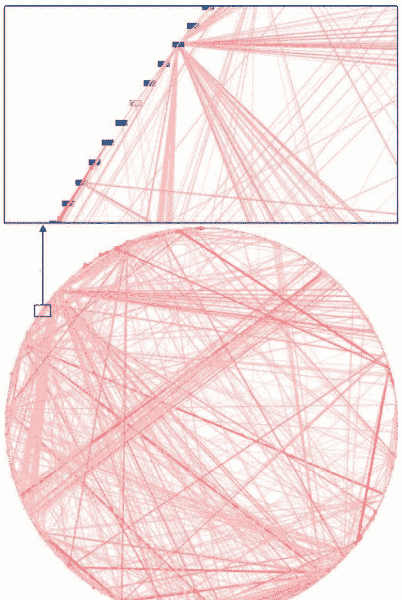

图 P-1. 一个现实生活中的依赖关系图（来源：“企业依赖关系：大毛线团” by Alex Papadimoulis）

> **小贴士：**

大泥球是软件的自然状态，就像荒野是你花园的自然状态一样。而防止崩溃需要付出能量和厘清方向。

幸运的是，避免创建大泥球的技术并不复杂。

## 封装和抽象

封装和抽象是我们所有程序员本能地使用的工具，即使我们并不都使用这些确切的词语。让我们稍微深入探讨一下它们，因为它们是本书的一个反复出现的背景主题。

封装这个术语涵盖了两个密切相关的想法：简化行为和隐藏数据。在本讨论中，我们使用第一个意义。我们通过识别需要在我们的代码中完成的任务并将该任务分配给一个定义良好的对象或函数来封装行为。我们称这个对象或函数为抽象。

看一下以下两个Python代码片段：

使用urllib进行搜索

```python
import json
from urllib.request import urlopen
from urllib.parse import urlencode

params = dict(q='Sausages', format='json')
handle = urlopen('http://api.duckduckgo.com' + '?' + urlencode(params))
raw_text = handle.read().decode('utf8')

parsed = json.loads(raw_text)

results = parsed['RelatedTopics']
for r in results:
    if 'Text' in r:
        print(r['FirstURL'] + ' - ' + r['Text'])
```

使用requests进行搜索

```python
import requests

params = dict(q='Sausages', format='json')
parsed = requests.get('http://api.duckduckgo.com/',
    params=params).json()

results = parsed['RelatedTopics']
for r in results:
    if 'Text' in r:
        print(r['FirstURL'] + ' - ' + r['Text'])
```

这两个代码清单做了同样的事情：它们提交表单编码值到URL，以便使用搜索引擎API。但是第二个更容易阅读和理解，因为它在更高的抽象层次上运行。

我们可以更进一步，通过确定和命名我们想要代码为我们执行的任务，并使用更高层次的抽象来使它更显而易见：

使用duckduckgo模块进行搜索

```python
import duckduckgo
for r in duckduckgo.query('Sausages').results:
    print(r.url + ' - ' + r.text)
```

通过使用抽象来封装行为是使代码更具表现力、更易于测试和更易于维护的有力工具。

> 注意：
> 在面向对象（OO）世界的文献中，这种方法的经典特征之一被称为责任驱动设计；它使用角色和责任这些词语，而不是任务。主要观点是从行为的角度而不是从数据或算法的角度考虑代码。

> 抽象和抽象基类
> 在传统的面向对象语言（如Java或C#）中，你可能会使用抽象基类（ABC）或接口来定义抽象。在Python中，你可以（有时会）使用抽象基类，但你也可以快乐地依赖鸭子类型。
> 抽象可以只意味着“你正在使用的东西的公共API” – 例如一个函数名称加上一些参数。

本书中的大多数模式都涉及选择抽象，因此每个章节都会有大量示例。此外，第3章专门讨论了选择抽象的一些通用启发式方法。

## 分层

封装和抽象通过隐藏细节和保护数据的一致性来帮助我们，但我们还需要注意对象和函数之间的交互。当一个函数、模块或对象使用另一个函数、模块或对象时，我们说一个依赖于另一个。这些依赖形成了一种网络或图形。

在大泥球中，依赖关系失控了（正如你在图P-1中看到的）。改变图形的一个节点变得困难，因为它有可能影响系统的许多其他部分。分层架构是解决这个问题的一种方式。在分层架构中，我们将代码分成离散的类别或角色，并引入规则，规定哪些代码类别可以互相调用。

最常见的例子之一是图P-2所示的三层架构。


图P-2 分层架构

分层架构可能是构建业务软件的最常见模式。在这个模型中，我们有用户界面组件，可以是网页、API或命令行；这些用户界面组件与包含我们的业务规则和工作流程的业务逻辑层通信；最后，我们有一个数据库层，负责存储和检索数据。

在本书的其余部分，我们将通过遵循一个简单的原则系统地将这个模型颠倒过来。

## 依赖倒置原则

你可能已经熟悉依赖倒置原则（DIP），因为它是SOLID中的D。

不幸的是，我们无法像封装那样使用三个小代码案列表来说明DIP。然而，第一部分的整个内容基本上是一个实现DIP的应用程序的工作示例，因此你将获得充足的具体示例。

同时，我们可以谈谈DIP的正式定义：

1. 高层模块不应该依赖于低层模块。两者应该依赖于抽象。
2. 抽象不应该依赖于细节。相反，细节应该依赖于抽象。

但是这是什么意思呢？让我们一点一点来理解。

高层模块是你的组织真正关心的代码。也许你在一家制药公司工作，你的高层模块处理患者和试验。也许你在一家银行工作，你的高层模块管理交易和交换。软件系统的高层模块是处理我们现实世界概念的函数、类和包。

相比之下，低层模块是你的组织不关心的代码。你的HR部门可能不会对文件系统或网络套接字感到兴奋。你很少与财务团队讨论SMTP、HTTP或AMQP。对于我们的非技术利益相关者，这些低级概念并不有趣或相关。他们关心的是高级概念是否正确工作。如果工资单准时发放，你的企业不太可能关心这是一个cron作业还是在Kubernetes上运行的临时函数。

“依赖于”不一定意味着导入或调用，而是指一个模块知道或需要另一个模块的一个更普遍的想法。

我们已经提到了抽象：它们是简化了的接口，封装了行为，就像我们的duckduckgo模块封装了搜索引擎的API一样。

> 计算机科学中的所有问题都可以通过增加另一个间接层来解决。
> ——David Wheeler

因此，DIP的第一部分表示我们的业务代码不应该依赖于技术细节；相反，两者都应该使用抽象。为什么呢？

大体上来说，因为我们希望能够独立地更改它们。高层模块应该易于根据业务需求进行更改。低级模块（细节）在实践中通常更难更改：考虑重构以更改函数名称与定义、测试和部署数据库迁移以更改列名称之间的区别。我们不希望业务逻辑的更改因为与低级基础设施细节紧密耦合而变慢。但是，同样重要的是，当你需要时（例如考虑分片数据库），能够更改基础设施的细节，而不需要对业务层进行更改。在它们之间添加一个抽象（著名的额外间接层）允许它们（更）独立地进行更改。

第二部分更加神秘。“抽象不应该依赖于细节”似乎足够清晰，但是“细节应该依赖于抽象”很难想象。我们如何拥有一个不依赖于它所抽象的细节的抽象？当我们到达第4章时，我们将有一个具体的示例，应该使这一切更加清晰。

## 我们的所有业务逻辑的归宿：领域模型

但在我们将我们的三层架构翻转之前，我们需要更多地讨论那个中间层：高层模块或业务逻辑。我们的设计出错的最常见原因之一是业务逻辑分散在应用程序的各个层中，使其难以识别、理解和更改。

第1章介绍了如何使用领域模型模式构建业务层。第I部分中的其余模式展示了我们如何选择正确的抽象并持续应用DIP，以使领域模型易于更改且不受低级问题的影响。

## 第一部分：构建支持领域建模的架构

> 大多数开发人员从未见过领域模型，只见过数据模型。
> ——Cyrille Martraire, DDD EU 2017

我们与关于架构的谈话中大多数开发人员都有一种不安的感觉，认为事情可以做得更好。他们通常试图拯救一个出了问题的系统，并试图将一些结构放回到这团大泥球中。他们知道他们的业务逻辑不应该分散在各个地方，但是他们不知道如何解决它。

我们发现，许多开发人员在被要求设计一个新系统时，会立即开始构建数据库模式，将对象模型视为事后处理。这就是一切开始出错的地方。相反，行为应该首先出现并驱动我们的存储来满足行为的需求。毕竟，我们的客户并不关心数据模型。他们关心系统的功能；否则，他们宁愿只使用电子表格。

本书的第一部分介绍了如何通过TDD构建丰富的对象模型（第1章），然后我们将展示如何使该模型与技术问题解耦。我们展示如何构建无持久性代码以及如何在我们的领域周围创建稳定的API，以便我们可以积极地进行重构。

为此，我们提出了四个关键的设计模式：

- 存储库模式，它是持久性存储的一个抽象概念
- 服务层模式，清晰地定义我们的用例从哪里开始和结束
- 工作单元模式，提供原子操作
- 聚合模式，以强制执行我们数据的完整性

如果你想了解我们要去哪里，请查看图I-1，但如果还没有理解，请不要担心！我们会在本书的这一部分逐个介绍这个图里的每个框。


我们还花了一点时间来谈论耦合和抽象，用一个简单的例子来说明我们选择抽象的方法和原因。

三个附录进一步探讨了第一部分的内容：

- 附录B是我们示例代码的基础设施的说明：我们怎么样构建和运行Docker镜像，我们在哪里管理配置信息以及我们如何运行不同类型的测试。
- 附录C是一种“实践出真知”的内容，展示了我们如何轻松地替换掉整个基础设施——Flask API、ORM和Postgres——以完全不同的I/O模型，涉及CLI和CSV文件。
- 最后，如果你想知道使用Django而不是Flask和SQLAlchemy时这些模式会是什么样子，附录D可能会引起你的兴趣。

## 第一章 领域模型

本章探讨了如何使用代码对业务流程进行建模，并且是以一种高度兼容TDD的方式。我们将讨论领域建模的重要性，并查看几个关键的领域建模模式：实体、值对象和领域服务。

图1-1是我们领域模型模式的简单视觉占位符。我们将在本章中填写一些细节，并在移动到其他章节时围绕领域模型构建事物，但你应该始终能够在核心找到这些小形状。

### Domain Model

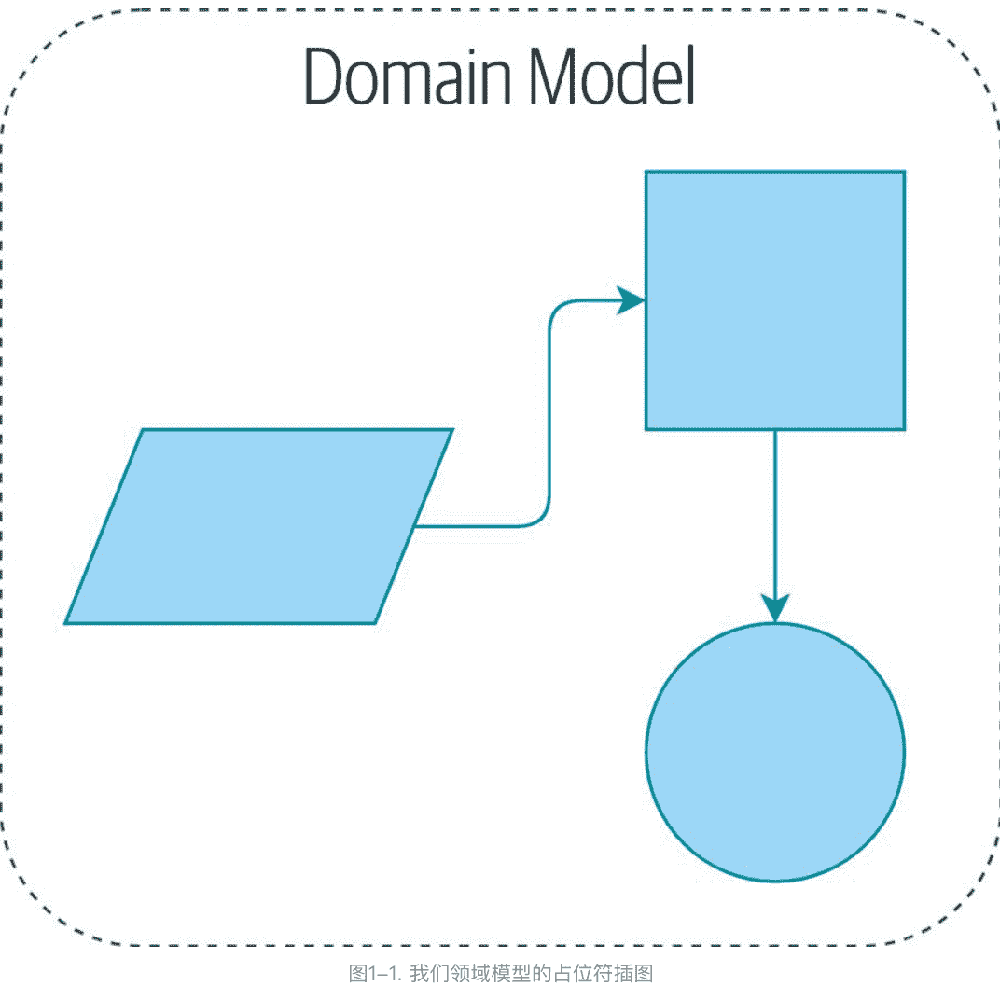

图1-1. 我们领域模型的占位符插图

### 什么是领域模型？

在介绍章节中，我们使用了“业务逻辑层”一词来描述三层架构的中心层。在本书的其余部分，我们将使用“领域模型”这个术语。这是DDD社区的一个术语，更好地捕捉了我们的意图（有关DDD的更多信息，请参见下一个补充内容块）。

领域是指你正在尝试解决的问题。作者目前在为一个家具在线零售商工作。根据你所谈论的系统，领域可能是采购和购入，产品设计或物流和交付。大多数程序员都在努力改进或自动化业务流程；领域是支持这些流程的一组活动。

模型是捕获有用属性的过程或现象的地图。人类非常擅长在头脑中产生事物的模型。例如，当有人向你扔球时，你能够几乎无意识地预测其运动，因为你具有有关物体在空间中移动方式的模型。当然你的模型绝非完美。人类对近光速或真空中物体行为的直觉非常糟糕，因为我们的模型从未被设计来涵盖这些情况。这并不意味着模型是错误的，但确实意味着一些预测超出了其领域。

领域模型是业务所有者对其业务的心理地图。所有业务人员都有这些心理地图——这是人类思考复杂流程的方式。

你可以通过他们使用商业术语来判断他们是否正在使用这些地图导航。术语在协作复杂系统的人员中自然产生。

想象一下，你这个不幸的读者突然被传送到了一个外星飞船上，与你的朋友和家人一起离开地球数光年，并且必须从头开始弄清如何导航回家。

在最初的几天里，你可能只是随意按按钮，但很快你就会学会哪些按钮是做什么的，以便你可以互相指示。你可能会说：“按下闪烁的小东西附近的红色按钮，然后扔掉雷达小玩意儿旁边的大操作杆。”

几周后，你会更加精确，因为你采用了用于描述飞船功能的单词：“增加三号货仓的氧气水平”或“打开小推进器。”几个月后，你将为整个复杂流程采用语言：“开始着陆序列”或“准备超空间跳跃。”这个过程会非常自然地发生，而不需要任何正式的努力来建立共享术语表。

> 这不是DDD书籍。你应该阅读DDD书籍。

领域驱动设计（DDD）普及了领域建模的概念，并通过专注于核心业务领域，成功地改变了人们设计软件的方式。本书涵盖的许多架构模式——包括实体、聚合、值对象（请参见第7章）和存储库（在下一章中）——来自DDD传统。

简而言之，DDD认为，软件最重要的是提供一个有用的问题模型。如果我们正确地理解这个模型，我们的软件将提供价值并使新事物成为可能。

如果我们错误地建立模型，它会成为一个需要绕过的障碍。在本书中，我们可以展示构建领域模型的基础知识，并围绕它构建架构，尽可能地使模型摆脱外部约束，以便轻松演变和变化。

但是，DDD和开发领域模型的过程、工具和技术还有很多内容。我们希望让你了解其中的一部分，并且不能再鼓励你继续阅读正式的DDD书籍：

- 原著《领域驱动设计》（Addison-Wesley Professional）作者Eric Evans的“蓝书”
- 《实现领域驱动设计》（Addison-Wesley Professional）作者Vaughn Vernon的“红书”

在琐碎的商业世界中也是如此。业务利益相关者使用的术语代表了对领域模型的精炼理解，将复杂的想法和流程浓缩成一个单词或短语。

当我们听到业务利益相关者使用不熟悉的词语或以特定方式使用术语时，我们应该倾听以了解更深层次的含义，并将他们辛苦获得的经验编码到我们的软件中。

在本书中，我们将使用一个真实的领域模型，具体来说是我们目前的雇主的模型。MADE.com是一家成功的家具零售商。我们从世界各地的制造商采购家具，并在欧洲销售。

当你购买沙发或咖啡桌时，我们必须确定如何最好地把你的商品从波兰、中国或越南运送到你的客厅中。

在高层次上，我们有独立的系统负责采购库存、向客户销售库存和向客户发货。中间的一个系统需要通过为客户的订单分配库存来协调该过程；参见图1-2。

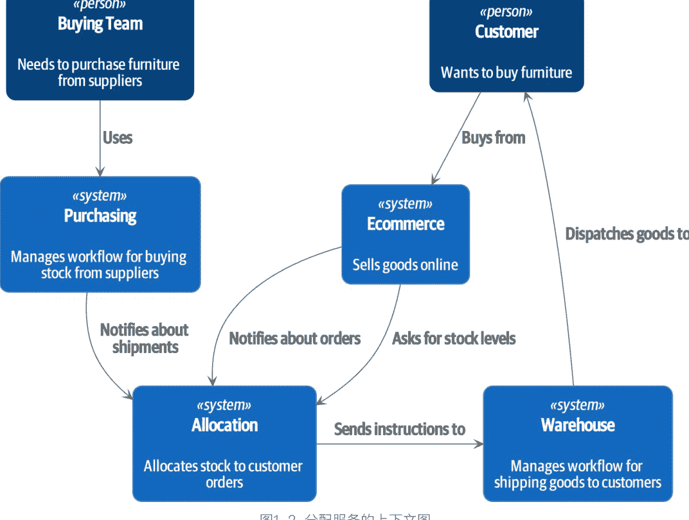

为了本书的目的，我们想象业务决定实施一种令人兴奋的新的库存分配方式。到目前为止，业务一直根据仓库中实际可用的库存和交货时间来展示库存情况。如果仓库用完了，产品就会被列为“缺货”，直到下一批从制造商那里到货。

这里的创新点是：如果我们有一个系统可以跟踪所有运输和它们预计到达的时间，我们就可以将这些货物视为真正的库存和我们的库存的一部分，只是交货时间稍长。更少的商品将被列为缺货，我们将卖出更多的商品，业务可以通过在国内仓库保持较低的库存来节省成本。

但是，分配订单不再是在仓库系统中递减单个数量的简单事情。我们需要更复杂的分配机制。是时候进行一些领域建模了。

### 探索领域语言

理解领域模型需要时间、耐心和便利贴。我们与业务专家进行了初步的对话，并就领域模型的第一个最小版本达成了词汇表和一些规则的共识。在可能的情况下，我们要求提供具体的例子来说明每个规则。

我们确保用业务术语（DDD术语中的通用语言）表达这些规则。我们选择易记的标识符来表示我们的对象，以便更容易讨论示例。

“分配一些笔记”展示了我们可能在与领域专家讨论分配时所做的一些笔记。

> ## 分配一些笔记

产品由 SKU（读作“skew”，即“库存单位”）标识，每个 SKU 对应一个商品。

客户下订单。一个订单由订单编号和多个订单行组成，每个订单行包括 SKU 和数量。例如：

- 10 个红色椅子
- 1 个风格平淡的灯

采购部门订购小批量的库存。每个库存批次有一个独特的 ID，称为编号，同时包含一个 SKU 和数量。

我们需要将订单行分配给批次。当我们将订单行分配给批次后，我们将从该特定批次向客户的送货地址发送库存。当我们将 x 个单位的库存分配给批次时，可用数量将减少 x。例如：

- 我们有一个包含 20 个小桌子的批次，并将一个包含 2 个小桌子的订单行分配给它。
- 该批次还剩下 18 个小桌子。

如果可用数量小于订单行的数量，我们无法将其分配给批次。例如：

- 我们有一个只有 1 个蓝色靠垫的批次，但有一个包含 2 个蓝色靠垫的订单行。
- 我们无法将该订单行分配给该批次。

我们不能将同一订单行分配两次。例如：

- 我们有一个包含 10 个蓝色花瓶的批次，并将一个包含 2 个蓝色花瓶的订单行分配给它。
- 如果我们再次将订单行分配给同一个批次，该批次仍应该有 8 个可用数量。

批次如果当前正在运输，或者可能在仓库库存中，就会有一个预计到达时间（ETA）。我们优先将订单行分配给仓库库存，其次是运输批次。我们按照 ETA 最早的顺序分配运输批次。

### 单元测试领域模型

本书不会向你展示 TDD 的工作原理，但我们想向你展示如何从业务对话中构建模型。

> 读者的练习
> 为什么不试着自己解决这个问题呢？编写一些单元测试，看看能否用简洁清晰的代码捕捉到这些业务规则的本质。
> 你可以在 GitHub 上找到一些占位符单元测试，但你也可以从头开始，或者按照自己的方式组合/重写它们。

以下是我们的第一个测试可能的样子：

分配的第一个测试 (test_batches.py)

```python
def test_allocating_to_a_batch_reduces_the_available_quantity():
    batch = Batch("batch-001", "SMALL-TABLE", qty=20, eta=date.today())
    line = OrderLine('order-ref', "SMALL-TABLE", 2)

    batch.allocate(line)

    assert batch.available_quantity == 18
```

我们的单元测试名称描述了我们希望从系统中看到的行为，我们使用的类和变量名称来自业务术语。我们可以向非技术的同事展示这段代码，并且他们会同意这正确地描述了系统的行为。

以下是符合我们要求的领域模型的第一个版本：

批次的第一次领域模型 (model.py)

```python
@dataclass(frozen=True) ①②
class OrderLine:
    orderid: str
    sku: str
    qty: int

class Batch:
    def __init__(
        self, ref: str, sku: str, qty: int, eta: Optional[date]
    ):
        self.reference = ref
        self.sku = sku
        self.eta = eta
        self.available_quantity = qty

    def allocate(self, line: OrderLine):
        self.available_quantity -= line.qty
```

1. OrderLine 是一个没有行为的不可变数据类。
2. 为了保持代码干净，我们在大多数代码清单中不显示导入。我们希望你可以猜到这是通过 from dataclasses import dataclass; 同样，typing.Optional 和 datetime.date。如果你想再次检查任何内容，你可以在其分支中查看每个章节的完整工作代码（例如，chapter_01_domain_model）。
3. 类型提示在 Python 世界中仍然是有争议的问题。对于领域模型，它们有时可以帮助澄清或记录预期的参数是什么，使用 IDE 的人通常会感激它们。你可能会认为可读性的代价太高。

我们的实现很简单：Batch 只是包装了一个整数 available_quantity，并在分配时减少该值。我们已经编写了相当多的代码，只是为了从另一个数字中减去一个数字，但我们认为精确地建模我们的领域将会得到回报。

让我们编写一些新的失败测试：

测试可分配的逻辑 (test_batches.py)

python
def make_batch_and_line(sku, batch_qty, line_qty):
    return (
        Batch("batch-001", sku, batch_qty, eta=date.today()),
        OrderLine("order-123", sku, line_qty)
    )

def test_can_allocate_if_available_greater_than_required():
    large_batch, small_line = make_batch_and_line("ELEGANT-LAMP", 20, 2)
    assert large_batch.can_allocate(small_line)

def test_cannot_allocate_if_available_smaller_than_required():
    small_batch, large_line = make_batch_and_line("ELEGANT-LAMP", 2, 20)
    assert small_batch.can_allocate(large_line) is False

def test_can_allocate_if_available_equal_to_required():
    batch, line = make_batch_and_line("ELEGANT-LAMP", 2, 2)
    assert batch.can_allocate(line)

def test_cannot_allocate_if_skus_do_not_match():
    batch = Batch("batch-001", "UNCOMFORTABLE-CHAIR", 100, eta=None)
    different_sku_line = OrderLine("order-123", "EXPENSIVE-TOASTER", 10)
    assert batch.can_allocate(different_sku_line) is False

这里没有什么太意外的。我们重构了测试套件，以便不再重复创建相同 SKU 的批次和订单行的相同代码行；我们编写了四个简单的测试用于测试 can_allocate 方法。同样，请注意，我们使用的名称反映了我们的领域专家的语言，我们商定的示例直接写入了代码中。

我们也可以简单地实现这一点，编写 Batch 的 can_allocate 方法：

### 模型中的新方法 (model.py)

python
def can_allocate(self, line: OrderLine) -> bool:
    return self.sku == line.sku and self.available_quantity >= line.qty

到目前为止，我们只需增加和减少 Batch.available_quantity 来管理实现，但是在进行 deallocate() 测试时，我们将被迫采用更智能的解决方案：

这个测试将需要一个更智能的模型 (test_batches.py)

python
def test_can_only_deallocate_allocated_lines():
    batch, unallocated_line = make_batch_and_line("DECORATIVE-TRINKET", 20, 2)
    batch.deallocate(unallocated_line)
    assert batch.available_quantity == 20

在这个测试中，我们断言从批次中取消分配一行除非该批次先前分配了该行，否则不会产生任何影响。为了让这个测试起作用，我们的 Batch 需要了解哪些行已经被分配。让我们看一下实现：

### 领域模型现在跟踪分配 (model.py)

python
class Batch:
    def __init__(
        self, ref: str, sku: str, qty: int, eta: Optional[date]
    ):
        self.reference = ref
        self.sku = sku
        self.eta = eta
        self._purchased_quantity = qty
        self._allocations = set()  # type: Set[OrderLine]

    def allocate(self, line: OrderLine):
        if self.can_allocate(line):
            self._allocations.add(line)

    def deallocate(self, line: OrderLine):
        if line in self._allocations:
            self._allocations.remove(line)

    @property
    def allocated_quantity(self) -> int:
        return sum(line.qty for line in self._allocations)

    @property
    def available_quantity(self) -> int:
        return self._purchased_quantity - self.allocated_quantity

    def can_allocate(self, line: OrderLine) -> bool:
        return self.sku == line.sku and self.available_quantity >= line.qty

### 用UML展示模型

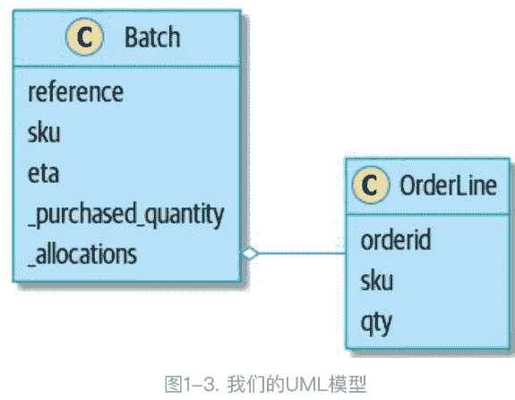

图1-3. 我们的UML模型

现在我们取得了一些进展！批次现在跟踪一组已分配的 OrderLine 对象。当我们分配时，如果有足够的可用数量，我们只需添加到集合中。我们的 available_quantity 现在是一个计算的属性：购买数量减去已分配数量。

是的，我们还可以做很多事情。allocate() 和 deallocate() 都可能悄悄失败，这有点令人不安，但我们已经掌握了基础知识。

顺便说一句，使用集合来处理 ._allocations 可以使我们很容易地处理最后一个测试，因为集合中的项是唯一的：

### 最后一个批次测试！（test_batches.py）

python
def test_allocation_is_idempotent():
    batch, line = make_batch_and_line("ANGULAR-DESK", 20, 2)
    batch.allocate(line)
    batch.allocate(line)
    assert batch.available_quantity == 18

目前，批次模型可能是一个有效的批评，说它太琐碎了，不值得使用 DDD（甚至面向对象编程！）。在现实生活中，任何数量的业务规则和边缘情况都会出现：客户可以要求在特定的未来日期交货，这意味着我们可能不想将它们分配给最早的批次。一些 SKU 不在批次中，而是直接从供应商按需订购，因此它们有不同的逻辑。根据客户的位置，我们可以仅分配到他们所在地区的仓库和运输，除了一些 SKU，我们很乐意从不同地区的仓库交付，如果我们在本地区的库存不足，等等。现实世界中的真实企业知道如何比我们在本页中展示的那样更快地堆叠复杂性！

但是，将这个简单的领域模型作为更复杂的占位符，我们将在本书的其余部分扩展我们的简单领域模型，并将其插入到 API、数据库和电子表格的真实世界中。我们将看到，严格遵守封装和仔细分层的原则将帮助我们避免一团混乱。

## 更多类型的类型提示

如果你真的想用类型提示做得更好，你可以使用 typing.NewType 将原始类型包装起来：

Bob，只管把类型提示做到极致。

```
from dataclasses import dataclass
from typing import NewType

Quantity = NewType("Quantity", int)
Sku = NewType("Sku", str)
Reference = NewType("Reference", str)
...

class Batch:
    def __init__(self, ref: Reference, sku: Sku, qty: Quantity):
        self.sku = sku
        self.reference = ref
        self._purchased_quantity = qty
```

这将允许我们的类型检查器确保我们不会在期望Reference的地方传递 Sku。

你认为这是美妙的还是令人震惊的，这是一个有争议的问题。

## 数据类非常适合值对象

我们在之前的代码列表中广泛使用了 line，但是 line 是什么呢？在我们的业务语言中，一个订单有多个行项目，每个行项目都有一个 SKU 和数量。我们可以想象，一个包含订单信息的简单 YAML 文件可能像这样：

### 使用YAML描述的订单信息

```
1  Order_reference: 12345
2  Lines:
3    - sku: RED-CHAIR
4      qty: 25
5    - sku: BLU-CHAIR
6      qty: 25
7    - sku: GRN-CHAIR
8      qty: 25
```

请注意，虽然订单有一个唯一标识它的编号，但行没有。（即使我们将订单编号添加到 OrderLine 类中，它也不是唯一标识行本身的东西。）

每当我们有一个有数据但没有身份的业务概念时，我们通常选择使用 Value Object 模式来表示它。值对象是任何由它所持有的数据唯一标识的领域对象；我们通常使它们是不可变的：

### OrderLine 是一个值对象

python
@dataclass(frozen=True)
class OrderLine:
    orderid: OrderReference
    sku: ProductReference
    qty: Quantity

数据类（或者命名元组）给我们带来的好处之一是值相等，这是一种花哨的说法，即“具有相同的 orderid、sku 和 qty 的两行是相等的”。

### 更多值对象的例子

python
from dataclasses import dataclass
from typing import NamedTuple
from collections import namedtuple

@dataclass(frozen=True)
class Name:
    first_name: str
    surname: str

class Money(NamedTuple):
    currency: str
    value: int

Line = namedtuple('Line', ['sku', 'qty'])

def test_equalty():
    assert Money('gbp', 10) == Money('gbp', 10)
    assert Name('Harry', 'Percival') != Name('Bob', 'Gregory')
    assert Line('RED-CHAIR', 5) == Line('RED-CHAIR', 5)

这些值对象与其值如何运作的真实世界的直觉相匹配。无论我们谈论哪一张10英镑的纸币，都没有关系，因为它们的价值相同。同样，如果两个名字的名字和姓氏都匹配，它们就是相等的；如果两个Line具有相同的客户订单、产品代码和数量，它们就是等效的。不过，我们仍然可以在值对象上有复杂的行为。事实上，支持值的操作是很常见的；例如，数学运算符：

### 使用值对象进行数学运算

python
fiver = Money('gbp', 5)
tenner = Money('gbp', 10)

def can_add_money_values_for_the_same_currency():
    assert fiver + fiver == tenner

def can_subtract_money_values():
    assert tenner - fiver == fiver

def adding_different_currencies_fails():
    with pytest.raises(ValueError):
        Money('usd', 10) + Money('gbp', 10)

def can_multiply_money_by_a_number():
    assert fiver * 5 == Money('gbp', 25)

def multiplying_two_money_values_is_an_error():
    with pytest.raises(TypeError):
        tenner * fiver

## 值对象和实体

一个订单行通过其订单ID、SKU和数量唯一标识；如果我们更改这些值中的任何一个，我们现在就有了一个新的行。这就是值对象的定义：任何只由其数据标识且没有长期身份的对象。但是批次呢？那是通过引用标识的。

我们使用实体一词来描述具有长期身份的领域对象。在上一页中，我们介绍了一个名为Name的类作为值对象。如果我们将名字Harry Percival改变一个字母，我们就会得到新的Name对象Barry Percival。

很明显，Harry Percival不等于Barry Percival：

### 名字本身不能改变...

python
def test_nameEquality():
    assert Name("Harry", "Percival") != Name("Barry", "Percival")

但是作为一个人的Harry呢？人们确实会改变他们的名字、婚姻状况甚至性别，但我们仍然认为他们是同一个人。这是因为人类有一个持久的身份，而不像名字那样：

### 但是一个人可以改变！

python
class Person:
    def __init__(self, name: Name):
        self.name = name

def test_barry_is_harry():
    harry = Person(Name("Harry", "Percival"))
    barry = harry
    barry.name = Name("Barry", "Percival")
    assert harry is barry and barry is harry

实体与值不同，具有身份平等。我们可以改变它们的值，它们仍然是可以被认出的同一物体。在我们的例子中，批次是实体。我们可以将Line分配给批次，或更改我们预计到达的日期，它仍然是相同的实体。

我们通常通过在实体上实现等式运算符来明确这一点：

### 实现等式运算符 (model.py)

python
class Batch:
    ...
    def __eq__(self, other):
        if not isinstance(other, Batch):
            return False
        return other.reference == self.reference

    def __hash__(self):
        return hash(self.reference)

Python的__eq__魔术方法定义了类在==运算符下的行为。

对于实体和值对象，考虑__hash__如何工作也很重要。这是Python用于控制对象在添加到集合或用作dict键时的行为的魔术方法；你可以在Python文档中找到更多信息。

对于值对象，哈希应该基于所有的值属性，并且我们应该确保对象是不可变的。通过在数据类上指定@frozen=True，我们可以免费获得这个功能。

对于实体，最简单的选项是说哈希值为None，意味着对象不可哈希，例如不能在集合中使用。如果由于某些原因你决定确实想使用实体进行set或dict操作，哈希应该基于定义实体的唯一身份随时间变化的属性（例如.reference）。你还应该尝试使该属性只读。

> **警告**

这是一个棘手的领域；你不应该在不修改__eq__的情况下修改__hash__。如果你不确定自己在做什么，建议进一步阅读。我们的技术评论员Hynek Schlawack的“Python Hashes and Equality”是一个很好的起点。

## 并非所有东西都必须是对象：领域服务函数

我们已经创建了一个模型来表示批次，但实际上我们需要做的是将订单行分配给代表我们所有库存的特定一组批次。

有时，这只是一件事情。

> – Eric Evans，《领域驱动设计》

Evans讨论了在实体或值对象中没有自然位置的领域服务操作的想法。分配订单行给一组批次的事情听起来很像一个函数，我们可以利用Python是一种多范式语言的优点，将其作为函数。

让我们看看如何测试驱动这样的函数：

### 测试我们的领域服务（test_allocate.py）

python
def test_prefers_current_stock_batches_to_shipments():
    in_stock_batch = Batch("in-stock-batch", "RETRO-CLOCK", 100, eta=None)
    shipment_batch = Batch("shipment-batch", "RETRO-CLOCK", 100, eta=tomorrow)
    line = OrderLine("oref", "RETRO-CLOCK", 10)
    allocate(line, [in_stock_batch, shipment_batch])
    assert in_stock_batch.available_quantity == 90
    assert shipment_batch.available_quantity == 100

def test_prefers_earlier_batches():
    earliest = Batch("speedy-batch", "MINIMALIST-SPOON", 100, eta=today)
    medium = Batch("normal-batch", "MINIMALIST-SPOON", 100, eta=tomorrow)
    latest = Batch("slow-batch", "MINIMALIST-SPOON", 100, eta=later)
    line = OrderLine("order1", "MINIMALIST-SPOON", 10)
    allocate(line, [medium, earliest, latest])
    assert earliest.available_quantity == 90
    assert medium.available_quantity == 100
    assert latest.available_quantity == 100

def test_returns_allocated_batch_ref():
    in_stock_batch = Batch("in-stock-batch-ref", "HIGHBROW-POSTER", 100, eta=None)
    shipment_batch = Batch("shipment-batch-ref", "HIGHBROW-POSTER", 100, eta=tomorrow)
    line = OrderLine("oref", "HIGHBROW-POSTER", 10)
    allocation = allocate(line, [in_stock_batch, shipment_batch])
    assert allocation == in_stock_batch.reference

我们的服务可能看起来像这样：

### 领域服务的独立函数 (model.py)

## Python的魔术方法让我们使用惯用的Python来使用我们的模型

你可能喜欢或不喜欢前面代码中使用`next()`的方式，但我们非常确定你会同意在我们的批次列表上使用`sorted()`是很好的、惯用的Python。

为了使其工作，我们在我们的领域模型上实现`__gt__`：

魔术方法可以表达领域语义 (model.py)

```python
class Batch:
    ...

    def __gt__(self, other):
        if self.eta is None:
            return False
        if other.eta is None:
            return True
        return self.eta > other.eta
```

太棒了。

## 异常也可以表达领域概念

我们有一个最后的概念要涵盖：异常也可以用来表达领域概念。在与领域专家的交流中，我们了解到订单无法分配的可能性是因为我们缺货了，我们可以通过使用领域异常来捕获这个问题：

测试缺货异常 (test_allocate.py)

```python
def test_raises_out_of_stock_exception_if_cannot_allocate():
    batch = Batch('batch1', 'SMALL-FORK', 10, eta=today)
    allocate(OrderLine('order1', 'SMALL-FORK', 10), [batch])

    with pytest.raises(OutOfStock, match='SMALL-FORK'):
        allocate(OrderLine('order2', 'SMALL-FORK', 1), [batch])
```

## 领域建模总结

领域建模

这是你的代码中最接近业务、最可能改变和为业务提供最大价值的部分。让它易于理解和修改。

区分实体和值对象

值对象由其属性定义。它通常最好实现为不可变类型。如果你更改值对象上的属性，则表示不同的对象。相反，实体具有可能随时间变化的属性，但它仍将是相同的实体。重要的是定义是什么唯一地标识实体（通常是某种名称或引用字段）。

并非所有东西都必须是对象

Python是一种多范式语言，所以让代码中的“动词”成为函数。对于每个`FooManager`、`BarBuilder`或`BazFactory`，通常都有更具表现力和可读性的`manage_foo()`、`build_bar()`或`get_baz()`等待发生。

这是应用你最好的OO设计原则的时候了

重新审视SOLID原则和所有其他好的启发式方法，如“has a versus is-a”、“prefer composition over inheritance”等等。

你还需要考虑一致性边界和聚合

但这是第7章的话题。

我们不会太过无聊地讲述实现细节，但主要要注意的是，我们在通用语言中给我们的异常命名时要小心，就像我们对实体、值对象和服务所做的一样：

引发领域异常（model.py）

```python
class OutOfStock(Exception):
    pass

def allocate(line: OrderLine, batches: List[Batch]) -> str:
    try:
        batch = next(
            ...
    except StopIteration:
        raise OutOfStock(f'Out of stock for sku {line.sku}')
```

图1-4是我们最终的视觉表示。

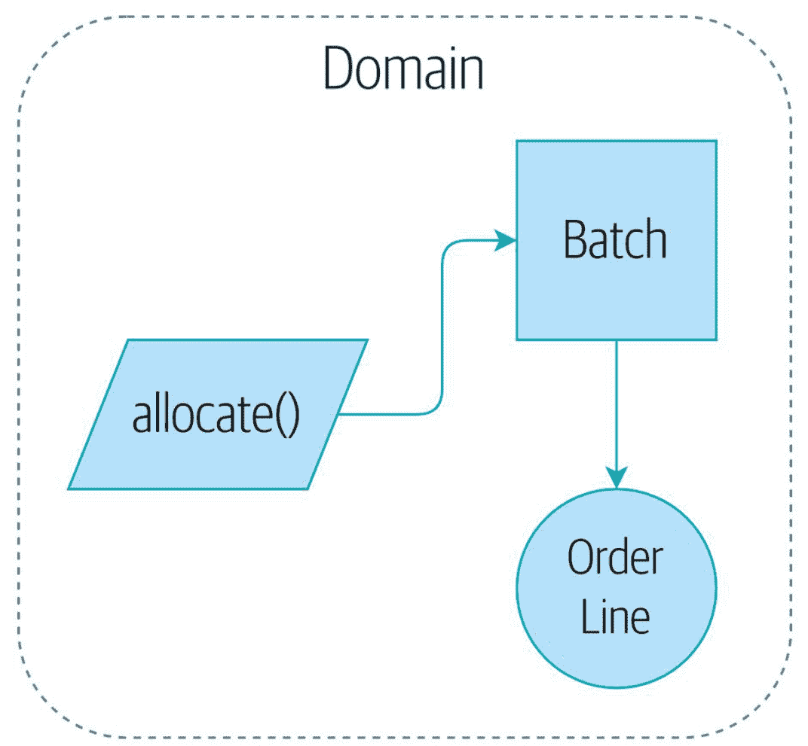

图1-4. 在本章末尾我们的领域模型

现在这可能就够了！我们有一个领域服务，可以用于我们的第一个用例。但首先我们需要一个数据库...

## 第二章 存储库模式

现在是时候兑现我们使用依赖倒置原则来将核心逻辑与基础设施问题解耦的承诺了。

我们将介绍存储库模式，这是一种简化数据存储的抽象，允许我们将模型层与数据层解耦。我们将通过一个具体的例子来展示这种简化抽象如何通过隐藏数据库的复杂性使我们的系统更易于测试。

图2-1展示了我们要构建的一个小预览：一个位于我们领域模型和数据库之间的存储库对象。

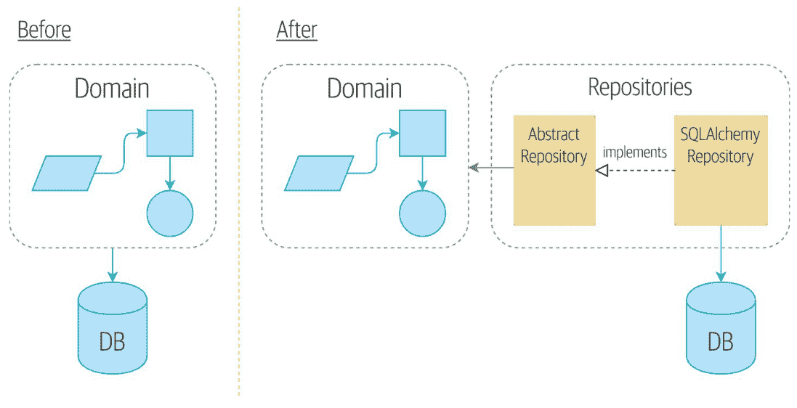

图2-1. 应用存储库模式前后

> **提示**

本章的代码位于GitHub上的`chapter_02_repository`分支中。

```
git clone https://github.com/cosmicpython/code.git
cd code
git checkout chapter_02_repository
```

或者要跟随代码，检出上一章：

```
git checkout chapter_01_domain_model
```

### 持久化我们的领域模型

在第1章中，我们构建了一个简单的领域模型，可以将订单分配给库存批次。我们很容易编写针对这段代码的测试，因为没有任何依赖项或基础设施需要设置。如果我们需要运行数据库或API并创建测试数据，我们的测试将更难编写和维护。

不幸的是，我们最终需要将我们完美的小模型放到用户手中，并应对电子表格、Web浏览器和竞态条件等真实世界的问题。在接下来的几章中，我们将看看如何将我们理想化的领域模型与外部状态连接起来。

我们希望以敏捷的方式工作，因此我们的重点是尽快达到最小可行产品。在我们的情况下，这将是一个Web API。在实际项目中，你可能会直接使用一些端到端测试，并开始插入Web框架，从外向内进行测试驱动。

但是我们知道，无论如何，我们都需要某种形式的持久化存储，而这是一本教科书，因此我们可以允许自己稍微多一点自下而上的开发，并开始考虑存储和数据库。

### 一些伪代码：我们需要什么？

当我们构建第一个API端点时，我们知道我们将需要一些看起来类似于以下内容的代码。

我们第一个API端点

```python
@flask.route.gubbins
def allocate_endpoint():
    # extract order line from request
    line = OrderLine(request.params, ...)
    # load all batches from the DB
    batches = ...
    # call our domain service
    allocate(line, batches)
    # then save the allocation back to the database somehow
    return 201
```

> **注意**
我们使用Flask因为它很轻量级，但你不需要成为Flask用户才能理解本书。实际上，我们将向你展示如何将框架的选择作为次要细节。

我们需要一种从数据库中检索批次信息并从中实例化我们的领域模型对象的方法，我们还需要一种将它们保存回数据库的方法。

什么？哦，“gubbins”是英国单词，意思是“东西”。你可以忽略它。这只是伪代码，好吧？

### 将DIP应用于数据访问

如介绍中所述，分层架构是一种常见的方法，用于构建具有UI、一些逻辑和数据库的系统（参见图2-2）。


图2-2. 分层架构

Django的Model-View-Template结构与之密切相关，Model-View-Controller（MVC）也是如此。无论如何，目标是保持层之间的分离（这是一件好事），并且每个层仅依赖于其下面的层。

但是，我们希望我们的领域模型完全没有依赖关系。我们不希望基础设施问题渗透到我们的领域模型中，从而减慢单元测试或更改能力。

相反，如介绍中所述，我们将认为我们的模型处于“内部”，并且依赖项向其内部流动。这是人们有时称之为洋葱架构的东西（见图2-3）。

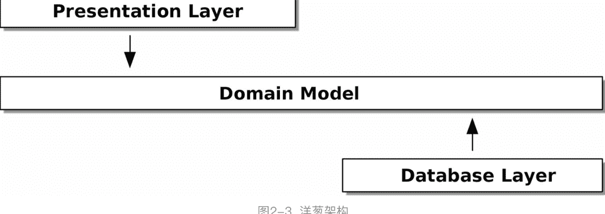

图2-3. 洋葱架构

> 这是端口和适配器模式吗？

如果你一直在阅读架构模式，你可能会问自己这样的问题：

这是端口和适配器模式吗？还是六边形架构？这与洋葱架构相同吗？清洁架构呢？什么是端口，什么是适配器？为什么你们用那么多词来说同样的事情？

虽然有些人喜欢挑剔差异，但所有这些基本上都是同一件事的名称，它们都归结为依赖反转原则：高级模块（领域）不应依赖低级模块（基础设施）。

在本书的后面，我们将进入一些关于“依赖于抽象”的细节，并探讨是否有Pythonic等效的接口。另请参见“Python中的端口和适配器是什么？”。

### 提醒：我们的领域模型

让我们回想一下我们的领域模型（见图2–4）：分配是将订单行链接到批次的概念。
我们将分配存储为批次对象上的集合。

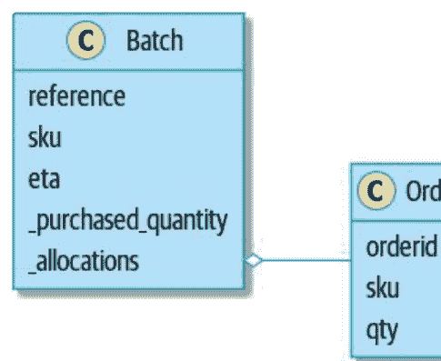

图2–4. 我们的模型

让我们看看如何将其转换为关系数据库。

### “正常”ORM方式：模型依赖于ORM

现在，你的团队成员不太可能手动编写自己的SQL查询。相反，你几乎肯定使用一些框架根据你的模型对象为你生成SQL。
这些框架称为对象关系映射器（ORM），因为它们存在的目的是弥合对象和领域建模与数据库和关系代数之间的概念差距。

ORM给我们带来的最重要的东西是对持久化无知：我们精美的领域模型不需要知道如何加载或持久化数据的任何信息。这有助于保持我们的领域不依赖于特定的数据库技术。

但是，如果你按照典型的SQLAlchemy教程操作，你最终会得到如下内容：

SQLAlchemy的“声明性”语法，模型依赖于ORM (orm.py)

```python
from sqlalchemy import Column, ForeignKey, Integer, String
from sqlalchemy.ext.declarative import declarative_base
from sqlalchemy.orm import relationship

Base = declarative_base()

class Order(Base):
    id = Column(Integer, primary_key=True)

class OrderLine(Base):
    id = Column(Integer, primary_key=True)
    sku = Column(String(250))
    qty = Integer(String(250))
    order_id = Column(Integer, ForeignKey('order.id'))
    order = relationship(Order)

class Allocation(Base):
    ...
```

即使不了解SQLAlchemy，你也可以看到我们的原始模型现在充满了对ORM的依赖，而且看起来非常丑陋。我们真的可以说这个模型对数据库一无所知吗？当我们的模型属性直接耦合到数据库列时，它怎么能与存储问题分离呢？

### DJANGO的ORM本质上是相同的，但更加严格

如果你更习惯于Django，则前面的“声明性”SQLAlchemy片段将转换为以下内容：

Django ORM示例

```python
class Order(models.Model):
    pass

class OrderLine(models.Model):
    sku = models.CharField(max_length=255)
    qty = models.IntegerField()
    order = models.ForeignKey(Order)

class Allocation(models.Model):
    ...
```

重点是相同的–我们的模型类直接从ORM类继承，因此我们的模型依赖于ORM。我们希望相反。

Django没有为SQLAlchemy的经典映射器提供等效项，但请参见附录D，了解如何将依赖反转和存储库模式应用于Django的示例。

### 反转依赖：ORM依赖于领域模型

幸运的是，这不是使用SQLAlchemy的唯一方法。另一种方法是单独定义模式，并定义一个显式映射，以便在模式和我们的领域模型之间进行转换，这就是SQLAlchemy称之为经典映射：

使用SQLAlchemy Table对象的显式ORM映射(orm.py)

```python
from sqlalchemy.orm import mapper, relationship

import model ❶

metadata = MetaData()

order_lines = Table( ❷
    'order_lines', metadata,
    Column('id', Integer, primary_key=True, autoincrement=True),
    Column('sku', String(255)),
    Column('qty', Integer, nullable=False),
    Column('orderid', String(255)),
)

...

def start_mappers():
    lines_mapper = mapper(model.OrderLine, order_lines) ❸
```

1. ORM导入（或“依赖于”或“知道”）领域模型，而不是相反。
2. 我们使用SQLAlchemy的抽象定义数据库表和列。
3. 当我们调用映射器函数时，SQLAlchemy会将我们的领域模型类与我们定义的各种表绑定起来。

最终结果是，如果我们调用`start_mappers`，我们将能够轻松地从数据库加载和保存领域模型实例。但是，如果我们从未调用该函数，我们的领域模型类将幸福地不知道数据库。

这为我们提供了使用SQLAlchemy的所有好处，包括使用alembic进行迁移的能力，以及使用我们的领域类透明地查询的能力，我们将在后面看到。

当你首次尝试构建ORM配置时，编写测试可能很有用，如以下示例所示：

直接测试ORM（一次性测试）（test_orm.py）

```python
def test_orderline_mapper_can_load_lines(session):
    session.execute(
        'INSERT INTO order_lines (orderid, sku, qty) VALUES '
        '("order1", "RED-CHAIR", 12),'
        '("order1", "RED-TABLE", 13),'
        '("order2", "BLUE-LIPSTICK", 14)'
    )
    expected = [
        model.OrderLine("order1", "RED-CHAIR", 12),
        model.OrderLine("order1", "RED-TABLE", 13),
        model.OrderLine("order2", "BLUE-LIPSTICK", 14),
    ]
    assert session.query(model.OrderLine).all() == expected
```

```python
def test_orderline_mapper_can_save_lines(session):
    new_line = model.OrderLine("order1", "DECORATIVE-WIDGET", 12)
    session.add(new_line)
    session.commit()

    rows = list(session.execute('SELECT orderid, sku, qty FROM "order_lines"'))
    assert rows == [("order1", "DECORATIVE-WIDGET", 12)]
```

1. 如果你还没有使用过pytest，那么需要解释此测试的`session`参数。对于本书的目的，你无需担心pytest或其固定装置的详细信息，但简短的解释是，你可以将常见依赖项定义为“固定装置”，pytest将通过查看它们的函数参数将它们注入到需要它们的测试中。在这种情况下，它是一个SQLAlchemy数据库会话。

你可能不会保留这些测试-正如你很快就会看到的那样，一旦你取得了反转ORM和领域模型的依赖关系的步骤，实现另一个称为存储库模式的抽象只是一个小小的额外步骤，这将更容易编写测试，并提供一个简单的接口，以便稍后在测试中进行欺骗。

但是，我们已经实现了反转传统依赖关系的目标：领域模型保持“纯净”并摆脱基础架构问题。我们可以扔掉SQLAlchemy并使用不同的ORM或完全不同的持久性系统，领域模型根本不需要改变。

根据你在领域模型中所做的工作，特别是如果你远离面向对象范例，你可能会发现越来越难以让ORM产生你需要的确切行为，你可能需要修改领域模型。正如架构决策经常发生的那样，你需要考虑权衡。正如Python的禅语所说，“实用性胜过纯洁！”

此时，尽管我们的API端点可能看起来像以下内容，并且我们可以让其正常工作：

直接在API端点程序中使用SQLAlchemy

```python
@flask.route.gubbins
def allocate_endpoint():
    session = start_session()

    # extract order line from request
    line = OrderLine(
        request.json['orderid'],
        request.json['sku'],
        request.json['qty'],
    )

    # load all batches from the DB
    batches = session.query(Batch).all()

    # call our domain service
    allocate(line, batches)

    # save the allocation back to the database
    session.commit()

    return 201
```

### 介绍存储库模式

存储库模式是对持久性存储的抽象。它通过假装我们所有的数据都在内存中来隐藏数据访问的无聊细节。

如果我们的笔记本电脑有无限的内存，我们就不需要笨重的数据库了。相反，我们可以随时使用我们的对象。那会是什么样子呢？

你必须从某个地方获取数据

python
import all_my_data

def create_a_batch():
    batch = Batch(...)
    all_my_data.batches.add(batch)

def modify_a_batch(batch_id, new_quantity):
    batch = all_my_data.batches.get(batch_id)
    batch.change_initial_quantity(new_quantity)

即使我们的对象在内存中，我们仍然需要将它们放在某个地方，以便我们可以再次找到它们。我们的内存中数据将使我们能够添加新对象，就像列表或集合一样。因为对象在内存中，我们永远不需要调用.save()方法；我们只需获取我们关心的对象并在内存中修改它即可。

## 抽象中的存储库

最简单的存储库只有两个方法：add()用于将新项目放入存储库中，get()用于返回先前添加的项目。我们坚决使用这些方法在我们的领域和服务层中进行数据访问。这种自我强制的简单性防止了我们将领域模型与数据库耦合。

以下是我们存储库的抽象基类（ABC）的样子：

最简单的存储库（repository.py）

```python
class AbstractRepository(abc.ABC):

    @abc.abstractmethod ①
    def add(self, batch: model.Batch):
        raise NotImplementedError ②

    @abc.abstractmethod
    def get(self, reference) -> model.Batch:
        raise NotImplementedError
```

1. Python提示：@abc.abstractmethod是使ABC在Python中实际“工作”的少数几件事之一。Python将拒绝让你实例化未实现其父类中定义的所有抽象方法的类。
2. raise NotImplementedError很好，但它既不是必要的也不充分。实际上，如果你真的想要，你的抽象方法可以有真正的行为，子类可以调用它们。

## 抽象基类、鸭子类型和协议

我们在本书中使用抽象基类是出于教学目的：我们希望它们有助于解释存储库抽象的接口。

在实际生活中，我们有时会从生产代码中删除ABC，因为Python做到忽略它们太容易了，它们最终会无法维护，最坏的情况下会误导。实际上，我们通常只依赖Python的鸭子类型来实现抽象。对于Pythonista来说，存储库是具有add(thing)和get(id)方法的任何对象。

另一种选择是查看PEP 544协议。这些协议为你提供了类型而没有继承的可能性，这将特别受“优先使用组合而不是继承”的粉丝们的喜爱。

## 权衡是什么？

你知道他们说经济学家对于价格什么都知道，对于价值什么都不知道吗？好吧，程序员知道每一件事情的好处，但没有考虑它的代价。

> – Rich Hickey

每当我们在本书中引入一种架构模式时，我们总是会问：“我们得到了什么？我们付出了什么？”

通常，至少，我们将引入额外的抽象层，虽然我们可能希望它会减少总体复杂性，但它确实在本地增加了复杂性，并且在移动部件的原始数量和持续维护方面有成本。

如果你已经走在DDD和依赖反转路线上，存储库模式可能是本书中最容易选择的。就我们的代码而言，我们实际上只是将SQLAlchemy抽象（session.query(Batch)）替换为我们设计的不同抽象（batches_repo.get）。

每当我们想要检索新的领域对象时，我们将不得不在存储库类中编写几行代码，但作为回报，我们获得了对我们控制的存储层的简单抽象。存储库模式将使更改我们存储事物的方式变得容易（请参见附录C），并且正如我们将看到的那样，它很容易为单元测试伪造出来。

此外，存储库模式在DDD世界中非常常见，因此，如果你与从Java和C#世界转来的程序员合作，他们可能会认识它。图2-5说明了该模式。

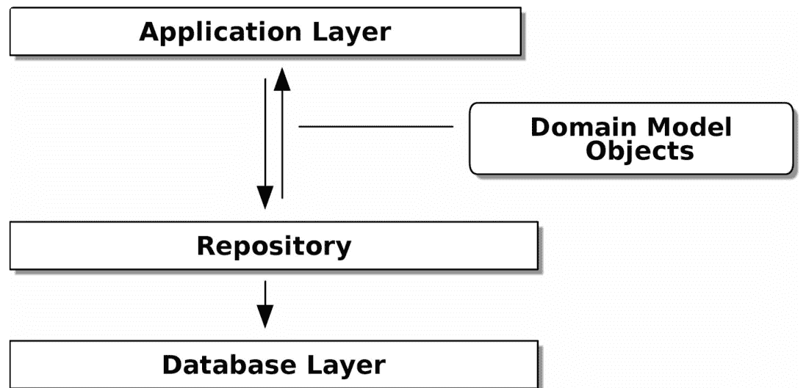

图2-5. 存储库模式

与往常一样，我们从测试开始。由于我们正在检查我们的代码（存储库）是否正确集成到数据库中，因此这可能被归类为集成测试；因此，测试往往混合了原始SQL和对我们自己代码的调用和断言。

> **提示**

与之前的ORM测试不同，这些测试是长期留在你代码库中的良好候选，尤其是如果你的领域模型的任何部分意味着对象关系映射是非平凡的。

存储对象的存储库测试（test_repository.py）

```python
def test_repository_can_save_a_batch(session):
    batch = model.Batch("batch1", "RUSTY-SOAPDISH", 100, eta=None)

    repo = repository.SqlAlchemyRepository(session)
    repo.add(batch) ①
    session.commit() ②

    rows = list(session.execute(
        'SELECT reference, sku, _purchased_quantity, eta FROM "batches"' ③
    ))
    assert rows == [("batch1", "RUSTY-SOAPDISH", 100, None)]
```

1. 这里测试的是repo.add()方法。
2. 我们将.commit()保留在存储库之外，并将其作为调用者的责任。这样做有利有弊；当我们到达第6章时，我们的一些理由将变得更加清晰。
3. 我们使用原始SQL来验证已保存正确的数据。

下一个测试涉及检索批次和分配，因此更复杂：

检索复杂对象的存储库测试（test_repository.py）

```python
def insert_order_line(session):
    session.execute( ❶
        'INSERT INTO order_lines (orderid, sku, qty)'
        ' VALUES ("order1", "GENERIC-SOFA", 12)'
    )
    [[orderline_id]] = session.execute(
        'SELECT id FROM order_lines WHERE orderid=:orderid AND sku=:sku',
        dict(orderid="order1", sku="GENERIC-SOFA")
    )
    return orderline_id

def insert_batch(session, batch_id): ❷
    ...
```

```python
def test_repository_can_retrieve_a_batch_with_allocations(session):
    orderline_id = insert_order_line(session)
    batch1_id = insert_batch(session, "batch1")
    insert_batch(session, "batch2")
    insert_allocation(session, orderline_id, batch1_id) ③

    repo = repository.SqlAlchemyRepository(session)
    retrieved = repo.get("batch1")

    expected = model.Batch("batch1", "GENERIC-SOFA", 100, eta=None)
    assert retrieved == expected  # Batch.__eq__ only compares reference ③
    assert retrieved.sku == expected.sku ④
    assert retrieved._purchased_quantity == expected._purchased_quantity
    assert retrieved._allocations == { ④
        model.OrderLine("order1", "GENERIC-SOFA", 12),
    }
```

1. 这个测试涉及到读取数据，所以原始SQL准备了要由repo.get()读取的数据。
2. 我们将略过insert_batch和insert_allocation的细节；重点是创建几个批次，并且对于我们感兴趣的批次，有一个现有的订单行分配给它。
3. 这就是我们在这里验证的内容。第一个assert ==检查类型是否匹配，以及引用是否相同（因为，正如你记得的那样，Batch是一个实体，我们有一个自定义的eq方法）。
4. 因此，我们还明确检查了其主要属性，包括._allocations，它是一个Python集合，其中包含OrderLine值对象。

是否费力地为每个模型编写测试是一个判断调用。一旦你测试了一个类的创建/修改/保存，你可能会愉快地继续进行其他测试，或者仅使用最小的往返测试，如果它们都遵循类似的模式，甚至什么都不做。在我们的情况下，设置._allocations集合的ORM配置有点复杂，因此值得进行特定测试。

你最终会得到以下内容：

一个典型的存储库 (repository.py)

```python
class SqlAlchemyRepository(AbstractRepository):

    def __init__(self, session):
        self.session = session

    def add(self, batch):
        self.session.add(batch)

    def get(self, reference):
        return self.session.query(model.Batch).filter_by(reference=reference).one()

    def list(self):
        return self.session.query(model.Batch).all()
```

现在我们的Flask端点可能看起来像以下内容：

在API端点中直接使用我们的存储库

```python
@flask.route.gubbins
def allocate_endpoint():
    batches = SqlAlchemyRepository.list()
    lines = [
        OrderLine(l['orderid'], l['sku'], l['qty'])
        for l in request.params...
    ]
    allocate(lines, batches)
    session.commit()
    return 201
```

> **读者的练习**

我们前几天在DDD会议上遇到一位朋友，他说：“我已经10年没有使用ORM了。”存储库模式和ORM都在原始SQL前面起到抽象作用，因此在其中一个后面使用另一个并不是真正必要的。为什么不尝试不使用ORM实现我们的存储库呢？你可以在GitHub上找到代码。

我们留下了存储库测试，但是编写SQL的方法由你决定。也许比你想象的更难，也许更容易。但是好的一点是，你的应用程序其余部分并不关心。

## 为测试构建虚假存储库现在非常简单！

这是存储库模式的最大优点之一：

使用集合的简单虚拟存储库（repository.py）

```python
class FakeRepository(AbstractRepository):

    def __init__(self, batches):
        self._batches = set(batches)

    def add(self, batch):
        self._batches.add(batch)

    def get(self, reference):
        return next(b for b in self._batches if b.reference == reference)

    def list(self):
        return list(self._batches)
```

因为它只是一个简单的集合包装器，所有方法都是一行代码。

在测试中使用虚拟存储库非常容易，我们有一个简单的抽象，易于使用和理解：

使用虚拟存储库的示范（test_api.py）

```python
fake_repo = FakeRepository([batch1, batch2, batch3])
```

你将在下一章中看到这个虚假的使用情况。

> **提示**
为你的抽象构建虚拟对象是获取设计反馈的绝佳方法：如果很难虚拟，则该抽象可能过于复杂。

## Python中的端口和适配器是什么？

我们不想在这里过多地探讨术语，因为我们想要重点关注依赖反转，你使用的技术的具体细节并不太重要。此外，我们知道不同的人使用略微不同的定义。

端口和适配器来自OO世界，我们坚持的定义是端口是我们的应用程序与我们希望抽象的任何内容之间的接口，适配器是该接口或抽象背后的实现。

现在，Python本身没有接口，因此尽管通常很容易识别适配器，但定义端口可能更难。如果你使用抽象基类，则为端口。如果没有，则端口只是你的适配器符合并且核心应用程序期望的鸭子类型 – 使用的函数和方法名称以及它们的参数名称和类型。

具体而言，在本章中，AbstractRepository是端口，SqlAlchemyRepository和FakeRepository是适配器。

## 总结

牢记Rich Hickey的引言，在每章中，我们总结介绍的每种架构模式的成本和收益。我们希望明确表示，我们并不是说每个应用程序都需要以这种方式构建；只有应用程序和领域的复杂性使得值得投资时间和精力添加这些额外的间接层。

考虑到这一点，表2-1显示了存储库模式和我们的持久性无关模型的一些优缺点。

表2-1 存储库模式和持久性无关性：权衡取舍

| 优点 | 缺点 |
| --- | --- |
| • 我们的持久性存储和领域模型之间有一个简单的接口 | • ORM已经为你购买了一些解耦。更改外键可能很难，但如果你需要，很容易在MySQL和Postgres之间切换。 |
| • 我们已经完全将模型与基础设施问题解耦，因此可以轻松制作存储库的虚拟版本进行单元测试或更换不同的存储解决方案。 | • 手动维护ORM映射需要额外的工作和额外的代码。 |
| • 在考虑持久性之前编写领域模型可以帮助我们专注于手头的业务问题。 | • 任何额外的间接层都会增加维护成本，并为以前从未见过存储库模式的Python程序员增加“WTF因素”。 |
| • 如果我们想要彻底改变我们的方法，我们可以在模型中实现，而不需要担心外键或迁移直到以后。我们的数据库模式非常简单，因为我们可以完全控制如何将对象映射到表。 | |

图2-6显示了基本的论点：是的，对于简单情况，解耦的领域模型比简单的ORM/ActiveRecord模式更难以实现。

> 提示

如果你的应用程序只是一个简单的CRUD（创建-读取-更新-删除）数据库包装器，则不需要领域模型或存储库。

但是，领域越复杂，从基础设施问题中解放自己的投资就越能从容应对变化。

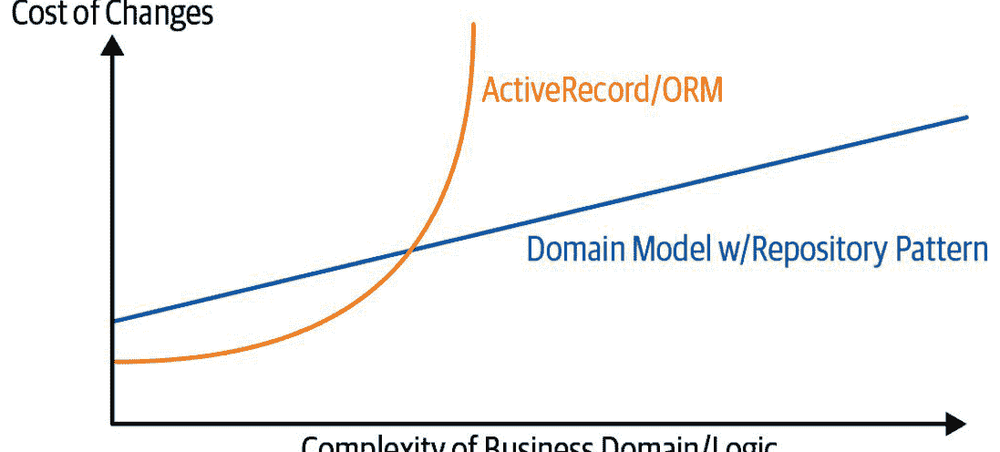

我们的示例代码不够复杂，无法给出图表右侧的更多提示，但提示已经存在。例如，想象一下，如果有一天我们决定将分配更改在OrderLine上而不是在Batch对象上：如果我们使用Django，我们必须在运行任何测试之前定义并思考数据库迁移。因为我们的模型只是普通的Python对象，所以我们可以将set()更改为新属性，而无需考虑数据库，直到以后。

> **存储库模式回顾**

将依赖倒置应用于ORM

我们的领域模型应该摆脱基础设施问题，因此你的ORM应该导入你的模型，而不是反过来。

存储库模式是永久存储的简单抽象

存储库为你提供了一个在内存中对象集合的幻象。它使得轻松创建FakeRepository进行测试，并在不破坏核心应用程序的情况下交换基础设施的基本细节。请参阅附录C中的示例。

你会想知道，我们如何实例化这些存储库，无论是虚拟的还是真实的？我们的Flask应用程序实际上会是什么样子？在下一个激动人心的章节“服务层模式”中，你将会了解到。但首先，我们稍作偏离。

## 第三章 简短的插曲：耦合和抽象

亲爱的读者，让我们在抽象主题上稍作偏离。我们已经谈论了很多关于抽象的内容。例如，存储库模式是永久存储的抽象。但是什么才是好的抽象？我们从抽象中想要什么？它们与测试有什么关系？

> **提示**

本章的代码在GitHub的chapter_03_abstractions分支中：

`git clone https://github.com/cosmicpython/code.git`

`git checkout chapter_03_abstractions`

本书中的一个关键主题隐藏在花哨的模式中，那就是我们可以使用简单的抽象来隐藏混乱的细节。当我们为了乐趣或在kata中编写代码时，我们可以自由地玩耍，大力推敲并进行重构。然而，在大规模系统中，我们会受到系统中其他地方做出的决策的限制。

当我们无法更改组件A以避免破坏组件B时，我们说这些组件已经耦合。在本地，耦合是一件好事：这表明我们的代码正在协同工作，每个组件都支持其他组件，所有组件都像手表的齿轮一样适当地放置。在术语上，我们说当耦合元素之间的内聚性高时，这是有效的。

在全局范围内，耦合是一种麻烦：它增加了更改代码的风险和成本，有时甚至到了我们无法进行任何更改的程度。这就是“泥球模式”的问题：随着应用程序的增长，如果我们无法防止没有内聚性的元素之间的耦合，那么这种耦合会超线性地增加，直到我们无法有效地更改我们的系统。

我们可以通过抽象细节来降低系统内部的耦合程度（图3-1）（图3-2）。

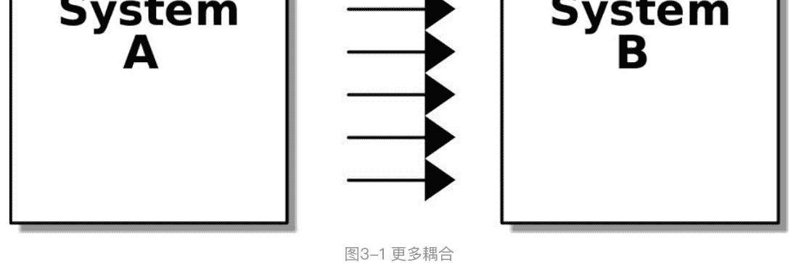

图3-1 更多耦合

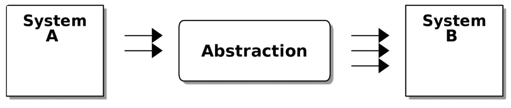

图3-2 更少耦合

在这两个图中，我们有一对子系统，其中一个依赖于另一个。在图3-1中，两者之间的耦合度很高；箭头的数量表示两者之间有很多种依赖关系。如果我们需要更改系统B，那么这种更改很可能会影响到系统A。

然而，在图3-2中，我们通过插入一个新的、更简单的抽象来降低了耦合度。因为它更简单，所以系统A对抽象的依赖关系更少。这个抽象通过隐藏系统B的复杂细节来保护我们免受变化的影响——我们可以在右边更改箭头而不更改左边的箭头。

## 抽象状态有助于可测试性

让我们来看一个例子。假设我们想编写代码来同步两个文件目录，我们称之为源和目标：

- 如果源中存在文件但目标中不存在，则复制该文件。
- 如果源中存在文件，但其名称与目标中的名称不同，则将目标文件重命名。
- 如果目标中存在文件但源中不存在，则删除它。

我们的第一个和第三个需求足够简单：我们只需比较两个路径列表。然而，我们的第二个需求比较棘手。为了检测重命名，我们需要检查文件的内容。为此，我们可以使用哈希函数，如MD5或SHA-1。从文件生成SHA-1哈希的代码非常简单：

哈希一个文件（sync.py）

```python
BLOCKSIZE = 65536

def hash_file(path):
    hasher = hashlib.sha1()
    with path.open("rb") as file:
        buf = file.read(BLOCKSIZE)
        while buf:
            hasher.update(buf)
            buf = file.read(BLOCKSIZE)
    return hasher.hexdigest()
```

现在，我们需要编写决策要做什么的代码——业务逻辑，如果你愿意的话。

当我们必须从第一原则解决问题时，通常会尝试编写一个简单的实现，然后向更好的设计进行重构。我们将在整本书中使用这种方法，因为这是我们在现实世界中编写代码的方式：从解决问题的最小部分开始，然后逐步使解决方案更加丰富和设计更好。

我们的第一个“hackish”方法大致如下：

基本同步算法（sync.py）

```python
import hashlib
import os
import shutil
from pathlib import Path

def sync(source, dest):
    # Walk the source folder and build a dict of filenames and their hashes
    source_hashes = {}
    for folder, _, files in os.walk(source):
        for fn in files:
            source_hashes[hash_file(Path(folder) / fn)] = fn

    seen = set()  # Keep track of the files we've found in the target

    # Walk the target folder and get the filenames and hashes
    for folder, _, files in os.walk(dest):
        for fn in files:
            dest_path = Path(folder) / fn
            dest_hash = hash_file(dest_path)
            seen.add(dest_hash)

            # if there's a file in target that's not in source, delete it
            if dest_hash not in source_hashes:
                dest_path.remove()

            # if there's a file in target that has a different path in source,
            # move it to the correct path
            elif dest_hash in source_hashes and fn != source_hashes[dest_hash]:
                shutil.move(dest_path, Path(folder) / source_hashes[dest_hash])

    # for every file that appears in source but not target, copy the file to
    # the target
    for src_hash, fn in source_hashes.items():
        if src_hash not in seen:
            shutil.copy(Path(source) / fn, Path(dest) / fn)
```

太棒了！我们有一些代码，看起来还不错，但在我们在硬盘上运行它之前，也许我们应该测试一下。我们该如何测试这种东西呢？

一些端到端测试 (test_sync.py)

```python
def test_when_a_file_exists_in_the_source_but_not_the_destination():
    try:
        source = tempfile.mkdtemp()
        dest = tempfile.mkdtemp()

        content = "I am a very useful file"
        (Path(source) / 'my-file').write_text(content)

        sync(source, dest)

        expected_path = Path(dest) /  'my-file'
        assert expected_path.exists()
        assert expected_path.read_text() == content
    finally:
        shutil.rmtree(source)
        shutil.rmtree(dest)


def test_when_a_file_has_been_renamed_in_the_source():
    try:
        source = tempfile.mkdtemp()
        dest = tempfile.mkdtemp()

        content = "I am a file that was renamed"
        source_path = Path(source) / 'source-filename'
        old_dest_path = Path(dest) / 'dest-filename'
        expected_dest_path = Path(dest) / 'source-filename'
        source_path.write_text(content)
        old_dest_path.write_text(content)

        sync(source, dest)

        assert old_dest_path.exists() is False
        assert expected_dest_path.read_text() == content

    finally:
        shutil.rmtree(source)
        shutil.rmtree(dest)
```

哇塞，为两个简单的用例设置了很多东西！问题在于我们的领域逻辑，“找出两个目录之间的差异”，与I/O代码紧密耦合。如果不调用pathlib、shutil和hashlib模块的话，我们无法运行我们的差异算法。

而且问题是，即使在当前需求下，我们还没有编写足够的测试：当前的实现存在几个错误（例如，shutil.move()是错误的）。获得良好的覆盖率并揭示这些错误意味着编写更多的测试，但如果它们都像前面那些一样难以处理，那么这将变得非常痛苦。

除此之外，我们的代码不是非常可扩展。想象一下，尝试实现一个“--dry-run”标志，让我们的代码只是打印出它要做什么，而不是实际执行它。或者，如果我们想要将同步到远程服务器或云存储，会怎样呢？

我们的高级代码与低级细节紧密耦合，这让生活变得困难。随着我们考虑的场景变得更加复杂，我们的测试将变得更加难以处理。我们肯定可以重构这些测试（例如，一些清理工作可以放入pytest fixtures中），但只要我们在执行文件系统操作，它们就会保持缓慢，并且难以阅读和编写。

## 选择正确的抽象层次

我们该怎么重写我们的代码，使它更易于测试呢？

首先，我们需要考虑我们的代码从文件系统中需要什么。通过阅读代码，我们可以看到发生了三件不同的事情。我们可以将它们看作代码具有的三个不同的责任：

1. 我们使用os.walk询问文件系统，并为一系列路径确定哈希值。这在源和目标情况下都是类似的。
2. 我们决定文件是新的、重命名的还是冗余的。
3. 我们复制、移动或删除文件，以匹配源文件。

请记住，我们希望为每个责任找到简化的抽象层次。这将让我们隐藏混乱的细节，以便我们可以专注于有趣的逻辑。

> 注意
在本章中，我们通过识别需要完成的单独任务并将每个任务分配给一个明确定义的参与者，沿着duckduckgo的示例类似的路线，将一些复杂的代码重构为更易于测试的结构。

对于第1步和第2步，我们已经直观地开始使用一个抽象层次，即哈希到路径的字典。你可能已经在想，“为什么不为目标文件夹以及源文件夹建立一个字典，然后我们只需比较两个字典？”这似乎是一种很好的抽象化当前文件系统状态的方式：

```python
source_files = {'hash1': 'path1', 'hash2': 'path2'}
dest_files = {'hash1': 'path1', 'hash2': 'pathX'}
```

那么从第2步到第3步怎么办？我们如何抽象出实际的移动/复制/删除文件系统交互？

我们将在本书后面的大规模应用一个技巧。我们要将我们想要做的事情与如何做它分开。我们将使我们的程序输出一个类似于以下的命令列表：

```shell
("COPY", "sourcepath", "destpath"),
("MOVE", "old", "new"),
```

现在我们可以编写测试，只使用两个文件系统字典作为输入，我们期望输出的是表示操作的字符串元组列表。

我们不再说，“给定这个实际的文件系统，当我运行我的函数时，检查发生了什么操作”，而是说，“给定这个文件系统的抽象层次，会发生哪些文件系统操作的抽象层次？”

在我们的测试中简化输入和输出 (test_sync.py)

```python
def test_when_a_file_exists_in_the_source_but_not_the_destination():
    src_hashes = {'hash1': 'fn1'}
    dst_hashes = {}
    expected_actions = [('COPY', '/src/fn1', '/dst/fn1')]
    ...

def test_when_a_file_has_been_renamed_in_the_source():
    src_hashes = {'hash1': 'fn1'}
    dst_hashes = {'hash1': 'fn2'}
    expected_actions == [('MOVE', '/dst/fn2', '/dst/fn1')]
```

## 实现我们选择的抽象层次

这很好，但我们如何实际编写这些新测试，以及如何更改我们的实现使其全部工作？

我们的目标是隔离我们系统的聪明部分，并能够彻底测试它，而不需要设置实际的文件系统。我们将创建一个“核心”代码，它不依赖于外部状态，然后看看当我们从外部世界提供输入时它如何响应（这种方法由Gary Bernhardt称为功能核心、命令式外壳或FCIS）。

让我们从将代码分割为将有状态部分与逻辑部分分开开始。

而我们的顶层函数几乎没有任何逻辑；它只是一系列命令：收集输入，调用我们的逻辑，应用输出：

将我们的代码分割为三个部分 (sync.py)

```python
def sync(source, dest):
    # imperative shell step 1, gather inputs
    source_hashes = read_paths_and_hashes(source) ①
    dest_hashes = read_paths_and_hashes(dest) ①

    # step 2: call functional core
    actions = determine_actions(source_hashes, dest_hashes, source, dest) ②

    # imperative shell step 3, apply outputs
    for action, *paths in actions:
        if action == 'copy':
            shutil.copyfile(*paths)
        if action == 'move':
            shutil.move(*paths)
        if action == 'delete':
            os.remove(paths[0])
```

1. 这是我们拆分出来的第一个函数read_paths_and_hashes()，它隔离了我们应用程序的I/O部分。
2. 这里是我们雕刻出功能核心、业务逻辑的代码。

现在，构建路径和哈希字典的代码非常容易编写：

一个只执行I/O的函数（sync.py）

```python
def read_paths_and_hashes(root):
    hashes = {}
    for folder, _, files in os.walk(root):
        for fn in files:
            hashes[hash_file(Path(folder) / fn)] = fn
    return hashes
```

determine_actions()函数将是我们业务逻辑的核心，它说：“给定这两组哈希值和文件名，我们应该复制/移动/删除什么？”它采用简单的数据结构并返回简单的数据结构：

一个只执行业务逻辑的函数（sync.py）

```python
def determine_actions(src_hashes, dst_hashes, src_folder, dst_folder):
    for sha, filename in src_hashes.items():
        if sha not in dst_hashes:
            sourcepath = Path(src_folder) / filename
            destpath = Path(dst_folder) / filename
            yield 'copy', sourcepath, destpath

        elif dst_hashes[sha] != filename:
            olddestpath = Path(dst_folder) / dst_hashes[sha]
            newdestpath = Path(dst_folder) / filename
            yield 'move', olddestpath, newdestpath

    for sha, filename in dst_hashes.items():
        if sha not in src_hashes:
            yield 'delete', dst_folder / filename
```

我们的测试现在直接作用于determine_actions()函数：

更好看的测试 (test_sync.py)

```python
def test_when_a_file_exists_in_the_source_but_not_the_destination():
    src_hashes = {'hash1': 'fn1'}
    dst_hashes = {}
    actions = determine_actions(src_hashes, dst_hashes, Path('/src'), Path('/dst'))
    assert list(actions) == [('copy', Path('/src/fn1'), Path('/dst/fn1'))]
...

def test_when_a_file_has_been_renamed_in_the_source():
    src_hashes = {'hash1': 'fn1'}
    dst_hashes = {'hash1': 'fn2'}
    actions = determine_actions(src_hashes, dst_hashes, Path('/src'), Path('/dst'))
    assert list(actions) == [('move', Path('/dst/fn2'), Path('/dst/fn1'))]
```

因为我们已经将程序的逻辑——识别更改的代码与I/O的低级细节分离开来，所以我们可以轻松测试我们代码的核心。

通过这种方法，我们从测试我们的主要入口函数sync()，转而测试一个更低级别的函数determine_actions()。你可能认为这很好，因为sync()现在如此简单。或者你可能决定保留一些集成/验收测试来测试sync()。但还有另一种选择，那就是修改sync()函数，使其可以进行单元测试和端到端测试；这是Bob称之为边缘到边缘测试的方法。

## 使用伪装和依赖注入进行边缘到边缘测试

当我们开始编写一个新系统时，我们通常首先关注核心逻辑，通过直接单元测试来驱动它。然而，在某个时候，我们想要一起测试系统的更大块。

我们可以返回到我们的端到端测试，但这些测试仍然像以前一样棘手，难以编写和维护。相反，我们经常编写测试，一起调用整个系统，但伪装I/O，有点像边缘到边缘：

显式依赖项 (sync.py)

```python
def sync(reader, filesystem, source_root, dest_root):
    source_hashes = reader(source_root)
    dest_hashes = reader(dest_root)

    for sha, filename in source_hashes.items():
        if sha not in dest_hashes:
            sourcepath = source_root / filename
            destpath = dest_root / filename
            filesystem.copy(sourcepath, destpath)

        elif dest_hashes[sha] != filename:
            olddestpath = dest_root / dest_hashes[sha]
            newdestpath = dest_root / filename
            filesystem.move(olddestpath, newdestpath)

    for sha, filename in dest_hashes.items():
        if sha not in source_hashes:
            filesystem.delete(dest_root / filename)
```

1. 我们的顶级函数现在公开了两个新的依赖项，一个读取器和一个文件系统。
2. 我们调用读取器来生成我们的文件字典。
3. 我们调用文件系统来应用我们检测到的更改。

> **提示**
> 虽然我们使用依赖注入，但没有必要定义一个抽象基类或任何明确的接口。在本书中，我们经常显示ABC，因为我们希望它们帮助你理解抽象是什么，但它们并不是必要的。Python的动态性意味着我们始终可以依赖鸭子类型。

## 使用DI的测试

```python
class FakeFileSystem(list): ❶
    def copy(self, src, dest): ❷
        self.append(('COPY', src, dest))

    def move(self, src, dest):
        self.append(('MOVE', src, dest))

    def delete(self, dest):
        self.append(('DELETE', dest))
```

```python
def test_when_a_file_exists_in_the_source_but_not_the_destination():
    source = {"sha1": "my-file"}
    dest = {}
    filesystem = FakeFileSystem()

    reader = {"/source": source, "/dest": dest}
    synchronise_dirs(reader.pop, filesystem, "/source", "/dest")

    assert filesystem == [("COPY", "/source/my-file", "/dest/my-file")]
```

```python
def test_when_a_file_has_been_renamed_in_the_source():
    source = {"sha1": "renamed-file"}
    dest = {"sha1": "original-file"}
    filesystem = FakeFileSystem()

    reader = {"/source": source, "/dest": dest}
    synchronise_dirs(reader.pop, filesystem, "/source", "/dest")

    assert filesystem == [("MOVE", "/dest/original-file",
    "/dest/renamed-file")]
```

1. Bob喜欢使用列表来构建简单的测试替身，尽管他的同事很生气。这意味着我们可以编写像`assert foo not in database`这样的测试。
2. 我们`FakeFileSystem`中的每个方法都只是将一些东西附加到列表中，以便稍后进行检查。这是间谍对象的一个例子。

这种方法的优点是我们的测试作用于与我们的生产代码使用的完全相同的函数。缺点是我们必须明确地指定我们的有状态组件并传递它们。Ruby on Rails的创造者David Heinemeier Hansson曾经著名地将这称为“测试引起的设计破坏”。

无论哪种情况，我们现在可以着手解决我们实现中的所有错误；列举所有边缘情况的测试现在更加容易了。

## 为什么不直接使用patch?

此时你可能会摇头想：“为什么不直接使用`mock.patch`，节省一下功夫呢？”

我们避免在本书和我们的生产代码中使用mock。我们不会卷入到一场圣战中，但我们的直觉是模拟框架，特别是猴子补丁，是一种代码异味。

相反，我们喜欢清楚地确定我们代码库中的职责，并将这些职责分离成小而专注的对象，易于用测试替身替换。

> **注意**
> 你可以在第8章中看到一个示例，我们在其中`mock.patch()`掉一个发送电子邮件的模块，但最终在第13章中用一个明确的依赖注入替换它。

我们有三个密切相关的原因来说明我们的偏好：

- 将你正在使用的依赖项patch掉可以对代码进行单元测试，但对设计没有任何改进。使用`mock.patch`不会让你的代码与`--dry-run`标志一起工作，也不会帮助你运行FTP服务器。为此，你需要引入抽象。
- 使用模拟测试往往更加耦合于代码库的实现细节。这是因为模拟测试验证了事物之间的交互：我们是否使用了正确的参数调用了`shutil.copy`? 根据我们的经验，这种代码和测试之间的耦合倾向于使测试更加脆弱。
- 过度使用模拟会导致复杂的测试套件，无法解释代码。

> **注意**
> 设计可测试性实际上意味着设计可扩展性。我们为更干净的设计而进行了一些复杂的交换，以允许新颖的用例。

## 模拟与伪造；经典风格与伦敦学派TDD

这里有一个简短而有些简单化的定义，区分模拟和伪造之间的区别：

- 模拟用于验证如何使用某些内容；它们具有像`assert_called_once_with()`这样的方法。它们与伦敦学派TDD相关联。
- 伪造是它们替代的内容的工作实现，但它们仅设计用于测试。它们在“现实生活”中不起作用；我们的内存存储库是一个很好的例子。但是，你可以使用它们来对系统的最终状态进行断言，而不是关注途中的行为，因此它们与经典风格的TDD相关联。

我们在这里稍微混淆了模拟和间谍，伪造和存根，你可以在Martin Fowler关于此主题的经典文章“Mocks Aren't Stubs”中阅读长而正确的答案。

也许不严格地说，`unittest.mock`提供的`MagicMock`对象不是模拟；如果有的话，它们是间谍。但是它们也经常用作存根或虚拟对象。好了，我们承诺现在已经结束了关于测试替身术语的吹毛求疵。

伦敦学派和经典风格的TDD呢？你可以在我们刚才引用的Martin Fowler的文章中以及软件工程Stack Exchange网站上了解更多信息，但在本书中，我们比较坚定地站在经典派的阵营中。我们喜欢在设置和断言中围绕状态构建我们的测试，并且我们喜欢尽可能在最高的抽象级别上工作，而不是检查中间协作者的行为。

在“决定编写哪种测试”的文章中，你可以阅读更多有关此问题的信息。

我们将TDD视为首先是一种设计实践，其次才是一种测试实践。测试充当我们设计选择的记录，并在我们长时间离开代码后为我们解释系统。

使用过多模拟的测试会被淹没在隐藏我们关心的故事的设置代码中。

Steve Freeman在他的演讲“测试驱动开发”中有一个很好的过度模拟测试的例子。你还应该查看我们尊敬的技术审阅员Ed Jung的这个PyCon演讲“Mocking and Patching Pitfalls”，该演讲还涉及模拟和其替代方法。当我们推荐演讲时，不要错过Brandon Rhodes关于“Hoisting Your I/O”的讲话，它非常好地涵盖了我们正在谈论的问题，并使用了另一个简单的示例。

> **提示**
> 在本章中，我们花了很多时间用单元测试替换端到端测试。这并不意味着我们认为你永远不应该使用E2E测试！在本书中，我们展示了一些技术，以帮助你获得良好的测试金字塔，尽可能多的单元测试，并且使用最少的E2E测试即可获得信心。请继续阅读“小结：不同类型的测试的经验法则”以获取更多详细信息。

> **那么在本书中我们使用哪种方法？函数式还是面向对象的组合？**

两种都有。我们的领域模型完全没有依赖和副作用，因此这是我们的函数式核心。我们在其周围构建的服务层（在第4章中）允许我们驱动整个系统，我们使用依赖注入为这些服务提供具有状态组件的方式，因此我们仍然可以对它们进行单元测试。

请参阅第13章，了解如何更加明确和集中地进行依赖注入的更多探索。

## 总结

我们将在本书中一遍又一遍地看到这个想法：通过简化我们的业务逻辑和混乱的I/O之间的接口，我们可以使我们的系统更易于测试和维护。找到正确的抽象是棘手的，但以下是一些启发式和问题，你可以问自己：

- 我能选择一个熟悉的Python数据结构来表示混乱系统的状态，然后尝试想象一个可以返回该状态的单个函数吗？
- 我在哪里可以在我的系统之间划线，在哪里可以开辟一个接缝来放置这个抽象？
- 将事物分成具有不同责任的组件的合理方式是什么？我可以使隐含的概念明确化吗？
- 有哪些依赖关系，什么是核心业务逻辑？

实践使得不完美！现在回到我们的常规编程...

## 第四章 我们的第一个用例：Flask API和服务层

回到我们的分配项目！图4-1显示了我们在第2章结尾时达到的点，该章节涵盖了存储库模式。

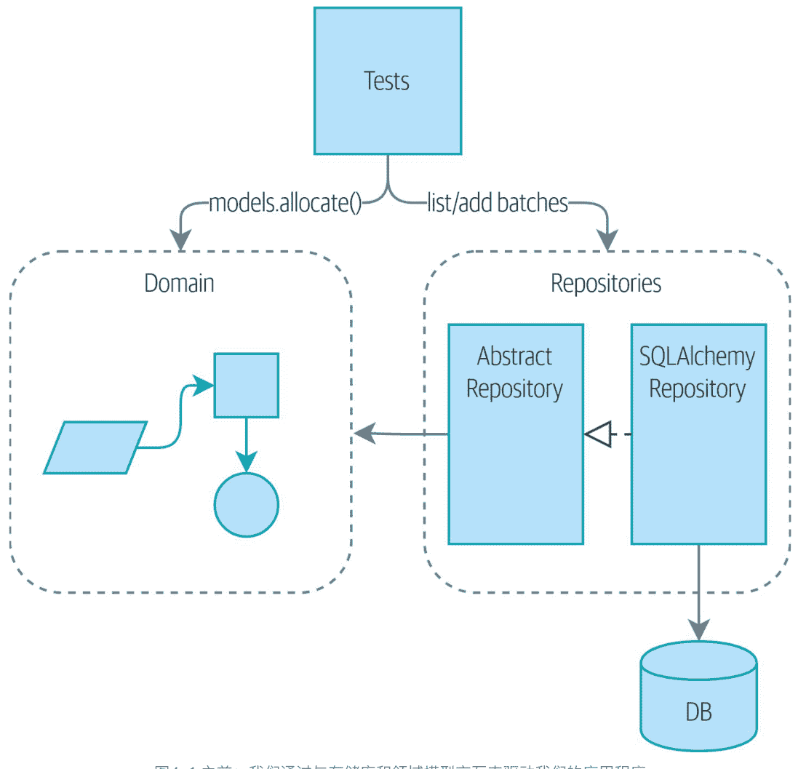

在本章中，我们将讨论编排逻辑、业务逻辑和接口代码之间的区别，并引入服务层模式来处理编排工作流程和定义我们系统的用例。

我们还将讨论测试：通过将服务层与我们在数据库上的存储库抽象相结合，我们能够编写快速的测试，不仅测试我们的领域模型，还测试用例的整个工作流程。

图4-2显示了我们的目标：我们将添加一个Flask API，该API将与服务层通信，服务层将作为我们领域模型的入口点。因为我们的服务层依赖于`AbstractRepository`，所以我们可以使用`FakeRepository`进行单元测试，但使用`SqlAlchemyRepository`运行我们的生产代码。

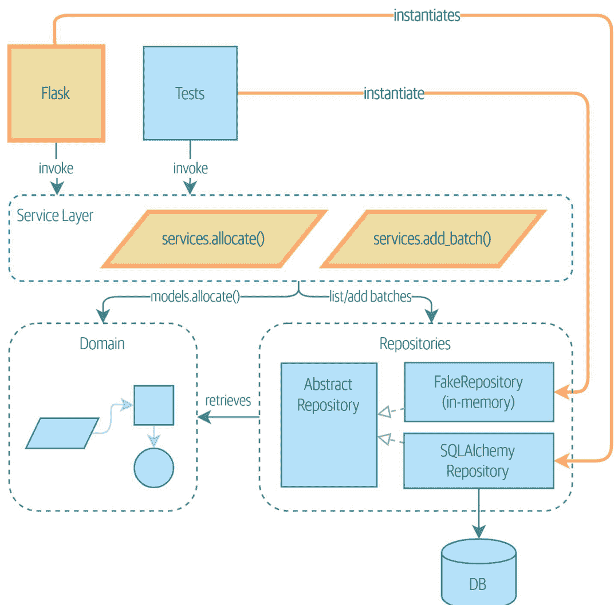

图4-2 服务层将成为我们应用程序的主要入口方式

在我们的图表中，我们使用约定，新组件用粗体文本/线条（如果你正在阅读数字版本，则为黄色/橙色）突出显示。

> **提示**
> 本章的代码在GitHub的`chapter_04_service_layer`分支中：
> ```
> git clone https://github.com/cosmicpython/code.git
> cd code
> git checkout chapter_04_service_layer
> # or to code along, checkout Chapter 2:
> git checkout chapter_02_repository
> ```

## 将我们的应用程序连接到真实世界

像任何好的敏捷团队一样，我们正在努力尝试推出MVP并将其放在用户面前，以开始收集反馈。我们拥有分配订单所需的领域模型核心和领域服务，以及用于永久存储的存储库接口。

让我们尽快将所有移动部件连接在一起，然后向更清晰的架构进行重构。这是我们的计划：

1. 使用Flask在我们的分配领域服务前面放置一个API端点。连接数据库会话和我们的存储库。使用端到端测试和一些快速且不太规范的SQL准备测试数据进行测试。
2. 重构出一个服务层，可以作为一个抽象层来捕捉用例，并将位于Flask和我们的领域模型之间。构建一些服务层测试，并展示它们如何使用`FakeRepository`。
3. 尝试使用不同类型的参数为我们的服务层函数服务；展示使用原始数据类型可以使服务层的客户端(我们的测试和Flask API)与模型层解耦。

## 第一个端到端测试

没有人有兴趣在长时间的术语争论中讨论什么算是端到端(E2E)测试、功能测试、验收测试、集成测试或单元测试。不同的项目需要不同的测试组合，我们已经看到过完全成功的项目将事情分成“快速测试”和“慢速测试”。

现在，我们想写一个或两个测试，这些测试将运行一个“真实”的API端点(使用HTTP)并与真实数据库进行交互。让我们称它们为端到端测试，因为这是最自我解释的名称之一。

以下是第一个版本：

第一个API测试(test_api.py)

```python
@pytest.mark.usefixtures('restart_api')
def test_api_returns_allocation(add_stock):
    sku, othersku = random_sku(), random_sku('other')
    earlybatch = random_batchref(1)
    laterbatch = random_batchref(2)
    otherbatch = random_batchref(3)

    add_stock([
        (laterbatch, sku, 100, '2011-01-02'),
        (earlybatch, sku, 100, '2011-01-01'),
        (otherbatch, othersku, 100, None),
    ])
    data = {'orderid': random_orderid(), 'sku': sku, 'qty': 3}
    url = config.get_api_url()
    r = requests.post(f'{url}/allocate', json=data)
    assert r.status_code == 201
    assert r.json()['batchref'] == earlybatch
```

1. `random_sku()`、`random_batchref()`等是使用`uuid`模块生成随机字符的小助手函数。因为我们现在正在运行一个真正的数据库，这是一种防止各种测试和运行相互干扰的方法。
2. `add_stock`是一个帮助装置，它只是隐藏了手动使用SQL将行插入到数据库的细节。我们将在本章后面展示一种更好的方法。
3. `config.py`是一个模块，我们在其中保存配置信息。

每个人都以不同的方式解决这些问题，但你需要一种方式来启动Flask，可能是在容器中，并与Postgres数据库进行通信。如果你想看看我们是如何做到的，请查看附录B。

## 直接实现

以最明显的方式实现，你可能会得到这样的东西：

Flask应用程序的第一个版本(flask_app.py)

```python
from flask import Flask, jsonify, request
from sqlalchemy import create_engine
from sqlalchemy.orm import sessionmaker

import config
import model
import orm
import repository

orm.start_mappers()
get_session = sessionmaker(bind=create_engine(config.get_postgres_uri()))
app = Flask(__name__)

@app.route("/allocate", methods=['POST'])
def allocate_endpoint():
    session = get_session()
    batches = repository.SqlAlchemyRepository(session).list()
    line = model.OrderLine(
        request.json['orderid'],
        request.json['sku'],
        request.json['qty'],
    )

    batchref = model.allocate(line, batches)

    return jsonify({'batchref': batchref}), 201
```

到目前为止，一切都很好。你可能会认为，不需要太多的“架构宇航员”废话，鲍勃和哈里。

但是等一下—没有提交。我们实际上没有将我们的分配保存到数据库中。现在我们需要第二个测试，要么检查数据库状态(不是非常黑盒子)，要么检查我们是否无法分配第二行，如果第一行已经耗尽了批次：

测试分配已持久化(test_api.py)

```python
@pytest.mark.usefixtures('restart_api')
def test_allocations_are_persisted(add_stock):
    sku = random_sku()

    batch1, batch2 = random_batchref(1), random_batchref(2)
    order1, order2 = random_orderid(1), random_orderid(2)
    add_stock([
        (batch1, sku, 10, '2011-01-01'),
        (batch2, sku, 10, '2011-01-02'),
    ])
    line1 = {'orderid': order1, 'sku': sku, 'qty': 10}
    line2 = {'orderid': order2, 'sku': sku, 'qty': 10}
    url = config.get_api_url()

    # first order uses up all stock in batch 1
    r = requests.post(f'{url}/allocate', json=line1)
    assert r.status_code == 201
    assert r.json()['batchref'] == batch1

    # second order should go to batch 2
    r = requests.post(f'{url}/allocate', json=line2)
    assert r.status_code == 201
    assert r.json()['batchref'] == batch2
```

不是很好看，但这将迫使我们添加提交。

## 需要数据库检查的错误条件

如果我们像这样继续下去，事情会变得越来越丑陋。

假设我们想添加一些错误处理。如果库存不足，域会引发错误怎么办？或者关于一个甚至不存在的SKU怎么办？这不是域所知道的，也不应该是。这更像是我们在调用域服务之前，在数据库层实现的一种健全性检查。

现在我们要看两个更多的端到端测试：

在E2E层面上进行更多测试(test_api.py)

## 引入服务层，并使用FakeRepository进行单元测试

如果我们审视一下我们的Flask应用程序正在做的事情，会发现其中有很多可以称之为“协调”的工作——从存储库中获取数据，根据数据库状态验证输入，处理错误，并在正常流程中进行提交。其中大部分工作与Web API端点本身无关（例如，如果你正在构建CLI，这些工作同样需要；参见附录C），它们也不是需要通过端到端测试来验证的东西。

通常情况下，将服务层分离出来是有意义的，有时也称为编排层或用例层。

还记得我们在第三章准备的FakeRepository吗？

### 我们的假存储库，一个内存集合(test_services.py)

```python
class FakeRepository(repository.AbstractRepository):

    def __init__(self, batches):
        self._batches = set(batches)

    def add(self, batch):
        self._batches.add(batch)

    def get(self, reference):
        return next(b for b in self._batches if b.reference == reference)

    def list(self):
        return list(self._batches)
```

这正是它派上用场的地方；它让我们可以用漂亮快速的单元测试来测试我们的服务层：

### 在服务层使用伪造工具进行单元测试(test_services.py)

```python
def test_returns_allocation():
    line = model.OrderLine("o1", "COMPLICATED-LAMP", 10)
    batch = model.Batch("b1", "COMPLICATED-LAMP", 100, eta=None)
    repo = FakeRepository([batch]) ①

    result = services.allocate(line, repo, FakeSession()) ②③
    assert result == "b1"

def test_error_for_invalid_sku():
    line = model.OrderLine("o1", "NONEXISTENTSKU", 10)

    batch = model.Batch("b1", "AREALSKU", 100, eta=None)
    repo = FakeRepository([batch]) ①

    with pytest.raises(services.InvalidSku, match="Invalid sku NONEXISTENTSKU"):
        services.allocate(line, repo, FakeSession()) ②③
```

1. FakeRepository保存了将在我们的测试中使用的Batch对象。
2. 我们的services模块（services.py）将定义一个allocate()服务层函数。它将位于我们API层中的allocate_endpoint()函数和我们域模型中的allocate()域服务函数之间。
3. 我们还需要一个FakeSession来伪造数据库会话，如下面的代码片段所示。

### 一个假的数据库会话(test_services.py)

```python
class FakeSession():
    committed = False

    def commit(self):
        self.committed = True
```

这个假的会话只是一个临时解决方案。我们很快就会在第6章中摆脱它，让事情变得更好。但与此同时，假的.commit()让我们将第三个测试从E2E层迁移过来：

### 在服务层的第二个测试(test_services.py)

```python
def test_commits():
    line = model.OrderLine('o1', 'OMINOUS-MIRROR', 10)
    batch = model.Batch('b1', 'OMINOUS-MIRROR', 100, eta=None)
    repo = FakeRepository([batch])
    session = FakeSession()
    services.allocate(line, repo, session)
    assert session.committed is True
```

## 一个典型的服务函数

我们将编写一个类似于以下内容的服务函数：

### 基本的分配服务(services.py)

```python
class InvalidSku(Exception):
    pass

def is_valid_sku(sku, batches):
    return sku in {b.sku for b in batches}

def allocate(line: OrderLine, repo: AbstractRepository, session) -> str:
    batches = repo.list() ①
    if not is_valid_sku(line.sku, batches): ②
        raise InvalidSku(f'Invalid sku {line.sku}')
    batchref = model.allocate(line, batches) ③
    session.commit() ④
    return batchref
```

典型的服务层函数有类似的步骤：

1. 我们从存储库中获取一些对象。
2. 我们根据当前的世界状态对请求进行一些检查或断言。
3. 我们调用一个域服务。
4. 如果一切正常，我们保存/更新我们已更改的任何状态。

目前，最后一步有点不令人满意，因为我们的服务层与我们的数据库层紧密耦合。我们将在第6章中使用工作单元模式来改进它。

## 依赖于抽象

关于我们的服务层函数，还有一件事情：

```python
def allocate(line: OrderLine, repo: AbstractRepository, session) -> str:
```

它依赖于一个存储库。我们选择显式地表明依赖关系，并使用类型提示来表示我们依赖于AbstractRepository。这意味着它既适用于测试给出FakeRepository的情况，也适用于Flask应用程序给出SqlAlchemyRepository的情况。

如果你记得“依赖反转原则”，这就是我们说应该“依赖于抽象”的意思。我们的高级模块，服务层，依赖于存储库抽象。而我们特定的持久存储选择的实现细节也依赖于同样的抽象。请参见图4-3和4-4。

此外，在附录C中，还有一个详细的示例，展示了如何在保留抽象的同时替换使用哪种持久存储系统的细节。

但是服务层的基本要素已经存在了，我们的Flask应用程序现在看起来更加清洁：

### Flask应用程序委托给服务层(flask_app.py)

```python
@app.route("/allocate", methods=['POST'])
def allocate_endpoint():
    session = get_session() ❶
    repo = repository.SqlAlchemyRepository(session) ❶
    line = model.OrderLine(
        request.json['orderid'], ❷
        request.json['sku'], ❷
        request.json['qty'], ❷
    )
    try:
        batchref = services.allocate(line, repo, session) ❷
    except (model.OutOfStock, services.InvalidSku) as e:
        return jsonify({'message': str(e)}), 400 ❸

    return jsonify({'batchref': batchref}), 201 ❸
```

1. 我们实例化了一个数据库会话和一些存储库对象。
2. 我们从Web请求中提取用户的命令，并将它们传递给域服务。
3. 我们返回一些带有适当状态代码的JSON响应。

Flask应用程序的责任只是标准的Web内容：每个请求的会话管理、解析POST参数中的信息、响应状态代码和JSON。所有的编排逻辑都在用例/服务层中，领域逻辑保持在领域中。

最后，我们可以自信地将E2E测试简化为只有两个，一个是正常路径，一个是异常路径：

### E2E测试只涉及正常和异常路径(test_api.py)

```python
@pytest.mark.usefixtures('restart_api')
def test_happy_path_returns_201_and_allocated_batch(add_stock):
    sku, othersku = random_sku(), random_sku('other')
    earlybatch = random_batchref(1)
    laterbatch = random_batchref(2)
    otherbatch = random_batchref(3)
    add_stock([
        (laterbatch, sku, 100, '2011-01-02'),
        (earlybatch, sku, 100, '2011-01-01'),
        (otherbatch, othersku, 100, None),
    ])
    data = {'orderid': random_orderid(), 'sku': sku, 'qty': 3}
    url = config.get_api_url()
    r = requests.post(f'{url}/allocate', json=data)
    assert r.status_code == 201
    assert r.json()['batchref'] == earlybatch

@pytest.mark.usefixtures('restart_api')
def test_unhappy_path_returns_400_and_error_message():
    unknown_sku, orderid = random_sku(), random_orderid()
    data = {'orderid': orderid, 'sku': unknown_sku, 'qty': 20}

    url = config.get_api_url()
    r = requests.post(f'{url}/allocate', json=data)
    assert r.status_code == 400
    assert r.json()['message'] == f'Invalid sku {unknown_sku}'
```

我们已成功将测试分成了两个广泛的类别：关于Web内容的测试，我们实现端到端；关于编排内容的测试，我们可以针对内存中的服务层进行测试。

> **读者练习**

既然我们有了分配服务，为什么不构建一个取消分配的服务呢？我们已经为你添加了一个E2E测试和一些存根服务层测试，让你可以开始在GitHub上进行。

如果这还不够，继续进行E2E测试和flask_app.py，并重构Flask适配器以更具RESTful特性。请注意，这样做不需要对我们的服务层或领域层进行任何更改！

> **提示**

如果你决定构建一个只读的端点来检索分配信息，只需做“可能的最简单的事情”，即在Flask处理程序中使用repo.get()。我们将在第12章中更多地谈论读取与写入的区别。

## 为什么一切都被称为服务？

你们中的一些人可能在这一点上感到困惑，试图弄清楚领域服务和服务层之间的区别。

对不起 – 我们没有选择这些名称，否则我们会有更酷更友好的方法来谈论这些东西。

在本章中，我们使用了两种称为服务的东西。第一种是应用程序服务（我们的服务层）。它的工作是处理来自外部世界的请求并编排操作。我们的意思是，服务层通过遵循一堆简单的步骤来驱动应用程序：

- 从数据库获取一些数据
- 更新领域模型
- 持久化任何更改

这是每个操作中必须发生的无聊工作，将其与业务逻辑分开有助于保持整洁。

第二种类型的服务是领域服务。这是属于领域模型的逻辑片段的名称，但不自然地位于有状态实体或值对象内部。例如，如果你正在构建一个购物车应用程序，你可以选择将税收规则构建为领域服务。计算税收是与更新购物车分开的单独工作，它是模型的重要部分，但似乎没有一个持久化实体适合这项工作。相反，一个无状态的TaxCalculator类或一个calculate_tax函数可以完成这项工作。

## 将事物放入文件夹中以查看它们属于哪里

随着我们的应用程序变得越来越大，我们需要不断整理我们的目录结构。我们项目的布局为我们提供了有关每个文件中可能包含的对象类型的有用提示。

以下是我们可以组织事物的一种方式：

### 一些子文件夹

```
.
├── config.py
├── domain ①
│   ├── __init__.py
│   └── model.py
├── service_layer ②
│   ├── __init__.py
│   └── services.py
├── adapters ③
│   ├── __init__.py
│   ├── orm.py
│   └── repository.py
├── entrypoints ④
│   ├── __init__.py
│   └── flask_app.py
└── tests
    ├── __init__.py
    ├── conftest.py
    ├── unit
    │   ├── test_allocate.py
    │   ├── test_batches.py
    │   └── test_services.py
    ├── integration
    │   ├── test_orm.py
    │   └── test_repository.py
    └── e2e
        └── test_api.py
```

1. 让我们为我们的领域模型建立一个文件夹。目前只有一个文件，但对于更复杂的应用程序，你可能每个类有一个文件；你可能会为Entity、ValueObject和Aggregate添加帮助父类，并且你可能会添加一个exceptions.py用于领域层异常，以及，如你将在第二部分中看到的，commands.py和events.py。
2. 我们将区分服务层。目前只有一个名为services.py的文件用于我们的服务层函数。你可以在这里添加服务层异常，并且就像你将在第5章中看到的那样，我们将添加unit_of_work.py。
3. 适配器是对端口和适配器术语的一种认可。这将填充任何其他围绕外部I/O的抽象（例如redis_client.py）。严格来说，你将称这些为次要适配器或驱动适配器，有时是内向适配器。
4. 入口点是我们从中驱动应用程序的地方。在官方的端口和适配器术语中，这些也是适配器，并被称为主要的、驱动的或外向适配器。

那么端口呢？正如你可能记得的那样，它们是适配器实现的抽象接口。我们倾向于将它们保留在与实现它们的适配器相同的文件中。

## 总结

添加服务层确实为我们带来了很多好处：

- 我们的Flask API端点变得非常薄，易于编写：它们唯一的责任是执行“Web工作”，例如解析JSON并为成功或失败的情况生成正确的HTTP状态码。
- 我们已经为我们的领域定义了一个清晰的API，一组用例或入口点，可以由任何适配器使用，而无需了解我们的领域模型类——无论是API、CLI（参见附录C）还是测试！它们也是我们领域的适配器。
- 我们可以通过使用服务层以“高档”模式编写测试，使我们可以自由地以任何我们认为合适的方式重构领域模型。只要我们仍然可以提供相同的用例，我们就可以尝试新的设计，而无需重写大量测试。
- 而且我们的测试金字塔看起来很好——我们的大部分测试都是快速的单元测试，只有最少量的E2E和集成测试。

## DIP的实际应用

图4-3显示了我们服务层的依赖关系：领域模型和AbstractRepository（端口，在端口和适配器术语中）。

当我们运行测试时，图4-4显示了我们如何使用FakeRepository（适配器）来实现抽象依赖关系。

当我们实际运行应用程序时，我们将“真正的”依赖项显示在图4-5中。

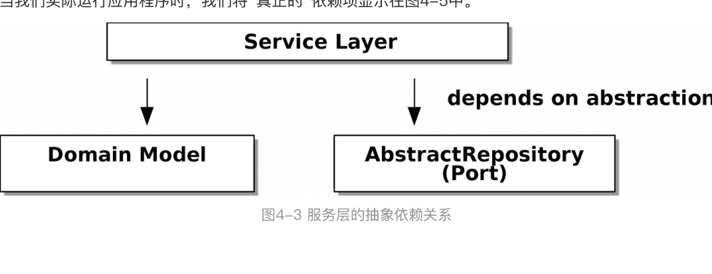

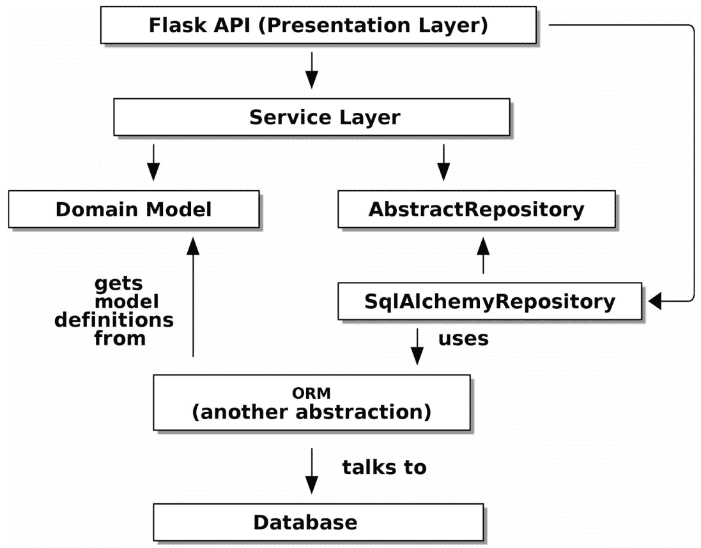

图4-4 测试提供了抽象依赖的实现

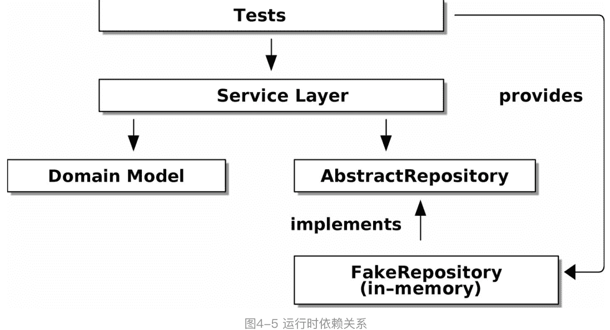

图4-5 运行时依赖关系

很好。

让我们暂停一下，看一下表4-1，在其中考虑是否要拥有服务层的利弊。

表4-1 服务层：利弊权衡

| 优点 | 缺点 |
| --- | --- |
| • 我们有一个单一的地方来捕获我们应用程序的所有用例。 | • 如果你的应用程序纯粹是Web应用程序，则控制器/视图函数可以成为捕获所有用例的单一地方。 |
| • 我们将我们聪明的领域逻辑放在API后面，这使我们可以自由地进行重构。 | • 这是另一层抽象。 |
| • 我们已经清晰地将“谈论HTTP的东西”与“谈论分配的东西”分开。 | • 将太多逻辑放入服务层可能会导致贫血领域反模式。最好是在控制器中发现编排逻辑渗入之后再引入此层。 |
| • 与存储库模式和FakeRepository结合使用时，我们有一种不错的方式来编写比领域层更高层次的测试；我们可以测试更多的工作流程，而无需使用集成测试（请继续阅读第5章，以获取更多详细信息）。 | • 你可以通过将逻辑从控制器推到模型层，而无需添加额外的层（也称为“fat models, thin controllers”），就可以获得许多来自具有丰富领域模型的好处。 |

但仍然有一些尴尬的地方需要整理：

- 服务层仍然与领域紧密耦合，因为其API是以OrderLine对象为基础表达的。在第5章中，我们将解决这个问题，并讨论服务层如何实现更高效的TDD。
- 服务层与会话对象紧密耦合。在第6章中，我们将介绍一种与存储库和服务层模式紧密配合的另一种模式，即工作单元模式，一切都会非常美好。你会看到！

## 第5章 高档和低档的TDD

我们引入了服务层来捕获工作应用程序所需的一些额外编排责任。服务层帮助我们清晰地定义每个用例的工作流程：我们需要从存储库中获取什么，我们应该做什么预检查和当前状态验证，以及我们在最后保存什么。

但目前，我们的许多单元测试在较低级别上操作，直接在模型上进行操作。在本章中，我们将讨论将这些测试移动到服务层级级别所涉及的权衡，并提供一些更一般的测试指南。

> 哈里说：看到测试金字塔在实际操作中是一个顿悟时刻

以下是哈里直接说的几句话：

我最初对鲍勃的所有架构模式持怀疑态度，但看到实际的测试金字塔使我成为信徒。

一旦你实现了领域建模和服务层，你实际上可以达到一种状态，其中单元测试的数量比集成测试和端到端测试多一个数量级。在工作了E2E测试构建需要数小时的地方（本质上是“等到明天”），我无法告诉你运行所有测试只需几分钟或几秒钟的巨大差异。

请继续阅读，了解如何决定编写哪种测试以及在哪个级别。高档和低档的思维方式真正改变了我的测试生活。

## 我们的测试金字塔是什么样子？

让我们看看使用服务层及其自己的服务层测试所做的移动对我们的测试金字塔有何影响：

测试类型计数

```
shell
$ grep -c test_ test_*.py
tests/unit/test_allocate.py:4
tests/unit/test_batches.py:8
tests/unit/test_services.py:3

tests/integration/test_orm.py:6
tests/integration/test_repository.py:2

tests/e2e/test_api.py:2
```

不错！我们有15个单元测试、8个集成测试和仅2个端到端测试。这已经是一个健康的测试金字塔了。

## 领域层测试应该转移到服务层吗？

让我们再进一步看看会发生什么。由于我们可以针对服务层测试我们的软件，我们不再需要针对领域模型的测试。相反，我们可以重新编写第1章中的所有领域级别测试，以服务层为基础：

在服务层重新编写领域测试

(tests/unit/test_services.py)

```
# 领域层测试:
def test_prefers_current_stock_batches_to_shipments():
    in_stock_batch = Batch("in-stock-batch", "RETRO-CLOCK", 100,
    eta=None)
    shipment_batch = Batch("shipment-batch", "RETRO-CLOCK", 100,
    eta=tomorrow)
    line = OrderLine("oref", "RETRO-CLOCK", 10)

    allocate(line, [in_stock_batch, shipment_batch])

    assert in_stock_batch.available_quantity == 90
    assert shipment_batch.available_quantity == 100

# 服务层测试:
def test_prefers_warehouse_batches_to_shipments():
    in_stock_batch = Batch("in-stock-batch", "RETRO-CLOCK", 100,
    eta=None)
    shipment_batch = Batch("shipment-batch", "RETRO-CLOCK", 100,
    eta=tomorrow)
    repo = FakeRepository([in_stock_batch, shipment_batch])
    session = FakeSession()

    line = OrderLine('oref', "RETRO-CLOCK", 10)

    services.allocate(line, repo, session)

    assert in_stock_batch.available_quantity == 90
    assert shipment_batch.available_quantity == 100
```

为什么我们想要这样做呢？

测试应该帮助我们无畏地更改系统，但我们经常看到团队针对其领域模型编写过多的测试。当他们来更改代码库时，这会导致问题，发现他们需要更新数十甚至数百个单元测试。

如果你停下来思考自动化测试的目的，这就有意义了。我们使用测试来强制执行系统的某个属性在我们工作时不会改变。我们使用测试来检查API是否继续返回200，数据库会话是否继续提交以及订单是否仍在分配。

如果我们意外更改了其中一个行为，我们的测试将会失败。另一方面，如果我们想要更改代码的设计，任何直接依赖于该代码的测试也将失败。

随着我们深入阅读本书，你将看到服务层形成了我们可以多种方式驱动的系统API。针对此API进行测试减少了我们在重构领域模型时需要更改的代码量。如果我们仅限于针对服务层进行测试，我们将没有任何直接与模型对象上的“私有”方法或属性进行交互的测试，这使我们更自由地进行重构。

> **提示**

我们在测试中放置的每一行代码都像是一块胶水，将系统保持在特定的形状中。我们拥有的低级别测试越多，更改事物就越困难。

## 关于编写何种类型的测试的决定

你可能会问自己，“我应该重写所有的单元测试吗？针对领域模型编写测试是错误的吗？”为了回答这些问题，了解耦合和设计反馈之间的权衡是很重要的（见图5-1）。

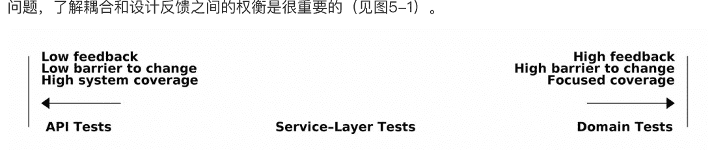

极限编程（XP）敦促我们“倾听代码”。当我们编写测试时，我们可能会发现代码很难使用或注意到代码气味。这是我们进行重构并重新考虑设计的触发器。

不过，只有在我们与目标代码密切合作时才能获得这种反馈。针对HTTP API的测试对我们的对象的精细设计毫无帮助，因为它处于更高的抽象级别。

另一方面，我们可以重写整个应用程序，只要不更改URL或请求格式，我们的HTTP测试将继续通过。这使我们有信心，大规模更改（例如更改数据库架构）不会破坏我们的代码。

在另一端，我们在第1章编写的测试帮助我们充实了解我们需要的对象。测试引导我们设计一个有意义且符合领域语言的设计。当我们的测试按照领域语言阅读时，我们感到舒适，因为我们的代码与我们尝试解决的问题的直觉相匹配。

因为测试是用领域语言编写的，它们充当了我们模型的活文档。新的团队成员可以阅读这些测试，快速了解系统的工作方式以及核心概念之间的相互关系。

我们经常通过在这个级别编写测试来“草绘”新的行为，以查看代码可能的外观。然而，当我们想要改进代码的设计时，我们需要替换或删除这些测试，因为它们与特定实现紧密耦合。

## 高档和低档

大多数情况下，当我们添加新功能或修复错误时，我们不需要对领域模型进行广泛的更改。在这些情况下，我们更喜欢针对服务编写测试，因为它们具有较低的耦合和更高的覆盖率。

例如，当编写 add_stock 函数或 cancel_order 功能时，我们可以通过针对服务层编写测试来更快地进行工作并减少耦合。

在启动新项目或遇到特别棘手的问题时，我们会降回到针对领域模型编写测试，以获得更好的反馈和可执行的意图文档。

我们使用的隐喻是换挡。在启动旅程时，自行车需要处于低档位，以克服惯性。一旦我们开始行动，我们可以通过换成高档位来更快、更高效地行动；但如果我们突然遇到陡峭的山丘或被危险迫使减速，我们又会降到低档位，直到我们能够再次加速。

## 从领域完全解耦服务层测试

我们的服务层测试仍然直接依赖于领域，因为我们使用领域对象设置测试数据并调用服务层函数。

要使服务层完全与领域解耦，我们需要重写其 API 以基于基元工作。

我们的服务层当前接受一个 OrderLine 领域对象：

之前: 分配一个领域对象 (service_layer/services.py)

```
python
def allocate(line: OrderLine, repo: AbstractRepository, session) -> str:
```

如果它的参数都是基元类型，会是什么样子？

后来: allocate 方法接受字符串和整数 (service_layer/services.py)

```
python
def allocate(
    orderid: str, sku: str, qty: int, repo: AbstractRepository,
    session) -> str:
```

我们也以这些术语重写测试：

测试现在在函数调用中使用基元类型

(tests/unit/test_services.py)

```
python
def test_returns_allocation():
    batch = model.Batch("batch1", "COMPLICATED-LAMP", 100, eta=None)
    repo = FakeRepository([batch])

    result = services.allocate("o1", "COMPLICATED-LAMP", 10, repo, FakeSession())
    assert result == "batch1"
```

但是我们的测试仍然依赖于领域，因为我们仍然手动实例化 Batch 对象。因此，如果有一天我们决定大规模重构我们的 Batch 模型如何工作，我们将不得不更改一堆测试。

## 缓解：将所有领域依赖项保留在 Fixture 函数中

我们至少可以将其抽象出来成为测试中的帮助函数或 Fixture。这是你可以通过在 FakeRepository 上添加工厂函数来实现的一种方法：

Fixture 的工厂函数是一种可能性
(tests/unit/test_services.py)

```
python
class FakeRepository(set):

    @staticmethod
    def for_batch(ref, sku, qty, eta=None):
        return FakeRepository([
            model.Batch(ref, sku, qty, eta),
        ])

    ...

def test_returns_allocation():
    repo = FakeRepository.for_batch("batch1", "COMPLICATED-LAMP", 100, eta=None)
    result = services.allocate("o1", "COMPLICATED-LAMP", 10, repo, FakeSession())
    assert result == "batch1"
```

至少这将所有测试对领域的依赖项移动到一个地方。

## 添加缺失的服务

我们可以更进一步。如果我们有一个用于添加库存的服务，我们可以使用它，并使我们的服务层测试完全根据服务层的官方用例表达，从而消除对领域的所有依赖：

测试新的 add_batch 服务 (tests/unit/test_services.py)

```
python
def test_add_batch():
    repo, session = FakeRepository([]), FakeSession()
    services.add_batch("b1", "CRUNCHY-ARMCHAIR", 100, None, repo, session)
    assert repo.get("b1") is not None
    assert session.committed
```

> **提示**
一般来说，如果你发现自己需要在服务层测试中直接执行领域层操作，这可能表明你的服务层不完整。

实现只有两行：

测试新的 add_batch 服务 (service_layer/services.py)

```
python
def add_batch(
        ref: str, sku: str, qty: int, eta: Optional[date],
        repo: AbstractRepository, session,
):
    repo.add(model.Batch(ref, sku, qty, eta))
    session.commit()


def allocate(
        orderid: str, sku: str, qty: int, repo: AbstractRepository,
        session
) -> str:
    ...
```

> **注意**
你是否应该编写一个新的服务，只是因为它可以帮助从测试中删除依赖项？可能不应该。但在这种情况下，我们几乎肯定会在某一天需要一个 add_batch 服务。

现在，这使我们可以纯粹地根据服务本身、只使用基元类型，并且不依赖于模型来重写我们的所有服务层测试：

服务测试现在只使用服务 (tests/unit/test_services.py)

```
python
def test_allocate_returns_allocation():
    repo, session = FakeRepository([]), FakeSession()
    services.add_batch("batch1", "COMPLICATED-LAMP", 100, None, repo, session)
    result = services.allocate("o1", "COMPLICATED-LAMP", 10, repo, session)
    assert result == "batch1"

def test_allocate_errors_for_invalid_sku():
    repo, session = FakeRepository([]), FakeSession()
    services.add_batch("b1", "AREALSKU", 100, None, repo, session)
    with pytest.raises(services.InvalidSku, match="Invalid sku NONEXISTENTSKU"):
        services.allocate("o1", "NONEXISTENTSKU", 10, repo, FakeSession())
```

这是一个非常好的状态。我们的服务层测试仅依赖于服务层本身，让我们完全自由地根据需要重构模型。

## 将改进带到 E2E 测试中

与添加 add_batch 服务一样，添加一个用于添加批次的 API 端点将消除对丑陋的 add_stock fixture 的需求，我们的 E2E 测试可以摆脱那些硬编码的 SQL 查询和对数据库的直接依赖。

由于我们的服务函数，添加端点很容易，只需要进行一些 JSON 处理和单个函数调用即可：

添加批次的 API (entrypoints/flask_app.py)

## 第六章 工作单元模式

在本章中，我们将介绍将存储库模式和服务层模式紧密结合在一起的最后一块拼图：工作单元模式。

如果存储库模式是我们对持久性存储概念的抽象，那么工作单元 (UoW) 模式就是我们对原子操作概念的抽象。它将允许我们最终和完全地将服务层与数据层解耦。

图 6-1 显示，目前，我们的基础设施层之间存在大量通信：API 直接与数据库层通信以启动会话，与存储库层通信以初始化 SQLAlchemyRepository，并与服务层通信以要求其分配。

图 6-1 没有使用 UoW：API 直接与三层通信

图 6-2 显示了我们的目标状态。Flask API 现在只做两件事：初始化工作单元，并调用服务。服务与 UoW 合作（我们认为 UoW 是服务层的一部分），但服务函数本身和 Flask 现在都不需要直接与数据库通信了。我们将使用一个可爱的 Python 语法，即上下文管理器完成所有操作。

图 6-2 使用 UoW: UoW 现在管理数据库状态

### 工作单元与存储库合作

让我们看看工作单元 (UoW，我们发音为“you-wow”) 的实际应用。以下是我们完成后的服务层的样子：

### 工作单元的预览

(src/allocation/service_layer/services.py)

```python
def allocate(
    orderid: str, sku: str, qty: int,
    uow: unit_of_work.AbstractUnitOfWork
) -> str:
    line = OrderLine(orderid, sku, qty)
    with uow: ①
        batches = uow.batches.list() ②
        ...
        batchref = model.allocate(line, batches)
        uow.commit() ③
```

1. 我们将以上下文管理器的形式启动 UoW。
2. uow.batches 是批处理存储库，因此 UoW 为我们提供了访问永久存储的方式。
3. 完成后，我们使用 UoW 提交或回滚我们的工作。

UoW 作为我们持久性存储的单个入口点，并跟踪加载的对象和最新状态。

这给我们带来了三个有用的东西：

- 一个稳定的数据库快照，以便我们使用的对象在操作过程中不会发生变化。
- 一种一次性持久化所有更改的方法，因此如果出现问题，我们不会处于不一致的状态。
- 一个简单的 API，用于持久化问题和获取存储库的便利位置。

### 使用集成测试测试 UoW

以下是我们针对 UOW 的集成测试：

UoW 的基本“往返”测试 (tests/integration/test_uow.py)

```python
def test_uow_can_retrieve_a_batch_and_allocate_to_it(session_factory):
    session = session_factory()
    insert_batch(session, 'batch1', 'HIPSTER-WORKBENCH', 100, None)
    session.commit()

    uow = unit_of_work.SqlAlchemyUnitOfWork(session_factory) ①
    with uow:
        batch = uow.batches.get(reference='batch1') ②
        line = model.OrderLine('o1', 'HIPSTER-WORKBENCH', 10)
        batch.allocate(line)
        uow.commit() ③

    batchref = get_allocated_batch_ref(session, 'o1', 'HIPSTER-WORKBENCH')
    assert batchref == 'batch1'
```

1. 我们使用自定义会话工厂初始化 UoW，并返回一个 uow 对象，在 with 块中使用。
2. 通过 uow.batches，UoW 为我们提供了访问批处理存储库的方式。
3. 完成后，我们调用 commit()。

对于好奇的人，insert_batch 和 get_allocated_batch_ref 帮助器看起来像这样：

执行 SQL 操作的帮助器 (tests/integration/test_uow.py)

```python
def insert_batch(session, ref, sku, qty, eta):
    session.execute(
        'INSERT INTO batches (reference, sku, _purchased_quantity, eta)'
        ' VALUES (:ref, :sku, :qty, :eta)',
        dict(ref=ref, sku=sku, qty=qty, eta=eta)
    )

def get_allocated_batch_ref(session, orderid, sku):
    [[orderlineid]] = session.execute(
        'SELECT id FROM order_lines WHERE orderid=:orderid AND sku=:sku',
        dict(orderid=orderid, sku=sku)
    )
    [[batchref]] = session.execute(
        'SELECT b.reference FROM allocations JOIN batches AS b ON batch_id = b.id'
        ' WHERE orderline_id=:orderlineid',
        dict(orderlineid=orderlineid)
    )
    return batchref
```

### 工作单元及其上下文管理器

在我们的测试中，我们隐式定义了 UoW 需要执行的接口。让我们通过使用抽象基类来明确这一点：

抽象 UoW 上下文管理器 (src/allocation/service_layer/unit_of_work.py)

```python
class AbstractUnitOfWork(abc.ABC):
    batches: repository.AbstractRepository  # 1

    def __exit__(self, *args):  # 2
        self.rollback()  # 4

    @abc.abstractmethod
    def commit(self):  # 3
        raise NotImplementedError

    @abc.abstractmethod
    def rollback(self):  # 4
        raise NotImplementedError
```

1. UoW 提供名为 .batches 的属性，它将为我们提供访问批处理存储库的方式。
2. 如果你从未看过上下文管理器，则 `__enter__` 和 `__exit__` 是在进入 with 块和退出 with 块时执行的两个魔术方法。它们是我们的设置和拆卸阶段。
3. 当我们准备好时，我们将调用此方法以显式提交我们的工作。
4. 如果我们没有提交，或者通过引发错误退出上下文管理器，我们将执行回滚操作。(如果已调用 commit()，则回滚操作不会产生任何效果。请继续阅读以获取更多讨论。)

### 真正的工作单元使用 SQLAlchemy 会话

我们具体实现的主要内容是数据库会话：

真正的 SQLAlchemy UoW (src/allocation/service_layer/unit_of_work.py)

```python
DEFAULT_SESSION_FACTORY = sessionmaker(bind=create_engine(
    config.get_postgres_uri(),
))

class SqlAlchemyUnitOfWork(AbstractUnitOfWork):

    def __init__(self, session_factory=DEFAULT_SESSION_FACTORY):
        self.session_factory = session_factory

    def __enter__(self):
        self.session = self.session_factory()  # type: Session
        self.batches = repository.SqlAlchemyRepository(self.session)
        return super().__enter__()

    def __exit__(self, *args):
        super().__exit__(*args)
        self.session.close()

    def commit(self):
        self.session.commit()

    def rollback(self):
        self.session.rollback()
```

1. 该模块定义了一个默认的会话工厂，它将连接到 Postgres，但我们允许在集成测试中覆盖它，以便我们可以使用 SQLite。
2. `__enter__` 方法负责启动数据库会话并实例化一个可以使用该会话的真实存储库。
3. 我们在退出时关闭会话。
4. 最后，我们提供了具体的 commit() 和 rollback() 方法，它们使用我们的数据库会话。

### 用于测试的虚拟工作单元

这是我们在服务层测试中使用虚拟 UoW 的方式：

虚拟 UoW (tests/unit/test_services.py)

```python
class FakeUnitOfWork(unit_of_work.AbstractUnitOfWork):

    def __init__(self):
        self.batches = FakeRepository([])  ①
        self.committed = False  ②

    def commit(self):
        self.committed = True  ②

    def rollback(self):
        pass

def test_add_batch():
    uow = FakeUnitOfWork()  ③
    services.add_batch("b1", "CRUNCHY-ARMCHAIR", 100, None, uow)  ③
    assert uow.batches.get("b1") is not None
    assert uow.committed

def test_allocate_returns_allocation():
    uow = FakeUnitOfWork()  ③
    services.add_batch("batch1", "COMPLICATED-LAMP", 100, None, uow)  ③
    result = services.allocate("o1", "COMPLICATED-LAMP", 10, uow)  ③
    assert result == "batch1"
...
```

1. FakeUnitOfWork 和 FakeRepository 紧密耦合，就像真正的 UnitOfWork 和 Repository 类一样。这是可以接受的，因为我们认识到这些对象是协作者。
2. 注意与 FakeSession 的虚拟 commit() 函数的相似之处(现在可以摆脱它了)。但这是一个重大的改进，因为我们现在是在虚拟我们编写的代码，而不是第三方代码。有些人说，“不要模拟你不拥有的东西”。
3. 在我们的测试中，我们可以实例化一个 UoW 并将其传递给我们的服务层，而不是传递存储库和会话。这要简单得多。

> **不要模拟你没有拥有的东西**

为什么我们感觉模拟 UoW 比会话更舒服？我们的两个虚拟实现都实现了同样的功能：它们提供了一种交换持久层的方式，以便我们可以在内存中运行测试，而不需要与真实数据库通信。不同之处在于设计结果。如果我们只关心编写快速运行的测试，我们可以创建替代 SQLAlchemy 的模拟，并在整个代码库中使用它们。问题在于 Session 是一个复杂的对象，它暴露了许多与持久性相关的功能。使用 Session 可以轻松地对数据库进行任意查询，但这很快就会导致数据访问代码散布在整个代码库中。为了避免这种情况，我们希望限制对持久层的访问，以便每个组件都具有所需的内容，没有多余的东西。

通过耦合到 Session 接口，你选择耦合到 SQLAlchemy 的所有复杂性。相反，我们希望选择一个更简单的抽象，并使用它来清晰地分离职责。我们的 UoW 比会话简单得多，我们相信服务层可以启动和停止工作单元。

“不要模拟你不拥有的东西”是一个经验法则，它迫使我们在混乱的子系统上构建这些简单的抽象。这与模拟 SQLAlchemy 会话具有相同的性能优势，但鼓励我们仔细思考我们的设计。

### 在服务层中使用 UoW

我们的新服务层如下所示：

使用 UoW 的服务层 (src/allocation/service_layer/services.py)

```python
@app.route("/add_batch", methods=['POST'])
def add_batch():
    session = get_session()
    repo = repository.SqlAlchemyRepository(session)
    eta = request.json['eta']
    if eta is not None:
        eta = datetime.fromisoformat(eta).date()
    services.add_batch(
        request.json['ref'], request.json['sku'], request.json['qty'], eta,
        repo, session
    )
    return 'OK', 201
```

> **注意**

你是否在想，POST 到 /add_batch？这不是很符合 RESTful！你是对的。我们很开心地懈怠，但如果你想使其更加符合 RESTful，也许可以将其 POST 到 /batches，那么请随意尝试！因为 Flask 是一个轻量级的适配器，所以很容易。请参见下一个侧边栏。

我们从 conftest.py 中的硬编码 SQL 查询替换为一些 API 调用，这意味着 API 测试除了 API 本身外没有任何依赖项，这也很好：

API 测试现在可以添加自己的批次 (tests/e2e/test_api.py)

```python
def post_to_add_batch(ref, sku, qty, eta):
    url = config.get_api_url()
    r = requests.post(
        f'{url}/add_batch',
        json={'ref': ref, 'sku': sku, 'qty': qty, 'eta': eta}
    )
    assert r.status_code == 201


@pytest.mark.usefixtures('postgres_db')
@pytest.mark.usefixtures('restart_api')
def test_happy_path_returns_201_and_allocated_batch():
    sku, othersku = random_sku(), random_sku('other')
    earlybatch = random_batchref(1)
    laterbatch = random_batchref(2)
    otherbatch = random_batchref(3)
    post_to_add_batch(laterbatch, sku, 100, '2011-01-02')
    post_to_add_batch(earlybatch, sku, 100, '2011-01-01')
    post_to_add_batch(otherbatch, othersku, 100, None)
    data = {'orderid': random_orderid(), 'sku': sku, 'qty': 3}
    url = config.get_api_url()
    r = requests.post(f'{url}/allocate', json=data)
    assert r.status_code == 201
    assert r.json()['batchref'] == earlybatch
```

## 总结

一旦你有了一个服务层，你真的可以将大部分测试覆盖率移到单元测试中，并开发一个健康的测试金字塔。

> 回顾：不同类型测试的经验法则

针对每个功能编写一个端到端测试

例如，这可能针对一个 HTTP API 进行编写。目标是展示该功能可用，并且所有移动部件都正确地粘合在一起。

大部分测试应针对服务层进行编写

这些端到端测试在覆盖率、运行时间和效率之间提供了很好的平衡。每个测试通常覆盖一个功能的一个代码路径，并使用虚假的 I/O。这是详尽地覆盖所有边缘情况和业务逻辑的地方。

保持一小部分针对域模型编写的测试

这些测试具有高度聚焦的覆盖范围，更加脆弱，但反馈最高。如果后续功能已经在服务层的测试中得到覆盖，请不要害怕删除这些测试。

错误处理也算作一个功能

理想情况下，你的应用程序应该被结构化，以便所有冒泡到入口点（例如 Flask）的错误都以相同的方式处理。这意味着你只需要为每个功能测试快乐路径，并为所有不快乐的路径保留一个端到端测试（当然还有许多不快乐的路径单元测试）。

以下几点将有助于你：

- 用基元类型而不是域对象表达你的服务层。
- 在理想情况下，你将拥有所有所需的服务，能够完全针对服务层进行测试，而不是通过存储库或数据库来混淆状态。这在端到端测试中也会得到回报。

进入下一章！

def add_batch(
    ref: str, sku: str, qty: int, eta: Optional[date],
    uow: unit_of_work.AbstractUnitOfWork
):
    with uow:
        uow.batches.add(model.Batch(ref, sku, qty, eta))
        uow.commit()

def allocate(
    orderid: str, sku: str, qty: int,
    uow: unit_of_work.AbstractUnitOfWork
) -> str:
    line = OrderLine(orderid, sku, qty)
    with uow:
        batches = uow.batches.list()
        if not is_valid_sku(line.sku, batches):
            raise InvalidSku(f'Invalid sku {line.sku}')
        batchref = model.allocate(line, batches)
        uow.commit()
    return batchref

1. 我们的服务层现在只有一个依赖项，再次是一个抽象的 UoW。

## 显式测试提交/回滚行为

为了说服自己提交/回滚行为有效，我们编写了一些测试：

回滚行为的集成测试 (tests/integration/test_uow.py)

```python
def test_rolls_back_uncommitted_work_by_default(session_factory):
    uow = unit_of_work.SqlAlchemyUnitOfWork(session_factory)
    with uow:
        insert_batch(uow.session, 'batch1', 'MEDIUM-PLINTH', 100, None)

    new_session = session_factory()
    rows = list(new_session.execute('SELECT * FROM "batches"'))
    assert rows == []

def test_rolls_back_on_error(session_factory):
    class MyException(Exception):
        pass

    uow = unit_of_work.SqlAlchemyUnitOfWork(session_factory)
    with pytest.raises(MyException):
        with uow:
            insert_batch(uow.session, 'batch1', 'LARGE-FORK', 100, None)
            raise MyException()

    new_session = session_factory()
    rows = list(new_session.execute('SELECT * FROM "batches"'))
    assert rows == []
```

> **提示**

虽然这里没有展示，但测试一些更“晦涩”的数据库行为，如事务，对“真实”数据库进行测试可能是值得的——即相同的引擎。目前，我们使用 SQLite 代替 Postgres，但在第 7 章中，我们将切换一些测试以使用真实数据库。我们的 UoW 类使这变得容易！

## 显式提交与隐式提交

现在我们简要讨论实现 UoW 模式的不同方式。

我们可以想象一种稍微不同的 UoW 版本，它默认提交并仅在发现异常时回滚：

具有隐式提交的 UoW... (src/allocation/unit_of_work.py)

```python
class AbstractUnitOfWork(abc.ABC):

    def __enter__(self):
        return self

    def __exit__(self, exn_type, exn_value, traceback):
        if exn_type is None:
            self.commit()
        else:
            self.rollback()
```

1. 我们应该在正常情况下有一个隐式提交吗？
2. 并且仅在异常时回滚？

这将使我们节省一行代码并从客户端代码中删除显式提交：

...会为我们节省一行代码

(src/allocation/service_layer/services.py)

```python
def add_batch(ref: str, sku: str, qty: int, eta: Optional[date], uow):
    with uow:
        uow.batches.add(model.Batch(ref, sku, qty, eta))
        # uow.commit()
```

这是一个判断调用，但我们倾向于要求显式提交，以便我们必须选择何时刷新状态。

尽管我们使用了额外的一行代码，但这使软件默认安全。默认行为是不更改任何内容。反过来，这使我们的代码更容易推理，因为只有一条代码路径导致系统中的更改：完全成功和显式提交。任何其他代码路径，任何异常，任何从 UoW 范围的早期退出都会导致安全状态。

同样，我们更喜欢默认回滚，因为它更容易理解；这会回滚到上次提交，因此用户已经做了一个提交，或者我们撤销了他们的更改。严厉但简单。

## 示例：使用 UoW 将多个操作分组为原子单元

以下是一些示例，展示了使用 Unit of Work 模式。你可以看到它如何导致对代码块发生的简单推理。

### 示例 1：重新分配

假设我们希望能够取消分配并重新分配订单：

重新分配服务函数

```python
def reallocate(line: OrderLine, uow: AbstractUnitOfWork) -> str:
    with uow:
        batch = uow.batches.get(sku=line.sku)
        if batch is None:
            raise InvalidSku(f'Invalid sku {line.sku}')
        batch.deallocate(line)
        allocate(line)
        uow.commit()
```

1. 如果 deallocate() 失败，我们显然不想调用 allocate()。
2. 如果 allocate() 失败，我们可能也不想实际提交 deallocate()。

### 示例 2：更改批次数

我们的航运公司打电话来说，其中一个集装箱的门打开了，我们的一半沙发掉进了印度洋。糟糕！

更改数量

```python
def change_batch_quantity(batchref: str, new_qty: int, uow: AbstractUnitOfWork):
    with uow:
        batch = uow.batches.get(reference=batchref)
        batch.change_purchased_quantity(new_qty)
        while batch.available_quantity < 0:
            line = batch.deallocate_one()
        uow.commit()
```

1. 在这里，我们可能需要取消分配任意数量的行。如果在任何阶段出现故障，我们可能不想提交任何更改。

## 整理集成测试

现在我们有三组测试，都基本上指向数据库：test_orm.py、test_repository.py 和 test_uow.py。我们应该扔掉哪些？

```
tests
├── conftest.py
├── e2e
│   └── test_api.py
├── integration
│   ├── test_orm.py
│   ├── test_repository.py
│   └── test_uow.py
├── pytest.ini
└── unit
    ├── test_allocate.py
    ├── test_batches.py
    └── test_services.py
```

如果你认为测试在长期内不会增加价值，那么你应该随时随意扔掉它们。我们会说，test_orm.py 主要是帮助我们学习 SQLAlchemy 的工具，所以我们长期不需要它，特别是如果它所做的主要事情在 test_repository.py 中已经涵盖了。你可能会保留最后一个测试，但我们确实可以看到只保留尽可能高级别的抽象（就像我们对单元测试所做的那样）的论点。

> **读者练习**

对于本章，可能最好的尝试是从头开始实现 UoW。代码如常在 GitHub 上。你可以紧密地遵循我们的模型，或者尝试将 UoW（其职责是 commit()、rollback() 和提供 .batches 存储库）与上下文管理器分开，后者的工作是初始化事物，然后在退出时执行提交或回滚。如果你感觉像使用 contextlib 中的 @contextmanager 一样进行所有功能而不是搞乱所有这些类，那么可以使用它。

我们已经剥离了实际的 UoW 和伪造的 UoW，以及削减了抽象 UoW。如果你想出了一些特别自豪的东西，请向我们发送你的存储库链接。

> **小贴士**

这是第5章的另一个例子：随着我们构建更好的抽象，我们可以将测试运行在它们上面，这使我们可以自由地更改底层细节。

## 总结

希望我们已经说服了你，Unit of Work 模式很有用，而上下文管理器是一种非常好的 Pythonic 方式，可以将代码可视化地分组成我们想要原子性发生的块。

事实上，这种模式非常有用，SQLAlchemy 已经使用了一个 UoW，即 Session 对象的形式。在 SQLAlchemy 中，Session 对象是你的应用程序从数据库加载数据的方式。

每次从数据库加载新实体时，会话开始跟踪对实体的更改，当会话刷新时，所有更改都会一起持久化。如果 SQLAlchemy 已经实现了我们想要的模式，为什么我们还要抽象 SQLAlchemy 会话呢？

表6-1讨论了一些权衡。

表6-1。Unit of Work 模式：权衡

| 优点 | 缺点 |
| --- | --- |
| • 我们对原子操作的概念有了良好的抽象，上下文管理器使得易于可视化地将代码块原子地分组在一起。 | • 你的 ORM 可能已经具有关于原子性的一些非常好的抽象。SQLAlchemy 甚至有上下文管理器。你可以通过传递会话来解决很多问题。 |
| • 我们可以明确控制事务何时开始和结束，我们的应用程序默认安全地失败。我们永远不必担心操作部分提交。 | • 虽然我们让它看起来很容易，但你必须非常仔细地考虑回滚、多线程和嵌套事务等问题。也许，只是坚持使用 Django 或 Flask-SQLAlchemy 给你提供的内容，可以让你的生活更简单。 |
| • 这是一个不错的位置，可以将所有存储库放置在其中，以便客户端代码可以访问它们。 | |
| • 正如你将在后面的章节中看到的那样，原子性不仅仅是关于事务；它可以帮助我们处理事件和消息总线。 | |

首先，Session API 是丰富的，并支持我们在域中不需要的操作。我们的 UnitOfWork 将会话简化为其基本核心：它可以启动、提交或丢弃。

另外，我们使用 UnitOfWork 访问我们的存储库对象。这是一个很好的开发者可用性，我们无法使用纯 SQLAlchemy 会话实现它。

## Unit of Work 模式回顾

Unit of Work 模式是关于数据完整性的抽象

它有助于强制执行我们的领域模型的一致性，并通过让我们在操作结束时执行单个刷新操作来提高性能。

它与 Repository 和 Service Layer 模式紧密配合

通过表示原子更新，UnitOfWork 模式完成了我们对数据访问的抽象。我们的每个服务层用例都在单个工作单元中运行，作为一个块成功或失败。

这是一个很好的上下文管理器案例

上下文管理器是 Python 中定义范围的惯用方式。我们可以使用上下文管理器在请求结束时自动回滚工作，这意味着系统默认是安全的。

SQLAlchemy 已经实现了这种模式

我们介绍了一个更简单的抽象，用于“缩小” ORM 和我们的代码之间的接口。这有助于保持我们的松耦合。

最后，我们再次受到依赖倒置原则的启发：我们的服务层依赖于一个薄的抽象，而我们在系统的外部边缘附加一个具体的实现。这与 SQLAlchemy 自己的建议非常吻合：

将会话（通常包括事务）的生命周期分离并放在外部。最全面的方法，推荐用于更大规模的应用程序，将尝试将会话、事务和异常管理的细节与执行工作的程序细节分开。

> ——SQLAlchemy“会话基础”文档

# 第7章 聚合和一致性边界

在本章中，我们想重新审视我们的领域模型，讨论不变量和约束，并了解我们的领域对象如何在概念上和持久化存储中保持自己的内部一致性。我们将讨论一致性边界的概念，并展示如何使其明确，以帮助我们构建高性能的软件而不影响可维护性。

图7-1展示了我们的目标：我们将引入一个名为“产品”的新模型对象来包装多个批次，并将旧的“分配（allocate）”领域服务作为产品的方法提供。

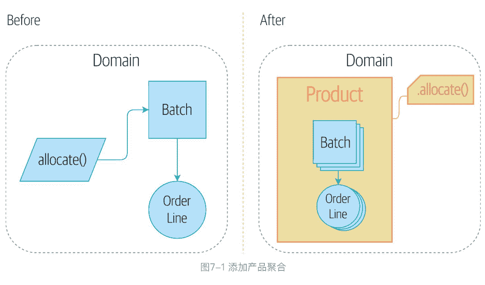

为什么？让我们来了解一下。

> **提示**

本章的代码在 GitHub 的 appendix_csvs 分支中：

`git clone https://github.com/cosmicpython/code.git`

`cd code`

`git checkout appendix_csvs`

`# or to code along, checkout the previous chapter:`

`git checkout chapter_06_uow`

## 为什么不直接在电子表格中运行所有东西？

领域模型的意义是什么？我们试图解决的基本问题是什么？

我们不能只在电子表格中运行所有东西吗？我们的许多用户会对此感到高兴。业务用户喜欢电子表格，因为它们简单、熟悉，但又非常强大。

实际上，大量的业务流程确实通过手动在电子邮件中来回发送电子表格来运行。这种“CSV over SMTP”架构具有低初始复杂性，但往往不太容易扩展，因为很难应用逻辑和保持一致性。

谁可以查看这个特定的字段？谁可以更新它？当我们尝试订购 -350把椅子或1000万张桌子时会发生什么？员工可以有负工资吗？

这些是系统的约束条件。我们编写的大部分领域逻辑都是为了强制执行这些约束条件，以维护系统的不变量。不变量是每次我们完成一个操作时必须成立的事情。

## 不变量、约束和一致性

这两个词有些可以互换使用，但约束是限制我们的模型可能进入的可能状态的规则，而不变量则被更精确地定义为始终成立的条件。

如果我们正在编写一个酒店预订系统，我们可能会有这样的限制，即不允许双重预订。这支持了一个不变量，即一个房间在同一天晚上不能有多个预订。

当然，有时我们可能需要暂时放宽规则。也许我们需要因为 VIP 预订而调整房间。当我们在内存中移动预订时，我们可能会发生重复预订，但我们的领域模型应该确保在完成时，我们处于最终一致的状态，满足不变量。如果我们找不到一种方法来容纳所有客人，我们应该引发错误并拒绝完成操作。

让我们从我们的业务需求中看几个具体的例子。我们将从这个开始：

一个订单行一次只能分配给一个批次。——业务

这是一个强制执行不变量的业务规则。不变量是一个订单行只分配给零个或一个批次，但从不超过一个。我们需要确保我们的代码从未意外地为同一行调用 Batch.allocate() 两个不同的批次，并且目前没有任何明确的方法阻止我们这样做。

## 不变量、并发和锁

让我们看看我们的另一个业务规则：

如果可用数量小于订单行的数量，我们不能分配给批次。——业务

这里的约束是我们不能分配比批次可用的库存更多的库存，因此我们永远不会通过将两个客户分配到同一个物理垫子来超售库存。每次我们更新系统的状态时，我们的代码都需要确保我们不会破坏不变量，即可用数量必须大于或等于零。

在单线程、单用户应用程序中，我们相对容易维护这个不变量。我们只需逐行分配库存，如果没有库存可用，就引发错误。

当我们引入并发的概念时，这变得更加困难。突然之间，我们可能同时为多个订单行分配库存。我们甚至可能在处理批次本身的更改的同时分配订单行。

我们通常通过将锁应用于数据库表来解决这个问题。这可以防止在同一行或同一表上同时发生两个操作。

当我们开始考虑扩展我们的应用程序时，我们意识到我们的分配所有可用批次的行的模型可能无法扩展。如果我们每小时处理数万个订单和数十万个订单行，我们无法为每个订单行都持有整个批次表的锁——我们最多会遇到死锁或性能问题。

## 什么是聚合？

好的，如果我们每次想要分配订单行时都不能锁定整个数据库，我们应该怎么办？我们想保护系统的不变量，但允许最大程度的并发。保持我们的不变量不可避免地意味着防止并发写入；如果多个用户同时分配 DEADLY-SPOON，我们就有超配的风险。

另一方面，我们没有理由不能同时分配 DEADLY-SPOON 和 FLIMSY-DESK。同时分配两个产品是安全的，因为没有一个不变量涵盖了它们两个。我们不需要它们相互一致。

聚合模式是来自 DDD 社区的一种设计模式，它帮助我们解决这种紧张关系。一个聚合只是一个包含其他领域对象的领域对象，让我们将整个集合视为一个单一单位。

修改聚合内部的对象的唯一方法是加载整个聚合，并在聚合本身上调用方法。

随着模型变得越来越复杂，实体和值对象越来越多，在交织的图形中相互引用，很难跟踪谁可以修改什么。特别是当我们在模型中有集合（我们的批次是一个集合）时，最好指定一些实体作为修改其相关对象的单个入口点。如果你指定一些对象负责其他对象的一致性，那么系统的概念会更简单，易于理解。

例如，如果我们正在构建一个购物网站，购物车可能是一个很好的聚合：它是一个我们可以将其视为单个单位的物品集合。重要的是，我们希望从我们的数据存储中作为一个单一的数据块加载整个购物车。我们不希望两个请求同时修改购物车，否则我们就会遇到奇怪的并发错误。相反，我们希望每个对购物车的更改在单个数据库事务中运行。

我们不希望在一个事务中修改多个购物车，因为没有同时更改几个客户的购物车的用例。每个购物车都是一个单一的一致性边界，负责维护自己的不变量。

聚合是一组相关对象，我们将其作为数据更改的一个单元处理。

> ——Eric Evans，《领域驱动设计》蓝皮书

根据Evans的说法，我们的聚合有一个根实体（购物车），它封装了对项目的访问。每个项目都有自己的身份，但系统的其他部分始终将购物车仅作为不可分割的整体引用。

> 提示

就像我们有时使用下划线将方法或函数标记为“私有”一样，你可以将聚合视为我们模型的“公共”类，而其他实体和值对象则为“私有”。

## 选择聚合

我们的系统应该使用什么聚合？选择有些随意，但很重要。聚合将是我们确保每个操作都以一致的状态结束的边界。这有助于我们理解我们的软件并防止奇怪的竞争问题。我们想在一小部分对象周围划定边界——越小越好，以提高性能——它们必须相互一致，我们需要给这个边界一个好的名称。

我们在内部操纵的对象是 Batch。我们称一组批次为什么？我们应该如何将系统中的所有批次划分为离散的一致性岛屿？

我们可以使用 Shipment 作为我们的边界。每个运输包含多个批次，它们同时到达我们的仓库。或者也许我们可以使用 Warehouse 作为我们的边界：每个仓库都包含许多批次，并且在同一时间计算所有库存可能是有意义的。

然而，这些概念都不能满足我们的需求。即使它们在同一个仓库或同一批次中，我们也应该能够同时分配 DEADLY-SPOON 和 FLIMSY-DESK。这些概念的粒度不正确。

当我们分配订单行时，我们只对与订单行具有相同 SKU 的批次感兴趣。类似 GlobalSkuStock 的概念可能起作用：给定 SKU 的所有批次的集合。

这是一个难以控制的名称，因此经过一些通过 SkuStock、Stock、ProductStock 等进行的自行车棚讨论后，我们决定简单地称其为 Product——毕竟，在第 1 章中探索领域语言时，这是我们遇到的第一个概念。

因此，计划是：当我们想要分配订单行时，不是像图 7-2 一样查找世界上所有 Batch 对象并将它们传递给 allocate() 领域服务...

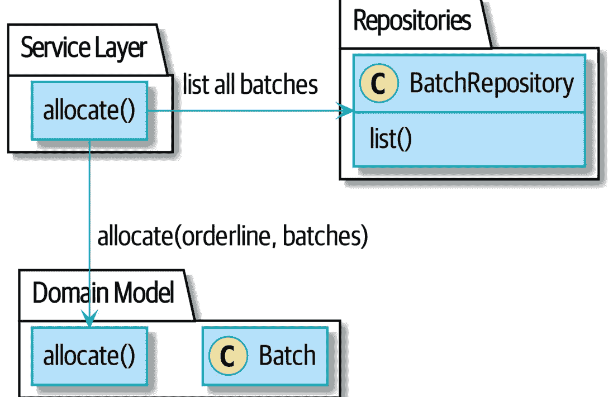

图 7-2 之前：使用领域服务分配所有批次

...我们将转向图 7-3 的世界，在那里有一个特定 SKU 的新 Product 对象，它将负责该 SKU 的所有批次，我们可以在其上调用 .allocate() 方法。

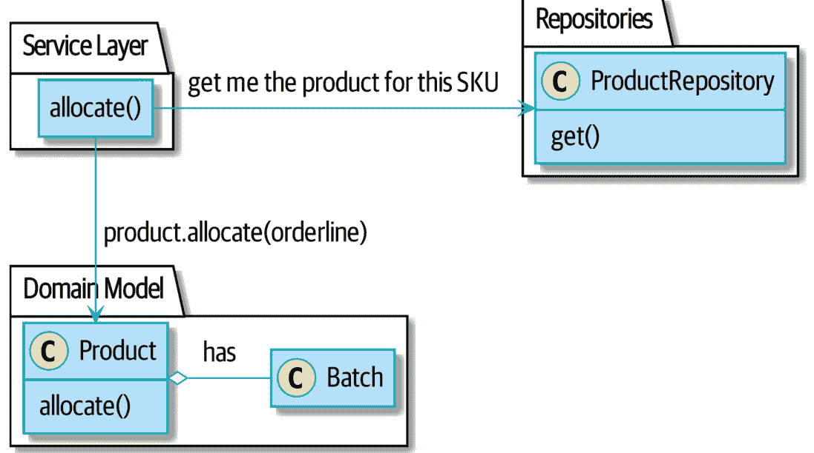

图 7-3 之后：要求 Product 根据其批次进行分配

让我们看看它在代码形式中的样子：

我们选择的聚合，Product (src/allocation/domain/model.py)

```python
class Product:

    def __init__(self, sku: str, batches: List[Batch]):
        self.sku = sku ①
        self.batches = batches ②

    def allocate(self, line: OrderLine) -> str: ③
        try:
            batch = next(
                b for b in sorted(self.batches) if b.can_allocate(line)
            )
            batch.allocate(line)
            return batch.reference
        except StopIteration:
            raise OutOfStock(f'Out of stock for sku {line.sku}')
```

1. Product 的主要标识符是 SKU。
2. 我们的 Product 类保存对该 SKU 的批次集合的引用。
3. 最后，我们可以将分配() 领域服务移动到 Product 聚合的方法中。

> **注意**

这个 Product 可能看起来不像你期望的 Product 模型。没有价格，没有描述，没有尺寸。我们的分配服务不关心这些事情。这就是有界上下文的力量；一个应用程序中的产品概念可能与另一个应用程序中的产品概念非常不同。有关更多讨论，请参见以下侧边栏。

> **聚合、有界上下文和微服务**

埃文斯和 DDD 社区最重要的贡献之一是有界上下文的概念。

本质上，这是对试图将整个业务捕捉到单个模型中的尝试的反应。对于销售、客户服务、物流、支持等人员来说，“客户”一词意味着不同的事情。一个上下文中需要的属性在另一个上下文中是无关紧要的；更为恶劣的是，具有相同名称的概念在不同的上下文中可能具有完全不同的含义。与其试图构建一个捕捉所有用例的单一模型（或类、或数据库），不如拥有几个模型，为每个上下文划定边界，并明确处理不同上下文之间的转换。

这个概念在微服务的世界中非常适用，每个微服务都可以自由地拥有自己的“客户”概念和将其翻译成与其集成的其他微服务的规则。

在我们的例子中，分配服务具有 Product(sku, batches)，而电子商务将具有 Product(sku, description, price, image_url, dimensions, 等等)。作为经验法则，你的域模型应该只包括它们执行计算所需的数据。

无论你是否拥有微服务架构，选择聚合的关键考虑因素也是选择它们将运行的有界上下文。通过限制上下文，你可以保持聚合的数量较少且其大小可管理。

再次强调，我们无法在此为此问题提供应有的处理，我们只能鼓励你在其他地方阅读相关资料。本侧边栏开头的 Fowler 链接是一个很好的起点，而任何一本 DDD 书都会有一章或更多关于有界上下文的内容。

## 一个聚合=一个仓库

一旦你将某些实体定义为聚合，我们需要应用规则，即它们是唯一公开访问外部世界的实体。换句话说，我们允许的仓库应该是返回聚合的仓库。

> **注意**

仓库应仅返回聚合的规则是我们强制执行聚合是进入我们域模型的唯一方式的主要地方。要注意不要破坏它！

在我们的例子中，我们将从 BatchRepository 切换到 ProductRepository：

我们的新 UoW 和仓库 (unit_of_work.py 和 repository.py)

```python
class AbstractUnitOfWork(abc.ABC):
    products: repository.AbstractProductRepository
    ...

class AbstractProductRepository(abc.ABC):
    @abc.abstractmethod
    def add(self, product):
        ...

    @abc.abstractmethod
    def get(self, sku) -> model.Product:
        ...
```

ORM 层需要进行一些调整，以便自动加载正确的批次并与 Product 对象关联。好处是，仓库模式意味着我们不必担心这个问题。我们可以使用 FakeRepository，然后将新模型传递到我们的服务层中，以查看其作为主要入口点的 Product 的外观如何：

服务层 (src/allocation/service_layer/services.py)

```python
def add_batch(
    ref: str, sku: str, qty: int, eta: Optional[date],
    uow: unit_of_work.AbstractUnitOfWork
):
    with uow:
        product = uow.products.get(sku=sku)
        if product is None:
            product = model.Product(sku, batches=[])
            uow.products.add(product)
        product.batches.append(model.Batch(ref, sku, qty, eta))
        uow.commit()

def allocate(
    orderid: str, sku: str, qty: int,
    uow: unit_of_work.AbstractUnitOfWork
) -> str:
    line = OrderLine(orderid, sku, qty)
    with uow:
        product = uow.products.get(sku=line.sku)
        if product is None:
            raise InvalidSku(f'Invalid sku {line.sku}')
        batchref = product.allocate(line)
        uow.commit()
    return batchref
```

## 性能如何？

我们已经多次提到，我们正在使用聚合进行建模，因为我们希望拥有高性能的软件，但是在这里，我们加载了所有批次，而我们只需要一个。你可能认为这是低效的，但我们在这里感到舒适的原因有几个。

首先，我们有意将数据建模，以便我们可以对数据库进行单个查询以读取，并进行单个更新以持久化我们的更改。这往往比发出大量特别查询的系统性能要好得多。在不采用这种方式建模的系统中，随着软件的发展，我们经常发现事务会变得越来越慢和复杂。

其次，我们的数据结构是最小的，每行由几个字符串和整数组成。我们可以在几毫秒内轻松加载数十甚至数百个批次。

第三，我们预计每种产品每次只会有大约20个批次。一旦批次用完，我们就可以从计算中剔除它。这意味着随着时间的推移，我们获取的数据量不应失控。

如果我们确实希望对某种产品有数千个活动批次，我们有几个选择。首先，我们可以对产品中的批次使用延迟加载。从我们的代码角度来看，没有任何变化，但在后台，SQLAlchemy 会为我们分页浏览数据。这将导致更多的请求，每个请求获取更少的行。因为我们只需要找到一个足够容量的批次来满足我们的订单，所以这可能效果很好。

> **读者练习**

你刚刚看到了代码的主要顶层，因此这不应该太难，但我们希望你像我们一样从 Batch 开始实现 Product 聚合。

当然，你可以作弊并从以前的列表中复制/粘贴，但即使你这样做，你仍然需要自己解决一些挑战，例如将模型添加到 ORM 中，并确保所有移动部件可以相互通信，我们希望这将是有益的。

你可以在 GitHub 上找到代码。我们在现有的 allocate() 函数的委托中放置了一个“作弊”实现，因此你应该能够将其发展到真实情况。

我们使用 @pytest.skip() 标记了一些测试。在阅读本章的其余部分之后，回到这些测试，尝试实现版本号。如果你能通过魔法让 SQLAlchemy 为你完成它们，则会获得额外的积分！

如果其他方法都失败了，我们只能寻找另一个聚合。也许我们可以按地区或仓库拆分批次。也许我们可以围绕发货概念重新设计我们的数据访问策略。聚合模式旨在帮助管理一些围绕一致性和性能的技术限制。没有一个正确的聚合，如果我们发现我们的边界导致性能问题，我们应该感到自在地改变我们的想法。

## 使用版本号实现乐观并发控制

我们有了新的聚合，因此我们解决了选择负责一致性边界的对象的概念问题。现在让我们花点时间讨论如何在数据库层面上强制执行数据完整性。

> **注意**

本节包含许多实现细节；例如，其中的一些是针对Postgres的。但更一般地说，我们展示了一种管理并发问题的方法，但这只是一种方法。这个领域的真实需求在项目之间变化很大。你不应该期望能够从这里复制和粘贴代码到生产环境中。

我们不想在整个批次表上持有锁，但是我们如何实现仅在特定SKU的行上持有锁呢？

一种方法是在Product模型上有一个单一属性，作为整个状态更改完成的标记，并将其用作并发工作者可以争夺的唯一资源。如果两个事务同时读取批次的世界状态，并且都想要更新分配表，我们会强制两者都尝试在产品表中更新version_number，以便只有一个赢家，世界保持一致。

图7-4说明了两个并发事务同时进行读操作，因此它们看到的是一个版本为3的产品。他们都调用Product.allocate()来修改状态。但是我们设置了数据库完整性规则，只允许其中一个提交新的版本为4的产品，另一个更新被拒绝。

> **提示**

版本号只是实现乐观锁定的一种方式。你可以通过将Postgres事务隔离级别设置为SERIALIZABLE来实现相同的效果，但这通常会带来严重的性能成本。版本号也使隐含的概念变得明确。

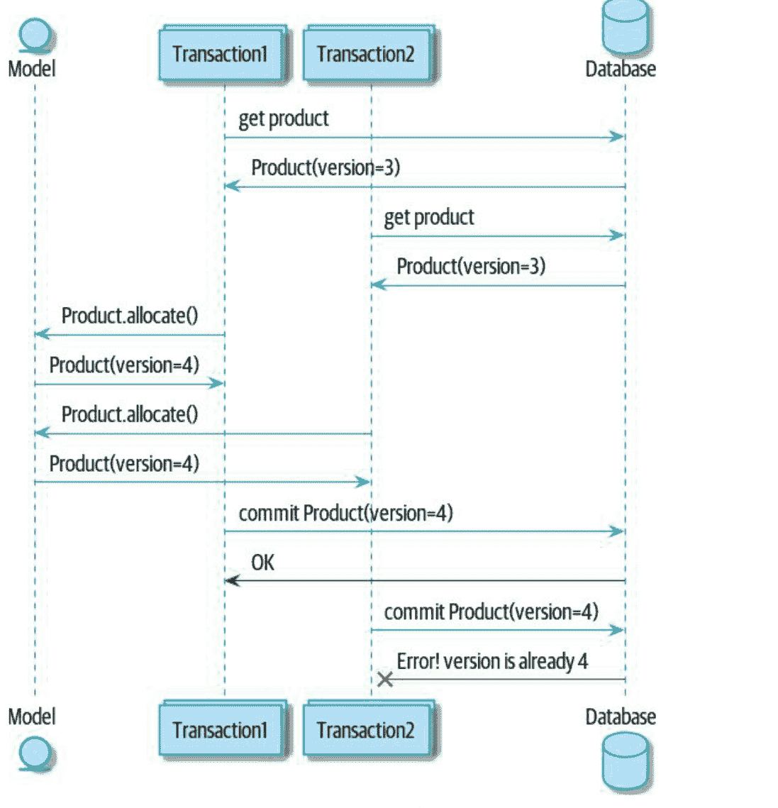

## 乐观并发控制和重试

我们实现的是乐观并发控制，因为我们的默认假设是当两个用户想要更改数据库时，一切都会很好。我们认为他们不太可能互相冲突，因此我们让他们继续前进，只要确保我们有一种方法可以注意到问题。

悲观并发控制是基于这样的假设：两个用户会引起冲突，我们希望在所有情况下都避免冲突，因此我们锁定一切以确保安全。在我们的示例中，这意味着锁定整个批次表，或使用SELECT FOR UPDATE--我们假装出于性能原因而排除了它们，但在现实生活中，你需要进行一些自己的评估和测量。

悲观锁定不需要考虑处理故障，因为数据库将为你防止它们（尽管你需要考虑死锁）。对于乐观锁定，你需要明确处理可能的故障（希望是不太可能的情况下）的可能性。

处理失败的常规方法是从头开始重试失败的操作。想象一下我们有两个客户，Harry和Bob，每个人都提交了SHINY-TABLE的订单。两个线程加载版本1的产品并分配库存。数据库防止并发更新，Bob的订单因此失败了。然后我们重新尝试操作，Bob的订单加载版本2的产品并再次尝试分配。如果还有足够的库存，那么一切都很好；否则，他将收到OutOfStock。在并发问题的情况下，大多数操作都可以通过这种方式重试。

有关重试的更多信息，请参见“同步恢复错误”和“Footguns”。

## 版本号的实现选项

基本上有三个选项可以实现版本号：

1. 版本号存储在域中；我们将其添加到Product构造函数中，Product.allocate（）负责递增它。
2. 服务层可以做到！版本号并不是严格的域关注点，因此我们的服务层可以假定版本号由存储库附加到Product，并在提交（）之前递增它。
3. 由于它可以说是基础设施问题，因此UoW和存储库可以通过魔术来完成。存储库可以访问检索到的任何产品的版本号，当UoW进行提交时，它可以递增它知道的任何产品的版本号，假设它们已更改。

选项3并不理想，因为没有真正的方法可以做到这一点，而不必假定所有产品都已更改，因此我们将在不必要的情况下递增版本号。

选项2涉及在服务层和域层之间混合改变状态的责任，因此也有点混乱。

因此，最终，即使版本号不必成为域关注的问题，你可能会决定最干净的权衡是将它们放在域中：

我们选择的聚合Product（src / allocation / domain / model.py）

```python
class Product:

    def __init__(self, sku: str, batches: List[Batch], version_number: int = 0): ①
        self.sku = sku
        self.batches = batches
        self.version_number = version_number ①

    def allocate(self, line: OrderLine) -> str:
        try:
            batch = next(
                b for b in sorted(self.batches) if b.can_allocate(line)
            )
            batch.allocate(line)
            self.version_number += ①
            return batch.reference
        except StopIteration:
            raise OutOfStock(f'Out of stock for sku {line.sku}')
```

1. 就是这样！

> **提示**
如果你对这个版本号业务感到困惑，可能会帮助你记住，该数字并不重要。重要的是，每当我们对Product聚合进行更改时，Product数据库行都会被修改。版本号是一种简单的、人类可理解的方式来模拟每次写入时都会发生变化的事物，但它同样可以是每次随机UUID。

## 测试我们的数据完整性规则

现在，为了确保我们可以获得我们想要的行为：如果我们有两个并发尝试对同一产品进行分配，其中一个应该失败，因为它们不能同时更新版本号。

首先，让我们使用一个执行分配然后显式休眠的函数来模拟“慢”事务：

time.sleep可以重现并发行为（tests / integration / test_uow.py）

```python
def try_to_allocate(orderid, sku, exceptions):
    line = model.OrderLine(orderid, sku, 10)
    try:
        with unit_of_work.SqlAlchemyUnitOfWork() as uow:
            product = uow.products.get(sku=sku)
            product.allocate(line)
            time.sleep(0.2)
            uow.commit()
    except Exception as e:
        print(traceback.format_exc())
        exceptions.append(e)
```

然后，我们的测试使用线程并发地调用这个缓慢的分配两次：

并发行为的集成测试 (tests/integration/test_uow.py)

```python
def test_concurrent_updates_to_version_are_not_allowed(postgres_session_factory):
    sku, batch = random_sku(), random_batchref()
    session = postgres_session_factory()
    insert_batch(session, batch, sku, 100, eta=None, product_version=1)
    session.commit()

    order1, order2 = random_orderid(1), random_orderid(2)
    exceptions = []  # type: List[Exception]
    try_to_allocate_order1 = lambda: try_to_allocate(order1, sku, exceptions)
    try_to_allocate_order2 = lambda: try_to_allocate(order2, sku, exceptions)
    thread1 = threading.Thread(target=try_to_allocate_order1) ❶
    thread2 = threading.Thread(target=try_to_allocate_order2) ❶
    thread1.start()
    thread2.start()
    thread1.join()
    thread2.join()

    [[version]] = session.execute(
        "SELECT version_number FROM products WHERE sku=:sku",
        dict(sku=sku),
    )
    assert version == 2 ❷
    [exception] = exceptions
    assert 'could not serialize access due to concurrent update' in str(exception) ❸

    orders = list(session.execute(
        "SELECT orderid FROM allocations"
        " JOIN batches ON allocations.batch_id = batches.id"
        " JOIN order_lines ON allocations.orderline_id = order_lines.id"
        " WHERE order_lines.sku=:sku",
```

## 通过使用数据库事务隔离级别强制执行并发规则

要使测试按照当前状态通过，我们可以在会话中设置事务隔离级别：
设置会话的隔离级别（src / allocation / service_layer / unit_of_work.py）

```python
DEFAULT_SESSION_FACTORY = sessionmaker(bind=create_engine(
    config.get_postgres_uri(),
    isolation_level="REPEATABLE READ",
))
```

> 提示
事务隔离级别是棘手的问题，因此值得花时间理解Postgres文档。

## 悲观并发控制示例：SELECT FOR UPDATE

有多种方法可以解决这个问题，但我们将展示其中一种。SELECT FOR UPDATE会产生不同的行为；两个并发事务将不允许同时对同一行执行读取：
SELECT FOR UPDATE是一种选择用作锁定的行或行的方式（尽管这些行不必是你要更新的行）。如果两个事务都尝试同时SELECT FOR UPDATE一行，则一个将获胜，另一个将等待锁定被释放。因此，这是悲观并发控制的一个例子。
以下是如何使用SQLAlchemy DSL在查询时指定FOR UPDATE：
SQLAlchemy with_for_update
(src/allocation/adapters/repository.py)

```python
def get(self, sku):
    return self.session.query(model.Product) \
        .filter_by(sku=sku) \
        .with_for_update() \
        .first()
```

这将改变并发模式，从

read1, read2, write1, write2(fail)

到

read1, write1, read2, write2(succeed)

有些人将其称为“读取-修改-写入”故障模式。阅读“PostgreSQL反模式：读取-修改-写入循环”可以获得很好的概述。

我们没有时间讨论REPEATABLE READ和SELECT FOR UPDATE之间的所有权衡，或者一般情况下乐观并发锁定与悲观并发锁定之间的区别。但是，如果你有像我们展示的测试，你可以指定所需的行为并查看其如何更改。你还可以将测试用作执行某些性能实验的基础。

## 总结

具体的并发控制选择基于业务情况和存储技术选择有很大的差异，但我们希望将本章回归到聚合的概念思想：我们明确将对象建模为是我们模型的某个子集的主要入口点，并且负责执行适用于所有这些对象的不变量和业务规则。

选择正确的聚合是关键，这是你可能会随时间重新审视的决策。你可以在多个DDD书籍中阅读更多相关内容。我们还推荐Vaughn Vernon（“红书”作者）撰写的有效聚合设计的这三篇在线论文。

表7-1中提供了实施聚合模式的权衡思考。

| 优点 | 缺点 |
| --- | --- |
| - Python可能没有“官方”的公共和私有方法，但我们有下划线约定，因为通常有助于尝试指示什么是供“内部”使用的，什么是供“外部代码”使用的。选择聚合只是上一级：它让你决定哪些域模型类是公共的，哪些不是。<br>- 围绕显式一致性边界建模操作有助于避免ORM的性能问题。<br>- 将聚合独立负责其子模型的状态更改使系统更易于理解，并且更易于控制不变量。 | - 对于新开发人员来说，又是一个新概念。解释实体与值对象已经是一种心理负担；现在又有了第三种类型的域模型对象？<br>- 严格遵循一次只修改一个聚合的规则是一个巨大的心理转变。<br>- 处理聚合之间的最终一致性可能很复杂。 |

> 聚合和一致性边界概述

聚合是进入域模型的入口点

通过限制事物变化的方式，我们使系统更易于理解。

聚合负责一致性边界

聚合的工作是能够管理我们关于不变量的业务规则，因为它们适用于一组相关对象。聚合的工作是检查其权限范围内的对象是否彼此一致并符合我们的规则，并拒绝会破坏规则的更改。

聚合和并发问题是相互关联的

当考虑实施这些一致性检查时，我们会考虑交易和锁定。选择正确的聚合不仅涉及性能，还涉及域的概念组织。

## 第一部分概述

你还记得我们在第一部分开始时展示的图7-5吗？那是我们预览我们将要学习的内容的组件图。

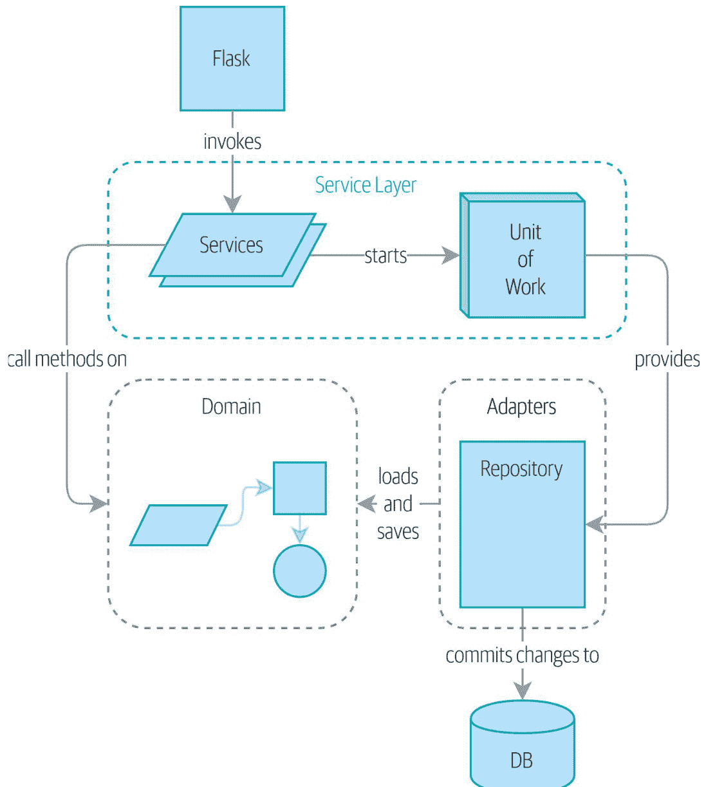

图7-5. 第一部分结束时我们应用程序的组件图

所以这就是我们在第一部分结束时的状态。我们取得了什么成就？我们看到了如何构建一个由一组高级单元测试驱动的域模型。我们的测试是生动的文档：它们用易读的代码描述了我们系统的行为——我们与业务利益相关者达成的规则。当我们的业务需求发生变化时，我们有信心我们的测试将帮助我们证明新的功能，当新的开发人员加入项目时，他们可以阅读我们的测试来理解事物的运作方式。

我们将系统的基础设施部分（如数据库和API处理程序）解耦，以便我们可以将它们插入我们应用程序的外部。这有助于我们保持代码库的良好组织，防止我们构建一个大泥球。

通过应用依赖反转原则，并使用受端口和适配器启发的模式，如存储库和工作单元，我们使得在高档和低档之间进行TDD成为可能，并保持健康的测试金字塔。我们可以测试系统的边缘到边缘，集成和端到端测试的需求保持最小。

最后，我们谈到了一致性边界的概念。我们不希望在进行更改时锁定整个系统，因此我们必须选择哪些部分相互一致。

对于小型系统，这就是你需要去尝试领域驱动设计思想的一切。现在你有了构建与数据库无关的域模型的工具，这些模型代表了你的业务专家的共享语言。万岁！

> **注意**

冒着反复强调的风险，我们一直在强调每个模式都有代价。每个间接层都会在我们的代码中产生复杂性和重复性，并会让那些从未见过这些模式的程序员感到困惑。如果你的应用程序基本上只是一个简单的CRUD数据库包装器，并且在可预见的未来不太可能成为其他东西，那么你不需要这些模式。继续使用Django，并省去很多麻烦。

在第二部分中，我们将放大视野，谈论一个更大的主题：如果聚合是我们的边界，而我们只能一次更新一个，那么如何建模跨一致性边界的过程？

## 第二部分 事件驱动架构

抱歉，我早就为这个主题创造了“对象”这个术语，因为它让很多人关注了次要的想法。重要的想法是“消息传递”。……设计伟大和可扩展的系统更关键的是设计模块之间的通信方式，而不是它们的内部属性和行为。

> ——艾伦·凯

能够编写一个域模型来管理单个业务流程是很好的，但当我们需要编写许多模型时会发生什么？在现实世界中，我们的应用程序位于一个组织中，并需要与系统的其他部分交换信息。你可能还记得我们在图II-1中展示的上下文图。

面对这个要求，许多团队通过HTTP API集成微服务。但是如果他们不小心，他们最终会产生最混乱的混乱：分布式大泥球。

在第二部分中，我们将展示如何将第一部分的技术扩展到分布式系统。我们将放大视野，了解如何通过异步消息传递将系统组合成许多小组件。

我们将看到我们的服务层和工作单元模式如何允许我们重新配置我们的应用程序以作为异步消息处理器运行，以及事件驱动系统如何帮助我们将聚合和应用程序相互解耦。

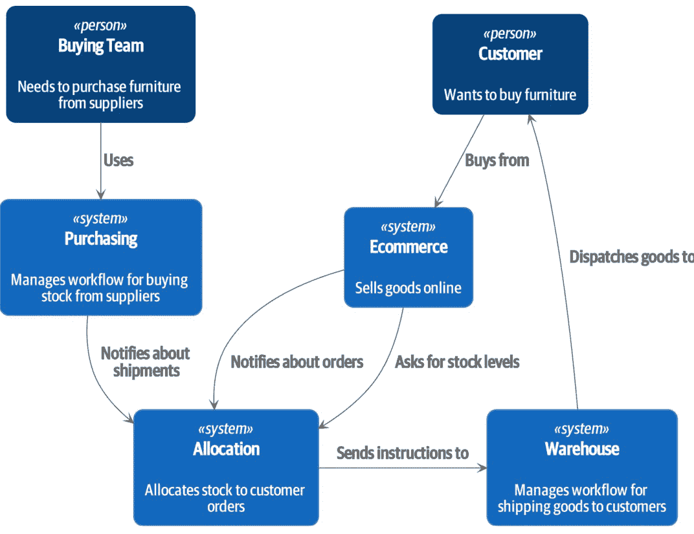

图II-1 但是所有这些系统将如何相互通信?

我们将研究以下模式和技术：

- 领域事件
触发跨一致性边界的工作流程。
- 消息总线
提供一种统一的方式，从任何端点调用用例。
- CQRS
分离读和写避免在事件驱动架构中出现尴尬的妥协，并实现性能和可扩展性的提高。

此外，我们还将添加依赖注入框架。这与事件驱动架构本身无关，但它可以整理很多松散的尾巴。

## 第八章 事件和消息总线

到目前为止，我们花费了大量时间和精力解决一个简单的问题，我们本来可以轻松地通过Django解决。你可能会问，增加的可测试性和表现力是否真的值得所有的努力。

实际上，我们发现，使我们的代码库混乱的不是显而易见的特性，而是边缘的混乱。它是报告、权限和工作流，这些都涉及到无数的对象。

我们的例子将是一个典型的通知需求：当我们因为缺货而无法分配订单时，我们应该通知采购团队。他们会通过购买更多的库存来解决问题，一切都会好起来。

对于第一个版本，我们的产品负责人说我们只需要通过电子邮件发送警报。

让我们看看当我们需要插入组成我们系统大部分的乏味内容时，我们的架构将如何保持。我们将从最简单、最迅速的事情开始，并讨论为什么正是这种决策导致了大泥球。

然后，我们将展示如何使用领域事件模式将副作用与我们的用例分离，并如何使用简单的消息总线模式触发基于这些事件的行为。我们将展示一些创建这些事件的选项以及如何将它们传递给消息总线，最后我们将展示如何修改工作单元模式以优雅地将两者连接在一起，如图8-1所示。

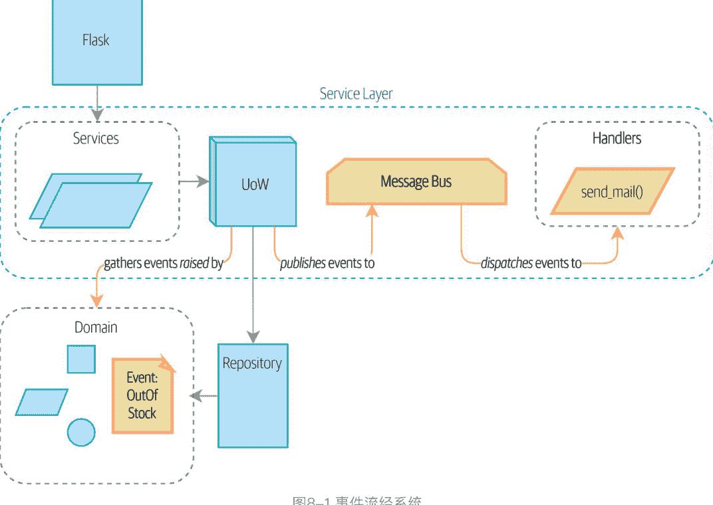

图8-1 事件流经系统

> 提示
本章的代码在GitHub的chapter_08_events_and_message_bus分支中：
git clone https://github.com/cosmicpython/code.git
cd code
git checkout chapter_08_events_and_message_bus
# or to code along, checkout the previous chapter:
git checkout chapter_07_aggregate

## 避免制造混乱

当我们有新的需求，比如与核心领域没有任何关系的需求时，很容易开始将这些东西倒入我们的web控制器中。

首先，让我们避免在我们的Web控制器中制造混乱
作为一次性的黑客，这可能没问题：
只需将其放入端点中——会出什么问题呢？

(src/allocation/entrypoints/flask_app.py)

```python
@app.route("/allocate", methods=['POST'])
def allocate_endpoint():
    line = model.OrderLine(
        request.json['orderid'],
        request.json['sku'],
        request.json['qty'],
    )
    try:
        uow = unit_of_work.SqlAlchemyUnitOfWork()
        batchref = services.allocate(line, uow)
    except (model.OutOfStock, services.InvalidSku) as e:
        send_mail(
            'out of stock',
            'stock_admin@made.com',
            f'{line.orderid} - {line.sku}'
        )
        return jsonify({'message': str(e)}), 400

    return jsonify({'batchref': batchref}), 201
```

......但很容易看出我们如何通过这种方式迅速陷入混乱。发送电子邮件不是我们的HTTP层的工作，我们希望能够对这个新功能进行单元测试。

## 而且，我们也不要在我们的模型中制造混乱

假设我们不想将这段代码放入我们的Web控制器中，因为我们希望它们尽可能地简洁，我们可以考虑将它放在模型中：

我们的模型中的电子邮件发送代码也不是很好(src/allocation/domain/model.py)

```python
def allocate(self, line: OrderLine) -> str:
    try:
        batch = next(
            b for b in sorted(self.batches) if b.can_allocate(line)
        )
        #...
    except StopIteration:
        email.send_mail('stock@made.com', f'Out of stock for {line.sku}')
        raise OutOfStock(f'Out of stock for sku {line.sku}')
```

但这更糟糕！我们不希望我们的模型有任何依赖于像email.send_mail这样的基础设施问题。这个发送电子邮件的东西是不受欢迎的混乱，破坏了我们系统的流畅性。我们希望将我们的领域模型集中在规则“你不能分配比实际可用的更多的东西”上。

领域模型的工作是知道我们的库存不足，但发送警报的责任属于其他地方。我们应该能够打开或关闭此功能，或者切换到短信通知，而无需更改领域模型的规则。

## 或者服务层！

“尝试分配一些库存，如果失败，则发送电子邮件”是工作流编排的一个例子:这是一组系统必须遵循的步骤，以实现一个目标。

我们编写了一个服务层来管理编排，但即使在这里，该功能也感觉不合适：

在服务层中，它不合适
(src/allocation/service_layer/services.py)

```python
def allocate(
    orderid: str, sku: str, qty: int,
    uow: unit_of_work.AbstractUnitOfWork
) -> str:
    line = OrderLine(orderid, sku, qty)
    with uow:
        product = uow.products.get(sku=line.sku)
        if product is None:
            raise InvalidSku(f'Invalid sku {line.sku}')
        try:
            batchref = product.allocate(line)
            uow.commit()
            return batchref
        except model.OutOfStock:
            email.send_mail('stock@made.com', f'Out of stock for {line.sku}')
            raise
```

捕获异常并重新引发它？这可能更糟，但肯定让我们不高兴。为什么很难找到适合此代码的家？

## 单一职责原则

实际上，这是单一职责原则（SRP）的违反。我们的用例是分配。我们的端点、服务函数和领域方法都被称为allocate，而不是allocate_and_send_mail_if_out_of_stock。

> 提示
经验法则：如果你无法在不使用“然后”或“和”的单词描述你的函数所做的操作，你可能正在违反SRP。

SRP的一个表述是每个类只应有一个更改的原因。当我们从电子邮件切换到短信时，我们不应该更新我们的allocate（）函数，因为这显然是一个单独的责任。

为了解决问题，我们将把编排拆分为单独的步骤，以便不同的问题不会纠缠在一起。领域模型的工作是知道我们的库存不足，但发送警报的责任属于其他地方。我们应该能够打开或关闭此功能，或者切换到短信通知，而无需更改领域模型的规则。

我们还希望将服务层从实现细节中解放出来。我们希望将依赖反转原则应用于通知，以便我们的服务层依赖于抽象，就像我们通过使用工作单元避免依赖于数据库一样。

## 上车吧，消息总线！

我们要介绍的模式是领域事件和消息总线。我们可以用几种方法来实现它们，所以我们会展示几种方法，然后选择我们最喜欢的那种。

## 模型记录事件

首先，我们的模型将负责记录事件，而不是关心电子邮件 – 关于已发生的事情的事实。我们将使用消息总线来响应事件并调用新操作。

## 事件是简单的数据类

事件是一种值对象。事件没有任何行为，因为它们是纯数据结构。我们总是以领域语言命名事件，并将其视为领域模型的一部分。

我们可以将它们存储在model.py中，但我们可能也可以将它们保留在自己的文件中（现在是考虑重构出一个名为domain的目录，以便我们有domain/model.py和domain/events.py的好时机）：

事件类（src/allocation/domain/events.py）

```python
from dataclasses import dataclass

class Event:
    pass

@dataclass
class OutOfStock(Event):
    sku: str
```

1. 一旦我们有了许多事件，我们会发现拥有一个可以存储公共属性的父类非常有用。对于我们的消息总线中的类型提示也很有用，你很快就会看到。
2. 数据类也非常适合领域事件。

## 模型引发事件

当我们的领域模型记录已发生的事实时，我们说它引发了一个事件。
从外部来看，如果我们要求Product进行分配但无法分配，它应该引发一个事件：
测试我们的聚合以引发事件（tests/unit/test_product.py）

```python
def test_records_out_of_stock_event_if_cannot_allocate():
    batch = Batch('batch1', 'SMALL-FORK', 10, eta=today)
    product = Product(sku="SMALL-FORK", batches=[batch])
    product.allocate(OrderLine('order1', 'SMALL-FORK', 10))

    allocation = product.allocate(OrderLine('order2', 'SMALL-FORK', 1))
    assert product.events[-1] == events.OutOfStock(sku="SMALL-FORK")
    assert allocation is None
```

1. 我们的聚合将公开一个名为.events的新属性，其中包含有关已发生的事实的列表，以Event对象的形式呈现。

以下是模型内部的样子：
模型引发领域事件（src/allocation/domain/model.py）

## 消息总线将事件映射到处理程序

消息总线基本上说：“当我看到这个事件时，我应该调用以下处理程序函数。”换句话说，它是一个简单的发布-订阅系统。处理程序订阅接收事件，我们将其发布到总线上。它听起来比实际难，但我们通常使用字典来实现它：

简单的消息总线 (src/allocation/service_layer/messagebus.py)

```python
def handle(event: events.Event):
    for handler in HANDLERS[type(event)]:
        handler(event)

def send_out_of_stock_notification(event: events.OutOfStock):
    email.send_mail(
        'stock@made.com',
        f'Out of stock for {event.sku}',
    )

HANDLERS = {
    events.OutOfStock: [send_out_of_stock_notification],
}  # type: Dict[Type[events.Event], List[Callable]]
```

> **注意**

请注意，实现的消息总线不会给我们并发性，因为一次只有一个处理程序会运行。我们的目标不是支持并行线程，而是在概念上分离任务，并尽可能使每个UoW尽可能小。这有助于我们理解代码库，因为每个用例的运行方式的“配方”都写在一个地方。请参阅以下侧边栏。

> **这类似于Celery吗？**

Celery是Python世界中用于将自包含的工作块延迟到异步任务队列的流行工具。我们在这里介绍的消息总线非常不同，因此上面的问题的简短答案是否定的；我们的消息总线更类似于Node.js应用程序、UI事件循环或Actor框架。

如果你确实需要将工作移出主线程，则仍可以使用我们基于事件的隐喻，但建议你使用外部事件。在表11-1中有更多讨论，但基本上，如果你实现了将事件持久存储到集中式存储的方法，则可以订阅其他容器或其他微服务。然后，使用事件将责任分离到单个进程/服务的工作单元中的同一概念可以扩展到多个进程-这些进程可能是同一服务中的不同容器，或完全不同的微服务。

如果你采用我们的方法，分发任务的API是事件类或它们的JSON表示形式。这使你在分发任务的对象方面具有很大的灵活性；它们不一定是Python服务。Celery用于分发任务的API基本上是“函数名称加参数”，这更加受限且仅适用于Python。

## 选项1：服务层从模型中获取事件并将其放在消息总线上

我们的领域模型引发事件，我们的消息总线将在事件发生时调用正确的处理程序。现在我们需要将两者连接起来。我们需要某种方法来捕获模型中的事件并将其传递到消息总线-发布步骤。

最简单的方法是在我们的服务层中添加一些代码：

具有显式消息总线的服务层 (src/allocation/service_layer/services.py)

```python
from . import messagebus
...

def allocate(
        orderid: str, sku: str, qty: int,
        uow: unit_of_work.AbstractUnitOfWork
) -> str:
    line = OrderLine(orderid, sku, qty)
    with uow:
        product = uow.products.get(sku=line.sku)
        if product is None:
            raise InvalidSku(f'Invalid sku {line.sku}')
        try: ①
            batchref = product.allocate(line)
            uow.commit()
            return batchref
        finally: ①
            messagebus.handle(product.events) ②
```

1. 我们保留了之前丑陋实现中的try/finally代码块（我们还没有完全摆脱所有异常，只有OutOfStock异常）。
2. 但是现在，服务层不再直接依赖电子邮件基础设施，而是负责将模型中的事件传递到消息总线。

这已经避免了我们在朴素实现中遇到的一些丑陋问题，我们有几个系统都是这样工作的，服务层显式从聚合中收集事件并将它们传递到消息总线。

## 选项2：服务层引发自己的事件

我们使用的另一种变体是让服务层负责直接创建和引发事件，而不是由领域模型引发它们：

服务层直接调用messagebus.handle (src/allocation/service_layer/services.py)

```python
def allocate(
    orderid: str, sku: str, qty: int,
    uow: unit_of_work.AbstractUnitOfWork
) -> str:
    line = OrderLine(orderid, sku, qty)
    with uow:
        product = uow.products.get(sku=line.sku)
        if product is None:
            raise InvalidSku(f'Invalid sku {line.sku}')
        batchref = product.allocate(line)
        uow.commit()

    if batchref is None:
        messagebus.handle(events.OutOfStock(line.sku))
    return batchref
```

1. 与之前一样，即使我们未能分配而失败，我们仍然提交，因为这样代码更简单，更容易理解：除非出了问题，否则我们始终提交。在我们没有更改任何内容的情况下提交是安全的，并且使代码保持简洁。

同样，我们在生产中有应用程序以这种方式实现该模式。适合你的方法将取决于你面临的特定权衡，但我们想向你展示我们认为是最优雅的解决方案，其中我们将工作单元负责收集和引发事件。

## 选项3：UoW将事件发布到消息总线

UoW已经有了try/finally代码块，并且它知道当前正在运行的所有聚合，因为它提供了访问存储库的权限。因此，它是发现事件并将其传递到消息总线的好地方：

UoW满足消息总线 (src/allocation/service_layer/unit_of_work.py)

```python
class AbstractUnitOfWork(abc.ABC):
    ...

    def commit(self):
        self._commit() ①
        self.publish_events() ②

    def publish_events(self): ②
        for product in self.products.seen: ③
            while product.events:
                event = product.events.pop(0)
                messagebus.handle(event)

    @abc.abstractmethod
    def _commit(self):
        raise NotImplementedError

...

class SqlAlchemyUnitOfWork(AbstractUnitOfWork):
    ...

    def _commit(self): ①
        self.session.commit()
```

1. 我们将更改我们的commit方法，要求子类使用私有的._commit()方法。
2. 提交完成后，我们遍历存储库所看到的所有对象，并将它们的事件传递给消息总线。
3. 这依赖于存储库跟踪已加载的聚合的新属性.seen，你将在下一个列表中看到。

> **注意**

你是否想知道如果其中一个处理程序失败会发生什么？我们将在第10章中详细讨论错误处理。

存储库跟踪通过它的聚合 (src/allocation/adapters/repository.py)

```python
class AbstractRepository(abc.ABC):

    def __init__(self):
        self.seen = set()  # type: Set[model.Product] ❶

    def add(self, product: model.Product): ❷
        self._add(product)
        self.seen.add(product)

    def get(self, sku) -> model.Product: ❸
        product = self._get(sku)
        if product:
            self.seen.add(product)
        return product

    @abc.abstractmethod
    def _add(self, product: model.Product): ❷
        raise NotImplementedError

    @abc.abstractmethod ❸
    def _get(self, sku) -> model.Product:
        raise NotImplementedError
```

```python
class SqlAlchemyRepository(AbstractRepository):

    def __init__(self, session):
        super().__init__()
        self.session = session

    def _add(self, product): ❷
        self.session.add(product)

    def _get(self, sku): ❸
        return self.session.query(model.Product).filter_by(sku=sku).first()
```

1. 为了使UoW能够发布新事件，它需要能够询问存储库在此会话期间使用了哪些产品对象。我们使用一个名为.seen的集合来存储它们。这意味着我们的实现需要调用super().__init__()。
2. 父add()方法将事物添加到.seen中，并且现在需要子类实现._add()。
3. 同样，.get()委托给._get()函数，由子类实现，以捕获观察到的对象。

> **注意**

使用._underscore()方法和子类化肯定不是你实现这些模式的唯一方法。尝试本章中的Reader练习并尝试一些替代方案。

在UoW和存储库以这种方式协作以自动跟踪活动对象并处理它们的事件后，服务层可以完全摆脱事件处理方面的问题：

服务层再次干净 (src/allocation/service_layer/services.py)

```python
def allocate(
    orderid: str, sku: str, qty: int,
    uow: unit_of_work.AbstractUnitOfWork
) -> str:
    line = OrderLine(orderid, sku, qty)
    with uow:
        product = uow.products.get(sku=line.sku)
        if product is None:
            raise InvalidSku(f'Invalid sku {line.sku}')
        batchref = product.allocate(line)
        uow.commit()
        return batchref
```

我们还必须记得更改服务层中的伪造对象，并在正确的位置调用super()，并实现下划线方法，但更改很小：

服务层的伪造对象需要调整 (tests/unit/test_services.py)

```python
class FakeRepository(repository.AbstractRepository):

    def __init__(self, products):
        super().__init__()
        self._products = set(products)

    def _add(self, product):
        self._products.add(product)

    def _get(self, sku):
        return next((p for p in self._products if p.sku == sku), None)

...

class FakeUnitOfWork(unit_of_work.AbstractUnitOfWork):
    ...

    def _commit(self):
        self.committed = True
```

## 读者练习

你是否认为所有这些._add()和._commit()方法“超级恶心”，用我们心爱的技术评论员Hynek的话说？它让你“想用毛绒玩具蛇打哈利的头”？嘿，我们的代码清单只是示例，而不是完美的解决方案！为什么不去看看你能否做得更好呢？

一种基于组合而非继承的方法是实现包装器类：

包装器添加功能，然后进行委托 (src/adapters/repository.py)

```python
class TrackingRepository:
    seen: Set[model.Product]

    def __init__(self, repo: AbstractRepository):
        self.seen = set()  # type: Set[model.Product]
        self._repo = repo

    def add(self, product: model.Product):  ❶
        self._repo.add(product)  ❶
        self.seen.add(product)

    def get(self, sku) -> model.Product:
        product = self._repo.get(sku)
        if product:
            self.seen.add(product)
        return product
```

1. 通过包装存储库，我们可以调用实际的.add()和.get()方法，避免奇怪的下划线方法。

看看你是否可以将类似的模式应用于我们的UoW类，以摆脱那些Java-y _commit()方法。你可以在GitHub上找到代码。

将所有的抽象基类（ABC）切换到typing.Protocol是一种避免使用继承的好方法。如果你想到了什么好方法，请告诉我们！

你可能开始担心维护这些伪造对象会成为维护负担。毫无疑问，这需要工作，但在我们的经验中，这并不需要太多的工作。一旦你的项目启动并运行，你的存储库和UoW抽象的接口实际上不会发生太大变化。如果你使用ABC，则它们将帮助你在事物失去同步时提醒你。

## 总结

领域事件为我们提供了处理系统工作流的方法。我们经常听取领域专家的意见，他们以因果或时间方式表达需求，例如：“当我们尝试分配库存但没有可用库存时，我们应该向采购团队发送电子邮件。”

“当X时，就Y”这些神奇的词语经常告诉我们关于我们可以在系统中具体实现的事件。将事件视为模型中的一等事物有助于使我们的代码更具可测试性和可观察性，并有助于隔离关注点。

表8-1显示了我们看到的权衡。

## 表8-1. 领域事件：权衡

| 优点 | 缺点 |
| --- | --- |
| • 当我们需要对请求采取多个操作时，消息总线为我们提供了一种分离责任的好方法。<br>• 事件处理程序与“核心”应用程序逻辑分离得很好，使得稍后更改其实现变得容易。<br>• 领域事件是模拟现实世界的好方法，我们可以在与利益相关者建模时将其作为业务语言的一部分。 | • 消息总线是一个需要理解的附加项；使用工作单元引发事件的实现很整洁，但也很神奇。我们调用提交时，不明显的是我们也会发送电子邮件给相关人员。<br>• 此外，隐藏的事件处理代码是同步执行的，这意味着你的服务层函数在任何事件的所有处理程序完成之前都不会完成。这可能会在Web端点中导致意外的性能问题（添加异步处理是可能的，但会使事情更加混乱）。<br>• 更一般地说，事件驱动的工作流可能会令人困惑，因为在事情被分成多个处理程序链之后，系统中没有单个位置可以了解如何满足请求。<br>• 你还将自己暴露于事件处理程序之间循环依赖和无限循环的可能性。 |

事件不仅仅用于发送电子邮件。在第7章中，我们花了很多时间说服你应该定义聚合，或者我们保证一致性的边界。人们经常问：“如果我需要更改多个聚合作为请求的一部分，我该怎么办？”现在我们有了需要回答这个问题的工具。

如果我们有两个可以事务隔离的东西（例如订单和产品），那么我们可以使用事件使它们最终一致。当取消订单时，我们应该查找分配给它的产品并删除分配。

## 领域事件和消息总线回顾

事件有助于单一责任原则

当我们在一个地方混合多个关注点时，代码会变得混乱。通过将主要用例与次要用例分离，事件可以帮助我们保持整洁。我们还使用事件在聚合之间进行通信，这样我们就不需要运行长时间的事务来锁定多个表。

消息总线将消息路由到处理程序

你可以将消息总线视为将事件映射到其消费者的字典。它不知道事件的含义；它只是用于在系统中传递消息的愚蠢基础架构。

选项1：服务层引发事件并将其传递给消息总线

开始在系统中使用事件的最简单方法是在提交工作单元后从处理程序引发它们，通过调用 `bus.handle(some_new_event)`。

选项2：领域模型引发事件，服务层将其传递给消息总线

关于何时引发事件的逻辑真的应该存在于模型中，因此我们可以通过从领域模型引发事件来改善系统的设计和可测试性。我们的处理程序很容易在提交后从模型对象收集事件并将其传递给总线。

选项3：工作单元从聚合收集事件并将其传递给消息总线

在每个处理程序中添加 `bus.handle(aggregate.events)` 很麻烦，因此我们可以通过使我们的工作单元负责引发已加载对象引发的事件来整理。这是最复杂的设计，可能依赖于ORM魔法，但一旦设置完成，它就是干净且易于使用的。

在第9章中，随着我们使用新的消息总线构建更复杂的工作流程，我们将更详细地研究这个想法。

## 第9章 深入了解消息总线

在本章中，我们将开始使事件对我们应用程序的内部结构更为基本。我们将从当前状态转移到图9-1中，其中事件是可选的副作用...

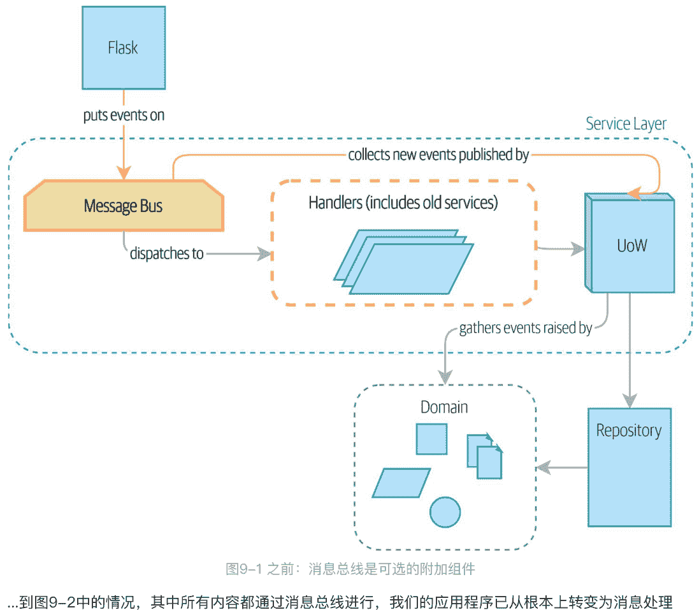

...到图9-2中的情况，其中所有内容都通过消息总线进行，我们的应用程序已从根本上转变为消息处理器。

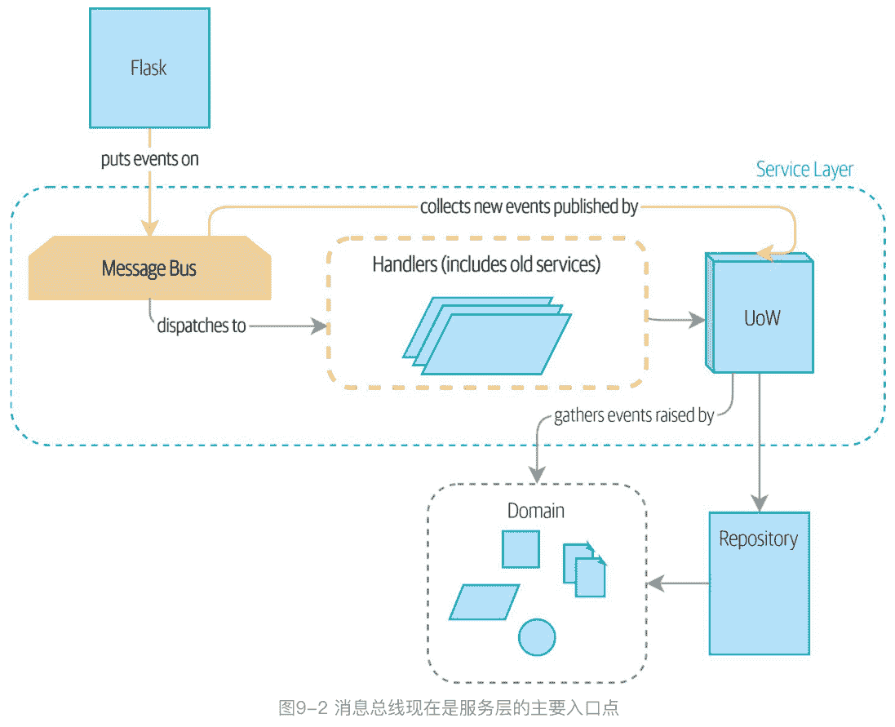

> 提示

本章的代码在GitHub上的 `chapter_09_all_messagebus` 分支中：

```
git clone https://github.com/cosmicpython/code.git
cd code
git checkout chapter_09_all_messagebus
# or to code along, checkout the previous chapter:
git checkout chapter_0_events_and_message_bus
```

## 新要求引领我们走向新的架构

Rich Hickey谈到了“定位软件”，这意味着运行长时间，管理现实世界过程的软件。例如仓库管理系统、物流调度程序和工资系统。

编写此类软件很棘手，因为在物理对象和不可靠的人类的真实世界中经常发生意外事件。例如：

- 在盘点期间，我们发现三个弹簧床垫被漏雨的屋顶水损坏了。
- 一批可靠的叉子缺少必需的文件，并被海关扣留了数周。随后有三个可靠的叉子未通过安全测试并被销毁。
- 全球亮片短缺意味着我们无法制造下一批SPARKLY-BOOKCASE。

在这些类型的情况下，当批量数量已经在系统中时，我们了解到需要更改批量数量的需要。也许有人在清单中的数字上犯了错误，或者也许一些沙发从卡车上掉了下来。与业务进行对话后，我们将情况建模如图9-3所示。

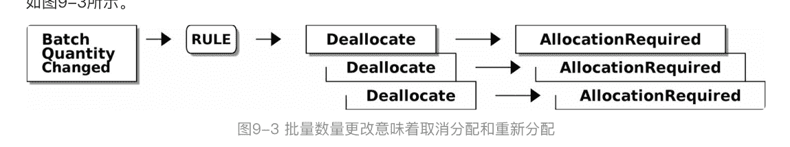

我们将称之为 `BatchQuantityChanged` 的事件应该导致我们更改批量数量，但也应该应用业务规则：如果新数量降至少于已分配的总量，则需要从该批次中取消分配这些订单。然后，每个订单都需要进行新的分配，我们可以将其捕获为称为 `AllocationRequired` 的事件。

也许你已经预料到，我们的内部消息总线和事件可以帮助实现这个需求。我们可以定义一个名为 `change_batch_quantity` 的服务，该服务知道如何调整批量数量，以及如何取消分配任何多余的订单行，然后每个取消分配都可以发出一个 `AllocationRequired` 事件，该事件可以转发给现有的 `allocate` 服务，在单独的事务中进行处理。再次，我们的消息总线帮助我们执行单一责任原则，并允许我们对事务和数据完整性进行选择。

## 想象一下架构变化：一切都将成为事件处理程序

但在我们开始之前，请考虑我们的目标。我们的系统有两种流程：

- 由服务层函数处理的API调用
- 内部事件（可能作为服务层函数的副作用引发），以及它们的处理程序（反过来调用服务层函数）

如果一切都是事件处理程序，那不是更容易吗？如果我们重新思考我们的API调用，将其视为捕获事件，那么服务层函数也可以成为事件处理程序，我们不再需要区分内部和外部事件处理程序：

- `services.allocate()` 可以是 `AllocationRequired` 事件的处理程序，并且可以将 `Allocated` 事件作为其输出发出。
- `services.add_batch()` 可以是 `BatchCreated` 事件的处理程序。

我们的新需求将符合相同的模式：

- 一个名为 `BatchQuantityChanged` 的事件可以调用一个名为 `change_batch_quantity()` 的处理程序。
- 它可能引发的新的 `AllocationRequired` 事件也可以传递给 `services.allocate()`，因此从API中获得全新的分配和内部由取消分配触发的重新分配之间没有概念上的区别。

听起来有点复杂？让我们逐步朝着这个方向努力。我们将遵循预备重构工作流程，也称为“使更改变得容易；然后进行容易的更改”：

1. 我们将服务层重构为事件处理程序。我们可以逐渐适应事件是描述系统输入的方式。特别是现有的 `services.allocate()` 函数将成为称为 `AllocationRequired` 的事件的处理程序。
2. 我们构建一个端到端测试，将 `BatchQuantityChanged` 事件放入系统中，并查看是否有 `Allocated` 事件出现。
3. 我们的实现在概念上非常简单：一个新的 `BatchQuantityChanged` 事件处理程序，其实现将发出 `AllocationRequired` 事件，这些事件将被API使用的完全相同的分配处理程序处理。

在此过程中，我们将对消息总线和UoW进行小的调整，将将新事件放入消息总线的责任移到消息总线本身中。

## 将服务函数重构为消息处理程序

我们首先定义两个事件，用于捕获我们当前的API输入–`AllocationRequired` 和 `BatchCreated`：

BatchCreated和AllocationRequired事件

(src/allocation/domain/events.py)

```python
@dataclass
class BatchCreated(Event):
    ref: str
    sku: str
    qty: int
    eta: Optional[date] = None

...

@dataclass
class AllocationRequired(Event):
    orderid: str
    sku: str
    qty: int
```

然后，我们将 `services.py` 重命名为 `handlers.py`；我们添加了现有的 `send_out_of_stock_notification` 消息处理程序；并且最重要的是，我们更改了所有处理程序，以使它们具有相同的输入，即事件和UoW：

处理程序和服务是相同的东西

(src/allocation/service_layer/handlers.py)

```python
def add_batch(
    event: events.BatchCreated, uow: unit_of_work.AbstractUnitOfWork
):
    with uow:
        product = uow.products.get(sku=event.sku)
        ...

def allocate(
    event: events.AllocationRequired, uow: unit_of_work.AbstractUnitOfWork
) -> str:
    line = OrderLine(event.orderid, event.sku, event.qty)
    ...

def send_out_of_stock_notification(
    event: events.OutOfStock, uow: unit_of_work.AbstractUnitOfWork,
):
    email.send(
        'stock@made.com',
        f'Out of stock for {event.sku}',
    )
```

从服务到处理程序的转变

(src/allocation/service_layer/handlers.py)

```python
def add_batch(
    ref: str, sku: str, qty: int, eta: Optional[date],
    uow: unit_of_work.AbstractUnitOfWork
    event: events.BatchCreated, uow:
    unit_of_work.AbstractUnitOfWork
):
    with uow:
        product = uow.products.get(sku=sku)
        product = uow.products.get(sku=event.sku)
        ...

def allocate(
    orderid: str, sku: str, qty: int,
    uow: unit_of_work.AbstractUnitOfWork
    event: events.AllocationRequired, uow:
    unit_of_work.AbstractUnitOfWork
) -> str:
    line = OrderLine(orderid, sku, qty)
    line = OrderLine(event.orderid, event.sku, event.qty)
    ...

def send_out_of_stock_notification(
    event: events.OutOfStock, uow:
    unit_of_work.AbstractUnitOfWork,
):
    email.send(
        ...
```

在此过程中，我们使服务层的API更具结构化和一致性。它曾经是一堆原语，现在它使用了明确定义的对象（请参见以下边栏）。

> 从领域对象，通过原语占据，到事件作为接口

你们中的一些人可能还记得“将服务层测试与领域完全解耦”的文章，在这篇文章中，我们将服务层API从领域对象转换为原语。现在我们又回到了不同的对象？这是怎么回事？

在面向对象的圈子里，人们谈论原语占据作为反模式：避免在公共API中使用原语，而是用自定义值类来封装它们。在Python世界中，很多人会对此持怀疑态度。如果盲目应用，这肯定会导致不必要的复杂性。所以这并不是我们正在做的事情。

从领域对象到原语的转换为我们带来了很好的解耦：我们的客户端代码不再直接与领域耦合，因此服务层可以呈现一个API，即使我们决定对我们的模型进行更改，该API也保持不变，反之亦然。

所以我们退步了吗？我们的核心领域模型对象仍然可以自由变化，但是我们已将外部世界与我们的事件类耦合起来。它们也是领域的一部分，但希望它们变化不那么频繁，因此它们是一个合理的耦合工件。

我们得到了什么？现在，在调用应用程序中的用例时，我们不再需要记住特定的原语组合，而只需要一个代表应用程序输入的单个事件类。这在概念上非常好。此外，正如你将在附录E中看到的那样，这些事件类可以是进行一些输入验证的好地方。

## 消息总线现在从UoW收集事件

我们的事件处理程序现在需要一个UoW。此外，随着我们的消息总线变得更加核心化，将其明确地负责收集和处理新事件是有意义的。

到目前为止，UoW和消息总线之间存在着一些循环依赖关系，因此这将使其成为单向的：

Handle接受UoW并管理队列 (src/allocation/service_layer/messagebus.py)

```python
def handle(event: events.Event, uow: unit_of_work.AbstractUnitOfWork):
    queue = [event]
    while queue:
        event = queue.pop(0)
        for handler in HANDLERS[type(event)]:
            handler(event, uow=uow)
            queue.extend(uow.collect_new_events())
```

1. 每次启动时，消息总线现在都会传递UoW。
2. 当我们开始处理第一个事件时，我们启动了一个队列。
3. 我们从队列前面弹出事件并调用它们的处理程序（HANDLERS字典没有更改；它仍将事件类型映射到处理程序函数）。
4. 消息总线将UoW传递给每个处理程序。
5. 每个处理程序完成后，我们收集任何已生成的新事件并将其添加到队列中。

在 `unit_of_work.py` 中，`publish_events()` 成为一个不那么积极的方法，即 `collect_new_events()`:

UoW不再直接将事件放在总线上 (src/allocation/service_layer/unit_of_work.py)

```python
from . import messagebus ①

class AbstractUnitOfWork(abc.ABC):
    @@ -23,13 +21,11 @@ class AbstractUnitOfWork(abc.ABC):

    def commit(self):
        self._commit()
        self.publish_events() ②

-    def publish_events(self):
+    def collect_new_events(self):
        for product in self.products.seen:
            while product.events:
-                event = product.events.pop(0)
-                messagebus.handle(event)
+                yield product.events.pop(0) ③
```

1. `unit_of_work` 模块现在不再依赖于 `messagebus`。
2. 我们不再自动在提交时发布事件。消息总线正在跟踪事件队列。
3. UoW不再主动将事件放在消息总线上；它只是使它们可用。

## 我们的测试现在都是根据事件编写的

我们的测试现在通过创建事件并将其放在消息总线上来操作，而不是直接调用服务层函数：

处理程序测试使用事件 (tests/unit/test_handlers.py)

```python
class TestAddBatch:

    def test_for_new_product(self):
        uow = FakeUnitOfWork()
-       services.add_batch("b1", "CRUNCHY-ARMCHAIR", 100, None, uow)
+       messagebus.handle(
+           events.BatchCreated("b1", "CRUNCHY-ARMCHAIR", 100, None),
            uow
+       )
        assert uow.products.get("CRUNCHY-ARMCHAIR") is not None
        assert uow.committed

...

class TestAllocate:

    def test_returns_allocation(self):
        uow = FakeUnitOfWork()
-       services.add_batch("batch1", "COMPLICATED-LAMP", 100, None, uow)
-       result = services.allocate("o1", "COMPLICATED-LAMP", 10, uow)
+       messagebus.handle(
+           events.BatchCreated("batch1", "COMPLICATED-LAMP", 100, None), uow
+       )
+       result = messagebus.handle(
+           events.AllocationRequired("o1", "COMPLICATED-LAMP", 10),
            uow
+       )
        assert result == "batch1"
```

## 临时的丑陋解决方案：消息总线必须返回结果

我们的API和服务层目前希望在调用 `allocate()` 处理程序时知道分配的批次引用。这意味着我们需要在消息总线上放置一个临时解决方案，让它返回事件：

消息总线返回结果 (src/allocation/service_layer/messagebus.py)

```python
def handle(event: events.Event, uow: unit_of_work.AbstractUnitOfWork):
    results = []
    queue = [event]
    while queue:
        event = queue.pop(0)
        for handler in HANDLERS[type(event)]:
            handler(event, uow=uow)
            results.append(handler(event, uow=uow))
            queue.extend(uow.collect_new_events())
    return results
```

这是因为我们在系统中混合了读取和写入责任。我们将在第12章中回来修复这个缺陷。

修改我们的API以使用事件

Flask更改为消息总线作为差异 (src/allocation/entrypoints/flask_app.py)

```python
@app.route("/allocate", methods=['POST'])
def allocate_endpoint():
    try:
        batchref = services.allocate(
            request.json['orderid'],
            request.json['sku'],
            request.json['qty'],
            unit_of_work.SqlAlchemyUnitOfWork(),
        )
        event = events.AllocationRequired(
            request.json['orderid'], request.json['sku'],
            request.json['qty'],
        )
        results = messagebus.handle(event,
            unit_of_work.SqlAlchemyUnitOfWork())
        batchref = results.pop(0)
    except InvalidSku as e:
```

1. 我们不再使用从请求JSON中提取的原语调用服务层...
2. 我们实例化一个事件。
3. 然后我们将它传递给消息总线。

现在我们应该回到一个完全功能的应用程序，但是现在完全是事件驱动的：

- 曾经是服务层函数现在是事件处理程序。
- 这使它们与我们为处理领域模型引发的内部事件调用的函数相同。

我们使用事件作为捕获系统输入的数据结构，以及用于内部工作包的交接。
整个应用程序现在最好描述为消息处理器，或者如果你愿意，是事件处理器。我们将在下一章中讨论区别。

## 实现我们的新要求

我们完成了重构阶段。让我们看看我们是否真的“使变化变得容易”。让我们实现我们的新要求，如图9-4所示：我们将作为输入接收一些新的BatchQuantityChanged事件，并将它们传递给处理程序，后者可能会发出一些AllocationRequired事件，而这些事件又将返回我们现有的重新分配处理程序。

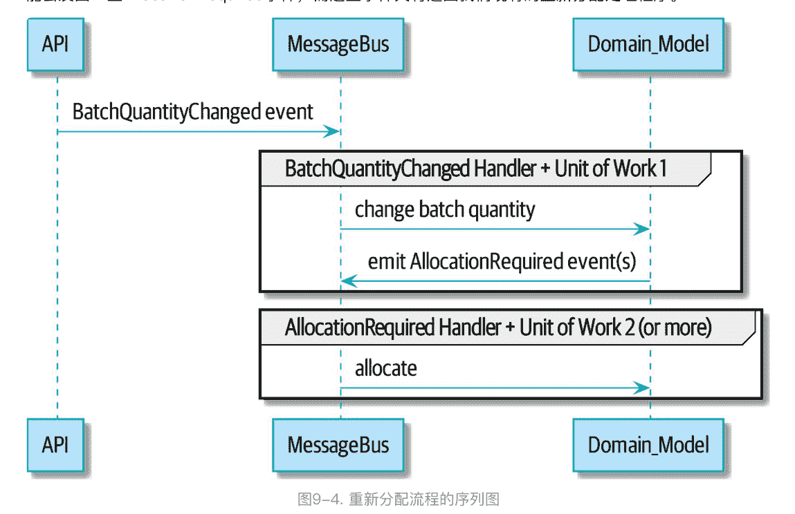

> **警告**

当你像这样将事物分成两个工作单元时，你现在有两个数据库事务，因此你正在暴露自己的完整性问题：可能发生某些事情，导致第一个事务完成，但第二个事务未完成。你需要考虑这是否可以接受，以及是否需要注意并采取措施。有关更多讨论，请参见“Footguns”。

## 我们的新事件

告诉我们批次数里已更改的事件很简单；它只需要一个批次引用和一个新数量：

新事件 (src/allocation/domain/events.py)

```python
@dataclass
class BatchQuantityChanged(Event):
    ref: str
    qty: int
```

## 测试驱动新处理程序

遵循第4章中学到的教训，我们可以以“高档”运行，并以事件为抽象的最高级别编写我们的单元测试。以下是它们可能的样子：

change_batch_quantity的处理程序测试 (tests/unit/test_handlers.py)

```python
class TestChangeBatchQuantity:

    def test_changes_available_quantity(self):
        uow = FakeUnitOfWork()
        messagebus.handle(
            events.BatchCreated("batch1", "ADORABLE-SETTEE", 100, None), uow
        )
        [batch] = uow.products.get(sku="ADORABLE-SETTEE").batches
        assert batch.available_quantity == 100  # ①

        messagebus.handle(events.BatchQuantityChanged("batch1", 50), uow)

        assert batch.available_quantity == 50  # ①

    def test_reallocates_if_necessary(self):
        uow = FakeUnitOfWork()
        event_history = [
            events.BatchCreated("batch1", "INDIFFERENT-TABLE", 50, None),
            events.BatchCreated("batch2", "INDIFFERENT-TABLE", 50, None),
            events.Allocated("order1", "INDIFFERENT-TABLE", 20),
            events.Allocated("order2", "INDIFFERENT-TABLE", 20),
        ]
        for e in event_history:
            messagebus.handle(e, uow)
        [batch1, batch2] = uow.products.get(sku="INDIFFERENT-TABLE").batches
        assert batch1.available_quantity == 10
        assert batch2.available_quantity == 10

        messagebus.handle(events.BatchQuantityChanged("batch1", 25), uow)

        assert batch1.available_quantity == 25
        assert batch2.available_quantity == 5  # ②
```

```python
events.BatchCreated("batch2", "INDIFFERENT-TABLE", 50, date.today()),
events.AllocationRequired("order1", "INDIFFERENT-TABLE", 20),
events.AllocationRequired("order2", "INDIFFERENT-TABLE", 20),
]
for e in event_history:
    messagebus.handle(e, uow)
[batch1, batch2] = uow.products.get(sku="INDIFFERENT-TABLE").batches
assert batch1.available_quantity == 10
assert batch2.available_quantity == 50

messagebus.handle(events.BatchQuantityChanged("batch1", 25), uow)

# order1 or order2 will be deallocated, so we'll have 25 - 20
assert batch1.available_quantity == 5 ②
# and 20 will be reallocated to the next batch
assert batch2.available_quantity == 30 ②
```

1. 简单情况将非常容易实现；我们只需修改数量即可。
2. 但是，如果我们尝试将数量更改为少于已分配的数量，我们将需要取消分配至少一个订单，并且我们期望将其重新分配到新批次中。

## 实现

我们的新处理程序非常简单：

处理程序委托给模型层 (src/allocation/service_layer/handlers.py)

```python
def change_batch_quantity(
    event: events.BatchQuantityChanged, uow: unit_of_work.AbstractUnitOfWork
):
    with uow:
        product = uow.products.get_by_batchref(batchref=event.ref)
        product.change_batch_quantity(ref=event.ref, qty=event.qty)
        uow.commit()
```

我们意识到我们需要在我们的存储库上添加一个新的查询类型：

存储库上的新查询类型 (src/allocation/adapters/repository.py)

```python
class AbstractRepository(abc.ABC):
    ...

    def get(self, sku) -> model.Product:
        ...

    def get_by_batchref(self, batchref) -> model.Product:
        product = self._get_by_batchref(batchref)
        if product:
            self.seen.add(product)
        return product

    @abc.abstractmethod
    def _add(self, product: model.Product):
        raise NotImplementedError

    @abc.abstractmethod
    def _get(self, sku) -> model.Product:
        raise NotImplementedError

    @abc.abstractmethod
    def _get_by_batchref(self, batchref) -> model.Product:
        raise NotImplementedError
    ...

class SqlAlchemyRepository(AbstractRepository):
    ...

    def _get(self, sku):
        return self.session.query(model.Product).filter_by(sku=sku).first()

    def _get_by_batchref(self, batchref):
        return self.session.query(model.Product).join(model.Batch).filter(
            orm.batches.c.reference == batchref,
        ).first()
```

还有我们的FakeRepository：

也更新虚拟存储库 (tests/unit/test_handlers.py)

```python
class FakeRepository(repository.AbstractRepository):
    ...

    def _get(self, sku):
        return next((p for p in self._products if p.sku == sku), None)

    def _get_by_batchref(self, batchref):
        return next((
            p for p in self._products for b in p.batches
            if b.reference == batchref
        ), None)
```

> **注意**

我们正在向我们的存储库中添加查询，以使此用例更易于实现。只要我们的查询返回单个聚合，我们就不会弯曲任何规则。如果你发现自己在存储库上编写复杂的查询，则可能需要考虑不同的设计。特别是像get_most_popular_products或find_products_by_order_id这样的方法肯定会触发我们的spidey感觉。第11章和尾声中有一些关于管理复杂查询的提示。

## 领域模型上的新方法

我们将新方法添加到模型中，该方法在内联中执行数量更改和取消分配，并发布新事件。我们还修改了现有的allocate函数以发布事件：

我们的模型发展以满足新要求 (src/allocation/domain/model.py)

```python
class Product:
    ...

    def change_batch_quantity(self, ref: str, qty: int):
        batch = next(b for b in self.batches if b.reference == ref)
        batch._purchased_quantity = qty
        while batch.available_quantity < 0:
            line = batch.deallocate_one()
            self.events.append(
                events.AllocationRequired(line.orderid, line.sku, line.qty)
            )
    ...

class Batch:
    ...

    def deallocate_one(self) -> OrderLine:
        return self._allocations.pop()
```

我们连接我们的新处理程序：

消息总线增长 (src/allocation/service_layer/messagebus.py)

```python
HANDLERS = {
    events.BatchCreated: [handlers.add_batch],
    events.BatchQuantityChanged: [handlers.change_batch_quantity],
    events.AllocationRequired: [handlers.allocate],
    events.OutOfStock: [handlers.send_out_of_stock_notification],

}  # type: Dict[Type[events.Event], List[Callable]]
```

我们的新要求已完全实现。

## 可选：使用Fake Message Bus在隔离中单元测试事件处理程序

我们用于重新分配工作流的主要测试是边缘到边缘的（请参见“测试驱动新处理程序”中的示例代码）。它使用真正的消息总线，并测试整个流程，其中BatchQuantityChanged事件处理程序触发取消分配，并发出新的AllocationRequired事件，然后由它们自己的处理程序处理。一个测试覆盖多个事件和处理程序的链。

根据你的事件链的复杂性，你可能决定要从彼此隔离地测试某些处理程序。你可以使用“虚假”消息总线来实现这一点。

在我们的情况下，我们实际上通过修改FakeUnitOfWork上的publish_events（）方法并将其与真正的消息总线分离来进行干预，而是使其记录它看到的事件：

在UoW中实现虚拟消息总线 (tests/unit/test_handlers.py)

```python
class FakeUnitOfWorkWithFakeMessageBus(FakeUnitOfWork):

    def __init__(self):
        super().__init__()
        self.events_published = []  # type: List[events.Event]

    def publish_events(self):
        for product in self.products.seen:
            while product.events:
                self.events_published.append(product.events.pop(0))
```

现在，当我们使用FakeUnitOfWorkWithFakeMessageBus调用messagebus.handle（）时，它仅运行该事件的处理程序。因此，我们可以编写更独立的单元测试：而不是检查所有副作用，我们只检查如果数量低于已分配的总数，则BatchQuantityChanged会导致AllocationRequired：

在隔离中测试重新分配 (tests/unit/test_handlers.py)

```python
def test_reallocates_if_necessary_isolated():
    uow = FakeUnitOfWorkWithFakeMessageBus()

    # test setup as before
    event_history = [
        events.BatchCreated("batch1", "INDIFFERENT-TABLE", 50, None),
        events.BatchCreated("batch2", "INDIFFERENT-TABLE", 50, date.today()),
        events.AllocationRequired("order1", "INDIFFERENT-TABLE", 20),
        events.AllocationRequired("order2", "INDIFFERENT-TABLE", 20),
    ]
    for e in event_history:
        messagebus.handle(e, uow)
    [batch1, batch2] = uow.products.get(sku="INDIFFERENT-TABLE").batches
    assert batch1.available_quantity == 10
    assert batch2.available_quantity == 50
    messagebus.handle(events.BatchQuantityChanged("batch1", 25), uow)

    # assert on new events emitted rather than downstream side-effects
    [reallocation_event] = uow.events_published
    assert isinstance(reallocation_event, events.AllocationRequired)
    assert reallocation_event.orderid in {'order1', 'order2'}
    assert reallocation_event.sku == 'INDIFFERENT-TABLE'
```

是否要这样做取决于你的事件链的复杂性。我们建议，先从边缘到边缘的测试开始，只有在必要时才采用这种方法。

**读者的练习**

强迫自己真正理解某些代码的好方法是进行重构。在讨论在隔离中测试处理程序时，我们使用了一些称为`FakeUnitOfWorkWithFakeMessageBus`的东西，它过于复杂并违反了SRP。

如果我们将消息总线更改为类，则构建`FakeMessageBus`更加直接：

一个抽象的消息总线及其真实和虚假版本

```python
class AbstractMessageBus:
    HANDLERS: Dict[Type[events.Event], List[Callable]]

    def handle(self, event: events.Event):
        for handler in self.HANDLERS[type(event)]:
            handler(event)

class MessageBus(AbstractMessageBus):
    HANDLERS = {
        events.OutOfStock: [send_out_of_stock_notification],
    }

class FakeMessageBus(messagebus.AbstractMessageBus):
    def __init__(self):
        self.events_published = []  # type: List[events.Event]
        self.handlers = {
            events.OutOfStock: [lambda e: self.events_published.append(e)]
        }
```

因此，请进入GitHub上的代码并查看是否可以获得基于类的版本，然后编写早期版本的`test_reallocates_if_necessary_isolated()`。

如果你需要更多灵感，我们在第13章中使用基于类的消息总线。

## 总结

让我们回顾一下我们所取得的成就，并考虑为什么我们要这样做。

## 我们取得了什么成就？

事件是简单的数据类，定义了系统内部输入和内部消息的数据结构。从DDD的角度来看，这非常强大，因为事件通常非常好地转换为业务语言（如果你还没有了解，请查阅事件风暴）。

处理程序是我们对事件做出反应的方式。它们可以调用我们的模型或调用外部服务。如果需要，我们可以为单个事件定义多个处理程序。处理程序还可以引发其他事件。这使我们可以非常精细地控制处理程序的功能，并真正坚持SRP。

## 我们为什么要这样做？

我们使用这些架构模式的持续目标是尝试使应用程序的复杂性增长速度比其大小慢。当我们全力投入消息总线时，通常会以架构复杂性的代价（请参见表9-1），但我们为自己购买了一种模式，可以处理几乎任意复杂的要求，而无需对我们做事的方式进行任何进一步的概念或架构更改。

在这里，我们添加了一个相当复杂的用例（更改数量、取消分配、开始新事务、重新分配、发布外部通知），但从架构上来看，没有任何复杂性成本。我们添加了新的事件、新的处理程序和一个新的外部适配器（用于电子邮件），所有这些都是我们架构中现有的事物类别，我们理解并知道如何推理，而且很容易向新手解释。我们的移动部件每个都有一个工作，它们以明确定义的方式相互连接，没有意外的副作用。

表9-1. 整个应用程序是消息总线：权衡

| 优点 | 缺点 |
| --- | --- |
| • 处理程序和服务是相同的东西，因此更简单。 | • 从Web的角度来看，消息总线仍然是一种略微不可预测的做事方式。你事先不知道什么时候会结束。 |
| • 我们有一个很好的数据结构，用于输入到系统中。 | • 模型对象和事件之间将存在字段和结构重复，这将带来维护成本。向一个对象添加字段通常意味着至少向另一个对象添加字段。 |

现在，你可能会想知道那些`BatchQuantityChanged`事件从哪里来？答案将在几章后揭晓。但首先，让我们谈谈事件与命令的区别。

## 第10章 命令和命令处理程序

在上一章中，我们讨论了使用事件作为表示系统输入的一种方式，并将应用程序转换为消息处理机器。为了实现这一点，我们将所有用例函数转换为事件处理程序。当API接收到创建新批次的POST请求时，它将构建一个新的`BatchCreated`事件，并处理它，就好像它是一个内部事件。这可能感觉不直观。毕竟，批次尚未创建；这就是我们调用API的原因。我们将通过引入命令并展示它们如何通过相同的消息总线处理，但具有略微不同的规则来解决这个概念上的问题。

> 提示

本章的代码位于GitHub上的`chapter_10_commands`分支中：

```
git clone https://github.com/cosmicpython/code.git
cd code
git checkout chapter_10_commands
# or to code along, checkout the previous chapter:
git checkout chapter_09_all_messagebus
```

### 命令和事件

与事件一样，命令是一种消息类型-由系统的一部分发送给另一部分的指令。我们通常使用愚蠢的数据结构表示命令，并且可以像处理事件一样处理它们。

但是，命令与事件之间的区别非常重要。

命令是由一个参与者发送给另一个特定参与者的，期望作为结果发生特定事情的消息。当我们向API处理程序发布表单时，我们正在发送命令。我们使用命令语气动词短语命名命令，如“分配库存”或“延迟发货”。

命令捕捉意图。它们表达我们希望系统执行某些操作的愿望。因此，当它们失败时，发送者需要接收错误信息。

事件由参与者广播给所有感兴趣的听众。当我们发布`BatchQuantityChanged`时，我们不知道谁会接收它。我们使用过去式动词短语命名事件，如“订单分配给库存”或“发货延迟”。

我们经常使用事件来传播有关成功命令的知识。

事件捕捉有关过去发生的事情的事实。由于我们不知道谁正在处理事件，发送者不应关心接收者成功或失败。表10-1总结了区别。

表10-1. 事件与命令的区别

| | 事件 | 命令 |
|---|---|---|
| 命名 | 过去式 | 祈使语气 |
| 错误处理 | 独立失败 | 响亮地失败 |
| 发送 | 所有侦听器 | 一个收件人 |

我们现在在系统中有哪些类型的命令？提取一些命令（`src/allocation/domain/commands.py`）

```python
class Command:
    pass

@dataclass
class Allocate(Command):  # 1
    orderid: str
    sku: str
    qty: int

@dataclass
class CreateBatch(Command):  # 2
    ref: str
    sku: str
    qty: int
    eta: Optional[date] = None

@dataclass
class ChangeBatchQuantity(Command):  # 3
    ref: str
    qty: int
```

1. `commands.Allocate`将替换`events.AllocationRequired`。
2. `commands.CreateBatch`将替换`events.BatchCreated`。
3. `commands.ChangeBatchQuantity`将替换`events.BatchQuantityChanged`。

### 异常处理的差异

仅更改名称和动词是很好的，但这不会改变我们系统的行为。我们希望类似地处理事件和命令，但不完全相同。让我们看看我们的消息总线如何改变：

不同方式调度事件和命令 (`src/allocation/service_layer/messagebus.py`)

```python
Message = Union[commands.Command, events.Event]

def handle(message: Message, uow: unit_of_work.AbstractUnitOfWork):
    results = []
    queue = [message]
    while queue:
        message = queue.pop(0)
        if isinstance(message, events.Event):
            handle_event(message, queue, uow)
        elif isinstance(message, commands.Command):
            cmd_result = handle_command(message, queue, uow)
            results.append(cmd_result)
        else:
            raise Exception(f'{message} was not an Event or Command')
    return results
```

1. 它仍然具有一个主要的`handle()`入口点，它接受一个消息，该消息可以是命令或事件。
2. 我们将事件和命令分派给两个不同的辅助函数，如下所示。

这是我们如何处理事件的方式：

事件无法中断流程 (`src/allocation/service_layer/messagebus.py`)

```python
def handle_event(
    event: events.Event,
    queue: List[Message],
    uow: unit_of_work.AbstractUnitOfWork
):
    for handler in EVENT_HANDLERS[type(event)]:  # 1
        try:
            logger.debug('handling event %s with handler %s', event, handler)
            handler(event, uow=uow)
            queue.extend(uow.collect_new_events())
        except Exception:
            logger.exception('Exception handling event %s', event)
            continue  # 2
```

1. 事件转到可以将每个事件委派给多个处理程序的调度程序。
2. 它捕捉和记录错误，但不允许它们中断消息处理。

这是我们如何处理命令的方式：

命令重新引发异常 (`src/allocation/service_layer/messagebus.py`)

```python
def handle_command(
    command: commands.Command,
    queue: List[Message],
    uow: unit_of_work.AbstractUnitOfWork
):
    logger.debug('handling command %s', command)
    try:
        handler = COMMAND_HANDLERS[type(command)]  # 1
        result = handler(command, uow=uow)
        queue.extend(uow.collect_new_events())
        return result  # 3
    except Exception:
        logger.exception('Exception handling command %s', command)
        raise  # 2
```

1. 命令调度程序期望每个命令只有一个处理程序。
2. 如果引发任何错误，它们会快速失败并冒泡。
3. 返回结果仅是暂时的；如“一个临时的丑陋的黑客：消息总线必须返回结果”中所述，这是一个临时的黑客，允许消息总线返回批次引用供API使用。我们将在第12章中解决这个问题。

我们还将单个`HANDLERS`字典更改为命令和事件的不同字典。根据我们的约定，命令只能有一个处理程序：

新的处理程序字典 (`src/allocation/service_layer/messagebus.py`)

```python
EVENT_HANDLERS = {
    events.OutOfStock: [handlers.send_out_of_stock_notification],
}  # type: Dict[Type[events.Event], List[Callable]]

COMMAND_HANDLERS = {
    commands.Allocate: handlers.allocate,
    commands.CreateBatch: handlers.add_batch,
    commands.ChangeBatchQuantity: handlers.change_batch_quantity,
}  # type: Dict[Type[commands.Command], Callable]
```

### 讨论：事件、命令和错误处理

许多开发人员在这一点上感到不舒服，会问：“当一个事件无法处理时会发生什么？我该如何确保系统处于一致的状态？”如果在`messagebus.handle`处理一半的事件之前，我们就遇到了内存不足的错误，导致进程崩溃，我们如何缓解由丢失消息引起的问题？

让我们从最坏的情况开始：我们无法处理一个事件，系统处于不一致的状态。什么样的错误会导致这种情况？通常在我们的系统中，当只完成一半操作时，我们可能会陷入不一致的状态。

例如，我们可以将三个`DESIRABLE_BEANBAG`单位分配给客户的订单，但在某种情况下无法减少剩余库存量。这会导致不一致的状态：三个单位的库存既分配又可用，具体取决于你的观点。后来，我们可能会将这些相同的豆袋分配给另一个客户，给客户支持带来麻烦。

不过，在我们的分配服务中，我们已经采取了措施来防止这种情况发生。我们已经仔细确定了作为一致性边界的聚合，并引入了一个管理聚合更新的原子成功或失败的UoW。

例如，当我们向订单分配库存时，我们的一致性边界是产品聚合。这意味着我们无法意外地超量分配：要么特定的订单行分配给产品，要么不分配——没有不一致状态的余地。

根据定义，我们不要求两个聚合立即一致，因此如果我们无法处理一个事件并仅更新一个聚合，我们的系统仍然可以最终一致。我们不应该违反系统的任何约束。

有了这个例子，我们可以更好地理解将消息分成命令和事件的原因。当用户想让系统做某些事情时，我们将他们的请求表示为命令。该命令应修改单个聚合并完全成功或失败。我们需要进行的任何其他簿记、清理和通知都可以通过事件完成。命令成功与否并不需要事件处理程序成功。

让我们看看另一个例子（来自一个不同的虚构项目），以了解为什么不这样做。

假设我们正在构建一个销售昂贵奢侈品的电子商务网站。我们的营销部门希望奖励重复访问的客户。当客户第三次购买后，我们将标记客户为VIP，并为他们提供优先处理和特别优惠。我们对此故事的验收标准如下：

```
1 给定一个客户的历史记录中有两个订单
2 当客户下第三个订单时
3 那么他们应该被标记为VIP。
4
5 当客户第一次成为VIP时
6 我们应该发送电子邮件祝贺他们
```

使用本书中已经讨论过的技术，我们决定构建一个新的`History`聚合，记录订单并在满足规则时引发领域事件。我们将按以下方式构建代码：

VIP客户（另一个项目的示例代码）

```python
class History:  # Aggregate

    def __init__(self, customer_id: int):
        self.orders = set() # Set[HistoryEntry]
        self.customer_id = customer_id

    def record_order(self, order_id: str, order_amount: int):  # 1
        entry = HistoryEntry(order_id, order_amount)

        if entry in self.orders:
            return

        self.orders.add(entry)

        if len(self.orders) == 3:
            self.events.append(
                CustomerBecameVIP(self.customer_id)
            )
```

```python
def create_order_from_basket(uow, cmd: CreateOrder):
    with uow:
        order = Order.from_basket(cmd.customer_id, cmd.basket_items)
        uow.orders.add(order)
        uow.commit() # raises OrderCreated
```

```python
def update_customer_history(uow, event: OrderCreated):
    with uow:
        history = uow.order_history.get(event.customer_id)
        history.record_order(event.order_id, event.order_amount)
        uow.commit() # raises CustomerBecameVIP
```

```python
def congratulate_vip_customer(uow, event: CustomerBecameVip):
    with uow:
        customer = uow.customers.get(event.customer_id)
        email.send(
            customer.email_address,
            f'Congratulations {customer.first_name}!'
        )
```

1. `History`聚合捕获规则，指示客户何时成为VIP。这使我们能够在未来规则变得更加复杂时处理变化。
2. 我们第一个处理程序为客户创建订单并引发领域事件`OrderCreated`。
3. 我们的第二个处理程序更新`History`对象，记录已创建订单。
4. 最后，当客户成为VIP时，我们向他们发送电子邮件。

使用这段代码，我们可以对事件驱动系统中的错误处理有一些直觉上的了解。

在我们当前的实现中，我们在将状态持久化到数据库后引发关于聚合的事件。如果我们在持久化之前引发这些事件，并同时提交所有更改，那么我们就可以确保所有工作都已完成。那不是更安全吗？

但是，如果电子邮件服务器稍微超载会发生什么呢？如果所有工作都必须同时完成，那么繁忙的电子邮件服务器就会妨碍我们收取订单的款项。

如果History聚合的实现中存在错误会发生什么？难道因为我们无法将你识别为VIP就无法收取你的款项吗？

通过分离这些问题，我们使得事情可以单独失败，从而提高了系统的整体可靠性。这段代码中唯一需要完成的部分是创建订单的命令处理程序。这是客户关心的唯一部分，也是我们的业务利益相关者应该优先考虑的部分。

请注意，我们有意将事务边界与业务流程的开始和结束对齐。我们在代码中使用的名称与业务利益相关者使用的术语相匹配，我们编写的处理程序与我们的自然语言验收标准的步骤相匹配。这种名称和结构的一致性有助于我们在系统变得越来越大和复杂时进行推理。

## 从错误同步恢复

希望我们已经说服了你，允许事件独立于引发它们的命令失败。那么，当它们不可避免地发生错误时，我们应该怎么做才能确保我们可以从错误中恢复过来呢？

我们需要的第一件事是知道何时发生错误，而通常我们会依靠日志来做到这一点。

让我们再次查看我们的消息总线中的handle_event方法：

当前的处理函数 (src/allocation/service_layer/messagebus.py)

```python
def handle_event(
    event: events.Event,
    queue: List[Message],
    uow: unit_of_work.AbstractUnitOfWork
):
    for handler in EVENT_HANDLERS[type(event)]:
        try:
            logger.debug('handling event %s with handler %s', event, handler)
            handler(event, uow=uow)
            queue.extend(uow.collect_new_events())
        except Exception:
            logger.exception('Exception handling event %s', event)
            continue
```

当我们在系统中处理消息时，我们做的第一件事是写一条日志记录我们将要做什么。对于我们的CustomerBecameVIP用例，日志可能会读作下面这样：

```
1  Handling event CustomerBecameVIP(customer_id=12345)
2  with handler <function congratulate_vip_customer at 0x10ebc9a60>
```

因为我们选择使用数据类作为我们的消息类型，所以我们可以得到一个整洁的打印摘要，其中包含我们可以复制并粘贴到Python shell中以重新创建对象的传入数据。

当发生错误时，我们可以使用记录的数据来在单元测试中重现问题或将消息重播到系统中。

手动重播适用于需要在重新处理事件之前修复错误的情况，但我们的系统总会经历一些背景级别的瞬态故障。这包括网络中断、表死锁和由部署引起的短暂停机等问题。

对于其中大多数情况，我们可以通过再次尝试来优雅地恢复。正如谚语所说：“如果第一次没有成功，请使用指数级增加的退避时间重试操作。”

带有重试的处理程序 (src/allocation/service_layer/messagebus.py)

```python
from tenacity import Retrying, RetryError, stop_after_attempt, wait_exponential
...
def handle_event(
    event: events.Event,
    queue: List[Message],
    uow: unit_of_work.AbstractUnitOfWork
):

    for handler in EVENT_HANDLERS[type(event)]:
        try:
            for attempt in Retrying( ②
                stop=stop_after_attempt(3),
                wait=wait_exponential()
            ):

                with attempt:
                    logger.debug('handling event %s with handler %s',
                                 event, handler)
                    handler(event, uow=uow)
                    queue.extend(uow.collect_new_events())
        except RetryError as retry_failure:
            logger.error(
                'Failed to handle event %s times, giving up!',
                retry_failure.last_attempt.attempt_number
            )
            continue
```

1. Tenacity是一个Python库，实现了常见的重试模式。
2. 在这里，我们将我们的消息总线配置为最多重试三次操作，并在尝试之间指数级增加等待时间。

重试可能会失败的操作可能是提高软件弹性的最佳方法。再次强调，工作单元和命令处理程序模式意味着每次尝试都从一致的状态开始，并且不会使事情半途而废。

> 警告
无论如何，某个时候，我们都必须放弃尝试处理消息。使用分布式消息构建可靠的系统很困难，我们必须略过一些棘手的部分。在附录中有更多参考资料的指针。

## 总结

在本书中，我们决定先介绍事件的概念，然后是命令的概念，但其他指南通常会反过来。通过为我们的系统可以响应的请求命名并给它们自己的数据结构，可以明确地表达其请求。有时你会看到人们使用命令处理程序模式的名称来描述我们使用事件、命令和消息总线所做的事情。

表10-2讨论了你在加入之前应考虑的一些事情。

表10-2。拆分命令和事件：权衡

| 优点 | 缺点 |
| --- | --- |
| • 将命令和事件视为不同的事物有助于我们理解哪些事情必须成功，哪些事情可以稍后整理。<br>• CreateBatch绝对是比BatchCreated更清晰的名称。我们明确了用户的意图，明确比隐含更好，对吗？ | • 命令和事件之间的语义差异可能是微妙的。对于这些差异可能会产生争论。<br>• 我们明确地邀请失败。我们知道有时会出现问题，我们选择通过使失败更小更隔离来处理问题。这可能会使系统更难理解，并需要更好的监控。 |

在第11章中，我们将讨论将事件用作集成模式。

## 第11章 事件驱动架构：使用事件集成微服务

在前一章中，我们实际上没有讨论如何接收“批量数量更改”事件，或者确切地说，我们如何通知外部世界有关重新分配的信息。

我们有一个具有Web API的微服务，但其他与其他系统交互的方式呢？如果，例如，发货延迟或数量被修改，我们怎么知道？我们如何告诉仓库系统已分配订单并需要发送给客户？

在本章中，我们想展示事件隐喻如何扩展到我们处理系统中传入和传出消息的方式。在内部，我们应用程序的核心现在是一个消息处理器。让我们继续跟进，使其在外部也成为成为一个消息处理器。如图11-1所示，我们的应用程序将通过外部消息总线（我们将使用Redis pub/sub队列作为示例）从外部源接收事件，并将其输出以事件的形式发布回去。

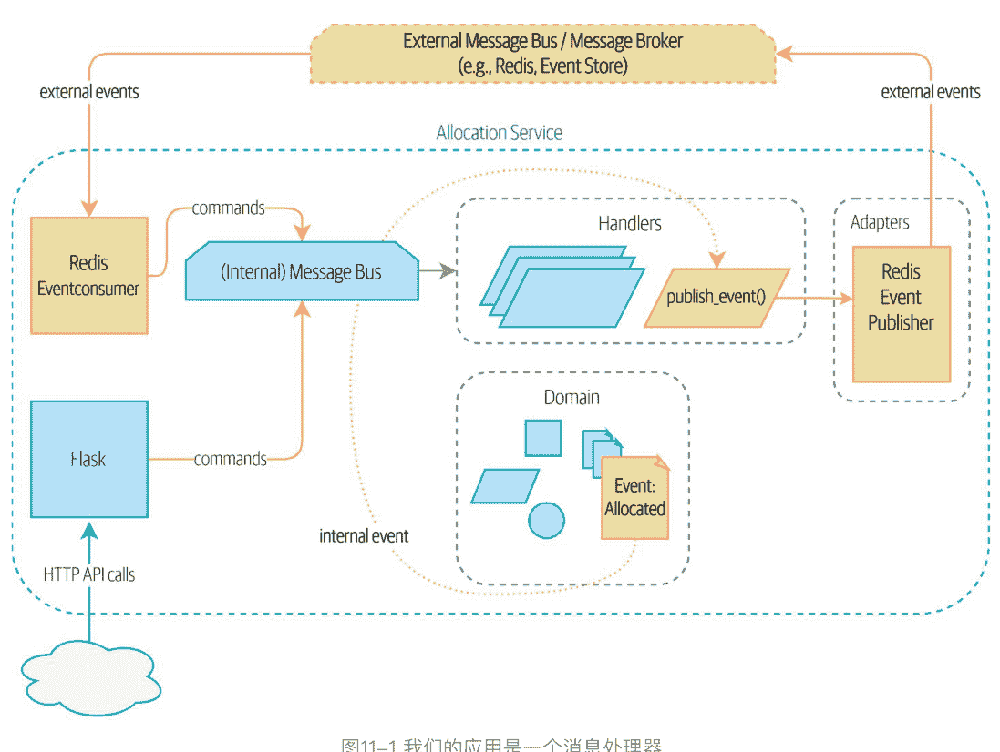

图11-1 我们的应用是一个消息处理器

> 提示

本章的代码在GitHub上的chapter_11_external_events分支中：

```
git clone https://github.com/cosmicpython/code.git
cd code
git checkout chapter_11_external_events
# or to code along, checkout the previous chapter:
git checkout chapter_10_commands
```

### 分布式泥团和名词思维

在进入这个话题之前，让我们谈谈其他选择。我们经常与试图构建微服务架构的工程师交谈。通常，他们正在迁移现有应用程序，他们的第一反应是将系统拆分为名词。

到目前为止，我们在系统中引入了哪些名词？嗯，我们有库存批次、订单、产品和客户。因此，对系统进行天真的拆分尝试可能看起来像图11-2（注意我们将系统命名为名词“批次”而不是“分配”）。

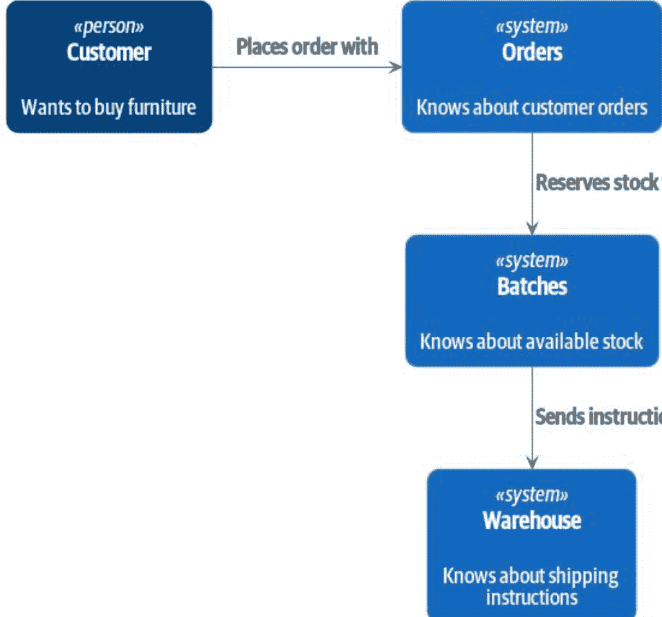

我们系统中的每个“事物”都有一个相关联的服务，它公开了一个HTTP API。

让我们通过图11-3中的一个示例愉快的路径流程来工作：我们的用户访问网站，并可以从有库存的产品中进行选择。当他们将项目添加到购物篮中时，我们将为他们保留一些库存。当订单完成时，我们确认预订，这将导致我们向仓库发送发货指令。我们还可以说，如果这是客户的第三个订单，我们希望将客户记录更新为将其标记为VIP。

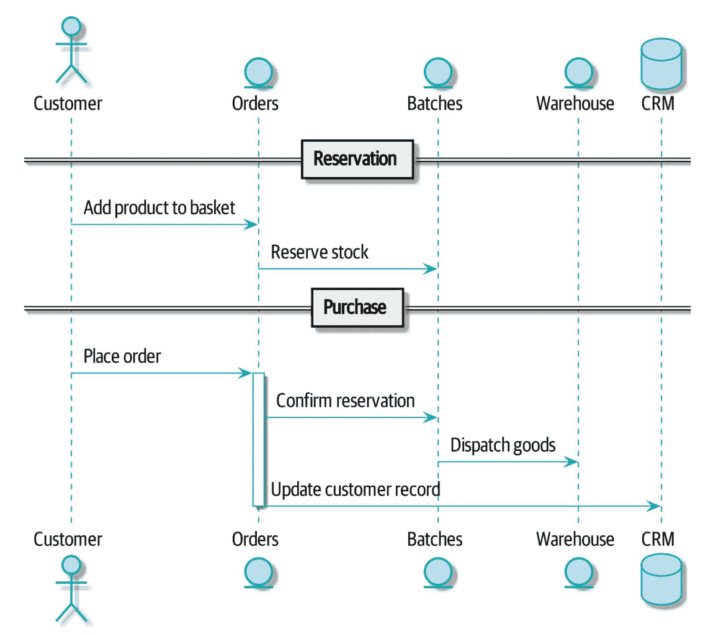

我们可以将系统中的每个步骤视为一个命令：ReserveStock，ConfirmReservation，DispatchGoods，MakeCustomerVIP等等。

这种架构风格，其中我们为每个数据库表创建一个微服务，并将我们的HTTP API视为贫血模型的CRUD接口，是人们最常见的初始服务设计方法。

这对于非常简单的系统来说效果很好，但很快就会退化成分布式的泥球。

为了看清原因，让我们考虑另一种情况。有时，当库存到达仓库时，我们发现货物在运输过程中受到了水损。我们无法销售水损的沙发，因此我们不得不将它们丢掉并向我们的合作伙伴请求更多的库存。我们还需要更新我们的库存模型，这可能意味着我们需要重新分配客户订单。

这个逻辑放在哪里？

好吧，仓库系统知道库存已经损坏，因此也许它应该拥有这个过程，如图11-4所示。

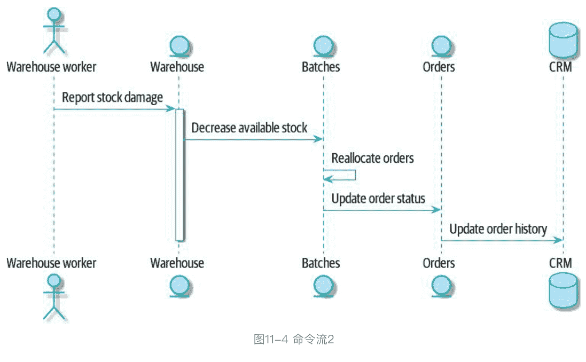

这也有点起作用，但现在我们的依赖关系图是一团糟。

为了分配库存，订单服务驱动批次系统，批次系统驱动仓库；但为了处理仓库的问题，我们的仓库系统驱动批次，批次驱动订单。

将此乘以我们需要提供的所有其他工作流，你就可以看到服务如何迅速纠缠在一起。

### 分布式系统中的错误处理

“事情会出错”是软件工程的普遍规律。当我们的请求失败时，我们的系统会发生什么？假设在我们接受用户三个MISBEGOTTEN-RUG的订单后，发生了网络错误，如图11-5所示。

我们有两个选择：我们可以仍然下订单并将其保留未分配，或者我们可以拒绝接受订单，因为无法保证分配。我们的批次服务的故障状态已经冒泡并影响了我们订单服务的可靠性。

当两个事物必须同时更改时，我们说它们是耦合的。我们可以将此故障级联视为一种时间耦合：系统的每个部分都必须同时工作，才能使其任何部分正常工作。随着系统变得越来越大，某些部分发生降级的概率呈指数级增加。

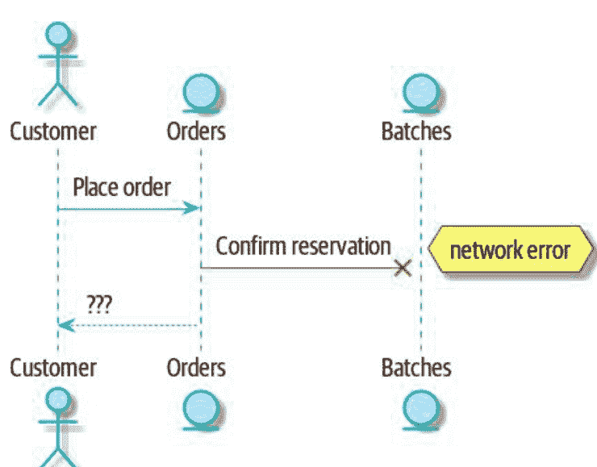

图11-5 出错的命令流

> CONNASCENCE

我们在这里使用耦合这个术语，但还有另一种描述我们系统之间关系的方法。Connascence是一些作者用来描述不同耦合类型的术语。

Connascence并不是坏事，但某些类型的Connascence比其他类型更强。我们希望在本地具有强的Connascence，例如当两个类密切相关时，但在远程具有弱的Connascence。

在我们分布式泥球的第一个示例中，我们看到了执行的Connascence：多个组件需要知道操作的正确工作顺序才能成功。

在这里考虑错误条件时，我们谈论的是时间的Connascence：多个事情必须按顺序依次发生才能使操作正常工作。

当我们用事件替换我们的RPC风格系统时，我们用较弱的Connascence替换了这两种类型的Connascence。那就是名称的Connascence：多个组件只需要同意事件的名称和它所携带的字段的名称。

我们永远无法完全避免耦合，除非让我们的软件不与任何其他软件通信。我们想要避免不适当的耦合。Connascence为理解不同架构风格中固有耦合的强度和类型提供了一种心理模型。在connascence.io上了解更多。

### 替代方案：时间解耦 使用异步消息传递

我们如何获得适当的耦合？我们已经看到了部分答案，那就是我们应该考虑动词而不是名词。我们的领域模型是关于建模业务流程的。它不是关于一个静态事物的数据模型；它是一个动词的模型。

因此，我们不是考虑一个订单系统和一个批次系统，而是考虑一个下订单系统和一个分配系统等等。

当我们这样分离事物时，就更容易看出哪个系统应该负责什么。在考虑下订单时，我们真正想要确保的是当我们下订单时，订单被下了。只要其他事情发生了，只要它发生了，我们可以随后处理它。

> 注意
如果这听起来很熟悉，那么没错！隔离责任是我们在设计聚合和命令时经历的相同过程。

与聚合一样，微服务应该是一致性边界。在两个服务之间，我们可以接受最终一致性，这意味着我们不需要依赖同步调用。每个服务接受来自外部世界的命令并引发事件来记录结果。其他服务可以监听这些事件以触发工作流程中的下一步。

为了避免分布式泥球反模式，我们不想使用时间耦合的HTTP API调用，而是想使用异步消息传递来集成我们的系统。我们希望我们的BatchQuantityChanged消息作为来自上游系统的外部消息传入，我们希望我们的系统发布Allocated事件供下游系统监听。

为什么这样更好？首先，因为事情可以独立失败，所以更容易处理降级行为：如果分配系统出现问题，我们仍然可以接受订单。

其次，我们正在减少系统之间的耦合强度。如果我们需要更改操作顺序或者在流程中引入新步骤，我们可以在本地完成。

### 使用Redis Pub/Sub Channel进行集成

让我们看看它如何具体工作。我们需要一种将一个系统的事件传递到另一个系统的方法，就像我们的消息总线一样，但是针对服务。这种基础设施通常称为消息代理。消息代理的作用是从发布者那里获取消息并将其传递给订阅者。

在MADE.com，我们使用Event Store；Kafka或RabbitMQ是有效的替代方案。基于Redis pub/sub通道的轻量级解决方案也可以完全正常地工作，并且由于Redis更为普遍，我们认为在本书中使用它。

> 注意
我们忽略了选择正确的消息平台所涉及的复杂性。需要考虑消息排序、故障处理和幂等性等问题。有关一些提示，请参见“Footguns”。

我们的新流程将如图11-6所示：Redis提供了BatchQuantityChanged事件，它启动了整个流程，我们的Allocated事件最终再次发布到Redis中。

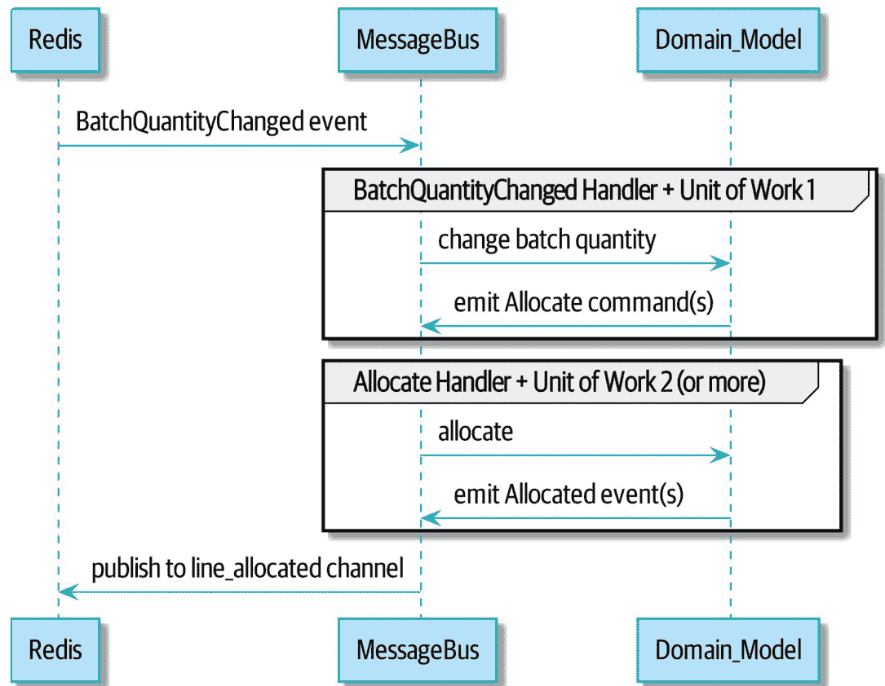

图11-6 重新分配流程的序列图

### 通过端到端测试进行全面测试

以下是我们如何开始进行端到端测试的方式。我们可以使用现有的API创建批次，然后测试入站和出站消息：

Pub/Sub模型的端到端测试（tests/e2e/test_external_events.py）

```python
def test_change_batch_quantity_leading_to_reallocation():
    # start with two batches and an order allocated to one of them
    orderid, sku = random_orderid(), random_sku()
    earlier_batch, later_batch = random_batchref('old'), random_batchref('newer')
    api_client.post_to_add_batch(earlier_batch, sku, qty=10, eta='2011-01-02')
    api_client.post_to_add_batch(later_batch, sku, qty=10, eta='2011-01-02')
    response = api_client.post_to_allocate(orderid, sku, 10)
    assert response.json()['batchref'] == earlier_batch

    subscription = redis_client.subscribe_to('line_allocated')

    # change quantity on allocated batch so it's less than our order
    redis_client.publish_message('change_batch_quantity', {
        'batchref': earlier_batch, 'qty': 5
    })

    # wait until we see a message saying the order has been reallocated
    messages = []
    for attempt in Retrying(stop=stop_after_delay(3), reraise=True):
        with attempt:
            message = subscription.get_message(timeout=1)
            if message:
                messages.append(message)

    print(messages)
    data = json.loads(messages[-1]['data'])
    assert data['orderid'] == orderid
    assert data['batchref'] == later_batch
```

1. 你可以从注释中了解此测试中正在发生的故事：我们希望将事件发送到系统中，导致订单行被重新分配，我们看到该重新分配也作为事件出现在Redis中。
2. api_client是我们重构出来的一个小助手，用于在两种测试类型之间共享；它包装了我们对requests.post的调用。

3.  redis_client是另一个小测试助手，其详细信息并不重要；它的工作是能够从各种Redis通道发送和接收消息。我们将使用一个名为change_batch_quantity的通道来发送我们的更改批次数数量的请求，并监听另一个名为line_allocated的通道以查看预期的重新分配。
4.  由于测试的系统是异步的，我们需要再次使用tenacity库添加重试循环，因为我们的新line_allocated消息可能需要一些时间才能到达，而且它不会是该通道上唯一的消息。

## Redis是我们消息总线周围的另一个薄适配器

我们的Redis pub/sub监听器（我们称其为事件消费者）非常像Flask：它将外部世界转换为我们的事件：

简单的Redis消息监听器（src/allocation/entrypoints/redis_eventconsumer.py）

```python
r = redis.Redis(**config.get_redis_host_and_port())

def main():
    orm.start_mappers()
    pubsub = r.pubsub(ignore_subscribe_messages=True)
    pubsub.subscribe('change_batch_quantity') ①

    for m in pubsub.listen():
        handle_change_batch_quantity(m)

def handle_change_batch_quantity(m):
    logging.debug('handling %s', m)
    data = json.loads(m['data']) ②
    cmd = commands.ChangeBatchQuantity(ref=data['batchref'], qty=data['qty']) ②
    messagebus.handle(cmd, uow=unit_of_work.SqlAlchemyUnitOfWork())
```

1.  main（）在加载时订阅了change_batch_quantity通道。
2.  作为系统入口点，我们的主要工作是反序列化JSON，将其转换为命令，并将其传递给服务层，就像Flask适配器一样。

我们还构建了一个新的下游适配器来执行相反的工作-将域事件转换为公共事件：

简单的Redis消息发布者 (src/allocation/adapters/redis_eventpublisher.py)

```python
r = redis.Redis(**config.get_redis_host_and_port())

def publish(channel, event: events.Event): ①
    logging.debug('publishing: channel=%s, event=%s', channel, event)
    r.publish(channel, json.dumps(asdict(event)))
```

1.  我们在这里使用了硬编码的通道，但你也可以存储事件类/名称与适当通道之间的映射，允许一个或多个消息类型发送到不同的通道。

## 我们的新出站事件

这是Allocated事件的外观：

新事件 (src/allocation/domain/events.py)

```python
@dataclass
class Allocated(Event):
    orderid: str
    sku: str
    qty: int
    batchref: str
```

它捕获了我们需要了解有关分配的所有信息：订单行的详细信息以及它分配到的批次。

我们将其添加到模型的allocate（）方法中（首先添加了一个测试，当然）：

Product.allocate（）发出新事件以记录发生的事情

(src/allocation/domain/model.py)

```python
class Product:
    ...
    def allocate(self, line: OrderLine) -> str:
        ...
        batch.allocate(line)
        self.version_number += 1
        self.events.append(events.Allocated(
            orderid=line.orderid, sku=line.sku, qty=line.qty,
            batchref=batch.reference,
        ))
        return batch.reference
```

ChangeBatchQuantity的处理程序已经存在，因此我们需要添加的是一个处理程序，它发布出站事件：

消息总线增长了
(src/allocation/service_layer/messagebus.py)

```python
HANDLERS = {
    events.Allocated: [handlers.publish_allocated_event],
    events.OutOfStock: [handlers.send_out_of_stock_notification],
}  # type: Dict[Type[events.Event], List[Callable]]
```

发布事件使用Redis包装器中的辅助函数：

发布到Redis (src/allocation/service_layer/handlers.py)

```python
def publish_allocated_event(
    event: events.Allocated, uow: unit_of_work.AbstractUnitOfWork,
):
    redis_eventpublisher.publish('line_allocated', event)
```

## 内部事件与外部事件

保持内部事件和外部事件之间的区别清晰是一个好主意。一些事件可能来自外部，而一些事件可能会得到升级并在外部发布，但并非所有事件都会如此。如果你涉足事件溯源（尽管这是另一本书的主题），这尤其重要。

> 提示

出站事件是应用验证的重要场所之一。有关一些验证哲学和示例，请参见附录E。

> 读者练习

这是一个很简单的练习：使主要allocate（）用例也可以通过Redis通道上的事件调用，而不仅仅是通过API（或者可以代替API）。

你可能需要添加一个新的E2E测试并将一些更改传递到redis_eventconsumer.py中。

## 总结

事件可以来自外部，也可以在外部发布-我们的发布处理程序将事件转换为Redis通道上的消息。我们使用事件与外部世界交流。

这种时间上的解耦为我们的应用程序集成带来了很多灵活性，但一如既往地，这是有代价的。

事件通知很好，因为它意味着低耦合度，并且设置起来相当简单。然而，如果确实存在在各种事件通知上运行的逻辑流，这可能会导致问题...由于在任何程序文本中都不是显式的，因此很难看到这样的流程...这可能会使调试和修改变得困难。

> ——马丁·福勒，“你所说的‘事件驱动’是什么意思”

表11-1显示了一些要考虑的权衡。

表11-1. 基于事件的微服务集成：权衡

| 优点 | 缺点 |
| --- | --- |
| • 避免分布式的大混乱。<br>• 服务解耦：更容易更改单个服务和添加新服务。 | • 整体信息流更难以看到。<br>• 最终一致性是一个新的概念需要处理。<br>• 消息可靠性和关于至少一次与至多一次交付的选择需要深思熟虑。 |

更一般地说，如果你从同步消息传递模型转换为异步消息传递模型，你还将开放一系列与消息可靠性和最终一致性有关的问题。请继续阅读“Footguns”。

## 第12章 命令查询责任分离（CQRS）

在本章中，我们将从一个相当不具争议的见解开始：读取（查询）和写入（命令）是不同的，因此它们应该被不同地处理（或者如果你愿意，它们应该分别担负责任）。然后我们将尽可能地推进这一观点。
如果你像哈利一样，一开始可能会觉得这一切都很极端，但希望我们可以证明这并不是完全不合理的。
图12-1显示了我们可能会到达的地方。

> **提示**
本章的代码在GitHub的chapter_12_cqrs分支中。

```bash
git clone https://github.com/cosmicpython/code.git
cd code
git checkout chapter_12_cqrs
# or to code along, checkout the previous chapter:
git checkout chapter_11_external_events
```

不过，首先，为什么要费心？

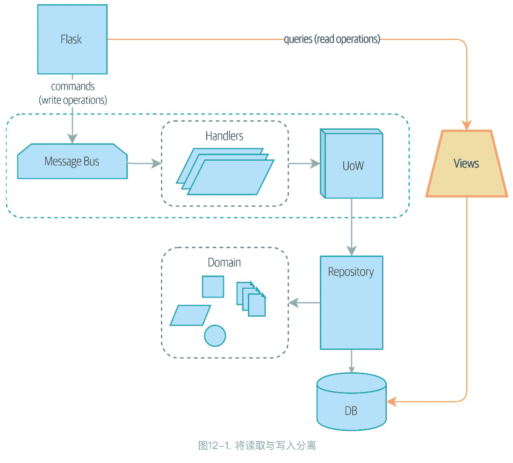

## 领域模型用于写入

在本书中，我们花了很多时间讨论如何构建强制执行领域规则的软件。这些规则或约束对于每个应用程序都是不同的，并且它们构成了我们系统的有趣核心。

在本书中，我们设置了明确的约束，例如“你不能分配超过可用库存的股票”，以及隐含的约束，例如“每个订单行都分配给单个批次”。

我们在书的开头将这些规则写成了单元测试：

我们的基本领域测试 (tests/unit/test_batches.py)

```python
def test_allocating_to_a_batch_reduces_the_available_quantity():
    batch = Batch("batch-001", "SMALL-TABLE", qty=20, eta=date.today())
    line = OrderLine('order-ref', "SMALL-TABLE", 2)

    batch.allocate(line)

    assert batch.available_quantity == 18

...

def test_cannot_allocate_if_available_smaller_than_required():
    small_batch, large_line = make_batch_and_line("ELEGANT-LAMP", 2, 20)
    assert small_batch.can_allocate(large_line) is False
```

为了正确应用这些规则，我们需要确保操作是一致的，因此我们引入了像工作单元和聚合这样的模式，这些模式帮助我们提交小块工作。

为了在这些小块之间传达变更，我们引入了领域事件模式，以便我们可以编写诸如“当库存损坏或丢失时，请调整批次上的可用数量，并在必要时重新分配订单”之类的规则。

所有这些复杂性都存在，以便在更改系统状态时强制执行规则。我们已经构建了一套灵活的工具来编写数据。

不过，那么读取呢？

## 大多数用户不会购买你的家具

在MADE.com，我们有一个非常类似于分配服务的系统。在繁忙的一天中，我们可能每小时处理100个订单，并且我们有一个庞大的系统来为这些订单分配库存。

在同样繁忙的一天中，我们可能每秒有100个产品页面浏览量。每当有人访问产品页面或产品列表页面时，我们需要确定产品是否仍有库存，并且需要多长时间才能将其交付。

领域是相同的 – 我们关心库存批次及其到货日期以及仍然可用的数量 – 但访问模式非常不同。例如，我们的客户如果查询稍微过时几秒钟是不会注意到的，但是如果我们的分配服务不一致，我们将破坏他们的订单。我们可以利用这种差异，通过使我们的读取最终一致以提高性能。

## 读取一致性真的可达到吗？

这种在性能和一致性之间权衡的想法一开始会让许多开发人员感到紧张，因此让我们快速谈谈这个问题。

假设当Bob访问ASYMMETRICAL-DRESSER页面时，“获取可用库存”查询已过时30秒。与此同时，Harry已经购买了最后一件商品。当我们尝试分配Bob的订单时，我们会遇到失败，并且我们需要取消他的订单或购买更多库存并延迟他的交货。

只有与关系数据存储一起工作的人才会对此问题感到非常紧张，但值得考虑其他两种情况以获得一些视角。

首先，让我们想象Bob和Harry同时访问页面。Harry离开去冲咖啡，当他回来时，Bob已经买了最后一个梳妆台。当Harry下订单时，我们将其发送到分配服务，因为库存不足，我们不得不退还他的付款或购买更多库存并延迟他的交货。

一旦我们呈现产品页面，数据就已经过时了。这个洞见是理解为什么读取可以安全不一致的关键：当我们来分配时，我们总是需要检查我们系统的当前状态，因为所有分布式系统都是不一致的。一旦你拥有一个Web服务器和两个客户，你就有可能出现陈旧的数据。

好的，让我们假设我们以某种方式解决了这个问题：我们神奇地构建了一个完全一致的Web应用程序，没有人会看到陈旧的数据。这次，Harry先到达页面并购买了他的梳妆台。

不幸的是，当仓库工作人员尝试分派他的家具时，它掉下叉车并粉碎成无数块。现在怎么办？

唯一的选择是要么给Harry打电话并退还他的订单，要么购买更多库存并延迟交货。

无论我们做什么，我们总会发现我们的软件系统与现实不一致，因此我们总是需要业务流程来应对这些边缘情况。在读取方面，为了保证一致性，我们可以牺牲性能，因为陈旧的数据基本上是不可避免的。

我们可以将这些要求视为系统的两个部分：读取方面和写入方面，如表12-1所示。

对于写入方面，我们的精美领域架构模式帮助我们随着时间的推移不断发展我们的系统，但迄今为止我们所构建的复杂性对于读取数据并没有什么用处。服务层、工作单元和聪明的领域模型只是浪费。

表12-1。读取与写入

| | 读取方面 | 写入方面 |
|---|---|---|
| 行为 | 简单读取 | 复杂业务逻辑 |
| 可缓存性 | 高度可缓存 | 无法缓存 |
| 一致性 | 可能过时 | 必须具备事务一致性 |

## Post/Redirect/Get和CQS

如果你从事Web开发，你可能熟悉Post/Redirect/Get模式。在这种技术中，Web端点接受HTTP POST并响应重定向以查看结果。例如，我们可能接受POST到/batches以创建新批次，并将用户重定向到/batches/123以查看他们新创建的批次。

这种方法可以解决当用户在浏览器中刷新结果页面或尝试将结果页面加入书签时出现的问题。在刷新的情况下，它可能会导致我们的用户重复提交数据，从而购买了两个沙发，而他们只需要一个。在书签的情况下，我们不幸的客户将在尝试获取POST端点时得到一个损坏的页面。

这两个问题都是因为我们在响应写入操作时返回数据。Post/Redirect/Get通过将我们的操作的读取和写入阶段分开来回避这个问题。

这种技术是命令查询分离（CQS）的一个简单示例。在CQS中，我们遵循一个简单的规则：函数应该要么修改状态，要么回答问题，但永远不应该两者兼备。这使得软件更易于理解：我们应该始终能够询问“灯亮了吗？”而不需要切换灯开关。

> 注意：在构建API时，我们可以通过返回201 Created或202 Accepted，并使用包含新资源URI的位置标头来应用相同的设计技术。这里重要的不是我们使用的状态码，而是将工作逻辑上分为写入阶段和查询阶段。

正如你将看到的，我们可以使用CQS原则使我们的系统更快，更可扩展，但首先，让我们修复现有代码中的CQS违规。很久以前，我们引入了一个分配端点，它接受订单并调用我们的服务层来分配一些库存。在调用结束时，我们返回一个200 OK和批次ID。这导致一些丑陋的设计缺陷，以便我们可以获得所需的数据。让我们将其更改为返回简单的OK消息，并提供一个新的只读端点来检索分配状态。

API测试在POST之后进行GET（tests/e2e/test_api.py）

```python
@pytest.mark.usefixtures('postgres_db')
@pytest.mark.usefixtures('restart_api')
def test_happy_path_returns_202_and_batch_is_allocated():
    orderid = random_orderid()
    sku, othersku = random_sku(), random_sku('other')
    earlybatch = random_batchref(1)
    laterbatch = random_batchref(2)
    otherbatch = random_batchref(3)
    api_client.post_to_add_batch(laterbatch, sku, 100, '2011-01-02')
    api_client.post_to_add_batch(earlybatch, sku, 100, '2011-01-01')
    api_client.post_to_add_batch(otherbatch, othersku, 100, None)

    r = api_client.post_to_allocate(orderid, sku, qty=3)
    assert r.status_code == 202

    r = api_client.get_allocation(orderid)
    assert r.ok
    assert r.json() == [
        {'sku': sku, 'batchref': earlybatch},
    ]

@pytest.mark.usefixtures('postgres_db')
@pytest.mark.usefixtures('restart_api')
def test_unhappy_path_returns_400_and_error_message():
    unknown_sku, orderid = random_sku(), random_orderid()
    r = api_client.post_to_allocate(
        orderid, unknown_sku, qty=20, expect_success=False,
    )
    assert r.status_code == 400
    assert r.json()['message'] == f'Invalid sku {unknown_sku}'

    r = api_client.get_allocation(orderid)
    assert r.status_code == 404
```

好的，Flask应用程序可能是什么样子？

查看分配的端点 (src/allocation/entrypoints/flask_app.py)

## 测试CQRS视图

在我们探索各种选项之前，让我们先谈谈测试。无论你决定采取哪种方法，你可能至少需要一个集成测试。类似这样：

一个视图的集成测试 (tests/integration/test_views.py)

```python
def test_allocations_view(sqlite_session_factory):
    uow = unit_of_work.SqlAlchemyUnitOfWork(sqlite_session_factory)
    messagebus.handle(commands.CreateBatch('sku1batch', 'sku1', 50, None), uow)  # 1
    messagebus.handle(commands.CreateBatch('sku2batch', 'sku2', 50, today), uow)
    messagebus.handle(commands.Allocate('order1', 'sku1', 20), uow)
    messagebus.handle(commands.Allocate('order1', 'sku2', 20), uow)
    # add a spurious batch and order to make sure we're getting the right ones
    messagebus.handle(commands.CreateBatch('sku1batch-later', 'sku1', 50, today), uow)
    messagebus.handle(commands.Allocate('otherorder', 'sku1', 30), uow)
    messagebus.handle(commands.Allocate('otherorder', 'sku2', 10), uow)
    assert views.allocations('order1', uow) == [
        {'sku': 'sku1', 'batchref': 'sku1batch'},
        {'sku': 'sku2', 'batchref': 'sku2batch'},
    ]
```

1. 我们通过使用应用程序的公共入口点——消息总线来设置集成测试。这使我们的测试与任何实现/基础设施细节脱钩，以了解如何存储事物。

## “显而易见”的替代方案1：使用现有的存储库

如何向我们的产品存储库添加一个帮助方法呢？一个使用存储库的简单视图 (src/allocation/views.py)

```python
from allocation import unit_of_work

def allocations(orderid: str, uow: unit_of_work.AbstractUnitOfWork):
    with uow:
        products = uow.products.for_order(orderid=orderid)  # 1
        batches = [b for p in products for b in p.batches]  # 2
        return [
            {'sku': b.sku, 'batchref': b.reference}
            for b in batches
            if orderid in b.orderids  # 3
        ]
```

1. 我们的存储库返回产品对象，我们需要找到给定订单中SKU的所有产品，因此我们将在存储库上构建一个名为.for_order()的新帮助方法。
2. 现在我们有了产品，但实际上我们想要批次引用，因此我们使用列表推导式获取所有可能的批次。
3. 我们再次过滤，以获取我们特定订单的批次。这又依赖于我们的批次对象能够告诉我们它已分配哪些订单ID。

我们使用.orderid属性实现了最后一个：

我们模型上的一个可以说是不必要的属性

(src/allocation/domain/model.py)

```python
class Batch:
    ...

    @property
    def orderids(self):
        return {l.orderid for l in self._allocations}
```

你可以开始看到，重用我们现有的存储库和域模型类并不像你可能想象的那样简单。我们不得不在两者中添加新的帮助方法，并在Python中执行大量循环和过滤，这是数据库可以更有效地完成的工作。

因此，是的，从好的方面来说，我们正在重用现有的抽象，但从坏的方面来说，这一切都感觉相当笨拙。

## 你的域模型不适用于读取操作

我们在这里看到的是拥有主要设计写操作的域模型，而我们对读取的要求通常在概念上有很大不同。这是CQRS的思考方式。

正如我们之前所说，域模型不是数据模型——我们试图捕捉业务的工作方式：流程，状态变化周围的规则，交换的消息；关于系统如何对外部事件和用户输入做出反应的问题。其中大部分对只读操作完全无关。

> 提示

这种对CQRS的辩解与对域模型模式的辩解有关。如果你正在构建一个简单的CRUD应用程序，则读取和写入将密切相关，因此你不需要域模型或CQRS。但是，你的域越复杂，你就越有可能需要两者。

简单地说，你的域类将具有用于修改状态的多个方法，而你不需要任何这些方法进行只读操作。

随着域模型的复杂性增加，你会发现自己需要更多的选择来构建该模型，这使得它越来越难以用于只读操作。

## “显而易见”的替代方案2：使用ORM

你可能会想，好吧，如果我们的存储库很笨拙，使用产品也很笨拙，那么我至少可以使用ORM并使用批次。这就是它的作用！

一个使用ORM的简单视图 (src/allocation/views.py)

```python
from allocation import unit_of_work, model

def allocations(orderid: str, uow: unit_of_work.AbstractUnitOfWork):
    with uow:
        batches = uow.session.query(model.Batch).join(
            model.OrderLine, model.Batch._allocations
        ).filter(
            model.OrderLine.orderid == orderid
        )

        return [
            {'sku': b.sku, 'batchref': b.batchref}
            for b in batches
        ]
```

但是，这比“坚持你的午餐，伙计们”中的代码示例中的原始SQL版本更容易编写或理解吗？它在上面看起来可能不太糟糕，但我们可以告诉你，它需要多次尝试，并且需要大量查阅SQLAlchemy文档。SQL就是SQL。

但ORM也会使我们暴露于性能问题之中。

## SELECT N + 1和其他性能问题

所谓的SELECT N + 1问题是ORM的常见性能问题：在检索对象列表时，你的ORM通常会执行初始查询，例如获取需要的所有对象的ID，然后为每个对象发出单独的查询以检索其属性。如果你的对象上有任何外键关系，这尤其可能发生。

> 注意

公平地说，我们应该说SQLAlchemy非常擅长避免SELECT N + 1问题。它不会在上面的示例中显示它，你可以显式请求急切加载以避免处理连接对象时出现问题。

除了SELECT N + 1之外，你可能还有其他原因希望将持久状态更改的方式与检索当前状态的方式分离。一组完全规范化的关系表是确保写操作从不导致数据损坏的好方法。但是使用许多连接检索数据可能会很慢。在这种情况下，通常会添加一些非规范化的视图，构建只读副本，甚至添加缓存层。

## 完全跳过大白鲨的时间

在这个注意事项上：我们是否说服你，我们的原始SQL版本并不像一开始看起来那么奇怪？也许我们夸张了一下？等着瞧吧。

因此，无论合理与否，那个硬编码的SQL查询都相当丑陋，对吧？如果我们让它更好看一些...

一个更好看的查询 (src/allocation/views.py)

```python
def allocations(orderid: str, uow: unit_of_work.SqlAlchemyUnitOfWork):
    with uow:
        results = list(uow.session.execute(
            'SELECT sku, batchref FROM allocations_view WHERE orderid = :orderid',
            dict(orderid=orderid)
        ))
        ...
```

...通过为我们的视图模型保留完全独立的非规范化数据存储？

嘿嘿嘿，没有外键，只有字符串，YOLO (src/allocation/adapters/orm.py)

```python
allocations_view = Table(
    'allocations_view', metadata,
    Column('orderid', String(255)),
    Column('sku', String(255)),
    Column('batchref', String(255)),
)
```

好吧，更漂亮的SQL查询不会成为任何东西的辩解，但是一旦你达到了可以使用索引来完成的极限，构建一个为读操作优化的非规范化数据副本并不罕见。

即使具有良好调整的索引，关系数据库也会使用大量的CPU来执行连接操作。最快的查询将始终是 SELECT * from mytable WHERE key = : value。

不仅如此，这种方法还为我们带来了规模。当我们将数据写入关系数据库时，我们需要确保我们在更改的行上获取锁定，以免遇到一致性问题。

如果多个客户端同时更改数据，我们将会遇到奇怪的竞争条件。然而，当我们读取数据时，没有限制可以同时执行的客户端数量。因此，只读存储可以进行水平扩展。

> 提示

由于只读副本可能不一致，我们可以拥有任意数量的只读副本。如果你正在努力扩展具有复杂数据存储的系统，请问你是否可以构建一个更简单的读模型。

保持读模型的最新状态是挑战！数据库视图（物化或其他）和触发器是常见的解决方案，但这限制了你的数据库。我们想向你展示如何重用我们的事件驱动架构。

## 使用事件处理程序更新读模型表

我们向分配事件添加了第二个处理程序：

分配事件获得新的处理程序

(src/allocation/service_layer/messagebus.py)

```python
EVENT_HANDLERS = {
    events.Allocated: [
        handlers.publish_allocated_event,
        handlers.add_allocation_to_read_model
    ],
}
```

这是我们的更新视图模型代码的样子：

分配更新（src/allocation/service_layer/handlers.py）

```python
def add_allocation_to_read_model(
    event: events.Allocated, uow:
    unit_of_work.SqlAlchemyUnitOfWork,
):
    with uow:
        uow.session.execute(
            'INSERT INTO allocations_view (orderid, sku, batchref)'
            ' VALUES (:orderid, :sku, :batchref)',
            dict(orderid=event.orderid, sku=event.sku, batchref=event.batchref)
        )
        uow.commit()
```

信不信由你，这几乎可以工作！并且它将针对与我们的其他选项完全相同的集成测试工作。

好吧，你还需要处理取消分配：

第二个用于读模型更新的监听器

```python
events.Deallocated: [
    handlers.remove_allocation_from_read_model,
    handlers.reallocate
],
...

def remove_allocation_from_read_model(
    event: events.Deallocated, uow:
    unit_of_work.SqlAlchemyUnitOfWork,
):
    with uow:
        uow.session.execute(
            'DELETE FROM allocations_view '
            ' WHERE orderid = :orderid AND sku = :sku',
```

图12-2显示了两个请求之间的流程。

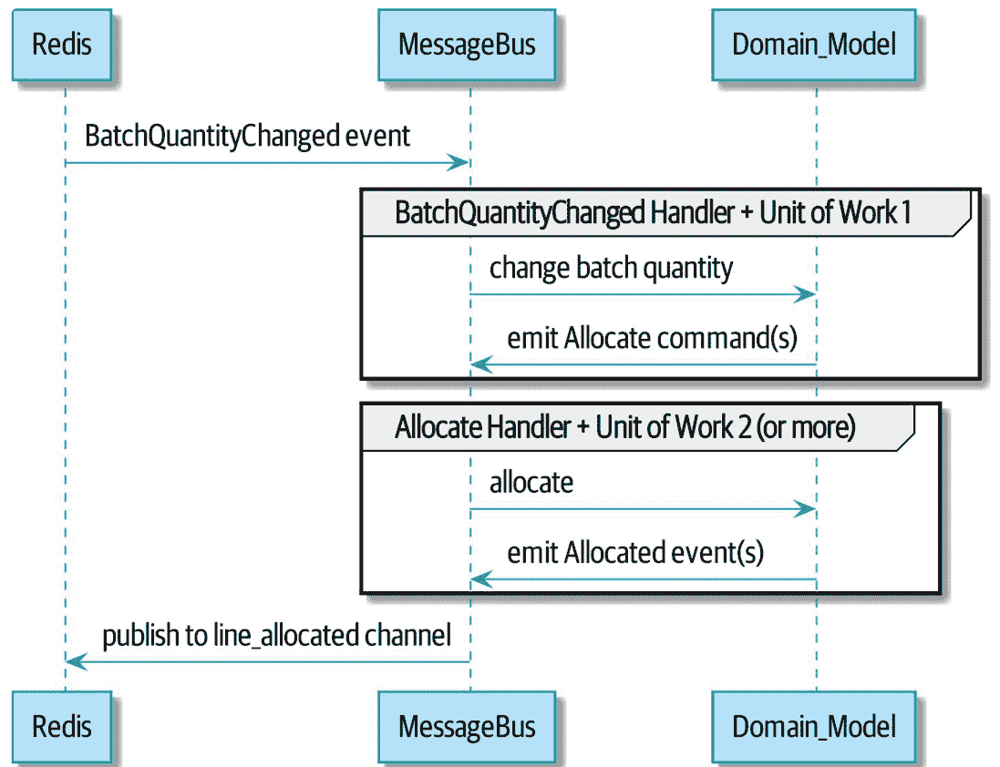

图12-2. 读模型的序列图

在图12-2中，你可以看到POST / 写操作中的两个事务，一个用于更新写模型，另一个用于更新可用于GET/读操作的读模型。

> 从头开始重建

“它出现故障怎么办？”这应该是我们作为工程师首先要问的问题。

如果由于错误或临时故障而未更新视图模型，我们该如何处理？好吧，这只是另一种事件和命令可能独立失败的情况。

如果我们从未更新视图模型，并且ASYMMETRICAL-DRESSER永远有库存，那对客户来说可能很烦人，但是分配服务仍将失败，我们将采取措施解决问题。

不过，重建视图模型很容易。由于我们使用服务层来更新视图模型，因此我们可以编写一个工具，执行以下操作：

- 查询写入侧的当前状态以确定当前分配情况
- 为每个分配的项目调用add_allocate_to_read_model处理程序

我们可以使用这种技术从历史数据创建全新的读模型。

## 更改我们的读模型实现很容易

让我们看看我们的事件驱动模型在实际中购买我们的灵活性，通过查看如果我们决定使用完全独立的存储引擎Redis实现读模型会发生什么。

只需看看：

处理程序更新Redis读模型

(src/allocation/service_layer/handlers.py)

```python
def add_allocation_to_read_model(event: events.Allocated, _):
    redis_eventpublisher.update_readmodel(event.orderid, event.sku, event.batchref)

def remove_allocation_from_read_model(event: events.Deallocated, _):
    redis_eventpublisher.update_readmodel(event.orderid, event.sku, None)
```

我们Redis模块中的辅助工具只有一行代码：

Redis读模型读取和更新

(src/allocation/adapters/redis_eventpublisher.py)

## 总结

表12-2列出了我们每个选项的优缺点。

实际上，MADE.com的分配服务确实使用了“完整的”CQRS，其中读模型存储在Redis中，甚至还提供了由Varnish提供的第二层缓存。但是，其使用情况与我们在此处展示的情况有很大不同。对于我们正在构建的分配服务类型，似乎不太可能需要使用单独的读模型和事件处理程序进行更新。但是，随着你的领域模型变得更加丰富和复杂，简化的读模型变得越来越具有说服力。

表12-2。各种视图模型选项的权衡

| 选项 | 优点 | 缺点 |
| :--- | :--- | :--- |
| 只使用存储库 | 简单，一致的方法。 | 使用复杂的查询模式可能会出现性能问题。 |
| 使用ORM的自定义查询 | 允许重用数据库配置和模型定义。 | 添加了另一种具有其自己的怪癖和语法的查询语言。 |
| 使用手动编写的SQL | 提供标准查询语法的精细控制性能。 | 必须对手动编写的查询和ORM定义进行数据库模式更改。高度规范化的模式仍可能存在性能限制。 |
| 创建具有事件的单独读取存储 | 只读副本易于扩展。数据更改时可以构建视图，以使查询尽可能简单。 | 复杂的技术。哈利将永远怀疑你的品味和动机。 |

通常，你的读取操作将对与你的写入模型相同的概念对象进行操作，因此使用ORM，向存储库添加一些读取方法，并为读取操作使用领域模型类非常好。

在我们的书籍示例中，读取操作对概念实体与我们的领域模型非常不同。分配服务以单个SKU的批次为基础，但用户关心整个订单的分配，其中包含多个SKU，因此使用ORM最终变得有些笨拙。我们非常倾向于使用我们在本章开头展示的原始SQL视图。

在这个注意事项上，让我们进入我们的最后一章。

# 第13章 依赖注入（和引导）

依赖注入（DI）在Python世界中备受怀疑。到目前为止，我们在本书的示例代码中一直没有使用它！

在本章中，我们将探讨我们的代码中的一些痛点，这些痛点导致我们考虑使用DI，并提供一些选项，让你选择最符合Pythonic的选项。我们还将向我们的体系结构添加一个名为bootstrap.py的新组件；它将负责依赖注入以及我们经常需要的一些其他初始化内容。我们将解释为什么这种东西在OO语言中被称为组合根，以及为什么引导脚本非常适合我们的目的。

图13-1显示了没有引导程序的应用程序的外观：入口点进行了大量的初始化和传递我们的主要依赖项，即UoW。

> **提示**
如果你尚未这样做，建议在继续本章之前阅读第3章，特别是关于函数式与面向对象的依赖管理的讨论。

图13-1 没有引导：入口点做了很多工作

> **提示**
本章的代码在GitHub上的chapter_13_dependency_injection分支中：

```
git clone https://github.com/cosmicpython/code.git
cd code
git checkout chapter_13_dependency_injection
```

或者要跟着代码一起做，检出上一章：

```
git checkout chapter_12_cqrs
```

图13-2显示了我们的引导程序接管这些责任。

图13-2 引导程序在一个地方处理所有这些

## 隐式依赖与显式依赖

根据你特定的大脑类型，你可能在心底感到一丝不安。让我们公开谈论一下。我们向你展示了两种管理依赖项和测试它们的方法。

对于我们的数据库依赖项，我们构建了一个明确的依赖关系框架，并为测试提供了易于覆盖的选项。我们的主要处理程序函数声明了对UoW的显式依赖关系：

我们的处理程序对UoW有明确的依赖关系

```python
# (src/allocation/service_layer/handlers.py)
def allocate(
    cmd: commands.Allocate, uow: unit_of_work.AbstractUnitOfWork
):
```

这使得在我们的服务层测试中轻松交换虚假的UoW：

针对虚假的UoW的服务层测试：

```python
# (tests/unit/test_services.py)
    uow = FakeUnitOfWork()
    messagebus.handle([...], uow)
```

UoW本身对会话工厂有明确的依赖关系：

UoW依赖于会话工厂

```python
# (src/allocation/service_layer/unit_of_work.py)
class SqlAlchemyUnitOfWork(AbstractUnitOfWork):

    def __init__(self, session_factory=DEFAULT_SESSION_FACTORY):
        self.session_factory = session_factory
        ...
```

我们在集成测试中利用它，以便有时使用SQLite而不是Postgres：

针对不同数据库的集成测试

```python
def test_rolls_back_uncommitted_work_by_default(sqlite_session_factory):
    uow = unit_of_work.SqlAlchemyUnitOfWork(sqlite_session_factory)  # 1
```

1. 集成测试将默认的Postgres会话工厂替换为SQLite。

## 显式依赖关系不是很奇怪，有点像Java吗？

如果你习惯于Python中通常发生的事情，你会觉得这一切有点奇怪。通常的做法是通过简单地导入来隐式声明依赖关系，然后如果我们需要在测试中更改它，我们可以进行Monkeypatch，这在动态语言中是正确的和正确的：

电子邮件发送作为正常的导入依赖项

```python
# (src/allocation/service_layer/handlers.py)
from allocation.adapters import email, redis_eventpublisher  # 1
...

def send_out_of_stock_notification(
        event: events.OutOfStock, uow: unit_of_work.AbstractUnitOfWork,
):
    email.send(  # 2
        'stock@made.com',
        f'Out of stock for {event.sku}',
    )
```

1. 硬编码导入
2. 直接调用特定的电子邮件发送器

为了测试而在应用程序代码中添加不必要的参数，这样做有什么意义呢？ mock.patch使Monkeypatch变得简单易行：

感谢Michael Foord的mock.patch

```python
# (tests/unit/test_handlers.py)
    with mock.patch("allocation.adapters.email.send") as mock_send_mail:
        ...
```

问题在于，我们使它看起来很容易，因为我们的玩具示例不发送真实电子邮件（email.send_mail只是执行打印操作），但在现实生活中，你最终将不得不为可能导致缺货通知的每个测试调用mock.patch。如果你曾经在使用许多模拟对象来防止不必要的副作用的代码库上工作，你就会知道那些模拟对象的模板代码有多烦人。

而且你会知道模拟对象与实现紧密耦合。通过选择Monkeypatch email.send_mail，我们将绑定到执行import email操作，如果我们想要执行from email import send_mail，这是微不足道的重构，我们必须更改所有模拟对象。

所以这是一个权衡。严格来说，声明显式依赖关系是不必要的，并且使用它们会使我们的应用程序代码稍微复杂一些。但是作为回报，我们会得到更易于编写和管理的测试。

除此之外，声明明确的依赖关系是依赖反转原则的一个例子-而不是（隐式）依赖于特定细节，我们有一个（显式）依赖于抽象：

> 显式优于隐式。
- Python之禅

显式依赖关系更抽象

```python
# (src/allocation/service_layer/handlers.py)
def send_out_of_stock_notification(
    event: events.OutOfStock, send_mail: Callable,
):
    send_mail(
        'stock@made.com',
        f'Out of stock for {event.sku}',
    )
```

但是，如果我们确实更改为明确声明所有这些依赖关系，谁将注入它们，以及如何注入？到目前为止，我们真的只处理UoW的传递：我们的测试使用FakeUnitOfWork，而Flask和Redis事件消费者入口使用真实的UoW，消息总线将它们传递给我们的命令处理程序。如果我们添加真实和虚假的电子邮件类，谁会创建它们并将它们传递下去？

这是Flask，Redis和我们的测试的额外（重复）开销。此外，将传递依赖项的所有责任交给消息总线似乎违反了SRP原则。

相反，我们将使用称为组合根（对我们来说是引导脚本）的模式，并进行一些“手动DI”（无框架的依赖注入）。见图13-3。

## 准备处理程序：使用闭包和部分函数的手动DI

将具有依赖关系的函数转换为可以稍后调用并注入这些依赖关系的函数的一种方法是使用闭包或部分函数将函数与其依赖关系组合在一起：

使用闭包或部分函数的DI示例

```python
# existing allocate function, with abstract uow dependency
def allocate(
    cmd: commands.Allocate, uow: unit_of_work.AbstractUnitOfWork
):
    line = OrderLine(cmd.orderid, cmd.sku, cmd.qty)
    with uow:
        ...

# bootstrap script prepares actual UoW
def bootstrap(..):
    uow = unit_of_work.SqlAlchemyUnitOfWork()

    # prepare a version of the allocate fn with UoW dependency captured in a closure
    allocate_composed = lambda cmd: allocate(cmd, uow)

    # or, equivalently (this gets you a nicer stack trace)
    def allocate_composed(cmd):
        return allocate(cmd, uow)

    # alternatively with a partial
    import functools
    allocate_composed = functools.partial(allocate, uow=uow)  # 1

# later at runtime, we can call the partial function, and it will have
# the UoW already bound
allocate_composed(cmd)
```

1. 闭包（lambda或命名函数）和functools.partial之间的区别在于前者使用变量的后期绑定，如果任何依赖关系是可变的，则可能会引起混淆。

以下是具有不同依赖项的send_out_of_stock_notification()处理程序的相同模式：

另一个闭包和部分函数示例

```python
def send_out_of_stock_notification(
    event: events.OutOfStock, send_mail: Callable,
):
    send_mail(
        'stock@made.com',
        ...
    )

# prepare a version of the send_out_of_stock_notification with dependencies
sosn_composed = lambda event: send_out_of_stock_notification(event, email.send_mail)

...
# later, at runtime:
sosn_composed(event)  # will have email.send_mail already injected in
```

## 使用类的替代方案

对于一些熟悉函数式编程的人来说，闭包和部分函数会感觉很熟悉。这里是另一种使用类的替代方案，可能会吸引其他人。不过，需要将所有处理程序函数重写为类：

使用类的DI

```python
# we replace the old `def allocate(cmd, uow)` with:
class AllocateHandler:
    def __init__(self, uow: unit_of_work.AbstractUnitOfWork):  # 2
        self.uow = uow
    def __call__(self, cmd: commands.Allocate):  # 1
        line = OrderLine(cmd.orderid, cmd.sku, cmd.qty)
        with self.uow:
            # rest of handler method as before
            ...

# bootstrap script prepares actual UoW
uow = unit_of_work.SqlAlchemyUnitOfWork()

# then prepares a version of the allocate fn with dependencies already injected
allocate = AllocateHandler(uow)

...
# later at runtime, we can call the handler instance, and it will have
# the UoW already injected
allocate(cmd)
```

1. 该类旨在生成可调用函数，因此它具有一个调用方法。
2. 但是，我们使用init来声明它所需的依赖关系。

如果你曾经制作过基于类的描述符或需要参数的基于类的上下文管理器，那么这种东西会感觉很熟悉。使用你和你的团队感觉更舒适的任何一个。

## 引导脚本

我们希望我们的引导脚本执行以下操作：

1. 声明默认依赖项，但允许我们覆盖它们
2. 做我们需要启动应用程序的“init”工作
3. 将所有依赖项注入我们的处理程序
4. 将核心对象（消息总线）返回给我们的应用程序

这是第一步：

引导函数

```python
# (src/allocation/bootstrap.py)
def bootstrap(
    start_orm: bool = True,  # 1
    uow: unit_of_work.AbstractUnitOfWork = unit_of_work.SqlAlchemyUnitOfWork(),  # 2
    send_mail: Callable = email.send,
    publish: Callable = redis_eventpublisher.publish,
) -> messagebus.MessageBus:

    if start_orm:
        orm.start_mappers()  # 1

    dependencies = {'uow': uow, 'send_mail': send_mail, 'publish': publish}
    injected_event_handlers = {  # 3
        event_type: [
            inject_dependencies(handler, dependencies)
            for handler in event_handlers
        ]
        for event_type, event_handlers in handlers.EVENT_HANDLERS.items()
    }
    injected_command_handlers = {  # 3
        command_type: inject_dependencies(handler, dependencies)
        for command_type, handler in handlers.COMMAND_HANDLERS.items()
    }

    return messagebus.MessageBus(  # 4
        uow=uow,
        event_handlers=injected_event_handlers,
        command_handlers=injected_command_handlers,
    )
```

1. orm.start_mappers() 是需要在应用程序开始时执行一次的初始化工作的示例。我们还看到了设置日志模块之类的内容。
2. 我们可以使用参数默认值来定义正常/生产默认值。将它们放在一个地方很好，但有时依赖关系在构造时会产生一些副作用，这种情况下，你可能更喜欢将它们默认为None。
3. 我们通过使用称为inject_dependencies() 的函数来构建处理程序映射的注入版本，接下来我们将展示它。
4. 我们返回一个配置好的消息总线，可供使用。

以下是如何通过检查处理程序函数来注入依赖项：

通过检查函数签名进行DI

```python
# (src/allocation/bootstrap.py)
```

## 更少魔法的手动DI

如果你发现前面的检查代码有点难以理解，那么这个更简单的版本可能会吸引你。

Harry编写了`inject_dependencies()`的代码作为如何进行“手动”依赖注入的第一步，当他看到它时，Bob指责他过度设计并编写自己的DI框架。

对于Harry来说，他甚至想不到你可以更清晰地完成它，但是你可以这样做：

内联手动创建部分函数（`src/allocation/bootstrap.py`）

```python
injected_event_handlers = {
    events.Allocated: [
        lambda e: handlers.publish_allocated_event(e, publish),
        lambda e: handlers.add_allocation_to_read_model(e, uow),
    ],
    events.Deallocated: [
        lambda e: handlers.remove_allocation_from_read_model(e, uow),
        lambda e: handlers.reallocate(e, uow),
    ],
    events.OutOfStock: [
        lambda e: handlers.send_out_of_stock_notification(e, send_mail)
    ]
}
injected_command_handlers = {
    commands.Allocate: lambda c: handlers.allocate(c, uow),
    commands.CreateBatch: lambda c: handlers.add_batch(c, uow),
    commands.ChangeBatchQuantity: lambda c: handlers.change_batch_quantity(c, uow),
}
```

Harry说他甚至无法想象写出那么多行代码，并且必须手动查找那么多函数参数。然而，这是一个完全可行的解决方案，因为每个处理程序你只需要添加一行左右的代码，因此即使你有数十个处理程序，也不会带来巨大的维护负担。

我们的应用程序结构使我们始终希望在处理程序函数中仅进行一次依赖注入，因此这个超级手动的解决方案和Harry基于`inspect()`的解决方案都可以正常工作。

如果你发现自己想在更多的地方和不同的时间进行DI，或者如果你进入依赖链（其中你的依赖关系具有自己的依赖关系等），则可能会从“真正”的DI框架中获得一些收益。

在MADE，我们在一些地方使用了Inject，它很好，尽管它使Pylint不高兴。你也可以查看Punq，由Bob本人编写，或DRY-Python团队的依赖项。

## 消息总线在运行时给予处理程序

我们的消息总线将不再是静态的；它需要具有已注入依赖项的处理程序。因此，我们将其从模块转换为可配置的类：

消息总线作为一个类 (`src/allocation/service_layer/messagebus.py`)

```python
class MessageBus:  # 1

    def __init__(
        self,
        uow: unit_of_work.AbstractUnitOfWork,
        event_handlers: Dict[Type[events.Event], List[Callable]],  # 2
        command_handlers: Dict[Type[commands.Command], Callable],  # 2
    ):
        self.uow = uow
        self.event_handlers = event_handlers
        self.command_handlers = command_handlers

    def handle(self, message: Message):  # 3
        self.queue = [message]  # 4
        while self.queue:
            message = self.queue.pop(0)
            if isinstance(message, events.Event):
                self.handle_event(message)
            elif isinstance(message, commands.Command):
                self.handle_command(message)
            else:
                raise Exception(f'{message} was not an Event or Command')
```

1. 消息总线成为一个类...
2. ...它已经注入了依赖项的处理程序。
3. 主要的`handle()`函数基本相同，只需将一些属性和方法移动到`self`上即可。
4. 像这样使用`self.queue`不是线程安全的，如果你使用线程可能会有问题，因为我们编写的总线实例在Flask应用程序上下文中是全局的。只是要注意的一些事情。

总线还有哪些变化？

事件和命令处理程序逻辑保持不变 (`src/allocation/service_layer/messagebus.py`)

```python
def handle_event(self, event: events.Event):
    for handler in self.event_handlers[type(event)]:  # 1
        try:
            logger.debug('handling event %s with handler %s',
                         event, handler)
            handler(event)  # 2
            self.queue.extend(self.uow.collect_new_events())
        except Exception:
            logger.exception('Exception handling event %s', event)
            continue

def handle_command(self, command: commands.Command):
    logger.debug('handling command %s', command)
    try:
        handler = self.command_handlers[type(command)]  # 1
        handler(command)  # 2
        self.queue.extend(self.uow.collect_new_events())
    except Exception:
        logger.exception('Exception handling command %s', command)
        raise
```

1. `handle_event`和`handle_command`基本相同，但是它们不再索引静态的`EVENT_HANDLERS`或`COMMAND_HANDLERS`字典，而是使用`self`上的版本。
2. 我们不再将UoW传递给处理程序，我们期望处理程序已经具有了所有依赖项，因此它们只需要一个参数，即特定的事件或命令。

## 在我们的入口点中使用Bootstrap

在我们应用程序的入口点中，我们现在只需调用`bootstrap.bootstrap()`并获得一个已准备好的消息总线，而不是配置UoW和其他内容：

Flask调用bootstrap (`src/allocation/entrypoints/flask_app.py`)

```diff
-from allocation import views
+from allocation import bootstrap, views
app = Flask(__name__)
-orm.start_mappers()  # 1
+bus = bootstrap.bootstrap()
@app.route("/add_batch", methods=['POST'])
@@ -19,8 +16,7 @@ def add_batch():
    cmd = commands.CreateBatch(
        request.json['ref'], request.json['sku'], request.json['qty'],
        eta,
    )
-    uow = unit_of_work.SqlAlchemyUnitOfWork()  # 2
-    messagebus.handle(cmd, uow)
+    bus.handle(cmd)  # 3
    return 'OK', 201
```

1. 我们不再需要调用`start_orm()`；引导脚本的初始化阶段将处理它。
2. 我们不再需要显式构建特定类型的UoW；引导脚本默认值会处理。
3. 而我们的消息总线现在是一个特定的实例，而不是全局模块。

## 在测试中初始化DI

在测试中，我们可以使用覆盖默认值的`bootstrap.bootstrap()`来获得自定义的消息总线。以下是在集成测试中的示例：

覆盖引导程序默认值 (`tests/integration/test_views.py`)

```python
@pytest.fixture
def sqlite_bus(sqlite_session_factory):
    bus = bootstrap.bootstrap(
        start_orm=True,  # 1
        uow=unit_of_work.SqlAlchemyUnitOfWork(sqlite_session_factory),  # 2
        send_mail=lambda *args: None,  #3
        publish=lambda *args: None,  #4
    )
    yield bus
    clear_mappers()

def test_allocations_view(sqlite_bus):
    sqlite_bus.handle(commands.CreateBatch('sku1batch', 'sku1', 50, None))
    sqlite_bus.handle(commands.CreateBatch('sku2batch', 'sku2', 50, date.today()))
    ...
    assert views.allocations('order1', sqlite_bus.uow) == [
        {'sku': 'sku1', 'batchref': 'sku1batch'},
        {'sku': 'sku2', 'batchref': 'sku2batch'},
    ]
```

1. 我们确实仍然希望启动ORM...
2. ...因为我们将使用真正的UoW，尽管是使用内存数据库。
3. 但是我们不需要发送电子邮件或发布，因此我们将它们设置为noops。

相比之下，在我们的单元测试中，我们可以重用我们的FakeUnitOfWork：

单元测试中的引导程序 (`tests/unit/test_handlers.py`)

```python
def bootstrap_test_app():
    return bootstrap.bootstrap(
        start_orm=False,  #1
        uow=FakeUnitOfWork(),  #2
        send_mail=lambda *args: None,  #3
        publish=lambda *args: None,  #3
    )
```

1. 不需要启动ORM...
2. ...因为虚假的UoW不使用ORM。
3. 我们还想伪造我们的电子邮件和Redis适配器。

这样就消除了一些重复，并将一堆设置和合理的默认值移动到了一个地方。

> 读者的练习1

将所有处理程序更改为类，就像使用类的DI示例一样，并根据需要修改引导程序的DI代码。当涉及到你自己的项目时，这将让你知道你更喜欢功能方法还是基于类的方法。

## 正确构建适配器：一个实例

为了真正了解它的工作原理，让我们通过一个示例来详细介绍如何“正确”构建适配器并进行依赖项注入。

目前，我们有两种类型的依赖关系：

两种类型的依赖关系 (`src/allocation/service_layer/messagebus.py`)

```python
1       uow: unit_of_work.AbstractUnitOfWork,  #1
2       send_mail: Callable,  #2
3       publish: Callable,  #3
```

1. UoW具有一个抽象基类。这是声明和管理外部依赖项的重量级选项。我们将在依赖关系相对复杂的情况下使用它。
2. 我们的电子邮件发送器和pub/sub发布器被定义为函数。这对于简单的依赖关系完全可以。

以下是我们在工作中注入的一些内容：

- S3文件系统客户端
- 键/值存储客户端
- 请求会话对象

其中大多数都将具有更复杂的API，你无法将其捕获为单个函数：读取和写入，GET和POST等等。

即使很简单，让我们以`send_mail`为例，讨论如何定义更复杂的依赖关系。

## 定义抽象和具体实现

我们将想象一个更通用的通知API。可能是电子邮件，可能是短信，也可能是Slack帖子。

一个ABC和一个具体实现 (`src/allocation/adapters/notifications.py`)

```python
class AbstractNotifications(abc.ABC):

    @abc.abstractmethod
    def send(self, destination, message):
        raise NotImplementedError

...

class EmailNotifications(AbstractNotifications):

    def __init__(self, smtp_host=DEFAULT_HOST, port=DEFAULT_PORT):
        self.server = smtplib.SMTP(smtp_host, port=port)
        self.server.noop()

    def send(self, destination, message):
        msg = f'Subject: allocation service notification\n{message}'
        self.server.sendmail(
            from_addr='allocations@example.com',
            to_addrs=[destination],
            msg=msg
        )
```

我们更改引导脚本中的依赖项：

消息总线中的通知 (`src/allocation/bootstrap.py`)

```diff
def bootstrap(
    start_orm: bool = True,
    uow: unit_of_work.AbstractUnitOfWork =
    unit_of_work.SqlAlchemyUnitOfWork(),
-    send_mail: Callable = email.send,
+    notifications: AbstractNotifications = EmailNotifications(),
    publish: Callable = redis_eventpublisher.publish,
) -> messagebus.MessageBus:
```

为你的测试制作伪造版本

我们通过并定义了一个用于单元测试的伪造版本：

伪造通知 (`tests/unit/test_handlers.py`)

```python
class FakeNotifications(notifications.AbstractNotifications):

    def __init__(self):
        self.sent = defaultdict(list)  # type: Dict[str, List[str]]

    def send(self, destination, message):
        self.sent[destination].append(message)
...
```

然后我们在测试中使用它：

测试略有变化 (`tests/unit/test_handlers.py`)

```python
def test_sends_email_on_out_of_stock_error(self):
    fake_notifs = FakeNotifications()
    bus = bootstrap.bootstrap(
        start_orm=False,
        uow=FakeUnitOfWork(),
        notifications=fake_notifs,
        publish=lambda *args: None,
    )
    bus.handle(commands.CreateBatch("b1", "POPULAR-CURTAINS", 9, None))
    bus.handle(commands.Allocate("o1", "POPULAR-CURTAINS", 10))
    assert fake_notifs.sent['stock@made.com'] == [
        f"Out of stock for POPULAR-CURTAINS",
    ]
```

## 找出如何集成测试真正的东西

现在，我们使用真正的东西进行测试，通常是通过端到端或集成测试。我们在我们的Docker开发环境中使用MailHog作为类似真实的电子邮件服务器：

具有真实伪造电子邮件服务器的Docker-compose配置 (`docker-compose.yml`)

## 总结

一旦你拥有多个适配器，手动传递依赖关系将会让你感到很痛苦，除非你进行某种形式的依赖注入。
设置依赖注入只是你启动应用程序时需要执行的许多典型设置/初始化活动之一。将所有这些内容组合到引导脚本中通常是一个好主意。
引导脚本还可以作为为你的适配器提供合理默认配置的地方，并作为覆盖这些适配器的测试伪造物的单一位置。
如果你发现自己需要在多个级别上进行DI（例如，如果你具有所有需要DI的组件的链接依赖关系），则依赖注入框架可能会很有用。
本章还介绍了将隐式/简单依赖关系更改为“适当”的适配器的示例，分解ABC，定义其真实和伪造实现，并思考集成测试。

> DI和引导脚本回顾

总之：

1. 使用ABC定义API。
2. 实现真实的东西。
3. 创建伪造物并将其用于单元/服务层/处理程序测试。
4. 找到一个不那么伪造的版本，你可以将其放入Docker环境中。
5. 测试较不伪造的“真实”东西。
6. 获得利润！

这些是我们想要涵盖的最后几个模式，这使我们进入第二部分的结束。在尾声中，我们将尝试为你提供一些在现实世界中应用这些技术的指针。

## 结语

## 现在怎么办？

哇！在本书中，我们涵盖了很多内容，对于我们的大多数读者来说，所有这些想法都是新的。考虑到这一点，我们不能希望使你成为这些技术的专家。我们真正能做的就是向你展示大致的想法，并提供足够的代码，让你可以从头开始编写一些东西。

本书中展示的代码不是经过实战验证的生产代码：它是一组乐高积木，你可以使用它们制作第一座房子、太空飞船和摩天大楼。

这让我们面临两项重要任务。我们想谈谈如何在现有系统中开始实际应用这些想法，我们需要警告你有关我们必须跳过的一些事情。我们为你提供了一整套让你自己踩坑的方法，因此我们应该讨论一些基本的枪支安全知识。

## 我该怎么做？

你中的很多人可能会想到这样的话：

> “好吧，Bob和Harry，这都很好，如果我被雇用来处理一个全新的服务，我知道该怎么做。但是同时，我手上有一个庞大的Django混乱，我看不到任何方法可以从这里转换到你的漂亮、干净、完美、未被污染的简单模型。从这里不可能。”

我们理解你的想法。一旦你已经建立了一个庞大的混乱系统，就很难知道如何开始改进。实际上，我们需要逐步解决问题。

首先是最重要：你要解决什么问题？软件太难更改吗？性能不可接受吗？你是否遇到了奇怪的、难以解释的错误？

有一个清晰的目标将有助于你优先处理需要完成的工作，并重要的是，向团队的其他成员传达做事情的原因。只要工程师能够合理地解释修复问题的原因，企业往往会采取务实的技术债务和重构方法。

> 提示
如果将复杂的系统更改与功能工作联系起来，通常更容易说服人们接受它。也许你正在推出新产品或向新市场开放服务？这是在修复基础设施方面投入工程资源的正确时机。有一个需要六个月才能完成的项目，为三周的清理工作做出论据更容易。Bob称之为架构税。

## 分离纠缠的责任

在本书的开头，我们说一个大混沌系统的主要特征是同质性：系统的每个部分看起来都一样，因为我们没有明确每个组件的责任。为了解决这个问题，我们需要开始分离责任并引入明确的边界。我们可以做的第一件事就是开始构建服务层（图E-1）。

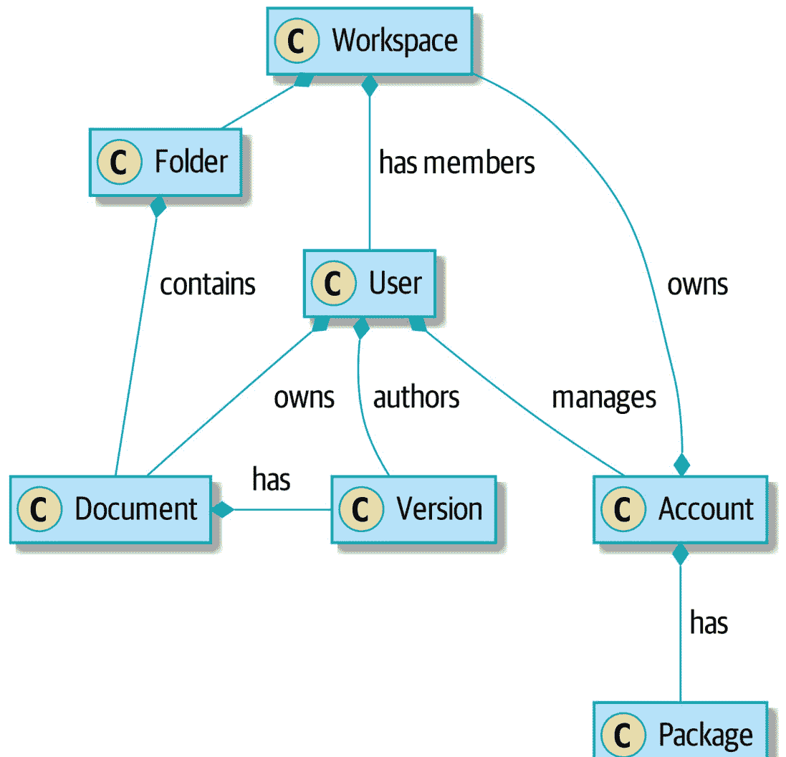

图E-1.协作系统的领域

这是Bob第一次学习如何拆分混沌系统的系统，它是一个大挑战。逻辑无处不在——在Web页面中，在管理对象中，在助手中，在我们编写的抽象管理器和助手的大型服务类中，在我们编写的复杂命令对象中，以拆分服务。

如果你正在处理已经达到这种程度的系统，情况可能感到无望，但开始清理过度生长的花园从来不算晚。最终，我们雇用了一位知道自己在做什么的架构师，他帮助我们重新掌控了局面。

首先，通过工作系统的用例来解决问题。如果你有用户界面，它执行哪些操作？如果你有一个后端处理组件，也许每个cron作业或Celery作业都是一个单独的用例。每个用例都需要有一个命令式名称：例如，应用计费费用、清理废弃的帐户或提高采购订单。

在我们的情况下，我们的大多数用例都是管理器类的一部分，并且具有诸如创建工作区或删除文档版本之类的名称。每个用例都从Web前端调用。

我们的目标是为每个支持的操作创建一个单独的函数或类，用于协调要完成的工作。每个用例应该执行以下操作：

- 如果需要，启动自己的数据库事务
- 获取所需的任何数据
- 检查所有前提条件（请参见附录E中的确保模式）
- 更新领域模型
- 保存任何更改

每个用例应该作为一个原子单元成功或失败。你可能需要从另一个用例中调用一个用例。没关系，只需做个记录，并尽量避免长时间运行的数据库事务。

> **注意**

我们面临的最大问题之一是管理器方法调用其他管理器方法，并且数据访问可以从模型对象本身发生。如果不跨代码库进行寻宝，很难理解每个操作的作用。将所有逻辑汇集到单个方法中，并使用UoW来控制我们的事务，使系统更易于理解。

## 案例研究：对一个过度复杂的系统进行分层

很多年前，Bob曾在一家软件公司工作，该公司外包了其应用程序的第一个版本，这是一个在线协作平台，用于共享和处理文件。

当公司将开发内部化时，经过了几代开发人员的手，每一波新的开发人员都为代码结构增加了更多的复杂性。

在其核心，该系统是一个使用NHibernate ORM构建的ASP.NET Web Forms应用程序。用户可以将文档上传到工作区，在那里他们可以邀请其他工作区成员查看、评论或修改他们的工作。

应用程序的大部分复杂性在于权限模型，因为每个文档都包含在一个文件夹中，文件夹允许读、写和编辑权限，就像Linux文件系统一样。

此外，每个工作区都属于一个帐户，并且通过计费包附加了配额。

因此，对文档进行每个读取或写入操作都必须从数据库中加载大量对象，以测试权限和配额。创建新的工作区涉及数百个数据库查询，因为我们设置权限结构、邀请用户并设置示例内容。

一些操作的代码位于Web处理程序中，当用户单击按钮或提交表单时运行；一些代码位于管理器对象中，用于编排工作的代码；一些代码位于领域模型中。模型对象将进行数据库调用或复制磁盘上的文件，测试覆盖率极低。

为了解决这个问题，我们首先引入了一个服务层，使创建文档或工作区的所有代码都在一个地方，并且可以被理解。这涉及将数据访问代码从领域模型中提取出来，并放入命令处理程序中。同样，我们将编排代码从管理器和Web处理程序中提取出来，并将其推入处理程序中。

结果的命令处理程序既冗长又混乱，但我们已经开始在混乱中引入秩序。

> 提示

如果使用用例函数中存在重复代码，那没关系。我们不是在尝试编写完美的代码；我们只是在尝试提取一些有意义的层。最好在几个地方重复一些代码，而不是让用例函数在长链中相互调用。

这是一个很好的机会，将任何数据访问或编排代码从领域模型中提取出来，并放入用例中。我们还应该尝试将I/O关注点（例如，发送电子邮件，编写文件）从领域模型中提取出来，放到用例函数中。我们应用第3章的抽象技术，使我们的处理程序即使在执行I/O时也可以进行单元测试。

这些用例函数将主要涉及日志记录、数据访问和错误处理。完成此步骤后，你将了解程序实际执行的操作，并且有一种方法来确保每个操作都具有清晰定义的开始和结束。我们将迈向构建纯领域模型的一步。

阅读Michael C. Feathers的《有效处理遗留代码》（Prentice Hall）以获取有关将遗留代码测试和开始分离责任的指导。

## 识别聚合和有界上下文

我们案例研究中代码库的问题之一是对象图高度连接。每个账户都有许多工作区，每个工作区都有许多成员，每个成员都有自己的账户。每个工作区包含许多文档，每个文档都有许多版本。

你无法用类图来表达它的全部可怕之处。首先，实际上并没有一个与用户相关的单一账户。相反，有一个奇怪的规则，要求你通过工作区枚举与用户相关的所有账户，并取创建日期最早的账户。

系统中的每个对象都是继承层次结构的一部分，其中包括SecureObject和Version。这个继承层次结构直接在数据库模式中反映出来，因此每个查询都必须跨越10个不同的表进行连接，并查看一个鉴别器列，以确定正在使用哪种对象。

代码库使你可以像这样轻松地“点”穿这些对象：

```python
user.account.workspaces[0].documents.versions[1].owner.account.settings[0];
```

使用Django ORM或SQLAlchemy以这种方式构建系统很容易，但应该避免。虽然它很方便，但它使得很难推理性能，因为每个属性可能触发对数据库的查找。

> **提示**
聚合是一致性边界。通常，每个用例应一次更新一个聚合。一个处理程序从存储库中获取一个聚合，修改其状态，并引发任何因此而发生的事件。如果需要来自系统其他部分的数据，则完全可以使用读取模型，但避免在单个事务中更新多个聚合。当我们选择将代码分成不同的聚合时，我们明确选择使它们最终彼此一致。

一堆操作要求我们用这种方式循环遍历对象，例如：

```python
# Lock a user's workspaces for nonpayment

def lock_account(user):
    for workspace in user.account.workspaces:
        workspace.archive()
```

甚至递归遍历文件夹和文档的集合：

```python
def lock_documents_in_folder(folder):

    for doc in folder.documents:
        doc.archive()

    for child in folder.children:
        lock_documents_in_folder(child)
```

这些操作导致性能下降，但修复它们意味着放弃我们的单一对象图。相反，我们开始识别聚合并打破对象之间的直接链接。

> **注意**

我们在第12章中讨论了臭名昭著的SELECT N+1问题，以及在读取查询数据和读取命令数据时可能选择使用不同技术的方式。

我们主要是通过使用标识符替换直接引用来完成这个过程。

在聚合之前：

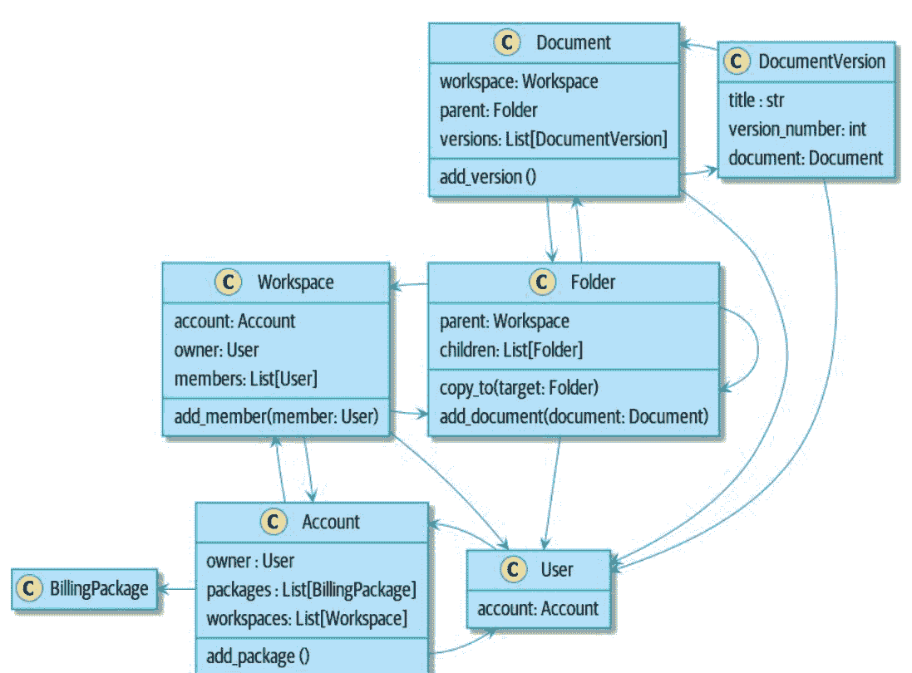

经过聚合建模后：

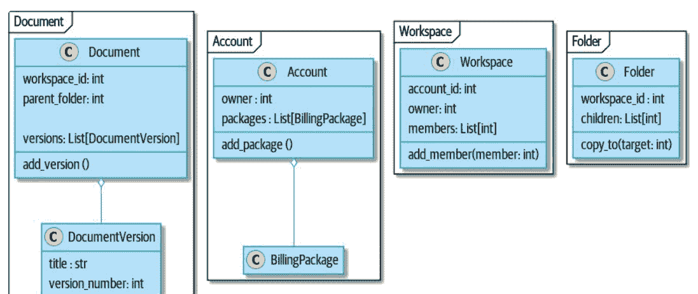

> 提示
双向链接通常是聚合不正确的迹象。在我们的原始代码中，一个文档知道它所在的文件夹，而文件夹有一组文档。这使得遍历对象图很容易，但停止我们正确地思考所需的一致性边界。我们通过使用引用来分解聚合来解决这个问题。在新模型中，一个文档有对其父文件夹的引用，但无法直接访问文件夹。

如果我们需要读取数据，我们避免编写复杂的循环和转换，并尝试用直接SQL替换它们。例如，我们的一个屏幕是文件夹和文档的树形视图。

这个屏幕对数据库的压力非常大，因为它依赖于触发惰性加载ORM的嵌套for循环。

> 提示
我们在第11章中使用了同样的技术，将ORM对象的嵌套循环替换为简单的SQL查询。这是CQRS方法的第一步。

经过一番深思熟虑，我们用一个又大又丑的存储过程替换了ORM代码。代码看起来很糟糕，但速度快得多，并帮助打破了文件夹和文档之间的链接。

当我们需要写入数据时，我们一次更改一个聚合，并引入了消息总线来处理事件。例如，在新模型中，当我们锁定一个账户时，我们可以先通过SELECT id FROM workspace WHERE account_id = ?查询所有受影响的工作区。

然后我们可以为每个工作区提出一个新的命令：

```python
for workspace_id in workspaces:
    bus.handle(LockWorkspace(workspace_id))
```

## 通过Strangler Pattern转向微服务的事件驱动方法

Strangler Fig模式涉及在旧系统的边缘创建一个新系统，同时保持其运行。逐渐拦截和替换一些旧功能，直到旧系统最终不再起作用并可以关闭。

在构建可用性服务时，我们使用了一种称为事件拦截的技术来将功能从一个位置移动到另一个位置。

这是一个三步过程：

1. 引发事件来表示要替换的系统中正在发生的变化。
2. 构建一个使用这些事件来构建自己的领域模型的第二个系统。
3. 用新的系统替换旧的系统。

我们使用事件拦截从图E-2转移到...

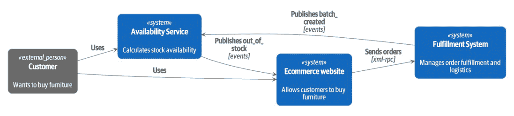

图E-2。之前：基于XML-RPC的强、双向耦合

到图E-3.

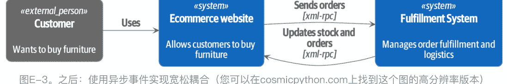

图E-3。之后：使用异步事件实现宽松耦合（您可以在cosmicpython.com上找到这个图的高分辨率版本）

实际上，这是一个几个月的项目。我们的第一步是编写一个领域模型，可以表示批次、装运和产品。我们使用TDD构建了一个玩具系统，可以回答一个问题：“如果我想要N个HAZARDOUS_RUG，需要多长时间才能交付？”

> 提示
在部署事件驱动系统时，从“行走骨架”开始。部署一个只记录其输入的系统，迫使我们解决所有基础架构问题，并开始在生产环境中工作。

## 案例研究：打造微服务以替代领域

MADE.com最初有两个单体应用程序：一个用于前端电子商务应用程序，另一个用于后端履行系统。
这两个系统通过XML-RPC进行通信。定期，后端系统会唤醒并查询前端系统以了解新订单的情况。
当它导入了所有新订单后，它会发送RPC命令来更新库存水平。

随着时间的推移，这个同步过程变得越来越慢，直到有一年的圣诞节，导入一天的订单需要超过24小时的时间。Bob被聘请来将系统拆分为一组事件驱动服务。

首先，我们确定过程中最慢的部分是计算和同步可用库存。我们需要的是一个能够侦听外部事件并保持可用库存总量的系统。

我们通过API公开了这些信息，这样用户的浏览器就可以询问每个产品的可用库存量以及交付到他们地址需要多长时间。

每当一个产品完全缺货时，我们就会引发一个新事件，电子商务平台可以使用它来下架产品。因为我们不知道需要处理多少负载，所以我们使用了CQRS模式编写了该系统。每当库存量发生变化时，我们会使用Redis数据库更新缓存视图模型。我们的Flask API查询这些视图模型，而不是运行复杂的领域模型。

结果，我们可以在2到3毫秒内回答“有多少库存可用？”的问题，现在API经常在持续一段时间内处理数百个请求。

如果这一切听起来有点熟悉，那么现在你知道我们的示例应用程序是从哪里来的了！

一旦我们有了一个可行的领域模型，我们就开始构建一些基础设施组件。我们的第一个生产部署是一个小系统，可以接收一个batch_created事件并记录其JSON表示。这是事件驱动架构的“Hello World”。它迫使我们部署一个消息总线，连接生产者和消费者，构建部署流水线，并编写一个简单的消息处理程序。

有了部署流水线、我们所需的基础设施和基本的领域模型，我们就可以开始了。几个月后，我们已经投入生产并为真正的客户提供服务了。

## 说服利益相关者尝试新事物

如果你正在考虑从一个庞大的系统中构建一个新系统，你可能正在遇到可靠性、性能、可维护性或同时出现的所有这些问题。深层次、棘手的问题需要采取激烈的措施！

我们建议先进行领域建模。在许多过度庞大的系统中，工程师、产品所有者和客户不再使用相同的语言。业务利益相关者使用抽象的、过程为中心的术语来谈论系统，而开发人员则被迫谈论系统在其野生和混乱状态下的实际存在方式。

## 案例研究：用户模型

我们之前提到，我们第一个系统中的账户和用户模型是由一个“奇怪的规则”绑定在一起的。这是一个很好的例子，说明工程师和业务利益相关者如何逐渐分离。

在这个系统中，账户是工作空间的父级，用户是工作空间的成员。工作空间是应用权限和配额的基本单位。如果一个用户加入了一个工作空间，但没有账户，我们会将他们与拥有该工作空间的账户关联起来。

这很混乱，很临时，但在某一天，一个产品所有者要求添加一个新功能：

当一个用户加入公司时，我们希望将他们添加到公司的一些默认工作空间中，比如人力资源工作空间或公司公告工作空间。

我们不得不向他们解释，不存在所谓的公司，也没有任何一种方式是用户加入了一个账户。此外，“公司”可能有许多由不同用户拥有的账户，新用户可能被邀请加入其中任何一个。

多年来，为了解决一个有缺陷的模型而添加了许多黑科技和解决方法，最终追上了我们，我们不得不将整个用户管理功能重写为一个全新的系统。

领域建模是一个复杂的任务，需要很多好书来讲解。我们喜欢使用交互式技术，比如事件风暴和CRC建模，因为人类善于通过玩乐协作。事件建模是另一种技术，可以让工程师和产品所有者在命令、查询和事件方面理解一个系统。

> 提示

请查看www.eventmodeling.org和www.eventstorming.org，了解有关使用事件进行系统可视化建模的优秀指南。

目标是通过使用相同的普适语言来谈论系统，以便你可以就复杂性达成共识。

我们发现，将领域问题视为TDD kata可以产生很大的价值。例如，我们为可用性服务编写的第一段代码是批处理和订单行模型。你可以将其视为午餐时间的工作坊，或者作为项目开始时的一个探索。

一旦你能够证明建模的价值，就更容易争取为优化建模而进行项目结构的论证。

## 案例研究：David Seddon 的小步前进之路

嗨，我是David，是本书的技术审查员之一。我曾经在几个复杂的Django单体应用上工作过，所以我知道Bob和Harry所承诺的缓解痛苦的承诺是多么的宏伟。

当我第一次接触到这里描述的模式时，我非常兴奋。我已经成功地在一些较小的项目中使用了一些技术，但这里提供了一个蓝图，用于像我在日常工作中使用的大型、数据库支持的系统。因此，我开始尝试弄清楚如何在我目前的组织中实施该蓝图。

我选择解决一直困扰我的代码库中的问题区域。我开始将其实现为一个用例。但我发现自己遇到了一些意想不到的问题。在阅读时我没有考虑到的事情现在让我很难看清楚该怎么做。如果我的用例与两个不同的聚合体进行交互，那么这是否是一个问题？一个用例能否调用另一个用例？在遵循不同的架构原则的系统中，它将如何存在而不会导致一团糟？

那么那个充满希望的蓝图去哪了？我真的理解这些想法吗？它是否适用于我的应用程序？即使它适用，我的同事们是否会同意进行这样的重大变革？这些只是我在忙于现实生活时幻想的好主意吗？

我花了一些时间才意识到我可以从小处开始。我不需要成为一个纯粹主义者或一次就做对：我可以进行实验，找到适合我的方法。

所以这就是我所做的。我已经能够在一些地方应用一些想法。我构建了新的功能，其业务逻辑可以在没有数据库或模拟的情况下进行测试。作为一个团队，我们引入了一个服务层来帮助定义系统的工作。

如果你开始尝试在你的工作中应用这些模式，你可能会有类似的感受。当一本书中的美好理论遇到你的代码库的现实时，可能会让人泄气。

我的建议是专注于一个具体的问题，并问问自己如何将相关的想法应用到其中，可能是以最初有限和不完美的方式。你可能会像我一样发现，你选择的第一个问题可能有点太难了；如果是这样的话，就换个问题。不要试图改变一切，也不要太害怕犯错。这将是一个学习的过程，你可以相信你正在朝着其他人发现有用的方向大致前进。

因此，如果你也感到痛苦，请尝试这些想法。不要觉得你需要获得重新架构一切的许可。只需寻找一个小的起点。最重要的是，要为了解决一个具体的问题而这样做。如果你成功解决了它，你就会知道你做对了什么，其他人也会这样认为。

## 我们的技术评论员提出的问题

我们在起草过程中听到了一些问题，但无法在本书的其他地方找到一个好的地方回答它们：

我需要一次性完成所有这些吗？我可以一点一点地做吗？

不，你完全可以逐步采用这些技术。如果你已经有一个现有的系统，我们建议建立一个服务层，尝试将编排保持在一个地方。一旦你有了这个，将逻辑推到模型中，将验证或错误处理等边缘问题推到入口点，就会变得更容易。

即使你仍然有一个庞大而混乱的Django ORM，拥有一个服务层也是值得的，因为它是开始理解操作边界的一种方式。

提取用例将会破坏我的现有代码，它太混乱了

只需复制和粘贴即可。在短期内造成更多的重复是可以的。把你的代码想象成一个多步骤的过程。你的代码现在处于一个糟糕的状态，所以将它复制到一个新的位置，然后使新代码变得干净整洁。

一旦你做到了这一点，你就可以用新代码的调用替换旧代码的使用，最后删除这个混乱。修复大型代码库是一个混乱而痛苦的过程。不要期望事情立即变得更好，如果你的应用程序中的某些部分仍然很混乱，也不要担心。

我需要做CQRS吗？这听起来很奇怪。我不能只使用存储库吗？

当然可以！我们在本书中介绍的技术旨在使你的生活更轻松。它们不是某种禁欲的纪律，用来惩罚自己的。

在我们的第一个案例研究系统中，我们有很多View Builder对象，它们使用存储库获取数据，然后执行一些变换来返回愚蠢的读模型。优点是当你遇到性能问题时，很容易重写视图构建器以使用自定义查询或原始SQL。

用例在一个更大的系统中应该如何交互？一个用例调用另一个用例会有问题吗？

这可能是一个临时的步骤。再次以第一个案例研究为例，我们有一些处理程序需要调用其他处理程序。这会变得非常混乱，最好的方法是使用消息总线来分离这些问题。

通常，你的系统将有一个单一的消息总线实现和一堆以特定聚合或一组聚合为中心的子域。当你的用例完成时，它可以引发一个事件，其他地方的处理程序可以运行。

一个用例使用多个存储库/聚合是否是代码异味，如果是，为什么？

聚合是一种一致性边界，因此如果你的用例需要原子地更新两个聚合（在同一个事务中），那么你的一致性边界是错误的，严格来说。理想情况下，你应该考虑移动到一个新的聚合，将你想要同时更改的所有内容包装起来。

如果你实际上只更新一个聚合并使用另一个（些）进行只读访问，那么这是可以的，虽然你可以考虑构建一个读/视图模型来获取这些数据——如果每个用例只有一个聚合，这样可以使事情更清晰。

如果你确实需要修改两个聚合，但两个操作不必在同一个事务/UoW中，那么考虑将工作拆分为两个不同的处理程序，并使用域事件在两个之间传递信息。你可以在Vaughn Vernon的聚合设计论文中阅读更多内容。

如果我有一个只读但业务逻辑重的系统怎么办？

视图模型中可以有复杂的逻辑。在本书中，我们鼓励你将读模型和写模型分开，因为它们具有不同的一致性和吞吐量要求。大多数情况下，我们可以对读取使用更简单的逻辑，但这并不总是正确的。特别是，权限和授权模型可以给我们的读取端增加很多复杂性。

我们编写的系统中，视图模型需要广泛的单元测试。在这些系统中，我们将视图构建器与视图获取器分开，如图E-4所示。

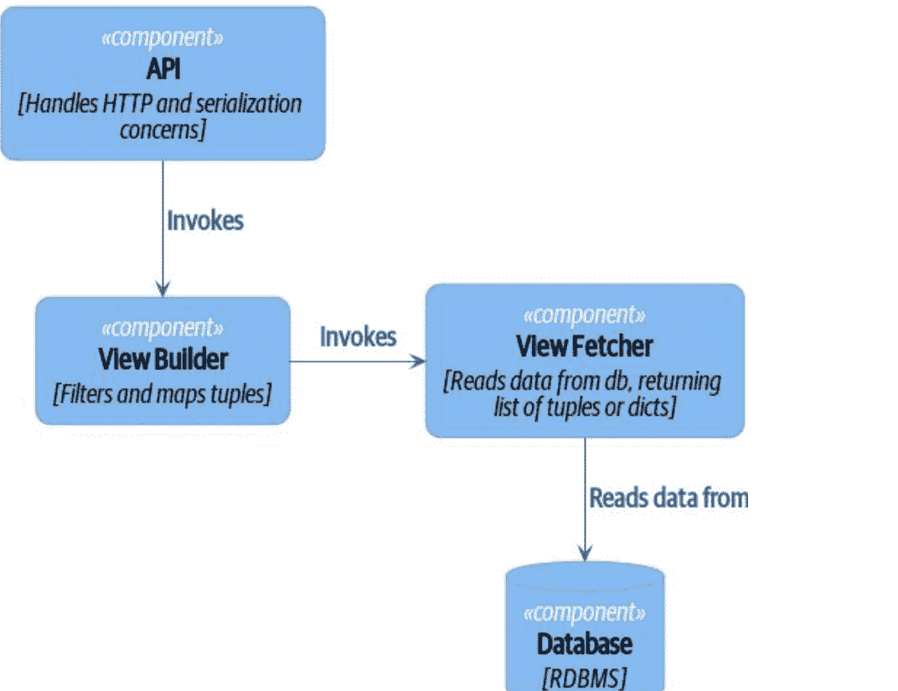

图E-4. 视图构建器和视图获取器（你可以在cosmicpython.com找到高分辨率版本的图表）

这使得很容易通过给它模拟数据（例如，一组字典）来测试视图构建器。使用事件处理程序的“高级CQRS”实际上是一种运行复杂视图逻辑的方式，每当我们写入时都运行它，以便我们在读取时避免运行它。

我需要构建微服务来完成这些工作吗？

天哪，不需要！这些技术比微服务早了十年左右。聚合、域事件和依赖反转是控制大型系统复杂性的方法。当你构建了一组用例和业务流程的模型时，将其移动到自己的服务中相对容易，但这并不是必需的。

我正在使用Django。我还能这样做吗？

我们有一个完整的附录专门为你准备：附录D！

## 踩坑

好的，我们给你提供了一堆新玩具来玩。这里是细则。Harry和Bob不建议你将我们的代码复制粘贴到生产系统中，然后在Redis pub/sub上重建你的自动交易平台。出于简洁和简单的原因，我们忽略了许多棘手的问题。在尝试这个之前，这里是我们认为你应该知道的事情列表。

可靠的消息传递很困难

Redis pub/sub不可靠，不应作为通用消息传递工具使用。我们选择它是因为它很熟悉且易于运行。在MADE，我们运行Event Store作为我们的消息传递工具，但我们也有使用RabbitMQ和Amazon EventBridge的经验。

Tyler Treat在他的网站bravenewgeek.com上有一些优秀的博客文章；你至少应该阅读“你不能有完全可靠的传递”和“你想要的就是你不想要的：理解分布式消息传递中的权衡”。

我们明确选择小而专注的事务，这些事务可以独立地失败

在第8章中，我们更新了我们的流程，以便将释放订单行和重新分配行分别发生在两个独立的工作单位中。你需要监控来知道这些事务何时失败，并使用工具重放事件。使用事务日志作为你的消息代理（例如，Kafka或EventStore）可以使其中的一些变得更容易。你也可以看看Outbox模式。

我们没有讨论幂等性

我们没有真正考虑当处理程序重试时会发生什么。在实践中，你会希望使处理程序具有幂等性，以便重复调用它们不会对状态进行重复更改。这是构建可靠性的关键技术，因为它使我们能够在事件失败时安全地重试事件。

关于幂等消息处理有很多好的材料，可以从“如何确保事件一致的DDD/CQRS应用程序中的幂等性”和“(不)可靠的消息传递”开始阅读。

随着时间的推移，你的事件将需要改变它们的架构

你需要找到一种方法来记录你的事件并与消费者共享架构。我们喜欢使用JSON schema和markdown，因为它简单易懂，但也有其他的先例。Greg Young写了一本完整的关于如何管理随时间变化的事件驱动系统的书：事件驱动系统中的版本控制（Leanpub）。

## 更多必读书籍

以下是我们想推荐给你的几本书籍，以帮助你走得更远：

- 2019年出版的Leonardo Giordani的《Python中的清晰架构》（Leanpub）是Python应用程序架构的少数几本先前的书籍之一。
- Gregor Hohpe和Bobby Woolf的《企业集成模式》（Addison-Wesley Professional）是消息传递模式的很好的起点。
- Sam Newman的《从单体架构到微服务》（O'Reilly）和Newman的第一本书《构建微服务》（O'Reilly）。这些书籍提到了许多模式，包括“Strangler Fig”模式。如果你正在考虑转向微服务，这些书籍非常值得一读，它们也很好地介绍了集成模式和基于异步消息的集成的考虑事项。

## 总结

哇！这是很多警告和阅读建议；我们希望我们没有完全吓到你。我们写这本书的目的是为了给你足够的知识和直觉，让你开始为自己构建一些东西。我们很乐意听取你在自己的系统中使用这些技术时遇到的问题和困难，所以为什么不在www.cosmicpython.com上与我们联系呢？

## 附录A. 总结图表和表格

这是我们在本书结束时的架构图：

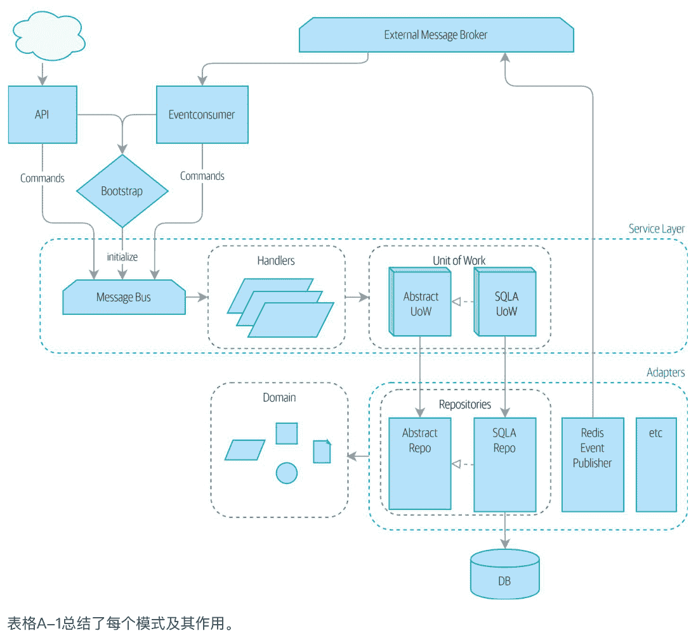

表格A-1总结了每个模式及其作用。

表格A-1. 我们架构的组件及其作用

| 层 | 组件 | 描述 |
| :--- | :--- | :--- |
| **领域层**<br>定义业务逻辑 | 实体 | 一个领域对象，其属性可能会发生变化，但其身份在一段时间内是可识别的。 |
| | 值对象 | 一个不可变的领域对象，其属性完全定义了它。它可以与其他相同的对象互换。 |
| | 聚合 | 一组相关联的对象，我们将其视为数据更改的单元。定义和实施一致性边界。 |
| | 事件 | 表示发生的事情。 |
| | 命令 | 表示系统应执行的任务。 |
| **服务层**<br>定义系统应执行的任务并协调不同的组件。 | 处理器 | 接收命令或事件并执行必要的操作。 |
| | 工作单元 | 数据完整性的抽象。每个工作单元表示一个原子更新。提供存储库。跟踪已检索聚合上的新事件。 |
| | 消息总线（内部） | 通过将命令和事件路由到适当的处理器来处理它们。 |
| **适配器**<br>（辅助）<br>从我们的系统到外部世界(I/O) 的接口的具体实现。 | 存储库 | 围绕持久存储的抽象。每个聚合都有自己的存储库。 |
| | 事件发布者 | 将事件推送到外部消息总线上。 |
| **入口点**<br>（主要适配器）<br>将外部输入转换为对服务层的调用。 | Web | 接收Web请求并将其转换为命令，将其传递到内部消息总线。 |
| | 事件消费者 | 从外部消息总线中读取事件并将其转换为命令，将其传递到内部消息总线。 |
| N/A | 外部消息总线（消息代理） | 不同的服务使用的基础设施，通过事件进行相互通信。 |

## 附录B. 项目结构模板

在第四章左右，我们从只有一个文件夹转移到了更结构化的树形结构，我们认为这可能很有趣，因此概述了移动的部分。

> 提示

此附录的代码在GitHub的appendix_project_structure分支中：

git clone https://github.com/cosmicpython/code.git

cd code

git checkout appendix_project_structure

基本的文件夹结构如下：

项目树

```
.
├── Dockerfile   #1
├── Makefile   #2
├── README.md
├── docker-compose.yml
├── license.txt
├── mypy.ini
├── requirements.txt
├── src   #3
│   ├── allocation
│   │   ├── __init__.py
│   │   ├── adapters
│   │   │   ├── __init__.py
│   │   │   ├── orm.py
│   │   │   └── repository.py
│   │
│   │   ├── config.py
│   │   ├── domain
│   │   │   ├── __init__.py
│   │   │   └── model.py
│   │   ├── entrypoints
│   │   │   ├── __init__.py
│   │   │   └── flask_app.py
│   │   └── service_layer
│   │       ├── __init__.py
│   │       └── services.py
│   └── setup.py   #3
├── tests   #4
│   ├── conftest.py   #4
│   ├── e2e
│   │   └── test_api.py
│   ├── integration
│   │   ├── test_orm.py
│   │   └── test_repository.py
│   ├── pytest.ini   #4
│   └── unit
│       ├── test_allocate.py
│       ├── test_batches.py
│       └── test_services.py
```

1. 我们的docker-compose.yml和Dockerfile是运行应用程序的容器的主要配置部分，它们也可以运行测试（用于CI）。更复杂的项目可能有几个Dockerfile，但我们发现最小化图像数量通常是一个好主意。
2. Makefile为所有典型命令提供入口点，开发人员（或CI服务器）可能希望在其正常工作流程中运行这些命令：make build，make test等。这是可选的。你可以直接使用docker-compose和pytest，但如果没有其他，将所有“常用命令”列在某个列表中是很好的，而且与文档不同，Makefile是代码，因此不太容易过时。
3. 我们应用程序的所有源代码，包括领域模型、Flask应用程序和基础设施代码，都位于src内的Python包中，我们使用pip install -e和setup.py文件进行安装。这使得导入变得容易。目前，此模块内的结构完全平坦，但对于更复杂的项目，你可以期望增加文件夹层次结构，其中包括domain_model/、infrastructure/、services/和api/。
4. 测试位于它们自己的文件夹中。子文件夹区分不同的测试类型，并允许你单独运行它们。我们可以在主测试文件夹中保留共享夹具（conftest.py），并在必要时嵌套更具体的夹具。这也是保存pytest.ini的地方。

> 提示
pytest文档在测试布局和可导入性方面非常好。

让我们更详细地查看一下这些文件和概念。

## 环境变量、12-Factor和配置，容器内和容器外

我们试图解决的基本问题是，我们需要为以下内容提供不同的配置设置：

1. 从自己的开发机器上直接运行代码或测试，可能需要与Docker容器中映射的端口进行通信
2. 在容器本身上运行，具有“真实”的端口和主机名
3. 不同的容器环境（开发、暂存、生产等）

按照12-Factor宣言建议的通过环境变量进行配置可以解决这个问题，但具体来说，我们如何在代码和容器中实现它呢？

## Config.py

每当我们的应用程序代码需要访问某些配置时，它将从名为config.py的文件中获取它。以下是我们应用程序的一些示例：

示例配置函数（src/allocation/config.py）

```python
import os
def get_postgres_uri():  #1
    host = os.environ.get('DB_HOST', 'localhost')  #2
    port = 54321 if host == 'localhost' else 5432
    password = os.environ.get('DB_PASSWORD', 'abc123')
    user, db_name = 'allocation', 'allocation'
    return f"postgresql://{user}:{password}@{host}:{port}/{db_name}"

def get_api_url():
    host = os.environ.get('API_HOST', 'localhost')
    port = 5005 if host == 'localhost' else 80
    return f"http://{host}:{port}"
```

1. 我们使用函数来获取当前配置，而不是在导入时可用的常量，因为这允许客户端代码修改os.environ（如果需要）。
2. config.py还定义了一些默认设置，旨在在从开发人员的本地机器上运行代码时正常工作。

如果你厌倦了手动编写基于环境的配置函数，可以看下一个优雅的Python包environ-config。

> **提示**
不要让此配置模块成为一个垃圾箱，充满与配置仅有模糊关系的东西，并且在各个地方都被导入。保持事物不可变，并仅通过环境变量进行修改。如果你决定使用引导脚本，则可以使其成为除测试以外导入配置的唯一位置。

## Docker-Compose和容器配置

我们使用一个轻量级的Docker容器编排工具叫做docker-compose。它的主要配置是通过一个YAML文件（叹息）：

docker-compose配置文件 (docker-compose.yml)

## 将你的源代码安装为软件包

我们所有的应用程序代码（除了测试之外）都存储在一个src文件夹中：

```
src文件夹
├── src
│   ├── allocation   #1
│   │   ├── config.py
│   │   └── ...
│   └── setup.py   #2
```

- 1. 子文件夹定义顶层模块名称。如果你喜欢，可以有多个。
- 2. 而setup.py是你需要的文件，以使其可通过pip安装，如下所示。

三行代码使软件包可通过pip安装（src/setup.py）

```python
from setuptools import setup

setup(
    name='allocation',
    version='0.1',
    packages=['allocation'],
)
```

这就是你所需要的全部。packages=指定你要安装为顶层模块的子文件夹的名称。名称条目只是装饰性的，但是它是必需的。对于一个永远不会实际上打入PyPI的包，它做得很好。

## Dockerfile

Dockerfile将非常具体于项目，但是这里有一些你可以期望看到的关键阶段：

我们的Dockerfile (Dockerfile)

```dockerfile
FROM python:3.8-alpine
#1
RUN apk add --no-cache --virtual .build-deps gcc postgresql-dev musl-dev python3-dev
RUN apk add libpq

#2
COPY requirements.txt /tmp/
RUN pip install -r /tmp/requirements.txt
RUN apk del --no-cache .build-deps

#3
RUN mkdir -p /src
COPY src/ /src/
RUN pip install -e /src
COPY tests/ /tests/

#4
WORKDIR /src
ENV FLASK_APP=allocation/entrypoints/flask_app.py FLASK_DEBUG=1
PYTHONUNBUFFERED=1
CMD flask run --host=0.0.0.0 --port=80
```

- 1. 安装系统级依赖项
- 2. 安装我们的Python依赖项（你可能希望将开发和生产依赖项分离；出于简单起见，我们没有这样做）
- 3. 复制和安装我们的源代码
- 4. 可选地配置默认启动命令（你可能经常从命令行覆盖此命令）

> **提示**
>
> 需要注意的一件事是，我们按照它们可能更改的频率安装东西的顺序。这使我们能够最大程度地重用Docker构建缓存。我无法告诉你这个教训背后有多少痛苦和挫折。有关此以及许多其他Python Dockerfile改进提示，请查看“Production-Ready Docker Packaging”。

## 测试

我们的测试与其他所有内容一起保存，如下所示：

测试文件夹树

```
└─ tests
    ├─ conftest.py
    ├─ e2e
    │   └─ test_api.py
    ├─ integration
    │   ├─ test_orm.py
    │   └─ test_repository.py
    ├─ pytest.ini
    └─ unit
        ├─ test_allocate.py
        ├─ test_batches.py
        └─ test_services.py
```

这里没有什么特别聪明的东西，只是一些分离不同测试类型的文件和一些用于公共固定装置、配置等的文件。

测试文件夹中没有src文件夹或setup.py，因为通常我们不需要使测试可通过pip安装，但如果你在导入路径方面遇到困难，可能会发现这有所帮助。

## 总结

这些是我们的基本构建块：

- 1. 源代码在src文件夹中，可通过setup.py进行pip安装
- 2. 一些Docker配置用于启动尽可能与生产环境相同的本地集群
- 3. 通过环境变量配置，集中在名为config.py的Python文件中，默认允许在容器外运行
- 4. 一个Makefile用于有用的命令行命令

我们怀疑没有人会得到与我们完全相同的解决方案，但我们希望你在这里找到一些灵感。

## 附录C. 更换基础架构：使用CSV完成所有任务

本附录旨在演示存储库、工作单元和服务层模式的好处。它旨在跟随第6章。

就在我们完成构建Flask API并准备好发布时，业务部门向我们道歉，说他们还没有准备好使用我们的API，并问我们是否可以构建一个仅从几个CSV中读取批次和订单并输出分配的第三个CSV的工具。

通常，这种事情可能会让团队咒骂、怒斥，并为他们的回忆录做笔记。但不是我们！哦，不，我们确保我们的基础架构问题与我们的领域模型和服务层很好地解耦。转换为CSV只需编写几个新的存储库和工作单元类，然后我们就可以重用领域层和服务层中的所有逻辑。

以下是一个端到端测试，展示CSV的流入和流出：

第一个CSV测试（tests/e2e/test_csv.py）

```python
def test_cli_app_reads_csvs_with_batches_and_orders_and_outputs_allocations(
    make_csv
):
    sku1, sku2 = random_ref('s1'), random_ref('s2')
    batch1, batch2, batch3 = random_ref('b1'), random_ref('b2'), random_ref('b3')
    order_ref = random_ref('o')
    make_csv('batches.csv', [
        ['ref', 'sku', 'qty', 'eta'],
        [batch1, sku1, 100, ''],
        [batch2, sku2, 100, '2011-01-01'],
        [batch3, sku2, 100, '2011-01-02'],
    ])
    orders_csv = make_csv('orders.csv', [
        ['orderid', 'sku', 'qty'],
        [order_ref, sku1, 3],
        [order_ref, sku2, 12],
    ])

    run_cli_script(orders_csv.parent)

    expected_output_csv = orders_csv.parent / 'allocations.csv'
    with open(expected_output_csv) as f:
        rows = list(csv.reader(f))
    assert rows == [
        ['orderid', 'sku', 'qty', 'batchref'],
        [order_ref, sku1, '3', batch1],
        [order_ref, sku2, '12', batch2],
    ]
```

如果不考虑存储库等内容，你可以直接实现以下代码：

CSV阅读器/编写器的第一次尝试 (src/bin/allocate_from_csv)

```python
#!/usr/bin/env python
import csv
import sys
from datetime import datetime
from pathlib import Path

from allocation import model

def load_batches(batches_path):
    batches = []
    with batches_path.open() as inf:
        reader = csv.DictReader(inf)
        for row in reader:
            if row['eta']:
                eta = datetime.strptime(row['eta'], '%Y-%m-%d').date()
            else:
                eta = None
            batches.append(model.Batch(
                ref=row['ref'],
                sku=row['sku'],
                qty=int(row['qty']),
                eta=eta
            ))
    return batches

def main(folder):
    batches_path = Path(folder) / 'batches.csv'
    orders_path = Path(folder) / 'orders.csv'
    allocations_path = Path(folder) / 'allocations.csv'

    batches = load_batches(batches_path)

    with orders_path.open() as inf, allocations_path.open('w') as outf:
        reader = csv.DictReader(inf)
        writer = csv.writer(outf)
        writer.writerow(['orderid', 'sku', 'batchref'])
        for row in reader:
            orderid, sku = row['orderid'], row['sku']
            qty = int(row['qty'])
            line = model.OrderLine(orderid, sku, qty)
            batchref = model.allocate(line, batches)
            writer.writerow([line.orderid, line.sku, batchref])

if __name__ == '__main__':
    main(sys.argv[1])
```

看起来还不错！我们正在重用我们的领域模型对象和领域服务。

但是这样行不通。现有的分配也需要成为我们永久CSV存储的一部分。我们可以编写第二个测试来迫使我们改进事情：

带有现有分配的另一个测试 (tests/e2e/test_csv.py)

```python
def test_cli_app_also_reads_existing_allocations_and_can_append_to_them(
    make_csv
):
    sku = random_ref('s')
    batch1, batch2 = random_ref('b1'), random_ref('b2')
    old_order, new_order = random_ref('o1'), random_ref('o2')
    make_csv('batches.csv', [
        ['ref', 'sku', 'qty', 'eta'],
        [batch1, sku, 10, '2011-01-01'],
        [batch2, sku, 10, '2011-01-02'],
    ])
    make_csv('allocations.csv', [
        ['orderid', 'sku', 'qty', 'batchref'],
        [old_order, sku, 10, batch1],
    ])
    orders_csv = make_csv('orders.csv', [
        ['orderid', 'sku', 'qty'],
        [new_order, sku, 7],
    ])

    run_cli_script(orders_csv.parent)

    expected_output_csv = orders_csv.parent / 'allocations.csv'
    with open(expected_output_csv) as f:
        rows = list(csv.reader(f))
    assert rows == [
        ['orderid', 'sku', 'qty', 'batchref'],
        [old_order, sku, '10', batch1],
        [new_order, sku, '7', batch2],
    ]
```

我们可以继续添加额外的行到load_batches函数中，并添加一些跟踪和保存新分配的方式，但我们已经有了一个可以完成这项工作的模型！它被称为我们的存储库和工作单元模式。

我们所需要做的（“我们所需要做的”）就是重新实现这些相同的抽象，但是使用CSV作为其基础，而不是数据库。正如你将看到的，这确实相对简单。

## 为CSV实现存储库和工作单元

以下是一个基于CSV的存储库的示例。它抽象了从磁盘读取CSV的所有逻辑，包括它必须读取两个不同的CSV（一个用于批次，一个用于分配），并且它仅提供熟悉的.list() API，提供领域对象的内存集合的幻觉：

使用CSV作为其存储机制的存储库

(src/allocation/service_layer/csv_uow.py)

```python
class CsvRepository(repository.AbstractRepository):

    def __init__(self, folder):
        self._batches_path = Path(folder) / 'batches.csv'
        self._allocations_path = Path(folder) / 'allocations.csv'
        self._batches = {}  # type: Dict[str, model.Batch]
        self._load()

    def get(self, reference):
        return self._batches.get(reference)

    def add(self, batch):
        self._batches[batch.reference] = batch

    def _load(self):
        with self._batches_path.open() as f:
            reader = csv.DictReader(f)
            for row in reader:
                ref, sku = row['ref'], row['sku']
                qty = int(row['qty'])
                if row['eta']:
                    eta = datetime.strptime(row['eta'], '%Y-%m-%d').date()
                else:
                    eta = None
                self._batches[ref] = model.Batch(
                    ref=ref, sku=sku, qty=qty, eta=eta
                )
        if self._allocations_path.exists() is False:
            return
        with self._allocations_path.open() as f:
            reader = csv.DictReader(f)
            for row in reader:
                batchref, orderid, sku = row['batchref'], row['orderid'], row['sku']
                qty = int(row['qty'])
                line = model.OrderLine(orderid, sku, qty)
                batch = self._batches[batchref]
                batch._allocations.add(line)

    def list(self):
        return list(self._batches.values())
```

以下是一个CSV的工作单元示例：

CSV的工作单元：commit = csv.writer
(src/allocation/service_layer/csv_uow.py)

```python
class CsvUnitOfWork(unit_of_work.AbstractUnitOfWork):

    def __init__(self, folder):
        self.batches = CsvRepository(folder)

    def commit(self):
        with self.batches._allocations_path.open('w') as f:
            writer = csv.writer(f)
            writer.writerow(['orderid', 'sku', 'qty', 'batchref'])
            for batch in self.batches.list():
                for line in batch._allocations:
                    writer.writerow(
                        [line.orderid, line.sku, line.qty, batch.reference]
                    )

    def rollback(self):
        pass
```

一旦我们有了这些，我们用于读取和写入批次和分配到CSV的CLI应用程序就可以简化为应该有的内容——一些用于读取订单行的代码，以及调用我们现有服务层的代码：

使用CSV进行分配的九行代码 (src/bin/allocate_from_csv)

```python
def main(folder):
    orders_path = Path(folder) / 'orders.csv'
    uow = csv_uow.CsvUnitOfWork(folder)
    with orders_path.open() as f:
        reader = csv.DictReader(f)
        for row in reader:
            orderid, sku = row['orderid'], row['sku']
            qty = int(row['qty'])
            services.allocate(orderid, sku, qty, uow)
```

哒哒！你们感到印象深刻了吗？

致以深情的问候，

鲍勃和哈里

## 附录D. 使用Django的存储库和工作单元模式

假设你想要使用Django而不是SQLAlchemy和Flask。事情会是什么样子呢？第一件事是选择安装位置。我们将其放在我们的主分配代码旁边的一个单独的包中：

```
1   ─ src
2   │   ─ allocation
3   │   │   ─ __init__.py
4   │   │   ─ adapters
5   │   │   │   ─ __init__.py
6   │   │   ...
7   │   │   ─ django_project
8   │   │   │   ─ alloc
9   │   │   │   │   ─ __init__.py
10  │   │   │   │   ─ apps.py
11  │   │   │   │   ─ migrations
12  │   │   │   │   │   ─ 0001_initial.py
13  │   │   │   │   │   ─ __init__.py
14  │   │   │   │   ─ models.py
15  │   │   │   │   ─ views.py
16  │   │   │   ─ django_project
17  │   │   │   │   ─ __init__.py
18  │   │   │   │   ─ settings.py
19  │   │   │   │   ─ urls.py
20  │   │   │   │   ─ wsgi.py
21  │   │   │   ─ manage.py
22  │   │   ─ setup.py
23  ─ tests
24  │   ─ conftest.py
25  │   ─ e2e
26  │   │   ─ test_api.py
27  │   ─ integration
28  │   │   ─ test_repository.py
29  ...
```

> 提示
本附录的代码位于GitHub上的appendix_django分支中：
git clone https://github.com/cosmicpython/code.git
cd code
git checkout appendix_django

### 使用Django的存储库模式

我们使用一个名为pytest-django的插件来帮助测试数据库管理。

重写第一个存储库测试只需要进行最小的更改——只需将一些原始SQL重写为调用Django ORM/QuerySet语言：

第一个存储库测试适应 (tests/integration/test_repository.py)

```python
from djangoproject.alloc import models as django_models

@pytest.mark.django_db
def test_repository_can_save_a_batch():
    batch = model.Batch("batch1", "RUSTY-SOAPDISH", 100, eta=date(2011, 12, 25))

    repo = repository.DjangoRepository()
    repo.add(batch)

    [saved_batch] = django_models.Batch.objects.all()
    assert saved_batch.reference == batch.reference
    assert saved_batch.sku == batch.sku
    assert saved_batch.qty == batch._purchased_quantity
    assert saved_batch.eta == batch.eta
```

第二个测试涉及的内容有点多，因为它涉及到分配，但它仍然由看起来熟悉的Django代码组成：

第二个存储库测试更为详细
(tests/integration/test_repository.py)

```python
@pytest.mark.django_db
def test_repository_can_retrieve_a_batch_with_allocations():
    sku = "PONY-STATUE"
    d_line = django_models.OrderLine.objects.create(orderid="order1", sku=sku, qty=12)
    d_b1 = django_models.Batch.objects.create(
        reference="batch1", sku=sku, qty=100, eta=None
    )
    d_b2 = django_models.Batch.objects.create(
        reference="batch2", sku=sku, qty=100, eta=None
    )
    django_models.Allocation.objects.create(line=d_line, batch=d_batch1)

    repo = repository.DjangoRepository()
    retrieved = repo.get("batch1")

    expected = model.Batch("batch1", sku, 100, eta=None)
    assert retrieved == expected  # Batch.__eq__ only compares reference
    assert retrieved.sku == expected.sku
    assert retrieved._purchased_quantity == expected._purchased_quantity
    assert retrieved._allocations == {
        model.OrderLine("order1", sku, 12),
    }
```

以下是实际存储库的样子：

一个Django存储库 (src/allocation/adapters/repository.py)

```python
class DjangoRepository(AbstractRepository):

    def add(self, batch):
        super().add(batch)
        self.update(batch)

    def update(self, batch):
        django_models.Batch.update_from_domain(batch)

    def _get(self, reference):
        return django_models.Batch.objects.filter(
            reference=reference
        ).first().to_domain()

    def list(self):
        return [b.to_domain() for b in django_models.Batch.objects.all()]
```

你可以看到，实现依赖于Django模型具有一些自定义方法，用于将其转换为我们的领域模型和从领域模型进行转换。

### Django ORM类上的自定义方法用于转换到/从我们的领域模型

这些自定义方法看起来像这样：

带有自定义方法的Django ORM，用于领域模型转换
(src/djangoproject/alloc/models.py)

```python
from django.db import models
from allocation.domain import model as domain_model

class Batch(models.Model):
    reference = models.CharField(max_length=255)
    sku = models.CharField(max_length=255)
    qty = models.IntegerField()
    eta = models.DateField(blank=True, null=True)

    @staticmethod
    def update_from_domain(batch: domain_model.Batch):
        try:
            b = Batch.objects.get(reference=batch.reference)  #1
        except Batch.DoesNotExist:
            b = Batch(reference=batch.reference)  #2
        b.sku = batch.sku
        b.qty = batch._purchased_quantity
        b.eta = batch.eta  #2
        b.save()
        b.allocation_set.set(
            Allocation.from_domain(l, b)  #3
            for l in batch._allocations
        )

    def to_domain(self) -> domain_model.Batch:
        b = domain_model.Batch(
            ref=self.reference, sku=self.sku, qty=self.qty, eta=self.eta
        )
        b._allocations = set(
            a.line.to_domain()
            for a in self.allocation_set.all()
        )
        return b

class OrderLine(models.Model):
    #...
```

1. 对于值对象，objects.get_or_create可以使用，但对于实体，你可能需要显式的try-get/except来处理upsert。
2. 我们在这里展示了最复杂的示例。如果你决定这样做，请注意将会有样板文件！幸运的是，它并不是非常复杂的样板文件。
3. 关系也需要一些谨慎的自定义处理。

> 注意
与第2章一样，我们使用依赖反转。ORM（Django）依赖于模型，而不是相反。

### 使用Django的工作单元模式

测试并没有太多变化：

适应的UoW测试（tests/integration/test_uow.py）

```python
def insert_batch(ref, sku, qty, eta):  #1
    django_models.Batch.objects.create(reference=ref, sku=sku, qty=qty, eta=eta)

def get_allocated_batch_ref(orderid, sku):  #1
    return django_models.Allocation.objects.get(
        line__orderid=orderid, line__sku=sku
    ).batch.reference

@pytest.mark.django_db(transaction=True)
def test_uow_can_retrieve_a_batch_and_allocate_to_it():
    insert_batch('batch1', 'HIPSTER-WORKBENCH', 100, None)
    uow = unit_of_work.DjangoUnitOfWork()
    with uow:
        batch = uow.batches.get(reference='batch1')
        line = model.OrderLine('o1', 'HIPSTER-WORKBENCH', 10)
        batch.allocate(line)
        uow.commit()
    batchref = get_allocated_batch_ref('o1', 'HIPSTER-WORKBENCH')
    assert batchref == 'batch1'

@pytest.mark.django_db(transaction=True)  #2
def test_rolls_back_uncommitted_work_by_default():
    ...

@pytest.mark.django_db(transaction=True)  #2
def test_rolls_back_on_error():
    ...
```

1. 因为在这些测试中有一些小助手函数，所以实际测试的主体与使用SQLAlchemy时基本相同。
2. pytest-django mark.django_db（transaction=True）需要测试我们的自定义事务/回滚行为。

实现相当简单，尽管我尝试了几次才找到哪个Django事务魔法的调用会起作用：

### 为Django适应的UoW
(src/allocation/service_layer/unit_of_work.py)

```python
class DjangoUnitOfWork(AbstractUnitOfWork):

    def __enter__(self):
        self.batches = repository.DjangoRepository()
        transaction.set_autocommit(False)  #1
        return super().__enter__()

    def __exit__(self, *args):
        super().__exit__(*args)
        transaction.set_autocommit(True)

    def commit(self):
        for batch in self.batches.seen:  #3
            self.batches.update(batch)  #3
        transaction.commit()  #2

    def rollback(self):
        transaction.rollback()  #2
```

1. set_autocommit(False)是告诉Django停止立即自动提交每个ORM操作并开始事务的最佳方法。
2. 然后我们使用显式的回滚和提交。
3. 一个困难：因为与SQLAlchemy不同，我们没有对领域模型实例进行检测，因此commit()命令需要显式地遍历每个存储库所触及的所有对象，并手动将它们更新回ORM。

### API：Django视图是适配器

由于我们的架构意味着Django视图是一个非常薄的包装器，围绕我们的服务层（顺便说一句，服务层根本没有变化），因此Django views.py文件最终与旧的flask_app.py几乎相同：

Flask应用程序→Django视图 (src/djangoproject/alloc/views.py)

python
os.environ['DJANGO_SETTINGS_MODULE'] = 'djangoproject.django_project.settings'
django.setup()

@csrf_exempt
def add_batch(request):
    data = json.loads(request.body)
    eta = data['eta']
    if eta is not None:
        eta = datetime.fromisoformat(eta).date()
    services.add_batch(
        data['ref'], data['sku'], data['qty'], eta,
        unit_of_work.DjangoUnitOfWork(),
    )
    return HttpResponse('OK', status=201)

@csrf_exempt
def allocate(request):
    data = json.loads(request.body)
    try:
        batchref = services.allocate(
            data['orderid'],
            data['sku'],
            data['qty'],
            unit_of_work.DjangoUnitOfWork(),
        )
    except (model.OutOfStock, services.InvalidSku) as e:
        return JsonResponse({'message': str(e)}, status=400)

    return JsonResponse({'batchref': batchref}, status=201)

## 为什么这一切都这么难？

好吧，它可以工作，但是它确实感觉比Flask / SQLAlchemy更费力。为什么呢？

在低层面上，主要原因是因为Django的ORM的工作方式不同。我们没有SQLAlchemy的经典映射器的等效物，因此我们的ActiveRecord和领域模型不能是同一个对象。相反，我们必须在存储库后面构建一个手动翻译层。这更费力（尽管一旦完成，持续的维护负担不应太高）。

因为Django与数据库的耦合非常紧密，所以你必须从代码的第一行开始使用pytest-django等辅助程序，并仔细考虑测试数据库，这是我们在使用纯领域模型时不必考虑的。

但是在更高的层面上，Django之所以如此出色，是因为它的设计围绕着使构建具有最小样板的CRUD应用程序变得容易的最佳点。但是，本书的整个重点是当你的应用程序不再是简单的CRUD应用程序时该怎么办。

在那时，Django开始阻碍更多的帮助。例如Django管理界面，在你开始时非常棒，但如果你的整个应用程序的重点是构建围绕状态更改工作流的复杂规则和建模，则变得非常危险。Django管理界面绕过了所有这些。

## 如果你已经有Django，该怎么办

那么，如果你想将本书中的某些模式应用于Django应用程序，该怎么办？我们会说以下事项：

- 存储库和工作单元模式将需要相当多的工作。短期内它们将为你带来更快的单元测试，因此评估在你的情况下是否值得这个好处。长期来看，它们将使你的应用程序与Django和数据库分离，因此如果你预计希望迁移离其中任何一个，则存储库和UoW是一个好主意。
- 如果你在views.py中看到很多重复，那么服务层模式可能会引起你的兴趣。它可以是将用例与Web端点分开思考的好方法。
- 你仍然可以在Django模型中理论上进行DDD和领域建模，虽然它们与数据库紧密耦合，但你可能会因迁移而减慢速度，但这不应该是致命的。因此，只要你的应用程序不太复杂，测试速度不太慢，你可能可以从“大模型”方法中获得一些东西：将尽可能多的逻辑推到你的模型中，并应用Entity，Value Object和Aggregate等模式。但是，请注意以下警告。

话虽如此，Django社区中的消息是人们发现“大模型”方法会遇到自己的可扩展性问题，特别是在管理应用程序之间的相互依赖关系方面。在这些情况下，有很多理由提取出业务逻辑或领域层，以坐在你的视图和表单之间的模型.py中，你可以尽可能地将其保持最小。

## 途中的步骤

假设你正在开发一个Django项目，你不确定它是否足够复杂，以至于需要我们推荐的模式，但你仍然希望采取一些步骤，使你的生活更轻松，无论是在中期还是在以后迁移到我们的某些模式。考虑以下内容：

- 我们听到的一个建议是从第一天开始为每个Django应用程序添加一个logic.py。这为你提供了一个放置业务逻辑的位置，并使你的表单，视图和模型摆脱业务逻辑。它可以成为迈向完全解耦的领域模型和/或服务层的阶梯。
- 业务逻辑层可能首先使用Django模型对象工作，仅在以后完全解耦框架并在纯Python数据结构上工作时才会成为可能。
- 对于读取方面，你可以通过将读取放入一个位置来避免在各个位置散布ORM调用，从而获得CQRS的一些好处。
- 在将模块分离为读取模块和领域逻辑模块时，值得考虑摆脱Django应用程序层次结构。业务问题将贯穿其中。

> **注意**

我们要感谢David Seddon和Ashia Zawaduk，他们讨论了本附录中的一些想法。他们尽力阻止我们在我们没有足够个人经验的主题上说出任何真正愚蠢的话，但他们可能失败了。

有关处理现有应用程序的更多思考和实际经验，请参阅结语部分。

## 附录E. 验证

每当我们教授和讨论这些技术时，一个经常被提出的问题是“我应该在哪里进行验证？这是否属于我的领域模型中的业务逻辑，还是基础设施问题？”

与任何架构问题一样，答案是：取决于情况！

最重要的考虑因素是我们希望保持代码分离，以便系统的每个部分都很简单。我们不希望用无关的细节来混淆我们的代码。

## 到底什么是验证？

当人们使用验证这个词时，通常指的是一种过程，通过这种过程测试操作的输入，以确保它们符合某些标准。符合标准的输入被认为是有效的，而不符合标准的输入则是无效的。

如果输入无效，则操作无法继续，但应该以某种错误退出。换句话说，验证是关于创建前提条件的。我们发现将前提条件分为三个子类型很有用：语法，语义和实用性。

## 验证语法

在语言学中，语言的语法是指规定语法句子结构的一组规则。例如，在英语中，“Allocate three units of TASTELESS-LAMP to order twenty-seven”这个句子是符合语法的，而“hat hat hat hat hat hat wibble”这个短语则不是。我们可以将符合语法的句子描述为良好形成的。

这如何映射到我们的应用程序？以下是一些语法规则的示例：

- Allocate命令必须具有订单ID、SKU和数量。
- 数量是一个正整数。
- SKU是一个字符串。

这些是关于传入数据的形状和结构的规则。没有SKU或订单ID的Allocate命令不是有效的消息。这相当于短语“Allocate three to.”

我们倾向于在系统的边缘验证这些规则。我们的经验法则是，消息处理程序应始终接收只有格式良好且包含所有必需信息的消息。一种选择是将验证逻辑放在消息类型本身上：

消息类上的验证 (src/allocation/commands.py)

```python
from schema import And, Schema, Use

@dataclass
class Allocate(Command):
    _schema = Schema({  #1
        'orderid': int,
        sku: str,
        qty: And(Use(int), lambda n: n > 0)
    }, ignore_extra_keys=True)
    orderid: str
    sku: str
    qty: int

    @classmethod
    def from_json(cls, data):  #2
        data = json.loads(data)
        return cls(**_schema.validate(data))
```

1. 模式库使我们能够以很好的声明方式描述消息的结构和验证。
2. from_json方法将字符串作为JSON读取并将其转换为我们的消息类型。

不过这可能会变得重复，因为我们需要两次指定字段，因此我们可能需要引入一个帮助库，可以统一验证和声明我们的消息类型：

带模式的命令工厂 (src/allocation/commands.py)

```python
def command(name, **fields):  #1
    schema = Schema(And(Use(json.loads), fields), ignore_extra_keys=True) #2
    cls = make_dataclass(name, fields.keys())
    cls.from_json = lambda s: cls(**schema.validate(s))  #3
    return cls

def greater_than_zero(x):
    return x > 0

quantity = And(Use(int), greater_than_zero)  #4

Allocate = command(  #5
    orderid=int,
    sku=str,
    qty=quantity
)

AddStock = command(
    sku=str,
    qty=quantity
)
```

1. 命令函数接受消息名称以及消息有效负载字段的kwargs，其中kwarg的名称是字段的名称，值是解析器。
2. 我们使用dataclass模块中的make_dataclass函数动态创建消息类型。
3. 我们将from_json方法打补丁到我们的动态数据类上。
4. 我们可以创建可重用的解析器来保持代码DRY。
5. 声明消息类型变成了一行代码。

这样做的代价是失去了数据类的类型，因此请记住这种权衡。

## Postel定律和宽容的读者模式

Postel定律，或健壮性原则，告诉我们“在接受消息时要保持宽容，在发送消息时要保持严格”。我们认为这在与其他系统集成的情况下特别适用。这里的想法是，当我们向其他系统发送消息时，我们应该严格要求，但是在从其他系统接收消息时尽可能宽容。

例如，我们的系统可以验证SKU的格式。我们一直在使用像UNFORGIVING-CUSHION和MISBEGOTTEN-POUFFE这样的虚构SKU。它们遵循一个简单的模式：由连字符分隔的两个单词，其中第二个单词是产品类型，第一个单词是形容词。

开发人员喜欢在他们的消息中验证这种东西，并拒绝看起来像无效SKU的任何东西。当某个无政府主义者发布名为COMFY-CHAISE-LONGUE的产品或供应商出现问题导致CHEAP-CARPET-2的发货时，这会在后面引起可怕的问题。

实际上，作为分配系统，我们不需要关心SKU可能的格式是什么。我们只需要一个标识符，所以我们可以简单地将其描述为一个字符串。这意味着采购系统可以随时更改格式，而我们不会在意。

这个原则同样适用于订单号码、客户电话号码等等。在大多数情况下，我们可以忽略字符串的内部结构。

同样，开发人员喜欢使用JSON Schema等工具验证传入消息，或构建验证传入消息并在系统之间共享的库。这同样未经过健壮性测试。

例如，假设采购系统向ChangeBatchQuantity消息添加了记录更改原因和负责更改的用户的电子邮件的新字段。

由于这些字段对分配服务没有影响，所以我们应该简单地忽略它们。我们可以在模式库中通过传递关键字参数ignore_extra_keys=True来实现。

这种模式，即仅提取我们关心的字段并对它们进行最小化验证，是宽容的读者模式。

> 小贴士
尽可能少地进行验证。仅读取你需要的字段，不要过度指定其内容。这将有助于你的系统随着时间的推移保持健壮性，即使其他系统发生变化。抵制在系统之间共享消息定义的诱惑：相反，使定义你依赖的数据变得容易。有关更多信息，请参阅Martin Fowler关于宽容读者模式的文章。

> 波斯特尔总是正确的吗？
提到波斯特尔可能会引起一些人的反弹。他们会告诉你，波斯特尔是互联网上一切都破碎和我们无法拥有好东西的确切原因。有一天问问Hynek关于SSLv3的事情吧。
在我们控制的服务之间进行基于事件的集成的特定上下文中，我们喜欢宽容读者方法，因为它允许这些服务独立发展。
如果你负责面向大型恶意互联网公开的API，则可能有充分的理由对允许的输入更加保守。

## 在边缘进行验证

之前，我们说我们想避免在代码中添加无关的细节。特别是，我们不想在我们的领域模型内部进行防御性编码。相反，我们要确保在我们的领域模型或用例处理程序看到请求之前，已知请求是有效的。这有助于我们的代码长期保持清洁和可维护性。我们有时将其称为在系统边缘进行验证。

除了保持代码整洁和没有无尽的检查和断言之外，要记住，在你的系统中漫游的无效数据是一个定时炸弹；它越深入，造成的损害就越大，而你可以用来应对它的工具就越少。

回到第8章，我们说消息总线是放置横切关注点的好地方，验证就是一个完美的例子。以下是我们如何更改总线来执行验证：

验证

```python
class MessageBus:

    def handle_message(self, name: str, body: str):
        try:
            message_type = next(mt for mt in EVENT_HANDLERS if mt.__name__ == name)
            message = message_type.from_json(body)
            self.handle([message])
        except StopIteration:
            raise KeyError(f"Unknown message name {name}")
        except ValidationError as e:
            logging.error(
                f'invalid message of type {name}\n'
                f'{body}\n'
                f'{e}'
            )
            raise e
```

以下是我们如何从Flask API端点使用该方法：

API将验证错误上报 (src/allocation/flask_app.py)

```python
@app.route("/change_quantity", methods=['POST'])
def change_batch_quantity():
    try:
        bus.handle_message('ChangeBatchQuantity', request.body)
    except ValidationError as e:
        return bad_request(e)
    except exceptions.InvalidSku as e:
        return jsonify({'message': str(e)}), 400

def bad_request(e: ValidationError):
    return e.code, 400
```

以下是我们如何将其插入到异步消息处理程序中：

处理Redis消息时出现验证错误 (src/allocation/redis_pubsub.py)

```python
def handle_change_batch_quantity(m, bus: messagebus.MessageBus):
    try:
        bus.handle_message('ChangeBatchQuantity', m)
    except ValidationError:
        print('Skipping invalid message')
    except exceptions.InvalidSku as e:
        print(f'Unable to change stock for missing sku {e}')
```

请注意，我们的入口点仅关注如何从外部世界获取消息以及如何报告成功或失败。我们的消息总线负责验证我们的请求并将其路由到正确的处理程序，而我们的处理程序专注于用例的逻辑。

> **小贴士**

当你收到无效消息时，通常只能记录错误并继续。在MADE，我们使用指标来计算系统接收到的消息数量以及其中有多少成功处理、跳过或无效。如果我们看到坏消息数量的激增，我们的监控工具将向我们发出警报。

## 验证语义

虽然语法涉及消息的结构，但语义是研究消息中含义的学科。句子“从省略四中撤销没有狗”在语法上是有效的，并且与句子“将一个茶壶分配给订单五”具有相同的结构，但它是无意义的。

我们可以将这个JSON blob解读为一个分配命令，但无法成功执行，因为它是无意义的：

一个无意义的消息

```json
{
    "orderid": "superman",
    "sku": "zygote",
    "qty": -1
}
```

我们倾向于在消息处理程序层使用基于合同的编程来验证语义问题：

前提条件 (src/allocation/ensure.py)

```python
"""
This module contains preconditions that we apply to our handlers.
"""

class MessageUnprocessable(Exception):  #1
    def __init__(self, message):
        self.message = message

class ProductNotFound(MessageUnprocessable):  #2
    """
    This exception is raised when we try to perform an action on a
    product
    that doesn't exist in our database.
    """
    def __init__(self, message):
        super().__init__(message)
        self.sku = message.sku

def product_exists(event, uow):  #3
    product = uow.products.get(event.sku)
    if product is None:
        raise ProductNotFound(event)
```

1. 我们使用一个通用的错误基类来表示消息无效。
2. 使用特定的错误类型可以更容易地报告和处理错误。例如，我们可以将ProductNotFound映射到Flask中的404。
3. product_exists是一个前提条件。如果条件为False，则会引发错误。

这使得我们的服务层的主要逻辑流保持干净和声明性：

服务中的Ensure调用（src/allocation/services.py）

## 验证语用学

语用学是研究我们如何在上下文中理解语言的学科。在我们解析了一个消息并理解了它的含义之后，我们仍然需要在上下文中处理它。例如，如果你收到一条关于拉取请求的评论，说“我认为这非常勇敢”，这可能意味着审阅者赞赏你的勇气，除非他们是英国人，在这种情况下，他们试图告诉你你所做的是疯狂的冒险，只有傻瓜才会尝试。上下文是一切。

## 验证回顾

验证对不同的人意味着不同的事情

在谈论验证时，请确保你清楚地了解你正在验证的内容。我们发现考虑语法、语义和语用学很有用：消息的结构、消息的意义和管理我们对消息的响应的业务逻辑。

尽可能在边缘验证

验证必填字段和数字的可接受范围是乏味的，我们希望将其保持在我们干净的代码库之外。处理程序应始终只接收有效的消息。

仅验证所需内容

使用宽容的读者模式：只读取应用程序需要的字段，不过度指定它们的内部结构。将字段视为不透明字符串可以为你提供很多灵活性。

花时间编写辅助验证工具

拥有一种漂亮的声明性方式来验证传入的消息并对处理程序应用前提条件将使你的代码库更加干净。值得投资时间使乏味的代码易于维护。

将三种验证类型放在正确的位置

验证语法可以在消息类上进行，验证语义可以在服务层或消息总线上进行，而验证语用学则属于领域模型。

> 提示

一旦你已经在系统的边缘验证了你的命令的语法和语义，领域就是其余验证的地方。语用学的验证通常是你业务规则的核心部分。

在软件术语中，操作的语用学通常由领域模型管理。当我们收到像“将三百万个SCARCE-CLOCK分配给订单76543”的消息时，消息在语法上和语义上都是有效的，但我们无法遵守，因为我们没有可用的库存。

# 索引